# Right Answers, Costly Models: The Efficiency Gap in LLM-based Optimization Modeling

Zhong Li1\* Xin Huang2\*

Jinhui Wan2 Xiangyi Wang2 Shenkai Zhang3 Ruiqi Chen3 Wenyu Liu4 Zaiwen Wen4(#) Ziyan Luo2(#)

1Great Bay University 2Beijing Jiaotong University 3Beihang University 4Peking University

(#)Corresponding authors: wenzw@pku.edu.cn (Zaiwen Wen); zyluo@bjtu.edu.cn (Ziyan Luo) \*Equal contributions.

## ABSTRACT

Optimization modeling formulates real-world decision problems as mathematical programs that solvers can use to find optimal decisions. Large language models (LLMs) can automate this process, but the resulting correct formulations can require substantial time and memory to construct and solve, limiting practical scalability. Therefore, we systematically investigate whether LLMs can identify problem structure from natural-language descriptions and apply suitable optimization modeling techniques to generate mathematical models and solver code that solve the problems correctly and efficiently. To this end, we first curate OptTips, a knowledge base of 50 expert modeling techniques in eight families. Using this knowledge, we develop OptDachshund, a multi-agent framework that transforms problems from existing optimization benchmarks into new tasks for evaluating LLMs’ use of modeling techniques. It constructs conventional and expert mathematical models with solver code for the same task and data, providing baselines for correctness and computational cost. The resulting EfficientOpt benchmark contains 561 expert-reviewed tasks with paired reference implementations. Evaluation of 11 representative LLMs reveals an efficiency gap on correctly solved tasks with comparable measurements: for every LLM, most generated programs take longer to solve than their expert counterparts. Within the comparable referencesize subset, 57% of programs with correct objective values and fewer variables and linear constraints have longer recorded solver times. Case studies show that different modeling techniques can achieve the same optimal value at similar recorded cost. Faster solving may not reduce execution time if the code takes longer to prepare data and build the model. LLM optimization modeling should therefore be evaluated for both correctness and computational efficiency.

## 1 INTRODUCTION

Optimization modeling connects real-world decision problems to mathematical solvers (Williams, 2013). Applications in scheduling, transportation, energy, and resource allocation depend on translating a problem into variables, an objective, and constraints (Pinedo, 2022; Toth & Vigo, 2014; Conejo et al., 2010). This translation requires expertise in choosing representations that solvers can handle effectively. LLMs offer a promising route to automating this work (Xiao et al., 2025). Agent based approaches coordinate specialized modeling, programming, and verification roles (Xiao et al., 2024; AhmadiTeshnizi et al., 2024). Supervised fine-tuning (SFT) teaches models from problem– formulation pairs (Huang et al., 2025a; Jiang et al., 2025; Lu et al., 2025), while reinforcement learning (RL) uses solver-verified rewards (Chen et al., 2025b) or test-time policy optimization (Ding et al., 2026) to improve modeling. This progress motivates studying the computational ef ficiency of LLM-generated models: the time and memory needed to build and solve them. These costs limit problem sizes under practical resource budgets (Klotz & Newman, 2013; Vielma, 2015).

Executability and numerical correctness alone do not establish whether a generated optimization model is efficient to solve (Zhao et al., 2026). The same optimization problem can be addressed through different modeling and solution approaches, with sharply different computational costs (Williams, 2013; Vielma, 2015). For example, loose Big-M constants can weaken LP relaxations (Vielma, 2015); unnecessary integrality requirements can increase branching effort (van der Hulst & Walter, 2026). Unexploited symmetry can cause redundant search (Margot, 2010), while separable structure can enable decomposition into coordinated subproblems (Dantzig & Wolfe, 1960). Effective optimization modeling therefore requires recognizing problem structure and selecting modeling techniques that exploit it (Williams, 2013). However, simply asking an LLM to produce faster code does not guarantee an effective reformulation: efficiency-oriented prompting can introduce unreliable shortcuts or disrupt favorable structure (Wang et al., 2026). The central question is therefore: Can LLMs recognize problem structure and apply appropriate optimization modeling techniques to obtain correct solutions at lower computational cost?

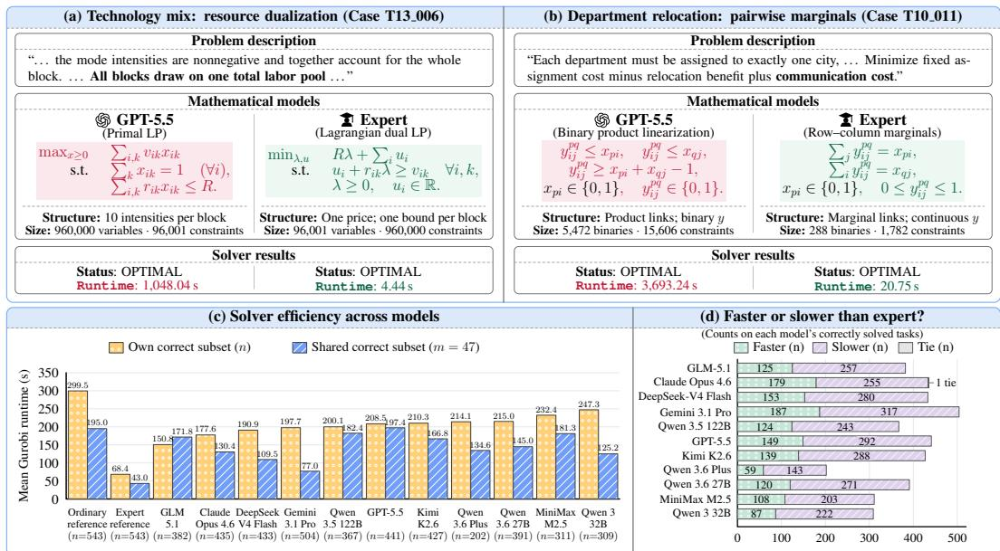  
Figure 1: Matching optimal values can conceal different computational costs. Panels (a,b) present two case studies comparing GPT-5.5-generated and expert formulations on identical inputs; each pair reaches matching optimal objective values. (a) Technology mixing case. Production blocks share a labor budget. The generated primal LP models each block–mode intensity; the expert dual LP uses one resource-price variable and one bound variable per block. The generated model requires about 236× the recorded Gurobi solver time of the expert reference. (b) Department relocation case. Departments are assigned to cities with communication costs between them. The generated model uses binary interaction variables; the expert links continuous interaction variables to binary assignments through row and column sums. The generated model requires about 178× the recorded Gurobi solver time of the expert reference. (c) Mean Gurobi runtimes compare LLM-generated models with ordinary and expert reference baselines, using correctly solved tasks in the reference cost subset (gold) and its 47 tasks solved correctly by all 11 LLMs (blue). Expert references have the lowest means in both views; the gold subsets can differ across methods. (d) Green, purple, and gray bars count programs that are faster, slower, or tied with the expert on correctly solved tasks. For every LLM, most take longer than the expert, showing that numerical agreement alone does not establish efficient modeling.

Answering this question requires tasks that allow us to compare different modeling approaches and their computational costs. The two case studies in Figure 1(a,b) illustrate why: in technology mixing, the expert uses resource prices in a dual LP rather than explicitly modeling every production intensity; in department relocation, it retains binary assignments but represents their interactions with continuous variables linked through row and column sums. Both expert references attain the same optimal objective values as the corresponding GPT-5.5-generated models with substantially less recorded solver time (see Appendix G.1 for the mathematical checks). To study such decisions systematically, we complement recent work on solver efficiency and strategy-aware optimization modeling (Zhao et al., 2026; Kong et al., 2026a) with tasks designed around problem structures to which specific expert modeling techniques apply. Each task includes ordinary and expert references on the same data: the ordinary reference provides a conventional mathematical model and solver code, while the expert reference applies a selected technique. Two OptTips examples in Figure 3 illustrate this distinction: replacing a loose Big-M constant with a tighter valid one derived from variable bounds, and adding a valid inequality to strengthen an LP relaxation. These contrasts let us examine LLM modeling choices beyond answer correctness. Comparing the generated models and code with the paired references allows us to assess correctness, technique use, and computational cost separately.

We first curate OptTips, a knowledge base of 50 expert modeling techniques in eight families, drawn from optimization textbooks, research literature, and solver documentation. Here, optimization modeling techniques are reusable ways to exploit mathematical structure when representing a problem for a solver or organizing it into coordinated submodels. OptTips contains 50 technique cards, one structured entry per technique. Each card explains when and how to apply the technique and which inefficiency it targets, with a mathematical example. To our knowledge, OptTips is the first expert-curated technique catalog designed to construct an LLM optimization-modeling benchmark that separately evaluates technique use and computational cost. Using this knowledge, we develop OptDachshund, a multi-agent framework for constructing tasks that test technique use. Its six agents match techniques to source problems, redesign, audit, and repair tasks, and build and validate ordinary and expert reference implementations on the same instance. Solver validation and independent expert review yield EfficientOpt, a benchmark of 561 problems spanning 29 targettechnique groups. Each task includes a natural-language description, numerical data, and paired references for cost comparisons. Withholding references and target-technique labels tests whether LLMs independently recognize problem structure and apply suitable techniques.

Evaluation of 11 representative LLMs on this benchmark reveals five main findings: 1) Correct answers can still be costly. Expert references have lower recorded mean solver runtimes (Figure 1(c)). For every LLM, most programs returning correct objective values take longer to solve than the corresponding expert implementation (Figure 1(d)). 2) A few slow cases dominate total solver time. Similar median solve times can hide different mean costs; across models, the slowest tenth consumes roughly 70% of measured solver time on correctly solved tasks (Figure 10(b); Table 5). 3) Smaller formulations are not necessarily faster. Our analysis compares variable, linear-constraint, and matrix-nonzero counts with solver runtimes (Section 4.4). 4) Technique use and observed cost are distinct. Case studies identify different formulations attaining the same optimal value at similar recorded cost (Section 4.4). 5) Efficiency extends beyond solver runtime. Faster solving can be offset by longer model-construction time (Section 4.5). We also report memory use (Table 10).

Our contributions are fourfold: 1) OptTips. We curate 50 techniques in eight families into a knowledge base linking problem structure and inefficiency symptoms to expert modeling actions. 2) OptDachshund. We develop a multi-agent framework that uses OptTips to construct tasks in three stages: match and reformulate, audit and repair, and build and validate. 3) EfficientOpt. We construct a 561-task benchmark with ordinary and expert references and hidden technique labels to evaluate correctness, technique use, and computational efficiency separately. 4) Experiments and findings. Our study of 11 LLMs examines correctness, technique use, model size, and generation, construction, solver, and memory costs. We find that correct objective values and compact formulations can still come at substantial cost, and compare alternative modeling choices with expert references. The EfficientOpt dataset, evaluation code, and OptTips knowledge cards are available in our public repository.

## 2 RELATED WORK

Due to space constraints, we discuss only the most closely related work here and defer a broader review to Appendix A. 1) Expert knowledge for optimization modeling. OptiMind (Zhang et al., 2025) uses expert hints to guide training and inference. In concurrent work, OptSkills (Yang et al., 2026b) distills modeling and solving trajectories into reusable workflows for inference. These methods use knowledge to assist generation. Our additional contribution is to turn individual techniques into specifications for constructing evaluation tasks. Our OptTips specifies applicability conditions and modeling actions, such as deriving tighter valid Big-M constants from variable bounds. Our OptDachshund turns these specifications into test problems and paired reference implementations. The target techniques and references are hidden from evaluated LLMs, so the benchmark tests independent technique selection and application. 2) Evaluating modeling quality and efficiency. SAGE (Zhao et al., 2026) trains LLMs with correctness and solver-efficiency feedback and compares formulations generated by different models. In concurrent work, FrontierOR (Kong et al., 2026a) evaluates algorithm quality and runtime against one representative Gurobi reference per task. Their reported evaluations do not provide a conventional/expert reference pair tied to a designated mod eling technique. Our EfficientOpt adds this pair for each task on identical data, making the contrast between conventional and expert modeling explicit. We inspect technique use and separately assess numerical correctness, model-construction cost, and solving cost. This distinguishes technique adoption from efficient implementation and recognizes efficient solutions using other techniques.

## 3 BENCHMARK CONSTRUCTION

Definition 1 (Optimization modeling). An optimization task is $p = ( q , I , \mathcal { O } )$ , where q specifies the problem in natural language, I is the fixed numerical input, and O specifies the required outputs and accuracy. Optimization modeling constructs a solution procedure $\widehat { \mathcal { A } } = ( \widehat { \mathcal { M } } , \widehat { C } )$ , where $\widehat { \mathcal { M } }$ is a mathematical representation and $\widehat { C }$ is its executable implementation. The representation specifies variables, domains, objectives, and constraints, in a single formulation or coordinated submodels. The implementation handles any submodel coordination, stopping rules, and required answer recovery. A valid procedure must respect the problem semantics and satisfy O: an optimal value alone is insufficient when original decisions are required. Different valid procedures may use different variables and feasible sets. Modeling techniques, such as tighter bounds, dualization, or decomposition, exploit problem structure in choosing and implementing these representations.

Definition 2 (Modeling efficiency). For the same task p and required answer quality, modeling efficiency concerns the time and memory needed to produce and execute a valid solution procedure. Lower cost indicates greater efficiency only for the stated resource, accounting scope, and execution conditions; time and memory are assessed separately. We distinguish generation, which produces ${ \widehat { A } } ,$ from execution, which runs $\widehat { C }$ on I. Execution includes data preparation, model construction, all solver calls, computation between calls, and answer recovery. Model construction specifically means executing code to instantiate variables, objectives, and constraints. Thus, faster solving can be offset by longer construction time, and neither smaller models nor technique adoption guarantees lower cost. Complete request costs also include retries, repairs, and checking. Appendix I details the definitions and the stages our measurements cover.

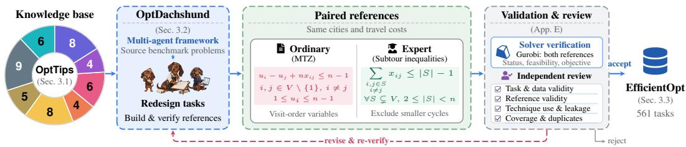  
Figure 2: Benchmark construction overview. Our knowledge base OptTips (Sec. 3.1) guides our multi-agent framework OptDachshund (Sec. 3.2) to build tasks and paired references. Gurobi verification and independent expert review (Appendix E) lead to revision, rejection, or acceptance into our benchmark EfficientOpt (Sec. 3.3). The example seeks the cheapest tour visiting every city once. MTZ uses continuous visit-order variables ui (excluding reference city 1); the expert model forbids disconnected cycles within each smaller city subset S. Here, V contains n cities and binary $\boldsymbol { x } _ { i j }$ selects travel from city i to a different city j. Both models share travel costs and one-arrival/one-departure constraints, omitted for clarity.

Overview. Figure 2 summarizes the construction workflow. We first curate our knowledge base OptTips (detailed in Sec. 3.1), whose cards specify when and how to apply modeling techniques. Guided by these cards, our multi-agent framework OptDachshund (detailed in Sec. 3.2) matches techniques to source problems, redesigns tasks, and builds paired ordinary/expert models with solver code on identical data. The resulting candidates then undergo solver verification and independent expert review (detailed in Appendix E) to check task and reference validity, technique use, leakage, and diversity. Failed checks trigger revision and re-verification; unresolved cases are rejected. Validated candidates form our benchmark EfficientOpt (detailed in Sec. 3.3).

## 3.1 OPTTIPS: EXPERT MODELING KNOWLEDGE

OptTips makes expert modeling knowledge explicit for task construction and evaluation. Drawing on optimization textbooks (Williams, 2013; Bertsimas & Tsitsiklis, 1997; Nemhauser & Wolsey, 1988; Boyd & Vandenberghe, 2004; Birge & Louveaux, 2011), research literature (Dantzig & Wolfe, 1960; Benders, 1962; McCormick, 1976; Margot, 2010; Vielma, 2015), and solver documentation (Gurobi Optimization, 2026a;c;d; IBM, n.d.; MOSEK ApS, 2025), we curate 50 modeling techniques, each represented by a structured technique card. The collection spans foundational formulation choices and advanced methods across eight primary methodological families (Figure 3). Its breadth concerns reusable modeling mechanisms, from bounds and reformulations to decomposition and structured optimization; 50 is the current collection size, not an exhaustive taxonomy. Appendix J provides the complete technique inventory, coverage rationale, and card schema. The full cards are available in our public repository.

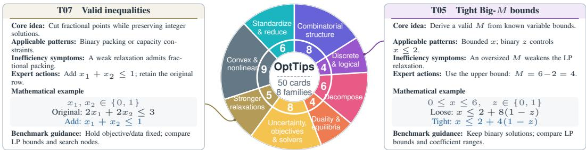  
Figure 3: OptTips: 50 cards in eight families, with two abbreviated examples showing the seven-field structure. Full card examples appear in Appendix J (Figures 12 and 13).

Each OptTips card has seven fields. Taking the tight Big-M bounds card in Figure 3 as an example, we explain what each field records. The (1) identifier provides a reference label, here T05. The (2) core idea states the mathematical principle: derive a tight, valid M from known variable bounds. The (3) applicable patterns specify when the technique applies, such as encoding $z = 1 \Rightarrow x \leq 2$ with binary z and $0 \leq x \leq 6$ . The (4) inefficiency symptoms describe what needs improvement; here, an oversized M leaves the LP relaxation unnecessarily loose. To address this, the (5) expert actions give the concrete modeling step: use the bound $x \leq 6$ to replace $M = 8$ with $M = 6 - 2 = 4$ The (6) mathematical example expresses the change in equations, comparing $x \leq 2 + 8 ( 1 - z )$ with $x \leq 2 + 4 ( 1 - z )$ . Both have the same binary feasible solutions, but at relaxed $\begin{array} { r } { z = \frac { 1 } { 2 } } \end{array}$ , the upper bound on x falls from 6 to 4. Finally, the (7) benchmark guidance explains how to construct and compare test models. For this technique, it calls for paired models with the same task, data, and objective: check that binary feasible solutions are unchanged, then compare LP objective bounds, coefficient ranges, and solve times. Appendix J provides eight full card examples, one per family.

We use OptTips to guide benchmark construction and to examine LLM modeling choices. During construction, a card specifies the problem structure needed for a technique and the change to implement in the expert reference. OptDachshund uses this information to redesign source problems and build ordinary and expert references for the same final task and data (Section 3.2). We assess technique use with an LLM judge across all generated programs and inspect selected cases manually (Appendices F.1 and F.3); Appendix G.1 gives case-level mathematical checks and their limitations. We assess efficiency from recorded runtime and resource use, independently of technique adoption.

## 3.2 OPTDACHSHUND: MULTI-AGENT BENCHMARK CONSTRUCTION

OptDachshund is a multi-agent framework that uses OptTips to transform source problems into candidate tasks with ordinary and expert reference implementations. Its six agents work in three stages: (1) match and reformulate, (2) audit and repair, and (3) build and validate (Figure 4).

Source problems. We draw problems from MAMO EasyLP and ComplexLP (Huang et al., 2025b), and OptMATH (Lu et al., 2025). We select self-contained problems that can be adapted to test an OptTips technique, with solutions we can check using the benchmark’s solvers. Unclear or incomplete statements and duplicate or near-duplicate templates are flagged for revision or removal.

1) Match and reformulate. The Technique Matcher selects an OptTips technique and proposes how to modify a source problem to test its use. The Reformulation Designer then writes the revised problem statement and data schema and prepares a formulation and solution for internal validation. For example, T35 001 tests variable elimination in an allocation problem where each group’s allocations must sum to a fixed total. Once all but

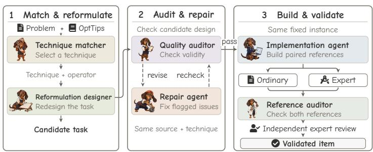  
Figure 4: OptDachshund workflow: from source problems to validated tasks with ordinary and expert references.

one allocation are chosen, the remaining allocation is determined by subtraction. Its variable can therefore be replaced by the total minus the other allocations, with its lower and upper bounds imposed on that expression. The public statement gives the task requirements without revealing the intended technique, so the evaluated LLM must choose its own modeling approach.

2) Audit and repair. The Quality Auditor checks that the statement and data define a clear problem. It then checks whether the model correctly represents the stated decisions, constraints, and objective, and whether the selected technique applies. It also looks for duplicate tasks and hints that reveal the intended technique. The Repair Agent fixes the reported problems and returns the task for another check. For minor revisions, we keep the source problem and selected technique unchanged. If a revision changes the task requirements or the technique, we repeat the full audit.

3) Build and validate. After the design audit, the Reference Implementation Agent builds ordinary and expert references for the same redesigned task, data, and required outputs. The ordinary reference uses a conventional approach; the expert applies the selected technique. The Reference Audit Agent checks their formulations, code, and solver results. Appendix H gives implementation details and an example prompt. At least two experts review each candidate independently: one check the public specification and another examines both references. A third expert resolves substantive disagreements. Reference runs and optimality evidence verify the answers. We require correct solutions and valid technique use. Appendix E explains the review criteria and revision process.

## 3.3 EFFICIENTOPT: BENCHMARK COMPOSITION AND INTERFACE

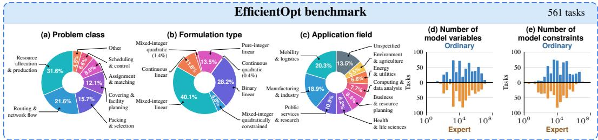  
Figure 5: Task composition and reference model sizes for the 561 tasks in EfficientOpt. (a–c) Problem classes, formulation types of ordinary references, and application fields. (d,e) Variable and constraint counts for ordinary (blue, above) and expert (orange, below) references, shown on logarithmic horizontal axes. Appendix B gives the classifications and counting rules. (The visual presentation is inspired by the elegant design of Fig. 1 in Kong et al. (2026a).)

The resulting benchmark EfficientOpt contains 561 test tasks. These tasks span different problem classes and application fields, with reference models that vary in formulation type and size (Figure 5). 1) Problem classes. The tasks cover eight classes, including resource allocation and production (31.6%), routing and network flow (21.6%), and scheduling and control (6.6%). Two small classes are grouped as Other in Figure 5(a). 2) Formulation types. The ordinary reference models fall into seven types, including mixed-integer linear (40.1%), binary linear (28.2%), and continuous linear (11.6%); quadratic formulations are also represented (Figure 5(b)). 3) Applicationfields. The tasks cover eight named fields, including mobility and logistics, manufacturing and industry, and health and life sciences. Tasks without a clear application context are labeled Unspecified (Figure 5(c)). 4) Reference-model sizes. Across all 561 tasks, reference model sizes span several orders of magnitude (Figure 5(d,e)). We take the maximum variable and total constraint counts over each reference’s models before presolve. Expert references have fewer variables in 43.1% of pairs and fewer constraints in 51.0%. Appendix B details the classifications and counting rules.

Task interface. The task interface specifies what an LLM receives and what it must produce. Each task provides a natural-language problem statement, specifying the required outputs, and a schema for the input data. The LLM writes executable solver code for its chosen formulation. We run the code on the task’s fixed numerical instance using Gurobi. The technique label, both reference implementations, and validation records are hidden from the LLM.

Paired references. The ordinary reference uses a conventional approach, while the expert reference applies the selected OptTips technique to the same task and data. We use verified task objectives to check the LLM’s numerical answer and reference execution records to compare construction and solver costs separately. An LLM judge assesses technique use from code, with manual inspections of selected cases (Appendices F.1 and F.3). A different approach can also produce a correct, efficient solution. Section 4.1 defines the numerical checks and cost measures.

## 4 EXPERIMENTS

We evaluate LLM-generated programs in terms of numerical correctness, computational cost, and modeling choices. Four questions guide our analysis: RQ1: How does numerical accuracy vary across tasks? RQ2: For correctly solved tasks, how do computational costs compare with the ordinary and expert references? RQ3: Do smaller models solve faster, and which modeling techniques do LLMs use? RQ4: What time and memory costs are missed when we measure only solver time?

## 4.1 EXPERIMENTAL SETUP

Tasks and evaluation. We evaluate the 11 general-purpose LLMs in Table 1 on all 561 EfficientOpt tasks. We executed each task three times on the same machine with the same settings. Recorded results varied slightly, so the main tables report a typical run. Each LLM generates solver code from the problem description. We count a run as numerically correct if Gurobi returns OPTIMAL and its finite objective matches the verified reference value (absolute and relative tolerances: 10−6). Appendix B details task statistics, code generation, and answer verification; Appendix C adds accuracy breakdowns and detailed cost analyses. We also evaluate five fine-tuned models. Their low accuracy limits efficiency comparisons, so we report their accuracy and failure analysis separately in Appendix C.6.

Evaluation metrics. We report accuracy, technique use, and code generation and execution costs:

• Accuracy (%): percentage of all 561 tasks solved correctly under the numerical check above.

• Runtime (s): elapsed optimization time reported by Gurobi.

• Work (units): Gurobi’s measure of the computation performed by the solver.

• Build (s): recorded preparation time, including preprocessing and any solves within that stage.

• Build+opt (s): Build plus elapsed time in the separately timed solver calls.

• API latency (s): time for the final generation call, including service and network delays.

• Tokens: provider-reported input, output, and, where available, reasoning token counts.

• RSS: RAM occupied by the process, sampled during model preparation and solving.

• Gurobi peak: peak memory allocated within the Gurobi environment.

Appendix D gives the measurement boundaries and comparison rules.

## 4.2 NUMERICAL OUTCOMES VARY ACROSS TASKS (RQ1)

An optimal solver status is not sufficient. Gurobi solves the supplied model, which may omit required constraints. Of 6,171 generated programs, 4,602 report OPTIMAL, but 338 of these return incorrect objective values. We therefore verify numerical answers before comparing costs: solving an incorrect model quickly does not establish an efficiency gain.

Overall accuracy hides large differences across tasks. The models are much more successful on some task types than others. Across the evaluated models, accuracy is 93.9% on tasks that split into independent subproblems, but only 27.3% on the five tasks targeting column generation (adding variables as needed during optimization). Success on one kind of problem therefore does not ensure reliable answers on another. Results by task group show where errors recur and closer inspection i needed (see Appendix C.2 for accuracy breakdowns by task group).

## 4.3 CORRECT ANSWERS CAN STILL BE COSTLY (RQ2)

Correct answers still leave room for faster solving. Table 1 compares costs with both references on each LLM’s eligible tasks. All 11 LLMs have lower aggregate Runtime than the ordinary reference, but higher Runtime than the expert (ratios 1.49–2.03). Higher Work ratios show that this gap also appears in measured solver effort. Including model preparation does not close it: every Build+opt ratio against the expert remains above one. Thus, outperforming a conventional implementation leaves room to reduce computational cost. Using both references makes this visible; an ordinary-

Table 1: Numerical accuracy and computational cost. Accuracy uses all 561 tasks. Cost ratios use complete measurements on correctly solved tasks within the 543-task reference cost subset (LLM/reference; below 1 means lower cost). See Appendix D for metric definitions and cost-ratio calculations.
<table><tr><td rowspan="2"></td><td colspan="2">Correct answers</td><td colspan="4">Cost ratio (LLM/reference)</td></tr><tr><td></td><td></td><td colspan="2">Runtime</td><td></td><td>Work Build+opt</td></tr><tr><td>Model</td><td></td><td></td><td>Count ↑ Rate (%) ↑ Ordinary ↓ Expert ↓ Expert ↓</td><td></td><td></td><td>Expert↓</td></tr><tr><td>Gemini 3.1 Pro</td><td>512</td><td>91.3</td><td>0.52</td><td>1.68</td><td>1.98</td><td>1.43</td></tr><tr><td>GPT-5.5</td><td>447</td><td>79.7</td><td>0.58</td><td>1.79</td><td>2.08</td><td>1.64</td></tr><tr><td>Claude Opus 4.6</td><td>442</td><td>78.8</td><td>0.46</td><td>1.49</td><td>1.77</td><td>1.42</td></tr><tr><td>DeepSeek-V4 Flash</td><td>441</td><td>78.6</td><td>0.49</td><td>1.62</td><td>1.78</td><td>1.47</td></tr><tr><td>Kimi K2.6</td><td>433</td><td>77.2</td><td>0.55</td><td>1.79</td><td>2.02</td><td>1.59</td></tr><tr><td>Qwen 3.6 27B</td><td>394</td><td>70.2</td><td>0.61</td><td>1.94</td><td>1.97</td><td>1.99</td></tr><tr><td>GLM-5.1</td><td>390</td><td>69.5</td><td>0.50</td><td>1.68</td><td>1.92</td><td>1.44</td></tr><tr><td>Qwen 3.5 122B</td><td>369</td><td>65.8</td><td>0.55</td><td>1.82</td><td>1.99</td><td>1.73</td></tr><tr><td>MiniMax M2.5</td><td>315</td><td>56.1</td><td>0.59</td><td>1.80</td><td>2.01</td><td>1.77</td></tr><tr><td>Qwen 3 32B</td><td>313</td><td>55.8</td><td>0.66</td><td>2.03</td><td>2.08</td><td>1.83</td></tr><tr><td>Qwen 3.6 Plus</td><td>208</td><td>37.1</td><td>0.52</td><td>1.83</td><td>2.22</td><td>1.63</td></tr></table>

reference comparison alone would miss the remaining gap to expert performance.

A few slow solutions account for most solving time. For each LLM, the slowest ∼10% of runs with correct objective values and valid timings consume 68.4–76.2% of total Runtime (Figure 6). Median runtimes are 23.1–36.0 seconds, but summed Runtime over each model’s eligible tasks is 12.0–27.7 hours. Appendix C.7 identifies the slow tasks for all 11 models and compares them with the expert references. As a sensitivity calculation, halving only the slowest tenth would reduce total solver time by 34.2–38.1% without changing any model’s median.

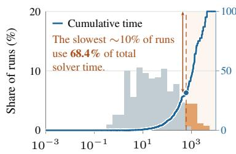

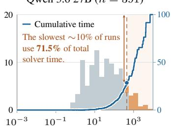

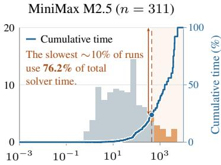  
Figure 6: Runtime distributions and cumulative time. Bars show the percentage of runs in each time interval (left axis). Blue curves show the share of total Runtime used by runs at or below each runtime (right axis). Orange highlights the slowest ∼10%; arrows show their contribution to total time. Only correctly solved tasks with valid timings are included. See Appendix C.3 for per-model runtime statistics.

## 4.4 MODELING CHOICES AND SOLVER EFFICIENCY (RQ3)

Smaller models do not necessarily solve faster. Of the 735 outputs that passed our numerical checks and had smaller reported models than their expert references, 449 (61.1%) still took longer to solve (Figure 7(a)). Variable and constraint counts describe model size, but they do not fully capture how difficult the problem is for the solver. We therefore measure Runtime directly to assess whether a smaller model is faster to solve. Appendix C.4 reports per-model results under two size criteria and examines the magnitude of the slowdowns.

(a)  
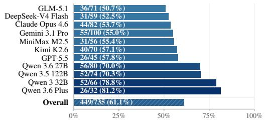

(b)  
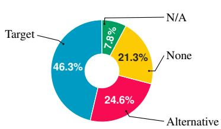  
Figure 7: Size and technique use. (a) Among correct programs with smaller formulations, how many are slower than the expert? Labels give slower/total; the striped bar combines all 11 LLMs. (b) Technique-use labels for 6,171 programs. Appendix C.4 analyzes size and runtime; Appendix F.1 details technique use.

The same answer can come from different modeling choices. In department relocation (T10 011), GPT-5.5 adds binary variables to represent pairs of department assignments. The expert represents these interactions with continuous variables linked to the original assignments, reducing the binary count from 5,472 to 288. These formulations differ in variable types and linking constraints, distinctions that objective values and runtimes alone do not reveal. Appendix G.1 explains their integer equivalence and different LP relaxations.

LLMs use different modeling approaches. Each task has a designated OptTips technique. Our LLM-based assessment identifies it or an equivalent implementation in 46.3% of programs, and another technique in 24.6% (Figure 7(b)). These labels do not establish correctness or speed. For T13 006, Gemini models technology allocations directly, while the expert reformulates the problem using resource prices. Both return the same objective, with recorded preparation and solving times (Build+opt) of 16.18 and 16.27 seconds. Appendix F.1 gives technique-use breakdowns by model and task group; Appendix G examines the costs and limits of this comparison.

## 4.5 SOLVING IS ONLY PART OF THE COST (RQ4)

Model preparation can change which implementation is faster. Among 4,202 correct runs in the cost subset, 17.3% spend longer on Build than on optimization. Adding Build to the externally timed optimization stage reverses the LLM–expert speed comparison in 8.6% of 4,148 pairs. These reversals occur for all 11 LLMs. Appendix C.5 gives per-model results and sensitivity checks; Appendix G.2 shows how construction offsets faster solving on T20 011.

Waiting for generated code can take longer than running it. Across all available responses, permodel median API latency ranges from 14.0 to 231.2 seconds. Among 4,202 correct runs with both measurements, generation takes longer than recorded construction and solving (Build+opt) in 55.6% of cases, rising to 76.2% for Qwen 3.6 27B and 74.1% for Qwen 3 32B. Appendix C.5 compares generation latency and token profiles across models.

Typical memory use can hide demanding cases. Across all 4,202 correct runs in the cost analysis, median Gurobi peak is 0.135 GB, while the 90th percentile is 2.314 GB and 224 runs (5.3%) reach at least 4 GB. Appendix C.5 compares solver and process memory across models.

## 5 DISCUSSION AND CONCLUSION

We introduced OptTips, which codifies 50 expert techniques in knowledge cards linking problem structure and inefficiency symptoms to concrete modeling actions. OptDachshund turns this knowledge into a six-agent workflow for task reformulation, auditing, repair, and paired reference construction and validation. EfficientOpt provides 561 tasks with ordinary and expert implementations on the same instances, allowing numerical correctness, technique use, and computational cost to be evaluated separately. Across the 11 evaluated LLMs, programs returning correct objective values use less aggregate Gurobi solver time than ordinary references but more than expert references on comparable task subsets. Smaller formulations can still solve more slowly, and model preparation can offset faster solving. Future work can extend this evaluation across solvers, instance scales, and iterative methods. Progress should be assessed by both solution correctness and computational cost.

## REFERENCES

Ali AhmadiTeshnizi, Wenzhi Gao, and Madeleine Udell. OptiMUS: Scalable optimization modeling with (MI)LP solvers and large language models. In Proceedings of the 41st International Conference on Machine Learning, volume 235 of Proceedings of Machine Learning Research, pp. 577–596. PMLR, 2024.

Nicolas Astorga, Tennison Liu, Yuanzhang Xiao, and Mihaela Van Der Schaar. Autoformulation´ of mathematical optimization models using LLMs. In Proceedings of the 42nd International Conference on Machine Learning, volume 267 of Proceedings of Machine Learning Research, pp. 1864–1886. PMLR, 2025.

J. F. Benders. Partitioning procedures for solving mixed-variables programming problems. Numerische Mathematik, 4:238–252, 1962. doi: 10.1007/BF01386316.

Dimitris Bertsimas and John N. Tsitsiklis. Introduction to Linear Optimization. Athena Scientific, 1997. ISBN 9781886529199.

John R. Birge and Franc¸ois Louveaux. Introduction to Stochastic Programming. Springer, 2nd edition, 2011. ISBN 9781461402367. doi: 10.1007/978-1-4614-0237-4.

Stephen Boyd and Lieven Vandenberghe. Convex Optimization. Cambridge University Press, 2004. ISBN 9780521833783. doi: 10.1017/CBO9780511804441.

Stephen Boyd, Neal Parikh, Eric Chu, Borja Peleato, and Jonathan Eckstein. Distributed optimization and statistical learning via the alternating direction method of multipliers. Foundations and Trends in Machine Learning, 3(1):1–122, 2011.

Xingyu Chen, Jiahao Xu, Tian Liang, Zhiwei He, Jianhui Pang, Dian Yu, Linfeng Song, Qiuzhi Liu, Mengfei Zhou, Zhuosheng Zhang, Rui Wang, Zhaopeng Tu, Haitao Mi, and Dong Yu. Do not think that much for 2+3=? on the overthinking of long reasoning models. In Proceedings of the 42nd International Conference on Machine Learning, volume 267 of Proceedings ofMachine Learning Research, pp. 9487–9499. PMLR, 2025a.

Yitian Chen, Jingfan Xia, Siyu Shao, Dongdong Ge, and Yinyu Ye. Solver-informed RL: Grounding large language models for authentic optimization modeling. In Advances in Neural Information Processing Systems, volume 38, pp. 106027–106069, 2025b.

Antonio J. Conejo, Miguel Carrion, and Juan M. Morales. ´ Decision Making Under Uncertainty in Electricity Markets, volume 153 of International Series in Operations Research & Management Science. Springer, 2010. ISBN 9781441974204. doi: 10.1007/978-1-4419-7421-1.

George B. Dantzig and Philip Wolfe. Decomposition principle for linear programs. Operations Research, 8(1):101–111, 1960. doi: 10.1287/opre.8.1.101.

Zezhen Ding, Zhen Tan, Jiheng Zhang, and Tianlong Chen. OR-R1: Automating modeling and solving of operations research optimization problem via test-time reinforcement learning. In Proceedings of the AAAI Conference on Artificial Intelligence, volume 40, pp. 228–236, 2026. doi: 10.1609/aaai.v40i1.36983.

Google. The job shop problem. OR-Tools documentation, 2024. CP-SAT interval variables and NoOverlap constraints; accessed 2026-09-21.

Gurobi Optimization. Gurobi Optimizer Reference Manual: Constraints, 2026a. SOS, indicator, piecewise-linear, and general constraints; accessed 2026-09-21.

Gurobi Optimization. Gurobi Optimizer Reference Manual: Model attributes, 2026b. Runtime, Work, MemUsed, and MaxMemUsed; accessed 2026-09-17.

Gurobi Optimization. Gurobi numerical guidelines: Tolerances and user-scaling, 2026c. Accessed 2026-09-17.

Gurobi Optimization. Gurobi Optimizer Reference Manual: Variable attributes, 2026d. Starts, hints, priorities, and basis attributes; accessed 2026-09-17.

Gurobi Optimization. What is performance variability?, 2026e. Official support documentation; accessed 2026-09-17.

Chenyu Huang, Zhengyang Tang, Shixi Hu, Ruoqing Jiang, Xin Zheng, Dongdong Ge, Benyou Wang, and Zizhuo Wang. ORLM: A customizable framework in training large models for automated optimization modeling. Operations Research, 73(6):2986–3009, 2025a. doi: 10.1287/ opre.2024.1233.

Xuhan Huang, Qingning Shen, Yan Hu, Anningzhe Gao, and Benyou Wang. Llms for mathematical modeling: Towards bridging the gap between natural and mathematical languages. In Findings of the Associationfor Computational Linguistics: NAACL 2025, pp. 2678–2710, 2025b.

IBM. Best practices with indicator constraints, n.d. CPLEX 12.9.0 documentation; accessed 2026- 09-21.

Caigao Jiang, Xiang Shu, Hong Qian, Xingyu Lu, Jun Zhou, Aimin Zhou, and Yang Yu. LLMOPT: Learning to define and solve general optimization problems from scratch. In The Thirteenth International Conference on Learning Representations, 2025.

Ed Klotz and Alexandra M. Newman. Practical guidelines for solving difficult linear programs. Surveys in Operations Research and Management Science, 18(1–2):1–17, 2013. doi: 10.1016/j. sorms.2012.11.001.

Minwei Kong, Chonghe Jiang, Ao Qu, Wenbin Ouyang, Zhaoming Zeng, Xiaotong Guo, Zhekai Li, Junyi Li, Yi Fan, Xinshou Zheng, et al. Frontieror: Benchmarking llms’ capacity for efficient algorithm design in large-scale optimization. arXiv preprint arXiv:2605.25246, 2026a.

Minwei Kong, Ao Qu, Xiaotong Guo, Wenbin Ouyang, Chonghe Jiang, Han Zheng, Yining Ma, Dingyi Zhuang, Yuhan Tang, Junyi Li, et al. Alphaopt: Formulating optimization programs with self-improving llm experience library. In Proceedings ofthe 32nd ACM SIGKDD Conference on Knowledge Discovery and Data Mining V. 2, pp. 2389–2400, 2026b.

Zhong Li, Zihan Guo, Xiaohan Lu, Juntao Wang, Jie Song, Chao Shen, Jiageng Wu, and Mingyang Sun. OptArgus: A multi-agent system to detect hallucinations in LLM-based optimization modeling. arXiv preprint arXiv:2605.11738, 2026a. doi: 10.48550/arXiv.2605.11738.

Zhong Li, Qi Huang, Yuxuan Zhu, Mohammad Mohammadi Amiri, Niki van Stein, Thomas Back,¨ Matthijs van Leeuwen, Zaiwen Wen, and Lincen Yang. MM-OptBench: A solver-grounded benchmark for multimodal optimization modeling. arXiv preprint arXiv:2605.12154, 2026b. doi: 10.48550/arXiv.2605.12154.

Zhong Li, Hongliang Lu, Tao Wei, Yuxuan Chen, Wenyu Liu, Yuan Lan, Fan Zhang, and Zaiwen Wen. Constructing industrial-scale optimization modeling benchmark. In Proceedings ofthe 43rd International Conference on Machine Learning, 2026c.

Haoyang Liu, Jie Wang, Yuyang Cai, Xiongwei Han, Yufei Kuang, and Jianye Hao. OptiTree: Hierarchical thoughts generation with tree search for LLM optimization modeling. In Advances in Neural Information Processing Systems, volume 38, pp. 120713–120781, 2025.

Haoyang Liu, Yuyang Cai, Jie Wang, Xiongwei Han, Minyang Hu, Shuqi LIU, Mingxuan Yuan, Jianye HAO, and Feng Wu. Opt-miner: Empowering information-seeking agent with tree-guided data synthesis for optimization modeling. In Forty-third International Conference on Machine Learning, 2026a.

Haoyang Liu, Jie Wang, Boxuan Niu, Xiongwei Han, Yian Xu, Mingxuan Ye, Zijie Geng, Fangzhou Zhu, Tao Zhong, Mingxuan Yuan, et al. Opt-verifier: Unleashing the power of llms for optimization modeling via dual-side verification. In Proceedings of the 43rd International Conference on Machine Learning, 2026b.

Andrea Lodi and Andrea Tramontani. Performance variability in mixed-integer programming. In Theory Driven by Influential Applications, INFORMS TutORials in Operations Research, pp. 1–12. INFORMS, 2013. doi: 10.1287/educ.2013.0112.

Hongliang Lu, Zhonglin Xie, Yaoyu Wu, Can Ren, Yuxuan Chen, and Zaiwen Wen. OptMATH: A scalable bidirectional data synthesis framework for optimization modeling. In Proceedings of the 42nd International Conference on Machine Learning, volume 267 of Proceedings ofMachine Learning Research, pp. 40769–40802. PMLR, 2025.

Hongliang Lu, Zhong Li, Yuxuan Chen, Yuan Lan, Fan Zhang, and Zaiwen Wen. Pearl: Solver-in-the-loop interactive optimization modeling from natural language. arXiv preprint arXiv:2607.18256, 2026.

Franc¸ois Margot. Symmetry in integer linear programming. In Michael Junger, Thomas M. Liebling,¨ Denis Naddef, George L. Nemhauser, William R. Pulleyblank, Gerhard Reinelt, Giovanni Rinaldi, and Laurence A. Wolsey (eds.), 50 Years of Integer Programming 1958–2008: From the Early Years to the State-of-the-Art, pp. 647–686. Springer, Berlin, Heidelberg, 2010. doi: 10.1007/ 978-3-540-68279-0 17.

Garth P. McCormick. Computability of global solutions to factorable nonconvex programs: Part I—convex underestimating problems. Mathematical Programming, 10:147–175, 1976. doi: 10. 1007/BF01580665.

MOSEK ApS. MOSEK Modeling Cookbook, 2025. Release 3.4.0, November 5, 2025; accessed 2026-09-21.

George L. Nemhauser and Laurence A. Wolsey. Integer and Combinatorial Optimization. John Wiley & Sons, 1988. ISBN 9780471828198. doi: 10.1002/9781118627372.

Michael L. Pinedo. Scheduling: Theory, Algorithms, and Systems. Springer, 6th edition, 2022. ISBN 9783031059209. doi: 10.1007/978-3-031-05921-6.

Rindranirina Ramamonjison, Timothy Yu, Raymond Li, Haley Li, Giuseppe Carenini, Bissan Ghaddar, Shiqi He, Mahdi Mostajabdaveh, Amin Banitalebi-Dehkordi, Zirui Zhou, and Yong Zhang. NL4Opt competition: Formulating optimization problems based on their natural language descriptions. In Proceedings ofthe NeurIPS 2022 Competitions Track, volume 220 of Proceedings of Machine Learning Research, pp. 189–203. PMLR, 2022.

Dania Refai and Moataz Ahmed. A component-level evaluation framework for diagnosing llm errors in optimization modelling. Neurocomputing, pp. 133981, 2026.

Charlie Snell, Jaehoon Lee, Kelvin Xu, and Aviral Kumar. Scaling llm test-time compute optimally can be more effective than scaling parameters for reasoning. In The Thirteenth International Conference on Learning Representations, 2025.

Paolo Toth and Daniele Vigo (eds.). Vehicle Routing: Problems, Methods, and Applications, volume 18 of MOS-SIAM Series on Optimization. Society for Industrial and Applied Mathematics, 2nd edition, 2014. ISBN 9781611973587. doi: 10.1137/1.9781611973594.

Rolf van der Hulst and Matthias Walter. Implied integrality in mixed-integer optimization. Mathematical Programming, 2026. doi: 10.1007/s10107-026-02389-3.

Juan Pablo Vielma. Mixed integer linear programming formulation techniques. SIAM Review, 57 (1):3–57, 2015. doi: 10.1137/130915303.

Haoyu Wang, Yuliang Song, Tao Li, Zhiwei Deng, Yaqing Wang, Deepak Ramachandran, Eldan Cohen, and Dan Roth. Formalize, don’t optimize: The heuristic trap in llm-generated combinatorial solvers. arXiv preprint arXiv:2605.12421, 2026.

Zhuohan Wang, Ziwei Zhu, Yizhou Han, Yufeng Lin, Zhihang Lin, Ruoyu Sun, and Tian Ding. Optibench: Benchmarking large language models in optimization modeling with equivalencedetection evaluation. OpenReview manuscript, 2024.

Zhuohan Wang, Ziwei Zhu, Ziniu Li, Congliang Chen, Yizhou Han, Yufeng Lin, Zhihang Lin, Angyang Gu, Xinglin Hu, Ruoyu Sun, et al. Orgeval: Graph-theoretic evaluation of llms in optimization modeling. arXiv preprint arXiv:2510.27610, 2025.

H. Paul Williams. Model Building in Mathematical Programming. John Wiley & Sons, 5th edition, 2013. ISBN 9781118443330.

Yangzhen Wu, Zhiqing Sun, Shanda Li, Sean Welleck, and Yiming Yang. Inference scaling laws: An empirical analysis of compute-optimal inference for llm problem-solving. In The Thirteenth International Conference on Learning Representations, 2025.

Ziyang Xiao, Dongxiang Zhang, Yangjun Wu, Lilin Xu, Yuan Jessica Wang, Xiongwei Han, Xiaojin Fu, Tao Zhong, Jia Zeng, Mingli Song, and Gang Chen. Chain-of-experts: When LLMs meet complex operations research problems. In The Twelfth International Conference on Learning Representations, 2024.

Ziyang Xiao, Jingrong Xie, Lilin Xu, Shisi Guan, Jingyan Zhu, Xiongwei Han, Xiaojin Fu, WingYin Yu, Han Wu, Wei Shi, Qingcan Kang, Jiahui Duan, Tao Zhong, Mingxuan Yuan, Jia Zeng, Yuan Wang, Gang Chen, and Dongxiang Zhang. A survey of optimization modeling meets LLMs: Progress and future directions. arXiv preprint arXiv:2508.10047, 2025. doi: 10.48550/arXiv. 2508.10047.

Beinuo Yang, Qishen Zhou, Junyi Li, Chenxing Su, Panagiotis Angeloudis, and Simon Hu. Orthought: Benchmarking and automating logistics optimization modeling via structured llm reasoning. Artificial Intelligencefor Transportation, 6:100059, 2026a.

Haochen Yang, Ke Zhao, Mengyuan Ma, Xingyu Lu, Xiangfeng Wang, and Hong Qian. OptSkills: Learning generalizable optimization skills from problem archetypes via cluster-based distillation. arXiv preprint arXiv:2605.29829, 2026b.

Zhicheng Yang, Yiwei Wang, Yinya Huang, Zhijiang Guo, Wei Shi, Xiongwei Han, Liang Feng, Linqi Song, Xiaodan Liang, and Jing Tang. OptiBench meets ReSocratic: Measure and improve LLMs for optimization modeling. In International Conference on Learning Representations, volume 2025, pp. 24726–24759, 2025.

Jingyang Yi, Jiazheng Wang, and Sida Li. Shorterbetter: Guiding reasoning models to find optimal inference length for efficient reasoning. In Advances in Neural Information Processing Systems, volume 38, 2025. doi: 10.52202/085713-1302.

Xinzhi Zhang, Zeyi Chen, Humishka Zope, Hugo Barbalho, Konstantina Mellou, Marco Molinaro, Janardhan Kulkarni, Ishai Menache, and Sirui Li. Optimind: Teaching llms to think like optimization experts. arXiv preprint arXiv:2509.22979, 2025.

Ruiqing Zhao, Fengzhi Li, Yuan Zuo, Rui Liu, YanSong Liu, Yunfei Ma, Fanyu Meng, and Junlan Feng. Strategy-aware optimization modeling with reasoning LLMs. In Forty-third International Conference on Machine Learning, 2026.

Chenyu Zhou, Tianyi Xu, Jianghao Lin, and Dongdong Ge. StepORLM: A self-evolving framework with generative process supervision for operations research language models. In International Conference on Learning Representations, volume 2026, pp. 6914–6940, 2026.

## Appendix

## Table of Contents

A Extended Related Work . . 14   
A.1 Generating and Refining Optimization Models . 14   
A.2 Expert Knowledge and Reusable Modeling Skills 15   
A.3 Benchmark Coverage and Semantic Verification . 15   
A.4 Evaluating Computational Efficiency 15   
B Benchmark Composition and Evaluation Coverage . 16   
B.1 Task Composition and Classification 16   
B.2 Evaluation Coverage and Reference Verification . 17   
B.3 Code Generation Protocol 17   
C Detailed Experimental Results 17   
C.1 Numerical Outcomes (RQ1) 17   
C.2 Accuracy Across Task Groups (RQ1) 18   
C.3 Solver Costs Across Tasks and Models (RQ2) 19   
C.4 Model Size and Solver Time (RQ3) 21   
C.5 Costs Beyond Solver Time (RQ4) 22   
C.6 Results for Fine-Tuned Models . 24   
C.7 Slow Runs and Total Solver Time (RQ2) 25   
D Evaluation Metrics and Comparison Protocol 26   
D.1 Metrics and Measurement Scope . 26   
D.2 Task Selection and Result Aggregation 27   
E Dataset Quality Control and Expert Verification 28   
E.1 Independent Review and Information Access 28   
E.2 Acceptance Criteria 28   
E.3 Decisions, Repair, and Corpus Review 29   
F Assessing Modeling Technique Use 30   
F.1 Automated Assessment of Technique Use 30   
F.2 Combining Technique Labels with Execution Outcomes 31   
F.3 Manual Inspection of Selected Modeling Choices 32   
G Case Studies on Modeling Choices and Efficiency 32   
G.1 What the Compared Formulations Preserve 32   
G.2 How Construction Changes the Cost Comparison 32   
H OptDachshund: Agent Roles and Information Flow 33   
I Task Validity and Computational Cost 34   
I.1 Valid Solution Procedures 34   
I.2 Resource Accounting and Comparison Scope 34   
J OptTips: Technique Catalog, Coverage, and Extension . 35   
J.1 Rationale and Coverage 35   
J.2 Card Structure and Extension 35   
J.3 Complete Technique Inventory . 38

## A EXTENDED RELATED WORK

We situate EfficientOpt within four connected research directions: generating optimization models, using reusable modeling knowledge, designing benchmarks and verification methods, and evaluating computational efficiency. These directions overlap: trained models can also use search, retrieval, and solver feedback during inference.

## A.1 GENERATING AND REFINING OPTIMIZATION MODELS

Inference workflows organize the steps between a problem description and executable solver code. Chain-of-Experts (Xiao et al., 2024) coordinates specialized agents, while OptiMUS (AhmadiTesh nizi et al., 2024) uses a modular workflow to formulate models, generate and debug code, and evaluate solutions. AutoFormulation (Astorga et al., 2025) and OptiTree (Liu et al., 2025) use tree search to explore candidate modeling decisions. These methods address how to construct and revise a candidate when a single generation is insufficient.

Learning-based methods improve the modeler’s parameters through specialized data and feedback. ORLM (Huang et al., 2025a) trains on synthetic optimization-modeling instructions; LLMOPT (Jiang et al., 2025) uses multi-instruction tuning for mathematical formalization and code generation. OptMATH (Lu et al., 2025) and ReSocratic (Yang et al., 2025) synthesize mathematical models and corresponding natural-language problems to support training. Solver feedback provides another source of supervision: SIRL (Chen et al., 2025b) derives rewards from executable code and instance-level model verification; StepORLM (Zhou et al., 2026) combines solver outcomes with generative process supervision. OR-R1 (Ding et al., 2026) combines supervised fine-tuning with test-time policy optimization, while PEARL (Lu et al., 2026) learns interactive execution and revision using Python and solver feedback. Together, these approaches motivate evaluating both the mathematical model and its implemented solution procedure.

## A.2 EXPERT KNOWLEDGE AND REUSABLE MODELING SKILLS

Knowledge-augmented approaches differ in what they store and how it guides modeling. Opt-Miner (Liu et al., 2026a) studies information seeking for optimization modeling. AlphaOPT (Kong et al., 2026b) maintains a library of solver-verified insights with applicability conditions, explanations, and examples. OptiMind (Zhang et al., 2025) uses expert analyses of errors within problem classes to develop guidance for training and inference. In concurrent work, OptSkills (Yang et al., 2026b) distills modeling and solving trajectories into workflows and pitfalls organized by problem archetype, then retrieves these skills during inference. Its examples include activation variables, disjunctive constraints, and Big-M formulations, demonstrating that reusable workflows already contain concrete modeling knowledge.

Our OptTips organizes knowledge at the level of individual modeling techniques for task design and formulation inspection. A card connects applicability conditions and inefficiency symptoms to modeling actions and a mathematical example. Our OptDachshund uses these specifications to redesign tasks and construct ordinary and expert reference implementations on the same numerical instance. This use of technique-level knowledge for benchmark construction complements its use as assistance during generation; the evaluated LLMs receive neither the target-technique cards nor the reference implementations.

## A.3 BENCHMARK COVERAGE AND SEMANTIC VERIFICATION

Benchmarks differ in both the problems they cover and the evidence used to assess a generated model. NL4Opt (Ramamonjison et al., 2022) studies the translation of natural-language descriptions into linear-programming formulations. ComplexOR (Xiao et al., 2024) and NLP4LP (AhmadiTeshnizi et al., 2024) extend evaluation to more complex modeling requirements and descriptions. IndustryOR (Huang et al., 2025a) and MAMO (Huang et al., 2025b) broaden application and mathematical-modeling coverage. OptiBench (Yang et al., 2025) includes linear and nonlinear problems with or without tabular data, while OptMATH (Lu et al., 2025) contributes challenging instances through its synthesis and filtering process.

Recent benchmarks extend scale and input modality. MIPLIB-NL (Li et al., 2026c) reconstructs 223 industrial MILP instances from MIPLIB 2017 as natural-language specifications with separate numerical data, using independent reconstruction and expert review to check fidelity. MM-OptBench (Li et al., 2026b) combines text with structured visuals in 780 solver-verified instances across six problem families. Its diagnostics separate input-extraction errors from formulation and implementation failures. These resources broaden the settings in which modeling capabilities can be tested.

Verification also extends beyond matching an objective value. The equivalence-oriented OptiBench (Wang et al., 2024) and the graph-based ORGEval framework and Bench4Opt dataset (Wang et al., 2025) examine structural relationships between formulations. Component-level evaluation (Refai & Ahmed, 2026) diagnoses variables, objectives, and constraints separately. OptArgus (Li et al., 2026a) audits consistency across descriptions, symbolic formulations, and code, measuring false alarms, error localization, and detection. Opt-Verifier (Liu et al., 2026b) combines structure-side and solution-side verification. These distinctions inform our separation of numerical agreement from mathematical inspection: a matching objective alone does not establish that a modeling transformation preserves the task’s required outputs.

## A.4 EVALUATING COMPUTATIONAL EFFICIENCY

Efficiency can concern generating an answer, checking it, or executing the resulting solver program. Test-time scaling and overthinking studies examine how reasoning effort translates into answer quality (Snell et al., 2025; Wu et al., 2025; Chen et al., 2025a; Yi et al., 2025). In optimization modeling,

ORThought (Yang et al., 2026a) reports token efficiency, and component-level evaluation (Refai & Ahmed, 2026) includes latency and token usage. OptArgus (Li et al., 2026a) measures the cost of running its auditor and discusses efficiency-related modeling issues in its error taxonomy. These resource scopes differ from the construction and solution of the generated optimization model.

Several works directly examine downstream computation. SAGE (Zhao et al., 2026) trains with correctness and solver-efficiency feedback from alternative modeling strategies and evaluates solver time, iterations, and formulation size. Experiments on CP-SynC-XL (Wang et al., 2026) show that efficiency-oriented prompting can yield small or inconsistent speedups and can compromise correctness through unreliable search modifications. In concurrent work, FrontierOR (Kong et al., 2026a) evaluates solution quality and runtime for LLM-designed optimization algorithms against a representative formulation and Gurobi implementation for each task. Its scope includes reformulation and decomposition, and its references are also hidden from evaluated models.

Our EfficientOpt focuses this evaluation on designated modeling techniques. Each task is constructed around an applicable technique and paired with ordinary and expert references for the same task and data. The pair makes the conventional and technique-based implementations explicit comparison points. We inspect technique adoption separately from numerical correctness and recorded generation, model-construction, solving, and memory costs. This design supports distinguishing non-adoption of the designated technique, costly implementations that adopt it, and effective alternatives. The contribution is this combination of technique-guided task construction, paired references, and separate assessments, building on existing work on modeling knowledge and computational efficiency.

## B BENCHMARK COMPOSITION AND EVALUATION COVERAGE

EfficientOpt contains 561 tasks covering 29 of the 50 OptTips techniques. The remaining 21 techniques have 63 supplementary tasks, three per technique, documented in Appendix J and excluded from the reported evaluation. This appendix describes task classification, reference verification, measurement coverage, and code generation.

## B.1 TASK COMPOSITION AND CLASSIFICATION

Problem categories and application fields. Each task receives one primary problem category and one application label based on its statement and numerical instance (Table 2). Tasks without a clear application context are labeled Unspecified. These categories describe the decision problem and its context; the target modeling technique is recorded separately.

Table 2: Task counts by problem category (left) and application field (right), each totaling 561. Figure 5(a) combines fitting and estimation with layout planning as Other (25 tasks).
<table><tr><td>Primary problem category</td><td>n</td><td>Application field</td><td>n</td></tr><tr><td>Resource allocation &amp; production</td><td>177</td><td>Mobility &amp; logistics</td><td>114</td></tr><tr><td>Routing &amp; network flow</td><td>121</td><td>Manufacturing &amp; industry</td><td>106</td></tr><tr><td>Packing &amp; selection</td><td>88</td><td>Unspecified</td><td>76</td></tr><tr><td>Covering &amp; facility planning</td><td>68</td><td>Public services &amp; research</td><td>61</td></tr><tr><td>Assignment &amp; matching</td><td>45</td><td>Business &amp; resource planning</td><td>47</td></tr><tr><td>Scheduling &amp; control</td><td>37</td><td>Health &amp; life sciences</td><td>46</td></tr><tr><td>Fitting &amp; estimation</td><td>21</td><td>Computing &amp; data analysis</td><td>43</td></tr><tr><td>Layout planning</td><td>4</td><td>Energy &amp; utilities</td><td>37</td></tr><tr><td></td><td></td><td>Environment &amp; agriculture</td><td>31</td></tr><tr><td>Total</td><td>561</td><td>Total</td><td>561</td></tr></table>

## Formulation types. We classify each

task’s ordinary reference by its objective, constraints, and variable domains before presolve. The 561 references fall into seven mutually exclusive classes: MILP (225), binary IP (158), nonbinary pure IP (76), LP (65), MIQCP (27), MIQP (8), and QP (2), as shown in Figure 5(b).

The classification follows the implemented ordinary formulation. Integer variables restricted to {0, 1} count as binary. The MILP class includes 13 ordinary reference models with linearly representable general constraints. Explicit products of decision variables retain a quadratic classification, even when a linear reformulation is possible. Stochastic and robust models can belong to these same algebraic classes.

These classifications complement the 29 target-technique groups, which contain 5–46 tasks each.   
Appendix C.2 provides the group descriptions and corresponding accuracy results.

## B.2 EVALUATION COVERAGE AND REFERENCE VERIFICATION

We evaluate 11 general-purpose LLMs on all 561 tasks, retaining one outcome per model–task pair, including generation and execution failures. Each model’s numerical accuracy uses all 561 tasks, yielding 6,171 retained outcomes in total. Cost comparisons require a correct numerical answer and the measurements needed for the relevant metric, as detailed in Appendix D.

Reference answers and cost coverage. All 561 tasks have verified reference objectives. For 543 tasks, the selected ordinary and expert executions reach optimality and agree on the objective under the cost-measurement protocol. The remaining 18 tasks are verified through supplementary refer ence executions, analytic or exact solutions, or optimality certificates on the same numerical inputs. These checks supply reference answers for accuracy; their timings are not added to the cost analysis, which retains the 543-task subset. Appendix E describes the validation criteria.

Reference model sizes. Figure 5(d,e) covers all 561 reference pairs. For each implementation, variable and total constraint counts are separate maxima over models submitted to the solver before presolve; the two maxima need not come from the same model or solver call. Repeated solves are not summed. Total constraints include native linear, quadratic, general, and SOS constraints, counting each once; variable bounds, integrality declarations, and solver-generated cuts are excluded. Counts are measured during execution or derived exactly from the implementation and fixed input where needed. Appendix C.4 instead relates runtime to the variable, linear-constraint, and nonzero counts recorded in the corresponding execution.

## B.3 CODE GENERATION PROTOCOL

Each prompt provides the problem statement and input-field descriptions. It requests a function that constructs and returns a Gurobi model; the evaluation runner supplies the complete numerical instance at execution time and invokes the solver. Some prompts also request a symbolic formulation summary. Code-only prompts include a general efficiency instruction without specifying the target technique.

## C DETAILED EXPERIMENTAL RESULTS

This appendix expands the main findings with accuracy breakdowns, cost distributions, and analyses of model size, preparation, generation, and memory use. It also reports fine-tuned-model failures (Section C.6) and identifies the slow tasks driving cumulative solver costs for all 11 general-purpose models (Section C.7). Measurement definitions and comparison rules are in Appendix D; techniqueuse assessments are in Appendix F.1.

## C.1 NUMERICAL OUTCOMES (RQ1)

All 11 general-purpose models are evaluated on the same 561 tasks using the verified reference objectives and the correctness criterion in Section 4.1. Table 3 separates correct answers, incorrect objectives returned with OPTIMAL status, and other generation or execution outcomes.

Solver status can give a different ranking from accuracy. Across 6,171 evaluations, 4,264 return correct objective values (69.1%). Of the 4,602 programs reporting OPTIMAL, 338 (7.3%) return incorrect values. For example, Claude Opus 4.6 produces more OPTIMAL results than GPT-5.5 (478 versus 470), but fewer correct answers (442 versus 447). Checking the objective therefore matters both for identifying errors and for comparing models.

Most unsuccessful evaluations end without an OPTIMAL result. The 1,569 records in Other outcome account for 82.3% of the 1,907 unsuccessful evaluations. They include generation failures, execution errors, and nonoptimal solver termination. Table 3 distinguishes these outcomes from objective errors after an optimal solve. Section C.2 examines how accuracy and objective errors vary across task groups.

Accuracy and cost comparisons use different task sets. Of the 4,264 correct evaluations, 4,202 belong to the 543-task reference cost subset; the other 62 contribute only to accuracy (Appendix B.2). All 4,202 have paired Runtime, Work, and size measurements, while 4,148 have

Table 3: Numerical outcomes on all 561 tasks per model. Correct, Objective mismatch, and Other outcome sum to 561. The OPTIMAL column is the sum of Correct and Objective mismatch.
<table><tr><td></td><td colspan="3">Mutually exclusive outcomes</td><td>Solver status</td></tr><tr><td>Model</td><td>Correct</td><td>Objective mismatch</td><td>Other outcome</td><td>OPTIMAL</td></tr><tr><td>Gemini 3.1 Pro</td><td>512</td><td>10</td><td>39</td><td>522</td></tr><tr><td>GPT-5.5</td><td>447</td><td>23</td><td>91</td><td>470</td></tr><tr><td>Claude Opus 4.6</td><td>442</td><td>36</td><td>83</td><td>478</td></tr><tr><td>DeepSeek-V4 Flash</td><td>441</td><td>25</td><td>95</td><td>466</td></tr><tr><td>Kimi K2.6</td><td>433</td><td>23</td><td>105</td><td>456</td></tr><tr><td>Qwen 3.6 27B</td><td>394</td><td>27</td><td>140</td><td>421</td></tr><tr><td>GLM-5.1</td><td>390</td><td>40</td><td>131</td><td>430</td></tr><tr><td>Qwen 3.5 122B</td><td>369</td><td>28</td><td>164</td><td>397</td></tr><tr><td>MiniMax M2.5</td><td>315</td><td>33</td><td>213</td><td>348</td></tr><tr><td>Qwen 3 32B</td><td>313</td><td>56</td><td>192</td><td>369</td></tr><tr><td>Qwen 3.6 Plus</td><td>208</td><td>37</td><td>316</td><td>245</td></tr><tr><td>Total</td><td>4,264</td><td>338</td><td>1,569</td><td>4,602</td></tr></table>

complete Build+opt measurements. Table 1 uses the same 4,148 pairs for all four cost ratios; per-model counts appear in Table 8. Missing values are excluded. The model-size analysis additionally requires compatible counting scopes and positive measurements (Section C.4).

## C.2 ACCURACY ACROSS TASK GROUPS (RQ1)

Table 4 reports accuracy across all 11 models, grouped by target OptTips technique; Figure 8 shows each model separately. The 29 groups contain 5–46 tasks each and include the modeling variants listed in the table.

Table 4: Task groups and numerical accuracy. n is the number of tasks. Correct gives the number of correctly solved cases out of all 11n model–task pairs; the last column shows the corresponding percentage. Descriptions list the modeling variants represented in each group.
<table><tr><td>ID</td><td>Techniques and formulation variants</td><td>n</td><td>Correct</td><td>Accuracy (%)</td></tr><tr><td>T01</td><td>Equality-based elimination; balance reformulations</td><td>32</td><td>249/352</td><td>70.7</td></tr><tr><td>T02</td><td>Bounds; epigraphs; persistence variants</td><td>15</td><td>93/165</td><td>56.4</td></tr><tr><td>T03</td><td>Network-flow capacities as variable bounds</td><td>19</td><td>192/209</td><td>91.9</td></tr><tr><td>T04</td><td>Tight bounds; exact relaxations; network persistence</td><td>25</td><td>177/275</td><td>64.4</td></tr><tr><td>T05</td><td>Big-M formulations; persistent project activation</td><td>19</td><td>143/209</td><td>68.4</td></tr><tr><td>T06</td><td>Indicators, semicontinuous variables, and SOS</td><td>21</td><td>177/231</td><td>76.6</td></tr><tr><td>T07</td><td>Valid inequalities; arc-persistence variants</td><td>16</td><td>146/176</td><td>83.0</td></tr><tr><td>T08</td><td>Substitution and product linearization</td><td>46</td><td>246/506</td><td>48.6</td></tr><tr><td>T09</td><td>Piecewise-linear and native compact representations</td><td>8</td><td>56/88</td><td>63.6</td></tr><tr><td>T10</td><td>Convex hulls, envelopes, and convexification</td><td>30</td><td>236/330</td><td>71.5</td></tr><tr><td>T12</td><td>Duality; persistence and epigraph variants</td><td>6</td><td>52/66</td><td>78.8</td></tr><tr><td>T13</td><td>Lagrangian relaxation and dual formulations</td><td>15</td><td>145/165</td><td>87.9</td></tr><tr><td>T15</td><td>Independent block decomposition</td><td>24</td><td>248/264</td><td>93.9</td></tr><tr><td>T16</td><td>Benders decomposition</td><td>13</td><td>133/143</td><td>93.0</td></tr><tr><td>T17</td><td>Dantzig-Wolfe decomposition and column generation</td><td>5</td><td>15/55</td><td>27.3</td></tr><tr><td>T18</td><td>Total unimodularity; flow-based TSP variants</td><td>21</td><td>179/231</td><td>77.5</td></tr><tr><td>T19</td><td>Compact coverage without explicit assignments</td><td>14</td><td>135/154</td><td>87.7</td></tr><tr><td>T20</td><td>Compact temporal recurrences and direct linking</td><td>43</td><td>326/473</td><td>68.9</td></tr><tr><td>T21</td><td>Route enumeration; flow connectivity; temporal variants</td><td>21</td><td>101/231</td><td>43.7</td></tr><tr><td>T22</td><td>Robust counterparts for budgeted uncertainty</td><td>27</td><td>172/297</td><td>57.9</td></tr><tr><td>T24</td><td>Dominance pruning, fixing, and bound propagation</td><td>18</td><td>136/198</td><td>68.7</td></tr><tr><td>T25</td><td>Symmetry breaking through ordering and indexing</td><td>19</td><td>125/209</td><td>59.8</td></tr><tr><td>T30</td><td>Heuristic MIP starts</td><td>16</td><td>136/176</td><td>77.3</td></tr><tr><td>T34</td><td>Elimination of nonnegative slack variables</td><td>16</td><td>123/176</td><td>69.9</td></tr><tr><td>T35</td><td>Variable elimination and dimensionality reduction</td><td>13</td><td>93/143</td><td>65.0</td></tr><tr><td>T38</td><td>Convex conjugacy and Fenchel duality</td><td>7</td><td>51/77</td><td>66.2</td></tr><tr><td>T44</td><td>Transportation and network-simplex structure</td><td>14</td><td>103/154</td><td>66.9</td></tr><tr><td>T48</td><td>Cover, clique, subtour, and capacity cuts</td><td>15</td><td>87/165</td><td>52.7</td></tr><tr><td>T49</td><td>Linking constraints and activation strengthening</td><td>23</td><td>189/253</td><td>74.7</td></tr><tr><td>Total 29 groups; 11 models</td><td></td><td></td><td>5614,264/6,171</td><td>69.1</td></tr></table>

Accuracy varies substantially across task groups. Across the 11 models, accuracy ranges from 27.3% (15/55) on T17 (column generation) to 93.9% (248/264) on T15 (independent block decomposition). Each task contributes one outcome per model.

<table><tr><td rowspan=1 colspan=12>Numerical accuracy (%)GeminiClaudeOpus 4.6DeepSeekV4 FlashQwen 3.6GLM3.1 Pro27B5.1     MiniMaxM2.5Qwen 332BQwen 3.6Plus0          25          50         75         100Group                              K 2..G.(n)</td></tr><tr><td rowspan=1 colspan=1>T01 (n = 32)</td><td rowspan=1 colspan=1>75%</td><td rowspan=1 colspan=1>91%</td><td rowspan=1 colspan=1>88%</td><td rowspan=1 colspan=1>78%</td><td rowspan=1 colspan=1>91%</td><td rowspan=1 colspan=1>78%</td><td rowspan=1 colspan=1>53%</td><td rowspan=1 colspan=1>75%</td><td rowspan=1 colspan=1>66%</td><td rowspan=1 colspan=1>66%</td><td rowspan=1 colspan=1>19%</td></tr><tr><td rowspan=1 colspan=1>T02 (n = 15)</td><td rowspan=1 colspan=1>60%</td><td rowspan=1 colspan=1>80%</td><td rowspan=1 colspan=1>53%</td><td rowspan=1 colspan=1>60%</td><td rowspan=1 colspan=1>67%</td><td rowspan=1 colspan=1>27%</td><td rowspan=1 colspan=1>67%</td><td rowspan=1 colspan=1>40%</td><td rowspan=1 colspan=1>53%</td><td rowspan=1 colspan=1>47%</td><td rowspan=1 colspan=1>67%</td></tr><tr><td rowspan=1 colspan=1>T03 (n = 19)</td><td rowspan=1 colspan=1>100%</td><td rowspan=1 colspan=1>100%</td><td rowspan=1 colspan=1>100%</td><td rowspan=1 colspan=1>100%</td><td rowspan=1 colspan=1>100%</td><td rowspan=1 colspan=1>89%</td><td rowspan=1 colspan=1>95%</td><td rowspan=1 colspan=1>89%</td><td rowspan=1 colspan=1>95%</td><td rowspan=1 colspan=1>74%</td><td rowspan=1 colspan=1>68%</td></tr><tr><td rowspan=1 colspan=1>T04 (n = 25)</td><td rowspan=1 colspan=1>92%</td><td rowspan=1 colspan=1>84%</td><td rowspan=1 colspan=1>60%</td><td rowspan=1 colspan=1>68%</td><td rowspan=1 colspan=1>72%</td><td rowspan=1 colspan=1>60%</td><td rowspan=1 colspan=1>60%</td><td rowspan=1 colspan=1>60%</td><td rowspan=1 colspan=1>56%</td><td rowspan=1 colspan=1>52%</td><td rowspan=1 colspan=1>44%</td></tr><tr><td rowspan=1 colspan=1>T05 (n = 19)</td><td rowspan=1 colspan=1>89%</td><td rowspan=1 colspan=1>95%</td><td rowspan=1 colspan=1>84%</td><td rowspan=1 colspan=1>79%</td><td rowspan=1 colspan=1>89%</td><td rowspan=1 colspan=1>89%</td><td rowspan=1 colspan=1>79%</td><td rowspan=1 colspan=1>42%</td><td rowspan=1 colspan=1>79%</td><td rowspan=1 colspan=1>21%</td><td rowspan=1 colspan=1>5%</td></tr><tr><td rowspan=1 colspan=1>T06 (n = 21)</td><td rowspan=1 colspan=1>100%</td><td rowspan=1 colspan=1>90%</td><td rowspan=1 colspan=1>100%</td><td rowspan=1 colspan=1>90%</td><td rowspan=1 colspan=1>90%</td><td rowspan=1 colspan=1>86%</td><td rowspan=1 colspan=1>57%</td><td rowspan=1 colspan=1>38%</td><td rowspan=1 colspan=1>90%</td><td rowspan=1 colspan=1>52%</td><td rowspan=1 colspan=1>48%</td></tr><tr><td rowspan=1 colspan=1>T07 (n = 16)</td><td rowspan=1 colspan=1>100%</td><td rowspan=1 colspan=1>100%</td><td rowspan=1 colspan=1>94%</td><td rowspan=1 colspan=1>88%</td><td rowspan=1 colspan=1>88%</td><td rowspan=1 colspan=1>100%</td><td rowspan=1 colspan=1>75%</td><td rowspan=1 colspan=1>88%</td><td rowspan=1 colspan=1>81%</td><td rowspan=1 colspan=1>81%</td><td rowspan=1 colspan=1>19%</td></tr><tr><td rowspan=1 colspan=1>T08 (n = 46)</td><td rowspan=1 colspan=1>91%</td><td rowspan=1 colspan=1>37%</td><td rowspan=1 colspan=1>54%</td><td rowspan=1 colspan=1>65%</td><td rowspan=1 colspan=1>57%</td><td rowspan=1 colspan=1>59%</td><td rowspan=1 colspan=1>41%</td><td rowspan=1 colspan=1>46%</td><td rowspan=1 colspan=1>57%</td><td rowspan=1 colspan=1>24%</td><td rowspan=1 colspan=1>4%</td></tr><tr><td rowspan=1 colspan=1>T09 (n = 8)</td><td rowspan=1 colspan=1>100%</td><td rowspan=1 colspan=1>75%</td><td rowspan=1 colspan=1>100%</td><td rowspan=1 colspan=1>75%</td><td rowspan=1 colspan=1>100%</td><td rowspan=1 colspan=1>62%</td><td rowspan=1 colspan=1>75%</td><td rowspan=1 colspan=1>25%</td><td rowspan=1 colspan=1>38%</td><td rowspan=1 colspan=1>38%</td><td rowspan=1 colspan=1>12%</td></tr><tr><td rowspan=1 colspan=1>T10 (n = 30)</td><td rowspan=1 colspan=1>100%</td><td rowspan=1 colspan=1>97%</td><td rowspan=1 colspan=1>50%</td><td rowspan=1 colspan=1>80%</td><td rowspan=1 colspan=1>97%</td><td rowspan=1 colspan=1>90%</td><td rowspan=1 colspan=1>50%</td><td rowspan=1 colspan=1>47%</td><td rowspan=1 colspan=1>60%</td><td rowspan=1 colspan=1>63%</td><td rowspan=1 colspan=1>53%</td></tr><tr><td rowspan=1 colspan=1>T12 (n = 6)</td><td rowspan=1 colspan=1>83%</td><td rowspan=1 colspan=1>100%</td><td rowspan=1 colspan=1>100%</td><td rowspan=1 colspan=1>100%</td><td rowspan=1 colspan=1>83%</td><td rowspan=1 colspan=1>67%</td><td rowspan=1 colspan=1>67%</td><td rowspan=1 colspan=1>50%</td><td rowspan=1 colspan=1>67%</td><td rowspan=1 colspan=1>83%</td><td rowspan=1 colspan=1>67%</td></tr><tr><td rowspan=1 colspan=1>T13 (n = 15)</td><td rowspan=1 colspan=1>100%</td><td rowspan=1 colspan=1>100%</td><td rowspan=1 colspan=1>100%</td><td rowspan=1 colspan=1>93%</td><td rowspan=1 colspan=1>93%</td><td rowspan=1 colspan=1>93%</td><td rowspan=1 colspan=1>80%</td><td rowspan=1 colspan=1>87%</td><td rowspan=1 colspan=1>93%</td><td rowspan=1 colspan=1>100%</td><td rowspan=1 colspan=1>27%</td></tr><tr><td rowspan=1 colspan=1>T15 (n = 24)</td><td rowspan=1 colspan=1>100%</td><td rowspan=1 colspan=1>100%</td><td rowspan=1 colspan=1>88%</td><td rowspan=1 colspan=1>100%</td><td rowspan=1 colspan=1>96%</td><td rowspan=1 colspan=1>100%</td><td rowspan=1 colspan=1>100%</td><td rowspan=1 colspan=1>96%</td><td rowspan=1 colspan=1>92%</td><td rowspan=1 colspan=1>92%</td><td rowspan=1 colspan=1>71%</td></tr><tr><td rowspan=1 colspan=1>T16 (n = 13)</td><td rowspan=1 colspan=1>100%</td><td rowspan=1 colspan=1>100%</td><td rowspan=1 colspan=1>100%</td><td rowspan=1 colspan=1>85%</td><td rowspan=1 colspan=1>100%</td><td rowspan=1 colspan=1>100%</td><td rowspan=1 colspan=1>85%</td><td rowspan=1 colspan=1>92%</td><td rowspan=1 colspan=1>85%</td><td rowspan=1 colspan=1>92%</td><td rowspan=1 colspan=1>85%</td></tr><tr><td rowspan=1 colspan=1>T17 (n = 5)</td><td rowspan=1 colspan=1>0%</td><td rowspan=1 colspan=1>40%</td><td rowspan=1 colspan=1>60%</td><td rowspan=1 colspan=1>0%</td><td rowspan=1 colspan=1>0%</td><td rowspan=1 colspan=1>0%</td><td rowspan=1 colspan=1>60%</td><td rowspan=1 colspan=1>60%</td><td rowspan=1 colspan=1>40%</td><td rowspan=1 colspan=1>40%</td><td rowspan=1 colspan=1>0%</td></tr><tr><td rowspan=1 colspan=1>T18 (n = 21)</td><td rowspan=1 colspan=1>95%</td><td rowspan=1 colspan=1>81%</td><td rowspan=1 colspan=1>90%</td><td rowspan=1 colspan=1>100%</td><td rowspan=1 colspan=1>90%</td><td rowspan=1 colspan=1>67%</td><td rowspan=1 colspan=1>81%</td><td rowspan=1 colspan=1>90%</td><td rowspan=1 colspan=1>90%</td><td rowspan=1 colspan=1>48%</td><td rowspan=1 colspan=1>19%</td></tr><tr><td rowspan=1 colspan=1>T19 (n = 14)</td><td rowspan=1 colspan=1>100%</td><td rowspan=1 colspan=1>93%</td><td rowspan=1 colspan=1>71%</td><td rowspan=1 colspan=1>100%</td><td rowspan=1 colspan=1>100%</td><td rowspan=1 colspan=1>79%</td><td rowspan=1 colspan=1>86%</td><td rowspan=1 colspan=1>93%</td><td rowspan=1 colspan=1>93%</td><td rowspan=1 colspan=1>79%</td><td rowspan=1 colspan=1>71%</td></tr><tr><td rowspan=1 colspan=1>T20 (n = 43)</td><td rowspan=1 colspan=1>95%</td><td rowspan=1 colspan=1>81%</td><td rowspan=1 colspan=1>81%</td><td rowspan=1 colspan=1>72%</td><td rowspan=1 colspan=1>65%</td><td rowspan=1 colspan=1>67%</td><td rowspan=1 colspan=1>84%</td><td rowspan=1 colspan=1>58%</td><td rowspan=1 colspan=1>56%</td><td rowspan=1 colspan=1>65%</td><td rowspan=1 colspan=1>33%</td></tr><tr><td rowspan=1 colspan=1>T21 (n = 21)</td><td rowspan=1 colspan=1>71%</td><td rowspan=1 colspan=1>48%</td><td rowspan=1 colspan=1>67%</td><td rowspan=1 colspan=1>71%</td><td rowspan=1 colspan=1>52%</td><td rowspan=1 colspan=1>19%</td><td rowspan=1 colspan=1>52%</td><td rowspan=1 colspan=1>29%</td><td rowspan=1 colspan=1>33%</td><td rowspan=1 colspan=1>10%</td><td rowspan=1 colspan=1>29%</td></tr><tr><td rowspan=1 colspan=1>T22 (n = 27)</td><td rowspan=1 colspan=1>85%</td><td rowspan=1 colspan=1>48%</td><td rowspan=1 colspan=1>78%</td><td rowspan=1 colspan=1>89%</td><td rowspan=1 colspan=1>93%</td><td rowspan=1 colspan=1>63%</td><td rowspan=1 colspan=1>78%</td><td rowspan=1 colspan=1>59%</td><td rowspan=1 colspan=1>19%</td><td rowspan=1 colspan=1>7%</td><td rowspan=1 colspan=1>19%</td></tr><tr><td rowspan=1 colspan=1>T24 (n = 18)</td><td rowspan=1 colspan=1>100%</td><td rowspan=1 colspan=1>78%</td><td rowspan=1 colspan=1>78%</td><td rowspan=1 colspan=1>94%</td><td rowspan=1 colspan=1>78%</td><td rowspan=1 colspan=1>67%</td><td rowspan=1 colspan=1>72%</td><td rowspan=1 colspan=1>67%</td><td rowspan=1 colspan=1>17%</td><td rowspan=1 colspan=1>72%</td><td rowspan=1 colspan=1>33%</td></tr><tr><td rowspan=1 colspan=1>T25 (n = 19)</td><td rowspan=1 colspan=1>84%</td><td rowspan=1 colspan=1>74%</td><td rowspan=1 colspan=1>95%</td><td rowspan=1 colspan=1>42%</td><td rowspan=1 colspan=1>26%</td><td rowspan=1 colspan=1>84%</td><td rowspan=1 colspan=1>84%</td><td rowspan=1 colspan=1>84%</td><td rowspan=1 colspan=1>21%</td><td rowspan=1 colspan=1>47%</td><td rowspan=1 colspan=1>16%</td></tr><tr><td rowspan=1 colspan=1>T30 (n = 16)</td><td rowspan=1 colspan=1>100%</td><td rowspan=1 colspan=1>100%</td><td rowspan=1 colspan=1>100%</td><td rowspan=1 colspan=1>81%</td><td rowspan=1 colspan=1>88%</td><td rowspan=1 colspan=1>62%</td><td rowspan=1 colspan=1>75%</td><td rowspan=1 colspan=1>81%</td><td rowspan=1 colspan=1>31%</td><td rowspan=1 colspan=1>75%</td><td rowspan=1 colspan=1>56%</td></tr><tr><td rowspan=1 colspan=1>T34 (n = 16)</td><td rowspan=1 colspan=1>88%</td><td rowspan=1 colspan=1>100%</td><td rowspan=1 colspan=1>62%</td><td rowspan=1 colspan=1>50%</td><td rowspan=1 colspan=1>38%</td><td rowspan=1 colspan=1>75%</td><td rowspan=1 colspan=1>44%</td><td rowspan=1 colspan=1>62%</td><td rowspan=1 colspan=1>75%</td><td rowspan=1 colspan=1>81%</td><td rowspan=1 colspan=1>94%</td></tr><tr><td rowspan=1 colspan=1>T35 (n = 13)</td><td rowspan=1 colspan=1>100%</td><td rowspan=1 colspan=1>92%</td><td rowspan=1 colspan=1>62%</td><td rowspan=1 colspan=1>85%</td><td rowspan=1 colspan=1>69%</td><td rowspan=1 colspan=1>85%</td><td rowspan=1 colspan=1>77%</td><td rowspan=1 colspan=1>69%</td><td rowspan=1 colspan=1>15%</td><td rowspan=1 colspan=1>31%</td><td rowspan=1 colspan=1>31%</td></tr><tr><td rowspan=1 colspan=1>T38 (n = 7)</td><td rowspan=1 colspan=1>100%</td><td rowspan=1 colspan=1>86%</td><td rowspan=1 colspan=1>43%</td><td rowspan=1 colspan=1>100%</td><td rowspan=1 colspan=1>71%</td><td rowspan=1 colspan=1>71%</td><td rowspan=1 colspan=1>86%</td><td rowspan=1 colspan=1>43%</td><td rowspan=1 colspan=1>29%</td><td rowspan=1 colspan=1>71%</td><td rowspan=1 colspan=1>29%</td></tr><tr><td rowspan=1 colspan=1>T44 (n = 14)</td><td rowspan=1 colspan=1>86%</td><td rowspan=1 colspan=1>64%</td><td rowspan=1 colspan=1>100%</td><td rowspan=1 colspan=1>79%</td><td rowspan=1 colspan=1>71%</td><td rowspan=1 colspan=1>57%</td><td rowspan=1 colspan=1>71%</td><td rowspan=1 colspan=1>79%</td><td rowspan=1 colspan=1>21%</td><td rowspan=1 colspan=1>50%</td><td rowspan=1 colspan=1>57%</td></tr><tr><td rowspan=1 colspan=1>T48 (n = 15)</td><td rowspan=1 colspan=1>100%</td><td rowspan=1 colspan=1>67%</td><td rowspan=1 colspan=1>73%</td><td rowspan=1 colspan=1>67%</td><td rowspan=1 colspan=1>60%</td><td rowspan=1 colspan=1>20%</td><td rowspan=1 colspan=1>53%</td><td rowspan=1 colspan=1>67%</td><td rowspan=1 colspan=1>7%</td><td rowspan=1 colspan=1>53%</td><td rowspan=1 colspan=1>13%</td></tr><tr><td rowspan=1 colspan=1>T49 (n = 23)</td><td rowspan=1 colspan=1>96%</td><td rowspan=1 colspan=1>70%</td><td rowspan=1 colspan=1>91%</td><td rowspan=1 colspan=1>78%</td><td rowspan=1 colspan=1>87%</td><td rowspan=1 colspan=1>70%</td><td rowspan=1 colspan=1>78%</td><td rowspan=1 colspan=1>100%</td><td rowspan=1 colspan=1>30%</td><td rowspan=1 colspan=1>74%</td><td rowspan=1 colspan=1>48%</td></tr></table>

Cells: percentage of the n tasks solved correctly by each model.  
Figure 8: Numerical accuracy by model and task group. Each cell shows the percentage of tasks solved correctly, with all tasks in the group included in the denominator. Model order follows Table 1.

Objective errors are concentrated in a few groups. T08 (substitution and product linearization) and T17 contain 51 of the 561 tasks (9.1%) but account for 109 of the 338 programs that report OPTIMAL with incorrect objective values (32.2%). On T17’s five tasks, 41 of the 55 model–task evaluations produce an OPTIMAL result, but only 15 of these match the verified reference objec tives. Appendix F.1 reports automated technique-use assessments; Appendix F.3 summarizes selected manual checks.

## C.3 SOLVER COSTS ACROSS TASKS AND MODELS (RQ2)

We first describe solver costs on the tasks each model solves correctly, then compare models on shared tasks. All analyses use the 543-task reference cost subset defined in Section C.1; Appendix D.2 gives the comparison and aggregation rules. Table 5 summarizes measured times and solver work; Table 1 reports costs relative to the two references.

Table 5: Recorded costs on correctly solved tasks within the reference cost subset. Each metric uses that model’s available measurements; medians are calculated separately. The final column uses the same 47 tasks for all 11 models and the expert reference. Times are in seconds; Work is in solver work units.
<table><tr><td rowspan="2">Model</td><td colspan="3">Runtime (s)</td><td rowspan="2">Work Median</td><td rowspan="2">Median</td><td rowspan="2">Build Build+opt Median</td><td rowspan="2">Shared Runtime Mean  $( n = 4 7 )$ </td></tr><tr><td>Median</td><td>Mean</td><td>P90</td></tr><tr><td>Gemini 3.1 Pro</td><td>32.51</td><td>197.66</td><td>414.53</td><td>22.66</td><td>0.63</td><td>37.80</td><td>77.04</td></tr><tr><td>GPT-5.5</td><td>28.84</td><td>208.50</td><td>671.57</td><td>21.57</td><td>0.97</td><td>37.77</td><td>197.44</td></tr><tr><td>Claude Opus 4.6</td><td>23.52</td><td>177.59</td><td>369.99</td><td>18.84</td><td>0.87</td><td>37.38</td><td>130.45</td></tr><tr><td>DeepSeek-V4 Flash</td><td>23.11</td><td>190.92</td><td>430.92</td><td>18.19</td><td>0.82</td><td>32.71</td><td>109.45</td></tr><tr><td>Kimi K2.6</td><td>29.70</td><td>210.28</td><td>599.96</td><td>20.36</td><td>0.76</td><td>36.10</td><td>166.83</td></tr><tr><td>Qwen 3.6 27B</td><td>32.23</td><td>215.00</td><td>453.29</td><td>20.77</td><td>1.65</td><td>49.24</td><td>144.98</td></tr><tr><td>GLM-5.1</td><td>27.59</td><td>150.78</td><td>352.58</td><td>18.87</td><td>1.01</td><td>33.77</td><td>171.77</td></tr><tr><td>Qwen 3.5 122B</td><td>26.00</td><td>200.10</td><td>408.90</td><td>20.36</td><td>0.84</td><td>32.58</td><td>182.40</td></tr><tr><td>MiniMax M2.5</td><td>30.60</td><td>232.36</td><td>474.85</td><td>23.98</td><td>0.91</td><td>38.86</td><td>181.27</td></tr><tr><td>Qwen 3 32B</td><td>35.95</td><td>247.32</td><td>698.13</td><td>22.53</td><td>1.25</td><td>53.98</td><td>125.19</td></tr><tr><td>Qwen 3.6 Plus</td><td>34.20</td><td>214.13</td><td>426.31</td><td>26.45</td><td>0.71</td><td>38.19</td><td>134.57</td></tr><tr><td>Expert reference</td><td></td><td></td><td></td><td></td><td></td><td></td><td>43.05</td></tr></table>

A small number of long runs raises average solver time. Median Runtime is 23.1–36.0 seconds across models, whereas mean runtime is 150.8–247.3 seconds (Table 5). The slowest ∼10% of correctly solved runs with valid timings account for 68.4–76.2% of total solver time (Figure 10(b)). Figure 9 illustrates the lowest, middle, and highest shares using Kimi K2.6, Qwen 3.6 27B, and MiniMax M2.5. Section C.7 identifies the slow tasks for every model and compares their runtimes with the expert references.

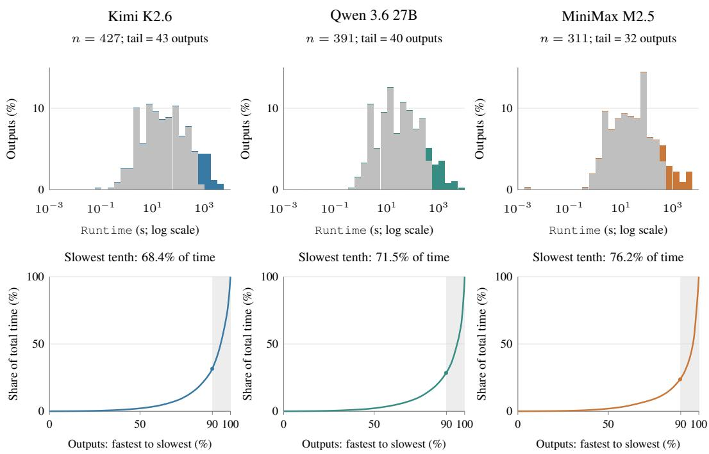  
Figure 9: How long runs contribute to total solver time. The three models have the lowest, middle, and highest shares of time spent in their slowest tenth. Top: runtime histograms on a logarithmic time axis, with the slowest $\bar { \lceil { n } / { 1 0 } \rceil }$ runs highlighted. Bottom: cumulative share of solver time as runs are ordered from fastest to slowest; shading marks the same slowest runs. Each model uses its correctly solved tasks with valid timings.

Direct model comparisons use the same tasks on both sides. Each model’s runtime distribution in Table 5 includes a different set of correctly solved tasks. Figure 10(a) compares each pair on the tasks both models solve correctly, yielding 126–420 tasks per pair. A smaller set of 47 tasks is solved correctly by all 11 models. On this fixed set, mean Runtime is 43.05 seconds for the expert reference and 77.04–197.44 seconds for the LLMs (Table 5). This comparison holds the task set fixed across every model, but covers only 8.4% of the benchmark.

Table 6: Solver costs by the number of models answering each task correctly. The four groups contain 541 tasks in the reference cost subset, each solved correctly by at least one model. /Expert is the shifted geometric Runtime ratio (Appendix D.2). Slower (%) is the percentage of valid LLM–expert pairs with longer LLM runtime.
<table><tr><td>Models with correct answers Tasks Runtime pairs /Expert ↓ Slower (%)</td></tr><tr><td>1-3</td></tr><tr><td>26 67 1.69 58.2 192 1,169 1.58 57.5</td></tr><tr><td>4-7 8-10 276 2,449 1.67 66.8</td></tr><tr><td>11 (all models) 47 517 2.82 82.2</td></tr></table>

The expert advantage also appears outside the 47 shared tasks. On the other 494 tasks solved correctly by at least one LLM, 2,346 of 3,685 valid LLM–expert pairs (63.7%) have longer LLM runtimes. Their pooled shifted geometric Runtime ratio is 1.64. Table 6 groups these tasks by how many models solve them correctly: the ratio remains above one in each group. Thus, the observed efficiency gap is not confined to the small set solved correctly by every model.

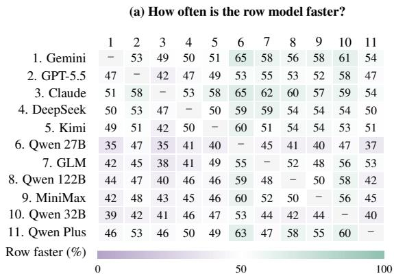  
Tasks solved correctly by both models $( n = 1 2 6  – 4 2 0 )$

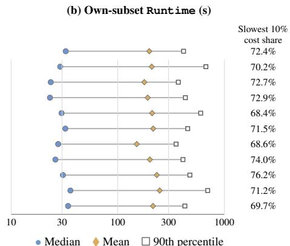  
Logarithmic time axis; model-specific task subsets.  
Figure 10: Model comparisons on shared tasks and runtime distributions. (a) Percentage of tasks solved correctly by both models with valid timings on which the row model is faster than the column model $( 1 0 ^ { - 6 }$ s tie tolerance; 126–420 tasks per pair). Opposite cells need not sum to 100% because ties remain in the denominator. (b) Median, mean, and 90th-percentile Runtime on tasks solved correctly by each model, and the slowest tenth’s share of measured Runtime. Whisker summarize the distribution; they are not confidence intervals. Model order follows Table 1.

## C.4 MODEL SIZE AND SOLVER TIME (RQ3)

We compare each generated model with the expert reference on the same task to test whether a smaller model also solves faster. Within the reference cost subset, we retain tasks whose archived ordinary and expert size summaries describe a single model. Requiring correct objective values and positive size counts and Runtime yields 3,788 LLM–expert pairs on 497 tasks. Dimensions and runtime come from the same recorded execution.

Two ways to identify smaller models. The first criterion compares the pre-presolve counts of variables, linear constraints, and nonzero coefficients in the linear constraint matrix: none of these three counts may increase, and at least one must decrease. The second requires fewer variables and fewer linear constraints, without restricting nonzeros. Both comparisons are relative to the expert. Table 7 reports the number of pairs satisfying each criterion and how often the LLM takes longer to solve the task.

Table 7: Model size and solver time relative to the expert reference. Eligible counts pairs before applying the size criteria; n counts pairs meeting each criterion. Slower counts pairs where LLM Runtime exceeds the expert’s runtime by more than 10−6 seconds; percentages use n as the denominator. Rows are linear constraints; nonzeros are nonzero coefficients in their constraint matrix.
<table><tr><td colspan="2"></td><td colspan="3">No larger on three counts</td><td colspan="3">Fewer variables and rows</td></tr><tr><td>Model</td><td>Eligible</td><td>n</td><td>Slower</td><td>%</td><td>n</td><td>Slower</td><td>%</td></tr><tr><td>Gemini 3.1 Pro</td><td>465</td><td>100</td><td>55</td><td>55.0</td><td>45</td><td>24</td><td>53.3</td></tr><tr><td>GPT-5.5</td><td>401</td><td>45</td><td>26</td><td>57.8</td><td>19</td><td>11</td><td>57.9</td></tr><tr><td>Claude Opus 4.6</td><td>395</td><td>82</td><td>44</td><td>53.7</td><td>41</td><td>19</td><td>46.3</td></tr><tr><td>DeepSeek-V4 Flash</td><td>395</td><td>59</td><td>31</td><td>52.5</td><td>29</td><td>10</td><td>34.5</td></tr><tr><td>Kimi K2.6</td><td>390</td><td>70</td><td>40</td><td>57.1</td><td>28</td><td>13</td><td>46.4</td></tr><tr><td>Qwen 3.6 27B</td><td>352</td><td>80</td><td>56</td><td>70.0</td><td>31</td><td>23</td><td>74.2</td></tr><tr><td>GLM-5.1</td><td>342</td><td>71</td><td>36</td><td>50.7</td><td>27</td><td>12</td><td>44.4</td></tr><tr><td>Qwen 3.5 122B</td><td>329</td><td>74</td><td>52</td><td>70.3</td><td>28</td><td>21</td><td>75.0</td></tr><tr><td>MiniMax M2.5</td><td>277</td><td>56</td><td>31</td><td>55.4</td><td>29</td><td>14</td><td>48.3</td></tr><tr><td>Qwen 3 32B</td><td>270</td><td>66</td><td>52</td><td>78.8</td><td>31</td><td>25</td><td>80.6</td></tr><tr><td>Qwen 3.6 Plus</td><td>172</td><td>32</td><td>26</td><td>81.2</td><td>9</td><td>9</td><td>100.0</td></tr><tr><td>Total</td><td>3,788</td><td>735</td><td>449</td><td>61.1</td><td>317</td><td>181</td><td>57.1</td></tr></table>

Smaller reported models often solve more slowly. Under the first criterion, 449 of 735 pairs (61.1%) have longer LLM runtimes. The per-model proportion ranges from 50.7% to 81.2%, so the pattern appears in every model (Figure 7(a)). Under the second criterion, 181 of 317 pairs (57.1%) are slower. Reducing both variables and linear constraints therefore does not by itself establish a runtime improvement.

The differences are not limited to nearly tied runtimes. Of the 449 slower cases under the first criterion, 346 take at least twice as long as the expert, with at least one additional second of solver time. These cases span all 11 models. Including zero-valued counts and runtimes changes the slower proportions to 60.6% (449/741) and 56.0% (181/323) under the first and second criteria, respectively. The finding is therefore similar with or without zero-valued observations.

## C.5 COSTS BEYOND SOLVER TIME (RQ4)

We examine model preparation, code generation, and memory use. Preparation and execution comparisons use correctly solved tasks in the 543-task reference cost subset. Generation summaries include all available responses. Appendix D defines the measurements.

Preparing a model can take longer than solving it. Among 4,202 LLM runs with valid preparation and solver-call timings, Build exceeds solver-call time in 729 (17.3%). The proportion ranges from 11.5% to 22.5% across models (Table 8), even though the median preparation share of Build+opt is only 2.8%.

Preparation can reverse the comparison with the expert. On the 4,148 pairs with both LLM and expert timings, we first compare the externally measured solver-call times, then compare Build+opt. Adding preparation reverses which implementation is faster in 357 pairs (8.6%): 122 LLM programs change from faster to slower than the expert, and 235 change from slower to faster. These reversals occur in all 11 models. Thus, a shorter solver call does not necessarily mean a faster implementation once preparation is included.

The reversals include substantial time differences. In 160 of the 357 reversals, the final Build+opt difference is at least 10 seconds. Our default comparison treats differences within $1 0 ^ { - 6 }$ seconds as ties. Increasing this tolerance to the larger of 0.01 seconds and 1% of the longer compared time still gives 317 reversals (7.6%).

Generating code often takes longer than running it. Table 9 summarizes the final recorded API call for each response, including those that do not lead to a correct solution. Median API latency ranges from 14.0 to 231.2 seconds across models. Among the 4,202 correct runs with both API latency and Build+opt recorded, generation takes longer in 2,336 (55.6%). The proportion reaches 76.2% for Qwen 3.6 27B and 74.1% for Qwen 3 32B, using each model’s own correctly solved tasks in the cost subset. Reducing solver time alone therefore leaves a substantial part of the

Table 8: Preparation time and comparisons with the expert. LLM runs have recorded preparation and solvercall times; LLM–expert pairs also have the corresponding expert measurements. Build longer counts runs where preparation exceeds solver-call time, with percentages over LLM runs. The last two columns count changes in the LLM’s faster/slower relation to the expert when preparation is included.
<table><tr><td></td><td>LLM</td><td>Build longer</td><td>LLM-expert</td><td>Faster to</td><td>Slower to</td></tr><tr><td>Model</td><td>runs</td><td>n (%)</td><td>pairs</td><td>slower</td><td>faster</td></tr><tr><td>Gemini 3.1 Pro GPT-5.5</td><td>504 441</td><td>58 (11.5) 73 (16.6)</td><td>499 435</td><td>0 8</td><td>49 33</td></tr><tr><td>Claude Opus 4.6</td><td>435</td><td>76 (17.5)</td><td>430</td><td>21</td><td>29</td></tr><tr><td>DeepSeek-V4 Flash</td><td>433</td><td>88 (20.3)</td><td>428</td><td>14</td><td>18</td></tr><tr><td>Kimi K2.6</td><td>427</td><td>71 (16.6)</td><td>423</td><td>14</td><td>22</td></tr><tr><td>Qwen 3.6 27B</td><td>391</td><td>88 (22.5)</td><td>386</td><td>24</td><td>15</td></tr><tr><td>GLM-5.1</td><td>382</td><td>60 (15.7)</td><td>375</td><td>5</td><td>22</td></tr><tr><td>Qwen 3.5 122B</td><td>367</td><td>70 (19.1)</td><td>361</td><td>14</td><td>14</td></tr><tr><td>MiniMax M2.5</td><td>311</td><td>61 (19.6)</td><td>308</td><td>13</td><td>11</td></tr><tr><td>Qwen 3 32B</td><td>309</td><td>57 (18.4)</td><td>303</td><td>6</td><td>14</td></tr><tr><td>Qwen 3.6 Plus</td><td>202</td><td>27 (13.4)</td><td>200</td><td>3</td><td>8</td></tr><tr><td>Total</td><td>4,202</td><td>729 (17.3)</td><td>4,148</td><td>122</td><td>235</td></tr></table>

Table 9: Generation latency and token counts for all available responses, including incorrect programs. Values are medians. nA, nT, and nR count records with latency, input/output-token, and reasoning-token measurements, respectively. Prompt and Completion denote input and output tokens. Token definitions vary by provider; reasoning tokens may already be included in Completion, and a reported zero does not establish that no internal reasoning occurred.

<table><tr><td>Model</td><td>nA/nT</td><td>API latency (s)</td><td>Prompt</td><td>Completion</td><td>Reasoning</td><td>nR</td></tr><tr><td>Gemini 3.1 Pro</td><td>559/558</td><td>55.4</td><td>743.5</td><td>6,714.5</td><td>5,827</td><td>558</td></tr><tr><td>GPT-5.5</td><td>535/534</td><td>61.2</td><td>715.5</td><td>1,431</td><td>516</td><td>522</td></tr><tr><td>Claude Opus 4.6</td><td>561/561</td><td>17.2</td><td>937</td><td>748</td><td>0</td><td>561</td></tr><tr><td>DeepSeek-V4 Flash</td><td>561/561</td><td>81.9</td><td>714</td><td>11,327</td><td>10,562</td><td>561</td></tr><tr><td>Kimi K2.6</td><td>561/561</td><td>82.2</td><td>714</td><td>11,680</td><td>10,714</td><td>561</td></tr><tr><td>Qwen 3.6 27B</td><td>558/558</td><td>194.9</td><td>724</td><td>8,319</td><td>8,193</td><td>190</td></tr><tr><td>GLM-5.1</td><td>561/561</td><td>27.9</td><td>690</td><td>1,671</td><td>1,245</td><td>531</td></tr><tr><td>Qwen 3.5 122B</td><td>561/561</td><td>62.2</td><td>724</td><td>6,727</td><td>2,401</td><td>12</td></tr><tr><td>MiniMax M2.5</td><td>560/560</td><td>55.9</td><td>689</td><td>4,837.5</td><td>0</td><td>13</td></tr><tr><td>Qwen 3 32B</td><td>560/560</td><td>231.2</td><td>702</td><td>8,247.5</td><td>7,686.5</td><td>560</td></tr><tr><td>Qwen 3.6 Plus</td><td>561/561</td><td>14.0</td><td>726</td><td>1,135</td><td></td><td>0</td></tr></table>

recorded waiting time unchanged. These final-call waiting times exclude earlier generation or repair calls; Appendix D.1 details their measurement scope.

More output tokens do not necessarily mean longer waits. Reported median prompt lengths vary from 689 to 937 tokens, while median completion lengths span 748–11,680 (Table 9). Kimi has a larger median completion count than Qwen 3 32B (11,680 versus 8,247.5), yet a much shorter median wait (82.2 versus 231.2 seconds). Output volume and elapsed waiting time thus capture different aspects of generation cost. These summaries do not isolate the causes: latency includes service and network waiting, and token definitions vary by provider. Reasoning-token coverage also differs sharply; Qwen 3.5 122B’s median uses only 12 records, so that column does not support a uniform comparison of reasoning effort.

The upper tail matters more than small differences in median memory. Table 10 covers all 4,202 correct cost-analysis runs after unit harmonization. Per-model median Gurobi peak values cluster between 107.5 and 139.1 MiB, but each model’s P90 is 12.6–21.4 times its own median. Across all runs, the median is 128.5 MiB and P90 is 2,206.7 MiB; 224 runs (5.3%) reach at least 4 GB. The common pattern is therefore a long upper tail, which a median-based memory budget would miss. These summaries use each model’s own correctly solved tasks, so they do not isolate differences between models on identical workloads.

The process-memory subset has a different distribution. The 1,769 runs with all three RSS snapshots have a median solver allocation of 61.7 MiB, less than half the full-set median of 128.5 MiB. Their P90 remains similar, however: 2,238.2 versus 2,206.7 MiB. Thus, the matched subset retains demanding cases but does not represent the full distribution’s center. We use the full set to describe solver-memory allocations and the matched subset to compare process and solver measurements on the same runs.

Process snapshots and solver peaks answer different questions. In the matched subset, median RSS snapshot maximum is 74.8 MiB and P90 is 1,328.6 MiB. Post-solve RSS is at least twice its presolve value in 412 runs (23.3%), showing that memory held at the end of solving can substantially exceed the pre-solve level. These boundary snapshots can miss temporary peaks during optimization; Gurobi peak instead tracks solver-environment allocations. Neither their difference nor the difference between their quantiles measures Python memory overhead (Appendix D.1).

Table 10: Solver and process memory in MiB. The full set contains all 4,202 correct runs used for cost analysis. The matched subset contains 1,769 runs with both solver memory and process RSS sampled before preparation, before solving, and after solving; RSS is the largest of these three snapshots. Gurobi peak measures peak allocation within the solver environment. P90 is the 90th percentile. Overall pools runs across models; each model uses its own correctly solved tasks.
<table><tr><td rowspan="4">Model</td><td colspan="3">All correct cost-analysis runs</td><td colspan="5">Matched subset with process RSS</td></tr><tr><td rowspan="2">n</td><td colspan="2">Gurobi peak</td><td rowspan="2"></td><td colspan="2">RSS snapshot max</td><td colspan="2">Gurobi peak</td></tr><tr><td>Median</td><td>P90</td><td>n Median</td><td></td><td>P90 Median</td><td>P90</td></tr><tr><td>Gemini 3.1 Pro</td><td>504</td><td>124.7</td><td>2,397.9</td><td>210</td><td>79.2</td><td>2,011.6</td><td>72.0</td><td></td></tr><tr><td>GPT-5.5</td><td>441</td><td>136.3</td><td>2,198.6</td><td>186</td><td>70.8</td><td>2,069.4</td><td>58.7</td><td>2,403.3</td></tr><tr><td>Claude Opus 4.6</td><td>435</td><td>118.4</td><td>2,510.0</td><td>176</td><td>78.8</td><td>2,082.5</td><td>57.8</td><td>2,440.1 2,507.5</td></tr><tr><td>DeepSeek-V4 Flash</td><td>433</td><td>130.4</td><td>1,938.5</td><td>184</td><td>75.9</td><td>1,234.1</td><td>69.6</td><td>1,660.2</td></tr><tr><td>Kimi K2.6</td><td>427</td><td>117.2</td><td>2,085.0</td><td>183</td><td>73.0</td><td>1,204.1</td><td>57.6</td><td>1,723.6</td></tr><tr><td>Qwen 3.6 27B</td><td>391</td><td>110.7</td><td>1,389.6</td><td>166</td><td>74.0</td><td>890.9</td><td>41.8</td><td>1,262.2</td></tr><tr><td>GLM-5.1</td><td>382</td><td>136.1</td><td>2,402.8</td><td>157</td><td>80.0</td><td>1,937.9</td><td>67.1</td><td>2,475.4</td></tr><tr><td>Qwen 3.5 122B</td><td>367</td><td>132.6</td><td>1,727.3</td><td>134</td><td>73.7</td><td>1,147.5</td><td>56.1</td><td>1,918.8</td></tr><tr><td>MiniMax M2.5</td><td>311</td><td>137.8</td><td>1,807.7</td><td>160</td><td>77.6</td><td>1,225.3</td><td>53.9</td><td>1,874.7</td></tr><tr><td>Qwen 3 32B</td><td>309</td><td>139.1</td><td>2,331.5</td><td>124</td><td>84.9</td><td>1,343.5</td><td>60.4</td><td>2,502.1</td></tr><tr><td>Qwen 3.6 Plus</td><td>202</td><td>107.5</td><td>2,305.8</td><td>89</td><td>73.4</td><td>1,051.0</td><td>53.0</td><td>2,037.1</td></tr><tr><td>Overall</td><td>4,202</td><td>128.5</td><td>2,206.7</td><td>1,769</td><td>74.8</td><td>1,328.6</td><td>61.7</td><td>2,238.2</td></tr></table>

## C.6 RESULTS FOR FINE-TUNED MODELS

We evaluate five fine-tuned models on all 561 EfficientOpt tasks: LLMOPT (14B) (Jiang et al., 2025), OptMATH (7B and 32B) (Lu et al., 2025), and SIRL (7B and 32B) (Chen et al., 2025b). This section examines their accuracy and where their programs fail.

Evaluation setup. We execute the saved programs on the fixed task instances, using the correctness criterion and verified reference objectives from Section 4.1. Programs call Gurobi directly or through Pyomo’s gurobi direct interface. Each run uses one solver thread, Seed=0, MIPGap=0, a 2 GiB process-memory limit, and Gurobi SoftMemLimit=1.5 (GB). Up to ten programs run concurrently. These runs contribute only to the accuracy and failure analysis; their timings are excluded from efficiency comparisons.

Table 11: Accuracy and execution outcomes for five fine-tuned models, with 561 tasks per model. Correct counts programs that finish with OPTIMAL status and the verified objective value. It is a subset of OPTIMAL, not an additional outcome category. The six columns from OPTIMAL through Other sum to 561 in each row.
<table><tr><td>Model</td><td>Correct n (%)</td><td>OPTIMAL</td><td>Static failure</td><td>Code error</td><td>Time limit</td><td>Memory limit</td><td>Other</td></tr><tr><td>OptMATH (32B)</td><td>137 (24.42)</td><td>189</td><td>11</td><td>212</td><td>51</td><td>57</td><td>41</td></tr><tr><td>SIRL (32B)</td><td>118 (21.03)</td><td>188</td><td>34</td><td>164</td><td>77</td><td>72</td><td>26</td></tr><tr><td>LLMOPT (14B)</td><td>36 (6.42)</td><td>77</td><td>20</td><td>377</td><td>28</td><td>35</td><td>24</td></tr><tr><td>OptMATH (7B)</td><td>1 (0.18)</td><td>4</td><td>401</td><td>146</td><td>3</td><td>6</td><td>1</td></tr><tr><td>SIRL (7B)</td><td>0 (0.00)</td><td>0</td><td>504</td><td>57</td><td>0</td><td>0</td><td>0</td></tr></table>

Correct solutions remain limited. OptMATH (32B) and SIRL (32B) achieve the highest accuracy in this group, at 24.42% and 21.03%, respectively; the smaller models range from 0 to 6.42% (Table 11). These small sets of correct solutions limit efficiency comparisons, motivating the separate accuracy and failure analysis.

Optimal solver status does not ensure a correct answer. Across the five models, 458 programs finish with OPTIMAL status, but 166 (36.2%) return an objective that differs from the verified answer. As in Section C.1, a solver can optimize the generated model successfully even when that model gives the wrong answer to the task.

Failure patterns differ across models. OptMATH (7B) and SIRL (7B) have 401 and 504 static failures, respectively: these programs cannot be compiled or lack the required modeling function. LLMOPT instead has 377 code errors, its most common outcome. Code errors include invalid data access and incorrect use of the modeling or solver API. For the two 32B models, time and memory limits also account for many outcomes: 108 runs for OptMATH and 149 for SIRL. These categories distinguish programs that cannot execute, programs that return incorrect objectives, and runs stopped by resource limits.

Time and memory limits include termination by either the execution process or Gurobi. Other covers the remaining solver and execution failures, including policy and logging interruptions.

## C.7 SLOW RUNS AND TOTAL SOLVER TIME (RQ2)

We examine which runs account for most solver time and how the expert implementations perform on those same tasks. As in Appendix C.3, we use 4,202 runs that pass the numerical checks and have valid Runtime measurements within the 543-task reference cost subset. For each LLM, we rank its n eligible runs by Runtime and select the slowest $k = \lceil n / 1 0 \rceil$ , approximately 10%. Table 12 summarizes their contribution to the model’s total. Here, total time is the sum of recorded solver runtimes. It does not represent total program time or the elapsed time of a parallel batch.

Table 12: Solver-time concentration for each LLM. Time share is the selected k runs’ percentage of total Runtime. Slower gives the number exceeding expert time by more than $1 0 ^ { - 6 }$ seconds, out of k. LLM/expert divides summed LLM time by summed expert time on these same k tasks; it is not the shifted geometric ratio in Table 1.
<table><tr><td></td><td colspan="3">All eligible runs</td><td colspan="3">Slowest ~10%</td></tr><tr><td>Model</td><td>n</td><td>Median (s)</td><td>Total (h)</td><td>k Time share (%)</td><td>Slower</td><td>LLM/expert</td></tr><tr><td>Gemini 3.1 Pro</td><td>504</td><td>32.5</td><td>27.67</td><td>51 72.4</td><td>48/51</td><td>5.43</td></tr><tr><td>GPT-5.5</td><td>441</td><td>28.8</td><td>25.54 45</td><td>70.2</td><td>43/45</td><td>7.71</td></tr><tr><td>Claude Opus 4.6</td><td>435</td><td>23.5</td><td>21.4644</td><td></td><td>72.7 42/44</td><td>5.31</td></tr><tr><td>DeepSeek-V4 Flash</td><td>433</td><td>23.1</td><td>22.9644</td><td></td><td>72.9 43/44</td><td>5.80</td></tr><tr><td>Kimi K2.6</td><td>427</td><td>29.7</td><td>24.9443</td><td></td><td>68.4 42/43</td><td>4.97</td></tr><tr><td>Qwen 3.6 27B</td><td>391</td><td>32.2</td><td>23.3540</td><td></td><td>71.5 37/40</td><td>6.23</td></tr><tr><td>GLM-5.1</td><td>382</td><td>27.6</td><td>16.0039</td><td></td><td>68.6 37/39</td><td>3.45</td></tr><tr><td>Qwen 3.5 122B</td><td>367</td><td>26.0</td><td>20.4037</td><td></td><td>74.0 33/37</td><td>6.96</td></tr><tr><td>MiniMax M2.5</td><td>311</td><td>30.6</td><td>20.07 32</td><td></td><td>76.2 31/32</td><td>5.78</td></tr><tr><td>Qwen 3 32B</td><td>309</td><td>36.0</td><td>21.23</td><td>31</td><td>71.2 31/31</td><td>5.96</td></tr><tr><td>Qwen 3.6 Plus</td><td>202</td><td>34.2</td><td>12.02</td><td>21</td><td>69.7 20/21</td><td>4.84</td></tr></table>

A few runs account for most solver time. Across models, the slowest ∼10% of runs consume 68.4– 76.2% of total solver time. Median runtimes are only 23.1–36.0 seconds, yet totals reach 12.0–27.7 hours, with just 11–24 runs per model accounting for at least half. These totals describe different task sets; Appendix C.3 compares models on shared tasks. Together, the selected sets contain 427 model–task runs covering 101 distinct tasks. T10 (convex hulls, envelopes, and convexification) contributes the largest share of selected-run time for every model: 24.6–50.5%.

Expert implementations are often faster on these slow tasks. On each LLM’s selected tasks, its summed Runtime is 3.45–7.71 times the expert total. Of the 427 selected runs, 407 are slower than the expert; 359 take at least twice as long, with a gap of at least one second. Table 13 shows the slowest run for each LLM. Qwen 3.6 27B takes 7,065.35 seconds on T07 003, versus 15.21 seconds for the expert. Other tasks are slow for both: Kimi K2.6 takes 4,324.49 seconds on T06 001, versus 2,905.46 seconds for the expert. These comparisons describe tasks selected for high LLM runtime; they neither estimate the overall LLM–expert gap nor isolate the effect of a particular technique.

Table 13: The slowest eligible run for each LLM and the expert’s runtime on the same task. Times are Gurobi Runtime. Share is the selected run’s percentage of that LLM’s total eligible solver time. Runs are selected by LLM time, irrespective of the expert time.
<table><tr><td>Model</td><td>Task</td><td>LLM (s)</td><td>Expert (s)</td><td>Share (%)</td></tr><tr><td>Gemini 3.1 Pro</td><td>T24_002</td><td>4,677.80</td><td>303.66</td><td>4.7</td></tr><tr><td>GPT-5.5</td><td>T25_019</td><td>4,071.28</td><td>16.38</td><td>4.4</td></tr><tr><td>Claude Opus 4.6</td><td>T48_009</td><td>4,718.84</td><td>22.63</td><td>6.1</td></tr><tr><td>DeepSeek-V4 Flash</td><td>T15_012</td><td>5,431.07</td><td>18.95</td><td>6.6</td></tr><tr><td>Kimi K2.6</td><td>T06_001</td><td>4,324.49</td><td>2,905.46</td><td>4.8</td></tr><tr><td>Qwen 3.6 27B</td><td>T07_003</td><td>7,065.35</td><td>15.21</td><td>8.4</td></tr><tr><td>GLM-5.1</td><td>T05_020</td><td>4,736.70</td><td>285.27</td><td>8.2</td></tr><tr><td>Qwen 3.5 122B</td><td>T07_003</td><td>6,501.74</td><td>15.21</td><td>8.9</td></tr><tr><td>MiniMax M2.5</td><td>T21_022</td><td>5,617.01</td><td>71.17</td><td>7.8</td></tr><tr><td>Qwen 3 32B</td><td>T48_004</td><td>5,077.62</td><td>164.01</td><td>6.6</td></tr><tr><td>Qwen 3.6 Plus</td><td>T10_010</td><td>3,079.45</td><td>236.71</td><td>7.1</td></tr></table>

The slowest runs dominate total solver time without affecting the median. For each model, halving the recorded runtimes of its slowest 10% of runs would reduce total solver time by 34.2– 38.1%, while leaving the median unchanged. Halving the runtimes of all other runs instead would reduce total solver time by only 11.9–15.8%. Thus, the median alone obscures how a small number of slow runs drive total solver time.

## D EVALUATION METRICS AND COMPARISON PROTOCOL

This appendix defines the measurement and comparison rules used in Section 4 and Appendix C. Appendix D.1 explains what each metric captures; Appendix D.2 specifies eligible comparisons, aggregation, and the limits of their interpretation.

## D.1 METRICS AND MEASUREMENT SCOPE

We measure numerical accuracy, technique use, and computational cost separately. Table 14 summarizes the metrics; the following paragraphs explain their measurement boundaries.

Table 14: Evaluation metrics and what they measure.
<table><tr><td>Quantity</td><td>Recorded measurement</td><td>What it captures</td></tr><tr><td>Numerical check</td><td>OPTIMAL status and a finite objective matching the verified reference value</td><td>Numerical agreement on the tested instance; full task semantics and required decisions need separate verification.</td></tr><tr><td>Technique use</td><td>Automated labels from code and task context</td><td>Identifies target, alternative, none, or N/A; does not establish correctness or efficiency (Appendix F.1).</td></tr><tr><td>Solver cost</td><td>Gurobi Runtime (s), Work (units)</td><td>Time and solver effort for the recorded optimization calls.</td></tr><tr><td>Build+opt</td><td>Preparation time + separately timed solver calls (s)</td><td>An execution subtotal; excludes work outside the recorded intervals.</td></tr><tr><td>Generation</td><td>API latency (s); provider-reported Tokens</td><td>Waiting time for the final recorded call; token usage reported for its response. Earlier calls are</td></tr><tr><td>Model size</td><td>Variables, constraints, linear-matrix nonzeros</td><td>excluded. Dimensions before presolve. Figure 5 and Appendix C.4 use different counting scopes,</td></tr><tr><td>Memory</td><td>Process RSS snapshots; Gurobi peak</td><td>explained below. Sampled process-resident memory and peak solver-environment allocation, respectively.</td></tr></table>

Preparation and solving. Build measures preparation, including preprocessing, enumeration, and any solves or between-solve computation within the recorded intervals. Build+opt adds the elapsed time around separately timed solver calls, without adding Gurobi’s Runtime again. This

subtotal can omit input loading, imports, result extraction, and other work outside the timed inter vals. Appendix I.2 distinguishes it from complete execution and request time.

Solver time and effort. Gurobi’s Runtime and Work attributes describe the most recent optimiza tion call (Gurobi Optimization, 2026b). We report the returned model’s solve for single-model runs and sum the tracked calls for multi-solve procedures. Untracked solves inside model-building code may be absent from these totals even when their time is included in Build. Work measures solver effort in arbitrary units, not seconds or Python operations; it depends on the model, hardware, and solver settings.

Code generation. API latency measures the final recorded client call, including service and network waiting and any retries and backoff within that call. It excludes earlier generation or repair calls. Token counts describe the returned response under each provider’s conventions, rather than cumulative usage over retries. Reasoning tokens may already be included in output tokens, so we do not add those categories together. Unavailable counts remain missing.

Model size. Figure 5(d,e) reports separate maxima of variable and total constraint counts across each reference’s submitted models (Appendix B.2); the maxima need not come from the same model. Total constraints include linear, quadratic, general, and SOS constraints. The size–runtime analysis instead uses the variables, linear constraints, and linear-matrix nonzeros recorded with the timed solve (Appendix C.4). All counts are before presolve.

Memory. In the matched memory analysis, we report the maximum of three process RSS snapshots: before preparation, before the outer solver call, and after that call. These samples can miss intervening peaks. Gurobi peak is the maximum allocation within the solver environment, which may be shared by several models (Gurobi Optimization, 2026b); it is neither whole-process memory nor a sum of per-model peaks. Both are reported in MiB, converting native Gurobi GB values by $1 \dot { 0 } ^ { 9 } / 2 ^ { 2 0 }$ Appendix C.5 gives the distributions and measurement coverage.

## D.2 TASK SELECTION AND RESULT AGGREGATION

Accuracy and cost coverage. Numerical accuracy uses all 561 tasks. Paired execution-cost comparisons use the 543 tasks whose recorded ordinary and expert runs reach agreeing optimal objectives (Appendix B.2).

Tasks included in each comparison. Table 1 requires numerically correct outputs and complete measurements for all four cost ratios. The ratios within each row use the same tasks, yielding 4,148 model–task pairs in total; task sets can differ between LLMs. Single-metric analyses require only the relevant measurements within the reference cost subset, so the solver-runtime analysis includes 4,202 correct runs.

Direct LLM comparisons use tasks solved correctly by both models, or by all 11 for the all-model comparison, with valid measurements of the relevant metric (Appendix C.3).

Missing measurements. Each comparison excludes missing or invalid measurements; these are never replaced with zero. We do not substitute time limits for incomplete or timed-out runs.

Cost and size ratios. Table 1 uses shifted geometric ratios. For a cost or size metric X, let $X _ { i m }$ and $X _ { i r }$ denote the measurements for LLM m and reference r on task i. The shifted geometric ratio over the eligible paired task set S is

$$
R _ { m , r } ^ { X } ( S ) = \exp \left[ \frac { 1 } { | S | } \sum _ { i \in S } \log \frac { X _ { i m } + s _ { X } } { X _ { i r } + s _ { X } } \right] .\tag{1}
$$

This shifted geometric ratio gives each task equal weight in log space. The shift $s _ { X }$ is one second for time, one solver work unit for Work, and one for counts. It accommodates zeros and limits the influence of tiny denominators; any unit conversion must rescale the shift as well as the measurements. A ratio below one indicates lower LLM cost or size under this aggregation. It is neither a ratio of summed costs nor an unshifted multiplicative speedup. Size ratios describe model structure and do not establish faster solving.

Runtime distributions and faster/slower counts. Faster/slower counts compare unshifted measurements. Unless stated otherwise in a sensitivity analysis, differences of at most $1 0 ^ { - 6 }$ in the metric’s unit are ties; ties remain in the denominator of win fractions. Appendix C.7 defines the slowest-tenth selection and summed-time comparisons.

Execution conditions. All paired timing measurements were obtained on the same machine for the same task and numerical instance.

Interpreting cost differences. Equal model-size counts do not establish formulation identity. Even algebraically equivalent formulations can differ in input order, starting solutions, or solver parameters that affect performance (Lodi & Tramontani, 2013; Gurobi Optimization, 2026e). Appendix G.1 examines formulation differences; Appendix G.2 shows how preparation affects costs.

## E DATASET QUALITY CONTROL AND EXPERT VERIFICATION

This appendix describes the acceptance protocol in Figure 11: independent expert review, mathematical and execution checks, and re-verification after repairs. Acceptance requires valid tasks and references and justified technique use; observed speedup is not a criterion.

## E.1 INDEPENDENT REVIEW AND INFORMATION ACCESS

OptDachshund produces candidates; independent experts determine acceptance. The protocol draw from five experts in mathematical optimization, modeling, and solver implementation, assigning at least two to each candidate and rotating assignments across techniques and source groups. One re viewer initially sees only the public statement and schema, checking whether the task is understandable without its intended solution. The other sees both reference models and implementations, the target OptTips card, and validation evidence. They submit their assessments independently before comparison. The review panel comprised five researchers, including doctoral students, postdoctoral researchers, and faculty members. Their collective expertise covered mathematical optimization, solver implementation, and LLM-based optimization modeling.

Evaluated LLMs receive the public statement and schema; their code accesses the numerical instance at execution. Reference solutions, objective values, technique labels, and expert hints remain hidden.

## E.2 ACCEPTANCE CRITERIA

Task and data validity (Stages I–II). The public specification must define the decisions, objective, domains, constraints, and required outputs without relying on a hidden reference; material ambiguity requires revision or rejection. Automated checks and expert review verify schema–instance consistency, including dimensions, indices, units, bounds, and intended feasibility. The task may expose structure but must not prescribe the target technique. For example, stating that storage cartridges are identical describes the task; prescribing an order for their use variables reveals a symmetry-breaking formulation. Reviewers assess structural difficulty, including trivial reductions and whether recognizing them is the intended skill.

Valid and comparable references (Stage III). Both references must solve the same task on identical data and satisfy its output requirements. The ordinary reference must be a plausible conventional formulation, without artificial delays, invalid bounds, or numerical pathologies introduced to favor the expert. Experts check formulation–code consistency and the mathematical justification for each answer. Different feasible sets are permitted when the transformation is valid, including recovery of requested decisions and justified termination for decompositions (Appendix I.1).

Applicable and faithful technique use (Stage IV). The expert reference must apply the OptTips mechanism to a structure that supports it. A tighter Big-M constant, for example, must follow from valid bounds; a valid inequality must preserve feasible integer solutions. Reviewers check for a meaningful modeling contrast on the same task, data, and objective, accounting for techniques tha interact with the primary target.

Solver-grounded verification (Stage V). The protocol requires executing both references on the same instance to check status, feasibility, objectives, and requested decisions. For exact tasks, optimality can be established by agreeing optimal runs, analytic or exact solutions, primal–dual certificates, or a checked feasible solution with a matching bound from an equivalent formulation.

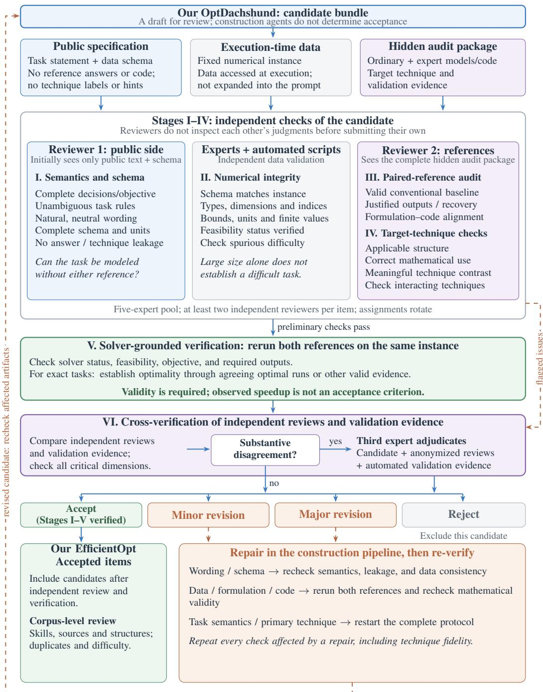  
Figure 11: Dataset quality control and expert verification. Checks cover required decision recovery and valid termination, not objective agreement alone. Repairs trigger all affected checks. Appendix B.2 summarizes reference-answer verification and cost coverage.

These alternatives allow answer verification when an ordinary run exceeds its time or memory budget. Multi-solve procedures require justified termination, such as a final pricing check for column generation. Appendix B.2 summarizes reference-answer verification and cost coverage.

## E.3 DECISIONS, REPAIR, AND CORPUS REVIEW

Reviewers compare their independent findings with validation evidence (Stage VI). A third expert adjudicates substantive disagreements using the candidate, anonymized reviews, and validation results. The outcomes are acceptance, minor revision, major revision, or rejection. Minor revisions preserve task semantics; changes to data, formulations, code, or the target technique require major revision. Acceptance requires resolving critical findings and completing the relevant checks.

Repairs trigger renewed checks of affected content: wording and schema changes require semantic, leakage, and data-consistency review; data or implementation changes require rerunning both references and rechecking mathematical claims. Changes to task semantics or the primary technique restart the full protocol. Review decisions and supporting evidence remain linked to each task.

Corpus review checks duplicates and examines the distributions of techniques, source problems, mathematical structures, and task difficulty.

## F ASSESSING MODELING TECHNIQUE USE

This appendix separates technique recognition from numerical correctness and computational cost. Appendix F.1 defines the automated labels and reports results by LLM and OptTips group; Appendix F.2 combines these labels with execution and timing checks; Appendix F.3 presents manual inspections of selected formulations and code.

## F.1 AUTOMATED ASSESSMENT OF TECHNIQUE USE

Assessment protocol. We report technique-use assessments for all 6,171 model–task pairs: 561 tasks for each of the 11 LLMs. A frontier LLM serves as judge. The recorded protocol supplies the problem statement, OptTips knowledge, candidate code, both reference implementations, and execution measurements.

Label definitions. Each record receives one of four labels. Target indicates the designated technique or an implementation judged equivalent. Alternative indicates another modeling technique; none means neither is identified. N/A covers cases judged inapplicable or unassessable. Labels include failed executions and incorrect objectives, so a target label does not certify a valid implementation or lower computational cost.

Results across models and task groups. Target, alternative, none, and N/A account for 46.3%, 24.6%, 21.3%, and 7.8% of all records, respectively (Figure 7(b)). Target-label rates range from 33.9% to 55.4% across models, each using all 561 tasks as the denominator (Table 15). Table 16 gives counts for the 29 OptTips groups; Table 4 describes their task variants.

Table 15: Technique-use assessments by LLM. Each model row classifies the same 561 records in two ways: technique labels (left) and combined diagnostic categories (right; Appendix F.2). The two column blocks each sum to 561 and must not be added together.
<table><tr><td rowspan="2">Model</td><td colspan="4">LLM technique label</td><td colspan="5">Combined diagnostic category</td></tr><tr><td>Target</td><td>Alt.</td><td>None N/A</td><td></td><td>C1</td><td>C2</td><td>C3</td><td>C4</td><td>C5</td></tr><tr><td>Claude Opus 4.6</td><td>311</td><td>131</td><td>98</td><td>21</td><td>253</td><td>52</td><td>66</td><td>68</td><td>122</td></tr><tr><td>Gemini 3.1 Pro</td><td>297</td><td>173</td><td>79</td><td>12</td><td>272</td><td>67</td><td>99</td><td>73</td><td>50</td></tr><tr><td>DeepSeek-V4 Flash</td><td>296</td><td>139</td><td>100</td><td>26</td><td>247</td><td>62</td><td>62</td><td>71</td><td>119</td></tr><tr><td>Qwen 3.6 27B</td><td>286</td><td>132</td><td>128</td><td>15</td><td>196</td><td>44</td><td>75</td><td>79</td><td>167</td></tr><tr><td>GPT-5.5</td><td>284</td><td>147</td><td>106</td><td>24</td><td>223</td><td>68</td><td>71</td><td>82</td><td>117</td></tr><tr><td>Kimi K2.6</td><td>282</td><td>138</td><td>85</td><td>56</td><td>233</td><td>59</td><td>74</td><td>65</td><td>130</td></tr><tr><td>GLM-5.1</td><td>275</td><td>123</td><td>142</td><td>21</td><td>198</td><td>44</td><td>60</td><td>88</td><td>171</td></tr><tr><td>Qwen 3 32B</td><td>231</td><td>129</td><td>173</td><td>28</td><td>132</td><td>45</td><td>54</td><td>80</td><td>250</td></tr><tr><td>MiniMax M2.5</td><td>204</td><td>138</td><td>109</td><td>110</td><td>147</td><td>40</td><td>78</td><td>50</td><td>246</td></tr><tr><td>Qwen 3.5 122B</td><td>202</td><td>133</td><td>137</td><td>89</td><td>164</td><td>48</td><td>78</td><td>78</td><td>193</td></tr><tr><td>Qwen 3.6 Plus</td><td>190</td><td>135</td><td>158</td><td>78</td><td>67</td><td>45</td><td>50</td><td>42</td><td>357</td></tr><tr><td colspan="10">Total 2,858 1,518 1,315 480 2,132 574 767 776 1,922</td></tr></table>

Interpreting the labels. Target labels can cover different implementations. In T20 011, both Kimi’s cumulative auxiliary variables and Qwen 3.5 122B’s direct coverage constraints receive target labels (Appendix F.3).

Table 16: Automated technique labels by OptTips group. n includes all model–task records from 11 LLMs, including failed executions. Target gives count (% of n); other columns give counts.
<table><tr><td>ID</td><td>Target OptTips group</td><td>n</td><td>Target (%)</td><td>Alt.</td><td>None</td><td>N/A</td></tr><tr><td>T01</td><td>Equality/inequality transformations</td><td>352</td><td>283 (80.4)</td><td>10</td><td>39</td><td>20</td></tr><tr><td>T02</td><td>Auxiliary variables and epigraphs</td><td>165</td><td>156 (94.5)</td><td>0</td><td>1</td><td>8</td></tr><tr><td>T03</td><td>Bound tightening and scaling</td><td>209</td><td>12 (5.7)</td><td>115</td><td>79</td><td>3</td></tr><tr><td>T04</td><td>LP relaxation</td><td>275</td><td>23 (8.4)</td><td>94</td><td>147</td><td>11</td></tr><tr><td>T05</td><td>Big-M modeling</td><td>209</td><td>171 (81.8)</td><td>7</td><td>10</td><td>21</td></tr><tr><td>T06</td><td>Indicators, semicontinuous variables, SOS</td><td>231</td><td>58 (25.1)</td><td>149</td><td>15</td><td>9</td></tr><tr><td>T07</td><td>Valid inequalities and cuts</td><td>176</td><td>134 (76.1)</td><td>17</td><td>24</td><td>1</td></tr><tr><td>T08</td><td>Substitution and product linearization</td><td>506</td><td>382 (75.5)</td><td>54</td><td>43</td><td>27</td></tr><tr><td>T09</td><td>Piecewise-linear modeling</td><td>88</td><td>78 (88.6)</td><td>0</td><td>3</td><td>7</td></tr><tr><td>T10</td><td>Convex hulls and convexification</td><td>330</td><td>137 (41.5)</td><td>109</td><td>63</td><td>21</td></tr><tr><td>T12</td><td>Dual transformation</td><td>66</td><td>1 (1.5)</td><td>64</td><td>0</td><td>1</td></tr><tr><td>T13</td><td>Lagrangian relaxation</td><td>165</td><td>0 (0.0)</td><td>46</td><td>116</td><td>3</td></tr><tr><td>T15</td><td>Block decomposition</td><td>264</td><td>0 (0.0)</td><td>151</td><td>112</td><td>1</td></tr><tr><td>T16</td><td>Benders decomposition</td><td>143</td><td>0 (0.0)</td><td>75</td><td>68</td><td>0</td></tr><tr><td>T17</td><td>Dantzig-Wolfe / column generation</td><td>55</td><td>0 (0.0)</td><td>25</td><td>28</td><td>2</td></tr><tr><td>T18</td><td>Network flow and matching</td><td>231</td><td>80 (34.6)</td><td>72</td><td>70</td><td>9</td></tr><tr><td>T19</td><td>Covering, packing, and knapsack</td><td>154</td><td>85 (55.2)</td><td>51</td><td>15</td><td>3</td></tr><tr><td>T20</td><td>Scheduling and temporal formulations</td><td>473</td><td>393 (83.1)</td><td>22</td><td>19</td><td>39</td></tr><tr><td>T21</td><td>Routing and path formulations</td><td>231</td><td>195 (84.4)</td><td>0</td><td>8</td><td>28</td></tr><tr><td>T22</td><td>Robust counterparts</td><td>297</td><td>174 (58.6)</td><td>29</td><td>78</td><td>16</td></tr><tr><td>T24</td><td>Preprocessing and dominance</td><td>198</td><td>4 (2.0)</td><td>69</td><td>109</td><td>16</td></tr><tr><td>T25</td><td>Symmetry breaking</td><td>209</td><td>114 (54.5)</td><td>29</td><td>26</td><td>40</td></tr><tr><td>T30</td><td>Warm starts</td><td>176</td><td>2 (1.1)</td><td>139</td><td>14</td><td>21</td></tr><tr><td>T34</td><td>Slack and surplus variables</td><td>176</td><td>135 (76.7)</td><td>0</td><td>16</td><td>25</td></tr><tr><td>T35</td><td>Variable elimination</td><td>143</td><td>14 (9.8)</td><td>11</td><td>89</td><td>29</td></tr><tr><td>T38</td><td>Convex conjugacy and Fenchel duality</td><td>77</td><td>49 (63.6)</td><td>15</td><td>0</td><td>13</td></tr><tr><td>T44</td><td>Transportation and network simplex</td><td>154</td><td>34 (22.1)</td><td>38</td><td>54</td><td>28</td></tr><tr><td>T48</td><td>Subtour, cover, clique, and capacity cuts</td><td>165</td><td>84 (50.9)</td><td>27</td><td>9</td><td>45</td></tr><tr><td>T49</td><td>Linking and activation strengthening</td><td>253</td><td>60 (23.7)</td><td>100</td><td>60</td><td>33</td></tr><tr><td>Total</td><td></td><td>6,171</td><td>2,858 (46.3)</td><td>1,518</td><td>1,315</td><td>480</td></tr></table>

## F.2 COMBINING TECHNIQUE LABELS WITH EXECUTION OUTCOMES

The C1–C5 columns in Table 15 combine technique labels with execution outcomes and solver times using the rules below. They are distinct from the judge’s raw labels.

Assignment rules. A record must report OPTIMAL or SOLVED and pass the archived objective check to enter C1–C4. All other records, including errors and timeouts, enter C5.

• C1: a target label, with no requirement for a runtime advantage.

• C2: an alternative label meeting the timing criterion below.

• C3: an alternative label not meeting that criterion.

• C4: a none or N/A label.

Timing criterion for C2. Let $r ~ = ~ t _ { \mathrm { L L M } } / t _ { \mathrm { e x p e r t } }$ and $s = t _ { \mathrm { L L M } } / t _ { \mathrm { o r d i n a r y } }$ be unshifted solver Runtime ratios. An alternative enters C2 if $r \leq 1 . 5$ or $( r < 2$ and $s < 1 )$ . The first condition requires LLM and expert timings; the second also requires the ordinary-reference timing. Meeting this solver-time threshold does not guarantee a speedup over either reference and says nothing about generation or construction cost.

Relation to the main results. These categories retain the archived runs and objective checks, yielding 4,249 records in C1–C4. The main evaluation uses its own selection of runs and verified reference objectives, yielding 4,264 numerically correct records. The two sets are not interchangeable: these diagnostics do not replace the accuracy results in Appendix C.1 or the cost comparisons defined in Appendix D.2.

## F.3 MANUAL INSPECTION OF SELECTED MODELING CHOICES

We inspected variables, constraints, and objectives in selected formulations and executable code to identify the implemented modeling choices. Solver status, model size, and runtime alone cannot identify a technique; valid alternatives may differ from the expert reference. Table 17 summarizes three examples and points to their detailed analyses.

Table 17: Selected modeling choices (RQ3). The cases are illustrative, not a random sample.
<table><tr><td>Task and output</td><td>Implemented choice</td><td>What the evidence supports</td></tr><tr><td></td><td>T10_011, GPT-5.5 Binary pairwise products with separate Both formulations enforce the same prod- marginals.</td><td>product inequalities; the expert uses con- ucts at integer assignments, but their LP re- tinuous interactions with row-column laxations differ. The GPT model does not use the expert&#x27;s marginal formulation.</td></tr><tr><td>T13_006, Gemini</td><td>uses a dual LP.</td><td>Primal resource-allocation LP with ex- The approaches attain the same objective plicit implied upper bounds; the expert with similar recorded Bui ld+opt times.</td></tr><tr><td>Qwen 3.5 122B</td><td>straints.</td><td>T20_011, Kimi / Kimi uses cumulative auxiliary vari- Eliminating Kimi&#x27;s auxiliaries preserves ables; Qwen uses direct coverage con- feasible integer shift-start decisions and the objective. Qwen&#x27;s longer construction time largely offsets its solver-time advantage.</td></tr></table>

## G CASE STUDIES ON MODELING CHOICES AND EFFICIENCY

These cases examine what alternative formulations preserve and how construction affects their recorded costs. See Appendix D.1 for timing scopes and Appendix I.1 for required outputs.

## G.1 WHAT THE COMPARED FORMULATIONS PRESERVE

Technology mixing (T13 006). The primal LP uses nonnegative technology shares summing to one per block, giving a bounded feasible region. On the evaluated instance, choosing each block’s leastresource technology satisfies the resource cap, establishing feasibility. LP strong duality therefore gives equal optimal values for the primal and expert dual. The original technology shares correspond to the dual multipliers of the expert LP’s mode constraints $u _ { i } + \lambda r _ { i k } \ge v _ { i k }$ , providing a direct recovery map.

Department relocation (T10 011). For departments $p , q$ assigned to cities $i ^ { * } , j ^ { * }$ , the expert’s nonnegative interaction variables have row and column sums fixed by the assignments. This forces $y _ { i ^ { * } j ^ { * } } ^ { p \overline { { q } } } = 1$ and all other entries to zero. Both formulations therefore enforce $y _ { i j } ^ { \overline { { p } } q } = x _ { p i } x _ { q j }$ at integer assignments and preserve the common objective. Their LP relaxations differ: for a single department pair with fractional assignments $( 1 / 2 , 1 / \bar { 2 } )$ over two cities, the product inequalities allow $y = 0$ , but the marginal equalities do not. The product links already make interactions integral under binary assignments. The expert also changes the linking constraints, so the comparison does not isolate the effect of removing binary declarations.

## G.2 HOW CONSTRUCTION CHANGES THE COST COMPARISON

Here, Runtime is solver time; Build+opt includes construction and externally timed optimization (Appendix D.1). Appendix C.5 gives the corresponding benchmark-wide analysis.

Shift scheduling (T20 011). Eliminating Kimi’s cumulative auxiliary variables preserves the feasible integer shift-start decisions and objective of Qwen 3.5 122B’s direct coverage model. Their solver times are 566.443 and 2.071 seconds, respectively, while their recorded Build times are 6.927 and 547.507 seconds. Their recorded Build+opt times are 573.362 and 549.577 seconds. The Kimi/Qwen ratio therefore shrinks from 273.512× for solver time to 1.043× for Build+opt: Qwen remains faster, but construction offsets most of its solver-time advantage.

Transit duty scheduling (T20 013). The ordinary formulation introduces one continuous activeduty variable and one equality link for each feasible start–period pair. The expert formulation instead uses the integer start variables directly in the period-coverage constraints. The two formulations encode the same feasible start decisions and objective, and both attain an objective value of 68,835,006. The ordinary model has 1,620,420 variables and 1,620,420 constraints, compared with 180,000 of each in the expert model; their constraint matrices have 4,321,260 and 1,440,420 nonzeros, respectively. Their Gurobi Runtime values are 5.420 and 2.989 seconds, while their recorded Build times are 26.382 and 3.345 seconds. Their recorded Build+opt times are 31.803 and 6.334 seconds. The ordinary/expert ratio thus increases from 1.813 for Runtime to 5.021 for Build+opt. In this pair, the expert formulation is faster to build as well as to solve, so including Build widens its measured advantage.

## H OPTDACHSHUND: AGENT ROLES AND INFORMATION FLOW

OptDachshund uses six agents to redesign source problems around OptTips techniques and construct paired references. Their roles follow the three stages in Section 3.2 and Figure 4.

Technique Matcher. The matcher selects OptTips techniques whose applicability conditions fit the source problem and proposes a redesign that exposes the relevant modeling challenge. Expected difficulty and efficiency gains guide this design; they remain hypotheses to test.

Reformulation Designer. Using the source problem and matching plan, the designer creates a task that requires a substantive modeling choice beyond rewording or numerical substitution. It writes the public statement and data schema, together with an internal formulation and intended solution.

Quality Auditor. The auditor checks mathematical validity and consistency across the candidate’s statement, schema, formulation, and intended solution. It also checks applicability against the selected OptTips card, source traceability, technique leakage, duplicate risk, and diversity. A candidate proceeds to reference implementation after passing this design audit.

Repair Agent. This agent addresses the auditor’s findings and returns the candidate for re-audit. Local repairs preserve the source problem and primary technique; changes to task semantics or the technique trigger the full review in Appendix E.

Reference Implementation Agent. This agent builds ordinary and expert implementations for the same final task, fixed instance, and required outputs. The expert applies the selected technique. Reference implementations support both model-building and algorithmic interfaces, with cost measurements defined in Appendix D.1.

Reference Audit Agent. This agent checks both references against the final task and selected OptTips card, using their formulations, code, and execution evidence. It examines executability, required outputs, task consistency, and valid technique use. Failures require revision and re-audit.

Target techniques, references, and review records remain hidden from evaluated LLMs, which receive the public task and data through the interface in Section 3.3. Final acceptance requires independent expert review and solver-grounded verification, repeated after relevant repairs (Appendix E). Agent approval alone is insufficient, and observed speedup is not required.

## EXAMPLE AGENT PROMPT (EXCERPT)

The excerpt below retains the Technique Matcher’s main inputs and requested outputs, using OptTips terminology and descriptive runtime placeholders in double braces. Full prompts, schemas, and configurations are available in the public repository.2

Technique Matcher   
[System message]   
You are the Technique Matching Agent in a multi-agent framework for optimization-modeling   
,→ benchmark reformulation. Select suitable OptTips techniques for one raw benchmark   
,→ problem. Return only valid JSON.   
[User message: selected fields]   
{   
"source\_problem": "{{source\_problem}}",   
"required\_candidate\_count": "{{techniques\_per\_problem}}",   
"technique\_matching\_rules": "{{matching\_rules}}",   
"coverage\_rules": "{{coverage\_rules}}",   
"available\_techniques": "{{OptTips\_cards}}",   
"output\_schema": {   
"candidate\_techniques": [   
{   
"tech\_id": "Txx",   
"reason": "why this source naturally supports this technique",   
"expected\_general\_llm\_failure": "e.g. enumeration, loose Big-M, no dualization",   
"transformation\_operator": "short operator name"   
}   
]   
}   
}

## I TASK VALIDITY AND COMPUTATIONAL COST

This appendix expands Definitions 1 and 2 by explaining what a solution procedure must preserve and which stages contribute to its cost.

## I.1 VALID SOLUTION PROCEDURES

For a task $p = ( q , I , \mathcal { O } )$ , validity is judged against the original problem specification q, the fixed input I, and the required outputs and accuracy O. If the task requests decisions, the returned decisions must satisfy the original domains and constraints and attain the required objective quality. Reporting the optimal value alone does not meet that requirement; any requested certificate must also be provided.

The solution procedure $\widehat { A } = ( \widehat { \mathcal { M } } , \widehat { C } )$ combines a mathematical representation with executable code. Its variables and feasible set may differ from those of the original task, provided the transformation is justified and the code recovers the required answer. For example, an extended formulation may introduce auxiliary variables, with projection recovering the original decisions. A dual formulation requires the relevant duality conditions to justify equality of optimal values and, when original decisions are requested, a procedure for recovering them. A decomposition requires coordinated subproblem solves and a stopping rule that establishes the required solution quality for the full task.

## I.2 RESOURCE ACCOUNTING AND COMPARISON SCOPE

An efficiency comparison concerns the same task, numerical input, and required answer quality, with an explicit resource and accounting scope. Time and memory are assessed separately. Costs depend on implementation and execution conditions as well as the formulation.

Complete request time. For a fully traced serial request, time can be partitioned into nonoverlapping phases, accumulated over all attempts and repairs:

$$
\begin{array} { r l } & { \quad T _ { \mathrm { r e q u e s t } } = T _ { \mathrm { A P I } } + T _ { \mathrm { o r c h e s t r a t i o n } } + T _ { \mathrm { e x e c u t i o n } } + T _ { \mathrm { c h e c k } } , } \\ & { \quad T _ { \mathrm { e x e c u t i o n } } = T _ { \mathrm { s e t u p / d a t a } } + T _ { \mathrm { b u i l d } } + T _ { \mathrm { o p t } } + T _ { \mathrm { b e t w e e n / r e c o v e r } } . } \end{array}\tag{2}
$$

Here, $T _ { \mathrm { A P I } }$ sums generation-call latency, including service and network waiting. Orchestration and checking cover work outside generation and execution. Within execution, $T _ { \mathrm { b u i l d } }$ is model construction; $T _ { \mathrm { o p t } }$ includes every solver call, including those invoked during construction or within a decomposition. Computation between calls and answer recovery belong to $T _ { \mathrm { b e t w e e n / r e c o v e r } } .$ A recorded Build interval may span several of these phases; solver time already included in that interval must not be counted again.

Memory and modeling tradeoffs. Memory measurements require a stated scope, such as process memory or solver-managed allocation, and a sampling method; stagewise peaks cannot simply be summed. A technique may reduce solver time while increasing construction time or memory. Model-size counts help describe such changes but do not measure efficiency, and an expert reference need not be the least costly valid implementation.

Scope of the reported evidence. The final-call generation measurements and recorded execution and memory observations do not reconstruct the complete request budget in Equation 2. Appendix D.1 defines their measurement scopes; Appendix D.2 specifies eligible comparisons, aggregation, and execution conditions.

## J OPTTIPS: TECHNIQUE CATALOG, COVERAGE, AND EXTENSION

This appendix describes the coverage and structure of OptTips and lists all 50 techniques in Table 19.   
The complete cards are available in our public repository.

## J.1 RATIONALE AND COVERAGE

Table 18: Primary reporting families of OptTips. Codes identify the assignments in Table 19; techniques can apply across families.
<table><tr><td>Code</td><td>Methodological family</td><td>Cards</td></tr><tr><td>A</td><td>Formulation standardization and dimension reduction</td><td>6</td></tr><tr><td>B</td><td>Relaxation strengthening and convexification</td><td>5</td></tr><tr><td>C</td><td>Duality, optimality, and equilibrium</td><td>4</td></tr><tr><td>D</td><td>Specialized combinatorial and structured models</td><td>8</td></tr><tr><td>E</td><td>Discrete and logical modeling</td><td>4</td></tr><tr><td>F</td><td>Convex, nonlinear, and structure-preserving modeling</td><td>9</td></tr><tr><td>G</td><td>Decomposition and large-scale optimization</td><td>6</td></tr><tr><td>H</td><td>Robust, stochastic, multiobjective, and solver-aware modeling</td><td>8</td></tr><tr><td colspan="2">Total</td><td>50</td></tr></table>

The collection combines three kinds of coverage. Foundational coverage includes recurring LP/MIP choices such as bounds, Big-M, linearization, cuts, and variable elimination. Mechanism diversity includes changes to representations, relaxation strength, and the organization of computation through duality and decomposition. Broader methodological scope includes uncertainty, equilibrium, nonsmooth, and matrix/tensor modeling. Table 18 groups the cards into eight families; the collection is a starting point, not an exhaustive catalog.

Each card receives one primary reporting assignment for counting, even when it applies across families. These counts describe knowledge coverage, not equally frequent or independent competencies. The reported Gurobi evaluation uses 561 tasks covering 29 cards. The remaining 21 cards have 63 supplementary tasks, three per card, outside the reported performance analysis. This count excludes extension tasks for already-covered cards.

## J.2 CARD STRUCTURE AND EXTENSION

Every card uses the same seven components shown in Figure 3: identifier, core idea, applicable patterns, inefficiency symptoms, expert actions, mathematical example, and benchmark guidance. Applicable patterns state the required structure and conditions; symptoms identify the modeling issue; expert actions specify the transformation. The mathematical example illustrates the transformation; benchmark guidance covers paired implementation, validation, and performance measurement.

Figures 12 and 13 give one worked example from each family, including applicability conditions, shared model terms, mathematical justification, and benchmark guidance. Case identifiers and recorded solver Runtime values refer to the illustrated instances.

New cards can extend the collection by following this schema and stating their mathematical justifi cation. Associated tasks and paired references follow the validation process in Appendix E.

Future work: broader solver and algorithm coverage. Evaluation could extend to additional solver interfaces and the complete iterative and factor-based procedures of T14, T47, and T50, at matched solution accuracy and with the same hidden-technique task interface. Some supplementary tasks already use constructs supported by Gurobi, including second-order-cone formulations (T11) and

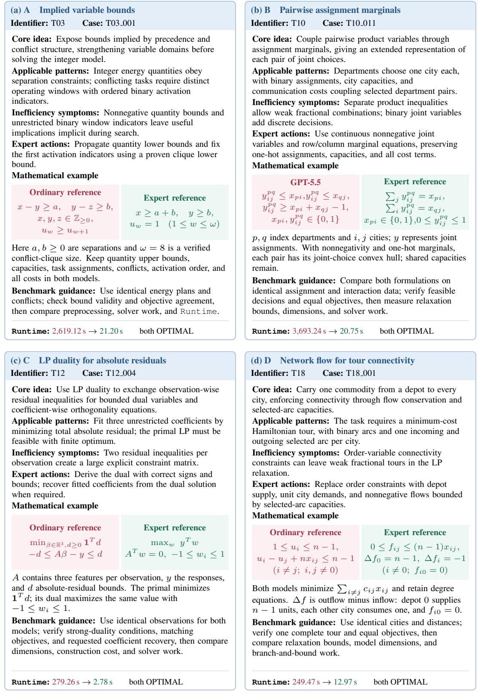  
Figure 12: OptTips cards for families A–D. Each expanded card includes all seven components of the schema. Paired models highlight the transformation, with shared terms described in the card. Panel (b) retains the GPT-5.5–expert comparison from Figure 1; the other panels use ordinary and expert references. Recorded solver Runtime values have matching reported objective values.

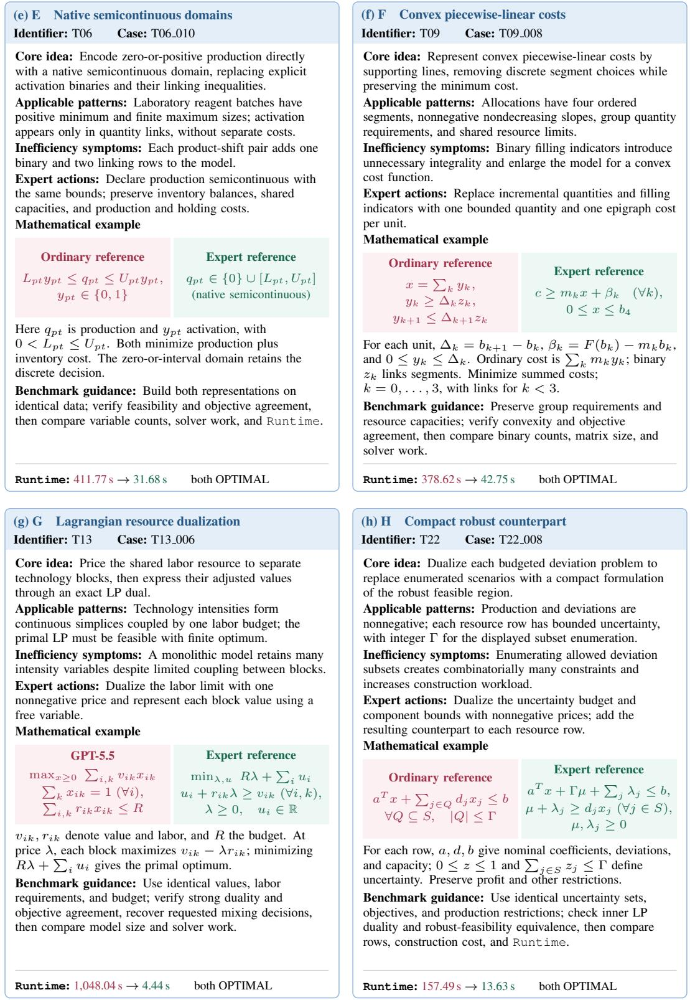  
Figure 13: OptTips cards for families E–H. The same seven-component schema continues with four further examples. Panel (g) retains the GPT-5.5–expert comparison from Figure 1; other panels use ordinary and expert references. Times report solver Runtime under the execution protocol in Appendix D; panel (h) lacks historical input-hash verification.

SOS, indicator, and piecewise-linear formulations (T29) (Gurobi Optimization, 2026a); their exclusion from the current evaluation does not imply solver incompatibility.

Broader variants include T47’s nuclear-norm SDP with positive-semidefinite constraints (MOSEK ApS, 2025) and T29’s interval NoOverlap in CP-SAT (Google, 2024). Evaluating T14’s ADMM requires its full multiplier-update iterations and residual-based stopping (Boyd et al., 2011).

## J.3 COMPLETE TECHNIQUE INVENTORY

Table 19: All 50 OptTips techniques. Family codes refer to Table 18. The catalog includes formulation, algorithmic, and solver-aware choices; full cards are available in the public repository.
<table><tr><td>ID</td><td>Technique</td><td>Family</td><td>ID</td><td>Technique</td><td>Family</td></tr><tr><td>T01</td><td>Equality/inequality equivalent transformation</td><td>A</td><td>T26</td><td>Complementarity and KKT/MPEC modeling</td><td>E</td></tr><tr><td>T02</td><td>Auxiliary-variable epigraph/hypograph modeling</td><td>A</td><td>T27</td><td>Multi-objective and lexicographic optimization</td><td>H</td></tr><tr><td>T03</td><td>Bound tightening and scaling</td><td>A</td><td>T28</td><td>Penalty, slack, and feasibility-relaxation modeling</td><td>H</td></tr><tr><td>T04</td><td>LP relaxation of IP/MIP</td><td>E</td><td>T29</td><td>Solver-native modeling constructs</td><td>H</td></tr><tr><td>T05</td><td>Big-M modeling</td><td>E</td><td>T30</td><td>Warm starts and incumbent injection</td><td>H</td></tr><tr><td>T06</td><td>Indicator, semicontinuous, and SOS constraints</td><td>E</td><td>T31</td><td>Algorithm-structure matching</td><td>H</td></tr><tr><td>T07</td><td>Valid inequalities and cutting planes</td><td>B</td><td>T32</td><td>Solver-log-guided diagnosis</td><td>H</td></tr><tr><td>T08</td><td>Variable substitution and product linearization</td><td>F</td><td>T33</td><td>Standard/canonical-form transformation</td><td>A</td></tr><tr><td>T09</td><td>Piecewise-linear modeling</td><td>F</td><td>T34</td><td>Slack, surplus, and artificial variables</td><td>A</td></tr><tr><td>T10</td><td>Convex-hull/envelope reformulation and convexification</td><td>B</td><td>T35</td><td>Variable elimination and dimension reduction</td><td>A</td></tr><tr><td>T11</td><td>Conic reformulation</td><td>F</td><td>T36</td><td>Convexity recognition and DCP modeling</td><td>F</td></tr><tr><td>T12</td><td>Dual transformation</td><td>C</td><td>T37</td><td>Smooth-nonsmooth composite modeling</td><td>F</td></tr><tr><td>T13</td><td>Lagrangian relaxation</td><td>G</td><td>T38</td><td>Convex conjugacy and Fenchel duality</td><td>F</td></tr><tr><td>T14</td><td>Augmented Lagrangian and ADMM</td><td>G</td><td>T39</td><td>Subgradient, normal-cone, and optimality-condition modeling</td><td>F</td></tr><tr><td>T15</td><td>Block decomposition</td><td>G</td><td>T40</td><td>Projection and proximal-operator modeling</td><td>F</td></tr><tr><td>T16</td><td>Benders decomposition</td><td>G</td><td>T41</td><td>Variational-inequality and equilibrium-constraint modeling</td><td>C</td></tr><tr><td>T17</td><td>Dantzig-Wolfe decomposition and column generation</td><td>G</td><td>T42</td><td>Sensitivity and parametric optimization</td><td>C</td></tr><tr><td>T18</td><td>Network-flow and matching formulations</td><td>D</td><td>T43</td><td>Dynamic programming and Bellman recursion</td><td>G</td></tr><tr><td>T19</td><td>Covering, partitioning, packing, and knapsack formulations</td><td>D</td><td>T44</td><td>Transportation and network-simplex structure</td><td>D</td></tr><tr><td>T20</td><td>Scheduling and temporal formulations</td><td>D</td><td>T45</td><td>Constraint qualifications and KKT validity</td><td>C</td></tr><tr><td>T21</td><td>Routing and path formulations</td><td>D</td><td>T46</td><td>Interior-point-friendly modeling</td><td>F</td></tr><tr><td>T22</td><td>Robust counterpart reformulation</td><td>H</td><td>T47</td><td>Matrix-variable and low-rank modeling</td><td>D</td></tr><tr><td>T23</td><td>Stochastic programming and scenario decomposition</td><td>H</td><td>T48</td><td>Cover, clique, subtour, and capacity cuts</td><td>B</td></tr><tr><td>T24</td><td>Preprocessing and dominance elimination</td><td>B</td><td>T49</td><td>Linking constraints and activation strengthening</td><td>B</td></tr><tr><td>T25</td><td>Symmetry breaking</td><td>D</td><td>T50</td><td>Tensor-variable and low-rank modeling</td><td>D</td></tr></table>