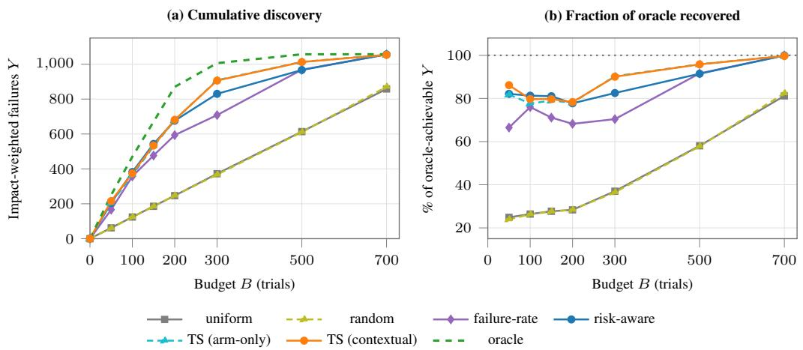
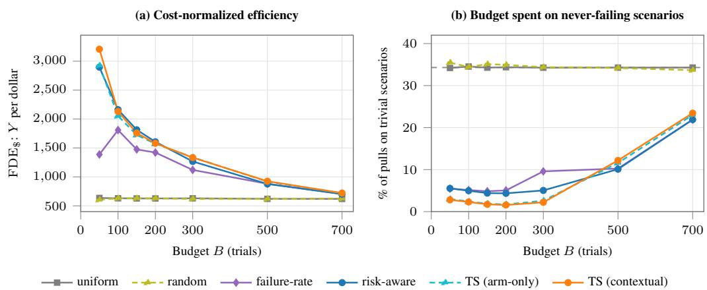
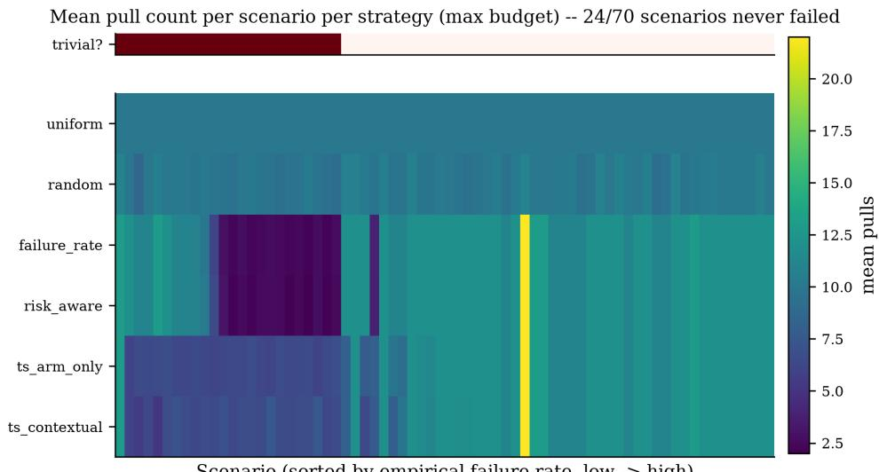
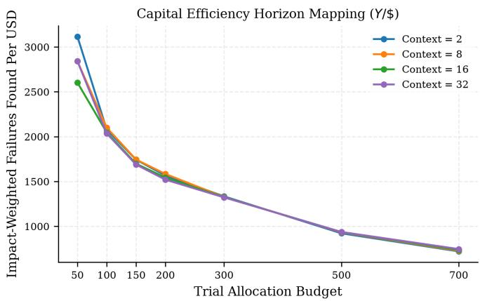
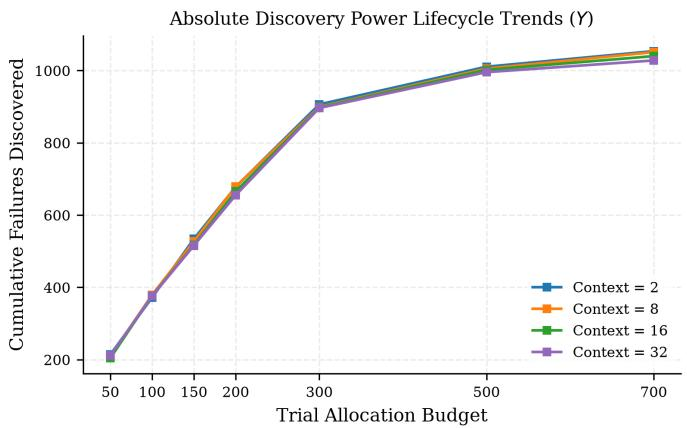

# Risk-Aware Adaptive Evaluation: Finding High-Impact Failures Under Limited Budgets

Priyanath Maji Georgia Institute of Technology Atlanta, GA 30332 pmaji3@gatech.edu

Spandan Ghose Chowdhury Georgia Institute of Technology Atlanta, GA 30332 spandan\_gc@gatech.edu

## Abstract

Evaluating interactive agents is expensive. Agent behavior is stochastic, so reliability must be measured over repeated trials, but failures are rare and differ widely in how much they matter. Standard benchmarks spend this budget uniformly: a read-only lookup is sampled as often as an irreversible payment action. We instead formulate evaluation as a sequential allocation problem. Given a fixed trial budget and a set of scenarios whose failure behavior is unknown, which scenarios should be run, and run again? We propose a risk-aware contextual Thompson Sampling policy that combines a pre-execution scenario context vector and a fixed impact score with the failure outcomes observed during evaluation, and we test it by offline replay over 70 τ-bench airline scenarios and 824 recorded trials. Our main result is at the smallest budget: with only 50 trials (6% of the corpus), the policy recovers 86% of the impact-weighted failures an oracle could find, compared to 25% for uniform allocation. It discovers 3.5× more impact-weighted failures (215.4 vs. 62.2) with the same number of trials, delivers 5× the discovery per dollar, and cuts the budget wasted on scenarios that never fail from 34% to 2.8%. The rest of our analysis demonstrates and qualifies this result: a budget sweep shows the advantage shrinks as the budget approaches the corpus size, and paired significance tests show that scenario context helps mainly at small budgets while posterior-based exploration helps at moderate ones. Risk-aware adaptive allocation therefore helps most exactly where evaluation budget is scarcest.

## 1 Introduction

Large language model (LLM) agents increasingly perform multi-step interactive tasks that involve tool use, changes to environment state, domain policy constraints, and direct interaction with users. Benchmarks such as τ-bench [1] and τ2-bench [2] have shown that evaluating these agents requires more than checking a final answer: behavior must be judged over full trajectories, including tool execution, policy adherence, and state consistency. τ-bench also shows that state-of-the-art functioncalling agents are substantially inconsistent across repeated runs of the same scenario. Reliability, not single-run success, is the right object of measurement.

This view has a direct consequence for cost. If behavior is stochastic, one trial per scenario is a poor estimate of failure, so a benchmark must repeat trials. But repeating trials uniformly wastes budget, because scenarios differ along two independent axes. They differ in how often they fail: in our corpus, 24 of 70 scenarios never fail in any observed trial. They also differ in what a failure means: a failed read-only lookup and a failed irreversible payment action are not equally important, yet uniform sampling treats them identically. As evaluation increasingly relies on repeated, costly trials against live tool-calling environments and LLM-based user simulators, this waste turns directly into evaluation cost.

Prior work on efficiency in agentic systems has mostly optimized the agent’s computation rather than the evaluator’s allocation of trials, for example by optimizing multi-agent execution graphs [3] or pruning redundant agents and communication [4]. These methods reduce the cost of a single execution. We explore a complementary question: how many executions of which scenarios are worth running at all?

This work. We frame interactive-agent evaluation as a sequential resource-allocation problem. Given a fixed budget and a corpus of scenarios with unknown failure behavior, we examine which scenarios should be executed, and re-executed, to uncover as many consequential failures as possible. We build on Thompson Sampling [5], a Bayesian bandit strategy with well-understood regret behavior [6, 7], extended with scenario-level context [8]. Allocation is then informed both by properties known before a scenario is ever executed (whether it involves payment, irreversible actions, or policy constraints) and by outcomes observed during evaluation. Unlike a standard bandit, the goal is not reward from an environment but the discovery of impact-weighted failures under a resource constraint: each scenario is a source of information about agent reliability.

Main result. Our central finding concerns the small-budget regime: the setting where an agent is re-evaluated after every model, prompt, or policy change, so each decision can afford only a small slice of the corpus rather than many full passes [9]. At a budget of 50 trials (6% of the corpus), contextual Thompson Sampling recovers 86.1% of the impact-weighted failure discovery an oracle could achieve, against 24.9% for uniform allocation. Paired, Holm-corrected tests over 30 sharedseed replicates decompose where this advantage comes from: pre-execution scenario context is what wins the cold start (beating the arm-only variant at $B \leq 1 0 0 , \bar { p } _ { \mathrm { H o l m } } < 0 . 0 0 5 )$ , while posterior-based exploration takes over at moderate budgets (beating the static risk-aware heuristic at $B = 3 0 0 – 5 0 0$ $p _ { \mathrm { H o l m } } < 1 0 ^ { - 8 } $ . Both effects, and the advantage itself, shrink as the budget grows toward the corpus size.

Contributions. (1) Formulation: we cast interactive-agent evaluation as a risk-aware sequential allocation problem that separates fixed, pre-execution quantities (context vector ${ \bf x } _ { i } ,$ impact score $I _ { i } )$ from stochastic per-trial observations (failure outcome $F _ { i , t } ,$ , resource use $\mathbf { R } _ { i , t } )$ , with impactweighted failure discovery as the objective. (2) Method: we instantiate this as a contextual, risk-aware Thompson Sampling policy and compare it against uniform, random, failure-rate, and static riskaware baselines and an oracle upper bound. (3) Analysis: with paired, Holm-corrected tests we identify where context and posterior-based exploration each help, not just whether they help. (4) Cost accounting: we report discovery per dollar of measured evaluation cost, not just per trial.

Hypotheses. We test four claims. H1 (Adaptivity): under a fixed budget, adaptive allocation discovers more impact-weighted failures than uniform allocation. H2 (Context, budget-dependent): Thompson Sampling using observed outcomes, impact, and (in its contextual variant) pre-execution features xi allocates more efficiently than non-adaptive allocation, though not necessarily at every budget. H3 (Concentration): as trials accumulate, adaptive allocation increasingly avoids scenarios that show no evidence of failure while still exploring uncertain ones. H4 (Cost efficiency): adaptive allocation discovers more impact-weighted failures per unit of measured cost, especially at small budgets.

## 2 Related Work

Interactive agent benchmarks and reliability. AgentBench [10] established the need to evaluate language models as agents in interactive environments rather than through static question answering. Later benchmarks extended this to web-based multi-step tasks [11], large-scale tool use over real APIs [12], and complex multi-step tool use over live MCP servers [13]. τ-bench [1] is closest to our setting: it evaluates tool-agent-user interaction under policy constraints and stateful environments, and its $\mathrm { P a s s } ^ { k }$ metric measures reliability across repeated trials rather than single-run correctness; $\tau ^ { 2 } .$ -bench [2] extends this to dual-control environments. Follow-up studies confirm this variance is real and large: Mustahsan et al. [14] quantify within-task inconsistency with intraclass correlation, Bjarnason et al. [15] show by replay that single-run pass@1 on SWE-Bench-Verified moves by 2 to 6 points depending on which run is observed even at temperature 0, and Gonzalez-Pumariega et al. [16] reach the same conclusion for computer-use agents. Other work enriches what each trajectory is scored on: TRAJECT-Bench [17] adds trajectory-level diagnostics beyond final success, and Cao et al. [18] show agents can reach correct final states through flawed procedures, so failures differ in kind and severity; we likewise extract operational signals (tool calls, turns, trajectory length, cost) from each trajectory. All of these protocols, however, execute a predetermined, uniform trial schedule; even Huang [9], who asks how many tasks a benchmark needs for a stable decision, works under uniform allocation. We formulate the schedule itself as the thing to optimize.

Sequential allocation and Thompson Sampling. Our problem is a multi-armed bandit: the evaluator picks a scenario, observes its outcome, and uses that to inform the next pick. Thompson Sampling [5] keeps a posterior over each arm’s unknown parameter and samples from it, balancing exploration and exploitation; its finite-time regret is well understood [6, 7], and Agrawal and Goyal [8] extend it to contextual bandits with linear payoffs, the mechanism we adapt for pre-execution features $\mathbf { x } _ { i }$ . Bastani et al. [19] show that informative context can remove much of the need for exploration, consistent with our finding that context matters most in the cold start, and Riquelme et al. [20] show that practical performance depends on the quality of the posterior approximation. Because our failure outcome is binary, the contextual version is most closely related to generalized linear bandits [21], fully Bayesian logistic Thompson Sampling via Pólya-Gamma augmentation [22], and neural variants [23]; extensions handle partially observable context [24] and parallel pulls [25]. We use a simpler empirical-Bayes approximation, a lightweight choice at our corpus scale $( N = 7 0 ) ;$ a fully Bayesian generalized linear bandit is the natural choice at much larger scenario counts.

Budget-constrained discovery elsewhere. The problem of splitting a finite execution budget to find rare, costly failures is well studied outside agent evaluation. In software security, greybox fuzzers allocate executions across candidate test inputs to maximize bug discovery: Woo et al. [26] first cast seed scheduling as a multi-armed bandit, and EcoFuzz [27] models it adversarially to reduce wasted effort on well-explored inputs. In rare-event simulation and structural reliability, adaptive importance sampling and adaptive stratified sampling concentrate simulation effort in high-risk regions and avoid empty strata [28, 29, 30], and related work replaces uniform sampling with learned non-uniform sampling when many rare network threats must be simulated at once [31]. None of these methods study LLM agents, but they are the strongest precedent for our claim that rare, heterogeneous, high-impact failures call for adaptive allocation rather than uniform budgeting. The objective also matters: for estimating mean accuracy under a fixed budget, spreading budget across more items with fewer trials each can be the variance-optimal choice [14]. Our objective is different, discovery of impact-weighted failures, and that is where concentration pays. Two further things separate our setting from this work. First, we maximize discovered failures weighted by consequence, not environmental reward, an objective closer to active testing than to online decision-making. Second, each scenario’s impact $I _ { i }$ is known before execution while its failure outcome $F _ { i , t }$ is observed only after, so our formulation separates a fixed notion of consequence from an adaptively estimated notion of likelihood, a distinction that does not arise when an arm’s value is fully determined by its reward distribution.

## 3 Method

## 3.1 Problem Formulation

Let $\boldsymbol { S } = \{ s _ { 1 } , \ldots , s _ { N } \}$ be a set of evaluation scenarios. Each scenario is a complete interactive task specification: a user objective, an initial environment state, applicable policy constraints, and a ground-truth reference action sequence. Each scenario carries a fixed context vector $\mathbf { x } _ { i } \in \mathbb { R } ^ { d }$ $d = 1 7$ , extracted statically from the task definition (its reference action sequence and naturallanguage instruction), never from an observed outcome. This separation is deliberate: $\mathbf { x } _ { i }$ must be available before a scenario’s first trial is selected, and conditioning it on execution results would leak outcome information into the allocation policy. The features are eight binary task-structure indicators (requires\_search, requires\_mutation, requires\_confirmation, has\_payment, da $\mathsf { c e } _ { - }$ change, cabin\_change, multi\_segment, optimization\_required), a passenger count and single-passenger indicator, membership- and insurance-sensitivity indicators, a complexity score and expected interaction horizon, an irreversible-action indicator, a policy-constraint indicator, and a scalar ambiguity score derived from instruction keywords. Three features (membership\_sensitive, complexity\_score, expected\_horizon) are constant in this corpus; we keep them for interface stability, and all variance-based analysis should be read against the 14 activefeatures.

Each trial t of scenario $s _ { i }$ produces a trajectory $\tau _ { i , t } = ( s _ { 0 } , a _ { 1 } , o _ { 1 } , \dots , a _ { T } , o _ { T } )$ , where a is an agent action or tool call and o the resulting observation. Because both the agent and the simulated user are stochastic, repeated trials of the same scenario give different trajectories and outcomes. From each trajectory we obtain a binary failure indicator $F _ { i , t } \in \{ 0 , 1 \}$ , determined by comparing the realized outcome against the ground-truth reference, and a resource vector ${ \bf R } _ { i , t } = [ R _ { i , t } ^ { \mathrm { t o o l s } } , R _ { i , t } ^ { \mathrm { t u r n s } } , R _ { i , t } ^ { \mathrm { t r a j } }$ , Rcosti,t ] recording tool calls, conversational turns, trajectory length, and measured monetary cost. Each scenario also carries a fixed impact score $I _ { i } ,$ giving the observed failure-impact signal $\mathsf { \tilde { Y } } _ { i , t } = I _ { i } F _ { i , t }$ Repeated trials share $\mathbf { x } _ { i }$ and $I _ { i }$ (both fixed and known before execution) while $F _ { i , t } , \mathbf { R } _ { i , t }$ , and $Y _ { i , t }$ vary from trial to trial.

Given a trial budget B, the evaluator sequentially selects scenarios $A _ { 1 } , \dotsc , A _ { B }$ , observes $( F _ { A _ { t } , t } , { \bf R } _ { A _ { t } , t } )$ after each selection, and uses the history $\mathcal { H } _ { t - 1 }$ to inform later choices, $A _ { t } \sim \pi ( S \mid$ $\mathcal { H } _ { t - 1 } )$ . The objective is

$$
\operatorname* { m a x } _ { \pi } \mathbb { E } _ { \pi } \left[ \sum _ { t = 1 } ^ { B } I _ { A _ { t } } F _ { A _ { t } , t } \right] .\tag{1}
$$

## 3.2 Impact Score

The impact score is a fixed, rule-based function of a scenario’s context features. It reflects the consequence of a failure, not its likelihood:

$$
I _ { i } = \left\{ \begin{array} { l l } { 5 , } & { \mathrm { i r r e v e r s i b l e ~ a c t i o n ~ e x p e c t e d , } } \\ { 4 , } & { \mathrm { m u t a t i o n } ~ a n d ~ ( p a y m e n t ~ o r ~ c o n f i r m a t i o n ~ r e q u i r e d ) , } \\ { 3 , } & { \mathrm { m u t a t i o n , n o ~ p a y m e n t ~ o r ~ c o n f i r m a t i o n , } } \\ { 1 , } & { \mathrm { i n f o r m a t i o n a l / \ r e a d - o n l y . } } \end{array} \right.\tag{2}
$$

$I _ { i }$ is computed once per scenario from $\mathbf { x } _ { i }$ and stays fixed throughout evaluation; it is never updated from observed outcomes. This is a deliberate simplification. A learned or trajectory-conditioned impact model is a natural extension, but we do not implement it here. For scenario i after $n _ { i }$ trials we also track the empirical failure rate $\begin{array} { r } { \hat { p } _ { i } = n _ { i } ^ { - 1 } \sum _ { t } F _ { i , t } } \end{array}$ and mean cost $\begin{array} { r } { \hat { C } _ { i } = n _ { i } ^ { - 1 } \sum _ { t } R _ { i , t } ^ { \mathrm { c o s t } } ; \hat { C } _ { i } } \end{array}$ is used only after the fact, for cost-normalized metrics.

## 3.3 Allocation Strategies

We compare six policies plus an oracle upper bound. All adaptive policies use either an ε-greedy or a posterior-sampling selection rule. No policy normalizes its score by estimated cost ${ \hat { C } } _ { i } ,$ , so cost enters only as a reported outcome. Any cost efficiency we observe is therefore a byproduct of failure-aware selection, not an explicitly optimized objective.

Uniform visits scenarios in a fixed, once-shuffled round-robin order, cycling back to the start and skipping scenarios whose trials are exhausted. Random draws uniformly at random from scenarios with remaining trials, independent of history. Failure-rate selects arg max $\hat { p } _ { i }$ with probability $1 - \varepsilon$ $( \varepsilon = 0 . 1 )$ , using an optimistic $\hat { p } _ { i } = 1$ for $n _ { i } = 0$ so every scenario is tried at least once, and selects uniformly at random otherwise. Risk-aware has the same ε-greedy structure but ranks by $I _ { i } \hat { p } _ { i }$ , so scenarios with higher known impact are preferred even before any evidence is observed. It is the natural static-impact heuristic that posterior-based exploration must beat. Thompson Sampling (arm-only) keeps each scenario as an independent Beta posterior $\theta _ { i } \sim \mathrm { B e t a } ( \alpha _ { i } , \beta _ { i } { \bar { ) } }$ over its failure probability, initialized $\alpha _ { i } = \beta _ { i } = 1$ and updated as $( \bar { \alpha _ { i } , \beta _ { i } } )  ( \alpha _ { i } + F _ { i , t } , \bar { \beta _ { i } } + 1 - F _ { i , t } )$ . At each step a sample ${ \tilde { \theta } } _ { i }$ is drawn for every available scenario and the maximizer of

$$
V _ { i } = I _ { i } \tilde { \theta } _ { i }\tag{3}
$$

is selected. This variant does not use $\mathbf { x } _ { i }$ . Thompson Sampling (contextual) is identical to the arm-only variant, except that the Beta parameters are informed by a population-level model of $\mathbf { x } _ { i }$ After every pull a logistic regression is refit on all pooled $( \mathbf { x } _ { j } , F _ { j , \cdot } )$ observations seen so far, giving a predicted failure probability $\hat { p } ( \mathbf { x } _ { i } )$ for every scenario, including those never yet executed. This prediction is blended with a scenario’s own evidence as pseudo-counts,

$$
\begin{array} { r } { a _ { i } = 1 + \lambda \hat { p } ( \mathbf { x } _ { i } ) + \sum _ { t } F _ { i , t } , \qquad b _ { i } = 1 + \lambda \left( 1 - \hat { p } ( \mathbf { x } _ { i } ) \right) + n _ { i } - \sum _ { t } F _ { i , t } , } \end{array}\tag{4}
$$

with $\tilde { \theta } _ { i } \sim \mathrm { B e t a } ( a _ { i } , b _ { i } )$ and selection by Eq. 3. The context weight λ sets how strong the population level prior is relative to a scenario’s own evidence; $\lambda = 0$ recovers the arm-only variant exactly. We fixed $\lambda = 2$ a priori as a weakly-informative default before running the sweep, and report it throughout, with an ablation over $\lambda \in \{ 2 , 8 , 1 6 , 3 2 \}$ in Appendix D. Both Thompson Sampling variants select the first trial of each replicate uniformly at random, since the flat prior at $t = 0$ makes the posterior-sampled choice indistinguishable from random selection. Oracle sorts all trials by $Y _ { i , t }$ in descending order and reports the cumulative sum of the top B values for a given replicate’s realized outcomes. This is the best any policy could achieve against that exact realized dataset at budget B, and it automatically respects each scenario’s finite trial count because it draws from the same already-collected outcomes.

## 3.4 Corpus and Offline Replay Protocol

Scenarios come from the airline domain of τ-bench [1]: $N = 7 0$ scenarios covering reservation search, booking, cancellation, flight modification, passenger and baggage changes, and payment operations. Trial outcomes are generated with a GPT-4o [32] tool-calling agent (temperature 0.0) against a GPT-4o simulated user under τ-bench’s native harness; $F _ { i , t }$ compares the agent’s realized action sequence and final environment state against the ground-truth reference. Trial counts per scenario are not perfectly uniform (6 to 17), a consequence of aggregating independently executed result batches; the corpus totals 824 trials.

Rather than executing fresh trials for each policy, we evaluate all strategies by replaying them against this single collected corpus. For each of $M = 3 0$ replicates, a scenario’s observed trials are shuffled with a replicate-specific seed and served without replacement as a policy pulls that scenario. This is standard offline bandit evaluation, valid under the assumption that trial order does not affect a scenario’s underlying outcome distribution. Critically, every policy in a sweep uses the identical seed schedule $( { \sec } \mathbf { d } = 1 0 0 0 0 s + r )$ , so replicate r presents the exact same shuffled ordering to every policy; per-replicate outcomes are directly comparable, which is what licenses the paired tests.

## 3.5 Metrics and Statistical Procedure

All metrics are computed over $M = 3 0$ replicates at budgets $B \in \{ 5 0 , 1 0 0 , 1 5 0 , 2 0 0 , 3 0 0 , 5 0 0 , 7 0 0 \}$ We report mean cumulative Y and raw failure count $F ;$ oracle-normalized efficiency pct\_of\_ $\mathrm { o r a c l e } ( \pi , B ) = 1 0 0 \bar { Y } _ { \pi } ( B ) / Y ^ { * } ( B )$ , with $Y ^ { * } ( B )$ the oracle value computed per replicate and averaged; cost-normalized efficiency $\mathrm { \bar { F D E } } _ { \mathfrak { F } } = \bar { Y } _ { \pi } ( \mathring { B } ) / \overline { { \mathrm { c o s t } } } _ { \pi } ( B )$ and its raw-failure analogue; and trivial-scenario allocation, the fraction of a policy’s budget spent on scenarios with $\hat { p } _ { i } = 0$ across all of their trials in the full corpus (not just those the policy pulled), a direct test of whether adaptive allocation avoids scenarios with no observed failure potential.

Because replicate r presents an identical trial ordering to every policy, we compare policies pairwise with a paired t-test on per-replicate cumulative Y at each budget, correcting within each family of tests using the Holm step-down procedure [33]. We apply this to compare TS-CONTEXTUAL against TS-ARM-ONLY and RISK-AWARE (14 tests: 2 comparisons $\times 7$ budgets), and to compare TS-CONTEXTUAL using its full 17-feature context against a 13-feature variant with the four features that directly determine $I _ { i }$ removed (7 tests). The second family isolates whether any contextual advantage is just information already captured by the impact score.

## 4 Results

We evaluate all six strategies on the full corpus of $N = 7 0$ scenarios and 824 realized trials, replaying each policy against the same collected outcomes for 30 independent replicates. Unless noted, TS-CONTEXTUAL uses $\lambda = 2$ . Section 4.1 presents the main result of the paper, discovery at a small budget. The remaining subsections are supporting analyses: they show how the advantage changes with budget, which mechanism drives it and when, what it costs in dollars, and where the saved budget comes from.

Table 1: Mean cumulative impact-weighted failures (Y ) and percentage of oracle-achievable Y recovered, at four representative budgets. The B=50 column is the main result; larger budgets are shown for context. Bold marks the best strategy at each budget.
<table><tr><td></td><td colspan="2"> $B = 5 0$ </td><td colspan="2"> $B = 1 0 0$ </td><td colspan="2">B = 300</td><td colspan="2">B = 700</td></tr><tr><td>Strategy</td><td>Y</td><td>%oracle</td><td>Y</td><td>%oracle</td><td>Y</td><td>%oracle</td><td>Y</td><td>%oracle</td></tr><tr><td>Uniform</td><td>62.2</td><td>24.9</td><td>124.1</td><td>26.4</td><td>372.3</td><td>37.0</td><td>858.0</td><td>81.2</td></tr><tr><td>Random</td><td>59.9</td><td>23.9</td><td>123.7</td><td>26.3</td><td>367.2</td><td>36.5</td><td>870.5</td><td>82.4</td></tr><tr><td>Failure-rate</td><td>166.2</td><td>66.5</td><td>357.2</td><td>76.0</td><td>708.3</td><td>70.4</td><td>1056.2</td><td>99.9</td></tr><tr><td>Risk-aware</td><td>205.3</td><td>82.1</td><td>382.1</td><td>81.3</td><td>830.1</td><td>82.5</td><td>1056.2</td><td>99.9</td></tr><tr><td>TS (arm-only)</td><td>204.5</td><td>81.8</td><td>365.1</td><td>77.7</td><td>908.4</td><td>90.3</td><td>1054.0</td><td>99.7</td></tr><tr><td>TS (contextual)</td><td>215.4</td><td>86.1</td><td>374.7</td><td>79.7</td><td>906.2</td><td>90.1</td><td>1053.6</td><td>99.7</td></tr><tr><td>Oracle</td><td>250.0</td><td>100</td><td>470.0</td><td>100</td><td>1006.0</td><td>100</td><td>1057.0</td><td>100</td></tr></table>

  
Figure 1: Impact-weighted failure discovery as a function of evaluation budget, for all six allocation strategies and the oracle upper bound. (a) raw cumulative Y; (b) the same result normalized by the oracle. The adaptive advantage is largest at the smallest budget and disappears as the budget approaches the size of the corpus.

## 4.1 Main Result: Discovery at a Small Budget

The main result of this paper is the B = 50 column of Table 1. At a budget of 50 trials, which is 6% of the 824-trial corpus, TS-CONTEXTUAL recovers 86.1% of the impact-weighted discovery an oracle could achieve. Uniform allocation recovers 24.9% and random allocation 23.9%. In raw terms, TS-CONTEXTUAL finds 3.46× more impact-weighted failures than uniform (215.4 vs. 62.2) with the exact same number of trials. All four adaptive strategies recover 66–86% at this budget, supporting H1: when the budget is tight, risk-aware adaptive allocation finds far more of what matters.

We focus on the smallest budget because it is the realistic operating point. The rest of the sweep (Figure 1) bounds the claim: as the budget grows the advantage shrinks, and by B = 700 (85% of the corpus) all four adaptive strategies converge to 99.7–99.9% of the oracle. Uniform and random remain at 81–82% even at that generous budget, because they keep spending trials on scenarios that have already exhausted their contribution to Y . Adaptive allocation thus dominates at every budget short of exhausting the corpus, but the size of the advantage tracks how scarce the budget is. Nothing about the method is specific to small budgets; small budgets are simply where it pays.

## 4.2 Supporting Analysis: Which Mechanism Helps, and When

The main result shows that adaptive allocation wins at a small budget, but not which ingredient of TS-CONTEXTUAL is responsible. Table 2 separates the two things it adds over blind allocation, scenario context $\mathbf { x } _ { i }$ and posterior-based exploration, using the paired tests licensed by the shared seed schedule.

Table 2: Paired comparison of TS-CONTEXTUAL against TS-ARM-ONLY (context vs. no context) and against RISK-AWARE (posterior exploration vs. a static impact-only heuristic). $\Delta Y$ is the mean per-replicate difference; $p _ { \mathrm { H o l m } }$ is corrected across all 14 tests in this family. ∗ marks $p _ { \mathrm { H o l m } } < 0 . 0 5$
<table><tr><td colspan="3">VS. TS-ARM-ONLY</td><td colspan="2">VS. RISK-AWARE</td></tr><tr><td>Budget</td><td>∆Y</td><td>pHolm</td><td>∆Y</td><td>PHolm</td></tr><tr><td>50</td><td>+10.9</td><td>0.0001 本</td><td>+10.1</td><td>0.0002*</td></tr><tr><td>100</td><td>+9.7</td><td>0.0031*</td><td>-7.3</td><td>0.075</td></tr><tr><td>150</td><td>+4.8</td><td>0.543</td><td>-9.2</td><td>0.061</td></tr><tr><td>200</td><td>+1.9</td><td>0.614</td><td>+4.9</td><td>0.398</td></tr><tr><td>300</td><td>-2.2</td><td>0.543</td><td>+76.1</td><td> $4 . 0 \times 1 0 ^ { - 9 * }$ </td></tr><tr><td>500</td><td>-0.8</td><td>0.614</td><td>+45.8</td><td> $8 . 2 \times 1 0 ^ { - 1 0 * }$ </td></tr><tr><td>700</td><td>-0.4</td><td>0.543</td><td>-2.6</td><td> $9 . 6 \times 1 0 ^ { - 7 * }$ </td></tr></table>

Table 3: Mean measured user-simulator cost (USD) and cost-normalized efficiency at the smallest and largest budgets. Cost is the logged user\_cost of the GPT-4o simulated user, the only component consistently recorded per trial; agent-side spend is not included. $Y / \mathbb { S }$ is $\mathrm { F D E _ { \mathbb { S } } }$ $F / \mathbb { S }$ is its raw-failure analogue.
<table><tr><td></td><td colspan="3"> $B = 5 0$ </td><td colspan="3"> $B = 7 0 0$ </td></tr><tr><td>Strategy</td><td>Cost ($)</td><td> $Y / \mathbb { S }$ </td><td> $F / \mathbb { S }$ </td><td>Cost ($)</td><td> $Y / \mathbb { S }$ </td><td> $F / \mathbb { S }$ </td></tr><tr><td>Uniform</td><td>0.098</td><td>636</td><td>221</td><td>1.383</td><td>620</td><td>211</td></tr><tr><td>Random</td><td>0.099</td><td>605</td><td>208</td><td>1.392</td><td>625</td><td>211</td></tr><tr><td>Failure-rate</td><td>0.120</td><td>1388</td><td>347</td><td>1.502</td><td>703</td><td>233</td></tr><tr><td>Risk-aware</td><td>0.071</td><td>2897</td><td>591</td><td>1.503</td><td>703</td><td>233</td></tr><tr><td>TS (arm-only)</td><td>0.070</td><td>2925</td><td>591</td><td>1.468</td><td>718</td><td>237</td></tr><tr><td>TS (contextual)</td><td>0.067</td><td>3207</td><td>650</td><td>1.461</td><td>721</td><td>238</td></tr></table>

The comparison most relevant to the main result is the first row. Context is what wins the cold start. At $B \leq 1 0 0$ , TS-CONTEXTUAL beats TS-ARM-ONLY, which is identical except that it ignores $\mathbf { x } _ { i } ,$ with $p _ { \mathrm { H o l m } } < 0 . 0 0 5$ . At no larger budget is the difference distinguishable from noise. The explanation is simple: when almost nothing has been tried, the population-level model over $\mathbf { x } _ { i }$ is the only useful signal for unobserved scenarios, and its value fades as arms accumulate their own evidence.

A second effect appears at moderate budgets and is separate from context. TS-CONTEXTUAL beats the static heuristic RISK-AWARE by a wide margin at $B \stackrel { - } { = } 3 0 0$ and $B = 5 0 0 ( \Delta Y = + 7 6 . 1$ and +45.8, $p _ { \mathrm { H o l m } } < 1 0 ^ { - 8 } )$ , even though it is indistinguishable from TS-ARM-ONLY at those same budgets. Since the two Thompson variants differ from RISK-AWARE only in how they explore, this mid-budget advantage comes from posterior-based exploration, not from $\mathbf { x } _ { i }$ . RISK-AWARE keeps exploring at a fixed rate $( \varepsilon = 0 . 1 )$ no matter how much evidence it has, while the Thompson variants naturally explore less as their posteriors sharpen. We discover no advantage over either baseline at $B { = } 1 5 0 { - } 2 0 0$ The nominally significant $B = 7 0 0$ result against RISK-AWARE is a −2.6 difference on 1056.2, a 0.24% relative gap at a budget where the corpus is 85% exhausted, and we do not read it as practically meaningful.

To summarize, the evidence for context is specific to the small-budget regime and the evidence for posterior exploration to the mid-budget regime; a blanket claim that contextual TS wins would be wrong in both directions. H2 is therefore partially supported and explicitly budget-dependent.

Finally, we test whether the composition of $\mathbf { x } _ { i }$ matters, comparing the full 17-feature vector against a residual 13-feature variant with the four features that directly determine $I _ { i }$ removed (requires\_mutation, requires\_confirmation, has\_payment, irreversible\_actions\_expected). No budget survives Holm correction $( p _ { \mathrm { H o l m } } ~ \ge ~ 0 . 0 6 4$ everywhere; Appendix A). The contextual advantage is therefore not an artifact of $\mathbf { x } _ { i }$ re-encoding information already in $I _ { i } .$ At the same time, the exact composition of the remaining features is not a first-order driver of performance at this corpus size.

  
Figure 2: (a) Impact-weighted failures discovered per dollar of measured evaluation cost. (b) Fraction of budget spent on trivial scenarios, meaning those that never failed in any observed trial (24 of 70; the grey dashed line is the 34.3% corpus base rate).

## 4.3 Supporting Analysis: Cost in Dollars

Trial count is a convenient proxy for budget, but the resource actually spent is money. Table 3 and Figure 2(a) restate the main result in dollars. At B = 50, TS-CONTEXTUAL finds 5.0× more impact-weighted failures per dollar than uniform allocation (3207 vs. 636) while spending less in total (\$0.067 vs. \$0.098). The gain is not bought with extra spend; it comes from putting the same or smaller outlay on more informative scenarios. Consistent with the budget-dependence above, the advantage narrows to 1.16× by $B = 7 0 0$ , supporting H4 at small budgets with diminishing, but never negative, returns at large ones. This accounting uses directly logged user\_cost. No policy selects on a cost-adjusted utility, so the observed cost efficiency is a byproduct of failure-aware selection and a conservative estimate of what cost-aware selection could achieve.

## 4.4 Supporting Analysis: Where the Saved Budget Comes From

What does uniform allocation spend its budget on that TS-CONTEXTUAL does not? To answer this, and to test H3, we label a scenario trivial if it never failed in any of its trials in the full corpus $( \hat { p } _ { i } = 0 )$ . Of the 70 scenarios, 24 (34.3%) are trivial, so a policy that ignores observed outcomes should spend about a third of its budget learning nothing. Figure 2(b) shows exactly that: uniform and random track the 34.3% base rate at every budget, within a percentage point. At the main-result budget of B = 50, TS-CONTEXTUAL spends 2.8% on trivial scenarios against uniform’s 34.2%, a 91.8% relative reduction. All four adaptive strategies hold trivial spend below 6% through $B = 2 0 0$ (FAILURE-RATE rises to 9.6% at $B \doteq 3 0 0 :$ the other three stay at 2–5%), and TS-CONTEXTUAL has the lowest trivial spend of all six strategies at every budget through $B = 3 0 0$ . This is where the small-budget advantage comes from: the trials that uniform allocation wastes on scenarios that cannot fail are redirected to scenarios that can.

Trivial spend rises again for all adaptive strategies beyond B = 300, reaching 21–24% by $B = 7 0 0$ This is not a policy failure; it is what a finite corpus forces. Once a strategy has used up the available trials in every scenario capable of producing $\bar { Y } > 0$ , the only budget left to spend is on scenarios already known to be safe. That turning point is a useful diagnostic: it marks the budget at which a fixed corpus has been mined of its discoverable failures, beyond which extra budget buys confidence rather than discovery.

## 4.5 Synthesis

Across the four hypotheses: H1 is supported (adaptive strategies recover 66–86% of oracle at $B = 5 0 \mathrm { v s . 2 3 . 9 - 2 4 . 9 \% }$ for uniform/random); H2 is partially supported and budget-dependent, in the decomposed sense of Section 4.2; H3 is supported (trivial spend falls from $a \sim 3 4 \%$ base rate to below 6% through $B = 2 0 0$ , and to 2–5% through $B = 3 0 0$ for all but FAILURE-RATE); and H4 is supported at low budgets with diminishing returns at high ones $\mathrm { ( F D E _ { \mathbb { S } } }$ improves $5 . 0 \times$ at $B = 5 0$ 1.16× at $B = 7 0 0 )$ ).

The practical reading: with a budget small relative to the corpus, the common case, use contextual Thompson Sampling; with a budget near the corpus size, any adaptive policy will do, including the much simpler risk-aware heuristic. One caveat: three of our 17 features carry no variance in this corpus, so the residual-feature null speaks to the 14 active features, not to the full intended feature space.

## 5 Limitations

Four limitations bound these conclusions. Scope: results come from a single interactive airline-agent environment with 70 scenarios. Failure patterns in other domains such as customer support, healthcare, finance, or software engineering may differ, and replication across benchmarks is the most important next step. Impact specification: $I _ { i }$ is rule-based and fixed; it cannot infer the severity of a new failure from its trajectory, and a learned impact model would be more principled. Arm independence: modeling each scenario as an independent arm ignores correlations. Scenarios sharing a policy or operation type likely share failure modes, which a hierarchical formulation would exploit. Relatedly, our contextual variant uses a plug-in empirical-Bayes approximation rather than a full posterior over the logistic link, a simplification more likely to matter at larger corpus sizes. Objective: we focus primarily on failure discovery under a fixed evaluation budget. Higher failure discovery does not necessarily imply greater failure diversity, severity, representativeness, or diagnostic value. Finally, our resource model uses directly measurable execution quantities (tool calls, turns, trajectory length, dollar cost); token-level consumption and wall-clock latency were not consistently available in these logs. These results are evidence that resource- and risk-aware evaluation is feasible and valuable, not a claim of universal optimality.

## 6 Conclusion

We formulated interactive-agent evaluation as a sequential resource allocation problem in which the evaluator, not the benchmark designer, decides how many trials each scenario deserves. Separating a scenario’s fixed, pre-execution consequence $( I _ { i } , \mathbf { x } _ { i } )$ from its observed likelihood of failure $( F _ { i , t } )$ yields a risk-aware contextual Thompson Sampling policy whose value is concentrated where budgets are tight. With 6% of the corpus’s trial budget, it recovers 86% of what a perfectly informed oracle could find: 3.5× what uniform allocation finds with the same trials, at $5 \times$ the discovery per dollar, while cutting wasted effort on never-failing scenarios by an order of magnitude. Paired, Holm-corrected significance testing further shows that the benefit of scenario context specifically is concentrated in the cold-start regime and posterior exploration helps at moderate budgets. The broader point is simple: the trial schedule of an agent benchmark is a design variable worth optimizing, and treating it as fixed leaves a large share of a small evaluation budget on the table.

Future directions. The most immediate extensions are a learned, trajectory-conditioned impact model in place of the rule-based $I _ { i } ; \mathbf { a }$ hierarchical or fully Bayesian generalized linear bandit that shares statistical strength across related scenarios; and cost-adjusted selection, since our policies achieve their cost efficiency without optimizing for it. Beyond these, replicating on more benchmarks and extending the objective toward failure diversity and calibrated reliability estimation would test how far the formulation generalizes.

Broad impact statement. This work aims to make interactive-agent evaluation more efficient and more attentive to consequential failures under limited testing budgets. We see this as broadly beneficial for the safe deployment of agentic systems: prioritizing evaluation effort toward scenarios involving irreversible actions, payment, or policy-sensitive operations is intended to surface higherstakes failures earlier and with less computational and monetary cost than uniform testing. However, an impact score that is misspecified or incomplete, could cause an adaptive policy to systematically under-sample consequential scenarios. Also, adaptive evaluation is a tool for finding failures faster, not a substitute for comprehensive evaluation coverage; a scenario that receives few trials because it currently shows no evidence of failure should not be interpreted as verified safe, only as unexamined by this allocation policy at this budget.

## References

[1] Shunyu Yao, Noah Shinn, Pedram Razavi, and Karthik Narasimhan. τ-bench: A benchmark for tool-agentuser interaction in real-world domains. In International Conference on Learning Representations, volume 2025, pages 9965–10017, 2025.

[2] Victor Barres, Honghua Dong, Soham Ray, Xujie Si, and Karthik R Narasimhan. τ2-bench: Evaluating conversational agents in a dual-control environment. In Forty-third International Conference on Machine Learning, 2026.

[3] Mingchen Zhuge, Wenyi Wang, Louis Kirsch, Francesco Faccio, Dmitrii Khizbullin, and Jürgen Schmidhuber. Gptswarm: Language agents as optimizable graphs. In Proceedings of the 41st International Conference on Machine Learning, volume 235, pages 62743–62767, 2024.

[4] Zhexuan Wang, Yutong Wang, Xuebo Liu, Liang Ding, Miao Zhang, Jie Liu, and Min Zhang. Agentdropout: Dynamic agent elimination for token-efficient and high-performance llm-based multi-agent collaboration. In Proceedings of the 63rd Annual Meeting of the Association for Computational Linguistics, pages 24013–24035, 2025.

[5] William R. Thompson. On the likelihood that one unknown probability exceeds another in view of the evidence of two samples. Biometrika, 25(3–4):285–294, 1933.

[6] Shipra Agrawal and Navin Goyal. Analysis of thompson sampling for the multi-armed bandit problem. arXiv preprint arXiv:1111.1797, 2012.

[7] Daniel Russo, Benjamin Van Roy, Abbas Kazerouni, Ian Osband, and Zheng Wen. A Tutorial on Thompson Sampling, volume 11. 2018.

[8] Shipra Agrawal and Navin Goyal. Thompson sampling for contextual bandits with linear payoffs. In International Conference on Machine Learning, pages 127–135, 2013.

[9] Wei-Jung Huang. How many tasks are enough for agent benchmark decisions? A replay analysis of public LLM agent benchmarks. arXiv preprint arXiv:2607.12338, 2026.

[10] Xiao Liu, Hao Yu, Hanchen Zhang, Yifan Xu, Xuanyu Lei, Hanyu Lai, Yu Gu, Hangliang Ding, Kaiwen Men, Kejuan Yang, Shudan Zhang, Xiang Deng, Aohan Zeng, Zhengxiao Du, Chenhui Zhang, Sheng Shen, Tianjun Su, Huan Sun, Minlie Huang, Yuxiao Dong, and Jie Tang. Agentbench: Evaluating llms as agents. In International Conference on Learning Representations, 2024.

[11] Shuyan Zhou, Frank F. Xu, Hao Zhu, Xuhui Zhou, Robert Lo, Abishek Sridhar, Xueqiao Cheng, Yonatan Bisk, Daniel Fried, Uri Alon, and Dan Roth. Webarena: A realistic web environment for building autonomous agents. In International Conference on Learning Representations, 2024.

[12] Yujia Qin, Shihao Liang, Yining Ye, Kunlun Zhu, Lan Yan, Yaxi Lu, Yankai Lin, Xue Cong, Xiangru Tang, Bill Qian, et al. Toolllm: Facilitating large language models to master 16000+ real-world apis. In International Conference on Learning Representations, 2024.

[13] Zhenting Wang, Qi Chang, Hemani Patel, S. Biju, Chen Wu, Quan Liu, Aolin Ding, Alireza Rezazadeh, Ankit Shah, Yujia Bao, and Eugene Siow. MCP-Bench: Benchmarking tool-using LLM agents with complex real-world tasks via MCP servers. arXiv preprint arXiv:2508.20453, 2025.

[14] Zairah Mustahsan, Abel Lim, Megna Anand, Saahil Jain, and Bryan T McCann. Stochasticity in agentic evaluations: Quantifying inconsistency with intraclass correlation. arXiv preprint arXiv:2512.06710, 2025.

[15] Bjarni Haukur Bjarnason, André Silva, and Martin Monperrus. On randomness in agentic evals. arXiv preprint arXiv:2602.07150, 2026.

[16] Gonzalo Gonzalez-Pumariega, Saaket Agashe, Jiachen Yang, Ang Li, and X. Wang. On the reliability of computer use agents. arXiv preprint arXiv:2604.17849, 2026.

[17] Pengfei He, Zhenwei Dai, Bing He, Hui Liu, Xianfeng Tang, Hanqing Lu, Juanhui Li, Jiayuan Ding, Subhabrata Mukherjee, Suhang Wang, Yue Xing, Jiliang Tang, and Benoit Dumoulin. TRAJECT-bench:a trajectory-aware benchmark for evaluating agentic tool use. In The Fourteenth International Conference on Learning Representations, 2026.

[18] Hongliu Cao, Ilias Driouich, and Eoin Thomas. Beyond task completion: Revealing corrupt success in LLM agents through procedure-aware evaluation. arXiv preprint arXiv:2603.03116, 2026.

[19] Hamsa Bastani, Mohsen Bayati, and Khashayar Khosravi. Mostly exploration-free algorithms for contextual bandits. Management Science, 67:1329–1349, 2021.

[20] Carlos Riquelme, George Tucker, and Jasper Snoek. Deep Bayesian bandits showdown: An empirical comparison of Bayesian deep networks for Thompson sampling. arXiv preprint arXiv:1802.09127, 2018.

[21] Sarah Filippi, Olivier Cappe, Aurélien Garivier, and Csaba Szepesvári. Parametric bandits: The generalized linear case. In J. Lafferty, C. Williams, J. Shawe-Taylor, R. Zemel, and A. Culotta, editors, Advances in Neural Information Processing Systems, volume 23. Curran Associates, Inc., 2010.

[22] Bianca Dumitrascu, Karen Feng, and Barbara Engelhardt. Pg-ts: Improved thompson sampling for logistic contextual bandits. In S. Bengio, H. Wallach, H. Larochelle, K. Grauman, N. Cuester-Blanchet, and R. Garnett, editors, Advances in Neural Information Processing Systems, volume 31, pages 7713–7723. Curran Associates, Inc., 2018.

[23] Weitong Zhang, Dongruo Zhou, Lihong Li, and Quanquan Gu. Neural Thompson sampling. arXiv preprint arXiv:2010.00827, 2020.

[24] Hongju Park and Mohamad Kazem Shirani Faradonbeh. Thompson sampling in partially observable contextual bandits. arXiv preprint arXiv:2402.10289, 2024.

[25] Amin Karbasi, Vahab Mirrokni, and Mohammad Shadravan. Parallelizing Thompson sampling. In Advances in Neural Information Processing Systems, pages 10535–10548, 2021.

[26] Maverick Woo, Sang Kil Cha, Samantha Gottlieb, and David Brumley. Scheduling black-box mutational fuzzing. In Proceedings ofthe 2013 ACM SIGSAC Conference on Computer & Communications Security, CCS ’13, page 511–522, New York, NY, USA, 2013. Association for Computing Machinery.

[27] Tai Yue, Pengfei Wang, Yong Tang, Enze Wang, Bo Yu, Kai Lu, and Xu Zhou. Ecofuzz: adaptive energy-saving greybox fuzzing as a variant of the adversarial multi-armed bandit. SEC’20, USA, 2020. USENIX Association.

[28] S. Geyer, I. Papaioannou, and D. Straub. Cross entropy-based importance sampling using Gaussian densities revisited. Structural Safety, 76:15–27, 2019.

[29] Chenxiao Song and Reiichiro Kawai. Adaptive stratified sampling for structural reliability analysis. Structural Safety, 101:102292, 2022.

[30] S. Pieraccini and Tommaso Vanzan. An adaptive importance sampling algorithm for risk-averse optimization. arXiv preprint arXiv:2502.10084, 2025.

[31] Tingwei Liu, Hong Xie, and John C.S. Lui. Online zero-cost learning: Optimizing large scale network rare threats simulation. IEEE Transactions on Mobile Computing, 22:356–373, 2023.

[32] OpenAI. ChatGPT (GPT-4o version). Computer software, 2024. Large language model Accessed: 2026-07-29 - 2026-08-29.

[33] Sture Holm. A simple sequentially rejective multiple test procedure. Scandinavian Journal of Statistics, 6(2):65–70, 1979.

## Appendix

## A Feature-Composition Ablation

Table 4 compares TS-CONTEXTUAL using the full 17-feature context vector against a residual 13-feature variant with the four features that directly determine $I _ { i }$ removed. No budget survives Holm correction across this 7-test family, so the contextual advantage reported in Section 4.2 is not explained by redundancy with the impact score.

Table 4: TS-CONTEXTUAL with the full 17-feature $\mathbf { x } _ { i }$ versus a 13-feature residual vector with impactdetermining features removed. $\Delta$ is computed on unrounded per-replicate values, so it can differ from the difference of the rounded columns by 0.1. $p _ { \mathrm { H o l m } }$ is corrected across all 7 tests.
<table><tr><td>Budget</td><td> $Y _ { \mathrm { f u l l } }$ </td><td> $Y _ { \mathrm { r e s i d u a l } }$ </td><td> $\Delta$ </td><td> $\operatorname { s d } ( \Delta )$ </td><td>pHolm</td></tr><tr><td>50</td><td>215.4</td><td>213.9</td><td>+1.4</td><td>7.58</td><td>1.000</td></tr><tr><td>100</td><td>374.7</td><td>375.6</td><td>-0.9</td><td>12.62</td><td>1.000</td></tr><tr><td>150</td><td>533.8</td><td>534.5</td><td>-0.7</td><td>12.46</td><td>1.000</td></tr><tr><td>200</td><td>681.2</td><td>676.0</td><td>+5.3</td><td>10.16</td><td>0.064</td></tr><tr><td>300</td><td>906.2</td><td>906.7</td><td>-0.5</td><td>6.30</td><td>1.000</td></tr><tr><td>500</td><td>1012.5</td><td>1011.3</td><td>+1.2</td><td>3.10</td><td>0.242</td></tr><tr><td>700</td><td>1053.6</td><td>1054.2</td><td>-0.6</td><td>1.64</td><td>0.242</td></tr></table>

## B Full Trivial-Scenario Allocation Sweep

Table 5: Fraction (%) of evaluation budget spent on trivial (never-failing) scenarios, by strategy and budget. 24 of 70 scenarios (34.3%) are trivial by this definition.
<table><tr><td>Strategy</td><td> $B { = } 5 0$ </td><td>100</td><td>150</td><td>200</td><td>300</td><td>500</td><td>700</td></tr><tr><td>Uniform</td><td>34.2</td><td>34.5</td><td>34.3</td><td>34.4</td><td>34.3</td><td>34.3</td><td>34.3</td></tr><tr><td>Random</td><td>35.5</td><td>34.4</td><td>35.1</td><td>34.9</td><td>34.4</td><td>34.2</td><td>33.7</td></tr><tr><td>Failure-rate</td><td>5.5</td><td>5.1</td><td>4.8</td><td>5.0</td><td>9.6</td><td>10.3</td><td>21.9</td></tr><tr><td>Risk-aware</td><td>5.5</td><td>5.0</td><td>4.4</td><td>4.4</td><td>5.0</td><td>10.1</td><td>21.9</td></tr><tr><td>TS (arm-only)</td><td>3.0</td><td>2.4</td><td>1.9</td><td>1.7</td><td>2.6</td><td>11.6</td><td>23.0</td></tr><tr><td>TS (contextual)</td><td>2.8</td><td>2.3</td><td>1.7</td><td>1.6</td><td>2.2</td><td>12.2</td><td>23.4</td></tr></table>

## C Per-Scenario Allocation

Figure 3 shows how each strategy distributes its pulls across individual scenarios at maximum budget. It makes the concentration effect of Section 4.4 visible at the level of single scenarios rather than aggregate fractions.

## D Context-Weight Ablation

Figures 4 and 5 sweep the context weight $\lambda \in \{ 2 , 8 , 1 6 , 3 2 \}$ of Eq. 4. The choice of λ matters only at the smallest budget, where the population-level prior carries the most weight relative to per-arm evidence. By $B \geq \bar { 1 } 0 0$ the four settings are indistinguishable. We report $\lambda = \bar { 2 }$ throughout the main text.

## E Compute Resources

Corpus collection. The 824 trials of Section 3.4 were collected by running a GPT-4o tool-calling agent against a GPT-4o simulated user through the τ -bench harness.

Scenario (sorted by empirical failure rate, low -> high)  

Figure 3: Mean number of pulls allocated to each scenario at maximum budget, by strategy, with scenarios sorted by empirical failure rate (low to high). The red strip marks the 24 scenarios that never failed in the corpus. Uniform and random allocate flatly across the sort order; the adaptive strategies visibly withdraw from the never-failing block on the left.  
  
Figure 4: Cost-normalized efficiency (Y per dollar) for TS-CONTEXTUAL across context weights $\lambda \overset { - } { \in } \{ 2 , 8 , 1 6 , 3 2 \}$ .

  
Figure 5: Cumulative impact-weighted discovery for TS-CONTEXTUAL across context weights $\lambda \overset { - } { \in } \{ 2 , 8 , 1 6 , 3 2 \}$ .

Replay experiments. Every result in Sections 4.1 through 4.4 and in Appendices A and D is produced by offline replay against the fixed corpus and involves no model inference. The full sweep including six policies plus the oracle, seven budgets, 30 replicates, plus the residual-feature and λ ablations runs in approximately 15 minutes on NVIDIA H200, 80 GB of memory.

## F Assets and Licenses

τ-bench. Scenarios, the environment, the reference action sequences, and the user simulator come from the airline domain of τ-bench [1] (version 59a200c6d575d595120f1cb70fea53cef0632f6b), released by its authors under the MIT License. We use the 50 scenarios from the benchmark unmodified for trial execution and added 20 custom scenarios for outcome scoring; the allocation layer studied here sits above it and changes only which scenarios are run and how often.

GPT-4o. Both the evaluated agent and the simulated user are GPT-4o (gpt-4o-2025-03-01), accessed through the OpenAI API under the OpenAI Terms of Use and API data-usage policy. No model weights were obtained or redistributed.

Software. Analysis and replay use Python 3.12 with NumPy, SciPy, scikit-learn (logistic regression for the contextual prior), pandas, and Matplotlib, tau-bench, each under its own permissive opensource license (BSD-3-Clause or equivalent).

Released artifacts. The replay corpus and the allocation and replay code released with this paper are made available under the MIT License. The corpus is a derived record of agent behavior on τ-bench and contains no data beyond per-trial outcomes, resource counts, and measured cost; it is redistributed in a form consistent with the upstream MIT license, which is reproduced in the repository.

## NeurIPS Paper Checklist

## 1. Claims

Question: Do the main claims made in the abstract and introduction accurately reflect the paper’s contributions and scope?

## Answer: [Yes]

Justification: The abstract and Section 1 state exactly what the paper delivers: a risk-aware sequential-allocation formulation of interactive-agent evaluation, a contextual Thompson Sampling policy, and the headline small-budget result (86.1% of oracle-achievable impactweighted discovery at B=50 versus 24.9% for uniform allocation). Both also state the scope limits we verify in Sections 4.2 and 4.5: the advantage is budget-dependent and vanishes as the budget approaches the corpus size, and hypothesis H2 is reported as only partially supported.

Guidelines:

• The answer [N/A] means that the abstract and introduction do not include the claims made in the paper.

• The abstract and/or introduction should clearly state the claims made, including the contributions made in the paper and important assumptions and limitations. A [No] or [N/A] answer to this question will not be perceived well by the reviewers.

• The claims made should match theoretical and experimental results, and reflect how much the results can be expected to generalize to other settings.

• It is fine to include aspirational goals as motivation as long as it is clear that these goals are not attained by the paper.

## 2. Limitations

Question: Does the paper discuss the limitations of the work performed by the authors?

Answer: [Yes]

Justification: Section 5 is a dedicated Limitations section covering the single-domain scope (70 airline scenarios from one benchmark), the fixed rule-based impact score, the independent-arm assumption together with the plug-in empirical-Bayes approximation used in place of a full posterior over the logistic link, the discovery-only objective, and the incomplete resource model. Section 4.5 additionally flags that three of the seventeen context features carry no variance in this corpus, so the residual-feature null of Appendix A speaks to the fourteen active features.

## Guidelines:

• The answer [N/A] means that the paper has no limitation while the answer [No] means that the paper has limitations, but those are not discussed in the paper.

• The authors are encouraged to create a separate “Limitations” section in their paper.

• The paper should point out any strong assumptions and how robust the results are to violations of these assumptions (e.g., independence assumptions, noiseless settings, model well-specification, asymptotic approximations only holding locally). The authors should reflect on how these assumptions might be violated in practice and what the implications would be.

• The authors should reflect on the scope of the claims made, e.g., if the approach was only tested on a few datasets or with a few runs. In general, empirical results often depend on implicit assumptions, which should be articulated.

• The authors should reflect on the factors that influence the performance of the approach. For example, a facial recognition algorithm may perform poorly when image resolution is low or images are taken in low lighting. Or a speech-to-text system might not be used reliably to provide closed captions for online lectures because it fails to handle technical jargon.

• The authors should discuss the computational efficiency of the proposed algorithms and how they scale with dataset size.

• If applicable, the authors should discuss possible limitations of their approach to address problems of privacy and fairness.

• While the authors might fear that complete honesty about limitations might be used by reviewers as grounds for rejection, a worse outcome might be that reviewers discover limitations that aren’t acknowledged in the paper. The authors should use their best judgment and recognize that individual actions in favor of transparency play an important role in developing norms that preserve the integrity of the community. Reviewers will be specifically instructed to not penalize honesty concerning limitations.

## 3. Theory assumptions and proofs

Question: For each theoretical result, does the paper provide the full set of assumptions and a complete (and correct) proof?

Answer: [N/A]

Justification: The paper contains no theorems, lemmas, or formal claims requiring proof; the contribution is a problem formulation together with an empirical study. The regret properties of Thompson Sampling that motivate the method are cited [5, 6, 7, 8] rather than re-derived here.

## Guidelines:

• The answer [N/A] means that the paper does not include theoretical results.

• All the theorems, formulas, and proofs in the paper should be numbered and crossreferenced.

• All assumptions should be clearly stated or referenced in the statement of any theorems.

• The proofs can either appear in the main paper or the supplemental material, but if they appear in the supplemental material, the authors are encouraged to provide a short proof sketch to provide intuition.

• Inversely, any informal proof provided in the core of the paper should be complemented by formal proofs provided in appendix or supplemental material.

• Theorems and Lemmas that the proof relies upon should be properly referenced.

## 4. Experimental result reproducibility

Question: Does the paper fully disclose all the information needed to reproduce the main experimental results of the paper to the extent that it affects the main claims and/or conclusions of the paper (regardless of whether the code and data are provided or not)?

Answer: [Yes]

Justification: Section 3.1 specifies the 17-dimensional context vector feature by feature, Equation 2 gives the impact rule in full, and Section 3.3 defines all six allocation policies and the oracle with every hyperparameter stated (ε = 0.1, λ = 2, Beta(1, 1) initialization, and the pseudo-count blending of Equation 4). Section 3.4 gives the corpus and the offline replay protocol including the exact seed schedule (seed = 10000s + r over M = 30 replicates) that makes every reported number regenerable, and Section 3.5 defines each metric and the paired-testing procedure.

## Guidelines:

• The answer [N/A] means that the paper does not include experiments.

• If the paper includes experiments, a [No] answer to this question will not be perceived well by the reviewers: Making the paper reproducible is important, regardless of whether the code and data are provided or not.

• If the contribution is a dataset and/or model, the authors should describe the steps taken to make their results reproducible or verifiable.

• Depending on the contribution, reproducibility can be accomplished in various ways. For example, if the contribution is a novel architecture, describing the architecture fully might suffice, or if the contribution is a specific model and empirical evaluation, it may be necessary to either make it possible for others to replicate the model with the same dataset, or provide access to the model. In general. releasing code and data is often one good way to accomplish this, but reproducibility can also be provided via detailed instructions for how to replicate the results, access to a hosted model (e.g., in the case of a large language model), releasing of a model checkpoint, or other means that are appropriate to the research performed.

• While NeurIPS does not require releasing code, the conference does require all submissions to provide some reasonable avenue for reproducibility, which may depend on the nature of the contribution. For example

(a) If the contribution is primarily a new algorithm, the paper should make it clear how to reproduce that algorithm.

(b) If the contribution is primarily a new model architecture, the paper should describe the architecture clearly and fully.

(c) If the contribution is a new model (e.g., a large language model), then there should either be a way to access this model for reproducing the results or a way to reproduce the model (e.g., with an open-source dataset or instructions for how to construct the dataset).

(d) We recognize that reproducibility may be tricky in some cases, in which case authors are welcome to describe the particular way they provide for reproducibility. In the case of closed-source models, it may be that access to the model is limited in some way (e.g., to registered users), but it should be possible for other researchers to have some path to reproducing or verifying the results.

## 5. Open access to data and code

Question: Does the paper provide open access to the data and code, with sufficient instructions to faithfully reproduce the main experimental results, as described in supplemental material?

Answer: [Yes]

Justification: An repository containing the allocation policies, the offline replay harness, the 824-trial corpus, and scripts that regenerate every table and figure in the paper is provided with the submission (https://github.com/priyanathmaji/risk-aware-eval/); its README gives the exact commands and the Python environment. Because all reported results come from replay against a fixed collected corpus rather than fresh model calls, reproducing them requires no API credentials or paid inference.

## Guidelines:

• The answer [N/A] means that paper does not include experiments requiring code.

• Please see the NeurIPS code and data submission guidelines (https://neurips.cc/ public/guides/CodeSubmissionPolicy) for more details.

• While we encourage the release of code and data, we understand that this might not be possible, so [No] is an acceptable answer. Papers cannot be rejected simply for not including code, unless this is central to the contribution (e.g., for a new open-source benchmark).

• The instructions should contain the exact command and environment needed to run to reproduce the results. See the NeurIPS code and data submission guidelines (https: //neurips.cc/public/guides/CodeSubmissionPolicy) for more details.

• The authors should provide instructions on data access and preparation, including how to access the raw data, preprocessed data, intermediate data, and generated data, etc.

• The authors should provide scripts to reproduce all experimental results for the new proposed method and baselines. If only a subset of experiments are reproducible, they should state which ones are omitted from the script and why.

• At submission time, to preserve anonymity, the authors should release anonymized versions (if applicable).

• Providing as much information as possible in supplemental material (appended to the paper) is recommended, but including URLs to data and code is permitted.

## 6. Experimental setting/details

Question: Does the paper specify all the training and test details (e.g., data splits, hyperparameters, how they were chosen, type of optimizer) necessary to understand the results?

Answer: [Yes]

Justification: Section 3.3 states every policy hyperparameter, Section 3.4 describes the corpus and the replay protocol (including that per-scenario trial counts are non-uniform, 6 to 17, as a consequence of aggregating independently executed batches), and Section 3.5

lists the budgets B ∈ {50, 100, 150, 200, 300, 500, 700} and the M = 30 replicates. There is no model training; the only free parameter is the context weight λ, fixed a priori at 2 and swept over {2, 8, 16, 32} in Appendix D.

Guidelines:

• The answer [N/A] means that the paper does not include experiments.

• The experimental setting should be presented in the core of the paper to a level of detail that is necessary to appreciate the results and make sense of them.

• The full details can be provided either with the code, in appendix, or as supplemental material.

## 7. Experiment statistical significance

Question: Does the paper report error bars suitably and correctly defined or other appropriate information about the statistical significance of the experiments?

Answer: [Yes]

Justification: Every reported number is a mean over M = 30 replicates that differ only in the seed controlling trial-order shuffling, which is the sole source of randomness under replay. Because all policies are served an identical seed schedule, we compare them with paired t-tests on per-replicate cumulative Y at each budget and correct with the Holm step-down procedure within each family of tests (14 tests in Table 2, 7 in Table 4, which also reports sd(∆)); the procedure is specified in Section 3.5.

Guidelines:

• The answer [N/A] means that the paper does not include experiments.

• The authors should answer [Yes] if the results are accompanied by error bars, confidence intervals, or statistical significance tests, at least for the experiments that support the main claims of the paper.

• The factors of variability that the error bars are capturing should be clearly stated (for example, train/test split, initialization, random drawing of some parameter, or overall run with given experimental conditions).

• The method for calculating the error bars should be explained (closed form formula, call to a library function, bootstrap, etc.)

• The assumptions made should be given (e.g., Normally distributed errors).

• It should be clear whether the error bar is the standard deviation or the standard error of the mean.

• It is OK to report 1-sigma error bars, but one should state it. The authors should preferably report a 2-sigma error bar than state that they have a 96% CI, if the hypothesis of Normality of errors is not verified.

• For asymmetric distributions, the authors should be careful not to show in tables or figures symmetric error bars that would yield results that are out of range (e.g., negative error rates).

• If error bars are reported in tables or plots, the authors should explain in the text how they were calculated and reference the corresponding figures or tables in the text.

## 8. Experiments compute resources

Question: For each experiment, does the paper provide sufficient information on the computer resources (type of compute workers, memory, time of execution) needed to reproduce the experiments?

Answer: [Yes]

Justification: Appendix E reports the hardware used, the wall-clock time and total OpenAI API spend required to collect the 824-trial corpus (including preliminary and discarded runs), and the negligible CPU cost of the replay sweeps themselves. Table 3 additionally reports the logged per-trial user-simulator cost that enters the cost-normalized metric.

Guidelines:

• The answer [N/A] means that the paper does not include experiments.

• The paper should indicate the type of compute workers CPU or GPU, internal cluster, or cloud provider, including relevant memory and storage.

• The paper should provide the amount of compute required for each of the individual experimental runs as well as estimate the total compute.

• The paper should disclose whether the full research project required more compute than the experiments reported in the paper (e.g., preliminary or failed experiments that didn’t make it into the paper).

## 9. Code of ethics

Question: Does the research conducted in the paper conform, in every respect, with the NeurIPS Code of Ethics https://neurips.cc/public/EthicsGuidelines?

Answer: [Yes]

Justification: We have reviewed the NeurIPS Code of Ethics and the research conforms to it in every respect. The study involves no human subjects and no personal or sensitive data, since both the agent and the user are language models acting in the synthetic τ-bench airline environment; the submission is anonymized and the released artifacts carry no dual-use risk.

Guidelines:

• The answer [N/A] means that the authors have not reviewed the NeurIPS Code of Ethics.

• If the authors answer [No], they should explain the special circumstances that require a deviation from the Code of Ethics.

• The authors should make sure to preserve anonymity (e.g., if there is a special consideration due to laws or regulations in their jurisdiction).

## 10. Broader impacts

Question: Does the paper discuss both potential positive societal impacts and negative societal impacts of the work performed?

Answer: [Yes]

Justification: The Broad Impact Statement in Section 6 discusses both directions. Cheaper evaluation lowers the barrier to testing deployed agents thoroughly and weighting discovery by consequence directs scarce effort toward high-stakes failures; against that, concentrating budget on high-impact scenarios under-samples the rest and weakens reliability estimates for low-priority scenarios, and the impact score Ii encodes a value judgement about which failures count. We state the mitigation explicitly: adaptive allocation is not a substitute for uniform coverage when the goal is an unbiased reliability estimate, and the two objectives should be budgeted separately.

## Guidelines:

• The answer [N/A] means that there is no societal impact of the work performed.

• If the authors answer [N/A] or [No], they should explain why their work has no societal impact or why the paper does not address societal impact.

• Examples of negative societal impacts include potential malicious or unintended uses (e.g., disinformation, generating fake profiles, surveillance), fairness considerations (e.g., deployment of technologies that could make decisions that unfairly impact specific groups), privacy considerations, and security considerations.

• The conference expects that many papers will be foundational research and not tied to particular applications, let alone deployments. However, if there is a direct path to any negative applications, the authors should point it out. For example, it is legitimate to point out that an improvement in the quality of generative models could be used to generate Deepfakes for disinformation. On the other hand, it is not needed to point out that a generic algorithm for optimizing neural networks could enable people to train models that generate Deepfakes faster.

• The authors should consider possible harms that could arise when the technology is being used as intended and functioning correctly, harms that could arise when the technology is being used as intended but gives incorrect results, and harms following from (intentional or unintentional) misuse of the technology.

• If there are negative societal impacts, the authors could also discuss possible mitigation strategies (e.g., gated release of models, providing defenses in addition to attacks, mechanisms for monitoring misuse, mechanisms to monitor how a system learns from feedback over time, improving the efficiency and accessibility of ML).

## 11. Safeguards

Question: Does the paper describe safeguards that have been put in place for responsible release of data or models that have a high risk for misuse (e.g., pre-trained language models, image generators, or scraped datasets)?

Answer: [N/A]

Justification: The paper releases no pretrained models, generative systems, or scraped data. The released artifacts are evaluation code and replay logs of agent outcomes on a public synthetic benchmark, which carry no meaningful risk of misuse.

Guidelines:

• The answer [N/A] means that the paper poses no such risks.

• Released models that have a high risk for misuse or dual-use should be released with necessary safeguards to allow for controlled use of the model, for example by requiring that users adhere to usage guidelines or restrictions to access the model or implementing safety filters.

• Datasets that have been scraped from the Internet could pose safety risks. The authors should describe how they avoided releasing unsafe images.

• We recognize that providing effective safeguards is challenging, and many papers do not require this, but we encourage authors to take this into account and make a best faith effort.

## 12. Licenses for existing assets

Question: Are the creators or original owners of assets (e.g., code, data, models), used in the paper, properly credited and are the license and terms of use explicitly mentioned and properly respected?

Answer: [Yes]

Justification: Appendix F credits every external asset and states its version and license: the τ -bench airline domain [1] under its MIT license, GPT-4o accessed through the OpenAI API under the OpenAI terms of use, and the open-source Python libraries used for the analysis. All assets are used within their stated terms.

Guidelines:

• The answer [N/A] means that the paper does not use existing assets.

• The authors should cite the original paper that produced the code package or dataset.

• The authors should state which version of the asset is used and, if possible, include a URL.

• The name of the license (e.g., CC-BY 4.0) should be included for each asset.

• For scraped data from a particular source (e.g., website), the copyright and terms of service of that source should be provided.

• If assets are released, the license, copyright information, and terms of use in the package should be provided. For popular datasets, paperswithcode.com/datasets has curated licenses for some datasets. Their licensing guide can help determine the license of a dataset.

• For existing datasets that are re-packaged, both the original license and the license of the derived asset (if it has changed) should be provided.

• If this information is not available online, the authors are encouraged to reach out to the asset’s creators.

## 13. New assets

Question: Are new assets introduced in the paper well documented and is the documentation provided alongside the assets?

Answer: [Yes]

Justification: The submission introduces two assets, both in the anonymized repository referenced in item 5: the 824-trial replay corpus (per-trial failure indicator, resource vector, and measured cost for each of the 70 scenarios) and the allocation and replay implementation. Both ship with a README documenting the record schema, the collection procedure of Section 3.4, and the license.

Guidelines:

• The answer [N/A] means that the paper does not release new assets.

• Researchers should communicate the details of the dataset/code/model as part of their submissions via structured templates. This includes details about training, license, limitations, etc.

• The paper should discuss whether and how consent was obtained from people whose asset is used.

• At submission time, remember to anonymize your assets (if applicable). You can either create an anonymized URL or include an anonymized zip file.

## 14. Crowdsourcing and research with human subjects

Question: For crowdsourcing experiments and research with human subjects, does the paper include the full text of instructions given to participants and screenshots, if applicable, as well as details about compensation (if any)?

Answer: [N/A]

Justification: The study involves no human participants. The “user” in every trial is a GPT-4o simulator supplied by the τ-bench harness, as described in Section 3.4.

Guidelines:

• The answer [N/A] means that the paper does not involve crowdsourcing nor research with human subjects.

• Including this information in the supplemental material is fine, but if the main contribution of the paper involves human subjects, then as much detail as possible should be included in the main paper.

• According to the NeurIPS Code of Ethics, workers involved in data collection, curation, or other labor should be paid at least the minimum wage in the country of the data collector.

## 15. Institutional review board (IRB) approvals or equivalent for research with human subjects

Question: Does the paper describe potential risks incurred by study participants, whether such risks were disclosed to the subjects, and whether Institutional Review Board (IRB) approvals (or an equivalent approval/review based on the requirements of your country or institution) were obtained?

Answer: [N/A]

Justification: No human subjects were involved in this research, so no IRB review or equivalent approval was required.

Guidelines:

• The answer [N/A] means that the paper does not involve crowdsourcing nor research with human subjects.

• Depending on the country in which research is conducted, IRB approval (or equivalent) may be required for any human subjects research. If you obtained IRB approval, you should clearly state this in the paper.

• We recognize that the procedures for this may vary significantly between institutions and locations, and we expect authors to adhere to the NeurIPS Code of Ethics and the guidelines for their institution.

• For initial submissions, do not include any information that would break anonymity (if applicable), such as the institution conducting the review.

## 16. Declaration of LLM usage

Question: Does the paper describe the usage of LLMs if it is an important, original, or non-standard component of the core methods in this research? Note that if the LLM is used only for writing, editing, or formatting purposes and does not impact the core methodology, scientific rigor, or originality of the research, declaration is not required.

Answer: [Yes]

Justification: GPT-4o is a core component of the experimental pipeline rather than a writing aid: it serves both as the tool-calling agent under evaluation (temperature 0.0) and as the simulated user that drives each interaction, and the 824 trial outcomes replayed throughout the paper are its output (Section 3.4). The allocation method itself including the impact rule, the Beta posteriors, and the contextual prior uses no LLM.

## Guidelines:

• The answer [N/A] means that the core method development in this research does not involve LLMs as any important, original, or non-standard components.

• Please refer to our LLM policy in the NeurIPS handbook for what should or should not be described.