# RoboCoach: World Models as Active Coaches for Compositional Robot Skills

Jiajun Liu1, 2, 5, ∗ Yifan Chen2, ∗ Yichao Liu2, ∗ Jiayi Zhang3 Ruoqu Chen2, 5 Shaoxuan Xie4 Guocai Yao4 Mengdi Xu2, 5, † Sen Cui2, 4, †, ‡ Changshui Zhang2, †

1Renmin University of China 2Tsinghua University 3University of Nottingham 4Beijing Academy of Artificial Intelligence 5Shanghai Qizhi Institute Contact: jedward.jiajun@gmail.com, {xumd, cuis, zcs}@tsinghua.edu.cn

€ Project page: https://robocoach-ai.github.io/

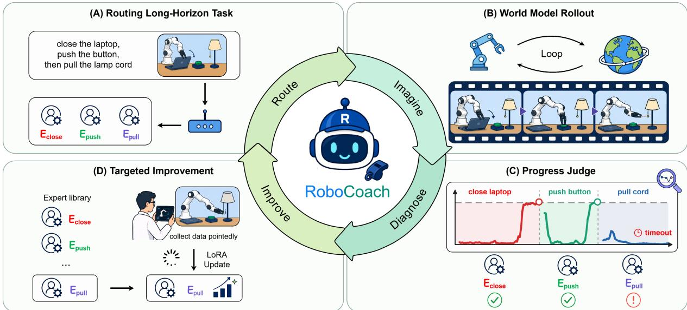  
Figure 1. Overview of RoboCoach. The Route–Imagine–Diagnose–Improve (RIDI) loop routes the next unfinished subtask to a reusable expert, rolls it forward in CoachWorld, diagnoses the first unresolved subtask, and converts recurring imagined failures into targeted demonstrations and expert updates. Panels (A)–(D) correspond to Route (Sec. 3.2), Imagine (Sec. 3.3), Diagnose (Sec. 3.4), and Improve (Sec. 3.5).

## Abstract

Long-horizon robot manipulation reuses skills across many task compositions, but improving these compositions with additional end-to-end demonstrations is costly. A practical self-improving system must decide both what to teach next and where to apply that supervision. We present RoboCoach, a world-model-guided coaching framework that uses imagined failures to guide demonstration requests and expert updates. Its Route–Imagine–Diagnose–Improve (RIDI) loop executes reusable skill experts inside CoachWorld, our shared action-conditioned world model, and uses a progress judge to record the first subtask that fails to complete. Aggregated records select which subtask demonstrations to acquire and which expert adapters to update. Across two simulation suites and two real-robot platforms, imagined and deployed success correlate over 22 task–policy pairs $( \rho = 0 . 8 4 0 )$ . Controlled comparisons show that our coaching method outperforms matched baselines under matched data budgets and update schedules. With only 150 additional subtask demonstrations, success rises from 13.3% to 75.0% on Franka and from 40.0% to 83.8% on AgileX. The coached experts also transfer to four held-out compositions, achieving an average success of 35.0%, compared with 0% for a shared-policy baseline updated with uniformly acquired demonstrations. Together, these results show that world models can serve as active coaches, turning imagined failures into targeted supervision for modular policy improvement.

## Contents

1 Introduction 3   
2 Related Work 4   
3 Method 4   
3.1 Overview 4   
3.2 Route: from a long-horizon instruction to an atomic expert   
3.3 Imagine: policy-in-the-loop rollout with CoachWorld .   
3.4 Diagnose: progress-based switching and first-timeout attribution 6   
3.5 Improve: scorecard-guided data acquisition 6   
4 Experiments 7   
4.1 Evaluation setting 7   
4.2 Evidence for world-model-guided intervention 7   
4.3 Fixed-budget coaching and intervention coupling 8   
4.4 Held-out composition generalization 9   
5 Conclusion 10   
Appendix 14   
A Experimental Assets and Provenance 14   
A.1 Real-Robot Platforms and Tasks 14   
A.2 Simulation Task Suites . 14   
B CoachWorld Training and Closed-Loop Interface 15   
B.1 Data Mixture and Admission   
B.2 Closed-Loop Temporal Contract   
B.3 Camera and Action Grounding   
B.4 Training Objective 16   
C Additional CoachWorld Evidence 16   
C.1 Evaluation Package . 16   
C.2 Appearance Fidelity and Long-Horizon Stability 16   
C.3 Action Following and EEF-Trajectory Fidelity 20   
C.4 Blind Human Audit of Physics Adherence and Instruction Following 20   
C.5 Policy-Success Calibration . 20   
D Router and Diagnostic Pipeline 20   
D.1 Router Interface 20   
D.2 Annotation Bank and Frozen Thresholds 20   
D.3 Judge Implementations . 21   
D.4 Progress-Judge Evaluation and Metrics . 21   
D.5 Latency and Seed Agreement 21   
E Coaching Protocol and Per-Round Evidence   
E.1 Operator-Facing Scorecard .   
E.2 Matched Coaching Protocol .   
E.3 Acquisition Trace and Per-Round Results   
E.4 LIBERO Per-Task Coaching Results 24   
E.5 RoboTwin Per-Task Coaching Results 24   
E.6 Franka Per-Task Coaching Results 25   
E.7 AgileX Per-Task Coaching Results 25   
F Held-Out Composition Protocol 26

## 1 Introduction

An embodied self-improving system must decide not only how to act, but also what experience to acquire next. This decision is especially consequential in long-horizon manipulation, where tasks such as preparing tea or setting a table require a sequence of reusable skills. Each skill changes the state in which the next is executed, so a local execution error can propagate and cause the entire task to fail. Additional end-to-end demonstrations can improve the policy, but covering the long tail of all possible skill compositions is expensive and dificult to scale. The burden is particularly heavy on physical robots, where every trajectory consumes data-collection efort, hardware time, environment resets, and safety oversight. These constraints raise a concrete policy-improvement question: which skill should the next demonstrations target, and which policy component should receive the update, given that each additional trajectory is costly?

Recent advances in robot learning provide important capabilities for addressing these questions. Generalist vision–language–action models (VLAs) and hierarchical systems support increasingly capable execution across tasks [17, 23, 52], while active and corrective imitation learning use interaction feedback and policy failures to select additional supervision [20, 43]. Action-conditioned world models support policy evaluation and improvement through imagined interaction, allowing robots to examine action consequences before physical execution [12, 32, 38, 61]. Meanwhile, modular policies provide task- or skill-specific components that can be adapted independently [41, 65]. The central challenge is to connect these capabilities into a learning process: predicted execution must yield a concrete request for real supervision, and that supervision must reach the policy component associated with the identified learning need. For long-horizon tasks, this connection should operate at the level of reusable skills, so that additional demonstrations improve skills that transfer across tasks.

Our approach separates shared prediction from selective adaptation. An action-conditioned world model learns regularities of motion, contact, and object-state change from diverse robot interactions, providing a shared predictive model across tasks and embodiments. Execution, however, depends on task stage, morphology, and context, and is better served by modular experts that specialize over time. We therefore build execution around reusable skill experts on a shared VLA backbone, so that each expert is an explicit target for adaptation. Each expert specializes in an atomic skill, such as picking, placing, or pressing, and can be reused across objects and task sequences. A subtask–expert pair thus links the behavior needing teaching to the reusable component that learns from it. This makes long-horizon compositionality useful for both execution and improvement: shared prediction decides what to teach next, while selective adaptation updates the corresponding reusable skill. Together, they suggest a broader role for world models: they should not merely simulate more experience, but should help decide where scarce real experience is most valuable.

We instantiate this idea in RoboCoach, a world-model-guided active coaching framework organized as a Route–Imagine–Diagnose–Improve (RIDI) loop (Fig. 1). The router selects the next unfinished subtask and dispatches its corresponding skill expert. The expert then interacts with CoachWorld, our shared action-conditioned world model, in closed loop. A progress judge reads the imagined observations to determine whether the active subtask has been completed and whether execution should advance to the next expert. When a subtask remains incomplete at its time limit, the system records the active subtask–expert pair. Across imagined trials, these records prioritize requests for new demonstrations. The acquired demonstrations update only the corresponding expert LoRA adapters [14]. Updated experts then return to the route, closing the RIDI loop.

We evaluate RoboCoach on LIBERO and RoboTwin, and on Franka and AgileX robots. Our evaluation examines the evidence underlying coaching through video-prediction fidelity, agreement with deployed policy outcomes, and progress-judge reliability. Across 22 task–policy pairs, imagined and deployed success rates achieve a Spearman correlation of ρ = 0.840. Controlled comparisons demonstrate the value of coupling acquisition with adaptation: applying the same targeted demonstrations to corresponding skill experts rather than a shared global adapter improves final complete-task success by 3.4 and 13.2 pp on LIBERO and RoboTwin, respectively. On real robots, 150 additional subtask demonstrations per platform raise success from 13.3% to 75.0% on Franka and from 40.0% to 83.8% on AgileX, whereas uniform acquisition with a shared adapter reaches 30.0% and 47.5% under the same budgets. The coached experts achieve 35.0% average success on four held-out compositions spanning longer continuations, cross-task combinations, and reordered skills, compared with 0% for the shared-policy baseline.

We summarize our key contributions as follows: First, we study embodied self-improvement through coupled decisions about which demonstrations to acquire and which policy components to update. We instantiate these decisions with subtask–expert pairs, making reusable skills explicit targets for both data acquisition and adaptation. Second, we introduce RoboCoach, whose RIDI loop connects

CoachWorld, progress-based diagnosis, and selective expert adaptation to turn imagined failures into targeted supervision and iterative policy improvement. Third, our experiments demonstrate substantial gains with limited additional supervision, reveal the benefit of directing identical acquired demonstrations to corresponding experts, and show that coached skills can be recombined beyond the task sequences used for improvement.

## 2 Related Work

Generalist VLAs for long-horizon manipulation. Generalist VLAs learn transferable visuomotor priors from large robot datasets and vision–language pretraining [2, 3, 23, 46]. RL post-training further improves execution robustness through interaction feedback [28, 40, 59]. RoboCoach uses reusable skill experts as explicit targets for additional supervision, linking the subtask to be demonstrated with the policy component that receives its update.

World models for embodied AI. Action-conditioned world models simulate future observations for imagined rollout and policy evaluation [13, 32, 34, 48, 54]. They also support policy optimization through imagined interaction [8, 19, 61, 66] and generate additional supervision for robot policies [10, 38, 45]. Recent models improve action controllability by projecting end-efector trajectories, kinematic structures, or contact fields into the camera view [15, 16, 18, 47, 57, 58]. By exploiting this predictive capability, we developed world model’s additional function: localize the bottleneck skill expert and allocate demonstrations [9, 31, 33].

Active supervision and modular adaptation. Mixture-of-experts, adapters, and LoRA isolate taskor skill-specific capacity behind a shared backbone [14]. Robot-learning systems try to construct skill libraries or to route, expand, and update experts as tasks arrive [24, 27, 41, 50, 65]. Complementarily, active and corrective imitation learning decide where additional supervision is needed [20, 21, 25, 43]. Trajectory-progress models provide visual signals for assessing task execution [26, 35, 39, 53]. RoboCoach connects these directions by using progress-based diagnosis over imagined execution to identify recurring subtask–expert bottlenecks, request corresponding demonstrations, and apply the acquired supervision to reusable experts.

## 3 Method

## 3.1 Overview

RoboCoach uses world-model-imagined execution to decide which subtasks require additional demonstrations and which skill experts should learn from them. Rather than fitting every complete task with end-to-end demonstrations, we decompose long-horizon execution into reusable atomic skills, each handled by a corresponding expert. A long-horizon failure can therefore be localized to an unresolved subtask, allowing additional supervision to be collected at the skill level.

Let q index coaching rounds, $\ell \in { \mathcal { L } }$ denote a task instruction, and b denote a robot embodiment. Each embodiment uses a shared VLA backbone $\pi _ { \mathrm { b a s e } }$ together with a library of skill experts

$$
\Pi _ { b } ^ { q } = \left\{ \pi _ { b , e } ^ { q } = \pi _ { \mathrm { b a s e } } \oplus \Delta _ { b , e } ^ { q } \right\} _ { e \in \mathcal { E } _ { b } } ,\tag{1}
$$

where $\mathcal { E } _ { b }$ indexes the available experts, $\Delta _ { b , e } ^ { q }$ contains expert $e \mathrm { { s } }$ LoRA parameters [14], and ⊕ denotes applying the expert-specific adapter to the shared backbone. The same expert can serve multiple taskspecific subtasks, i.e. press the red button and press the green button can both invoke a press expert. We therefore use a subtask–expert pair $( g , e )$ as the basic unit of coaching.

As illustrated in Fig. 1, RoboCoach organizes coaching as a Route–Imagine–Diagnose–Improve (RIDI) loop. Route selects the next unfinished subtask and dispatches its expert. Imagine rolls out the active expert inside CoachWorld, our shared action-conditioned world model, in closed loop. Diagnose uses a progress judge to determine when the current subtask has completed. If it remains incomplete until its time limit, the active subtask–expert pair is recorded. Improve aggregates these records into a coaching scorecard, requests new demonstrations for the highest-priority pairs, and updates the corresponding experts. The updated library then enters the next coaching round, closing the RIDI loop. Algorithm 1 summarizes a coaching round.

## 3.2 Route: from a long-horizon instruction to an atomic expert

The router translates a long-horizon instruction into a sequence of subtask-conditioned expert calls. Let k index the current subtask and $\boldsymbol { S } _ { b }$ denote the available atomic skills. A subtask $g _ { k }$ specifies a skill

Algorithm 1 One RoboCoach coaching round   
Require: Tasks ${ \mathcal { L } } ,$ expert library $\Pi _ { b } ^ { q } \mathrm { . }$ , demonstration budget $B _ { q } ,$ target count M   
Require: Frozen W , router $\rho ,$ progress judge $J _ { \phi } ,$ completion thresholds, and time limits   
1: for each task ℓ and initial-state trial i do   
2: for each world-model seed $r \in \{ 1 , 2 , 3 \}$ do   
3: Initialize the imagined trial and route the first subtask $g _ { k }$ to expert $e _ { k }$   
4: while the task remains active do   
5: Query the active expert and generate one complete CoachWorld chunk.   
6: Commit the generated observations and query the progress judge.   
7: if the active subtask reaches its completion threshold then   
8: Append it to the completed prefix and route the next subtask, or record SUCCESS.   
9: else if the active subtask reaches its time limit then   
10: Record TIMEOUT $( g _ { k } , e _ { k } )$ and terminate.   
11: end if   
12: end while   
13: end for   
14: Retain the modal terminal diagnosis if at least two seeds agree.   
15: end for   
16: Rank subtask–expert pairs by task-balanced first-timeout mass $\left( \mathrm { E q . ~ 6 } \right)$ and select the top M pairs.   
17: Request $B _ { q } / M$ accepted subtask demonstrations for each selected pair.   
18: Update selected experts using the new demonstrations together with old data.   
Ensure: Updated expert library $\mathrm { \dot { ~ } } \Pi _ { b } ^ { q + 1 }$

and its arguments, such as the manipulated object or target afordance. At initialization and after each judge-confirmed completion, the router receives the instruction $\ell ,$ current visual observation $o _ { t }$ , skill vocabulary $\boldsymbol { S _ { b } }$ , and completed-subtask prefix $\widehat { \mathcal { D } } _ { k - 1 }$

$$
g _ { k } = \rho \Big ( \ell , o _ { t } , S _ { b } , \widehat { \mathcal { D } } _ { k - 1 } \Big ) , \qquad e _ { k } = \eta _ { b } ( g _ { k } ) ,\tag{2}
$$

where $\eta _ { b }$ maps subtasks to experts and $\widehat { \mathcal { D } } _ { 0 } = \varnothing$ . Completed subtasks are appended to the prefix before the next routing decision. The router prompt and output schema appear in Appendix D.

## 3.3 Imagine: policy-in-the-loop rollout with COACHWORLD

Closed-loop Imagination. The active expert rolls in closed loop in CoachWorld. At time t, the active expert predicts $a _ { t } = \pi _ { b , e _ { k } } ^ { q } ( o _ { t } , \ell , g _ { k } )$ in delta end-efector space. A lightweight adapter converts it into a future end-efector trajectory $\mathbf { X } _ { t } .$ , following Ctrl-World [12]. For camera $v ,$ CoachWorld predicts the next video chunk:

$$
\widehat { \mathbf { I } } _ { t + 1 : t + H } ^ { v } \sim \mathcal { W } _ { \theta } ( \mathcal { H } _ { t } ^ { v } , \mathbf { X } _ { t } , \ell , \mathbf { K } _ { v } , \mathbf { T } _ { v + \mathrm { r o b o t } } ) ,\tag{3}
$$

where H is the prediction horizon, $\mathcal { H } _ { t } ^ { v }$ is the sparse visual history, ${ \bf K } _ { v }$ is the camera intrinsic matrix, and $\mathbf { T } _ { v  \mathrm { r o b o t } }$ maps robot coordinates to camera coordinates. Each camera stream is predicted independently using its own calibration. The generated chunk is committed before the next policy or judge query, and its final observation guides the next action chunk, forming a closed-loop rollout.

Shared action and camera conditioning. To support heterogeneous robot embodiments within one predictive model, we represent their actions through a common end-efector interface. At each resampled trajectory step $n ,$ arm slot $s \in \{ 1 , 2 \}$ is represented as $\mathbf { x } _ { n } ^ { ( s ) } = \left\lceil \mathbf { p } _ { n } ^ { ( s ) } , \mathbf { r } _ { n } ^ { ( s ) } , \gamma _ { n } ^ { ( s ) } , m _ { n } ^ { ( s ) } \right\rceil$ , where $\mathbf { p } _ { n } ^ { ( s ) } \in \mathbb { R } ^ { 3 }$ is the end-efector position in robot coordinates, $\mathbf { r } _ { n } ^ { ( s ) } \in \mathbb { R } ^ { 6 }$ is its 6D rotation representation, $\gamma _ { n } ^ { ( s ) }$ is the gripper stat ${ \mathrm { ; e , } }$ and $m _ { n } ^ { ( s ) } \in \{ 0 , 1 \}$ indicates whether the arm slot is present. Single-arm trajectories populate one slot, whereas bimanual trajectories populate both.

Camera calibration grounds this trajectory in the visual observation. The extrinsic transform $\mathbf { T } _ { v  \mathrm { r o b o t } }$ first maps end-efector positions into camera coordinates, and ${ \bf K } _ { v }$ projects them into the image plane. Projected future-state tokens and trajectory rasters then condition the denoiser on the motion associated with the observed view. PRoPE [30] further incorporates camera geometry into visual self-attention. Together, these components connect the shared 3D action representation to its view-specific visual consequences (Fig. 2). Temporal mappings and calibration procedures are detailed in Appendix B.

Long-horizon training. We train CoachWorld by conditional flow matching [36] on demonstrations, policy failures, play data, and other non-expert trajectories, using sparse visual history as temporal context. For a clean future-video latent $z _ { \mathrm { 0 } }$ , we sample Gaussian noise $\epsilon \sim \mathcal { N } ( 0 , \bf { I } )$ and an interpolation time $\sigma \sim \mathcal { U } ( 0 , 1 )$ , and construct $z _ { \sigma } = ( 1 - \sigma ) z _ { 0 } + \sigma \epsilon$ . The velocity network $v _ { \theta }$ is optimized with

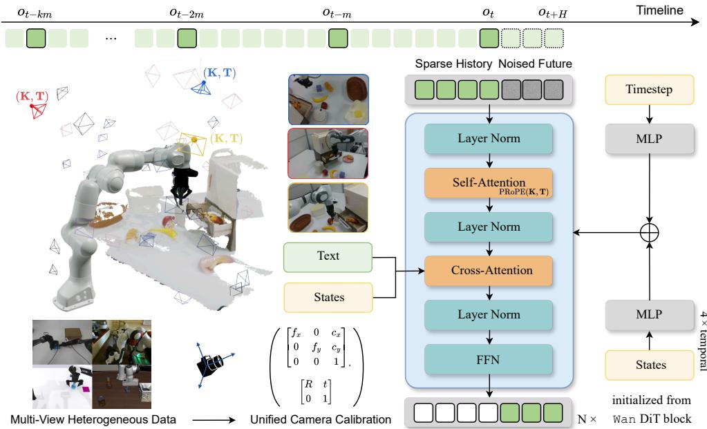  
Fi ure 2. CoachWorld architecture. Sparse visual history, task instructions, and calibrated two-slot end-efector trajectories condition future-video prediction across single-arm and bimanual embodiments.

$$
\mathcal { L } _ { \mathrm { C W } } = \mathbb { E } \left[ \| v _ { \theta } ( z _ { \sigma } , \sigma \mid c ) - ( \epsilon - z _ { 0 } ) \| _ { 2 } ^ { 2 } \right] ,\tag{4}
$$

where c contains the sparse visual history, task instruction, future end-efector trajectory, and camera calibration. Training details are provided in Appendix B.

## 3.4 Diagnose: progress-based switching and first-timeout attribution

After each generated chunk, a progress judge estimates subtask completion as $p _ { k , t } = J _ { \phi } ( \mathcal { H } _ { t } ^ { J } , \ell , g _ { k } ) \in [ 0 , 1 ]$ where $\mathcal { H } _ { t } ^ { J }$ is the observation window available up to t. For each subtask–embodiment pair, we calibrate a completion threshold $\kappa _ { g , b }$ and time limit $T _ { g , b } ^ { \operatorname* { m a x } }$ and freeze them before coaching. If $p _ { k , t } \ge \kappa _ { g _ { k } , b } .$ , the subtask is marked complete and control returns to the router. Otherwise, the expert continues until the time limit, measured from its dispatch. During physical deployment, the same judge and switching procedure use real camera observations.

For trial i of task ℓ under world-model seed r, we record

$$
Z _ { \ell i } ^ { ( r ) } = \left\{ \begin{array} { l l } { { \mathrm { S U C C E S S , ~ } } } & { { \mathrm { i f ~ t h e ~ c o m p l e t e ~ t a s k ~ f i n i s h e s , } } } \\ { { \mathsf { T I M E O U T } ( g _ { k } , e _ { k } ) , } } & { { \mathrm { i f ~ t h e ~ a c t i v e ~ s u b t a s k ~ t i m e s ~ o u t . } } } \end{array} \right.\tag{5}
$$

A timeout terminates the trial and identifies the first unresolved subtask–expert pair along the executed route. Each initial-state trial uses three episode-level world-model seeds. We retain the majority diagnosis $Z _ { \ell i }$ only when at least two seeds agree on the outcome, including the subtask–expert pair for a timeout. Trials without agreement are excluded from the scorecard. Judge calibration and evaluation are detailed in Appendix D.

## 3.5 Improve: scorecard-guided data acquisition

Let $\it { \Delta } \mathcal { T } _ { \ell } ^ { q }$ denote the accepted imagined trials for task ℓ in round $q ,$ and $\mathcal { L } _ { q } ^ { + }$ the tasks retained for scorecard computation. For candidate pair $h = ( g , e )$ , its task-balanced first-timeout mass is

$$
\widehat { s } _ { b } ^ { q } ( h ) = \frac { 1 } { | \mathcal { L } _ { q } ^ { + } | } \sum _ { \ell \in \mathcal { L } _ { q } ^ { + } } \frac { \sum _ { i \in \mathcal { I } _ { \ell } ^ { q } } \mathbf { 1 } [ Z _ { \ell i } = \mathsf { T I M E O U T } ( h ) ] } { | \mathcal { Z } _ { \ell } ^ { q } | } .\tag{6}
$$

The inner term measures how often a task first times out at h, while the outer average gives each task equal weight. The scorecard also displays imagined success rates, progress traces, and representative failed rollouts. We select the top M pairs and request $B _ { q } / M$ accepted subtask demonstrations for each. In our experiments, we make $M = 2$ . Each request specifies the behavior, object or afordance, and demonstration count, accompanied by imagined failures. Human operators check safety and collect the requested trajectories.

For each selected expert, new demonstrations are mixed with a smaller replay sample from existing data for LoRA fine-tuning. Demonstrations from subtasks sharing an expert are pooled for the same update. The backbone and unselected adapters remain unchanged. The updated library $\Pi _ { b } ^ { q + 1 }$ then generates the next round’s scorecard inside CoachWorld.

## 4 Experiments

## 4.1 Evaluation setting

We evaluate RoboCoach on ten LIBERO-Long tasks and five RoboTwin 2.0 tasks (following Lingbot VA [29]’s selection), together with real-robot tasks on Franka Research 3 and AgileX dual-Piper. We use π0.5 [17] as the shared VLA backbone for LIBERO and Franka, and MolmoAct2 [7] for RoboTwin and AgileX. Each task is evaluated over 50 trials in simulation or 20 trials on real robots. Within each domain, coaching comparisons match demonstration budgets, LoRA training settings, and evaluation protocols. Appendix A describes the tasks and data splits, and Appendix E details the coaching protocol.

We first assess CoachWorld prediction fidelity, agreement with deployed policy outcomes, and progressjudge reliability. We then measure complete-task improvement under a fixed demonstration budget and separate data acquisition from update location. Finally, we test whether the coached skill experts can generalize to held-out compositions.

## 4.2 Evidence for world-model-guided intervention

Using CoachWorld as an active coach requires three properties. First, its predicted futures must be faithful to the observed interaction. Second, policy rollouts inside the model must preserve the success profile observed in the deployed environment. Third, the progress judge must reliably detect completion and attribute failures to specific bottlenecks. We evaluate these requirements in the same order: full-episode prediction, policy-level factuality, and progress switching with failure attribution.

World-model fidelity on held-out episodes. We first evaluate CoachWorld as a full-episode simulator on held-out test sets. We construct two test sets by selecting 180 video clips respectively from the DROID dataset and from our self-collected dataset. Each model receives identical inputs. We use PSNR, SSIM, LPIPS, and FVD to measure appearance fidelity. We use HSD, nDTW, and DYN to measure end-efector trajectory and action-following fidelity, following EWMBENCH [63]. We evaluate Physics Adherence and Instruction Following with 1–5 rubrics adapted from MiraBench [62] and WorldArena [51]. The two CoachWorld variants compare mixed- and single-domain training at matched training volume.

Table 1 compares full-episode predictions. On DROID-180, mixed-domain CoachWorld achieves the best LPIPS (0.0996), FVD (51.71), all 3 trajectory metrics, and instruction-following score (0.880). On Lab Franka-180, it achieves the best LPIPS (0.1712). Mixed-domain training improves most visual and trajectory measures, indicating that greater domain diversity makes world models more powerful at future prediction. Appendix C gives supplemental results and evaluation details.

## Agreement with deployed policy outcomes.

Useful simulators must reflect policy failures as well as successes. We thereby compare complete-task success under policy-in-the-loop imagination with matched deployed executions. This study uses 22 frozen task–policy checkpoint pairs, one per task, with matched initial-state strata and trial counts. Imagined and deployed success have a Pearson correlation of $r = 0 . 8 2 0$ and a Spearman correlation of $\rho = 0 . 8 4 0 \ \mathrm { ( F i g . \ 3 ) }$ , showing agreement in task-level performance diferences across the evaluated pairs.

Progress-judge reliability and failure attribution. The progress judge is a core component of the active-coaching loop. During execution, it determines whether the active subtask is complete and whether control should switch to the next expert.

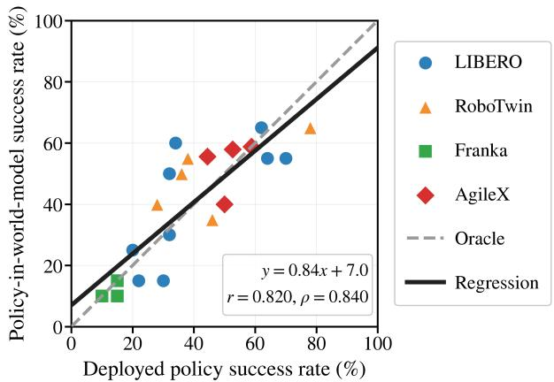  
Figure 3. Imagined versus deployed policy success. All four platforms share one coordinate system and one pooled OLS fit.

Table 1. Paired full-episode action-conditioned prediction. All models receive matched visual histories and future actions on DROID-180 and Lab Franka-180. The two CoachWorld variants compare mixed- and single-domain training at matched training volume. LPIPS/FVD measure video fidelity, HSD/nDTW/DYN measure end-efector trajectory agreement, and Phys. Adh./Instr. Follow. are mean blind human ratings on a 1–5 scale, divided by five. Best and second-best values within each evaluation set are bold and underlined, respectively.
<table><tr><td>Method</td><td>Evaluation set</td><td>LPIPS↓</td><td>FVD↓</td><td>HSD↑</td><td>nDTW↑</td><td>DYN↑</td><td>Phys. Adh.↑</td><td>Instr. Follow.↑</td></tr><tr><td rowspan="2">Ctrl-World</td><td>DROID-180</td><td>0.2078</td><td>102.97</td><td>0.2234</td><td>0.2323</td><td>0.0668</td><td>0.6067</td><td>0.7867</td></tr><tr><td>Lab Franka-180</td><td>0.3060</td><td>493.20</td><td>0.1304</td><td>0.1037</td><td>0.0458</td><td>0.2600</td><td>0.2400</td></tr><tr><td rowspan="2">Cosmos 3</td><td>DROID-180</td><td>0.2830</td><td>140.62</td><td>0.1702</td><td>0.1698</td><td>0.0571</td><td>0.7267</td><td>0.5467</td></tr><tr><td>Lab Franka-180</td><td>0.3397</td><td>634.75</td><td>0.1658</td><td>0.1374</td><td>0.0653</td><td>0.3900</td><td>0.2467</td></tr><tr><td rowspan="2">OSCAR-2B</td><td>DROID-180</td><td>0.2248</td><td>101.92</td><td>0.1785</td><td>0.1838</td><td>0.0456</td><td>0.5267</td><td>0.5467</td></tr><tr><td>Lab Franka-180</td><td>0.2014</td><td>236.78</td><td>0.1909</td><td>0.2110</td><td>0.1412</td><td>0.4800</td><td>0.5833</td></tr><tr><td rowspan="2">COACHWORLD (mixed-domain)</td><td>DROID-180</td><td>0.0996</td><td>51.71</td><td>0.2633</td><td>0.2812</td><td>0.0959</td><td>0.7467</td><td>0.8800</td></tr><tr><td>Lab Franka-180</td><td>0.1712</td><td>284.76</td><td>0.1770</td><td>0.1767</td><td>0.1113</td><td>0.3333</td><td>0.5333</td></tr><tr><td rowspan="2">COACHWORLD (single-domain)</td><td>DROID-180</td><td>0.1067</td><td>56.56</td><td>0.2441</td><td>0.2599</td><td>0.0723</td><td>0.7533</td><td>0.8667</td></tr><tr><td>Lab Franka-180</td><td>0.1768</td><td>297.56</td><td>0.1854</td><td>0.1754</td><td>0.1137</td><td>0.3000</td><td>0.4267</td></tr></table>

An incorrect switch can corrupt the remaining route,

while an incorrect timeout can corrupt the resulting

failure attribution. To isolate judge quality from

world-model generation, we provide every candidate judge with the same causal reference-video replay. We evaluate three aspects of judge reliability. Switch MAE measures temporal error on subtask-transition boundaries, while Recall@1.0s measures the fraction of ground-truth transitions recovered within one second. Spearman ρ measures rank agreement between predicted and ground-truth terminal stages over task–stage cells. We compute ρ separately on LIBERO, RoboTwin, real single-arm, and real dual-arm settings and report their unweighted macro average. Outcome precision, recall, and F1 evaluate binary transition decisions on adjacent-stage examples.

We compare Qwen3-VL [1], LIV [42], Contrastive λ [11], SuccessVQA [6], TOPReward [4], and RoboMeter [35]. Appendix D.3 describes their implementations. RoboMeter achieves the best scores under this protocol (Appendix Table 10), including a Switch MAE of 0.414 s, 82.73% Recall@1.0s, and 88.21% outcome F1. We use it as the progress judge in RoboCoach.

Table 2. RoboMeter reliability under reference and world-model observations. We test RoboMeter on reference video and CoachWorld-generated rollout. Switch MAE and Recall@1.0s measure stage-transition timing, Spearman ρ measures terminal-stage rank agreement, and outcome precision, recall, and F1 measure binary transition decisions on adjacent-stage examples.
<table><tr><td>Observation source</td><td>Switch MAE (s)↓</td><td>Switch Rec.1.0s (%)↑</td><td>Spearman ρ↑</td><td>TP/TN/FP/FN</td><td>Out.-Prec. (%)↑</td><td>Out.-Rec. (%)↑</td><td>Out.-F1 (%)↑</td></tr><tr><td>Reference video</td><td>0.414</td><td>82.73</td><td>0.727</td><td>101/92/18/9</td><td>84.87</td><td>91.82</td><td>88.21</td></tr><tr><td>COACHWoRLD rollout</td><td>0.815</td><td>62.73</td><td>0.638</td><td>96/87/23/14</td><td>80.67</td><td>87.27</td><td>83.84</td></tr></table>

We further evaluate RoboMeter on CoachWorld-generated observations under the same diagnostic protocol (Table 2). Under generated observations, RoboMeter achieves a terminal-stage Spearman correlation of $\rho = 0 . 6 3 8$ , an outcome F1 of 83.84%, a Switch MAE of 0.815 s, and 62.73% Recall@1.0s. These results show that the diagnostic signals required for active coaching remain informative under world-model-generated observations.

## 4.3 Fixed-budget coaching and intervention coupling

We next test whether coaching improves complete-task success and which acquisition and update choices contribute to the improvement. Each coaching round adds $B _ { \mathrm { s i m } } = 1 0 0$ accepted subtask demonstrations in simulation or $B _ { \mathrm { r e a l } } = 5 0$ on each real-robot platform. We report complete-task success averaged equally across tasks at cumulative budgets {0, B, 2B, 3B}, together with normalized Budget AUC. We evaluate all four conditions in Table 3 in simulation and compare Single VLA + Uniform with RoboCoach on real robots due to hardware efort.

Table 3. Acquisition and update conditions.
<table><tr><td>Condition</td><td>Data selection</td><td>Update location</td></tr><tr><td>Single VLA + Uniform</td><td>Uniform</td><td>Shared global adapter</td></tr><tr><td>Single VLA + WM-targeted</td><td>WM-targeted</td><td>Shared global adapter</td></tr><tr><td>Modular + Random</td><td>Random subtask-expert pairs</td><td>Selected skill experts</td></tr><tr><td>ROBOCOACH</td><td>WM-targeted</td><td>Selected skill experts</td></tr></table>

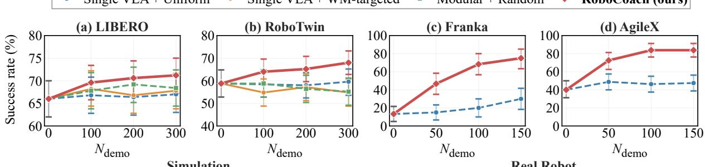  
Figure 4. Complete-task success over coaching rounds. We evaluate task-averaged success rate as cumulative coaching demonstrations increase. Error bars show 95% confidence intervals for task-averaged success, computed from per-task evaluation counts (Appendix E). As a result, RoboCoach achieves the highest success rate in all four settings.

All conditions freeze the VLA backbone and only train LoRA adapters. Single VLA + Uniform acquires demonstrations uniformly across all tasks and updates one shared adapter. Single VLA + WM-targeted receives the same amount of substask demonstrations acquired for RoboCoach, but applies a shared update rather than updating the corresponding skill experts. Modular + Random selects two subtask– expert pairs at random and updates their associated experts, pooling demonstrations when targets share an expert. The comparisons test targeted acquisition under shared adaptation, shared versus expert-specific updates on identical acquired data, and target selection within the modular system.

Figure 4 shows complete-task success over three coaching rounds. On real robots, both methods start at 13.3% on Franka and 40.0% on AgileX. After 150 additional subtask demonstrations per platform, RoboCoach reaches 75.0% and 83.8%, compared with 30.0% and 47.5% for Single $V L A \ + \ U n i f o r m .$ Normalized Budget AUC is 53.1 versus 18.9 on Franka and 72.7 versus 46.3 on AgileX. In simulation, RoboCoach reaches 71.2% on LIBERO and 68.0% on RoboTwin, the highest final success among the four compared conditions.

With a shared adapter, targeted acquisition changes final success relative to uniform acquisition by +0.8 pp on LIBERO and −4.8 pp on RoboTwin. Applying the same targeted demonstrations to selected experts instead adds 3.4 and 13.2 pp. Within the modular system, world-model targeting exceeds random target selection by 2.8 and 12.8 pp. The strongest results come from combining targeted demonstrations with updates to their corresponding skill experts. Appendix E reports per-round results and acquisition traces.

## 4.4 Held-out composition generalization

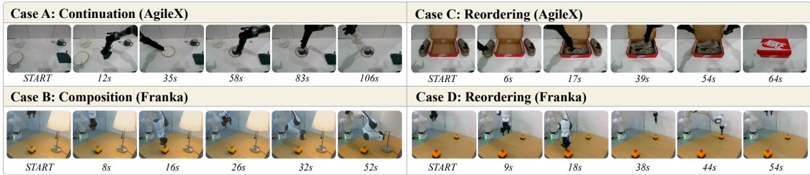  
Figure 5. Held-out composition case studies. Execution sequences on AgileX (A, C) and Franka (B, D), illustrating longer continuation (A), cross-task composition (B), and skill reordering (C, D). Frames in each sequence progress from left to right.

Finally, we test whether coached experts can be recombined into four long-horizon task routes excluded from training and coaching, with 20 real-robot trials per route. Figure 5 shows example executions, and Appendix F gives the route definitions and protocol.

RoboCoach succeeds in 13/20 trials (65%) on the AgileX continuation combining table setting with tea making (Case A), and in 3/20 trials (15%) when combining green-button pressing with lamp-cord pulling on Franka (Case B). For skill reordering, it succeeds in 5/20 trials (25%) when reversing shoe placement before closing the box on AgileX (Case C), and in 7/20 trials (35%) when reversing the button order on Franka using the same press expert (Case D). Single VLA + Uniform succeeds in none of the four cases. The four-route average is 35.0% for RoboCoach and 0% for the baseline. These results show that the coached experts can be recombined along unseen routes.

## 5 Conclusion

RoboCoach uses imagined execution to decide which demonstrations to collect and which reusable skill experts should learn from them. Its RIDI loop connects world-model prediction, progress-based diagnosis, and targeted supervision to iterative policy improvement. Experiments show that applying the same acquired demonstrations to corresponding experts outperforms a shared update. The resulting experts greatly improve real-robot success under fixed demonstration budgets and remain reusable on previously unseen compositions for generalization. Together, these results support a role for world models as active coaches that guide what a robot should learn next.

Limitations. When the manipulated object is occluded, or when contact and collision occur outside the camera’s view, physical modeling and prediction in that region become dificult. RoboCoach likewise relies on action-conditioned predictions that preserve task-relevant evidence, which remains challenging under occlusion and out-of-view interaction. Agreement across generation seeds reduces sensitivity to stochastic variation but cannot rule out systematic world-model bias. The expert library is predefined by skill semantics. Learning its structure and reducing the need for human demonstrations remain open directions.

## Acknowledgments

We sincerely thank Yanjiang Guo for his help throughout this project.

## References

[1] Shuai Bai, Yuxuan Cai, Ruizhe Chen, Keqin Chen, et al. Qwen3-vl technical report. arXiv preprint arXiv:2511.21631, 2025.

[2] Kevin Black, Noah Brown, Danny Driess, Adnan Esmail, Michael Equi, Chelsea Finn, Niccolo Fusai, Lachy Groom, Karol Hausman, Brian Ichter, et al. pi\_0: A vision-language-action flow model for general robot control. arXiv preprint arXiv:2410.24164, 2024.

[3] Anthony Brohan, Noah Brown, Justice Carbajal, Yevgen Chebotar, Xi Chen, Krzysztof Choromanski, Tianli Ding, Danny Driess, Avinava Dubey, Chelsea Finn, Pete Florence, Chuyuan Fu, Montse Gonzalez Arenas, Keerthana Gopalakrishnan, Kehang Han, Karol Hausman, Alex Herzog, Jasmine Hsu, Brian Ichter, Alex Irpan, Nikhil Joshi, Ryan Julian, Dmitry Kalashnikov, Yuheng Kuang, Isabel Leal, Lisa Lee, Tsang-Wei Edward Lee, Sergey Levine, Yao Lu, Henryk Michalewski, Igor Mordatch, Karl Pertsch, Kanishka Rao, Krista Reymann, Michael Ryoo, Grecia Salazar, Pannag Sanketi, Pierre Sermanet, Jaspiar Singh, Anikait Singh, Radu Soricut, Huong Tran, Vincent Vanhoucke, Quan Vuong, Ayzaan Wahid, Stefan Welker, Paul Wohlhart, Jialin Wu, Fei Xia, Ted Xiao, Peng Xu, Sichun Xu, Tianhe Yu, and Brianna Zitkovich. Rt-2: Vision-language-action models transfer web knowledge to robotic control. In arXiv preprint arXiv:2307.15818, 2023.

[4] Shirui Chen, Cole Harrison, Ying-Chun Lee, Angela Jin Yang, Zhongzheng Ren, Lillian J. Ratlif, Jiafei Duan, Dieter Fox, and Ranjay Krishna. TOPReward: Token probabilities as hidden zero-shot rewards for robotics. arXiv preprint arXiv:2602.19313, 2026.

[5] Tianxing Chen, Zanxin Chen, Baijun Chen, Zijian Cai, Yibin Liu, Zixuan Li, Qiwei Liang, Xianliang Lin, Yiheng Ge, Zhenyu Gu, et al. Robotwin 2.0: A scalable data generator and benchmark with strong domain randomization for robust bimanual robotic manipulation. arXiv preprint arXiv:2506.18088, 2025.

[6] Yuqing Du, Ksenia Konyushkova, Misha Denil, Akhil Raju, Jessica Landon, Felix Hill, Nando de Freitas, and Serkan Cabi. Vision-language models as success detectors. In Proceedings of The 2nd Conference on Lifelong Learning Agents, volume 232 of Proceedings of Machine Learning Research, pages 120–136, 2023.

[7] Haoquan Fang, Jiafei Duan, Donovan Clay, Sam Wang, Shuo Liu, Weikai Huang, Xiang Fan, Wei-Chuan Tsai, Shirui Chen, Yi Ru Wang, Shanli Xing, Jaemin Cho, Jae Sung Park, Ainaz Eftekhar, Peter Sushko, Karen Farley, Angad Wadhwa, Cole Harrison, Winson Han, Ying-Chun Lee, Eli VanderBilt, Rose Hendrix, Suveen Ellawela, Lucas Ngoo, Joyce Chai, Zhongzheng Ren, Ali Farhadi, Dieter Fox, and Ranjay Krishna. Molmoact2: Action reasoning models for real-world deployment, 2026. URL https://arxiv.org/abs/2605.02881.

[8] Zhu Fangqi, Yan Zhengyang, Hong Zicong, Shou Quanxin, Ma Xiao, and Guo Song. Wmpo: World model-based policy optimization for vision-language-action models. ArXiv, 2025. URL https://WM-PO.github.io.

[9] Tongtong Feng, Xin Wang, Yu-Gang Jiang, and Wenwu Zhu. Embodied ai: From llms to world models [feature]. IEEE Circuits and Systems Magazine, 25(4):14–37, 2025.

[10] GigaAI. Gigaworld-0: World models as data engine to empower embodied ai, 2025. URL https://arxiv.org abs/2511.19861.

[11] Miyu Goko, Motonari Kambara, Daichi Saito, Seitaro Otsuki, and Komei Sugiura. Task success prediction for open-vocabulary manipulation based on multi-level aligned representations. In Proceedings of The 8th Conference on Robot Learning, volume 270 of Proceedings of Machine Learning Research, pages 3242–3263, 2025.

[12] Yanjiang Guo, Lucy Xiaoyang Shi, Jianyu Chen, and Chelsea Finn. Ctrl-world: A controllable generative world model for robot manipulation. arXiv preprint arXiv:2510.10125, 2025.

[13] Danijar Hafner, Jurgis Pasukonis, Jimmy Ba, and Timothy Lillicrap. Mastering diverse control tasks through world models. Nature, pages 1–7, 2025.

[14] Edward J Hu, Yelong Shen, Phillip Wallis, Zeyuan Allen-Zhu, Yuanzhi Li, Shean Wang, Lu Wang, and Weizhu Chen. Lora: Low-rank adaptation of large language models. arXiv preprint arXiv:2106.09685, 2021.

[15] Yuhang Huang, Xuan Lv, Junyan Xu, Zhiyuan Yu, Jiazhao Zhang, Ruizhen Hu, Wancheng Feng, Shilong Zou, Hewen Xiao, Ziqiao Zhou, Kaiyun Huang, Zhiyu Peng, Juzhan Xu, Hang Zhao, Chenyang Zhu, Renjiao Yi, Yifei Huang, Douhui Wu, Yan Zhang, Kexu Cheng, Chunhe Song, Yunzhi Xue, Xiuhong Zhang, Leitao Guo, Yunji Chen, Bin Wu, Haibin Yu, and Kai Xu. Paiworld: A 3d-consistent world foundation model for robotic manipulation, 2026. URL https://arxiv.org/abs/2606.18375.

[16] Ze Huang, Jiahui Zhang, Hairuo Liu, Chenxi Zhang, Ran Cheng, and Li Zhang. Learning transferable dynamics priors from action to world modeling. In Proceedings of the European Conference on Computer Vision (ECCV), 2026.

[17] Physical Intelligence, Kevin Black, Noah Brown, James Darpinian, Karan Dhabalia, Danny Driess, Adnan Esmail, Michael Equi, Chelsea Finn, Niccolo Fusai, et al. π : A vision-language-action model with open-world generalization. arXiv preprint arXiv:2504.16054, 2025.

[18] Yuxin Jiang, Shengcong Chen, Siyuan Huang, Liliang Chen, Pengfei Zhou, Yue Liao, Xindong He, Chiming Liu, Hongsheng Li, Maoqing Yao, and Guanghui Ren. Enerverse-ac: Envisioning embodied environments with action condition. arXiv preprint arXiv:2505.09723, 2025

[19] Zhennan Jiang, Shangqing Zhou, Yutong Jiang, Zefang Huang, Mingjie Wei, Yuhui Chen, Tianxing Zhou, Zhen Guo, Hao Lin, Quanlu Zhang, Yu Wang, Haoran Li, Chao Yu, and Dongbin Zhao. Wovr: World models as reliable simulators for post-training vla policies with rl, 2026.

[20] Michael Kelly, Chelsea Sidrane, Katherine Driggs-Campbell, and Mykel J Kochenderfer. Hg-dagger: Interactive imitation learning with human experts. In 2019 International Conference on Robotics and Automation (ICRA), pages 8077–8083. IEEE, 2019.

[21] Suyog Khanal, Arun Kumar AV, and Santu Rana. Diseil: Demonstration distillation for sample-eficient imitation learning. arXiv preprint arXiv:2609.08123, 2026.

[22] Alexander Khazatsky, Karl Pertsch, Suraj Nair, Ashwin Balakrishna, Sudeep Dasari, Siddharth Karamcheti, Soroush Nasiriany, Mohan Kumar Srirama, Lawrence Yunliang Chen, Kirsty Ellis, Peter David Fagan, Joey Hejna, Masha Itkina, Marion Lepert, Yecheng Jason Ma, Patrick Tree Miller, Jimmy Wu, Suneel Belkhale, Shivin Dass, Huy Ha, Arhan Jain, Abraham Lee, Youngwoon Lee, Marius Memmel, Sungjae Park, Ilija Radosavovic, Kaiyuan Wang, Albert Zhan, Kevin Black, Cheng Chi, Kyle Beltran Hatch, Shan Lin, Jingpei Lu, Jean Mercat, Abdul Rehman, Pannag R Sanketi, Archit Sharma, Cody Simpson, Quan Vuong, Homer Rich Walke, Blake Wulfe, Ted Xiao, Jonathan Heewon Yang, Arefeh Yavary, Tony Z. Zhao, Christopher Agia, Rohan Baijal, Mateo Guaman Castro, Daphne Chen, Qiuyu Chen, Trinity Chung, Jaimyn Drake, Ethan Paul Foster, Jensen Gao, Vitor Guizilini, David Antonio Herrera, Minho Heo, Kyle Hsu, Jiaheng Hu, Muhammad Zubair Irshad, Donovon Jackson, Charlotte Le, Yunshuang Li, Kevin Lin, Roy Lin, Zehan Ma, Abhiram Maddukuri, Suvir Mirchandani, Daniel Morton, Tony Nguyen, Abigail O’Neill, Rosario Scalise, Derick Seale, Victor Son, Stephen Tian, Emi Tran, Andrew E. Wang, Yilin Wu, Annie Xie, Jingyun Yang, Patrick Yin, Yunchu Zhang, Osbert Bastani, Glen Berseth, Jeannette Bohg, Ken Goldberg, Abhinav Gupta, Abhishek Gupta, Dinesh Jayaraman, Joseph J Lim, Jitendra Malik, Roberto Martín-Martín, Subramanian Ramamoorthy, Dorsa Sadigh, Shuran Song, Jiajun Wu, Michael C. Yip, Yuke Zhu, Thomas Kollar, Sergey Levine, and Chelsea Finn. Droid: A large-scale in-the-wild robot manipulation dataset. 2024.

[23] Moo Jin Kim, Karl Pertsch, Siddharth Karamcheti, Ted Xiao, Ashwin Balakrishna, Suraj Nair, Rafael Rafailov, Ethan Foster, Grace Lam, Pannag Sanketi, Quan Vuong, Thomas Kollar, Benjamin Burchfiel, Russ Tedrake, Dorsa Sadigh, Sergey Levine, Percy Liang, and Chelsea Finn. Openvla: An open-source vision-language-action model. arXiv preprint arXiv:2406.09246, 2024.

[24] Dmytro Kuzmenko and Nadiya Shvai. Moira: Modular instruction routing architecture for multi-task robotics. arXiv preprint arXiv:2507.01843, 2025.

[25] Sung-Wook Lee, Xuhui Kang, and Yen-Ling Kuo. Dif-dagger: Uncertainty estimation with difusion policy for robotic manipulation. In 2025 IEEE International Conference on Robotics and Automation (ICRA), pages 4845–4852. IEEE, 2025.

[26] Tony Lee, Andrew Wagenmaker, Karl Pertsch, Percy Liang, Sergey Levine, and Chelsea Finn. Roboreward: General-purpose vision-language reward models for robotics. arXiv preprint arXiv:2601.00675, 2026.

[27] Chengxuan Li and Xingwan Wang. Ditea: Mixture-of-experts for vision-language-action model in robotic manipulation. In Proceedings of the AAAI Conference on Artificial Intelligence, volume 40, pages 18379–18387, 2026.

[28] Haozhan Li, Yuxin Zuo, Jiale Yu, Yuhao Zhang, Zhaohui Yang, Kaiyan Zhang, Xuekai Zhu, Yuchen Zhang,

Tianxing Chen, Ganqu Cui, et al. Simplevla-rl: Scaling vla training via reinforcement learning. arXiv preprint arXiv:2509.09674, 2025.

[29] Lin Li, Qihang Zhang, Yiming Luo, Shuai Yang, Ruilin Wang, Fei Han, Mingrui Yu, Zelin Gao, Nan Xue, Xing Zhu, et al. Causal world modeling for robot control. arXiv preprint arXiv:2601.21998, 2026.

[30] Ruilong Li, Brent Yi, Junchen Liu, Hang Gao, Yi Ma, and Angjoo Kanazawa. Cameras as relative positional encoding. Advances in Neural Information Processing Systems, 2025.

[31] Xinqing Li, Xin He, Le Zhang, Min Wu, Xiaoli Li, and Yun Liu. A comprehensive survey on world models for embodied ai. arXiv preprint arXiv:2510.16732, 2025.

[32] Yaxuan Li, Yichen Zhu, Junjie Wen, Chaomin Shen, and Yi Xu. Worldeval: World model as real-world robot policies evaluator, 2025. URL https://arxiv.org/abs/2505.19017.

[33] Yaxuan Li, Zhongyi Zhou, Yefei Chen, Yanjiang Guo, Jiaming Liu, Shanghang Zhang, Jianyu Chen, and Yichen Zhu. Hi-wm: Human-in-the-world-model for scalable robot post-training. arXiv preprint arXiv:2604.21741, 2026.

[34] Yaxuan Li, Zhongyi Zhou, Yefei Chen, Yaokai Xue, and Yichen Zhu. dworldeval: Scalable robotic policy evaluation via discrete difusion world model. arXiv preprint arXiv:2604.22152, 2026.

[35] Anthony Liang, Yigit Korkmaz, Jiahui Zhang, Minyoung Hwang, Abrar Anwar, Sidhant Kaushik, Aditya Shah, Alex S. Huang, Luke Zettlemoyer, Dieter Fox, et al. Robometer: Scaling general-purpose robotic reward models via trajectory comparisons. arXiv preprint arXiv:2603.02115, 2026.

[36] Yaron Lipman, Ricky TQ Chen, Heli Ben-Hamu, Maximilian Nickel, and Matt Le. Flow matching for generative modeling. arXiv preprint arXiv:2210.02747, 2022.

[37] Bo Liu, Yifeng Zhu, Chongkai Gao, Yihao Feng, Qiang Liu, Yuke Zhu, and Peter Stone. Libero: Benchmarking knowledge transfer for lifelong robot learning. Advances in Neural Information Processing Systems, 36:44776– 44791, 2023.

[38] Xiaokang Liu, Zechen Bai, Hai Ci, Kevin Yuchen Ma, and Mike Zheng Shou. World-vla-loop: Closed-loop learning of video world model and vla policy. arXiv preprint arXiv:2602.06508, 2026.

[39] Yuyang Liu, Yanqing Shen, Ruike Chen, Jifan Zhao, Yuxuan Tian, Yichi Zhang, Tianfeng Long, Zixuan Yin, Yipu Wang, Ziheng Qin, et al. Prm-as-a-judge 1.5: A toolkit for robot process assessment. arXiv preprint arXiv:2608.14284, 2026.

[40] Guanxing Lu, Wenkai Guo, Chubin Zhang, Yuheng Zhou, Haonan Jiang, Zifeng Gao, Yansong Tang, and Ziwei Wang. Vla-rl: Towards masterful and general robotic manipulation with scalable reinforcement learning. arXiv preprint arXiv:2505.18719, 2025.

[41] Yuankai Luo, Woping Chen, Tong Liang, and Zhenguo Li. Coral: Scalable multi-task robot learning via lora experts. arXiv preprint arXiv:2603.09298, 2026.

[42] Yecheng Jason Ma, Vikash Kumar, Amy Zhang, Osbert Bastani, and Dinesh Jayaraman. LIV: Language-image representations and rewards for robotic control. In Proceedings of the 40th International Conference on Machine Learning, volume 202 of Proceedings of Machine Learning Research, pages 23301–23320, 2023.

[43] Tongzhou Mu, Yijie Guo, Jie Xu, Ankit Goyal, Hao Su, Dieter Fox, and Animesh Garg. Adademo: Dataeficient demonstration expansion for generalist robotic agent. arXiv preprint arXiv:2404.07428, 2024.

[44] Yao Mu, Tianxing Chen, Zanxin Chen, Shijia Peng, Zhiqian Lan, Zeyu Gao, Zhixuan Liang, Qiaojun Yu, Yude Zou, Mingkun Xu, Lunkai Lin, Zhiqiang Xie, Mingyu Ding, and Ping Luo. Robotwin: Dual-arm robot benchmark with generative digital twins. In Proceedings of the Computer Vision and Pattern Recognition Conference (CVPR), pages 27649–27660, June 2025.

[45] NVIDIA, Arslan Ali, Junjie Bai, Maciej Bala, Yogesh Balaji, Aaron Blakeman, Tifany Cai, Jiaxin Cao, Tianshi Cao, Elizabeth Cha, Yu-Wei Chao, Prithvijit Chattopadhyay, Mike Chen, Yongxin Chen, Yu Chen, Shuai Cheng, Yin Cui, Jenna Diamond, Yifan Ding, Jiaojiao Fan, Linxi Fan, Liang Feng, Francesco Ferroni, Sanja Fidler, Xiao Fu, Ruiyuan Gao, Yunhao Ge, Jinwei Gu, Aryaman Gupta, Siddharth Gururani, Imad El Hanafi, Ali Hassani, Zekun Hao, Jacob Hufman, Joel Jang, Pooya Jannaty, Jan Kautz, Grace Lam, Xuan Li, Zhaoshuo Li, Maosheng Liao, Chen-Hsuan Lin, Tsung-Yi Lin, Yen-Chen Lin, Huan Ling, Ming-Yu Liu, Xian Liu, Yifan Lu, Alice Luo, Qianli Ma, Hanzi Mao, Kaichun Mo, Seungjun Nah, Yashraj Narang, Abhijeet Panaskar, Lindsey Pavao, Trung Pham, Morteza Ramezanali, Fitsum Reda, Scott Reed, Xuanchi Ren, Haonan Shao, Yue Shen, Stella Shi, Shuran Song, Bartosz Stefaniak, Shangkun Sun, Shitao Tang, Sameena Tasmeen, Lyne Tchapmi, Wei-Cheng Tseng, Jibin Varghese, Andrew Z. Wang, Hao Wang, Haoxiang Wang, Heng Wang, Ting-Chun Wang, Fangyin Wei, Jiashu Xu, Dinghao Yang, Xiaodong Yang, Haotian Ye, Seonghyeon Ye, Xiaohui Zeng, Jing Zhang, Qinsheng Zhang, Kaiwen Zheng, Andrew Zhu, and Yuke Zhu. World simulation with video foundation models for physical ai. arXiv preprint arXiv:2511.00062, 2025.

[46] Octo Model Team, Dibya Ghosh, Homer Walke, Karl Pertsch, Kevin Black, Oier Mees, Sudeep Dasari, Joey Hejna, Charles Xu, Jianlan Luo, Tobias Kreiman, You Liang Tan, Lawrence Yunliang Chen, Pannag Sanketi, Quan Vuong, Ted Xiao, Dorsa Sadigh, Chelsea Finn, and Sergey Levine. Octo: An open-source generalist robot policy. In Proceedings of Robotics: Science and Systems, Delft, Netherlands, 2024.

[47] Zhao-Han Peng, Shaohui Li, Zhi Li, Shulan Ruan, Yu Liu, and You He. From observations to events: Event-aware world models for reinforcement learning. In The Fourteenth International Conference on Learning Representations, 2026. URL https://openreview.net/forum?id=OWkkFaq1IZ.

[48] Julian Quevedo, Ansh Kumar Sharma, Yixiang Sun, Varad Suryavanshi, Percy Liang, and Sherry Yang. Worldgym: World model as an environment for policy evaluation, 2025. URL https://arxiv.org/abs/2506.00613.

[49] Alec Radford, Jong Wook Kim, Chris Hallacy, Aditya Ramesh, Gabriel Goh, Sandhini Agarwal, Girish Sastry, Amanda Askell, Pamela Mishkin, Jack Clark, Gretchen Krueger, and Ilya Sutskever. Learning transferable visual models from natural language supervision. In Proceedings of the 38th International Conference on Machine Learning, volume 139 of Proceedings of Machine Learning Research, pages 8748–8763, 2021.

[50] Ralf Römer, Yi Zhang, Yuming Li, and Angela P. Schoellig. Clare: Continual learning for vision-languageaction models via autonomous adapter routing and expansion. arXiv preprint arXiv:2601.09512, 2026.

[51] Yu Shang, Zhuohang Li, Yiding Ma, Weikang Su, Xin Jin, Ziyou Wang, Lei Jin, Xin Zhang, Yinzhou Tang, Haisheng Su, et al. Worldarena: A unified benchmark for evaluating perception and functional utility of embodied world models. arXiv preprint arXiv:2602.08971, 2026.

[52] Lucy Xiaoyang Shi, Brian Ichter, Michael Equi, Liyiming Ke, Karl Pertsch, Quan Vuong, James Tanner, Anna Walling, Haohuan Wang, Niccolo Fusai, et al. Hi robot: Open-ended instruction following with hierarchical vision-language-action models. arXiv preprint arXiv:2502.19417, 2025.

[53] Huajie Tan, Sixiang Chen, Yijie Xu, Zixiao Wang, Yuheng Ji, Cheng Chi, Yaoxu Lyu, Zhongxia Zhao, Xiansheng Chen, Peterson Co, et al. Robo-dopamine: General process reward modeling for high-precision robotic manipulation. arXiv preprint arXiv:2512.23703, 2025.

[54] Wei-Cheng Tseng, Gashon Hussein, Yuzhu Dong, Allen Z Ren, Lucy X Shi, XuDong Wang, Sergey Levine, Zhaoshuo Li, Jinwei Gu, Florian Shkurti, et al. Sc3-eval: Evaluating robot foundation models via self-consistent video generation. arXiv preprint arXiv:2606.18610, 2026.

[55] Kun Wu, Chengkai Hou, Jiaming Liu, Zhengping Che, Xiaozhu Ju, Zhuqin Yang, Meng Li, Yinuo Zhao, Zhiyuan Xu, Guang Yang, et al. Robomind: Benchmark on multi-embodiment intelligence normative data for robot manipulation. In Robotics: Science and Systems (RSS) 2025. Robotics: Science and Systems Foundation, 2025. URL https://www.roboticsproceedings.org/rss21/p152.pdf.

[56] Shihan Wu, Xuecheng Liu, Shaoxuan Xie, Pengwei Wang, Xinghang Li, Bowen Yang, Zhe Li, Kai Zhu, Hongyu Wu, Yiheng Liu, et al. Robocoin: An open-sourced bimanual robotic data collection for integrated manipulation. arXiv preprint arXiv:2511.17441, 2025.

[57] Zhuoyuan Wu and Jun Gao. Oscar: Omni-embodiment action-conditioned world model for robotics, 2026. URL https://arxiv.org/abs/2606.04463.

[58] Chendong Xiang, Jiajun Liu, Jintao Zhang, Xiao Yang, Zhengwei Fang, Shizun Wang, Zijun Wang, Yingtian Zou, Hang Su, and Jun Zhu. Geometry-aware rotary position embedding for consistent video world model. arXiv preprint arXiv:2602.07854, 2026.

[59] Junjin Xiao, Yandan Yang, Xinyuan Chang, Ronghan Chen, Feng Xiong, Mu Xu, Wei-Shi Zheng, and Qing Zhang. World-env: Leveraging world model as a virtual environment for vla post-training, 2025. URL https://arxiv.org/abs/2509.24948.

[60] Sicheng Xie, Lingchen Meng, Zijie Diao, Haidong Cao, Zhiying Du, Shuyuan Tu, Jiaqi Leng, Qiuyue Wang, Mingsheng Li, Shuai Bai, et al. Unify robot actions in camera frame. arXiv preprint arXiv:2511.17001, 2025.

[61] Jiazhi Yang, Kunyang Lin, Jinwei Li, Wencong Zhang, Tianwei Lin, Longyan Wu, Zhizhong Su, Hao Zhao, Ya-Qin Zhang, Li Chen, et al. Rise: Self-improving robot policy with compositional world model. arXiv preprint arXiv:2602.11075, 2026.

[62] Tianzhuo Yang, Zihan Shen, Zirui Mi, Zhaoyi Zhang, Jiayi Zhou, Jiaming Ji, Juntao Dai, Jiawei Chen, Boyuan Chen, and Yaodong Yang. Mirabench: Evaluating action-conditioned reliability in robotic world models, 2026. URL https://arxiv.org/abs/2605.29360.

[63] Hu Yue, Siyuan Huang, Yue Liao, Shengcong Chen, Pengfei Zhou, Liliang Chen, Maoqing Yao, and Guanghui Ren. Ewmbench: Evaluating scene, motion, and semantic quality in embodied world models, 2025. URL https://arxiv.org/abs/2505.09694.

[64] Xianchao Zeng, Xinyu Zhou, Youcheng Li, Jiayou Shi, Tianle Li, Liangming Chen, Lei Ren, and Yong-Lu Li. Diagnose, correct, and learn from manipulation failures via visual symbols. In Proceedings of the IEEE/CVF Conference on Computer Vision and Pattern Recognition, pages 42386–42395, 2026.

[65] Likui Zhang, Tao Tang, Zhihao Zhan, Xiuwei Chen, Zisheng Chen, Jianhua Han, Jiangtong Zhu, Pei Xu, Hang Xu, Hefeng Wu, Liang Lin, and Xiaodan Liang. Atomicvla: Unlocking the potential of atomic skill learning in robots, 2026. URL https://arxiv.org/abs/2603.07648.

[66] Siyuan Zhou, Yilun Du, Jiaben Chen, Yandong Li, Dit-Yan Yeung, and Chuang Gan. Robodreamer: Learning compositional world models for robot imagination. arXiv preprint arXiv:2404.12377, 2024.

## Appendix

## A Experimental Assets and Provenance

Splits and evaluation units. All views from one physical episode share the same split. DROID-180 contains 180 view-specific evaluation episodes from 90 physical episode groups with two static views each; laboratory Franka-180 contains 180 human-reviewed trajectories from three tasks and is fully disjoint from world-model training. The DROID manifest is frozen before any model is scored and is not selected using per-model metrics. Judge-training trajectories, coaching demonstrations, and final policy-evaluation episodes remain disjoint at the physical-episode level. The held-out composition sequences and their semantic paraphrases are excluded from policy and judge training, coaching data, and router examples. Final LIBERO, RoboTwin, Franka, and AgileX evaluation counts are 50, 50, 20 and 20 respectively.

Compute resources. The main model-training and ofline evaluation experiments were conducted using eight NVIDIA H100 GPUs.

## A.1 Real-Robot Platforms and Tasks

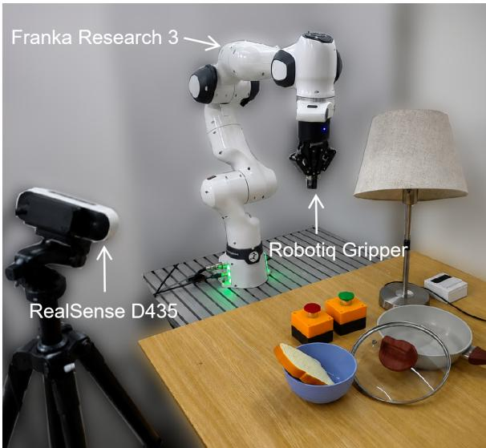  
(a) Franka Research 3 with a Robotiq gripper

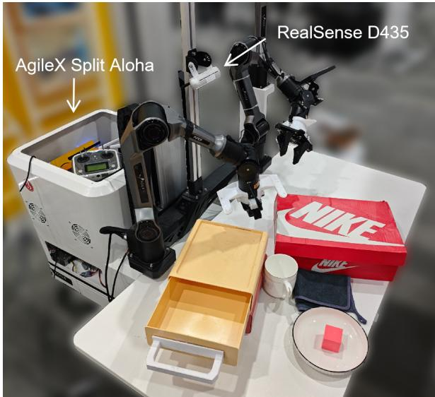  
(b) AgileX Split Aloha with dual Piper arms  
Figure 6. Real-robot platforms.

## A.2 Simulation Task Suites

LIBERO-Long provides ten single-arm long-horizon tasks, while RoboTwin 2.0 provides the five dual-arm horizon-3 tasks according to Lingbot-VA used in our controlled study [5, 29, 37]. The following counts describe the available demonstration pools; evaluation uses disjoint simulator seeds and initial states.

Table 4. Real-robot task corpus and ordered decompositions.
<table><tr><td>Platform</td><td>Task</td><td>Ordered subtasks</td></tr><tr><td>Franka</td><td>Lamp switch and cord</td><td>press the lamp switch; pull the lamp cord</td></tr><tr><td>Franka</td><td>Two buttons press</td><td>press the green button; press the red button</td></tr><tr><td>Franka</td><td>Bread and pan</td><td>pick the bread; place the bread into the pan; pick the lid; place the lid over the pan</td></tr><tr><td>AgileX</td><td>Block and drawer</td><td>pick the red block; place the block into the drawer; close the drawer pick the right shoe; place the right shoe into the shoebox; pick the left shoe; place</td></tr><tr><td>AgileX</td><td>Shoes and box</td><td>the left shoe into the shoebox; close the box</td></tr><tr><td>AgileX</td><td>Table setting</td><td>pick the cloth; wipe the table; push the plate to the center of the table; pick the cup; place the cup on the plate</td></tr><tr><td>AgileX</td><td>Tea making</td><td>pick up the tea bag; place the tea bag into cup; pour water into the cup</td></tr></table>

Table 5. Length distribution of the current full-episode world-model suites. Duration is measured on the 5 Hz evaluation timeline after the initial history.
<table><tr><td>Evaluation set</td><td>Episodes</td><td>Min (s)</td><td>Q1 (s)</td><td>Median (s)</td><td>Q3 (s)</td><td>Max (s)</td></tr><tr><td>DROID-180</td><td>180</td><td>5.8</td><td>10.2</td><td>14.2</td><td>23.9</td><td>95.4</td></tr><tr><td>Laboratory Franka-180</td><td>180</td><td>17.0</td><td>33.8</td><td>37.6</td><td>44.3</td><td>66.8</td></tr></table>

Table 6. LIBERO-Long task pool. Task IDs L0–L9 are used throughout the per-task coaching results in the appendix. Task names are shortened versions of the original language instructions. The pool contains 379 successful demonstrations.
<table><tr><td>ID</td><td>Task</td><td>Demos</td><td>Avg. steps</td><td>ID</td><td>Task</td><td>Demos</td><td>Avg. steps</td></tr><tr><td>L0</td><td>Soup + tomato sauce in basket</td><td>38</td><td>258.1</td><td>L5</td><td>Book in rear caddy compartment</td><td>33</td><td>290.0</td></tr><tr><td>L1</td><td>Cream cheese + butter in basket</td><td>36</td><td>250.6</td><td>L6</td><td>White mug on plate + pudding right</td><td>29</td><td>407.2</td></tr><tr><td>L2</td><td>Turn on stove + place moka pot</td><td>34</td><td>293.8</td><td>L7</td><td>Soup + cream cheese in basket</td><td>49</td><td>259.2</td></tr><tr><td>L3</td><td>Black bowl in drawer + close</td><td>41</td><td>265.0</td><td>L8</td><td>Both moka pots on stove</td><td>35</td><td>245.1</td></tr><tr><td>L4</td><td>Two mugs on left/right plates</td><td>43</td><td>267.3</td><td>L9</td><td>Mug in microwave + close</td><td>41</td><td>186.2</td></tr></table>

Table 7. RoboTwin 2.0 task pool. We use five horizon-3 tasks in the controlled coaching study. Task IDs R0–R4 are used throughout the per-task coaching results in the appendix. Each task contains 50 clean and 500 randomized demonstrations, for 2,750 trajectories in total.
<table><tr><td>ID</td><td>Task</td><td> $\operatorname { A v g } .$ </td><td>steps Instruction</td></tr><tr><td>R0</td><td>Blocks Ranking RGB</td><td></td><td>466 Arrange the red, green, and blue blocks from left to right.</td></tr><tr><td>R1</td><td>Blocks Ranking Size</td><td></td><td>466 Arrange the three blocks from largest to smallest.</td></tr><tr><td>R2</td><td>Put Bottles Dustbin</td><td>637</td><td>Place the bottles into the dustbin on the left.</td></tr><tr><td>R3</td><td>Stack Bowls Three</td><td>476</td><td>Stack the three bowls.</td></tr><tr><td>R4</td><td>Stack Blocks Three</td><td>481</td><td>Stack blue on green and green on red.</td></tr></table>

## B COACHWORLD Training and Closed-Loop Interface

## B.1 Data Mixture and Admission

Besides self-collected data, CoachWorld uses DROID and RoboMIND 1.0 Franka for real single-arm manipulation, RoboCOIN, ViFailBack, and GigaAI dual-Piper for real bimanual manipulation, and LIBERO and RoboTwin for simulation [5, 22, 37, 44, 55, 56, 64]. The mixture is about 500 hours, including successful demonstrations and sub-optimal data. Synchronized views form separate single-view samples with shared arm-slot trajectories and view-specific calibration. We use source or simulator calibration when available and recover missing transforms as described below. Samples with invalid state, unresolved synchronization, or failed geometric alignment are excluded. Mixed-domain training uses the complete pool, whereas single-domain training uses target-domain data at matched total training volume.

## B.2 Closed-Loop Temporal Contract

For each embodiment, a frozen timestamp map resamples a policy action chunk onto the canonical EEF clock and aligns it with one decoded video chunk. The complete EEF trajectory and generated RGB chunk are committed before the next policy or judge query; the terminal commanded EEF state initializes the next action chunk.

## B.3 Camera and Action Grounding

Each embodiment adapter maps native policy actions to the same two-slot EEF representation. At every canonical EEF timestamp, a slot stores metric position, 6D rotation, normalized gripper state, and an existence mask; single-arm data populate one slot and bimanual data populate both. The adapter also records the native policy timestamps used to construct the canonical trajectory, making temporal resampling part of the frozen interface rather than an implicit preprocessing choice.

$T _ { v  \mathrm { r o b o t } } \in S E ( 3 )$ maps metric positions from the canonical robot frame into camera v, and $K _ { v }$ includes all resize, crop, and padding operations. For $[ \tilde { p } _ { x } , \tilde { p } _ { y } , \tilde { p } _ { z } , 1 ] ^ { \top } = T _ { v  \mathrm { r o b o t } } [ p ^ { \top } , 1 ] ^ { \top }$ and $\tilde { p } _ { z } > 0$

$$
\begin{array} { r } { [ \bar { u } , \bar { v } , 1 ] ^ { \top } = \tilde { p } _ { z } ^ { - 1 } K _ { v } [ \tilde { p } _ { x } , \tilde { p } _ { y } , \tilde { p } _ { z } ] ^ { \top } . } \end{array}\tag{7}
$$

Points behind the camera or outside the valid image mask do not contribute trajectory-raster tokens.

Camera calibration. We adapt the coarse-to-fine procedure of CalibAll [60] when a camera-to-robot transform is unavailable. A coarse transform is initialized from robot–image correspondences and refined by aligning diferentiably rendered robot geometry with image-space robot masks. Source intrinsics are retained when available, with resizing, cropping, and padding folded into $K _ { v }$ . We admit a camera stream only after projected forward-kinematic EEF traces align with the observed motion. Whereas CalibAll expresses actions in the camera frame, CoachWorld retains metric EEF states in the canonical robot frame and uses the recovered transform to construct view-specific trajectory tokens and rasters.

Table 8. CoachWorld training configuration.
<table><tr><td>Item</td><td>Setting</td></tr><tr><td>Initialization</td><td>Wan2.2 TI2V-5B</td></tr><tr><td>Frequency</td><td>5Hz</td></tr><tr><td>Image size</td><td>512 × 768</td></tr><tr><td>History:future latents</td><td>5:3</td></tr><tr><td>Optimizer</td><td>AdamW with cosine decay</td></tr><tr><td>Learning rate</td><td> $1 \times 1 0 ^ { - 5 } ; 5 \times 1 0 ^ { - 6 }$  late stage</td></tr><tr><td>Batch</td><td>40</td></tr></table>

## B.4 Training Objective

We use the conditional flow-matching objective in Eq. 4. For camera v, the conditioning is

$$
c = ( \mathcal { H } _ { t } ^ { v } , \mathbf { X } _ { t } , \ell , \mathbf { K } _ { v } , \mathbf { T } _ { v  \mathrm { r o b o t } } ) ,
$$

where $\mathbf { X } _ { t }$ is the future end-efector trajectory defined in Sec. 3.3. CoachWorld uses five sparse-history latents and predicts three future latents.

## C Additional COACHWORLD Evidence

## C.1 Evaluation Package

Each evaluated stream records its checkpoint, physical episode, camera, initial-history endpoint, action sequence, generation seed, prediction, and metrics. FVD-16 uses a frozen early/middle/late clip manifest (540 clips per 180-episode domain) and an episode-grouped bootstrap.

## C.2 Appearance Fidelity and Long-Horizon Stability

Table 9. Supplemental full-episode visual metrics. PSNR and SSIM are secondary appearance diagnostics.   
The CoachWorld variants compare mixed-domain and single-domain training at matched volume.

<table><tr><td></td><td colspan="2">DROID-180</td><td colspan="2">Lab Franka-180</td></tr><tr><td>Method</td><td>PSNR↑</td><td>SSIM↑</td><td>PSNR↑</td><td>SSIM↑</td></tr><tr><td>Ctrl-World</td><td>20.597</td><td>0.7972</td><td>21.859</td><td>0.8279</td></tr><tr><td>Cosmos 3</td><td>15.776</td><td>0.5916</td><td>18.308</td><td>0.6654</td></tr><tr><td>OSCAR-2B</td><td>17.304</td><td>0.7449</td><td>21.915</td><td>0.8473</td></tr><tr><td>COACHWoRLD (single-domain)</td><td>21.115</td><td>0.8696</td><td>22.193</td><td>0.8649</td></tr><tr><td>COACHWORLD (mixed-domain)</td><td>21.438</td><td>0.8768</td><td>22.168</td><td>0.8665</td></tr></table>

PSNR, SSIM, and LPIPS exclude the shared conditioning frame, average future frames within each episode, and then weight episodes equally. The equal-domain macro for single-domain training is 21.654/0.8673/0.1418 (PSNR/SSIM/LPIPS), compared with 21.803/0.8716/0.1354 for mixed-domain training. FVD remains domain-specific and is never macro-averaged across the two suites.

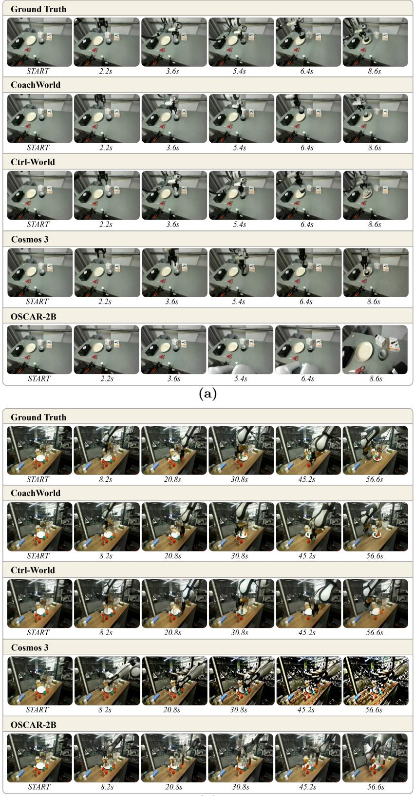  
(b)  
Figure 7. Qualitative full-episode prediction. Representative episodes shown at matched points on the recorded action clock.

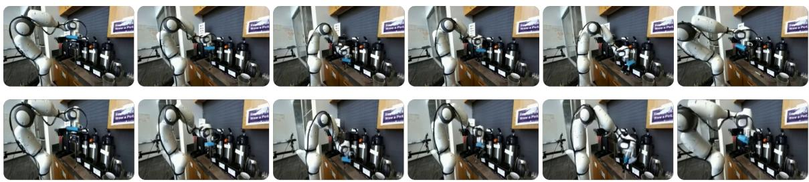

(a) DROID  
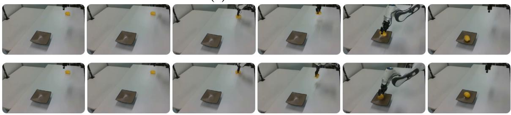  
(b) RoboMIND

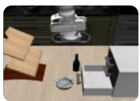

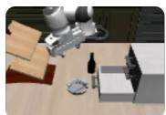

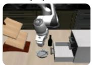

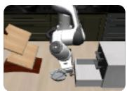

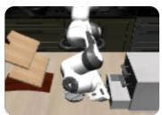

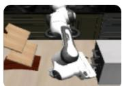

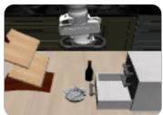

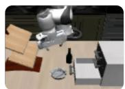

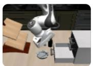

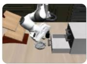  
(c) LIBERO

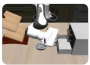

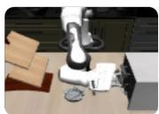  
Figure 8. Representative CoachWorld rollouts on single-arm domains. Top rows show reference episodes and bottom rows show CoachWorld predictions; six frames uniformly span each full episode.

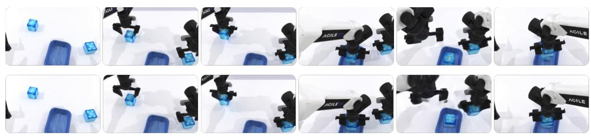  
(a) RoboTwin 2.0

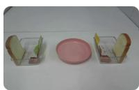

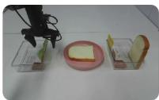

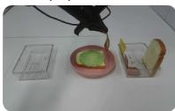

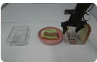

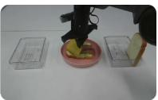

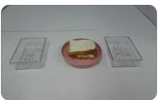

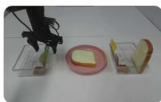

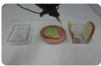

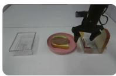

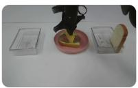

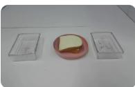

(b) RoboCOIN  
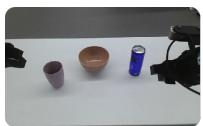

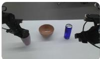

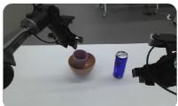

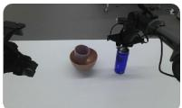

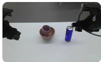

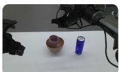

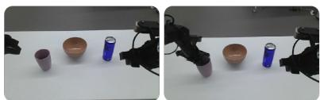

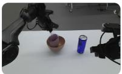

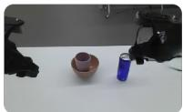

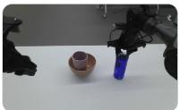  
(c) ViFailBack

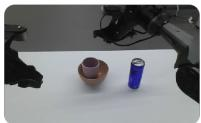  
Figure 9. Representative CoachWorld rollouts on bimanual domains. Top rows show reference episodes and bottom rows show CoachWorld predictions; six frames uniformly span each full episode.

## C.3 Action Following and EEF-Trajectory Fidelity

Following EWMBench [63], reference and generated videos are resized to 640 × 480 and processed by the same frozen EEF detector and tracker. Because both suites contain a single Franka arm, the benchmark’s active-hand selection reduces to the unique visible EEF. The tracker is run independently on prediction and reference; the projected conditioning action is used only for a geometry sanity check and is never treated as the reference-video trajectory. We report HSD for worst-case spatial deviation, nDTW for temporally ordered path agreement, and DYN for velocity consistency.

## C.4 Blind Human Audit of Physics Adherence and Instruction Following

We complement the paired visual and trajectory metrics with a blind human audit on fixed, paired subsets of 30 episodes from DROID-180 and 30 episodes from Lab Franka-180. The same episode subset is used for Ctrl-World, Cosmos 3, OSCAR-2B, CoachWorld (mixed-domain), CoachWorld (single-domain), and the reference videos. For each item, annotators receive the task instruction and the complete predicted or reference video. Method identity and reference status are hidden, and presentation order is randomized.

Two annotators independently assign integer scores from 1 to 5 for Physics Adherence and Instruction Following, without discussion or adjudication. The rubrics are adapted from MiraBench and WorldArena [51, 62]. Physics Adherence assesses whether visible robot motion, contact, and object response remain physically coherent; Instruction Following assesses whether the video executes the specified task and reaches the requested outcome. We average scores across annotators and episodes and divide by five to normalize them to [0, 1]. The hidden reference videos attain 1.000 on both dimensions in both domains. Table 1 reports the resulting model scores.

Before adopting the human audit, we piloted an automatic VLM evaluator on the same dimensions. It failed a reference-ceiling sanity check: some generated rollouts received higher scores than the corresponding ground-truth references. We therefore do not use the automatic scores in our comparisons.

## C.5 Policy-Success Calibration

The 22 cells comprise one frozen task–policy-checkpoint pair for each of ten LIBERO-Long, five RoboTwin, three Franka, and four AgileX tasks. Imagination and deployment use matched prompts, initial-state strata, and trial counts: 50 trials per task in simulation and 20 on hardware. Each imag- ined trial averages three generation seeds. This estimates task-level success. The coaching scorecard instead retains modal terminal diagnoses with agreement from at least two seed as mentioned in Section 3.4.

## D Router and Diagnostic Pipeline

## D.1 Router Interface

At the initial boundary and after each judge-confirmed completion, the router receives the task instruction, current image, candidate atomic skills, and the exact completed-subtask prefix. The deployed prompt is:

Language-router prompt   
SYSTEM   
You are a router for a multi-expert robot policy. Given the task,   
current observation, candidate atomic skills, and Judge-confirmed   
completed subtasks, select the next unfinished atomic subtask.   
Treat the completed subtasks as the exact task prefix and never infer   
additional completion from the image. Respect the order implied by the   
task instruction and copy the selected skill exactly.   
Return only {"skill":"...","object":"..."}.   
USER   
Task: put the bread into the pan, then close the lid   
Completed subtasks: pick the bread; place the bread into the pan   
Candidate skills: press, pull, pick, place

The user message also contains the current image. The expected response is {"skill":"pick", $" { \circ } \mathsf { b j e c t " : } " \mathsf { 1 } \mathsf { 1 } \mathsf { d } " \mathsf { ] }$ . Completion status is supplied exclusively by the judge-confirmed prefix, isolating routing from visual progress estimation.

## D.2 Annotation Bank and Frozen Thresholds

For each task, the judge test bank contains five successful and five failed reference trajectory clips, all disjoint from judge training and threshold calibration. Each trajectory stores the canonical route, human expert-switch boundaries, terminal outcome, and failed subtask when applicable. Two annotators

independently label boundaries and failed subtasks, with disagreements resolved by joint review. Every judge calibrates its per-subtask completion thresholds on the same held-out calibration bank, after which thresholds and timeouts are frozen.

## D.3 Judge Implementations

All judges receive the same causal observation window, task instruction, and active-subtask instruction, and produce a scalar completion score queried at the same committed boundaries. Qwen3-VL uses frozen Qwen3-VL-4B as a zero-shot completion judge. LIV [42] uses its pretrained language-conditioned visual representation with domain-specific adaptation for completion prediction. For Contrastive λ [11], the original Repformer representation is unavailable, so we use a frozen CLIP RN50 encoder [49] with a learned temporal completion scorer. Following SuccessVQA [6], we LoRA-fine-tune Qwen3-VL-4B with binary supervision over completed and incomplete subtask windows. For TOPReward [4], we instantiate its token-scoring formulation on Qwen3-VL-4B and use the resulting score for completion decisions. RoboMeter fine-tunes Qwen3-VL-4B to estimate causal subtask progress and completion.

## D.4 Progress-Judge Evaluation and Metrics

For Table 10, all scorers receive the same causal reference frames, task text, active-subtask text, and annotated route. At each committed chunk boundary, the score is compared with the frozen threshold; a crossing switches experts, while no crossing before the frozen deadline assigns a terminal timeout to the active subtask. The judge therefore estimates progress rather than explicitly searching for a stall.

On successful trajectories, Switch MAE measures temporal error on matched human transition boundaries, while Switch Recall@δ measures the fraction of ground-truth transitions recovered within δ = 1.0 s.

Spearman ρ measures rank agreement between predicted and ground-truth terminal stages over task–stage cells. Within each evaluation domain, a timeout at stage k is encoded as k, while successful completion of an n-stage task is encoded as n + 1. We compute ρ separately for LIBERO, RoboTwin, real single-arm, and real dual-arm settings, and report their unweighted macro average.

For binary transition evaluation, we construct adjacent-stage examples that test whether the current subtask should be considered complete and control should advance to the next stage. A ground-truth transition is treated as the positive class. TP/TN/FP/FN therefore denote correct and incorrect transition decisions, from which we compute precision, recall, and F1. Table 10 reports the corresponding results. For Table 2, switch-time annotations are made separately on the reference and generated trajectories, and each row is evaluated against its own annotations. The generated-video result therefore tests whether the judge detects transitions shown in the imagined video, not whether those transitions match the real trajectory.

## D.5 Latency and Seed Agreement

Judge latency is measured at batch size one from submitting the causal frame packet and prompt to receiving a progress score. On a single NVIDIA A100 80 GB GPU, p50/p95 latency in seconds is 0.0004/0.0035 for LIV, 0.0003/0.0034 for Contrastive λ, 0.0547/0.3567 for Qwen3-VL, 0.0488/0.0506 for SuccessVQA, 0.0663/0.4758 for TOPReward, and 0.1049/0.1164 for RoboMeter; world-model generation, decoding, routing, and timeout bookkeeping are excluded. Each imagined trial uses R = 3 episode-level world-model seeds. Their modal task outcome and failed-subtask label determine the scorecard entry; a trial is accepted only when at least two of the three seeds agree.

Table 10. Progress-judge comparison on causal reference-video replay. Switch metrics evaluate stagetransition timing, Spearman ρ measures terminal-stage rank agreement, and outcome metrics evaluate binary transition decisions on adjacent-stage examples. Best and second-best values are bold and underlined, respectively.
<table><tr><td>Judge</td><td>Switch MAE (s)↓</td><td>Switch Rec.1.0s (%)↑ Spearman ρ↑</td><td></td><td>TP/TN/FP/FN</td><td>Out.-Prec. (%)↑</td><td>Out.-Rec. (%)↑</td><td>Out.-F1 (%)↑</td></tr><tr><td>LIV†</td><td>3.311</td><td>23.64</td><td>0.328</td><td>64/67/43/46</td><td>59.81</td><td>58.18</td><td>58.99</td></tr><tr><td>Contrastive λ†</td><td>1.905</td><td>28.18</td><td>0.603</td><td>95/80/30/15</td><td>76.00</td><td>86.36</td><td>80.85</td></tr><tr><td colspan="8">VLM-based</td></tr><tr><td>Qwen3-VL</td><td>0.893</td><td>20.00</td><td>0.151</td><td>29/82/28/81</td><td>50.88</td><td>26.36</td><td>34.73</td></tr><tr><td>TOPReward†</td><td>1.603</td><td>33.64</td><td>0.330</td><td>76/55/55/34</td><td>58.02</td><td>69.09</td><td>63.07</td></tr><tr><td>SuccessVQA†</td><td>0.859</td><td>59.09</td><td>0.286</td><td>82/72/38/28</td><td>68.33</td><td>74.55</td><td>71.30</td></tr><tr><td>RoboMeter</td><td>0.414</td><td>82.73</td><td>0.727</td><td>101/92/18/9</td><td>84.87</td><td>91.82</td><td>88.21</td></tr></table>

† denotes an implementation adapted to the shared causal evaluation setting.

## E Coaching Protocol and Per-Round Evidence

Algorithm 1 in the main text summarizes one coaching round. Here we detail the operator interface, matched acquisition and update protocols, and per-round results.

## E.1 Operator-Facing Scorecard

The scorecard displays each subtask–expert pair’s imagined success rate, reach count, task-balanced first-timeout mass, and representative failed videos. For the top M = 2 pairs, it requests a concrete skill, object or afordance, embodiment, and demonstration count. The operator checks safety and collects the requested examples without manually reranking the selected pairs.

Figure 10 illustrates how RoboCoach turns round-level evaluation results into auditable coaching evidence. The evaluation view aggregates rollout outcomes, diagnoses recurring first-timeout subtasks, and ranks candidate coaching targets. Selecting a target then exposes the corresponding episode-level evidence, including the failed rollout, judge progress trace, and router-dispatched subtask sequence.

## E.2 Matched Coaching Protocol

Simulation uses three rounds of $B _ { \mathrm { s i m } } = 1 0 0$ accepted subtask-level demonstrations and evaluates four methods at cumulative budgets {0, 100, 200, 300}: Single VLA + Uniform, Single VLA + WM-targeted, Modular + Random, and RoboCoach. The two Single-VLA methods update one shared global LoRA adapter using all acquired data. Modular + Random randomly selects two subtask–expert pairs per round, whereas RoboCoach selects the top two pairs from the world-model scorecard. Both modular conditions update the experts associated with the selected pairs; when two selected pairs share an expert, their demonstrations are pooled for the same update. Single VLA + WM-targeted and RoboCoach receive the same scorecard-requested demonstrations, isolating shared-global versus selected-expert updates on targeted data. All coaching conditions start from the same initial policy checkpoint. For the modular conditions, each skill expert is initialized from the same initial adapter before coaching begins. All conditions use the same router and progress judge; the Single-VLA conditions apply the routed subtask instruction to one shared global adapter. Accordingly, SR@0 is a shared evaluation of the common initialization, and the conditions diverge only after coaching begins. Hardware uses $B _ { \mathrm { r e a l } } = 5 0$ and compares Single VLA + Uniform with RoboCoach at {0, 50, 100, 150}. Within each domain, methods use the same demonstration budget and evaluation-trial protocol.

For Single VLA, one shared LoRA adapter is updated on all acquired data. For the modular conditions, only the selected expert adapters are updated.

To quantify uncertainty in Figure 4, we hold the benchmark tasks fixed and resample evaluation outcomes within each task. For each method and checkpoint, we generate 50,000 bootstrap replicates by drawing each task’s success count from a binomial distribution with its observed success fraction and original trial count (50 for simulation or 20 for real robots). In each replicate, we average task success rates equally. The 2.5th and 97.5th percentiles define a pointwise 95% confidence interval.

$$
\mathrm { A U C _ { 0 : 3 } } _ { B } = \frac { S _ { 0 } + 2 S _ { 1 } + 2 S _ { 2 } + S _ { 3 } } { 6 } .
$$

For task-macro success $S _ { q }$ after round $q ,$ normalized Budget AUC is

(8)

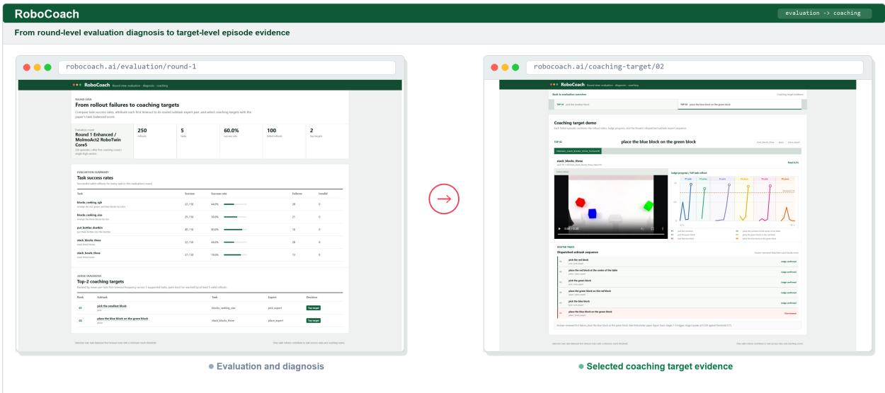  
Figure 10. From round-level diagnosis to target-level coaching evidence. Left: RoboCoach aggregates rollout outcomes into task-level success rates and ranks recurring first-timeout subtasks as coaching targets. Right: selecting a target reveals its supporting episode-level evidence, including the failed rollout, judge progress trace, and router-dispatched subtask sequence. This drill-down connects aggregate failure diagnosis to concrete and auditable coaching examples.

## E.3 Acquisition Trace and Per-Round Results

Table 11. Per-round acquisition trace. RoboCoach rows report the two scorecard-selected subtask–expert targets in each round, while Random rows report the two randomly selected targets. Single VLA + WM-targeted shares the RoboCoach acquisitions; Uniform has no targeted selection.
<table><tr><td>Domain</td><td>Method</td><td>Round 1</td><td>Round 2</td><td>Round 3</td></tr><tr><td>LIBERO</td><td>Random</td><td>L6: pick white mug → pick L8: place first moka pot → place</td><td>L0: pick tomato sauce → pick L7: place alphabet soup → place</td><td>L7: pick cream-cheese box → pick L9: place mug in microwave → place</td></tr><tr><td>LIBERO</td><td>ROBOCOACH</td><td>L4: pick white mug → pick L6: pick chocolate pudding → pick</td><td>L0: pick soup / tomato sauce → pick L8: pick first / second moka pot → pick</td><td>L8: place first moka pot → place L9: place mug in microwave → place</td></tr><tr><td>RoboTwin Random</td><td></td><td>R1: pick largest block → pick R3: pick third bowl → pick</td><td>R0: pick blue block → pick R3: place first bowl → place</td><td>R3: pick second bowl → pick R4: place second block on first → place</td></tr><tr><td>RoboTwin RoBoCoACH</td><td></td><td>R1: place medium block → place R2: pick first bottle → pick</td><td>R0: pick green block → pick R1: place largest block → place</td><td>R4: place third block on second → place R3: place third bowl on second → place</td></tr><tr><td>Franka</td><td>RoBoCoACH pull lamp cord → pull</td><td>place lid → place</td><td>press green button → press place lid → place</td><td>pull lamp cord → pull press red button → press</td></tr><tr><td>AgileX</td><td>ROBOCOACH</td><td>pick right shoe → pick place tea bag → place</td><td>pick red block → pick push plate → push</td><td>pick red block → pick place left shoe → place</td></tr></table>

Table 12. Per-round complete-task success. B = 100 in simulation and B = 50 on hardware.
<table><tr><td>Domain</td><td>Method</td><td>SR@0</td><td>SR@B</td><td>SR@2B</td><td>SR@3B</td><td>Budget AUC</td></tr><tr><td>LIBERO</td><td>Single VLA + Uniform</td><td>66.0%</td><td>66.8%</td><td>66.4%</td><td>67.0%</td><td>66.6%</td></tr><tr><td>LIBERO</td><td>Single VLA + WM-targeted</td><td>66.0%</td><td>68.2%</td><td>66.8%</td><td>67.8%</td><td>67.3%</td></tr><tr><td>LIBERO</td><td>Modular + Random</td><td>66.0%</td><td>67.8%</td><td>69.2%</td><td>68.4%</td><td>68.1%</td></tr><tr><td>LIBERO</td><td>ROBOCOACH</td><td>66.0%</td><td>69.6%</td><td>70.6%</td><td>71.2%</td><td>69.6%</td></tr><tr><td>RoboTwin</td><td>Single VLA + Uniform</td><td>58.8%</td><td>58.4%</td><td>58.0%</td><td>59.6%</td><td>58.5%</td></tr><tr><td>RoboTwin</td><td>Single VLA + WM-targeted</td><td>58.8%</td><td>54.8%</td><td>57.2%</td><td>54.8%</td><td>56.3%</td></tr><tr><td>RoboTwin</td><td>Modular + Random</td><td>58.8%</td><td>58.8%</td><td>56.4%</td><td>55.2%</td><td>57.4%</td></tr><tr><td>RoboTwin</td><td>ROBOCOACH</td><td>58.8%</td><td>64.0%</td><td>65.2%</td><td>68.0%</td><td>64.2%</td></tr><tr><td>Franka</td><td>Single VLA + Uniform</td><td>13.3%</td><td>15.0%</td><td>20.0%</td><td>30.0%</td><td>18.9%</td></tr><tr><td>Franka</td><td>ROBOCOACH</td><td>13.3%</td><td>46.7%</td><td>68.3%</td><td>75.0%</td><td>53.1%</td></tr><tr><td>AgileX</td><td>Single VLA + Uniform</td><td>40.0%</td><td>48.8%</td><td>46.3%</td><td>47.5%</td><td>46.3%</td></tr><tr><td>AgileX</td><td>ROBOCOACH</td><td>40.0%</td><td>72.5%</td><td>83.8%</td><td>83.8%</td><td>72.7%</td></tr></table>

## E.4 LIBERO Per-Task Coaching Results

Table 13 reports the complete per-task LIBERO results underlying the task-macro curves in Table 12. All methods use the same frozen SR@0 evaluation, yielding 330/500 successes (66.0%). Each task–round cell contains 50 evaluation episodes under the same fixed-seed protocol. Cells corresponding to updated global LoRAs or routed experts use their respective frozen checkpoints; non-updated modular cells are independently re-evaluated rather than reusing outcomes from another method or round.

Table 13. Per-task LIBERO coaching results under the fixed evaluation protocol. Task IDs follow the LIBERO-Long mapping in Table 6. Each cell reports successes out of 50 fixed-seed evaluation episodes, with the corresponding success rate in parentheses. All methods share the same SR@0 evaluation of 330/500 (66.0%).
<table><tr><td>Task ID</td><td>SR@0</td><td>SR@B</td><td>SR@2B</td><td>SR@3B</td></tr><tr><td>Single VLA + Uniform</td><td></td><td></td><td></td><td></td></tr><tr><td>L0</td><td>25/50 (50%)</td><td>29/50 (58%)</td><td>30/50 (60%)</td><td>25/50 (50%)</td></tr><tr><td>L1</td><td>30/50 (60%)</td><td>35/50 (70%)</td><td>32/50 (64%)</td><td>36/50 (72%)</td></tr><tr><td>L2</td><td>39/50 (78%)</td><td>38 /50 (76%)</td><td>35 /50 (70%)</td><td>35/50 (70%)</td></tr><tr><td>L3</td><td>43/50 (86%)</td><td>45 /50 (90%)</td><td>45/50 (90%)</td><td>44/50 (88%)</td></tr><tr><td>L4</td><td>33 /50 (66%)</td><td>26 /50 (52%)</td><td>29/ /50 (58%)</td><td>30/50 (60%)</td></tr><tr><td>L5</td><td>41/50 (82%)</td><td>42 /50 (84%)</td><td>43/50 (86%)</td><td>44/50 (88%)</td></tr><tr><td>L6</td><td>29/50 (58%)</td><td>32 /50 (64%)</td><td>30/50 (60%)</td><td>35/50 (70%)</td></tr><tr><td>L7</td><td>38 /50 (76%)</td><td>35 /50 (70%)</td><td>36 /50 (72%)</td><td>28 /50 (56%)</td></tr><tr><td>L8</td><td>17 /50 (34%)</td><td>22 /50 (44%)</td><td>20 /50 (40%)</td><td>28 /50 (56%)</td></tr><tr><td>L9</td><td>35/50 (70%)</td><td>30/50 (60%)</td><td>32/50 (64%)</td><td>30/50 (60%)</td></tr><tr><td>Total</td><td>330/500 (66.0%)</td><td>334/500 (66.8%)</td><td>332/500 (66.4%)</td><td>335/500 (67.0%)</td></tr><tr><td colspan="5">Single VLA + WM-targeted</td></tr><tr><td>L0</td><td></td><td>26/50 (52%)</td><td>29/50 (58%)</td><td>30/50 (60%)</td></tr><tr><td>L1</td><td>25/50 (50%)</td><td>35/50 (70%)</td><td>35/50 (70%)</td><td>36/50 (72%)</td></tr><tr><td>L2</td><td>30/50 (60%) 39 /50 (78%)</td><td>35 /50 (70%)</td><td>39 /50 (78%)</td><td>39 /50 (78%)</td></tr><tr><td>L3</td><td>43 /50 (86%)</td><td>46 /50 (92%)</td><td>46 /50 (92%)</td><td>45 /50 (90%)</td></tr><tr><td>L4</td><td>33 /50 (66%)</td><td>28 /50 (56%)</td><td>29 /50 (58%)</td><td>34/50 (68%)</td></tr><tr><td>L5</td><td>41/50 (82%)</td><td>44/50 (88%)</td><td>44/50 (88%)</td><td>43/50 (86%)</td></tr><tr><td>L6</td><td>29/50 (58%)</td><td>30/50 (60%)</td><td>27/50 (54%)</td><td>31/50 (62%)</td></tr><tr><td>L7</td><td>38/50 (76%)</td><td>35/ /50 (70%)</td><td>34/50 (68%)</td><td>34/50 (68%)</td></tr><tr><td>L8</td><td>17/50 (34%)</td><td>24/50 (48%)</td><td>23/50 (46%)</td><td>19/50 (38%)</td></tr><tr><td>L9</td><td>35/50 (70%)</td><td>38/50 (76%)</td><td>28/50 (56%)</td><td>28/50 (56%)</td></tr><tr><td>Total</td><td>330/500 (66.0%)</td><td>341/500 (68.2%)</td><td>334/500 (66.8%)</td><td>339/500 (67.8%)</td></tr><tr><td colspan="5">Modular + Random</td></tr><tr><td></td><td></td><td>25/50 (50%)</td><td>(60%)</td><td></td></tr><tr><td>L0</td><td>25/50 (50%)</td><td>30/50 (60%)</td><td>30/50 30/50 (60%)</td><td>33/50 (66%)</td></tr><tr><td>L1</td><td>30/50 (60%)</td><td>38/50 (76%)</td><td>40/50 (80%)</td><td>30/50 (60%) (78%)</td></tr><tr><td>L2 L3</td><td>39/50 (78%)</td><td>43 /50 (86%)</td><td>43/50 (86%)</td><td>39/50</td></tr><tr><td>L4</td><td>43 /50 (86%)</td><td>32/50 (64%)</td><td>(64%)</td><td>43/50 (86%)</td></tr><tr><td>L5</td><td>33/50 (66%)</td><td>41/50 (82%)</td><td>32/50</td><td>32/50 (64%)</td></tr><tr><td>L6</td><td>41/50 (82%)</td><td>(68%)</td><td>41/50 (82%)</td><td>41/50 (82%)</td></tr><tr><td>L7</td><td>29/50 (58%)</td><td>34/50 (76%)</td><td>34/50 (68%)</td><td>32 /50 (64%)</td></tr><tr><td>L8</td><td>38/50 (76%)</td><td>38/50 (46%)</td><td>37/50 (74%)</td><td>36/50 (72%)</td></tr><tr><td>L9</td><td>17 /50 (34%)</td><td>23 /50 35/ /50 (70%)</td><td>23 /50 (46%)</td><td>29 /50 (58%) 27/50</td></tr><tr><td>Total</td><td>35/50 (70%)</td><td>339/500 (67.8%)</td><td>36/50 (72%) 346/500 (69.2%)</td><td>(54%) 342/500 (68.4%)</td></tr><tr><td colspan="5">330/500 (66.0%)</td></tr><tr><td>ROBOCOACH (ours)</td><td></td><td>25/50 (50%)</td><td>(62%)</td><td>(62%)</td></tr><tr><td>L0 L1</td><td>25/50 (50%) 30/50 (60%)</td><td>35/50 (70%)</td><td>31/50 30/50 (60%)</td><td>31/50 30/50 (60%)</td></tr><tr><td>L2</td><td>39/50 (78%)</td><td>39/50 (78%)</td><td>38/50 (76%)</td><td>40/50 (80%)</td></tr><tr><td></td><td>43 /50 (86%)</td><td>43 /50 (86%)</td><td>(86%)</td><td></td></tr><tr><td>L3</td><td></td><td>33 (66%)</td><td>43 /50</td><td>43 /50 (86%)</td></tr><tr><td>L4</td><td>33 /50 (66%)</td><td>/50</td><td>35 /50 (70%) (82%)</td><td>35 /50 (70%)</td></tr><tr><td>L5</td><td>41 /50 (82%)</td><td>46 /50 (92%) (72%)</td><td>41/50 (70%)</td><td>41/50 (82%) 35/50</td></tr><tr><td>L6</td><td>29 /50 (58%)</td><td>36 /50</td><td>35/50</td><td>(70%)</td></tr><tr><td>L7</td><td>38/50 (76%)</td><td>38/ /50 (76%)</td><td>38/50 (76%)</td><td>38/50 (76%)</td></tr><tr><td>L8 L9</td><td>17/50 (34%)</td><td>18 /50 (36%) (70%)</td><td>27/50 (54%)</td><td>30/50 (60%) (66%)</td></tr><tr><td></td><td>35/50 (70%)</td><td>35/50</td><td>35/50 (70%)</td><td>33/50</td></tr><tr><td>Total</td><td>330/500 (66.0%)</td><td>348/500 (69.6%)</td><td>353/500 (70.6%)</td><td>356/500 (71.2%)</td></tr></table>

## E.5 RoboTwin Per-Task Coaching Results

Table 14 reports the complete per-task RoboTwin 2.0 results underlying the task-macro coaching curves. Task IDs R0–R4 follow the mapping in Table 7. Each task is evaluated over 50 trials at every coaching checkpoint.

Table 14. Per-task RoboTwin 2.0 coaching results under the fixed evaluation protocol. Task IDs follow the RoboTwin task mapping in Table 7. Each cell reports successes out of 50 fixed-seed evaluation episodes, with the corresponding success rate in parentheses. All methods share the same SR@0 evaluation of 147/250 (58.8%).
<table><tr><td>Task ID</td><td>SR@0</td><td>SR@B</td><td>SR@2B</td><td>SR@3B</td></tr><tr><td colspan="5">Single VLA + Uniform</td></tr><tr><td>R0</td><td>25/50 (50%)</td><td>26/50 (52%)</td><td>25/50 (50%)</td><td>25/50 (50%)</td></tr><tr><td>R1</td><td>22/50 (44%)</td><td>22/50 (44%)</td><td>20/50 (40%)</td><td>24/50 (48%)</td></tr><tr><td>R2</td><td>33/50 (66%)</td><td>41/50 (82%)</td><td>38/50 (76%)</td><td>37/50 (74%)</td></tr><tr><td>R3</td><td>39/50 (78%)</td><td>37/50 (74%)</td><td>43/50 (86%)</td><td>41/50 (82%)</td></tr><tr><td>R4</td><td>28/50 (56%)</td><td>20/50 (40%)</td><td>19/50 (38%)</td><td>22/50 (44%)</td></tr><tr><td>Total</td><td>147/250 (58.8%)</td><td>146/250 (58.4%)</td><td>145/250 (58.0%)</td><td>149/250 (59.6%)</td></tr><tr><td colspan="5"></td></tr><tr><td>R0</td><td>Single VLA + WM-targeted 25/50 (50%)</td><td>25/50 (50%)</td><td></td><td></td></tr><tr><td>R1</td><td>22/50 (44%)</td><td>20/50 (40%)</td><td>23/50 (46%) 26/50 (52%)</td><td>24/50 (48%) 23/50 (46%)</td></tr><tr><td>R2</td><td>33/50 (66%)</td><td>34/50 (68%)</td><td>34/50 (68%)</td><td>33/50 (66%)</td></tr><tr><td>R3</td><td>39/50 (78%)</td><td>37/50 (74%)</td><td>38/50 (76%)</td><td>37/50 (74%)</td></tr><tr><td>R4</td><td>28/50 (56%)</td><td>21/50 (42%)</td><td>22/50 (44%)</td><td>20/50 (40%)</td></tr><tr><td>Total</td><td>147/250 (58.8%)</td><td>137/250 (54.8%)</td><td>143/250 (57.2%)</td><td>137/250 (54.8%)</td></tr><tr><td colspan="5"></td></tr><tr><td>Modular + Random</td><td></td><td></td><td></td><td></td></tr><tr><td>R0 R1</td><td>25/50 (50%) 22/50 (44%)</td><td>27/50 (54%) 23/50 (46%)</td><td>25/50 (50%) 19/50 (38%)</td><td>26/50 (52%) 22/50 (44%)</td></tr><tr><td>R2</td><td>33/50 (66%)</td><td>32/50 (64%)</td><td>32/50 (64%)</td><td>33/50 (66%)</td></tr><tr><td>R3</td><td>39/50 (78%)</td><td>38/50 (76%)</td><td>38/50 (76%)</td><td>34/50 (68%)</td></tr><tr><td>R4</td><td>28/50 (56%)</td><td>27/50 (54%)</td><td>27/50 (54%)</td><td>23/50 (46%)</td></tr><tr><td>Total</td><td>147/250 (58.8%)</td><td>147/250 (58.8%)</td><td>141/250 (56.4%)</td><td>138/250 (55.2%)</td></tr><tr><td colspan="5"></td></tr><tr><td>ROBOCOACH R0 25/50 (50%)</td><td>(ours)</td><td>25/50 (50%)</td><td></td><td>26/50 (52%)</td></tr><tr><td>R1</td><td>22/50 (44%)</td><td>26/50 (52%)</td><td>26/50 (52%) 26/50 (52%)</td><td>25/50 (50%)</td></tr><tr><td>R2</td><td>33/50 (66%)</td><td>40/50 (80%)</td><td>47/50 (94%)</td><td>47/50 (94%)</td></tr><tr><td>R3</td><td>39/50 (78%)</td><td>41/50 (82%)</td><td>36/50 (72%)</td><td>44/50 (88%)</td></tr><tr><td>R4</td><td>28/50 (56%)</td><td>28/50 (56%)</td><td>28/50 (56%)</td><td>28/50 (56%)</td></tr><tr><td>Total</td><td>147/250 (58.8%)</td><td>160/250 (64.0%)</td><td>163/250 (65.2%)</td><td>170/250 (68.0%)</td></tr></table>

## E.6 Franka Per-Task Coaching Results

Table 15 reports the per-task Franka results across the three coaching rounds. Here, B = 50 accepted demonstrations per round.

Table 15. Per-task coaching results on Franka. Each entry reports successes out of 20 evaluation trials, with success rate in parentheses.
<table><tr><td>Task</td><td>SR@0</td><td>SR@B</td><td>SR@2B</td><td>SR@3B</td></tr><tr><td colspan="5">Single VLA + Uniform</td></tr><tr><td>Lamp switch &amp; cord</td><td>3/20 (15%)</td><td>6/20 (30%)</td><td>2/20 (10%)</td><td>8/20 (40%)</td></tr><tr><td>Two buttons</td><td>3/20 (15%)</td><td>2/20 (10%)</td><td>3/20 (15%)</td><td>4/20 (20%)</td></tr><tr><td>Bread &amp; pan</td><td>2/20 (10%)</td><td>1/20 (5%)</td><td>7/20 (35%)</td><td>6/20 (30%)</td></tr><tr><td>Total</td><td>8/60 (13.3%)</td><td>9/60 (15.0%)</td><td>12/60 (20.0%)</td><td>18/60 (30.0%)</td></tr><tr><td colspan="5">ROBOCOACH (ours)</td></tr><tr><td>Lamp switch &amp; cord</td><td>3/20 (15%)</td><td>14/20 (70%)</td><td>14/20 (70%)</td><td>17/20 (85%)</td></tr><tr><td>Two buttons</td><td>3/20 (15%)</td><td>3/20 (15%)</td><td>13/20 (65%)</td><td>14/20 (70%)</td></tr><tr><td>Bread &amp; pan</td><td>2/20 (10%)</td><td>11/20 (55%)</td><td>14/20 (70%)</td><td>14/20 (70%)</td></tr><tr><td>Total</td><td>8/60 (13.3%)</td><td>28/60 (46.7%)</td><td>41/60 (68.3%)</td><td>45/60 (75.0%)</td></tr></table>

## E.7 AgileX Per-Task Coaching Results

Table 16 reports the per-task AgileX results across the three coaching rounds. Here, B = 50 accepted demonstrations per round.

Table 16. Per-task coaching results on AgileX. Each entry reports successes out of 20 evaluation trials, with success rate in parentheses.
<table><tr><td>Task</td><td>SR@0</td><td>SR@B</td><td>SR@2B</td><td>SR@3B</td></tr><tr><td colspan="5">Single VLA + Uniform</td></tr><tr><td>Block &amp; drawer</td><td>12/20 (60%)</td><td>14/20 (70%)</td><td>14/20 (70%)</td><td>12/20 (60%)</td></tr><tr><td>Shoes &amp; box</td><td>5/20 (25%)</td><td>6/20 (30%)</td><td>4/20 (20%)</td><td>5/20 (25%)</td></tr><tr><td>Table setting</td><td>13/20 (65%)</td><td>16/20 (80%)</td><td>17/20 (85%)</td><td>17/20 (85%)</td></tr><tr><td>Tea making</td><td>2/20 (10%)</td><td>3/20 (15%)</td><td>2/20 (10%)</td><td>4/20 (20%)</td></tr><tr><td>Total</td><td>32/80 (40.0%)</td><td>39/80 (48.8%)</td><td>37/80 (46.3%)</td><td>38/80 (47.5%)</td></tr><tr><td colspan="5">ROBOCOACH (ours)</td></tr><tr><td>Block &amp; drawer</td><td>12/20 (60%)</td><td>12/20 (60%)</td><td>15/20 (75%)</td><td>17/20 (85%)</td></tr><tr><td>Shoes &amp; box</td><td>5/20 (25%)</td><td>14/20 (70%)</td><td>14/20 (70%)</td><td>12/20 (60%)</td></tr><tr><td>Table setting</td><td>13/20 (65%)</td><td>13/20 (65%)</td><td>20/20 (100%)</td><td>20/20 (100%)</td></tr><tr><td>Tea making</td><td>2/20 (10%)</td><td>19/20 (95%)</td><td>18/20 (90%)</td><td>18/20 (90%)</td></tr><tr><td>Total</td><td>32/80 (40.0%)</td><td>58/80 (72.5%)</td><td>67/80 (83.8%)</td><td>67/80 (83.8%)</td></tr></table>

## F Held-Out Composition Protocol

The four held-out cases correspond to the five-stage AgileX continuation (Case A), the Franka button-to lamp cross-task composition (Case B), AgileX shoe reordering (Case C), and Franka button reordering (Case D). For every case, all constituent atomic skills are supported by existing experts, while the complete ordered route and its semantic paraphrases are excluded from policy and judge training, coaching data, router examples, threshold calibration, and checkpoint selection. The evaluation therefore isolates the reuse of previously learned skills along unseen task routes

Route descriptions. Case A combines the table-setting and tea-making skills into the route wipe the table → push the plate to the center → place the cup on the plate → place the tea bag into the cup → pour water into the cup. Case B combines the green-button skill from Two buttons press with the lamp-cord skill from Lamp switch and cord. Case C reverses the right- and left-shoe placement skills from Shoes and box before closing the box. Case D reverses the two-button order from Two buttons press, pressing red before green and reusing the same press expert with a diferent argument.

Table 17. Held-out composition success by case. Task-macro success is the arithmetic mean of the four case-level rates.
<table><tr><td>Case</td><td>Trials</td><td>ROBOCOACH</td><td>Single VLA + Uniform</td></tr><tr><td>A: continuation</td><td>20</td><td>13/20 (65%)</td><td>0/20 (0%)</td></tr><tr><td>B: composition</td><td>20</td><td>3/20 (15%)</td><td>0/20 (0%)</td></tr><tr><td>C: AgileX reordering</td><td>20</td><td>5/20 (25%)</td><td>0/20 (0%)</td></tr><tr><td>D: Franka reordering</td><td>20</td><td>7/20 (35%)</td><td>0/20 (0%)</td></tr><tr><td>Task macro</td><td></td><td>35.0%</td><td>0.0%</td></tr></table>