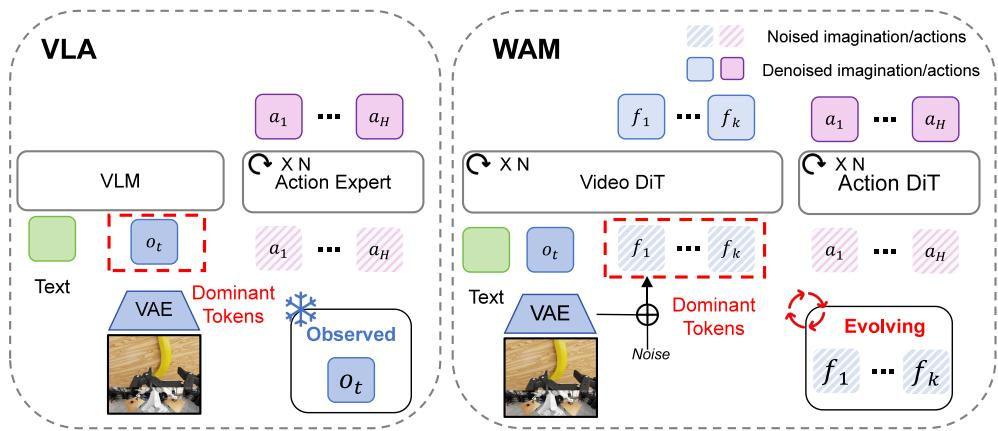
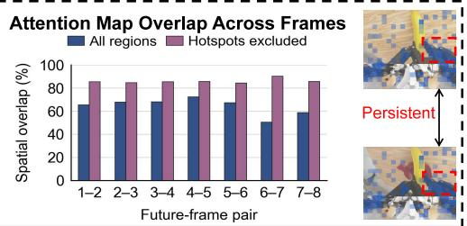
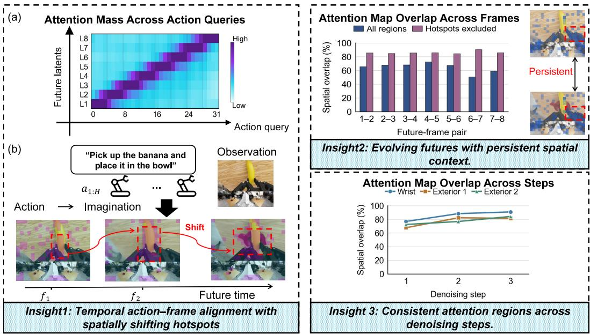
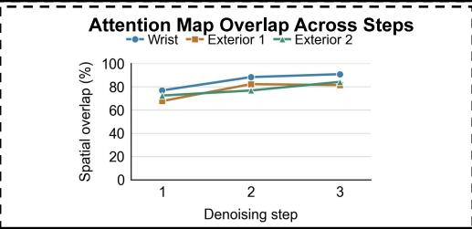
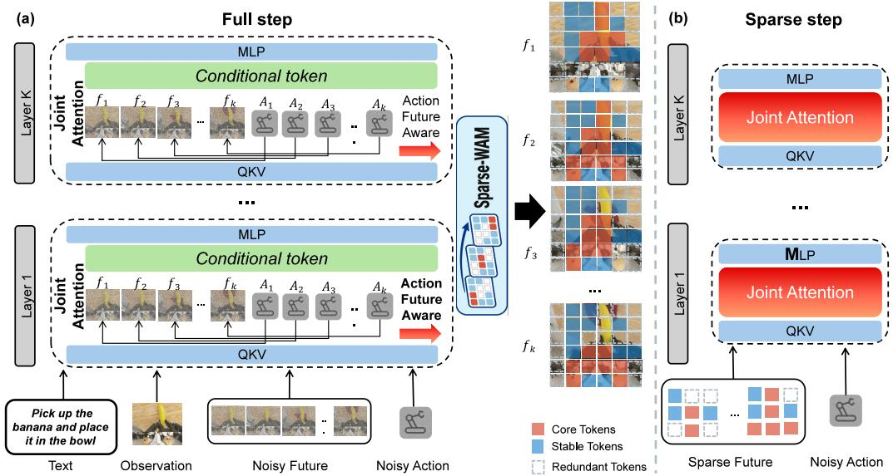
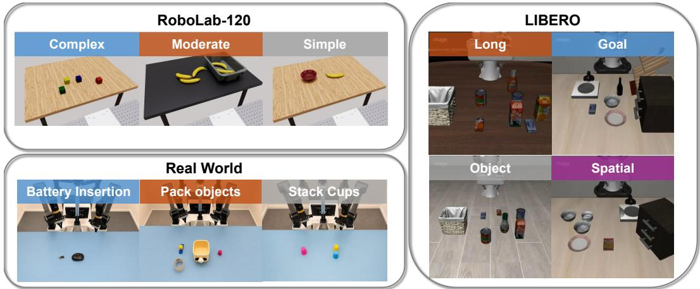
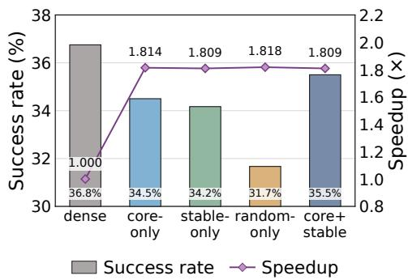
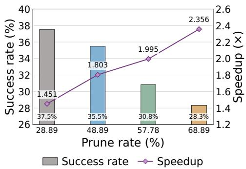

# SPARSE-WAM: ACCELERATING WORLD ACTION MOD-ELS VIA ACTION-GUIDED SPARSE IMAGINATION

Xinling Xie1,2,∗,† Haodong Wang2,∗ Mi Jiazhi2 Zhiming Liu3 Zicong Hong4 Xiaoyi Pang2 Qianli Liu2 Yangjia Hu2 Ying Chen2 Zhengyang Yan2 Song Guo2

1 NJU 2 HKUST 3 HIT 4 EPFL

∗ Equal contribution. † Work done during an internship at HKUST.

## ABSTRACT

World-action models (WAMs) leverage pretrained video models to improve generalization in robot control by jointly predicting future visual states and actions. This capability comes at a substantial inference cost, as dense future-frame tokens are repeatedly processed during denoising. Prior methods address this by token pruning that prioritizes visual fidelity to reduce denoising costs in video diffusion models. However, these methods do not use action relevance to determine which futureframe tokens to retain during joint denoising in WAMs. In this paper, we propose Sparse-WAM, a training-free framework for action-guided sparse imagination that selectively processes future-frame tokens to accelerate WAM inference. We observe substantial overlap in the spatial distribution of attention from action tokens to future-frame tokens (action-to-future attention) between consecutive denoising steps, despite continued updates to the future representations. Motivated by this, we develop Action-Guided Token Selection to retain frame-specific action-relevant regions together with cross-frame context. However, a naive implementation can incur attention-scoring and token-packing overhead that offsets the computational savings from pruning. We therefore introduce Pilot, an efficient engine that reduces sparse inference overhead through lightweight scoring and cross-step reuse of token selections. On LIBERO with FastWAM-Joint and RoboLab-120 with Cosmos 3 Edge, Sparse-WAM achieves inference speedups of approximately 2.0× and 1.8×, respectively, over dense eager inference on an NVIDIA RTX 4090, while largely preserving task performance.

## 1 INTRODUCTION

World action models (WAMs) have emerged as a promising paradigm for robotic control. Recent WAMs such as DreamZero (Ye et al., 2026b) and Cosmos 3 (NVIDIA, 2026) jointly denoise future visual states and actions, leveraging spatiotemporal priors to improve generalization and robustness (Zhang et al., 2026). However, explicitly generating high-resolution future frames introduces a large number of visual tokens into each denoising step. Since the cost of each denoising step grows significantly with the number of processed tokens (Anagnostidis et al., 2025), repeatedly processing these future-frame tokens increases inference latency and limits control frequency (Guo et al., 2024).

To reduce this repeated computation, existing methods either remove imagination at inference or compress future-frame tokens. The former uses future imagination during training but omits explicit future prediction during action generation (Yuan et al., 2026; Li et al., 2026b; Zhao et al., 2026a). The latter retains future prediction with fewer or lower-fidelity visual tokens (Chen et al., 2026; Li et al., 2026a), but still devotes computation to regions with limited relevance to actions.

Token pruning offers a fine-grained means of reducing the cost of processing dense imagination tokens by selectively retaining a subset for computation. This paradigm has been explored in VLAs to retain useful information from observed inputs (Xu et al., 2025; Wang et al., 2026a) and in video generation to preserve visual quality (Zou et al., 2025; Feng et al., 2026). In WAMs, however, future-frame tokens are initialized from noise and jointly denoised with action tokens, making action-relevant regions difficult to determine in advance.

  
Figure 1: Representative architectures of VLA and WAM. In WAM, noisy imagination tokens constitute the majority of the visual-action sequence and evolve throughout denoising.

To understand how action-relevant regions evolve during denoising, we examine attention from action tokens to future-frame tokens (see subsection 3.2). We observe that, despite continued changes in future representations, the regions attended to by action tokens exhibit substantial spatial overlap between consecutive denoising steps. This consistency offers an opportunity to reuse token selections across steps, but does not imply that the relevant regions remain unchanged throughout denoising. These observations motivate using action-to-future attention to select future regions for sparse computation and reusing the selections across denoising steps. However, attention scoring and token reorganization introduce additional overhead that can offset the computational savings. The core challenge is therefore to identify useful future regions while keeping the cost of selection and sparse execution low.

To address this challenge, we introduce Sparse-WAM, a training-free framework for action-guided sparse imagination in WAMs. It uses action-to-future attention to retain frame-specific regions together with shared spatial context. An efficient execution engine combines lightweight scoring with cross-step selection reuse to reduce the cost of joint visual–action inference.

We summarize our contributions as follows:

• We reveal substantial spatial overlap in action-to-future attention between consecutive denoising steps, despite continued changes in future representations. This finding motivates reusing action-guided token selections during joint denoising.

• We propose Sparse-WAM, which uses temporally aligned action-to-future attention to select frame-specific regions together with shared spatial context. It concentrates Transformer computation on selected future tokens while retaining all observation and action tokens.

• We develop Pilot, an efficient engine for online token selection and sparse execution. It combines lightweight attention profiling with cross-step reuse of selected positions and packing metadata, reducing the overhead of action-guided sparse inference.

• We evaluate Sparse-WAM on three WAMs across LIBERO (Liu et al., 2023), RoboLab-120 (Yang et al., 2026), LIBERO-Plus (Fei et al., 2025), and real-world robotic tasks. On LIBERO, Sparse-WAM achieves a 1.98× speedup over dense eager inference with a 0.30 percentage-point decrease in average task success.

## 2 RELATED WORK

Efficient World Action Models. Recent work explores action-controllable world modeling (Miao et al., 2026) and combines visual foresight with multimodal VLA reasoning (Shou et al., 2026). Repeated denoising of future-frame tokens makes diffusion-based WAM inference computationally expensive (Ye et al., 2026b; Li et al., 2025; Bi et al., 2025). One line of work retains future prediction during training but generates actions directly from learned world representations at inference (Yuan et al., 2026; Ye et al., 2026a; Li et al., 2026b;c). Another preserves inference-time future modeling while reducing its cost through compact latent subgoals, lower-resolution representations, asymmetric denoising, or feature reuse (Chen et al., 2026; Li et al., 2026a; Zhao et al., 2026a). Our method retains joint visual–action denoising and selectively allocates future-frame token computation according to action relevance, without additional model training.

Token-Level Caching and Pruning. Token caching and pruning reduce inference cost through feature reuse and token removal. VLA methods use observation similarity and task or action cues (Pei et al., 2025; Liu et al., 2025; Ma et al., 2026), as exemplified by VLA-Cache and SpecPrune-VLA (Xu et al., 2025; Wang et al., 2026a). In video generation and diffusion world models, selective computation aims to preserve generation quality (Liu et al., 2026; Zhang et al., 2025a). ToCa uses token importance for caching (Zou et al., 2025), while WorldCache exploits trajectory predictability for reuse and extrapolation (Feng et al., 2026). However, observed-input relevance and visual fidelity do not directly determine which evolving future regions support action prediction. Our method therefore uses action-to-future attention to guide future-frame token selection and reuses selected positions across denoising steps.

Efficient LLM Serving. Dynamic expert routing and scheduling improve on-device MoE serving efficiency (Wang et al., 2025), while 4-bit quantization reduces LLM memory and computation costs (Wang et al., 2026b; Hu et al., 2026). These approaches optimize expert execution or numerical precision; Sparse-WAM instead selects future-frame tokens during joint visual–action denoising.

## 3 PRELIMINARIES AND MOTIVATION

## 3.1 WORLD ACTION MODELS

As shown in Figure 1, WAMs with a shared Transformer sequence jointly denoise future-frame tokens $\mathbf { z } _ { \mathrm { v } }$ and an H-step action chunk $\mathbf { a } _ { 1 : H }$ (Ye et al., 2026b; NVIDIA, 2026). Conditioned on the current observation, task instruction, and robot state, successive denoising steps refine the same predicted future and action chunk. During this process, action tokens attend to future-frame tokens, allowing information from the predicted future to inform action updates. Reducing future-frame computation therefore calls for understanding how action tokens access this information.

Action-to-Future Attention. Attention from action queries to future-frame keys provides a tokenlevel view of this interaction. For a predicted future comprising $F$ latent frames with $N _ { s }$ tokens per frame, let $\mathbf { z } _ { f , j }$ denote the future-frame token at spatial position j in frame $f ,$ , and ${ \bf a } _ { i }$ the i-th action token. At Transformer layer $\ell$ and denoising step τ (starting from $\tau = 0 )$ , let $A _ { \ell , h } ^ { ( \tau ) } ( i , f , j )$ denote the attention weight from the query of action token ${ \bf a } _ { i }$ to the key of future-frame token $\mathbf { z } _ { f , j }$ in head h. These weights retain the normalization over all keys visible to each action query. We define action-to-future attention by averaging these weights across heads:

$$
U _ { \ell } ^ { ( \tau ) } ( i , f , j ) = \frac { 1 } { N _ { h } } \sum _ { h = 1 } ^ { N _ { h } } A _ { \ell , h } ^ { ( \tau ) } ( i , f , j ) ,\tag{1}
$$

where $N _ { h }$ is the number of attention heads, $i = 1 , \dots , H$ indexes action tokens, $f = 1 , \ldots , F$ indexes future frames, and $j = 1 , \dots , N _ { s }$ indexes spatial tokens within each frame. A larger value indicates stronger attention from action token i to future-frame token $( f , j )$ ). We use this attention as a low-cost proxy for token relevance when allocating sparse computation. We measure cross-frame and cross-step overlap by summing the smaller of the two normalized attention values at each spatial position (see Appendix C.3).

## 3.2 OBSERVATIONS

This section examines how action-to-future attention is distributed across future frames and spatial positions, and how these patterns vary across Transformer layers and denoising steps. We conduct this analysis on Cosmos3-Edge and Cosmos3-Nano using RoboLab (Yang et al., 2026).

  
Figure 2: Insight 1: (a) Action queries exhibit temporal alignment with future frames, with attention extending to neighboring frames near temporal group boundaries. (b) Action-relevant hotspots shift spatially across future frames. Insight 2: Excluding hotspots yields higher attention overlap between adjacent frames. Insight 3: Attention maps exhibit substantial spatial overlap between consecutive denoising steps in all three camera views.

Action–Frame Alignment and Spatial Variation. We identify two complementary patterns in action-to-future attention. First, Figure 2 (Insight 1(a)) shows an approximately diagonal band in the frame-level attention map: each future frame predominantly receives attention from a contiguous group of roughly H/F action queries. Queries near group boundaries also attend to neighboring frames, indicating that the alignment extends across temporal group boundaries. Second, Figure 2 (Insight 1(b)) shows that attention hotspots shift spatially across future frames. These patterns motivate scoring each future frame using its temporally associated action queries and selecting spatial regions separately across frames.

Cross-Frame Context Consistency. We further compare cross-frame attention overlap with and without hotspot regions. As shown in Figure 2 (Insight 2), overlap increases after hotspot exclusion, indicating greater consistency in the spatial distribution of the remaining attention. The visualizations also show attention to contextual regions, including parts of the gripper outside the object-contact area. Together, these observations suggest that persistent spatial context complements frame-specific hotspots, motivating shared anchor positions alongside per-frame token selection.

Cross-Step Attention Consistency. We next examine how spatial attention distributions change across denoising steps that refine the same predicted future. As shown in Figure 2 (Insight 3), the distributions exhibit substantial overlap between consecutive steps in each of the three camera views. Thus, future representations continue to evolve while their spatial attention distributions remain relatively consistent. This observation motivates reusing token selections across denoising steps to reduce repeated selection overhead. Appendix C.3 defines the overlap measure and reports quantitative cross-step and cross-frame comparisons.

## 4 METHODOLOGY

As illustrated in Figure 3, Sparse-WAM uses action-to-future attention to allocate computation within imagined futures. In subsection 4.1, we combine frame-specific core tokens with shared spatial anchors to retain changing attention hotspots and persistent context. In subsection 4.2, we introduce

  
Figure 3: Overview of Sparse-WAM. Future-frame token positions are selected using action-to-future attention and reused during sparse denoising.

Pilot, an engine that combines lightweight attention profiling with cross-step reuse to execute these selections efficiently.

## 4.1 ONLINE ACTION-GUIDED TOKEN SELECTION

As discussed in Figure 2, the token selection needs to follow the hotspots of each future frame while retaining contextual regions shared across frames. We address these complementary needs with $K _ { c }$ frame-specific core tokens and $K _ { s }$ shared spatial anchors per frame, where $\dot { K } _ { c } + K _ { s } \dot { \le } N _ { s }$ . Selection uses attention from the dense conditional forward at a full denoising step τd. For brevity, we write $U _ { \ell } ( i , f , j ) = U _ { \ell } ^ { ( \tau _ { d } ) } ( i , f , j )$ below.

Scoring Action-Relevant Regions. The temporal alignment in Figure 2 (Insight 1(a)) suggests that each future frame should be scored using its associated action queries. Assuming that H is divisible by $F ,$ , we partition the H queries into $\check { F }$ consecutive groups of size $H / F$ , denoting the group for frame $f \mathrm { b y } \ : \mathcal { T } _ { f }$ . The spatial score at layer ℓ is

$$
S _ { \ell } ( f , j ) = \sum _ { i \in \mathcal { I } _ { f } } \alpha _ { f , i } U _ { \ell } ( i , f , j ) ,\tag{2}
$$

where the nonnegative weights $\alpha _ { f , i }$ sum to one. Central queries receive larger weights because queries near group boundaries also attend to neighboring frames.

To identify layers whose attention provides localized signals for token selection, we assign each layer a score $\dot { Q _ { \ell } } = \dot { R } _ { \ell } ( 1 - E _ { \ell } )$ . Here, $R _ { \ell }$ measures frame-aligned attention mass, and $E _ { \ell }$ is the normalized spatial entropy averaged across frames (Zhang et al., 2025b). We select the $K _ { \mathrm { l a y e r } }$ highest-scoring layers, forming $\mathcal { L } _ { \mathrm { c o r e } } ,$ , and aggregate their spatial scores:

$$
V ( f , j ) = \frac { \sum _ { \ell \in \mathcal { L } _ { \mathrm { c o r e } } } Q _ { \ell } S _ { \ell } ( f , j ) } { \sum _ { \ell \in \mathcal { L } _ { \mathrm { c o r e } } } Q _ { \ell } } .\tag{3}
$$

Appendix A.1 provides the query-group definition and layer-quality calculations.

Frame-Specific Core Tokens. Since attention hotspots shift across future frames, each frame selects its own core positions using $V ( f , j )$ . We first identify positions with high core scores in at least one future frame, then select frame-specific tokens from this common candidate pool.

Let $\mathcal { I } = \{ 1 , \ldots , N _ { s } \}$ denote all spatial positions. The candidate pool contains $N _ { s } - K _ { s }$ positions, preserving capacity for the shared anchors. We construct the pool and select core positions as

$$
\mathcal { P } = \mathrm { T o p K } _ { j \in \mathcal { I } } \left( \operatorname* { m a x } _ { f } V ( f , j ) , N _ { s } - K _ { s } \right) ,\tag{4}
$$

$$
\begin{array} { r } { \mathcal { C } _ { f } = \mathrm { T o p K } _ { j \in \mathcal { P } } \left( V ( f , j ) , K _ { c } \right) , } \end{array}\tag{5}
$$

where TopK returns the indices of the largest scores. The maximum across frames determines the common candidate pool, while each frame’s own scores determine its core selection, allowing the retained positions to follow spatially shifting hotspots.

Shared Spatial Anchor Tokens. The increased cross-frame attention overlap after hotspot exclusion (Figure 2, Insight 2) suggests that contextual regions receive more consistent attention across future frames. We therefore complement frame-specific core tokens with shared spatial anchors.

To avoid duplicating core positions, anchors are selected from $\mathcal { E } ,$ , the positions not selected as core tokens in any frame. Because all core selections lie within the common pool $\mathcal { P }$ of size $N _ { s } - K _ { s }$ , at least Ks positions remain available for anchors. Appendix A.1 provides the formal candidate-set definition and availability guarantee.

To rank these candidates, we aggregate $S _ { \ell } ( f , j )$ over all layers using the quality weights $Q _ { \ell } .$ , including signals beyond the layers selected for core localization. Let $\mu _ { j }$ and $\mathrm { C V } _ { j }$ denote the cross-frame mean and coefficient of variation of this aggregated score at position j. We select positions with strong and consistent attention:

$$
\mathbf { \mathcal { S } } = \mathrm { T o p K } _ { j \in \mathcal { E } } \left( \frac { \mu _ { j } } { 1 + \mathrm { C V } _ { j } } , K _ { s } \right) .\tag{6}
$$

The numerator rewards attention strength, while the denominator penalizes cross-frame variation. Each frame retains the positions $\mathcal { C } _ { f } \cup \bar { \mathcal { S } }$ . The two sets are disjoint, giving exactly $K _ { c } + K _ { s }$ tokens per frame and a fixed sequence length for sparse execution. Only anchor positions are shared: their representations remain frame-specific and are updated separately.

## 4.2 PILOT: ONLINE SELECTION AND SPARSE EXECUTION

In this section, we implement sparse execution through lightweight attention profiling, cross-step selection reuse, and cached prediction updates. Together, these mechanisms reduce selection and execution overhead while maintaining the sampling updates required by joint visual–action denoising.

Low-Overhead Attention Profiling. At each full step, Pilot obtains the required scores from the dense conditional forward without an additional network forward. The scorer computes only the query–key products between each future frame and its associated action-query group. It reuses the original log-sum-exp normalizers computed over all visible keys, preserving the attention mass used in layer-quality scoring. The resulting probabilities are aggregated directly into $S _ { \ell } ( f , j )$ avoiding materialization of the full attention matrix or an additional value-weighted attention output. Appendix A.2 provides the extraction formula and implementation details.

Cross-Step Reuse and Compact Execution. The observed cross-step attention consistency motivates reusing selections within each action chunk. A full step constructs the selection and caches the visual velocity predictions; subsequent sparse steps reuse both. Given the short denoising schedules of the evaluated WAMs, our default configuration uses only the initial step for full computation. Selections and cached predictions are recomputed for each new action chunk. Alternative refresh schedules are evaluated in Appendix C.2.

During sparse steps, the selected future tokens are processed as a compact sequence together with all observation and action tokens. Pilot reuses their original-position indices and compatible packing metadata across Transformer layers and denoising steps. The fixed per-frame token budget maintains a constant sequence length despite different spatial selections across frames.

Sampling Updates for Omitted Regions. Future tokens omitted from Transformer computation still participate in the sampling process. Let $\tau _ { d }$ denote the most recent full step and ${ \bf { M } } _ { \mathrm { { v } } }$ the retainedposition mask mapped to the full future-latent grid. Pilot combines current predictions at retained

Table 1: Performance and inference efficiency on LIBERO.
<table><tr><td rowspan="2">Method</td><td colspan="4">Success Rate (%)</td><td rowspan="2">Avg. SR (%)</td><td rowspan="2">Avg. Speedup</td><td rowspan="2">FLOPs</td></tr><tr><td>Spatial</td><td>Object</td><td>Goal</td><td>Long</td></tr><tr><td>FastWAM-Joint</td><td>99.00%</td><td></td><td>100.00% 98.20%</td><td>97.80%</td><td>98.75%</td><td>1.00×</td><td>100.00%</td></tr><tr><td>+ ToCa</td><td>98.80%</td><td>99.80%</td><td>98.60%</td><td>98.60%</td><td>98.95%</td><td>1.09×</td><td>69.19%</td></tr><tr><td>+ C³ache</td><td>98.60%</td><td>99.40%</td><td>97.60%</td><td>97.40%</td><td>98.25%</td><td>1.30×</td><td>75.00%</td></tr><tr><td>+ SpecPrune-VLA</td><td>97.20%</td><td>99.80%</td><td>96.80%</td><td>92.40%</td><td>96.55%</td><td>1.43×</td><td>73.53%</td></tr><tr><td>+ WorldCache</td><td>99.60%</td><td>99.80%</td><td>98.00%</td><td>98.60%</td><td>99.00%</td><td>1.62×</td><td>60.00%</td></tr><tr><td>+ Sparse-WAM</td><td>98.80%</td><td>99.20%</td><td>98.60%</td><td>97.20%</td><td>98.45%</td><td>1.98×</td><td>49.65%</td></tr></table>

positions with cached predictions elsewhere:

$$
\widetilde { \mathbf { v } } _ { \mathrm { v } } ^ { ( \tau ) } = \mathbf { M } _ { \mathrm { v } } \odot \mathbf { v } _ { \mathrm { v } } ^ { ( \tau ) } + ( \mathbf { 1 } - \mathbf { M } _ { \mathrm { v } } ) \odot \mathbf { v } _ { \mathrm { v } } ^ { ( \tau _ { d } ) } , \qquad \tau > \tau _ { d } ,\tag{7}
$$

where ⊙ denotes element-wise multiplication, ${ \bf v } _ { \mathrm { v } } ^ { ( \tau ) }$ contains current predictions scattered to their retained positions in the full grid, and ${ \bf v } _ { \mathrm { v } } ^ { ( \tau _ { d } ) }$ is the cached prediction from the full step. The original sampler uses $\widetilde { \mathbf { v } } _ { \mathrm { v } } ^ { ( \tau ) }$ to update all future latents, including omitted regions, while action predictions are recomputed at every step.

## 5 EXPERIMENTS

## 5.1 EXPERIMENTAL SETTINGS

Benchmarks and Models. We evaluate Sparse-WAM using FastWAM-Joint (Yuan et al., 2026) on LIBERO (Liu et al., 2023) and LIBERO-Plus (Fei et al., 2025), and Cosmos 3 Nano Policy and Cosmos 3 Edge (NVIDIA, 2026) on RoboLab-120 (Yang et al., 2026). LIBERO comprises four manipulation suites, LIBERO-Plus adds seven perturbation categories, and RoboLab-120 contains 120 tasks across three difficulty levels. We also evaluate FastWAM-Joint on real-world object packing, cup stacking, and battery insertion tasks. Figure 4 illustrates representative tasks. Appendix B.1 provides benchmark protocols.

Baselines and Evaluation Setup. We compare against four inference acceleration methods: ToCa (Zou et al., 2025), WorldCache (Feng et al., 2026), SpecPrune-VLA (Wang et al., 2026a), and C3ache (Zhao et al., 2026b). All policy inference runs on an NVIDIA RTX 4090, with latency measured using CUDA events. Appendix B.2 provides implementation details, while Appendix B.3 describes the baseline adaptations.

Evaluation Metrics. We report task success rate (SR), inference speedup, and FLOPs as a percentage of the corresponding dense model. Speedups in the main tables compare optimized accelerated inference against dense eager inference and include gains from both the acceleration methods and execution optimizations. Appendix B.4 details the timing protocol and reports on an execution backend ablation and comparisons with matched execution backends.

## 5.2 SIMULATION RESULTS

Results on LIBERO. Table 1 reports performance and inference efficiency across the four LIBERO suites. Speedups in both main tables are measured relative to dense eager inference and reflect the combined effects of each acceleration method and execution optimizations. Sparse-WAM achieves the largest speedup among the evaluated methods (1.98×), reducing FLOPs by 50.35% while attaining 98.45% success, 0.30 percentage points below dense inference. ToCa, WorldCache, and C3ache also maintain high success rates but achieve smaller speedups, up to 1.62×. SpecPrune-VLA incurs a larger performance drop, particularly on long-horizon tasks.

Results on RoboLab-120. Table 2 shows that Sparse-WAM achieves the highest average success rates among the accelerated variants on both Cosmos backbones: 23.00% on Edge and 35.50% on Nano, compared with 22.90% and 36.75% for dense inference. With execution optimizations enabled, it achieves respective speedups of 1.85× and 1.81× over dense eager inference. WorldCache preserves performance better than ToCa and C3ache but is slower than Sparse-WAM. SpecPrune-VLA is slightly faster on Nano (1.88×), at a success rate 11.67 percentage points below ours. On Edge, Sparse-WAM outpaces our SpecPrune-VLA adaptation (1.85× versus 1.52×) despite using more FLOPs (60.73% versus 50.35% of dense inference), showing that FLOPs alone do not determine latency. Our implementation reuses token selections and maintains fixed sparse sequence lengths to support compiled execution. Appendix B.4 provides backend ablations and matched-backend comparisons on Cosmos 3 Edge; Appendix C.1 presents LIBERO-Plus robustness results across seven perturbation categories.

Table 2: Performance and inference efficiency on RoboLab-120.
<table><tr><td rowspan="2">Method</td><td colspan="3">Success Rate (%)</td><td rowspan="2">Avg. SR (%)</td><td rowspan="2">Avg. Speedup</td><td rowspan="2">FLOPs</td></tr><tr><td>Simple</td><td>Moderate</td><td>Complex</td></tr><tr><td>Cosmos3-Edge</td><td>25.60%</td><td>23.30%</td><td>11.80%</td><td>22.90%</td><td>1.00×</td><td>100.00%</td></tr><tr><td>+ ToCa</td><td>9.84%</td><td>14.10%</td><td>1.18%</td><td>10.00%</td><td>1.26×</td><td>65.68%</td></tr><tr><td>+ C³ache</td><td>9.06%</td><td>12.82%</td><td>0.59%</td><td>9.08%</td><td>1.51×</td><td>75.14%</td></tr><tr><td>+ SpecPrune-VLA</td><td>10.31%</td><td>14.10%</td><td>0.00%</td><td>10.08%</td><td>1.52×</td><td>50.35%</td></tr><tr><td>+ WorldCache</td><td>21.56%</td><td>21.03%</td><td>11.18%</td><td>19.92%</td><td>1.52×</td><td>75.14%</td></tr><tr><td>+ Sparse-WAM</td><td>25.00%</td><td>25.90%</td><td>8.82%</td><td>23.00%</td><td>1.85×</td><td>60.73%</td></tr><tr><td>Cosmos3-Nano-Policy</td><td>40.63%</td><td>35.38%</td><td>25.29%</td><td>36.75%</td><td>1.00×</td><td>100.00%</td></tr><tr><td>+ ToCa</td><td>9.69%</td><td>12.82%</td><td>0.00%</td><td>9.33%</td><td>1.33×</td><td>65.21%</td></tr><tr><td>+ C³ache</td><td>16.09%</td><td>13.08%</td><td>1.18%</td><td>13.00%</td><td>1.48×</td><td>75.00%</td></tr><tr><td>+ SpecPrune-VLA</td><td>27.50%</td><td>23.08%</td><td>11.76%</td><td>23.83%</td><td>1.88×</td><td>54.79%</td></tr><tr><td>+ WorldCache</td><td>36.56%</td><td>30.00%</td><td>20.00%</td><td>32.08%</td><td>1.48×</td><td>75.00%</td></tr><tr><td>+ Sparse-WAM</td><td>40.16%</td><td>32.82%</td><td>24.12%</td><td>35.50%</td><td>1.81×</td><td>59.78%</td></tr></table>

  
Figure 4: Tasks on LIBERO, RoboLab-120 and Real World.

## 5.3 REAL-WORLD EXPERIMENTS

We evaluate Sparse-WAM on the AgileX Cobot Magic platform, which is equipped with three cameras providing different viewpoints: one primary camera and two wrist-mounted cameras. We fine-tune FastWAM-Joint using our collected data, following the configuration detailed in Appendix B.5.

We design three tasks: object packing, cup stacking, and battery insertion, as shown in Figure 4. Table 3 reports the real-world performance of Sparse-WAM. Our method achieves a 2.08× speedup with an average success rate of 75.00%, compared with 77.78% for dense FastWAM-Joint. These

Table 3: Real-world manipulation performance on AgileX Cobot Magic.
<table><tr><td rowspan="2">Method</td><td colspan="4">Success Rate (%)</td><td rowspan="2">Latency (ms)</td><td rowspan="2">Speedup</td></tr><tr><td>Pack objects</td><td>Stack cups</td><td>Battery assembly</td><td>Average</td></tr><tr><td>FastWAM-Joint</td><td>75.00</td><td>75.00</td><td>83.33</td><td>77.78</td><td>501</td><td>1.00×</td></tr><tr><td>+ Sparse-WAM</td><td>83.33</td><td>75.00</td><td>66.67</td><td>75.00</td><td>242</td><td>2.08×</td></tr></table>

results demonstrate the potential of Sparse-WAM to accelerate real-world WAM inference by reducing redundant computation over imagination tokens while largely preserving average task success.

## 5.4 ABLATION STUDIES

Component Ablation. Figure 5a compares token selection strategies on Cosmos 3 Nano Policy, with all sparse variants retaining 184 of 360 tokens per future frame. Combining $K _ { c } = 8 0$ core tokens with $K _ { s } = 1 0 4$ stable anchors achieves a 35.5% success rate, outperforming both core-only and stable-only selection. Random selection achieves only 31.7%, compared with 36.8% under dense inference. The combined variant maintains approximately 1.81× speedup, comparable to core-only selection. These results support the complementary roles of frame-specific core tokens and shared stable anchors in preserving action-relevant imagination, with little additional inference overhead.

Pruning Ratio. Figure 5b examines the effect of future-token pruning on Cosmos 3 Nano Policy. We define the future-token pruning ratio as $r = 1 - K _ { \mathrm { r e t } } / N _ { s } ,$ , where $K _ { \mathrm { r e t } }$ is the number of retained future tokens per frame. Increasing the pruning ratio from 28.89% to 68.89% improves speedup from 1.45× to 2.36×, while success rate decreases from 37.5% to 28.3%. These results illustrate the efficiency–control trade-off: more aggressive pruning accelerates inference at the expense of task success.

  
(a) Core tokens and stable anchors.

  
(b) Future-token pruning ratio.  
Figure 5: Ablation studies of token selection components and future-token pruning ratios.

## 6 LIMITATIONS AND FUTURE WORK

Future work could broaden the evaluation and deployment of Sparse-WAM in three directions. First, our inference benchmarks were conducted on an NVIDIA RTX 4090; extending evaluation to other GPUs and resource-constrained devices would help assess its efficiency across hardware platforms. Second, we evaluated three WAMs, and further studies could examine its applicability to a broader range of WAM architectures and backbones. Third, the performance degradation observed under environmental perturbations motivates adaptive token-selection mechanisms that adjust to changing conditions to improve robustness while maintaining inference efficiency.

## 7 CONCLUSION

In this paper, we presented Sparse-WAM, a training-free method that prunes evolving imagination tokens online during joint visual-action denoising. Evaluations on Cosmos 3 Edge, Cosmos 3 Nano Policy, and FastWAM-Joint across LIBERO, RoboLab-120, and real-world manipulation tasks demonstrate its inference efficiency while largely preserving task success. Sparse-WAM achieves approximately 1.8× speedup on RoboLab-120 and 2.0× on LIBERO. These results indicate that dense computation over evolving imagination tokens in WAMs is partially redundant for action prediction. Sparsifying this computation enables more efficient inference while largely preserving task performance.

## REFERENCES

Sotiris Anagnostidis, Gregor Bachmann, Yeongmin Kim, Jonas Kohler, Markos Georgopoulos, Artsiom Sanakoyeu, Yuming Du, Albert Pumarola, Ali K. Thabet, and Edgar Schonfeld. FlexiDiT:¨ Your diffusion transformer can easily generate high-quality samples with less compute. In Proceedings ofthe IEEE/CVF Conference on Computer Vision and Pattern Recognition, pp. 28316–28326, 2025. doi: 10.1109/CVPR52734.2025.02637.

Hongzhe Bi, Hengkai Tan, Shenghao Xie, Zeyuan Wang, Shuhe Huang, Haitian Liu, Ruowen Zhao, Yao Feng, Chendong Xiang, Yinze Rong, Hongyan Zhao, Hanyu Liu, Zhizhong Su, Lei Ma, Hang Su, and Jun Zhu. Motus: A unified latent action world model. arXiv preprint arXiv:2512.13030, 2025. URL https://arxiv.org/abs/2512.13030.

Jialei Chen, Kai Wang, Kang Chen, Shuaihang Chen, Feng Gao, Wenhao Tang, Zhiyuan Li, Weilin Liu, Zhuyu Yao, Boxun Li, Yuanbo Xu, and Chao Yu. LaWAM: Latent world action models for efficient dynamics-aware robot policies. arXiv preprint arXiv:2606.15768, 2026. URL https://arxiv.org/abs/2606.15768.

Senyu Fei, Siyin Wang, Junhao Shi, Zihao Dai, Jikun Cai, Pengfang Qian, Li Ji, Xinzhe He, Shiduo Zhang, Zhaoye Fei, Jinlan Fu, Jingjing Gong, and Xipeng Qiu. LIBERO-Plus: In-depth robustness analysis of vision-language-action models. arXiv preprint arXiv:2510.13626, 2025. URL https://arxiv.org/abs/2510.13626.

Weilun Feng, Guoxin Fan, Haotong Qin, Mingqiang Wu, Yuqi Li, Xiangqi Li, Zhulin An, Libo Huang, Dingrui Wang, Longlong Liao, Michele Magno, Yongjun Xu, and Chuanguang Yang. WorldCache: Accelerating world models for free via heterogeneous token caching. arXiv preprint arXiv:2603.06331, 2026. URL https://arxiv.org/abs/2603.06331.

Yanjiang Guo, Yucheng Hu, Jianke Zhang, Yen-Jen Wang, Xiaoyu Chen, Chaochao Lu, and Jianyu Chen. Prediction with action: Visual policy learning via joint denoising process. In Advances in Neural Information Processing Systems, volume 37, pp. 112386–112410. Curran Associates, Inc., 2024. URL https://papers.nips.cc/paper\_files/paper/2024/ hash/cbe25fa0e7c7084049276888a09acc8d-Abstract-Conference.html.

Yangjia Hu, Haodong Wang, Zicong Hong, Qianli Liu, Quanxin Shou, Jian Lin, Song Guo, Xiaowei Shen, Xiangjun Huang, Dian Wang, and Jian Yang. MosaicQuant: Inlier-outlier disaggregation for unified 4-bit LLM quantization. arXiv preprint arXiv:2606.15652, 2026. URL https: //arxiv.org/abs/2606.15652.

Jiajun Li, Tiecheng Guo, Yifan Ye, Rongyu Zhang, Xiaowei Chi, Qianpu Sun, Ying Li, Yunfan Lou, Yan Huang, Zhihe Lu, Meng Guo, and Shanghang Zhang. Efficient-WAM: A 1B-parameter world-action model with low-cost future imagination. arXiv preprint arXiv:2606.10040, 2026a. URL https://arxiv.org/abs/2606.10040.

Jingyu Li, Zhe Liu, Dongnan Hu, Junjie Wu, Zipei Ma, Wenxiao Wu, Chao Han, Zhihui Hao, Zhikang Liu, Kun Zhan, Jiankang Deng, Xiatian Zhu, and Li Zhang. Metis: A generalizable and efficient world-action model for autonomous driving and urban navigation. arXivpreprint arXiv:2606.15869, 2026b. doi: 10.48550/arXiv.2606.15869. URL https://arxiv.org/abs/2606.15869.

Shuang Li, Yihuai Gao, Dorsa Sadigh, and Shuran Song. Unified video action model. In Proceedings of Robotics: Science and Systems, 2025. doi: 10.15607/RSS.2025.XXI.074. URL https: //www.roboticsproceedings.org/rss21/p074.html.

Ziang Li, Dongzhou Cheng, Yibin Wang, Shiyue Wang, Xiaoyang Xu, Lingxuan Weng, Juan Wang, and Jiaqi Wang. Light-WAM: Efficient world action models with state-fusion action decoding. arXiv preprint arXiv:2606.08242, 2026c. URL https://arxiv.org/abs/2606.08242.

Bo Liu, Yifeng Zhu, Chongkai Gao, Yihao Feng, Qiang Liu, Yuke Zhu, and Peter Stone. LIBERO: Benchmarking knowledge transfer for lifelong robot learning. In Advances in Neural Information Processing Systems, volume 36, pp. 44776–44791, 2023.

Ziming Liu, Yifan Yang, Chengruidong Zhang, Yiqi Zhang, Lili Qiu, Yang You, and Yuqing Yang. Region-adaptive sampling for diffusion transformers. In Proceedings ofthe IEEE/CVF Conference on Computer Vision and Pattern Recognition, pp. 2346–2356, 2026.

Ziyan Liu, Yeqiu Chen, Hongyi Cai, Tao Lin, Shuo Yang, Zheng Liu, and Bo Zhao. VLA-Pruner: Temporal-aware dual-level visual token pruning for efficient vision-language-action inference. arXiv preprint arXiv:2511.16449, 2025. URL https://arxiv.org/abs/2511.16449v1.

Shilin Ma, Chubin Zhang, Changyuan Wang, Yuji Wang, Yue Wu, Zixuan Wang, Jingqi Tian, Zheng Zhu, and Yansong Tang. SAFE-Pruner: Semantic attention–guided future-aware token pruning for efficient vision-language-action manipulation. arXiv preprint arXiv:2605.29662, 2026. URL https://arxiv.org/abs/2605.29662.

Yikun Miao, Fangqi Zhu, Quanxin Shou, Xiaoyi Pang, Zhengyang Yan, Junhao Li, Haodong Wang, Zicong Hong, and Song Guo. OnlineWM: Causality-aware active online learning for effective world modeling. arXiv preprint arXiv:2609.23753, 2026. URL https://arxiv.org/abs/ 2609.23753.

NVIDIA. Cosmos 3: Omnimodal world models for physical AI. arXiv preprint arXiv:2606.02800, 2026. URL https://arxiv.org/abs/2606.02800.

Xiaohuan Pei, Yuxing Chen, Siyu Xu, Yunke Wang, Yuheng Shi, and Chang Xu. Action-aware dynamic pruning for efficient vision-language-action manipulation. arXiv preprint arXiv:2509.22093, 2025. URL https://arxiv.org/abs/2509.22093.

Quanxin Shou, Fangqi Zhu, Shawn Chen, Puxin Yan, Zhengyang Yan, Yikun Miao, Xiaoyi Pang, Zicong Hong, Ruikai Shi, Hao Huang, Jie Zhang, and Song Guo. HALO: A unified visionlanguage-action model for embodied multimodal chain-of-thought reasoning. arXiv preprint arXiv:2602.21157, 2026. URL https://arxiv.org/abs/2602.21157.

Hanzhen Wang, Jiaming Xu, Yushun Xiang, Jiayi Pan, Yongkang Zhou, Yong-Lu Li, and Guohao Dai. SpecPrune-VLA: Accelerating vision-language-action models via action-aware self-speculative pruning. In Proceedings of the International Conference on Machine Learning, 2026a. URL https://arxiv.org/abs/2509.05614.

Haodong Wang, Qihua Zhou, Zicong Hong, and Song Guo. D2MoE: Dual routing and dynamic scheduling for efficient on-device MoE-based LLM serving. In Proceedings ofthe 31st Annual International Conference on Mobile Computing and Networking, ACM MOBICOM ’25, pp. 574–588. Association for Computing Machinery, 2025. doi: 10.1145/3680207.3723493. URL https://doi.org/10.1145/3680207.3723493.

Haodong Wang, Junjie Liu, Zicong Hong, Qianli Liu, Jian Lin, Song Guo, and Xu Chen. TwinQuant: Learnable subspace decomposition for 4-bit LLM quantization. arXiv preprint arXiv:2606.01556, 2026b. URL https://arxiv.org/abs/2606.01556.

Siyu Xu, Yunke Wang, Chenghao Xia, Dihao Zhu, Tao Huang, and Chang Xu. VLA-Cache: Efficient vision-language-action manipulation via adaptive token caching. arXiv preprint arXiv:2502.02175, 2025. URL https://arxiv.org/abs/2502.02175.

Xuning Yang, Rishit Dagli, Alex Zook, Hugo Hadfield, Ankit Goyal, Stan Birchfield, Fabio Ramos, and Jonathan Tremblay. RoboLab: A high-fidelity simulation benchmark for analysis of task generalist policies. arXiv preprint arXiv:2604.09860, 2026. URL https://arxiv.org/abs/ 2604.09860.

Angen Ye, Boyuan Wang, Chaojun Ni, Guan Huang, Guosheng Zhao, Hao Li, Hengtao Li, Jie Li, Jindi Lv, Jingyu Liu, Min Cao, Peng Li, Qiuping Deng, Wenjun Mei, Xiaofeng Wang, Xinze Chen, Xinyu Zhou, Yang Wang, Yifan Chang, Yifan Li, Yukun Zhou, Yun Ye, Zhichao Liu, and Zheng Zhu. GigaWorld-Policy: An efficient action-centered world–action model. arXiv preprint arXiv:2603.17240, 2026a. URL https://arxiv.org/abs/2603.17240.

Seonghyeon Ye, Yunhao Ge, Kaiyuan Zheng, Shenyuan Gao, Sihyun Yu, George Kurian, Suneel Indupuru, You Liang Tan, Chuning Zhu, Jiannan Xiang, Ayaan Malik, Kyungmin Lee, William Liang, Nadun Ranawaka, Jiasheng Gu, Yinzhen Xu, Guanzhi Wang, Fengyuan Hu, Avnish Narayan, Johan Bjorck, Jing Wang, Gwanghyun Kim, Dantong Niu, Ruijie Zheng, Yuqi Xie, Jimmy Wu, Qi Wang, Ryan Julian, Danfei Xu, Yilun Du, Yevgen Chebotar, Scott Reed, Jan Kautz, Yuke Zhu, Linxi ”Jim” Fan, and Joel Jang. World action models are zero-shot policies. arXiv preprint arXiv:2602.15922, 2026b. URL https://arxiv.org/abs/2602.15922.

Tianyuan Yuan, Zibin Dong, Yicheng Liu, and Hang Zhao. Fast-WAM: Do world action models need test-time future imagination? arXiv preprint arXiv:2603.16666, 2026. URL https: //arxiv.org/abs/2603.16666.

Evelyn Zhang, Jiayi Tang, Xuefei Ning, and Linfeng Zhang. Training-free and hardware-friendly acceleration for diffusion models via similarity-based token pruning. In Proceedings ofthe AAAI Conference on Artificial Intelligence, volume 39, pp. 9878–9886, 2025a. doi: 10.1609/aaai.v39i9. 33071.

Zhanguang Zhang, Zhiyuan Li, Behnam Rahmati, Rui Heng Yang, Yintao Ma, Amir Rasouli, Sajjad Pakdamansavoji, Yangzheng Wu, Lingfeng Zhang, Tongtong Cao, Feng Wen, Xinyu Wang, Xingyue Quan, and Yingxue Zhang. Do world action models generalize better than VLAs? A robustness study. arXiv preprint arXiv:2603.22078, 2026. URL https://arxiv.org/abs/ 2603.22078.

Zhisong Zhang, Yan Wang, Xinting Huang, Tianqing Fang, Hongming Zhang, Chenlong Deng, Shuaiyi Li, and Dong Yu. Attention entropy is a key factor: An analysis of parallel context encoding with full-attention-based pre-trained language models. In Proceedings of the 63rd Annual Meeting of the Association for Computational Linguistics (Volume 1: Long Papers), pp. 9840–9855, 2025b. doi: 10.18653/v1/2025.acl-long.485. URL https://aclanthology.org/2025. acl-long.485/.

Weiheng Zhao, Haoyi Jiang, Xin Shi, Liu Liu, Fan Huang, Zhizhong Su, Wei Sui, and Xinggang Wang. Faster-WAM: Efficient inference-time future conditioning for robust world action models. arXiv preprint arXiv:2608.04404, 2026a. URL https://arxiv.org/abs/2608.04404.

Weisen Zhao, Lam Nguyen, Zhicong Lu, and Yuzhang Shang. C3ache: Accelerating world action models with cross inference chunk cache. arXiv preprint arXiv:2606.08962, 2026b. URL https: //arxiv.org/abs/2606.08962.

Chang Zou, Xuyang Liu, Ting Liu, Siteng Huang, and Linfeng Zhang. Accelerating diffusion transformers with token-wise feature caching. In International Conference on Learning Representations, 2025. URL https://openreview.net/forum?id=yYZbZGo4ei.

## A ADDITIONAL METHOD DETAILS

We give the definitions needed to implement the selection rule in subsection 4.1 and the scorer in subsection 4.2. All scores below are evaluated at a full denoising step τ ; we suppress this index.

## A.1 TOKEN SELECTION DETAILS

Queries and layer quality. For H action queries and F future frames, with H divisible by $F _ { ; }$ , the disjoint frame-aligned query groups are

$$
\begin{array} { r } { \mathcal { T } _ { f } = \{ ( f - 1 ) H / F + 1 , \ldots , f H / F \} , \qquad f = 1 , \ldots , F . } \end{array}\tag{8}
$$

The weights in Equation 2 are nonnegative and sum to one within each group. Central queries receive greater weight; the exact settings are given in Appendix B.2. For the resulting spatial scores $S _ { \ell } ( f , j )$ define

$$
\begin{array} { r l r } & { \displaystyle R _ { \ell } = \frac { 1 } { F } \sum _ { f , j } S _ { \ell } ( f , j ) , } & { \bar { S } _ { \ell } ( f , j ) = \frac { S _ { \ell } ( f , j ) } { \sum _ { j ^ { \prime } } S _ { \ell } ( f , j ^ { \prime } ) } , } \\ & { \displaystyle E _ { \ell } = - \frac { \sum _ { f , j } \bar { S } _ { \ell } ( f , j ) \log \bar { S } _ { \ell } ( f , j ) } { F \log N _ { s } } , } & { Q _ { \ell } = R _ { \ell } ( 1 - E _ { \ell } ) . } \end{array}\tag{9}
$$

Here $R _ { \ell }$ is frame-aligned attention mass and $E _ { \ell }$ is normalized spatial entropy (Zhang et al., 2025b), with 0 log $0 = 0$ . The $K _ { \mathrm { l a y e r } }$ highest-quality layers form $\mathcal { L } _ { \mathrm { c o r e } }$ in Equation 3.

Shared anchors. With the common pool $\mathcal { P }$ and per-frame core sets $\mathcal { C } _ { f }$ from Equations 4–5, the unused spatial positions satisfy

$$
\mathcal { E } = \mathcal { I } \setminus \bigcup _ { f } \mathcal { C } _ { f } , \qquad | \mathcal { E } | \geq N _ { s } - | \mathcal { P } | = K _ { s } .\tag{10}
$$

This guarantees enough candidates for the shared anchors. Their scores use all layers, rather than only $\mathcal { L } _ { \mathrm { c o r e } }$ :

$$
\begin{array} { r l r } { V _ { \mathrm { a l l } } ( f , j ) = \displaystyle \frac { \sum _ { \ell } Q _ { \ell } S _ { \ell } ( f , j ) } { \sum _ { \ell } Q _ { \ell } } , } \\ { \displaystyle \mu _ { j } = \frac { 1 } { F } \sum _ { f } V _ { \mathrm { a l l } } ( f , j ) , } & { } & { \mathrm { C V } _ { j } = \displaystyle \frac { \mathrm { S t d } _ { f } [ V _ { \mathrm { a l l } } ( f , j ) ] } { \mu _ { j } } . } \end{array}\tag{11}
$$

Selecting the $K _ { s }$ positions in $\mathcal { E }$ with the largest $\mu _ { j } / ( 1 + \mathrm { C V } _ { j } )$ gives Equation 6. The core and anchor sets are disjoint, giving exactly $K _ { c } + K _ { s }$ retained tokens per frame. Only anchor positions are shared; their representations remain frame-specific.

## A.2 ATTENTION PROFILING IN PILOT

Let $x _ { \ell , h } ( i , f , j )$ be the logit between action query i and future-frame key $( f , j )$ , and let $\lambda _ { \ell , h } ( i )$ be the original log-sum-exp normalizer over all visible keys. Pilot directly computes

$$
S _ { \ell } ( f , j ) = \frac { 1 } { N _ { h } } \sum _ { i \in \mathcal { Z } _ { f } } \sum _ { h = 1 } ^ { N _ { h } } \alpha _ { f , i } \exp ( x _ { \ell , h } ( i , f , j ) - \lambda _ { \ell , h } ( i ) ) .\tag{12}
$$

Reusing the original normalizer preserves the attention mass in $R _ { \ell } ;$ normalization over future keys alone would change layer quality. The scorer follows the backbone’s query–key normalization, positional encoding, scaling, head mapping, and visibility constraints. It batches the relevant query– key products across frames and reduces over heads and aligned queries directly, storing only $S _ { \ell } ( f , j )$ ). No additional network forward, full attention matrix, or value-weighted output is needed.

## B EXPERIMENTAL DETAILS

## B.1 BENCHMARKS AND EVALUATION PROTOCOLS

LIBERO (Liu et al., 2023): four suites (Spatial, Object, Goal, Long), each with 10 tasks and 50 rollouts per task (2,000 total). RoboLab-120 (Yang et al., 2026): 64 Simple, 39 Moderate, and 17 Complex tasks, each with 10 rollouts (1,200 total). LIBERO-Plus (Fei et al., 2025): the same 40 base tasks, with seven perturbation categories (background, camera, language, lighting, layout, robot initial state, and sensor noise). Two distinct variants per task and category, with one rollout each, yield 560 rollouts (80 per category; 140 per suite). All compared methods use identical selected variants, initial-state indices, and environment and model seeds.

## B.2 IMPLEMENTATION DETAILS

Table 4 combines backbone and sparse-inference settings. Cosmos models use one wrist and two smaller third-person views; FastWAM-Joint uses one wrist and one third-person view. For Cosmos, instruction representations are cached across action chunks and visual conditioning is updated with each observation.

Table 4: Backbone and default Sparse-WAM configurations.
<table><tr><td>Configuration</td><td>Cosmos 3 Nano</td><td>Cosmos 3 Edge</td><td>FastWAM-Joint</td></tr><tr><td>Transformer layers</td><td>36</td><td>28</td><td>30</td></tr><tr><td>Camera views</td><td>3</td><td>3</td><td>2</td></tr><tr><td>Tokens per future frame</td><td>360</td><td>340</td><td>98</td></tr><tr><td>Future latent frames</td><td>8</td><td>8</td><td>2</td></tr><tr><td>Denoising steps</td><td>4</td><td>4</td><td>10</td></tr><tr><td>Guidance scale</td><td>3.0</td><td>3.0</td><td>1.0</td></tr><tr><td>Core tokens  $K _ { c }$ </td><td>80</td><td>80</td><td>19</td></tr><tr><td>Shared anchors  $K _ { s }$ </td><td>104</td><td>104</td><td>12</td></tr><tr><td>Retained tokens  $K _ { c } + K _ { s }$ </td><td>184</td><td>184</td><td>31</td></tr></table>

All backbones use an action horizon of 32, noise schedule shift 5.0, six informative layers, and CV penalty coefficient 1.0. The initial dense conditional forward $( \tau _ { d } = 0 )$ collects statistics from all layers; core scores use the six highest-quality layers and anchor scores use all layers. Budgets are fixed, but layers and positions are selected online for each action chunk. Each frame has four aligned queries in Cosmos and sixteen in FastWAM-Joint. Central-half queries receive twice the weight of outer-quarter queries: normalized weights are (1, 2, 2, 1)/6 for Cosmos, and $1 / 1 2$ per central query and 1/24 per outer query for FastWAM-Joint.

## B.3 COMPARATIVE METHODS

ToCa caches only future visual tokens, retaining full observation and action computation. Cached steps reuse attention residuals and selectively update MLP features. Dense refresh steps are {0, 2} for four-step Cosmos and {0, 4, 9} for ten-step FastWAM-Joint.

WorldCache reuses or extrapolates both future visual and action predictions, with separate history per action chunk. Cosmos uses three initial dense steps followed by one cached step; FastWAM-Joint uses three initial dense steps, six cached steps, and a final dense step.

SpecPrune-VLA broadcasts observation-based spatial selections to all future frames and retains all observation and action tokens. The initial conditional forward builds a layer-wise pruning plan reused across denoising forwards; pruned tokens retain their exit-layer hidden states, restored before the output heads.

C3ache alternates dense refresh chunks with cache-reuse chunks, reusing joint visual–action Transformer residuals at matching denoising steps. Reuse covers the first two of four Cosmos steps or first five of ten FastWAM-Joint steps; embeddings, output heads, and sampler updates remain active.

## B.4 TIMING DETAILS

We time Cosmos 3 Edge on an NVIDIA RTX 4090 with batch size 1, BF16, four denoising steps, and identical recorded inputs and seeds. Five warm-up runs precede 30 CUDA-event measurements, synchronized at both boundaries. Reported latencies are medians, except C3ache, whose latency is amortized over complete refresh/reuse cycles. Timing includes observation encoding, initial profiling, online scoring and selection, packing and restoration, cache operations, and sampler updates; it excludes model loading, compilation warm-up, CPU output transfers, video decoding, RPC, and simulation. The main tables use optimized accelerated methods against dense eager inference. Table 5 distinguishes sparse-inference gains from backend gains: Sparse-WAM achieves 1.55× under eager execution, 1.85× with optimizations relative to dense eager, and 1.56× relative to equally optimized dense inference. Scoring and selection overhead is included throughout.

Table 5: Cosmos 3 Edge latency per action chunk. Panel (a) uses dense eager as the reference; panel (b) enables CUDA Graphs and torch.compile for every method, including dense inference. SpecPrune-VLA retains at least 184 future tokens per frame.
<table><tr><td>Configuration / Method</td><td>Latency (ms)</td><td>Speedup</td></tr><tr><td colspan="3">(a) Execution-backend ablation</td></tr><tr><td>Dense eager</td><td>859.31</td><td>1.00×</td></tr><tr><td>Sparse-WAM eager</td><td>555.55</td><td>1.55×</td></tr><tr><td>+ CUDA Graph</td><td>467.16</td><td>1.84×</td></tr><tr><td>+torch.compile</td><td>464.95</td><td>1.85×</td></tr><tr><td colspan="3">(b) Matched-backend comparison</td></tr><tr><td>Dense (optimized)</td><td>727.44</td><td>1.00×</td></tr><tr><td>ToCa</td><td>687.03</td><td>1.06×</td></tr><tr><td>WorldCache</td><td></td><td></td></tr><tr><td></td><td>562.10</td><td>1.29×</td></tr><tr><td>SpecPrune-VLA</td><td>576.83</td><td>1.26×</td></tr><tr><td>C³ache</td><td>569.61</td><td>1.28×</td></tr><tr><td>Sparse-WAM</td><td>464.95</td><td>1.56×</td></tr></table>

## B.5 REAL-WORLD FINETUNING AND EVALUATION

We fully fine-tune FastWAM-Joint on eight H800 GPUs, with batch size 8 per GPU (64 global), gradient accumulation 1, learning rate 10−4, cosine scheduling, weight decay 0.01, BF16, and gradient clipping 1.0. Each prediction uses a single observation without history and produces 32 actions. Training budgets are 15,000 steps for packing three objects into a container, 20,000 for mouse-battery assembly, and 15,000 for stacking three cups. Dense and sparse variants are evaluated on these same tasks; Table 3 reports their success rates and latency.

## C EXTENDED EXPERIMENTS

The following analyses quantify robustness, selection reuse, and the attention consistency motivating the method.

## C.1 ROBUSTNESS ANALYSIS

Table 6 reports the seven perturbation categories of the LIBERO-Plus subset specified in Appendix B.1. Sparse-WAM reaches 63.04% success versus 70.89% for dense FastWAM-Joint and 51.96% for action-only FastWAM. Its latency falls from 431.7 to 207.2 ms (2.08×), at a 7.85-percentage-point loss relative to dense inference. On this subset, sparse imagination preserves more robustness than removing imagination, but remains less robust than dense inference.

Table 6: LIBERO-Plus success rates (%) and generation latency per action chunk.
<table><tr><td rowspan="2">Method</td><td colspan="8">Success Rate (%)</td><td rowspan="2">Latency (ms)</td></tr><tr><td>Camera</td><td>Robot</td><td>Lang.</td><td>Light</td><td>Backg.</td><td>Noise</td><td>Layout</td><td>Avg.</td></tr><tr><td>FastWAM-Joint</td><td>51.25</td><td>51.25</td><td>87.50</td><td>95.00</td><td>66.25</td><td>61.25</td><td>83.75</td><td>70.89</td><td>431.7</td></tr><tr><td>+ Sparse-WAM</td><td>31.25</td><td>46.25</td><td>85.00</td><td>92.50</td><td>57.50</td><td>47.50</td><td>81.25</td><td>63.04</td><td>207.2</td></tr><tr><td>FastWAM (action-only)</td><td>26.25</td><td>41.25</td><td>63.75</td><td>77.50</td><td>57.50</td><td>36.25</td><td>61.25</td><td>51.96</td><td>90.1</td></tr></table>

## C.2 SELECTION REUSE AND REFRESH FREQUENCY

On Cosmos 3 Nano Policy, one full-refresh step in the four-step schedule yields 35.5% success and a 1.81× speedup relative to refreshing at every denoising step (36.8% success). More frequent refreshes improve success but reduce acceleration. This comparison supports the default of scoring once per action chunk and reusing selections in later steps.

## C.3 CROSS-STEP AND CROSS-FRAME ATTENTION OVERLAP

For normalized spatial attention distributions P and $Q ,$ we use

$$
\operatorname { O v e r l a p } ( P , Q ) = \sum _ { i } \operatorname* { m i n } ( P _ { i } , Q _ { i } ) .\tag{13}
$$

Higher values indicate greater spatial agreement. Mean consecutive-step overlap is 81.11% on Cosmos 3 Edge and 97.97% on FastWAM-Joint; mean cross-frame overlap is lower, at 68.89% and 81.85%, respectively. These measurements support reusing selections across denoising steps while choosing core positions separately for each future frame.