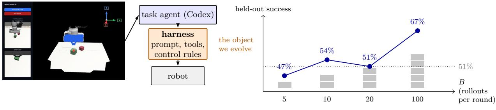
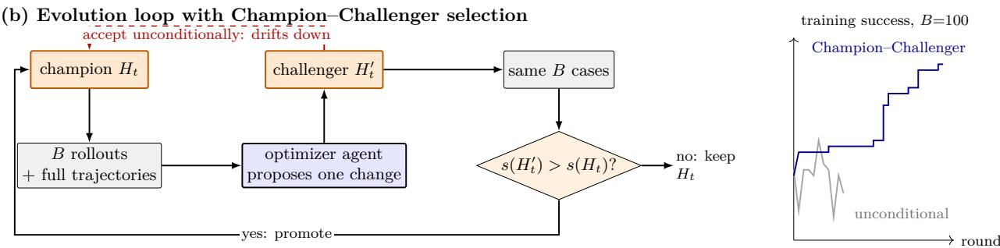
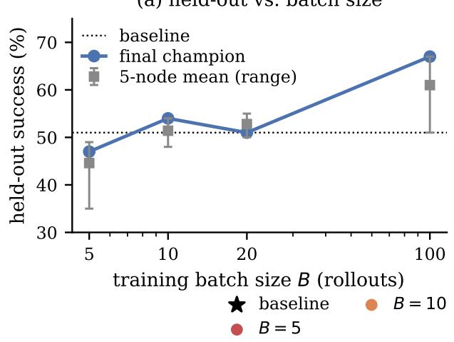
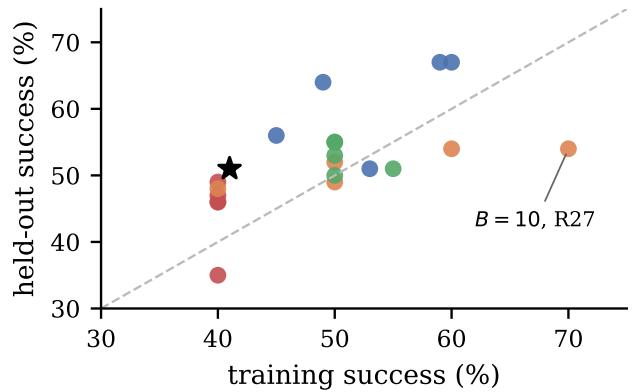
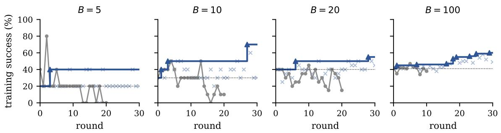
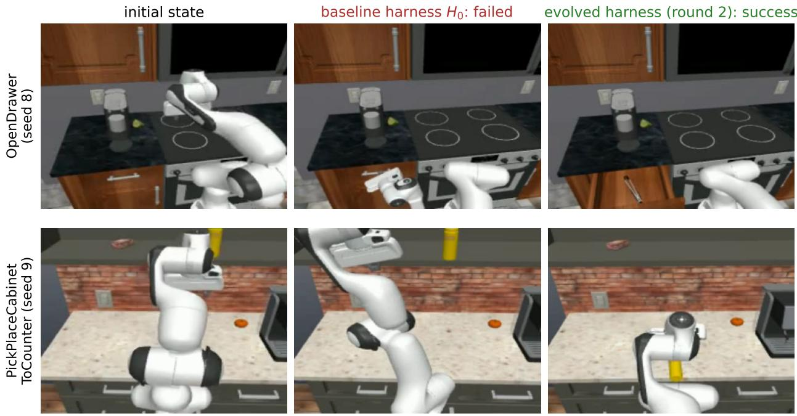

# Scale and Selection: What Makes Automatic Harness Evolution Work for Visual-Interface Robot Agents

Zhijie Wei, Ferris Tan, Jinghui Wang\*

Novaxbot {zhijie.wei, jinghui.wang}@novaxbot.com

## Abstract

When an of-the-shelf coding agent is used directly as a robot policy, observing a browser-based 3D interface through screenshots and acting by posing a virtual target gripper through a few tools, the agent’s harness, its prompts, tools, and control rules, largely determines success, and until now it has been written by hand. We show that this harness can be improved automatically by another coding agent, the optimizer agent, and report two findings about what makes it work. First, the number of rollouts the optimizer agent sees per round governs whether the evolved harness is trustworthy, generalizes, and improves steadily. A single rollout is a noisy binary outcome, so with few rollouts per round a revision can be promoted on luck; enlarging the batch raises the signal-to-noise ratio of every promotion decision. Holding rounds fixed and growing the training set from 5 to 100 rollouts, held-out success rises from 47% to 67%, while small training sets overfit, reaching 70% on training tasks but only 54% held-out. Second, the optimizer agent must not be given free rein. With every revision it proposes accepted unconditionally, performance drifts downward within ten rounds as ill-judged edits accumulate; adding the most basic safeguard, Champion–Challenger selection that promotes a revision only if it strictly beats the incumbent on the same fixed evaluation set, turns the same loop into one that raises held-out success from 51% to 67% over 30 rounds. Automatic harness evolution for visual-interface robot agents is thus feasible, but its gains hinge on the rollout scale behind each decision and on how the optimizer agent’s revisions are selected.

## 1 Introduction

Foundation-model coding agents such as Codex and Claude Code can now control robots without any robot-specific training [3, 6, 16], and since the release of GPT-6 Astra, frontier models have been evaluated directly as robot policies across manipulation, dexterous hands, navigation, and humanoid control [5]. Hu et al. [6] present the robot as a visual interface, a browser-based 3D point-cloud GUI with a virtual target gripper and a few MCP tools, and let the agent operate it as a person would operate 3D design software, reaching 96.7% on three LIBERO-Goal tasks. We refer to such a system as a visual-interface robot agent: a coding agent that controls a robot by operating a visual interface. What the agent can do, however, depends heavily on its harness: the prompt, tool interface, observation format, control protocol, and verification rules that sit between model and robot [13, 21]. In that system, a single textual waypoint demonstration in the prompt lifts one agent from 70% to 100% while leaving another unchanged [6].

(a) Visual-interface robot agent  
(c) More rollouts per round ⇒ better harness  

  
Figure 1: Overview. (a) The task agent is an unmodified coding agent that controls a robot through a visual interface; the agent’s harness is what we evolve. (b) Each round, an optimizer agent reads the full trajectories of B rollouts and proposes one bounded revision; under Champion–Challenger selection the revision is promoted only if it strictly beats the incumbent on the same fixed cases, whereas accepting every revision drifts downward within ten rounds (inset: training success at B = 100). (c) Held-out success of the evolved harness rises with the number of rollouts per round, from 47% at B = 5 to 67% at B = 100.

This harness was written and tuned by hand. We show that it can instead be improved automatically by another coding agent. We call the agent that runs the robot the task agent and the agent that revises its harness the optimizer agent (Figure 1). Each round, the optimizer agent reads evidence from a batch of task-agent rollouts, proposes one bounded change to the harness, and the revised harness is evaluated again; the underlying models are never trained. Automatic harness optimization has been studied for software agents [13, 21], where a rollout takes seconds and is graded by a unit test. For a visual-interface robot agent, each rollout spans tens to over a hundred model turns, each consuming fresh screenshots of the interface, and yields a single noisy binary outcome. This changes what the loop needs in order to work, and the rest of this paper is about two such requirements.

The first requirement is rollout scale. Whether a proposed revision is promoted depends on comparing two success counts on the training sample, and each count is a sum of noisy binary outcomes. With five rollouts per round, one flipped outcome moves the success rate by twenty points, so a revision can be promoted, and the next round built on it, purely by luck; the optimizer agent also sees too few failures to distinguish a systematic mechanism from an accident. Enlarging the batch raises the signal-to-noise ratio of every promotion decision and broadens the evidence the optimizer agent reasons from. Holding the number of rounds fixed at thirty and growing the training set from 5 to 10, 20, and 100 rollouts, held-out success rises from 47% to 67%. Small training sets do not merely help less: at ten rollouts the loop reaches 70% on the training set but only 54% held-out, having fitted the particular cases it saw. A trustworthy, generalizing, steadily improving harness therefore requires rollout scale behind each decision.

The second requirement is that the optimizer agent must not be given free rein. The simplest loop accepts every revision it proposes, so the harness follows a single chain of commits. With expensive, noisy rollouts it fails: performance rises for a few rounds and then drifts downward, falling from 42% to 34% on the training set within ten rounds, because a revision that scored well on a lucky batch is kept and every later revision builds on it. The most basic safeguard repairs this: Champion–Challenger selection, in which a revision is promoted only if it strictly beats the incumbent harness on the same fixed evaluation set and is otherwise logged and discarded. With this rule and a training set of 100 rollouts, optimizing on tasks drawn from robosuite and LIBERO [15] and reporting on a disjoint held-out set of 100 rollouts from diferent tasks, thirty rounds raise held-out success from 51% to 67%.

Our contributions are:

1. Automatic harness evolution for a visual-interface robot agent. We show that the hand-written harness of such an agent can be improved by an optimizer agent that reads rollout evidence and revises prompts, tools, and control rules, with no training of either model; on a strict train/test split, 30 rounds raise held-out success from 51% to 67%.

2. Rollout scale governs trust, generalization, and steady improvement. With rounds fixed, held-out success rises as the training set grows from 5 to 100 rollouts, while small batches overfit.

3. The optimizer agent must not be given free rein. Unconditional acceptance of its revisions degrades performance; Champion–Challenger selection, the most basic safeguard, turns the same loop into one that improves over 30 rounds.

## 2 Related Work

Foundation-model agents for robot control. Three routes turn foundation models into robot controllers. The dominant one fine-tunes a model into a vision-language-action (VLA) policy on robot trajectories [1, 11, 24]; inference is fast, but the approach needs large robot datasets and yields models smaller and less general than the frontier models it starts from. A second route keeps the model frozen and has it compose perception and control primitives in code [14], and CaP-X shows that coding-agent success depends strongly on the abstraction level of those primitives [4]. A third lets the model produce intermediate spatial targets, such as value maps or keypoint constraints, that a classical optimizer executes [7–9]. The visual-interface robot agent of Hu et al. [6] belongs to none of these: it exposes the robot as a visual interface and lets a general coding agent operate it through GUI tools with no robot-specific training. Harness VLA and ART likewise wrap or extend a VLA with agentic tool use [2, 22], and Guava maps the design space of such harnesses (agent workflow, action space, observation space) and distills the result into a 4B model [16]. Since GPT-6 Astra, frontier models have also been benchmarked directly as robot policies, from tabletop manipulation to dexterous hands, navigation, and humanoid control [5]. In all of these systems the harness around the task agent is designed by hand; it is the object we evolve.

Automatic harness optimization. For a fixed model, the harness largely determines agent performance: harness changes alone shift held-out success by 10 to 15 points on tool-use benchmarks [23], an automatically discovered harness can outrank hand-built agents on Terminal-Bench [13], and the best harness is model-specific because diferent models fail in diferent ways [21]. This has motivated optimizer agents that revise a harness from execution feedback. Meta-Harness gives the optimizer access to the code, scores, and traces of prior candidates [13]; Self-Harness lets the task agent mine its own failure clusters and propose minimal, regression-tested edits [21]; RHI iterates on prompt-level agent loops with pairwise feedback [12]; and PRISM searches over prompt and middleware edits under a budget [23]. Closest to us, RHO brings harness search to robotics: a coding agent proposes and searches, at training time, a multi-file repository of prompts, tools, and control code that the deployed agent then runs, raising held-out success on an LLM-in-the-loop benchmark from 23.5% to 44.3% [3]. These methods treat the number of rollouts behind each decision and the rule that accepts a revision as fixed parts of the procedure rather than as variables under study. Recent critiques show that reported gains from harness evolution often disappear under matched budgets and held-out tasks [19], and that most claimed improvements on LIBERO are not statistically significant at the standard protocol [10]. We bring the optimizer-agent loop to a visual-interface robot agent whose rollouts are long and noisy, use a strict train/test split, and treat the rollout scale behind each decision and the rule that selects revisions as the variables under study.

Agentic self-improvement in robotics. Coding agents have recently been used to improve robot systems autonomously. ASPIRE has an agent diagnose failures from execution traces, repair control programs, and accumulate a reusable skill library [17]; ENPIRE automates the reset, train, roll out, and analyze loop for real-robot policy learning [20]. These systems evolve skill code or a training pipeline, and the agent that performs the task is not itself a GUI-operating foundation-model agent. We instead evolve the harness of such a task agent, and ask what rollout scale and what selection rule the loop needs to improve reliably.

## 3 Method

## 3.1 Setting

We study harness evolution for the visual-interface robot agent of Hu et al. [6]. The task agent is an unmodified coding agent (Codex with GPT-5.6 Sol) that controls a simulated manipulator by taking screenshots of a browser-based 3D interface and calling a small set of MCP tools to pose a virtual target gripper, execute waypoints, and end the episode. Everything between the model and the robot constitutes the harness: the system prompt and operating guide, the MCP tool set and the semantics of each tool (for example the maximum translation per call), the observation returned after each tool call, the control rules for staging and executing waypoints, and the verification and termination logic. All of this is ordinary code and text in the agent’s repository and is the object of optimization. The task-agent model, the simulator, the task set, the success detectors, and the evaluation control plane are frozen and never edited.

## 3.2 The harness-evolution loop

Algorithm 1 summarizes the loop and Figure 1(b) illustrates one round. We write D for the fixed training sample of B cases, A and O for the task agent and the optimizer agent, Evaluate(A, H, D) for running A under harness H on every case in D, which returns the success count s and the set of rollout records R, Evidence(R) for the manifest M built from those records, and L for the log of rejected challengers that is shown to the optimizer agent. The loop maintains a champion harness $H _ { t }$ , initialized to the hand-written baseline harness $H _ { 0 }$ , and a fixed training sample of B rollouts defined by a fixed set of tasks and seeds; the same B cases are used in every round of a campaign.

Algorithm 1: Harness evolution with Champion–Challenger selection   
Input: baseline harness $H _ { 0 } ;$ task agent $A ;$ optimizer agent $O ;$ fixed training sample D of B   
cases; number of rounds $T$   
Output: champion harness $H _ { T }$   
1 $H  H _ { 0 } ;$   
2 (s, R) ← Evaluate(A, H, D) ; // successes and rollouts on the fixed sample   
3 ${ \mathcal { L } } \gets \emptyset$ ; // log of rejected challengers   
4 for t ← 1 to T do   
5 M ← Evidence(R) ; // full trajectories and verdicts of all B cases   
6 $H ^ { \prime }  O ( H , M , \mathcal { L } ) ; \quad / /$ one bounded commit on top of H that passes the gate   
7 (s′, R′) ← Evaluate(A, H′, D) ; $/ /$ same B cases   
8 if $s ^ { \prime } > s$ then   
9 $H  H ^ { \prime } ;$   
10 $( s , R ) \gets ( s ^ { \prime } , R ^ { \prime } )$ // promote the challenger   
11 else   
12 $\mathcal { L }  \mathcal { L } \cup \{ ( H ^ { \prime } , s ^ { \prime } ) \}$ // reject; the champion is unchanged   
13 return H ; // evaluated once on held-out tasks

Evaluate. The champion is run on the B cases. Each case is a full agentic rollout of the task agent, capped at 30 minutes of wall-clock time, and yields a binary success verdict; the success count $s ( H _ { t } )$ , written s in Algorithm 1, is the champion’s training score.

Collect evidence. From the rollouts we build an evidence manifest covering all B cases: for each case, the ordered timeline of model turns, tool calls, controller feedback, and errors, together with the verdict and runtime statistics. The manifest retains the complete trajectory evidence of every case, so the optimizer agent reasons from full execution histories rather than from summary statistics.

Propose. The optimizer agent (also Codex with GPT-5.6 Sol, in a separate persistent session) reads the manifest and is instructed to identify one systemic, task-general failure mechanism and implement one coherent change to the harness. The change must be a single commit on top of $H _ { t } ,$ must leave the evaluation control plane untouched, and must pass the repository’s test suite; a candidate that violates any of these is returned for repair. The result is a challenger harness $H _ { t } ^ { \prime } .$ The optimizer agent is also shown the reasons for recently rejected challengers so that it does not repeat a regressive mechanism.

Select. The challenger is evaluated on the same B cases to obtain $s ( H _ { t } ^ { \prime } )$ , and a selection rule decides whether $H _ { t + 1 } = H _ { t } ^ { \prime }$ or $H _ { t + 1 } = H _ { t }$

A campaign runs this loop for a fixed number of rounds T (30 in all main experiments). Held-out performance is measured only after the campaign, on a disjoint set of tasks, and is never visible to the optimizer agent.

## 3.3 Rollout scale: the batch size B

B is the central experimental variable. It controls how much information the optimizer agent receives each round: the trajectories it reads when diagnosing failures, and the outcomes on which each promotion is decided. Scaling laws in language modeling show that, with the model class held fixed, performance improves predictably as the amount of data seen during training grows. We ask whether an analogous regularity holds for harness evolution: with the optimizer agent, the task-agent model, the number of rounds, and the held-out set all held fixed, does the evolved harness improve as the number of rollouts per round grows? We therefore run otherwise identica campaigns with $B \in \{ 5 , 1 0 , 2 0 , 1 0 0 \}$ . Each campaign has its own optimizer session, branch, and result namespace, so campaigns share no information. Because every round evaluates B rollouts of both the champion and the challenger, B also sets the cost of a campaign; the question is therefore equally whether spending more rollouts per round buys a better harness.

## 3.4 Selection rule: unconditional acceptance versus Champion–Challenger

The selection step admits two rules. Under unconditional acceptance, $H _ { t + 1 } = H _ { t } ^ { \prime }$ always: every revision the optimizer agent proposes becomes the base for the next round, and the harness follows a single linear chain of commits. Under Champion–Challenger selection, the challenger is promoted if and only if

$$
s ( H _ { t } ^ { \prime } ) > s ( H _ { t } ) ,\tag{1}
$$

that is, if it strictly beats the incumbent on the same cases. Ties and regressions are rejected; the rejected challenger and its evaluation are retained for audit, and the next round starts again from the unchanged champion. Section 4 compares the two rules at equal B and shows that unconditional acceptance degrades within ten rounds while Champion–Challenger improves over thirty.

## 4 Experiments

## 4.1 Setup

Tasks and splits. The training sample is drawn from ten tabletop manipulation tasks in robosuite and LIBERO [15]: lift, square, and stack from robosuite, and seven LIBERO tasks spanning the Object, Goal, Spatial, 90, and 10 suites. The held-out set is ten diferent LIBERO tasks from the Object, Spatial, Goal, and 90 suites; the two task sets are disjoint. Every task is instantiated with fixed seeds that determine the initial object placement, so a case (task, seed) is reproducible across rounds and across harness versions. The largest training batch uses ten seeds per task $( B = 1 0 0 )$ the held-out set always uses ten seeds per task (100 rollouts). Success is decided by each task’s built-in detector.

Agents and protocol. The task agent is Codex with GPT-5.6 Sol at the highest reasoning efort, run through MCP tools with a 30-minute wall-clock limit per rollout; its model and settings are identical for every harness and every evaluation. The optimizer agent is the same model in a separate persistent session; each campaign has its own session, branch, and result namespace. Rollouts of one evaluation run concurrently in isolated sandboxes, so a B = 100 evaluation takes about one wall-clock episode. All main campaigns run T = 30 rounds. Held-out performance is measured once per selected harness after its campaign has finished; the optimizer agent never sees held-out tasks or results.

## 4.2 Training batch size

We run Champion–Challenger campaigns from the same baseline harness with $B \in \{ 5 , 1 0 , 2 0 , 1 0 0 \}$ and $T = 3 0$ , and evaluate the final champion of each on the held-out set. To see beyond the single final node, we also evaluate four further harnesses per campaign chosen from promoted and rejected challengers at diferent rounds, giving five held-out nodes per campaign and 21 nodes in total including the baseline. Table 1 and Figure 2 summarize the outcome.

(a) held-out vs. batch size  

(b) training vs. held-out, 21 nodes  

Figure 2: Training batch size. (a) Held-out success of the final champion of each 30-round campaign (blue) and the mean and range over the five held-out nodes of each campaign (grey), against the batch size B; the dotted line is the baseline harness. (b) Training success versus held-out success for the baseline and 20 evolved harnesses, coloured by B; points above the diagonal generalize beyond their training score. The B = 10 champion with the highest training score of all campaigns, 70%, reaches only 54% held-out.
<table><tr><td>B</td><td>training success baseline → final champion</td><td>(of 30)</td><td>promotions held-out success final champion</td><td>held-out success 5-node mean (range)</td></tr><tr><td>5</td><td>20% → 40% (R3)</td><td>1</td><td>47%</td><td>44.6% (35–49)</td></tr><tr><td>10</td><td>30% → 70% (R27)</td><td>3</td><td>54%</td><td>51.4% (48–54)</td></tr><tr><td>20</td><td>40% → 55% (R28)</td><td>2</td><td>51%</td><td>52.8% (50–55)</td></tr><tr><td>100</td><td>41% → 60% (R29)</td><td>8</td><td>67%</td><td>61.0% (51–67)</td></tr><tr><td colspan="5">Baseline harness on the held-out set: 51%.</td></tr></table>

Table 1: Independent 30-round Champion–Challenger campaigns from the same baseline harness, difering only in the training batch size B. Held-out numbers are on 100 rollouts from tasks disjoint from training.

Held-out success rises with B. The final champions reach 47%, 54%, 51%, and 67% held-out for B = 5, 10, 20, 100, against 51% for the baseline harness (Figure 2a). The five-node means, 44.6%, 51.4%, 52.8%, and 61.0%, increase with B and are less sensitive to which single round is picked. Only the B = 100 campaign produces a clear gain: its final champion is 16 points above the baseline, and all five of its held-out nodes are at or above the baseline, three of them by 13 to 16 points. The B = 5 campaign is the mirror image: all five of its nodes are below the baseline, one of them by 16 points, even though its final champion doubled its training score.

  
unconditional acceptance Champion Challenger (champion) rejected challenger promoted challenger

Figure 3: Selection rule. Training success per round at each batch size under unconditional acceptance (grey; every revision becomes the next base) and Champion–Challenger selection (blue; the champion trajectory, with promoted challengers as triangles and rejected challengers as crosses). The dotted line is the baseline score. The unconditional runs were stopped after 10 rounds (B = 100) or 20 rounds (B = 5, 10, 20) once the downward trend was clear; their baseline commit was evaluated separately, so starting points difer slightly from the Champion–Challenger baselines.

Small batches fit the training cases. Figure 2b plots each node’s training score against its held-out score. The B = 100 nodes lie above the diagonal: their held-out success exceeds their training success, and the two move together. The small-batch nodes scatter around or below it. The clearest case is the B = 10 champion promoted at round 27 with a training score of 70%, the highest of any campaign, which reaches 54% held-out. Its training score is seven successes out of ten fixed cases; a harness change that helps two or three specific cases moves that score by 20 to 30 points while changing little on unseen tasks. Across all 21 nodes the correlation between training and held-out scores is 0.60, and it is carried by the B = 100 nodes; within the small-batch campaigns, the training score does not rank the nodes correctly.

Larger batches also promote more. The number of promotions in 30 rounds is 1, 3, 2, and 8 for B = 5, 10, 20, 100 (Table 1). With five or ten cases most challengers tie the champion exactly and are rejected, so the campaign stalls; the B = 5 campaign promoted once, at round 3, and rejected the remaining 27 challengers. With 100 cases a genuine improvement of a few percentage points registers as a strictly higher count, so the B = 100 champion advanced eight times, at rounds 1, 7, 16, 18, 19, 23, 25, and 29, and was still improving when the campaign ended. Both efects, better generalization of what is promoted and more frequent promotion, follow from the optimizer agent seeing more rollouts per round.

## 4.3 Selection rule

To isolate the selection rule we compare, at each batch size, a campaign that accepts every revision unconditionally with the Champion–Challenger campaign of Section 4.2. The unconditional campaigns use the same optimizer agent, task agent, evidence manifest, and fixed training samples; the only diference is that the challenger always becomes the next base. Figure 3 shows the training trajectories.

Unconditional acceptance drifts downward. Under unconditional acceptance, training success rises for a few rounds and then falls at every batch size. At B = 100 the harness goes from 42% to a peak of 47% at round 5 and then to 34% by round 8 and 38% at round 10. At B = 20 the harness falls from 40% to 15% within 20 rounds, at B = 10 from 30% to 10%, and at B = 5 from 40% to 0%. The mechanism is visible in the trajectories: a revision that scores well on one batch is kept, every later revision is built on top of it, and there is no way back when the next batch shows it was not an improvement. The harness simply accumulates every ill-judged edit.

  
Figure 4: Before and after harness evolution on RoboCasa. Two kitchen tasks with the same fixed seed, shown from the same camera: the initial scene, the final frame under the baseline harness, and the final frame under the round-2 champion. With the baseline the drawer stays shut and the bottle stays on the cabinet shelf; with the evolved harness the drawer is pulled open and the bottle is placed on the counter.

Champion–Challenger turns the same loop into a monotone one. With the selection rule, the champion’s training score is non-decreasing by construction, and the question is whether it keeps rising rather than stalling. At B = 100 it does: from 41% at the start to 60% at round 29, with promotions spread across the 30 rounds. The rejected challengers, plotted as crosses, show what the rule is filtering out: 22 of 30 challengers at B = 100 scored at or below the champion, and many scored well below it, so most of what the optimizer agent proposes would have been a regression. On the held-out set the final champion reaches 67% against the baseline’s 51%, so the gains the rule admitted on the training sample are real improvements rather than fits to the fixed cases. Over the 20 evolved nodes, promoted harnesses average 54.0% held-out and rejected ones 50.9%.

## 4.4 Transfer to a kitchen environment: RoboCasa

To check that the loop is not specific to the tabletop tasks above, we ran a four-round campaign on RoboCasa [18], a kitchen benchmark with articulated appliances unlike the tabletop tasks above: ten kitchen tasks (drawers, a cabinet, a microwave, pick-and-place between counter, cabinet, sink,

and stove, a stove knob, and a faucet) with ten seeds each, so B = 100, and the same task agent.   
This campaign has no held-out set, so the scores are on the training sample.

<table><tr><td>round</td><td>harness</td><td>training success</td><td>decision</td></tr><tr><td>0</td><td>baseline harness</td><td>2/100</td><td></td></tr><tr><td>1</td><td>challenger</td><td>26/100</td><td>promoted</td></tr><tr><td>2</td><td>challenger</td><td>37/100</td><td>promoted (final champion)</td></tr><tr><td>3</td><td>challenger</td><td>28/100</td><td>rejected</td></tr><tr><td>4</td><td>challenger</td><td>33/100</td><td>rejected</td></tr></table>

Table 2: Champion–Challenger campaign on ten RoboCasa kitchen tasks with B = 100.

The baseline harness, tuned on tabletop tasks, fails almost completely in the kitchen, succeeding in 2 of 100 rollouts. Two promoted revisions raised training success to 26% and then 37% (Table 2, Figure 4); the next two challengers scored 28% and 33% and were rejected, so the champion stayed at round 2. The same loop, with the same rollout scale and the same selection rule, therefore carries over to an environment it was not developed on: it finds large improvements on the optimization sample within two rounds, and the selection rule keeps the two later regressions out of the lineage.

The evolved harness transfers to a stronger model. The RoboCasa campaign evolved the harness with GPT-5.6 Sol as the task agent. To ask whether its gains are tied to that model, we re-ran the baseline harness and the round-2 champion on the same 100 cases with GPT-6 Astra, a newer and stronger model that the optimizer never saw (Table 3). The stronger model alone lifts the baseline harness from 2 to 37 successes; the evolved harness alone lifts Sol from 2 to 37; together they reach 83. The harness gain is not absorbed by the stronger model: under Astra it is worth 46 points, more than under Sol.

<table><tr><td></td><td colspan="2">baseline harness  $H _ { 0 }$ </td><td colspan="2">evolved harness (round 2)</td></tr><tr><td>task agent</td><td>GPT-5.6 Sol</td><td>GPT-6 Astra</td><td>GPT-5.6 Sol</td><td>GPT-6 Astra</td></tr><tr><td>successes / 100</td><td>2</td><td>37</td><td>37</td><td>83</td></tr></table>

Table 3: Harness × model on the ten RoboCasa tasks. The harness was evolved with GPT-5.6 Sol only; GPT-6 Astra was never used during evolution. Successes on the same 100 cases (ten tasks, ten seeds each).

## 5 Conclusion

We asked what makes automatic harness evolution work for a visual-interface robot agent, and varied the two things a practitioner controls: the rollout scale behind each decision and the rule that selects revisions. With the same optimizer agent, task agent, and evidence, held-out success of the evolved harness rises with the training batch size, from 47% at B = 5 to 67% at B = 100 against a baseline of 51%, while small batches promote revisions that fit the fixed training cases and do not transfer. Under unconditional acceptance the same loop degrades at every batch size; Champion–Challenger selection, which promotes a revision only if it strictly beats the incumbent on the same fixed cases, turns it into one that improves for thirty. Neither finding required a new optimizer or a new task agent. What changed was how much evidence stood behind each decision and whether a revision had to earn its place.

Two limits follow from the cost of each rollout. The scaling result stops at B = 100: held-out success was still rising at the largest batch we could aford, so whether it keeps improving at larger batch sizes or saturates remains open. All experiments are in simulation, where a hundred rollouts run in parallel; on a real robot each rollout occupies physical hardware for its full duration, and the rollout scale this paper argues for is exactly what is hardest to obtain there. Making harness evolution work at that scale on physical robots is the next step.

## References

[1] Kevin Black et al. π0: A Vision-Language-Action Flow Model for General Robot Control. In Robotics: Science and Systems (RSS), 2025.

[2] Yi Ding et al. Evolve Vision-Language-Action Model into an Agent with On-the-fly Tool-use. arXiv preprint arXiv:2608.14047, 2026.

[3] Karim Elmaaroufi, Justin Svegliato, Sarunas Kalade, Graham Schelle, Sanjit A. Seshia, and Matei Zaharia. RHO: Your coding agent is secretly a roboticist. arXiv preprint arXiv:2606.16458, 2026.

[4] Letian Fu et al. CaP-X: A Framework for Benchmarking and Improving Coding Agents for Robot Manipulation. arXiv preprint arXiv:2603.22435, 2026.

[5] Galaxy General Robotics. Exploring the comprehensive capabilities of GPT-6 Astra as policies. https://galaxygeneralrobotics.github.io/astra-policy/, 2026. Technical report, September 2026.

[6] Hengyuan Hu et al. VIA: Visual Interface Agent for Robot Control. arXiv preprint arXiv:2607.11119, 2026.

[7] Haoxu Huang et al. CoPa: General Robotic Manipulation through Spatial Constraints of Parts with Foundation Models. In IEEE/RSJ International Conference on Intelligent Robots and Systems (IROS), 2024.

[8] Wenlong Huang et al. VoxPoser: Composable 3D Value Maps for Robotic Manipulation with Language Models. In Conference on Robot Learning (CoRL), 2023.

[9] Wenlong Huang et al. ReKep: Spatio-Temporal Reasoning of Relational Keypoint Constraints for Robotic Manipulation. arXiv preprint arXiv:2409.01652, 2024.

[10] Tianchong Jiang, Xiangshan Tan, Samuel Wheeler, Luzhe Sun, Tewodros W. Ayalew, and Matthew Walter. What Are We Actually Benchmarking in Robot Manipulation? arXiv preprint arXiv:2606.04233, 2026.

[11] Moo Jin Kim et al. OpenVLA: An Open-Source Vision-Language-Action Model. In Conference on Robot Learning (CoRL), 2024.

[12] Hyunin Lee, Jinglue Xu, Jefrey Seely, Donghyun Lee, Matei Zaharia, and Yujin Tang. Recursive Harness Self-Improvement. arXiv preprint arXiv:2607.15524, 2026.

[13] Yoonho Lee, Roshen Nair, Qizheng Zhang, Kangwook Lee, Omar Khattab, and Chelsea Finn. Meta-Harness: End-to-End Optimization of Model Harnesses. arXiv preprint arXiv:2603.28052, 2026.

[14] Jacky Liang et al. Code as Policies: Language Model Programs for Embodied Control. In IEEE International Conference on Robotics and Automation (ICRA), 2023.

[15] Bo Liu, Yifeng Zhu, Chongkai Gao, Yihao Feng, Qiang Liu, Yuke Zhu, and Peter Stone. LIBERO: Benchmarking Knowledge Transfer for Lifelong Robot Learning. In Advances in Neural Information Processing Systems (NeurIPS), 2023.

[16] Haowen Liu, Xirui Li, Shaoxiong Yao, Peng Shi, Tianyi Zhou, Jia-Bin Huang, Furong Huang, and Jiayuan Mao. Guava: An efective and universal harness for embodied manipulation. arXiv preprint arXiv:2606.18363, 2026.

[17] Runyu Lu et al. ASPIRE: Agentic Skills Discovery for Robotics. arXiv preprint arXiv:2607.00272, 2026.

[18] Soroush Nasiriany et al. RoboCasa: Large-scale simulation of everyday tasks for generalist robots. In Robotics: Science and Systems (RSS), 2024.

[19] Yike Wang, Huaisheng Zhu, Zhengyu Hu, Yige Yuan, Zhengyu Chen, Shakti Senthil, Hannaneh Hajishirzi, Yulia Tsvetkov, Pradeep Dasigi, and Teng Xiao. Rethinking the Evaluation of Harness Evolution for Agents. arXiv preprint arXiv:2607.12227, 2026.

[20] Wenli Xiao et al. ENPIRE: Agentic Robot Policy Self-Improvement in the Real World. arXiv preprint arXiv:2606.19980, 2026.

[21] Hangfan Zhang, Shao Zhang, Kangcong Li, Chen Zhang, Yang Chen, Yiqun Zhang, Lei Bai, and Shuyue Hu. Self-Harness: Harnesses That Improve Themselves. arXiv preprint arXiv:2606.09498, 2026.

[22] Yixian Zhang et al. Harness VLA: Steering Frozen VLAs into Reliable Manipulation Primitives via Memory-Guided Agents. arXiv preprint arXiv:2607.08448, 2026.

[23] Cen Mia Zhao, Haibo Ruan, Wenjie Chen, Pei-fen Tu, Usman Abbasi, and Joel Hesch. Beyond Prompts: Measuring and Optimizing LLM Tool-Agent Harnesses. arXiv preprint arXiv:2609.05736, 2026.

[24] Brianna Zitkovich et al. RT-2: Vision-Language-Action Models Transfer Web Knowledge to Robotic Control. In Conference on Robot Learning (CoRL), 2023.