# Signal-Routed Temperature Scaling: Low-Capacity Risk-Conditioned Calibration for Small Validation Budgets

Wenhao Liang, Liangwei Nathan Zheng, Lin Yue, Wei Emma Zhang, Mingyu Guo, Olaf Maennel, Weitong Chen

Adelaide University, Adelaide, Australia

## Abstract

When a classifier is recalibrated from only a few thousand held-out examples, the capacity of the calibration map becomes a statistical design choice rather than a purely architectural one: a scalar map can underfit structured residual miscalibration, while a highly adaptive map can be hard to estimate reliably from so small a split. We disentangle the calibration objective from adaptive capacity and propose signal-routed temperature scaling (SRTS-BCE), a 10-parameter, argmaxpreserving calibrator that cross-fits a correctness-risk score over six logit statistics and fits one top-label-BCE temperature per $\bar { K { = } 3 }$ risk groups, recovering TvA-TS as its K=1 limit. On fine-tuned CIFAR-100 / ViT-B/16, SRTS-BCE reduces ECE15 from 1.65 (scalar TvA-TS) to 0.96, matching the higher-capacity SMART+BCE head (0.95) at the full calibration budget. The two regimes separate as the budget shrinks: at n=250 SRTS-BCE beats SMART+BCE on all three CIFAR-100 backbones (the seed→draw hierarchical interval excludes zero), whereas the flagship comparison against the scalar remains directional. A protocol-frozen Tiny-ImageNet follow-up reproduces the small-budget separation and exhibits a budget-dependent ranking reversal on Swin-T; matched routing and map controls show that the efect is tied neither to the learned router nor to discrete grouping. Together the results identify post-hoc calibrator capacity as a finite-sample design choice whose preferred level shifts with the amount of available calibration data.

## Introduction

A held-out budget makes capacity a statistical choice. Post-hoc calibration is often estimated from only a few thousand held-out examples after fine-tuning, which makes calibrator capacity a statistical choice, not merely an architectural one: a map with too few degrees of freedom can leave structured miscalibration uncorrected, and one with too many can fit noise in that same small split. Fine-tuned vision transformers (Dosovitskiy et al. 2021) make this concrete. Under modern recipes (AdamW (Loshchilov and Hutter 2019), MixUp (Zhang et al. 2018)/CutMix (Yun et al. 2019), RandAugment (Cubuk et al. 2020), label smoothing (Szegedy et al. 2016)) our ViT-B/16 on CIFAR-100 reaches mean top-1 91.00 yet retains $\mathrm { E C E _ { 1 5 } ~ = ~ 9 . 6 9 }$ (five seeds), so post-hoc recalibration can be an important deployment-time layer when fine-tuning leaves substantial residual miscalibration.

Existing temperature-scaling methods conflate two independent design choices. Post-hoc calibration is usually posed as one choice: a scalar temperature, a group-wise variant, or a sample-adaptive head. That framing hides a more basic issue. On the small validation splits available after finetuning, calibration exhibits a capacity-control trade-of: the calibrator must be expressive enough to correct structured residual miscalibration, yet constrained enough not to learn idiosyncrasies of a few thousand examples. We therefore separate two axes. The calibration objective distinguishes classical TS, which minimises validation NLL, from top-label BCE, which targets the probability assigned to the predicted class (Le Coz, Herbin, and Adjed 2024). The adaptive capacity is the granularity at which temperature may vary with the input: one global T, a low-capacity reliability-conditioned map, or an unrestricted per-sample $\stackrel { \cdot } { T } ( x )$ . Two further axes recur throughout: the conditioning signal (entropy, margin, or learned correctness risk) and thefit/deploy discipline (crossfitted and frozen vs. a directly trained head). Comparisons among these methods often vary both the fitting objective and the amount of adaptivity, making their individual efects dificult to separate.

Unrestricted heads did not benefit from the extra capacity at this budget. On ≈2,500-sample validation splits, every evaluated unrestricted logit- and feature-input temperature head was less stable than scalar or constrained calibration, staying at $\mathrm { E C E } _ { 1 5 } \approx 5 . 7 – 1 1$ under both an in-sample NLL sweep and a nested BCE-selection protocol (Results) — more degrees of freedom than the evaluated validation protocol can estimate reliably.

A low-capacity middle ground between scalar and sample-adaptive scaling. We close this gap by conditioning a scalar temperature map on a cross-fitted, low-dimensional logistic risk score. Our deployed instance, SRTS-BCE, routes each validation sample into one of K=3 equalfrequency risk groups and fits one top-label-BCE temperature per group — 10 fitted scalars, two orders of magnitude fewer than an unrestricted head, with TvA-TS as its exact K=1 limit. The Method section gives a bias–variance account of when this helps: pooling bias grows with how strongly the residual tracks the routing signal, variance grows with $K / n ,$ , and grouping pays of only when the former dominates.

Contributions. Our contributions are threefold.

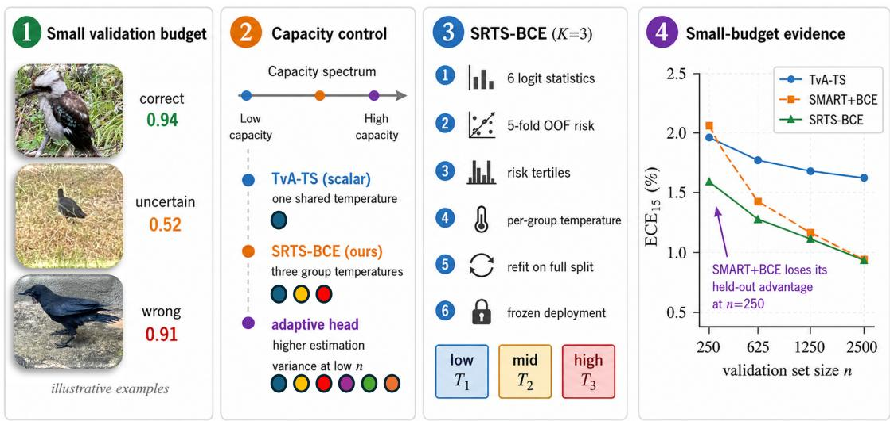  
Figure 1: Problem, capacity spectrum, method, and small-budget evidence. (1) A small validation set can leave a fine-tuned classifier miscalibrated (illustrative predictions, not benchmark samples). (2) Calibration maps span a capacity spectrum: a single shared temperature (TvA-TS) can underfit and a sample-adaptive head carries higher estimation variance at small n; SRTS-BCE takes a low-capacity middle ground with three risk-conditioned group temperatures. (3) Six logit statistics yield five-fold cross-fitted out-of-fold risk scores that define three equal-frequency risk tertiles $( T _ { 1 } / T _ { 2 } / T _ { 3 } )$ , each fit with one toplabel-BCE temperature; the router is refit on the full split for deployment, and each test sample is rerouted from its own logits with thresholds and temperatures fixed. (4) Measured data (unlike the schematic panels 1–3): mean $\mathrm { E C E _ { 1 5 } }$ vs. validation set size n on CIFAR-100 / ViT-B/16 for TvA-TS, SMART+BCE, and SRTS-BCE (five seeds × 20 draws; protocol in Results); SMART+BCE loses its held-out advantage at the smallest budget n=250.

• A cross-fitted risk-conditioned calibrator. SRTS-BCE routes each sample through an out-of-fold correctnessrisk router into one of K=3 groups, each with its own top-label-BCE temperature (10 coeficients, argmaxpreserving, fit once, reducing to TvA-TS at K=1).

• Small-budget stability across architectures and datasets. Across three CIFAR-100 backbones and two protocol-frozen Tiny-ImageNet replication cells, the relative benefit of low-capacity conditioning increases as the calibration budget shrinks, with hierarchical inference over seeds and calibration draws (Results, RQ1/RQ1b).

• Controls on objective, routing signal, and map family. We vary the objective, the routing signal, and the map family one at a time, and characterise where the improvement holds across backbones, datasets, and clean-to-shift transfer: it concentrates where the clean calibration residual is structured and remains informative after shift (Discussion; Tab. 41).

## Related Work

Scalar and top-label calibration. Reliability diagrams and ECE (Naeini, Cooper, and Hauskrecht 2015; Guo et al. 2017) quantify the confidence–accuracy gap, and smoothECE (Błasiok and Nakkiran 2024) reduces its binning dependence; large-scale comparisons also evaluate calibrators on proper scoring rules (Berta et al. 2026). Temperature scaling (TS) (Guo et al. 2017) fits one scalar temperature on a held-out split and preserves the top-1 prediction, and TvA-TS (Le Coz, Herbin, and Adjed 2024) keeps that scalar capacity while fitting a top-label BCE objective that targets predicted-class confidence in many-class settings. A single temperature is economical to estimate from a small split, but applies the same correction to every example and cannot address miscalibration that varies with the input.

Adaptive temperature scaling. Sample-dependent heads predict an input-conditional temperature T(x) from logits or representations. Adaptive temperature scaling (SATS; Joy et al. 2023) and LTS-style local temperature heads (Ding et al. 2021) place relatively few restrictions on T(x); lowparameter maps instead condition it on a single reliability statistic — HTS (Balanya, Maroñas, and Ramos 2024) on prediction entropy, proposed for data-scarce calibration, SMART (Guo et al. 2026) on the top-logit gap, and QaTS (Chakraborty et al. 2026) on the confidence quantile through a two-parameter monotone map. These methods trace a range ofconditional capacity, from a nearly unrestricted per-sample temperature down to a two- or three-parameter reliability map.

Grouped and locally conditioned calibration. A separate line partitions the inputs and calibrates within regions: piecewise-constant maps on confidence (Kumar, Liang, and Ma 2019), locally conditioned maps (Ding et al. 2021), ensembles of scalers (Zhang, Kailkhura, and Han 2020), and learned groupings such as Semantic-Aware Grouping (Yang, Zhan, and Gan 2023), which forms a soft feature-and-logit grouping. Meta-Cal (Ma and Blaschko 2021) pairs a base calibrator with a correctness-ranking model under coverage constraints, and Simi-Mailbox (Seo et al. 2025) groups graph nodes by confidence and topology for group-specific temperatures. These methods share calibration parameters within regions rather than learning an unrestricted samplewise temperature function.

Relation to this work. SRTS-BCE lies between a global temperature and a per-sample head: it groups examples by a cross-fitted correctness-risk score and fits one top-label BCE temperature per group, with TvA-TS as its K=1 limit. It conditions on a learned ordering over several logit statistics and applies one temperature per $K { = } 3$ risk group, retaining far less adaptive capacity than a sample-wise head. We therefore study how this restricted conditional capacity behaves as the calibration budget shrinks.

## Background and Problem Setup

Problem statement. We study fit-once post-hoc calibration for fine-tuned image classifiers — primarily ViT-style backbones — under a small clean calibration split: given a trained classifier and a stratified clean validation set of size n≈2,500, fit an argmax-preserving calibrator once from validation logits and labels; the calibrator is then frozen and evaluated on held-out clean test data and, for shift experiments, on corrupted test data without refitting, corruption labels, or test-set model selection.

Notation. Let f be a classifier mapping inputs $x \in \mathcal { X }$ to logits $z ( x ) \in \check { \mathbb { R } } ^ { C }$ over $C$ classes. The softmax confidence is ${ \hat { p } } ( x ) =$ softmax(z(x)) and the predicted label is ${ \hat { y } } ( x ) =$ arg ma $\mathfrak { c } _ { c } z ( x ) _ { c }$ The classifier is calibrated if $\mathbb { P } ( \boldsymbol { \hat { y } } = \boldsymbol { y }$ maxc $\hat { p } _ { c } = p ) = p$ for all $p \in [ 0 , 1 ]$

Post-hoc temperature scaling. The standard post-hoc remedy (Guo et al. 2017) divides the logits by a learned scalar $T > 0$ before the softmax: $\hat { p } _ { T } ( x ) ~ { = } ~ \mathrm { s o f t m a x } ( z ( x ) / T )$ Global TS fits a single $T ^ { * }$ on a held-out validation split by minimising val NLL. Positive scalar temperature maps preserve the predicted class by construction; this covers TS, TvA-TS, SRTS-BCE, and every evaluated adaptive head (softplus-positive outputs). We also verify empirically that no reported post-hoc method changes top-1 accuracy (Tab. 43). Sample-adaptive temperature heads. These replace the scalar $T$ with a predictor $T _ { \phi } ( x )$ trained on validation logits (SATS) or frozen features (LTS-feature; Unrestricted TempHead, a trainable $D _ { \mathrm { f e a t } } \to H \to 1 \mathrm { M L P } ) { \mathrm { - e x p r e s s i v e } }$ , but prone to validation overfit at this scale (Results).

Calibration metrics. We report 15-bin expected calibration error $\mathrm { ( E C E _ { 1 5 } ; }$ Naeini, Cooper, and Hauskrecht 2015), adaptive-binning ECE $( \mathrm { A d a E C E } _ { 1 5 } ;$ Nixon et al. 2019), classwise ECE (CW-ECE ; Kull et al. 2019), smECE (Błasiok and Nakkiran 2024), negative log-likelihood (NLL), and Brier score (Brier 1950). Lower is better for all (formal definitions: App. A). We use $\mathrm { E C E _ { 1 5 } }$ as the primary deploymentfacing summary because it is the standard post-hoc calibration reporting axis; AdaECE, smECE, and classwise ECE are reported to expose metric-dependent trade-ofs.

Risk-coverage metrics. We additionally report AUROC of correctness as a selective-classification quality measure (Geifman and El-Yaniv 2017), area under the risk-coverage curve (AURC), and excess AURC over the optimal selector (eAURC) (Geifman, Uziel, and El-Yaniv 2019).

App. D visualises the structured residual left by scalar TvA-TS.

## Method: SRTS-BCE

Figure 1 gives a schematic overview. SRTS-BCE is the deployed piecewise-constant instance of low-capacity riskconditioned temperature scaling: a top-label BCE objective, a correctness-risk router trained with cross-fitting (yielding out-of-fold, OOF, risk scores on the calibration split), and one scalar temperature per risk group. The router selects a temperature group; it does not directly output the calibrated probability. The deployed configuration is fixed throughout the paper: logits-only signals, six distinct logit statistics, $K { = } 3$ equal-frequency risk groups, and one scalar temperature per group. Unless noted (SRTS-NLL or K-ablation rows), “SRTS-BCE” means this deployed $K { = } 3$ configuration everywhere, tables included.

Algorithm 1: SRTS-BCE. On clean $\{ ( z _ { i } , y _ { i } ) \} _ { i = 1 } ^ { n }$ let $\hat { y } _ { i } { = } \arg \operatorname* { m a x } _ { c } z _ { i c } , b _ { i } { = } \mathbf { 1 } [ \hat { y } _ { i } { = } y _ { i } ] , r _ { i } { = } 1 { - } b _ { i }$ , and let $\bar { s } _ { i }$ be the six standardised logit statistics (max prob, logit margin, prob margin, entropy, logit norm, top logit) plus an intercept. Over $F { \overset { } { = } } { \bar { 5 } }$ stratified folds, an $L _ { 2 }$ logistic router (intercept unpenalised) minimising $\scriptstyle \ell ( a , u ) = - a \log u - ( 1 - a ) \log ( 1 - u )$ gives out-of-fold $q _ { i } ^ { \mathrm { O O F } } ~ = ~ \sigma \big ( \big ( \hat { \theta } ^ { ( - f ( i ) ) } \big ) ^ { \top } \bar { s } _ { i } \big )$ ; with $\tau _ { k } =$ $\bar { Q } _ { k / K } ( \{ q _ { i } ^ { \mathrm { O O F } } \} )$

$$
g _ { i } = 1 + \sum _ { k = 1 } ^ { K - 1 } \mathbf { 1 } [ q _ { i } ^ { \mathrm { O O F } } \geq \tau _ { k } ] , \quad K { = } 3 .\tag{1}
$$

With $c _ { i } ( T ) = \mathrm { s o f t m a x } ( z _ { i } / T ) _ { \hat { y } _ { i } }$ and $\mathcal { G } _ { g } = \{ i : g _ { i } = g \}$

$$
\hat { T } _ { g } = \mathop { \arg } \operatorname* { m i n } _ { T \in [ 0 . 0 5 , 2 0 ] } \ \frac { 1 } { | \mathcal { G } _ { g } | } \sum _ { i \in \mathcal { G } _ { g } } \ell \big ( b _ { i } , c _ { i } ( T ) \big ) ,\tag{2}
$$

using the pooled $T$ if $| \mathcal { G } _ { g } | < 5 0$ . The router is refit on the full clean split, giving g(x) from $q _ { \mathrm { f u l l } } ( x )$ and the frozen $\tau _ { k } ;$ the deployed map is

$$
\begin{array} { r } { \widetilde { p } _ { c } ( x ) = \exp \bigl ( z _ { c } ( x ) / \hat { T } _ { g ( x ) } \bigr ) \big / \sum _ { j } \exp \bigl ( z _ { j } ( x ) / \hat { T } _ { g ( x ) } \bigr ) . } \end{array}\tag{3}
$$

Thresholds and temperatures are frozen after this clean fit; each test or corrupted sample is rerouted from its own logits; no corrupted labels, clean-test pairings, or test-set selection are used. Since positive scalar rescaling preserves logit order, arg maxc $\widetilde { p } _ { c } ( x ) = \arg \operatorname* { m a x } _ { c } z _ { c } ( x )$

Capacity and limits. The logits-only SRTS-BCE calibrator has exactly 10 fitted scalar parameters: three group temperatures and a linear router over six distinct logit statistics plus an intercept (deployment also stores two quantile thresholds and six standardisation means/scales — data moments, not fitted parameters). This sits deliberately between scalar TvA-TS and unrestricted neural heads, and at $K { = } 1$ the same BCE objective recovers TvA-TS (Le Coz, Herbin, and Adjed 2024) (NLL recovers TS-NLL). Fitting is neural-training-free (three one-dimensional temperature fits plus one low-dimensional logistic regression): ≈31× faster than SMART+BCE, with microsecond per-sample inference (Tab. 3).

Why routing can help. SRTS-BCE inherits the TvA-BCE objective $\mathrm { ( L e C o z , }$ , Herbin, and Adjed 2024) unchanged and adds only conditional pooling over low-capacity OOF risk groups. The BCE gradient matches NLL on correct predictions and is amplified by $\hat { p } _ { i } / ( 1 - \hat { p } _ { i } )$ on confident errors. Toplabel BCE is a proper binary log-loss for the correctness of the predicted label, not a multiclass distribution-calibration objective, so it does not directly minimise ECE; a top-label-Brier check shows the benefit is not specific to the BCE loss (App. B).

Fixed-partition second-order BCE approximation. For a partition fixed independently of the fitted temperatures, with one top-label-BCE temperature per equal-frequency group, let B be the between-group variance of the calibration gradient at the pooled optimum (so $B { = } 0$ when the partition is independent of that gradient) and $\bar { \sigma } ^ { 2 }$ its within-group variance. Expanding the population BCE to second order around the pooled optimum and neglecting higher-order terms in the per-group temperature deviations, the expected groupedover-pooled test-BCE gain is $\begin{array} { r } { \Delta \approx ( 2 L ^ { \prime \prime } ) ^ { - 1 } ( B - { \frac { \varkappa - 1 } { n } } \bar { \sigma } ^ { 2 } ) } \end{array}$ to this order, grouping helps when

$$
\frac { B } { \bar { \sigma } ^ { 2 } } > \frac { K - 1 } { n } .\tag{4}
$$

The relation is local and approximate: it predicts a top-label-BCE change (not ECE), conditions on the given partition, excludes router- and threshold-estimation error, and shows neither router optimality nor equal-capacity-map superiority (RQ2); full derivation: App. I. Compared with the generic in-sample optimization bound (which holds even for a random partition), the population gain vanishes for a gradientindependent partition, so random routing stays near the baseline and larger K raises the bar. The approximation motivates three empirical checks: (P1) random or shufled routing is inert; (P2) larger K eventually hurts; (P3) grouped fitting can improve the fitted BCE objective only when the partition separates calibration gradients — whether that gain transfers to ECE is empirical. The finite-sample threshold and the between-group signal (BCE group optima difer, NLL ones do not) are in App. I.

Fixed K=3. We fix K=3 before evaluation as a stable fixed low-capacity setting, not a per-dataset or test-selected optimum (the K-ablation is in RQ2; hold-out K-selection is unreliable at this budget, Discussion). Each component addresses one failure mode: BCE the confidence–objective mismatch, router cross-fitting the in-sample routing bias, K=3 the $O ( K / n )$ estimation variance, logits-only signals featurehead overfitting, and fixed thresholds shift deployability; the piecewise-constant form is chosen because it is simpler to inspect and fit (a matched continuous map is tested in RQ2).

## Experimental Setup

ID clean evaluation — modern fine-tuning recipe (five seeds): ViT-B/16 on CIFAR-100, 100 epochs AdamW (Loshchilov and Hutter 2019) with cosine warmup, RandAugment (Cubuk et al. 2020) + RandomErasing (Zhong et al. 2020) + MixUp (Zhang et al. 2018) / CutMix (Yun et al. 2019) + label smoothing (Szegedy et al. 2016) 0.1. Mean $\mathrm { t o p - 1 ~ 9 1 . 0 0 \pm 0 . 4 6 , p r e - \bar { T } S \ E C \bar { E } _ { 1 5 } = 9 . 6 9 \pm 1 . 1 0 - }$ the recipe itself does not remove the calibration error.

Validation split. We use a 5% stratified calibration split (≈2,500 samples; ≈25 per class on CIFAR-100), fit once,

with no test-set selection.

Baselines. We compare against scalar TS-NLL and TvA-TS; the unrestricted neural heads LTS-feature, SATS-Logit, Feature-SATS, and Frozen-feature UTempHead under the same post-hoc protocol; and the low-parameter maps HTS and SMART. To separate capacity from the fitting objective, HTS and SMART are also fit with top-label BCE (HTS-NLL/HTS-BCE and SMART+BCE), matching the objective of SRTS-BCE and TvA-TS. HTS and QaTS use equationfaithful reimplementations.

Fixed-K cross-regime evaluation. The flagship CIFAR-100 / ViT-B/16 evaluation uses five fine-tuning seeds; unless marked otherwise, cross-backbone, mechanism-ablation, and shift diagnostics use three seeds. Beyond the flagship cell we evaluate CIFAR-100, CIFAR-10, and Tiny-ImageNet with ViT-B/16, DeiT-S (Touvron et al. 2021), and Swin-T (Liu et al. 2021), plus two ConvNets (ResNet-50 (He et al. 2016), RegNetY-1.6GF (Radosavovic et al. 2020)) on CIFAR-100/10 under the identical unretuned recipe. All SRTS-BCE entries in the main cross-regime table use the same fixed K=3; no per-cell K-selection or test-set selection is used.

Clean-to-corruption shift evaluation — CIFAR-100-C. For the main shift benchmark, calibrators are fit only on clean CIFAR-100 validation logits from the ID clean evaluation and applied unchanged to CIFAR-100-C (Hendrycks and Dietterich 2019) (19 corruptions × 5 severities × 3 seeds). Metrics are computed per corruption/severity cell, averaged over 95 cells per seed, and then averaged over seeds. SRTS-BCE uses deployable rerouting: each corrupted sample is routed using its own corrupted logits through the clean-fitted risk router and clean-validation thresholds.

Matched-parameterisation protocol (RQ2). We compare temperature maps sharing the OOF risk score, the top-label BCE objective, and the fitting discipline; PWLinear-3 additionally matches SRTS-BCE’s fitted router and temperaturemap parameter count — three fitted anchor temperatures vs. three fitted group temperatures (stored, non-fitted objects difer: three anchor locations vs. two group thresholds). Margin-K3 uses raw logit-margin tertiles. All maps are frozen from clean validation. Uncertainty: paired bootstraps on clean data; on CIFAR-100-C the three-tier cell / corruption-type / hierarchical bootstrap with the hierarchical interval primary (App. C).

## Results

## RQ1: Does SRTS-BCE improve over scalar and unrestricted calibration?

Objective alignment enables useful routing. TS-NLL $( 1 . 9 4 \pm 0 . 6 5 )  \mathrm { T v A - T S } ( 1 . 6 5 \pm 0 . 4 4 ) \colon \mathrm { a } 0 . 2 9 \mathrm { f }$ p gain from the BCE objective alone at unchanged capacity (K=1).

SRTS-BCE: $\mathrm { E C E _ { 1 5 } } = 0 . 9 6 \pm 0 . 3 2 - 0 . 7 0$ pp below TvA-TS on every seed and 0.98 pp below TS-NLL (seed×sample hierarchical CI vs. TvA-TS [−0.88, −0.36]; sample-only sensitivity views: App. J); the $K { = } 1  K { = } 3$ gain is over 2× the objective gain.

The clean cell ties the strongest peer. SMART+BCE (the SMART logit-gap head (Guo et al. 2026), BCE-trained)

<table><tr><td>Method</td><td>Params</td><td>NLL</td><td>TopBCE</td><td> $\mathrm { E C E _ { 1 5 } }$ </td><td> $\mathrm { \ A d a E C E { 1 5 } }$ </td><td>smECE</td><td>eAURC</td></tr><tr><td>CE / NoTS</td><td>0</td><td> $0 . 4 1 4 2 \pm 0 . 0 2 0 4$ </td><td> $0 . 2 6 3 3 \pm 0 . 0 0 7 8$ </td><td> $9 . 6 9 \pm 1 . 1 0$ </td><td> $9 . 6 5 \pm 1 . 1 5$ </td><td> $9 . 6 3 \pm 1 . 1 4$ </td><td> $0 . 0 1 6 5 \pm 0 . 0 0 4 1$ </td></tr><tr><td>TS-NLL</td><td>1</td><td> $0 . 3 3 0 9 \pm 0 . 0 3 0 8$ </td><td> $0 . 2 0 5 0 \pm 0 . 0 1 4 3$ </td><td> $1 . 9 4 \pm 0 . 6 5$ </td><td> $2 . 1 0 \pm 0 . 6 2$ </td><td> $1 . 9 7 \pm 0 . 5 2$ </td><td> $0 . 0 1 3 9 \pm 0 . 0 0 3 2$ </td></tr><tr><td>HTS-NLL</td><td>2</td><td> $0 . 3 3 1 1 \pm 0 . 0 3 1 0$ </td><td> $0 . 2 0 5 4 \pm 0 . 0 1 4 2$ </td><td> $2 . 0 7 \pm 0 . 5 1$ </td><td> $2 . 2 6 \pm 0 . 3 4$ </td><td> $2 . 1 3 \pm 0 . 3 8$ </td><td> $0 . 0 1 4 0 \pm 0 . 0 0 3 8$ </td></tr><tr><td>SRTS-NLL</td><td>10</td><td> $\mathbf { 0 . 3 2 7 1 \pm 0 . 0 2 7 5 }$ </td><td> $0 . 1 9 9 4 \pm 0 . 0 1 0 2$ </td><td> $1 . 7 9 \pm 0 . 6 2$ </td><td> $1 . 7 7 \pm 0 . 6 1$ </td><td> $1 . 8 1 \pm 0 . 5 5$ </td><td> $\mathbf { 0 . 0 1 1 3 \pm 0 . 0 0 1 1 }$ </td></tr><tr><td>TvA-TS (K=1)</td><td>1</td><td> $0 . 3 3 2 1 \pm 0 . 0 2 9 6$ </td><td> $0 . 2 0 4 1 \pm 0 . 0 1 3 5$ </td><td> $1 . 6 5 \pm 0 . 4 4$ </td><td> $1 . 7 7 \pm 0 . 6 9$ </td><td> $1 . 7 1 \pm 0 . 4 5$ </td><td> $0 . 0 1 4 2 \pm 0 . 0 0 3 3$ </td></tr><tr><td>HTS-BCE</td><td>2</td><td> $0 . 3 3 2 5 \pm 0 . 0 3 0 4$ </td><td> $0 . 2 0 4 1 \pm 0 . 0 1 3 5$ </td><td> $1 . 6 3 \pm 0 . 2 5$ </td><td> $1 . 5 1 \pm 0 . 3 1$ </td><td> $1 . 5 8 \pm 0 . 2 2$ </td><td> $0 . 0 1 4 6 \pm 0 . 0 0 3 9$ </td></tr><tr><td>SMART+BCE</td><td>49</td><td> $0 . 3 3 1 2 \pm 0 . 0 2 9 0$ </td><td> $0 . 1 9 7 9 \pm 0 . 0 0 9 2$ </td><td> ${ \bf 0 . 9 5 \pm 0 . 2 9 }$ </td><td> $1 . 0 2 \pm 0 . 2 9$ </td><td> $1 . 1 6 \pm 0 . 2 2$ </td><td> $0 . 0 1 2 3 \pm 0 . 0 0 1 5$ </td></tr><tr><td>SRTS-BCE</td><td>10</td><td> $0 . 3 2 9 7 \pm 0 . 0 2 5 7$ </td><td> $\mathbf { 0 . 1 9 6 7 \pm 0 . 0 0 8 3 }$ </td><td> $0 . 9 6 \pm 0 . 3 2$ </td><td> ${ \bf 0 . 9 6 \pm 0 . 3 3 }$ </td><td> ${ \bf 1 . 1 3 \pm 0 . 2 2 }$ </td><td> $\mathbf { 0 . 0 1 1 3 \pm 0 . 0 0 1 1 }$ </td></tr><tr><td>SATS-Logit</td><td>13,057</td><td> $0 . 8 1 2 8 \pm 0 . 0 3 9 1$ </td><td> $0 . 4 3 8 5 \pm 0 . 0 3 3 7$ </td><td> $6 . 0 4 \pm 0 . 2 3$ </td><td> $5 . 3 9 \pm 0 . 2 3$ </td><td> $7 . 4 7 \pm 0 . 1 6$ </td><td> $0 . 0 2 8 1 \pm 0 . 0 0 3 5$ </td></tr></table>

Table 1: RQ1: objective and capacity on ViT-B/16 / CIFAR-100 (%, mean±std overfive seeds; top-1 91.00 ± 0.46; fit on the validation split, evaluated on held-out test; metric definitions, including TopBCE, in App. A). Params: fitted scalars. TvA-TS ≡ TS-BCE $\scriptstyle { \bar { ( K = 1 ) } }$ ; HTS (Balanya, Maroñas, and Ramos 2024) is fitted with its original NLL objective and with this paper’s top-label BCE (Setup, Baselines). Bold: best per column among deployable calibrators. SMART+BCE has the lowest clean $\mathrm { E \bar { C } E _ { 1 5 } }$ point estimate (0.9483 vs. 0.9559); the paired diference is unresolved (hierarchical $\operatorname { C I } \left[ - 0 . 1 9 , + 0 . 1 2 \right] )$ . Full metric set and further adaptive-head rows: Tab. 53.

also reaches $\mathrm { E C E } _ { 1 5 } = 0 . 9 5$ (SoftECE-trained original 1.21; Tab. 53). The clean cell therefore does not distinguish SRTS-BCE from the strongest objective-matched peer: the hierarchical CI is $[ - 0 . 1 9 , \bar { + } 0 . 1 2 \bar { ] }$ , and across the nine objectivematched transformer cells the gap is at most 0.23 pp (Tab. 46).

## RQ1b: Does capacity become decisive as the calibration budget shrinks?

Small-budget stability separates the low- and highercapacity maps (Fig. 2). We resample the calibration split at budgets {250, 625, 1250, 2500}; draws within a seed share the model and test set, so inference is a twolevel (seed→draw) hierarchical bootstrap, reported alongside a conservative seed-cluster interval (between-seed spread only). At n=250 SRTS-BCE beats the higher-capacity SMART+BCE on all three CIFAR-100 backbones: the SRTS−SMART interval [−0.59, −0.28] excludes zero (every seed favours SRTS-BCE; the seed-cluster interval also excludes zero on ViT-B/16 and Swin-T, but not DeiT-S), and on ViT-B/16 SRTS-BCE is lower on 81% of draws while SMART+BCE beats the scalar on only 47%. The comparison with TvA-TS is weaker: the 250-sample interval excludes zero on DeiT-S and Swin-T, while on the flagship ViT-B/16 it is directional — four of five seeds favour SRTS-BCE but the interval [−0.72, +0.01] includes zero — becoming intervalsupported by n=625 (Tab. 23).

The separation is not specific to one metric or dataset. The $\mathrm { A d a E C E _ { 1 5 } }$ and oficial smECE seed→draw intervals give the same SRTS−SMART ordering on all three CIFAR-100 backbones (Tab. 24), and the advantage also holds over the nearest low-capacity neighbour, entropy-conditioned HTS (Balanya, Maroñas, and Ramos 2024), on identical draws (SRTS−HTS-BCE at 250 excludes zero on all three backbones; Tab. 15). A protocol-frozen Tiny-ImageNet replication (DeiT-S, Swin-T — cells frozen from previously reported full-budget direction, not from any small-budget result) reproduces both 250-sample separations beyond CIFAR-100, also under $\mathrm { A d a E C E _ { 1 5 } }$ and smECE (Tabs. 26– 27). Swin-T shows the clearest reversal: SMART+BCE is better at the largest evaluated 2,500-sample budget, whereas SRTS-BCE is better at n=250; on CIFAR-100 the fullbudget gap closes on ViT-B/16 and Swin-T while DeiT-S retains a smaller SRTS-BCE advantage.

The reversal reflects a finite-sample capacity efect, not a fixed method ordering. On identical draws a frozen matched-map test finds PWLinear-3 indistinguishable from SRTS-BCE at 250 on all three backbones (linear and spline maps on the same risk score are worse; Tab. 25), so the result is not specific to discrete grouping. Tiny-ImageNet/ViT-B/16 shows no routing benefit at any evaluated budget, so shrinking it only exposes the finite-budget variance cost (App. E). Together these cells indicate that low capacity helps when a structured residual is present but the calibration data are too limited to estimate the higher-capacity alternative reliably; SRTS-BCE also fits ≈31× faster than SMART+BCE (Tab. 3).

SRTS-NLL (ablation) reaches only $1 . 7 9 \pm 0 . 6 2$ with the same infrastructure — the objective is the bottleneck — and the unrestricted adaptive heads stay at $\mathrm { E C E _ { 1 5 } } = 6 . 0 4 -$ 6.71, a 3–4× regression vs. scalar TS on every seed; this capacity-overfit failure replicates across a single-checkpoint diagnostic, a val-NLL sweep, and the objective-matched BCE nested check (App. B).

## RQ2: Which components of SRTS-BCE matter?

We next isolate the roles of routing signal, group count, and map family while holding the fitting objective and, where applicable, parameter count fixed.

Routing signal. Fixing K=3 and varying only the routing rule (Fig. 3), conditioning on a genuine reliability signal matters: risk and margin routing beat confidence-only and random partitions, and arbitrary grouping is inert. Under NLL every rule collapses to one band $( \mathrm { E C E _ { 1 5 } ~ } \in ~ [ 1 . 7 1 , 1 . 8 2 ]$ App. B). Margin is the strongest of SRTS-BCE’s six signals and recovers most of the efect; the paired CI [−0.51, +0.15] does not distinguish the learned router from margin-only routing (App. D); SRTS-BCE extends margin routing to a learned, cross-fitted router instead of one hand-picked statis-

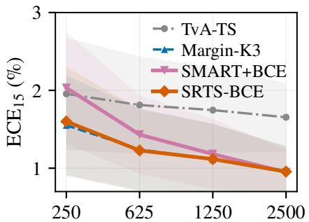  
(a) Calibration budget

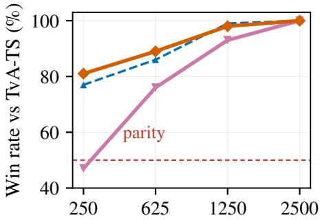  
(b) Calibration budget

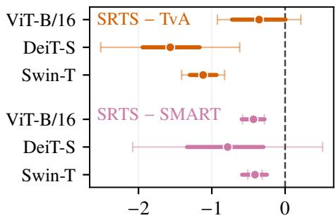  
(c) $\Delta \mathrm { E C E } _ { 1 5 }$ at 250 (pp)  
Figure 2: Small-budget stability (RQ1b). Calibrators are fit on 20 stratified calibration resamples per training seed and evaluated on the fixed test set. (a) CIFAR-100 / ViT-B/16 mean $\mathrm { E C E _ { 1 5 } \ v s . }$ . budget (±std bands): the low-capacity maps (SRTS-BCE, Margin-K3) degrade gracefully; SMART+BCE rises above the scalar at 250. (b) win rate against TvA-TS: SRTS-BCE stays high (81% at 250) while SMART+BCE falls to parity (47%). (c) cross-backbone $\Delta \mathrm { E C E } _ { 1 5 }$ at 250 (thick: seed→draw 95% CI; thin: seed-cluster interval): vs. SMART+BCE zero is excluded on all three backbones; vs. TvA-TS on DeiT-S and Swin-T, with flagship ViT-B/16 directional (interval crosses zero). Full tables, the Tiny-ImageNet/DeiT-S and Swin-T replications, and the Tiny-ImageNet/ViT-B/16 boundary: App. E.

ECE15 (%) ↓  
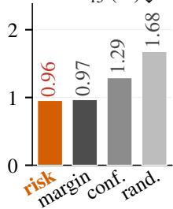

AdaECE (%) ↓  
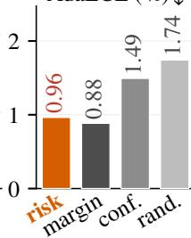

eAURC $( \times 1 0 ^ { - 3 } )$ ↓  
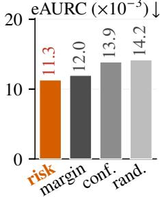  
Figure 3: Routing-rule ablation (K=3, BCE objective; five-1seed ViT-B/16 / CIFAR-100). Conditioning on a genuine reliability signal matters: risk and margin beat confidence-only and random partitions, but are not distinguished from each other (risk lower on $\mathrm { E C E _ { 1 5 } / e A U R C }$ , margin on AdaECE; paired CI includes zero); under NLL every rule collapses to one band (App. B).

tic.

Number of groups. A BCE K-ablation $\begin{array} { r l } { ( \mathrm { E C E } _ { 1 5 } } & { { } = } \end{array}$ $1 . 6 5 / 1 . 0 7 / 0 . 9 6 / 0 . 9 4 / 1 . 0 1$ at $K { = } 1 / 2 / 3 / 5 / 1 0 )$ confirms that K=3 captures the gain and K=10 degrades it. Holding signal and capacity fixed, Tab. 2 varies only the map family (lower block, which fixes the OOF risk score, objective, and fitting discipline; PWLinear-3 matches SRTS-BCE’s fitted router and temperature-map parameter count exactly) against external peers (top block).

Map result. PWLinear-3, with the same fitted router and parameter count as SRTS-BCE, is statistically indistinguishable from the grouped map under the primary inference on both clean CIFAR-100 (hierarchical CI $[ - 0 . { \dot { 1 } } 4 , + 0 . 1 3 ] )$ and CIFAR-100-C ([−0.01, +0.14]), despite a slightly lower shifted point estimate (4.58 vs. 4.63). The linear map is less efective (1.29/4.89); the spline matches the grouped map on the clean cell yet converges toward the linear map under shift (4.89). The benefit appears under both discrete and continuous maps; SRTS-BCE adopts the discrete map because it is simpler to inspect, fit, and deploy, not because discretisation is optimal. These results agree with P1–P2 of the approximation.

<table><tr><td>Method</td><td>C100</td><td>Tiny</td><td>IN-100</td><td>C100-C</td></tr><tr><td>TvA-TS (K=1) Margin-K3</td><td> $0 . 9 7 { \pm } 0 . 3 2 0 . 9 9 { \pm } 0 .$ </td><td>1.65±0.441.26±0.181.75±0.155.72±1.13 161.83±0.304.70±0.78</td><td></td></tr><tr><td>SMART+BCE</td><td> $0 . 9 5 { \pm } 0 . 2 9 0 . 9 7 { \pm } 0 . 2 2$ </td><td>1.71±0.264.75±0.79</td><td></td></tr><tr><td>LinearRiskTemp</td><td>1.29±0.481.35±0.081.74±0.264.89±0.76</td><td></td><td></td></tr><tr><td>PWLinear-3 SRTS-BCE (Ours)0.96±0.321.11±0.151.84±0.224.63±0.84</td><td> $1 . 0 1 \pm 0 . 3 2 1 . 2 6 \pm 0 . 1 1 1 . 8 6 \pm 0 . 2 6 4 . 5 8 \pm 0 . 8 6$ </td><td></td><td>10</td></tr></table>

Table 2: RQ2: matched-parameterisation comparison $( \mathrm { E C E _ { 1 5 } } ,$ , mean±std; columns are ViT-B/16 except IN-100, which is DeiT-S; C100-C: per-seed means over the 95 corruption cells, deployable protocol). Within each training seed all methods share the same fixed calibration split; all use the toplabel BCE objective. Top block: conditioning signal varies. Bottom block: same OOF risk score, objective, and fitting discipline; map family varies (PWLinear-3 exactly matches SRTS-BCE’s fitted router and parameter count). (Seeds: five on C100, three on Tiny and the protocol-frozen IN-100 subset. Full method set, five-seed IN-100, and three-tier CIs: Tabs. 13, 36, §C.)

Objective replication (QaTS, HTS). Two independent map families reproduce the objective axis. QaTS (Chakraborty et al. 2026) (equation-faithful reimplementation) trails SRTS-BCE on CIFAR-100 (clean CI [−0.51, −0.06]) and CIFAR-100-C (all tiers exclude zero, hierarchical $[ - 1 . 0 5 , - 0 . 1 3 ] )$ , and is unresolved on Tiny-ImageNet/ViT-B/16 and IN-100/DeiT-S; its QaTS-BCE − QaTS-NLL gap (1.35 vs. 1.90) reproduces the BCE-over-NLL improvement outside our router, and HTS shows the same pattern (HTS-

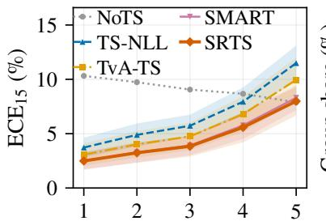  
(a) Corruption severity

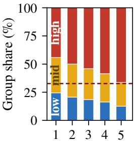  
(b) Severity  
Figure 4: CIFAR-100-C shift under deployable rerouting. 1(a) Among the plotted methods, SRTS-BCE has the lowest mean ECE point estimate at every severity (±std; CIs in text). (b) corrupted examples shift into higher-risk groups; dashed: clean-test high-risk share (32.7%). Legend abbreviations: SMART denotes SMART+BCE; SRTS denotes SRTS-BCE.

BCE 1.63 vs. HTS-NLL 2.07 clean; 5.41 vs. 6.96 shifted).   
Full method set and tiers: App. C, Tab. 15.

## RQ3: When does clean-fitted SRTS-BCE transfer?

On CIFAR-100-C (19 corruptions × 5 severities) every corrupted sample is rerouted from its own logits (protocol: Setup). Per-cell then across-seed means: NoTS 9.13; TS-NLL 6.75; TvA-TS 5.72; SRTS-BCE 4.63; SMART+BCE 4.75; SATS-Logit 15.45.

SRTS-BCE attains a lower mean CIFAR-100-C ECE than SMART+BCE under deployable rerouting; the 0.12-pp diference is directional, not two-sided significant: under the primary seed×corruption×severity hierarchical bootstrap the interval includes zero $( [ - 0 . 3 3 , \dot { + } 0 . 0 3 ] , \operatorname* { P r } _ { \mathrm { b o o t } } ( \Delta <$ $0 ) = 0 . 9 3$ ; more conservative than the cell and corruptiontype tiers, App. C). Among matched maps PWLinear-3 is slightly lower (RQ2). Shift eAURC keeps the ordering; percorruption gains anti-correlate with miscalibration magnitude (ρ=−0.68) — the clean-fitted router transfers under mild shift, degrades under severe (App. F).

Risk-group redistribution tracks the severity trend (Fig. 4): the high-risk share grows 44%→66%. Temperatures stayfixed; the group assignment adapts — forcing equal test-time occupancy worsens ECE monotonically (+2.3 pp at severity 5; App. F), so the gain comes from test-time rerouting on shifted logits.

Representation and training boundary. Across the 16 fixed-K=3 cross-regime cells (Tab. 45), SRTS-BCE beats TvA-TS in 12 cells, ties one CIFAR-10 ConvNet cell, and loses all three fine-tuned IN-100 cells; vs. SMART the ordering is backbone- and objective-dependent (Tab. 46). The two ConvNets replicate the structured-residual pattern beyond transformers.

When does routing transfer? A residual is structured and transferable when a clean-fitted reliability ordering separates groups with distinct calibration optima and retains that ordering on deployment data; routing gains concentrate where this holds, the scalar is preferable where it does not (Tab. 41). Under natural shift the objective transfers on fine-tuned ImageNet-V2 but calibration harms on pretrained ImageNet-R/-A (App. F).

## Discussion and Limitations

When conditioning helps. Residual magnitude alone does not predict the gain: in low-data and pretrained regimes a routing signal may exist for the fitted objective yet fail to transfer to ECE. Objective alignment and capacity control act independently: BCE improves the scalar anchor where NLL does not; low-dimensional conditioning adds a further gain only under that objective. The budget-dependent capacity trade-of from RQ1b holds across CIFAR-100 and Tiny-ImageNet: the gain is positive only where a transferable residual dominates. This describes where the method works; it is not a rule for selecting capacity from validation data alone (App. E,§F). The fitted-objective criterion indicates whether routing has signal; ECE transfer also needs the BCE-to-ECE link and router stability (App. I).

What improves? Primarily top-label confidence. NLL and Brier are similar across calibrators, the conditioned maps adding a modest ≈0.005 TopBCE gain (Tab. 16). SRTS-BCE lowers HCFP (high-confidence errors); selective risk at 80/90/95% coverage is nearly unchanged vs. TvA-TS (within 0.04 pp clean, 0.03 pp shifted) — confidence alignment, not lower selective error. It reduces the confidence gap vs. the scalar at two of three pre-specified thresholds on clean and shifted data and survives coverage matching (App. F, Tabs. 31–32).

Which components are essential? Margin-only routing and a matched continuous map each recover most of the efect ([−0.51, +0.15]), and SRTS-BCE ties SMART+BCE on clean CIFAR-100 ([−0.19, +0.12]), so the gain does not depend on the learned router or the discrete map. Selecting the capacity from validation data alone remains out of reach: the 1-SE selector still fails on the low-data regime (App. H). Conclusion. Where conditional calibration is useful, the preferred map capacity changes with the amount of calibration data. SRTS-BCE provides a simple low-capacity instance of this trade-of; selecting capacity reliably from validation data alone remains open. Our results suggest that post-hoc calibrator capacity is better treated as a finite-sample statistical choice than as a fixed architectural preference.

## References

Balanya, S. A.; Maroñas, J.; and Ramos, D. 2024. Adaptive temperature scaling for robust calibration of deep neural networks. Neural Computing and Applications, 36: 8073–8095.

Berta, E.; Holzmüller, D.; Bach, F.; and Jordan, M. I. 2026. CalArena: A Large-Scale Post-Hoc Calibration Benchmark. arXiv preprint arXiv:2605.30188.

Błasiok, J.; and Nakkiran, P. 2024. Smooth ECE: Principled Reliability Diagrams via Kernel Smoothing. In International Conference on Learning Representations (ICLR). ArXiv:2309.12236.

Brier, G. W. 1950. Verification of Forecasts Expressed in Terms of Probability. Monthly Weather Review, 78(1): 1–3.

Chakraborty, O.; Fillioux, L.; Ben Ayed, I.; and Dolz, J. 2026. Quantile Adaptive Temperature Scaling for Confidence Calibration. arXiv:2606.21749.

Cubuk, E. D.; Zoph, B.; Shlens, J.; and Le, Q. V. 2020. RandAugment: Practical Automated Data Augmentation with a Reduced Search Space. In Advances in Neural Information Processing Systems (NeurIPS).

Ding, Z.; Han, X.; Liu, P.; and Niethammer, M. 2021. Local Temperature Scaling for Probability Calibration. In Proceedings ofthe IEEE/CVFInternational Conference on Computer Vision, 6889–6899.

Dosovitskiy, A.; Beyer, L.; Kolesnikov, A.; Weissenborn, D.; Zhai, X.; Unterthiner, T.; Dehghani, M.; Minderer, M.; Heigold, G.; Gelly, S.; Uszkoreit, J.; and Houlsby, N. 2021. An Image is Worth 16x16 Words: Transformers for Image Recognition at Scale. In International Conference on Learning Representations (ICLR).

Geifman, Y.; and El-Yaniv, R. 2017. Selective Classification for Deep Neural Networks. In Advances in Neural Information Processing Systems (NeurIPS).

Geifman, Y.; Uziel, G.; and El-Yaniv, R. 2019. Bias-Reduced Uncertainty Estimation for Deep Neural Classifiers. In International Conference on Learning Representations (ICLR). ArXiv:1805.08206.

Guo, C.; Pleiss, G.; Sun, Y.; and Weinberger, K. Q. 2017. On Calibration of Modern Neural Networks. In Proceedings of the 34th International Conference on Machine Learning (ICML), 1321–1330.

Guo, H.; Tao, L.; Luo, H.; Dong, M.; and Xu, C. 2026. Sample Margin-Aware Recalibration of Temperature Scaling. In Proceedings of the International Conference on Machine Learning (ICML). ArXiv:2506.23492; ICML virtual poster 64903.

He, K.; Zhang, X.; Ren, S.; and Sun, J. 2016. Deep Residual Learning for Image Recognition. In Proceedings ofthe IEEE Conference on Computer Vision and Pattern Recognition (CVPR), 770–778.

Hendrycks, D.; and Dietterich, T. 2019. Benchmarking Neural Network Robustness to Common Corruptions and Perturbations. In International Conference on Learning Representations (ICLR). ArXiv:1903.12261.

Joy, T.; Pinto, F.; Lim, S.-N.; Torr, P. H. S.; and Dokania, P. K. 2023. Sample-Dependent Adaptive Temperature Scaling for Improved Calibration. In Proceedings of the AAAI Conference on Artificial Intelligence, volume 37, 14919–14926.

Kull, M.; Perello-Nieto, M.; Kängsepp, M.; Silva Filho, T.; Song, H.; and Flach, P. 2019. Beyond Temperature Scaling: Obtaining Well-Calibrated Multi-Class Probabilities with Dirichlet Calibration. In Advances in Neural Information Processing Systems (NeurIPS). ArXiv:1910.12656.

Kumar, A.; Liang, P.; and Ma, T. 2019. Verified Uncertainty Calibration. In Advances in Neural Information Processing Systems, 3787–3798.

Le Coz, A.; Herbin, S.; and Adjed, F. 2024. Confidence Calibration of Classifiers with Many Classes. In Advances in Neural Information Processing Systems (NeurIPS). ArXiv:2411.02988.

Liu, Z.; Lin, Y.; Cao, Y.; Hu, H.; Wei, Y.; Zhang, Z.; Lin, S.; and Guo, B. 2021. Swin Transformer: Hierarchical Vision Transformer Using Shifted Windows. In Proceedings of the IEEE/CVF International Conference on Computer Vision (ICCV), 10012–10022.

Loshchilov, I.; and Hutter, F. 2019. Decoupled Weight Decay Regularization. In International Conference on Learning Representations (ICLR).

Ma, X.; and Blaschko, M. B. 2021. Meta-Cal: Wellcontrolled Post-hoc Calibration by Ranking. In Proceedings of the 38th International Conference on Machine Learning (ICML), volume 139, 7235–7245. PMLR.

Naeini, M. P.; Cooper, G. F.; and Hauskrecht, M. 2015. Obtaining Well Calibrated Probabilities Using Bayesian Binning. In Proceedings of the AAAI Conference on Artificial Intelligence, volume 29.

Nixon, J.; Dusenberry, M. W.; Zhang, L.; Jerfel, G.; and Tran, D. 2019. Measuring Calibration in Deep Learning. In Proceedings of the IEEE/CVF Conference on Computer Vision and Pattern Recognition (CVPR) Workshops, 38–41. ArXiv:1904.01685.

Radosavovic, I.; Kosaraju, R. P.; Girshick, R.; He, K.; and Dollár, P. 2020. Designing Network Design Spaces. In Proceedings of the IEEE/CVF Conference on Computer Vision and Pattern Recognition (CVPR).

Seo, H.; Seo, K.; Park, J.; and Yang, E. 2025. Towards Precise Prediction Uncertainty in GNNs: Refining GNNs with Topology-grouping Strategy. In Proceedings of the AAAI Conference on Artificial Intelligence.

Szegedy, C.; Vanhoucke, V.; Iofe, S.; Shlens, J.; and Wojna, Z. 2016. Rethinking the Inception Architecture for Computer Vision. In Proceedings of the IEEE Conference on Computer Vision and Pattern Recognition (CVPR), 2818–2826.

Touvron, H.; Cord, M.; Douze, M.; Massa, F.; Sablayrolles, A.; and Jégou, H. 2021. Training Data-Eficient Image Transformers & Distillation Through Attention. In Proceedings of the 38th International Conference on Machine Learning (ICML), 10347–10357.

Yang, J.-Q.; Zhan, D.-C.; and Gan, L. 2023. Beyond Probability Partitions: Calibrating Neural Networks with Semantic Aware Grouping. In Advances in Neural Information Processing Systems.

Yun, S.; Han, D.; Oh, S. J.; Chun, S.; Choe, J.; and Yoo, Y. 2019. CutMix: Regularization Strategy to Train Strong Classifiers with Localizable Features. In Proceedings of the IEEE/CVF International Conference on Computer Vision (ICCV), 6023–6032.

Zhang, H.; Cisse, M.; Dauphin, Y. N.; and Lopez-Paz, D. 2018. mixup: Beyond Empirical Risk Minimization. In International Conference on Learning Representations (ICLR).

Zhang, J.; Kailkhura, B.; and Han, T. Y.-J. 2020. Mix-n-Match: Ensemble and Compositional Methods for Uncertainty Calibration in Deep Learning. In Proceedings of the 37th International Conference on Machine Learning, 11117– 11128.

Zhong, Z.; Zheng, L.; Kang, G.; Li, S.; and Yang, Y. 2020. Random Erasing Data Augmentation. In Proceedings ofthe AAAI Conference on Artificial Intelligence, 13001–13008.

This appendix provides implementation details, additional ablations, complete statistical analyses, distribution-shift results, and extended experiments supporting the main text. SRTS-BCE is a top-label-BCE calibrator with an out-of-fold risk router, fixed $\bar { K } { = } 3$ groups, and one scalar temperature per group.

Section A gives implementation details and metric definitions. Sections B–D examine the fitting objective, the map capacity, and the routing signal in turn. Section E reports the calibration-budget experiments and the Tiny-ImageNet replication. Section F covers distribution shift, including the deployable CIFAR-100-C protocol and the natural-shift boundaries. Section G reports cross-backbone results, Section H the negative results and extended limitations, Section I the second-order BCE approximation, and Section J the full result tables.

A code-and-data artifact reproduces the primary clean result, the $n { = } 2 5 0$ budget resampling, and the HTS comparison from packaged logits with fixed seeds, and reconstructs the CIFAR-100-C table from frozen per-run rows. NLL-objective results, NLL-recovery analyses, and single-checkpoint diagnostics support the main clean and corruption-shift comparisons rather than forming part of them; each is marked where it appears.

## A Reproducibility and Implementation Notes

Training details (ID clean evaluation recipe). All finetuned backbones use the identical, fixed recipe: AdamW, learning rate $5 \times 1 0 ^ { - 5 }$ , weight decay 0.05, batch size 64, 100 epochs with 5 warmup epochs (warmup start $1 0 ^ { - 6 } )$ and cosine decay to 0; MixUp α=0.8 / CutMix α=1.0 (batch mode), RandAugment, RandomErasing, and label smoothing 0.1. The flagship CIFAR-100 / ViT-B/16 evaluation uses seeds $_ { 0 - 4 ; }$ unless stated otherwise, the cross-backbone and supplementary diagnostic suites use seeds 0–2. The controlled single-checkpoint diagnostic uses the separate single-seed recipe stated alongside it (§B). Calibrators are fit on the 5% stratified validation split; all post-hoc fitting runs on CPU (Table 3).

Router and temperature fitting details. The OOF risk scores use five-fold stratified cross-fitting (folds shufled and seeded per training seed). The router is an L2-regularised logistic regression (inverse regularisation strength $C { = } 1 . 0 )$ fit by a quasi-Newton method capped at 1,000 iterations; the six signals are z-scored with per-signal mean and scale computed on the clean validation split (scale floor $1 0 ^ { - 1 2 }  1 )$ All temperatures (global TvA-TS and per-group) are bounded one-dimensional minimisations of the top-label BCE over $T \in \ [ 0 . 0 5 , 2 0 ]$ with convergence tolerance $1 0 ^ { - 8 }$ . Groups with fewer than 50 validation samples fall back to the global TvA-TS temperature. After the OOF fit, the router is refit once on the full validation split for deployment; group thresholds are the OOF-risk tertile boundaries saved from clean validation.

Calibrator cost. Learned parameter counts, fit wall-clock, and per-sample inference cost are in Table 3. Measurement protocol: CPU limited to four threads; fit on the $n { = } 2 , 5 0 0$ clean CIFAR-100 / ViT-B/16 validation split; inference on the 10,000-sample test split; mean over three seeds.

## Metric definitions

All metrics are computed exactly as below (matching the released code). TopBCE denotes the test-set value of the top-label binary cross-entropy (the Method’s fitting objective) evaluated on the calibrated probabilities: with $b _ { i } \ =$ $\begin{array} { r l r } { \mathbf { 1 } [ \hat { y } _ { i } } & { { } = } & { y _ { i } ] } \end{array}$ and top-label confidence $\hat { p } _ { i } , \mathrm { T o p B C E } \ =$ $\begin{array} { r } { - \frac { 1 } { n } \sum _ { i } [ b _ { i } \log \hat { p } _ { i } + ( \dot { 1 } - b _ { i } ) \log ( 1 - \hat { p } _ { i } ) ] } \end{array}$ . Notation: N test samples with label $y _ { i }$ and calibrated probability vector $p _ { i } \in \Delta ^ { C } ;$ prediction $\hat { y } _ { i } = \arg \operatorname* { m a x } _ { c } p _ { i c } ;$ top-label confidence $c _ { i } = \operatorname* { m a x } _ { c } p _ { i c } ;$ correctness $a _ { i } = \mathbf { 1 } [ \hat { y } _ { i } = y _ { i } ]$ . ECEfamily metrics are reported ×100 (percentage points).

Top-1 accuracy $\textstyle = { \frac { { \mathrm { 1 0 0 } } } { N } } \sum _ { i } a _ { i }$ $\begin{array} { r } { \dot { \bf N } { \bf L } { \bf L } = - \frac { 1 } { N } \sum _ { i } \log p _ { i , y _ { i } } } \end{array}$ (probabilities clipped at $1 0 ^ { - 1 2 } )$ $\begin{array} { r } { \mathbf { B r i e r } = \frac { 1 } { N } \sum _ { i } \sum _ { c } \left( p _ { i c } - \frac { } { } \right. } \end{array}$ $\scriptstyle \mathbf { 1 } [ c = y _ { i } ] ) ^ { 2 }$ (multi-class, summed over classes). $\mathbf { E C E } _ { 1 5 }$ (Naeini, Cooper, and Hauskrecht 2015): partition (Naeini, Cooper, and Hauskrecht 2015): partition [0, 1] into 15 equal-width bins $B _ { b }$ over $c _ { i }$ and report

$$
\mathrm { E C E } _ { 1 5 } \ : = \ : \sum _ { b = 1 } ^ { 1 5 } \frac { \vert B _ { b } \vert } { N } \left. \overline { { a } } ( B _ { b } ) - \overline { { c } } ( B _ { b } ) \right. \times 1 0 0 ,\tag{5}
$$

where $\overline { { a } } ( B _ { b } )$ and c( $B _ { b } )$ are the mean correctness and mean confidence in bin b (empty bins skipped; the last bin is closed at 1).

$\mathbf { A d a E C E } _ { 1 5 }$ (Nixon et al. 2019): the same statistic with 15 equal-mass bins (samples sorted by confidence and split into 15 contiguous groups of $\lvert N / 1 5 \rvert$ -balanced size).

ClasswiseECE (CW-ECE ) (Kull et al. 2019): the onevs-rest classwise ECE — for each class $c ,$ bin the per-class probability $p _ { i c }$ over all samples into 15 equal-width bins and accumulate $\begin{array} { r } { \sum _ { b } \frac { | B _ { b } | } { N } | \overline { { p _ { c } } } ( B _ { b } ) - \overline { { \mathbf { 1 } [ y = c ] } } ( B _ { b } ) | } \end{array}$ , then average over the $C$ classes. At $C { = } 1 0 0$ most per-class probabilities are near zero, so this metric is small and only weakly discriminative among calibrated maps.

smECE (Błasiok and Nakkiran 2024): the smooth calibration error, computed with the authors’ released estimator (reflected Gaussian kernel on the top-label confidence– correctness pairs, bandwidth chosen by the estimator’s selfconsistent rule); reported ×100.

AUROC (of correctness) (Geifman and El-Yaniv 2017): the area under the ROC curve of the confidence $c _ { i }$ as a score for predicting correctness ${ { a } _ { i } } .$

AURC / eAURC (Geifman, Uziel, and El-Yaniv 2019): sort samples by confidence (descending); at coverage $k / N$ the selective risk is the error rate among the k most-confident samples, $\begin{array} { r } { r _ { k } = \frac { 1 } { k } \sum _ { j \leq k } ( 1 - a _ { ( j ) } ) } \end{array}$ , and $\begin{array} { r } { \mathrm { A U R C } = \frac { 1 } { N } \sum _ { k = 1 } ^ { N } r _ { k } } \end{array}$ eAURC subtracts the oracle value obtained by ordering all correct predictions first: $\mathrm { \ e A U R C = A U R C - \dot { A } U R C ^ { * } }$

<table><tr><td>Method</td><td>Params</td><td>Fit (s)</td><td>Inference (μs/sample)</td></tr><tr><td>TS-NLL</td><td>1</td><td>0.019</td><td>1.19</td></tr><tr><td>TvA-TS</td><td>1</td><td>0.030</td><td>0.82</td></tr><tr><td>SRTS-BCE  $K { = } 3$ </td><td>10</td><td>0.137</td><td>7.00</td></tr><tr><td>SMART+BCE</td><td>49</td><td>4.256</td><td>1.44</td></tr><tr><td>SATS-Logit</td><td>13,057</td><td>5.066</td><td>1.55</td></tr></table>

Table 3: Calibrator cost (CPU, 4 threads; fit on the validation split, inference on 10,000 test; 3-seed mean).

HCFP@0.90: the fraction of wrong predictions whose toplabel confidence is at least 0.90 (“confidently wrong” rate); reported only in this appendix’s NLL-era diagnostics.

Implementation note (router signals). Historical experiment artifacts constructed a seven-channel signal vector in which the confidence channel appeared twice (a duplicated alias), and the archived fitting code passed all seven columns to the $L _ { 2 }$ logistic router. The duplicate therefore changed the efective regularisation of the confidence signal; it was not inert storage metadata. The released implementation removes the duplicate and uses exactly the six distinct statistics of Algorithm 1; every reported routerdependent result in this paper was regenerated with this sixsignal implementation under identical seeds, folds, draws, and bootstrap design. Point estimates change only slightly (flagship clean five-seed mean $\mathrm { E C E _ { 1 5 } ~ 0 . 9 \bar { 4 } 8 9 ~ \bar { + } ~ 0 . \bar { 9 } 5 5 9 ; }$ all six clean cell means move by $\leq \ 0 . 0 1 0 \ \mathrm { p p } ; \ \mathrm { C I F A R } .$ $1 0 0 \mathrm { { - C } ~ 4 . 6 2 6 ~  ~ 4 . 6 2 8 ) }$ , but one marginal interval crosses zero: the flagship $n { = } 2 5 0 \mathrm { ~ S R T S { - } T v A { - } T S }$ seed→draw interval moves from $[ - 0 . 7 1 4 , - 0 . 0 0 1 ] \mathrm { ~ t o ~ } [ - 0 . 7 2 4 , + 0 . 0 0 6 ]$ , and the main text reports that comparison as directional rather than interval-supported.

Code and data availability. A calibration-stage code and data package accompanies this work and will be released publicly. It includes: the post-hoc calibration and evaluation implementations used by the packaged analyses (the SRTS-BCE router; the scalar, grouped, and continuous riskconditioned temperature maps; HTS; SMART+BCE; and metric/reconstruction code — the unrestricted neural heads are documented but not shipped); the packaged float32 evaluation logits for the clean CIFAR-100 / ViT-B/16 cells (all five seeds), which re-evaluate the main clean, flagship $n { = } 2 5 0$ budget-resampling, and HTS results; the frozen per-run result rows for CIFAR-100-C and for the cross-backbone and Tiny-ImageNet replications; reference result files, a manifest with SHA-256 checksums, and a documented clean-environment reproduction script that re-derives the main clean, $n { = } 2 5 0$ budget-resampling, and HTS results from the packaged logits, and reconstructs the CIFAR-100-C table from the frozen per-run rows. Reproduction is tolerance-based, not bitwise: each check prints reference, reproduced, absolute diference, tolerance, and PASS/FAIL under method-specific absolute ECE tolerances — 0.011 pp for the deterministic post-hoc methods (float32 packaging and BLAS drift), 0.15 pp for SMART+BCE only (its torch-trained MLP drifts across torch builds), and 0.05 pp for the CIFAR-100-C reconstruction — stated identically in the package documentation and the reproduction script. It excludes, due to package-size limits: training code and checkpoints; the raw CIFAR-100-C corruption logits; and the raw logits of the cross-backbone (DeiT-S/Swin-T) and other regimes (Tiny-ImageNet, IN-100, pretrained, natural shift). Consequently the CIFAR-100-C and cross-backbone tables are reconstructedfromfrozen perrun rows, not re-evaluated from raw logits in the package. It is therefore a partial reproduction package covering the calibration-stage evidence; training configurations are documented in this section for reimplementation from scratch. The table-level aggregation and hierarchical inference for the Tiny-ImageNet follow-up are independently auditable from the package: the complete per-seed/per-draw statistics, draw identifiers, subsample-RNG formula, frozen protocol document, hierarchical-bootstrap code, and a verification script that re-derives every Table 26–27 mean, win rate, and CI from the per-draw rows are included; auditing the per-draw rows themselves would require the excluded Tiny logits.

## B Objective and Capacity

This section collects evidence that the calibration benefit depends jointly on the fitting objective and on the capacity of the temperature map: the BCE K-ablation and the objective-matched capacity comparisons, the Brier-objective routing and BCE-trained neural-head checks, and the mixedobjective, single-checkpoint, and NLL analyses.

BCE-objective K-ablation. On the modern-recipe ViT-B/16 / CIFAR-100 base (five seeds), SRTS-BCE $\begin{array} { r l r } { K } & { { } \in } & { \{ 1 , 2 , 3 , 5 , 1 0 \} } \end{array}$ gives mean $\begin{array} { r l } { \mathrm { E C E } _ { 1 5 } } & { { } = } \end{array}$ $1 . 6 5 / 1 . 0 7 / 0 . 9 6 / 0 . 9 4 / 1 . 0 1$ . The $K { = } 1  K { = } 3$ step closes most of the gain $( 1 . 6 5  0 . 9 6 , - 0 . 7 0 ~ \mathrm { p p } ) ;$ $K { = } 5$ has a marginally lower mean ECE (0.94) without stable evidence of additional benefit, and $K { = } 1 0$ degrades ECE (1.01). We select $K { = } 3$ as the BCE-objective default.

## Objective-conditional routing ablation

The objective-conditional routing table (Table 4) holds the $K { = } 3$ constraint fixed and varies the routing rule across four deployable variants (risk, random, shufled, confidence-only) under both NLL and BCE calibration objectives, plus a BCE oracle diagnostic (the main text shows the $\mathrm { E C E _ { 1 5 } }$ slice as a bar chart; the full numbers are in Table 4). This subsection expands on it; the excess-risk condition stated in the main Method is derived in §I.

Under NLL. All deployable routing variants land in a tight band $( \mathrm { E C E _ { 1 5 } } \in [ 1 . 7 1 , 1 . 8 2 ]$ , NLL within $^ { \pm 3 } \times 1 0 ^ { - 3 } )$ . The routing signal has no measurable efect under NLL fitting; we report the oracle diagnostic under the BCE objective only.

Under BCE. The same routing rules now separate on ECE: risk $\left( 0 . 9 6 \right) <$ confidence $( 1 . 2 9 ) ~ <$ shufled (1.59) ≈ random (1.68). The OOF risk router beats even the label-informed true-label-risk router $1 - p _ { y } ( 1 . 6 9 )$ , which — though distinct from the binary-correctness oracle of the $B / \bar { \sigma } ^ { \breve { 2 } }$ table — induces extreme per-group BCE optima that generalise worse than the smoother OOF risk partition. Under BCE fitting the routing signal separates the variants, and the OOF logistic risk signal is a competitive default.

Interpretation. The "constraint-not-router" reading is specific to the NLL fitting objective. The main text’s SRTS-BCE result shows that the same K=3 infrastructure becomes a strong adaptive calibrator once paired with a top-label BCE objective and an OOF risk router. Routing matters when the per-group temperature optimisation has gradient room to exploit it; NLL fitting on small validation slices does not.

<table><tr><td>Routing rule</td><td>NLL</td><td>Brier</td><td> $\mathrm { E C E _ { 1 5 } }$ </td><td>eAURC</td></tr><tr><td>NLL objective</td><td></td><td></td><td></td><td></td></tr><tr><td> $S R T S - \dot { N } L L K { = } 3 r i s k$ </td><td> $0 . 3 2 1 7 \pm 0 . 0 2 7 4$ </td><td> $0 . 1 3 3 3 \pm 0 . 0 0 7 0$ </td><td> $1 . 7 0 5 8 \pm 0 . 6 4 8 3$ </td><td> $0 . 0 1 1 5 \pm 0 . 0 0 1 6$ </td></tr><tr><td> $\mathrm { K } { = } 3 \mathrm { c o n f i d e n c e }$ </td><td> $0 . 3 2 4 3 \pm 0 . 0 3 0 2$ </td><td> $0 . 1 3 4 0 \pm 0 . 0 0 7 4$ </td><td> $1 . 8 1 4 9 \pm 0 . 6 9 2 3$ </td><td> $0 . 0 1 3 1 \pm 0 . 0 0 3 3$ </td></tr><tr><td>K=3 random equal-frequency</td><td> $0 . 3 2 4 1 \pm 0 . 0 2 9 6$ </td><td> $0 . 1 3 4 2 \pm 0 . 0 0 7 6$ </td><td> $1 . 8 1 8 1 \pm 0 . 7 0 9 0$ </td><td> $0 . 0 1 3 4 \pm 0 . 0 0 3 3$ </td></tr><tr><td>K=3 shuffled risk-score</td><td> $0 . 3 2 3 9 \pm 0 . 0 2 9 7$ </td><td> $0 . 1 3 4 2 \pm 0 . 0 0 7 6$ </td><td> $1 . 7 9 7 0 \pm 0 . 7 1 3 8$ </td><td> $0 . 0 1 3 2 \pm 0 . 0 0 3 4$ </td></tr><tr><td>BCE objective</td><td></td><td></td><td></td><td></td></tr><tr><td> $\mathrm { T v } \mathrm { A } \mathrm { - } \mathrm { T } \bar { \mathrm { S } } \equiv \mathrm { K } \mathrm { - } 1 \ \mathrm { B C E }$ </td><td> $0 . 3 3 2 1 \pm 0 . 0 2 9 6$ </td><td> $0 . 1 3 6 2 \pm 0 . 0 0 8 1$ </td><td> $1 . 6 5 4 2 \pm 0 . 4 4 0 7$ </td><td> $0 . 0 1 4 2 \pm 0 . 0 0 3 3$ </td></tr><tr><td> $S R T S - B C E K { = } 3 r i s k \left( m a i n \right)$ </td><td> $0 . 3 2 9 7 \pm 0 . 0 2 5 7$ </td><td> $0 . 1 3 4 8 \pm 0 . 0 0 7 0$ </td><td> $\mathbf { 0 . 9 5 5 9 } \pm \mathbf { 0 . 3 1 8 8 }$ </td><td> $\mathbf { 0 . 0 1 1 3 \pm 0 . 0 0 1 1 }$ </td></tr><tr><td>K=3 confidence</td><td> $0 . 3 3 2 3 \pm 0 . 0 2 9 4$ </td><td> $0 . 1 3 5 7 \pm 0 . 0 0 7 7$ </td><td> $1 . 2 9 1 5 \pm 0 . 4 3 1 7$ </td><td> $0 . 0 1 3 9 \pm 0 . 0 0 3 0$ </td></tr><tr><td>K=3 random equal-frequency</td><td> $0 . 3 3 2 2 \pm 0 . 0 2 9 7$ </td><td> $0 . 1 3 6 2 \pm 0 . 0 0 8 1$ </td><td> $1 . 6 7 8 9 \pm 0 . 4 3 4 7$ </td><td> $0 . 0 1 4 2 \pm 0 . 0 0 3 2$ </td></tr><tr><td>K=3 shuffled risk-score</td><td> $0 . 3 3 2 5 \pm 0 . 0 2 9 2$ </td><td> $0 . 1 3 6 3 \pm 0 . 0 0 8 0$ </td><td> $1 . 5 8 6 7 \pm 0 . 4 8 3 6$ </td><td> $0 . 0 1 4 3 \pm 0 . 0 0 3 1$ </td></tr><tr><td>K=3 oracle risk  $1 - p _ { y }$  (BCE)</td><td> $0 . 3 2 1 4 \pm 0 . 0 2 3 1$ </td><td> $0 . 1 3 4 6 \pm 0 . 0 0 6 6$ </td><td> $1 . 6 9 4 9 \pm 0 . 2 7 6 8$ </td><td> $0 . 0 0 8 3 \pm 0 . 0 0 0 8$ </td></tr><tr><td> $\mathbf { S M A R T + B C E }$ </td><td> $0 . 3 3 1 2 \pm 0 . 0 2 9 0$ </td><td> $0 . 1 3 5 0 \pm 0 . 0 0 7 0$ </td><td> $0 . 9 4 8 3 \pm 0 . 2 8 6 5$ </td><td> $0 . 0 1 2 3 \pm 0 . 0 0 1 5$ </td></tr></table>

Table 4: Objective-conditional routing ablation (full table). Modern-recipe ViT-B/16 / CIFAR-100, mean ± std; K=3 fixed, only the routing rule varies. The BCE block is over five seeds (matching the main paper’s routing-rule ablation figure, Fig. 3, which plots these BCE routing rules); the NLL block is an archived three-seed diagnostic. NLL objective: deployable routing variants collapse to one ECE band. BCE objective: risk routing beats confidence and random (risk < confidence < shufled ≈ random on ECE). SMART+BCE uses the SMART logit-gap architecture (Guo et al. 2026) retrained with top-label BCE. The oracle-risk row routes on the label-informed true-label risk $1 - p _ { y }$ (not a binary correct/incorrect partition); it uses labels and is diagnostic only, not an upper bound.

Objective-agnostic routing check: top-label Brier score. To verify that the routing benefit is not specific to the BCE objective, we repeat the routing ablation with per-group temperatures fitted by minimising the top-label Brier score $\begin{array} { r } { \mathcal { L } _ { \mathrm { B r i e r - t o p } } ( T ; \mathcal { G } ) = | \dot { \mathcal { G } } | ^ { - 1 } { \sum _ { i \in \mathcal { G } } } ( \bar { \hat { p } _ { i } } - b _ { i } ) ^ { 2 } } \end{array}$ , where $\hat { p } _ { i } = \mathrm { m a x } _ { c } \mathrm { s o f t m a x } ( z _ { i } / T )$ c is the top-label confidence and $b _ { i } = \mathbf { 1 } [ \hat { y } _ { i } = y _ { i } ]$ is correctness. This is a proper scoring rule distinct from BCE and NLL; the K=1 limit is scalar Brier TS (“TvA-Brier”). Under top-label Brier fitting, risk routing again outperforms confidence and random alternatives (risk $\mathrm { E C E } _ { 1 5 } = 1 . 0 5$ , confidence = 1.17, random = 1.68; 3-seed mean), replicating the BCE ordering. TvA-Brier (K=1) attains $\mathrm { \Delta E C E _ { 1 5 } = \bar { 1 } . 6 8 } .$ , confirming that the routing benefit is not an artefact of the top-label BCE loss function but rather a property of the OOF risk signal’s ability to partition the validation set into groups with distinct calibration optima. The objective-conditional pattern replicates under top-label BCE and top-label Brier: genuine reliability routing outperforms random routing. Under NLL the routing rules are largely indistinguishable, while the SoftECE diagnostic (below) shows that risk grouping can improve over its scalar anchor but does not provide a full routing-rule comparison. Full per-seed statistics are in Table 5.

Objective still matters: per-group SoftECE. We also fit each K=3 group’s temperature by minimising the softbinned ECE (SoftECE) objective of SMART, holding the router and groups fixed. Routing again learns three distinct group temperatures (seed-0 span 0.60–0.83) and beats scalar TvA-TS, so the routing benefit is not specific to BCE. But SoftECE is a weaker per-group objective than top-label BCE at this budget: clean CIFAR-100 / ViT-B/16 ECE15 is $0 . 9 5 \pm 0 . 2 8$ for SRTS-SoftECE versus 0.83±0.28 for SRTS-BCE refit under the identical pipeline (both three-seed; the five-seed value is 0.96), and SoftECE is also higher-variance across seeds (worst seed 1.04 vs. 0.67). The soft-binned objective on ≈833-sample groups is noisier to fit than the smooth top-label log-loss, which is why the deployed method fits groups by BCE.

## Mixed-objective diagnostic

The main method uses pure top-label BCE; mixed NLL-plus-BCE fits are reported only as a diagnostic connecting the two objectives. On the same three-seed ViT-B/16 / CIFAR-100 setting, increasing the BCE weight moves the K=3 riskrouted variant toward the pure-BCE result while preserving the same OOF risk router:

## Adaptive-head fairness sweep (capacity-control diagnostic)

Table 7 reports a 48-cell hyperparameter sweep on SATS-Logit, SATS-Features, and LTS-feature, alongside constrained SRTS-NLL, SRTS-BCE, and SMART+BCE references. The sweep tests the capacity-control motivation: the neural adaptive heads have far more degrees of freedom than the K=3 routed family. Across all nine (method, seed) combinations the val-only selection picks the width-128 head with learning rate $1 0 ^ { - 3 }$ — the largest, least-regularised cell — consistent with these heads overfitting the val-NLL selection objective at this budget. Best-val-selected test $\mathrm { E C E _ { 1 5 } }$ remains $\geq 3 \times$ scalar TS on every method-seed.

## Cross-backbone adaptive-head failure summary

Table 8 collects the unrestricted adaptive-head $\mathrm { E C E _ { 1 5 } }$ across all six backbone×dataset settings in the paper. The failure mode is consistent: every unrestricted head remains at $\mathrm { E C E _ { 1 5 } } ~ \geq ~ 6 \%$ , far above the $\leq 1 . 2 \%$ achieved by SRTS-BCE $K { = } 3$ and SMART+BCE on the same splits. This table provides the per-method detail behind the main-text statement that unrestricted adaptive heads overfit under the smallvalidation protocol. Among the reported heads, LTS-feature, Feature-SATS, and Frozen-feature UTempH produce nearly identical $\mathrm { E C E _ { 1 5 } }$ within each cell (typically ≤0.02 pp apart), so the column reports their common value; SATS-Logit often attains a lower $\mathrm { E C E _ { 1 5 } }$ than the feature-based heads because it uses logits (100- or 200-dim) instead of CLS features (768-dim), giving fewer overfit-prone parameters, but it still regresses well beyond scalar TS.

<table><tr><td>Routing rule</td><td>NLL</td><td>Brier</td><td> $\mathrm { E C E _ { 1 5 } }$ </td><td>eAURC</td></tr><tr><td>Brier objective</td><td></td><td></td><td></td><td></td></tr><tr><td> $\mathrm { T v A } { \cdot } \mathrm { B r i e r } \equiv \mathrm { K } { = } 1 \ \mathrm { B r i e r }$ </td><td> $0 . 3 2 7 6 \pm 0 . 0 2 2 8$ </td><td> $0 . 1 3 3 2 \pm 0 . 0 0 5 8$ </td><td> $1 . 6 8 3 0 \pm 0 . 6 5 8 6$ </td><td> $0 . 0 1 3 7 \pm 0 . 0 0 3 0$ </td></tr><tr><td> $S R T S  – B r i e r K { = } 3 \ r i s k$ </td><td> $0 . 3 2 3 3 \pm 0 . 0 2 1 1$ </td><td> $0 . 1 3 2 6 \pm 0 . 0 0 5 4$ </td><td> $\mathbf { 1 . 0 5 1 8 \pm 0 . 3 4 8 0 }$ </td><td> $\mathbf { 0 . 0 1 1 4 \pm 0 . 0 0 1 4 }$ </td></tr><tr><td>K=3 confidence</td><td> $0 . 3 2 7 0 \pm 0 . 0 2 3 4$ </td><td> $0 . 1 3 3 1 \pm 0 . 0 0 5 7$ </td><td> $1 . 1 7 2 3 \pm 0 . 2 7 1 1$ </td><td> $0 . 0 1 3 5 \pm 0 . 0 0 2 7$ </td></tr><tr><td>K=3 random equal-frequency</td><td> $0 . 3 2 8 2 \pm 0 . 0 2 2 9$ </td><td> $0 . 1 3 3 3 \pm 0 . 0 0 5 9$ </td><td> $1 . 6 8 1 1 \pm 0 . 5 5 1 0$ </td><td> $0 . 0 1 3 9 \pm 0 . 0 0 3 1$ </td></tr></table>

Table 5: Objective-agnostic routing check: K=3 group-wise temperature calibration under the top-label Brier objective. Same modern-recipe ViT-B/16 / CIFAR-100 base as Table 4, mean ± std over seeds 0/1/2. Top-label Brier $( \mathcal { L } = \overline { { ( q _ { i } - b _ { i } ) ^ { 2 } } } )$ is a proper scoring rule distinct from both BCE and NLL. OOF risk routing again outperforms confidence and random routing by 0.12–0.63 pp ECE, replicating the ordering from the BCE objective and confirming that the routing benefit is a property of the OOF risk signal rather than an artefact of the BCE loss function. TvA-Brier (K=1) attains ECE ≈ random (1.68 vs. 1.68), consistent with random routing degenerating to near-scalar behaviour.

<table><tr><td>Method</td><td>NLL  $\mathrm { E C E _ { 1 5 } }$ </td></tr><tr><td>SRTS-Mixed  $K { = } 3 \mathrm { r i s k } , \lambda = 0 . 1$  0.3217</td><td>1.6617</td></tr><tr><td>SRTS-Mixed  $K { = } 3 \operatorname { r i s k } , \lambda = 0 . 3$  0.3218</td><td>1.5023</td></tr><tr><td>SRTS-Mixed  $K { = } 3 \mathrm { r i s k } , \lambda { = } 1$  0.3222</td><td>1.1884</td></tr><tr><td>SRTS-Mixed  $K { = } 3 \mathrm { r i s k } , \lambda { = } 3$  0.3231</td><td>0.9698</td></tr><tr><td>SRTS-Mixed  $K { = } 3 \operatorname { r i s k } , \lambda = 1 0$  0.3241</td><td>0.8667</td></tr></table>

Table 6: Mixed-objective SRTS diagnostic (three-seed mean; $\mathcal { L } \ = \ \mathcal { L } _ { \mathrm { N L L } } \ + \ \lambda \mathcal { L } _ { \mathrm { B C E } } )$ . These are ablations, not deployed-method rows; as λ grows the mixed fit approaches the pure-BCE configuration (three-seed value 0.83±0.28; the five-seed value is 0.96±0.32).

## BCE-trained unrestricted adaptive-head fairness check

Table 9 reports the BCE-trained adaptive-head fairness check. SATS-Logit-BCE and Feature-SATS-BCE are trained and selected under the same top-label BCE objective as SRTS-BCE and SMART+BCE, using an 80/20 Cal-Fit/Cal-Select stratified split of the ${ \approx } 2 , 5 0 0$ calibration samples and a 36-config hyperparameter sweep (hidden $\in \ \{ 1 6 , 3 2 , 1 2 8 \}$ , lr $\in \ \left\{ 1 0 ^ { - 3 } , 1 \dot { 0 } ^ { - 4 } , 1 0 ^ { - 5 } \right\}$ , weight-decay $\in \ \dot { \{ 0 , 1 0 ^ { - 4 } , 1 0 ^ { - 3 } , 1 0 ^ { - 2 } \} } )$ . The best Cal-Select configuration is refit on the full calibration split before a single test-set evaluation.

Both MLP architectures share the same input→hidden→GELU→scalar topology and difer only in input dimension (100 logits vs. 768 CLS features). SATS-Logit-BCE attains $\begin{array} { r c l } { \overline { { \mathrm { E C E _ { 1 5 } } } } } & { = } & { 8 . 1 2 \pm 0 . 8 4 } \end{array}$ and Feature-SATS-BCE attains $9 . 6 1 \pm 0 . 4 4$ across three seeds, compared to the three-seed TvA-TS (1.54) and SRTS-BCE (0.83). Both methods also substantially degrade NLL (0.94 and 1.01 vs. 0.32 for TvA-TS). The poor calibration is therefore not specific to the NLL training criterion: these heads remain poorly calibrated under the evaluated nested BCE-selection protocol as well, consistent with a capacity/overfit failure given $\geq 1 , 6 0 0 - 9 8 , 0 0 0$ parameters fitted on a ≈2,000-sample Cal-Fit split. SRTS-BCE uses $K + ( D + 1 ) \ = \ 1 0$ scalar parameters on the same split and stays out of this regime. We do not claim every regularised or ensembled head must fail; we report that the heads and protocols we evaluated did.

## NLL-objective diagnostics

This subsection reports the SRTS-NLL variant as ablation evidence for the objective-conditional story (under NLL the routing signal collapses; under BCE it separates the variants). None of it is the deployed method.

Controlled single-checkpoint diagnostic Table 10 is a mechanism diagnostic, not a main performance estimate. It uses a matched CIFAR-100 / ViT-B/16 checkpoint to isolate the validation-overfit failure mode of unrestricted adaptive temperature heads under NLL fitting: the mild initial miscalibration $( \mathrm { E C E _ { 1 5 } = 3 . 1 8 } )$ is amplified to ≥ 12 by unrestricted heads, while scalar and constrained routed calibrators remain stable. The checkpoint uses a separate single-seed recipe (350 epochs SGD, crop/flip augmentation only; top-1 53.71); the main claims use the five-seed ID clean and three-seed deployable shift-evaluation results. The bootstrap-aggregated postrecovery $\mathrm { E C E _ { 1 5 } }$ is 1.71 [1.12, 2.38] (B=1000; Table 12).

NLL-objective K-ablation. The K-group ablation (Table 11) reports SRTS-NLL at $K \in \{ 1 , \bar { 2 } , 3 , \bar { 5 } , 1 0 \}$ on three matched single-checkpoint bases. The per-group temperature spread $\breve { T _ { \mathrm { m a x } } } / T _ { \mathrm { m i n } }$ grows monotonically with K, but the calibration metrics stay within a tight band: per-base $\mathrm { E C E _ { 1 5 } }$ diferences are at most $\approx 0 . 6  { \mathrm { p p } }$ . Under NLL fitting, K alone has no measurable efect.

Feature and Stop-Grad TempHead signals are ablations, not main methods. The signal-routing ablation (Figure 6) shows that logits-only routing is the reliable default under both NLL and BCE objectives; feature routing achieves higher val risk-AUROC but can regress on test $\mathrm { E C E _ { 1 5 } }$ at the $\sim 2 { , } 5 0 0$ -val regime; routing on a stop-gradient Unrestricted TempHead’s learned $T ( x )$ fails to improve over scalar TS.

<table><tr><td>Method (best-val cell)</td><td>val NLL</td><td> $\mathrm { t e s t } \mathrm { E C E } _ { 1 5 }$ </td><td>test NLL</td></tr><tr><td>Reference: scalar TS-NLL</td><td></td><td> $1 . 7 9 5 0 \pm 0 . 6 9 7 7$ </td><td> $0 . 3 2 3 9 \pm 0 . 0 2 9 7$ </td></tr><tr><td> $R e f e r e n c e \colon S R T S  – N L L K { = } 3 \ : ( a b l a t i o n )$ </td><td></td><td> $1 . 7 0 5 8 \pm 0 . 5 2 9 4$ </td><td> $0 . 3 2 1 7 \pm 0 . 0 2 7 4$ </td></tr><tr><td> $\tilde { R e f e r e n c e } \colon \tilde { S R T S - B C E } \ K { = } 3 \ r i s k \ ( m a i n )$ </td><td></td><td> $0 . 8 2 7 6 \pm 0 . 2 7 9 1$ </td><td> $0 . 3 2 4 6 \pm 0 . 0 2 0 6$ </td></tr><tr><td> $R e f e r e n c e \colon S M A R T { + } B C E$ </td><td></td><td> $0 . 8 5 7 3 \pm 0 . 2 8 7 1$ </td><td> $0 . 3 2 4 5 \pm 0 . 0 2 1 7$ </td></tr><tr><td>SATS-Logit (best-val)</td><td> $0 . 2 1 5 1 \pm 0 . 0 0 7 4$ </td><td> $5 . 7 4 1 6 \pm 0 . 4 3 8 5$ </td><td> $0 . 6 9 1 7 \pm 0 . 0 7 2 6$ </td></tr><tr><td>SATS-Features (best-val)</td><td> $0 . 2 0 9 9 \pm 0 . 0 0 4 2$ </td><td> $6 . 4 6 5 9 \pm 0 . 4 9 0 6$ </td><td> $0 . 8 4 1 8 \pm 0 . 2 1 3 6$ </td></tr><tr><td> $\mathrm { L T S \mathrm { - f e a t u r e ~ ( b e s t \mathrm { - } v a l ) } }$ </td><td> $0 . 2 0 9 9 \pm 0 . 0 0 4 2$ </td><td> $6 . 4 6 5 9 \pm 0 . 4 9 0 6$ </td><td> $0 . 8 4 1 8 \pm 0 . 2 1 3 6$ </td></tr></table>

Table 7: Adaptive-head fairness sweep as a capacity-control diagnostic on modern-recipe ViT-B/16 / CIFAR-100, three seeds. For each unrestricted adaptive-head family, a 48-cell grid (head width ∈ {linear, 16, 32, 128}× weight decay $\in \{ 0 , 1 0 ^ { - 4 } , 1 0 ^ { - 3 } , 1 0 ^ { - 2 } \} \times$ learning rate $\in \{ 1 0 ^ { - 3 } , 1 0 ^ { - 4 } , 1 0 ^ { - 5 } \} )$ is fit with early stopping on val NLL (patience 20). The cell with the lowest validation NLL is selected per (method, seed) — no test-set tuning. Across all nine (method, seed) combinations the val-only selection picks the largest head (width 128, learning rate $\bar { 1 0 } ^ { - 3 } )$ . The constrained and SMART+BCE rows are references from the objective-aligned comparison, not cells in this NLL sweep. Notes. All 9/9 best-val cells select head width 128 and learning rate $1 0 ^ { - 3 }$ . Weight decay variation is essentially ignored by the val-NLL criterion because lower-ℓ cells reach lower val NLL by over-fitting. SATS-Features and LTS-feature share the same feature-input MLP topology in our implementation and select the same cell, so their best-val rows are identical.
<table><tr><td>Regime / backbone</td><td>SATS-Logit</td><td>LTS-feat. / Feat-SATS / UTempH</td><td>Range</td></tr><tr><td>C100 / ViT-B/16</td><td> $6 . 1 7 { \scriptstyle \pm 0 . 3 1 }$ </td><td> $6 . 7 1 { \pm } 0 . 4 4$ </td><td> $6 . 2 { - } 6 . 7$ </td></tr><tr><td>C100 / DeiT-S</td><td> $7 . 0 2 { \pm } 1 . 0 5$ </td><td> $8 . 3 1 { \pm } 0 . 6 5$ </td><td>7.0-8.3</td></tr><tr><td>C100 / Swin-T</td><td> $7 . 2 4 { \pm } 0 . 4 9$ </td><td> $8 . 4 6 { \pm } 0 . 4 4$ </td><td>7.2-8.5</td></tr><tr><td>TinyIN / ViT-B/16</td><td> $7 . 4 0 { \pm } 0 . 3 5 $ </td><td> $7 . 0 5 { \pm } 0 . 4 6$ </td><td>7.1-7.4</td></tr><tr><td>TinyIN / DeiT-S</td><td> $9 . 7 5 { \pm } 0 . 1 6 $ </td><td> $1 0 . 4 1 { \pm } 0 . 0 7$ </td><td> $9 . 8 – 1 0 . 4$ </td></tr><tr><td>TinyIN / Swin-T</td><td> $1 0 . 0 6 { \pm } 0 . 3 0 $ </td><td> $1 1 . 0 2 { \pm } 0 . 1 5 $ </td><td> $1 0 . 1 \mathrm { - } 1 1 . 0$ </td></tr></table>

Table 8: Unrestricted adaptive-head $\mathrm { E C E _ { 1 5 } }$ failure summary (%, mean ± std over three seeds). All four methods are NLLtrained MLP temperature heads with varying input representations (logits or CLS features). Every unrestricted head produces $\mathrm { E C E _ { 1 5 } } \geq 6 \%$ across all six backbone×dataset settings, far exceeding both scalar TS (1–3%) and the constrained adaptive calibrators SRTS-BCE and $\mathbf { S M A R T + B C E }$ (approximately 1.25% or below), motivating the deliberate capacity constraint in SRTS-BCE $( K + ( D + 1 ) = 1 0$ parameters) and SMART+BCE (49 parameters). Full per-method tables are in §G.

Bootstrap robustness Table 12 reports $B = 1 0 0 0$ bootstrap 95% confidence intervals on test-set calibration and selective-classification metrics across three backbone bases (CE, Unrestricted TempHead, Stop-Grad TempHead) and four post-hoc rows for the NLL-objective SRTS variant. SRTS-NLL is the only post-hoc variant that moves every base into the $\mathrm { E C E } _ { 1 5 } \le \mathsf { \bar { 2 } }$ regime; the confidence intervals exclude the pre-recovery regime by a wide margin. These recovery CIs are an SRTS-NLL ablation; the BCE-objective comparison is separately measured on the modern-recipe benchmark in the main text’s five-seed ID clean summary table.

## ID clean result visualisation

## C Matched Low-Capacity Maps: Grouped versus Continuous Risk-Conditioned Scaling

value of 0.8276 clean and 4.6283 on CIFAR-100-C — and all 27 continuous fits converged; Table 13 reports the combined five-seed clean results. No method definition, hyperparameter, knot placement, fitting rule, or analysis criterion was changed for the two-seed extension. Sign convention throughout: $\Delta = \mathrm { S R T S  – B C E }$ − comparator, so negative values favour SRTS-BCE. Every temperature map shares the calibration split, the top-label BCE objective, the OOF fitting discipline (coeficients fit on out-of-fold risk scores; deployment uses the full-split-refit router), and the initialisation at the global TvA-TS temperature.

This appendix reports the protocol-frozen three-seed matched-parameterisation run behind the main RQ2 (design and implementation fixed before the run) together with a protocol-frozen two-seed extension for the flagship clean CIFAR-100 / ViT-B/16 cell. The original run reproduced its reference values — the archived three-seed SRTS-BCE

Methods. LinearRiskTemp fits $T ( x ) \ = \ \mathrm { s o f t p l u s } ( a \ +$ $b q ( x ) )$ on the OOF risk probability q; PWLinear-3 fits three positive anchor temperatures at the OOF-q 1/6, 1/2, 5/6 quantiles with linear interpolation and clamped ends — the same fitted router and temperature-map parameter count as SRTS-BCE (three anchors stored vs. two group thresholds); SplineRiskTemp uses a natural cubic basis on the three frozen 25/50/75% knots (three coeficients) and converges to a near-linear solution on every setting; Margin-K3 replaces the learned score with raw logit-margin tertiles.

Uncertainty. On the flagship C100/ViT clean cell the seed×sample hierarchical bootstrap over five seeds (B=20,000) gives SRTS-BCE − TvA-TS [−0.88, −0.36] (excludes zero) while SRTS-BCE vs. PWLinear-3 [−0.17, +0.09], vs. Margin-K3 [−0.09, +0.08] and vs. SMART+BCE [−0.19, +0.12] all include zero; Tiny and IN-100 clean cells use three-seed paired bootstraps (B=2,000). On Tiny-ImageNet/ViT-B/16, SRTS-BCE improves over TvA-TS and LinearRiskTemp. On the three-seed IN-100/DeiT-S matched-map diagnostic, SRTS-BCE is statistically unresolved from the scalar and continuous alternatives and has a slightly higher point estimate. Table 14 reports all three CIFAR-100-C tiers; the hierarchical tier is primary. For SRTS-BCE vs. PWLinear-3 the hierarchical CI includes zero while the cell-level and corruption-type tiers exclude zero in PWLinear-3’s favour — the mirror image, at the same evidential grade, of the SRTS-vs-SMART+BCE directional comparison.

<table><tr><td>Method</td><td>Top-1</td><td> $\mathrm { E C E _ { 1 5 } }$ </td><td>NLL</td><td>eAURC</td></tr><tr><td colspan="5">Constrained scalar / grouped baselines</td></tr><tr><td>TS-NLL</td><td></td><td></td><td>91.17 1.80±0.57 0.324±0.024</td><td>0.01324±0.0028</td></tr><tr><td> $\mathrm { T v } \mathrm { A } { \cdot } \mathrm { T S } \ ( K { = } 1 \ \mathrm { B C E } )$ </td><td>91.17</td><td> $1 . 5 4 { \pm } 0 . 4 2 $ </td><td> $0 . 3 2 5 { \pm } 0 . 0 2 3$ </td><td>0.01349±0.0029</td></tr><tr><td> $\mathbf { S R T S - B C E } ~ K { = } 3$ </td><td>91.17</td><td> $0 . 8 3 { \pm } 0 . 2 8 $ </td><td> $0 . 3 2 5 { \pm } 0 . 0 2 1$ </td><td> $0 . 0 1 1 4 7 { \scriptstyle \pm 0 . 0 0 1 3 }$ </td></tr><tr><td> $\mathbf { S M A R T + B C E }$ </td><td>91.17</td><td>0.86±0.29</td><td> $0 . 3 2 5 { \pm } 0 . 0 2 2$ </td><td> $0 . 0 1 1 8 7 { \scriptstyle \pm 0 . 0 0 1 4 }$ </td></tr><tr><td colspan="5">BCE-trained unrestricted adaptive heads</td></tr><tr><td>SATS-Logit-BCE</td><td>91.17</td><td> $8 . 1 2 { \pm } 0 . 8 4$ </td><td> $0 . 9 3 9 { \pm } 0 . 0 4 9$ </td><td>0.03197±0.0067</td></tr><tr><td>Feature-SATS-BCE</td><td>91.17</td><td> $9 . 6 1 { \pm } 0 . 4 4$ </td><td> $1 . 0 0 7 { \scriptstyle \pm 0 . 0 4 4 }$ </td><td>0.02861±0.0082</td></tr></table>

Per-seed ECE : SATS-Logit-BCE {7.88, 9.25, 7.23}; Feature-SATS-BCE {9.74, 10.07, 9.01}. Best selected configs: SATS-Logit-BCE hidden=16–128, $\mathrm { l r } { = } 1 0 ^ { - 3 }$ , wd=10−2; Feature-SATS-BCE hidden=16–128, lr=10−3, wd=10−2. Top-1 is unchanged because temperature scaling is argmax-preserving.

Table 9: BCE-trained unrestricted adaptive-head fairness check. SATS-Logit-BCE and Feature-SATS-BCE are trained and selected under the same top-label BCE objective as SRTS-BCE and SMART+BCE, using an 80/20 Cal-Fit/Cal-Select split and a 36-config hyperparameter sweep (hidden $\in \ \{ 1 6 , 3 2 , 1 2 8 \}$ ${ \mathrm { l r ~ } } \in \mathrm { ~ \{ 1 0 ^ { - 3 } , 1 0 ^ { - 4 } , 1 0 ^ { - 5 } \} ~ }$ , weight-decay $\in \{ 0 , 1 0 ^ { - 4 } , 1 0 ^ { - 3 } , 1 0 ^ { - 2 } \} )$ ; the best Cal-Select configuration is refit on the full calibration split. Both MLP variants share the same input→hidden→GELU→1→softplus architecture; they difer only in input dimension (100 logits vs. 768 features). $\mathrm { E C E } _ { 1 5 } \geq 8$ confirms the failure mode is not specific to the NLL objective.
<table><tr><td>Method</td><td>Top-1</td><td>NLL</td><td>Brier</td><td> $\mathrm { E C E } _ { 1 5 }$ </td><td> $\mathrm { \ A d a E C E { 1 5 } }$ </td><td>AUROC</td><td>AURC eAURC</td><td></td></tr><tr><td>CE / NoTS</td><td></td><td></td><td>53.711.7179 0.5975</td><td>3.1788</td><td>3.2246</td><td>0.8089</td><td>0.2246</td><td>0.0956</td></tr><tr><td> $\mathrm { C E + T S \mathrm { - N L L } }$ </td><td></td><td></td><td>53.71 1.7065 0.5963</td><td>2.3578</td><td>2.3451</td><td>0.8101</td><td>0.2241</td><td>0.0950</td></tr><tr><td> $\mathrm { C E } + \mathrm { L T S } _ { \mathrm { s c a l a r } }$ </td><td></td><td></td><td>53.711.70630.5962</td><td>2.1861</td><td>2.2012</td><td>0.81000.2241</td><td></td><td>0.0950</td></tr><tr><td> $\mathrm { C E } + \mathrm { S A T S _ { l o g i t s } }$ </td><td></td><td></td><td></td><td>53.71 2.27880.648312.4806</td><td>12.5604</td><td>0.7481 0.2689</td><td></td><td>0.1399</td></tr><tr><td> $\mathrm { C E } + \mathrm { L T S } _ { \mathrm { f e a t u r e } }$ </td><td></td><td></td><td></td><td>53.71 2.51660.658413.5758</td><td>13.6473</td><td>0.7401 0.2746</td><td></td><td>0.1455</td></tr><tr><td> $\mathrm { C E } + \mathrm { F e a t u r e } { \cdot } \mathrm { S A T S } ^ { 1 }$ </td><td></td><td></td><td></td><td>53.71 2.5185 0.658513.5917</td><td>13.6543</td><td>0.7400 0.2746</td><td></td><td>0.1455</td></tr><tr><td> $\mathbf { C E } + \mathbf { S R T S - N L L } \ ( \mathbf { l o g i t s } ; \mathbf { a b l a t i o n } )$ </td><td></td><td></td><td>53.71 1.7050 0.5959</td><td>2.1434</td><td>2.1631</td><td></td><td>0.81000.2241</td><td>0.0950</td></tr><tr><td> $\mathrm { { C E } + \mathrm { { S R T S - N L L } \left( f e a t u r e s ; a b l a t i o n \right) ^ { 2 } } }$ </td><td></td><td></td><td>53.711.7099 0.5960</td><td>2.6193</td><td>2.5868</td><td></td><td>0.8114 0.2240</td><td>0.0949</td></tr></table>

Table 10: Controlled single-checkpoint diagnostic under NLL fitting (CIFAR-100, ViT-B/16). Exposes the validation-overfit failure of unrestricted sample-adaptive heads under matched checkpoint and protocol; failure-mode evidence, not the five-seed headline performance estimate reported in the main paper’s ID-clean summary table. SRTS-NLL logits/features are NLLobjective ablations. All rows are post-hoc calibrators applied to the same CE base checkpoint and therefore preserve top-1 accuracy. Bold: best per column; underline: second-best.

Score-scale diagnostics. Out-of-fold and full-refit validation risk scores agree closely on every seed (mean shift $\leq 0 . 0 0 0 4 ;$ standard-deviation ratio ≈ 0.99), so the protocolfrozen fold-router ensemble sensitivity was not triggered. Under shift the test-score mass moves upward (mean q: 0.093 clean, 0.125 at severity 1, 0.226 at severity 5), which both the grouped and the continuous maps track from the corrupted logits without refitting. Fitted temperatures stay in [0.60, 0.90] on the clean flagship with no non-finite values and no excursions outside [0.05, 20] in any method or setting.

QaTS comparison (protocol-frozen extension). We additionally evaluate Quantile-Adaptive Temperature Scaling (Chakraborty et al. 2026) — an equation-faithful reimplementation (we did not locate oficial code) — under the identical protocol: q(x) is the calibration-set empirical CDF ofthe max-softmax confidence, test samples are mapped through the same CDF, and $T ( x ) = a \left( 1 - q ( x ) \right) + b$ with $a , b > 0$ is fit by full NLL (QaTS-NLL, as originally specified) or by top-label BCE (QaTS-BCE, objective-matched), initialised at the matching-objective scalar temperature with a=0.01; all 24 fits converged. Results (tables above): QaTS-BCE improves substantially over QaTS-NLL on every setting — an external replication of the objective axis. QaTS-BCE trails SRTS-BCE on CIFAR-100, IN-100/DeiT-S, and CIFAR-100-C, and the two are statistically unresolved on Tiny-ImageNet/ViT-B/16 (1.11 ± 0.06 vs. 1.12 ± 0.17); against SRTS-BCE every CIFAR-100-C tier excludes zero (hierarchical $[ - 1 . 0 5 , - 0 . 1 3 ]$ objective-matched; $[ - 2 . 9 0 , - 0 . 8 9 ]$ as originally specified) and the five-seed clean C100 hierarchical CI excludes zero as well $( [ - 0 . 5 1 , - 0 . 0 6 ] )$ ). Our corruption evaluation uses the broader 19-corruption CIFAR-100-C protocol (the original reports the standard 15 corruptions); restricting to the standard 15 changes no conclusion (QaTS-NLL $6 . 7 \bar { 7 } \pm 0 . 5 7$ , QaTS-BCE $5 . { \bar { 4 } } 5 \pm 0 . 7 0$ , SRTS-BCE $4 . 9 1 \pm 0 . 8 7 )$ . The fitted slope a frequently lands on its positivity bound (five of twelve clean fits), degenerating toward a global scalar: at this budget the confidence quantile alone separates less risk-relevant structure than the learned six-signal score, consistent with the confidence-only routing ablation of §B. QaTS remains attractive for its rank-based shift stability and two-parameter budget; the comparison isolates the conditioning signal, not the quantile construction, as the diferentiator.

<table><tr><td>Base</td><td>K</td><td> $\mathrm { E C E _ { 1 5 } }$ </td><td>NLL</td><td>HCFP@0.9</td><td> $T _ { g }$  range</td><td> $T _ { \mathrm { m a x } } / T _ { \mathrm { m i n } }$ </td></tr><tr><td>CE</td><td>1</td><td>1.06</td><td>1.236</td><td>0.97</td><td>[1.62, 1.62]</td><td>1.00 ×</td></tr><tr><td>CE</td><td>2</td><td>1.02</td><td>1.235</td><td>1.05</td><td>[1.60, 1.63]</td><td>1.02 ×</td></tr><tr><td>CE</td><td>3</td><td>1.03</td><td>1.235</td><td>1.06</td><td>[1.58, 1.67]</td><td>1.06 ×</td></tr><tr><td>CE</td><td>5</td><td>1.25</td><td>1.236</td><td>1.27</td><td>[1.54, 1.71]</td><td>1.11 ×</td></tr><tr><td>CE</td><td>10</td><td>0.89</td><td>1.237</td><td>1.22</td><td>[1.46, 1.81]</td><td>1.24 ×</td></tr><tr><td>Unrestricted TempHead</td><td>1</td><td>1.48</td><td>1.282</td><td>0.75</td><td>[5.61, 5.61]</td><td>1.00 ×</td></tr><tr><td>Unrestricted TempHead</td><td>2</td><td>0.78</td><td>1.281</td><td>0.90</td><td>[5.45, 5.73]</td><td>1.05 ×</td></tr><tr><td>Unrestricted TempHead</td><td>3</td><td>1.40</td><td>1.281</td><td>0.83</td><td>[5.48, 5.67]</td><td>1.03 ×</td></tr><tr><td>Unrestricted TempHead</td><td>5</td><td>1.00</td><td>1.282</td><td>0.95</td><td>[5.41, 5.81]</td><td>1.08 ×</td></tr><tr><td>Unrestricted TempHead</td><td>10</td><td>0.83</td><td>1.282</td><td>1.02</td><td>[5.17, 6.02]</td><td>1.16 ×</td></tr><tr><td>Stop-Grad TempHead</td><td>1</td><td>1.31</td><td>1.257</td><td>0.75</td><td>[5.13,5.13]</td><td>1.00 ×</td></tr><tr><td>Stop-Grad TempHead</td><td>2</td><td>1.50</td><td>1.257</td><td>0.73</td><td>[5.12, 5.15]</td><td>1.00 ×</td></tr><tr><td>Stop-Grad TempHead</td><td>3</td><td>1.36</td><td>1.257</td><td>0.62</td><td>[5.04, 5.23]</td><td>1.04 ×</td></tr><tr><td>Stop-Grad TempHead</td><td>5</td><td>1.36</td><td>1.258</td><td>0.54</td><td>[4.86, 5.38]</td><td>1.11 ×</td></tr><tr><td>Stop-Grad TempHead</td><td>10</td><td>1.25</td><td>1.259</td><td>0.55</td><td>[4.63, 5.50]</td><td>1.19 ×</td></tr></table>

Table 11: K-group ablation for SRTS-NLL (NLL-objective ablation) on three matched single-checkpoint bases (CE, Unrestricted TempHead, Stop-Grad TempHead). $K = 1$ reduces to global scalar TS-NLL by construction. Numbers are percent except the group-temperature spread $T _ { g }$ range $/ T _ { \mathrm { m a x } } / T _ { \mathrm { m i n } }$ . The per-base $\mathrm { E C E _ { 1 5 } }$ band across $K \in \{ 1 , 2 , 3 , 5 , 1 0 \}$ is at most ≈ 0.6 percentage points, while the per-group temperature spread $T _ { \mathrm { m a x } } / T _ { \mathrm { m i n } }$ grows monotonically with K; we read this as evidence that larger K expands the parameter budget without delivering matching calibration improvement on this protocol.
<table><tr><td>Base</td><td>Variant</td><td> $\mathrm { E C E _ { 1 5 } }$ </td><td>NLL</td><td>HCFP@0.9</td><td> $\mathbf { A U R O C } _ { \mathrm { c o r r } }$ </td></tr><tr><td>CE</td><td>raw</td><td>14.27 [13.50,15.05]</td><td>1.441 [1.393,1.487]</td><td>5.67 [5.23,6.14]</td><td>0.850 [0.843,0.858]</td></tr><tr><td>CE</td><td>SRTS-NLL (logits)</td><td>1.47 [0.95,2.05]</td><td>1.235 [1.202,1.267]</td><td>1.05 [0.85,1.27]</td><td>0.854 [0.846,0.861]</td></tr><tr><td>CE</td><td>SRTS-NLL (features)</td><td>3.82[3.12,4.52]</td><td>1.244[1.213,1.277]</td><td>1.89 [1.62,2.17]</td><td>0.853 [0.845,0.861]</td></tr><tr><td>CE</td><td>SRTS-NLL (temphead)</td><td>3.65 [2.93,4.35]</td><td>1.243 [1.212,1.276]</td><td>1.86[1.60,2.14]</td><td>0.854 [0.846,0.861]</td></tr><tr><td>Unrestricted TempHead</td><td>raw</td><td>29.39 [28.48,30.29]</td><td>4.250 [4.095,4.413]</td><td>23.11 [22.31,23.97]</td><td>0.825 [0.817,0.832]</td></tr><tr><td>Unrestricted TempHead</td><td>SRTS-NLL (logits)</td><td>1.71 [1.12,2.38]</td><td>1.281 [1.248,1.315]</td><td>0.83 [0.66,1.02]</td><td>0.845 [0.837,0.852]</td></tr><tr><td>Unrestricted TempHead</td><td>SRTS-NLL (features)</td><td>2.57[1.95,3.24]</td><td>1.281 [1.249,1.314]</td><td>1.33 [1.11,1.55]</td><td>0.851 [0.844,0.858]</td></tr><tr><td>Unrestricted TempHead</td><td>SRTS-NLL (temphead)</td><td>2.54[1.93,3.20]</td><td>1.280 [1.249,1.314]</td><td>1.31 [1.09,1.53]</td><td>0.851 [0.844,0.858]</td></tr><tr><td>Stop-Grad TempHead</td><td>raw</td><td>27.88 [27.10,28.80]</td><td>3.760 [3.615,3.901]</td><td>21.40 [20.63,22.21]</td><td>0.823 [0.815,0.831]</td></tr><tr><td>Stop-Grad TempHead</td><td>SRTS-NLL (logits)</td><td>1.89[1.34,2.49]</td><td>1.257[1.224,1.287]</td><td>0.62 [0.47,0.79]</td><td>0.842 [0.835,0.850]</td></tr><tr><td>Stop-Grad TempHead</td><td>SRTS-NLL (features)</td><td>3.27 [2.60,4.01]</td><td>1.261 [1.228,1.292]</td><td>1.36[1.14,1.59]</td><td>0.846 [0.839,0.854]</td></tr><tr><td>Stop-Grad TempHead</td><td>SRTS-NLL (temphead)</td><td>3.25 [2.55,3.98]</td><td>1.260[1.228,1.291]</td><td>1.36[1.13,1.59]</td><td>0.846 [0.839,0.854]</td></tr></table>

Table 12: SRTS-NLL single-checkpoint bootstrap 95% CIs on CIFAR-100 test (NLL-objective ablation; $B { = } 1 0 0 0$ resamples; the fitted routing is held fixed). Numbers are percent.

HTS comparison. HTS (Balanya, Maroñas, and Ramos

2024) is the closest existing low-capacity conditional map: a two-parameter temperature function $\begin{array} { r l } { T ( z ) } & { { } = } \end{array}$ $\sigma _ { \mathrm { S P } } ( w _ { H }$ log $\bar { H } ( z ) + b )$ of the normalized prediction entropy $\bar { H } ( z ) = H ( \sigma _ { \mathrm { S M } } ( z ) ) /$ log K, proposed specifically for datascarce calibration. We reimplement it equation-faithfully and fit the two parameters by Nelder–Mead, initialised at the matching-objective scalar temperature, under both its original NLL objective (HTS-NLL) and this paper’s top-label BCE (HTS-BCE); temperatures are strictly positive, so top-1 is preserved (verified: zero argmax flips). Implementation details: entropy is normalized by log K and floored at $1 0 ^ { - 1 2 }$ before the logarithm; the temperature is $\sigma _ { \mathrm { S P } } ( w _ { H } u + b )$ with a $1 0 ^ { - 4 }$ numerical floor; both variants are fit by Nelder– Mead $( x _ { \mathrm { a t o l } } { = } 1 0 ^ { - 6 } , f _ { \mathrm { a t o l } } { = } 1 0 ^ { - 1 0 }$ , max 2,000 iterations, run to convergence, no early stopping), initialised at $w _ { H } { = } 0 ,$ $b { = } \sigma _ { \mathrm { S P } } ^ { - 1 } ( T _ { 0 } ^ { \cdot } )$ with $T _ { 0 }$ the matching-objective scalar temperature. Neither HTS nor SRTS-BCE receives any hyperparameter search; both use deterministic optimizers on the identical calibration splits. Table 15 reports the full comparison matrix. On clean CIFAR-100/ViT-B/16, HTS-BCE (1.63) matches scalar TvA-TS (1.65): under the aligned objective, entropy conditioning alone does not close the gap to SRTS-BCE (0.96). On the identical budget-resampling draws, the SRTS−HTS-BCE seed-level interval at 250 samples excludes zero on all three backbones, and under the deployable CIFAR-100-C protocol every tier of the SRTS−HTS comparison excludes zero (HTS recomputes each corrupted sample’s temperature from its own entropy). HTS-BCE improves on HTS-NLL everywhere, a further external replication of the objective axis. HTS retains its attractions — two parameters and no router to store — and its entropy signal is one-dimensional; the comparison indicates that at this budget the learned six-signal risk ordering separates more calibration-relevant structure than entropy alone.

<table><tr><td>Method</td><td>C100/ViT</td><td>Tiny/ViT</td><td>IN-100/DeiT</td><td>C100-C/ViT</td></tr><tr><td> $\mathrm { T v } \mathrm { A } { \cdot } \mathrm { T S } \left( K { = } 1 \right)$ </td><td>1.65±0.44</td><td> $1 . 2 6 { \pm } 0 . 1 8$ </td><td> $1 . 7 5 { \pm } 0 . 1 5 $ </td><td> $5 . 7 2 { \pm } 1 . 1 3$ </td></tr><tr><td>QaTS-NLL</td><td>1.90±0.61</td><td> $1 . 3 3 { \pm } 0 . 2 4 $ </td><td> $2 . 5 6 { \pm } 0 . 2 0 $ </td><td> $6 . 5 1 { \pm } 0 . 5 7$ </td></tr><tr><td>QaTS-BCE</td><td>1.35±0.31</td><td> $1 . 1 1 { \pm } 0 . 0 6$ </td><td> $2 . 0 3 { \pm } 0 . 2 0 $ </td><td>5.18±0.68</td></tr><tr><td> $\mathbf { M a r g i n – K 3 + B C E }$ </td><td>0.97±0.32</td><td> $0 . 9 9 { \pm } 0 . 1 6 $ </td><td> $1 . 8 3 { \pm } 0 . 3 0 $ </td><td>4.70±0.78</td></tr><tr><td>LinearRiskTemp+BCE</td><td>1.29±0.48</td><td> $1 . 3 5 { \pm } 0 . 0 8 $ </td><td> $1 . 7 4 { \pm } 0 . 2 6 $ </td><td>4.89±0.76</td></tr><tr><td> $\mathrm { P W L i n e a r } { \cdot } 3 { \cdot } \mathrm { B } \mathrm { \hat { C } E }$ </td><td>1.01±0.32</td><td> $1 . 2 6 { \pm } 0 . 1 1$ </td><td> $1 . 8 6 { \pm } 0 . 2 6 $ </td><td>4.58±0.86</td></tr><tr><td>SplineRiskTemp+BCE</td><td>1.18±0.47</td><td> $1 . 2 7 { \pm } 0 . 1 0 $ </td><td> $1 . 7 4 { \pm } 0 . 2 6 $ </td><td> $4 . 8 9 { \pm } 0 . 7 7$ </td></tr><tr><td> $\bar { \mathbf { S M A R T } } { + } \mathbf { B C E }$ </td><td>0.95±0.29</td><td> $0 . 9 7 { \pm } 0 . 2 2$ </td><td> $1 . 7 1 { \pm } 0 . 2 6 $ </td><td> $4 . 7 5 { \pm } 0 . 7 9$ </td></tr><tr><td>SRTS-BCE (Ours)</td><td>0.96±0.32</td><td> $1 . 1 1 { \pm } 0 . 1 5$ </td><td> $1 . 8 4 { \pm } 0 . 2 2$ </td><td> $4 . 6 3 { \pm } 0 . 8 4$ </td></tr></table>

Table 13: Matched-capacity comparison, full method set $( \mathrm { E C E _ { 1 5 } } ,$ mean±std; C100/ViT five seeds, others three; C100-C as in the main RQ2 table). LinearRiskTemp and SplineRiskTemp use the same router and fitting discipline; the spline’s natural cubic basis with the three frozen knots has three coeficients and converges to a near-linear solution on every setting.
<table><tr><td>vs. comparator</td><td>point</td><td>cell</td><td>corr.-type</td><td>hierarchical</td></tr><tr><td> $\mathrm { T v } \mathrm { A } { \cdot } \mathrm { T S } \left( K { = } 1 \right)$ </td><td>-1.09</td><td> $\left\lceil - 1 . 2 8 , - 0 . 8 8 \right\rceil$ </td><td> $[ - 1 . 6 4 , - 0 . 4 9 ]$ </td><td> $[ - 2 . 0 2 , - 0 . 3 6 ]$ </td></tr><tr><td>QaTS-NLL</td><td>-1.88</td><td>[−2.11, −1.64]</td><td> $[ - 2 . 5 6 , - 1 . 1 5 ]$ </td><td> $[ - 2 . 9 0 , - 0 . 8 8 ]$ </td></tr><tr><td>QaTS-BCE</td><td>-0.55</td><td>[−0.65, −0.44]</td><td> $[ - 0 . 8 3 , - 0 . 2 5 ]$ </td><td> $[ - 1 . 0 4 , - 0 . 1 3 ]$ </td></tr><tr><td>Margin-K3+BCE</td><td>-0.07</td><td>[−0.09, -0.04]</td><td> $\left[ - 0 . 1 1 , - 0 . 0 3 \right]$ </td><td> $[ - 0 . 2 1 , + 0 . 0 2 ]$ </td></tr><tr><td>LinearRiskTemp+BCE</td><td>-0.26</td><td> $\left[ - 0 . 3 2 , - 0 . 2 0 \right]$ </td><td> $[ - 0 . 3 6 , - 0 . 1 5 ]$ </td><td> $[ - 0 . 4 3 , - 0 . 0 6 ]$ </td></tr><tr><td>PWLinear-3+BCE</td><td>+0.05</td><td> $\left[ + 0 . 0 3 , + 0 . 0 8 \right]$ </td><td> $[ + 0 . 0 1 , + 0 . 1 0 ]$ </td><td> $[ - 0 . 0 1 , + 0 . 1 4 ]$ </td></tr><tr><td>SplineRiskTemp+BCE</td><td>-0.27</td><td> $[ - 0 . 3 1 , - 0 . 2 2 ]$ </td><td> $\left[ - 0 . 3 8 , - 0 . 1 4 \right]$ </td><td> $[ - 0 . 4 3 , - 0 . 0 9 ]$ </td></tr><tr><td>SMART+BCE</td><td>-0.12</td><td> $[ - 0 . 1 7 , - 0 . 0 7 ]$ </td><td> $[ - 0 . 2 5 , + 0 . 0 0 ]$ </td><td> $[ - 0 . 3 3 , + 0 . 0 3 ]$ </td></tr><tr><td></td><td></td><td></td><td></td><td></td></tr></table>

Table 14: CIFAR-100-C three-tier bootstraps for ∆ = SRTS-BCE − comparator $\mathrm { ( E C E _ { 1 5 } ; }$ negative favours SRTS-BCE; B=20,000). Tiers: paired cell-level; corruption-type cluster; full seed×corruption×severity hierarchical (primary).

Proper-score improvements. Table 16 reports $\Phi _ { \ell } \ =$ ℓ(NoTS) − ℓ(calibrated) for the flagship cell under TopBCE, NLL and Brier. Every calibrator recovers an essentially identical NLL and Brier improvement; the conditioned maps add ≈0.005 TopBCE over the scalar anchors and are mutually indistinguishable at seed noise. The paper’s benefit is therefore primarily top-label calibration-error reduction, not a general improvement in multiclass probabilistic fit.

Input-scale sensitivity. Refitting the continuous maps on the pre-sigmoid router score $s ( x )$ instead of $q ( x )$ , with no other change, leaves the conclusions unchanged (PWLinear-3[s] reaches 4.52 on CIFAR-100-C; all fits converged): the result is not an artifact of the score parameterisation. Perseed metrics, per-cell CIFAR-100-C values, and diagnostics are archived with the released code.

## D Routing-Signal Ablations

This section isolates which conditioning signal carries the benefit, holding the top-label BCE objective and the K=3 budget fixed throughout.

## Motivating diagnostics: why risk-conditioned scaling is needed

Figure 8 summarises the motivating diagnostics referenced in the main text: at matched scalar confidence, empirical accuracy varies across OOF-risk groups (panel a); scalar TvA-TS leaves its largest residual in the high-risk group (panel b); and the K-ablation shows that K=3 captures most of the available gain (panel c). Which routing signal actually carries the benefit is examined separately below.

## Routing-signal ablation (which signal carries the benefit)

This is the detailed evidence behind the one-line routingsignal claim in the main text (the motivating-diagnostics figure and paragraph immediately before the Method section). We hold the objective at top-label BCE and K=3 fixed and vary only the routing signal; all rows share the identical K=3 group-wise BCE temperature fit on clean CIFAR-100 / ViT-B/16 (five seeds).

Table 17 confirms three points. (i) The signal matters:

Table 15: HTS comparison (equation-faithful reimplementation of the entropy-conditioned two-parameter map of Balanya, Maroñas, and Ramos (2024), fitted with its original NLL objective and with this paper’s top-label BCE). Clean: CIFAR-100/ViT-B/16 $\mathrm { E C E _ { 1 5 } } .$ , five seeds. C100-C: deployable protocol, three seeds, with the three-tier hierarchical CI for SRTS-BCE − HTS (negative favours SRTS-BCE). Budget 250: seed-level hierarchical CIs of SRTS-BCE − HTS on the identical resampling draws. Bold: interval excludes zero.
<table><tr><td></td><td></td><td></td><td>C100-C</td><td colspan="3">SRTS – HTS at budget 250</td></tr><tr><td>Variant</td><td> $\mathrm { C l e a n E C E _ { 1 5 } }$ </td><td> ${ \bf C } _ { Ḋ } 1 0 0 Ḍ { \bf - C } _ { Ḋ } \mathrm { E C E } _ { 1 5 }$ </td><td>SRTS—HTS (hier.)</td><td>ViT-B/16</td><td>DeiT-S</td><td>Swin-T</td></tr><tr><td>HTS-NLL</td><td> $2 . 0 7 { \pm } 0 . 5 1 $ </td><td> $6 . 9 6 { \pm } 0 . 3 0 $ </td><td> $[ - 3 . 7 0 , - 1 . 1 2 ]$ </td><td> $[ - 0 . 9 5 , - 0 . 4 0 ]$ </td><td> $[ - 1 . 5 8 , - 1 . 2 4 ]$ </td><td> $[ - 1 . 7 4 , - 1 . 0 7 ]$ </td></tr><tr><td>HTS-BCE</td><td> $1 . 6 3 { \pm } 0 . 2 5 $ </td><td> $5 . 4 1 { \pm } 0 . 5 4$ </td><td> $[ - 1 . 4 7 , - 0 . 2 2 ]$ </td><td> $[ - 0 . 6 0 , - 0 . 1 3 ]$ </td><td> $[ - 0 . 6 8 , - 0 . 2 0 ]$ </td><td> $[ - 0 . 8 6 , - 0 . 3 8 ]$ </td></tr></table>

<table><tr><td>Method</td><td> $\Phi _ { \mathrm { T o p B C E } }$ </td><td> $\Phi _ { \mathrm { N L L } }$ </td><td> $\Phi _ { \mathrm { B r i e r } }$ </td></tr><tr><td>TS-NLL</td><td> $0 . 0 5 7 7 \pm 0 . 0 0 5 7$ </td><td> $0 . 0 8 2 8 \pm 0 . 0 0 7 8$ </td><td> $0 . 0 1 0 0 \pm 0 . 0 0 2 6$ </td></tr><tr><td>TvA-TS</td><td> $0 . 0 5 8 7 \pm 0 . 0 0 5 3$ </td><td> $0 . 0 8 1 4 \pm 0 . 0 0 6 9$ </td><td> $0 . 0 1 0 6 \pm 0 . 0 0 2 6$ </td></tr><tr><td>SRTS-NLL</td><td> $0 . 0 6 1 3 \pm 0 . 0 0 2 7$ </td><td> $\mathbf { 0 . 0 8 5 0 \pm 0 . 0 0 5 6 }$ </td><td> $0 . 0 1 0 8 \pm 0 . 0 0 2 0$ </td></tr><tr><td>SMART+BCE</td><td> $0 . 0 6 2 8 \pm 0 . 0 0 2 9$ </td><td> $0 . 0 8 2 2 \pm 0 . 0 0 6 3$ </td><td> $0 . 0 1 1 3 \pm 0 . 0 0 2 0$ </td></tr><tr><td>PWLinear-3</td><td> $\mathbf { 0 . 0 6 4 3 \pm 0 . 0 0 2 3 }$ </td><td> $0 . 0 8 2 2 \pm 0 . 0 0 4 9$ </td><td> $\mathbf { 0 . 0 1 1 6 \pm 0 . 0 0 1 8 }$ </td></tr><tr><td>SRTS-BCE</td><td> $0 . 0 6 3 7 \pm 0 . 0 0 2 0$ </td><td> $0 . 0 8 2 1 \pm 0 . 0 0 4 9$ </td><td> $\mathbf { 0 . 0 1 1 6 \pm 0 . 0 0 1 8 }$ </td></tr></table>

Table 16: Proper-score improvements over the uncalibrated model $( \Phi _ { \ell } = \ell ( \mathrm { N o T S } ) -$ ℓ(calibrated); higher is better; ViT-B/16 / CIFAR-100, per-seed diferences, mean±std over three seeds). All calibrators recover an essentially identical NLL and Brier improvement; the conditioned maps add only ≈0.005 TopBCE over the scalars and are mutually indistinguishable.

random $( \mathrm { E C E _ { 1 5 } } = 1 . 6 8 ) $ and shufled (1.59) routing collapse to scalar TvA-TS behaviour $( K { = } 1 ~ \mathrm { \bf ~ B C E } = ~ 1 . 6 5 ) .$ so the gain is from routing on a genuine reliability signal, not from partitioning. (ii) Logit-margin-only routing (0.97) essentially matches the margin-based SMART+BCE head (0.95), but SRTS-BCE uses the same signal under far tighter capacity control $( K { + } ( D { + } 1 )$ scalars vs. a trained MLP). (iii) Margin is a strong low-capacity routing signal: in this clean routing-signal table, the full six-signal OOF risk router has slightly lower point estimates than margin-only (ECE /eAURC 0.96/0.0113 vs. 0.97/0.0120; confidence-only 1.29, probability-margin-only 1.17), but the paired comparison does not statistically separate the two (§D). The six-signal router is a sensible default, not a demonstrated improvement over margin-only routing; the matchedmargin CIFAR-100-C diagnostic below shows margin routing matches SRTS in the high-margin region.

## Margin-only vs. learned-router routing: fixed-budget ablation

We sharpen the previous point with two diagnostics that isolate the logit margin $m = z _ { ( 1 ) } - z _ { ( 2 ) }$ as a routing signal, using only cached CIFAR-100 / CIFAR-100-C logits. These diagnostics use the main deployable protocol: clean columns are held-out clean-test metrics; CIFAR-100-C columns are corruption-test metrics over the full $1 9 \times 5$ corruption/severity cells per seed, averaged per seed and then reported as mean±std over three seeds. All temperatures and routers are fit on clean validation only. SRTS uses the same clean-validation-fitted OOF logistic risk router, cleanvalidation risk thresholds, and deployable rerouting rule as the main text, so each corrupted sample is routed from its own corrupted logits. Under this protocol, the SRTS-

BCE rows reproduce the three-seed fixed-K=3 values (clean $\mathrm { E C E } _ { 1 5 } = 0 . { \dot { 8 } } 1 7 .$ , CIFAR-100-C 4.63, eAURC 0.0431).

Table 18 fixes the objective, the validation split, and the K=3 budget, and varies only the grouping rule. At the same K=3 budget and objective, margin tertiles are already strong, confirming that the logit gap is a powerful reliability signal. The full six-signal OOF risk tertiles have slightly lower point estimates on clean and corrupted $\mathrm { E C E _ { 1 5 } / e \bar { A } U \bar { R } C }$ than margin tertiles (not statistically separated; next paragraph), while shufled routing collapses. Thus SRTS does not ignore the margin; it uses the margin together with confidence, entropy, and logit-scale signals inside a lower-capacity OOF risk router. These diagnostic numbers are intended for within-table comparison among routing signals; except for the SRTS-BCE row, they are not replacements for the mainpaper aggregate metrics.

The full router does not significantly beat margin-only. The point-estimate improvement of the full OOF risk router over margin-only tertiles is real but small, so we test it directly. Holding the K=3 grouped-BCE fitting identical and varying only the partition (full six-signal OOF logistic risk router vs. logit-margin tertiles), we paired-bootstrap the test set across CIFAR-100 / ViT-B/16 (three seeds) and four CIFAR-100 ConvNets (ResNet-20/32/44/56). Per-cell diferences straddle zero in both directions (e.g. one ViT seed favours risk by 0.75 pp, another favours margin by 0.48 pp), and the cluster bootstrap across the seven cells gives a mean $\Delta ( \mathrm { r i s k - m a r g i n } ) = - \bar { 0 } . 1 7$ pp with 95% CI [−0.51, +0.15] — including zero. The full multi-signal router is therefore not a statistically significant improvement over routing by the logit margin alone. The ingredients that matter are conditioning on a genuine reliability signal (margin or its risk generalisation) and the BCE objective, not the specific choice of a multi-signal logistic router over margin.

<table><tr><td>Routing signal</td><td> $\mathrm { E C E _ { 1 5 } }$ </td><td>NLL</td><td>Brier</td><td>eAURC</td></tr><tr><td>Confidence-only</td><td> $1 . 2 9 \pm 0 . 4 3$ </td><td> $0 . 3 3 2 3 \pm 0 . 0 2 9 4$ </td><td> $0 . 1 3 5 7 \pm 0 . 0 0 7 7$ </td><td> $0 . 0 1 3 9 \pm 0 . 0 0 3 0$ </td></tr><tr><td>Logit-margin-only</td><td> $0 . 9 7 \pm 0 . 3 1$ </td><td> $0 . 3 3 0 2 \pm 0 . 0 2 6 4$ </td><td> $0 . 1 3 4 9 \pm 0 . 0 0 7 1$ </td><td> $0 . 0 1 2 0 \pm 0 . 0 0 1 3$ </td></tr><tr><td>Prob-margin-only</td><td> $1 . 1 7 \pm 0 . 4 4$ </td><td> $0 . 3 3 2 1 \pm 0 . 0 2 8 7$ </td><td> $0 . 1 3 5 5 \pm 0 . 0 0 7 6$ </td><td> $0 . 0 1 3 9 \pm 0 . 0 0 3 0$ </td></tr><tr><td>Confidence + logit-margin</td><td> $0 . 9 8 \pm 0 . 3 1$ </td><td> $0 . 3 3 0 5 \pm 0 . 0 2 6 9$ </td><td> $0 . 1 3 5 0 \pm 0 . 0 0 7 2$ </td><td> $0 . 0 1 2 2 \pm 0 . 0 0 1 6$ </td></tr><tr><td>Full OOF risk (six signals)</td><td> ${ \bf 0 . 9 6 \pm 0 . 3 2 }$ </td><td> $\mathbf { 0 . 3 2 9 7 \pm 0 . 0 2 5 7 }$ </td><td> $\mathbf { 0 . 1 3 4 8 \pm 0 . 0 0 7 0 }$ </td><td> $\mathbf { 0 . 0 1 1 3 \pm 0 . 0 0 1 1 }$ </td></tr><tr><td>Random equal-frequency</td><td> $1 . 6 8 \pm 0 . 4 3$ </td><td> $0 . 3 3 2 2 \pm 0 . 0 2 9 7$ </td><td> $0 . 1 3 6 2 \pm 0 . 0 0 8 1$ </td><td> $0 . 0 1 4 2 \pm 0 . 0 0 3 2$ </td></tr><tr><td>Shuffled risk</td><td> $1 . 5 9 \pm 0 . 4 8$ </td><td> $0 . 3 3 2 5 \pm 0 . 0 2 9 2$ </td><td> $0 . 1 3 6 3 \pm 0 . 0 0 8 0$ </td><td> $0 . 0 1 4 3 \pm 0 . 0 0 3 1$ </td></tr></table>

Table 17: Routing-signal ablation on clean CIFAR-100 / ViT-B/16 (top-label BCE, $K { = } 3 ,$ five-seed mean ± std). All rows share the identical $K { = } 3$ group-wise BCE temperature fit and difer only in the routing signal. Lower is better for all metrics.
<table><tr><td></td><td colspan="2">Clean CIFAR-100</td><td colspan="2">CIFAR-100-C</td></tr><tr><td>Grouping rule (K=3)</td><td>ECE15</td><td>eAURC</td><td> $\mathrm { E C E _ { 1 5 } }$ </td><td>eAURC</td></tr><tr><td>Margin tertiles</td><td> $0 . 8 3 7 \pm 0 . 2 4 7$ </td><td> $0 . 0 1 1 7 \pm 0 . 0 0 1 3$ </td><td> $4 . 6 9 5 \pm 0 . 7 7 8$ </td><td> $0 . 0 4 3 8 \pm 0 . 0 0 4 2$ </td></tr><tr><td>SRTS risk tertiles</td><td> $\mathbf { 0 . 8 1 7 \pm 0 . 2 8 5 }$ </td><td> $\mathbf { 0 . 0 1 1 4 } \pm \mathbf { 0 . 0 0 1 3 }$ </td><td> $\mathbf { 4 . 6 2 6 \pm 0 . 8 3 9 }$ </td><td> $\mathbf { 0 . 0 4 3 1 \pm 0 . 0 0 4 5 }$ </td></tr><tr><td>Shuffled risk</td><td> $1 . 5 3 8 \pm 0 . 4 7 1$ </td><td> $0 . 0 1 3 6 \pm 0 . 0 0 2 9$ </td><td> $5 . 7 1 3 \pm 1 . 1 7 3$ </td><td> $0 . 0 4 5 8 \pm 0 . 0 0 5 4$ </td></tr><tr><td>Oracle correctness</td><td> $0 . 2 4 9 \pm 0 . 0 0 6$ </td><td> $0 . 0 0 0 0 { \scriptstyle \pm 0 . 0 0 0 0 }$ </td><td> $0 . 5 1 4 \pm 0 . 0 0 7$ </td><td> $0 . 0 0 0 0 { \scriptstyle \pm 0 . 0 0 0 0 }$ </td></tr></table>

Table 18: Margin is a strong routing signal: fixed-budget routing ablation (ViT-B/16, 3 seeds). Clean held-out and CIFAR-100-C corruption-test $\mathrm { E C E _ { 1 5 } / e A U R C }$ (mean±std over seeds); lower is better. Objective, validation split, and K=3 budget are held fixed and only the grouping rule varies (protocol, statistical test, and within-table-comparison scope in the text). The oracle-correctness row routes by the true correct/incorrect label (label-leaking, non-deployable, diagnostic reference only); its near-zero eAURC is an artifact of using correctness labels for routing.

Table 19 and Figure 10 give the matched-margin view. Margin is nearly suficient in the high-margin region, where margin routing can match or slightly beat SRTS on $\mathrm { E C E _ { 1 5 } } .$ SRTS has lower point estimates for low-margin $\mathrm { E C E _ { 1 5 } }$ and for eAURC across all margin tertiles (descriptive; the overall paired diference is not statistically resolved), so margin-only routing recovers most, but on these point estimates not all, of the efect.

## Alternative Low-Capacity Routing Targets

As a further diagnostic we vary the routing target at the same fixed K=3 budget, top-label-BCE objective, and cleanvalidation split (Table 20), comparing the deployed OOF wrongness-risk router against margin-tertile routing and two residual-based routers that group by the signed or absolute top-label calibration residual.

• The OOF wrongness-risk router remains best on the primary $\mathrm { E C E _ { 1 5 } }$ metric.

• Margin-tertile routing is highly competitive and even better on $\mathrm { A d a E C E _ { 1 5 } / s m E C E } .$ , confirming that the margin is a strong reliability signal.

• Signed-residual routing improves NLL, Brier, and eAURC, but worsens ECE15, so it is not suitable as the main ECE-oriented router.

• Absolute-residual routing is close but still does not improve over wrongness-risk routing on mean $\mathrm { E C E _ { 1 5 } }$

Direct residual routing did not improve the primary $\mathrm { E C E _ { 1 5 } }$ metric over the more stable OOF wrongness-risk proxy under $n \approx 2 { , } 5 0 0$ . We therefore retain OOF wrongness-risk routing as the main SRTS-BCE design; the margin and residual routers are metric-specific trade-ofs under the present smallvalidation ID clean setting not universal improvements.

## E Budget Sensitivity

This section reports validation-budget sensitivity for the flagship CIFAR-100 / ViT-B/16 cell.

Budget breadth. The flagship sweep (Table 21) and the second-order approximation’s $O ( K / n )$ variance term motivate the working rule that risk grouping needs a few hundred efective validation samples per group; the resampling experiment below adds a paired analysis and a Tiny/ViT-B/16 boundary.

## Calibration-resample budget experiment

To probe the bias–variance account directly we resample the calibration split itself. For each training seed we draw 20 stratified subsamples at each budget ∈ {250, 625, 1250, 2500}, fit TvA-TS, Margin-K3, SMART+BCE and SRTS-BCE on each, and evaluate on the fixed test set (Table 22; the table’s draw-level paired CIs are descriptive — inference is the seed-level hierarchical analysis of Table 23). The two low-capacity conditional maps (SRTS-BCE, Margin-K3) degrade gracefully: at the smallest budget (250) SRTS-BCE still beats TvA-TS on 81% of resamples. The higher-capacity SMART+BCE head instead becomes unstable at 250 samples — its mean $\mathrm { E C E _ { 1 5 } }$ (2.03) is no better than the scalar (1.96) and it wins only 47% of resamples — consistent with a capacity/variance penalty that the ten-parameter map avoids. As the budget grows the three adaptive methods converge and all beat the scalar at 2500 (win rate 100%).

<table><tr><td>Margin tertile</td><td>Calibrator</td><td> $\mathrm { E C E _ { 1 5 } }$ </td><td>NLL</td><td>AURC</td><td>eAURC</td></tr><tr><td rowspan="4">low</td><td>TvA-TS</td><td>8.668</td><td>1.365</td><td>0.2105</td><td>0.1242</td></tr><tr><td>Margin-K3</td><td>6.327</td><td>1.355</td><td>0.2120</td><td>0.1258</td></tr><tr><td>SRTS-K3</td><td>6.297</td><td>1.355</td><td>0.2103</td><td>0.1241</td></tr><tr><td>SMART+BCE</td><td>6.433</td><td>1.355</td><td>0.2122</td><td>0.1260</td></tr><tr><td rowspan="4">mid</td><td>TvA-TS</td><td>3.135</td><td>0.370</td><td>0.0482</td><td>0.0450</td></tr><tr><td>Margin-K3</td><td>3.424</td><td>0.379</td><td>0.0473</td><td>0.0441</td></tr><tr><td>SRTS-K3</td><td>3.295</td><td>0.371</td><td>0.0422</td><td>0.0390</td></tr><tr><td>SMART+BCE</td><td>3.401</td><td>0.378</td><td>0.0396</td><td>0.0364</td></tr><tr><td rowspan="4">high</td><td>TvA-TS</td><td>1.222</td><td>0.117</td><td>0.0157</td><td>0.0154</td></tr><tr><td>Margin-K3</td><td>0.971</td><td>0.122</td><td>0.0154</td><td>0.0150</td></tr><tr><td>SRTS-K3</td><td>1.014</td><td>0.122</td><td>0.0132</td><td>0.0129</td></tr><tr><td> $\mathbf { S M A R T + B C E }$ </td><td>0.997</td><td>0.127</td><td>0.0154</td><td>0.0151</td></tr></table>

Table 19: Matched-margin CIFAR-100-C risk (deployable rerouting, 3 seeds). These are corruption-test metrics only, computed per corruption/severity cell within a logit-margin tertile and averaged over the full 19 corruptions $\times 5$ severities for each seed, then over three seeds. Margin-tertile thresholds are fixed on clean validation. All calibrators, including the diagnostic Margin-K3 temperatures and SRTS-K3 temperatures/router, are fit or refit on clean validation only and applied unchanged to CIFAR-100-C; SRTS uses deployable rerouting from each corrupted sample’s own logits. No oracle row or corrupted labels are used. In the high-margin region margin routing is competitive on $\mathrm { E C E _ { 1 5 } ; }$ in the low-margin region the full six-signal router has slightly lower point-estimate $\mathrm { E C E _ { 1 5 } }$ and eAURC than margin routing. These within-tertile diagnostics are descriptive and do not establish router superiority; they are not replacements for the main-paper aggregate metrics. Lower is better.
<table><tr><td>Routing target</td><td> $\mathrm { E C E _ { 1 5 } }$ </td><td> $\mathrm { \bf A d a E C E _ { 1 5 } }$ </td><td>smECE</td><td>NLL</td><td>Brier</td><td>eAURC</td></tr><tr><td> $\mathrm { T v A - T S } / \mathrm { T S } \mathrm { - B C E } ( K { = } 1 )$ </td><td> $1 . 5 3 7 \pm 0 . 4 1 7$ </td><td> $1 . 5 9 6 \pm 0 . 6 7 3$ </td><td> $1 . 5 6 2 \pm 0 . 4 1 7$ </td><td>0.3253</td><td> $0 . 1 3 3 5$ </td><td>0.0135</td></tr><tr><td>OOF wrongness-risk (SRTS-BCE)</td><td> $\mathbf { 0 . 8 1 4 \pm 0 . 2 6 4 }$ </td><td> $0 . 9 5 7 \pm 0 . 1 3 4$ </td><td> $1 . 0 7 3 \pm 0 . 1 5 1$ </td><td>0.3247</td><td> $0 . 1 3 2 6$ </td><td>0.0115</td></tr><tr><td>Margin-tertile  $\left( K { = } 3 \right)$ </td><td> $0 . 8 3 6 \pm 0 . 2 5 6$ </td><td> $\mathbf { 0 . 8 2 3 \pm 0 . 2 1 6 }$ </td><td> $\mathbf { 1 . 0 3 7 \pm 0 . 1 7 9 }$ </td><td>0.3246</td><td> $0 . 1 3 2 6$ </td><td>0.0117</td></tr><tr><td>Signed-residual  $\left( K { = } 3 \right)$ </td><td> $1 . 0 9 3 \pm 0 . 1 4 8$ </td><td> $0 . 9 6 8 \pm 0 . 3 0 6$ </td><td> $1 . 1 4 0 \pm 0 . 1 4 5$ </td><td>0.3201</td><td>0.1322</td><td>0.0099</td></tr><tr><td>Absolute-residual  $\left( K { = } 3 \right)$ </td><td> $0 . 8 6 2 \pm 0 . 2 7 6$ </td><td> $0 . 9 0 5 \pm 0 . 2 4 9$ </td><td> $1 . 0 7 2 \pm 0 . 1 9 5$ </td><td>0.3241</td><td>0.1327</td><td>0.0112</td></tr></table>

Table 20: Alternative low-capacity routing targets (clean CIFAR-100 / ViT-B/16, 3 seeds; $K { = } 3 ,$ top-label BCE). All routed rows fix the objective, the $K { = } 3$ budget, and the clean-validation split, and vary only the routing target; TvA-TS $( K { = } 1 )$ is the no-routing reference. The OOF wrongness-risk router (the deployed SRTS-BCE design) is best on the primary $\mathrm { E C E _ { 1 5 } }$ metric; margin-tertile routing is highly competitive and better on $\mathrm { A d \bar { a } E C E _ { 1 5 } / s m E C E ; }$ signed-residual routing improves NLL/Brier/eAURC but worsens $\mathrm { E C E } _ { 1 5 } ;$ absolute-residual routing is close but does not improve $\mathrm { E C E _ { 1 5 } }$ over wrongness-risk. This is a metric trade-of under the present small-validation ID clean setting, not a universal ranking. Bold marks the best (lowest) value per column. Lower is better.

Hierarchical inference and cross-backbone replication. Draws within a training seed share the model and the fixed test set, so they are not independent units; Table 23 therefore reports a two-level (training-seed → calibrationdraw) bootstrap with method pairing preserved within each draw, alongside replications of the identical protocol on CIFAR-100 / DeiT-S and Swin-T (three seeds each). All three backbones give a SRTS−SMART interval at 250 that excludes zero (ViT [−0.59, −0.28], DeiT-S [−1.34, −0.30], Swin-T [−0.59, −0.25]). Against the scalar the seed-level SRTS−TvA interval at 250 excludes zero on DeiT-S $( [ - 1 . 9 4 , - 1 . 1 7 ] )$ and Swin-T ([−1.30, −0.94]); on the flagship ViT-B/16 it is directional — [−0.72, +0.01] narrowly includes zero, with four of five seeds negative and an 81% draw-level win rate. A secondary threelevel aggregate that also resamples the backbone level (backbone→seed→draw) gives $[ - 1 . 5 7 , - 0 . 3 9 ]$ vs. TvA-TS and [−0.87, −0.35] vs. SMART+BCE at 250; the perbackbone intervals remain the primary replication evidence. At the full budget SRTS−SMART is not separable on ViT or Swin (intervals include zero; DeiT-S excludes), matching the clean-cell tie: the small-budget separation, not the full-budget comparison, is where capacity control shows.

Metric sensitivity. The 250-sample result is not specific to the 15-bin estimator (Table 24; same draws, AdaECE and oficial smECE, seed-level hierarchical inference). SRTS−SMART excludes zero on all three backbones under both alternative estimators. SRTS−TvA excludes zero on DeiT-S and Swin-T under both; on ViT-B/16 the alternativemetric intervals include zero (point estimates remain negative), so the flagship scalar-gap at 250 leans on the binned estimator while the cross-backbone replication does not.

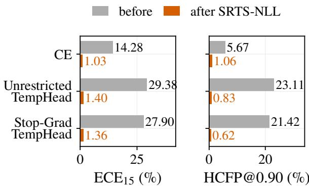  
Figure 5: Recovery case study: NLL-objective SRTS applied to a severely miscalibrated Unrestricted TempHead. Diagnostic figure generated with the SRTS-NLL ablation variant. Single-run point estimates: pre- $\mathrm { . E C E _ { 1 5 } = 2 9 . 3 8  }$ post 1.40; pre-NLL 4.253 → post 1.281; pre-HCFP@0.90 23.11 → post 0.83 (§A). Recovery uses only logit signals — no further training, no feature signals, and no access to the miscalibrated head’s learned $T ( \bar { x } )$ . This plot documents an NLL-objective diagnostic only; it is not evidence of a BCEobjective recovery run.

Two honest boundaries. First, the calibration-error gain is not a proper-score gain: on TopBCE the win rate at 250 samples is low for every adaptive method (SRTS-BCE 0.21, SMART+BCE 0.06). Second, in the boundary Tiny-ImageNet/ViT-B/16 cell (10 resamples/seed, three seeds) conditioning ofers no advantage at any budget — every conditional map is within noise of or worse than TvA-TS, and SMART+BCE is again the worst at 250 samples (2.61 vs. 1.64) — the same variance penalty without a transferable residual to ofset it. The bias–variance account therefore reads the scope map as a diference of two terms — routing gain = (structured-residual benefit) − (finite-budget variance cost) — positive on CIFAR-100/ViT-B/16 where a transferable residual dominates and non-positive on Tiny-ImageNet/ViT-B/16 where it is absent.

## Small-budget matched continuous-map test

The full-budget matched-map control (§C) leaves open whether the grouped form matters specifically when the budget is small. We therefore reran the matched continuous maps at $n { = } 2 5 0$ on the exact stored calibration draws of the budget-resampling experiment, with the methods, seeds, metrics, and inference specified before this comparison was run: the unchanged router pipeline, optimizer, knots, initialisation, and bounds, with a per-draw gate requiring refit $\mathrm { T v A - T S }$ and SRTS-BCE to reproduce the stored rows to $1 0 ^ { - 6 }$ . Table 25 reports seed→draw hierarchical CIs of SRTS-BCE minus each map. Two facts emerge. First, SRTS-BCE vs. the matched three-anchor PWLinear-3 is statistically unresolved on all three backbones (ViT [−0.19, +0.06], DeiT-S [−0.56, +0.04], Swin-T [−0.16, +0.07]; point estimates mildly favour SRTS-BCE, descriptive only). Second, the linear and spline parameterizations of the same risk score are significantly worse than SRTS-BCE on all three backbones (e.g. LinearRisk-Temp: $[ - 0 . 4 8 , - 0 . 1 2 ] , [ - 1 . 2 6 , - 0 . 4 8 ] , [ - 0 . 7 9 , - 0 . 5 2 ] )$ . Secondary metrics (AdaECE15, smECE) show no systematic reversal of these directions; TopBCE diferences are small and slightly favour the continuous maps (≈0.02– 0.03, descriptive). The small-budget evidence supports the three-level risk-conditioned family — discrete grouping or piecewise-linear interpolation between three anchors — not the piecewise-constant SRTS map specifically; SRTS-BCE remains the discrete instance we deploy, and map shape matters more than raw parameter count (the two-parameter linear map is the weakest).

<table><tr><td>Method</td><td>10%</td><td>25%</td><td>50%</td><td>100%</td></tr><tr><td>TvA-TS</td><td>1.81</td><td>1.65</td><td>1.56</td><td>1.54</td></tr><tr><td>SRTS-BCE K=3 risk</td><td>1.45</td><td>1.18</td><td>0.93</td><td>0.81</td></tr><tr><td>SMART+BCE</td><td>1.95</td><td>1.41</td><td>1.00</td><td>0.83</td></tr></table>

Table 21: BCE-objective validation-size sensitivity on ViT-B/16 / CIFAR-100. Mean $\mathrm { E C E _ { 1 5 } }$ over the three backbone seeds and five calibration-subsamples per seed. SRTS-BCE has the lowest absolute ECE at every tested fraction (10–100%), including at 10% (1.45 vs. TvA-TS 1.81, SMART+BCE 1.95). However, the absolute ECE gap relative to TvA-TS shrinks from 0.73 pp at 100% to 0.36 pp at 10%, because SRTS-BCE’s ECE worsens by 0.64 pp as budget falls from 100% to 10% while TvA-TS worsens by only 0.27 pp. TvA-TS is the most rate-stable single-parameter fallback at extreme budgets.

## Protocol-frozen cross-dataset small-budget follow-up (Tiny-ImageNet)

The budget evidence above is CIFAR-100-specific. Before any Tiny-ImageNet small-budget result was computed, we froze two replication cells — Tiny-ImageNet DeiT-S and Swin-T (200 classes, $n _ { \mathrm { v a l } } { = } 5 , 0 0 0 )$ — using only their already-reported full-budget direction in the scope map; no small-budget statistic or budget curve was inspected before freezing, and Tiny-ImageNet/ViT-B/16 (whose fullbudget gain is absent) was excluded by the same rule and remains reported as the boundary cell. The protocol is the identical budget-resampling pipeline: budgets {250, 625, 1250, 2500}, 20 stratified draws per seed with subsample RNG seed·106+budget·103+draw, unchanged fitting code and metrics, and seed→draw hierarchical bootstrap inference (B=20,000, bootstrap RNG 20260721).

Table 26 shows that the small-budget separation replicates on both frozen cells at $n { = } 2 5 0 { : } \mathrm { S R T S - T v A { - } T S }$ and SRTS − SMART+BCE exclude zero in SRTS-BCE’s favour on both backbones (DeiT-S [−1.36, −0.80] / [−0.73, −0.29]; Swin-$\mathrm { ~ T ~ } [ - 1 . 0 1 , - 0 . 5 9 ] ~ / ~ [ - 1 . 2 6 , - 0 . 5 8 \bar { ] } )$ , with $n { = } 2 5 0$ win rates against the scalar of 95% and 92%.

Tiny-ImageNet/Swin-T provides the clearest withincell capacity-control example. SMART+BCE is significantly better at the largest evaluated 2,500-sample budget ([+0.08, +0.17]; the full Tiny validation split has 5,000 samples), but the ordering reverses as the budget decreases (point estimates $+ 0 . 1 3 \stackrel { - } {  } - 0 . 0 2  - 0 . 1 6 \stackrel { - } {  } - 0 . 9 1 )$ , with SRTS-BCE significantly better at $n { = } 2 5 0$ . This rules out an interpretation based on SRTS-BCE being uniformly better for this backbone and instead supports a budget-dependent capacity trade-of; on DeiT-S the 2,500-sample comparison is a tie $( [ - 0 . 1 4 , + 0 . 0 5 ] )$ ), mirroring the CIFAR pattern. The small-budget separation replicates on Tiny-ImageNet DeiT-S and Swin-T, while ViT-B/16 remains the boundary cell; this is a two-backbone replication, not a claim of cross-dataset universality.

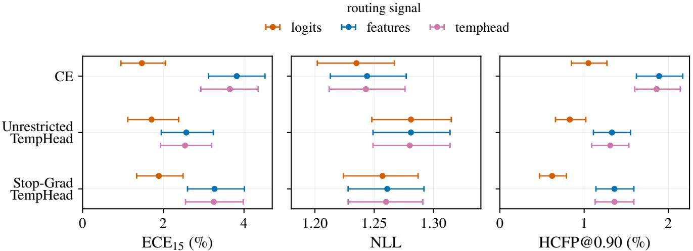  
Figure 6: Signal-routing ablation (NLL-objective diagnostic). Logits-only routing is the reliable default; feature-input routing achieves higher val risk-AUROC but regresses on test $\mathrm { E C E _ { 1 5 } }$ (controlled setting: 2.62 vs. 2.14), consistent with small-val feature-routing overfit. Routing on a Stop-Grad TempHead’s learned $T ( x )$ does not improve over scalar TS; the signal collapses to near-global scaling. The signal-input choice (logits vs. features) applies equally to SRTS-NLL and SRTS-BCE; the main text’s SRTS-BCE uses the same logits-only routing because of this diagnostic. x-axis bases: CE+Brier (CE+Brier baseline), UTempH (Unrestricted TempHead), SG-TempH (Stop-Grad TempHead).

Metric sensitivity. Using the same Table 26 predictions, seeds, and draws at $n { = } 2 5 0 .$ , we repeat both comparisons under $\mathrm { A d a E C E _ { 1 5 } }$ and the oficial smECE estimator. These alternative metrics were specified before this comparison was run. All four hierarchical CIs exclude zero in SRTS-BCE’s favour on both backbones (Table 27), so the cross-dataset separation does not depend on the 15-bin ECE estimator.

## Fitted temperatures and routing stability

Table 28 reports what can actually be inspected in a fitted SRTS-BCE calibrator. At the full budget the three group temperatures are tight across seeds (medians $0 . 6 3 / \bar { 0 } . 7 3 \bar { / } 0 .$ 84, narrow IQRs) and monotone in the routed risk index on every seed; the two router thresholds are stable; no fit touches the [0.05, 20] temperature bounds; and no group falls below the 50-sample floor that triggers the global-scalar fallback. Across all 220 calibration draws at $n { = } 2 5 0$ the picture degrades without degenerating: saturation and fallback remain at 0%, empirical risk ordering stays monotone in 93% of fits, and the noise shows up where expected — the low-risk group’s temperature becomes volatile (median 0.17, IQR [0.13, 0.73]: an almost-always-correct group supports aggressive sharpening) and strict temperature-ordering monotonicity drops to 64%. Under shift the routed occupancy moves interpretably: from roughly uniform thirds on clean test to a high-risk share that grows monotonically with severity (44% at severity 1 to 66% at severity 5) while temperatures and thresholds stay fixed.

## F Distribution Shift

## CIFAR-100-C corruption-shift evidence

This subsection collects the full numerical evidence behind the clean-to-corruption shift evaluation. The corruption sweep covers the standard CIFAR-100-C release (Hendrycks and Dietterich 2019): 19 corruptions × 5 severities × 3 seeds = 285 corruption cells per method. Calibrators are fit only on the clean CIFAR-100 validation split and applied unchanged to each (corruption, severity) cell; no calibrator parameter is updated using corruption-test data.

Table 29 reports the deployable corruption evaluation. Aggregating the same 95 (corruption, severity) cells per seed across three seeds, TvA-TS has $\mathrm { E C E } _ { 1 5 } \ \stackrel { \cdot } { = } \ 5 . 7 2 .$ , SRTS-BCE K=3 deployable rerouting 4.63, and SMART+BCE 4.75. SRTS-BCE also has the lowest severity-4–5 ECE point estimate (6.79 vs. SMART+BCE 7.03, TvA-TS 8.38) and retains a small aggregate eAURC advantage (0.0431 vs. SMART+BCE 0.0441, TvA-TS 0.0457). The corrected ECE/eAURC trade-of referenced in the main text is therefore: SRTS-BCE is competitive with SMART+BCE on clean ECE and, under deployable rerouting, attains a slightly lower CIFAR-100-C mean ECE while retaining the eAURC advantage. At the paired cell level the SRTS–SMART ECE margin excludes zero: $\Delta \ = \ - 0 . 1 2 1 8$ pp with 95% CI [−0.1695, −0.0755]. As in §J and Table 29, the full hierarchical bootstrap marginally includes zero, so the deployable CIFAR-100-C gain is treated as directional rather than two-sided significant.

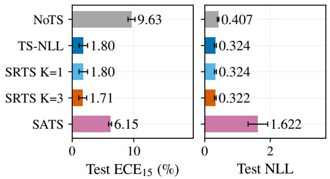  
(a) Global calibration metrics (ECE15, NLL).

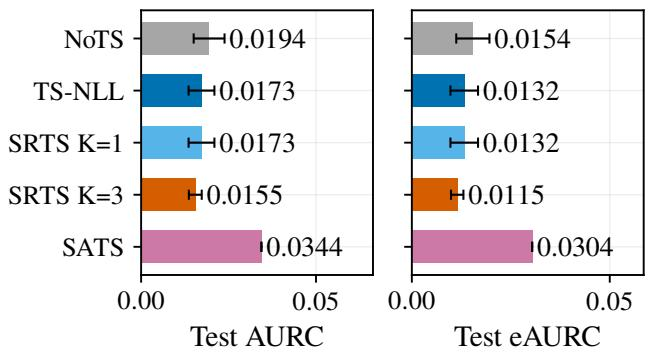  
(b) Risk-coverage metrics (AURC, eAURC).  
Figure 7: ID clean results over three modern-recipe ViT seeds (NLL-objective rows). Bars show mean ± standard deviation over seeds 0/1/2 (top-1 unchanged within each reported post-hoc seed; 3-seed mean 91.17±0.46); the SATS-Logit AURC/eAURC bars show the 3-seed mean without whiskers (per-seed spread not archived). Under the NLL objective, SRTS-NLL K=1 recovers TS-NLL and $K { = } 3$ adds only modest gain $( - 0 . 0 9 \mathrm { p p } )$ . Under the BCE objective (see the main text’s five-seed ID clean summary table and Table 4; this NLL-objective figure is an archived three-seed diagnostic), SRTS-BCE K=3 risk attains $\mathrm { E C E } _ { 1 5 } = 0 . 9 6$ (five seeds), beating TvA-TS (K=1 BCE) by 0.70 pp. SATS-Logit remains substantially worse across seeds, illustrating the validation-overfit failure mode of unrestricted adaptive temperature heads.

For completeness, the paired clean-group (nondeployable) protocol gives SRTS-BCE $\mathrm { E C E _ { 1 5 } } = 5 . 7 8 6 4 \pm$ 1.0246 (per seed: 4.9579, 7.2301, 5.1711) and severity-4–5 ECE 8.7102. Paired clean-group reuse is possible only because CIFAR-100-C provides corruptions paired with clean CIFAR-100 test images. It is not the deployable protocol and is reported only as a diagnostic. The main text uses deployable rerouting from corrupted logits.

Test-side re-quantization ablation (why clean-anchored thresholds matter). A natural alternative to the deployed protocol is to keep the clean-fitted temperatures but requantize the K=3 group thresholds on each corruption cell’s own risk-score distribution (label-free, per-cell batch), restoring equal group occupancy under shift. This hurts, and monotonically more with severity: aggregate $\mathrm { E C E _ { 1 5 } }$ degrades from 4.63 ± 0.84 (deployed) to 5.73 ± 1.08 (re-quantized), with the severity-5 mean rising from 7.99 to 10.30 (+2.31 pp); eAURC also worsens slightly $( 0 . 0 4 3 1  0 . 0 4 3 4 )$ . The absolute clean-anchored thresholds are therefore doing the work under shift: letting shifted samples flood the high-risk group (≈62% at severity 5; Figure 15) is the correct adaptation, because the absolute risk score carries cross-distribution information that relative (per-batch quantile) re-grouping destroys.

## Deployment-facing selective metrics

From the cached calibrated probabilities we compute two deployment-facing metric families (Table 30): HCFP@t, the fraction of wrong predictions that are confidently wrong (confidence ≥t), and selective risk at fixed coverage. This table uses all five training seeds on both clean CIFAR-100 and CIFAR-100-C; the decision-threshold and matchedcoverage analyses below (Tables 31 and 32) use the first three seeds on CIFAR-100-C, the subset fixed when those protocols were specified. The two tell diferent stories. On both clean CIFAR-100 and CIFAR-100-C, SRTS-BCE and SMART+BCE substantially reduce the confidently-wrong rate relative to scalar TvA-TS (clean HCFP@0.95 7.95/9.56 vs. 12.00; shift 5.35/6.44 vs. 7.97), SRTS-BCE lowest. Selective risk at 80/90/95% coverage, however, is empirically nearly identical across the three methods (diferences from TvA-TS at most 0.04 pp on clean data and 0.03 pp on CIFAR-100-C). Argmax preservation does not imply preservation of the cross-sample confidence ranking: SRTS-BCE and SMART+BCE apply diferent temperatures to diferent samples and can reorder confidences across samples, and the lower AURC in Table 32 reflects these small ranking changes accumulated over the full risk–coverage curve. At the three reported coverages the gain is a top-label calibration refinement — fewer confidently-wrong predictions not a reduction in selective risk.

Confidence-threshold deployment. At the pre-specified thresholds t ∈ {0.80, 0.90, 0.95} (fixed before inspecting results; Table 31), SRTS-BCE reduces the nominal-vs-realized confidence gap relative to scalar TvA-TS at two of the three thresholds on clean data (|+0.17| vs. |+0.35| at 0.80; |+0.04| vs. |−0.50| at 0.95) and at two of three under CIFAR-100- C (+2.51 vs. +3.56 at 0.80; +1.95 vs. +2.35 at 0.90; tied at 0.95), without worsening retained error — at t = 0.95 on clean data it also has the lowest retained error (1.06% at 67.8% coverage). Its retained coverage is 3–5 pp below the scalar’s (cooler temperatures retain fewer predictions), so the fixed-threshold comparison confounds alignment with coverage; the matched-coverage control below removes the confound. Throughout, this is framed as generic thresholdbased decision utility not abstention quality.

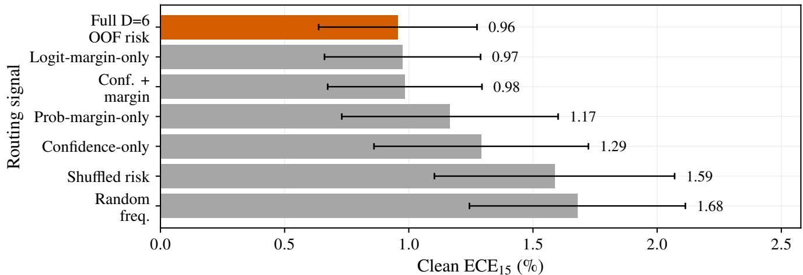  
Figure 8: Motivating diagnostics for risk-conditioned scaling (clean CIFAR-100 / ViT-B/16; five seeds). (a) At matched 1scalar-TvA confidence, empirical accuracy difers across OOF-risk groups, exposing residual heterogeneity hidden by a global confidence value. (b) Scalar TvA-TS leaves the largest residual in the high-risk group, while the fitted group temperatures difer across risk levels. (c) The five-seed K-ablation illustrates the capacity trade-of: $K { = } 1$ underfits, $K { = } 3$ captures most of the gain, and larger K provides no stable additional benefit. These diagnostics motivate risk conditioning but do not establish a unique advantage for the six-signal router or the piecewise-constant map.

Matched-coverage control. Evaluating every method at the same reference coverages (TvA-TS’s coverage at each prespecified threshold; Table 32), the pattern survives coverage matching: retained risk remains closely matched to TvA-TS — a maximum excess of 0.03 pp across the six matched points on the un-rounded values (no non-inferiority margin was pre-specified, so we report the raw maximum we do not claim uniform non-inferiority) — and is lower at the t=0.95 reference coverage on both settings, the absolute nominal-vsrealized gap remains smaller than the scalar’s at two of the three matched coverages on both clean and shifted data, and the coverage-free AURC is lowest for SRTS-BCE on both settings (clean 15.49 vs. 18.38 scalar and 18.80 HTS-BCE; CIFAR-100-C 62.24 vs. 65.29 and $6 5 . 7 7 , \times 1 0 ^ { 3 } )$ . For a target coverage c over N test samples, samples are sorted by calibrated confidence (deterministic stable sort) and retained risk and confidence gap are computed on the top-k retained set with $k = \mathrm { r o u n d } ( c N )$ , i.e. at the nearest attainable coverage $k / N ;$ no interpolation between adjacent coverage points is applied.

## Where deployable rerouting helps, and why

The aggregate CIFAR-100-C gain hides strong percorruption structure that sharpens the mechanism. We compute, for each of the 19 corruptions, the routing gain of SRTS-BCE over scalar TvA-TS (mean $\mathrm { E C E _ { 1 5 } }$ over five severities and three seeds). The gain is not uniform: it ranges from +3.47 pp (glass blur) to −2.20 pp (impulse noise). Rerouting is therefore a conditional benefit, not a fixed ofset.

The gain tracks how far the corruption pushes the model from the clean regime. The per-corruption gain anti-correlates with the per-corruption miscalibration magnitude, measured as NoTS $\mathrm { E C E _ { 1 5 } } \mathrm { : }$ Spearman $\rho = - 0 . 6 8$ $( p = 0 . 0 0 1 ; \mathrm { F i g u r e } 1 9 )$ . The router is fit once on clean validation logits; under a mild corruption the clean risk ranking still transfers and routing recovers structured residual, whereas under the most severe corruptions (NoTS $\mathrm { E C E _ { 1 5 } > 1 2 ) }$ the logit distribution leaves the clean regime, the clean-fitted risk signal degrades, and the group temperatures no longer match the shifted residual. This is the corruption-axis image of the bias–variance boundary in the main Method: riskconditioned scaling helps while the risk signal remains informative and washes out once it does not.

The benefit is a property of the router, not the baseline. The per-corruption gain measured against TvA-TS and the gain measured against SMART+BCE agree almost exactly (Spearman $\rho = 0 . 9 6 )$ , and SRTS-BCE has the lower $\mathrm { E C E _ { 1 5 } }$ than both peers on 12 of 19 corruptions. The corruptions where it helps least are the same regardless of which scalaror-adaptive peer we compare to, so the heterogeneity reflects transferability of the clean risk signal rather than an artifact of one baseline.

## ConvNet CIFAR-100-C Deployable Rerouting

We repeat the deployable shift evaluation on the two ConvNet scope-check models (ResNet-50 and RegNetY-1.6GF; same frozen recipe, fit on clean validation only, each corrupted sample rerouted from its own logits through the clean-fitted router and clean-validation thresholds). Table 33 reports the results.

Deployable rerouting again improves clearly over scalar TvA-TS on both ConvNets (−4.44 pp for ResNet-50 and −2.16 pp for RegNetY-1.6GF), but the SRTS-BCE/SMART+BCE ordering is backbone-dependent, with bootstrap-supported wins in opposite directions (Table 33, last row). We therefore do not claim that SRTS-BCE beats SMART+BCE across ConvNets; the split refines the regime map.

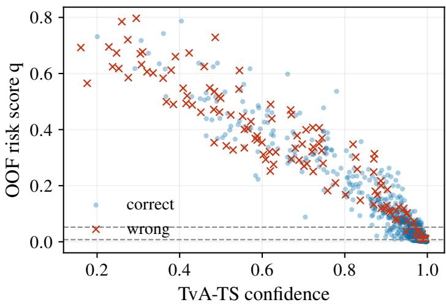

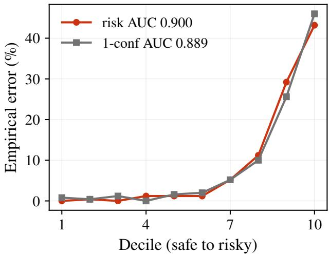  
Figure 9: OOF risk vs. confidence (clean CIFAR-100 / ViT-B/16, seed 0). (a) The OOF risk score is tightly coupled to 1confidence; (b) it is a monotone reliability ordering with only a modest incremental edge over confidence at ranking errors (AUROC 0.900 vs. 0.889). We do not claim a strong risk-beyond-confidence separation from this view; the incremental value of the full six-signal router is better quantified by the routing-signal ablation (Table 17).

On ResNet-50, clean-fitted scalar temperatures are harmful under corruption shift: TS-NLL and TvA-TS are worse than NoTS. Routed methods reduce this failure mode on average, but no fit-on-clean calibrator is uniformly safe under all corruptions. This supports the regime-map framing.

The shift mechanism matches the ViT-family result: the high-risk group share increases from approximately one third on clean data to 69% on ResNet-50 and 72% on RegNetY at severity 5.

## Generated Tiny-C and CIFAR-10-C Collapse-Regime Diagnostics

We additionally evaluate two further corruption suites from cached logits, reported as diagnostics only. The Tiny-ImageNet suite uses generated ImageNet-C-style corruptions (Hendrycks and Dietterich 2019) of the clean Tiny validation images (a per-seed generation cache), not the oficial Tiny-ImageNet-C release. Under these generated corruptions all methods are in a severe collapse regime, with $\mathrm { E C E _ { 1 5 } }$ above 60% for every calibrator; this is a stress test of within-collapse ordering only, not a main result. Within that regime the ordering is consistent across all three backbones (SRTS-BCE < SMART+BCE < TvA-$\mathrm { T S } < \mathrm { T S } { \mathrm { - N L L } } )$ , and the cell-level SRTS−SMART deltas are bootstrap-supported: $\mathrm { V i T - 0 . 6 8 \ : [ - 0 . 7 5 , - 0 . 6 2 ] }$ , DeiT-S $- 0 . 5 1 \left[ - 0 . { \bar { 5 } } 7 , { \bar { - } } { \bar { 0 } } . 4 5 \right]$ , and $\operatorname { S w i n - T } - 0 . 5 4 \ : [ - 0 . 5 9 , \dot { - } 0 . 4 9 ]$

On CIFAR-10-C (oficial release, ViT-B/16, three seeds), the outcome is a tie: SRTS-BCE 3.00 vs. SMART+BCE 3.20 aggregate $\mathrm { E C E _ { 1 5 } }$ , with the cell-level CI crossing zero $( [ - 0 . 5 \bar { 5 } , + \bar { 0 } . 1 4 ] )$ .

## ImageNet-C, ImageNet-Sketch, and ImageNet-scale boundaries

This subsection documents the second corruption-shift dataset: an evaluation-only ImageNet-C sweep using the pretrained ViT-B/16 checkpoint (ImageNet-21k → ImageNet-1k head; no fine-tuning). The sweep covers 75 cells = the 15 main ImageNet-C corruptions (Hendrycks and Dietterich $2 0 1 9 ) \times 5$ severities, 50,000 images per cell.

Calibration protocol. All four post-hoc methods are fit once on a deterministic 5,000-sample stratified-first-5-perclass calibration subset of the clean ImageNet-1K validation set, and applied unchanged to each of the 75 corruption-test cells and to the remaining 45,000-sample held-out clean eval subset. No calibrator parameter is updated using ImageNet-C data.

Three findings (single seed; NLL-objective rows; no statistical-significance claim). (i) The $K { = } 1 \ \equiv$ scalar-TS identity holds across all 75 IN-C cells under NLL. (ii) SATS-Logit val-overfit amplifies under IN-C shift. (iii) Under the NLL objective, K=3 does not win over K=1 on this base. The strong pretrained ImageNet-1K head has clean $\mathrm { E C E _ { 1 5 } } \approx 1 . 0 \%$ and fitted scalar $T \approx 0 . 9 8 ;$ on this wellcalibrated base the NLL-objective routing gain disappears. The BCE-objective extension is reported in §F: on the same pretrained base, TvA-TS (K=1 BCE) achieves the lowest ECE (2.47) and SRTS-BCE/SMART+BCE ofer no improvement, confirming the routing benefit is specific to fine-tuned small-validation settings.

Calibration-subset resampling. Table 35 reports $B = 1 0$ resamples for the NLL-objective rows. Each resample draws a stratified first-5-per-class subset (5,000 samples) from the 50,000-sample IN-1K validation pool, fits one calibrator, and evaluates it unchanged on each of the 75 IN-C cells. The resampling budget is small because each resample refits the calibrators and re-evaluates the full 75-cell sweep at 50,000 images per cell, so the resulting intervals are correspondingly coarse and this sweep is treated as a diagnostic. The resampling confirms the ImageNet-C result: under NLL, K=3 does not beat K=1; SATS-Logit val-overfit persists under resampling.

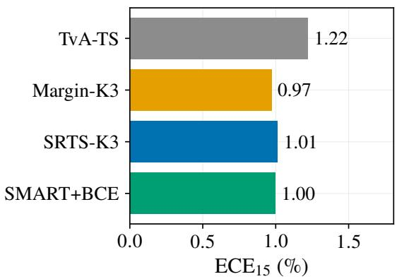

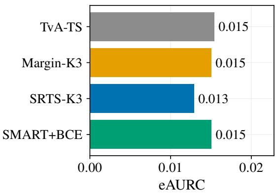  
Figure 10: High-margin CIFAR-100-C aggregate diagnostic. Within the high-margin tertile, margin routing matches SRTS on $\mathrm { E C E _ { 1 5 } }$ , while SRTS retains the lower eAURC. This 3-seed corruption-test diagnostic averages the full ${ \mathrm { 1 9 \times 5 } } \ { \mathrm { C I F A R - } }$ 100-C protocol inside the high-margin subset: margin tertiles are fixed on clean validation, temperatures/routers are fit on clean validation only, and SRTS uses deployable rerouting from each corrupted sample’s own logits. No corrupted labels or oracle routing are used; the panel is intended for within-tertile mechanism comparison, not as a replacement for the aggregate main-paper metrics.

Large-scale OOD: ImageNet-Sketch. As a second largescale probe we evaluate the pretrained ViT-B/16 on ImageNet-Sketch (50,889 hand-drawn-sketch images over the 1000 ImageNet classes; a severe distribution shift, top-1 16.3%). Because ImageNet-1K images are not available on our cluster to build a matched clean-validation split, we use an in-domain protocol: a stratified 2,500-sample Sketch validation subset fits each calibrator, and the remaining 48,389 images are the test set (three random splits; mean ± std). This tests the low-capacity small-budget regime on a new largescale distribution not a clean-to-shift transfer. The uncalibrated model is badly miscalibrated $( \mathrm { N o T S E C E 1 5 } = 1 4 . 9 9 ) ;$ post-hoc calibration recovers it, and SRTS-BCE attains the lowest $\mathrm { E C E } _ { 1 5 } ~ ( 1 . 4 1 \pm 0 . 0 6 )$ , narrowly ahead of TvA-TS $( 1 . 4 4 \pm 0 . 0 3 )$ and well ahead of TS-NLL $( 1 . 8 8 \pm 0 . 2 6 ) $ and SMART+BCE $( 2 . 2 1 \pm 0 . 2 4 )$ . As on clean pretrained ImageNet, the routing gain over scalar TvA-TS is small (0.03 pp): the pretrained head leaves little structured residual for the router, consistent with the boundary of the routing regime. On eAURC SMART+BCE is marginally best (0.0945 vs. SRTS-BCE 0.0983).

ImageNet-scale fine-tuned calibration: ImageNet-100, three backbones. The probes above (ImageNet-C, Sketch) are the pretrained regime; to test the paper’s fine-tuned regime at ImageNet scale we fine-tune ViT-B/16, DeiT-S, and Swin-T on ImageNet-100 (a 100-class ImageNet subset; 126,689 training images; three seeds each, identical recipe), calibrate on a ≈2,500-sample clean-validation split, and evaluate on held-out clean test and on real ImageNet-C restricted to the 100 classes (15 corruptions ×5 severities, deployable rerouting). Table 36 reports the outcome, which refines the boundary of the regime map. On clean IN-100 the scalar (TvA-TS), SMART+BCE and SRTS-BCE calibrators are statistically indistinguishable: all land between 1.55 and $2 . 0 0 \ \mathrm { E C E _ { 1 5 } }$ and within seed variance of one another on every backbone (TvA-TS / SMART+BCE / SRTS-BCE: ViT-B/16 1.58/1.55/1.64, DeiT-S 1.83/1.74/2.00, Swin-T 1.70/1.67/1.72). SMART+BCE is stable across seeds and competitive, not unstable. Risk conditioning therefore yields no routing advantage at this fine-tuned-but-large scale: the calibration residual is again largely a single scale factor, so low-capacity routing adds nothing here, and the ordering among these sub-2-pp calibrators is backbone-dependent and within seed variance — an ImageNet-scale boundary of the regime map, not a contradiction of it. We report clean IN-100 here; corruption-shift evidence is drawn from CIFAR-100-C and pretrained ImageNet-C.

Pretrained ImageNet-1K clean calibration (four backbones). Complementing the fine-tuned IN-100 result, Table 37 calibrates four of-the-shelf ImageNet-1K backbones (no fine-tuning) on the 50,000-image validation set with the canonical pipeline; all reported values use this pipeline, and provenance checks are included with the released artifacts. On these well-trained heads the calibration residual is small but not zero: the low-capacity BCE calibrators give a small clean improvement over scalar TvA-TS on three of four backbones (SMART+BCE lowest on ResNet-50 and ViT-B/16, SRTS-BCE lowest on Swin-B; TvA-TS best only on the already well-calibrated EficientNet-B0). Even a pretrained head carries a modest structured residual that conditioning can exploit in-distribution; what does not transfer is the shift case: the clean-fitted router gives no gain under ImageNet-C (§F, TvA-TS best), so the pretrained boundary in the regime map is specific to distribution shift, not to clean

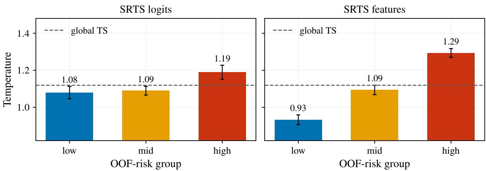  
Figure 11: Per-group temperatures learned by SRTS variants (NLL-objective diagnostic). Under NLL fitting, SRTS-NLL 1group temperatures cluster tightly around the global-TS value. Under BCE fitting (Table 4, §B), the per-group temperature spread is substantially larger (range 0.6–0.9 on seed 0 vs. TvA-TS single $T \approx 0 . 7 6 )$ , which is consistent with the BCE-objective $\bar { K } { = } 3$ risk router achieving the 0.73 pp gain over TvA-TS.

in-distribution calibration.

## BCE-objective ImageNet-C evaluation

Table 38 reports our BCE-objective ImageNet-C evaluation (B=10 calibration-subset resamples, 5,000-sample IN-1K cal subset, 75 cells).

The key finding is qualitatively diferent from the CIFAR-100 result: on the pretrained IN-1K ViT-B/16, TvA-TS (K=1 BCE) achieves the lowest ECE $( 2 . 4 7 \pm 0 . 0 8 )$ and lowest severity-4–5 ECE $( 3 . 4 8 \pm 0 . 1 2 )$ ; SRTS-BCE and SMART+BCE are comparable to each other $( 2 . 5 6 \pm 0 . 2 3$ and $2 . 5 6 \pm 0 . 2 6 )$ but ofer no improvement over TvA-TS. TS-NLL worsens ECE relative to NoTS (2.99 vs. 2.60), indicating the pretrained model is already near-calibrated under NLL and a scalar NLL temperature miscalibrates it.

The contrast with fine-tuned CIFAR-100 (where SRTS-BCE reduces ECE from 1.65 to 0.96 relative to TvA-TS) is that here, under shift, the clean-fitted router transfers no benefit: on the pretrained IN-1K ViT-B/16 the ImageNet-C ordering is TvA-TS best, SRTS-BCE and SMART+BCE ofering no improvement. This is a shift-transfer boundary, not a claim that routing is useless on pretrained heads — on clean in-distribution IN-1K the same low-capacity BCE calibrators do give a small improvement over TvA-TS (Table 37). The regime map’s pretrained boundary is therefore specifically about distribution shift: TvA-TS is the best-performing BCE-objective calibrator on pretrained ImageNet heads under corruption.

## Natural-shift boundary: ImageNet-R and ImageNet-A

We close the shift evidence with two natural distribution shifts on the same pretrained ViT-B/16: ImageNet-R (30,000 renditions, 200 classes) and ImageNet-A (7,500 natural adversarial examples, 200 classes). For each variant the label space is restricted to its class subset (logit columns masked before any fitting or evaluation); calibrators are fit on a clean ImageNet validation draw restricted to the same subset (five images per class, ≈1,000 samples — inside the paper’s smallbudget regime) and applied unchanged to the shifted test set. We report three calibration draws (one deterministic fiveper-class split and two stratified random draws) and paired test-image bootstraps $( B { = } 2 0 , 0 0 0 )$

Table 40 shows the strongest form of the pretrainedboundary result. (i) Every clean-fitted calibrator worsens both $\mathrm { E C E _ { 1 5 } }$ and the proper score relative to the uncalibrated model, on both variants: the clean draw fits a sharpening temperature $( T \approx 0 . 9 2 – 0 . 9 6 < 1 )$ because the pretrained model is slightly under-confident on clean data, while under natural shift the same model is over-confident, so the clean-fitted temperature transfers with the wrong sign. (ii) Among the calibrators, scalar TvA-TS has the lower mean ECE among the BCE calibrators on both variants (paired $\Delta = \mathrm { S R T S - B C E }$ − TvA-TS: +0.66 [+0.65, +0.66] on ImageNet-R, +1.40 $[ + 1 . 3 7 , + 1 . 4 2 ]$ on ImageNet-A). These conditional testimage bootstraps exclude zero but do not model calibrationdraw variability; Table 40 therefore reports the across-draw dispersion as the primary uncertainty view. (iii) The conditioned maps are additionally unstable across calibration draws at this budget (e.g. SMART+BCE std 3.8 ECE points on ImageNet-R; on some draws the low-risk group temperatures collapse to ≈0.2). (iv) $\mathrm { E C E _ { 1 5 } }$ and $\mathrm { A d a E C E _ { 1 5 } }$ coincide exactly on these test sets because the shifted model is overconfident in every confidence bin, so any binning reduces to the mean confidence–accuracy gap. The scope-map entry for this regime is therefore that no clean-fitted calibrator in the comparison improves on the uncalibrated model, and scalar TvA-TS is the least harmful among them; QaTS-BCE partially escapes on ImageNet-R (its rank-based quantile map is flatter and sharpens less) but not on ImageNet-A, and remains

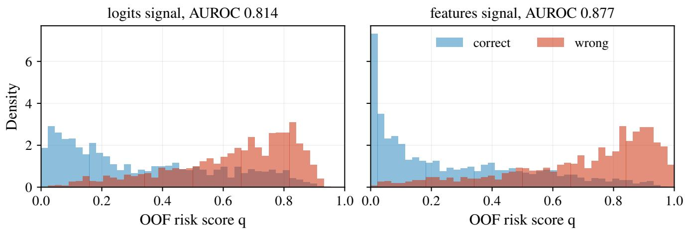  
Figure 12: Risk-score density by variant: correct vs. wrong predictions. Logit-derived signals separate correct from wrong 1predictions on the validation out-of-fold split. Under NLL fitting, stronger separation does not translate to lower test-side ECE15 (§ B, NLL block); under BCE fitting, the same separation is exploited to achieve the 0.73 pp improvement over TvA-TS (§ B, BCE block).

## worse than not calibrating.

The positive regime transfers: ImageNet-V2 on the finetuned IN-100 models. The reversal above is a property of the pretrained model, not of natural shift itself. Evaluating the nine fine-tuned ImageNet-100 models (ViT-B/16, DeiT-S, Swin-T × three seeds) on ImageNet-V2 restricted to the same 100 classes (10 images per class), with every calibrator fit only on the clean IN-100 calibration half and applied unchanged, calibration clearly helps: NoTS ECE 8.4–10.1 falls to 2.9–3.9 for the BCEobjective family. To separate the objective efect from the capacity efect we hold capacity fixed on each axis. At fixed scalar capacity, the BCE objective improves over NLL on all three backbones (TvA-TS − TS-NLL: −0.71 [−1.30, −0.10] ViT-B/16, −1.52 [−2.13, −0.85] DeiT-S, −0.74 [−1.33, −0.11] Swin-T; every CI excludes zero), and at fixed routed capacity it likewise improves (SRTS-BCE − SRTS-NLL: −0.95 [−1.53, −0.34], −1.57 [−2.24, −0.82], −0.68 [−1.27, −0.06]; every CI excludes zero). The capacity efect is separate and unresolved: SRTS-BCE − TvA-TS is −0.27 [−0.76, +0.23] (ViT-B/16), −0.15 [−0.82, +0.55] (DeiT-S), +0.20 [−0.29, +0.68] (Swin-T), all crossing zero at this test size (1,000 images). ImageNet-V2 therefore supports the objective axis but not an independent routing advantage: objective alignment transfers to natural shift, the additional value of routing remains unresolved.

## G Cross-Backbone Scope

Table 41 summarises the per-regime outcome across every setting in the paper; the subsections give the per-dataset evidence.

## Backbone generalisation: DeiT-S and Swin-T

This subsection extends the post-hoc calibration evaluation to DeiT-S/16 and Swin-T under the same modern fine-tuning recipe as the ID clean evaluation. Three independent seed are reported for each backbone.

Observations (NLL-objective rows). The NLL-objective block of Table 42 reports three backbone-level observations. First, SRTS-NLL K=1 reproduces scalar TS-NLL on every backbone to the precision reported. Second, SATS-Logit exhibits the validation-overfit failure mode on DeiT-S and Swin-T, and the feature-input adaptive heads regress even more strongly. Third, SRTS-NLL K=3 remains within close range of TS-NLL on each backbone, with directionally consistent but small improvements.

BCE-objective backbones. The BCE rows in Table 42 show that on CIFAR-100 DeiT-S and Swin-T (3 seeds each), TvA-TS is weaker than on ViT-B/16 (ECE 3.37/2.87 vs. 1.54), while SRTS-BCE K=3 risk remains below 1.05 on both (0.94 DeiT-S, 1.04 Swin-T). SMART+BCE lies between TvA-TS and SRTS-BCE (1.17/1.13). Per-seed counts: SRTS-BCE has a lower point-estimate ECE than TvA-TS on all 3 seeds of both DeiT-S and Swin-T; SRTS-BCE has a lower point-estimate ECE than SMART+BCE on all 3 seeds of DeiT-S and Swin-T (no within-seed bootstrap was run for these backbones; the diferences are larger than on ViT-B/16 and consistent across seeds). The fixed-K=3 cross-backbone summary table in the main text captures these CIFAR-100 comparisons together with the Tiny-ImageNet extension below.

Table 43 reports the top-1 check; no reported post-hoc row changes top-1 relative to the corresponding NoTS seed.

Tiny-ImageNet extension. Section G reported that on Tiny-ImageNet/ViT-B/16, SMART+BCE leads SRTS-BCE on all 3 seeds — the reverse of the CIFAR-100/ViT B/16 ordering. Repeating the same post-hoc suite on Tiny-ImageNet/DeiT-S and Tiny-ImageNet/Swin-T (3 seeds each, identical protocol) shows this flip is backbone-dependent, not a clean dataset-level efect:

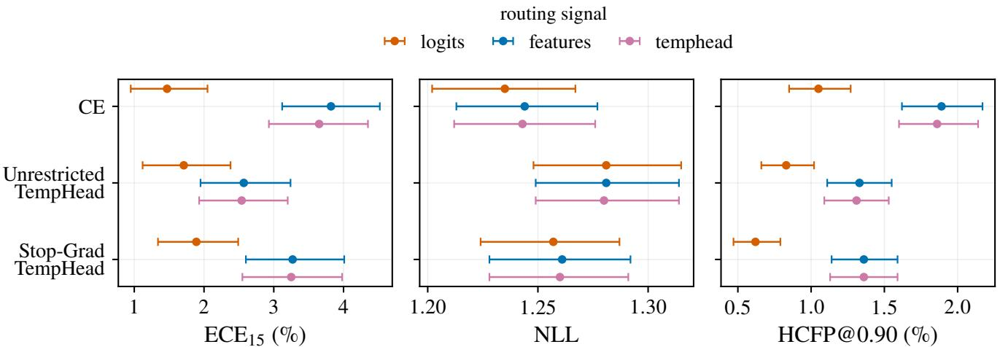  
Figure 13: Bootstrap 95% CIs across signal-routing variants (NLL-objective diagnostic; $B { = } 1 0 0 0 ,$ , values as in Table 12). 1On NLL the three signal variants are indistinguishable (near-complete CI overlap), whereas on ECE15 and HCFP@0.90 the logit-input variant is clearly preferable (CIs disjoint from the feature/temphead variants on the CE and Stop-Grad bases); logit input routing is the chosen default for the main paper’s SRTS-BCE method on these overfitting-safety grounds.

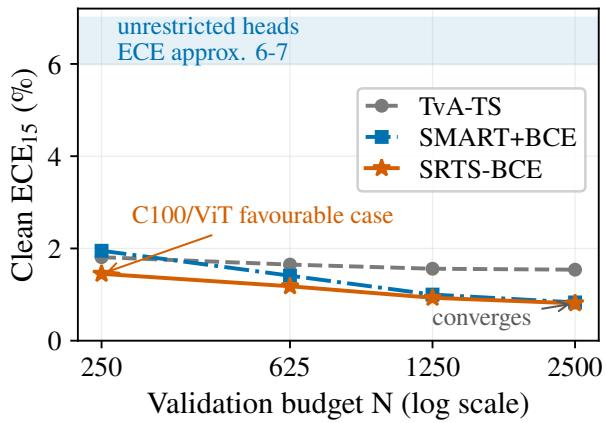  
Figure 14: Validation-budget trade-of on CIFAR-100 / 1ViT-B/16 (companion plot to Table 21). SRTS-BCE has the lowest ECE at the smallest validation budget and converges with SMART+BCE at the full budget, while unrestricted adaptive heads remain poorly calibrated across budgets. This supports the fixed low-capacity routing design under small validation budgets.

Table 44 shows SMART+BCE again leads on Swin-T (1.03 ± 0.32 vs. SRTS-BCE 1.24 ± 0.11, 2/3 seeds), while SRTS-BCE retains a narrow mean edge on DeiT-S (1.09 ± 0.28 vs. SMART+BCE 1.12 ± 0.30, 2/3 seeds). The NLLobjective block reproduces the same two qualitative findings as the CIFAR-100 backbones and the Tiny-ImageNet/ViT-B/16 base: SRTS-NLL K=1 reproduces scalar TS-NLL to the precision reported, and the unrestricted feature-input adaptive heads (SATS-Logit, LTS-feature, Feature-SATS, Frozen-feature UTempH) regress well above NoTS on both backbones. Across all nine cross-backbone×dataset cells now available in the fixed-K=3 clean suite (three CIFAR-100, three CIFAR-10, and three Tiny-ImageNet backbones), SRTS-BCE has the lower point-estimate mean ECE in five and SMART+BCE in four. This supports the regimedependent scope map not a dataset-level rule: fine-tuned CIFAR-100 favours SRTS-BCE, while clean CIFAR-10 and Tiny-ImageNet require backbone-level selection between SRTS-BCE and SMART+BCE.

Relationship to the main-text table, and the oracle best-K diagnostic. The main-text cross-backbone summary reports SRTS-BCE at the fixed K=3 everywhere, with no test-set metric used for model or K selection. For completeness we provide the corresponding oracle best-K diagnostic in Table 47, which selects, per cell, the lowest-ECE K ∈ {1, 2, 3, 5, 10, 15, 20} using the test metric. This is a diagnostic upper bound on what risk routing can achieve and is not used for any main-text claim: it is separate from the deployed, selection-free fixed-K=3 table above and from the compact main-text scope map. The gap between oracle and fixed-K=3 tables quantifies the headroom that a reliable K-selection rule would unlock at larger validation budgets (§H).

## CIFAR-10 clean calibration (stability check)

This subsection is a clean-data stability check on a seconddataset ViT-B/16 fine-tune using the main modern finetuning recipe.

Table 48 confirms the NLL-objective K=1 short-circuit identity on a third independent dataset. Under NLL, K=3 over K=1 on clean CIFAR-10 is a wash. The threeseed BCE-objective CIFAR-10 stability rows (fixed K=3, same protocol as the main cross-regime table; ECE15 mean±std) are: ViT-B/16 — TS-NLL 0.55±0.07, TvA-TS 0.52±0.03, SMART+BCE 0.38±0.06, SRTS-BCE

Table 22: Calibration-budget resampling on CIFAR-100 $/ \mathrm { V i T } { \cdot } \mathrm { B } / 1 6 ( \mathrm { E C E } _ { 1 5 } \ \% )$ . Each calibrator is fit on 20 stratified calibration subsamples per training seed (five seeds; the 2500 row is the full split, no resampling variance). SD: standard deviation over calibration resamples. CI: draw-level bootstrap 95% interval of the paired mean diference vs. TvA-TS (negative favours the method); descriptive only — seed-level inference is in Table 23. Win: fraction of resamples with lower $\mathrm { E C E _ { 1 5 } }$ than TvA-TS.
<table><tr><td>Budget Method</td><td></td><td>Mean SD</td><td>Paired CI vs TvA</td><td>Win</td></tr><tr><td>250</td><td>TvA-TS Margin-K3</td><td>1.96 0.72 1.55 0.64</td><td>[−0.53, -0.28]</td><td>77%</td></tr><tr><td></td><td>SMART+BCE SRTS-BCE</td><td>2.03 0.72 1.60 0.70</td><td>[−0.06, +0.23] [−0.48, −0.23]</td><td>47% 81%</td></tr><tr><td>625</td><td>TvA-TS</td><td>1.81 0.62</td><td></td><td></td></tr><tr><td></td><td>Margin-K3</td><td>1.24 0.53</td><td>[−0.66, −0.47]</td><td>86%</td></tr><tr><td></td><td>SMART+BCE</td><td>1.43 0.50</td><td>[−0.48, −0.28]</td><td>76%</td></tr><tr><td></td><td>SRTS-BCE</td><td>1.23 0.53</td><td>[−0.68, −0.49]</td><td>89%</td></tr><tr><td>1250</td><td></td><td></td><td></td><td></td></tr><tr><td></td><td>TvA-TS</td><td>1.75 0.55</td><td></td><td></td></tr><tr><td></td><td>Margin-K3</td><td>1.11 0.46</td><td>[−0.70, -0.58]</td><td>99%</td></tr><tr><td></td><td>SMART+BCE</td><td>1.18 0.45</td><td>[−0.63, −0.50]</td><td>93%</td></tr><tr><td></td><td>SRTS-BCE</td><td>1.12 0.46</td><td>[−0.69, -0.57]</td><td>98%</td></tr><tr><td>2500</td><td></td><td></td><td></td><td></td></tr><tr><td></td><td>TvA-TS</td><td>1.65 0.44</td><td></td><td></td></tr><tr><td></td><td>Margin-K3</td><td>0.970.32</td><td>[−0.82, −0.56]</td><td>100%</td></tr><tr><td></td><td>SMART+BCE</td><td>0.950.29</td><td>[−0.87, -0.53]</td><td>100%</td></tr><tr><td></td><td>SRTS-BCE</td><td>0.960.32</td><td>[−0.84, −0.55]</td><td>100%</td></tr></table>

$0 . 4 7 \pm 0 . 0 5 ; \mathrm { D e i T - S } - 0 . 4 9 \pm 0 . 0 4 , 0 . 4 6 \pm 0 . 0 4 , 0 . 4 4 \pm 0 . 1 0 ,$ $\mathbf { 0 . 4 1 } \pm \mathbf { 0 . 0 7 } ; \mathrm { { S w i n } \mathrm { { - } \mathbf { 0 . 4 4 } \pm 0 . 0 5 , 0 . 3 9 } \pm 0 . 0 8 , \mathbf { 0 . 2 9 } \pm \mathbf { 0 . 0 6 } } ,$ $0 . 3 5 { \pm } 0 . 1 1$ . SMART+BCE leads ViT-B/16 and Swin-T, while SRTS-BCE leads DeiT-S. The two CIFAR-10 ConvNet cells (ResNet-50, RegNetY-1.6GF; the main text’s scope map) replicate the transformer pattern: SMART-SoftECE has the lowest $\mathrm { E C E _ { 1 5 } ~ ( 0 . 3 2 \pm 0 . 1 3 , ~ 0 . 4 0 \pm 0 . 0 7 ) }$ but the worst and least stable $\mathrm { A d a E C E _ { 1 5 } \ ( 1 . 3 7 \pm 0 . 7 5 , 1 . 2 8 \pm 0 . 7 9 ) }$ while SRTS-BCE has the lowest AdaECE15 (0.99±0.11, $0 . 5 7 { \pm } 0 . 0 3 )$ . The pattern is consistent with the SoftECE objective fitting the equal-width binning it optimises: its ECE15 lead does not survive adaptive binning. CIFAR-10 is therefore used only as a near-saturated stability check, not as a main contribution or corruption-shift claim.

## Tiny-ImageNet clean calibration

This subsection extends the clean-data evidence to 200-class Tiny-ImageNet under the same modern fine-tuning recipe. Three independent seeds are reported.

Table 49 reports both the NLL-objective diagnostics and the BCE-objective confirmation rows. Under NLL, TS-NLL and SRTS-NLL K=1 are identical to four decimal places, SRTS-NLL K=3 is a wash on $\mathrm { E C E _ { 1 5 } }$ , and unrestricted adaptive heads regress. Under BCE on the same three seeds, TvA-TS has $\mathrm { E C E _ { 1 5 } ^ { - } = 1 . 2 6 \pm 0 . 1 8 , S R T S { \cdot } B C E \ : K = 3 }$ risk 1.12 ± 0.17, SMART+BCE 0.97 ± 0.22, with SMART+BCE leading SRTS-BCE on all 3 seeds. The TinyIN/ViT-B/16 ECE ordering SMART+BCE < SRTS-BCE < TvA-TS flips the CIFAR-100 ViT-B/16 ordering. §G extends this comparison to DeiT-S and Swin-T on Tiny-ImageNet and shows the flip is backbone-dependent, not a clean dataset-level efect; we discuss the implications in the main text Limitations and §H below.

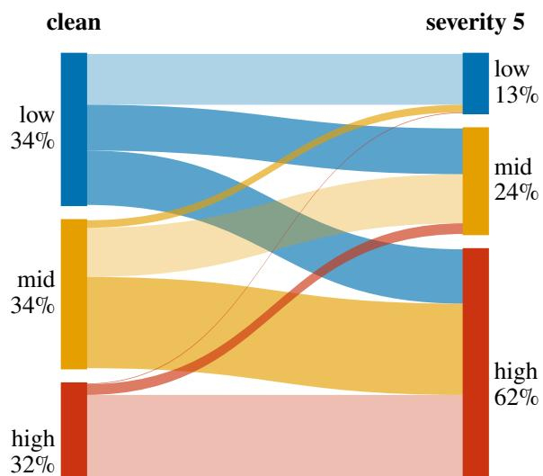  
Figure 15: Corruption risk-flow diagnostic (clean → 1severity-5). Flow of samples between OOF risk tertiles from clean CIFAR-100 to severity-5 corruption (seed 0, averaged over 19 corruptions): the high-risk share grows from ≈32% (clean) to ≈62% (severity 5). This diagram uses the clean/corrupted imagepairing to traceper-sample movement and is therefore a mechanism diagnostic only; it is not used for any deployable evaluation, which reroutes each corrupted input from its own logits without any clean pairing.

## H Negative Results and Extended Limitations

## Low-data fine-tuning check (protocol-frozen negative result)

To probe the opposite end of the regime map from ImageNet-C, we re-ran the main fine-tuning recipe (unchanged) on 10% and 25% subsets of the CIFAR-100 training pool, three seeds each, with the calibration split carved out before subsampling so the ≈2,500-sample budget stays fixed. The decision rule was frozen before the runs: a new regime row would be added only if SRTS-BCE beat SMART+BCE with a paired-bootstrap CI excluding zero on at least one fraction. The hypothesis — that a lower-data fine-tune leaves a more structured residual that risk-conditioned scaling exploits better than a continuous margin head — was not supported. Pre-calibration miscalibration grows as expected (pre-TS test $\mathrm { E C E _ { 1 5 } }$ up to ≈14 at 10% data, top-1 85.6), but the calibrator ordering shifts toward lower capacity, not higher: at 10% data, scalar TvA-TS is best (1.37±0.51), then SMART+BCE $( 1 . 5 1 \pm 0 . 2 9 )$ then SRTS-BCE $( 1 . 7 1 \pm 0 . 3 4 )$ ; at 25%, SMART+BCE 0.96 and TvA-TS 0.98 are near-tied ahead of SRTS-BCE 1.11. All SRTS–SMART deltas are bootstrapindistinguishable (CIs [−0.31, +0.63] and $[ - 0 . 2 6 , + 0 . 6 0 \dot { ] } )$ .

Table 23: Hierarchical (training-seed → calibration-draw) 95% CIs for the budget experiment $( \Delta \mathrm { E C E _ { 1 5 } }$ , negative favours SRTS-BCE; B=20,000). Draws within a training seed share the model and test set, so seeds are the top-level resampling unit within each backbone; the aggregate row adds a backbone level (backbone→seed→draw) and is a secondary summary — the per-backbone intervals are the primary replication evidence. Bold: interval excludes zero.
<table><tr><td></td><td colspan="2">Budget 250</td><td colspan="3">Budget 2500</td></tr><tr><td>Cell</td><td>SRTS – TvA</td><td>SRTS – SMART</td><td> $\mathrm { S R T S - T v A }$ </td><td>SRTS – SMART</td></tr><tr><td>C100 / ViT-B/16 (5 seeds)</td><td>[−0.72, +0.01]</td><td> $[ - 0 . 5 9 , - 0 . 2 8 ]$ </td><td> $[ - 0 . 8 4 , - 0 . 5 5 ]$ </td><td> $[ - 0 . 0 3 , + 0 . 0 6 ]$ </td></tr><tr><td>C100 / DeiT-S (3 seeds)</td><td> $[ - 1 . 9 4 , - 1 . 1 7 ]$ </td><td> $\left[ - 1 . 3 4 , - 0 . 3 0 \right]$ </td><td> $[ - 2 . 8 8 , - 1 . 7 9 ]$ </td><td> $[ - 0 . 2 9 , - 0 . 1 5 ]$ </td></tr><tr><td>C100 / Swin-T (3 seeds)</td><td> $[ - 1 . 3 0 , - 0 . 9 4 ]$ </td><td> $[ - 0 . 5 9 , - 0 . 2 5 ]$ </td><td> $[ - 2 . 1 1 , - 1 . 5 4 ]$ </td><td> $[ - 0 . 3 9 , + 0 . 1 4 ]$ </td></tr><tr><td>Aggregate (backbone→seed→draw; secondary)</td><td> $[ - 1 . 5 7 , - 0 . 3 9 ]$ </td><td> $[ - 0 . 8 7 , - 0 . 3 5 ]$ </td><td> $[ - 2 . 4 2 , - 0 . 7 2 ]$ </td><td> $[ - 0 . 2 4 , + 0 . 0 2 ]$ </td></tr></table>

Table 24: Metric sensitivity of the 250-sample result (seed-level hierarchical 95% CIs of $\Delta ;$ negative favours SRTS-BCE; same draws as the $\mathrm { E C E _ { 1 5 } }$ analysis, oficial smECE estimator). Bold: interval excludes zero.
<table><tr><td rowspan="2">Cell</td><td colspan="2">AdaECE15</td><td colspan="2">smECE</td></tr><tr><td>SRTS – TvA</td><td>SRTS – SMART</td><td>SRTS – TvA</td><td>SRTS – SMART</td></tr><tr><td>ViT-B/16</td><td> $[ - 0 . 7 1 , + 0 . 0 7 ]$ </td><td> $[ - 0 . 5 4 , - 0 . 2 2 ]$ </td><td> $[ - 0 . 3 1 , + 0 . 2 7 ]$ </td><td> $[ - 0 . 7 0 , - 0 . 3 4 ]$ </td></tr><tr><td>DeiT-S</td><td> $[ - 2 . 1 1 , - 1 . 3 0 ]$ </td><td> $[ - 1 . 2 3 , - 0 . 2 7 ]$ </td><td> $[ - 1 . 2 0 , - 0 . 7 3 ]$ </td><td> $[ - 1 . 3 9 , - 0 . 4 2 ]$ </td></tr><tr><td>Swin-T</td><td> $[ - 1 . 3 8 , - 0 . 9 0 ]$ </td><td> $[ - 0 . 5 7 , - 0 . 1 9 ]$ </td><td> $[ - 0 . 9 2 , - 0 . 4 3 ]$ </td><td> $[ - 0 . 7 3 , - 0 . 3 2 ]$ </td></tr></table>

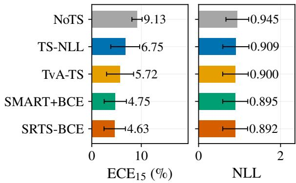  
Figure 16: CIFAR-100-C 3-seed aggregate calibration metrics (deployable BCE comparison). Mean ± variability over seed×severity aggregates of the deployable corruption evaluation (each corrupted sample rerouted from its own logits). The panel compares the methods of the final deployable protocol: TvA-TS $( \bar { K } { = } 1 \ \mathrm { { B C E } ) }$ , SMART+BCE, and SRTS-BCE K=3 alongside NoTS/TS-NLL references.

We report this as an honest protocol-frozen negative: the lowdata residual is larger but apparently less signal-trackable, so the regime map gains a boundary at both ends — heavily-pretrained heads (ImageNet-C) and under-trained heads (low-data fine-tunes) both favour scalar or continuousmargin calibrators, and the routed advantage is concentrated in the well-trained, fully-fine-tuned middle where the residual is structured.

## Nested K/routing model-selection check

We run a single unified nested K-selection protocol across all six backbone×dataset cells of the cross-backbone summary, so every cell uses the same splits and candidate set. For each seed and cell, candidates $\dot { K } = \{ 1 , 2 , 3 , 5 , 1 0 \}$ (with $K { = } 1$ reducing to TvA-TS) are fitted on an 80% Cal-Fit subset (stratified by class), selected by Cal-Select $\mathrm { E C E _ { 1 5 } }$ on the held-out 20%, refit on the full calibration split, and evaluated once on test; the test set participates in no selection step. Table 50 reports the results.

The selected $K ^ { \star }$ is inconsistent across seeds in most cells $( \mathrm { e . g . }$ , {10, 2, 5} for CIFAR-100/ViT-B/16), and the mean $\mathrm { E C E _ { 1 5 } }$ overhead vs. fixed K=3 ranges from 0.14 pp (Tiny-ImageNet/ViT-B/16) to 1.89 pp (Tiny-ImageNet/DeiT-S). The root cause is that the Cal-Select split contains only ≈500 samples for CIFAR-100 and ≈1,000 for Tiny-ImageNet, making $\mathrm { E C E _ { 1 5 } }$ estimation too noisy for reliable K-selection. In several cells (Tiny-ImageNet/ViT-B/16, Tiny-ImageNet/Swin-T), Cal-Select consistently picks $K { = } 1$ (scalar TvA-TS), forgoing the routing benefit entirely.

This analysis confirms two findings: (i) K=3 is a sound fixed default that a hold-out selection protocol would not consistently improve upon at current validation budgets; and (ii) validation-based ${ \dot { K } } \cdot$ -selection would need either larger calibration sets $( n \gg 2 , 5 0 0 )$ or cross-validation-based selection to overcome the ECE estimation noise inherent in small hold-out splits.

Gating routing on/of is equally unreliable. The same conclusion extends from selecting K to the coarser decision of whether to route at all. Across 15 evaluation cells (nine backbone×dataset cells, two low-data fine-tunes, pretrained ImageNet-1k, and three validation-budget fractions), the validation-only OOF top-label-BCE gain of routing correlates with the test-side routing gain in rank (Spearman $r { = } 0 . 5 5 , p { = } 0 . 0 3 )$ and cleanly flags the four largest-gain cells (CIFAR-100 DeiT-S/Swin-T, Tiny-ImageNet DeiT-S/Swin-T, test gains 1.4–2.4 pp), but admits no threshold that separates winning from losing cells: the CIFAR-100/ViT-B/16 cell (test gain +0.72 pp) and the 10%-data fine-tune (test gain −0.34 pp) have near-identical validation scores. A grouptemperature-spread criterion is worse still (no significant correlation), being dominated by estimation noise in nearsaturated or small-validation cells. Consistent with the Kselection findings above, we therefore deploy the fixed K=3 configuration everywhere, not any validation-gated variant, and present the regime map as empirical guidance not an automated selection rule.

<table><tr><td rowspan="3">Map</td><td colspan="2">ViT-B/16</td><td colspan="2">DeiT-S</td><td colspan="2">Swin-T</td></tr><tr><td>ΔCI</td><td>win</td><td>ΔCI</td><td>win</td><td>ΔCI</td><td>win</td></tr><tr><td>PWLinear-3</td><td>[−0.19, +0.06]</td><td>73%</td><td>[−0.56, +0.03]</td><td>93%</td><td>[−0.16, +0.07]</td><td>98%</td></tr><tr><td>LinearRiskTemp</td><td>[−0.48, −0.12]</td><td>57%</td><td>[−1.26, −0.48]</td><td>83%</td><td>[−0.79, −0.52]</td><td>90%</td></tr><tr><td>SplineRiskTemp</td><td>[−0.37, −0.18]</td><td>57%</td><td>[−0.83, −0.11]</td><td>88%</td><td>[−0.43, −0.06]</td><td>92%</td></tr></table>

Table 25: Small-budget matched continuous-map test (n=250; the exact calibration draws, training seeds, router pipeline, optimizer, knots, initialisation, and bounds of the budget-resampling protocol; frozen before execution). Per backbone: seed→draw hierarchical 95% CI of $\Delta \mathrm { E C E } _ { 1 5 } = \mathrm { S R T S } \ – \mathbf { B C E }$ − map (negative favours SRTS-BCE; bold: CI excludes zero) and the map’s win rate against TvA-TS. SRTS-BCE vs. the matched three-anchor PWLinear-3 is statistically unresolved on all three backbones; the linear and spline parameterizations of the same risk score are significantly worse.

Table 26: Protocol-frozen cross-dataset small-budget follow-up (Tiny-ImageNet) (200 classes; three training seeds $\times ~ 2 0$ draws per budget). Mean test $\mathrm { E C E _ { 1 5 } }$ (%) over seeds×draws per method, hierarchical seed→draw 95% CIs of $\Delta \mathrm { E C E } _ { 1 5 }$ (negative favours SRTS-BCE; bold: CI excludes zero), and SRTS-BCE’s draw-paired win rate against TvA-TS. Cells, budgets, draws, methods, metrics, inference, and outcome interpretation were frozen before execution; no method, metric, optimizer, or draw selection changed after inspection. On Swin-T the higher-capacity SMART+BCE is significantly better at the largest evaluated 2,500-sample budget and the ordering reverses as the budget shrinks. Tiny-ImageNet/ViT-B/16 remains the boundary result reported in the budget-resampling section.
<table><tr><td>Backbone</td><td>n</td><td>TvA-TS</td><td>SMART+BCE</td><td>SRTS-BCE</td><td>SRTS-TvA CI</td><td>SRTS—SMART CI</td><td>win</td></tr><tr><td>DeiT-S</td><td>250</td><td>3.08</td><td>2.51</td><td>2.01</td><td>[−1.35, -0.80]</td><td>[−0.71, −0.28]</td><td>95%</td></tr><tr><td>DeiT-S</td><td>625</td><td>3.05</td><td>1.74</td><td>1.53</td><td>[−1.92, −1.22]</td><td>[−0.36, -0.07]</td><td>100%</td></tr><tr><td>DeiT-S</td><td>1250</td><td>3.06</td><td>1.48</td><td>1.28</td><td>[−2.11, −1.55]</td><td>-0.30, −0.10]</td><td>100%</td></tr><tr><td>DeiT-S</td><td>2500</td><td>3.06</td><td>1.16</td><td>1.12</td><td>[−2.31, −1.73]</td><td>[−0.14, +0.05]</td><td>100%</td></tr><tr><td>Swin-T</td><td>250</td><td>2.85</td><td>2.95</td><td>2.03</td><td>[−1.02, −0.60]</td><td>[−1.27, −0.58]</td><td>92%</td></tr><tr><td>Swin-T</td><td>625</td><td>2.71</td><td>1.73</td><td>1.56</td><td>[−1.35, −0.87]</td><td>[−0.27, −0.07]</td><td>98%</td></tr><tr><td>Swin-T</td><td>1250</td><td>2.75</td><td>1.48</td><td>1.46</td><td>[−1.50, −1.02]</td><td>[−0.12, +0.06]</td><td>100%</td></tr><tr><td>Swin-T</td><td>2500</td><td>2.73</td><td>1.17</td><td>1.30</td><td>[−1.59, -1.17]</td><td>[+0.08, +0.19]</td><td>100%</td></tr></table>

Table 27: Metric sensitivity of the Tiny-ImageNet replication (n=250; the exact Table 26 predictions, seeds, and draws; protocol frozen before execution, run once). Seed→draw hierarchical 95% CIs of $\Delta \mathrm { A d a E C E } _ { 1 5 }$ and ∆smECE (oficial estimator); SMART denotes SMART+BCE; negative favours SRTS-BCE; bold: CI excludes zero. All four comparisons are supported under both alternative estimators.
<table><tr><td>Backbone Comparison</td><td></td><td> $\Delta A d a E C E _ { 1 5 }$ </td><td>∆smECE</td></tr><tr><td>DeiT-S</td><td>SRTS – TvA-TS</td><td>[−1.45, −0.82]</td><td>[−0.92, −0.44]</td></tr><tr><td>DeiT-S</td><td>SRTS – SMART</td><td>[−0.65, −0.25]</td><td>[−0.84, -0.35]</td></tr><tr><td>Swin-T</td><td>SRTS – TvA-TS</td><td>[-1.28, -0.70]</td><td>[-0.67, -0.21]</td></tr><tr><td>Swin-T</td><td>SRTS – SMART</td><td>[−1.19, −0.52]</td><td> $[ - 1 . 4 5 , - 0 . 6 9 ]$ </td></tr></table>

## A conservative validation-only capacity selector

The two failures above use noisy hold-out ECE or raw validation-gain thresholds. A third rule, fixed before evaluation and with no fitted constants, does substantially better: on each cell’s clean calibration split we run repeated stratified cross-validation (5 repeats × 5 folds) of the paired top-label-BCE gain of SRTS-BCE over TvA-TS, and select $K { = } 3$ only when the mean gain exceeds one standard error of the repeat means (the classic one-standard-error rule; the conservative default under uncertainty is the simpler map). The rule has no cross-regime fitted parameters or tuned thresholds; each regime is evaluated independently from its own clean calibration split.

Across the 21 regimes with cached calibration logits (Table 51), the selector attains mean test-ECE excess 0.09 pp against the per-seed best-of-2 (min(K=1, K=3) per seed — the selector’s own two-candidate choice, so the excess is nonnegative by construction), versus 0.18 for always-K=3 and 0.59 for always-K=1; it retains 7 of 8 regimes where K=3 helps by >0.2 pp and avoids 2 of 3 regimes where it hurts by >0.2 pp, including ImageNet-A (all seeds select K=1). Its two misses difer in consequence. On pretrained IN-1K the selector chooses K=1 and forgoes the improvement K=3 would give, but does not increase test ECE. On the 10%- data fine-tune it selects K=3 even though K=1 is better on test: the cross-validated gain is positive with a small standard error, yet K=3 regresses — the same larger-but-lesstransferable residual documented in the low-data negative result (§H), which no validation-internal statistic we tested detects. Conservative cross-validated proper-score selection therefore reduces the average test-ECE excess well below either constant policy and removes most negative transfer, but it is not fully reliable, and validation-only capacity selection remains open in the low-data regime; selection cannot, by construction, detect covariate shift that validation data does not contain (§F).

<table><tr><td>Diagnostic</td><td>Full budget</td><td>n = 250 (220 fits)</td></tr><tr><td>Group temps T1..3, med. [IQR]</td><td></td><td>.63 [.63, .65] / .73 [.73, .74] / .84 [.82, .87] .17 [.13, .73] / .76 [.69, .80] / .89 [.83, .94]</td></tr><tr><td>Router thresholds (mean±std)</td><td>0.008±0.001/0.042±0.007</td><td></td></tr><tr><td>Bound saturation Scalar fallback</td><td>0% 0%</td><td>0.0% 0.0%</td></tr><tr><td>Risk ordering monotone</td><td>100%</td><td>93%</td></tr><tr><td>Temperature ordering monotone 100%</td><td></td><td>64%</td></tr><tr><td></td><td></td><td></td></tr></table>

Occupancy (low/mid/high): clean 34% / 33% / 33%; CIFAR-100-C 19% / 27% / 55%  
High-risk share by severity: s1: 44%, s2: 50%, s3: 54%, s4: 59%, s5: 66%

Table 28: Auditability diagnostics for SRTS-BCE. Full budget: CIFAR-100/ViT-B/16, five seeds. n=250: all 220 calibration draws across the three CIFAR-100 backbones. Saturation: fitted group temperatures at the [0.05, 20] bounds. Fallback: groups below the 50-sample floor (reverting to the global scalar). Risk-monotone: fits whose empirical group error rates increase with the routed risk index.
<table><tr><td>Method</td><td>Top-1</td><td>NLL</td><td>Brier</td><td> $\mathrm { E C E _ { 1 5 } }$ </td><td>AURC</td><td>eAURC</td></tr><tr><td>CE / NoTS</td><td>78.09±0.76</td><td>0.9450±0.0494</td><td>0.3191±0.0122</td><td>9.1334±0.5508</td><td>0.0869±0.0100</td><td>0.0487±0.0061</td></tr><tr><td>NLL objective (ablation)</td><td></td><td></td><td></td><td></td><td></td><td></td></tr><tr><td>TS-NLL</td><td>78.09±0.76</td><td>0.9094±0.0642</td><td>0.3190±0.0153</td><td> $6 . 7 5 4 5 { \scriptstyle \pm 0 . 9 0 6 0 }$ </td><td> $0 . 0 8 3 6 { \pm } 0 . 0 0 9 4$ </td><td>0.0454±0.0055</td></tr><tr><td>SRTS-NLL K=3 (ablation)</td><td>78.09±0.76</td><td>0.9068±0.0613</td><td>0.3178±0.0143</td><td>7.0772±0.9234</td><td>0.0766±0.0066</td><td>0.0384±0.0025</td></tr><tr><td>BCE objective</td><td></td><td></td><td></td><td></td><td></td><td></td></tr><tr><td>TvA-TS ≡ TS-BCE K=1</td><td>78.09±0.76</td><td></td><td></td><td></td><td></td><td>0.9004±0.0644 0.3163±0.0156 5.7158±1.1275 0.0840±0.0094 0.0457±0.0055</td></tr><tr><td>SRTS-BCE K=3 (rerouted) 78.09±0.76 0.8924±0.0581 0.3124±0.0140 4.6283±0.8410 0.0813±0.0084 0.0431±0.0045</td><td></td><td></td><td></td><td></td><td></td><td></td></tr><tr><td>SMART+BCE</td><td></td><td>78.09±0.760.8950±0.05860.3132±0.0142</td><td></td><td>4.7479±0.7924 0.0823±0.0085</td><td></td><td>0.0441±0.0046</td></tr></table>

Table 29: CIFAR-100-C corruption-shift calibration under deployable routing (3-seed mean ± standard deviation over seeds 0/1/2; each per-seed value is the mean over 95 corruption/severity cells). Calibrators are fit only on clean CIFAR-100 validation data and applied unchanged under shift. For SRTS-BCE, each corrupted sample is routed using its own corrupted logits through the clean-validation-fitted risk router; no clean-test routing group is reused. SRTS-NLL is included as an NLLobjective ablation. Among the headline calibrators in this table, SRTS-BCE has the lowest ECE under the deployable BCE protocol and retains a small eAURC advantage over SMART+BCE (the matched PWLinear-3 diagnostic attains a slightly lower point estimate, §C); the SRTS–SMART ECE margin is small: cell-level and corruption-type bootstraps exclude zero, while the full seed×corruption×severity hierarchical bootstrap (§J) marginally includes zero; we treat the gain as directional rather than two-sided significant.

Fold-level 1-SE variant. We also evaluate a parameter-free fold-level rule, specified before running this comparison: select K=3 when the mean CV gain exceeds one standard error computed across all 25 fold-level gains (not across the five repeat means). On the identical CV draws the fold-SE rule makes the same selection as the 1-SE rule on every one of the 55 evaluated cells, so it behaves identically. This evaluation also locates where the selectors help: on the regimes used to form the rule, always-K=3 has lower average regret than either selector (0.048 vs. 0.061 pp; the selectors still choose K=3 in 62% of cells where the oracle prefers K=1), whereas on the natural-shift datasets — which were not used to choose the rule — the selectors’ conservatism is what avoids the always-K=3 failure (0.25 vs. 1.44 pp average regret; worst case 0.94 vs. 5.70). No evaluated validation-only rule is reliable at this budget, so the fixed K=3 choice stands and validation-only capacity selection remains unresolved.

## Extended limitations

Where the method helps. SRTS-BCE helps in specific regimes rather than broadly across corruption datasets. Fine-tuned CIFAR-100 and deployable CIFAR-100-C favour SRTS-BCE. Clean Tiny-ImageNet is backbone-dependent, with SMART+BCE winning some cells. Heavily-pretrained ImageNet-C favours scalar TvA-TS. At extreme small validation budgets, TvA-TS is the most rate-stable fallback, while SRTS-BCE still has the lowest absolute ECE in the current validation-size experiments; the small-budget separation itself replicates on Tiny-ImageNet DeiT-S and Swin-T (§E).

Metric and shift limitations. The scope map depends on the reported metric. Under the deployable CIFAR-100- C rerouting protocol, among the main calibrators of Table 29, SRTS-BCE has the lowest point-estimate mean ECE (4.63±0.84), slightly ahead of SMART+BCE (4.75±0.79); the matched PWLinear-3 diagnostic attains a slightly lower point estimate (4.58), with no distinction under the primary hierarchical bootstrap (§C). The margin is small: the cell-level paired bootstrap is clear, but the corruptiontype bootstrap only just clears zero (CI [−0.253, −0.002]). SMART+BCE still leads on Tiny-ImageNet ECE for the ViT-B/16 and Swin-T backbones (§G); SRTS-BCE retains a narrow mean edge on Tiny-ImageNet DeiT-S, so this flip is backbone-dependent rather than dataset-wide. SRTS-BCE remains stronger in the small-validation-size comparison and retains a small CIFAR-100-C eAURC advantage under deployable rerouting (CI [−0.0012, −0.0008] in the corruption-type bootstrap). On clean CIFAR-100, the onevs-rest classwise ECE does not discriminate among the calibrated maps (all 0.12 ± 0.01); under the oficial smECE estimator the BCE-adaptive family leads (SRTS-BCE 1.08 vs. TvA-TS 1.56 on the flagship) while SMART+BCE leads $\mathrm { A d a E C E _ { 1 5 } } ,$ so no single method leads every metric. Finally, SRTS-BCE depends on reliable OOF risk estimation, so its routed advantage can narrow or become unstable when the calibration split is too small.

<table><tr><td>Method</td><td>HCFP@.90 HCFP@.95</td><td></td><td></td><td>Risk@80 Risk@90 Risk@95</td><td></td></tr><tr><td colspan="6">Clean CIFAR-100</td></tr><tr><td>TvA-TS</td><td>22.94</td><td>12.00</td><td>2.38</td><td>4.59</td><td>6.47</td></tr><tr><td>SMART+BCE</td><td>15.41</td><td>9.56</td><td>2.40</td><td>4.60</td><td>6.49</td></tr><tr><td>SRTS-BCE</td><td>15.37</td><td>7.95</td><td>2.42</td><td>4.58</td><td>6.45</td></tr><tr><td colspan="6">CIFAR-100-C (rerouting)</td></tr><tr><td>TvA-TS</td><td>15.43</td><td>7.97</td><td>12.06</td><td>16.65</td><td>19.24</td></tr><tr><td>SMART+BCE</td><td>10.69</td><td>6.44</td><td>12.08</td><td>16.64</td><td>19.24</td></tr><tr><td>SRTS-BCE</td><td>10.06</td><td>5.35</td><td>12.07</td><td>16.63</td><td>19.24</td></tr></table>

Table 30: Deployment-facing selective metrics (%; five-seed means on both clean CIFAR-100 and CIFAR-100-C), from cached calibrated probabilities. HCFP.t: fraction of wrong predictions with confidence $\geq t$ (confidently wrong). R@c: selective error at coverage c (error among the most-confident c fraction). Lower is better throughout.
<table><tr><td rowspan="2">Method</td><td colspan="3"> $t = 0 . 8 0$ </td><td colspan="3"> $t = 0 . 9 0$ </td><td colspan="3"> $t = 0 . 9 5$ </td></tr><tr><td>Cov</td><td>Risk</td><td>Gap</td><td>Cov</td><td>Risk</td><td>Gap</td><td>Cov</td><td>Risk</td><td>Gap</td></tr><tr><td colspan="10">Clean CIFAR-100 (five seeds)</td></tr><tr><td>NoTS</td><td>72.3</td><td></td><td> $1 . 9 7 - 8 . 8 6 { \pm } 0 . 4 7$ </td><td></td><td>32.5 1.09</td><td> $- 6 . 1 5 { \pm } 0 . 4 1$ </td><td>5.5</td><td>2.02</td><td> $- 1 . 9 4 { \pm } 1 . 7 6$ </td></tr><tr><td>TvA-TS</td><td>87.63.87</td><td></td><td> $+ 0 . 3 5 { \pm } 0 . 5 7 $ </td><td>81.0</td><td>2.55</td><td> $- 0 . 0 9 { \pm } 0 . 4 2$ </td><td>70.8</td><td>1.53</td><td> $- 0 . 5 0 { \pm } 0 . 1 8$ </td></tr><tr><td>HTS-BCE</td><td>87.2</td><td>3.74</td><td> $+ 0 . 3 1 { \pm } 0 . 5 3$ </td><td>80.4</td><td>2.48</td><td> $- 0 . 0 3 { \pm } 0 . 5 5$ </td><td>70.3</td><td>1.57</td><td> $- 0 . 3 0 { \pm } 0 . 5 1$ </td></tr><tr><td>SMART+BCE</td><td>84.4</td><td>3.14</td><td> $+ 0 . 1 9 { \pm } 0 . 5 9$ </td><td>76.0</td><td>1.83</td><td> $+ 0 . 1 7 { \pm } 0 . 4 8$ </td><td>68.1</td><td>1.27</td><td> $+ 0 . 2 4 { \pm } 0 . 3 7$ </td></tr><tr><td>SRTS-BCE</td><td>84.9</td><td>3.23</td><td> $+ 0 . 1 7 { \pm } 0 . 4 9$ </td><td>75.5</td><td>1.84</td><td> $+ 0 . 1 6 { \pm } 0 . 3 9$ </td><td>67.8</td><td>1.06</td><td> $+ 0 . 0 4 { \pm } 0 . 2 1 $ </td></tr><tr><td colspan="10">CIFAR-100-C, deployable rerouting (three seeds)</td></tr><tr><td>NoTS</td><td>50.1</td><td></td><td> $4 . 2 0 - 6 . 9 0 { \pm } 0 . 4 5$ </td><td>21.8</td><td>2.41</td><td> $- 4 . 7 4 { \pm } 0 . 4 5$ </td><td>4.1</td><td>2.81</td><td> $- 1 . 1 3 { \pm } 1 . 1 9$ </td></tr><tr><td>TvA-TS</td><td>70.8</td><td></td><td> $8 . 3 6 + 3 . 5 6 { \pm } 0 . 7 5$ </td><td>60.2</td><td>5.46</td><td> $+ 2 . 3 5 { \pm } 0 . 5 4 $ </td><td>48.3</td><td>3.50</td><td> $+ 1 . 3 8 { \pm } 0 . 2 7 $ </td></tr><tr><td>HTS-BCE</td><td>69.8</td><td>8.08</td><td>3+3.37±0.41</td><td>59.3</td><td>5.33</td><td> $+ 2 . 3 4 { \pm } 0 . 5 4$ </td><td>47.9</td><td>3.53</td><td> $+ 1 . 5 3 { \pm } 0 . 5 6 $ </td></tr><tr><td>SMART+BCE</td><td>65.5</td><td>6.86</td><td> $+ 2 . 3 3 { \pm } 0 . 2 2$ </td><td>53.3</td><td>4.06</td><td> $+ 1 . 8 5 { \pm } 0 . 1 4$ </td><td>44.5</td><td>2.78</td><td> $+ 1 . 5 9 { \pm } 0 . 1 6$ </td></tr><tr><td>SRTS-BCE</td><td>66.2</td><td></td><td> $7 . 0 2 + 2 . 5 1 { \pm } 0 . 2 4$ </td><td>53.9</td><td>4.18</td><td> $+ 1 . 9 5 { \pm } 0 . 2 4 $ </td><td>45.5</td><td>2.64</td><td> $+ 1 . 3 9 { \pm } 0 . 1 1$ </td></tr></table>

Table 31: Confidence-threshold deployment at pre-specified thresholds $t \in \{ 0 . 8 0 , 0 . 9 0 , 0 . 9 5 \}$ (fixed before inspecting results; existing predictions only). Cov: retained coverage (%). Risk: error among retained (%). Gap: mean retained confidence − retained accuracy (pp; positive = overconfident), ± std over seeds (five clean, three CIFAR-100-C).

Recent-baseline scope. The paper compares SRTS-BCE against scalar TS (Guo et al. 2017) as the canonical baseline, LTS-scalar and LTS-feature (Joy et al. 2023) as sampleadaptive baselines, SATS-Logit and Feature-SATS as implementation baselines representative of the unrestricted sample-adaptive family, TvA-TS (Le Coz, Herbin, and Adjed 2024) as a strong constrained peer baseline, and SMART (Guo et al. 2026) as the logit-gap adaptive temperature head. Our SMART+BCE row keeps SMART’s architecture but trains it with the same top-label BCE objective used by SRTS-BCE and TvA-TS, instead of its SoftECE objective. We do not include matrix scaling, Dirichlet calibration, histogram binning, or beta calibration in the main table: under the present accuracy-preserving, fit-once-applyeverywhere protocol on a ≈ 2,500-sample validation split, these argmax-changing or higher-capacity calibrators sit in a diferent capacity/estimability regime from the 10-scalar SRTS-BCE/TvA-TS family. Vector scaling (Guo et al. 2017) introduces class-dependent parameters and can change the argmax; a fair comparison under the present validation budget would require matched regularisation and is left to future work.

Capacity control of the diagnosis. The validation-overfit diagnosis (C1) is supported across four capacity axes: (i) head-input axis — the failure replicates on logit-input heads, frozen-feature-input heads, and full-gradient temperature heads; (ii) backbone/regime axis — the same failure shape appears in three-seed DeiT-S, Swin-T, and Tiny-ImageNet tables; (iii) val-size axis — the regression sits at $\mathrm { E C E _ { 1 5 } } \approx 6 \mathrm { - } 7$ across validation sizes {246, 500, 1,000, 2,500}; and (iv) head-hyperparameter axis — a 48-cell sweep with val-only selection still picks the overfit configuration.

<table><tr><td></td><td></td><td colspan="2">@cov(t=0.80)</td><td colspan="2">@cov(t=0.90)</td><td colspan="2">@cov(t=0.95)</td></tr><tr><td>Method</td><td>AURC</td><td>Risk</td><td>Gap</td><td>Risk</td><td>Gap</td><td>Risk</td><td>Gap</td></tr><tr><td colspan="8">Clean CIFAR-100 (five seeds)</td></tr><tr><td>NoTS</td><td>20.73</td><td>3.98</td><td>-9.66</td><td>2.74</td><td>-9.41</td><td>1.85</td><td>-8.83</td></tr><tr><td>TvA-TS</td><td>18.38</td><td>3.87</td><td>+0.35</td><td>2.55</td><td>-0.09</td><td>1.53</td><td>-0.50</td></tr><tr><td>HTS-BCE</td><td>18.80</td><td>3.87</td><td>+0.35</td><td>2.57</td><td>-0.00</td><td>1.60</td><td>-0.30</td></tr><tr><td>SMART+BCE</td><td>16.49</td><td>3.89</td><td>+0.18</td><td>2.54</td><td>+0.20</td><td>1.44</td><td>+0.21</td></tr><tr><td>SRTS-BCE</td><td>15.49</td><td>3.88</td><td>+0.21</td><td>2.55</td><td>+0.17</td><td>1.38</td><td>+0.14</td></tr><tr><td colspan="8">CIFAR-100-C, deployable rerouting (three seeds)</td></tr><tr><td>NoTS</td><td>68.51</td><td>8.57</td><td>-7.57</td><td>5.81</td><td>-7.36</td><td>3.98</td><td>-6.82</td></tr><tr><td>TvA-TS</td><td>65.29</td><td>8.36</td><td>+3.56</td><td>5.46</td><td>+2.35</td><td>3.50</td><td>+1.38</td></tr><tr><td>HTS-BCE</td><td>65.77</td><td>8.39</td><td>+3.42</td><td>5.52</td><td> $+ 2 . 4 0$ </td><td>3.58</td><td>+1.55</td></tr><tr><td>SMART+BCE</td><td>63.23</td><td>8.43</td><td>+2.54</td><td>5.52</td><td> $+ 2 . 1 2$ </td><td>3.30</td><td> $+ 1 . 6 8$ </td></tr><tr><td>SRTS-BCE</td><td>62.24</td><td>8.39</td><td>+2.71</td><td>5.49</td><td> $+ 2 . 2 2$ </td><td>3.19</td><td> $+ 1 . 6 4$ </td></tr></table>

Table 32: Matched-coverage control for the threshold comparison. Because diferent calibrators retain diferent fractions at a fixed confidence threshold, every method is evaluated at the same reference coverages — TvA-TS’s coverage at the pre-specified thresholds {0.80, 0.90, 0.95} (no operating point chosen after inspecting results; top-k retained set with $\mathbf { \bar { \boldsymbol { k } } } = \mathrm { r o u n d } ( \bar { c } \mathbf { \boldsymbol { N } } )$ , the nearest attainable coverage). AURC: area under the full risk–coverage curve $( \times 1 0 ^ { 3 }$ , lower is better). Risk/Gap: retained error (%) and nominal-vs-realized confidence gap (pp) at the matched coverage.
<table><tr><td>Method</td><td>ResNet-50</td><td>RegNetY-1.6GF</td></tr><tr><td>NoTS</td><td> $1 4 . 3 9 { \pm } 0 . 7 5 $ </td><td> $1 5 . 2 4 { \pm } 0 . 8 2$ </td></tr><tr><td>TS-NLL</td><td> $1 9 . 9 5 { \pm } 0 . 6 8 $ </td><td> $1 2 . 7 7 { \scriptstyle \pm 0 . 6 2 }$ </td></tr><tr><td>TvA-TS</td><td> $1 8 . 1 6 { \pm } 1 . 1 0 $ </td><td> $1 1 . 6 0 { \pm } 0 . 8 4$ </td></tr><tr><td>SMART+BCE</td><td> $1 4 . 0 2 { \pm } 1 . 1 6 $ </td><td> $\mathbf { 9 . 0 8 { \pm 0 . 8 6 } }$ </td></tr><tr><td>SRTS-BCE K=3</td><td> $\mathbf { 1 3 . 7 2 { \scriptstyle \pm 0 . 7 9 } }$ </td><td> $9 . 4 4 { \pm } 0 . 7 8$ </td></tr><tr><td>SRTS—SMART ∆ (cell-level CI)</td><td>) -0.31 [−0.37, -0.25]</td><td>+0.37  $[ + 0 . 3 2 , + 0 . 4 1 ]$ </td></tr></table>

Table 33: ConvNet CIFAR-100-C deployable rerouting $\mathrm { ( E C E _ { 1 5 } , \mathcal { I } _ { 0 } ) }$ . Values are averaged over 95 corruption/severity cells per seed and then reported as mean±std over three seeds; lower is better. The SRTS−SMART interval is a paired cell-level bootstrap conditional on the three trained seeds, not a seed-hierarchical interval.

Top-1 preservation scope. Adaptive heads empirically preserve top-1 in the reported runs, but we do not claim this as a universal design guarantee. Our accuracy-preserving claims are phrased around the reported rows and the scalar/group-wise temperature family whose rescaling preserves argmax by construction.

## I Theory: When Grouped Scaling Beats Pooled Scaling

We make precise when risk-routed group-wise temperature scaling lowers expected test risk relative to a single pooled temperature, and why a random partition cannot. The analysis is local (second order) and asymptotic (M-estimation), stated for the fitted objective (top-label BCE); the link to ECE is empirical (main text; the top-label-Brier check in Table 5 shows the mechanism is not BCE-specific).

Setup. Temperature is a scalar $T \ > \ 0 .$ . For a routing partition $\textstyle { \left\{ A _ { g } \right\} } _ { g = 1 } ^ { K }$ with weights $\pi _ { g } ~ = ~ \operatorname* { P r } ( x ~ \in ~ A _ { g } )$ — for the equal-frequency partition used by SRTS-BCE, $\pi _ { g } = 1 / K$ and $n _ { g } \ \stackrel { \cdot } { = } \ n \stackrel { \cdot } { / } K$ , which the variance step below uses — write the population top-label BCE on group g as $\mathcal { L } _ { g } ( T ) \ = \ \mathbb { E } [ \ell ( T ; x ) | x \in \mathcal { \bar { A } } _ { g } ] ,$ , where $\ell ( T ; \bar { x } ) \ \bar { = }$ $- [ b \log \hat { p } _ { T } + ( 1 - \acute { b } ) \log ( 1 - \hat { p } _ { T } ) ] , \ddot { b } = { \bf 1 } [ \hat { y } = y ]$ , and pˆT = maxc softmax $( z / \dot { T } ) _ { c } .$ . Let $\begin{array} { r } { \mathbf { \dot { \mathcal { L } } } ( T ) = \sum _ { q } \pi _ { g } \mathbf { \dot { \mathcal { L } } } _ { g } ( T ) } \end{array}$ be the pooled objective with minimiser $T ^ { \star } \left( \mathrm { s o } \stackrel { \cdot } { \angle } ^ { \prime } ( T ^ { \star } \right) =$ $\begin{array} { r } { \sum _ { q } \pi _ { g } \dot { \mathcal { L } } _ { g } ^ { \prime } ( T ^ { \star } ) = 0 ) } \end{array}$ , and $T _ { g } ^ { \star } = \arg$ minT $\mathcal { L } _ { g } ( T )$ . Assume each $\mathcal { L } _ { g }$ is $C ^ { 2 }$ and locally strongly convex near its optimum (assumed locally in the neighbourhood of the fitted optimum and empirically satisfied in the reported fits), with curvatures $\mathcal { L } _ { g } ^ { \prime \prime } \approx \dot { L } ^ { \prime \prime }$ comparable across groups.

Bias (approximation) gain. The population gain of the oracle grouped calibrator over pooled is $\Delta _ { \mathrm { b i a s } } ~ =$ $\begin{array} { r l r } { \sum _ { q } \pi _ { g } [ \mathcal { L } _ { g } ( \breve { T ^ { \star } } ) ^ { \star } - \mathcal { L } _ { g } ( T _ { g } ^ { \star } ) ] } & { { } \geq } & { 0 } \end{array}$ Writing $B : =$ $\begin{array} { r l } { \sum _ { q } ^ { \sim } \pi _ { g } \left[ \mathcal { L } _ { g } ^ { \prime } ( T ^ { \star } ) \right] ^ { 2 } } \end{array}$ , a second-order expansion about $T _ { g } ^ { \star }$ with $T ^ { \star } - T _ { g } ^ { \star } \approx \mathcal { L } _ { g } ^ { \prime } ( T ^ { \star } ) / \mathcal { L } _ { g } ^ { \prime \prime }$ gives

$$
\Delta _ { \mathrm { b i a s } } \approx \sum _ { g } \pi _ { g } \frac { [ \mathcal { L } _ { g } ^ { \prime } ( T ^ { \star } ) ] ^ { 2 } } { 2 \mathcal { L } _ { g } ^ { \prime \prime } } \approx \frac { B } { 2 L ^ { \prime \prime } } .\tag{6}
$$

<table><tr><td>Method</td><td> $\mathrm { t o p } { - } 1 \ ( \% )$ </td><td>NLL</td><td> $\mathrm { E C E _ { 1 5 } ~ ( \% ) }$ </td><td> $\mathrm { A d a E C E } _ { 1 5 } \ ( \% )$ </td><td>AURC</td></tr><tr><td>NoTS</td><td> $6 5 . 6 9 \pm 1 2 . 1 5$ </td><td> $1 . 5 0 4 \pm 0 . 7 1 7$ </td><td> $2 . 6 0 \pm 1 . 7 9$ </td><td> $2 . 5 9 \pm 1 . 7 9$ </td><td> $0 . 1 3 5 6 \pm 0 . 0 8 5 8$ </td></tr><tr><td>TS-NLL</td><td> $6 5 . 6 9 \pm 1 2 . 1 5$ </td><td> $1 . 5 0 3 \pm 0 . 7 1 8$ </td><td> $2 . 9 6 \pm 1 . 8 9$ </td><td> $2 . 9 4 \pm 1 . 9 0$ </td><td> $0 . 1 3 5 5 \pm 0 . 0 8 5 8$ </td></tr><tr><td>SRTS-NLL K=1 (ablation)</td><td> $6 5 . 6 9 \pm 1 2 . 1 5$ </td><td> $1 . 5 0 3 \pm 0 . 7 1 8$ </td><td> $2 . 9 6 \pm 1 . 8 9$ </td><td> $2 . 9 4 \pm 1 . 9 0$ </td><td> $0 . 1 3 5 5 \pm 0 . 0 8 5 8$ </td></tr><tr><td>SRTS-NLL K=3 (ablation)</td><td> $6 5 . 6 9 \pm 1 2 . 1 5$ </td><td> $1 . 5 0 3 \pm 0 . 7 2 0$ </td><td> $3 . 1 5 \pm 2 . 2 6$ </td><td> $3 . 1 4 \pm 2 . 2 6$ </td><td> $0 . 1 3 5 8 \pm 0 . 0 8 5 8$ </td></tr><tr><td>SATS-Logit</td><td> $6 5 . 6 9 \pm 1 2 . 1 5$ </td><td> $3 . 1 7 6 \pm 1 . 6 4 4$ </td><td> $1 8 . 4 7 \pm 6 . 9 0$ </td><td> $1 8 . 2 5 \pm 6 . 9 4$ </td><td> $0 . 1 7 5 5 \pm 0 . 0 9 9 6$ </td></tr></table>

Table 34: ImageNet-C 75-cell calibration summary (NLL-objective diagnostic only) (15 canonical Hendrycks main corruptions × 5 severities, 50,000 images per cell; single seed; pretrained ViT-B/16). All four calibrators are fit ONCE on the 5,000-sample stratified-first-5-per-class split of clean ImageNet-1K val and applied unchanged to each (corruption, severity) cell (no refit on corruption test data). TS-NLL and SRTS-NLL K=1 are identical to 4 decimal places on every cell. Selectiveclassification cost (AURC) is included to expose the SATS val-overfit signature, which can amplify under shift even when held-out ECE looks acceptable on clean data.

<table><tr><td>Method</td><td>NLL</td><td>Brier</td><td> $\mathrm { E C E _ { 1 5 } }$ </td><td>AURC</td></tr><tr><td>NoTS</td><td> $1 . 5 0 4 \pm 0 . 0 0 0$ </td><td> $0 . 4 5 3 \pm 0 . 0 0 0$ </td><td> $2 . 5 9 9 \pm 0 . 0 0 0$ </td><td> $0 . 1 3 5 6 \pm 0 . 0 0 0 0$ </td></tr><tr><td>TS-NLL</td><td> $1 . 5 0 4 \pm 0 . 0 0 1$ </td><td> $0 . 4 5 3 \pm 0 . 0 0 0$ </td><td> $3 . 1 6 9 \pm 0 . 2 6 0$ </td><td> $0 . 1 3 5 5 \pm 0 . 0 0 0 0$ </td></tr><tr><td>SRTS-NLL K=1 (ablation)</td><td> $1 . 5 0 4 \pm 0 . 0 0 1$ </td><td> $0 . 4 5 3 \pm 0 . 0 0 0$ </td><td> $3 . 1 6 9 \pm 0 . 2 6 0$ </td><td> $0 . 1 3 5 5 \pm 0 . 0 0 0 0$ </td></tr><tr><td>SRTS-NLL K=3 (ablation)</td><td> $1 . 5 0 4 \pm 0 . 0 0 1$ </td><td> $0 . 4 5 4 \pm 0 . 0 0 0$ </td><td> $3 . 4 1 4 \pm 0 . 3 2 0$ </td><td> $0 . 1 3 5 7 \pm 0 . 0 0 0 1$ </td></tr><tr><td>SATS-Logit</td><td> $3 . 0 2 6 \pm 0 . 7 0 3$ </td><td> $0 . 5 2 9 \pm 0 . 0 1 6$ </td><td> $1 7 . 7 2 9 \pm 2 . 1 2 6$ </td><td> $0 . 1 6 9 5 \pm 0 . 0 0 7 9$ </td></tr></table>

Table 35: ImageNet-C calibration-subset resampling under the NLL objective on the pretrained ViT-B/16 ImageNet-1K base $( B = 1 0$ resamples). Reported values are the mean ± standard deviation across resamples of the per-resample 75-cell mean. This is an NLL-objective ablation: TS-NLL and SRTS-NLL K=3 do not improve $\mathrm { \bar { E } C E _ { 1 5 } }$ over NoTS on this well calibrated base, and K=3 does not beat K=1. BCE-objective results are reported in $\ S \mathrm { F } .$

Because $\begin{array} { r } { \sum _ { q } \pi _ { g } \mathcal { L } _ { g } ^ { \prime } ( T ^ { \star } ) ~ = ~ 0 } \end{array}$ , the quantity B is exactly the between-group variance of the per-sample calibration gradient $\ell ^ { \prime } ( T ^ { \star } ; x )$ under the routing partition (an ANOVA between-component). An independently random equal-frequency partition draws each $A _ { g }$ from the same conditional law, so at the population level $\tilde { \mathcal { L } _ { q } ^ { \prime } } ( T ^ { \star } ) = \tilde { \mathcal { L } ^ { \prime } } ( T ^ { \star } ) = 0$ and $B = 0 ;$ its finite-sample estimate fluctuates around the null floor (Table 52); a router that separates samples by the sign/magnitude of their miscalibration gradient yields $B > 0$

Variance (estimation) cost. Each $\hat { T } _ { g }$ is fit from ${ n _ { g } } =$ $\pi _ { g } n$ samples. Standard M-estimation gives $\mathrm { V a r } ( \hat { T } _ { g } )$ ≈ $\bar { \sigma _ { g } ^ { 2 } } / ( n _ { g } \bar { \mathcal { L } _ { g } ^ { \prime \prime 2 } } )$ with $\sigma _ { g } ^ { 2 } = \operatorname { V a r } ( \ell ^ { \prime } ( T _ { g } ^ { \star } ; x ) \ { \mathrm { ~ \bar { } { ~ A ~ } } } _ { g } )$ the withingroup gradient variance, so the estimation excess risk is $\begin{array} { r } { \frac { 1 } { 2 } \mathcal { L } _ { g } ^ { \prime \prime } \operatorname { V a r } ( \hat { T } _ { g } ) \ \approx \ \sigma _ { g } ^ { 2 } / ( 2 n _ { g } \mathcal { L } _ { g } ^ { \prime \prime } ) } \end{array}$ . Summing (with $\pi _ { g } / n _ { g } ~ =$ $1 / n )$ and writing $\begin{array} { r } { \bar { \sigma } ^ { 2 } = \sum _ { g } \pi _ { g } \sigma _ { g } ^ { 2 } } \end{array}$ for the pooled withingroup variance, grouped fitting costs $\begin{array} { r } { \frac { 1 } { 2 n L ^ { \prime \prime } } \sum _ { g } \sigma _ { g } ^ { 2 } = \frac { K \bar { \sigma } ^ { 2 } } { 2 n L ^ { \prime \prime } } } \end{array}$ (the identity $\begin{array} { r } { \sum _ { g } \sigma _ { g } ^ { 2 } = K \bar { \sigma } ^ { 2 } } \end{array}$ uses $\pi _ { g } = 1 / K )$ while pooled (one temperature, residual variance $\sigma _ { \mathrm { t o t } } ^ { 2 } = B + \bar { \sigma } ^ { 2 } )$ costs $\frac { B + { \bar { \sigma } } ^ { 2 } } {  { \mathrm { ~ 2 ~ } }  { \ l } _ { m } \ : T ^ { \prime \prime } }$ . The extra cost of grouping is therefore $[ ( K - 1 ) \bar { \sigma } ^ { 2 } -$ $\bar { B } ] / ( 2 n L ^ { \prime \prime } )$

Net condition. Subtracting, the expected test-BCE improvement of grouped over pooled scaling is, to leading order,

$$
\Delta \approx { \frac { 1 } { 2 L ^ { \prime \prime } } } \Big ( B - { \frac { K - 1 } { n } } \bar { \sigma } ^ { 2 } \Big ) ,\tag{7}
$$

so grouping helps if $B / \bar { \sigma } ^ { 2 } > ( K - 1 ) / n$ . This compares grouped with pooled fitting; alternatives with the same fitted parameter count are outside its scope and are tested empirically (main RQ2). The left side is the between/within variance ratio of the calibration gradient — a between/within variance-ratio (signal-to-noise) diagnostic of the routing. This refines the “per-group minimisation is at least as flexible” inequality, which holds for any partition (including random) and hence cannot explain the empirical results: (7) is 0 for random routing $( B = 0 )$ and positive only when the router carries gradient-separating structure.

Consequences matching the experiments. (i) Random/shufled routing is inert $( B = 0 )$ , as in Table 4. (ii) Kablation: the threshold $( K - 1 ) / n$ grows with K, so beyond a point extra groups cost more variance than the (saturating) B buys — consistent with K=3 being near-best and larger K not helping. (iii) Objective-conditionality: B is the between-group variance of the objective’s gradient; under NLL fitting the risk partition does not separate the NLL gradient $( B _ { \mathrm { N L L } } \approx 0 ;$ the group temperatures cluster, Fig. 11), whereas under BCE it does. (iv) ${ \mathrm { A t ~ } } n \approx 2 { , } 5 0 0 { , } ~ K { = } 3$ the threshold is ≈ $8 \times 1 0 ^ { - 4 }$ , a very mild SNR, explaining why a weak but genuine risk signal already clears it. The condition characterises the regime; it does not assert OOF risk maximises B — the empirical rows show OOF risk achieves B above threshold while confidence and random do not.

## Empirical routing signal-to-noise across regimes

The condition $B / \bar { \sigma } ^ { 2 } > ( K - 1 ) / n$ derived above is not only explanatory; we can measure both sides. For each regime with cached validation logits we fit the pooled top-label-BCE temperature $T ^ { \star }$ , compute the per-sample calibration gradient $\dot { \ell ^ { \prime } } ( T ^ { \star } ; x )$ , form the K=3 risk partition, and read of the between-group variance B and the pooled within-group variance $\bar { \sigma } ^ { 2 }$ (an ANOVA decomposition of the gradient; the identity $\sigma _ { \mathrm { t o t } } ^ { 2 } = B + \bar { \sigma } ^ { 2 }$ is checked numerically). Table 52 reports the ratio, the finite-sample floor $( K { - } 1 ) / n$ , and an averaged random-partition control.

<table><tr><td>Method</td><td>ViT-B/16</td><td>DeiT-S</td><td>Swin-T</td></tr><tr><td>NoTS</td><td> $3 . 9 7 { \pm } 0 . 2 4$ </td><td> $4 . 4 0 { \pm } 0 . 2 4$ </td><td> $3 . 1 4 \pm 0 . 2 5$ </td></tr><tr><td>TS-NLL</td><td> $1 . 6 3 { \pm } 0 . 1 8$ </td><td> $2 . 5 8 { \pm } 0 . 2 1$ </td><td> $1 . 9 1 { \pm } 0 . 2 3 $ </td></tr><tr><td>TvA-TS</td><td> $1 . 5 8 { \pm } 0 . 2 4 $ </td><td> $1 . 8 3 { \pm } 0 . 1 6 $ </td><td> $1 . 7 0 { \pm } 0 . 2 8 $ </td></tr><tr><td>SMART+BCE</td><td> $1 . 5 5 { \pm } 0 . 1 8$ </td><td> $1 . 7 4 { \pm } 0 . 2 0 $ </td><td> $1 . 6 7 { \pm } 0 . 2 3 $ </td></tr><tr><td>SRTS-BCE</td><td> $1 . 6 4 { \pm } 0 . 2 7 $ </td><td> $2 . 0 0 { \pm } 0 . 2 9$ </td><td> $1 . 7 2 { \pm } 0 . 2 0 $ </td></tr></table>

Table 36: ImageNet-100 fine-tuned calibration, three backbones $( \mathrm { E C E _ { 1 5 } } \%$ , mean ± std; DeiT-S over five seeds, ViT-B/16 and Swin-T over three; each calibrator fit on $\mathbf { a } \approx 2$ ,500-sample clean-validation split and evaluated on the held-out IN-100 test half, all with the canonical post-hoc pipeline). An ImageNet-scale boundary diagnostic: on clean IN-100 the scalar, SMART+BCE and SRTS-BCE calibrators land within ≈0.5 pp of one another (1.5–2.0), so risk conditioning yields no routing advantage over scalar TvA-TS at this fine-tuned-but-large scale, and SMART+BCE is stable and competitive across seeds. Ordering among the sub-2-pp calibrators is backbone-dependent and within seed variance. This table reports clean IN-100; corruption shift is covered on CIFAR-100-C and ImageNet-C.
<table><tr><td>Backbone</td><td>top-1</td><td>NoTS</td><td>TS-NLL</td><td>TvA-TS</td><td>SMART+BCE</td><td>SRTS-BCE</td></tr><tr><td>ResNet-50</td><td>77.0</td><td>14.65</td><td>3.83</td><td>2.02</td><td>1.30</td><td>1.34</td></tr><tr><td>EfficientNet-B0</td><td>73.4</td><td>6.82</td><td>2.54</td><td>0.93</td><td>0.97</td><td>1.00</td></tr><tr><td>Swin-B</td><td>83.4</td><td>49.14</td><td>2.45</td><td>1.32</td><td>1.03</td><td>0.91</td></tr><tr><td>ViT-B/16</td><td>84.4</td><td>1.02</td><td>1.17</td><td>0.96</td><td>0.47</td><td>0.62</td></tr></table>

Table 37: Pretrained ImageNet-1K clean calibration $( \mathrm { E C E _ { 1 5 } } \ \% ,$ , eval-only of-the-shelf backbones; 5/class fits each calibrator, remaining 45,000 val images are test; canonical pipeline). On these well-trained ImageNet heads the calibration residual is small (NoTS $\mathrm { E C E _ { 1 5 } }$ from 1.0 to 49; the large Swin-B value reflects systematic under-confidence — mean confidence 34% against top-1 83%, so the 49-point gap is the confidence–accuracy deficit, which a single temperature removes, TS-NLL 2.45), and the low-capacity BCE calibrators give a small clean improvement over scalar TvA-TS on three of four backbones — consistent with a modest structured residual even on pretrained heads. This clean gain does not transfer to ImageNet-C shift (§F), where scalar TvA-TS is best: the pretrained boundary is specific to distribution shift, not to clean in-distribution calibration. Bold: best deployable calibrator per row.

Two things hold and one does not. (i) The mechanism is real: the risk router’s $B / \bar { \sigma } ^ { 2 }$ exceeds the random control by 3–12× in the ViT and ImageNet regimes, and the random partition sits at the floor, exactly as the theory predicts for B=0. (ii) It tracks the ConvNet no-help case: on ResNet-56 the risk ratio falls below both the floor and the random control, so the theory predicts no BCE benefit there. (iii) It is not an ECE predictor: the ImageNet-pretrained cells clear the BCE floor yet SRTS loses in ECE, because $B / \bar { \sigma } ^ { 2 }$ governs the BCE gain and the ECE scope map additionally depends on the BCE→ECE gap and finite-sample router noise. We therefore present this as a routing-mechanism diagnostic — evidence that the router carries objective-gradient signal above the finite-sample floor — not as a certificate that SRTS-BCE will win ECE in a new regime.

## J Full Tables

This section collects the remaining full-metric tables referenced from the main text and the sections above.

Table 53 gives the full clean metric set for the flagship ViT-B/16 / CIFAR-100 comparison (all rows and the $\Delta _ { \mathrm { T v A } } ,$ CW-ECE and smECE columns omitted from the main RQ1

table), including the remaining unrestricted-head rows and the SMART-SoftECE reference.

## Argmax-changing classical baselines

Table 54 reports regularised vector scaling and Dirichlet calibration (ODIR) on the same three-seed ViT-B/16 base. Both are argmax-changing and sit in a diferent capacity regime from the constrained 10-scalar family of SRTS-BCE, TvA-TS, and TS-NLL. Under the present ≈ 2,500-sample val budget, both are worse on $\mathrm { E C E _ { 1 5 } }$ than scalar TS, SRTS-BCE, SMART+BCE, and TvA-TS.

## Bootstrap uncertainty

The regime-dependent scope map is given in the main text’s win/loss table and the cross-regime scope map (§G); we do not repeat it here. This subsection quantifies the bootstrap uncertainty behind the main clean and shift comparisons.

Bootstrap uncertainty qualification. For the clean CIFAR-100 comparisons, we ran a paired sample-level bootstrap (B=2,000 replicates, resampling test examples with replacement) for each of the three seeds separately and then pooled the delta distributions. Key findings:

• SRTS-BCE vs TvA-TS, clean $E C E _ { 1 5 }$ (five seeds): the primary inference is the unified seed×sample hierarchical bootstrap (resample the five training seeds with replacement, then the test images within each drawn seed;

<table><tr><td>Method</td><td> $\mathrm { E C E _ { 1 5 } }$ </td><td>eAURC NLL Sev. 4–5 ECE</td><td></td></tr><tr><td>NoTS</td><td> $2 . 6 0 { \pm } 0 . 0 0$ </td><td> $0 . 0 5 6 5 { \scriptstyle \pm 0 . 0 0 0 0 }$ </td><td> $3 . 7 2 { \pm } 0 . 0 0$ </td></tr><tr><td>TS-NLL</td><td> $2 . 9 9 { \pm } 0 . 2 6 $ </td><td> $0 . 0 5 6 5 { \scriptstyle \pm 0 . 0 0 1 3 }$ </td><td>4.17±0.36</td></tr><tr><td> $\mathrm { T v } \mathrm { A } { \cdot } \mathrm { T S } \left( K { = } 1 \right)$ </td><td> $\mathbf { 2 . 4 7 { \pm } } 0 . 0 8$ </td><td> $0 . 0 5 6 6 { \scriptstyle \pm 0 . 0 0 0 5 }$ </td><td>3.48±0.12</td></tr><tr><td> $\mathbf { S R T S - B C E } \ K { = } 3$ </td><td> $2 . 5 6 { \pm } 0 . 2 3 $ </td><td> $0 . 0 5 6 8 { \scriptstyle \pm 0 . 0 0 2 7 }$ </td><td>3.86±0.34</td></tr><tr><td> $\mathbf { S M A R T + B C E }$ </td><td> $2 . 5 6 { \pm } 0 . 2 6 $ </td><td> $0 . 0 5 7 2 { \scriptstyle \pm 0 . 0 0 2 8 }$ </td><td>3.91±0.40</td></tr></table>

Single pretrained ViT-B/16 (no fine-tuning; of-the-shelf pretrained checkpoint). Calibration fitted on clean IN-1K only; no refit on IN-C data. NLL omitted for conciseness (available with the released artefacts). The BCE routing benefit that drives the CIFAR-100 gains does not transfer to this strongly pretrained regime.

Table 38: BCE-objective ImageNet-C evaluation. Calibrators fitted on a 5,000-sample clean ImageNet-1K calibration subset (5 per class; B=10 resamples), applied unchanged to 75 ImageNet-C cells (15 corruptions $\times 5$ severities). Values are mean ± std across resamples. On this pretrained backbone setting, TvA-TS (K=1 BCE) achieves the lowest $\mathrm { E C E _ { 1 5 } ; }$ SRTS-BCE and SMART+BCE ofer no improvement over TvA-TS and are comparable to NoTS on ECE. TS-NLL worsens ECE relative to NoTS, indicating the pretrained model is already well-calibrated under NLL and a scalar NLL temperature slightly miscalibrates it further. The BCE routing benefit observed on fine-tuned CIFAR-100 is absent on ImageNet-C; see the accompanying discussion.

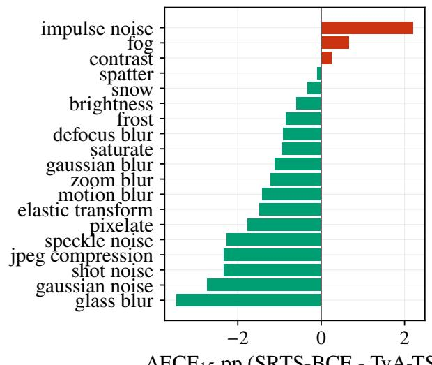  
$\Delta \mathrm { E C E } _ { 1 5 }$ pp (SRTS-BCE - TvA-TS  
Figure 17: Per-corruption $\Delta \mathrm { E C E } _ { 1 5 }$ of SRTS-BCE $K { = } 3$ 1minus TvA-TS on CIFAR-100-C. Negative values indicate that deployable risk routing improves over scalar BCE on that corruption; positive values indicate a local regression. This view exposes the heterogeneous corruption profile that is averaged in Table 29.

$B { = } 2 0 { , } 0 0 0$ , same procedure and random stream as the CIFAR-100-C tiers): mean $\Delta \ = \ - 0 . 6 2 \ p p , \ 9 5 \%$ CI $[ - 0 . 8 8 , - 0 . 3 6 ]$ , excluding zero (the three-seed interval $\mathrm { i s \ [ - 0 . 8 8 , - 0 . { \dot { 2 } } 9 ] }$ ; both exclude zero). The sample-only pooled view gives $[ - 0 . 8 3 , - 0 . 4 1 ] ;$ SRTS-BCE is below TvA-TS on all five seeds. With five seeds the seed level is sampled less coarsely than the three-seed intervals elsewhere in the paper. Appropriate language: “reduces $\mathrm { E C E _ { 1 5 } }$ by 0.70 pp at the point estimate; the unified hierarchical CI excludes zero.”

• SRTS-BCE vs $S M A R T + B C E ,$ clean $E C E _ { 1 5 }$ (five seeds): Mean $\Delta = - 0 . 0 3$ pp, seed×sample hierarchical 95% CI $[ - 0 . 1 9 , + 0 . 1 2 ]$ . Not statistically distinguishable. Appropriate language: “matches SMART+BCE.”

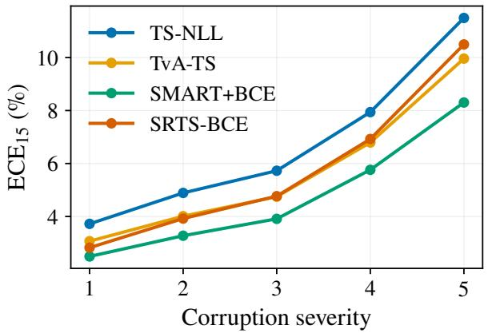  
Figure 18: CIFAR-100-C $\mathrm { E C E _ { 1 5 } }$ by severity (deployable 1BCE comparison). SRTS-BCE and SMART+BCE track below TvA-TS across severity, while TS-NLL degrades fastest at high severity. These are the same clean-validation-fitted calibrators applied unchanged to corrupted inputs, with SRTS rerouting each corrupted sample from its own logits.

• SRTS-BCE rerouted vs $S M A R T + B C E ,$ CIFAR-100-C $E C E _ { 1 5 } .$ Mean $\Delta = - 0 . 1 2 { \mathrm { ~ p p } }$ (SRTS minus SMART). We report three nested bootstraps of increasing conservativeness: cell-level 95% $\mathrm { C I } \left[ - \mathrm { \bar { 0 } } . 1 7 , \ : - 0 . 0 7 \right]$ (treats the $1 9 \times 5 \times 3$ cells as independent — optimistic); corruptiontype cluster $9 5 \% \mathrm { C I } \left[ - 0 . 2 5 , + 0 . 0 \dot { 0 } 1 \right]$ (resamples whole corruptions; marginally includes zero); and thefull threelevel hierarchical bootstrap over seed × corruption × severity, which additionally resamples the three training seeds and widens the interval to $\left[ - 0 . 3 3 , + 0 . 0 3 \right]$ (one-sided P(SRTS better)=0.93; $B { = } 2 0 { , } 0 0 0 $ ; identical resampling procedure and RNG as §C). Under the most conservative resampling the interval marginally includes zero, so the correct language is “directional under full hierarchical resampling, not two-sided significant”; with only three seeds the hierarchical interval is intentionally wide. Avoid universal-dominance phrasing.

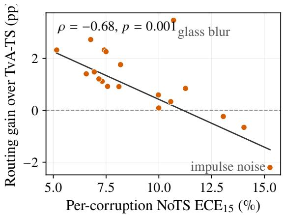  
Figure 19: Per-corruption routing gain vs corruption severity $( \mathbf { C I F A R - 1 0 0 - C } ,$ , three seeds). Each point is one of the 19 corruptions: x is its NoTS $\mathrm { E C E _ { 1 5 } }$ (how badly the uncalibrated model is miscalibrated under that corruption), y is the SRTS-BCE routing gain over scalar TvA-TS in $\mathrm { E C E _ { 1 5 } }$ points. The clean-fitted router helps on milder corruptions and degrades on the most severe ones (Spearman $\rho = - 0 . 6 8 .$ $p = 0 . 0 0 1$ ; Theil–Sen trend). Points above the dashed line favour routing.

• SRTS-BCE rerouted vs TvA-TS, CIFAR-100-C $E C E _ { 1 5 } .$ Mean $\Delta = - 1 . 0 9$ pp, cell-level 95% $\operatorname { C I } { [ - 1 . 2 8 , - 0 . 8 8 ] } ;$ corruption-type $9 5 \% \mathrm { C I } \left[ - 1 . 6 4 , \ : - 0 . 4 9 \right]$ ; full hierarchical $[ - 2 . 0 2 , - 0 . 3 6 ]$ (§C). SRTS-BCE clearly improves over the scalar BCE anchor under deployable shift routing.

• SRTS-BCE rerouted vs paired clean-group diagnostic, CIFAR-100-C $E C E _ { 1 5 } .$ Mean $\Delta = - 1 . 1 6$ pp, cell-level 95% CI $[ - 1 . 4 1 , - 0 . 9 1 ]$ ]. This diagnostic confirms that rerouting corrupted logits, rather than reusing paired clean-test groups, is the source of the corrected C100- C improvement.

• SRTS-BCE vs SMART+BCE, CIFAR-100-C eAURC: Under deployable rerouting, mean $\Delta = - 0 . 0 0 1 0$ , cell-level 95% $\mathrm { \dot { C I } } \left[ \mathrm { \dot { - } 0 . 0 0 1 1 , ~ - 0 . \dot { 0 } 0 0 9 } \right]$ and corruption-type 95% CI [−0.0012, −0.0008]. SRTS-BCE retains a small eAURC advantage.

• SRTS-BCE rerouted vs SMART+BCE, CIFAR-100-C severe $E C E _ { \mathrm { 1 5 } }$ (sev. 4–5): Mean $\Delta \ : = \ : - 0 . 2 4$ pp, celllevel 95% CI $[ - 0 . 3 3 , - 0 . 1 6 ]$ and corruption-type 95% CI $[ - 0 . 4 2 , - \dot { 0 } . 0 7 ]$ . SRTS-BCE has the lower severecorruption ECE point estimate under the deployable protocol.

Except for the CIFAR-100-C SMART+BCE comparison above — where the three-level hierarchical bootstrap does resample the three training seeds — these bootstraps are over test-sample variation within fixed seeds and do not model between-seed variance. Claims phrased at the seed level (“on 3/3 seeds”) are empirical observations about three independent training runs and are separate from the bootstrap evidence. Both views are reported to support complete

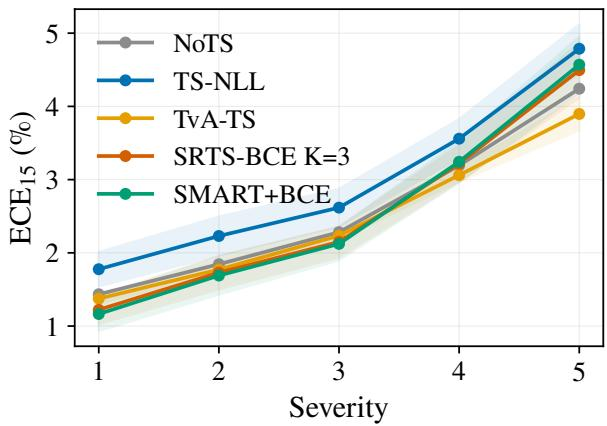

Figure 20: ImageNet-C $\mathrm { E C E _ { 1 5 } }$ vs severity (mean over 15 corruptions; deployable BCE comparison). On this strongly pretrained base, the BCE-objective variants are tightly clustered and do not reproduce the CIFAR-100-C routing gain, consistent with the text: TvA-TS remains a very strong scalar baseline and SRTS-BCE/SMART+BCE ofer no aggregate ECE improvement on ImageNet-C.
<table><tr><td>Shift</td><td>Best Outcome</td><td></td></tr><tr><td>CIFAR-100-C (syn- thetic, fine-tuned)</td><td>SRTS- BCE</td><td>4.63 vs. SMART+BCE 4.75; matched PWLinear-3 4.58 lower, unresolved; hier. CI</td></tr><tr><td>ImageNet-R/-A (natural, pretrained)</td><td>NoTS</td><td>incl. 0 every clean-fitted calibrator worsens ECE and TopBCE</td></tr><tr><td>ral, fine-tuned)</td><td>ily</td><td>ImageNet-V2 (natu- BCE fam- objective transfers (CIs excl. 0); routing vs. scalar unre-</td></tr></table>

Table 39: Distribution-shift scope $( \mathrm { E C E _ { 1 5 } } ;$ best headline calibrator per regime). The pretrained-vs-fine-tuned split on natural shift is the boundary: calibration transfers under finetuning, not on an already-calibrated pretrained head.

uncertainty disclosure.

<table><tr><td rowspan="3">Method</td><td colspan="2">ImageNet-R</td><td colspan="2">ImageNet-A</td></tr><tr><td> $\mathrm { E C E _ { 1 5 } }$ </td><td>TopBCE</td><td>ECE15</td><td>TopBCE</td></tr><tr><td>NoTS</td><td> ${ \bf 5 . 5 7 { \pm 0 . 0 0 } }$ </td><td> $\mathbf { 0 . 3 9 5 { \scriptstyle \pm 0 . 0 0 0 } }$ </td><td> $\mathbf { 2 2 . 8 9 } \pm \mathbf { 0 . 0 0 }$ </td><td> $\mathbf { 0 . 7 1 2 { \scriptstyle \pm 0 . 0 0 0 } }$ </td></tr><tr><td> $\mathrm { T S - N L L }$ </td><td> $1 0 . 2 3 { \pm } 0 . 4 6$ </td><td> $0 . 4 3 0 { \pm } 0 . 0 0 5$ </td><td> $2 8 . 0 9 { \pm } 1 . 0 5 $ </td><td> $0 . 8 1 8 { \pm } 0 . 0 2 4$ </td></tr><tr><td>TvA-TS</td><td> $8 . 5 5 { \pm } 0 . 3 8 $ </td><td> $0 . 4 1 5 { \pm } 0 . 0 0 3$ </td><td> $2 6 . 3 2 { \pm } 0 . 8 9$ </td><td> $0 . 7 7 9 { \pm } 0 . 0 1 8$ </td></tr><tr><td>QaTS-NLL</td><td> $9 . 9 1 { \pm } 0 . 0 2 $ </td><td> $0 . 4 2 8 { \pm } 0 . 0 0 2$ </td><td> $2 8 . 0 9 { \pm } 1 . 0 5 $ </td><td> $0 . 8 1 8 { \pm } 0 . 0 2 4$ </td></tr><tr><td> $\scriptstyle \mathrm { Q a T S - B C E }$ </td><td> $7 . 0 5 { \pm } 2 . 0 3 $ </td><td> $0 . 4 1 0 { \scriptstyle \pm 0 . 0 0 6 }$ </td><td> $2 6 . 3 2 { \pm } 0 . 8 9$ </td><td> $0 . 7 7 9 { \pm } 0 . 0 1 8$ </td></tr><tr><td> $\mathbf { S M A R T + B C E }$ </td><td> $9 . 0 2 { \pm } 3 . 8 1 $ </td><td> $0 . 4 6 4 { \pm } 0 . 0 1 2$ </td><td> $2 7 . 4 4 { \pm } 3 . 2 8 $ </td><td> $0 . 9 0 6 { \pm } 0 . 0 1 6$ </td></tr><tr><td> $\mathrm { P W L i n e a r } { - 3 }$ </td><td> $8 . 8 6 { \pm } 2 . 4 9$ </td><td> $0 . 4 3 9 { \pm } 0 . 0 0 8$ </td><td> $2 9 . 4 5 { \pm } 2 . 3 8 $ </td><td> $0 . 8 4 1 { \pm } 0 . 0 4 5$ </td></tr><tr><td> $\mathrm { S R T S - B C E }$ </td><td> $9 . 2 1 { \pm } 1 . 1 0 $ </td><td> $0 . 4 3 3 { \pm } 0 . 0 0 9$ </td><td> $2 7 . 7 1 { \pm } 3 . 6 5$ </td><td> $0 . 8 7 4 { \scriptstyle \pm 0 . 0 4 2 }$ </td></tr></table>

Table 40: Natural-shift boundary: clean-ImageNet-fit calibration on ImageNet-R and ImageNet-A (pretrained ViT-B/16; label space restricted to each variant’s 200 classes; calibrators fit on a clean five-per-class validation draw, ≈1,000 samples, applied unchanged to the shifted test set; mean±std over three calibration draws). Every clean-fitted calibrator worsens both metrics relative to the uncalibrated model. Bold: best per column.

<table><tr><td>Regime</td><td>Best method</td><td>Support</td></tr><tr><td>Clean C100, 3 ViT backbones</td><td>SRTS-BCE 3/3</td><td>ViT cell bootstrap-tied</td></tr><tr><td>Clean C100, 2 ConvNets</td><td>split 1/1</td><td> $\mathrm { g a p s } \leq \hat { 0 } . 1 3 \mathrm { p p }$ </td></tr><tr><td>Clean CIFAR-10, 5 backbones</td><td>SMART- SoftECE on ECE15</td><td>near-saturated; SRTS-BCE best  $\mathrm { A d a E C E } _ { 1 5 } 5 / 5$ </td></tr><tr><td>Clean Tiny-IN, 3 backbones Clean IN-100, 3 fine-tuned backbones</td><td>SMART+BCE 2/3 tie (all methods)</td><td>point estimates no routing advantage; within</td></tr><tr><td>C100-C, deployable</td><td></td><td>seed variance (1.5–2.0) directional;</td></tr><tr><td>rerouting C100-C, 2 ConvNets</td><td>SRTS-BCE</td><td>hierarch. CI incl. 0 routed  scalar;</td></tr><tr><td>C100-C, PWLinear-3</td><td>split 1/1</td><td>scalar &lt; NoTS (ResNet) point favours</td></tr><tr><td>vs. SRTS-BCE</td><td>neither (hierarchical CI incl. 0)</td><td>PWLinear-3; cell/corr.-type tiers exclude 0</td></tr><tr><td>ImageNet-C, pretrained TvA-TS ViT ImageNet-Sketch,</td><td></td><td>B=10 resamples</td></tr><tr><td>pretrained ViT IN-R / IN-A (pretrained)</td><td>SRTS-BCE ≈ TvA-TS NoTS</td><td>in-domain small val; tie clean-fitted</td></tr><tr><td>IN-V2 (fine-tuned IN-100)</td><td>BCE family</td><td>calibrators all worsen ECE objective axis transfers;</td></tr><tr><td>Val. budget ≤ 10%</td><td>SRTS-BCE abs.</td><td>conditioned vs. scalar unresolved val-size sweep</td></tr><tr><td>Unrestricted heads, any regime</td><td>/ TvA-TS stab. never best</td><td> $\mathrm { E C E } \geq 6$  throughout</td></tr></table>

Table 41: Explicit per-regime win/loss map (primary metric $\mathrm { E C E _ { 1 5 } ; }$ the flagship CIFAR-100/ViT-B/16 cell uses five seeds, other multi-run regimes three unless stated otherwise). “Support” qualifies the winning margin (row groups: clean, shift, boundary). Where the honest outcome is a tie or a loss, the map reports it as such; per-dataset evidence is in the subsections below.

<table><tr><td>Backbone</td><td>Method</td><td>Top-1</td><td>NLL</td><td>Brier</td><td> $\mathrm { E C E _ { 1 5 } }$ </td><td>AURC</td><td>eAURC</td></tr><tr><td rowspan="11">DeiT-S</td><td>NoTS</td><td>88.76±0.63</td><td>0.523±0.005</td><td>0.178±0.008</td><td>8.53±1.11</td><td>0.0328±0.0022</td><td>0.0262±0.0029</td></tr><tr><td>TS-NLL</td><td>88.76±0.63</td><td>0.458±0.020</td><td>0.174±0.006</td><td>2.90±0.19</td><td>0.0296±0.0026</td><td>0.0230±0.0033</td></tr><tr><td>SRTS-NLL K=1 (ablation)</td><td>88.76±0.63</td><td>0.458±0.020</td><td>0.174±0.006</td><td>2.90±0.19</td><td>0.0296±0.0026</td><td>0.0230±0.0033</td></tr><tr><td>SRTS-NLL K=3 (ablation)</td><td>88.76±0.63</td><td>0.447±0.017</td><td>0.170±0.007</td><td>2.65±0.12</td><td>0.0221±0.0004</td><td>0.0156±0.0011</td></tr><tr><td>SATS-Logit</td><td>88.76±0.63</td><td>1.116±0.342</td><td>0.191±0.014</td><td>7.02±1.05</td><td>0.0393±0.0031</td><td>0.0327±0.0023</td></tr><tr><td>LTS-feature</td><td>88.76±0.63</td><td>2.048±0.262</td><td>0.199±0.012</td><td>8.30±0.65</td><td>0.0449±0.0034</td><td>0.0383±0.0027</td></tr><tr><td>Feature-SATS</td><td>88.76±0.63</td><td>2.058±0.265</td><td>0.199±0.012</td><td>8.31±0.65</td><td>0.0450±0.0035</td><td>0.0384±0.0027</td></tr><tr><td>Frozen-feature UTempH</td><td>88.76±0.63</td><td>2.058±0.265</td><td>0.199±0.012</td><td>8.31±0.65</td><td>0.0450±0.0035</td><td>0.0384±0.0027</td></tr><tr><td>TvA-TS ≡ TS-BCE</td><td>88.76±0.63</td><td>0.459±0.016</td><td>0.173±0.005</td><td>3.37±0.40</td><td>0.0301±0.0021</td><td>0.0235±0.0027</td></tr><tr><td>SRTS-BCE K=3 risk</td><td>88.76±0.63</td><td>0.451±0.013</td><td>0.168±0.005</td><td>0.94±0.07</td><td>0.0220±0.0003</td><td>0.0154±0.0007</td></tr><tr><td>SMART+BCE</td><td>88.76±0.63</td><td>0.455±0.014</td><td>0.169±0.006</td><td>1.17±0.01</td><td>0.0218±0.0001</td><td>0.0152±0.0005</td></tr><tr><td rowspan="11">Swin-T</td><td>NoTS</td><td>88.75±0.48</td><td>0.514±0.008</td><td>0.177±0.004</td><td>8.77±0.53</td><td>0.0308±0.0006</td><td>0.0242±0.0010</td></tr><tr><td>TS-NLL</td><td>88.75±0.48</td><td>0.443±0.007</td><td>0.171±0.004</td><td>2.98±0.24</td><td>0.0270±0.0006</td><td>0.0205±0.0012</td></tr><tr><td>SRTS-NLL K=1 (ablation)</td><td>88.75±0.48</td><td>0.443±0.007</td><td>0.171±0.004</td><td>2.98±0.24</td><td>0.0270±0.0006</td><td>0.0205±0.0012</td></tr><tr><td>SRTS-NLL K=3 (ablation)</td><td>88.75±0.48</td><td>0.435±0.008</td><td>0.169±0.004</td><td>2.76±0.36</td><td>0.0215±0.0003</td><td>0.0149±0.0009</td></tr><tr><td>SATS-Logit</td><td>88.75±0.48</td><td>1.319±0.371</td><td>0.192±0.007</td><td>7.24±0.49</td><td>0.0404±0.0036</td><td>0.0338±0.0031</td></tr><tr><td>LTS-feature</td><td>88.75±0.48</td><td>3.895±1.527</td><td>0.201±0.007</td><td>8.44±0.44</td><td>0.0477±0.0028</td><td>0.0411±0.0022</td></tr><tr><td>Feature-SATS</td><td>88.75±0.48</td><td>3.931±1.548</td><td>0.201±0.007</td><td>8.46±0.44</td><td>0.0478±0.0027</td><td>0.0412±0.0021</td></tr><tr><td>Frozen-feature UTempH</td><td>88.75±0.48</td><td>3.931±1.548</td><td>0.201±0.007</td><td>8.46±0.44</td><td>0.0478±0.0027</td><td>0.0412±0.0021</td></tr><tr><td>TvA-TS ≡ TS-BCE</td><td>88.75±0.48</td><td>0.444±0.005</td><td>0.170±0.003</td><td>2.87±0.04</td><td>0.0276±0.0004</td><td>0.0211±0.0009</td></tr><tr><td>SRTS-BCE K=3 risk</td><td>88.75±0.48</td><td>0.438±0.004</td><td>0.167±0.003</td><td>1.04±0.27</td><td>0.0214±0.0003</td><td>0.0148±0.0008</td></tr><tr><td>SMART+BCE</td><td>88.75±0.48</td><td>0.438±0.005</td><td>0.167±0.004</td><td>1.13±0.19</td><td>0.0214±0.0003</td><td>0.0148±0.0006</td></tr></table>

Table 42: Full three-seed DeiT-S and Swin-T CIFAR-100 post-hoc calibration tables (mean ± standard deviation over seeds 0/1/2). NLL-objective SRTS rows are reported as ablations; the BCE-objective confirmation rows include TvA-TS, SRTS-BCE K=3 risk, and SMART+BCE. SRTS-BCE wins ECE on both backbones. Top-1 was empirically unchanged for every post-hoc row in the seed-level audit.

<table><tr><td>Regime / backbone</td><td>Rows checked Rows changed</td><td></td><td>Missing post-hoc rows</td></tr><tr><td>CIFAR-100 / ViT-B/16</td><td>21 + TvA aggregate</td><td></td><td>0 TvA-TS from companion 3-seed evaluation</td></tr><tr><td>CIFAR-100 / DeiT-S</td><td>24</td><td>0</td><td>0</td></tr><tr><td>CIFAR-100 / Swin-T</td><td>24</td><td>0</td><td>0</td></tr><tr><td>Tiny-ImageNet / ViT-B/16</td><td>21</td><td>0</td><td>Later BCE rows in Table 49</td></tr></table>

Table 43: Cross-backbone top-1 invariance audit. Each post-hoc row is compared against its corresponding NoTS seed before aggregation. No reported post-hoc row changed top-1 in the seed-level metrics. Tiny-ImageNet BCE rows, including TvA-TS, are in Table 49.

<table><tr><td>Backbone</td><td>Method</td><td>Top-1</td><td>NLL</td><td>Brier</td><td> $\mathrm { E C E _ { 1 5 } }$ </td><td>AURC</td><td>eAURC</td></tr><tr><td rowspan="11">DeiT-S</td><td>NoTS</td><td>84.27±0.07</td><td>0.717±0.005</td><td>0.234±0.001</td><td>9.10±0.34</td><td>0.0381±0.0014</td><td>0.0250±0.0015</td></tr><tr><td>TS-NLL</td><td>84.27±0.07</td><td>0.638±0.003</td><td>0.228±0.002</td><td>3.27±0.17</td><td>0.0355±0.0014</td><td>0.0224±0.0015</td></tr><tr><td>SRTS-NLL K=1 (ablation)</td><td>84.27±0.07</td><td>0.638±0.003</td><td>0.228±0.002</td><td>3.27±0.17</td><td>0.0355±0.0014</td><td>0.0224±0.0015</td></tr><tr><td>SRTS-NLL K=3 (ablation)</td><td>84.27±0.07</td><td>0.632±0.003</td><td>0.226±0.001</td><td>3.10±0.13</td><td>0.0315±0.0003</td><td>0.0184±0.0004</td></tr><tr><td>SATS-Logit</td><td>84.27±0.07</td><td>1.509±0.089</td><td>0.262±0.001</td><td>9.75±0.16</td><td>0.0532±0.0017</td><td>0.0401±0.0017</td></tr><tr><td>LTS-feature</td><td>84.27±0.07</td><td>1.852±0.058</td><td>0.265±0.002</td><td>10.40±0.07</td><td>0.0542±0.0023</td><td>0.0411±0.0023</td></tr><tr><td>Feature-SATS</td><td>84.27±0.07</td><td>1.858±0.059</td><td>0.265±0.002</td><td>10.41±0.07</td><td>0.0542±0.0024</td><td>0.0411±0.0023</td></tr><tr><td>Frozen-feature UTempH</td><td>84.27±0.07</td><td>1.858±0.059</td><td>0.265±0.002</td><td>10.41±0.07</td><td>0.0542±0.0024</td><td>0.0411±0.0023</td></tr><tr><td> $\mathrm { T v } \mathbf { A } \mathbf { - } \mathbf { T S } \equiv \mathbf { T S - B } \mathbf { C E }$ </td><td>84.27±0.07</td><td>0.641±0.003</td><td>0.226±0.001</td><td>3.08±0.30</td><td>0.0360±0.0014</td><td>0.0229±0.0015</td></tr><tr><td>SRTS-BCE K=3 risk SMART+BCE</td><td>84.27±0.07</td><td>0.640±0.003</td><td>0.224±0.001</td><td>1.09±0.28</td><td>0.0315±0.0003</td><td>0.0184±0.0004</td></tr><tr><td></td><td>84.27±0.07</td><td>0.639±0.003</td><td>0.224±0.001</td><td>1.12±0.30</td><td>0.0312±0.0006</td><td>0.0182±0.0007</td></tr><tr><td rowspan="11">Swin-T</td><td>NoTS</td><td>84.15±0.08</td><td>0.709±0.003</td><td>0.236±0.002</td><td>8.18±0.68</td><td>0.0430±0.0026</td><td>0.0297±0.0027</td></tr><tr><td>TS-NLL</td><td>84.15±0.08</td><td>0.642±0.007</td><td>0.231±0.001</td><td>3.09±0.11</td><td>0.0392±0.0023</td><td>0.0259±0.0024</td></tr><tr><td>SRTS-NLL K=1 (ablation)</td><td>84.15±0.08</td><td>0.642±0.007</td><td>0.231±0.001</td><td>3.07±0.12</td><td>0.0392±0.0023</td><td>0.0259±0.0024</td></tr><tr><td>SRTS-NLL K=3 (ablation)</td><td>84.15±0.08</td><td>0.635±0.006</td><td>0.229±0.002</td><td>2.92±0.04</td><td>0.0335±0.0008</td><td>0.0202±0.0009</td></tr><tr><td>SATS-Logit</td><td>84.15±0.08</td><td>1.656±0.094</td><td>0.267±0.001</td><td>10.06±0.30</td><td>0.0585±0.0008</td><td>0.0452±0.0008</td></tr><tr><td>LTS-feature</td><td>84.15±0.08</td><td>2.492±0.094</td><td>0.274±0.001</td><td>11.02±0.16</td><td>0.0635±0.0015</td><td>0.0502±0.0016</td></tr><tr><td>Feature-SATS</td><td>84.15±0.08</td><td>2.502±0.095</td><td>0.274±0.001</td><td>11.02±0.15</td><td>0.0635±0.0015</td><td>0.0502±0.0016</td></tr><tr><td>Frozen-feature UTempH</td><td>84.15±0.08</td><td>2.502±0.095</td><td>0.274±0.001</td><td>11.02±0.15</td><td>0.0635±0.0015</td><td>0.0502±0.0016</td></tr><tr><td>TvA-TS ≡ TS-BCE</td><td>84.15±0.08</td><td>0.643±0.007</td><td>0.229±0.001</td><td>2.71±0.07</td><td>0.0398±0.0024</td><td>0.0266±0.0025</td></tr><tr><td>SRTS-BCE K=3 risk</td><td>84.15±0.08 84.15±0.08</td><td>0.641±0.007 0.641±0.007</td><td>0.227±0.001</td><td>1.24±0.11</td><td>0.0335±0.0008</td><td>0.0202±0.0008</td></tr><tr><td>SMART+BCE</td><td></td><td></td><td>0.227±0.001</td><td>1.03±0.32</td><td>0.0336±0.0007</td><td> $0 . 0 2 0 3 { \scriptstyle \pm 0 . 0 0 0 8 }$ </td></tr></table>

Table 44: Full three-seed DeiT-S and Swin-T Tiny-ImageNet post-hoc calibration tables (mean ± standard deviation over seeds 0/1/2). NLL-objective SRTS rows are reported as ablations; the BCE-objective confirmation rows include TvA-TS, SRTS-BCE K=3 risk, and SMART+BCE (per-backbone ordering discussed in the text). Top-1 was empirically unchanged for every post-hoc row in the seed-level audit.

<table><tr><td>Regime / backbone</td><td>NoTS</td><td>TS-NLL</td><td>TvA-TS</td><td>SMART-SoftECE</td><td>SRTS-BCE</td></tr><tr><td>C10 / ViT-B/16</td><td>10.96</td><td>0.55±0.07/0.73±0.16</td><td>0.52±0.03/0.73±0.15</td><td> $\mathbf { 0 . 3 5 { \pm } 0 . 1 3 / 1 . 4 7 { \pm } 0 . 4 7 }$ </td><td> $0 . 4 7 { \pm } 0 . 0 5 / 0 . 5 8 { \pm } 0 . 0 8$ </td></tr><tr><td>C10 / DeiT-S</td><td>10.81</td><td>0.49±0.04/0.85±0.16</td><td>0.46±0.04/0.85±0.17</td><td> $\mathbf { 0 . 2 4 { \pm } 0 . 0 7 } / 1 . 3 4 { \pm } 0 . 4 3$ </td><td> $0 . 4 1 { \pm } 0 . 0 7 / 0 . 7 0 { \pm } 0 . 1 1$ </td></tr><tr><td>C10 / Swin-T</td><td>11.30</td><td> $0 . 4 4 { \pm } 0 . 0 5 / 0 . 6 8 { \pm } 0 . 0 9$ </td><td>0.39±0.08/0.67±0.09</td><td> $\mathbf { 0 . 1 9 { \pm } 0 . 0 3 } / 1 . 3 7 { \pm } 0 . 2 2$ </td><td> $0 . 3 5 { \pm } 0 . 1 1 / 0 . 5 3 { \pm } 0 . 1 3$ </td></tr><tr><td>C10 / ResNet-50</td><td>20.23</td><td>0.63±0.03/1.17±0.080.60±0.04/1.18±0.09</td><td></td><td>0.32±0.13/1.37±0.75</td><td> $0 . 6 0 { \pm } 0 . 0 4 / 0 . 9 9 { \pm } 0 . 1 1$ </td></tr><tr><td>C10 / RegNetY-1.6GF</td><td>18.52</td><td>0.51±0.05/0.72±0.020.53±0.02/0.72±0.01</td><td></td><td> $\mathbf { 0 . 4 0 { \pm 0 . 0 7 } } / 1 . 2 8 { \pm 0 . 7 9 }$ </td><td> $0 . 4 2 { \pm } 0 . 0 6 / 0 . 5 7 { \pm } 0 . 0 3$ </td></tr><tr><td>C100 / ViT-B/16</td><td>9.69</td><td> $1 . 9 4 { \pm } 0 . 6 5 / 2 . 1 0 { \pm } 0 . 6 2$ </td><td>1.65±0.44/1.77±0.69</td><td> $1 . 2 1 { \pm } 0 . 2 8 / 1 . 4 5 { \pm } 0 . 5 1$ </td><td> $\mathbf { 0 . 9 6 { \pm } 0 . 3 2 / 0 . 9 6 { \pm } 0 . 3 3 }$ </td></tr><tr><td>C100 / DeiT-S</td><td>8.53</td><td> $2 . 9 1 { \pm } 0 . 1 6 \mathrm { / 3 . 7 4 } { \pm } 0 . 2 4$ </td><td> $3 . 3 7 { \pm } 0 . 4 0 \dot { / } 3 . 5 2 { \pm } 0 . 3 8$ </td><td> $1 . 7 6 { \pm } 0 . 3 8 \dot { / } 2 . 0 5 { \pm } 0 . 1 1$ </td><td> $\mathbf { 0 . 9 4 \pm 0 . 0 7 / 1 . 0 5 } \pm \mathbf { 0 . 2 3 }$ </td></tr><tr><td>C100 / Swin-T</td><td>8.77</td><td>2.99±0.20/3.32±0.222.87±0.04/2.93±0.08</td><td></td><td> $1 . 2 1 { \pm } 0 . 1 0 / 1 . 3 8 { \pm } 0 . 2 2$ </td><td>1.04±0.27/1.14±0.33</td></tr><tr><td>C100 / ResNet-50</td><td>17.02</td><td> $3 . 1 6 { \pm } 0 . 3 5 / 3 . 5 4 { \pm } 0 . 2 1$ </td><td> $2 . 8 3 { \pm } 0 . 1 0 / 3 . 2 2 { \pm } 0 . 1 6$ </td><td> $1 . 2 9 { \pm } 0 . 4 5 / 1 . 5 9 { \pm } 0 . 3 5$ </td><td> $\mathbf { 1 . 1 6 { \pm } 0 . 1 5 / 1 . 3 4 { \pm } 0 . 1 1 }$ </td></tr><tr><td>C100 / RegNetY-1.6GF</td><td>22.06</td><td>1.57±0.11/1.80±0.131.54±0.05/1.50±0.04</td><td></td><td> $1 . 9 5 { \pm } 1 . 0 3 / 2 . 0 3 { \pm } 0 . 8 9$ </td><td>1.01±0.09/1.06±0.09</td></tr><tr><td>Tiny-IN / ViT-B/16</td><td>10.04</td><td> $1 . 3 3 { \pm } 0 . 2 4 / 1 . 3 3 { \pm } 0 . 2 4$ </td><td> $1 . 2 6 { \pm } 0 . 1 8 / 1 . 0 8 { \pm } 0 . 1 3$ </td><td> $1 . 1 5 { \pm } 0 . 2 2 / 1 . 1 9 { \pm } 0 . 1 8$ </td><td> $\mathbf { 1 . 1 2 { \pm } 0 . 1 7 / 1 . 1 5 { \pm } 0 . 2 5 }$ </td></tr><tr><td>Tiny-IN / DeiT-S</td><td>9.10</td><td> $3 . 2 7 { \pm } 0 . 1 7 / 3 . 7 2 { \pm } 0 . 3 0$ </td><td> $3 . 0 8 { \pm } 0 . 3 0 \dot { / } 3 . 0 0 { \pm } 0 . 2 9$ </td><td> $\mathbf { 1 . 0 1 { \pm } 0 . 4 1 / 1 . 3 2 { \pm } 0 . 5 5 }$ </td><td> $\mathbf { 1 . 0 9 { \pm } 0 . 2 8 / 1 . 0 6 { \pm } 0 . 2 1 }$ </td></tr><tr><td>Tiny-IN / Swin-T</td><td>8.18</td><td> $3 . 0 9 { \pm } 0 . 1 1 \dot { / } 3 . 5 5 { \pm } 0 . 1 9$ </td><td> $2 . 7 1 { \pm } 0 . 0 7 / 2 . 8 2 { \pm } 0 . 1 3$ </td><td> $\mathbf { 1 . 1 7 { \overset { . } { \bot } } 0 . 2 2 { \overset { . } { / } } 1 . 2 0 { \overset { . } { \pm } } 0 . 4 6 }$ </td><td> $\mathbf { 1 . 2 4 { \pm } 0 . 1 1 / 1 . 1 1 { \pm } 0 . 1 4 }$ </td></tr><tr><td>IN-100 / ViT-B/16</td><td>3.97</td><td> $1 . 6 3 { \pm } 0 . 1 8 / 1 . 4 1 { \pm } 0 . 1 7$ </td><td> $1 . 5 8 { \pm } 0 . 2 4 / 1 . 5 4 { \pm } 0 . 3 8$ </td><td> $\mathbf { 1 . 2 8 { \overset { . } { \mathop { \left( 0 . 2 1 \right) } } \tilde { 1 . } 4 0 { \overset { . } { \mathop { \left( 0 . 2 8 \right) } } } } }$ </td><td> $1 . 6 4 { \pm } 0 . 2 7 / 1 . 5 2 { \pm } 0 . 3 7$ </td></tr><tr><td>IN-100 / DeiT-S</td><td>4.40</td><td> $2 . 5 8 { \pm } 0 . 2 1 \dot { / } 2 . 4 1 { \pm } 0 . 1 4$ </td><td> $1 . 8 3 { \pm } 0 . 1 6 \dot { / } 2 . 3 1 { \pm } 0 . 3 9$ </td><td> $\mathbf { 1 . 5 8 { \pm 0 . 3 9 } / 1 . 6 3 { \pm 0 . 0 4 } }$ </td><td> $2 . 0 0 { \pm } 0 . 2 9 / 2 . 1 5 { \pm } 0 . 4 1$ </td></tr><tr><td>IN-100 / Swin-T</td><td>3.14</td><td> $1 . 9 1 { \pm } 0 . 2 3 / 1 . 7 5 { \pm } 0 . 0 7$ </td><td> $1 . 7 0 { \pm } 0 . 2 8 / 1 . 6 9 { \pm } 0 . 3 7$ </td><td> $\mathbf { 1 . 6 7 { \overset { . } { \mathop { \left/ { \pm } \right.} 0 . 2 7 / 1 . 5 5 { \pm } 0 . 1 2 }  } }$ </td><td> $1 . 7 2 { \pm } 0 . 2 0 / 1 . 6 9 { \pm } 0 . 3 1$ </td></tr></table>

Table 45: Empirical scope map (fixed K=3 cross-regime evaluation). Cells: $\mathrm { E C E _ { 1 5 } / A d a E C E _ { 1 5 } }$ (±std; CIFAR-100/ViT-B/16 and IN-100/DeiT-S five seeds, other cells three; IN-100 rows computed with the canonical post-hoc pipeline, SMART-SoftECE column three-seed); SRTS-BCE uses fixed K=3 everywhere, no test-set or per-cell K selection. SMART-SoftECE: the SMART head (Guo et al. 2026) with its own training objective (SMART+BCE: the main paper’s RQ1 table, §F, and §G here). Bold: lower of SMART-SoftECE/SRTS-BCE per metric (C100 and Tiny-IN blocks); best over all methods (diagnostic C10 and IN-100 blocks, §F; C10: SMART-SoftECE wins $\mathrm { E C E _ { 1 5 } }$ , worst $\mathrm { A d a E C E _ { 1 5 } }$ — metric dependence).

<table><tr><td colspan="2">Regime / backbone Metric</td><td>NoTS</td><td>TS-NLL</td><td colspan="3">TvA-TS SMART+BCE SRTS-BCE Adaptive range</td></tr><tr><td rowspan="3">C100 / ViT-B/16</td><td rowspan="3"> $\mathrm { E C E _ { 1 5 } }$   $\mathrm { A d a E C E _ { 1 5 } }$   $\mathrm { s m E C E }$ </td><td> $9 . 6 9 { \pm } 1 . 1 0 \ $ </td><td> $1 . 9 4 { \pm } 0 . 6 5 1 . 6 5 { \pm } 0 . 4 4$ </td><td> $\mathbf { 0 . 9 5 { \pm } 0 . 2 9 } 0 . 9 6 { \pm } 0 . 3 2$ </td><td></td><td rowspan="3"> $6 . 1 5 { - } 6 . 7 1 $ </td></tr><tr><td> $9 . 6 5 { \pm } 1 . 1 5 $ </td><td> $2 . 1 0 { \pm } 0 . 6 2 1 . 7 7 { \pm } 0 . 6 9$ </td><td> $\mathbf { 1 . 0 2 { \pm } 0 . 2 9 0 . 9 6 { \pm } 0 . 3 3 }$ </td><td></td></tr><tr><td> $9 . 6 3 { \pm } 1 . 1 4 $ </td><td> $1 . 9 7 { \scriptstyle \pm 0 . 5 2 1 . 7 1 \pm 0 . 4 5 }$ </td><td> $\mathbf { 1 . 1 6 { \pm } 0 . 2 2 1 . 1 3 { \pm } 0 . 2 2 }$ </td><td></td></tr><tr><td rowspan="3">C100 / DeiT-S</td><td> $\mathrm { E C E _ { 1 5 } }$ </td><td> $8 . 5 3 { \pm } 0 . 9 0 $ </td><td> $2 . 9 1 { \pm } 0 . 1 6 3 . 3 7 { \pm } 0 . 4 0$ </td><td></td><td> $1 . 1 7 { \pm } 0 . 0 1 0 . 9 4 { \pm } 0 . 0 7$ </td><td> $7 . 0 2 { - } 8 . 3 1 $ </td></tr><tr><td> $\mathrm { A d a E C E _ { 1 5 } }$ </td><td> $8 . 4 5 { \pm } 0 . 9 7 $ </td><td> $3 . 7 4 { \pm } 0 . 2 4 3 . 5 2 { \pm } 0 . 3 8$ </td><td></td><td> $\mathbf { 1 . 2 3 { \pm } 0 . 1 2 1 . 0 5 { \pm } 0 . 2 3 }$ </td><td></td></tr><tr><td> $\mathrm { s m E C E }$ </td><td> $8 . 3 3 { \pm } 1 . 0 7$ </td><td> $2 . 9 4 { \pm } 0 . 1 3 2 . 8 3 { \pm } 0 . 1 9$ </td><td> $\mathbf { 1 . 2 4 { \pm } 0 . 0 4 1 . 1 4 { \pm } 0 . 0 6 }$ </td><td></td><td></td></tr><tr><td rowspan="3">C100 / Swin-T</td><td> $\mathrm { E C E _ { 1 5 } }$ </td><td> $8 . 7 7 { \pm } 0 . 4 3$ </td><td> $2 . 9 9 { \pm } 0 . 2 0 2 . 8 7 { \pm } 0 . 0 4$ </td><td></td><td> $\mathbf { 1 . 1 3 { \pm } 0 . 1 9 1 . 0 4 { \pm } 0 . 2 7 }$ </td><td>7.24-8.46</td></tr><tr><td> $\mathrm { A d a E C E _ { 1 5 } }$   $\mathrm { s m E C E }$ </td><td> $8 . 7 4 { \pm } 0 . 4 1$ </td><td> $3 . 3 2 { \pm } 0 . 2 2 2 . 9 3 { \pm } 0 . 0 8$ </td><td> $\mathbf { 1 . 0 3 \pm 0 . 1 3 }$ </td><td> $1 . 1 4 { \pm } 0 . 3 3$ </td><td></td></tr><tr><td></td><td> $8 . 7 4 { \pm } 0 . 4 1$ </td><td> $2 . 8 8 { \pm } 0 . 1 9 2 . 6 0 { \pm } 0 . 0 5$ </td><td> $\mathbf { 1 . 2 0 { \pm } 0 . 1 2 }$ </td><td> $1 . 2 4 { \pm } 0 . 2 0 $ </td><td></td></tr><tr><td rowspan="3">C10 / ViT-B/16</td><td> $\mathrm { E C E _ { 1 5 } }$ </td><td> $1 0 . 9 6 { \pm } 0 . 7 7$ </td><td> $0 . 5 5 { \pm } 0 . 0 7 0 . 5 2 { \pm } 0 . 0 3$ </td><td> $\mathbf { 0 . 3 8 { \pm 0 . 0 6 } }$ </td><td> $0 . 4 7 { \pm } 0 . 0 5$ </td><td></td></tr><tr><td> $\mathrm { A d a E C E _ { 1 5 } }$   $\mathrm { s m E C E }$ </td><td> $1 0 . 9 2 { \scriptstyle \pm 0 . 7 7 }$ </td><td> $0 . 7 3 { \pm } 0 . 1 6 \ 0 . 7 3 { \pm } 0 . 1 5$ </td><td> $\mathbf { 0 . 3 3 } { \pm } \mathbf { 0 . 0 8 }$ </td><td> $0 . 5 8 { \pm } 0 . 0 8$ </td><td></td></tr><tr><td></td><td> $1 0 . 9 2 { \scriptstyle \pm 0 . 7 7 }$ </td><td> $0 . 6 1 { \pm } 0 . 0 6 0 . 6 2 { \pm } 0 . 0 7$ </td><td></td><td> $0 . 5 7 { \pm } 0 . 0 3 0 . 5 5 { \pm } 0 . 0 6$ </td><td></td></tr><tr><td rowspan="3">C10 / DeiT-S</td><td> $\mathrm { E C E _ { 1 5 } }$   $\mathrm { A d a E C E _ { 1 5 } }$ </td><td> $1 0 . 8 1 { \pm } 0 . 3 5 $ </td><td> $0 . 4 9 { \pm } 0 . 0 4 0 . 4 6 { \pm } 0 . 0 4$ </td><td></td><td> $0 . 4 4 { \pm } 0 . 1 0 \ 0 . 4 1 { \pm } 0 . \mathbf { 0 } 7$ </td><td></td></tr><tr><td> $\mathrm { s m E C E }$ </td><td> $1 0 . 7 6 { \pm } 0 . 3 1$ </td><td> $0 . 8 5 { \pm } 0 . 1 6 0 . 8 5 { \pm } 0 . 1 7$ </td><td> $\mathbf { 0 . 4 4 { \overset { . } { \bot } } 0 . 0 9 }$ </td><td> $0 . 7 0 { \pm } 0 . 1 1$ </td><td></td></tr><tr><td></td><td> $1 0 . 7 6 { \pm } 0 . 3 1$ </td><td> $0 . 6 7 { \pm } 0 . 1 4 0 . 6 7 { \pm } 0 . 1 3$ </td><td> $\mathbf { 0 . 5 9 } { \pm } \mathbf { 0 . 0 7 }$ </td><td> $0 . 6 4 { \pm } 0 . 0 9$ </td><td></td></tr><tr><td rowspan="3">C10 / Swin-T</td><td> $\mathrm { E C E _ { 1 5 } }$   $\mathrm { A d a E C E _ { 1 5 } }$ </td><td> $1 1 . 3 0 { \pm } 0 . 2 4 $ </td><td> $0 . 4 4 { \pm } 0 . 0 5 0 . 3 9 { \pm } 0 . 0 8$ </td><td> $\mathbf { 0 . 2 9 } { \pm } \mathbf { 0 . 0 6 }$ </td><td> $0 . 3 5 { \pm } 0 . 1 1$ </td><td></td></tr><tr><td> $\mathrm { s m E C E }$ </td><td> $1 1 . 1 9 { \pm } 0 . 2 6 $ </td><td> $0 . 6 8 { \pm } 0 . 0 9 0 . 6 7 { \pm } 0 . 0 9$ </td><td> $\mathbf { 0 . 2 5 { \pm } 0 . 0 4 }$ </td><td> $0 . 5 3 { \pm } 0 . 1 3$ </td><td></td></tr><tr><td></td><td></td><td> $1 1 . 1 9 \pm 0 . 2 6 \ 0 . 5 4 \pm 0 . 0 8 \ 0 . 5 5 \pm 0 . 0 9$ </td><td> $0 . 5 5 { \pm } 0 . 0 6 \ $ </td><td> $0 . 5 7 { \pm } 0 . 1 6$ </td><td></td></tr><tr><td rowspan="3">Tiny / ViT-B/16</td><td> $\mathrm { E C E _ { 1 5 } }$   $\mathrm { A d a E C E _ { 1 5 } }$ </td><td> $1 0 . 0 4 { \pm } 0 . 8 9$ </td><td> $1 . 3 3 { \pm } 0 . 2 4 1 . 2 6 { \pm } 0 . 1 8$ </td><td> $\mathbf { 0 . 9 7 { \pm } 0 . 2 2 }$ </td><td> $1 . 1 2 { \pm } 0 . 1 7 $ </td><td>7.05-7.40</td></tr><tr><td> $\mathrm { s m E C E }$ </td><td> $1 0 . 0 3 { \pm } 0 . 8 9$ </td><td> $1 . 3 3 { \pm } 0 . 2 4 1 . 0 8 { \pm } 0 . 1 3$ </td><td> $\mathbf { 0 . 8 6 { \pm } 0 . 1 3 }$ </td><td> $1 . 1 5 { \pm } 0 . 2 5 $ </td><td></td></tr><tr><td></td><td> $1 0 . 0 0 { \pm } 0 . 8 9$ </td><td> $1 . 4 5 { \pm } 0 . 1 6 1 . 3 4 { \pm } 0 . 0 7$ </td><td> $\mathbf { 1 . 2 1 { \pm } 0 . 1 2 }$ </td><td> $1 . 2 7 { \pm } 0 . 1 5$ </td><td></td></tr><tr><td rowspan="3">Tiny / DeiT-S</td><td> $\mathrm { E C E _ { 1 5 } }$   $\mathrm { A d a E C E _ { 1 5 } }$ </td><td> $9 . 1 0 { \pm } 0 . 3 4$ </td><td> $3 . 2 7 { \pm } 0 . 1 7 3 . 0 8 { \pm } 0 . 3 0$ </td><td></td><td> $\mathbf { 1 . 1 2 \pm 0 . 3 0 1 . 0 9 \pm 0 . 2 8 }$ </td><td>9.75-10.41</td></tr><tr><td> $\mathrm { s m E C E }$ </td><td> $9 . 1 0 { \pm } 0 . 3 4$ </td><td> $3 . 7 2 { \pm } 0 . 3 0 3 . 0 0 { \pm } 0 . 2 9$ </td><td> $\mathbf { 0 . 9 1 } { \pm } \mathbf { 0 . 2 2 }$ </td><td> $1 . 0 6 { \pm } 0 . 2 1$ </td><td></td></tr><tr><td></td><td> $9 . 0 9 { \pm } 0 . 3 4 $ </td><td> $3 . 2 0 { \pm } 0 . 1 8 2 . 7 2 { \pm } 0 . 2 0$ </td><td> $\mathbf { 1 . 2 2 \pm 0 . 0 5 }$ </td><td> $1 . 2 6 { \pm } 0 . 0 9$ </td><td></td></tr><tr><td rowspan="3">Tiny / Swin-T</td><td> $\mathrm { E C E _ { 1 5 } }$   $\mathrm { A d a E C E _ { 1 5 } }$ </td><td> $8 . 1 8 { \pm } 0 . 6 8$ </td><td> $3 . 0 9 { \pm } 0 . 1 1 2 . 7 1 { \pm } 0 . 0 7$ </td><td> $\mathbf { 1 . 0 3 \pm 0 . 3 2 }$ </td><td> $1 . 2 4 { \pm } 0 . 1 1$ </td><td>10.06-11.02</td></tr><tr><td> $\mathrm { s m E C E }$ </td><td> $8 . 1 5 { \pm } 0 . 7 1 $ </td><td> $3 . 5 5 { \pm } 0 . 1 9 2 . 8 2 { \pm } 0 . 1 3$ </td><td> $\mathbf { 0 . 7 1 \pm 0 . 1 2 }$ </td><td> $1 . 1 1 { \pm } 0 . 1 4$ </td><td></td></tr><tr><td></td><td> $8 . 1 5 { \pm } 0 . 7 1 $ </td><td> $3 . 0 6 { \pm } 0 . 0 6 2 . 5 0 { \pm } 0 . 1 0$ </td><td> $\mathbf { 1 . 1 8 { \pm } 0 . 0 6 }$ </td><td> $1 . 3 0 { \pm } 0 . 1 0 \ $ </td><td></td></tr></table>

Reading guide. ECE15: SRTS-BCE K=3 has the lower point estimate than SMART+BCE on 5/9 cells (all three CIFAR-100 backbones, CIFAR-10/DeiT-S, and Tiny-ImageNet/DeiT-S); SMART+BCE leads the remaining four cells. AdaECE15: SMART+BCE leads 7/9 cells, with SRTS-BCE leading CIFAR-100/ViT-B/16 and CIFAR-100/DeiT-S. smECE: the BCE-trained adaptive family leads — SMART+BCE on five cells, SRTS-BCE on three, TS-NLL on one near-saturated CIFAR-10 cell. Adaptive-head ranges are shown only where the matching unrestricted-head suite was run for that ECE row; dashes mean that no corresponding range was evaluated for that metric/cell. CIFAR-10 is included as a high-accuracy stability check, not as a corruption-shift claim.

Table 46: Full cross-backbone calibration metrics under fixed deployed configurations. The CIFAR-100/ViT-B/16 cell is five-seed; other cells are three-seed. SRTS-BCE uses the single K=3, fixed in advance, for every cell, with no K-selection or test-set selection; SMART+BCE and the scalar anchors (TS-NLL, TvA-TS) use the same fit-on-validation, evaluate-ontest protocol. A separate K-sweep diagnostic (§G) is not used for any main-text claim. Bold on $\mathrm { E C E _ { 1 5 } }$ marks the lower of SMART+BCE/SRTS-BCE; bold on $\mathrm { A d a E C E _ { 1 5 } / }$ smECE marks the true minimum over all five methods.

<table><tr><td>Regime / backbone</td><td>Metric</td><td>NoTS</td><td>TS-NLL</td><td>TvA-TS</td><td>SMART+BCE</td><td>SRTS-BCE</td></tr><tr><td rowspan="3">CIFAR-100 / ViT-B/16</td><td> $\mathrm { E C E _ { 1 5 } }$ </td><td> $9 . 6 9 \pm 1 . 1 0$ </td><td> $1 . 9 4 \pm 0 . 6 5$ </td><td> $1 . 6 5 \pm 0 . 4 4$ </td><td> $0 . 9 5 \pm 0 . 2 9$ </td><td> ${ \bf 0 . 9 0 \pm 0 . 3 6 }$ </td></tr><tr><td> $\mathrm { \bf A d a E C E 1 5 }$ </td><td> $9 . 6 5 \pm 1 . 1 5$ </td><td> $2 . 1 0 \pm 0 . 6 2$ </td><td> $1 . 7 7 \pm 0 . 6 9$ </td><td> $0 . 9 9 \pm 0 . 2 7$ </td><td> ${ \bf 0 . 9 6 \pm 0 . 2 7 }$ </td></tr><tr><td>smECE</td><td> $9 . 6 3 \pm 1 . 1 4$ </td><td> $1 . 9 7 \pm 0 . 5 2$ </td><td> $1 . 7 1 \pm 0 . 4 5$ </td><td> $1 . 1 6 \pm 0 . 2 2$ </td><td> ${ \bf 1 . 1 6 \pm 0 . 2 1 }$ </td></tr><tr><td rowspan="3">CIFAR-100 / DeiT-S</td><td> $\mathrm { E C E _ { 1 5 } }$ </td><td> $8 . 5 3 \pm 0 . 9 0$ </td><td> $2 . 9 1 \pm 0 . 1 6$ </td><td> $3 . 3 7 \pm 0 . 4 0$ </td><td> $1 . 1 7 \pm 0 . 0 1$ </td><td> ${ \bf 0 . 8 6 \pm 0 . 2 0 }$ </td></tr><tr><td> $\mathrm { \bf A d a E C E _ { 1 5 } }$ </td><td> $8 . 4 5 \pm 0 . 9 7$ </td><td> $3 . 7 4 \pm 0 . 2 4$ </td><td> $3 . 5 2 \pm 0 . 3 8$ </td><td> $1 . 2 3 \pm 0 . 1 2$ </td><td> ${ \bf 1 . 0 5 \pm 0 . 2 3 }$ </td></tr><tr><td>smECE</td><td> $8 . 3 3 \pm 1 . 0 7$ </td><td> $2 . 9 4 \pm 0 . 1 3$ </td><td> $2 . 8 3 \pm 0 . 1 9$ </td><td> $1 . 2 4 \pm 0 . 0 4$ </td><td> ${ \bf 1 . 1 2 \pm 0 . 0 7 }$ </td></tr><tr><td rowspan="3">CIFAR-100 / Swin-T</td><td> $\mathrm { E C E } _ { 1 5 }$ </td><td> $8 . 7 7 \pm 0 . 4 3$ </td><td> $2 . 9 9 \pm 0 . 2 0$ </td><td> $2 . 8 7 \pm 0 . 0 4$ </td><td> $1 . 1 3 \pm 0 . 1 9$ </td><td> ${ \bf 0 . 9 3 \pm 0 . 2 8 }$ </td></tr><tr><td> $\mathrm { \bf A d a E C E _ { 1 5 } }$ </td><td> $8 . 7 4 \pm 0 . 4 1$ </td><td> $3 . 3 2 \pm 0 . 2 2$ </td><td> $2 . 9 3 \pm 0 . 0 8$ </td><td> $1 . 0 3 \pm 0 . 1 3$ </td><td> ${ \bf 0 . 8 9 \pm 0 . 1 4 }$ </td></tr><tr><td> $\mathrm { s m E C E }$ </td><td> $8 . 7 4 \pm 0 . 4 1$ </td><td> $2 . 8 8 \pm 0 . 1 9$ </td><td> $2 . 6 0 \pm 0 . 0 5$ </td><td> $1 . 2 0 \pm 0 . 1 2$ </td><td> ${ \bf 1 . 1 4 \pm 0 . 1 9 }$ </td></tr><tr><td rowspan="3">Tiny-ImageNet / ViT-B/16</td><td> $\mathrm { E C E _ { 1 5 } }$ </td><td> $1 0 . 0 4 \pm 0 . 8 9$ </td><td> $1 . 3 3 \pm 0 . 2 4$ </td><td> $1 . 2 6 \pm 0 . 1 8$ </td><td> ${ \bf 0 . 9 7 \pm 0 . 2 2 }$ </td><td> $1 . 0 6 \pm 0 . 2 9$ </td></tr><tr><td> $\mathrm { \bf A d a E C E _ { 1 5 } }$ </td><td> $1 0 . 0 3 \pm 0 . 8 9$ </td><td> $1 . 3 3 \pm 0 . 2 4$ </td><td> $1 . 0 8 \pm 0 . 1 3$ </td><td> ${ \bf 0 . 8 6 \pm 0 . 1 3 }$ </td><td> $1 . 0 8 \pm 0 . 1 3$ </td></tr><tr><td>smECE</td><td> $1 0 . 0 0 \pm 0 . 8 9$ </td><td> $1 . 4 5 \pm 0 . 1 6$ </td><td> $1 . 3 4 \pm 0 . 0 7$ </td><td> $1 . 2 1 \pm 0 . 1 2$ </td><td> ${ \bf 1 . 1 9 \pm 0 . 1 5 }$ </td></tr><tr><td rowspan="3">Tiny-ImageNet / DeiT-S</td><td> $\mathrm { E C E _ { 1 5 } }$ </td><td> $9 . 1 0 \pm 0 . 3 4$ </td><td> $3 . 2 7 \pm 0 . 1 7$ </td><td> $3 . 0 8 \pm 0 . 3 0$ </td><td> $1 . 1 2 \pm 0 . 3 0$ </td><td> ${ \bf 0 . 9 0 \pm 0 . 1 1 }$ </td></tr><tr><td> $\mathrm { \bf A d a E C E _ { 1 5 } }$ </td><td> $9 . 1 0 \pm 0 . 3 4$ </td><td> $3 . 7 2 \pm 0 . 3 0$ </td><td> $3 . 0 0 \pm 0 . 2 9$ </td><td> $0 . 9 1 \pm 0 . 2 2$ </td><td> ${ \bf 0 . 7 9 \pm 0 . 0 3 }$ </td></tr><tr><td> $\mathrm { s m E C E }$ </td><td> $9 . 0 9 \pm 0 . 3 4$ </td><td> $3 . 2 0 \pm 0 . 1 8$ </td><td> $2 . 7 2 \pm 0 . 2 0$ </td><td> $1 . 2 2 \pm 0 . 0 5$ </td><td> ${ \bf 1 . 1 9 \pm 0 . 1 2 }$ </td></tr><tr><td rowspan="3">Tiny-ImageNet / Swin-T</td><td> $\mathrm { E C E _ { 1 5 } }$ </td><td> $8 . 1 8 \pm 0 . 6 8$ </td><td> $3 . 0 9 \pm 0 . 1 1$ </td><td> $2 . 7 1 \pm 0 . 0 7$ </td><td> $1 . 0 3 \pm 0 . 3 2$ </td><td> $\mathbf { 0 . 9 8 \pm 0 . 0 9 }$ </td></tr><tr><td> $\mathrm { \bf A d a E C E _ { 1 5 } }$ </td><td> $8 . 1 5 \pm 0 . 7 1$ </td><td> $3 . 5 5 \pm 0 . 1 9$ </td><td> $2 . 8 2 \pm 0 . 1 3$ </td><td> ${ \bf 0 . 7 1 \pm 0 . 1 2 }$ </td><td> $0 . 9 5 \pm 0 . 1 1$ </td></tr><tr><td> $\mathrm { s m E C E }$ </td><td> $8 . 1 5 \pm 0 . 7 1$ </td><td> $3 . 0 6 \pm 0 . 0 6$ </td><td> $2 . 5 0 \pm 0 . 1 0$ </td><td> ${ \bf 1 . 1 8 \pm 0 . 0 6 }$ </td><td> $1 . 2 0 \pm 0 . 0 4$ </td></tr></table>

Table 47: Oracle best-K diagnostic (not used for main claims). Cross-backbone and cross-dataset calibration (%, mean $\pm$ std; CIFAR-100/ViT-B/16 over five seeds, other cells three; ddof=0). All calibrators are fit on validation and evaluated on the held-out test set. Here SRTS-BCE reports the oracle best-K cell over $K \in \{ 1 , 2 , 3 , 5 , 1 0 , 1 5 , 2 0 \}$ , i.e. the lowest-ECE K selected with knowledge of the test metric. This is a diagnostic upper bound on what risk routing can achieve and is not the deployed configuration: every main-text claim uses the single $K { = } 3$ fixed in advance (the fixed-K=3 cross-backbone summary in the main paper). Bold marks the lowest value among all five deployable post-hoc calibrators. Unrestricted adaptive temperature heads are omitted; their $\mathrm { E C E _ { 1 5 } }$ remains $2 6 \%$ across all settings (§B).

<table><tr><td>Method</td><td>top-1 (%)</td><td>NLL</td><td> $\mathrm { E C E _ { 1 5 } ~ ( \% ) }$ </td><td> $\mathrm { A d a E C E } _ { 1 5 } \ ( \% )$ </td><td>smECE (%)</td><td>AURC</td></tr><tr><td>NoTS</td><td>98.50</td><td>0.1466</td><td>9.89</td><td>9.86</td><td>10.05</td><td>0.0017</td></tr><tr><td>TS-NLL  $( T { = } 0 . 5 2 7 )$ </td><td>98.50</td><td>0.0533</td><td>0.51</td><td>0.65</td><td>0.71</td><td>0.0013</td></tr><tr><td> $\mathrm { S R T S - N L L } \ K { = } 1 \ ( \mathrm { a b l a t i o n } )$ </td><td>98.50</td><td>0.0533</td><td>0.51</td><td>0.65</td><td>0.71</td><td>0.0013</td></tr><tr><td>SRTS-NLL K=3 (ablation)</td><td>98.50</td><td>0.0588</td><td>0.49</td><td>0.55</td><td>0.81</td><td>0.0014</td></tr><tr><td>SATS-Logit</td><td>98.50</td><td>0.0835</td><td>0.79</td><td>0.74</td><td>0.86</td><td>0.0032</td></tr></table>

Table 48: CIFAR-10 modern-recipe seed-0 calibration (NLL-objective diagnostic only) (10,000-sample held-out test split). The CE+MixUp+label-smoothing fine-tune is strongly overconfident (NoTS $\breve { \mathrm { E C E } } _ { 1 5 } = \dot { 9 } . 8 \dot { 9 } \%$ , scalar fitted $T = 0 . 5 2 7 \ : \dot { < } \ : 1 )$ TS-NLL and SRTS-NLL K=1 are identical to 4 decimal places on every metric, confirming the K=1 short-circuit at a third independent dataset (after clean CIFAR-100 and clean ImageNet-1K). K=3 over K=1 on clean C10 is a wash: small $\mathrm { E C E _ { 1 5 } }$ gain (−0.014 absolute), small NLL loss (+0.005). SATS-Logit exhibits partial val-overfit: clean $\mathrm { E C E _ { 1 5 } }$ is still much better than NoTS (0.79 %) but worse than TS-NLL, and AURC degrades to $\approx 2 \times \mathrm { { N o T S } - }$ the same shape documented on CIFAR-100 / ImageNet-1K val-fits.

<table><tr><td>Method</td><td>Top-1</td><td>NLL</td><td>Brier</td><td> $\mathrm { E C E _ { 1 5 } }$ </td><td>AURC</td><td>eAURC</td></tr><tr><td>NoTS</td><td> $8 7 . 4 6 \pm 0 . 3 1$ </td><td> $0 . 5 8 8 \pm 0 . 0 1 4$ </td><td> $0 . 1 9 7 \pm 0 . 0 0 4$ </td><td> $1 0 . 0 4 \pm 1 . 0 9$ </td><td> $0 . 0 2 5 6 \pm 0 . 0 0 1 2$ </td><td> $0 . 0 1 7 4 \pm 0 . 0 0 1 2$ </td></tr><tr><td>TS-NLL</td><td> $8 7 . 4 6 \pm 0 . 3 1$ </td><td> $0 . 5 0 5 \pm 0 . 0 2 2$ </td><td> $0 . 1 8 4 \pm 0 . 0 0 5$ </td><td> $1 . 3 2 \pm 0 . 2 9$ </td><td> $0 . 0 2 3 6 \pm 0 . 0 0 1 2$ </td><td> $0 . 0 1 5 3 \pm 0 . 0 0 1 0$ </td></tr><tr><td>SRTS-NLL K=1 (ablation)</td><td> $8 7 . 4 6 \pm 0 . 3 1$ </td><td> $0 . 5 0 5 \pm 0 . 0 2 2$ </td><td> $0 . 1 8 4 \pm 0 . 0 0 5$ </td><td> $1 . 3 2 \pm 0 . 2 9$ </td><td> $0 . 0 2 3 6 \pm 0 . 0 0 1 2$ </td><td> $0 . 0 1 5 3 \pm 0 . 0 0 1 0$ </td></tr><tr><td>SRTS-NLL K=3 (ablation)</td><td> $8 7 . 4 6 \pm 0 . 3 1$ </td><td> $0 . 5 0 3 \pm 0 . 0 2 3$ </td><td> $0 . 1 8 4 \pm 0 . 0 0 5$ </td><td> $1 . 3 4 \pm 0 . 2 9$ </td><td> $0 . 0 2 2 3 \pm 0 . 0 0 1 3$ </td><td> $0 . 0 1 4 0 \pm 0 . 0 0 1 0$ </td></tr><tr><td colspan="7">BCE objective</td></tr><tr><td> $\mathrm { T v A - T S } \equiv \mathrm { T S - B C E } \ K = 1$ </td><td> $8 7 . 4 6 \pm 0 . 3 1$ </td><td> $0 . 5 0 8 \pm 0 . 0 1 7$ </td><td> $0 . 1 8 4 \pm 0 . 0 0 4$ </td><td> $1 . 2 6 \pm 0 . 1 8$ </td><td> $0 . 0 2 3 8 \pm 0 . 0 0 0 9$ </td><td> $0 . 0 1 5 6 \pm 0 . 0 0 0 8$ </td></tr><tr><td> $\mathbf { S R T S - B C E } \ K { = } 3 \ \mathbf { r i s k }$ </td><td> $8 7 . 4 6 \pm 0 . 3 1$ </td><td> $0 . 5 0 8 \pm 0 . 0 1 7$ </td><td> $0 . 1 8 4 \pm 0 . 0 0 4$ </td><td> $1 . 1 2 \pm 0 . 1 7$ </td><td> $\mathbf { 0 . 0 2 2 2 \pm 0 . 0 0 1 0 }$ </td><td> $\mathbf { 0 . 0 1 3 9 \pm 0 . 0 0 0 8 }$ </td></tr><tr><td> $\mathbf { S M A R T + B C E }$ </td><td> $8 7 . 4 6 \pm 0 . 3 1$ </td><td> $0 . 5 0 8 \pm 0 . 0 1 8$ </td><td> $0 . 1 8 4 \pm 0 . 0 0 4$ </td><td> ${ \bf 0 . 9 7 \pm 0 . 2 2 }$ </td><td> $0 . 0 2 2 9 \pm 0 . 0 0 1 2$ </td><td> $0 . 0 1 4 6 \pm 0 . 0 0 1 0$ </td></tr><tr><td colspan="7">Unrestricted adaptive-head failure rows (NLL diagnostic)</td></tr><tr><td>SATS-Logit</td><td> $8 7 . 4 6 \pm 0 . 3 1$ </td><td> $1 . 2 7 1 \pm 0 . 2 3 8$ </td><td> $0 . 2 1 0 \pm 0 . 0 0 3$ </td><td> $7 . 4 0 \pm 0 . 3 5$ </td><td> $0 . 0 3 7 8 \pm 0 . 0 0 2 0$ </td><td> $0 . 0 2 9 6 \pm 0 . 0 0 2 3$ </td></tr><tr><td>LTS-feature</td><td> $8 7 . 4 6 \pm 0 . 3 1$ </td><td> $0 . 9 8 4 \pm 0 . 2 4 1$ </td><td> $0 . 2 0 6 \pm 0 . 0 0 7$ </td><td> $7 . 0 5 \pm 0 . 4 5$ </td><td> $0 . 0 3 1 5 \pm 0 . 0 0 4 6$ </td><td> $0 . 0 2 3 3 \pm 0 . 0 0 4 2$ </td></tr><tr><td>Feature-SATS</td><td> $8 7 . 4 6 \pm 0 . 3 1$ </td><td> $0 . 9 8 6 \pm 0 . 2 4 2$ </td><td> $0 . 2 0 6 \pm 0 . 0 0 7$ </td><td> $7 . 0 5 \pm 0 . 4 6$ </td><td> $0 . 0 3 1 5 \pm 0 . 0 0 4 6$ </td><td> $0 . 0 2 3 3 \pm 0 . 0 0 4 2$ </td></tr><tr><td>Frozen-feature UTempH</td><td> $8 7 . 4 6 \pm 0 . 3 1$ </td><td> $0 . 9 8 6 \pm 0 . 2 4 2$ </td><td> $0 . 2 0 6 \pm 0 . 0 0 7$ </td><td> $7 . 0 5 \pm 0 . 4 6$ </td><td> $0 . 0 3 1 5 \pm 0 . 0 0 4 6$ </td><td> $0 . 0 2 3 3 \pm 0 . 0 0 4 2$ </td></tr></table>

Table 49: Tiny-ImageNet / ViT-B/16 three-seed clean calibration (mean ± standard deviation over seeds 0/1/2). The NLL block reports the NLL-objective diagnostic rows; the BCE block reports the top-label-BCE calibrators under the identical protocol. All post-hoc methods are fit on Tiny-ImageNet validation data and applied unchanged to held-out test data. SMART+BCE leads SRTS-BCE on ECE in this setting, while SRTS-BCE leads it on eAURC.

<table><tr><td>Regime / backbone</td><td>K* (seeds 0,1,2) SRTS-BCE-Select</td><td> $\mathrm { E C E _ { 1 5 } }$ </td><td>Fixed  $K { = } 3 \mathrm { E C E } _ { 1 5 }$ </td></tr><tr><td>CIFAR-100 / ViT-B/16</td><td>10,2,5</td><td> $1 . 7 2 \pm 0 . 5 5$ </td><td> $0 . 8 3 \pm 0 . 2 8$ </td></tr><tr><td>CIFAR-100 / DeiT-S</td><td>1,3,3</td><td> $2 . 7 1 \pm 0 . 1 2$ </td><td> $0 . 9 4 \pm 0 . 0 7$ </td></tr><tr><td>CIFAR-100 / Swin-T</td><td>3,2,5</td><td> $2 . 7 7 \pm 0 . 3 1$ </td><td> $1 . 0 4 \pm 0 . 2 7$ </td></tr><tr><td>Tiny-ImageNet / ViT-B/16</td><td>1,1,1</td><td> $1 . 2 6 \pm 0 . 1 8$ </td><td> $1 . 1 2 \pm 0 . 1 7$ </td></tr><tr><td>Tiny-ImageNet / DeiT-S</td><td>10, 1, 3</td><td> $2 . 9 8 \pm 0 . 2 3$ </td><td> $1 . 0 9 \pm 0 . 2 8$ </td></tr><tr><td>Tiny-ImageNet / Swin-T</td><td>1,1,1</td><td> $2 . 7 1 \pm 0 . 0 7$ </td><td> $1 . 2 4 \pm 0 . 1 1$ </td></tr></table>

When $K ^ { \star } { = } 1$ , the protocol reduces to TvA-TS (scalar BCE temperature scaling with no routing). Full per-seed Cal-Select $\mathrm { E C E _ { 1 5 } }$ for all five candidates are available with the released artefacts.

Table 50: Cross-backbone SRTS-BCE-Select $( \% , \mathrm { m e a n } \pm \mathrm { s t d }$ over three seeds). $K ^ { \star }$ is selected per-cell by Cal-Select $\mathrm { E C E _ { 1 5 } }$ from K = {1, 2, 3, 5, 10}, then refitted on the full calibration split. Columns show the selected $K ^ { \star }$ per seed, the test-set $\mathrm { E C E _ { 1 5 } }$ of SRTS-BCE-Select, and the fixed K=3 reference from the main paper’s cross-backbone summary table (selection protocol and the too-small-split conclusion are in the text).
<table><tr><td>Regime</td><td>picks</td><td></td><td></td><td>K=1 K=3 selected best-of-2</td></tr><tr><td>C100/ViT</td><td>1/3/3</td><td>1.54</td><td>0.83</td><td>1.08</td></tr><tr><td>C100/DeiT-S</td><td>3/3/3</td><td>3.37</td><td>0.94 0.94</td><td>0.83 0.94</td></tr><tr><td>C100/Swin-T</td><td>3/3/3</td><td>2.87</td><td>1.04 1.04</td><td>1.04</td></tr><tr><td>C100/ResNet-50</td><td>3/3/3</td><td>2.83</td><td>1.16</td><td>1.16 1.16</td></tr><tr><td>C100/RegNetY</td><td>3/3/3</td><td>1.54</td><td>1.01 1.01</td><td>1.01</td></tr><tr><td>C10/ViT</td><td>1/1/1</td><td>0.52</td><td>0.47 0.52</td><td>0.47</td></tr><tr><td>C10/DeiT-S</td><td>1/1/1</td><td>0.46</td><td>0.41 0.46</td><td>0.41</td></tr><tr><td>C10/Swin-T</td><td>3/1/1</td><td>0.39</td><td>0.35</td><td>0.38 0.35</td></tr><tr><td>C10/ResNet-50</td><td>1/1/1</td><td>0.60</td><td>0.60 0.60</td><td>0.57</td></tr><tr><td>C10/RegNetY</td><td>1/3/3</td><td>0.53</td><td>0.42 0.44</td><td>0.42</td></tr></table>

<table><tr><td>Regime</td><td>picks</td><td>K=1</td><td>K=3</td><td>selected</td><td>best-of-2</td></tr><tr><td>Tiny/ViT</td><td>3/3/3</td><td>1.26</td><td>1.12</td><td>1.12</td><td>1.08</td></tr><tr><td>Tiny/DeiT-S</td><td>3/3/3</td><td>3.08</td><td>1.09</td><td>1.09</td><td>1.09</td></tr><tr><td>Tiny/Swin-T</td><td>3/3/3</td><td>2.71</td><td>1.24</td><td>1.24</td><td>1.24</td></tr><tr><td>C100 10%-data/ViT</td><td>3/3/3</td><td>1.37</td><td>1.71</td><td>1.71</td><td>1.37</td></tr><tr><td>C100 25%-data/ViT</td><td>3/1/1</td><td>0.98</td><td>1.11</td><td>0.87</td><td>0.87</td></tr><tr><td>IN-100/ViT</td><td>3/1/3</td><td>1.58</td><td>1.64</td><td>1.60</td><td>1.58</td></tr><tr><td>IN-100/DeiT-S</td><td>3/3/1</td><td>1.75</td><td>1.83</td><td>1.84</td><td>1.73</td></tr><tr><td>IN-100/Swin-T</td><td>1/1/1</td><td>1.70</td><td>1.72</td><td>1.70</td><td>1.67</td></tr><tr><td>IN-1K pretrained/ViT</td><td>1</td><td>0.96</td><td>0.62</td><td>0.96</td><td>0.62</td></tr><tr><td>IN-R (subset)</td><td>1/3/1</td><td>8.55</td><td>9.21</td><td>8.24</td><td>8.24</td></tr><tr><td>IN-A (subset)</td><td>1/1/1</td><td>26.32</td><td>27.71</td><td>26.32</td><td>25.81</td></tr></table>

Table 51: Validation-only capacity selection with the one-standard-error rule (per-regime mean test $\mathrm { E C E _ { 1 5 } }$ over seeds; “picks” = selected K per seed; “oracle” = the per-seed min $( K { = } 1 , K { = } 3 )$ averaged over seeds, the selector’s own two-candidate choice; C100/ViT and all IN-100 rows here use the cached three-seed subset, not the five-seed canonical aggregate). The rule uses only each cell’s clean calibration split (repeated cross-validated top-label-BCE gain; select K=3 if the mean gain exceeds one standard error) and has no cross-regime fitted parameters. Mean test-ECE excess over the per-seed best-of-2: selector 0.09, always-K=3 0.18, always-K=1 0.59.

<table><tr><td>Regime</td><td> $B / \bar { \sigma } ^ { 2 }$ </td><td>floor  $\textstyle { \frac { K - 1 } { n } }$ </td><td>random</td><td>ECE outcome</td></tr><tr><td>CIFAR-100 / ViT-B/16</td><td>2.63</td><td>0.80</td><td>0.99</td><td>SRTS wins</td></tr><tr><td>CIFAR-100 / ResNet-56</td><td>1.32</td><td>2.00</td><td>3.30</td><td>mixed (ConvNet)</td></tr><tr><td>ImageNet-1K / ResNet-50</td><td>4.25</td><td>0.40</td><td>0.35</td><td>SRTS loses</td></tr><tr><td>ImageNet-1K / Swin-B</td><td>3.94</td><td>0.40</td><td>0.38</td><td>SRTS loses</td></tr></table>

Table 52: Empirical routing signal-to-noise $B / \bar { \sigma } ^ { 2 }$ across regimes (per-sample top-label-BCE gradient at the pooled optimum $T ^ { \star } ; K { = } 3$ risk partition; values $\times 1 0 ^ { - 3 } )$ . The theory (§I) says grouping lowers BCE if $B / \bar { \sigma } ^ { 2 ^ { \smile } } > ( K - 1 ) / n$ . The risk router clears the floor by 3–12× the random control in the ViT and ImageNet regimes (the fitted-objective condition holds); a random partition sits at the floor, as predicted. This is a mechanism diagnostic, not an ECE predictor: the ImageNet-pretrained cell clear the BCE floor yet SRTS loses in ECE, because $B / \bar { \sigma } ^ { 2 }$ governs the BCE gain and the ECE outcome additionally depends on the BCE→ECE gap and finite-sample noise.

<table><tr><td>Objective Method</td><td></td><td>NLL</td><td> $\mathrm { E C E _ { 1 5 } }$ </td><td> $\Delta _ { \mathrm { T v A } }$ </td><td> $\mathrm { \bf A d a E C E _ { 1 5 } }$   $\mathrm { C W \mathrm { - E C E _ { 1 5 } } }$ </td><td>smECE</td><td>eAURC</td></tr><tr><td></td><td>CE / NoTS</td><td> $0 . 4 1 4 2 \pm 0 . 0 2 0 4$ </td><td> $9 . 6 9 \pm 1 . 1 0$ </td><td> $+ 8 . 0 4$ </td><td> $9 . 6 5 \pm 1 . 1 5$   $0 . 2 7 \pm 0 . 0 1$ </td><td> $9 . 6 3 \pm 1 . 1 4$ </td><td> $0 . 0 1 6 5 \pm 0 . 0 0 4 1$ </td></tr><tr><td>NLL</td><td>TS-NLL</td><td> $0 . 3 3 0 9 \pm 0 . 0 3 0 8$ </td><td> $1 . 9 4 \pm 0 . 6 5 + 0 . 2 9$ </td><td></td><td> $2 . 1 0 \pm 0 . 6 2$   $0 . 1 2 \pm 0 . 0 1$ </td><td> $1 . 9 7 \pm 0 . 5 2$ </td><td> $0 . 0 1 3 9 \pm 0 . 0 0 3 2$ </td></tr><tr><td>NLL</td><td>SATS-Logit</td><td> $0 . 8 1 2 8 \pm 0 . 0 3 9 1$ </td><td> $6 . 0 4 \pm 0 . 2 3 + 4 . 3 9$ </td><td></td><td>5.39 ± 0.23  $0 . 1 5 \pm 0 . 0 1$ </td><td> $7 . 4 7 \pm 0 . 1 6$ </td><td> $0 . 0 2 8 1 \pm 0 . 0 0 3 5$ </td></tr><tr><td>NLL</td><td>LTS-feature</td><td> $2 . 1 7 \pm 1 . 4 6$ </td><td> $6 . 7 1 \pm 0 . 3 6 + 5 . 1 7$ </td><td></td><td> $6 . 2 6 \pm 0 . 3 2$   $0 . 1 5 \pm 0 . 0 1$ </td><td> $8 . 5 4 \pm 0 . 3 7$ </td><td> $0 . 0 2 9 6 \pm 0 . 0 0 7 9$ </td></tr><tr><td>NLL</td><td>Feature-SATS†</td><td> $2 . 1 8 \pm 1 . 4 8$ </td><td> $6 . 7 1 \pm 0 . 3 6 + 5 . 1 7$ </td><td></td><td> $6 . 2 7 \pm 0 . 3 2 \ 0 . 1 5 \pm 0 . 0 1$ </td><td> $8 . 5 4 \pm 0 . 3 7$ </td><td> $0 . 0 2 9 6 \pm 0 . 0 0 7 8$ </td></tr><tr><td>BCE</td><td>TvA-TS (K=1)</td><td> $0 . 3 3 2 1 \pm 0 . 0 2 9 6$ </td><td> $1 . 6 5 \pm 0 . 4 4$ </td><td></td><td>0 1.77 ± 0.69 0.13 ± 0.01</td><td> $1 . 7 1 \pm 0 . 4 5$ </td><td> $0 . 0 1 4 2 \pm 0 . 0 0 3 3$ </td></tr><tr><td>BCE</td><td>SMART+BCE</td><td> $0 . 3 3 1 2 \pm 0 . 0 2 9 0$ </td><td> $\mathbf { 0 . 9 5 \pm 0 . 2 9 - 0 . 7 1 }$ </td><td></td><td> $1 . 0 2 \pm 0 . 2 9 0 . 1 3 \pm 0 . 0 1$ </td><td> $1 . 1 6 \pm 0 . 2 2$ </td><td> $0 . 0 1 2 3 \pm 0 . 0 0 1 5$ </td></tr><tr><td>SoftECE</td><td>SMART-SoftECE</td><td> $0 . 3 5 7 6 \pm 0 . 0 5 0 2$ </td><td> $1 . 2 1 \pm 0 . 2 8 - 0 . 4 4$ </td><td></td><td> $1 . 4 5 \pm 0 . 5 1$   $0 . 1 3 \pm 0 . 0 1$ </td><td> $1 . 3 8 \pm 0 . 2 4$ </td><td> $0 . 0 1 9 7 \pm 0 . 0 0 9 9$ </td></tr><tr><td>NLL</td><td>SRTS-NLL</td><td> $\mathbf { 0 . 3 2 7 1 \pm 0 . 0 2 7 5 }$ </td><td> $1 . 7 9 \pm 0 . 6 2$ </td><td>+0.14</td><td> $1 . 7 7 \pm 0 . 6 1$   $0 . 1 2 \pm 0 . 0 1$ </td><td> $1 . 8 1 \pm 0 . 5 5$ </td><td> $\mathbf { 0 . 0 1 1 3 \pm 0 . 0 0 1 1 }$ </td></tr><tr><td>BCE</td><td>SRTS-BCE</td><td> $0 . 3 2 9 7 \pm 0 . 0 2 5 7$ </td><td> $0 . 9 6 \pm 0 . 3 2$ </td><td>-0.70</td><td> ${ \bf 0 . 9 6 \pm 0 . 3 3 }$   $0 . 1 3 \pm 0 . 0 1$ </td><td> ${ \bf 1 . 1 3 \pm 0 . 2 2 }$ </td><td> $\mathbf { 0 . 0 1 1 3 \pm 0 . 0 0 1 1 }$ </td></tr></table>

Table 53: Full clean metric set: ViT-B/16 / CIFAR-100 post-hoc calibration (%, mean±std; deployable rows five seeds, top-1 91.00 ± 0.46; SATS-Logit five seeds; LTS-feature/Feature-SATS archived three seeds; fit on the validation split, evaluated on held-out test; metric definitions: §A). Row groups by capacity: scalar baselines, unrestricted adaptive heads (the failure mode), BCE peers, SRTS routing. TvA-TS ≡ TS-BCE $( \dot { K } { = } 1 )$ ; SMART-SoftECE is the SMART head with its own objective; SMART+BCE swaps it for top-label BCE. $\Delta _ { \mathrm { T v A } } \mathrm { : E C E _ { 1 5 } }$ relative to scalar TvA-TS. Bold: best per column among deployable calibrators. †Frozen-feature UTempH gives identical three-seed metrics.

<table><tr><td>Method (argmax-changing)</td><td>Top-1</td><td>NLL</td><td> $\mathrm { E C E _ { 1 5 } }$ </td><td>eAURC</td></tr><tr><td>Ref: scalar TS-NLL (argmax-preserving)</td><td> $9 1 . 1 7 \pm 0 . 4 6$ </td><td> $0 . 3 2 3 9 \pm 0 . 0 2 9 7$ </td><td> $1 . 7 9 5 0 \pm 0 . 6 9 7 7$ </td><td> $0 . 0 1 3 2 \pm 0 . 0 0 3 5$ </td></tr><tr><td>Ref: SRTS-NLL K=3 (ablation)</td><td> $9 1 . 1 7 \pm 0 . 4 6$ </td><td> $0 . 3 2 1 7 \pm 0 . 0 2 7 4$ </td><td> $1 . 7 0 5 8 \pm 0 . 5 2 9 4$ </td><td> $0 . 0 1 1 5 \pm 0 . 0 0 1 6$ </td></tr><tr><td>Ref: TvA-TS (argmax-preserving)</td><td> $9 1 . 1 7 \pm 0 . 4 6$ </td><td> $0 . 3 2 5 3 \pm 0 . 0 2 8 3$ </td><td> $1 . 5 3 7 0 \pm 0 . 4 1 7 1$ </td><td> $0 . 0 1 3 5 \pm 0 . 0 0 3 5$ </td></tr><tr><td>Ref: SRTS-BCE K=3 risk (main)</td><td> $9 1 . 1 7 \pm 0 . 4 6$ </td><td> $0 . 3 2 4 6 \pm 0 . 0 2 0 6$ </td><td> $\mathbf { 0 . 8 2 7 6 \pm 0 . 2 7 9 1 }$ </td><td> $\mathbf { 0 . 0 1 1 4 \pm 0 . 0 0 1 3 }$ </td></tr><tr><td>Ref: SMART+BCE</td><td> $9 1 . 1 7 \pm 0 . 4 6$ </td><td> $0 . 3 2 4 5 \pm 0 . 0 2 1 7$ </td><td> $0 . 8 5 7 3 \pm 0 . 2 8 7 1$ </td><td> $0 . 0 1 1 9 \pm 0 . 0 0 1 4$ </td></tr><tr><td>Vector Scaling (per-class T,  $\ell _ { 2 } )$ </td><td> $9 1 . 2 4 \pm 0 . 3 4$ </td><td> $0 . 3 2 5 9 \pm 0 . 0 3 0 3$ </td><td> $2 . 3 3 2 7 \pm 0 . 4 7 4 3$ </td><td> $0 . 0 1 4 5 \pm 0 . 0 0 3 1$ </td></tr><tr><td>Dirichlet calibration (ODIR)</td><td> $9 0 . 8 8 \pm 0 . 3 8$ </td><td> $0 . 3 3 7 8 \pm 0 . 0 3 7 5$ </td><td> $2 . 7 0 6 4 \pm 0 . 7 1 5 8$ </td><td> $0 . 0 1 2 4 \pm 0 . 0 0 3 2$ </td></tr></table>

Table 54: Argmax-changing classical baselines on the modern-recipe ViT-B/16 / CIFAR-100 base (three seeds). Vector and Dirichlet scaling change the predicted class and sit in a diferent capacity regime from the constrained argmax-preserving family. Under the same ≈ 2,500-sample validation budget and val-NLL-based hyperparameter selection, both are worse on ECE15 than SRTS-BCE, SMART+BCE, TvA-TS, TS-NLL, and the SRTS-NLL ablation. Reference rows use the archived three-seed diagnostic subset for protocol matching.