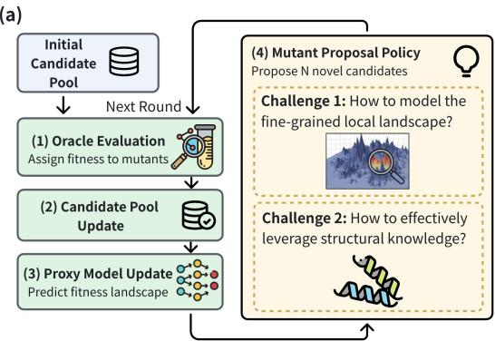
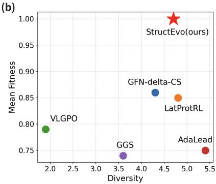
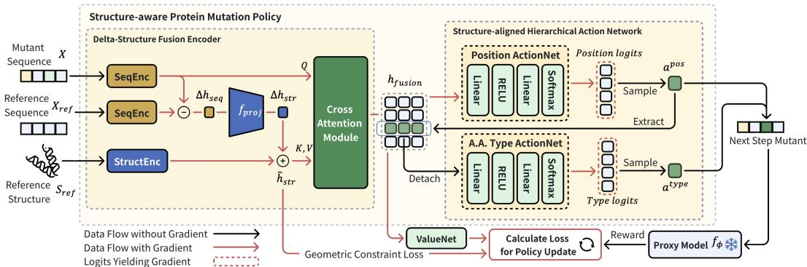
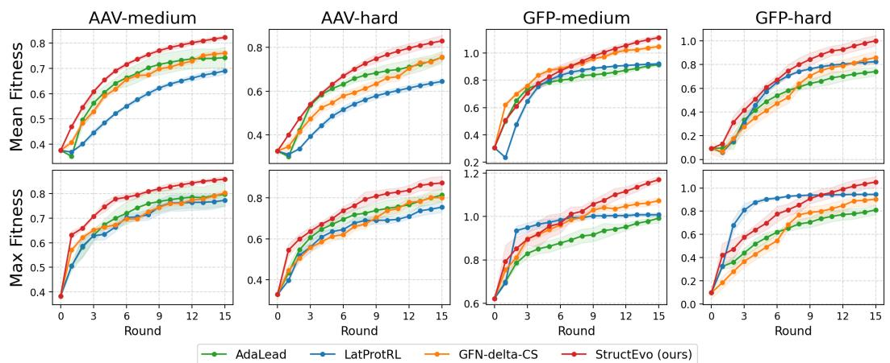
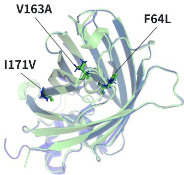
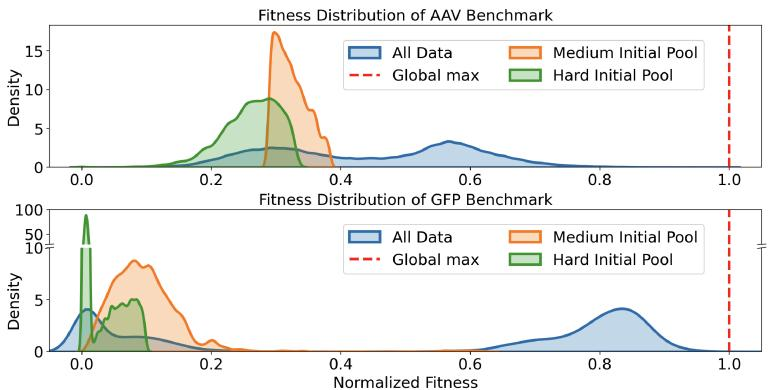
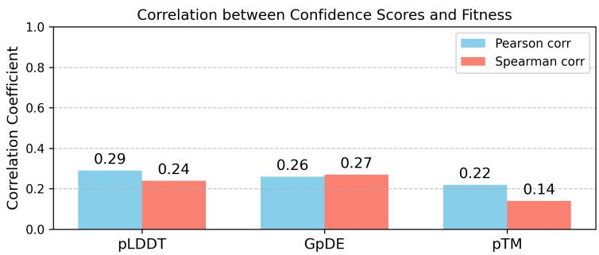
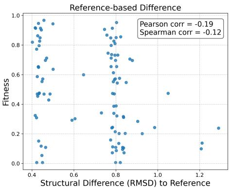
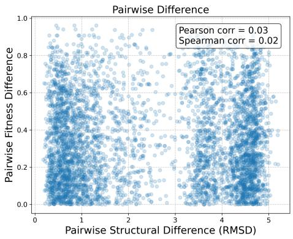

# Structure-aware Reinforcement Learning for Protein Directed Evolution

Zikun Nie1,2, Suyuan Zhao1,2, Yizhen Luo1,2

Siqi Fan1, Zaiqing Nie1,3∗

1Institute of AI Industry Research (AIR), Tsinghua University 2Department of Computer Science and Technology, Tsinghua University 3Pharmolix Inc. {nzk24,zhaosy23,yz-luo22}@mails.tsinghua.edu.cn zaiqing@air.tsinghua.edu.cn

## Abstract

Protein optimization remains a longstanding goal in life sciences. Existing machine learning–assisted directed evolution (MLDE) methods primarily rely on sequenceonly features, overlooking the critical spatial constraints and co-evolutionary interactions encoded in protein structures. However, directly integrating structural information remains challenging due to the scarcity of reliable mutant structures. To address these issues, we propose StructEvo, a novel structure-aware reinforcement learning framework for protein directed evolution. StructEvo employs a delta-structure fusion encoder to approximate mutant structure features via feature differences, enabling dynamic incorporation of spatial knowledge. The vast mutation space is then decomposed into manageable subspaces through a structurealigned hierarchical action network, while a geometric constraint further stabilizes delta feature learning. Our approach outperforms prior state-of-the-art methods by 9.2% and 16.3% on two challenging optimization benchmarks, and further identifies an experimentally validated epistasis pattern in GFP, highlighting the importance of structural guidance for effective protein directed evolution.

## 1 Introduction

Proteins are fundamental functional units of biological systems. Compared to de novo protein design, optimizing existing proteins through mutations to improve desired functional properties (i.e., fitness) has greater practical value for real-world applications [1], ranging from antibody affinity maturation [2, 3] to enzyme catalytic engineering [4, 5]. In practice, the most widely adopted approach for protein optimization is directed evolution [6–8], which iteratively modifies proteins by random mutagenesis, expression, screening and selection. This process relies on large-scale in vivo expression and in vitro screening, making it costly and time-consuming [9].

Since directed evolution operates on amino acid sequences, existing machine learning-assisted directed evolution (MLDE) approaches [10–16] are predominantly sequence-oriented, focusing on modeling the rugged fitness landscape that maps protein sequences to fitness values. Early methods [14, 15] represent protein sequences by one-hot encodings or hand-crafted features, while recent approaches [13, 16] leverage protein language models (PLMs) to capture evolutionary priors. However, these sequence-only approaches often overlook the intrinsic spatial context in protein structures, limiting their ability to capture functionally relevant interactions. By explicitly encoding physical and geometric constraints, three-dimensional structures provide rich co-evolutionary interaction signals such as spatial proximity and functional motifs, which are essential for protein activity [17]. Motivated by this, we integrate protein structure as a complementary modality to sequence, facilitating more fine-grained geometric guidance for navigating local fitness landscapes.

(a)  

(b)  
  
Figure 1: (a) Illustration of the active learning pipeline for directed evolution. Starting from an initial pool, candidates are evaluated by an oracle and then update the pool, after which a proxy is iteratively refined to guide candidate proposals. The figure highlights two key challenges for the proposal policy: how to model the fine-grained local fitness landscape, and how to effectively leverage structural knowledge. (b) Performance comparison on GFP-hard benchmark. StructEvo achieves the highest fitness while maintaining comparable diversity to other high-fitness baselines.

However, leveraging structural knowledge presents two key challenges. (1) Reliable mutant structures are generally unavailable. Though a representative experimentally resolved structure may be available for a protein family, mutant structures remain scarce in databases. Meanwhile, existing structure prediction models, such as the AlphaFold [18–21] and Protenix series [22–24], are computationally costly [25, 26] and often insensitive to point mutations, frequently producing nearly identical structures for similar sequences [27, 28]. Consequently, it remains impractical to directly capture structural variations at coordinate level, especially in directed evolution settings where even a few selected mutations may induce noticeable backbone deviations. To address this, we model structural changes at the feature level by converting differences in PLM representations, which have been shown to contain rich mutational effects [29]. In this way, we transform the static structure into dynamic guidance during optimization. (2) It remains unclear how to effectively translate structural signals into mutation decisions. Jointly optimizing mutation positions and substituted amino acids results in a large action space, making it difficult to learn reliable structural guidance. A key observation is that protein structure is more informative for where to mutate than for mutate to what, as it provide position-specific spatial context such as residue interactions in three-dimensional space. Motivated by this insight, we decompose mutation decisions into two sequential processes: position selection and amino acid refinement. This design enables structure to guide position decisions, while providing cleaner gradient signals in two low-dimensional subspaces.

Based on these insights, we propose StructEvo, a structure-aware reinforcement learning framework for protein directed evolution. StructEvo introduces a novel paradigm for incorporating dynamic structural knowledge into mutation proposal policy, consisting of three components: (1) a deltastructurefusion encoder that approximates mutant structure features via delta representations and integrates sequence and structure information via a cross-attention module; (2) a structure-aligned hierarchical action network that decomposes action space and enables structure-guided mutation sampling; and (3) a geometric constraint applied on delta representations to improve stability.

We validate our work through comprehensive experiments on two combinatorial mutation benchmarks and two more challenging full-length benchmarks. Across all benchmarks, StructEvo consistently outperforms strong baselines, and achieves relative fitness gains of up to 9.2% on AAV-hard and 16.3% on GFP-hard (Figure 1b), demonstrating its effectiveness for protein directed evolution. We further present an independently discovered triple-mutation epistasis pattern in GFP validated by existing wet-lab experiments, highlighting the potential of our method for real-world applications. Our code and model are open-sourced at https://github.com/Skyyyyyalker/StructEvo.

Our contributions are summarized as follows:

• We propose StructEvo, a structure-aware reinforcement learning framework that introduces a novel paradigm for incorporating structural knowledge into mutation proposal policy.

  
Figure 2: Architecture of the StructEvo framework. A delta-structure fusion encoder approximates mutant structure features via delta representations and integrates sequence and structure information. A structure-aligned hierarchical action network then decomposes action space and enables structureguided mutation sampling. A geometric constraint loss is calculated to improve robustness. The proxy model remains frozen and provides reward signals during policy updates. A.A.: amino acid.

• We introduce a delta-structure fusion encoder, a structure-aligned hierarchical action network and a geometric constraint to enable effective structural guidance.

• We achieve relative fitness gains of 9.2% and 16.3% over the prior strongest baselines on two hard benchmarks, and identify a validated triple-mutation pattern in GFP, highlighting the importance of structural guidance for protein directed evolution.

## 2 Related work

Machine learning–assisted directed evolution (MLDE). Evolutionary search-based methods simulate natural selection through iterative mutation and recombination [11], with extensions that encourage proximal exploration via distance penalties [12]. Energy-based methods learn smooth fitness landscapes as energy models to guide sampling through gradient ascent [30–32]. Generative model-based methods explicitly model the mutant distributions using variational autoencoders [10, 33] or generative flow networks [34], with recent work further introducing controllable generation mech anisms [35, 36]. While previous methods primarily rely on sequence-only features, we incorporate structural knowledge as complementary guidance for high-fitness mutant proposal.

Reinforcement learning (RL) for protein optimization. Recent studies increasingly formulate protein optimization as a sequential decision-making problem and leverage RL to guide mutation policies [37]. Wang et al. [38] generate new sequences through self-play and Monte Carlo tree search, while Wang et al. [16] draw physicochemical priors from amino acid knowledge graph to guide mutation decisions. Lee et al. [13] further optimize mutants in a continuous latent space by treating mutations as small perturbations. Unlike prior methods, our approach introduces delta representations to capture dynamic structural variation within RL policy, enabling fine-grained optimization.

Multi-modal protein fitness prediction. Fitness landscape modeling focuses on predicting functional fitness values for given protein variants [39, 40]. Beyond sequence representations, prior work incorporate wild-type structure utilizing Graph Neural Network [41, 42] or inverse-folding models [43– 45]. Recent studies further explore sequence-structure fusion by joint vocabulary [46] or structure quantization module [47]. Additional modalities such as surface topology and multiple sequence alignment (MSA) are also leveraged [48, 49]. Compared to static fitness prediction, our work focuses on the more challenging task of dynamic protein evolution in an active learning setting.

## 3 Task formulations

## 3.1 Directed evolution in an active learning setting

In both in vitro and in silico settings, the directed evolution is often conducted in an active learning setting [38], where the mutants start from an initial pool and are then optimized iteratively over a total of R rounds. Within each round, the optimization proceeds through four key components (Figure 1a):

Oracle evaluation. Let V denote the vocabulary of the 20 standard amino acids. A protein sequence of length L is defined as $X = ( x ^ { 1 } , . . . , x ^ { L } ) \in \mathbf { \bar { X } } = \mathcal { V } ^ { L }$ , where each residue $x ^ { i } \in { \bar { \nu } }$ . A black-box oracle $\mathcal { F } : \mathbb { X } $ R is a function that maps a protein sequence X to a scalar fitness value ${ \mathcal { F } } ( X )$ thereby defining the fitness landscape. In MLDE, the oracle corresponds to costly wet-lab experiments for evaluating candidate sequences. Consequently, the number of oracle queries is strictly limited to $N$ per round, where $N \ll | \bar { \mathbb { X } } |$

Candidate pool update. A candidate pool $\mathcal { D }$ is iteratively updated to collect high-fitness mutants. The initial pool $\mathcal { D } _ { 0 } = \{ ( X _ { n } , \mathcal { F } ( X _ { n } ) ) \} _ { n = 1 } ^ { | \mathcal { D } _ { 0 } | }$ contains only a small set of low-fitness candidates. At the beginning of each round i, newly proposed mutants are evaluated and incorporated into the pool:

$$
\mathcal { D } _ { i } = \mathcal { D } _ { i - 1 } \cup \{ ( X _ { n } , \mathcal { F } ( X _ { n } ) ) \} _ { n = 1 } ^ { N } .\tag{1}
$$

Proxy model update. Due to the limited number of oracle queries, a trainable proxy model $f _ { \phi } ( \cdot )$ parameterized by $\phi ,$ , is used to approximate the landscape defined by the oracle. After updating the candidate pool, the proxy is iteratively fine-tuned on $\mathcal { D } _ { i }$ by minimizing the mean squared error loss:

$$
\mathcal { L } ( \phi ) = \frac { 1 } { | \mathcal { D } _ { i } | } \sum _ { X \in \mathcal { D } _ { i } } \left( f _ { \phi } ( X ) - \mathcal { F } ( X ) \right) ^ { 2 } .\tag{2}
$$

Proposal policy. Guided by the fine-tuned proxy model $f _ { \phi }$ and starting from the current candidate pool $\mathcal { D } _ { i }$ , a proposal policy generates a batch of N novel mutants at each round. These mutants are then evaluated by the oracle and subsequently update the candidate pool for the next round.

The main objective of directed evolution is to identify a batch ofK high-fitness protein mutants under afixed budget ofR rounds. A summary of all symbols is provided in Appendix A.1 for reference.

## 3.2 Reinforcement learning-based directed evolution

We formulate protein optimization as a reinforcement learning (RL) problem. By modeling the multi-point mutations as a Markov Decision Process (MDP), RL enables learning a policy that sequentially selects mutations to achieve high fitness.

State. At step $t ,$ the state $s _ { t } = ( x _ { t } ^ { 1 } , . . . , x _ { t } ^ { L } )$ is a protein mutant with L residues, where $x _ { t } ^ { i } \in \mathcal V$

Action. An action $a _ { t } = ( a _ { t } ^ { \mathrm { p o s } } , a _ { t } ^ { \mathrm { t y p e } } )$ at step t represents a single-point mutation applied to the current state $s _ { t } .$ . The action $a _ { t }$ can be factorized into two parts: the mutation position $\dot { a } _ { t } ^ { \mathrm { p o s } }$ and the type of substituted amino acid $a _ { t } ^ { \mathrm { t y p e } }$ . In our task, the transition function $\textstyle P ( s _ { t + 1 } \mid s _ { t } , a _ { t } )$ is deterministic and the state is updated by:

$$
\begin{array} { r } { x _ { t + 1 } ^ { i } = \Big \{ { a _ { t } ^ { \mathrm { t y p e } } , } _ { } \quad i = a _ { t } ^ { \mathrm { p o s } } , } \\ { x _ { t } ^ { i } , \quad \mathrm { o t h e r w i s e } . } \end{array}
$$

Reward. Reward signals are provided by the proxy model. In our work, we adopt a sparse reward setting, where the reward $r _ { t } = r ( s _ { t } , a _ { t } )$ is assigned only at trajectory termination. A trajectory terminates either when the policy finds a mutant better than the starting one, or when a predefined maximum number of steps $m _ { \mathrm { s t e p } }$ is reached. Specifically, for a trajectory ending at step $T ,$ , the reward is $r _ { T } = f _ { \phi } ( s _ { T + 1 } )$ , while intermediate rewards are set to $r _ { t } = 0$ for $t < T$ . We emphasize that rewards are generated solely by the proxy model, and the oracle is used only for final evaluation.

Training Objective. We aim to learn a policy $\pi ( \boldsymbol { a } _ { t } \mid \boldsymbol { s } _ { t } )$ that maximizes the expected return over trajectories. Under the sparse reward setting, the training objective is formulated as:

$$
\operatorname* { m a x } _ { \pi } \mathbb { E } _ { \tau \sim \pi } \left[ \sum _ { t = 0 } ^ { T } \gamma ^ { t } r _ { t } \right] = \operatorname* { m a x } _ { \pi } \mathbb { E } _ { \tau \sim \pi } \left[ \gamma ^ { T } f _ { \phi } ( s _ { T + 1 } ) \right] ,\tag{3}
$$

where $\tau = ( s _ { 0 } , a _ { 0 } , \ldots , s _ { T } , a _ { T } )$ denotes a mutation trajectory terminating at step $T ,$ and $\gamma$ is the discount factor. We optimize the policy using Proximal Policy Optimization (PPO; 50), which has been proved effective in protein optimization tasks [13, 16]. The collected candidates are then ranked by proxy-predicted fitness and evaluated by the oracle for subsequent refinement in the next round.

Within the reinforcement learning framework, our work primarily focuses on improving the key component—the mutation proposal policy, as described in the following section.

## 4 Methodology

The main goal of our work is to incorporate structural knowledge into protein mutation policy that maps states to actions. In this section, we present the proposed StructEvo framework, highlighting three main components: (1) a delta-structure fusion encoder that fuses sequential and structural features for a given mutant (Sec. 4.1), (2) a structure-aligned hierarchical action network that receives the fused feature and samples high-fitness mutations (Sec. 4.2), and (3) a geometric constraint between delta features to improve robustness and stability (Sec. 4.3).

## 4.1 Delta-structure fusion encoder

The delta-structure fusion encoder integrates both sequence and structural knowledge to produce a fine-grained representation of protein mutants. As illustrated in Figure 2, it consists of a protein sequence encoder $\mathcal { E } _ { \mathrm { s e q } } ,$ , a protein structure encoder ${ \mathcal { E } } _ { \mathrm { s t r } } ,$ , a geometric projector $f _ { \mathrm { p r o j } }$ and a crossattention module. We adopt ESM-2 [51], a protein language model (PLM) pretrained on large-scale evolutionary sequence data, to initialize the sequence encoder and capture mutant sequence features. For structure encoding, we employ ESM-IF [43] due to its simplicity and efficiency, as it captures both topology and geometric constraints of protein structures. Notably, the StructEvo framework is model-agnostic and easily extensible to different protein encoders.

Formulation of delta sequence feature. Since reliable mutant structures are generally unavailable, we adopt a reference structure $S ^ { \mathrm { r e f } }$ with the highest reliability as a structural scaffold for the corresponding mutant family (see Appendix D.1), with its sequence denoted as the reference sequence $X ^ { \mathrm { r e f } } .$ Prior work [29] has shown that differences between PLM representations capture rich information of mutational effect. Therefore, we introduce the delta sequence feature $\Delta h _ { \mathrm { s e q } }$ as:

$$
\Delta h _ { \mathrm { s e q } } = h _ { \mathrm { s e q } } - h _ { \mathrm { s e q } } ^ { \mathrm { r e f } } = \mathcal { E } _ { \mathrm { s e q } } ( X ) - \mathcal { E } _ { \mathrm { s e q } } ( X ^ { \mathrm { r e f } } ) .\tag{4}
$$

$X , X ^ { \mathrm { r e f } }$ denote the sequences of the current and the reference proteins, and $h _ { \mathrm { s e q } } , h _ { \mathrm { s e q } } ^ { \mathrm { r e f } }$ are the corresponding sequence representations, where $d _ { \mathrm { s e q } }$ denotes its dimensionality.

Projection into structural manifold. We speculate that the mutational knowledge contained in the delta sequence feature reflects corresponding structural changes. Accordingly, we introduce a projector $f _ { \mathrm { p r o j } } ^ { \mathrm { ~ ~ } } : \mathbb { R } ^ { L \times d _ { \mathrm { s e q } } }  \mathbb { R } ^ { L \times d _ { \mathrm { s t r } } }$ to map the delta sequence feature from the sequence space to the structural manifold, yielding the delta structure feature $\Delta h _ { \mathrm { s t r } }$ . Both the sequence and structural representations are aligned to residue-level embeddings of the protein backbone, allowing an addition operator to get approximate mutant structure features $\hat { h } _ { \mathrm { s t r } }$ . These procedures are formulated as:

$$
\begin{array} { r } { \Delta h _ { \mathrm { s t r } } = f _ { \mathrm { p r o j } } ( \Delta h _ { \mathrm { s e q } } ) , \quad \hat { h } _ { \mathrm { s t r } } = h _ { \mathrm { s t r } } ^ { \mathrm { r e f } } + \Delta h _ { \mathrm { s t r } } = \mathcal { E } _ { \mathrm { s t r } } ( S ^ { \mathrm { r e f } } ) + \Delta h _ { \mathrm { s t r } } . } \end{array}\tag{5}
$$

Here, $S ^ { \mathrm { r e f } } \in \mathbb { R } ^ { L \times 3 \times 3 }$ is the backbone coordinates of the reference structure, where each residue is represented by the three-dimensional positions of its N, Cα, and C atoms. To ensure stability, we further impose a geometric constraint between delta features, as described below in Sec. 4.3.

Structure-conditioned feature fusion. To integrate sequence and structure information, we employ a cross-attention module where the mutant sequence feature $h _ { \mathrm { { s e q } } }$ serves as the query, and the approx imated structure feature $\hat { h } _ { \mathrm { s t r } }$ serves as the key and value. The asymmetric design allows sequence features to selectively query and attend to structural context. The resulting fusion feature $h _ { \mathrm { f u s i o n } }$ encodes both sequential and structural information of the mutant, serving as input to the downstream hierarchical action network for mutation sampling.

## 4.2 Structure-aligned hierarchical action network

In RL formulation, the Markov decision process decomposes the vast mutation space into a sequence of single-step decision problems. Each action corresponds to a single-point mutation $a = ( a ^ { \mathrm { p o s } } , a ^ { \mathrm { t y p e } } )$ where the mutation position $a ^ { \mathrm { p o s } } \in \{ 1 , . . . , L \}$ and the substituted amino acid $a ^ { \mathrm { t y p e } } \in \mathcal { V } ,$ with $L$ as the protein length and $\dot { \nu }$ as the standard amino acid vocabulary. As depicted in Figure 2, the decision process is decomposed into two hierarchical steps:

Mutation position sampling. Since mutation position is more tightly coupled with the structural context than amino acid type, prioritizing position selection $a ^ { \mathrm { p o s } }$ enables the policy to better exploit structure-derived insights. A position action network $\pi _ { \theta _ { 1 } }$ receives the fusion feature $h _ { \mathrm { f u s i o n } }$ as input and outputs a categorical distribution over mutation position subspace, from which the position action $a ^ { \mathrm { p o s } } \sim \bar { \pi } _ { \boldsymbol { \theta } _ { 1 } } ( \cdot \cdot \vert h _ { \mathrm { f u s i o n } } )$ is sampled.

Substituted amino acid sampling. Once the position $a ^ { \mathrm { p o s } }$ is determined, the corresponding local representation at the specific position is then extracted and detached from the fusion feature. An amino acid type action network $\pi _ { \theta _ { 2 } }$ then operates on the detached context to sample the substituted amino acid $\dot { a } ^ { \mathrm { t y p e } } \sim \pi _ { \theta _ { 2 } } ( \cdot \mid h _ { \mathrm { f u s i o n } } , a ^ { \mathrm { \tilde { p o s } } } )$ ). Here, the detach operation blocks gradients backpropagating into the shared fusion encoder and the position network. This allows $\pi _ { \theta _ { 1 } }$ to be optimized solely based on position selection, resulting in a cleaner learning signal (see Appendix A.3).

## 4.3 Geometric constraint for delta features

Geometric constraint. In the delta-structure fusion encoder, the delta sequence feature is projected to obtain a corresponding delta structure feature. We expect the consistency between structure variations and sequence perturbations: small mutational effects captured by PLM should not lead to excessively large structural deviations, and vice versa. To encourage this, we introduce a per-residue geometric constraint between the two delta features, formulated as:

$$
\mathcal { L } _ { \mathrm { g e o } } = \mathbb { E } _ { \Delta h _ { \mathrm { s t r } } , \Delta h _ { \mathrm { s e q } } } \left[ \frac { 1 } { L } \sum _ { i = 1 } ^ { L } \left( \frac { \lVert \Delta h _ { \mathrm { s t r } } ^ { i } \rVert } { \sqrt { d _ { \mathrm { s t r } } } } - c * \frac { \lVert \Delta h _ { \mathrm { s e q } } ^ { i } \rVert } { \sqrt { d _ { \mathrm { s e q } } } } \right) ^ { 2 } \right] ,\tag{6}
$$

where $c$ is the scaling factor, and $\| \cdot \|$ denotes the $\ell _ { 2 } { \mathrm { - n o r m } }$ . This constraint encourages a more stable and faithful mapping to preserve variation magnitude. From another perspective, the geometric constraint can be viewed as a stronger form of Lipschitz continuity [52] in metric space analysis, as detailed in Appendix A.4.

Overall training objective. The overall RL training objective consists of two parts:

$$
\mathcal { L } _ { \mathrm { t o t a l } } = \underbrace { \mathcal { L } _ { \mathrm { p o l i c y } } + \lambda _ { \mathrm { e n t r o p y } } \cdot \mathcal { L } _ { \mathrm { e n t r o p y } } + \lambda _ { \mathrm { v a l u e } } \cdot \mathcal { L } _ { \mathrm { v a l u e } } } _ { \mathrm { s t a n d a r d ~ P P O ~ l o s s } } + \underbrace { \lambda _ { \mathrm { g e o } } \cdot \mathcal { L } _ { \mathrm { g e o } } } _ { \mathrm { g e o m e t r i c ~ c o n s t r a i n t } } .\tag{7}
$$

This objective jointly optimizes the mutation policy while enforcing consistency between delta sequence and structure features. Algorithm 1 summarizes the overall mutation proposal pipeline.

## 5 Experiments

In this section, we demonstrate that StructEvo is effective on directed evolution tasks across two combinatorial benchmarks (Sec. 5.1) and two more challenging full-length mutation benchmarks (Sec. 5.2). We further provide an in-depth analysis of our model (Sec. 5.3) and a case study that reveals high-fitness mutation patterns at green fluorescent protein (Sec. 5.4).

## 5.1 Optimization on combinatorial benchmarks

Datasets. We first evaluate StructEvo on two widely recognized four-site combinatorial datasets, GB1 and PhoQ. The GB1 dataset [53] consists of 149,361 variants at four epistatic sites (V39, D40, G41 and V54) of the human protein GB1 domain, with fitness defined as binding affinity to the antibody IgG-Fc. Only 2.4% variants have higher fitness than the wild-type protein, highlighting the sparsity of the GB1 fitness landscape. The PhoQ dataset [54] contains 140,517 variants of the PhoQ histidine kinase mutated at four key interfacial residues (A284, V285, S288 and T289), with fitness reflecting both kinase and phosphatase responsiveness of PhoP/PhoQ regulatory system on signal transduction. Compared to GB1, the PhoQ landscape is even more rugged—98.7% mutants with fitness below 0.1 and 63.7% with zero, making it a particularly challenging task. All fitness values are min-max normalized to [0, 1]. Details of benchmarks are provided in Appendix C.1.

Baselines. We compare our method with various strong baselines, including (1) probability-based methods, BO [55] and CMA-ES [56]; (2) evolutionary search-based methods, AdaLead [11], PEX [12], MLDE [53] and two variants of ftMLDE [57]; (3) cluster-based methods, CLADE [14] and its advanced version CLADE2.0 [15], and (4) recent RL-based methods, EvoPlay [38] and KnowRLM [16]. More details of baselines can be found in Appendix C.3.

Table 1: Results on GB1 and PhoQ benchmarks. We report average results and std across 5 independent runs. ∗: results are derived from Wang et al. [16]. n.a.: not reported in the original paper.
<table><tr><td rowspan="2">Method</td><td colspan="3">GB1</td><td colspan="3">PhoQ</td></tr><tr><td>Max↑</td><td>Mean↑</td><td>NDCG↑</td><td>Max↑</td><td>Mean↑</td><td>NDCG↑</td></tr><tr><td>CMAES</td><td>0.59±0.17</td><td>0.13±0.04</td><td>0.75±0.02</td><td> $0 . 2 9 { \pm } 0 . 1 4$ </td><td>0.05±0.01</td><td>0.69±0.02</td></tr><tr><td>BO</td><td>0.67±0.10</td><td> $0 . 1 7 { \pm } 0 . 0 2$ </td><td>0.77±0.01</td><td> $0 . 2 9 { \pm } 0 . 0 6$ </td><td>0.05±0.01</td><td>0.70±0.01</td></tr><tr><td>AdaLead</td><td>0.64±0.13</td><td> $0 . 3 0 { \pm } 0 . 0 9$ </td><td>0.74±0.02</td><td> $0 . 2 7 { \pm } 0 . 1 1$ </td><td> $0 . 1 4 { \pm } 0 . 0 2$ </td><td>0.67±0.02</td></tr><tr><td>PEX</td><td>0.66±0.03</td><td>0.36±0.02</td><td>0.76±0.01</td><td> $0 . 4 0 { \pm } 0 . 0 3$ </td><td> $0 . 1 0 { \pm } 0 . 0 2 \ $ </td><td>0.71±0.02</td></tr><tr><td>MLDE*</td><td>0.68±n.a.</td><td>0.20±n.a.</td><td>0.79±n.a.</td><td>0.36±n.a.</td><td> $0 . 1 0 { \pm } \mathrm { n . } \mathrm { a . }$ </td><td>0.79±n.a.</td></tr><tr><td>ftMLDE (EVmutation)*</td><td>0.94±n.a.</td><td> $0 . 4 1 \pm \mathrm { n . a . }$ </td><td>0.83±n.a.</td><td>0.44±n.a.</td><td>0.11±n.a.</td><td>0.80±n.a.</td></tr><tr><td>ftMLDE (Transformer)*</td><td>0.93±n.a.</td><td>0.42±n.a.</td><td>0.81±n.a.</td><td>0.42±n.a.</td><td>0.11±n.a.</td><td>0.82±n.a.</td></tr><tr><td>EvoPlay*</td><td>0.84±n.a.</td><td> $0 . 4 6 \pm \mathrm { n . a . }$ </td><td>0.85±n.a.</td><td>0.47±n.a.</td><td>0.14±n.a.</td><td>0.80±n.a.</td></tr><tr><td>CLADÉ*</td><td>0.84±n.a.</td><td>0.46±n.a.</td><td>0.86±n.a.</td><td>0.47±n.a.</td><td>0.09±n.a.</td><td>0.78±n.a.</td></tr><tr><td>CLADE2.0*</td><td>0.94±n.a.</td><td>0.49±n.a.</td><td>0.88±n.a.</td><td>0.40±n.a.</td><td>0.15±n.a.</td><td>0.81±n.a.</td></tr><tr><td>KnowRLM*</td><td>0.97±0.06</td><td>0.56±0.02</td><td>0.88±0.02</td><td>0.66±n.a.</td><td>0.16±n.a.</td><td>0.82±n.a.</td></tr><tr><td>StructEvo (ours)</td><td>0.99±0.01</td><td>0.59±0.01</td><td>0.93±0.01</td><td>0.64±0.07</td><td>0.19±0.02</td><td>0.86±0.01</td></tr></table>

Metrics. We report the maximum and mean fitness over a combined set of candidates, including N initial mutants, N ∗ R proposed mutants across R rounds, and the top N mutants ranked by the final proxy. Here, R denotes the total optimization rounds and N is the number of proposed candidates per round. Given that the ground truth fitness is fully available in combinatorial tasks, we further evaluate the ranking quality of proxy by normalized discounted cumulative gain (NDCG). Formal definitions of metrics are provided in Appendix C.5.

Experimental settings. Following prior work [16], we set R = 3 and N = 96. The starting N mutants are sampled by CLADE [14]. The oracle is the ground-truth dataset, with rare missing instances assigned a value of 0. All experiments are repeated over 5 independent runs.

Results and analysis. We present performance comparisons at round 3 in Table 1, with more detailed results of each round in Appendix E.1. We observe that: (1) StructEvo achieves state-of-the-art performance on GB1, outperforming the strongest RL-based baseline (KnowRLM) by relative gains of 5.7% on NDCG, demonstrating its strong capability in navigating fine-grained fitness landscapes and guiding mutant proposals. (2) Though the reference structure of PhoQ is predicted by AlphaFold2 [18] (with an average pLDDT of 82.94, see Appendix D.1) rather than experimentally resolved, StructEvo still attains a comparable performance with KnowRLM on PhoQ benchmark, with relative gains of 3.7% on NDCG and 18.8% on mean fitness. This observation shows the robustness of our framework, while also indicating the importance of accurate structural information for landscape exploration. (3) Probabilistic and evolutionary methods perform poorly under extremely scarce data. The key strength of PEX, proximal preference, becomes less significant in the constrained four-site space. Cluster-based methods leverage prior knowledge to reduce aimless exploration, while RL-based methods further improve performance by explicitly modeling the sequential decision-making process. Hence, we emphasize the significance of combining structural priors for effective protein optimization under sparse-data scenario.

## 5.2 Optimization on full-length benchmarks

Datasets. We further evaluate StructEvo on two full-length protein mutation benchmarks, GFP and AAV. Compared to combinatorial tasks, these are more challenging as mutations span the full sequence, leading to an exponentially larger search space. The GFP dataset [58] measures log-fluorescence intensity of 56,806 Aequorea victoria green fluorescent protein variants, with a mutation space size of $| \mathbb { X } | \doteq 2 0 ^ { 2 3 7 }$ . The AAV dataset [59] focuses on engineering a 28-amino acid segment of the VP1 capsid protein of adeno-associated virus, comprising 44,156 variants from a space of $| \mathbb { X } | = 2 0 ^ { 2 8 }$ Following Kirjner et al. [30], we partition both benchmarks into medium and hard regimes. The initial fitness distribution under the hard setting is more distant from the high-fitness range than the medium setting, leading to increased optimization difficulty. See more details in Appendix C.2.

Baselines. In addition to baselines for combinatorial benchmarks introduced above, we further compare our work with energy model-based methods, GGS [30], as well as recent approaches that optimize in latent spaces, including LatProtRL [13], VLGPO [35] and GFN-δ-CS [36]. Implementation details are provided in Appendix C.4.

Table 2: Performance on AAV and GFP benchmarks. The results include average and standard deviation across 5 independent runs. ∗: results are derived from Kirjner et al. [30]. †: results are derived from Lee et al. [13]. -: not reported in the original paper.
<table><tr><td rowspan="2">Method</td><td colspan="4">AAV medium</td><td colspan="4">AAV hard</td></tr><tr><td>Mean↑</td><td>Max↑</td><td>Diversity</td><td>Novelty</td><td>Mean↑</td><td>Max↑</td><td>Diversity</td><td>Novelty</td></tr><tr><td>CMA-ES</td><td>0.05±0.00</td><td>0.40±0.01</td><td> $2 0 . 9 { \pm } 0 . 5 $ </td><td> $1 7 . 2 { \pm } 0 . 5 $ </td><td>0.05±0.00</td><td> $0 . 3 2 { \pm } 0 . 0 3$ </td><td> $2 0 . 4 { \pm } 0 . 7 $ </td><td>18.6±0.5</td></tr><tr><td>BO</td><td>0.64±0.03</td><td> $0 . 7 2 { \scriptstyle \pm 0 . 0 4 }$ </td><td> $8 . 1 { \pm } 0 . 2 $ </td><td> $9 . 4 \pm 0 . 9$ </td><td> $0 . 6 2 { \pm } 0 . 0 3$ </td><td> $0 . 7 0 { \scriptstyle \pm 0 . 0 3 }$ </td><td> $8 . 6 { \pm } 0 . 2 $ </td><td>10.3±0.3</td></tr><tr><td>PEX</td><td>0.65±0.01</td><td> $0 . 7 4 { \pm } 0 . 0 0$ </td><td> $5 . 5 { \pm } 0 . 5 $ </td><td> $5 . 3 { \pm } 0 . 3 $ </td><td> $0 . 6 3 { \pm } 0 . 0 2$ </td><td> $0 . 7 5 { \pm } 0 . 0 1$ </td><td>5.7±0.5</td><td>6.2±0.4</td></tr><tr><td>GGS*</td><td>0.51±0.01</td><td></td><td> $4 . 0 { \pm } 0 . 2 \ $ </td><td> $5 . 4 { \pm } 0 . 5 $ </td><td> $0 . 6 0 { \pm } 0 . 0 2$ </td><td></td><td>4.5±0.5</td><td>7.0±0.0</td></tr><tr><td>AdaLead</td><td>0.74±0.04</td><td>0.80±0.05</td><td> $5 . 2 { \pm } 0 . 9 $ </td><td> $7 . 6 { \pm } 0 . 4 $ </td><td> $\underline { { 0 . 7 6 { \pm } 0 . 0 3 } }$ </td><td> $\underline { { 0 . 8 1 } } \pm 0 . 0 3$ </td><td>4.0±0.4</td><td>8.9±0.6</td></tr><tr><td>VLGPO</td><td>0.69±0.01</td><td>0.76±0.01</td><td> $3 . 1 { \pm } 0 . 2 $ </td><td> $5 . 7 { \pm } 0 . 1 $ </td><td> $0 . 7 1 { \pm } 0 . 0 1$ </td><td> $0 . 7 8 { \pm } 0 . 0 1$ </td><td>3.3±0.2</td><td>6.9±0.1</td></tr><tr><td>LatProtRL†</td><td>0.71±0.02</td><td></td><td> $5 . 4 { \pm } 0 . 8 $ </td><td>6.0±0.2</td><td> $0 . 6 6 { \pm } 0 . 0 1$ </td><td></td><td>6.0±0.8</td><td>7.0±0.6</td></tr><tr><td>GFN-δ-CS</td><td> $\underline { { 0 . 7 7 } } \pm 0 . 0 2$ </td><td> $\underline { { 0 . 8 1 } } \pm 0 . 0 2$ </td><td> $4 . 4 { \pm } 1 . 1$ </td><td> $5 . 8 { \pm } 1 . 5 $ </td><td> $\underline { { 0 . 7 6 } } \pm 0 . 0 3$ </td><td> $0 . 8 0 { \pm } 0 . 0 3$ </td><td>4.0±0.7</td><td>6.7±1.1</td></tr><tr><td>StructEvo</td><td> $\pm 0 . 8 2 \pm 0 . 0 1$ </td><td>0.86±0.01</td><td>4.5±0.7</td><td> $8 . 6 { \pm } 0 . 2 $ </td><td> $\pm 0 . 8 3 \pm 0 . 0 3 $ </td><td> $\mathbf { 0 . 8 7 } { \pm } 0 . 0 4$ </td><td>4.5±0.3</td><td>8.4±0.5</td></tr></table>

<table><tr><td rowspan="2">Method</td><td colspan="4">GFP medium</td><td colspan="4">GFP hard</td></tr><tr><td>Mean↑</td><td>Max↑</td><td>Diversity</td><td>Novelty</td><td>Mean↑</td><td>Max↑</td><td>Diversity</td><td>Novelty</td></tr><tr><td>CMA-ES</td><td>-0.04±0.01</td><td>0.58±0.00</td><td> $1 7 2 . 7 \pm 2 . 1$ </td><td> $1 5 4 . 3 { \pm } 4 . 9 $ </td><td>-0.03±0.00</td><td>0.16±0.03</td><td>173.8±2.0</td><td>218.6±7.6</td></tr><tr><td>BO</td><td>0.30±0.07</td><td>0.42±0.07</td><td> $2 6 . 4 2 5 . 6 $ </td><td> $3 7 . 7 { \pm } 1 2 . 1$ </td><td>0.26±0.07</td><td> $0 . 3 9 { \pm } 0 . 0 4$ </td><td>36.0±2.7</td><td>71.7±10.1</td></tr><tr><td>PEX</td><td>0.64±0.04</td><td> $0 . 8 4 { \pm } 0 . 0 4$ </td><td> $8 . 3 { \pm } 2 . 6 $ </td><td> $6 . 8 { \pm } 1 . 9 $ </td><td>0.46±0.05</td><td> $0 . 6 2 { \pm } 0 . 0 5$ </td><td>7.0±1.2</td><td>10.3±1.7</td></tr><tr><td>GGS*</td><td>0.76±0.01</td><td></td><td> $3 . 7 { \pm } 0 . 2 $ </td><td> $5 . 0 { \pm } 0 . 1 $ </td><td>0.74±0.00</td><td></td><td>3.6±0.0</td><td>6.9±0.1</td></tr><tr><td>AdaLead</td><td>0.93±0.01</td><td>0.99±0.02</td><td>5.2±0.9</td><td> $9 . 5 { \pm } 1 . 2 $ </td><td> $0 . 7 5 { \pm } 0 . 0 4$ </td><td> $0 . 8 1 { \pm } 0 . 0 4$ </td><td>5.4±0.6</td><td>13.5±1.1</td></tr><tr><td>VLGPO</td><td>0.93±0.03</td><td>1.02±0.01</td><td> $2 . 8 { \pm } 0 . 2 $ </td><td> $5 . 3 { \pm } 0 . 0 $ </td><td> $0 . 7 9 { \pm } 0 . 0 2$ </td><td> $0 . 9 5 { \pm } 0 . 0 0 $ </td><td>1.9±0.0</td><td>6.2±0.0</td></tr><tr><td>LatProtRL†</td><td>0.93±0.00</td><td></td><td>4.6±0.4</td><td> $5 . 5 { \pm } 0 . 1 $ </td><td> $0 . 8 5 { \pm } 0 . 0 1$ </td><td></td><td>4.8±0.3</td><td>7.0±0.4</td></tr><tr><td>GFN-δ-CS</td><td> $1 . 0 6 { \pm } 0 . 0 4 $ </td><td> $\underline { { 1 . 0 9 } } \pm 0 . 0 3$ </td><td> $7 . 0 { \pm } 0 . 4 $ </td><td> $9 . 5 { \pm } 1 . 9 $ </td><td> $0 . 8 6 { \pm } 0 . 0 6$ </td><td> $0 . 9 0 { \pm } 0 . 0 5$ </td><td>4.3±1.6</td><td>8.2±1.5</td></tr><tr><td>StructEvo</td><td> $\mathbf { 1 . 1 1 } { \pm } 0 . 0 2 $ </td><td> ${ \bf 1 . 1 7 } { \pm } 0 . 0 2 $ </td><td>6.3±0.8</td><td> $1 1 . 9 { \pm } 0 . 8 $ </td><td> $\mathbf { 1 . 0 0 } { \pm } 0 . 0 4 $ </td><td> $\mathbf { 1 . 0 5 } \pm 0 . 0 5$ </td><td>4.9±0.3</td><td>11.4±0.6</td></tr></table>

  
Figure 3: Visualization of mean (top row) and maximum (bottom row) fitness across rounds. The curves indicate the average results, and the shaded regions indicate the standard deviation.

Metrics. We report the mean and maximum fitness of the top K sequences proposed over R rounds. Fitness values are evaluated by the oracle and min-max normalized using the ground truth dataset. Notably, normalized fitness may exceed 1.0, as the oracle can assign higher fitness to previously unseen mutants than the maximum observed in the ground-truth dataset. We additionally choose distance-based metrics, diversity and novelty, as described in Appendix C.6.

Experimental settings. Following prior work [30], we set the total rounds to R = 15, the number of candidates proposed per round to N = 256, and the evaluation budget to K = 128. The oracle models are derived from Kirjner et al. [30]. Each method is run with 5 independent seeds.

Results and analysis. Table 2 and Figure 3 show comparisons between StructEvo and baselines on full-length benchmarks. We observe that: (1) StructEvo consistently achieves state-of-the-art fitness across all four scenarios, surpassing the strongest baseline by relative gains of 9.2% and 16.3% in mean fitness on the AAV and GFP hard settings, respectively. Furthermore, the larger improvements on hard settings compared to medium ones highlight the increasing importance of structural guidance when high-fitness data is severely limited. (2) While LatProtRL converges earlier, StructEvo continues to improve across rounds and ultimately surpasses it, indicating that structural information provides better guidance for exploring more fine-grained high-fitness regions. (3) We note that higher diversity and novelty do not simply imply better performance, as pointed out in previous work [13]. For instance, CMA-ES attains the highest diversity and novelty but yields dysfunctional mutants with near-zero fitness. In contrast, StructEvo achieves the highest fitness while maintaining comparable or higher diversity and novelty than other high-fitness methods, reflecting a more effective trade-off between exploration and exploitation.

Table 3: Results of ablation studies. $X , X ^ { \mathrm { r e f . } }$ mutant and reference sequence, $S ^ { \mathrm { r e f } } { \mathrm { : } }$ : reference structure. w/o: without.
<table><tr><td rowspan="2"></td><td rowspan="2">Settings</td><td colspan="3">Inputs</td><td rowspan="2">Mean↑</td><td rowspan="2">Max↑</td><td rowspan="2">Time(s)↓</td></tr><tr><td>X</td><td> $X ^ { \mathrm { r e f } }$ </td><td> $S ^ { \mathrm { r e f } }$ </td></tr><tr><td rowspan="5">AAV hard</td><td>StructEvo</td><td>√</td><td>√</td><td>√</td><td>0.83</td><td>0.87</td><td>0.337</td></tr><tr><td>(1)</td><td>√</td><td></td><td>√</td><td>0.80</td><td>0.84</td><td>0.323</td></tr><tr><td>(2)</td><td>√</td><td>√</td><td></td><td>0.75</td><td>0.79</td><td>0.297</td></tr><tr><td>(3)</td><td>√</td><td></td><td></td><td>0.75</td><td>0.81</td><td>0.303</td></tr><tr><td>(4)</td><td>w/o hierarchy</td><td></td><td></td><td>0.77</td><td>0.81</td><td>0.583</td></tr><tr><td rowspan="5">GFP hard</td><td>StructEvo</td><td>√</td><td>√</td><td>√</td><td>1.00</td><td>1.05</td><td>0.825</td></tr><tr><td>(1)</td><td>√</td><td></td><td>√</td><td>0.97</td><td>1.01</td><td>0.819</td></tr><tr><td>(2)</td><td>√</td><td>√</td><td></td><td>0.83</td><td>0.89</td><td>0.753</td></tr><tr><td>(3)</td><td>√</td><td></td><td></td><td>0.84</td><td>0.93</td><td>0.697</td></tr><tr><td>(4)</td><td></td><td>w/o hierarchy</td><td></td><td>0.75</td><td>0.82</td><td>3.515</td></tr></table>

  
Figure 4: A triple-mutation mutant in GFP. The reference (green) and the mutant (blue) structure are rendered by PyMOL.

## 5.3 Ablation studies

We examine the impact of each component in StructEvo by: (1) removing delta module by directly fusing mutant sequence with the static reference structure via cross-attention, (2) removing structure and fusing two sequence features, (3) relying solely on mutant sequence, and (4) replacing the hierarchical action network with a flat network that jointly samples both actions. We also report the runtime cost per candidate for each setting. As shown in Table 3 and Appendix E.2, removing delta module degrades performance, while removing structure leads to a larger drop (9.6% mean fitness on AAV-hard and 16.0% on GFP-hard). Substituting structure with reference sequence yields no improvements. Moreover, sampling in the joint space significantly degrades fitness and incurs much longer runtime, with both drawbacks amplified as protein length increases. These findings validate each component in our framework. We refer readers to additional in-depth analyses of structure prediction models, proxy robustness, and geometric constraint sensitivity in Appendix F.

## 5.4 Case study: a triple-mutation epistasis in GFP

In GFP, we identify a triple-mutation pattern F64L/V163A/I171V (PDB: 8DPD; Figure 4). From 3,840 proposed mutants over 15 rounds, 271 mutants with this triple mutation achieve substantially higher fitness (average 0.91) than 1,834 single (0.07) and 427 double mutants (0.23), revealing a pronounced epistasis effect. Interestingly, this pattern has been validated and explained by wet-lab experiments [60, 61]: residue 64 is near the chromophore, while 163 and 171 are located in the proximal region of β-barrel; all mutations result in smaller side-chains, facilitating a synergistic tighter packing. This promotes energy dissipation via photon emission and ultimately boosts fluorescence intensity. We further find a higher cosine similarity of this true mutant structure feature to the approximated feature (0.85) than to the reference (0.73), supporting the validity of delta module. Notably, none of the baselines recover this pattern, highlighting the advantage of structure in capturing long-range co-evolutionary signals that are typically missed by sequence-only approaches.

## 6 Conclusions

In this work, we propose StructEvo, a structure-aware reinforcement learning framework for protein directed evolution. By approximating mutant structure features via delta representations and decomposing the action space via a hierarchical action network, StructEvo introduces a new paradigm for incorporating structural knowledge into mutation proposal. Comprehensive experiments on both combinatorial and full-length benchmarks show consistent performance improvements over strong baselines, demonstrating the value of dynamic structural context for efficient protein optimization. Several limitations remain: (1) extending to protein complexes rather than monomers; (2) expanding single-object fitness to multi-objective properties; and (3) integrating feedback from wet-lab experiments, which we leave for future work. While StructEvo shows potential in real-world applications, we emphasize safety concerns that any proteins generated by our method should be complemented with rigorous experimental validation and careful human inspection before practical use.

## Acknowledgments

This research is supported by the Innovative Drug Research and Development National Science and Technology Major Project (No.2025ZD1803101), the Wuxi Research Institute of Applied Technologies, Tsinghua University (Grant 20242001120), and PharMolix Inc.

## References

[1] Misha Soskine and Dan S Tawfik. Mutational effects and the evolution of new protein functions. Nature Reviews Genetics, 11(8):572–582, 2010.

[2] Hans-Peter Roost, Martin F Bachmann, Andreas Haag, Ulrich Kalinke, Vladimir Pliska, Hans Hengartner, and Rolf M Zinkernagel. Early high-affinity neutralizing anti-viral igg responses without further overall improvements of affinity. Proceedings of the National Academy of Sciences, 92(5):1257–1261, 1995.

[3] Venkatasamy Manivel, Naresh C Sahoo, Dinakar M Salunke, and Kanury VS Rao. Maturation of an antibody response is governed by modulations in flexibility of the antigen-combining site. Immunity, 13(5):611–620, 2000.

[4] Dave W Anderson, Florian Baier, Gloria Yang, and Nobuhiko Tokuriki. The adaptive landscape of a metallo-enzyme is shaped by environment-dependent epistasis. Nature Communications, 12(1):3867, 2021.

[5] Richard J Fox and Gjalt W Huisman. Enzyme optimization: moving from blind evolution to statistical exploration of sequence–function space. Trends in biotechnology, 26(3):132–138, 2008.

[6] Frances H Arnold. Design by directed evolution. Accounts ofchemical research, 31(3):125–131, 1998.

[7] Michael S Packer and David R Liu. Methods for the directed evolution of proteins. Nature Reviews Genetics, 16(7):379–394, 2015.

[8] Yajie Wang, Pu Xue, Mingfeng Cao, Tianhao Yu, Stephan T Lane, and Huimin Zhao. Directed evolution: methodologies and applications. Chemical reviews, 121(20):12384–12444, 2021.

[9] Ling Yuan, Itzhak Kurek, James English, and Robert Keenan. Laboratory-directed protein evolution. Microbiology and Molecular Biology Reviews, 69(3):373–392, 2005.

[10] David Brookes, Hahnbeom Park, and Jennifer Listgarten. Conditioning by adaptive sampling for robust design. In International conference on machine learning, pages 773–782. PMLR, 2019.

[11] Sam Sinai, Richard Wang, Alexander Whatley, Stewart Slocum, Elina Locane, and Eric D Kelsic. Adalead: A simple and robust adaptive greedy search algorithm for sequence design. arXiv preprint arXiv:2010.02141, 2020.

[12] Zhizhou Ren, Jiahan Li, Fan Ding, Yuan Zhou, Jianzhu Ma, and Jian Peng. Proximal exploration for model-guided protein sequence design. In International Conference on Machine Learning, pages 18520–18536. PMLR, 2022.

[13] Minji Lee, Luiz Felipe Vecchietti, Hyunkyu Jung, Hyun Joo Ro, Meeyoung Cha, and Ho Min Kim. Robust optimization in protein fitness landscapes using reinforcement learning in latent space. In International Conference on Machine Learning, pages 26976–26990. PMLR, 2024.

[14] Yuchi Qiu, Jian Hu, and Guo-Wei Wei. Cluster learning-assisted directed evolution. Nature computational science, 1(12):809–818, 2021.

[15] Yuchi Qiu and Guo-Wei Wei. Clade 2.0: Evolution-driven cluster learning-assisted directed evolution. Journal ofchemical information and modeling, 62(19):4629–4641, 2022.

[16] Yuhao Wang, Qiang Zhang, Ming Qin, Xiang Zhuang, Xiaotong Li, Zhichen Gong, Zeyuan Wang, Yu Zhao, Jianhua Yao, Keyan Ding, et al. Knowledge-aware reinforced language models for protein directed evolution. In Forty-first International Conference on Machine Learning, 2024.

[17] Hedi Hegyi and Mark Gerstein. The relationship between protein structure and function: a comprehensive survey with application to the yeast genome. Journal of molecular biology, 288 (1):147–164, 1999.

[18] John Jumper, Richard Evans, Alexander Pritzel, Tim Green, Michael Figurnov, Olaf Ronneberger, Kathryn Tunyasuvunakool, Russ Bates, Augustin Žídek, Anna Potapenko, et al. Highly accurate protein structure prediction with alphafold. nature, 596(7873):583–589, 2021.

[19] Richard Evans, Michael O’neill, Alexander Pritzel, Natasha Antropova, Andrew Senior, Tim Green, Augustin Žídek, Russ Bates, Sam Blackwell, Jason Yim, et al. Protein complex prediction with alphafold-multimer. biorxiv, pages 2021–10, 2021.

[20] Josh Abramson, Jonas Adler, Jack Dunger, Richard Evans, Tim Green, Alexander Pritzel, Olaf Ronneberger, Lindsay Willmore, Andrew J Ballard, Joshua Bambrick, et al. Accurate structure prediction of biomolecular interactions with alphafold 3. Nature, 630(8016):493–500, 2024.

[21] Jun Cheng, Guido Novati, Joshua Pan, Clare Bycroft, Akvile Žemgulyt˙ e, Taylor Applebaum,˙ Alexander Pritzel, Lai Hong Wong, Michal Zielinski, Tobias Sargeant, et al. Accurate proteomewide missense variant effect prediction with alphamissense. Science, 381(6664):eadg7492, 2023.

[22] ByteDance AML AI4Science Team, Xinshi Chen, Yuxuan Zhang, Chan Lu, Wenzhi Ma, Jiaqi Guan, Chengyue Gong, Jincai Yang, Hanyu Zhang, Ke Zhang, et al. Protenix-advancing structure prediction through a comprehensive alphafold3 reproduction. BioRxiv, pages 2025–01, 2025.

[23] Yuxuan Zhang, Chengyue Gong, Hanyu Zhang, Wenzhi Ma, Zhenyu Liu, Xinshi Chen, Jiaqi Guan, Lan Wang, Yanping Yang, Yu Xia, and Wenzhi Xiao. Protenix-v1: Toward high-accuracy open-source biomolecular structure prediction. bioRxiv, 2026. doi: 10.64898/2026.02.05. 703733. URL https://www.biorxiv.org/content/early/2026/02/22/2026.02.05. 703733.1.

[24] Yuxuan Zhang, Chengyue Gong, Jinyuan Sun, Jiaqi Guan, Milong Ren, Song Xue, Hanyu Zhang, Wenzhi Ma, Zhenyu Liu, Xinshi Chen, and Wenzhi Xiao. Protenix-v2: Broadening the reach of structure prediction and biomolecular design. bioRxiv, 2026. doi: 10.64898/2026.04.10.717613. URL https://www.biorxiv.org/content/early/2026/04/11/2026.04.10.717613.

[25] Jinpyo Kim, Mingi Kwon, and Jishen Zhao. Alphafold3 workload characterization: A comprehensive analysis of bottlenecks and performance scaling. In 2025 IEEE International Symposium on Workload Characterization (IISWC), pages 478–488. IEEE, 2025.

[26] Feiwen Zhu, Arkadiusz Nowaczynski, Rundong Li, Jie Xin, Yifei Song, Michal Marcinkiewicz, Sukru Burc Eryilmaz, Jun Yang, and Michael Andersch. Scalefold: Reducing alphafold initial training time to 10 hours. In Proceedings of the 61st ACM/IEEE Design Automation Conference, pages 1–6, 2024.

[27] Marina A Pak, Karina A Markhieva, Mariia S Novikova, Dmitry S Petrov, Ilya S Vorobyev, Ekaterina S Maksimova, Fyodor A Kondrashov, and Dmitry N Ivankov. Using alphafold to predict the impact of single mutations on protein stability and function. Plos one, 18(3): e0282689, 2023.

[28] Federica Luppino, Swantje Lenz, Chi Fung Willis Chow, and Agnes Toth-Petroczy. Deep learning tools predict variants in disordered regions with lower sensitivity. BMC genomics, 26 (1):367, 2025.

[29] Yizhen Luo, Zikun Nie, Massimo Hong, Suyuan Zhao, Hao Zhou, and Zaiqing Nie. Mutaplm: Protein language modeling for mutation explanation and engineering. Advances in Neural Information Processing Systems, 37:79783–79818, 2024.

[30] Andrew Kirjner, Jason Yim, Raman Samusevich, Shahar Bracha, Tommi S Jaakkola, Regina Barzilay, and Ila R Fiete. Improving protein optimization with smoothed fitness landscapes. In ICLR, 2024.

[31] Nathan C Frey, Daniel Berenberg, Karina Zadorozhny, Joseph Kleinhenz, Julien Lafrance-Vanasse, Isidro Hötzel, Yan Wu, Stephen Ra, Richard Bonneau, Kyunghyun Cho, et al. Protein discovery with discrete walk-jump sampling. In 12th International Conference on Learning Representations, ICLR 2024, 2024.

[32] Thanh VT Tran, Nhat Khang Ngo, Viet Thanh Duy Nguyen, and Truong Son Hy. Latentde: Latent-based directed evolution accelerated by gradient ascent for protein sequence design. In NeurIPS 2024 Workshop on AIfor New Drug Modalities, 2024.

[33] David H Brookes and Jennifer Listgarten. Design by adaptive sampling. arXiv preprint arXiv:1810.03714, 2018.

[34] Moksh Jain, Emmanuel Bengio, Alex Hernandez-Garcia, Jarrid Rector-Brooks, Bonaventure FP Dossou, Chanakya Ajit Ekbote, Jie Fu, Tianyu Zhang, Michael Kilgour, Dinghuai Zhang, et al. Biological sequence design with gflownets. In International Conference on Machine Learning, pages 9786–9801. PMLR, 2022.

[35] Lea Bogensperger, Dominik Narnhofer, Ahmed Allam, Konrad Schindler, and Michael Krauthammer. A variational perspective on generative protein fitness optimization. In Fortysecond International Conference on Machine Learning, 2025.

[36] Hyeonah Kim, Minsu Kim, Taeyoung Yun, Sanghyeok Choi, Emmanuel Bengio, Alex Hernández-García, and Jinkyoo Park. Improved off-policy reinforcement learning in biological sequence design. In Forty-second International Conference on Machine Learning, 2025.

[37] Christof Angermueller, David Dohan, David Belanger, Ramya Deshpande, Kevin Murphy, and Lucy Colwell. Model-based reinforcement learning for biological sequence design. In International conference on learning representations, 2019.

[38] Yi Wang, Hui Tang, Lichao Huang, Lulu Pan, Lixiang Yang, Huanming Yang, Feng Mu, and Meng Yang. Self-play reinforcement learning guides protein engineering. Nature Machine Intelligence, 5(8):845–860, 2023.

[39] Christian Dallago, Jody Mou, Kadina E Johnston, Bruce J Wittmann, Nicholas Bhattacharya, Samuel Goldman, Ali Madani, and Kevin K Yang. Flip: Benchmark tasks in fitness landscape inference for proteins. bioRxiv, pages 2021–11, 2021.

[40] Pascal Notin, Aaron Kollasch, Daniel Ritter, Lood Van Niekerk, Steffanie Paul, Han Spinner, Nathan Rollins, Ada Shaw, Rose Orenbuch, Ruben Weitzman, et al. Proteingym: Large-scale benchmarks for protein fitness prediction and design. Advances in neural information processing systems, 36:64331–64379, 2023.

[41] Pedro Hermosilla and Timo Ropinski. Contrastive representation learning for 3d protein structures. arXiv preprint arXiv:2205.15675, 2022.

[42] Can Chen, Jingbo Zhou, Fan Wang, Xue Liu, and Dejing Dou. Structure-aware protein selfsupervised learning. Bioinformatics, 39(4):btad189, 2023.

[43] Chloe Hsu, Robert Verkuil, Jason Liu, Zeming Lin, Brian Hie, Tom Sercu, Adam Lerer, and Alexander Rives. Learning inverse folding from millions of predicted structures. In International conference on machine learning, pages 8946–8970. PMLR, 2022.

[44] Justas Dauparas, Ivan Anishchenko, Nathaniel Bennett, Hua Bai, Robert J Ragotte, Lukas F Milles, Basile IM Wicky, Alexis Courbet, Rob J de Haas, Neville Bethel, et al. Robust deep learning–based protein sequence design using proteinmpnn. Science, 378(6615):49–56, 2022.

[45] Kevin K Yang, Niccolò Zanichelli, and Hugh Yeh. Masked inverse folding with sequence transfer for protein representation learning. Protein Engineering, Design and Selection, 36: gzad015, 2023.

[46] Jin Su, Chenchen Han, Yuyang Zhou, Junjie Shan, Xibin Zhou, and Fajie Yuan. Saprot: Protein language modeling with structure-aware vocabulary. In ICLR, 2024.

[47] Mingchen Li, Yang Tan, Xinzhu Ma, Bozitao Zhong, Huiqun Yu, Ziyi Zhou, Wanli Ouyang, Bingxin Zhou, Pan Tan, and Liang Hong. Prosst: Protein language modeling with quantized structure and disentangled attention. Advances in Neural Information Processing Systems, 37: 35700–35726, 2024.

[48] Zuobai Zhang, Pascal Notin, Yining Huang, Aurélie Lozano, Vijil Chenthamarakshan, Debora Marks, Payel Das, and Jian Tang. Multi-scale representation learning for protein fitness prediction. Advances in Neural Information Processing Systems, 37:101456–101473, 2024.

[49] Yang Tan, Ruilin Wang, Banghao Wu, Liang Hong, and Bingxin Zhou. From high-throughput evaluation to wet-lab studies: advancing mutation effect prediction with a retrieval-enhanced model. Bioinformatics, 41(Supplement\_1):i401–i409, 2025.

[50] John Schulman, Filip Wolski, Prafulla Dhariwal, Alec Radford, and Oleg Klimov. Proximal policy optimization algorithms. arXiv preprint arXiv:1707.06347, 2017.

[51] Zeming Lin, Halil Akin, Roshan Rao, Brian Hie, Zhongkai Zhu, Wenting Lu, Nikita Smetanin, Allan dos Santos Costa, Maryam Fazel-Zarandi, Tom Sercu, Sal Candido, et al. Language models of protein sequences at the scale of evolution enable accurate structure prediction. bioRxiv, 2022.

[52] Kavosh Asadi, Dipendra Misra, and Michael Littman. Lipschitz continuity in model-based reinforcement learning. In International conference on machine learning, pages 264–273. PMLR, 2018.

[53] Zachary Wu, SB Jennifer Kan, Russell D Lewis, Bruce J Wittmann, and Frances H Arnold. Machine learning-assisted directed protein evolution with combinatorial libraries. Proceedings ofthe National Academy ofSciences, 116(18):8852–8858, 2019.

[54] Anna I Podgornaia and Michael T Laub. Pervasive degeneracy and epistasis in a protein-protein interface. Science, 347(6222):673–677, 2015.

[55] James T Wilson, Riccardo Moriconi, Frank Hutter, and Marc Peter Deisenroth. The reparameterization trick for acquisition functions. arXiv preprint arXiv:1712.00424, 2017.

[56] Nikolaus Hansen, Sibylle D Müller, and Petros Koumoutsakos. Reducing the time complexity of the derandomized evolution strategy with covariance matrix adaptation (cma-es). Evolutionary computation, 11(1):1–18, 2003.

[57] Bruce J Wittmann, Yisong Yue, and Frances H Arnold. Informed training set design enables efficient machine learning-assisted directed protein evolution. Cell systems, 12(11):1026–1045, 2021.

[58] Karen S Sarkisyan, Dmitry A Bolotin, Margarita V Meer, Dinara R Usmanova, Alexander S Mishin, George V Sharonov, Dmitry N Ivankov, Nina G Bozhanova, Mikhail S Baranov, Onuralp Soylemez, et al. Local fitness landscape of the green fluorescent protein. Nature, 533 (7603):397–401, 2016.

[59] Drew H Bryant, Ali Bashir, Sam Sinai, Nina K Jain, Pierce J Ogden, Patrick F Riley, George M Church, Lucy J Colwell, and Eric D Kelsic. Deep diversification of an aav capsid protein by machine learning. Nature Biotechnology, 39(6):691–696, 2021.

[60] Simon Delagrave, Rachael E Hawtin, Christopher M Silva, Mary M Yang, and Douglas C Youvan. Red-shifted excitation mutants of the green fluorescent protein. Bio/technology, 13(2): 151–154, 1995.

[61] Jean-Denis Pédelacq, Stéphanie Cabantous, Timothy Tran, Thomas C Terwilliger, and Geoffrey S Waldo. Engineering and characterization of a superfolder green fluorescent protein. Nature biotechnology, 24(1):79–88, 2006.

[62] Roshan M Rao, Jason Liu, Robert Verkuil, Joshua Meier, John Canny, Pieter Abbeel, Tom Sercu, and Alexander Rives. Msa transformer. In International conference on machine learning, pages 8844–8856. PMLR, 2021.

[63] Joshua Meier, Roshan Rao, Robert Verkuil, Jason Liu, Tom Sercu, and Alex Rives. Language models enable zero-shot prediction of the effects of mutations on protein function. Advances in neural information processing systems, 34:29287–29303, 2021.

[64] Nadav Brandes, Dan Ofer, Yam Peleg, Nadav Rappoport, and Michal Linial. Proteinbert: a universal deep-learning model of protein sequence and function. Bioinformatics, 38(8): 2102–2110, 2022.

[65] Pascal Notin, Mafalda Dias, Jonathan Frazer, Javier Marchena-Hurtado, Aidan N Gomez, Debora Marks, and Yarin Gal. Tranception: protein fitness prediction with autoregressive transformers and inference-time retrieval. In International Conference on Machine Learning, pages 16990–17017. PMLR, 2022.

[66] Jacob Devlin, Ming-Wei Chang, Kenton Lee, and Kristina Toutanova. Bert: Pre-training of deep bidirectional transformers for language understanding. In Proceedings ofthe 2019 conference of the North American chapter ofthe associationfor computational linguistics: human language technologies, volume 1 (long and short papers), pages 4171–4186, 2019.

[67] Zonghan Wu, Shirui Pan, Fengwen Chen, Guodong Long, Chengqi Zhang, and Philip S Yu. A comprehensive survey on graph neural networks. IEEE transactions on neural networks and learning systems, 32(1):4–24, 2020.

[68] Emmanuel Bengio, Moksh Jain, Maksym Korablyov, Doina Precup, and Yoshua Bengio. Flow network based generative models for non-iterative diverse candidate generation. Advances in neural information processing systems, 34:27381–27394, 2021.

[69] Matthias Feurer, Aaron Klein, Katharina Eggensperger, Jost Springenberg, Manuel Blum, and Frank Hutter. Efficient and robust automated machine learning. In Advances in Neural Information Processing Systems 28 (2015), pages 2962–2970, 2015.

[70] Mohammad Norouzi, David J Fleet, and Russ R Salakhutdinov. Hamming distance metric learning. Advances in neural information processing systems, 25, 2012.

[71] Helen M Berman, John Westbrook, Zukang Feng, Gary Gilliland, Talapady N Bhat, Helge Weissig, Ilya N Shindyalov, and Philip E Bourne. The protein data bank. Nucleic acids research, 28(1):235–242, 2000.

[72] Antonin Raffin, Ashley Hill, Adam Gleave, Anssi Kanervisto, Maximilian Ernestus, and Noah Dormann. Stable-baselines3: Reliable reinforcement learning implementations. Journal of machine learning research, 22(268):1–8, 2021.

## Appendix

## A Details of StructEvo

## A.1 Symbol definitions

Table 4: Definition of symbols used in our work.
<table><tr><td>Category</td><td>Symbol</td><td>Definition</td></tr><tr><td>Protein Representation</td><td>L X S  $\mathbb { X }$   $\nu$   $x _ { i }$   $a _ { i } , b _ { i } , c _ { i }$   $\mathcal { E } _ { s e q } , \mathcal { E } _ { s t r } ( \cdot )$ </td><td>the protein length the protein sequence the protein structure the mutation space the amino acid vocabulary the amino acid identity of residue i the three-dimensional coordinates of residue ¿ the sequence and structure encoder</td></tr><tr><td>Active Learning</td><td> $R$   $N$   $\mathcal F ( \cdot )$   $f _ { \phi } ( \cdot )$   $\mathcal { D }$   $\mathcal { D } _ { 0 }$ </td><td>the hidden size of sequence and structure features the number of total rounds the number of proposed candidates per round the oracle function the proxy model parameterized by  $\phi$  the mutant candidate pool the initial mutant candidate pool</td></tr><tr><td>Reinforcement Learning and Policy</td><td> $\mathbb { A }$   $s _ { t }$   $a _ { t }$   $a _ { t } ^ { p o s } , a _ { t } ^ { t y p e }$   $r _ { t }$   $\gamma$   $\pi _ { \boldsymbol { \theta } _ { 1 } } , \pi _ { \boldsymbol { \theta } _ { 2 } }$   $\tau , \tau$ </td><td>the action space the state at step t the action at step t the mutation position and substituted amino acid type at step t the reward calculated by the proxy at step t the discount rate the parameterized position and amino acid type action networks the collected trajectory</td></tr></table>

## A.2 Algorithm for StructEvo framework pipeline

We provide a full description of the StructEvo pipeline in Algorithm 1. The outer loop is the active learning process, where selected mutant candidates are evaluated by the oracle and then iteratively update the candidate pool, followed by proxy model fine-tuning. The inner loop shows the reinforcement learning procedure within each round, including how the mutation trajectories are collected, how rewards are assigned, and the policy network is updated.

## A.3 The detach operator

As introduced in Sec. 4.2, in the proposed structure-aligned hierarchical action network, the localized feature is extracted and detached from the fusion feature. We next show how the detach operation blocks gradient flow and leads to a cleaner learning signal. For simplicity, we use h below to denote $h _ { \mathrm { f u s i o n } }$ in the main text.

As introduced in Schulman et al. [50], the training objective of PPO consists of three components:

$$
{ \cal L } _ { t } ^ { \mathrm { C L I P + V F + S } } ( \theta ) = \hat { \mathbb { E } } _ { t } \Big [ { \cal L } _ { t } ^ { \mathrm { C L I P } } ( \theta ) - c _ { 1 } { \cal L } _ { t } ^ { \mathrm { V F } } ( \theta ) + c _ { 2 } S \big [ \pi _ { \theta } \big ] ( s _ { t } ) \Big ] ,\tag{8}
$$

Algorithm 1 The StructEvo pipeline   
1: Input: Total rounds $R ,$ number of proposed candidates per round N, black-box oracle ${ \mathcal F } ,$ starting   
candidates set $\mathcal { D } _ { 0 } = \{ X _ { n } , \mathcal { F } ( X _ { n } ) \} _ { n = 1 } ^ { | \bar { D } _ { 0 } | }$ , reference structure $S ^ { \mathrm { r e f } }$ and sequence $X ^ { \mathrm { r e f } }$ , sequence   
encoder $\mathcal { E } _ { \mathrm { s e q } } .$ , structure encoder ${ \mathcal E } _ { \mathrm { s t r } }$ , trajectory max length $m _ { \mathrm { s t e p } } ,$ total max step mtotal   
2: Initialize current round $i \gets 0$   
3: while $i < R$ do   
4: // active learning loop begin   
5: Fine-tune the proxy model $f _ { \phi }$ with validated candidates $\mathcal { D } _ { i }$   
6: Initialize candidate buffer $\dot { \mathcal { D } }  \emptyset$   
7: Initialize trajectory buffer $\tau  \emptyset$   
8: Initialize total steps $t _ { \mathrm { t o t a l } }  0$   
9: while $t _ { \mathrm { t o t a l } } < m _ { \mathrm { t o t a l } }$ do   
10: $/ / R L$ loop begin   
11: Sample an initial sequence $X _ { 0 } \sim \mathrm { T o p K } ( \mathcal { D } _ { i } )$   
12: Initialize state $s _ { 0 } \gets X _ { 0 } ,$ reward threshold $\dot { r } _ { \mathrm { i n i t } }  f _ { \phi } ( s _ { 0 } )$   
13: step $t \gets 0 ,$ trajectory $\tau \gets \emptyset , \mathrm { F L A G } _ { \mathrm { s t o p } } \gets \mathrm { F a l } \mathbf { s } ,$ e   
14: while not $\mathrm { F L A G _ { \mathrm { s t o p } } }$ do   
15: // delta-structurefusion encoder   
16: Delta sequence feature $\Delta h _ { \mathrm { s e q , } t } \gets \mathcal { E } _ { \mathrm { s e q } } ( s _ { t } ) - \mathcal { E } _ { \mathrm { s e q } } ( X ^ { \mathrm { r e f } } )$   
17: Delta structure feature $\Delta h _ { \mathrm { s t r } , t } \gets f _ { \mathrm { p r o j } } ( \Delta h _ { \mathrm { s e q } , t } )$   
18: Approximated mutant structure feature $\hat { h } _ { \mathrm { s t r } , t } \gets \mathscr { E } _ { \mathrm { s t r } } ( S ^ { \mathrm { r e f } } ) + \Delta h _ { \mathrm { s t r } , t }$   
19: Calculate geometric constraint loss $\mathcal { L } _ { \mathrm { g e o } } ( \Delta h _ { \mathrm { s t r } , t } , \Delta h _ { \mathrm { s e q } , t } )$   
20: Fusion feature $h _ { \mathrm { f u s i o n } , t } \gets \mathsf { C }$ rossAttention $( \mathcal { E } _ { \mathrm { s e q } } ( s _ { t } ) , \hat { h } _ { \mathrm { s t r } , t } , \hat { h } _ { \mathrm { s t r } , t } )$   
21: // hierarchical action network   
22: Sample mutation position $a _ { t } ^ { \mathrm { p o s } } \sim \pi _ { \theta _ { 1 } } ( \cdot \mid h _ { \mathrm { f u s i o n } , t } )$   
23: Sample substituted amino acid type $a _ { t } ^ { \mathrm { t y p e } } \sim \pi _ { \theta _ { 2 } } ( \cdot \mid h _ { \mathrm { f u s i o n } , t } , a _ { t } ^ { \mathrm { p o s } } )$   
24: Apply mutation to obtain next state $s _ { t + 1 } \gets$ transition $( s _ { t } , ( a _ { t } ^ { \mathrm { p o s } } , a _ { t } ^ { \mathrm { t y p e } } ) )$   
25: Assign reward $r _ { t } \gets f _ { \phi } ( s _ { t + 1 } )$   
26: if $r _ { t } > r _ { \mathrm { i n i t } }$ or $t \geq m _ { \mathrm { s t e p } }$ then   
27: $\mathrm { F L A G } _ { \mathrm { s t o p } } $ True   
28: end if   
29: if not FL $\mathcal { A } \mathrm { G } _ { \mathrm { s t o p } }$ then   
30: $r _ { t } \gets 0 \quad / / ^ { }$ sparse rewardfor intermediate steps   
31: end if   
32: $\tau \gets \tau \cup \{ s _ { t } , a _ { t } , r _ { t } \}$   
33: $t \gets t + 1$   
34: $t _ { \mathrm { t o t a l } }  t _ { \mathrm { t o t a l } } + 1$   
35: end while   
36: Update $\mathcal { T }  \mathcal { T } \cup \mathcal { \tau }$   
37: Update ${ \mathcal { D } } \gets { \mathcal { D } } \cup \{ s _ { t } \}$   
38: end while   
39: Update policy by $\mathcal { L } _ { \mathrm { P P O } } + \lambda _ { \mathrm { g e o } } \cdot \mathcal { L } _ { \mathrm { g e o } }$ with collected trajectories T   
40: Select N novel candidates ranked by proxy $\{ X _ { n } \} _ { n = 1 } ^ { N }  \mathrm { T o p N } ( \mathcal { D } , f _ { \phi } ( \mathcal { D } ) )$   
41: Evaluate $\{ X _ { n } \} _ { n = 1 } ^ { N }$ by oracle F   
42: Update candidate pool $\mathcal { D } _ { i }  \mathcal { D } _ { i - 1 } \cup \{ X _ { n } , \mathcal { F } ( X _ { n } ) \} _ { n = 1 } ^ { N }$   
43: $i \stackrel { - } {  } i + 1$   
44: end while   
45: return proposed candidates $\mathcal { D } _ { R }$

where the main objective $L _ { t } ^ { \operatorname { C L I P } } ( \theta )$ is:

$$
\begin{array} { r } { L _ { t } ^ { \mathrm { C L I P } } ( \theta ) = \hat { \mathbb { E } } _ { t } \Big [ \operatorname* { m i n } \big ( r _ { t } ( \theta ) \hat { A } _ { t } , \ \mathrm { c l i p } \big ( r _ { t } ( \theta ) , 1 - \epsilon , 1 + \epsilon \big ) \hat { A } _ { t } \big ) \Big ] , } \end{array}\tag{9}
$$

with the probability ratio $r _ { t } ( \theta )$ defined as:

$$
r _ { t } ( \theta ) = { \frac { \pi _ { \theta } ( a _ { t } \mid s _ { t } ) } { \pi _ { \theta _ { \mathrm { o l d } } } ( a _ { t } \mid s _ { t } ) } } .\tag{10}
$$

In our hierarchical action network, the mutation action $a _ { t }$ is decomposed into $a _ { t } = ( a _ { t } ^ { \mathrm { p o s } } , a _ { t } ^ { \mathrm { t y p e } } )$ which is sampled sequentially through two action networks $\pi _ { \boldsymbol { \theta } _ { \widetilde { . } } }$ and $\pi _ { \boldsymbol { \theta } _ { 2 } }$ . Therefore, the probability of sampled action $a _ { t }$ at given state $s _ { t }$ corresponds to:

$$
\pi _ { \theta } ( a _ { t } \mid s _ { t } ) = p ( a _ { t } ^ { \mathrm { p o s } } , a _ { t } ^ { \mathrm { t y p e } } ) = \pi _ { \theta _ { 1 } } ( a _ { t } ^ { \mathrm { p o s } } \mid h ) \cdot \pi _ { \theta _ { 2 } } ( a _ { t } ^ { \mathrm { t y p e } } \mid h , a _ { t } ^ { \mathrm { p o s } } ) .\tag{11}
$$

During policy optimization, gradients of the PPO objective are computed. We focus on the joint log-likelihood component $\nabla _ { \theta _ { 1 } , \theta _ { 2 } } ^ { \circ } \log p ( a ^ { \mathrm { p o s } } , a ^ { \mathrm { t y p e } } )$ associated with the action network. Under the hierarchical regime, it factorizes as:

$$
\nabla _ { \theta _ { 1 } , \theta _ { 2 } } \log p ( a ^ { \mathrm { p o s } } , a ^ { \mathrm { t y p e } } )\tag{12}
$$

$$
= \nabla _ { \theta _ { 1 } , \theta _ { 2 } } \log \left[ \pi _ { \theta _ { 1 } } ( a ^ { \mathrm { p o s } } \mid h ) \cdot \pi _ { \theta _ { 2 } } ( a ^ { \mathrm { t y p e } } \mid h , a ^ { \mathrm { p o s } } ) \right]\tag{13}
$$

$$
\mathbf { \Sigma } = \nabla _ { \theta _ { 1 } , \theta _ { 2 } } \left[ \log \pi _ { \theta _ { 1 } } ( a ^ { \mathrm { p o s } } \mid h ) + \log \pi _ { \theta _ { 2 } } ( a ^ { \mathrm { t y p e } } \mid h , a ^ { \mathrm { p o s } } ) \right]\tag{14}
$$

$$
= \nabla _ { \theta _ { 1 } } \log \pi _ { \theta _ { 1 } } ( a ^ { \mathrm { p o s } } \mid h ) + \nabla _ { \theta _ { 2 } } \log \pi _ { \theta _ { 2 } } ( a ^ { \mathrm { t y p e } } \mid h , a ^ { \mathrm { p o s } } ) ,\tag{15}
$$

where the sampling operation blocks the gradients of the amino acid decision back-propagating to the position action network. The gradients from $\pi _ { \theta _ { 2 } }$ cannot influence the preceding feature fusing module, since the detaching operation enforces $\nabla _ { h } \stackrel { \mathrm { ~ \tiny ~ \tilde { ~ } { ~ \alpha ~ } ~ } } { \pi } _ { \theta _ { 2 } } ( a ^ { \mathrm { t y p e } } \mid h , a ^ { \mathrm { p o s } } ) = { \bf 0 }$ . As a result, the position network $\pi _ { \theta _ { 1 } }$ is optimized to capture the overall contribution of selecting mutation sites, yielding a cleaner and more stable learning signal for position selection. This decomposition enables the structure-enhanced features to more directly and effectively guide the identification of functional mutation positions, thereby reducing learning complexity and improving data efficiency under limited experimental feedback.

## A.4 The geometric constraint

In Sec. 4.3, we introduce a per-residue geometric constraint loss between the delta sequence feature $\Delta h _ { \mathrm { s e q } } \in \mathbb { R } ^ { L \times d _ { \mathrm { s e q } } }$ and delta structure feature $\Delta h _ { \mathrm { s t r } } \in \mathbb { R } ^ { L \times d _ { \mathrm { s t r } } }$ r , formulated as:

$$
\mathcal { L } _ { \mathrm { g e o } } ( \Delta h _ { \mathrm { s t r } } , \Delta h _ { \mathrm { s e q } } ) = \frac { 1 } { L } \sum _ { i = 1 } ^ { L } { \left( \frac { \lVert \Delta h _ { \mathrm { s t r } } ^ { i } \rVert } { \sqrt { d _ { \mathrm { s t r } } } } - c * \frac { \lVert \Delta h _ { \mathrm { s e q } } ^ { i } \rVert } { \sqrt { d _ { \mathrm { s e q } } } } \right) ^ { 2 } } ,\tag{16}
$$

where $c$ is the scaling factor. Here, we provide an intuitive explanation of how the proposed geometric constraint meets the upper bound of Lipschitz continuity. We refer readers to Asadi et al. [52] for a more rigorous analysis on how the Lipschitz continuity benefits to smooth mappings and more stable learning signals in RL framework.

For simplicity, we denote the delta feature matrices as:

$$
\begin{array} { r } { \mathbf { x } = \Delta h _ { \mathrm { s e q } } = \{ x _ { i j } \} _ { i = 1 , \dots , L } ^ { j = 1 , \dots , d _ { \mathrm { s e q } } } , \quad \mathbf { y } = \Delta h _ { \mathrm { s t r } } = \{ y _ { i j } \} _ { i = 1 , \dots , L } ^ { j = 1 , \dots , d _ { \mathrm { s t r } } } . } \end{array}\tag{17}
$$

The corresponding $\ell _ { 2 }$ norms are defined as:

$$
\| \mathbf { x } \| = \sqrt { \sum _ { i = 1 } ^ { L } \sum _ { j = 1 } ^ { d _ { \mathrm { s q } } } x _ { i j } ^ { 2 } } , \quad \| \mathbf { x } _ { i } \| = \sqrt { \sum _ { j = 1 } ^ { d _ { \mathrm { s q } } } x _ { i j } ^ { 2 } } , \quad \| \mathbf { y } \| = \sqrt { \sum _ { i = 1 } ^ { L } \sum _ { j = 1 } ^ { d _ { \mathrm { s t } } } y _ { i j } ^ { 2 } } , \quad \| \mathbf { y } _ { i } \| = \sqrt { \sum _ { j = 1 } ^ { d _ { \mathrm { s t } } } y _ { i j } ^ { 2 } } .\tag{18}
$$

Under this notation, the geometric constraint loss is formulated as:

$$
\mathcal { L } _ { \mathrm { g e o } } = \frac { 1 } { L } \sum _ { i = 1 } ^ { L } ( \frac { \| \mathbf { y } _ { i } \| } { \sqrt { d _ { \mathrm { s t r } } } } - c \cdot \frac { \| \mathbf { x } _ { i } \| } { \sqrt { d _ { \mathrm { s e q } } } } ) ^ { 2 } .\tag{19}
$$

We consider the idealized global minimum where $\mathcal { L } _ { \mathrm { g e o } } = 0$ . This implies:

$$
\| \mathbf { y } _ { i } \| = \left( c \cdot { \frac { \sqrt { d _ { \mathrm { s t } } } } { \sqrt { d _ { \mathrm { s e q } } } } } \right) \cdot \| \mathbf { x } _ { i } \| \quad { \mathrm { f o r ~ a l l } } \quad i \in \{ 1 , \ldots , L \} .\tag{20}
$$

We denote $\begin{array} { r } { c _ { 0 } = c \cdot \frac { \sqrt { d _ { \mathrm { s t r } } } } { \sqrt { d _ { \mathrm { s e q } } } } } \end{array}$ . Squaring both sides, we obtain:

$$
\sum _ { j = 1 } ^ { d _ { \mathrm { s r } } } y _ { i j } ^ { 2 } = \| \mathbf { y } _ { i } \| ^ { 2 } = c _ { 0 } ^ { 2 } \cdot \| \mathbf { x } _ { i } \| ^ { 2 } = c _ { 0 } ^ { 2 } \cdot \sum _ { j = 1 } ^ { d _ { \mathrm { s e q } } } x _ { i j } ^ { 2 } \quad \mathrm { f o r ~ a l l } \quad i \in \{ 1 , \dots , L \} .\tag{21}
$$

Summing over i from 1 to $L ,$ we obtain:

$$
\sum _ { i = 1 } ^ { L } \sum _ { j = 1 } ^ { d _ { \mathrm { s t r } } } y _ { i j } ^ { 2 } = \sum _ { i = 1 } ^ { L } c _ { 0 } ^ { 2 } \cdot \Vert \mathbf { x } _ { i } \Vert ^ { 2 } = c _ { 0 } ^ { 2 } \cdot \sum _ { i = 1 } ^ { L } \sum _ { j = 1 } ^ { d _ { \mathrm { s e q } } } x _ { i j } ^ { 2 } .\tag{22}
$$

Thus,

$$
\| \mathbf { y } \| ^ { 2 } = c _ { 0 } ^ { 2 } \cdot \| \mathbf { x } \| ^ { 2 } .\tag{23}
$$

Therefore,

$$
\| \mathbf { y } \| = c _ { 0 } \cdot \| \mathbf { x } \| .\tag{24}
$$

We define the projection mapping from delta sequence manifold $\mathbf { x } = \Delta h _ { \mathrm { s e q } }$ to delta structure manifold $\mathbf { y } = \Delta h _ { \mathrm { s t r } }$ as $\mathcal { M } : \mathbf { x } \mapsto \mathbf { y }$ . By definition, the mapping M is K-Lipschitz continuous if any input x satisfies:

$$
\| \mathcal { M } ( { \bf x } ) - \mathcal { M } ( { \bf x } ^ { \mathrm { r e f } } ) \| \le K \cdot \| { \bf x } - { \bf x } ^ { \mathrm { r e f } } \| .\tag{25}
$$

In the context of our delta representation, any delta feature is defined as the difference $\Delta h _ { \mathrm { s e q } } =$ $h _ { \mathrm { s e q } } - h _ { \mathrm { s e q } } ^ { \mathrm { r e f } } .$ Accordingly, the delta feature of the reference protein is $\mathbf { x } ^ { \mathrm { r e f } } = \Delta h _ { \mathrm { s e q } } ^ { \mathrm { r e f } } = h _ { \mathrm { s e q } } ^ { \mathrm { r e f } } - h _ { \mathrm { s e q } } ^ { \mathrm { r e f } } \stackrel { \cdot \mathrm { e } \mathrm { f } } { = } \mathbf { 0 }$ This simplifies Eq. 25 to:

$$
\| \mathbf { y } \| = \| { \mathcal { M } } ( \mathbf { x } ) \| \leq K \cdot \| \mathbf { x } \| .\tag{26}
$$

Comparing Eq. 24 and Eq. 26, we meet the upper bound of the Lipschitz continuity with the Lipschitz constant:

$$
K = c _ { 0 } = c \cdot \frac { \sqrt { d _ { \mathrm { s t r } } } } { \sqrt { d _ { \mathrm { s e q } } } } .\tag{27}
$$

Thus, the geometric constraint loss $\mathcal { L } _ { \mathrm { g e o } }$ enables model to a stronger condition than Lipschitz continuity, encouraging consistent sensitivity in the projection mapping and leading to more stable learning signals for RL training process. We also conduct experiments to investigate the sensitivity of this geometric constraint, as detailed in Appendix F.3.

## B Protein fitness landscape modeling

Protein fitness landscape modeling aims to learn a fine-grained mapping from proteins to fitness values.

Sequence-based models [62, 63, 51, 64, 65] formulate protein residues as discrete tokens analogous to natural language, and are pre-trained on large-scale sequence databases via masked language modeling (MLM; 66), enabling zero-shot fitness prediction.

Structure-based models [41, 42] typically leverage Graph Neural Network (GNN; 67) to explicitly encode three-dimensional protein structures as nodes and edges. Inverse-folding models [43–45] captured structural representations to predict protein sequence.

More recently, Hybrid models incorporate both sequence and structure to obtain more informative protein representations. Su et al. [46] introduced a concatenated structure-aware vocabulary, while Li et al. [47] proposed a structure quantization module with a disentangled attention mechanism for modality fusion.

## C Experiments details

## C.1 Combinatorial mutation benchmarks

A description of GB1 and PhoQ dataset is listed at Table 5. Fitness of GB1 dataset measures the binding affinity of human protein GB1 domain to the antibody IgG-Fc, while fitness of PhoQ refers to kinase and phosphatase responsiveness of PhoP/PhoQ regulatory system. The key advantage of these datasets is that they are sufficiently large to almost exhaustively cover the theoretical four-site combinatorial space $( 2 0 ^ { \overline { { 4 } } } = 1 6 0 , 0 0 0 )$ , thereby serving as reliable assessments for MLDE methods.

Table 5: Description of GB1 and PhoQ benchmarks. The last three columns report the proportion of mutants whose normalized fitness is lower than a given threshold, highlighting the sparsity and challenge of these benchmarks. aa: amino acids.
<table><tr><td>Name</td><td>UniProt ID</td><td>Protein Length</td><td>Dataset Size</td><td>Mutation Sites</td><td>&lt;0.3</td><td>&lt;0.1</td><td>=0</td></tr><tr><td>GB1</td><td>P19909</td><td>56aa</td><td>149,361</td><td>V39,D40, G41,V54</td><td>99.30%</td><td>97.30%</td><td>19.74%</td></tr><tr><td>PhoQ</td><td>P23837</td><td>486aa</td><td>140,517</td><td>A284,V285, S288,T289</td><td>99.96%</td><td>98.65%</td><td>63.70%</td></tr></table>

## C.2 Full-length mutation benchmarks

Following the settings of Kirjner et al. [30], both GFP and AAV tasks are partitioned into two levels, medium and hard, by controlling the initial variant pool. For medium level, initial mutants are sampled from the 20th–40th fitness percentiles of the full dataset with a minimum pairwise Hamming distance of 6, resulting in 2,139 and 2,828 initial variants for AAV and GFP, respectively. For hard level, initial sequences are drawn from the bottom 30th percentile with a minimum distance of 7, yielding 3,448 and 2,426 variants for AAV and GFP, respectively. Table 6 and 7 describe the statistic of four initial sets. Figure 5 provides a visualized comparison on fitness distributions among all data, medium initial sets and hard initial sets.

Table 6: Description of initial sets in the AAV benchmark. Mean Fitness is the mean normalized fitness of top 128 sequences in subsets.
<table><tr><td>Level</td><td>Range(%)</td><td>Gap</td><td>Size</td><td>Mean Fitness</td></tr><tr><td>Medium</td><td>20-40th</td><td>6</td><td>2139</td><td>0.376</td></tr><tr><td>Hard</td><td>&lt;30th</td><td>7</td><td>3448</td><td>0.326</td></tr></table>

Table 7: Description of initial sets in the GFP benchmark. Mean Fitness is the mean normalized fitness of top 128 sequences in subsets.
<table><tr><td>Level</td><td>Range(%)</td><td>Gap</td><td>Size</td><td>Mean Fitness</td></tr><tr><td>Medium</td><td>20-40th</td><td>6</td><td>2828</td><td>0.232</td></tr><tr><td>Hard</td><td>&lt;30th</td><td>7</td><td>2426</td><td>0.092</td></tr></table>

## C.3 Baselines for combinatorial benchmarks

We evaluate various baselines on four-site combinatorial benchmarks, GB1 and PhoQ.

CMA-ES [56]. The Covariance Matrix Adaptation Evolution Strategy optimizes protein sequences through a continuous relaxation of the discrete mutation space, where each sequence is represented by a one-hot encoding and optimized in a continuous domain.

BO [55]. Bayesian optimization formulates protein directed evolution as a black-box optimization problem by updating an acquisition function after each round. The implementation of BO is derived from FLEXS benchmark [11].

  
Figure 5: Kernel density estimation (KDE) of fitness distributions for AAV and GFP benchmarks.

AdaLead [11]. This work adopts an adaptive greedy search algorithm for directed evolution by iteratively selecting sequences whose fitness exceeds a dynamically updated threshold based on the previous batch, and generating new candidates via mutation and recombination of these highperforming variants.

MLDE [53]. This work first incorporates machine learning into the combinatorial directed evolution workflow by training an ensemble model to increase throughput with in-silico modeling.

ftMLDE [57]. This work evaluates how different protein encoding methods and training set partitioning strategies affect the performance of protein directed evolution, with EVmutation and MSATransformer adopted as our baselines following Wang et al. [16].

CLADE [14]. This work proposes an unsupervised hierarchical clustering strategy to explore the combinatorial mutation space, followed by in silico screening of selected mutants using a supervised proxy model.

CLADE 2.0 [15]. This work extends CLADE by improving the initial sampling stage through ensembling multiple evolutionary scores, resulting in more robust performance with reduced sensitivity to hyperparameter choices.

PEX [12]. This work introduces proximal exploration, which biases evolutionary search toward high-fitness mutants with low mutation counts by applying a distance-based preference around the wild-type sequence.

EvoPlay [38]. This work models protein directed evolution by a neural network-guided Monte Carlo tree search (MCTS) procedure, which is more interpretable than optimization methods that performed in a latent space.

KnowRLM [16]. This work introduces an Amino Acid Knowledge Graph (AAKG) together with a dynamic window mechanism to guide mutation selection using physicochemical properties, optimizing by PPO.

## C.4 Baselines for full-length benchmarks

This section introduces additional baselines for full-length benchmarks.

GGS [30]. This work employs a graph-based smoothing approach to train a smoothed proxy model, which defines a discrete energy function for mutant sampling via Gibbs-with-Gradients. Following prior work [13, 35] on the GFP and AAV benchmarks, we use the provided checkpoints of both the smoothed proxy and the oracle in this work.

LatProtRL [13]. This work encodes protein mutants into latent representations using a pretrained variational encoder–decoder and treats these latent features as states for PPO, with actions defined as small continuous perturbations in the latent space, which improves sample efficiency by reducing the dimension of the mutation space.

VLGPO [35]. This work introduces Variational Latent Generative Protein Optimization, which optimizes the sampling strategy in a continuous latent space using a flow-matching prior. As the original work demonstrates better performance when using an unsmoothed fitness predictor proposed in [30], we follow this choice and train the model for 15 rounds in an active learning setting.

GFN-δ-CS [36]. GFN-AL [34] leverages Generative Flow Networks (GFlowNets; 68) within an active learning loop for protein optimization. This work further improves GFN-AL by introducing a controllable conservation factor δ to explicitly balance exploration and exploitation. In our experiments, we set $\delta = 0 . 0 1$ to prioritize fitness optimization.

Since these methods rely on pretraining an encoder–decoder or performing optimization in continuous latent spaces, we carefully considered their compatibility and, for fairness and clarity of comparison, did not include them as baselines for the combinatorial benchmarks.

## C.5 Metrics for combinatorial benchmarks

The mean and maximum fitness are computed over the combined candidate set, which includes 96 mutants from initial set sampled by CLADE [14] via an unsupervised hierarchical clustering approach, 288 mutants proposed across three rounds $( N = 9 6$ per round), as well as the top 96 mutants selected by the proxy model after the final training round, resulting in a total of 480 candidates.

The normalized discounted cumulative gain (NDCG) is calculated between predictions and the ground truth fitness in the entire mutation space with size of $2 0 ^ { 4 } = 1 6 0$ , 000. We compute NDCG using metrics.ndcg\_score implemented in scikit-learn framework [69].

## C.6 Metrics for full-length benchmarks

The mean and maximum fitness are computed on the top-K of the proposed sequences across 15 rounds, where K is set to 128. The diversity of N proposed sequences $\mathbf { \bar { \mathcal { D } } } = \{ X _ { i } \} _ { i = 1 } ^ { N }$ is defined as mean pairwise Hamming distance [70] among sequences:

$$
D i v e r s i t y ( \mathcal D ) = \frac { 1 } { N ( N - 1 ) } \sum _ { i = 1 } ^ { N } \sum _ { \substack { j = 1 , j \neq i } } ^ { N } \mathrm { H a m m i n g } ( i , j ) .\tag{28}
$$

The novelty of $N$ proposed sequences $\mathcal { D } = \{ X _ { i } \} _ { i = 1 } ^ { N }$ is defined as the mean minimum Hamming distance from each proposed sequence to the initial set $\mathcal { D } _ { 0 }$ :

$$
N o v e l t y ( \mathcal { D } ) = \frac { 1 } { N } \sum _ { i = 1 } ^ { N } \bigg ( \operatorname* { m i n } _ { X ^ { * } \in \mathcal { D } _ { 0 } } \left\{ \mathrm { H a m m i n g } ( X _ { i } , X ^ { * } ) \right\} \bigg ) .\tag{29}
$$

## D Implementation details

## D.1 Structure process

Table 8: Information of the reference protein structures used in our work.
<table><tr><td>Protein</td><td>Source</td><td>Structure ID</td><td>Chain ID</td><td>Position</td><td>Length</td></tr><tr><td>GB1</td><td>PDB</td><td>2GI9</td><td>A</td><td>1-56</td><td>56</td></tr><tr><td>PhoQ</td><td>AFDB</td><td> $\mathtt { A F - Q 8 F I B 8 - F 1 - v 6 }$ </td><td>A</td><td>188-376</td><td>189</td></tr><tr><td>AAV</td><td>PDB</td><td>3NG9</td><td>A</td><td>561-588</td><td>28</td></tr><tr><td>GFP</td><td>PDB</td><td>1GFL</td><td>A</td><td>2-238</td><td>237</td></tr></table>

The sources of protein structures used in this work are listed in Table 8. Experimental structures of GB1, AAV and GFP are obtained from the Protein Data Bank (PDB) [71], the largest global database of biological macromolecular structures. As the crystal structure of PhoQ is unavailable in the PDB, we select a high-confidence predicted structure with average pLDDT of 82.94 from the AlphaFold Protein Structure Database (AFDB) [18] instead.

## D.2 Training details

We employed the open-source ESM-2 [51] as PLM for encoding protein sequences, and ESM-IF [43] as the inverse folding model for encoding structures. Our code is developed within python 3.11 and PyTorch framework, running on a single NVIDIA A800 80G GPU.

Proxy model training details. For four-site combinatorial benchmarks, we adopt the structureaware ProSST [47] as our proxy model. ProSST incorporates a structure quantization module and a transformer-based disentangled attention mechanism to better align sequence and structural features. We append a regression head to the backbone, with a hidden size of 128 and a scalar as output, to convert it into a fitness predictor. During all fine-tuning and inference process of ProSST, we utilize the reference structure coordinates as structural inputs. For full-length benchmarks, we use the provided checkpoints of the smoothed proxy in Kirjner et al. [30] by convention. The proxy is based on a convolutional neural network (CNN) architecture and encodes protein sequences to one-hot embeddings as inputs. For all benchmarks, the proxy model is fine-tuned on the newly proposed mutant candidates for 30 epochs after each round, using a batch size of 96 and a learning rate of $2 \times 1 0 ^ { - 3 }$ . The total compute time for an individual experimental run is around 2 hours.

RL training details. The reinforcement learning procedure is optimized using Proximal Policy Optimization (PPO) [50], supplemented by the Stable-Baseline3 [72] framework. For all benchmarks, we train the PPO using 8 parallel environments, with a clipping range of 0.3, entropy coefficient of 0.0, discount factor of 0.99, learning rate of $3 \times 1 0 ^ { - 4 }$ , and batch size of 64. The max episode length $m _ { s t e p }$ is set to 3 for each round. The number of total training steps is set to 3,000 for combinatorial benchmarks and 15,000 for full-length benchmarks. For geometric constraint, the weight $\lambda _ { \mathrm { g e o } }$ is set to 0.05 and the scaling factor c is set to 1.

## E Additional experiment results

## E.1 Full results on 4-site benchmarks

We provide results on 3 optimization rounds at Table 9 and Table 10.

Table 9: Results on GB1 benchmarks across 3 rounds. The best scores bolded and the second best underlined. All baseline results are derived from Wang et al. [16].
<table><tr><td rowspan="2">Method</td><td colspan="3">Round 1</td><td colspan="3">Round 2</td><td colspan="3">Round 3</td></tr><tr><td>Max↑</td><td>Mean↑</td><td>NDCG↑</td><td>Max↑</td><td>Mean↑</td><td>NDCG↑</td><td>Max↑</td><td>Mean↑</td><td>NDCG↑</td></tr><tr><td>MLDE</td><td>0.650</td><td>0.183</td><td>0.767</td><td>0.680</td><td>0.217</td><td>0.794</td><td>0.684</td><td>0.203</td><td>0.789</td></tr><tr><td>ftMLDE (EVmutation)</td><td>0.725</td><td>0.233</td><td>0.791</td><td>0.770</td><td>0.280</td><td>0.814</td><td>0.935</td><td>0.414</td><td>0.833</td></tr><tr><td>ftMLDE (Transformer)</td><td>0.761</td><td>0.239</td><td>0.792</td><td>0.814</td><td>0.298</td><td>0.819</td><td>0.932</td><td>0.416</td><td>0.813</td></tr><tr><td>EvoPlay</td><td>0.837</td><td>0.433</td><td>0.826</td><td>0.834</td><td>0.457</td><td>0.839</td><td>0.840</td><td>0.460</td><td>0.847</td></tr><tr><td>CLADÉ</td><td>0.785</td><td>0.309</td><td>0.801</td><td>0.802</td><td>0.303</td><td>0.803</td><td>0.835</td><td>0.458</td><td>0.857</td></tr><tr><td>CLADE 2.0</td><td>0.886</td><td>0.376</td><td>0.808</td><td>0.903</td><td>0.419</td><td>0.858</td><td>0.935</td><td>0.491</td><td>0.879</td></tr><tr><td>KnowRLM</td><td>0.931</td><td>0.494</td><td>0.851</td><td>0.972</td><td>0.534</td><td>0.862</td><td>0.972</td><td>0.562</td><td>0.884</td></tr><tr><td>StructEvo (ours)</td><td>0.942</td><td>0.514</td><td>0.870</td><td>0.973</td><td>0.540</td><td>0.902</td><td>0.990</td><td>0.587</td><td>0.932</td></tr></table>

Table 10: Results on PhoQ benchmarks across 3 rounds. The best scores bolded and the second best underlined. All baseline results are derived from Wang et al. [16].
<table><tr><td></td><td colspan="3">Round 1</td><td colspan="3">Round 2</td><td colspan="3">Round 3</td></tr><tr><td>Method</td><td>Max↑</td><td>Mean↑</td><td>NDCG↑</td><td>Max↑</td><td>Mean↑</td><td>NDCG↑</td><td>Max↑</td><td>Mean↑</td><td>NDCG↑</td></tr><tr><td>MLDE</td><td>0.309</td><td>0.069</td><td>0.753</td><td>0.364</td><td>0.087</td><td>0.775</td><td>0.361</td><td>0.095</td><td>0.791</td></tr><tr><td>ftMLDE (EVmutation)</td><td>0.297</td><td>0.072</td><td>0.754</td><td>0.431</td><td>0.114</td><td>0.807</td><td>0.436</td><td>0.115</td><td>0.804</td></tr><tr><td>ftMLDE (Transformer)</td><td>0.346</td><td>0.073</td><td>0.756</td><td>0.414</td><td>0.108</td><td>0.802</td><td>0.422</td><td>0.117</td><td>0.815</td></tr><tr><td>EvoPlay</td><td>0.443</td><td>0.119</td><td>0.782</td><td>0.444</td><td>0.135</td><td>0.786</td><td>0.474</td><td>0.143</td><td>0.804</td></tr><tr><td>CLADÈ</td><td>0.319</td><td>0.070</td><td>0.759</td><td>0.441</td><td>0.089</td><td>0.762</td><td>0.467</td><td>0.089</td><td>0.777</td></tr><tr><td>CLADE 2.0</td><td>0.345</td><td>0.118</td><td>0.781</td><td>0.383</td><td>0.125</td><td>0.779</td><td>0.399</td><td>0.148</td><td>0.814</td></tr><tr><td>KnowRLM</td><td>0.486</td><td>0.129</td><td>0.821</td><td>0.532</td><td>0.152</td><td>0.816</td><td>0.658</td><td>0.157</td><td>0.819</td></tr><tr><td>StructEvo (ours)</td><td>0.530</td><td>0.158</td><td>0.844</td><td>0.581</td><td>0.169</td><td>0.848</td><td>0.640</td><td>0.186</td><td>0.856</td></tr></table>

## E.2 Full ablation results on full-length benchmarks

See Table 11 for full ablation results. Ablation settings are: (1) removing delta module by directly fusing mutant sequence with the static reference structure via cross-attention, (2) removing structure and fusing two sequence features, (3) relying solely on mutant sequence, and (4) replacing the hierarchical action network with a flat network that jointly samples both actions. The results on the two medium settings show trends consistent with those on the hard setting, as analyzed in Sec. 5.3.

Table 11: Full results of ablation studies. w/o: without.
<table><tr><td>Method</td><td></td><td>Mean↑</td><td>Max↑</td><td>Diversity</td><td>Novelty</td></tr><tr><td rowspan="2">AAV medium</td><td>StructEvo (1) w/o delta</td><td>0.82±0.01 0.79±0.00</td><td>0.86±0.01 0.83±0.01</td><td>4.5±0.7 5.5±0.8</td><td>8.6±0.2 7.7±0.0</td></tr><tr><td>(2) w/o structure (3) w/o reference</td><td>0.77±0.01 0.77±0.01</td><td>0.81±0.02 0.81±0.02</td><td>4.7±1.3 4.8±2.0</td><td>8.1±0.7 7.8±0.0</td></tr><tr><td rowspan="2">AAV hard</td><td>(4) w/o hierarchy StructEvo</td><td>0.78±0.01 0.83±0.03</td><td>0.80±0.01 0.87±0.04</td><td>5.3±1.3 4.5±0.3</td><td>7.9±0.6 8.4±0.5</td></tr><tr><td>(1) w/o delta (2) w/o structure</td><td>0.80±0.03 0.75±0.03</td><td>0.84±0.05 0.79±0.04</td><td>4.9±0.6</td><td>8.3±0.7</td></tr><tr><td rowspan="4">GFP</td><td>(3) w/o reference</td><td>0.75±0.01</td><td>0.81±0.01</td><td>4.9±1.8 7.5±1.4</td><td>8.6±0.7 8.7±0.4</td></tr><tr><td>(4) w/o hierarchy</td><td>0.77±0.02</td><td>0.81±0.02</td><td>5.2±1.4</td><td>7.9±0.3</td></tr><tr><td>StructEvo</td><td>1.11±0.02</td><td>1.17±0.02</td><td>6.3±0.8</td><td>11.9±0.8</td></tr><tr><td>(1) w/o delta</td><td>1.09±0.02</td><td>1.13±0.02</td><td>6.2±1.3</td><td>10.9±1.1</td></tr><tr><td rowspan="4">medium</td><td>(2) w/o structure</td><td>1.05±0.02</td><td>1.09±0.02</td><td>7.4±1.7</td><td>10.7±0.5</td></tr><tr><td>(3) w/o reference</td><td>1.06±0.05</td><td>1.10±0.05</td><td>6.2±1.6</td><td></td></tr><tr><td>(4) w/o hierarchy</td><td></td><td></td><td></td><td>11.5±1.6</td></tr><tr><td></td><td>0.91±0.01</td><td>0.98±0.01</td><td>10.5±2.5</td><td>7.4±1.4</td></tr><tr><td rowspan="4">GFP hard</td><td>StructEvo</td><td>1.00±0.04</td><td>1.05±0.05</td><td>4.9±0.3</td><td>11.4±0.6</td></tr><tr><td>(1) w/o delta</td><td>0.97±0.05</td><td>1.01±0.05</td><td>4.7±0.3</td><td>11.0±1.1</td></tr><tr><td>(2) w/o structure</td><td>0.83±0.04</td><td>0.89±0.02</td><td>5.7±1.2</td><td>11.7±0.8</td></tr><tr><td>(3) w/o reference (4) w/o hierarchy</td><td>0.84±0.06 0.75±0.02</td><td>0.93±0.05</td><td>5.9±0.9</td><td>11.3±1.2</td></tr></table>

## F Additional in-depth analysis

We discuss additional ablation effects in this section, including analysis on structure prediction models (Sec. F.1), proxy model robustness (Sec. F.2), and weights for geometric constraint (Sec. F.3).

## F.1 Analysis on structure prediction models

In this section, we assess the sensitivity of structure prediction models to point mutations on GFP mutants. We choose Protenix [22] as the representative structure prediction model for assessment. Compared to recent well-known models such as AlphaFold3, Protenix is completely open-source while achieving comparable performance across multiple structure prediction benchmarks.

Specifically, we perform stratified sampling on the GFP dataset by partitioning mutant sequences into 10 bins according to their fitness values, and randomly selecting 10 mutant sequences from each bin, resulting in a total of 100 sequences. The average Hamming distance of these 100 sequences is 7.5, indicating a moderate level of mutational diversity for evaluating model sensitivity.

For each sequence, we predict its structure using the default Protenix inference configuration, including MSA construction via UniRef100, 5 Pairformer cycles, and 200 diffusion steps. We adopt the protenix\_base\_default\_v1.0.0 version and run all experiments on a single NVIDIA A800 80GB GPU. Due to the expensive computational costs, we only generate one structure sample per sequence. The entire MSA search and structure prediction process for 100 sequences takes approximately 13 hours, making full-scale structure prediction prohibitive within the RL training loop, which requires evaluating substantially more candidates.

Under this setting, we evaluate two aspects. First, we examine the Pearson and Spearman correlations (implemented by scipy.stats) between three commonly used confidence metrics and fitness values:

• pLDDT (predicted Local Distance Difference Test): Higher pLDDT values indicate greater confidence in local structural predictions at the residue level.

• GpDE (Global predicted Distance Error): Lower distance errors indicate more reliable predictions. Therefore, we use the negative values of GpDE scores to compute correlations.

• pTM (predicted TM-score): Values closer to 1 indicate higher confidence in the overall structural prediction, capturing the reliability of global structure.

The results are shown in Figure 6. All three confidence metrics exhibit consistently weak correlations with fitness, indicating a poor alignment between structure prediction confidence and protein functionality. Notably, the highest observed correlation (0.29 for pLDDT-Pearson) remains below 0.3, suggesting that confidence scores are not sufficiently sensitive to the subtle structural variations induced by point mutations.

  
Figure 6: Correlation between Confidence Scores and Fitness.  
To further investigate the sensitivity of predicted structures, we conduct two analyses:

• Reference-based difference: We calculate the structure deviation between the 100 predicted mutant structures with the reference structure, and examine the correlation between the structural deviation and fitness value.

• Pairwise difference: For each pair in the 100 predicted mutant structures (a total of 4950 pairs), we examine the correlation between structural difference and the corresponding fitness difference. The fitness difference is defined as the absolute fitness gap.

In both analyses, the structural difference is measured by Cα-RMSD (root mean square deviation) with rigid-body alignment implemented by the BioPython.Superimposer module.

  
Figure 7: Samples of reference-based difference (left) and pairwise difference (right).

The results are shown in Figure 7. We find both structural differences reveal negligible relationships with fitness values. In the reference-based setting, structural deviation from the reference shows weak negative correlations with fitness (Pearson -0.19, Spearman -0.12). In the pairwise setting, the correlation is much lower (Pearson 0.03, Spearman 0.02). The messy scatter distributions further indicate weak relationship between structural variations and functional changes. Notably, these correlations are even weaker than those of confidence scores. This suggests that current structure prediction outputs yield weak relationships to point mutations, limiting their utility for modeling fine-grained fitness landscape and guiding protein optimization.

Given the high computational costs of structure prediction, a potential acceptable strategy is to periodically update the reference structure with newly predicted mutant structure, for example every $\overset { \cdot } { T }$ steps or when the accumulated mutation distance exceeds a threshold. However, this approach requires careful evaluation of update moments. We leave this exploration to future work.

## F.2 Robustness analysis of the proxy model

To examine the robustness of proxy model, we conduct experiments on the GFP-hard task under several settings:

• Default: The proxy model provides rewards during RL. At each round, the proxy selects top-N candidates, which are then evaluated by the oracle and used to iteratively refine the proxy.

• Oracle-full: The proxy is replaced by the oracle to provide rewards and can be queried without constraint. This represents an ideal upper bound of the proxy.

• Oracle-limited: The proxy is replaced by the oracle, but the number of queries is strictly limited as default setting (i.e., N per round).

The results are listed below:

Table 12: Proxy robustness analysis on GFP-hard task.
<table><tr><td></td><td>Mean↑</td><td>Max↑</td><td>Diversity</td><td>Novelty</td></tr><tr><td>Default</td><td> $1 . 0 0 { \pm } 0 . 0 4 \ $ </td><td> $1 . 0 5 { \pm } 0 . 0 5$ </td><td> $4 . 9 { \pm } 0 . 3 $ </td><td> $1 1 . 4 { \pm } 0 . 6 $ </td></tr><tr><td> $\begin{array} { r a c l e - f u l l } \end{array}$ </td><td> $1 . 0 7 { \pm } 0 . 0 1 $ </td><td> $1 . 1 2 { \pm } 0 . 0 2$ </td><td> $1 2 . 9 { \pm } 2 . 9 $ </td><td> $1 3 . 1 { \pm } 1 . 2 $ </td></tr><tr><td>Oracle-limited</td><td> $0 . 4 1 { \pm } 0 . 0 3$ </td><td> $0 . 4 9 { \pm } 0 . 0 4$ </td><td> $1 6 . 7 { \pm } 4 . 2 $ </td><td> $5 . 8 { \pm } 0 . 9$ </td></tr></table>

We observe that oracle-full achieves the best performance as an idealized upper bound setting. However, this setting is impractical in MLDE, as oracle queries correspond to costly wet-lab experiment budgets. In contrast, oracle-limited shows a significant performance drop, indicating that the RL agent collects insufficient trajectories under limited signals. This further demonstrates that the frequent rewards from the proxy model are crucial for effective evolution. We will include a more comprehensive analysis of proxy effects on different rounds and tasks in future work.

## F.3 Sensitivity analysis of the geometric constraint weight

As introduced in Sec. 4.3, the overall RL loss consists of PPO loss and geometric constraint loss:

$$
{ \mathcal { L } } _ { \mathrm { t o t a l } } = \underbrace { { \mathcal { L } } _ { \mathrm { p o l i c y } } + { \lambda } _ { \mathrm { e n t r o p y } } \cdot { \mathcal { L } } _ { \mathrm { e n t r o p y } } + { \lambda } _ { \mathrm { v a l u e } } \cdot { \mathcal { L } } _ { \mathrm { v a l u e } } } _ { \mathrm { s t a n d a r d ~ P P O ~ l o s s } } + \underbrace { { \lambda } _ { \mathrm { g e o } } \cdot { \mathcal { L } } _ { \mathrm { g e o } } } _ { \mathrm { g e o m e t r i c ~ c o n s t r a i n t } } .\tag{30}
$$

To investigate the effect of the geometric constraint, we vary its weight $\lambda _ { \mathrm { g e o } }$ and conduct experiments on GFP-hard task. Each setting is evaluated over 5 independent runs. The results are shown in Table 13.

We observe that: (1) increasing $\lambda _ { \mathrm { g e o } }$ generally improves training stability, as reflected by reduced standard deviations across mean and max fitness metrics, indicating more stable optimization. (2) $\lambda _ { \mathrm { g e o } } = 0 . 0 5$ achieves the best performance on fitness metrics, while both larger and smaller value degrade performance. This is likely because larger weights overly restrict policy updates, whereas smaller weights provide insufficient regularization, leading to noisier gradients and less stable optimization. (3) We found that novelty decreases with larger $\lambda _ { \mathrm { g e o } }$ , likely because stronger constraint

Table 13: Hyperparameter analysis of geometric constraint weight on GFP-hard task.
<table><tr><td></td><td>Mean↑</td><td> $\mathbf { M a x } \uparrow$ </td><td>Diversity</td><td>Novelty</td></tr><tr><td> $\lambda _ { \mathrm { g e o } } = 0$ </td><td> $0 . 9 8 4 { \pm } 0 . 0 8 1$ </td><td> $1 . 0 1 7 { \scriptstyle \pm 0 . 0 7 2 }$ </td><td> $5 . 1 0 1 { \pm } 1 . 0 8 7$ </td><td> $9 . 6 4 8 { \pm } 1 . 7 9 5$ </td></tr><tr><td> $\bar { \lambda _ { \mathrm { g e o } } } = 0 . 0 1$ </td><td> $0 . 9 8 7 { \scriptstyle \pm 0 . 0 5 2 }$ </td><td> $1 . 0 3 1 { \pm } 0 . 0 3 6$ </td><td> $4 . 8 7 8 { \scriptstyle \pm 0 . 3 1 2 }$ </td><td> $1 1 . 4 2 7 { \pm } 1 . 1 3 4$ </td></tr><tr><td> $\lambda _ { \mathrm { g e o } } = 0 . 0 5$  (default)</td><td> $\mathbf { 0 . 9 9 8 } { \pm } 0 . 0 4 1$ </td><td> $\mathbf { 1 . 0 4 7 { \scriptstyle \pm 0 . 0 4 6 } }$ </td><td> $4 . 8 6 8 { \pm } 0 . 3 3 6$ </td><td> $1 1 . 4 2 5 { \scriptstyle \pm 0 . 6 0 2 }$ </td></tr><tr><td> $\bar { \lambda _ { \mathrm { g e o } } } = 0 . 1$ </td><td> $0 . 9 7 0 { \scriptstyle \pm 0 . 0 4 1 }$ </td><td> $1 . 0 1 0 { \scriptstyle \pm 0 . 0 4 3 }$ </td><td> $5 . 2 8 9 { \pm } 0 . 3 5 8$ </td><td> $1 0 . 5 9 6 { \scriptstyle \pm 0 . 8 4 6 }$ </td></tr><tr><td> $\lambda _ { \mathrm { g e o } } = 0 . 5$ </td><td> $0 . 9 2 5 { \scriptstyle \pm 0 . 0 4 3 }$ </td><td> $0 . 9 9 1 { \scriptstyle \pm 0 . 0 3 1 }$ </td><td> ${ \bf 6 . 4 5 2 \pm 1 . 5 3 4 }$ </td><td> $1 0 . 6 7 7 { \scriptstyle \pm 0 . 7 8 5 }$ </td></tr><tr><td> $\lambda _ { \mathrm { g e o } } = 1$ </td><td> $0 . 9 3 1 { \scriptstyle \pm 0 . 0 3 4 }$ </td><td> $0 . 9 7 4 { \scriptstyle \pm 0 . 0 2 7 }$ </td><td> $5 . 1 1 5 { \pm } 0 . 9 7 0$ </td><td> $9 . 7 0 6 { \pm } 0 . 1 1 5$ </td></tr></table>

limits exploration and favors more proximal candidates. Overall, we select $\lambda _ { \mathrm { g e o } } = 0 . 0 5$ as the default setting reported in the main experiments.

## NeurIPS Paper Checklist

## 1. Claims

Question: Do the main claims made in the abstract and introduction accurately reflect the paper’s contributions and scope?

Answer: [Yes]

Justification: We clearly state the scope and contributions of both communities of protein optimization and computer science in the abstract and introduction.

Guidelines:

• The answer [N/A] means that the abstract and introduction do not include the claims made in the paper.

• The abstract and/or introduction should clearly state the claims made, including the contributions made in the paper and important assumptions and limitations. A [No] or [N/A] answer to this question will not be perceived well by the reviewers.

• The claims made should match theoretical and experimental results, and reflect how much the results can be expected to generalize to other settings.

• It is fine to include aspirational goals as motivation as long as it is clear that these goals are not attained by the paper.

## 2. Limitations

Question: Does the paper discuss the limitations of the work performed by the authors?

Answer: [Yes]

Justification: We discuss limitations at Sec. 6 .

Guidelines:

• The answer [N/A] means that the paper has no limitation while the answer [No] means that the paper has limitations, but those are not discussed in the paper.

• The authors are encouraged to create a separate “Limitations” section in their paper.

• The paper should point out any strong assumptions and how robust the results are to violations of these assumptions (e.g., independence assumptions, noiseless settings, model well-specification, asymptotic approximations only holding locally). The authors should reflect on how these assumptions might be violated in practice and what the implications would be.

• The authors should reflect on the scope of the claims made, e.g., if the approach was only tested on a few datasets or with a few runs. In general, empirical results often depend on implicit assumptions, which should be articulated.

• The authors should reflect on the factors that influence the performance of the approach. For example, a facial recognition algorithm may perform poorly when image resolution is low or images are taken in low lighting. Or a speech-to-text system might not be used reliably to provide closed captions for online lectures because it fails to handle technical jargon.

• The authors should discuss the computational efficiency of the proposed algorithms and how they scale with dataset size.

• If applicable, the authors should discuss possible limitations of their approach to address problems of privacy and fairness.

• While the authors might fear that complete honesty about limitations might be used by reviewers as grounds for rejection, a worse outcome might be that reviewers discover limitations that aren’t acknowledged in the paper. The authors should use their best judgment and recognize that individual actions in favor of transparency play an important role in developing norms that preserve the integrity of the community. Reviewers will be specifically instructed to not penalize honesty concerning limitations.

## 3. Theory assumptions and proofs

Question: For each theoretical result, does the paper provide the full set of assumptions and a complete (and correct) proof?

Answer: [N/A]

Justification: The paper does not include theoretical results.

Guidelines:

• The answer [N/A] means that the paper does not include theoretical results.

• All the theorems, formulas, and proofs in the paper should be numbered and crossreferenced.

• All assumptions should be clearly stated or referenced in the statement of any theorems.

• The proofs can either appear in the main paper or the supplemental material, but if they appear in the supplemental material, the authors are encouraged to provide a short proof sketch to provide intuition.

• Inversely, any informal proof provided in the core of the paper should be complemented by formal proofs provided in appendix or supplemental material.

• Theorems and Lemmas that the proof relies upon should be properly referenced.

## 4. Experimental result reproducibility

Question: Does the paper fully disclose all the information needed to reproduce the main experimental results of the paper to the extent that it affects the main claims and/or conclusions of the paper (regardless of whether the code and data are provided or not)?

Answer: [Yes]

Justification: The paper has disclosed all the necessary information to reproduce the main experimental results, including model architecture (Sec. 4), algorithm (Sec. A.2), and implementation details (Sec. D).

Guidelines:

• The answer [N/A] means that the paper does not include experiments.

• If the paper includes experiments, a [No] answer to this question will not be perceived well by the reviewers: Making the paper reproducible is important, regardless of whether the code and data are provided or not.

• If the contribution is a dataset and/or model, the authors should describe the steps taken to make their results reproducible or verifiable.

• Depending on the contribution, reproducibility can be accomplished in various ways. For example, if the contribution is a novel architecture, describing the architecture fully might suffice, or if the contribution is a specific model and empirical evaluation, it may be necessary to either make it possible for others to replicate the model with the same dataset, or provide access to the model. In general. releasing code and data is often one good way to accomplish this, but reproducibility can also be provided via detailed instructions for how to replicate the results, access to a hosted model (e.g., in the case of a large language model), releasing of a model checkpoint, or other means that are appropriate to the research performed.

• While NeurIPS does not require releasing code, the conference does require all submissions to provide some reasonable avenue for reproducibility, which may depend on the nature of the contribution. For example

(a) If the contribution is primarily a new algorithm, the paper should make it clear how to reproduce that algorithm.

(b) If the contribution is primarily a new model architecture, the paper should describe the architecture clearly and fully.

(c) If the contribution is a new model (e.g., a large language model), then there should either be a way to access this model for reproducing the results or a way to reproduce the model (e.g., with an open-source dataset or instructions for how to construct the dataset).

(d) We recognize that reproducibility may be tricky in some cases, in which case authors are welcome to describe the particular way they provide for reproducibility. In the case of closed-source models, it may be that access to the model is limited in some way (e.g., to registered users), but it should be possible for other researchers to have some path to reproducing or verifying the results.

## 5. Open access to data and code

Question: Does the paper provide open access to the data and code, with sufficient instructions to faithfully reproduce the main experimental results, as described in supplemental material?

Answer: [Yes]

Justification: We provide our code in the supplemental material.

Guidelines:

• The answer [N/A] means that paper does not include experiments requiring code.

• Please see the NeurIPS code and data submission guidelines (https://neurips.cc/ public/guides/CodeSubmissionPolicy) for more details.

• While we encourage the release of code and data, we understand that this might not be possible, so [No] is an acceptable answer. Papers cannot be rejected simply for not including code, unless this is central to the contribution (e.g., for a new open-source benchmark).

• The instructions should contain the exact command and environment needed to run to reproduce the results. See the NeurIPS code and data submission guidelines (https: //neurips.cc/public/guides/CodeSubmissionPolicy) for more details.

• The authors should provide instructions on data access and preparation, including how to access the raw data, preprocessed data, intermediate data, and generated data, etc.

• The authors should provide scripts to reproduce all experimental results for the new proposed method and baselines. If only a subset of experiments are reproducible, they should state which ones are omitted from the script and why.

• At submission time, to preserve anonymity, the authors should release anonymized versions (if applicable).

• Providing as much information as possible in supplemental material (appended to the paper) is recommended, but including URLs to data and code is permitted.

## 6. Experimental setting/details

Question: Does the paper specify all the training and test details (e.g., data splits, hyperparameters, how they were chosen, type of optimizer) necessary to understand the results?

Answer: [Yes]

Justification: The experimental settings are presented in Sec. 5.1 and Sec. 5.2.

Guidelines:

• The answer [N/A] means that the paper does not include experiments.

• The experimental setting should be presented in the core of the paper to a level of detail that is necessary to appreciate the results and make sense of them.

• The full details can be provided either with the code, in appendix, or as supplemental material.

## 7. Experiment statistical significance

Question: Does the paper report error bars suitably and correctly defined or other appropriate information about the statistical significance of the experiments?

Answer: [Yes]

Justification: We report standard deviation on results across 5 independent runs.

Guidelines:

• The answer [N/A] means that the paper does not include experiments.

• The authors should answer [Yes] if the results are accompanied by error bars, confidence intervals, or statistical significance tests, at least for the experiments that support the main claims of the paper.

• The factors of variability that the error bars are capturing should be clearly stated (for example, train/test split, initialization, random drawing of some parameter, or overall run with given experimental conditions).

• The method for calculating the error bars should be explained (closed form formula, call to a library function, bootstrap, etc.)

• The assumptions made should be given (e.g., Normally distributed errors).

• It should be clear whether the error bar is the standard deviation or the standard error of the mean.

• It is OK to report 1-sigma error bars, but one should state it. The authors should preferably report a 2-sigma error bar than state that they have a 96% CI, if the hypothesis of Normality of errors is not verified.

• For asymmetric distributions, the authors should be careful not to show in tables or figures symmetric error bars that would yield results that are out of range (e.g., negative error rates).

• If error bars are reported in tables or plots, the authors should explain in the text how they were calculated and reference the corresponding figures or tables in the text.

## 8. Experiments compute resources

Question: For each experiment, does the paper provide sufficient information on the computer resources (type of compute workers, memory, time of execution) needed to reproduce the experiments?

Answer: [Yes]

Justification: We provide the needed computer resources in Sec. D.

Guidelines:

• The answer [N/A] means that the paper does not include experiments.

• The paper should indicate the type of compute workers CPU or GPU, internal cluster, or cloud provider, including relevant memory and storage.

• The paper should provide the amount of compute required for each of the individual experimental runs as well as estimate the total compute.

• The paper should disclose whether the full research project required more compute than the experiments reported in the paper (e.g., preliminary or failed experiments that didn’t make it into the paper).

## 9. Code of ethics

Question: Does the research conducted in the paper conform, in every respect, with the NeurIPS Code of Ethics https://neurips.cc/public/EthicsGuidelines?

Answer: [Yes]

Justification: We conduct our work in accordance with the NeurIPS Code of Ethics.

Guidelines:

• The answer [N/A] means that the authors have not reviewed the NeurIPS Code of Ethics.

• If the authors answer [No], they should explain the special circumstances that require a deviation from the Code of Ethics.

• The authors should make sure to preserve anonymity (e.g., if there is a special consideration due to laws or regulations in their jurisdiction).

## 10. Broader impacts

Question: Does the paper discuss both potential positive societal impacts and negative societal impacts of the work performed?

Answer: [Yes]

Justification: The societal impacts are in Sec. 6.

Guidelines:

• The answer [N/A] means that there is no societal impact of the work performed.

• If the authors answer [N/A] or [No], they should explain why their work has no societal impact or why the paper does not address societal impact.

• Examples of negative societal impacts include potential malicious or unintended uses (e.g., disinformation, generating fake profiles, surveillance), fairness considerations (e.g., deployment of technologies that could make decisions that unfairly impact specific groups), privacy considerations, and security considerations.

• The conference expects that many papers will be foundational research and not tied to particular applications, let alone deployments. However, if there is a direct path to any negative applications, the authors should point it out. For example, it is legitimate to point out that an improvement in the quality of generative models could be used to generate Deepfakes for disinformation. On the other hand, it is not needed to point out that a generic algorithm for optimizing neural networks could enable people to train models that generate Deepfakes faster.

• The authors should consider possible harms that could arise when the technology is being used as intended and functioning correctly, harms that could arise when the technology is being used as intended but gives incorrect results, and harms following from (intentional or unintentional) misuse of the technology.

• If there are negative societal impacts, the authors could also discuss possible mitigation strategies (e.g., gated release of models, providing defenses in addition to attacks, mechanisms for monitoring misuse, mechanisms to monitor how a system learns from feedback over time, improving the efficiency and accessibility of ML).

## 11. Safeguards

Question: Does the paper describe safeguards that have been put in place for responsible release of data or models that have a high risk for misuse (e.g., pre-trained language models, image generators, or scraped datasets)?

Answer: [N/A]

Justification: We do not release a high-risk pretrained generative model; generated candidates require oracle evaluation, wet-lab validation, and human inspection before use.

Guidelines:

• The answer [N/A] means that the paper poses no such risks.

• Released models that have a high risk for misuse or dual-use should be released with necessary safeguards to allow for controlled use of the model, for example by requiring that users adhere to usage guidelines or restrictions to access the model or implementing safety filters.

• Datasets that have been scraped from the Internet could pose safety risks. The authors should describe how they avoided releasing unsafe images.

• We recognize that providing effective safeguards is challenging, and many papers do not require this, but we encourage authors to take this into account and make a best faith effort.

## 12. Licenses for existing assets

Question: Are the creators or original owners of assets (e.g., code, data, models), used in the paper, properly credited and are the license and terms of use explicitly mentioned and properly respected?

Answer: [Yes]

Justification: We cite the original paper and clearly state assets details at Appendix C.1 and C.2.

Guidelines:

• The answer [N/A] means that the paper does not use existing assets.

• The authors should cite the original paper that produced the code package or dataset.

• The authors should state which version of the asset is used and, if possible, include a URL.

• The name of the license (e.g., CC-BY 4.0) should be included for each asset.

• For scraped data from a particular source (e.g., website), the copyright and terms of service of that source should be provided.

• If assets are released, the license, copyright information, and terms of use in the package should be provided. For popular datasets, paperswithcode.com/datasets has curated licenses for some datasets. Their licensing guide can help determine the license of a dataset.

• For existing datasets that are re-packaged, both the original license and the license of the derived asset (if it has changed) should be provided.

• If this information is not available online, the authors are encouraged to reach out to the asset’s creators.

## 13. New assets

Question: Are new assets introduced in the paper well documented and is the documentation provided alongside the assets?

Answer: [N/A]

Justification: This paper does not release new assets.

Guidelines:

• The answer [N/A] means that the paper does not release new assets.

• Researchers should communicate the details of the dataset/code/model as part of their submissions via structured templates. This includes details about training, license, limitations, etc.

• The paper should discuss whether and how consent was obtained from people whose asset is used.

• At submission time, remember to anonymize your assets (if applicable). You can either create an anonymized URL or include an anonymized zip file.

## 14. Crowdsourcing and research with human subjects

Question: For crowdsourcing experiments and research with human subjects, does the paper include the full text of instructions given to participants and screenshots, if applicable, as well as details about compensation (if any)?

Answer: [N/A]

Justification: This paper does not involve crowdsourcing nor research with human subjects. Guidelines:

• The answer [N/A] means that the paper does not involve crowdsourcing nor research with human subjects.

• Including this information in the supplemental material is fine, but if the main contribution of the paper involves human subjects, then as much detail as possible should be included in the main paper.

• According to the NeurIPS Code of Ethics, workers involved in data collection, curation, or other labor should be paid at least the minimum wage in the country of the data collector.

## 15. Institutional review board (IRB) approvals or equivalent for research with human subjects

Question: Does the paper describe potential risks incurred by study participants, whether such risks were disclosed to the subjects, and whether Institutional Review Board (IRB) approvals (or an equivalent approval/review based on the requirements of your country or institution) were obtained?

Answer: [N/A]

Justification: This paper does not involve crowdsourcing nor research with human subjects. Guidelines:

• The answer [N/A] means that the paper does not involve crowdsourcing nor research with human subjects.

• Depending on the country in which research is conducted, IRB approval (or equivalent) may be required for any human subjects research. If you obtained IRB approval, you should clearly state this in the paper.

• We recognize that the procedures for this may vary significantly between institutions and locations, and we expect authors to adhere to the NeurIPS Code of Ethics and the guidelines for their institution.

• For initial submissions, do not include any information that would break anonymity (if applicable), such as the institution conducting the review.

## 16. Declaration of LLM usage

Question: Does the paper describe the usage of LLMs if it is an important, original, or non-standard component of the core methods in this research? Note that if the LLM is used only for writing, editing, or formatting purposes and does not impact the core methodology, scientific rigor, or originality of the research, declaration is not required.

Answer: [N/A]

Justification: The core method development in this research does not involve LLMs as any important, original, or non-standard components.

Guidelines:

• The answer [N/A] means that the core method development in this research does not involve LLMs as any important, original, or non-standard components.

• Please refer to our LLM policy in the NeurIPS handbook for what should or should not be described.