# SPEEDRUNBENCH: CHALLENGING LLM AGENTS WITH VIDEO GAME SPEEDRUNNING

Yoshinari Fujinuma, Keisuke Kamahori, Ryuto Koike, Abdelrahman Madkour, Varun Prashant Gangal, Monty Bichouna, Martyna Markiewicz, Shivani Jain, Duncan Curtis, Rebecca Qian, Anand Kannappan

Patronus AI University of Washington Institute of Science Tokyo

{yoshinari.fujinuma,varun.gangal,abdelrahman.madkour,anand}@patronus.ai kamahori@cs.washington.edu ryuto.koike@nlp.comp.isct.ac.jp

## ABSTRACT

Frontier LLM agents have been shown to be capable of solving increasingly complex tasks for which humans have measurable solutions. This begs the pertinent question of whether LLM agents can go beyond what humans have already solved. The ability to develop sophisticated strategies to tackle consequential problems becomes paramount as well-trodden, human-developed solutions become insufficient for problems for which we lack context or enough training data. We study agents’ capability of such strategy formation through the communal practice of video game speedrunning. In speedrunning, practitioners compete to find the fastest way to complete a video game under certain conditions, and in so doing uncovering interesting unorthodox play styles that require a thorough understanding and mastery of the underlying game mechanics. We introduce SPEEDRUN-BENCH, a benchmark that evaluates frontier LLM agents across 9 different games. To perform well in this benchmark, agents must repeatedly improve their strategy, reflect on their performance, exploit their gained knowledge, and reason across a long-horizon of actions to improve on an increasingly difficult problem: being faster than themselves and everyone else. Our experiments show that while frontier agents approach human world records in simple platformer games, they remain behind human performance on longer, more complex games under practical budgets. These results suggest that SPEEDRUNBENCH is a useful testbed for studying agents’ strategy formation capabilities as well as being a saturationresistant evaluation measure, as there is almost always a faster completion time waiting to be discovered.1

## 1 INTRODUCTION

Through the rich history of AI research, games have served as a common testbed for developing (Samuel, 1959; Tesauro, 1995), testing (Bellemare et al., 2013; Machado et al., 2018) and measuring (Mnih et al., 2015; Badia et al., 2020) various techniques, from search (Campbell et al., 2002; Silver et al., 2016) to state representation (Mnih et al., 2015; Hafner et al., 2023), and reinforcement learning (Silver et al., 2017; Vinyals et al., 2019; Berner et al., 2019). Games serve multiple desiderata for AI researchers: they are cheap, reproducible simulations with a clear ground truth (Bellemare et al., 2013; Kurach et al., 2020; Küttler et al., 2020), have human baselines (Mnih et al., 2015; Toromanoff et al., 2019), require multiple different skills across various modalities (Bellemare et al., 2013; Hafner, 2022; Reed et al., 2022), and many games require long-horizon reasoning under partial observability (Vinyals et al., 2017; Berner et al., 2019; Küttler et al., 2020). In being such a fruitful playground for AI development, games have been a driver of progress in their own right: developing AI to outplay humans in complex games has produced techniques that found uses elsewhere in AI research (Silver et al., 2018; Schrittwieser et al., 2020; Mandhane et al., 2022).

It is no surprise, then, that games are once again an epicenter of AI evaluation. Their desirable qualities still hold as the landscape has shifted towards LLM agents, and prior work has leveraged many game genres (Côté et al., 2018; Hausknecht et al., 2020; Paglieri et al., 2025; Wu et al., 2024; Hu et al., 2026; Guertler et al., 2025; Zhang et al., 2025), and purpose-built game environments (ARC Prize Foundation, 2026) in assessing model performance. However, benchmarking for gameplaying agents has so far focused on completion: progress toward, or attainment of, the end of the game (Paglieri et al., 2025; Zhang et al., 2025; Hu et al., 2026). While this remains a difficult task and, at the time of writing, a challenging one for frontier models (Zhang et al., 2025; ARC Prize Foundation, 2026), it does not provide researchers with an evergreen lens by which to continue to push and analyze model capabilities. No finite benchmark is immune to saturation, but some are more resistant, and we posit that speedrunning is a better fit for the current landscape of LLM agents evaluation. It is one thing for an agent to finish a complex game; it is another to be the fastest in the world to do so. Speedrunning is a community practice whereby players attempt to complete a game under specified criteria (e.g., with or without glitches) in the fastest possible time (Scully Blaker, 2014). Players compete to beat the record, and discover strategies the game’s designers never anticipated (e.g., Figure 2). These strategies arise from the underlying dynamics of the game systems and speedrunners develop a more complete model of a game’s mechanics than the people that built it (Scully-Blaker, 2018). Game developers have responded in the past to speedrun records by patching their games, by deliberately preserving exploits, and by consulting speedrunners during development, with several studios reporting that speedrun analysis shaped design decisions (Scully-Blaker, 2018; Francis, 2016). Thus, speedrunning is a proven mechanism by which humans have developed a cooperative culture of strategy formulation to optimize a shared goal (finding the fastest possible route to the end) that had downstream consequences for other objectives.

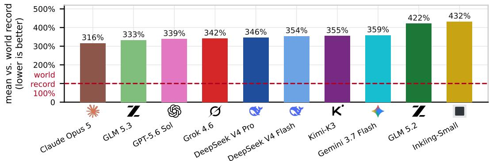  
Figure 1: With the world record as an anchor (100%), we average the time the model took to reach the goal across the games and compare on how much longer it took than the world record as percentage (lower is better). Detailed game-level breakdown is in Figure 8.

As prior work has noted (Vinyals et al., 2019; Berner et al., 2019), games require long-horizon reasoning. Speedrunning stresses this further, as one must reason beyond what constitutes an acceptable solution to finding the fastest one. The state and action space of a game, even if held to be deterministic under a fixed seed, is finite but exponential in the machine’s memory (Hearn & Demaine, 2009), and it grows with every frame a run requires. If we take Super Mario Bros. for instance it has been shown to be NP-hard (Aloupis et al., 2015) to complete, and speedrunning requires an additional optimality constraint, which makes it a more complex problem (Krentel, 1988). Proving optimality in this context practically requires either a structural lower bound (e.g., the run must contain at least n unavoidable frames) or exhaustion of the reachable space. This the source of speedrunning’s resistance to saturation, a game can be observed to be unsaturated whenever a new run exceeds the known best time, but saturation itself cannot be proven without solving the optimization problem outright. Thus, in practical terms, we should expect LLM agents to find speedrunning substantially harder than completion, as the task does not saturate when the agent does a successful valid run, every new record is an upper bound upon which to improve, and this improvement requires counterfactual reasoning about alternative routes and mechanics that no single episode reveals. In the same way that beating the world’s experts at Go and Chess led to ground-breaking research in reinforcement learning (Silver et al., 2016; 2018), we believe speedrunning can invoke similar innovation in LLM agents.

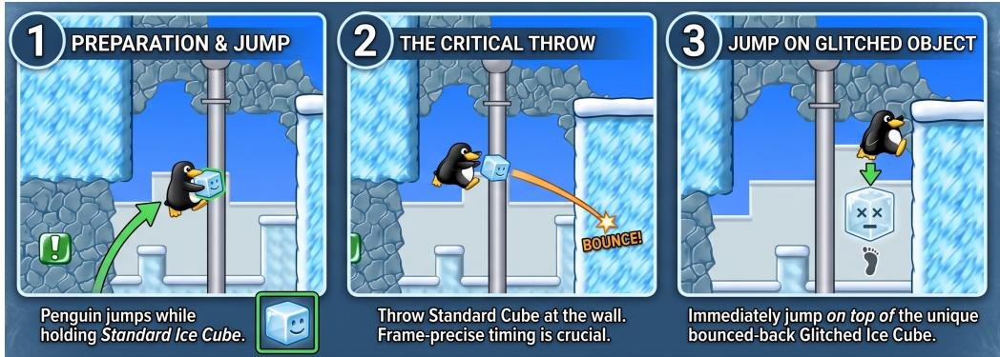  
Figure 2: One example of a complex technique necessary for speedrunning SuperTux, an opensource 2D scroll action game. This technique is unnecessary to complete the game itself, but for speedrunning, this is critical to cut down the frame to reach the goal.

In this paper we introduce SPEEDRUNBENCH, a benchmark for evaluating LLM agents on speedrunning games, covering 10+ frontier agents and 9 different games. We evaluate agents in three settings: an ONLINE computer-use setting and two new offline settings. In ONLINE, an agent observes the current frame and selects the next action or short sequence of actions while the game runs. In both offline settings, the agent repeatedly edits and replays a complete frame-indexed action trace for a fixed number of iterations. OFFLINE-SEED begins with a goal-reaching reference trajectory and focuses on improving it, whereas OFFLINE-SCRATCH requires the agent to first construct a successful trajectory. Each setting highlights a different capability: ONLINE requires multimodal real-time perception, OFFLINE-SCRATCH requires route discovery, as the agent begins without a successful trajectory, and OFFLINE-SEED focuses on improving an existing solution, as the agent begins with a successful reference trajectory. All settings demand long-horizon coherence, since the agent has to keep improving a route it already holds, over many turns, without breaking it. Our experiments (Figure 1) show that while recent frontier agents approach human world records on simpler platformer games, they remain slower on long, complex games such as role-playing, racing, and strategy games, given a fixed budget. Even when given a successful trace as a starting point, agents achieve only marginal improvements, showing a gap between finding a valid solution and improving it.

## 2 RELATED WORK

Benchmarks for LLM Agents Seeing & Playing Games Games have been serving as evaluation benchmarks for machine learning (ML) models well before LLMs became popular, from text adventures (Côté et al., 2018) to 2D navigation (Guruprasad et al., 2026) and abstract reasoning tasks (ARC Prize Foundation, 2026). Games were also the setting for some of the field’s most visible results before LLMs, from Atari from pixels (Mnih et al., 2015) to superhuman play in Go (Silver et al., 2016) and StarCraft II (Vinyals et al., 2019). Recent benchmarks extend the setting to let frontier LLMs play games directly. LMGame-Bench (Hu et al., 2026) supplies perception and memory scaffolds, standardizes prompting, and screens for training data contamination, while VideoGameBench (Zhang et al., 2025) asks whether vision-language models (VLMs) can complete popular titles at all. Taesiri et al. (2024) pairs images with questions to evaluate whether a VLM can identify what is wrong in a rendered screen. Individual titles have also served as milestones in their own right, with Gemini 2.5 Pro clearing Pokémon2 in 406.5 hours over two attempts (Comanici et al., 2025), and Hu et al. (2024) testing LLM capability on Pokémon battles specifically. Minecraft is the main setting where the objective is not merely completing something: MineDojo (Fan et al., 2022) and Voyager (Wang et al., 2024) score an agent on how much it acquires in an open world, by items obtained and skills learned. In contrast, SPEEDRUNBENCH scores how quickly it was completed, which continues to separate models after completion is reached by challenging them to learn and discover speedrun-related skills.

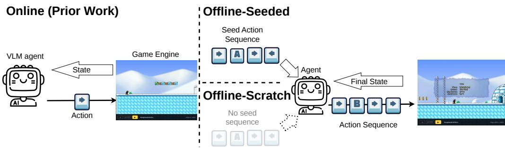  
Figure 3: Overview of the different settings explored in SPEEDRUNBENCH: ONLINE, OFFLINE-SEED, and OFFLINE-SCRATCH. ONLINE setup predicts next action (or small action chunks) from a current state, whereas OFFLINE setup predicts the full action trace from the start to the goal.

Speedrunning as a Task Outside games, related work studies speedrunning LLM training (Zhao et al., 2025) and using agents to optimize LLM serving systems (Kamahori et al., 2026). The closest work to ours is the Pokeagent Challenge from NeurIPS 2025 (Karten et al., 2026a), in which speedrunning is one of the tracks, followed by Karten et al. (2026b) on online adaptation. Both evaluate an agent that observes a game frame and predicts the next action or a short chunk of actions, and both focus on a single title: Pokémon. SPEEDRUNBENCH differs in scope and in setting: our suite spans several genres, and beyond the online setting it evaluates an offline one in which the agent edits a complete frame-indexed trajectory, replays it, and scores on the resulting frame count, which turns the task from finding a working trajectory into improving one that already works.

## 3 SPEEDRUNNING WITH AN LLM AGENT

We first review what agent capabilities are required to perform well on speedrunning (§3.1), then introduce different setups for LLM agents speedrunning (§3.2). Using SPEEDRUNBENCH, we explore the following research questions:

• RQ1: Is SPEEDRUNBENCH challenging for modern LLM agents? Under what setup can a modern LLM-based agent speedrun, and under what setup can it not?

• RQ2: Can LLM agents optimize their gameplay with an autoresearch-like loop? Even for a near-optimal Tool-Assisted Speedrun (TAS) run?

• RQ3: What are the critical features for an LLM agent to speedrun?

## 3.1 AGENT CAPABILITIES MEASURED IN SPEEDRUNBENCH

Exploration: The agent needs to “think outside the box” to explore new paths and approaches to minimize the frames to the goal. This capability is tested especially in an OFFLINE-SCRATCH setup where given seed gameplay trajectories are not necessarily fast gameplays.

Discovery: For example, a glitch in Super Mario Brothers was discovered 40 years after the original game is released by a speedrunner (Colantonio, 2026).

Long-horizon Coherence: Traces run large number of actions, and a single wrong edit anywhere in one costs the whole run. The agent has to keep what already works while changing part of it, and to do so over hundreds of iterations.

## 3.2 ONLINE VS. OFFLINE SETTING FOR SPEEDRUNNING

We define a game as a deterministic environment with state space S and a finite action space A, the set of controller inputs available on that console. Play begins from a fixed initial state $s _ { 0 } \in S _ { }$ , and each action advances the game by one frame, so a sequence of actions in A fully determines a run. We explore three settings per game: Online, Offline-Scratch, Offline-Seed for measuring different capabilities of each model (Figure 3). We further explain these three different setups in the following paragraphs.

Table 1: Games explored in SPEEDRUNBENCH, spanning several platforms and genres.
<table><tr><td>GAME</td><td>PLATFORM</td><td>GENRE</td></tr><tr><td>Super Mario Brothers</td><td>NES</td><td>Platformer</td></tr><tr><td>Super Mario Land Mario Kart 64</td><td>Game Boy Nintendo 64</td><td>Platformer Racing</td></tr><tr><td>Pokémon Blue/Red</td><td>Game Boy</td><td>RPG</td></tr><tr><td>Civilization I</td><td>MS-DOS/SNES</td><td>Strategy</td></tr><tr><td>Astray</td><td>Browser</td><td>Puzzle</td></tr><tr><td>SuperTux</td><td>C++/Browser</td><td></td></tr><tr><td>Tuxemon</td><td></td><td>Platformer</td></tr><tr><td></td><td>Python/Browser</td><td>RPG</td></tr><tr><td>SuperTuxKart</td><td>C++/Browser</td><td>Racing</td></tr></table>

Online (Action prediction from screenshots) Following prior work (Hu et al., 2026; Zhang et al., 2025), given a current state s of a game, the agent decides the next action a $\in { \mathcal { A } } .$ . A limited subset of frontier models (Opus 5, GPT-5.6-Sol, Grok 4.6) are capable of completing the game, but this setup only measures one aspect agent’s capability such as multimodal understanding. Since this setup can produce a baseline seed reference trajectory, we optimize it in the offline or trajectory editing setting.

Offline (Trace Editing) This setting mimics human speedrunning by playing the game over and over again throughout the decades. A run is represented as a frame-indexed action trace: a sequence of n actions $\{ a _ { i } \} _ { i = 1 } ^ { n } \in { \mathcal { A } }$ covering an entire action sequence, from start to goal. On each turn the agent submits an edited trace, evaluated, and the agent receives the final state $s _ { \mathrm { f i n a l } }$ of the trace such as 1) outcome $o \in$ {true, false} on whether it reached the goal, 2) the number of frames f to reach the goal if $o = \mathrm { t r u e }$ , or the maximum progress the trace made if o = false i.e., the edited trace no longer reached the goal. The agent repeats this for a fixed number of turns (200 unless specified). This can be regarded as action chunking i.e., predicting next k actions (Zhao et al., 2023) with an extremely long chunk. We explore the following two variant settings:

OFFLINE-SCRATCH: The agent has to come up with a valid action trave from scratch i.e., without a reference trace. This is harder than seeded setting due to a working trace not given in advance. OFFLINE-SEED: The agent is given a seed reference trajectory to optimize from. Seed reference trajectory are either from humans, scripted by breadth-first-search (BFS), from online setup, which are all far from the best run for each game except for §5.2 where we analyze the effect of number of times calling the scorer.

Note that vision inputs are not required under OFFLINE settings, and therefore, more open-weight models can be evaluated under these settings. This is because, especially for simple games, no vision inputs are needed, smaller open-weight models can optimize.

## 3.3 AUTO-RESEARCH LOOP-BASED OPTIMIZATION

For OFFLINE setup, we use a self-improving loop inspired by auto-research (Karpathy, 2026) to mimic humans speedrunning by playing the game multiple times, see where time was lost, change one thing, and run it again, for as long as the route keeps giving. The OFFLINE settings reproduce that structure. At each iteration the agent selects its current best trace and the record of what it has already tried, proposes an edit, and receives a verdict. We fix both the number of iterations and how many candidate traces the agent may evaluate within one iteration before committing to the edit it submits. These hyperparameters are left fixed across models. (§5.1).

## 4 EXPERIMENTS

## 4.1 GAMES

Table 1 lists the nine titles in SPEEDRUNBENCH, spanning six genres and multiple consoles, and assembled along two axes. The first is genre, since the capability required for speedrunning depends on each game: a platformer requires frame-precise movement, an RPG rewards routing across a long horizon, and a puzzle game rewards search over a discrete state space. Alongside widely known commercial titles we include open-source games of the same genre, so that each of the three most popular and documented genres has a counterpart whose routes and records are far less likely to appear in a pretraining corpus.3

Super Mario Brothers, Super Mario Land, and SuperTux (The SuperTux Team, 2021) are 2D side-scrolling platformers, which demand precise movement and route discovery toward a level exit. The goal is finishing Level 1-1. Both Mario titles have decades of documented routes and world records, which supplies an external speedrun reference, and they are also the titles which are most likely to have been exposed to LLMs during pretraining. SuperTux is the open-source counterpart that makes the extent of exposure measurable: it has similar gameplay as Mario for the agent while carrying none of the same pretraining exposure. We use its “Welcome to Antarctica” level, referred to as SuperTux 1-1 throughout.

Pokémon Blue/Red and Tuxemon (Tuxemon Contributors, 2026) are turn-based RPGs, and the longest-horizon tasks in this benchmark. A run reaches the first gym badge only after 13 milestones, and the frame counts involved are one to two orders of magnitude larger than in the platformers, which stresses long-context tracking. Tuxemon is the open-source counterpart, matched in genre and structure but estimated to be less representative in the pretraining data in general.

Mario Kart 64 and SuperTuxKart (theodorepringle, 2021) are racing games, where the goal is lap time. We use Black Forest track for SuperTuxKart and Wario Stadium for Mario Kart 64.

Astray is a browser-based maze puzzle. We use the implementation from Ouyang et al. (2026).

Civilization I is a strategy game. These broaden genre coverage beyond the platformer and RPG settings that dominate prior game benchmarks.

## 4.2 SETUP

Models: We use frontier models both from proprietary models such as Claude Opus 5 (Anthropic, 2026), GPT-5.6-sol (OpenAI, 2026), Grok 4.6 (SpaceXAI, 2026), Gemini-3.7-Flash (Google Deep-Mind, 2026), and open-weight models such as Kimi-K3 (Team et al., 2026), GLM 5.3 (Z.ai, 2026b), GLM 5.2 (Z.ai, 2026a), DeepSeek-V4-Pro-0813 (DeepSeek-AI, 2026b), DeepSeek-V4- Flash-0731 (DeepSeek-AI, 2026a), Inkling-Small (Thinking Machines Lab, 2026). All models ran with Opencode (OpenCode contributors, 2026) for experimenting on the same harness. Reasoning effort is set to the maximum available for every model in this paper.

Reference Times: Every world record we compare against is a human real-time attack (RTA) from verified runs (SlNNED, 2025; EiP25, 2026; DylCat, 2025; theodorepringle, 2021; abney317, 2026).

Seed Reference Trajectory for OFFLINE-SEED: For traces to seed the agent in OFFLINE-SEED, GPT-5.6-sol/Opus 5 online run, scripted, and human traces are used. All the seed trajectories are far from the optimal speedrun play for leaving the space for agents optimize their play.

## 4.3 ONLINE PLAY RESULTS

Figure 4a shows ONLINE Pokémon play. Only the three vision-capable proprietary models reach the first badge at all, while Kimi K3 stalls at the prior point in the game where Reds(Ash) gets the Pokédex from Prof. Oak. All runs are still far off the from the human world record of ∼40,435: Opus 5 takes 160,021 frames, GPT-5.6-sol 283,474, and Grok 4.6 477,140, so the best agent is roughly 4× slower than the record and the worst nearly 12×. Under a completion metric, these three runs are indistinguishable, which shows the edge of SPEEDRUNBENCH at providing finer-grained discrimination.

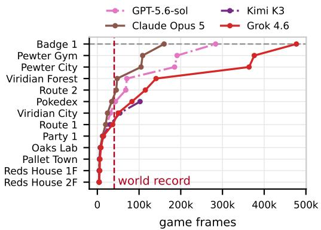  
(a) ONLINE: milestones reached over game frames.

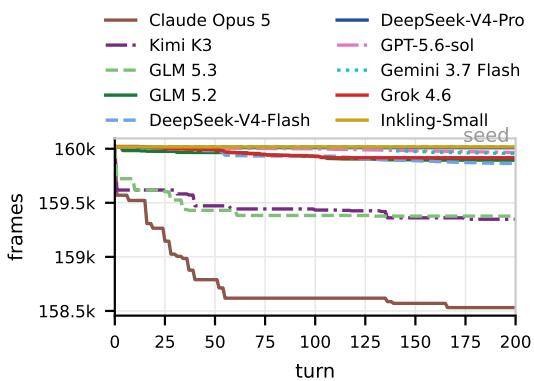  
(b) OFFLINE-SEED: frames to the first badge.  
Figure 4: Pokemon Blue results. (a) ONLINE run on models reaching Pokemon Blue milestones. Opus 5 reaches Badge 1 in 160,021 frames, whereas the human world record is ∼40,435 frames (SlNNED, 2025): the record is ∼ 4× faster than the best model result. Kimi K3 did not reach Route 2. (b) OFFLINE-SEED speedrun until the first badge, starting from the reference trajectory of Opus 5’s online run and given 200 iterations.

## 4.4 OFFLINE SPEEDRUNNING RESULTS

As shown in Figure 1, no agent reaches a world record under the current budget, and the best mean result is more than twice slower than the world record. Figure 8 in Appendix A.2 gives the per-game breakdown. The closest results to the world record are the from-scratch SuperTux runs at 118%, while SuperTuxKart result are in between 256% and 261% and every model on Pokémon sits near 395%. A completion metric scores all of these runs identically.

In Table 2, every agent is run both from scratch and from a common 9498-frame seed produced by GPT-5.6-sol’s ONLINE run. All seven OFFLINE-SEED runs end within 12% of the seed, between 8,412 and 9,428 frames. In OFFLINE-SCRATCH, five of six models clear the level 3.8–4.9× faster than the same model from the seed. GLM 5.2 is the exception: it reaches the goal only when handed the seed. OFFLINE-SCRATCH thus separates agents that can construct a route from those that can merely refine one, whereas OFFLINE-SEED shows how strongly a working but slow route through the game primes the agents.

On Super Mario Land 1-1, Claude Opus 5, GPT-5.6-sol, Grok 4.6 and GLM 5.3 cleared under OFFLINE-SCRATCH, at 2,835, 3,271, 3,417 and 4,113 frames, while the best OFFLINE-SEED run, from a 6,017-frame human seed, reached 5,145. On SuperTuxKart, under OFFLINE-SEED from a 168-second botgenerated lap, every model ends between 165

<table><tr><td>Model</td><td>OFFLINE- SCRATCH</td><td>OFFLINE- SEED</td></tr><tr><td>SuperTux 1-1 DeepSeek-V4-Pro</td><td>1,918</td><td>9,428</td></tr><tr><td>Gemini 3.7 Flash</td><td>1,951</td><td>9,094</td></tr><tr><td>DeepSeek-V4-Flash</td><td>1,980</td><td>9,123</td></tr><tr><td>GLM 5.3</td><td>2,087</td><td>8,412</td></tr><tr><td>Kimi K3</td><td>2,432</td><td>9,280</td></tr><tr><td>Super Mario Land 1-1</td><td></td><td></td></tr><tr><td>Claude Opus 5</td><td></td><td></td></tr><tr><td></td><td>2,835</td><td>5,385</td></tr><tr><td>GPT-5.6-sol</td><td>3,271</td><td>5,896</td></tr><tr><td>Grok 4.6</td><td>3,417</td><td>5,730</td></tr><tr><td>GLM 5.3</td><td>4,113</td><td>5,534</td></tr></table>

Table 2: Frames to the goal under OFFLINE-SCRATCH and OFFLINE-SEED for the same model which found a trace to reach the goal (lower is better, with the faster in bold). SuperTux runs are seeded with a 9,498-frame trace, and Super Mario Land runs seed with a 6,017 trace. Results are largely influenced by the seed traces.

and 168 seconds. On Pokémon, again without the scorer, no OFFLINE-SEED run improves on the seed by more than 1% (Figure 4b). No model reaches the record on any of the three games.

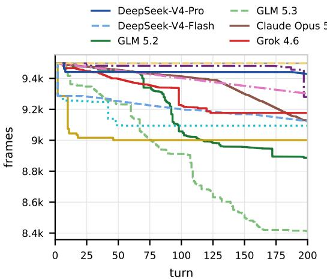  
(a) OFFLINE-SEED, from a 9498-frame seed.

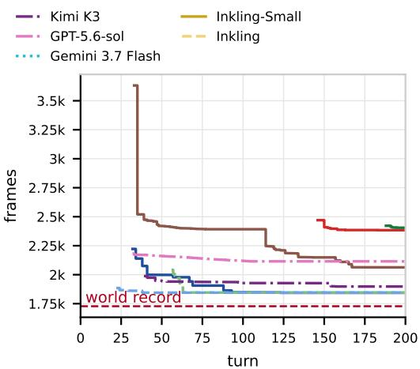  
(b) OFFLINE-SCRATCH, no seed.  
Figure 5: SuperTux 1-1 speedrun results with an agent backed with various LLMs. Lines in OFFLINE-SCRATCH start from the turn an agent finds a valid trace to complete the goal.

## 5 ANALYSIS

## 5.1 EXPANDING THE EVALUATION BUDGET PER TURN

In the experiments so far, the agent holds no in-turn scorer: it submits one trace per turn and gets one verdict. Here, we instead let the agent evaluate its own candidates, up to 200 per turn, and hold all else fixed. On SuperTux 1-1 this gives a controlled comparison, since the same models start from the same 9,498-frame seed and run for the same 200 turns in both settings (Table 3). With the scorer, every model escapes the seed and ends 4.0–5.1× below where it ended without it. DeepSeek-V4-Pro reaches 1,847 frames, within 7% of the world record and about two seconds slower, while DeepSeek-V4-Flash and GLM 5.2 remain 16% and 29% above it (Figure 6a). On Super Mario Land 1-1, GLM 5.2 with the scorer comes within 3% of the record after 220K evaluated traces over ∼114 hours (Figure 6b), against 5,643 frames from the same human seed without it. For these models, access to a scorer decides whether an agent escapes a non-optimal seeded trace, and given enough evaluations the strongest agent on each short 2D level comes close to its world record.

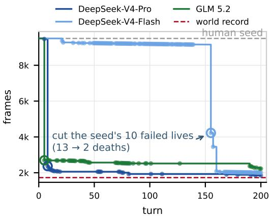  
(a) SuperTux 1-1, top 3 models under this setup.

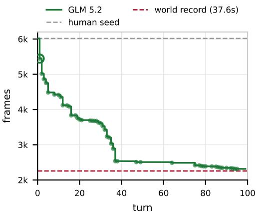  
(b) Super Mario Land 1-1 with in-turn scorer.  
Figure 6: OFFLINE-SEED speedrun results with an agent allowed to evaluate up to 200 traces per turn. Super Mario Land world record is the 1-1 portion from EiP25 (2026). With this budget, GLM 5.2 on Super Mario Land & DeepSeek-V4-Pro on SuperTux come close to the world record.

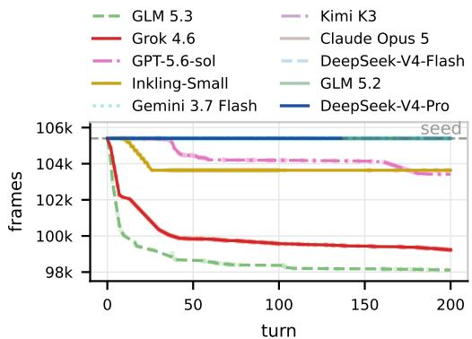

<table><tr><td>Model</td><td>no scorer</td><td>scorer</td></tr><tr><td>SuperTux 1-1</td><td></td><td></td></tr><tr><td>DeepSeek-V4-Pro</td><td>9,428</td><td>1,847</td></tr><tr><td>Kimi-K3</td><td>9,280</td><td>1,930</td></tr><tr><td>DeepSeek-V4-Flash GLM 5.2</td><td>9,123 8,887</td><td>2,009</td></tr><tr><td></td><td></td><td>2,228</td></tr><tr><td>Super Mario Land 1-1</td><td></td><td></td></tr><tr><td>GLM 5.2</td><td>5,643</td><td>2,314</td></tr></table>

Figure 7: OFFLINE-SEED results on Tuxemon scored on frames to the first gym. All ten models start from the same 105,400-frame trace.  
Table 3: Frames to the goal under OFFLINE-SEED for the same model and seed, without the in-turn scorer and with up to 200 evaluations per turn (lower is better).

## 5.2 CASE STUDY ON IMPROVING NEAR-OPTIMAL SPEEDRUN TRACE

The OFFLINE-SEED settings above start from seed traces far off the optimum, which leaves large room to improve for an agent. We report two experiments that instead start from a near-optimal trace on Super Mario Brothers: the first asks an agent to improve one which is same as OFFLINE-SEED By seeding instead from an 18834-frame full-game Super Mario Brothers trace (Bisqwit, 2003) and given 200 turns, GPT-5.6-sol returned a trace three frames faster. The second is merging two near-optimal traces4 which saved 26 frames from the fastest trajectory out of the two. These results suggest seeding the optimization loop with multiple near-optimal trajectory has the potential to further improve those.

## 5.3 CONTAMINATION FROM PRETRAINING: CASE STUDY ON POKEMON VS. TUXEMON

That famous titles are memorized in model parameters is well known: Hu et al. (2026) reports game content memorised during pretraining, and Gemini 2.5 Pro has been observed confusing items across Pokémon versions, expecting tea where the game requires soda (Zhang, 2025). Hence, we add a controlled pair: Pokémon and Tuxemon holding genre and setting fixed while varying how much a title is likely to appear in a pretraining corpus. Both are turn-based RPGs, run under OFFLINE-SEED with the same iteration budget and scored on frames to the first gym. Figure 7 shows that lower popularity does not make the open-source title harder to improve on when compared to the Pokémon run is the one in Figure 4b. No model improves on the Pokémon seed by more than 1%, whereas GLM 5.3 and Grok 4.6 improve on the Tuxemon seed by 6.9% and 5.9%. Tuxemon is harder to make any progress on since every model on Pokémon submits at least one trace faster than the seed, while four of ten never submit a trace that reaches the Tuxemon gym. Across ten models run on both titles, the rank correlation observed b/w titles is slightly negative at −0.18. Hence, we see that results on a popular title are not predictive of performance on an unfamiliar one, which is consistent with popular titles being present in pretraining corpora.

## 6 CONCLUSION

We introduce SPEEDRUNBENCH, a benchmark that measures agents’ capability by assessing how fast an agent can finish a game and comparing it with the best known completion time. SPEEDRUN-BENCH evaluates agents across three settings: an ONLINE setting where agents get frame by frame screen shots and must take an action, and two OFFLINE settings where agents must optimize their game plan for the run either with a seeded trace or without. We show that our benchmark remains challenging for current models (RQ1), as no agent reaches human world record on any game under a practical budget, with the best performing agent being on average more than twice as slow as the world record set by human players. Additionally we show that agents can improve their gameplay in an autoresearch-like loop (RQ2), even when the start seed is a near-optimal tool-assisted speedrun trace. However, giving the agents a slow seed as a starting point holds them back. Agents perform better when they can construct the routes of their own accord, and expanding the agents’ ability to evaluate a candidate with a larger per-turn budget, as seen with how close the platformer games came to the world records. We hope that SPEEDRUNBENCH inspires others to consider speedrunning as an avenue for pushing model abilities such as strategic thinking and long horizon coherence.

## AI USE STATEMENT

We used generative AI tools to design or provide feedback on research methodology or experiments, to implement methods, to assist with translation, to clean and reformat datasets, and to support qualitative and thematic data analysis. We have not used generative AI tools to generate synthetic data sets, to help develop theoretical models or conceptual frameworks, to formulate mathematical claims, to provide critical ingredients for proving mathematical claims, to assist in the writing of proofs, or to propose or refine hypotheses. We have reviewed all AI-assisted work manually and take responsibility for the final content of this work, including text, claims or artifacts produced with the aid of generative AI.

## ETHICS STATEMENT

SPEEDRUNBENCH will be released for research and benchmarking purposes only and it will soley be limited to open-source games and licensed codes for public release to the community for reproducibility purpose. None of the copyrighted assets will be publicly released. This paper and associated assets conveys no right to access, reproduce, distribute, modify, or commercially exploit any third-party title or its assets beyond what applicable licenses, terms of service, and law already permit. Users are responsible for lawfully obtaining the titles they evaluate on and for securing any permissions their intended use requires.

## REFERENCES

abney317. Mario Kart 64 – all cups (skips) in 22:24.640. Speedrun.com, 2026. URL https: //www.speedrun.com/mk64/runs/y84r7gdz.

Greg Aloupis, Erik D. Demaine, Alan Guo, and Giovanni Viglietta. Classic Nintendo games are (computationally) hard. Theoretical Computer Science, 586:135–160, 2015. doi: 10.1016/j.tcs. 2015.02.037.

Anthropic. System card: Claude Opus 5. https://www-cdn.anthropic.com/ ceaf5c7ff2783855203fde8208ec311252dced5b/Claude%20Opus%205% 20System%20Card.pdf, July 2026. Accessed: 2026-08-24.

ARC Prize Foundation. ARC-AGI-3: A new challenge for frontier agentic intelligence. Technical report, ARC Prize Foundation, 2026. arXiv:2603.24621.

Adrià Puigdomènech Badia, Bilal Piot, Steven Kapturowski, et al. Agent57: Outperforming the Atari human benchmark. In Proceedings ofthe 37th International Conference on Machine Learning (ICML), 2020.

Marc G. Bellemare, Yavar Naddaf, Joel Veness, and Michael Bowling. The arcade learning environment: An evaluation platform for general agents. Journal ofArtificial Intelligence Research, 47:253–279, 2013. doi: 10.1613/jair.3912.

Christopher Berner, Greg Brockman, Brooke Chan, et al. Dota 2 with large scale deep reinforcement learning. arXiv preprint arXiv:1912.06680, 2019.

Bisqwit. NES Super Mario Bros. “warps” in 05:15.650. TASVideos publication #665, December 2003. URL https://tasvideos.org/665M. Tool-assisted speedrun; Famtasia 5.1; obsoleted.

Murray Campbell, A. Joseph Hoane, and Feng-hsiung Hsu. Deep blue. Artificial Intelligence, 134 (1–2):57–83, 2002. doi: 10.1016/S0004-3702(01)00129-1.

Giovanni Colantonio. Super mario bros. players uncover the biggest glitch in the game’s 40-year history. Polygon, April 2026. URL https://www.polygon.com/ super-mario-bros-ace-trick-discovered/.

Gheorghe Comanici, Eric Bieber, Mike Schaekermann, Ice Pasupat, Noveen Sachdeva, Inderjit Dhillon, Marcel Blistein, Ori Ram, Dan Zhang, Evan Rosen, Luke Marris, Sam Petulla, Colin Gaffney, Asaf Aharoni, Nathan Lintz, Tiago Cardal Pais, Henrik Jacobsson, Idan Szpektor, Nan Jiang Jiang, Krishna Haridasan, Ahmed Omran, Nikunj Saunshi, Dara Bahri, Gaurav Mishra, Eric Chu, Toby Boyd, Brad Hekman, Aaron Parisi, Chaoyi Zhang, Kornraphop Kawintiranon, Tania Bedrax-Weiss, Oliver Wang, Ya Xu, Ollie Purkiss, Uri Mendlovic, Ilaï Deutel, Nam Nguyen, Adam Langley, Flip Korn, Lucia Rossazza, Alexandre Ramé, Sagar Waghmare, Helen Miller, Nathan Byrd, Ashrith Sheshan, Raia Hadsell, Sangnie Bhardwaj, Pawel Janus, Tero Rissa, Dan Horgan, Alvin Abdagic, Lior Belenki, James Allingham, Anima Singh, Theo Guidroz, Srivat san Srinivasan, Herman Schmit, Kristen Chiafullo, Andre Elisseeff, Nilpa Jha, Prateek Kolhar, Leonard Berrada, Frank Ding, Xiance Si, Shrestha Basu Mallick, Franz Och, Sofia Erell, Eric Ni, Tejasi Latkar, Sherry Yang, Petar Sirkovic, Ziqiang Feng, Robert Leland, Rachel Hornung, Gang Wu, Charles Blundell, Hamidreza Alvari, Po-Sen Huang, Cathy Yip, Sanja Deur, Li Liu, Gabriela Surita, Pablo Duque, Dima Damen, Johnson Jia, Arthur Guez, Markus Mircea, Animesh Sinha, Alberto Magni, Paweł Stradomski, Tal Marian, Vlado Galic, Wenhu Chen, Hisham Hu-´ sain, Achintya Singhal, Dominik Grewe, François-Xavier Aubet, Shuang Song, Lorenzo Blanco, Leland Rechis, Lewis Ho, Rich Munoz, Kelvin Zheng, Jessica Hamrick, Kevin Mather, Hagai Taitelbaum, Eliza Rutherford, Yun Lei, Kuangyuan Chen, Anand Shukla, Erica Moreira, Eric Doi, Berivan Isik, Nir Shabat, Dominika Rogozinska, Kashyap Kolipaka, Jason Chang, Eugen´ Vušak, Srinivasan Venkatachary, Shadi Noghabi, Tarun Bharti, Younghoon Jun, Aleksandr Zaks, Simon Green, Jeshwanth Challagundla, William Wong, Muqthar Mohammad, Dean Hirsch, Yong Cheng, Iftekhar Naim, Lev Proleev, Damien Vincent, Aayush Singh, Maxim Krikun, Dilip Kr ishnan, Zoubin Ghahramani, Aviel Atias, Rajeev Aggarwal, Christo Kirov, Dimitrios Vytinio tis, Christy Koh, Alexandra Chronopoulou, Pawan Dogra, Vlad-Doru Ion, Gladys Tyen, Jason Lee, Felix Weissenberger, Trevor Strohman, Ashwin Balakrishna, Jack Rae, Marko Velic, Raou de Liedekerke, Oded Elyada, Wentao Yuan, Canoee Liu, Lior Shani, Sergey Kishchenko, Bea Alessio, Yandong Li, Richard Song, Sam Kwei, Orion Jankowski, Aneesh Pappu, Youhei Namiki, Yenai Ma, Nilesh Tripuraneni, Colin Cherry, Marissa Ikonomidis, Yu-Cheng Ling, Colin Ji, Beka Westberg, Auriel Wright, Da Yu, David Parkinson, Swaroop Ramaswamy, Jerome Connor, So heil Hassas Yeganeh, Snchit Grover, George Kenwright, Lubo Litchev, Chris Apps, Alex Tomala, Felix Halim, Alex Castro-Ros, Zefei Li, Anudhyan Boral, Pauline Sho, Michal Yarom, Eric Malmi, David Klinghoffer, Rebecca Lin, Alan Ansell, Pradeep Kumar S, Shubin Zhao, Siqi Zuo, Adam Santoro, Heng-Tze Cheng, Solomon Demmessie, Yuchi Liu, Nicole Brichtova, Allie Culp, Nathaniel Braun, Dan Graur, Will Ng, Nikhil Mehta, Aaron Phillips, Patrik Sundberg, Varun God bole, Fangyu Liu, Yash Katariya, David Rim, Mojtaba Seyedhosseini, Sean Ammirati, Jonas Val fridsson, Mahan Malihi, Timothy Knight, Andeep Toor, Thomas Lampe, Abe Ittycheriah, Lewis Chiang, Chak Yeung, Alexandre Fréchette, Jinmeng Rao, Huisheng Wang, Himanshu Srivastava, Richard Zhang, Rocky Rhodes, Ariel Brand, Dean Weesner, Ilya Figotin, Felix Gimeno, Rachana Fellinger, Pierre Marcenac, José Leal, Eyal Marcus, Victor Cotruta, Rodrigo Cabrera, Sheryl Luo, Dan Garrette, Vera Axelrod, Sorin Baltateanu, David Barker, Dongkai Chen, Horia Toma, Ben Ingram, Jason Riesa, Chinmay Kulkarni, Yujing Zhang, Hongbin Liu, Chao Wang, Martin Po lacek, Will Wu, Kai Hui, Adrian N Reyes, Yi Su, Megan Barnes, Ishaan Malhi, Anfal Siddiqui, Qixuan Feng, Mihai Damaschin, Daniele Pighin, Andreas Steiner, Samuel Yang, Ramya Sree Boppana, Simeon Ivanov, Arun Kandoor, Aditya Shah, Asier Mujika, Da Huang, Christopher A. Choquette-Choo, Mohak Patel, Tianhe Yu, Toni Creswell, Jerry, Liu, Catarina Barros, Yasaman Razeghi, Aurko Roy, Phil Culliton, Binbin Xiong, Jiaqi Pan, Thomas Strohmann, Tolly Powell, Babi Seal, Doug DeCarlo, Pranav Shyam, Kaan Katircioglu, Xuezhi Wang, Cassidy Hardin, Im manuel Odisho, Josef Broder, Oscar Chang, Arun Nair, Artem Shtefan, Maura O’Brien, Manu Agarwal, Sahitya Potluri, Siddharth Goyal, Amit Jhindal, Saksham Thakur, Yury Stuken, James Lyon, Kristina Toutanova, Fangxiaoyu Feng, Austin Wu, Ben Horn, Alek Wang, Alex Cullum, Gabe Taubman, Disha Shrivastava, Chongyang Shi, Hamish Tomlinson, Roma Patel, Tao Tu, Ada Maksutaj Oflazer, Francesco Pongetti, Mingyao Yang, Adrien Ali Taïga, Vincent Perot, Nuo Wang Pierse, Feng Han, Yoel Drori, Iñaki Iturrate, Ayan Chakrabarti, Legg Yeung, Dave

Dopson, Yi ting Chen, Apoorv Kulshreshtha, Tongfei Guo, Philip Pham, Tal Schuster, Junquan Chen, Alex Polozov, Jinwei Xing, Huanjie Zhou, Praneeth Kacham, Doron Kukliansky, Antoine Miech, Sergey Yaroshenko, Ed Chi, Sholto Douglas, Hongliang Fei, Mathieu Blondel, Preethi Myla, Lior Madmoni, Xing Wu, Daniel Keysers, Kristian Kjems, Isabela Albuquerque, Lijun Yu, Joel D’sa, Michelle Plantan, Vlad Ionescu, Jaume Sanchez Elias, Abhirut Gupta, Manish Reddy Vuyyuru, Fred Alcober, Tong Zhou, Kaiyang Ji, Florian Hartmann, Subha Puttagunta, Hugo Song, Ehsan Amid, Anca Stefanoiu, Andrew Lee, Paul Pucciarelli, Emma Wang, Amit Raul, Slav Petrov, Isaac Tian, Valentin Anklin, Nana Nti, Victor Gomes, Max Schumacher, Grace Vesom, Alex Panagopoulos, Konstantinos Bousmalis, Daniel Andor, Josh Jacob, Yuan Zhang, Bill Ros gen, Matija Kecman, Matthew Tung, Alexandra Belias, Noah Goodman, Paul Covington, Brian Wieder, Nikita Saxena, Elnaz Davoodi, Muhuan Huang, Sharath Maddineni, Vincent Roulet, Fo lawiyo Campbell-Ajala, Pier Giuseppe Sessa, Xintian, Wu, Guangda Lai, Paul Collins, Alex Haig, Vytenis Sakenas, Xiaowei Xu, Marissa Giustina, Laurent El Shafey, Pichi Charoenpanit, Shefali Garg, Joshua Ainslie, Boone Severson, Montse Gonzalez Arenas, Shreya Pathak, Sujee Rajayo gam, Jie Feng, Michiel Bakker, Sheng Li, Nevan Wichers, Jamie Rogers, Xinyang Geng, Yeqing Li, Rolf Jagerman, Chao Jia, Nadav Olmert, David Sharon, Matthew Mauger, Sandeep Mariserla, Hongxu Ma, Megha Mohabey, Kyuyeun Kim, Alek Andreev, Scott Pollom, Juliette Love, Vihan Jain, Priyanka Agrawal, Yannick Schroecker, Alisa Fortin, Manfred Warmuth, Ji Liu, Andrew Leach, Irina Blok, Ganesh Poomal Girirajan, Roee Aharoni, Benigno Uria, Andrei Sozanschi, Dan Goldberg, Lucian Ionita, Marco Tulio Ribeiro, Martin Zlocha, Vighnesh Birodkar, Sami Lachgar, Liangzhe Yuan, Himadri Choudhury, Matt Ginsberg, Fei Zheng, Gregory Dibb, Emily Graves, Swachhand Lokhande, Gabriel Rasskin, George-Cristian Muraru, Corbin Quick, Sandeep Tata, Pierre Sermanet, Aditya Chawla, Itay Karo, Yan Wang, Susan Zhang, Orgad Keller, Anca Dragan, Guolong Su, Ian Chou, Xi Liu, Yiqing Tao, Shruthi Prabhakara, Marc Wilson, Ruibo Liu, Shibo Wang, Georgie Evans, David Du, Alfonso Castaño, Gautam Prasad, Mona El Mahdy, Sebastian Gerlach, Machel Reid, Jarrod Kahn, Amir Zait, Thanumalayan Sankaranarayana Pil lai, Thatcher Ulrich, Guanyu Wang, Jan Wassenberg, Efrat Farkash, Kiran Yalasangi, Con gchao Wang, Maria Bauza, Simon Bucher, Ting Liu, Jun Yan, Gary Leung, Vikas Sindhwani, Parker Barnes, Avi Singh, Ivan Jurin, Jichuan Chang, Niket Kumar Bhumihar, Sivan Eiger, Gui Citovsky, Ben Withbroe, Zhang Li, Siyang Xue, Niccolò Dal Santo, Georgi Stoyanov, Yves Rai mond, Steven Zheng, Yilin Gao, Vít Listík, Sławek Kwasiborski, Rachel Saputro, Adnan Oz turel, Ganesh Mallya, Kushal Majmundar, Ross West, Paul Caron, Jinliang Wei, Lluis Castrejon, Sharad Vikram, Deepak Ramachandran, Nikhil Dhawan, Jiho Park, Sara Smoot, George van den Driessche, Yochai Blau, Chase Malik, Wei Liang, Roy Hirsch, Cicero Nogueira dos Santos, Eu gene Weinstein, Aäron van den Oord, Sid Lall, Nicholas FitzGerald, Zixuan Jiang, Xuan Yang, Dale Webster, Ali Elqursh, Aedan Pope, Georges Rotival, David Raposo, Wanzheng Zhu, Jeff Dean, Sami Alabed, Dustin Tran, Arushi Gupta, Zach Gleicher, Jessica Austin, Edouard Rosseel, Megh Umekar, Dipanjan Das, Yinghao Sun, Kai Chen, Karolis Misiunas, Xiang Zhou, Yixian Di, Alyssa Loo, Josh Newlan, Bo Li, Vinay Ramasesh, Ying Xu, Alex Chen, Sudeep Gandhe, Radu Soricut, Nikita Gupta, Shuguang Hu, Seliem El-Sayed, Xavier Garcia, Idan Brusilovsky, Pu-Chin Chen, Andrew Bolt, Lu Huang, Alex Gurney, Zhiying Zhang, Alexander Pritzel, Jarek Wilkiewicz, Bryan Seybold, Bhargav Kanagal Shamanna, Felix Fischer, Josef Dean, Karan Gill, Ross Mcilroy, Abhishek Bhowmick, Jeremy Selier, Antoine Yang, Derek Cheng, Vladimir Ma gay, Jie Tan, Dhriti Varma, Christian Walder, Tomas Kocisky, Ryo Nakashima, Paul Natsev, Mike Kwong, Ionel Gog, Chiyuan Zhang, Sander Dieleman, Thomas Jimma, Andrey Ryabtsev, Sid dhartha Brahma, David Steiner, Dayou Du, Ante Žužul, Mislav Žanic, Mukund Raghavachari,´ Willi Gierke, Zeyu Zheng, Dessie Petrova, Yann Dauphin, Yuchuan Liu, Ido Kessler, Steven Hand, Chris Duvarney, Seokhwan Kim, Hyo Lee, Léonard Hussenot, Jeffrey Hui, Josh Smith, Deepali Jain, Jiawei Xia, Gaurav Singh Tomar, Keyvan Amiri, Du Phan, Fabian Fuchs, To bias Weyand, Nenad Tomasev, Alexandra Cordell, Xin Liu, Jonathan Mallinson, Pankaj Joshi, Andy Crawford, Arun Suggala, Steve Chien, Nick Fernando, Mariella Sanchez-Vargas, Duncan Williams, Phil Crone, Xiyang Luo, Igor Karpov, Jyn Shan, Terry Thurk, Robin Strudel, Paul Voigtlaender, Piyush Patil, Tim Dozat, Ali Khodaei, Sahil Singla, Piotr Ambroszczyk, Qiyin Wu, Yifan Chang, Brian Roark, Chaitra Hegde, Tianli Ding, Angelos Filos, Zhongru Wu, André Su sano Pinto, Shuang Liu, Saarthak Khanna, Aditya Pandey, Siobhan Mcloughlin, Qiujia Li, Sam Haves, Allan Zhou, Elena Buchatskaya, Isabel Leal, Peter de Boursac, Nami Akazawa, Nina Anderson, Terry Chen, Krishna Somandepalli, Chen Liang, Sheela Goenka, Stephanie Winkler, Alexander Grushetsky, Yifan Ding, Jamie Smith, Fan Ye, Jordi Pont-Tuset, Eric Li, Ruichao Li, Tomer Golany, Dawid Wegner, Tao Jiang, Omer Barak, Yuan Shangguan, Eszter Vértes, Renee

Wong, Jörg Bornschein, Alex Tudor, Michele Bevilacqua, Tom Schaul, Ankit Singh Rawat, Yang Zhao, Kyriakos Axiotis, Lei Meng, Cory McLean, Jonathan Lai, Jennifer Beattie, Nate Kushman, Yaxin Liu, Blair Kutzman, Fiona Lang, Jingchen Ye, Praneeth Netrapalli, Pushkar Mishra, Myr iam Khan, Megha Goel, Rob Willoughby, David Tian, Honglei Zhuang, JD Chen, Zak Tsai, Tasos Kementsietsidis, Arjun Khare, James Keeling, Keyang Xu, Nathan Waters, Florent Altché, Ashok Popat, Bhavishya Mittal, David Saxton, Dalia El Badawy, Michael Mathieu, Zheng Zheng, Hao Zhou, Nishant Ranka, Richard Shin, Qingnan Duan, Tim Salimans, Ioana Mihailescu, Uri Sha ham, Ming-Wei Chang, Yannis Assael, Nishanth Dikkala, Martin Izzard, Vincent Cohen-Addad, Cat Graves, Vlad Feinberg, Grace Chung, DJ Strouse, Danny Karmon, Sahand Sharifzadeh, Zoe Ashwood, Khiem Pham, Jon Blanton, Alex Vasiloff, Jarred Barber, Mark Geller, Aurick Zhou, Fedir Zubach, Tzu-Kuo Huang, Lei Zhang, Himanshu Gupta, Matt Young, Julia Proskurnia, Ronny Votel, Valentin Gabeur, Gabriel Barcik, Aditya Tripathi, Hongkun Yu, Geng Yan, Beer Changpinyo, Filip Pavetic, Amy Coyle, Yasuhisa Fujii, Jorge Gonzalez Mendez, Tianhao Zhou,´ Harish Rajamani, Blake Hechtman, Eddie Cao, Da-Cheng Juan, Yi-Xuan Tan, Valentin Dalibard, Yilun Du, Natalie Clay, Kaisheng Yao, Wenhao Jia, Dimple Vijaykumar, Yuxiang Zhou, Xiny Bai, Wei-Chih Hung, Steven Pecht, Georgi Todorov, Nikhil Khadke, Pramod Gupta, Preethi La hoti, Arnaud Autef, Karthik Duddu, James Lee-Thorp, Alexander Bykovsky, Tautvydas Misiunas, Sebastian Flennerhag, Santhosh Thangaraj, Jed McGiffin, Zack Nado, Markus Kunesch, Andreas Noever, Amir Hertz, Marco Liang, Victor Stone, Evan Palmer, Samira Daruki, Arijit Pramanik, Siim Põder, Austin Kyker, Mina Khan, Evgeny Sluzhaev, Marvin Ritter, Avraham Ruderman, Wenlei Zhou, Chirag Nagpal, Kiran Vodrahalli, George Necula, Paul Barham, Ellie Pavlick, Jay Hartford, Izhak Shafran, Long Zhao, Maciej Mikuła, Tom Eccles, Hidetoshi Shimokawa, Kanav Garg, Luke Vilnis, Hanwen Chen, Ilia Shumailov, Kuang-Huei Lee, Abdelrahman Ab delhamed, Meiyan Xie, Vered Cohen, Ester Hlavnova, Dan Malkin, Chawin Sitawarin, James Lottes, Pauline Coquinot, Tianli Yu, Sandeep Kumar, Jingwei Zhang, Aroma Mahendru, Zafaral Ahmed, James Martens, Tao Chen, Aviel Boag, Daiyi Peng, Coline Devin, Arseniy Klimovskiy, Mary Phuong, Danny Vainstein, Jin Xie, Bhuvana Ramabhadran, Nathan Howard, Xinxin Yu, Gitartha Goswami, Jingyu Cui, Sam Shleifer, Mario Pinto, Chih-Kuan Yeh, Ming-Hsuan Yang, Sara Javanmardi, Dan Ethier, Chace Lee, Jordi Orbay, Suyog Kotecha, Carla Bromberg, Pete Shaw, James Thornton, Adi Gerzi Rosenthal, Shane Gu, Matt Thomas, Ian Gemp, Aditya Ayyar, Asahi Ushio, Aarush Selvan, Joel Wee, Chenxi Liu, Maryam Majzoubi, Weiren Yu, Jake Aber nethy, Tyler Liechty, Renke Pan, Hoang Nguyen, Qiong, Hu, Sarah Perrin, Abhinav Arora, Emily Pitler, Weiyi Wang, Kaushik Shivakumar, Flavien Prost, Ben Limonchik, Jing Wang, Yi Gao, Timothee Cour, Shyamal Buch, Huan Gui, Maria Ivanova, Philipp Neubeck, Kelvin Chan, Lucy Kim, Huizhong Chen, Naman Goyal, Da-Woon Chung, Lu Liu, Yao Su, Anastasia Petrushk ina, Jiajun Shen, Armand Joulin, Yuanzhong Xu, Stein Xudong Lin, Yana Kulizhskaya, Ciprian Chelba, Shobha Vasudevan, Eli Collins, Vasilisa Bashlovkina, Tony Lu, Doug Fritz, Jongbin Park, Yanqi Zhou, Chen Su, Richard Tanburn, Mikhail Sushkov, Mitchelle Rasquinha, Jinning Li, Jen nifer Prendki, Yiming Li, Pallavi LV, Shriya Sharma, Hen Fitoussi, Hui Huang, Andrew Dai, Phuong Dao, Mike Burrows, Henry Prior, Danfeng Qin, Golan Pundak, Lars Lowe Sjoesund, Art Khurshudov, Zhenkai Zhu, Albert Webson, Elizabeth Kemp, Tat Tan, Saurabh Agrawal, Susie Sargsyan, Liqun Cheng, Jim Stephan, Tom Kwiatkowski, David Reid, Arunkumar Byra van, Assaf Hurwitz Michaely, Nicolas Heess, Luowei Zhou, Sonam Goenka, Viral Carpenter, Anselm Levskaya, Bo Wang, Reed Roberts, Rémi Leblond, Sharat Chikkerur, Stav Ginzburg, Max Chang, Robert Riachi, Chuqiao, Xu, Zalán Borsos, Michael Pliskin, Julia Pawar, Morgane Lustman, Hannah Kirkwood, Ankit Anand, Aditi Chaudhary, Norbert Kalb, Kieran Milan, Sean Augenstein, Anna Goldie, Laurel Prince, Karthik Raman, Yanhua Sun, Vivian Xia, Aaron Co hen, Zhouyuan Huo, Josh Camp, Seher Ellis, Lukas Zilka, David Vilar Torres, Lisa Patel, Sho Arora, Betty Chan, Jonas Adler, Kareem Ayoub, Jacky Liang, Fayaz Jamil, Jiepu Jiang, Simon Baumgartner, Haitian Sun, Yael Karov, Yaroslav Akulov, Hui Zheng, Irene Cai, Claudio Fan tacci, James Rubin, Alex Rav Acha, Mengchao Wang, Nina D’Souza, Rohit Sathyanarayana, Shengyang Dai, Simon Rowe, Andrey Simanovsky, Omer Goldman, Yuheng Kuang, Xiaoyue Pan, Andrew Rosenberg, Tania Rojas-Esponda, Praneet Dutta, Amy Zeng, Irina Jurenka, Greg Farquhar, Yamini Bansal, Shariq Iqbal, Becca Roelofs, Ga-Young Joung, Parker Beak, Chang wan Ryu, Ryan Poplin, Yan Wu, Jean-Baptiste Alayrac, Senaka Buthpitiya, Olaf Ronneberger, Caleb Habtegebriel, Wei Li, Paul Cavallaro, Aurora Wei, Guy Bensky, Timo Denk, Harish Gana pathy, Jeff Stanway, Pratik Joshi, Francesco Bertolini, Jessica Lo, Olivia Ma, Zachary Charles, Geta Sampemane, Himanshu Sahni, Xu Chen, Harry Askham, David Gaddy, Peter Young, Jiewen Tan, Matan Eyal, Arthur Bražinskas, Li Zhong, Zhichun Wu, Mark Epstein, Kai Bailey, An drew Hard, Kamyu Lee, Sasha Goldshtein, Alex Ruiz, Mohammed Badawi, Matthias Lochbrun ner, JK Kearns, Ashley Brown, Fabio Pardo, Theophane Weber, Haichuan Yang, Pan-Pan Jiang, Berkin Akin, Zhao Fu, Marcus Wainwright, Chi Zou, Meenu Gaba, Pierre-Antoine Manzagol, Wendy Kan, Yang Song, Karina Zainullina, Rui Lin, Jeongwoo Ko, Salil Deshmukh, Apoorv Jin dal, James Svensson, Divya Tyam, Heri Zhao, Christine Kaeser-Chen, Scott Baird, Pooya Moradi, Jamie Hall, Qiuchen Guo, Vincent Tsang, Bowen Liang, Fernando Pereira, Suhas Ganesh, Ivan Korotkov, Jakub Adamek, Sridhar Thiagarajan, Vinh Tran, Charles Chen, Chris Tar, Sanil Jain, Ishita Dasgupta, Taylan Bilal, David Reitter, Kai Zhao, Giulia Vezzani, Yasmin Gehman, Pulki Mehta, Lauren Beltrone, Xerxes Dotiwalla, Sergio Guadarrama, Zaheer Abbas, Stefani Karp, Petko Georgiev, Chun-Sung Ferng, Marc Brockschmidt, Liqian Peng, Christoph Hirnschall, Vika Verma, Yingying Bi, Ying Xiao, Avigail Dabush, Kelvin Xu, Phil Wallis, Randall Parker, Qife Wang, Yang Xu, Ilkin Safarli, Dinesh Tewari, Yin Zhang, Seungyeon Kim, Andrea Gesmundo, Mackenzie Thomas, Sergey Levi, Ahmed Chowdhury, Kanishka Rao, Peter Garst, Sam Conway Rahman, Helen Ran, Kay McKinney, Zhisheng Xiao, Wenhao Yu, Rohan Agrawal, Axel Stjern gren, Catalin Ionescu, Jingjing Chen, Vivek Sharma, Justin Chiu, Fei Liu, Ken Franko, Clay ton Sanford, Xingyu Cai, Paul Michel, Sanjay Ganapathy, Jane Labanowski, Zachary Garrett, Ben Vargas, Sean Sun, Bryan Gale, Thomas Buschmann, Guillaume Desjardins, Nimesh Ghe lani, Palak Jain, Mudit Verma, Chulayuth Asawaroengchai, Julian Eisenschlos, Jitendra Harlalka, Hideto Kazawa, Don Metzler, Joshua Howland, Ying Jian, Jake Ades, Viral Shah, Tynan Gang wani, Seungji Lee, Roman Ring, Steven M. Hernandez, Dean Reich, Amer Sinha, Ashutosh Sathe, Joe Kovac, Ashleah Gill, Ajay Kannan, Andrea D’olimpio, Martin Sevenich, Jay Whang, Been Kim, Khe Chai Sim, Jilin Chen, Jiageng Zhang, Shuba Lall, Yossi Matias, Bill Jia, Abe Friesen, Sara Nasso, Ashish Thapliyal, Bryan Perozzi, Ting Yu, Anna Shekhawat, Safeen Huda, Peter Grabowski, Eric Wang, Ashwin Sreevatsa, Hilal Dib, Mehadi Hassen, Parker Schuh, Ve drana Milutinovic, Chris Welty, Michael Quinn, Ali Shah, Bangju Wang, Gabe Barth-Maron, Justin Frye, Natalie Axelsson, Tao Zhu, Yukun Ma, Irene Giannoumis, Hanie Sedghi, Chang Ye, Yi Luan, Kevin Aydin, Bilva Chandra, Vivek Sampathkumar, Ronny Huang, Victor Lavrenko, Ahmed Eleryan, Zhi Hong, Steven Hansen, Sara Mc Carthy, Bidisha Samanta, Domagoj Cevid,´ Xin Wang, Fangtao Li, Michael Voznesensky, Matt Hoffman, Andreas Terzis, Vikash Sehwag, Gil Fidel, Luheng He, Mu Cai, Yanzhang He, Alex Feng, Martin Nikoltchev, Samrat Phatale, Jason Chase, Rory Lawton, Ming Zhang, Tom Ouyang, Manuel Tragut, Mehdi Hafezi Man shadi, Arjun Narayanan, Jiaming Shen, Xu Gao, Tolga Bolukbasi, Nick Roy, Xin Li, Danie Golovin, Liviu Panait, Zhen Qin, Guangxing Han, Thomas Anthony, Sneha Kudugunta, Viorica Patraucean, Aniket Ray, Xinyun Chen, Xiaochen Yang, Tanuj Bhatia, Pranav Talluri, Alex Mor ris, Andrija Ražnatovic, Bethanie Brownfield, James An, Sheng Peng, Patrick Kane, Ce Zheng,´ Nico Duduta, Joshua Kessinger, James Noraky, Siqi Liu, Keran Rong, Petar Velickoviˇ c, Keith´ Rush, Alex Goldin, Fanny Wei, Shiva Mohan Reddy Garlapati, Caroline Pantofaru, Okwan Kwon, Jianmo Ni, Eric Noland, Julia Di Trapani, Françoise Beaufays, Abhijit Guha Roy, Yinlam Chow, Aybuke Turker, Geoffrey Cideron, Lantao Mei, Jon Clark, Qingyun Dou, Matko Bošnjak, Ralph Leith, Yuqing Du, Amir Yazdanbakhsh, Milad Nasr, Chester Kwak, Suraj Satishkumar Sheth, Alex Kaskasoli, Ankesh Anand, Balaji Lakshminarayanan, Sammy Jerome, David Bieber, Chun Te Chu, Alexandre Senges, Tianxiao Shen, Mukund Sridhar, Ndaba Ndebele, Benjamin Beyret, Shakir Mohamed, Mia Chen, Markus Freitag, Jiaxian Guo, Luyang Liu, Paul Roit, Heng Chen, Shen Yan, Tom Stone, JD Co-Reyes, Jeremy Cole, Salvatore Scellato, Shekoofeh Azizi, Hadi Hashemi, Alicia Jin, Anand Iyer, Marcella Valentine, András György, Arun Ahuja, Daniel Hernandez Diaz, Chen-Yu Lee, Nathan Clement, Weize Kong, Drew Garmon, Ishaan Watts, Kush Bhatia, Khyatti Gupta, Matt Miecnikowski, Hugo Vallet, Ankur Taly, Edward Loper, Saket Joshi, James Atwood, Jo Chick, Mark Collier, Fotis Iliopoulos, Ryan Trostle, Beliz Gunel, Ramiro Leal Cavazos, Arnar Mar Hrafnkelsson, Michael Guzman, Xiaoen Ju, Andy Forbes, Jesse Emond, Kushal Chauhan, Ben Caine, Li Xiao, Wenjun Zeng, Alexandre Moufarek, Daniel Murphy, Maya Meng, Nitish Gupta, Felix Riedel, Anil Das, Elijah Lawal, Shashi Narayan, Tiberiu Sosea, Jame Swirhun, Linda Friso, Behnam Neyshabur, Jing Lu, Sertan Girgin, Michael Wunder, Edouard Yvinec, Aroonalok Pyne, Victor Carbune, Shruti Rijhwani, Yang Guo, Tulsee Doshi, Anton Briukhov, Max Bain, Ayal Hitron, Xuanhui Wang, Ashish Gupta, Ke Chen, Cosmo Du, Weiyang Zhang, Dhruv Shah, Arjun Akula, Max Dylla, Ashyana Kachra, Weicheng Kuo, Tingting Zou, Lily Wang, Luyao Xu, Jifan Zhu, Justin Snyder, Sachit Menon, Orhan Firat, Igor Mordatch, Yuan Yuan, Natalia Ponomareva, Rory Blevins, Lawrence Moore, Weijun Wang, Phil Chen, Martin Scholz, Artur Dwornik, Jason Lin, Sicheng Li, Diego Antognini, Te I, Xiaodan Song, Matt Miller, Uday Kalra, Adam Raveret, Oscar Akerlund, Felix Wu, Andrew Nystrom, Namrata

Godbole, Tianqi Liu, Hannah DeBalsi, Jewel Zhao, Buhuang Liu, Avi Caciularu, Lauren Lax, Urvashi Khandelwal, Victoria Langston, Eric Bailey, Silvio Lattanzi, Yufei Wang, Neel Kove lamudi, Sneha Mondal, Guru Guruganesh, Nan Hua, Ofir Roval, Paweł Wesołowski, Rishikesh Ingale, Jonathan Halcrow, Tim Sohn, Christof Angermueller, Bahram Raad, Eli Stickgold, Eva Lu, Alec Kosik, Jing Xie, Timothy Lillicrap, Austin Huang, Lydia Lihui Zhang, Dominik Paulus, Clement Farabet, Alex Wertheim, Bing Wang, Rishabh Joshi, Chu ling Ko, Yonghui Wu, Shub ham Agrawal, Lily Lin, XiangHai Sheng, Peter Sung, Tyler Breland-King, Christina Butterfield, Swapnil Gawde, Sumeet Singh, Qiao Zhang, Raj Apte, Shilpa Shetty, Adrian Hutter, Tao Li, Eliz abeth Salesky, Federico Lebron, Jonni Kanerva, Michela Paganini, Arthur Nguyen, Rohith Vallu Jan-Thorsten Peter, Sarmishta Velury, David Kao, Jay Hoover, Anna Bortsova, Colton Bishop, Shoshana Jakobovits, Alessandro Agostini, Alekh Agarwal, Chang Liu, Charles Kwong, Sasan Tavakkol, Ioana Bica, Alex Greve, Anirudh GP, Jake Marcus, Le Hou, Tom Duerig, Rivka Mo roshko, Dave Lacey, Andy Davis, Julien Amelot, Guohui Wang, Frank Kim, Theofilos Strinopou los, Hui Wan, Charline Le Lan, Shankar Krishnan, Haotian Tang, Peter Humphreys, Junwen Bai, Idan Heimlich Shtacher, Diego Machado, Chenxi Pang, Ken Burke, Dangyi Liu, Renga Arava mudhan, Yue Song, Ed Hirst, Abhimanyu Singh, Brendan Jou, Liang Bai, Francesco Piccinno, Chuyuan Kelly Fu, Robin Alazard, Barak Meiri, Daniel Winter, Charlie Chen, Mingda Zhang, Jens Heitkaemper, John Lambert, Jinhyuk Lee, Alexander Frömmgen, Sergey Rogulenko, Pranav Nair, Paul Niemczyk, Anton Bulyenov, Bibo Xu, Hadar Shemtov, Morteza Zadimoghaddam, Serge Toropov, Mateo Wirth, Hanjun Dai, Sreenivas Gollapudi, Daniel Zheng, Alex Kurakin, Chansoo Lee, Kalesha Bullard, Nicolas Serrano, Ivana Balazevic, Yang Li, Johan Schalkwyk, Mark Murphy, Mingyang Zhang, Kevin Sequeira, Romina Datta, Nishant Agrawal, Charles Sut ton, Nithya Attaluri, Mencher Chiang, Wael Farhan, Gregory Thornton, Kate Lin, Travis Choma, Hung Nguyen, Kingshuk Dasgupta, Dirk Robinson, Iulia Com¸sa, Michael Riley, Arjun Pillai, Basil Mustafa, Ben Golan, Amir Zandieh, Jean-Baptiste Lespiau, Billy Porter, David Ross, Sujee van Rajayogam, Mohit Agarwal, Subhashini Venugopalan, Bobak Shahriari, Qiqi Yan, Hao Xu, Taylor Tobin, Pavel Dubov, Hongzhi Shi, Adrià Recasens, Anton Kovsharov, Sebastian Borgeaud, Lucio Dery, Shanthal Vasanth, Elena Gribovskaya, Linhai Qiu, Mahdis Mahdieh, Wojtek Skut, Elizabeth Nielsen, CJ Zheng, Adams Yu, Carrie Grimes Bostock, Shaleen Gupta, Aaron Archer, Chris Rawles, Elinor Davies, Alexey Svyatkovskiy, Tomy Tsai, Yoni Halpern, Christian Reisswig, Bartek Wydrowski, Bo Chang, Joan Puigcerver, Mor Hazan Taege, Jian Li, Eva Schnider, Xin jian Li, Dragos Dena, Yunhan Xu, Umesh Telang, Tianze Shi, Heiga Zen, Kyle Kastner, Yeongil Ko, Neesha Subramaniam, Aviral Kumar, Pete Blois, Zhuyun Dai, John Wieting, Yifeng Lu, Yoel Zeldes, Tian Xie, Anja Hauth, Alexandru ¸Tifrea, Yuqi Li, Sam El-Husseini, Dan Abolafia, Howard Zhou, Wen Ding, Sahra Ghalebikesabi, Carlos Guía, Andrii Maksai, Ágoston Weisz, Sercan Arik, Nick Sukhanov, Aga Swietlik, Xuhui Jia, Luo Yu, Weiyue Wang, Mark Brand,´ Dawn Bloxwich, Sean Kirmani, Zhe Chen, Alec Go, Pablo Sprechmann, Nithish Kannen, Alen Carin, Paramjit Sandhu, Isabel Edkins, Leslie Nooteboom, Jai Gupta, Loren Maggiore, Javad Azizi, Yael Pritch, Pengcheng Yin, Mansi Gupta, Danny Tarlow, Duncan Smith, Desi Ivanov, Mohammad Babaeizadeh, Ankita Goel, Satish Kambala, Grace Chu, Matej Kastelic, Michelle Liu, Hagen Soltau, Austin Stone, Shivani Agrawal, Min Kim, Kedar Soparkar, Srinivas Tade palli, Oskar Bunyan, Rachel Soh, Arvind Kannan, DY Kim, Blake JianHang Chen, Afief Ha lumi, Sudeshna Roy, Yulong Wang, Olcan Sercinoglu, Gena Gibson, Sijal Bhatnagar, Motok Sano, Daniel von Dincklage, Qingchun Ren, Blagoj Mitrevski, Mirek Olšák, Jennifer She, Carl Doersch, Jilei, Wang, Bingyuan Liu, Qijun Tan, Tamar Yakar, Tris Warkentin, Alex Ramirez, Carl Lebsack, Josh Dillon, Rajiv Mathews, Tom Cobley, Zelin Wu, Zhuoyuan Chen, Jon Si mon, Swaroop Nath, Tara Sainath, Alexei Bendebury, Ryan Julian, Bharath Mankalale, Daria Curko, Paulo Zacchello, Adam R. Brown, Kiranbir Sodhia, Heidi Howard, Sergi Caelles, Abhi-´ nav Gupta, Gareth Evans, Anna Bulanova, Lesley Katzen, Roman Goldenberg, Anton Tsitsulin, Joe Stanton, Benoit Schillings, Vitaly Kovalev, Corey Fry, Rushin Shah, Kuo Lin, Shyam Upad hyay, Cheng Li, Soroush Radpour, Marcello Maggioni, Jing Xiong, Lukas Haas, Jenny Bren nan, Aishwarya Kamath, Nikolay Savinov, Arsha Nagrani, Trevor Yacovone, Ryan Kappedal, Kostas Andriopoulos, Li Lao, YaGuang Li, Grigory Rozhdestvenskiy, Kazuma Hashimoto, An drew Audibert, Sophia Austin, Daniel Rodriguez, Anian Ruoss, Garrett Honke, Deep Karkhanis Xi Xiong, Qing Wei, James Huang, Zhaoqi Leng, Vittal Premachandran, Stan Bileschi, Georgio Evangelopoulos, Thomas Mensink, Jay Pavagadhi, Denis Teplyashin, Paul Chang, Linting Xue, Garrett Tanzer, Sally Goldman, Kaushal Patel, Shixin Li, Jeremy Wiesner, Ivy Zheng, Ian Stewart Binks, Jie Han, Zhi Li, Liangchen Luo, Karel Lenc, Mario Luciˇ c, Fuzhao Xue, Ryan Mullins,´

Alexey Guseynov, Chung-Ching Chang, Isaac Galatzer-Levy, Adam Zhang, Garrett Bingham Grace Hu. Ale Hartman, Yue Ma, Jordan Griffith, Alex Irpan, Carey Radebaugh, Summer Yue Lijie Fan, Victor Ungureanu, Christina Sorokin, Hannah Teufel, Peiran Li, Rohan Anil, Dimitris Paparas, Todd Wang, Chu-Cheng Lin, Hui Peng, Megan Shum, Goran Petrovic, Demetra Brady, Richard Nguyen, Klaus Macherey, Zhihao Li, Harman Singh, Madhavi Yenugula, Mariko Iinuma, Xinyi Chen, Kavya Kopparapu, Alexey Stern, Shachi Dave, Chandu Thekkath, Florence Perot, Anurag Kumar, Fangda Li, Yang Xiao, Matthew Bilotti, Mohammad Hossein Bateni, Isaac Noble, Lisa Lee, Amelio Vázquez-Reina, Julian Salazar, Xiaomeng Yang, Boyu Wang, Ela Gruzewska, Anand Rao, Sindhu Raghuram, Zheng Xu, Eyal Ben-David, Jieru Mei, Sid Dalmia, Zhaoy Zhang, Yuchen Liu, Gagan Bansal, Helena Pankov, Steven Schwarcz, Andrea Burns, Christine Chan, Sumit Sanghai, Ricky Liang, Ethan Liang, Antoine He, Amy Stuart, Arun Narayanan, Yukun Zhu, Christian Frank, Bahar Fatemi, Amit Sabne, Oran Lang, Indro Bhattacharya, Shane Settle, Maria Wang, Brendan McMahan, Andrea Tacchetti, Livio Baldini Soares, Majid Hadian, Serkan Cabi, Timothy Chung, Nikita Putikhin, Gang Li, Jeremy Chen, Austin Tarango, Hen ryk Michalewski, Mehran Kazemi, Hussain Masoom, Hila Sheftel, Rakesh Shivanna, Archita Vadali, Ramona Comanescu, Doug Reid, Joss Moore, Arvind Neelakantan, Michaël Sander, Jonathan Herzig, Aviv Rosenberg, Mostafa Dehghani, JD Choi, Michael Fink, Reid Hayes, Eric Ge, Shitao Weng, Chia-Hua Ho, John Karro, Kalpesh Krishna, Lam Nguyen Thiet, Amy Skerry Ryan, Daniel Eppens, Marco Andreetto, Navin Sarma, Silvano Bonacina, Burcu Karagol Ayan, Megha Nawhal, Zhihao Shan, Mike Dusenberry, Shantanu Thakoor, Sagar Gubbi, Duc Dung Nguyen, Reut Tsarfaty, Samuel Albanie, Jovana Mitrovic, Meet Gandhi, Bo-Juen Chen, Alessan-´ dro Epasto, Georgi Stephanov, Ye Jin, Samuel Gehman, Aida Amini, Jack Weber, Feryal Behba hani, Shawn Xu, Miltos Allamanis, Xi Chen, Myle Ott, Claire Sha, Michal Jastrzebski, Hang Qi, David Greene, Xinyi Wu, Abodunrinwa Toki, Daniel Vlasic, Jane Shapiro, Ragha Kotikalapudi, Zhe Shen, Takaaki Saeki, Sirui Xie, Albin Cassirer, Shikhar Bharadwaj, Tatsuya Kiyono, Srinadh Bhojanapalli, Elan Rosenfeld, Sam Ritter, Jieming Mao, João Gabriel Oliveira, Zoltan Egyed, Bernd Bandemer, Emilio Parisotto, Keisuke Kinoshita, Juliette Pluto, Petros Maniatis, Steve Li, Yaohui Guo, Golnaz Ghiasi, Jean Tarbouriech, Srimon Chatterjee, Julie Jin, Katrina, Xu, Jenni maria Palomaki, Séb Arnold, Madhavi Sewak, Federico Piccinini, Mohit Sharma, Ben Albrecht, Sean Purser-haskell, Ashwin Vaswani, Chongyan Chen, Matheus Wisniewski, Qin Cao, John Aslanides, Nguyet Minh Phu, Maximilian Sieb, Lauren Agubuzu, Anne Zheng, Daniel Sohn, Marco Selvi, Anders Andreassen, Krishan Subudhi, Prem Eruvbetine, Oliver Woodman, Tomas Mery, Sebastian Krause, Xiaoqi Ren, Xiao Ma, Jincheng Luo, Dawn Chen, Wei Fan, Henry Grif fiths, Christian Schuler, Alice Li, Shujian Zhang, Jean-Michel Sarr, Shixin Luo, Riccardo Patana, Matthew Watson, Dani Naboulsi, Michael Collins, Sailesh Sidhwani, Emiel Hoogeboom, Sharon Silver, Emily Caveness, Xiaokai Zhao, Mikel Rodriguez, Maxine Deines, Libin Bai, Patrick Grif fin, Marco Tagliasacchi, Emily Xue, Spandana Raj Babbula, Bo Pang, Nan Ding, Gloria Shen, Elijah Peake, Remi Crocker, Shubha Srinivas Raghvendra, Danny Swisher, Woohyun Han, Richa Singh, Ling Wu, Vladimir Pchelin, Tsendsuren Munkhdalai, Dana Alon, Geoff Bacon, Efren Robles, Jannis Bulian, Melvin Johnson, George Powell, Felipe Tiengo Ferreira, Yaoyiran Li, Frederik Benzing, Mihajlo Velimirovic, Hubert Soyer, William Kong, Tony, Nguyên, Zhen Yang,´ Jeremiah Liu, Joost van Amersfoort, Daniel Gillick, Baochen Sun, Nathalie Rauschmayr, Katie Zhang, Serena Zhan, Tao Zhou, Alexey Frolov, Chengrun Yang, Denis Vnukov, Louis Rouillard, Hongji Li, Amol Mandhane, Nova Fallen, Rajesh Venkataraman, Clara Huiyi Hu, Jennifer Bren nan, Jenny Lee, Jerry Chang, Martin Sundermeyer, Zhufeng Pan, Rosemary Ke, Simon Tong, Alex Fabrikant, William Bono, Jindong Gu, Ryan Foley, Yiran Mao, Manolis Delakis, Dhruva Bhaswar, Roy Frostig, Nick Li, Avital Zipori, Cath Hope, Olga Kozlova, Swaroop Mishra, Josip Djolonga, Craig Schiff, Majd Al Merey, Eleftheria Briakou, Peter Morgan, Andy Wan, Avinatan Hassidim, RJ Skerry-Ryan, Kuntal Sengupta, Mary Jasarevic, Praveen Kallakuri, Paige Kun kle, Hannah Brennan, Tom Lieber, Hassan Mansoor, Julian Walker, Bing Zhang, Annie Xie, Goran Žužic, Adaeze Chukwuka, Alex Druinsky, Donghyun Cho, Rui Yao, Ferjad Naeem, Shiraz´ Butt, Eunyoung Kim, Zhipeng Jia, Mandy Jordan, Adam Lelkes, Mark Kurzeja, Sophie Wang, James Zhao, Andrew Over, Abhishek Chakladar, Marcel Prasetya, Neha Jha, Sriram Ganapa thy, Yale Cong, Prakash Shroff, Carl Saroufim, Sobhan Miryoosefi, Mohamed Hammad, Tajwar Nasir, Weijuan Xi, Yang Gao, Young Maeng, Ben Hora, Chin-Yi Cheng, Parisa Haghani, Yoad Lewenberg, Caden Lu, Martin Matysiak, Naina Raisinghani, Huiyu Wang, Lexi Baugher, Rahu Sukthankar, Minh Giang, John Schultz, Noah Fiedel, Minmin Chen, Cheng-Chun Lee, Tapo may Dey, Hao Zheng, Shachi Paul, Celine Smith, Andy Ly, Yicheng Wang, Rishabh Bansal Bartek Perz, Susanna Ricco, Stasha Blank, Vaishakh Keshava, Deepak Sharma, Marvin Chow,

Kunal Lad, Komal Jalan, Simon Osindero, Craig Swanson, Jacob Scott, Anastasija Ilic, Xiaowei´ Li, Siddhartha Reddy Jonnalagadda, Afzal Shama Soudagar, Yan Xiong, Bat-Orgil Batsaikhan, Daniel Jarrett, Naveen Kumar, Maulik Shah, Matt Lawlor, Austin Waters, Mark Graham, Rhys May, Sabela Ramos, Sandra Lefdal, Zeynep Cankara, Nacho Cano, Brendan O’Donoghue, Jed Borovik, Frederick Liu, Jordan Grimstad, Mahmoud Alnahlawi, Katerina Tsihlas, Tom Hudson, Nikolai Grigorev, Yiling Jia, Terry Huang, Tobenna Peter Igwe, Sergei Lebedev, Xiaodan Tang Igor Krivokon, Frankie Garcia, Melissa Tan, Eric Jia, Peter Stys, Shikhar Vashishth, Yu Liang Balaji Venkatraman, Chenjie Gu, Anastasios Kementsietsidis, Chen Zhu, Junehyuk Jung, Yun fei Bai, Mohammad Javad Hosseini, Faruk Ahmed, Aditya Gupta, Xin Yuan, Shereen Ashraf, Shitij Nigam, Gautam Vasudevan, Pranjal Awasthi, Adi Mayrav Gilady, Zelda Mariet, Ramy Eskander, Haiguang Li, Hexiang Hu, Guillermo Garrido, Philippe Schlattner, George Zhang, Ro hun Saxena, Petar Devic, Kritika Muralidharan, Ashwin Murthy, Yiqian Zhou, Min Choi, Arissa´ Wongpanich, Zhengdong Wang, Premal Shah, Yuntao Xu, Yiling Huang, Stephen Spencer, Alice Chen, James Cohan, Junjie Wang, Jonathan Tompson, Junru Wu, Ruba Haroun, Haiqiong Li, Blanca Huergo, Fan Yang, Tongxin Yin, James Wendt, Michael Bendersky, Rahma Chaabouni, Javier Snaider, Johan Ferret, Abhishek Jindal, Tara Thompson, Andrew Xue, Will Bishop, Shub ham Milind Phal, Archit Sharma, Yunhsuan Sung, Prabakar Radhakrishnan, Mo Shomrat, Reeve Ingle, Roopali Vij, Justin Gilmer, Mihai Dorin Istin, Sam Sobell, Yang Lu, Emily Nottage, Dorsa Sadigh, Jeremiah Willcock, Tingnan Zhang, Steve Xu, Sasha Brown, Katherine Lee, Gary Wang, Yun Zhu, Yi Tay, Cheolmin Kim, Audrey Gutierrez, Abhanshu Sharma, Yongqin Xian, Sungyong Seo, Claire Cui, Elena Pochernina, Cip Baetu, Krzysztof Jastrz˛ebski, Mimi Ly, Mohamed El hawaty, Dan Suh, Eren Sezener, Pidong Wang, Nancy Yuen, George Tucker, Jiahao Cai, Zuguang Yang, Cindy Wang, Alex Muzio, Hai Qian, Jae Yoo, Derek Lockhart, Kevin R. McKee, Mandy Guo, Malika Mehrotra, Artur Mendonça, Sanket Vaibhav Mehta, Sherry Ben, Chetan Tekur, Jiaqi Mu, Muye Zhu, Victoria Krakovna, Hongrae Lee, AJ Maschinot, Sébastien Cevey, Hyun-Jeong Choe, Aijun Bai, Hansa Srinivasan, Derek Gasaway, Nick Young, Patrick Siegler, Dan Holtmann-Rice, Vihari Piratla, Kate Baumli, Roey Yogev, Alex Hofer, Hado van Hasselt, Svetlana Grant, Yuri Chervonyi, David Silver, Andrew Hogue, Ayushi Agarwal, Kathie Wang, Preeti Singh, Four Flynn, Josh Lipschultz, Robert David, Lizzetth Bellot, Yao-Yuan Yang, Long Le, Filippo Graziano, Kate Olszewska, Kevin Hui, Akanksha Maurya, Nikos Parotsidis, Weijie Chen, Tayo Oguntebi, Joe Kelley, Anirudh Baddepudi, Johannes Mauerer, Gregory Shaw, Alex Sieg man, Lin Yang, Shravya Shetty, Subhrajit Roy, Yunting Song, Wojciech Stokowiec, Ryan Bur nell, Omkar Savant, Robert Busa-Fekete, Jin Miao, Samrat Ghosh, Liam MacDermed, Phillip Lippe, Mikhail Dektiarev, Zach Behrman, Fabian Mentzer, Kelvin Nguyen, Meng Wei, Siddharth Verma, Chris Knutsen, Sudeep Dasari, Zhipeng Yan, Petr Mitrichev, Xingyu Wang, Virat She jwalkar, Jacob Austin, Srinivas Sunkara, Navneet Potti, Yan Virin, Christian Wright, Gaël Liu, Oriana Riva, Etienne Pot, Greg Kochanski, Quoc Le, Gargi Balasubramaniam, Arka Dhar, Yuguo Liao, Adam Bloniarz, Divyansh Shukla, Elizabeth Cole, Jong Lee, Sheng Zhang, Sushant Kafle, Siddharth Vashishtha, Parsa Mahmoudieh, Grace Chen, Raphael Hoffmann, Pranesh Srinivasan, Agustin Dal Lago, Yoav Ben Shalom, Zi Wang, Michael Elabd, Anuj Sharma, Junhyuk Oh, Suraj Kothawade, Maigo Le, Marianne Monteiro, Shentao Yang, Kaiz Alarakyia, Robert Geirhos, Di ana Mincu, Håvard Garnes, Hayato Kobayashi, Soroosh Mariooryad, Kacper Krasowiak, Zhixin, Lai, Shibl Mourad, Mingqiu Wang, Fan Bu, Ophir Aharoni, Guanjie Chen, Abhimanyu Goyal, Vadim Zubov, Ankur Bapna, Elahe Dabir, Nisarg Kothari, Kay Lamerigts, Nicola De Cao, Jeremy Shar, Christopher Yew, Nitish Kulkarni, Dre Mahaarachchi, Mandar Joshi, Zhenhai Zhu, Jared Lichtarge, Yichao Zhou, Hannah Muckenhirn, Vittorio Selo, Oriol Vinyals, Peter Chen, Anthony Brohan, Vaibhav Mehta, Sarah Cogan, Ruth Wang, Ty Geri, Wei-Jen Ko, Wei Chen, Fabio Viola, Keshav Shivam, Lisa Wang, Madeleine Clare Elish, Raluca Ada Popa, Sébastien Pereira, Jianqiao Liu, Raphael Koster, Donnie Kim, Gufeng Zhang, Sayna Ebrahimi, Partha Talukdar, Yanyan Zheng, Petra Poklukar, Ales Mikhalap, Dale Johnson, Anitha Vijayakumar, Mark Omernick, Matt Dibb, Ayush Dubey, Qiong Hu, Apurv Suman, Vaibhav Aggarwal, Ilya Kornakov, Fei Xia, Wing Lowe, Alexey Kolganov, Ted Xiao, Vitaly Nikolaev, Steven Hemingray, Bonnie Li, Joana Iljazi, Mikołaj Rybinski, Ballie Sandhu, Peggy Lu, Thang Luong, Rodolphe Jenat-´ ton, Vineetha Govindaraj, Hui, Li, Gabriel Dulac-Arnold, Wonpyo Park, Henry Wang, Abhinit Modi, Jean Pouget-Abadie, Kristina Greller, Rahul Gupta, Robert Berry, Prajit Ramachandran, Jinyu Xie, Liam McCafferty, Jianling Wang, Kilol Gupta, Hyeontaek Lim, Blaž Bratanic, Andyˇ Brock, Ilia Akolzin, Jim Sproch, Dan Karliner, Duhyeon Kim, Adrian Goedeckemeyer, Noam Shazeer, Cordelia Schmid, Daniele Calandriello, Parul Bhatia, Krzysztof Choromanski, Ceslee Montgomery, Dheeru Dua, Ana Ramalho, Helen King, Yue Gao, Lynn Nguyen, David Lind ner, Divya Pitta, Oleaser Johnson, Khalid Salama, Diego Ardila, Michael Han, Erin Farnese, Seth Odoom, Ziyue Wang, Xiangzhuo Ding, Norman Rink, Ray Smith, Harshal Tushar Lehri, Eden Cohen, Neera Vats, Tong He, Parthasarathy Gopavarapu, Adam Paszke, Miteyan Patel, Wouter Van Gansbeke, Lucia Loher, Luis Castro, Maria Voitovich, Tamara von Glehn, Nelson George, Simon Niklaus, Zach Eaton-Rosen, Nemanja Rakicevi´ c, Erik Jue, Sagi Perel, Carrie´ Zhang, Yuval Bahat, Angéline Pouget, Zhi Xing, Fantine Huot, Ashish Shenoy, Taylor Bos, Vin cent Coriou, Bryan Richter, Natasha Noy, Yaqing Wang, Santiago Ontanon, Siyang Qin, Gleb Makarchuk, Demis Hassabis, Zhuowan Li, Mandar Sharma, Kumaran Venkatesan, Iurii Kemaev, Roxanne Daniel, Shiyu Huang, Saloni Shah, Octavio Ponce, Warren, Chen, Manaal Faruqui, Jialin Wu, Slavica Andaciˇ c, Szabolcs Payrits, Daniel McDuff, Tom Hume, Yuan Cao, MH Tessler,´ Qingze Wang, Yinan Wang, Ivor Rendulic, Eirikur Agustsson, Matthew Johnson, Tanya Lando, Andrew Howard, Sri Gayatri Sundara Padmanabhan, Mayank Daswani, Andrea Banino, Michae Kilgore, Jonathan Heek, Ziwei Ji, Alvaro Caceres, Conglong Li, Nora Kassner, Alexey Vlaskin, Zeyu Liu, Alex Grills, Yanhan Hou, Roykrong Sukkerd, Gowoon Cheon, Nishita Shetty, Larisa Markeeva, Piotr Stanczyk, Tejas Iyer, Yuan Gong, Shawn Gao, Keerthana Gopalakrishnan, Tim Blyth, Malcolm Reynolds, Avishkar Bhoopchand, Misha Bilenko, Dero Gharibian, Vicky Zayats, Aleksandra Faust, Abhinav Singh, Min Ma, Hongyang Jiao, Sudheendra Vijayanarasimhan, Lora Aroyo, Vikas Yadav, Sarah Chakera, Ashwin Kakarla, Vilobh Meshram, Karol Gregor, Gabriela Botea, Evan Senter, Dawei Jia, Geza Kovacs, Neha Sharma, Sebastien Baur, Kai Kang, Yifan He, Lin Zhuo, Marija Kostelac, Itay Laish, Songyou Peng, Louis O’Bryan, Daniel Kasenberg, Girish Ramchandra Rao, Edouard Leurent, Biao Zhang, Sage Stevens, Ana Salazar, Ye Zhang, Ivan Lobov, Jake Walker, Allen Porter, Morgan Redshaw, Han Ke, Abhishek Rao, Alex Lee, Hoi Lam, Michael Moffitt, Jaeyoun Kim, Siyuan Qiao, Terry Koo, Robert Dadashi, Xinying Song, Mukund Sundararajan, Peng Xu, Chizu Kawamoto, Yan Zhong, Clara Barbu, Apoorv Reddy, Mauro Verzetti, Leon Li, George Papamakarios, Hanna Klimczak-Plucinska, Mary Cassin, Koray´ Kavukcuoglu, Rigel Swavely, Alain Vaucher, Jeffrey Zhao, Ross Hemsley, Michael Tschannen, Heming Ge, Gaurav Menghani, Yang Yu, Natalie Ha, Wei He, Xiao Wu, Maggie Song, Rachel Sterneck, Stefan Zinke, Dan A. Calian, Annie Marsden, Alejandro Cruzado Ruiz, Matteo Hessel, Almog Gueta, Benjamin Lee, Brian Farris, Manish Gupta, Yunjie Li, Mohammad Saleh, Vedant Misra, Kefan Xiao, Piermaria Mendolicchio, Gavin Buttimore, Varvara Krayvanova, Nigamaa Nayakanti, Matthew Wiethoff, Yash Pande, Azalia Mirhoseini, Ni Lao, Jasmine Liu, Yiqing Hua, Angie Chen, Yury Malkov, Dmitry Kalashnikov, Shubham Gupta, Kartik Audhkhasi, Yuexiang Zhai, Sudhindra Kopalle, Prateek Jain, Eran Ofek, Clemens Meyer, Khuslen Baatarsukh, Hana Strejcek, Jun Qian, James Freedman, Ricardo Figueira, Michal Sokolik, Olivier Bachem, Ray-ˇ mond Lin, Dia Kharrat, Chris Hidey, Pingmei Xu, Dennis Duan, Yin Li, Muge Ersoy, Richard Ev erett, Kevin Cen, Rebeca Santamaria-Fernandez, Amir Taubenfeld, Ian Mackinnon, Linda Deng, Polina Zablotskaia, Shashank Viswanadha, Shivanker Goel, Damion Yates, Yunxiao Deng, Pe ter Choy, Mingqing Chen, Abhishek Sinha, Alex Mossin, Yiming Wang, Arthur Szlam, Susan Hao, Paul Kishan Rubenstein, Metin Toksoz-Exley, Miranda Aperghis, Yin Zhong, Junwhan Ahn, Michael Isard, Olivier Lacombe, Florian Luisier, Chrysovalantis Anastasiou, Yogesh Kalley, Ut sav Prabhu, Emma Dunleavy, Shaan Bijwadia, Justin Mao-Jones, Kelly Chen, Rama Pasumarthi, Emily Wood, Adil Dostmohamed, Nate Hurley, Jiri Simsa, Alicia Parrish, Mantas Pajarskas, Matt Harvey, Ondrej Skopek, Yony Kochinski, Javier Rey, Verena Rieser, Denny Zhou, Sun Jae Lee, Trilok Acharya, Guowang Li, Joe Jiang, Xiaofan Zhang, Bryant Gipson, Ethan Mahintorabi, Marco Gelmi, Nima Khajehnouri, Angel Yeh, Kayi Lee, Loic Matthey, Leslie Baker, Trang Pham, Han Fu, Alex Pak, Prakhar Gupta, Cristina Vasconcelos, Adam Sadovsky, Brian Walker, Sissie Hsiao, Patrik Zochbauer, Andreea Marzoca, Noam Velan, Junhao Zeng, Gilles Baechler, Danny Driess, Divya Jain, Yanping Huang, Lizzie Tao, John Maggs, Nir Levine, Jon Schnei der, Erika Gemzer, Samuel Petit, Shan Han, Zach Fisher, Dustin Zelle, Courtney Biles, Eugene Ie, Asya Fadeeva, Casper Liu, Juliana Vicente Franco, Adrian Collister, Hao Zhang, Renshen Wang, Ruizhe Zhao, Leandro Kieliger, Kurt Shuster, Rui Zhu, Boqing Gong, Lawrence Chan, Ruoxi Sun, Sujoy Basu, Roland Zimmermann, Jamie Hayes, Abhishek Bapna, Jasper Snoek, Weel Yang, Puranjay Datta, Jad Al Abdallah, Kevin Kilgour, Lu Li, SQ Mah, Yennie Jun, Mor gane Rivière, Abhijit Karmarkar, Tammo Spalink, Tao Huang, Lucas Gonzalez, Duc-Hieu Tran, Averi Nowak, John Palowitch, Martin Chadwick, Ellie Talius, Harsh Mehta, Thibault Sellam, Philipp Fränken, Massimo Nicosia, Kyle He, Aditya Kini, David Amos, Sugato Basu, Harrison Jobe, Eleni Shaw, Qiantong Xu, Colin Evans, Daisuke Ikeda, Chaochao Yan, Larry Jin, Lun Wang, Sachin Yadav, Ilia Labzovsky, Ramesh Sampath, Ada Ma, Candice Schumann, Aditya Siddhant, Rohin Shah, John Youssef, Rishabh Agarwal, Natalie Dabney, Alessio Tonioni, Moran

Ambar, Jing Li, Isabelle Guyon, Benny Li, David Soergel, Boya Fang, Georgi Karadzhov, Cristian Udrescu, Trieu Trinh, Vikas Raunak, Seb Noury, Dee Guo, Sonal Gupta, Mara Finkelstein, Denis Petek, Lihao Liang, Greg Billock, Pei Sun, David Wood, Yiwen Song, Xiaobin Yu, Tatiana Mate jovicova, Regev Cohen, Kalyan Andra, David D’Ambrosio, Zhiwei Deng, Vincent Nallatamby Ebrahim Songhori, Rumen Dangovski, Andrew Lampinen, Pankil Botadra, Adam Hillier, Jiawe Cao, Nagabhushan Baddi, Adhi Kuncoro, Toshihiro Yoshino, Ankit Bhagatwala, Marcáurelio Ranzato, Rylan Schaeffer, Tianlin Liu, Shuai Ye, Obaid Sarvana, John Nham, Chenkai Kuang, Isabel Gao, Jinoo Baek, Shubham Mittal, Ayzaan Wahid, Anita Gergely, Bin Ni, Josh Feldman, Carrie Muir, Pascal Lamblin, Wolfgang Macherey, Ethan Dyer, Logan Kilpatrick, Víctor Campos, Mukul Bhutani, Stanislav Fort, Yanif Ahmad, Aliaksei Severyn, Kleopatra Chatziprimou, Olek sandr Ferludin, Mason Dimarco, Aditya Kusupati, Joe Heyward, Dan Bahir, Kevin Villela, Katie Millican, Dror Marcus, Sanaz Bahargam, Caglar Unlu, Nicholas Roth, Zichuan Wei, Siddharth Gopal, Deepanway Ghoshal, Edward Lee, Sharon Lin, Jennie Lees, Dayeong Lee, Anahita Hos seini, Connie Fan, Seth Neel, Marcus Wu, Yasemin Altun, Honglong Cai, Enrique Piqueras, Josh Woodward, Alessandro Bissacco, Salem Haykal, Mahyar Bordbar, Prasha Sundaram, Sarah Hod kinson, Daniel Toyama, George Polovets, Austin Myers, Anu Sinha, Tomer Levinboim, Kashyap Krishnakumar, Rachita Chhaparia, Tatiana Sholokhova, Nitesh Bharadwaj Gundavarapu, Ganesh Jawahar, Haroon Qureshi, Jieru Hu, Nikola Momchev, Matthew Rahtz, Renjie Wu, Aishwarya P S, Kedar Dhamdhere, Meiqi Guo, Umang Gupta, Ali Eslami, Mariano Schain, Michiel Blokz ijl, David Welling, Dave Orr, Levent Bolelli, Nicolas Perez-Nieves, Mikhail Sirotenko, Aman Prasad, Arjun Kar, Borja De Balle Pigem, Tayfun Terzi, Gellért Weisz, Dipankar Ghosh, Aditi Mavalankar, Dhruv Madeka, Kaspar Daugaard, Hartwig Adam, Viraj Shah, Dana Berman, Mag gie Tran, Steven Baker, Ewa Andrejczuk, Grishma Chole, Ganna Raboshchuk, Mahdi Mirza zadeh, Thais Kagohara, Shimu Wu, Christian Schallhart, Bernett Orlando, Chen Wang, Alban Rrustemi, Hao Xiong, Hao Liu, Arpi Vezer, Nolan Ramsden, Shuo yiin Chang, Sidharth Mudgal, Yan Li, Nino Vieillard, Yedid Hoshen, Farooq Ahmad, Ambrose Slone, Amy Hua, Natan Potikha, Mirko Rossini, Jon Stritar, Sushant Prakash, Zifeng Wang, Xuanyi Dong, Alireza Nazari, Efra Nehoran, Kaan Tekelioglu, Yinxiao Li, Kartikeya Badola, Tom Funkhouser, Yuanzhen Li, Varun Yerram, Ramya Ganeshan, Daniel Formoso, Karol Langner, Tian Shi, Huijian Li, Yumeya Ya mamori, Amayika Panda, Alaa Saade, Angelo Scorza Scarpati, Chris Breaux, CJ Carey, Zong wei Zhou, Cho-Jui Hsieh, Sophie Bridgers, Alena Butryna, Nishesh Gupta, Vaibhav Tulsyan, Sanghyun Woo, Evgenii Eltyshev, Will Grathwohl, Chanel Parks, Seth Benjamin, Rina Panigrahy, Shenil Dodhia, Daniel De Freitas, Chris Sauer, Will Song, Ferran Alet, Jackson Tolins, Cosmin Paduraru, Xingyi Zhou, Brian Albert, Zizhao Zhang, Lei Shu, Mudit Bansal, Sarah Nguyen, Amir Globerson, Owen Xiao, James Manyika, Tom Hennigan, Rong Rong, Josip Matak, Anton Bakalov, Ankur Sharma, Danila Sinopalnikov, Andrew Pierson, Stephen Roller, Geoff Brown, Mingcen Gao, Toshiyuki Fukuzawa, Amin Ghafouri, Kenny Vassigh, Iain Barr, Zhicheng Wang, Anna Korsun, Rajesh Jayaram, Lijie Ren, Tim Zaman, Samira Khan, Yana Lunts, Dan Deutsch, Dave Uthus, Nitzan Katz, Masha Samsikova, Amr Khalifa, Nikhil Sethi, Jiao Sun, Luming Tang, Uri Alon, Xianghong Luo, Dian Yu, Abhishek Nayyar, Bryce Petrini, Will Truong, Vincent Hellendoorn, Nikolai Chinaev, Chris Alberti, Wei Wang, Jingcao Hu, Vahab Mirrokni, Ananth Balashankar, Avia Aharon, Aahil Mehta, Ahmet Iscen, Joseph Kready, Lucas Manning, Anhad Mohananey, Yuankai Chen, Anshuman Tripathi, Allen Wu, Igor Petrovski, Dawsen Hwang, Mar tin Baeuml, Shreyas Chandrakaladharan, Yuan Liu, Rey Coaguila, Maxwell Chen, Sally Ma, Pouya Tafti, Susheel Tatineni, Terry Spitz, Jiayu Ye, Paul Vicol, Mihaela Rosca, Adrià Puig domènech, Zohar Yahav, Sanjay Ghemawat, Hanzhao Lin, Phoebe Kirk, Zaid Nabulsi, Sergey Brin, Bernd Bohnet, Ken Caluwaerts, Aditya Srikanth Veerubhotla, Dan Zheng, Zihang Dai, Petre Petrov, Yichong Xu, Ramin Mehran, Zhuo Xu, Luisa Zintgraf, Jiho Choi, Spurthi Amba Hombaiah, Romal Thoppilan, Sashank Reddi, Lukasz Lew, Li Li, Kellie Webster, KP Sawh ney, Lampros Lamprou, Siamak Shakeri, Mayank Lunayach, Jianmin Chen, Sumit Bagri, Alex Salcianu, Ying Chen, Yani Donchev, Charlotte Magister, Signe Nørly, Vitor Rodrigues, Toma Izo, Hila Noga, Joe Zou, Thomas Köppe, Wenxuan Zhou, Kenton Lee, Xiangzhu Long, Danielle Eisenbud, Anthony Chen, Connor Schenck, Chi Ming To, Peilin Zhong, Emanuel Taropa, Minh Truong, Omer Levy, Danilo Martins, Zhiyuan Zhang, Christopher Semturs, Kelvin Zhang, Alex Yakubovich, Pol Moreno, Lara McConnaughey, Di Lu, Sam Redmond, Lotte Weerts, Yonatan Bitton, Tiziana Refice, Nicolas Lacasse, Arthur Conmy, Corentin Tallec, Julian Odell, Hannah Forbes-Pollard, Arkadiusz Socala, Jonathan Hoech, Pushmeet Kohli, Alanna Walton, Rui Wang, Mikita Sazanovich, Kexin Zhu, Andrei Kapishnikov, Rich Galt, Matthew Denton, Ben Murdoch, Caitlin Sikora, Kareem Mohamed, Wei Wei, Uri First, Tim McConnell, Luis C. Cobo, James Qin,

Thi Avrahami, Daniel Balle, Yu Watanabe, Annie Louis, Adam Kraft, Setareh Ariafar, Yiming Gu, Eugénie Rives, Charles Yoon, Andrei Rusu, James Cobon-Kerr, Chris Hahn, Jiaming Luo, Yuvein, Zhu, Niharika Ahuja, Rodrigo Benenson, Raphaël Lopez Kaufman, Honglin Yu, Lloyd Hightower, Junlin Zhang, Darren Ni, Lisa Anne Hendricks, Gabby Wang, Gal Yona, Lalit Jain, Pablo Barrio, Surya Bhupatiraju, Siva Velusamy, Allan Dafoe, Sebastian Riedel, Tara Thomas, Zhe Yuan, Mathias Bellaiche, Sheena Panthaplackel, Klemen Kloboves, Sarthak Jauhari, Can fer Akbulut, Todor Davchev, Evgeny Gladchenko, David Madras, Aleksandr Chuklin, Tyrone Hill, Quan Yuan, Mukundan Madhavan, Luke Leonhard, Dylan Scandinaro, Qihang Chen, Ning Niu, Arthur Douillard, Bogdan Damoc, Yasumasa Onoe, Fabian Pedregosa, Fred Bertsch, Chas Leichner, Joseph Pagadora, Jonathan Malmaud, Sameera Ponda, Andy Twigg, Oleksii Duzhyi, Jingwei Shen, Miaosen Wang, Roopal Garg, Jing Chen, Utku Evci, Jonathan Lee, Leon Liu, Koji Kojima, Masa Yamaguchi, Arunkumar Rajendran, AJ Piergiovanni, Vinodh Kumar Rajendran, Marco Fornoni, Gabriel Ibagon, Harry Ragan, Sadh MNM Khan, John Blitzer, Andrew Bunner, Guan Sun, Takahiro Kosakai, Scott Lundberg, Ndidi Elue, Kelvin Guu, SK Park, Jane Park, Arunachalam Narayanaswamy, Chengda Wu, Jayaram Mudigonda, Trevor Cohn, Hairong Mu, Ravi Kumar, Laura Graesser, Yichi Zhang, Richard Killam, Vincent Zhuang, Mai Giménez, Wael Al Jishi, Ruy Ley-Wild, Alex Zhai, Kazuki Osawa, Diego Cedillo, Jialu Liu, Mayank Upadhyay, Marcin Sieniek, Roshan Sharma, Tom Paine, Anelia Angelova, Sravanti Addepalli, Carolina Parada, Kingshuk Majumder, Avery Lamp, Sanjiv Kumar, Xiang Deng, Artiom Myaskovsky, Tea Sabolic, Jeffrey Dudek, Sarah York, Félix de Chaumont Quitry, Jiazhong Nie, Dee Cattle,´ Alok Gunjan, Bilal Piot, Waleed Khawaja, Seojin Bang, Simon Wang, Siavash Khodadadeh, Raghavender R, Praynaa Rawlani, Richard Powell, Kevin Lee, Johannes Griesser, GS Oh, Cesar Magalhaes, Yujia Li, Simon Tokumine, Hadas Natalie Vogel, Dennis Hsu, Arturo BC, Disha Jindal, Matan Cohen, Zi Yang, Junwei Yuan, Dario de Cesare, Tony Bruguier, Jun Xu, Monica Roy, Alon Jacovi, Dan Belov, Rahul Arya, Phoenix Meadowlark, Shlomi Cohen-Ganor, Wenting Ye, Patrick Morris-Suzuki, Praseem Banzal, Gan Song, Pranavaraj Ponnuramu, Fred Zhang, George Scrivener, Salah Zaiem, Alif Raditya Rochman, Kehang Han, Badih Ghazi, Kate Lee, Shahar Drath, Daniel Suo, Antonious Girgis, Pradeep Shenoy, Duy Nguyen, Douglas Eck, Somit Gupta, Le Yan, Joao Carreira, Anmol Gulati, Ruoxin Sang, Daniil Mirylenka, Emma Cooney, Edward Chou, Mingyang Ling, Cindy Fan, Ben Coleman, Guilherme Tubone, Ravin Kumar, Jason Baldridge, Felix Hernandez-Campos, Angeliki Lazaridou, James Besley, Itay Yona, Neslihan Bulut, Quentin Wellens, AJ Pierigiovanni, Jasmine George, Richard Green, Pu Han, Connie Tao, Geoff Clark, Chong You, Abbas Abdolmaleki, Justin Fu, Tongzhou Chen, Ashwin Chaugule, Angad Chandorkar, Altaf Rahman, Will Thompson, Penporn Koanantakool, Mike Bernico, Jie Ren, Andrey Vlasov, Sergei Vassilvitskii, Maciej Kula, Yizhong Liang, Dahun Kim, Yangsibo Huang, Chengxi Ye, Dmitry Lepikhin, and Wesley Helmholz. Gemini 2.5: Pushing the frontier with advanced reasoning, multimodality, long context, and next generation agentic capabilities, 2025. URL https://arxiv.org/abs/2507.06261.

Marc-Alexandre Côté, Ákos Kádár, Xingdi Yuan, et al. TextWorld: A learning environment for text-based games. In Computer Games Workshop at IJCAI, 2018.

DeepSeek-AI. DeepSeek-V4-Flash-0731. Official model repository, July 2026a. URL https: //huggingface.co/deepseek-ai/DeepSeek-V4-Flash-0731.

DeepSeek-AI. DeepSeek-V4-Pro-0813. Official model repository, August 2026b. URL https: //huggingface.co/deepseek-ai/DeepSeek-V4-Pro-0813.

DylCat. SuperTux – welcome to antarctica in 26.98. Speedrun.com, 2025. URL https:// www.speedrun.com/st/runs/yljjn7km. Verified run, category 0.6.x; real-time attempt (RTA).

EiP25. Super mario land – any% in 12:21.183. Speedrun.com, 2026. URL https://www. speedrun.com/sml1/runs/m7j0kgem. Verified run, 1st place, Super Game Boy 2 (JPN/NTSC).

Linxi Fan, Guanzhi Wang, Yunfan Jiang, Ajay Mandlekar, Yuncong Yang, Haoyi Zhu, Andrew Tang, De-An Huang, Yuke Zhu, and Anima Anandkumar. MineDojo: Building open-ended embodied agents with internet-scale knowledge. In Advances in Neural Information Processing Systems (NeurIPS) Datasets and Benchmarks Track, 2022.

Bryant Francis. 6 ways to make your game more appealing to speedrunners. Game Developer, 2016. URL https://www.gamedeveloper.com/business/ 6-ways-to-make-your-game-more-appealing-to-speedrunners.

Google DeepMind. Gemini 3.7 Flash Model Card. https://storage.googleapis.com/ deepmind-media/Model-Cards/Gemini-3-7-Flash-Model-Card.pdf, August 2026. Accessed: 2026-08-24.

Leon Guertler, Bobby Cheng, Simon Yu, Bo Liu, Leshem Choshen, and Cheston Tan. TextArena. arXiv preprint arXiv:2504.11442, 2025.

Pranav Guruprasad, Sean Rivera, Helen Lu, Arushi Jain, Hangliang Ren, and Harshvardhan Sikka. Multinet 2.0 preview: Goal progress decays with task horizon for frontier vlms in interactive 2d environments, 2026. URL https://www.fig.inc/blog/multinet-v2-preview/. MultiNet 2.0 Preview: Interactive 2D Mazes.

Danijar Hafner. Benchmarking the spectrum of agent capabilities. In International Conference on Learning Representations (ICLR), 2022.

Danijar Hafner, Jurgis Pasukonis, Jimmy Ba, and Timothy Lillicrap. Mastering diverse domain through world models. arXiv preprint arXiv:2301.04104, 2023.

Matthew Hausknecht, Prithviraj Ammanabrolu, Marc-Alexandre Côté, and Xingdi Yuan. Interactive fiction games: A colossal adventure. In Proceedings of the AAAI Conference on Artificial Intelligence, 2020.

Robert A. Hearn and Erik D. Demaine. Games, Puzzles, and Computation. A K Peters, 2009.

Lanxiang Hu, Mingjia Huo, Yuxuan Zhang, Haoyang Yu, Eric P. Xing, Ion Stoica, Tajana Rosing, Haojian Jin, and Hao Zhang. lmgame-bench: How good are LLMs at playing games? In The Fourteenth International Conference on Learning Representations, 2026. URL https: //openreview.net/forum?id=qeziG97WUZ.

Sihao Hu, Tiansheng Huang, and Ling Liu. Pokellmon: A human-parity agent for pokemon battles with large language models, 2024. URL https://arxiv.org/abs/2402.01118.

Keisuke Kamahori, Shihang Li, Simon Peter, and Baris Kasikci. Vibeserve: Can ai agents build bespoke llm serving systems?, 2026. URL https://arxiv.org/abs/2605.06068.

Andrej Karpathy. autoresearch: An autonomous LLM research loop. https://github.com/ karpathy/autoresearch, 2026. Accessed: 2026-05-06.

Seth Karten, Jake Grigsby, Tersoo Upaa Jr, Junik Bae, Seonghun Hong, Hyunyoung Jeong, Jaeyoon Jung, Kun Kerdthaisong, Gyungbo Kim, Hyeokgi Kim, Yujin Kim, Eunju Kwon, Dongyu Liu, Patrick Mariglia, Sangyeon Park, Benedikt Schink, Xianwei Shi, Anthony Sistilli, Joseph Twin, Arian Urdu, Matin Urdu, Qiao Wang, Ling Wu, Wenli Zhang, Kunsheng Zhou, Stephanie Milani, Kiran Vodrahalli, Amy Zhang, Fei Fang, Yuke Zhu, and Chi Jin. The pokeagent challenge: Competitive and long-context learning at scale, 2026a. URL https://arxiv.org/abs/ 2603.15563.

Seth Karten, Joel Zhang, Tersoo Upaa Jr, Ruirong Feng, Wenzhe Li, Chengshuai Shi, Chi Jin, and Kiran Vodrahalli. Continual harness: Online adaptation for self-improving foundation agents, 2026b. URL https://arxiv.org/abs/2605.09998.

Mark W. Krentel. The complexity of optimization problems. Journal of Computer and System Sciences, 36(3):490–509, 1988. doi: 10.1016/0022-0000(88)90039-6.

Karol Kurach, Anton Raichuk, Piotr Stanczyk, et al. Google research football: A novel reinforce-´ ment learning environment. In Proceedings of the AAAI Conference on Artificial Intelligence, 2020.

Heinrich Küttler, Nantas Nardelli, Alexander H. Miller, et al. The NetHack learning environment. In Advances in Neural Information Processing Systems (NeurIPS), 2020.

Marlos C. Machado, Marc G. Bellemare, Erik Talvitie, Joel Veness, Matthew Hausknecht, and Michael Bowling. Revisiting the arcade learning environment: Evaluation protocols and open problems for general agents. Journal ofArtificial Intelligence Research, 61:523–562, 2018.

Amol Mandhane, Anton Zhernov, Maribeth Rauh, et al. MuZero with self-competition for rate control in VP9 video compression. arXiv preprint arXiv:2202.06626, 2022.

Volodymyr Mnih, Koray Kavukcuoglu, David Silver, et al. Human-level control through deep reinforcement learning. Nature, 518:529–533, 2015. doi: 10.1038/nature14236.

OpenAI. Gpt-5.6 system card, 2026. URL https://deploymentsafety.openai.com/ gpt-5-6.

OpenCode contributors. Opencode: The open source coding agent. GitHub repository, 2026. URL https://github.com/anomalyco/opencode. Accessed: 2026-08-25.

Mingyu Ouyang, Siyuan Hu, Kevin Qinghong Lin, Hwee Tou Ng, and Mike Zheng Shou. Gameworld: Towards standardized and verifiable evaluation of multimodal game agents, 2026. URL https://arxiv.org/abs/2604.07429.

Davide Paglieri, Bartłomiej Cupiał, Samuel Coward, et al. BALROG: Benchmarking agentic LLM and VLM reasoning on games. In International Conference on Learning Representations (ICLR), 2025.

Scott Reed, Konrad Zolna, Emilio Parisotto, et al. A generalist agent. Transactions on Machine Learning Research, 2022.

Arthur L. Samuel. Some studies in machine learning using the game of checkers. IBM Journal of Research and Development, 3(3):210–229, 1959. doi: 10.1147/rd.33.0210.

Julian Schrittwieser, Ioannis Antonoglou, Thomas Hubert, et al. Mastering Atari, Go, chess and shogi by planning with a learned model. Nature, 588:604–609, 2020. doi: 10.1038/ s41586-020-03051-4.

Rainforest Scully-Blaker. A practiced practice: Speedrunning through space with de Certeau and Virilio. Game Studies, 14(1), 2014. URL http://gamestudies.org/1401/articles/ scullyblaker.

Rainforest Scully-Blaker. The speedrunning museum of accidents. Kinephanos, pp. 71–88, 2018. URL https://www.kinephanos.ca/Revue\_files/2018\_Scully\_Blaker.pdf. Special issue: Preserving Play.

David Silver, Aja Huang, Chris J. Maddison, Arthur Guez, Laurent Sifre, George van den Driessche, Julian Schrittwieser, Ioannis Antonoglou, Veda Panneershelvam, Marc Lanctot, Sander Dieleman, Dominik Grewe, John Nham, Nal Kalchbrenner, Ilya Sutskever, Timothy Lillicrap, Madeleine Leach, Koray Kavukcuoglu, Thore Graepel, and Demis Hassabis. Mastering the game of Go with deep neural networks and tree search. Nature, 529(7587):484–489, 2016.

David Silver, Julian Schrittwieser, Karen Simonyan, et al. Mastering the game of Go without human knowledge. Nature, 550:354–359, 2017. doi: 10.1038/nature24270.

David Silver, Thomas Hubert, Julian Schrittwieser, et al. A general reinforcement learning algorithm that masters chess, shogi, and Go through self-play. Science, 362(6419):1140–1144, 2018. doi: 10.1126/science.aar6404.

SlNNED. Pokémon red/blue – any% glitchless in 1:43:40. Speedrun.com, 2025. URL https: //www.speedrun.com/pkmnredblue/runs/y4n7endm. Verified run, 1st place, GBA emulator.

SpaceXAI. Introducing Grok 4.6, 2026. URL https://x.ai/news/grok-4-6.

Mohammad Reza Taesiri, Tianjun Feng, Anh Nguyen, and Cor-Paul Bezemer. Glitchbench: Can large multimodal models detect video game glitches?, 2024. URL https://arxiv.org/ abs/2312.05291.

Kimi Team, Tongtong Bai, Yifan Bai, Yiping Bao, M. C., Jianfeng Cai, Xinyuan Cai, Peizhou Cao, Yuxuan Cao, Ziwei Chai, Y. Charles, H. S. Che, Guanduo Chen, Guangyu Chen, Guanzheng Chen, Huarong Chen, Jia Chen, Jianlong Chen, Jun Chen, Kexin Chen, Peng Chen, Ruijue Chen, Wentao Chen, Xin Chen, Yang Chen, Yanru Chen, Yifei Chen, Yingjiang Chen, Yuankun Chen, Yujie Chen, Yutian Chen, Zhirong Chen, Dazhi Cheng, Yean Cheng, Jialei Cui, Jingbing Cui, Anqi Dai, Jiaqi Deng, Hao Ding, Rui Ding, Shaofeng Ding, Mengfan Dong, Mengnan Dong, Yuhao Dong, Yuxin Dong, Angang Du, Chenzhuang Du, Dikang Du, Jusen Du, Yulun Du, Yu Fan, Jing Feng, Qiulin Feng, Yichen Feng, Kelin Fu, Qiang Fu, Fuxuan Gao, Hongcheng Gao, Jingyue Gao, Tong Gao, Weijia Gao, Shangyi Geng, Jie Gong, Linhu Gong, Shengao Gong, Xiaochen Gong, Qizheng Gu, Yicheng Gu, Shuhao Guan, Haiqing Guo, Shiqi Guo, Xiang Guo, Zhengyan Guo, Beixi Hao, Wenxin Hao, Xiaoru Hao, Dailan He, Haotian He, Lehan He, Qi He, Weiran He, Xinran He, Xinyi He, Yibo He, Yunjia He, Chao Hong, Tiange Hong, Hao Hu, Jiaxi Hu, Ruikun Hu, Weiming Hu, Yangyang Hu, Zhenxing Hu, Liang Hua, Jinbin Huang, Ke Huang, Ruiyuan Huang, Siying Huang, Weixiao Huang, Yan Huang, Zhengjie Huang, Zhiqi Huang, Yulong Hui, Chaobo Jia, Yutong Jiang, Zhejun Jiang, Zuoyou Jiang, Wenyi Jin, Xinyi Jin, Yu Jing, Huanjun Kong, Guokun Lai, Aidi Li, Cheng Li, Chengyuan Li, Cong Li, Fang Li, Guanyu Li, Haoyang Li, Jia Li, Junxiong Li, Lei Li, Letian Li, Lincan Li, Weihong Li, Wentao Li, Xintong Li, Yang Li, Yishen Li, Yiwei Li, Yuxiao Li, Zhaowei Li, Zhaoxi Li, Zheming Li, Zhengxiao Li, Zhiyuan Li, Jiawei Lin, Xiaohan Lin, Yibo Lin, Zichao Lin, Ziyan Lin, Bill Liu, Boxiao Liu, Chuan Liu, Liang Liu, Shaowei Liu, Shudong Liu, Shuran Liu, Tianwei Liu, Weizhou Liu, Yangyang Liu, Yanming Liu, Yibo Liu, Yipeng Liu, Zhengying Liu, Zhiheng Liu, Enzhe Lu, Haoyu Lu, Lin qiang Lu, Tingzhan Lu, Zhiyuan Lu, Aotian Luo, G. Luo, Junyu Luo, Yifan Luo, B. Lyu, Wen zhou Lyu, Shaoguang Mao, Yuan Mei, Xin Men, Minqing Ni, Yixuan Niu, Siyuan Pan, Shujun Peng, Zhangyang Qi, Ruoyu Qin, ZeChao Qin, Zeyu Qin, Haiquan Qiu, Jianxin Qiu, Jiezhong Qiu, Bowen Qu, Yuhao Qu, Zeyu Shang, Youbo Shao, Han Shen, Jincheng Shi, Juanfeng Shi, Lidong Shi, Shengyuan Shi, Wingchun Siu, Pengwei Song, Xiaoxi Song, Jianlin Su, Yunfeng Su, Zhaochen Su, Lin Sui, Jingsong Sun, Junyao Sun, Shaoning Sun, Shuzhe Sun, Tongyu Sun, Yujun Sun, Yunpeng Tai, Chuning Tang, Heyi Tang, Sirui Tang, Zecheng Tang, Chaoran Tian, Rongpeng Tian, Yu Tian, Wei Tu, Chensi Wang, Chuang Wang, Chunjie Wang, Dinglu Wang, Feng Wang, Hailong Wang, Haiming Wang, Hao Wang, Hao Wang, Huaqing Wang, Hui Wang, Jiayi Wang, Jinglong Wang, Jinhong Wang, Jiuzheng Wang, Linian Wang, Shaobo Wang, Shen zhi Wang, Shuyi Wang, Si Wang, Siyuan Wang, Tianfu Wang, Wenjue Wang, Xingran Wang, Xinmei Wang, Xinyuan Wang, Xusheng Wang, Yalin Wang, Yangkun Wang, Yao Wang, Yaoyu Wang, Yejie Wang, Yiqin Wang, Yucheng Wang, Yuzhi Wang, Zhaoji Wang, Zhaowei Wang, Zhengtao Wang, Zhenhao Wang, Zhongsheng Wang, Zifan Wang, Chu Wei, Ming Wei, Shouxin Wei, Zichen Wen, Fan Wu, Haoning Wu, Rucong Wu, Wenhao Wu, Xiaoxue Wu, Yingcong Wu, Yongqi Wu, Yuxin Wu, Zijian Wu, Xinglang Xian, Chenxuan Xiang, Yuye Xiang, Bocheng Xiao, Chenjun Xiao, Xin Xiao, Jin Xie, Xiaotong Xie, Yifeng Xie, Zhe Xie, Bowei Xing, Yiming Xiong, Baosheng Xu, Boyu Xu, Jiale Xu, Jianfan Xu, Jing Xu, Jinjing Xu, L. H. Xu, Qingtao Xu, Shuyao Xu, Suting Xu, Tiantian Xu, Tianxiang Xu, Weixin Xu, Xinran Xu, Yangchuan Xu, Ye Xu, Yueni Xu, Ziyao Xu, Haonan Xue, Junjie Yan, Yaoyao Yan, Fan Yang, Guangyao Yang, Hao Yang, Junwei Yang, Ruoyu Yang, Wenjie Yang, Xiaofei Yang, Xinyu Yang, Yi Yang, Yiling Yang, Ying Yang, Yuchen Yang, Zhen Yang, Zhilin Yang, Zian Yang, Zuhao Yang, Hao tian Yao, Dan Ye, Haoran Ye, Wenjie Ye, Zhanbo Ye, Bohong Yin, Haoxiang Yin, Xietong Yin, Chengzhen Yu, Haozhen Yu, Longhui Yu, Shengnan Yu, Shuying Yu, Tianxiang Yu, Enming Yuan, Mengjie Yuan, Tongtian Yue, Wei Yue, Yang Yue, Dunyuan Zha, Haobing Zhan, B. H. Zhang, Dehao Zhang, Fei Zhang, Hao Zhang, Haoyuan Zhang, Huanyu Zhang, Jiapei Zhang, Jiaxuan Zhang, Jin Zhang, Kaiyi Zhang, Miaozhen Zhang, Puqi Zhang, Qinglei Zhang, Rong Zhang, Rui Zhang, Shaoshuai Zhang, Shiyi Zhang, Xiaobin Zhang, Xiaoyun Zhang, Y. Zhang, Yangkun Zhang, Ye Zhang, Yichi Zhang, Yikun Zhang, Yizhi Zhang, Yongting Zhang, Yu Zhang, Yutao Zhang, Yutong Zhang, Zheng Zhang, Zijing Zhang, Bin Zhao, Chenguang Zhao, Feifan Zhao, Jinglun Zhao, Jinxiang Zhao, Shuai Zhao, Wenshuo Zhao, Xiangyu Zhao, Xuanle Zhao, Yikai Zhao, Zijia Zhao, Haozhi Zheng, Huabin Zheng, Ruihan Zheng, Shaojie Zheng, Tengyang Zheng, Haofeng Zhong, Lei Zhong, Longguang Zhong, M. Zhou, Qiankang Zhou, Runjie Zhou, Ruozhang Zhou, Xinyu Zhou, Yiqiao Zhou, Zaida Zhou, Jinguo Zhu, Liya Zhu, Xinhao Zhu, Yangjunfeng Zhu, Yuxuan Zhu, Zhen Zhu, Chen Zhuang, Weiyu Zhuang, and Xinxing Zu. Kimi K3: Open frontier intelligence, 2026. URL https://arxiv.org/abs/2607.24653.

Gerald Tesauro. Temporal difference learning and TD-Gammon. Communications of the ACM, 38 (3):58–68, 1995. doi: 10.1145/203330.203343.

The SuperTux Team. SuperTux 0.6.3, December 2021. URL https://github.com/ SuperTux/supertux/releases/tag/v0.6.3. Open-source 2D sidescrolling platform game.

theodorepringle. SuperTuxKart – black forest in 2:09.220. Speedrun.com, 2021. URL https:// www.speedrun.com/stk/runs/y8dr38dz. Verified run, category 1.x; real-time attempt (RTA).

Thinking Machines Lab. Inkling-small model card, 2026. URL https:// thinkingmachines.ai/model-card/inkling-small/.

Marin Toromanoff, Emilie Wirbel, and Fabien Moutarde. Is deep reinforcement learning really superhuman on Atari? Leveling the playing field. arXiv preprint arXiv:1908.04683, 2019.

Tuxemon Contributors. Tuxemon: Open source monster-fighting rpg. GitHub repository, 2026. URL https://github.com/Tuxemon/Tuxemon.

Oriol Vinyals, Timo Ewalds, Sergey Bartunov, et al. StarCraft II: A new challenge for reinforcement learning. arXiv preprint arXiv:1708.04782, 2017.

Oriol Vinyals, Igor Babuschkin, Wojciech M. Czarnecki, Michaël Mathieu, Andrew Dudzik, Junyoung Chung, David H. Choi, Richard Powell, Timo Ewalds, Petko Georgiev, Junhyuk Oh, Dan Horgan, Manuel Kroiss, Ivo Danihelka, Aja Huang, Laurent Sifre, Trevor Cai, John P. Agapiou, Max Jaderberg, Alexander S. Vezhnevets, Rémi Leblond, Tobias Pohlen, Valentin Dalibard, David Budden, Yury Sulsky, James Molloy, Tom L. Paine, Caglar Gulcehre, Ziyu Wang, Tobias Pfaff, Yuhuai Wu, Roman Ring, Dani Yogatama, Dario Wünsch, Katrina McKinney, Oliver Smith, Tom Schaul, Timothy Lillicrap, Koray Kavukcuoglu, Demis Hassabis, Chris Apps, and David Silver. Grandmaster level in StarCraft II using multi-agent reinforcement learning. Nature, 575(7782): 350–354, 2019.

Guanzhi Wang, Yuqi Xie, Yunfan Jiang, Ajay Mandlekar, Chaowei Xiao, Yuke Zhu, Linxi Fan, and Anima Anandkumar. Voyager: An open-ended embodied agent with large language models. Transactions on Machine Learning Research, 2024.

Yue Wu, Xuan Tang, Tom Mitchell, and Yuanzhi Li. SmartPlay: A benchmark for LLMs as intelligent agents. In International Conference on Learning Representations (ICLR), 2024.

Z.ai. GLM-5.2: Built for long-horizon tasks, June 2026a. URL https://z.ai/blog/glm-5. 2.

Z.ai. GLM-5.3: Frontier coding with emergent cyber capabilities, August 2026b. URL https: //z.ai/blog/glm-5.3.

Alex L. Zhang, Thomas L. Griffiths, Karthik R. Narasimhan, and Ofir Press. VideoGameBench: Can vision-language models complete popular video games? arXiv preprint arXiv:2505.18134, 2025.

Joel Zhang. The making of Gemini Plays Pokémon. Blog post, Joel’s Developer Blog, August 2025. URL https://blog.jcz.dev/the-making-of-gemini-plays-pokemon. Accessed: 2026-08-24.

Bingchen Zhao, Despoina Magka, Minqi Jiang, Xian Li, Roberta Raileanu, Tatiana Shavrina, Jean-Christophe Gagnon-Audet, Kelvin Niu, Shagun Sodhani, Michael Shvartsman, Andrei Lupu, Alisia Lupidi, Karen Hambardzumyan, Martin Josifoski, Edan Toledo, Thomas Foster, Lucia Cipolina Kun, Derek Dunfield, Abhishek Charnalia, Alexander Miller, Oisin Mac Aodha, Jakob Foerster, and Yoram Bachrach. The automated LLM speedrunning benchmark: Reproducing nanoGPT improvements. In Advances in Neural Information Processing Systems 38, Datasets and Benchmarks Track, 2025. doi: 10.52202/085713-0928. URL https://proceedings.nips.cc/paper\_files/paper/2025/ hash/27e7f21d16fb840f3720ac87ad896220-Abstract-Datasets\_and\_ Benchmarks\_Track.html.

Tony Z. Zhao, Vikash Kumar, Sergey Levine, and Chelsea Finn. Learning Fine-Grained Bimanual Manipulation with Low-Cost Hardware. In Proceedings of Robotics: Science and Systems, Daegu, Republic of Korea, July 2023. doi: 10.15607/RSS.2023.XIX.016.

## A APPENDIX

## A.1 OPENSOURCE GAME CODE EXAMPLE

Our anonymized code for the patched version of Tuxemon is publicly available at https: //anonymous.4open.science/r/tuxemon-benchmark-anon-A2A4 under GPL-3.0 (code), CC-BY-SA (assets) following the original Tuxemon code and assets (Tuxemon Contributors, 2026).

## A.2 PER-GAME RESULTS

Figure 8 shows the breakdown of results per game.  
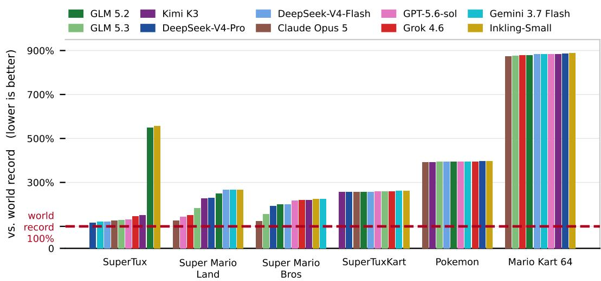  
Figure 8: Per-game results: best result per model and title, as a percentage of the human world record (lower is better, and the dashed line is the record). Figure 1 averages every title here. Each bar is the better of that model’s OFFLINE-SCRATCH and OFFLINE-SEED run. Bars from runs that never beat the seed they were handed report the seed’s score rather than the model’s work. These are the Inkling-Small on SuperTux, the three right-most models in Super Mario Land, and the rightmost models in SuperTuxKart. GLM 5.2 never cleared SuperTux from scratch, so its bar shows its seeded run. Mario Kart 64 has seeded runs only since no model cleared from scratch runs, and every model drives without using shortcuts, while the record uses a shortcut that skips most of the track.

Astray Figure 9 shows the Astray results.

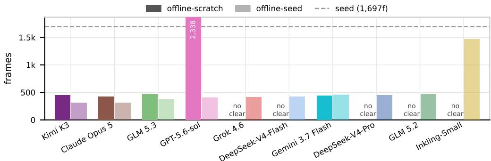

(a) Game, browser, scorer and documentation all withheld.  
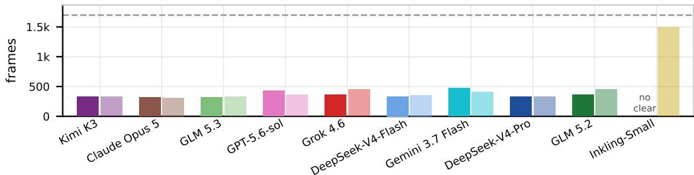  
(b) Scorer withheld, game and documentation accessible.

Figure 9: Final results on Astray level 1 under OFFLINE-SCRATCH (solid) and OFFLINE-SEED (lighter shade of the same colour), after 50 turns per run (lower is better, and the dashed line is the 1,697-frame seed). Both runs withhold the in-turn scorer. In (a) the agent also has no access to the game, a browser or the repository documentation. In (b) the game and documentation are available, so agents can load the maze and simulate it locally. Models are in the same order in both panels, ranked by (a), and each cell is a single run. GPT-5.6-sol’s OFFLINE-SCRATCH run in (a) reaches 2,338 frames and is clipped.

Civilization Across all models given 100 turns with no in-trun evaluations enabeled, none of the models improve the number of frames to reach the goal.  
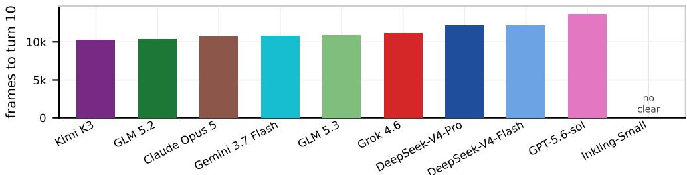  
Figure 10: Frames to reach turn 10 of Civilization I, best verified run per model (lower is better). Every run had the in-turn scorer withheld and used its full 100 turns. Inkling-Small never reached turn 10.