# ScienceClaw: Benchmarking Continual Self-Evolution of AI-for-Science Agents Across the Natural and Social Sciences

Mingda Zhang   
The Chinese University of Hong   
Kong, Shenzhen   
Shenzhen, China   
mingdazhang@ieee.org

Zikai Xiao Zhejiang University Hangzhou, China zikai@zju.edu.cn

Erik Cambria Nanyang Technological University Singapore, Singapore cambria@ntu.edu.sg

Wenjin Liu Nanyang Technological University Singapore, Singapore wenjinliu23@outlook.com

Zhenghong Lin   
Nanyang Technological University Singapore, Singapore   
hongzhenglin970323@gmail.com   
Xiaoying Tang   
The Chinese University of Hong   
Kong, Shenzhen   
Shenzhen, China   
tangxiaoying@cuhk.edu.cn   
Tiesunlong Shen   
Centre for Biomedical Data Science,   
Duke-NUS Medical School   
Singapore, Singapore   
tiesunlong@nus.edu.sg

Qing Xu Jurisprudence Research Association, China Law Society Beijing, China 20180090@ynu.edu.cn

Haoran Luo Nanyang Technological University Singapore, Singapore haoran.luo@ntu.edu.sg

## Abstract

Large language model agents are accelerating scientific automation, yet verified executions rarely become persistent programlevel improvements, and existing evaluations do not examine this process across sequential tasks in both the natural and social sciences. We formalize ScienceClaw as fixed-parameter program self-evolution that unifies task solving, scientific verification, and program updates. ScienceClaw-Eval spans 23 disciplines and measures scientific correctness, evolutionary gain, retention, crossdataset transfer, and evolution cost through sequential streams and independent reset evaluation. Our framework repairs executable workflows through multi-turn interaction, converts re-execution verified failure–success trajectories into linked Skill and Operator candidates, and retains an update only when source-task replay reproduces the repair and independent scientific tasks improve. Code is available at https://github.com/beita6969/ScienceClaw.

## CCS Concepts

• Computing methodologies → Intelligent agents; • Applied computing → Physical sciences and engineering; Law, social and behavioral sciences.

## Keywords

AI for Science, agent self-evolution, multi-turn interactive scientific workflows, Skill evolution, Operator evolution

## 1 Introduction

Large language model agents are increasingly automating scientific problem solving [4, 14]. As illustrated in Figure 1, they connect natural-language reasoning with data, domain tools, and executable computation to construct end-to-end workflows [26, 31].

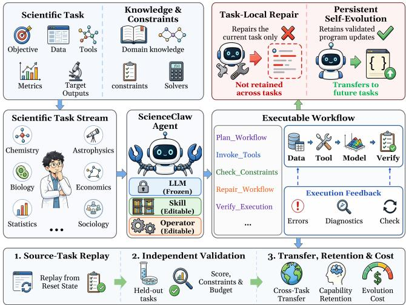  
Figure 1: Task formulation of verifiable program-level selfevolution for AI-for-Science agents.

AI4Science tasks stress this capability through heterogeneous dependencies, long-horizon interactions, and stringent constraints, yet also expose runtime states, numerical diagnostics, and constraint checks that verify intermediate decisions. Scientific agents therefore ofer a flexible cross-domain interface beyond fixed scripts and rules. Despite this promise, scientific agents remain limited in continual self-evolution, since repairs rarely persist.

Training-based methods improve workflow orchestration and error repair through supervised fine-tuning, reinforcement learning, or separate task optimization, but acquire most improvements before deployment [1, 20, 32, 34]. Training-free methods instead update tools, Skills, control logic, or agent harnesses from execution trajectories [10, 11, 15, 18, 19, 21, 24, 30]. Scientific eforts, however, remain concentrated on individual tools or Skills [15, 22], while program-level evolution is evaluated mainly in general reasoning, coding, or system-operation environments. No unified seting therefore couples in-task verification of executability and scientific validity, linked Skill–Operator updates, and indepen dent program-level evaluation. Scientific-agent and sequential self-evolution benchmarks do not cover constrained task streams spanning the natural and social sciences [2, 8, 12, 20, 29, 35]. Thus, task- or component-level gains do not establish reliable and transferable scientific self-evolution across disciplines and rounds.

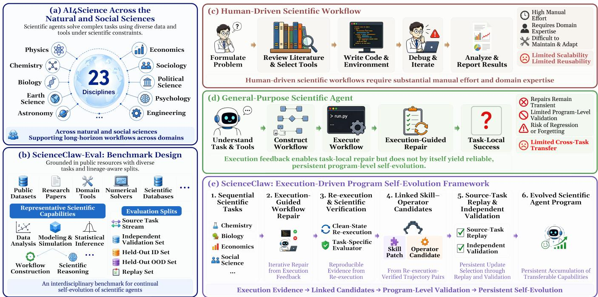  
Figure 2: Overview of ScienceClaw. ScienceClaw-Eval spans 23 disciplines across the natural and social sciences, while Science Claw turns verified execution evidence into persistent Skill–Operator program updates.

This raises a central question: How can verified scientific executions drive persistent and transferable program-level selfevolution without updating foundation-model parameters? We answer it with ScienceClaw, a verifiable AI4Science framework connecting multi-turn workflow orchestration and program-level self-evolution. ScienceClaw represents the editable program as Skills and typed Operators, repairs workflows through execution feedback, and derives linked candidates from re-execution-verified failure–success trajectories. A candidate persists only if sourcetask replay reproduces the repair and independent scientific tasks improve. Figure 2 summarizes this process. In summary, our three main contributions are as follows:

• Novel ScienceClaw Task. We formalize program-level self-evolution over sequential AI4Science problems, turning verified executions into persistent and transferable updates without modifying foundation-model parameters.

• ScienceClaw-Eval. We construct a 23-discipline benchmark across the natural and social sciences with sequential task streams and independent reset evaluations.

• ScienceClaw Framework. We propose an executiondriven framework coupling multi-turn workflow repair with independently evaluated Skill–Operator updates, allowing scientific capabilities to accumulate across tasks and disciplines without model training.

## 2 Related Work

Scientific Agents and Evaluation. General-purpose LLM agents continue to exhibit limited reliability and generalization in specialized scientific tasks, motivating domain-specific tools, interactive execution environments, and scientific-agent benchmarks [2, 5, 20, 23]. Evaluation has progressed from static question answering to executable workflows that connect scientific data, domain software, and code execution [16, 20]. Interactive environments assess multi-step tool use and error recovery [25], while more recent benchmarks extend evaluation to the end-to-end research lifecycle, including idea generation, experiment analysis, and iterative refinement using real papers and data [3, 12, 16, 20, 29]. Disciplinespecific benchmarks further examine the computational reproducibility of social-science findings and the physical fidelity of scientific programs [2, 33]. ScienceClaw-Eval instead assesses whether agents accumulate and retain capabilities across tasks.

Workflow Orchestration and Agent Self-Evolution. Early LLM agents mainly relied on hand-crafted prompts, static toolsets, or predefined workflows, with tool interfaces and control flow typically fixed before deployment [7, 28, 31]. Automated workflow optimization subsequently introduced execution-guided search and progressive graph editing, while later methods abstract reusable Operators or distill Skills from execution trajectories [6, 19, 30, 32, 34]. More recent work evolves tools, Skills, control logic, and agent harnesses without updating foundation-model parameters [10, 11, 15, 18, 21, 22, 24]. In parallel, sequential evaluation frameworks measure evolutionary gain, cross-task transfer, retention, and forgeting [8, 13, 35]. Although scientific agents begin to evolve tools or Skills, program-level self-evolution has not been evaluated on executable task streams spanning the natural and social sciences, the gap ScienceClaw-Eval targets.

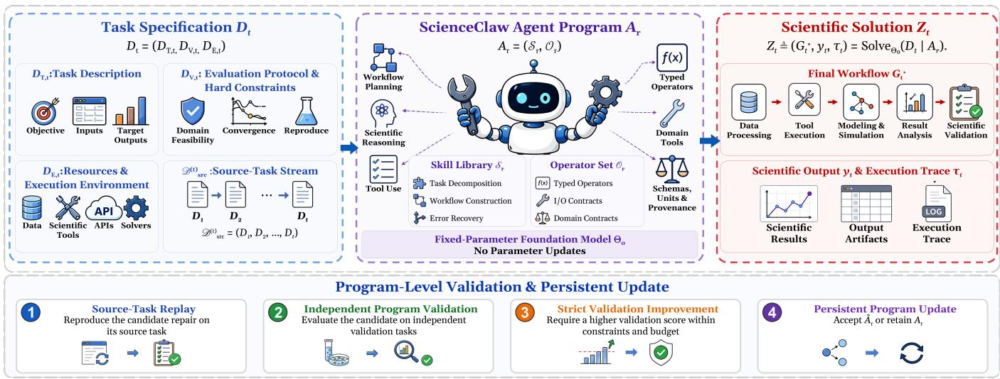  
Figure 3: Definition and overview of the ScienceClaw task. Given task specification $D _ { t }$ and agent program $A _ { r } ,$ , ScienceClaw produces scientific solution $Z _ { t }$ and retains a candidate update only after source-task replay and independent program validation.

## 3 Task: ScienceClaw

ScienceClaw formalizes continual program-level self-evolution over sequential AI4Science problems while keeping foundationmodel parameters fixed. As shown in Figure 3, verified evidence from long-horizon tool interaction is converted from transient task context into persistent program updates.

Let $D _ { t } ~ = ~ ( D _ { T , t } , D _ { V , t } , D _ { E , t } )$ denote task �. Here, $D _ { T , t }$ specifies its objective, inputs, initial conditions, and target outputs; $D _ { V , t }$ defines the evaluation protocol and hard constraints, including unit consistency, domain feasibility, convergence, and reproducibility; and $D _ { E , t }$ provides data, scientific tools, solvers, simulators, and the execution environment. At round $r ,$ the editable program is $A _ { r } = ( \mathcal { S } _ { r } , \mathcal { O } _ { r } )$ , where $\mathcal { S } _ { r }$ contains Skills for decomposition, workflow construction, and recovery, and $\mathcal { O } _ { r }$ contains typed executable Operators with explicit input, output, and domain contracts. Conditioned on $D _ { t }$ and $A _ { r } , \mathfrak { a }$ fixed-parameter foundation model constructs and executes

$$
Z _ { t } \triangleq \left( G _ { t } ^ { \star } , y _ { t } , \tau _ { t } \right) = \operatorname { S o l v e } _ { \Theta _ { 0 } } ( D _ { t } \mid A _ { r } ) .\tag{1}
$$

The scientific solution $Z _ { t }$ comprises the final workflow $G _ { t } ^ { \star }$ , replayed from a reset task state, its output ��, and execution trace

$\tau _ { t } .$ A task-specific evaluator checks both $y _ { t }$ and $\tau _ { t }$ against $D _ { V , t } ;$ making validity depend on the result and its computation.

Let ${ \mathcal E } _ { r }$ be the verified evidence accumulated through round � and $\mathcal { P } ( \mathcal { E } _ { r } )$ its induced candidate programs. Feasibility and selection are defined by

$$
\begin{array} { r l } & { \mathcal { F } _ { r } = \left\{ A \in \mathcal { P } ( \mathcal { E } _ { r } ) \bigg | \begin{array} { l l } { R _ { \mathrm { s r c } } ( A ) = 1 , \quad \mathbf { H } _ { \mathrm { v a l } } ( A ) = \mathbf { 1 } , } \\ { \qquad \mathbf { C } _ { \mathrm { v a l } } ( A ) \preceq \mathbf { B } } \end{array} \right\} , } \\ & { \widetilde { A } _ { r } \in \underset { A \in \mathcal { F } _ { r } } { \mathrm { a r g m a x } } \ : Q _ { \mathrm { v a l } } ( A ) , \qquad \mathcal { F } _ { r } \neq \emptyset . } \end{array}\tag{2}
$$

The persistent program update is then

$$
\begin{array} { r l } & { A _ { r + 1 } = \left\{ \widetilde { A } _ { r } , \mathcal { F } _ { r } \neq \emptyset \ \land Q _ { \mathrm { v a l } } ( \widetilde { A } _ { r } ) > Q _ { \mathrm { v a l } } ( A _ { r } ) , \right. } \\ & { \left. \Theta _ { r + 1 } = \Theta _ { r } = \Theta _ { 0 } . \right. } \end{array}\tag{3}
$$

Here, $\mathcal { F } _ { r }$ is the feasible set; $R _ { \mathrm { s r c } } ( A ) = 1$ requires source-task reproduction of every new repair; and $Q _ { \mathrm { v a l } } ( A )$ is the aggregate scientific score on independent validation tasks. ${ \bf H } _ { \mathrm { v a l } } ( A )$ collects nonnegotiable execution and scientific integrity checks, with 1 the allones vector. Unsolved tasks lower $Q _ { \mathrm { v a l } }$ , while hard-constraint violations make $\mathbf { H } _ { \mathrm { v a l } } ( A ) \neq \mathbf { 1 } . \mathbf { C } _ { \mathrm { v a l } } ( A )$ and B are the resource-cost vector and component-wise budget; ⪯ denotes component-wise comparison. Equation (3) keeps $\Theta _ { 0 }$ fixed and retains the incumbent unless a feasible candidate strictly improves validation performance.

## 4 Benchmark: ScienceClaw-Eval

ScienceClaw-Eval benchmarks continual scientific-agent selfevolution with 23 research tasks across 23 natural- and socialscience disciplines. It combines sequential task processing with independent reset evaluation. Systems share the orchestration model, initial program $A _ { 0 } ,$ , source order, tools, and budget. We describe its construction, protocol, and metrics (Appendix C).

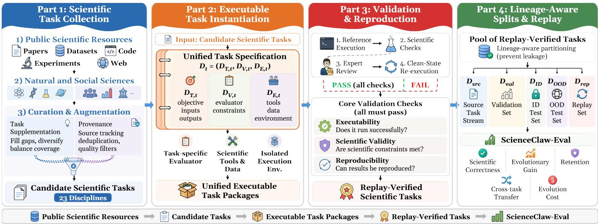  
Figure 4: Construction ofScienceClaw-Eval, from scientific-task collection and executable instantiation to scientific validation, reproducibility checking, and lineage-aware evaluation splits.

## 4.1 ScienceClaw-Eval Construction

Figure 4 shows four stages: task collection, executable instantiation, validation, and evaluation partitioning. We collect tasks with explicit objectives, accessible inputs, and verifiable outcomes from public scientific resources, and supplement them to improve disciplinary coverage, workflow diversity, and horizon length while preserving provenance. Each task is instantiated as $D _ { t }$ with an isolated environment and a task-specific evaluator. Domain reviewers inspect evaluator logic, constraints, and reference executions; reset replay then verifies executability, scientific validity, and reproducibility. Provenance and construction lineage [27] determine the source stream $\mathcal { D } _ { \mathrm { s r c } } ,$ independent validation set $\mathcal { D } _ { \mathrm { v a l } }$ , held-out ID set $\mathcal { D } _ { \mathrm { I D } } .$ , and same-discipline cross-dataset OOD set $\mathcal { D } _ { \mathrm { O O D } }$ [9]. ${ \mathcal { D } } _ { \mathrm { r e p } }$ contains frozen source-task instances encountered before each evaluation point, measuring retention without supplying new evolution evidence. Each task record fixes its source, partition rule, evaluator, and statistics before experiments begin.

## 4.2 ScienceClaw-Eval: Evaluation Design

Only source trajectories and evaluator feedback supply evolution evidence; ${ \mathcal { D } } _ { \mathrm { v a l } }$ serves candidate selection. At each evaluation point, $A _ { r }$ is frozen, transient state is cleared, and the snapshot is evaluated on $\mathcal { D } _ { \mathrm { I D } } , \mathcal { D } _ { \mathrm { O O D } }$ , and ${ \mathcal { D } } _ { \mathrm { r e p } } .$

For instance �, the evaluator jointly examines output and trace. $z _ { i } ( A _ { r } ) = 1$ only when execution completes within budget, task native metrics meet their acceptance rule (Appendix C.3), and every scientific hard constraint holds; otherwise $z _ { i } ( A _ { r } ) ~ = ~ 0$ . We macro-average discipline-level success:

$$
\mathrm { M a c r o S R } ( A _ { r } ) = \frac { 1 } { 2 3 } \sum _ { d = 1 } ^ { 2 3 } \frac { 1 } { | \mathscr { I } _ { d } | } \sum _ { i \in \mathscr { I } _ { d } } z _ { i } ( A _ { r } ) ,\tag{4}
$$

where ${ \mathcal { I } } _ { d }$ contains instances in discipline �. $Q _ { \mathrm { v a l } }$ in Eq. (2) is MacroSR on $\mathcal { D } _ { \mathrm { v a l } } .$ . Changes from $A _ { 0 }$ on $\mathcal { D } _ { \mathbb { D } }$ and $\mathcal { D } _ { \mathrm { O O D } }$ measure in-benchmark gain and same-discipline cross-dataset transfer;

${ \mathcal { D } } _ { \mathrm { r e p } }$ measures retention against the snapshot immediately after each source task. We also report natural- and social-science success, task-native metrics, multi-turn repair, long-horizon completion, and execution-cost diagnostics. Evaluators, partitions, and executable configurations remain frozen across methods.

## 5 Methodology: ScienceClaw

Scientific workflow failures often surface only when heterogeneous data, domain software, and numerical procedures execute. ScienceClaw turns reproducible repairs into linked Skill–Operator updates through execution-guided orchestration (Section 5.1) and program self-evolution (Section 5.2), with foundation-model parameters fixed. A repair persists only after it reproduces on its source task and improves the complete program on independent tasks, rather than on a single execution trace (Appendix B).

## 5.1 Execution-Guided Scientific Workflow Orchestration

Typed scientific workflow representation. ScienceClaw represents the workflow of task � after interaction step � as a directed graph with port-level data dependencies:

$$
\begin{array} { c } { { G _ { t , k } = \big ( N _ { t , k } , E _ { t , k } , \psi _ { t , k } \big ) , } } \\ { { \psi _ { t , k } ( \nu ) = \big ( o _ { \nu } , \eta _ { \nu } \big ) , \quad \nu \in N _ { t , k } , } } \\ { { \big ( ( u , p ) , ( \nu , q ) \big ) \in E _ { t , k } \Longrightarrow \mathrm { C o m p a t } _ { D _ { t } } \big ( \Gamma _ { u , p } ^ { \mathrm { o u t } } , \Gamma _ { { \nu , q } } ^ { \mathrm { i n } } \big ) = 1 . } } \end{array}\tag{5}
$$

$N _ { t , k }$ contains Operators and task tools; $\psi _ { t , k }$ maps node � to executable $o _ { \nu }$ and configuration $\eta _ { \nu } ;$ and an edge links output port $\boldsymbol { p }$ of � to input port � of �. Schema $\Gamma = ( \mathrm { t y p e }$ , shape, unit, provenance) records port metadata. $\mathrm { C o m p a t } _ { D _ { t } }$ requires matching type and shape and explicit, provenance-recorded unit conversion; the same schemas define Operator boundaries below. Units are required when applicable, and provenance records upstream data and the transformations applied along every edge.

Execution-guided orchestration. ScienceClaw constructs $G _ { t , k }$ through atomic edits after tool execution [26, 32]. Let $\begin{array} { r l } { \mathcal { R } _ { t , r } ^ { \mathcal { S } } } & { { } = } \end{array}$ $\scriptstyle \mathrm { R e t r i e v e } ( D _ { t } ; \mathcal { S } _ { r } )$ and $\mathcal { R } _ { t , r } ^ { \mathcal { O } } ~ = ~ \mathrm { R e t r i e v e } ( D _ { t } ; \mathcal { O } _ { r } )$ be retrieved Skills and Operators, $\mathcal { T } _ { t }$ the tools in $D _ { E , t }$ , and $\mathcal { R } _ { t , r } = ( \mathcal { R } _ { t , r } ^ { \mathcal { S } } , \mathcal { R } _ { t , r } ^ { \mathcal { O } } \cup \mathcal { T } _ { t } )$ their execution context. Given history $H _ { t , k }$ and fixed $\Theta _ { 0 } ,$ , the policy samples

$$
\begin{array} { r } { ( a _ { t , k } , \nu _ { t , k } ) \sim \pi _ { \Theta _ { 0 } } ( \cdot \mid D _ { t } , G _ { t , k } , H _ { t , k } , \mathcal { R } _ { t , r } ) . } \end{array}\tag{6}
$$

Here, $\pi _ { \Theta _ { 0 } }$ is fixed; $a _ { t , k }$ adds, removes, or modifies a node, dependency, or configuration, and $\nu _ { t , k }$ records contributing Skill and Operator identifiers. Checkpoint $\chi _ { t , k }$ stores completed outputs and runtime state; execution proceeds as

$$
\big ( G _ { t , k + 1 } , \chi _ { t , k + 1 } , f _ { t , k } \big ) = \mathrm { E x e c u t e } _ { D _ { E , t } } \big ( G _ { t , k } , \chi _ { t , k } , a _ { t , k } \big ) .\tag{7}
$$

$H _ { t , k + 1 }$ appends the edit and execution record. The executor checks schemas and reruns only afected descendants; $f _ { t , k }$ records runtime and numerical diagnostics, $\nu _ { t , k }$ atributes reproduced repairs, and checkpointing limits long-horizon recomputation. Scientific validity is assessed by reset replay below.

Reproducible execution evidence. Because checkpoints may $\mathbf { r e - }$ tain transient state, candidate evidence is regenerated in reset environment $D _ { E , t }$ under the replication protocol and evaluator in $D _ { V , t } \colon$

$$
\begin{array} { r } { ( y _ { t , k } , \tau _ { t , k } ) = \mathrm { R e p l a y } _ { D _ { E , t } } ( G _ { t , k } ) , } \\ { ( q _ { t , k } , \mathbf { h } _ { t , k } , \mathbf { c } _ { t , k } ) = \mathrm { E v a l } _ { D _ { V , t } } ( y _ { t , k } , \tau _ { t , k } ) . } \end{array}\tag{8}
$$

With $D _ { t }$ and $G _ { t , k }$ , these outputs define $e _ { t , k } \colon y _ { t , k }$ is the scientific output; $\tau _ { t , k } ,$ , the executed path and diagnostics; $q _ { t , k } ,$ , the task score; $\mathbf { h } _ { t , k } ,$ hard-constraint indicators; and $\mathbf { c } _ { t , k } ,$ , resource use. $\mathrm { P a s s } _ { t } ( e _ { t , k } ) = 1$ if applicable convergence, physical or statistical validity, and reproducibility requirements hold within budget. Replay alone does not authorize persistence, which is decided by the strict-improvement rule on independent validation in Section 5.2.

## 5.2 Execution-Driven Program Self-Evolution

Evolution trigger and repair atribution. Evolution instance � on $D _ { i } = D _ { t }$ ends at replay-verified success $e _ { i } ^ { + } = e _ { t , k _ { i } ^ { + } }$ with $\mathrm { P a s s } _ { i } ( e _ { i } ^ { + } ) =$ 1. Its preceding endpoint ${ e } _ { i } ^ { - } ~ = ~ e _ { t , k _ { i } ^ { - } }$ is the latest replay-verified failure, or ∅ if none; the endpoints define the shortest repair:

$$
\delta _ { i } = \left\{ \begin{array} { l l } { \langle a _ { t , k } \rangle _ { k _ { i } ^ { - } \leq k < k _ { i } ^ { + } } , } & { e _ { i } ^ { - } \neq \emptyset , } \\ { \emptyset , } & { e _ { i } ^ { - } = \emptyset . } \end{array} \right.\tag{9}
$$

Let $G _ { i } ^ { + } ~ = ~ G _ { t , k _ { i } ^ { + } }$ and $\tau _ { i } ^ { + } = \tau _ { t , k _ { i } ^ { + } }$ . Edit types and graph topology separate strategy changes from executable capability:

$$
\begin{array} { r l } & { \Delta _ { i } ^ { \mathcal { S } } = \Pi _ { \mathrm { c t r l } } ( \delta _ { i } ) , } \\ & { \Delta _ { i } ^ { \mathcal { O } } = \mathrm { C C } _ { \Gamma } \big ( G _ { i } ^ { + } , \Pi _ { \mathrm { e x e c } } ( G _ { i } ^ { + } , \delta _ { i } , \tau _ { i } ^ { + } ; \mathcal { O } _ { r } ) \big ) . } \end{array}\tag{10}
$$

$\Pi _ { \mathrm { c t r l } }$ selects topology, routing, and configuration edits that preserve executable payloads; $\Pi _ { \mathrm { e x e c } }$ selects generated, repaired, or unregistered executable nodes; and $\mathrm { C C _ { \Gamma } }$ groups them into maximal connected subgraphs with compatible boundaries. Thus a reproduced repair can yield linked Skill and Operator candidates; without $e _ { i } ^ { - }$ , only the later is formed. No auxiliary LLM judge is required to rank or select candidates.

Linked Skill–Operator abstraction. Let $\nu _ { i } ^ { \mathcal { S } }$ collect the Skill identifiers in $\delta _ { i } .$ . For $\Delta _ { i } ^ { \mathcal { S } } \neq \emptyset ;$ , its control edits define

$$
\Delta \mathcal { S } _ { i } = \mathrm { P a t c h } _ { \Theta _ { 0 } } \big ( \mathcal { S } _ { r } [ \nu _ { i } ^ { \mathcal { S } } ] ; \Delta _ { i } ^ { \mathcal { S } } , e _ { i } ^ { - } , e _ { i } ^ { + } \big ) .\tag{11}
$$

where $\mathcal { S } _ { r } [ \nu _ { i } ^ { \mathcal { S } } ]$ selects atributed entries: an empty identifier set creates a Skill, otherwise only selected instructions change; $\Delta _ { i } ^ { \mathcal { S } } = \emptyset$ yields no Skill candidate. Each executable component $U \in \Delta _ { i } ^ { \mathcal { O } }$ has

$$
\hat { o } _ { i , U } = \big ( G _ { i } ^ { + } [ U ] , \Gamma _ { \partial U } , \kappa _ { i , U } , \rho _ { i , U } \big ) .\tag{12}
$$

Here, $G _ { i } ^ { + } [ U ]$ is the executable subgraph; $\partial U ~ = ~ ( \partial ^ { - } U , \partial ^ { + } U )$ its external input and output ports; $\Gamma _ { \partial U }$ their schemas; $\kappa _ { i , U }$ the preconditions, postconditions, and applicability conditions derived from $D _ { i }$ and the boundary slice of $\tau _ { i } ^ { + }$ ; and $\rho _ { i , U }$ the component provenance. Boundary replay restores recorded inputs at $\partial ^ { - } U$ and checks isolated outputs at ${ \dot { \partial } } ^ { + } U$ against $\tau _ { i } ^ { + }$ under $D _ { V , i } ,$ , including numerical tolerances and stochastic replication. $\hat { o } _ { i , U }$ enters $\Delta \mathcal { O } _ { i }$ only if BRepla ${ } ^ { \prime } D _ { V , i } ( \hat { o } _ { i , U } ; \tau _ { i } ^ { + } ) = 1$ . Bundle $B _ { i } = ( \Delta \mathcal { S } _ { i } , \Delta \mathcal { O } _ { i } )$ couples the strategy change with its executable capability.

Program-level validation and update. Atomic application $\widetilde { A } _ { i } =$ Apply $( A _ { r } ; B _ { i } )$ assigns version identifiers $\omega _ { i }$ and requires

$$
\begin{array} { r l r } & { \big ( H _ { i } ^ { \mathrm { s r c } } , e _ { i } ^ { \mathrm { s r c } } , \tau _ { i } ^ { \mathrm { s r c } } \big ) = \mathrm { R u n } _ { D _ { i } } ( \widetilde { A } _ { i } ) , } & \\ & { \qquad R _ { \mathrm { s r c } } ( \widetilde { A } _ { i } ) = \mathrm { P a s s } _ { i } ( e _ { i } ^ { \mathrm { s r c } } ) \wedge \mathrm { U s e } _ { i } ( \omega _ { i } ; H _ { i } ^ { \mathrm { s r c } } , \tau _ { i } ^ { \mathrm { s r c } } ) . } & \end{array}\tag{13}
$$

Here, Run ${ } ^ { 1 } D _ { i }$ returns reset-run history $H _ { i } ^ { \mathrm { s r c } }$ , evidence $e _ { i } ^ { \mathrm { s r c } }$ , and trace $\tau _ { i } ^ { \mathrm { s r c } }$ as in $\operatorname { E q }$ . (8), while Use� checks every $\omega _ { i } .$ . Only $R _ { \mathrm { s r c } } = 1$ candidates enter $\mathcal { P } ( \mathcal { E } _ { r } )$ and $\mathcal { D } _ { \mathrm { v a l } } ;$ ; Equation (3) then retains strict budgetfeasible improvements with ${ \mathcal E } _ { r }$ and foundation-model parameters fixed at $\Theta _ { 0 }$ throughout every round (Appendix A).

## 6 Experimental Evaluation

Setup. All systems process the common 23-discipline source streams. Evolving methods update their programs, whereas the frozen control remains at $A _ { 0 }$ . We freeze the snapshot after each of seven rounds, clear transient state, and evaluate it on the heldout same-discipline target datasets in $\mathcal { D } _ { \mathrm { { O O D } } } ; \mathrm { { O O D } }$ results never generate or select updates. Qwen3.5-27B orchestrates every task for all systems, GPT-5.4 performs the evolution of ScienceClaw and every baseline, and each discipline contributes 64 IID and 64 OOD instances. We compare ScienceClaw with an evolutiondisabled frozen agent and methods that evolve Skills, scientific tools, agent harnesses, or persistent scientific-agent programs and memory: SkillOpt [30], test-time tool evolution (TTE) [15], Agentic Harness Engineering (AHE) [10], EvoMaster [36], and EvoScientist [17]. Each baseline runs its best released configuration through fixed ScienceClaw-Eval adapters under the same models, tools, source stream, validation data, and update budget (Appendix B.8); adapters and initial assets are fixed without access to ID/OOD instances or evaluators. Two ScienceClaw variants complete the comparison: RuleEvo evolves by deterministic trace projection alone, and Qwen-only evolution replaces GPT-5.4 with Qwen. Three PhD reviewers per discipline and a natural- or socialscience expert audited each evaluator and its reference executions. Table 1 reports task-native scores, compared only within each discipline because metrics difer in units and direction; round-wise analyses use MacroSR on ${ \mathcal { D } } _ { \mathrm { O O D } } \left( \mathrm { E q . } \left( 4 \right) \right)$ as the OOD macro score.

Table 1: IID and cross-dataset OOD results across 23 disciplines. Discipline and metric names are abbreviated. The best score in each discipline and split is in bold and the second best is underlined.
<table><tr><td></td><td colspan="2">Frozen (A0)</td><td colspan="2">SkillOpt</td><td colspan="2">TTE</td><td colspan="2">AHE</td><td colspan="2">EvoMaster</td><td colspan="2">EvoScientist</td><td colspan="2">ScienceClaw</td></tr><tr><td>Discipline (metric)</td><td>IID</td><td>OOD</td><td>IID</td><td>OOD</td><td>IID</td><td>OOD</td><td>IID</td><td>OOD</td><td>ID</td><td>OOD</td><td>IID</td><td>OOD</td><td>IID</td><td>OOD</td></tr><tr><td>Higher is better (↑)</td><td></td><td></td><td></td><td></td><td></td><td></td><td></td><td></td><td></td><td></td><td></td><td></td><td></td><td></td></tr><tr><td>Agricultural sci. (PQ+)</td><td>69.4761</td><td>64.6829</td><td>69.9837</td><td>66.7649</td><td>73.5549</td><td>72.0626</td><td>73.1602</td><td>72.0490</td><td>75.1756</td><td>73.1862</td><td>74.7019</td><td>73.2184</td><td>76.9612</td><td>75.7629</td></tr><tr><td>Biological sci. (Spearman)</td><td>0.5057</td><td>0.3745</td><td>0.5358</td><td>0.3659</td><td>0.5599</td><td>0.3975</td><td>0.5642</td><td>0.3968</td><td>0.5674</td><td>0.4103</td><td>0.5683</td><td>0.4089</td><td>0.5816</td><td>0.4234</td></tr><tr><td>Biomedical sci. (DSC)</td><td>0.7816</td><td>0.7088</td><td>0.7794</td><td>0.7521</td><td>0.8169</td><td>0.7784</td><td>0.8214</td><td>0.7811</td><td>0.8348</td><td>0.7877</td><td>0.8387</td><td>0.7798</td><td>0.8556</td><td>0.8226</td></tr><tr><td>Chemical sci. (ROC-AUC)</td><td>0.6518</td><td>0.6205</td><td>0.6830</td><td>0.6518</td><td>0.7232</td><td>0.7054</td><td>0.7299</td><td>0.7143</td><td>0.7344</td><td>0.7165</td><td>0.7299</td><td>0.7188</td><td>0.7545</td><td>0.7478</td></tr><tr><td>Creative arts (SDR (dB))</td><td>8.9208</td><td>8.0993</td><td>9.4971</td><td>8.3085</td><td>9.8649</td><td>9.0812</td><td>9.7900</td><td>9.0046</td><td>9.9453</td><td>9.1835</td><td>9.9112</td><td>9.2653</td><td>10.1867</td><td>9.5619</td></tr><tr><td>Education (10-mask acc.)</td><td>0.5965</td><td>0.6202</td><td>0.6603</td><td>0.6626</td><td>0.6561</td><td>0.6467</td><td>0.6616</td><td>0.6567</td><td>0.6720</td><td>0.6731</td><td>0.6579</td><td>0.6594</td><td>0.6878</td><td>0.7087</td></tr><tr><td>Engineering (DCASE score)</td><td>0.5709</td><td>0.4663</td><td>0.6138</td><td>0.4659</td><td>0.6243</td><td>0.4943</td><td>0.6317</td><td>0.4902</td><td>0.6380</td><td>0.4992</td><td>0.6310</td><td>0.5017</td><td>0.6535</td><td>0.5269</td></tr><tr><td>Health sci. (Clin. utility)</td><td>0.4971</td><td>0.6834</td><td>0.5170</td><td>0.7132</td><td>0.5278</td><td>0.7380</td><td>0.5234</td><td>0.7182</td><td>0.5383</td><td>0.7417</td><td>0.5367</td><td>0.7428</td><td>0.5514</td><td>0.7796</td></tr><tr><td>Indigenous (chrF++)</td><td>15.4451</td><td>13.7205</td><td>16.5641</td><td>14.8441</td><td>16.3493</td><td>14.1870</td><td>16.7301</td><td>14.8969</td><td>16.9074</td><td>15.0442</td><td>16.6453</td><td>14.7130</td><td>17.4351</td><td>15.9778</td></tr><tr><td>Computing sci. (pass@1)</td><td>0.7656</td><td>0.3750</td><td>0.7969</td><td>0.4063</td><td>0.8438</td><td>0.4219</td><td>0.8438</td><td>0.4219</td><td>0.8594</td><td>0.4375</td><td>0.8438</td><td>0.4375</td><td>0.8750</td><td>0.4531</td></tr><tr><td>Language &amp; culture (LAS)</td><td>0.7288</td><td>0.5599</td><td>0.7623</td><td>0.5713</td><td>0.7786</td><td>0.6042</td><td>0.7761</td><td>0.6004</td><td>0.7845</td><td>0.6267</td><td>0.7759</td><td>0.5879</td><td>0.8138</td><td>0.6497</td></tr><tr><td>Law (mAP)</td><td>0.7513</td><td>0.6918</td><td>0.8158</td><td>0.7652</td><td>0.8074</td><td>0.7706</td><td>0.8211</td><td>0.7720</td><td>0.8292</td><td>0.7863</td><td>0.8170</td><td>0.7642</td><td>0.8554</td><td>0.8289</td></tr><tr><td>Mathematics (Oracle acc.)</td><td>0.8438</td><td>0.7344</td><td>0.9063</td><td>0.7969</td><td>0.9063</td><td>0.7656</td><td>0.9063</td><td>0.8125</td><td>0.9219</td><td>0.8438</td><td>0.9063</td><td>0.8125</td><td>0.9531</td><td>0.8750</td></tr><tr><td>Philosophy (F1)</td><td>0.4178</td><td>0.4166</td><td>0.4599</td><td>0.4428</td><td>0.4699</td><td>0.4846</td><td>0.4636</td><td>0.4868</td><td>0.4717</td><td>0.4943</td><td>0.4737</td><td>0.4925</td><td>0.4866</td><td>0.5138</td></tr><tr><td>Psychology (Micro acc.)</td><td>0.6088</td><td>0.5615</td><td>0.6364</td><td>0.6064</td><td>0.6269</td><td>0.6084</td><td>0.6355</td><td>0.6149</td><td>0.6467</td><td>0.6343</td><td>0.6476</td><td>0.6284</td><td>0.6618</td><td>0.6586</td></tr><tr><td>Lower is better (↓)</td><td></td><td></td><td></td><td></td><td></td><td></td><td></td><td></td><td></td><td></td><td></td><td></td><td></td><td></td></tr><tr><td>Built env. (NRMSE %)</td><td>51.0997</td><td>53.5009</td><td>47.7143</td><td>49.6083</td><td>46.7210</td><td>49.5570</td><td>46.7362</td><td>49.0341</td><td>46.2726</td><td>46.7640</td><td>47.2762</td><td>49.4801</td><td></td><td>45.0065 45.0970</td></tr><tr><td>Commerce (MASE)</td><td>1.6009</td><td>1.8740</td><td>1.5268</td><td>1.6867</td><td>1.5671</td><td>1.7502</td><td>1.5227</td><td>1.7066</td><td>1.4984</td><td>1.6930</td><td>1.5281</td><td>1.6846</td><td>1.4653</td><td>1.5986</td></tr><tr><td>Earth sci. (RMSE (K))</td><td>1.0562</td><td>1.1364</td><td>1.0476</td><td>1.0379</td><td>1.0157</td><td>1.0005</td><td>1.0094</td><td>1.0114</td><td>1.0010</td><td>1.0042</td><td>1.0008</td><td>1.0079</td><td>0.9721</td><td>0.9580</td></tr><tr><td>Economics (sMAPE (%))</td><td>12.7394</td><td>18.1343</td><td>11.8721</td><td>16.8216</td><td>12.1577</td><td>16.9410</td><td>11.7390</td><td>16.2028</td><td>11.6350</td><td>16.1758</td><td>11.7621</td><td>16.7195</td><td>11.3320</td><td>15.5025</td></tr><tr><td>Environmental sci. (CRPS)</td><td>0.8104</td><td>0.6504</td><td>0.7786</td><td>0.6456</td><td>0.7517</td><td>0.6325</td><td>0.7565</td><td>0.6118</td><td>0.7304</td><td>0.5944</td><td>0.7326</td><td>0.5979</td><td>0.7164</td><td>0.5751</td></tr><tr><td>History (cMER-micro)</td><td>0.0185</td><td>0.0296</td><td>0.0173</td><td>0.0271</td><td>0.0177</td><td>0.0268</td><td>0.0172</td><td>0.0264</td><td>0.0172</td><td>0.0261</td><td>0.0172</td><td>0.0268</td><td>0.0166</td><td>0.0251</td></tr><tr><td>Human society (nRMSE)</td><td>0.0113</td><td>0.0213</td><td>0.0107</td><td>0.0201</td><td>0.0104</td><td>0.0192</td><td>0.0103</td><td>0.0191</td><td>0.0103</td><td>0.0192</td><td>0.0104</td><td>0.0191</td><td>0.0100</td><td>0.0181</td></tr><tr><td>Physical sci. (MAE)</td><td>36.6271</td><td>44.6757</td><td>35.1699</td><td>41.9077</td><td>33.4027</td><td>39.0907</td><td>33.5864</td><td>39.7923</td><td>33.0932</td><td>38.2995</td><td>32.8654</td><td>39.0137</td><td></td><td>32.1581 37.1306</td></tr></table>

RQ1: Does persistent program evolution improve crossdataset performance? Yes. ScienceClaw is best in all 23 disciplines on both splits (Table 1), and its mean relative margin over the strongest baseline in each discipline grows from 2.58% on IID to 4.19% on OOD (12.25% and 16.45% over the frozen agent), and it is positive in every discipline, from 1.82% to 3.73% on IID and from 3.05% to 6.21% on OOD (Appendix G.1). The largest OOD margins appear in Indigenous studies (6.21%) and Law (5.42%), the smallest in Physical sciences (3.05%). The wider OOD margin is consistent with the gate: a candidate persists only after it reproduces on its source task and improves independent validation tasks, which filters out updates fited to one source, whereas single-asset methods can fall below the frozen agent (SkillOpt in three of 46 cells). The baselines order by how much of the program they evolve: their mean OOD gain over the frozen agent rises from 5.74% for SkillOpt (Skills) through 8.82% for TTE (tools) and 9.73% for AHE (harness) to 10.55% for EvoScientist and 11.95% for EvoMaster (programs and memory), against 16.45% for ScienceClaw, above all of them. ScienceClaw also beats the frozen agent in every discipline, by 11.57% to 23.34% on OOD, and its margin is similar on higheris-beter (4.26%) and lower-is-beter metrics (4.06%). Its OOD score falls 11.73% below its IID score on average, against 16.06% for the frozen agent and 13.46% to 15.45% for the baselines, so the evolved program degrades least of all systems when the dataset changes.

RQ2: Does evolution keep improving OOD performance over rounds? Yes. ScienceClaw’s OOD macro score rises from 77.72 at $A _ { 0 }$ to 91.30 after round 7 (+13.59 pp), against +9.78 pp for EvoMaster, the strongest baseline, and its lead over the best other system grows from 0.41 pp after round 1 to 3.80 pp (Figure 6a,d,e). Round 3 is the only round in which another system leads, by 0.41 pp. From round 3 to round 7 ScienceClaw adds 8.83 pp, nearly twice the 4.6 pp of EvoMaster. The curve keeps rising because Science-Claw promotes more candidates than any other system, 70 of the 161 submited (43.48% against 22.98% to 39.13%; Figure 6i), so the gate is selective without stalling. RuleEvo and Qwen-only, which change only how candidates are produced, reach +3.60 and +5.50 pp, so candidate quality, not the gate alone, drives the gain. None of the five evolving systems dips by more than 0.34 pp in any round.

RQ3: Does evolution transfer across disciplines and retain earlier repairs? Yes. Evolving on one discipline family lifts the OOD score of the others: 18 of the 20 cross-family pairs are positive, with a mean gain of 1.58 pp against 14.69 pp within a family (Figure 6b), so most of the evolved capability is discipline specific and the part that transfers rarely harms. Transfer is strongest between related families: Social/behavioural and Humanities/law (+4.27, +3.61), and Engineering/computing and Physical/Earth (+3.54, +3.47). The two negative pairs, both between Physical/Earth and Humanities/law, stay below 0.6 pp in magnitude. Retention shows the same patern (Figure 6c; Appendix G.3): ScienceClaw reaches 4.20 pp forward (all 25 pairs) and 3.66 pp backward transfer with 0.13 pp average and 0.51 pp maximum forgeting and 11.89% negative transfer, against 0.33 pp, 1.05 pp, and 14.33% for EvoMaster. Source replay protects earlier repairs, and independent validation guards the other families against regressions.

RQ4: Which mechanisms produce the gain? The linked evolution and the replay gate. The full system is best in all 23 disciplines (Table 2; Appendices B.7 and G.2), and every ablation keeps only part of its gain over the frozen agent, with gain measured as the average relative drop below the full system (13.68% for Frozen; Appendix F.3). Updating Skills and Operators without committing them as one bundle keeps 60% of the gain, a loss comparable to removing Operator evolution (59%); on Commerce and Law the linked system gains 14.69% and 19.82% on OOD over Frozen, against 9.27% and 13.12% unlinked (Figure 6f). The gate maters even more: without IID selection only 15% ofthe gain remains, and without scientific constraints, source replay, or the independent validator, 46%, 55%, and 59%, with losses 2.4 to 2.8 times larger on OOD than on IID. RuleEvo and Qwen-only keep only about a third and 44%. In 20 of 23 disciplines the runner-up to the full system removes a single evolution component, so no component carries the gain alone. Execution structure is the base on which evolution acts: single-turn and single-operator execution fall below the frozen agent (Figure 5), and Linked Full runs 4.84 planner rounds and 4.24 distinct Operators per task, repairs 71% of failures from feedback, recovers 89% after interruption, and replays 96% cleanly, against 0, 31%, and 78% for a single-turn agent (Figure 6g; case studies of Commerce and Law in Appendix E).

Table 2: Mean of IID and cross-dataset OOD results of the ablation variants across 23 disciplines. Discipline and metric names are abbreviated. The best score in each discipline is in bold and the second best is underlined.
<table><tr><td>Discipline (metric)</td><td>Frozen</td><td></td><td>RuleEvo Qwen-only</td><td>w/o Skill evol.</td><td>w/o Oper. evol.</td><td>w/o Work. evol.</td><td>w/o link. evol.</td><td>w/o src. replay</td><td>w/o sci. constr.</td><td>w/o ind. valid.</td><td>w/o cross-</td><td>w/o ID</td><td>w/o OOD ScienceClaw</td><td></td></tr><tr><td></td><td></td><td></td><td></td><td></td><td></td><td></td><td></td><td></td><td></td><td></td><td>task mem.</td><td>select.</td><td>transfer</td><td>(full)</td></tr><tr><td>Higher is better (↑)</td><td></td><td></td><td></td><td></td><td></td><td></td><td></td><td></td><td></td><td></td><td></td><td></td><td></td><td></td></tr><tr><td>Agricultural sci. (PQ+)</td><td>67.0795</td><td>71.5023</td><td>72.0207</td><td>74.1946</td><td>71.3347</td><td>72.0963</td><td>72.5891</td><td>70.7277</td><td>69.4636</td><td>71.4427</td><td>73.5959</td><td>68.5843</td><td>72.1931</td><td>76.3621</td></tr><tr><td>Biological sci. (Spearman)</td><td>0.4401</td><td>0.4617</td><td>0.4692</td><td>0.4897</td><td>0.4728</td><td>0.4871</td><td>0.4793</td><td>0.4841</td><td>0.4799</td><td>0.4819</td><td>0.4707</td><td>0.4482</td><td>0.4622</td><td>0.5025</td></tr><tr><td>Biomedical sci. (DSC)</td><td>0.7452</td><td>0.7724</td><td>0.7953</td><td>0.8154</td><td>0.7929</td><td>0.8005</td><td>0.8016</td><td>0.7841</td><td>0.7726</td><td>0.7770</td><td>0.8054</td><td>0.7488</td><td>0.8072</td><td>0.8391</td></tr><tr><td>Chemical sci. (ROC-AUC)</td><td>0.6362</td><td>0.6875</td><td>0.7087</td><td>0.7232</td><td>0.7076</td><td>0.7254</td><td>0.7176</td><td>0.6964</td><td>0.6908</td><td>0.7121</td><td>0.7232</td><td>0.6920</td><td>0.7098</td><td>0.7511</td></tr><tr><td>Creative arts (SDR (dB))</td><td>8.5101</td><td>9.2885</td><td>9.1862</td><td>9.5970</td><td>9.2316</td><td>9.4530</td><td>9.3943</td><td>9.4257</td><td>9.3184</td><td>9.5349</td><td>9.5109</td><td>9.0730</td><td>9.4250</td><td>9.8743</td></tr><tr><td>Education (10-mask acc.)</td><td>0.6083</td><td>0.6382</td><td>0.6579</td><td>0.6654</td><td>0.6761</td><td>0.6766</td><td>0.6722</td><td>0.6728</td><td>0.6627</td><td>0.6690</td><td>0.6652</td><td>0.6254</td><td>0.6331</td><td>0.6982</td></tr><tr><td>Engineering (DCASE)</td><td>0.5186</td><td>0.4976</td><td>0.5114</td><td>0.5703</td><td>0.5398</td><td>0.5568</td><td>0.5356</td><td>0.5368</td><td>0.5240</td><td>0.5371</td><td>0.5671</td><td>0.4736</td><td>0.5516</td><td>0.5902</td></tr><tr><td>Health sci. (Clin. utility)</td><td>0.5903</td><td>0.6240</td><td>0.6186</td><td>0.6460</td><td>0.6163</td><td>0.6246</td><td>0.6380</td><td>0.6299</td><td>0.6034</td><td>0.6281</td><td>0.6428</td><td>0.6041</td><td>0.6358</td><td>0.6655</td></tr><tr><td>Indigenous (chrF++)</td><td>14.5828</td><td>15.4084</td><td>15.9032</td><td>15.5616</td><td>16.0139</td><td>16.0826</td><td>15.9824</td><td>16.1154</td><td>15.8247</td><td>16.1141</td><td>15.7938</td><td>15.4115</td><td>15.6417</td><td>16.7064</td></tr><tr><td>Computing sci. (pass@1)</td><td>0.5703 0.6443</td><td>0.5859</td><td>0.6016</td><td>0.6484</td><td>0.6172</td><td>0.6328</td><td>0.6250</td><td>0.6172</td><td>0.6094</td><td>0.6250</td><td>0.6406</td><td>0.5625</td><td>0.6406</td><td>0.6641 0.7317</td></tr><tr><td>Language &amp; culture (LAS) Law (mAP)</td><td>0.7215</td><td>0.6441 0.7791</td><td>0.6687 0.7863</td><td>0.7097</td><td>0.6830</td><td>0.6937</td><td>0.6852</td><td>0.7009</td><td>0.6905</td><td>0.7028</td><td>0.6956</td><td>0.6229</td><td>0.6632</td><td>0.8422</td></tr><tr><td></td><td>0.7891</td><td>0.8594</td><td>0.8516</td><td>0.7881</td><td>0.8102</td><td>0.7967</td><td>0.8068</td><td>0.7959</td><td>0.7769</td><td>0.7813</td><td>0.7971</td><td>0.7743</td><td>0.7898</td><td>0.9141</td></tr><tr><td>Mathematics (Oracle acc.)</td><td>0.4172</td><td>0.4581</td><td>0.4715</td><td>0.8594</td><td>0.8750 0.4786</td><td>0.8906</td><td>0.8750</td><td>0.8594</td><td>0.8438 0.4553</td><td>0.8438</td><td>0.8828</td><td>0.8359</td><td>0.8828</td><td></td></tr><tr><td>Philosophy (F1) Psychology (Micro acc.)</td><td>0.5851</td><td>0.6177</td><td>0.6144</td><td>0.4672 0.6194</td><td>0.6346</td><td>0.4773 0.6402</td><td>0.4781 0.6301</td><td>0.4555 0.6138</td><td>0.6092</td><td>0.4680 0.6242</td><td>0.4666 0.6298</td><td>0.4383</td><td>0.4454</td><td>0.5002 0.6602</td></tr><tr><td></td><td></td><td></td><td></td><td></td><td></td><td></td><td></td><td></td><td></td><td></td><td></td><td>0.6122</td><td>0.6209</td><td></td></tr><tr><td>Lower is better (↓)</td><td></td><td></td><td></td><td></td><td></td><td></td><td></td><td></td><td></td><td></td><td></td><td></td><td></td><td></td></tr><tr><td>Built env. (NRMSE %)</td><td>52.3003</td><td>48.2400</td><td>48.0417</td><td>46.8999</td><td>47.4011</td><td>46.3133</td><td>46.8281</td><td>47.1144</td><td>47.7366</td><td>46.9883</td><td>46.8659</td><td>48.7799</td><td>47.1814</td><td>45.0517</td></tr><tr><td>Commerce (MASE)</td><td>1.7375</td><td>1.6348</td><td>1.6234</td><td>1.6220</td><td>1.5815</td><td>1.5819</td><td>1.6117</td><td>1.5874</td><td>1.6189</td><td>1.5968</td><td>1.6018</td><td>1.6564</td><td>1.6396</td><td>1.5320</td></tr><tr><td>Earth sci. (RMSE (K))</td><td>1.0963</td><td>1.0506</td><td>1.0268</td><td>0.9952</td><td>1.0220</td><td>0.9925</td><td>0.9982</td><td>1.0033</td><td>1.0035</td><td>0.9987</td><td>0.9978</td><td>1.0409</td><td>1.0221</td><td>0.9650</td></tr><tr><td>Economics (sMAPE (%))</td><td>15.4369</td><td>15.1645</td><td>14.9715</td><td>14.4654</td><td>14.0826</td><td>14.1269</td><td>14.9184</td><td>14.1704</td><td>14.2476</td><td>14.1622</td><td>14.5381</td><td>16.2718</td><td>15.4171</td><td>13.4172</td></tr><tr><td>Environmental sci. (CRPS)</td><td>0.7304 0.0241</td><td>0.6994 0.0243</td><td>0.6845</td><td>0.6659</td><td>0.6889</td><td>0.6723</td><td>0.6707</td><td>0.6756</td><td>0.6752 0.0234</td><td>0.6656</td><td>0.6837</td><td>0.7144</td><td>0.6870</td><td>0.6458</td></tr><tr><td>History (cMER-micro)</td><td>0.0163</td><td>0.0158</td><td>0.0230 0.0162</td><td>0.0227 0.0145</td><td>0.0217 0.0154</td><td>0.0220 0.0151</td><td>0.0227 0.0156</td><td>0.0230 0.0158</td><td>0.0154</td><td>0.0228 0.0154</td><td>0.0220</td><td>0.0242</td><td>0.0238</td><td>0.0209</td></tr><tr><td>Human society (nRMSE)</td><td>40.6514</td><td>39.0216</td><td>38.3645</td><td></td><td>37.1914</td><td></td><td>36.7402</td><td>37.4532</td><td>37.3627</td><td></td><td>0.0149</td><td>0.0166</td><td>0.0153</td><td>0.0141</td></tr><tr><td>Physical sci. (MAE)</td><td></td><td></td><td></td><td>35.8828</td><td></td><td>36.4845</td><td></td><td></td><td></td><td>36.6232</td><td>35.8646</td><td>40.0907</td><td>37.0317</td><td>34.6443</td></tr></table>

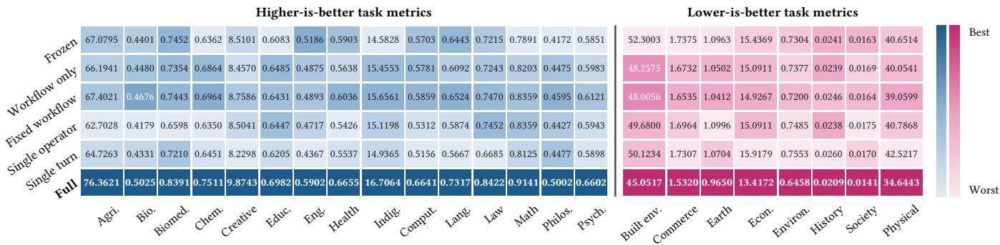  
Figure 5: Mean of IID and OOD task-native scores for the single-component and execution-structure ablation variants across 23 disciplines (variants not listed in Table 2, with the frozen agent and the full system for reference). Colours are normalised within each discipline column (darker is better), and the two groups follow higher-is-better and lower-is-better metrics.

RQ5: Is the gain reliable and eficient? Yes. ScienceClaw passes the hard constraints on 98.23% of instances, 2.58 points above EvoMaster, makes the fewest erroneous promotions in Figure 6c (1.23% against 3.80% to 7.25%), and costs less per OOD point than every other method (1.37 to 2.50 times as much, 27.1% less than EvoMaster), while its planner takes the smallest share of wall-clock time (18.40%; Figure 6h; Appendix G.3). Every compared evolving method passes more constraints than the frozen agent (91.51%), and ScienceClaw adds the most (+6.73 points). Its target atainment of 96.42% is 1.43 points above EvoMaster and 7.85 above the frozen agent (88.57%). The replay and validation that block invalid updates therefore do not trade against cost. Appendix F.8 gives the cost accounting behind these ratios, and Appendix G.3 defines the reliability metrics.

(a) Continual self-evolution
<table><tr><td rowspan="2">Method</td><td colspan="9">OOD macro score (%) after round</td><td colspan="4">Round-7 summary</td></tr><tr><td>0</td><td>1</td><td>2</td><td>3</td><td>4</td><td>5</td><td>6</td><td>7</td><td></td><td>Gain (pp)</td><td>Prom.</td><td>Rej.</td><td>Rate (%)</td></tr><tr><td>Frozen</td><td>77.72</td><td>77.72</td><td>77.72</td><td>77.72</td><td>77.72</td><td>77.72</td><td>77.72</td><td>77.72</td><td></td><td>0.00</td><td>0</td><td>0</td><td>一</td></tr><tr><td>RuleEvo</td><td>77.72</td><td>78.40</td><td>79.21</td><td>78.87</td><td>79.62</td><td>80.37</td><td>80.03</td><td>81.32</td><td></td><td>3.60</td><td>37</td><td>124</td><td>22.98</td></tr><tr><td>Qwen-only</td><td>77.72</td><td>79.42</td><td>80.16</td><td>79.89</td><td>81.25</td><td>81.93</td><td>81.59</td><td>83.22</td><td></td><td>5.50</td><td>49</td><td>112</td><td>30.43</td></tr><tr><td>EvoScientist</td><td>77.72</td><td>79.69</td><td>81.18</td><td>82.34</td><td>82.07</td><td>84.04</td><td>85.19</td><td></td><td>86.35</td><td>8.63</td><td>56</td><td>105</td><td>34.78</td></tr><tr><td>EvoMaster</td><td>77.72</td><td>80.03</td><td>81.59</td><td>82.88</td><td>82.54</td><td>84.85</td><td>86.07</td><td>87.50</td><td></td><td>9.78</td><td>63</td><td>98</td><td>39.13</td></tr><tr><td>ScienceClaw</td><td>77.72</td><td>80.43</td><td>82.68</td><td>82.47</td><td>86.14</td><td>87.57</td><td>89.81</td><td>91.30</td><td></td><td>13.59</td><td>70</td><td>91</td><td>43.48</td></tr></table>

(b) Cross-family forward transfer (pp)  
(c) Transfer, forgeting and reliability

(d) OOD score over rounds  
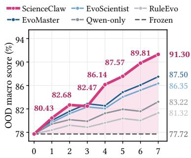

<table><tr><td>Source family</td><td>Life/ health</td><td>Phys./ Earth</td><td>Eng./ comp.</td><td>Social/ behav.</td><td>Hum./ law</td></tr><tr><td>Life/health</td><td>13.08</td><td>2.90</td><td>1.77</td><td>0.62</td><td>0.33</td></tr><tr><td>Phys./Earth</td><td>2.20</td><td>15.32</td><td>3.47</td><td>0.36</td><td>-0.33</td></tr><tr><td>Eng./comp.</td><td>1.92</td><td>3.54</td><td>15.04</td><td>1.84</td><td>1.64</td></tr><tr><td>Social/behav.</td><td>1.10</td><td>0.32</td><td>0.95</td><td>14.37</td><td>4.27</td></tr><tr><td>Hum./law</td><td>0.27</td><td>-0.51</td><td>1.26</td><td>3.61</td><td>15.66</td></tr></table>

<table><tr><td>Method</td><td>FWT/BWT ↑</td><td>Neg. ↓</td><td>Forg. ↓ avg/max</td><td>Attain. ↑</td><td>Err. ↓</td></tr><tr><td>SkillOpt</td><td>1.42/0.26</td><td>31.39</td><td>0.88/2.45</td><td>92.67</td><td>6.52</td></tr><tr><td>TTE</td><td>1.75/0.41</td><td>26.97</td><td>0.76/2.17</td><td>93.63</td><td>7.25</td></tr><tr><td>EvoScientist</td><td>2.74/1.23</td><td>17.32</td><td>0.42/1.23</td><td>94.43</td><td>4.58</td></tr><tr><td>EvoMaster</td><td>3.19/1.53</td><td>14.33</td><td>0.33/1.05</td><td>94.99</td><td>3.80</td></tr><tr><td>ScienceClaw</td><td>4.20/3.66</td><td>11.89</td><td>0.13/0.51</td><td>96.42</td><td>1.23</td></tr></table>

(e) Lead over best baseline  
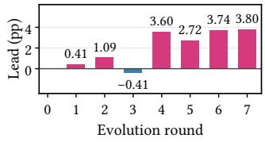

(f) Linked mechanism  
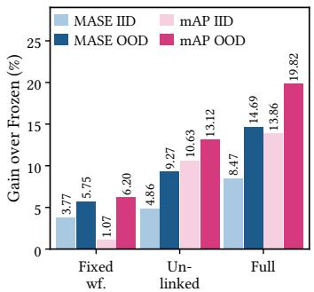

(g) Workflow mechanics  
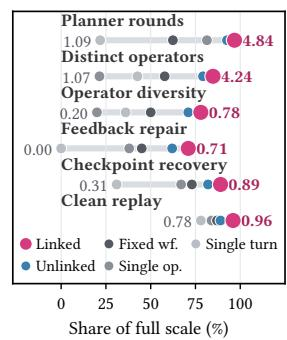

(h) Reliability and cost  
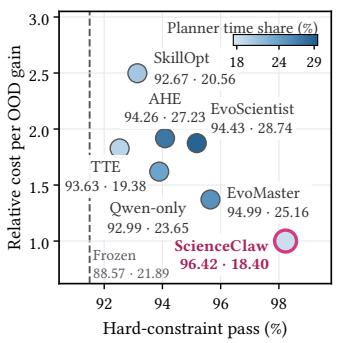

(i) Promoted candidates  
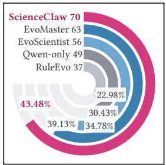  
Figure 6: Continual evolution, transfer, and mechanisms. (a) OOD macro score (MacroSR on $\mathcal { D } _ { \mathrm { O O D } } , \% )$ of each snapshot after round $r ,$ with gain over $A _ { 0 }$ in pp and promoted (Prom.) and rejected (Rej.) candidates out of 161. (b) Forward transfer (pp): OOD gain on the target family after evolving on the source family. (c) Forward and backward transfer (FWT/BWT, pp), negative transfer share (Neg., %), average and maximum forgetting on ${ \mathcal { D } } _ { \mathrm { r e p } }$ (Forg., pp), continual-target attainment (Attain., %), and erroneous promotions (Err., %). (d) OOD macro score by round. (e) Lead of ScienceClaw over the best other system (pp). (f) Gain over Frozen (%) of the linked-mechanism variants on Commerce (MASE) and Law (mAP). (g) Workflow mechanics: planner rounds, distinct Operators, Operator diversity, feedback repair, checkpoint recovery, and clean replay. (h) Hard-constraint pass rate against cost per OOD gain (ScienceClaw = 1), coloured by planner wall-time share, with Attain. and planner share annotated. (i) Promoted candidates and promotion rate. Bold and underline mark the best and second best in (a) and (c); in (b) bold marks the within-family gain.

## 7 Conclusion

Across 23 disciplines, ScienceClaw’s replay-gated linked Skill– Operator evolution yields sustained OOD gains, positive crossfamily transfer, and stronger retention at a lower cost per gain, without updating any model parameters. These results support evaluating scientific-agent evolution by persistence, transfer, validity, and reproducibility, rather than isolated task scores. ScienceClaw-Eval measures scientific correctness, evolutionary gain, retention, cross-dataset transfer, and evolution cost through sequential streams and independent reset evaluation.

## 8 Limitations and Ethical Considerations

Automated evaluators may miss domain errors (Appendix D), and updates may transfer incorrectly. ScienceClaw should support, not replace, experts; high-stakes use requires provenance, licensing, privacy safeguards, and independent review. The 23-discipline scope and cross-dataset splits do not eliminate shared conventions or within-field variation. Reported trajectories are final snapshots, so broader claims need repeated runs and discipline-level intervals. Persistent executable updates can reuse errors and expand the atack surface, requiring versioned program snapshots, replay and rollback, sandboxing, least-privilege credentials, auditable provenance, and human approval for irreversible actions.

## 9 Generative AI Usage

Generative AI assisted language and figures; the authors verified and take responsibility for the paper.

## References

[1] Lakshya A Agrawal, Shangyin Tan, Dilara Soylu, Noah Ziems, Rishi Khare, Krista Opsahl-Ong, Arnav Singhvi, Herumb Shandilya, Michael J Ryan, Meng Jiang, et al. 2026. Gepa: Reflective prompt evolution can outperform reinforce ment learning. In International Conference on Learning Representations, Vol. 2026. 8479–8565.

[2] Meysam Alizadeh, Mohsen Mosleh, Fabrizio Gilardi, Atoosa Kasirzadeh, and Joshua Tucker. 2026. AI Coding Agents Can Reproduce Social Science Findings. arXiv preprint arXiv:2606.11447 (2026).

[3] Jonathan Bragg, Mike D’Arcy, Nishant Balepur, Dan Bareket, Bhavana Dalvi Mishra, Sergey Feldman, Dany Haddad, Jena Hwang, Peter Jansen, Var sha Kishore, et al. 2026. Astabench: Rigorous benchmarking of ai agents with a scientific research suite. In International conference on learning representations, Vol. 2026. 110136–110223.

[4] Andres M Bran, Sam Cox, Oliver Schilter, Carlo Baldassari, Andrew D White, and Philippe Schwaller. 2023. Chemcrow: Augmenting large-language models with chemistry tools. arXiv preprint arXiv:2304.05376 (2023).

[5] Ziru Chen, Shijie Chen, Yuting Ning, Qianheng Zhang, Boshi Wang, Botao Yu, Yifei Li, Zeyi Liao, Chen Wei, Zitong Lu, et al. 2025. Scienceagentbench: Toward rigorous assessment of language agents for data-driven scientific discovery. In International Conference on Learning Representations, Vol. 2025. 96934–96990.

[6] Haipeng Ding, Yuexiang Xie, Zhewei Wei, Yaliang Li, and Bolin Ding. 2026. From Atomic Actions to Standard Operating Procedures: Iterative Tool Opti mization for Self-Evolving LLM Agents. arXiv preprint arXiv:2607.07321 (2026).

[7] Sirui Hong, Mingchen Zhuge, Jonathan Chen, Xiawu Zheng, Yuheng Cheng, Jinlin Wang, Ceyao Zhang, Steven Yau, Zijuan Lin, Liyang Zhou, et al. 2024. MetaGPT: Meta programming for a multi-agent collaborative framework. In International Conference on Learning Representations, Vol. 2024. 23247–23275.

[8] Sihang Jiang, Lipeng Ma, Zhonghua Hong, Keyi Wang, Zhiyu Lu, Tengfei Wang, Shisong Chen, Jinghao Zhang, Tianjun Pan, Weijia Li, et al. 2026. SEA-Eval: A Benchmark for Evaluating Self-Evolving Agents Beyond Episodic Assessment. arXiv preprint arXiv:2604.08988 (2026).

[9] Pang Wei Koh, Shiori Sagawa, Henrik Marklund, Sang Michael Xie, Marvin Zhang, Akshay Balsubramani, Weihua Hu, Michihiro Yasunaga, Richard Lanas Phillips, Irena Gao, et al. 2021. Wilds: A benchmark of in-the-wild distribution shifts. In International conference on machine learning. PMLR, 5637–5664.

[10] Jiahang Lin, Shichun Liu, Chengjun Pan, Lizhi Lin, Shihan Dou, Zhiheng Xi, Xuanjing Huang, Hang Yan, Zhenhua Han, Tao Gui, et al. 2026. Agentic harness en gineering: Observability-driven automatic evolution of coding-agent harnesses. arXiv preprint arXiv:2604.25850 (2026).

[11] Chen Ling, Pei Chen, Albert Guan, Jiaming Qu, Shayan Ali Akbar, Madhu Gopinathan, and Erwin Cornejo. 2026. PACE: Two-Timescale Self-Evolution for Small Language Model Agents. arXiv preprint arXiv:2605.23019 (2026).

[12] Tianyu Liu, Allen Xin Wang, Antonia Panescu, Lisa Xinyi Chen, Wenxin Long, Xinyu Wei, Yueqian Jing, Ziyao Zeng, Jihang Chen, Sihan Jiang, et al. 2026. Benchmarking AI Agents for Addressing Scientific Challenges Across Scales. arXiv preprint arXiv:2606.12736 (2026).

[13] David Lopez-Paz and Marc’Aurelio Ranzato. 2017. Gradient episodic memory for continual learning. Advances in neural information processing systems 30 (2017).

[14] Chris Lu, Cong Lu, Robert Tjarko Lange, Jakob Foerster, Jef Clune, and David Ha. 2024. The ai scientist: Towards fully automated open-ended scientific dis covery. arXiv preprint arXiv:2408.06292 (2024).

[15] Jiaxuan Lu, Ziyu Kong, Yemin Wang, Rong Fu, Haiyuan Wan, Cheng Yang, Wenjie Lou, Haoran Sun, Lilong Wang, Yankai Jiang, et al. 2026. Beyond static tools: Test-time tool evolution for scientific reasoning. arXiv preprint arXiv:2601.07641 (2026).

[16] Alisia Lupidi, Bhavul Gauri, Thomas Simon Foster, Bassel Al Omari, Despoina Magka, Alberto Pepe, Alexis Audran-Reiss, Muna Aghamelu, Nicolas Baldwin, Lucia Cipolina-Kun, et al. 2026. Airs-bench: a suite of tasks for frontier ai research science agents. arXiv preprint arXiv:2602.06855 (2026).

[17] Yougang Lyu, Xi Zhang, Xinhao Yi, Yuyue Zhao, Shuyu Guo, Wenxiang Hu, Jan Piotrowski, Jakub Kaliski, Jacopo Urbani, Zaiqiao Meng, et al. 2026. Evoscientist: Towards multi-agent evolving ai scientists for end-to-end scientific discovery. arXiv preprint arXiv:2603.08127 (2026).

[18] Darwin Godel Machine. 2025. Open-Ended Evolution of Self-Improving Agents.

[19] Jingwei Ni, Yihao Liu, Xinpeng Liu, Yutao Sun, Mengyu Zhou, Pengyu Cheng, Dexin Wang, Erchao Zhao, Xiaoxi Jiang, and Guanjun Jiang. 2026. Trace2skill: Distill trajectory-local lessons into transferable agent skills. arXiv preprint arXiv:2603.25158 (2026).

[20] Yujiong Shen, Yajie Yang, Zhiheng Xi, Binze Hu, Huayu Sha, Jiazheng Zhang, Qiyuan Peng, Junlin Shang, Jixuan Huang, Yutao Fan, et al. 2026. Sciagentgym: Benchmarking multi-step scientific tool-use in llm agents. arXiv preprint arXiv:2602.12984 (2026).

[21] Noah Shinn, Federico Cassano, Ashwin Gopinath, Karthik Narasimhan, and Shunyu Yao. 2023. Reflexion: Language agents with verbal reinforcement learning. Advances in neural information processing systems 36 (2023), 8634–8652.

[22] NexusAgent Team. 2026. S1-NexusAgent: a Self-Evolving Agent Framework for Multidisciplinary Scientific Research. arXiv preprint arXiv:2602.01550 (2026).

[23] Minyang Tian, Luyu Gao, Shizhuo D Zhang, Xinan Chen, Cunwei Fan, Xuefei Guo, Roland Haas, Pan Ji, Kitithat Krongchon, Yao Li, et al. 2024. Scicode: A research coding benchmark curated by scientists. Advances in Neural Information Processing Systems 37 (2024), 30624–30650.

[24] Guanzhi Wang, Yuqi Xie, Yunfan Jiang, Ajay Mandlekar, Chaowei Xiao, Yuke Zhu, Linxi Fan, and Anima Anandkumar. 2023. Voyager: An open-ended embodied agent with large language models. arXiv preprint arXiv:2305.16291 (2023).

[25] Ruoyao Wang, Peter Jansen, Marc-Alexandre Côté, and Prithviraj Ammanabrolu. 2022. Scienceworld: Is your agent smarter than a 5th grader?. In Proceedings of the 2022 Conference on Empirical Methods in Natural Language Processing. 11279–11298.

[26] Xingyao Wang, Yangyi Chen, Lifan Yuan, Yizhe Zhang, Yunzhu Li, Hao Peng, and Heng Ji. 2024. Executable code actions elicit beter llm agents. arXiv preprint arXiv:2402.01030 (2024).

[27] Mark D Wilkinson, Michel Dumontier, IJsbrand Jan Aalbersberg, Gabrielle Appleton, Myles Axton, Arie Baak, Niklas Blomberg, Jan-Willem Boiten, Luiz Bonino da Silva Santos, Philip E Bourne, et al. 2016. The FAIR Guiding Principles for scientific data management and stewardship. Scientific data 3, 1 (2016), 160018.

[28] Qingyun Wu, Gagan Bansal, Jieyu Zhang, Yiran Wu, Beibin Li, Erkang Zhu, Li Jiang, Xiaoyun Zhang, Shaokun Zhang, Jiale Liu, et al. 2023. Autogen: Enabling next-gen llm applications via multi-agent conversation. arXiv preprint arXiv:2308.08155 (2023).

[29] Wanghan Xu, Shuo Li, Tianlin Ye, Qinglong Cao, Yixin Chen, Hengjian Gao, Yiheng Wang, Qi Li, Kun Li, Sheng Xu, et al. 2026. ResearchClawBench: A benchmark for end-to-end autonomous scientific research. arXiv preprint arXiv:2606.07591 (2026).

[30] Yifan Yang, Ziyang Gong, Weiquan Huang, Qihao Yang, Ziwei Zhou, Zisu Huang, Yan Li, Xuemei Gao, Qi Dai, Bei Liu, et al. 2026. Skillopt: Executive strategy for self-evolving agent skills. arXiv preprint arXiv:2605.23904 (2026).

[31] Shunyu Yao, Jefrey Zhao, Dian Yu, Nan Du, Izhak Shafran, Karthik Narasimhan, and Yuan Cao. 2022. React: Synergizing reasoning and acting in language models. arXiv preprint arXiv:2210.03629 (2022)

[32] Mingda Zhang, Haoran Luo, Tiesunlong Shen, Qika Lin, Xiaoying Tang, Rui Mao, and Erik Cambria. 2026. Flowsteer: Interactive agentic workflow orchestration via end-to-end reinforcement learning. arXiv e-prints (2026), arXiv–2602.

[33] Shi-Xin Zhang and Yu-Qin Chen. 2026. ORBIT-Q: Dual-axis benchmarking of autonomous agents in scientific quantum programming. arXiv preprint arXiv:2607.03105 (2026).

[34] Mingming Zhao, Xiaokang Wei, Yuanqi Shao, Kaiwen Zhou, Lin Yang, Siwei Rao, Junhui Zhan, and Zhitang Chen. 2026. A2Flow: Automating Agentic Workflow Generation via Self-Adaptive Abstraction Operators. In Proceedings ofthe AAAI Conference on Artificial Intelligence, Vol. 40. 29930–29938.

[35] Congjie Zheng, Chuanyi Xue, Bin Liang, Jun Yang, and Changshui Zhang. 2026. SEAGym: An Evaluation Environment for Self-Evolving LLM Agents. arXiv preprint arXiv:2606.17546 (2026).

[36] Xinyu Zhu, Yuzhu Cai, Zexi Liu, Cheng Wang, Fengyang Li, Wenkai Jin, Wanxu Liu, Zehao Bing, Bingyang Zheng, Jingyi Chai, et al. 2026. EvoMaster: A Foundational Evolving Agent Framework for Agentic Science at Scale. arXiv preprint arXiv:2604.17406 (2026).

## A Formal Properties of the Replay-Gated Update

This appendix states what the update rule of Section 3 guarantees. The results concern the rule as implemented (Appendix B) and mark where the implementation is stricter than the literal $\operatorname { E q . } \left( 3 \right)$

## A.1 Setting and Conventions

Validation outcomes. For a program � and a validation episode $j ~ \in ~ \mathcal { D } _ { \mathrm { v a l } }$ , let $u _ { j } ( A ) \ = \ ( z _ { j } ( A ) , s _ { j } ( A ) , \mathbf { h } _ { j } ( A ) , \mathbf { c } _ { j } ( A ) )$ collect the success indicator, a bounded normalized task score, the hardconstraint indicators, and the resource use of the reset solve of � under �. Write $M ( A ) = \operatorname { M a c r o S R } ( A )$ on $\mathcal { D } _ { \mathrm { v a l } } \left( \mathrm { E q . } \left( 4 \right) \right)$ and $S ( A )$ for the mean normalized score. The implementation compares programs lexicographically,

$$
\begin{array} { r l r } {  { A \succ A ^ { \prime } \iff M ( A ) > M ( A ^ { \prime } ) \mathrm { ~ o r ~ } } } \\ & { } & { \big ( M ( A ) = M ( A ^ { \prime } ) \land S ( A ) - S ( A ^ { \prime } ) \ge \varepsilon \big ) , } \end{array}\tag{A.1}
$$

with a score margin � $> 0$ that exceeds the re-solve noise ofa single episode. The literal rule $Q _ { \mathrm { v a l } } = M$ is the limit $\varepsilon = \infty ,$ where ties are never broken.

Lemma A.1 (≻ is a stRict oRdeR). The relation ≻ is irreflexive and transitive.

PRoof. Irreflexivity: $M ( A ) > M ( A )$ is false and $S ( A ) - S ( A ) =$ $0 ~ < ~ \varepsilon .$ Transitivity: let $A \ \succ \ A ^ { \prime }$ and $A ^ { \prime } \succ A ^ { \prime \prime }$ . Then $M ( A ) \geq$ $M ( A ^ { \prime } ) \geq M ( A ^ { \prime \prime } )$ . If either inequality is strict, $M ( A ) > M ( A ^ { \prime \prime } )$ Otherwise both are equalities and $S ( A ) - S ( A ^ { \prime \prime } ) \geq 2 \varepsilon \geq \varepsilon .$ □

Assumption A.2 (Fixed, lineage-disjoint partitions). $\mathcal { D } _ { \mathrm { s r c } } , \mathcal { D } _ { \mathrm { v a l } } .$ $\mathcal { D } _ { \mathrm { I D } } ,$ , and $\mathcal { D } _ { \mathrm { O O D } }$ are fixed before the first round and are pairwise disjoint in items and in lineage groups. ${ \mathcal { D } } _ { \mathrm { r e p } }$ consists of frozen copies of source episodes. Hidden labels of $\mathcal { D } _ { \mathrm { v a l } } , \mathcal { D } _ { \mathrm { I D } }$ , and $\mathcal { D } _ { \mathrm { O O D } }$ stay inside the evaluator and are never part of the execution environment $D _ { E , t }$

Assumption A.3 (Recordedvalues). $\operatorname { E q . } \left( 3 \right)$ compares the recorded validation value of a candidate with the recorded value of the in cumbent. A candidate is solved once per validation episode whose retrieved program slice it changes; other episodes reuse the incumbent’s recorded result. An episode cut short by an infrastructure error is retried and, if it still fails, counted as an error entry that blocks admission rather than as a failure $( z = 0 )$

## A.2 Safety Invariants of the Persisted Program

PRoposition A.4 (Monotone validation value). Let $V _ { r } ~ =$ $( M ( A _ { r } ) , S ( A _ { r } ) )$ be the recorded value of the round-� program. For every �, either $A _ { r + 1 } = A _ { r } o r A _ { r + 1 } \succ A _ { r }$ . Hence $V _ { r }$ is nondecreasing in lexicographic order and strictly increases at every promotion. Because � takes values in a finite set and � increases by at least � among programs with equal �, the number of promotions against a fixed $\mathcal { D } _ { \mathrm { v a l } }$ is finite.

PRoof. By Eq. (3), $A _ { r + 1 } \ \ne \ A _ { r }$ � only if the selected candidate strictly improves the recorded value, i.e. $A _ { r + 1 } \succ A _ { r } ( \mathrm { E q . } ( \mathrm { A } . 1 ) )$ . By Lemma A.1 the relation composes along the chain. If � takes � values and ̄ � bounds �, at most $K - 1$ promotions raise � and at most $K \lvert \bar { S } / \varepsilon \rvert$ promotions raise � at constant �. □

PRoposition A.5 (Feasibility is invaRiant). Every persisted program $A _ { r + 1 } \neq A _ { r }$ satisfies, at promotion: $( i ) R _ { \mathrm { s r c } } ( A _ { r + 1 } ) = 1 ; ( i i )$ $\mathbf { H } _ { \mathrm { v a l } } ( A _ { r + 1 } ) \succeq \mathbf { H } _ { \mathrm { v a l } } ( A _ { r } )$ , that is, no validation episode shows a hardconstraint violation that the incumbent did not show; and (iii)

$$
\begin{array} { r } { \mathbf { C } _ { \mathrm { v a l } } ( A _ { r + 1 } ) \preceq \mathbf { B } _ { \mathrm { a b s } } \quad a n d \quad \mathbf { C } _ { \mathrm { v a l } } ( A _ { r + 1 } ) \preceq ( 1 + \beta ) \mathbf { C } _ { \mathrm { v a l } } ( A _ { r } ) , } \end{array}\tag{A.2}
$$

where $\mathbf { B } _ { \mathrm { a b s } }$ scales with $| \mathcal { D } _ { \mathrm { v a l } } |$ and $\beta \geq 0$ . Consequently, the set of hard-constraint violations on any completed validation episode is nonincreasing along the chain, and the validation cost of every persisted program is at most $\mathbf { B } _ { \mathrm { a b s } }$ whenever $\mathbf { C } _ { \mathrm { v a l } } ( A _ { 0 } ) \preceq \mathbf { B } _ { \mathrm { a b s } }$

PRoof. (i) and (iii) are conditions of the candidate set in Eq. (2), with the budget vector instantiated as Eq. (A.2), and (ii) is its hardconstraint condition in no-regression form; a candidate that violates any of them is never selected. By (ii), $ { \mathbf { h } } _ { j } ( A _ { r + 1 } ) \geq  { \mathbf { h } } _ { j } ( A _ { r } )$ component-wise on every completed validation episode, so the violation set cannot grow. The cost bound follows from the first inequality of Eq. (A.2) and induction from $A _ { 0 }$ □

Remark A.6 (Where the implementation is stricter than $E q . \ ( 3 ) )$ Four additions follow: the lexicographic order Eq. (A.1) instead of � alone; the relative budget cap in Eq. (A.2) in addition to an absolute cap; the noise guard of Proposition ${ \mathrm { A . 9 } } ;$ and the no-regression form ⪰ of the hard-constraint condition. The relative cap and the noise guard make admission harder, whereas the lexicographic order also admits a candidate that ties on � and raises � by at least �, and the no-regression form admits a candidate that keeps a violation of the incumbent. Proposition A.4 holds for the literal rule because each literal promotion strictly raises $M ,$ and the consequences of Proposition A.5 hold for it because they use only (i), (ii), and the absolute cap in (iii). Appendix B.5 lists the parameter values.

PRoposition A.7 (InfoRmation-flow isolation). Under $A s -$ sumption $A . 2 ,$ the program $A _ { r + 1 }$ is a function of $A _ { r } ,$ the round-� source episode with its evaluatorfeedback, the validation evaluations ofthe candidate and the incumbent, and the solver’s randomness. No quantity computed on $\mathcal { D } _ { \mathrm { I D } } , \mathcal { D } _ { \mathrm { O O D } } , o r \mathcal { D } _ { \mathrm { r e p } }$ is an input to the update, and $\Theta _ { r + 1 } = \Theta _ { r } = \Theta _ { 0 }$

PRoof. Candidates are built from the repair interval $\delta _ { i }$ of a source episode (Eqs. (9)–(12)). Admission reads $R _ { \mathrm { s r c } }$ (a reset run of the same source episode) and the validation values $u _ { j }$ in Eqs. (2) and (3). By Assumption A.2 no held-out label reaches the run environment, so held-out episodes can influence neither the solver’s feedback nor the evaluator values that these equations consume. The parameters $\Theta _ { 0 }$ appear only as the fixed policy of Eq. (6). □

CoRollaRy A.8 (No adaptive selection on held-out splits). Snapshot scores on $\mathcal { D } _ { \mathrm { I D } }$ and $\mathcal { D } _ { \mathrm { O O D } }$ are not maximized over, or conditioned on, by any step ofthe procedure. They are single evaluations of a program chosen without them.

## A.3 The Noise Guard: What It Buys and What It Costs

The literal rule admits a candidate on any strict gain in $Q _ { \mathrm { v a l } }$ . With one stochastic solve per validation episode, a single lucky episode sufices. The implementation therefore requires the gain to be supported by at least � individually improved episodes and by at most

� regressed ones.

PRoposition A.9 (False pRomotion undeR the noise guaRd). Consider a candidate whose efect on each of � afected validation episodes of one discipline is independent, with the episode improving with probability �, regressing with probability �, and unchanged otherwise. Let � and � be the numbers of improved and regressed episodes. The literal rule admits the candidate if� > �. The guarded rule admits it $i f f U > V , U \geq m$ , and $V \leq \nu .$ . Then

$$
\mathrm { \mathrm { P r } } [ g u a r d a d m i t s ] \ \leq \ \mathrm { \mathrm { P r } } [ U \geq m ] \ \leq \ { \binom { n } { m } } a ^ { m } ,\tag{A.3}
$$

and for $n = m = 2 , \nu = 1 ;$

$$
\begin{array} { r } { \operatorname* { P r } [ l i t e r a l a d m i t s ] = a ^ { 2 } + 2 a ( 1 - a - b ) , \qquad \operatorname* { P r } [ g u a r d a d m i t s ] = a ^ { 2 } . } \\ { ( \mathrm { A } . 4 ) } \end{array}
$$

In particular, when the candidate has no efect and noise is symmetric $( a = b = p ) ,$ , the literal rule admits it with $p r o b a b i l i t y 2 p - 3 p ^ { 2 }$ and the guard with probability $p ^ { 2 } ,$ a ratio of $( 2 - 3 p ) / p$

PRoof. The guard adds conditions to $U > V ,$ , so its admission event is contained in $\left\{ U \geq m \right\} .$ ; the second inequality in Eq. (A.3) is the union bound over the ${ \binom { n } { m } }$ subsets of � episodes that must all improve. For $n = 2 , U > V$ holds in exactly two disjoint ways: both episodes improve (probability $a ^ { 2 } )$ , or exactly one improves and the other is unchanged (probability $2 a ( 1 - a - b ) )$ . With $m = 2$ only the first survives, and then $V = 0 \leq \nu .$ □

Remark A.10 (Illustration andprice). For $p = 0 . 1$ , a no-efect candidate passes the literal rule with probability 0.17 and the guard with probability 0.01. The price is power. A candidate that helps each episode with probability $a \ = \ 0 . 5$ and harms with $b ~ = ~ 0 . 1$ passes with probability 0.65 under the literal rule and 0.25 under the guard, so the guard also rejects some genuine one-episode improvements. These values come from the model above; the measured promotion counts are in Section 6 and Appendix G.

CoRollaRy A.11 (Stagnation condition). If� > �, the guard admits no candidate whatever its efect, because $\operatorname* { P r } [ U \geq m ] = 0 .$ A configuration with $m \ > \ n _ { \mathrm { v a l } }$ therefore never promotes a singlediscipline candidate.

Remark A.12 (When the program stalls). Corollary A.11 gives the configuration in which the gate stalls by construction. In any other configuration the program stalls at round � exactly when $\mathcal { F } _ { r }$ contains no member that passes the guard and strictly improves validation value, so progress is set by the quality of the candidates and the validation set. Table 24 reports the measured promotion counts per method.

## A.4 Operator Abstraction

An Operator candidate is a component � of the final graph $G _ { i } ^ { + }$ replaced by one node with the boundary $\partial U \left( { \mathrm { E q . } } \left( 1 2 \right) \right)$ . Two properties make this replacement well defined.

Definition A.13 (Convex node set). $U \subseteq N$ is convex in a DAG � if every directed path in � between two nodes of � stays inside � .

Lemma A.14 (ContRaction pReseRves acyclicity iff � is convex). Let � be a DAG and � a nonempty node set. The graph $G / U$ , obtained by contracting � into one node, is acyclic if � is convex.

PRoof. (⇐) A cycle in $G / U$ cannot avoid the contracted node, since � is acyclic. It lifts to a path in � that leaves � at some $\nu \in U$ through nodes outside � and returns to some � $\in U . \operatorname { I f } \nu \neq w$ this contradicts convexity; if $\nu = w$ it is a cycle in �. (⇒) If � is not convex, some path between nodes of� contains a maximal outside segment $x _ { 1 } , \ldots , x _ { k }$ entered from � $\in U$ and left toward $b \in U$ . Then $U \to x _ { 1 } \to \ldots \to x _ { k } \to U$ is a cycle in $G / U$ □

CoRollaRy A.15 (A valid paRtition always exists). Every singleton is convex, and the maximal weakly connected components of Eq. (10) can be refined along a topological order into convex pieces. $A$ component whose boundary would still create a cycle is dropped and logged rather than registered.

PRoposition A.16 (BoundaRy Replay is sound). Let $\hat { o } _ { i , U }$ pass boundary replay: executed on the recorded inputs at $\partial ^ { - } U ,$ , its outputs at $\partial ^ { + } U$ equal the recorded outputs in $\tau _ { i } ^ { + }$ exactly (deterministic nodes) or within � in a norm. Then, with the nodes downstream of� unchanged, (i) the final output equals $y _ { i } ^ { + }$ in the exact case; and (ii) ifthe map from the boundary outputs to � is �-Lipschitz, the final output difers from $y _ { i } ^ { + }$ by at most ��.

PRoof. Evaluate the downstream nodes in topological order. In case (i) each receives identical inputs and, being deterministic, returns identical outputs, so identical � follows by induction. Case (ii) is the Lipschitz bound applied to the boundary diference. □

Remark A.17 (Boundary replay and the source check). Proposition A.16 shows that an Operator reproduces the component it abstracts on the recorded boundary. A candidate then reproduces its source task from a reset state with its component versions used $( R _ { \mathrm { s r c } } ~ = ~ 1 , ~ \mathrm { E q } .$ . (13)) and improves independent validation tasks, which extends the evidence from the recorded boundary to the full program and to other tasks.

## A.5 Metrics: Invariance and Sampling Variability

Definition A.18 (Relative margin). For a discipline with tasknative score �, a reference system with score $s _ { \mathrm { r e f } } ~ > ~ 0$ , and a method with score $s _ { \mathrm { M } } .$ the relative margin is $( s _ { \mathrm { M } } - s _ { \mathrm { r e f } } ) / s _ { \mathrm { r e f } }$ if higher is beter and $( s _ { \mathrm { r e f } } - s _ { \mathrm { M } } ) / s _ { \mathrm { r e f } }$ if lower is beter.

PRoposition A.19 (Unit invaRiance and sign). The relative margin is unchanged under $s \mapsto$ �� for every $c > 0$ (for example, percent versus fraction), and it is positive if the method is beter than the reference in the metric’s own direction. It is not invariant under translation $s \mapsto s + c .$

PRoof. Scaling multiplies numerator and denominator by �. The sign follows from the definition, and translation changes the denominator without changing the numerator. □

This is why Section 6 compares systems only within a discipline and averages relative margins, never raw scores, across disciplines.

PRoposition A.20 (Sampling vaRiability of MacRoSR). Suppose, for a fixed program, the outcomes �� in discipline � are independent Bernoulli(��) over $n _ { d }$ instances. Then

$$
\mathrm { V a r } \big [ \mathrm { M a c r o S R } \big ] = \frac { 1 } { 2 3 ^ { 2 } } \sum _ { d = 1 } ^ { 2 3 } \frac { \mathcal { P } _ { d } \big ( 1 - \mathcal { P } _ { d } \big ) } { n _ { d } } \ \leq \ \frac { 1 } { 4 \cdot 2 3 n } \quad i f n _ { d } = n \ \forall d .\tag{A.5}
$$

For $n = 6 4$ the standard error is at most 1.30 percentage points, and for the diference of two programs evaluated on independent draws at most 1.84 points.

PRoof. Independence across disciplines and instances gives the variance ofthe average. Each term is at most $1 / ( 4 n _ { d } )$ , with equality at $p _ { d } = 1 / 2 ;$ summing 23 terms and dividing by $2 3 ^ { 2 }$ gives $1 / ( 9 2 n ) _ { ; }$ whose square root at $n = 6 4 \mathrm { i } s 0 . 0 1 3 0$ . The diference has variance at most twice this. □

Remark A.21 (Scale of sampling noise). The bound is the binomial sampling error of MacroSR over $2 3 \times 6 4 = 1 { , } 4 7 2$ instances per split. The +13.59 point OOD gain of ScienceClaw over $A _ { 0 }$ is more than seven times the 1.84 point bound.

Remark A.22 (Summary of the guarantees). The persisted program is monotone in recorded validation value, feasible at every promotion, selected without access to the held-out splits, and built from components that reproduce the evidence they came from. The noise guard lowers false promotion at a cost in power, and operator replacement preserves acyclicity.

## B Implementation and Configuration

This appendix specifies how the formalism of Sections 3 and 5 is operationalized: the objects of the paper and the modules that realize them, the execution runtime, the policy interface, the evolution procedure, the gate parameters, the models and budgets, and the configuration of every compared variant and baseline. The benchmark adapters, solver, runtime, and evolution engine are in the project repository (https://github.com/beita6969/ScienceClaw).

## B.1 From Formalism to Modules

Table 3 maps each object to its module. Every run writes receipts: the resolved configuration, each program snapshot $A _ { r }$ , and, per episode, the trajectory, the final graph, the output, and the evaluation record, together with a ledger of tokens and wall time per phase.

## B.2 Execution Runtime

Node kinds and schemas. A node is a tool call into the task’s visible tools $\mathcal { T } _ { t } .$ , a code node holding a Python function of its inputs and configuration, an llm node that maps a prompt template over a list of items, an operator node that expands a registered Operator, or the single submit node whose input is the required output ��. A port schema Γ has a type (any, number, text, array, table, list, dict, series), a shape (integers or named symbols), a unit, and provenance. An edge is valid when the types agree or one is any, the shapes unify with symbols bound consistently, and the units are equal, unspecified on either side, or bridged by an explicit conversion (a factor and an ofset) atached to the edge, which is recorded in provenance. A graph is valid when it is acyclic, all ports exist, every edge is compatible, and it has at most one submit node.

Table 3: Paper objects and the modules that implement them.
<table><tr><td>Paper object</td><td>Implementation</td></tr><tr><td>Task  $D _ { t } = \left( D _ { T } , D _ { V } , D _ { E } \right)$ </td><td>episode: objective and output schema, constraints and evaluator, tools and data</td></tr><tr><td>Program  $A _ { r } = ( \mathcal { S } _ { r } , \mathcal { O } _ { r } )$ </td><td>program of Skills and Operators with version identifiers</td></tr><tr><td>Fixed model  $\Theta _ { 0 }$ </td><td>policy role of the language-model client; never trained</td></tr><tr><td>Solve, Eq. (1)</td><td>solver: one episode, one program, one mode</td></tr><tr><td>Port schema Γ, Compat</td><td>schema type with a compatibility rule</td></tr><tr><td>Graph  $G _ { t , k } , \operatorname { E q . } \left( 5 \right)$ </td><td>workflow graph with node and edge validation</td></tr><tr><td>Policy  $\pi _ { \Theta _ { 0 } } , \operatorname { E q . } \left( 6 \right)$ </td><td>policy proposing one atomic action per turn</td></tr><tr><td>Retrieve</td><td>lexical retriever over Skills and Operators</td></tr><tr><td>Execute, Eq. (7)</td><td>executor with checkpoint and fingerprints</td></tr><tr><td> $\mathrm { R e p l a y } , \mathrm { E v a l } , \mathrm { E q } . ( 8 )$ </td><td>clean replay and the episode evaluator</td></tr><tr><td>δi, Eq. (9)</td><td>attribution of evolution instances</td></tr><tr><td> $\Pi _ { \mathrm { c t r l } } , \Pi _ { \mathrm { e x e c } } , \mathrm { C C _ { \Gamma } }$ </td><td>edit split with convex components</td></tr><tr><td>Skill candidate, Eq. (11)</td><td>skill patch</td></tr><tr><td>Operator candidate, BReplay</td><td>operator abstraction and boundary replay</td></tr><tr><td> $R _ { \mathrm { s r c } } , \operatorname { E q } . \left( 1 3 \right)$ </td><td>source replay check with the use test</td></tr><tr><td> $\mathcal { F } _ { r } , \mathrm { E q . } \left( 2 \right)$ </td><td>validation gate</td></tr><tr><td> $\mathrm { U p d a t e } , \mathrm { E q } . ( 3 )$ </td><td>evolver</td></tr><tr><td> $\mathrm { M a c r o S R } , \mathrm { E q . } ( 4 )$ </td><td>benchmark metrics</td></tr><tr><td> $\mathcal { D } _ { \mathrm { s r c } } , \mathcal { D } _ { \mathrm { v a l } } , \mathcal { \bar { D } } _ { \mathrm { I D } } , \mathcal { D } _ { \mathrm { O O D } } , \mathcal { D } _ { \mathrm { r e p } }$ </td><td>split plan with frozen manifests</td></tr></table>

Checkpoints and fingerprints. Each node has a fingerprint, the hash of its specification, its upstream fingerprints, and its edge wiring. The checkpoint $\chi$ maps fingerprints to recorded outputs. After an edit only nodes whose fingerprint is absent from $\chi$ run again, in topological order, so an edit to one node recomputes its descendants and nothing else. A node whose outcome is not reproducible, such as a failed language-model call or a first timeout, is marked transient, and neither it nor any descendant enters the checkpoint.

Sandbox and time limits. Code nodes run in a separate process with their own working directory and a time limit, and tool nodes run in trusted adapter code under one lock. A node has a limit of max \_����\_� seconds, and an operator node as a whole has twice that limit. Hidden labels never enter the run environment: adapters keep them inside the evaluator. A static scan of code nodes rejects absolute paths and directory traversal, references to the dataset root and to the evaluator package, network, download, and process-spawning modules, dynamic evaluation and imports, and environment or credential access; its violations feed the integrity check in $\mathbf { H } _ { \mathrm { v a l } } .$ , and the worker runs with a scrubbed environment.

Diagnostics. After each execution the executor returns per-node status and error text, output summaries (type, shape, unit, fraction of finite values, range, head), violated contract conditions, the visible constraint checks on the submit output, and the visible development score when the task provides one. These fields form $f _ { t , k }$ in Eq. (7).

Reset replay. Replay executes the complete graph in a fresh run directory with an empty checkpoint. A result is reproducible when the replayed output matches the executor’s output within the episode tolerance. A clean replay runs whenever a submit output difers in fingerprint from the last replayed one, and the sequence of replays gives the evidence $e _ { t , k }$

## B.3 Policy Interface

Actions. At each turn the policy emits one JSON object with a short rationale, one action, and the identifiers $\nu _ { t , k }$ of the Skills and Operators it used. The actions are add\_node, remove\_node, modi $. \mathsf { f y } .$ \_node (with a patch to code, a find-and-replace code edit, prompt, configuration, ports, or wiring), add\_edge, remove\_edge, and finish. $\mathrm { A }$ rejected action leaves the graph unchanged and returns the reason as feedback. Edits that change only configuration, edges, node removal, or add tool, operator, or submit nodes are control edits $( \Pi _ { \mathrm { c t r l } } ) _ { : }$ , and edits that add or modify code or prompt nodes are executable edits $\left( \Pi _ { \mathrm { e x e c } } \right)$

What the policy sees. The system prompt describes what each action, node kind, and interface rule does, the deliverable format, and a uniform acceptance statement: a deliverable counts as solved when the task metric beats the task’s reference by a fixed margin, all constraints hold, and the final workflow replays reproducibly within the budget. It names no metric value, reference method, or task-specific recipe. The initial program $A _ { 0 }$ is empty; strate gies reach the prompt only as retrieved Skills, and the prompt is scanned for strategy phrases to keep it so. Each turn adds the objective, the tool signatures with port descriptions, the retrieved Skills and Operators, the remaining budget, the feedback of the last step, and a compact history of earlier steps. The policy never sees hidden-label scores.

Retrieval. Skills and Operators are ranked against the episode query (objective, task type, tags, discipline, and required-output type) by a lexical Okapi BM25 over their text, plus bonuses for matching discipline, task type, tags, and, for Operators, input port types. A component is retrievable only if it matches the episode by metadata or covers at least 15% of the query’s inverse-document frequency mass; ranking is deterministic, and the top 4 Skills and top 6 Operators enter the context. A Skill or Operator learned in one discipline stays retrievable in another when it is relevant to the episode, which is how cross-discipline transfer arises. The hash of the retrieved version identifiers and content digests is the retrieval slice of an episode, and a candidate is validated on an episode only when it changes that slice (Section B.5).

## B.4 Evolution Procedure

One round processes one source episode per discipline in a fixed source order, so seven rounds give $7 \times 2 3 = 1 6 1$ source episodes and 161 candidates per method. The default schedule is per candi date: each candidate is validated immediately against the current incumbent, and the next source episode already uses the updated program. Snapshots $A _ { 0 } , \ldots , A _ { 7 }$ are taken at round ends.

(1) Solve the source episode with $A _ { r }$ in source mode, which stops at the first replay-verified pass. The final workflow is the replay-verified passing graph with the best visible

development score.

(2) Extract the evolution instance. The pass is $e _ { i } ^ { + }$ , the latest replay-verified failure before it is $e _ { i } ^ { - }$ (or none), and the actions between them form $\delta _ { i } ( \mathrm { E q . } ( 9 ) )$ . Without $e _ { i } ^ { - }$ , only an Operator candidate is formed.

(3) Split the repair. Control edits give $\Delta _ { i } ^ { \mathcal { S } }$ . Executable nodes created or modified in $\delta _ { i } ,$ together with the executable nodes weakly connected to them, are grouped into maximal connected components that are made convex by spliting along a topological cut (Lemma A.14). Nodes expanded from a registered Operator are not candidates unless $\delta _ { i }$ touched them.

(4) Form candidates. The Skill candidate patches the atributed Skills, or creates one if none was atributed, from the control edits and the failure and success evidence, without instance-specific values or answers. Each component becomes an Operator candidate: its body is the subgraph, concrete integer dimensions at its boundary are replaced by symbols so that instance sizes do not make it incompatible with other episodes, its contract � records the types, shapes, units, finiteness, and ranges observed at the boundary together with episode tags, and its provenance records episode, steps, and parent program version. Names and descriptions are documentation only.

(5) Boundary replay. Recorded inputs at $\partial ^ { - } U$ are loaded, the Operator runs in isolation in a fresh directory, and its outputs at $\partial ^ { + } U$ are compared with $\tau _ { i } ^ { + }$ within tolerance. Only passing Operators enter the bundle $B _ { i }$

(6) Apply and check the source. The bundle is applied atomically, assigning version identifiers $\omega _ { i }$ , and the source episode is solved again from a reset state. $R _ { \mathrm { s r c } } = 1$ requires a passing replay-verified result and that every new version was used: an Operator version is used if an operator node with that reference is in the evidence graph and ran successfully, and a Skill version is used if it is in � of an applied step up to the evidence step. Citations in rejected or failed actions do not count.

(7) Gate. The candidate is evaluated on the validation episodes and admited under the rules of Section B.5; otherwise the incumbent is kept.

## B.5 Gate Parameters and Implementation Choices

Table 4 lists the parameters of the gate and of the benchmark protocol. The following choices fix details that Eqs. (2) and (3) leave open.

Choice $o f Q _ { \mathrm { v a l } }$ and $\mathbf { H } _ { \mathrm { v a l } } . ~ Q _ { \mathrm { v a l } }$ is MacroSR on $\mathcal { D } _ { \mathrm { v a l } }$ with ties broken by the mean normalized score, so a candidate that solves the same episodes but solves them measurably beter can be admited $( \mathrm { E q . \left( A . 1 \right) ) . \mathrm { H } _ { \mathrm { v a l } } }$ collects (a) no leakage or sandbox violation, (b) a valid output schema, and (c) no hard-constraint violation that the incumbent did not show. An episode that produced no output is already penalized by MacroSR and has no output to violate a constraint with, so it cannot veto a candidate through $\mathrm { H } _ { \mathrm { v a l } } ;$ a solver or gateway error does block admission.

Table 4: Gate and protocol parameters of all reported runs.
<table><tr><td>Parameter</td><td>Value</td></tr><tr><td>Rounds R</td><td>7</td></tr><tr><td>Items per episode</td><td>16</td></tr><tr><td>Validation episodes per discipline</td><td>2</td></tr><tr><td>ID and OOD episodes per discipline</td><td>4 each (64 instances)</td></tr><tr><td>Update schedule</td><td>per candidate</td></tr><tr><td> $Q _ { \mathrm { v a l } }$ </td><td>MacroSR, then mean normalized score</td></tr><tr><td>Score margin ε</td><td>0.02</td></tr><tr><td>Hard-constraint mode  ${ \bf H } _ { \mathrm { v a l } }$ </td><td>no new violation against the incumbent</td></tr><tr><td>Absolute token budget</td><td>250,000 per validation episode</td></tr><tr><td>Relative cost cap β</td><td>0.5</td></tr><tr><td>Wall-time budget</td><td>1,800 s per validation episode</td></tr><tr><td>Lazy re-validation</td><td>on</td></tr><tr><td>Noise guard (m, v)</td><td>at least 2 improved, at most 1 regressed episode</td></tr><tr><td>Boundary-replay repeats</td><td>1</td></tr><tr><td>Evolution instances per source episode</td><td>1</td></tr><tr><td>Infrastructure retries</td><td>2, backoff from 30 s</td></tr><tr><td>Partition and sampling seed</td><td>20260928</td></tr></table>

Budget. Eq. (A.2) makes B concrete: tokens are logical (spent plus cached) so that a run served from the response cache is judged like the original run, and wall time is checked against its own budget. The violated condition is recorded with each rejected candidate.

Validation cost control. A validation episode is solved again only if the candidate changes its retrieval slice, and otherwise the incumbent’s recorded result is reused. The number of re-solved and reused episodes is recorded per candidate, so the validation cost grows with the candidate rather than with the library.

Noise guard. With one stochastic solve per validation episode and two validation episodes per discipline, one lucky episode would admit a candidate under the literal rule. The implementa tion therefore requires the gain to be supported by at least two episodes that individually improved (the episode solves where it failed, or solves with a normalized-score gain of at least �) and by at most one that regressed, comparing the entries already recorded and drawing no extra samples (Proposition A.9). Seting the first threshold to one restores the literal rule.

Infrastructure outages. A solve cut short by a gateway outage is retried with doubling backof, then becomes an error entry that blocks admission and is never reused. A source solve is retried in the same way and, if it still fails, deferred once to the end of its round. Outages are recorded and are never scored as task failures.

## B.6 Models, Sampling, and Budgets

Table 5 lists the models. The orchestrator is the only model that executes tasks, and its parameters never change. Evolution operates on source trajectories and evaluator feedback and has no access to validation, ID, or OOD labels.

Solver and episode budgets. A source or evaluation episode has at most 24 planner steps, 200,000 policy tokens, and 1,800 to 3,600 seconds of wall time depending on the task, with per-node limits of 180 to 900 seconds (Appendix C lists the per-discipline values). The six most recent steps are shown in full and earlier steps are summarized. Evaluation episodes run in evaluation mode: the final workflow is the latest valid, fully wired workflow, and no hidden verification happens per step. Table 4 lists the caps of a validation episode at the gate, and Table 11 the budget of a source or evaluation episode.

Table 5: Models and roles. All systems share the orchestrator.
<table><tr><td>Role</td><td>Setting</td></tr><tr><td>Orchestrator (policy, executor, patch)</td><td>Qwen3.5-27B, open weights, self-hosted OpenAI-compatible server, thinking disabled,</td></tr><tr><td>Evolution</td><td>temperature 0 GPT-5.4 in isolated sessions</td></tr><tr><td>Qwen-only variant</td><td>Qwen3.5-27B in evolution</td></tr><tr><td>RuleEvo variant</td><td>no model in evolution; deterministic trace projection and compiler</td></tr><tr><td>Output limit per call</td><td>policy 8,000, executor 2,000, patch 4,000 tokens</td></tr><tr><td>Policy output format</td><td>JSON object</td></tr><tr><td>Response cache</td><td>on; identical contexts return identical outputs</td></tr><tr><td>Parameter updates</td><td>none,  $\Theta _ { r } = \Theta _ { 0 }$  for all r</td></tr></table>

Compute. Orchestrator calls are served by self-hosted vLLM servers on H800 GPUs; the evaluator code of each task runs on CPU, and tasks that need a GPU, such as segmentation or source separation, call a GPU tool broker.

## B.7 Configuration of the Ablation Variants

Table 6 lists the variants in four groups. The first group removes parts of the update scope, the second changes how candidates are produced, the third removes one component of the gate, and the last group restricts execution itself. Variants in the same group share everything except the named factor, so each diference in Table 2 and Figure 5 is atributable to that factor. The execution variants are enforced by the solver: in single-operator orchestration the graph may hold only tool nodes, one code node, and the submit node; in fixed-workflow orchestration only edits to the code node and its configuration are accepted; in single-turn orchestration the policy must emit the complete graph in one batch action.

## B.8 Baseline Configuration and Fairness

Table 7 states the protocol. Each baseline runs its best released configuration through fixed ScienceClaw-Eval adapters, and adapters and initial assets are fixed without access to ID or OOD instances or evaluators. No method is tuned on $\mathcal { D } _ { \mathrm { I D } }$ or $\mathcal { D } _ { \mathrm { O O D } }$ . Every baseline runs its own evolution calls on GPT-5.4, the evolution model of ScienceClaw, for as many evolution rounds as ScienceClaw.

## C ScienceClaw-Eval Specification

This appendix documents how ScienceClaw-Eval is built and scored: task sources, partition rules, evaluator definitions, acceptance criteria, hard constraints, budgets, and the checks that keep evaluation honest. Per-discipline values are in Tables 10 and 11.

## C.1 Construction Pipeline

## Construction follows the four stages of Figure 4.

Task collection. Each of the 23 disciplines is one division of the ANZSRC 2020 Fields of Research (divisions 30 to 52), and its task is built on a public scientific resource with explicit inputs, a verifiable target, and a recorded license. Every resource is pinned to a version, release, or commit, and its files are checked against recorded checksums when the benchmark loads.

Table 6: Configuration of the eighteen variants. Each variant changes one factor of the full system and leaves the runtime, budgets, source stream, and validation data unchanged.
<table><tr><td>Variant</td><td>Factor</td><td>Single change</td></tr><tr><td>ScienceClaw (full)</td><td>none</td><td>Dynamic workflow orchestration and linked Skill-Operator self-evolution</td></tr><tr><td>Frozen</td><td>evolution</td><td>All persistent updates are off; runtime and budgets are unchanged.</td></tr><tr><td>Workflow only</td><td>scope of updates</td><td>Only the structured workflow-template and routing fields inside Skills are updated; other Skill text and Operators stay frozen.</td></tr><tr><td>w/o Skill evol.</td><td>scope of updates</td><td>Only ordinary Skill strategy text is frozen; the structured workflow fields and Operators may still change.</td></tr><tr><td>w/o Oper. evol.</td><td>scope of updates</td><td>Operator creation and fusion are disabled in the full system.</td></tr><tr><td>w/o Work. evol.</td><td>scope of updates</td><td>Only the workflow-template and routing fields inside Skills are frozen; ordinary Skill text and Operators may still change.</td></tr><tr><td>w/o link. evol.</td><td>linkage</td><td>Skills and Operators are updated separately, and not committed together as one atomic bundle.</td></tr><tr><td>RuleEvo</td><td>candidate source</td><td>Generative evolution is off; candidates come only from deterministic trace projection and a compiler.</td></tr><tr><td>Qwen-only</td><td>candidate source</td><td>Qwen replaces GPT-5.4 in evolution.</td></tr><tr><td>w/o src. replay w/o sci. constr.</td><td>gate</td><td>Source replay still runs, but its result does not enter the admission rule The agent and the admission rule do not see the scientific hard constraints; the final official scorer still</td></tr><tr><td></td><td>gate</td><td>checks them.</td></tr><tr><td>w/o ind. valid.</td><td>gate</td><td>The evolving agent scores its own candidates and freezes; the official scorer is applied afterward only for blind evaluation.</td></tr><tr><td>w/o cross-task mem. w/o IID select.</td><td>memory gate</td><td>Reuse of Skills, Operators, and failure memory across tasks is off.</td></tr><tr><td>w/o OOD transfer</td><td>transfer</td><td>No paired IID selection; the latest valid candidate is frozen. The preregistered robustness pack is off; the entry is not available when no independent callable pack</td></tr><tr><td></td><td></td><td>exists.</td></tr><tr><td>Fixed workflow Single operator</td><td>orchestration orchestration</td><td>Dynamic canvas orchestration is off; a fixed tool chain executes. Each sample may call exactly one task Operator.</td></tr><tr><td>Single turn</td><td>orchestration</td><td></td></tr><tr><td></td><td></td><td>One model generation per sample, with no feedback, rollback, or replanning.</td></tr></table>

Table 7: Baseline protocol. Every baseline runs on the same orchestrator, evolution model (GPT-5.4), tools, source stream, validation data, and update budget as ScienceClaw.

<table><tr><td>Method</td><td>What it evolves</td><td>Fixed across methods</td><td>Method-specific setup</td></tr><tr><td>Frozen  $( A _ { 0 } )$ </td><td>nothing</td><td>orchestrator, tools, budgets</td><td>none</td></tr><tr><td>SkillOpt</td><td>Skills</td><td>orchestrator, evolution model, tools, source stream, validation data, update budget</td><td>best released configuration, same evolution rounds as ScienceClaw</td></tr><tr><td>TTE</td><td>tools at test time</td><td>same</td><td>same</td></tr><tr><td>AHE</td><td>agent harness</td><td>same</td><td>same</td></tr><tr><td>EvoMaster</td><td>programs and memory</td><td>same</td><td>same</td></tr><tr><td>EvoScientist</td><td>programs and memory</td><td>same</td><td>same</td></tr><tr><td>ScienceClaw</td><td>linked Skill-Operator program</td><td>same</td><td>default configuration of Appendix B.5</td></tr></table>

Executable instantiation. A task adapter turns the resource into an episode $D _ { t } = \left( D _ { T } , D _ { V } , D _ { E } \right)$ . �� is the objective and the required output with its schema. $D _ { E }$ is the execution environment: visible training and development data, the scientific tools of the task, and, where the discipline has one, a domain library ofdocumented functions. $D _ { V }$ is the evaluator, its hard constraints, and its acceptance rule. An episode contains 16 evaluation items, so a split of four episodes holds 64 instances.

Validation. Domain reviewers inspect each evaluator, its constraints, and its reference execution (Appendix D). Reset replay then confirms that a reference solution executes, scores as expected, and reproduces.

Evaluation partitioning. Partitions are fixed before any run, drawn with a seeded permutation that is stable in the number of episodes, and writen to manifests that are hashed and verified on every load. Items inside an episode are drawn without replacement, and no item is reused across episodes of a held-out split.

Table 8: Splits of one discipline at the default plan.
<table><tr><td>Split</td><td>Episodes</td><td>Items</td><td>Role</td></tr><tr><td> $\mathcal { D } _ { \mathrm { s r c } }$ </td><td>7 (one per round)</td><td>16 each</td><td>evolution evidence</td></tr><tr><td> $\mathcal { D } _ { \mathrm { v a l } }$ </td><td>2</td><td>16 each</td><td>candidate selection</td></tr><tr><td> $\mathcal { D } _ { \mathrm { I D } }$ </td><td>4</td><td>64 instances</td><td>held-out, same source</td></tr><tr><td> $\mathcal { D } _ { \mathrm { O O D } }$ </td><td>4</td><td>64 instances</td><td>held-out source</td></tr><tr><td> ${ \mathcal { D } } _ { \mathrm { r e p } }$ </td><td>frozen copies of source episodes seen</td><td>16 each</td><td>retention</td></tr></table>

## C.2 Splits and Source Stream

Table 8 gives the split sizes. Across 23 disciplines the source stream has $7 \times 2 3 = 1 6 1$ episodes, the same for every method. Round � presents one source episode per discipline in a fixed discipline order, and a source pool smaller than seven episodes is recycled with its items marked as reused. Snapshots $A _ { 0 } , \ldots , A _ { 7 }$ are evaluated after each round. The replay set ${ \mathcal { D } } _ { \mathrm { r e p } }$ at an evaluation point consists of frozen copies of the source episodes encountered so far, so reten tion is measured on tasks that supplied evolution evidence while no new evidence is drawn from them.

Disjointness. Splits are disjoint in items and in a disciplinespecific lineage unit, such as the capture in FoR30, the track in FoR36, the series in FoR35, the student in FoR39, the simulated dataset in FoR44, and the contract in FoR48. The loader re-verifies that no item, capture, or lineage identifier occurs in two roles whenever the roles are loaded, and a violation prevents the benchmark from running.

Held-out sources. $\mathcal { D } _ { \mathrm { O O D } }$ of every discipline is held out by source, by year in FoR37 and by economy in FoR38 (Table 9). FoR30 OOD is scored by the leaf-instance panoptic quality at IoU ≥ 0.5.

## C.3 Evaluator Definition

Success indicator. For instance $, z _ { i } ( A _ { r } ) = 1$ if the run completes within budget, the task-native metric meets the acceptance rule, every hard constraint holds, and the workflow replays reproducibly (Section 4.2). The task-native metric is evaluated for each instance, and the acceptance rule compares it with a reference predictor.

Reference predictors and margins. Every task has a deterministic reference predictor computed from the visible data of the same episode (Table 10). The acceptance rule is the metric beats the reference by a fixed margin, either additive or multiplicative, and the margin is fixed per task before any run. The reference itselfis never accepted. The policy is told only that the task metric has to beat the task’s reference by a fixed margin; the reference method, the margin, and metric values are not part of any prompt, objective, or tool description, and automated tests scan the episodes of the forecasting tasks to confirm it.

Oficial scorers. Where a task has an oficial scorer, the evaluator calls or reproduces it: FoR30 uses the PhenoBench evaluator at a pinned commit, FoR42 the oficial sepsis-score script, FoR47 the CoNLL 2018 rules for valid trees, FoR48 the ContractNLI scorer (the implementation of precision at recall 80% agrees exactly with the oficial function in its tests), and FoR35 reproduces the published seasonal-naive MASE of the Monash archive (1.631) in its tests. FoR44 is cross-checked against the data team’s R outputs (the OLS coeficient equals R’s lm within 10−8, and the true efect and response standard deviation are identical).

Failure semantics. A held-out episode never drops out of a pooled metric. An episode whose solve produced no output, an invalid output, or a crashed evaluator contributes the adapter’s reference payload, so it counts as reference level, never beter, with $z = 0 ,$ , and it is flagged in the records. Coverage is checked against the episodes the split promises, and an incomplete discipline is excluded from a comparison rather than compared on diferent episode sets. An infrastructure failure, such as a gateway outage, is not a task failure: it is logged and the episode is retried at the next evaluation run.

## C.4 Per-Discipline Specification

## C.5 Task Cards

Table 12 states, for each discipline, the data a policy may inspect, the extra tools of the episode, the domain toolkit that the library can draw on, and the form of the required output �. Every episode exposes the same four generic tools: load\_eval\_inputs returns the 16 evaluation items without labels, load\_train returns labelled examples drawn from the source role of the episode, load\_dev\_inputs returns further unlabelled items, and score\_dev returns the visible development signal and the score of the reference predictor on it. The columns of the table list only what is specific to a discipline. The toolkit entries are modules of the shared library whose description is appended to the episode objective.

Two design choices apply across the cards. First, the data a policy sees are those of the source role: the held-out evaluation items never appear in load\_train. Second, tool outputs that would reveal the answer are removed or anonymized, for example the series identity of FoR38 and the target answers of FoR39, which the query tool never reveals.

## C.6 Leakage Controls

Visible data. The policy sees an opaque handle and the inputs of each item, never a label, date, or lineage identifier. Training and development data come from the source roles only and are disjoint from every evaluated item; the visible development score is computed on a development slice carved from visible data.

Items scored together. Items of one episode are scored together and all of their inputs are visible, so an item’s input must not be a near-future observation of another item’s label. Forecasting adapters enforce a minimum spacing when an episode is drawn: FoR37 episodes are lanes of 16 initializations at least 120 hours apart, and FoR33 windows of one building are at least 144 hours apart.

Causality and queries. FoR42 checks causality with a hidden probe on prefixes of the stay in addition to a visible check against positional-only outputs, and FoR39 takes the query budget from signed receipts of the whole solve, failing closed when they are missing. In FoR38 economy identifiers, series kinds, and periods are opaque.

Sandbox. Generated code is scanned and runs in a separate process with a scrubbed environment (Appendix B.2). Hidden labels live inside the evaluator and never in the run directory.

## D Human Audit of Evaluators

Each discipline was assigned three PhD reviewers, and one expert from the natural or social sciences audited every evaluator and its reference executions across disciplines. The reviewers read the task card and the evaluator, ran the reference predictor, and checked the metric direction and unit, the acceptance margin, the hard constraints, and the leakage controls (Appendix C.6). When two reviewers disagreed, the cross-field expert read both reasons and the code involved and decided. A defect was fixed in the adapter or in the acceptance rule, and an unfixable property of a source benchmark was recorded in the task card.

Table 9: OOD source of each discipline.
<table><tr><td>FoR</td><td>OOD source</td><td>FoR</td><td>OOD source</td><td>FoR</td><td>OOD source</td></tr><tr><td></td><td>30 CropAndWeedAndLeaf</td><td></td><td>38 WDI, other economies, origin 2015</td><td>46</td><td>SWE-bench Verified</td></tr><tr><td>31</td><td>TAPE fluorescence</td><td></td><td>39 EdNet-KT1</td><td>47</td><td>UD Indonesian, Swedish Sign Language, French, Hindi</td></tr><tr><td></td><td>32 Dryad hippocampus</td><td></td><td>40 ToyNscale</td><td>48</td><td>ACORD</td></tr><tr><td></td><td>33 EULP</td><td></td><td>41 USGS river metabolism</td><td></td><td>49 SMT-LIB 2024 QF_NIA</td></tr><tr><td></td><td>34 BACE</td><td></td><td>42 SepsisExp</td><td></td><td>50 ETHICS</td></tr><tr><td>35</td><td>Monash Tourism Quarterly</td><td></td><td>43 ICDAR2019 POCR</td><td></td><td>51 PhononDB</td></tr><tr><td></td><td>36 MoisesDB</td><td></td><td>44 IHDP</td><td></td><td>52 Psych-101</td></tr><tr><td>37</td><td>WeatherBench 2 (ERA5, 2020)</td><td>45</td><td>BLOOM Vist MaMa</td><td></td><td></td></tr></table>

Table 10: Task sources, metrics, references, and acceptance rules. ↑ and ↓ give the direction of the metric, � the score of an instance, and $s _ { \mathrm { r e f } }$ that of its reference.
<table><tr><td>FoR</td><td>Discipline</td><td>IID source (version)</td><td>Item</td><td>Metric</td><td>Reference predictor</td><td>Acceptance</td></tr><tr><td>30</td><td>Agricultural, veterinary and food</td><td>PhenoBench v1.1.0</td><td>image</td><td>PQ+↑</td><td>excess-green index with Otsu threshold</td><td> $s > s _ { \mathrm { r e f } } + 2 . 0$ </td></tr><tr><td>31</td><td>Biological</td><td>ProteinGym v1.3</td><td>assay</td><td>Spearman ↑</td><td>mean training score of the mutated position</td><td> $s > s _ { \mathrm { r e f } } + 0 . 0 3$ </td></tr><tr><td>32</td><td>Biomedical and clinical</td><td>MSD Task04 Hippocampus</td><td>volume</td><td>DSC ↑</td><td>location-only probabilistic atlas</td><td> $s > s _ { \mathrm { r e f } } + 0 . 0 3$ </td></tr><tr><td>33</td><td>Built environment</td><td>BuildingsBench v1.0.0</td><td>building window</td><td>NRMSE (%) ↓</td><td>previous-day persistence</td><td> $s \leq 0 . 9 0 s _ { \mathrm { r e f } }$ </td></tr><tr><td>34</td><td>Chemical</td><td>OGB ogbg-molhiv</td><td>molecule</td><td>ROC-AUC↑</td><td>logistic regression on 11 graph-count features</td><td> $s \geq s _ { \mathrm { r e f } } + 0 . 0 5$ </td></tr><tr><td>35</td><td>Commerce and services</td><td>Monash Tourism Monthly</td><td>series</td><td>MASE↓</td><td>seasonal naive</td><td> $s \leq 0 . 9 5 s _ { \mathrm { r e f } }$ </td></tr><tr><td>36</td><td>Creative arts and</td><td>MUSDB18 v1.0.0</td><td>6-s excerpt</td><td>SDR (dB) ↑</td><td>mixture as the estimate of every stem</td><td> $s \geq s _ { \mathrm { r e f } } + 3 \mathrm { d B }$ </td></tr><tr><td>37</td><td>writing Earth</td><td>WeatherBench 2 (ERA5, 2019)</td><td>initialization</td><td>RMSE (K) ↓</td><td>24-h persistence</td><td> $s \leq 0 . 9 6 s _ { \mathrm { r e f } }$ </td></tr><tr><td>38</td><td>Economics</td><td>World Bank WDI, origin 2012</td><td>economy series</td><td>sMAPE (%) ↓</td><td>no-change forecast</td><td> $s \leq 0 . 9 7 s _ { \mathrm { r e f } }$ </td></tr><tr><td>39</td><td>Education</td><td>Eedi NeurIPS 2020 Task 4</td><td>student</td><td>10-mask acc. ↑</td><td>most common training correctness per question</td><td> $s \geq s _ { \mathrm { r e f } } + 0 . 0 2$ </td></tr><tr><td>40</td><td>Engineering</td><td>DCASE 2024 Task 2</td><td>audio clip</td><td>DCASE ↑</td><td>nearest-neighbour distance on log-mel statistics</td><td> $s \geq s _ { \mathrm { r e f } } + 0 . 0 2$ </td></tr><tr><td>41</td><td>Environmental</td><td>NEON aquatics (neon4cast)</td><td>site and date</td><td>CRPS↓</td><td>day-of-year climatology</td><td> $s \leq 0 . 9 5 s _ { \mathrm { r e f } }$ </td></tr><tr><td>42</td><td>Health</td><td>PhysioNet/CinC 2019 sepsis</td><td>patient stay</td><td>Clin. utility ↑</td><td>balanced logistic regression on trivial causal features</td><td> $s > \operatorname* { m a x } ( s _ { \mathrm { r e f } } , 0 ) + 0 . 0 5$ </td></tr><tr><td>43</td><td>History and archaeology</td><td>HIPE-OCRepair 2026 (v0.9.5)</td><td>OCR text</td><td>cMER-micro ↓</td><td>copy of the OCR input</td><td> $s \leq 0 . 9 5 s _ { \mathrm { r e f } }$ </td></tr><tr><td>44</td><td>Human society</td><td>ACIC 2016</td><td>simulated dataset</td><td>nRMSE ↓</td><td>OLS coefficient of the treatment</td><td> $s \leq 0 . 9 0 s _ { \mathrm { r e f } }$ </td></tr><tr><td>45</td><td>Indigenous studies</td><td>AmericasNLP 2026</td><td>image caption</td><td>chrF++↑</td><td>per-language medoid caption</td><td> $s \geq s _ { \mathrm { r e f } } + 1 . 0$ </td></tr><tr><td>46 47</td><td>Computing</td><td>HumanEval</td><td>problem</td><td>pass@1 ↑</td><td>memorizer of visible examples</td><td> $s \geq s _ { \mathrm { r e f } } + 0 . 5$ </td></tr><tr><td></td><td>Language and culture</td><td>UD 2.2 Marathi, Italian, Arabic, sentence Croatian</td><td></td><td>LAS↑</td><td>right-branching chain with frequent relations</td><td> $s \geq s _ { \mathrm { r e f } } + 0 . 1 5$ </td></tr><tr><td>48</td><td>Law</td><td>ContractNLI</td><td>contract-</td><td>mAP↑</td><td>lexical overlap scores with majority label</td><td> $s \geq s _ { \mathrm { r e f } } + 0 . 1 0$ </td></tr><tr><td>49</td><td>Mathematical</td><td>SMT-LIB 2025 QF NIA</td><td>hypothesis pair formula</td><td>Oracle acc. ↑</td><td>majority status of training labels</td><td> $s \geq s _ { \mathrm { r e f } } + 0 . 2$ </td></tr><tr><td>50</td><td>Philosophy and</td><td>QF_NIRA Touché23-ValueEval</td><td>argument</td><td>F1↑</td><td>predict all 20 categories</td><td> $s \geq s _ { \mathrm { r e f } } + 0 . 0 5$ </td></tr><tr><td>51</td><td>religion Physical</td><td>Matbench phonons v0.1</td><td>crystal</td><td> $\mathrm { M A E } \left( \mathrm { c m } ^ { - 1 } \right) \downarrow$ </td><td>5-nearest-neighbour regression</td><td> $s \leq 0 . 8 s _ { \mathrm { r e f } }$ </td></tr><tr><td>52</td><td>Psychology</td><td>Psych-201 (discrete)</td><td>session</td><td>Micro acc. ↑</td><td>most frequent earlier response</td><td> $s \geq s _ { \mathrm { r e f } } + 0 . 0 5$ </td></tr></table>

Readings fixed in advance. Several task statements admit more than one reading. The hard constraints ofTable 11 fix such readings

Verdict agreement. In four disciplines (FoR31, 38, 46, and 48), the PhD reviewers also judged ten run records on source tasks each (five evaluator passes and five fails), and Table 13 compares their verdicts with those of the evaluator. The two agree on 37 of the 40 records (92.5%), with no missed detection (an evaluator pass that the reviewers reject) and three false rejections (an evaluator fail that the reviewers accept), and each false rejection lies at the acceptance boundary of its metric. Tables 15 and 16 list every verdict with its reason.

before any run, so that an output that depends on a silent choice is rejected instead of scored. Table 14 lists typical cases.

## E Case Studies

This appendix reports two disciplines of diferent families and data types: Commerce and services (FoR35, time series, MASE) and Law (FoR48, text, mAP). The task cards, reference predictors, acceptance rules, and hard constraints are in Appendix C.

Table 11: Hard constraints and budgets. Every task also fixes 24 planner steps and 200,000 policy tokens per episode. The family column gives the group used in the transfer matrix (Figure 6b).
<table><tr><td>FoR</td><td>Family</td><td>Hard constraints</td><td>Wall (s)</td><td>Node (s)</td></tr><tr><td>30</td><td>Life/health</td><td>output structure; integer labels in range; declared unit</td><td>3600</td><td>900</td></tr><tr><td>31</td><td>Life/health</td><td>output shape; finite values; declared unit</td><td>1800</td><td>300</td></tr><tr><td>32</td><td>Life/health</td><td>output structure; labels in {0, 1, 2}; declared unit</td><td>2400</td><td>600</td></tr><tr><td>33</td><td>Eng./computing</td><td>output shape; finite;  $0 \leq y \leq 1 3 0 0$  kWh and a scale guard against unit errors; declared unit</td><td>1800</td><td>300</td></tr><tr><td>34</td><td>Phys./Earth</td><td>output shape; finite; probabilities in [0, 1]</td><td>1800</td><td>300</td></tr><tr><td>35</td><td>Social/behav.</td><td>output shape; finite; y ≥ 0 with a scale guard; declared unit</td><td>1800</td><td>300</td></tr><tr><td>36</td><td>Hum./law</td><td>output shape; finite; no silent estimate over a whole 1-s window</td><td>2400</td><td>600</td></tr><tr><td>37</td><td>Phys./Earth</td><td>output shape; finite; 150 to 350 K (catches degrees Celsius); unit K</td><td>1800</td><td>300</td></tr><tr><td>38</td><td>Social/behav.</td><td>output shape; finite; range by series kind; declared unit</td><td>1800</td><td>300</td></tr><tr><td>39</td><td>Social/behav.</td><td>values in {-1, 0, 1} on every target cell; query budget from signed receipts</td><td>1800</td><td>300</td></tr><tr><td>40</td><td>Eng./computing</td><td>score vector of the right length; finite</td><td>1800</td><td>300</td></tr><tr><td>41</td><td>Phys./Earth</td><td>output structure; finite; positive standard deviations; physical ranges (catches kelvin)</td><td>1800</td><td>300</td></tr><tr><td>42</td><td>Life/health</td><td>output structure; binary values; not positional only; hidden causal-prefix probe; declared unit</td><td>1800</td><td>300</td></tr><tr><td>43</td><td>Hum./law</td><td>output length; strings; length within 0.5 to 2 times the OCR input</td><td>3600</td><td>900</td></tr><tr><td>44</td><td>Social/behav.</td><td>output shape; finite; || ≤ 5 sd(y)</td><td>1800</td><td>600</td></tr><tr><td>45</td><td>Hum./law</td><td>output length; non-empty captions of at most 1000 characters</td><td>1800</td><td>600</td></tr><tr><td>46</td><td>Eng./computing</td><td>list of 16 strings; every problem implemented beyond a docstring</td><td>1800</td><td>180</td></tr><tr><td>47</td><td>Hum./law</td><td>output length; one head and one relation per word; valid tree; 37 UD relations</td><td>2400</td><td>600</td></tr><tr><td>48</td><td>Hum./law</td><td>output length; one finite score in [0, 1] per span; valid labels</td><td>2400</td><td>600</td></tr><tr><td>49</td><td>Eng./computing</td><td>list of 16 strings; labels in {sat, unsat, unknown}</td><td>2400</td><td>900</td></tr><tr><td>50</td><td>Hum./law</td><td>output shape 16 × 20; binary entries</td><td>1800</td><td>600</td></tr><tr><td>51</td><td>Phys./Earth</td><td>output shape; finite; frequencies in 10 to 5000 cm−1; unit conversion edge required</td><td>1800</td><td>300</td></tr><tr><td>52</td><td>Social/behav.</td><td>list of 16 strings; each label among the item&#x27;s options</td><td>1800</td><td>300</td></tr></table>

## E.1 Commerce and Services (FoR35)

The policy forecasts the next 24 months of 16 tourism series in the native unit of each series. The reference predictor is the seasonalnaive forecast, and an instance is accepted if its MASE is at most 0.95 times that of the reference. The hard constraints require a finite, non-negative forecast of the right shape, with a scale guard against unit errors. Table 17 lists the held-out MASE of every system, and ScienceClaw is lowest on both splits.

## E.2 Law (FoR48)

The policy scores every span of a contract against a hypothesis. The reference predictor combines lexical overlap with the majority label, and an instance is accepted if its mAP exceeds the reference by 0.10. The hard constraints require one finite score in [0, 1] per span and valid labels. Table 17 lists the held-out mAP of every system, and ScienceClaw is highest on both splits.

Table 18 gives the gain over the frozen agent of the fixedworkflow and unlinked variants. On both disciplines and both splits the linked system gains more than either.

## F Scope, Limits, and Further Analyses

This appendix adds notes on the benchmark, the gate, the foundation model, the instance counts, the notation, and the compute.

## F.1 Scope of ScienceClaw-Eval

A task of ScienceClaw-Eval is a computational task whose output can be scored by an executable evaluator inside a sandbox: a structured prediction, a forecast, a segmentation, a program, a parse, or a set of labels, together with the trace that produced it. The 23 tasks span the 23 disciplines of the field-of-research classification used in the main text, and each is built from a published benchmark with an oficial or reconstructed scorer (Table 10). A task enters the framework through $D _ { t } = ( D _ { T , t } , D _ { V , t } , D _ { E , t } )$ and requires an evaluator that checks a replayed output against $D _ { V , t }$

## F.2 What the Evaluators Check

An evaluator decides acceptance from the metric of an instance against a reference predictor, from hard constraints on the output, and from the failure semantics of the run. Three layers narrow the gap between acceptance and validity. The hard constraints catch the silent errors that a metric hides, such as a unit error, a forecast in the wrong scale, or a positional answer (Table 11). The leakage controls remove tool outputs that would reveal an answer (Appendix C.6). The acceptance rules require a policy to exceed a reference predictor by a stated margin (Table 10). The human audit of the evaluators is described in Appendix D.

## F.3 Selectivity and Progress of the Gate

The gate is strict by design (Appendix A.3). Ofthe 161 candidates of ScienceClaw, 70 were promoted (43.48%) and 91 were rejected. Table 19 lists the change of the OOD macro score per round. The score rises in six of seven rounds and falls only in round 3, by 0.20 pp.

In the seven rounds of the benchmark, each of the last three rounds still adds between 1.43 and 2.24 pp. The components of the gate mater for the final score. Removing source replay, the scientific constraints, or the independent validator lowers the score of the full system by 6.18, 7.33, and 5.68 percent on average over

Table 12: Task cards. The generic tools are listed in the text. The toolkit column names the module of the shared scientific library available to the task. The last column gives the structure of the required output � for the 16 items of an episode (� i the number of items, � the length of an item).
<table><tr><td>FoR</td><td>Discipline</td><td>Extra tools</td><td>Toolkit</td><td>Required output y</td></tr><tr><td>30</td><td>Agricultural, veterinary and food</td><td>none</td><td>phenoseg</td><td>dict of three integer arrays (k, 512, 512): semantic labels {0, 1, 2}, plant instances, leaf instances</td></tr><tr><td>31</td><td>Biological</td><td>substitution_features</td><td>proteinfit</td><td>one float per query row, higher means fitter</td></tr><tr><td>32</td><td>Biomedical and clinical</td><td>none</td><td>hippo</td><td>list of integer arrays with the shape of each volume, values in {0,1, 2}</td></tr><tr><td>33</td><td>Built environment</td><td>load_history (own building)</td><td>loadforecast, tsfm</td><td>array (k, 24) of hourly energy in kWh</td></tr><tr><td>34</td><td>Chemical</td><td>featurize_molecules</td><td>molecules</td><td>vector of k probabilities</td></tr><tr><td>35</td><td>Commerce and services</td><td>none</td><td>forecast, tsfm</td><td>array (k, 24) in the unit of the series</td></tr><tr><td>36</td><td>Creative arts and writing</td><td>none</td><td>audiosep</td><td>array (k, 4, 132300, 2) of stem estimates</td></tr><tr><td>37</td><td>Earth</td><td>none</td><td>weather</td><td>array (k, 64, 32) of temperatures in K on a longitude-latitude</td></tr><tr><td>38</td><td>Economics</td><td>none (anonymized series)</td><td>macro</td><td>grid array (k, 4) of levels at offsets 1 to 4</td></tr><tr><td>39</td><td>Education</td><td>query_answers (budgeted, signed receipts)</td><td>adaptive</td><td>integer array (k, 948) with values {−1, 0, 1} on every target cell</td></tr><tr><td>40</td><td>Engineering</td><td>log_mel_spectrogram</td><td>anomsound, audioenc</td><td>one anomaly score per clip</td></tr><tr><td>41</td><td>Environmental</td><td>none</td><td>aquatics, tsfm</td><td>dict with oxygen and temperature means and standard deviations, each (k, 30)</td></tr><tr><td>42</td><td>Health</td><td>none</td><td>sepsis</td><td>list of binary arrays, one value per hour of each stay</td></tr><tr><td>43</td><td>History and archaeology</td><td>text_mer</td><td>ocrfix</td><td>list of k corrected transcriptions</td></tr><tr><td>44</td><td>Human society</td><td>load_covariates</td><td>causal</td><td>one effect estimate per dataset</td></tr><tr><td>45</td><td>Indigenous studies</td><td>image_features, image_knn_reference</td><td>captions, clip_retrieval</td><td>list of captions in the language of each image (16 items per episode)</td></tr><tr><td>46</td><td>Computing</td><td>run_visible_tests</td><td>codegen</td><td>list of k program strings</td></tr><tr><td>47</td><td>Language and culture</td><td>read_conllu</td><td>udparse</td><td>per sentence, a head and a relation for each word</td></tr><tr><td>48</td><td>Law</td><td>load_hypotheses</td><td>contracts, textenc</td><td>per pair, an entailment label and one score in [0, 1] per candidate</td></tr><tr><td>49</td><td>Mathematical</td><td>z3_check (timeouts, status)</td><td>logic</td><td>span list of k labels in {sat, unsat, unknown}</td></tr><tr><td>50</td><td>Philosophy and religion</td><td>load_value_taxonomy</td><td>valueeval</td><td>binary matrix (k, 20)</td></tr><tr><td>51</td><td>Physical</td><td>featurize_structures</td><td>matphonon</td><td>one frequency in cm−¹ per crystal</td></tr><tr><td>52</td><td>Psychology</td><td>none</td><td>psych</td><td>list of k labels, each among the options of the item</td></tr></table>

Table 13: Agreement between the evaluator and the PhD reviewers on ten run records on source tasks per discipline (five evaluator passes and five fails).
<table><tr><td>Discipline</td><td>FoR</td><td>Records</td><td>Agree</td><td>Rate</td><td>Missed False rej.</td><td></td></tr><tr><td>Biological</td><td>31</td><td>10</td><td>9</td><td>90%</td><td>0</td><td>1</td></tr><tr><td>Computing</td><td>46</td><td>10</td><td>10</td><td>100%</td><td>0</td><td>0</td></tr><tr><td>Law</td><td>48</td><td>10</td><td>9</td><td>90%</td><td>0</td><td>1</td></tr><tr><td>Economics</td><td>38</td><td>10</td><td>9</td><td>90%</td><td>0</td><td>1</td></tr><tr><td>Total</td><td></td><td>40</td><td>37</td><td>92.5%</td><td>0</td><td>3</td></tr></table>

the two splits, and removing the IID selection by 11.64 percent, against 13.68 percent for the frozen agent (Table 22).

## F.4 Foundation Model and Zero-Shot Performance

Every system of the benchmark uses the same foundation model for orchestration: Qwen3.5-27B with open weights, served by a self-hosted inference server with thinking disabled and temperature 0 (Table 5). The zero-shot reference is the Frozen agent, which runs the initial program $A _ { 0 }$ with this model. Its OOD macro score is 77.72% (Table 24), and ScienceClaw reaches 91.30% after seven rounds.

Evolution uses GPT-5.4 in the main configuration (Table 5). The

Table 14: Typical ambiguities and the hard constraint that resolves each.
<table><tr><td>FoR</td><td>Ambiguity</td><td>Resolution</td></tr><tr><td>37</td><td>kelvin or degrees Celsius</td><td>values must lie in 150 to 350 K</td></tr><tr><td>41</td><td>kelvin or degrees Celsius</td><td>physical ranges with positive standard deviations</td></tr><tr><td>33</td><td>kWh or another energy unit</td><td>0 ≤ y ≤ 1300 kWh with a scale guard</td></tr><tr><td>35</td><td>unit and scale of a series</td><td>y ≥ 0 with a scale guard</td></tr><tr><td>36</td><td>whether a silent segment is estimated</td><td>no silent estimate over a whole 1-s window</td></tr><tr><td>42</td><td>whether an answer may follow position only</td><td>positional-only answers are rejected</td></tr><tr><td>46</td><td>whether a stub counts as an implementation</td><td>every problem implemented beyond a docstring</td></tr><tr><td>51</td><td>wavenumber unit</td><td>frequencies in 10 to 5000 cm−1</td></tr></table>

Qwen-only variant runs evolution on the orchestrator model instead. It retains 43.8% ofthe gain ofthe full system (Table 22), and it is beter than the frozen agent in 44 of the 46 discipline–split cells; the exceptions are FoR40 and FoR44 on OOD. A stronger evolution model therefore raises the quality of the candidates, while the gate and the replay set are the same for both models. Every baseline also runs its evolution calls on GPT-5.4 (Appendix B.8), so the Qwen-only variant is the one comparison in which the evolution model difers from that of the other evolving methods.

Table 15: Verdicts of the evaluator and the PhD reviewers on the run records on source tasks of FoR31 and FoR46.
<table><tr><td>Record</td><td>Evaluator</td><td>Reviewer</td><td>Agree Type</td><td></td><td>Reason</td></tr><tr><td colspan="6">Biological (FoR31)</td></tr><tr><td>FoR31-01</td><td>Pass</td><td>Pass</td><td>yes</td><td></td><td>Output shape, finiteness, and units are valid, and the metric reaches the threshold.</td></tr><tr><td>FoR31-02</td><td>Pass</td><td>Pass</td><td>yes</td><td></td><td>Uses the visible training data, with a sound procedure and no hidden labels.</td></tr><tr><td>FoR31-03</td><td>Pass</td><td>Pass</td><td>yes</td><td></td><td>Predictions are complete, and the method follows protein-prediction practice.</td></tr><tr><td>FoR31-04</td><td>Pass</td><td>Pass</td><td>yes</td><td></td><td>Output length is correct and the values are stable.</td></tr><tr><td>FoR31-05</td><td>Pass</td><td>Pass</td><td>yes</td><td></td><td>Legal tool calls, and the Spearman metric meets the requirement.</td></tr><tr><td>FoR31-06</td><td>Fail</td><td>Fail</td><td>yes</td><td></td><td>The metric does not reach the reference plus the threshold.</td></tr><tr><td>FoR31-07</td><td>Fail</td><td>Fail</td><td>yes</td><td></td><td>The output contains NaN or Inf.</td></tr><tr><td>FoR31-08</td><td>Fail</td><td>Pass</td><td>no</td><td>false rejection</td><td>Sound output and procedure; the metric is at the acceptance boundary, where the evaluator is stricter.</td></tr><tr><td>FoR31-09</td><td>Fail</td><td>Fail</td><td>yes</td><td></td><td>Output length differs from the number of targets.</td></tr><tr><td>FoR31-10</td><td>Fail</td><td>Fail</td><td>yes</td><td></td><td>Constant prediction, with insufficient metric and domain plausibility</td></tr><tr><td colspan="6">Computing (FoR46)</td></tr><tr><td>FoR46-01</td><td>Pass</td><td>Pass</td><td>yes</td><td></td><td>All 16 functions are implemented and the visible tests pass.</td></tr><tr><td>FoR46-02</td><td>Pass</td><td>Pass</td><td>yes</td><td></td><td>Function signatures and return formats are correct.</td></tr><tr><td>FoR46-03</td><td>Pass</td><td>Pass</td><td>yes</td><td></td><td>Boundary conditions are handled sensibly, and no hidden answers are used.</td></tr><tr><td>FoR46-04</td><td>Pass</td><td>Pass</td><td>yes</td><td></td><td>The code logic is complete and the result is reproducible.</td></tr><tr><td>FoR46-05</td><td>Pass</td><td>Pass</td><td>yes</td><td></td><td>The visible tests and the task requirements are both satisfied.</td></tr><tr><td>FoR46-06 Fail</td><td></td><td>Fail</td><td>yes</td><td></td><td>A function is left unimplemented.</td></tr><tr><td>FoR46-07</td><td>Fail</td><td>Fail</td><td>yes</td><td></td><td>The return type is wrong, so the task interface cannot be passed.</td></tr><tr><td>FoR46-08</td><td>Fail</td><td>Fail</td><td>yes</td><td></td><td>Some function signatures do not match.</td></tr><tr><td>FoR46-09</td><td>Fail</td><td>Fail</td><td>yes</td><td></td><td>A clear semantic error.</td></tr><tr><td>FoR46-10 Fail</td><td></td><td>Fail</td><td>yes</td><td></td><td>Depends on the external network, so independent reproduction cannot be guaranteed.</td></tr></table>

Table 16: Verdicts of the evaluator and the PhD reviewers on the run records on source tasks of FoR48 and FoR38.

<table><tr><td>Record</td><td>Evaluator</td><td>Reviewer</td><td>Agree Type</td><td></td><td>Reason</td></tr><tr><td colspan="6">Law (FoR48)</td></tr><tr><td>FoR48-01</td><td>Pass</td><td>Pass</td><td>yes</td><td></td><td>Score range, length, and labels are all valid.</td></tr><tr><td>FoR48-02</td><td>Pass</td><td>Pass</td><td>yes</td><td></td><td>Evidence spans correspond to the contract text.</td></tr><tr><td>FoR48-03</td><td>Pass</td><td>Pass</td><td>yes</td><td></td><td>The legal interpretation agrees with the evidence.</td></tr><tr><td>FoR48-04</td><td>Pass</td><td>Pass</td><td>yes</td><td></td><td>The mAP reaches the acceptance threshold.</td></tr><tr><td>FoR48-05</td><td>Pass</td><td>Pass</td><td>yes</td><td></td><td>The output format is complete and no hidden information is used.</td></tr><tr><td>FoR48-06</td><td>Fail</td><td>Fail</td><td>yes</td><td></td><td>Some contract spans have no score.</td></tr><tr><td>FoR48-07</td><td>Fail</td><td>Fail</td><td>yes</td><td></td><td>A score falls outside [0, 1].</td></tr><tr><td>FoR48-08</td><td>Fail</td><td>Fail</td><td>yes</td><td></td><td>The evidence ranking and the legal conclusion do not match.</td></tr><tr><td>FoR48-09</td><td>Fail</td><td>Pass</td><td>no</td><td>false rejection</td><td>Sound binary output and evidence; the mAP misses the threshold only through a boundary difference.</td></tr><tr><td>FoR48-10</td><td>Fail</td><td>Fail</td><td>yes</td><td></td><td>The legal polarity is wrong.</td></tr><tr><td colspan="6">Economics (FoR38)</td></tr><tr><td>FoR38-01</td><td>Pass</td><td>Pass</td><td>yes</td><td></td><td>Output shape, units, and value range are correct.</td></tr><tr><td>FoR38-02</td><td>Pass</td><td>Pass</td><td>yes</td><td></td><td>Only data before the forecast origin is used.</td></tr><tr><td>FoR38-03</td><td>Pass</td><td>Pass</td><td>yes</td><td></td><td>The macroeconomic variables relate sensibly and the metric is met.</td></tr><tr><td>FoR38-04</td><td>Pass</td><td>Pass</td><td>yes</td><td></td><td>The procedure is complete and the result is reproducible.</td></tr><tr><td>FoR38-05</td><td>Pass</td><td>Pass</td><td>yes</td><td></td><td>No prediction is clearly out of range.</td></tr><tr><td>FoR38-06</td><td>Fail</td><td>Fail</td><td>yes</td><td></td><td>The sMAPE does not meet the requirement.</td></tr><tr><td>FoR38-07</td><td>Fail</td><td>Fail</td><td>yes</td><td></td><td>The GDP or unemployment forecast is out of range.</td></tr><tr><td>FoR38-08</td><td>Fail</td><td>Pass</td><td>no</td><td>false rejection</td><td>The output is valid, and the metric exceeds the threshold only slightly because of rounding.</td></tr><tr><td>FoR38-09</td><td>Fail</td><td>Fail</td><td>yes</td><td></td><td>The number of forecast steps or variables is wrong.</td></tr><tr><td>FoR38-10</td><td>Fail</td><td>Fail</td><td>yes</td><td></td><td>Uses future information or a physically implausible negative value.</td></tr></table>

## F.5 Instance Counts and Sampling Error

Every discipline contributes 64 instances to each of the ID and OOD splits (16 items in each of four episodes; Table 8). The MacroSR over the 23 disciplines is a mean over these instances, and Proposition A.20 bounds its standard error by 1.30 pp at � = 64 per discipline, and the standard error of a diference of two methods on independent draws by 1.84 pp. The margins of ScienceClaw over the strongest baseline in a discipline range from 1.82 to 3.73 percent (ID) and from 3.05 to 6.21 percent (OOD) on relative scale (Table 23), and the margin over the frozen agent ranges from 7.96 to 16.45 (ID) and from 11.57 to 23.34 (OOD).

## F.6 Reading the Notation

Table 20 gives, for the equations of Sections 3 and 5, the plainlanguage reading and the object that realizes the symbol in the implementation (Table 3).

Table 17: Held-out scores of the two case disciplines. MASE is lower-is-better and mAP is higher-is-better.
<table><tr><td></td><td colspan="4">FoR35 (MASE ↓) FoR48 (mAP ↑)</td></tr><tr><td>System</td><td>IID</td><td>OOD</td><td>IID</td><td>OOD</td></tr><tr><td>Frozen</td><td>1.6009</td><td>1.8740</td><td>0.7513</td><td>0.6918</td></tr><tr><td>SkillOpt</td><td>1.5268</td><td>1.6867</td><td>0.8158</td><td>0.7652</td></tr><tr><td>TTE</td><td>1.5671</td><td>1.7502</td><td>0.8074</td><td>0.7706</td></tr><tr><td>AHE</td><td>1.5227</td><td>1.7066</td><td>0.8211</td><td>0.7720</td></tr><tr><td>EvoMaster</td><td>1.4984</td><td>1.6930</td><td>0.8292</td><td>0.7863</td></tr><tr><td>EvoScientist</td><td>1.5281</td><td>1.6846</td><td>0.8170</td><td>0.7642</td></tr><tr><td>ScienceClaw</td><td>1.4653</td><td>1.5986</td><td>0.8554</td><td>0.8289</td></tr></table>

Table 18: Gain over the frozen agent (%) of the linkage vari ants on the two case disciplines.
<table><tr><td></td><td colspan="2">FoR35</td><td colspan="2">FoR48</td></tr><tr><td>Variant</td><td>IID</td><td>OOD</td><td>IID</td><td>OOD</td></tr><tr><td>Fixed workflow</td><td>3.77</td><td>5.75</td><td>1.07</td><td>6.20</td></tr><tr><td>w/o linked evolution</td><td>4.86</td><td>9.27</td><td>10.63</td><td>13.12</td></tr><tr><td>ScienceClaw (full)</td><td>8.47</td><td>14.69</td><td>13.86</td><td>19.82</td></tr></table>

Table 19: Change ofthe OOD macro score ofScienceClaw per round (pp) with the cumulative score (%).
<table><tr><td>Round</td><td>1</td><td>2</td><td>3</td><td>4</td><td>5</td><td>6</td><td>7</td></tr><tr><td>Change (pp)</td><td>+2.72</td><td>+2.24</td><td>-0.20</td><td>+3.67</td><td>+1.43</td><td>+2.24</td><td>+1.49</td></tr><tr><td>Score (%)</td><td>80.43</td><td>82.68</td><td>82.47</td><td>86.14</td><td>87.57</td><td>89.81</td><td>91.30</td></tr></table>

## F.7 Program-Level Self-Evolution and Genetic Programming

ScienceClaw evolves the persistent program of an agent, and genetic programming evolves a population of programs, so the two share the idea of improving executable artifacts by selection. Table 21 lists the diferences that mater for the claims of the paper.

## F.8 Compute and Cost

A full run serves Qwen3.5-27B from self-hosted servers on H800 GPUs, and no model is trained. Cost per OOD gain in Table 26 is normalized to ScienceClaw under the protocol, which fixes the budgets of all methods (Appendix B.5). Per task, averaged over the IID and OOD instances, ScienceClaw makes 6.54 model API calls, Operator calls included (8.98 counting cache hits), and uses 3,155 uncached tokens, the newly processed tokens that normally count toward API usage (4,378 with cached tokens, the full logical context the model processes), 10.2 s of wall time, and 0.0113 GPU-hours on four GPUs.

## G Complete Results

This appendix reports the per-discipline data behind the figures and tables of Section 6: relative margins, all eighteen variants on both splits, and the continual-evolution, transfer, reliability, and workflow measurements. Each discipline contributes 64 IID and

64 OOD instances to every number in this appendix.

## G.1 Relative Margins per Discipline

Table 23 gives the relative margin of ScienceClaw over the frozen agent and over the strongest baseline in every discipline and split, computed from the scores shown in Table 1. ScienceClaw leads the frozen agent in all 23 disciplines on both splits, and its margin over the strongest baseline is positive in every discipline: it ranges from 1.82% to 3.73% on IID and from 3.05% to 6.21% on OOD. EvoMaster or EvoScientist is the strongest baseline in most rows, which matches the order of the baselines by how much of the program they evolve (Section 6).

## G.2 Ablation Results on Both Splits

Table 22 summarizes every variant by its relative drop below the full system and by the share of the full system’s gain over the frozen agent that it retains. Figures 7 and 8 show the task-native scores of all eighteen variants in each discipline, shaded within each discipline from the worst to the best variant, and Tables 28–30 list the same scores with the best and second best marked. The full system is the best variant in all 23 disciplines on both IID and OOD. The loss of every ablated variant is larger on OOD than on IID, in particular for the gate components: removing source replay, the scientific constraints, or the independent validator increases the drop 2.4 to 2.8 times from IID to OOD, and removing OOD transfer, which targets the OOD split, leaves IID nearly unchanged (a drop of 0.91%) while raising the OOD drop to 13.09%.

## G.3 Continual Evolution, Transfer, and Reliability

Definitions. The OOD macro score after round � is MacroSR of the frozen snapshot $A _ { r }$ on $\mathcal { D } _ { \mathrm { O O D } }$ (Eq. (4)), and the round-0 entry is the shared starting program. The gain is the round-7 score minus the round-0 score. Of the 161 candidates a method submits (7 rounds × 23 disciplines), promoted candidates pass the gate and rejected candidates do not, and the rate is the promoted share. Forward transfer is the OOD gain on a target family after evolving on a source family, and the diagonal is the within-family gain. For ScienceClaw, FWT is the mean of the 25 entries of Figure 6b. Forgetting is measured on ${ \mathcal { D } } _ { \mathrm { r e p } }$ against the snapshot immediately after the source task. The five families are Life/health (FoR30, 31, 32, 42), Physical/Earth (FoR34, 37, 41, 51), Engineering/computing (FoR33, 40, 46, 49), Social/behavioural (FoR35, 38, 39, 44, 52), and Humanities/law (FoR36, 43, 45, 47, 48, 50). Backward transfer (BWT) is the mean change of the score on ${ \mathcal { D } } _ { \mathrm { r e p } }$ after later rounds, and forgeting is the average and maximum decrease of that score. Negative transfer is the share of transfer measurements with a negative gain. Erroneous promotion is the rate of promotions that lower the retained score or violate a hard constraint, and Atain. is the continual-target atainment score.

Table 20: Reading guide to the equations of the method.
<table><tr><td>Equation</td><td>Reading</td><td>Realized by</td></tr><tr><td>Eq. (1)</td><td>The fixed model solves task t with program A, and returns the one episode of the solver; the three results are saved with the run final workflow, the output, and the trace</td><td></td></tr><tr><td>Eq. (5)</td><td>A workflow is a graph of Operators and tools whose connected the workflow graph and its schema check at every edge ports must agree in type, shape, and unit</td><td></td></tr><tr><td>Eq. (6)</td><td>At each step the policy proposes one atomic edit and names the the policy call that returns a JSON edit Skills and Operators that contributed</td><td></td></tr><tr><td>Eq. (7)</td><td>Applying an edit reruns only the affected nodes and records diagnostics</td><td>the executor with checkpoints</td></tr><tr><td>Eq. (8)</td><td>Evidence is regenerated from a reset environment and scored by the replay and the evaluator of the task the evaluator</td><td></td></tr><tr><td>Eqs. (9) and (10)</td><td>A repair is the sequence of edits between the last failure and the the evolution engine first success, split into strategy edits and executable edits</td><td></td></tr><tr><td>Eqs. (11) and (12)</td><td>A Skill candidate rewrites attributed instructions, and an Operator candidate packages a connected executable subgraph with its interface and conditions</td><td>the evolution engine and the boundary replay</td></tr><tr><td>Eq. (13)</td><td>A candidate must reproduce its source repair and be used where the source reproduction check expected before it enters the pool</td><td></td></tr><tr><td>Eqs. (2) and (3)</td><td>Among the feasible candidates choose the one with the best validation score, and update only if it strictly beats the current program</td><td>the gate with its noise guard and budgets (Appendix B.5)</td></tr></table>

Table 21: Program-level self-evolution compared with ${ \bf g } { \bf e } \mathrm { - }$ netic programming.
<table><tr><td></td><td>Genetic programming</td><td>ScienceClaw</td></tr><tr><td>Unit of evolution Variation</td><td>a population of whole programs random crossover and</td><td>one lineage  $A _ { r } = ( \mathcal { S } _ { r } , \mathcal { O } _ { r } )$  of Skills and Operators repairs reproduced by</td></tr><tr><td>Source of</td><td>mutation the search operators</td><td>replay and abstracted into candidates the execution traces of</td></tr><tr><td>change Selection</td><td>fitness on the training</td><td>solved tasks strict gate on validation</td></tr><tr><td></td><td>cases</td><td>tasks, replay set, and hard constraints</td></tr><tr><td>Persistence</td><td>the best individual of the run</td><td>a versioned program with rollback</td></tr><tr><td>Parameters of the model</td><td>f not applicable</td><td>fixed,  $\Theta _ { r } = \Theta _ { 0 }$ </td></tr></table>

Table 22: Relative drop below the full system (%, mean over 23 disciplines) and retained share of the gain. The drop is $( s _ { \mathrm { f u l l } } - s ) / s _ { \mathrm { f u l l } }$ for higher-is-better and $( s - s _ { \mathrm { f u l l } } ) / s _ { \mathrm { f u l l } }$ for loweris-better metrics. The retained share is $1 - \mathrm { d r o p / d r o p _ { F r o z e n } }$ of the mean of the two splits; negative values mean that the variant is worse than the frozen agent.
<table><tr><td>Variant</td><td>IID</td><td>OOD</td><td>Mean</td><td>Retained (%)</td></tr><tr><td>Update scope</td><td></td><td></td><td></td><td></td></tr><tr><td>Workflow only</td><td>9.42</td><td>15.16</td><td>12.29</td><td>10.2</td></tr><tr><td>w/o Skill evolution</td><td>3.46</td><td>5.41</td><td>4.44</td><td>67.6</td></tr><tr><td>w/o Operator evolution</td><td>4.43</td><td>6.87</td><td>5.65</td><td>58.7</td></tr><tr><td>w/o Workflow evolution</td><td>2.95</td><td>5.82</td><td>4.39</td><td>67.9</td></tr><tr><td>Linkage and candidate source</td><td></td><td></td><td></td><td></td></tr><tr><td>w/o linked evolution</td><td>3.99</td><td>7.01</td><td>5.50</td><td>59.8</td></tr><tr><td>RuleEvo</td><td>6.92</td><td>11.62</td><td>9.27</td><td>32.3</td></tr><tr><td>Qwen-only</td><td>6.01</td><td>9.39</td><td>7.70</td><td>43.8</td></tr><tr><td>Gate and memory</td><td></td><td></td><td></td><td></td></tr><tr><td>w/o source replay</td><td>3.25</td><td>9.10</td><td>6.18</td><td>54.9</td></tr><tr><td>w/o scientific constraints</td><td>4.19</td><td>10.48</td><td>7.33</td><td>46.4</td></tr><tr><td>w/o independent validator</td><td>3.33</td><td>8.03</td><td>5.68</td><td>58.5</td></tr><tr><td>w/o cross-task memory</td><td>2.30</td><td>7.14</td><td>4.72</td><td>65.5</td></tr><tr><td>w/o IID selection</td><td>9.27</td><td>14.00</td><td>11.64</td><td>14.9</td></tr><tr><td>w/o OOD transfer</td><td>0.91</td><td>13.09</td><td>7.00</td><td>48.9</td></tr><tr><td>Execution</td><td></td><td></td><td></td><td></td></tr><tr><td>Fixed workflow</td><td>8.15</td><td>12.67</td><td>10.41</td><td>23.9</td></tr><tr><td>Single operator</td><td>12.52</td><td>17.05</td><td>14.78</td><td>-8.1</td></tr><tr><td>Single turn</td><td>13.84</td><td>18.82</td><td>16.33</td><td>-19.3</td></tr><tr><td>Reference</td><td></td><td></td><td></td><td></td></tr><tr><td>Frozen</td><td>11.69</td><td>15.68</td><td>13.68</td><td>0.0</td></tr></table>

Table 23: Relative margin of ScienceClaw (%) in each discipline and split. The margin over the frozen agent is $( s _ { \mathrm { S C } } - s _ { 0 } ) / s _ { 0 }$ for higher-is-better metrics and $( s _ { 0 } - s _ { \mathrm { S C } } ) / s _ { 0 }$ for lower-is-better metrics. The strongest baseline is the best of SkillOpt, TTE, AHE, EvoMaster, and EvoScientist in that discipline and split.
<table><tr><td rowspan="2">Discipline (metric)</td><td colspan="3">IID</td><td colspan="3">OOD</td></tr><tr><td>vs. Frozen</td><td>vs. strongest</td><td>Strongest</td><td>vs. Frozen</td><td>vs. strongest</td><td>Strongest</td></tr><tr><td>Higher is better (↑)</td><td></td><td></td><td></td><td></td><td></td><td></td></tr><tr><td>Agricultural sci. (PQ+)</td><td>10.77</td><td>2.38</td><td>EvoMaster</td><td>17.13</td><td>3.48</td><td>EvoScientist</td></tr><tr><td>Biological sci. (Spearman)</td><td>15.00</td><td>2.33</td><td>EvoScientist</td><td>13.07</td><td>3.19</td><td>EvoMaster</td></tr><tr><td>Biomedical sci. (DSC)</td><td>9.47</td><td>2.01</td><td>EvoScientist</td><td>16.05</td><td>4.43</td><td>EvoMaster</td></tr><tr><td>Chemical sci. (ROC-AUC)</td><td>15.75</td><td>2.74</td><td>EvoMaster</td><td>20.50</td><td>4.04</td><td>EvoScientist</td></tr><tr><td>Creative arts (SDR (dB))</td><td>14.19</td><td>2.43</td><td>EvoMaster</td><td>18.06</td><td>3.20</td><td>EvoScientist</td></tr><tr><td>Education (10-mask acc.)</td><td>15.31</td><td>2.34</td><td>EvoMaster</td><td>14.27</td><td>5.28</td><td>EvoMaster</td></tr><tr><td>Engineering (DCASE score)</td><td>14.48</td><td>2.43</td><td>EvoMaster</td><td>12.99</td><td>5.01</td><td>EvoScientist</td></tr><tr><td>Health sci. (Clin. utility)</td><td>10.92</td><td>2.44</td><td>EvoMaster</td><td>14.07</td><td>4.96</td><td>EvoScientist</td></tr><tr><td>Indigenous (chrF++)</td><td>12.88</td><td>3.12</td><td>EvoMaster</td><td>16.45</td><td>6.21</td><td>EvoMaster</td></tr><tr><td>Computing sci. (pass@1)</td><td>14.29</td><td>1.82</td><td>EvoMaster</td><td>20.83</td><td>3.57</td><td>EvoMaster</td></tr><tr><td>Language &amp; culture (LAS)</td><td>11.67</td><td>3.73</td><td>EvoMaster</td><td>16.04</td><td>3.66</td><td>EvoMaster</td></tr><tr><td>Law (mAP)</td><td>13.86</td><td>3.16</td><td>EvoMaster</td><td>19.82</td><td>5.42</td><td>EvoMaster</td></tr><tr><td>Mathematics (Oracle acc.)</td><td>12.96</td><td>3.39</td><td>EvoMaster</td><td>19.15</td><td>3.70</td><td>EvoMaster</td></tr><tr><td>Philosophy (F1)</td><td>16.45</td><td>2.72</td><td>EvoScientist</td><td>23.34</td><td>3.95</td><td>EvoMaster</td></tr><tr><td>Psychology (Micro acc.)</td><td>8.70</td><td>2.20</td><td>EvoScientist</td><td>17.31</td><td>3.83</td><td>EvoMaster</td></tr><tr><td>Lower is better (↓)</td><td></td><td></td><td></td><td></td><td></td><td></td></tr><tr><td>Built env. (NRMSE %)</td><td>11.92</td><td>2.74</td><td>EvoMaster</td><td>15.71</td><td>3.56</td><td>EvoMaster</td></tr><tr><td>Commerce (MASE)</td><td>8.47</td><td>2.21</td><td>EvoMaster</td><td>14.69</td><td>5.10</td><td>EvoScientist</td></tr><tr><td>Earth sci. (RMSE (K))</td><td>7.96</td><td>2.87</td><td>EvoScientist</td><td>15.70</td><td>4.24</td><td>TTE</td></tr><tr><td>Economics (sMAPE (%))</td><td>11.05</td><td>2.60</td><td>EvoMaster</td><td>14.51</td><td>4.16</td><td>EvoMaster</td></tr><tr><td>Environmental sci. (CRPS)</td><td>11.60</td><td>1.91</td><td>EvoMaster</td><td>11.57</td><td>3.25</td><td>EvoMaster</td></tr><tr><td>History (cMER-micro)</td><td>10.17</td><td>3.05</td><td>AHE</td><td>15.22</td><td>3.84</td><td>EvoMaster</td></tr><tr><td>Human society (nRMSE)</td><td>11.68</td><td>2.58</td><td>EvoMaster</td><td>15.04</td><td>5.27</td><td>EvoScientist</td></tr><tr><td>Physical sci. (MAE)</td><td>12.20</td><td>2.15</td><td>EvoScientist</td><td>16.89</td><td>3.05</td><td>EvoMaster</td></tr><tr><td>Mean over 23 disciplines</td><td>12.25</td><td>2.58</td><td></td><td>16.45</td><td>4.19</td><td></td></tr><tr><td>Minimum</td><td>7.96</td><td>1.82</td><td></td><td>11.57</td><td>3.05</td><td></td></tr><tr><td>Maximum</td><td>16.45</td><td>3.73</td><td></td><td>23.34</td><td>6.21</td><td></td></tr></table>

Higher-is-better task metrics  
Lower-is-better task metrics  
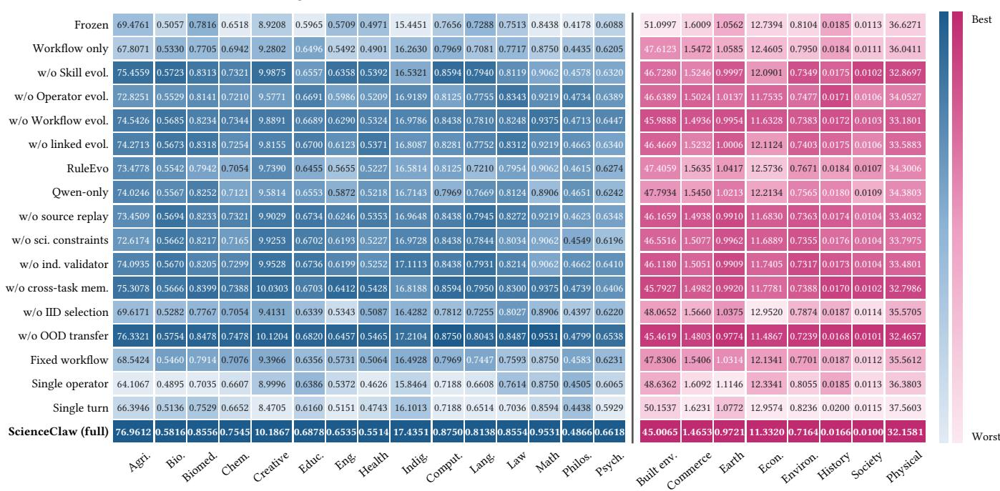  
Figure 7: IID scores of all eighteen variants in each discipline. Shading runs from the worst (light) to the best (dark) variant within a discipline, and the full system is in bold.

Table 24: Continual evolution of the OOD macro score (%) over seven rounds with candidate counts over the 161 submitted candidates. The best entry in each column is in bold and the second best is underlined.
<table><tr><td></td><td colspan="8">OOD macro score (%) after round</td><td colspan="4">Round-7 summary</td></tr><tr><td>Method</td><td>0</td><td>1</td><td>2</td><td>3</td><td>4</td><td>5</td><td>6</td><td>7</td><td>Gain (pp)</td><td>Prom.</td><td>Rej.</td><td>Rate (%)</td></tr><tr><td>Frozen</td><td>77.72</td><td>77.72</td><td>77.72</td><td>77.72</td><td>77.72</td><td>77.72</td><td>77.72</td><td>77.72</td><td>0.00</td><td>0</td><td>0</td><td>一</td></tr><tr><td>RuleEvo</td><td>77.72</td><td>78.40</td><td>79.21</td><td>78.87</td><td>79.62</td><td>80.37</td><td>80.03</td><td>81.32</td><td>3.60</td><td>37</td><td>124</td><td>22.98</td></tr><tr><td>Qwen-only</td><td>77.72</td><td>79.42</td><td>80.16</td><td>79.89</td><td>81.25</td><td>81.93</td><td>81.59</td><td>83.22</td><td>5.50</td><td>49</td><td>112</td><td>30.43</td></tr><tr><td>EvoScientist</td><td>77.72</td><td>79.69</td><td>81.18</td><td>82.34</td><td>82.07</td><td>84.04</td><td>85.19</td><td>86.35</td><td>8.63</td><td>56</td><td>105</td><td>34.78</td></tr><tr><td>EvoMaster</td><td>77.72</td><td>80.03</td><td>81.59</td><td>82.88</td><td>82.54</td><td>84.85</td><td>86.07</td><td>87.50</td><td>9.78</td><td>63</td><td>98</td><td>39.13</td></tr><tr><td>ScienceClaw</td><td>77.72</td><td>80.43</td><td>82.68</td><td>82.47</td><td>86.14</td><td>87.57</td><td>89.81</td><td>91.30</td><td>13.59</td><td>70</td><td>91</td><td>43.48</td></tr></table>

Table 25: Workflow mechanics of the linked system and of the ablated executions. Planner rounds and distinct operators are per task, and the other columns are rates.

<table><tr><td>System</td><td>Plan. rounds</td><td>Dist. oper.</td><td> $_ \mathrm { O p e r . }$ </td><td>Feedb. divers. repair (%) recov. (%) replay (%)</td><td> $\mathrm { C k p t . }$ </td><td>Clean</td></tr><tr><td>Linked Full</td><td>4.84</td><td>4.24</td><td>0.78</td><td>71</td><td>89</td><td>96</td></tr><tr><td>Unlinked</td><td>4.63</td><td>3.96</td><td>0.71</td><td>62</td><td>82</td><td>89</td></tr><tr><td>Fixed Workflow</td><td>3.12</td><td>2.89</td><td>0.50</td><td>45</td><td>73</td><td>87</td></tr><tr><td>Single Operator</td><td>4.07</td><td>1.07</td><td>0.20</td><td>38</td><td>67</td><td>84</td></tr><tr><td>Single Turn</td><td>1.09</td><td>2.13</td><td>0.36</td><td>0</td><td>31</td><td>78</td></tr></table>

Higher-is-better task metrics  
Lower-is-better task metrics  
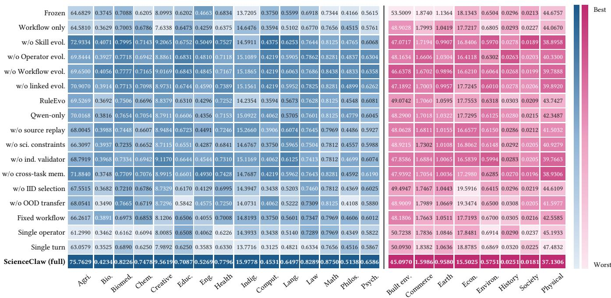  
Figure 8: OOD scores of all eighteen variants in each discipline, shaded as in Figure 7.

Table 26: Reliability and eficiency. Cost per OOD gain is normalized to ScienceClaw (= 1) and is undefined for the frozen agent. The best entry in each column is in bold and the second best is underlined.
<table><tr><td>Method</td><td>Target attain. ↑</td><td>Hard-constr. pass (%) ↑</td><td>Erroneous prom. (%) ↓</td><td>Cost per OOD gain ↓</td><td>Planner time (%) ↓</td></tr><tr><td>Frozen</td><td>88.57</td><td>91.51</td><td>一</td><td>-</td><td>21.89</td></tr><tr><td>Qwen-only</td><td>92.99</td><td>93.89</td><td>7.41</td><td>1.62</td><td>23.65</td></tr><tr><td>SkillOpt</td><td>92.67</td><td>93.14</td><td>6.52</td><td>2.50</td><td>20.56</td></tr><tr><td>TTE</td><td>93.63</td><td>92.53</td><td>7.25</td><td>1.83</td><td>19.38</td></tr><tr><td>AHE</td><td>94.26</td><td>94.09</td><td>5.60</td><td>1.92</td><td>27.23</td></tr><tr><td>EvoMaster</td><td>94.99</td><td>95.65</td><td>3.80</td><td>1.37</td><td>25.16</td></tr><tr><td>EvoScientist</td><td>94.43</td><td>95.18</td><td>4.58</td><td>1.87</td><td>28.74</td></tr><tr><td>ScienceClaw</td><td>96.42</td><td>98.23</td><td>1.23</td><td>1.00</td><td>18.40</td></tr></table>

Table 27: Transfer, forgetting, and reliability of the evolving methods. FWT and BWT are forward and backward transfer (pp), Neg. the share of negative transfer (%), Forg. the average and maximum forgetting (pp), Attain. the target-attainment score, and Err. the erroneous-promotion rate (%). The best entry in each column is in bold and the second best is underlined.
<table><tr><td>Method</td><td>FWT/BWT ↑</td><td>Neg. ↓</td><td>Forg. ↓ avg/max</td><td>Attain. ↑</td><td>Err. ↓</td></tr><tr><td>SkillOpt</td><td>1.42/0.26</td><td>31.39</td><td>0.88/2.45</td><td>92.67</td><td>6.52</td></tr><tr><td>TTE</td><td>1.75/0.41</td><td>26.97</td><td>0.76/2.17</td><td>93.63</td><td>7.25</td></tr><tr><td>EvoScientist</td><td>2.74/1.23</td><td>17.32</td><td>0.42/1.23</td><td>94.43</td><td>4.58</td></tr><tr><td>EvoMaster</td><td>3.19/1.53</td><td>14.33</td><td>0.33/1.05</td><td>94.99</td><td>3.80</td></tr><tr><td>ScienceClaw</td><td>4.20/3.66</td><td>11.89</td><td>0.13/0.51</td><td>96.42</td><td>1.23</td></tr></table>

Table 28: Per-discipline ablation results (1/3): update-scope variants. Each row gives the task-native score of one discipline on one split. The best score in each row is in bold and the second best is underlined, taken over all 18 variants.
<table><tr><td>Discipline (metric)</td><td>Split</td><td>Frozen</td><td>Workflow only</td><td>w/o Skill evol.</td><td>w/o Oper. evol.</td><td>w/o Work. evol.</td><td>ScienceClaw (full)</td></tr><tr><td>Higher is better (↑)</td><td></td><td></td><td></td><td></td><td></td><td></td><td></td></tr><tr><td>Agricultural sci. (PQ+)</td><td>IID</td><td>69.4761</td><td>67.8071</td><td>75.4559</td><td>72.8251</td><td>74.5426</td><td>76.9612</td></tr><tr><td></td><td>OOD</td><td>64.6829</td><td>64.5810</td><td>72.9334</td><td>69.8444</td><td>69.6500</td><td>75.7629</td></tr><tr><td>Biological sci. (Spearman)</td><td>IID</td><td>0.5057</td><td>0.5330</td><td>0.5723</td><td>0.5529</td><td>0.5685</td><td>0.5816</td></tr><tr><td></td><td>OOD</td><td>0.3745</td><td>0.3629</td><td>0.4071</td><td>0.3927</td><td>0.4056</td><td>0.4234</td></tr><tr><td>Biomedical sci. (DSC)</td><td>IID</td><td>0.7816</td><td>0.7705</td><td>0.8313</td><td>0.8141</td><td>0.8234</td><td>0.8556</td></tr><tr><td></td><td>OOD</td><td>0.7088</td><td>0.7003</td><td>0.7995</td><td>0.7718</td><td>0.7777</td><td>0.8226</td></tr><tr><td>Chemical sci. (ROC-AUC)</td><td>IID</td><td>0.6518</td><td>0.6942</td><td>0.7321</td><td>0.7210</td><td>0.7344</td><td>0.7545</td></tr><tr><td></td><td>OOD</td><td>0.6205</td><td>0.6786</td><td>0.7143</td><td>0.6942</td><td>0.7165</td><td>0.7478</td></tr><tr><td>Creative arts (SDR (dB))</td><td>IID</td><td>8.9208</td><td>9.2802</td><td>9.9875</td><td>9.5771</td><td>9.8891</td><td>10.1867</td></tr><tr><td></td><td>OOD</td><td>8.0993</td><td>7.6338</td><td>9.2065</td><td>8.8861</td><td>9.0169</td><td>9.5619</td></tr><tr><td>Education (10-mask acc.)</td><td>IID</td><td>0.5965</td><td>0.6496</td><td>0.6557</td><td>0.6691</td><td>0.6689</td><td>0.6878</td></tr><tr><td></td><td>OOD</td><td>0.6202</td><td>0.6473</td><td>0.6752</td><td>0.6831</td><td>0.6843</td><td>0.7087</td></tr><tr><td>Engineering (DCASE score)</td><td>IID</td><td>0.5709</td><td>0.5492</td><td>0.6358</td><td>0.5986</td><td>0.6290</td><td>0.6535</td></tr><tr><td></td><td>OOD</td><td>0.4663</td><td>0.4259</td><td>0.5049</td><td>0.4810</td><td>0.4845</td><td>0.5269</td></tr><tr><td>Health sci. (Clin. utility)</td><td>IID</td><td>0.4971</td><td>0.4901</td><td>0.5392</td><td>0.5209</td><td>0.5324</td><td>0.5514</td></tr><tr><td></td><td>OOD</td><td>0.6834</td><td>0.6375</td><td>0.7527</td><td>0.7118</td><td>0.7167</td><td>0.7796</td></tr><tr><td>Indigenous (chrF++)</td><td>IID</td><td>15.4451</td><td>16.2630</td><td>16.5321</td><td>16.9189</td><td>16.9786</td><td>17.4351</td></tr><tr><td></td><td>OOD</td><td>13.7205</td><td>14.6476</td><td>14.5911</td><td>15.1089</td><td>15.1865</td><td>15.9778</td></tr><tr><td>Computing sci. (pass@1)</td><td>IID</td><td>0.7656</td><td>0.7969</td><td>0.8594</td><td>0.8125</td><td>0.8438</td><td>0.8750</td></tr><tr><td></td><td>OOD</td><td>0.3750</td><td>0.3594</td><td>0.4375</td><td>0.4219</td><td>0.4219</td><td>0.4531</td></tr><tr><td>Language &amp; culture (LAS)</td><td>IID</td><td>0.7288</td><td>0.7081</td><td>0.7940</td><td>0.7755</td><td>0.7810</td><td>0.8138</td></tr><tr><td></td><td>OOD</td><td>0.5599</td><td>0.5102</td><td>0.6253</td><td>0.5905</td><td>0.6063</td><td>0.6497</td></tr><tr><td>Law (mAP)</td><td>IID</td><td>0.7513</td><td>0.7717</td><td>0.8119</td><td>0.8343</td><td>0.8248</td><td>0.8554</td></tr><tr><td></td><td>OOD</td><td>0.6918</td><td>0.6770</td><td>0.7644</td><td>0.7862</td><td>0.7686</td><td>0.8289</td></tr><tr><td>Mathematics (Oracle acc.)</td><td>IID</td><td>0.8438</td><td>0.8750</td><td>0.9062</td><td>0.9219</td><td>0.9375</td><td>0.9531</td></tr><tr><td></td><td>OOD</td><td>0.7344</td><td>0.7656</td><td>0.8125</td><td>0.8281</td><td>0.8438</td><td>0.8750</td></tr><tr><td>Philosophy (F1)</td><td>IID</td><td>0.4178</td><td>0.4435</td><td>0.4578</td><td>0.4734</td><td>0.4713</td><td>0.4866</td></tr><tr><td></td><td>OOD</td><td>0.4166</td><td>0.4515</td><td>0.4765</td><td>0.4837</td><td>0.4833</td><td>0.5138</td></tr><tr><td>Psychology (Micro acc.)</td><td>IID</td><td>0.6088</td><td>0.6205</td><td>0.6320</td><td>0.6389</td><td>0.6447</td><td>0.6618</td></tr><tr><td></td><td>OOD</td><td>0.5615</td><td>0.5761</td><td>0.6068</td><td>0.6304</td><td>0.6358</td><td>0.6586</td></tr><tr><td>Lower is better (↓)</td><td></td><td></td><td></td><td></td><td></td><td></td><td></td></tr><tr><td>Built env. (NRMSE %)</td><td>IID</td><td>51.0997</td><td>47.6123</td><td>46.7280</td><td>46.6389</td><td>45.9888</td><td>45.0065</td></tr><tr><td></td><td>OOD</td><td>53.5009</td><td>48.9028</td><td>47.0717</td><td>48.1634</td><td>46.6378</td><td>45.0970</td></tr><tr><td>Commerce (MASE)</td><td>IID</td><td>1.6009</td><td>1.5472</td><td>1.5246</td><td>1.5024</td><td>1.4936</td><td>1.4653</td></tr><tr><td></td><td>OOD</td><td>1.8740</td><td>1.7993</td><td>1.7194</td><td>1.6606</td><td>1.6702</td><td>1.5986</td></tr><tr><td>Earth sci. (RMSE (K))</td><td>IID</td><td>1.0562</td><td>1.0585</td><td>0.9997</td><td>1.0137</td><td>0.9954</td><td>0.9721</td></tr><tr><td></td><td>OOD</td><td>1.1364</td><td>1.0419</td><td>0.9907</td><td>1.0304</td><td>0.9896</td><td>0.9580</td></tr><tr><td>Economics (sMAPE (%))</td><td>IID</td><td>12.7394</td><td>12.4605</td><td>12.0901</td><td>11.7535</td><td>11.6328</td><td>11.3320</td></tr><tr><td></td><td>OOD</td><td>18.1343</td><td>17.7217</td><td>16.8406</td><td>16.4118</td><td>16.6210</td><td>15.5025</td></tr><tr><td>Environmental sci. (CRPS)</td><td>IID</td><td>0.8104</td><td>0.7950</td><td>0.7349</td><td>0.7477</td><td>0.7383</td><td>0.7164</td></tr><tr><td></td><td>OOD</td><td>0.6504</td><td>0.6805</td><td>0.5970</td><td>0.6302</td><td>0.6064</td><td>0.5751</td></tr><tr><td>History (cMER-micro)</td><td>IID</td><td>0.0185</td><td>0.0184</td><td>0.0175</td><td>0.0171</td><td>0.0172</td><td>0.0166</td></tr><tr><td></td><td>OOD</td><td>0.0296</td><td>0.0293</td><td>0.0278</td><td>0.0263</td><td>0.0268</td><td>0.0251</td></tr><tr><td>Human society (nRMSE)</td><td>IID</td><td>0.0113</td><td>0.0111</td><td>0.0102</td><td>0.0106</td><td>0.0103</td><td>0.0100</td></tr><tr><td></td><td>OOD</td><td>0.0213</td><td>0.0227</td><td>0.0189</td><td>0.0203</td><td>0.0199</td><td>0.0181</td></tr><tr><td>Physical sci. (MAE)</td><td>IID</td><td>36.6271</td><td>36.0411</td><td>32.8697</td><td>34.0527</td><td>33.1801</td><td>32.1581</td></tr><tr><td></td><td>OOD</td><td>44.6757</td><td>44.0670</td><td>38.8958</td><td>40.3300</td><td>39.7888</td><td>37.1306</td></tr></table>

Table 29: Per-discipline ablation results (2/3): linkage, candidate-source, and gate variants. Each row gives the task-native score of one discipline on one split. The best score in each row is in bold and the second best is underlined, taken over all 18 variants.
<table><tr><td>Discipline (metric)</td><td>Split</td><td>Frozen</td><td>w/o link. evol.</td><td>RuleEvo</td><td>Qwen-only</td><td>w/o src. replay</td><td>w/o sci. constr.</td><td>w/o ind. valid.</td><td>ScienceClaw (full)</td></tr><tr><td colspan="10">Higher is better (↑)</td></tr><tr><td rowspan="2">Agricultural sci. (PQ+)</td><td>IID</td><td>69.4761</td><td>74.2713</td><td>73.4778</td><td>74.0246</td><td>73.4509</td><td>72.6174</td><td>74.0935</td><td>76.9612</td></tr><tr><td>OOD</td><td>64.6829</td><td>70.9070</td><td>69.5269</td><td>70.0168</td><td>68.0045</td><td>66.3097</td><td>68.7919</td><td>75.7629</td></tr><tr><td rowspan="2">Biological sci. (Spearman)</td><td>IID</td><td>0.5057</td><td>0.5673</td><td>0.5542</td><td>0.5567</td><td>0.5694</td><td>0.5662</td><td>0.5670</td><td>0.5816</td></tr><tr><td>OOD</td><td>0.3745</td><td>0.3914</td><td>0.3692</td><td>0.3816</td><td>0.3988</td><td>0.3937</td><td>0.3968</td><td>0.4234</td></tr><tr><td rowspan="2">Biomedical sci. (DSC)</td><td>IID</td><td>0.7816</td><td>0.8318</td><td>0.7942</td><td>0.8252</td><td>0.8233</td><td>0.8217</td><td>0.8205</td><td>0.8556</td></tr><tr><td>OOD</td><td>0.7088</td><td>0.7713</td><td>0.7506</td><td>0.7654</td><td>0.7448</td><td>0.7235</td><td>0.7334</td><td>0.8226</td></tr><tr><td rowspan="2">Chemical sci. (ROC-AUC)</td><td>IID</td><td>0.6518</td><td>0.7254</td><td>0.7054</td><td>0.7121</td><td>0.7321</td><td>0.7165</td><td>0.7299</td><td>0.7545</td></tr><tr><td>OOD</td><td>0.6205</td><td>0.7098</td><td>0.6696</td><td>0.7054</td><td>0.6607</td><td>0.6652</td><td>0.6942</td><td>0.7478</td></tr><tr><td rowspan="2">Creative arts (SDR (dB))</td><td>IID</td><td>8.9208</td><td>9.8155</td><td>9.7390</td><td>9.5814</td><td>9.9029</td><td>9.9253</td><td>9.9528</td><td>10.1867</td></tr><tr><td>OOD</td><td>8.0993</td><td>8.9731</td><td>8.8379</td><td>8.7911</td><td>8.9484</td><td>8.7115</td><td>9.1170</td><td>9.5619</td></tr><tr><td rowspan="2">Education (10-mask acc.)</td><td>IID</td><td>0.5965</td><td>0.6700</td><td>0.6455</td><td>0.6553</td><td>0.6734</td><td>0.6702</td><td>0.6736</td><td>0.6878</td></tr><tr><td>OOD</td><td>0.6202</td><td>0.6744</td><td>0.6310</td><td>0.6606</td><td>0.6723</td><td>0.6551</td><td>0.6644</td><td>0.7087</td></tr><tr><td rowspan="2">Engineering (DCASE score)</td><td>IID</td><td>0.5709</td><td>0.6123</td><td>0.5655</td><td>0.5872</td><td>0.6246</td><td>0.6193</td><td>0.6199</td><td>0.6535</td></tr><tr><td>OOD</td><td>0.4663</td><td>0.4590</td><td>0.4296</td><td>0.4356</td><td>0.4491</td><td>0.4287</td><td>0.4544</td><td>0.5269</td></tr><tr><td rowspan="2">Health sci. (Clin. utility)</td><td>IID</td><td>0.4971</td><td>0.5371</td><td>0.5227</td><td>0.5218</td><td>0.5353</td><td>0.5227</td><td>0.5252</td><td>0.5514</td></tr><tr><td>OOD</td><td>0.6834</td><td>0.7389</td><td>0.7252</td><td>0.7153</td><td>0.7246</td><td>0.6841</td><td>0.7310</td><td>0.7796</td></tr><tr><td rowspan="2">Indigenous (chrF++)</td><td>IID</td><td>15.4451</td><td>16.8087</td><td>16.5814</td><td>16.7143</td><td>16.9648</td><td>16.9728</td><td>17.1113</td><td>17.4351</td></tr><tr><td>OOD</td><td>13.7205</td><td>15.1561</td><td>14.2354</td><td>15.0922</td><td>15.2660</td><td>14.6767</td><td>15.1169</td><td>15.9778</td></tr><tr><td rowspan="2">Computing sci. (pass@1)</td><td>IID</td><td>0.7656</td><td>0.8281</td><td>0.8125</td><td>0.7969</td><td>0.8438</td><td>0.8438</td><td>0.8438</td><td>0.8750</td></tr><tr><td>OOD</td><td>0.3750</td><td>0.4219</td><td>0.3594</td><td>0.4062</td><td>0.3906</td><td>0.3750</td><td>0.4062</td><td>0.4531</td></tr><tr><td rowspan="2">Language &amp; culture (LAS)</td><td>IID</td><td>0.7288</td><td>0.7752</td><td>0.7210</td><td>0.7669</td><td>0.7945</td><td>0.7844</td><td>0.7931</td><td>0.8138</td></tr><tr><td>OOD</td><td>0.5599</td><td>0.5952</td><td>0.5673</td><td>0.5705</td><td>0.6074</td><td>0.5965</td><td>0.6125</td><td>0.6497</td></tr><tr><td rowspan="2">Law (mAP)</td><td>IID</td><td>0.7513</td><td>0.8312</td><td>0.7954</td><td>0.8124</td><td>0.8272</td><td>0.8034</td><td>0.8214</td><td>0.8554</td></tr><tr><td>OOD</td><td>0.6918</td><td>0.7825</td><td>0.7628</td><td>0.7601</td><td>0.7645</td><td>0.7504</td><td>0.7413</td><td>0.8289</td></tr><tr><td rowspan="2">Mathematics (Oracle acc.)</td><td>IID</td><td>0.8438</td><td>0.9219</td><td>0.9062</td><td>0.8906</td><td>0.9219</td><td>0.9062</td><td>0.9062</td><td>0.9531</td></tr><tr><td>OOD</td><td>0.7344</td><td>0.8281</td><td>0.8125</td><td>0.8125</td><td>0.7969</td><td>0.7812</td><td>0.7812</td><td>0.8750</td></tr><tr><td rowspan="2">Philosophy (F1)</td><td>IID</td><td>0.4178</td><td>0.4663</td><td>0.4615</td><td>0.4651</td><td>0.4623</td><td>0.4549</td><td>0.4662</td><td>0.4866</td></tr><tr><td>OOD</td><td>0.4166</td><td>0.4899</td><td>0.4548</td><td>0.4779</td><td>0.4486</td><td>0.4557</td><td>0.4699</td><td>0.5138</td></tr><tr><td rowspan="2">Psychology (Micro acc.)</td><td>IID</td><td>0.6088</td><td>0.6340</td><td>0.6274</td><td>0.6242</td><td>0.6348</td><td>0.6196</td><td>0.6410</td><td>0.6618</td></tr><tr><td>OOD</td><td>0.5615</td><td>0.6262</td><td>0.6081</td><td>0.6045</td><td>0.5927</td><td>0.5988</td><td>0.6074</td><td>0.6586</td></tr><tr><td colspan="2">Lower is better (↓)</td><td></td><td></td><td></td><td></td><td></td><td></td><td></td><td></td></tr><tr><td rowspan="2">Built env. (NRMSE %)</td><td>IID</td><td>51.0997</td><td>46.4669</td><td>47.4059</td><td>47.7934</td><td>46.1659</td><td>46.5516</td><td>46.1180</td><td>45.0065</td></tr><tr><td>OOD</td><td>53.5009</td><td>47.1892</td><td>49.0742</td><td>48.2900</td><td>48.0628</td><td>48.9215</td><td>47.8586</td><td>45.0970</td></tr><tr><td rowspan="2">Commerce (MASE)</td><td>IID</td><td>1.6009</td><td>1.5232</td><td>1.5635</td><td>1.5450</td><td>1.4938</td><td>1.5077</td><td>1.5051</td><td>1.4653</td></tr><tr><td>OOD</td><td>1.8740</td><td>1.7003</td><td>1.7060</td><td>1.7018</td><td>1.6811</td><td>1.7302</td><td>1.6884</td><td>1.5986</td></tr><tr><td rowspan="2">Earth sci. (RMSE (K))</td><td>IID</td><td>1.0562</td><td>1.0006</td><td>1.0417</td><td>1.0213</td><td>0.9910</td><td>0.9962</td><td>0.9909</td><td>0.9721 0.9580</td></tr><tr><td>OOD IID</td><td>1.1364 12.7394</td><td>0.9957 12.1124</td><td>1.0595</td><td>1.0322</td><td>1.0155</td><td>1.0108</td><td>1.0065</td></table>

Table 30: Per-discipline ablation results (3/3): memory, selection, transfer, and execution variants. Each row gives the tasknative score of one discipline on one split. The best score in each row is in bold and the second best is underlined, taken over all 18 variants.
<table><tr><td>Discipline (metric)</td><td>Split</td><td>Frozen</td><td>w/o cross- task mem.</td><td>w/o IID select.</td><td>w/o OOD transfer</td><td>Fixed workflow</td><td>Single operator</td><td>Single turn</td><td>ScienceClaw (full)</td></tr><tr><td colspan="10">Higher is better (↑)</td></tr><tr><td rowspan="2">Agricultural sci. (PQ+)</td><td>IID</td><td>69.4761</td><td>75.3078</td><td>69.6171</td><td>76.3321</td><td>68.5424</td><td>64.1067</td><td>66.3946</td><td>76.9612</td></tr><tr><td>OOD</td><td>64.6829</td><td>71.8840</td><td>67.5515</td><td>68.0541</td><td>66.2617</td><td>61.2990</td><td>63.0579</td><td>75.7629</td></tr><tr><td rowspan="2">Biological sci. (Spearman)</td><td>IID</td><td>0.5057</td><td>0.5666</td><td>0.5282</td><td>0.5754</td><td>0.5460</td><td>0.4895</td><td>0.5136</td><td>0.5816</td></tr><tr><td>OOD</td><td>0.3745</td><td>0.3748</td><td>0.3682</td><td>0.3490</td><td>0.3891</td><td>0.3462</td><td>0.3525</td><td>0.4234</td></tr><tr><td rowspan="2">Biomedical sci. (DSC)</td><td>IID</td><td>0.7816</td><td>0.8399</td><td>0.7767</td><td>0.8478</td><td>0.7914</td><td>0.7035</td><td>0.7529</td><td>0.8556</td></tr><tr><td>OOD</td><td>0.7088</td><td>0.7709</td><td>0.7210</td><td>0.7665</td><td>0.6973</td><td>0.6162</td><td>0.6890</td><td>0.8226</td></tr><tr><td rowspan="2">Chemical sci. (ROC-AUC)</td><td>IID</td><td>0.6518</td><td>0.7388</td><td>0.7054</td><td>0.7478</td><td>0.7076</td><td>0.6607</td><td>0.6652</td><td>0.7545</td></tr><tr><td>OOD</td><td>0.6205</td><td>0.7076</td><td>0.6786</td><td>0.6719</td><td>0.6853</td><td>0.6094</td><td>0.6250</td><td>0.7478</td></tr><tr><td rowspan="2">Creative arts (SDR (dB))</td><td>IID</td><td>8.9208</td><td>10.0303</td><td>9.4131</td><td>10.1204</td><td>9.3966</td><td>8.9996</td><td>8.4705</td><td>10.1867</td></tr><tr><td>OOD</td><td>8.0993</td><td>8.9915</td><td>8.7329</td><td>8.7296</td><td>8.1206</td><td>8.0085</td><td>7.9892</td><td>9.5619</td></tr><tr><td rowspan="2">Education (10-mask acc.)</td><td>IID</td><td>0.5965</td><td>0.6703</td><td>0.6339</td><td>0.6820</td><td>0.6356</td><td>0.6386</td><td>0.6160</td><td>0.6878</td></tr><tr><td>OOD</td><td>0.6202</td><td>0.6601</td><td>0.6170</td><td>0.5842</td><td>0.6506</td><td>0.6508</td><td>0.6250</td><td>0.7087</td></tr><tr><td rowspan="2">Engineering (DCASE score)</td><td>IID</td><td>0.5709</td><td>0.6412</td><td>0.5343</td><td>0.6457</td><td>0.5731</td><td>0.5372</td><td>0.5151</td><td>0.6535</td></tr><tr><td>OOD</td><td>0.4663</td><td>0.4930</td><td>0.4129</td><td>0.4575</td><td>0.4055</td><td>0.4062</td><td>0.3583</td><td>0.5269</td></tr><tr><td rowspan="2">Health sci. (Clin. utility)</td><td>IID</td><td>0.4971</td><td>0.5428</td><td>0.5087</td><td>0.5465</td><td>0.5064</td><td>0.4626</td><td>0.4743</td><td>0.5514</td></tr><tr><td>OOD</td><td>0.6834</td><td>0.7428</td><td>0.6995</td><td>0.7250</td><td>0.7008</td><td>0.6226</td><td>0.6330</td><td>0.7796</td></tr><tr><td rowspan="2">Indigenous (chrF++)</td><td>IID</td><td>15.4451</td><td>16.8188</td><td>16.4282</td><td>17.2104</td><td>16.4928</td><td>15.8464</td><td>16.1013</td><td>17.4351</td></tr><tr><td>OOD</td><td>13.7205</td><td>14.7687</td><td>14.3947</td><td>14.0731</td><td>14.8193</td><td>14.3933</td><td>13.7716</td><td>15.9778</td></tr><tr><td rowspan="2">Computing sci. (pass@1)</td><td>IID</td><td>0.7656</td><td>0.8594</td><td>0.7812</td><td>0.8750</td><td>0.7969</td><td>0.7188</td><td>0.7188</td><td>0.8750</td></tr><tr><td>OOD</td><td>0.3750</td><td>0.4219</td><td>0.3438</td><td>0.4062</td><td>0.3750</td><td>0.3438</td><td>0.3125</td><td>0.4531</td></tr><tr><td rowspan="2">Language &amp; culture (LAS)</td><td>IID</td><td>0.7288</td><td>0.7950</td><td>0.7255</td><td>0.8043</td><td>0.7447</td><td>0.6608</td><td>0.6514</td><td>0.8138</td></tr><tr><td>OOD</td><td>0.5599</td><td>0.5962</td><td>0.5203</td><td>0.5222</td><td>0.5601</td><td>0.5140</td><td>0.4821</td><td>0.6497</td></tr><tr><td rowspan="2">Law (mAP)</td><td>IID</td><td>0.7513</td><td>0.8300</td><td>0.8027</td><td>0.8487</td><td>0.7593</td><td>0.7614</td><td>0.7036</td><td>0.8554</td></tr><tr><td>OOD</td><td>0.6918</td><td>0.7643</td><td>0.7460</td><td>0.7309</td><td>0.7347</td><td>0.7289</td><td>0.6334</td><td>0.8289</td></tr><tr><td rowspan="2">Mathematics (Oracle acc.)</td><td>IID</td><td>0.8438</td><td>0.9375</td><td>0.8906</td><td>0.9531</td><td>0.8750</td><td>0.8750</td><td>0.8594</td><td>0.9531</td></tr><tr><td>OOD</td><td>0.7344</td><td>0.8281</td><td>0.7812</td><td>0.8125</td><td>0.7969</td><td>0.7969</td><td>0.7656</td><td>0.8750</td></tr><tr><td rowspan="2">Philosophy (F1)</td><td>IID</td><td>0.4178</td><td>0.4739</td><td>0.4397</td><td>0.4799</td><td>0.4583</td><td>0.4505</td><td>0.4438</td><td>0.4866</td></tr><tr><td>OOD</td><td>0.4166</td><td>0.4592</td><td>0.4369</td><td>0.4108</td><td>0.4606</td><td>0.4349</td><td>0.4516</td><td>0.5138</td></tr><tr><td rowspan="2">Psychology (Micro acc.)</td><td>IID</td><td>0.6088</td><td>0.6406</td><td>0.6220</td><td>0.6538</td><td>0.6231</td><td>0.6065</td><td>0.5929</td><td>0.6618</td></tr><tr><td>OOD</td><td>0.5615</td><td>0.6190</td><td>0.6025</td><td>0.5880</td><td>0.6012</td><td>0.5822</td><td>0.5867</td><td>0.6586</td></tr><tr><td colspan="2">Lower is better (↓)</td><td></td><td></td><td></td><td></td><td></td><td></td><td></td><td></td></tr><tr><td rowspan="2">Built env. (NRMSE %)</td><td>IID</td><td>51.0997</td><td>45.7927</td><td>48.0652</td><td>45.4619</td><td>47.8306</td><td>48.6362</td><td>50.1537</td><td>45.0065</td></tr><tr><td>OOD</td><td>53.5009</td><td>47.9392</td><td>49.4947</td><td>48.9009</td><td>48.1806</td><td>50.7238</td><td>50.0930</td><td>45.0970</td></tr><tr><td rowspan="2">Commerce (MASE)</td><td>IID</td><td>1.6009</td><td>1.4982</td><td>1.5660</td><td>1.4803</td><td>1.5406</td><td>1.6092</td><td>1.6231</td><td>1.4653</td></tr><tr><td>OOD</td><td>1.8740</td><td>1.7054</td><td>1.7467</td><td>1.7989</td><td>1.7663</td><td>1.7836</td><td>1.8382</td><td>1.5986</td></tr><tr><td rowspan="2">Earth sci. (RMSE (K))</td><td>IID</td><td>1.0562</td><td>0.9920</td><td>1.0375</td><td>0.9774</td><td>1.0314</td><td>1.1146</td><td>1.0772</td><td>0.9721 0.9580</td></tr><tr><td>OOD IID</td><td>1.1364 12.7394</td><td>1.0036 11.7781</td><td>1.0443 12.9520</td><td>1.0669</td><td>1.0511 12.1341</td><td>1.0846 12.3341</td><td>1.0636</td></table>