# Self-Referenced Social Preferences: Cooperation without Observing Others'Rewards

Mohamed A. Mohamed

Amazon Vancouver, Canada mmayman@amazon.com

Harshil Kotamreddy Nvidia Santa Clara, United States hkotamreddy@nvidia.com

Marcos Jose Itaú Unibanco São Paulo, Brazil marcos.jose@itau-unibanco.com.br

## Abstract

Social preferences can promote cooperation in multi-agent reinforcement learning, but existing approaches often require agents to observe the rewards of their peers. In many real-world interactions, however, an agent can, as humans do, observe others' behavior and outcomes without access to their private reward signals. We introduce self-referenced social preferences, in which each agent learns a model of its own reward, applies it to other agents' observed transitions to assess their outcomes from its own perspective, and feeds these self-referenced assessments into standard social preferences. We study two ways to incorporate these assessments: modifying the learning reward, or using them to weight policy updates. We evaluate the approach on three sequential social dilemmas, Escape Room, Clean Up, and Commons Harvest, which require volunteering, public-good contribution, and resource restraint, respectively. Across all three environments, agents learn cooperative behavior without observing others' rewards, including in settings where independent learners fail to cooperate, and frequently achieve more equitable divisions of jointly produced returns than agents with access to true rewards. The effective integration point depends on the social preference: inequity aversion works best in the reward together with a value look-ahead, whereas a purely benevolent preference benefits from policy-update weighting. Under partial observability, the policy-update approach continues to support cooperation. These results show that explicit access to other agents' reward signals is not necessary for learning cooperative behavior: social preferences can instead be grounded in self-referenced assessments of others’ outcomes derived from their observed behavior.

## Keywords

Reinforcement Learning, Sequential Social Dilemmas, Cooperation

## ACM Reference Format:

Mohamed A. Mohamed, Harshil Kotamreddy, and Marcos Jose. 2027. Self-Referenced Social Preferences: Cooperation without Observing Others' Rewards. In Proc. of the 26th International Conference on Autonomous Agents and Multiagent Systems (AAMAS 2027), Hanoi, Vietnam, 3-7 May 2027, IFAA-MAS, 33 pages.

## 1 Introduction

Cooperation in multi-agent reinforcement learning (MARL) often requires that agents learn about one another. The difficulty is particularly pronounced in sequential social dilemmas [42], where individual incentives can conflict with collective welfare. In Escape Room, some agents must pull a costly lever so that others can leave; in Clean Up, agents must clean a river without direct reward so that apples continue to grow; and in Commons Harvest, agents must leave apples uneaten so that the resource can regenerate. Independent deep reinforcement learners fail to cooperate in these games [33, 53, 77]. A common remedy is to give each agent a social preference, a term in its objective that depends on how the other agents are doing. Inequity-averse agents are penalized for earning more or less than their peers [33], agents with a social value orientation weight the others' outcomes alongside their own [48], and prosocial agents add the others' rewards to theirs [54]. However, while each of these increase cooperation, they do so by reading the rewards of the other agents.

This is somewhat unsatisfying. A reward is an agent's private signal of how good an experience was, and giving one agent another's reward provides information that it could not obtain by interacting with the world. People do not see how rewarding an experience is for someone else. Autonomous vehicles from different manufacturers have no reason to report their objectives to one another. A prosocial agent that relies on the others' rewards therefore depends on a signal that exists in simulation but rarely outside it, and its success in simulation does not tell us whether cooperation can be learned without that signal. We relax this requirement by allowing agents to receive only the observations and actions of the other agents. Centralized-training methods already provide access to other agents' observations and actions during training [23, 46]; we retain this assumption while withholding their rewards, critics, and parameters.

Humans and other animals face the same problem. They observe what others do, but not how rewarding it is for them, and they use empathy to infer another's situation by interpreting observable cues through their own experience [15, 55]. Psychology separates empathy into two components: cognitive and motivational empathy. Cognitive empathy involves estimating how another is doing, while motivational empathy is the inner drive to care about their welfare and take action to help them [13, 15]. Social preferences, which come from the study of human behaviour [6, 11, 20, 21, 32] model motivational empathy. Existing multi-agent methods that use social preferences do not model cognitive empathy because they directly provide the agent a numeric value that tells them how another agent is doing. One way humans perform cognitive empathy is through simulation, imagining themselves in the other's situation [25, 26]. We therefore ask: can agents in MARL learn cooperative behavior when they cannot directly use other agents' rewards within their social preferences, but can instead assess other agents through their observed behavior and outcomes and the agent's own experience?

To answer this question, we study MARL in settings where each agent has access only to its own reward, but where the reward for a given observation and action is the same for every agent. An agent can then learn a model of its own reward from its own transitions and apply it to the transitions of another agent. This allows the agent to use its own reward model to inform its social preferences. When reward functions are shared, it can recover the other agents reward; when they differ, it instead evaluates the other agents' situation using the its own reward model. We call this self-reference. The predicted rewards are given to an unchanged social preference and each policy still acts only on its own observation. We explore two ways to use this prediction: Self-Referenced Reward (SRR), adds the predicted reward to the agent's reward, and Self-Referenced Advantage (SRA), adds the predicted reward to the coefficient of the policy update.

In all three games, the best self-referenced learner exceeds plain PPO in both collective return and Nash welfare. In Escape Room and Clean Up it matches the agents that observe the true rewards. With inequity aversion in Clean Up, the self-referenced agents even produce more than the agents that observe the true rewards, and leave the worst-off agent more than twice as much. Commons Harvest is the exception: the agents that use true rewards give the highest collective return. It is the game where our estimates are weakest, because the reward model reads the policy's image features and is dominated by the large beam penalty, and the extra production goes almost entirely to one agent, so the true rewards raise production but not welfare.

A high collective return does not mean that every agent is well off. Someone has to pull the lever or clean the river, and they are not designated beforehand. We find that the most productive configurations often leave one agent with almost nothing, so we also report the lowest agent return and select configurations based on both Nash welfare and collective return. Because the same agents meet in every episode, we also give each agent a standing ledger of everyone's predicted returns across episodes, which discounts the gains of an agent that has been ahead. With this change, the costly role in Escape Room is shared across agents instead of always falling on the same ones.

Our contributions are (i) a MARL setting in which agents observe peers' transitions but not their reward signals; (ii) SRR, SRA, and a standing ledger, which use each agent's own rewards to infer peer outcomes; and (iii) an empirical study showing when selfreferenced assessments recover the benefits of true peer rewards, when they do not, and how they affect productivity and fairness across different social preferences, sequential social dilemmas, partial observability, repeated interaction, and heterogeneous private valuations.

## 2 Background

In this section, we introduce the setting, the learning algorithm our agents use, and the social preferences we build on. We use

subscripts for agents and superscripts for time: $r _ { i } ^ { t }$ is the reward of agent i at time t, $[ z ] _ { + } = \operatorname* { m a x } ( z , 0 )$ , and $\begin{array} { r } { \bar { z } _ { - i } = \frac { 1 } { N - 1 } \sum _ { j \neq i } z _ { j } } \end{array}$ is the average of a quantity over the agents other than i.

## 2.1 Markov Games and Sequential Social Dilemmas

We consider N agents in a general-sum, partially observable Markov game [29, 45, 65]. At each time step t, each agent i receives an observation $o _ { i } ^ { t } ,$ a function of the state of the environment, chooses an action $a _ { i } ^ { t }$ according to its policy $\pi _ { i } ( a _ { i } \mid o _ { i } )$ , and receives a reward $r _ { i } ^ { t } ;$ the next state depends on the actions of all agents. Each agent maximizes its own expected discounted return, $\mathbb { E } \big [ \sum _ { t } \gamma ^ { t } r _ { i } ^ { t } \big ]$ with $\gamma \in \left[ 0 , 1 \right)$ , and there is no team reward. In our main experiments every agent observes the full state, arranged around itself; Section 5.2.4 restricts this view, which makes the games partially observable.

A sequential social dilemma is a Markov game in which the policies that are individually best for each agent lead to lower returns for all than a cooperative joint policy that a single defector could exploit [42]. In Escape Room, a public good is produced only if enough agents pay a private cost at the same time; in Clean Up and Commons Harvest agents share a renewable resource that individual consumption degrades, a common-pool resource problem [53].

## 2.2 Actor-Critic Learning and PPO

Each agent i improves its policy π(a | o; θi) by the policy gradient [69, 74], which weights ∇log $\pi _ { i } ( a _ { i } ^ { t } \mid o _ { i } ^ { t } )$ by how much better things went after action $a _ { i } ^ { t }$ than expected. Actor-critic methods implement this coefficient using a target function $\Psi _ { i } ^ { t }$ that depends on the action aγ:

$$
\left[ \nabla _ { \theta } J ( \theta ) = \mathbb { E } _ { \pi _ { \theta } } \left[ \left. \sum _ { 0 \le t \le T } \nabla _ { \theta } \ln \pi _ { \theta } ( a _ { i } ^ { t } \mid s _ { i } ^ { t } ) \cdot \boldsymbol { \Psi } _ { i } ^ { t } \right| s _ { 0 } = s _ { 0 } \right] \right]\tag{1}
$$

In PPO, $\Psi _ { i } ^ { t }$ is the advantage $A _ { i } ^ { t } ,$ which is estimated using GAE [61]. Any term in the target function $\Psi _ { i } ^ { t }$ that does not depend on the action can be subtracted from the return without changing the gradient in expectation; it acts as a baseline [68]. Supplementary $\mathrm { A p \mathrm { - } }$ pendix A.1 gives the policy-gradient, baseline, and GAE equations. Our agents use proximal policy optimization (PPO) [62], and each agent runs it independently [14].

## 2.3 Social Preferences

A social preference makes an agent's objective depend on how the other agents are doing, an idea from behavioural economics [21] and social psychology [49]. Given to reinforcement learners as an intrinsic reward, such preferences change what independent learners converge to in sequential social dilemmas [33, 48]; Section 6 reviews this work.

In a sequential game a single reward says little about who is ahead, so Hughes et al. [33] measure how well agent j is doing by a discounted running sum of its rewards,

$$
e _ { j } ^ { t } = \gamma \lambda _ { r } e _ { j } ^ { t - 1 } + r _ { j } ^ { t } ,\tag{2}
$$

restarted at the start of every episode, and let each agent maximize the return of a social utility, its own reward plus a social term:

$$
u _ { i } ^ { t } = r _ { i } ^ { t } + F _ { i } \big ( e _ { 1 } ^ { t } , \dots , e _ { N } ^ { t } \big ) .\tag{3}
$$

With $x _ { j } = e _ { j } ^ { t } ,$ we use three social terms:

$$
\begin{array} { l } { { \displaystyle F _ { i } ^ { \mathrm { E I } } ( \boldsymbol { x } ) = \alpha _ { i } \bar { x } _ { - i } , \qquad F _ { i } ^ { \mathrm { S V O } } ( \boldsymbol { x } ) = \alpha _ { i } \big ( \cos \phi _ { i } x _ { i } + \sin \phi _ { i } \bar { x } _ { - i } \big ) , } } \\ { { \displaystyle F _ { i } ^ { \mathrm { I A } } ( \boldsymbol { x } ) = - \frac { \alpha _ { i } } { N - 1 } \sum _ { j \neq i } [ x _ { j } - x _ { i } ] _ { + } - \frac { \beta _ { i } } { N - 1 } \sum _ { j \neq i } [ x _ { i } - x _ { j } ] _ { + } . } } \end{array}\tag{4}
$$

The three terms encode different reasons to care about others. EI (empathetic influence) is pure benevolence: the agent gains when the others' average outcome rises, as with the prosocial reward of Peysakhovich and Lerer [54]. SVO fixes a ratio between one's own outcome and the others' through an angle φi [48, 49]: φi = 0 is purely self-regarding and $\phi _ { i } = \pi / 4$ weights both equally. IA is the inequity aversion of Fehr and Schmidt [21] and cares about differences rather than levels: it penalizes being behind the others, with weight $\alpha _ { i } ,$ and being ahead of them, with weight $\beta _ { i } .$ With $\mathrm { I A } .$ $\operatorname { E q . }$ (3) is the learner of Hughes et al. The two IA weights act differently in the dilemmas we study: aversion to being ahead makes an agent share the work that benefits everyone, as cleaning does in Clean $\mathrm { U p } ,$ whereas aversion to being behind gives it a reason to punish agents that take more, as by firing a beam in Commons Harvest [33]. Whatever the reason is, each of these terms needs ej for every other agent $^ { j , }$ and so the other agents' rewards.

A social term can be implemented within PPO (and other actorcritic methods) in two places: in the reward $r _ { i } ,$ which changes both the advantage and what the critic learns, or in the coefficient $A _ { i } ^ { t }$ that weights each action, which changes the direction of the update and leaves the reward and the critic unchanged. The baseline property limits what a term can do in the coefficient: a term added to the coefficient changes the expected update only if it depends on the action, otherwise it acts as a baseline. Our two methods modify the update in these two places respectively. Neither is specific to PPO: every reinforcement learning algorithm learns from a reward, and every actor-critic weights its policy gradient by an advantage. We use PPO as a representative actor-critic learner because it is widely used in recent work on sequential social dilemmas [14, 43].

## 3 Problem Formulation

The social utility of Eq. (3) requires every agent to know the rewards of all the other agents. Here we define the setting in which an agent knows only its own reward, and show how empathy can be modeled in such a setting.

Withholding reward signals. We consider the Markov game of Section 2.1 with N independent learners. During training, every agent i receives the transitions of all agents, with their episode boundaries, but only its own reward:

$$
{ \mathcal { D } } _ { i } = \big \{ ( o _ { j } ^ { t } , a _ { j } ^ { t } , o _ { j } ^ { t + 1 } ) : j = 1 , \ldots , N , t \geq 0 \big \} \cup \big \{ r _ { i } ^ { t } : t \geq 0 \big \} .\tag{5}
$$

Methods with centralized training and decentralized execution [23, 46] and methods that model other agents [34, 56, 57] already give agents the others' observations and actions; the difference here is that the others' rewards are withheld. The agents share no parameters, critics, or reward models and exchange no messages, and at execution each policy $\pi _ { i } ( a _ { i } \mid o _ { i } )$ acts on its own observation.

Modeling empathy. From $\mathcal { D } _ { i } ,$ agent i can compute its own trace $e _ { i }$ but not the traces $e _ { j }$ of the others, and so it cannot compute $F _ { i } .$ It therefore faces two problems. It must estimate, from $\mathcal { D } _ { i }$ alone, a quantity $x _ { i j }$ that can stand in for $e _ { j } ,$ which is the cognitive part of empathy, and it must decide how to use that estimate when it learns, which is the motivational part. An agent that is given the rewards $r _ { j }$ computes $e _ { j }$ exactly, and we use it as the true-reward reference.

Estimating the rewards of other agents. Self-reference is most direct when every agent's reward comes from the same reward function $R ,$

$$
r _ { j } ^ { t } = R ( o _ { j } ^ { t } , a _ { j } ^ { t } , o _ { j } ^ { t + 1 } ) \qquad \mathrm { f o r ~ a l l } ~ j ,\tag{6}
$$

where each observation is arranged relative to its own agent, so that R applies from every agent's position. Under this condition, a model of one's own reward can approximate the other's actual reward. The condition holds in our main experiments: a reward comes from an event in the agent's own transition, such as eating an apple, pulling the lever, reaching the open door, or firing or being hit by a beam, and every agent is rewarded for these events in the same way. Agent i can then learn R from its own transitions and apply it to $j ^ { \prime } s ,$ provided that $j ^ { \prime } s$ transition shows the rewarded event and resembles transitions that i has experienced. Two caveats remain. (1) When a transition does not fully determine the reward, a model fitted by regression estimates its mean, and a nonlinear social term computed from the mean, such as inequity aversion with its $[ \cdot ] _ { + } ,$ need not equal the same term computed from the actual rewards. (2) When the reward functions differ, the estimate is no longer $j ^ { \prime } s$ reward but the reward that i would receive in j's place; Section 5.2.5 tests this case.

## 4 Self-Referenced Social Preferences

Agent i cannot observe $r _ { j } ,$ but it observes j's transitions and knows its own rewards. It therefore learns a model of its own reward and applies it to $j ^ { \circ } s$ transitions, asking what it would have earned in $j ^ { \prime } s$ place. The key idea is not to reconstruct another agent's private reward exactly, but to evaluate its observed situation using the focal agent's own learned reward model. Figure 1 shows the resulting flow of information inside one agent. These estimates are used in a social term that modifies the update rule in the two ways described in Section 2.3: modifying the reward, which we call Self-Referenced Reward, and modifying the coefficient of the policy update, which we call Self-Referenced Advantage. Supplementary Appendix A.2 gives one training iteration in Algorithm S1.

## 4.1 Self-Referenced Reward Estimates

Agent i fits $f _ { i } ( o , a , o ^ { \prime } )$ by regression on its own transitions and applies the same model to every observed transition,

$$
\begin{array} { r } { \mathcal { L } _ { f _ { i } } = \frac { 1 } { 2 } \mathbb { E } _ { \mathcal { B } _ { i } } \big [ \big ( f _ { i } ( o _ { i } ^ { t } , a _ { i } ^ { t } , o _ { i } ^ { t + 1 } ) - r _ { i } ^ { t } \big ) ^ { 2 } \big ] , \quad \hat { r } _ { i j } ^ { t } = f _ { i } ( o _ { j } ^ { t } , a _ { j } ^ { t } , o _ { j } ^ { t + 1 } ) , } \end{array}\tag{7}
$$

where $\mathcal { B } _ { i }$ is a minibatch of i's own transitions, and with $\hat { r } _ { i i } ^ { t } : = r _ { i } ^ { t }$ In practice, f is learned using a shared representation with the policy.

We call $\hat { r } _ { i j }$ a self-referenced reward estimate. If the agents share a reward function, it estimates j's reward; otherwise, it estimates the reward that i would assign to $j ^ { \prime } s$ transition. Rare rewards create a coverage problem: an agent that only cleans may stop seeing apple rewards. We therefore add a second term to the loss of Eq. (7) over a minibatch drawn from a replay of the agent's own nonzero-reward transitions. The social term is off for the first $W$ environment steps, while the model is fit. The estimates are treated as constants, so no gradient flows from the social term into the reward model.

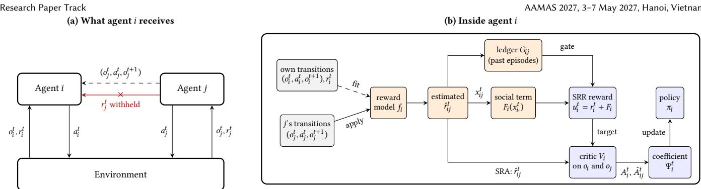  
Figure 1: Self-referenced social preferences. (a) During training agent i receives the transitions of every other agent $^ { j , }$ but never $j ^ { \prime } \mathbf { s }$ reward. (b) Agent i’s reward model, fitted on its own transitions, assesses $j ^ { \prime } \mathbf { s }$ transitions, giving self-referenced estimates $\hat { r } _ { i j } ^ { t } ,$ whose running sums $x _ { i j } ^ { t }$ feed an unchanged social term $F _ { i } .$ SRR adds the term to the reward; SRA evaluates the critic on $j \mathbf { \dot { s } }$ observations and weights the scores into the policy-update coefficient $\Psi _ { i } ^ { t } .$ The ledger discounts i's gains when i has been ahead.

## 4.2 Estimating Future Outcomes

Agent i keeps one trace for every agent j, computed from its estimates exactly as Eq. (2) computes it from true rewards:

$$
e _ { i j } ^ { t } = \gamma \lambda _ { r } \big ( 1 - s _ { j } ^ { t } \big ) e _ { i j } ^ { t - 1 } + \hat { r } _ { i j } ^ { t } ,\tag{8}
$$

where $s _ { j } ^ { t }$ marks the start of an episode. A trace judges an agent only by what it has already earned, so an agent that has just cleaned the river looks worse than the other agents, even though apples will soon grow for it. To amend this, the $+ V$ variant adds a term that estimates what agent i expects j to earn from in the future. This is done using its critic $V _ { i } ^ { \mathrm { { o b j } } }$ , estimating the return of i's own objective, evaluated on $j ^ { \prime } s$ next observation:

$$
x _ { i j } ^ { t } = e _ { i j } ^ { t } + w _ { V } \gamma \big ( 1 - d _ { j , t } ^ { \mathrm { t e r m } } \big ) V _ { i } ^ { \mathrm { o b j } } ( o _ { j } ^ { t + 1 } ) ,\tag{9}
$$

where $d _ { j , t } ^ { \mathrm { t e r m } }$ marks the end of $\vec { j } ^ { s }$ episode and $w _ { V } = ( 1 { - } \gamma ) / ( 1 { - } \gamma \lambda _ { r } )$ puts the value on the scale of the trace. The look-ahead is i's value of being in $j ^ { \prime } s$ position, not an estimate of j’s reward. $x _ { i \cdot }$ takes the place of the true traces in the social terms of Eq. (4).

## 4.3 Self-Referenced Reward (SRR)

SRR adds the social term of the self-reference to the agent's reward,

$$
u _ { i } ^ { t } = r _ { i } ^ { t } + F _ { i } ( x _ { i \cdot } ^ { t } ) ,\tag{10}
$$

and PPO computes the advantage and the critic target from $u _ { i } .$ With the true rewards in place of $\hat { r } _ { i j } .$ the same construction gives the true-reward learners, which we denote TR; TR-IA without +V is the inequity-averse agent of Hughes et al. [33]. Using reward estimates in place of the true reward brings one caveat: a poor estimate affects both the policy and the critic.

## 4.4 Self-Referenced Advantage (SRA)

SRA instead uses the estimates in the policy update coefficient (see Eq. (1)). It leaves ri and $V _ { i } ^ { \mathrm { { o b j } } }$ unchanged and changes only the coefficient that weights each action. Agent i evaluates its critic on $j ^ { \prime } s$

observations and forms a temporal-difference error and its generalized advantage estimate, which we call the cross score,

$$
\begin{array} { r } { \hat { \delta } _ { i j } ^ { t } = \hat { r } _ { i j } ^ { t } - V _ { i } ^ { \mathrm { o b j } } ( o _ { j } ^ { t } ) + \gamma ( 1 - d _ { j , t } ^ { \mathrm { t e r m } } ) V _ { i } ^ { \mathrm { o b j } } ( o _ { j } ^ { t + 1 } ) , } \end{array}\tag{11}
$$

$$
\begin{array} { r } { \hat { A } _ { i j } ^ { t } = \hat { \delta } _ { i j } ^ { t } + \gamma \lambda _ { \mathrm { S R A } } ( 1 - d _ { j , t } ^ { \mathrm { e n d } } ) \hat { A } _ { i j } ^ { t + 1 } , } \end{array}\tag{12}
$$

where $d ^ { \mathrm { e n d } }$ also marks a time-limit truncation. The score measures how much better j's transition went than i's critic expected, judged by i's own reward model and values; it is not the advantage of either agent's policy, as the critic was trained on i's observations and objective, not $j ^ { \prime } s$

Let $q _ { i i }$ be i’s own GAE and $q _ { i j }$ the cross score of $\operatorname { E q . }$ (12), each standardized over time and parallel environments. EI and SVO combine them linearly:

$$
\Psi _ { i , \mathrm { E I } } ^ { t } = q _ { i i } ^ { t } + \alpha _ { i } \bar { q } _ { i , - i } ^ { t } \qquad \Psi _ { i , \mathrm { S V O } } ^ { t } = \bigl ( 1 + \alpha _ { i } \cos \phi _ { i } \bigr ) q _ { i i } ^ { t } + \alpha _ { i } \sin \phi _ { i } \bar { q } _ { i , - i } ^ { t } .\tag{13}
$$

The 1 in front of $\dot { \alpha } _ { i }$ COS $\phi _ { i }$ keeps the agent's own score in the update for every angle $\phi _ { i } .$ For $\mathrm { I A } ,$ the levels decide the weights. For $j \neq i ,$

$$
\begin{array} { r l r } { \boldsymbol { w } _ { i j } ^ { t } = \displaystyle \frac { \beta _ { i } \mathbf { 1 } [ x _ { i i } ^ { t } > x _ { i j } ^ { t } ] - \alpha _ { i } \mathbf { 1 } [ x _ { i i } ^ { t } < x _ { i j } ^ { t } ] } { N - 1 } , } & { \quad \boldsymbol { w } _ { i i } ^ { t } = 1 - \displaystyle \sum _ { j \neq i } \boldsymbol { w } _ { i j } ^ { t } , } \\ { \displaystyle \boldsymbol { \Psi } _ { i , \mathrm { I A } } ^ { t } = \boldsymbol { w } _ { i i } ^ { t } q _ { i i } ^ { t } + \displaystyle \sum _ { j \neq i } \boldsymbol { w } _ { i j } ^ { t } q _ { i j } ^ { t } . } & { } \end{array}\tag{14}
$$

Being ahead of j moves weight from i's own score to $j ^ { \prime } s ;$ being behind j puts negative weight on $j ^ { \prime } s$ score and adds the same weight to i's own. The coefficient, normalized within each minibatch, is used as the target function in Eq. (1), and no gradient flows through it or into agent j. SRA is therefore a cross-agent credit-assignment rule rather than an unbiased policy-gradient estimator of a fixed social objective. EI and SVO thus add up the agents’ outcomes much as in the reward, whereas for IA the comparison only decides how the scores are weighted: nothing in the agent's return penalizes being ahead or behind, as it does in SRR.

## 5 Experiments

## 5.1 Experimental Setup

We evaluate our methods in three sequential social dilemmas. In Section 5.2 we seek to answer the following questions: (1) Do agents cooperate without observing each other's rewards, (2) where should the self-referenced estimate be used in the learning update, (3)

which agents take a penalty for cooperation to occur, and (4) whether self-referenced estimates are still useful when the environment is partially observable or rewards are heterogeneous .

5.1.1 The Three Games. The games require different behavior for cooperation to occur: volunteering, labor, and restraint. In the main experiments, all three games are fully observable, so the only thing an agent lacks is the other agents' rewards. Every observation is arranged around its own agent, which is what lets an agent apply its own reward model to another agent's observation; Supplementary Table S2 lists what each agent observes and can do.

Escape Room. ER(N,M) is the Escape Room environment introduced by Yang et al. [77]. At every step, each of N agents chooses stay, lever, or door. Pulling the lever results in —1 reward; if at least $M = \lceil N / 2 \rceil$ agents pull the lever in the same step, the door opens and every agent at the door earns +10. Episodes last at most five steps. The group optimum is $1 0 ( N - M ) - M$ per episode (ex. 17 with 5 agents). Selfish learners earn 0 reward since pulling the lever only ever pays somebody else. The optimum concentrates the cost on the M agents at the lever unless they take turns over many episodes.

Clean Up. Clean Up [33] is a gridworld public-goods game: agents earn +1 per apple eaten, apples stop growing when waste fills the river, and cleaning the river restores growth but pays the cleaner nothing. We use a $2 5 \times 1 8$ map with 1,000-step episodes. Cooperation requires that some agents clean while the others eat, so the work and the apples can be divided very unevenly. The main results use five agents; Supplementary Tables S9 and S10 report 3 and 7 agents respectively.

Commons Harvest. Commons Harvest [53] is a common-pool resource game on a 16 × 38 map with seven agents and 1,000-step episodes. Eating an apple is worth +1. Apples regrow in empty cells with a probability p at each time step. p is 0 if there are no apples around the cell and p is larger when there are more apples around it. Thus, eating the last apples of a patch destroys future apples for everyone. Each agent has a beam that allows it to give other agents penalties. The agent that shoots the beam receives a reward of -1 and the agent it hits receives -50.

5.1.2 The Learning Agents. Every agent is an independent PPO learner with its own actor, critic and, for self-referenced agents, reward model; nothing is shared between agents. We train agents in Escape room for 500k environment steps and agents in the Clean Up and Commons Harvest environments for 5M steps. In the partially observable setting, we train agents for 7M steps. Supplementary Appendix B.2 lists the networks, warm-up, and PPO settings.

We compare four families of learners. Two are baselines: plain PPO, which has no social term, and the true-reward learners, TR, which add the operators of Eq. (4), computed from traces of the other agents' true rewards, to the reward; TR-IA is the agent of Hughes et al. [33]. The true-reward learners act as a comparison to show which settings benefit from providing agents with access to the true reward. SRR adds the same operators, computed from self-referenced estimates, to the reward, with or without the lookahead +V. Without the look-ahead it differs from TR only in the source of the rewards and in the warm-up of its reward model. The main figures show the reward learner with the look-ahead, SRR+V; Section 5.2.2 compares both. SRA puts the estimates in the coefficient of the policy update and leaves the reward and the critic unchanged.

Each family comes with the EI, SVO, and IA operators, with weights tuned for each game and group size, and we name a learner by family and operator, as in SRR-IA. A self-scaling control, SVO with $\phi = 0 ;$ uses no information about the others; it tests whether a gain comes from the social term or merely from rescaling the agent's own reward. For the repeated game, we add a standing gate (see Supplementary Appendix) to four selected Escape Room configurations, SRA-EI with three and five agents and SRR-IA with five and seven, and change nothing else. For Section 5.2.5, two of the five Clean Up agents value an apple at 2 instead of 1; we reuse the settings selected under shared rewards and train on the same held-out seeds.

Selection and evaluation. We tune on three seeds in every game, and on two for the partial-view retuning, and score every candidate by the mean minus the standard deviation of a metric across the tuning seeds. We choose once by collective return and once by Nash welfare (see Section 5.1.3) and call these the learner's collective-return and Nash welfare selections. Unless stated otherwise, figures show the collective-return selection. Each choice is frozen and trained from scratch on eight seeds that played no part in tuning, and we never reselect on these runs. Intervals are two-sided Student-t 95% intervals across the eight seeds.

Partial view. With the partial view, each agent in Clean Up and Commons Harvest sees only the 15 × 15 window around itself. The transition agent i receives from j then shows only j's neighborhood, so i must judge j's situation from a view it may never have had itself. We retune every learner for this setting, with feedforward agents and with agents whose policy and critic each carry a GRU [12]. The grid and the recurrent architecture can be found in Appendix B.4.

5.1.3 Outcome and Behavioral Measures. Because every agent keeps the same index in every episode of a run, we can average each agent's return over many episodes. Let $\bar { R } _ { i , s }$ be agent i's episodic return averaged over the final 20,000 environment steps of seed s in Clean Up and Commons Harvest and over the final window of training in Escape Room. From these N averages we compute

$$
\begin{array} { r } { C _ { s } = \sum _ { i } \bar { R } _ { i } , ~ L _ { s } = \operatorname* { m i n } _ { i } \bar { R } _ { i } , ~ \mathcal { N } \mathcal { W } _ { c , s } = e ^ { \frac { 1 } { N } \sum _ { i } \log ( 1 + [ \bar { R } _ { i } + c ] _ { + } ) } - 1 . } \end{array}\tag{15}
$$

The collective return $C _ { s }$ is how much the group produces, whoever receives it; the lowest agent return $L _ { s }$ shows whether some agent is left behind; and the Nash welfare $\mathcal { N W } _ { c , s } \left[ 1 0 , 3 8 \right]$ a geometric mean that for a fixed total is largest when the returns are equal, rewards both production and balance, with a shift c of 5 in Escape Room and 0 elsewhere. Because returns are averaged over many episodes, these measures can tell agents that take turns at a costly role from agents whose roles stay fixed. In Escape Room we also report each agent's exit rate, the fraction of episodes in which it reaches the open door, and call the lever role shared on a seed when every agent has a positive return and the exit rates have a standard deviation below 0.20. In Commons Harvest, we report

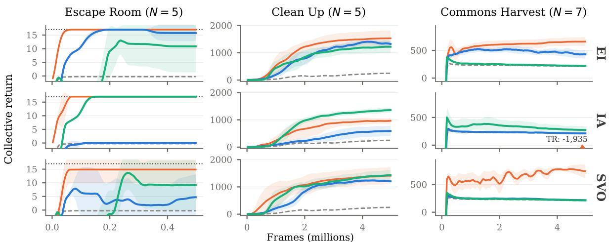  
--- Plain PPO  TR: true rewards  SRA: policy update  SRR+V: reward with value look-ahead  
Figure 2: Collective return over training. Each panel shows plain PPO, the TR learner, and both of our methods: SRA and SRR+V. Lines are means over eight seeds and shaded regions are pointwise 95% t intervals. The dotted line is the Escape Room optimum, 17. Commons Harvest TR-IA is outside the plotted range, with final mean $C = - 1 { , } 9 3 5 ,$ and is marked at the panel edge

sustainability [53], the mean time step at which apples are eaten;   
higher means agents leave apples for later.

## 5.2 Results

5.2.1 Can Agents Cooperate without Observing Others' Rewards? In all three games, social preferences can operate on self-referenced assessments without observing the others' rewards. How closely those assessments match the true rewards varies by game, but exact reward recovery is not necessary for cooperation. Figure 2 compares plain PPO, the true-reward learners, and both of our methods for every game and operator.

Escape Room is the most straightforward test, because pulling the lever only ever benefits someone else, and plain PPO agents never learn to pull it. A self-referenced agent can still see the benefit: it has learned from its own exits that reaching the open door pays ten, so when another agent stands at the door, it recognises that reward. Thus, SRA-EI and SRR-IA+V reach the optimum, as the agents given the true rewards do. SVO on the other hand weighs the agent's own outcome as well as the others'. Thus, the benefit to other agents must outweigh the agent's own cost of pulling the lever. With true rewards and a strong weight it does, and the agents learn to pull. SRR-SVO was selected with a much weaker weight, because that weight was already enough on the tuning seeds; with it, pulling still feels like a loss, and cooperation rests on the look-ahead alone, so it reaches only about half the optimum. SRA-SVO caps how much weight it can give to the others (see Section 5.2.2). Supplementary Appendix C.4 shows that at least one self-referenced learner reaches the optimum from two to twelve agents.

Clean Up requires agents to sacrifice reward to provide labor. Cleaning the river earns nothing directly, and plain PPO agents rarely do it. Every self-referenced learner produces about as much as its true-reward counterpart, so self-referenced estimates are enough to sustain a public good. Under inequity aversion, SRR even does better than TR: SRR-IA+V produces more than TR-IA and more

than doubles the return of its poorest agent. We think the true rewards are the obstacle. An agent that has just eaten an apple seems far ahead of one that is cleaning, although apples are about to grow for the cleaner. With a strong penalty on being ahead, agents given the true rewards stop eating, and TR-IA harvests nothing on any tuning seed, so its selection settles on a weak penalty.

Commons Harvest requires agents to restrain themselves. Agents must leave apples uneaten so that patches regrow, and an agent that eats the last apples of a patch takes future apples from everyone. SRA-EI learns this restraint without seeing the others' rewards. It doubles plain PPO's collective return, and its agents eat apples four times later on average. This is due to the policy update. When an agent strips a patch, its critic values the other agents' positions less turning their cross scores turn negative. Thus, the action that stripped the patch loses credit. This is also the game where our self-referenced learners fall furthest behind the true rewards, and TR-EI and TR-SVO produce more still. Estimation is hardest here, as the reward model is learned through a shared representation with the policy, whose image features were not trained to recognize rewards, and the beam's large penalty dominates what it learns. Inequity aversion goes the other way. An agent averse to being behind has a reason to fire at an agent that is ahead, and with true rewards that gap is visible at every step, so the agents of TR-IA almost stop harvesting or fire at one another [33]. SRR-IA+V was selected with a weaker penalty on being behind, so it has little reason to fire, and it keeps harvesting.

Taken together, self-referenced assessments are enough to start and sustain cooperation in all games. But, in Commons Harvest, the true-reward learners produce more. In 5.2.3, we look at the distribution of return among agents when using each of these methods.

5.2.2 Where Should the Estimate Enter? The two methods of selfreference suit different kinds of social preference. Inequity aversion works only with SRR: SRR-IA+V is the better of our methods in every game, while SRA-IA never escapes Escape Room. In the reward, being ahead costs the agent part of its return, which it can learn to avoid. In the policy update, being ahead only shifts weight between scores, (see Eq. (14)). Thus, nothing pushes it to stop being ahead. EI only adds up the others' outcomes, which credits actions with the gains of other agents. Thus, SRA-EI is the better method in Escape Room and Commons Harvest and about as good in Clean Up. SVO also adds outcomes but weighs the agent's own as well. In the policy update this caps the weight assigned to the other agents at tan φ times the agent's own weight, which is not enough to achieve the performance of EI.Thus, we note that a preference comparing agents belongs in the reward. A benevolent pereference such as EI is safer in the policy update.

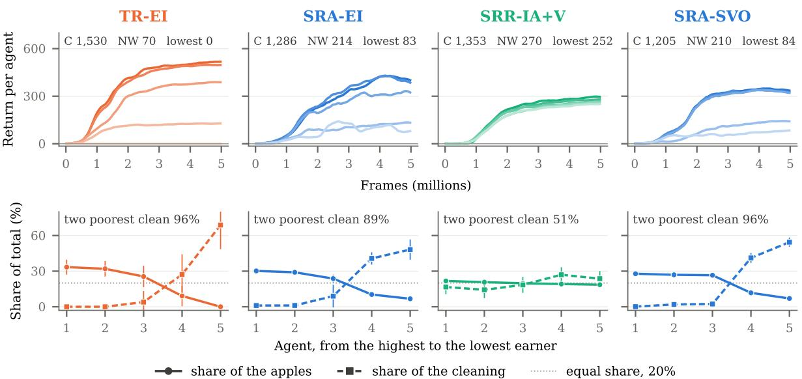  
Figure 3: Who receives the return and who does the work in Clean Up with five agents. Top: every agent's return over training; agents are ranked within each seed by their final return and averaged by rank over the eight seeds, darkest the richest. Bottom: each agent's final share of the apples, solid, and of the cleaning, dashed, with 95% confidence intervals; 20% is an equal share.

The look-ahead is what makes SRR work. Without it, agents that never reach the door never see a reward to assess, so the social term stays at zero. The critic's value distinguishes positions before any reward is assessed and gets cooperation started. Under inequity aversion, it also prevents the agent misjudging the cleaner.Under EI, the look-ahead brings no clear gain outside Escape Room: in Clean up, SRR-EI+V produces about 290 apples less than SRR-EI, and in Commons Harvest, it stays at plain PPO's level, far below SRR-EI.

Group size exposes the limit of SRA. Its coefficient averages over the N – 1 others, so any one agent's action matters less as the group grows, and SRA-EI falls further behind TR-EI. SRR, on the other hand, does not dilute, and here self-reference again holds up better TR: IA with true rewards declines as the group size grows, while with self-referenced estimates and the look-ahead it holds. A larger group gives an inequity-averse agent more pairs to be behind in, and true rewards make each comparison sharper than it is. Appendix D.2 gives the results with 2 – 12 agents.

5.2.3Who Pays for Cooperation? Collective return on its own does not give us the full picture. Figure 3 shows which agents gained the most return and which agents cleaned the most in Clean Up. It shows the most productive TR learner and self-referenced learner for each operator; further details can be found in Appendix E.1.

The learner that produces the most shares it worst. TR-EI produces 1,530 apples, but its poorest agent earns nothing for the whole run, and the bottom row shows why: the richest agent eats a third of the apples and cleans almost nothing, while the two poorest do 96% of the cleaning. The group has split into eaters and cleaners, and collective return counts both the same. Nash welfare does not: as a geometric mean, it equals the average return when every agent earns the same and falls towards zero when any agent is left with nothing, so TR-EI's is only 70, although its agents average about 300 apples. SRA-EI and SRA-SVO soften the split, raising the poorest agent to 83 and 84, but their two poorest still do most of the cleaning. SRR-IA+V is the exception. All 5 agents' returns climb together, every agent takes about a fifth of the apples and a fifth of the cleaning, and its Nash welfare, 270, equals its average return, at a collective return about 12% below TR-EI's. Its high welfare comes from sharing the work, not from every agent earning equally little.

For every operator, the best self-referenced learner divides the return more evenly than the true-reward learner with the same operator, and across the whole Clean Up tuning grid, selecting on collective return picks a true-reward learner while selecting on Nash welfare picks one of ours. What spreads the return is not the selfreferenced estimate alone but where it is used: the reward learners with EI and SVO use the same estimates as SRA, yet split into eaters and cleaners just as the true-reward learners do. The other games show the same tension in their own form. In Commons Harvest the extra apples of the true-reward learner go almost entirely to one agent, leaving its Nash welfare below that of plain PPO, although welfare there needs care, since a control that ignores the others scores highest.In Escape Room every learner that escapes leaves the same agents paying for the lever in every episode. A standing ledger of self-referenced returns across episodes spreads this cost, at about a quarter of the optimum, because nothing tells the agents who should pay this time (See Supplementary Appendix F).

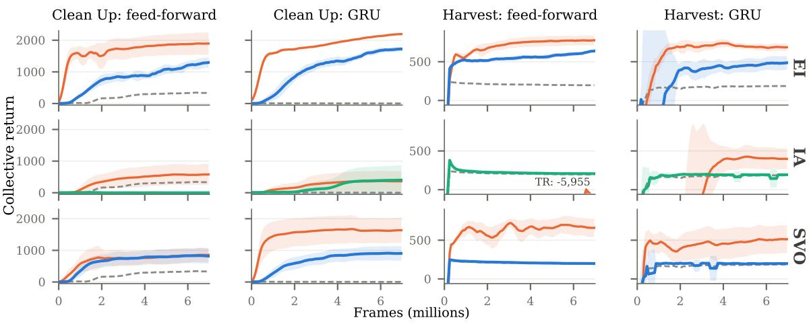  
--- Plain PPO TR: true rewards SRA: SRA-EI, SRA-SVO SRR+V: SRR-IA+V  
Figure 4: Partial view: collective return over training in Clean Up and Commons Harvest with a 15 × 15 window, for feedforward and GRU agents. Lines are means over eight held-out seeds and shaded regions pointwise 95% Student-t intervals.

5.2.4What if Agents See Only Part of the Map? With a partial view the assessment itself becomes harder: the transition that agent i receives from j shows only j's neighbourhood, a part of the map i may never have seen from there. Figure 4 shows Clean Up and Commons Harvest with this window.

SRA keeps its cooperation. SRA-EI holds its full-view production in Clean Up and still produces several times as much as plain PPO in Commons Harvest. Memory helps in Clean Up, where its recurrent agents produce more and divide the return best of all learners, while the true-reward learner again leaves its poorest agent with nothing.Inequity aversion in the reward collapses, and the reason is instructive. The estimates are not to blame; they are as accurate as with the full view. The look-ahead is. Removing it partly restores cooperation, and adding it to agents given the true rewards destroys theirs too. The look-ahead reads the critic's value off a window that shows a different part of the map, and an agent averse to being ahead reacts to a gap that is not there. The component that rescued inequity aversion under the full view is the one that breaks it when agents see less, while in the policy update an error adds noise to the credit. Appendix G gives the details.

5.2.5 What if Agents Value Things Differently? We now violate the condition under which self-reference can recover the other's reward. Two of five Clean Up agents value an apple at 2 rather than 1, so a self-referenced agent cannot recover the other's true reward from its transition: it assigns the transition the value that it would itself receive. Self-reference remains useful nonetheless: for every operator, our learner divides the return more evenly than the true-reward learner and leaves its poorest agent better off, at a similar collective return. What no learner does, with true or selfreferenced rewards, is divide by value. The high-value agents eat about as many apples as the others, so they end with about twice the return whoever is learning. Whether self-reference misleads agents that would otherwise act on values, as people are misled when they assume others value what they value [19, 60], remains open. Supplementary Appendix H gives the details.

## 6 Related Work

Social preferences without reward access. Social preferences such as inequity aversion [33], social value orientation [48], and prosocial rewards [54] directly use other agents' rewards or outcomes. Forward-looking social utilities provide another way to use these outcomes: AFP combines altruistic and fairness preferences through a CES utility applied to expected future returns [73]. Unlike our method, it still requires access to other agents' rewards; we instead replace the peer-reward input with a self-referenced estimate. Related approaches reshape incentives through reward transfer or learned incentives [47, 75, 77]. Social influence [34] also avoids access to others' rewards by rewarding causal influence over their actions, including in a decentralized variant that learns a model of other agents from observed actions. Unlike our method, however, influence is the social signal itself rather than a representation of the other's outcome. We keep the social preferences unchanged and replace only their input.

Modeling others from one's own experience. Empathy is often described in terms of taking another's perspective, by projecting oneself into their situation and using one's own representations to understand their state [55]. This intuition is closely related to Simulation Theory, which proposes that people can understand others' mental states by simulating those states using their own cognitive mechanisms [26]. In multi-agent learning, agents have inferred others' goals with their own policy [57], evaluated their own value function from another's perspective [7], and used perspective-taking to decide how much reward to give away [40]. We use the same idea for standard social preferences and ask where the estimate should enter learning. Inverse RL [50, 52] and inverse planning [4] infer another's reward or goals from its behavior under an assumed decision model; self-reference instead assesses the other's situation with the agent's own reward model, without requiring the other agent to act optimally. Unlike methods that keep rewards private but exchange action suggestions [37], our agents exchange no messages. Other approaches learn social reward models from external evaluations of collective outcomes [8]. Our agents receive no such external evaluation and instead construct social signals solely from their own reward experience. Appendix J extends this review.

## 7 Conclusion and Future Work

Social preferences do not require agents to directly observe each other's rewards. An agent can instead assess another agent's situation from its own experience, by applying its learned reward model to the other's observed transitions. When reward functions are shared, this assessment can approximate the other's realized reward; when preferences differ, it instead provides a self-referenced counterfactual assessment. In both cases, the resulting signal can sustain cooperation in sequential social dilemmas.

Several directions remain open. Agents whose rewards come from different events are beyond a model of one's own reward, and an agent could instead keep its own model as a prior and correct it from what the others do, combining self-reference with inverse reinforcement learning. SRR needs no actor-critic, so it could carry self-referenced preferences to value-based learners. Letting policies see the record of past episodes, or communicate, could turn sharing into deliberate turn-taking [3]. A look-ahead that judges another agent's situation from memory rather than from a single window could make SRR robust to partial views. Finally, the setting fits mixed groups of people and machines, where an agent must cooperate with others whose rewards it can never observe.

## References

[1] John Agapiou, Alexander Sasha Vezhnevets, Edgar Duéñez-Guzmán, Jayd Matyas, Yiran Mao, Peter Sunehag, Raphael Köster, Udari Madhushani, Kavya Kopparapu, Ramona Comanescu, DJ Strouse, Michael Johanson, Sukhdeep Singh, Julia Haas, Igor Mordatch, Dean Mobbs, and Joel Z. Leibo. 2023. Melting Pot 2.0. arXiv:2211.13746

[2] Stefano V. Albrecht and Peter Stone. 2018. Autonomous Agents Modelling Other Agents: A Comprehensive Survey and Open Problems. Artificial Intelligence 258 (2018), 66–95.

[3] Robert Axelrod. 1984. The Evolution of Cooperation. Basic Books.

[4] Chris L. Baker, Rebecca Saxe, and Joshua B. Tenenbaum. 2009. Action Understanding as Inverse Planning. Cognition 113, 3 (2009), 329–349.

[5] C. Daniel Batson. 1991. The Altruism Question: Toward a Social-Psychological Answer. Lawrence Erlbaum Associates.

[6] Gary E. Bolton and Axel Ockenfels. 2000. ERC: A Theory of Equity, Reciprocity, and Competition. American Economic Review 90, 1 (2000), 166–193.

[7] Bart Bussmann, Jacqueline Heinerman, and Joel Lehman. 2019. Towards Empathic Deep Q-Learning. In IFCAI-19 AI Safety Workshop, Vol. 2419. 111–117.

[8] Assaf Caftory, Almog Zemach, Moshe Butman, and Doron Friedman. 2026. Why Study Emergent Behavior When You Can Regulate It? Aligning Multi-Agent Systems with Reward Prediction. arXiv:2608.07280

[9] Colin F. Camerer. 2003. Behavioral Game Theory: Experiments in Strategic Interaction. Princeton University Press.

[10] Ioannis Caragiannis, David Kurokawa, Hervé Moulin, Ariel Procaccia, Nisarg Shah, and Junxing Wang. 2019. The Unreasonable Fairness of Maximum Nash Welfare. ACM Transactions on Economics and Computation 7, 3 (2019), 12:1– 12:32.

[11] Gary Charness and Matthew Rabin. 2002. Understanding Social Preferences with Simple Tests. The Quarterly Journal of Economics 117, 3 (2002), 817–869.

[12] Kyunghyun Cho, Bart van Merriënboer, Caglar Gulcehre, Dzmitry Bahdanau, Fethi Bougares, Holger Schwenk, and Yoshua Bengio. 2014. Learning Phrase Representations using RNN Encoder-Decoder for Statistical Machine Translation. In Conference on Empirical Methods in Natural Language Processing (EMNLP). 1724-1734.

[13] Frans de Waal. 2008. Putting the Altruism Back into Altruism: The Evolution of Empathy. Annual Review of Psychology 59, 1 (2008), 279–300.

[14] Christian Schroeder de Witt, Tarun Gupta, Denys Makoviichuk, Viktor Makoviychuk, Philip H. S. Torr, Mingfei Sun, and Shimon Whiteson. 2020. Is Independent Learning All You Need in the StarCraft Multi-Agent Challenge? arXiv:2011.09533

[15] Jean Decety and Philip Jackson. 2004. The Functional Architecture of Human Empathy. Behavioral and Cognitive Neuroscience Reviews 3, 2 (2004), 71–100.

[16] Alper Demir, Hüseyin Aydın, Kale-ab Abebe Tessera, David Abel, and Stefano Albrecht. 2026. Fairness over Equality: Correcting Social Incentives in Asymmetric Sequential Social Dilemmas. In International Conference on Autonomous Agents and Multiagent Systems (AAMAS).

[17] Shaokang Dong, Chao Li, Shangdong Yang, Bo An, Wenbin Li, and Yang Gao. 2024. Egoism, Utilitarianism and Egalitarianism in Multi-Agent Reinforcement Learning. Neural Networks 178 (2024), 106544.

[18] Tom Eccles, Edward Hughes, János Kramár, Steven Wheelwright, and Joel Leibo. 2019. Learning Reciprocity in Complex Sequential Social Dilemmas. arXiv:1903.08082

[19] Nicholas Epley, Boaz Keysar, Leaf Van Boven, and Thomas Gilovich. 2004. Perspective Taking as Egocentric Anchoring and Adjustment. Journal of Personality and Social Psychology 87, 3 (2004), 327–339.

[20] Ernst Fehr and Simon Gächter. 2000. Cooperation and Punishment in Public Goods Experiments. American Economic Review 90, 4 (2000), 980–994.

[21] Ernst Fehr and Klaus Schmidt. 1999. A Theory of Fairness, Competition, and Cooperation. The Quarterly Journal of Economics 114, 3 (1999), 817–868.

[22] Jakob Foerster, Richard Chen, Maruan Al-Shedivat, Shimon Whiteson, Pieter Abbeel, and Igor Mordatch. 2018. Learning with Opponent-Learning Awareness. In International Conference on Autonomous Agents and Multiagent Systems (AAMAS). 122–130.

[23] Jakob Foerster, Gregory Farquhar, Triantafyllos Afouras, Nantas Nardelli, and Shimon Whiteson. 2018. Counterfactual Multi-Agent Policy Gradients. In AAAI Conference on Artificial Intelligence. 2974-2982.

[24] Ian Gemp, Kevin McKee, Richard Everett, Edgar Duéñez-Guzmán, Yoram Bachrach, David Balduzzi, and Andrea Tacchetti. 2022. D3C: Reducing the Price of Anarchy in Multi-Agent Learning. In International Conference on Autonomous Agents and Multiagent Systems (AAMAS). 498-506.

[25] Alvin Goldman. 2006. Simulating Minds: The Philosophy, Psychology, and Neuroscience of Mindreading. Oxford University Press.

[26] Robert Gordon. 1986. Folk Psychology as Simulation. Mind & Language 1, 2 (1986), 158–171.

[27] Niko Grupen, Bart Selman, and Daniel Lee. 2022. Cooperative Multi-Agent Fairness and Equivariant Policies. In AAAI Conference on Artificial Intelligence. 9350– 9359.

[28] Dylan Hadfield-Menell, Anca Dragan, Pieter Abbeel, and Stuart Russell. 2016. Cooperative Inverse Reinforcement Learning. In Advances in Neural Information Processing Systems (NeurIPS). 3909–3917.

[29] Eric A. Hansen, Daniel S. Bernstein, and Shlomo Zilberstein. 2004. Dynamic Programming for Partially Observable Stochastic Games. In Proceedings of the Nineteenth National Conference on Artificial Intelligence (AAAI). 709–715.

[30] Andreas Haupt, Phillip Christoffersen, Mehul Damani, and Dylan Hadfield-Menell. 2024. Formal Contracts Mitigate Social Dilemmas in Multi-Agent Reinforcement Learning. Autonomous Agents and Multi-Agent Systems 38, 51 (2024).

[31] He He, Jordan Boyd-Graber, Kevin Kwok, and Hal Daumé III. 2016. Opponent Modeling in Deep Reinforcement Learning. In International Conference on Machine Learning (ICML). 1804–1813.

[32] Joseph Henrich, Robert Boyd, Samuel Bowles, Colin Camerer, Ernst Fehr, Herbert Gintis, and Richard McElreath. 2001. In Search of Homo Economicus: Behavioral Experiments in 15 Small-Scale Societies. American Economic Review 91, 2 (2001), 73–78.

[33] Edward Hughes, Joel Leibo, Matthew Phillips, Karl Tuyls, Edgar Duéñez-Guzmán, Antonio García Castañeda, Iain Dunning, Tina Zhu, Kevin McKee, Raphael Koster, Heather Roff, and Thore Graepel. 2018. Inequity Aversion Improves Cooperation in Intertemporal Social Dilemmas. In Advances in Neural Information Processing Systems (NeurIPS).

[34] Natasha Jaques, Angeliki Lazaridou, Edward Hughes, Caglar Gulcehre, Pedro A Ortega, DJ Strouse, Joel Z. Leibo, and Nando de Freitas. 2019. Social Influence as Intrinsic Motivation for Multi-Agent Deep Reinforcement Learning. In International Conference on Machine Learning (ICML). 3040-3049.

[35] Julian Jara-Ettinger. 2019. Theory of Mind as Inverse Reinforcement Learning. Current Opinion in Behavioral Sciences 29 (2019), 105–110.

[36] Jiechuan Jiang and Zongqing Lu. 2019. Learning Fairness in Multi-Agent Systems. In Advances in Neural Information Processing Systems (NeurIPS). 13854- 13865.

[37] Yue Jin, Shuangqing Wei, and Giovanni Montana. 2025. Achieving Collective Welfare in Multi-Agent Reinforcement Learning via Suggestion Sharing. Machine Learning 114, 8 (2025), 190.

[38] Mamoru Kaneko and Kenjiro Nakamura. 1979. The Nash Social Welfare Function. Econometrica 47, 2 (1979), 423–435.

[39] Max Kleiman-Weiner, Mark Ho, Joseph Austerweil, Michael Littman, and Joshua Tenenbaum. 2016. Coordinate to Cooperate or Compete: Abstract Goals and Joint Intentions in Social Interaction. In Annual Meeting of the Cognitive Science Society (CogSci).

[40] Fanqi Kong, Yizhe Huang, Song-Chun Zhu, Siyuan Qi, and Xue Feng. 2024. Learning to Balance Altruism and Self-interest Based on Empathy in Mixed-Motive Games. In Advances in Neural Information Processing Systems (NeurIPS). 135819-135842.

[41] Raphael Köster, Kevin McKee, Richard Everett, Laura Weidinger, William Isaac, Edward Hughes, Edgar Duéñez-Guzmán, Thore Graepel, Matthew Botvinick, and Joel Leibo. 2020. Model-free conventions in multi-agent reinforcement learning with heterogeneous preferences. arXiv:2010.09054

[42] Joel Leibo, Vinicius Zambaldi, Marc Lanctot, Janusz Marecki, and Thore Graepel. 2017. Multi-agent Reinforcement Learning in Sequential Social Dilemmas. In International Conference on Autonomous Agents and Multiagent Systems (AAMAS). 464-473.

[43] Joel Z. Leibo, Edgar A. Duéñez-Guzmán, Alexander Sasha Vezhnevets, John Agapiou, Peter Sunehag, Raphael Koster, Jayd Matyas, Charles Beattie, Igor Mordatch, and Thore Graepel. 2021. Scalable Evaluation of Multi-Agent Reinforcement Learning with Melting Pot. In International Conference on Machine Learning (ICML). 6187–6199.

[44] Adam Lerer and Alexander Peysakhovich. 2018. Maintaining cooperation in complex social dilemmas using deep reinforcement learning. arXiv:1707.01068

[45] Michael L. Littman. 1994. Markov Games as a Framework for Multi-Agent Reinforcement Learning. In Proceedings of the 11th International Conference on Machine Learning (ICML). 157–163.

[46] Ryan Lowe, Yi Wu, Aviv Tamar, Jean Harb, Pieter Abbeel, and Igor Mordatch. 2017. Multi-Agent Actor-Critic for Mixed Cooperative-Competitive Environments. In Advances in Neural Information Processing Systems (NeurIPS). 6382- 6393.

[47] Andrei Lupu and Doina Precup. 2020. Gifting in Multi-Agent Reinforcement Learning. In International Conference on Autonomous Agents and Multiagent Systems (AAMAS). 789–797.

[48] Kevin McKee, Ian Gemp, Brian McWilliams, Edgar Duéñez-Guzmán, Edward Hughes, and Joel Leibo. 2020. Social Diversity and Social Preferences in Mixed-Motive Reinforcement Learning. In International Conference on Autonomous Agents and Multiagent Systems (AAMAS). 869–877.

[49] David Messick and Charles McClintock. 1968. Motivational Bases of Choice in Experimental Games. Journal of Experimental Social Psychology 4, 1 (1968), 1-25.

[50] Sriraam Natarajan, Gautam Kunapuli, Kshitij Judah, Prasad Tadepalli, Kristian Kersting, and Jude Shavlik. 2010. Multi-Agent Inverse Reinforcement Learning. In International Conference on Machine Learning and Applications (ICMLA). IEEE, 395-400.

[51] Andrew Ng, Daishi Harada, and Stuart Russell. 1999. Policy Invariance Under Reward Transformations: Theory and Application to Reward Shaping. In International Conference on Machine Learning (ICML). 278-287.

[52] Andrew Y. Ng and Stuart J. Russell. 2000. Algorithms for Inverse Reinforcement Learning. In International Conference on Machine Learning (ICML). 663-670.

[53] Julien Perolat, Joel Z. Leibo, Vinicius Zambaldi, Charles Beattie, Karl Tuyls, and Thore Graepel. 2017. A Multi-agent Reinforcement Learning Model of Common-Pool Resource Appropriation. In Advances in Neural Information Processing Systems (NeurIPS). 3646–3655.

[54] Alexander Peysakhovich and Adam Lerer. 2018. Prosocial Learning Agents Solve Generalized Stag Hunts Better than Selfish Ones. In International Conference on Autonomous Agents and Multiagent Systems (AAMAS). 2043-2044.

[55] Stephanie Preston and Frans de Waal. 2002. Empathy: Its Ultimate and Proximate Bases. Behavioral and Brain Sciences 25, 1 (2002), 1–20.

[56] Neil Rabinowitz, Frank Perbet, Francis Song, Chiyuan Zhang, S. M. Ali Eslami, and Matthew Botvinick. 2018. Machine Theory of Mind. In Proceedings of the 35th International Conference on Machine Learning (ICML). 4218-4227.

[57] Roberta Raileanu, Emily Denton, Arthur Szlam, and Rob Fergus. 2018. Modeling Others using Oneself in Multi-Agent Reinforcement Learning. In International Conference on Machine Learning (ICML). 4257–4266.

[58] Tabish Rashid, Mikayel Samvelyan, Christian Schroeder de Witt, Gregory Farquhar, Jakob Foerster, and Shimon Whiteson. 2018. QMIX: Monotonic Value Function Factorisation for Deep Multi-Agent Reinforcement Learning. In International Conference on Machine Learning (ICML). 4295-4304.

[59] John Rawls. 1971. A Theory of Justice. Harvard University Press.

[60] Lee Ross, David Greene, and Pamela House. 1977. The “False Consensus Effect": An Egocentric Bias in Social Perception and Attribution Processes. Journal of Experimental Social Psychology 13, 3 (1977), 279–301.

[61] John Schulman, Philipp Moritz, Sergey Levine, Michael Jordan, and Pieter Abbeel. 2016. High-Dimensional Continuous Control Using Generalized Advantage Estimation. In International Conference on Learning Representations (ICLR).

[62] John Schulman, Filip Wolski, Prafulla Dhariwal, Alec Radford, and Oleg Klimov. 2017. Proximal Policy Optimization Algorithms. arXiv:1707.06347

[63] Manisha Senadeera, Thommen George Karimpanal, Sunil Gupta, and Santu Rana. 2022. Sympathy-based Reinforcement Learning Agents. In International Conference on Autonomous Agents and Multiagent Systems (AAMAS). 1164-1172.

[64] Manisha Senadeera, Thommen Karimpanal George, Stephan Jacobs, Sunil Gupta, and Santu Rana. 2024. EMOTE: An Explainable Architecture for Modelling the Other through Empathy. In International Foint Conference on Artificial Intelligence, IJCAI. 4876–4884.

[65] Lloyd S. Shapley. 1953. Stochastic Games. Proceedings of the National Academy of Sciences 39, 10 (1953), 1095–1100.

[66] Umer Siddique, Paul Weng, and Matthieu Zimmer. 2020. Learning Fair Policies in Multiobjective (Deep) Reinforcement Learning with Average and Discounted Rewards. In International Conference on Machine Learning (ICML). 8905-8915.

[67] Peter Sunehag, Guy Lever, Audrunas Gruslys, Wojciech Marian Czarnecki, Vinicius Zambaldi, Max Jaderberg, Marc Lanctot, Nicolas Sonnerat, Joel Z. Leibo, Karl Tuyls, and Thore Graepel. 2018. Value-Decomposition Networks for Cooperative Multi-Agent Learning Based on Team Reward. In International Conference on Autonomous Agents and Multiagent Systems (AAMAS). 2085-2087.

[68] Richard Sutton and Andrew Barto. 2018. Reinforcement Learning: An Introduction (2nd ed.). MIT Press.

[69] Richard Sutton, David McAllester, Satinder Singh, and Yishay Mansour. 1999. Policy Gradient Methods for Reinforcement Learning with Function Approximation. In Advances in Neural Information Processing Systems (NeurIPS). 1057– 1063.

[70] Elizaveta Tennant, Stephen Hailes, and Mirco Musolesi. 2023. Modeling Moral Choices in Social Dilemmas with Multi-Agent Reinforcement Learning. In International Joint Conference on Artificial Intelligence (ICAI). 317-325.

[71] Eugene Vinitsky, Raphael Köster, John Agapiou, Edgar Duéñez-Guzmán Alexander Vezhnevets, and Joel Leibo. 2023. A Learning Agent that Acquires Social Norms from Public Sanctions in Decentralized Multi-Agent Settings. Collective Intelligence 2, 2 (2023).

[72] Jane X. Wang, Edward Hughes, Chrisantha Fernando, Wojciech Czarnecki, Edgar Duéñez-Guzmán, and Joel Leibo. 2019. Evolving Intrinsic Motivations for Altruistic Behavior. In International Conference on Autonomous Agents and Multiagent Systems (AAMAS). 683-692.

[73] Yu Wei, Yukiko Ogura, Yoshiyuki Ohmura, Ildefons Magrans de Abril, Hoshinori Kanazawa, and Yasuo Kuniyoshi. 2026. Integrated Altruistic and Fairness Preference Induces Advanced Mutual Cooperation in Sequential Social Dilemmas arXiv:2607.04710

[74] Ronald Williams. 1992. Simple Statistical Gradient-Following Algorithms for Connectionist Reinforcement Learning. Machine Learning 8, 3 (1992), 229–256.

[75] Richard Willis, Yali Du, Joel Leibo, and Michael Luck. 2024. Resolving Social Dilemmas with Minimal Reward Transfer. Autonomous Agents and Multi-Agent Systems 38, 2 (2024).

[76] David Wolpert and Kagan Tumer. 2001. Optimal Payoff Functions for Members of Collectives. Advances in Complex Systems 4, 2–3 (2001), 265–279.

[77] Jiachen Yang, Ang Li, Mehrdad Farajtabar, Peter Sunehag, Edward Hughes, and Hongyuan Zha. 2020. Learning to Incentivize Other Learning Agents. In Advances in Neural Information Processing Systems (NeurIPS).

[78] Yuxuan Yi, Ge Li, Yaowei Wang, and Zongqing Lu. 2022. Learning to Share in Networked Multi-Agent Reinforcement Learning. In Advances in Neural Information Processing Systems (NeurIPS). 15119–15131.

[79] Naoto Yoshida and Kingson Man. 2025. Homeostatic Coupling for Prosocial Behavior. arXiv:2506.12894

[80] Chao Yu, Akash Velu, Eugene Vinitsky, Jiaxuan Gao, Yu Wang, Alexandre Bayen, and Yi Wu. 2022. The Surprising Effectiveness of PPO in Cooperative Multi-Agent Games. In Advances in Neural Information Processing Systems (NeurIPS), Datasets and Benchmarks Track. 24611-24624.

[81] Lantao Yu, Jiaming Song, and Stefano Ermon. 2019. Multi-Agent Adversarial Inverse Reinforcement Learning. In International Conference on Machine Learning (ICML). 7194–7201.

[82] Matthieu Zimmer, Claire Glanois, Umer Siddique, and Paul Weng. 2021. Learning Fair Policies in Decentralized Cooperative Multi-Agent Reinforcement Learning. In International Conference on Machine Learning (ICML). 12967–12978.

These appendices give the details and the evidence behind the paper. Appendices A and B describe the implementation and the experimental protocol. Appendices C to H extend the subsections of results, one each and in the same order. Appendix I collects the limitations of the study, and Appendix J reviews the related work in full. Figures, tables, and equations numbered with an S belong to the appendices.

## A Method Details

This appendix elaborates on the methods section. Specifically we discuss why we can use the social terms within the coefficient of the policy update, the order of one training iteration, how the reward model is trained, how the scores are scaled, and how episode boundaries are handled.

## A.1 Policy Gradients and the Baseline

The background section uses two facts about policy gradients: the advantage measures how much better an action went than expected, and a term that does not depend on the action leaves the expected gradient unchanged. Both follow from the policy gradient theorem [69, 74],

$$
\nabla J ( \theta _ { i } ) = \mathbb { E } \Big [ \sum _ { t } \nabla \log \pi _ { i } ( a _ { i } ^ { t } \mid o _ { i } ^ { t } ) \left( G _ { i } ^ { t } - b ( o _ { i } ^ { t } ) \right) \Big ] ,\tag{16}
$$

where $\begin{array} { r } { G _ { i } ^ { t } = \sum _ { k \geq 0 } \gamma ^ { k } r _ { i } ^ { t + k } } \end{array}$ is the return that followed action $a _ { i } ^ { t }$ and b is a baseline, any function that does not depend on the action. The baseline does not change the gradient in expectation, because

$$
\sum _ { a } b ( a ) \nabla \pi _ { i } ( a \mid o ) = b ( o ) \nabla \sum _ { a } \pi _ { i } ( a \mid o ) = b ( o ) \nabla 1 = 0 ,\tag{17}
$$

but it reduces the variance of the estimate [68]. Actor-critic methods use a learned critic $V _ { i } ( o ) \approx \mathbb { E } [ G _ { i } ^ { t } \mid o _ { i } ^ { t } = o ]$ as the baseline and estimate the advantage $G _ { i } ^ { t } - V _ { i } ( o _ { i } ^ { t } )$ by bootstrapping. With the temporal-difference error, the generalized advantage estimate [61] is

$$
\begin{array} { l } { { \displaystyle { \delta _ { i } ^ { t } = r _ { i } ^ { t } + \gamma V _ { i } ( o _ { i } ^ { t + 1 } ) - V _ { i } ( o _ { i } ^ { t } ) } , } } \\ { { \displaystyle { A _ { i } ^ { t } = \sum _ { k \geq 0 } ( \gamma \lambda ) ^ { k } \delta _ { i } ^ { t + k } } , } } \end{array}\tag{18}
$$

where $\lambda ~ \in ~ [ 0 , 1 ]$ trades bias for variance; with $\lambda \ = \ 1 , \ A _ { i } ^ { t } \ =$ $G _ { i } ^ { t } - V _ { i } ( o _ { i } ^ { t } ) . \operatorname { E q }$ (17) is why the coefficient of the policy update is a separate place for a social term: a term added to $A _ { i } ^ { t }$ changes the expected update only through its dependence on the action. It is also why SRA is not simply a reweighted version of SRR. The cross scores it adds depend on another agent's action, not on $i ^ { \prime } s ,$ so they do not vanish in expectation, but they also do not correspond to any fixed objective that i maximizes.

## A.2 One Training Iteration

Table 1 summarizes what each learner optimizes. The four rows differ in two columns only, the reward that PPO and the critic see and the coefficient that weights the actor's update, which is the distinction the paper turns on: SRR changes the first and SRA the second.

Algorithm 1 gives one training iteration of agent i. The order matters in three places. The rollout is collected with the networks and reward models frozen, so every self-referenced estimate within an iteration comes from the same model. The SRR term and the standing gate are applied in the order of the transitions, with the standing from before the current episode, so an agent is never penalized for a lead it acquires in the episode being scored. And all networks are updated only after the social coefficients of the rollout are fixed, so a reward model is used from the rollout after the one it was fitted on. Evaluating N reward models and critics on N streams costs $\mathcal { O } ( N ^ { 2 } )$ forward passes per step, which is the main cost of the method over independent PPO.

Table 1: The learning signal of each learner. $V _ { i } ^ { \mathrm { { o b j } } }$ is trained on the return of the reward in the second column.
<table><tr><td>Learner</td><td>PPO reward</td><td>actor coefficient</td><td> $f _ { i }$  target</td></tr><tr><td>Plain PPO</td><td>ri</td><td>own GAE</td><td></td></tr><tr><td>TR</td><td> $r _ { i } + F _ { i } ( x ^ { \mathrm { t r u e } } )$ </td><td>own GAE</td><td>一</td></tr><tr><td>SRR</td><td> $r _ { i } + F _ { i } ( x ^ { \mathrm { p r e d } } )$ </td><td>own GAE</td><td>ri</td></tr><tr><td>SRA</td><td>ri</td><td> $\widetilde { \Psi } _ { i }$ </td><td>ri</td></tr><tr><td></td><td>+ Standing above -κ aheadi[ri]+ unchanged</td><td></td><td>unchanged</td></tr></table>

Algorithm 1 One training iteration for agent i.   
1: Collect all transition streams; reveal only $r _ { i }$ to learner i   
2: Evaluate $\hat { r } _ { i j } ^ { t } \gets f _ { i } ( o _ { j } ^ { t } , a _ { j } ^ { t } , o _ { j } ^ { t + 1 } ) ;$ set $\hat { r } _ { i i } ^ { t } \gets r _ { i } ^ { t }$   
3: if reward-model warm-up is complete then   
4: For SRR, compute $x _ { i j }$ and ui $ r _ { i } + F _ { i } ( x _ { i \cdot } )$   
5:Apply standing adjustment using the pre-update ledger; then up  
date $G _ { i }$ with completed episodes   
6: else   
7: $u _ { i } \gets r _ { i }$   
8: end if   
9: Compute own GAE from $u _ { i } ;$ for SRA compute $\hat { A } _ { i j }$ and $\widetilde { \Psi } _ { i }$   
10: Optimize actor and objective critic; regress $f _ { i }$ on own current and re  
play transitions

## A.3 Reward-Model Training

Each reward model is trained on the current minibatch and, once its replay holds any transitions, on an independently sampled replay minibatch,

$$
\mathcal { L } _ { i } ^ { \mathrm { R M } } = \frac { 1 } { 2 } \mathbb { E } _ { \mathcal { B } _ { i } } ( f _ { i } - \boldsymbol { r } _ { i } ) ^ { 2 } + \mathbf { 1 } [ | \mathcal { R } _ { i } | > 0 ] \frac { 1 } { 2 } \mathbb { E } _ { \mathcal { R } _ { i } } ( f _ { i } - \boldsymbol { r } _ { i } ) ^ { 2 } .\tag{19}
$$

The replay belongs to agent i alone, holds only its own transitions with a nonzero reward, up to 2,048 of them, and is sampled with replacement. Its purpose is coverage rather than efficiency: an agent that settles into cleaning the river stops eating apples, and without the replay its minibatches would soon contain no example of an apple reward, so it would forget how to recognize one in another agent's transition. The estimates that enter the social terms are computed before the update and carry no gradient into the policy, so the reward model is fitted only to the agent's own rewards and never to make the social term convenient. The social term stays off for the first W environment steps, 20k in the three environments, while the model is fitted.

With value clipping, the critic loss is

$$
\begin{array} { r l r } {  { \mathcal { L } _ { V _ { i } } = \frac { 1 } { 2 } \mathbb { E } \operatorname* { m a x } \{ ( V _ { i } - R _ { i } ) ^ { 2 } , } } \\ & { } & { [ V _ { i } ^ { \mathrm { o l d } } + \mathrm { c l i p } ( V _ { i } - V _ { i } ^ { \mathrm { o l d } } , - \epsilon _ { c } , \epsilon _ { c } ) - R _ { i } ] ^ { 2 } \} , } \end{array}\tag{20}
$$

and each agent minimizes

$$
\begin{array} { r } { \mathcal { L } _ { i } = \mathcal { L } _ { i } ^ { \mathrm { a c t o r } } + c _ { V } \mathcal { L } _ { V _ { i } } - c _ { H } \mathbb { E } [ \mathcal { H } ( \pi _ { i } ) ] } \\ { + \mathbf { 1 } _ { \mathrm { r a w } } c _ { V } \mathcal { L } _ { V _ { i } ^ { \mathrm { r a w } } } + \mathbf { 1 } _ { \mathrm { S R } } c _ { f } \mathcal { L } _ { i } ^ { \mathrm { R M } } , } \end{array}\tag{21}
$$

where $\mathcal { L } _ { i } ^ { \mathrm { a c t o r } }$ is PPO's clipped objective with the coefficient of Table 1 in place of the advantage, the raw critic $V _ { i } ^ { \mathrm { r a w } }$ appears only in the control of Appendix F.3, and the reward-model term only for self-referenced learners. The actor and the critic of an agent share its observation encoder, no parameters are shared between agents, and gradients are clipped for each agent separately.

## A.4 Scaling the Scores

In SRA, the agent's own score and each cross score are standardized over the time steps and parallel environments of a rollout before they are combined,

$$
\mathcal { S } _ { \mathrm { r o l l } } ( x ) = \frac { x - \mu _ { t , e } ( x ) } { \operatorname* { m a x } ( \sigma _ { t , e } ( x ) , 1 0 ^ { - 6 } ) } ,\tag{22}
$$

so a constant score becomes zero, and PPO normalizes the combined coefficient once more within each minibatch. Standardizing first is what makes a single weight α meaningful across games: the cross scores of an agent in Commons Harvest, where a beam costs 50, would otherwise dwarf those in Escape Room, where a lever costs 1. The price is that α and $\beta$ in SRA weight standardized scores rather than rewards, so their values are not comparable with those of SRR or TR, and a larger weight in one is not a stronger preference in the other. The social terms average over the other agents, dividing by $N - 1 ;$ a variant that takes the largest gap instead of the mean is not used in any reported result.

## A.5 Episode Boundaries

An episode ends either because the agents finish or because of a time limit, and the two need different treatment. At a true end there is nothing to bootstrap, so the cross score defined in the main paper uses no next value and its recursion stops. At a time limit the episode could have continued, so the score keeps the value of the last observation, but the recursion still stops, so that one episode is never linked to the next. The look-ahead of SRR+V is dropped only at true ends, where there is no future to anticipate. For the agent's own advantage we add the value of the last observation to the final reward at a time limit, which gives the same result as bootstrapping it. Getting this wrong matters most in Escape Room, where episodes are five steps long, so a score that leaked across boundaries would mix the outcome of one attempt into the next.

## B Experimental Details

This appendix describes what the agents observe and can do, how they are built and trained, how every reported setting was chosen, and how the partial-view experiments differ from the main ones.

Table 2: Observation and actions of one agent. Every observation is arranged relative to its agent. The full view covers the whole state and is used in the main experiments; the partial view keeps only the 15 × 15 neighbourhood of the agent. Figure 5 shows examples of both.

<table><tr><td>Game</td><td>Observation</td><td>Actions</td></tr><tr><td>Escape Room</td><td>one-hot place (start, lever, door) of 3: stay, lever, door every agent, its own first; 3N val- ues; no partial view</td><td></td></tr><tr><td>Clean Up</td><td>window centred on the agent, 7 6: four moves, binary planes: self, others, apple, stay, clean waste, river, wall, beam;  $4 7 \times 4 7$  full, 15 × 15 partial</td><td></td></tr><tr><td></td><td>Commons Harvest RGB window centred on the agent 8: four moves, and turned to its facing direction, stay, two turns, self and others each in one fixed fire colour; 73 × 73 full, 15 × 15 partial</td><td></td></tr></table>

## B.1 Observations and Actions

Table 2 lists what each agent observes and can do, and Figure 5 shows one state of each game as two different agents see it, side by side, with the full view in the top row and the partial view below.

The figure makes concrete the property the method depends on: every observation is arranged around its own agent, so the same reward model and critic can be applied to any agent's observation. In Escape Room the observation is a stack of one-hot rows, the observer's own place first and the others below in a fixed order; agents 1 and 4 therefore see the same state as two different matrices. In Clean Up the window is centred on the observer, drawn here with one colour per plane, and in Commons Harvest it is centred and also turned to the direction the agent faces, so the two columns show the same map at different angles.

The bottom row shows what the partial view removes. With the full view the window is large enough to contain the whole map from any position, so agent i sees in oj everything agent j sees, and assessing j's transition is a matter of recognizing the event. With the 15 × 15 window, much of o lies outside i's own window: in the example, agent 1's Clean Up window contains the river bank and two other agents, while agent 2's contains mostly river and waste. Agent i must then judge j's situation from a view it has never had itself, which is the difficulty that Appendix G examines. Escape Room has no partial version, because its observation is already the list of places rather than a map.

## B.2 Networks and PPO Settings

Table 3 lists the networks and PPO settings of every game, and Table 4 the PPO setting of each Escape Room learner with five agents. All learners use $\gamma = 0 . 9 9 , \mathrm { G A E } \lambda = 0 . 9 5 ,$ , clip 0.2, four epochs of four minibatches per update, value coefficient 0.5, gradient-norm clip 0.5, and a linearly annealed learning rate.

The reward model is the one component we had to adapt per game. In Escape Room and Clean Up it is a separate network on the transition, small enough to fit quickly. In Commons Harvest, where the observation is a 73×73 image, a separate convolutional network was slow to fit from the few rewarded transitions available, so the model is instead a small head on the policy encoder's features of o and $\boldsymbol { o ^ { \prime } } .$ The features are detached, so fitting the reward model does not change the encoder, and the policy is unaffected by the reward model except through the social term.

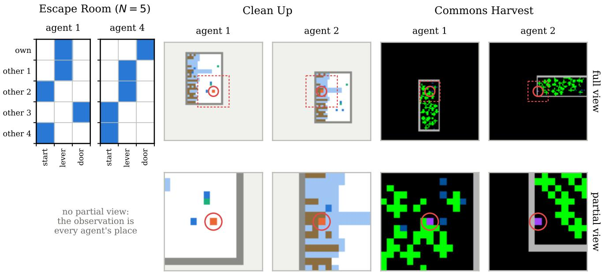  
Figure 5: One state of each game as two agents observe it, after a few random steps, with the full view (top) and the partial view (bottom). Escape Room (N = 5): the one-hot place of every agent, the observer's own first and the others in a fixed order; agent 1 is at the lever and agent 4 at the door. The observation is not spatial, so it has no partial version. Clean Up: the 47 × 47 window centred on the observer (red circle), large enough to contain the whole 25 × 18 map from any position, shown with one colour per plane (orange self, blue others, green apples, brown waste, light blue river, grey walls; beams yellow). Commons Harvest: the 73 × 73 RGB window centred on the observer and turned to the direction it faces, so the two agents see the map at different angles; apples are green, the observer and the others have one fixed colour each. The partial view is the central 15× 15 part of the same window (dashed box, top), used in the partial-view experiments of Appendix G. Everything outside the map is empty.

## B.3 Hyperparameter Selection

Every number in the paper comes from settings chosen before the held-out runs. In Clean Up and Commons Harvest we first choose one PPO setting and keep it for every learner, so that no learner is favoured by a better base configuration; in Escape Room, where runs are cheap, we tune the PPO setting together with each learner's social weights. We then score every candidate by the mean minus the sample standard deviation of the metric across the tuning seeds, once with collective return and once with Nash welfare, on seeds 1-3 in every game. Subtracting one standard deviation favours settings that work on every tuning seed rather than settings with one good seed; with two or three seeds it is a rule of thumb, not a confidence bound. Each chosen setting is then trained from scratch on eight held-out seeds, 11–18 in Escape Room, 7–14 in Clean Up, and 4-11 in Commons Harvest, and nothing from these runs feeds back into the choice. When both metrics choose the same setting, it is run once.

Figure 6 shows why we select twice. Each point is one Clean Up setting, placed by its mean collective return and mean Nash welfare over the tuning seeds, with one panel per group size and one colour per learner family. For most of the grid the two metrics agree: the cloud rises along a diagonal, where a setting that produces more also divides it more evenly, simply because the alternative to producing is that nobody eats. The cloud then splits. Above about 800 apples with three agents and 1,000 with five, one branch keeps rising and the other turns right and down, toward settings that produce more but leave some agents with little.

The colours show who is on each branch. The branch that turns down holds the true-reward learners, in orange, and many rewardplacement settings, in green; the branch that keeps rising is mostly SRA, in blue, joined by the best SRR+V settings. At every group size the setting selected on collective return, the circle, is a true-reward learner at the far right with a Nash welfare near the bottom of the range, and the setting selected on Nash welfare, the diamond, is a self-referenced learner at the top: SRA-EI with three and seven agents and SRR-IA+V with five. No setting is at the corner of both, which is why we report both selections throughout rather than choosing one.

The grids hold 132 candidates in Clean Up with three agents, 108 with five, 132 with seven, and 40 in Commons Harvest, including the self-scaling controls; in Escape Room they cover every operator, placement, and standing setting. Within a learner, the two metrics choose different settings for 7 of 21 learners with three agents, 5 of 21 with five, and 6 of 21 with seven, and in Escape Room for 15 of 126 combinations of group size and learner. Where they differ, the setting chosen on Nash welfare often has a slightly lower mean but varies much less across seeds.

Table 3: Networks and PPO settings. The actor and the critic are linear heads on one shared network. Escape Room tunes the PPO setting per learner (Table 4); Clean Up and Commons Harvest use one setting for all learners, chosen in the PPO stage of the selection protocol.
<table><tr><td></td><td>Escape Room</td><td> $\mathrm { C l e a n U p }$ </td><td>Commons Harvest</td></tr><tr><td>Shared network</td><td>MLP, two layers of 64 tanh units</td><td> $3 \times 3$  convolutions with 16 and 32 chan- nels (second with stride 2), 128 ReLU units</td><td>CleanRL Atari network: convolutions 8× 8/4 (32), 4×4/2 (64), 3×3/1 (64), 512 ReLU units</td></tr><tr><td>Reward model fi</td><td>MLP, two layers of 64 tanh units, on  $( o , a , o ^ { \prime } )$ </td><td>two  $3 \times 3$  convolutions (16 channels) on the stacked  $( o , o ^ { \prime } ) ,$  max- and mean- pooled, then 64 units with a</td><td>one layer of 64 tanh units on the shared network&#x27;s features of o and  $o ^ { \prime }$  (not trained through) and a</td></tr><tr><td>Steps; parallel envs</td><td>500k; 16</td><td>5M; 8</td><td>5M; 8</td></tr><tr><td>Rollout per env Learning rate</td><td>16, 32, or 128 (tuned)  $2 . 5 \times 1 0 ^ { - 4 } \mathrm { ~ o r ~ } 1 0 ^ { - 3 } \mathrm { ~ ( t u n e d ) }$ </td><td>256  $1 0 ^ { - 3 }$ </td><td>128</td></tr><tr><td>Entropy coefficient</td><td></td><td>0.01  $\left( N = 5 \right) ; 0 . 0 5 \left( N = 3 \right) ^ { \ast }$ </td><td> $1 0 ^ { - 3 }$  0.01</td></tr><tr><td>PPO stage</td><td>0.01 or 0.05 (tuned) joint with the operator weights</td><td>learning rate  $\{ 2 . 5 \times 1 0 ^ { - 4 } , 1 0 ^ { - 3 } \}$  × entropy</td><td>learning rate  $\{ 2 . 5 ~ \times ~ 1 0 ^ { - 4 } , 1 0 ^ { - 3 } \} ~ \times ~ \mathrm { e n } -$ </td></tr><tr><td></td><td></td><td>plain PPO and six social configurations, two seeds three seeds</td><td>{0.01, 0.05} × rollout {128, 256, 512} on tropy {0.003, 0.01, 0.03} on plain PPO,</td></tr><tr><td>Warm-up W</td><td>20k steps</td><td>20k steps</td><td>20k steps</td></tr><tr><td>Tuning; held-out seeds</td><td> $1 { - } 3 ; 1 1 { - } 1 8$ </td><td> $1 { - } 3 ; 7 { - } 1 4$ </td><td> $1 { - } 3 ; 4 { - } 1 1$ </td></tr></table>

$^ { * } { \bf A } { \bf t } N = 3$ plain PPO uses its own tuned setting: learning rate $2 . 5 \times 1 0 ^ { - 4 }$ , entropy 0.01, rollout 128.

Table 4: Escape Room, N = 5: PPO setting of each learner at its collective-return pick (learning rate, entropy coefficient, rollout length per environment).
<table><tr><td>Learner (weights)</td><td>LR, entropy</td><td>Rollout</td></tr><tr><td>Plain PPO</td><td> $1 0 ^ { - 3 } , 0 . 0 1$ </td><td>32</td></tr><tr><td>TR-EI  $( \alpha = 1 )$ </td><td> $1 0 ^ { - 3 } , 0 . 0 1$ </td><td>128</td></tr><tr><td> $\mathrm { T R - I A } \left( \alpha / \beta = 0 / 1 \right)$ </td><td> $1 0 ^ { - 3 } , 0 . 0 1$ </td><td>32</td></tr><tr><td> $\mathrm { T R - } S \mathrm { V O } \left( \alpha = 1 , \phi = \pi / 4 \right)$ </td><td> $1 0 ^ { - 3 } , 0 . 0 1$ </td><td>128</td></tr><tr><td> $\mathrm { S R A - E I } \left( \alpha = 3 \right)$ </td><td> $2 . 5 \times 1 0 ^ { - 4 } , 0 . 0 5$ </td><td>128</td></tr><tr><td> $\mathrm { S R A - I A } \left( \alpha / \beta = 0 / 0 . 5 \right)$ </td><td> $1 0 ^ { - 3 } , 0 . 0 5$ </td><td>128</td></tr><tr><td> $\mathrm { S R A - S V O } \left( \alpha = 5 , \phi = \pi / 3 \right)$ </td><td> $2 . 5 \times 1 0 ^ { - 4 } , 0 . 0 1$ </td><td>128</td></tr><tr><td> $\mathrm { S R R - E I } \left( \alpha = 0 . 1 \right)$ </td><td> $1 0 ^ { - 3 } , 0 . 0 5$ </td><td>128</td></tr><tr><td> $\mathrm { S R R - I A } \left( \alpha / \beta = 0 / 1 \right)$ </td><td> $2 . 5 \times 1 0 ^ { - 4 } , 0 . 0 5$ </td><td>128</td></tr><tr><td> $\mathrm { S R R - I A + V } \left( \alpha / \beta = 0 / 1 \right)$ </td><td> $2 . 5 \times 1 0 ^ { - 4 } , 0 . 0 1$ </td><td>128</td></tr><tr><td> $\mathrm { S R R \mathrm { - } I A } + \mathrm { S t a n d i n g } \left( \kappa = 1 \right)$ </td><td> $2 . 5 \times 1 0 ^ { - 4 } , 0 . 0 5$ </td><td>128</td></tr></table>

## B.4 Partial View

For the partial view, every learner is retuned and trained for 7 million environment steps, more than the 5 million of the full view, because the smaller window makes the task slower to learn for every learner including plain PPO. The grid scales each learner's full-view social weights by ${ \frac { 1 } { 3 } } ,$ 1, and 3 and crosses them with learning rates $1 0 ^ { - 3 }$ and $3 \times 1 0 ^ { - 4 }$ and entropy coefficients 0.01 and 0.05, on tuning seeds 1 and 2; the selected setting is rerun on the same held-out seeds as with the full view. Scaling the full-view weights rather than searching from scratch keeps the grid small, and it assumes that the right weight moves with the view but not far, which the selected settings bear out.

The recurrent agents carry a GRU [12] in the policy and in the critic over the agent's observation, its previous action, and its previous reward, with layer normalization, a skip connection around the recurrent layer, and truncated backpropagation over 64 steps. The reward model stays feed-forward and reads only the transition so memory can help the agent act and estimate values but is not available to the self-referenced estimate itself.

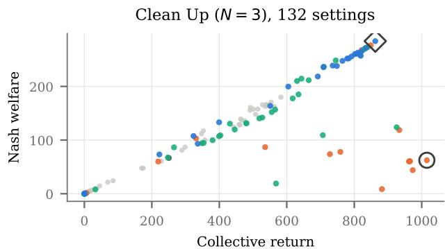

Clean Up (N = 5), 108 settings  
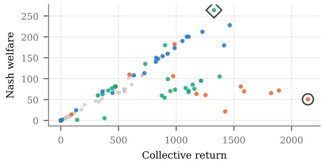

Clean Up (N = 7), 132 settings  
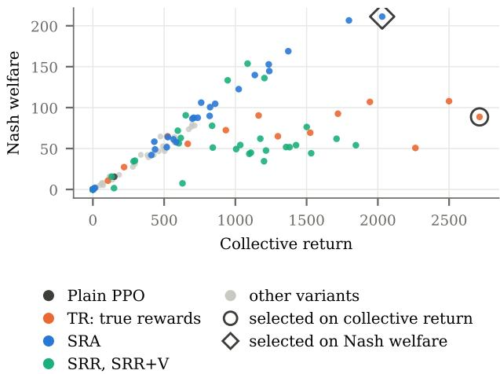  
Figure 6: Clean Up tuning landscape. Each point is one setting evaluated on the three tuning seeds, placed by its mean collective return and mean Nash welfare and coloured by learner family; grey points are variants not analysed in the paper. The circle and the diamond mark the settings that the mean-minus-standard-deviation score selects on collective return and on Nash welfare, among all candidates at that group size.

## C Can Agents Cooperate without Observing Others' Rewards?

Can social preferences be grounded in self-referenced estimates of others' outcomes rather than in their reward signals? This appendix gathers the evidence. It places our learners among all the learners we ran, gives the full results, adds the two measures that collective return leaves out, and asks how far the Escape Room result extends. Two conclusions emerge. Self-referenced estimates are enough to start and sustain cooperation in all three games. Where they fall short of the true rewards, in Commons Harvest, the extra production of the true-reward learners goes to a few agents.

## C.1 Where Our Learners Stand

Figure 7 places our three self-referenced learners among all the learners we ran, on what each game tests: cooperation in Escape Room, productivity and fairness in Clean Up, and efficiency, sustainability, and welfare in Commons Harvest. Each axis spans the means of all learners in that game, true-reward learners included, so reaching the edge means doing as well as the best learner we ran, not merely better than plain PPO.

Plain PPO is the small region in the middle; it reaches the welfare axis only because agents that each earn almost nothing are equal. Our learners extend it in different directions, SRA-EI towards production and SRR-IA+V towards fairness, and between them they reach the edge on most axes. The two axes where the true-reward learners still lead, efficiency and sustainability in Commons Harvest, are the shortfall that the next figures trace to how the return is divided.

## C.2 The Full Results

Table 5 gives the final collective return, Nash welfare, and lowest agent return of every learner in every game, at both of its selections. Table 6 adds sustainability for Commons Harvest, where a high collective return can also come from stripping the map early, and Table 7 adds a behavioural measure for Escape Room and Clean Up with five agents: how spread the exit rates are, and how much of the cleaning the two poorest agents do.

Two entries in Table 6 change how the Commons Harvest results should be read. TR-IA ends with a collective return of –1,935, which only the beam can produce, so its agents are not merely failing to harvest but firing at one another. And the self-scaling control, which rescales the agent's own reward and uses no information about the others, has the highest Nash welfare and the highest lowest agent return of any learner in the game. A high welfare in this game can therefore be reached without any preference over the others, which is why we report the control separately and do not read welfare there as evidence of cooperation.

## C.3 Production Is Not Cooperation

Collective return says how much the group produces. Figures 8 and 9 show the Nash welfare and the lowest agent return of the same runs, in the same layout, and they change the ranking of the learners.

In Clean Up, the true-reward learners lead on collective return under EI and SVO, but in Nash welfare they fall to the bottom of their panels, near 60, while SRA-EI and SRA-SVO climb to about but a configuration that works at one size cannot be assumed to work at another.

Table 5: Every learner at the hyperparameter setting selected on tuning seeds by collective return and by Nash welfare (“same setting" when both objectives selected it). C, NW, and L are computed from each seed's final-window per-agent means. Entries are held-out-seed means ± 95% Student-t intervals; they describe the frozen selections and are not used to reselect them.
<table><tr><td rowspan="2">Learner</td><td colspan="3">selected on collective return</td><td colspan="3">selected on Nash welfare</td></tr><tr><td>C</td><td>NW</td><td>L</td><td>C</td><td>NW</td><td></td></tr><tr><td colspan="7">Escape Room  $( N = 5 )$ </td></tr><tr><td>Plain PPO</td><td> $- 0 . 3 \pm 0 . 4$ </td><td> $4 . 9 5 \pm 0 . 0 8$ </td><td> $- 0 . 2 5 \pm 0 . 3 9$ </td><td></td><td>same setting</td><td></td></tr><tr><td>TR-EI</td><td> ${ \bf 1 7 . 0 \pm 0 . 0 }$ </td><td> ${ \bf 6 . 9 6 \pm 0 . 0 0 }$ </td><td> $- 1 . 0 0 \pm 0 . 0 0$ </td><td></td><td>same setting</td><td></td></tr><tr><td>SRA-EI</td><td> $1 5 . 7 \pm 3 . 0$ </td><td> $6 . 7 8 \pm 0 . 4 2$ </td><td> $- 1 . 0 0 \pm 0 . 0 0$ </td><td></td><td>same setting</td><td></td></tr><tr><td>SRR-EI</td><td> $0 . 0 \pm 0 . 0$ </td><td> $5 . 0 0 \pm 0 . 0 0$ </td><td> $0 . 0 0 \pm 0 . 0 0$ </td><td> ${ \bf 1 7 . 0 \pm 0 . 0 }$ </td><td>same setting</td><td></td></tr><tr><td>TR-IA</td><td> ${ \bf 1 7 . 0 \pm 0 . 0 }$ </td><td> ${ \bf 6 . 9 6 \pm 0 . 0 0 }$ </td><td> $- 1 . 0 0 \pm 0 . 0 0$ </td><td></td><td> ${ \bf 6 . 9 6 \pm 0 . 0 0 }$ </td><td> $- 1 . 0 0 \pm 0 . 0 0$ </td></tr><tr><td> $\mathrm { S R A { - } I A }$ </td><td> $0 . 0 \pm 0 . 0$ </td><td> $5 . 0 0 \pm 0 . 0 0$ </td><td> $0 . 0 0 \pm 0 . 0 0$ </td><td></td><td>same setting</td><td></td></tr><tr><td> $\mathrm { S R R - I A + V }$ </td><td> ${ \bf 1 7 . 0 \pm 0 . 0 }$ </td><td> ${ \bf 6 . 9 6 \pm 0 . 0 0 }$ </td><td> $- 1 . 0 0 \pm 0 . 0 0$ </td><td></td><td>same setting</td><td></td></tr><tr><td> $\mathrm { T R - } S \mathrm { V O }$ </td><td> $1 4 . 9 \pm 5 . 0$ </td><td> $6 . 7 2 \pm 0 . 5 8$ </td><td> $- 0 . 8 8 \pm 0 . 3 0$ </td><td></td><td>same setting</td><td></td></tr><tr><td>SRA-SVO</td><td> $4 . 7 \pm 8 . 2$ </td><td> $5 . 4 1 \pm 1 . 1 4$ </td><td> $- 1 . 0 0 \pm 0 . 0 0$ </td><td></td><td>same setting</td><td></td></tr><tr><td>SRR-SVO</td><td> $0 . 0 \pm 0 . 0$ </td><td> $5 . 0 0 \pm 0 . 0 0$ </td><td> $0 . 0 0 \pm 0 . 0 0$ </td><td></td><td>same setting</td><td></td></tr><tr><td colspan="7">Clean  $U p \left( N = 5 \right)$ </td></tr><tr><td>Plain PPO</td><td> $2 4 8 \pm 1 9 8$ </td><td> $3 7 . 0 \pm 2 9 . 8$ </td><td> $5 . 4 \pm 4 . 8$ </td><td></td><td>same setting</td><td></td></tr><tr><td>TR-EI</td><td> $1 , 5 3 0 \pm 2 8 9$ </td><td> $7 0 . 4 \pm 3 3 . 6$ </td><td> $0 . 0 \pm 0 . 0$ </td><td> $1 , 1 5 9 \pm 4 4 4$ </td><td> $8 6 . 7 \pm 1 4 . 6$ </td><td> $3 . 3 \pm 5 . 2$ </td></tr><tr><td>SRA-EI</td><td> $1 { , } 2 8 6 \pm 1 4 1$ </td><td> $2 1 4 . 4 \pm 1 5 . 3$ </td><td> $8 3 . 1 \pm 1 6 . 6$ </td><td></td><td>same setting</td><td></td></tr><tr><td>SRR-EI</td><td> $1 , 5 1 2 \pm 1 4 0$ </td><td> $8 4 . 5 \pm 2 9 . 8$ </td><td> $0 . 0 \pm 0 . 0$ </td><td></td><td>same setting</td><td></td></tr><tr><td>TR-IA</td><td> $9 6 4 \pm 1 0 7$ </td><td> $1 7 8 . 1 \pm 2 0 . 6$ </td><td> $9 5 . 9 \pm 1 8 . 0$ </td><td></td><td>same setting</td><td></td></tr><tr><td>SRA-IA</td><td> $5 9 0 \pm 1 8 8$ </td><td> $1 0 1 . 6 \pm 3 8 . 5$ </td><td> $3 9 . 5 \pm 3 2 . 8$ </td><td></td><td>same setting</td><td></td></tr><tr><td>SRR-IA+V</td><td> $^ { 1 , 3 5 3 \pm 9 3 }$ </td><td> ${ \bf 2 6 9 . 9 \pm 1 8 . 8 }$ </td><td> $2 5 1 . 5 \pm 2 3 . 4$ </td><td></td><td> $\mathrm { s a m e \ s e t t i n g }$ </td><td></td></tr><tr><td>TR-SVO</td><td> $1 , 4 0 5 \pm 3 1 6$ </td><td> $6 4 . 6 \pm 3 7 . 8$ </td><td> $5 . 3 \pm 1 2 . 5$ </td><td> ${ \bf 1 } , 7 { \bf 1 0 } \pm { \bf 4 9 9 }$ </td><td> $6 0 . 6 \pm 2 6 . 7$ </td><td> $0 . 0 \pm 0 . 0$ </td></tr><tr><td>SRA-SVO</td><td> $1 , 2 0 5 \pm 3 9$ </td><td> $2 0 9 . 6 \pm 9 . 2$ </td><td> $8 3 . 7 \pm 1 3 . 0$ </td><td></td><td> $\mathrm { s a m e \ s e t t i n g }$ </td><td></td></tr><tr><td>SRR-SVO</td><td> $1 , 3 5 7 \pm 1 9 2$ </td><td> $7 1 . 7 \pm 3 2 . 0$ </td><td> $0 . 0 \pm 0 . 0$ </td><td> $^ { 1 , 3 0 9 \pm 2 9 3 }$ </td><td> $1 0 5 . 3 \pm 4 0 . { \overset { \cdot } { 1 } }$ </td><td> $1 5 . 7 \pm 3 0 . 8$ </td></tr><tr><td colspan="7">Commons Harvest  $( N = 7 )$ </td></tr><tr><td>Plain PPO</td><td> $2 1 1 \pm 2$ </td><td> $3 0 . 1 \pm 0 . 2$ </td><td> $2 7 . 9 \pm 0 . 7$ </td><td></td><td>same setting</td><td></td></tr><tr><td>TR-EI</td><td> $6 5 7 \pm 8 6$ </td><td> $5 . 6 \pm 1 . 6$ </td><td> $0 . 6 \pm 0 . 7$ </td><td></td><td>same setting</td><td></td></tr><tr><td>SRA-EI</td><td> $4 1 6 \pm 8 6$ </td><td> ${ \bf 3 5 . 9 \pm 3 . 9 }$ </td><td> $8 . 5 \pm 4 . 2$ </td><td></td><td>same setting</td><td></td></tr><tr><td>SRR-EI</td><td> $- 1 , 6 0 4 \pm 4 , 7 2 1$ </td><td> $1 5 . 0 \pm 7 . 1$ </td><td> $- 5 2 2 \pm 1 , 2 3 5$ </td><td> $2 1 4 \pm 2$ </td><td> $3 0 . 5 \pm 0 . { \overset { \cdot } { 2 } }$ </td><td> $2 7 . 6 \pm 1 . 0$ </td></tr><tr><td>TR-IA</td><td> $- 1 , 9 3 5 \pm 4 , 5 7 6$ </td><td> $0 . 2 \pm 0 . 1$ </td><td> $^ { - 7 7 1 \pm 1 , 8 2 1 }$ </td><td> $- 1 , 6 7 8 \pm 3 , 9 9 0$ </td><td> $1 . 0 \pm 0 . 6$ </td><td> $- 1 , 0 3 7 \pm 2 , 4 5 4$ </td></tr><tr><td>SRA-IA</td><td> $2 1 2 \pm 3$ </td><td> $3 0 . 2 \pm 0 . 4$ </td><td> $2 6 . 7 \pm 1 . 7$ </td><td></td><td>same setting</td><td></td></tr><tr><td>SRR-IA+V</td><td> $2 7 1 \pm 6 6$ </td><td> $1 5 . 2 \pm 5 . 3$ </td><td> $0 . 3 \pm 0 . 7$ </td><td> $2 0 9 \pm 1$ </td><td> $2 9 . 8 \pm 0 . 2$ </td><td> $2 7 . 0 \pm 1 . 2$ </td></tr><tr><td>TR-SVO</td><td> $7 4 4 \pm 1 2 8$ </td><td> $2 6 . 5 \pm 1 2 . 7$ </td><td> $3 . 2 \pm 7 . 6$ </td><td></td><td> $\mathrm { s a m e \ s e t t i n g }$ </td><td></td></tr><tr><td>SRA-SVO</td><td> $2 1 3 \pm 6$ </td><td> $3 0 . 1 \pm 1 . 3$ </td><td> $2 4 . 4 \pm 4 . 6$ </td><td></td><td> $\mathrm { s a m e \ s e t t i n g }$ </td><td></td></tr><tr><td>SRR-SVO</td><td> $2 8 0 \pm 3 5$ </td><td> $1 8 . 7 \pm 7 . 1 $ </td><td> $3 . 5 \pm 9 . 0$ </td><td> $2 1 4 \pm 4$ </td><td> $3 0 . 4 \pm 0 . 6$ </td><td> $2 6 . 5 \pm 1 . 7$ </td></tr></table>

215 and 210. The lowest agent return separates them further: the true-reward EI and SVO learners leave their poorest agent at zero for the whole run, while SRA lifts it to about 83. In Commons Harvest the reversal is starker. TR-EI's Nash welfare falls to about 6 and its poorest agent to under 1, below plain PPO on both, while SRA-EI stays near 36. The advantage of observing the true rewards lies in production, and it is paid for by the agents who end with nothing.

## D Where Should the Self-Referenced Estimate Enter?

Escape Room shows a ceiling rather than a separation. Every learner that escapes reaches a Nash welfare near 7 and a lowest agent return of -1, because whoever pulls the lever loses a point in every episode. No learner without standing avoids this, which is what Appendix F addresses.

## C.4 Escape Room at Every Group Size

The same self-referenced estimate can enter learning in the reward or in the policy update, and the two places suit different preferences. A preference that compares agents belongs in the reward, with the look-ahead; a benevolent one is safer in the policy update. Two experiments support this division. The first runs the reward placement with and without the look-ahead in every game and under every operator. The second follows both placements as the group grows.

Table 8 asks whether the Escape Room result depends on the group size. At every size from two to twelve agents, at least one selfreferenced variant reaches the optimum, so the answer is no: the game stays solvable without the others' rewards. The last column shows how narrow the path is. Seven of sixteen variants reach the optimum with two agents, but only two or three from five agents on. Self-referenced estimates make the game solvable at every size,

## D.1 What the Look-Ahead Does

Figure 10 runs the reward placement with and without the lookahead in every game and under every operator. The look-ahead adds the critic's value of the other agent's next observation to its self-referenced trace, Eq.7, so an agent is judged by what it has earned and by what it is about to earn.

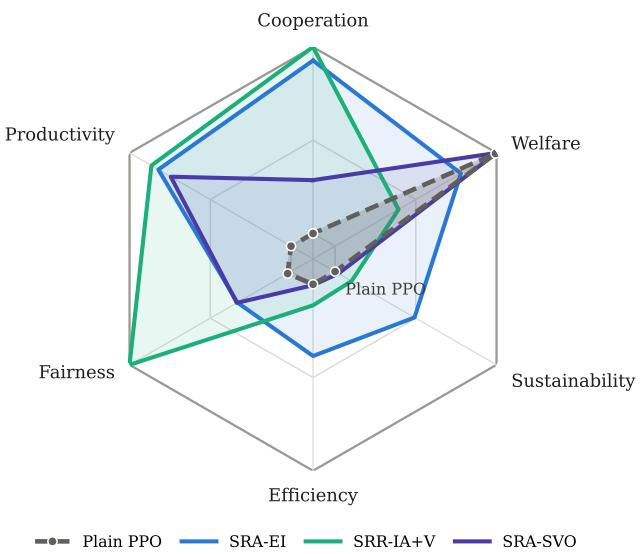  
Figure 7: Our three self-referenced learners, which never observe another agent's reward, against plain PPO on what each game tests: cooperation in Escape Room, productivity and fairness in Clean Up, and efficiency, sustainability, and welfare in Commons Harvest. Each axis spans the means of all learners in that game, true-reward ones included; in Commons Harvest the true-reward agents reach further on efficiency and sustainability. Eight held-out seeds.

Table 6: Commons Harvest, seven agents, eight seeds held out from tuning (4–11). Values are means ± 95% Student-t interval half-widths where shown; bold marks the best per column. In parentheses, the metric that selected the setting (C: collective return; NW: Nash welfare; both: the same setting). Sust.: mean step at which apples are eaten. \*Means of SRA-IA and SRR-IA (both) and of SRR-EI, SRR-SVO, and SRR-IA+V (NW); half-widths ≤ 4.2 (C), ≤ 0.6 (NW), and ≤ 1.7 (L). L: lowest agent return. Self-scaling control: SVO with $\phi = 0 ,$ which only rescales the agent's own reward.
<table><tr><td>Method (selection)</td><td>C</td><td>NW</td><td>L</td><td>Sust.</td></tr><tr><td>Plain PPO</td><td>211 ± 2</td><td> $3 0 . 1 \pm 0 . 2$ </td><td> $2 7 . 9 \pm 0 . 7$ </td><td>46 ± 1</td></tr><tr><td>TR-EI (both)</td><td>657 ± 86</td><td> $5 . 6 \pm 1 . 6$ </td><td> $0 . 6 \pm 0 . 7$ </td><td> $1 9 5 \pm 5 5$ </td></tr><tr><td>TR-SVO (both)</td><td>744 ± 128</td><td> $2 6 . 5 \pm 1 2 . 7$ </td><td>3.2 ± 7.6</td><td>349 ± 56</td></tr><tr><td>TR-IA (C)</td><td>-1,935</td><td>0.2</td><td>-771</td><td>88</td></tr><tr><td>TR-IA (NW)</td><td>-1,678</td><td>1.0</td><td>-1,037</td><td>28</td></tr><tr><td>SRA-EI (both)</td><td>416 ± 86</td><td>35.9 ± 3.9</td><td>8.5 ± 4.2</td><td>195 ± 44</td></tr><tr><td>SRA-SVO (both)</td><td>213 ± 6</td><td> $3 0 . 1 \pm 1 . 3$ </td><td>24.4 ± 4.6</td><td>52 ± 5</td></tr><tr><td>SRR-SVO (C)</td><td>280 ± 35</td><td> $1 8 . 7 \pm 7 . 1 $ </td><td> $3 . 5 \pm 9 . 0$ </td><td>98 ± 28</td></tr><tr><td>SRR-IA+V (C)</td><td>271 ± 66</td><td> $1 5 . 2 \pm 5 . 3$ </td><td> $0 . 3 \pm 0 . 7$ </td><td>77 ± 31</td></tr><tr><td>Five NW selections*</td><td>209-214</td><td> $2 9 . 8 \substack { - 3 0 . 5 }$ </td><td> $2 6 . 5 \substack { - 2 8 . 2 }$ </td><td>45-49</td></tr><tr><td>Self-scaling control (both)</td><td>302 ± 64</td><td> ${ \bf 4 2 . 0 \pm 6 . 9 }$ </td><td> $3 1 . 2 \pm 2 . 4$ </td><td> $1 0 8 \pm 4 7$ </td></tr></table>

The look-ahead does two different jobs. In Escape Room under EI and SVO it gets learning started: without it the dashed line stays at zero for the whole run, because agents that never pull the lever never reach the door, their reward model is fitted on transitions with no reward in them, and the social term is zero everywhere.

The critic already tells positions apart, and that is enough to push the agents off the selfish solution. Under inequity aversion it prevents a misjudgement: a trace makes an agent that is cleaning look far behind, and an agent averse to being ahead stops eating. Crediting the cleaner with the apples it can expect removes most of that apparent gap, and the collective return in Clean Up doubles.

The same mechanism has a cost when the preference only adds outcomes. Under EI in Clean Up, SRR-EI+V produces about 300 apples less than SRR-EI: crediting the others with what they are about to earn pays the agent for a benefit not yet produced. In Commons Harvest the look-ahead does not rescue EI or SVO either; tuning selects the smallest weight we tried, and larger weights stop the agents harvesting. The look-ahead helps a preference that compares agents and can hurt one that adds them up.

## D.2 What Happens as the Group Grows

Figure 11 repeats the comparison of placements in Escape Room for two to twelve agents, each cell tuned at its own size, and Figure 12 follows the main learners in all three games and on all three measures. The two methods fail in different ways as the group grows.

The policy update dilutes. Its coefficient averages the scores of the $N - 1$ other agents, Eq.12, so the part that responds to any one agent's action shrinks as $1 / ( N - 1 )$ . SRA-EI reaches at least two thirds of the optimum up to ten agents and none of it with twelve, and it falls further behind TR-EI as N grows in Escape Room, where it reaches 31 against 45 with ten agents, and in Commons Harvest. The reward placement does not dilute: under inequity aversion SRR and SRR+V sit at the optimum from three agents up to twelve, while SRA-IA stays at zero at every size, because a comparison that only reweights scores does nothing at any N.

Inequity aversion also behaves differently with true rewards and with self-referenced estimates. With true rewards it declines as the group grows, TR-IA falling to 3.8 in Escape Room with ten agents and from 820 to 345 apples in Clean Up between three and seven agents, and it collapses in Commons Harvest. With self-referenced estimates and the look-ahead it holds: SRR-IA+V produces most with five agents, gives its poorest agent more than any other learner shown with five and seven, and collapses only with nine agents in Commons Harvest, where every learner with a social term except SRA-SVO collapses. A larger group gives an inequity-averse agent more pairs to be behind in, and the true rewards make each of those comparisons sharper than it is. We have not isolated this mechanism.

## E Who Pays for Cooperation?

A high collective return can hide who receives it and who does the work. In Clean Up the most productive learners split into eaters and cleaners, while SRR-IA+V shares the work. This appendix shows that the pattern holds for all nine learners. It also appears, in its own form, in the other two games, and it survives a change of the selection metric.

Table 7: Escape Room and Clean Up with five agents, eight held-out seeds. C is collective return, NW Nash welfare (c = 5 in Escape Room, 0 in Clean Up), L the lowest agent return. In parentheses, the metric that selected a setting when the two differ. The last column describes behaviour: the standard deviation of the exit rates in Escape Room, about 0.5 when the same agents always exit and 0 when all exit equally often, and in Clean Up the share of the cleaning done by the two lowest earners, 0.40 for an equal split.
<table><tr><td>Env.</td><td>Method (selection)</td><td>C</td><td>NW</td><td>L</td><td>Behavior</td></tr><tr><td>Escape Room</td><td>Plain PPO</td><td> $- 0 . 2 5 \pm 0 . 3 9$ </td><td> $4 . 9 5 \pm 0 . 0 8$ </td><td> $- 0 . 2 5 \pm 0 . 3 9$ </td><td>no reliable escape</td></tr><tr><td></td><td>TR-EI (C)</td><td> $\mathbf { 1 7 . 0 0 \ : \pm 0 . 0 0 }$ </td><td> $6 . 9 6 \pm 0 . 0 0$ </td><td> $- 1 . 0 0 \pm 0 . 0 0$ </td><td>concentrated exits, SD 0.49</td></tr><tr><td></td><td>SRA-EI</td><td> $1 5 . 7 5 \pm 2 . 9 5$ </td><td> $6 . 7 8 \pm 0 . 4 2$ </td><td> $- 1 . 0 0 \pm 0 . 0 0$ </td><td>concentrated exits, SD 0.48</td></tr><tr><td></td><td>SRR-IA + Standing (NW)</td><td> $1 3 . 0 8 \pm 0 . 2 8$ </td><td> $\mathbf { 7 . 5 0 \pm 0 . 0 3 }$ </td><td> $\mathbf { + 1 . 2 7 \pm 0 . 1 2 }$ </td><td>criterion 8/8, SD 0.13</td></tr><tr><td>Clean Up</td><td>Plain PPO</td><td> $2 4 8 \pm 1 9 8$ </td><td> $3 7 . 0 \pm 2 9 . 8$ </td><td> $5 . 4 \pm 4 . 8$ </td><td></td></tr><tr><td></td><td>TR-SVO (C)</td><td> $1 , 4 0 5 \pm 3 1 6$ </td><td> $6 4 . 6 \pm 3 7 . 8$ </td><td> $5 . 3 \pm 1 2 . 5$ </td><td>cleaning share  $0 . 8 6 \pm 0 . 1 6$ </td></tr><tr><td></td><td>TR-IA</td><td> $9 6 4 \pm 1 0 7$ </td><td> $1 7 8 . 1 \pm 2 0 . 6$ </td><td> $9 5 . 9 \pm 1 8 . 0$ </td><td></td></tr><tr><td></td><td>SRA-EI</td><td> $1 { , } 2 8 6 \pm 1 4 1$ </td><td> $2 1 4 . 4 \pm 1 5 . 3$ </td><td> $8 3 . 1 \pm 1 6 . 6$ </td><td>cleaning share  $0 . 8 9 \pm 0 . 1 2$ </td></tr><tr><td></td><td>SRR-EI</td><td> $\mathbf { 1 } , \mathbf { 5 1 2 } \pm \mathbf { 1 4 0 }$ </td><td> $8 4 . 5 \pm 2 9 . 8$ </td><td>0</td><td>one or two agents only clean</td></tr><tr><td></td><td>SRR-IA+V (NW)</td><td> $1 { , } 3 5 3 \pm 9 3$ </td><td> ${ \bf 2 6 9 . 9 \pm 1 8 . 8 }$ </td><td> $\mathbf { 2 5 1 . 5 \pm 2 3 . 4 }$ </td><td>cleaning share 0.51 ± 0.12</td></tr></table>

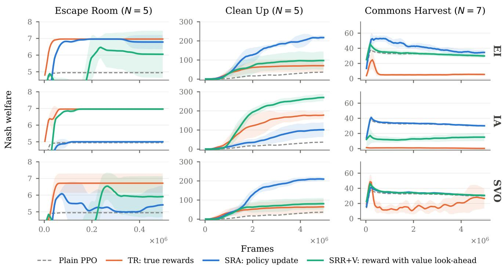  
Figure 8: Nash welfare over training for the runs of Figure.3 in the main paper. Columns are games and rows are social operators; every learner is at its collective-return selection. Lines are means over eight held-out seeds and shaded regions are pointwise 95% Student-t intervals, with a five-bin moving average.

## E.1 All Nine Learners in Clean Up

Figure 13 shows all nine Clean Up learners, one block per operator, with every agent's return over training on top and the shares of the apples and the cleaning below. Read down a column, the two rows tell the same story from two sides: an agent whose return line stays near zero is, in the row beneath, the one doing most of the cleaning.

The split into eaters and cleaners is the rule, not the exception. In eight of the nine learners the line of the apples and the line of the cleaning cross, and the two poorest agents do between 71% and 100% of the cleaning while the richest does almost none. It forms early and does not change: in the four learners that leave their poorest agent near zero, TR-EI, TR-SVO, SRR-EI+V, and SRR-SVO+V, that agent's line flattens within the first two million frames and never rises. Where the estimate enters matters more than the estimate itself. SRR-EI+V and SRR-SVO+V use the same self-referenced estimates as SRA-EI and SRA-SVO, yet divide the return as unequally as the true-reward learners. The one learner that breaks the pattern is SRR-IA+V: its five return lines climb together, and both of its share lines stay near 20% for every agent, so its high Nash welfare is not an artefact of everyone earning equally little.

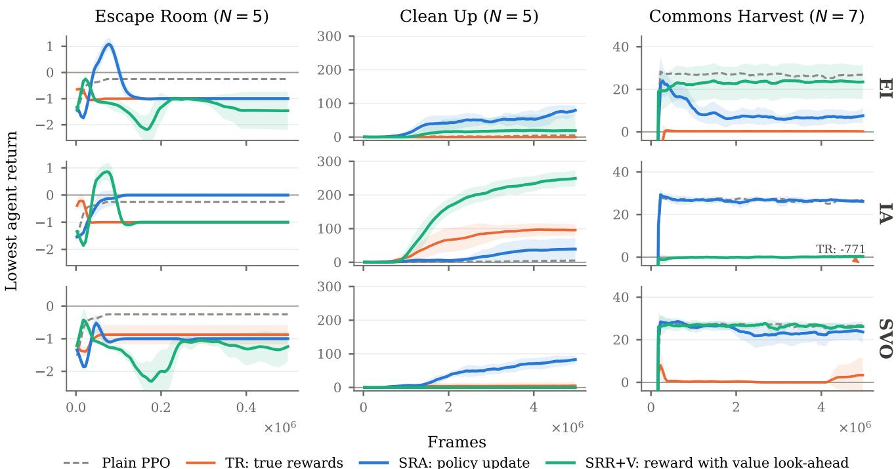  
Figure 9: Lowest agent return over training for the runs, with the same layout and intervals as Figure 8. The grey line marks zero. Commons Harvest TR-IA falls below the plotted range, to a final mean of –771, and is marked at the panel edge.

Table 8: Escape Room: collective return as a fraction of the optimum, held-out seeds. “Best self-ref." is the best of 16 selfreferenced variants (four operators × four placements) selected on tuning seeds; the last column counts how many of the 16 reach 90% of the optimum.
<table><tr><td>N</td><td>M</td><td>PPO</td><td>TR</td><td>Best self-ref.</td><td>SRA-EI</td><td>≥ 90%</td></tr><tr><td>2</td><td>1</td><td>0.00</td><td>1.00</td><td>1.00 (SRR-EI)</td><td>1.00</td><td>7/16</td></tr><tr><td>3</td><td>2</td><td>0.00</td><td>1.00</td><td>1.00 (SRR-IA)</td><td>0.69</td><td>3/16</td></tr><tr><td>5</td><td>3</td><td>-0.01</td><td>1.00</td><td>1.00 (SRR-IA)</td><td>0.93</td><td>3/16</td></tr><tr><td>7</td><td>4</td><td>0.00</td><td>1.00</td><td>1.00 (SRR-IA)</td><td>0.82</td><td>2/16</td></tr><tr><td>10</td><td>5</td><td>0.00</td><td>1.00</td><td>1.00 (SRR-IA)</td><td>0.69</td><td>2/16</td></tr><tr><td>12</td><td>6</td><td>0.00</td><td>1.00</td><td>1.00 (SRR-IA)</td><td>0.00</td><td>2/16</td></tr></table>

The Nash welfare puts numbers on this. For every operator our learner's welfare is far above that of the true-reward learner with the same operator: 214 against 70 under EI, 270 against 178 under inequity aversion, and 210 against 65 under SVO. The gap comes from the poorest agents, not from production, since the collective returns differ by a sixth at most and ours is higher under inequity aversion; a geometric mean is pulled down by the agent with the least, and the true-reward EI and SVO learners leave that agent with almost nothing. The reward placement with EI and SVO is the cautionary case: it uses the same self-referenced estimates as SRA, yet its welfare is no better than the true-reward learner's, 97 and 81, because its two poorest agents do 84% and 100% of the cleaning.

Tables 9 and 10 show that the pattern does not depend on the group size. With seven agents, under SRA-EI the two poorest agents do 86± 9% of the cleaning and receive 5% of the apples, while under SRR-IA they do 34 ± 7% and receive 24%.

## E.2 The Same Tension in the Other Games

Figures 14 and 15 show every agent's return in Escape Room and Commons Harvest. The tension between producing and sharing appears in both, in a form set by the game.

In Escape Room it is built in. Every learner that escapes produces the same two-tier outcome, two agents at +10 and three at —1, because three of five must hold the lever while the other two walk out. That this is the same under TR-EI, SRA-EI, and SRR-IA+V shows it is a property of the game, not of any learner, and collective return cannot tell a group that rotates the lever from one that does not, since every episode pays the same whoever pulls. This is why the game needs standing, Appendix F.

In Commons Harvest it takes the form of a monopoly. Under TR-EI one agent climbs to about 560 of the group's 657 apples while the rest stay near the floor, so the game's highest collective return goes almost entirely to one agent. SRA-EI produces less, 416, but its lines stay together and its poorest agent ends at 8 against under 1. The Nash welfare tells the same story more sharply: TR-EI's falls to 6, below even plain PPO's 30, while SRA-EI's is 36. Welfare in this game needs care, though. The self-scaling control, which ignores the others, reaches the highest welfare of all, so in Commons Harvest a high welfare is not by itself evidence of a social preference.

... TR: true rewards  SRA: prediction in the policy update - SRR: prediction in the reward  SRR+V: reward with the value look-ahead  
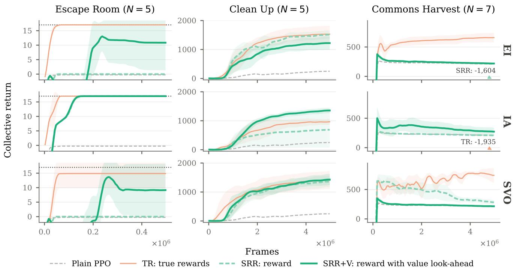

Figure 10: The value look-ahead. Collective return over training for the reward placement without the look-ahead, SRR, and with it, SRR+V; plain PPO and the true-reward learner are drawn faintly for reference. Every learner is at its collective-return selection; lines are means over eight held-out seeds and shaded regions, drawn for every learner except plain PPO, are pointwise 95% Student-t intervals; where all seeds agree, as for the true-reward learners at the Escape Room optimum, the interval has no width. Learners below the plotted range are marked at the panel edge with their final means.  
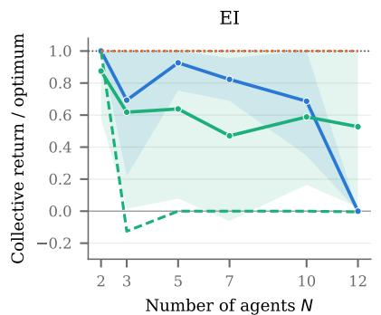

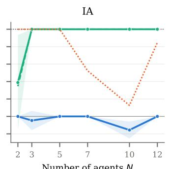

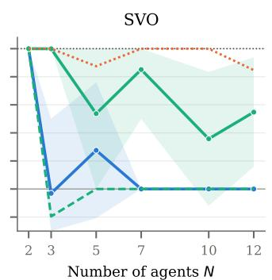  
Figure 11: Where the self-referenced estimate enters, by group size. Escape Room collective return divided by the optimum for each operator, with the estimate in the policy update, SRA, in the reward, SRR, and in the reward with the value look-ahead, SRR+V, against the true-reward learner. Every cell is tuned separately at its N on tuning seeds; points are means over eight held-out seeds and shaded regions, drawn for SRA and SRR+V, are 95% Student-t intervals.

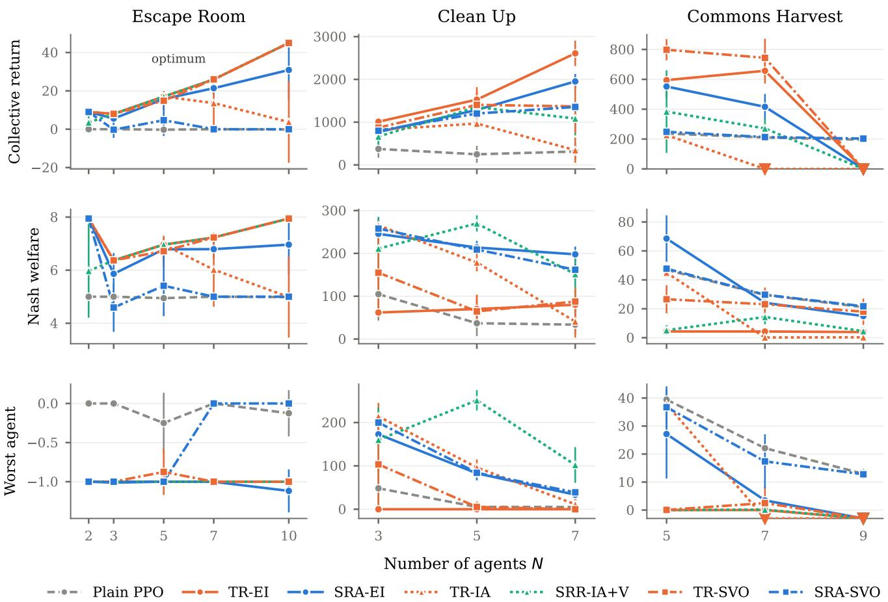  
Figure 12: Final collective return, Nash welfare, and lowest agent return against the number of agents N for plain PPO, TR-EI, SRA-EI, TR-IA, SRR-IA+V, TR-SVO, and SRA-SVO, each at its collective-return selection for that N; means over eight held-out seeds, bars are 95% t-intervals. The Escape Room optimum grows with N (dotted line). Downward triangles mark means below the plotted range: in Commons Harvest, TR-IA at N = 7 ends at -1,935, and at $N = 9 \mathrm { T R - I A }$ , SRR-IA+V, SRA-EI, TR-EI, and TR-SVO end a $\mathrm { t } - 1 2 , 8 1 8 , - 5 , 7 3 5 , - 3 , 7 7 0 , - 2 , 2 6 8 ,$ and –1,720. Commons Harvest Nash welfare and lowest agent return here are the per-step logged values, which differ slightly from the values computed from per-agent means in the other tables.

Table 9: Clean Up, three agents, eight held-out seeds (95% CIs). IA settings are $\alpha / \beta ; { \bf s v o }$ uses $\phi = \pi / 3 .$ The last column lists the mean return of the highest through the lowest earner.
<table><tr><td>Method</td><td>Setting</td><td>C</td><td>NW</td><td>L</td><td>Returns</td></tr><tr><td>Plain PPO</td><td>一</td><td> $3 7 3 \pm 2 0 6$ </td><td> $1 0 4 . 9 \pm 6 1 . 8$ </td><td> $4 8 . 3 \pm 4 5 . 2$ </td><td> $1 7 2 / 1 5 3 / 4 8$ </td></tr><tr><td>SRA-EI (NW)</td><td> $\alpha { = } 2$ </td><td> $7 6 8 \pm 6 9$ </td><td> $2 4 5 . 6 \pm 2 4 . 5$ </td><td> $1 7 2 . 8 \pm 2 7 . 9$ </td><td> $3 3 5 / 2 6 0 / 1 7 3$ </td></tr><tr><td>SRA-SVO</td><td> $\alpha { = } 7$ </td><td> $8 0 7 \pm 3 6$ </td><td> $2 5 8 . 9 \pm 1 3 . 5$ </td><td> $1 9 6 . 1 \pm 2 3 . 3$ </td><td> $3 6 9 / 2 4 2 / 1 9 6$ </td></tr><tr><td>SRA-IA</td><td> $0 / 1$ </td><td> $6 8 9 \pm 3 2$ </td><td> $2 2 8 . 7 \pm 1 0 . 7$ </td><td> $2 0 8 . 6 \pm 1 3 . 8$ </td><td> $2 5 7 / 2 2 3 / 2 0 9$ </td></tr><tr><td>SRR-IA+V</td><td> $0 / 0 . 0 3$ </td><td> $6 6 4 \pm 2 1 3$ </td><td> $2 1 1 . 2 \pm 7 4 . 1$ </td><td> $1 6 0 . 3 \pm 7 5 . 1$ </td><td> $2 9 6 \mathrm { ~ / ~ } 2 0 7 \mathrm { ~ / ~ } 1 6 0$ </td></tr><tr><td>TR-IA</td><td> $0 / 0 . 0 3$ </td><td> $8 2 0 \pm 3 7$ </td><td> ${ \bf 2 6 5 . 4 \pm 1 6 . 1 }$ </td><td> $\mathbf { 2 1 5 . 7 \pm 3 1 . 9 }$ </td><td> $3 6 1 / 2 4 3 / 2 1 6$ </td></tr><tr><td>TR-EI (C)</td><td>α=0.01</td><td> ${ \bf 1 } , { \bf 0 1 0 } \pm { \bf 1 9 }$ </td><td> $6 2 . 0 \pm 0 . 9$ </td><td>0</td><td> $5 8 5 / 4 2 5 / 0$ </td></tr></table>

## E.3 Selecting on Nash Welfare

A natural objection is that our learners only look fairer because of how we selected them. Figure 16 answers it by taking, in each game, the one configuration that each metric selects among all social learners, and plotting every agent's return. The two rows differ in shape, not only in level: the top row, selected on collective return, has a leader and a floor, and the bottom row, selected on Nash

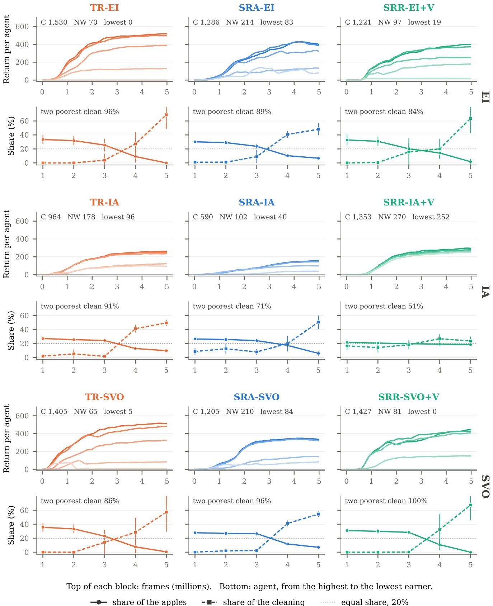

Figure 13: Who receives the return and who does the work for all nine Clean Up learners with five agents. One block per operator; columns are the true-reward learner, SRA, and SRR+V, each at its collective-return selection. Top row of each block: every agent's return over training, agents ranked within each seed by their final return and averaged by rank over the eight held-out seeds, darkest the richest. Bottom row: each agent's final share of the apples, solid, and of the cleaning, dashed, with 95% Student-t intervals; the dotted line is the equal share of 20%.

Table 10: Clean Up, seven agents, eight held-out seeds (7–14; 95% CIs). Each learner at the setting selected on the three tuning seeds, by the metric in parentheses. The last column lists the mean return of the highest through the lowest earner.
<table><tr><td>Method</td><td>Setting</td><td>C</td><td>NW</td><td>L</td><td>Returns, high → low</td></tr><tr><td>Plain PPO</td><td></td><td> $3 1 3 \pm 1 9 3$ </td><td> $3 3 . 7 \pm 2 4 . 0$ </td><td> $5 . 2 \pm 8 . 2$ </td><td> $7 0 / 6 0 / 5 1 / 4 9 / 4 7 / 3 1 / 5$ </td></tr><tr><td>SRA-EI (NW)</td><td>α=3</td><td> $1 , 9 5 3 \pm 1 7 4$ </td><td> ${ \bf 1 9 8 . 5 \pm 1 8 . 2 }$ </td><td> $3 4 . 2 \pm 1 3 . 7$ </td><td>426 / 409 / 383 / 352 / 285 / 64 / 34</td></tr><tr><td>SRA-SVO (NW)</td><td>α=5</td><td> $1 , 3 5 6 \pm 1 1 1$ </td><td> $1 6 1 . 8 \pm 1 3 . 9$ </td><td> $3 9 . 0 \pm 9 . 8$ </td><td>266 / 252 / 244 / 239 / 231 / 85 / 39</td></tr><tr><td>SRR-IA (NW)</td><td> $0 . 0 0 3 / 0 . 1$ </td><td> $1 , 0 6 9 \pm 1 1 6$ </td><td> $1 5 1 . 1 \pm 1 6 . 2$ </td><td> ${ \bf 1 1 6 . 3 \pm 1 7 . 8 }$ </td><td>178 / 166 /  162 / 155 / 150 /  142 / 116</td></tr><tr><td>SRR-IA+V (NW)</td><td> $0 . 0 0 3 / 0 . 1$ </td><td> $1 , 0 0 6 \pm 1 3 3$ </td><td> $1 4 0 . 9 \pm 1 9 . 8$ </td><td> $1 0 0 . 3 \pm 2 6 . 9$ </td><td>181 / 166 / 154 / 143 / 133 / 129 / 100</td></tr><tr><td>TR-IA (NW)</td><td>0/0.03</td><td> $3 4 5 \pm 2 9 6$ </td><td> $4 0 . 9 \pm 3 7 . 5$ </td><td> $1 1 . 4 \pm 1 4 . 8$ </td><td>76 / 65 / 62 / 55 / 52 / 23 / 11</td></tr><tr><td>TR-EI (C)</td><td>α=0.03</td><td> ${ \bf 2 , 6 0 9 \pm 2 9 8 }$ </td><td> $8 0 . 1 \pm 1 5 . 8$ </td><td>0</td><td>568 / 555 / 545 /  541 / 401 / 0 / 0</td></tr><tr><td>TR-SVO (C)</td><td> $\scriptstyle \alpha = 0 . 0 1$ </td><td> $1 , 3 6 9 \pm 6 2 3$ </td><td> $8 7 . 6 \pm 3 2 . 6$ </td><td>0</td><td>276 /  265  / 251 /  245 /  239 / 92 /  0</td></tr></table>

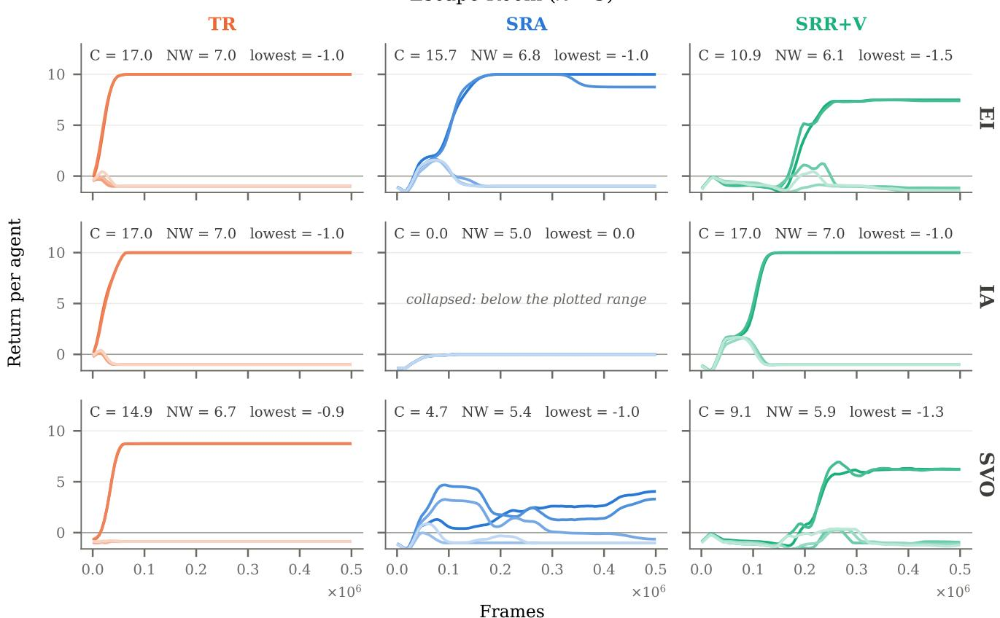  
Figure 14: Who receives the return in Escape Room with five agents, as in Figure 13. Nash welfare uses the offset $c = 5$ of Eq. (15).

welfare, has lines that stay together. In Clean Up the collectivereturn choice, TR-SVO, produces 1,405 apples with a Nash welfare of 65, and the Nash-welfare choice, SRR-IA+V, produces 1,353 with a welfare of 270, so almost the same harvest is divided very differently. The tuning landscape of Figure 6 shows that this is not one lucky pick: at every group size, the collective-return choice is a true-reward learner and the Nash-welfare choice is one of ours.

For a single learner the two metrics usually agree, and where they differ the effect is not consistent. In Escape Room with seven agents, Nash welfare selects SRR-IA with standing at $\kappa = 2 ,$ which reaches 72% of the optimum, over $\kappa = 1$ , which produces more but leaves the poorest agent at a loss. In Clean Up with five agents, the TR-SVO setting chosen on Nash welfare produced more apples on the held-out seeds, $1 , 7 1 0 \pm 4 9 9$ , than the one chosen on collective return, $1 , 4 0 5 \pm 3 1 6 ,$ while still leaving one agent with nothing; we report the setting chosen on the tuning seeds and do not reselect. In Commons Harvest the Nash-welfare settings make the SRR learners equal by reducing their production to that of plain PPO, which is the failure mode of the metric. Neither metric is enough alone, which is why we report both and the lowest agent return as well.

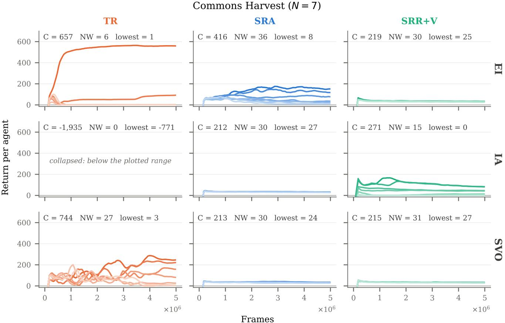  
Figure 15: Who receives the return in Commons Harvest with seven agents, as in Figure 13. TR-IA collapses and lies below the plotted range.

## F Standing in the Repeated Game

In Escape Room some agents must pay for the lever in every episode, so a fair division is possible only across the episodes of a run. Standing, achieves it: fixed roles become shared ones, at the cost of about a quarter of the optimum. This appendix explains how standing is computed, shows that the result holds on every seed, traces the lost quarter to coordination, and explains why we do not use standing in Clean Up.

## F.1 How Standing Is Computed

Each observer i keeps, for every agent j, a running average $G _ { i j }$ of $j ^ { \circ } s$ episode return as i estimates it from self-reference, and of its own true return when j = i. After episode k,

$$
\hat { R } _ { i j } ^ { k } = \sum _ { t \in k } \hat { r } _ { i j } ^ { t } , \qquad \eta _ { k } = \operatorname* { m a x } ( 1 / k , 1 / H ) ,\tag{23}
$$

$$
\begin{array} { r } { G _ { i j } ^ { k } = ( 1 - \eta _ { k } ) G _ { i j } ^ { k - 1 } + \eta _ { k } \hat { R } _ { i j } ^ { k } , } \end{array}\tag{24}
$$

a plain mean over the first H episodes and an exponential moving average after that. The mean at the start keeps early episodes from being dominated by the latest one, and the moving average afterwards lets the ledger follow a change in behaviour. We use $H = 1 0 0$ episodes in Escape Room and $H \in \{ 2 0 , 3 0 \}$ in Clean Up, whose 1,000-step episodes give only a few hundred episodes per environment copy. Every copy of the environment keeps its own ledger, and each entry is updated when that agent's episode ends.

From the ledger, i measures how far it has been ahead of the others and how far behind them,

$$
\begin{array} { c c } { { a _ { i } = \displaystyle \frac { 1 } { N - 1 } \sum _ { j \neq i } [ G _ { i i } - G _ { i j } ] _ { + } , } } & { { b _ { i } = \displaystyle \frac { 1 } { N - 1 } \sum _ { j \neq i } [ G _ { i j } - G _ { i i } ] _ { + } , } } \\ { { \ } } & { { } } \\ { { \mathrm { a h e a d } _ { i } = \displaystyle \frac { a _ { i } } { a _ { i } + c _ { i } } , \qquad \mathrm { b e h i n d } _ { i } = \displaystyle \frac { b _ { i } } { b _ { i } + c _ { i } } , } } & { { ( 2 5 ) } } \end{array}
$$

with the scale $\begin{array} { r } { c _ { i } = \left| G _ { i i } \right| + ( N - 1 ) ^ { - 1 } \sum _ { j \neq i } \left| G _ { i j } \right| } \end{array}$ plus a small constant. Dividing by a scale built from the returns themselves lets one gate strength κ work in games whose returns differ by two orders of magnitude: both fractions lie in [0, 1) and do not change when every return is multiplied by the same constant. Both are zero when i's history is level with the others', so the gate leaves a fair division alone and only separates “always me” from “each of us in turn”.

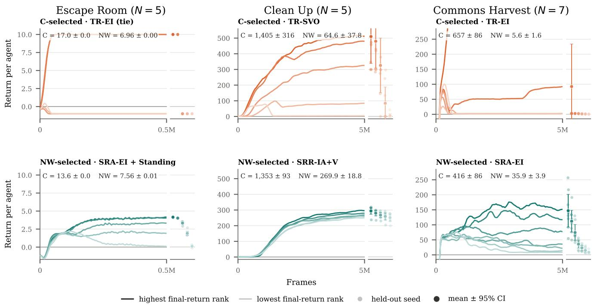  
Figure 16: Agent outcomes under the two tuning objectives. Columns are the three games; rows are the configurations selected on tuning seeds by collective return (top) and Nash welfare (bottom), without the self-scaling controls. Each large panel shows the return of every agent over training: agents are ordered within each seed by their final-window return and then averaged by rank across the eight held-out seeds (darkest: highest final-return rank). The narrow panel shows all eight final seed values and the rank mean ± 95% Student-t interval. Insets give the final C and NW. Ranked curves describe how the return is divided; they do not follow one agent across seeds.

The gate is off at the start of training, and this matters. It waits for the reward-model warm-up W and a further gate warm-up, and then acts only once some agent's average exceeds a threshold, two per episode in every Escape Room run. Before that the group has nothing to share: a gate applied from the start discounts the first agent that earns anything, and in our runs it prevents cooperation from forming at all. The threshold is tested on all agents, the observer included, because with three agents and two pulling the lever only one agent collects, and testing the others alone would never switch the gate on for the agent that is ahead.

## F.2 The Result Holds on Every Seed

Figure 17 shows the four pairs of configurations that differ only in standing: SRA-EI with three and five agents and SRR-IA with five and seven. Panels (a) and (b) are the result. Without standing the exit rates split within the first 150 thousand frames and stay split: two agents exit in every episode and three in none, on every seed. With standing no line sits at zero, every agent exits in at least a quarter of the episodes, and the lines gather around the even share of two in five. Panel (c) gives the price, a collective return that settles at about three quarters of the optimum, and panels (d)-(g) show the same trade in all four pairs.

A mean can hide a mixture of outcomes, so Figure 18 shows every held-out seed. Without standing every seed settles at a loss of one point for its worst-off agent; with standing the worst-off agent is above zero on almost every seed. Table 11 counts them: standing takes every pair from no shared seed to six or eight of eight. A larger sample confirms the two SRA-EI pairs. Over twenty seeds the group with three agents reaches 5.62 ± 0.37 of an optimum of 8, its lowest agent gains 1.48 ± 0.30 per episode, and the agents exit on 27, 28, and 30% of episodes, close to the 33% of an even split. With five agents the group reaches 13.56 ± 0.10 of 17 and exit rates lie between 35 and 41%, against 40% for an even split. These are frequencies over many episodes, not an order in which the agents take turns.

## F.3 Why Sharing Costs a Quarter of the Optimum

With standing, every configuration reaches between 69% and 80% of the optimum. Escape Room is solved in one step only if exactly the right number of agents pull the lever at once; too few and the door stays shut, too many and the group pays for nothing. Once every agent sometimes pulls, the question is whether they manage to pull in the right numbers. Figure 19 shows that they do not coordinate. The number of agents that pull at the first step is what independent choices would give. With five agents and three needed, each agent pulls first with probability $\bar { p } = 0 . 3 5 ,$ independent choices give exactly three pullers with probability $\binom { 5 } { 3 } \bar { p } ^ { 3 } ( 1 -$ $\bar { p } ) ^ { 2 } = 0 . 1 8$ , and the observed share is 0.18. With three agents and two needed, $\bar { p } = 0 . 6 9$ gives 0.44 against the observed 0.46. The lost quarter is the cost of that mismatch.

- =: without standing SRA-EI with standing SRR-IA with standing  
(a) without standing  
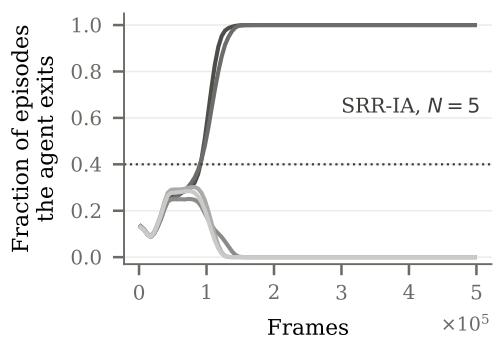

(b) with standing  
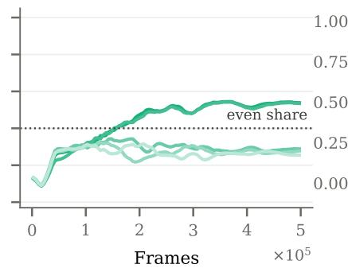

(c) collective return / optimum  
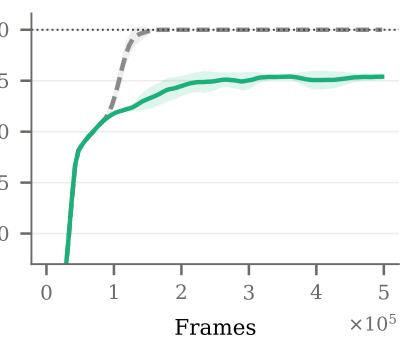

(d) SRA-EI, N = 3  
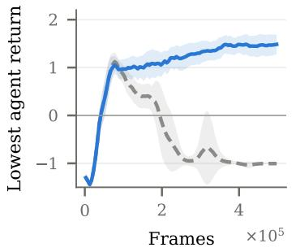

(e) SRA-EI, N = 5  
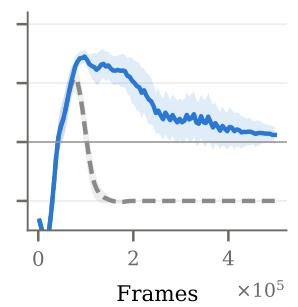

(f) SRR-IA, N = 5  
(g) SRR-IA, N = 7  
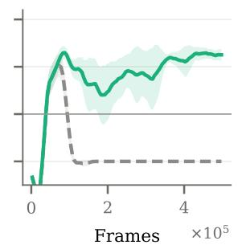

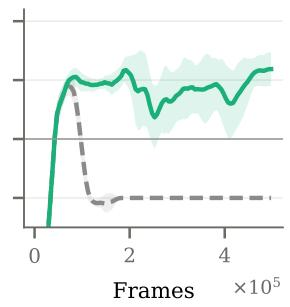  
Figure 17: Standing in the repeated game, Escape Room. (a, b) SRR-IA with five agents, without and with standing, the only difference between the two: the fraction of episodes in which each agent exits, ranked within each seed by its final exit rate and averaged by rank over the eight held-out seeds; the dotted line is the even share, two exits in five. (c) Collective return divided by the optimum for the same two runs. (d-g) Lowest agent return over training without and with standing for the four exact pairs. Means over seeds 11–18 with pointwise 95% Student-t intervals. Figure 18 shows every seed.

Table 11: The four exact pairs of Figure 17 and the two descriptive TR-IA pairs, held-out seeds 11-18. Values for the withstanding arm are means ± 95% Student-t interval half-widths. A seed counts as shared when $L _ { s } > 0$ and the exit rates have a standard deviation below 0.20; the last column gives the shared seeds without → with standing. Every without-standing arm is 0/8. †The TR-IA pairs also differ in their PPO settings.
<table><tr><td>ER(N,M), with-standing configuration</td><td> $C / C ^ { \star }$ </td><td> $L _ { s }$ </td><td></td><td>Exit SD Shared seeds</td></tr><tr><td>(3,2) SRA-EI, κ=4</td><td> $0 . 7 1 1 \pm 0 . 0 3 5$ </td><td> $1 . 5 1 4 \pm 0 . 2 2 0$ </td><td> $0 . 0 3 0 \pm 0 . 0 1 5$ </td><td> $0 / 8  8 / 8$ </td></tr><tr><td>(5,3)  $\scriptstyle \mathrm { S R A - E I } , \kappa = 4$ </td><td> $0 . 7 9 7 \pm 0 . 0 0 2$ </td><td> $0 . 1 1 4 \pm 0 . 1 1 9$ </td><td> $0 . 1 2 9 \pm 0 . 0 0 3$ </td><td> $0 / 8  6 / 8$ </td></tr><tr><td>(5,3)  $\mathrm { S R R - I A } , \kappa { = } 1$ </td><td> $0 . 7 6 9 \pm 0 . 0 1 6$ </td><td> $1 . 2 6 8 \pm 0 . 1 2 2$ </td><td> $0 . 1 3 1 \pm 0 . 0 1 6$ </td><td> $0 / 8  8 / 8$ </td></tr><tr><td>(5,3)  $\mathrm { T R - I A } , \kappa = 1 ^ { \dagger }$ </td><td> $0 . 7 3 5 \pm 0 . 0 3 2$ </td><td> $0 . 9 4 2 \pm 0 . 4 0 3$ </td><td> $0 . 1 0 7 \pm 0 . 0 2 0$ </td><td> $0 / 8  8 / 8$ </td></tr><tr><td>(7,4)  $\mathrm { S R R - I A } , \kappa { = } 2$ </td><td> $0 . 7 1 8 \pm 0 . 0 3 9$ </td><td> $1 . 2 0 1 \pm 0 . 2 8 2$ </td><td> $0 . 1 0 4 \pm 0 . 0 4 0$ </td><td> $0 / 8  8 / 8$ </td></tr><tr><td> $( 7 , 4 ) \mathrm { T R - I A } , \kappa { = } 2 ^ { \dagger }$ </td><td> $0 . 6 9 1 \pm 0 . 1 3 4$ </td><td> $0 . 4 7 6 \pm 0 . 7 8 3$ </td><td> $0 . 1 2 2 \pm 0 . 0 5 0$ </td><td> $0 / 8  6 / 8$ </td></tr></table>

If the agents knew more, would they coordinate better? Table 12 tests three ways of giving them more information, for the selected SRA-EI learner. Training the critic used in the cross scores on raw returns lowers the return. Giving the policy its own standing as an input, so that it can act on how far ahead it has been, changes little. Replacing the private self-referenced ledgers with one ledger of true returns shared by all agents, which removes both the estimation error and the disagreement between ledgers, also changes little. None of the three recovers the lost quarter, so what is missing is a way to agree on who pulls this time, not a better estimate of who has been paying.

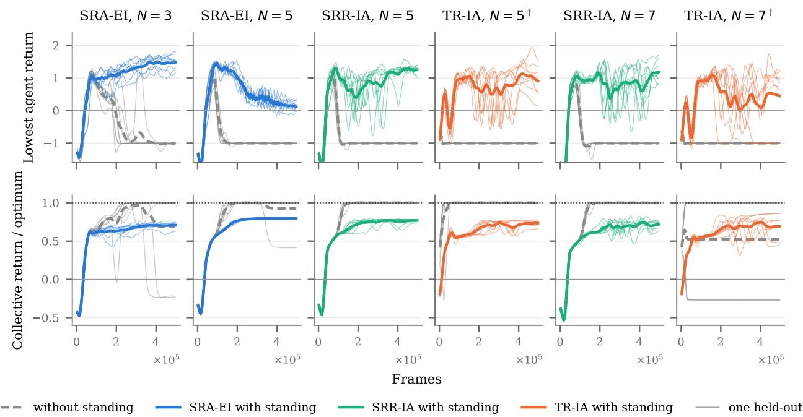  
Figure 18: Every held-out seed of the standing pairs in Escape Room over training: the lowest agent return, top, and the collective return over the optimum, bottom, without standing in grey and with it in colour. Thin lines are single seeds, seeds 11-18, and bold lines their mean. Without standing, every seed settles at a loss of one point for its worst-off agent, and most groups reach the optimum; with standing, the worst-off agent stays above zero on almost every seed, and the group settles at 70 to 80% of the optimum. †The two TR-IA pairs also differ in their PPO settings.

The standing input is the only control that goes beyond decentralized execution, because the policy then sees a quantity built from the other agents' transitions while it acts. It enters the policy and the critic through a layer initialized to zero,

$$
h  h \odot ( 1 + W _ { \gamma } s _ { i } ) + W _ { \beta } s _ { i } , \qquad s _ { i } = ( \mathrm { a h e a d } _ { i } , \mathrm { b e h i n d } _ { i } ) ,\tag{26}
$$

so the network is exactly the unconditioned one until the agent has a standing, and the standing is updated after every step so that the next action can depend on it. The shared true ledger keeps the reward models and the self-referenced social term and replaces only the ledger, so it changes two things at once, and its null result is weaker evidence than it looks.

## F.4 Why Not Clean Up

Standing is a mechanism for a role that can be taken in turns, and Clean Up does not have one: cleaning is continuous work. The learner that divides Clean Up best already shares that work, since SRR-IA+V's two poorest agents do 51% of the cleaning, Figure 13 We therefore tried standing on the learner that concentrates the work, SRA-EI with five agents, varying its strength, horizon, aggregate, and source. On the three tuning seeds no setting improved on SRA-EI without standing, which produces 1,551 apples with a Nash welfare of 227 and a lowest agent return of 78. The best of the 24 settings reaches a Nash welfare of 249 and a lowest agent return of 86, within the spread between seeds, and the four strongest settings lower the collective return to between 481 and 830 without helping the poorest agent. No setting passed selection, so none was run on held-out seeds.

## G What if Agents See Only Part of the Map?

With a 15 × 15 window, agent i must assess j's situation from j's own small window, a part of the map that i may never have seen from there. The two placements then part ways. The policy update keeps its cooperation, while inequity aversion in the reward collapses. The collapse comes from the look-ahead, not from the selfreferenced estimates. This appendix gives the evidence for each step and asks whether longer training changes the picture in Commons Harvest.

## G.1 The Policy Update Keeps Cooperating

With feed-forward agents in Clean Up, SRA-EI produces about 1,280 apples, as with the full view, against about 1,900 for TR-EI, which leaves its poorest agent with nothing. With recurrent agents SRA-EI rises to 1,725 apples and the highest Nash welfare of all learners, 224, while TR-EI produces 2,196 and again leaves its poorest agent at zero: the same split into eaters and cleaners as with the full view, now with memory. In Commons Harvest SRA-EI produces 646 apples with feed-forward agents and 482 with recurrent ones, against 187 for plain PPO. These Harvest runs train for 7 million frames and are retuned, so they are not directly comparable with the full view. Plain PPO with a GRU fails in Clean Up at its selected setting, earning three apples, which shows the risk of selecting on two tuning seeds.

Table 12: Collective return of the selected SRA-EI learner in Escape Room, without and with each control, and without or with the standing gate at $\kappa = 4 ;$ three seeds per cell. The optimum is 8, 17, and 26 at $N = 3 ,$ 5, and 7.
<table><tr><td>Control</td><td>Gate</td><td>N = 3</td><td>N = 5</td><td> $N = 7$ </td></tr><tr><td>Critic trained on raw returns</td><td>off</td><td> $8 . 0 0  7 . 4 4$ </td><td> $1 5 . 9 1  1 3 . 6 2$ </td><td> $2 1 . 6 0 \to 1 9 . 9 7$ </td></tr><tr><td></td><td>on</td><td> $5 . 9 8  4 . 6 7$ </td><td> $1 3 . 5 2  1 3 . 0 3$ </td><td>一</td></tr><tr><td>Standing as a policy input</td><td>off</td><td> $8 . 0 0  8 . 0 0$ </td><td> $1 5 . 9 1  1 5 . 9 9$ </td><td> $2 1 . 6 0  2 1 . 4 3$ </td></tr><tr><td></td><td>on</td><td> $5 . 9 8  6 . 4 0$ </td><td> $1 3 . 5 2  1 3 . 5 3$ </td><td>一</td></tr><tr><td>One shared true ledger</td><td>on</td><td> $5 . 9 8  5 . 7 0$ </td><td> $1 3 . 5 2  1 3 . 4 9$ </td><td>一</td></tr><tr><td>with standing input</td><td>on</td><td> $6 . 4 0  6 . 1 7$ </td><td> $1 3 . 5 3  1 3 . 5 4$ </td><td>一</td></tr></table>

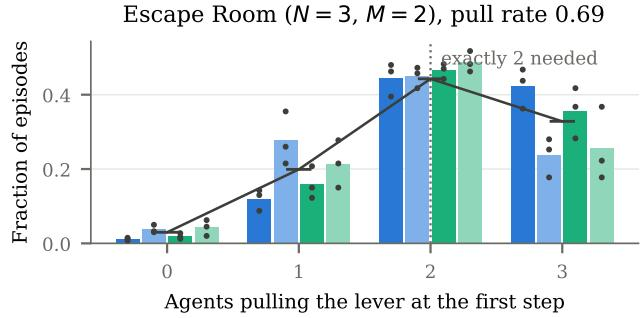

Escape Room $( N = 5 , M = 3 ) ,$ pull rate 0.35  
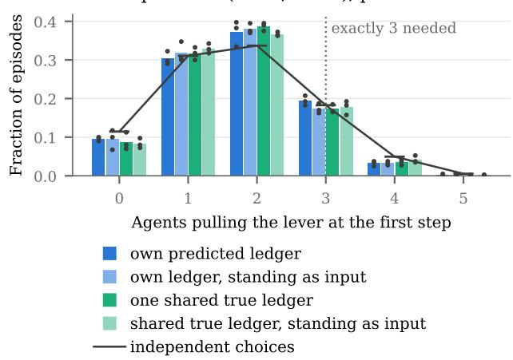  
Figure 19: How many agents pull the lever at the first step of an episode in Escape Room with standing, over 400 evaluation episodes per run, for the four configurations with standing. Bars are means over training seeds and dots single seeds. The line is the binomial distribution that independent choices with the observed pull rate would give; the episode is solved at once only when exactly M agents pull.

## G.2 Why Inequity Aversion Collapses

SRR-IA+V earns nothing in Clean Up with feed-forward agents recovers only partly with recurrent ones, to about 400 apples, and stays at plain PPO's level in Commons Harvest. The self-referenced estimates do not explain this. Their correlation with the true rewards stays between 0.98 and 0.99 with the small window, as high as with the full view. Even the agents that earn almost nothing estimate their few rewards with a mean error of 0.01.

Two controls with feed-forward agents in Clean Up isolate the look-ahead. SRR-IA with the same weights but without the lookahead produces 111 apples on average instead of none. TR-IA+V, which uses the true rewards together with the look-ahead, produces nothing at all, while TR-IA without it reaches 573 apples at its own selected setting. With true rewards and self-referenced estimates alike, adding the look-ahead under a partial view destroys cooperation. The look-ahead adds the critic's value of the other agent's next observation, and under a partial view that observation shows a different part of the map from anything the critic has learned to value from there, so the levels that inequity aversion compares are misjudged and the agent reacts to a gap that is not there.

## G.3 Longer Training in Commons Harvest

Recurrent agents in Commons Harvest produce less than feed-forward ones, so we asked whether they were simply undertrained. Figure 20 reruns the candidate settings for 14 million frames, twice the length of the other partial-view runs. Our learners barely change after 7 million frames: SRA-EI, SRA-SVO, and SRR-IA+V stay close to the level they had reached, and SRR-IA+V with the lower entropy collapses into beam fights. Only the true-reward EI learner keeps improving, in both collective return and Nash welfare, so the extra training widens the gap rather than closing it. The difficulty with recurrent agents in this game is therefore not a matter of training time. It is also the one setting in which our fairness advantage disappears: there, the fairer setting of TR-EI leaves its poorest agent better off than any of ours.

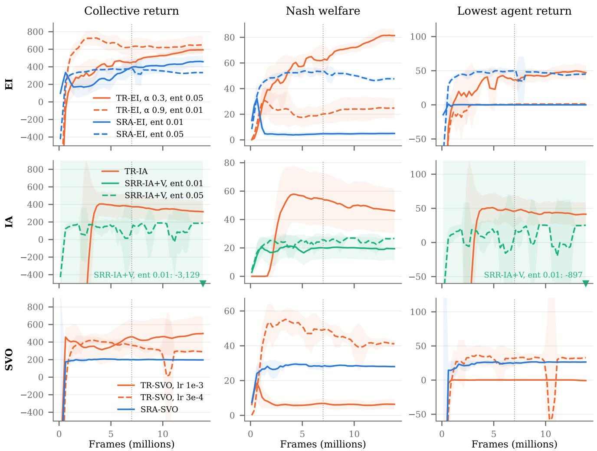  
Figure 20: Commons Harvest with recurrent agents and the partial view, trained for 14 million frames; the dotted line marks 7 million, the length of the runs in Figure.4 in the main paper. Rows are operators and columns the collective return, Nash welfare, and lowest agent return; each line is one candidate setting, solid and dashed for the two settings of a learner, means over the eight held-out seeds with pointwise 95% Student-t intervals. One TR-SVO setting had not finished when the figure was made.

## H Agents That Value Apples Differently

We now deliberately violate the condition under which self-reference can recover another agent's reward. Two of five Clean Up agents value an apple at 2 rather than 1. A self-referenced agent therefore cannot recover the other's true reward from its transition: it assigns the transition the value that it would itself receive. The experiment asks whether self-reference remains useful when it no longer estimates the other's private reward, but only assesses the other's situation from the agent's own perspective. Every learner keeps the setting selected under shared rewards. Figure 21 shows every agent's return, with the true-reward learner in the left column, ours in the right, and one row per operator.

In every row the right panel's lines sit closer together than the left panel's: our learners divide the return more evenly, reaching a higher Nash welfare and leaving the poorest agent more, 101 against 1 under EI, 224 against 117 under inequity aversion, and 121 against 16 under SVO. The ranked lines cannot show which agents value apples more, so Figure 22 splits each learner's agents into the two high-value agents and the three others.

The split shows that no learner divides by value. In every learner including the three given the true rewards, the high-value agents eat about as many apples as the others, and so end with about twice the return. The true-reward learners lean slightly towards leaving the cleaning to the low-value agents, whose apples are worth less, but the spread between seeds is too wide to call it an effect. What separates the learners is consistency. SRR-IA+V gives every agent nearly the same apples and the same share of the work on every seed, while the true-reward learners swing widely, and on some seeds a single agent eats more than 700 apples.

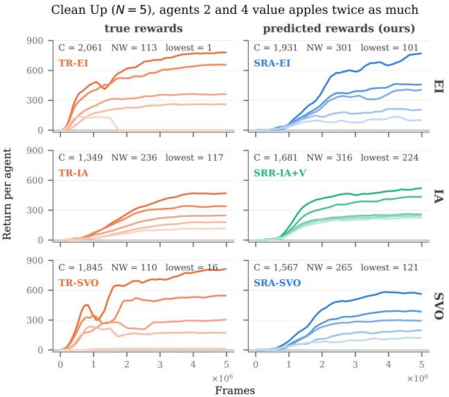  
Figure 21: Who receives the return in Clean Up when agents 2 and 4 earn two points per apple. Rows are operators and columns the true-reward learner and ours, each at the setting selected under shared rewards. Each line is one agent's return over training, ranked within each seed from the highest to the lowest earner and averaged by rank over the eight held-out seeds. Our learners reach a higher Nash welfare and leave the poorest agent more than the true-reward learner of the same operator; under SRR-IA+V the agents eat almost equally many apples, so the two agents with the higher value end with about twice the return of the others.

The doubled return of the high-value agents is therefore not a consequence of self-reference, since agents that observe the values produce it too. Self-referenced agents cannot see the difference: each assesses every apple at its own value. Here, however, the agents that can see the difference do not act on it either, so the counterfactual assessment costs nothing that the true rewards would have gained. Self-reference stays useful when it is no longer estimating the other's private reward. A real test of whether judging others by one's own values misleads an agent would need a preference that responds to the value gap when it is visible, such as inequity aversion on true rewards with a strong penalty on being ahead, which the selection for shared rewards did not choose.

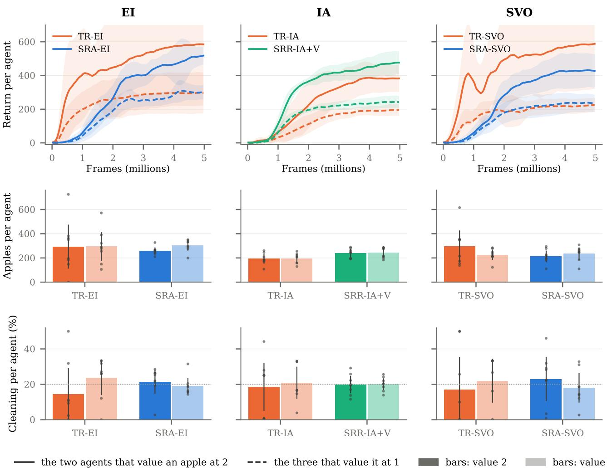  
Figure 22: What each learner gives the agents that value apples more, in Clean Up with five agents when agents 2 and 4 value an apple at 2. One column per operator, comparing the true-reward learner with ours, each at the setting selected under shared rewards. Top: return per agent over training for the two high-value agents, solid, and the three others, dashed, means over the eight held-out seeds with pointwise 95% Student-t intervals. Middle and bottom: final apples eaten and share of the cleaning per agent, dark for the high-value agents and light for the others, with 20% an equal share of the cleaning; bars are means with 95% intervals and dots single seeds.

## I Limitations

Our conclusions hold within the limits of the study, which we collect here.

The shared reward function. A self-referenced estimate recovers another agent's reward only when every agent is rewarded for the same events in the same way. When values differ, it becomes a counterfactual assessment: the reward that the agent itself would receive in the other's situation. We test one such case, agents that value an apple differently (Appendix H). There no learner acts on the difference, so the test cannot show whether self-reference would mislead an agent that otherwise would. Agents whose rewards come from different events, or from events that their transitions do not show, are beyond a model of one's own reward.

One learning algorithm. Every learner is independent PPO. The reward placement needs only a reward and the policy-update placement only a weighted policy gradient, so both should carry over to other actor-critic methods, and the reward placement to valuebased learners, but we have not tested either.

Selection on few seeds. Every setting is chosen on two or three tuning seeds by the mean minus one standard deviation, a rule of thumb rather than a confidence bound. Its failures are visible: plain PPO with a recurrent policy, selected this way, earns three apples in Clean Up with the partial view (Appendix G.1), and one TR-SVO setting produced more on the held-out seeds than the setting selected for it (Appendix E.3). Because every number comes from held-out seeds, these failures add noise to the comparison but do not favour any learner.

Selected learners, not isolated placements. The two placements are compared at their selected settings, which differ in their social weights and PPO settings as well as in where the estimate enters. The comparison therefore describes the learners we would deploy rather than isolating the placement, and the mechanisms we give for it, such as why the true rewards hinder inequity aversion in Clean Up and as the group grows, are explanations we have not tested directly.

Estimation in Commons Harvest. In Commons Harvest the reward model is a small head on the policy's features rather than a model of the transition (Appendix B.2), and the large beam penalty dominates what it learns. This is the game where our learners fall furthest short of the true rewards, and a better model of the transition may narrow the gap

Welfare as a measure. The Nash welfare rewards balance, and it can be raised without cooperation: in Commons Harvest a control that ignores the others reaches the highest welfare of all (Appendix C.2). We therefore read it together with the collective and the lowest agent return, and never alone.

Cost. Every agent evaluates its reward model and critic on every other agent's stream, which costs $\mathcal { O } ( N ^ { 2 } )$ forward passes per step. This is affordable for the group sizes we study, up to twelve agents, but it grows quickly beyond them.

## J Extended Related Work

Our work sits where three lines of research meet: social preferences that help learning agents cooperate, models of other agents built from one's own, and the information that multi-agent methods assume they can read from the other agents. We review each, and close with fairness, which we use to evaluate rather than to train. Table 13 summarizes what each family of methods reads from the others.

Sequential social dilemmas and social preferences. Sequential social dilemmas extend matrix-game dilemmas to environments in which cooperation and defection are policies rather than single actions [42]; common-pool resource games such as Commons Harvest show how independent learners deplete a shared resource [53], and Melting Pot collects many such games into a benchmark suite [1, 43]. Social preferences are the most direct remedy. Hughes et al. [33] give agents the inequity aversion of Fehr and Schmidt [21], computed on traces of every agent's reward, and show that aversion to being ahead sustains cleaning in Clean Up while aversion to being behind sustains punishment in Commons Harvest; their agent is our TR-IA. McKee et al. [48] give agents social value orientations and study how the diversity of orientations in a population shapes its behaviour. Peysakhovich and Lerer [54] show that prosocial agents, which add the others' rewards to their own, find the cooperative equilibrium of stag hunts more often than selfish ones. Wei et al. [73] combine altruistic and fairness preferences through a constant-elasticity-of- substitution (CES) utility and apply it to expected future returns, providing a forward-looking social utility. Their utility still takes other agents' returns as inputs; we instead replace the unavailable peer-outcome input with a self-referenced estimate. Further work has learned reciprocity [18], evolved intrinsic social motivations [72], and compared moral preferences in the same dilemmas [70]. Conditional cooperation, as in approximate tit-for-tat [44], trains a cooperative policy on the sum of all agents' rewards and switches to it when the partner cooperates. These approaches generally rely on other agents' rewards, outcomes, or welfare signals during training. We keep their preferences unchanged and replace only that input.

Changing the incentives. A second line changes the rewards agents receive rather than what they value. Agents can gift part of their reward [47], learn to pay incentives that change how others learn [77], share rewards along a network [78], learn how much of the others' losses to mix into their own to reduce the price of anarchy [24], agree on enforceable contracts [30], or transfer the smallest amount of reward that makes cooperation stable [75]. These mechanisms alter or transfer the rewards available to agents, rather than infer another agent's outcome from its observed experience. Vinitsky et al. [71] take a different route that is close in spirit to ours: their agents learn which behaviours a group sanctions by watching public sanctions, a social signal learned from observation rather than read from rewards. Social influence [34] also achieves coordination without access to others' rewards by rewarding causal influence over their actions; its decentralized variant can compute this signal from observed actions using a learned model of other agents. Unlike our method, however, influence is the social signal itself rather than a representation of the other's outcome. Conventions can also emerge among agents with different preferences without social influence [41].

What cooperative methods read from the others. Cooperative multiagent reinforcement learning usually assumes a team reward. Value decomposition learns one value per agent that adds up [67] or combines monotonically [58] into the team's value, and centralized training with decentralized execution gives each agent a critic that sees the others' observations and actions during training [23, 46, 80]. Counterfactual baselines [23] and difference rewards [76] assign the team reward to individual agents, and opponent shaping [22] differentiates through the other agent's learning step. Our setting shares what centralized training shares, the observations and actions, but in a general-sum game with no team reward and no access to the others' rewards, critics, or gradients. SRA resembles a counterfactual baseline in form, since it weights an agent's update by how the others' transitions went, but it uses no joint action, no shared reward, and no gradient into another agent. Independent PPO, which we build on, is a strong baseline in this family [14, 80]. SRR is a form of reward shaping, but not a potentialbased one [51]: it is meant to change which policies are optimal, as every social preference does.

Modelling others from one's own experience. Agents that model other agents are surveyed by Albrecht and Stone [2]. Deep opponent models learn to predict the others' actions from their observations [31], and machine theory of mind learns to predict another agent's behaviour and false beliefs from a few observations [56]. Closest to our view of empathy are methods that use the agent's own machinery to understand another. Self Other-Modeling infers another agent's goal by running the agent's own policy on the other's observations [57]. Empathic deep Q-learning evaluates the agent's own Q-function from the other's perspective to avoid harming it [7]. Sympathy-based agents infer another agent's reward and incorporate it into their own objective [63]; EMOTE instead uses the learner's own action-value function as a reference for modelling the other agent [64]. LASE uses perspective taking to decide how much reward to give away to a co-player [40], and homeostaticcoupling models prosocial behavior through shared or inferred homeostatic states [79].. We share their premise that one's own experience is the natural model of another's, and differ in what we do with it: we assess the other's transition with a reward model fitted on the agent's own transitions, feed that selfreferenced estimate to standard social preferences, and ask where it should enter learning.

Inferring rewards from behaviour. Inverse reinforcement learning infers rewards from behavior under assumptions about the other's decision process [52], and has been extended to multi-agent settings [50, 81]; cooperative inverse reinforcement learning lets a robot learn a human's reward while acting with them [28]. In cognitive science, inverse planning infers others' goals and desires from their behavior under an assumed planning model [4, 35], and related models infer higher-level intentions in social interaction [39]. These approaches infer latent preferences, goals, or intentions from what the other does. Self-reference instead evaluates what happens to the other using the agent's own reward model.

Private rewards and communication. Some work keeps rewards private but lets agents exchange other signals. In suggestion sharing, agents exchange suggested actions instead of rewards or values [37], and in multi-agent reward prediction a reward model trained on external, episode-level assessments of the group's outcome steers decentralized agents towards goals such as sustainability and equality [8]. Our agents exchange nothing and receive no evaluation beyond their own reward.

Empathy and social preferences in people. Social preferences have long been studied in people, particularly in laboratory games [6, 9, 11, 20, 21] and across societies [32]. Psychology separates the cognitive part of empathy, estimating another's state, from its motivational part, caring about it [5, 13, 15]. The estimate is explained by mapping the other's situation onto one's own representations [55], by simulating oneself in the other's place [25, 26], or by inverse planning [4, 35]; self-reference follows the simulation route. Simulation has a known cost: people assume that others share their preferences [60] and adjust too little from their own perspective [19]. Our experiment with different values in Appendix H is a first test of whether learning agents inherit that bias. Cooperation across repeated encounters, which our standing ledger addresses, has a long history of its own, beginning with the evolution of reciprocal strategies [3].

Fairness. Fairness has been built into multi-agent learning by centralized mechanisms [27], by optimizing welfare functions of the agents' returns [36, 66, 82], by comparing egoistic, utilitarian,

Table 13: What each method uses from the other agents during training (•: used; : in some variants): rewards, observations and actions, policies or gradients, and a centralized critic or joint value. At execution every method listed acts on the agent's own observation.

<table><tr><td>Method</td><td>Rewards</td><td>Obs./act.</td><td>Policies</td><td>Critic</td></tr><tr><td>Inequity aversion [33]</td><td></td><td></td><td></td><td></td></tr><tr><td>Social value orientation [48]</td><td></td><td></td><td></td><td></td></tr><tr><td>Prosocial reward [54]</td><td></td><td></td><td></td><td></td></tr><tr><td>VDN, QMIX [58, 67]</td><td>• (team)</td><td></td><td></td><td></td></tr><tr><td>COMA [23]</td><td>• (team)</td><td></td><td></td><td></td></tr><tr><td>MADDPG [46]</td><td></td><td></td><td></td><td></td></tr><tr><td>LOLA [22]</td><td></td><td></td><td></td><td></td></tr><tr><td>Social influence [34]</td><td></td><td></td><td>o</td><td></td></tr><tr><td>SRR, SRA (ours)</td><td></td><td></td><td></td><td></td></tr></table>

and egalitarian objectives [17], and, in asymmetric sequential social dilemmas, by correcting social incentives so that agents that differ are treated fairly rather than equally [16]. All of these need the agents' returns. We evaluate fairness using: the Nash welfare [38], which rewards both production and balance and has strong fairness properties in allocation [10], and the lowest agent return, the maximin criterion of Rawls [59].

The table makes the position of our learners plain. The socialpreference methods need only the others' rewards, which is exactly the channel we remove. The cooperative and centralized methods read observations and actions as we do, but also a team reward, a centralized critic, or the others' policies and gradients. Our learners occupy the one row that reads observations and actions alone, so they ask for less than centralized training with decentralized execution and, unlike the social preferences, for nothing that an agent could not have obtained by watching.