# Sensor-Language-Action Models

Yuekai Xu<sup>1\*</sup>, Zitao Shuai<sup>1\*</sup>, Yuzhe Yang<sup>1†</sup>

<sup>1</sup>U<sub>n</sub>i<sub>vers</sub>it<sub>y</sub> <sub>o</sub>f C<sub>a</sub>lif<sub>orn</sub>i<sub>a,</sub> L<sub>os</sub> A<sub>nge</sub>l<sub>es</sub>

Sensors are useful not only for understanding the world but also for deciding what to do next. Existing sensor models however largely stop at perception: they recognize states or predict outcomes, leaving actions modeled separately through task-specific and often closed label spaces. We introduce Sensor-Language-Action (SLA) modeling, a framework that connects multimodal sensor observations, natural l<sub>anguage, an</sub>d <sub>ac</sub>ti<sub>ons w</sub>ithi<sub>n a un</sub>ifi<sub>e</sub>d <sub>mo</sub>d<sub>e</sub>l<sub>.</sub> SLA <sub>uses</sub> l<sub>anguage as a seman</sub>ti<sub>c</sub> i<sub>n</sub>t<sub>er</sub>f<sub>ace</sub> b<sub>e</sub>t<sub>ween</sub> <sub>sens</sub>i<sub>ng</sub> <sub>an</sub>d <sub>ac</sub>ti<sub>ng,</sub> <sub>a</sub>ll<sub>ow</sub>i<sub>ng</sub> h<sub>e</sub>t<sub>erogeneous</sub> <sub>ac</sub>ti<sub>ons</sub> t<sub>o</sub> b<sub>e</sub> <sub>represen</sub>t<sub>e</sub>d<sub>,</sub> <sub>pre</sub>di<sub>c</sub>t<sub>e</sub>d<sub>,</sub> <sub>an</sub>d <sub>exp</sub>l<sub>a</sub>i<sub>ne</sub>d <sub>w</sub>hil<sub>e</sub> <sub>rema</sub>i<sub>n</sub>i<sub>ng</sub> <sub>groun</sub>d<sub>e</sub>d i<sub>n</sub> th<sub>e</sub> <sub>un</sub>d<sub>er</sub>l<sub>y</sub>i<sub>ng</sub> <sub>sensor</sub> <sub>ev</sub>id<sub>ence.</sub> W<sub>e</sub> b<sub>u</sub>ild <sub>a</sub> l<sub>arge-sca</sub>l<sub>e</sub> SLA b<sub>enc</sub>h<sub>mar</sub>k <sub>cons</sub>i<sub>s</sub>ti<sub>ng o</sub>f d<sub>a</sub>t<sub>ase</sub>t<sub>s</sub> th<sub>a</sub>t <sub>span more</sub> th<sub>an</sub> 116<sub>,</sub>000 i<sub>n</sub>di<sub>v</sub>id<sub>ua</sub>l<sub>s,</sub> 79 <sub>sensor mo</sub>d<sub>a</sub>liti<sub>es, an</sub>d 60 <sub>ac</sub>ti<sub>on</sub> <sub>groups,</sub> t<sub>oge</sub>th<sub>er w</sub>ith <sub>a mu</sub>lti<sub>-</sub>f<sub>ace</sub>t<sub>e</sub>d <sub>cap</sub>ti<sub>on</sub>i<sub>ng p</sub>i<sub>pe</sub>li<sub>ne</sub> th<sub>a</sub>t <sub>a</sub>li<sub>gns user con</sub>t<sub>ex</sub>t<sub>, sensor</sub> d<sub>ynam</sub>i<sub>cs,</sub> an<sup>d</sup> act<sup>i</sup>on ev<sup>id</sup>ence. <sup>B</sup>u<sup>ildi</sup>ng on t<sup>hi</sup>s <sup>f</sup>ramewor<sup>k</sup>, we present OpenSLA, a un<sup>ifi</sup>e<sup>d SLA</sup> mo<sup>d</sup>e<sup>l f</sup>or hi<sub>erarc</sub>hi<sub>ca</sub>l <sub>ac</sub>ti<sub>on pre</sub>di<sub>c</sub>ti<sub>on, s</sub>t<sub>a</sub>t<sub>e un</sub>d<sub>ers</sub>t<sub>an</sub>di<sub>ng, an</sub>d <sub>ac</sub>ti<sub>on exp</sub>l<sub>ana</sub>ti<sub>on.</sub> E<sub>x</sub>t<sub>ens</sub>i<sub>ve exper</sub>i<sub>men</sub>t<sub>s</sub> <sub>on</sub> <sub>rea</sub>l<sub>-wor</sub>ld t<sub>as</sub>k<sub>s</sub> i<sub>n</sub> <sub>c</sub>li<sub>n</sub>i<sub>ca</sub>l <sub>pre</sub>di<sub>c</sub>ti<sub>on,</sub> <sub>opera</sub>ti<sub>ng</sub> <sub>rooms,</sub> <sub>an</sub>d <sub>me</sub>t<sub>a</sub>b<sub>o</sub>li<sub>c</sub> h<sub>ea</sub>lth <sub>ver</sub>if<sub>y</sub> it<sub>s</sub> <sub>super</sub>i<sub>or</sub> per<sup>f</sup>ormance over t<sup>h</sup>e state-o<sup>f</sup>-t<sup>h</sup>e-art. OpenSLA a<sup>l</sup>so <sup>d</sup>emonstrates <sup>i</sup>ntr<sup>i</sup>gu<sup>i</sup>ng capa<sup>bili</sup>t<sup>i</sup>es <sup>i</sup>nc<sup>l</sup>u<sup>di</sup>ng l<sub>anguage-gu</sub>id<sub>e</sub>d <sub>ev</sub>id<sub>ence</sub> <sub>groun</sub>di<sub>ng</sub> <sub>an</sub>d <sub>zero-s</sub>h<sub>o</sub>t <sub>genera</sub>li<sub>za</sub>ti<sub>on</sub> t<sub>o</sub> <sub>unseen</sub> <sub>ac</sub>ti<sub>ons</sub> <sub>an</sub>d <sub>co</sub>h<sub>or</sub>t<sub>s.</sub>

Model: https://hf.co/yang-ai-lab/OpenSLA Code: https://github.com/yang-ai-lab/OpenSLA Website: https://yang-ai-lab.github.io/OpenSLA

## 1. Introduction

Intelligent systems do more than perceive: they observe, understand, and act. The value of sensing, lik<sub>ew</sub>i<sub>se,</sub> li<sub>es no</sub>t <sub>on</sub>l<sub>y</sub> i<sub>n</sub> d<sub>escr</sub>ibi<sub>ng w</sub>h<sub>a</sub>t i<sub>s</sub> h<sub>appen</sub>i<sub>ng,</sub> b<sub>u</sub>t i<sub>n</sub> i<sub>n</sub>f<sub>orm</sub>i<sub>ng</sub> th<sub>e ac</sub>ti<sub>ons</sub> th<sub>a</sub>t f<sub>o</sub>ll<sub>ow</sub> [39, 13]. For exam<sub>p</sub>le, clinicians in o<sub>p</sub>eration rooms continuousl<sub>y</sub> inte<sub>g</sub>rate <sub>p</sub>h<sub>y</sub>siolo<sub>g</sub>ical si<sub>g</sub>nals with i<sub>n</sub>di<sub>v</sub>id<sub>ua</sub>l <sub>con</sub>t<sub>ex</sub>t<sub>,</sub> hi<sub>s</sub>t<sub>ory, an</sub>d <sub>pr</sub>i<sub>or</sub> i<sub>n</sub>t<sub>erven</sub>ti<sub>ons</sub> t<sub>o</sub> d<sub>ec</sub>id<sub>e w</sub>h<sub>e</sub>th<sub>er</sub> t<sub>o a</sub>d<sub>m</sub>i<sub>n</sub>i<sub>s</sub>t<sub>er a me</sub>di<sub>ca</sub>ti<sub>on,</sub> escalation, or continue observation [10].

Yet, existing sensor models are centered on observing and understanding. Early methods map sensor si<sub>g</sub>nals to fixed labels or outcomes [24, 31], while recent sensor-lan<sub>g</sub>ua<sub>g</sub>e models enable richer semantic descri<sub>p</sub>tions and o<sub>p</sub>en-ended reasonin<sub>g</sub> over sensor observations [43, 15, 40]. However, these advances largely stop before action: downstream decisions are still modeled as separate <sub>p</sub>rediction <sub>p</sub>roblems, each with its own formulation and action s<sub>p</sub>ace [17, 35]. As a result, existin<sub>g</sub> <sub>approac</sub>h<sub>es</sub> <sub>prov</sub>id<sub>e</sub> <sub>no</sub> <sub>common</sub> <sub>mec</sub>h<sub>an</sub>i<sub>sm</sub> f<sub>or</sub> <sub>re</sub>l<sub>a</sub>ti<sub>ng</sub> h<sub>e</sub>t<sub>erogeneous</sub> <sub>sensor</sub> <sub>ev</sub>id<sub>ence,</sub> <sub>con</sub>t<sub>ex</sub>t<sub>ua</sub>l i<sub>n</sub>f<sub>orma</sub>ti<sub>on,</sub> <sub>an</sub>d th<sub>e</sub> di<sub>verse</sub> <sub>ac</sub>ti<sub>ons</sub> th<sub>ey</sub> <sub>may</sub> <sub>suppor</sub>t<sub>.</sub>

Natural language, on the other hand, ofers a natural bridge between sensing and action. Unlike fixed labels, language can jointly express task intent, individual context, physiological state, and action <sub>seman</sub>ti<sub>cs, a</sub>ll<sub>ow</sub>i<sub>ng</sub> h<sub>e</sub>t<sub>erogeneous sensor-ac</sub>ti<sub>on pro</sub>bl<sub>ems</sub> t<sub>o</sub> b<sub>e represen</sub>t<sub>e</sub>d i<sub>n a common</sub> f<sub>orm.</sub> Thi<sub>s</sub> suggests a broader modeling paradigm in which sensor observations are grounded in language and connected directly to actions, rather than treating understanding and decision-making as separate <sub>s</sub>t<sub>ages.</sub> W<sub>e</sub> th<sub>ere</sub>f<sub>ore as</sub>k<sub>:</sub>

Can sensor data, language, and action be modeled through a unified framework?

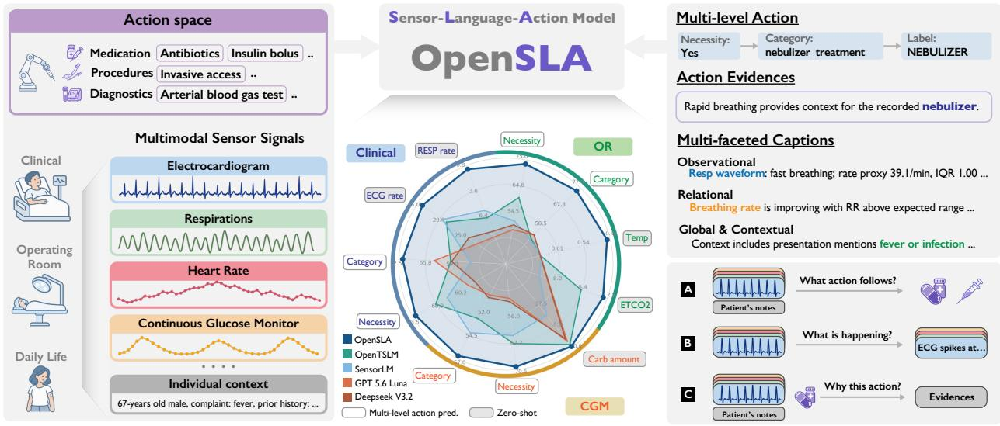  
Figure 1 | Sensor-Language-Action (SLA) Model. We establish SLA as a unified paradigm for sensor-action <sub>mo</sub>d<sub>e</sub>li<sub>ng</sub> th<sub>roug</sub>h <sub>a</sub> l<sub>anguage</sub> i<sub>n</sub>t<sub>er</sub>f<sub>ace over sensor o</sub>b<sub>serva</sub>ti<sub>ons, pa</sub>ti<sub>en</sub>t <sub>con</sub>t<sub>ex</sub>t<sub>, an</sub>d <sub>ac</sub>ti<sub>ons.</sub> W<sub>e</sub> i<sub>ns</sub>t<sub>an</sub>ti<sub>a</sub>t<sub>e</sub> <sup>SLA</sup> w<sup>i</sup>t<sup>h</sup> OpenSLA an<sup>d</sup> eva<sup>l</sup>uate <sup>i</sup>t across more t<sup>h</sup>an <sup>116</sup>,<sup>000 i</sup>n<sup>di</sup>v<sup>id</sup>ua<sup>l</sup>s, 79 sensor mo<sup>d</sup>a<sup>li</sup>t<sup>i</sup>es, an<sup>d 60</sup> act<sup>i</sup>on groups. In addition to the superior performance over state-of-the-art methods, OpenSLA supports (A) multi-level action predictions, (B) sensor-state understanding, and (C) action-evidence grounding.

To fill the gap, we introduce Sensor-Language-Action (SLA) modeling, a unified framework that <sub>connec</sub>t<sub>s sensor o</sub>b<sub>serva</sub>ti<sub>ons, na</sub>t<sub>ura</sub>l<sub>-</sub>l<sub>anguage con</sub>t<sub>ex</sub>t<sub>, an</sub>d <sub>ac</sub>ti<sub>ons</sub> th<sub>roug</sub>h <sub>a common mu</sub>lti<sub>mo</sub>d<sub>a</sub>l <sup>i</sup>nter<sup>f</sup>ace (see <sup>Fi</sup>g. <sup>1</sup>). <sup>W</sup>e <sup>f</sup>urt<sup>h</sup>er <sup>i</sup>nstant<sup>i</sup>ate <sup>SLA</sup> w<sup>i</sup>t<sup>h</sup> OpenSLA, to our <sup>k</sup>now<sup>l</sup>e<sup>d</sup>ge, t<sup>h</sup>e <sup>fi</sup>rst genera<sup>l</sup> <sup>f</sup>ramewor<sup>k f</sup>or jo<sup>i</sup>nt<sup>l</sup>y mo<sup>d</sup>e<sup>li</sup>ng sensor o<sup>b</sup>servat<sup>i</sup>ons, <sup>l</sup>anguage, an<sup>d</sup> act<sup>i</sup>ons. OpenSLA exten<sup>d</sup>s sensor i<sub>n</sub>t<sub>e</sub>lli<sub>gence</sub> f<sub>rom un</sub>d<sub>ers</sub>t<sub>an</sub>di<sub>ng o</sub>b<sub>serva</sub>ti<sub>ons</sub> t<sub>o reason</sub>i<sub>ng a</sub>b<sub>ou</sub>t <sub>an</sub>d <sub>exp</sub>l<sub>a</sub>i<sub>n</sub>i<sub>ng</sub> th<sub>e ac</sub>ti<sub>ons</sub> th<sub>ey</sub> <sub>suppor</sub>t<sub>, ena</sub>bl<sub>e</sub>d b<sub>y</sub> th<sub>ree</sub> k<sub>ey con</sub>t<sub>r</sub>ib<sub>u</sub>ti<sub>ons:</sub> ❶ A hi<sub>erarc</sub>hi<sub>ca</sub>l<sub>, mu</sub>lti<sub>-</sub>f<sub>ace</sub>t<sub>e</sub>d <sub>p</sub>h<sub>ys</sub>i<sub>o</sub>l<sub>og</sub>i<sub>ca</sub>l <sub>cap</sub>ti<sub>on</sub>i<sub>ng</sub> <sub>p</sub>i<sub>pe</sub>li<sub>ne</sub> th<sub>a</sub>t <sub>a</sub>li<sub>gns</sub> l<sub>oca</sub>l <sub>sensor</sub> d<sub>ynam</sub>i<sub>cs,</sub> <sub>cross-s</sub>i<sub>gna</sub>l <sub>re</sub>l<sub>a</sub>ti<sub>ons,</sub> i<sub>n</sub>di<sub>v</sub>id<sub>ua</sub>l <sub>con</sub>t<sub>ex</sub>t<sub>,</sub> <sub>an</sub>d <sub>ac</sub>ti<sub>on-</sub> <sub>re</sub>l<sub>evan</sub>t <sub>ev</sub>id<sub>ence as</sub> l<sub>anguage superv</sub>i<sub>s</sub>i<sub>on;</sub> ❷ Th<sub>e cura</sub>ti<sub>on o</sub>f <sub>a</sub> l<sub>arge-sca</sub>l<sub>e</sub> b<sub>enc</sub>h<sub>mar</sub>k <sub>spann</sub>i<sub>ng more</sub> th<sub>an</sub> 116<sub>,</sub>000 i<sub>n</sub>di<sub>v</sub>id<sub>ua</sub>l<sub>s,</sub> 79 <sub>sensor mo</sub>d<sub>a</sub>liti<sub>es,</sub> 3 h<sub>ea</sub>lth<sub>care</sub> d<sub>oma</sub>i<sub>ns,</sub> 5 t<sub>as</sub>k<sub>s, an</sub>d 60 <sub>ac</sub>ti<sub>on groups;</sub> <sub>a</sub>nd ❸ <sub>a</sub> <sub>u</sub>nifi<sub>e</sub>d SLA <sub>a</sub>r<sub>c</sub>hit<sub>ec</sub>t<sub>u</sub>r<sub>e</sub> f<sub>o</sub>r hi<sub>e</sub>r<sub>a</sub>r<sub>c</sub>hi<sub>ca</sub>l <sub>ac</sub>ti<sub>o</sub>n <sub>p</sub>r<sub>e</sub>di<sub>c</sub>ti<sub>o</sub>n<sub>,</sub> <sub>s</sub>t<sub>a</sub>t<sub>e</sub> <sub>u</sub>nd<sub>e</sub>r<sub>s</sub>t<sub>a</sub>ndin<sub>g,</sub> <sub>a</sub>nd <sub>ac</sub>ti<sub>o</sub>n <sub>exp</sub>l<sub>ana</sub>ti<sub>on</sub> th<sub>a</sub>t <sub>suppor</sub>t<sub>s ro</sub>b<sub>us</sub>t <sub>an</sub>d <sub>sca</sub>l<sub>a</sub>bl<sub>e sensor-ac</sub>ti<sub>on mo</sub>d<sub>e</sub>li<sub>ng v</sub>i<sub>a</sub> l<sub>anguage groun</sub>di<sub>ng.</sub>

<sup>T</sup>o r<sup>i</sup>gorous<sup>l</sup>y eva<sup>l</sup>uate OpenSLA, we <sup>b</sup>enc<sup>h</sup>mar<sup>k i</sup>t aga<sup>i</sup>nst state-o<sup>f</sup>-t<sup>h</sup>e-art met<sup>h</sup>o<sup>d</sup>s across s<sup>i</sup>x rea<sup>l</sup>- <sub>wor</sub>ld <sub>co</sub>h<sub>or</sub>t<sub>s an</sub>d fi<sub>ve core</sub> t<sub>as</sub>k<sub>s spann</sub>i<sub>ng c</sub>li<sub>n</sub>i<sub>ca</sub>l <sub>care, opera</sub>ti<sub>ng rooms, an</sub>d d<sub>a</sub>il<sub>y-</sub>lif<sub>e me</sub>t<sub>a</sub>b<sub>o</sub>li<sub>c</sub> h<sub>ea</sub>lth<sub>.</sub> E<sub>x</sub>t<sub>ens</sub>i<sub>ve exper</sub>i<sub>men</sub>t<sub>s</sub> d<sub>emons</sub>t<sub>ra</sub>t<sub>e cons</sub>i<sub>s</sub>t<sub>en</sub>tl<sub>y s</sub>t<sub>rong per</sub>f<sub>ormance</sub> i<sub>n</sub> hi<sub>erarc</sub>hi<sub>ca</sub>l <sub>ac</sub>ti<sub>on</sub> <sub>pre</sub>di<sub>c</sub>ti<sub>on,</sub> <sub>s</sub>t<sub>a</sub>t<sub>e</sub> <sub>un</sub>d<sub>ers</sub>t<sub>an</sub>di<sub>ng,</sub> <sub>an</sub>d <sub>ac</sub>ti<sub>on</sub> <sub>exp</sub>l<sub>ana</sub>ti<sub>on.</sub> F<sub>ur</sub>th<sub>er</sub> <sub>ana</sub>l<sub>yses</sub> <sub>revea</sub>l i<sub>n</sub>t<sub>r</sub>i<sub>gu</sub>i<sub>ng</sub> <sub>proper</sub>ti<sub>es</sub> <sub>on ac</sub>ti<sub>on-ev</sub>id<sub>ence agreemen</sub>t<sub>,</sub> t<sub>rans</sub>f<sub>er</sub> t<sub>o unseen ac</sub>ti<sub>on</sub> l<sub>a</sub>b<sub>e</sub>l<sub>s an</sub>d <sub>ex</sub>t<sub>erna</sub>l <sub>c</sub>li<sub>n</sub>i<sub>ca</sub>l <sub>co</sub>h<sub>or</sub>t<sub>s, an</sub>d f<sub>u</sub>t<sub>ure-s</sub>t<sub>a</sub>t<sub>e</sub> i<sub>n</sub>f<sub>orma</sub>ti<sub>on</sub> i<sub>n</sub> th<sub>e</sub> l<sub>earne</sub>d <sub>represen</sub>t<sub>a</sub>ti<sub>ons.</sub> O<sub>ur con</sub>t<sub>r</sub>ib<sub>u</sub>ti<sub>ons are as</sub> f<sub>o</sub>ll<sub>ows:</sub>

• We formulate Sensor-Lan<sub>g</sub>ua<sub>g</sub>e-Action (SLA) modelin<sub>g</sub>, a new framework that unifies sensor-action <sub>pro</sub>bl<sub>ems</sub> th<sub>roug</sub>h <sub>mu</sub>lti<sub>mo</sub>d<sub>a</sub>l l<sub>anguage</sub> i<sub>n</sub>t<sub>er</sub>f<sub>ace, an</sub>d <sub>cons</sub>t<sub>ruc</sub>t <sub>a</sub> l<sub>arge-sca</sub>l<sub>e</sub> b<sub>enc</sub>h<sub>mar</sub>k <sub>spann</sub>i<sub>ng</sub> <sub>more</sub> th<sub>an</sub> 116<sub>,</sub>000 i<sub>n</sub>di<sub>v</sub>id<sub>ua</sub>l<sub>s,</sub> 79 <sub>sensor</sub> <sub>mo</sub>d<sub>a</sub>liti<sub>es,</sub> 5 t<sub>as</sub>k<sub>s,</sub> <sub>an</sub>d 60 <sub>ac</sub>ti<sub>on</sub> <sub>groups.</sub>

• We introduce a multi-faceted sensor captioning pipeline that jointly captures local sensor dynamics, <sub>cross-s</sub>i<sub>gna</sub>l <sub>re</sub>l<sub>a</sub>ti<sub>ons,</sub> i<sub>n</sub>di<sub>v</sub>id<sub>ua</sub>l<sub>-</sub>l<sub>eve</sub>l <sub>con</sub>t<sub>ex</sub>t<sub>,</sub> <sub>an</sub>d <sub>ac</sub>ti<sub>on-re</sub>l<sub>evan</sub>t <sub>ev</sub>id<sub>ence,</sub> <sub>prov</sub>idi<sub>ng</sub> l<sub>anguage</sub> <sub>superv</sub>i<sub>s</sub>i<sub>on</sub> t<sub>a</sub>il<sub>ore</sub>d t<sub>o sensor-ac</sub>ti<sub>on mo</sub>d<sub>e</sub>li<sub>ng.</sub>

• <sup>W</sup>e <sup>d</sup>eve<sup>l</sup>op OpenSLA, a un<sup>ifi</sup>e<sup>d SLA</sup> mo<sup>d</sup>e<sup>l</sup> t<sup>h</sup>at jo<sup>i</sup>nt<sup>l</sup>y supports <sup>hi</sup>erarc<sup>hi</sup>ca<sup>l</sup> act<sup>i</sup>on pre<sup>di</sup>ct<sup>i</sup>on, state <sub>un</sub>d<sub>ers</sub>t<sub>an</sub>di<sub>ng,</sub> <sub>an</sub>d <sub>ac</sub>ti<sub>on</sub> <sub>exp</sub>l<sub>ana</sub>ti<sub>on,</sub> i<sub>n</sub>f<sub>orme</sub>d b<sub>y</sub> <sub>sys</sub>t<sub>ema</sub>ti<sub>c</sub> <sub>s</sub>t<sub>u</sub>di<sub>es</sub> <sub>o</sub>f h<sub>ow</sub> <sub>sensor</sub> <sub>s</sub>i<sub>gna</sub>l<sub>s,</sub> l<sub>anguage,</sub> <sub>an</sub>d <sub>ac</sub>ti<sub>ons</sub> <sub>s</sub>h<sub>ou</sub>ld b<sub>e</sub> <sub>mo</sub>d<sub>e</sub>l<sub>e</sub>d t<sub>oge</sub>th<sub>er.</sub>

Table 1 | Comparisons with representative sensor-language studies.
<table><tr><td rowspan="2">Study</td><td colspan="3">Domain</td><td colspan="4">Data Scale</td><td colspan="2">Caption Content</td></tr><tr><td>Clinical</td><td>OR</td><td>Daily</td><td># Dataset</td><td># Modality</td><td># Individuals</td><td># Action</td><td>Individual Context</td><td>Action Evidence</td></tr><tr><td>Khasentino et al. [13]</td><td>x</td><td>x</td><td>√</td><td>3</td><td>20</td><td>4.2k</td><td></td><td>√</td><td>x</td></tr><tr><td>Langer et al. [15]</td><td>√</td><td>x</td><td>√</td><td>5</td><td>3</td><td>N/R</td><td>一</td><td>√</td><td>x</td></tr><tr><td>Zhang et al. [43]</td><td>x</td><td>x</td><td>√</td><td>4</td><td>5</td><td>103k</td><td>一</td><td>x</td><td>x</td></tr><tr><td>Xu et al. [40]</td><td>√</td><td>X</td><td>x</td><td>5</td><td>12</td><td>10k</td><td>一</td><td>X</td><td>X</td></tr><tr><td>OpenSLA (Ours)</td><td>¬</td><td>J</td><td>J</td><td>7</td><td>79</td><td>116K</td><td>60</td><td>√</td><td>√</td></tr></table>

• W<sub>e con</sub>d<sub>uc</sub>t <sub>ex</sub>t<sub>ens</sub>i<sub>ve eva</sub>l<sub>ua</sub>ti<sub>ons across</sub> di<sub>verse rea</sub>l<sub>-wor</sub>ld t<sub>as</sub>k<sub>s an</sub>d <sub>ver</sub>if<sub>y</sub> th<sub>e super</sub>i<sub>or per</sub>f<sub>ormance</sub> o<sup>f</sup> OpenSLA aga<sup>i</sup>nst <sup>SOTA</sup> met<sup>h</sup>o<sup>d</sup>s. <sup>F</sup>urt<sup>h</sup>er ana<sup>l</sup>yses con<sup>fi</sup>rm <sup>i</sup>ts capa<sup>bili</sup>t<sup>i</sup>es on <sup>l</sup>anguage-gu<sup>id</sup>e<sup>d</sup> <sub>ev</sub>id<sub>ence groun</sub>di<sub>ng an</sub>d <sub>zero-s</sub>h<sub>o</sub>t <sub>genera</sub>li<sub>za</sub>ti<sub>on</sub> t<sub>o unseen ac</sub>ti<sub>ons an</sub>d <sub>co</sub>h<sub>or</sub>t<sub>s.</sub>

## 2. Related Work

Sensor-Action Modeling. Predicting subsequent actions or decisions from observed sensor signals has been a lon<sub>g</sub>-standin<sub>g</sub> <sub>p</sub>roblem [17, 35]. Existin<sub>g</sub> a<sub>pp</sub>roaches t<sub>yp</sub>icall<sub>y</sub> formulate this as su<sub>p</sub>ervised <sub>pre</sub>di<sub>c</sub>ti<sub>on, e</sub>ith<sub>er</sub> l<sub>earn</sub>i<sub>ng</sub> di<sub>rec</sub>t <sub>mapp</sub>i<sub>ngs</sub> f<sub>rom sensor o</sub>b<sub>serva</sub>ti<sub>ons</sub> t<sub>o ac</sub>ti<sub>on</sub> l<sub>a</sub>b<sub>e</sub>l<sub>s or</sub> i<sub>ncorpora</sub>ti<sub>ng</sub> additional textual context as conditionin<sub>g</sub> information [32, 8, 23]. However, these a<sub>pp</sub>roaches are less <sub>e</sub>f<sub>ec</sub>ti<sub>ve</sub> <sub>an</sub>d fl<sub>ex</sub>ibl<sub>e</sub> i<sub>n</sub> i<sub>ncorpora</sub>ti<sub>ng</sub> h<sub>e</sub>t<sub>erogeneous</sub> i<sub>n</sub>di<sub>v</sub>id<sub>ua</sub>l <sub>con</sub>t<sub>ex</sub>t <sub>an</sub>d <sub>o</sub>th<sub>er</sub> d<sub>ec</sub>i<sub>s</sub>i<sub>on-re</sub>l<sub>evan</sub>t information. In contrast, we address this limitation by introducing language as a flexible interface for <sub>sensor-ac</sub>ti<sub>on mo</sub>d<sub>e</sub>li<sub>ng.</sub>

Sensor and Time-Series Foundation Models. Time-series foundation models [2, 37, 6, 41] have <sub>s</sub>h<sub>own s</sub>t<sub>rong per</sub>f<sub>ormance across</sub> di<sub>verse sensor-cen</sub>t<sub>ere</sub>d t<sub>as</sub>k<sub>s,</sub> i<sub>nc</sub>l<sub>u</sub>di<sub>ng</sub> f<sub>orecas</sub>ti<sub>ng, c</sub>l<sub>ass</sub>ifi<sub>ca</sub>ti<sub>on,</sub> <sub>an</sub>d <sub>represen</sub>t<sub>a</sub>ti<sub>on</sub> l<sub>earn</sub>i<sub>ng.</sub> B<sub>eyon</sub>d <sub>genera</sub>l<sub>-purpose</sub> ti<sub>me-ser</sub>i<sub>es mo</sub>d<sub>e</sub>l<sub>s, sensor-</sub>f<sub>ocuse</sub>d f<sub>oun</sub>d<sub>a</sub>ti<sub>on</sub> models further s<sub>p</sub>ecialize in <sub>p</sub>h<sub>y</sub>siolo<sub>g</sub>ical and wearable si<sub>g</sub>nals, coverin<sub>g</sub> ECG [18] and PPG [27], continuous <sub>g</sub>lucose monitorin<sub>g</sub> [22, 20], motion and wearable sensin<sub>g</sub> [39], and slee<sub>p</sub> [31]. Des<sub>p</sub>ite thi<sub>s progress, ex</sub>i<sub>s</sub>ti<sub>ng sensor</sub> f<sub>oun</sub>d<sub>a</sub>ti<sub>on mo</sub>d<sub>e</sub>l<sub>s</sub> l<sub>arge</sub>l<sub>y</sub> f<sub>ocus on un</sub>d<sub>ers</sub>t<sub>an</sub>di<sub>ng s</sub>t<sub>a</sub>t<sub>es o</sub>f i<sub>npu</sub>t <sub>sensor</sub> s<sup>i</sup>gna<sup>l</sup>s, rat<sup>h</sup>er t<sup>h</sup>an trans<sup>l</sup>at<sup>i</sup>ng sensor <sup>d</sup>ynam<sup>i</sup>cs <sup>i</sup>nto act<sup>i</sup>on-re<sup>l</sup>evant semant<sup>i</sup>cs. <sup>I</sup>n contrast, OpenSLA addresses this gap by jointly modeling sensor observations, language context, and actions through a <sub>s</sub>h<sub>are</sub>d <sub>sensor-</sub>l<sub>anguage-ac</sub>ti<sub>on</sub> i<sub>n</sub>t<sub>er</sub>f<sub>ace.</sub>

Sensor-Language Modeling. Language models have increasingly been applied to sensor analysis throu<sub>g</sub>h direct <sub>p</sub>rom<sub>p</sub>tin<sub>g</sub> or dedicated sensor-lan<sub>g</sub>ua<sub>g</sub>e models [30, 19, 15, 40]. SensorLM [43] and Slee<sub>p</sub>LM [40] levera<sub>g</sub>e <sub>p</sub>aired sensor-text data and multi-level ca<sub>p</sub>tionin<sub>g</sub> to ali<sub>g</sub>n sensor re<sub>p</sub>resentations with lan<sub>g</sub>ua<sub>g</sub>e, demonstratin<sub>g</sub> stron<sub>g</sub> transferabilit<sub>y</sub> across downstream tasks. O<sub>p</sub>enTSLM [15], i<sub>n con</sub>t<sub>ras</sub>t<sub>, com</sub>bi<sub>nes</sub> ti<sub>me-ser</sub>i<sub>es enco</sub>d<sub>ers w</sub>ith <sub>pre</sub>t<sub>ra</sub>i<sub>ne</sub>d LLM<sub>s</sub> t<sub>o suppor</sub>t <sub>zero-s</sub>h<sub>o</sub>t l<sub>anguage-</sub>b<sub>ase</sub>d i<sub>n</sub>t<sub>erac</sub>ti<sub>on w</sub>ith <sub>me</sub>di<sub>ca</sub>l <sub>s</sub>i<sub>gna</sub>l<sub>s.</sub> S<sub>uc</sub>h <sub>mo</sub>d<sub>e</sub>l<sub>s o</sub>ft<sub>en re</sub>l<sub>y on cap</sub>ti<sub>on</sub>i<sub>ng p</sub>i<sub>pe</sub>li<sub>nes</sub> f<sub>or pa</sub>i<sub>re</sub>d <sub>sensor-</sub>t<sub>ex</sub>t <sub>superv</sub>i<sub>s</sub>i<sub>on,</sub> b<sub>u</sub>t b<sub>o</sub>th th<sub>e</sub>i<sub>r</sub> d<sub>a</sub>t<sub>a an</sub>d <sub>mo</sub>d<sub>e</sub>li<sub>ng p</sub>i<sub>pe</sub>li<sub>nes are pr</sub>i<sub>mar</sub>il<sub>y</sub> d<sub>es</sub>i<sub>gne</sub>d f<sub>or sensor-</sub>t<sub>ex</sub>t <sub>a</sub>li<sub>gn-</sub> ment rather than action-relevant semantics. In this project, we introduce a multi-faceted captioning <sub>p</sub>i<sub>pe</sub>li<sub>ne</sub> t<sub>o cap</sub>t<sub>ure a</sub> b<sub>roa</sub>d<sub>er spec</sub>t<sub>rum o</sub>f i<sub>n</sub>f<sub>orma</sub>ti<sub>on,</sub> f<sub>orm</sub>i<sub>ng</sub> th<sub>e</sub> b<sub>as</sub>i<sub>s o</sub>f <sub>our</sub> SLA <sub>mo</sub>d<sub>e</sub>l<sub>.</sub>

## 3. Sensor-Language-Action Dataset Construction

Data Regime. We construct our sensor-action testbed from six development datasets and one external dataset s<sub>p</sub>annin<sub>g</sub> three real-world settin<sub>g</sub>s: clinical ICU <sub>p</sub>rediction, o<sub>p</sub>eratin<sub>g</sub> room (OR) decision makin<sub>g</sub>, and dail<sub>y</sub>-life continuous <sub>g</sub>lucose monitorin<sub>g</sub> (CGM). The clinical settin<sub>g</sub> includes MC-MED [12], MIMIC-III [11], and MIMIC-IV [10]; the OR settin<sub>g</sub> includes MOVER [28] and VitalDB [16];

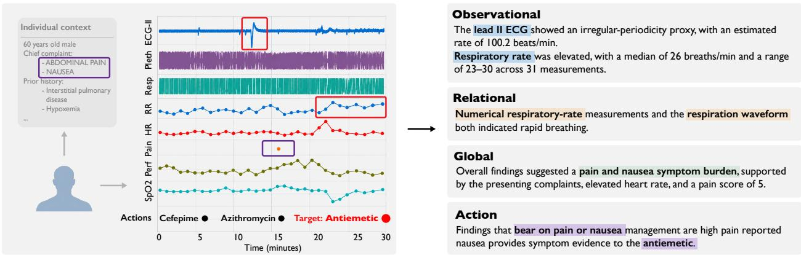  
Figure 2 | Multi-faceted sensor-action captioning pipeline. Our captioning pipeline integrates four complementar<sub>y</sub> facets of sensor-action information: (1) Observational ca<sub>p</sub>tions summarize si<sub>g</sub>nal-derived features; (2) Relational ca<sub>p</sub>tions describe cross-channel evidence; (3) Global ca<sub>p</sub>tions ca<sub>p</sub>ture <sub>p</sub>atient-s<sub>p</sub>ecific context; and (4) Action ca<sub>p</sub>tions identif<sub>y</sub> evidence from the <sub>p</sub>recedin<sub>g</sub> facets that is relevant to the action label.

and the CGM settin<sub>g</sub> includes MetaboNet [36] and PEDAP [33]. We reserve MIMIC-IV as an external <sub>c</sub>li<sub>n</sub>i<sub>ca</sub>l <sub>co</sub>h<sub>or</sub>t t<sub>o eva</sub>l<sub>ua</sub>t<sub>e cross-co</sub>h<sub>or</sub>t <sub>genera</sub>li<sub>za</sub>ti<sub>on.</sub> F<sub>or eac</sub>h <sub>o</sub>f th<sub>e s</sub>i<sub>x</sub> d<sub>eve</sub>l<sub>opmen</sub>t d<sub>a</sub>t<sub>ase</sub>t<sub>s,</sub> we construct individual-disjoint training, validation, and test splits, and combine the training sets <sub>w</sub>ithi<sub>n</sub> <sub>eac</sub>h <sub>se</sub>tti<sub>ng.</sub> Th<sub>e</sub> <sub>c</sub>li<sub>n</sub>i<sub>ca</sub>l <sub>an</sub>d OR <sub>se</sub>tti<sub>ngs</sub> <sub>con</sub>t<sub>a</sub>i<sub>n</sub> h<sub>e</sub>t<sub>erogeneous</sub> <sub>wave</sub>f<sub>orms</sub> <sub>an</sub>d <sub>numer</sub>i<sub>ca</sub>l measurements<sub>,</sub> includin<sub>g</sub> ECG<sub>, p</sub>leth<sub>y</sub>smo<sub>g</sub>ra<sub>p</sub>h<sub>y,</sub> res<sub>p</sub>iration<sub>,</sub> blood <sub>p</sub>ressure<sub>,</sub> S<sub>p</sub>O<sub>2,</sub> and heart rate. Th<sub>e</sub> CGM d<sub>oma</sub>i<sub>n con</sub>t<sub>a</sub>i<sub>ns g</sub>l<sub>ucose</sub> ti<sub>me ser</sub>i<sub>es</sub> t<sub>oge</sub>th<sub>er w</sub>ith b<sub>asa</sub>l i<sub>nsu</sub>li<sub>n</sub> d<sub>e</sub>li<sub>very.</sub>

Unified Multi-level Action Space. We formulate sensor-action modeling around a common question: given sensor observations and contextual information, what action should be taken? In the clinical <sub>an</sub>d OR <sub>se</sub>tti<sub>ngs, ac</sub>ti<sub>ons</sub> i<sub>nc</sub>l<sub>u</sub>d<sub>e me</sub>di<sub>ca</sub>ti<sub>ons, proce</sub>d<sub>ures,</sub> di<sub>agnos</sub>ti<sub>c eva</sub>l<sub>ua</sub>ti<sub>ons, an</sub>d t<sub>rea</sub>t<sub>men</sub>t adjustments, whereas CGM actions correspond to insulin bolus delivery. We organize actions across datasets into a shared three-level hierarchy: ❶ action necessity, indicating whether to act; ❷ action category, specifying the type of action; and ❸ fine-grained action label, identifying the specific action within a category. For example, administration of Imipenem can be represented as “Yes” at the necessity level, “antibiotics” at the category level, and “Imipenem” at the fine-grained level. We d<sub>er</sub>i<sub>ve ac</sub>ti<sub>on superv</sub>i<sub>s</sub>i<sub>on</sub> f<sub>rom</sub> th<sub>e recor</sub>d<sub>e</sub>d <sub>c</sub>li<sub>n</sub>i<sub>ca</sub>l d<sub>ec</sub>i<sub>s</sub>i<sub>ons an</sub>d i<sub>n</sub>t<sub>erven</sub>ti<sub>ons</sub> i<sub>n eac</sub>h <sub>source</sub> d<sub>a</sub>t<sub>ase</sub>t<sub>.</sub> D<sub>e</sub>t<sub>a</sub>il<sub>e</sub>d d<sub>a</sub>t<sub>ase</sub>t <sub>s</sub>t<sub>a</sub>ti<sub>s</sub>ti<sub>cs an</sub>d <sub>ac</sub>ti<sub>on</sub> d<sub>e</sub>fi<sub>n</sub>iti<sub>ons are prov</sub>id<sub>e</sub>d i<sub>n</sub> A<sub>ppen</sub>di<sub>x</sub> A<sub>.</sub>

Multi-faceted Captioning Pipeline. We aim to capture physiological evidence from sensor signals t<sub>oge</sub>th<sub>er w</sub>ith i<sub>n</sub>di<sub>v</sub>id<sub>ua</sub>l <sub>con</sub>t<sub>ex</sub>t <sub>re</sub>l<sub>evan</sub>t t<sub>o</sub> d<sub>ec</sub>i<sub>s</sub>i<sub>on ma</sub>ki<sub>ng.</sub> S<sub>pec</sub>ifi<sub>ca</sub>ll<sub>y, we s</sub>t<sub>ruc</sub>t<sub>ure eac</sub>h <sub>genera</sub>t<sub>e</sub>d <sub>cap</sub>ti<sub>on aroun</sub>d f<sub>our comp</sub>l<sub>emen</sub>t<sub>ary</sub> f<sub>ace</sub>t<sub>s: sensor o</sub>b<sub>serva</sub>ti<sub>ons, p</sub>h<sub>ys</sub>i<sub>o</sub>l<sub>og</sub>i<sub>ca</sub>l <sub>re</sub>l<sub>a</sub>ti<sub>ons</sub>hi<sub>ps,</sub> i<sub>n</sub>di<sub>v</sub>id<sub>ua</sub>l<sub>-</sub> level context, and action-relevant evidence (Fi<sub>g</sub>. 2). Im<sub>p</sub>lementation details are in A<sub>pp</sub>endix B.

Observational Captions. These captions describe channel-level physiological findings derived from established measurements and waveform characteristics (e.<sub>g</sub>., heart rate, res<sub>p</sub>irator<sub>y</sub> rate, rh<sub>y</sub>thm <sub>p</sub>atterns). The<sub>y</sub> translate directl<sub>y</sub> observable sensor <sub>p</sub>ro<sub>p</sub>erties into ex<sub>p</sub>licit <sub>p</sub>h<sub>y</sub>siolo<sub>g</sub>ical descri<sub>p</sub>tions.

Relational Captions. We group physiologically related measurements into complementary feature <sub>se</sub>t<sub>s an</sub>d <sub>c</sub>h<sub>arac</sub>t<sub>er</sub>i<sub>ze</sub> th<sub>e</sub>i<sub>r</sub> t<sub>empora</sub>l <sub>an</sub>d <sub>cross-c</sub>h<sub>anne</sub>l <sub>re</sub>l<sub>a</sub>ti<sub>ons</sub>hi<sub>ps.</sub> F<sub>or examp</sub>l<sub>e, resp</sub>i<sub>ra</sub>t<sub>ory ra</sub>t<sub>e</sub> and breathing waveforms are jointly considered to characterize respiratory status, allowing multiple <sub>measuremen</sub>t<sub>s</sub> t<sub>o prov</sub>id<sub>e comp</sub>l<sub>emen</sub>t<sub>ary ev</sub>id<sub>ence</sub> f<sub>or</sub> th<sub>e same un</sub>d<sub>er</sub>l<sub>y</sub>i<sub>ng p</sub>h<sub>ys</sub>i<sub>o</sub>l<sub>og</sub>i<sub>ca</sub>l <sub>process.</sub>

Global Captions. We integrate sensor-derived findings with individual-specific context, including <sub>ava</sub>il<sub>a</sub>bl<sub>e</sub> b<sub>ac</sub>k<sub>groun</sub>d i<sub>n</sub>f<sub>orma</sub>ti<sub>on an</sub>d <sub>pr</sub>i<sub>or user</sub> hi<sub>s</sub>t<sub>ory,</sub> t<sub>o summar</sub>i<sub>ze</sub> th<sub>e overa</sub>ll <sub>p</sub>h<sub>ys</sub>i<sub>o</sub>l<sub>og</sub>i<sub>ca</sub>l <sub>s</sub>t<sub>a</sub>t<sub>e.</sub> Thi<sub>s p</sub>l<sub>aces</sub> l<sub>oca</sub>l <sub>sensor ev</sub>id<sub>ence w</sub>ithi<sub>n</sub> th<sub>e</sub> b<sub>roa</sub>d<sub>er con</sub>t<sub>ex</sub>t i<sub>n w</sub>hi<sub>c</sub>h d<sub>ec</sub>i<sub>s</sub>i<sub>ons are ma</sub>d<sub>e.</sub>

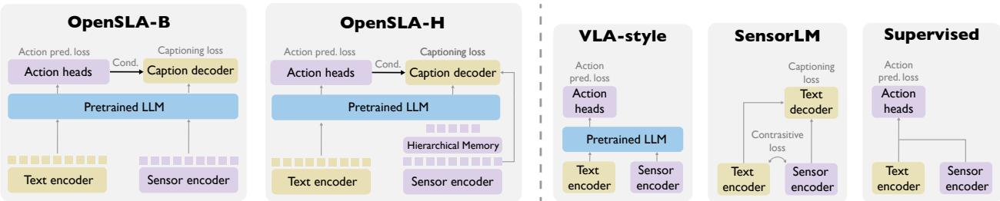  
Figure 3 | The OpenSLA architecture and comparison with existing sensor modeling paradigms. OpenSLA i<sub>n</sub>t<sub>egra</sub>t<sub>es pre</sub>t<sub>ra</sub>i<sub>ne</sub>d l<sub>anguage</sub> k<sub>now</sub>l<sub>e</sub>d<sub>ge w</sub>ith <sub>cap</sub>ti<sub>on superv</sub>i<sub>s</sub>i<sub>on</sub> f<sub>or ac</sub>ti<sub>on-re</sub>l<sub>evan</sub>t <sub>sensor un</sub>d<sub>ers</sub>t<sub>an</sub>di<sub>ng</sub> <sub>an</sub>d <sub>ac</sub>ti<sub>on-con</sub>diti<sub>one</sub>d <sub>cap</sub>ti<sub>on</sub> d<sub>eco</sub>di<sub>ng</sub> f<sub>or</sub> i<sub>mprove</sub>d <sub>a</sub>li<sub>gnmen</sub>t b<sub>e</sub>t<sub>ween sensor,</sub> l<sub>anguage, an</sub>d <sub>ac</sub>ti<sub>ons.</sub>

Action Captions. We condition on recorded action categories to identify decision-relevant evidence f<sub>rom sensor measuremen</sub>t<sub>s an</sub>d i<sub>n</sub>di<sub>v</sub>id<sub>ua</sub>l <sub>con</sub>t<sub>ex</sub>t<sub>, an</sub>d <sub>ver</sub>b<sub>a</sub>li<sub>ze</sub> h<sub>ow</sub> thi<sub>s ev</sub>id<sub>ence suppor</sub>t<sub>s</sub> th<sub>e</sub> <sub>correspon</sub>di<sub>ng ac</sub>ti<sub>on.</sub> Thi<sub>s</sub> f<sub>ormu</sub>l<sub>a</sub>ti<sub>on exp</sub>li<sub>c</sub>itl<sub>y connec</sub>t<sub>s p</sub>h<sub>ys</sub>i<sub>o</sub>l<sub>og</sub>i<sub>ca</sub>l <sub>o</sub>b<sub>serva</sub>ti<sub>ons w</sub>ith th<sub>e ev</sub>id<sub>ence</sub> <sub>un</sub>d<sub>er</sub>l<sub>y</sub>i<sub>ng</sub> d<sub>owns</sub>t<sub>ream</sub> d<sub>ec</sub>i<sub>s</sub>i<sub>ons.</sub>

T<sub>a</sub>k<sub>en</sub> t<sub>oge</sub>th<sub>er, we cons</sub>t<sub>ruc</sub>t <sub>a</sub> l<sub>arge-sca</sub>l<sub>e</sub> SLA t<sub>es</sub>tb<sub>e</sub>d <sub>spann</sub>i<sub>ng s</sub>i<sub>x</sub> d<sub>eve</sub>l<sub>opmen</sub>t d<sub>a</sub>t<sub>ase</sub>t<sub>s an</sub>d th<sub>e</sub> <sub>ex</sub>t<sub>erna</sub>l MIMIC<sub>-</sub>IV <sub>co</sub>h<sub>or</sub>t<sub>, w</sub>ith 79 <sub>sensor mo</sub>d<sub>a</sub>liti<sub>es,</sub> 116K i<sub>n</sub>di<sub>v</sub>id<sub>ua</sub>l<sub>s, an</sub>d 60 <sub>un</sub>i<sub>que ac</sub>ti<sub>ons across</sub> th<sub>ree rea</sub>l<sub>-wor</sub>ld <sub>se</sub>tti<sub>ngs.</sub> O<sub>ur s</sub>t<sub>u</sub>d<sub>y su</sub>b<sub>s</sub>t<sub>an</sub>ti<sub>a</sub>ll<sub>y expan</sub>d<sub>s</sub> th<sub>e sca</sub>l<sub>e an</sub>d <sub>coverage o</sub>f <sub>pr</sub>i<sub>or wor</sub>k (Table 1), while additionall<sub>y</sub> introducin<sub>g</sub> structured action su<sub>p</sub>ervision. We <sub>g</sub>enerate multi<sub>p</sub>le ca<sub>p</sub>tion <sub>com</sub>bi<sub>na</sub>ti<sub>ons an</sub>d <sub>eva</sub>l<sub>ua</sub>t<sub>e</sub> th<sub>e</sub>i<sub>r e</sub>f<sub>ec</sub>ti<sub>veness</sub> i<sub>n</sub> S<sub>ec.</sub> 5<sub>.</sub> U<sub>n</sub>l<sub>ess o</sub>th<sub>erw</sub>i<sub>se spec</sub>ifi<sub>e</sub>d<sub>, we use a</sub>ll f<sub>our</sub> f<sub>ace</sub>t<sub>s</sub> i<sub>n our ma</sub>i<sub>n exper</sub>i<sub>men</sub>t<sub>s.</sub>

## 4. Unifying Sensor-Action Tasks through a Language Interface

## 4.1. Sensor-Language-Action Modeling

We begin with a fundamental question: How can the knowledge encoded in language models be efectively used for sensor-action modeling? To answer this, we study four language-model-centric paradigms: ❶ zero-shot inference with multimodal LLMs; ❷ VLA-st le action-onl fine-tunin [14]; ❸ SensorLMst<sub>y</sub>le sensor-lan<sub>g</sub>ua<sub>g</sub>e ali<sub>g</sub>nment [43]; and ❹ joint fine-tunin<sub>g</sub> with action and lan<sub>g</sub>ua<sub>g</sub>e su<sub>p</sub>ervision. Th<sub>ese para</sub>di<sub>gms progress</sub>i<sub>ve</sub>l<sub>y coup</sub>l<sub>e</sub> l<sub>anguage w</sub>ith <sub>sensor-ac</sub>ti<sub>on</sub> l<sub>earn</sub>i<sub>ng,</sub> f<sub>rom us</sub>i<sub>ng pre</sub>t<sub>ra</sub>i<sub>ne</sub>d <sub>mu</sub>lti<sub>mo</sub>d<sub>a</sub>l k<sub>now</sub>l<sub>e</sub>d<sub>ge</sub> <sub>w</sub>ith<sub>ou</sub>t <sub>a</sub>d<sub>ap</sub>t<sub>a</sub>ti<sub>on</sub> t<sub>o</sub> di<sub>rec</sub>tl<sub>y</sub> <sub>a</sub>li<sub>gn</sub>i<sub>ng</sub> <sub>sensor</sub> <sub>o</sub>b<sub>serva</sub>ti<sub>ons,</sub> l<sub>anguage,</sub> <sub>an</sub>d actions durin<sub>g</sub> trainin<sub>g</sub> (Fi<sub>g</sub>. 3). We com<sub>p</sub>are these <sub>p</sub>aradi<sub>g</sub>ms on action <sub>p</sub>rediction usin<sub>g</sub> VitalDB. Joint <sub>ac</sub>ti<sub>on-</sub>l<sub>anguage</sub> fi<sub>ne-</sub>t<sub>un</sub>i<sub>ng</sub> <sub>cons</sub>i<sub>s</sub>t<sub>en</sub>tl<sub>y</sub> <sub>per</sub>f<sub>orms</sub> b<sub>es</sub>t<sub>,</sub> <sub>ou</sub>t<sub>per</sub>f<sub>orm</sub>i<sub>ng</sub> VLA<sub>-s</sub>t<sub>y</sub>l<sub>e</sub> <sub>ac</sub>ti<sub>on-on</sub>l<sub>y</sub> t<sub>ra</sub>i<sub>n</sub>i<sub>ng</sub> (Fi<sub>g</sub>. 8), while maintainin<sub>g</sub> a substantial mar<sub>g</sub>in over SensorLM-st<sub>y</sub>le sensor-lan<sub>g</sub>ua<sub>g</sub>e ali<sub>g</sub>nment and zero-shot multimodal LLMs, includin<sub>g</sub> GPT-5.6-Luna and Dee<sub>p</sub>Seek-V3.2 (Table 3). These results motivate the Sensor-Language-Action (SLA) paradigm, which jointly models sensor observations, <sub>na</sub>t<sub>ura</sub>l<sub>-</sub>l<sub>anguage</sub> i<sub>ns</sub>t<sub>ruc</sub>ti<sub>ons,</sub> <sub>an</sub>d i<sub>n</sub>di<sub>v</sub>id<sub>ua</sub>l <sub>con</sub>t<sub>ex</sub>t<sub>,</sub> <sub>w</sub>ith b<sub>o</sub>th <sub>ac</sub>ti<sub>ons</sub> <sub>an</sub>d l<sub>anguage</sub> <sub>as</sub> <sub>pre</sub>di<sub>c</sub>ti<sub>on</sub> <sup>t</sup>a<sup>r</sup>ge<sup>t</sup>s.

W<sub>e</sub> <sub>nex</sub>t i<sub>nves</sub>ti<sub>ga</sub>t<sub>e</sub> h<sub>ow</sub> <sub>sensor</sub> <sub>represen</sub>t<sub>a</sub>ti<sub>ons</sub> <sub>s</sub>h<sub>ou</sub>ld b<sub>e</sub> i<sub>n</sub>t<sub>egra</sub>t<sub>e</sub>d i<sub>n</sub>t<sub>o</sub> th<sub>e</sub> l<sub>anguage</sub> b<sub>ac</sub>kb<sub>one</sub> f<sub>or</sub> SLA <sub>mo</sub>d<sub>e</sub>li<sub>ng.</sub> W<sub>e cons</sub>id<sub>er</sub> th<sub>ree represen</sub>t<sub>a</sub>ti<sub>ve a</sub>d<sub>ap</sub>t<sub>a</sub>ti<sub>on s</sub>t<sub>ra</sub>t<sub>eg</sub>i<sub>es, rang</sub>i<sub>ng</sub> f<sub>rom</sub> li<sub>g</sub>ht<sub>we</sub>i<sub>g</sub>ht <sub>ex</sub>t<sub>er-</sub> nal ali<sub>g</sub>nment to direct ada<sub>p</sub>tation of the LLM: ❶ LLaVA-st<sub>y</sub>le ada<sub>p</sub>ter trainin<sub>g</sub> [21]; ❷ Flamin<sub>g</sub>o-st<sub>y</sub>le cross-attention injection [1]; and ❸ direct Low-Rank Ada<sub>p</sub>tation (LoRA) [9]. Fi<sub>g</sub>. 4 confirms direct L<sub>o</sub>RA <sub>a</sub>d<sub>ap</sub>t<sub>a</sub>ti<sub>on</sub> <sub>ac</sub>hi<sub>eves</sub> th<sub>e</sub> <sub>s</sub>t<sub>ronges</sub>t <sub>per</sub>f<sub>ormance</sub> <sub>on</sub> <sub>mos</sub>t <sub>ac</sub>ti<sub>on-pre</sub>di<sub>c</sub>ti<sub>on</sub> t<sub>as</sub>k<sub>s,</sub> <sub>ou</sub>t<sub>per</sub>f<sub>orm</sub>i<sub>ng</sub> <sup>b</sup>ot<sup>h</sup> a<sup>d</sup>apter-<sup>b</sup>ase<sup>d</sup> an<sup>d</sup> cross-attent<sup>i</sup>on-<sup>b</sup>ase<sup>d</sup> a<sup>l</sup>ternat<sup>i</sup>ves. <sup>W</sup>e t<sup>h</sup>ere<sup>f</sup>ore <sup>i</sup>nstant<sup>i</sup>ate OpenSLA us<sup>i</sup>ng di<sub>rec</sub>t L<sub>o</sub>RA<sub>-</sub>b<sub>ase</sub>d <sub>a</sub>d<sub>ap</sub>t<sub>a</sub>ti<sub>on o</sub>f th<sub>e</sub> l<sub>anguage</sub> b<sub>ac</sub>kb<sub>one.</sub>

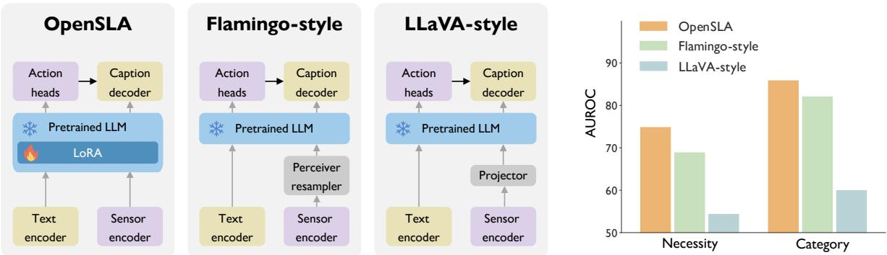  
Figure 4 | Comparison of SLA alignment strategies. OpenSLA directly adapts the pretrained LLM with LoRA, outperforming Flamingo-style cross-attention and LLaVA-style projection.

## 4.2. OpenSLA: Learning Sensor Dynamics through a Language Interface

OpenSLA compr<sup>i</sup>ses t<sup>h</sup>ree ma<sup>i</sup>n components: <sup>❶</sup> an <sup>LLM</sup> <sup>b</sup>ac<sup>kb</sup>one w<sup>i</sup>t<sup>h</sup> structure<sup>d</sup> act<sup>i</sup>on-pre<sup>di</sup>ct<sup>i</sup>on heads; ❷ a hierarchical sensor encoder; and ❸ a multimodal fusion decoder (Fi<sub>g</sub>. 3). The model is jointly optimized for action prediction and autoregressive language generation, allowing action d<sub>ec</sub>i<sub>s</sub>i<sub>ons an</sub>d th<sub>e</sub>i<sub>r sensor-groun</sub>d<sub>e</sub>d d<sub>escr</sub>i<sub>p</sub>ti<sub>ons</sub> t<sub>o</sub> b<sub>e</sub> l<sub>earne</sub>d <sub>w</sub>ithi<sub>n a s</sub>h<sub>are</sub>d <sub>represen</sub>t<sub>a</sub>ti<sub>on.</sub>

Structured action prediction heads. To support multi-level action prediction, we attach three prediction heads to the final-token representation of the LLM hidden states H, corresponding to action <sub>necess</sub>it<sub>y, ac</sub>ti<sub>on ca</sub>t<sub>egory, an</sub>d fi<sub>ne-gra</sub>i<sub>ne</sub>d <sub>ac</sub>ti<sub>on</sub> l<sub>a</sub>b<sub>e</sub>l<sub>.</sub> Th<sub>e necess</sub>it<sub>y</sub> h<sub>ea</sub>d <sub>uses a</sub> bi<sub>nary</sub> li<sub>near</sub> <sub>c</sub>l<sub>ass</sub>ifi<sub>er</sub> t<sub>o</sub> d<sub>e</sub>t<sub>erm</sub>i<sub>ne w</sub>h<sub>e</sub>th<sub>er an ac</sub>ti<sub>on occurs, w</sub>hil<sub>e</sub> th<sub>e ca</sub>t<sub>egory</sub> h<sub>ea</sub>d <sub>uses</sub> i<sub>n</sub>d<sub>epen</sub>d<sub>en</sub>t bi<sub>nary</sub> <sub>c</sub>l<sub>ass</sub>ifi<sub>ers</sub> t<sub>o pre</sub>di<sub>c</sub>t <sub>app</sub>li<sub>ca</sub>bl<sub>e ac</sub>ti<sub>on ca</sub>t<sub>egor</sub>i<sub>es.</sub> F<sub>or</sub> fi<sub>ne-gra</sub>i<sub>ne</sub>d <sub>pre</sub>di<sub>c</sub>ti<sub>on, we use a s</sub>i<sub>m</sub>il<sub>ar</sub>it<sub>y-</sub> b<sub>ase</sub>d h<sub>ea</sub>d th<sub>a</sub>t <sub>suppor</sub>t<sub>s a</sub> fl<sub>ex</sub>ibl<sub>e ac</sub>ti<sub>on space.</sub> Gi<sub>ven an ac</sub>ti<sub>on ca</sub>t<sub>egory,</sub> t<sub>ex</sub>t<sub>ua</sub>l d<sub>escr</sub>i<sub>p</sub>ti<sub>ons o</sub>f it<sub>s</sub> <sub>can</sub>did<sub>a</sub>t<sub>e</sub> fi<sub>ne-gra</sub>i<sub>ne</sub>d <sub>ac</sub>ti<sub>ons are enco</sub>d<sub>e</sub>d i<sub>n</sub>t<sub>o em</sub>b<sub>e</sub>ddi<sub>ngs, an</sub>d th<sub>e ac</sub>ti<sub>on w</sub>h<sub>ose em</sub>b<sub>e</sub>ddi<sub>ng</sub> i<sub>s</sub> <sub>mos</sub>t <sub>s</sub>i<sub>m</sub>il<sub>ar</sub> t<sub>o</sub> th<sub>e</sub> LLM <sub>represen</sub>t<sub>a</sub>ti<sub>on</sub> i<sub>s se</sub>l<sub>ec</sub>t<sub>e</sub>d<sub>.</sub>

Hierarchical sensor encoder. Sensor recordings can span long temporal windows and contain h<sub>e</sub>t<sub>erogeneous c</sub>h<sub>anne</sub>l <sub>compos</sub>iti<sub>ons.</sub> T<sub>o e</sub>fi<sub>c</sub>i<sub>en</sub>tl<sub>y represen</sub>t th<sub>ese</sub> i<sub>npu</sub>t<sub>s, we</sub> d<sub>es</sub>i<sub>gn a</sub> hi<sub>erarc</sub>hi<sub>ca</sub>l <sub>sensor enco</sub>d<sub>er cons</sub>i<sub>s</sub>ti<sub>ng o</sub>f <sub>c</sub>h<sub>anne</sub>l<sub>-w</sub>i<sub>se s</sub>i<sub>gna</sub>l <sub>enco</sub>di<sub>ng</sub> f<sub>o</sub>ll<sub>owe</sub>d b<sub>y a</sub> Hi<sub>erarc</sub>hi<sub>ca</sub>l M<sub>emory mo</sub>d<sub>u</sub>l<sub>e.</sub> E<sub>ac</sub>h <sub>c</sub>h<sub>anne</sub>l i<sub>s</sub> fi<sub>rs</sub>t i<sub>n</sub>d<sub>epen</sub>d<sub>en</sub>tl<sub>y</sub> <sub>processe</sub>d b<sub>y</sub> <sub>a</sub> f<sub>rozen</sub> <sub>s</sub>i<sub>gna</sub>l <sub>enco</sub>d<sub>er,</sub> <sub>pro</sub>d<sub>uc</sub>i<sub>ng</sub> <sub>sensor</sub> t<sub>o</sub>k<sub>ens</sub> $\mathbf { Z } ^ { ( 0 ) } \in \mathbb { R } ^ { N _ { 0 } \times D }$ <sub>,</sub> <sub>w</sub>h<sub>ere</sub> $N _ { 0 }$ d<sub>eno</sub>t<sub>es</sub> th<sub>e</sub> <sub>num</sub>b<sub>er</sub> <sub>o</sub>f t<sub>o</sub>k<sub>ens</sub> <sub>an</sub>d � th<sub>e</sub>i<sub>r</sub> f<sub>ea</sub>t<sub>ure</sub> di<sub>mens</sub>i<sub>on.</sub> Th<sub>e</sub> Hi<sub>erarc</sub>hi<sub>ca</sub>l M<sub>emory</sub> th<sub>en</sub> <sub>compresses</sub> th<sub>ese</sub> t<sub>o</sub>k<sub>ens</sub> <sub>across</sub> <sub>mu</sub>lti<sub>p</sub>l<sub>e</sub> <sub>reso</sub>l<sub>u</sub>ti<sub>ons</sub> <sub>w</sub>hil<sub>e</sub> <sub>preserv</sub>i<sub>ng</sub> b<sub>o</sub>th fi<sub>ne-gra</sub>i<sub>ne</sub>d <sub>sensor pa</sub>tt<sub>erns an</sub>d <sub>samp</sub>l<sub>e-</sub>l<sub>eve</sub>l i<sub>n</sub>f<sub>orma</sub>ti<sub>on.</sub>

The Hierarchical Memor<sub>y</sub> contains two com<sub>p</sub>lementar<sub>y</sub> <sub>p</sub>athwa<sub>y</sub>s. The first recursivel<sub>y</sub> a<sub>gg</sub>re<sub>g</sub>ates <sub>sensor</sub> t<sub>o</sub>k<sub>ens across mu</sub>lti<sub>p</sub>l<sub>e reso</sub>l<sub>u</sub>ti<sub>ons.</sub> St<sub>ar</sub>ti<sub>ng</sub> f<sub>rom</sub> $\mathbf { Z } ^ { ( 0 ) }$ , <sup>w</sup>e app<sup>l</sup>y <sup>�</sup> que<sup>r</sup>y <sup>l</sup>aye<sup>r</sup>s, <sup>wh</sup>e<sup>r</sup>e <sup>th</sup>e �-th la<sub>y</sub>er <sub>u</sub>ses $N _ { l }$ l<sub>earne</sub>d <sub>quer</sub>i<sub>es</sub> t<sub>o</sub> <sub>cross-a</sub>tt<sub>en</sub>d t<sub>o</sub> $\mathbf { Z } ^ { ( l - 1 ) }$ , <sub>p</sub>ro<sup>d</sup>uc<sup>i</sup>n<sub>g</sub> $\mathbf { Z } ^ { ( l ) } \in \mathbb { R } ^ { N _ { l } \times D } ;$ <sub>, w</sub>ith $N _ { l } < N _ { l - 1 }$ Thi<sub>s</sub> <sub>recurs</sub>i<sub>ve</sub> <sub>compress</sub>i<sub>on</sub> <sub>aggrega</sub>t<sub>es</sub> i<sub>n</sub>f<sub>orma</sub>ti<sub>on</sub> <sub>over</sub> i<sub>ncreas</sub>i<sub>ng</sub>l<sub>y</sub> l<sub>ong</sub> t<sub>empora</sub>l <sub>con</sub>t<sub>ex</sub>t<sub>s.</sub> I<sub>n</sub> <sub>para</sub>ll<sub>e</sub>l<sub>,</sub> <sub>a</sub> <sub>separa</sub>t<sub>e</sub> <sub>se</sub>t <sub>o</sub>f <sub>g</sub>l<sub>o</sub>b<sub>a</sub>l <sub>quer</sub>i<sub>es</sub> <sub>a</sub>tt<sub>en</sub>d<sub>s</sub> di<sub>rec</sub>tl<sub>y</sub> t<sub>o</sub> th<sub>e</sub> <sub>or</sub>i<sub>g</sub>i<sub>na</sub>l t<sub>o</sub>k<sub>en</sub> <sub>sequence</sub> ${ \bf Z } ^ { ( 0 ) }$ <sup>t</sup>o cap<sup>t</sup>u<sup>r</sup>e <sub>samp</sub>l<sub>e-</sub>l<sub>eve</sub>l <sub>seman</sub>ti<sub>cs.</sub> Th<sub>e ou</sub>t<sub>pu</sub>t<sub>s o</sub>f th<sub>e</sub> t<sub>wo pa</sub>th<sub>ways are conca</sub>t<sub>ena</sub>t<sub>e</sub>d t<sub>o</sub> f<sub>orm</sub> th<sub>e sensor</sub> t<sub>o</sub>k<sub>ens</sub> <sub>prov</sub>id<sub>e</sub>d t<sub>o</sub> th<sub>e</sub> l<sub>anguage</sub> b<sub>ac</sub>kb<sub>one.</sub>

Multimodal fusion decoder. Although the hierarchical sensor encoder provides compact multi-<sub>reso</sub>l<sub>u</sub>ti<sub>on represen</sub>t<sub>a</sub>ti<sub>ons,</sub> th<sub>e</sub> LLM hidd<sub>en s</sub>t<sub>a</sub>t<sub>es may no</sub>t <sub>re</sub>t<sub>a</sub>i<sub>n</sub> th<sub>e</sub> fi<sub>ne-gra</sub>i<sub>ne</sub>d <sub>sensor ev</sub>id<sub>ence</sub> <sub>requ</sub>i<sub>re</sub>d f<sub>or groun</sub>d<sub>e</sub>d <sub>cap</sub>ti<sub>on genera</sub>ti<sub>on.</sub> W<sub>e</sub> th<sub>ere</sub>f<sub>ore</sub> i<sub>n</sub>t<sub>ro</sub>d<sub>uce a ga</sub>t<sub>e</sub>d <sub>res</sub>id<sub>ua</sub>l <sub>cap</sub>ti<sub>on</sub> d<sub>eco</sub>d<sub>er</sub> th<sub>a</sub>t <sub>exp</sub>li<sub>c</sub>itl<sub>y</sub> <sub>con</sub>diti<sub>ons</sub> l<sub>anguage</sub> <sub>genera</sub>ti<sub>on</sub> <sub>on</sub> b<sub>o</sub>th <sub>pre</sub>di<sub>c</sub>t<sub>e</sub>d <sub>ac</sub>ti<sub>ons</sub> <sub>an</sub>d <sub>sensor</sub> <sub>ev</sub>id<sub>ence.</sub> S<sub>pec</sub>ifi<sub>ca</sub>ll<sub>y,</sub> t<sub>wo para</sub>ll<sub>e</sub>l b<sub>ranc</sub>h<sub>es cross-a</sub>tt<sub>en</sub>d t<sub>o</sub> th<sub>e pre</sub>di<sub>c</sub>t<sub>e</sub>d <sub>ac</sub>ti<sub>on pro</sub>fil<sub>e an</sub>d <sub>re</sub>t<sub>r</sub>i<sub>eve</sub>d <sub>sensor ev</sub>id<sub>ence,</sub> respectively. The action profile P consists of an action-necessity token and action-category tokens, <sub>w</sub>ith <sub>eac</sub>h t<sub>o</sub>k<sub>en com</sub>bi<sub>n</sub>i<sub>ng</sub> th<sub>e correspon</sub>di<sub>ng ac</sub>ti<sub>on em</sub>b<sub>e</sub>ddi<sub>ng an</sub>d <sub>pre</sub>di<sub>c</sub>t<sub>e</sub>d <sub>score.</sub> C<sub>on</sub>diti<sub>one</sub>d <sub>on</sub> the LLM hidden states H and action profile $\mathbf { p , }$ th<sub>e sensor</sub> b<sub>ranc</sub>h <sub>re</sub>t<sub>r</sub>i<sub>eves</sub> th<sub>e mos</sub>t <sub>re</sub>l<sub>evan</sub>t t<sub>o</sub>k<sub>ens</sub> from the waveform and numerical sensor representations to form sensor evidence S. The caption <sub>represen</sub>t<sub>a</sub>ti<sub>on</sub> i<sub>s</sub> th<sub>en</sub> <sub>re</sub>fi<sub>ne</sub>d <sub>as</sub>

Table 2 | Multi-level action prediction results for ICU clinical prediction.
<table><tr><td rowspan="3">Method</td><td colspan="5">MC-MED</td><td colspan="5">MIMIC-III</td></tr><tr><td colspan="2">Necessity</td><td colspan="2">Category</td><td>Fine-label</td><td colspan="2">Necessity</td><td colspan="2">Category</td><td>Fine-label</td></tr><tr><td>AUROC↑</td><td>BAcc↑</td><td>AUROC↑</td><td>BAcc↑</td><td>BAcc↑</td><td>AUROC↑</td><td>BAcc↑</td><td>AUROC↑</td><td>BAcc↑</td><td>BAcc↑</td></tr><tr><td colspan="9">Supervised:</td><td></td><td></td></tr><tr><td>CONVTRANS [5]</td><td> $6 5 . 2 \pm 1 . 8$ </td><td> $5 7 . 5 \pm 1 . 4$ </td><td> $5 9 . 8 \pm 1 . 8 $ </td><td> $5 3 . 8 \pm 1 . 2 $ </td><td> $5 4 . 7 \pm 2 . 1 $ </td><td> $6 1 . 4 \pm 2 . 3 $ </td><td> $5 9 . 7 \pm 1 . 8 $ </td><td> $5 4 . 8 \pm 1 . 7$ </td><td> $5 1 . 7 \pm 0 . 8 $ </td><td> $5 7 . 1 \pm 1 . 8$ </td></tr><tr><td>MMIM [7]</td><td> $6 1 . 9 \pm 1 . 8$ </td><td> $5 3 . 4 \pm 1 . 2 $ </td><td>64.6 ±1.7</td><td> $5 6 . 0 \pm 1 . 0$ </td><td> $5 3 . 5 \pm 2 . 3 $ </td><td> $6 6 . 0 \pm 2 . 1$ </td><td> $6 1 . 6 \pm 1 . 8$ </td><td> $6 4 . 5 \pm 1 . 6 $ </td><td> $5 4 . 4 \pm 0 . 7 $ </td><td> $6 0 . 2 \pm 1 . 8 $ </td></tr><tr><td colspan="9">TS Foundation Models:</td><td></td><td></td></tr><tr><td>Chronos-2 [2]</td><td> $6 2 . 5 \pm 1 . 8$ </td><td> $5 5 . 4 \pm 1 . 4$ </td><td> $5 6 . 9 \pm 1 . 9$ </td><td> $5 2 . 7 \pm 0 . 9$ </td><td> $5 1 . 8 \pm 2 . 6 $ </td><td> $6 0 . 9 \pm 2 . 4$ </td><td> $5 6 . 6 \pm 1 . 8$ </td><td> $5 8 . 8 \pm 1 . 7 $ </td><td> $5 2 . 5 \pm 0 . 8 $ </td><td> $5 3 . 2 \pm 2 . 0 $ </td></tr><tr><td>Moirai [37]</td><td> $6 2 . 5 \pm 1 . 8$ </td><td> $5 7 . 4 \pm 1 . 5$ </td><td> $5 4 . 4 \pm 2 . 1 $ </td><td> $5 1 . 9 \pm 1 . 1$ </td><td> $5 1 . 7 \pm 2 . 4 $ </td><td> $5 7 . 7 \pm 2 . 4$ </td><td> $5 5 . 7 \pm 1 . 8 $ </td><td> $5 8 . 7 \pm 1 . 8 $ </td><td> $5 2 . 8 \pm 0 . 8 $ </td><td> $5 3 . 4 \pm 1 . 8 $ </td></tr><tr><td colspan="9">Multi-modal LLMs:</td><td></td><td></td></tr><tr><td>GPT-5.6-Luna [25]</td><td>一</td><td> $6 0 . 6 \pm 1 . 6 $ </td><td>一</td><td> $6 3 . 1 \pm 1 . 3 $ </td><td> $5 9 . 5 \pm 2 . 4 $ </td><td></td><td> $5 4 . 8 \pm 1 . 2 $ </td><td>一</td><td> $6 4 . 0 \pm 1 . 2 $ </td><td> $7 9 . 5 \pm 1 . 6$ </td></tr><tr><td>DeepSeek-V3.2 [3]</td><td>一</td><td> $5 6 . 1 \pm 1 . 8 $ </td><td>一</td><td> $5 8 . 2 \pm 1 . 3 $ </td><td> $5 4 . 4 \pm 2 . 4$ </td><td></td><td> $5 5 . 6 \pm 1 . 8$ </td><td>一</td><td> $6 0 . 2 \pm 0 . 9$ </td><td> $7 2 . 2 \pm 2 . 0$ </td></tr><tr><td colspan="9">TS-LLM:</td><td></td><td></td></tr><tr><td>OpenTSLM [15]</td><td>一</td><td> $6 2 . 9 \pm 1 . 5$ </td><td>一</td><td> $5 2 . 8 \pm 0 . 7 $ </td><td> $5 0 . 1 \pm 1 . 1 $ </td><td>一</td><td> $7 1 . 2 \pm 1 . 7$ </td><td>一</td><td> $6 6 . 0 \pm 1 . 3$ </td><td> $6 7 . 1 \pm 1 . 4$ </td></tr><tr><td>SensorLM [43]</td><td>一</td><td> $6 4 . 6 \pm 1 . 6$ </td><td>一</td><td> $5 3 . 5 \pm 0 . 8 $ </td><td> $5 0 . 4 \pm 1 . 2 $ </td><td>一</td><td> $6 2 . 9 \pm 1 . 8$ </td><td>一</td><td> $5 5 . 3 \pm 0 . 7 $ </td><td> $5 1 . 7 \pm 0 . 9$ </td></tr><tr><td colspan="9">SLA:</td><td></td><td></td></tr><tr><td>OpenSLA-B</td><td> $7 7 . 6 \pm 1 . 5$ </td><td> $7 2 . 5 \pm 1 . 5$ </td><td> $8 3 . 7 \pm 1 . 4 $ </td><td> $\underline { { 6 8 . 6 } } \pm 1 . 3$ </td><td> $\underline { { 6 1 . 2 } } \pm 2 . 1$ </td><td> $8 4 . 0 \pm 1 . 6 $ </td><td> $7 5 . 4 \pm 1 . 4$ </td><td> $8 8 . 3 \pm 1 . 5$ </td><td> $\underline { { 7 3 . 1 \pm 1 . 6 } }$ </td><td> $7 3 . 7 \pm 1 . 5 $ </td></tr><tr><td>OpenSLA-H</td><td> $\underline { { 7 7 . 0 } } \pm 1 . 5$ </td><td> $\underline { { 7 2 . 2 } } \pm 1 . 4$ </td><td> $8 3 . 7 \pm 1 . 3 $ </td><td> $6 8 . 7 \pm 1 . 3 $ </td><td> $6 5 . 2 \pm 2 . 5 $ </td><td> $\underline { { 8 1 . 9 \pm 1 . 6 } }$ </td><td> $\underline { { 7 3 . 3 } } \pm 1 . 5$ </td><td> $\underline { { 8 8 . 1 } } \pm 1 . 6$ </td><td> $7 4 . 5 \pm 1 . 7$ </td><td> $\underline { { 7 6 . 5 } } \pm 1 . 2$ </td></tr></table>

$$
\mathbf { H } ^ { \prime } = \mathbf { H } + g _ { p } f _ { p } \left( \mathbf { H } , \mathbf { P } \right) + g _ { s } f _ { s } \left( \mathbf { H } , \mathbf { S } \right) ,\tag{1}
$$

<sub>w</sub>h<sub>ere</sub> $f _ { p }$ <sub>an</sub>d $f _ { s }$ d<sub>eno</sub>t<sub>e cross-a</sub>tt<sub>en</sub>ti<sub>on mo</sub>d<sub>u</sub>l<sub>es over</sub> th<sub>e ac</sub>ti<sub>on pro</sub>fil<sub>e an</sub>d <sub>sensor ev</sub>id<sub>ence, respec</sub>ti<sub>ve</sub>l<sub>y,</sub> <sub>an</sub>d $g _ { p }$ <sub>an</sub>d $g _ { s }$ are learnable gates. The refined states H<sup>′</sup> are passed through the original language-model h<sub>ea</sub>d f<sub>or</sub> <sub>au</sub>t<sub>oregress</sub>i<sub>ve</sub> <sub>cap</sub>ti<sub>on</sub> <sub>genera</sub>ti<sub>on.</sub>

Training objective. We denote the action prediction loss as $\mathcal { L } _ { \mathrm { a c t } }$ <sub>,</sub> <sub>w</sub>hi<sub>c</sub>h <sub>aggrega</sub>t<sub>es</sub> th<sub>e</sub> l<sub>osses</sub> f<sub>or</sub> <sub>ac</sub>ti<sub>on</sub> <sub>necess</sub>it<sub>y,</sub> <sub>ca</sub>t<sub>egory,</sub> <sub>an</sub>d fi<sub>ne-gra</sub>i<sub>ne</sub>d <sub>ac</sub>ti<sub>on</sub> <sub>pre</sub>di<sub>c</sub>ti<sub>on,</sub> <sub>an</sub>d <sub>op</sub>ti<sub>m</sub>i<sub>ze</sub> <sub>cap</sub>ti<sub>on</sub> <sub>genera</sub>ti<sub>on</sub> <sub>us</sub>i<sub>ng</sub> au<sup>t</sup>o<sup>r</sup>eg<sup>r</sup>ess<sup>iv</sup>e c<sup>r</sup>oss<sup>-</sup>e<sup>ntr</sup>opy $\mathcal { L } _ { \mathrm { t e x t } }$ . The overall training objective is $\mathcal { L } = \mathcal { L } _ { \mathrm { a c t } } + \lambda _ { \mathrm { t e x t } } \mathcal { L } _ { \mathrm { t e x t } }$ <sub>, w</sub>h<sub>ere</sub> $\lambda _ { \mathrm { t e x t } }$ <sub>con</sub>t<sub>ro</sub>l<sub>s</sub> th<sub>e</sub> <sub>con</sub>t<sub>r</sub>ib<sub>u</sub>ti<sub>on</sub> <sub>o</sub>f l<sub>anguage</sub> <sub>superv</sub>i<sub>s</sub>i<sub>on.</sub> D<sub>ur</sub>i<sub>ng</sub> t<sub>ra</sub>i<sub>n</sub>i<sub>ng,</sub> <sub>we</sub> <sub>a</sub>d<sub>ap</sub>t th<sub>e</sub> LLM b<sub>ac</sub>kb<sub>one</sub> <sub>us</sub>i<sub>ng</sub> LoRA and jointly optimize the hierarchical sensor encoder and multimodal fusion decoder, while k<sub>eep</sub>i<sub>ng</sub> th<sub>e rema</sub>i<sub>n</sub>i<sub>ng pre</sub>t<sub>ra</sub>i<sub>ne</sub>d <sub>mo</sub>d<sub>u</sub>l<sub>es</sub> f<sub>rozen.</sub> I<sub>mp</sub>l<sub>emen</sub>t<sub>a</sub>ti<sub>on</sub> d<sub>e</sub>t<sub>a</sub>il<sub>s are</sub> i<sub>n</sub> A<sub>ppen</sub>di<sub>x</sub> C<sub>.</sub>1<sub>.</sub>

## 5. Experiment & Results

Baselines. We compare OpenSLA with four families of sensor modeling methods. ❶ Supervised models. We train ConvTrans [5] and MMIM [7, 8] from scratch. ❷ Time-series foundation models. We linearly probe Chronos-2 [2], Moirai [37], Gluformer [22] for action prediction. ❸ Sensorlanguage models. We adapt OpenTSLM [15] and SensorLM [43] using our training corpus. ❹ Multimodal LLMs. We prompt GPT-5.6-Luna [25] and DeepSeek-V3.2 [3] through CodeAct-style P<sub>y</sub>thon execution [34]. Additional details are <sub>p</sub>rovided in A<sub>pp</sub>endix C.2.

Implementation details. We denote the base and hierarchical variants of our model by OpenSLA-B an<sup>d</sup> OpenSLA-H, respect<sup>i</sup>ve<sup>l</sup>y. <sup>All</sup> OpenSLA var<sup>i</sup>ants use a Qwen-<sup>3</sup>.<sup>5</sup>-<sup>2B b</sup>ac<sup>kb</sup>one a<sup>d</sup>apte<sup>d</sup> w<sup>i</sup>t<sup>h L</sup>o<sup>RA</sup>. F<sub>or</sub> f<sub>a</sub>i<sub>r compar</sub>i<sub>son, a</sub>ll <sub>me</sub>th<sub>o</sub>d<sub>s</sub> t<sub>ra</sub>i<sub>ne</sub>d <sub>on our co</sub>h<sub>or</sub>t<sub>s use</sub> th<sub>e same</sub> t<sub>ra</sub>i<sub>n</sub>i<sub>ng</sub> d<sub>a</sub>t<sub>a an</sub>d <sub>compu</sub>t<sub>e</sub> b<sub>u</sub>d<sub>ge</sub>t<sub>, w</sub>ith <sub>s</sub>i<sub>gna</sub>l <sub>enco</sub>d<sub>ers</sub> i<sub>n</sub>iti<sub>a</sub>li<sub>ze</sub>d f<sub>rom</sub> th<sub>e same</sub> d<sub>oma</sub>i<sub>n-spec</sub>ifi<sub>c</sub> DINO<sub>-s</sub>t<sub>y</sub>l<sub>e pre</sub>t<sub>ra</sub>i<sub>ne</sub>d <sub>mo</sub>d<sub>e</sub>l<sub>s</sub> [26, 31], where a<sub>pp</sub>licable. Trainin<sub>g</sub> is ca<sub>pp</sub>ed to 24 hours on H200 GPU nodes. Further details are <sub>prov</sub>id<sub>e</sub>d i<sub>n</sub> A<sub>ppen</sub>di<sub>x</sub> C<sub>.</sub>

Table 3 | Multi-level action prediction results for operating room decision making.
<table><tr><td rowspan="3">Method</td><td colspan="5">MOVER</td><td colspan="5">VitalDB</td></tr><tr><td colspan="2">Necessity</td><td colspan="2">Category</td><td>Fine-label</td><td colspan="2">Necessity</td><td colspan="2">Category</td><td>Fine-label</td></tr><tr><td>AUROC↑</td><td>BAcc↑</td><td>AUROC↑</td><td>BAcc↑</td><td>BAcc↑</td><td>AUROC↑</td><td>BAcc↑</td><td>AUROC↑</td><td>BAcc↑</td><td>BAcc↑</td></tr><tr><td colspan="9">Supervised:</td><td></td><td></td></tr><tr><td>CONVTRANS [5]</td><td>47.6 ±3.9</td><td>48.0 ±3.3</td><td>62.0 ±3.8</td><td>56.9 ±3.3</td><td>56.0 ±5.2</td><td>52.1 ±3.4</td><td>51.4 ±2.7</td><td>70.9 ±4.2</td><td>66.0 ±3.9</td><td>51.4 ±12.6</td></tr><tr><td>MMIM [7]</td><td>53.5 ±3.6</td><td>51.8 ±3.2</td><td>63.2 ±3.6</td><td>59.0 ±3.0</td><td>55.9 ±4.0</td><td>51.7 ±3.5</td><td>51.1 ±2.5</td><td>63.9 ±4.6</td><td>56.8 ±4.1</td><td>57.2 ±9.7</td></tr><tr><td colspan="9">TS Foundation Models:</td><td></td><td></td></tr><tr><td>Chronos-2 [2]</td><td>43.6 ±4.0</td><td>46.3 ±3.0</td><td>63.3 ±3.7</td><td>60.5 ±3.3</td><td>57.5 ±5.2</td><td>53.9 ±3.4</td><td>52.1 ±2.6</td><td>65.7 ±4.0</td><td>62.3 ±2.6</td><td>58.0 ±12.0</td></tr><tr><td>Moirai [37]</td><td>46.3 ±3.7</td><td>45.7 ±2.9</td><td>63.7 ±3.7</td><td>57.0 ±3.1</td><td>51.9 ±4.2</td><td>49.8 ±3.7</td><td>49.7 ±1.8</td><td>60.9 ±5.8</td><td>57.5 ±4.0</td><td>54.8 ±16.2</td></tr><tr><td colspan="9">Multi-modal LLMs:</td><td></td><td></td></tr><tr><td>GPT-5.6-Luna [25]</td><td></td><td>45.0 ±3.3</td><td></td><td>52.4 ±1.3</td><td>69.2 ±4.6</td><td></td><td>50.1 ±2.3</td><td></td><td>55.7 ±2.3</td><td>78.6 ±1.6</td></tr><tr><td>DeepSeek-V3.2 [3]</td><td>一</td><td>48.1 ±3.2</td><td></td><td>54.3 ±2.4</td><td>55.9 ±4.0</td><td></td><td>50.8 ±1.9</td><td>一</td><td>53.8 ±1.8</td><td>66.2 ±3.4</td></tr><tr><td colspan="9">TS-LLM:</td><td></td><td></td></tr><tr><td>OpenTSLM [15]</td><td></td><td>71.5 ±3.0</td><td></td><td>55.2 ±1.9</td><td>52.3 ±1.9</td><td></td><td>48.9 ±2.2</td><td></td><td>49.9 ±1.0</td><td>51.2 ±2.5</td></tr><tr><td>SensorLM [43]</td><td>1</td><td>49.9 ±1.0</td><td></td><td>52.9 ±1.9</td><td>50.1 ±0.2</td><td>一</td><td>52.1 ±1.9</td><td>一</td><td>51.0 ±0.6</td><td>51.7 ±1.0</td></tr><tr><td colspan="9">SLA:</td><td></td><td></td></tr><tr><td>OpenSLA-B</td><td>83.4 ±3.1</td><td>74.2 ±3.0</td><td>80.3 ±2.7</td><td>69.0 ±2.7</td><td>66.4 ±3.2</td><td>74.8 ±2.8</td><td>59.0 ±1.7</td><td>85.9 ±1.5</td><td>79.5 ±2.1</td><td>78.9 ±1.0</td></tr><tr><td>OpenSLA-H</td><td>85.9 ±2.7</td><td>80.6 ±2.8</td><td>79.9 ±3.1</td><td>69.9 ±2.3</td><td>67.6 ±2.6</td><td>77.1 ±2.4</td><td>66.3 ±2.4</td><td>86.3 ±1.4</td><td>80.8 ±1.8</td><td>78.5 ±1.3</td></tr></table>

Table 4 | Multi-level action prediction results for CGM-based metabolic health prediction.
<table><tr><td rowspan="3">Method</td><td colspan="4">MetaboNet</td><td colspan="4">PEDAP</td></tr><tr><td colspan="2">Necessity</td><td colspan="2">Category</td><td colspan="2">Necessity</td><td colspan="2">Category</td></tr><tr><td>AUROC↑</td><td>BAcc↑</td><td>AUROC↑</td><td>BAcc↑</td><td>AUROC↑</td><td>BAcc{</td><td>AUROC↑</td><td>BAcc↑</td></tr><tr><td colspan="9">Supervised:</td></tr><tr><td>CONVTRANS [5]</td><td>66.5 ±1.5</td><td>62.2 ±1.3</td><td>53.8 ±0.9</td><td>52.7 ±0.7</td><td>79.0 ±2.8</td><td>72.8 ±2.6</td><td>70.5 ±2.8</td><td>66.2 ±2.5</td></tr><tr><td>MMIM [7]</td><td>66.3 ±1.9</td><td>60.2 ±1.6</td><td>62.7 ±2.1</td><td>58.7 ±1.6</td><td>64.7 ±3.5</td><td>61.7 ±3.6</td><td>58.5 ±3.6</td><td>56.3 ±3.0</td></tr><tr><td colspan="9">TS Foundation Models:</td></tr><tr><td>Chronos-2 [2]</td><td>63.6 ±1.5</td><td>60.3 ±1.3</td><td>52.5 ±0.7</td><td>51.7 ±0.5</td><td>71.7 ±3.2</td><td>66.1 ±2.6</td><td>55.8 ±1.9</td><td>54.0 ±1.5</td></tr><tr><td>GluFormer [22]</td><td>52.0 ±1.1</td><td>51.3 ±0.8</td><td>51.0 ±1.2</td><td>50.5 ±0.9</td><td>53.5 ±1.3</td><td>52.2 ±1.2</td><td>53.3 ±2.7</td><td>52.8 ±1.6</td></tr><tr><td colspan="9">Multi-modal LLMs:</td></tr><tr><td>GPT-5.6-Luna [25]</td><td></td><td>49.9 ±0.4</td><td></td><td>50.4 ±0.2</td><td></td><td>52.0 ±0.8</td><td>一</td><td>50.1 ±0.3</td></tr><tr><td>DeepSeek-V3.2 [3]</td><td>一</td><td>51.2 ±0.7</td><td>一</td><td>50.5 ±0.3</td><td>一</td><td>52.5 ±0.5</td><td>一</td><td>50.6 ±0.3</td></tr><tr><td colspan="9">TS-LLM:</td></tr><tr><td>OpenTSLM [15]</td><td></td><td>62.1 ±1.5</td><td></td><td>53.9 ±1.1</td><td></td><td>64.6 ±3.7</td><td></td><td>51.6 ±1.2</td></tr><tr><td>SensorLM [43]</td><td>一</td><td>62.9 ±1.5</td><td>一</td><td>56.8 ±1.4</td><td>一</td><td>59.4 ±3.0</td><td>一</td><td>51.8 ±0.5</td></tr><tr><td colspan="9">SLA:</td></tr><tr><td>OpenSLA-B</td><td>73.3 ±1.5</td><td>65.0 ±1.3</td><td>66.5 ±2.1</td><td>59.2 ±2.2</td><td>81.2 ±3.3</td><td>75.5 ±2.9</td><td>65.2 ±5.5</td><td>56.3 ±1.9</td></tr><tr><td>OpenSLA-H</td><td>71.9 ±1.5</td><td>64.3 ±1.3</td><td>67.2 ±2.2</td><td>59.6 ±2.1</td><td>80.9 ±3.3</td><td>75.1 ±2.8</td><td>59.7 ±2.4</td><td>53.9 ±0.8</td></tr></table>

Evaluation. We evaluate OpenSLA against the baselines across the clinical, OR, and CGM domains on five tasks spanning three capabilities. ❶ Action Prediction. We report macro-AUROC and b<sub>a</sub>l<sub>ance</sub>d <sub>accuracy</sub> f<sub>or ac</sub>ti<sub>on necess</sub>it<sub>y an</sub>d <sub>ca</sub>t<sub>egory pre</sub>di<sub>c</sub>ti<sub>on, an</sub>d b<sub>a</sub>l<sub>ance</sub>d <sub>accuracy</sub> f<sub>or</sub> fi<sub>ne-gra</sub>i<sub>ne</sub>d <sub>ac</sub>ti<sub>on pre</sub>di<sub>c</sub>ti<sub>on.</sub> M<sub>e</sub>t<sub>r</sub>i<sub>cs are macro-average</sub>d <sub>across</sub> l<sub>a</sub>b<sub>e</sub>l<sub>s a</sub>t <sub>eac</sub>h <sub>ac</sub>ti<sub>on granu</sub>l<sub>ar</sub>it<sub>y.</sub> Fi<sub>ne-gra</sub>i<sub>ne</sub>d performance is evaluated within ground-truth-positive action categories. ❷ State Understanding. Followin<sub>g</sub> [40], we re<sub>p</sub>ort the mean absolute error (MAE) between sensor measurements extracted from generated captions and their corresponding ground-truth values. ❸ Action Explanation.

Table 5 | Caption-based sensor-state estimation results. Results are evaluated using MAE<sup>↓</sup> across sensor-state <sub>es</sub>ti<sub>ma</sub>ti<sub>on</sub> t<sub>as</sub>k<sub>s.</sub>
<table><tr><td></td><td colspan="3">Clinical</td><td colspan="3">Operating Room</td><td colspan="2">CGM</td></tr><tr><td>Method</td><td>Cardiac Index</td><td>ECG-II Rate</td><td>RESP Rate</td><td>Resp. Rate</td><td>Temperature</td><td>ETCO2</td><td>Basal Rate</td><td>Carb Amount</td></tr><tr><td>Multi-modal LLMs:</td><td></td><td></td><td></td><td></td><td></td><td></td><td></td><td></td></tr><tr><td>GPT-5.6-Luna [25]</td><td>一</td><td>28.4</td><td></td><td>一</td><td>一</td><td>一</td><td>0.07</td><td>2.70</td></tr><tr><td>DeepSeek-V3.2 [3]</td><td>一</td><td>26.5</td><td>8.27</td><td>一</td><td>一</td><td>一</td><td>0.43</td><td>3.70</td></tr><tr><td>TS-LLM:</td><td></td><td></td><td></td><td></td><td></td><td></td><td></td><td></td></tr><tr><td>OpenTSLM [15]</td><td>1.13</td><td>21.4</td><td>6.71</td><td>2.66</td><td>0.66</td><td>5.47</td><td>0.58</td><td>1.20</td></tr><tr><td>SensorLM [43]</td><td>一</td><td>20.5</td><td>5.87</td><td>2.56</td><td>0.66</td><td>9.76</td><td>0.54</td><td>13.5</td></tr><tr><td>SLA:</td><td></td><td></td><td></td><td></td><td></td><td></td><td></td><td></td></tr><tr><td>OpenSLA-B</td><td>0.93</td><td>20.1</td><td>1.59</td><td>2.48</td><td>0.64</td><td>5.13</td><td>0.07</td><td>0.73</td></tr><tr><td>OpenSLA-H</td><td>1.01</td><td>15.9</td><td>1.17</td><td>1.41</td><td>0.47</td><td>3.18</td><td>0.35</td><td>0.38</td></tr></table>

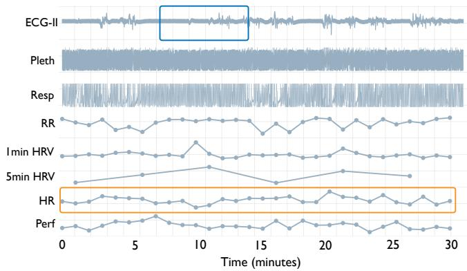

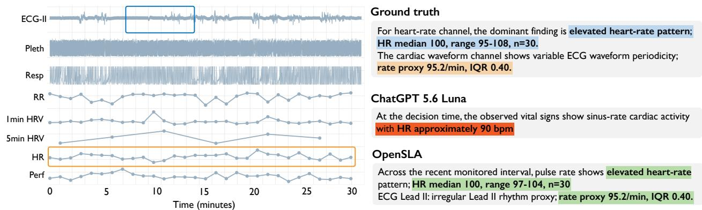  
Figure 5 | Sensor-grounded caption generation. OpenSLA captures both sensor states and fine-grained signal <sub>s</sub>t<sub>a</sub>ti<sub>s</sub>ti<sub>cs, w</sub>hil<sub>e</sub> th<sub>e</sub> LLM b<sub>ase</sub>li<sub>ne m</sub>i<sub>sses</sub> k<sub>ey p</sub>h<sub>ys</sub>i<sub>o</sub>l<sub>og</sub>i<sub>ca</sub>l d<sub>e</sub>t<sub>a</sub>il<sub>s.</sub>

Followin<sub>g p</sub>rior sensor-lan<sub>g</sub>ua<sub>g</sub>e evaluation [43, 40], we measure reference-based a<sub>g</sub>reement between <sub>g</sub>enerated ex<sub>p</sub>lanations and action-evidence ca<sub>p</sub>tions usin<sub>g</sub> BERTScore [42]. Scores are com<sub>p</sub>uted with DistilBERT [29] followin<sub>g</sub> the setu<sub>p</sub> of [38].

OpenSLA predicts actions across domains and granularities. We evaluate action necessity, category, <sub>an</sub>d fi<sub>ne-gra</sub>i<sub>ne</sub>d <sub>ac</sub>ti<sub>on pre</sub>di<sub>c</sub>ti<sub>on across</sub> th<sub>e</sub> th<sub>ree</sub> d<sub>oma</sub>i<sub>ns, w</sub>h<sub>ere app</sub>li<sub>ca</sub>bl<sub>e.</sub> A<sub>s s</sub>h<sub>own</sub> i<sub>n</sub> T<sub>a</sub>bl<sub>e</sub> 2<sub>,</sub> <sup>T</sup>a<sup>bl</sup>e <sup>3</sup>, an<sup>d T</sup>a<sup>bl</sup>e <sup>4</sup>, OpenSLA cons<sup>i</sup>stent<sup>l</sup>y ac<sup>hi</sup>eves strong per<sup>f</sup>ormance across <sup>d</sup>oma<sup>i</sup>ns an<sup>d</sup> act<sup>i</sup>on <sub>granu</sub>l<sub>ar</sub>iti<sub>es, w</sub>ith <sub>par</sub>ti<sub>cu</sub>l<sub>ar</sub>l<sub>y</sub> l<sub>arge ga</sub>i<sub>ns</sub> f<sub>or ac</sub>ti<sub>on necess</sub>it<sub>y an</sub>d <sub>ca</sub>t<sub>egory pre</sub>di<sub>c</sub>ti<sub>on.</sub> Th<sub>e resu</sub>lt<sub>s</sub> <sub>a</sub>l<sub>so revea</sub>l di<sub>s</sub>ti<sub>nc</sub>t d<sub>oma</sub>i<sub>n-spec</sub>ifi<sub>c pa</sub>tt<sub>erns.</sub> S<sub>ensor-on</sub>l<sub>y ac</sub>ti<sub>on pre</sub>di<sub>c</sub>ti<sub>on</sub> i<sub>s mos</sub>t <sub>c</sub>h<sub>a</sub>ll<sub>eng</sub>i<sub>ng</sub> i<sub>n</sub> t<sup>h</sup>e <sup>OR</sup> sett<sup>i</sup>ng, w<sup>hil</sup>e OpenSLA ac<sup>hi</sup>eves <sup>i</sup>ts <sup>l</sup>argest ga<sup>i</sup>ns <sup>i</sup>n t<sup>h</sup>e c<sup>li</sup>n<sup>i</sup>ca<sup>l</sup> an<sup>d OR d</sup>oma<sup>i</sup>ns, suggest<sup>i</sup>ng th<sub>a</sub>t i<sub>n</sub>di<sub>v</sub>id<sub>ua</sub>l<sub>-</sub>l<sub>eve</sub>l t<sub>ex</sub>t<sub>ua</sub>l <sub>con</sub>t<sub>ex</sub>t i<sub>s espec</sub>i<sub>a</sub>ll<sub>y</sub> i<sub>n</sub>f<sub>orma</sub>ti<sub>ve</sub> f<sub>or con</sub>t<sub>ex</sub>t<sub>-</sub>d<sub>epen</sub>d<sub>en</sub>t <sub>c</sub>li<sub>n</sub>i<sub>ca</sub>l d<sub>ec</sub>i<sub>s</sub>i<sub>ons.</sub> A<sub>cross mos</sub>t <sub>se</sub>tti<sub>ngs, per</sub>f<sub>ormance</sub> i<sub>mproves</sub> f<sub>rom necess</sub>it<sub>y pre</sub>di<sub>c</sub>ti<sub>on</sub> t<sub>o ca</sub>t<sub>egory an</sub>d fi<sub>ne-gra</sub>i<sub>ne</sub>d <sub>pre</sub>di<sub>c</sub>ti<sub>on, as</sub> th<sub>e can</sub>did<sub>a</sub>t<sub>e ac</sub>ti<sub>on space</sub> b<sub>ecomes</sub> i<sub>ncreas</sub>i<sub>ng</sub>l<sub>y cons</sub>t<sub>ra</sub>i<sub>ne</sub>d <sub>once an</sub> i<sub>n</sub>t<sub>erven</sub>ti<sub>on an</sub>d it<sub>s</sub> <sub>ca</sub>t<sub>egory</sub> <sub>are</sub> k<sub>nown.</sub> CGM i<sub>s</sub> <sub>a</sub> <sub>no</sub>t<sub>a</sub>bl<sub>e</sub> <sub>excep</sub>ti<sub>on:</sub> <sub>ac</sub>ti<sub>on-ca</sub>t<sub>egory</sub> <sub>pre</sub>di<sub>c</sub>ti<sub>on</sub> <sub>rema</sub>i<sub>ns</sub> <sub>c</sub>h<sub>a</sub>ll<sub>eng</sub>i<sub>ng</sub> b<sub>ecause</sub> i<sub>nsu</sub>li<sub>n</sub> d<sub>ec</sub>i<sub>s</sub>i<sub>ons can</sub> d<sub>epen</sub>d <sub>on</sub> f<sub>u</sub>t<sub>ure car</sub>b<sub>o</sub>h<sub>y</sub>d<sub>ra</sub>t<sub>e</sub> i<sub>n</sub>t<sub>a</sub>k<sub>e</sub> th<sub>a</sub>t i<sub>s unava</sub>il<sub>a</sub>bl<sub>e</sub> i<sub>n</sub> th<sub>e o</sub>b<sub>serve</sub>d context.

Language supervision enriches sensor-action representations beyond action prediction. We f<sub>ur</sub>th<sub>er assess w</sub>h<sub>e</sub>th<sub>er</sub> th<sub>e genera</sub>t<sub>e</sub>d <sub>cap</sub>ti<sub>ons accura</sub>t<sub>e</sub>l<sub>y recover p</sub>h<sub>ys</sub>i<sub>o</sub>l<sub>og</sub>i<sub>ca</sub>l <sub>quan</sub>titi<sub>es</sub> f<sub>rom</sub> th<sub>e</sub> o<sup>b</sup>serve<sup>d</sup> sensor <sup>hi</sup>story, w<sup>i</sup>t<sup>h</sup>out tra<sup>i</sup>n<sup>i</sup>ng an a<sup>ddi</sup>t<sup>i</sup>ona<sup>l</sup> regress<sup>i</sup>on <sup>h</sup>ea<sup>d</sup>. <sup>A</sup>s s<sup>h</sup>own <sup>i</sup>n <sup>T</sup>a<sup>bl</sup>e <sup>5</sup>, OpenSLA <sub>y</sub>i<sub>e</sub>ld<sub>s</sub> th<sub>e mos</sub>t <sub>accura</sub>t<sub>e p</sub>h<sub>ys</sub>i<sub>o</sub>l<sub>og</sub>i<sub>ca</sub>l <sub>s</sub>t<sub>a</sub>t<sub>e es</sub>ti<sub>ma</sub>t<sub>es across</sub> th<sub>e compare</sub>d <sub>me</sub>th<sub>o</sub>d<sub>s,</sub> i<sub>n</sub>di<sub>ca</sub>ti<sub>ng</sub> th<sub>a</sub>t it<sub>s genera</sub>t<sub>e</sub>d l<sub>anguage re</sub>t<sub>a</sub>i<sub>ns</sub> d<sub>e</sub>t<sub>a</sub>il<sub>e</sub>d i<sub>n</sub>f<sub>orma</sub>ti<sub>on a</sub>b<sub>ou</sub>t th<sub>e un</sub>d<sub>er</sub>l<sub>y</sub>i<sub>ng sensor s</sub>t<sub>a</sub>t<sub>e.</sub> Th<sub>e ga</sub>i<sub>ns are</sub> <sub>mos</sub>t <sub>pronounce</sub>d i<sub>n</sub> th<sub>e</sub> <sub>c</sub>li<sub>n</sub>i<sub>ca</sub>l <sub>se</sub>tti<sub>ng,</sub> <sub>w</sub>h<sub>ere</sub> <sub>e</sub>f<sub>ec</sub>ti<sub>ve</sub> <sub>pre</sub>di<sub>c</sub>ti<sub>on</sub> <sub>requ</sub>i<sub>res</sub> i<sub>n</sub>t<sub>egra</sub>ti<sub>ng</sub> <sub>comp</sub>l<sub>emen</sub>t<sub>ary</sub> i<sub>n</sub>f<sub>orma</sub>ti<sub>on</sub> <sub>across</sub> <sub>mu</sub>lti<sub>p</sub>l<sub>e</sub> <sub>sensor</sub> <sub>mo</sub>d<sub>a</sub>liti<sub>es.</sub>

Table 6 | Action explanation results. BERTScore<sup>↑</sup> [42] (F1) measures semantic agreement between generated t<sub>ex</sub>t <sub>an</sub>d <sub>re</sub>f<sub>erence ac</sub>ti<sub>on-ev</sub>id<sub>ence cap</sub>ti<sub>ons.</sub>
<table><tr><td rowspan="2">Method</td><td colspan="2">Clinical</td><td colspan="2">Operating Room</td><td colspan="2">CGM</td></tr><tr><td>MC-MED</td><td>MIMIC-III</td><td>MOVER</td><td>VitalDB</td><td>MetaboNet</td><td>PEDAP</td></tr><tr><td colspan="7">Multi-modal LLMs:</td></tr><tr><td>GPT-5.6-Luna [25]</td><td>75.1</td><td>75.1</td><td>70.7</td><td>71.4</td><td>76.1</td><td>76.6</td></tr><tr><td>DeepSeek-V3.2 [3]</td><td>73.8</td><td>73.2</td><td>69.9</td><td>71.2</td><td>74.5</td><td>75.5</td></tr><tr><td colspan="7">TS-LLM:</td></tr><tr><td>OpenTSLM [15]</td><td>79.5</td><td>80.3</td><td>81.7</td><td>80.7</td><td>84.4</td><td>83.2</td></tr><tr><td>SensorLM [43]</td><td>77.2</td><td>78.8</td><td>67.9</td><td>69.8</td><td>76.1</td><td>76.4</td></tr><tr><td colspan="7">SLA:</td></tr><tr><td>OpenSLA-B</td><td>81.5</td><td>78.6</td><td>81.5</td><td>80.9</td><td>85.6</td><td>87.6</td></tr><tr><td>OpenSLA-H</td><td>82.0</td><td>80.9</td><td>81.0</td><td>80.7</td><td>80.4</td><td>76.7</td></tr></table>

Zero-Shot Imipenem Prediction Unseen Action in Representation SpaceA B  
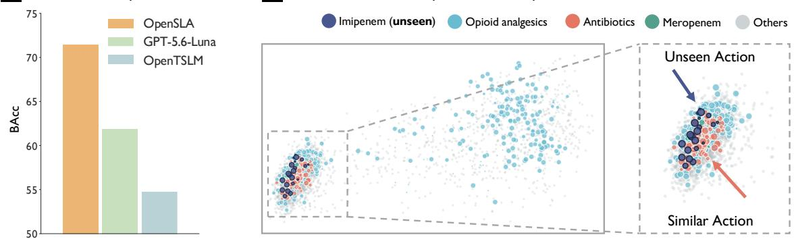  
Figure 6 | Generalization to unseen actions. (A) Zero-shot prediction of the held-out action Imipenem. (B) <sup>Vi</sup>sua<sup>li</sup>zat<sup>i</sup>on o<sup>f</sup> t<sup>h</sup>e <sup>l</sup>earne<sup>d</sup> OpenSLA act<sup>i</sup>on representat<sup>i</sup>on space, w<sup>h</sup>ere t<sup>h</sup>e unseen Imipenem representat<sup>i</sup>on li<sub>es near seman</sub>ti<sub>ca</sub>ll<sub>y re</sub>l<sub>a</sub>t<sub>e</sub>d <sub>an</sub>tibi<sub>o</sub>ti<sub>cs.</sub>

OpenSLA captures action-relevant evidence through language. Beyond structured action prediction, <sub>we assess w</sub>h<sub>e</sub>th<sub>er genera</sub>t<sub>e</sub>d d<sub>escr</sub>i<sub>p</sub>ti<sub>ons recover</sub> th<sub>e ev</sub>id<sub>ence assoc</sub>i<sub>a</sub>t<sub>e</sub>d <sub>w</sub>ith <sub>eac</sub>h <sub>recor</sub>d<sub>e</sub>d <sub>ac</sub>ti<sub>on.</sub> <sup>T</sup>a<sup>bl</sup>e <sup>6</sup> con<sup>fi</sup>rms t<sup>h</sup>at OpenSLA ac<sup>hi</sup>eves t<sup>h</sup>e strongest overa<sup>ll</sup> agreement w<sup>i</sup>t<sup>h</sup> re<sup>f</sup>erence act<sup>i</sup>on-ev<sup>id</sup>ence capt<sup>i</sup>ons across <sup>d</sup>oma<sup>i</sup>ns. <sup>O</sup>vera<sup>ll</sup>, OpenSLA more <sup>f</sup>a<sup>i</sup>t<sup>hf</sup>u<sup>ll</sup>y captures t<sup>h</sup>e sensor an<sup>d</sup> contextua<sup>l</sup> ev<sup>id</sup>ence <sub>assoc</sub>i<sub>a</sub>t<sub>e</sub>d <sub>w</sub>ith d<sub>owns</sub>t<sub>ream ac</sub>ti<sub>ons.</sub>

T<sub>o</sub> <sub>exam</sub>i<sub>ne</sub> thi<sub>s</sub> <sub>groun</sub>di<sub>ng</sub> di<sub>rec</sub>tl<sub>y,</sub> <sub>we</sub> <sub>qua</sub>lit<sub>a</sub>ti<sub>ve</sub>l<sub>y</sub> <sub>compare</sub> <sub>genera</sub>t<sub>e</sub>d <sub>cap</sub>ti<sub>ons</sub> <sub>w</sub>ith th<sub>e</sub>i<sub>r</sub> <sub>un</sub>d<sub>er</sub>l<sub>y</sub>i<sub>ng</sub> sensor o<sup>b</sup>servat<sup>i</sup>ons on a representat<sup>i</sup>ve case. <sup>A</sup>s s<sup>h</sup>own <sup>i</sup>n <sup>Fi</sup>g. <sup>5</sup>, OpenSLA pro<sup>d</sup>uces more prec<sup>i</sup>se an<sup>d</sup> <sub>p</sub>h<sub>ys</sub>i<sub>o</sub>l<sub>og</sub>i<sub>ca</sub>ll<sub>y groun</sub>d<sub>e</sub>d d<sub>escr</sub>i<sub>p</sub>ti<sub>ons</sub> th<sub>an zero-s</sub>h<sub>o</sub>t <sub>mu</sub>lti<sub>mo</sub>d<sub>a</sub>l LLM<sub>s,</sub> i<sub>nc</sub>l<sub>u</sub>di<sub>ng</sub> GPT<sub>-</sub>5<sub>.</sub>6<sub>-</sub>L<sub>una an</sub>d D<sub>eep</sub>S<sub>ee</sub>k<sub>-</sub>V3<sub>.</sub>2<sub>, w</sub>ith <sub>c</sub>l<sub>oser agreemen</sub>t b<sub>e</sub>t<sub>ween</sub> th<sub>e genera</sub>t<sub>e</sub>d <sub>exp</sub>l<sub>ana</sub>ti<sub>on an</sub>d th<sub>e o</sub>b<sub>serve</sub>d <sub>sensor</sub> state.

## 6. Generalization and Predictive Structure in SLA Representations

Generalization to unseen actions. Beyond in-distribution action prediction, we ask whether sensorl<sub>anguage-ac</sub>ti<sub>on</sub> <sub>a</sub>li<sub>gnmen</sub>t i<sub>n</sub>d<sub>uces</sub> <sub>a</sub> <sub>represen</sub>t<sub>a</sub>ti<sub>on</sub> <sub>space</sub> th<sub>a</sub>t <sub>suppor</sub>t<sub>s</sub> <sub>genera</sub>li<sub>za</sub>ti<sub>on</sub> t<sub>o</sub> <sub>prev</sub>i<sub>ous</sub>l<sub>y</sub> unseen actions. We first examine the geometry of representations learned on MIMIC-III by projecting b<sub>ac</sub>kb<sub>one</sub> f<sub>ea</sub>t<sub>ures</sub> i<sub>n</sub>t<sub>o a</sub> PCA<sub>-re</sub>d<sub>uce</sub>d <sub>space.</sub> A<sub>s s</sub>h<sub>own</sub> i<sub>n</sub> Fi<sub>g.</sub> 6<sub>, seman</sub>ti<sub>ca</sub>ll<sub>y re</sub>l<sub>a</sub>t<sub>e</sub>d <sub>ac</sub>ti<sub>ons occupy</sub> near<sup>b</sup>y reg<sup>i</sup>ons. <sup>F</sup>or examp<sup>l</sup>e, antibiotic medications <sup>f</sup>orm a co<sup>h</sup>erent c<sup>l</sup>uster, an<sup>d</sup> an unseen act<sup>i</sup>on Imipenem (exc<sup>l</sup>u<sup>d</sup>e<sup>d</sup> <sup>f</sup>rom tra<sup>i</sup>n<sup>i</sup>ng <sup>b</sup>ut <sup>b</sup>e<sup>l</sup>ong<sup>i</sup>ng to t<sup>h</sup>e same semant<sup>i</sup>c category), <sup>i</sup>s pos<sup>i</sup>t<sup>i</sup>one<sup>d</sup> <sub>near o</sub>th<sub>er an</sub>tibi<sub>o</sub>ti<sub>cs.</sub>

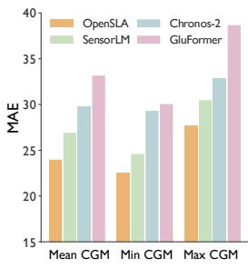

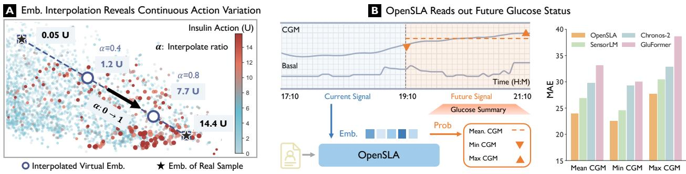  
Figure 7 | Continuous action structure and future-state information emerge in SLA representations. (A) Interpolating between learned representations yields smoothly varying insulin actions among the nearest real samples, revealing continuous action structure in the embedding space. (B) Representations derived f<sub>rom</sub> <sub>curren</sub>t CGM <sub>o</sub>b<sub>serva</sub>ti<sub>ons</sub> <sub>suppor</sub>t <sub>accura</sub>t<sub>e</sub> <sub>rea</sub>d<sub>ou</sub>t <sub>o</sub>f f<sub>u</sub>t<sub>ure</sub> <sub>g</sub>l<sub>ucose</sub> <sub>s</sub>t<sub>a</sub>ti<sub>s</sub>ti<sub>cs,</sub> i<sub>n</sub>di<sub>ca</sub>ti<sub>ng</sub> th<sub>a</sub>t SLA <sub>represen</sub>t<sub>a</sub>ti<sub>ons re</sub>t<sub>a</sub>i<sub>n</sub> i<sub>n</sub>f<sub>orma</sub>ti<sub>on pre</sub>di<sub>c</sub>ti<sub>ve o</sub>f <sub>su</sub>b<sub>sequen</sub>t <sub>sensor s</sub>t<sub>a</sub>t<sub>es.</sub>

<sup>M</sup>ot<sup>i</sup>vate<sup>d</sup> <sup>b</sup>y t<sup>hi</sup>s structure, we test w<sup>h</sup>et<sup>h</sup>er OpenSLA can pre<sup>di</sup>ct unseen act<sup>i</sup>ons <sup>di</sup>rect<sup>l</sup>y <sup>f</sup>rom t<sup>h</sup>e <sup>l</sup>earne<sup>d</sup> representat<sup>i</sup>on space. <sup>W</sup>e <sup>h</sup>o<sup>ld</sup> out Imipenem <sup>d</sup>ur<sup>i</sup>ng tra<sup>i</sup>n<sup>i</sup>ng an<sup>d</sup> per<sup>f</sup>orm zero-s<sup>h</sup>ot <sub>pre</sub>di<sub>c</sub>ti<sub>on</sub> b<sub>y ma</sub>t<sub>c</sub>hi<sub>ng samp</sub>l<sub>e represen</sub>t<sub>a</sub>ti<sub>ons</sub> t<sub>o</sub> t<sub>ex</sub>t<sub>ua</sub>l <sub>ac</sub>ti<sub>on em</sub>b<sub>e</sub>ddi<sub>ngs</sub> th<sub>roug</sub>h <sub>s</sub>i<sub>m</sub>il<sub>ar</sub>it<sub>y.</sub> OpenSLA ac<sup>hi</sup>eves t<sup>h</sup>e <sup>hi</sup>g<sup>h</sup>est <sup>b</sup>a<sup>l</sup>ance<sup>d</sup> accuracy on t<sup>hi</sup>s unseen-act<sup>i</sup>on tas<sup>k</sup> (<sup>Fi</sup>g. <sup>6</sup>), suggest<sup>i</sup>ng t<sup>h</sup>at SLA <sub>a</sub>li<sub>gnmen</sub>t <sub>suppor</sub>t<sub>s</sub> t<sub>rans</sub>f<sub>er</sub> th<sub>roug</sub>h th<sub>e seman</sub>ti<sub>c s</sub>t<sub>ruc</sub>t<sub>ure s</sub>h<sub>are</sub>d <sub>across re</sub>l<sub>a</sub>t<sub>e</sub>d <sub>ac</sub>ti<sub>ons.</sub>

Continuous action structure emerges in the learned representations. We next ask whether this <sub>organ</sub>i<sub>za</sub>ti<sub>on</sub> <sub>ex</sub>t<sub>en</sub>d<sub>s</sub> b<sub>eyon</sub>d di<sub>scre</sub>t<sub>e</sub> <sub>ac</sub>ti<sub>on</sub> <sub>ca</sub>t<sub>egor</sub>i<sub>es</sub> t<sub>o</sub> <sub>con</sub>ti<sub>nuous</sub> <sub>ac</sub>ti<sub>on</sub> <sub>spaces.</sub> W<sub>e</sub> i<sub>n</sub>t<sub>erpo</sub>l<sub>a</sub>t<sub>e</sub> b<sub>e</sub>t<sub>ween represen</sub>t<sub>a</sub>ti<sub>ons assoc</sub>i<sub>a</sub>t<sub>e</sub>d <sub>w</sub>ith t<sub>wo</sub> di<sub>s</sub>ti<sub>nc</sub>t i<sub>nsu</sub>li<sub>n ac</sub>ti<sub>ons.</sub> At <sub>eac</sub>h i<sub>n</sub>t<sub>erpo</sub>l<sub>a</sub>t<sub>e</sub>d <sub>po</sub>i<sub>n</sub>t<sub>, we</sub> <sub>re</sub>t<sub>r</sub>i<sub>eve</sub> th<sub>e</sub> <sub>neares</sub>t <sub>rea</sub>l<sub>-samp</sub>l<sub>e</sub> <sub>represen</sub>t<sub>a</sub>ti<sub>on</sub> <sub>an</sub>d <sub>exam</sub>i<sub>ne</sub> it<sub>s</sub> <sub>correspon</sub>di<sub>ng</sub> <sub>ac</sub>ti<sub>on</sub> <sub>va</sub>l<sub>ue.</sub> Fi<sub>g.</sub> 7 verifies the retrieved insulin actions vary monotonically along the interpolation trajectory, revealing a <sub>con</sub>ti<sub>nuous ac</sub>ti<sub>on s</sub>t<sub>ruc</sub>t<sub>ure w</sub>ithi<sub>n</sub> th<sub>e</sub> l<sub>earne</sub>d <sub>represen</sub>t<sub>a</sub>ti<sub>on space.</sub>

Future sensor states are recoverable from SLA representations. We further ask whether rep-<sub>resen</sub>t<sub>a</sub>ti<sub>ons</sub> l<sub>earne</sub>d <sub>w</sub>ith<sub>ou</sub>t <sub>exp</sub>li<sub>c</sub>it f<sub>u</sub>t<sub>ure-s</sub>t<sub>a</sub>t<sub>e superv</sub>i<sub>s</sub>i<sub>on re</sub>t<sub>a</sub>i<sub>n</sub> i<sub>n</sub>f<sub>orma</sub>ti<sub>on a</sub>b<sub>ou</sub>t <sub>su</sub>b<sub>sequen</sub>t <sub>sensor</sub> d<sub>ynam</sub>i<sub>cs.</sub> F<sub>or</sub> <sub>eac</sub>h 2<sub>-</sub>h<sub>our</sub> CGM <sub>o</sub>b<sub>serva</sub>ti<sub>on</sub> <sub>w</sub>i<sub>n</sub>d<sub>ow,</sub> <sub>we</sub> d<sub>e</sub>fi<sub>ne</sub> f<sub>u</sub>t<sub>ure</sub> t<sub>arge</sub>t<sub>s</sub> <sub>us</sub>i<sub>ng</sub> th<sub>e</sub> <sub>mean,</sub> <sub>m</sub>i<sub>n</sub>i<sub>mum, max</sub>i<sub>mum, an</sub>d <sub>s</sub>l<sub>ope o</sub>f <sub>g</sub>l<sub>ucose over</sub> th<sub>e su</sub>b<sub>sequen</sub>t 2 h<sub>ours.</sub> With th<sub>e</sub> SLA b<sub>ac</sub>kb<sub>one</sub> f<sub>rozen, we</sub> t<sub>ra</sub>i<sub>n r</sub>id<sub>ge rea</sub>d<sub>ou</sub>t<sub>s on</sub> th<sub>ese</sub> t<sub>arge</sub>t<sub>s us</sub>i<sub>ng</sub> i<sub>n</sub>di<sub>v</sub>id<sub>ua</sub>l<sub>-groupe</sub>d <sub>nes</sub>t<sub>e</sub>d <sub>cross-va</sub>lid<sub>a</sub>ti<sub>on.</sub> Fi<sub>g.</sub> 7 con<sup>fi</sup>rms t<sup>h</sup>at OpenSLA representat<sup>i</sup>ons ena<sup>bl</sup>e accurate pre<sup>di</sup>ct<sup>i</sup>on o<sup>f f</sup>uture g<sup>l</sup>ucose states. <sup>Th</sup>ese <sub>resu</sub>lt<sub>s</sub> <sub>sugges</sub>t th<sub>a</sub>t SLA l<sub>earn</sub>i<sub>ng</sub> <sub>cap</sub>t<sub>ures</sub> <sub>pre</sub>di<sub>c</sub>ti<sub>ve</sub> <sub>p</sub>h<sub>ys</sub>i<sub>o</sub>l<sub>og</sub>i<sub>ca</sub>l <sub>s</sub>t<sub>ruc</sub>t<sub>ure</sub> b<sub>eyon</sub>d th<sub>e</sub> <sub>ac</sub>ti<sub>on</sub> t<sub>arge</sub>t<sub>s</sub> <sub>use</sub>d d<sub>ur</sub>i<sub>ng</sub> b<sub>ac</sub>kb<sub>one</sub> t<sub>ra</sub>i<sub>n</sub>i<sub>ng.</sub>

Transfer to unseen datasets. To examine gen-<sub>era</sub>li<sub>za</sub>ti<sub>on</sub> b<sub>eyon</sub>d th<sub>e</sub> t<sub>ra</sub>i<sub>n</sub>i<sub>ng co</sub>h<sub>or</sub>t<sub>s, we</sub> di<sub>-</sub> rect<sup>l</sup>y app<sup>l</sup>y OpenSLA to t<sup>h</sup>e externa<sup>l MIMIC</sup>-<sup>IV</sup> <sub>co</sub>h<sub>or</sub>t <sub>w</sub>ith<sub>ou</sub>t <sub>a</sub>d<sub>ap</sub>t<sub>a</sub>ti<sub>on.</sub> T<sub>a</sub>bl<sub>e</sub> 7 <sub>s</sub>h<sub>ows</sub> th<sub>a</sub>t OpenSLA outper<sup>f</sup>orms <sup>b</sup>ase<sup>li</sup>nes on <sup>b</sup>ot<sup>h</sup> act<sup>i</sup>on <sub>necess</sub>it<sub>y</sub> <sub>an</sub>d <sub>ca</sub>t<sub>egory</sub> <sub>pre</sub>di<sub>c</sub>ti<sub>on.</sub> Th<sub>ese</sub> <sub>resu</sub>lt<sub>s</sub> d<sub>emons</sub>t<sub>ra</sub>t<sub>e</sub> th<sub>a</sub>t th<sub>e</sub> l<sub>earne</sub>d <sub>sensor-</sub>l<sub>anguage-</sub> <sub>ac</sub>ti<sub>on assoc</sub>i<sub>a</sub>ti<sub>ons</sub> t<sub>rans</sub>f<sub>er</sub> t<sub>o an unseen c</sub>li<sub>n</sub>i<sub>ca</sub>l <sub>co</sub>h<sub>or</sub>t <sub>un</sub>d<sub>er a s</sub>h<sub>are</sub>d <sub>ac</sub>ti<sub>on voca</sub>b<sub>u</sub>l<sub>ary.</sub>

Table 7 | Zero-shot transfer to the external MIMIC-IV cohort.
<table><tr><td rowspan="2">Method</td><td colspan="2">Necessity</td><td colspan="2">Category</td></tr><tr><td>AUROC↑</td><td>BAcc↑</td><td>AUROC↑</td><td>BAcc{</td></tr><tr><td>OpenTSLM [15]</td><td>一</td><td>69.30</td><td>一</td><td>54.33</td></tr><tr><td>SensorLM [43]</td><td>一</td><td>67.70</td><td>一</td><td>50.02</td></tr><tr><td>OpenSLA-B</td><td>81.75</td><td>74.40</td><td>74.64</td><td>56.35</td></tr><tr><td>OpenSLA-H</td><td>80.52</td><td>73.00</td><td>74.90</td><td>58.49</td></tr></table>

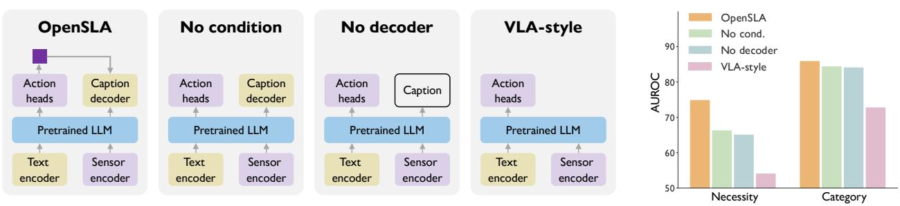  
Figure 8 | Ablation of language supervision and action-conditioned decoding. Removing caption supervision <sub>y</sub>i<sub>e</sub>ld<sub>s</sub> th<sub>e</sub> l<sub>arges</sub>t <sub>per</sub>f<sub>ormance</sub> d<sub>rop, w</sub>hil<sub>e remov</sub>i<sub>ng ac</sub>ti<sub>on con</sub>diti<sub>on</sub>i<sub>ng or</sub> th<sub>e cap</sub>ti<sub>on</sub> d<sub>eco</sub>d<sub>er</sub> f<sub>ur</sub>th<sub>er re</sub>d<sub>uces</sub> LLaVA-styleFlamingo-styleOpenSLA<sub>act</sub>i<sub>on pre</sub>di<sub>ct</sub>i<sub>on per</sub>f<sub>ormance. T</sub>h<sub>e</sub> f<sub>u</sub>ll <sub>OpenSLA mo</sub>d<sub>e</sub>l <sub>ac</sub>hi<sub>eves t</sub>h<sub>e strongest resu</sub>l<sub>ts across</sub> b<sub>ot</sub>h <sub>necess</sub>i<sub>ty</sub> <sub>an</sub>d <sub>ca</sub>t<sub>egory</sub> <sub>pre</sub>di<sub>c</sub>ti<sub>on.</sub>

Pretrained LLMPretrained LLM<sup>Pretrained</sup> <sup>LLM</sup> A<sup>U</sup>Which model components support action prediction? We ablate the main components of OpenSLA to id<sub>en</sub>tif<sub>y</sub> th<sub>e</sub>i<sub>r con</sub>t<sub>r</sub>ib<sub>u</sub>ti<sub>ons</sub> t<sub>o sensor-ac</sub>ti<sub>on mo</sub>d<sub>e</sub>li<sub>ng.</sub> A<sub>s s</sub>h<sub>own</sub> i<sub>n</sub> Fi<sub>g.</sub> 8<sub>,</sub> th<sub>e</sub> f<sub>u</sub>ll <sub>mo</sub>d<sub>e</sub>l <sub>ac</sub>hi<sub>eves</sub> th<sub>e</sub> <sup>resampler</sup><sub>s</sub>t<sub>ronges</sub>t <sub>overa</sub>ll <sub>per</sub>f<sub>ormance.</sub> Th<sub>e</sub> l<sub>arges</sub>t d<sub>egra</sub>d<sub>a</sub>ti<sub>on occurs un</sub>d<sub>er</sub> VLA<sub>-s</sub>t<sub>y</sub>l<sub>e ac</sub>ti<sub>on-on</sub>l<sub>y</sub> t<sub>ra</sub>i<sub>n</sub>i<sub>ng,</sub> <sup>Sensor</sup> <sup>Text</sup> <sup>Sensor</sup> <sup>Text</sup> <sup>Sensor</sup> <sup>Text</sup> hi<sub>g</sub>hli<sub>g</sub>hti<sub>ng</sub> th<sub>e</sub> b<sub>ene</sub>fit <sub>o</sub>f i<sub>n</sub>t<sub>ro</sub>d<sub>uc</sub>i<sub>ng</sub> l<sub>anguage</sub> <sub>superv</sub>i<sub>s</sub>i<sub>on</sub> i<sub>n</sub>t<sub>o</sub> <sub>sensor-ac</sub>ti<sub>on</sub> l<sub>earn</sub>i<sub>ng.</sub> R<sub>emov</sub>i<sub>ng</sub> <sub>ac</sub>ti<sub>on con</sub>diti<sub>on</sub>i<sub>ng or</sub> th<sub>e mu</sub>lti<sub>mo</sub>d<sub>a</sub>l f<sub>us</sub>i<sub>on</sub> d<sub>eco</sub>d<sub>er</sub> f<sub>ur</sub>th<sub>er re</sub>d<sub>uces per</sub>f<sub>ormance,</sub> i<sub>n</sub>di<sub>ca</sub>ti<sub>ng</sub> th<sub>a</sub>t <sub>exp</sub>li<sub>c</sub>itl<sub>y connec</sub>ti<sub>ng ac</sub>ti<sub>on pre</sub>di<sub>c</sub>ti<sub>ons w</sub>ith <sub>sensor-groun</sub>d<sub>e</sub>d l<sub>anguage prov</sub>id<sub>es a</sub>dditi<sub>ona</sub>l <sub>ga</sub>i<sub>ns.</sub>

Which caption facets support action prediction? To quantify the contribution <sub>o</sub>f dif<sub>eren</sub>t <sub>cap</sub>ti<sub>on componen</sub>t<sub>s, we a</sub>b<sub>-</sub> l<sub>a</sub>t<sub>e over cap</sub>ti<sub>on com</sub>bi<sub>na</sub>ti<sub>ons</sub> i<sub>n</sub> T<sub>a</sub>bl<sub>e</sub> 8<sub>.</sub> Addi<sub>ng</sub> <sub>g</sub>l<sub>o</sub>b<sub>a</sub>l <sub>cap</sub>ti<sub>ons</sub> i<sub>mproves</sub> <sub>necess</sub>it<sub>y</sub> and cate<sub>g</sub>or<sub>y</sub> AUROC on MOVER<sub>,</sub> althou<sub>g</sub>h th<sub>e ga</sub>i<sub>ns are</sub> l<sub>ess cons</sub>i<sub>s</sub>t<sub>en</sub>t <sub>on</sub> Vit<sub>a</sub>lDB<sub>.</sub> I<sub>ncorpora</sub>ti<sub>ng</sub> <sub>ac</sub>ti<sub>on</sub> <sub>cap</sub>ti<sub>ons</sub> <sub>y</sub>i<sub>e</sub>ld<sub>s</sub> th<sub>e</sub> <sub>s</sub>t<sub>ronges</sub>t <sub>overa</sub>ll <sub>resu</sub>lt<sub>s,</sub> i<sub>mprov</sub>i<sub>ng</sub> <sub>neces-</sub> sit<sub>y</sub> and cate<sub>g</sub>or<sub>y</sub> AUROC on both datasets <sub>re</sub>l<sub>a</sub>ti<sub>ve</sub> t<sub>o superv</sub>i<sub>s</sub>i<sub>on w</sub>ith<sub>ou</sub>t th<sub>e ac</sub>ti<sub>on</sub> f<sub>ace</sub>t<sub>.</sub> Th<sub>ese</sub> <sub>resu</sub>lt<sub>s</sub> i<sub>n</sub>di<sub>ca</sub>t<sub>e</sub> th<sub>a</sub>t <sub>ac</sub>ti<sub>on-</sub> <sub>re</sub>l<sub>evan</sub>t l<sub>anguage</sub> <sub>prov</sub>id<sub>es</sub> <sub>use</sub>f<sub>u</sub>l <sub>aux</sub>ili<sub>ary</sub>

<sub>superv</sub>i<sub>s</sub>i<sub>on</sub> f<sub>or</sub> l<sub>earn</sub>i<sub>ng</sub> <sub>sensor-ac</sub>ti<sub>on</sub> <sub>assoc</sub>i<sub>a</sub>ti<sub>ons.</sub>

Is caption supervision alone suficient? Fi<sub>na</sub>ll<sub>y,</sub> <sub>we</sub> <sub>separa</sub>t<sub>e</sub> th<sub>e</sub> b<sub>ene</sub>fit <sub>o</sub>f l<sub>anguage</sub> <sub>superv</sub>i<sub>s</sub>i<sub>on</sub> f<sub>rom</sub> th<sub>e</sub> <sub>mec</sub>h<sub>an</sub>i<sub>sm</sub> <sub>use</sub>d t<sub>o</sub> <sub>connec</sub>t l<sub>anguage w</sub>ith <sub>ac</sub>ti<sub>on pre</sub>di<sub>c</sub>ti<sub>on.</sub> Th<sub>e</sub> <sub>ac</sub>ti<sub>on-on</sub>l<sub>y</sub> <sub>var</sub>i<sub>an</sub>t <sub>removes</sub> <sub>cap</sub>ti<sub>on</sub> <sub>genera</sub>ti<sub>on</sub> <sub>an</sub>d it<sub>s</sub> <sub>assoc</sub>i<sub>a</sub>t<sub>e</sub>d l<sub>oss;</sub> th<sub>e</sub> <sub>no-</sub> <sub>ac</sub>ti<sub>on-con</sub>diti<sub>on</sub>i<sub>ng</sub> <sub>var</sub>i<sub>an</sub>t <sub>re</sub>t<sub>a</sub>i<sub>ns</sub> <sub>cap</sub>ti<sub>on</sub> <sub>genera</sub>ti<sub>on</sub> b<sub>u</sub>t <sub>removes</sub> <sub>con</sub>diti<sub>on</sub>i<sub>ng</sub> <sub>on</sub> <sub>pre</sub>di<sub>c</sub>t<sub>e</sub>d <sub>ac</sub>ti<sub>ons; an</sub>d th<sub>e no-</sub>d<sub>eco</sub>d<sub>er var</sub>i<sub>-</sub> <sub>an</sub>t <sub>re</sub>t<sub>a</sub>i<sub>ns</sub> l<sub>anguage superv</sub>i<sub>s</sub>i<sub>on</sub> b<sub>u</sub>t <sub>gen-</sub>

Table 8 | Ablation of caption supervision facets. AUROC<sup>↑</sup> (%) is used as the metric.
<table><tr><td colspan="4">Caption Variants</td><td colspan="2">MOVER</td><td colspan="2">VitalDB</td></tr><tr><td>Obs.</td><td>Rel.</td><td>Global</td><td>Action</td><td>Necessity</td><td>Category</td><td>Necessity</td><td>Category</td></tr><tr><td>J</td><td>X</td><td>X</td><td>x</td><td>81.5</td><td>76.2</td><td>64.1</td><td>81.1</td></tr><tr><td>X</td><td>X</td><td>X</td><td>√</td><td>80.0</td><td>73.3</td><td>60.9</td><td>80.2</td></tr><tr><td></td><td>X</td><td>X</td><td>√</td><td>81.0</td><td>76.1</td><td>65.2</td><td>82.7</td></tr><tr><td></td><td>V</td><td>X</td><td>X</td><td>79.2</td><td>76.4</td><td>65.9</td><td>82.6</td></tr><tr><td></td><td>X</td><td>√</td><td>√</td><td>81.6</td><td>77.3</td><td>66.8</td><td>83.9</td></tr><tr><td></td><td></td><td>X</td><td>√</td><td>80.7</td><td>76.4</td><td>64.4</td><td>82.2</td></tr><tr><td></td><td></td><td>√</td><td>X</td><td>81.6</td><td>77.5</td><td>64.3</td><td>82.3</td></tr><tr><td></td><td></td><td>√</td><td>√</td><td>83.4</td><td>80.3</td><td>74.8</td><td>85.9</td></tr></table>

Table 9 | Ablation of caption generation and action conditioning. AUROC<sup>↑</sup> (%) is used as the metric.
<table><tr><td rowspan="2">Method</td><td colspan="2">MOVER</td><td colspan="2">VitalDB</td></tr><tr><td>Necessity</td><td>Category</td><td>Necessity</td><td>Category</td></tr><tr><td>Action only</td><td>78.1</td><td>72.1</td><td>54.1</td><td>72.8</td></tr><tr><td>No cond.</td><td>80.4</td><td>77.2</td><td>66.3</td><td>84.4</td></tr><tr><td>No decoder</td><td>78.3</td><td>76.4</td><td>65.1</td><td>84.1</td></tr><tr><td>OpenSLA-B</td><td>83.4</td><td>80.3</td><td>74.8</td><td>85.9</td></tr></table>

<sub>era</sub>t<sub>es cap</sub>ti<sub>ons</sub> di<sub>rec</sub>tl<sub>y</sub> f<sub>rom</sub> th<sub>e</sub> LLM b<sub>ac</sub>kb<sub>one.</sub> T<sub>a</sub>bl<sub>e</sub> 9 <sub>ver</sub>ifi<sub>es</sub> th<sub>a</sub>t th<sub>e</sub> f<sub>u</sub>ll <sub>mo</sub>d<sub>e</sub>l <sub>ac</sub>hi<sub>eves</sub> th<sub>e</sub> hi<sub>g</sub>h<sub>es</sub>t AUROC <sub>across a</sub>ll f<sub>our en</sub>d<sub>po</sub>i<sub>n</sub>t<sub>s.</sub> B<sub>o</sub>th <sub>cap</sub>ti<sub>on-genera</sub>ti<sub>ng var</sub>i<sub>an</sub>t<sub>s ou</sub>t<sub>per</sub>f<sub>orm ac</sub>ti<sub>on-on</sub>l<sub>y</sub> t<sub>ra</sub>i<sub>n</sub>i<sub>ng, con</sub>fi<sub>rm</sub>i<sub>ng</sub> th<sub>e</sub> b<sub>ene</sub>fit <sub>o</sub>f l<sub>anguage superv</sub>i<sub>s</sub>i<sub>on, w</sub>hil<sub>e exp</sub>li<sub>c</sub>it <sub>ac</sub>ti<sub>on con</sub>diti<sub>on</sub>i<sub>ng an</sub>d th<sub>e</sub> <sub>mu</sub>lti<sub>mo</sub>d<sub>a</sub>l f<sub>us</sub>i<sub>on</sub> d<sub>eco</sub>d<sub>er</sub> <sub>prov</sub>id<sub>e</sub> <sub>a</sub>dditi<sub>ona</sub>l i<sub>mprovemen</sub>t<sub>s.</sub>

## 7. Discussion

Limitation. OpenSLA has not yet undergone clinical validation and is not intended for direct clinical d<sub>ec</sub>i<sub>s</sub>i<sub>on-ma</sub>ki<sub>ng.</sub> R<sub>ea</sub>l<sub>-wor</sub>ld d<sub>ep</sub>l<sub>oymen</sub>t <sub>wou</sub>ld <sub>requ</sub>i<sub>re</sub> <sub>prospec</sub>ti<sub>ve</sub> <sub>va</sub>lid<sub>a</sub>ti<sub>on,</sub> <sub>sa</sub>f<sub>e</sub>t<sub>y</sub> <sub>eva</sub>l<sub>ua</sub>ti<sub>on,</sub> <sub>an</sub>d <sub>appropr</sub>i<sub>a</sub>t<sub>e regu</sub>l<sub>a</sub>t<sub>ory rev</sub>i<sub>ew.</sub> O<sub>ur curren</sub>t i<sub>mp</sub>l<sub>emen</sub>t<sub>a</sub>ti<sub>on</sub> t<sub>ra</sub>i<sub>ns separa</sub>t<sub>e mo</sub>d<sub>e</sub>l<sub>s</sub> f<sub>or eac</sub>h d<sub>oma</sub>i<sub>n,</sub> i<sub>n</sub> <sub>par</sub>t b<sub>ecause</sub> th<sub>e</sub>i<sub>r</sub> <sub>ac</sub>ti<sub>on</sub> <sub>spaces</sub> <sub>are</sub> d<sub>e</sub>fi<sub>ne</sub>d i<sub>n</sub>d<sub>epen</sub>d<sub>en</sub>tl<sub>y.</sub> A<sub>n</sub> i<sub>mpor</sub>t<sub>an</sub>t <sub>nex</sub>t <sub>s</sub>t<sub>ep</sub> i<sub>s</sub> t<sub>o</sub> d<sub>eve</sub>l<sub>op</sub> <sub>a</sub> <sub>genera</sub>li<sub>s</sub>t SLA <sub>mo</sub>d<sub>e</sub>l th<sub>a</sub>t <sub>opera</sub>t<sub>es across</sub> d<sub>oma</sub>i<sub>ns</sub> th<sub>roug</sub>h <sub>s</sub>h<sub>are</sub>d <sub>represen</sub>t<sub>a</sub>ti<sub>ons o</sub>f h<sub>e</sub>t<sub>erogeneous</sub> <sub>ac</sub>ti<sub>ons.</sub> I<sub>n a</sub>dditi<sub>on, our exper</sub>i<sub>men</sub>t<sub>s assume a</sub> fi<sub>xe</sub>d <sub>se</sub>t <sub>o</sub>f <sub>sensor mo</sub>d<sub>a</sub>liti<sub>es an</sub>d i<sub>npu</sub>t <sub>c</sub>h<sub>anne</sub>l<sub>s,</sub> <sub>w</sub>h<sub>ereas rea</sub>l<sub>-wor</sub>ld <sub>sens</sub>i<sub>ng sys</sub>t<sub>ems vary across</sub> d<sub>ev</sub>i<sub>ces, s</sub>i<sub>gna</sub>l <sub>ava</sub>il<sub>a</sub>bilit<sub>y, an</sub>d <sub>acqu</sub>i<sub>s</sub>iti<sub>on se</sub>tti<sub>ngs.</sub> E<sub>x</sub>t<sub>en</sub>di<sub>ng</sub> SLA t<sub>o ro</sub>b<sub>us</sub>tl<sub>y</sub> h<sub>an</sub>dl<sub>e suc</sub>h <sub>sensor</sub> h<sub>e</sub>t<sub>erogene</sub>it<sub>y rema</sub>i<sub>ns an</sub> i<sub>mpor</sub>t<sub>an</sub>t di<sub>rec</sub>ti<sub>on</sub> f<sub>or</sub> f<sub>u</sub>t<sub>ure</sub> <sub>wor</sub>k<sub>.</sub>

Conclusion. We present Sensor-Language-Action (SLA) modeling, extending sensor intelligence from <sub>un</sub>d<sub>ers</sub>t<sub>an</sub>di<sub>ng w</sub>h<sub>a</sub>t i<sub>s o</sub>b<sub>serve</sub>d t<sub>owar</sub>d <sub>reason</sub>i<sub>ng a</sub>b<sub>ou</sub>t th<sub>e ac</sub>ti<sub>ons</sub> th<sub>ose o</sub>b<sub>serva</sub>ti<sub>ons suppor</sub>t<sub>.</sub> SLA <sub>uses</sub> l<sub>anguage as a seman</sub>ti<sub>c</sub> i<sub>n</sub>t<sub>er</sub>f<sub>ace</sub> th<sub>a</sub>t <sub>connec</sub>t<sub>s sensor o</sub>b<sub>serva</sub>ti<sub>ons,</sub> l<sub>anguage, an</sub>d <sub>ac</sub>ti<sub>ons w</sub>ithi<sub>n a</sub> <sub>s</sub>h<sub>are</sub>d <sub>mo</sub>d<sub>e</sub>li<sub>ng</sub> f<sub>ramewor</sub>k<sub>.</sub> W<sub>e</sub> i<sub>ns</sub>t<sub>an</sub>ti<sub>a</sub>t<sub>e</sub> thi<sub>s</sub> <sub>para</sub>di<sub>gm</sub> <sub>v</sub>i<sub>a</sub> <sub>a</sub> l<sub>arge-sca</sub>l<sub>e</sub> b<sub>enc</sub>h<sub>mar</sub>k<sub>,</sub> <sub>mu</sub>lti<sub>-</sub>f<sub>ace</sub>t<sub>e</sub>d <sup>l</sup>anguage superv<sup>i</sup>s<sup>i</sup>on, an<sup>d</sup> OpenSLA, ac<sup>hi</sup>ev<sup>i</sup>ng strong per<sup>f</sup>ormance across act<sup>i</sup>on pre<sup>di</sup>ct<sup>i</sup>on, state <sub>un</sub>d<sub>ers</sub>t<sub>an</sub>di<sub>ng,</sub> <sub>an</sub>d <sub>ac</sub>ti<sub>on</sub> <sub>exp</sub>l<sub>ana</sub>ti<sub>on.</sub> F<sub>ur</sub>th<sub>er</sub> <sub>ana</sub>l<sub>yses</sub> <sub>s</sub>h<sub>ow</sub> <sub>genera</sub>li<sub>za</sub>ti<sub>on</sub> t<sub>o</sub> <sub>unseen</sub> <sub>ac</sub>ti<sub>ons</sub> <sub>an</sub>d d<sub>a</sub>t<sub>ase</sub>t<sub>s, seman</sub>ti<sub>c an</sub>d <sub>con</sub>ti<sub>nuous s</sub>t<sub>ruc</sub>t<sub>ure</sub> i<sub>n</sub> th<sub>e</sub> l<sub>earne</sub>d <sub>ac</sub>ti<sub>on space, an</sub>d <sub>pre</sub>di<sub>c</sub>ti<sub>ve</sub> i<sub>n</sub>f<sub>orma</sub>ti<sub>on</sub> about future sensor states. Together, SLA provides a foundation for general sensor models that jointly <sub>reason over sens</sub>i<sub>ng,</sub> l<sub>anguage, an</sub>d <sub>ac</sub>ti<sub>on.</sub>

## Acknowledgments

We <sub>g</sub>ratefull<sub>y</sub> acknowled<sub>g</sub>e the su<sub>pp</sub>ort of NIH R21-EB038753<sub>,</sub> the Amazon Research Awards<sub>,</sub> the NVIDIA A<sub>ca</sub>d<sub>em</sub>i<sub>c</sub> G<sub>ran</sub>t<sub>, an</sub>d th<sub>e</sub> Bi<sub>swas</sub> F<sub>oun</sub>d<sub>a</sub>ti<sub>on.</sub> A<sub>ny op</sub>i<sub>n</sub>i<sub>ons,</sub> fi<sub>n</sub>di<sub>ngs, conc</sub>l<sub>us</sub>i<sub>ons, or rec-</sub> <sub>ommen</sub>d<sub>a</sub>ti<sub>ons expresse</sub>d i<sub>n</sub> thi<sub>s ma</sub>t<sub>er</sub>i<sub>a</sub>l <sub>are</sub> th<sub>ose o</sub>f th<sub>e au</sub>th<sub>ors an</sub>d d<sub>o no</sub>t <sub>necessar</sub>il<sub>y re</sub>fl<sub>ec</sub>t th<sub>e</sub> <sub>v</sub>i<sub>ews o</sub>f th<sub>e</sub> f<sub>un</sub>d<sub>ers.</sub>

## References

[1] Jean-Ba<sub>p</sub>tiste Ala<sub>y</sub>rac, Jef Donahue, Pauline Luc, Antoine Miech, Iain Barr, Yana Hasson, Karel L<sub>enc,</sub> A<sub>r</sub>th<sub>ur</sub> M<sub>ensc</sub>h<sub>,</sub> K<sub>a</sub>th<sub>er</sub>i<sub>ne</sub> Milli<sub>can,</sub> M<sub>a</sub>l<sub>co</sub>l<sub>m</sub> R<sub>eyno</sub>ld<sub>s,</sub> <sub>e</sub>t <sub>a</sub>l<sub>.</sub> Fl<sub>am</sub>i<sub>ngo:</sub> <sub>a</sub> <sub>v</sub>i<sub>sua</sub>l l<sub>anguage</sub> model for few-shot learning. Advances in neural information processing systems, 35:23716–23736, 2022.

[2] Abdul Fatir Ansari, Oleksandr Shchur, Jaris Küken, Andreas Auer, Boran Han, Pedro Mercado, S<sub>y</sub>ama Sundar Ran<sub>g</sub>a<sub>p</sub>uram<sub>,</sub> Huibin Shen<sub>,</sub> Lorenzo Stella<sub>,</sub> Xi<sub>y</sub>uan Zhan<sub>g,</sub> Mononito Goswami<sub>,</sub> Sh<sub>u</sub>bh<sub>am</sub> K<sub>apoor,</sub> D<sub>an</sub>i<sub>e</sub>ll<sub>e</sub> C<sub>.</sub> M<sub>a</sub>ddi<sub>x,</sub> P<sub>a</sub>bl<sub>o</sub> G<sub>uerron,</sub> T<sub>ony</sub> H<sub>u,</sub> J<sub>unm</sub>i<sub>ng</sub> Yi<sub>n,</sub> Ni<sub>c</sub>k E<sub>r</sub>i<sub>c</sub>k<sub>son,</sub> Prateek Mutalik Desai<sub>,</sub> Hao Wan<sub>g,</sub> Huzefa Ran<sub>g</sub>wala<sub>,</sub> Geor<sub>g</sub>e Kar<sub>yp</sub>is<sub>,</sub> Yu<sub>y</sub>an<sub>g</sub> Wan<sub>g,</sub> and Mi<sub>c</sub>h<sub>ae</sub>l B<sub>o</sub>hlk<sub>e-</sub>S<sub>c</sub>h<sub>ne</sub>id<sub>er.</sub> Ch<sub>ronos-</sub>2<sub>:</sub> F<sub>rom un</sub>i<sub>var</sub>i<sub>a</sub>t<sub>e</sub> t<sub>o un</sub>i<sub>versa</sub>l f<sub>orecas</sub>ti<sub>ng. ar</sub>Xi<sub>v prepr</sub>i<sub>n</sub>t ar<sup>Xi</sup>v:<sup>2510</sup>.<sup>15821</sup>, <sup>2025</sup>. <sup>URL</sup> https://arxiv.org/abs/2510.15821.

[3] Dee<sub>p</sub>Seek-AI et al. Dee<sub>p</sub>Seek-V3.2: Pushin<sub>g</sub> the frontier of o<sub>p</sub>en lar<sub>g</sub>e lan<sub>g</sub>ua<sub>g</sub>e models. arXiv prepr<sup>i</sup>nt ar<sup>Xi</sup>v:<sup>2512</sup>.<sup>02556</sup>, <sup>2025</sup>. <sup>URL</sup> https://arxiv.org/abs/2512.02556.

[4] Jacob Devlin, Min<sub>g</sub>-Wei Chan<sub>g</sub>, Kenton Lee, and Kristina Toutanova. Bert: Pre-trainin<sub>g</sub> of dee<sub>p</sub> bidirectional transformers for language understanding. In Proceedings of the 2019 conference of the North American chapter of the associationfor computational linguistics: human language technologies, volume 1 (long and short papers), pages 4171–4186, 2019.

[5] Navid Mohammadi Foumani, Chan<sub>g</sub> Wei Tan, Geofre<sub>y</sub> I Webb, and Mahsa Salehi. Im<sub>p</sub>rovin<sub>g</sub> <sub>pos</sub>iti<sub>on enco</sub>di<sub>ng o</sub>f t<sub>rans</sub>f<sub>ormers</sub> f<sub>or mu</sub>lti<sub>var</sub>i<sub>a</sub>t<sub>e</sub> ti<sub>me ser</sub>i<sub>es c</sub>l<sub>ass</sub>ifi<sub>ca</sub>ti<sub>on:</sub> N<sub>m</sub> f<sub>ouman</sub>i <sub>e</sub>t <sub>a</sub>l<sub>.</sub> Data mining and knowledge discovery, 38(1):22–48, 2024.

[6] Mononito Goswami, Konrad Szafer, Arjun Choudhr<sub>y</sub>, Yifu Cai, Shuo Li, and Artur Dubrawski. MO-MENT: A family of open time-series foundation models. In Proceedings of the 41st International Conference on Machine Learning, volume 235 of Proceedings of Machine Learning Research, pages <sup>16115</sup>–<sup>16152</sup>. <sup>PMLR</sup>, <sup>2024</sup>. <sup>URL</sup> https://proceedings.mlr.press/v235/goswami24a.html.

[7] Wei Han, Hui Chen, and Soujan<sub>y</sub>a Poria. Im<sub>p</sub>rovin<sub>g</sub> multimodal fusion with hierarchical mutual information maximization for multimodal sentiment analysis. In Proceedings of the 2021 Conference on Empirical Methods in Natural Language Processing, pages 9180–9192. Association <sup>f</sup>or <sup>C</sup>omputat<sup>i</sup>ona<sup>l Li</sup>ngu<sup>i</sup>st<sup>i</sup>cs, <sup>2021</sup>. <sup>d</sup>o<sup>i</sup>: <sup>10</sup>.<sup>18653</sup>/v<sup>1</sup>/<sup>2021</sup>.emn<sup>l</sup>p-ma<sup>i</sup>n.<sup>723</sup>. <sup>URL</sup> https: //aclanthology.org/2021.emnlp-main.723/.

[8] Shahad Hardan, Mai A Shaaban, Jehad Abdalla, and Mohammad Ya<sub>q</sub>ub. Afordable and realtime antimicrobial resistance prediction from multimodal electronic health records. Scientific Reports, 14(1):16464, 2024.

[9] Edward J Hu, Yelon<sub>g</sub> Shen, Philli<sub>p</sub> Wallis, Ze<sub>y</sub>uan Allen-Zhu, Yuanzhi Li, Shean Wan<sub>g</sub>, Lu Wan<sub>g</sub>, and Weizhu Chen. Lora: Low-rank adaptation of large language models. arXiv preprint arXiv:2106.09685, 2021.

[10] Alistair Johnson, Lucas Bul<sub>g</sub>arelli, Tom Pollard, Steven Horn<sub>g</sub>, Leo Anthon<sub>y</sub> Celi, and Ro<sub>g</sub>er Mark. MIMIC-IV. PhysioNet, June 2022. doi: 10.13026/7vcr-e114. URL https://doi.org/10. 13026/7 114. <sup>V</sup>ers<sup>i</sup>on <sup>2</sup>.<sup>0</sup>.

[11] Alistair E. W. Johnson, Tom J. Pollard, Lu Shen, Li-wei H. Lehman, Men<sub>g</sub>lin<sub>g</sub> Fen<sub>g</sub>, Mohammad Ghassemi, Benjamin Moody, Peter Szolovits, Leo Anthony Celi, and Roger G. Mark. MIMIC-III, a freely accessible critical care database. Scientific Data, 3:160035, 2016. doi: 10.1038/sdata. 2016.35.

[12] Aman Kansal, Emma Chen, Bo<sub>y</sub>an<sub>g</sub> Tom Jin, Pranav Raj<sub>p</sub>urkar, and David A. Kim. MC-MED, multimodal clinical monitoring in the emergency department. Scientific Data, 12(1):1094, 2025. doi: 10.1038/s41597-025-05419-5.

[13] Justin Khasentino, Anastasi<sub>y</sub>a Bel<sub>y</sub>aeva, Xin Liu, Zhun Yan<sub>g</sub>, Nicholas A Furlotte, Chace Lee, Erik Schenck, Yojan Patel, Jian Cui, Logan Douglas Schneider, et al. A personal health large language model for sleep and fitness coaching. Nature Medicine, 31(10):3394–3403, 2025.

[14] Moo Jin Kim, Karl Pertsch, Siddharth Karamcheti, Ted Xiao, Ashwin Balakrishna, Suraj Nair, Rafael Rafailov<sub>,</sub> Ethan Foster<sub>,</sub> Grace Lam<sub>,</sub> Panna<sub>g</sub> Sanketi<sub>,</sub> et al. O<sub>p</sub>envla: An o<sub>p</sub>en-source vision-language-action model. arXiv preprint arXiv:2406.09246, 2024.

[15] Patrick Lan er, Thomas Kaar, Max Rosenblattl, Maxwell A. Xu, Winnie Chow, Martin Maritsch, Robert Jakob<sub>,</sub> Nin<sub>g</sub> Wan<sub>g,</sub> Junchen<sub>g</sub> Liu<sub>,</sub> Aradhana Verma<sub>,</sub> Brian Han<sub>,</sub> Daniel Seun<sub>g</sub> Kim<sub>,</sub> Henr<sub>y</sub> Ch<sub>u</sub>bb<sub>,</sub> S<sub>co</sub>tt C<sub>eresna</sub>k<sub>,</sub> A<sub>y</sub>di<sub>n</sub> Z<sub>a</sub>h<sub>e</sub>di<sub>vas</sub>h<sub>,</sub> Al<sub>exan</sub>d<sub>er</sub> T<sub>ar</sub>l<sub>oc</sub>h<sub>an</sub> Si<sub>ng</sub>h S<sub>an</sub>dh<sub>u,</sub> F<sub>a</sub>ti<sub>ma</sub> R<sub>o</sub>d<sub>r</sub>i<sub>guez,</sub> Daniel McDuf<sub>,</sub> El<sub>g</sub>ar Fleisch<sub>,</sub> Oliver Aalami<sub>,</sub> Fili<sub>p</sub>e Barata<sub>,</sub> and Paul Schmiedma<sub>y</sub>er. O<sub>p</sub>enTSLM: Ti<sub>me-ser</sub>i<sub>es</sub> l<sub>anguage mo</sub>d<sub>e</sub>l<sub>s</sub> f<sub>or reason</sub>i<sub>ng over mu</sub>lti<sub>var</sub>i<sub>a</sub>t<sub>e me</sub>di<sub>ca</sub>l t<sub>ex</sub>t<sub>- an</sub>d ti<sub>me-ser</sub>i<sub>es</sub> d<sub>a</sub>t<sub>a.</sub> ar<sup>Xi</sup>v prepr<sup>i</sup>nt ar<sup>Xi</sup>v:<sup>2510</sup>.<sup>02</sup>4<sup>10</sup>, <sup>2026</sup>. <sup>URL</sup> https://arxiv.org/abs/2510.02410.

[16] H<sub>y</sub>un<sub>g</sub>-Chul Lee, Yoonsan<sub>g</sub> Park, Soo Bin Yoon, Seon<sub>g</sub> Mi Yan<sub>g</sub>, Don<sub>g</sub>n<sub>y</sub>eok Park, and Chul-Woo Jung. VitalDB, a high-fidelity multi-parameter vital signs database in surgical patients. Scientific Data, 9(1):279, 2022. doi: 10.1038/s41597-022-01411-5.

[17] Seun<sub>g</sub> Mi Lee, Garam Lee, Tae K<sub>y</sub>on<sub>g</sub> Kim, Tran<sub>g</sub> Le, Jie Hao, Youn<sub>g</sub> Mi Jun<sub>g</sub>, Chan-Wook Park<sub>,</sub> Joon<sub>g</sub> Shin Park<sub>,</sub> Jon<sub>g</sub> Kwan Jun<sub>,</sub> H<sub>y</sub>un<sub>g</sub>-Chul Lee<sub>,</sub> et al. Develo<sub>p</sub>ment and validation <sub>o</sub>f <sub>a pre</sub>di<sub>c</sub>ti<sub>on mo</sub>d<sub>e</sub>l f<sub>or nee</sub>d f<sub>or mass</sub>i<sub>ve</sub> t<sub>rans</sub>f<sub>us</sub>i<sub>on</sub> d<sub>ur</sub>i<sub>ng surgery us</sub>i<sub>ng</sub> i<sub>n</sub>t<sub>raopera</sub>ti<sub>ve</sub> hemodynamic monitoring data. JAMA network open, 5(12):e2246637, 2022.

[18] Jun Li, Aaron D A<sub>g</sub>uirre, Valder<sub>y</sub> Moura Junior, Jiarui Jin, Che Liu, Lanhai Zhon<sub>g</sub>, Chenxi Sun, G<sub>ar</sub>i Clif<sub>or</sub>d<sub>,</sub> M B<sub>ran</sub>d<sub>on</sub> W<sub>es</sub>t<sub>over, an</sub>d Sh<sub>en</sub>d<sub>a</sub> H<sub>ong.</sub> A<sub>n e</sub>l<sub>ec</sub>t<sub>rocar</sub>di<sub>ogram</sub> f<sub>oun</sub>d<sub>a</sub>ti<sub>on mo</sub>d<sub>e</sub>l built on over 10 million recordings. Nejm ai, 2(7):AIoa2401033, 2025.

[19] Sirui Li, Shuhan Xiao, Mihir Joshi, Ahmed Metwall<sub>y</sub>, Daniel McDuf, Wei Wan<sub>g</sub>, and Yuzhe Yan<sub>g</sub>. Hearts: Benchmarking llm reasoning on health time series. arXiv preprint arXiv:2603.06638, 2026.

[20] Zechen Li, Keerthana Natarajan, Weizhi Zhan<sub>g</sub>, Men<sub>g</sub>lian Zhou, Simon A Lee, Yuwei Zhan<sub>g</sub>, M<sub>axwe</sub>ll A X<sub>u,</sub> Z<sub>e</sub>i<sub>na</sub>b E<sub>smae</sub>il<sub>pour,</sub> Fl<sub>ora</sub> D S<sub>a</sub>li<sub>m,</sub> M<sub>ar</sub>k M<sub>a</sub>lh<sub>o</sub>t<sub>ra, e</sub>t <sub>a</sub>l<sub>.</sub> Gl<sub>uco</sub>f<sub>m:</sub> A d<sub>ua</sub>l<sub>-s</sub>t<sub>ream</sub> foundation model for continuous glucose monitoring. arXiv preprint arXiv:2605.30865, 2026.

[21] Haotian Liu, Chunyuan Li, Qingyang Wu, and Yong Jae Lee. Visual instruction tuning. Advances in neural information processing systems, 36:34892–34916, 2023.

[22] Gu<sub>y</sub> Lutsker, Gal Sa<sub>p</sub>ir, Smadar Shilo, Jordi Merino, Anastasia Godneva, Jerr<sub>y</sub> R Greenfield, Dorit Samocha-Bonet, Raja Dhir, Francisco Gude, Shie Mannor, et al. A foundation model for continuous glucose monitoring data. Nature, 650(8103):978–986, 2026.

[23] Ahmed A Metwall<sub>y</sub>, A Ali He<sub>y</sub>dari, Daniel McDuf, Alexandru Solot, Zeinab Esmaeil<sub>p</sub>our, Anthon<sub>y</sub> Z Faranesh<sub>,</sub> Men<sub>g</sub>lian Zhou<sub>,</sub> Girish Nara<sub>y</sub>answam<sub>y,</sub> Maxwell A Xu<sub>,</sub> Xin Liu<sub>,</sub> et al. Insulin resistance prediction from wearables and routine blood biomarkers. Nature, pages 1–11, 2026.

[24] Girish Nara<sub>y</sub>answam<sub>y</sub>, Xin Liu, Kumar A<sub>y</sub>ush, Yuzhe Yan<sub>g</sub>, Xuhai Xu, Shun Liao, Jake Garrison, Sh<sub>yam</sub> T<sub>a</sub>il<sub>or,</sub> J<sub>a</sub>k<sub>e</sub> S<sub>uns</sub>hi<sub>ne,</sub> Y<sub>un</sub> Li<sub>u,</sub> Ti<sub>m</sub> Alth<sub>o</sub>f<sub>,</sub> Sh<sub>r</sub>ik<sub>an</sub>th N<sub>arayanan,</sub> P<sub>us</sub>h<sub>mee</sub>t K<sub>o</sub>hli<sub>,</sub> Ji<sub>en</sub>i<sub>ng</sub> Zh<sub>an,</sub> M<sub>ar</sub>k M<sub>a</sub>lh<sub>o</sub>t<sub>ra,</sub> Sh<sub>we</sub>t<sub>a</sub>k P<sub>a</sub>t<sub>e</sub>l<sub>,</sub> S<sub>amy</sub> Abd<sub>e</sub>l<sub>-</sub>Gh<sub>a</sub>f<sub>ar,</sub> <sub>an</sub>d D<sub>an</sub>i<sub>e</sub>l M<sub>c</sub>D<sub>u</sub>f<sub>.</sub> S<sub>ca</sub>li<sub>ng</sub> wearable foundation models. In International Conference on Learning Representations, 2025. <sup>URL</sup> https://openreview.net/forum?id=yb4QE6b22f.

[<sup>2</sup>5] OpenAI. GPT-5.<sup>6</sup> Luna. OpenAI API <sup>d</sup>ocumentat<sup>i</sup>on, <sup>2</sup>0<sup>26</sup>. URL https://developers.openai. com/api/docs/models/gpt-5.6-luna. <sup>A</sup>ccesse<sup>d S</sup>eptem<sup>b</sup>er <sup>18</sup>, <sup>2026</sup>.

[26] Maxime O uab, Timothée Darcet, Theo Moutakanni, Hu V. Vo, Marc Szafraniec, Vasil Khalidov, Pierre Fernandez<sub>,</sub> Daniel Haziza<sub>,</sub> Francisco Massa<sub>,</sub> Alaaeldin El-Noub<sub>y,</sub> Russell Howes<sub>,</sub> Po-Yao Huang, Hu Xu, Vasu Sharma, Shang-Wen Li, Wojciech Galuba, Mike Rabbat, Mido Assran, Nicolas B<sub>a</sub>ll<sub>as,</sub> G<sub>a</sub>b<sub>r</sub>i<sub>e</sub>l S<sub>ynnaeve,</sub> I<sub>s</sub>h<sub>an</sub> Mi<sub>sra,</sub> H<sub>erve</sub> J<sub>egou,</sub> J<sub>u</sub>li<sub>en</sub> M<sub>a</sub>i<sub>ra</sub>l<sub>,</sub> P<sub>a</sub>t<sub>r</sub>i<sub>c</sub>k L<sub>a</sub>b<sub>a</sub>t<sub>u</sub>t<sub>,</sub> A<sub>rman</sub>d Joulin, and Piotr Bojanowski. DINOv2: Learning robust visual features without supervision. ar<sup>Xi</sup>v prepr<sup>i</sup>nt ar<sup>Xi</sup>v:<sup>230</sup>4.<sup>0</sup>7<sup>1</sup>9<sup>3</sup>, <sup>2023</sup>. <sup>URL</sup> https://arxiv.org/abs/2304.07193.

[27] Arvind Pillai, Dimitris S<sub>p</sub>athis, Fahim Kawsar, and Mohammad Malekzadeh. Pa<sub>p</sub>a<sub>g</sub>ei: O<sub>p</sub>en foundation models for optical physiological signals. In International Conference on Learning Representations, volume 2025, pages 48230–48261, 2025.

[28] Muntaha Samad, Mirana An<sub>g</sub>el, Jose<sub>p</sub>h Rinehart, Yuzo Kanomata, Pierre Baldi, and Maxime Cannesson. Medical informatics o<sub>p</sub>eratin<sub>g</sub> room vitals and events re<sub>p</sub>ositor<sub>y</sub> (MOVER): a <sub>p</sub>ublicaccess operating room database. JAMIA Open, 6(4):ooad084, 2023. doi: 10.1093/jamiaopen/ ooad084.

[29] Victor Sanh, L<sub>y</sub>sandre Debut, Julien Chaumond, and Thomas Wolf. Distilbert, a distilled version of bert: smaller, faster, cheaper and lighter. arXiv preprint arXiv:1910.01108, 2019.

[30] Zitao Shuai, Zon<sub>g</sub>zhe Xu, Yuntian Wu, Sirui Li, Tianhon<sub>g</sub> Li, and Yuzhe Yan<sub>g</sub>. Si<sub>g</sub>nal or noise? understanding generative models for real-world sensor time series. arXiv preprint arXiv:2607.04245, 2026.

[31] Zitao Shuai, Zon<sub>g</sub>zhe Xu, David Yan<sub>g</sub>, Wei Wan<sub>g</sub>, and Yuzhe Yan<sub>g</sub>. OSF: On <sub>p</sub>re-trainin<sub>g</sub> and scaling of sleep foundation models. arXiv preprint arXiv:2603.00190, 2026. URL https: //arxiv.org/abs/2603.00190.

[32] Harini Suresh, Nathan Hunt, Alistair Johnson, Leo Anthon<sub>y</sub> Celi, Peter Szolovits, and Marz<sub>y</sub>eh Gh<sub>assem</sub>i<sub>.</sub> Cli<sub>n</sub>i<sub>ca</sub>l i<sub>n</sub>t<sub>erven</sub>ti<sub>on</sub> <sub>pre</sub>di<sub>c</sub>ti<sub>on</sub> <sub>an</sub>d <sub>un</sub>d<sub>ers</sub>t<sub>an</sub>di<sub>ng</sub> <sub>w</sub>ith d<sub>eep</sub> <sub>neura</sub>l <sub>ne</sub>t<sub>wor</sub>k<sub>s.</sub> I<sub>n</sub> Machine learning for healthcare conference, pages 322–337. PMLR, 2017.

[33] R. Paul Wadwa, Zachariah W. Reed, Bruce A. Buckin<sub>g</sub>ham, Mark D. DeBoer, La<sub>y</sub>a Ekhlas<sub>p</sub>our, Gre<sub>g</sub>or<sub>y</sub> P. Forlenza<sub>,</sub> Melissa Schoelwer<sub>,</sub> John Lum<sub>,</sub> Crai<sub>g</sub> Kollman<sub>,</sub> Ro<sub>y</sub> W. Beck<sub>,</sub> and Marc D. Breton. Trial of hybrid closed-loop control in young children with type 1 diabetes. New England Journal of Medicine, 388(11):991–1001, 2023. doi: 10.1056/NEJMoa2210834.

[34] Xin<sub>gy</sub>ao Wan<sub>g</sub>, Yan<sub>gy</sub>i Chen, Lifan Yuan, Yizhe Zhan<sub>g</sub>, Yunzhu Li, Hao Pen<sub>g</sub>, and Hen<sub>g</sub> Ji. Executable code actions elicit better LLM agents. In Proceedings of the 41st International Conference on Machine Learning, volume 235 of Proceedings of Machine Learning Research, pages <sup>50208</sup>–<sup>50232</sup>. <sup>PMLR</sup>, <sup>2024</sup>. <sup>URL</sup> https://proceedings.mlr.press/v235/wang24h.html.

[35] Aaron C Weidman, Salim Malakouti, David D Salcido, Chase Zikmund, Ravi Patel, Leonard S W<sub>e</sub>i<sub>ss,</sub> Mi<sub>c</sub>h<sub>ae</sub>l R Pi<sub>ns</sub>k<sub>y,</sub> Gill<sub>es</sub> Cl<sub>ermon</sub>t<sub>,</sub> J<sub>ona</sub>th<sub>an</sub> El<sub>mer,</sub> R<sub>ona</sub>ld K P<sub>oropa</sub>ti<sub>c</sub>h<sub>,</sub> <sub>e</sub>t <sub>a</sub>l<sub>.</sub> A <sub>mac</sub>hi<sub>ne</sub> learning trauma triage model for critical care transport. JAMA Network Open, 8(6):e259639, 2025.

[36] Miriam K. Wolf, Peter Calhoun, Eleonora Maria Aiello, Yao Qin, and Sam F. Ro<sub>y</sub>ston. MetaboNet: Th<sub>e</sub> l<sub>arges</sub>t <sub>pu</sub>bli<sub>c</sub>l<sub>y</sub> <sub>ava</sub>il<sub>a</sub>bl<sub>e</sub> <sub>conso</sub>lid<sub>a</sub>t<sub>e</sub>d d<sub>a</sub>t<sub>ase</sub>t f<sub>or</sub> t<sub>ype</sub> 1 di<sub>a</sub>b<sub>e</sub>t<sub>es</sub> <sub>managemen</sub>t<sub>.</sub> <sub>ar</sub>Xi<sub>v</sub> prepr<sup>i</sup>nt ar<sup>Xi</sup>v:<sup>2601</sup>.<sup>11505</sup>, <sup>2026</sup>. <sup>URL</sup> https://arxiv.org/abs/2601.11505.

[37] Gerald Woo, Chen<sub>g</sub>hao Liu, Akshat Kumar, Caimin<sub>g</sub> Xion<sub>g</sub>, Silvio Savarese, and Do<sub>y</sub>en Sahoo. Unified training of universal time series forecasting transformers. In Proceedings of the 41st International Conference on Machine Learning, volume 235 of Proceedings of Machine Learning Research, pages 53140–53164. PMLR, 2024. URL https://proceedings.mlr.press/v235/ woo24a.html.

[38] Justin Xu, Xi Zhan<sub>g</sub>, Javid Abderezaei, Julie Bauml, Ro<sub>g</sub>er Boodoo, Fatemeh Ha<sub>g</sub>hi<sub>g</sub>hi, Ali Ganjizadeh, Eric Brattain, Dave Van Veen, Zaiqiao Meng, et al. Radeval: A framework for radiology text evaluation. In Proceedings of the 2025 Conference on Empirical Methods in Natural Language Processing: System Demonstrations, pages 546–557, 2025.

[39] Zon<sub>g</sub>zhe Xu, Aakarsh Anand, Sarah Jian<sub>g</sub>, Chuntun<sub>g</sub> Zhuan<sub>g</sub>, Zitao Shuai, Sriram Sankararaman, and Yuzhe Yang. Inertia-1: An open exploration of wearable motion foundation models. arXiv preprint arXiv:2607.06617, 2026.

[40] Zon<sub>g</sub>zhe Xu, Zitao Shuai, Eideen Mozafari, Ravi S. A<sub>y</sub>sola, Rajesh Kumar, and Yuzhe Yan<sub>g</sub>. Slee<sub>p</sub>LM: Natural-lan<sub>g</sub>ua<sub>g</sub>e intelli<sub>g</sub>ence for human slee<sub>p</sub>. arXiv <sub>p</sub>re<sub>p</sub>rint arXiv:2602.23605<sub>,</sub> <sup>2026</sup>. <sup>URL</sup> https://arxiv.org/abs/2602.23605.

[41] Yuzhe Yan<sub>g</sub>, Xin Liu, Jian<sub>g</sub> Wu, Silviu Borac, Dina Katabi, Min<sub>g</sub>-Zher Poh, and Daniel McDuf. Simper: Simple self-supervised learning of periodic targets. In The Eleventh International Conference on Learning Representations, 2023.

[42] Tian<sub>y</sub>i Zhan<sub>g</sub>, Varsha Kishore, Felix Wu, Kilian Q Weinber<sub>g</sub>er, and Yoav Artzi. Bertscore: Evaluating text generation with bert. arXiv preprint arXiv:1904.09675, 2019.

[43] Yuwei Zhan<sub>g</sub>, Kumar A<sub>y</sub>ush, Si<sub>y</sub>uan Qiao, A. Ali He<sub>y</sub>dari, Girish Nara<sub>y</sub>answam<sub>y</sub>, Maxwell A. Xu, Ah<sub>me</sub>d A<sub>.</sub> M<sub>e</sub>t<sub>wa</sub>ll<sub>y,</sub> Sh<sub>awn</sub> X<sub>u,</sub> J<sub>a</sub>k<sub>e</sub> G<sub>arr</sub>i<sub>son,</sub> X<sub>u</sub>h<sub>a</sub>i X<sub>u,</sub> Ti<sub>m</sub> Alth<sub>o</sub>f<sub>,</sub> Y<sub>un</sub> Li<sub>u,</sub> P<sub>us</sub>h<sub>mee</sub>t K<sub>o</sub>hli<sub>,</sub> Ji<sub>en</sub>i<sub>ng</sub> Zh<sub>an,</sub> M<sub>ar</sub>k M<sub>a</sub>lh<sub>o</sub>t<sub>ra,</sub> Sh<sub>we</sub>t<sub>a</sub>k P<sub>a</sub>t<sub>e</sub>l<sub>,</sub> C<sub>ec</sub>ili<sub>a</sub> M<sub>asco</sub>l<sub>o,</sub> Xi<sub>n</sub> Li<sub>u,</sub> D<sub>an</sub>i<sub>e</sub>l M<sub>c</sub>D<sub>u</sub>f<sub>, an</sub>d Y<sub>uz</sub>h<sub>e</sub> Yan<sub>g</sub>. SensorLM: Learnin<sub>g</sub> the lan<sub>g</sub>ua<sub>g</sub>e of wearable sensors. arXiv <sub>p</sub>re<sub>p</sub>rint arXiv:2506.09108<sub>,</sub> <sup>2025</sup>. <sup>URL</sup> https://arxiv.org/abs/2506.09108.

## A. Details of Datasets

## A.1. Dataset Splits and Statistics

Dataset usage. Our development datasets include MC-MED [12] and MIMIC-III [11] for clinical care, MOVER [28] and VitalDB [16] for o eratin room (OR) care and MetaboNet [36] and PEDAP [33] for continuous <sub>g</sub>lucose monitorin<sub>g</sub> (CGM). All datasets above contribute to trainin<sub>g</sub> and evaluation s<sub>p</sub>lits. We additionall<sub>y</sub> use MIMIC-IV [10] dataset as an external transfer cohort, which is full<sub>y</sub> unseen d<sub>ur</sub>i<sub>ng</sub> t<sub>ra</sub>i<sub>n</sub>i<sub>ng.</sub> T<sub>a</sub>bl<sub>e</sub> 11 <sub>summar</sub>i<sub>zes</sub> th<sub>e co</sub>h<sub>or</sub>t <sub>s</sub>i<sub>zes, w</sub>ith <sub>a com</sub>bi<sub>ne</sub>d <sub>s</sub>i<sub>ze o</sub>f 116K <sub>across</sub> th<sub>e seven</sub> d<sub>a</sub>t<sub>ase</sub>t<sub>s.</sub> T<sub>a</sub>bl<sub>e</sub> 10 <sub>repor</sub>t<sub>s</sub> th<sub>e resu</sub>lti<sub>ng</sub> t<sub>ra</sub>i<sub>n</sub>i<sub>ng, va</sub>lid<sub>a</sub>ti<sub>on, an</sub>d t<sub>es</sub>t <sub>poo</sub>l<sub>s a</sub>ft<sub>er qua</sub>lit<sub>y</sub> filt<sub>er</sub>i<sub>ng</sub> f<sub>or</sub> <sub>ac</sub>ti<sub>on eva</sub>l<sub>ua</sub>ti<sub>on.</sub> A<sub>cross</sub> th<sub>e s</sub>i<sub>x</sub> d<sub>eve</sub>l<sub>opmen</sub>t d<sub>a</sub>t<sub>ase</sub>t<sub>s,</sub> th<sub>e</sub> t<sub>ra</sub>i<sub>n</sub>i<sub>ng poo</sub>l <sub>con</sub>t<sub>a</sub>i<sub>ns more</sub> th<sub>an</sub> 2<sub>.</sub>3 <sub>m</sub>illi<sub>on w</sub>i<sub>n</sub>d<sub>ows.</sub> F<sub>or eva</sub>l<sub>ua</sub>ti<sub>on,</sub> t<sub>es</sub>t <sub>w</sub>i<sub>n</sub>d<sub>ows are</sub> b<sub>a</sub>l<sub>ance</sub>d <sub>w</sub>ith <sub>respec</sub>t t<sub>o ac</sub>ti<sub>on necess</sub>it<sub>y;</sub> F<sub>or</sub> t<sub>es</sub>t <sub>eva</sub>l<sub>ua</sub>ti<sub>on, we</sub> b<sub>a</sub>l<sub>ance-samp</sub>l<sub>e w</sub>i<sub>n</sub>d<sub>ows w</sub>ith <sub>an</sub>d <sub>w</sub>ith<sub>ou</sub>t <sub>a</sub> t<sub>arge</sub>t <sub>ac</sub>ti<sub>on, an</sub>d <sub>app</sub>l<sub>y</sub> th<sub>e same</sub> strate<sub>gy</sub> to 1<sub>,</sub>000 MIMIC-IV windows for external evaluation.

Table 10 | Dataset usage and split sizes.
<table><tr><td rowspan="2">Split</td><td colspan="2">Clinical</td><td colspan="2">Operating Room</td><td colspan="2">CGM</td><td>External</td></tr><tr><td>MC-MED [12]</td><td>MIMIC-III [11]</td><td>MOVER [28]</td><td>VitalDB [16]</td><td>MetaboNet [36]</td><td>PEDAP [33]</td><td>MIMIC-IV [10]</td></tr><tr><td>Train</td><td>90,412</td><td>16,184</td><td>113,865</td><td>48,800</td><td>1,945,570</td><td>127,437</td><td>一</td></tr><tr><td>Validation</td><td>403</td><td>129</td><td>238</td><td>1,000</td><td>10,000</td><td>10,000</td><td>1</td></tr><tr><td>Test</td><td>2,753</td><td>3,402</td><td>795</td><td>2,000</td><td>10,000</td><td>10,000</td><td>1,000</td></tr></table>

Table 11 | Full cohort sizes across the seven datasets.
<table><tr><td rowspan="2">Dataset</td><td colspan="3">Clinical</td><td colspan="3">Operating Room</td><td colspan="2">CGM</td><td rowspan="2">Total</td></tr><tr><td>MC-MED [12]</td><td>MIMIC-III [11]</td><td>MIMIC-IV [10]</td><td>MOVER [28]</td><td>VitalDB [16]</td><td>MetaboNet [36]</td><td></td><td>PEDAP [33]</td></tr><tr><td>Cohort size</td><td>49,196</td><td>35,276</td><td></td><td>122</td><td>26,329</td><td>3,657</td><td>1,095</td><td>65</td><td>115,740</td></tr></table>

Sensor Modalities and Coverage. We use waveform signals and numerical measurements as sensor i<sub>npu</sub>t<sub>s across</sub> d<sub>oma</sub>i<sub>ns.</sub> A<sub>s summar</sub>i<sub>ze</sub>d i<sub>n</sub> T<sub>a</sub>bl<sub>e</sub> 12<sub>, wave</sub>f<sub>orm mo</sub>d<sub>a</sub>liti<sub>es</sub> i<sub>nc</sub>l<sub>u</sub>d<sub>e</sub> ECG<sub>, p</sub>l<sub>e</sub>th<sub>ysmogra-</sub> <sub>p</sub>h<sub>y,</sub> res<sub>p</sub>iration<sub>,</sub> invasive <sub>p</sub>ressure<sub>,</sub> ca<sub>p</sub>no<sub>g</sub>ra<sub>p</sub>h<sub>y,</sub> EEG<sub>,</sub> and CGM <sub>g</sub>lucose traces<sub>,</sub> while numerical in<sub>p</sub>uts i<sub>nc</sub>l<sub>u</sub>d<sub>e v</sub>it<sub>a</sub>l <sub>s</sub>i<sub>gns,</sub> h<sub>emo</sub>d<sub>ynam</sub>i<sub>c an</sub>d <sub>ven</sub>til<sub>a</sub>t<sub>or measuremen</sub>t<sub>s,</sub> l<sub>a</sub>b<sub>ora</sub>t<sub>ory va</sub>l<sub>ues, an</sub>d hi<sub>s</sub>t<sub>or</sub>i<sub>ca</sub>l i<sub>nsu</sub>li<sub>n</sub> d<sub>e</sub>li<sub>very.</sub> W<sub>e</sub> f<sub>ur</sub>th<sub>er per</sub>f<sub>orm</sub> d<sub>a</sub>t<sub>ase</sub>t<sub>-spec</sub>ifi<sub>c qua</sub>lit<sub>y con</sub>t<sub>ro</sub>l <sub>an</sub>d <sub>sensor</sub> h<sub>armon</sub>i<sub>za</sub>ti<sub>on</sub> t<sub>o</sub> <sub>ensure re</sub>li<sub>a</sub>bl<sub>e mo</sub>d<sub>e</sub>l i<sub>npu</sub>t<sub>s.</sub> I<sub>n par</sub>ti<sub>cu</sub>l<sub>ar, we</sub> h<sub>ave reconc</sub>il<sub>e</sub>d <sub>cross-</sub>d<sub>a</sub>t<sub>ase</sub>t <sub>mo</sub>d<sub>a</sub>lit<sub>y a</sub>li<sub>ases an</sub>d <sub>acqu</sub>i<sub>s</sub>iti<sub>on</sub> <sub>var</sub>i<sub>an</sub>t<sub>s</sub> <sub>an</sub>d filt<sub>ere</sub>d l<sub>ow-qua</sub>lit<sub>y</sub> <sub>wave</sub>f<sub>orm</sub> <sub>w</sub>i<sub>n</sub>d<sub>ows</sub> <sub>w</sub>h<sub>ere</sub> <sub>app</sub>li<sub>ca</sub>bl<sub>e.</sub> Th<sub>e</sub> <sub>resu</sub>lti<sub>ng</sub> <sub>samp</sub>l<sub>e-</sub>l<sub>eve</sub>l <sub>coverage</sub> i<sub>s repor</sub>t<sub>e</sub>d i<sub>n</sub> T<sub>a</sub>bl<sub>e</sub> 12<sub>.</sub> W<sub>ave</sub>f<sub>orm an</sub>d <sub>numer</sub>i<sub>ca</sub>l i<sub>npu</sub>t<sub>s prov</sub>id<sub>e</sub> b<sub>roa</sub>d <sub>an</sub>d <sub>comp</sub>l<sub>emen</sub>t<sub>ary ava</sub>il<sub>a</sub>bilit<sub>y across</sub> d<sub>a</sub>t<sub>ase</sub>t<sub>s, w</sub>ith <sub>near-comp</sub>l<sub>e</sub>t<sub>e coverage</sub> f<sub>or severa</sub>l <sub>co</sub>h<sub>or</sub>t<sub>s an</sub>d se<sup>n</sup>so<sup>r t</sup>ypes.

## A.2. Sensor-Action Sample Construction

Input State. Each sample is anchored at a decision time $T _ { 0 }$ <sub>an</sub>d <sub>com</sub>bi<sub>nes a</sub> hi<sub>s</sub>t<sub>or</sub>i<sub>ca</sub>l <sub>sensor w</sub>i<sub>n</sub>d<sub>ow</sub> <sub>w</sub>ith t<sub>ex</sub>t<sub>ua</sub>l i<sub>n</sub>di<sub>v</sub>id<sub>ua</sub>l <sub>con</sub>t<sub>ex</sub>t<sub>.</sub> Th<sub>e</sub> i<sub>npu</sub>t <sub>w</sub>i<sub>n</sub>d<sub>ows</sub> <sub>span</sub> 30 <sub>m</sub>i<sub>nu</sub>t<sub>es</sub> f<sub>or</sub> <sub>c</sub>li<sub>n</sub>i<sub>ca</sub>l <sub>care,</sub> 5 <sub>m</sub>i<sub>nu</sub>t<sub>es</sub> f<sub>or</sub> o<sub>p</sub>eratin<sub>g</sub> room (OR) care, and 2 hours for CGM. The CGM model in<sub>p</sub>ut contains 24 five-minute slots <sub>prece</sub>di<sub>ng</sub> th<sub>e</sub> d<sub>ec</sub>i<sub>s</sub>i<sub>on s</sub>l<sub>o</sub>t<sub>.</sub> T<sub>ex</sub>t <sub>con</sub>t<sub>ex</sub>t <sub>recor</sub>d<sub>s ava</sub>il<sub>a</sub>bl<sub>e</sub> i<sub>n</sub>di<sub>v</sub>id<sub>ua</sub>l b<sub>ac</sub>k<sub>groun</sub>d<sub>, presen</sub>t<sub>a</sub>ti<sub>on, an</sub>d <sub>pr</sub>i<sub>or</sub> <sub>ac</sub>ti<sub>ons,</sub> d<sub>epen</sub>di<sub>ng</sub> <sub>on</sub> th<sub>e</sub> <sub>source</sub> d<sub>a</sub>t<sub>ase</sub>t<sub>.</sub> Th<sub>e</sub> <sub>recor</sub>d<sub>e</sub>d t<sub>arge</sub>t <sub>ac</sub>ti<sub>on</sub> i<sub>s</sub> <sub>s</sub>t<sub>ore</sub>d <sub>separa</sub>t<sub>e</sub>l<sub>y</sub> <sub>as</sub> <sub>superv</sub>i<sub>s</sub>i<sub>on.</sub>

Action Targets. The action hierarchy addresses whether to act (necessity), which type of action to select (cate<sub>g</sub>or<sub>y</sub>), and which <sub>p</sub>articular action to take (fine-<sub>g</sub>rained label), where a<sub>pp</sub>licable. We d<sub>er</sub>i<sub>ve superv</sub>i<sub>s</sub>i<sub>on</sub> f<sub>or</sub> th<sub>ese</sub> l<sub>eve</sub>l<sub>s</sub> f<sub>rom recor</sub>d<sub>e</sub>d <sub>ac</sub>ti<sub>ons w</sub>ithi<sub>n</sub> th<sub>e</sub> t<sub>arge</sub>t <sub>w</sub>i<sub>n</sub>d<sub>ow.</sub> Cli<sub>n</sub>i<sub>ca</sub>l <sub>an</sub>d o<sub>p</sub>eratin<sub>g</sub> room (OR) sam<sub>p</sub>les can have multi<sub>p</sub>le cate<sub>g</sub>or<sub>y</sub> and label tar<sub>g</sub>ets. The CGM task <sub>p</sub>redicts b<sub>o</sub>l<sub>us occurrence an</sub>d it<sub>s</sub> d<sub>ose</sub> bi<sub>n, w</sub>ith<sub>ou</sub>t <sub>a separa</sub>t<sub>e</sub> fi<sub>ne-gra</sub>i<sub>ne</sub>d l<sub>a</sub>b<sub>e</sub>l <sub>voca</sub>b<sub>u</sub>l<sub>ary.</sub> E<sub>ac</sub>h <sub>samp</sub>l<sub>e</sub> <sub>pa</sub>i<sub>rs a</sub> hi<sub>s</sub>t<sub>or</sub>i<sub>ca</sub>l <sub>sensor w</sub>i<sub>n</sub>d<sub>ow w</sub>ith <sub>ac</sub>ti<sub>on</sub> t<sub>arge</sub>t<sub>s</sub> d<sub>e</sub>fi<sub>ne</sub>d <sub>re</sub>l<sub>a</sub>ti<sub>ve</sub> t<sub>o</sub> th<sub>e</sub> d<sub>ec</sub>i<sub>s</sub>i<sub>on</sub> ti<sub>me</sub> $T _ { 0 } .$ . Table 13 <sub>summar</sub>i<sub>zes</sub> th<sub>e</sub> <sub>pos</sub>iti<sub>ve</sub> <sub>an</sub>d <sub>nega</sub>ti<sub>ve</sub> <sub>samp</sub>l<sub>e</sub> <sub>cons</sub>t<sub>ruc</sub>ti<sub>on</sub> <sub>ru</sub>l<sub>es</sub> <sub>an</sub>d th<sub>e</sub> <sub>ac</sub>ti<sub>on</sub> t<sub>ypes</sub> <sub>across</sub> d<sub>oma</sub>i<sub>ns.</sub>

Table 12 | Sensor modalities and training-set coverage for development datasets.
<table><tr><td>Sensor Type</td><td>Modalities</td><td colspan="2">Training Coverage (%)</td></tr><tr><td>Clinical</td><td></td><td>MC-MED [12]</td><td>MIMIC-III [11]</td></tr><tr><td>Waveform</td><td>ECG leads; plethysmography; respiration; arterial and other invasive-pressure waveforms.</td><td>70.8</td><td>78.8</td></tr><tr><td>Numerical</td><td>Vital signs (HR, RR,  ${ \mathrm { S p O } } _ { 2 } ,$  blood pressure, temperature); hemodynamics; ventilator measurements; oxygen delivery; glucose; neurological and pain scores; urine output.</td><td>99.0</td><td>42.9</td></tr><tr><td colspan="2">Operating Room (OR)</td><td>MOVER [28]</td><td>VitalDB [16]</td></tr><tr><td>Waveform</td><td>ECG leads; plethysmography; arterial and central venous pressure; capnography; airway pressure; EEG.</td><td>25.1</td><td>100.0</td></tr><tr><td>Numerical</td><td>Vital signs; invasive and non-invasive blood pressure; cardiac output and related hemodynamics; ventilation and respiratory gases; BIS and EEG-derived indices; laboratory measurements; urine output.</td><td>99.6</td><td>100.0</td></tr><tr><td colspan="2">Continuous Glucose Monitoring (CGM)</td><td>MetaboNet [36]</td><td>PEDAP [33]</td></tr><tr><td>Waveform</td><td>Glucose time series.</td><td>100.0</td><td>100.0</td></tr><tr><td>Numerical</td><td>Historical basal-insulin delivery.</td><td>100.0</td><td>100.0</td></tr></table>

Table 13 | Action targets and negative-sample construction.
<table><tr><td>Dataset</td><td>Target interval</td><td>Positive definition</td><td>Negative construction</td></tr><tr><td>MC-MED, MIMIC-III</td><td> $[ T _ { 0 } , T _ { 0 } + 5 \mathrm { m i n } ]$ </td><td>At least one mapped clinical action.</td><td>No mapped action; retained and history-matched evaluation controls.</td></tr><tr><td>MOVER</td><td> $( T _ { 0 } , T _ { 0 } + 2 \operatorname* { m i n } ]$ </td><td>A mapped medication, procedure, device, or diagnostic event.</td><td>No mapped event; same-grid, within-case sampling preferentially matched by procedure progress.</td></tr><tr><td>VitalDB</td><td> $( T _ { 0 } , T _ { 0 } + 2 \operatorname* { m i n } ]$ </td><td>An explicit command or control change.</td><td>No mapped change; uncertain initial or post-gap observations are excluded.</td></tr><tr><td>MetaboNet, PEDAP</td><td>Decision slot  $T _ { 0 }$ </td><td>A canonical insulin-bolus onset.</td><td>No onset; within-individual sampling excludes recent boluses and overlapping histories.</td></tr></table>

Action Category. Source-specific action names and codes are mapped to categories and fine-grained labels based on clinical <sub>p</sub>ractice. Clinical and o<sub>p</sub>eratin<sub>g</sub> room (OR) sam<sub>p</sub>les ma<sub>y</sub> contain multi<sub>p</sub>le <sub>ac</sub>ti<sub>ons, w</sub>ith <sub>repea</sub>t<sub>e</sub>d <sub>occurrences o</sub>f th<sub>e same</sub> l<sub>a</sub>b<sub>e</sub>l <sub>coun</sub>t<sub>e</sub>d <sub>once w</sub>ithi<sub>n</sub> th<sub>e</sub> t<sub>arge</sub>t <sub>w</sub>i<sub>n</sub>d<sub>ow.</sub> F<sub>or</sub> CGM<sub>,</sub> <sub>necess</sub>it<sub>y</sub> d<sub>eno</sub>t<sub>es</sub> b<sub>o</sub>l<sub>us occurrence, an</sub>d <sub>pos</sub>iti<sub>ve</sub> b<sub>o</sub>l<sub>uses are ass</sub>i<sub>gne</sub>d t<sub>o</sub> f<sub>our mu</sub>t<sub>ua</sub>ll<sub>y exc</sub>l<sub>us</sub>i<sub>ve</sub> d<sub>ose</sub> cate<sub>g</sub>ories: (0, 1), [1, 2), [2, 4), and [4, ∞) U. The full action s<sub>p</sub>ace contain 39 Clinical cate<sub>g</sub>ories, 17 o<sub>p</sub>eratin<sub>g</sub> room (OR) cate<sub>g</sub>ories, and four CGM dose cate<sub>g</sub>ories, totalin<sub>g</sub> 60 domain-s<sub>p</sub>ecific action <sub>ca</sub>t<sub>egor</sub>i<sub>es.</sub> T<sub>a</sub>bl<sub>e</sub> 14 <sub>summar</sub>i<sub>zes</sub> th<sub>e num</sub>b<sub>er o</sub>f <sub>ac</sub>ti<sub>on</sub> t<sub>arge</sub>t<sub>s an</sub>d th<sub>e</sub>i<sub>r pos</sub>iti<sub>ve</sub> t<sub>es</sub>t<sub>-w</sub>i<sub>n</sub>d<sub>ow suppor</sub>t <sub>across</sub> d<sub>oma</sub>i<sub>ns, repor</sub>t<sub>e</sub>d <sub>as m</sub>i<sub>n</sub>i<sub>mum, me</sub>di<sub>an, an</sub>d <sub>max</sub>i<sub>mum coun</sub>t<sub>s.</sub>

Table 14 | Number of action categories and positive-sample support. Support is reported as the <sub>m</sub>i<sub>n</sub>i<sub>mum</sub> / <sub>me</sub>di<sub>an</sub> / <sub>max</sub>i<sub>mum num</sub>b<sub>er o</sub>f <sub>pos</sub>iti<sub>ve samp</sub>l<sub>es across</sub> t<sub>arge</sub>t<sub>s.</sub>
<table><tr><td rowspan="2">Dataset</td><td colspan="2">Action Category</td><td colspan="2">Positive Window Support</td></tr><tr><td>Categories</td><td>Fine-grained labels</td><td>Category</td><td>Fine-grained label</td></tr><tr><td>MC-MED [12]</td><td>29</td><td>56</td><td>12/41/132</td><td>10 / 18.5 / 132</td></tr><tr><td>MIMIC-III [11]</td><td>28</td><td>60</td><td>12 / 75.5 / 437</td><td>10 /43/263</td></tr><tr><td>MOVER [28]</td><td>13</td><td>22</td><td>10 / 21/ 48</td><td>10 / 13 / 28</td></tr><tr><td>VitalDB [16]</td><td>5</td><td>14</td><td>23 / 219 / 831</td><td>23 / 218.5 / 343</td></tr><tr><td>MetaboNet [36]</td><td>4</td><td>N/A</td><td>1,166 /1,274 /1,382</td><td>N/A</td></tr><tr><td>PEDAP [33]</td><td>4</td><td>N/A</td><td>273 / 886.5 / 3,180</td><td>N/A</td></tr></table>

## B. Multi-Faceted Caption Construction

W<sub>e cons</sub>t<sub>ruc</sub>t <sub>cap</sub>ti<sub>on</sub> t<sub>arge</sub>t<sub>s</sub> th<sub>roug</sub>h <sub>s</sub>t<sub>ruc</sub>t<sub>ure</sub>d f<sub>ac</sub>t <sub>ex</sub>t<sub>rac</sub>ti<sub>on</sub> f<sub>o</sub>ll<sub>owe</sub>d b<sub>y ru</sub>l<sub>e-</sub>b<sub>ase</sub>d <sub>se</sub>l<sub>ec</sub>ti<sub>on</sub> <sub>an</sub>d t<sub>ex</sub>t <sub>ren</sub>d<sub>er</sub>i<sub>ng.</sub> F<sub>or eac</sub>h d<sub>ec</sub>i<sub>s</sub>i<sub>on</sub> ti<sub>me</sub> $T _ { 0 : }$ <sub>,</sub> th<sub>e p</sub>i<sub>pe</sub>li<sub>ne ex</sub>t<sub>rac</sub>t<sub>s</sub> fi<sub>n</sub>di<sub>ngs</sub> f<sub>rom</sub> th<sub>e prece</sub>di<sub>ng</sub> <sub>sensor w</sub>i<sub>n</sub>d<sub>ow an</sub>d <sub>ava</sub>il<sub>a</sub>bl<sub>e</sub> i<sub>n</sub>di<sub>v</sub>id<sub>ua</sub>l <sub>con</sub>t<sub>ex</sub>t<sub>.</sub> I<sub>n</sub>t<sub>erme</sub>di<sub>a</sub>t<sub>e recor</sub>d<sub>s re</sub>t<sub>a</sub>i<sub>n</sub>i<sub>ng</sub> f<sub>or eac</sub>h fi<sub>n</sub>di<sub>ng</sub> it<sub>s</sub> <sub>measuremen</sub>t id<sub>en</sub>tit<sub>y, numer</sub>i<sub>ca</sub>l <sub>summary,</sub> t<sub>empora</sub>l i<sub>n</sub>f<sub>orma</sub>ti<sub>on, an</sub>d <sub>source.</sub> Th<sub>ese recor</sub>d<sub>s are</sub> <sub>organ</sub>i<sub>ze</sub>d i<sub>n</sub>t<sub>o</sub> f<sub>our comp</sub>l<sub>emen</sub>t<sub>ary cap</sub>ti<sub>on</sub> f<sub>ace</sub>t<sub>s.</sub>

## B.1. Observational Caption Construction

Ob<sub>serva</sub>ti<sub>ona</sub>l <sub>cap</sub>ti<sub>ons</sub> d<sub>escr</sub>ib<sub>e</sub> i<sub>n</sub>di<sub>v</sub>id<sub>ua</sub>l <sub>measuremen</sub>t<sub>s an</sub>d <sub>wave</sub>f<sub>orm c</sub>h<sub>anne</sub>l<sub>s.</sub> F<sub>or numer</sub>i<sub>ca</sub>l <sub>o</sub>b<sub>serva</sub>ti<sub>ons,</sub> <sub>we</sub> <sub>summar</sub>i<sub>ze</sub>d <sub>s</sub>t<sub>a</sub>ti<sub>s</sub>ti<sub>cs</sub> <sub>suc</sub>h <sub>as</sub> th<sub>e</sub> <sub>me</sub>di<sub>an,</sub> <sub>range,</sub> <sub>an</sub>d <sub>num</sub>b<sub>er</sub> <sub>o</sub>f <sub>o</sub>b<sub>serva</sub>ti<sub>ons,</sub> <sub>an</sub>d <sub>assoc</sub>i<sub>a</sub>t<sub>e</sub>d th<sub>ese summar</sub>i<sub>es w</sub>ith <sub>measuremen</sub>t<sub>-spec</sub>ifi<sub>c s</sub>t<sub>a</sub>t<sub>e</sub> d<sub>escr</sub>i<sub>p</sub>t<sub>ors.</sub> S<sub>parse</sub>l<sub>y samp</sub>l<sub>e</sub>d <sub>measuremen</sub>t<sub>s</sub> <sub>are</sub> <sub>repor</sub>t<sub>e</sub>d b<sub>y</sub> th<sub>e</sub>i<sub>r</sub> <sub>o</sub>b<sub>serve</sub>d <sub>va</sub>l<sub>ues.</sub> F<sub>or</sub> <sub>wave</sub>f<sub>orms,</sub> <sub>c</sub>h<sub>anne</sub>l<sub>-spec</sub>ifi<sub>c</sub> <sub>ex</sub>t<sub>rac</sub>t<sub>ors</sub> <sub>pro</sub>d<sub>uce ra</sub>t<sub>e, per</sub>i<sub>o</sub>di<sub>c</sub>it<sub>y, amp</sub>lit<sub>u</sub>d<sub>e, an</sub>d <sub>pa</sub>tt<sub>ern</sub> d<sub>escr</sub>i<sub>p</sub>t<sub>ors w</sub>h<sub>ere suppor</sub>t<sub>e</sub>d<sub>. wave</sub>f<sub>orm-</sub>d<sub>er</sub>i<sub>ve</sub>d <sub>es</sub>ti<sub>ma</sub>t<sub>es</sub> <sub>are</sub> <sub>repor</sub>t<sub>e</sub>d <sub>separa</sub>t<sub>e</sub>l<sub>y</sub> f<sub>rom</sub> <sub>c</sub>h<sub>ar</sub>t<sub>e</sub>d <sub>measuremen</sub>t<sub>s.</sub>

Th<sub>e se</sub>l<sub>ec</sub>t<sub>e</sub>d fi<sub>n</sub>di<sub>ngs are ren</sub>d<sub>ere</sub>d <sub>w</sub>ith th<sub>e</sub>i<sub>r measuremen</sub>t <sub>names an</sub>d <sub>numer</sub>i<sub>ca</sub>l <sub>summar</sub>i<sub>es.</sub> Wh<sub>en</sub> <sub>s</sub>i<sub>gna</sub>l <sub>qua</sub>lit<sub>y</sub> i<sub>s</sub> i<sub>nsu</sub>fi<sub>c</sub>i<sub>en</sub>t<sub>,</sub> th<sub>e cap</sub>ti<sub>on no</sub>t<sub>es</sub> li<sub>m</sub>it<sub>e</sub>d <sub>ava</sub>il<sub>a</sub>bilit<sub>y</sub> i<sub>ns</sub>t<sub>ea</sub>d <sub>o</sub>f <sub>repor</sub>ti<sub>ng</sub> th<sub>e correspon</sub>d<sub>-</sub> i<sub>ng</sub> d<sub>escr</sub>i<sub>p</sub>t<sub>ors.</sub> F<sub>or</sub> CGM<sub>,</sub> th<sub>e summary covers</sub> th<sub>e g</sub>l<sub>ucose</sub> l<sub>eve</sub>l<sub>, range,</sub> t<sub>ren</sub>d<sub>, an</sub>d l<sub>a</sub>t<sub>es</sub>t <sub>rea</sub>di<sub>ng,</sub> <sub>w</sub>ith <sub>range-occupancy</sub> <sub>an</sub>d <sub>var</sub>i<sub>a</sub>bilit<sub>y</sub> d<sub>escr</sub>i<sub>p</sub>ti<sub>ons</sub> <sub>a</sub>dd<sub>e</sub>d <sub>w</sub>h<sub>en</sub> <sub>app</sub>li<sub>ca</sub>bl<sub>e.</sub>

## B.2. Relational Caption Construction

R<sub>e</sub>l<sub>a</sub>ti<sub>ona</sub>l <sub>cap</sub>ti<sub>ons</sub> d<sub>escr</sub>ib<sub>e</sub> t<sub>empora</sub>l <sub>s</sub>t<sub>ruc</sub>t<sub>ure</sub> <sub>an</sub>d <sub>re</sub>l<sub>a</sub>ti<sub>ons</sub>hi<sub>ps</sub> b<sub>e</sub>t<sub>ween</sub> <sub>p</sub>h<sub>ys</sub>i<sub>o</sub>l<sub>og</sub>i<sub>ca</sub>l <sub>measuremen</sub>t<sub>s.</sub> Temporal descriptions are derived from the extracted trajectories, distinguishing directional changes f<sub>rom pers</sub>i<sub>s</sub>t<sub>en</sub>t <sub>or re</sub>l<sub>a</sub>ti<sub>ve</sub>l<sub>y unc</sub>h<sub>ange</sub>d <sub>s</sub>t<sub>a</sub>t<sub>es an</sub>d <sub>are pro</sub>d<sub>uce</sub>d <sub>on</sub>l<sub>y w</sub>h<sub>en</sub> th<sub>e o</sub>b<sub>serva</sub>ti<sub>ons are</sub> <sub>su</sub>fi<sub>c</sub>i<sub>en</sub>t t<sub>o suppor</sub>t <sub>a</sub> t<sub>ren</sub>d<sub>.</sub> Wh<sub>ere</sub> hi<sub>s</sub>t<sub>or</sub>i<sub>ca</sub>l <sub>even</sub>t <sub>recor</sub>d<sub>s are ava</sub>il<sub>a</sub>bl<sub>e,</sub> th<sub>e cap</sub>ti<sub>ons a</sub>l<sub>so summar</sub>i<sub>ze</sub> th<sub>e</sub>i<sub>r</sub> ti<sub>m</sub>i<sub>ng an</sub>d d<sub>ura</sub>ti<sub>on, suc</sub>h <sub>as ear</sub>li<sub>er car</sub>b<sub>o</sub>h<sub>y</sub>d<sub>ra</sub>t<sub>e en</sub>t<sub>r</sub>i<sub>es,</sub> i<sub>nsu</sub>li<sub>n</sub> d<sub>e</sub>li<sub>very, or</sub> b<sub>asa</sub>l<sub>-ra</sub>t<sub>e c</sub>h<sub>anges</sub> in CGM.

C<sub>ross-c</sub>h<sub>anne</sub>l d<sub>escr</sub>i<sub>p</sub>ti<sub>ons use pre</sub>d<sub>e</sub>fi<sub>ne</sub>d<sub>, p</sub>h<sub>ys</sub>i<sub>o</sub>l<sub>og</sub>i<sub>ca</sub>ll<sub>y re</sub>l<sub>a</sub>t<sub>e</sub>d <sub>c</sub>h<sub>anne</sub>l <sub>pa</sub>i<sub>rs ra</sub>th<sub>er</sub> th<sub>an unre-</sub> <sub>s</sub>t<sub>r</sub>i<sub>c</sub>t<sub>e</sub>d <sub>pa</sub>i<sub>rw</sub>i<sub>se corre</sub>l<sub>a</sub>ti<sub>ons.</sub> F<sub>or examp</sub>l<sub>e numer</sub>i<sub>ca</sub>l <sub>v</sub>it<sub>a</sub>l <sub>s</sub>i<sub>gns an</sub>d th<sub>e</sub>i<sub>r correspon</sub>di<sub>ng wave</sub>f<sub>orms.</sub> A joint statement is generated only when the relevant observations are available and satisfy the <sub>correspon</sub>di<sub>ng</sub> <sub>compa</sub>tibilit<sub>y</sub> <sub>an</sub>d <sub>qua</sub>lit<sub>y</sub> <sub>ru</sub>l<sub>es.</sub>

## B.3. Global Caption Construction

Gl<sub>o</sub>b<sub>a</sub>l <sub>cap</sub>ti<sub>ons</sub> <sub>com</sub>bi<sub>ne</sub> <sub>ava</sub>il<sub>a</sub>bl<sub>e</sub> i<sub>n</sub>di<sub>v</sub>id<sub>ua</sub>l <sub>con</sub>t<sub>ex</sub>t <sub>w</sub>ith <sub>se</sub>l<sub>ec</sub>t<sub>e</sub>d <sub>p</sub>h<sub>ys</sub>i<sub>o</sub>l<sub>og</sub>i<sub>ca</sub>l fi<sub>n</sub>di<sub>ngs.</sub> C<sub>on</sub>t<sub>ex</sub>t i<sub>nc</sub>l<sub>u</sub>d<sub>es recor</sub>d<sub>e</sub>d b<sub>ac</sub>k<sub>groun</sub>d i<sub>n</sub>f<sub>orma</sub>ti<sub>on, presen</sub>t<sub>a</sub>ti<sub>on, an</sub>d <sub>re</sub>l<sub>evan</sub>t hi<sub>s</sub>t<sub>ory.</sub> Th<sub>e summary</sub> i<sub>s c</sub>h<sub>osen</sub> f<sub>rom</sub> <sub>a</sub> <sub>pre</sub>d<sub>e</sub>fi<sub>ne</sub>d <sub>se</sub>t <sub>o</sub>f <sub>s</sub>t<sub>a</sub>t<sub>e</sub> d<sub>escr</sub>i<sub>p</sub>ti<sub>ons</sub> <sub>accor</sub>di<sub>ng</sub> t<sub>o</sub> th<sub>e</sub> fi<sub>n</sub>di<sub>ngs</sub> th<sub>a</sub>t <sub>suppor</sub>t <sub>eac</sub>h <sub>can</sub>did<sub>a</sub>t<sub>e.</sub>

For clinical and o<sub>p</sub>eratin<sub>g</sub> room (OR) data, candidate states are ranked b<sub>y</sub> the su<sub>pp</sub>ort <sub>p</sub>rovided b<sub>y ava</sub>il<sub>a</sub>bl<sub>e</sub> fi<sub>n</sub>di<sub>ngs an</sub>d <sub>are presen</sub>t<sub>e</sub>d t<sub>oge</sub>th<sub>er w</sub>ith th<sub>e</sub>i<sub>r ma</sub>i<sub>n suppor</sub>ti<sub>ng ev</sub>id<sub>ence.</sub> CGM <sub>uses</sub> <sub>pre</sub>d<sub>e</sub>fi<sub>ne</sub>d <sub>com</sub>bi<sub>na</sub>ti<sub>ons</sub> <sub>o</sub>f <sub>g</sub>l<sub>ucose</sub> d<sub>ynam</sub>i<sub>cs</sub> <sub>an</sub>d hi<sub>s</sub>t<sub>or</sub>i<sub>ca</sub>l i<sub>nsu</sub>li<sub>n</sub> <sub>or</sub> <sub>car</sub>b<sub>o</sub>h<sub>y</sub>d<sub>ra</sub>t<sub>e</sub> i<sub>n</sub>f<sub>orma</sub>ti<sub>on</sub> t<sub>o</sub> id<sub>en</sub>tif<sub>y s</sub>t<sub>a</sub>t<sub>e</sub> d<sub>escr</sub>i<sub>p</sub>ti<sub>ons.</sub> Wh<sub>en no s</sub>t<sub>a</sub>t<sub>e</sub> d<sub>escr</sub>i<sub>p</sub>ti<sub>on</sub> i<sub>s su</sub>fi<sub>c</sub>i<sub>en</sub>tl<sub>y suppor</sub>t<sub>e</sub>d<sub>,</sub> th<sub>e cap</sub>ti<sub>on exp</sub>li<sub>c</sub>itl<sub>y</sub> <sub>repor</sub>t<sub>s</sub> thi<sub>s.</sub>

## B.4. Action Caption Construction

A<sub>c</sub>ti<sub>on cap</sub>ti<sub>ons connec</sub>t <sub>sensor o</sub>b<sub>serva</sub>ti<sub>ons an</sub>d i<sub>n</sub>di<sub>v</sub>id<sub>ua</sub>l <sub>con</sub>t<sub>ex</sub>t <sub>w</sub>ith <sub>ac</sub>ti<sub>on-re</sub>l<sub>evan</sub>t <sub>ev</sub>id<sub>ence.</sub> W<sub>e</sub> <sub>use pre</sub>d<sub>e</sub>fi<sub>ne</sub>d <sub>ma</sub>t<sub>c</sub>hi<sub>ng ru</sub>l<sub>es</sub> t<sub>o se</sub>l<sub>ec</sub>t <sub>re</sub>l<sub>evan</sub>t fi<sub>n</sub>di<sub>ngs</sub> f<sub>rom</sub> th<sub>e ex</sub>t<sub>rac</sub>t<sub>e</sub>d f<sub>ac</sub>t<sub>s an</sub>d <sub>summar</sub>i<sub>ze</sub> h<sub>ow</sub> th<sub>ey suppor</sub>t <sub>or qua</sub>lif<sub>y an ac</sub>ti<sub>on-re</sub>l<sub>a</sub>t<sub>e</sub>d i<sub>n</sub>t<sub>erpre</sub>t<sub>a</sub>ti<sub>on.</sub> Wh<sub>ere app</sub>li<sub>ca</sub>bl<sub>e, recor</sub>d<sub>e</sub>d <sub>ac</sub>ti<sub>on</sub> <sub>ca</sub>t<sub>egor</sub>i<sub>es gu</sub>id<sub>e</sub> thi<sub>s se</sub>l<sub>ec</sub>ti<sub>on, w</sub>hil<sub>e</sub> th<sub>e un</sub>d<sub>er</sub>l<sub>y</sub>i<sub>ng ev</sub>id<sub>ence</sub> i<sub>s</sub> d<sub>rawn</sub> f<sub>rom pre-</sub>d<sub>ec</sub>i<sub>s</sub>i<sub>on o</sub>b<sub>serva</sub>ti<sub>ons.</sub> Th<sub>ese</sub> d<sub>escr</sub>i<sub>p</sub>ti<sub>ons</sub> <sub>are</sub> i<sub>n</sub>t<sub>en</sub>d<sub>e</sub>d <sub>as</sub> <sub>ev</sub>id<sub>ence</sub> <sub>assoc</sub>i<sub>a</sub>ti<sub>ons,</sub> <sub>no</sub>t <sub>as</sub> <sub>causa</sub>l <sub>exp</sub>l<sub>ana</sub>ti<sub>ons</sub> <sub>or</sub> t<sub>rea</sub>t<sub>men</sub>t <sub>recommen</sub>d<sub>a</sub>ti<sub>ons.</sub>

Fi<sub>na</sub>ll<sub>y,</sub> th<sub>e se</sub>l<sub>ec</sub>t<sub>e</sub>d f<sub>ac</sub>t<sub>s are ver</sub>b<sub>a</sub>li<sub>ze</sub>d <sub>us</sub>i<sub>ng sen</sub>t<sub>ence</sub> t<sub>emp</sub>l<sub>a</sub>t<sub>es an</sub>d <sub>p</sub>h<sub>rase</sub> b<sub>an</sub>k<sub>s</sub> th<sub>a</sub>t <sub>vary wor</sub>di<sub>ng</sub> <sub>w</sub>hil<sub>e re</sub>t<sub>a</sub>i<sub>n</sub>i<sub>ng measuremen</sub>t id<sub>en</sub>titi<sub>es, va</sub>l<sub>ues, an</sub>d <sub>ev</sub>id<sub>ence qua</sub>lifi<sub>ca</sub>ti<sub>ons.</sub> E<sub>xamp</sub>l<sub>e cap</sub>ti<sub>ons are</sub> <sub>prov</sub>id<sub>e</sub>d i<sub>n</sub> A<sub>ppen</sub>di<sub>x</sub> F<sub>.</sub>1<sub>,</sub> <sub>an</sub>d th<sub>e</sub> <sub>correspon</sub>di<sub>ng</sub> t<sub>emp</sub>l<sub>a</sub>t<sub>e</sub> <sub>poo</sub>l<sub>s</sub> <sub>are</sub> li<sub>s</sub>t<sub>e</sub>d i<sub>n</sub> A<sub>ppen</sub>di<sub>x</sub> F<sub>.</sub>2<sub>.</sub>

## C. Method Implementation Details

## C.1. OpenSLA Implementation

Sensor Encoding. We process waveform and numerical inputs with separate sensor encoders. For th<sub>e</sub> Cli<sub>n</sub>i<sub>ca</sub>l <sub>an</sub>d OR d<sub>oma</sub>i<sub>ns, wave</sub>f<sub>orm s</sub>i<sub>gna</sub>l<sub>s are enco</sub>d<sub>e</sub>d <sub>us</sub>i<sub>ng a pre</sub>t<sub>ra</sub>i<sub>ne</sub>d DINO <sub>enco</sub>d<sub>er</sub> ada<sub>p</sub>ted from [31], which remains frozen durin<sub>g</sub> SLA trainin<sub>g</sub>. For CGM, we don’t use a lar<sub>g</sub>e sensor <sub>enco</sub>d<sub>er</sub> b<sub>ecause</sub> th<sub>e s</sub>i<sub>gna</sub>l l<sub>eng</sub>th i<sub>s sma</sub>ll<sub>er.</sub> I<sub>ns</sub>t<sub>ea</sub>d<sub>, we use a</sub> t<sub>ra</sub>i<sub>na</sub>bl<sub>e convo</sub>l<sub>u</sub>ti<sub>ona</sub>l <sub>pa</sub>t<sub>c</sub>hifi<sub>er</sub> t<sub>o</sub> <sub>conver</sub>t <sub>g</sub>l<sub>ucose</sub> t<sub>races</sub> i<sub>n</sub>t<sub>o</sub> t<sub>empora</sub>l t<sub>o</sub>k<sub>ens.</sub> N<sub>umer</sub>i<sub>ca</sub>l <sub>measuremen</sub>t<sub>s are enco</sub>d<sub>e</sub>d <sub>w</sub>ith <sub>a</sub> t<sub>ra</sub>i<sub>na</sub>bl<sub>e</sub> T<sub>rans</sub>f<sub>ormer, w</sub>h<sub>ere eac</sub>h <sub>o</sub>b<sub>serva</sub>ti<sub>on</sub> i<sub>s represen</sub>t<sub>e</sub>d b<sub>y com</sub>bi<sub>n</sub>i<sub>ng</sub> it<sub>s or</sub>i<sub>g</sub>i<sub>na</sub>l <sub>em</sub>b<sub>e</sub>ddi<sub>ng w</sub>ith <sub>measuremen</sub>t<sub>-</sub>id<sub>en</sub>tit<sub>y an</sub>d t<sub>empora</sub>l <sub>em</sub>b<sub>e</sub>ddi<sub>ngs.</sub>

Structured Action Heads. All three heads operate on the backbone hidden state at the final input po-<sub>s</sub>iti<sub>on,</sub> d<sub>eno</sub>t<sub>e</sub>d <sub>as</sub> $\mathbf { h } \in \mathbb { R } ^ { d }$ , where � is the language hidden dimension. ❶ Necessity heads. Independent bi<sub>nary</sub> li<sub>near</sub> h<sub>ea</sub>d<sub>s pre</sub>di<sub>c</sub>t th<sub>e presence o</sub>f <sub>eac</sub>h <sub>ac</sub>ti<sub>on-necess</sub>it<sub>y</sub> t<sub>ype an</sub>d <sub>are</sub> t<sub>ra</sub>i<sub>ne</sub>d <sub>w</sub>ith bi<sub>nary</sub> c<sup>r</sup>oss<sup>-</sup>e<sup>ntr</sup>opy $\mathcal { L } _ { \mathrm { n e c } }$ . ❷ Category heads. Independent binary linear heads predict the action categories. Th<sub>ey are</sub> t<sub>ra</sub>i<sub>ne</sub>d <sub>w</sub>ith <sub>pos</sub>iti<sub>ve-c</sub>l<sub>ass-we</sub>i<sub>g</sub>ht<sub>e</sub>d bi<sub>nary cross-en</sub>t<sub>ropy</sub> ${ \mathcal { L } } _ { \mathrm { c a t } }$ . ❸ Fine-grained label heads. Withi<sub>n eac</sub>h <sub>ac</sub>ti<sub>on ca</sub>t<sub>egory, we o</sub>bt<sub>a</sub>i<sub>n</sub> t<sub>ex</sub>t <sub>em</sub>b<sub>e</sub>ddi<sub>ngs</sub> f<sub>or</sub> th<sub>e can</sub>did<sub>a</sub>t<sub>e</sub> fi<sub>ne-gra</sub>i<sub>ne</sub>d <sub>ac</sub>ti<sub>ons an</sub>d project them together with h into a shared embedding space. Candidate actions are scored by cosine <sub>s</sub>i<sub>m</sub>il<sub>ar</sub>it<sub>y an</sub>d t<sub>ra</sub>i<sub>ne</sub>d <sub>w</sub>ith <sub>cross-en</sub>t<sub>ropy w</sub>ithi<sub>n eac</sub>h <sub>ca</sub>t<sub>egory,</sub> d<sub>eno</sub>t<sub>e</sub>d <sub>as</sub> $\mathcal { L } _ { \mathrm { l a b e l } }$

Together, the training objective $\mathcal { L } _ { \mathrm { a c t } }$ <sub>use</sub>d i<sub>n</sub> S<sub>ec</sub>ti<sub>on</sub> 4 <sub>can</sub> b<sub>e</sub> <sub>wr</sub>itt<sub>en</sub> <sub>as:</sub>

$$
\mathcal { L } _ { \mathrm { a c t } } = \lambda _ { \mathrm { n e c } } \mathcal { L } _ { \mathrm { n e c } } + \lambda _ { \mathrm { c a t } } \mathcal { L } _ { \mathrm { c a t } } + \lambda _ { \mathrm { l a b e l } } \mathcal { L } _ { \mathrm { l a b e l } } ,\tag{2}
$$

<sub>w</sub>h<sub>ere</sub> $\lambda _ { \mathrm { n e c } }$ <sub>we</sub>i<sub>g</sub>ht<sub>s</sub> th<sub>e</sub> <sub>ac</sub>ti<sub>on-necess</sub>it<sub>y</sub> l<sub>oss,</sub> $\lambda _ { \mathrm { c a t } }$ i<sub>s</sub> f<sub>or</sub> <sub>ca</sub>t<sub>egory</sub> <sub>pre</sub>di<sub>c</sub>ti<sub>on,</sub> <sub>an</sub>d $\lambda _ { \mathrm { l a b e l } }$ i<sub>s</sub> th<sub>e</sub> <sub>we</sub>i<sub>g</sub>ht <sub>o</sub>f fi<sub>ne-gra</sub>i<sub>ne</sub>d l<sub>a</sub>b<sub>e</sub>l l<sub>oss.</sub>

Hierarchical Memory. The Hierarchical Memory pathway uses two query stages. Local queries <sub>aggrega</sub>t<sub>e enco</sub>d<sub>er</sub> f<sub>ea</sub>t<sub>ures w</sub>ithi<sub>n eac</sub>h <sub>c</sub>h<sub>anne</sub>l<sub>-</sub>ti<sub>me group, w</sub>hil<sub>e</sub> t<sub>empora</sub>l <sub>quer</sub>i<sub>es aggrega</sub>t<sub>e</sub> th<sub>e</sub> <sub>resu</sub>lti<sub>ng</sub> l<sub>oca</sub>l <sub>memor</sub>i<sub>es across</sub> ti<sub>me w</sub>ithi<sub>n</sub> th<sub>e same c</sub>h<sub>anne</sub>l<sub>.</sub> Withi<sub>n eac</sub>h b<sub>ranc</sub>h<sub>,</sub> l<sub>oca</sub>l <sub>query</sub> <sub>parame</sub>t<sub>ers</sub> <sub>are</sub> <sub>s</sub>h<sub>are</sub>d <sub>across</sub> <sub>c</sub>h<sub>anne</sub>l<sub>-</sub>ti<sub>me</sub> <sub>groups,</sub> <sub>an</sub>d t<sub>empora</sub>l <sub>query</sub> <sub>parame</sub>t<sub>ers</sub> <sub>are</sub> <sub>s</sub>h<sub>are</sub>d <sub>across</sub> <sub>c</sub>h<sub>anne</sub>l<sub>s.</sub> Ch<sub>anne</sub>l <sub>em</sub>b<sub>e</sub>ddi<sub>ngs are a</sub>dd<sub>e</sub>d <sub>a</sub>t b<sub>o</sub>th <sub>query s</sub>t<sub>ages, w</sub>ith ti<sub>me em</sub>b<sub>e</sub>ddi<sub>ngs a</sub>dditi<sub>ona</sub>ll<sub>y</sub> <sub>a</sub>dd<sub>e</sub>d t<sub>o</sub> th<sub>e</sub> l<sub>oca</sub>l <sub>quer</sub>i<sub>es.</sub> Th<sub>e</sub> l<sub>oca</sub>l<sub>,</sub> t<sub>empora</sub>l<sub>, an</sub>d <sub>g</sub>l<sub>o</sub>b<sub>a</sub>l <sub>memory</sub> t<sub>o</sub>k<sub>ens are conca</sub>t<sub>ena</sub>t<sub>e</sub>d <sub>as</sub> th<sub>e</sub> fi<sub>na</sub>l <sub>memory represen</sub>t<sub>a</sub>ti<sub>on.</sub> E<sub>ac</sub>h <sub>query s</sub>t<sub>age cons</sub>i<sub>s</sub>t<sub>s o</sub>f <sub>mu</sub>lti<sub>-</sub>h<sub>ea</sub>d <sub>cross-a</sub>tt<sub>en</sub>ti<sub>on</sub> f<sub>o</sub>ll<sub>owe</sub>d b<sub>y a</sub> <sub>res</sub>id<sub>ua</sub>l f<sub>ee</sub>d<sub>-</sub>f<sub>orwar</sub>d bl<sub>oc</sub>k<sub>.</sub> W<sub>ave</sub>f<sub>orm an</sub>d <sub>numer</sub>i<sub>ca</sub>l i<sub>npu</sub>t<sub>s use separa</sub>t<sub>e parame</sub>t<sub>ers,</sub> f<sub>ea</sub>t<sub>ure w</sub>idth<sub>s,</sub> <sub>an</sub>d <sub>query</sub> b<sub>u</sub>d<sub>ge</sub>t<sub>s.</sub> F<sub>or numer</sub>i<sub>ca</sub>l i<sub>npu</sub>t<sub>s, o</sub>b<sub>serva</sub>ti<sub>ons are groupe</sub>d b<sub>y measuremen</sub>t id<sub>en</sub>tit<sub>y an</sub>d <sub>re</sub>l<sub>a</sub>ti<sub>ve</sub> ti<sub>mes</sub>t<sub>amp,</sub> <sub>an</sub>d th<sub>e</sub> <sub>per-measuremen</sub>t <sub>summary</sub> t<sub>o</sub>k<sub>ens</sub> <sub>are</sub> f<sub>e</sub>d i<sub>n</sub>t<sub>o</sub> th<sub>e</sub> <sub>query</sub> hi<sub>erarc</sub>h<sub>y</sub> <sub>an</sub>d <sub>are appen</sub>d<sub>e</sub>d di<sub>rec</sub>tl<sub>y</sub> t<sub>o</sub> th<sub>e numer</sub>i<sub>ca</sub>l <sub>memory.</sub>

Multi-modal Fusion Decoder. Action tokens P represent the predicted action profile, including an <sub>ac</sub>ti<sub>on-necess</sub>it<sub>y</sub> t<sub>o</sub>k<sub>en an</sub>d <sub>ac</sub>ti<sub>on-ca</sub>t<sub>egory</sub> t<sub>o</sub>k<sub>ens.</sub> E<sub>ac</sub>h t<sub>o</sub>k<sub>en com</sub>bi<sub>nes</sub> th<sub>e correspon</sub>di<sub>ng ac</sub>ti<sub>on</sub> embedding with a projected prediction score. In the hierarchical configuration, waveform and numerical selectors retrieve relevant sensor tokens using the output hidden state H from the LLM backbone, to ether with the ooled action rofile P. Waveform candidates are obtained from atch l<sub>eve</sub>l <sub>sensor</sub> f<sub>ea</sub>t<sub>ures, w</sub>hil<sub>e numer</sub>i<sub>ca</sub>l <sub>can</sub>did<sub>a</sub>t<sub>es are o</sub>bt<sub>a</sub>i<sub>ne</sub>d f<sub>rom o</sub>b<sub>serva</sub>ti<sub>on</sub> t<sub>o</sub>k<sub>ens.</sub> S<sub>e</sub>l<sub>ec</sub>t<sub>e</sub>d candidates are rojected into the lan ua e hidden s ace and wei hted b their retrieval scores to form sensor evidence S. The action-profile branch $f _ { p }$ <sub>an</sub>d <sub>sensor-ev</sub>id<sub>ence</sub> b<sub>ranc</sub>h $f _ { s }$ <sub>eac</sub>h <sub>con</sub>t<sub>a</sub>i<sub>n</sub> cross-attention, a feed-forward block, and an output projection. Both operate on the original caption states H, attending to the action profile P and sensor evidence S. The refined caption states H<sup>′</sup> are then <sub>passe</sub>d th<sub>roug</sub>h th<sub>e</sub> b<sub>ac</sub>kb<sub>one</sub>’<sub>s or</sub>i<sub>g</sub>i<sub>na</sub>l l<sub>anguage-mo</sub>d<sub>e</sub>l h<sub>ea</sub>d<sub>.</sub> T<sub>ra</sub>i<sub>n</sub>i<sub>ng uses groun</sub>d<sub>-</sub>t<sub>ru</sub>th <sub>cap</sub>ti<sub>on</sub> <sub>pre</sub>fi<sub>xes an</sub>d <sub>pre</sub>di<sub>c</sub>t<sub>e</sub>d <sub>ac</sub>ti<sub>ons w</sub>ith <sub>we</sub>i<sub>g</sub>ht<sub>e</sub>d <sub>au</sub>t<sub>oregress</sub>i<sub>ve cross-en</sub>t<sub>ropy</sub> l<sub>oss, w</sub>h<sub>ere s</sub>i<sub>gna</sub>l<sub>-re</sub>l<sub>a</sub>t<sub>e</sub>d <sub>cap</sub>ti<sub>on</sub> t<sub>o</sub>k<sub>ens</sub> h<sub>ave</sub> b<sub>een</sub> <sub>ass</sub>i<sub>gne</sub>d <sub>a</sub> hi<sub>g</sub>h<sub>er</sub> l<sub>oss</sub> <sub>we</sub>i<sub>g</sub>ht<sub>.</sub>

## C.2. Baseline and Ablation Details

Supervised Baselines. We compare ConvTrans [5] and MMIM [7] with OpenSLA in the main action t<sub>a</sub>bl<sub>es.</sub> W<sub>e a</sub>d<sub>ap</sub>t MMIM t<sub>o com</sub>bi<sub>ne sensor recor</sub>di<sub>ngs w</sub>ith l<sub>anguage con</sub>t<sub>ex</sub>t <sub>us</sub>i<sub>ng a</sub> t<sub>ra</sub>i<sub>na</sub>bl<sub>e</sub> CNN and frozen BERT encoder [4]. Their re<sub>p</sub>resentations are fused throu<sub>g</sub>h an MLP and <sub>p</sub>assed to task-specific action classifiers. We retain the mutual-information and contrastive objectives from the original implementation, and jointly optimize them with supervised action prediction, and do not use a caption-generation objective.

TS Foundation Models. We linearly probe Chronos-2 [2], Moirai [37], and GluFormer [22] for action <sub>pre</sub>di<sub>c</sub>ti<sub>on.</sub> S<sub>ensor</sub> <sub>sequences</sub> <sub>are</sub> <sub>enco</sub>d<sub>e</sub>d i<sub>n</sub>t<sub>o</sub> <sub>pre</sub>t<sub>ra</sub>i<sub>ne</sub>d <sub>represen</sub>t<sub>a</sub>ti<sub>ons</sub> <sub>an</sub>d <sub>poo</sub>l<sub>e</sub>d b<sub>e</sub>f<sub>ore</sub> b<sub>e</sub>i<sub>ng</sub> <sub>passe</sub>d t<sub>o</sub> li<sub>near pre</sub>di<sub>c</sub>ti<sub>on</sub> h<sub>ea</sub>d<sub>s, w</sub>hil<sub>e</sub> th<sub>e pre</sub>t<sub>ra</sub>i<sub>ne</sub>d <sub>enco</sub>d<sub>ers rema</sub>i<sub>n</sub> f<sub>rozen.</sub> Th<sub>ese sensor-on</sub>l<sub>y</sub> b<sub>ase</sub>li<sub>nes</sub> d<sub>o no</sub>t <sub>rece</sub>i<sub>ve</sub> l<sub>anguage con</sub>t<sub>ex</sub>t<sub>.</sub>

Zero-shot multi-modal LLMs. We perform zero-shot inference with state-of-the-art multi-modal LLMs, includin<sub>g</sub> GPT-5.6-Luna [25] and Dee<sub>p</sub>Seek-V3.2 [3], throu<sub>g</sub>h a CodeAct-st<sub>y</sub>le interface [34]. I<sub>ns</sub>t<sub>ea</sub>d <sub>o</sub>f <sub>ser</sub>i<sub>a</sub>li<sub>z</sub>i<sub>ng</sub> l<sub>ong sensor recor</sub>di<sub>ngs</sub> i<sub>n</sub>t<sub>o</sub> th<sub>e promp</sub>t<sub>,</sub> th<sub>e mo</sub>d<sub>e</sub>l<sub>s execu</sub>t<sub>e</sub> P<sub>y</sub>th<sub>on co</sub>d<sub>e</sub> t<sub>o</sub> i<sub>nspec</sub>t <sub>pre-</sub>d<sub>ec</sub>i<sub>s</sub>i<sub>on</sub> <sub>measuremen</sub>t<sub>s</sub> <sub>an</sub>d <sub>compu</sub>t<sub>e</sub> <sub>re</sub>l<sub>evan</sub>t <sub>summar</sub>i<sub>es.</sub> L<sub>anguage</sub> <sub>con</sub>t<sub>ex</sub>t <sub>an</sub>d t<sub>oo</sub>l <sub>ou</sub>t<sub>pu</sub>t<sub>s are</sub> th<sub>en use</sub>d f<sub>or ac</sub>ti<sub>on pre</sub>di<sub>c</sub>ti<sub>on an</sub>d <sub>ev</sub>id<sub>ence-cap</sub>ti<sub>on genera</sub>ti<sub>on.</sub> A<sub>c</sub>ti<sub>on promp</sub>t<sub>s prov</sub>id<sub>e</sub> th<sub>e</sub> <sub>ava</sub>il<sub>a</sub>bl<sub>e</sub> <sub>ac</sub>ti<sub>on</sub> <sub>ca</sub>t<sub>egor</sub>i<sub>es</sub> <sub>an</sub>d th<sub>e</sub> <sub>can</sub>did<sub>a</sub>t<sub>e</sub> fi<sub>ne-gra</sub>i<sub>ne</sub>d l<sub>a</sub>b<sub>e</sub>l<sub>s</sub> <sub>w</sub>ithi<sub>n</sub> <sub>eac</sub>h <sub>ca</sub>t<sub>egory.</sub> W<sub>e</sub> di<sub>rec</sub>tl<sub>y</sub> <sub>eva</sub>l<sub>ua</sub>t<sub>e</sub> th<sub>e</sub> <sub>re</sub>t<sub>urne</sub>d di<sub>scre</sub>t<sub>e</sub> <sub>pre</sub>di<sub>c</sub>ti<sub>ons</sub> <sub>w</sub>ith<sub>ou</sub>t <sub>mo</sub>d<sub>e</sub>l <sub>a</sub>d<sub>ap</sub>t<sub>a</sub>ti<sub>on</sub> <sub>or</sub> <sub>pro</sub>b<sub>a</sub>bilit<sub>y-</sub>b<sub>ase</sub>d <sub>scor</sub>i<sub>ng.</sub>

Table 15 | Training configurations for OpenSLA and adapted sensor-language baselines.
<table><tr><td>Setting</td><td>OpenSLA</td><td>OpenTSLM [15]</td><td>SensorLM [43]</td></tr><tr><td>Optimization:</td><td></td><td></td><td></td></tr><tr><td>Optimizer</td><td>AdamW</td><td>AdamW</td><td>AdamW</td></tr><tr><td>Peak learning rate</td><td> $5 \times 1 0 ^ { - 5 }$ </td><td> $5 \times 1 0 ^ { - 5 }$ </td><td> $5 \times 1 0 ^ { - 5 }$ </td></tr><tr><td>Weight decay</td><td>0.01</td><td>0.01</td><td>0.01</td></tr><tr><td>Warmup fraction</td><td>0.10</td><td>0.10</td><td>0.10</td></tr><tr><td>Learning-rate decay</td><td>Linear</td><td>Linear</td><td>Linear</td></tr><tr><td>Gradient clipping norm</td><td>0.5</td><td>0.5</td><td>0.5</td></tr><tr><td>LoRA rank / α / dropout</td><td>16 / 32 / 0.05</td><td>16 / 32 / 0.05</td><td>1</td></tr><tr><td>Effective Batch Size:</td><td></td><td></td><td></td></tr><tr><td>Clinical</td><td>16</td><td>16</td><td>64</td></tr><tr><td>Operating room (OR)</td><td>16</td><td>16</td><td>64</td></tr><tr><td>CGM</td><td>16</td><td>16</td><td>256</td></tr></table>

TS Language Models. ❶ OpenTSLM. To accommodate the full sensor histories used by OpenSLA, we <sub>rep</sub>l<sub>ace</sub> O<sub>pen</sub>TSLM’<sub>s na</sub>ti<sub>ve sensor enco</sub>d<sub>er w</sub>ith <sub>our</sub> d<sub>oma</sub>i<sub>n-spec</sub>ifi<sub>c sensor enco</sub>d<sub>ers.</sub> W<sub>e re</sub>t<sub>a</sub>i<sub>n</sub> th<sub>e</sub> <sub>or</sub>i<sub>g</sub>i<sub>na</sub>l SP <sub>an</sub>d Fl<sub>am</sub>i<sub>ngo</sub> f<sub>us</sub>i<sub>on</sub> <sub>mo</sub>d<sub>u</sub>l<sub>e</sub> <sub>an</sub>d i<sub>n</sub>iti<sub>a</sub>li<sub>ze</sub> th<sub>e</sub>i<sub>r</sub> <sub>rema</sub>i<sub>n</sub>i<sub>ng</sub> <sub>componen</sub>t<sub>s</sub> f<sub>rom</sub> th<sub>e</sub>i<sub>r</sub> <sub>o</sub>fi<sub>c</sub>i<sub>a</sub>l LLama-based check<sub>p</sub>oints [15]. S<sub>p</sub>ecificall<sub>y</sub>, we use the model variant <sub>p</sub>retrained on ECG si<sub>g</sub>nals for clinical and o<sub>p</sub>eratin<sub>g</sub> room (OR) tasks, and use the one <sub>p</sub>retrained on <sub>g</sub>eneral time-series for the CGM domain. ❷ SensorLM. We adapt SensorLM [43] to our datasets with minimal changes to its or<sup>i</sup>g<sup>i</sup>na<sup>l f</sup>ormu<sup>l</sup>at<sup>i</sup>on. <sup>I</sup>t uses t<sup>h</sup>e same sensor enco<sup>d</sup>ers as OpenSLA, toget<sup>h</sup>er w<sup>i</sup>t<sup>h</sup> a un<sup>i</sup>mo<sup>d</sup>a<sup>l</sup> text <sub>enco</sub>d<sub>er an</sub>d <sub>a mu</sub>lti<sub>mo</sub>d<sub>a</sub>l d<sub>eco</sub>d<sub>er</sub> th<sub>a</sub>t <sub>cross-a</sub>tt<sub>en</sub>d<sub>s</sub> t<sub>o sensor</sub> f<sub>ea</sub>t<sub>ures.</sub>

Ablation Variants. We construct ablations based on the configuration of OpenSLA-B. ❶ Caption supervision and conditioning. The action-only variant removes caption generation and its training l<sub>oss</sub> <sub>w</sub>hil<sub>e</sub> <sub>re</sub>t<sub>a</sub>i<sub>n</sub>i<sub>ng</sub> th<sub>e</sub> <sub>ac</sub>ti<sub>on</sub> <sub>pre</sub>di<sub>c</sub>t<sub>ors.</sub> Th<sub>e</sub> <sub>no-</sub>d<sub>eco</sub>d<sub>er</sub> <sub>var</sub>i<sub>an</sub>t <sub>re</sub>t<sub>a</sub>i<sub>ns</sub> <sub>cap</sub>ti<sub>on</sub> <sub>superv</sub>i<sub>s</sub>i<sub>on</sub> b<sub>u</sub>t <sub>genera</sub>t<sub>es</sub> t<sub>ex</sub>t di<sub>rec</sub>tl<sub>y</sub> f<sub>rom</sub> th<sub>e</sub> l<sub>anguage</sub> b<sub>ac</sub>kb<sub>one w</sub>ith<sub>ou</sub>t th<sub>e res</sub>id<sub>ua</sub>l f<sub>us</sub>i<sub>on</sub> d<sub>eco</sub>d<sub>er.</sub> Th<sub>e no-</sub> action-conditioning variant retains the decoder but removes its predicted-action inputs. ❷ Languagebackbone adaptation. We compare two alternatives to LoRA-based adaptation. The LLaVA-style variant [21] freezes the lan<sub>g</sub>ua<sub>g</sub>e backbone and ma<sub>p</sub>s sensor features into in<sub>p</sub>ut tokens throu<sub>g</sub>h trainable projectors, while the Flamingo-style variant [1] injects sensor features through gated cross-<sub>a</sub>tt<sub>en</sub>ti<sub>on mo</sub>d<sub>u</sub>l<sub>es</sub> i<sub>n</sub> th<sub>e</sub> f<sub>rozen</sub> b<sub>ac</sub>kb<sub>one.</sub> B<sub>o</sub>th <sub>re</sub>t<sub>a</sub>i<sub>n</sub> th<sub>e same sensor enco</sub>d<sub>ers, ac</sub>ti<sub>on</sub> h<sub>ea</sub>d<sub>s, an</sub>d <sub>cap</sub>ti<sub>on superv</sub>i<sub>s</sub>i<sub>on, w</sub>ith <sub>a</sub>ll t<sub>as</sub>k<sub>-spec</sub>ifi<sub>c mo</sub>d<sub>u</sub>l<sub>es</sub> t<sub>ra</sub>i<sub>na</sub>bl<sub>e excep</sub>t th<sub>e pre</sub>t<sub>ra</sub>i<sub>ne</sub>d DINO <sub>enco</sub>d<sub>er.</sub>

## C.3. Training Details

T<sub>a</sub>bl<sub>e</sub> 15 <sub>summar</sub>i<sub>zes</sub> <sub>op</sub>ti<sub>m</sub>i<sub>za</sub>ti<sub>on</sub> <sub>se</sub>tti<sub>ngs</sub> <sub>an</sub>d <sub>e</sub>f<sub>ec</sub>ti<sub>ve</sub> b<sub>a</sub>t<sub>c</sub>h <sub>s</sub>i<sub>zes</sub> i<sub>nc</sub>l<sub>u</sub>di<sub>ng</sub> <sub>gra</sub>di<sub>en</sub>t <sub>accumu</sub>l<sub>a</sub>ti<sub>on.</sub>

## D. Task Setup

## D.1. Action Prediction

W<sub>e eva</sub>l<sub>ua</sub>t<sub>e ac</sub>ti<sub>on pre</sub>di<sub>c</sub>ti<sub>on a</sub>t th<sub>ree</sub> l<sub>eve</sub>l<sub>s correspon</sub>di<sub>ng</sub> t<sub>o w</sub>h<sub>e</sub>th<sub>er</sub> t<sub>o ac</sub>t<sub>, w</sub>hi<sub>c</sub>h <sub>ac</sub>ti<sub>on ca</sub>t<sub>egory</sub> t<sub>o se</sub>l<sub>ec</sub>t<sub>, an</sub>d <sub>w</sub>hi<sub>c</sub>h fi<sub>ne-gra</sub>i<sub>ne</sub>d <sub>ac</sub>ti<sub>on</sub> t<sub>o</sub> t<sub>a</sub>k<sub>e.</sub> P<sub>re</sub>di<sub>c</sub>ti<sub>ons are compare</sub>d <sub>w</sub>ith h<sub>e</sub>ld<sub>-ou</sub>t <sub>ac</sub>ti<sub>on</sub> annotations derived from the source records. Clinical and o<sub>p</sub>eratin<sub>g</sub> room (OR) tasks su<sub>pp</sub>ort all th<sub>ree</sub> l<sub>eve</sub>l<sub>s.</sub> CGM <sub>necess</sub>it<sub>y</sub> i<sub>n</sub>di<sub>ca</sub>t<sub>es a</sub> b<sub>o</sub>l<sub>us</sub> i<sub>n</sub>t<sub>erven</sub>ti<sub>on, an</sub>d it<sub>s ca</sub>t<sub>egor</sub>i<sub>es correspon</sub>d t<sub>o</sub> d<sub>ose</sub> bi<sub>ns;</sub> th<sub>ere</sub> i<sub>s</sub> <sub>no</sub> <sub>separa</sub>t<sub>e</sub> fi<sub>ne-gra</sub>i<sub>ne</sub>d l<sub>a</sub>b<sub>e</sub>l t<sub>as</sub>k<sub>.</sub> T<sub>ex</sub>t<sub>-genera</sub>ti<sub>ng</sub> b<sub>ase</sub>li<sub>nes</sub> <sub>are</sub> <sub>eva</sub>l<sub>ua</sub>t<sub>e</sub>d b<sub>y</sub> <sub>mapp</sub>i<sub>ng</sub> th<sub>e</sub>i<sub>r</sub> <sub>genera</sub>t<sub>e</sub>d <sub>ac</sub>ti<sub>ons</sub> t<sub>o</sub> th<sub>e same</sub> t<sub>arge</sub>t <sub>voca</sub>b<sub>u</sub>l<sub>ary.</sub>

We re<sub>p</sub>ort AUROC from continuous <sub>p</sub>rediction scores and balanced accurac<sub>y</sub> (BAcc), defined as the <sub>mean o</sub>f <sub>sens</sub>iti<sub>v</sub>it<sub>y an</sub>d <sub>spec</sub>ifi<sub>c</sub>it<sub>y.</sub> F<sub>or</sub> th<sub>e ma</sub>i<sub>n ac</sub>ti<sub>on</sub> t<sub>a</sub>bl<sub>es,</sub> th<sub>res</sub>h<sub>o</sub>ld<sub>s max</sub>i<sub>m</sub>i<sub>ze va</sub>lid<sub>a</sub>ti<sub>on</sub> BA<sub>cc</sub> <sub>separa</sub>t<sub>e</sub>l<sub>y</sub> f<sub>or</sub> <sub>eac</sub>h bi<sub>nary</sub> t<sub>arge</sub>t<sub>,</sub> <sub>re</sub>t<sub>a</sub>i<sub>n</sub>i<sub>ng</sub> th<sub>e</sub> <sub>ca</sub>lib<sub>ra</sub>ti<sub>on</sub> <sub>scope</sub> <sub>o</sub>f <sub>eac</sub>h <sub>eva</sub>l<sub>ua</sub>t<sub>e</sub>d <sub>mo</sub>d<sub>e</sub>l<sub>.</sub> Fi<sub>ne-</sub> <sub>gra</sub>i<sub>ne</sub>d l<sub>a</sub>b<sub>e</sub>l<sub>s are eva</sub>l<sub>ua</sub>t<sub>e</sub>d <sub>w</sub>ithi<sub>n groun</sub>d<sub>-</sub>t<sub>ru</sub>th<sub>-pos</sub>iti<sub>ve ca</sub>t<sub>egory co</sub>h<sub>or</sub>t<sub>s, averag</sub>i<sub>ng e</sub>li<sub>g</sub>ibl<sub>e</sub> l<sub>a</sub>b<sub>e</sub>l<sub>s</sub> <sub>w</sub>ithi<sub>n</sub> <sub>eac</sub>h <sub>ca</sub>t<sub>egory</sub> <sub>an</sub>d th<sub>en</sub> <sub>across</sub> <sub>ca</sub>t<sub>egor</sub>i<sub>es.</sub>

The ± values summarize bootstra<sub>p</sub> uncertaint<sub>y</sub> as half the width of 95% <sub>p</sub>ercentile intervals from 2,000 individual-level cluster resam<sub>p</sub>les (sur<sub>g</sub>ical cases for VitalDB), dis<sub>p</sub>la<sub>y</sub>ed s<sub>y</sub>mmetricall<sub>y</sub> around the <sub>po</sub>i<sub>n</sub>t <sub>es</sub>ti<sub>ma</sub>t<sub>es.</sub> Ch<sub>ec</sub>k<sub>po</sub>i<sub>n</sub>t<sub>s an</sub>d <sub>eva</sub>l<sub>ua</sub>ti<sub>on</sub> th<sub>res</sub>h<sub>o</sub>ld<sub>s rema</sub>i<sub>n</sub> fi<sub>xe</sub>d<sub>;</sub> th<sub>ese va</sub>l<sub>ues re</sub>fl<sub>ec</sub>t <sub>eva</sub>l<sub>ua</sub>ti<sub>on-</sub> <sub>co</sub>h<sub>or</sub>t <sub>samp</sub>li<sub>ng uncer</sub>t<sub>a</sub>i<sub>n</sub>t<sub>y ra</sub>th<sub>er</sub> th<sub>an var</sub>i<sub>a</sub>ti<sub>on across</sub> t<sub>ra</sub>i<sub>n</sub>i<sub>ng runs.</sub>

## D.2. Caption-Based Evaluation

State Understanding. We extract physiological quantities from generated captions and compare th<sub>em w</sub>ith <sub>re</sub>f<sub>erence s</sub>t<sub>a</sub>ti<sub>s</sub>ti<sub>cs compu</sub>t<sub>e</sub>d f<sub>rom</sub> th<sub>e o</sub>b<sub>serve</sub>d hi<sub>s</sub>t<sub>ory.</sub> T<sub>a</sub>bl<sub>e</sub> 16 <sub>spec</sub>ifi<sub>es</sub> th<sub>e quan</sub>tit<sub>y,</sub> statistic, and readout for each task. We com<sub>p</sub>ute mean absolute error (MAE) on reference-eli<sub>g</sub>ible <sub>samp</sub>l<sub>es w</sub>ith <sub>a va</sub>lid <sub>ex</sub>t<sub>rac</sub>t<sub>e</sub>d <sub>pre</sub>di<sub>c</sub>ti<sub>on, us</sub>i<sub>ng</sub> th<sub>e re</sub>f<sub>erence un</sub>it<sub>.</sub>

Action Explanation. We compare generated text with the action-evidence portion of the reference capt<sup>i</sup>on us<sup>i</sup>ng <sup>BERTS</sup>core <sup>F1</sup>. <sup>W</sup>e use distilbert-base-uncased. <sup>Th</sup>e reporte<sup>d</sup> resu<sup>l</sup>t <sup>i</sup>s t<sup>h</sup>e mean <sub>p</sub>er-sam<sub>p</sub>le F1<sub>,</sub> multi<sub>p</sub>lied b<sub>y</sub> 100.

## D.3. Unseen Action Classification

T<sub>o</sub> <sub>exam</sub>i<sub>ne</sub> <sub>genera</sub>li<sub>za</sub>ti<sub>on</sub> t<sub>o</sub> <sub>unseen</sub> fi<sub>ne-gra</sub>i<sub>ne</sub>d <sub>ac</sub>ti<sub>ons</sub> <sub>w</sub>ithi<sub>n</sub> <sub>a</sub> k<sub>nown</sub> <sub>ca</sub>t<sub>egory,</sub> <sub>we</sub> <sub>cons</sub>t<sub>ruc</sub>t <sub>a</sub> b<sub>a</sub>l<sub>ance</sub>d bi<sub>nary c</sub>l<sub>ass</sub>ifi<sub>ca</sub>ti<sub>on se</sub>t f<sub>rom</sub> MIMIC<sub>-</sub>III<sub>.</sub> Th<sub>e</sub> t<sub>arge</sub>t i<sub>s</sub> I<sub>m</sub>i<sub>penem</sub>/Cil<sub>as</sub>t<sub>a</sub>ti<sub>n, a s</sub>i<sub>ng</sub>l<sub>e an</sub>tibi<sub>o</sub>ti<sub>c</sub> l<sub>a</sub>b<sub>e</sub>l <sub>a</sub>b<sub>sen</sub>t f<sub>rom</sub> th<sub>e superv</sub>i<sub>se</sub>d <sub>ac</sub>ti<sub>on</sub> t<sub>ra</sub>i<sub>n</sub>i<sub>ng</sub> t<sub>arge</sub>t<sub>s, w</sub>hil<sub>e</sub> th<sub>e an</sub>tibi<sub>o</sub>ti<sub>c ca</sub>t<sub>egory</sub> i<sub>s seen</sub> d<sub>ur</sub>i<sub>ng</sub> t<sub>ra</sub>i<sub>n</sub>i<sub>ng.</sub>

Zero-Shot Action Scoring. OpenSLA represents candidate actions through textual descriptors rather t<sup>h</sup>an <sup>l</sup>a<sup>b</sup>e<sup>l</sup>-spec<sup>ifi</sup>c c<sup>l</sup>ass<sup>ifi</sup>er we<sup>i</sup>g<sup>h</sup>ts. <sup>A</sup>t <sup>i</sup>n<sup>f</sup>erence, we enco<sup>d</sup>e t<sup>h</sup>e unseen <sup>d</sup>escr<sup>i</sup>ptor, antibiotic: Imipenem/Cilastatin, <sup>b</sup>y averag<sup>i</sup>ng <sup>i</sup>ts <sup>l</sup>anguage-<sup>b</sup>ac<sup>kb</sup>one to<sup>k</sup>en em<sup>b</sup>e<sup>ddi</sup>ngs an<sup>d</sup> app<sup>l</sup>y<sup>i</sup>ng t<sup>h</sup>e trained descriptor projection. Its cosine similarity with the projected multi-modal decision representati<sub>on prov</sub>id<sub>es</sub> th<sub>e</sub> fi<sub>ne-gra</sub>i<sub>ne</sub>d <sub>ac</sub>ti<sub>on score.</sub> All <sub>mo</sub>d<sub>e</sub>l <sub>parame</sub>t<sub>ers rema</sub>i<sub>n</sub> fi<sub>xe</sub>d<sub>; no a</sub>dditi<sub>ona</sub>l t<sub>ra</sub>i<sub>n</sub>i<sub>ng</sub> <sub>on</sub> th<sub>e unseen</sub> l<sub>a</sub>b<sub>e</sub>l i<sub>s requ</sub>i<sub>re</sub>d<sub>.</sub>

## D.4. External-Cohort Evaluation

W<sub>e</sub> <sub>eva</sub>l<sub>ua</sub>t<sub>e</sub> th<sub>e</sub> Cli<sub>n</sub>i<sub>ca</sub>l <sub>mo</sub>d<sub>e</sub>l<sub>s</sub> <sub>on</sub> <sub>wave</sub>f<sub>orm-</sub>li<sub>n</sub>k<sub>e</sub>d MIMIC<sub>-</sub>IV <sub>samp</sub>l<sub>es</sub> <sub>w</sub>ith<sub>ou</sub>t f<sub>ur</sub>th<sub>er</sub> <sub>a</sub>d<sub>ap</sub>t<sub>a</sub>ti<sub>on</sub> t<sub>o</sub> thi<sub>s co</sub>h<sub>or</sub>t<sub>.</sub> E<sub>ac</sub>h <sub>samp</sub>l<sub>e prov</sub>id<sub>es pre-</sub>d<sub>ec</sub>i<sub>s</sub>i<sub>on sensor</sub> hi<sub>s</sub>t<sub>ory an</sub>d l<sub>anguage con</sub>t<sub>ex</sub>t<sub>, w</sub>ith <sub>ac</sub>ti<sub>ons</sub> ma<sub>pp</sub>ed to the Clinical tar<sub>g</sub>et vocabular<sub>y</sub>. We re<sub>p</sub>ort necessit<sub>y</sub> and cate<sub>g</sub>or<sub>y</sub> AUROC and BAcc<sub>;</sub> discrete <sub>ac</sub>ti<sub>on</sub> <sub>pre</sub>di<sub>c</sub>ti<sub>ons</sub> f<sub>rom</sub> t<sub>ex</sub>t<sub>-genera</sub>ti<sub>ng</sub> b<sub>ase</sub>li<sub>nes</sub> <sub>con</sub>t<sub>r</sub>ib<sub>u</sub>t<sub>e</sub> BA<sub>cc</sub> b<sub>u</sub>t <sub>no</sub>t AUROC<sub>.</sub> Thi<sub>s</sub> <sub>exper</sub>i<sub>men</sub>t meas<sub>u</sub>res transfer to another MIMIC release and cohort.

Table 16 | Caption evaluation tasks and scoring rules. Definitions for the sensor-state and action-<sub>ev</sub>id<sub>ence</sub> t<sub>as</sub>k<sub>s repor</sub>t<sub>e</sub>d i<sub>n</sub> th<sub>e ma</sub>i<sub>n resu</sub>lt<sub>s.</sub>
<table><tr><td>Quantity / Task</td><td>Reference Statistic</td><td>Prediction Readout</td><td>Metric</td></tr><tr><td colspan="4">Clinical: 30-minute sensor history</td></tr><tr><td>Cardiac index</td><td>Window median (L/min/m²)</td><td>Extract an explicit cardiac-index median.</td><td>MAE↓</td></tr><tr><td>ECG-II rate</td><td>ECG-derived rate proxy (beats/min)</td><td>Extract the rate attributed to ECG lead II.</td><td>MAE↓</td></tr><tr><td>RESP rate</td><td>Respiration-waveform rate proxy (breaths/min)</td><td>Extract a rate attributed to the RESP waveform.</td><td>MAE↓</td></tr><tr><td colspan="4">Operating room: 5-minute sensor history;</td></tr><tr><td>Respiratory rate</td><td>Window median (breaths/min)</td><td>Extract an explicit median of measured RR.</td><td>MAE↓</td></tr><tr><td>Temperature</td><td>Window median (°C)</td><td>Extract an explicit temperature median.</td><td>MAE↓</td></tr><tr><td>End-tidal  $\mathrm { C O } _ { 2 }$ </td><td>Window median (mmHg)</td><td>Extract an explicit  $\mathrm { E T C O } _ { 2 }$  median.</td><td>MAE↓</td></tr><tr><td colspan="4">CGM: 2-hour pre-decision history</td></tr><tr><td>Basal rate</td><td>Mean recorded basal-insulin rate (U/h)</td><td>Extract a mean/average basal rate.</td><td>MAE↓</td></tr><tr><td>Carbohydrate amount</td><td>Amount of the latest recorded carbohydrate event (g)</td><td>Extract an amount paired with a pre-decision recency in the preceding 120 minutes, and choose the latest unambiguous event.</td><td>MAE↓</td></tr><tr><td colspan="4">Action-evidence text: all six development datasets</td></tr><tr><td>Action-evidence agreement</td><td>Ground-truth action-evidence text</td><td>Compare generated captions, against the same reference evidence.</td><td>BERTScore F1↑ [42]</td></tr></table>

Th<sub>e eva</sub>l<sub>ua</sub>ti<sub>on co</sub>h<sub>or</sub>t <sub>con</sub>t<sub>a</sub>i<sub>ns</sub> 1<sub>,</sub>000 <sub>wave</sub>f<sub>orm-qua</sub>lifi<sub>e</sub>d <sub>w</sub>i<sub>n</sub>d<sub>ows</sub> f<sub>rom</sub> 87 i<sub>n</sub>di<sub>v</sub>id<sub>ua</sub>l<sub>s, w</sub>ith 500 <sub>ac</sub>ti<sub>on-pos</sub>iti<sub>ve an</sub>d 500 <sub>ac</sub>ti<sub>on-nega</sub>ti<sub>ve samp</sub>l<sub>es.</sub> B<sub>o</sub>th <sub>c</sub>l<sub>asses use a common</sub> fi<sub>ve-m</sub>i<sub>nu</sub>t<sub>e can</sub>did<sub>a</sub>t<sub>e</sub> <sub>gr</sub>id <sub>an</sub>d <sub>a</sub> fi<sub>ve-m</sub>i<sub>nu</sub>t<sub>e</sub> t<sub>arge</sub>t i<sub>n</sub>t<sub>erva</sub>l<sub>.</sub> S<sub>amp</sub>li<sub>ng</sub> <sub>approx</sub>i<sub>ma</sub>t<sub>e</sub>l<sub>y</sub> <sub>ma</sub>t<sub>c</sub>h<sub>es</sub> <sub>ac</sub>ti<sub>on</sub> <sub>preva</sub>l<sub>ence</sub> t<sub>o</sub> th<sub>e</sub> MIMIC<sub>-</sub>III <sub>re</sub>f<sub>erence co</sub>h<sub>or</sub>t <sub>w</sub>hil<sub>e</sub> b<sub>a</sub>l<sub>anc</sub>i<sub>ng pre-</sub>d<sub>ec</sub>i<sub>s</sub>i<sub>on ava</sub>il<sub>a</sub>bilit<sub>y c</sub>h<sub>arac</sub>t<sub>er</sub>i<sub>s</sub>ti<sub>cs.</sub>

## E. Additional Results

W<sub>e</sub> <sub>prov</sub>id<sub>e</sub> <sub>a</sub>dditi<sub>ona</sub>l <sub>resu</sub>lt<sub>s</sub> <sub>an</sub>d <sub>ana</sub>l<sub>ys</sub>i<sub>s</sub> i<sub>nc</sub>l<sub>u</sub>di<sub>ng</sub> <sub>sensor-</sub>l<sub>anguage</sub> <sub>a</sub>d<sub>ap</sub>t<sub>a</sub>ti<sub>on,</sub> <sub>cap</sub>ti<sub>on</sub> <sub>superv</sub>i<sub>s</sub>i<sub>on,</sub> <sub>genera</sub>li<sub>za</sub>ti<sub>on,</sub> <sub>an</sub>d th<sub>e</sub> i<sub>n</sub>f<sub>orma</sub>ti<sub>on</sub> <sub>re</sub>t<sub>a</sub>i<sub>ne</sub>d i<sub>n</sub> l<sub>earne</sub>d <sub>represen</sub>t<sub>a</sub>ti<sub>ons.</sub>

## E.1. Sensor–Language Adaptation

W<sub>e compare</sub> di<sub>rec</sub>t L<sub>o</sub>RA <sub>a</sub>d<sub>ap</sub>t<sub>a</sub>ti<sub>on w</sub>ith t<sub>wo a</sub>lt<sub>erna</sub>ti<sub>ves: a</sub> LL<sub>a</sub>VA<sub>-s</sub>t<sub>y</sub>l<sub>e var</sub>i<sub>an</sub>t th<sub>a</sub>t f<sub>reezes</sub> th<sub>e</sub> language backbone and learns sensor projectors, and a Flamingo-style variant that injects trainable <sub>cross-a</sub>tt<sub>en</sub>ti<sub>on</sub> i<sub>n</sub>t<sub>o</sub> th<sub>e</sub> f<sub>rozen</sub> b<sub>ac</sub>kb<sub>one.</sub> B<sub>o</sub>th <sub>re</sub>t<sub>a</sub>i<sub>n</sub> th<sub>e same ac</sub>ti<sub>on</sub> h<sub>ea</sub>d<sub>s an</sub>d <sub>cap</sub>ti<sub>on superv</sub>i<sub>s</sub>i<sub>on.</sub> As shown in Table 17<sub>,</sub> direct LoRA achieves the hi<sub>g</sub>hest necessit<sub>y</sub> and cate<sub>g</sub>or<sub>y</sub> AUROC on both MOVER and VitalDB datasets.

Table 17 | Sensor–language adaptation. Necessity and category AUROC (%) on operating room d<sub>a</sub>t<sub>ase</sub>t<sub>s.</sub>
<table><tr><td rowspan="3">Method</td><td colspan="2">MOVER</td><td colspan="2">VitalDB</td></tr><tr><td>Necessity</td><td>Category</td><td>Necessity</td><td>Category</td></tr><tr><td>AUROC↑</td><td>AUROC{</td><td>AUROC↑</td><td>AUROC↑</td></tr><tr><td>LLaVA-style [21]</td><td>51.5</td><td>66.4</td><td>54.4</td><td>60.0</td></tr><tr><td>Flamingo-style [1]</td><td>82.9</td><td>76.1</td><td>68.9</td><td>82.1</td></tr><tr><td>OpenSLA</td><td>83.4</td><td>80.3</td><td>74.8</td><td>85.9</td></tr></table>

## E.2. Unseen Action Generalization

W<sub>e</sub> f<sub>ur</sub>th<sub>er eva</sub>l<sub>ua</sub>t<sub>e zero-s</sub>h<sub>o</sub>t <sub>pre</sub>di<sub>c</sub>ti<sub>on o</sub>f I<sub>m</sub>i<sub>penem</sub> i<sub>n</sub> th<sub>e c</sub>li<sub>n</sub>i<sub>ca</sub>l d<sub>oma</sub>i<sub>n, a</sub> fi<sub>ne-gra</sub>i<sub>ne</sub>d <sub>an</sub>tibi<sub>o</sub>ti<sub>c</sub> <sup>l</sup>a<sup>b</sup>e<sup>l</sup> exc<sup>l</sup>u<sup>d</sup>e<sup>d f</sup>rom superv<sup>i</sup>se<sup>d</sup> act<sup>i</sup>on tra<sup>i</sup>n<sup>i</sup>ng. OpenSLA scores t<sup>hi</sup>s unseen <sup>l</sup>a<sup>b</sup>e<sup>l</sup> us<sup>i</sup>ng <sup>i</sup>ts textua<sup>l</sup> representat<sup>i</sup>on w<sup>i</sup>t<sup>h</sup>out a<sup>ddi</sup>t<sup>i</sup>ona<sup>l</sup> tra<sup>i</sup>n<sup>i</sup>ng. <sup>A</sup>s s<sup>h</sup>own <sup>i</sup>n <sup>T</sup>a<sup>bl</sup>e <sup>18</sup>, OpenSLA-H ac<sup>hi</sup>eves t<sup>h</sup>e <sup>hi</sup>g<sup>h</sup>est <sup>F1</sup> <sub>scores an</sub>d b<sub>a</sub>l<sub>ance</sub>d <sub>accurac</sub>i<sub>es.</sub>

Table 18 | Unseen-action prediction results.
<table><tr><td rowspan="3">Method</td><td colspan="2">Imipenem</td></tr><tr><td>F1↑</td><td>BAcc↑</td></tr><tr><td>OpenTSLM [15]</td><td>17.4</td><td>54.8</td></tr><tr><td>GPT-5.6-Luna [25]</td><td>42.9</td><td>61.9</td></tr><tr><td>DeepSeek-V3.2 [3]</td><td>34.5</td><td>54.8</td></tr><tr><td>OpenSLA</td><td>70.0</td><td>71.4</td></tr></table>

## E.3. Future-State Readout

W<sub>e</sub> t<sub>es</sub>t <sub>w</sub>h<sub>e</sub>th<sub>er curren</sub>t<sub>-s</sub>t<sub>a</sub>t<sub>e represen</sub>t<sub>a</sub>ti<sub>ons re</sub>t<sub>a</sub>i<sub>n</sub> i<sub>n</sub>f<sub>orma</sub>ti<sub>on a</sub>b<sub>ou</sub>t <sub>su</sub>b<sub>sequen</sub>t <sub>g</sub>l<sub>ucose</sub> d<sub>ynam</sub>i<sub>cs.</sub> O<sub>n</sub> th<sub>e</sub> M<sub>e</sub>t<sub>a</sub>b<sub>o</sub>N<sub>e</sub>t d<sub>a</sub>t<sub>ase</sub>t<sub>,</sub> <sub>we</sub> <sub>cons</sub>t<sub>ruc</sub>t <sub>pa</sub>i<sub>re</sub>d <sub>curren</sub>t <sub>an</sub>d f<sub>u</sub>t<sub>ure</sub> t<sub>wo-</sub>h<sub>our</sub> <sub>s</sub>i<sub>gna</sub>l<sub>s</sub> <sub>an</sub>d <sub>ex</sub>t<sub>rac</sub>t th<sub>e g</sub>l<sub>ucose mean, m</sub>i<sub>n</sub>i<sub>mum, max</sub>i<sub>mum, an</sub>d <sub>s</sub>l<sub>ope over</sub> th<sub>e</sub> f<sub>o</sub>ll<sub>ow</sub>i<sub>ng</sub> t<sub>wo</sub> h<sub>ours.</sub> W<sub>e</sub> th<sub>en</sub> fit <sub>r</sub>id<sub>ge</sub> <sub>regress</sub>i<sub>on on</sub> th<sub>e</sub> f<sub>rozen represen</sub>t<sub>a</sub>ti<sub>on</sub> f<sub>rom eac</sub>h <sub>mo</sub>d<sub>e</sub>l <sub>an</sub>d <sub>eva</sub>l<sub>ua</sub>t<sub>e</sub> it <sub>w</sub>ith fi<sub>ve-</sub>f<sub>o</sub>ld <sub>cross-va</sub>lid<sub>a</sub>ti<sub>on.</sub> It i<sub>s</sub> fitt<sub>e</sub>d <sub>us</sub>i<sub>ng nes</sub>t<sub>e</sub>d <sub>cross-va</sub>lid<sub>a</sub>ti<sub>on, w</sub>ith fi<sub>ve ou</sub>t<sub>er</sub> f<sub>o</sub>ld<sub>s an</sub>d th<sub>ree</sub> i<sub>nner</sub> f<sub>o</sub>ld<sub>s</sub> f<sub>or regu</sub>l<sub>ar</sub>i<sub>za</sub>ti<sub>on</sub> <sub>se</sub>l<sub>ec</sub>ti<sub>on.</sub> Ch<sub>ronos-</sub>2 i<sub>s eva</sub>l<sub>ua</sub>t<sub>e</sub>d <sub>separa</sub>t<sub>e</sub>l<sub>y us</sub>i<sub>ng</sub> it<sub>s na</sub>ti<sub>ve zero-s</sub>h<sub>o</sub>t f<sub>orecas</sub>t<sub>s.</sub>

<sup>T</sup>a<sup>bl</sup>e <sup>1</sup>9 reports g<sup>l</sup>ucose-summary <sup>MAE i</sup>n mg/<sup>dL</sup> an<sup>d</sup> s<sup>l</sup>ope <sup>MAE i</sup>n mg/<sup>dL</sup>/m<sup>i</sup>n. <sup>Th</sup>e OpenSLA <sub>var</sub>i<sub>an</sub>t<sub>s</sub> h<sub>ave</sub> l<sub>ower error on mean, m</sub>i<sub>n</sub>i<sub>mum, an</sub>d <sub>max</sub>i<sub>mum g</sub>l<sub>ucose</sub> th<sub>an</sub> th<sub>e</sub> li<sub>s</sub>t<sub>e</sub>d b<sub>ase</sub>li<sub>nes.</sub> Sl<sub>ope</sub> errors are c<sup>l</sup>ose: OpenSLA, <sup>O</sup>pen<sup>TSLM</sup>-<sup>SP</sup>, an<sup>d S</sup>ensor<sup>LM</sup> a<sup>ll</sup> roun<sup>d</sup> to <sup>0</sup>.<sup>3</sup>9. <sup>Th</sup>ese resu<sup>l</sup>ts concern a t<sub>ra</sub>i<sub>ne</sub>d <sub>rea</sub>d<sub>ou</sub>t <sub>o</sub>f f<sub>rozen represen</sub>t<sub>a</sub>ti<sub>ons, no</sub>t <sub>zero-s</sub>h<sub>o</sub>t <sub>genera</sub>ti<sub>on o</sub>f f<sub>u</sub>t<sub>ure g</sub>l<sub>ucose va</sub>l<sub>ues.</sub>

Table 19 | Future-state readout on MetaboNet. MAE for the next two hours: mean, minimum, <sub>max</sub>i<sub>mum, an</sub>d <sub>s</sub>l<sub>ope.</sub>
<table><tr><td rowspan="3">Method</td><td colspan="4">MetaboNet</td></tr><tr><td>Mean↓</td><td>Min↓</td><td>Max↓</td><td>Slope↓</td></tr><tr><td>OpenTSLM [15]</td><td>26.5</td><td>24.2</td><td>30.6</td><td>0.39</td></tr><tr><td>SensorLM [43]</td><td>26.9</td><td>24.6</td><td>30.5</td><td>0.39</td></tr><tr><td>Chronos-2 [2]</td><td>29.7</td><td>29.3</td><td>32.8</td><td>0.48</td></tr><tr><td>GluFormer [22]</td><td>33.2</td><td>30.0</td><td>38.7</td><td>0.41</td></tr><tr><td>OpenSLA-B</td><td>24.0</td><td>22.3</td><td>28.0</td><td>0.39</td></tr><tr><td>OpenSLA-H</td><td>24.0</td><td>22.5</td><td>27.7</td><td>0.39</td></tr></table>

## E.4. Contribution of Sensor Inputs

<sup>W</sup>e compare OpenSLA w<sup>i</sup>t<sup>h</sup> a context-on<sup>l</sup>y var<sup>i</sup>ant t<sup>h</sup>at removes wave<sup>f</sup>orm an<sup>d</sup> numer<sup>i</sup>ca<sup>l i</sup>nputs w<sup>hil</sup>e <sub>re</sub>t<sub>a</sub>i<sub>n</sub>i<sub>ng</sub> th<sub>e same pre-</sub>d<sub>ec</sub>i<sub>s</sub>i<sub>on</sub> t<sub>ex</sub>t <sub>con</sub>t<sub>ex</sub>t<sub>,</sub> hi<sub>erarc</sub>hi<sub>ca</sub>l <sub>ac</sub>ti<sub>on</sub> h<sub>ea</sub>d<sub>s, superv</sub>i<sub>s</sub>i<sub>on</sub> t<sub>ex</sub>t <sub>cap</sub>ti<sub>ons, an</sub>d <sub>ac</sub>ti<sub>on-con</sub>diti<sub>one</sub>d f<sub>us</sub>i<sub>on</sub> d<sub>eco</sub>d<sub>er.</sub> A<sub>s s</sub>h<sub>own</sub> i<sub>n</sub> T<sub>a</sub>bl<sub>e</sub> 20<sub>,</sub> i<sub>nc</sub>l<sub>u</sub>di<sub>ng sensor</sub> i<sub>npu</sub>t<sub>s</sub> i<sub>mproves necess</sub>it<sub>y</sub> and cate<sub>g</sub>or<sub>y</sub> AUROC on both datasets.

Table 20 | Contribution of sensor inputs. We report the results (AUROC (%)) of action necessity <sub>an</sub>d <sub>ca</sub>t<sub>egory pre</sub>di<sub>c</sub>ti<sub>on.</sub>  
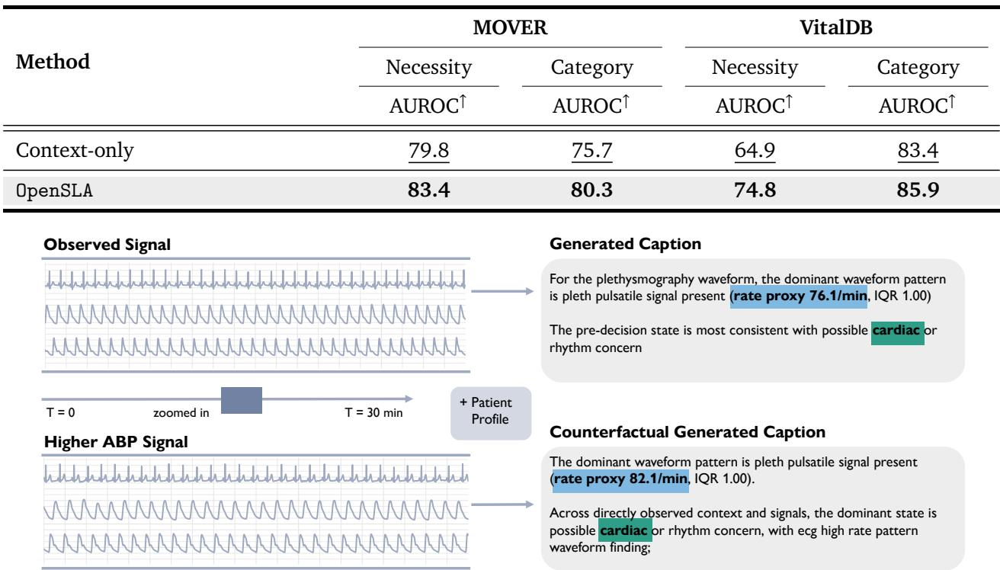  
Figure 9 | Caption responses to sensor substitution. Patient context is held fixed while the supplied <sub>sensor recor</sub>di<sub>ng c</sub>h<sub>anges.</sub>

## E.5. Controlled Sensor Substitution

W<sub>e</sub> h<sub>o</sub>ld th<sub>e</sub> <sub>pa</sub>ti<sub>en</sub>t <sub>con</sub>t<sub>ex</sub>t fi<sub>xe</sub>d <sub>an</sub>d <sub>rep</sub>l<sub>ace</sub> th<sub>e</sub> <sub>o</sub>b<sub>serve</sub>d <sub>sensor</sub> <sub>recor</sub>di<sub>ng</sub> <sub>w</sub>ith <sub>a</sub> hi<sub>g</sub>h<sub>er-</sub>ABP <sub>examp</sub>l<sub>e.</sub> A<sub>s s</sub>h<sub>own</sub> i<sub>n</sub> Fi<sub>g.</sub> 9<sub>,</sub> thi<sub>s sensor su</sub>b<sub>s</sub>tit<sub>u</sub>ti<sub>on c</sub>h<sub>anges</sub> th<sub>e genera</sub>t<sub>e</sub>d <sub>cap</sub>ti<sub>on:</sub> th<sub>e</sub> Pl<sub>e</sub>th <sub>ra</sub>t<sub>e</sub> <sub>proxy</sub> i<sub>ncreases</sub> f<sub>rom</sub> 76<sub>.</sub>1 t<sub>o</sub> 82<sub>.</sub>1/<sub>m</sub>i<sub>n,</sub> <sub>an</sub>d th<sub>e</sub> <sub>s</sub>t<sub>a</sub>t<sub>e</sub> <sub>summary</sub> <sub>a</sub>dditi<sub>ona</sub>ll<sub>y</sub> id<sub>en</sub>tifi<sub>es</sub> <sub>a</sub> hi<sub>g</sub>h<sub>-ra</sub>t<sub>e</sub> ECG <sub>pa</sub>tt<sub>ern, w</sub>hil<sub>e</sub> th<sub>e overa</sub>ll <sub>car</sub>di<sub>ac</sub>/<sub>r</sub>h<sub>y</sub>th<sub>m concern rema</sub>i<sub>ns unc</sub>h<sub>ange</sub>d<sub>.</sub> Thi<sub>s con</sub>t<sub>ro</sub>ll<sub>e</sub>d <sub>compar</sub>i<sub>son</sub> d<sub>emons</sub>t<sub>ra</sub>t<sub>es</sub> th<sub>a</sub>t th<sub>e genera</sub>t<sub>e</sub>d <sub>cap</sub>ti<sub>on respon</sub>d<sub>s</sub> t<sub>o c</sub>h<sub>anges</sub> i<sub>n</sub> th<sub>e sensor</sub> i<sub>npu</sub>t<sub>, w</sub>hil<sub>e rema</sub>i<sub>n</sub>i<sub>ng</sub> th<sub>e</sub> <sub>pa</sub>ti<sub>en</sub>t <sub>con</sub>t<sub>ex</sub>t <sub>par</sub>t <sub>unc</sub>h<sub>ange</sub>d<sub>.</sub>

## E.6. Hierarchical Memory Eficiency

<sup>T</sup>a<sup>bl</sup>e <sup>21</sup> compares OpenSLA-B an<sup>d</sup> OpenSLA-H on pa<sup>i</sup>re<sup>d</sup> va<sup>lid</sup>at<sup>i</sup>on w<sup>i</sup>n<sup>d</sup>ows <sup>f</sup>rom eac<sup>h d</sup>oma<sup>i</sup>n, w<sup>i</sup>t<sup>h</sup> t<sup>h</sup>e va<sup>l</sup>ues to t<sup>h</sup>e r<sup>i</sup>g<sup>h</sup>t o<sup>f</sup> eac<sup>h</sup> arrow correspon<sup>di</sup>ng to OpenSLA-H. <sup>W</sup>e use <sup>b</sup>atc<sup>h</sup> s<sup>i</sup>ze <sup>1</sup> on a <sup>GH200</sup> GPU <sub>an</sub>d <sub>measure</sub> f<sub>orwar</sub>d l<sub>a</sub>t<sub>ency</sub> f<sub>or</sub> th<sub>e sensor enco</sub>d<sub>ers,</sub> b<sub>ac</sub>kb<sub>one, an</sub>d <sub>necess</sub>it<sub>y</sub>/<sub>ca</sub>t<sub>egory</sub> h<sub>ea</sub>d<sub>s</sub> <sub>on</sub> th<sub>e ac</sub>ti<sub>on pre</sub>di<sub>c</sub>ti<sub>on</sub> t<sub>as</sub>k<sub>; compress</sub>i<sub>on an</sub>d <sub>spee</sub>d<sub>up are compu</sub>t<sub>e</sub>d <sub>as ra</sub>ti<sub>os o</sub>f d<sub>oma</sub>i<sub>n-</sub>l<sub>eve</sub>l <sub>means.</sub> Hi<sub>erarc</sub>hi<sub>ca</sub>l M<sub>emory re</sub>d<sub>uces</sub> b<sub>o</sub>th t<sub>o</sub>k<sub>en coun</sub>t<sub>s an</sub>d f<sub>orwar</sub>d l<sub>a</sub>t<sub>ency on average</sub> i<sub>n</sub> th<sub>e</sub> Cli<sub>n</sub>i<sub>ca</sub>l <sub>an</sub>d OR d<sub>oma</sub>i<sub>ns.</sub> F<sub>or</sub> CGM<sub>,</sub> <sub>sensor</sub> <sub>sequences</sub> <sub>are</sub> <sub>a</sub>l<sub>rea</sub>d<sub>y</sub> <sub>s</sub>h<sub>or</sub>t<sub>,</sub> <sub>so</sub> th<sub>e</sub> <sub>a</sub>dditi<sub>ona</sub>l <sub>memory-process</sub>i<sub>ng</sub> <sub>over</sub>h<sub>ea</sub>d l<sub>arge</sub>l<sub>y o</sub>f<sub>se</sub>t<sub>s</sub> th<sub>e sav</sub>i<sub>ngs</sub> f<sub>rom compress</sub>i<sub>on, resu</sub>lti<sub>ng</sub> i<sub>n</sub> littl<sub>e run</sub>ti<sub>me</sub> b<sub>ene</sub>fit<sub>.</sub>

Table 21 | Hierarchical Memory eficiency.
<table><tr><td>Domain</td><td>Sensor Tokens↓</td><td>Compression↑</td><td>Speedup{</td></tr><tr><td>Clinical</td><td>5801.0 → 400.4</td><td>14.49×</td><td>3.4×</td></tr><tr><td>OR</td><td>3915.8 → 838.0</td><td>4.67×</td><td>1.7×</td></tr><tr><td>CGM</td><td>33.0 → 21.0</td><td>1.57×</td><td>1x</td></tr></table>

## F. Additional Examples

## F.1. Multi-faceted Caption Examples

E<sub>xamp</sub>l<sub>es</sub> 3 <sub>an</sub>d 4 <sub>are</sub> <sub>re-ren</sub>d<sub>ere</sub>d <sub>w</sub>ith <sub>cons</sub>i<sub>s</sub>t<sub>en</sub>t <sub>wave</sub>f<sub>orm-ev</sub>id<sub>ence</sub> filt<sub>er</sub>i<sub>ng;</sub> th<sub>e</sub> <sub>rema</sub>i<sub>n</sub>i<sub>ng</sub> <sub>exam-</sub> <sub>p</sub>l<sub>es</sub> <sub>repro</sub>d<sub>uce</sub> <sub>save</sub>d <sub>re</sub>f<sub>erence</sub> <sub>cap</sub>ti<sub>ons.</sub>

Exam<sub>p</sub>les Ca<sub>p</sub>tions Generated b<sub>y</sub> Our Data Pi<sub>p</sub>eline   
== Example 1 ====   
OBSERVATIONAL: Numeric: 1-minute heart-rate variability was evidence of hrv abnormal   
(1min\_HRV median 10, range 5-32, n=19) and persistently outside the expected range. The   
heart rate series indicates tachycardia and is persistently outside the expected range (HR   
median 110, range 107-120, n=19). Waveform: The Pleth trace did not meet the quality   
threshold for morphology or rate-proxy statements. Because Resp produced incompatible   
rhythm or periodicity proxies, it was excluded from the waveform conclusion. Lead II   
waveform evidence includes tachycardic ECG waveform proxy (rate proxy 108.8/min, IQR 0.20).   
RELATIONAL: Temporal: Temporal pattern: short-window HRV is abnormal with little recent   
change across the current decision window; evidence of hrv abnormal. Near the decision   
point, heart-rate channel shows elevated heart rate and is abnormal but not changing much.   
Cross-signal: elevated cardiac rate across numeric and ECG evidence is present across the   
corresponding signal channels.   
GLOBAL: Context: Before the decision point, the contextual record contains reported   
shortness of breath at presentation. State summary: Across directly observed context and   
signals, the dominant state is possible cardiac or rhythm concern finding, with hrv   
abnormal context; rapid cardiac rate; ecg high rate pattern waveform finding.

ACTION: elevated heart-rate pattern (HR median 110, range 107-120, n=19); trend: abnormal but not changing much; elevated cardiac rate across numeric and ECG evidence; cardiac waveform channel showed high-rate Lead II periodicity (rate proxy 108.8/min, IQR 0.20) is relevant to circulatory support, although the available evidence is indirect or incomplete.

## Example 2

OBSERVATIONAL: Numeric: Across the current observation interval, perfusion signal shows poor perfusion signal; Perf median 1, range 1-1, n=30; persistently outside the expected range. For respiratory rate, the dominant finding is elevated respiratory rate; RR median 24, range 17-29, n=30. Waveform: The Pleth trace did not meet the quality threshold for morphology or rate-proxy statements. The rate or periodicity proxies from Resp were internally inconsistent, so that channel was not used for waveform interpretation. ECG channel summary: ecg rate proxy normal; rate proxy 81.2/min, IQR 0.10.

RELATIONAL: Temporal: Temporal pattern: Perf is sustained without a clear directional shift across the half-hour signal window; poor perfusion signal. Over the monitored interval, RR is abnormal but not changing much with elevated respiratory rate.

GLOBAL: Context: Available contextual evidence includes reported neurologic at presentation. State summary: The pre-decision state is most consistent with possible hemodynamic instability signal; key evidence is reduced peripheral perfusion proxy; weak Pleth waveform.

ACTION: A possible reason for the infectious diagnostic testing workup is the pre-T0 finding tachypnea (RR median 24, range 17-29, n=30); trend: persistently outside the expected range; perfusion concern (Perf median 1, range 1-1, n=30); trend: persistently outside the expected range; peripheral pulse waveform showed weak pulse waveform amplitude (IQR 0.00); no direct note statement confirms it.

## Example 3

OBSERVATIONAL: Numeric: The heart rate series indicates tachycardia and is abnormal with little recent change (HR median 107, range 102-111, n=17). Waveform: Because Pleth was only partly usable in this window, no morphology or rate inference was drawn from it. The available Resp trace was present, but its proxy features disagreed, so no single morphology or rate interpretation was reported. ECG Lead II: nonuniform cardiac waveform proxy; rate proxy 99.9/min, IQR 0.35.

RELATIONAL: Temporal: Over the monitored interval, heart-rate channel is persistently outside the expected range with elevated heart-rate pattern.

GLOBAL: Context: Presentation context includes chief complaint of hypertension or hypotension. State summary: The pre-decision state is most consistent with possible cardiac or rhythm concern context; key evidence is elevated heart-rate pattern; irregular cardiac waveform pattern.

ACTION: The available state shows elevated heart rate (HR median 107, range 102-111, n=17); trend: outside the expected range without a strong trend; because this recorded treatment can represent context-specific care, these facts are described as background for cardiorenal volume management rather than a definitive rationale.

OBSERVATIONAL: Numeric: For heart-rate channel, the dominant finding is elevated heart-rate pattern; HR median 100, range 95-108, n=30. Waveform: Proxy interpretation was deferred for Pleth because the available waveform was quality-constrained. Waveform availability for Resp was adequate, yet the derived proxies were discordant and therefore not interpreted as a single finding. The cardiac waveform channel shows variable ECG waveform periodicity; rate proxy 95.2/min, IQR 0.40.

RELATIONAL: Temporal: Temporal pattern: heart rate is abnormal but not changing much across the current observation interval; heart rate above expected range.

GLOBAL: Context: Pre-decision context includes arrival complaint includes psych or substance; reported medication or refill at presentation. State summary: The pre-decision state is most consistent with possible cardiac or rhythm concern signal; key evidence is tachycardia; irregular Lead II structure.

ACTION: Because no direct note reason was available, heart rate above expected range (HR median 100, range 95-108, n=30); trend: sustained without a clear directional shift is retained as a possible indication for evaluation of altered mental status or neurologic concern.

OBSERVATIONAL: Numeric: The heart rate has limited charting that supports elevated heart-rate pattern (HR median 101, range 101-101, n=1); this is based on one pre-decision HR reading, without a reliable trajectory. rapid breathing pattern appears in one pre-decision RR reading (RR median 23, range 23-23, n=1); no temporal trend is assigned. Waveform: ECG channel summary: ECG high-rate proxy; rate proxy 100.0/min, IQR 1.00. For Plethysmography waveform, the dominant waveform pattern is uneven Pleth pulsatility (rate proxy 91.3/min, IQR 1.00).

GLOBAL: Context: Before the decision point, the contextual record contains presentation mentions bleeding or gi bleed. State summary: Across directly observed context and signals, the dominant state is possible infection or sepsis concern signal, with rapid cardiac rate; RR above expected range.

ACTION: A secondary signal for symptom-control intervention is elevated heart-rate pattern (HR median 101, range 101-101, n=1; one pre-decision HR reading); no stronger domain-specific fact was selected.

OBSERVATIONAL: Numeric: Basal delivery was zero throughout the prior two hours. Waveform: Glucose during the preceding two hours stayed within 71-100 mg/dL, median 88 mg/dL, inside the 70-180 mg/dL range. In the two-hour window, the fitted slope of sensor glucose was +6 mg/dL per hour; glucose was flat, within 10 mg/dL per hour. The last reading before the decision was 94 mg/dL, 5 minutes before it.

GLOBAL: Context: Patient context: 48 yr old, a male patient, 104 kg body weight, height of 170 cm, body mass index 36.0 kg/m2, duration of diabetes 38 years, automated insulin

delivery. State summary: Pre-decision state: readings in 70-180 mg/dL throughout,   
changing under 10 mg/dL per hour.   
ACTION: Findings on the side of no bolus: pump basal of zero entering the decision.   
======================================== Example 7 =======================================   
OBSERVATIONAL: Numeric: No basal delivery was recorded in the prior two hours. Waveform:   
Glucose over the two-hour observation window had a median of 97 mg/dL, in the target range   
of 70-180 mg/dL, and went from a low of 78 to a high of 113 mg/dL. Glucose over the   
two-hour window before the decision: decreasing, -18 mg/dL per hour. Glucose at the last   
reading, 5 minutes before the decision, was 78 mg/dL.   
RELATIONAL: Temporal: In the two-hour lookback: no bolus, carbohydrate entry, small   
delivery run or basal change.   
GLOBAL: Context: Patient profile: 28 yr old, a male patient, a weight of 58 kg, 175 cm   
tall, BMI equal to 18.8 kg/m2, 11 years since diagnosis, automated insulin delivery (AID).   
State summary: Summary of the state before the decision: none of the defined states   
applied; evidence was limited.   
ACTION: Against a bolus: no pump basal in the slot before the decision.   
Example 8   
OBSERVATIONAL: Numeric: Basal insulin stayed at zero for all of the last two hours.   
Insulin on board, slot before the decision: 0.13 U. Waveform: Sensor glucose in the   
preceding two hours: median 114 mg/dL, in the 70-180 mg/dL target range, lowest 101 and   
highest 122 mg/dL. Glucose over the two hours before the decision: stable (under 10 mg/dL   
per hour either way), -8 mg/dL per hour. The last CGM value was 101 mg/dL, 5 minutes   
before the decision.   
RELATIONAL: Temporal: No timed events (bolus, carbohydrate, small delivery run, basal   
change) in the last two hours.   
GLOBAL: Context: Known patient attributes: aged 43, male, a closed-loop system. State   
summary: State before the decision: a 70-180 mg/dL trace with a slope below 10 mg/dL per   
hour.   
ACTION: Findings opposing an insulin bolus: zero basal on the pump just before the   
decision.   
Example 9   
OBSERVATIONAL: Numeric: Basal insulin stayed at zero for all of the two-hour window.   
Waveform: CGM readings in the last two hours spanned 88-136 mg/dL, with a median of 117   
mg/dL, neither below 70 nor above 180 mg/dL. Over the two-hour period before the decision,   
glucose was dropping, at -20 mg/dL per hour. The reading closest to the decision was 88   
mg/dL, 5 minutes earlier.   
RELATIONAL: Temporal: The record lists no bolus, carbohydrate entry, small delivery run or   
basal change for the two-hour period before the decision.

GLOBAL: Context: Patient record: 35 years old, of female sex, body weight 54 kg, 157 cm   
tall, BMI at 21.9 kg/m2, living with diabetes 30 years, automated insulin delivery. State   
summary: Overall state before the decision: no selected glycaemic state; direct evidence   
was limited.   
ACTION: Pre-decision evidence against an insulin bolus: pump basal at zero just before the   
decision.   
Example 10 ======   
OBSERVATIONAL: Numeric: A constant basal rate of 0.90 U/h over the two hours up to the   
decision delivered 1.80 U. Insulin on board immediately before the decision was 0.01 U.   
Waveform: Median sensor glucose over the two-hour window was 150 mg/dL, in the target   
range of 70-180 mg/dL; readings 142-153 mg/dL. For the two-hour period before the decision,   
glucose had a fitted slope of -5 mg/dL per hour and was flat (less than 10 mg/dL per hour).   
Latest glucose: 142 mg/dL at 5 minutes before the decision.   
RELATIONAL: Temporal: No timed events (bolus, carbohydrate, small delivery run, basal   
change) in the two hours prior to the decision.   
GLOBAL: Context: Patient details on record: aged 66, recorded as male, weighing 108 kg, a   
height of 185 cm, computed BMI 31.4 kg/m2, 26 years of diabetes, an insulin pump with CGM.   
State summary: Overall glycaemic state: glucose kept inside 70-180 mg/dL, slope under 10   
mg/dL per hour.   
ACTION: No finding for or against an insulin bolus was selected from the observed window.

## F.2. Template pool

```ini
OBSERVATIONAL
NUMERIC_CAPTION_TEMPLATES = [
"{modality_phrase} was {numeric_finding} ({stat_phrase}) and {trend_phrase}.",
"Across {window_phrase}, {modality_phrase} shows {numeric_finding}; {stat_phrase}; {trend_phrase}.",
"The {modality_phrase} series indicates {numeric_finding} and is {trend_phrase} ({stat_phrase}).",
"Recorded {modality_phrase} values support {numeric_finding}; {stat_phrase}; {trend_phrase}.",
"For {modality_phrase}, the dominant finding is {numeric_finding}; {stat_phrase}.",
"{numeric_finding} is present in the {modality_phrase} series and is {trend_phrase}.",
]
NUMERIC_OBSERVATION_ONLY_TEMPLATES = [
"Observed {modality_phrase} during {window_phrase} ({stat_phrase}).",
"The current {modality_phrase} summary is {stat_phrase}.",
"Recorded {modality_phrase} values in {window_phrase} are summarized as {stat_phrase}.",
]
NUMERIC_SPARSE_TEMPLATES = [
"{modality_phrase} has limited charting that supports {numeric_finding} ({stat_phrase}); this is based
on {sparse_observation_phrase}, without a reliable trajectory.",
"{numeric_finding} appears in {sparse_observation_phrase} ({stat_phrase}); no temporal trend is
assigned.",
"Evidence from {sparse_observation_phrase} is consistent with {numeric_finding} ({stat_phrase}); the
values are retained but temporal detail is withheld because observations are sparse.",
"The available values for {modality_phrase} indicate {numeric_finding} ({stat_phrase}), although the
evidence consists of only {sparse_observation_phrase}.",
]
LAB_RESULT_CAPTION_TEMPLATES = [
"{modality_phrase}: {numeric_finding}; {stat_phrase}.",
"{numeric_finding} appears in recent {modality_phrase} results ({stat_phrase}).",
"Recent lab evidence from {modality_phrase} shows {numeric_finding}; {stat_phrase}.",
```

"The resulted {modality\_phrase} panel contributes {numeric\_finding}: {stat\_phrase}.",   
"{stat\_phrase} supports {numeric\_finding} in the {modality\_phrase} category.",   
"Lab context before the decision point includes {numeric\_finding} from {modality\_phrase};   
{stat\_phrase}.",   
"{modality\_phrase} result summary: {numeric\_finding}; {stat\_phrase}.",   
"A recent {modality\_phrase} finding is {numeric\_finding}, recorded as {stat\_phrase}.",   
]   
WAVEFORM\_GENERIC\_TEMPLATES = [   
"{modality\_phrase}: {pattern\_phrase}; {stat\_phrase}.",   
"The {modality\_phrase} signal shows {pattern\_phrase} ({stat\_phrase}).",   
"{modality\_phrase} provides waveform evidence of {pattern\_phrase}; {stat\_phrase}.",   
"For {modality\_phrase}, the dominant waveform pattern is {pattern\_phrase} ({stat\_phrase}).",   
]   
WAVEFORM\_ECG\_II\_TEMPLATES = [   
"ECG Lead II: {pattern\_phrase}; {stat\_phrase}.",   
"Lead II waveform evidence includes {pattern\_phrase} ({stat\_phrase}).",   
"The cardiac waveform channel shows {pattern\_phrase}; {stat\_phrase}.",   
"ECG channel summary: {pattern\_phrase}; {stat\_phrase}.",   
]   
WAVEFORM\_PLETH\_TEMPLATES = [   
"Pleth waveform: {pattern\_phrase}; {stat\_phrase}.",   
"The pulse-ox waveform shows {pattern\_phrase} ({stat\_phrase}).",   
"Peripheral pulse waveform summary: {pattern\_phrase}; {stat\_phrase}.",   
"Pleth channel evidence is summarized as {pattern\_phrase}, with {stat\_phrase}.",   
]   
WAVEFORM\_RESP\_TEMPLATES = [   
"Resp waveform: {pattern\_phrase}; {stat\_phrase}.",   
"The respiration waveform shows {pattern\_phrase} ({stat\_phrase}).",   
"Breathing waveform evidence includes {pattern\_phrase}; {stat\_phrase}.",   
"Respiration waveform summary: {pattern\_phrase}; {stat\_phrase}.",   
]   
CGM\_WAVEFORM\_CAPTION\_TEMPLATES = {   
"glucose\_summary": [   
"Median sensor glucose over {period} was {median} mg/dL, {band\_phrase}; readings {lo}-{hi} mg/dL.",   
"Over {period}, median glucose was {median} mg/dL, {band\_phrase}, with readings from {lo} to {hi}   
mg/dL.",   
],   
"glucose\_trend": [   
"Glucose was {direction} over {period}, with a fitted slope of {slope} mg/dL per hour.",   
"The fitted glucose slope over {period} was {slope} mg/dL per hour; glucose was {direction}.",   
],   
"glucose\_last": [   
"The last reading before the decision was {last} mg/dL, {m} minutes before it.",   
"The most recent glucose, {m} minutes before the decision, was {last} mg/dL.",   
],   
"time\_in\_ranges": [   
"Time in ranges over {period}: {p\_lt54}% below 54, {p\_lt70}% below 70, {p\_70\_180}% at 70-180,   
{p\_gt180}% above 180 and {p\_gt250}% above 250 mg/dL.",   
"Of valid readings in {period}, {p\_70\_180}% were at 70-180 mg/dL, {p\_lt70}% below 70 ({p\_lt54}% below   
54) and {p\_gt180}% above 180 ({p\_gt250}% above 250).",   
],   
"variability": [   
"The p10-p90 glucose spread over {period} was {spread} mg/dL, at least 60 mg/dL.",   
"Glucose variability in {period}: p10-p90 spread {spread} mg/dL, 60 mg/dL or more.",   
],   
"no\_glucose": [   
"No usable sensor glucose was available in {period}.",   
"Sensor glucose was unavailable for {period}.",   
],   
}   
CGM\_NUMERIC\_CAPTION\_TEMPLATES = {   
"basal\_zero\_throughout": [   
"No basal insulin was delivered in {period}.",

"Basal delivery was zero throughout {period}.",   
],   
"basal\_steady": [   
"Basal insulin ran at a constant {rate} U/h over {period}, {total} U in total.",   
"Over {period}, basal delivery held at {rate} U/h, totalling {total} U.",   
],   
"basal\_varying": [   
"Basal insulin over {period} averaged {mean} U/h, ranging {min}-{max} U/h, {total} U in total.",   
"Over {period}, basal delivery ranged {min}-{max} U/h (mean {mean} U/h), totalling {total} U.",   
],   
"iob": [   
"Insulin on board before the decision was {iob} U.",   
"Just before the decision, insulin on board was {iob} U.",   
],   
"cob": [   
"Carbohydrate on board before the decision was {cob} g.",   
"Just before the decision, carbohydrate on board was {cob} g.",   
],   
}

## RELATIONAL

TEMPORAL\_CAPTION\_TEMPLATES = [   
"Temporal pattern: {modality\_phrase} is {trend\_phrase} across {window\_phrase}; {numeric\_finding}.",   
"Over the monitored interval, {modality\_phrase} is {trend\_phrase} with {numeric\_finding}.",   
"The observed trajectory for {modality\_phrase} is {trend\_phrase}; {stat\_phrase}.",   
"Near the decision point, {modality\_phrase} shows {numeric\_finding} and is {trend\_phrase}.",   
CROSS\_SIGNAL\_CAPTION\_TEMPLATES = [   
"{numeric\_finding} and {waveform\_finding} are directionally consistent.",   
"{numeric\_finding} is {connector\_evidence} {waveform\_finding}.",   
"{waveform\_finding} provides waveform support for {numeric\_finding}.",   
"{numeric\_finding} is not clearly matched by waveform evidence because {uncertainty\_phrase}.",   
"{cross\_signal\_finding}: {numeric\_finding} {connector\_additive} {waveform\_finding}.",   
"Together, {numeric\_finding} and {waveform\_finding} support {clinical\_state}.",   
"{cross\_signal\_finding} is present, based only on available numeric and waveform evidence.",   
"{waveform\_finding} and {numeric\_finding} point to {clinical\_state}, with proxy-level certainty.",   
"{numeric\_finding} contrasts with {waveform\_finding}; signal interpretation is {uncertainty\_phrase}.",   
"Cross-signal evidence: {cross\_signal\_finding}; {supporting\_findings}.",   
CROSS\_SIGNAL\_EXPLICIT\_FACT\_TEMPLATES = [   
"{cross\_signal\_finding} is supported by the paired numeric and waveform observations.",   
"Matched numeric and waveform channels show {cross\_signal\_finding}.",   
"{cross\_signal\_finding} is present across the corresponding signal channels.",   
CGM\_TEMPORAL\_CAPTION\_TEMPLATES = {   
"bolus\_event": [   
"A {d } U b l d d { } i b f h d i i "   
"Bolus: {dose} U, {m} minutes before the decision.",   
],   
"carb\_event": [   
"{grams} g of carbohydrate was recorded {m} minutes before the decision.",   
"Carbohydrate: {grams} g, {m} minutes before the decision.",   
],   
"small\_deliveries\_one": [   
"One run of deliveries under 0.25 U per row ({total} U) was not counted as a bolus.",   
"A run of sub-0.25 U deliveries totalling {total} U was not counted as a bolus.",   
],   
"small\_deliveries\_many": [   
"{count} runs of deliveries under 0.25 U per row ({total} U) were not counted as boluses.",   
"{count} runs of sub-0.25 U deliveries totalling {total} U were not counted as boluses.",   
],   
"basal\_zero\_ended": [

"Basal delivery was zero for {dur} minutes, ending {end\_m} minutes before the decision.",   
"A {dur}-minute zero-basal stretch ended {end\_m} minutes before the decision.",   
],   
"basal\_zero\_ongoing": [   
"Basal delivery had been zero for {dur} minutes and still was in the slot before the decision.",   
"A {dur}-minute zero-basal stretch ran up to the slot before the decision.",   
],   
"basal\_changes\_one": [   
"The basal rate changed once, {m} minutes before the decision.",   
"One basal rate change, {m} minutes before the decision.",   
],   
"basal\_changes\_many": [   
"The basal rate changed {n} times, last {m} minutes before the decision.",   
"{n} basal rate changes, the latest {m} minutes before the decision.",   
],   
"temporal\_empty": [   
"No bolus, carbohydrate entry, small delivery run or basal change was recorded in {period}.",   
"{period\_capitalized} has no bolus, carbohydrate entry, small delivery run or basal change.",   
],   
}

## GLOBAL

CONTEXT\_CAPTION\_TEMPLATES = [   
"Presentation context includes {supporting\_findings}.",   
"Available contextual evidence includes {supporting\_findings}.",   
"The available clinical context mentions {supporting\_findings}.",   
"Before the decision point, the contextual record contains {supporting\_findings}.",   
"Contextual cues before the decision point include {supporting\_findings}.",   
"Relevant presentation and workflow context includes {supporting\_findings}.",   
"Earlier clinical context includes {supporting\_findings}.",   
"Pre-decision context includes {supporting\_findings}.",   
7   
GLOBAL\_CAPTION\_TEMPLATES = [   
"Overall observed state before the decision: {clinical\_state}, supported by {supporting\_findings}.",   
"The pre-decision state is most consistent with {clinical\_state}; key evidence is   
{supporting\_findings}.",   
"Across directly observed context and signals, the dominant state is {clinical\_state}, with   
{supporting\_findings}.",   
CGM\_CONTEXT\_CAPTION\_TEMPLATES = {   
"context": [   
"Patient context: {items}.",   
"Patient: {items}.",   
],   
"context\_empty": [   
"No patient context was recorded.",   
"Patient context is not recorded.",   
],   
CGM\_GLOBAL\_CAPTION\_TEMPLATES = {   
"global\_states": [   
"Overall state: {states}.",   
"Overall pre-decision state: {states}.",   
],   
"global\_none": [   
"Overall state: no selected glycaemic state; direct pre-decision evidence was limited.",   
"Overall state: no glycaemic state was selected; direct pre-decision evidence was limited.",   
],   
}

ACTION   
TREATMENT\_ACTION\_EVIDENCE\_TEMPLATES = {   
"supported":   
"Observed findings relevant to {action\_evidence\_domain\_phrase} include {action\_evidence\_clause}.",   
"The available pre-decision evidence for {action\_evidence\_domain\_phrase} is   
{action\_evidence\_clause}.",   
],   
"secondary\_only\_evidence": [   
"The observed window includes {action\_evidence\_clause}; this is nonspecific supporting evidence for   
{action\_evidence\_domain\_phrase} rather than a complete indication.",   
"{action\_evidence\_clause} is relevant to {action\_evidence\_domain\_phrase}, although the available   
evidence is indirect or incomplete.",   
],   
"fallback\_visible\_evidence": [   
"Visible pre-decision findings include {action\_evidence\_clause}; together they provide indirect or   
mixed context for {action\_evidence\_domain\_phrase}, not a complete indication.",   
"The observed state contains {action\_evidence\_clause}; these facts are relevant background for   
{action\_evidence\_domain\_phrase}, although none is a direct domain-specific match.",   
],   
"label\_review\_context\_only": [   
"Visible pre-decision findings include {action\_evidence\_clause}; they are retained as clinical   
context, not as a direct indication for {action\_evidence\_domain\_phrase}.",   
"The available state shows {action\_evidence\_clause}; because this recorded treatment can represent   
context-specific care, these facts are described as background for {action\_evidence\_domain\_phrase} rather   
than a definitive rationale.",   
],   
"label\_review\_no\_visible\_context": [   
"The recorded treatment belongs to a context-dependent category; no reliable pre-decision fact is   
stated as a direct indication.",   
"This action category can reflect context-specific care, and the visible window does not support a   
label-specific rationale statement.",   
],   
"limited\_observable\_evidence": [   
"The available pre-decision record contains limited observable evidence specific to this action   
domain.",   
"No compatible state fact was selected for an action-specific evidence statement in this window.",   
],   
"no\_immediate\_treatment\_evidence": [   
"The observed pre-decision state does not assert a specific immediate treatment-level action from the   
available evidence.",   
"No immediate treatment domain is selected from the visible pre-decision context and signals.",   
],   
}   
DIAGNOSTIC ACTION EVIDENCE TEMPLATES = {   
"direct\_note\_indication": [   
"The pre-decision note documents this diagnostic indication: {action\_evidence\_clause}.",   
"A documented indication before T0 was: {action\_evidence\_clause}.",   
],   
"i f d i di i " [   
"The {action\_evidence\_domain\_phrase} workup was likely prompted by {action\_evidence\_clause}; this is   
an inferred indication from pre-T0 evidence, not an explicitly documented reason.",   
"Pre-T0 findings suggest a possible indication for {action\_evidence\_domain\_phrase}:   
{action\_evidence\_clause}; the note did not state this rationale directly.",   
],   
"inferred\_general\_indication": [   
"The {action\_evidence\_domain\_phrase} workup was likely part of broader diagnostic assessment, but no   
specific pre-T0 indication was available.",   
"A diagnostic indication for {action\_evidence\_domain\_phrase} is plausible from the clinical setting,   
although the available record does not identify a specific reason.",   
],   
"supported": [   
"Diagnostic-workup evidence for {action\_evidence\_domain\_phrase} includes {action\_evidence\_clause}.",   
"The pre-decision record supports {action\_evidence\_domain\_phrase} through {action\_evidence\_clause}.",   
],

```jsonl
"secondary_only_evidence": [
"The observed window includes {action_evidence_clause}; this is indirect supporting context for
{action_evidence_domain_phrase}.",
"Available context such as {action_evidence_clause} is relevant to {action_evidence_domain_phrase},
but is not a complete indication.",
],
"fallback_visible_evidence": [
"Visible pre-decision findings include {action_evidence_clause}; they provide broad context for
{action_evidence_domain_phrase}, not a definitive indication.",
"The available state shows {action_evidence_clause}; its relationship to
{action_evidence_domain_phrase} remains indirect or mixed.",
],
"label_review_context_only": [
"Visible pre-decision findings include {action_evidence_clause}; they are clinical context for
{action_evidence_domain_phrase}, not a label-specific reason.",
"The available state shows {action_evidence_clause}; the diagnostic action is retained without
inferring an exact indication.",
],
"limited_observable_evidence": [
"A diagnostic action was recorded, but no specific pre-decision indication was identifiable from the
available context and signals.",
"The visible window provides limited observable evidence for this diagnostic workup.",
],
"no_immediate_treatment_evidence": [
"No immediate treatment action is asserted; the observed decision context is diagnostic or otherwise
non-treatment focused.",
"The visible state does not establish an immediate treatment response, while diagnostic context may
still be present.",
],
}
OR_ACTION_EVIDENCE_TEMPLATES = {
"supported": [
"Observed findings relevant to {action_evidence_domain_phrase} include {action_evidence_clause}.",
"The available pre-decision evidence for {action_evidence_domain_phrase} is
{action_evidence_clause}.",
"For the current decision, visible evidence linked to {action_evidence_domain_phrase} includes
{action_evidence_clause}.",
"Evidence aligned with {action_evidence_domain_phrase} includes {action_evidence_clause}.",
"The available state includes {action_evidence_clause}; these observations are relevant to
{action_evidence_domain_phrase}.",
"Findings that bear on {action_evidence_domain_phrase} are {action_evidence_clause}.",
],
"no_immediate_treatment_evidence": [
"No immediate action domain is selected from the visible pre-decision context and signals.",
"The caption records the current state without assigning an immediate action domain.",
"Current findings are described without linking them to a recorded immediate action.",
"No action-specific rationale is asserted from the observed pre-decision state.",
"The available pre-T0 state does not select a specific immediate response.",
],
}
CGM_ACTION_EVIDENCE_TEMPLATES = {
"evidence_for": [
"Findings for an insulin bolus: {findings}.",
"Evidence for a bolus: {findings}.",
],
"evidence_against": [
"Findings against an insulin bolus: {findings}.",
"Evidence against a bolus: {findings}.",
],
"evidence_none": [
"No finding for or against an insulin bolus was selected from the observed window.",
"No finding for or against a bolus was selected.",
],
}
```