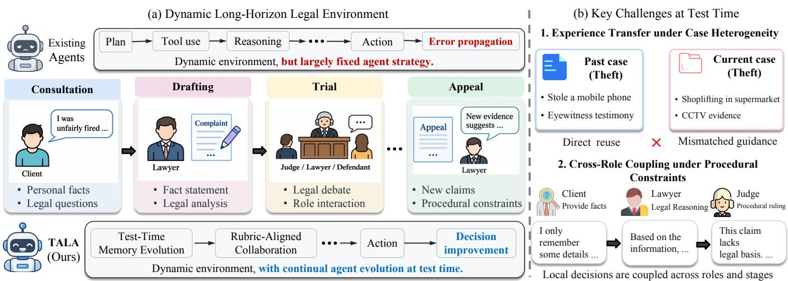
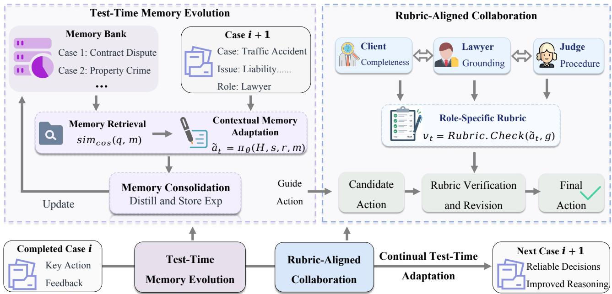
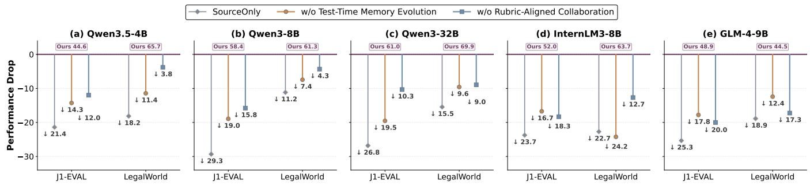
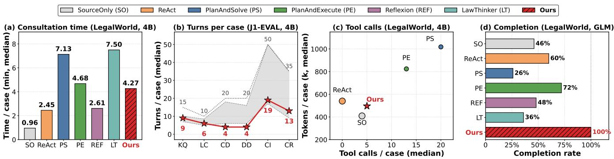
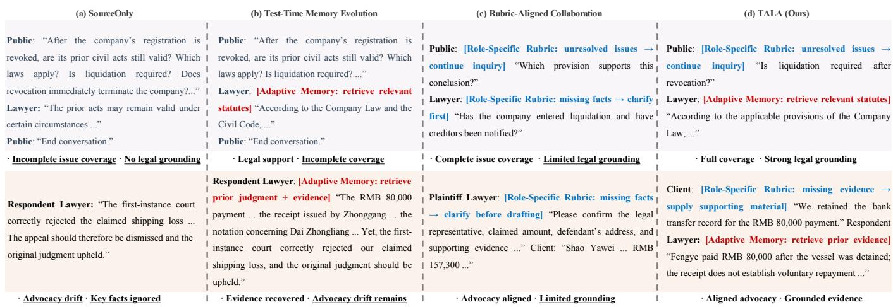

# Test-Time Agent Evolution for Long-Horizon Legal Reasoning

Haotian Chen1, Shuaicheng Niu2, Haocong Rao2, Kaisong Song3, Jun Lin3, Lizhen Cui1, Zhiqi Shen2,

Yonghui Xu1,∗

1Joint SDU–NTU Centre for Artificial Intelligence Research, Shandong University

2Nanyang Technological University

3Alibaba Group

haotian.chen@mail.sdu.edu.cn, xuyonghui@sdu.edu.cn

∗Corresponding author

## Abstract

Legal intelligence aims to support reliable decision-making across long-horizon legal processes involving evolving case states and multiple roles. However, real-world legal deployment exhibits sub- stantial case heterogeneity in facts, evidence, and procedural con- texts, exposing the limitations of static agent strategies. Moreover, legal reasoning is inherently interdependent across roles and proce dural stages, making global reliability fundamentally diferent from isolated role competence. To address these challenges, we study training-free test-time agent adaptation, where agents continuously exploit deployment-time signals from preceding cases and ongoing interactions without updating model parameters. We propose TALA, which introduces Test-Time Memory Evolution to retrieve reusable experience from previous cases, adapt it to the current factual and procedural context, and consolidate accumulated ex- perience for subsequent decision-making. Further, Rubric-Aligned Collaboration verifies and revises role-specific actions according to behavioral and procedural requirements, enabling coordinated decision-making across roles and stages. Extensive experiments on J1-EVAL and LegalWorld across five backbone models demonstrate consistent improvements over representative reasoning and agent baselines with reasonable interaction and computational costs. Abla- tion and case studies further show that the two components provide complementary benefits in experience adaptation and cross-role co- ordination, improving the reliability and eficiency of long-horizon legal reasoning.

## Keywords

Legal Agents, Test-Time Evolution, Long-Horizon Reasoning

## 1 Introduction

Large language models (LLMs) are increasingly deployed as interactive legal agents for legal question answering, document understanding, and agent-based reasoning [5, 8, 9, 16]. However, real-world legal practice rarely consists ofisolated tasks or single-turn in teractions. Legal consultation, document drafting, trial, and appeal are often sequentially connected, where facts, evidence, claims, and decisions produced at one stage constrain subsequent stages [34]. Legal agents must therefore maintain and update case states while reasoning coherently across extended interactions. The challenge of legal intelligence is thus shifting from merely knowing the law to acting reliably over time.

Recent benchmarks have begun to capture such long-horizon characteristics through multi-turn interaction, and multi-role legal environments [15, 33, 34]. Nevertheless, a dynamic environment does not necessarily imply an adaptive agent. Existing agent frameworks typically employ interaction strategies specified before deployment, such as predefined planning, reasoning, and tool-use procedures [23, 24, 30]. Although agents can react to observations within a trajectory, their underlying interaction strategies often remain largely fixed as deployment conditions evolve across cases, roles, and procedural stages. As illustrated in Fig. 1(a), such static deployment strategies may struggle to adapt to newly emerg- ing information and changing procedural contexts, allowing local errors to propagate into inconsistent arguments and faulty claims. This reveals a fundamental gap between increasingly dynamic legal environments and largely predetermined agent strategies.

In realistic deployment, legal cases arrive continuously, making it impractical to fine-tune or reinforce an agent for every newly encountered case [1]. A more practical alternative is to exploit signals naturally available during deployment without updating the underlying model. Recent studies have explored memory- and experience-based mechanisms for reusing information accumulated from previous interactions [21]. However, experience from one case is not directly transferable to another, as even cases involving the same ofense may difer substantially in facts, evidence, and pro- cedural context. As illustrated in Fig. 1(b1), naively reusing prior experience can therefore introduce mismatched or misleading guidance. The first challenge is thus how to reconcile cross-case experience transfer with case-specific adaptation across heterogeneous legal cases.

On the other hand, long-horizon legal reasoning is inherently coupled across roles and procedural stages. Existing methods often improve individual legal roles in isolation [26, 29, 32], yet stronger local decisions do not necessarily lead to reliable end-to-end execu- tion. As illustrated in Fig. 1(b2), decisions made by one role shape the context for subsequent roles, making cross-role misalignment particularly harmful as local inconsistencies can propagate across stages and compromise end-to-end reliability. The second challenge is therefore how to jointly coordinate decisions across coupled legal roles and procedural stages toward globally consistent execution.

To address these challenges, we aim to enable LLM agents to adapt throughout long-horizon legal interactions using signals naturally available during deployment. We propose TALA, a trainingfree framework that improves agent behavior at test time without updating the underlying model parameters. To handle case het- erogeneity, TALA introduces Test-Time Memory Evolution (TME), which retrieves relevant experience from preceding cases, adapts it to the current factual and procedural context, and consolidates accu- mulated experience under a bounded memory budget. This allows prior interactions to provide reusable guidance without directly transferring case-specific facts or evidence. To mitigate cross-role misalignment, we further introduce Rubric-Aligned Collaboration (RAC), which verifies and revises each role’s actions according to role-specific behavioral and procedural requirements, preventing locally plausible decisions from introducing inconsistencies into subsequent roles and stages. Together, these mechanisms enable TALA to evolve both cross-case experience and cross-role decisionmaking throughout continual legal deployment, improving the global reliability of long-horizon interactions.

  
Figure 1: (a) Dynamic legal environments evolve across multiple stages, while agent strategies often remain largely fixed during deployment. (b) Case heterogeneity and cross-role misalignment jointly limit efective adaptation in long-horizon reasoning.

Extensive experiments on J1-EVAL and LegalWorld demonstrate that TALA consistently improves performance across five backbone models and diverse long-horizon legal scenarios, showing strong generalization across model families and scales. More importantly, TALA substantially improves the robustness of multi-stage execution, sustaining reliable interaction across extended trajec tories while maintaining moderate computational and interaction costs. Ablation and case studies further reveal that the two compo- nents are complementary and mutually reinforcing, with their joint use yielding more coherent long-horizon adaptation than either mechanism in isolation.

Our contributions can be summarized as follows. (1) We formulate long-horizon legal reasoning from a deployment-time evolution perspective, highlighting two fundamental challenges that arise under continual legal deployment: case heterogeneity, which complicates cross-case experience transfer, and cross-role misalignment, which makes local decisions consequential for subsequent roles and stages. (2) We propose TALA, a training-free framework for continual test-time agent evolution. It combines TME for contextaware cross-case experience adaptation with RAC for coordinated decision-making across coupled legal roles and procedural stages. (3) Extensive experiments on J1-EVAL and LegalWorld across five backbone models demonstrate consistent gains across model fami lies and scales, improved robustness in long-horizon execution, and moderate test-time overhead.

## 2 Related Work

LLM-based Legal Agents. Early studies on legal LLMs mainly focus on static legal capabilities, such as legal knowledge acquisition, judgment prediction, and document understanding, through bench- mark construction and domain-specific adaptation [7, 10, 11, 31]. More recently, research has shifted toward LLM-based legal agents that support interaction, tool use, and multi-role collaboration in complex legal environments [4, 8]. Existing methods further enhance legal agents through predefined reasoning workflows and legal-specific tools [29], or additional training such as supervised fine-tuning and reinforcement learning [1]. However, these im-provements are largely determined before deployment, while many case-specific facts, procedural states, role interactions, and tool feed- back only emerge during execution. How to exploit such deploymenttime signals to continuously adapt subsequent agent behavior remains underexplored. In this paper, we aim to develop self-improving legal agents for more reliable reasoning.

Test-Time Adaptation. Test-time adaptation aims to improve model performance during inference without accessing the original training data [6]. A prominent line of inference-time improvement is test-time scaling, which allocates additional computation through repeated sampling, majority voting, self-consistency, or iterative refinement [18, 20, 25]. While efective for short-form reasoning, such strategies become increasingly costly in long-horizon tasks, where a single trajectory may involve numerous interaction turns, role transitions, and tool calls [13, 14]. More fundamentally, long- horizon agent interaction is inherently non-stationary: each action may alter subsequent states, available information, and behavioral constraints, making future decisions dependent on earlier interactions. Consequently, both useful experience and local errors can persist and compound over time. However, existing test-time methods have largely focused on isolated reasoning instances, leaving continual adaptation under interaction-induced non-stationarity relatively underexplored. This paper aims to bridge this gap through test-time agent evolution in long-horizon interactions.

## 3 Method

As shown in Fig. 2, TALA operates under a continual test-time setting, where legal cases are processed sequentially without updating the underlying model parameters. It consists of two complemen- tary components: Test-Time Memory Evolution, which retrieves, adapts, and consolidates experience from preceding cases to han- dle case heterogeneity, and Rubric-Aligned Collaboration, which verifies and revises role-specific actions under behavioral and pro cedural constraints. Together, the two components enable the agent to continuously exploit deployment-time signals for more reliable long-horizon legal reasoning.

## 3.1 Problem Formulation

Test-Time Evolution. Let $\pi _ { \Theta }$ denote a pretrained language agent with parameters Θ, learned from training data $\mathcal { D } _ { \mathrm { t r a i n } } \sim \mathcal { P } _ { \mathrm { t r a i n } } . \mathrm { A t }$ deployment, the agent sequentially encounters domain-specific le- gal tasks drawn from $\mathcal { P } _ { \mathrm { t e s t } }$ , where $\mathcal { P } _ { \mathrm { t e s t } } \neq \mathcal { P } _ { \mathrm { t r a i n } }$ . As deployment progresses, newly encountered cases may difer in facts, evidence, procedural states, and role interactions, requiring the agent to continually adapt its behavior to evolving test-time conditions.

Long-Horizon Interaction. We formulate each legal case � as a multi-turn interaction involving a set ofroles $\mathcal { R } = \{ r _ { 1 } , \ldots , r _ { K } \}$ , such as the lawyer, client, judge, and other legal participants. Within case �, � indexes the interaction turn, and $T _ { i }$ denotes the total number of turns in the corresponding trajectory. For clarity, we omit the case index � when referring to variables within a single case. At turn �, let $\mathcal { H } _ { t }$ denote the accumulated interaction history, including previous utterances and tool observations, and let $s _ { t }$ denote the current task state, such as the active scenario or litigation stage, procedural progress, and collected case information. Given the active role $r _ { t : }$ the agent produces an action:

$$
a _ { t } = \pi _ { \Theta } \left( \mathcal { H } _ { t } , s _ { t } , r _ { t } \right) ,\tag{1}
$$

where $a _ { t } \in \mathcal { A }$ and A denotes the action space. An action can be a natural-language response, such as questioning, answering, or doc-ument generation, or an executable action, such as legal retrieval or other tool invocation. After executing $\displaystyle a _ { t } ,$ the environment returns an observation $o _ { t + 1 }$ and updates the task state from �� to $s _ { t + 1 }$ . The trajectory of case � is therefore represented as:

$$
\tau ^ { ( i ) } = \{ ( s _ { t } , r _ { t } , \mathcal { H } _ { t } , a _ { t } , o _ { t + 1 } ) \} _ { t = 1 } ^ { T _ { i } } .\tag{2}
$$

The agent sequentially processes � legal cases $\{ \tau ^ { ( i ) } \} _ { i = 1 } ^ { N }$ drawn from $\mathcal { P } _ { \mathrm { t e s t } }$ during test time. Our goal is to exploit information accumulated from preceding cases and their interactions to improve performance on subsequent cases, while maintaining coherent behavior with respect to the current role, task state, and procedure.

## 3.2 Test-Time Memory Evolution

Real-world legal tasks involve complex, multi-stage decision-making [17], often requiring external legal knowledge and specialized tools. How- ever, existing LLM agents remain unreliable in tool use and long horizon interactions [19]. To address this, we propose a Test-Time Memory Evolution (TME) mechanism that continuously accumulates and refines interaction experience during inference to support subsequent decision-making.

The mechanism consists of three components: Memory Retrieval, Contextual Memory Adaptation, and Memory Consolidation. After completing each legal case, the agent preserves reusable expe- rience from its interaction trajectory, such as efective tool-use strategies and action guidance, to support subsequent cases. Let $\mathcal { M } _ { i } = \bar { \{ m _ { j } \} } _ { j = 1 } ^ { \lvert \mathcal { M } _ { i } \rvert }$ denote the memory bank available before process- ing case �, where each $m _ { j }$ represents a textual experience entry with its associated metadata.

Memory Retrieval. At turn � of case $i ,$ we retrieve relevant ex- perience from $\mathcal { M } _ { i }$ according to the current interaction context. Specifically, we construct a retrieval query $\boldsymbol { q } _ { t } ^ { ( i ) }$ from the current task information and encode both the query and memory entries using a BGE encoder $f _ { \mathrm { B G E } } ( \cdot )$ [27]. The relevance between $q _ { t } ^ { ( i ) }$ and a memory entry $m _ { j }$ is measured by cosine similarity:

$$
\begin{array} { r } { \rho _ { j } = \sin _ { \mathrm { c o s } } \left( f _ { \mathrm { B G E } } ( q _ { t } ^ { ( i ) } ) , f _ { \mathrm { B G E } } ( m _ { j } ) \right) , } \end{array}\tag{3}
$$

where $f _ { \mathrm { B G E } } ( \cdot )$ denotes the BGE embedding encoder and $\rho _ { j }$ measures the semantic similarity between the current query and memory entry $m _ { j }$ . We then rank all memory entries according to $\rho _ { j }$ and retain at most the top-� entries whose similarity scores exceed a threshold �:

$$
\mathcal { R } _ { t } ^ { ( i ) } = \mathrm { T o p K } _ { k } \left( \left\{ ( m _ { j } , \rho _ { j } ) ~ \vert ~ m _ { j } \in \mathcal { M } _ { i } , ~ \rho _ { j } \geq \delta \right\} \right) ,\tag{4}
$$

where $\delta = 0 .$ .5 in our implementation. $\mathcal { R } _ { t } ^ { ( i ) }$ contains the retrieved textual experience entries and their metadata, while the embeddings are used only for similarity computation.

Contextual Memory Adaptation. Although retrieved memories may originate from the same legal scenario, their case-specific facts and evidentiary conditions can difer substantially. For example, cases involving the same ofense may concern diferent objects, circumstances, or supporting evidence. Directly reusing such mem-ories may therefore introduce irrelevant or mismatched guidance. We use the same agent $\pi _ { \Theta }$ to adapt the retrieved experience to the current interaction context:

$$
\begin{array} { r l } & { \hat { m } _ { t } ^ { ( i ) } = \pi _ { \Theta } \left( \mathcal { R } _ { t } ^ { ( i ) } , \mathcal { H } _ { t } ^ { ( i ) } , s _ { t } ^ { ( i ) } \right) , } \\ & { \tilde { a } _ { t } ^ { ( i ) } = \pi _ { \Theta } \left( \mathcal { H } _ { t } ^ { ( i ) } , s _ { t } ^ { ( i ) } , r _ { t } ^ { ( i ) } , \hat { m } _ { t } ^ { ( i ) } \right) , } \end{array}\tag{5}
$$

where $\hat { m } _ { t } ^ { ( i ) }$ denotes the context-adapted memory incorporated into the current interaction context, and $\tilde { a } _ { t } ^ { ( i ) }$ denotes the preliminary action generated before rubric-based verification.

Memory Consolidation. Instead of directly storing raw interaction histories, we first distill each completed interaction into a concise and reusable memory entry that summarizes efective retrieval strategies and action guidance. The distilled entry is then encoded by �BGE(·) and added to the persistent memory bank.

As the memory bank grows, redundant or noisy experiences may reduce retrieval precision rather than further improve reasoning [3]. We therefore maintain a bounded memory bank and trigger global pairwise consolidation once its size exceeds a predefined capacity �. Specifically, we select the most semantically similar pair $\begin{array} { r } { ( p ^ { * } , q ^ { * } ) = \arg \operatorname* { m a x } _ { p < q } \sin _ { \mathrm { c o s } } \left( f _ { \mathrm { B G E } } ( m _ { p } ) , f _ { \mathrm { B G E } } ( m _ { q } ) \right) } \end{array}$ over the entire memory bank, rather than restricting the comparison to pairs that involve the newly added memory. The same agent $\pi _ { \Theta }$ then merges the selected pair into a consolidated experience $m _ { p , q } ^ { * } = \pi _ { \Theta } ( m _ { p ^ { * } } , m _ { q ^ { * } } )$ , and updates the memory bank as:

  
Figure 2: Overall framework of TALA. Under a continual test-time setting, the agent sequentially interacts with evolving legal cases and leverages deployment-time signals without updating model parameters. TALA consists of two components, Test-Time Memory Evolution and Rubric-Aligned Collaboration, which adapt prior experience to the current case and align role-specific behaviors to improve subsequent decisions.

$$
M \gets ( M \setminus \{ m _ { p ^ { * } } , m _ { q ^ { * } } \} ) \cup \{ m _ { p , q } ^ { * } \} .\tag{6}
$$

This consolidation removes redundant experiences while preserv- ing reusable knowledge within a fixed memory budget. If merging fails, the oldest memory is removed as a fallback.

## 3.3 Rubric-Aligned Collaboration

We introduce Rubric-Aligned Collaboration (RAC) to coordinate multiple roles under scenario-specific rubrics. Rather than optimizing each role independently [26, 32], each role follows its own inter-action constraints, enabling complementary behaviors for reliable legal reasoning and task completion.

For each scenario, we define a set of role-specific rubrics $\mathcal { G } =$ $\{ \mathcal { G } _ { \mathrm { l a w y e r } } , \mathcal { G } _ { \mathrm { p u b l i c } } , \mathcal { G } _ { \mathrm { j u d g e } } , \dots \}$ , where each rubric specifies behavioral and procedural requirements for the corresponding role. For the active role $r _ { t } ^ { ( i ) }$ , we denote its rubric as $\mathcal { G } _ { r _ { t } ^ { ( i ) } } = \{ g _ { 1 } , . . . , g _ { J } \}$ . At turn �, the candidate action $\tilde { a } _ { t } ^ { ( i ) }$ is checked against the rubric:

$$
v _ { t } ^ { ( i ) } = \prod _ { j = 1 } ^ { J } v _ { t , j } ^ { ( i ) } , \quad v _ { t , j } ^ { ( i ) } = \mathrm { R u b r i c C h e c k } \left( \tilde { a } _ { t } ^ { ( i ) } , g _ { j } \right) \in \{ 0 , 1 \} .\tag{7}
$$

Here, $v _ { t , j } ^ { ( i ) } = 1$ indicates that the candidate action satisfies rubric item $g _ { j }$ . Thus, $v _ { t } ^ { ( i ) } = 1$ only when all rubric requirements are satis- fied; otherwise, the violated rubric items are used to provide revision guidance for the candidate action.

The candidate action is directly accepted if it satisfies all rubric requirements; otherwise, the same agent revises it according to the

corresponding rubric:

$$
\begin{array} { r } { a _ { t } ^ { ( i ) } = \left\{ \begin{array} { l l } { \tilde { a } _ { t } ^ { ( i ) } , \quad } & { v _ { t } ^ { ( i ) } = 1 , } \\ { \pi _ { \Theta } \big ( \mathcal { H } _ { t } ^ { ( i ) } , s _ { t } ^ { ( i ) } , r _ { t } ^ { ( i ) } , } \\ { \quad \hat { m } _ { t } ^ { ( i ) } , \tilde { a } _ { t } ^ { ( i ) } , \mathcal { G } _ { r _ { t } ^ { ( i ) } } \big ) , } & { v _ { t } ^ { ( i ) } = 0 . } \end{array} \right. } \end{array}\tag{8}
$$

Here, $a _ { t } ^ { ( i ) }$ denotes the final action after rubric verification and pos- sible revision. This verification is applied to all participating roles throughout the interaction trajectory, preventing local violations from propagating across turns and thereby reducing error accumulation in long-horizon interactions.

## 4 Experiment Setup

Datasets. To evaluate legal agents in long-horizon and multi-turn interaction settings, we consider two recent benchmarks,J1-EVAL [15] and LegalWorld [34], which cover diverse legal tasks ranging from interactive consultation to multi-stage litigation.

J1-EVAL [15] contains six interactive legal scenarios covering diferent stages and roles in legal practice: Knowledge Questioning (KQ), Legal Consultation (LC), Complaint Drafting (CD), Defence Drafting (DD), Civil Court (CI), and Criminal Court (CR). Beyond static legal question answering, these tasks require agents to interact with simulated users or legal participants over multiple turns, progressively collect case-relevant information, generate legal doc- uments, and follow scenario-specific procedures. The benchmark therefore evaluates both legal reasoning and the agent’s ability to maintain coherent behavior throughout multi-turn interactions.

Table 1: Performance comparisons on J1-EVAL using Qwen3.5-4B, Qwen3-8B, and Qwen3-32B backbones. Best results are in bold and second-best results are underlined.
<table><tr><td rowspan="3">Method</td><td colspan="2">Level-I</td><td colspan="4">Level-II</td><td colspan="8">Level-III</td></tr><tr><td>KQ</td><td>LC</td><td colspan="2">CD</td><td colspan="2">DD</td><td colspan="4">CI</td><td colspan="4">CR</td></tr><tr><td>Avg.</td><td>Avg.</td><td>FOR</td><td>DOC</td><td>FOR</td><td>DOC</td><td>PFS</td><td>JUD</td><td>REA LAW</td><td>PFS</td><td>CRI</td><td>VER</td><td>REA</td><td>LAW</td></tr><tr><td>Qwen3.5-4B</td><td>44.5</td><td>26.2</td><td>4.3</td><td>28.2</td><td>1.4</td><td>17.3</td><td>27.8</td><td>6.3 9.1</td><td>8.7</td><td>16.4</td><td>53.6</td><td>36.6</td><td>18.8</td><td>25.4</td></tr><tr><td>• ReAct</td><td>25.0</td><td>18.3</td><td>4.3</td><td>24.1 0.4</td><td>10.1</td><td>1.1</td><td>4.5</td><td>0.8</td><td>9.2</td><td>0.4</td><td>5.8</td><td>4.3</td><td>1.7</td><td>2.2</td></tr><tr><td>• Plan-and-Solve</td><td>21.2</td><td>12.2</td><td>3.2</td><td>18.8 4.5</td><td>12.4</td><td>3.8</td><td>2.2</td><td>5.4</td><td>5.9</td><td>3.0</td><td>24.6</td><td>17.0</td><td>6.4</td><td>6.5</td></tr><tr><td>• Plan-and-Execute</td><td>33.4</td><td>21.9</td><td>8.6</td><td>14.1 10.2</td><td>5.0</td><td>5.4</td><td>2.9</td><td>4.4</td><td>2.4</td><td>2.7</td><td>20.3</td><td>13.0</td><td>4.8</td><td>7.4</td></tr><tr><td>• LawThinker</td><td>43.3</td><td>28.6</td><td>53.8</td><td>32.5 30.1</td><td>21.3</td><td>39.8</td><td>8.5</td><td>9.8</td><td>12.3</td><td>13.2</td><td>44.9</td><td>40.7</td><td>14.1</td><td>22.7</td></tr><tr><td>• Reflexion</td><td>25.3</td><td>15.7</td><td>0.6</td><td>17.8 1.8</td><td>8.8</td><td>1.3</td><td>0.8</td><td>10.6</td><td>6.8</td><td>7.5</td><td>54.3</td><td>3.3</td><td>14.6</td><td>10.4</td></tr><tr><td>• TALA</td><td>47.9</td><td>34.2</td><td>69.8</td><td>50.0 56.6</td><td>42.6</td><td>56.2</td><td>14.0</td><td>21.1</td><td>22.7</td><td>45.3</td><td>64.2</td><td>60.6</td><td>25.3</td><td>42.2</td></tr><tr><td>Qwen3-8B</td><td>48.3</td><td>26.7</td><td>7.5</td><td>58.1</td><td>8.2</td><td>35.9 5.2</td><td>2.9</td><td>4.3</td><td>4.7</td><td>13.6</td><td>69.6</td><td>48.9</td><td>30.4</td><td>40.0</td></tr><tr><td>• ReAct</td><td>59.5</td><td>34.4</td><td>24.1</td><td>53.8 18.6</td><td>28.7</td><td>1.2</td><td>0.6</td><td>2.2</td><td>1.6</td><td>6.7</td><td>65.2</td><td>48.1</td><td>31.0</td><td>34.5</td></tr><tr><td>● Plan-and-Solve</td><td>57.0</td><td>34.6</td><td>20.0</td><td>38.6 6.5</td><td>8.1</td><td>1.8</td><td>2.5</td><td>5.8</td><td>5.0</td><td>0.8</td><td>66.7</td><td>46.1</td><td>25.9</td><td>25.6</td></tr><tr><td>• Plan-and-Execute</td><td>57.7</td><td>34.6</td><td>8.6</td><td>22.3 0.7</td><td>3.3</td><td>7.3</td><td>5.2</td><td>6.7</td><td>5.9</td><td>7.3</td><td>56.5</td><td>31.9</td><td>19.9</td><td>21.2</td></tr><tr><td>• LawThinker</td><td>57.9</td><td>30.3</td><td>89.2</td><td>52.2 78.9</td><td>33.4</td><td>17.0</td><td>8.0</td><td>10.3</td><td>8.9</td><td>11.3</td><td>60.9</td><td>55.9</td><td>25.8</td><td>34.4</td></tr><tr><td>• Reflexion</td><td>57.6</td><td>33.7</td><td>32.7</td><td>56.4 16.8</td><td>25.9</td><td>1.1</td><td>0.5</td><td>1.6</td><td>0.5</td><td>7.8</td><td>65.2</td><td>39.1</td><td>29.6</td><td>30.1</td></tr><tr><td>• TALA</td><td>57.5</td><td>36.5</td><td>98.0</td><td>75.5 58.7</td><td>55.4</td><td>40.0</td><td>23.5</td><td>29.0</td><td>33.6</td><td>80.0</td><td>97.1</td><td>67.1</td><td>46.7</td><td>65.3</td></tr><tr><td>Qwen3-32B</td><td>54.3</td><td>39.1</td><td>6.5</td><td>55.3</td><td>2.9</td><td>39.5</td><td>21.0</td><td>5.8</td><td>8.3 10.3</td><td>9.1</td><td>84.1</td><td>64.3</td><td>39.3</td><td>40.9</td></tr><tr><td>• ReAct</td><td>58.9</td><td>33.8</td><td>34.0</td><td>40.5</td><td>10.4</td><td>18.4</td><td>26.2</td><td>9.0 12.5</td><td>8.8</td><td>7.7</td><td>72.5</td><td>55.9</td><td>34.8</td><td>27.0</td></tr><tr><td>• Plan-and-Solve</td><td>56.3</td><td>39.7</td><td>17.4</td><td>19.2 5.7</td><td>9.6</td><td>13.6</td><td>7.3</td><td>10.5</td><td>5.9</td><td>3.8</td><td>49.3</td><td>37.6</td><td>18.0</td><td>17.0</td></tr><tr><td>• Plan-and-Execute</td><td>58.9</td><td>31.9</td><td>13.1</td><td>12.6 9.7</td><td></td><td>7.5 2.2</td><td>1.8</td><td>2.8</td><td>2.0</td><td>3.0</td><td>47.8</td><td>33.4</td><td>21.9</td><td>14.4</td></tr><tr><td>• LawThinker</td><td>56.8</td><td>42.3</td><td>83.9</td><td>53.5 86.7</td><td>42.0</td><td>19.4</td><td>9.7</td><td>19.6</td><td>17.5</td><td>79.8</td><td>62.3</td><td>45.3</td><td>29.7</td><td>31.0</td></tr><tr><td>• Reflexion</td><td>59.4</td><td>31.4</td><td>43.7</td><td>38.2</td><td>25.4</td><td>29.0 30.4</td><td>10.8</td><td>16.6</td><td>12.3</td><td>6.6</td><td>58.0</td><td>43.9</td><td>30.1</td><td>19.9</td></tr><tr><td>• TALA</td><td>62.6</td><td>39.4</td><td>100.0</td><td>70.3</td><td>58.7</td><td>53.5</td><td>85.0 23.3</td><td>32.7</td><td>31.4</td><td>85.4</td><td>98.6</td><td>69.5</td><td>45.7</td><td>57.5</td></tr></table>

Table 2: Performance comparisons on J1-EVAL using InternLM3-8B and GLM-4-9B backbones. Best results are in bold, second best results are underlined, and “-” denotes failure to complete the task.
<table><tr><td rowspan="3">Method</td><td colspan="2">Level-I</td><td colspan="4">Level-II</td><td colspan="10">Level-III</td></tr><tr><td colspan="2">KQ</td><td colspan="2">CD</td><td colspan="2">DD</td><td colspan="4">CI</td><td colspan="4">CR</td></tr><tr><td>Avg.</td><td>Avg.</td><td>FOR</td><td>DOC</td><td>FOR</td><td>DOC</td><td>PFS</td><td>JUD</td><td>REA</td><td>LAW</td><td>PFS</td><td>CRI</td><td>VER</td><td>REA</td><td>LAW</td></tr><tr><td>InternLM3-8B</td><td>39.8</td><td>33.0</td><td>49.0</td><td>61.6</td><td>1.4</td><td>27.3</td><td>5.7</td><td>1.5</td><td>2.3</td><td>1.4</td><td>8.6</td><td>47.8</td><td>36.3</td><td>16.1</td><td>13.4</td></tr><tr><td>• ReAct</td><td>44.1</td><td>26.7</td><td>26.9</td><td>30.0</td><td></td><td></td><td>一</td><td></td><td>一</td><td></td><td></td><td>2.9</td><td>1.0</td><td>0.7</td><td>0.4</td></tr><tr><td>● Plan-and-Solve</td><td>41.4</td><td>29.7</td><td>16.1</td><td>41.8</td><td></td><td>5.8</td><td>3.8</td><td>3.1</td><td>8.5</td><td>4.7</td><td>2.0</td><td>37.7</td><td>25.2</td><td>12.3</td><td>9.9</td></tr><tr><td>• Plan-and-Execute</td><td>47.6</td><td>33.4</td><td>4.5</td><td>1.8</td><td></td><td>0.4</td><td>4.5</td><td>3.8</td><td>8.7</td><td>3.9</td><td>0.0</td><td>5.8</td><td>5.2</td><td>1.3</td><td>1.5</td></tr><tr><td>• LawThinker</td><td>42.8</td><td>37.1</td><td>78.5</td><td>60.1</td><td>49.1</td><td>33.7</td><td>6.0</td><td>2.7</td><td>3.9</td><td>2.1</td><td>46.2</td><td>26.1</td><td>48.5</td><td>6.2</td><td>8.1</td></tr><tr><td>• Reflexion</td><td>17.8</td><td>12.5</td><td>1.1</td><td>5.6</td><td></td><td>0.3</td><td>一</td><td></td><td>一</td><td></td><td></td><td></td><td>-</td><td></td><td>-</td></tr><tr><td>• TALA</td><td>50.9</td><td>34.9</td><td>100.0</td><td>67.5</td><td>56.3</td><td>50.7</td><td>88.9</td><td>17.5</td><td>21.9</td><td>18.8</td><td>78.2</td><td>64.2</td><td>61.7</td><td>37.7</td><td>20.4</td></tr><tr><td>GLM-4-9B</td><td>47.6</td><td>19.0</td><td>59.8</td><td>31.1</td><td>3.2</td><td>13.5</td><td>1.5</td><td></td><td>0.2</td><td></td><td>15.0</td><td>40.6</td><td>26.2</td><td>12.6</td><td>8.4</td></tr><tr><td>• ReAct</td><td>48.3</td><td>16.8</td><td>5.4</td><td>19.3</td><td>1.8</td><td>6.0</td><td>0.1</td><td></td><td>一</td><td></td><td>2.2</td><td>11.6</td><td>4.4</td><td>3.2</td><td>0.8</td></tr><tr><td>• Plan-and-Solve</td><td>19.1</td><td>6.7</td><td>0.6</td><td>0.5</td><td>0.7</td><td>3.3</td><td>0.6</td><td>0.4</td><td>0.3</td><td></td><td>0.5</td><td>4.3</td><td>4.2</td><td>1.7</td><td>0.5</td></tr><tr><td>• Plan-and-Execute</td><td>35.6</td><td>12.1</td><td></td><td></td><td></td><td></td><td>一</td><td>-</td><td>-</td><td></td><td>-</td><td>-</td><td></td><td></td><td></td></tr><tr><td>• LawThinker</td><td>53.9</td><td>24.6</td><td>63.2</td><td>28.2</td><td>6.8</td><td>8.2</td><td>72.0</td><td></td><td>一</td><td></td><td>3.6</td><td>15.9</td><td>9.1</td><td>4.6</td><td>3.8</td></tr><tr><td>• Reflexion</td><td>50.9</td><td>22.3</td><td>0.6</td><td>8.1</td><td>0.4</td><td>4.4</td><td></td><td></td><td></td><td></td><td>0.9</td><td>4.3</td><td>2.1</td><td>0.7</td><td>0.5</td></tr><tr><td>• TALA</td><td>55.6</td><td>34.0</td><td>95.5</td><td>53.8</td><td>57.8</td><td>44.6</td><td>80.0</td><td>8.7</td><td>12.0</td><td>9.5</td><td>72.5</td><td>94.2</td><td>51.6</td><td>32.8</td><td>22.0</td></tr></table>

LegalWorld [34] simulates a long-horizon civil litigation process through seven interconnected stages: Legal Consultation (LC), Com plaint Drafting (CD), Defence Drafting (DD), First-Instance Trial (FIT), Appeal Drafting (AD), Appeal Response (AR), and Second-Instance Trial (SIT). In contrast to independently evaluated scenarios, the outputs and case states produced in earlier stages are carried forward to subsequent stages, forming a continuous litigation trajectory. This setting evaluates whether legal agents can preserve and utilize long-term case information, adapt to evolving procedural states, and maintain consistent reasoning across diferent stages of litigation.

Baselines. We compare our method with several representative reasoning and agent baselines. SourceOnly directly uses the original backbone model without additional design. We consider five representative open-source LLMs from three model families: GLM-4-9B [12], InternLM3-8B [2], Qwen3-8B, Qwen3-32B, and Qwen3.5-4B [22]. These models cover diferent model scales and serve as the base models for evaluatin the efectiveness and en eralizability of diferent agent frameworks. ReAct [30] interleaves reasoning and action generation, allowing the agent to iteratively interact with external tools and update its reasoning based on en- vironmental observations. Plan-and-Solve [24] first decomposes a complex task into a sequence of manageable subtasks and then solves them sequentially according to the generated plan. Planand-Execute [23] further separates high-level planning from step-wise execution, where a planner generates a global task plan and an executor carries out individual steps with available tools. Law-Thinker [29] is a legal-specific agent based on an Explore–Verify– Memorize workflow, which retrieves legal knowledge, explicitly verifies intermediate evidence and reasoning, and stores validated information for reuse in subsequent interactions. For a fair comparison, all methods are instantiated with the same backbone models and evaluation settings, and agent-based baselines are provided with the same set of external tools.

  
Figure 3: Ablation study of TALA across five backbone models on J1-EVAL and LegalWorld. Performance drops are reported after removing TME or RAC, showing that both components consistently contribute across models and benchmarks.

Table 3: Performance comparisons on LegalWorld using Qwen3.5-4B, Qwen3-8B, and Qwen3-32B backbones. Best results are in bold and second-best results are underlined.
<table><tr><td rowspan="2">Method</td><td>LC</td><td colspan="4">DD</td><td colspan="3">CA</td></tr><tr><td>IS</td><td>PI</td><td>cc</td><td>FM</td><td>EM</td><td>PC</td><td>EA</td><td>LR</td></tr><tr><td>Qwen3.5-4B</td><td>46.4</td><td>56.8</td><td>53.5</td><td>49.7</td><td>33.4</td><td>51.8</td><td>42.6</td><td>45.9</td></tr><tr><td>• ReAct</td><td>43.7</td><td>57.4</td><td>55.4</td><td>50.5</td><td>40.2</td><td>54.1</td><td>44.1</td><td>48.6</td></tr><tr><td>• Plan-and-Solve</td><td>41.8</td><td>55.7</td><td>46.4</td><td>41.8</td><td>27.1</td><td>45.2</td><td>36.4</td><td>41.3</td></tr><tr><td>• Plan-and-Execute</td><td>43.2</td><td>50.9</td><td>42.5</td><td>38.0</td><td>19.2</td><td>44.2</td><td>36.0</td><td>42.0</td></tr><tr><td>• LawThinker</td><td>43.4</td><td>51.9</td><td>54.8</td><td>50.9</td><td>44.4</td><td>40.1</td><td>31.7</td><td>38.3</td></tr><tr><td>• Reflexion</td><td>45.1</td><td>58.8</td><td>55.8</td><td>50.2</td><td>28.9</td><td>53.0</td><td>44.0</td><td>47.5</td></tr><tr><td>• TALA</td><td>53.5</td><td>94.9</td><td>68.4</td><td>61.9</td><td>65.8</td><td>66.5</td><td>55.8</td><td>58.4</td></tr><tr><td>Qwen3-8B</td><td>33.9</td><td>80.1</td><td>62.9</td><td>49.6</td><td>43.1</td><td>52.0</td><td>39.4</td><td>39.9</td></tr><tr><td>• ReAct</td><td>28.9</td><td>82.5</td><td>63.8</td><td>52.4</td><td>45.5</td><td>52.1</td><td>40.5</td><td>42.0</td></tr><tr><td>• Plan-and-Solve</td><td>6.0</td><td>51.3</td><td>23.0</td><td>19.7</td><td>7.7</td><td>31.7</td><td>21.9</td><td>25.0</td></tr><tr><td>• Plan-and-Execute</td><td>4.6</td><td>49.9</td><td>24.8</td><td>19.8</td><td>8.2</td><td>29.6</td><td>21.7</td><td>25.4</td></tr><tr><td>• LawThinker</td><td>25.7</td><td>88.5</td><td>70.1</td><td>55.0</td><td>53.9</td><td>37.8</td><td>25.6</td><td>30.5</td></tr><tr><td>• Reflexion</td><td>31.2</td><td>83.9</td><td>62.5</td><td>51.8</td><td>46.9</td><td>53.8</td><td>40.9</td><td>42.2</td></tr><tr><td>• TALA</td><td>39.9</td><td>94.1</td><td>70.1</td><td>58.0</td><td>64.8</td><td>63.4</td><td>49.6</td><td>50.2</td></tr><tr><td>Qwen3-32B</td><td>43.2</td><td>71.0</td><td>58.3</td><td>53.6</td><td>49.5</td><td>59.3</td><td>47.7</td><td>52.5</td></tr><tr><td>• ReAct</td><td>40.9</td><td>72.0</td><td>66.1</td><td>59.2</td><td>58.4</td><td>60.3</td><td>49.2</td><td>52.8</td></tr><tr><td>• Plan-and-Solve</td><td>42.5</td><td>59.2</td><td>41.4</td><td>34.7</td><td>22.6</td><td>41.7</td><td>32.2</td><td>37.7</td></tr><tr><td>• Plan-and-Execute</td><td>40.1</td><td>60.8</td><td>36.2</td><td>30.7</td><td>17.4</td><td>36.1</td><td>27.5</td><td>32.5</td></tr><tr><td>• LawThinker</td><td>47.5</td><td>76.1</td><td>63.3</td><td>56.1</td><td>51.4</td><td>34.8</td><td>26.9</td><td>32.7</td></tr><tr><td>• Reflexion</td><td>43.3</td><td>75.0</td><td>64.9</td><td>56.6</td><td>49.9</td><td>58.4</td><td>47.3</td><td>51.5</td></tr><tr><td>• TALA</td><td>54.9</td><td>95.5</td><td>75.2</td><td>69.5</td><td>77.2</td><td>69.4</td><td>57.2</td><td>60.0</td></tr></table>

Table 4: Performance comparisons on LegalWorld using InternLM3-8B and GLM-4-9B backbones. Best results are in bold and second-best results are underlined.
<table><tr><td rowspan="2">Method</td><td>LC</td><td colspan="4">DD</td><td colspan="3">CA</td></tr><tr><td>IS</td><td>PI</td><td>cc</td><td>FM</td><td>EM</td><td>PC</td><td>EA</td><td>LR</td></tr><tr><td>InternLM3-8B</td><td>41.1</td><td>67.5</td><td>62.4</td><td>50.8</td><td>41.0</td><td>23.6</td><td>18.3</td><td>23.2</td></tr><tr><td>• ReAct</td><td>33.6</td><td>78.0</td><td>69.9</td><td>56.6</td><td>59.6</td><td>22.9</td><td>17.0</td><td>21.3</td></tr><tr><td>• Plan-and-Solve</td><td>34.9</td><td>58.9</td><td>43.2</td><td>35.9</td><td>38.5</td><td>22.2</td><td>16.2</td><td>20.2</td></tr><tr><td>• Plan-and-Execute</td><td>29.3</td><td>50.1</td><td>35.3</td><td>30.7</td><td>19.7</td><td>26.7</td><td>19.7</td><td>23.7</td></tr><tr><td>• LawThinker</td><td>42.3</td><td>67.6</td><td>64.5</td><td>53.8</td><td>60.0</td><td>22.6</td><td>16.5</td><td>20.6</td></tr><tr><td>• Reflexion</td><td>34.7</td><td>72.7</td><td>68.4</td><td>56.7</td><td>56.0</td><td>23.4</td><td>18.3</td><td>21.9</td></tr><tr><td>• TALA</td><td>51.1</td><td>92.3</td><td>74.7</td><td>61.2</td><td>69.0</td><td>63.7</td><td>48.8</td><td>48.9</td></tr><tr><td>GLM-4-9B</td><td>29.4</td><td>49.9</td><td>42.1</td><td>17.6</td><td>4.7</td><td>24.5</td><td>17.7</td><td>18.6</td></tr><tr><td>• ReAct</td><td>25.7</td><td>54.3</td><td>44.2</td><td>15.4</td><td>7.6</td><td>18.0</td><td>13.1</td><td>13.7</td></tr><tr><td>• Plan-and-Solve</td><td>5.2</td><td>29.2</td><td>32.6</td><td>9.8</td><td>2.3</td><td>9.8</td><td>6.7</td><td>6.7</td></tr><tr><td>• Plan-and-Execute</td><td>1.0</td><td>24.2</td><td>22.6</td><td>9.8</td><td>5.0</td><td>9.4</td><td>5.7</td><td>5.5</td></tr><tr><td>• LawThinker</td><td>16.9</td><td>57.4</td><td>45.8</td><td>20.8</td><td>15.2</td><td>20.3</td><td>13.4</td><td>16.7</td></tr><tr><td>• Reflexion</td><td>25.5</td><td>56.3</td><td>44.2</td><td>14.1</td><td>6.4</td><td>20.9</td><td>14.9</td><td>16.2</td></tr><tr><td>• TALA</td><td>34.0</td><td>84.6</td><td>51.7</td><td>28.4</td><td>36.0</td><td>49.9</td><td>36.1</td><td>35.1</td></tr></table>

Implementation Details. Each backbone model is used to in-stantiate all agent roles. To avoid unbounded interaction loops, we follow the interaction settings of the original benchmarks [15, 34]. For LLM-based metric evaluation, we use DeepSeek-Flash [28]. All experiments are conducted on NVIDIA L20 GPUs.

## 5 Results and Analysis

## 5.1 Main Results

As shown in Tables 1 and 2, TALA consistently improves performance on J1-EVAL across diferent backbone models and task levels. The gains are particularly pronounced on document drafting and courtroom-oriented metrics. Improvements on FOR and DOC indicate stronger preservation of task-specific information and more reliable generation of structurally complete legal documents. Mean- while, the gains on PFS, REA, and LAW suggest better procedural compliance, legal reasoning, and use of appropriate legal provisions.

  
Figure 4: Eficiency analysis of TALA. (a) Median execution time per case. (b) Median interaction turns across diferent task scenarios. (c) Tool-call and token usage per case. (d) End-to-end task completion rate.

Tables 3 and 4 further show that TALA achieves consistent improvements on LegalWorld across legal consultation, document drafting, and courtroom advocacy. The improvements are especially evident in drafting and advocacy tasks, where successful comple tion requires agents to preserve case facts across stages, adapt to changing role objectives, and reuse previously established evidence.

Across Tables 1, 2, 3, and 4, the improvements are consistently observed on Qwen3.5-4B, Qwen3-8B, Qwen3-32B, InternLM3-8B, and GLM-4-9B. This indicates that TALA is not tied to a particular model family or parameter scale, but provides a generally efective test-time adaptation mechanism for improving long-horizon legal agents without updating the underlying model parameters.

## 5.2 Ablation Study

As shown in Fig. 3, removing either component consistently degrades the performance of TALA across all five backbone models and both benchmarks. On J1-EVAL, removing Test-Time Memory Evolution leads to an average performance drop of 17.5 points, while removing Rubric-Aligned Collaboration results in a 15.3-point drop. Similar trends are observed on LegalWorld, with average decreases of13.0 and 9.4 points after removing TME and RAC, respectively. Av- eraged over all model–benchmark combinations, the performance drops are 15.2 points for w/o TME and 12.4 points for w/o RAC. In comparison, SourceOnly exhibits an average degradation of 21.3 points relative to the full model. These results demonstrate that both components make substantial and complementary contribu- tions: TME provides persistent task- and case-specific knowledge adaptation, whereas RAC regulates role-specific behavior and in teraction progression; combining them yields the strongest overall performance.

## 5.3 Eficiency of TALA

We further evaluate the interaction and computational eficiency of TALA. As shown in Fig. 4, TALA maintains reasonable test-time overhead while supporting reliable long-horizon execution.

1) Execution Time. On LegalWorld, TALA requires a median of 4.27 minutes per consultation case, remaining below several planning-intensive baselines. This suggests that the additional adap- tation steps introduce manageable computational overhead. 2) Interaction Turns. Across J1-EVAL scenarios, TALA remains within the interaction range of existing methods. Its performance gains therefore do not simply result from extending the conversation with additional turns. 3) Tool and Token Usage. TALA maintains moderate tool-call and token usage by selectively invoking retrieval when additional legal knowledge or prior experience is needed. This avoids repeatedly expanding intermediate reasoning or invoking tools throughout the trajectory. 4) Completion Rate. On LegalWorld with GLM-4-9B, TALA achieves a 100% completion rate, compared with 26%–72% for the evaluated baselines. This in- dicates improved robustness in sustaining long-horizon execution across multiple stages.

Table 5: Audit results for the self-judgment mechanisms in TME and RAC. All values are reported on a 0–100 scale.
<table><tr><td>Audit Metric</td><td>TME</td><td>RAC</td></tr><tr><td>Judgment Agreement</td><td>66.8</td><td>71.7</td></tr><tr><td>Judge-Verified Local Error</td><td>32.6</td><td>39.6</td></tr><tr><td>Jev Coverage at Matched Error</td><td>84.3</td><td>91.6</td></tr><tr><td>Potential Local LLM Calls Saved</td><td>一</td><td>89.5</td></tr></table>

## 5.4 Case Study Analysis

Fig. 5 further illustrates how the two components of TALA afect agent behavior through representative cases. In the J1-EVAL consultation case, the user raises multiple legal issues concerning the validity of prior civil acts, applicable provisions, liquidation, and company termination. SourceOnly provides only a partial response and terminates the conversation before the remaining issues are addressed. TME retrieves relevant legal provisions and improves the grounding of the lawyer’s response, but does not prevent pre- mature termination. In contrast, RAC explicitly tracks unresolved issues and encourages the involved roles to continue clarification and inquiry, resulting in more complete issue coverage, although the available legal grounding remains limited. Combining both mechanisms, TALA maintains the interaction until the required issues are covered while grounding the lawyer’s responses with relevant legal knowledge.

  
Figure 5: Case studies on J1-EVAL and LegalWorld. The upper case presents a legal consultation scenario in J1-EVAL, while the lower case illustrates a multi-stage legal workflow in LegalWorld. We compare SourceOnly with Test-Time Memory Evolution, Rubric-Aligned Collaboration, and the full TALA framework to show their complementary efects on legal grounding, interaction coverage, role alignment, and cross-stage evidence use. The takeaway beneath each case summarizes the observed behavior, where underlined terms indicate remaining limitations.

The LegalWorld case demonstrates a diferent failure mode in a long-horizon, multi-stage legal workflow. The same dispute evolves from consultation and complaint drafting to first-instance and ap- pellate proceedings, requiring the agent to preserve case evidence while adapting to changing role objectives. SourceOnly exhibits advocacy drift: although acting as the respondent’s lawyer, it fo- cuses on defending the rejection of its own claimed shipping loss rather than protecting the favorable RMB 80,000 judgment. Test Time Memory Evolution successfully recovers prior-stage evidence, including the payment and receipt information, but the advocacy objective can still remain misaligned. Rubric-Aligned Collaboration instead regulates stage- and role-specific behavior, such as requir- ing missing facts to be clarified before drafting, but cannot recover evidence that is unavailable in the current interaction. With both components, TALA preserves relevant evidence across stages while maintaining role-aligned advocacy.

Together, the two cases highlight the complementary roles of the proposed components. Test-Time Memory Evolution primarily determines what information should be recovered and reused, whereas Rubric-Aligned Collaboration regulates how each role should act and how the interaction should progress. Their combination therefore addresses both knowledge continuity and behavioral alignment, which are jointly required for reliable long-horizon agent execution.

## 5.5 Auditing Self-Judgment with Jev

We further audit the self-judgment mechanisms in TALA using Jev1, an independent lightweight structured judge. As shown in Table 5, we conduct the analysis on the J1-EVAL KQ scenario across all five backbone models, covering the internal judgments used by both Test-Time Memory Evolution (TME) and Rubric-Aligned Collaboration (RAC). We report four metrics: Judgment Agreement measures the consistency between Jev and the original local selfjudgment; Judge-Verified Local Error estimates the error rate of the original judgment through independent verification; Jev Coverage at Matched Error measures the proportion of decisions that Jev can handle without exceeding the original judgment error; and Potential Local LLM Calls Saved estimates the corresponding reduction in local LLM-based judgment calls. Overall, the results support the efectiveness of our internal judgment design, while lightweight judges such as Jev provide a promising direction for further im-proving verification eficiency and reducing local LLM calls.

## 6 Conclusion

In this paper, we investigate test-time evolution for long-horizon legal agents and identify two key challenges in realistic deploy- ment: case heterogeneity, which complicates experience transfer across continuously arriving cases, and cross-role coupling, where local decisions can influence subsequent roles and propagate across procedural stages. To address these challenges, we propose TALA, which enables agents to continually adapt throughout deployment by evolving cross-case experience and coordinating decisions across coupled legal roles and stages. Specifically, Test-Time Memory Evolution retrieves, adapts, and consolidates prior interaction experience to support heterogeneous cases, while Rubric-Aligned Collaboration aligns role decisions with behavioral and procedural requirements to improve global consistency across long-horizon interactions. Extensive experiments on J1-EVAL and LegalWorld across five backbone models demonstrate consistent improvements across model families and scales, together with stronger robustness in multi-stage execution. Further ablation, eficiency, and case studies show that the two components are complementary and mutually reinforcing, jointly improving cross-case adaptation, cross-role coordination, and the overall reliability of long-horizon legal reasoning.

Limitations. Our current study focuses on autonomous testtime evolution, while real-world legal decision-making is inher- ently interactive and often requires sustained collaboration between agents and human professionals. Future work may extend TALA toward human-in-the-loop and recursively interactive legal agents that continuously incorporate expert feedback, user corrections, and procedural changes during deployment. Evaluating such systems in more specialized legal settings, with stronger requirements on accountability, professional expertise, and human-agent coordination, remains an important direction.

## References

[1] Hua Cai, Shuang Zhao, Liang Zhang, Xuli Shen, Qing Xu, Weilin Shen, Zihao Wen, and Tianke Ban. 2025. Unilaw-r1: A large language model for legal reasoning with reinforcement learning and iterative inference. In Proceedings ofthe 2025 Conference on Empirical Methods in Natural Language Processing. 18128–18142.

[2] Zheng Cai, Maosong Cao, Haojiong Chen, Kai Chen, Keyu Chen, Xin Chen, Xun Chen, Zehui Chen, Zhi Chen, Pei Chu, et al. 2024. Internlm2 technical report. arXiv preprint arXiv:2403.17297 (2024).

[3] Shuqi Cao, Jingyi He, and Fei Tan. 2026. HiGMem: A Hierarchical and LLM-Guided Memory System for Long-Term Conversational Agents. In Findings of the Association for Computational Linguistics: ACL 2026. 33853–33862.

[4] Guhong Chen, Liyang Fan, Zihan Gong, Nan Xie, Zixuan Li, Ziqiang Liu, Cheng ming Li, Qiang Qu, Hamid Alinejad-Rokny, Shiwen Ni, et al. 2025. Agentcourt: Simulating court with adversarial evolvable lawyer agents. In Findings of the Association for Computational Linguistics: ACL 2025. 5850–5865.

[5] Haotian Chen, Yanyu Xu, Boyan Wang, Chaoyue Zhao, Xiaoyu Han, Fang Wang, Lizhen Cui, and Yonghui Xu. 2025. LexPro-1.0 technical report. arXiv preprint arXiv:2503.06949 (2025).

[6] Haotian Chen, Yanyu Xu, Yonghui Xu, Boyan Wang, Fang Wang, and Lizhen Cui. 2026. Test-Time Thinking: Reinforcement Adaptation for Multimodal LLM Reasoning. Expert Systems with Applications (2026), 132524.

[7] Pierre Colombo, Telmo Pessoa Pires, Malik Boudiaf, Dominic Culver, Rui Melo, Caio Corro, Andre FT Martins, Fabrizio Esposito, Vera Lúcia Raposo, Sofia Morgado, et al. 2024. Saullm-7b: A pioneering large language model for law. arXiv preprint arXiv:2403.03883 (2024).

[8] Jiaxi Cui, Munan Ning, Zongjian Li, Hao Li, Yang Ya, Bohua Chen, Bin Ling, Yonghong Tian, and Li Yuan. 2026. Chatlaw: A multi-agent legal assistant based on a role-aligned mixture-of-experts architecture. Fundamental Research (2026).

[9] Joseph Enguehard, Morgane Van Ermengem, Kate Atkinson, Sujeong Cha, Ari jit Ghosh Chowdhury, Prashanth Kallur Ramaswamy, Jeremy Roghair, Hannah R Marlowe, Carina Suzana Negreanu, Kitty Boxall, et al. 2025. Lemaj (legal llm as-a-judge): Bridging legal reasoning and llm evaluation. In Proceedings ofthe natural legal language processing workshop 2025. 318–337.

[10] Zhiwei Fei, Xiaoyu Shen, Dawei Zhu, Fengzhe Zhou, Zhuo Han, Alan Huang, Songyang Zhang, Kai Chen, Zhixin Yin, Zongwen Shen, et al. 2024. Lawbench: Benchmarking legal knowledge of large language models. In Proceedings ofthe 2024 conference on empirical methods in natural language processing. 7933–7962.

[11] Zhiwei Fei, Songyang Zhang, Xiaoyu Shen, Dawei Zhu, Xiao Wang, Jidong Ge, and Vincent Ng. 2025. Internlm-law: An open-sourced chinese legal large language model. In Proceedings ofthe 31st International Conference on Computational Linguistics. 9376–9392.

[12] Team Glm, Aohan Zeng, Bin Xu, Bowen Wang, Chenhui Zhang, Da Yin, Dan Zhang, Diego Rojas, Guanyu Feng, Hanlin Zhao, et al. 2024. Chatglm: A family of large language models from glm-130b to glm-4 all tools. arXiv preprint arXiv:2406.12793 (2024).

[13] Audrey Huang, Adam Block, Qinghua Liu, Nan Jiang, Akshay Krishnamurthy, and D lan J Foster. 2025. Is best-of-n the best of them? covera e, scalin , and optimality in inference-time alignment. arXiv preprint arXiv:2503.21878 (2025).

[14] Baihe Huang, Shanda Li, Tianhao Wu, Yiming Yang, Ameet Talwalkar, Kannan Ramchandran, Michael Jordan, and Jiantao Jiao. 2026. Sample complexity and representation ability of test-time scaling paradigms. In International Conference on Learning Representations, Vol. 2026. 54262–54298.

[15] Zheng Jia, Shengbin Yue, Wei Chen, Siyuan Wang, Yidong Liu, Zejun Li, Yun Song, and Zhongyu Wei. 2026. Ready jurist one: Benchmarking language agents for legal intelligence in dynamic environments. In Proceedings ofthe 64th Annual Meeting of the Association for Computational Linguistics (Volume 1: Long Papers). 10351–10376.

[16] Haitao Li, Junjie Chen, Jingli Yang, Qingyao Ai, Wei Jia, Youfeng Liu, Kai Lin, Yueyue Wu, Guozhi Yuan, Yiran Hu, et al. 2025. Legalagentbench: Evaluating llm agents in legal domain. In Proceedings ofthe 63rd annual meeting ofthe association for computational linguistics (volume 1: long papers). 2322–2344.

[17] Shuang Liu, Ruijia Zhang, Ruoyun Ma, Yujia Deng, Lanyi Zhu, Jiayu Li, Zelong Li, Zhibin Shen, and Mengnan Du. 2026. LLM agents in law: Taxonomy, applications, and challenges. In Proceedings of the 64th Annual Meeting of the Association for Computational Linguistics (Volume 1: Long Papers). 15768–15792

[18] Aman Madaan, Niket Tandon, Prakhar Gupta, Skyler Hallinan, Luyu Gao, Sarah Wiegrefe, Uri Alon, Nouha Dziri, Shrimai Prabhumoye, Yiming Yang, et al. 2023. Self-refine: Iterative refinement with self-feedback. Advances in neural information processing systems 36 (2023), 46534–46594.

[19] Shishir G Patil, Huanzhi Mao, Fanjia Yan, Charlie Cheng-Jie Ji, Vishnu Suresh, Ion Stoica, and Joseph E Gonzalez. 2025. The berkeley function calling leaderboard (bfcl): From tool use to agentic evaluation of large language models. In Fortysecond International Conference on Machine Learning.

[20] Charlie Snell, Jaehoon Lee, Kelvin Xu, and Aviral Kumar. 2025. Scaling LLM test-time compute optimally can be more efective than scaling parameters for reasoning. In International Conference on Learning Representations, Vol. 2025. 10131–10165.

[21] Mirac Suzgun, Mert Yuksekgonul, Federico Bianchi, Dan Jurafsky, and James Zou. 2026. Dynamic cheatsheet: Test-time learning with adaptive memory. In Proceedings of the 19th Conference of the European Chapter of the Association for Computational Linguistics (Volume 1: Long Papers). 7080–7106.

[22] Qwen Team. 2025. Qwen3 Technical Report. arXiv:2505.09388 [cs.CL] https: //arxiv.or /abs/2505.09388

[23] Oguzhan Topsakal and Tahir Cetin Akinci. 2023. Creating large language model applications utilizing langchain: A primer on developing llm apps fast. In International conference on applied engineering and natural sciences, Vol. 1. 1050–1056.

[24] Lei Wang, Wanyu Xu, Yihuai Lan, Zhiqiang Hu, Yunshi Lan, Roy Ka-Wei Lee, and Ee-Peng Lim. 2023. Plan-and-solve prompting: Improving zero-shot chainof-thought reasoning by large language models. In Proceedings ofthe 61st annual meeting ofthe association for computational linguistics (volume 1: Long papers). 2609–2634.

[25] Xuezhi Wang, Jason Wei, Dale Schuurmans, Quoc Le, Ed Chi, Sharan Narang, Aakanksha Chowdhery, and Denny Zhou. 2022. Self-consistency improves chain of thought reasoning in language models. arXiv preprint arXiv:2203.11171 (2022).

[26] Yang Wu, Chenghao Wang, Ece Gumusel, and Xiaozhong Liu. 2024. Knowledgeinfused legal wisdom: Navigating llm consultation through the lens of diagnostics and positive-unlabeled reinforcement learning. In Findings ofthe Association for Computational Linguistics: ACL 2024. 15542–15555.

[27] Shitao Xiao, Zheng Liu, Peitian Zhang, and Niklas Muennighof. 2023. C-Pack: Packaged Resources To Advance General Chinese Embedding. arXiv:2309.07597 [cs.CL]

[28] Anyi Xu, Bangcai Lin, Bing Xue, Bingxuan Wang, Bingzheng Xu, Bochao Wu, Bowei Zhang, Chaofan Lin, Chen Dong, Chenchen Ling, et al. 2026. Deepseek v4: Towards highly eficient million-token context intelligence. arXiv preprint arXiv:2606.19348 (2026).

[29] Xinyu Yang, Chenlong Deng, Tongyu Wen, Binyu Xie, and Zhicheng Dou. 2026. Lawthinker: A deep research legal agent in dynamic environments. arXiv preprint arXiv:2602.12056 (2026).

[30] Shunyu Yao, Jefrey Zhao, Dian Yu, Nan Du, Izhak Shafran, Karthik Narasimhan, and Yuan Cao. 2022. React: Synergizing reasoning and acting in language models. arXiv preprint arXiv:2210.03629 (2022).

[31] Shengbin Yue, Wei Chen, Siyuan Wang, Bingxuan Li, Chenchen Shen, Shujun Liu, Yuxuan Zhou, Yao Xiao, Song Yun, Xuanjing Huang, et al. 2023. Disc-lawllm: Fine-tuning large language models for intelligent legal services. arXiv preprint arXiv:2309.11325 (2023).

[32] Shengbin Yue, Ting Huang, Zheng Jia, Siyuan Wang, Shujun Liu, Yun Song, Xuan-Jing Huang, and Zhongyu Wei. 2025. Multi-agent simulator drives lan guage models for legal intensive interaction. In Findings of the Association for Computational Linguistics: NAACL 2025. 6552–6585.

[33] Senbo Zhang, Qiqi Wang, Fanghao Lou, Guanyu Chen, Yihong Pan, Huijia Li, and Qian Liu. 2026. DefGen-Bench: A Benchmark for Chinese Criminal Defence Opinion Generation in LegalAI. In Proceedings ofthe 64th Annual Meeting ofthe Association for Computational Linguistics (Volume 1: Long Papers). 35378–35392.

[34] Songhan Zuo, Shengbin Yue, Tao Chiang, Guanying Li, Yun Song, Xuanjing Huang, and Zhongyu Wei. 2026. LegalWorld: A Life-Cycle Interactive Environment for Legal Agents. arXiv preprint arXiv:2606.18728 (2026).