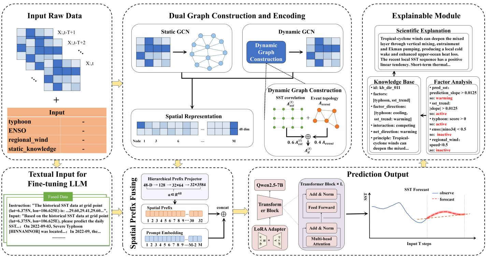

# Textual Environmental Context and Spatial Graphs for LLM-Based Regional SST Forecasting

Xiong Li, Xiaowei Zhou, Yanwei Yu, Qian Cui, and Junyu Dong

Abstract—Sea surface temperature (SST) forecasting depends on local temporal persistence, regional spatial dependence, and environmental conditions that evolve with the forecast date. We study how these heterogeneous conditions can be presented to a large language model (LLM) for regional multi-step forecasting without serializing the full SST grid as text. We formulate forecasting as conditional numerical generation: historical SST and anomaly sequences, date-aligned environmental records, and static ocean knowledge form a textual context, while regional spatial state is supplied through continuous graph-derived prefixes. A static graph encodes persistent geographic–climatological relations, and a dynamic graph encodes recent SST correlations and localized tropical-cyclone influence. Two graph neural networks produce a target-node representation that is mapped by a spatial-prefix fusion and injected into the LLM input. On SST forecasting in the South China Sea, the complete configuration achieves the best MAE and $R ^ { 2 }$ among the compared methods over ten forecast steps. Alongside the numerical forecast, a rulebased module matches predicted trends and environmental-factor directions with knowledge entries to return source-linked, posthoc contextual explanations.

## I. INTRODUCTION

Sea surface temperature (SST) forecasting supports marine environmental monitoring and related applications [1], [2]. SST evolution reflects local temporal persistence, spatial dependence among ocean cells, and environmental conditions such as tropical cyclones, large-scale climate states, and regional circulation [3]. A forecasting model that uses only the historical SST sequence of one target cell must infer these heterogeneous influences indirectly. This motivates a central question: how can date-aligned environmental context and regional spatial state be presented jointly to a large language model (LLM) for multi-step SST forecasting?

Recent work has explored the use of LLMs for numerical and text-conditioned forecasting [4], [5]. From News to Forecast combines selected news, auxiliary information, and historical sequences in textual prompts for numerical generation [6]. In the SST domain, OKG-LLM aligns ocean-domain knowledge representations with SST observations through an LLM-based prediction pipeline [7]. These studies establish that LLMs can incorporate contextual information and domain knowledge into numerical forecasting. However, they do not directly address how forecast-date environmental descriptions and explicit, date-varying regional spatial relations should be jointly supplied to an LLM for regional multi-step SST forecasting.

We address this problem by assigning textual and spatial conditions distinct roles. Related studies have paired auxiliary context with numerical histories, aligned time-series representations with language, and adapted models to heterogeneous covariates [8]–[10]. Tropical-cyclone records are organized as descriptions of time, location, and intensity; the ENSO index and regional circulation provide climate and atmospheric context; and static ocean knowledge describes mixing, advection, upwelling, and air–sea exchange. These sources form a textual forecasting context together with the historical SST and anomaly sequences of the target cell. Text, however, does not itself perform neighborhood feature aggregation over the SST field: cells with similar environmental descriptions may have different local neighborhood states or storm influences. We therefore represent persistent and date-varying spatial relations separately. A static graph encodes geographic proximity and climatological features, whereas a dynamic graph encodes recent SST correlations and localized tropical-cyclone influence.

The two GNN branches aggregate regional information and produce a representation for the target cell. Rather than serializing all grid cells as text, a factorized spatial-prefix projector maps this representation into a compact sequence of continuous prefix tokens, which is concatenated with the LLM input embeddings for autoregressive SST generation. Alongside the numerical forecast, a separate rule-based module matches predicted trends and environmental-factor directions with knowledge entries to return source-linked post-hoc contextual explanations.

The main contributions are as follows:

• A time-aligned text–graph interface for regional SST forecasting. We formulate multi-step SST forecasting as conditional numerical generation, where environmental records and ocean knowledge are represented as text and regional spatial state is supplied through continuous graph-derived prefixes.

• Date-specific dual-graph spatial conditioning. We combine a static geographic–climatological graph with a dynamic graph constructed from recent SST correlations and localized tropical-cyclone influence, then inject the target-node state into the LLM without increasing the input length with the number of grid cells.

• Lead-wise empirical evaluation of text and spatial conditions. On South China Sea SST forecasting, we report lead-wise comparisons and ablations. Among the compared baseline methods, the full configuration achieves the best performance on average.

## II. RELATED WORK

## A. Spatiotemporal SST forecasting

Recent SST forecasting studies have improved spatiotemporal modeling through spatial-relation learning, motion features, and physical priors. ASTGRN learns adaptive node representations and graph structures for sea-area dependencies, whereas DDSTGNN separates diffusion and intrinsic signals and learns evolving spatiotemporal dependencies with a dynamic graph [11], [12]. Peng et al. combine opticalflow guidance with SwinLSTM features to extract motion information from SST fields [13]. These methods provide different structural inductive biases for regional variation.

Physics-guided methods combine data-driven representations with ocean-process priors. DP-BICNN couples physical and data-driven processes through bidirectional information compensation, while PCFNet combines frequencydomain features with an advection–diffusion constraint [14], [15]. PG-DSBN combines numerical simulation priors with deterministic–stochastic modeling, and physics-constrained adapter tuning transfers meteorological foundation representations to global SST forecasting [16], [17]. These studies provide strong numerical spatiotemporal and physics-guided inductive biases for SST prediction. The complementary question studied here is how forecast-date environmental descriptions and a compact representation of regional spatial state can be jointly supplied to an LLM for conditional numerical generation. Our method represents the latter through static and dynamic graphs rather than imposing an explicit physicalequation constraint.

## B. LLMs for numerical and text-conditioned forecasting

Some work adapt time-series to the representation space of language models. Time-LLM aligns time-series patches with text prototypes and uses a prompt prefix to provide task context [18]. TimeCMA aligns numerical and prompt encodings, LangTime combines temporal-comprehension prompts with reinforcement-learning fine-tuning, and SE-LLM introduces temporal–semantic interaction and a Time-Adapter [19]–[21]. These methods primarily address the interface between numerical patterns and language-model representations.

Another line studies the predictive value of textual context. From News to Forecast integrates selected news with historical sequences and fine-tunes an LLM for numerical generation [6]. VoT jointly uses exogenous event text and endogenous sequence descriptions, with fusion at both the representation and prediction-frequency levels; TaTS treats time-aligned text as an auxiliary variable for numerical forecasting [22], [23]. For the related task of text-conditioned sequence synthesis, VerbalTS generates time series from unstructured descriptions [24]. Our setting focuses on regional SST forecasting, where date-aligned environmental records and static ocean knowledge form textual conditions, while a separate spatial branch summarizes regional SST state for the target cell.

## C. Graph-conditioned inputs for language models

Graph convolution learns node representations by aggregating neighborhood information, providing a basis for regional spatial modeling [25]. When graph representations are supplied to an LLM, the central interface problem is converting non-sequential structure into token-level inputs. GraphToken learns graph-conditioned soft prompts from GNN representations, while G-Retriever combines subgraph retrieval, graph encoding, and soft prompting for textual-graph question answering [26], [27]. GOFA inserts GNN layers into an LLM for joint graph–language modeling, and LGPT studies queryaware learnable graph-pooling tokens to balance token cost and information compression [28], [29].

These studies motivate the use of continuous graph-derived tokens as an interface between graph encoders and LLMs. Our setting differs from graph question answering and graphlanguage modeling: static and dynamic GNNs first aggregate regional SST information, and the resulting target-node state is projected into continuous prefix tokens for conditional numerical generation. The representation is conditioned on the forecast date and target location, while its prefix length remains independent of the number of regional grid cells.

## D. Ocean knowledge and forecast interpretation

OKG-LLM aligns ocean-knowledge representations with SST observations through an LLM-based prediction pipeline [7]. In contrast, our framework uses static ocean knowledge and forecast-date environmental records as textual conditions, while encoding regional spatial state with target-specific prefixes derived from static and dynamic graphs.

TimeCAP, TimeXL, and TS-RAG incorporate context generation, refinement, or retrieval into time-series prediction pipelines [30]–[32]. Our knowledge lookup runs separately after forecasting, matching predicted trends and environmentalfactor directions to source-linked entries for rule-based posthoc contextualization.

## III. METHOD

## A. Task formulation and framework overview

Let the study region contain N regular grid cells. Cell i has coordinates $\mathbf { c } _ { i }$ and an ocean mask $m _ { i } ~ \in ~ \{ 0 , 1 \}$ }. At forecast origin t, let ${ \bf X } _ { t } \ = \ [ { \bf x } _ { t - L + 1 } , \ldots , { \bf x } _ { t } ] \ \in \ \mathbb { R } ^ { L \times N }$ and $\mathbf { D } _ { t } = [ \mathbf { d } _ { t - L + 1 } , \dots , \mathbf { d } _ { t } ] \in \mathbb { R } ^ { L \times N }$ denote the regional SST and anomaly histories, respectively. The forecast-date environmental record $\mathbf { e } _ { t }$ contains tropical-cyclone, ENSO, and regionalcirculation context, while K denotes static ocean knowledge. All date-dependent environmental records and dynamic-graph statistics are constructed using observations available no later than forecast origin t.

We construct a textual condition $q _ { t , i }$ from the target-cell histories, environmental record, and static knowledge, and construct a static graph $\mathcal { G } ^ { s } = ( \mathbf { A } ^ { s } , \mathbf { F } ^ { s } )$ and a date-specific dynamic graph $\mathcal { G } _ { t } ^ { d } = ( \mathbf { A } _ { t } ^ { d } , \mathbf { F } _ { t } ^ { d } )$ for the regional SST field. For an ocean target cell $i ,$ the task is to predict the next H SST values, $\mathbf y _ { t , i } = ( x _ { t + 1 , i } , \dots , x _ { t + H , i } )$ , as

$$
\begin{array} { r } { \widehat { \mathbf { y } } _ { t , i } = f _ { \theta } \left( q _ { t , i } , \mathcal { G } ^ { s } , \mathcal { G } _ { t } ^ { d } , i \right) . } \end{array}\tag{1}
$$

The model compresses the graph-derived target-node state into continuous prefix tokens and concatenates them with the embeddings of $q _ { t , i }$ for autoregressive numerical generation. Each sample corresponds to one forecast origin and one target cell; samples from the same forecast origin share the regional graph inputs but receive target-specific textual conditions and spatial prefixes. Land cells remain in the regular indexing scheme for graph construction, but are masked and excluded from prediction targets and evaluation. Figure. 1 summarizes the framework.

## B. Multi-source observations and textual input

a) Historical observations and environmental context.: We use the OISST sst and anom variables [33] and preserve a consistent grid ordering after regional cropping. The anomaly sequence is supplied as an independent observation field. Tropical-cyclone records from IBTrACS [34] are filtered within the target region and a $3 ^ { \circ }$ buffer using a 34-kt wind threshold. For each forecast date, we retain the observation with the maximum sustained wind and its location and intensity. ENSO context is derived from monthly Nino3.4 anoma-˜ lies relative to a climatological reference period. Regional circulation comes from the ERA5 850-hPa wind field [35]. We first compute cosine-latitude- weighted zonal and meridional means, then derive the resultant wind speed and meteorological direction:

$$
\begin{array} { l } { \bar { u } = \displaystyle \frac { \sum _ { j } u _ { j } \cos \varphi _ { j } } { \sum _ { j } \cos \varphi _ { j } } , \quad \quad \bar { v } = \displaystyle \frac { \sum _ { j } v _ { j } \cos \varphi _ { j } } { \sum _ { j } \cos \varphi _ { j } } , } \\ { s = \sqrt { \bar { u } ^ { 2 } + \bar { v } ^ { 2 } } . } \end{array}\tag{2}
$$

b) Unified forecasting prompt.: Following the organization of text-conditioned time-series generation [6], we construct $\begin{array} { r c l } { { q _ { t , i } } } & { { = } } & { { \mathrm { T e m p l a t e } ( { \bf X } _ { t } [ : , i ] , { \bf D } _ { t } [ : , i ] , { \bf c } _ { i } , t , L , H , E _ { t } , K ) } } \end{array}$ where $E _ { t }$ is the organized environmental context. The instruction specifies the target cell and historical SST, the input contains the forecast task, date range, anomaly sequence, environmental context, and static ocean knowledge, and the response is the comma-separated future SST sequence. During training, the ground-truth response follows the prompt; during inference, the response is generated autoregressively. The environmental context describes the target date, whereas the static text provides regional background on persistence, mixing, advection, upwelling, and air–sea exchange. Both are tokenized together with the numerical history.

## C. Static and dynamic spatial graphs

Both graphs use the same grid nodes but encode different relations. Let $\mathcal { R } ( { \bf A } )$ denote row normalization with zero-sum rows preserved. Land rows and columns are zeroed before normalization.

a) Static geographic graph.: For great-circle distance $d _ { i j }$ , the geographic edge weight is

$$
\begin{array} { r l } & { \widetilde { A } _ { i j } ^ { s } = m _ { i } m _ { j } \mathbf { 1 } [ i \neq j ] \mathbf { 1 } [ d _ { i j } < r _ { s } ] \exp ( - d _ { i j } / \ell _ { s } ) , } \\ & { \mathbf { A } ^ { s } = \mathcal { R } ( \widetilde { \mathbf { A } } ^ { s } ) . } \end{array}\tag{3}
$$

We use $\ell _ { s } ~ = ~ 1 1 1$ km and $r _ { s } ~ = ~ 1 . 5 \ell _ { s }$ . Static node features $\mathbf { F } ^ { s } ~ \in ~ \mathbb { R } ^ { N \times 4 }$ contain normalized latitude, normalized longitude, climatological SST mean, and climatological SST standard deviation.

b) Historical SST correlation graph.: Geographic distance alone cannot capture synchronous changes in the current history window. We therefore compute Pearson correlations among complete, variable ocean-node histories. Selfconnections and non-positive correlations are removed, and at most k = 10 positive neighbors are retained per source node:

$$
A _ { i j } ^ { x , t } = \left\{ \begin{array} { l l } { \frac { \exp ( \rho _ { i j } ^ { ( t ) } ) } { \sum _ { u \in \mathcal { N } _ { i } ^ { + } ( t ) } \exp ( \rho _ { i u } ^ { ( t ) } ) } , } & { j \in \mathcal { N } _ { i } ^ { + } ( t ) , } \\ { 0 , } & { \mathrm { o t h e r w i s e } . } \end{array} \right.\tag{4}
$$

c) Localized tropical-cyclone graph.: For a storm observation o with center $\mathbf { c } _ { o }$ and sustained wind $v _ { o } ,$ , we define an intensity score and a finite-support influence kernel:

$$
\begin{array} { r l r } {  { a _ { o } = \mathrm { c l i p } ( v _ { o } / v _ { 9 9 } , 0 , 1 ) , } } \\ & { } & { \quad R _ { o } = 1 1 1 \mathrm { c l i p } ( 2 \sqrt { v _ { o } / 6 4 } , 1 . 5 , 5 ) \mathrm { k m } , } \\ & { } & { \quad \sigma _ { o } ^ { 2 } = - R _ { o } ^ { 2 } / ( 2 \log { 0 . 1 } ) , } \\ & { } & { \quad s _ { i } ^ { o } = m _ { i } a _ { o } \exp ( - \frac { d _ { i o } ^ { 2 } } { 2 \sigma _ { o } ^ { 2 } } ) { \bf 1 } [ d _ { i o } \le R _ { o } ] . } \end{array}\tag{5}
$$

Here v99 is the 99th percentile of valid storm winds, with 130 kt used when no valid event wind is available. The event affinity is

$$
\begin{array} { r l } & { B _ { i j } ^ { o } = { \bf 1 } [ i \neq j ] \sqrt { s _ { i } ^ { o } s _ { j } ^ { o } } \exp \left( - \frac { d _ { i j } ^ { 2 } } { 2 \sigma _ { o } ^ { 2 } } \right) , } \\ & { { \bf A } ^ { e , o } = \mathrm { d i a g } ( { \bf s } ^ { o } ) \mathcal { R } ( { \bf B } ^ { o } ) . } \end{array}\tag{6}
$$

For multiple observations, we take the element-wise maximum, and use a zero event graph when no storm is active. The dynamic adjacency is $\mathbf { A } _ { t } ^ { d } = \mathcal { R } ( 0 . 6 \mathbf { A } ^ { x , t } + 0 . 4 \mathbf { A } ^ { e , t } )$ . ENSO and regional circulation are supplied as text and explanation context; they are not additional edge types in $\mathbf { A } _ { t } ^ { d }$

d) Dynamic node features.: The dynamic feature matrix $\mathbf { F } _ { t } ^ { d } \in \mathbb { R } ^ { N \times 7 }$ contains the full-window SST mean and standard deviation, linear trend, recent seven-step mean, full-window anomaly mean, recent anomaly mean, and SST range. Features are standardized across ocean nodes for each date, while land features remain zero. Node features describe the current state of each cell, while the dynamic graph determines how these states are aggregated.

## D. Dual-GNN spatial encoding

Geographic background and date-specific regional state evolve at different rates. We therefore use two independent two-layer GCNs. For branch $b \in \{ s , d \}$ with features $\mathbf { F } ^ { b }$ and adjacency $\mathbf { A } ^ { b }$

$$
\begin{array} { r l } & { \mathbf { U } ^ { b } = \operatorname { D r o p o u t } _ { 0 . 1 } \left[ \operatorname { R e L U } \left( \operatorname { B N } ( \mathbf { A } ^ { b } \mathbf { F } ^ { b } \mathbf { W } _ { 1 } ^ { b } + \mathbf { b } _ { 1 } ^ { b } ) \right) \right] , } \\ & { \mathbf { H } ^ { b } = \mathbf { A } ^ { b } \mathbf { U } ^ { b } \mathbf { W } _ { 2 } ^ { b } + \mathbf { b } _ { 2 } ^ { b } + \mathbf { F } ^ { b } \mathbf { W } _ { r } ^ { b } + \mathbf { b } _ { r } ^ { b } . } \end{array}\tag{7}
$$

Both hidden layers have width32. The static branch outputs16 dimensions and the dynamic branch outputs32 dimensions. After message passing over the entire region, we concatenate the two representations and select the target cell:

$$
\mathbf { H } _ { t } = [ \mathbf { H } ^ { s } \lVert \mathbf { H } _ { t } ^ { d } ] \in \mathbb { R } ^ { N \times 4 8 } , \qquad \mathbf { h } _ { t , i } = \mathbf { H } _ { t } [ i , : ] \in \mathbb { R } ^ { 4 8 } .\tag{8}
$$

  
Fig. 1. Overview of the framework. At forecast origin t, target-cell SST and anomaly histories, environmental records, and static ocean knowledge form a textual condition. Regional observations construct a static geographic–climatological graph and a date-specific dynamic graph. Two GNN branches encode the target-node state, which a factorized projector maps to continuous prefix tokens for autoregressive LLM forecasting. A separate rule-based module then matches forecast trends and environmental factors with knowledge entries for source-linked post-hoc contextualization.

## E. Hierarchical spatial-prefix fusion

The joint spatial vector and the LLM input have different dimensions. We map the target representation to $P = 3 2$ continuous prefix tokens, with intermediate token width $d _ { m } = 6 4$ and LLM hidden width $d _ { \mathrm { L M } }$

$$
\begin{array} { r l } & { \mathbf { u } _ { t , i } = \mathrm { R e L U } ( { \mathbf { W } } _ { 1 } \mathbf { h } _ { t , i } + { \mathbf { b } } _ { 1 } ) \in \mathbb { R } ^ { 1 2 8 } , } \\ & { \mathbf { V } _ { t , i } = \mathrm { r e s h a p e } _ { P \times d _ { m } } [ \mathrm { R e L U } ( { \mathbf { W } } _ { 2 } \mathbf { u } _ { t , i } + { \mathbf { b } } _ { 2 } ) ] , } \\ & { \mathbf { Z } _ { t , i } = \alpha ( \mathbf { V } _ { t , i } \mathbf { W } _ { 3 } + { \mathbf { b } } _ { 3 } ) \in \mathbb { R } ^ { P \times d _ { \mathrm { L M } } } . } \end{array}\tag{9}
$$

The third linear layer shares parameters across prefix positions. For Qwen2.5-7B, $d _ { \mathrm { L M } } ~ = ~ 3 5 8 4$ , yielding $4 8 \  \ 1 2 8 \ $ $3 2 \times 6 4  3 2 \times 3 5 8 4$ . The projector contains 503,425 trainable parameters, compared with 5,619,713 for a direct $4 8 \to 3 2 \times 3 5 8 4$ mapping, a reduction of approximately 91% for this comparison. The learnable scalar α is initialized as 1 and adjusts amplitude during training.

Let $\mathbf { E } _ { t , i }$ denote the token embeddings of the prompt. The LLM input is $\mathbf { S } _ { t , i } = [ \mathbf { Z } _ { t , i } ; \mathbf { E } _ { t , i } ]$ , where the semicolon denotes concatenation along the sequence dimension. Each sample receives only the target cell’s prefix, so the prefix length does not scale with the number of regional nodes.

## F. Autoregressive training and forecasting

The ground-truth numerical sequence is appended to the prompt as the response. We train the model with the standard autoregressive language-model objective, using supervised

fine-tuning to predict the next response token from the prompt and preceding tokens:

$$
\mathcal { L } = - \frac { 1 } { \sum _ { ( t , i ) , j } a _ { t , i , j } } \sum _ { ( t , i ) , j } a _ { t , i , j } \log p _ { \theta } ( w _ { t , i , j } \mid \mathbf { Z } _ { t , i } , w _ { t , i , < j } ) .\tag{10}
$$

The parameters of the dual GNNs, prefix projector, prefix scale, and LoRA adapters are jointly optimized. At inference, the numerical response is generated autoregressively under the same conditioning sequence. Qwen2.5-7B is loaded in 8-bit precision with BF16 computation, and rank-8 LoRA adapters with scale 16 are attached to the attention and feed-forward projections [36].

## G. Post-hoc factor-direction explanation

The explanation module reads the forecast, historical SST, and environmental records after generation. For a temperature sequence v, we compute a linear slope and classify its direction with threshold τ:

$$
\begin{array} { r l } & { \beta ( { \mathbf v } ) = \displaystyle \frac { \sum _ { j } ( j - \bar { j } ) ( v _ { j } - \bar { v } ) } { \sum _ { j } ( j - \bar { j } ) ^ { 2 } } , } \\ & { \delta ( { \mathbf v } ) = \displaystyle \left. \begin{array} { l l } { + 1 , } & { \beta ( { \mathbf v } ) > \tau , } \\ { - 1 , } & { \beta ( { \mathbf v } ) < - \tau , } \\ { 0 , } & { \mathrm { o t h e r w i s e } . } \end{array} \right. } \end{array}\tag{11}
$$

The current rule activates four factors: tropical cyclone influence, ENSO state, regional wind, and historical SST trend. It then matches the active factor directions and forecast direction against 52 explicit knowledge entries. Neutral forecasts receive a neutral explanation, while non-neutral forecasts without a supporting active factor receive a conflict explanation. Otherwise, the module returns the matched knowledge identifier, mechanism description, and references.

TABLE I  
SST FORECASTING RESULTS OVER TEN PREDICTION STEPS. BOLD ENTRIES MARK THE BEST RESULTS.
<table><tr><td rowspan="2">Model</td><td rowspan="2">Metric</td><td colspan="8">Days</td><td rowspan="2">10</td><td rowspan="2">Mean</td></tr><tr><td>2</td><td></td><td>3</td><td>4</td><td>5</td><td>6</td><td>7</td><td>8</td><td>9</td></tr><tr><td rowspan="3">Ours</td><td>RMSE .212 .322 .381 .424 .457.485 .512 .535 .553 .566</td><td></td><td></td><td></td><td></td><td></td><td></td><td></td><td></td><td></td><td></td><td>.445</td></tr><tr><td>MAE .131 .216 .269 .306 .335 .358 .378 .396 .413 .427</td><td></td><td></td><td></td><td></td><td></td><td></td><td></td><td></td><td></td><td></td><td>.323</td></tr><tr><td> $R ^ { 2 }$ </td><td></td><td></td><td></td><td></td><td></td><td>.991 .979.970.963 .956 .950 .943 .937 .931 .927</td><td></td><td></td><td></td><td></td><td>.955</td></tr><tr><td rowspan="3">PCFNet</td><td>RMSE .273 .294 .352 .401 .444 .484 .514 .545.574 .597</td><td></td><td></td><td></td><td></td><td></td><td></td><td></td><td></td><td></td><td></td><td>.448</td></tr><tr><td>MAE</td><td></td><td></td><td></td><td></td><td></td><td></td><td>.207.223 .269.307.340.372 .395 .419.444 .464</td><td></td><td></td><td></td><td>.344</td></tr><tr><td> $R ^ { 2 }$ </td><td></td><td></td><td></td><td></td><td></td><td></td><td></td><td></td><td></td><td>.983 .980 .972 .964 .956 .948 .941 .935 .928 .922</td><td>.953</td></tr><tr><td rowspan="3">CoTCN</td><td>RMSE .281 .336 .382 .430.477 .515 .540.568 .588 .602</td><td></td><td></td><td></td><td></td><td></td><td></td><td></td><td></td><td></td><td></td><td>.472</td></tr><tr><td>MAE</td><td></td><td></td><td></td><td></td><td></td><td>.218 .261 .298 .337 .375 .405 .425 .446 .461 .469</td><td></td><td></td><td></td><td></td><td>.370</td></tr><tr><td> $R ^ { 2 }$ </td><td></td><td></td><td></td><td></td><td></td><td>.982 .974 .967 .958 .949.941 .935 .929 .924 .921</td><td></td><td></td><td></td><td></td><td>.948</td></tr><tr><td rowspan="3">PANN</td><td>RMSE</td><td></td><td></td><td></td><td></td><td></td><td></td><td>E.297 .305 .384 .411 .484 .529 .548 .578 .590 .619</td><td></td><td></td><td></td><td>.475</td></tr><tr><td>MAE</td><td></td><td></td><td></td><td></td><td></td><td>.239 .264 .295 .349 .382 .430 .453 .472 .487 .493</td><td></td><td></td><td></td><td></td><td>.386</td></tr><tr><td> $R ^ { 2 }$ </td><td></td><td></td><td></td><td></td><td></td><td></td><td></td><td></td><td></td><td>.981 .971 .967 .956 .952 .943 .936 .920 .920 .915</td><td>.946</td></tr><tr><td rowspan="3">EarthFarseer</td><td></td><td></td><td></td><td></td><td></td><td></td><td>RMSE .312 .374 .424 .478.530.572 .600.631 .653 .669</td><td></td><td></td><td></td><td></td><td>.524</td></tr><tr><td>MAE</td><td></td><td></td><td></td><td></td><td></td><td>.243 .290.331.374 .416 .450.472 .496.512 .521</td><td></td><td></td><td></td><td></td><td>.411</td></tr><tr><td> $R ^ { 2 }$ </td><td></td><td></td><td></td><td></td><td></td><td></td><td></td><td></td><td></td><td>.978 .968 .959 .949 .937 .927 .920 .912 .906 .903</td><td>.936</td></tr><tr><td rowspan="3">Swin Transformer MAE</td><td></td><td></td><td></td><td></td><td></td><td></td><td>RMSE .404 .434 .487 .511 .543 .565 .586 .604 .633 .639</td><td>.331 .355.400.415 .439.457.472 .486.511 .515</td><td></td><td></td><td></td><td>.541 .438</td></tr><tr><td> $R ^ { 2 }$ </td><td></td><td></td><td></td><td></td><td></td><td></td><td>.963 .957 .946 .941 .934 .929 .924 .920 .912 .911</td><td></td><td></td><td></td><td>.934</td></tr><tr><td></td><td></td><td></td><td></td><td></td><td></td><td></td><td></td><td></td><td></td><td></td><td></td></tr><tr><td rowspan="3">PredRNN</td><td>MAE</td><td></td><td></td><td></td><td></td><td></td><td>RMSE .449.483 .541 .567 .603 .628 .651 .671 .703 .710</td><td>E .368 .394 .444 .461 .488 .507.524 .540.568 .572</td><td></td><td></td><td></td><td>.601 .487</td></tr><tr><td> $R ^ { 2 }$ </td><td></td><td></td><td></td><td></td><td></td><td></td><td>.954 .947 .934 .927 .918 .912 .906 .901 .891 .890</td><td></td><td></td><td></td><td>.918</td></tr><tr><td>RMSE</td><td></td><td></td><td></td><td></td><td></td><td></td><td>E.464 .481 .512 .545 .574 .592 .606 .620 .631 .637</td><td></td><td></td><td></td><td>.566</td></tr><tr><td rowspan="3">ConvLSTM</td><td>MAE</td><td></td><td></td><td></td><td></td><td></td><td></td><td>.396.408.431 .458.481 .494 .503.513 .521 .524</td><td></td><td></td><td></td><td>.473</td></tr><tr><td> $R ^ { 2 }$ </td><td></td><td></td><td></td><td></td><td></td><td></td><td>.951 .947 .941 .933 .926 .922 .919 .915 .913 .911</td><td></td><td></td><td></td><td>.928</td></tr><tr><td>RMSE</td><td></td><td></td><td></td><td></td><td></td><td></td><td>E.515 .544 .566 .602 .641 .687 .712 .742 .750 .763</td><td></td><td></td><td></td><td>.652</td></tr><tr><td rowspan="3">CNN</td><td></td><td></td><td></td><td></td><td></td><td></td><td></td><td>MAE .427.447.461.489.520.556.574 .597.604.615</td><td></td><td></td><td></td><td>.529</td></tr><tr><td></td><td></td><td></td><td></td><td></td><td></td><td></td><td></td><td></td><td></td><td></td><td></td></tr><tr><td> $R ^ { 2 }$ </td><td></td><td></td><td></td><td></td><td></td><td>.939 .932 .927 .918 .908 .895 .888 .878 .877 .873</td><td></td><td></td><td></td><td></td><td>.904</td></tr></table>

## IV. EXPERIMENTS

## A. Dataset and evaluation setting

Dataset: We study SST forecasting in the South China Sea using 0.25◦ OISST data. The region is represented by a 64 × 64 regular grid, with scores computed only on ocean cells. The data span 1 September 1981 to 16 February 2025 and are partitioned chronologically into training, validation, and testing periods. Each sample uses ten historical observations to predict the next ten steps, and no window crosses a partition boundary.

Evaluation setting: Training and validation samples are drawn from valid windows in their respective periods with coverage across spatial regions, coastal types, environmental events, temperature states, and trajectory trends. Future trend labels are used only to construct training coverage and are never provided as prediction inputs. The test set covers all valid test dates and ocean cells, following the complete evaluation protocol used for the PCFNet comparison. Qwen2.5-7B-Instruct is loaded in 8-bit precision with BF16 computation. LoRA uses rank 8 and scale 16; the learning rate is $1 0 ^ { - 4 }$ with 100 warm-up steps, one training epoch, and random seed as 42.

TABLE II  
SST FORECASTING RESULTS ACROSS FOUR LLM BACKBONES. BOLD VALUES MARK THE BEST RESULT FOR EACH METRIC AND LEAD; TIES AT THE DISPLAYED PRECISION ARE ALSO BOLD.
<table><tr><td rowspan="2">Model</td><td rowspan="2">Metric</td><td colspan="10">Days</td><td rowspan="2">Mean</td></tr><tr><td>1</td><td>2</td><td>3</td><td>4</td><td>5</td><td>6</td><td>7</td><td>8</td><td>9</td><td>10</td></tr><tr><td rowspan="3">Qwen2.5-7B-Instruct</td><td>RMSE</td><td>.212</td><td></td><td></td><td></td><td>2.322 .381 .424 .457.485 .512 .535 .553 .566</td><td></td><td></td><td></td><td></td><td></td><td>.445</td></tr><tr><td>MAE</td><td>.131 .216 .269 .306 .335 .358 .378 .396 .413 .427 .323</td><td></td><td></td><td></td><td></td><td></td><td></td><td></td><td></td><td></td><td></td></tr><tr><td> $R ^ { 2 }$ </td><td>.991.979.970.963.956.950.943.937.931.927</td><td></td><td></td><td></td><td></td><td></td><td></td><td></td><td></td><td></td><td>.955</td></tr><tr><td rowspan="3">Llama-3.1-8B-Instruct</td><td>RMSE.170.271 .341.397.444 .483.517.546.572 .595</td><td></td><td></td><td></td><td></td><td></td><td></td><td></td><td></td><td></td><td></td><td>.434</td></tr><tr><td>MAE .115 .194 .251 .297 .334 .366 .393 .417 .439.458</td><td></td><td></td><td></td><td></td><td></td><td></td><td></td><td></td><td></td><td></td><td>.326</td></tr><tr><td> $R ^ { 2 }$ </td><td></td><td></td><td></td><td></td><td></td><td></td><td></td><td></td><td></td><td>.993 .982 .971 .961 .952 .943 .934 .927 .920 .913</td><td>.950</td></tr><tr><td rowspan="3">Llama-2-7b-chat-hf</td><td>RMSE .171 .272 .342 .399.446 .487.521 .551 .577.600</td><td></td><td></td><td></td><td></td><td></td><td></td><td></td><td></td><td></td><td></td><td>.436</td></tr><tr><td>MAE .116.195.252 .297.335.367.395.419.440.459</td><td></td><td></td><td></td><td></td><td></td><td></td><td></td><td></td><td></td><td></td><td>.327</td></tr><tr><td> $R ^ { 2 }$ </td><td></td><td></td><td></td><td></td><td></td><td></td><td></td><td></td><td></td><td>.993 .982 .971 .961 .951 .942 .933 .926 .918 .912</td><td>.949</td></tr><tr><td rowspan="3">Mistral-7B-Instruct-v0.3 MAE .120 .200 .256 .301 .339.372 .401 .425 .448 .468</td><td>RMSE.176.277.347.403.450.491 .526.557.584 .608</td><td></td><td></td><td></td><td></td><td></td><td></td><td></td><td></td><td></td><td></td><td>.442</td></tr><tr><td></td><td></td><td></td><td></td><td></td><td></td><td></td><td></td><td></td><td></td><td></td><td>.333</td></tr><tr><td> $R ^ { 2 }$ </td><td></td><td></td><td></td><td></td><td></td><td></td><td></td><td></td><td></td><td>.992 .981 .970 .960 .950 .941 .932 .924 .916 .909</td><td>.948</td></tr></table>

We report RMSE, MAE, and the coefficient of determination $R ^ { 2 }$ at each lead, and use the arithmetic mean across the ten leads for the summary value:

$$
\mathrm { R M S E } _ { h } = \sqrt { \frac { 1 } { \left| S _ { h } \right| } \sum _ { n \in S _ { h } } { ( \widehat { y } _ { n , h } - y _ { n , h } ) ^ { 2 } } } ,
$$

$$
\mathrm { M A E } _ { h } = \frac { 1 } { \vert { \cal S } _ { h } \vert } \sum _ { n \in { \cal S } _ { h } } \vert \widehat { y } _ { n , h } - y _ { n , h } \vert ,
$$

$$
R _ { h } ^ { 2 } = 1 - \frac { \sum _ { n \in S _ { h } } ( \widehat { y } _ { n , h } - y _ { n , h } ) ^ { 2 } } { \sum _ { n \in S _ { h } } ( y _ { n , h } - \bar { y } _ { h } ) ^ { 2 } }
$$

## B. Main results

Table I reports lead-wise results against PCFNet and the other specialized models listed in the corresponding SST benchmark table. Compared with the best baseline PCFNet, the complete configuration reduces mean RMSE from 0.448 to 0.445 and mean MAE from 0.344 to 0.323, while increasing mean $R ^ { 2 }$ from 0.953 to 0.955. The RMSE comparison is leaddependent: our model performs better at the first prediction step and at steps 7–10, whereas PCFNet attains lower RMSE at steps 2–6. Overall, the results indicate improved mean RMSE, MAE and $R ^ { 2 }$

## C. Comparison across LLM backbones

We compare the Qwen2.5-7B-Instruct backbone used in the full model with Llama-2-7b-chat-hf, Llama-3.1-8B-Instruct, and Mistral-7B-Instruct-v0.3. Table II reports results at each forecast lead and the arithmetic mean over ten steps. Llama-3.1-8B-Instruct achieves the lowest mean RMSE (0.434), 0.011 below Qwen (0.445), whereas Qwen obtains the lowest mean MAE (0.323) and the highest mean $R ^ { 2 }$ (0.955). The RMSE comparison varies with forecast lead: Llama-2 and Mistral have lower RMSE than Qwen at steps 1–5, and Llama

TABLE III  
ABLATION RESULTS ON THE VARIANTS OF OUR PROPOSED FRAMEWORK.
<table><tr><td colspan="6"></td></tr><tr><td>Variants</td><td>Static- knowledge</td><td>Dynamic-context text</td><td>dual-GNN RMSE MAE</td><td></td><td></td><td> $R ^ { 2 }$ </td></tr><tr><td>Full</td><td>yes</td><td>yes</td><td>yes</td><td>.445</td><td>.323 .955</td><td></td></tr><tr><td>No static text</td><td>no</td><td>yes</td><td>yes</td><td>.437</td><td>.330</td><td>.949</td></tr><tr><td>No dynamic text</td><td>yes</td><td>no</td><td>yes</td><td>.449</td><td>.340</td><td>.946</td></tr><tr><td>No knowledge text</td><td>no</td><td>no</td><td>yes</td><td>.456</td><td>.347</td><td>.944</td></tr><tr><td>No GNN</td><td>no</td><td>no</td><td>no</td><td>.464</td><td></td><td>.354.943</td></tr></table>

3.1 does so at steps 1–6; Qwen has lower RMSE than all three alternatives at steps 7–10. Thus, the backbone comparison shows a metric- and horizon-dependent trade-off rather than a uniform improvement.

## D. Ablation analysis

We evaluate four variants. no\_static removes static ocean-knowledge text, and no\_dynamic removes dynamic environmental text; both retain the two GNN branches. no\_knowledge removes both text sources but retains the spatial branch. no\_knowledge\_no\_gnn removes the GNN branch entirely and therefore also has no spatial prefix input.

The ablations show that the two text sources contribute complementary information. Removing dynamic context gives RMSE 0.449, MAE 0.340, and $R ^ { 2 } = 0 . 9 4 6$ , whereas removing static knowledge gives RMSE 0.437, MAE 0.330, and $R ^ { \bar { 2 } } \ = \ 0 . 9 4 9$ . The complete model has the best MAE and $R ^ { 2 }$ among these text configurations, indicating that combining static background with date-specific context improves overall consistency. Removing both text sources further reduces performance to RMSE 0.456, MAE 0.347, and $R ^ { 2 } = 0 . 9 4 4$

Under the no-knowledge condition, removing the GNN branch increases RMSE from 0.456 to 0.464 and MAE from 0.347 to 0.354, while reducing $R ^ { 2 }$ from 0.944 to 0.943. This result supports the contribution of regional spatial information encoded by the dual GNNs. The current ablation evaluates the spatial branch as a whole and does not separately vary the two GCNs or the prefix projector.

<table><tr><td rowspan=1 colspan=2>The principle of kb_dir_011                                 The principle of kb_dir_046</td></tr><tr><td rowspan=1 colspan=1>Tropical-cyclone winds can deepen the mixed layer throughvertical mixing, entrainment and Ekman pumping, producinga local cold wake and enhanced upper-ocean heat loss. Therecent local SST sequence has a positive linear tendency.Short-term thermal persistence makes continued warming aconsistent interpretation over the forecast horizon, but thetendency alone is not a causal proof. The warming signals(recent local SST tendency) and cooling signals (tropical-cyclone forcing) compete; the observed net predictiondirection is warming, without implying that an internalmodel weight or physical causal dominance has beenmeasured.</td><td rowspan=5 colspan=1>Tropical-cyclone winds can deepen the mixed layerthrough vertical mixing, entrainment and Ekmanpumping, producing a local cold wake and enhancedupper-ocean heat loss. In the South China Sea,seasonal regional winds can enhance latent-heat lossand upper-ocean mixing; where the circulationsupports offshore Ekman transport, upwelling andcold-water entrainment further favor SST cooling. Awarm-phase ENSO background can alter regionalwinds, clouds, surface heat fluxes and oceanadvection through teleconnections, providing awarming tendency whose sign depends on locationand season. The recent local SST sequence has apositive linear tendency. Short-term thermalpersistence makes continued warming a consistentinterpretation over the forecast horizon, but thetendency alone is not a causal proof. The warmingsignals (ENSO teleconnection, recent local SSTtendency) and cooling signals (tropical-cycloneforcing, regional wind forcing) compete; the observednet prediction direction is warming, without implyingthat an internal model weight or physical causaldominance has been measured.</td></tr><tr><td rowspan=1 colspan=1>NEUTRAL_EXPLANATION</td></tr><tr><td rowspan=1 colspan=1>The combined signals from the four core factors do notindicate a clear unidirectional warming or cooling effect. Thepredicted values broadly maintain the historical SST statewith only small fluctuations.</td></tr><tr><td rowspan=1 colspan=1>CONFLICT_EXPLANATION</td></tr><tr><td rowspan=1 colspan=1>The combined signals from the four core factors areinconsistent with the predicted trend. The currentexplanation framework cannot provide a clear explanationfor this prediction.</td></tr></table>

Fig. 2. Illustrative explanation outputs. The left column shows the principle fo $\mathtt { k b \_ d i r \_ 0 1 1 }$ and the neutral and conflict fallback messages; the right column shows the principle for $\mathtt { k b \_ d i r \_ 0 4 6 }$

## E. Qualitative explanation examples

The explanation module establishes a deterministic mapping from activated factor directions to knowledge entries. In $\mathtt { k b \_ d i r \_ 0 1 1 }$ , tropical-cyclone influence is cooling while the recent SST trend is warming, producing a competing two-factor pattern with a warming forecast direction. In $\operatorname { k b \_ d i r \_ 0 4 } 6 .$ , all four factors are active: tropical cyclone and regional wind are cooling, whereas ENSO and the recent SST trend are warming. The retrieved identifier and references make the rule-level explanation traceable, but do not constitute an internal attribution or a causal estimate. The module returns a neutral message for forecasts within the neutral threshold, and a conflict message when no active factor supports a directional forecast. Figure 2 collects the two knowledge principles and both fallback messages discussed above.

## V. CONCLUSION

We presented an LLM-based framework for regional SST forecasting that combines textual environmental context with static and date-specific dynamic graph representations of regional spatial state. A factorized spatial-prefix projector maps the target-node representation to continuous tokens for autoregressive generation, while a separate rule-based module provides source-linked post-hoc contextualization. On South China Sea SST forecasting, the complete configuration achieves the lowest mean RMSE, MAE and highest mean $R ^ { 2 }$ among the compared methods. Ablations show metricdependent effects of individual text components. Future work will evaluate additional backbones and generalization across regions.

## AI use statement

In preparing this submission, the authors used a generative AI tool to assist with LATEX formatting, translation, and preparation of tables from existing experiment logs.

## REFERENCES

[1] F. Liu, F. Song, and Y. Luo, “Human-induced intensified seasonal cycle of sea surface temperature,” Nature Communications, vol. 15, p. 3948, 2024.

[2] Y. Cui, R. Wu, X. Zhang, Z. Zhu, B. Liu, J. Shi, J. Chen, H. Liu, S. Zhou, L. Su, Z. Jing, H. An, and L. Wu, “Forecasting the eddying ocean with a deep neural network,” Nature Communications, vol. 16, p. 2268, 2025.

[3] M. H. England, Z. Li, M. F. Huguenin, A. E. Kiss, A. Sen Gupta, R. M. Holmes, and S. Rahmstorf, “Drivers of the extreme North Atlantic marine heatwave during 2023,” Nature, vol. 642, pp. 636–643, 2025.

[4] S. Zhong, W. Ruan, M. Jin, H. Li, Q. Wen, and Y. Liang, “Time-VLM: Exploring multimodal vision-language models for augmented time series forecasting,” in Proceedings of the 42nd International Conference on Machine Learning, vol. 267, 2025, pp. 78 478–78 497. [Online]. Available: https://proceedings.mlr.press/v267/zhong25a.html

[5] X. Wu, J. Jin, W. Qiu, P. Chen, Y. Shu, B. Yang, and C. Guo, “Aurora: Towards universal generative multimodal time series forecasting,” in International Conference on Learning Representations, 2026. [Online]. Available: https://proceedings.iclr.cc/paper files/paper/2026/ hash/a8e18adf6489fd3a27417d128660eaa9-Abstract-Conference.html

[6] X. Wang, M. Feng, J. Qiu, J. Gu, and J. Zhao, “From news to forecast: Integrating event analysis in LLMbased time series forecasting with reflection,” in Advances in Neural Information Processing Systems, vol. 37, 2024. [Online]. Available: https://proceedings.neurips.cc/paper files/paper/2024/hash/ 6aef8bffb372096ee73d98da30119f89-Abstract-Conference.html

[7] H. Yang, J. Wang, J. Cao, W. Li, J. Zheng, Y. Li, C. Miao, J. Guan, S. Zhou, and P. S. Yu, “OKG-LLM: Aligning ocean knowledge graph with observation data via LLMs for global sea surface temperature prediction,” IEEE Transactions on Knowledge and Data Engineering, 2026, accepted author manuscript.

[8] H. Liu, S. Xu, Z. Zhao, L. Kong, H. Kamarthi, A. B. Sasanur, M. Sharma, J. Cui, Q. Wen, C. Zhang, and B. A. Prakash, “Time-MMD: Multi-domain multimodal dataset for time series analysis,” in Advances in Neural Information Processing Systems, vol. 37, 2024. [Online]. Available: https://proceedings.neurips.cc/paper files/paper/ 2024/hash/8e7768122f3eeec6d77cd2b424b72413-Abstract-Datasets and Benchmarks Track.html

[9] Y. Hu, Q. Li, D. Zhang, J. Yan, and Y. Chen, “Contextalignment: Activating and enhancing LLM capabilities in time series,” in International Conference on Learning Representations, 2025. [Online]. Available: https://proceedings.iclr.cc/paper files/paper/2025/ file/e1de63ec74f40d3234c4e053f3528e18-Paper-Conference.pdf

[10] L. Han, Y. Liu, L. Li, Q. Deng, J. Jiang, Y. Sun, Z. Yu, B. Wang, X. Lu, L. Ma, H.-J. Ye, and D.-C. Zhan, “UniCA: Unified covariate adaptation for time series foundation model,” in International Conference on Learning Representations, 2026. [Online]. Available: https://proceedings.iclr.cc/paper files/paper/2026/ hash/0b5eb45a22ff33956c043dd271f244ea-Abstract-Conference.html

[11] X. Zhao, Z. Wang, Z. Zhang, F. Lu, Y. Yu, and J. Dong, “Adaptive spatiotemporal graph recurrent network for sea surface temperature forecasting,” IEEE Transactions on Geoscience and Remote Sensing, vol. 62, 2024.

[12] K. Jin, X. He, J. Yang, R. Jin, and F. Fu, “Decoupled dynamic spatial– temporal graph neural network for sea surface temperature prediction,” IEEE Geoscience and Remote Sensing Letters, vol. 22, 2025.

[13] G. Peng, Y. Liu, J. Luo, C. Xiao, W. Du, and C. Xiao, “A dual-path recurrent framework integrating optical flow guidance and spatiotemporalaware learning for sea surface temperature prediction,” IEEE Transactions on Geoscience and Remote Sensing, vol. 63, 2025.

[14] X. Liu, N. Song, J. Nie, M. Ye, J. Ma, Y. Yuan, and Z. Wei, “DP-BICNN: A bidirectional information compensation neural network coupled with data-driven and physical information for sea surface temperature prediction,” IEEE Transactions on Geoscience and Remote Sensing, vol. 63, 2025.

[15] Y. Liu, C. Xiao, G. Peng, W. Du, and C. Xiao, “PCFNet: A sea surface temperature prediction network fusing physical constraints with frequency domain feature extraction,” IEEE Transactions on Geoscience and Remote Sensing, vol. 64, pp. 1–15, 2026.

[16] D. Niu, C. Lv, N. Song, Y. Guo, Y. Pan, X. Liang, and J. Nie, “PG-DSBN: A physics-guided deterministic–stochastic balanced network for sea surface temperature forecasting,” IEEE Transactions on Geoscience and Remote Sensing, vol. 64, 2026.

[17] T. Li, Y. Su, D. Song, W. Li, L. Wang, Z. Wei, and A.-A. Liu, “Physicsconstrained adapter tuning of meteorological foundation models for global SST forecasting,” IEEE Transactions on Geoscience and Remote Sensing, vol. 64, 2026.

[18] M. Jin, S. Wang, L. Ma, Z. Chu, J. Y. Zhang, X. Shi, P.-Y. Chen, Y. Liang, Y.-F. Li, S. Pan, and Q. Wen, “Time-LLM: Time series forecasting by reprogramming large language models,” in International Conference on Learning Representations, 2024. [Online]. Available: https://openreview.net/forum?id=Unb5CVPtae

[19] C. Liu, Q. Xu, H. Miao, S. Yang, L. Zhang, C. Long, Z. Li, and R. Zhao, “TimeCMA: Towards LLM-empowered multivariate time series forecasting via cross-modality alignment,” in Proceedings of the AAAI Conference on Artificial Intelligence, vol. 39, 2025, pp. 18 780– 18 788.

[20] W. Niu, Z. Xie, Y. Sun, W. He, M. Xu, and C. Hao, “LangTime: A language-guided unified model for time series forecasting with proximal policy optimization,” in Proceedings of the 42nd International Conference on Machine Learning, vol. 267, 2025, pp. 46 712–46 734. [Online]. Available: https://proceedings.mlr.press/v267/niu25e.html

[21] H. Liu, X. Zhang, C. Yang, and X. Zhu, “Semantic-enhanced time-series forecasting via large language models,” in International Conference on Learning Representations, 2026. [Online]. Available: https://arxiv.org/abs/2508.07697

[22] S. Wang, P. Chen, Y. Wang, W. Qiu, C. Guo, B. Yang, and Y. Shu, “Unlocking the value of text: Event-driven reasoning and multi-level alignment for time series forecasting,” in International Conference on Learning Representations, 2026. [Online]. Available: https://openreview.net/forum?id=0TAFiyHgEl

[23] Z. Li, X. Lin, Z. Liu, J. Zou, Z. Wu, L. Zheng, D. Fu, Y. Zhu, H. Hamann, H. Tong, and J. He, “Language in the flow of time: Time-series-paired texts weaved into a unified temporal narrative,” in International Conference on Learning Representations, 2026. [Online]. Available: https://openreview.net/forum?id=a1zBg9cBvt

[24] S. Gu, C. Li, B. Jing, and K. Ren, “VerbalTS: Generating time series from texts,” in Proceedings of the 42nd International Conference on Machine Learning, vol. 267, 2025, pp. 20 448–20 476. [Online]. Available: https://proceedings.mlr.press/v267/gu25a.html

[25] T. N. Kipf and M. Welling, “Semi-supervised classification with graph convolutional networks,” in International Conference on Learning Representations, 2017. [Online]. Available: https://openreview.net/ forum?id=SJU4ayYgl

[26] B. Perozzi, B. Fatemi, D. Zelle, A. Tsitsulin, M. Kazemi, R. Al-Rfou, and J. Halcrow, “Let your graph do the talking: Encoding structured data for LLMs,” arXiv preprint arXiv:2402.05862, 2024. [Online]. Available: https://arxiv.org/abs/2402.05862

[27] X. He, Y. Tian, Y. Sun, N. V. Chawla, T. Laurent, Y. LeCun, X. Bresson, and B. Hooi, “G-Retriever: Retrieval-augmented generation for textual graph understanding and question answering,” in Advances in Neural Information Processing Systems, vol. 37, 2024. [Online]. Available: https://proceedings.neurips.cc/paper files/ paper/2024/hash/efaf1c9726648c8ba363a5c927440529-Abstract.html

[28] L. Kong, J. Feng, H. Liu, C. Huang, J. Huang, Y. Chen, and M. Zhang, “GOFA: A generative one-for-all model for joint graph language modeling,” in International Conference on Learning Representations, 2025. [Online]. Available: https://proceedings.iclr.cc/paper files/paper/2025/ hash/652c104b5b0652a03684efeaf805463b-Abstract-Conference.html

[29] W. Kim, B. Park, and W. Kim, “Query-aware learnable graph pooling tokens as prompt for large language models,” arXiv preprint arXiv:2501.17549, 2025. [Online]. Available: https://arxiv.org/abs/2501. 17549

[30] G. Lee, W. Yu, K. Shin, W. Cheng, and H. Chen, “TimeCAP: Learning to contextualize, augment, and predict time series events with large language model agents,” in Proceedings of the AAAI Conference on Artificial Intelligence, vol. 39, 2025, pp. 18 082–18 090.

[31] Y. Jiang, W. Yu, G. Lee, D. Song, K. Shin, W. Cheng, Y. Liu, and H. Chen, “TimeXL: Explainable multi-modal time series prediction with LLM-in-the-loop,” in Advances in Neural Information Processing Systems, vol. 38, 2025. [Online]. Available: https://proceedings.neurips.cc/paper files/paper/2025/hash/ c5433ab4056ca58db67be4578c384cba-Abstract-Conference.html

[32] K. Ning, Z. Pan, Y. Liu, Y. Jiang, J. Y. Zhang, K. Rasul, A. Schneider, L. Ma, Y. Nevmyvaka, and D. Song, “TS-RAG: Retrieval-augmented generation based time series foundation models are stronger zero-shot forecaster,” in Advances in Neural Information Processing Systems, vol. 38, 2025. [Online]. Available: https://proceedings.neurips.cc/paper files/paper/2025/hash/ eed25c037bc08afcbefab6f7a6b700e0-Abstract-Conference.html

[33] R. W. Reynolds, T. M. Smith, C. Liu, D. B. Chelton, K. S. Casey, and M. G. Schlax, “Daily high-resolution-blended analyses for sea surface temperature,” Journal of Climate, vol. 20, no. 22, pp. 5473–5496, 2007.

[34] K. R. Knapp, M. C. Kruk, D. H. Levinson, H. J. Diamond, and C. J. Neumann, “The international best track archive for climate stewardship (IBTrACS): Unifying tropical cyclone data,” Bulletin of the American Meteorological Society, vol. 91, no. 3, pp. 363–376, 2010.

[35] H. Hersbach, B. Bell, P. Berrisford, S. Hirahara, A. Horanyi, J. M.´ noz Sabater, J. Nicolas, C. Peubey, R. Radu, D. Schepers et al., “The ERA5 global reanalysis,” Quarterly Journal of the Royal Meteorological Society, vol. 146, no. 730, pp. 1999–2049, 2020.

[36] E. J. Hu, Y. Shen, P. Wallis, Z. Allen-Zhu, Y. Li, S. Wang, L. Wang, and W. Chen, “LoRA: Low-rank adaptation of large language models,” in International Conference on Learning Representations, 2022. [Online]. Available: https://openreview.net/forum?id=nZeVKeeFYf9