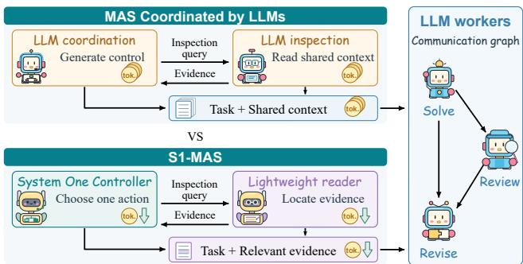
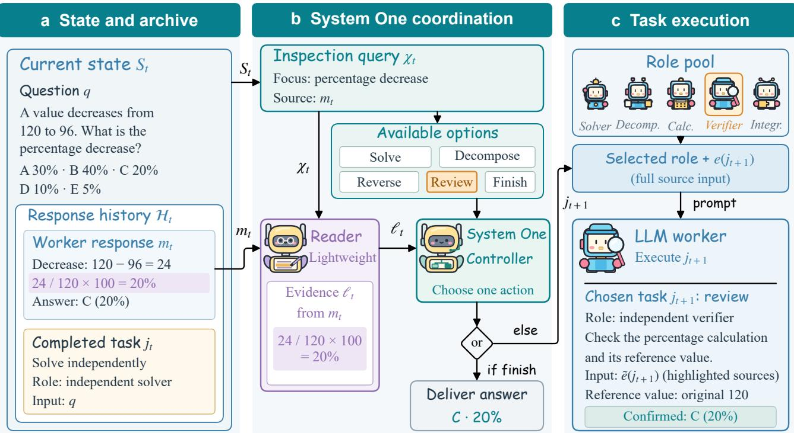
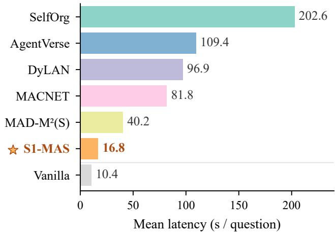

# Token-Eficient Multi-Agent Collaboration via System One-Guided Computational Division of Labor

Zihan Zhou1, Xinzhe Hu1, Hanxu Yang1, Liangjian Wen2, Zhao Kang1,\*

1University of Electronic Science and Technology of China 2Southwestern University of Finance and Economics 2024080905013@std.uestc.edu.cn, zkang@uestc.edu.cn \* Corresponding author

## Abstract

Large language model (LLM)-based multi-agent systems (MAS) have become a promising paradigm for complex information-seeking and reasoning tasks by enabling collab- orative problem solving among specialized agents. However, existing MAS frameworks tightly couple task reasoning with coordination operations, including task selection, role assign- ment, message routing, and context management. As interac- tions grow, using powerful LLMs for these bounded control decisions introduces substantial token overhead and latency, limiting the scalability of agentic Web services. In this pa- per, we investigate whether coordination can be decoupled from expensive reasoning without compromising collabo- rative performance. We propose S1-MAS, a token-eficient multi-agent framework based on System One-guided com- putational division of labor. S1-MAS assigns bounded coor- dination decisions to lightweight System One models while reserving open-ended reasoning for capable LLM workers. Specifically, a lightweight controller selects inspection condi- tions, chooses subsequent tasks, and determines termination, while a compact reader retrieves condition-relevant evidence from authorized sources to support these decisions. Through a decision–evidence loop, selected tasks dynamically determine worker roles and source access, enabling adaptive collabora- tion without task-specific training. Extensive experiments on seven diverse benchmarks demonstrate that S1-MAS achieves superior accuracy while substantially reducing the inference cost. Across individual comparisons with AgentVerse, Dy- LAN, and SelfOrg on seven benchmarks, S1-MAS reduces GPT-4o token consumption by 44.9%–97.2% and measured end-to-end latency by 37.8%–93.0%. These results highlight its potential for scalable and cost-efective agentic Web appli- cations.

## 1 Introduction

Web-scale information services increasingly rely on large language model (LLM)-based agents to search, reason, and synthesize information from heterogeneous sources. Multi- agent systems (MAS) further extend this capability by allowing specialized agents to collaborate through iterative execution, evidence sharing, and response refinement (Yao et al. 2023; Gangi Reddy et al. 2025; Wu et al. 2025). How-ever, achieving efective collaboration requires not only high- quality reasoning but also continuous coordination: deciding which task should be executed, which agent should partic- ipate, what information should be accessed, and when the interaction should terminate. As agent trajectories become longer, the cost of coordination itself becomes a critical bot- tleneck for scalable agentic Web services.

  
Figure 1: S1-MAS decouples coordination from reasoning: a System One controller makes bounded coordination deci- sions, while a lightweight reader localizes relevant evidence, reducing token overhead while preserving LLM reasoning capability.

Early MAS research studied task allocation, teamwork protocols, and communication strategies in distributed sys- tems (Smith 1980; Tambe 1997; Sukhbaatar, Szlam, and Fer-gus 2016; Foerster et al. 2016; Singh, Jain, and Sukhbaatar 2019). With the emergence of LLMs, agents can now perform flexible role-specific reasoning and coordinate through natu- ral language interactions (Wu et al. 2024; Chen et al. 2023). Recent studies have explored adaptive orchestration mecha- nisms, including dynamic agent selection, communication topology construction, and workflow optimization (Qian et al. 2025; Liu et al. 2024; Zhang et al. 2025; Li et al. 2026b). These methods improve collaboration flexibility; however, they generally rely on powerful generative LLMs to make coordination decisions. Consequently, the same models re- sponsible for solving complex tasks are repeatedly invoked to generate control instructions, interpret intermediate histo- ries, and maintain interaction states.

This design introduces a fundamental ineficiency. Many coordination operations in MAS are inherently bounded: selecting from feasible tasks, deciding whether additional inspection is required, or determining whether the current evidence is suficient. Unlike open-ended reasoning, these operations do not require unrestricted generation. Treating them as general language generation wastes computation and creates unnecessary token consumption, especially when in- teraction histories continuously expand. Therefore, an im- portant question arises:

  
Figure 2: Overview of S1-MAS. (a) The state $S _ { t }$ records the history of t completed worker executions; in this AQuA example, the latest response $m _ { t }$ generated by task $j _ { t }$ serves as the current candidate answer. (b) A lightweight System One controller makes bounded coordination decisions by selecting inspection conditions, choosing the next task, or terminating based on evidence localized by a lightweight reader. (c) When collaboration continues, an LLM worker executes $j _ { t + 1 }$ to generate $m _ { t + 1 }$ and update the state to $S _ { t + 1 } ;$ otherwise, the controller returns an archived answer upon termination.

Can coordination in multi-agent systems be performed by lightweight decision-making models while preserving the reasoning capability ofpowerful LLM workers?

Recent advances in pretrained System One models provide a potential direction. Unlike generative LLMs, System One models are designed for fast and structured decision-making over constrained action spaces (Almeida 2026; Convai Innovations 2026). However, integrating them into MAS requires addressing a key challenge: coordination decisions must be grounded in relevant information from previous interactions rather than generated blindly. A lightweight controller needs compact and reliable evidence retrieval mechanisms that al- low it to understand the current collaboration state without performing the entire reasoning process.

To address this challenge, we propose S1-MAS, a System One-guided framework for eficient multi-agent collabora- tion (Figure 2). S1-MAS introduces a computational division of labor between coordination and reasoning. A lightweight System One controller, instantiated with Laya (Convai Innovations 2026), performs bounded coordination decisions, including selecting inspection conditions, assigning sub- sequent tasks, and determining termination. A lightweight reader, instantiated with Qwen3-0.6B (Yang et al. 2025), retrieves condition-relevant evidence from authorized sources and provides grounded information for controller deci- sions. Meanwhile, capable LLM workers remain responsi- ble for open-ended reasoning, critique, and response refine- ment. Through this decision–evidence loop, S1-MAS en- ables adaptive collaboration while avoiding expensive LLM- based coordination generation.

We evaluate S1-MAS on seven diverse benchmarks cov- ering mathematical reasoning, knowledge-intensive question answering, code generation, and Web-based question answer- ing. Results show that S1-MAS achieves state-of-the-art ac- curacy among evaluated MAS baselines while substantially reducing computational cost. These results demonstrate that separating coordination from reasoning provides an efec- tive pathway toward scalable and cost-eficient agentic Web services.

Our contributions are summarized as follows:

• A new perspective on MAS eficiency. We identify coordination generation as a major computational bottleneck in LLM-based MAS and formulate a computational di- vision of labor that separates bounded coordination from open-ended reasoning.

• System One-guided MAS framework. We introduce S1- MAS, the first systematic exploration of pretrained Sys- tem One models for joint task orchestration and evidence-aware communication in general-purpose LLM-based MAS. S1-MAS integrates a lightweight controller, evi- dence reader, and LLM workers into a closed decision– evidence loop, enabling adaptive collaboration without task-specific training.

• Comprehensive evaluation. Experiments on seven benchmarks demonstrate that S1-MAS achieves competi- tive or superior accuracy. Across individual comparisons with AgentVerse, DyLAN, and SelfOrg on these bench- marks, it reduces GPT-4o token consumption by 44.9%– 97.2% and measured end-to-end latency by 37.8%– 93.0%.

## 2 Related Work

Orchestration in Multi-Agent Systems. Organizing LLM agents requires not only assigning roles but also adapt- ing collaboration patterns according to evolving task states. A entVerse recruits s ecialized roles for collaborative rob- lem solving (Chen et al. 2023), while MACNET explicitly models communication structures through directed acyclic graphs (Qian et al. 2025). To enable adaptive collaboration during execution, DyLAN dynamically adjusts agent participation (Liu et al. 2024), and SelfOrg reorganizes communication based on estimated peer contributions (Tastan, Horváth, and Nandakumar 2026). Beyond predefined strate-gies, recent approaches learn task-conditioned collaboration graphs (Zhang et al. 2025; Li et al. 2026b) or optimize nextagent and context selection (Wang et al. 2025). These meth-ods improve the flexibility of agent organization, but they still rely on expensive LLM-based decisions to determine how collaboration should proceed. S1-MAS addresses this complementary eficiency challenge by introducing a pre- trained System One controller that separates bounded coor- dination decisions from LLM execution, enabling adaptive orchestration without task-specific training.

Communication Optimization in Multi-Agent Systems. Eficient communication in MAS requires both reducing unnecessary exchanges and controlling the infor- mation involved in each interaction. AgentPrune addresses the structural aspect by pruning redundant communication edges (Zhang et al. 2024). At the content level, MAD-$\mathbf { M } ^ { \widetilde { 2 } }$ masks debate memories (Tian et al. 2026), while OP-TiMACS learns compact message representations (Gupta et al. 2026). Related prompt-compression approaches, in-cluding LLMLingua and LLMLingua-2, further reduce the context provided to language models (Jiang et al. 2023; Pan et al. 2024). However, these approaches primarily optimize the communication payload after collaboration decisions are made, while the process of deciding what information to access or exchange can itself incur substantial LLM infer- ence costs. S1-MAS addresses this complementary chal- lenge by assigning source selection and evidence localization to lightweight components, reducing communication-control overhead without additional worker-LLM calls.

Combining System One Models with LLMs. System One models, such as Jev and Laya, provide bounded and typed decisions without requiring free-form control genera- tion (Almeida 2026; Convai Innovations 2026). Recent studies have explored their integration with LLM-based systems for action selection in LLM planning (Zhang 2026; Ma et al. 2026), edge-service orchestration (Li et al. 2026a), and agentic memory management (Jiang, Li, and Li 2026). Security- oriented applications further investigate their use for agent pruning, finding adjudication, and confirmation loops (dos Santos Barbosa 2026). However, existing eforts primarily address control decisions within specific applications, leav- ingjoint coordination and information exchange among LLM agents unexplored enough. Motivated by these advances, we propose S1-MAS, which is the first end-to-end LLM-based MAS framework that integrates pretrained System One mod- els for joint task orchestration and evidence-based communi-cation. Experiments demonstrate that S1-MAS substantially reduces LLM worker token consumption and end-to-end so- lution latency while maintaining collaborative task perfor- mance.

## 3 Problem Formulation

Given a question $q ,$ we model multi-agent coordination as sequential decisions about which tasks workers execute, what information they receive, and when collaboration stops. Let t denote the number of completed worker executions and $S _ { t }$ the state of the system after these t executions. The controller and reader calls are not counted in t.

Communication graph. We use a directed acyclic graph to record which earlier responses are provided to subsequent worker executions:

$$
\mathcal G _ { t } = ( \mathcal V _ { t } , \mathcal E _ { t } ) , \qquad \mathcal V _ { t } = \{ v _ { i } : 1 \leq i \leq t \} .\tag{1}
$$

Here, $\nu _ { t }$ is the vertex set that represents completed worker executions and $\mathcal { E } _ { t }$ is the directed edge set that represents direct response dependencies among these executions. Each vertex $v _ { i }$ represents the execution $i ,$ where a worker performs the task $j _ { i }$ under its assigned role and produces a response $m _ { i }$ . For $i < k \leq t ,$ there is a directed edge $( v _ { i } , v _ { k } ) \in \mathcal { E } _ { t }$ if and only if the complete response $m _ { i }$ is provided as a direct input to task $j _ { k }$

State and archive. To guide subsequent coordination, we maintain an ordered archive $\mathcal { H } _ { t }$ of completed task–response pairs $( j _ { i } , m _ { i } )$ , along with the associated roles, sources, and observable check results. The archive also includes an output identifier for comparing outputs across responses: an option label, a short-text answer, or a piece of usable code, depend- ing on the answer format required by $q .$

Furthermore, we maintain an inspection ledger $\boldsymbol { A } _ { t }$ to help avoid repeated checks of whether a given response satisfies a particular condition in $q .$ Specifically, $\mathbf { \mathcal { A } } _ { t } ( i )$ stores records of attempts, up to step $t ,$ to check whether the response $m _ { i }$ satisfies the conditions stated in $q .$ These records track in- spection attempts rather than establish correctness. We also track the remaining allowance $B _ { \mathrm { s r c } } - u _ { t }$ to constrain further transmission of source inputs to workers. Here, $B _ { \mathrm { s r c } }$ denotes the cumulative token budget for source transmission, and $u _ { t }$ denotes the amount consumed during the executions of t workers. We combine this inspection history and the remain- ing allowance with question $q$ and archive $\mathcal { H } _ { t }$ to define the current state of coordination decisions.

$$
S _ { t } = ( q , \mathcal { H } _ { t } , \mathcal { A } _ { t } , B _ { \mathrm { s r c } } - u _ { t } ) .\tag{2}
$$

Inspection and task selection. To provide explicit targets for inspecting a candidate answer, we partition the original question q into sentences to form the set $\mathcal { C } ( q )$ . In state $S _ { t } ,$ the System One controller forms an inspection query $\chi _ { t }$ by pairing a selected sentence of $\mathcal { C } ( q )$ with the current candidate answer. The query therefore specifies both what should be checked and which answer should be examined. The reader then locates the relevant text for this inspection target in the corresponding response, producing an evidence record $\ell _ { t }$ for the controller’s next decision.

Alongside the localized evidence, we provide the con- troller with a menu of feasible tasks to select the next worker task. Each candidate specifies an operation, a goal, a rule for assigning a worker role, and the source responses needed for execution. To determine which candidates enter this menu, a deterministic compiler uses $S _ { t }$ and $\chi _ { t }$ to retain only those whose prerequisites are met and whose required source in- puts fit within the remaining communication budget:

$$
\mathcal { W } _ { t } = \mathrm { C o m p i l e } ( S _ { t } , \chi _ { t } ) .\tag{3}
$$

The set $\mathcal { W } _ { t }$ contains feasible worker tasks; fini $^ \mathrm { { s h } }$ is con- sidered separately when stopping is eligible. If collabora- tion continues, the controller uses $S _ { t } , \chi _ { t } ,$ and $\ell _ { t }$ to select $j _ { t + 1 } \in \mathcal { W } _ { t }$ . For the selected task, the set of sources satis- fies $\mathcal P ( j _ { t + 1 } ) \subseteq \mathcal V _ { t } .$ , and the input from the source $e ( j _ { t + 1 } )$ contains the complete responses $\{ m _ { i } : v _ { i } \in \mathcal P ( j _ { t + 1 } ) \}$ to-gether. A worker assigned the compatible role executes $j _ { t + 1 }$ and produces $m _ { t + 1 }$ , after which the system updates the state and communication graph to $S _ { t + 1 }$ and $\mathcal { G } _ { t + 1 }$ . If the controller instead selects finish, collaboration stops and the deter-ministic delivery rule returns an archived response without another worker execution.

## 4 Methodology

S1-MAS assigns System One the role of a lightweight coordi- nation controller: it selects what to inspect, which task to run, and when to stop. A lightweight reader localizes condition- relevant evidence, while LLM workers perform substantive reasoning. Laya and Qwen3-0.6B instantiate the controller and the reader, respectively. Their decision–evidence loop enables adaptive collaboration without requiring LLM work- ers to generate coordination instructions (Figure 2). We describe evidence localization (Section 4.1), task construction and selection (Section 4.2), role and source assignment followed by worker execution (Section 4.3), and the adaptive stopping strategy (Section 4.4). Algorithm 1 summarizes the overall procedure. All components operate without task- specific training.

## 4.1 Inspection Query and Evidence Localization

The cumulative responses contain both useful evidence and details that are not related to the next coordination decision.

Asking an LLM to repeatedly interpret this history leads to additional token consumption. Instead, we separate the choice of what to inspect from the location where it is ad- dressed. Specifically, the System One controller selects a question condition to inspect, while the lightweight reader locates evidence relevant to that condition in the current can- didate answer.

System One controller: inspection query. In state $S _ { t } ,$ , we consider only the inspection targets in $\mathcal { C } ( q )$ that have not yet been recorded for the current candidate answer in $\boldsymbol { \mathcal { A } } _ { t }$ . The inspection is skipped when no candidate or eligible target is available.

To choose among the remaining targets, the controller compares them in small groups. Within each group, it eval- uates the targets in forward and reverse menu orders and averages scores aligned by target identity to reduce sensitiv- ity to presentation order. Selected targets advance through successive groups until one inspection target is retained or the controller chooses skip. The selected condition and the complete worker response corresponding to the current candidate answer together form the inspection query $\chi _ { t }$

Lightweight reader: evidence localization. Given the question $q$ and the inspection query $\chi _ { t }$ , we construct the evidence record as

$$
\ell _ { t } = \mathcal { R } ( q , \chi _ { t } ) .\tag{4}
$$

Here, R denotes the following localization procedure. The lightweight reader selects identifiers of source units relevant to the inspection condition within the full worker response specified by $\chi _ { t }$ . We map these identifiers to character ofsets to retrieve the corresponding passages verbatim, then store the passages, their ofsets, the inspection condition, and the source identity in $\ell _ { t }$

The controller may use $\ell _ { t }$ as an additional context when selecting the next action. When a worker’s assigned task permits access to the corresponding response, the localized passages can also serve as attention cues. The record identi- fies material to examine rather than certifying its correctness; substantive review remains the worker’s responsibility.

## 4.2 Task Construction and System One-Guided Selection

To determine the next step of collaboration, the controller must select both the work to be performed and the informa- tion required for its execution. We therefore use tasks as a unit of coordination. Each task specifies an operation, a goal, a rule for assigning the worker role, and the source responses the worker may use. A deterministic compiler first identifies tasks whose prerequisites are met and whose source inputs fit within the remaining communication budget. The Sys- tem One controller then uses the current state and available evidence to choose among these feasible tasks. This separa- tion makes task selection a bounded decision over executable alternatives.

Feasible task construction. A deterministic compiler builds the feasible menu ${ \ w } _ { t }$ from $S _ { t }$ and the inspection query $\chi _ { t }$ . The operations difer in their reasoning objectives and source requirements:

• Solve: Answer the original question independently, with-out using earlier responses.

• Decompose: Divide the question into subproblems, solve them, and combine the results within one worker, without using earlier responses.

• Reverse: Reason backward from the required outcome using the original question, without using earlier responses.

• Review: Check the full worker response corresponding to the current candidate answer against the selected in- spection target, revising it when concrete violations are identified.

• Repair: Correct missing answers, truncated responses, or code interface defects using the entire afected response. If all options are rejected without a parsed answer, solve the question again using only the original question.

• Contrast: Compare the current candidate answer with an alternative response from the archive, using both re- sponses in full. The alternative is the most recent response whose output identifier difers from the candidate’s.

These operations form a task vocabulary, and the feasible menu $\mathcal { W } _ { t }$ contains only currently admissible tasks and does not need to include all types of operation. The controller also considers finish when voluntary stopping is eligible.

System One-guided action selection. The System One controller uses the current state $S _ { t } ,$ , inspection query $\chi _ { t } ,$ and evidence record $\ell _ { t }$ to select a task $j _ { t + 1 } \in \mathcal { W } _ { t }$ or the eligible finish option. In the next execution, a worker performs the selected task in its assigned role, while finish ends the collaboration and returns an archived answer without progress t.

## 4.3 Task Execution and State Update

Role and assignment of sources. The selected task $j _ { t + 1 } \in$ $\mathcal { W } _ { t }$ determines the role of the worker and the sources of responses that it receives. For example, selecting Review as- signs the verifier role to the next worker. The worker receives the full response corresponding to the current candidate an- swer and checks it against the selected inspection target.

Localized evidence as an attention cue. For a selected Review or Contrast task $j _ { t + 1 }$ , the evidence record $\ell _ { t }$ iden- tifies the relevant parts of an authorized source response to highlight, while the complete response is retained. Its source input with any applicable highlights is $\tilde { e } ( j _ { t + 1 } )$ ; this retains all $e ( j _ { t + 1 } )$ and equals $e ( j _ { t + 1 } )$ when no cue is applied. This design narrows attention while retaining the context needed to challenge the highlighted reasoning.

Execution of tasks by LLM workers. The worker re-ceives the full question, the selected task, a compatible role, authorized sources, and an output contract specifying the re- quired answer format or code interface. Using these inputs, it performs the corresponding operation: Solve, Decompose, Reverse, Review, Repair, or Contrast. Let Prompt construct this role-conditioned input, LLM denote worker generation, and $B _ { \mathrm { o u t } }$ be the maximum number of tokens a worker can generate in each execution. Execution is

$$
m _ { t + 1 } = \mathrm { L L M } \big ( \mathrm { P r o m p t } ( q , j _ { t + 1 } , \tilde { e } ( j _ { t + 1 } ) \big ) ; B _ { \mathrm { o u t } } \big ) .\tag{5}
$$

Controlling communication budget. To save tokens, we limit the total number of source tokens transmitted across worker executions. All transmitted source tokens, including labels and attention cues, contribute to the following:

$$
u _ { t } = \sum _ { i = 1 } ^ { t } \mathrm { t o k } ( \tilde { e } ( j _ { i } ) ) \leq B _ { \mathrm { s r c } } .\tag{6}
$$

Here, tok counts the tokens in the transmitted source in-put. Copying the same response again consumes the bud- get repeatedly; tasks without earlier responses as input con- tribute zero. The communication budget restricts the repeated transmission of prior responses and the resulting context- processing overhead for LLM workers. By applying this limit across the entire workflow, S1-MAS keeps cumulative com- munication costs under control.

Updating the interaction archive and the state of the system. Each response $m _ { t + 1 }$ is archived with its completed task $j _ { t + 1 } ,$ role, sources, output identifier, and observable checks. The execution of task $j _ { t + 1 }$ adds a new vertex $v _ { t + 1 }$ and incoming edges from its designated source vertices. The communication graph is updated as

$$
\begin{array} { r l } & { \mathcal { V } _ { t + 1 } = \mathcal { V } _ { t } \cup \{ v _ { t + 1 } \} , } \\ & { \mathcal { E } _ { t + 1 } = \mathcal { E } _ { t } \cup \{ ( v _ { i } , v _ { t + 1 } ) \mid v _ { i } \in \mathcal { P } ( j _ { t + 1 } ) \} . } \end{array}\tag{7}
$$

When $j _ { t + 1 }$ performs Review or Contrast using $\chi _ { t } .$ , the ledger records the attempted check for the response speci- fied as the query’s source. The new response $m _ { t + 1 }$ inherits attempted-check records from a source response $m _ { i }$ only if $v _ { i } ~ \in ~ \mathscr { P } ( j _ { t + 1 } )$ and the two responses share the same nonempty output identifier. Recording attempted checks avoids repeating the same review without treating the in- spected content as verified. Updating $\mathscr { H } _ { t + 1 } , \mathscr { A } _ { t + 1 }$ , and $u _ { t + 1 }$ produces $S _ { t + 1 } ;$ the delivery rule then identifies the current candidate answer from the updated archive.

## 4.4 Adaptive Stopping and Answer Delivery Rule

We formulate the stopping rule as a bounded coordination de- cision: when stopping is eligible, the System One controller can select finish instead of another task. Once collabo-ration ends, a deterministic delivery rule returns an existing response from the archive. This separates the decision to continue computation from answer delivery, avoiding an ad- ditional LLM call to evaluate or generate the final answer and the associated token consumption.

Adaptive stopping rules. Once the candidate answer exists, finish becomes eligible. The worker execution ends with the eligible finish option, selected by the controller or its fallback rule, or when the maximum number of worker executions $T _ { \mathrm { m a x } }$ is reached. The execution limit is an en- forced stop, not an additional controller decision.

Answer delivery rules. In state $S _ { t }$ with at least one com- pleted execution, for multiple-choice questions and questions that require a numerical answer, the latest response $m _ { t }$ takes precedence if it has a parsed answer key and task $j _ { t }$ was an explicit two-source Contrast. Otherwise, delivery selects the most frequent nonempty answer key and its earliest sup- porting response, breaking the ties by the earliest occurrence.

After each worker executes, this rule updates the current can- didate answer. Subsequent inspection targets this candidate, which is also returned as the final output if collaboration stops.

For code generation tasks, delivery prioritizes the con- tinuity of a usable implementation rather than the number of responses with the same answer. The first candidate that parses and provides the required function signature is re- tained. A later usable Review, Repair, or Contrast replaces it only if that task reads the retained candidate. If none is usable, delivery returns the last response. These public in- terface checks do not establish hidden-test correctness. Both output types therefore use the same coordination loop, with delivery contracts that return the original work rather than generate a new answer.

Algorithm 1 S1-MAS: lightweight coordination and task   
execution   
Require: Complete question q, output contract, budgets   
$B _ { \mathrm { s r c } } , B _ { \mathrm { o u t } }$ , execution limit $T _ { \mathrm { m a x } }$   
Ensure: Current candidate answer from the archive   
1: Initialize $S _ { 0 } , \mathcal { G } _ { 0 } ; t , u _ { 0 } \gets 0$   
2: while $t < T _ { \operatorname* { m a x } }$ do   
Inspection and localization   
3: $\chi _ { t } \gets \mathrm { S y s t e m O n e } ( S _ { t } , \mathcal { C } ( q ) ) ; \ell _ { t } \gets \emptyset$   
4: $\mathbf { i f } \ \chi _ { t } \neq \emptyset : \ell _ { t } \gets \mathcal { R } ( q , \chi _ { t } )$   
Task selection   
5: $\mathcal { W } _ { t }  \mathrm { C o m p i l e } ( S _ { t } , \chi _ { t } )$   
6: Controller scores Wt and eligible finish using   
$( S _ { t } , \chi _ { t } , \ell _ { t } )$   
7: Select the highest-scoring option   
8: if finish is selected then break   
9: Otherwise, denote the selected task by $j _ { t + 1 } \in \mathcal { W } _ { t }$   
Execution and state update   
10: Resolve the selected task’s role; form $\tilde { e } ( j _ { t + 1 } )$   
11: $m _ { t + 1 } \gets \mathrm { L L M } \big ( \mathrm { P r o m p t } ( q , j _ { t + 1 } , \tilde { e } ( j _ { t + 1 } ) ) ; \dot { B } _ { \mathrm { o u t } } \big )$   
12: $u _ { t + 1 } \gets u _ { t } + \mathrm { t o k } ( \tilde { e } ( j _ { t + 1 } ) )$   
13: $\mathcal { V } _ { t + 1 }  \mathcal { V } _ { t } \cup \{ v _ { t + 1 } \}$   
14: $\mathcal { E } _ { t + 1 }  \mathcal { E } _ { t } \cup \{ ( v _ { i } , \tilde { v _ { t + 1 } } ) : v _ { i } \in \mathcal { P } ( j _ { t + 1 } ) \}$   
15: Update $S _ { t + 1 }$ (archive, ledger, budget)   
16: $t \stackrel { - } {  } t + 1$   
17: end while   
18: return current candidate answer ▷ No extra LLM call

## 5 Experiments

We evaluate S1-MAS to examine whether System One- guided coordination improves the eficiency of multi-agent collaboration while maintaining task performance. We first compare S1-MAS with representative baselines on six benchmarks covering reasoning and code generation, mea- suring task performance, GPT token consumption, and end- to-end latency. We then use ablation studies to examine how the S stem One controller and evidence localization con- tribute to task performance and inference eficiency. Finally, we use WebSRC to assess its efectiveness in answering ques- tions on structured webpages.

## 5.1 Experimental Setup

Datasets. We select seven benchmarks to evaluate S1- MAS in diferent reasoning requirements, output formats, and information sources. MMLU (Hendrycks et al. 2021) covers knowledge-based reasoning across subjects, while GSM8K (Cobbe et al. 2021), AQuA (Ling et al. 2017), MultiArith (Roy and Roth 2015), and SVAMP (Patel, Bhattamishra, and Goyal 2021) cover mathematical problem solving. HumanEval (Chen et al. 2021a) extends the evaluation from option labels and numerical answers to executable code. WebSRC (Chen et al. 2021b) further assesses the answering of questions on structured websites, where agents must locate and use information from the website provided.

Baselines. For the six main benchmarks, we compare S1- MAS with 12 baselines that do not require task-specific pa- rameter training. Vanilla, CoT (Wei et al. 2022), and SC-CoT (Wang et al. 2022) provide single-model references to assess the benefits of multi-agent collaboration. Chain, Tree, Complete, and Random represent collaboration under prescribed communication topologies, allowing comparison with adaptive coordination in S1-MAS. We further compare with five MAS frameworks – AgentVerse (Chen et al. 2023), MACNET (Qian et al. 2025), SelfOrg (Tastan, Horváth, and Nandakumar 2026), MAD-M2(S) (Tian et al. 2026), and DyLAN (Liu et al. 2024) – to examine whether S1-MAS achieves a better balance between task performance and in- ference cost than existing approaches to agent orchestration and communication.

Implementation details. We use GPT-4o for the six main benchmarks and WebSRC, and GPT-4o-mini for the ablation experiments. In WebSRC, we compare with AgentVerse, Dy- LAN, and SelfOr , the three baselines evaluated on all seven benchmarks. Within each experiment, all methods use the same task-solving model, evaluation questions, response for- mat requirements, and scoring procedures. Each LLM worker call uses a temperature of 1.0 and generates a single response, with at most $\bar { B } _ { \mathrm { o u t } } = 2 , 0 4 8$ output tokens.

S1-MAS uses Laya as its System One controller and Qwen3-0.6B as its lightweight reader, without task-specific training. The reader uses greedy decoding in non-thinking mode. For each question, S1-MAS permits at most $T _ { \mathrm { m a x } } = \bar { 4 }$ worker executions, with dynamic stopping and no additional final judge. We set its cumulative budget for transmitting source responses to $B _ { \mathrm { s r c } } = 2 , 0 4 8$ tokens per question.

We repeat each comparison with three random seeds and report the mean accuracy. We also report the average GPT input and generation token counts and the average end-to-end latency per question. Token accounting includes every GPT call in the workflow. For the seven-benchmark comparison with AgentVerse, DyLAN, and SelfOrg, reduction ranges report the minimum and maximum over the 21 benchmark– baseline pairs.

## 5.2 Main Results

We assess S1-MAS across six benchmarks in terms of task precision, GPT token consumption, and end-to-end latency.

High performance. Table 1 shows that S1-MAS achieves the highest mean accuracy on all six benchmarks. Its macro- average accuracy reaches 93.97%, surpassing DyLAN and AgentVerse by 0.85 and 1.54 percentage points, respec- tively. The advantage spans diferent task demands: S1-MAS reaches 91.94% on MMLU versus DyLAN’s 91.07%, and

Table 1: Performance comparison using GPT-4o. Accuracy values are reported as percentages. Results are means with standard deviations over three seeds. Average summarizes performance across six datasets. Best and second-best means are bold and underlined, respectively.
<table><tr><td>Method</td><td>MMLU</td><td>GSM8K</td><td>AQuA</td><td>MultiArith</td><td>SVAMP</td><td>HumanEval</td><td>Average</td></tr><tr><td colspan="8">Direct Answer</td></tr><tr><td>Vanilla</td><td> $8 5 . 1 9 \pm 1 . 0 0$ </td><td> $9 4 . 9 3 \pm 1 . 3 3 $ </td><td> $7 5 . 8 6 \pm 4 . 3 4$ </td><td> $9 8 . 8 1 \pm 1 . 3 6 $ </td><td> $9 3 . 7 2 \pm 0 . 2 6$ </td><td> $8 5 . 6 7 \pm 3 . 4 4$ </td><td> $8 9 . 0 3 \pm 1 . 2 6$ </td></tr><tr><td colspan="8">Single-Agent Prompting</td></tr><tr><td>CoT</td><td> $8 5 . 4 0 \pm 1 . 6 4$ </td><td> $9 7 . 1 3 \pm 0 . 3 2 $ </td><td> $7 6 . 1 7 \pm 1 . 8 7$ </td><td> $9 9 . 2 3 \pm 0 . 8 1$ </td><td> $9 3 . 7 5 \pm 0 . 8 1$ </td><td> $8 7 . 6 0 \pm 4 . 6 0$ </td><td> $8 9 . 8 8 \pm 0 . 9 7$ </td></tr><tr><td>SC-CoT</td><td> $8 9 . 1 1 \pm 1 . 0 0$ </td><td> $9 7 . 3 0 { \scriptstyle \pm 0 . 1 0 }$ </td><td> $8 2 . 4 0 \pm 3 . 3 2$ </td><td> $9 9 . 4 0 \pm 1 . 0 3 $ </td><td> $9 4 . 4 1 \pm 1 . 7 3 $ </td><td> $8 8 . 9 8 \pm 1 . 2 6 $ </td><td> $9 1 . 9 3 \pm 0 . 5 7$ </td></tr><tr><td colspan="8">Fixed Multi-Agent Topologies</td></tr><tr><td>Chain</td><td> $8 8 . 2 4 \pm 1 . 7 3 $ </td><td> $9 6 . 8 0 { \scriptstyle \pm 0 . 1 0 }$ </td><td> $8 0 . 3 7 \pm 2 . 8 4$ </td><td> $9 8 . 6 9 \pm 0 . 7 4$ </td><td> $9 4 . 3 1 \pm 0 . 7 7$ </td><td> $8 6 . 5 0 \pm 2 . 6 6$ </td><td> $9 0 . 8 2 \pm 0 . 8 9$ </td></tr><tr><td>Tree</td><td> $8 8 . 4 5 \pm 1 . 3 6 $ </td><td> $9 5 . 6 3 \pm 0 . 3 1$ </td><td> $8 1 . 1 5 \pm 1 . 8 9$ </td><td> $9 9 . 4 0 \pm 1 . 0 3 $ </td><td> $9 4 . 7 9 \pm 0 . 3 1$ </td><td> $8 8 . 7 1 \pm 4 . 5 5$ </td><td> $9 1 . 3 6 \pm 0 . 9 6$ </td></tr><tr><td>Complete</td><td> $8 8 . 6 7 \pm 1 . 3 6 $ </td><td> $9 7 . 0 0 { \scriptstyle \pm 0 . 7 0 }$ </td><td> $8 2 . 2 4 \pm 0 . 4 7$ </td><td> $9 9 . 1 1 \pm 0 . 7 8$ </td><td> $9 5 . 2 1 \pm 0 . 2 8 $ </td><td> $8 9 . 2 6 \pm 0 . 8 3$ </td><td> $9 1 . 9 1 \pm 0 . 1 0$ </td></tr><tr><td>Random</td><td> $8 7 . 8 0 \pm 1 . 0 0 $ </td><td> $9 6 . 9 0 { \scriptstyle \pm 0 . 7 9 }$ </td><td> $8 0 . 0 6 \pm 0 . 9 7$ </td><td> $9 8 . 9 9 \pm 0 . 8 8 $ </td><td> $9 4 . 6 5 \pm 0 . 6 9$ </td><td> $8 8 . 9 8 \pm 1 . 7 2 $ </td><td> $9 1 . 2 3 \pm 0 . 2 4$ </td></tr><tr><td colspan="8">Multi-Agent Coordination</td></tr><tr><td> $\mathbf { M A D - M ^ { 2 } ( S ) }$ </td><td> $8 8 . 8 9 \pm 0 . 6 5$ </td><td> $9 7 . 2 0 { \scriptstyle \pm 0 . 7 0 }$ </td><td> $\underline { { 8 6 . 6 0 } } \pm 2 . 5 7$ </td><td> $9 9 . 5 2 \pm 0 . 8 2 $ </td><td> $9 5 . 7 3 { \pm } 1 . 0 6 $ </td><td> $8 9 . 5 3 \pm 1 . 2 6 $ </td><td> $9 2 . 9 1 \pm 0 . 1 9$ </td></tr><tr><td>SelfOrg</td><td> $8 8 . 4 5 \pm 0 . 3 8 $ </td><td> $9 5 . 8 0 { \scriptstyle \pm 0 . 2 6 }$ </td><td> $8 1 . 3 1 \pm 0 . 4 7$ </td><td> $9 6 . 7 9 \pm 0 . 1 8$ </td><td> $9 2 . 6 7 \pm 0 . 1 6$ </td><td> $8 8 . 1 5 \pm 1 . 2 6 $ </td><td> $9 0 . 5 3 \pm 0 . 3 0$ </td></tr><tr><td>AgentVerse</td><td> $9 0 . 2 0 { \scriptstyle \pm 1 . 7 3 }$ </td><td> $9 7 . 0 7 \pm 0 . 7 2 $ </td><td> $8 4 . 1 1 \pm 0 . 4 7$ </td><td> $9 9 . 3 5 \pm 1 . 1 3 $ </td><td> $9 5 . 1 7 \pm 0 . 6 7$ </td><td> $8 8 . 7 1 \pm 3 . 9 1$ </td><td> $9 2 . 4 3 \pm 0 . 3 3$ </td></tr><tr><td>MACNET</td><td> $8 9 . 1 1 \pm 0 . 7 5$ </td><td> $9 7 . 1 7 \pm 0 . 9 1 $ </td><td> $8 2 . 5 5 { \scriptstyle \pm 0 . 9 7 }$ </td><td> $9 9 . 6 4 \pm 0 . 6 2 $ </td><td> $9 5 . 0 3 \pm 0 . 4 7$ </td><td> $\underline { { 9 0 . 3 6 } } \pm 2 . 5 2 $ </td><td> $9 2 . 3 1 \pm 0 . 4 8 $ </td></tr><tr><td>DyLAN</td><td> $9 1 . 0 7 \pm 1 . 0 0 $ </td><td> $9 7 . 5 7 \pm 1 . 1 1 $ </td><td> $8 6 . 2 9 \pm 2 . 3 1$ </td><td> $9 9 . 7 6 \pm 0 . 4 1$ </td><td> $9 5 . 0 7 \pm 0 . 9 3 $ </td><td> $8 8 . 9 8 \pm 1 . 7 2 $ </td><td> $9 3 . 1 2 \pm 0 . 9 9$ </td></tr><tr><td colspan="8">System One-Guided Orchestration</td></tr><tr><td>S1-MAS</td><td> $\mathbf { 9 1 . 9 4 \pm } 1 . 5 1$ </td><td> $\mathbf { 9 7 . 7 3 \pm 1 . 1 2 }$ </td><td> $\mathbf { 8 7 . 0 7 \pm 2 . 5 7 }$ </td><td> $\mathbf { 9 9 . 8 8 \pm 0 . 1 0 }$ </td><td> ${ \bf 9 5 . 7 6 { \scriptstyle \pm 0 . 5 9 } }$ </td><td> $\mathbf { 9 1 . 4 6 \pm } 1 . 2 6$ </td><td> $\mathbf { 9 3 . 9 7 \pm 0 . 7 3 }$ </td></tr></table>

87.07% on AQuA versus ${ \bf M A D - M ^ { 2 } ( S ) ^ { \prime } s }$ 86.60%. In Hu- manEval, it achieves 91.46%, com ared to 90.36% for MAC- NET, the strongest alternative in that dataset. These results indicate that System One-guided collaboration supports high answer quality in knowledge, mathematical reasoning, and code generation.

Token-eficient. Across the six main benchmarks, Table 2 shows that S1-MAS reduces the mean consumption per- question of GPT tokens by 78.3–94.0% relative to the five baselines of MAS, using fewer input and generation tokens in each benchmark. These savings accompany the accuracy gains rather than a trade-of in answer quality. System One makes coordination decisions without GPT-generated con- trol instructions, while the lightweight reader provides rel- evant evidence. Task-dependent source access and a cumu- lative communication budget further limit repeated context transmission.

  
Figure 3: Mean end-to-end latency across six benchmarks, averaged over three seeds under the same configurations as Tables 1 and 2. Lower is better; the star highlights S1-MAS.

Low-latency. Figure 3 shows that S1-MAS averages 16.8 seconds per question across the six main benchmarks, re- ducing the mean end-to-end latency by 58.2–91.7% relative to the five MAS baselines, including the time spent on co- ordination and evidence localization. Beyond the lower co- ordination and context-processing overhead, adaptive stop- ping limits worker executions, and final delivery returns an archived response without an additional GPT call for judging or synthesis. These choices reduce sequential GPT gen- eration, helping to explain the shorter solution time while reserving expensive calls for substantive reasoning.

## 5.3 Ablation Study

Table 3 tests whether the accuracy–cost balance depends on how coordination and evidence localization are assigned. The variant w/ GPT delegates subsequent inspection and task- or-stop choices to GPT-4o-mini; w/ Random samples these choices uniformly from the legal menus. The w/o Reader variant removes evidence localization and its controller in- puts and worker attention cues, but retains complete autho- rized parent responses. All variants share the worker model, role pool, evaluation settings, feasible-task rules, and budget limits.

Table 2: Mean GPT-4o tokens per question, averaged over three seeds under the same configurations as Table 1 (lower is better). Ptok. and Ctok. denote input and generation tokens across all calls. Values are rounded to integers.
<table><tr><td rowspan="2">Method</td><td colspan="2">MMLU</td><td colspan="2">GSM8K</td><td colspan="2">AQuA</td><td colspan="2">MultiArith</td><td colspan="2">SVAMP</td><td colspan="2">HumanEval</td><td colspan="2">Average</td></tr><tr><td>Ptok.</td><td>Ctok.</td><td>Ptok.</td><td>Ctok.</td><td>Ptok.</td><td>Ctok.</td><td>Ptok.</td><td>Ctok.</td><td>Ptok.</td><td>Ctok.</td><td>Ptok.</td><td>Ctok.</td><td>Ptok.</td><td>Ctok.</td></tr><tr><td>Vanilla</td><td>117</td><td>25</td><td>80</td><td>98</td><td>105</td><td>176</td><td>62</td><td>48</td><td>62</td><td>39</td><td>161</td><td>155</td><td>98</td><td>90</td></tr><tr><td>MAD-M2(S)</td><td>4,066</td><td>1,407</td><td>2,907</td><td>1,235</td><td>4,764</td><td>2,045</td><td>2,164</td><td>729</td><td>2,052</td><td>697</td><td>6,418</td><td>2,734</td><td>3,728</td><td>1,475</td></tr><tr><td>SelfOrg</td><td>9,795</td><td>5,429</td><td>7,032</td><td>3,254</td><td>10,910</td><td>5,979</td><td>4,682</td><td>1,922</td><td>4,835</td><td>2,097</td><td>17,513</td><td>10,909</td><td>9,128</td><td>4,932</td></tr><tr><td>AgentVerse</td><td>7,018</td><td>3,562</td><td>6,780</td><td>3,205</td><td>9,645</td><td>5,206</td><td>4,156</td><td>1,688</td><td>4,332</td><td>1,826</td><td>14,070</td><td>7,728</td><td>7,667</td><td>3,869</td></tr><tr><td>MACNET</td><td>2,356</td><td>1,165</td><td>2,329</td><td>1,270</td><td>3,472</td><td>2,097</td><td>1,511</td><td>722</td><td>1,539</td><td>745</td><td>3,984</td><td>2,272</td><td>2,532</td><td>1,379</td></tr><tr><td>DyLAN</td><td>1,598</td><td>1,010</td><td>645</td><td>1,024</td><td>4,644</td><td>2,029</td><td>547</td><td>579</td><td>1,062</td><td>638</td><td>39,540</td><td>8,042</td><td>8,006</td><td>2,220</td></tr><tr><td>S1-MAS</td><td>503</td><td>369</td><td>372</td><td>369</td><td>430</td><td>448</td><td>344</td><td>277</td><td>333</td><td>296</td><td>751</td><td>595</td><td>455</td><td>392</td></tr></table>

Table 3: Ablation results with GPT-4o-mini, averaged over three seeds. Accuracy (%) is reported on MMLU, AQuA, and HumanEval. GPT tokens is the per-seed total over these three test sets, averaged across seeds.
<table><tr><td colspan="4"></td><td rowspan="2">Average</td><td rowspan="2">GPT tokens</td></tr><tr><td>Method</td><td>MMLU</td><td>AQuA</td><td>HumanEval</td></tr><tr><td>S1-MAS</td><td>80.17</td><td>81.15</td><td>91.18</td><td>84.17</td><td>535,918</td></tr><tr><td>w/ Random</td><td>78.43</td><td>78.50</td><td>90.08</td><td>82.34</td><td>542,491</td></tr><tr><td>w/ GPT</td><td>78.87</td><td>79.91</td><td>90.63</td><td>83.14</td><td>2,190,250</td></tr><tr><td>w/o Reader</td><td>79.08</td><td>78.35</td><td>89.81</td><td>82.41</td><td>482,314</td></tr></table>

System One decisions improve collaboration. Replacing subsequent System One decisions with random routing reduces average accuracy from 84.17% to 82.34%, with de- creases on all three datasets despite similar GPT token con- sumption. With the same task-construction rules and execu- tion framework, this diference highlights the importance of selecting appropriate actions as the collaboration progresses. The System One controller selects inspection queries accord- ing to the current state, then uses the resulting evidence to choose the next task or stop. These decisions direct LLM workers toward useful follow-up work, enabling greater ac- curacy with comparable consumption of GPT tokens.

System One makes better coordination decisions than the LLM controller. The complete S1-MAS achieves an av-erage accuracy of 84.17% using 0.54 million GPT tokens. In contrast, the GPT-routing variant consumes 2.19 million tokens but achieves a lower average accuracy of 83.14%. S1-MAS therefore uses 75.5% fewer GPT tokens in this con- trolled comparison. The assignment of subsequent coordina- tion choices to the generative worker model substantially in- creases token use without improving mean task performance. This directly supports the central motivation for separating bounded decisions from open-ended LLM reasoning.

The localization and highlighting of evidence improve the collaboration. Removing the reader reduces GPT token consumption, but lowers average accuracy. In S1-MAS, localized evidence informs subsequent task selection, while highlighting directs workers to relevant content within the source responses. Retaining these functions improves the av- erage accuracy by 1.76 percentage points with 11.1% more GPT tokens, demonstrating the value ofevidence localization and highlighting for overall task performance.

Table 4: WebSRC performance and eficiency with GPT-4o. Exact match (EM) scores are averaged across three random seeds. GPT tokens and latency are per-question means over the same runs. Best results are bold.
<table><tr><td>Method</td><td>EM (%)</td><td>GPT tokens</td><td>Latency (s)</td></tr><tr><td>AgentVerse</td><td>89.78</td><td>32,386</td><td>28.78</td></tr><tr><td>DyLAN</td><td>89.89</td><td>9,927</td><td>15.22</td></tr><tr><td>SelfOrg</td><td>89.11</td><td>28,229</td><td>61.03</td></tr><tr><td>S1-MAS</td><td>90.11</td><td>4,847</td><td>9.47</td></tr></table>

## 5.4 Efectiveness on Web-based Question Answering

To examine whether the benefits of S1-MAS extend to an- swering Web questions, we further evaluate it on Web- SRC (Chen et al. 2021b), where answering a question re-quires locating relevant information within a structured web- page. All methods use GPT-4o and receive the same question and HTML of the webpage, without visual input. S1-MAS retains the coordination mechanism used in the main ex- periments. We compare it with AgentVerse, DyLAN, and SelfOrg, covering role-based collaboration, adaptive com- putation, and self-organized communication. GPT token ac- counting includes input and generation tokens for every call.

As shown in Table 4, S1-MAS achieves the highest mean exact-match accuracy and the lowest latency among the com- pared methods, while using 51.2–85.0% fewer GPT-4o to- kens than AgentVerse, DyLAN, and SelfOrg. These results indicate that the System One-guided framework remains ef- fective when answering questions requires locating and using evidence from structured webpages.

## 6 Conclusion

S1-MAS introduces a System One-guided computational di- vision of labor that decouples adaptive coordination from generative task reasoning. Its central insight is that deciding how agents collaborate and exchange information can be for- mulated as bounded choices informed by the current state and available evidence, rather than repeatedly generating coordi- nation instructions with powerful LLMs. This formulation enables System One to organize adaptive collaboration with- out task-specific training while reserving the LLM computa- tion for substantive reasoning. Comprehensive experiments demonstrate substantial reductions in GPT token consump- tion while maintaining strong task performance. Routing Ab- lation studies further show that System One achieves higher accuracy than random and GPT-based routing, establishing the value of its decisions beyond their low computational cost. Together, these findings highlight System One as an efective basis for coordinating agent execution and com- munication, ofering a direction for eficient agentic Web systems. Future work can extend this approach to multi-page Web retrieval and question answering.

## References

Almeida, D. 2026. Introducing System One Models & Jev. TypeSafe AI technical blog. Published September 15, 2026; accessed September 30, 2026.

Chen, M.; Tworek, J.; Jun, H.; et al. 2021a. Evaluating Large Language Models Trained on Code. arXiv preprint arXiv:2107.03374.

Chen, W.; Su, Y.; Zuo, J.; Yang, C.; Yuan, C.; Chan, C.-M.;Yu, H.; Lu, Y.; Hung, Y.-H.; Qian, C.; Qin, Y.; Cong, X.; Xie,R.; Liu, Z.; Sun, M.; and Zhou, J. 2023. AgentVerse: Facil-itating Multi-Agent Collaboration and Exploring EmergentBehaviors. arXiv preprint arXiv:2308.10848.

Chen, X.; Zhao, Z.; Chen, L.; Ji, J.; Zhang, D.; Luo, A.; Xiong, Y.; and Yu, K. 2021b. WebSRC: A Dataset for Web- Based Structural Reading Comprehension. In Proceedings of the 2021 Conference on Empirical Methods in Natural Language Processing, 4173–4185. Online and Punta Cana, Dominican Republic: Association for Computational Lin- guistics.

Cobbe, K.; Kosaraju, V.; Bavarian, M.; Chen, M.; Jun, H.; Kaiser, L.; Plappert, M.; Tworek, J.; Hilton, J.; Nakano, R.; Hesse, C.; and Schulman, J. 2021. Training Verifiers to Solve Math Word Problems. arXiv preprint arXiv:2110.14168.

Convai Innovations. 2026. Laya: Model Card for the Frozen English Decision Encoder. Hugging Face model card, convaiinnovations/laya. Revision 1c5edc17a7acd8701df6fc341c0d179f1c62c982; accessed 2026-09-29.

dos Santos Barbosa, J. A. 2026. Calibrated Decision Mod- els for Autonomous Penetration-Testing Harnesses: JEV and Laya as System One Decision Layers for LLM-Driven Pen- test Agents. arXiv preprint arXiv:2609.28940.

Foerster, J.; Assael, I. A.; de Freitas, N.; and Whiteson, S. 2016. Learning to Communicate with Deep Multi-Agent Reinforcement Learning. In Advances in Neural Information Processing Systems, volume 29. Curran Associates, Inc.

Gangi Reddy, R.; Mukherjee, S.; Kim, J.; Wang, Z.; Hakkani-Tür, D.; and Ji, H. 2025. Infogent: An Agent-Based Frame-

work for Web Information Aggregation. In Findings of the Association for Computational Linguistics: NAACL 2025, 5760–5773. Albuquerque, New Mexico: Association for Computational Linguistics.

Gupta, S.; Bastos, A.; Das, M.; Ghosh, S.; Natarajan, N.; Bansal, C.; and Rajmohan, S. 2026. Learning Optimal Message Representations for Agentic Communication. In Findings of the Association for Computational Linguistics: ACL 2026, 28849–28879. San Diego, California, United States: Association for Computational Linguistics.

Hendrycks, D.; Burns, C.; Basart, S.; Zou, A.; Mazeika, M.; Song, D.; and Steinhardt, J. 2021. Measuring Massive Mul- titask Language Understanding. In International Conference on Learning Representations.

Jiang, D.; Li, Y.; and Li, B. 2026. Jev-Mem: System-One- Controlled Agentic Memory for Eficient AI Agents. arXiv preprint arXiv:2609.23986.

Jiang, H.; Wu, Q.; Lin, C.-Y.; Yang, Y.; and Qiu, L. 2023. LLMLingua: Compressing Prompts for Accelerated Infer- ence of Large Language Models. In Proceedings of the 2023 Conference on Empirical Methods in Natural Language Processing, 13358–13376. Singapore: Association for Computational Linguistics.

Li, D.; Wang, X.; Gong, H.; Lang, R.; and Yu, G. 2026a. Replacing Large Language Models with Jev Decision Models for Low-Latency Edge Service Orchestration. arXiv preprint arXiv:2609.22753.

Li, S.; Liu, Y.; Zheng, Y.; Li, M.; Nguyen, Q. V. H.; and Pan, S. 2026b. OFA-MAS: One-for-All Multi-Agent Sys- tem Topology Design based on Mixture-of-Experts Graph Generative Models. arXiv preprint arXiv:2601.12996.

Ling, W.; Yogatama, D.; Dyer, C.; and Blunsom, P. 2017. Pro- gram Induction by Rationale Generation: Learning to Solve and Explain Algebraic Word Problems. In Proceedings of the 55th Annual Meeting of the Association for Computational Linguistics (Volume 1: Long Papers), 158–167. Association for Computational Linguistics.

Liu, Z.; Zhang, Y.; Li, P.; Liu, Y.; and Yang, D. 2024. A Dynamic LLM-Powered Agent Network for Task-Oriented Agent Collaboration. In First Conference on Language Modeling.

Ma, W.; Zhao, L.; Zeng, Y.; and Zhao, J. 2026. JEV-Star: Fast, Low-Cost StarCraft II Control with Language-Model Planning. arXiv preprint arXiv:2609.27331.

Pan, Z.; Wu, Q.; Jiang, H.; Xia, M.; Luo, X.; Zhang, J.; Lin, Q.; Rühle, V.; Yang, Y.; Lin, C.-Y.; Zhao, H. V.; Qiu, L.; and Zhang, D. 2024. LLMLingua-2: Data Distillation for Eficient and Faithful Task-Agnostic Prompt Compression. In Findings of the Association for Computational Linguistics: ACL 2024, 963–981. Bangkok, Thailand: Association for Computational Linguistics.

Patel, A.; Bhattamishra, S.; and Goyal, N. 2021. Are NLP Models really able to Solve Simple Math Word Problems? In Proceedings of the 2021 Conference of the North American Chapter of the Association for Computational Linguistics: Human Language Technologies, 2080–2094. Association for Computational Linguistics.

Qian, C.; Xie, Z.; Wang, Y.; Liu, W.; Zhu, K.; Xia, H.; Dang, Y.; Du, Z.; Chen, W.; Yang, C.; Liu, Z.; and Sun, M. 2025. Scaling Large Language Model-based Multi-Agent Collab- oration. In International Conference on Learning Representations.

Roy, S.; and Roth, D. 2015. Solving General Arithmetic Word Problems. In Proceedings of the 2015 Conference on Empirical Methods in Natural Language Processing, 1743– 1752. Association for Computational Linguistics.

Singh, A.; Jain, T.; and Sukhbaatar, S. 2019. Learning when to Communicate at Scale in Multiagent Cooperative and Competitive Tasks. In International Conference on Learning Representations.

Smith, R. G. 1980. The Contract Net Protocol: High-Level Communication and Control in a Distributed Problem Solver. IEEE Transactions on Computers, C-29(12): 1104–1113.

Sukhbaatar, S.; Szlam, A.; and Fergus, R. 2016. Learn- ing Multiagent Communication with Backpropagation. In Advances in Neural Information Processing Systems, vol-ume 29. Curran Associates, Inc.

Tambe, M. 1997. Towards Flexible Teamwork. Journal of Artificial Intelligence Research, 7: 83–124.

Tastan, N.; Horváth, S.; and Nandakumar, K. 2026. Stochas- tic Self-Organization in Multi-Agent Systems. In The Fourteenth International Conference on Learning Representations.

Tian, H.; Feng, X.; Zhao, Z.; Zhu, X.; Yan, R.; and Han, B. 2026. Multi-Agent Debate with Memory Masking. In International Conference on Learning Representations.

Wang, S.; Tan, Z.; Chen, Z.; Zhou, S.; Chen, T.; and Li, J. 2025. AnyMAC: Cascading Flexible Multi-Agent Col- laboration via Next-Agent Prediction. In Proceedings ofthe 2025 Conference on Empirical Methods in Natural Language Processing, 11555–11567. Suzhou, China: Association for Computational Linguistics.

Wang, X.; Wei, J.; Schuurmans, D.; Le, Q.; Chi, E.; Narang, S.; Chowdhery, A.; and Zhou, D. 2022. Self-Consistency Improves Chain of Thought Reasoning in Language Models. arXiv preprint arXiv:2203.11171.

Wei, J.; Wang, X.; Schuurmans, D.; Bosma, M.; Ichter, B.; Xia, F.; Chi, E.; Le, Q.; and Zhou, D. 2022. Chain-of-Thought Prompting Elicits Reasoning in Large Language Models. arXiv preprint arXiv:2201.11903.

Wu, J.; Yin, W.; Jiang, Y.; Wang, Z.; Xi, Z.; Fang, R.; Zhang, L.; He, Y.; Zhou, D.; Xie, P.; and Huang, F. 2025. Web- Walker: Benchmarking LLMs in Web Traversal. In Proceedings of the 63rd Annual Meeting of the Association for Computational Linguistics (Volume 1: Long Papers), 10290– 10305. Vienna, Austria: Association for Computational Lin- guistics.

Wu, Q.; Bansal, G.; Zhang, J.; Wu, Y.; Li, B.; Zhu, E.; Jiang, L.; Zhang, X.; Zhang, S.; Liu, J.; Awadallah, A.; White, R. W.; Burger, D.; and Wang, C. 2024. AutoGen: Enabling Next-Gen LLM Applications via Multi-Agent Conversations. In First Conference on Language Modeling.

Yang, A.; Li, A.; Yang, B.; et al. 2025. Qwen3 Technical Report. arXiv preprint arXiv:2505.09388.

Yao, S.; Zhao, J.; Yu, D.; Du, N.; Shafran, I.; Narasimhan, K.; and Cao, Y. 2023. ReAct: Synergizing Reasoning and Acting in Language Models. In The Eleventh International Conference on Learning Representations.

Zhang, G.; Yue, Y.; Li, Z.; Yun, S.; Wan, G.; Wang, K.; Cheng, D.; Yu, J. X.; and Chen, T. 2024. Cut the Crap: An Economical Communication Pipeline for LLM-based Multi- Agent Systems. arXiv preprint arXiv:2410.02506.

Zhang, G.; Yue, Y.; Sun, X.; Wan, G.; Yu, M.; Fang, J.; Wang, K.; Chen, T.; and Cheng, D. 2025. G-Designer: Architecting Multi-agent Communication Topologies via Graph Neural Networks. In Proceedings ofthe 42nd International Conference on Machine Learning, volume 267 of Proceedings of Machine Learning Research, 76678–76692.

Zhang, L. 2026. Jev-Mobile: Jev as an Executor for Mobile GUI Agents. arXiv preprint arXiv:2609.30186.