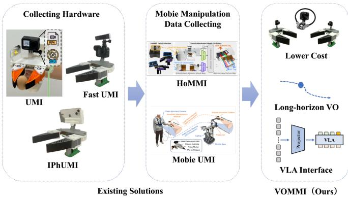
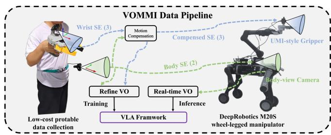
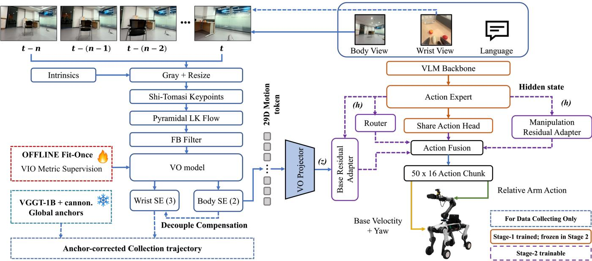
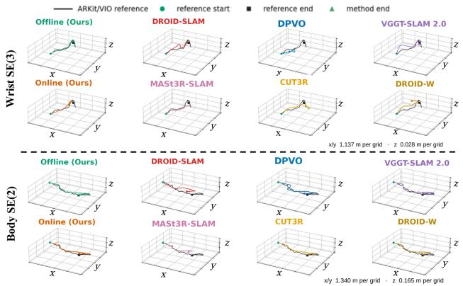
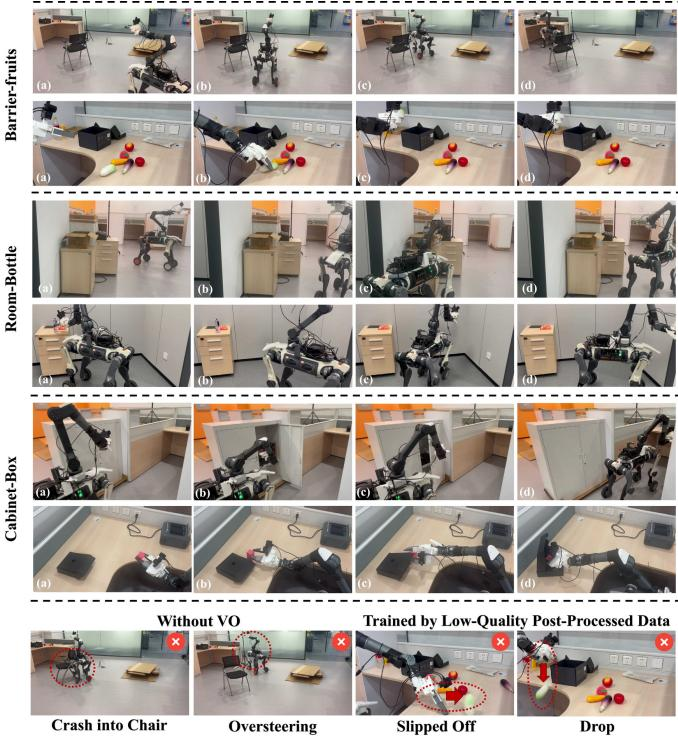
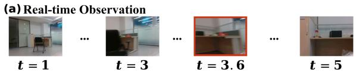
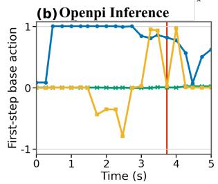
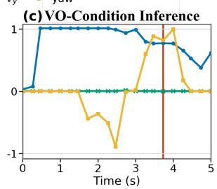

# VOMMI: Collecting and Leveraging Portable Demonstrations for Mobile Manipulation

Yutian Zhang1,∗, Xingrui Xiong4,∗, Siyuan Ma5,∗, Yang Li2, Jiawen Wen7, Jiaqi Zhai3, Liwen Yang1, Ce Hao6, Haozhen Chi8, Yangkun Zhu2, Yifan Zhu2, Xiaowen CHU7, Dong Wei6,†, Qiaojun Yu2,†, Dibo Hou1,† 1ZJU 2Shanghai AI Lab 3DeepRobotics 4Yale 5THU 6ZGCA 7HKUST(GZ) 8ZUST Equal contribution∗. Corresponding authors†

Abstract— Portable mobile-manipulation demonstrations can help alleviate data scarcity for embodied intelligence, but obtaining reliable, low-cost, and robot-free motion supervision from RGB observations remains challenging. Existing approaches often rely on teleoperation or specialized devices equipped with additional sensing hardware, while directly using estimated visual odometry (VO) trajectories can introduce inconsistencies due to accumulated drift and imperfect motion supervision. We present the Visual-Odometry-Conditioned Mobile Manipulation Interface (VOMMI), a portable demonstration collection and learning framework that connects portable RGB demonstrations to vision-language-action (VLA) post-training through offline trajectory reconstruction and online visualmotion conditioning. VOMMI synchronizes body and hand views to capture navigation context and local object interactions without requiring human–robot kinematic correspondence calibration. R2-VO refines offline demonstration trajectories using sparse geometric anchors and produces causal local-motion tokens over multiple prediction horizons for online policy conditioning. An action-group residual adapter incorporates these tokens only into the base branch. Experiments use a 500-trajectory portable for each task, with 75 trajectories held out for RGB-VO evaluation, and 200 robot demonstrations as references. Our policy, post-trained only on portable demonstrations, achieves 18.2% lower base-velocity error than a policy trained with robot-collected demonstrations, while maintaining comparable end-effector translation accuracy. Offline reconstruction reduces absolute trajectory errors for the body and hand streams by 24.6% on average relative to the best evaluated baseline for each stream. The complete system improves the mean success rate by 8.3 percentage points over OpenPI 0.5 across three real-robot tasks.

## I. INTRODUCTION

Mobile manipulation is a foundational capability for embodied intelligence, enabling robots to interact with the physical world in applications ranging from domestic assistance and infrastructure inspection to industrial automation. Mobile manipulation data collection typically involves long-horizon tasks, composed of multiple sequential stages, requiring a generalizable policy that can coordinate precise wholebody motion with fine-grained end-effector (EE) manipulation. Recent whole-body vision-language-action models (VLAs) [1], [2] and world action models (WAMs) [3], [4] advocate learning mobile manipulation as an integrated whole-body behavior rather than as separate navigation and arm-manipulation skills, but scaling such learning remains challenging due to the limited availability of demonstration data. Existing demonstration-collection paradigms often rely on teleoperation, which is expensive, slow, and difficult to scale for scene generalization. Cross-embodiment collection methods, such as UMI [5] and its variants [6]–[9], use handheld grippers with mounted cameras to collect manipulation demonstrations, while egocentric approaches use headmounted cameras to capture broader scene context [10]. For mobile manipulation tasks, existing methods have shown that portable demonstration collection is feasible [8], [9], [11].

  
Fig. 1. VOMMI. We build upon portable manipulation interfaces with a low-cost RGB-based perception system to enable accessible mobile demonstration collection and integration with VLA frameworks.

However, these approaches commonly depend on special devices, such as high-quality IMU sensors, GoPro cameras, iPhones, and VR headsets, which raise the hardware barrier for more accessible data collection and limit the number of demonstrators who can participate. Using visual odometry (VO) can reduce the complexity of the data-collection hardware, but it remains vulnerable to drift over long trajectories and large rotations, which can degrade data quality or even make the data unusable. Existing portable collection pipelines typically require accurate device calibration to recover reliable trajectories, placing strict demands on data post-processing, especially for mobile manipulation tasks.

As shown in Figure 1, we propose a VO-conditioned mobile-manipulation interface (VOMMI) to establish the data pipeline for training whole-body VLA policies from portable demonstrations. VOMMI records RGB videos from body and hand views and uses VO to recover local motion cues, enabling low-cost demonstration collection. Collection time pose references are used only for offline metric supervision and evaluation, while deployment relies solely on

RGB observations, camera intrinsics, timestamps, and robot proprioception. To improve trajectory quality during offline data processing, VOMMI can leverage pretrained visual geometry for base movement. These tokens are fed into the VLA post-training interface and connected only to the base-action residual adapter, while the manipulation residual remains blind to body motion. This design provides the missing local visual proprioception for navigation-conditioned mobile manipulation without claiming global localization or a new general-purpose VO algorithm. VOMMI is designed to test whether portable RGB demonstrations can improve long-horizon mobile-manipulation competence in a VLA policy, while making the answer auditable by separating portable-data supervision from robot-data supervision. Our contributions are summarized as follows:

• We propose a portable data-collection protocol for mobile manipulation with separate body and hand views, requiring no access to the target robot or human–robot kinematic correspondence calibration.

• We present R2-VO, a real-time and refined RGB motion reconstruction module that produces low-latency local motion tokens for online VLA inference and anchorrefined trajectories for offline dataset processing.

• We define an action interface with dimension-specific reference pose supervision and action-group residuals, so that the manipulation residual remains independent of the body-motion token.

## II. RELATED WORK

## A. Portable Demonstration Interfaces

Portable data collection is fast, cheap, and easy to deploy for mobile manipulators in diverse environments. UMI [5] records in-the-wild manipulation with a portable handheld interface and transfers relative EE actions to a robot. To enhance mobility, UMI-on-Legs combines this interface with a manipulation-centric whole-body controller [11], while Mobile UMI [9] introduces multiple views and decoupled planar-base and EE representations for mobile manipulation. HoMMI [8] and EgoHumanoid [10] further use egocentric human demonstrations to capture whole-body task context. These systems demonstrate the value of extending portable whole-body data from fixed-base to mobile manipulation tasks, but they require customized, dedicated hardware. In contrast, VOMMI addresses a complementary sensing question: how to recover the demonstrator’s motion from RGB observations without requiring metric pose or IMU measurements as policy inputs.

## B. Robot Learning for Mobile Manipulation

Mobile manipulation requires coordinated locomotion and manipulation over extended workspaces. HomeRobot integrates perception, navigation, and manipulation in realistic environments [12]. Recent whole-body learning methods address complementary control challenges, from forceaware compensation for contact-rich loco-manipulation to latent policies for unified loco-manipulation [1], [13]. In addition, bimanual manipulation learning uses egocentric demonstrations to learn active perception behaviors [14]. DECOWAM [15] trains adapters by separating base and arm latents and conditioning on base velocity to improve both future-video and action prediction. Despite these advances, existing portable-demonstration-based mobile manipulation policies often lack an explicit representation of recent egomotion when learning from portable RGB demonstrations. VOMMI addresses this gap by incorporating visual-odometry (VO) observations directly into the VLA and introducing separate residual pathways for body and manipulation actions. This design enables motion-aware whole-body correction without requiring metric pose or IMU measurements as policy inputs at deployment.

## C. Visual Body Motion for Policy State

Learning-based VO systems such as DROID-SLAM and DPVO improve sequential motion estimation, while VGGT and VGGT-SLAM 2.0 extend feed-forward geometry toward camera and real-time scene reconstruction [16]–[19]. Beyond geometric reconstruction, recent robot learning studies also explore recovering actionable trajectories from human or egocentric demonstrations, such as observation-only imitation and scalable egocentric data collection [20], [21]. However, these approaches either optimize geometric consistency or focus on embodiment alignment, rather than extracting policy-oriented motion for mobile manipulation.

VOMMI considers visual motion from a policy-oriented perspective. This causal local representation reduces sensitivity to constant world-frame offsets while preserving shortterm ego-motion cues relevant for whole-body control. The resulting token provides a compact visual proprioceptive state for policy conditioning rather than a globally consistent trajectory or localization memory.

## III. DATA COLLECTION SYSTEM

## A. Dual-view capture and temporal alignment

VOMMI is designed around a specific robot-free datacollection requirement: each demonstration must capture both the demonstrator’s locomotion and hand–object interaction using only RGB observations, without relying on additional sensing or target-robot instrumentation. Fig. 2 summarizes the data flow. The demonstrator wears a chestmounted fisheye RGB camera for scene context and body motion and carries a second fisheye RGB camera on the UMI-style gripper module for interaction. These two views are recorded as complementary streams and reconciled later through local timestamps and trajectory-based compensation, resampled at 15 Hz after validity checks. Each episode stores the language instruction, both videos and intrinsics, tool center point (TCP) and gripper signals, and validity masks. The resulting episode contains both the observations required for RGB reconstruction and the action targets necessary to train a whole-body policy. Collection-time sensor-derived trajectories serve as privileged offline references for R2- VO supervision and evaluation, but are not policy inputs at deployment. As shown in Table I, the cost of our VOMMI’s hardware is significantly lower than that of current portable data acquisition methods.

TABLE I  
REPRESENTATIVE HARDWARE REQUIREMENTS AND ESTIMATED ACQUISITION COST FOR PORTABLE DATA COLLECTION METHODS
<table><tr><td>Method</td><td>Camera(s)</td><td>View</td><td>Price (USD)</td></tr><tr><td>UMI [5]</td><td>GoPro</td><td>Wrist</td><td>$350-450</td></tr><tr><td>iPhUMI [7]</td><td>iPhone</td><td>Wrist</td><td>$1,000-1,200</td></tr><tr><td>FastUMI [6]</td><td>GoPro+RealSense T265</td><td>Wrist</td><td>$650-900</td></tr><tr><td>Mobile UMI [9]</td><td>Dual RGB</td><td>Wrist+ego</td><td>$800-1,200</td></tr><tr><td>VOMMI (ours)</td><td>2 fisheye RGB</td><td>Wrist+ego</td><td>$100-200</td></tr></table>

  
Fig. 2. Portable data collection interface. Independent Body and Hand RGB views are timestamped into a robot-compatible episode.

## B. Episode schema and split protocol

The collection contains 500 portable episodes per evaluated task. For each task, 75 complete episodes form a fixed held-out RGB-VO evaluation split and are excluded from estimator fitting, canonicalizer fitting, and model selection. The remaining 425 episodes support model development and downstream VLA training under the experimental protocol.

For each valid frame in the Hand stream, let $T _ { E } ^ { \dot { W } _ { H } } ( t ) \in$ SE(3) denote the TCP pose at time t, expressed in the Hand-stream local world frame $W _ { H }$ . The current-relative manipulation target at future step k is then defined as:

$$
A _ { t , k } ^ { \mathrm { t c p } } = \left( T _ { E } ^ { W _ { H } } ( t ) \right) ^ { - 1 } T _ { E } ^ { W _ { H } } ( t + k + 1 ) ,\tag{1}
$$

which is the tracking-derived current-TCP-relative SE(3) reference used for Hand supervision. The Body stream supplies the corresponding planar reference $[ \Delta x , \Delta y , \Delta \psi ]$ . During RGB source replacement, the canonicalized Body trajectory is aligned with the Hand timestamps and used to compensate the Hand TCP motion. Section V defines this compensation and the resulting action targets.

## IV. PROBLEM FORMULATION

The central data-construction problem is to recover a robot-compatible local motion representation from two unsynchronized RGB streams, enabling the transfer of portable human demonstrations to robot policy learning. Let $\bar { I } _ { 0 : T } ^ { B }$ and $I _ { 0 : T } ^ { H }$ denote the Body and Hand videos. The Body trajectory is represented by planar motion as:

$$
\xi _ { t , k } ^ { B } = [ \Delta x _ { t , k } , \Delta y _ { t , k } , \Delta \psi _ { t , k } ] \in \mathfrak { s e } ( 2 ) ,\tag{2}
$$

whereas the Hand trajectory captures fine-grained manipulation motion through current-relative TCP motion, yielding a local SE(3) representation that reduces dependence on the global reference frame:

$$
\xi _ { t , k } ^ { E } = \log \left( \mathcal { T } _ { E } ( t ) ^ { - 1 } \mathcal { T } _ { E } ( t + k + 1 ) \right) = [ \Delta p _ { t , k } , \phi _ { t , k } ] \in \mathfrak { s e } ( 3 ) .\tag{3}
$$

We estimate the motions in Eqs. (2) and (3) from past RGB observations and compensate the Hand motion using the planar Body estimate. The Body trajectory is canonicalized and aligned with the Hand timestamps, yielding Eq. (4):

$$
T _ { E | B } ^ { \mathrm { c o m p } } ( t ) = \left( T _ { B } ( t ) \right) ^ { - 1 } T _ { E } ( t ) ,\tag{4}
$$

where $T _ { B } ( t )$ and $T _ { E } ( t )$ are expressed in the same reference frame. Reference trajectories provide privileged supervision for offline data construction and evaluation, while deployment relies only on RGB observations.

## A. Unified Observation and Action Space

The source-conditioned observation is:

$$
\mathcal { O } _ { t } ^ { s } = ( \ell , I _ { t - h } ^ { B , s } , I _ { t - h } ^ { H , s } , s _ { t } ^ { s } , M _ { t } ^ { o } ) ,\tag{5}
$$

In $\operatorname { E q . } ( 5 ) , M _ { t } ^ { o }$ masks unavailable source-specific observation components. Here, t denotes the current policy frame, k denotes a future step within the action chunk, and H denotes the chunk horizon. Superscripts B, H, and E denote Bodycamera, Hand-camera, and TCP quantities, respectively. Superscripts ref” and rgb” denote collection-time reference and RGB-reconstructed trajectories, respectively. The policy predicts a horizon-H action chunk:

$$
A _ { t + H - 1 } \in \mathbb { R } ^ { H \times 1 6 } , \qquad H = 5 0 ,\tag{6}
$$

with each step represented canonically as:

$$
\begin{array} { r l } & { a _ { t , k } = [ v _ { x } , v _ { y } , \dot { \psi } , \xi _ { t , k } ^ { E } , q _ { 0 : 5 } , g ] , } \\ & { \xi _ { t , k } ^ { E } = \log \left( T _ { E _ { t + k + 1 } } ^ { E _ { t } } \right) = [ \Delta p _ { t , k } , \phi _ { t , k } ] \in \mathbb { R } ^ { 6 } . } \end{array}\tag{7}
$$

where $k = 0 , \ldots , H { - } 1 , \phi _ { t , k }$ is the rotation-vector logarithm, q0:5 are the six arm-joint targets, and g is the gripper target. Eq. (6) sets a 50-step chunk at the 15-Hz policy clock, and Eq. (7) expresses base velocities in the current Body frame and $\xi _ { t , k } ^ { E }$ in the current TCP frame. The action mask $M _ { t } ^ { a } \in$ $0 , 1 ^ { H \times 1 6 }$ indicates the valid action dimensions. The same masks are used in Sec. V and exclude missing values rather than treating them as zeros.

## V. VOMMI

VOMMI converts portable RGB demonstrations into a unified whole-body policy through the pipeline shown in Fig. 3. Local base and EE actions provide a common representation across demonstrator and robot embodiments. R2-VO refines demonstration trajectories offline using sparse geometric anchors and provides causal body-motion estimates from RGB observations online. We encode these online estimates as a multi-horizon motion token and integrate it into the policy through an action-group residual adapter, restricting motion-conditioned updates to the body actions.

R2 - VO  
  
Fig. 3. Overview of VOMMI. The online branch estimates multi-horizon local motion from RGB and conditions the base-action residual. The offline branch combines the causal estimator with frozen VGGT anchors, initializes the Body trajectory at its first valid pose, and applies planar Body compensation to the Hand stream before forming demonstration targets. Reference pose supervision available only during data collection.

## A. Local Cross-Embodiment Action Representation

We express body motion commands in the current body frame and EE targets in the current TCP frame. This representation provides a common action interface across portable and robot data while avoiding supervision tied to an arbitrary world origin. A per-sample mask, $M _ { i } ^ { a } \in \{ 0 , 1 \} ^ { H \times 1 6 }$ , selects the action dimensions available from each source, and the flow loss is normalized over the valid dimensions before being averaged across the batch.

Local actions reduce sensitivity to global pose errors. Let $T _ { t }$ be the true pose and $\widehat { T } _ { t } = G _ { t } \dot { T } _ { t }$ its estimate, where $G _ { t }$ is a time-varying world-frame error. We define the current-frame relative target as:

$$
\widehat { \Delta { T } } _ { t , i } = { \widehat { T } } _ { t } ^ { - 1 } { \widehat { T } } _ { t + i } = T _ { t } ^ { - 1 } G _ { t } ^ { - 1 } G _ { t + i } T _ { t + i } ,\tag{8}
$$

Eq. (8) cancels constant global translation and yaw offsets when $G _ { t } = G _ { t + i }$ . Otherwise, only the local error increment $G _ { t } ^ { - 1 } G _ { t + i }$ enters the relative target. The same property applies independently to the Body and Hand streams, even though their tracking frames are not mutually registered. Accordingly, we formulate relative targets independently within each stream.

## B. Body-Hand Alignment and Planar Compensation

A body-relative hand trajectory requires the hand TCP and body pose to be expressed in a common coordinate system.

Let $W _ { H }$ and $W _ { B }$ denote the tracking worlds of the hand and Body streams, $C _ { H }$ and $C _ { B }$ their camera frames, E the hand TCP, and B the demonstrator body frame. For a setting with a verified rigid cross-device registration $A _ { B H } = T _ { W _ { H } } ^ { W _ { B } }$ and fixed camera extrinsics $X _ { H } = T _ { E } ^ { C _ { H } } , X _ { B } = T _ { B } ^ { C _ { B } }$ , the

trajectories would satisfy:

$$
T _ { E } ^ { W _ { H } } ( t ) = T _ { C _ { H } } ^ { W _ { H } } ( t ) X _ { H } ,\tag{9}
$$

$$
T _ { B } ^ { W _ { B } } ( t ) = T _ { C _ { B } } ^ { W _ { B } } ( t ) X _ { B } ,\tag{10}
$$

$$
\hat { T } _ { E } ^ { W _ { B } } ( t ) = \hat { A } _ { B H } T _ { E } ^ { W _ { H } } ( t ) .\tag{11}
$$

Applying Eq. (4) to the registered poses in Eqs. (9)–(11) gives the body-relative TCP pose:

$$
T _ { E } ^ { B } ( t ) = \left( T _ { B } ^ { W _ { B } } ( t ) \right) ^ { - 1 } \hat { T } _ { E } ^ { W _ { B } } ( t ) .\tag{12}
$$

For RGB-based Body trajectory reconstruction, we refine the planar motion estimated from RGB observations using a frozen VGGT+anchor branch. Let $\widetilde { T } _ { B } ^ { R } ( t ) \in \mathrm { S E } ( 2 )$ denote the resulting canonicalized Body trajectory, where VGGT provides global geometric constraints and sparse anchors recover metric consistency to mitigate long-term VO drift. We initialize this trajectory at its first valid timestamp $t _ { 0 }$ as:

$$
G _ { \mathrm { i n i t } } = \widehat { T } _ { B } ^ { R } ( t _ { 0 } ) \left( \widetilde { T } _ { B } ^ { R } ( t _ { 0 } ) \right) ^ { - 1 } , \qquad \widehat { T } _ { B } ^ { R } ( t ) = G _ { \mathrm { i n i t } } \widetilde { T } _ { B } ^ { R } ( t ) .\tag{13}
$$

The trajectory initialized in Eq. (13) supplies planar displacement for compensation. Under a constant left gauge, its relative increments are invariant as shown in Eq. (14):

$$
\begin{array} { r } { \widetilde T _ { B } ( t ) ^ { - 1 } \widetilde T _ { B } ( t + k ) = T _ { B } ( t ) ^ { - 1 } T _ { B } ( t + k ) . } \end{array}\tag{14}
$$

Planar compensation projects the Body motion to SE(2) and lifts it to SE(3):

$$
T _ { B , \parallel } ^ { W _ { B } } ( t ) = \left[ \begin{array} { c c } { R _ { z } ( \psi _ { B } ( t ) ) } & { [ x _ { B } ( t ) , y _ { B } ( t ) , 0 ] ^ { \top } } \\ { \mathbf { 0 } ^ { \top } } & { 1 } \end{array} \right] ,\tag{15}
$$

where $\left( x _ { B } , y _ { B } , \psi _ { B } \right)$ are the body translation and yaw in the common reference. Using Eq. (15) in Eq. (12) gives the planar-compensated Hand pose:

$$
\begin{array} { r } { \bar { T } _ { E | B } ^ { \| } ( t ) = \big ( T _ { B , \| } ^ { W _ { B } } ( t ) \big ) ^ { - 1 } \hat { T } _ { E } ^ { W _ { B } } ( t ) , } \end{array}\tag{16}
$$

and the current-relative future target is:

$$
\begin{array} { r } { \boldsymbol A _ { t , k } ^ { e e , \parallel } = \left( \bar { T } _ { E | B } ^ { \parallel } ( t ) \right) ^ { - 1 } \bar { T } _ { E | B } ^ { \parallel } ( t + k + 1 ) . } \end{array}\tag{17}
$$

For $q \in \{ \mathrm { r e f } , \mathrm { r g b } \}$ , let $\mathbf { p } _ { B } ^ { q } ( t )$ and $\psi _ { B } ^ { q } ( t )$ denote the canonical Body translation and heading. Here, q = ref denotes the collection-time reference and $q = \mathrm { r g b }$ denotes the RGB reconstruction. After interpolation to hand timestamps, we form the planar body transform:

$$
\begin{array} { r } { T _ { B , q } ^ { W _ { B } } ( t ) = \left[ { R _ { z } ( \psi _ { B } ^ { q } ( t ) ) } [ p _ { B , x } ^ { q } ( t ) , p _ { B , y } ^ { q } ( t ) , 0 ] ^ { \top } \right] . } \end{array}\tag{18}
$$

The body-normalized TCP pose and relative target are:

$$
\begin{array} { r l } & { \bar { T } _ { E | B } ^ { q } ( t ) = \left( T _ { B , q } ^ { W _ { B } } ( t ) \right) ^ { - 1 } \hat { T } _ { E } ^ { W _ { B } } ( t ) , } \\ & { \quad A _ { t , k } ^ { e e , q } = \left( \bar { T } _ { E | B } ^ { q } ( t ) \right) ^ { - 1 } \bar { T } _ { E | B } ^ { q } ( t + k + 1 ) . } \end{array}\tag{19}
$$

Portable RGB source-replacement and VLA experiments use Eqs. (18)–(19) with $q = \mathrm { r g b }$ to compensate Body translation in x and y and Body yaw. These equations apply the planarcompensation rule in Eqs. (16)–(17) to the selected Body trajectory source.

During deployment, the robot-side adapter composes the predicted base transform $T _ { B , \mathrm { c m d } } ^ { W _ { R } } ( t + k )$ and emits:

$$
T _ { E _ { t + k } , \mathrm { c m d } } ^ { E _ { t } } = \left( T _ { E } ^ { W _ { R } } ( t ) \right) ^ { - 1 } T _ { B , \mathrm { c m d } } ^ { W _ { R } } ( t + k ) \bar { T } _ { E | B } ^ { \mathrm { d e s } } ( t + k ) ,\tag{20}
$$

where $\bar { T } _ { E \mid B } ^ { \mathrm { d e s } }$ denotes the planar-compensated target. Eq. (20) yields the six current-TCP-relative EE dimensions.

## C. R2-VO

R2-VO provides local metric motion from RGB in two complementary modes. The causal branch produces motion tokens for deployment, while the offline branch refines trajectories during demonstration construction. Both branches share the same frozen motion estimator.

1) Causal Local Motion Estimation: For consecutive Body-camera frames, the collection-time tracker provides the planar motion target $\Delta \xi _ { t , 1 } = [ \Delta x , \Delta y , \Delta \psi ]$ . We extract visual motion descriptors from optical flow, geometric cues, and track quality statistics, resulting in a 206-dimensional descriptor. A seven-frame temporal window augments this descriptor to 317 dimensions by incorporating temporal motion information. An extremely randomized tree regressor with 32 trees predicts the one-step motion target. During inference, the estimator uses only past RGB frames, camera intrinsics, and timestamps.

Atomic predictions are resampled to the 15-Hz clock and composed over horizons of $k \in \{ 2 , 3 , 6 , 1 2 \}$ frames, corresponding to 0.13, 0.20, 0.40, 0.80 s. Starting from $( x , y , \theta ) =$ $( 0 , 0 , 0 )$ , each step integrates the body-frame velocities $[ v _ { x } , v _ { y } , \omega ]$ as follows:

$$
\begin{array} { r } { \theta _ { j + \frac { 1 } { 2 } } = \theta _ { j } + \frac { 1 } { 2 } \omega _ { j } \Delta t , } \end{array}\tag{21}
$$

$$
x _ { j + 1 } = x _ { j } + ( v _ { x , j } \cos \theta _ { j + \frac { 1 } { 2 } } - v _ { y , j } \sin \theta _ { j + \frac { 1 } { 2 } } ) \Delta t ,\tag{22}
$$

$$
y _ { j + 1 } = y _ { j } + ( v _ { x , j } \sin \theta _ { j + \frac { 1 } { 2 } } + v _ { y , j } \cos \theta _ { j + \frac { 1 } { 2 } } ) \Delta t ,\tag{23}
$$

$$
\begin{array} { r } { \theta _ { j + 1 } = \theta _ { j } + \omega _ { j } \Delta t , } \end{array}\tag{24}
$$

where $\Delta t = 1 / 1 5$ . Each horizon is represented by:

$$
\begin{array} { r } { [ x , y , \sin \theta , \cos \theta , \log \sigma _ { x } , \log \sigma _ { y } , \log \sigma _ { \theta } ] , } \end{array}\tag{25}
$$

with $\sigma _ { x } = \sigma _ { y } = \sigma _ { \theta } = 0 . 0 2 \sqrt { k / 2 }$ . Eqs. (21)–(24) compose source-Body-frame increments in each horizon’s windowstart frame. Concatenating four encodings from Eq. (25) with a history-validity bit yields $\nu _ { t } \in \mathbb { R } ^ { 2 9 }$ . The incomplete history is assigned $\nu _ { t } = 0$ and $q _ { t } = 0$ . The resulting token encodes causal short-horizon Body motion.

2) Offline Drift Refinement: For offline action construction, R2-VO combines the integrated causal trajectory with 1-Hz VGGT-1B anchors [18]. A low-capacity canonicalizer $C$ maps VGGT coordinates to the metric initial-camera frame. Let $_ { g _ { t , x y } }$ denote the sparse metric anchors obtained from canonicalized VGGT geometry, $c _ { t , x y }$ denote the integrated causal VO trajectory, and $L ( c _ { x y } ) _ { t }$ denote the causal trajectory evaluated at the anchor timestamps. The refined trajectory preserves short-term VO motion while correcting accumulated drift through sparse geometric constraints:

$$
\hat { p } _ { t , x y } ^ { \mathrm { o f f } } = g _ { t , x y } + c _ { t , x y } - L ( c _ { x y } ) _ { t } .\tag{26}
$$

The canonicalizer is a weighted Ridge map from firstframe-centered VGGT positions and temporal features to metric reference positions in the initial-camera frame:

$$
\operatorname* { m i n } _ { \Theta } \sum _ { e } \frac { 1 } { N _ { e } } \sum _ { t } \| [ ( \phi ( u _ { e , t } ) - \mu ) / s ] \Theta - p _ { e , t } ^ { \mathrm { r e f } } \| _ { 2 } ^ { 2 } + \lambda \| \Theta \| _ { F } ^ { 2 } ,\tag{27}
$$

In Eq. (27), $u _ { e , t }$ is the normalized VGGT position, and $\phi$ supplies linear, time-augmented, or quadratic features for metric translation prediction. For the Hand stream, sparse anchors refine the vertical component during offline action construction, while the Hand VO branch predicts the complete local TCP SE(3) increment, including rotation, from RGB observations. The TCP-relative pose in Eq. (1) serves as the training and evaluation target.

For source-replaced demonstrations, the offline Body trajectory from Eq. (26) is interpolated to the Hand timestamps and inserted into Eq. (18) to construct demonstration labels. Online inference uses causal local increments.

## D. VO-Conditioned Action-Group Adaptation

To condition the base actions on visual motion, we augment the pretrained action expert with separate residual branches for base and manipulation actions. Let $h _ { t , k } \in \mathbb { R } ^ { 1 0 2 4 }$ and $u _ { t , k } ^ { 0 } \in \mathbb { R } ^ { 3 2 }$ denote the expert hidden state and flow prediction at step (t, k). A LayerNorm-MLP P projects the motion token, centered and gated by a validity indicator:

$$
z _ { t } = q _ { t } [ P ( \nu _ { t } ) - P ( 0 ) ] .\tag{28}
$$

After lifting $z _ { t }$ from Eq. (28) to the hidden dimension, the base residual is:

$$
r _ { t , k } ^ { b } = R _ { b } ( [ h _ { t , k } \odot W _ { z } z _ { t } , z _ { t } ] ) - R _ { b } ( 0 ) ,\tag{29}
$$

while the manipulation residual $r _ { t , k } ^ { m } = R _ { m } ( h _ { t , k } )$ does not receive body motion. Independent gates $( g ^ { b } , g ^ { m } ) = \sigma ( W _ { r } h _ { t , k } )$

combine the two paths:

$$
\widehat { u } _ { t , k } = u _ { t , k } ^ { 0 } + g _ { t , k } ^ { b } r _ { t , k } ^ { b } M _ { b } + g _ { t , k } ^ { m } r _ { t , k } ^ { m } M _ { m } ,\tag{30}
$$

where $M _ { b }$ selects dimensions 0:3, $M _ { m }$ selects 3:16, and both are zero on padded dimensions. Zero-initialized outputs preserve the pretrained policy at initialization. Eqs. (29)–(30) restrict motion-conditioned updates to the base group. Router targets are derived from base and manipulation activity. The training objective is:

$$
\mathcal { L } = \frac { 1 } { B } \sum _ { i } \mathcal { L } _ { \mathrm { f l o w } } ^ { ( i ) } + 0 . 1 \mathcal { L } _ { \mathrm { r o u t e r } } ,\tag{31}
$$

where Eq. (31) averages the validity-normalized per-sample flow losses. Each flow loss applies the corresponding action masks.

## VI. EXPERIMENTS

In this section, we evaluate the impact of R2-VO postprocessing on data quality, the performance of the VOconditioned VLA policy, and real-world deployment across diverse mobile manipulation tasks. The experiments address the following research questions:

• Q1: How accurately can R2-VO reconstruct trackingderived planar SE(2) and local TCP SE(3) pose references from RGB data?

• Q2: Do VO-refined data improve real-world rollouts?

• Q3: How does the local motion token affect longhorizon mobile manipulation?

• Q4: Which components contribute most significantly to the R2-VO and VOMMI?

## A. Experimental Setting

Tasks and evaluation metrics. Our benchmark contains three mobile-manipulation tasks: moving across barriers to pick up different fruits, moving in and out of a room to manipulate a bottle, and opening a cabinet door to place a folded box. We use collection-time tracking-derived references for both streams: a planar metric motion reference for Body and a tracking-derived local TCP SE(3) pose reference for Hand. For data post-processing, we report trajectory error against these references. For real-world rollout, we evaluate the wheel-legged DeepRobotics M20S equipped with a CM1 manipulator over 20 independent trials per condition, reporting task success rate and action deviation from the reference commands.

Baselines. To evaluate VOMMI, we compare it with DROID-W [16], DPVO [17], MASt3R-SLAM [22], and CUT3R [23], and VGGT-SLAM 2.0 [19] for VO performance, as well as OpenPI 0.5 [24], GR00T N1.6 [25], and X-VLA [26] for real-world evaluation.

## B. Main Experiment Results

VO motion accuracy (Q1). We evaluate the frozen RGBbased R2-VO on the fixed 75-episode held-out test split defined above. Table II reports the per-step relative-motion reconstruction error for the Body and Hand streams in their local references. Source-replacement and VLA use the RGBsource planar compensation $( q = \mathrm { r g b } )$ defined in Sec. V-B. Body-span uses the same held-out split.

  
Fig. 4. Camera trajectories reconstruction on held-out episode trail. The online stream and reference are projected to the ground plane. Offline Body scores in Table II use the common x–y state.

At the deployed 15-Hz step, the causal Ours branch gives 0.26/0.54 cm Body translation error (mean/P90). Its TCP-relative Hand-stream evaluator gives 0.601/1.081 cm translation and $0 . 3 4 6 / 0 . 7 1 7 ^ { \circ } \mathrm { S O ( 3 ) }$ rotation. With completesequence access for demonstration conversion, the Ours Offline (VGGT+anchor) branch gives 0.244/0.592 cm and 0.093/0.224◦ for Body, and 0.600/1.082 cm and 0.340/0.704◦ for hand at the same 67-ms reference span. On an Intel Core i5-9600KF CPU, the causal Body branch takes 10.02 ms on average (P95: 13.76 ms), excluding image capture and decoding. Table II uses local increments: Body is planar SE(2) and Hand is TCP-relative SE(3). Ours and DPVO use matched stored-frame spans, whereas CUT3R and MASt3R-SLAM retain native sparse steps from 1-Hz RGB bundles. Thus, the baseline rows are not all 15-Hz runs.

At the deployed 15-Hz step, R2-VO lowers mean translation error by 80.4% and 83.8% relative to DPVO and DROID-SLAM, respectively. At 267 ms, it retains 0.878 cm mean error, corresponding to reductions of 79.9% and 84.1%. The measured latency is compatible with online 15-Hz inference. Accumulated trajectory drift is reported in the accumulated-error columns of Table II.

Table II groups local and accumulated errors by stream. Bold entries indicate minima before rounding. Integrating the causal Body branch gives 15.65 cm ATE and 19.29 cm endpoint error. The offline VGGT+anchor variant reduces these to 5.97 cm and 5.33 cm. The accumulated metrics are therefore trajectory diagnostics rather than deploymentrate runtime rankings. Offline reconstruction reduces mean absolute Body/Hand trajectory error by 24.6% versus the best baseline for each stream.

Overall performance on mobile manipulation tasks (Q2). Figure 5 shows representative rollouts. Across the tasks in Table III, mean success is 58.3% for VOMMI versus 50.0% for OpenPI 0.5, an 8.3-percentage-point gain. Table IV evaluates policy predictions against reference actions on 15 real-robot trajectories. M20-trained uses robot demonstrations. VOMMI-R/A use portable demonstrations with compensated current-TCP-relative targets and uncompensated absolute targets. Metrics pool valid actions over 50-step horizons: Base MAE averages $| v _ { x } - v _ { x } ^ { * } |$ and $| v _ { y } - v _ { y } ^ { * } |$ Yaw MAE averages $| \dot { \psi } - \dot { \psi } ^ { * } |$ , where stars denote reference commands. EE errors compare forward-kinematic TCP poses in the current TCP frame. VOMMI-R reduces base MAE from 0.044 to 0.036 m/s (18.2%) relative to M20-trained. Compared with VOMMI-A, EE translation/rotation errors fall from 0.569 cm/1.091◦ to 0.170 cm/0.453◦TABLE IV .

TABLE II  
LOCAL AND ACCUMULATED MOTION ERRORS ON VOMMI TRAJECTORIES. LOWER IS BETTER.
<table><tr><td></td><td colspan="4">Body SE(2)</td><td colspan="6">Hand SE(3)</td></tr><tr><td></td><td colspan="2">Local (mean/P90)</td><td colspan="2">Accumulated</td><td colspan="2">Local (mean/P90)</td><td colspan="4">Accumulated</td></tr><tr><td>Method</td><td>Trans. (cm)</td><td>Yaw (°)</td><td></td><td>XY ATE (cm) XY End (cm)</td><td>Trans. (cm)</td><td>Rot.  ${ \bf \Xi } ( ^ { \circ } )$ </td><td>3D ATE (cm) 3D End (cm) XY ATE (cm) XY End (cm)</td><td></td><td></td><td></td></tr><tr><td>Ours (online)</td><td>0.26/0.54</td><td>0.092/0.227</td><td>15.65</td><td>19.29</td><td>0.60/1.08</td><td>0.346/0.717</td><td>71.82</td><td>60.42</td><td>71.51</td><td>60.30</td></tr><tr><td>Ours (offline)</td><td>0.24/0.58</td><td>0.093/0.224</td><td>5.97</td><td>5.33</td><td>0.60/1.08</td><td>0.340/0.704</td><td>50.47</td><td>56.68</td><td>50.23</td><td>56.66</td></tr><tr><td>DPVO</td><td>1.24/2.86</td><td>0.412 0.537</td><td>28.09</td><td>27.86</td><td>14.48/21.90†</td><td>3.887/8.591†</td><td>220.28</td><td>219.21</td><td>220.16</td><td>219.21</td></tr><tr><td>DROID-SLAM</td><td>1.50/3.21</td><td>0.309/0.662</td><td>83.86</td><td>62.67</td><td>2.85/4.62†</td><td>2.358/4.834†</td><td>124.54</td><td>109.75</td><td>124.16</td><td>109.45</td></tr><tr><td>DROID-W</td><td>0.45/1.07</td><td>0.140/0.345</td><td>8.54</td><td>8.02</td><td>4.91/7.83†</td><td>3.202/6.665†</td><td>126.12</td><td>138.17</td><td>125.80</td><td>137.86</td></tr><tr><td>VGGT-SLAM 2.0</td><td>0.86/1.63</td><td>0.227/0.463</td><td>6.88</td><td>9.95</td><td>10.95/19.44†</td><td>6.100/10.443†</td><td>95.41</td><td>83.90</td><td>94.78</td><td>83.68</td></tr><tr><td>CUT3R</td><td>24.52/52.81</td><td>0.906/1.954</td><td>23.91</td><td>25.01</td><td>23.69/41.60†</td><td>10.748/23.975†</td><td>83.35</td><td>103.57</td><td>83.02</td><td>103.57</td></tr><tr><td>MASt3R-SLAM</td><td>63.71/106.800.581/1.137</td><td></td><td>66.03</td><td>57.43</td><td>165.25/235.28†</td><td>35.939/59.034†</td><td>78.88</td><td>84.80</td><td>78.42</td><td>85.31</td></tr></table>

  
Fig. 5. Qualitative M20S rollouts on three long-horizon mobilemanipulation tasks. The upper rows show representative stages from navigation and approach to object interaction and task completion. The bottom row shows representative failure cases, marked with red crosses.

TABLE III  
COMPLETE-TASK SUCCESS RATE (%) OVER 20 TRIALS PER TASK.
<table><tr><td>Method</td><td>Barriers-fruit Room-bottle Cabinet-box</td><td></td><td></td></tr><tr><td>OpenPI 0.5</td><td>35</td><td>50</td><td>65</td></tr><tr><td>GR00T N1.6</td><td>20</td><td>25</td><td>10</td></tr><tr><td>X-VLA</td><td>25</td><td>35</td><td>30</td></tr><tr><td>VOMMI (ours)</td><td>65</td><td>60</td><td>50</td></tr></table>

OPEN-LOOP ACTION PREDICTION ERRORS.
<table><tr><td>Policy</td><td>Base MAE (m/s)</td><td>Yaw MAE (rad/s)</td><td>EE trans. mean (cm)</td><td>EE rot. mean (°)</td><td>EE trans. max (cm)</td></tr><tr><td>M20-trained</td><td>0.044</td><td>0.107</td><td>0.155</td><td>0.372</td><td>4.32</td></tr><tr><td>VOMMI-R</td><td>0.036</td><td>0.104</td><td>0.170</td><td>0.453</td><td>4.55</td></tr><tr><td>VOMMI-A</td><td>0.079</td><td>0.204</td><td>0.569</td><td>1.091</td><td>13.96</td></tr></table>

## C. Ablation Study

TABLE V  
RESIDUAL ABLATION: FLOW LOSS $( \times 1 0 ^ { - 2 } )$
<table><tr><td>Variant</td><td>Residual target</td><td>Overall</td><td>Navigation</td><td>Port. manip.</td></tr><tr><td>Parent</td><td>None</td><td></td><td></td><td>3.86±0.06 3.82±0.06 3.99±0.19</td></tr><tr><td>Base-VO</td><td>Base (VO)</td><td></td><td></td><td>3.91±0.03 3.90±0.07 3.95±0.16</td></tr><tr><td></td><td>All-Action-VO All actions (VO)</td><td></td><td></td><td>3.83±0.05 3.82±0.11 3.88±0.22</td></tr><tr><td>VOMMI</td><td>Base (VO) + manip.</td><td></td><td>3.79±0.02 3.76±0.07 3.89±0.20</td><td></td></tr></table>

  
Fig. 6. Open-loop comparison using global observations and first-step base actions $( v _ { x } , v _ { y } , \mathrm { y a w } )$ , with the residual VO turn highlighted at $t = 3 . 7 3 :$ s.

Local-action robustness (Q3). Figure 6 further examines how motion conditioning changes the temporal action response on one real-robot episode. At the highlighted observation, the OpenPI baseline has returned to near-zero yaw, whereas the VO-conditioned policy retains a positive yaw command. This case study shows that local-motion conditioning materially changes policy dynamics.

VO conditioning and residual design (Q4). Table V compares Parent (no VO or residual), Base-VO (a VOconditioned base residual), All-Action-VO (VO-conditioned residuals for all actions), and VOMMI (a VO-conditioned base residual plus a manipulation residual driven only by $h _ { t , k } )$ We report overall, navigation, and portablemanipulation flow losses. Within-source shuffled VO provides a paired motion-content check for the VO variants.

## VII. LIMITATION AND CONCLUSION

Portable VOMMI demonstrations support local-motion prediction and produce actions that closely match the teleoperation references in in-domain real-world tasks, demonstrating effectiveness on long-horizon mobile manipulation tasks. These benefits are most pronounced in settings with substantial navigation demands, while gains are relatively limited in tasks dominated by manipulation. Our method has been validated on the M20S platform, while further crossembodiment evaluation remains necessary.

VOMMI provides a portable RGB framework for learning long-horizon mobile manipulation from robot-free demon strations. It combines provenance-aware masked observations, causal body-frame motion, planar Body-to-Hand compensation, and action-group residuals that condition base actions on visual motion. Collection-time tracking poses supervise the RGB motion estimator and the local TCP SE(3) predictor during data construction. Together, these components form a unified pipeline from portable demonstrations to whole-body policy learning.

## ACKNOWLEDGMENTS

AI-Use Disclosure. OpenAI Codex assisted with drafting and revising selected manuscript text, refining figure captions, checking reference consistency, formatting, and generating plotting code from author-provided statistics. The authors reviewed and verified all AI-assisted content and take full responsibility for the final manuscript.

## REFERENCES

[1] H. Jiang, J. Chen, Q. Bu, L. Chen, M. Shi, Y. Zhang, D. Li, C. Suo, C. Wang, Z. Peng, and H. Li, “WholeBodyVLA: Towards unified latent VLA for whole-body loco-manipulation control,” in International Conference on Learning Representations, 2026.

[2] Y. Hu, H. Zhu, B. Zheng, Y. Hu, T. Zhang, Z. Chen, J. Zhao, R. Nai, and Y. Gao, “OpenHLM: An empirical recipe for wholebody humanoid loco-manipulation,” arXiv preprint arXiv:2606.22174, 2026. [Online]. Available: https://arxiv.org/abs/2606.22174

[3] Z. Li, Z. Zhang, Y. Wei, W. Zhang, X. Yuan, P. Zhi, G. Li, X. Guo, F. Gao, J. Yang, and S. Zhang, “ω-0: A latent predictive world action model for concurrent humanoid locomanipulation,” arXiv preprint arXiv:2608.06375, 2026. [Online]. Available: https://arxiv.org/abs/2608.06375

[4] J. Zheng, T. Ma, Y. Fan, Z. Wang, S. Yang, and J. Liang, “MotionWAM: Towards foundation world action models for realtime humanoid loco-manipulation,” arXiv preprint arXiv:2606.09215, 2026. [Online]. Available: https://arxiv.org/abs/2606.09215

[5] C. Chi, Z. Xu, C. Pan, E. Cousineau, B. Burchfiel, S. Feng, R. Tedrake, and S. Song, “Universal manipulation interface: In-the-wild robot teaching without in-the-wild robots,” arXiv preprint arXiv:2402.10329, 2024. [Online]. Available: https://arxiv.org/abs/2402.10329

[6] Zhaxizhuoma, K. Liu, C. Guan, Z. Jia, Z. Wu, X. Liu, T. Wang, S. Liang, P. Chen, P. Zhang, H. Song, D. Qu, D. Wang, Z. Wang, N. Cao, Y. Ding, B. Zhao, and X. Li, “FastUMI: A scalable and hardware-independent universal manipulation interface with dataset,” arXiv preprint arXiv:2409.19499, 2025. [Online]. Available: https://arxiv.org/abs/2409.19499

[7] A. Patel, B. Pekarek, J. E. C. Hernandez, and S. Song, “Behavior prompting policy: Demonstrations as prompts for manipulation,” arXiv preprint arXiv:2606.30457, 2026. [Online]. Available: https: //arxiv.org/abs/2606.30457

[8] X. Xu, J. Park, H. Zhang, E. Cousineau, A. Bhat, J. Barreiros, D. Wang, and S. Song, “HoMMI: Learning whole-body mobile manipulation from human demonstrations,” arXiv preprint arXiv:2603.03243, 2026. [Online]. Available: https://arxiv.org/abs/2603.03243

[9] H. Huang, H. Dong, and H. Dong, “Mobile UMI: Crossview diffusion policy with decoupled kinematics for mobile manipulation,” arXiv preprint arXiv:2605.20894, 2026. [Online]. Available: https://arxiv.org/abs/2605.20894

[10] M. Shi, S. Peng, J. Chen, H. Jiang, Y. Li, D. Huang, P. Luo, H. Li, and L. Chen, “EgoHumanoid: Unlocking in-thewild loco-manipulation with robot-free egocentric demonstration,” arXiv preprint arXiv:2602.10106, 2026. [Online]. Available: https: //arxiv.org/abs/2602.10106

[11] H. Ha, Y. Gao, Z. Fu, J. Tan, and S. Song, “UMI on legs: Making manipulation policies mobile with manipulation-centric whole-body controllers,” arXiv preprint arXiv:2407.10353, 2024. [Online]. Available: https://arxiv.org/abs/2407.10353

[12] S. Yenamandra, A. Ramachandran, K. Yadav, A. Wang, M. Khanna, et al., “HomeRobot: Open-vocabulary mobile manipulation,” arXiv preprint arXiv:2306.11565, 2023. [Online]. Available: https://arxiv. org/abs/2306.11565

[13] P. Ding, H. Zhao, W. Zhang, W. Song, M. Zhang, S. Huang, N. Yang, and D. Wang, “QUAR-VLA: Vision-language-action model for quadruped robots,” arXiv preprint arXiv:2312.14457, 2025. [Online]. Available: https://arxiv.org/abs/2312.14457

[14] I. Chuang, J. Zou, A. Lee, D. Gao, and I. Soltani, “Look, Focus, Act: Efficient and robust robot learning via human gaze and foveated vision transformers,” arXiv preprint arXiv:2507.15833, 2026. [Online]. Available: https://arxiv.org/abs/2507.15833

[15] S. Ma, B. Zhang, Y. Zhang, Q. Wu, J. Zhai, D. Wei, and Q. Yu, “DECOWAM: Decoupled whole-body world-action model for legged mobile manipulation,” arXiv preprint arXiv:2608.20114, 2026. [Online]. Available: https://arxiv.org/abs/2608.20114

[16] Z. Teed and J. Deng, “DROID-SLAM: Deep visual SLAM for monocular, stereo, and RGB-D cameras,” in Advances in Neural Information Processing Systems, 2021.

[17] Z. Teed, L. Lipson, and J. Deng, “Deep patch visual odometry,” in European Conf. Computer Vision, 2022.

[18] J. Wang, M. Chen, N. Karaev, A. Vedaldi, C. Rupprecht, and D. Novotny, “VGGT: Visual geometry grounded transformer,” in Proc. IEEE/CVF Conf. Computer Vision and Pattern Recognition, 2025.

[19] D. Maggio and L. Carlone, “VGGT-SLAM 2.0: Real-time dense feed-forward scene reconstruction,” arXiv preprint arXiv:2601.19887, 2026. [Online]. Available: https://arxiv.org/abs/2601.19887

[20] H. Karnan, G. Warnell, X. Xiao, and P. Stone, “VOILA: Visualobservation-only imitation learning for autonomous navigation,” arXiv preprint arXiv:2105.09371, 2021. [Online]. Available: https: //arxiv.org/abs/2105.09371

[21] S. Kareer, D. Patel, R. Punamiya, P. Mathur, S. Cheng, C. Wang, J. Hoffman, and D. Xu, “EgoMimic: Scaling imitation learning via egocentric video,” arXiv preprint arXiv:2410.24221, 2024. [Online]. Available: https://arxiv.org/abs/2410.24221

[22] R. Murai, E. Dexheimer, and A. J. Davison, “MASt3R-SLAM: Real-time dense SLAM with 3D reconstruction priors,” arXiv preprint arXiv:2412.12392, 2025. [Online]. Available: https://arxiv. org/abs/2412.12392

[23] Q. Wang, Y. Zhang, A. Holynski, A. A. Efros, and A. Kanazawa, “Continuous 3D perception model with persistent state,” arXiv preprint arXiv:2501.12387, 2025. [Online]. Available: https://arxiv. org/abs/2501.12387

[24] Physical Intelligence, K. Black, N. Brown, J. Darpinian, K. Dhabalia, et al., “π : A vision-language-action model with open-world generalization,” arXiv preprint arXiv:2504.16054, 2025. [Online]. Available: https://arxiv.org/abs/2504.16054

[25] J. Bjorck, F. Castaneda, N. Cherniadev, X. Da, R. Ding, L. Fan, Y. Fang, D. Fox, F. Hu, S. Huang, J. Jang, et al., “GR00T N1: An open foundation model for generalist humanoid robots,” arXiv preprint arXiv:2503.14734, 2025. [Online]. Available: https://arxiv.org/abs/2503.14734

[26] J. Zheng, J. Li, Z. Wang, D. Liu, X. Kang, Y. Feng, Y. Zheng, J. Zou, Y. Chen, J. Zeng, Y.-Q. Zhang, J. Pang, J. Liu, T. Wang, and X. Zhan, “X-VLA: Soft-prompted transformer as scalable cross-embodiment vision-language-action model,” arXiv preprint arXiv:2510.10274, 2025. [Online]. Available: https://arxiv.org/abs/2510.10274