# VeriFine: Scaling Verification for Self-Improvement in Embodied Reasoning

Zewei Zhou1,2,\*, Rachel Luo1, Yulong Cao1, Chaowei Xiao1, Chensheng Peng1,3, Boyi Li1, Thomas Tian1, Zheng Lian1, Yan Wang1, Jiaqi Ma1, Boris Ivanovic1, Marco Pavone1,4 and Wenhao Ding1,†

1NVIDIA 2UCLA 3UC Berkeley 4Stanford University \*Work done during an internship at NVIDIA †Corresponding author

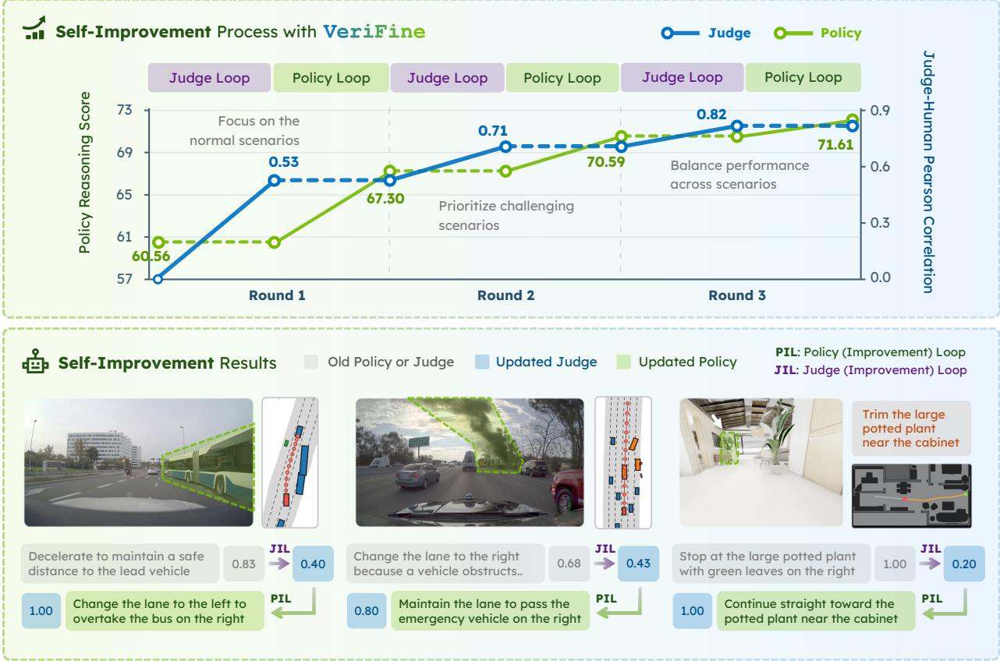  
Figure 1: VeriFine demonstrates continuous self-improvement with the co-evolution of the policy, training curriculum, and judge in an agentic harness framework for embodied reasoning, including autonomous driving and robot navigation tasks. Project Website

## Abstract

Self-improving policies continually expose new failure patterns, changing what their judges must be able to verify. However, current fixed judges constrain both optimization feedback and the discovery of useful training examples, limiting further self-improvement. This challenge is even more acute in embodied reasoning, where reliable evaluation must account for spatial grounding, causal reasoning, and safetyaware decision-making. We introduce VeriFine, an agent harness framework that scales verification through the co-evolution of the policy, training curriculum, and judge. The Policy Improvement Loop uses a rubric judge to diagnose recurring failures, construct an adaptive curriculum, and optimize the policy. When progress plateaus and verification becomes a bottleneck, the Judge Improvement Loop selectively queries human guidance on informative failure cases and refines the judge through coactive calibration, in which humans and agents resolve disagreements and converge toward the objective rubric of physical reasoning. The revised judge then guides the next stage of data selection and policy optimization. Experiments on driving and robot navigation tasks demonstrate continuous self-improvement in both policy and judge capability across reinforcement and supervised fine-tuning. These results show how scaling verification supports continuous self-improvement as policy failure patterns evolve.

## 1. Introduction

Verification is central to self-im rovement: it su lies feedback for olic o timization and determines which training examples are worth learning from (Guo et al., 2025; Kumar et al., 2026). However, policy improvement also changes the judge demands, and the rapid progress of foundation models has increasingly outpaced the ability to evaluate them reliably (Gu et al., 2026; Li et al., 2025). Most existing approaches rely on a static verification judge, whose capability can quickly become a bottleneck as the policy improves (Wang et al., 2026). Once the policy approaches or exceeds the judge’s efective verification boundary, the resulting feedback can become increasingly inaccurate, leading to reward hacking, distribution shift, and even performance degradation (Khalaf et al., 2026). Meanwhile, static training data also become progressively less informative (Koh et al., 2026) for further improvement with verification: as previous scenarios are solved, the training distribution becomes dominated by well-solved samples, leaving limited learning signal. This raises a central question for verification: How can verification be scaled so that thejudge, training curriculum, and policy co-evolve to continuously push the performance frontier?

Recent advances in a entic s stems and autoresearch (Anthro ic, 2025; O enAI, 2025) ofer a natural frame-work to realize this co-evolution task by coordinating specialized skills and analyzing failures during iterative optimization. In this work, we study scaling verification within an agentic framework for embodied reasoning, using driving and robot navigation as representative tasks. Unlike conventional language tasks, embodied agents require reasoning in the physical world and handle spatial grounding, temporal understanding, causal reasoning, and safety-aware decision-making (Zhang et al., 2025), making reliable verification challenging.

Prior work on verification for embodied reasoning focuses on action quality or task completion (Sun et al., 2026; Chen et al., 2026), while evaluating free-form embodied reasoning remains underexplored. Existing reasoning evaluators often rely on constrained question-answering formats and costly human-annotated references (Sima et al., 2024); even LingoJudge (Marcu et al., 2024) only compares against human reasoning without using visual information. Such reference-based evaluation is dificult to scale and sensitive to annotation noise. In contrast, a reference-free judge can assess reasoning directly from physical context, enabling scalable verification and adaptive data selection that filters well-solved scenarios and prioritizes emerging policy failures.

To this end, we study scaling verification as expanding the ability to recognize emerging policy errors and convert them into reusable su ervision and introduce VeriFine an a ent harness framework for continuous self-improvement through scaling verification. As illustrated in Fig. 2, its central mechanism is a pair of coupled improvement loops that connect policy optimization to the evolution of its supervision. The Policy Improvement Loop uses the reference-free judge to identify policy failures and select high-value training samples, tracking the policy’s evolving weaknesses. When self-improvement plateaus and the judge approaches its verification boundary, we think little human guidance is necessary, and the Judge Improvement Loop is activated, which selectively queries human guidance on informative failure cases to refine the judge. Rather than treating humans as infallible oracles, we formulate this process as coactive calibration, where humans and agents iteratively resolve ambiguities and converge toward the objective rubric of physical reasoning.

As shown in Fig. 1, we evaluate VeriFine on driving and robot navigation reasoning through reinforcement and supervised fine-tuning (RFT, SFT), respectively. Improvements in both policy and judge across these settings support the role of scaling verification in continuous self-improvement across various tasks or optimization methods. Our main contributions are summarized as follows:

1. We introduce VeriFine, an agent-harness framework for continuous self-improvement through scaling verification with the co-evolution of policy, training curriculum, and judge.

2. We develop a Policy Improvement Loop that leverages judge-identified failure patterns to select high-value data and autonomously optimize the policy without human intervention.

3. We present a Judge Improvement Loop, which selectively queries human guidance on informative failure cases and performs coactive calibration, enabling the judge to track the evolving policy frontier.

4. We demonstrate the self-improvement with VeriFine in both policy reasoning and judge capability across driving and robot navigation tasks, establishing the applicability of the framework to reinforcement and supervised fine-tuning.

## 2. Related Work

## 2.1. Scaling Verification.

Verification assesses the quality or correctness of candidate outputs and provides feedback for selection, monitoring, and policy optimization (Kwok et al., 2026). At inference time, verification can directly enable test-time scaling with a verifier by allocating additional compute to candidate generation, search, and ranking (Snell et al., 2025; Zhang et al., 2025), while the fine-grained critics with the verifier can diagnose errors and guide iterative revision or recovery (Gou et al., 2024; Xie et al., 2025; Wan et al., 2026). During training, verification within judges can provide objectives for policy optimization (Yuan et al., 2024; Liu et al., 2025; Zhang et al., 2025), while also filtering noisy samples and prioritizing high-value data to concentrate learning on unresolved failures (Zan et al., 2025; Cui et al., 2025). Existin work has be un to construct jud e benchmarks (Tan et al., 2025; Zhou et al., 2025) and explore judge improvement (Saha et al., 2025; Whitehouse et al., 2026). However, existing work focuses on the improvement of the individual roles of verification (Singh et al., 2026) but does not scale verification to close feedback loo s amon ada tive data selection olic o timization judge evolution, and selective human calibration, thereby continuously pushing the performance frontier.

## 2.2. Self-improvement and Autoresearch.

Agent-driven self-improvement through hypothesis formation, experimentation, and iterative refinement has emerged as a prominent paradigm, particularly in goal-oriented autoresearch (Schmidgall et al., 2025; Chen et al., 2026). As self-improvement continuously strengthens the policy model, its verifier must adapt to the resulting capability and distribution shifts (Ding et al., 2026; Xu et al., 2026). Recent work has begun to consider the policy and judge improvement together (Zhou et al., 2026; Zha et al., 2026) or dynamically adapt the judge to policy behavior (Wang et al., 2026; Xu et al., 2026). Rubric-based judges have also gained increasing attention because structured criteria provide fine-grained and more accurate judgment beyond a single final score (Gunjal et al., 2026; Li et al., 2026; Liu et al., 2026). Nevertheless, autonomous self-improvement eventually encounters bottlenecks when the verifier approaches its efective limit or self-generated feedback becomes unreliable (Huang et al., 2024). At this stage, a small amount of selectively acquired human guidance can become necessary to recalibrate the judge (Dwaracherla et al., 2024; Wang et al., 2026). We connect this adaptation to curriculum construction: emerging policy failures guide selective human–agent calibration, and the resulting judge refinements shape subsequent data selection and policy optimization.

## 2.3. Embodied Reasoning.

Embodied reasoning requires spatial grounding, temporal understanding, causal reasoning, and safety-aware decision-making (Xiong et al., 2026; Zhang et al., 2025; Liu et al., 2025; Lee et al., 2026), making reliable verification challenging. Recent work on driving reasoning has introduced structured reasoning datasets (Wang et al., 2025; Huang et al., 2026) and demonstrated the benefits of reasoning for scene understanding (Nie et al., 2024; Coscoy et al., 2026), generalization (Peng et al., 2026; Gerstenecker et al., 2026), and planning (Zhou et al., 2026,). However, existing evaluators largely use constrained question-answering formats with costly human references (Marcu et al., 2024; Wang et al., 2024), while driving-specific judges mainly assess trajectory quality (Sun et al., 2026). In robotics, recent judge models focus on evaluating task progress or completion from video (Ma et al., 2025; Tan et al., 2025; Huang et al., 2026; Liang et al., 2026; Luo et al., 2026) and action-instruction alignment (Kwok et al., 2026) rather than on high-level free-form reasoning itself. Direct video-grounded verification of free-form embodied reasoning without costly human-annotation references remains underexplored.

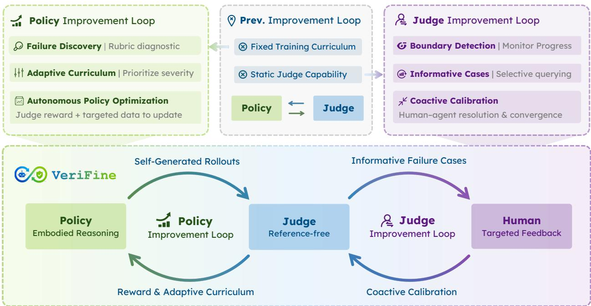  
Figure 2: VeriFine is an agent harness framework for scaling verification. The Policy Improvement Loop uses a reference-free judge to diagnose recurring failures, adapt the training curriculum, and optimize the policy. When verification limits further progress, the Judge Improvement Loop selectively acquires human guidance and refines the judge through coactive calibration, resolving disagreements in rubric-based judgments. The updated judge guides subsequent data selection and policy optimization, allowing verification capability to evolve with the policy’s failure patterns.

## 3. VeriFine

We formulate scaling verification as an iterative co-evolution process among the policy, training curriculum, and reference-free judge, as illustrated in Fig. 2.

## 3.1. Problem Formulation and Framework Overview

Let $x _ { i }$ denote the observable physical context of sample $i ,$ including visual observations, ego states, and task instructions. At iteration $t ,$ a policy $\pi _ { \theta _ { t } }$ , parameterized by $\theta _ { t } ,$ generates a task output $\hat { y } _ { i } \sim \pi _ { \theta _ { t } } ( \cdot \mid x _ { i } )$ , which contains both free-form reasoning and task-specific decisions. In our instantiation, $\pi _ { \theta _ { t } }$ is a vision-language- action (VLA) model with $\hat { y } _ { i } = \left( \hat { r } _ { i } , \hat { \mathbf { a } } _ { i } \right)$ , where $\boldsymbol { { \hat { r } } _ { i } }$ is the generated reasoning and $\hat { \mathbf { a } } _ { i }$ is the predicted action sequence. A judge $J _ { \phi _ { t } }$ , parameterized by $\phi _ { t }$ , evaluates the policy output against the physical context $x _ { i }$ Starting from an initial policy $\pi _ { \theta _ { 0 } }$ , judge $J _ { \phi _ { 0 } }$ , and large-scale candidate data pool $u ,$ in the Policy Improvement Loop, the agent harness coordinates failure analysis, data selection, training, and evaluation through specialized tools. The training curriculum $\mathcal { D } _ { t }$ is constructed and the next policy is updated as:

$$
\mathcal { D } _ { t } = \mathrm { C u r r i c u l u m S e l e c t } ( \mathcal { U } , \pi _ { \theta _ { t } } , J _ { \phi _ { t } } ) , \qquad \theta _ { t + 1 } = \mathrm { P o l i c y U p d a t e } ( \theta _ { t } , \mathcal { D } _ { t } , J _ { \phi _ { t } } ) .\tag{1}
$$

When verification becomes the primary bottleneck, the Judge Improvement Loop selectively acquires human guidance and coactively calibrates to refine the judge:

$$
\mathcal { H } _ { t } = \mathrm { H u m a n Q u e r y } ( \mathcal { U } , \pi _ { \theta _ { t + 1 } } , J _ { \phi _ { t } } ) , \qquad \phi _ { t + 1 } = \mathrm { J u d g e U p d a t e } ( \phi _ { t } , \mathcal { H } _ { t } ) .\tag{2}
$$

VeriFine maintains supervision state across rounds, including the revised judge rubric and curriculum construction. Each policy’s observed failures inform subsequent updates to this state. In our controlled experiments, we train each new policy from the same base initialization, allowing us to compare successive

supervision states under a fixed per-policy training budget. System-level improvement therefore accumulates through the verification and curriculum process across rounds.

## 3.2. Reference-Free Rubric Judge as the Verification Substrate

The judge serves as the verification substrate and a shared interface to connect policy optimization, curriculum construction, and human guidance. Unlike a reference-based judge $J _ { \phi } ( \hat { y } _ { i } , y _ { i } ^ { \mathrm { r e f } } )$ , our judge evaluates the outputs directly from the physical context without human-annotated reasoning:

$$
J _ { \phi _ { t } } ( x _ { i } , \hat { y } _ { i } ) = ( s _ { i } , \mathbf { z } _ { i } , e _ { i } ) ,\tag{3}
$$

where $s _ { i }$ is the overall quality score for the sample $i , \ \mathbf { z } _ { i }$ are the structured diagnostic scores, and $e _ { i }$ is an optional evaluation explanation. We name the judge VeriFine-Judge in this paper.

To reliably evaluate free-form reasoning, we instantiate the judge with a frontier vision-language model (VLM) and an explicit rubric that produces structured diagnostic scores $\mathbf { z } _ { i }$ rather than a single opaque score. However, frontier VLMs are too costly and slow during large-scale policy optimization such as in reinforcement fine-tuning. We therefore adopt a teacher–student design: a frontier VLM serves as the teacher, whose rubric is coactively calibrated with humans as described in Sec. 3.4.2, and its evaluation capability is then distilled into a compact VLM student to balance verification quality with eficiency. More implementation details are provided in Sec. A.2.

The rubric organizes embodied reasoning into two groups of criteria: Action and Component. Taking driving as an example, Action evaluates instruction consistency and safety, while Component evaluates visual grounding, covera e of behavior-relevant scene elements and their causal relationshi to the ro osed action. Task-s ecific dimensions and score aggregation are detailed in Sec. A.2.

## 3.3. Policy Improvement Loop

This loop converts judge-identified failure patterns into training decisions through multiple rounds of autonomous data selection, policy optimization, and evaluation.

## 3.3.1. Failure Discovery and Adaptive Curriculum

At iteration �, the current policy generates outputs over an anchor policy evaluation subset $\mathcal { P } .$ This subset is quality-checked and selected by human experts to ensure data reliability and broad coverage of diverse scenario types, including both reasoning-dense and reasoning-light cases. Further details on $\mathcal { P }$ are provided in Sec. A.3.1. The judge then evaluates the policy outputs and produces structured evaluation results:

$$
\mathcal { E } _ { t } = \{ ( x _ { i } , \hat { y } _ { i } , s _ { i } , \mathbf { z } _ { i } ) \} _ { i \in \mathcal { P } } .\tag{4}
$$

The VeriFine agent aggregates these evaluations across scenarios and rubric dimensions to identify recurring failure patterns, distinguishing systematic errors from isolated failures.

These patterns are translated into executable selection criteria over �. Selection serves two distinct purposes: prioritizing contexts in which the policy needs improvement and filtering unreliable training targets. A scenario that exposes a policy weakness can be valuable for learning, while an incorrect response to that scenario is unsuitable as a supervised demonstration. The curriculum is revisited as policy weaknesses and judge change, allowing a revised judge to recover useful supervision or exclude examples that were previously misjudged.

## 3.3.2. Judge-Guided Policy Optimization

The selected curriculum $\mathcal { D } _ { t }$ supports either reinforcement or supervised fine-tuning. For the driving reasoning task, we instantiate the update with reinforcement fine-tuning using GRPO, and the overall judge score supplies

the reward to be maximized:

$$
\begin{array} { r } { \mathcal { R } _ { \mathrm { R F T } } ^ { \mathrm { p r i v i n g } } ( \theta ) = \mathbb { E } _ { x _ { i } \sim \mathcal { D } _ { t } , \hat { y } _ { i } \sim \pi _ { \theta } ( \cdot | x _ { i } ) } \left[ s _ { \phi _ { t } } ( x _ { i } , \hat { y } _ { i } ) - \beta D _ { \mathrm { K L } } \left( \pi _ { \theta } ( \cdot \mid x _ { i } ) \parallel \pi _ { \theta _ { \mathrm { r e f } } } ( \cdot \mid x _ { i } ) \right) \right] , } \end{array}\tag{5}
$$

where $\pi _ { \mathrm { r e f } }$ is the reference policy, and the KL-divergence term regularizes the updated policy against excessive deviation from the current policy. For navigation, we instantiate the update with supervised fine-tuning, and the judge selects high-value and high-quality demonstrations to minimize:

$$
\mathcal { L } _ { \mathrm { S F T } } ^ { \mathrm { R o b N a v } } ( \theta ) = - \mathbb { E } _ { ( x _ { i } , y _ { i } ^ { \star } ) \sim \mathcal { D } _ { t } } \left[ \log \pi _ { \theta } ( y _ { i } ^ { \star } \mid x _ { i } ) \right] ,\tag{6}
$$

where $y _ { i } ^ { \star }$ denotes the target data from the selected curriculum $\mathcal { D } _ { t }$ . Here, judge scores determine training-set membership rather than directly entering the optimization objective. Then, candidate policies are assessed under a consistent monitoring protocol. The resulting failure analysis guides subsequent curriculum updates and identifies potential limitations of the current judge.

## 3.4. Judge Improvement Loop

This loop converts informative policy failures into reusable improvements in verification, enabling further learning when the current judge becomes a bottleneck.

## 3.4.1. Boundary Detection and Human Query Selection

We monitor policy progress on the anchor policy evaluation set �. Thus, rather than using the dynamically evolving reference-free judge model as the evaluator, we develop an anchor reference-based judge model, VeriFine-Judge-RB, based on high-quality human annotations. Let $P _ { t }$ denote the aggregate performance of $\pi _ { \theta _ { t } }$ on $\mathcal { P } , \Delta P _ { t } = P _ { t } - P _ { t - 1 } ,$ and $\Delta R _ { t } ^ { \mathrm { j u d g e } }$ the corresponding performance change. We measure performance stagnation and judge–performance discrepancy as

$$
\overline { { \Delta P } } _ { t } = \frac { 1 } { K } \sum _ { k = 0 } ^ { K - 1 } \Delta P _ { t - k } , \quad G _ { t } = \left| \Delta R _ { t } ^ { \mathrm { j u d g e } } - \Delta P _ { t } \right| ,\tag{7}
$$

where � denotes the number of most recent policy changes considered, a small $\overline { { \Delta P } } _ { t }$ indicates that improvement has plateaued, while a large $G _ { t }$ indicates that increasing judge reward no longer corresponds to improved performance on �. The trigger rule, thresholds, and check frequency are specified in Sec. A.4.3.

Once activated, the agent constructs the current judge evaluation set $\mathcal { H } _ { t }$ containing cases with uncertain, inconsistent, and high-impact evaluations. Importantly, $\mathcal { H } _ { t }$ is constructed from outputs rolled out by the newly updated policy $\pi _ { \theta _ { t + 1 } }$ . It can track the policy’s current failure pattern. Moreover, judge refinement deliberately retains both positive and negative outputs. The low-scoring cases are important for defining the judge’s decision boundary and calibrating its responses to policy errors.

## 3.4.2. Coactive Calibration

The Judge Improvement Loop receives the current failure-pattern analysis and the selected evaluation set $\mathcal { H } _ { t }$ The agent uses them to update a cumulative judge evaluation set:

$$
\mathcal { T } _ { t } = \mathcal { I } _ { t - 1 } \cup \mathcal { H } _ { t } , \qquad \mathcal { I } _ { - 1 } = \mathcal { O } .\tag{8}
$$

Its cumulative construction preserves cases from previous iterations, preventing new refinements from degrading previously acquired verification capabilities. During initial judge construction, the same procedure is based on the base policy $\pi _ { \theta _ { 0 } }$ . Further details are provided in Sec. A.3.1.

Human experts first provide a coarse calibration of the judge scores on $\mathcal { T } _ { t }$ by inspecting the physical context and candidate outputs. Then, the agent launches an autonomous process that iteratively proposes, evaluates, and selects revisions to the rubric. When alignment with the current human calibration plateaus, the agent presents the disputed cases together with its structured diagnostic scores and evaluation explanations. Human experts may confirm the evaluation, correct individual rubric dimensions, clarify underspecified criteria, or even revise their previous judge scores annotation in evaluation set. Human judgments are not treated as infallible ground truth. Instead, the agent and human experts repeatedly expose disagreements and refine their interpretations until no further alignment gain can be achieved, converging toward the shared latent rubric of embodied reasoning.

Table 1: Comparison of Diferent Judges in the Policy Improvement Loop with a common initialization and matched per-policy training budgets.The curriculum and reward judges refer to the judges for data selection and policy optimization, respectively; reference-free variants use the same for both.
<table><tr><td>Curriculum Judge</td><td>Reward Judge</td><td>Reasoning Score (RB) ↑</td><td>Reasoning Score (RF) ↑</td><td>minADE6 (m) ↓</td><td>ADE m) ↓</td></tr><tr><td colspan="6">Base Policy Model</td></tr><tr><td>None</td><td>None</td><td>60.56</td><td>68.05</td><td>1.049</td><td>2.139</td></tr><tr><td colspan="6">Reference-Based Judges</td></tr><tr><td>Random</td><td>LingoJudge</td><td>63.45</td><td>69.82</td><td>1.064</td><td>2.133</td></tr><tr><td>LingoJudge</td><td>LingoJudge</td><td>65.75</td><td>72.60</td><td>1.172</td><td>2.242</td></tr><tr><td>Random</td><td>VeriFine-Judge-RB</td><td>64.03</td><td>69.95</td><td>1.080</td><td>2.166</td></tr><tr><td>VeriFine-Judge-RB</td><td>VeriFine-Judge-RB</td><td>67.70</td><td>75.20</td><td>1.164</td><td>2.235</td></tr><tr><td colspan="6">Reference-Free Judges</td></tr><tr><td colspan="2">VeriFine-Judge-R1 (FIRST RoUND)</td><td>67.30</td><td>77.51</td><td>1.106</td><td>2.177</td></tr><tr><td colspan="2">VeriFine-Judge-R2 (SECoND RoUND)</td><td>70.59</td><td>79.61</td><td>1.078</td><td>2.139</td></tr><tr><td colspan="2">VeriFine-Judge-R3 (THIRD RoUND)</td><td>71.61 +18.2%</td><td>83.13 +22.2%</td><td>1.029</td><td>2.117</td></tr></table>

## 4. Experiments

We evaluate VeriFine through four questions:

Q1: Can the policy and judge improve together as policy failure patterns evolve?

Q2: How does each improvement loop contribute to the resulting policy and judge?

Q3: Does the evolved judge generalize and provide more efective verification?

Q4: Does the framework support self-improvement across diferent embodied reasoning tasks and optimization methods?

## 4.1. Main Experimental Setup

We conduct three self-improvement rounds on driving reasoning. Unless otherwise specified, the following settings refer to this task; detailed navigation settings are provided in the appendix.

Driving Reasoning Data. Our main experiments use a large-scale internal driving-reasoning dataset covering 2 million clips of human driving across 25 countries, with synchronized multi-view videos, trajectories, and free-form reasoning. We construct a fixed anchor policy evaluation set � of 2,134 samples and an independent policy test set $\mathcal { P } ^ { \mathrm { t e s t } }$ of 2,772 sam les. Those anchor sets are manuall ualit -checked to ensure reliable annotations and broad covera e of scenario t es. Jud e calibration uses incrementall selected nominal and challenging scenarios. Across the first two judge-improvement rounds, the selected judge evaluation subsets $\mathcal { H } _ { 1 }$ and $\mathcal { H } _ { 2 }$ are constructed, containing 433 normal and 179 challenging driving scenarios. The corresponding judge test sets are $\mathcal { H } _ { 1 } ^ { \mathrm { t e s t } }$ and $\mathcal { H } _ { 2 } ^ { \mathrm { t e s t } }$ with 514 and 218 scenarios. The final judge test set $\mathcal { I } ^ { \mathrm { t e s t } }$ is their union. Test labels are frozen and excluded from rubric refinement. Details are provided in Sec. A.3.

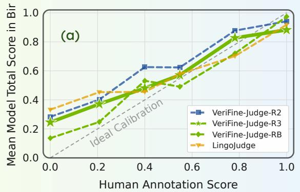

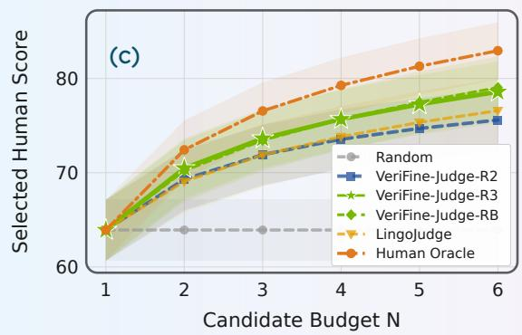

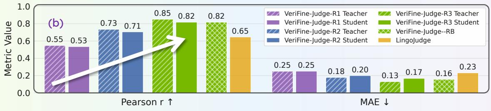  
Figure 3: Judge Performance Comparison. (a) Calibration curves showing the mean judge score within each human-score bin; the gray diagonal denotes ideal calibration. (b) Judge–human alignment measured by Pearson correlation and MAE for teacher and student judges across improvement rounds and reference-based baselines. (c) Test-time scaling is evaluated by the human score of the selected candidate as the candidate budget increases. Shaded regions denote 95% bootstrap CI.

Policy and Judge Models. We initialize the driving policy of the Alpamayo 1.5 8B (NVIDIA, 2026) model. Policy optimization is performed using GRPO (Shao et al., 2024) with the overall reference-free judge score as the reward. The judge follows the teacher–student design introduced in Sec. 3.2. We use Claude Opus 5 (Anthropic, 2026) as the base model for the rubric teacher and distill its evaluation capability into a compact model after coactive calibration. The student model is built on a Qwen3-VL 2B backbone (Bai et al., 2025), and we pretrain the backbone to have a better vision encoder on our internal driving dataset with the VLA planning task. More details of the policy and judge model are provided in Sec. A.2.

Baselines. We compare the base policy with RFT using random or judge-guided data selection with 2,700 optimization steps on 25K examples selected from a shared 400K pool. LingoJudge (Marcu et al., 2024) and our VeriFine-Judge-RB serve as alternative reference-based judges. We also report VeriFine after each self-improvement round (R1–R3). Each round denotes a fixed-judge policy improvement stage, including curriculum updates until the prescribed stopping criterion is met. Each round for driving and robot navigation reports stage-end policies, each trained from the same base checkpoint with matched training-set sizes and optimization budgets, and more details are in A.4.2.

Evaluation Metrics. All policies are evaluated on �test using the fixed reference-based evaluator, VeriFine-Judge-RB. We additionally report scores from the same final reference-free judge for all policies. Policy metrics include reasoning scores on a 0–100 scale, ADE, and minADE . Judge quality is measured by Pearson correlation � and MAE against human scores, with MAE normalized to a 0–1 scale. More details are in Sec. A.4. Besides, on the judge test set, VeriFine-Judge-RB achieves � 0.82, compared with 0.65 for the SOTA method LingoJudge, as shown in Fig. 3. This provides empirical support for the fixed evaluator used to compare policies across rounds.

## 4.2. Self-Improvement Results with Scaling Verification

Judge–Policy Co-Evolution (Q1). Fig. 1 summarizes the coupled improvement process in driving reasoning task, whose focus progresses from nominal driving scenarios to challenging failures and then to balanced refinement. Across three rounds, the policy reasoning score increases from 60.56 to 71.61 under the fixed reference-based evaluator, an 18.2% relative improvement over the base policy. Meanwhile, student judge– human correlation reaches 0.82 on the final judge test set, indicating strong alignment after coactive calibration. These results reveal a complementary cycle: policy improvement exposes new verification limitations, while judge refinement restores reliable supervision for further policy improvement.

Policy Improvement Loop (Q2). Tab. 1 examines the use of judges for curriculum construction and policy optimization. With VeriFine-Judge-RB held fixed as the reward, judge-guided selection improves the reasoning score from 64.03 to 67.70 over random selection, demonstrating the value of directing training toward selected examples. The first reference-free round reaches 67.30, comparable to the strongest reference-based configuration (67.70) without any costly annotation reliance during inference. Under the same policy-training budget, subsequent rounds reach 70.59 and 71.61, with R3 exceeding the strongest reference-based baseline by 5.8%. The final policy also achieves the lowest ADE, even without any action reward in training. With each round’s reward judge held fixed, judge-guided selection improves RB performance over random selection by 4.5–14.6% (Appendix Tab. 2). These results demonstrate a stronger policy yield from the evolved curriculum and judge in the self-improvement loop.

Using the final VeriFine-Judge as a fixed reference-free evaluator yields a similar improvement trend across rounds, with a relative gain of 22.2% compared with 18.2% under a reference-based evaluator, supporting its efectiveness as an evaluation metric. The embodied decisions admit multiple plausible futures; the reference- free judge can credit grounded, safe alternatives that difer from the recorded behavior, yielding a more permissive assessment without requiring reference agreement.

Judge Improvement Loop (Q2). Fig. 3 (a,b) shows progressively stronger judge–human alignment: teacher correlation increases from 0.55 to 0.85, while MAE decreases from 0.25 to 0.13. The final student achieves � = 0.82 and MAE = 0.17, comparable to the reference-based judge VeriFine-Judge-RB (0.82/0.16) and better than LingoJudge (0.65/0.23) without requiring reference reasoning. Moreover, with the Opus 5 backbone held fixed, coactive calibration improves correlation from 0.67 to 0.85 (Appendix Fig. 5), demonstrating gains from refinement beyond backbone capability. Student architecture ablations and latency performance are reported in Appendix Tab. 3.

The failure-specific results reveal how the loop expands the verification boundary. As policy failure analysis shifts attention toward challenging scenarios, the loop identifies errors in the current judge’s assessments and tar ets them throu h coactive calibration. Our R1 student achieves � = 0.72 on the first-round test subset but only � = 0.07 on the later challenging subset; refinement raises correlation on the latter to � = 0.74 in R2 (Appendix Fig. 6). R3 then targets remaining errors across the accumulated scenarios without adding a new test subset. Through this diagnosis–calibration cycle, newly exposed verification errors become reusable judge refinements that inform subsequent curriculum construction and policy optimization.

## 4.3. Test-Time Scaling with Evolved Judge (Q3)

To assess verification beyond the training loop, a separate policy generates six reasoning–action candidates for each of 401 independent scenarios. All judges select from the same candidate pool as the sampling budget increases from one to six. Fig. 3 (c) compares the R2 and R3 judges with random selection, LingoJudge, VeriFine-Judge-RB, and a human-oracle upper bound.

At a budget of six candidates, our final judge selects outputs with a human-rated reasoning score of 78.6, outperforming the R2 judge and LingoJudge while performing comparably to VeriFine-Judge-RB. Because candidate generation is held fixed, the gains reflect improved selection rather than a stronger generating policy. These results demonstrate efective generalization of the evolved judge.

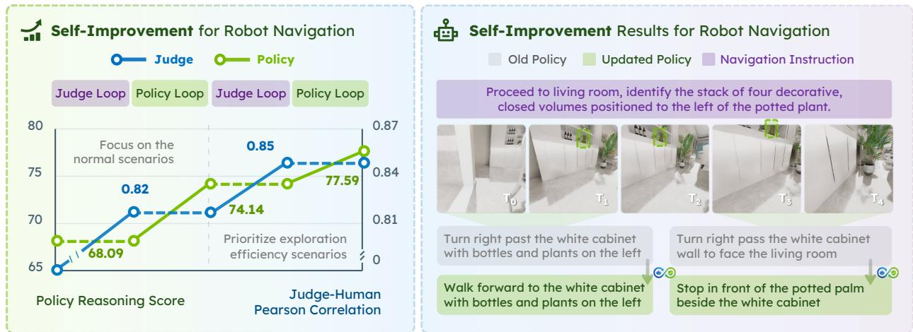  
Figure 4: Self-improvement on Robot Navigation Task. The left part shows the quantitative results in the robot navigation task with significant improvement in final policy performance, and the right part shows the qualitative results with a sequential reasoning example: the updated policy with VeriFine corrects the action failures of the old policy.

## 4.4. Framework Generalization to Robot Navigation

Robot Navigation Task Setup. We instantiate VeriFine on robot navigation using data collected in VLNVerse scenarios (Lin et al., 2025) and a Qwen3-VL 2B policy. Unlike driving reasoning tasks, this policy optimization uses supervised fine-tuning: the judge only contributes to the training curriculum rather than supplying an RL reward. We retain the two-loop framework with a navigation-specific rubric. Dataset, training, and evaluation details are provided in the appendix.

Cross-Task Self-Improvement (Q4). Fig. 4 shows improvements in both policy reasoning and judge alignment as the optimization focus shifts from nominal scenarios toward exploration eficiency. The final policy reasoning score improves by 14% from 68.09 to 77.59, while the final judge–human correlation approaches 0.85. The qualitative example in Fig. 4 and Fig. 1 illustrates corrected movement, goal understanding, and stopping decisions after our self-improvement framework. These results extend the role of evolving verification beyond reward-based optimization: it can also support self-improvement by refining the supervision selected for SFT. Moreover, the resumed policy gains after judge refinement mirror the driving results, demonstrating that the co-evolution framework transfers across embodied-reasoning tasks.

## 5. Conclusions

We introduced VeriFine, an agent-harness framework for continuous self-improvement through scaling verification with the co-evolution of policy, training curriculum, and judge. Its Policy Improvement Loop adapts the training curriculum to recurring failures and optimizes the policy, while its Judge Improvement Loop detects verification bottlenecks and uses selective human guidance for coactive calibration. A reference-free judge provides the structured feedback connecting these two loops. Experiments on driving and robot navigation demonstrate improvements in both policy and judge across reinforcement and supervised fine-tuning. These results show how scaling verification supports continuous self-improvement as policy failure patterns evolve.

## References

[1] Anthropic. Claude code: Best practices for agentic coding, 2025. URL https://www.anthropic.com/ engineering/claude-code-best-practices. Accessed April 2026. 2

[2] Anthropic. Introducing claude opus 5. https://www.anthropic.com/news/claude-opus-5, July 2026. Accessed: 2026-08-28. 8, 17, 18, 21, 24

[3] Shuai Bai, Yuxuan Cai, Ruizhe Chen, Keqin Chen, Xionghui Chen, Zesen Cheng, Lianghao Deng, Wei Ding, Chang Gao, Chunjiang Ge, et al. Qwen3-VL technical report. arXiv preprint arXiv:2511.21631, 2025. URL https://arxiv.org/abs/2511.21631. 8

[4] Qimao Chen, Fang Li, Yuechen Luo, Zehan Zhang, Haiyang Sun, Fangzhen Li, Bing Wang, Guang Chen, Yang Ji, Jiong Deng, et al. Drivereward: A comprehensive dataset and generative vision-language reward model for autonomous driving. arXiv preprint arXiv:2606.08525, 2026. 2

[5] Terry Chen, Zhifan Ye, Bing Xu, Zihao Ye, Timmy Liu, Ali Hassani, Tianqi Chen, Andrew Kerr, Haicheng Wu, Yang Xu, et al. Avo: Agentic variation operators for autonomous evolutionary search. arXiv preprint arXiv:2603.24517, 2026. 3

[6] Marco Coscoy, Zewei Zhou, Seth Z Zhao, Henry Wei, Angela Magtoto, Johnson Liu, Rui Song, Walter Zimmer, Zhiyu Huang, Chen Tang, et al. Mdrive: Benchmarking closed-loop cooperative driving for end-to-end multi-agent systems. arXiv preprint arXiv:2605.10904, 2026. 3

[7] Guofeng Cui, Pichao Wang, Yang Liu, Zemian Ke, Zhu Liu, and Vimal Bhat. Crpo: Confidence-reward driven preference optimization for machine translation. In Findings of the Association for Computational Linguistics: ACL 2025, pages 560–574, 2025. 3

[8] Hongxin Ding, Baixiang Huang, Yue Fang, Weibin Liao, Zheng Li, Jinyang Zhang, Zhijing Wu, Junfeng Zhao, and Yasha Wang. Evorubrics: Dynamic rubrics as rewards via adversarial co-evolution for llm reinforcement learning. arXiv preprint arXiv:2606.23038, 2026. 3

[9] Vikranth Dwaracherla, Seyed Mohammad Asghari, Botao Hao, and Benjamin Van Roy. Eficient exploration for llms. arXiv preprint arXiv:2402.00396, 2024. 3

[10] Simon Gerstenecker, Andreas Geiger, and Katrin Renz. Fail2drive: Benchmarking closed-loop driving generalization. arXiv preprint arXiv:2604.08535, 2026. 3

[11] Google DeepMind. Gemini 3.8 Flash. Model card, September 2026. URL https://deepmind.google/ models/model-cards/gemini-3-8-flash/. Accessed: 2026-09-23. 17

[12] Zhibin Gou, Zhihong Shao, Yeyun Gong, Yujiu Yang, Nan Duan, Weizhu Chen, et al. Critic: Large language models can self-correct with tool-interactive critiquing. In International Conference on Learning Representations, volume 2024, pages 57734–57811, 2024. 3

[13] Jiawei Gu, Xuhui Jiang, Zhichao Shi, Hexiang Tan, Xuehao Zhai, Chengjin Xu, Wei Li, Yinghan Shen, Shengjie Ma, Honghao Liu, et al. A survey on llm-as-a-judge. The Innovation, 7(6), 2026. 2

[14] Anisha Gunjal, Anthony Wang, Elaine Lau, Vaskar Nath, Yunzhong He, Bing Liu, and Sean Hendryx. Rubrics as rewards: Reinforcement learning beyond verifiable domains. In International Conference on Learning Representations, volume 2026, pages 127924–127945, 2026. 3

[15] Daya Guo, Dejian Yang, Haowei Zhang, Junxiao Song, Ruoyu Zhang, Runxin Xu, Qihao Zhu, Shirong Ma, Peiyi Wang, Xiao Bi, et al. Deepseek-r1: Incentivizing reasoning capability in llms via reinforcement learning. arXiv preprint arXiv:2501.12948, 2025. 2

[16] Pengcheng He, Jianfeng Gao, and Weizhu Chen. Debertav3: Improving deberta using electra-style pre-training with gradient-disentangled embedding sharing. arXiv preprint arXiv:2111.09543, 2021. 25

[17] Dongchi Huang, Hongyin Zhang, Bohan Hou, Siteng Huang, Zhian Su, Hang Guo, Tong Lu, Zhaofeng Xu, Jiahao Tang, Jianfei Yang, et al. Rynnvalue: Scaling robotic value foundation models with temporal distance. arXiv preprint arXiv:2608.09853, 2026. 3

[18] Jie Huang, Xinyun Chen, Swaroop Mishra, Huaixiu Steven Zheng, Adams Yu, Xinying Song, and Denny Zhou. Large language models cannot self-correct reasoning yet. In International conference on learning representations, volume 2024, pages 32808–32824, 2024. 3

[19] Zhiyu Huang, Johnson Liu, Rui Song, Zewei Zhou, Ruining Yang, Yun Zhang, Tianhui Cai, Hanyin Zhang, Mingxuan Gao, Valeria Xu, et al. nureasoning: A reasoning-centric dataset and benchmark for long-tail autonomous drivin . arXiv preprint arXiv:2605.31572, 2026. 3

[20] Hadi Khalaf, Claudio Mayrink Verdun, Alex Oesterling, Himabindu Lakkaraju, and Flavio Calmon. Inference-time reward hacking in large language models. Advances in Neural Information Processing Systems, 38:61720–61760, 2026. 2

[21] Reiss Koh, Wonbeen Oh, Jaein Jang, MinHyung Lee, Hyeongjin Kim, Ah Kim, Joonkee Kim, Junghyun Lee, Taehyeon Kim, and Se-Young Yun. Adastar: Adaptive data sampling for training self-taught reasoners. Advances in Neural Information Processing Systems, 38:91484–91515, 2026. 2

[22] Komal Kumar, Tajamul Ashraf, Omkar Thawakar, Rao Muhammad Anwer, Hisham Cholakkal, Mubarak Shah, Ming-Hsuan Yang, Phillip HS Torr, Fahad Shahbaz Khan, and Salman Khan. Llm post-training: A deep dive into reasoning large language models. IEEE Transactions on Pattern Analysis and Machine Intelligence, 2026. 2

[23] Jacky Kwok, Shulu Li, Pranav Atreya, Yuejiang Liu, Yixing Jiang, Chelsea Finn, Marco Pavone, Ion Stoica, and Azalia Mirhoseini. Llm-as-a-verifier: A general-purpose verification framework. arXiv preprint arXiv:2607.05391, 2026. 3

[24] Jacky Kwok, Xilun Zhang, Mengdi Xu, Yuejiang Liu, Azalia Mirhoseini, Chelsea Finn, and Marco Pavone. Scaling verification can be more efective than scaling policy learning for vision-language-action alignment. arXiv preprint arXiv:2602.12281, 2026. 3

[25] Tony Lee, Andrew Wagenmaker, Karl Pertsch, Percy Liang, Sergey Levine, and Chelsea Finn. Roboreward: General-purpose vision-language reward models for robotics. arXiv preprint arXiv:2601.00675, 2026. 3

[26] Dawei Li, Bohan Jiang, Liangjie Huang, Alimohammad Beigi, Chengshuai Zhao, Zhen Tan, Amrita Bhattacharjee, Yuxuan Jiang, Canyu Chen, Tianhao Wu, et al. From generation to judgment: Opportunities and challenges of llm-as-a-judge. In Proceedings of the 2025 Conference on Empirical Methods in Natural Language Processing, pages 2757–2791, 2025. 2

[27] Gaotang Li, Bhavana Dalvi Mishra, Zifeng Wang, Jun Yan, Yanfei Chen, Chun-Liang Li, Long T Le, Rujun Han, George Lee, Hanghang Tong, et al. Rubricem: Meta-rl with rubric-guided policy decomposition beyond verifiable rewards. arXiv preprint arXiv:2605.10899, 2026. 3

[28] Anthony Liang, Yigit Korkmaz, Jiahui Zhang, Minyoung Hwang, Abrar Anwar, Sidhant Kaushik, Aditya Shah, Alex S Huang, Luke Zettlemoyer, Dieter Fox, et al. Robometer: Scaling general-purpose robotic reward models via trajectory comparisons. arXiv preprint arXiv:2603.02115, 2026. 3

[29] Sihao Lin, Zerui Li, Xunyi Zhao, Gengze Zhou, Liuyi Wang, Rong Wei, Rui Tang, Juncheng Li, Hanqing Wang, Jiangmiao Pang, et al. Vlnverse: A benchmark for vision-language navigation with versatile, embodied, realistic simulation and evaluation. arXiv preprint arXiv:2512.19021, 2025. 10, 24

[30] Tianci Liu, Ran Xu, Tony Yu, Ilgee Hong, Carl Yang, Tuo Zhao, and Haoyu Wang. Openrubrics: Towards scalable synthetic rubric generation for reward modeling and llm alignment. In Proceedings of the 64th Annual Meeting of the Association for Computational Linguistics (Volume 1: Long Papers), pages 17417–17437, 2026. 3

[31] Tianqi Liu, Wei Xiong, Jie Ren, Lichang Chen, Junru Wu, Rishabh Joshi, Yang Gao, Jiaming Shen, Zhen Qin, Tianhe Yu, et al. Rrm: Robust reward model training mitigates reward hacking. In International Conference on Learning Representations, volume 2025, pages 62682–62700, 2025. 3

[32] Xinyi Liu, Mohammadreza Fani Sani, Zewei Zhou, Julius Wirbel, Bahram Zarrin, and Roberto Galeazzi. Robopilot: Generalizable dynamic robotic manipulation with dual-thinking modes. arXiv preprint arXiv:2510.00154, 2025. 3

[33] Lirui Luo, Guoxi Zhang, Hongming Xu, Yaodong Yang, Cong Fang, and Qing Li. Mvr: Multi-view video reward shaping for reinforcement learning. arXiv preprint arXiv:2603.01694, 2026. 3

[34] Yecheng Jason Ma, Joey Hejna, Chuyuan Fu, Dhruv Shah, Jacky Liang, Zhuo Xu, Sean Kirmani, Peng Xu, Danny Driess, Ted Xiao, et al. Vision language models are in-context value learners. In International Conference on Learning Representations, volume 2025, pages 33984–34009, 2025. 3

[35] Ana-Maria Marcu, Long Chen, Jan Hünermann, Alice Karnsund, Benoit Hanotte, Prajwal Chidananda, Saurabh Nair, Vijay Badrinarayanan, Alex Kendall, Jamie Shotton, et al. Lingoqa: Visual question answering for autonomous driving. In European Conference on Computer Vision, pages 252–269. Springer, 2024. 2, 3, 8, 25

[36] Ming Nie, Renyuan Peng, Chunwei Wang, Xinyue Cai, Jianhua Han, Hang Xu, and Li Zhang. Reason2drive: Towards interpretable and chain-based reasoning for autonomous driving. In European Conference on Computer Vision, pages 292–308. Springer, 2024. 3

[37] NVIDIA. Alpamayo-1.5-10b. https://huggingface.co/nvidia/Alpamayo-1.5-10B, 2026. Accessed: 2026-09-19. 8

[38] OpenAI. Codex: AI coding partner from OpenAI, 2025. URL https://openai.com/codex/. Accessed May 2026. 2

[39] OpenAI. GPT-6 Astra. OpenAI API model documentation, 2026. URL https://developers.openai. com/api/docs/models/gpt-6-astra. Accessed: 2026-09-23. 17

[40] Zhenghao Peng, Wenhao Ding, Yurong You, Yuxiao Chen, Wenjie Luo, Thomas Tian, Yulong Cao, Apoorva Sharma, Danfei Xu, Boris Ivanovic, et al. Counterfactual vla: Self-reflective vision-language-action model with adaptive reasoning. In Proceedings of the IEEE/CVF Conference on Computer Vision and Pattern Recognition, pages 4022–4031, 2026. 3

[41] Swarnadeep Saha, Xian Li, Marjan Ghazvininejad, Jason Weston, and Tianlu Wang. Learning to plan & reason for evaluation with thinking-llm-as-a-judge. arXiv preprint arXiv:2501.18099, 2025. 3

[42] Samuel Schmidgall, Yusheng Su, Ze Wang, Ximeng Sun, Jialian Wu, Xiaodong Yu, Jiang Liu, Michael Moor, Zicheng Liu, and Emad Barsoum. Agent laboratory: Using llm agents as research assistants. Findings of the Associationfor Computational Linguistics: EMNLP 2025, pages 5977–6043, 2025. 3

[43] Zhihong Shao, Peiyi Wang, Qihao Zhu, Runxin Xu, Junxiao Song, Xiao Bi, Haowei Zhang, Mingchuan Zhang, YK Li, Y Wu, et al. Deepseekmath: Pushing the limits of mathematical reasoning in open language models. arXiv preprint arXiv:2402.03300, 2024. 8

[44] Chonghao Sima, Katrin Renz, Kashyap Chitta, Li Chen, Hanxue Zhang, Chengen Xie, Jens Beißwenger, Ping Luo, Andreas Geiger, and Hongyang Li. Drivelm: Driving with graph visual question answering. In European conference on computer vision, pages 256–274. Springer, 2024. 2

[45] Janvijay Singh, Austin Xu, Yilun Zhou, Yefan Zhou, Dilek Hakkani-Tür, and Shafiq Joty. On the shelf life of fine-tuned llm-judges: Future-proofing, backward-compatibility, and question generalization. In International Conference on Learning Representations, volume 2026, pages 59943–59971, 2026. 3

[46] Charlie Snell, Jaehoon Lee, Kelvin Xu, and Aviral Kumar. Scaling llm test-time compute optimally can be more efective than scaling parameters for reasoning. In International Conference on Learning Representations, volume 2025, pages 10131–10165, 2025. 3

[47] Xinglong Sun, Kevin Xie, Jenny Schmalfuss, Despoina Paschalidou, Xiuming Zhang, Sanja Fidler, Kashyap Chitta, and Jose M Alvarez. Drivejudge: Rethinking autonomous driving evaluation with vision-language models. arXiv preprint arXiv:2606.17362, 2026. 2, 3

[48] Huajie Tan, Sixiang Chen, Yijie Xu, Zixiao Wang, Yuheng Ji, Cheng Chi, Yaoxu Lyu, Zhongxia Zhao, Xiansheng Chen, Peterson Co, et al. Robo-dopamine: General process reward modeling for high-precision robotic manipulation. arXiv preprint arXiv:2512.23703, 2025. 3

[49] Sijun Tan, Siyuan Zhuang, Kyle Montgomery, William Tang, Alejandro Cuadron, Chenguang Wang, Raluca Popa, and Ion Stoica. Judgebench: A benchmark for evaluating llm-based judges. In International Conference on Learning Representations, volume 2025, pages 63277–63303, 2025. 3

[50] Yuxuan Wan, Tianqing Fang, Yintong Huo, Wenxuan Wang, Haitao Mi, Dong Yu, Michael R Lyu, et al. Inference-time scaling of verification: Self-evolving deep research agents via test-time rubric-guided verification. In Findings of the Association for Computational Linguistics: ACL 2026, pages 24822–24835, 2026. 3

[51] Beining Wang, Weihang Su, Hongtao Tian, Hao Kong, Tao Yang, Ting Yao, Qingyi Pan, Yueyue Wu, Qingyao Ai, Min Zhang, et al. Co-evolving llm evaluators and policies via dynamicrubric. arXiv preprint arXiv:2607.20083, 2026. 2, 3

[52] Shihao Wang, Zhiding Yu, Xiaohui Jiang, Shiyi Lan, Min Shi, Nadine Chang, Jan Kautz, Ying Li, and Jose M Alvarez. Omnidrive: A holistic llm-agent framework for autonomous driving with 3d perception, reasoning and planning. arXiv preprint arXiv:2405.01533, 1(2):3, 2024. 3

[53] Yan Wang, Wenjie Luo, Junjie Bai, Yulong Cao, Tong Che, Ke Chen, Yuxiao Chen, Jenna Diamond, Yifan Ding, Wenhao Ding, et al. Alpamayo-r1: Bridging reasoning and action prediction for generalizable autonomous driving in the long tail. arXiv preprint arXiv:2511.00088, 2025. 3

[54] Zongqi Wang, Rui Wang, Yuchuan Wu, Yiyao Yu, Pinyi Zhang, Shaoning Sun, Yujiu Yang, and Yongbin Li. Reward modeling from natural language human feedback. arXiv preprint arXiv:2601.07349, 2026. 3

[55] Chenxi Whitehouse, Tianlu Wang, Ping Yu, Xian Li, Jason E Weston, Ilia Kulikov, and Swarnadeep Saha. J1: Incentivizing thinking in llm-as-a-judge via reinforcement learning. In International Conference on Learning Representations, volume 2026, a es 10397–10420, 2026. 3

[56] Zhihui Xie, Jie Chen, Liyu Chen, Weichao Mao, Jingjing Xu, and Lingpeng Kong. Teaching language models to critique via reinforcement learning. arXiv preprint arXiv:2502.03492, 2025. 3

[57] Tianyi Xiong, Shihao Wang, Guilin Liu, Yi Dong, Ming Li, Heng Huang, Jan Kautz, and Zhiding Yu. Phycritic: Multimodal critic models for physical ai. arXiv preprint arXiv:2602.11124, 2026. 3

[58] Ran Xu, Tianci Liu, Zihan Dong, Tony Yu, Ilgee Hong, Carl Yang, Linjun Zhang, Tao Zhao, and Haoyu Wang. Alternating reinforcement learning for rubric-based reward modeling in non-verifiable llm post-training. arXiv preprint arXiv:2602.01511, 2026. 3

[59] Zhenghao Xu, Qin Lu, Qingru Zhang, Liang Qiu, Ilgee Hong, Changlong Yu, Wenlin Yao, Yao Liu, Haoming Jiang, Lihong Li, et al. Ask a strong llm judge when your reward model is uncertain. Advances in Neural Information Processing Systems, 38:74639–74664, 2026. 3

[60] Weizhe Yuan, Richard Yuanzhe Pang, Kyunghyun Cho, Xian Li, Sainbayar Sukhbaatar, Jing Xu, and Jason Weston. Self-rewarding language models. arXiv preprint arXiv:2401.10020, 2024. 3

[61] Yuhang Zang, Xiaoyi Dong, Pan Zhang, Yuhang Cao, Ziyu Liu, Shengyuan Ding, Shenxi Wu, Yubo Ma, Haodong Duan, Wenwei Zhang, et al. Internlm-xcomposer2. 5-reward: A simple yet efective multi-modal reward model. In Findings of the Association for Computational Linguistics: ACL 2025, pages 6547–6563, 2025. 3

[62] Kaiwen Zha, Zhengqi Gao, Maohao Shen, Zhang-Wei Hong, Duane Boning, and Dina Katabi. Rl tango: Reinforcing generator and verifier together for language reasoning. Advances in Neural Information Processing Systems, 38:119283–119313, 2026. 3

[63] Di Zhang, Jingdi Lei, Junxian Li, Xunzhi Wang, Yujie Liu, Zonglin Yang, Jiatong Li, Weida Wang, Suorong Yang, Jianbo Wu, Peng Ye, Wanli Ouyang, and Dongzhan Zhou. Critic-v: Vlm critics help catch vlm errors in multimodal reasoning. In 2025 IEEE/CVF Conference on Computer Vision and Pattern Recognition (CVPR), pages 9050–9061, 2025. doi: 10.1109/CVPR52734.2025.00846. 3

[64] Jiahui Zhang, Yusen Luo, Abrar Anwar, Sumedh Anand Sontakke, Joseph J Lim, Jesse Thomason, Erdem Biyik, and Jesse Zhang. Rewind: Language-guided rewards teach robot policies without new demonstrations. arXiv preprint arXiv:2505.10911, 2025. 3

[65] Jiawei Zhang, Xuan Yang, Taiqi Wang, Yu Yao, Aleksandr Petiushko, and Bo Li. Safeauto: Knowledgeenhanced safe autonomous driving with multimodal foundation models. arXiv preprint arXiv:2503.00211, 2025. 2

[66] Qiyuan Zhang, Fuyuan Lyu, Zexu Sun, Lei Wang, Weixu Zhang, Wenyue Hua, Haolun Wu, Zhihan Guo, Yufei Wang, Niklas Muennighof, et al. A survey on test-time scaling in large language models: What, how, where, and how well? arXiv preprint arXiv:2503.24235, 2025. 3

[67] Chenyu Zhou, Tianyi Xu, Jianghao Lin, and Dongdong Ge. Steporlm: A self-evolving framework with generative process supervision for operations research language models. In International Conference on Learning Representations, volume 2026, pages 6914–6940, 2026. 3

[68] Yilun Zhou, Austin Xu, Peifeng Wang, Caiming Xiong, and Shafiq Joty. Evaluating judges as evaluators: The jetts benchmark of llm-as-judges as test-time scaling evaluators. arXiv preprint arXiv:2504.15253, 2025. 3

[69] Zewei Zhou, Tianhui Cai, Seth Zhao, Yun Zhang, Zhiyu Huang, Bolei Zhou, and Jiaqi Ma. AutoVLA: A vision-language-action model for end-to-end autonomous driving with adaptive reasoning and re- inforcement fine-tuning. Advances in Neural Information Processing Systems, 38:27920–27956, 2026. 3

[70] Zewei Zhou, Ruining Yang, Yiluan Guo, Sherry X Chen, Tao Feng, Kateryna Pistunova, Yishan Shen, Lili Su, Jiaqi Ma, et al. SpanVLA: Eficient action bridging and learning from negative-recovery samples for vision-language-action model. arXiv preprint arXiv:2604.19710, 2026. 3

## A. VeriFine Appendix

A.1 Additional Experiment Results 16   
A.1.1 Additional Results on Policy Improvement Loop 16   
A.1.2 Additional Results on Judge Improvement Loop 17   
A.2 VeriFine-Judge: Reference-free Rubric Judge 18   
A.2.1 Teacher Judge Model . 18   
A.2.2 Student Judge Model . 21   
A.3 Evaluation and Testing Details 22   
A.3.1 Driving Reasoning Evaluation and Testing 22   
A.3.2 Robot Navigation Reasoning Evaluation and Testing 24   
A.3.3 VeriFine-Judge-RB: Reference-Based Rubric Judge . 25   
A.4 Experiment Details 25   
A.4.1 Evaluation Metrics 25   
A.4.2 Implementation Details 26   
A.4.3 Loop Execution Protocol 26   
A.5 Limitations and Future Work 27

## A.1. Additional Experiment Results

We provide additional analyses of the two improvement loops. We first examine reward supervision and curriculum construction, followed by teacher-backbone and student-architecture comparisons and an analysis of judge performance across evolving failure distributions.

## A.1.1. Additional Results on Policy Improvement Loop

VeriFine targets system-level self-improvement through the coordinated evolution of the policy, judge, and curriculum. Each curriculum is constructed from policy failures diagnosed by the current judge, making it an outcome of the feedback process rather than an independently specified component. Cross-round judge– curriculum swaps therefore assess component transfer across stages rather than an alternative execution of the self-improvement loop. We evaluate system-level gains under matched per-policy training budgets and examine component contributions through within-stage comparisons that hold the reward judge fixed while varying data selection.

Ablation of Reward Supervision and Curriculum Construction. Tab. 1 ablates the contributions of reward supervision and curriculum construction.

(i) Reward supervision. Under the fixed RB evaluator, RFT on randomly selected data with LingoJudge and VeriFine-Judge-RB improves reasoning scores by 4.8% and 5.7%, respectively, over the base policy, demonstrating useful but limited gains from reward-based optimization alone.

(ii) Judge-guided curriculum. Holding each reward judge fixed, replacing random selection with the corresponding judge-guided curriculum yields further relative improvements of 3.6% and 5.7%, demonstrating the benefit of directing training toward informative examples under unchanged reward supervision.

(iii) Policy–curriculum–judge co-evolution. With our reference-free judge, the first round already achieves performance comparable to the strongest reference-based configuration. As new failure patterns emerge, VeriFine refines verification and updates the curriculum, enabling continued policy gains across subsequent rounds. Together, these results support coordinated refinement of verification and curriculum construction under a fixed per-policy training budget.

Table 2: Curriculum Ablation across Judge Improvement Rounds. Within each round, random and judgeguided selection share the same reward judge, base-policy initialization, and policy-training budget. Shaded rows use judge-guided selection. All policies are evaluated using the same fixed RB and final RF evaluators.
<table><tr><td>Curriculum Judge</td><td>Reward Judge</td><td>Reasoning Score (RB) ↑</td><td>Reasoning Score (RF) ↑</td><td>minADE6 (m) ↓</td><td>AD </td></tr><tr><td>Random</td><td>VeriFine-Judge-R1</td><td>58.71</td><td>68.90</td><td>1.349</td><td>2.594</td></tr><tr><td>VeriFine-Judge-R1 (FIRsST RoUND)</td><td></td><td>67.30</td><td>77.51</td><td>1.106</td><td>2.177</td></tr><tr><td>Random</td><td>VeriFine-Judge-R2</td><td>65.32</td><td>76.67</td><td>1.119</td><td>2.317</td></tr><tr><td></td><td>VeriFine-Judge-R2 (SECoND RoUND)</td><td>70.59</td><td>79.61</td><td>1.078</td><td>2.139</td></tr><tr><td>Random</td><td>VeriFine-Judge-R3</td><td>68.53</td><td>81.59</td><td>1.053</td><td>2.222</td></tr><tr><td>VeriFine-Judge-R3 (THIRD RoUND)</td><td></td><td>71.61</td><td>83.13</td><td>1.029</td><td>2.117</td></tr></table>

Ablation of Curriculum Construction of VeriFine. Tab. 2 compares random and judge-guided data selection while holding each round’s reward judge fixed, with matched initialization, training-set size, and optimization budget. Judge-guided selection improves RB reasoning scores over random selection by 14.6%, 8.1%, and 4.5% in R1, R2, and R3, respectively. The RF evaluator shows the same ordering. The curriculum advantage persists across judge versions, supporting the use of evolving verification both to assess policy outputs and to identify useful training examples.

## A.1.2. Additional Results on Judge Improvement Loop

Teacher Judge Model Backbone. Fig. 5 compares teacher-judge backbones under a controlled setting in which all rubric-based variants use the same final rubric. Across backbones, rubric-based judging consistently outperforms judging without an explicit rubric, demonstrating the importance of structured evaluation criteria. Coactive calibration further substantially improves the Opus 5 judge (2) over its pre-calibration counterpart, showing that the gain arises not only from a strong backbone but also from iterative judge refinement.

We selected Opus 5 because it was the strongest available backbone in our evaluation suite when the main experiments were conducted. GPT-6 (39) and Gemini 3.8 (11) were released near the completion of this work and were added subsequently; neither provides a clear improvement over the calibrated Opus 5 judge.

Student Judge Model Structure. Tab. 3 compares eight student-judge variants under a controlled design. All variants share the same Qwen3-VL 2B backbone.

(i) PAI-AV pretraining consistently improves judge-human alignment, increasing Pearson correlation by up to 8% and reducing MAE by up to 16.7%. This result indicates that embodiment-specific pretraining provides useful physical-world priors for judge learning.

(ii) Classifier-basedjudges consistently outperform generative variants while requiring substantially less inference time. Within the generative paradigm, explicit reasoning provides only marginal gains over score with only +0.01 �, increasing latency by more than 5×.

(iii) Predicting rubric subscores achieves performance and latency comparable to directly predicting the overall score. However, the decomposed predictions provide finer-grained diagnostics and make the basis of each judgment more interpretable. We therefore adopt the PAI-AV-pretrained classifier with rubric-subscore outputs as the student judge configuration throughout our experiments.

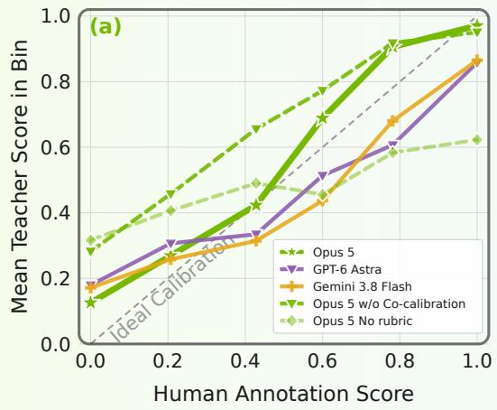

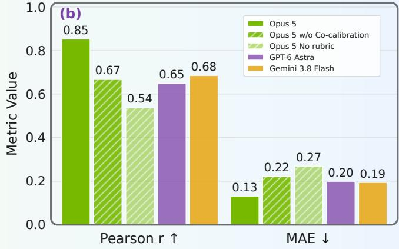  
Figure 5: Comparison of Backbone Variants of the Teacher Judge Model. All the rubric variants, except the one without coactive calibration, use the same rubric, but with diferent backbone models. No rubric variant uses a straightforward instruction without detailed rubrics for judgment. (a) Calibration curves showing the mean judge score within each human-score bin; the gray diagonal denotes ideal calibration. (b) Judge–human alignment measured by Pearson correlation and MAE for backbone variants.

Evolving Judge. Fig. 6 reports judge performance on test subsets constructed across judge improvement rounds. Unlike a fixed benchmark, the cumulative judge evaluation set evolves with the policy: each round emphasizes newly exposed failure patterns and thereby reflects the current optimization target of VeriFine.

(i) Round 1. It focuses primarily on nominal driving scenarios, which constitute the majority of the source distribution, and constructs judge evaluation and test subset R1. The resulting R1 student judge achieves a Pearson correlation of 0.72 on this subset.

(ii) Round 2. The failure analysis shifts the focus toward challenging scenarios, such as the pedestrians and obstacles encroaching into the ego lane. These policy-rollout cases form subset R2 and expose a substantial distribution shift: the R1 student obtains only � = 0.07, whereas the R2 student improves the correlation to 0.74.

(iii) Round 3. It introduces no additional evaluation subset; instead, it balances performance across the cumulative set and further targets known failure cases. This refinement increases the pooled Pearson correlation from 0.71 to 0.82 for the student judge, with the final teacher reaching 0.85. These results show that the Judge Improvement Loop progressively adapts verification to the policy’s evolving failure distribution.

## A.2. VeriFine-Judge: Reference-free Rubric Judge

Our reference-free judge evaluates candidate reasoning directly from the observable physical context, without requiring human annotation for reasoning during inference. Figure 7 illustrates the teacher–student architecture. The teacher combines a frontier VLM with an explicit embodied-reasoning rubric. The rubric subscores and explanations support failure diagnosis and coactive calibration. Then, its structured evaluations are distilled into a compact VLM student for large-scale reward computation, curriculum construction, and test-time scaling.

## A.2.1. Teacher Judge Model

We use Claude Opus 5 (2) as the teacher model. Its input contains three uniformly sampled history frames from the camera streams, ego-state information, the driving or robot navigation instructions, and the candidate

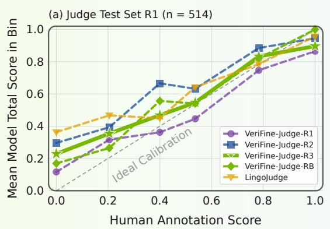

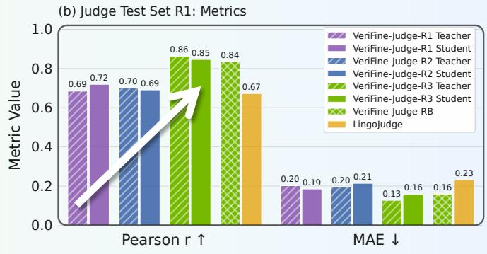

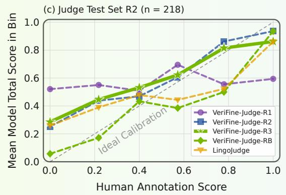

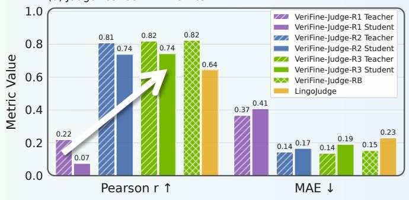  
Figure 6: Evolved Judge Performance and Evolved Test Sets (R1 and R2). (a) (c) Calibration curves showing the mean judge score within each human-score bin for two evolved test subsets for the judge test set; the gray diagonal denotes ideal calibration. (b) (d) Judge–human alignment measured by Pearson correlation and MAE for teacher and student judges across improvement rounds and reference-based baselines.

policy output. The teacher returns multiple rubric scores (across two main dimensions: Action and Component), the coherence diagnostic, an overall score, and a concise explanation in a structured, constrained format.

Driving Reasoning Rubric. For each sample, the driving reasoning judge predicts five primary binary rubric dimensions:

$$
\mathbf { z } _ { i } ^ { \mathrm { { D r i v i n g } } } = \left( z _ { i } ^ { a _ { \mathrm { { m a t c h } } } } , z _ { i } ^ { a _ { \mathrm { { s a f e } } } } , z _ { i } ^ { c _ { \mathrm { { g r o u n d } } } } , z _ { i } ^ { c _ { \mathrm { { c o m p l e t e } } } } , z _ { i } ^ { c _ { \mathrm { { c a u s a l } } } } \right) .\tag{9}
$$

The first two Action dimensions evaluate whether the proposed action is consistent with the driving instruction and safe under the observed scene. The remaining dimensions of Component evaluate whether the reasoning grounds its claims in visible evidence, identifies all behavior-relevant scene components, and correctly explains their causal relationship to the proposed action. We additionally use reasoning coherence as a diagnostic dimension.

The teacher action score applies a hard gate:

$$
A _ { i } ^ { \mathrm { D r i v i n g } } = \left\{ \begin{array} { l l } { 0 , } & { z _ { i } ^ { a _ { \mathrm { m a t c h } } } = 0 , } \\ { \frac { 1 } { 2 } \left( z _ { i } ^ { a _ { \mathrm { m a t c h } } } + z _ { i } ^ { a _ { \mathrm { s a f e } } } \right) , } & { \mathrm { o t h e r w i s e . } } \end{array} \right.\tag{10}
$$

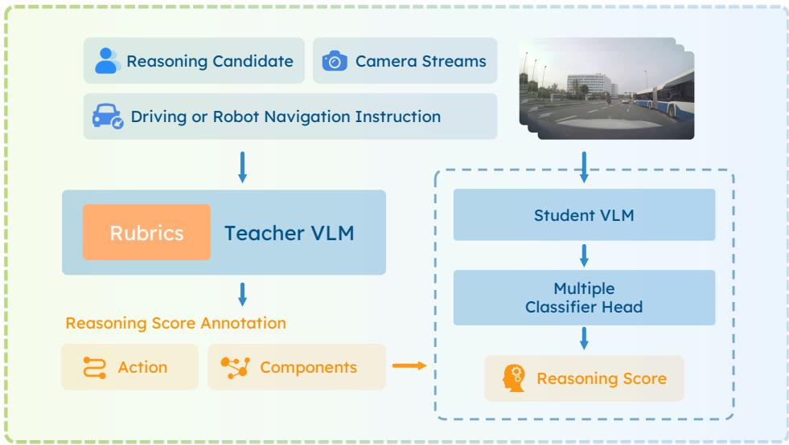  
Figure 7: Teacher–Student Architecture of the Reference-free Rubric Judge. The teacher evaluates policy outputs using visual context, ego state, a driving or robot navigation instruction, and a structured rubric. Its evaluations are distilled into a compact student judge for scalable verification.

The critical-component score is computed as

$$
C _ { i } ^ { \mathrm { D r i v i n g } } = \frac { 1 } { 3 } \left( z _ { i } ^ { c _ { \mathrm { g r o u n d } } } + z _ { i } ^ { c _ { \mathrm { c o m p l e t e } } } + z _ { i } ^ { c _ { \mathrm { c a u s a l } } } \right) .\tag{11}
$$

The overall score of the judge is

$$
s _ { i } ^ { \mathrm { D r i v i n g } } = 0 . 6 A _ { i } ^ { \mathrm { D r i v i n g } } + 0 . 4 C _ { i } ^ { \mathrm { D r i v i n g } } .\tag{12}
$$

The action-match gate removes action credit when the proposed action is inconsistent with the driving instruction, while the separate component term preserves credit for correctly grounded scene understanding.

Robot Navigation Reasoning Rubric. Navigation retains the Action and Component structure but evaluates goal-directed movement rather than action matching with driving instructions. The horizon of robot navigation instruction is longer than driving reasoning task, because it defines the final goal of the robot navigation. The judge predicts four binary rubric dimensions:

$$
\begin{array} { r } { \mathbf { z } _ { i } ^ { \mathrm { R o b o N a v } } = \left( z _ { i } ^ { a _ { \mathrm { s a f e } } } , z _ { i } ^ { a _ { \mathrm { g o a l } } } , z _ { i } ^ { c _ { \mathrm { g r o u n d } } } , z _ { i } ^ { c _ { \mathrm { c a u s a l } } } \right) . } \end{array}\tag{13}
$$

Action safety assesses whether the proposed movement has suficient clearance under the observed geometry without potential collision. Goal consistency assesses eficient progress toward the instructed destination, including purposeful exploration before target localization and appropriate stopping upon arrival. Naming the correct target does not compensate for an incorrect movement direction or a premature stop.

The Component dimensions retain visual grounding and action–component causation, without a separate completeness score:

$$
C _ { i } ^ { \mathrm { R o b o N a v } } = \frac { 1 } { 2 } \left( z _ { i } ^ { c _ { \mathrm { g r o u n d } } } + z _ { i } ^ { c _ { \mathrm { c a u s a l } } } \right) .\tag{14}
$$

Table 3: Comparison of Student Judge Variants. All variants use Qwen3-VL as the backbone. We compare initialization with and without pretraining on our internal dataset, together with generation- and classifier- based output paradigms. Inference latency is averaged over 200 samples at batch size one on NVIDIA H100 GPUs, and the teacher model is accessed through a remote API.
<table><tr><td rowspan="2">With PAI-AV Pretraining</td><td colspan="2">Output Paradigm</td><td rowspan="2">Pearson r ↑</td><td rowspan="2">MAE↓</td><td rowspan="2">Inference Latency (s/sample)↓</td></tr><tr><td>Head</td><td>Output</td></tr><tr><td rowspan="4">X</td><td rowspan="2">Generation</td><td>Reasoning + Score</td><td>0.72</td><td>0.18</td><td>2.34</td></tr><tr><td>Score Only</td><td>0.71</td><td>0.19</td><td>0.45</td></tr><tr><td rowspan="2">Classifier</td><td>Overall Score</td><td>0.76</td><td>0.18</td><td>0.07</td></tr><tr><td>Rubric Subscores</td><td>0.76</td><td>0.19</td><td>0.07</td></tr><tr><td rowspan="4">√</td><td>Generation</td><td>Reasoning + Score</td><td>0.76</td><td>0.16</td><td>2.40</td></tr><tr><td rowspan="2"></td><td>Score Only</td><td>0.75</td><td>0.17</td><td>0.45</td></tr><tr><td>Overall Score</td><td>0.81</td><td>0.15</td><td>0.08</td></tr><tr><td rowspan="2">Classifier</td><td>Rubric Subscores</td><td>0.82</td><td>0.17</td><td>0.07 300×</td></tr><tr><td>Teacher Model - Opus 5 (2)</td><td>0.85</td><td>0.13</td><td>20.92</td></tr></table>

Unlike the driving action-match gate, navigation safety gates the entire score:

$$
s _ { i } ^ { \mathrm { R o b o N a v } } = z _ { i } ^ { a _ { \mathrm { s a f e } } } \left( 0 . 6 z _ { i } ^ { a _ { \mathrm { g o a l } } } + 0 . 4 C _ { i } ^ { \mathrm { R o b o N a v } } \right) .\tag{15}
$$

Thus, unsafe movements receive zero overall credit, while safe movements are distinguished by goal progress and grounded justification. For instructions involving manipulation, the rubric evaluates navigation to the target rather than completion of the manipulation itself.

This task-specific aggregation reflects diferent reasoning demands. Driving decisions often hinge on a few critical scene elements, such as an emerging pedestrian or a red light. We therefore explicitly score component completeness and retain credit for correctly grounded and causally relevant observations even when the proposed action is unsafe, distinguishing preserved scene understanding from failures in action selection. In robot navigation, before the target is localized, selecting a productive exploration direction is more central than comprehensive component coverage. We therefore emphasize goal consistency, retain grounding and causation without a separate completeness term, and treat action safety as a prerequisite for overall credit.

Coactive Calibration. The initial rubric specifies the evaluation dimensions, their scoring criteria, common critical components, action priorities, and rules for handling noisy. When progress plateaus, human experts inspect the remaining disagreements together with the teacher’s diagnostic scores and explanations. They may correct an individual dimension, identify missing physical evidence, or clarify an underspecified criterion. These clarifications are incorporated into the next rubric revision. Each revision is evaluated on both newly queried cases and cases retained from earlier iterations. We accept a revision only when it improves human alignment on the current batch without causing a substantial regression on previously calibrated cases.

## A.2.2. Student Judge Model

Although the teacher provides strong, structured evaluations, querying a frontier VLM throughout policy optimization is computationally expensive, with long latency and high API cost, especially for the reinforcement fine-tuning of the driving reasoning task based on GRPO with high query frequency. We therefore distill its

evaluation capability into a compact student judge. The student receives the same physical context, driving instruction, and candidate output as the teacher and predicts all the rubric dimensions in a single forward pass.

The distillation dataset contains independent teacher-labeled samples. Each rubric dimension is modeled as a classification objective. The student training objective is equal-weight binary cross-entropy over all the rubric dimensions:

$$
\mathcal { L } _ { \mathrm { j u d g e } } = - \frac { 1 } { n B } \sum _ { i = 1 } ^ { B } \sum _ { k = 1 } ^ { n } \left[ \widetilde { y } _ { i k } \log p _ { i k } + ( 1 - \widetilde { y } _ { i k } ) \log ( 1 - p _ { i k } ) \right] ,\tag{16}
$$

where � is the number of the rubric dimensions, $p _ { i k }$ is the predicted probability and $\widetilde { y } _ { i k }$ is the teacher label, with 0.1 label smoothing applied only to the action-match gate. The overall score is aggregated from the subscores and does not directly provide the supervision signal for training.

Using the student model of driving reasoning as an example, the student model processes samples approximately 300 times faster than the teacher model under the hardware settings described in Tab. 3, which demonstrates its real-time performance to support online training and evaluation at low cost. Moreover, we compared the diferent out ut heads for the student jud e model and finall chose the classifier head with subscores to ensure interpretability with rubric scores, rather than the slower raw autoregressive generation paradigm.

## A.3. Evaluation and Testing Details

Reliable evaluation is the foundation of scaling verification. This section describes how VeriFine evaluates both the policy and the judge throughout self-improvement. We first introduce the policy and judge evaluation sets and then describe the evaluation protocols applied across iterations.

## A.3.1. Driving Reasoning Evaluation and Testing

We construct two complementary, expert-verified evaluation and testing resources with distinct purposes. The fixed policy evaluation set $\mathcal { P }$ tracks policy progress and supports verification-boundary detection, whereas the cumulative judge evaluation set $\mathcal { T } _ { t }$ supports human calibration and judge refinement. Because large-scale driving data inevitably contain noisy or erroneous samples, human experts inspect and verify the camera observations, trajectories, reasoning annotations, and reasoning scores of every evaluation sample.

Notably, the final policy and judge performance are evaluated on the independent corresponding test sets �test and $\mathcal { I } _ { t } ^ { \mathrm { t e s t } }$ with the same distribution as the evaluation sets. The Tab. 4 summarizes the details of those sets, and the Fig. 8 shows the distribution of the larger test set.

Table 4: Summary of the Evaluation and Testing Sets of Driving Reasoning. The query batch $\mathcal { H } _ { t }$ contains newly selected cases at judge-improvement iteration �, while $\mathcal { T } _ { t }$ denotes the cumulative judge evaluation set.
<table><tr><td>Set</td><td>Primary purpose</td><td>Construction</td><td>Size</td></tr><tr><td> $\mathcal { P } \ \& \ \mathcal { P } ^ { \mathrm { t e s t } }$ </td><td>Policy monitoring and testing</td><td>Fixed, expert-checked</td><td>2134, 2772</td></tr><tr><td> $\mathcal { H } _ { 1 } \ \& \ \mathcal { H } _ { 1 } ^ { \mathrm { t e s t } }$ </td><td>Initial judge calibration and testing</td><td>Broad base-policy rollouts</td><td>433, 514</td></tr><tr><td> $\mathcal { H } _ { 2 } \ \& \ \mathcal { H } _ { 2 } ^ { \mathrm { t e s t } }$ </td><td>Boundary-focused calibration and testing</td><td>Updated-policy rollouts</td><td>179,218</td></tr><tr><td> $\mathcal { J } _ { 3 } \ \& \ \mathcal { J } _ { 3 } ^ { \mathrm { t e s t } }$ </td><td>Final judge validation and testing</td><td> $\mathcal { H } _ { 1 } \cup \mathcal { H } _ { 2 } , \mathcal { H } _ { 1 } ^ { \mathrm { t e s t } } \cup \mathcal { H } _ { 2 } ^ { \mathrm { t e s t } }$ </td><td>612, 732</td></tr></table>

Policy Evaluation and Testing Set of Driving Reasoning The policy evaluation and testing sets $\mathcal { P } \ \& \ \mathcal { P } ^ { \mathrm { t e s t } }$ come from carefully selected driving scenarios. Human experts inspect each scenario and correct unreliable reasoning annotations. The resulting set covers diverse geographic regions, e.g., the U.S., Europe, the U.K., and South Korea, as well as varied road structures, weather conditions, and lighting conditions. It contains

Policy Evaluation Set (2,772Policy Test Set (2772)Policy Evaluation Set (2,772

Judge Evaluation Set (732Judge Test Set (732) Judge Evaluation Set (732

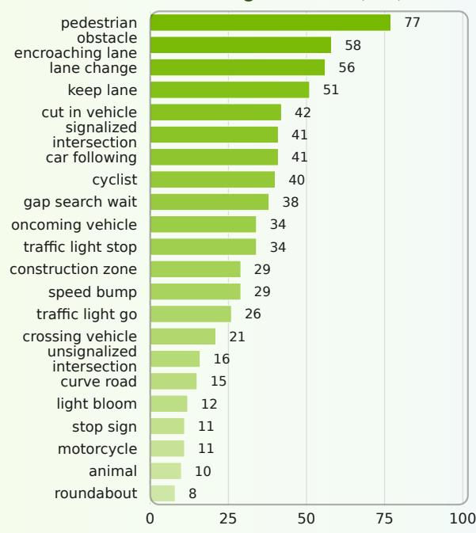

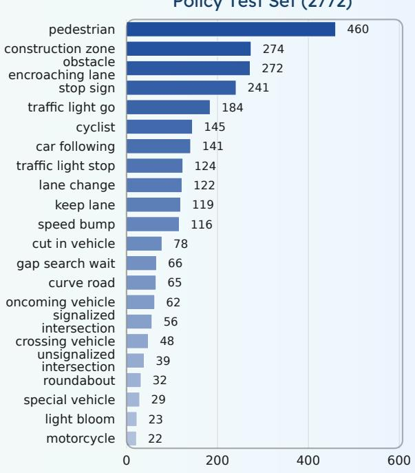

Judge Evaluation Set - R1 (514)Judge Test Set – R1 (514) Judge Evaluation Set - R1 (514)  
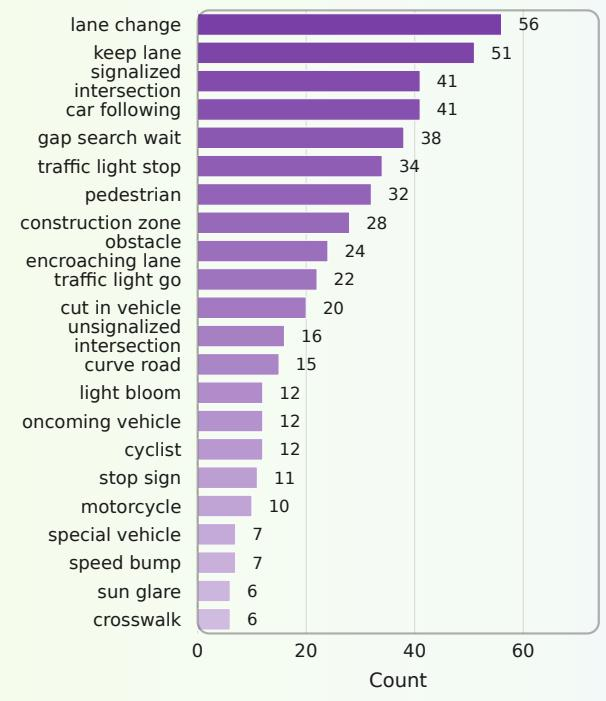

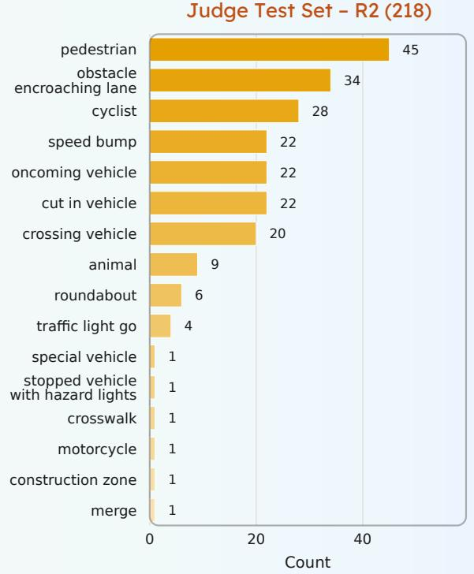  
Figure 8: Scenario Distribution of the Testing Sets in Driving Reasoning. The figure shows the top 21 categories in each test set, which constitute the main body of the sets.

both reasoning-dense scenarios involving multiple interacting agents and reasoning-light scenarios with the straightforward decisions.

Because the reward judge evolves throughout self-improvement, its scores cannot provide a fixed basis for comparing policies across iterations. Human experts curate policy evaluation sets to maintain diversity across scenario categories and reasoning densities, providing a stable evaluation anchor for the complete self-improvement process. Fig. 8 summarizes the distribution of $\mathcal { P } ^ { \mathrm { t e s t } }$ across geographic regions, scenario categories, and reasoning-density levels.

Judge Evaluation and Testing Set of Driving Reasoning At judge-improvement iteration �, an incremental set $\mathcal { H } _ { t } \ \& \ \mathcal { H } _ { t } ^ { \mathrm { t e s t } }$ is constructed from outputs generated by the latest policy. As summarized in Tab. 4, the first batch contains broadly sampled cases generated by the initial policy and is used to establish the initial human–judge calibration. The second batch contains challenging cases generated after policy improvement. These cases em hasize newl ex osed olic failures, jud e–human disa reements, and out uts near the judge’s efective verification boundary. Unlike policy training data, $\mathcal { T } _ { t }$ deliberately retains both high- and low-quality outputs. Negative cases are necessary for identifying false positives, refining rubric boundaries, and detecting reward-hacking behavior during judge model training.

## A.3.2. Robot Navigation Reasoning Evaluation and Testing

## Data Curation

VLNVerse (29) provides interactive indoor environments and navigation episodes pairing language instructions with reference trajectories, including both fine-grained route-following and coarse-grained goal-directed tasks. These episode-level annotations do not directly provide the observation-aligned, decision-level reasoning supervision. We therefore collect robot-view observations and construct reasoning examples that connect a destination goal and local visual evidence to the next navigation decision. The target is to determine where to explore, how to approach the target, and when to stop, without receiving intermediate route instructions.

We collect egocentric image sequences along navigation trajectories in VLNVerse scenes. Given the original navigation instruction and sampled frames in the trajectory, Claude Opus 5 (2) segments each trajectory into consecutive turning, traversal, doorway, approach, and arrival intervals and generates a concise, landmark grounded movement description for each interval.

At each interval’s startin oint, we air the enerated annotation with the current observation, two historical observations, and a destination instruction derived from the original task by retaining the final goal and removing intermediate route commands. This produces 19k samples with resolved destination instructions. The resulting pool supports judge-guided selection of reasoning supervision for policy improvement.

## Policy Evaluation Set of Robot Navigation Reasoning

The fixed policy evaluation set and independent policy test set contain 182 and 220 samples, respectively, from 46 episodes across 28 scenes. The distribution of the larger policy test set is 53 turning, 69 traversal, 36 doorway, 36 approach, and 26 arrival decisions. All the samples in the policy set have been verified to ensure the quality of the decision time and reasoning content.

Table 5: Robot Navigation Evaluation and Test Sets.
<table><tr><td>Set Evaluation Test</td></tr><tr><td>Policy (P) 182 220</td></tr><tr><td>Initial judge (H1) 175 211</td></tr><tr><td>R2 added judge cases (H2) 37 70</td></tr><tr><td>Cumulative judge (J2) 212 281</td></tr></table>

## Judge Evaluation Set of Robot Navigation Reasoning We

initially construct a candidate pool by pairing source reasoning annotations with VLM-generated negative candidates. These candidates introduce controlled errors in the proposed movement or referenced scene elements while preserving the instruction and observations. Human review determines their rubric scores and yields an initial judge evaluation and independent test sets of 175 and 211 candidates.

Subsequent policy rollouts reveal weaknesses in exploration eficiency, particularly in selecting productive directions and deciding whether to approach, stop, or continue searching. Guided by these observed failure patterns, the agent constructs 107 additional contrast candidates, targeting distinctions between superficially plausible actions and movements that actually advance the navigation goal. The expanded judge evaluation and test set contain 212 and 281 candidates.

## A.3.3. VeriFine-Judge-RB: Reference-Based Rubric Judge

Because the reference-free judge evolves across iterations, we use a fixed reference-based judge $J ^ { \mathrm { r e f } }$ to test the policy progress on $\mathcal { P } ^ { \mathrm { t e s t } }$ , which compares each policy-generated reasoning with its expert-verified reference reasoning. VeriFine-Judge-RB remains fixed during development monitoring and final policy evaluation. Its use as a reward model is confined to the reference-based baselines explicitly identified in Tab. 1. The evolving reference-free judge supplies the training reward for VeriFine policies.

The VeriFine-Judge-RB is a DeBERTa-v3-base cross-encoder (16) initialized from Lingo-Judge (35). It takes a fixed question, the reference reasoning, and the candidate reasoning as input, and produces a scalar score in [0, 1] through a single classification head. VeriFine-Judge-RB is further fine-tuned on approximately 500K reference–candidate pairs using binary cross-entropy.

We also leverage the rubric across action and critical components for the teacher model to obtain large-scale reasoning annotations to train the VeriFine-Judge-RB model. We leverage Claude Opus, GPT, and Gemini to annotate the reasoning score individually based on the rubric, and average them as the training supervision data for the VeriFine-Judge-RB model.

## A.4. Experiment Details

## A.4.1. Evaluation Metrics

Reasoning Score. For each sample, the evaluation protocol assigns a reasoning score $s _ { i } \in [ 0 , 1 ]$ : the reference- based judge uses expert reference reasoning, the reference-free judge uses the observed context and rubric. We report the mean scaled by 100.

$$
{ \mathrm { R e a s o n i n g ~ S c o r e } } = { \frac { 1 0 0 } { N } } \sum _ { i = 1 } ^ { N } s _ { i } .\tag{17}
$$

Judge–Human Alignment. Judge capability is evaluated by comparing the predicted overall reasoning scores $s _ { i }$ with expert scores $h _ { i }$ . We report Pearson correlation $r ,$ which measures agreement in relative sample quality, and mean absolute error (MAE),

$$
\mathrm { M A E } = \frac { 1 } { N } \sum _ { i = 1 } ^ { N } | s _ { i } - h _ { i } | ,\tag{18}
$$

which measures absolute calibration error. Higher Pearson correlation � and lower MAE indicate better alignment with human evaluation.

Trajectory Accuracy. For the �-th predicted trajectory, average displacement error is

$$
\mathrm { A D E } ^ { ( k ) } = \frac { 1 } { T } \sum _ { t = 1 } ^ { T } \left. \hat { \mathbf p } _ { t } ^ { ( k ) } - \mathbf p _ { t } \right. _ { 2 } ,\tag{19}
$$

where $\hat { \mathbf { p } } _ { t } ^ { ( k ) }$ and $\mathbf { p } _ { t }$ are the predicted and ground-truth positions at timestep $t ,$ respectively. We report ADE for a single predicted trajectory and

$$
\mathrm { \ m i n A D E 6 } = \operatorname* { m i n } _ { k \in \{ 1 , . . . , 6 \} } \mathrm { A D E } ^ { ( k ) } .\tag{20}
$$

Both metrics are averaged over evaluation samples and measured in meters; lower values indicate better trajectory accuracy.

## A.4.2. Implementation Details

Reinforcement Fine-tuning for Driving Policy. In the driving reasoning task, we initialize the Alpamayo 1.5 8B policy and optimize it with reinforcement fine-tuning with GRPO, using VeriFine-Judge both to provide the online reward and to adaptively construct the training curriculum. The selected training set with curriculum judge contains the fixed 25K samples from a pool of 400K candidates, and the training data budget is fixed for fair comparison. Each update uses 32 prompts with $K = 1 6$ rollouts per prompt, resulting in an efective batch size of 512 rollouts. We train for fixed 2,700 steps using AdamW with a learning rate of $1 \times 1 0 ^ { - 5 }$ and a KL coeficient of 0.02, on 20 NVIDIA H100 GPU nodes.

Supervised Fine-tuning for Robot Navigation Policy. For the robot navigation reasoning task, the policy is initialized from the Qwen3-VL 2B base model. All runs use 8 NVIDIA H100 GPUs and a global batch size of 128. We freeze the vision backbone while updating the language model and visual merger with AdamW, using learning rates of $1 0 ^ { - 5 }$ and $1 0 ^ { - 6 }$ , respectively, and weight decay of 0.01. Moreover, the SFT uses cosine learning-rate decay.

Student VeriFine-Judge Training. We freeze its vision backbone and train the language backbone and a five-way classification head on 35K teacher-labeled examples using equal-weight binary cross-entropy, with 0.1 label smoothing applied only to the action-matching output. We train it on 8 NVIDIA H100 GPUs with a global batch size of 16, using AdamW with learning rates of $4 \times 1 0 ^ { - 5 }$ and $1 0 ^ { - 3 }$ for the backbone and classification head, respectively. We use 500 warmup steps followed by cosine decay to 0.2× the peak learning rate, weight decay of 0.1, and gradient clipping at 1.0.

VeriFine-Judge-RB Training. We train our reference-based model on approximately 500K reference–candidate reasoning pairs with 16 NVIDIA H100 GPUs, using binary cross-entropy with rubric-derived soft targets and a maximum sequence length of 256. We use fused AdamW with a global batch size of 128, a learning rate of $4 \times 1 0 ^ { - 5 }$ , weight decay 0.01, 250 warmup steps, cosine decay to 1% of the peak learning rate, and gradient clipping at 1.0.

## A.4.3. Loop Execution Protocol

Judge Improvement Loop Trigger. Boundary checks are performed every 150 steps on the policy evaluation set $\mathcal { P }$ during policy training. $P _ { t }$ is measured by the fixed VeriFine-Judge-RB evaluator. The progress signals use the reasoning score, with $\Delta R _ { t } ^ { \mathrm { j u d g e } }$ computed using the current judge, which is used as the reward judge. We use a window of $K = 4$ and a 0.5 threshold.

Curriculum Selection. The executed selection rule is a ranking rule based on target-quality, learnability, and category type, with a tie-breaking rule, yielding 25K examples from the 400K candidate pool for driving. For navigation, context priority is determined by a failure-based selection rule, while demonstration quality is checked using the target-quality criterion. We retain 13K examples per round. Selection rules are updated from failures observed on $\mathcal { P } _ { \cdot }$

Rubric Revision. The agent modifies sub-rubric details and demonstration examples while keeping the rubric dimensions unchanged. Each proposal is evaluated on the current calibration batch and retained calibration cases. Revisions are accepted according to Pearson correlation and MAE performance. Each round permits 20 version rubrics, and human review is requested when the average improvement in Pearson correlation is less than 0.2 for more than ten iterations.

Human Calibration and Test Annotation During coactive calibration, human annotators and the agent resolve rubric ambiguities through evidence-based discussion, allowing both the rubric and human calibration scores to be revised. Then, we trained another set of annotators and independently scored the judge test set without access to judge scores. Test labels are subsequently frozen and used consistently across all iteration rounds and judge comparisons, without informing rubric refinement or model selection.

## A.5. Limitations and Future Work

While the judge evaluation set evolves with the policy to capture newly exposed failure patterns, the current framework retains a fixed policy evaluation set as a consistent anchor for measuring improvement across iterations. Future work could preserve a fixed held-out test set for comparable reporting while introducing an adaptive policy evaluation set that co-evolves with the policy and judge to provide increasingly informative signals for failure discovery and curriculum construction. The framework also still relies on reasoning-annotated data: although the reference-free VeriFine-Judge can filter low-quality reasoning during training, the reference reasoning used for policy evaluation remains human-verified. A natural extension is therefore to jointly evolve a reasoning annotator that generates and refines reference reasoning using structured judge feedback. Finally, while coactive calibration already consolidates human expertise into the evolving rubric and reduces repeated queries, explicitly distilling human corrections, instructions, and rubric revisions into a reusable guidance model could further reduce human involvement and eventually enable continued judge improvement without routine human guidance.