# Which alloy composition, what process parameters? Inferring the recipe from optimized metallic microstructure and texture

Mahish K. Guru1,2 Jan Bohlen1 Louam Lemjid1 Marius Tacke3 Roland Aydin4,5 Noomane Ben Khalifa1,2

1Institute of Material and Process Design, Helmholtz-Zentrum Hereon, Germany   
2Institute of Production Technology and Systems, Leuphana University Lüneburg, Germany 3Institute of Material Systems Modeling, Helmholtz-Zentrum Hereon, Germany   
4AI for Physical Systems, German Research Center for Artificial Intelligence (DFKI), Germany 5Saarland University, Germany

## Abstract

The mechanical properties of a metallic alloy are set by its microstructure and texture: the size and shape of its grains and the orientation of their crystals. That structure is in turn set by a recipe, the alloy composition together with the processing parameters. Alloy development runs this chain forwards, tuning the structure until a target property is met. Running it backwards, from an optimized structure to the recipe that would produce it, still relies on expert knowledge. We ask whether this backwards step can be learned. On an in-house dataset of 107 magnesium alloy extrusion conditions across 14 alloys, each with optical micrographs and an X-ray texture measurement, we compare three descriptors of microstructure and texture: conventional grain and texture statistics, a vision embedding from a pretrained image encoder, and a graph neural network on the grain network. Each is paired with prediction heads for two tasks: the alloy composition given the process (Task A), and the process parameters given the composition (Task B). Under 5-fold cross-validation, the conventional descriptors identify the correct alloy for 65% of held-out conditions, against 17% for always guessing the most common alloy, while the learned embeddings stay below 30%. The process parameters are recoverable but noisier: compared with using the composition alone, the microstructure roughly halves the temperature error. Because only a few alloys were cast and only a few press settings were used, both answers are discrete, and heads that pick from these known options, while respecting their order, worked better than heads that predict a free value.

## 1 Introduction

Alloy development is a chain of two links. A recipe, the alloy composition together with the processing parameters, produces a microstructure and texture; that structure in turn sets the mechanical properties. Research has concentrated on the second link, and travels it in both directions. The forward leg goes from structure to property: for extruded magnesium alloys, statistical microstructure and texture descriptors predict strain-hardening behavior within a few percent [1–3]. The design leg goes from property back to structure: a mature literature describes how to tailor grains, boundaries and crystallographic orientation for a desired response [4–6], and generative latent optimization can propose microstructures for a target stress-strain curve [7]. Together these two legs deliver an optimized structure, and there the chain stops: the first link is rarely run backwards. That step is the recipe leg, from an optimized structure to the recipe that would produce it, and it still leans on expert knowledge: given only the structure, which alloy composition and what process parameters made it? This paper studies the recipe leg (Figure 1).

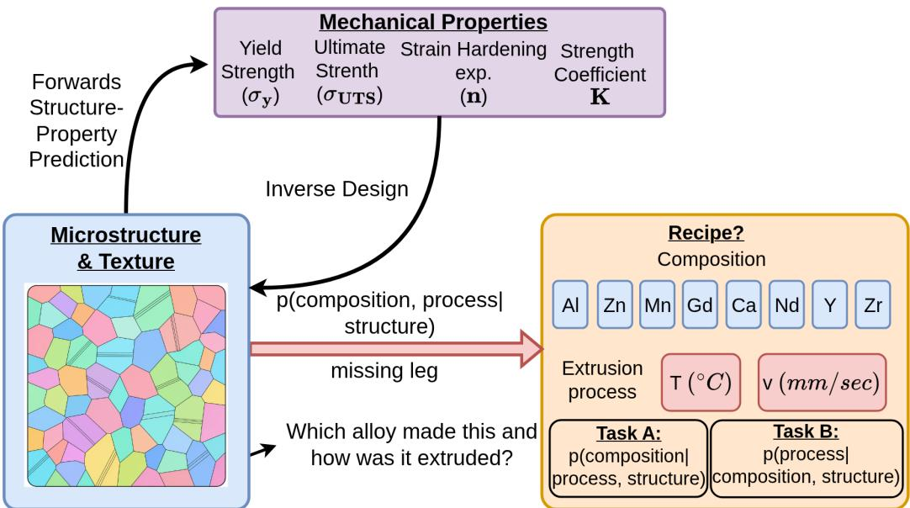  
Figure 1: The forward leg predicts mechanical properties from microstructure and texture; inverse design (the design leg) goes from a target property back to a structure. The missing recipe leg (red arrow), studied here, infers the recipe from that structure. We evaluate it as two conditional tasks: Task A predicts the composition given the structure and the known process, and Task B the process given the structure and the known composition.

In automated characterization pipelines and self-driving laboratories, the recipe leg serves quality control, anomaly detection and the planning of the next experiment [8–12]. Such a laboratory proposes a recipe, runs it and images the result. Nothing in that loop checks that the structure under the microscope is the one the recipe should have produced. A model of the recipe leg supplies that check from images already being collected, and can flag a mislabelled sample, a drifting press or a repeated condition. It is also the first question in reverse engineering a legacy or competitor material. The dificulty in practice is the messiness of real experiments: campaigns are small, heterogeneous, pooled across sources and thinly sampled in every variable. We work in that regime instead of avoiding it with simulated data.

Our data come from the measured campaign behind our earlier forward-leg study [1], which used microstructure and texture statistics of extruded magnesium alloys to predict their strain-hardening parameters. The campaign covers 107 extrusion conditions of wrought magnesium alloys, a hexagonal close-packed (HCP) metal, over 14 alloy classes, with optical micrographs and an X-ray texture measurement for each condition. Both halves of the recipe look continuous but are not. The composition is a weight percentage for each of eight alloying elements (Al, Zn, Mn, Ce, Gd, Ca, Nd, Y), but only 14 alloys were cast, so the answer is always one of 14 known compositions. The process behaves the same way: extrusion temperature and ram speed could take any value, but the press was run at a short list of settings. Both answers are therefore discrete, and this shapes the rest of the paper.

We compare three descriptors of microstructure and texture. The first is conventional grain and texture statistics, a domain-designed pipeline computed directly from the micrographs and the measured texture. The second is an embedding from the image encoder of our Co-PiLOT work [13], pretrained on about 80k orientation maps and used frozen. The third is a graph neural network on the network of grains and their boundaries. Each descriptor is passed to prediction heads, the models that turn it into an answer, which either respect or ignore the discrete answer. There are two tasks: Task A, the alloy composition, and Task B, the process parameters. The question we put to each descriptor is whether it is compatible with the recipe leg: does this way of describing an optimized microstructure and texture support recovering the recipe behind it? What this paper ofers:

1. We state the recipe leg as two tasks that a model can be scored on, composition given the known process and process given the known composition, and pose them on a measured campaign rather than on simulated data.

2. We compare conventional grain and texture statistics, a frozen vision embedding and a grain-graph network on the same folds, heads and metrics, and state exactly what each of them receives.

3. We give prediction heads that decode onto the short list of alloys and press settings that exist, and compare each against the same evidence used without that constraint and against baselines that see no microstructure.

4. We report, next to the headline error, metrics that reveal when a head scores well for the wrong reason, and show heads from our own search that these metrics exposed.

## 2 Related work

Most data-driven work on microstructure runs the forward direction, from structure to property, using spatial correlations, reduced statistics or learned features [1–3, 14]. Inverse design inverts that map to propose a structure for a target property [7, 13], and reconstruction methods generate structures that match measured statistics [15]. Process-structure linkages are also mostly studied forwards, predicting the structure a process will produce, often on simulated data [16]. Closest to our question are computer-vision studies that classify micrographs by their origin. Generic image features can sort microstructure images into classes [17], and image-texture representations of ultrahigh-carbon steel separate micrographs by their annealing conditions [18]. These studies infer one processing label for one material system. We ask for the full recipe, composition and process, across 14 alloys, and score the answer against the discrete set of recipes that were actually run.

Learned representations of microstructure range from CNN features pretrained on natura images [19][20] and encoders pretrained on large microscopy collections [21] to graph neural networks over grains and their boundaries [22] and generative latent spaces for inverse design [13]. Most of them are evaluated where data are plentiful or simulated. Experimental campaigns instead have tens to hundreds of conditions, with labels drawn from a short list of settings [8, 11]. This paper sits between the two lines of work. It compares a domain-designed descriptor with two learned ones on such a campaign, and asks which descriptor, combined with which kind of prediction head, recovers the recipe.

## 3 Data: sparse by construction

The dataset aggregates measured extrusion campaigns of wrought magnesium alloys: AZ31 from a doctoral thesis [23] and a processing-parameter study [24], the Zn-bearing alloys Z1, ZX10 and ZNd10 from a Zn-bearing extrusion study [24, 25], ME21 from an extrusionparameter study [26], and the Mg-Gd family Mg-2/5/10Gd with 0, 0.5, or 1 wt% Mn micro-additions from Mg-Gd and Mg-Gd-Mn extrusion studies [27, 28]. Each of the 107 conditions combines a base alloy (composition in wt% over the eight alloying elements Al, Zn, Mn, Ce, Gd, Ca, Nd, Y), an extrusion temperature $T _ { \mathrm { e x t } } \in [ 2 0 0 , \bar { 5 } 0 0 ] ^ { \circ } \mathrm { C } .$ and a ram speed $v _ { \mathrm { e x t } } \in [ 0 . 5 , 7 . 5 ] \mathrm { m m / s }$ . Per condition we have optical micrographs and X-ray pole figures reduced to an orientation distribution function (ODF).

Two kinds of sparsity. The labels of the composition task are sparse: 14 alloys are spread thinly over eight possible alloying elements, most elements are absent from most alloys, and Y appears in a single alloy. The labels of the process parameter task are sparse and also confounded: each alloy family was extruded on its own temperature and speed grid, so process and composition are correlated by experimental design. Any model can exploit that correlation, so we also ask whether the microstructure adds information beyond it. Every result is therefore compared with a baseline that sees the known half of the recipe but no microstructure.

Table 1: Inputs per branch. Every branch also receives the known half of the recipe: $T _ { \mathrm { e x t } }$ log $v _ { \mathrm { e x t } }$ and a two-column extrusion-ratio flag in Task A, or the eight element wt% and the flag in Task B. Last column: input width at the kNN, fusion and GBDT heads / the reranker’s second classifier / the ARD GP / the joint-grid GP (Section 5). GSH = generalized spherical harmonics.
<table><tr><td>branch image input</td><td></td><td>texture enters as</td><td>width at the heads</td></tr><tr><td>conv.</td><td>optical micrograph and its grain GSH coefficients of the ODF mask</td><td></td><td>438  / 5 blocks / 32  / 8</td></tr><tr><td>vision</td><td>orientation-coloured RVE map</td><td>orientations sampled from the 1280 ODF</td><td> $/ \le 1 2 8 / 3 2 / 8$ </td></tr><tr><td>gnn</td><td>grain graph of the same RVE</td><td>per-grain Euler angles from the ODF</td><td> $1 2 8 \mathrm { ~ / ~ } 1 2 8 \mathrm { ~ / ~ } 3 2 \mathrm { ~ / ~ } 8$ </td></tr></table>

Two tasks. We split the recipe leg into two tasks. Task A, the composition task: given the structure representation plus the known process $( T _ { \mathrm { e x t } } , \log v _ { \mathrm { e x t } } )$ and an extrusion-ratiotype flag, predict the element wt% vector. Task B, the process parameter task: given the representation plus the known composition and the same flag, predict $( T _ { \mathrm { e x t } } , v _ { \mathrm { e x t } } )$ . Each task receives the half of the recipe that a user would usually already know.

Each condition has many images, so a random split by image would put images of the same condition in both the training and the test set; our fusion head (Section 5) then scores 100% alloy top-1. All results therefore use condition-grouped 5-fold cross-validation: every condition, with all its images, sits in exactly one held-out fold, and each test fold is used once. A validation part of each training fold selects hyperparameters, and every other choice is made on out-of-fold (OOF) predictions, that is, on training conditions held out inside the training fold.

## 4 Method: microstructure and texture descriptors

Figure 2 shows the three descriptor branches and Table 1 lists exactly what each receives. They cover the range of options a practitioner realistically has, from conventional statistics to vision embeddings, and the benchmark asks which of them is compatible with the recipe leg at 107 conditions.

What each branch sees. All three branches start from the same measurements, one optical micrograph at a time plus the measured ODF of its condition, but read them in diferent forms. The conventional branch computes its statistics directly from the micrograph, its grain mask and the ODF. The two learned branches read a representative volume element (RVE) built for each micrograph in DREAM.3D [29]: grain sizes and aspect ratios follow that micrograph’s measured distributions, and grain orientations are sampled from the condition’s measured ODF. The RVE is rendered as an orientation-coloured map, in which each pixel’s colour encodes the local crystal orientation as in an EBSD map, for the vision encoder, and segmented into a grain graph for the GNN. All three branches therefore receive the texture. They difer in how they see the grain arrangement: the conventional branch measures it on the micrograph itself, while the learned branches see it as reproduced by the RVE from the measured statistics.

Conventional grain and texture statistics (438-D). This pipeline is taken from our forward-leg study in Acta Materialia [1], where the same statistics predicted strain-hardening parameters within a few percent. Each image contributes: PCA-reduced 3-point spatial correlations (120-D), Isomap-reduced Gram matrices of pretrained CNN activations (200-D), aspect-ratio and equivalent-diameter distributions (58-D), and from the ODF, Isomap-reduced generalized spherical harmonics coeficients (60-D). These descriptors are cheap, deterministic, and built from domain knowledge of what distinguishes one extruded microstructure from another [14, 19, 30–32].

Vision embedding (1280-D). The middle branch reuses the encoder of our Co-PiLOT work [13], which learns a latent space of orientation maps and optimizes in it to design microstructures for a target property. There, a ViT-H/14 trunk [33] initialized from naturalimage CLIP weights [34] was trained on about 80k EBSD-derived microstructures, with its upper 16 blocks fine-tuned, and an attention pooler reads it out into 16 latent tokens. A

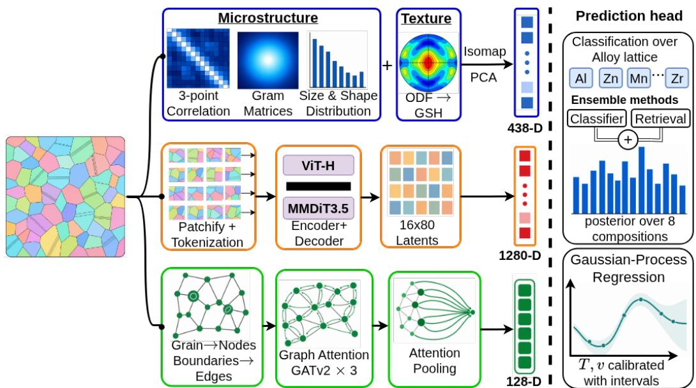  
Figure 2: Three descriptor branches with shared prediction heads. Top (blue): conventional statistics of the micrograph and the measured ODF, 438-D. Middle (orange): the frozen Co-PiLOT ViT-H encoder reading an orientation-coloured RVE map, 1280-D (Figure 7). Bottom (green): grain graph of the same RVE through a graph attention encoder, 128-D. Right: the heads, shared by all branches. Exact inputs in Table 1.

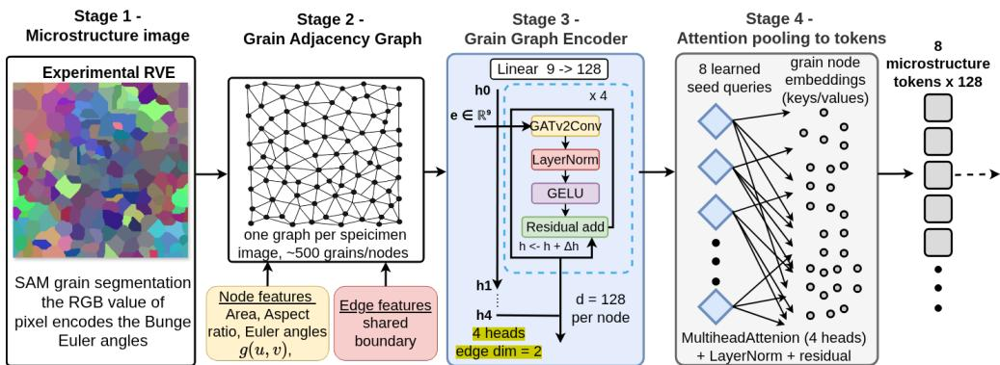  
Figure 3: Grain-graph encoder. Stage 1: segmented grain map of the RVE. Stage 2: grain adjacency graph, roughly 500 grains per image. Stage 3: four GATv2 blocks with residual connections. Stage 4: attention pooling to 8 microstructure tokens.

Stable Difusion 3.5 MMDiT decoder [35] reconstructs the image from those tokens, so the latent is shaped by reconstruction rather than by any recipe label [36, 37]. In this paper the whole encoder is frozen: nothing is fine-tuned on the 107 conditions, and the 16 × 80 tokens are flattened to the 1280-D embedding (Figure 7 in Appendix A.1). The question is whether a latent learned for reconstruction transfers to the recipe leg.

Grain-graph embedding (128-D). The third branch turns each RVE into a graph whose nodes are grains and whose edges are shared boundaries. Node features cover grain geometry and orientation, and edge features cover shared-boundary length and misorientation angle [38]. A graph attention encoder [39, 40] followed by attention pooling [41] produces 8 microstructure tokens per image, which are mean-pooled to the 128-D embedding used in the benchmark. Unlike the other two pipelines, this encoder was designed and trained for this study. It is trained once with a flow-matching objective [37] and then frozen, so each fold reuses cached embeddings. Figure 3 shows the four stages and Appendix A.1 the layer sizes.

## 5 Method: prediction heads

A descriptor turns a micrograph into a vector; a prediction head turns that vector into an answer to one of the two tasks. Section 3 showed that both answers are discrete. We therefore build heads that choose from the known alloys or settings, which we call the catalogue, and compare each with a head that sees the same input but may answer anywhere in a continuous range. All heads see the same descriptor input on the same folds. Two baselines that see no microstructure anchor each task: the most frequent training answer, and a classifier that sees only the known half of the recipe. Appendix A.2 gives the full specifications, and Appendix A.3 the metric equations and the reason for each baseline.

Task A: choosing among known alloys. We predict which of the 14 alloys a condition belongs to and report the nominal composition of that alloy as the predicted element weight percentages. Image-level probabilities are averaged within a condition first, so every condition contributes one prediction regardless of how many micrographs it has. Three heads of increasing structure are compared. Retrieval lets the alloy labels of the nearest training images in descriptor space vote, the natural baseline when the answer is a catalogue entry [42, 43]. Condition-balanced fusion averages that vote with a 14-way gradientboosted classifier trained with equal weight per condition, so conditions with many images do not dominate [44–46]. The reranker, our main head, blends the fusion with a second classifier chosen to make diferent mistakes: one logistic classifier per descriptor block on the conventional branch, and an FT-Transformer on the two learned branches, which have no block structure [47–49]. Its blend weight is selected on OOF predictions, and only weights that do not worsen the guard metrics below are eligible [50, 51]. When none qualifies, the fusion is kept unchanged, so the reranker cannot be worse than the head it starts from.

Guard metrics. The practical question behind Task A is the levels of the elements in a known alloy family, so the headline metric is present-element WAPE (weighted absolute percentage error over elements actually present). WAPE alone can be gamed: a head that predicts every element as present scores deceptively well. Every composition row therefore also reports all-element WAPE and the macro false-positive rate.

Task B: choosing among the settings that were run. Temperature and speed of extrusion are predicted together, and again three heads are compared. Gradient-boosted decision trees (GBDT) predict each target directly, with speed modelled in log space [44]. A Gaussian process (GP) does the same on a compressed, condition-pooled descriptor, with a separate lengthscale per input direction so that uninformative directions can be discounted; that per-direction weighting is called automatic relevance determination, so this head is labelled ARD GP below [52, 53]. The joint-grid GP uses the same evidence but may only answer with a setting that was actually run. It places a correlated GP over temperature and log speed jointly, and instead of reading a value of the posterior mean it returns the observed training pair that minimises the expected relative error under that posterior [54]. Speed estimates from the other heads are likewise snapped to the nearest of the eleven observed speeds, since a value between two press settings is never a possible answer (Appendix A.2).

## 6 Results

Task A: composition. Table 2 collects the 5-fold results. The conventional reranker wins outright: 13.6% WAPE against 16.8% for the fusion it starts from and 30.0% for retrieval, with the best top-1 (0.646) the fewest false positives (1.1%), and the sharpest posterior (class NLL 1.38). On the learned branches the selection keeps the fusion unblended on 8 of 10 folds, because the second classifier adds nothing there. Figure 4 shows what sits underneath: the conventional head is confidently right on a large share of conditions, while both learned embeddings assign almost no probability to the truth for many of the alloys, the mechanism behind their NLL near 2.3. The conventional reranker leads on every fold (Appendix B.1). Within one composition step all branches reach 0.68 to 0.79: each recognises the alloy family, and the gap lies in resolving its Gd and Mn levels (Appendix B.4).

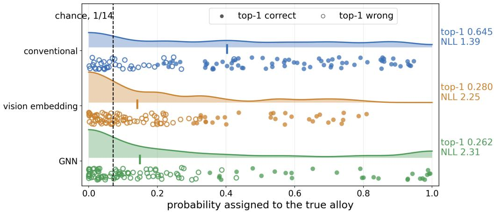  
Figure 4: Task A confidence: the probability the reranker assigns to the true alloy, pooled over all 107 held-out conditions. Further to the right is better, so the conventional row is the best-performing description. Density above each line, one dot per condition below (filled = top-1 correct, open = wrong), tick = median, dashed = uniform guess (1/14). The learned branches put little probability on the true alloy for most conditions.

Table 2: Task A, composition given known process. 5-fold cross-validation, mean ± std over held-out condition groups. WAPE = present-element WAPE; FP = false-positive rate; top-1 = alloy accuracy; NLL = class log-likelihood. none: baselines without microstructure. Best per column in bold.
<table><tr><td>repr.</td><td>head</td><td>WAPE (%)</td><td> $\mathrm { F P \ ( \% ) }$ </td><td>top-1</td><td>NLL</td></tr><tr><td>none</td><td>most frequent alloy known process only</td><td> $7 1 . 7 \pm 3 . 1$   $7 5 . 7 \pm 1 0 . 8$ </td><td>75.0 8.1</td><td> $0 . 1 6 9 \pm 0 . 0 3 1$   $0 . 1 3 2 \pm 0 . 0 6 3$ </td><td>2.54 3.49</td></tr><tr><td></td><td>kNN retrieval</td><td> $3 0 . 0 \pm 7 . 6$ </td><td>10.3</td><td> $0 . 4 9 6 \pm 0 . 1 1 0$ </td><td>5.92</td></tr><tr><td>conv.</td><td>balanced fusion OOF-constrained reranker</td><td> $1 6 . 8 \pm 5 . 8$   ${ \bf 1 3 . 6 \pm 4 . 1 }$ </td><td>1.3 1.1</td><td> $0 . 6 1 2 \pm 0 . 0 7 8$   $\mathbf { 0 . 6 4 6 \pm 0 . 0 5 1 }$ </td><td>1.49 1.38</td></tr><tr><td>vision</td><td>balanced fusion</td><td> $4 4 . 7 \pm 1 8 . 0$ </td><td>6.5</td><td> $0 . 2 7 6 \pm 0 . 1 0 4$ </td><td>2.25</td></tr><tr><td></td><td>OOF-constrained reranker</td><td> $4 1 . 6 \pm 1 8 . 9$ </td><td>5.9</td><td></td><td></td></tr><tr><td></td><td></td><td></td><td></td><td> $0 . 2 8 7 \pm 0 . 1 1 1$ </td><td>2.23</td></tr><tr><td></td><td></td><td></td><td></td><td></td><td></td></tr><tr><td>gnn</td><td>balanced fusion</td><td> $4 4 . 3 \pm 8 . 0$ </td><td>7.2</td><td> $0 . 2 6 6 \pm 0 . 0 7 1$ </td><td>2.34</td></tr><tr><td></td><td>OOF-constrained reranker</td><td> $4 4 . 2 \pm 8 . 0$ </td><td>7.2</td><td> $0 . 2 6 6 \pm 0 . 0 7 1$ </td><td>2.30</td></tr></table>

The two baselines without microstructure put these numbers in context. Always predicting the most frequent training alloy gives a top-1 of 0.17, and a classifier that sees only the known process reaches 0.13, so the process alone does not reveal the alloy. The conventional reranker is almost four times the majority rate. The learned branches are about 1.6 times it, and their NLL (2.23 to 2.30) is only slightly better than that of the class prior (2.54).

Task B: process. Table 3 shows the mirror task, and the confound of Section 3 shows up in its first block. A classifier that sees only the known composition already names the exact press speed on 22.5% of held-out conditions, because each alloy family was extruded on its own sub-grid; the joint-grid GP reaches only 24 to 29%. What the microstructure adds is a smaller error when the guess is not exact. Against the composition-only baseline, the joint-grid GP roughly halves the temperature MAE (69.7 to $3 5 \mathrm { - 3 8 ^ { \circ } C ) }$ , lowers the log speed error from 0.75 to 0.42-0.45, and nearly doubles the share of conditions within one speed setting (26% to 46-52%). It wins every velocity metric among the heads and gives the best temperature on conventional and vision. The ARD GP collapses on velocity (MAPE 95-120%, log MAE 0.63-0.75, worse than predicting the training mean speed on two of three branches), so the gain comes from decoding on the observed grid, not from the GP itself. A plain classifier over the observed settings does not reproduce it either (Appendix B.3): it names the exact speed about as often (23-31%) but lands within one setting on only 29-36%, because it treats neighbouring settings as unrelated. The gain therefore comes from choosing among the settings that exist while keeping the distances between them. For temperature, both heads track the diagonal but saturate above $\approx 4 0 0 ^ { \circ } \mathrm { C }$ (Figure 10 in Appendix B.5).

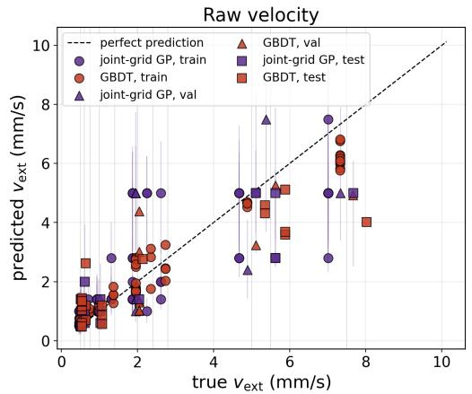

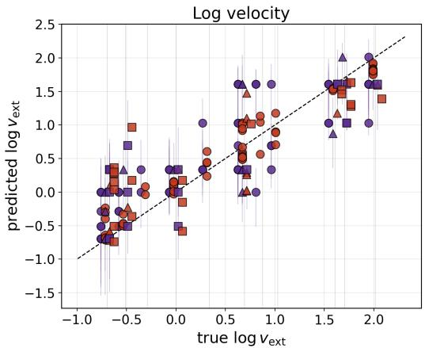  
Figure 5: Task B velocity on the GNN branch (cv\_fold0), predicted against true $v _ { \mathrm { e x t } }$ , raw (left) and log (right). Purple = joint-grid GP, red = GBDT, grey = observed press settings, dashed = perfect prediction. Both heads are tight at low speed and undershoot the fast conditions.

Velocity is a log-scale quantity. Speeds span 0.5 to 7.5 mm/s over eleven settings, so we also report the error in log space, where a fixed error is a fixed factor everywhere on the range (Appendix A.3); the joint-grid $\mathrm { G P ^ { \circ } s }$ log MAE of 0.42-0.45 is a typical factor of about 1.55. Figure 5 shows that the heads are tight at low speed and that the spread is asymmetric: they rarely overshoot a slow condition but often undershoot a fast one.

The residual error is tail shrinkage. Even the best head does not reach the slowest and fastest settings. On the conventional branch the 26 fastest conditions (true $v _ { \mathrm { e x t } } \geq 5 \mathrm { m m } / \mathrm { s }$ mean 6.3) are predicted at a mean of 4.4 mm/s, and the 46 slowest $\mathrm { { ( \leq 1 m m / s , } }$ , mean 0.7) at $1 . 0 \mathrm { m m / s }$ . With about two fast examples per alloy family there is little signal to learn the extremes from, and modelling speed in log space or snapping it to the observed settings does not recover them. This is a general failure mode of sparse experimental data: when a target is sampled at a few well-separated settings, the estimate concentrates on the dense interior and smooths the tails away. Figure 6 traces this along a 1-D supervised projection of the head input, and Appendix B.5 shows the same for velocity: the mean response flattens at both ends of the range while the held-out points follow the same trend, so the contraction is already in the descriptor. The remedy is more information, more extreme-setting conditions or features sensitive to the speed-controlled recrystallization signature, rather than a diferent head.

The guard metrics matter. While developing the heads, we also tried a hurdle model and a metric-learning head. Both reached 17.0% WAPE on one split, close to the reranker, while predicting 14% false-positive elements and 67% all-element WAPE. On WAPE alone they would have been our headline; the guards expose them. When most elements are absent, a head can lower its error by inventing elements, and only the all-element error and the false-positive rate catch it. Per-fold tables and interval calibration are in Appendix B, and code, stored per-fold predictions and the scripts that rebuild every table are at https: //github.com/mahishguru/structure-process.

## 7 Conclusion

Given only an optimized microstructure and its texture, which alloy composition and what process parameters made it? On a real extrusion campaign of about a hundred conditions, the answer was limited less by the size of the representation or the freedom of the regressor than by whether the descriptor and the form of the predicted answer matched the set of recipes that actually exist. A recipe is not a continuous quantity: alloys are cast from a short list of compositions and a press is run at a short list of settings. Prediction heads that choose from this catalogue while keeping the distances within it improved on every descriptor we tried. Heads that ignored the catalogue, or kept it but dropped the distances, did not.

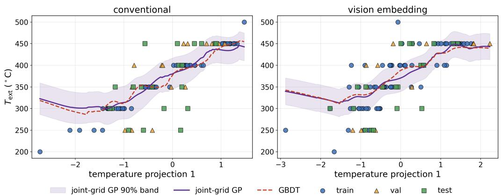  
Figure 6: Temperature response along a supervised 1-D projection of the head input (selected on validation), one panel per branch. Points = conditions; purple curve and band = smoothed joint-grid GP mean and 90% interval; red dashed = GBDT. On every branch the response flattens at both ends, so the contraction is already in the descriptor.

Table 3: Task B, process given known composition. 5-fold cross-validation, mean over held-out condition groups (std in Table 5). MAE in $^ { \circ } \mathrm { C } \ ( T _ { \mathrm { e x t } } )$ or $\mathrm { m m / s } \left( v _ { \mathrm { e x t } } \right)$ ; log MAE is the velocity error in log space. Hit rate: for $v _ { \mathrm { e x t } }$ the fraction recovered at the exact press setting (uniform guess 9%, most frequent training pair $1 4 \% )$ ; for $T _ { \mathrm { e x t } }$ the fraction within $\pm 2 5 ^ { \circ } \mathrm { { C } }$ none: a classifier over the observed $( T _ { \mathrm { e x t } } , v _ { \mathrm { e x t } } )$ pairs that sees only the known composition. Best per representation block in bold.
<table><tr><td>repr.</td><td>head</td><td>target</td><td>MAE</td><td>MAPE (%)</td><td>log MAE</td><td>hit rate (%)</td></tr><tr><td rowspan="2">none</td><td>composition only</td><td> $T _ { \mathrm { e x t } }$ </td><td>69.7</td><td>19.2</td><td></td><td>29</td></tr><tr><td>composition only</td><td> $v _ { \mathrm { e x t } }$ </td><td>1.71</td><td>94.9</td><td>0.748</td><td>23</td></tr><tr><td rowspan="6">conv.</td><td>GBDT</td><td> $T _ { \mathrm { e x t } }$ </td><td>41.6</td><td>11.9</td><td></td><td>36</td></tr><tr><td>ARD GP</td><td> $T _ { \mathrm { e x t } }$ </td><td>52.1</td><td>15.2</td><td></td><td>25</td></tr><tr><td>joint-grid GP</td><td> $T _ { \mathrm { e x t } }$ </td><td>38.1</td><td>10.9</td><td></td><td>41</td></tr><tr><td>GBDT</td><td> $v _ { \mathrm { e x t } }$ </td><td>1.34</td><td>64.5</td><td>0.580</td><td>11</td></tr><tr><td>ARD GP</td><td> $v _ { \mathrm { e x t } }$ </td><td>1.71</td><td>104.7</td><td>0.751</td><td>15</td></tr><tr><td>joint-grid GP</td><td> $v _ { \mathrm { e x t } }$ </td><td>0.98</td><td>48.7</td><td>0.420</td><td>24</td></tr><tr><td rowspan="2">vision</td><td>joint-grid GP</td><td> $T _ { \mathrm { e x t } }$ </td><td>35.2</td><td>10.5</td><td></td><td>46</td></tr><tr><td>joint-grid GP</td><td> $v _ { \mathrm { e x t } }$ </td><td>1.10</td><td>49.6</td><td>0.450</td><td>24</td></tr><tr><td rowspan="2">gnn</td><td>GBDT</td><td> $T _ { \mathrm { e x t } }$ </td><td>36.5</td><td>10.7</td><td></td><td>48</td></tr><tr><td>joint-grid GP</td><td> $v _ { \mathrm { e x t } }$ </td><td>1.01</td><td>51.4</td><td>0.443</td><td>29</td></tr></table>

The conventional statistics, measured on the micrograph itself, were easier for every head to use than embeddings learned for image reconstruction. This compares descriptor pipelines as practitioners use them, not representation size (see the limitations below). Whether larger or retrained embeddings close the gap on larger campaigns remains open. In practice, optical microscopy and X-ray pole figures already sufice to walk the recipe leg. In a self-driving laboratory this makes the recipe leg a free check on measurements already being collected [55], provided the model is reported with the metrics that would expose its failure modes.

Limitations. The composition task is closed-set: the head picks one of the 14 known alloys, so unseen compositions are out of reach. The branches do not see the same input (Table 1), several heads compress it to 8 to 128 dimensions, and both learned encoders are frozen, so the comparison does not isolate representation size. The vision input is coloured relative to a per-alloy mean orientation, so its Task A numbers may be optimistic. Composition and process are confounded by design, as the composition-only baseline shows. Finally, 107 conditions from one alloy system and process are few; larger campaigns with more alloys are the next step.

## Acknowledgments and Disclosure of Funding

We thank the anonymous reviewers and the area chair for comments that improved the evaluation of this work.

Funding. We acknowledge Helmholtz-Zentrum Hereon for providing computational infrastructure and institutional support. Additional support was provided by the Joachim Herz Stiftung through an Add-on Fellowship.

Competing interests. The authors declare no competing interests.

## References

[1] Mahish K. Guru, Jan Bohlen, Roland C. Aydin, and Noomane Ben Khalifa. Machine learning pipeline for structure-property modeling in mg-alloys using microstructure and texture descriptors. Acta Materialia, 2025.

[2] Padmeya P. Indurkar, Shahmeer Baweja, Robert Perez, and Shailendra P. Joshi. Predicting textural variability efects in the anisotropic plasticity and stability of hexagonal metals: Application to magnesium and its alloys. International Journal of Plasticity, 132: 102762, 2020. ISSN 0749-6419. doi: https://doi.org/10.1016/j.ijplas.2020.102762. URL https://www.sciencedirect.com/science/article/pii/S0749641919309325.

[3] Noah H. Paulson, Matthew W. Priddy, David L. McDowell, and Surya R. Kalidindi. Reduced-order structure-property linkages for polycrystalline microstructures based on 2-point statistics. Acta Materialia, 129:428–438, 2017. ISSN 1359-6454. doi: https://doi.org/10.1016/j.actamat.2017.03.009. URL https://www.sciencedirect. com/science/article/pii/S135964541730188X.

[4] Keita Kambayashi and Ikumu Watanabe. Computational microstructure design for mechanical property optimization: a review. Science and Technology of Advanced Materials: Methods, 5(1):2581359, 2025. doi: 10.1080/27660400.2025.2581359. URL https://doi.org/10.1080/27660400.2025.2581359.

[5] Weihao Lin, Liuchao Jin, Zhifei Jiang, Mingjing Cai, Zhihui Lai, Daniil Yurchenko, Bo Yan, Shengxi Zhou, Kostya S. Novoselov, Wei-Hsin Liao, and Shitong Fang. Machine learning-based inverse design for functional materials: Methods, challenges, and engineering applications. Advanced Functional Materials, 36(40):e75070, 2026. doi: https://doi.org/10.1002/adfm.75070. URL https://advanced.onlinelibrary.wiley. com/doi/abs/10.1002/adfm.75070.

[6] Jun Wu, Ole Sigmund, and Jeroen P. Groen. Topology optimization of multi-scale structures: a review. Structural and Multidisciplinary Optimization, 63(3):1455–1480, mar 2021. ISSN 1615-1488. doi: 10.1007/s00158-021-02881-8. URL https://doi.org/ 10.1007/s00158-021-02881-8.

[7] Navyanth Kusampudi and Martin Diehl. Inverse design of dual-phase steel microstructures using generative machine learning model and bayesian optimization. International Journal of Plasticity, 171:103776, 2023. ISSN 0749-6419. doi: https://doi.org/10.1016/ j.ijplas.2023.103776. URL https://www.sciencedirect.com/science/article/pii/ S0749641923002607.

[8] Gary Tom, Stefan P. Schmid, Sterling G. Baird, Yang Cao, Kourosh Darvish, Han Hao, Stanley Lo, Sergio Pablo-García, Ella M. Rajaonson, Marta Skreta, Naruki Yoshikawa, Samantha Corapi, Gun Deniz Akkoc, Felix Strieth-Kalthof, Martin Seifrid, and Alán Aspuru-Guzik. Self-driving laboratories for chemistry and materials science. Chemical Reviews, 124(16):9633–9732, 08 2024. ISSN 0009-2665. doi: 10.1021/acs.chemrev.4c00055. URL https://doi.org/10.1021/acs.chemrev.4c00055.

[9] Heeseung Lee, Hyuk Jun Yoo, Hye Su Jang, Byeongho Park, Yang Jeong Park, and Sang Soo Han. Toward self-driving laboratory 2.0 for chemistry and materials discovery. Materials Horizons, 13(10):4712–4739, 05 2026. ISSN 2051-6347. doi: 10.1039/d5mh01984b. URL https://doi.org/10.1039/d5mh01984b.

[10] Adedire D. Adesiji, Jiashuo Wang, Cheng-Shu Kuo, and Keith A. Brown. Benchmarking self-driving labs. Digital Discovery, 5(1):14–27, 01 2026. ISSN 2635-098X. doi: 10.1039/ d5dd00337g. URL https://doi.org/10.1039/d5dd00337g.

[11] Sergei V. Kalinin, Maxim Ziatdinov, Jacob Hinkle, Stephen Jesse, Ayana Ghosh, Kyle P. Kelley, Andrew R. Lupini, Bobby G. Sumpter, and Rama K. Vasudevan. Automated and autonomous experiments in electron and scanning probe microscopy. ACS Nano, 15(8):12604–12627, 07 2021. ISSN 1936-0851. doi: 10.1021/acsnano.1c02104. URL https://doi.org/10.1021/acsnano.1c02104.

[12] Sergei V. Kalinin, Maxim A. Ziatdinov, Steven R. Spurgeon, Colin Ophus, Eric A. Stach, Toma Susi, Josh Agar, and John N. Randall. Deep learning for electron and scanning probe microscopy: From materials design to atomic fabrication. MRS Bulletin, 47:931–939, 2022. URL https://api.semanticscholar.org/CorpusID:253326381.

[13] Mahish K. Guru, Mayank Nagar, Ayush Vyas, Jan Bohlen, Roland Aydin, and Noomane Ben Khalifa. Co-pilot: Constrained physics-informed latent optimization for target-driven inverse design, 2026. URL https://arxiv.org/abs/2609.37875.

[14] Surya R. Kalidindi and Marc De Graef. Materials data science: Current status and future outlook. Annual Review of Materials Research, 45(Volume 45, 2015):171–193, 2015. ISSN 1545-4118. doi: https://doi.org/10.1146/ annurev-matsci-070214-020844. URL https://www.annualreviews.org/content/ journals/10.1146/annurev-matsci-070214-020844.

[15] Ramin Bostanabad, Yichi Zhang, Xiaolin Li, Tucker Kearney, L. Catherine Brinson, Daniel W. Apley, Wing Kam Liu, and Wei Chen. Computational microstructure characterization and reconstruction: Review of the state-of-the-art techniques. Progress in Materials Science, 95:1–41, 2018. doi: 10.1016/j.pmatsci.2018.01.005.

[16] Evdokia Popova, Theron M. Rodgers, Xinyi Gong, Ahmet Cecen, Jonathan D. Madison, and Surya R. Kalidindi. Process-structure linkages using a data science approach: Application to simulated additive manufacturing data. Integrating Materials and Manufacturing Innovation, 6(1):54–68, 2017. doi: 10.1007/s40192-017-0088-1.

[17] Brian L. DeCost and Elizabeth A. Holm. A computer vision approach for automated analysis and classification of microstructural image data. Computational Materials Science, 110:126–133, 2015. doi: 10.1016/j.commatsci.2015.08.011.

[18] Brian L. DeCost, Toby Francis, and Elizabeth A. Holm. Exploring the microstructure manifold: Image texture representations applied to ultrahigh carbon steel microstructures. Acta Materialia, 133:30–40, 2017. doi: 10.1016/j.actamat.2017.05.014.

[19] Leon A. Gatys, Alexander S. Ecker, and Matthias Bethge. Texture synthesis using convolutional neural networks. In Advances in Neural Information Processing Systems 28, pages 262–270, 2015.

[20] Elizabeth A. Holm, Ryan Cohn, Nan Gao, Andrew R. Kitahara, Thomas P. Matson, Bo Lei, and Srujana Rao Yarasi. Overview: Computer vision and machine learning for microstructural characterization and analysis. Metallurgical and Materials Transactions A, 51:5985–5999, 2020. doi: 10.1007/s11661-020-06008-4.

[21] Joshua Stuckner, Bryan Harder, and Timothy M. Smith. Microstructure segmentation with deep learning encoders pre-trained on a large microscopy dataset. npj Computational Materials, 8:200, 2022. doi: 10.1038/s41524-022-00878-5.

[22] Minyi Dai, Mehmet F. Demirel, Yingyu Liang, and Jia-Mian Hu. Graph neural networks for an accurate and interpretable prediction of the properties of polycrystalline materials. npj Computational Materials, 7:103, 2021. doi: 10.1038/s41524-021-00574-w.

[23] Maria Nienaber. Einfluss der Prozessparameter auf die Gefüge- und Textureinstellung sowie die mechanischen Eigenschaften stranggepresster Magnesiumbleche. PhD thesis, Helmholtz-Zentrum Geesthacht / Technische Universität Hamburg, 2023.

[24] Maria Nienaber, Karl Ulrich Kainer, Dietmar Letzig, and Jan Bohlen. Processing efects on the formability of extruded flat products of magnesium alloys. Frontiers in Materials, Volume 6 - 2019, 2019. ISSN 2296-8016. doi: 10.3389/fmats. 2019.00253. URL https://www.frontiersin.org/journals/materials/articles/ 10.3389/fmats.2019.00253.

[25] José Luis Cano-Castillo et al. Microstructure and texture development of zn-bearing magnesium alloys during extrusion. Materials Science and Engineering: A, 795:139527, 2020. doi: 10.1016/j.msea.2020.139527.

[26] Gerald Kurz et al. Tailoring the mechanical properties of the aluminum-free magnesium alloy me21 by extrusion. Materials Science and Engineering: A, 2015.

[27] Julia Harmuth et al. Efect of extrusion on the microstructure, texture and mechanical properties of mg-gd alloys. Materials Science and Engineering: A, 2019.

[28] others. Microstructure and texture of extruded mg-gd-mn alloys. Crystals, 12(8):1036, 2022. doi: 10.3390/cryst12081036.

[29] Michael Groeber and Michael Jackson. Dream.3d: A digital representation environment for the analysis of microstructure in 3d. Integrating Materials and Manufacturing Innovation, 3:5, 02 2014. doi: 10.1186/2193-9772-3-5.

[30] Landis Markley, Yang Cheng, John Crassidis, and Yaakov Oshman. Averaging quaternions. Journal of Guidance, Control, and Dynamics, 30:1193–1196, 07 2007. doi: 10.2514/1.28949.

[31] Joshua B. Tenenbaum, Vin de Silva, and John C. Langford. A global geometric framework for nonlinear dimensionality reduction. Science, 290(5500):2319–2323, 2000. doi: 10.1126/science.290.5500.2319.

[32] Leon A. Gatys, Alexander S. Ecker, and Matthias Bethge. Image style transfer using convolutional neural networks. In Proc. IEEE Conf. Computer Vision and Pattern Recognition (CVPR), pages 2414–2423, 2016.

[33] Alexey Dosovitskiy, Lucas Beyer, Alexander Kolesnikov, Dirk Weissenborn, Xiaohua Zhai, Thomas Unterthiner, Mostafa Dehghani, Matthias Minderer, Georg Heigold, Sylvain Gelly, Jakob Uszkoreit, and Neil Houlsby. An image is worth 16x16 words: Transformers for image recognition at scale. In International Conference on Learning Representations, 2021. URL https://arxiv.org/abs/2010.11929.

[34] Alec Radford, Jong Wook Kim, Chris Hallacy, Aditya Ramesh, Gabriel Goh, Sandhini Agarwal, Girish Sastry, Amanda Askell, Pamela Mishkin, Jack Clark, Gretchen Krueger, and Ilya Sutskever. Learning transferable visual models from natural language supervision. In Marina Meila and Tong Zhang, editors, Proceedings of the 38th International Conference on Machine Learning, volume 139 of Proceedings of Machine Learning Research, pages 8748–8763. PMLR, 2021. URL https: //proceedings.mlr.press/v139/radford21a.html.

[35] Patrick Esser, Sumith Kulal, Andreas Blattmann, Rahim Entezari, Jonas Müller, Harry Saini, Yam Levi, Dominik Lorenz, Axel Sauer, Frederic Boesel, Dustin Podell, Tim Dockhorn, Zion English, Kyle Lacey, Alex Goodwin, Yannik Marek, and Robin Rombach. Scaling rectified flow transformers for high-resolution image synthesis. arXiv preprint arXiv:2403.03206, 2024. URL https://arxiv.org/abs/2403.03206.

[36] William Peebles and Saining Xie. Scalable difusion models with transformers. In Proceedings of the IEEE/CVF International Conference on Computer Vision (ICCV), pages 4195–4205, October 2023. URL https://openaccess.thecvf.com/content/ICCV2023/html/Peebles\_Scalable\_ Diffusion\_Models\_with\_Transformers\_ICCV\_2023\_paper.html.

[37] Yaron Lipman, Ricky T. Q. Chen, Heli Ben-Hamu, Maximilian Nickel, and Matt Le. Flow matching for generative modeling. In Proceedings of the International Conference on Learning Representations, 2023. URL https://openreview.net/forum? id=PqvMRDCJT9t.

[38] Valerie Randle, Helen Davies, and Ian Cross. Grain boundary misorientation distributions. Current Opinion in Solid State and Materials Science, 5(1):3–8, 2001. doi: 10.1016/S1359-0286(00)00018-8. URL https://doi.org/10.1016/S1359-0286(00) 00018-8.

[39] Shaked Brody, Uri Alon, and Eran Yahav. How attentive are graph attention networks? In International Conference on Learning Representations, 2022. URL https://arxiv. org/abs/2105.14491.

[40] Petar Veličković, Guillem Cucurull, Arantxa Casanova, Adriana Romero, Pietro Lio, and Yoshua Bengio. Graph attention networks. In International Conference on Learning Representations, 2018. URL https://arxiv.org/abs/1710.10903.

[41] Ashish Vaswani, Noam Shazeer, Niki Parmar, Jakob Uszkoreit, Llion Jones, Aidan N. Gomez, Łukasz Kaiser, and Illia Polosukhin. Attention is all you need. In Advances in Neural Information Processing Systems, volume 30, 2017. URL https://arxiv.org/ abs/1706.03762.

[42] Thomas Cover and Peter Hart. Nearest neighbor pattern classification. IEEE Transactions on Information Theory, 13(1):21–27, 1967. doi: 10.1109/TIT.1967.1053964. URL https://ieeexplore.ieee.org/document/1053964.

[43] Jiang Wang, Yang Song, Thomas Leung, Chuck Rosenberg, Jingbin Wang, James Philbin, Bo Chen, and Ying Wu. Learning fine-grained image similarity with deep ranking. In Proceedings of the IEEE Conference on Computer Vision and Pattern Recognition (CVPR), pages 1386–1393, 2014. doi: 10.1109/CVPR.2014.180. URL https://arxiv.org/abs/1404.4661.

[44] Liudmila Prokhorenkova, Gleb Gusev, Aleksandr Vorobev, Anna Veronika Dorogush, and Andrey Gulin. Catboost: Unbiased boosting with categorical features. In Advances in Neural Information Processing Systems, volume 31, 2018. URL https://arxiv.org/ abs/1706.09516.

[45] Jerome H. Friedman. Greedy function approximation: A gradient boosting machine. The Annals of Statistics, 29(5):1189–1232, 2001. doi: 10.1214/aos/1013203451. URL https://doi.org/10.1214/aos/1013203451.

[46] Tianqi Chen and Carlos Guestrin. Xgboost: A scalable tree boosting system. In Proceedings of the 22nd ACM SIGKDD International Conference on Knowledge Discovery and Data Mining, pages 785–794, 2016. doi: 10.1145/2939672.2939785. URL https://arxiv.org/abs/1603.02754.

[47] Trevor Hastie, Robert Tibshirani, and Jerome Friedman. The Elements of Statistical Learning. Springer, 2 edition, 2009. doi: 10.1007/978-0-387-84858-7. URL https: //doi.org/10.1007/978-0-387-84858-7.

[48] Yury Gorishniy, Ivan Rubachev, Valentin Khrulkov, and Artem Babenko. Revisiting deep learning models for tabular data. In Advances in Neural Information Processing Systems, volume 34, 2021. URL https://arxiv.org/abs/2106.11959.

[49] Gilbert Badaro, Mohammed Saeed, and Paolo Papotti. Transformers for tabular data representation: A survey of models and applications. Transactions of the Association for Computational Linguistics, 11:227–249, 2023. doi: 10.1162/tacl\_a\_00544. URL https://aclanthology.org/2023.tacl-1.14/.

[50] David H. Wolpert. Stacked generalization. Neural Networks, 5(2):241–259, 1992. doi: 10.1016/S0893-6080(05)80023-1. URL https://doi.org/10.1016/S0893-6080(05) 80023-1.

[51] Sudhir Varma and Richard Simon. Bias in error estimation when using cross-validation for model selection. BMC Bioinformatics, 7:91, 2006. doi: 10.1186/1471-2105-7-91. URL https://doi.org/10.1186/1471-2105-7-91.

[52] Carl Edward Rasmussen and Christopher K. I. Williams. Gaussian Processes for Machine Learning. MIT Press, Cambridge, MA, 2006. URL https://gaussianprocess.org/ gpml/.

[53] Naihua Duan. Smearing estimate: A nonparametric retransformation method. Journal of the American Statistical Association, 78(383):605–610, 1983. doi: 10.1080/01621459. 1983.10478017. URL https://doi.org/10.1080/01621459.1983.10478017.

[54] Bryan Eikema and Wilker Aziz. Sampling-based approximations to minimum bayes risk decoding for neural machine translation. In Proceedings of the 2022 Conference on Empirical Methods in Natural Language Processing, 2022. URL https://arxiv.org/ abs/2108.04718.

[55] Andre K. Y. Low, Jayce J. W. Cheng, Kedar Hippalgaonkar, and Leonard W. T. Ng. Self-driving laboratories: Translating materials science from laboratory to factory. ACS Omega, 10(28):29902–29908, 2025. doi: 10.1021/acsomega.5c02197. URL https: //doi.org/10.1021/acsomega.5c02197.

## A Method details

The appendix has two parts. This first part completes the description of the method: Appendix A.1 specifies the three descriptors of Section 4, Appendix A.2 the prediction heads of Section 5, and Appendix A.3 the metrics and baselines. Appendix B then reports the results that did not fit into Section 6: the per-fold tables behind every mean quoted in the main text, a classification ablation for Task B, and the diagnostics that show where the remaining error comes from.

## A.1 Descriptor specifications

This subsection gives the detail behind Section 4. In the conventional branch the 438 columns are ordered as 3-point spatial correlations reduced by PCA (columns 0-120), Gram matrices of pretrained CNN activations reduced by Isomap (120-320), the aspect-ratio distribution (320-349), the equivalent-diameter distribution (349-378) and generalized spherical harmonics coeficients of the ODF reduced by Isomap (378-438). Four further columns carry the known half of the recipe: $T _ { \mathrm { e x t } }$ , log $v _ { \mathrm { e x t } }$ and a two-column one-hot for extrusion-ratio type.

The two learned branches share one RVE per micrograph. Each RVE is built in DREAM.3D [29] from a Gaussian copula fitted to that micrograph’s grain statistics, with a lognormal equivalent diameter and a beta aspect ratio; micrographs with fewer than 10 usable grains are skipped. Grain orientations are sampled from the condition’s ODF, so all images of a condition share its texture.

In Co-PiLOT [13] the ViT-H/14 trunk kept its lower 16 blocks at the CLIP weights and fine-tuned its upper 16 blocks, and a multi-query attention pooler produces 16 spatial latent tokens of width 80. Architecture and training of the encoder and the MMDiT decoder are described there. In this paper the full encoder is frozen and is used only to extract features; the flattened $1 6 \times 8 0$ latent is the descriptor.

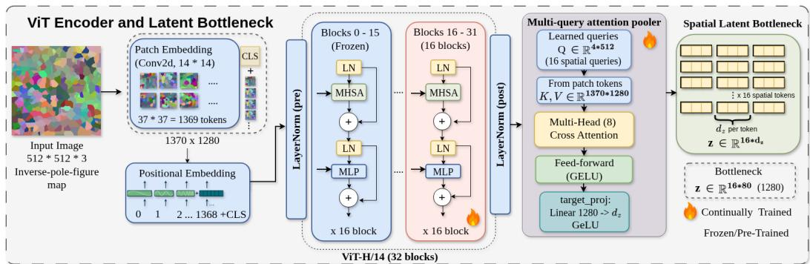  
Figure 7: The vision-embedding branch: the frozen Co-PiLOT ViT-H encoder maps an orientation-coloured RVE map to the latent from which the MMDiT decoder reconstructs it.

In the grain-graph branch, node features are grain area, aspect ratio, Bunge-Euler angles, centroid and bounding box, and edge features are shared-boundary length and misorientation angle. A linear projection to 128 dimensions is followed by four GATv2 blocks (4 attention heads, edge dimension 2, LayerNorm, GELU and residual connections), then attention pooling with 8 learned seed queries. Graphs contain roughly 500 grains per image.

## A.2 Prediction head specifications

This subsection gives the detail behind Section 5. Throughout, inner splits are conditionstratified splits of a training fold, used to produce out-of-fold (OOF) predictions on training conditions only; all preprocessing is refitted inside every inner split. Validation portions select base hyperparameters, and the held-out test fold selects nothing.

Task A, decode. A head outputs a probability over the 14 alloys per image. Probabilities are averaged over the images of a condition, the top-1 alloy is taken, and its nominal wt% vector over the eight elements is the predicted composition. Alloy top-1 and the class NLL are read from the same pooled probability, so every composition metric in Table 2 refers to one prediction per condition.

Task A, retrieval. Descriptors are L2-normalized and compared by cosine similarity. The k nearest training images vote for their alloy with softmax weights $\exp ( s / \tau )$ over the similarities $s ; k \in \{ 1 , 3 , 5 , 7 \}$ and $\tau \in \{ 0 . 0 1 , 0 . 0 5 , 0 . 1 , 0 . 2 \}$ are selected on validation. In the balanced variant each vote is additionally scaled by the inverse image count of its condition.

Task A, condition-balanced fusion. A 14-way CatBoost classifier [44] is trained on the image-level descriptor concatenated with the known process columns $( T _ { \mathrm { e x t } } , \log v _ { \mathrm { e x t } } .$ , and a two-column one-hot for extrusion-ratio type), with sample weights set so that every condition contributes the same total weight. Its probability is averaged 50:50 with the balanced retrieval vote.

Task A, reranker. The fusion probability $p _ { \mathrm { f u s } }$ is blended with a second classifier $p _ { \mathrm { a u x } }$ as $p = w p _ { \mathrm { f u s } } + ( 1 - w ) p _ { \mathrm { a u x } }$ with $w \in \{ 0 , 0 . 2 5 , 0 . 5 , 0 . 7 5 , 1 \}$ . On the conventional branch $p _ { \mathrm { a u x } }$ is the uniform average of five logistic classifiers, one per descriptor block: 3-point correlations (columns 0-120), Gram-Isomap (120-320), aspect ratio (320-349), equivalent diameter (349-378) and GSH-Isomap (378-438), each fitted on condition-mean features with the known columns appended, standardized, with $C \in \{ 0 . 0 1 , 0 . 1 , 1 , 1 0 \}$ selected on the inner splits. On the vision and gnn branches, which have no block structure, $p _ { \mathrm { a u x } }$ is an FT-Transformer classifier [48] on the same condition-mean features. When its input is wider than 512 columns (the vision branch), it is first reduced by PCA, fitted on the training conditions, to the components that explain 95% of the variance, at most 128. The weight w is chosen on OOF predictions of the training conditions, restricted to candidates whose OOF all-element WAPE and macro false-positive rate do not exceed those of the fusion. Because $w = 1$ is always eligible, the reranker never underperforms the fusion by construction on the selection objective.

Task B, trees and Gaussian process. The tree head is CatBoost with standardized targets and $v _ { \mathrm { e x t } }$ modelled as log $v _ { \mathrm { e x t } }$ . The ARD GP pools descriptors to one row per condition, standardizes, reduces to at most 32 principal components, and fits an independent GP per target with kernel $c \cdot \mathrm { R B F } ( \ell ) + \mathrm { W h i t e } .$ , where ℓ is a per-dimension lengthscale vector [52]. Because $v _ { \mathrm { e x t } }$ is fitted in log space, the reported point prediction applies the lognormal smearing correction [53]; the median is retained separately.

Task B, joint-grid GP. The feature map compresses the condition’s descriptor distribution with PCA to 8 components followed by a random Fourier feature expansion, and the resulting kernel is mixed 50:50 with an RBF kernel over the known composition and extrusion-ratio columns. A two-task correlated GP is fitted jointly over $( T _ { \mathrm { e x t } } , \log v _ { \mathrm { e x t } } )$ , so evidence about temperature informs speed and the reverse. At a query the posterior is not read of the mean. Instead the head scores every $( T _ { \mathrm { e x t } } , v _ { \mathrm { e x t } } )$ pair observed in the training fold and returns the pair with the smallest expected relative error under its own posterior, with a small penalty term keeping the choice near the GP point estimate. Velocity estimates that come from any other head are snapped onto the observed speed levels, nearest in log $v _ { \mathrm { e x t } } .$ , because the 107 conditions contain only eleven distinct speeds spanning 0.5 to 7.5 mm/s and are roughly evenly spaced in log space. An optional ordinal classifier over the speed levels, built as a cumulative sequence of gradient-boosted binary classifiers, may be blended in; that choice and the choice of which estimate to snap are made on OOF training predictions under the constraint that they may not degrade the plain snapped log-space GP.

## A.3 Metrics and baselines

All metrics are computed per held-out fold on one prediction per condition and then averaged over the five folds. Let $c _ { i e }$ and $\hat { c } _ { i e }$ be the true and predicted wt% of element e in condition $i ,$ $E = 8$ the number of elements, and $P _ { e } = \{ i : c _ { i e } > 0 \}$ the conditions that contain e.

$$
\begin{array} { r l } { \mathrm { W A P E } = \displaystyle \frac { 1 } { E } \sum _ { e } \frac { \sum _ { i \in P _ { e } } | \hat { c } _ { i e } - c _ { i e } | } { \sum _ { i \in P _ { e } } c _ { i e } } , } & { \qquad \mathrm { W A P E } _ { \mathrm { a l l } } = \displaystyle \frac { 1 } { E } \sum _ { e } \frac { \sum _ { i } | \hat { c } _ { i e } - c _ { i e } | } { \sum _ { i \in P _ { e } } c _ { i e } } , } \\ { \mathrm { F P } = \displaystyle \frac { 1 } { E } \sum _ { e } \frac { | \{ i \notin P _ { e } : \hat { c } _ { i e } > 0 \} | } { | \{ i \notin P _ { e } \} | } , } & { \qquad \mathrm { N L L } = - \displaystyle \frac { 1 } { N } \sum _ { i } \log \bar { p } _ { i } ( a _ { i } ) . } \end{array}
$$

Here $\bar { p } _ { i }$ is the image-level alloy probability averaged over the images of condition $i , a _ { i }$ its true alloy and N the number of held-out conditions; top-1 is the fraction of conditions with arg max $\bar { p _ { i } } = a _ { i }$ . WAPE divides by the amount of each element that is present, so elements at 0.2 and at 10 wt% count equally, and the macro average keeps the rare elements visible. WAPE is restricted to present elements because the practical question is the levels within a known family. $\mathrm { W A P E _ { a l l } }$ and FP are the guards: they rise when a head predicts elements that are not there.

For the process, with $y _ { i }$ the true and $\hat { y } _ { i }$ the predicted $T _ { \mathrm { e x t } }$ or $v _ { \mathrm { e x t } }$ ,

$$
\mathrm { M A E } = \frac { 1 } { N } \sum _ { i } | \hat { y } _ { i } - y _ { i } | , \quad \mathrm { M A P E } = \frac { 1 0 0 } { N } \sum _ { i } \frac { | \hat { y } _ { i } - y _ { i } | } { y _ { i } } , ~ \log \mathrm { M A E } = \frac { 1 } { N } \sum _ { i } | \log \hat { v } _ { i } - \log v _ { i } | .
$$

The log MAE is used because the speeds span a factor of 15, and exp(log MAE) is the typical multiplicative error. Let ℓ(v) be the index of the observed speed level nearest to v in log space. The exact-speed rate is the fraction of conditions with $\ell ( \hat { v } _ { i } ) = \ell ( v _ { i } )$ , the within-one rate the fraction with $| \ell ( \hat { v } _ { i } ) - \ell ( v _ { i } ) | \leq 1$ , and the temperature hit rate the fraction with $| \hat { T } _ { i } - T _ { i } | \leq 2 5 ^ { \circ } \mathrm { C }$ . Hit rates are reported because the true answer is one of a short list of settings. Coverage is the fraction of true values inside the central 90% predictive interval.

The baselines answer specific questions. The most frequent training alloy or $( T _ { \mathrm { e x t } } , v _ { \mathrm { e x t } } )$ pair gives the score of a model that has learned nothing about the input. The known-half-only baseline is a condition-balanced CatBoost classifier that sees only the known process (Task A) or the known composition (Task B), selected on the same validation conditions; it measures how much the design confound alone reveals. Retrieval is the natural baseline when the answer is a catalogue entry, GBDT and the ARD GP are standard regressors for small tabular data and serve as the unconstrained counterparts of the catalogue heads, and the plain classifiers of Appendix B.3 keep the catalogue but drop the order of the settings.

Table 4: Task A per fold: WAPE (%) / alloy top-1 for each of the five held-out condition groups. Head names as in Table 2.
<table><tr><td>repr.</td><td>head</td><td>fold 1</td><td>fold 2</td><td>fold 3</td><td>fold 4</td><td>fold 5</td></tr><tr><td></td><td>kNN retrieval</td><td>38.1/0.35</td><td>20.0/0.63</td><td>26.6/0.50</td><td>28.2/0.57</td><td>37.2/0.43</td></tr><tr><td>conv.</td><td>balanced fusion</td><td>15.0/0.60</td><td>9.5/0.74</td><td>14.8/0.59</td><td>20.3/0.61</td><td>24.6/0.52</td></tr><tr><td></td><td>reranker</td><td>9.5/0.65</td><td>11.4/0.68</td><td>13.0/0.64</td><td>13.6/0.70</td><td>20.4/0.57</td></tr><tr><td></td><td>kNN retrieval</td><td>39.8/0.30</td><td>44.7/0.42</td><td>75.9/0.18</td><td>72.9/0.26</td><td>52.7/0.30</td></tr><tr><td>vision</td><td>balanced fusion</td><td>31.9/0.40</td><td>47.0/0.32</td><td>28.0/0.32</td><td>42.9/0.22</td><td>73.8/0.13</td></tr><tr><td></td><td>reranker</td><td>31.9/0.40</td><td>31.2/0.37</td><td>28.0/0.32</td><td>42.9/0.22</td><td>73.8/0.13</td></tr><tr><td></td><td>kNN retrieval</td><td>30.5/0.40</td><td>35.7/0.42</td><td>48.7/0.23</td><td>49.2/0.22</td><td>59.7/0.13</td></tr><tr><td>gnn</td><td>balanced fusion</td><td>31.9/0.35</td><td>43.9/0.32</td><td>46.4/0.27</td><td>45.4/0.22</td><td>54.1/0.17</td></tr><tr><td></td><td>reranker</td><td>31.9/0.35</td><td>43.9/0.32</td><td>45.4/0.27</td><td>45.4/0.22</td><td>54.1/0.17</td></tr></table>

## B Additional results

Except for the classification ablation of Appendix B.3, every number in this part is recomputed from the stored raw per-fold predictions of the same condition-grouped 5-fold cross-validation used in the main text, so no head is re-fitted. Figures that name a single fold use cv\_fold0 for illustration; the pooled figures aggregate all 107 held-out conditions.

## B.1 Per-fold tables

Table 4 shows that the ranking in Table 2 is not an artefact of averaging. The conventional reranker leads on all five folds, and its worst fold (20.4% WAPE) is still better than the best fold of either learned branch. The learned branches are also far less stable: vision ranges from 28.0 to 73.8% WAPE across folds, which is why we quote fold means rather than any single split. The same fold is the hardest for all three descriptors, so the dificulty is a property of the held-out conditions rather than of one descriptor.

Table 5 adds the standard deviations left out of Table 3 and scores velocity in log space alongside the raw units. The joint-grid GP has the smallest spread across folds on nearly every row, so its advantage is consistent rather than carried by one easy fold. The ARD GP behaves in the opposite way: its velocity MAPE has a standard deviation of the same order as its mean $( 1 \bar { 2 } \bar { 0 } . 5 \pm 5 7 . 2 $ on vision), which is the signature of a head whose error is dominated by a few conditions placed far from any observed setting.

## B.2 Calibration

The joint-grid GP intervals are under-dispersed (90% coverage ≈ 0.5), because the grid decode concentrates mass on observed pairs. The plain ARD GP on gnn is the best-calibrated head, with coverage 0.69 for temperature and 0.71 for velocity. The winning heads are therefore point-accurate, and their uncertainty statements should not be trusted beyond that.

## B.3 Classification ablation for Task B

If the process answer is discrete, a natural question is whether a plain classifier should replace the regressor. We tested this with two classifiers that receive exactly the Task B input of the other heads (descriptor, known composition and extrusion-ratio flag) on the same folds. The pair classifier has one class per $( T _ { \mathrm { e x t } } , v _ { \mathrm { e x t } } )$ pair observed in the training fold, 33 to 38 classes depending on the fold. The level classifiers fit one classifier over the temperature levels and a separate one over the speed levels. Both are condition-balanced CatBoost classifiers on image-level rows, with one of three configurations chosen on the validation conditions. Image probabilities are averaged per condition and the most probable class is returned. Table 6 compares them with the joint-grid GP and with the two baselines that see no microstructure.

The classifiers name the exact speed about as often as the joint-grid GP, and the conventional level classifiers slightly more often (30.7 against 24.0%). Their misses, however, are large. A classifier has no notion that neighbouring settings are close, so a wrong answer is as likely to be far from the truth as next to it. Their share within one setting (29 to 36%) is barely above the composition-only baseline (26%), and their log speed error (0.57 to 0.63) lies between that baseline and the joint-grid GP. On temperature the classifiers are competitive, and on the gnn branch the pair classifier has the lowest temperature MAE of any head $( 3 5 . 0 ^ { \circ } \mathrm { C } )$ The ablation therefore sharpens the main-text conclusion rather than overturning it: treating the answer as discrete helps when the head chooses among the observed settings and also keeps the distances between them, which is what the joint-grid GP does.

Table 5: Task B, full 5-fold statistics $( \mathrm { m e a n } \pm \mathrm { s t d } )$ . log $v _ { \mathrm { e x t } }$ rows score the same predictions in natural-log space. MAPE itself is undefined there because log $v _ { \mathrm { e x t } }$ crosses zero inside the observed range, so those rows instead report 100× log-space MAE, the well-defined first-order approximation to percent error: 42 means the typical prediction is of by roughly 42%.
<table><tr><td>repr.</td><td>head</td><td>target</td><td>MAE</td><td>MAPE (%)</td></tr><tr><td>conv.</td><td>GBDT</td><td> $T _ { \mathrm { e x t } }$ </td><td> $4 1 . 6 \pm 1 0 . 5$ </td><td> $1 1 . 9 \pm 2 . 3$ </td></tr><tr><td>conv.</td><td>ARD GP</td><td> $T _ { \mathrm { e x t } }$ </td><td> $5 2 . 1 \pm 6 . 9$ </td><td> $1 5 . 2 \pm 2 . 0$ </td></tr><tr><td>conv.</td><td>joint-grid GP</td><td> $T _ { \mathrm { e x t } }$ </td><td> $3 8 . 1 \pm 5 . 6 $ </td><td> $1 0 . 9 \pm 1 . 1$ </td></tr><tr><td>conv.</td><td>GBDT</td><td> $v _ { \mathrm { e x t } }$ </td><td> $1 . 3 4 \pm 0 . 3 3$ </td><td> $6 4 . 5 \pm 1 5 . 6$ </td></tr><tr><td>conv.</td><td>ARD GP</td><td> $v _ { \mathrm { e x t } }$ </td><td> $1 . 7 1 \pm 0 . 2 1$ </td><td> $1 0 4 . 7 \pm 4 0 . 9$ </td></tr><tr><td>conv.</td><td>joint-grid GP</td><td> $v _ { \mathrm { e x t } }$ </td><td> $0 . 9 8 \pm 0 . 1 9$ </td><td> $4 8 . 7 \pm 1 2 . 4$ </td></tr><tr><td>conv.</td><td>GBDT</td><td> $\log v _ { \mathrm { e x t } }$ </td><td> $0 . 5 8 0 \pm 0 . 0 6 9$ </td><td> $5 8 . 0 \pm 6 . 9$ </td></tr><tr><td>conv.</td><td>ARD GP</td><td> $\log v _ { \mathrm { e x t } }$ </td><td> $0 . 7 5 1 \pm 0 . 1 3 8$ </td><td> $7 5 . 1 \pm 1 3 . 8$ </td></tr><tr><td>conv.</td><td>joint-grid GP</td><td> $\log v _ { \mathrm { e x t } }$ </td><td> $0 . 4 2 0 \pm 0 . 0 8 3$ </td><td> $4 2 . 0 \pm 8 . 3$ </td></tr><tr><td>vision</td><td>GBDT</td><td> $T _ { \mathrm { e x t } }$ </td><td> $3 9 . 2 \pm 1 0 . 1$ </td><td> $1 1 . 4 \pm 1 . 9$ </td></tr><tr><td>vision</td><td>ARD GP</td><td> $T _ { \mathrm { e x t } }$ </td><td> $7 2 . 1 \pm 1 8 . 0$ </td><td> $1 9 . 9 \pm 3 . 4$ </td></tr><tr><td>vision</td><td>joint-grid GP</td><td> $T _ { \mathrm { e x t } }$ </td><td> $3 5 . 2 \pm 7 . 3$ </td><td> $1 0 . 5 \pm 1 . 4$ </td></tr><tr><td>vision</td><td>GBDT</td><td> $v _ { \mathrm { e x t } }$ </td><td> $1 . 2 2 \pm 0 . 3 2$ </td><td> $5 5 . 9 \pm 1 0 . 7$ </td></tr><tr><td>vision</td><td>ARD GP</td><td> $v _ { \mathrm { e x t } }$ </td><td> $1 . 7 6 \pm 0 . 5 3$ </td><td> $1 2 0 . 5 \pm 5 7 . 2$ </td></tr><tr><td>vision</td><td>joint-grid GP</td><td> $v _ { \mathrm { e x t } }$ </td><td> $1 . 1 0 \pm 0 . 2 4$ </td><td> $4 9 . 6 \pm 1 4 . 5$ </td></tr><tr><td>vision</td><td>GBDT</td><td> $\log v _ { \mathrm { e x t } }$ </td><td> $0 . 4 9 1 \pm 0 . 0 5 1$ </td><td> $4 9 . 1 \pm 5 . 1$ </td></tr><tr><td>vision</td><td>ARD GP</td><td> $\log v _ { \mathrm { e x t } }$ </td><td> $0 . 7 4 2 \pm 0 . 2 7 9$ </td><td> $7 4 . 2 \pm 2 7 . 9$ </td></tr><tr><td>vision</td><td>joint-grid GP</td><td> $\log v _ { \mathrm { e x t } }$ </td><td> $0 . 4 5 0 \pm 0 . 1 0 9$ </td><td> $4 5 . 0 \pm 1 0 . 9$ </td></tr><tr><td>gnn</td><td>GBDT</td><td> $T _ { \mathrm { e x t } }$ </td><td> $3 6 . 5 \pm 1 0 . 1$ </td><td> $1 0 . 7 \pm 2 . 2$ </td></tr><tr><td>gnn</td><td>ARD GP</td><td> $T _ { \mathrm { e x t } }$ </td><td> $4 9 . 5 \pm 8 . 9$ </td><td> $1 4 . 7 \pm 3 . 1$ </td></tr><tr><td>gnn</td><td>joint-grid GP</td><td> $T _ { \mathrm { e x t } }$ </td><td> $3 6 . 6 \pm 7 . 8$ </td><td> $1 0 . 8 \pm 1 . 9$ </td></tr><tr><td>gnn</td><td>GBDT</td><td> $v _ { \mathrm { e x t } }$ </td><td> $1 . 1 1 \pm 0 . 3 3$ </td><td> $5 6 . 0 \pm 1 6 . 8$ </td></tr><tr><td>gnn</td><td>ARD GP</td><td> $v _ { \mathrm { e x t } }$ </td><td> $1 . 4 4 \pm 0 . 1 6$ </td><td> $9 4 . 5 \pm 3 8 . 8$ </td></tr><tr><td>gnn</td><td>joint-grid GP</td><td> $v _ { \mathrm { e x t } }$ </td><td> $1 . 0 1 \pm 0 . 2 6$ </td><td> $5 1 . 4 \pm 1 3 . 9$ </td></tr><tr><td>gnn</td><td>GBDT</td><td> $\log v _ { \mathrm { e x t } }$ </td><td> $0 . 4 7 5 \pm 0 . 0 8 5$ </td><td> $4 7 . 5 \pm 8 . 5$ </td></tr><tr><td>gnn</td><td>ARD GP</td><td> $\log v _ { \mathrm { e x t } }$ </td><td> $0 . 6 2 6 \pm 0 . 1 1 2$ </td><td> $6 2 . 6 \pm 1 1 . 2$ </td></tr><tr><td>gnn</td><td>joint-grid GP</td><td> $\log v _ { \mathrm { e x t } }$ </td><td> $0 . 4 4 3 \pm 0 . 0 5 9$ </td><td> $4 4 . 3 \pm 5 . 9$ </td></tr></table>

Table 6: Task B classification ablation, mean ± std over the five folds. T MAE in ${ } ^ { \circ } \mathrm { C } ;$ exact and within-one are speed hit rates (%).
<table><tr><td>repr.</td><td>head</td><td>T MAE</td><td> $\mathrm { ~ v ~ M A P E ~ } ( \% )$ </td><td>log MAE</td><td>exact v</td><td>within one</td></tr><tr><td rowspan="2">none</td><td>most frequent pair</td><td> $8 4 . 3 \pm 4 . 2$ </td><td> $7 0 . 1 \pm 2 3 . 1$ </td><td> $1 . 0 5 0 \pm 0 . 2 0 4$ </td><td> $1 3 . 9 \pm 7 . 9$ </td><td> $2 0 . 2 \pm 8 . 2$ </td></tr><tr><td>composition only</td><td> $6 9 . 7 \pm 1 7 . 2$ </td><td> $9 4 . 9 \pm 3 5 . 7$ </td><td> $0 . 7 4 8 \pm 0 . 1 5 2$ </td><td> $2 2 . 5 \pm 7 . 5$ </td><td> $2 6 . 4 \pm 1 2 . 0$ </td></tr><tr><td rowspan="3">conv.</td><td>pair classifier</td><td> $4 2 . 2 \pm 8 . 7$ </td><td> $9 2 . 8 \pm 4 6 . 0$ </td><td> $0 . 6 3 0 \pm 0 . 1 5 7$ </td><td> $2 7 . 0 \pm 6 . 3$ </td><td> $3 1 . 7 \pm 8 . 7$ </td></tr><tr><td>level classifiers</td><td> $3 7 . 9 \pm 8 . 4$ </td><td> $7 8 . 1 \pm 2 0 . 0$ </td><td> $0 . 6 1 0 \pm 0 . 0 4 0$ </td><td> $3 0 . 7 \pm 6 . 6$ </td><td> $3 4 . 6 \pm 6 . 2$ </td></tr><tr><td>joint-grid GP</td><td> $3 8 . 1 \pm 5 . 6 $ </td><td> $4 8 . 7 \pm 1 2 . 4$ </td><td> $0 . 4 2 0 \pm 0 . 0 8 3$ </td><td> $2 4 . 0 \pm 5 . 6$ </td><td> $5 1 . 8 \pm 1 2 . 9$ </td></tr><tr><td rowspan="3">vision</td><td>pair classifier</td><td> $4 0 . 9 \pm 1 1 . 5$ </td><td> $6 3 . 0 \pm 1 0 . 2$ </td><td> $0 . 5 6 7 \pm 0 . 0 8 4$ </td><td> $2 7 . 0 \pm 7 . 4$ </td><td> $3 5 . 6 \pm 6 . 3$ </td></tr><tr><td>level classifiers</td><td> $4 3 . 4 \pm 9 . 9$ </td><td> $7 8 . 9 \pm 1 3 . 8$ </td><td> $0 . 6 1 8 \pm 0 . 0 4 6$ </td><td> $2 6 . 8 \pm 4 . 0$ </td><td> $2 9 . 8 \pm 3 . 8$ </td></tr><tr><td>joint-grid GP</td><td> $3 5 . 2 \pm 7 . 3$ </td><td> $4 9 . 6 \pm 1 4 . 5$ </td><td> $0 . 4 5 0 \pm 0 . 1 0 9$ </td><td> $2 4 . 3 \pm 1 4 . 8$ </td><td> $4 8 . 3 \pm 1 3 . 1$ </td></tr><tr><td rowspan="3">gnn</td><td>pair classifier</td><td> $3 5 . 0 \pm 7 . 5$ </td><td> $6 7 . 5 \pm 2 2 . 2$ </td><td> $0 . 6 0 1 \pm 0 . 1 2 3$ </td><td> $2 3 . 2 \pm 7 . 8$ </td><td> $2 9 . 1 \pm 8 . 2$ </td></tr><tr><td>level classifiers</td><td> $4 2 . 0 \pm 9 . 9$ </td><td> $7 3 . 8 \pm 1 5 . 7$ </td><td> $0 . 5 8 7 \pm 0 . 0 7 1$ </td><td> $2 5 . 0 \pm 6 . 2$ </td><td> $2 8 . 9 \pm 4 . 1$ </td></tr><tr><td>joint-grid GP</td><td> $3 6 . 6 \pm 7 . 8$ </td><td> $5 1 . 4 \pm 1 3 . 9$ </td><td> $0 . 4 4 3 \pm 0 . 0 5 9$ </td><td> $2 8 . 8 \pm 9 . 4$ </td><td> $4 6 . 0 \pm 6 . 9$ </td></tr></table>

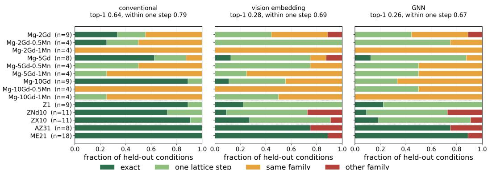  
Figure 8: Where the top-1 alloy call lands, per alloy, pooled over all 107 held-out conditions. One step is one Gd or one Mn increment inside the Mg-Gd(-Mn) grid, or a swap within the Z1 / ZNd10 / ZX10 trio.

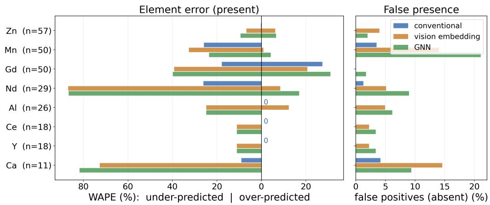  
Figure 9: Per-element error. Left: WAPE over the conditions that contain the element, split at zero into the under-predicted and over-predicted share, where “0” marks a branch exactly right on every such condition. Right: the presence false-positive rate.

## B.4 Composition diagnostics

The WAPE in Table 2 mixes two diferent questions: whether the head recognises the right alloy system, and whether it resolves the concentration inside that system. Figures 8 and 9 separate them.

Figure 8 sorts each top-1 call by how far it lands from the true alloy. The conventional branch is exact on AZ31 and ME21, and reaches 0.79 within one composition step against a top-1 of 0.64, so most of its mistakes are a neighbouring Gd or Mn level rather than an unrelated alloy. The two learned branches sit near 0.68 within one step while their top-1 stays below 0.30, meaning their mistakes are spread across the catalogue instead of being concentrated on close neighbours. The alloy rows hold between 4 and 18 conditions, so a single misclassified condition moves a small row by about 25%; the pattern across rows is the robust part.

Figure 9 localises the same efect per element. The conventional branch is exact on Zn, Al, Ce and Y, and its entire error sits in Gd, Mn, Nd and Ca, which are the elements that vary in small increments inside the Mg-Gd(-Mn) family. The learned branches under-predict the rare elements Nd and Ca and simultaneously add Mn and Ca to alloys that do not contain them, which is what the false-positive column of Table 2 counts. Because the head always outputs one of the 14 known alloys, the per-element error can take only a few distinct values, so the figure uses bars rather than a density. Taken together, the two figures say that the gap between the descriptors is a gap in concentration resolution, not in chemistry recognition.

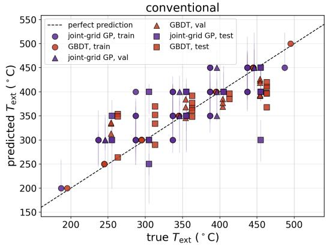

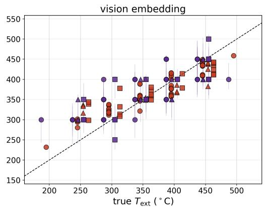  
Figure 10: Task B temperature: predicted against true Text (cv\_fold0). Purple = joint-grid GP (bar = latent 90% interval), red = GBDT; circles / triangles / squares = train / val / test, dashed = perfect prediction.

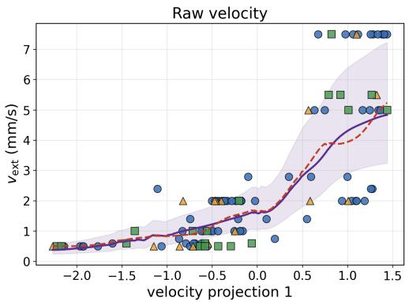  
joint-grid GP 90% band joint-grid GP

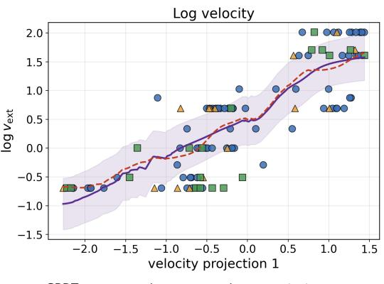  
Figure 11: Velocity response along a supervised 1-D projection on the GNN branch, raw (left) and log (right).

## B.5 Process diagnostics

Section 6 argued that the process error is tail shrinkage carried by the descriptor rather than by the head. For temperature, Figure 10 shows the predicted-versus-true view: both heads track the diagonal but saturate above ≈ $4 0 0 ^ { \circ } \mathrm { C }$ , and the joint-grid GP’s latent intervals cover the diagonal on most held-out conditions.

For velocity, Figure 11 gives the response along a supervised 1-D projection on the GNN branch. It is a sigmoid that saturates at the fast end, the velocity counterpart of Figure 6.

Figures 12 and 13 repeat the GNN analysis of Figures 11 and 5 on the conventional branch, and Figure 14 shows the 2-D embedding that the 1-D response curves are read from.

The conclusion holds on both branches. The response along the supervised projection rises monotonically with speed and then flattens at the fast end, so conditions that difer only in speed among the fastest settings are barely distinguishable in the descriptor, whichever head reads it. The conventional projection is the less well behaved of the two, because a single extreme low-velocity cluster near −3 dominates it, yet its saturation is the same.

The parity view on the conventional branch repeats what the GNN branch showed in Figure 5: predictions are tight at low speed and undershoot at high speed.

The 2-D projection makes the mechanism explicit. The slow conditions spread out along the embedding while the fast ones are compressed into a narrow band, and that geometry is what produces a sigmoidal 1-D response and predictions pulled toward the middle of the speed range.

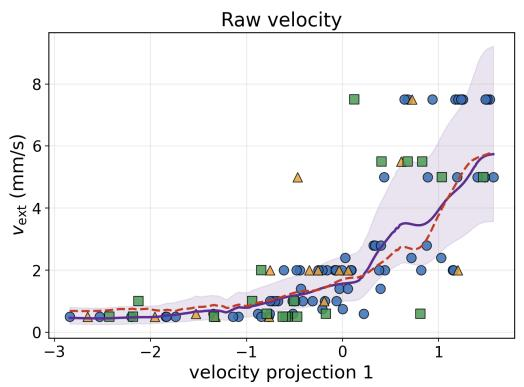  
joint-grid GP 90% band— joint-grid GP

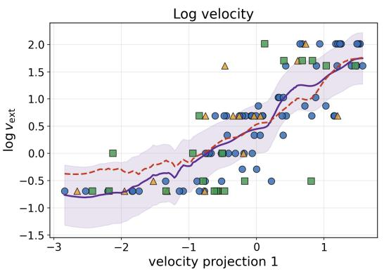  
--- GBDT otrain △ val □test  
Figure 12: Velocity response along a supervised 1-D projection on the conventional branch, raw (left) and log (right).

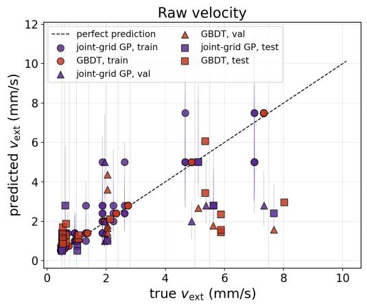

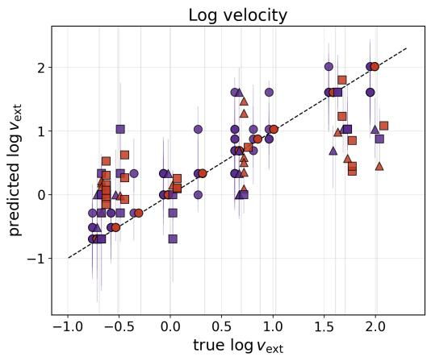  
Figure 13: Velocity parity on the conventional branch (cv\_fold0), raw (left) and log (right).

Frozen GNN velocity projection (cv\_fold0, ridge fit, selected on validation)  
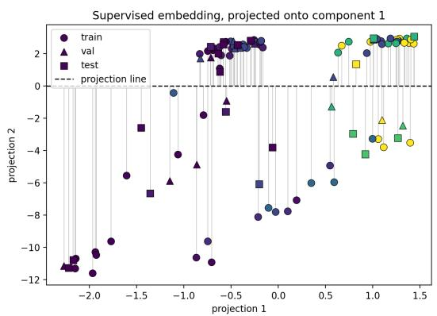

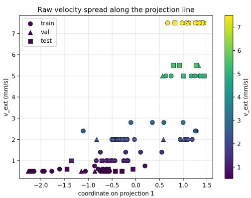  
Figure 14: The frozen GNN velocity projection (cv\_fold0). Left: the 2-D supervised embedding, points coloured by true $v _ { \mathrm { e x t } }$ and joined to the projection line. Right: the raw velocity spread along component 1.