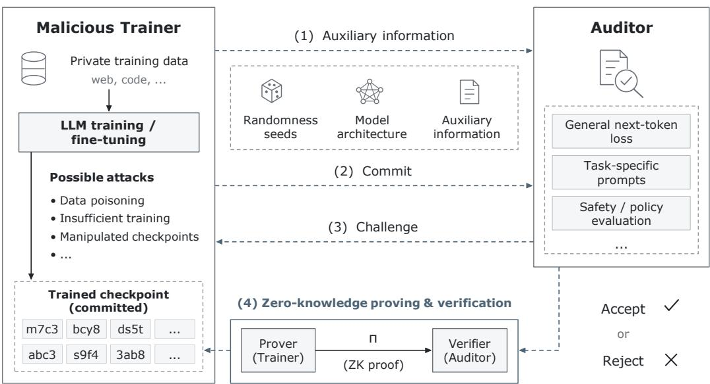
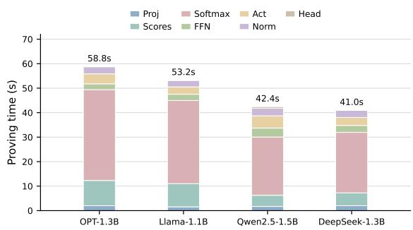
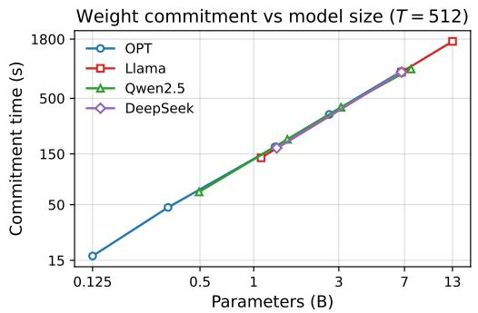
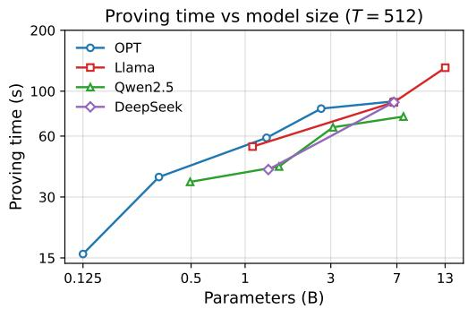

# ZKLLMPOT: EFFICIENT ZERO KNOWLEDGE PROOF OF TRAINING FOR LARGE LANGUAGE MODELS

Junkai Liang<sup>1,3</sup>, Zhanpeng Guo<sup>2</sup>, Pengfei Wu<sup>1,3</sup>, Qingni Shen<sup>1</sup>, Jiaheng Zhang<sup>4</sup>, Zhonghai Wu<sup>1</sup>, Haiyang Xue<sup>3</sup>, Shengfang Zhai<sup>4</sup>

<sup>1</sup> Peking University

<sup>2</sup> China Telecom Quantum Information Technology Group Co., Ltd

<sup>3</sup> Singapore Management University

<sup>4</sup> National University of Singapore

## ABSTRACT

Auditing the claimed outcomes of large language model (LLM) training is challenging when model weights and training data are private, while cryptographically proving the full training process is prohibitively expensive at Transformer scale. We present zkLLMPoT, a zero-knowledge framework that certifies auditordefined properties of a trained checkpoint through forward evaluation rather than verification of its optimization trajectory. zkLLMPoT includes 2 phases: 1) The trainer fixes the architecture and the model weights are committed. Then the auditor selects challenge sequences, preventing the trainer from modifying the checkpoint in response to the audit data. 2) Then the trainer proves the objective value attained by the committed model on those sequences. This formulation makes the certification cost independent of the number of training iterations, without revealing model weights or requiring access to private training data. We build on sumcheck- and lookup-based arguments to certify Transformer computations, while supporting next-token loss and task-specific audit objectives. Across four model families, operator-level benchmarks yield proving times of 41–59 seconds for 1.1–1.5B-parameter models and 131 seconds at 13B for the covered operators, with verification below half a second at a sequence length of 512.

## 1 INTRODUCTION

Large language models (LLMs) increasingly serve as critical infrastructure for language understanding, generation, and decision support (Brown et al., 2020), yet assessing their training outcomes raises pressing privacy and trustworthiness concerns. Trained models can memorize and leak sensitive examples (Shokri et al., 2017; Carlini et al., 2021), so institutions may withhold training data and model weights from external auditors, leaving the public with only a model card or an API endpoint. Consequently, when a trainer announces a new LLM, users and regulators often cannot independently determine whether the released checkpoint actually satisfies the capability or policy claims attributed to its training (Waiwitlikhit et al., 2024; Srivastava et al., 2024). Without a cryptographic certificate tied to the checkpoint, such claims remain difficult to audit despite their legal, commercial, and safety consequences.

Existing approaches to trustworthy LLM computation leave this gap largely unresolved. First, a substantial line of security work develops zero-knowledge proofs for inference integrity, ranging from CNN and general neural-network predictors (Liu et al., 2021; Weng et al., 2021; Hao et al., 2024; Chen et al., 2024) to LLM-oriented systems such as zkLLM and zkGPT (Sun et al., 2024; Qu et al., 2025). These systems target per-query serving integrity: they certify that a committed model produced a claimed output, rather than providing a checkpoint-level audit against an objective and challenge set chosen by an auditor after the model is committed. Second, cryptographic proofs of training that do target the learning process typically encode full gradient descent with backpropagation. Even for non-transformer networks this is already expensive. For example, Kaizen requires about 15 minutes of proving time per training iteration on a VGG-11 model (Abbaszadeh et al., 2024), and related certificates such as confidential proofs of differentially private training can take on the order of 100 hours even on CIFAR-10 (Shamsabadi et al., 2024). At LLM scale, naively proving every backward pass is therefore impractical with current techniques. Third, early practical zkPoT protocols are largely restricted to demonstration-level models such as logistic regression (Garg et al., 2023), while optimistic replication-based verifiable training still assumes a third-party auditor who can re-execute training (Srivastava et al., 2024; Waiwitlikhit et al., 2024). Taken together, prior work either targets per-query inference, proves the training trajectory through an expensive backpropagation circuit, or scales only to demonstration-level learners. Efficient checkpoint-level, commit-then challenge auditing for LLM training outcomes therefore remains largely open.

  
Figure 1: Audit workflow of zkLLMPoT. After publishing public auxiliary information, the trainer commits a checkpoint. The auditor then issues challenge sequences under a chosen objective (nexttoken loss, task prompts, or a safety check). The auditor verifies a zero-knowledge proof and accepts or rejects the claimed outcome without learning the private training data or model weights.

In this work, we present zkLLMPoT, a zero-knowledge framework for certifying properties of a checkpoint that are claimed as outcomes of LLM training or fine-tuning. Figure 1 shows the audit workflow. In the full protocol, zkLLMPoT lets a trainer prove that a committed checkpoint attains a declared objective on auditor-chosen data without exposing the weights or making the private training corpus part of the proved relation. The same interface can express a declared group-fairness metric or a per-example loss used as a memorization and membership-risk signal (Waiwitlikhit et al., 2024). Built on zk-SNARKs, the proof size and verification time are independent of the number of training iterations and do not require re-executing training. Our prototype measures the principal Transformer operators needed by this relation and provides full circuit composition and zero-knowledge blinding.

Our protocol attests to properties of a committed checkpoint of a large language model. It can show that (i) the checkpoint improves over a committed reference state on auditor-chosen sequences; (ii) it attains a declared capability on domain-specific tasks; and (iii) the evaluation follows the declared Transformer architecture and objective. The zero-knowledge protocol hides the weights and intermediate activations. Achieving such a certificate raises two challenges. First, proving the training process itself is prohibitively slow: every step adds a forward pass, a backward pass, and an optimizer update to the proved relation, so the proving time grows with the length of the training run. Second, if the evaluation data are known before the checkpoint is fixed, the trainer can overfit the checkpoint to those data, and a good result on them no longer reflects the claimed training outcome. To make the proof practical, zkLLMPoT evaluates the committed checkpoint through a loss-function-style objective. This is a feasible measure of training outcomes, because the loss a checkpoint attains on held-out data from the target distribution is the standard way to judge whether pretraining or fine-tuning achieved its goal (Gururangan et al., 2020). To avoid the trainer overfitting the evaluation, we specified a data commitment protocol. The auditor specifies the objective, the trainer freezes the corresponding circuit and commits the checkpoint, and the auditor then chooses the evaluation sequences. The trainer is not able to modify her weights after seeing the commitment. Together, these techniques let zkLLMPoT generate and verify proofs quickly, with proving times of 41–59 s for the covered operators on 1.1–1.5B-parameter models and 131 s at 13B, and verification below half a second at sequence length 512, while the commit-then-challenge order removes the trainer’s opportunity to overfit the checkpoint to the auditor’s sequences.

In summary, our contributions are:

• An outcome-attestation formulation that audits properties attributed to LLM training through a loss-function-style evaluation of committed weights, excluding the backward pass and optimizer from the proved relation;

• A commit-then-challenge protocol in which the trainer binds the circuit and checkpoint before the auditor selects the evaluation sequences, which then enter the statement as public inputs;

• Operator-level optimizations and fusion for compiling Transformer layers into compact ZK circuits, plus an interface for auditor-specified terminal objectives;

• A component-based study across four model families, yielding proving times of 41–59 s for the covered operators at the 1.xB scale and 131 s at 13B, with verification below half a second.

## 2 PRELIMINARIES

In this section, we introduce the properties a zero-knowledge protocol is required to satisfy, and the threat model of our method. We first recall completeness, soundness, zero knowledge, and succinctness for the evaluation relation in section 2.1. We then state the two-party threat model in section 2.2.

## 2.1 ZERO KNOWLEDGE PROOF

A zero-knowledge succinct non-interactive argument of knowledge (zk-SNARK) lets a prover convince an auditor that it knows a witness w for a public statement x of an NP relation R, without revealing w and without the auditor re-executing the computation (Goldwasser et al., 1989; Bitansky et al., 2012; Groth, 2016). Here R is a set of pairs $( x , w )$ , and its associated language $L _ { R } = \{ x \mid \exists w : ( x , w ) \in R \}$ is the set of statements that admit a witness. We instantiate R with the definition of model training: the public input is the declared architecture ${ \mathcal { A } } ,$ the objective, the evaluation sequences $S ,$ a commitment to the released weights $\theta ,$ and a claimed scalar $v ;$ the witness is θ and the intermediate activations, with a reference checkpoint added when the statement compares two model states. An accepting proof convinces the auditor that v is the value the stated objective, such as the output of a loss function, takes on $f _ { \mathbf { \boldsymbol { A } } , \theta } ( \boldsymbol { S } )$ . We require the following properties for the evaluation relation above.

• Completeness. If the committed weights, public sequences, activations, and objective value satisfy the declared forward relation, then an honest prover can produce a proof that an honest auditor accepts.

• Soundness. For every (efficient) malicious prover ${ \mathcal { P } } ^ { * }$ and every statement $x \notin L _ { R } ,$ , the verifier accepts ${ \mathcal { P } } ^ { * } { \mathbf { \bar { s } } }$ proof with only negligible probability, which means a trainer cannot substitute uncommitted weights, change the declared architecture or objective, or claim a value v that the committed θ does not attain on the public S.

• Zero knowledge. The proof reveals nothing about the witness beyond the truth of the statement (Goldwasser et $\mathrm { a l . , }$ 1989). This means the auditor learns that the committed θ satisfies the evaluation relation but learns no additional information about the weights or intermediate activations.

• Succinctness. Proof size and verification time grow more slowly than the computation represented by the relation (Bitansky et al., 2012; Groth, 2016). Succinctness makes an outcome certificate transferable because downstream users can verify it without matching the prover’s GPU budget.

## 2.2 THREAT MODEL

We use the two-party layout of zkPoT (Garg et al., 2023). A trainer holds a checkpoint θ and any private training corpus as intellectual property. An auditor knows the public architecture $\mathcal { A }$ and the objective ${ \check { \mathcal { L } } } ,$ and later chooses the evaluation sequences S. Both parties are computationally bounded.

• Malicious trainer. The trainer need not follow training or the protocol. Its goal is to make the auditor accept a false statement about the committed checkpoint, for example by substituting uncommitted or weaker weights, changing A or ${ \mathcal { L } } ,$ adapting θ after seeing $S ,$ or claiming a value v that the committed θ does not attain on the public S. This matches the zkPoT requirement that a false training claim be rejected (Garg et al., 2023). Soundness of section 2.1 is required against this trainer.

• Semi-honest auditor. As in zkPoT (Garg et al., 2023), the auditor follows the verification procedure and reports accept or reject correctly, but may try to recover θ, intermediate activations, or the private training corpus from the transcript. Zero knowledge is required against this auditor, so the proof reveals only the truth of $v ^ { } = \mathcal { L } ( f _ { A , \theta } ( S ) ) ,$ ).

Unlike Garg et al.’s zkPoT statement, which asserts that a committed model was obtained by running a declared learning algorithm on a committed dataset (Garg et al., 2023), our relation encodes only the committed θ satisfy the loss function defined by the auditor. The protocol therefore binds the published checkpoint to the auditor’s sequences and loss function choices and does not bind full backpropagation.

## 3 ZKLLMPOT

In this section, we detail zkLLMPoT, our protocol for certifying an auditor-chosen evaluation of a committed LLM checkpoint. We first formulate a unified decoder-only training model and the outcome claim in section 3.1. We then describe the protocol components, including polynomial commitments, linear and lookup gadgets, the commit-then-challenge order, and auditor-specified objectives, in section 3.2. We finally combine these components into the end-to-end protocol and state its soundness in section 3.3.

## 3.1 FORMULATION

Contemporary language models such as OPT (Zhang et al., 2022), Llama (Touvron et al., 2023), Qwen2.5 (Bai et al., 2023), and DeepSeek-Coder (DeepSeek-AI, 2024) are decoder-only Transformers. They differ in normalization, positional encoding, attention layout, and feed-forward activation, but they share one computational skeleton and one training objective. We therefore treat them as instances of a single architecture family A, rather than writing a separate training model for each.

Forward computation. Fix a vocabulary V and a token sequence $x = ( x _ { 1 } , \ldots , x _ { n } ) \in \mathcal { V } ^ { n }$ . A model in A is specified by weights θ together with a small operator choice (Norm, Pos, Attn, Φ), and computes

$$
h ^ { ( 0 ) } = \mathrm { E m b e d } _ { \theta } ( x ) , \qquad h ^ { ( \ell + 1 ) } = \mathrm { B l o c k } _ { \theta } ^ { ( \ell ) } ( h ^ { ( \ell ) } ) , \qquad z = h ^ { ( L ) } W _ { \mathrm { o u t } } .\tag{1}
$$

Every block uses the pre-norm residual form common to all of the above families,

$$
u = h + \mathrm { A t t n } _ { \theta } \big ( \mathrm { N o r m } ( h ) ; \mathrm { P o s } \big ) , \qquad h ^ { \prime } = u + \mathrm { F F N } _ { \theta } ^ { \Phi } \big ( \mathrm { N o r m } ( u ) \big ) .\tag{2}
$$

Here Norm is LayerNorm (OPT) or RMSNorm (Llama, Qwen2.5, DeepSeek-Coder); Pos is either an additive absolute embedding or rotary embedding (RoPE) inside attention; Attn is multi-head, grouped-query, or multi-head latent attention; and Φ specializes the feed-forward network (FFN) to ReLU (OPT) or SwiGLU (Llama, Qwen2.5, DeepSeek-Coder). Row-wise softmax turns the logits z into next-token distributions $p _ { \theta } ( \cdot \mid x _ { \le i } ) = \operatorname { s o f t m a x } ( z _ { i } )$

Training objective and updates. Pre-training and supervised fine-tuning of all these models minimize a masked next-token negative log-likelihood. Given a sequence x and a binary mask $m \in \{ 0 , 1 \} ^ { n }$ that marks which tokens are predicted,

```latex
Algorithm 1 zkLLMPoT main protocol
Require: Architecture A; commitment scheme {Commit, Open} over $\mathbb { F } _ { p } .$
Ensure: The auditor accepts or rejects $v = \mathcal { L } ( f _ { A , \theta } ( S ) )$ for the released $\theta .$
1: The auditor fixes $\mathcal { L }$ and an acceptance band [v, v]. The trainer compiles $( A , { \mathcal { L } } )$ into $C _ { A , { \cal L } } .$
2: The trainer sends [[θ]] ← Commit(θ), binding the weights before the auditor’s challenge set S is revealed.
3: The auditor chooses S and sends it to the trainer.
4: The trainer evaluates $v  C _ { A , c } ( \theta , S )$ and sends [[v]], together with commitments $[ [ H ] ]$ to the intermediate
activations ${ h ^ { ( 0 ) } , \dots , h ^ { ( L ) } }$ of equation 1 that the layer arguments open. S remains a public input.
5: For $\ell = L , \ldots , 1$ the trainer reduces the output claim $h ^ { ( \ell ) } ( u _ { \ell } ) = y _ { \ell }$ through the gadget of $\mathrm { B l o c k } ^ { ( \ell ) }$
in equation $^ 2$ to an input claim $h ^ { ( \ell - 1 ) } ( u _ { \ell - 1 } ) \hat { \ } = \ y _ { \ell - 1 }$ and a weight claim $\theta _ { \ell } ( w _ { \ell } ) = c _ { \ell }$ , sending each
sumcheck transcript.
6: The auditor replays every reduction and checks the chain: the input claim $\left( u _ { \ell - 1 } , y _ { \ell - 1 } \right)$ emitted at layer ℓ
is the output claim it verifies at layer $\ell - 1$
7: The auditor checks Open for $\big [ \big [ \theta \big ] \big ]$ and $[ [ H ] ]$ at the challenge points, evaluates leftover claims on the public
table $S$ itself, and recomputes each public table $T \colon \{ 0 , \breve { 1 } \} ^ { \bar { n } } \  \ \bar { \mathbb { F } } _ { p }$ of the nonlinear gadgets instead of
accepting an opening of $\dot { T } .$
8: The auditor accepts iff every check passes and $v \in [ \underline { { v } } , \overline { { v } } ] .$
```

$$
{ \mathcal L } _ { \mathrm { L M } } ( \theta ; x , m ) = - \sum _ { i = 1 } ^ { n - 1 } m _ { i + 1 } \log p _ { \theta } ( x _ { i + 1 } \mid x _ { \le i } ) .\tag{3}
$$

Causal pre-training takes $m \equiv 1$ (except the first token); instruction or SFT training zeros m on the prompt and keeps it on the response. The same loss therefore covers OPT-style continued pretraining and Llama $/ \mathrm { \sf ~ Q w e n } 2 . 5 /$ DeepSeek-Coder-style supervised fine-tuning. A training run is the first-order iteration $\mathsf { \bar { \theta } } _ { t + 1 } = \mathsf { O p t } \bigl ( \mathsf { \bar { \theta } } _ { t } , \nabla _ { \theta } \mathcal { L } _ { \mathrm { L M } } \bigl ( \theta _ { t } ; \dot { x } _ { t } , m _ { t } \bigr ) , \eta _ { t } , s _ { t } \bigr )$ , starting from an initialization $\theta _ { 0 }$ and releasing a checkpoint $\theta _ { T }$ . Here Opt is a standard adaptive optimizer (e.g., AdamW) with learning rate $\eta _ { t }$ and state $s _ { t }$ . Preference alignment (PPO, DPO, GRPO) only replaces $\mathcal { L } _ { \mathrm { L M } }$ by another differentiable scalar on one or two forwards of the same map equation 1; the Transformer itself is unchanged.

Our protocol zkLLMPoT confidentially and efficiently certifies an evaluation outcome attributed to training or fine-tuning an open decoder-only LLM, without replaying Opt or inspecting θ. zkLLM-PoT compiles this model into a zk-SNARK certificate). Writing $f _ { A , \theta }$ for the forward map and $\mathcal { L }$ for a scalar objective, the claim is

$$
v = \mathcal { L } ( f _ { A , \theta } ( S ) ) .\tag{4}
$$

The trainer and auditor agree on ${ \mathcal { A } } ,$ and the protocol proves that the committed weights θ and auditorchosen sequences S produce the claimed value v. zkLLMPoT has four components: polynomial commitments that bind the witness tables, constraint gadgets for the Transformer forward pass, a commit-then-challenge order for auditor-chosen data, and an auditor-chosen scalar objective. We describe each component first and then combine them into the end-to-end protocol.

## 3.2 PROTOCOL COMPONENTS

Commitment design. We compile equation 1–equation 3 into polynomial constraints over $\mathbb { F } _ { p } ,$ giving the public circuit $C _ { A , \mathcal { L } }$ whose description or digest is fixed before the challenge rather than committed with the witness. The witness fills that circuit: $W = ( \theta , H , v )$ , the weights, the layer activations $H = ( h ^ { ( 0 ) } , \dots , h ^ { ( L ) } )$ , and the claimed scalar. The sequences S are a public input: both parties know them after the auditor sends them, and leftover claims about S are evaluated on that public table. The trainer sends [[θ]], [[H]], and [[v]] under a polynomial commitment scheme (Thaler, 2022). Each tensor is a length-2<sup>n</sup> table over $\mathbb { F } _ { p }$ identified with its unique multilinear extension, so [[T]] commits to that polynomial rather than to an unstructured string, and proving work is linear in the table size. Weight roots are computed once per checkpoint and reused; activation roots are computed per audit. The polynomial commitment scheme is detailed in section B.3, and the concrete definition of each operator and its constraint gadget is given in section B.5.

Constraint design over $\mathbb { F } _ { p } .$ . Tensors in equation 1 through equation 3 become tables $T \colon \{ 0 , 1 \} ^ { n } \to$ $\mathbb { F } _ { p }$ by signed fixed-point quantization at a public scale $s ,$ reduction modulo $p ,$ and padding to length

$2 ^ { n }$ . We then compile $f _ { A , \theta }$ by the standard split of a neural network into linear and nonlinear layers (Liu et al., 2021; Weng et al., 2021), giving each class a constraint gadget.

The embedding selection, the projections $W _ { q } , W _ { k } , W _ { v }$ , the attention products $Q K ^ { \top }$ and $P V ,$ , the FFN maps, $\bar { W _ { \mathrm { o u t } } }$ , and the residual additions in equation 2 admit low-degree constraints over $\mathbb { F } _ { p }$ We prove the matrix products with hypercube inner-product sumchecks and use direct algebraic constraints for additions and pointwise products, all against committed weight and activation tables. The functions Norm, Φ, and row-wise softmax also require nonlinear operations such as inverse square roots and exponentials. We combine low-degree constraints with lookups into public tables for these functions; the tables belong to $C _ { A , \mathcal { L } }$ and are not witness commitments. Copy constraints identify each producer table with the next consumer along equation 2, so the gadgets compose into one circuit.

We compose the embedding, L residual blocks, output head, and $\mathcal { L }$ gadgets to obtain $C _ { A , \mathcal { L } }$ . A different (Norm, Pos, Attn, Φ) or a different scalar $\mathcal { L }$ only swaps the gadget at that place in the chain. We prove on an integer-quantized copy of the weights, which avoids encoding floating-point arithmetic as constraints and thereby reduces that overhead.

Data-related protocol and commitments. The order of the interaction prevents the trainer from adapting the checkpoint to the evaluation set. The circuit $C _ { A , \mathcal { L } }$ and the binding commitment [[θ]] are fixed before the auditor reveals S, so the trainer cannot replace them with a circuit or checkpoint tailored to those sequences. The sequences S enter the statement as a public input, so leftover embedding claims are checked against the auditor’s S rather than against a committed table. Consequently, soundness forces the accepted value to be $v = \mathcal { L } ( f _ { A , \theta } ( S ) )$ for the already committed θ on that public S, rather than for an adaptively chosen $\theta ^ { \prime } ( S )$ or a substituted $S ^ { \prime }$

Custom loss functions. The auditor chooses the scalar objective L in equation 4, while the committed θ and the forward map $f _ { \mathbf { \delta } A , \theta }$ remain unchanged. Only the final objective gadget of $C _ { A , \mathcal { L } }$ changes, and both that gadget and θ are fixed before the auditor selects S. The default is nexttoken NLL equation 3 (or the same sum with a prompt mask for SFT); the opened v can be turned into perplexity $\mathrm { P P L } = \exp ( v / | m | )$ in the clear. On a labeled set the auditor may instead use $\begin{array} { r } { \mathcal { L } _ { \mathrm { C E } } = - \sum \log p _ { \theta } ( y \mid x ) } \end{array}$ . A fairness check is the gap $v = \mathcal { L } ( \theta ; S _ { 0 } ) - \mathcal { L } ( \theta ; S _ { 1 } )$ between two slices (Waiwitlikhit et al., 2024). A membership check is the NLL of one challenge sequence $x ^ { \star }$ with a small v being the usual memorization signal (Shokri et al., 2017; Carlini et al., 2021). A safety check uses the same CE on a refusal or toxicity slice, or a public score $\begin{array} { r } { v = \sum _ { i } \sigma ( z _ { i } ) } \end{array}$ on the logits. In every case the trainer still proves $v = \mathcal { L } ( f _ { A , \theta } ( S ) )$ ); only the public L changes.

## 3.3 PUTTING IT ALL TOGETHER

Algorithm 1 combines the four components into one end-to-end protocol. The auditor fixes the objective, the trainer binds the circuit and released weights, and only then does the auditor choose the evaluation sequences. The trainer evaluates the committed checkpoint and reduces the resulting operator claims through the corresponding gadgets; the auditor checks that those claims chain into one forward evaluation and that the final value lies in the acceptance band. The protocol above focuses on the two-party interaction; the lookup arguments and the linear-layer operator design details are given in section B.5.

Theorem 1 (Soundness of Algorithm 1). Let θ be the checkpoint committed in Step 2 and S the sequences the auditor draws afterwards. A prover that makes the auditor accept a value $v \neq \mathcal { L } ( f _ { A , \theta } ( S ) )$ succeeds with probability at most

$$
\varepsilon \leq \sum _ { a \in \mathcal { C } _ { A , \mathscr { L } } } \varepsilon _ { a } + \varepsilon _ { \mathrm { i p a } } ^ { \mathrm { t o t } } + \mathrm { A d v } _ { \mathbb { G } } ^ { \mathrm { D L } } ( t ) ,\tag{5}
$$

where $\varepsilon _ { a }$ is the sumcheck error of a linear gadget or the lookup error of a nonlinear gadget, and $\varepsilon _ { \mathrm { i p a } } ^ { \mathrm { t o t } }$ is the aggregate soundness error of all inner-product opening arguments.

The theorem bounds the probability that the auditor accepts a value other than the loss of the committed checkpoint on the sequences chosen afterwards. In practice, an accepting transcript means that $v = \mathcal { L } ( f _ { A , \theta } ( S ) ) ,$ ) for the θ fixed in Step 2, except with negligible probability. The bound comes from three sources: the sumcheck or lookup error of each gadget, the aggregate error of the innerproduct openings, and the discrete-log binding of the commitment. A numerical evaluation of the bound shows approximately 127 bits of security for the four 1.xB checkpoints at T=512, under a conservative union bound in which the statistical error stays below $2 ^ { - 2 0 9 }$ and each computational term is about $2 ^ { - 1 2 8 }$ . The detailed proof and this calculation are given in section B.6.

## 4 EXPERIMENTS

In the experimental stage we consider two dimensions. Effectiveness: If verification completes as specified given an honest two-party end-to-end protocol. Efficiency measures the cost incurred by both parties. We benchmark the implemented operators in CUDA with a CPU-side verifier and aggregate those measurements according to each model’s exact scale and operator counts.

## 4.1 EXPERIMENTAL SETUP

Workloads and model scales. The efficiency benchmarks use batch size one, sequence length T=512, and synthetic fixed-point tensors at the dimensions of the public model configurations. The scaling study covers fourteen configurations from four families: OPT (Zhang et al., 2022), Llama (Touvron et al., 2023), Qwen2.5 (Bai et al., 2023), and DeepSeek-Coder (DeepSeek-AI, 2024). Their nominal sizes span 0.125B to 13B parameters.

Baselines. We compare against prior zero-knowledge proofs of training (zkPoT) and confidential DP-SGD certification. Garg et al.’s logistic-regression zkPoT (Garg et al., 2023) is the only one of these with a public implementation, and we re-execute it on our own hardware. Public implementations of Kaizen, ZKAudit, and Confidential-DPproof (Shamsabadi et al., 2024) are unavailable, so we use the costs reported in the corresponding papers and mark them as estimates.

Hardware and software. All operator measurements used a dedicated NVIDIA A100-PCIE (40 GB) server with an Intel Xeon CPU (80 threads), 629 GB of RAM, Ubuntu 22.04, and CUDA 12.4. The mcl verifier ran on the same server’s CPU without using the GPU. The GPU was not shared during the reported measurements. Contention can dominate protocol time, and we observed slowdowns of up to 70× on the same configuration when other tenants were active.

Metrics. For each configuration we report the proving time, verification time, and proof size of the covered operators. The proving times are aggregated from per-operator benchmarks measured on the A100, as described above. We report commitment time separately from proving time. The commitment to released weights is paid once when the model is published and can be reused acros later audits, while commitments to activations are generated for each audit.

## 4.2 IMPLEMENTATION

The prototype contains a CUDA/C++ prover and a separate C++ verifier. The prover reuses the BLS12-381 field and curve kernels of zkLLM (Sun et al., 2024) for GPU arithmetic. On top of them, we implement Pedersen commitments in a Hyrax-style layout, sumcheck arguments for linear operators, and a logup-style lookup argument for nonlinear functions. The verifier is a separate C++ binary that links mcl for BLS12-381 arithmetic and contains no CUDA. The protocol supports cross-entropy and custom terminal objectives, and the fairness, membership, and safety audits reuse the same circuit through the objective interface. Model dimensions and operator counts come from the public configurations, while benchmark inputs are synthetic fixed-point integers.

## 4.3 MAIN RESULTS

Table 1 compares zkLLMPoT with prior training-oriented ZK systems under each paper’s own model and dataset. Each row names the system and the model it was evaluated on, then reports the parameter count and four costs. Commit is the time to bind the released weights; when a cell says “in prove”, that cost is folded into proving. Prove is the time to produce the certificate, Verify is the auditor’s checking time, and Proof is the size of the transferable object. Kaizen and ZKAudit quote these costs per training iteration, so a fine-tuning run multiplies them by the step count: Kaizen needs 882 s per iteration on VGG-11, and DPproof reports 100 hours for DP-SGD on CIFAR-10 features. DPproof is interactive, so its auditor stays online throughout and produces no proof object. The zkLLMPoT rows are one-shot results at T=512 on 1.1–1.5B checkpoints: commitment is 138–

Table 1: Comparison with prior proof-of-training systems (Garg et al., 2023; Abbaszadeh et al., 2024; Waiwitlikhit et al., 2024; Shamsabadi et al., 2024), using the costs reported in the corresponding papers. Kaizen and ZKAudit charge per training iteration; DPproof is interactive, so its auditor is online throughout and produces no proof object. “in prove” folds commitment into proving. Our rows are at sequence length T=512.
<table><tr><td>System</td><td>Model</td><td>Params</td><td>Commit</td><td>Prove</td><td>Verify</td><td>Proof</td></tr><tr><td>zkPoT</td><td>logistic regression</td><td>1K</td><td>3690 s</td><td>600 s</td><td>30 s</td><td>350 MB</td></tr><tr><td>Kaizen</td><td>VGG-11</td><td>10.1M</td><td>218s</td><td>882 s</td><td>130 ms</td><td>1.63 MB</td></tr><tr><td>ZKAudit</td><td>MobileNet v2</td><td>3.5M</td><td>in prove</td><td>328 s</td><td>6.0 ms</td><td>9.03kB</td></tr><tr><td>DPproof</td><td>logistic regression</td><td>41K</td><td>in prove</td><td>100h</td><td>100h</td><td>N/A</td></tr><tr><td>zkLLMPoT (ours)</td><td>OPT-1.3B</td><td>1.3B</td><td>175s</td><td>58.8 s</td><td>428 ms</td><td>17.0 MiB</td></tr><tr><td>zkLLMPoT (ours)</td><td>Llama-1.1B</td><td>1.1B</td><td>138s</td><td>53.2 s</td><td>423 ms</td><td>17.3 MiB</td></tr><tr><td>zkLLMPoT (ours)</td><td>Qwen2.5-1.5B</td><td>1.5B</td><td>206 s</td><td>42.4 s</td><td>416 ms</td><td>19.9MiB</td></tr><tr><td>zkLLMPoT (ours)</td><td>DeepSeek-Coder-1.3B</td><td>1.3B</td><td>171 s</td><td>41.0s</td><td>406 ms</td><td>16.9MiB</td></tr></table>

206 s, proving 41–59 s, verification below half a second, and proofs about 17–20 MiB. The relation contains a single forward evaluation, so the cost does not grow with the number of training steps, and the evaluated checkpoints have two orders of magnitude more parameters than the largest prior system in the table. zkLLMPoT is therefore more efficient as a training-outcome certificate: it certifies a much larger model in less time than prior systems spend on one iteration of a much smaller learner.

## 4.4 OPERATOR EFFICIENCY

Figure 2 decomposes the Table 1 proving times into the covered gadgets at T=512. Fused sumchecks for the linear projections, FFN maps, and output head remain inexpensive, 4.1–6.0 s in total on every 1.xB checkpoint. Normalization costs 2.6–3.1 s and the elementwise activation 3.0–5.0 s, both lookups over tensors of width T. Attention works on the heads × $T \times T$ grid, so it is heavier: score matmuls range from 4.6 s on Qwen2.5-1.5B (12 heads) to 10.3 s on OPT-1.3B (32 heads), and softmax is the largest term, 56–64% of proving time. Composing these gadgets into one forward certificate is what yields the 41–59 s totals of Table 1: each operator class is efficient at this scale, and as-

  
Figure 2: Per-operator proving time at T=512 for the four 1.xB checkpoints of Table 1.

sembling them already reaches practical one-shot proving performance.

## 4.5 GENERALIZATION TO BROADER MODEL SCALES

Figure 3 shows the efficiency of zkLLMPoT across four model families spanning 0.125B to 13B parameters. We aggregate the dense-weight commitment and covered proving workload for a 512- token challenge as a function of model size. Commitment is approximately linear in the number of committed dense weights. Across these configurations it corresponds to between 124 and 142 seconds per nominal billion parameters, with modest variation from the tensor mix in each architecture. The covered proving workload grows more slowly than model size: increasing the nomina parameter count by 104× increases the proving time by 8.3×, from 15.7 to 130.6 seconds. Verification stays under half a second throughout. These results indicate favorable scaling for the covered operators.



  
Figure 3: Dense-weight commitment and covered proving cost against model size at T=512. Every linear shape was measured directly on the A100. Nonlinear argument costs are interpolated from measured size curves, and their opening-preparation costs are fitted from measured openings.

## 4.6 LOSS FUNCTIONS AND FINE-TUNING

The certified scalar is the masked next-token negative log-likelihood of equation 3 over the auditor’s sequences, and the audit compares it with a public acceptance band. Published domain-adaptation results illustrate the available separation: held-out loss falls from 1.32 to 0.99 on biomedical text and from 1.63 to 1.34 on computer science text, while the same adaptation raises loss on the original distribution from 1.19 to 1.63 (Gururangan et al., 2020; Luo et al., 2023). These changes of roughly 0.3 nats are much larger than the resolution of our fixed-point representation, although choosing an acceptance band for a new task still requires a task-specific calibration set. A fairness gap, membership check, or safety score changes the public terminal objective and may select different auditor-chosen sequences, while the forward circuit and committed weights remain the same. The output head accounts for between 0.1 and 1.5% of the proving time. Public post-processing adds little when it reuses the same forward evaluation, whereas an objective that requires a second evaluation also incurs its additional sequence workload.

## 5 CONCLUSION

Without a certificate bound to the released checkpoint, a trainer can advertise domain adaptation, instruction tuning, or a safety and fairness property that the model does not attain, or substitute a weaker checkpoint and still pass an evaluation on a known test set. The harm is an accepted false claim about the checkpoint.

We presented zkLLMPoT, a zero-knowledge framework for auditing outcomes attributed to LLM training without proving the full training trajectory. By committing the model before the auditor selects challenge sequences, zkLLMPoT reduces the certified computation to a forward evaluation under an auditor-specified objective, making the proof cost independent of the number of training iterations. Across four LLM families, the proving time is 41–59 seconds at the 1.xB scale and 131 seconds at 13B parameters, with verification below half a second. These results suggest a practical path toward succinct and privacy-preserving auditing of trained LLM checkpoints.

We discuss several future directions: (1) faster operator designs and tighter fusion that extend the same one-shot relation to larger models and longer sequences; (2) more flexible user-defined audits of training outcomes, beyond a fixed catalog of loss, fairness, membership, and safety objectives, while still compiling to the same committed forward circuit; and (3) protocol designs that admit multiple trainers, auditors, or downstream verifiers when several parties jointly hold a checkpoint o jointly set the challenge, without revealing θ or the private corpus.

## AI USE STATEMENT

We used generative AI tools to polish the writing, to help check experimental outputs, and to organize recorded measurements into tables and figures. We did not use them to generate research ideas, to design the protocol or its gadgets, to formulate or prove claims, or to produce any reported number: every measurement comes from running our own code on hardware we control. All AIassisted edits were reviewed by the authors before inclusion, and the use of these tools remained under our direction. We take responsibility for the final content of this work, including text, claims, and artifacts produced with the aid of generative AI.

## ETHICS STATEMENT

This work builds an auditing mechanism, and its purpose is to let a trainer substantiate a claim about a released checkpoint without disclosing the weights or the data the checkpoint was trained on. It does not involve human subjects, and it releases no new dataset. The models and corpora we evaluate on are public releases used under their own licenses. We note that a certificate of the kind zkLLMPoT produces attests to the value of a stated objective on challenge sequences the auditor chooses; it is evidence about a specific, public property, and should not be read as a broader guarantee about a model’s safety, provenance, or fitness for a particular use.

## REPRODUCIBILITY STATEMENT

We will open-source our implementation after the review period, including the protocol code and the scripts needed to reproduce the reported results.

## REFERENCES

Kasra Abbaszadeh, Christodoulos Pappas, Jonathan Katz, and Dimitrios Papadopoulos. Zeroknowledge proofs of training for deep neural networks. In Proceedings of the 2024 ACM SIGSAC Conference on Computer and Communications Security, pp. 4316–4330, 2024. doi: 10.1145/3658644.3670316.

Jinze Bai, Shuai Bai, Yunfei Chu, Zeyu Cui, Kai Dang, Xiaodong Deng, Yang Fan, Wenbin Ge, Yu Han, Fei Huang, et al. Qwen technical report. arXiv preprint arXiv:2309.16609, 2023.

Nir Bitansky, Ran Canetti, Alessandro Chiesa, and Eran Tromer. From extractable collision resistance to succinct non-interactive arguments of knowledge, and back again. In Proceedings ofthe 3rd Innovations in Theoretical Computer Science Conference, pp. 326–349, 2012.

Tom Brown, Benjamin Mann, Nick Ryder, Melanie Subbiah, Jared D Kaplan, Prafulla Dhariwal, Arvind Neelakantan, Pranav Shyam, Girish Sastry, Amanda Askell, et al. Language models are few-shot learners. Advances in Neural Information Processing Systems, 33:1877–1901, 2020.

Nicholas Carlini, Florian Tramer, Eric Wallace, Matthew Jagielski, Ariel Herbert-Voss, Katherine Lee, Adam Roberts, Tom Brown, Dawn Song, Ulfar Erlingsson, et al. Extracting training data from large language models. In 30th USENIX Security Symposium (USENIX Security 21), pp. 2633–2650. USENIX Association, 2021.

Bing-Jyue Chen, Suppakit Waiwitlikhit, Ion Stoica, and Daniel Kang. ZKML: An optimizing system for ML inference in zero-knowledge proofs. In Proceedings of the Nineteenth European Conference on Computer Systems, pp. 560–574, 2024. doi: 10.1145/3627703.3650088.

Alessandro Chiesa, Michael A. Forbes, and Nicholas Spooner. A zero knowledge sumcheck and its applications. Cryptology ePrint Archive, Paper 2017/1146, 2017.

DeepSeek-AI. DeepSeek-V2: A strong, economical, and efficient mixture-of-experts language model. arXiv preprint arXiv:2405.04434, 2024.

Sanjam Garg, Aarushi Goel, Somesh Jha, Saeed Mahloujifar, Mohammad Mahmoody, Guru-Vamsi Policharla, and Mingyuan Wang. Experimenting with zero-knowledge proofs of training. In Proceedings of the 2023 ACM SIGSAC Conference on Computer and Communications Security, pp. 1880–1894, 2023. doi: 10.1145/3576915.3623202.

Shafi Goldwasser, Silvio Micali, and Charles Rackoff. The knowledge complexity of interactive proof systems. SIAM Journal on Computing, 18(1):186–208, 1989.

Jens Groth. On the size of pairing-based non-interactive arguments. In Advances in Cryptology – EUROCRYPT 2016, pp. 305–326, 2016.

Suchin Gururangan, Ana Marasovic, Swabha Swayamdipta, Kyle Lo, Iz Beltagy, Doug Downey,´ and Noah A. Smith. Don’t stop pretraining: Adapt language models to domains and tasks. In Proceedings of the 58th Annual Meeting of the Association for Computational Linguistics (ACL), pp. 8342–8360, 2020.

Ulrich Habock. Multivariate lookups based on logarithmic derivatives. Cryptology ePrint Archive,¨ Paper 2022/1530, 2022.

Meng Hao, Hanxiao Chen, Hongwei Li, Chenkai Weng, Yuan Zhang, Haomiao Yang, and Tianwei Zhang. Scalable zero-knowledge proofs for non-linear functions in machine learning. In 33rd USENIX Security Symposium (USENIX Security 24), pp. 3819–3836. USENIX Association, 2024.

Tianyi Liu, Xiang Xie, and Yupeng Zhang. zkCNN: Zero knowledge proofs for convolutional neural network predictions and accuracy. In Proceedings of the 2021 ACM SIGSAC Conference on Computer and Communications Security, pp. 2968–2985, 2021. doi: 10.1145/3460120.3485379.

Carsten Lund, Lance Fortnow, Howard Karloff, and Noam Nisan. Algebraic methods for interactive proof systems. Journal ofthe ACM, 39(4):859–868, 1992.

Yun Luo, Zhen Yang, Fandong Meng, Yafu Li, Jie Zhou, and Yue Zhang. An empirical study of catastrophic forgetting in large language models during continual fine-tuning. arXiv preprint arXiv:2308.08747, 2023.

Torben Pryds Pedersen. Non-interactive and information-theoretic secure verifiable secret sharing. In Advances in Cryptology — CRYPTO, pp. 129–140, 1991.

Wenjie Qu, Yijun Sun, Xuanming Liu, Tao Lu, Yanpei Guo, Kai Chen, and Jiaheng Zhang. zkGPT: An efficient non-interactive zero-knowledge proof framework for LLM inference. In 34th USENIX Security Symposium (USENIX Security 25), pp. 2045–2063. USENIX Association, 2025.

Ali Shahin Shamsabadi, Gefei Tan, Tudor Ioan Cebere, Aurelien Bellet, Hamed Haddadi, Nicolas´ Papernot, Xiao Wang, and Adrian Weller. Confidential-DPproof: Confidential proof of differentially private training. In The Twelfth International Conference on Learning Representations, 2024.

Reza Shokri, Marco Stronati, Congzheng Song, and Vitaly Shmatikov. Membership inference attacks against machine learning models. In 2017 IEEE Symposium on Security and Privacy (SP), pp. 3–18, 2017. doi: 10.1109/SP.2017.41.

Megha Srivastava, Simran Arora, and Dan Boneh. Optimistic verifiable training by controlling hardware nondeterminism. In Advances in Neural Information Processing Systems, 2024.

Haochen Sun, Jason Li, and Hongyang Zhang. zkLLM: Zero knowledge proofs for large language models. In Proceedings ofthe 2024 ACM SIGSAC Conference on Computer and Communications Security, pp. 4405–4419, 2024. doi: 10.1145/3658644.3670334.

Justin Thaler. Proofs, Arguments, and Zero-Knowledge. Foundations and Trends in Privacy and Security, 2022.

Hugo Touvron, Thibaut Lavril, Gautier Izacard, Xavier Martinet, Marie-Anne Lachaux, Timothee´ Lacroix, Baptiste Roziere, Naman Goyal, Eric Hambro, Faisal Azhar, et al. LLaMA: Open and\` efficient foundation language models. arXiv preprint arXiv:2302.13971, 2023.

Riad S. Wahby, Ioanna Tzialla, Abhi Shelat, Justin Thaler, and Michael Walfish. Doubly-efficient zkSNARKs without trusted setup. In IEEE Symposium on Security and Privacy, pp. 926–943, 2018.

Suppakit Waiwitlikhit, Ion Stoica, Yi Sun, Tatsunori Hashimoto, and Daniel Kang. Trustless audits without revealing data or models. In Proceedings ofthe 41st International Conference on Machine Learning, volume 235 of Proceedings ofMachine Learning Research, pp. 49808–49821. PMLR, 2024.

Chenkai Weng, Kang Yang, Xiang Xie, Jonathan Katz, and Xiao Wang. Mystique: Efficient conversions for zero-knowledge proofs with applications to machine learning. In 30th USENIX Security Symposium (USENIX Security 21), pp. 501–518. USENIX Association, 2021.

Tiancheng Xie, Jiaheng Zhang, Yupeng Zhang, Charalampos Papamanthou, and Dawn Song. Libra: Succinct zero-knowledge proofs with optimal prover computation. In Advances in Cryptology — CRYPTO, pp. 733–764, 2019.

Susan Zhang, Stephen Roller, Naman Goyal, Mikel Artetxe, Moya Chen, Shuohui Chen, Christopher Dewan, Mona Diab, Xian Li, Xi Victoria Lin, et al. OPT: Open pre-trained transformer language models. arXiv preprint arXiv:2205.01068, 2022.

## A RELATED WORK

Zero-knowledge proofs of inference. A large body of work certifies that a committed model produced a claimed output, without revealing weights. The threat these systems target is inference-time substitution: an untrusted service may silently serve a cheaper or weaker model than the one it advertised, i.e., “dumb down” the deployed model (Chen et al., 2024; Sun et al., 2024; Qu et al., 2025). Early systems target CNNs and generic neural predictors, compiling matrix multiplies and nonlinearities into SNARK-friendly constraints (Liu et al., 2021; Weng et al., 2021; Hao et al., 2024; Chen et al., 2024). More recently, zkLLM and zkGPT scale this idea to Transformer inference, with lookup-style or GKR-style gadgets for softmax, GELU, and attention (Sun et al., 2024; Qu et al., 2025). They therefore police serving integrity by checking that a deployed forward pass matches committed architecture and weights, rather than checking how those weights were obtained.

Zero-knowledge proofs of training. Proofs of training (zkPoT) aim to show that a released checkpoint results from running a declared learning algorithm on committed data. Garg et al. give the first practical zkPoT protocols, but only for logistic regression (Garg et al., 2023). Kaizen proves full gradient-descent iterations with backpropagation for deep networks, at a cost of about 15 minute per step already on VGG-11 (Abbaszadeh et al., 2024). Confidential-DPproof additionally certifies that training satisfied a claimed DP-SGD guarantee, and reports on the order of 100 hours even on CIFAR-10 (Shamsabadi et al., 2024). All of these systems encode the backward pass and optimizer update into the constraint system. Under the unified LLM training model of section 3.1, that circuit grows with both model width and the number of steps, which is the reason naive zkPoT is unrealistic for OPT-, Llama-, Qwen2.5-, or DeepSeek-Coder-scale runs.

Optimistic and third-party audits. A complementary line avoids SNARKs by letting an auditor re-execute training, or by making hardware training deterministic enough to replay (Srivastava et al., 2024; Waiwitlikhit et al., 2024). ZKAudit shows that an external party can check training properties (including membership and fairness-style queries) if it may see or re-run the learning process (Waiwitlikhit et al., 2024). These protocols achieve strong semantic coverage, but they either expose proprietary weights and data or require a replica of the original training compute. They therefore make a different choice in the trade-off between efficiency and privacy that zk-SNARKs are designed to address (section 2.1).

zkLLMPoT instead certifies an auditor-chosen evaluation of committed weights from the decoderonly family A. The relation excludes the backward pass and Opt, so its cost does not grow with the number of training steps, and the proof reveals neither θ nor the private corpus. This lets an auditor check properties of the resulting checkpoint at Transformer scale without replaying training.

## B DETAILS OF THE ZERO-KNOWLEDGE PROTOCOL

The whole construction rests on one reduction. A claim about a tensor with 2<sup>n</sup> entries is turned into a claim about a single field element, and every operator of the forward pass is arranged so that verifying it becomes an instance of the multilinear sumcheck protocol. This appendix builds that machinery in order: the encoding that makes it possible (section B.1), the sumcheck protocol itself (section B.2), the commitment scheme that settles the claims sumcheck leaves behind (section B.3), the principle by which the forward pass is decomposed into instances of the two (section B.4), and the gadget for each operator (section B.5).

## B.1 MULTILINEAR EXTENSIONS

Tensors as tables. Every tensor in equation 1–equation 3 is a real array, while the argument system works over $\mathbb { F } _ { p }$ with $p$ the scalar field order of BLS12-381. We fix a public scale s and encode by signed fixed point,

$$
\mathrm { e n c } _ { s } ( x ) = \lfloor s x \rceil \bmod p ,\tag{6}
$$

a negative value being represented by its additive inverse. $\mathbf { A }$ tensor with N entries is flattened, padded to length $2 ^ { n }$ with $n = \lceil \log _ { 2 } N \rceil$ , and read as a table

$$
T \colon \{ 0 , 1 \} ^ { n } \to \mathbb { F } _ { p } , \qquad T ( b _ { 1 } , \ldots , b _ { n } ) = \operatorname { e n c } _ { s } \big ( \operatorname { e n t r y } \sum _ { k } b _ { k } 2 ^ { k - 1 } \big ) .\tag{7}
$$

The extension. A function on the hypercube has a unique extension to $\mathbb { F } _ { p } ^ { n }$ of degree at most one in each variable. With

$$
\widetilde { \mathrm { e q } } ( b , X ) = \prod _ { k = 1 } ^ { n } \big ( b _ { k } X _ { k } + ( 1 - b _ { k } ) ( 1 - X _ { k } ) \big ) ,\tag{8}
$$

which is 1 at $X = b$ and 0 elsewhere on $\{ 0 , 1 \} ^ { n }$ , that extension is

$$
\widetilde { T } ( X _ { 1 } , \ldots , X _ { n } ) \ = \ \sum _ { b \in \{ 0 , 1 \} ^ { n } } T ( b ) \widetilde { \mathrm { e q } } ( b , X ) .\tag{9}
$$

We write $T ( u )$ for $\widetilde T ( u )$ throughout.

Claims as evaluations. Two tables are equal iff their extensions agree at a uniformly random $u \in$ $\mathbb { F } _ { p } ^ { n }$ , up to probability $n / | \mathbb { F } _ { p } |$ by the Schwartz–Zippel lemma. A statement about $2 ^ { n }$ entries therefore becomes a statement about one field element, and the entries themselves never have to be sent. This is the property the rest of the appendix uses: every claim the verifier holds has the form $T ( u ) = y$ for a committed table $T ,$ , and every gadget’s job is to trade such a claim for claims of the same form about the tables one step earlier.

## B.2 THE SUMCHECK PROTOCOL

Statement. Let $g \colon  { \mathbb { F } } _ { p } ^ { n } \to  { \mathbb { F } } _ { p }$ be a polynomial that the verifier can evaluate at any single point, and let the prover claim

$$
\sum _ { b \in \{ 0 , 1 \} ^ { n } } g ( b ) \ = \ c .\tag{10}
$$

Computing the left side directly costs $2 ^ { n }$ evaluations. Sumcheck lets the verifier accept or reject it in $O ( n )$ work plus one evaluation of $g .$

Protocol. Algorithm 2 states the interaction. Each round strips one variable: the prover sends the univariate obtained by summing $g$ over the variables it has not yet fixed, and the verifier replaces its claim by an evaluation of that univariate at a fresh random point.

Completeness and soundness. Completeness is immediate: an honest prover’s $g _ { k }$ satisfies $g _ { k } ( 0 ) +$ $g _ { k } ( 1 ) = c _ { k - 1 }$ by construction, since splitting the k-th variable partitions the remaining sum. For soundness, if the claim is false then $g _ { 1 }$ must differ from the honest round polynomial, and two distinct univariates of degree at most $\mu$ agree at no more than $\mu$ points, so $c _ { 1 }$ is again a false claim except with probability ${ \bar { \mu } } / | \mathbb { F } _ { p } | ;$ the argument repeats down the recursion. A union bound over n rounds gives soundness error at most $\bar { \mu n } / | \mathbb { F } _ { p } |$

Degree and cost. In every gadget below, $g$ is a product of $\mu$ multilinear factors, possibly times ${ \widetilde { \mathrm { e q } } } .$ so deg $g _ { k } \le \mu$ and each round polynomial is $\mu + 1$ field elements. The prover folds its tables once per round, halving them, so its total work is ${ \dot { O ( \mu 2 ^ { n } ) } }$ field operations; the transcript is $n ( \mu + 1 )$ field elements and the verifier does $O ( \mu n )$ work. The largest $\mu$ anywhere in zkLLMPoT is the softmax digit product of section B.5.

```latex
Algorithm 2 Sumcheck for $\begin{array} { r } { \sum _ { b \in \{ 0 , 1 \} ^ { n } } g ( b ) = c } \end{array}$
Require: A polynomial $g \colon  { \mathbb { F } } _ { p } ^ { n } \to  { \mathbb { F } } _ { p }$ that the verifier can evaluate at a single point; a claimed sum c.
Ensure: The verifier accepts or rejects.
1: $c _ { 0 }  c$
2: for $k = 1 , \dots , n$ do
3: the prover sends $\begin{array} { r } { g _ { k } ( X ) = \sum _ { b \in \{ 0 , 1 \} ^ { n - k } } g \big ( { v } _ { 1 } , \dots , { v } _ { k - 1 } , X , b \big ) } \end{array}$ , as its evaluations at $0 , 1 , \ldots , \deg g _ { k }$
4: the verifier rejects unless $g _ { k } ( 0 ) \dot { + } g \dot { _ { k } } ( 1 ) = c _ { k - 1 }$
5: the verifier samples $v _ { k }  \mathbb { F } _ { p }$ and sends it; both parties set $c _ { k } \gets g _ { k } ( v _ { k } )$
6: end for
7: the verifier accepts iff $g ( v _ { 1 } , \ldots , v _ { n } ) = c _ { n }$
```

Leftover claims. The final check needs $g ( v _ { 1 } , \ldots , v _ { n } )$ , and $g$ is built from the witness tables. The verifier cannot evaluate it unaided, so the protocol ends by handing back claims of the form $T ( v ) =$ $y .$ Those are settled by the commitment scheme of section B.3. Sumcheck reduces the size of a claim; it never discharges one.

## B.3 THE POLYNOMIAL COMMITMENT SCHEME

Definition 2 (PCS). A polynomial commitment schemefor multilinear polynomials over $\mathbb { F } _ { p } ^ { n }$ is a tuple (Setup, Commit, Open, Check): $\mathsf { S e t u p } ( \mathbb { 1 } ^ { \lambda } , n )$ outputs public parameters, Commit $( \mathsf { p p } , T ) \to$ $\mathsf { [ } [ T ] \bigr ]$ and ${ \mathsf { O p e n } } ( \mathsf { p p } , T , u ) \quad \to \quad ( y , \pi )$ produces an evaluation with a proof accepted by Chec $\mathsf { k } ( \mathsf { p p } , [ [ T ] ] , u , y , \pi )$ . It is binding if no efficient adversary produces $[ [ T ] ]$ with accepting proofs for $y \ne y ^ { \prime }$ at one u, and hiding if the commitment and openings reveal nothing beyond the asserted evaluations.

Construction. zkLLMPoT instantiates Definition 2 with Pedersen commitments (Pedersen, 1991) in the matrix layout of Hyrax (Wahby et al., 2018). Split $n = n _ { 1 } + n _ { 2 }$ and read the table as a $2 ^ { n _ { 1 } } \times 2 ^ { n _ { 2 } }$ matrix M with $M [ i ] [ j ] \stackrel { \cdot } { = } T ( i \| j )$ . Setup samples generators $g _ { 1 } , \dots , g _ { 2 ^ { n _ { 2 } } } \ \in \ \mathbb { G }$ with unknown relative discrete logarithms, and

$$
\mathsf { C o m m i t } ( T ) = \bigl ( C _ { 1 } , \ldots , C _ { 2 ^ { n _ { 1 } } } \bigr ) , \qquad C _ { i } = \sum _ { j = 1 } ^ { 2 ^ { n _ { 2 } } } M [ i ] [ j ] g _ { j } ,\tag{11}
$$

one group element per row. Binding follows from discrete log: a second opening of some $C _ { i }$ yields a nontrivial relation among the $g _ { j }$

Opening. Because equation 9 factors across the variable split, writing $\boldsymbol { u } = ( u ^ { ( 1 ) } , u ^ { ( 2 ) } )$

$$
\begin{array} { r l } & { T ( u ) = \displaystyle \sum _ { i } \widetilde { \mathrm { e q } } ( i , u ^ { ( 1 ) } ) \sum _ { j } M [ i ] [ j ] \widetilde { \mathrm { e q } } ( j , u ^ { ( 2 ) } ) } \\ & { \qquad = \langle \mathbf { m } , \widetilde { \mathrm { e q } } ( \cdot , u ^ { ( 2 ) } ) \rangle , } \\ & { \mathbf { m } = \displaystyle \sum _ { i } \widetilde { \mathrm { e q } } ( i , u ^ { ( 1 ) } ) M [ i ] [ \cdot ] . } \end{array}\tag{12}
$$

The prover sends the folded row m; the verifier applies the same fold to the commitments, $\begin{array} { r } { \sum _ { i } \widetilde { \mathrm { e q } } ( i , u ^ { ( 1 ) } ) C _ { i } } \end{array}$ , using the homomorphism of equation 11, checks that m commits to $\mathrm { i t } ,$ and then evaluates the inner product itself. Adding hiding. The scheme is binding but not hiding: $C _ { i }$ is a deterministic function of row $i ,$ so anyone who guesses a row can confirm the guess, and the folded m is $2 ^ { n _ { 2 } }$ field elements of the witness sent in the clear. Both are repaired by randomness. Setup samples one further generator $h ,$ again with unknown discrete logarithm relative to the $g _ { j }$ , and each row is blinded,

$$
C _ { i } = \sum _ { j = 1 } ^ { 2 ^ { n _ { 2 } } } M [ i ] [ j ] g _ { j } \ + \ \rho _ { i } h , \qquad \rho _ { i }  \mathbb { F } _ { p } .\tag{13}
$$

Since $\rho _ { i }$ is uniform and h generates the group, $\rho _ { i } h$ is uniform in $\mathbb { G }$ and independent of the row, so $C _ { i }$ is uniformly distributed whatever $M [ \bar { i } ] [ \cdot ]$ contains: the commitment carries no information about the table at all, and binding is unaffected because a second opening still yields a nontrivial relation among $g _ { 1 } , \dotsc , g _ { 2 ^ { n _ { 2 } } } , h$ . The homomorphism survives the blinding — folding by $\widetilde { \mathrm { e q } } ( \cdot , u ^ { ( 1 ) } )$ carries the blinders to $\begin{array} { r } { \rho = \sum _ { i } \widetilde { \mathrm { e q } } ( i , u ^ { ( 1 ) } ) \rho _ { i } - } \end{array}$ so the verifier still forms the folded commitment of equation 12, now a commitment to m under blinder $\rho .$ The prover then proves $\langle { \bf m } , \widetilde { \mathrm { e q } } ( \cdot , u ^ { ( 2 ) } ) \rangle = y$ against that commitment with an inner-product argument rather than sending m, which also reduces the opening from $2 ^ { n _ { 2 } }$ field elements to $O ( n _ { 2 } )$ group elements.

Costs. Committing is one multi-scalar multiplication over $2 ^ { n }$ scalars, and is the only part of the protocol whose cost is set by the model rather than by the challenge. Taking $n _ { 1 } \approx n _ { 2 }$ balances the opening: the inner-product proof carries $O ( n _ { 2 } )$ group elements, while the verifier performs $O ( 2 ^ { n _ { 1 } } + 2 ^ { \bar { n _ { 2 } } } )$ group operations to fold the row commitments and verify the opening. Padding is free here in a stronger sense than in section B.1: the commitment is a homomorphic sum, so a padded zero contributes the identity and its term can be skipped outright.

## B.4 REDUCING THE FORWARD PASS TO SUMCHECKS AND OPENINGS

The circuit $C _ { A , \mathcal { L } }$ is not one large constraint system. It is the operator graph of equation 1–equation 2, one node per operator, and each node carries a gadget that writes its input–output relation in the form of equation 10.

Proving traverses that graph backwards, one operator at a time. Suppose the auditor holds a claim $h ^ { ( \ell ) } ( u _ { \ell } ) = y _ { \ell }$ about the output of layer ℓ. The gadget for that layer answers it with a sumcheck, whose leftover evaluation splits in two: a claim about the layer’s input, and a claim about its weights,

$$
\begin{array} { r } { \left( u _ { \ell } , y _ { \ell } \right) \xrightarrow [ ] { \mathrm { s u m c h e c k } } \left( u _ { \ell - 1 } , y _ { \ell - 1 } \right) \mathrm { a n d } \theta _ { \ell } ( w _ { \ell } ) = c _ { \ell } . } \end{array}\tag{14}
$$

The weight claim is set aside for an opening. The input claim is an output claim for the layer below, so the same step applies again. Consecutive gadgets are joined by an equality test: the auditor checks that the pair $( u _ { \ell - 1 } , y _ { \ell - 1 } )$ emitted at layer ℓ is exactly the pair it verifies at layer ℓ − 1 (Step 6 of Algorithm 1). These tests are what make the gadgets one proof of the forward pass rather than L unrelated proofs. After L steps no operator is left, and every claim still open is an evaluation of a table: claims about S are checked on the public input, and claims about committed tables are discharged by section B.3. Sumcheck shrinks a claim about a whole tensor to a claim about one point, and only the PCS can settle a committed point.

## B.5 OPERATOR GADGETS

Each gadget below states its relation and the sumcheck instance it becomes. B is the number of rows (batch times sequence), and $u _ { B } , u _ { I } , u _ { O }$ are challenge vectors of the matching lengths.

Linear layers and attention products. For $Y = X W$ with $X \in \mathbb { F } _ { p } ^ { B \times I }$ and $W \in \mathbb { F } _ { p } ^ { I \times O }$ , the extensions satisfy

$$
Y ( u _ { B } , u _ { O } ) \ = \ \sum _ { b \in \{ 0 , 1 \} ^ { \log I } } X ( u _ { B } , b ) \ W ( b , u _ { O } ) ,\tag{15}
$$

an instance of equation 10 with $n = \log I$ and $\mu = 2$ . The prover first folds X over $u _ { B }$ and $W$ over $u _ { O }$ at cost $O ( B \bar { I } + I O )$ , then runs the sumcheck over the contracted dimension alone, which is why widening O costs far less than widening I. The claims left over are $X ( u _ { B } , u _ { I } )$ and $W ( u _ { I } , u _ { O } )$ One gadget serves the projections, the FFN matrices, the output head, and both attention products $Q K ^ { \dagger }$ and $P V$

Residual connections. Addition is linear in the extension, $( A + B ) ( u ) = A ( u ) + B ( u )$ , so a residual is not a sumcheck instance: the verifier splits the claim and passes both halves back unchanged.

Elementwise nonlinearities. GELU, SiLU and ReLU are enforced by a lookup against a public two-column table, the quantized input range $T _ { \mathrm { i n } }$ and its image $T _ { \mathrm { o u t } }$ . Folding the columns with a random r turns the pair condition into single-column membership,

$$
S _ { \mathrm { c o m } } = S _ { \mathrm { i n } } + r S _ { \mathrm { o u t } } , \qquad T _ { \mathrm { c o m } } = T _ { \mathrm { i n } } + r T _ { \mathrm { o u t } } ,\tag{16}
$$

and membership becomes a sum by the logarithmic-derivative identity: for random $\beta _ { ; }$

$$
\sum _ { i = 1 } ^ { D } \frac { 1 } { \beta + S _ { \mathrm { c o m } } [ i ] } ~ = ~ \sum _ { j = 1 } ^ { N } \frac { m [ j ] } { \beta + T _ { \mathrm { c o m } } [ j ] } ,\tag{17}
$$

with $m [ j ]$ the multiplicity of the $j$ -th table entry. Both sides are instances of equation 10, run in two phases over $\log ( D / \dot { N } )$ and log N variables, which is why D must be a multiple of N and why the arguments are batched across the network. The table is public and the verifier recomputes $T _ { \mathrm { { c o m } } }$ itself: a prover free to choose the table would be free to choose the activation.

Normalization. LayerNorm and RMSNorm share one gadget with three parts. The row statistic is a weighted inner product, an instance of equation 10 with $\mu = 3$ against the eq weights,

$$
\sigma ( u _ { B } ) = \sum _ { r , i } \widetilde { \mathrm { e q } } ( r , u _ { B } ) \ : \bar { x } [ r ] [ i ] ^ { 2 } , \qquad \bar { x } = x \mathrm { o r } x - \mathrm { m e a n } ( x ) ,\tag{18}
$$

where LayerNorm’s mean is a linear functional of x and so costs one extra evaluation rather than a sumcheck. Bringing σ into the table’s range is a proved shift whose remainder is range-checked by equation 17, and the normalizer is then a range-mapped lookup of $1 / \sqrt { \cdot } -$ one entry per row, not per element. The output is the broadcast product $y [ \bar { r } ] [ i ] = \bar { x } [ r ] [ i ] \iota [ r ]$ , a second sumcheck of the same shape as equation 18.

Softmax. Exponentiation is decomposed rather than tabulated. Each row of the score matrix is shifted so its entries are non-positive, and the shifted value is written in mixed radix, $\begin{array} { r } { \hat { x } = \sum _ { k = 1 } ^ { K } B _ { k } d _ { k } } \end{array}$ with $\begin{array} { r } { B _ { k } = \prod _ { k ^ { \prime } < k } b _ { k ^ { \prime } } } \end{array}$ . Digit k carries its own public table

$$
T _ { k } [ d ] \ = \ \Big \lfloor \theta _ { k } \exp \bigl ( - B _ { k } d / ( s \sqrt { d _ { h } } ) \bigr ) \Big \rceil ,\tag{19}
$$

so that the digit images multiply back to the exponential,

$$
y = \prod _ { k = L + 1 } ^ { K } T _ { k } [ d _ { k } ] .\tag{20}
$$

The low digits fall below the output precision and are range-checked only; the top digit saturates. Each digit is a lookup equation 17, and equation 20 is a Hadamard product whose sumcheck has $\mu = K - L + 1$ , the largest degree in the protocol and the source of the $d = 4$ used in section B.6. All heads of a layer go into one argument, sharing the digit tables and the per-round cost.

## B.6 SOUNDNESS

A prover can cheat in three ways: a false sumcheck, a false lookup, or a second opening of one commitment. Three lemmas bound each in turn, and a union bound over the arguments the circuit contains turns them into a statement about the certificate. Throughout, ε is the probability that the auditor accepts a false claim, over its own coins.

Lemma 3 (Sumcheck, Lund et al., 1992). Let $g \colon \mathbb { F } _ { p } ^ { n }  \mathbb { F } _ { p }$ have degree at most µ in every variable, and suppose $\sum _ { b \in \{ 0 , 1 \} ^ { n } } g ( b ) \neq c$ . Then for any prover strategy, the verifier of Algorithm 2 accepts with probability at most $\mu n / | \mathbb { F } _ { p } | .$

Lemma 4 (Commitment binding, Pedersen, 1991). An adversary that outputs a commitment $( C _ { 1 } , \ldots , C _ { 2 ^ { n _ { 1 } } } )$ , a point u, and two accepting openings with $y \ne y ^ { \prime }$ in time t yields a nontrivial relation $\begin{array} { r } { \sum _ { i } \gamma _ { j } g _ { j } + \gamma _ { h } h = 0 } \end{array}$ in time $t + { \bar { O } } ( 2 ^ { \bar { n } } )$ . The binding advantage of equation 13 is therefore at most $\begin{array} { r } { \mathrm { A d v } _ { \mathbb G } ^ { \mathrm { D L } } ( t ) + \varepsilon _ { \mathrm { i p a } } , } \end{array}$ , with $\varepsilon _ { \mathrm { i p a } }$ the soundness error ofthe inner-product argument.

Lemma 5 (Lookup argument). Let $S _ { \mathrm { i n } } , S _ { \mathrm { o u t } } \in \mathbb { F } _ { p } ^ { D }$ and $T _ { \mathrm { i n } } , T _ { \mathrm { o u t } } \in \mathbb { F } _ { p } ^ { N }$ , and suppose the witness rows $\{ ( S _ { \mathrm { i n } } [ i ] , S _ { \mathrm { o u t } } [ i ] ) \} _ { i \le D }$ are not all table rows. Then the argument of equation 16–equation 17 accepts with probability at most

$$
\varepsilon _ { \mathrm { l k } } \leq \frac { D N } { | \mathbb { F } _ { p } | } + \frac { D + N } { | \mathbb { F } _ { p } | } + \frac { 4 \log D + 4 \log N } { | \mathbb { F } _ { p } | } ,\tag{21}
$$

over the folding challenge r, the shift $\beta ,$ and the sumcheck challenges.

Lemma 3 is notable for what it omits: only the round degree and the round count enter, never the size of the table, so security is nearly independent of model size and the degree of the softmax gadget is the one structural choice worth watching. Lemma 4 is Pedersen binding; what the matrix layout of section B.3 adds is that the fold $\begin{array} { r } { C ( u ^ { ( 1 ) } ) = \sum _ { i } \widetilde { \mathrm { e q } } ( i , u ^ { ( 1 ) } ) C _ { i } } \end{array}$ is public, so two openings at one u land on the same group element and subtract to a relation among the generators. It turns “the prover asserted $T ( u ) = \bar { y } ^ { , } \mathrm { i n i o } ^ { * } T ( u ) = y$ for the table fixed at commitment time”, and it is the only one of the three bounds that is computational rather than statistical. Lemma 5 has one term per challenge: DN for a folded collision, $\dot { D } + N$ for the logarithmic-derivative identity (Habock, 2022), and the¨ rounds of the two auxiliary sumchecks. The DN term dominates and is the price of folding with one global r rather than one challenge per row — below $2 ^ { - 2 2 0 }$ at our sizes, so the cheap version is the right one.

Theorem 6 (Soundness of Algorithm 1). Let θ be the checkpoint committed in Step 2 and S the sequences the auditor draws afterwards. A prover that makes the auditor accept a value $v \neq \mathcal { L } ( f _ { A , \theta } ( S ) )$ succeeds with probability at most

$$
\varepsilon \leq \sum _ { a \in \mathcal { C } _ { A , \mathscr { L } } } \varepsilon _ { a } + \varepsilon _ { \mathrm { i p a } } ^ { \mathrm { t o t } } + \mathrm { A d v } _ { \mathbb { G } } ^ { \mathrm { D L } } ( t ) ,\tag{22}
$$

where $\varepsilon _ { a }$ is the sumcheck error of a linear gadget or the lookup error of a nonlinear gadget, and $\varepsilon _ { \mathrm { i p a } } ^ { \mathrm { t o t } }$ is the aggregate soundness error of all inner-product opening arguments.

Proof. Acceptance is the conjunction of three things: every operator argument accepts, every chaining equality of equation 14 holds, leftover claims on the public S match the auditor’s table, and every leftover claim on a committed table opens against a commitment published in Step 2. Order the operators in reverse topological order and walk the graph from the output. The auditor’s top claim is false by assumption. At each operator, either its argument accepted a false claim — an event bounded by $\varepsilon _ { a } - \mathrm { o r }$ it emitted a false claim on one of its inputs or on its weights. Because Step 6 checks that the emitted pair $\left( u _ { \ell - 1 } , y _ { \ell - 1 } \right)$ is syntactically the pair the predecessor is asked to justify, the falsity is handed to one determined predecessor rather than dispersed. The recursion therefore terminates after at most $L$ steps at a claim about a committed table or about the public S; the former requires the event of Lemma $^ { 4 , }$ and the latter is checked directly. Summing the per-argument errors along the path, adding the aggregate IPA opening error, and accounting for the discrete-log binding advantage gives equation 22. □

Numerical soundness error. Over BLS12-381, $| \mathbb { F } _ { p } | \approx 2 ^ { 2 5 5 }$ . The largest round degree anywhere in zkLLMPoT is the softmax digit product of equation 20, $\mu \ : = \ : 4 .$ , and the longest argument is that same product over all heads of a layer, $2 ^ { 2 3 }$ entries and so $n = 2 3$ rounds; by Lemma 3 no single sumcheck exceeds $9 2 / | \mathbb { F } _ { p } | < 2 ^ { - \bar { 2 } 4 8 }$ . The lookups are looser but not by much: the widest is the activation table over $D = 2 ^ { 2 3 }$ elements against $N = 2 ^ { 1 2 }$ entries, giving $D N / | \mathbb { F } _ { p } | < 2 ^ { - 2 2 0 }$ in equation 21. Certifying OPT-1.3B at $T { = } 5 1 2$ runs 1926 arguments, Llama-1.1B 1786, DeepSeek-Coder-1.3B 1180 and Qwen2.5-1.5B 1166, so the statistical sum $\textstyle \sum _ { a } \varepsilon _ { a }$ in equation 22 stays below $2 ^ { - 2 0 9 }$ for every configuration.

The statistical error is therefore negligible relative to the two computational terms in equation 22. If the aggregate IPA error is at most $\overline { { 2 ^ { - 1 2 8 } } }$ and the discrete-log advantage on $\mathbb { G } _ { 1 }$ is about $2 ^ { - 1 2 8 }$ , the additive bound is below $2 ^ { - 1 2 7 } + 2 ^ { - 2 0 9 }$ , corresponding to approximately 127 bits of security under this conservative union bound.

## B.7 ZERO KNOWLEDGE

The auditor is entitled to v and to nothing else: not $\theta ,$ not any intermediate activation, and not the data the checkpoint was trained on, which enters the transcript only through θ and so is hidden whenever θ is. Zero knowledge in zkLLMPoT reduces to the hiding property of the commitment scheme. Sumcheck never transmits witness values: a round polynomial is a claim about a sum, the verifier’s reply is a random point, and the exchange ends by handing back an evaluation claim $T ( u ) = y$ (section B.2). Each round polynomial is in addition masked to be uniform among everything consistent with the check the verifier is about to perform, at the cost of one extra committed polynomial per argument (Chiesa et al., 2017; Xie et al., 2019). What travels outside the commitments is public and independent of θ: the architecture ${ \mathcal { A } } ,$ the objective ${ \mathcal { L } } ,$ the sequences S, the quantization parameters, and every lookup table, all of which the auditor rebuilds itself. Committed are the weights, every activation, and every data-dependent constant, including the per-row softmax shift, which is proved in range rather than revealed. Every table the auditor learns anything about, it therefore learns about through Commit and Open, and it remains to discuss how these two hide.

Blinding the commitment. Committing exposes the whole weight tensor to the auditor, so it is where the randomness goes first. A row of the matrix layout is committed with a blinding generator, $\begin{array} { r } { C _ { i } = \sum _ { j } M [ i ] [ j ] g _ { j } + \bar { \rho } _ { i } h } \end{array}$ as in equation 13, with $\rho _ { i }$ drawn fresh and uniform per row. Because $\rho _ { i }$ is uniform and $h$ generates the group, $\rho _ { i } h$ is uniform in $\mathbb { G }$ and independent of the row it blinds, so $C _ { i }$ is uniformly distributed whatever the row contains. This matters concretely: a quantized weight row has a small effective range, so without the blinder an auditor who suspects a particular row could recompute its commitment and confirm the guess.

Blinding the opening. An opening has to convince the auditor of $T ( u ) = y$ without saying more than y, and two things make that possible. The blinding is homomorphic, so the verifier’s public fold carries the row blinders to a single $\begin{array} { r } { \rho = \sum _ { i } \widetilde { \mathrm { e q } } ( i , u ^ { ( 1 ) } ) \rho _ { i } } \end{array}$ and the folded object is again a hiding commitment, this time to the folded row m. And m is never sent: the prover proves $\langle { \bf m } , \widetilde { \bf e q } ( \cdot , u ^ { ( 2 ) } ) \rangle = y$ against that commitment with an inner-product argument. Hiding then follows because $\rho$ is a uniform unknown entering exactly one of the verifier’s equations, so every value the public claim could take admits a consistent $\rho \colon$ the auditor’s view can be reconstructed from the public u and $y$ alone, and therefore says nothing about the table. Since the blinders are uniform field elements, this hiding is perfect rather than computational, and binding by Lemma 4 is the computational half of the pair.