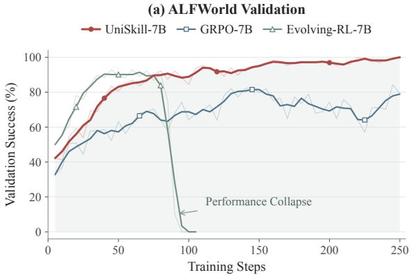
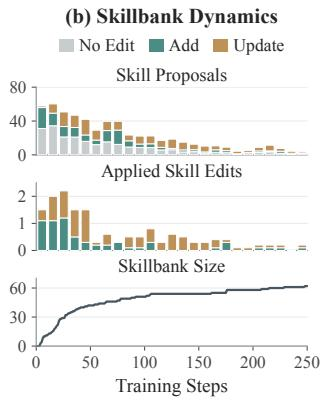
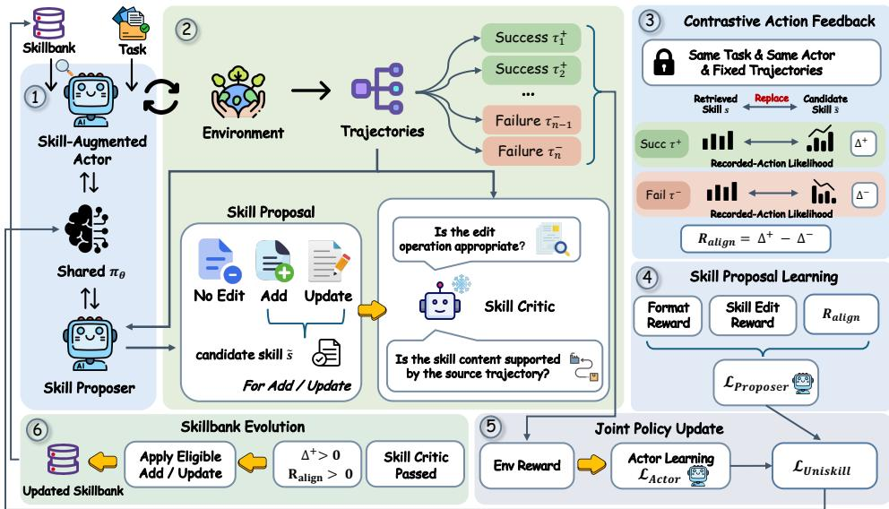
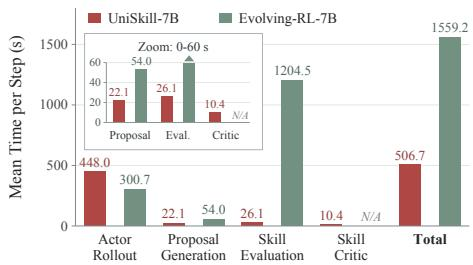
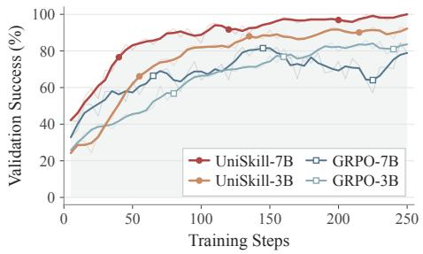
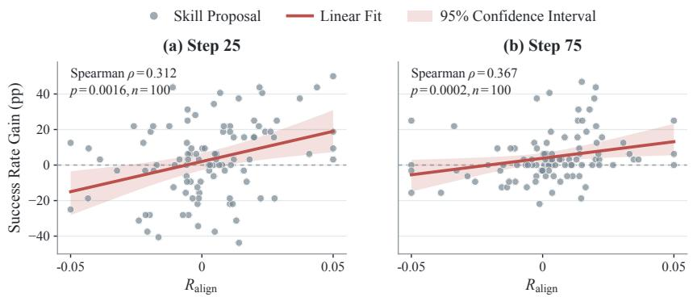
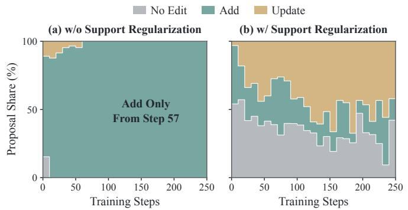
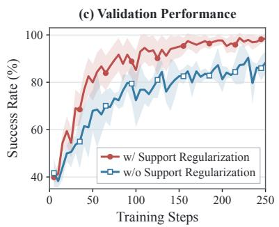
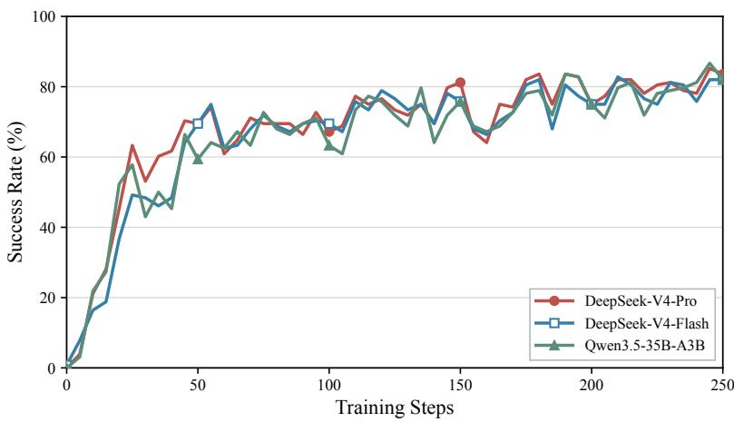
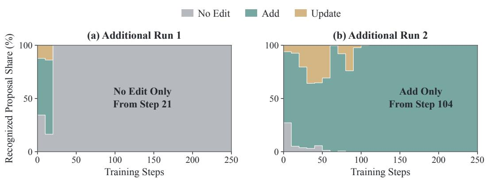

# UNISKILL: LEARNING ACTOR-ALIGNED SKILLPROPOSALS FOR AN EVOLVING POLICY

Yifei Lu1,2∗, Cheng Liu3∗, Dianzhi Yu3, Hui Xiang1,2, Ji Zhang1,2, Yuanchu Xiao1,2, Rong Liang1,2†

1Qiantang Credit, Hangzhou, China 2Ant Group, Hangzhou, China

3The Chinese University of Hong Kong

## ABSTRACT

Large language model agents can improve across tasks by retaining reusable skills distilled from prior interactions. Recent work jointly optimizes task execution and skill extraction, enabling the policy and skillbank to co-evolve. However, as the actor continues learning, rewarding skill proposals through their reuse in subsequent training steps may conflate skill benefits with actor improvement, while directly testing each proposed skill requires costly additional actor rollouts. In this paper, we introduce UniSkill, which uses a shared policy to interact with the environment and propose skillbank edits (ADD, UPDATE, or NO EDIT) from the resulting trajectories. Specifically, the actor learns from environment rewards, while contrastive action feedback guides skill proposal learning. This feedback provides an actor-alignment signal by measuring how replacing the retrieved skill with a proposed skill changes the current actor’s action log-likelihood gap between previously collected successful and failed trajectories from the same task, thereby avoiding new rollouts for each proposal. Since proposal-level feedback may suppress an otherwise appropriate edit operation when the proposed skill content scores poorly, we further apply skilledit support regularization to preserve exploration. Empirically, UniSkill achieves strong performance, reaching 98.4% success on ALFWorld and 84.7% on WebShop while maintaining stable joint training. Further ALFWorld experiments show that UniSkill remains effective when the shared policy uses a smaller backbone. Our implementation is available at https://github.com/LimOkii/UniSKill.

  
Figure 1: ALFWorld training dynamics. (a) UniSkill continues improving later in training, whereas Evolving-RL collapses after strong early gains. (b) The learned skillbank grows rapidly early and continues evolving through occasional additions and updates (non-overlapping 10-step means).

## 1 INTRODUCTION

LLM agents increasingly reuse information acquired from earlier interactions rather than treating every task as an isolated episode (Xu et al., 2025; Ouyang et al., 2026; Zhang et al., 2026a; Ni et al.,

2026). Prior work retains experience through verbal reflections, induced insights, and executable programs (Shinn et al., 2023; Zhao et al., 2024; Wang et al., 2024). Recent work distills interaction trajectories into reusable textual skills and stores them in a skillbank, from which relevant skills are retrieved to guide subsequent task execution (Wu et al., 2026; Xia et al., 2026).

Existing approaches extract skills from interaction trajectories by prompting a powerful LLM with frozen parameters (Ni et al., 2026; Xia et al., 2026). Beyond fixed-model skill extraction, several methods jointly train the skill proposer and the actor (Muhtar et al., 2026; Shi et al., 2026; Fan et al., 2026). The actor interacts with the environment to complete tasks, and the resulting trajectories are used to extract skills that in turn guide subsequent interactions. As skill extraction becomes a learned capability, a central question is what learning feedback a newly proposed skill should receive. To provide this feedback, existing methods train models to generate reflections or extract skills using task-outcome prediction accuracy or rewards from the trajectories used for skill extraction (Zhang et al., 2026b; Shi et al., 2026). These signals do not assess how the current actor would behave when given the proposed skill. More direct feedback can be obtained by evaluating task performance when the actor uses the skills in subsequent interactions (Muhtar et al., 2026; He et al., 2026).

However, the usefulness of a skill depends strongly on the actor that uses it (Yu et al., 2026). During joint training, the actor may already have been updated by the time the skill is reused. The updated actor might succeed even without the skill, so task success alone does not establish whether the skill would have helped the actor at the time it was proposed. Evaluating candidate skills before updating the actor avoids these intervening policy changes, but requires additional environment rollouts conditioned on each candidate skill, as in Evolving-RL (Fan et al., 2026). We therefore ask whether tra jectories already collected by the current actor can provide learning feedback for new skill proposals.

In this paper, we introduce UniSkill, a shared-policy framework that learns to act with retrieved skills and generate skill proposals from completed trajectories, as illustrated in Figure 2. Each skill proposal specifies a skill-edit operation for adding a new skill, updating the retrieved skill, or leaving the skillbank unchanged. For ADD and UPDATE, the proposal also includes the corresponding new or revised skill content. To evaluate these proposed skills, we focus on actor alignment, the extent to which a proposed skill improves task performance for the current actor relative to the retrieved skill. We construct a proxy for this utility using previously collected successful and failed trajectories from the same task. Specifically, before the policy update, we hold the current actor and recorded behavior fixed and measure how replacing the retrieved skill with the proposed skill changes the action log-likelihood gap between these trajectories. We then combine this contrastive action feedback with rewards for the appropriateness of skill-edit operations to train the skill proposer, while the actor learns from environment rewards. Because the skill-edit operation and proposed content share a proposal-level training signal, negative feedback on the content may suppress an otherwise appropriate operation. We therefore use skill-edit support regularization to preserve exploration of these operations during joint training. Skill edits that pass both skill-critic and actor-alignment checks update the skillbank for subsequent interactions, allowing the policy and skillbank to co-evolve. As shown in Figure 1, UniSkill achieves further gains in validation success during later training on ALFWorld, while continuing to add new skills and refine existing ones.

## Our contributions are as follows:

• We introduce UniSkill, a shared-policy framework for joint actor and skill proposer learning, with skill-edit support regularization that helps sustain exploration of edit operations.

• We develop contrastive action feedback by comparing proposed and retrieved skills using the current actor’s action log-likelihoods on previously collected successful and failed trajectories, avoiding additional rollouts for each proposal and reducing skill-evaluation overhead.

• Experiments on ALFWorld and WebShop demonstrate strong performance among the compared methods. Further experiments show that UniSkill remains effective when both the actor and proposer use a smaller backbone, supporting policy–skill co-evolution across model sizes.

## 2 RELATED WORK

## 2.1 EXPERIENCE REUSE AND SKILL-AUGMENTED AGENTS

Prior work retains experience as verbal reflections and induced insights (Shinn et al., 2023; Park et al., 2023; Zhao et al., 2024), executable programs (Wang et al., 2024; Zheng et al., 2025), and abstracted workflows (Wang et al., 2025b). A common approach prompts LLMs to extract and refine reusable guidance in external memory, without updating model parameters. For example, ReasoningBank prompts an LLM to extract reusable strategies from trajectories labeled as successful or failed by an LLM judge, storing them for subsequent retrieval (Ouyang et al., 2026). Dynamic Cheatsheet uses a prompted curator to revise strategy memory (Suzgun et al., 2026), while ACE integrates extracted lessons into structured playbooks through incremental updates (Zhang et al., 2026a). Beyond inference-time memory adaptation, EvolveR and SkillRL integrate experience reuse with policy optimization, refreshing stored principles or skills as training proceeds (Wu et al., 2026; Xia et al., 2026). SkillGraph models inter-skill dependencies to support structured retrieval and graph evolution during RL (Li et al., 2026a). As policies and their stored experience co-evolve, a central question is how to evaluate and credit that experience for the current actor.

## 2.2 CREDIT ASSIGNMENT FOR CO-EVOLVING POLICIES AND SKILLS

RetroAgent rewards correct task-outcome predictions during reflection (Zhang et al., 2026b), while Skill1 rewards skill distillation using task returns relative to the highest historical utility among retrieved skills (Shi et al., 2026). These rewards guide skill generation, but do not directly evaluate whether the generated skill helps the actor. Learning feedback for skill generation and use can instead depend on whether the actor completes a task successfully using skills (Wang et al., 2025a; Li et al., 2026b). Complementary RL trains its skill proposer from outcomes of later skill reuse (Muhtar et al., 2026), while ReSkill compares skillbank revisions across training steps and discounts older outcomes (He et al., 2026). MASA demonstrates that skill effectiveness varies across model backbones, highlighting the need for actor-specific skill evaluation (Yu et al., 2026). During joint training, by the time a proposed skill is used and evaluated on a subsequent task, the actor may already have been updated. Evolving-RL evaluates candidate skills before the joint policy update through additional skill-conditioned rollouts (Fan et al., 2026). UniSkill instead holds the current actor and recorded trajectories fixed, comparing action likelihoods under the retrieved and proposed skills to train the skill proposer without additional evaluation rollouts.

## 3 METHODOLOGY

## 3.1 PRELIMINARIES

UniSkill maintains a skillbank S and uses a shared policy $\pi _ { \theta }$ in two roles: an actor that generates environment actions conditioned on a retrieved skill, and a skill proposer that generates skill-edit operations and corresponding skill content from completed trajectories.

Skill-Augmented Actor. For an episodic interactive task $q \sim \mathcal { D }$ , a retriever selects a skill $s \in S$ At each turn $t ,$ the actor samples an action given the task, retrieved skill, and interaction history:

$$
a _ { t } \sim \pi _ { \theta } ( \cdot \mid q , s , H _ { t } ) ,\tag{1}
$$

where $H _ { t } = \left( o _ { 1 } , a _ { 1 } , \ldots , a _ { t - 1 } , o _ { t } \right)$ denotes the interaction history up to the current observation $o _ { t }$ The resulting trajectory is $\tau = ( o _ { 1 } , a _ { 1 } , \dots , o _ { T } , a _ { T } , y )$ , where $T$ is the episode length and $y$ is the terminal task outcome.

Trajectory-Conditioned Skill Proposal. Given a completed source trajectory $\tau$ and an oppositeoutcome trajectory $\tau _ { \mathrm { o p p o s i t e } }$ from the same task $q$ and retrieved skill $s ,$ the shared policy compares the two trajectories and generates a structured skill-edit proposal:

$$
( \mathrm { o p } , \tilde { s } ) \sim \pi _ { \theta } ( \cdot \mid q , s , \tau , \tau _ { \mathrm { o p p o s i t e } } ) , \qquad \mathrm { o p } \in \{ \mathrm { N o ~ E D I T , A D D , U P D A T E } \} .\tag{2}
$$

Here, $_ \mathrm { o p }$ specifies the skill-edit operation, while s˜ is the candidate skill for ADD or UPDATE. NO EDIT leaves the skillbank unchanged. ADD proposes a new skill when the trajectory reveals reusable

  
Figure 2: Overview of UniSkill. (1–2) The shared policy interacts with the environment and proposes edits from the resulting trajectories, while a skill critic checks edit appropriateness and content support. (3) Contrastive action feedback measures actor alignment on fixed trajectories. (4–5) Actor and proposer objectives jointly update the policy. (6) Eligible edits update the skillbank.

guidance that warrants a separate skillbank entry. UPDATE proposes a revision to the retrieved skill when the trajectory indicates that its guidance requires correction, refinement, or extension.

## 3.2 SKILL-AUGMENTED ACTOR LEARNING

For each sampled task $q ,$ the rollout policy $\pi _ { \mathrm { o l d } }$ generates a group $\mathcal { T } _ { q }$ of $G$ trajectories conditioned on the same retrieved skill $s ,$ which remains fixed throughout each episode. We train the actor with Group Relative Policy Optimization (GRPO) (Shao et al., 2024) using environment rewards. Let $R _ { j }$ be the environment reward of trajectory j in the group for task $q .$ Its group-relative advantage is

$$
\widehat { A } _ { j } = \frac { R _ { j } - \mu _ { q } } { \sigma _ { q } + \epsilon } , \qquad \mu _ { q } = \frac { 1 } { G } \sum _ { j = 1 } ^ { G } R _ { j } ,\tag{3}
$$

where $\sigma _ { q }$ is the standard deviation of rewards within the group. We minimize the actor loss:

$$
\mathcal { L } _ { \mathrm { a c t o r } } ( \theta ) = - \mathbb { E } \left[ \frac { 1 } { G } \sum _ { j = 1 } ^ { G } \frac { 1 } { L _ { j } } \sum _ { \ell = 1 } ^ { L _ { j } } \operatorname* { m i n } \Bigl ( \rho _ { \theta } \widehat { A } _ { j } , \mathrm { c l i p } ( \rho _ { \theta } , 1 - \varepsilon , 1 + \varepsilon ) \widehat { A } _ { j } \Bigr ) \right] + \beta \operatorname { K L } ( \pi _ { \theta } \parallel \pi _ { \mathrm { r e f } } ) .\tag{4}
$$

Here, E averages over sampled tasks and rollout groups, $L _ { j }$ counts actor-generated tokens in trajectory $j ,$ and $\rho _ { \theta }$ is the token-level importance ratio between π and $\pi _ { \mathrm { o l d } }$ . The coefficient $\beta$ controls KL regularization toward the reference policy $\pi _ { \mathrm { r e f } }$

## 3.3 ACTOR-ALIGNED SKILL PROPOSAL LEARNING

Skill Proposal and Reference Construction. For a source trajectory $\tau \in \mathcal T _ { q } ,$ , we select τopposite from the opposite-outcome trajectories in the same group and provide both trajectories to the skill proposer using Eq. 2. For actor-alignment evaluation, we select one successful and one failed reference trajectory, excluding both inputs $\tau$ and $\tau _ { \mathrm { o p p o s i t e } }$ shown to the skill proposer. Let ${ \mathcal { T } } _ { q } ^ { + }$ and $\mathcal { T } _ { q } ^ { - }$ denote the successful and failed trajectories in the group, respectively. We sample

$$
\tau ^ { + } \sim \mathcal { T } _ { q } ^ { + } \setminus \{ \tau , \tau _ { \mathrm { o p p o s i t e } } \} , \qquad \tau ^ { - } \sim \mathcal { T } _ { q } ^ { - } \setminus \{ \tau , \tau _ { \mathrm { o p p o s i t e } } \} .\tag{5}
$$

Accordingly, we retain only trajectories for which both reference sets remain nonempty after excluding the proposer inputs, with all trajectories sharing the same task, retrieved skill $s ,$ and current actor.

Contrastive Action Feedback. We evaluate a candidate skill proposal by replacing the retrieved skill in the reference action contexts. We hold the pre-update policy, recorded histories, and action tokens fixed; only the conditioning skill changes. For a trajectory τ, we average the token-normalized log-likelihoods of its recorded actions under skill s over the trajectory:

$$
J ( \tau ; s ) = \frac { 1 } { T } \sum _ { t = 1 } ^ { T } \frac { 1 } { | a _ { t } | } \log \pi _ { \theta } ( a _ { t } \mid q , s , H _ { t } ) ,\tag{6}
$$

where $\left| a _ { t } \right|$ is the token length of the recorded action. The likelihood changes induced by replacing s with s˜ are

$$
\Delta ^ { + } = J ( \tau ^ { + } ; \tilde { s } ) - J ( \tau ^ { + } ; s ) , ~ \Delta ^ { - } = J ( \tau ^ { - } ; \tilde { s } ) - J ( \tau ^ { - } ; s ) ,\tag{7}
$$

and the actor-alignment reward is

$$
R _ { \mathrm { a l i g n } } = \Delta ^ { + } - \Delta ^ { - } .\tag{8}
$$

Thus, $R _ { \mathrm { a l i g n } } > 0$ indicates that the candidate increases the gap in action log-likelihood between the successful and failed references relative to the retrieved skill.

Skill Proposal Rewards. $R _ { \mathrm { a l i g n } }$ evaluates behavioral alignment, but does not assess proposal format, skill-edit operation appropriateness, or whether the proposed skill content is grounded in the source trajectory. The proposed skill content may also score well by reproducing trajectory-specific details without yielding reusable guidance.

Accordingly, we check proposal format directly and prompt a skill critic to judge whether the skill-edit operation is appropriate and the proposed content is trajectory-grounded and reusable, yielding $d _ { \mathrm { o p } }$ and $d _ { \mathrm { s k i l l } }$ , respectively. The critic supplies validity judgments rather than a graded estimate of utility for the current actor. For content it deems supported, $R _ { \mathrm { a l i g n } }$ provides actor-alignment feedback. These signals yield the proposal-format reward $r _ { \mathrm { f m t } }$ , the skill-edit operation reward $r _ { \mathrm { o p } } .$ , and the skill-content reward $r _ { \mathrm { s k i l l } }$ . Appendix A.3 provides the critic instruction.

Let $\eta > 0$ be a fixed feedback magnitude. Since format is checked first, malformed proposals bypass the critic with $r _ { \mathrm { o p } } = r _ { \mathrm { s k i l l } } = 0 ;$ otherwise, these two rewards are defined below. The proposal-format and skill-edit operation rewards are

$$
r _ { \mathrm { f m t } } = \left\{ \begin{array} { l l } { + \eta , } & { \mathrm { i f ~ t h e ~ p r o p o s a l ~ i s ~ w e l l ~ f o r m e d , } } \\ { - \eta , } & { \mathrm { o t h e r w i s e } } \end{array} \right. , \qquad r _ { \mathrm { o p } } = \left\{ \begin{array} { l l } { + \eta , } & { d _ { \mathrm { o p } } = \mathrm { A p P R O P R I A T E } , } \\ { - \eta , } & { d _ { \mathrm { o p } } = \mathrm { I N A P P R O P R I A T E } } \end{array} \right. .\tag{9}
$$

The skill-content reward is

$$
r _ { \mathrm { s k i l l } } = \left\{ \begin{array} { l l } { \mathrm { c l i p } ( R _ { \mathrm { a l i g n } } , - \eta , \eta ) , } & { \mathrm { o p } \in \{ \mathrm { A D D } , \mathrm { U p D A T E } \} , \quad d _ { \mathrm { s k i l l } } = \mathrm { S U P P O R T E D } , } \\ { - \eta , } & { \mathrm { o p } \in \{ \mathrm { A D D } , \mathrm { U p D A T E } \} , \quad d _ { \mathrm { s k i l l } } = \mathrm { U N S U P P O R T E D } , } \\ { 0 , } & { \mathrm { o p = N O E D T } } \end{array} \right.\tag{10}
$$

Clipping bounds the magnitude of $R _ { \mathrm { a l i g n } }$ by $\eta .$ For well-formed proposals, the critic assesses edit appropriateness, checking content support only for ADD and UPDATE. When content is supported, $R _ { \mathrm { a l i g n } }$ provides actor-alignment feedback, whereas NO EDIT has neutral $r _ { \mathrm { s k i l l } } = 0$

Proposer Optimization. Each eligible source trajectory yields one skill proposal. Following prior work (Zhang et al., 2026b), we optimize the proposer with REINFORCE++ (Hu et al., 2025). We sum the format, skill-edit operation, and skill-content rewards into a scalar proposal reward and normalize it across the global proposal batch:

$$
r _ { \mathrm { p r o p } } = r _ { \mathrm { f m t } } + r _ { \mathrm { o p } } + r _ { \mathrm { s k i l l } } , \qquad \widehat { A } _ { \mathrm { p r o p } } = \frac { r _ { \mathrm { p r o p } } - \mu _ { \mathrm { p r o p } } } { \sigma _ { \mathrm { p r o p } } + \epsilon } .\tag{11}
$$

Here, $\mu _ { \mathrm { p r o p } }$ and $\sigma _ { \mathrm { p r o p } }$ are the mean and standard deviation of proposal rewards across the global batch, with each proposal contributing one scalar reward. We apply the same normalized advantage to all generated tokens in each skill proposal and minimize the following loss:

$$
\mathcal { L } _ { \mathrm { R } + + } ( \theta ) = - \mathbb { E } \Big [ \mathbb { E } _ { t } \mathrm { m i n } \Big ( \rho _ { \theta } \widehat { A } _ { \mathrm { p r o p } } , \mathrm { c l i p } ( \rho _ { \theta } , 1 - \varepsilon , 1 + \varepsilon ) \widehat { A } _ { \mathrm { p r o p } } \Big ) \Big ] + \beta _ { \mathrm { p r o p } } \mathrm { K L } ( \pi _ { \theta } \parallel \pi _ { \mathrm { r e f } } ) .\tag{12}
$$

Here, $\mathbb { E } _ { t }$ averages over generated tokens in each proposal, and the outer $\mathbb { E }$ averages over the global proposal batch. The token-level ratio $\rho _ { \theta }$ is evaluated at each token; $\beta _ { \mathrm { p r o p } }$ weights KL.

Skill-Edit Support Regularization. The proposal-level advantage is applied to both the skill-edit operation and the proposed content. Consequently, a negative advantage can reduce the probability of a skill-edit operation even when the skill critic judges it appropriate. Repeated suppression can make the operation rarely sampled, limiting exploration as the actor and skillbank evolve. We therefore introduce Skill-Edit Support Regularization, which penalizes available skill-edit operations whose normalized probabilities fall below a threshold $p _ { \mathrm { m i n } }$ . Let $\mathcal { O } ( s )$ denote the available skill-edi operations. NO EDIT and ADD are always available, while UPDATE is available only when a skill was retrieved for the source trajectory. In the following equations, x is shorthand for $( q , s , \tau , \tau _ { \mathrm { o p p o s i t e } } )$ At the operation decision position, let $\pi _ { \theta } ( \mathrm { o p } \mid x )$ denote the next-token probability of the first token of operation label op. We then renormalize these probabilities over $\bar { \mathcal { O } } ( \bar { s } )$

$$
p _ { \theta } \bigl ( \mathrm { o p } \mid x \bigr ) = \frac { \pi _ { \theta } \bigl ( \mathrm { o p } \mid x \bigr ) } { \sum _ { \mathrm { o p } ^ { \prime } \in \mathcal O ( s ) } \pi _ { \theta } \bigl ( \mathrm { o p } ^ { \prime } \mid x \bigr ) } , \qquad \mathrm { o p } \in \mathcal O ( s ) .\tag{13}
$$

The regularizer is

$$
\mathcal { L } _ { \mathrm { s u p } } ( \theta ) = \mathbb { E } _ { x } \left[ \frac { 1 } { | \mathcal { O } ( s ) | } \sum _ { \mathrm { o p } \in \mathcal { O } ( s ) } \left[ \operatorname* { m a x } ( 0 , \log p _ { \mathrm { m i n } } - \log p _ { \theta } ( \mathrm { o p } \mid x ) ) \right] ^ { 2 } \right] .\tag{14}
$$

The penalty is zero whenever all available operations have probabilities at least $p _ { \mathrm { m i n } } .$ . It discourages premature suppression without requiring a uniform skill-edit operation distribution. Combining this regularizer with the REINFORCE++ loss yields the complete skill proposer objective:

$$
\mathcal { L } _ { \mathrm { p r o p o s e r } } ( \theta ) = \mathcal L _ { \mathrm { R } + + } ( \theta ) + \lambda _ { \mathrm { s u p } } \mathcal L _ { \mathrm { s u p } } ( \theta ) .\tag{15}
$$

The coefficient $\lambda _ { \mathrm { s u p } }$ controls the strength of support regularization.

## 3.4 JOINT POLICY–SKILL CO-EVOLUTION

At each training step, actor rollouts and skill proposals are generated from the same pre-update policy and skillbank snapshot. We jointly optimize the shared policy by minimizing

$$
\mathcal { L } _ { \mathrm { U n i S k i l l } } = \mathcal { L } _ { \mathrm { a c t o r } } + \lambda _ { \mathrm { p r o p } } \mathcal { L } _ { \mathrm { p r o p o s e r } } ,\tag{16}
$$

where $\lambda _ { \mathrm { p r o p } }$ weights the proposer loss. A positive $R _ { \mathrm { a l i g n } }$ indicates a wider action log-likelihood gap between successful and failed references, even if likelihoods decrease on both. For skillbank updates, however, we adopt a stricter criterion by additionally requiring $\Delta ^ { + } > 0$ to avoid storing skills that reduce the average action log-likelihood on the successful reference. After the policy update, we apply ADD and UPDATE proposals that pass both critic checks and satisfy $\Delta ^ { + } > 0$ and $R _ { \mathrm { a l i g n } } > 0$ . For each UPDATE target, we apply the eligible proposal with the highest $R _ { \mathrm { a l i g n } }$ . The complete training procedure is summarized in Algorithm 1 in Appendix C.

## 4 EXPERIMENTS

## 4.1 EXPERIMENTAL SETUP

Benchmarks. We evaluate UniSkill on ALFWorld (Shridhar et al., 2021) and WebShop (Yao et al., 2022), two multi-turn interactive benchmarks. ALFWorld requires agents to complete household tasks through text-based navigation and object manipulation. We report per-task-type and overall success rates. WebShop requires an agent to search, inspect, and purchase products that satisfy a natural-language instruction in a simulated e-commerce website. We report the mean normalized task score, scaled to 100, and the success rate.

Baselines and Implementation Details. We compare UniSkill with training-free, RL-only, and memory- or skill-augmented RL baselines. All compared methods use Qwen2.5-7B-Instruct (Yang et al., 2024) as the base model. Unless otherwise specified, the baseline results in Table 1 are drawn from prior work (Feng et al., 2025; Shi et al., 2026), where they were obtained using the released VERL-AGENT implementations (Feng et al., 2025) under a common evaluation protocol. We evaluate UniSkill using the same protocol, including ALFWorld’s official valid seen split, tasksampling procedure, and success criterion. Complementary RL results are quoted from its original paper (Muhtar et al., 2026), while Evolving-RL (Fan et al., 2026) is reproduced within VERL-AGENT under the ALFWorld training and evaluation setup used for UniSkill. UniSkill starts from an empty skillbank and retrieves skills with Qwen3-Embedding-0.6B. We prompt a DeepSeek-V4-Pro model to serve as the skill critic. We set $\eta = 0 . 0 5$ and $p _ { \mathrm { m i n } } = 0 . 1$ . Appendix B explains these choices and provides detailed training and generation configurations.

## 4.2 PERFORMANCE ON ALFWORLD AND WEBSHOP

As shown in Table 1, UniSkill achieves strong performance on both benchmarks, reaching 98.4% success on ALFWorld and a task score of 90.5 with 84.7% success on WebShop. Compared with RL-only baselines, UniSkill improves ALFWorld success over GRPO and GiGPO by 20.8 and 7.6 percentage points (pp), respectively. Its advantage extends to skill-augmented RL, with a 12.0 pp improvement in success rate over SkillRL on WebShop. UniSkill achieves 0.9 pp higher ALFWorld success than Skill1 while delivering a comparable task score and 1.8 pp higher success on WebShop.

Evolving-RL provides a closely related joint-training baseline that evaluates proposed skills through additional environment rollouts. UniSkill exceeds Evolving-RL by 5.4 pp in ALFWorld success. Beyond final performance, Figure 1(a) reveals contrasting training dynamics. Evolving-RL makes strong early gains but subsequently undergoes performance collapse, a risk also examined in their original study (Fan et al., 2026). In contrast, UniSkill sustains stable joint training over 250 steps, with validation success showing an overall upward trend and continued improvement during later training. Alongside this performance trend, Figure 1(b) shows rapid growth of the learned skillbank early in training, followed by slower expansion as accepted ADD operations become less frequent, while occasional additions and updates continue throughout training.

To further assess training efficiency, Figure 3 compares the per-step time spent on actor rollouts, proposal generation, skill evaluation, and skill critic calls. Rollout-based skill evaluation accounts for most of Evolving-RL’s measured time, whereas UniSkill evaluates proposed skills using $R _ { \mathrm { a l i g n } }$ computed from previously collected trajectories. The resulting savings outweigh UniSkill’s longer actor rollouts and skill critic calls, yielding lower total time across the reported stages.

## 4.3 PERFORMANCE ACROSS MODEL SIZES

We examine whether UniSkill remains effective with Qwen2.5-3B-Instruct as the shared actor and skill proposer backbone, comparing it with size-matched GRPO references in Figure 4. Validation success trends upward at both sizes, with UniSkill-3B continuing to improve during later training, exceeding 90% success, and finishing above GRPO-7B. Together, these results suggest that policy–skill co-evolution remains effective with a smaller shared backbone.

## 4.4 ADDITIONAL EXPERIMENTS

(1) Out-of-distribution generalization. UniSkill performs well on the ALFWorld out-of-distribution split with and without skill retrieval, with retrieval providing further gains, as detailed in Appendix D.1. (2) Sensitivity to the skill critic. UniSkill achieves comparable WebShop performance with different skill critic models, as detailed in Appendix D.2.

  
Figure 3: Measured per-step time for UniSkill-7B and Evolving-RL-7B on ALFWorld.

  
Figure 4: ALFWorld validation at 3B and 7B; 3-step moving averages over faint raw curves.

Table 1: Results on ALFWorld and WebShop. We report success rates (%) and normalized WebShop scores. UniSkill reports mean ± std over three independent training runs. Best and second-best results are bold and underlined. † denotes purchase-completion rate, which is excluded from ranking.
<table><tr><td rowspan="2">Method</td><td colspan="7">ALFWorld (Success %)</td><td colspan="2">WebShop</td></tr><tr><td>Look</td><td></td><td>Clean</td><td>Heat</td><td>Cool</td><td>Pick2</td><td>All</td><td>Score</td><td>Succ.</td></tr><tr><td colspan="10">Training-Free Methods</td></tr><tr><td>Base Model</td><td>33.4</td><td>21.6</td><td>19.3</td><td>6.9</td><td>2.8</td><td>3.2</td><td>14.8</td><td>26.4</td><td>7.8</td></tr><tr><td>ReAct (Yao et al., 2023)</td><td>48.5</td><td>35.4</td><td>34.3</td><td>13.2</td><td>18.2</td><td>17.6</td><td>31.2</td><td>46.2</td><td>19.5</td></tr><tr><td>Reflexion (Shinn et al., 2023)</td><td>62.0</td><td>41.6</td><td>44.9</td><td>30.9</td><td>36.3</td><td>23.8</td><td>42.7</td><td>58.1</td><td>28.8</td></tr><tr><td>ExpeL (Zhao et al., 2024)</td><td>21.0</td><td>67.0</td><td>55.0</td><td>52.0</td><td>71.0</td><td>6.0</td><td>46.3</td><td>30.9</td><td>11.2</td></tr><tr><td colspan="10">Reinforcement Learning Methods</td></tr><tr><td>PPO (Schulman et al., 2017)</td><td>92.3</td><td>64.0</td><td>92.5</td><td>89.5</td><td>80.3</td><td>68.8</td><td>80.4</td><td>81.4</td><td>68.7</td></tr><tr><td>RLOO (Ahmadian et al., 2024)</td><td>87.6</td><td>78.2</td><td>87.3</td><td>81.3</td><td>71.9</td><td>48.9</td><td>75.5</td><td>80.3</td><td>65.7</td></tr><tr><td>GRPO (Shao et al., 2024)</td><td>90.8</td><td>66.1</td><td>89.3</td><td>74.7</td><td>72.5</td><td>64.7</td><td>77.6</td><td>79.3</td><td>66.1</td></tr><tr><td>GiGPO (Feng et al., 2025)</td><td>97.7</td><td>82.7</td><td>98.8</td><td>83.7</td><td>89.3</td><td>79.2</td><td>90.8</td><td>84.4</td><td>72.8</td></tr><tr><td colspan="10">Memory- or Skill-Augmented Reinforcement Learning Methods</td></tr><tr><td>EvolveR (Wu et al., 2026)</td><td>64.9</td><td>33.3</td><td>46.4</td><td>13.3</td><td>33.3</td><td>33.3</td><td>43.8</td><td>42.5</td><td>17.6</td></tr><tr><td>Mem0 (w/ GRPO) (Chhikara et al., 2025)</td><td>78.1</td><td>54.8</td><td>56.1</td><td>31.0</td><td>65.0</td><td>26.9</td><td>54.7</td><td>58.1</td><td>37.5</td></tr><tr><td>SimpleMem (w/ GRPO) (Liu et al., 2026)</td><td>89.5</td><td>36.3</td><td>60.0</td><td>50.0</td><td>64.9</td><td>26.3</td><td>62.5</td><td>67.8</td><td>46.9</td></tr><tr><td>SkiliRL (Xia et al., 2026)</td><td>97.9</td><td>71.4</td><td>90.0</td><td>90.0</td><td>95.5</td><td>87.5</td><td>89.9</td><td>85.2</td><td>72.7</td></tr><tr><td>Complementary RL (Muhtar et al., 2026)</td><td></td><td></td><td></td><td></td><td></td><td></td><td>91.0</td><td>1</td><td>87.0†</td></tr><tr><td>RetroAgent (Zhang et al., 2026b)</td><td>97.9</td><td>90.9</td><td>99.2</td><td>92.9</td><td>85.3</td><td>91.0</td><td>94.9</td><td>88.9</td><td>82.3</td></tr><tr><td>Skill1 (Shi et al., 2026)</td><td>100.0</td><td>98.6</td><td>97.3</td><td>99.2</td><td>96.1</td><td>96.0</td><td>97.5</td><td>89.7</td><td>82.9</td></tr><tr><td>Evolving-RL (Fan et al., 2026)</td><td>97.1</td><td>100.0</td><td>92.6</td><td>87.5</td><td>88.0</td><td>91.7</td><td>93.0</td><td></td><td></td></tr><tr><td>UniSkill (Ours)</td><td>100.0±0.0 100.0±0.0 100.0±0.0</td><td></td><td></td><td></td><td></td><td>93.0±6.1 100.0±0.0 96.7±2.9 98.4±0.8|</td><td></td><td></td><td>90.5±1.4 84.7±0.5</td></tr></table>

## 5 ANALYSIS

In this section, we present an empirical analysis of UniSkill by addressing the following questions:

Q1: How Does Joint Actor and Skill Proposer Learning Contribute to Performance? To assess the contribution of joint learning, we compare UniSkill with three ablation variants in Table 2. Actor Only trains the actor with a frozen skill proposer, whereas Skill Proposer Only trains the proposer with a frozen actor. In both variants, the frozen model retains the initial Qwen2.5-7B-Instruct weights. UniSkill (w/o $R _ { \mathrm { a l i g n } }$ reward) removes $R _ { \mathrm { a l i g n } }$ only from the proposer reward. All variants start from an empty skillbank and retain skill retrieval during training, with identical critic checks and skillbank update rules.

Table 2: Ablation results on ALFWorld with and without skill retrieval at evaluation.
<table><tr><td rowspan="2">Setting</td><td colspan="3">Training</td><td colspan="2">ALFWorld Success Rate (%)</td></tr><tr><td>Actor</td><td>Skill Proposer</td><td> $R _ { \mathrm { a l i g n } }$  reward</td><td>w/o Retrieval</td><td>w/ Retrieval</td></tr><tr><td>Actor Only</td><td>Updated</td><td>Frozen</td><td>X</td><td>84.4</td><td>87.5</td></tr><tr><td>Skill Proposer Only</td><td>Frozen</td><td>Updated</td><td>V</td><td>34.4</td><td>32.8</td></tr><tr><td>UniSkill (w/o  $R _ { \mathrm { a l i g n } }$  reward)</td><td>Updated</td><td>Updated</td><td>X</td><td>84.4</td><td>89.1</td></tr><tr><td>UniSkill</td><td>Updated</td><td>Updated</td><td>V</td><td>96.1</td><td>98.4</td></tr></table>

Table 2 shows that UniSkill retains 96.1% success when skill retrieval is disabled at evaluation, compared with 84.4% for both Actor Only and the variant without the $R _ { \mathrm { a l i g n } }$ reward, and 34.4% for Skill Proposer Only. Since the variant without the $R _ { \mathrm { a l i g n } }$ reward follows the same joint-training procedure and skillbank update rules, differing only in whether $R _ { \mathrm { a l i g n } }$ is included in the training objective of the proposer, this comparison identifies the contribution of actor-alignment feedback as a training signal to the actor’s no-retrieval performance. By evaluating self-proposed skills for alignment with the current actor, this feedback favors guidance that can shape subsequent skill-conditioned learning, consistent with the continued rise in validation success during later training and the strong performance of the actor without retrieval. When evaluated with its evolved skillbank, UniSkill reaches 98.4% success, outperforming all three variants and providing an additional benefit alongside the gains retained by the actor.

Q2: Does $R _ { \mathrm { a l i g n } }$ Capture Actor Alignment? The ablation results in Q1 show that $R _ { \mathrm { a l i g n } }$ benefits proposer training. We next examine whether higher scores indicate better actor alignment, measured by the success-rate gain from replacing the retrieved skill with the proposed skill under the same actor. Specifically, at checkpoint k, we compute $R _ { \mathrm { a l i g n } }$ and evaluate each source task $q _ { i }$ with the fixed actor $\pi ^ { ( k ) }$ , directly supplying either the retrieved or proposed skill. The rollout gain is

$$
U _ { i } ^ { ( k ) } = \mathbb { E } \Big [ R \mid q _ { i } , \tilde { s } _ { i } , \pi ^ { ( k ) } \Big ] - \mathbb { E } \Big [ R \mid q _ { i } , s _ { i } , \pi ^ { ( k ) } \Big ] ,\tag{17}
$$

where R denotes the task return. We estimate $U _ { i } ^ { ( k ) }$ using mean task returns from 32 rollouts per skill condition. We evaluate critic-accepted ADD and UPDATE proposals with clipped $R _ { \mathrm { a l i g n } }$ at training steps 25 and 75; the sampling procedure is detailed in Appendix D.3. We report Spearman correlations and linear trends with pointwise 95% bootstrap confidence intervals. Figure 5 shows positive Spearman correlations between $R _ { \mathrm { a l i g n } }$ and success-rate gains at steps 25 and 75 $( \rho = 0 . 3 1 2$ and 0.367, respectively). Proposals with positive $R _ { \mathrm { a l i g n } }$ have mean gains of 8.4 and 7.2 percentage points, compared with −3.4 and −0.5 percentage points for negative-score proposals. However, 13/53 (24.5%) and 10/64 (15.6%) of positive-score proposals have negative observed gains at the two checkpoints, respectively. Thus, $R _ { \mathrm { a l i g n } }$ is informative in aggregate among the sampled proposals but does not guarantee improvement for every proposal.

  
Figure 5: Actor alignment on ALFWorld with linear fits and pointwise 95% bootstrap CIs.

Q3: Does Support Regularization Sustain Skill-Edit Exploration? The analysis in Q2 supports $R _ { \mathrm { a l i g n } }$ as a proxy for actor alignment. As discussed in Section 3.3, however, this feedback alone does not ensure sustained skill-edit exploration. We therefore compare UniSkill with and without support regularization, examining skill-edit distributions and validation performance.

  
Figure 6: Support regularization on ALFWorld. (a–b) Skill-edit distributions (one run per setting; 10-step windows). (c) Validation success (mean ± std; three independent runs per setting).

As shown in Figure 6(a), the run without support regularization exhibits a collapse to a single skill-edit operation (ADD in this run; see Appendix D.4 for additional cases). In contrast, Figure 6(b) shows that the run with support regularization continues to sample all three operations with changing proportions, consistent with preserving exploration rather than enforcing a uniform distribution. The validation curves in Figure 6(c) further show faster early improvement and higher success rates during later training with support regularization. Preserving these exploration opportunities allows the skill proposer to adapt its edit choices as the actor and skillbank evolve, supporting stable joint training.

## 6 CONCLUSION

We present UniSkill, which jointly learns task execution and skill proposals with a shared policy, enabling the actor and skillbank to co-evolve. Actor-aligned feedback from previously collected trajectories reduces skill-evaluation overhead, while support regularization sustains exploration across skill-edit operations throughout training. Experiments on ALFWorld and WebShop demonstrate strong task performance and stable joint training. Further ALFWorld experiments show that UniSkill remains effective when the shared policy uses a smaller backbone.

## ETHICS STATEMENT

This work evaluates UniSkill in the publicly available ALFWorld and WebShop benchmark environments, without human-subject experiments or collection of personal data. The experiments do not involve real-world physical actions or purchases.

## REPRODUCIBILITY STATEMENT

Section 3 specifies the training objectives, contrastive action feedback, and skillbank update rules. Algorithm 1 in Appendix C summarizes the training procedure. Section 4 describes the benchmarks, evaluation metrics, and baseline sources. Appendix A provides the actor, skill proposer, and skill critic prompts. Appendix B reports training and generation configurations, the ALFWorld evaluation protocol, and the choices of η and $p _ { \mathrm { m i n } } .$ . Section 5 describes the ablations and statistical analyses, with query selection and proposal sampling detailed in Appendix D.3. We plan to publicly release the implementation and configuration files.

## AI USE STATEMENT

The authors led the research, implementation, experimental execution, and manuscript preparation. Generative AI tools provided assistance with literature review, methodological and experimental discussions, translation, editing, and LAT X formatting. The authors take full responsibility for this paper.

## REFERENCES

Arash Ahmadian, Chris Cremer, Matthias Galle, Marzieh Fadaee, Julia Kreutzer, Olivier Pietquin,´ Ahmet Ust ¨ un, and Sara Hooker. Back to basics: Revisiting REINFORCE-style optimization ¨ for learning from human feedback in LLMs. In Proceedings of the 62nd Annual Meeting of the Associationfor Computational Linguistics, 2024.

Prateek Chhikara, Dev Khant, Saket Aryan, Taranjeet Singh, and Deshraj Yadav. Mem0: Building production-ready AI agents with scalable long-term memory. In ECAI 2025, pp. 2993–3000, 2025. doi: 10.3233/FAIA251160.

Zhiyuan Fan, Wenwei Jin, Feng Zhang, Bin Li, Yihong Dong, Yao Hu, and Jiawei Li. Evolving-RL: End-to-end optimization of experience-driven self-evolving capability within agents. arXiv preprint arXiv:2605.10663, 2026.

Lang Feng, Zhenghai Xue, Tingcong Liu, and Bo An. Group-in-group policy optimization for LLM agent training. In Advances in Neural Information Processing Systems, 2025.

Zelin He, Haotian Lin, Boran Han, Wei Zhu, Haoyang Fang, Bernie Wang, Xuan Zhu, Runze Li, and Matthew Reimherr. ReSkill: Reconciling skill creation with policy optimization in agentic RL. arXiv preprint arXiv:2606.01619, 2026.

Jian Hu, Jason Klein Liu, Haotian Xu, and Wei Shen. REINFORCE++: Stabilizing critic-free policy optimization with global advantage normalization. arXiv preprint arXiv:2501.03262, 2025.

Xiaoyuan Li, Moxin Li, Keqin Bao, Yubo Ma, Wenjie Wang, Dayiheng Liu, and Fuli Feng. SkillGraph: Skill-augmented reinforcement learning for agents via evolving skill graphs. arXiv preprint arXiv:2605.12039, 2026a.

Yu Li, Rui Miao, Zhengling Qi, and Tian Lan. ARISE: Agent reasoning with intrinsic skill evolution in hierarchical reinforcement learning. arXiv preprint arXiv:2603.16060, 2026b.

Jiaqi Liu, Yaofeng Su, Peng Xia, Siwei Han, Zeyu Zheng, Cihang Xie, Mingyu Ding, and Huaxiu Yao. SimpleMem: Efficient lifelong memory for LLM agents. In Proceedings of the International Conference on Machine Learning, 2026.

Dilxat Muhtar, Jiashun Liu, Wei Gao, Weixun Wang, Shaopan Xiong, Ju Huang, Siran Yang, Wenbo Su, Jiamang Wang, Ling Pan, and Bo Zheng. Complementary RL: Towards efficient experiencedriven agent learning. arXiv preprint arXiv:2603.17621, 2026.

Jingwei Ni, Yihao Liu, Xinpeng Liu, Yutao Sun, Mengyu Zhou, Pengyu Cheng, Dexin Wang, Erchao Zhao, Xiaoxi Jiang, and Guanjun Jiang. Trace2Skill: Distill trajectory-local lessons into transferable agent skills. arXiv preprint arXiv:2603.25158, 2026.

Siru Ouyang, Jun Yan, I-Hung Hsu, Yanfei Chen, Ke Jiang, Zifeng Wang, Rujun Han, Long T. Le, Samira Daruki, Xiangru Tang, Vishy Tirumalashetty, George Lee, Mahsan Rofouei, Hangfei Lin, Jiawei Han, Chen-Yu Lee, and Tomas Pfister. ReasoningBank: Scaling agent self-evolving with reasoning memory. In International Conference on Learning Representations, 2026.

Joon Sung Park, Joseph C. O’Brien, Carrie J. Cai, Meredith Ringel Morris, Percy Liang, and Michael S. Bernstein. Generative agents: Interactive simulacra of human behavior. In Proceedings of the 36th Annual ACM Symposium on User Interface Software and Technology, pp. 1–22, 2023. doi: 10.1145/3586183.3606763.

John Schulman, Filip Wolski, Prafulla Dhariwal, Alec Radford, and Oleg Klimov. Proximal policy optimization algorithms. arXiv preprint arXiv:1707.06347, 2017.

Zhihong Shao, Peiyi Wang, Qihao Zhu, Runxin Xu, Junxiao Song, Xiao Bi, Haowei Zhang, Mingchuan Zhang, Y. K. Li, Y. Wu, et al. DeepSeekMath: Pushing the limits of mathematical reasoning in open language models. arXiv preprint arXiv:2402.03300, 2024.

Yaorui Shi, Yuxin Chen, Zhengxi Lu, Yuchun Miao, Shugui Liu, Qi Gu, Xunliang Cai, Xiang Wang, and An Zhang. Skill1: Unified evolution of skill-augmented agents via reinforcement learning. arXiv preprint arXiv:2605.06130, 2026.

Noah Shinn, Federico Cassano, Ashwin Gopinath, Karthik Narasimhan, and Shunyu Yao. Reflexion: Language agents with verbal reinforcement learning. In Advances in Neural Information Processing Systems, volume 36, pp. 8634–8652, 2023.

Mohit Shridhar, Xingdi Yuan, Marc-Alexandre Cotˆ e, Yonatan Bisk, Adam Trischler, and Matthew´ Hausknecht. ALFWorld: Aligning text and embodied environments for interactive learning. In International Conference on Learning Representations, 2021.

Mirac Suzgun, Mert Yuksekgonul, Federico Bianchi, Dan Jurafsky, and James Zou. Dynamic cheatsheet: Test-time learning with adaptive memory. In Proceedings of the 19th Conference of the European Chapter of the Association for Computational Linguistics, pp. 7080–7106, 2026. doi: 10.18653/v1/2026.eacl-long.333.

Guanzhi Wang, Yuqi Xie, Yunfan Jiang, Ajay Mandlekar, Chaowei Xiao, Yuke Zhu, Linxi Fan, and Anima Anandkumar. Voyager: An open-ended embodied agent with large language models. Transactions on Machine Learning Research, 2024. URL https://openreview.net/ forum?id=ehfRiF0R3a.

Jiongxiao Wang, Qiaojing Yan, Yawei Wang, Yijun Tian, Soumya Smruti Mishra, Zhichao Xu, Megha Gandhi, Panpan Xu, and Lin Lee Cheong. Reinforcement learning for self-improving agent with skill library. arXiv preprint arXiv:2512.17102, 2025a.

Zora Zhiruo Wang, Jiayuan Mao, Daniel Fried, and Graham Neubig. Agent workflow memory. In Proceedings ofthe International Conference on Machine Learning, volume 267, pp. 63897–63911, 2025b. URL https://proceedings.mlr.press/v267/wang25bx.html.

Rong Wu, Xiaoman Wang, Jianbiao Mei, Pinlong Cai, Daocheng Fu, Cheng Yang, Licheng Wen, Xuemeng Yang, Yufan Shen, Yuxin Wang, and Botian Shi. From interactions to principles: Experience-driven self-distillation for evolving LLM agents. In Proceedings ofthe International Conference on Machine Learning, 2026.

Peng Xia, Jianwen Chen, Hanyang Wang, Jiaqi Liu, Kaide Zeng, Yu Wang, Siwei Han, Yiyang Zhou, Xujiang Zhao, Haifeng Chen, Zeyu Zheng, Cihang Xie, and Huaxiu Yao. SkillRL: Evolving agents via recursive skill-augmented reinforcement learning. arXiv preprint arXiv:2602.08234, 2026.

Wujiang Xu, Zujie Liang, Kai Mei, Hang Gao, Juntao Tan, and Yongfeng Zhang. A-MEM: Agentic memory for LLM agents. In Advances in Neural Information Processing Systems, 2025.

An Yang, Baosong Yang, Beichen Zhang, Binyuan Hui, Bo Zheng, Bowen Yu, Chengyuan Li, Dayiheng Liu, Fei Huang, Haoran Wei, et al. Qwen2.5 technical report. arXiv preprint arXiv:2412.15115, 2024.

Shunyu Yao, Howard Chen, John Yang, and Karthik Narasimhan. WebShop: Towards scalable real-world web interaction with grounded language agents. In Advances in Neural Information Processing Systems, 2022.

Shunyu Yao, Jeffrey Zhao, Dian Yu, Nan Du, Izhak Shafran, Karthik Narasimhan, and Yuan Cao. ReAct: Synergizing reasoning and acting in language models. In International Conference on Learning Representations, 2023.

Jianxiang Yu, Jiapeng Zhu, Bochen Lin, Qier Cui, Zichen Ding, and Xiang Li. Skill is not onesize-fits-all: Model-aware skill alignment for LLM agents. arXiv preprint arXiv:2605.30723, 2026.

Qizheng Zhang, Changran Hu, Shubhangi Upasani, Boyuan Ma, Fenglu Hong, Vamsidhar Kamanuru, Jay Rainton, Chen Wu, Mengmeng Ji, Hanchen Li, Urmish Thakker, James Zou, and Kunle Olukotun. Agentic context engineering: Evolving contexts for self-improving language models. In International Conference on Learning Representations, 2026a.

Xiaoying Zhang, Zichen Liu, Yipeng Zhang, Xia Hu, and Wenqi Shao. RetroAgent: From solving to evolving via retrospective dual intrinsic feedback. arXiv preprint arXiv:2603.08561, 2026b.

Andrew Zhao, Daniel Huang, Quentin Xu, Matthieu Lin, Yong-Jin Liu, and Gao Huang. ExpeL: LLM agents are experiential learners. In Proceedings of the AAAI Conference on Artificial Intelligence, 2024.

Boyuan Zheng, Michael Y. Fatemi, Xiaolong Jin, Zora Zhiruo Wang, Apurva Gandhi, Yueqi Song, Yu Gu, Jayanth Srinivasa, Gaowen Liu, Graham Neubig, and Yu Su. SkillWeaver: Web agents can self-improve by discovering and honing skills. arXiv preprint arXiv:2504.07079, 2025.

Choose one available operation.   
NO EDIT Choose this if the episode does not reveal a reusable skill.   
ADD NEW SKILL Choose this if the episode reveals a new reusable skill.   
UPDATE SKILL Choose this if the retrieved skill should be improved based on the episode. This   
operation is available only when a skill was retrieved.   
A skill must be concrete, supported by the source trajectory, and usable from the actor’s available prompt.   
Do not merely restate the task, copy the retrieved skill, or memorize this episode. For ADD NEW SKILL   
or UPDATE SKILL, write one self-contained reusable skill in plain text. For NO EDIT, write exactly   
NONE in the skill block.   
Response format. Return exactly two tagged blocks:   
<action>{operation}</action>   
<skill>{skill text or NONE}</skill>

## A PROMPTS

## A.1 ALFWORLD PROMPTS

ALFWorld Actor Prompt   
You are in ACTION MODE, acting in the ALFRED Embodied Environment.   
Task: {task}   
Retrieved skill: {skill}   
Recent observations and actions: {history}   
Current step: {step}   
Current observation: {observation}   
Admissible actions: {admissible actions}   
First reason step-by-step within <think>...</think>. Then output one admissible action for the   
current step within <action>...</action>.

## ALFWorld Skill Proposer Prompt

You are in SKILL PROPOSAL MODE. Compare the completed ALFWorld episode with the   
opposite-outcome trajectory and propose one skill-edit operation.   
Task type: {task type}   
Task: {task}   
Retrieved skill: {retrieved skill}   
Current episode.   
Outcome: {success and end reason}   
Trajectory: {observations, reasoning, and actions}   
Opposite-outcome trajectory.   
Outcome: {reference success and end reason}   
Trajectory: {reference actions}   
Use the comparison to identify reusable behavioral differences supported by the recorded actions and   
outcomes.

## A.2 WEBSHOP PROMPTS

WebShop Actor Prompt   
You are an expert autonomous agent operating in the WebShop e-commerce environment.   
Retrieved skill: {skill}   
Task: {task}   
Recent observations and actions: {history}   
Current step: {step}   
Current observation: {observation}   
Admissible actions: {admissible actions}   
Reason about the shopping goal within <think>...</think>. Then output one admissible action   
within <action>...</action>.

WebShop Skill Proposer Prompt   
You are in SKILL PROPOSAL MODE. Compare the completed WebShop episode with the   
opposite-outcome trajectory and propose one skill-edit operation.   
Task: {task}   
Retrieved skill: {retrieved skill}   
Current episode.   
Outcome: {success, task score, and end reason}   
Action sequence: {source actions}   
Opposite-outcome trajectory.   
Outcome: {success, task score, and end reason}   
Action sequence: {reference actions}   
Use the comparison to identify reusable behavioral differences supported by the recorded actions and   
outcomes. Do not infer hidden causes, memorize product identifiers, or copy an exact action path.   
Choose one available operation.   
NO EDIT No concrete reusable guidance is revealed, or the retrieved skill already contains it.   
ADD NEW SKILL Distinct reusable guidance should be stored as a separate skill.   
UPDATE SKILL Revise an existing retrieved skill based on the comparison.   
Write concrete, self-contained guidance reusable across shopping tasks. Do not restate the request or copy   
or paraphrase existing skills. Use NONE for NO EDIT.   
Response format. Return exactly two tagged blocks:   
<action>{operation}</action>   
<skill>{skill text or NONE}</skill>

## A.3 SKILL CRITIC PROMPT

Skill Critic Prompt   
Task and inputs. You are a skill critic. Independently assess whether a proposed skill-edit operation is   
reasonable and whether its content passes a permissive validity check. You receive:   
TRAJECTORY The task, observations, actions, and environment-confirmed outcome.   
RETRIEVED SKILL The retrieved skill, or NONE.   
PROPOSED ACTION NO EDIT, ADD NEW SKILL, or UPDATE SKILL.   
PROPOSED SKILL The candidate skill, or NONE for NO EDIT.

3. Return the verdict. Return only a JSON object with these four fields:   
action reasonable true or false.   
action reason A brief reason for the skill-edit operation.   
content supported true or false for ADD NEW SKILL and UPDATE SKILL; null for   
NO EDIT.   
content reason A brief reason for the proposed content.

1. Assess the skill-edit operation. Determine whether the trajectory provides concrete reusable guidance beyond the retrieved skill. Successful trajectories may demonstrate decision rules or procedures; failures may reveal corrections to omissions, action ordering, or repeated mistakes. A correction need not have been executed successfully, and standard procedures may still qualify. Restating the task does not. Judge the proposed operation using the following rules:

NO EDIT No new reusable guidance is present, or the retrieved skill already contains the required guidance and the trajectory merely failed to follow it.

ADD NEW SKILL The guidance should stand as a separate reusable skill, including when RETRIEVED SKILL is NONE.

UPDATE SKILL The guidance should revise or extend the retrieved skill; an existing skill is required.

When adding and updating are genuinely ambiguous, accept either. Ignore candidate wording, quality, support, usefulness, specificity, and effectiveness when judging the operation.

2. Assess the skill content. For ADD NEW SKILL and UPDATE SKILL, check validity independently of the operation verdict. Do not rank skill quality or require proven effectiveness.   
Accept content that is trajectory-grounded, reusable, actionable, and plausibly useful. Imperfect, incomplete, simple, standard, or suboptimal guidance may pass. An observed mistake can support a correction that was not executed.   
Reject only content that is clearly unsupported or contradictory; irrelevant or too vague to guide behavior; repeats a pattern that clearly contributed to failure; merely restates the task or outcome; copies instance-specific identifiers, locations, or an exact trajectory without reusable abstraction; or contains noise or manipulation.

## B IMPLEMENTATION DETAILS

UniSkill is implemented on VERL and VERL-AGENT. Unless otherwise specified, the actor and skill proposer share a Qwen2.5-7B-Instruct policy and an AdamW optimizer. We accumulate gradients from both objectives before each optimizer update. Table 3 lists the shared hyperparameters and benchmark-specific settings. We use a frozen DeepSeek-V4-Pro skill critic and retrieve the top-1 skill using Qwen3-Embedding-0.6B. Each run starts from an empty skillbank.

Actor minibatch sizes count single-turn responses across all GPUs; the actor output limit applies to each turn. One skill proposal is generated per selected source trajectory, so the global proposal batch size varies by training step.

ALFWorld Evaluation. We follow the VERL-AGENT evaluation pipeline, retaining its tasksampling procedure and success criterion. We use ALFWorld’s official valid seen split for the main results and valid unseen split for out-of-distribution evaluation. For the main and out-of-distribution results, we report the mean and sample standard deviation over three independent training runs. Each run is evaluated using its own trained policy and associated skillbank, which remain fixed during evaluation. Overall success is averaged over all episodes in each evaluation.

Evolving-RL Training Stability. The collapse observed in our Evolving-RL reproduction during extended training (Figure 1) is consistent with the authors’ public clarification that training beyond 100 steps becomes increasingly unstable and eventually collapses.1

Table 3: Training and generation settings.
<table><tr><td>Parameter</td><td>ALFWorld</td><td>WebShop</td></tr><tr><td colspan="3">Optimization</td></tr><tr><td>Optimizer</td><td>AdamW</td><td>AdamW</td></tr><tr><td>AdamW  $( \beta _ { 1 } , \beta _ { 2 } )$ </td><td> $( 0 . 9 , 0 . 9 9 9 )$ </td><td>(0.9,0.999)</td></tr><tr><td>Learning rate (constant)</td><td> $1 \times 1 0 ^ { - 6 }$ </td><td> $1 \times 1 0 ^ { - 6 }$ </td></tr><tr><td>Weight decay</td><td>0.01</td><td>0.01</td></tr><tr><td>Gradient norm clipping</td><td>1.0</td><td>1.0</td></tr><tr><td>Policy ratio clipping ε</td><td>0.2</td><td>0.2</td></tr><tr><td>KL weights  $( \beta , \beta _ { \mathrm { p r o p } } )$ </td><td>(0.01, 0.02)</td><td>(0.01,0.02)</td></tr><tr><td>Loss weights  $( \lambda _ { \mathrm { p r o p } } , \lambda _ { \mathrm { s u p } } )$  Format-only proposer warm-up (steps)</td><td>(0.5, 0.01)</td><td>(0.5,0.01)</td></tr><tr><td>Feedback magnitude η</td><td>3 0.05</td><td>3</td></tr><tr><td>Operation probability floor</td><td></td><td>0.05</td></tr><tr><td> $p _ { \mathrm { m i n } }$  Update epochs</td><td>0.1</td><td>0.1</td></tr><tr><td></td><td>1</td><td>1</td></tr><tr><td colspan="3">Sampling and Generation</td></tr><tr><td>Tasks per training step</td><td>16</td><td>16</td></tr><tr><td>Rollouts per task G</td><td>8</td><td>8</td></tr><tr><td>Actor minibatch size (global responses)</td><td>128</td><td>64</td></tr><tr><td>Microbatch size per GPU</td><td>8</td><td>8</td></tr><tr><td>Training steps</td><td>250</td><td>250</td></tr><tr><td>Training temperature (actor and skill proposer)</td><td>1.0</td><td>1.0</td></tr><tr><td>Evaluation temperature</td><td>0.4</td><td>0.4</td></tr><tr><td>Top-p</td><td>1.0</td><td>1.0</td></tr><tr><td>Maximum input length (tokens)</td><td>16,384</td><td>16,384</td></tr><tr><td>Maximum actor response length (tokens)</td><td>512</td><td>512</td></tr><tr><td>Maximum skill proposal length (tokens)</td><td>1,024</td><td>1,024</td></tr><tr><td>Maximum environment interaction steps</td><td>50</td><td>15</td></tr><tr><td></td><td></td><td></td></tr></table>

Choice of $\eta .$ We set $\eta = 0 . 0 5$ based on the distribution of $R _ { \mathrm { a l i g n } }$ in a preliminary ALFWorld run. As shown in Table 4, this threshold preserves most raw scores while limiting the magnitude of larger positive and negative feedback.

Table 4: Unclipped $R _ { \mathrm { a l i g n } }$ statistics from a preliminary ALFWorld run $( n = 5 6 6 )$
<table><tr><td colspan="3">Percentiles of  $\lvert R _ { \mathrm { a l i g n } } \rvert$ </td><td colspan="4">Score proportions (%)</td></tr><tr><td>50th</td><td>90th</td><td>95th</td><td> $R _ { \mathrm { a l i g n } } < - \eta$ </td><td></td><td> $| R _ { \mathrm { a l i g n } } | \le \eta$ </td><td> $R _ { \mathrm { a l i g n } } > \eta$ </td></tr><tr><td>0.0060</td><td>0.0358</td><td>0.0615</td><td>3.0</td><td></td><td>93.3</td><td>3.7</td></tr></table>

Choice of $p _ { \mathrm { m i n } } .$ The threshold is intended to preserve exploration opportunities rather than enforce a uniform distribution over skill-edit operations. We use the actor rollout group size $G = 8$ as a reference. In a simplified model of independent draws, let p be the selection probability of a given available operation and $N _ { \mathrm { o p } }$ its count. Taking a minimum 50% chance of at least one occurrence as a heuristic reference gives

$$
\begin{array} { r l r } & { } & { \mathrm { P r } ( N _ { \mathrm { o p } } = 0 ) = ( 1 - p ) ^ { G } , \qquad \mathrm { P r } ( N _ { \mathrm { o p } } \geq 1 ) = 1 - ( 1 - p ) ^ { G } , } \\ & { } & { \mathrm { P r } ( N _ { \mathrm { o p } } \geq 1 ) \geq 0 . 5 \quad \Longrightarrow \quad p \geq 1 - 0 . 5 ^ { 1 / G } \approx 0 . 0 8 3 . \qquad } \end{array}\tag{18}
$$

We adopt the nearby rounded threshold $p _ { \mathrm { m i n } } = 0 . 1$ , which exceeds this reference bound. The regularizer softly constrains normalized operation probabilities and does not guarantee that every operation appears in each group.

## C TRAINING ALGORITHM

Algorithm 1 UNISKILL Training Procedure   
Require: Initial policy πθ; skillbank S; task distribution D; group size G; training steps N; learning rate α   
Ensure: Updated policy π and skillbank S   
1: for training step $n = 1 , \ldots , N$ do   
2: $( \pi _ { \mathrm { o l d } } , \bar { S } _ { \mathrm { o l d } } )  ( \pi _ { \theta } , S ) ; \mathcal { Q }  \mathrm { S A M P L E T A S K S } ( \mathcal { D } )$   
3: $( s _ { q } , \mathcal { T } _ { q } ) \gets \mathrm { A C T O R R O L L O U T S } ( \pi _ { \mathrm { o l d } } , S _ { \mathrm { o l d } } , q , G ) , \forall q \in \mathcal { Q }$   
4: $\mathcal { L } _ { \mathrm { a c t o r } }  \mathrm { G R P O } ( \{ \mathcal { T } _ { q } \} _ { q \in \mathcal { Q } } )$ ▷ Eqs. 3–4   
5: $\mathcal { P }  \mathrm { { G E N E R A T E S } }$ KILLPROPOSALS(πold, {Tq}q∈Q) ▷ Source and opposite-outcome inputs; Eq. 2   
6: for each proposal $p = ( \tau , \tau _ { \mathrm { o p p o s i t e } , \mathrm { o p } , \tilde { s } } ) \in \mathcal { P }$ do   
7: $( \tau ^ { + } , \dot { \tau } ^ { - } \dot { ) } \gets \dot { \bf S } .$ AMPLEREFERENCES $( \mathcal { T } _ { q } \setminus \{ \tau , \tau _ { \mathrm { o p p o s i t e } } \} )$ ▷ Eq. 5   
8: $\mathbf { d } _ { p } \gets$ VALIDATEPROPOSAL(p) ▷ Format and frozen critic checks   
9: $( \dot { \Delta } _ { p } ^ { + } , R _ { \mathrm { a l i g n } , p } ) \gets \mathrm { C o N T R A S T I V E F E D B A C K } ( \pi _ { \mathrm { o l d } } , p , \tau ^ { + } , \tau ^ { - } , \mathbf { d } _ { p } )$ ▷ Eqs. 6–8   
10: $r _ { \mathrm { p r o p } , p } \gets \mathsf { P R O P O S A L R E W A R D } ( p , \mathbf { d } _ { p } , R _ { \mathrm { a l i g n } , p } )$ ▷ Eqs. 9–11   
11: end for   
12: $\mathcal { L } _ { \mathrm { p r o p o s e r } }  \mathrm { R E I N F O R C E + } ( \mathcal { P } , \{ r _ { \mathrm { p r o p } , p } \} ) + \lambda _ { \mathrm { s u p } } \mathrm { S K I L E D I T S U P P O R T } ( \pi _ { \theta } , \mathcal { P } )$ ▷ Eqs. 11–15   
13: $\theta ^ { ' } { \gets } ^ { \cdot } \mathrm { J o I N T U P D A T E } ( \theta , \mathcal { L } _ { \mathrm { a c t o r } } , \dot { \mathcal { L } } _ { \mathrm { l } }$ proposer, α) ▷ Eq. 16   
14: $S \gets \mathrm { A P P L Y A C C E P T E D E D I T S } ( \dot { S _ { \mathrm { o l d } } } , \mathcal { P } , \{ \mathbf { d } _ { p } ^ { ' } , \Delta _ { p } ^ { + } , R _ { \mathrm { a l i g n } , p } \} )$ ▷ Sec. 3.4   
15: end for

## D ADDITIONAL EXPERIMENTAL DETAILS

## D.1 OUT-OF-DISTRIBUTION GENERALIZATION

We evaluate UniSkill with and without skill retrieval on ALFWorld’s valid unseen split over three independent training runs. Within each run, both settings use the same trained policy, with retrieval drawing on the skillbank learned in that run. Neither the policy nor the skillbank is updated during evaluation.

Table 5: UniSkill’s ALFWorld out-of-distribution success rates (%), reported as mean ± sample std over three independent training runs.
<table><tr><td>Setting</td><td>Pick</td><td>Look</td><td>Clean</td><td>Heat</td><td>Cool</td><td>Pick2</td><td>All</td></tr><tr><td>w/ Retrieval</td><td> $1 0 0 . 0 { \scriptstyle \pm 0 . 0 }$ </td><td> $1 0 0 . 0 { \scriptstyle \pm 0 . 0 }$ </td><td> $9 4 . 1 _ { \pm 5 . 9 }$ </td><td> $1 0 0 . 0 { \scriptstyle \pm 0 . 0 }$ </td><td> $1 0 0 . 0 { \scriptstyle \pm 0 . 0 }$ </td><td> $9 8 . 2 _ { \pm 3 . 0 }$ </td><td> $9 8 . 2 _ { \pm 1 . 2 }$ </td></tr><tr><td>w/o Retrieval</td><td> $1 0 0 . 0 { \scriptstyle \pm 0 . 0 }$ </td><td> $9 2 . 9 _ { \pm 0 . 0 }$ </td><td> $9 2 . 2 { \scriptstyle \pm 3 . 4 }$ </td><td> $1 0 0 . 0 { \scriptstyle \pm 0 . 0 }$ </td><td> $9 8 . 0 { \scriptstyle \pm 3 . 4 }$ </td><td> $9 8 . 2 _ { \pm 3 . 0 }$ </td><td> $9 6 . 6 { \scriptstyle \pm 0 . 9 }$ </td></tr></table>

As shown in Table 5, skill retrieval increases mean overall success from 96.6% to 98.2%, a gain of 1.6 percentage points. Both settings perform well on unseen environments, with retrieval providing additional gains on Look, Clean, and Cool.

## D.2 SENSITIVITY TO THE SKILL CRITIC

Table 6: WebShop performance with different skill critics.
<table><tr><td>Skill Critic</td><td>Task Score</td><td>Success (%)</td></tr><tr><td>DeepSeek-V4-Pro</td><td> $9 0 . 5 { \scriptstyle \pm 1 . 4 }$ </td><td> $8 4 . 7 _ { \pm 0 . 5 }$ </td></tr><tr><td>DeepSeek-V4-Flash</td><td>88.9</td><td>83.6</td></tr><tr><td>Qwen3.5-35B-A3B</td><td>90.4</td><td>85.2</td></tr></table>

We also test DeepSeek-V4-Flash and Qwen3.5-35B-A3B as WebShop skill critics. Table 6 reports the three-run mean and standard deviation for DeepSeek-V4-Pro and single-run results for the alternatives. Figure 7 shows similar validation-success trajectories, alongside comparable final task scores and success rates in the table. This is consistent with the critic filtering inappropriate skill-edit operations and trajectory-unsupported content, while the actor-dependent $R _ { \mathrm { a l i g n } }$ provides the alignment signal. Together, these results suggest that UniSkill’s performance is not tied to the default critic among those tested.

  
Figure 7: WebShop validation success with different skill critics.

## D.3 ACTOR-ALIGNMENT EVALUATION

For Q2, we load the model checkpoints saved at training steps 25 and 75 and collect trajectories on randomly sampled queries from the ALFWorld training split. Following the training procedure, we generate skill proposals and retain those for which $R _ { \mathrm { a l i g n } }$ can be computed. For the plotted analysis, we randomly sample 100 eligible proposals at each checkpoint without conditioning on their rollout gains. We hold the corresponding model fixed and evaluate each proposal on its source query with 32 rollouts under the proposed skill and 32 under the original skill condition. The difference in success rates is plotted against $R _ { \mathrm { a l i g n } }$ in Figure 5.

## D.4 ADDITIONAL SKILL-EDIT DYNAMICS

Figure 8 shows skill-edit distributions for two additional runs without support regularization. Both concentrate on a single operation, but the dominant operation differs: NO EDIT in one run and ADD in the other. Together with Figure 6, these results show that the observed collapse is not specific to ADD or to a single run.

w/o Support Regularization  
  
Figure 8: Skill-edit distributions for two additional independent runs without support regularization on ALFWorld. Shares are computed from recognized proposals pooled over non-overlapping 10-step windows.

## E CASE STUDIES

We organize the cases from two complementary viewpoints. First, we follow committed skills across training to show how interaction evidence produces ADD and UPDATE operations and how the resulting guidance is later reused. Second, we use the Q2 protocol to isolate the immediate effect of a candidate skill: the task and actor checkpoint are fixed, and only the directly supplied skill condition changes. The fixed-actor cases include cases in which $R _ { \mathrm { a l i g n } }$ and rollout utility agree, covering both positive-positive and negative-negative outcomes, as well as diagnostic cases in which positive alignment does not yield a positive rollout gain. We report raw $R _ { \mathrm { a l i g n } }$ unless clipping is stated.

## E.1 VIEW I: SKILLBANK EVOLUTION OVER TRAINING

These longitudinal cases illustrate how the skillbank is constructed and reused during training.   
Actor-specific utility is examined separately in the fixed-actor cases in Section E.2.

## E.1.1 ADDING A MISSING SEARCH LOCATION

The actor was asked to place a kettle on a shelf. The retrieved skill only suggested searching cabinets, the dining table, and the fridge. After searches at these locations failed, the actor eventually found the kettle on a stove burner, revealing a missing fallback location.

<table><tr><td colspan="2">Skill change</td></tr><tr><td>Task</td><td>Put a kettle on a shelf.</td></tr><tr><td>Retrieved</td><td>If the item is missing, check cabinets, the dining table, and the fridge before placing it on the countertop.</td></tr><tr><td>Updated</td><td>Generalize the destination to a shelf or other storage location; after checking countertops and cabinets, also check shelves, the microwave, and stove burners.</td></tr><tr><td>Decision</td><td>Critic accepted; UPDATE committed to the skillbank.</td></tr></table>

The critic identified the stove burner as a trajectory-supported location missing from the retrieved guidance. The proposal received $\Delta ^ { + } = 0 . 0 0 1 1 0 , \Delta ^ { - } = - 0 . 0 1 9 5 1$ , and therefore $R _ { \mathrm { a l i g n } } = 0 . 0 2 0 6 1$ It satisfied both admission criteria, and the accepted proposal updated the existing skill in the skillbank. Later in training, the exact same task instance—with the same task text and ALFWorld game file, but a new query ID—was sampled again. It retrieved the same skill ID, now containing the committed update.

<table><tr><td colspan="2">Later reuse on the same task instance</td></tr><tr><td>Initial occurrence</td><td>Eight rollouts used the retrieved skill and averaged 28.25 interactions; 6/8</td></tr><tr><td>Committed update</td><td>succeeded. Add shelves, the microwave, and stove burners as fallback search locations.</td></tr><tr><td>Later recurrence</td><td>The same task instance retrieved the updated skill; eight rollouts averaged 16.75 interactions and 8/8 succeeded.</td></tr></table>

This longitudinal record establishes that the committed update was later retrieved and reused when the same task instance recurred. The later rollouts were shorter and all succeeded.

## E.1.2 EVOLVING A SHARED LAMP-SEARCH SKILL

The ALFWorld look at obj in light task requires the actor to obtain a target object and locate and use a desk lamp to examine it. The target may change from a bowl to a pen, statue, or pencil, but every task contains the same lamp-search subproblem. This case follows a skill that stores where to search for the desk lamp as successive interactions expose locations missing from the current guidance.

Table 7: Evolution of one ALFWorld lamp-search skill. Each row is a critic-accepted edit committed to the skillbank; the last column reports raw alignment scores.
<table><tr><td>Edit</td><td>Target</td><td>Interaction evidence</td><td>Key skill change</td><td> $R _ { \mathrm { a l i g n } }$ </td></tr><tr><td>Add</td><td>Bowl</td><td>No prior skill; the lamp was found on Add the dresser as a a dresser.</td><td>lamp-search location.</td><td>0.09850</td></tr><tr><td>Update</td><td>Pen</td><td>Dresser-only guidance missed a lamp located on a shelf.</td><td>Add shelves alongside the dresser.</td><td>0.01724</td></tr><tr><td>Update Bowl</td><td></td><td>The lamp was found on a side table, which the current skill omitted.</td><td>Add side tables alongside dressers and shelves.</td><td>0.11585</td></tr></table>

The final update obtained $\Delta ^ { + } = 0 . 0 9 2 7 3$ $\Delta ^ { - } = - 0 . 0 2 3 1 2$ , and $R _ { \mathrm { a l i g n } } = 0 . 1 1 5 8 5$ . Its training contribution was clipped to 0.05, as was the initial Add; the middle Update remained unclipped.

After this update was committed, later task instances of the same look at obj in light type retrieved the same skill ID from the skillbank. The target object changed, but the updated lamp-search guidance was shared across the tasks.

## Later retrieval of the updated skill

Statue task A later task instance retrieved the updated skill. The actor took the statue from a dresser, moved to a side table, and used the desk lamp; 8/8 rollouts succeeded.   
Pencil task Another later task instance retrieved the same updated skill. The actor moved to a side table containing both the pencil and desk lamp, then used the lamp; 8/8 rollouts succeeded.

Thus, “reuse” here means retrieval of the same committed skill in subsequent training tasks, rather than merely observing similar action sequences. The skill transfers because these tasks share the lamp-search subproblem even though their target objects differ.

## E.2 VIEW II: FIXED-ACTOR SKILL EFFECTS

For each case below, we directly supply the original or candidate skill to the same actor checkpoint and run 32 rollouts per condition. This separates the effect of skill conditioning from changes in actor parameters.

## E.2.1 WHEN ALIGNMENT AND ROLLOUT UTILITY AGREE

Positive alignment and positive rollout gain.

Positive ADD: finding a desk lamp. The task was to examine an alarm clock under a desk lamp. The actor could take the alarm clock from a desk, but needed to find the lamp on a dresser to finish. With no retrieved skill, it had no explicit lamp-search hint; the proposed ADD named likely lamp locations, including dressers.

<table><tr><td colspan="2">Skill change</td></tr><tr><td>Task</td><td>Look at an alarm clock under a desk lamp.</td></tr><tr><td>Retrieved</td><td>No skill.</td></tr><tr><td>Proposed</td><td>If no desk lamp is available, search likely locations such as desks, dressers, and drawers; use a found lamp to examine the object.</td></tr></table>

The candidate scored $\Delta ^ { + } = 0 . 0 3 2 3 6 , \Delta ^ { - } = - 0 . 0 2 0 9 2 .$ , and raw $R _ { \mathrm { a l i g n } } = 0 . 0 5 3 2 8$ (clipped to 0.05 for training). It meets the skillbank admission criteria, $\Delta ^ { + } > 0$ and $R _ { \mathrm { a l i g n } } > 0$ . To isolate its immediate effect, we supplied either no skill or the candidate directly to the same fixed actor.

<table><tr><td colspan="2">Fixed-actor comparison: 32 rollouts per condition</td></tr><tr><td>No skill</td><td>Reached the dresser and used the desk lamp in 26/32 rollouts; succeeded in 26/32. Mean length: 23.66 interactions.</td></tr><tr><td>Candidate</td><td>Reached the dresser and used the desk lamp in 32/32 rollouts; succeeded in 32/32. Mean length: 5.28 interactions.</td></tr></table>

For example, the no-skill actor took the alarm clock at interaction 2 but repeatedly examined the desk and clock, never found the lamp, and timed out at 50 interactions. With the candidate skill, it took the clock at 2, went to the dresser at 3, and used the lamp at 4. Across 32 rollouts, the location hint led the fixed actor to use the lamp more frequently and substantially earlier.

Positive UPDATE: opening closed cabinets. The task instruction was put some bowl on fridge. The actor needed to find a bowl and move it to the fridge; a usable bowl was inside a closed cabinet. The retrieved skill mentioned cabinets as possible search locations, but did not say to open them and was written for a countertop destination. The candidate UPDATE generalized the destination and added an explicit closed-cabinet search step.

<table><tr><td colspan="2">Skill change</td></tr><tr><td>Task</td><td>Find a bowl and move it to the fridge.</td></tr><tr><td>Retrieved</td><td>For a countertop destination, check cabinets, the dining table, or the fridge if the item is missing.</td></tr><tr><td>Proposed</td><td>Generalize to the specified destination; search cabinets, countertops, and dining tables; if the item is still missing, open closed cabinets and continue searching. Once found, place it at the target.</td></tr></table>

The proposal received $\Delta ^ { + } \ : = \ : 0 . 0 0 8 0 5 , \ : \Delta ^ { - } \ : = \ : - 0 . 0 1 3 9 1$ , and $R _ { \mathrm { a l i g n } } ~ = ~ 0 . 0 2 1 9 6$ (unclipped), satisfying the skillbank admission criteria. We directly supplied the retrieved or proposed skill to the same actor for 32 rollouts per condition.

Fixed-actor comparison: 32 rollouts per skill   
Retrieved Opened a cabinet containing a bowl in 9/32 rollouts; took a bowl in 7/32;   
succeeded in 7/32. Mean length: 44.53 interactions.   
Proposed Opened a cabinet containing a bowl in 23/32 rollouts; took a bowl in 21/32;   
succeeded in 21/32. Mean length: 34.22 interactions.

For example, the retrieved-skill actor reached cabinet 2 at interaction 29 but never opened it and timed out at 50. With the proposed skill, it reached the cabinet at 4, opened it at 5, took the bowl at $^ { 6 , }$ and completed the task at 9. The proposed update explicitly instructed the actor to open closed cabinets. Across 32 rollouts, the fixed actor retrieved bowls more often, and task success increased from 7/32 to 21/32.

## Negative alignment and negative rollout gain.

The task was to place two newspapers in an armchair. With no retrieved skill, the actor could search and place the newspapers directly.

<table><tr><td colspan="2">Skill change</td></tr><tr><td>Task</td><td>Place two newspapers in an armchair.</td></tr><tr><td>Retrieved</td><td>No skill.</td></tr><tr><td>Proposed</td><td>Check likely locations one by one. Once an object is found, take it to the target location. Repeat until all required objects are found and placed.</td></tr></table>

The proposal did not explicitly require placing the held object before restarting the search. It received ∆+ = −0.01375, ∆− = 0.00277, and $R _ { \mathrm { a l i g n } } = - 0 . 0 1 6 { \bar { 5 } } 2$

<table><tr><td>No skill</td><td>Took at least one newspaper in 30/32 rollouts and placed at least one in 25/32; took two in 25/32 and placed two in 18/32; succeeded in 17/32.</td></tr><tr><td>Candidate</td><td>Took at least one newspaper in 31/32 rollouts but placed at least one in only</td></tr><tr><td></td><td>8/32; took two in 7/32 and placed two in 4/32; succeeded in 4/32.</td></tr></table>

For example, the no-skill actor placed both newspapers and finished in 17 interactions. With the candidate skill, it reached the armchair holding the first newspaper but restarted the search without placing it, moving between the armchair and side tables until the 50-interaction limit. This pattern was common: 23/32 candidate rollouts took a newspaper without placing any, compared with 5/32 without a skill. The negative alignment score therefore correctly identifies guidance whose missing placement-before-search step reduces closed-loop utility for the current actor.

## E.2.2 WHEN ALIGNMENT AND ROLLOUT UTILITY DISAGREE

Of the 100 proposals evaluated at training step 25 in Q2, 53 have positive $R _ { \mathrm { a l i g n } } ,$ and 13 of these produce a negative rollout gain. The skillbank admission criteria exclude 4 because $\Delta ^ { + } \leq 0$ , leaving 9 that satisfy both $\Delta ^ { + } > 0$ and $R _ { \mathrm { a l i g n } } > 0$ . We first examine one excluded proposal to illustrate the $\Delta ^ { + } > 0$ safeguard. We then analyze two admitted proposals that expose complementary residual mismatches between skill content and actor execution.

Table 8: Representative cases with positive alignment and negative fixed-actor rollout gain.
<table><tr><td>Task</td><td> $\Delta ^ { + }$ </td><td> $\Delta ^ { - }$ </td><td> $R _ { \mathrm { a l i g n } }$ </td><td>Success</td><td>Admit</td></tr><tr><td>Clean kettle → stove burner</td><td>-0.00449</td><td>-0.01515</td><td>0.01067</td><td>15/32 → 8/32</td><td>No</td></tr><tr><td>Two kettles → one cabinet</td><td>0.00087</td><td>-0.02682</td><td>0.02769</td><td>30/32 → 24/32</td><td>Yes</td></tr><tr><td>Two remotes → armchair</td><td>0.00280</td><td>-0.01030</td><td>0.01311</td><td>16/32 → 6/32</td><td>Yes</td></tr></table>

Note. Success reports original → candidate skill conditions, with 32 rollouts per condition. Admit indicates whether the skillbank admission criteria are satisfied.

Table 8 gives the numerical overview. We unpack its three rows below in the same order. For each case, the gray box states the relevant skill change, why the alignment score is positive, and what changes in the 32 new rollouts. The interpretation below the box then identifies the source of the disagreement.

## Case 1: Search expansion and the admission safeguard.

Task: Clean a kettle; place it on a stove burner   
Skill change. The retrieved skill prioritizes countertops, the sink basin, and cabinets when searching for   
the object. The candidate broadens this list to include the dining table and storeroom, and calls for a more   
systematic fallback search. The intended correction is to reduce failures caused by an overly narrow   
search.   
Why $R _ { \mathrm { a l i g n } } > 0 .$ . The candidate lowers both reference log-likelihoods, but lowers the failed reference   
more: $\Delta ^ { + } = - 0 . 0 0 4 4 9$ and $\Delta ^ { - } = - 0 . 0 1 5 1 5$ . Their difference is therefore positive, $R _ { \mathrm { a l i g n } } = 0 . 0 1 0 6 7 .$   
Crucially, $\Delta ^ { + } < 0 ,$ so the proposal does not pass the skillbank admission criteria.   
Behavior in new rollouts. The kettle is in a cabinet, which already appears in the retrieved skill’s priority   
list. Under the broader candidate, the actor more often spends its budget revisiting the added dining-table   
location, countertops, and multiple cabinets without retrieving the kettle. Whenever the   
candidate-conditioned actor does retrieve the kettle, it completes the remaining cleaning and placement   
steps in all 8 cases.   
Fixed-actor evidence. Kettle retrieved: 16/32 → 8/32; kettle cleaned and placed: 15/32 → 8/32; success:   
15/32 → 8/32; mean length: 38.69 → 43.78.

Interpretation. The proposal makes a reasonable attempt to improve search coverage, but the additional locations diffuse this actor’s search on the current instance. The negative $\Delta ^ { + }$ detects that the candidate does not better support the successful reference, even though its relative alignment score is positive. This is precisely the class of disagreement removed by requiring both $\Delta ^ { + } > 0$ and $R _ { \mathrm { a l i g n } } > 0$ before a skillbank update.

The remaining two proposals expose different sources of disagreement. In Case 2, the candidate gives a reasonable procedure that the fixed actor does not follow consistently. In Case 3, the candidate itself leaves a critical ordering constraint implicit.

## Case 2: Multi-object guidance and execution efficiency.

## Task: Put two kettles in one cabinet

Candidate guidance. No skill is initially retrieved, so the actor relies on its learned policy. The candidate adds a sensible multi-object procedure in which the actor moves each object to the target once it is found and searches elsewhere only when a required object is missing.

Why $R _ { \mathrm { a l i g n } } > 0 .$ The multi-object procedure slightly raises the successful-reference log-likelihood $( \Delta ^ { + } = 0 . \breve { 0 } 0 0 8 7 )$ and more strongly lowers the failed-reference log-likelihood $( \Delta ^ { - } = \bar { - } 0 . 0 2 6 8 2 )$ yielding $R _ { \mathrm { a l i g n } } = 0 . 0 2 7 6 9$ . The proposal therefore passes the skillbank admission criteria.

Behavior in new rollouts. In this task instance, both kettles are visible on the same countertop. Without a skill, the actor usually follows a compact plan by placing one kettle, returning to the known location of the second, and reusing the same cabinet. Under the candidate condition, some rollouts explore additional locations even though both kettles have already been observed, while others place the two kettles in different cabinets.

Fixed-actor evidence. Three candidate rollouts end without completing two placements, and five place the kettles in different cabinets. All eight candidate failures reach the 50-interaction limit. Success decreases from 30/32 to 24/32, while mean length increases from 21.78 to 34.03 interactions.

Interpretation. The candidate already states that a found object should be moved to the target and that the search should expand only when a required object is missing. The negative gain therefore reflects incomplete alignment between the fixed actor and the newly proposed skill. The actor does not consistently follow the complete guidance, which disrupts the shorter routine used without a skill.

## Case 3: Multi-object guidance and action ordering.

## Task: Put two remote controls in an armchair

Candidate guidance. No skill is initially retrieved, so the actor relies on its learned policy. The candidate states that once one object is found, the actor should use a loop to find the remaining objects across possible locations. It also says that a found object should be moved to the target, but it does not explicitly require the object already being carried to be placed before the next search begins.

Why $R _ { \mathrm { a l i g n } } > 0 .$ Continuing the search after finding one remote directly matches the task’s two-object requirement. This guidance slightly raises the successful-reference log-likelihood $( \Delta ^ { + } = 0 . 0 0 2 8 0 )$ and more strongly lowers the failed-reference log-likelihood $( \Delta ^ { - } = - 0 . { \dot { 0 } } 1 0 3 0 )$ , widening the gap by $R _ { \mathrm { a l i g n } } = 0 . 0 1 3 1 1$

Behavior in new rollouts. Without a skill, the actor more often places the first remote before resuming the search. In several candidate-conditioned rollouts, the actor reaches the armchair while holding the first remote control but begins searching for the second remote before placing the first one.

Fixed-actor evidence. At least one remote placed: 27/32 → 16/32; second remote retrieved: 23/32 → 15/32; success: 16/32 → 6/32; mean length: 39.03 → 45.78 interactions.

Interpretation. The candidate captures the task’s high-level objective, but it leaves the placementbefore-search constraint implicit. The actor follows the newly introduced search loop while still holding the first remote. Because ALFWorld permits carrying only one object at a time, it cannot retrieve the second remote until the first has been placed, which lowers rollout utility.

Together, the cases separate three sources of disagreement. In Case 1, the additional $\Delta ^ { + } > 0$ requirement excludes a proposal whose positive $\bar { R _ { \mathrm { a l i g n } } }$ comes from a larger decrease on the failed reference. Case 2 reveals incomplete alignment between the actor and an otherwise reasonable new skill, whereas Case 3 reveals an ordering constraint omitted by the proposal itself. These complementary failures motivate both sides of co-evolution. Continued training can improve the actor’s ability to use new guidance, while subsequent interaction can expose missing constraints and support further skill refinement. Such disagreements are relatively limited and are less frequent at the later checkpoint. At training step 25, 13 of 53 positive-score proposals have negative rollout gains, and the $\Delta ^ { + } > 0$ criterion excludes four of them, leaving nine among the 100 evaluated proposals. At training step $^ { 7 5 , }$ , the positive-score disagreement rate is lower at 10/64 (15.6%), compared with 13/53 (24.5%) at training step 25.