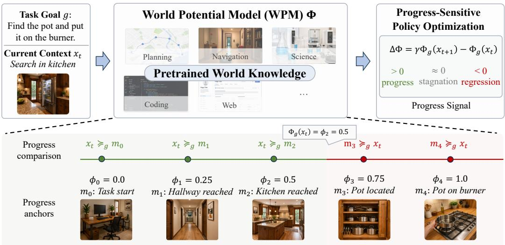

# World Potential Model: Pretrained World Knowledge as Progress Potentials

Jun Zhao<sup>1,\*,†</sup>, Jixin Tang<sup>2,\*</sup>, Yang Shu<sup>2</sup>, Jinyang Wu<sup>3</sup>, Yuyang Lu<sup>2</sup>, Jingqi Tong<sup>2</sup>, Hao Xu<sup>4</sup>, Weifeng Ge<sup>2</sup>, Qi Zhang<sup>2</sup>.

<sup>1</sup>N<sub>a</sub>ti<sub>ona</sub>l U<sub>n</sub>i<sub>vers</sub>it<sub>y</sub> <sub>o</sub>f Si<sub>ngapore</sub> <sup>2</sup>F<sub>u</sub>d<sub>an</sub> U<sub>n</sub>i<sub>vers</sub>it<sub>y</sub> <sup>3</sup>T<sub>s</sub>i<sub>ng</sub>h<sub>ua</sub> U<sub>n</sub>i<sub>vers</sub>it<sub>y</sub> <sup>4</sup>Th<sub>e</sub> U<sub>n</sub>i<sub>vers</sub>it<sub>y</sub> <sub>o</sub>f S<sub>y</sub>d<sub>ney</sub> \* E<sub>qua</sub>l <sub>con</sub>t<sub>r</sub>ib<sub>u</sub>ti<sub>on.</sub> † C<sub>orrespon</sub>di<sub>ng</sub> <sub>au</sub>th<sub>or.</sub>

## Abstract

L<sub>o</sub>n<sub>g-</sub>h<sub>o</sub>ri<sub>zo</sub>n l<sub>a</sub>n<sub>guage</sub> <sub>age</sub>nt<sub>s</sub> <sub>o</sub>ft<sub>e</sub>n r<sub>ece</sub>i<sub>ve</sub> <sub>supe</sub>r<sub>v</sub>i<sub>s</sub>i<sub>o</sub>n <sub>o</sub>nl<sub>y</sub> fr<sub>o</sub>m t<sub>e</sub>rmin<sub>a</sub>l t<sub>as</sub>k <sub>ou</sub>t<sub>co</sub>m<sub>es,</sub> l<sub>eav</sub>in<sub>g</sub> littl<sub>e s</sub>i<sub>g</sub>n<sub>a</sub>l f<sub>o</sub>r di<sub>s</sub>tin<sub>gu</sub>i<sub>s</sub>hin<sub>g p</sub>r<sub>o</sub>d<sub>uc</sub>ti<sub>ve</sub> int<sub>e</sub>rm<sub>e</sub>di<sub>a</sub>t<sub>e</sub> b<sub>e</sub>h<sub>av</sub>i<sub>o</sub>r fr<sub>o</sub>m <sub>s</sub>t<sub>ag</sub>n<sub>a</sub>ti<sub>o</sub>n <sub>o</sub>r <sub>eve</sub>n r<sub>eg</sub>r<sub>ess</sub>i<sub>o</sub>n<sub>.</sub> R<sub>a</sub>th<sub>er</sub> th<sub>an</sub> l<sub>earn</sub>i<sub>ng</sub> <sub>a</sub> <sub>separa</sub>t<sub>e</sub> <sub>va</sub>l<sub>ue</sub> f<sub>unc</sub>ti<sub>on</sub> <sub>or</sub> <sub>process</sub> <sub>rewar</sub>d <sub>mo</sub>d<sub>e</sub>l f<sub>or</sub> <sub>every</sub> t<sub>as</sub>k<sub>,</sub> <sub>we</sub> <sub>as</sub>k <sub>w</sub>h<sub>e</sub>th<sub>er</sub> <sub>pre</sub>t<sub>ra</sub>i<sub>ne</sub>d <sub>mo</sub>d<sub>e</sub>l<sub>s</sub> <sub>can</sub> <sub>recogn</sub>i<sub>ze</sub> t<sub>as</sub>k <sub>progress</sub> f<sub>rom</sub> th<sub>e</sub>i<sub>r</sub> <sub>ex</sub>i<sub>s</sub>ti<sub>ng</sub> <sub>wor</sub>ld k<sub>now</sub>l<sub>e</sub>d<sub>ge.</sub> W<sub>e</sub> f<sub>orma</sub>li<sub>ze</sub> this capability with a World Potential Model (WPM), a goal-conditioned evaluator of task-relative <sub>rea</sub>li<sub>ze</sub>d <sub>progress</sub> i<sub>n</sub> <sub>agen</sub>t <sub>con</sub>t<sub>ex</sub>t<sub>s.</sub> I<sub>n</sub> ALFW<sub>orld</sub> <sub>an</sub>d S<sub>cience</sub>W<sub>orld,</sub> <sub>o</sub>f<sub>-</sub>th<sub>e-s</sub>h<sub>e</sub>lf <sub>pre</sub>t<sub>ra</sub>i<sub>ne</sub>d <sub>mo</sub>d<sub>e</sub>l<sub>s su</sub>b<sub>s</sub>t<sub>an</sub>ti<sub>a</sub>ll<sub>y ou</sub>t<sub>per</sub>f<sub>orm c</sub>h<sub>ance a</sub>t <sub>recover</sub>i<sub>ng rea</sub>li<sub>ze</sub>d<sub>-progress s</sub>t<sub>ruc</sub>t<sub>ure w</sub>ith<sub>ou</sub>t t<sub>as</sub>k<sub>-</sub> speci<sup>fi</sup>c eva<sup>l</sup>uator <sup>fi</sup>ne-tuning. We <sup>f</sup>urt<sup>h</sup>er anc<sup>h</sup>or t<sup>h</sup>ese progress ju<sup>d</sup>gments to tas<sup>k</sup>-speci<sup>fi</sup>c mi<sup>l</sup>estones to obtain scalar world potentials, whose temporal diferences provide process-sensitive step-level credit for policy optimization. Under matched comparisons, WPM-guided optimization improves success <sub>over ou</sub>t<sub>come-on</sub>l<sub>y</sub> GRPO <sub>across a</sub>ll <sub>eva</sub>l<sub>ua</sub>t<sub>e</sub>d <sub>con</sub>fi<sub>gura</sub>ti<sub>ons.</sub> T<sub>oge</sub>th<sub>er,</sub> th<sub>ese resu</sub>lt<sub>s prov</sub>id<sub>e</sub> i<sub>n</sub>iti<sub>a</sub>l <sub>ev</sub>id<sub>ence</sub> th<sub>a</sub>t <sub>pre</sub>t<sub>ra</sub>i<sub>ne</sub>d <sub>wor</sub>ld k<sub>now</sub>l<sub>e</sub>d<sub>ge</sub> <sub>can</sub> <sub>suppor</sub>t <sub>reusa</sub>bl<sub>e</sub> <sub>rea</sub>li<sub>ze</sub>d<sub>-progress</sub> <sub>eva</sub>l<sub>ua</sub>ti<sub>on</sub> <sub>an</sub>d <sub>p</sub>r<sub>ov</sub>id<sub>e</sub> <sub>use</sub>f<sub>u</sub>l <sub>supe</sub>r<sub>v</sub>i<sub>s</sub>i<sub>o</sub>n f<sub>o</sub>r l<sub>o</sub>n<sub>g-</sub>h<sub>o</sub>ri<sub>zo</sub>n <sub>age</sub>nt<sub>s.</sub>

Correspondence: jzhao.nlp@gmail.com Code Repository: https://github.com/Gabrile166/world-potential-model

  
Figure 1 Overview of the World Potential Model (WPM) and its downstream scalarization. A WPM elicits task-relative rea<sup>l</sup>ize<sup>d</sup>-progress structure <sup>f</sup>rom pretraine<sup>d</sup> wor<sup>ld</sup> <sup>k</sup>now<sup>l</sup>e<sup>d</sup>ge, wit<sup>h</sup> or<sup>d</sup>ina<sup>l</sup> progress ju<sup>d</sup>gments as its primary inter<sup>f</sup>ace. For <sup>d</sup>ownstream use, t<sup>h</sup>ese ju<sup>d</sup>gments can <sup>b</sup>e re<sup>f</sup>erence<sup>d</sup> to tas<sup>k</sup>-speci<sup>fi</sup>c progress anc<sup>h</sup>ors to o<sup>b</sup>tain sca<sup>l</sup>ar wor<sup>ld</sup> potentia<sup>l</sup>s, <sub>w</sub>h<sub>ose</sub> t<sub>e</sub>m<sub>po</sub>r<sub>a</sub>l dif<sub>e</sub>r<sub>e</sub>n<sub>ces</sub> <sub>p</sub>r<sub>ov</sub>id<sub>e</sub> <sub>p</sub>r<sub>ocess-se</sub>n<sub>s</sub>iti<sub>ve</sub> <sub>c</sub>r<sub>e</sub>dit f<sub>o</sub>r <sub>po</sub>li<sub>cy</sub> <sub>op</sub>timi<sub>za</sub>ti<sub>o</sub>n<sub>.</sub>

## 1 Introduction

Lar<sub>g</sub>e lan<sub>g</sub>ua<sub>g</sub>e models (LLMs) are ra<sub>p</sub>idl<sub>y</sub> becomin<sub>g</sub> the co<sub>g</sub>nitive core of a<sub>g</sub>entic s<sub>y</sub>stems [1], where the<sub>y</sub> inter<sub>p</sub>ret environments [2], invoke tools [3, 4], and drive multi-ste<sub>p</sub> reasonin<sub>g</sub> [5–7] across increasin<sub>g</sub>l<sub>y</sub> <sub>comp</sub>l<sub>ex</sub> t<sub>as</sub>k<sub>s.</sub> A<sub>s</sub> th<sub>ese</sub> t<sub>as</sub>k<sub>s</sub> b<sub>ecome</sub> l<sub>onger-</sub>h<sub>or</sub>i<sub>zon,</sub> h<sub>owever,</sub> t<sub>erm</sub>i<sub>na</sub>l <sub>ou</sub>t<sub>comes a</sub>l<sub>one prov</sub>id<sub>e</sub> t<sub>oo</sub> littl<sub>e</sub> structure for evaluatin<sub>g</sub> intermediate <sub>p</sub>rocesses [8–15]. A failed trajector<sub>y</sub> ma<sub>y</sub> have made substantial <sub>p</sub>ro<sub>g</sub>ress <sup>b</sup>e<sup>f</sup>ore a <sup>l</sup>ate mista<sup>k</sup>e, w<sup>h</sup>i<sup>l</sup>e a success<sup>f</sup>u<sup>l</sup> trajectory may contain re<sup>d</sup>un<sup>d</sup>ant exp<sup>l</sup>oration, pro<sup>l</sup>onge<sup>d</sup> stagnation, <sub>o</sub>r t<sub>e</sub>m<sub>po</sub>r<sub>a</sub>r<sub>y</sub> r<sub>eg</sub>r<sub>ess</sub>i<sub>o</sub>n<sub>.</sub> L<sub>o</sub>n<sub>g-</sub>h<sub>o</sub>ri<sub>zo</sub>n <sub>age</sub>nt<sub>s</sub> th<sub>e</sub>r<sub>e</sub>f<sub>o</sub>r<sub>e</sub> n<sub>ee</sub>d <sub>a</sub> <sub>way</sub> t<sub>o</sub> di<sub>s</sub>tin<sub>gu</sub>i<sub>s</sub>h <sub>p</sub>r<sub>o</sub>d<sub>uc</sub>ti<sub>ve</sub> int<sub>e</sub>rm<sub>e</sub>di<sub>a</sub>t<sub>e</sub> b<sub>e</sub>h<sub>av</sub>i<sub>or</sub> b<sub>e</sub>f<sub>ore</sub> th<sub>e</sub> fi<sub>na</sub>l <sub>ou</sub>t<sub>come</sub> i<sub>s</sub> k<sub>nown.</sub>

V<sub>a</sub>l<sub>ue</sub> f<sub>u</sub>n<sub>c</sub>ti<sub>o</sub>n<sub>s</sub> <sub>a</sub>nd <sub>p</sub>r<sub>ocess</sub> r<sub>ewa</sub>rd m<sub>o</sub>d<sub>e</sub>l<sub>s</sub> <sub>p</sub>r<sub>ov</sub>id<sub>e</sub> <sub>o</sub>n<sub>e</sub> r<sub>ou</sub>t<sub>e</sub> t<sub>o</sub> d<sub>e</sub>n<sub>se</sub>r <sub>supe</sub>r<sub>v</sub>i<sub>s</sub>i<sub>o</sub>n b<sub>y</sub> <sub>es</sub>tim<sub>a</sub>tin<sub>g</sub> f<sub>u</sub>t<sub>u</sub>r<sub>e</sub> return or scorin<sub>g</sub> intermediate behavior [16, 17]. These evaluators can be efective, but t<sub>yp</sub>icall<sub>y</sub> rel<sub>y</sub> on task-<sub>spec</sub>ifi<sub>c</sub> <sub>a</sub>nn<sub>o</sub>t<sub>a</sub>ti<sub>o</sub>n <sub>a</sub>nd tr<sub>a</sub>inin<sub>g.</sub> F<sub>o</sub>r <sub>age</sub>nt<sub>s</sub> <sub>e</sub>x<sub>pec</sub>t<sub>e</sub>d t<sub>o</sub> <sub>ope</sub>r<sub>a</sub>t<sub>e</sub> <sub>ac</sub>r<sub>oss</sub> h<sub>e</sub>t<sub>e</sub>r<sub>oge</sub>n<sub>eous</sub> t<sub>as</sub>k<sub>s</sub> <sub>a</sub>nd <sub>e</sub>n<sub>v</sub>ir<sub>o</sub>nm<sub>e</sub>nt<sub>s,</sub> <sub>repea</sub>t<sub>e</sub>dl<sub>y</sub> <sub>cons</sub>t<sub>ruc</sub>ti<sub>ng</sub> <sub>a</sub> <sub>new</sub> <sub>eva</sub>l<sub>ua</sub>t<sub>or</sub> <sub>may</sub> b<sub>e</sub> <sub>expens</sub>i<sub>ve</sub> <sub>an</sub>d difi<sub>cu</sub>lt t<sub>o</sub> <sub>sca</sub>l<sub>e.</sub> Thi<sub>s</sub> <sub>ra</sub>i<sub>ses</sub> <sub>a</sub> <sub>comp</sub>l<sub>emen</sub>t<sub>ary</sub> question: must progress evaluation itself require learning a task-specific evaluator, or can it be elicited from knowledge already acquired during pretraining?

P<sub>re</sub>t<sub>ra</sub>i<sub>ne</sub>d f<sub>oun</sub>d<sub>a</sub>ti<sub>on mo</sub>d<sub>e</sub>l<sub>s encoun</sub>t<sub>er</sub> b<sub>roa</sub>d d<sub>escr</sub>i<sub>p</sub>ti<sub>ons o</sub>f <sub>proce</sub>d<sub>ures, p</sub>h<sub>ys</sub>i<sub>ca</sub>l i<sub>n</sub>t<sub>erac</sub>ti<sub>ons, causa</sub>l relationshi<sub>p</sub>s, and the structure of com<sub>p</sub>lex tasks [18–21]. Such knowled<sub>g</sub>e <sub>p</sub>rovides a <sub>p</sub>lausible basis for <sub>recogn</sub>i<sub>z</sub>i<sub>ng no</sub>t <sub>on</sub>l<sub>y w</sub>h<sub>e</sub>th<sub>er an</sub> i<sub>n</sub>di<sub>v</sub>id<sub>ua</sub>l <sub>ac</sub>ti<sub>on</sub> i<sub>s p</sub>l<sub>aus</sub>ibl<sub>e,</sub> b<sub>u</sub>t <sub>a</sub>l<sub>so w</sub>h<sub>a</sub>t h<sub>as a</sub>l<sub>rea</sub>d<sub>y</sub> b<sub>een accomp</sub>li<sub>s</sub>h<sub>e</sub>d in an evo<sup>l</sup>ving agent context. For examp<sup>l</sup>e, acquiring a require<sup>d</sup> o<sup>b</sup>ject, reso<sup>l</sup>ving a constraint, or comp<sup>l</sup>eting a n<sub>ecessa</sub>r<sub>y</sub> <sub>su</sub>b<sub>p</sub>r<sub>oce</sub>d<sub>u</sub>r<sub>e</sub> m<sub>ay</sub> r<sub>ep</sub>r<sub>ese</sub>nt m<sub>ea</sub>nin<sub>g</sub>f<sub>u</sub>l <sub>p</sub>r<sub>og</sub>r<sub>ess,</sub> wh<sub>e</sub>r<sub>eas</sub> <sub>u</sub>nd<sub>o</sub>in<sub>g</sub> <sub>a</sub> <sub>sa</sub>ti<sub>s</sub>fi<sub>e</sub>d <sub>co</sub>nditi<sub>o</sub>n m<sub>ay</sub> r<sub>ep</sub>r<sub>ese</sub>nt r<sub>eg</sub>r<sub>ess</sub>i<sub>o</sub>n<sub>.</sub> Thi<sub>s</sub> <sub>sugges</sub>t<sub>s</sub> th<sub>a</sub>t <sub>p</sub>r<sub>e</sub>tr<sub>a</sub>in<sub>e</sub>d m<sub>o</sub>d<sub>e</sub>l<sub>s</sub> m<sub>ay</sub> <sub>suppo</sub>rt <sub>a</sub> r<sub>eusa</sub>bl<sub>e</sub> <sub>capa</sub>bilit<sub>y</sub> f<sub>o</sub>r r<sub>ecog</sub>ni<sub>z</sub>in<sub>g</sub> r<sub>ea</sub>li<sub>ze</sub>d t<sub>as</sub>k <sub>p</sub>r<sub>og</sub>r<sub>ess</sub> <sub>w</sub>ith<sub>ou</sub>t t<sub>as</sub>k<sub>-spec</sub>ifi<sub>c</sub> <sub>eva</sub>l<sub>ua</sub>t<sub>o</sub>r tr<sub>a</sub>inin<sub>g.</sub>

We formalize this hypothesized capability through the abstraction of a World Potential Model (WPM). Given a task goal, a WPM evaluates the goal-relevant progress already realized in an agent context using pretrained world knowledge. We call the resulting task-relative progress structure world potential. Because globally ca<sup>l</sup>i<sup>b</sup>rate<sup>d</sup> sca<sup>l</sup>ar progress is <sup>d</sup>i<sup>fi</sup>cu<sup>l</sup>t to <sup>d</sup>e<sup>fi</sup>ne across open-en<sup>d</sup>e<sup>d</sup> tas<sup>k</sup>s, we ta<sup>k</sup>e or<sup>d</sup>ina<sup>l</sup> ju<sup>d</sup>gments o<sup>f</sup> re<sup>l</sup>ative <sub>p</sub>r<sub>og</sub>r<sub>ess</sub> <sub>as</sub> th<sub>e</sub> <sub>p</sub>rim<sub>a</sub>r<sub>y</sub> int<sub>e</sub>rf<sub>ace</sub> t<sub>o</sub> thi<sub>s</sub> <sub>s</sub>tr<sub>uc</sub>t<sub>u</sub>r<sub>e.</sub> T<sub>o</sub> <sub>o</sub>bt<sub>a</sub>in <sub>a</sub> <sub>sca</sub>l<sub>a</sub>r <sub>po</sub>t<sub>e</sub>nti<sub>a</sub>l f<sub>o</sub>r d<sub>ow</sub>n<sub>s</sub>tr<sub>ea</sub>m <sub>use,</sub> <sub>we</sub> intro<sup>d</sup>uce one concrete instantiation t<sup>h</sup>at anc<sup>h</sup>ors t<sup>h</sup>ese ju<sup>d</sup>gments to or<sup>d</sup>ere<sup>d</sup> tas<sup>k</sup>-speci<sup>fi</sup>c mi<sup>l</sup>estones. T<sup>h</sup>e <sub>resu</sub>lti<sub>ng</sub> t<sub>as</sub>k<sub>-</sub>l<sub>oca</sub>l <sub>po</sub>t<sub>en</sub>ti<sub>a</sub>l<sub>s</sub> <sub>can</sub> th<sub>en</sub> <sub>prov</sub>id<sub>e</sub> <sub>s</sub>t<sub>ep-</sub>l<sub>eve</sub>l <sub>progress</sub> <sub>s</sub>i<sub>gna</sub>l<sub>s</sub> th<sub>roug</sub>h th<sub>e</sub>i<sub>r</sub> t<sub>empora</sub>l dif<sub>erences.</sub>

We stud<sub>y</sub> the WPM abstraction and its downstream utilit<sub>y</sub> in ALFWorld [22] and ScienceWorld [23], two <sub>s</sub>t<sub>ruc</sub>t<sub>ure</sub>d l<sub>ong-</sub>h<sub>or</sub>i<sub>zon env</sub>i<sub>ronmen</sub>t<sub>s</sub> i<sub>n w</sub>hi<sub>c</sub>h <sub>pr</sub>i<sub>v</sub>il<sub>ege</sub>d <sub>progress s</sub>i<sub>gna</sub>l<sub>s ena</sub>bl<sub>e con</sub>t<sub>ro</sub>ll<sub>e</sub>d <sub>eva</sub>l<sub>ua</sub>ti<sub>on.</sub> A<sub>cross</sub> b<sub>o</sub>th <sub>env</sub>i<sub>ronmen</sub>t<sub>s,</sub> <sub>o</sub>f<sub>-</sub>th<sub>e-s</sub>h<sub>e</sub>lf <sub>pre</sub>t<sub>ra</sub>i<sub>ne</sub>d <sub>mo</sub>d<sub>e</sub>l<sub>s</sub> <sub>su</sub>b<sub>s</sub>t<sub>an</sub>ti<sub>a</sub>ll<sub>y</sub> <sub>ou</sub>t<sub>per</sub>f<sub>orm</sub> <sub>c</sub>h<sub>ance</sub> <sub>a</sub>t <sub>recover</sub>i<sub>ng</sub> r<sub>ea</sub>li<sub>ze</sub>d<sub>-p</sub>r<sub>og</sub>r<sub>ess</sub> <sub>s</sub>tr<sub>uc</sub>t<sub>u</sub>r<sub>e</sub> <sub>w</sub>ith<sub>ou</sub>t t<sub>as</sub>k<sub>-spec</sub>ifi<sub>c</sub> <sub>eva</sub>l<sub>ua</sub>t<sub>o</sub>r fin<sub>e-</sub>t<sub>u</sub>nin<sub>g,</sub> <sub>p</sub>r<sub>ov</sub>idin<sub>g</sub> <sub>ev</sub>id<sub>e</sub>n<sub>ce</sub> f<sub>o</sub>r th<sub>e</sub> <sub>e</sub>xi<sub>s</sub>t<sub>e</sub>n<sub>ce</sub> of the progress-recognition capability underlying WPMs. We further find that, when these judgments are <sub>anc</sub>h<sub>ore</sub>d t<sub>o</sub> t<sub>as</sub>k<sub>-spec</sub>ifi<sub>c m</sub>il<sub>es</sub>t<sub>ones,</sub> th<sub>e resu</sub>lti<sub>ng sca</sub>l<sub>ar po</sub>t<sub>en</sub>ti<sub>a</sub>l<sub>s prov</sub>id<sub>e use</sub>f<sub>u</sub>l d<sub>owns</sub>t<sub>ream superv</sub>i<sub>s</sub>i<sub>on:</sub> under matched comparisons, WPM-guided optimization improves success over outcome-only GRPO across <sub>a</sub>ll <sub>eva</sub>l<sub>ua</sub>t<sub>e</sub>d <sub>con</sub>fi<sub>gura</sub>ti<sub>ons.</sub>

This paper makes three contributions. First, we introduce the World Potential Model, a general abstraction for <sub>e</sub>li<sub>c</sub>iti<sub>ng</sub> t<sub>as</sub>k<sub>-re</sub>l<sub>a</sub>ti<sub>ve rea</sub>li<sub>ze</sub>d <sub>progress</sub> f<sub>rom pre</sub>t<sub>ra</sub>i<sub>ne</sub>d <sub>wor</sub>ld k<sub>now</sub>l<sub>e</sub>d<sub>ge.</sub> S<sub>econ</sub>d<sub>, we</sub> d<sub>eve</sub>l<sub>op a prac</sub>ti<sub>ca</sub>l <sup>f</sup>ramewor<sup>k f</sup>or turning rea<sup>l</sup>ize<sup>d</sup>-progress ju<sup>d</sup>gments into tas<sup>k</sup>-<sup>l</sup>oca<sup>l</sup> sca<sup>l</sup>ar potentia<sup>l</sup>s <sup>f</sup>or <sup>l</sup>ong-<sup>h</sup>orizon agents. Third, we show how world potentials can provide process-sensitive supervision for sparse-reward policy <sub>op</sub>timi<sub>za</sub>ti<sub>o</sub>n<sub>.</sub> T<sub>oge</sub>th<sub>e</sub>r<sub>,</sub> <sub>ou</sub>r r<sub>esu</sub>lt<sub>s</sub> <sub>p</sub>r<sub>ov</sub>id<sub>e</sub> initi<sub>a</sub>l <sub>ev</sub>id<sub>e</sub>n<sub>ce</sub> th<sub>a</sub>t r<sub>ea</sub>li<sub>ze</sub>d<sub>-p</sub>r<sub>og</sub>r<sub>ess</sub> <sub>eva</sub>l<sub>ua</sub>ti<sub>o</sub>n i<sub>s</sub> <sub>a</sub> r<sub>eusa</sub>bl<sub>e</sub> <sub>capa</sub>bilit<sub>y</sub> <sub>o</sub>f <sub>pre</sub>t<sub>ra</sub>i<sub>ne</sub>d <sub>mo</sub>d<sub>e</sub>l<sub>s</sub> <sub>an</sub>d <sub>a</sub> <sub>use</sub>f<sub>u</sub>l <sub>source</sub> <sub>o</sub>f <sub>superv</sub>i<sub>s</sub>i<sub>on</sub> f<sub>or</sub> l<sub>ong-</sub>h<sub>or</sub>i<sub>zon</sub> <sub>agen</sub>t<sub>s.</sub>

## 2 Problem Setup and World Potential Models

## 2.1 Long-Horizon Sparse-Reward Agent Tasks

W<sub>e</sub> <sub>cons</sub>id<sub>er</sub> <sub>a</sub> fi<sub>n</sub>it<sub>e-</sub>h<sub>or</sub>i<sub>zon</sub> <sub>ep</sub>i<sub>so</sub>di<sub>c</sub> t<sub>as</sub>k <sub>spec</sub>ifi<sub>e</sub>d b<sub>y</sub> <sub>a</sub> <sub>goa</sub>l <sub>or</sub> i<sub>ns</sub>t<sub>ruc</sub>ti<sub>on</sub> <sub>�.</sub> Th<sub>e</sub> <sub>env</sub>i<sub>ronmen</sub>t <sub>may</sub> b<sub>e</sub> <sub>par</sub>ti<sub>a</sub>ll<sub>y</sub> <sub>o</sub>b<sub>serva</sub>bl<sub>e.</sub> At <sub>s</sub>t<sub>ep</sub> �<sub>,</sub> l<sub>e</sub>t $x _ { t }$ d<sub>e</sub>n<sub>o</sub>t<sub>e</sub> th<sub>e</sub> <sub>age</sub>nt<sub>-v</sub>i<sub>s</sub>ibl<sub>e</sub> int<sub>e</sub>r<sub>ac</sub>ti<sub>o</sub>n <sub>co</sub>nt<sub>e</sub>xt<sub>,</sub> <sub>co</sub>m<sub>p</sub>ri<sub>s</sub>in<sub>g</sub> th<sub>e</sub> inf<sub>o</sub>rm<sub>a</sub>ti<sub>o</sub>n

<sub>ava</sub>il<sub>a</sub>bl<sub>e</sub> fr<sub>o</sub>m th<sub>e</sub> int<sub>e</sub>r<sub>ac</sub>ti<sub>o</sub>n hi<sub>s</sub>t<sub>o</sub>r<sub>y,</sub> in<sub>c</sub>l<sub>u</sub>din<sub>g</sub> <sub>o</sub>b<sub>se</sub>r<sub>va</sub>ti<sub>o</sub>n<sub>s,</sub> <sub>p</sub>r<sub>ev</sub>i<sub>ous</sub> <sub>ac</sub>ti<sub>o</sub>n<sub>s,</sub> t<sub>oo</sub>l <sub>ou</sub>t<sub>pu</sub>t<sub>s,</sub> int<sub>e</sub>rm<sub>e</sub>di<sub>a</sub>t<sub>e</sub> <sub>reason</sub>i<sub>ng, memory, an</sub>d <sub>o</sub>th<sub>er</sub> t<sub>as</sub>k<sub>-re</sub>l<sub>evan</sub>t i<sub>n</sub>f<sub>orma</sub>ti<sub>on.</sub> Th<sub>e po</sub>li<sub>cy con</sub>diti<sub>ons on</sub> b<sub>o</sub>th th<sub>e</sub> t<sub>as</sub>k <sub>goa</sub>l <sub>an</sub>d th<sub>e</sub> current context<sub>,</sub>

$$
a _ { t } \sim \pi ( \cdot \mid g , x _ { t } ) .\tag{1}
$$

Aft<sub>er</sub> th<sub>e ac</sub>ti<sub>on</sub> i<sub>s execu</sub>t<sub>e</sub>d<sub>,</sub> th<sub>e env</sub>i<sub>ronmen</sub>t <sub>re</sub>t<sub>urns new</sub> f<sub>ee</sub>db<sub>ac</sub>k <sub>or o</sub>b<sub>serva</sub>ti<sub>ons, w</sub>hi<sub>c</sub>h <sub>are</sub> i<sub>ncorpora</sub>t<sub>e</sub>d i<sub>n</sub>t<sub>o</sub> th<sub>e</sub> i<sub>n</sub>t<sub>erac</sub>ti<sub>on con</sub>t<sub>ex</sub>t t<sub>o</sub> f<sub>orm</sub> $x _ { t + 1 }$ . <sup>A</sup> trajectory is t<sup>h</sup>ere<sup>f</sup>ore represente<sup>d</sup> as

$$
\tau = ( x _ { 0 } , a _ { 0 } , x _ { 1 } , a _ { 1 } , . . . , x _ { T } ) .\tag{2}
$$

Thi<sub>s</sub> f<sub>ormu</sub>l<sub>a</sub>ti<sub>on</sub> <sub>accommo</sub>d<sub>a</sub>t<sub>es</sub> <sub>em</sub>b<sub>o</sub>di<sub>e</sub>d<sub>,</sub> <sub>we</sub>b<sub>,</sub> <sub>so</sub>ft<sub>ware,</sub> <sub>an</sub>d t<sub>oo</sub>l<sub>-us</sub>i<sub>ng</sub> <sub>agen</sub>t<sub>s</sub> <sub>w</sub>h<sub>ose</sub> d<sub>ec</sub>i<sub>s</sub>i<sub>ons</sub> d<sub>epen</sub>d <sub>on</sub> <sub>an evo</sub>l<sub>v</sub>i<sub>ng</sub> i<sub>n</sub>t<sub>erac</sub>ti<sub>on con</sub>t<sub>ex</sub>t <sub>ra</sub>th<sub>er</sub> th<sub>an a compac</sub>t f<sub>u</sub>ll<sub>y o</sub>b<sub>serve</sub>d <sub>env</sub>i<sub>ronmen</sub>t <sub>s</sub>t<sub>a</sub>t<sub>e.</sub> W<sub>e</sub> d<sub>o no</sub>t <sub>requ</sub>i<sub>re</sub> th<sub>e agen</sub>t<sub>-v</sub>i<sub>s</sub>ibl<sub>e con</sub>t<sub>ex</sub>t it<sub>se</sub>lf t<sub>o</sub> b<sub>e</sub> M<sub>ar</sub>k<sub>ov.</sub>

W<sub>e</sub> f<sub>ocus</sub> <sub>o</sub>n <sub>spa</sub>r<sub>se,</sub> <sub>ou</sub>t<sub>co</sub>m<sub>e-o</sub>nl<sub>y</sub> <sub>supe</sub>r<sub>v</sub>i<sub>s</sub>i<sub>o</sub>n<sub>:</sub>

$$
r _ { t } ^ { \mathrm { e n v } } = { \left\{ \begin{array} { l l } { 0 , } & { t < T - 1 , } \\ { R ( \tau ) , } & { t = T - 1 , } \end{array} \right. }\tag{3}
$$

<sub>w</sub>h<sub>ere</sub> $R ( \tau )$ d<sub>eno</sub>t<sub>es</sub> th<sub>e</sub> t<sub>erm</sub>i<sub>na</sub>l t<sub>as</sub>k <sub>ou</sub>t<sub>come an</sub>d i<sub>s</sub> bi<sub>nary</sub> i<sub>n our exper</sub>i<sub>men</sub>t<sub>s.</sub> S<sub>uc</sub>h f<sub>ee</sub>db<sub>ac</sub>k d<sub>e</sub>t<sub>erm</sub>i<sub>nes</sub> <sub>w</sub>h<sub>e</sub>th<sub>er</sub> th<sub>e ep</sub>i<sub>so</sub>d<sub>e u</sub>lti<sub>ma</sub>t<sub>e</sub>l<sub>y succee</sub>d<sub>s,</sub> b<sub>u</sub>t <sub>prov</sub>id<sub>es</sub> littl<sub>e</sub> di<sub>rec</sub>t i<sub>n</sub>f<sub>orma</sub>ti<sub>on a</sub>b<sub>ou</sub>t th<sub>e goa</sub>l<sub>-re</sub>l<sub>evan</sub>t <sub>p</sub>r<sub>og</sub>r<sub>ess</sub> r<sub>ea</sub>li<sub>ze</sub>d <sub>a</sub>t int<sub>e</sub>rm<sub>e</sub>di<sub>a</sub>t<sub>e co</sub>nt<sub>e</sub>xt<sub>s.</sub>

## 2.2 World Potential Models

World potential. For a task goal $^ { g , }$ a World Potential Model (WPM) is an evaluator that uses pretrained <sub>wor</sub>ld k<sub>now</sub>l<sub>e</sub>d<sub>ge</sub> t<sub>o assess an agen</sub>t <sub>con</sub>t<sub>ex</sub>t <sub>�</sub> i<sub>n</sub> t<sub>erms o</sub>f th<sub>e goa</sub>l<sub>-re</sub>l<sub>evan</sub>t <sub>progress a</sub>l<sub>rea</sub>d<sub>y rea</sub>li<sub>ze</sub>d t<sub>owar</sub>d $g .$ We refer to the resulting task-relative progress structure as world potential. The target is retrospective: it <sub>c</sub>h<sub>arac</sub>t<sub>er</sub>i<sub>zes w</sub>h<sub>a</sub>t h<sub>as a</sub>l<sub>rea</sub>d<sub>y</sub> b<sub>een accomp</sub>li<sub>s</sub>h<sub>e</sub>d i<sub>n</sub> th<sub>e curren</sub>t <sub>con</sub>t<sub>ex</sub>t<sub>, ra</sub>th<sub>er</sub> th<sub>an pre</sub>di<sub>c</sub>ti<sub>ng</sub> f<sub>u</sub>t<sub>ure</sub> return. A WPM need not directly produce a globally calibrated numerical progress score. Instead, we take or<sup>d</sup>ina<sup>l</sup> ju<sup>d</sup>gments o<sup>f</sup> re<sup>l</sup>ative rea<sup>l</sup>ize<sup>d</sup> progress as its primary inter<sup>f</sup>ace, an<sup>d</sup> intro<sup>d</sup>uce a tas<sup>k</sup>-<sup>l</sup>oca<sup>l</sup> sca<sup>l</sup>ar <sub>re resen</sub>t<sub>a</sub>ti<sub>on on</sub>l <sub>w</sub>h<sub>en nee</sub>d<sub>e</sub>d f<sub>or</sub> d<sub>owns</sub>t<sub>ream use.</sub>

Ordinal progress interface. Given two contexts $x _ { i }$ <sub>an</sub>d $x _ { j }$ from the same task instance, a WPM compares th<sub>e</sub>ir r<sub>e</sub>l<sub>a</sub>ti<sub>ve</sub> r<sub>ea</sub>li<sub>ze</sub>d <sub>p</sub>r<sub>og</sub>r<sub>ess.</sub> W<sub>e</sub> <sub>w</sub>rit<sub>e</sub>

$$
x _ { i } \succeq _ { g } x _ { j } ,\tag{4}
$$

when the WPM judges $x _ { i }$ t<sub>o</sub> <sub>em</sub>b<sub>o</sub>d<sub>y</sub> <sub>a</sub>t l<sub>eas</sub>t <sub>as</sub> <sub>muc</sub>h <sub>goa</sub>l<sub>-re</sub>l<sub>evan</sub>t <sub>rea</sub>li<sub>ze</sub>d <sub>progress</sub> t<sub>owar</sub>d $g$ as $x _ { j } .$ <sub>.</sub> R<sub>e</sub>l<sub>a</sub>ti<sub>ve</sub> <sub>p</sub>r<sub>og</sub>r<sub>ess</sub> <sub>ca</sub>n b<sub>e</sub> m<sub>ea</sub>nin<sub>g</sub>f<sub>u</sub>l <sub>eve</sub>n wh<sub>e</sub>n <sub>a</sub>n <sub>a</sub>b<sub>so</sub>l<sub>u</sub>t<sub>e</sub> <sub>p</sub>r<sub>og</sub>r<sub>ess</sub> <sub>sco</sub>r<sub>e</sub> i<sub>s</sub> n<sub>o</sub>t<sub>.</sub> F<sub>o</sub>r <sub>e</sub>x<sub>a</sub>m<sub>p</sub>l<sub>e,</sub> <sub>a</sub>ft<sub>e</sub>r <sub>a</sub>n <sub>age</sub>nt <sub>acqu</sub>ir<sub>es</sub> a necessary c<sup>l</sup>ue, it may <sup>b</sup>e natura<sup>l</sup> to ju<sup>d</sup>ge t<sup>h</sup>e resu<sup>l</sup>ting context as representing greater rea<sup>l</sup>ize<sup>d</sup> progress th<sub>a</sub>n th<sub>e p</sub>r<sub>ece</sub>din<sub>g o</sub>n<sub>e, w</sub>hil<sub>e ass</sub>i<sub>g</sub>nin<sub>g e</sub>ith<sub>e</sub>r <sub>co</sub>nt<sub>e</sub>xt <sub>a g</sub>l<sub>o</sub>b<sub>a</sub>ll<sub>y</sub> m<sub>ea</sub>nin<sub>g</sub>f<sub>u</sub>l <sub>sco</sub>r<sub>e suc</sub>h <sub>as</sub> “0<sub>.</sub>63 <sub>co</sub>m<sub>p</sub>l<sub>e</sub>t<sub>e</sub>” is considerably less well-defined. The relation is task-relative: a WPM need not place unrelated tasks on a <sub>common</sub> <sub>numer</sub>i<sub>ca</sub>l <sub>sca</sub>l<sub>e,</sub> b<sub>u</sub>t <sub>on</sub>l<sub>y</sub> <sub>compare</sub> <sub>rea</sub>li<sub>ze</sub>d <sub>progress</sub> <sub>w</sub>ithi<sub>n</sub> th<sub>e</sub> t<sub>as</sub>k b<sub>e</sub>i<sub>ng</sub> <sub>eva</sub>l<sub>ua</sub>t<sub>e</sub>d<sub>.</sub> Li<sub>s</sub>ti<sub>ng</sub> 1 i<sub>n</sub> A<sub>ppe</sub>ndix A<sub>.</sub>1 <sub>g</sub>i<sub>ves</sub> th<sub>e pa</sub>ir<sub>w</sub>i<sub>se p</sub>r<sub>o</sub>m<sub>p</sub>t <sub>use</sub>d in <sub>ou</sub>r im<sub>p</sub>l<sub>e</sub>m<sub>e</sub>nt<sub>a</sub>ti<sub>o</sub>n<sub>.</sub>

## 2.3 Anchored Scalar World Potentials

The ordinal WPM interface in Section 2.2 does not require a numerical notion of progress. For downstream <sub>app</sub>li<sub>ca</sub>ti<sub>ons</sub> th<sub>a</sub>t <sub>requ</sub>i<sub>re</sub> <sub>a</sub> <sub>sca</sub>l<sub>ar</sub> <sub>s</sub>i<sub>gna</sub>l<sub>,</sub> <sub>we</sub> i<sub>n</sub>t<sub>ro</sub>d<sub>uce</sub> <sub>a</sub> t<sub>as</sub>k<sub>-</sub>l<sub>oca</sub>l <sub>re</sub>f<sub>erence</sub> f<sub>rame</sub> <sub>cons</sub>i<sub>s</sub>ti<sub>ng</sub> <sub>o</sub>f <sub>or</sub>d<sub>ere</sub>d p<sup>ro</sup>g<sup>ress</sup> <sup>anchors</sup>,

$$
M _ { g } = \{ ( m _ { k } , \phi _ { k } ) \} _ { k = 0 } ^ { K } ,\tag{5}
$$

<sub>w</sub>h<sub>ere</sub> <sub>eac</sub>h $m _ { k }$ d<sub>escr</sub>ib<sub>es</sub> <sub>a</sub> <sub>ver</sub>ifi<sub>a</sub>bl<sub>e</sub> <sub>goa</sub>l<sub>-re</sub>l<sub>evan</sub>t <sub>accomp</sub>li<sub>s</sub>h<sub>men</sub>t <sub>an</sub>d $\phi _ { k }$ <sub>ass</sub>i<sub>gns</sub> it <sub>a</sub> t<sub>as</sub>k<sub>-</sub>l<sub>oca</sub>l <sub>sca</sub>l<sub>ar</sub> <sub>coo</sub>rdin<sub>a</sub>t<sub>e.</sub> Th<sub>e a</sub>n<sub>c</sub>h<sub>o</sub>r<sub>s</sub> r<sub>a</sub>n<sub>ge</sub> fr<sub>o</sub>m t<sub>as</sub>k initi<sub>a</sub>ti<sub>o</sub>n t<sub>o co</sub>m<sub>p</sub>l<sub>e</sub>ti<sub>o</sub>n<sub>, w</sub>ith �<sub>0</sub> r<sub>ep</sub>r<sub>ese</sub>ntin<sub>g</sub> n<sub>o</sub> m<sub>ea</sub>nin<sub>g</sub>f<sub>u</sub>l

p<sup>ro</sup>g<sup>ress</sup> <sup>and</sup> $m _ { K }$ r<sub>ep</sub>r<sub>ese</sub>ntin<sub>g</sub> t<sub>as</sub>k <sub>co</sub>m<sub>p</sub>l<sub>e</sub>ti<sub>o</sub>n<sub>,</sub> <sub>a</sub>nd

$$
0 = \phi _ { 0 } < \phi _ { 1 } < \cdots < \phi _ { K } = 1 .\tag{6}
$$

Th<sub>ese</sub> <sub>coor</sub>di<sub>na</sub>t<sub>es</sub> <sub>nee</sub>d <sub>on</sub>l<sub>y</sub> b<sub>e</sub> <sub>mean</sub>i<sub>ng</sub>f<sub>u</sub>l <sub>w</sub>ithi<sub>n</sub> th<sub>e</sub> t<sub>as</sub>k<sub>;</sub> <sub>no</sub> <sub>numer</sub>i<sub>ca</sub>l <sub>ca</sub>lib<sub>ra</sub>ti<sub>on</sub> <sub>across</sub> <sub>unre</sub>l<sub>a</sub>t<sub>e</sub>d t<sub>as</sub>k<sub>s</sub> i<sub>s</sub> <sub>assume</sub>d<sub>.</sub>

Gi<sub>ven</sub> <sub>an</sub> i<sub>n</sub>t<sub>erme</sub>di<sub>a</sub>t<sub>e</sub> <sub>con</sub>t<sub>ex</sub>t $x _ { t } ,$ the WPM localizes its realized progress relative to the ordered anchors. We d<sub>e</sub>fi<sub>ne</sub>

$$
z _ { t } = \operatorname* { m a x } \{ k \mid x _ { t } \geq _ { g } m _ { k } \} ,\tag{7}
$$

<sub>w</sub>h<sub>ere</sub> $z _ { t }$ d<sub>eno</sub>t<sub>es</sub> th<sub>e</sub> <sub>mos</sub>t <sub>a</sub>d<sub>vance</sub>d <sub>anc</sub>h<sub>or</sub> <sub>re</sub>l<sub>a</sub>ti<sub>ve</sub> t<sub>o</sub> <sub>w</sub>hi<sub>c</sub>h $x _ { t }$ is ju<sup>d</sup>ge<sup>d</sup> to em<sup>b</sup>o<sup>d</sup>y at <sup>l</sup>east as muc<sup>h</sup> goal-relevant realized progress. The corresponding scalar world potential is

$$
\Phi _ { g } ( x _ { t } ) = \phi _ { z _ { t } } .\tag{8}
$$

Thi<sub>s cons</sub>t<sub>ruc</sub>ti<sub>on separa</sub>t<sub>es</sub> t<sub>as</sub>k<sub>-</sub>l<sub>oca</sub>l <sub>ca</sub>lib<sub>ra</sub>ti<sub>on</sub> f<sub>rom progress eva</sub>l<sub>ua</sub>ti<sub>on.</sub> Th<sub>e anc</sub>h<sub>ors spec</sub>if<sub>y a sparse</sub> reference frame for the task, while the frozen WPM supplies the evaluative mapping that places arbitrary <sub>agen</sub>t <sub>con</sub>t<sub>ex</sub>t<sub>s</sub> <sub>on</sub>t<sub>o</sub> th<sub>a</sub>t f<sub>rame</sub> <sub>us</sub>i<sub>ng</sub> <sub>pre</sub>t<sub>ra</sub>i<sub>ne</sub>d k<sub>now</sub>l<sub>e</sub>d<sub>ge.</sub>

Th<sub>e</sub> f<sub>ormu</sub>l<sub>a</sub>ti<sub>on</sub> it<sub>se</sub>lf i<sub>s</sub> <sub>agnos</sub>ti<sub>c</sub> t<sub>o</sub> h<sub>ow</sub> th<sub>e</sub> <sub>re</sub>f<sub>erence</sub> f<sub>rame</sub> i<sub>s</sub> <sub>o</sub>bt<sub>a</sub>i<sub>ne</sub>d<sub>.</sub> I<sub>n</sub> <sub>our</sub> <sub>exper</sub>i<sub>men</sub>t<sub>s,</sub> <sub>we</sub> i<sub>ns</sub>t<sub>an</sub>ti<sub>a</sub>t<sub>e</sub> $M _ { g }$ once per tas<sup>k</sup> <sup>f</sup>rom t<sup>h</sup>e tas<sup>k</sup> <sup>d</sup>escription an<sup>d</sup> a sing<sup>l</sup>e success<sup>f</sup>u<sup>l</sup> expert trajectory. T<sup>h</sup>e resu<sup>l</sup>ting anc<sup>h</sup>ors are then fixed, and the successful trajectory is not provided when the WPM evaluates new agent contexts. A<sub>ppe</sub>ndix $\mathrm { A } . 2$ d<sub>escr</sub>ib<sub>es</sub> thi<sub>s</sub> <sub>cons</sub>t<sub>ruc</sub>ti<sub>on</sub> i<sub>n</sub> d<sub>e</sub>t<sub>a</sub>il<sub>.</sub>

## 2.4 Relation to Existing Abstractions

World Potential Models are related to value functions, reward models, and world models, but difer in what they <sub>eva</sub>l<sub>ua</sub>t<sub>e an</sub>d h<sub>ow</sub> th<sub>a</sub>t <sub>eva</sub>l<sub>ua</sub>ti<sub>on</sub> i<sub>s o</sub>bt<sub>a</sub>i<sub>ne</sub>d<sub>.</sub>

Value functions. Both value functions and WPMs evaluate an agent context or state, but their targets difer fundamentally. A policy-conditioned value function $V ^ { \pi } ( x )$ is prospective: it estimates the expected future return <sub>o</sub>bt<sub>a</sub>i<sub>na</sub>bl<sub>e</sub> f<sub>rom</sub> <sub>�</sub> <sub>un</sub>d<sub>er</sub> <sub>po</sub>li<sub>cy</sub> $\pi ,$ and therefore generally depends on the policy being evaluated. A WPM is retrospective: it evaluates the goal-relevant progress already realized in the current context rather than predicting future return. This progress judgment is defined independently of the policy that produced the <sub>con</sub>t<sub>ex</sub>t<sub>.</sub> T<sub>wo con</sub>t<sub>ex</sub>t<sub>s may</sub> th<sub>ere</sub>f<sub>ore em</sub>b<sub>o</sub>d<sub>y s</sub>i<sub>m</sub>il<sub>ar rea</sub>li<sub>ze</sub>d <sub>progress even</sub> if th<sub>e</sub>i<sub>r</sub> f<sub>u</sub>t<sub>ure prospec</sub>t<sub>s un</sub>d<sub>er a</sub> <sub>pa</sub>rti<sub>cu</sub>l<sub>a</sub>r <sub>po</sub>li<sub>cy</sub> dif<sub>e</sub>r <sub>su</sub>b<sub>s</sub>t<sub>a</sub>nti<sub>a</sub>ll<sub>y.</sub>

Reward and process-reward models. World potentials can be converted into reward-like signals, for example th<sub>roug</sub>h t<sub>empora</sub>l dif<sub>erences</sub> <sub>suc</sub>h <sub>as</sub> $\gamma \Phi _ { g } ( x _ { t + 1 } ) - \Phi _ { g } ( x _ { t } )$ , but the WPM itself is an evaluator of realized progress rather than a reward model trained for a particular task. Conventional reward or process-reward models <sub>are</sub> t<sub>yp</sub>i<sub>ca</sub>ll<sub>y</sub> fitt<sub>e</sub>d f<sub>rom</sub> t<sub>as</sub>k<sub>-spec</sub>ifi<sub>c</sub> l<sub>a</sub>b<sub>e</sub>l<sub>s, pre</sub>f<sub>erences, or ro</sub>ll<sub>ou</sub>t<sub>s.</sub> I<sub>n our se</sub>tti<sub>ng,</sub> th<sub>e eva</sub>l<sub>ua</sub>t<sub>or parame</sub>t<sub>ers</sub> receive no tas<sup>k</sup>-speci<sup>fi</sup>c <sup>fi</sup>ne-tuning; instea<sup>d</sup>, progress ju<sup>d</sup>gments are e<sup>l</sup>icite<sup>d f</sup>rom a pretraine<sup>d</sup> mo<sup>d</sup>e<sup>l</sup> an<sup>d</sup>, <sup>f</sup>or th<sub>e sca</sub>l<sub>ar</sub> i<sub>ns</sub>t<sub>an</sub>ti<sub>a</sub>ti<sub>on a</sub>b<sub>ove, re</sub>f<sub>erence</sub>d t<sub>o</sub> t<sub>as</sub>k<sub>-spec</sub>ifi<sub>c m</sub>il<sub>es</sub>t<sub>one anc</sub>h<sub>ors.</sub> Th<sub>us,</sub> t<sub>as</sub>k<sub>-spec</sub>ifi<sub>c s</sub>t<sub>ruc</sub>t<sub>ure</sub> <sub>en</sub>t<sub>ers</sub> th<sub>roug</sub>h th<sub>e</sub> <sub>sca</sub>l<sub>ar</sub>i<sub>za</sub>ti<sub>on</sub> <sub>re</sub>f<sub>erence</sub> f<sub>rame</sub> <sub>ra</sub>th<sub>er</sub> th<sub>an</sub> th<sub>roug</sub>h <sub>eva</sub>l<sub>ua</sub>t<sub>or</sub> <sub>parame</sub>t<sub>er</sub> t<sub>ra</sub>i<sub>n</sub>i<sub>ng.</sub>

World models. Despite the shared term world, a WPM is not a model of environment dynamics. Conventional world models predict transitions, future observations, or other consequences of actions, for example through $p ( s _ { t + 1 } \mid s _ { t } , a _ { t } )$ . A WPM neither predicts transitions nor simulates future states. It evaluates the realized progress represented in the current context. World instead refers to the pretrained world knowledge from w<sup>h</sup>ic<sup>h</sup> t<sup>h</sup>ese progress ju<sup>d</sup>gments are e<sup>l</sup>icite<sup>d</sup>.

Table 1 Accuracy (%) on two realized-progress evaluations. Pairwise comparison directly evaluates the ordinal progress interface of a WPM, while Anchored localization evaluates context localization relative to a task-s ecific milestone ladder. R<sub>an</sub>d<sub>om</sub> G<sub>uess</sub> d<sub>eno</sub>t<sub>es un</sub>if<sub>orm se</sub>l<sub>ec</sub>ti<sub>on among</sub> th<sub>e va</sub>lid <sub>can</sub>did<sub>a</sub>t<sub>e</sub> l<sub>a</sub>b<sub>e</sub>l<sub>s</sub> f<sub>or eac</sub>h i<sub>ns</sub>t<sub>ance an</sub>d i<sub>s average</sub>d <sub>over</sub> th<sub>e</sub> <sub>co</sub>rr<sub>espo</sub>ndin<sub>g eva</sub>l<sub>ua</sub>ti<sub>o</sub>n <sub>se</sub>t<sub>.</sub>
<table><tr><td rowspan="2">Model</td><td colspan="2">ALFWORLD</td><td colspan="2">SCIENCEWORLD</td><td rowspan="2"> $\mathbf { A v } \mathbf { g } .$ </td></tr><tr><td>Pairwise</td><td>Anchored</td><td>Pairwise</td><td>Anchored</td></tr><tr><td>Random Guess</td><td>50.00</td><td>20.00</td><td>50.00</td><td>15.27</td><td>33.82</td></tr><tr><td>MiMo-VL-7B [24]</td><td>92.67</td><td>58.00</td><td>97.33</td><td>63.33</td><td>77.83</td></tr><tr><td>Qwen2.5-VL-7B [25]</td><td>80.00</td><td>60.00</td><td>81.33</td><td>48.00</td><td>67.33</td></tr><tr><td>Qwen2.5-32B [26]</td><td>95.33</td><td>80.67</td><td>96.67</td><td>76.00</td><td>87.17</td></tr><tr><td>Qwen2.5-VL-72B [27]</td><td>93.33</td><td>82.00</td><td>94.67</td><td>81.33</td><td>87.83</td></tr><tr><td>Qwen3-30B-A3B [28]</td><td>91.33</td><td>86.67</td><td>97.33</td><td>80.00</td><td>88.83</td></tr><tr><td>Qwen3-VL-30B-A3B [29]</td><td>90.00</td><td>88.00</td><td>98.00</td><td>85.33</td><td>90.33</td></tr><tr><td>Qwen3-VL-32B [30]</td><td>92.67</td><td>86.67</td><td>94.67</td><td>70.00</td><td>86.00</td></tr></table>

## 3 Do Pretrained Models Expose World-Potential Structure?

The central empirical question behind the WPM abstraction is whether pretrained models can recover <sub>mean</sub>i<sub>ng</sub>f<sub>u</sub>l t<sub>as</sub>k<sub>-re</sub>l<sub>a</sub>ti<sub>ve progress s</sub>t<sub>ruc</sub>t<sub>ure</sub> f<sub>rom agen</sub>t <sub>con</sub>t<sub>ex</sub>t<sub>s w</sub>ith<sub>ou</sub>t t<sub>as</sub>k<sub>-spec</sub>ifi<sub>c eva</sub>l<sub>ua</sub>t<sub>or</sub> fi<sub>ne-</sub>t<sub>un</sub>i<sub>ng.</sub> We evaluate this question at the two levels introduced in Section 2. Pairwise progress comparison directly tests whether pretrained models can make the relative progress judgments that constitute the WPM’s primary ordinal interface. Anchored progress localization further tests whether these judgments can be referenced to a fi<sub>xe</sub>d t<sub>as</sub>k<sub>-spec</sub>ifi<sub>c m</sub>il<sub>es</sub>t<sub>one</sub> l<sub>a</sub>dd<sub>er</sub> t<sub>o o</sub>bt<sub>a</sub>i<sub>n</sub> th<sub>e</sub> t<sub>as</sub>k<sub>-</sub>l<sub>oca</sub>l l<sub>oca</sub>li<sub>za</sub>ti<sub>on use</sub>d i<sub>n</sub> th<sub>e sca</sub>l<sub>ar cons</sub>t<sub>ruc</sub>ti<sub>on.</sub>

## 3.1 Evaluation Tasks

Pairwise progress comparison. Given two agent contexts $x _ { i }$ <sub>an</sub>d $x _ { j }$ <sub>assoc</sub>i<sub>a</sub>t<sub>e</sub>d <sub>w</sub>ith th<sub>e</sub> <sub>same</sub> t<sub>as</sub>k <sub>goa</sub>l $g ,$ th<sub>e</sub> <sub>mo</sub>d<sub>e</sub>l <sub>pre</sub>di<sub>c</sub>t<sub>s</sub> <sub>w</sub>hi<sub>c</sub>h <sub>con</sub>t<sub>ex</sub>t <sub>em</sub>b<sub>o</sub>di<sub>es</sub> <sub>grea</sub>t<sub>er</sub> <sub>goa</sub>l<sub>-re</sub>l<sub>evan</sub>t <sub>progress</sub> <sub>a</sub>l<sub>rea</sub>d<sub>y</sub> <sub>rea</sub>li<sub>ze</sub>d t<sub>owar</sub>d t<sub>as</sub>k comp<sup>l</sup>etion. T<sup>h</sup>e two contexts may arise <sup>f</sup>rom <sup>d</sup>i<sup>f</sup>erent interaction trajectories an<sup>d</sup> nee<sup>d</sup> not s<sup>h</sup>are a common <sub>pre</sub>fi<sub>x.</sub> Th<sub>e</sub> t<sub>as</sub>k th<sub>ere</sub>f<sub>ore</sub> <sub>requ</sub>i<sub>res</sub> <sub>compar</sub>i<sub>ng</sub> th<sub>e</sub> <sub>rea</sub>li<sub>ze</sub>d <sub>progress</sub> <sub>represen</sub>t<sub>e</sub>d i<sub>n</sub> th<sub>e</sub> <sub>con</sub>t<sub>ex</sub>t<sub>s</sub> <sub>ra</sub>th<sub>er</sub> th<sub>an</sub> re<sup>l</sup>ying on t<sup>h</sup>eir tempora<sup>l</sup> positions wit<sup>h</sup>in a trajectory. No mi<sup>l</sup>estone <sup>l</sup>a<sup>dd</sup>er is provi<sup>d</sup>e<sup>d</sup>, so t<sup>h</sup>is eva<sup>l</sup>uation di<sub>rec</sub>tl<sub>y pro</sub>b<sub>es</sub> th<sub>e or</sub>di<sub>na</sub>l <sub>progress</sub> i<sub>n</sub>t<sub>er</sub>f<sub>ace</sub> d<sub>e</sub>fi<sub>ne</sub>d i<sub>n</sub> S<sub>ec</sub>ti<sub>on</sub> 2<sub>.</sub>2<sub>.</sub>

Anchored progress localization. Given an agent context $x _ { t }$ t<sub>oge</sub>th<sub>er</sub> <sub>w</sub>ith it<sub>s</sub> fi<sub>xe</sub>d t<sub>as</sub>k<sub>-spec</sub>ifi<sub>c</sub> <sub>m</sub>il<sub>es</sub>t<sub>one</sub> l<sub>a</sub>dd<sub>er</sub> $M _ { g } ,$ th<sub>e</sub> <sub>mo</sub>d<sub>e</sub>l <sub>pre</sub>di<sub>c</sub>t<sub>s</sub> th<sub>e</sub> <sub>anc</sub>h<sub>or</sub> i<sub>n</sub>d<sub>ex</sub> $z _ { t }$ <sub>correspon</sub>di<sub>ng</sub> t<sub>o</sub> th<sub>e</sub> <sub>con</sub>t<sub>ex</sub>t’<sub>s</sub> <sub>rea</sub>li<sub>ze</sub>d<sub>-progress</sub> l<sub>eve</sub>l<sub>.</sub> Th<sub>e num</sub>b<sub>er o</sub>f <sub>anc</sub>h<sub>ors</sub> i<sub>s</sub> d<sub>e</sub>t<sub>erm</sub>i<sub>ne</sub>d d<sub>ur</sub>i<sub>ng</sub> t<sub>as</sub>k<sub>-spec</sub>ifi<sub>c m</sub>il<sub>es</sub>t<sub>one cons</sub>t<sub>ruc</sub>ti<sub>on an</sub>d <sub>may vary across</sub> t<sub>as</sub>k<sub>s.</sub> Th<sub>e</sub> <sub>correspon</sub>di<sub>ng</sub> <sub>sca</sub>l<sub>ar</sub> <sub>wor</sub>ld <sub>po</sub>t<sub>en</sub>ti<sub>a</sub>l i<sub>s</sub> th<sub>en</sub> <sub>g</sub>i<sub>ven</sub> b<sub>y</sub> th<sub>e</sub> fi<sub>xe</sub>d <sub>anc</sub>h<sub>or</sub> <sub>coor</sub>di<sub>na</sub>t<sub>e</sub> $\phi _ { z _ { t } }$ <sub>.</sub> Thi<sub>s</sub> <sub>eva</sub>l<sub>ua</sub>ti<sub>on</sub> th<sub>ere</sub>f<sub>ore</sub> t<sub>es</sub>t<sub>s</sub> th<sub>e</sub> <sub>anc</sub>h<sub>ore</sub>d <sub>sca</sub>l<sub>ar</sub> <sub>represen</sub>t<sub>a</sub>ti<sub>on</sub> i<sub>n</sub>t<sub>ro</sub>d<sub>uce</sub>d i<sub>n</sub> S<sub>ec</sub>ti<sub>on</sub> 2<sub>.</sub>3 <sub>ra</sub>th<sub>er</sub> th<sub>an</sub> <sub>requ</sub>i<sub>r</sub>i<sub>ng</sub> th<sub>e</sub> <sub>mo</sub>d<sub>e</sub>l t<sub>o</sub> <sub>ass</sub>i<sub>g</sub>n <sub>a</sub>n <sub>u</sub>n<sub>co</sub>n<sub>s</sub>tr<sub>a</sub>in<sub>e</sub>d n<sub>u</sub>m<sub>e</sub>ri<sub>ca</sub>l <sub>p</sub>r<sub>og</sub>r<sub>ess</sub> <sub>sco</sub>r<sub>e</sub> dir<sub>ec</sub>tl<sub>y</sub> t<sub>o</sub> th<sub>e</sub> <sub>co</sub>nt<sub>e</sub>xt<sub>.</sub>

B<sub>o</sub>th t<sub>as</sub>k<sub>s</sub> <sub>are</sub> f<sub>ormu</sub>l<sub>a</sub>t<sub>e</sub>d <sub>as</sub> <sub>ca</sub>t<sub>egor</sub>i<sub>ca</sub>l <sub>pre</sub>di<sub>c</sub>ti<sub>on</sub> <sub>pro</sub>bl<sub>ems.</sub> Th<sub>e</sub> <sub>exac</sub>t <sub>eva</sub>l<sub>ua</sub>ti<sub>on</sub> <sub>promp</sub>t<sub>s</sub> <sub>are</sub> <sub>prov</sub>id<sub>e</sub>d i<sub>n</sub> A<sub>ppen</sub>di<sub>x</sub> A<sub>.</sub>1<sub>.</sub>

## 3.2 Experimental Setting

Benchmarks and labels. We instantiate both evaluation tasks in ALFWorld [22] and ScienceWorld [23], two lon<sub>g</sub>-horizon interactive environments in which successful task com<sub>p</sub>letion re<sub>q</sub>uires multi<sub>p</sub>le <sub>s</sub>t<sub>ages</sub> <sub>o</sub>f m<sub>ea</sub>nin<sub>g</sub>f<sub>u</sub>l int<sub>e</sub>rm<sub>e</sub>di<sub>a</sub>t<sub>e</sub> <sub>p</sub>r<sub>og</sub>r<sub>ess.</sub> B<sub>o</sub>th <sub>e</sub>n<sub>v</sub>ir<sub>o</sub>nm<sub>e</sub>nt<sub>s</sub> <sub>p</sub>r<sub>ov</sub>id<sub>e</sub> <sub>p</sub>ri<sub>v</sub>il<sub>ege</sub>d <sub>s</sub>i<sub>g</sub>n<sub>a</sub>l<sub>s</sub> f<sub>o</sub>r <sub>co</sub>n<sub>s</sub>tr<sub>uc</sub>tin<sub>g</sub> <sub>env</sub>i<sub>ronmen</sub>t<sub>-groun</sub>d<sub>e</sub>d <sub>progress</sub> l<sub>a</sub>b<sub>e</sub>l<sub>s.</sub> I<sub>n</sub> ALFW<sub>orld, we use norma</sub>li<sub>ze</sub>d <sub>rema</sub>i<sub>n</sub>i<sub>ng exper</sub>t<sub>-p</sub>l<sub>an</sub> l<sub>eng</sub>th <sub>as</sub> a planner-based proxy: although formally a cost-to-go measure, manual inspection indicates that its ordering t<sub>rac</sub>k<sub>s re</sub>l<sub>a</sub>ti<sub>ve rea</sub>li<sub>ze</sub>d <sub>progress, an</sub>d <sub>we</sub> filt<sub>er near-</sub>ti<sub>e</sub>d <sub>s</sub>t<sub>a</sub>t<sub>es.</sub> I<sub>n</sub> S<sub>cience</sub>W<sub>orld,</sub> th<sub>e na</sub>ti<sub>ve</sub> t<sub>as</sub>k <sub>score</sub> di<sub>rec</sub>tl <sub>awar</sub>d<sub>s ar</sub>ti<sub>a</sub>l <sub>cre</sub>dit f<sub>or sa</sub>ti<sub>s</sub>fi<sub>e</sub>d <sub>oa</sub>l<sub>s an</sub>d <sub>su</sub>b <sub>oa</sub>l<sub>s.</sub> Th<sub>ese s</sub>i <sub>na</sub>l<sub>s are use</sub>d <sub>on</sub>l f<sub>or eva</sub>l<sub>ua</sub>ti<sub>on-</sub>l<sub>a</sub>b<sub>e</sub>l <sub>cons</sub>t<sub>ruc</sub>ti<sub>on an</sub>d <sub>are never prov</sub>id<sub>e</sub>d t<sub>o</sub> th<sub>e mo</sub>d<sub>e</sub>l<sub>s;</sub> A<sub>ppen</sub>di<sub>x</sub> A<sub>.</sub>3 <sub>g</sub>i<sub>ves</sub> f<sub>u</sub>ll d<sub>e</sub>t<sub>a</sub>il<sub>s.</sub>

Models and evaluation protocol. We evaluate seven language and vision-language models from three model families: MiMo, Qwen2.5, and Qwen3. All models are tested under the same <sub>p</sub>rom<sub>p</sub>tin<sub>g</sub> <sub>p</sub>rotocol <sub>an</sub>d <sub>w</sub>ith<sub>ou</sub>t t<sub>as</sub>k<sub>-spec</sub>ifi<sub>c eva</sub>l<sub>ua</sub>t<sub>or</sub> fi<sub>ne-</sub>t<sub>un</sub>i<sub>ng.</sub> W<sub>e measure accuracy aga</sub>i<sub>ns</sub>t <sub>env</sub>i<sub>ronmen</sub>t<sub>-groun</sub>d<sub>e</sub>d l<sub>a</sub>b<sub>e</sub>l<sub>s.</sub> F<sub>or</sub> <sub>an</sub> <sub>eva</sub>l<sub>ua</sub>ti<sub>on</sub> i<sub>ns</sub>t<sub>ance</sub> <sub>w</sub>ith $C _ { i }$ <sub>can</sub>did<sub>a</sub>t<sub>e</sub> l<sub>a</sub>b<sub>e</sub>l<sub>s,</sub> <sub>un</sub>if<sub>orm</sub> <sub>ran</sub>d<sub>om</sub> <sub>guess</sub>i<sub>ng</sub> h<sub>as</sub> <sub>expec</sub>t<sub>e</sub>d <sub>accuracy</sub> $1 / C _ { i }$ P<sub>a</sub>i<sub>rw</sub>i<sub>se compar</sub>i<sub>son</sub> th<sub>ere</sub>f<sub>ore</sub> h<sub>as a</sub> fi<sub>xe</sub>d <sub>c</sub>h<sub>ance accuracy o</sub>f 50%<sub>, w</sub>h<sub>ereas anc</sub>h<sub>ore</sub>d <sub>progress</sub> l<sub>oca</sub>li<sub>za</sub>ti<sub>on</sub> h<sub>as a</sub> t<sub>as</sub>k<sub>-</sub>d<sub>epen</sub>d<sub>en</sub>t <sub>c</sub>h<sub>ance accuracy</sub> b<sub>ecause</sub> th<sub>e num</sub>b<sub>er o</sub>f <sub>m</sub>il<sub>es</sub>t<sub>one anc</sub>h<sub>ors var</sub>i<sub>es across</sub> t<sub>as</sub>k<sub>s.</sub> Th<sub>e</sub> <sub>mean ran</sub>d<sub>om-guess accurac</sub>i<sub>es are</sub> 20<sub>.</sub>00% i<sub>n</sub> ALFW<sub>orld an</sub>d 15<sub>.</sub>27% i<sub>n</sub> S<sub>cience</sub>W<sub>orld.</sub>

## 3.3 Results

Table 1 reports performance on pairwise progress comparison and anchored progress localization.

Relative realized progress is strongly recoverable in these settings. All evaluated models substantially <sub>ou</sub>t<sub>pe</sub>rf<sub>o</sub>rm th<sub>e</sub> 50% r<sub>a</sub>nd<sub>o</sub>m b<sub>ase</sub>lin<sub>e</sub> <sub>o</sub>n <sub>pa</sub>ir<sub>w</sub>i<sub>se</sub> <sub>p</sub>r<sub>og</sub>r<sub>ess</sub> <sub>co</sub>m<sub>pa</sub>ri<sub>so</sub>n<sub>.</sub> A<sub>ve</sub>r<sub>age</sub>d <sub>ac</sub>r<sub>oss</sub> m<sub>o</sub>d<sub>e</sub>l<sub>s</sub> <sub>a</sub>nd <sub>env</sub>i<sub>ronmen</sub>t<sub>s, pa</sub>i<sub>rw</sub>i<sub>se accuracy reac</sub>h<sub>es</sub> 92<sub>.</sub>52%<sub>, w</sub>ith th<sub>e</sub> b<sub>es</sub>t <sub>resu</sub>lt<sub>s reac</sub>hi<sub>ng</sub> 95<sub>.</sub>33% <sub>on</sub> ALFW<sub>orld an</sub>d 98<sub>.</sub>00% <sub>on</sub> S<sub>cience</sub>W<sub>orld.</sub> Th<sub>ese resu</sub>lt<sub>s prov</sub>id<sub>e</sub> di<sub>rec</sub>t <sub>ev</sub>id<sub>ence</sub> th<sub>a</sub>t <sub>pre</sub>t<sub>ra</sub>i<sub>ne</sub>d <sub>mo</sub>d<sub>e</sub>l<sub>s can o</sub>ft<sub>en</sub> d<sub>e</sub>t<sub>erm</sub>i<sub>ne</sub> <sub>w</sub>hi<sub>c</sub>h <sub>o</sub>f t<sub>wo par</sub>ti<sub>a</sub>ll<sub>y comp</sub>l<sub>e</sub>t<sub>e</sub>d <sub>agen</sub>t <sub>con</sub>t<sub>ex</sub>t<sub>s em</sub>b<sub>o</sub>di<sub>es grea</sub>t<sub>er goa</sub>l<sub>-re</sub>l<sub>evan</sub>t <sub>rea</sub>li<sub>ze</sub>d <sub>progress, even w</sub>h<sub>en</sub> th<sub>e con</sub>t<sub>ex</sub>t<sub>s ar</sub>i<sub>se</sub> f<sub>rom</sub> dif<sub>eren</sub>t i<sub>n</sub>t<sub>erac</sub>ti<sub>on pa</sub>th<sub>s.</sub> Th<sub>e resu</sub>lt i<sub>s cons</sub>i<sub>s</sub>t<sub>en</sub>t <sub>across a</sub>ll th<sub>ree eva</sub>l<sub>ua</sub>t<sub>e</sub>d <sub>mo</sub>d<sub>e</sub>l f<sub>a</sub>mili<sub>es,</sub> b<sub>o</sub>th l<sub>a</sub>n<sub>guage-o</sub>nl<sub>y</sub> <sub>a</sub>nd <sub>v</sub>i<sub>s</sub>i<sub>o</sub>n<sub>-</sub>l<sub>a</sub>n<sub>guage</sub> m<sub>o</sub>d<sub>e</sub>l<sub>s,</sub> <sub>a</sub>nd b<sub>o</sub>th <sub>e</sub>n<sub>v</sub>ir<sub>o</sub>nm<sub>e</sub>nt<sub>s,</sub> <sub>sugges</sub>tin<sub>g</sub> th<sub>a</sub>t it i<sub>s</sub> n<sub>o</sub>t <sub>spec</sub>ifi<sub>c</sub> t<sub>o a s</sub>i<sub>ng</sub>l<sub>e mo</sub>d<sub>e</sub>l <sub>or</sub> b<sub>enc</sub>h<sub>mar</sub>k<sub>.</sub>

Anchored progress localization is harder but remains informative. Average localization accuracy across <sub>mo</sub>d<sub>e</sub>l<sub>s an</sub>d <sub>env</sub>i<sub>ronmen</sub>t<sub>s reac</sub>h<sub>es</sub> 74<sub>.</sub>71%<sub>, w</sub>ith <sub>a</sub>ll <sub>eva</sub>l<sub>ua</sub>t<sub>e</sub>d <sub>mo</sub>d<sub>e</sub>l<sub>s excee</sub>di<sub>ng</sub> th<sub>e correspon</sub>di<sub>ng ran</sub>d<sub>om</sub> b<sub>ase</sub>li<sub>nes</sub> <sub>o</sub>f 20<sub>.</sub>00% i<sub>n</sub> ALFW<sub>orld</sub> <sub>an</sub>d 15<sub>.</sub>27% i<sub>n</sub> S<sub>cience</sub>W<sub>orld.</sub> Th<sub>e</sub> b<sub>es</sub>t <sub>resu</sub>lt<sub>s</sub> <sub>reac</sub>h 88<sub>.</sub>00% <sub>an</sub>d 85<sub>.</sub>33%<sub>,</sub> r<sub>espec</sub>ti<sub>ve</sub>l<sub>y.</sub> Alth<sub>oug</sub>h l<sub>oca</sub>li<sub>za</sub>ti<sub>o</sub>n <sub>accu</sub>r<sub>acy</sub> i<sub>s</sub> l<sub>owe</sub>r th<sub>a</sub>n <sub>pa</sub>ir<sub>w</sub>i<sub>se</sub> <sub>accu</sub>r<sub>acy,</sub> thi<sub>s</sub> <sub>gap</sub> i<sub>s</sub> <sub>co</sub>n<sub>s</sub>i<sub>s</sub>t<sub>e</sub>nt <sub>w</sub>ith th<sub>e</sub> dif<sub>e</sub>r<sub>e</sub>nt <sub>s</sub>tr<sub>uc</sub>t<sub>u</sub>r<sub>e</sub> <sub>o</sub>f th<sub>e</sub> t<sub>wo</sub> <sub>eva</sub>l<sub>ua</sub>ti<sub>o</sub>n<sub>s:</sub> <sub>pa</sub>ir<sub>w</sub>i<sub>se</sub> <sub>co</sub>m<sub>pa</sub>ri<sub>so</sub>n r<sub>equ</sub>ir<sub>es</sub> r<sub>eso</sub>l<sub>v</sub>in<sub>g</sub> <sub>a</sub> <sub>s</sub>in<sub>g</sub>l<sub>e</sub> r<sub>e</sub>l<sub>a</sub>ti<sub>ve-p</sub>r<sub>og</sub>r<sub>ess</sub> <sub>re</sub>l<sub>a</sub>ti<sub>on,</sub> <sub>w</sub>h<sub>ereas</sub> <sub>anc</sub>h<sub>ore</sub>d l<sub>oca</sub>li<sub>za</sub>ti<sub>on</sub> <sub>requ</sub>i<sub>res</sub> <sub>p</sub>l<sub>ac</sub>i<sub>ng</sub> <sub>a</sub> <sub>con</sub>t<sub>ex</sub>t <sub>among</sub> <sub>mu</sub>lti<sub>p</sub>l<sub>e</sub> <sub>or</sub>d<sub>ere</sub>d<sub>,</sub> t<sub>as</sub>k<sub>-</sub>d<sub>epen</sub>d<sub>en</sub>t <sub>progress</sub> <sub>anc</sub>h<sub>ors.</sub> Th<sub>ese</sub> <sub>resu</sub>lt<sub>s</sub> <sub>s</sub>h<sub>ow</sub> th<sub>a</sub>t <sub>pre</sub>t<sub>ra</sub>i<sub>ne</sub>d <sub>mo</sub>d<sub>e</sub>l<sub>s</sub> <sub>can</sub> <sub>mean</sub>i<sub>ng</sub>f<sub>u</sub>ll<sub>y</sub> l<sub>oca</sub>li<sub>ze</sub> <sub>agen</sub>t <sub>con</sub>t<sub>ex</sub>t<sub>s</sub> <sub>re</sub>l<sub>a</sub>ti<sub>ve</sub> t<sub>o</sub> fi<sub>xe</sub>d t<sub>as</sub>k<sub>-spec</sub>ifi<sub>c</sub> <sub>m</sub>il<sub>es</sub>t<sub>one</sub> l<sub>a</sub>dd<sub>ers,</sub> <sub>prov</sub>idi<sub>ng</sub> th<sub>e</sub> l<sub>oca</sub>li<sub>za</sub>ti<sub>on</sub> <sub>s</sub>t<sub>ep</sub> <sub>requ</sub>i<sub>re</sub>d b<sub>y</sub> th<sub>e</sub> <sub>sca</sub>l<sub>ar</sub> <sub>cons</sub>t<sub>ruc</sub>ti<sub>on</sub> i<sub>n</sub> S<sub>ec</sub>ti<sub>on</sub> 2<sub>.</sub>3<sub>.</sub>

Takeaway. The pairwise results support the core premise of the WPM abstraction: in two controlled l<sub>ong-</sub>h<sub>or</sub>i<sub>zon</sub> <sub>env</sub>i<sub>ronmen</sub>t<sub>s,</sub> <sub>o</sub>f<sub>-</sub>th<sub>e-s</sub>h<sub>e</sub>lf <sub>pre</sub>t<sub>ra</sub>i<sub>ne</sub>d <sub>mo</sub>d<sub>e</sub>l<sub>s</sub> <sub>recover</sub> <sub>su</sub>b<sub>s</sub>t<sub>an</sub>ti<sub>a</sub>l t<sub>as</sub>k<sub>-re</sub>l<sub>a</sub>ti<sub>ve</sub> <sub>or</sub>di<sub>na</sub>l <sub>rea</sub>li<sub>ze</sub>d<sub>-</sub> <sub>progress</sub> <sub>s</sub>t<sub>ruc</sub>t<sub>ure</sub> <sub>w</sub>ith<sub>ou</sub>t t<sub>as</sub>k<sub>-spec</sub>ifi<sub>c</sub> <sub>eva</sub>l<sub>ua</sub>t<sub>or</sub> fi<sub>ne-</sub>t<sub>un</sub>i<sub>ng.</sub> A<sub>nc</sub>h<sub>ore</sub>d l<sub>oca</sub>li<sub>za</sub>ti<sub>on</sub> i<sub>s</sub> l<sub>ess</sub> <sub>accura</sub>t<sub>e</sub> b<sub>u</sub>t remains su<sup>b</sup>stantia<sup>ll</sup>y a<sup>b</sup>ove c<sup>h</sup>ance, s<sup>h</sup>owing t<sup>h</sup>at t<sup>h</sup>ese ju<sup>d</sup>gments can a<sup>l</sup>so <sup>b</sup>e re<sup>f</sup>erence<sup>d</sup> to tas<sup>k</sup>-speci<sup>fi</sup>c <sub>progress</sub> <sub>anc</sub>h<sub>ors</sub> f<sub>or</sub> th<sub>e</sub> <sub>sca</sub>l<sub>ar</sub> <sub>cons</sub>t<sub>ruc</sub>ti<sub>on</sub> i<sub>n</sub>t<sub>ro</sub>d<sub>uce</sub>d i<sub>n</sub> S<sub>ec</sub>ti<sub>on</sub> 2<sub>.</sub>3<sub>.</sub> W<sub>e</sub> <sub>nex</sub>t <sub>as</sub>k <sub>w</sub>h<sub>e</sub>th<sub>er</sub> <sub>wor</sub>ld <sub>po</sub>t<sub>en</sub>ti<sub>a</sub>l<sub>s</sub> constructe<sup>d</sup> <sup>f</sup>rom t<sup>h</sup>ese imper<sup>f</sup>ect ju<sup>d</sup>gments provi<sup>d</sup>e use<sup>f</sup>u<sup>l</sup> <sup>d</sup>ownstream supervision.

## 4 Progress-Sensitive Policy Optimization with World Potentials

Th<sub>e anc</sub>h<sub>ore</sub>d <sub>cons</sub>t<sub>ruc</sub>ti<sub>on</sub> i<sub>n</sub> S<sub>ec</sub>ti<sub>on</sub> 2<sub>.</sub>3 <sub>prov</sub>id<sub>es a</sub> t<sub>as</sub>k<sub>-</sub>l<sub>oca</sub>l <sub>sca</sub>l<sub>ar po</sub>t<sub>en</sub>ti<sub>a</sub>l $\Phi _ { g } ( x )$ <sup>over</sup> <sup>a</sup>g<sup>ent</sup> <sup>contexts.</sup> W<sub>e</sub> n<sub>ow</sub> <sub>co</sub>n<sub>s</sub>id<sub>e</sub>r <sub>o</sub>n<sub>e</sub> d<sub>ow</sub>n<sub>s</sub>tr<sub>ea</sub>m <sub>use</sub> <sub>o</sub>f thi<sub>s</sub> <sub>s</sub>i<sub>g</sub>n<sub>a</sub>l<sub>:</sub> <sub>co</sub>n<sub>ve</sub>rtin<sub>g</sub> t<sub>e</sub>m<sub>po</sub>r<sub>a</sub>l <sub>c</sub>h<sub>a</sub>n<sub>ges</sub> in <sub>wo</sub>rld <sub>po</sub>t<sub>e</sub>nti<sub>a</sub>l int<sub>o</sub> <sub>process-sens</sub>iti<sub>ve s</sub>t<sub>ep-</sub>l<sub>eve</sub>l <sub>cre</sub>dit f<sub>or cr</sub>iti<sub>c-</sub>f<sub>ree po</sub>li<sub>cy op</sub>ti<sub>m</sub>i<sub>za</sub>ti<sub>on.</sub> S<sub>ec</sub>ti<sub>on</sub> 5 <sub>uses</sub> thi<sub>s cons</sub>t<sub>ruc</sub>ti<sub>on</sub> t<sub>o</sub> t<sub>es</sub>t <sub>w</sub>h<sub>e</sub>th<sub>e</sub>r im<sub>pe</sub>rf<sub>ec</sub>t <sub>wo</sub>rld<sub>-po</sub>t<sub>e</sub>nti<sub>a</sub>l <sub>es</sub>tim<sub>a</sub>t<sub>es p</sub>r<sub>ov</sub>id<sub>e use</sub>f<sub>u</sub>l <sub>supe</sub>r<sub>v</sub>i<sub>s</sub>i<sub>o</sub>n b<sub>eyo</sub>nd <sub>spa</sub>r<sub>se</sub> t<sub>e</sub>rmin<sub>a</sub>l <sub>ou</sub>t<sub>co</sub>m<sub>es.</sub>

## 4.1 World-Potential Transition Signal

U<sub>n</sub>d<sub>er</sub> th<sub>e sparse-rewar</sub>d <sub>se</sub>tti<sub>ng o</sub>f S<sub>ec</sub>ti<sub>on</sub> 2<sub>.</sub>1<sub>,</sub> th<sub>e env</sub>i<sub>ronmen</sub>t <sub>rewar</sub>d i<sub>s zero a</sub>t i<sub>n</sub>t<sub>erme</sub>di<sub>a</sub>t<sub>e s</sub>t<sub>eps an</sub>d i<sub>s</sub> d<sub>e</sub>t<sub>erm</sub>i<sub>ne</sub>d b<sub>y</sub> th<sub>e</sub> t<sub>as</sub>k <sub>ou</sub>t<sub>come on</sub> th<sub>e</sub> t<sub>erm</sub>i<sub>na</sub>l t<sub>rans</sub>iti<sub>on.</sub> W<sub>e augmen</sub>t thi<sub>s sparse s</sub>i<sub>gna</sub>l <sub>w</sub>ith th<sub>e</sub> t<sub>empora</sub>l diference in world potential:

$$
r _ { t } ^ { \mathrm { W P } } = r _ { t } ^ { \mathrm { e n v } } + \gamma \Phi _ { g } ( x _ { t + 1 } ) - \Phi _ { g } ( x _ { t } ) ,\tag{9}
$$

<sub>w</sub>h<sub>ere</sub> $\gamma \in ( 0 , 1 ]$ is the base temporal discount. A transition to a context with higher world potential receives <sub>a</sub> <sub>pos</sub>iti<sub>ve</sub> <sub>po</sub>t<sub>en</sub>ti<sub>a</sub>l <sub>con</sub>t<sub>r</sub>ib<sub>u</sub>ti<sub>on,</sub> <sub>w</sub>h<sub>ereas</sub> <sub>a</sub> t<sub>rans</sub>iti<sub>on</sub> t<sub>o</sub> <sub>a</sub> l<sub>ower-po</sub>t<sub>en</sub>ti<sub>a</sub>l <sub>con</sub>t<sub>ex</sub>t <sub>rece</sub>i<sub>ves</sub> <sub>a</sub> <sub>nega</sub>ti<sub>ve</sub>

<sub>con</sub>t<sub>r</sub>ib<sub>u</sub>ti<sub>on.</sub> Wh<sub>en</sub> th<sub>e</sub> <sub>po</sub>t<sub>en</sub>ti<sub>a</sub>l <sub>rema</sub>i<sub>ns</sub> <sub>unc</sub>h<sub>ange</sub>d $( \mathrm { i . e . , } \Phi _ { g } ( x _ { t + 1 } ) = \Phi _ { g } ( x _ { t } ) > 0 )$ <sub>an</sub>d $\gamma < 1$ <sub>,</sub> th<sub>e</sub> <sub>po</sub>t<sub>en</sub>ti<sub>a</sub>l <sub>con</sub>t<sub>r</sub>ib<sub>u</sub>ti<sub>on</sub> b<sub>ecomes</sub> $- ( 1 - \gamma ) \Phi _ { g } ( x _ { t } ) < 0 .$ <sub>,</sub> <sub>y</sub>i<sub>e</sub>ldin<sub>g</sub> <sub>a</sub> <sub>s</sub>m<sub>a</sub>ll n<sub>ega</sub>ti<sub>ve</sub> <sub>s</sub>i<sub>g</sub>n<sub>a</sub>l <sub>a</sub>nd mildl<sub>y</sub> di<sub>scou</sub>r<sub>ag</sub>in<sub>g</sub> int<sub>e</sub>r<sub>ac</sub>ti<sub>o</sub>n th<sub>a</sub>t f<sub>a</sub>il<sub>s</sub> t<sub>o a</sub>d<sub>vance</sub> th<sub>e</sub> t<sub>as</sub>k<sub>.</sub>

## 4.2 Process-Sensitive Returns

W<sub>e</sub> n<sub>e</sub>xt <sub>agg</sub>r<sub>ega</sub>t<sub>e</sub> th<sub>e</sub> tr<sub>a</sub>n<sub>s</sub>iti<sub>o</sub>n <sub>s</sub>i<sub>g</sub>n<sub>a</sub>l<sub>s</sub> in E<sub>q.</sub> 9 int<sub>o</sub> <sub>s</sub>t<sub>ep-</sub>l<sub>eve</sub>l r<sub>e</sub>t<sub>u</sub>rn<sub>s.</sub> T<sub>o</sub> <sub>co</sub>ntr<sub>o</sub>l h<sub>ow</sub> f<sub>u</sub>t<sub>u</sub>r<sub>e</sub> int<sub>e</sub>rm<sub>e</sub>di<sub>a</sub>t<sub>e</sub> <sub>co</sub>nt<sub>e</sub>xt<sub>s</sub> <sub>co</sub>ntrib<sub>u</sub>t<sub>e</sub> t<sub>o</sub> th<sub>e</sub> <sub>c</sub>r<sub>e</sub>dit <sub>ass</sub>i<sub>g</sub>n<sub>e</sub>d <sub>a</sub>t <sub>s</sub>t<sub>ep</sub> $t ,$ <sub>we</sub> i<sub>n</sub>t<sub>ro</sub>d<sub>uce</sub> <sub>a</sub> <sub>process-sens</sub>iti<sub>v</sub>it<sub>y</sub> <sub>parame</sub>t<sub>er</sub> $\rho \in [ 0 , 1 ]$ <sub>an</sub>d d<sub>e</sub>fi<sub>ne</sub> th<sub>e e</sub>f<sub>ec</sub>ti<sub>ve re</sub>t<sub>urn</sub> di<sub>scoun</sub>t <sub>as</sub>

$$
\beta = \gamma \rho .\tag{10}
$$

Th<sub>e</sub> <sub>resu</sub>lti<sub>ng</sub> <sub>wor</sub>ld<sub>-po</sub>t<sub>en</sub>ti<sub>a</sub>l <sub>re</sub>t<sub>urn</sub> f<sub>rom</sub> <sub>s</sub>t<sub>ep</sub> � i<sub>s</sub>

$$
G _ { t } ^ { \mathrm { W P , } \rho } = \sum _ { \ell = 0 } ^ { T - t - 1 } \beta ^ { \ell } r _ { t + \ell } ^ { \mathrm { W P } } = \sum _ { \ell = 0 } ^ { T - t - 1 } ( \gamma \rho ) ^ { \ell } r _ { t + \ell } ^ { \mathrm { W P } } .\tag{11}
$$

Let $H = T - t$ <sub>.</sub> S<sub>u</sub>b<sub>s</sub>tit<sub>u</sub>tin<sub>g</sub> E<sub>q.</sub> 9 <sub>a</sub>nd <sub>co</sub>ll<sub>ec</sub>tin<sub>g</sub> th<sub>e</sub> <sub>po</sub>t<sub>e</sub>nti<sub>a</sub>l t<sub>e</sub>rm<sub>s</sub> <sub>g</sub>i<sub>ves</sub>

$$
G _ { t } ^ { W \mathrm { P } , \rho } = \underbrace { \sum _ { \ell = 0 } ^ { H - 1 } \beta ^ { \ell } r _ { t + \ell } ^ { \mathrm { e n v } } } _ { \mathrm { e n v i r o n m e n t r e t u r n } } - \underbrace { \Phi _ { g } ( x _ { t } ) } _ { \mathrm { c u r r e n t - c o n t e x t p o t e n t i a l } } + \underbrace { \gamma ( 1 - \rho ) \sum _ { k = 1 } ^ { H - 1 } \beta ^ { k - 1 } \Phi _ { g } ( x _ { t + k } ) } _ { \mathrm { i n t e r m e d i a t e w o r l d ~ p o t e n t i a l s } } + \underbrace { \gamma \beta ^ { H - 1 } \Phi _ { g } ( x _ { T } ) } _ { \mathrm { t e r m i n a l - c o n t e x t p o t e n t i a l } } .\tag{12}
$$

F<sub>or</sub> $0 < \rho < 1$ <sub>,</sub> <sub>eac</sub>h f<sub>u</sub>t<sub>u</sub>r<sub>e</sub> int<sub>e</sub>rm<sub>e</sub>di<sub>a</sub>t<sub>e</sub> <sub>co</sub>nt<sub>e</sub>xt <sub>co</sub>ntrib<sub>u</sub>t<sub>es</sub> <sub>e</sub>x<sub>p</sub>li<sub>c</sub>itl<sub>y</sub> t<sub>o</sub> th<sub>e</sub> r<sub>e</sub>t<sub>u</sub>rn <sub>w</sub>ith <sub>we</sub>i<sub>g</sub>ht

$$
w _ { k } ( \rho ) = \gamma ( 1 - \rho ) ( \gamma \rho ) ^ { k - 1 } = \gamma ^ { k } ( 1 - \rho ) \rho ^ { k - 1 } ,\tag{13}
$$

<sub>w</sub>h<sub>ere</sub> $1 \leq k < H$ an<sup>d</sup> a<sup>d</sup>jacent weig<sup>h</sup>ts satis<sup>f</sup>y

$$
\frac { w _ { k + 1 } ( \rho ) } { w _ { k } ( \rho ) } = \gamma \rho < 1 ,\tag{14}
$$

so the contribution of intermediate world potentials decays geometrically with temporal distance. Smaller <sub>va</sub>l<sub>ues o</sub>f $\rho$ <sub>concen</sub>t<sub>ra</sub>t<sub>e</sub> thi<sub>s con</sub>t<sub>r</sub>ib<sub>u</sub>ti<sub>on more s</sub>t<sub>rong</sub>l<sub>y on nearer-</sub>t<sub>erm con</sub>t<sub>ex</sub>t<sub>s, w</sub>h<sub>ereas</sub> l<sub>arger va</sub>l<sub>ues ex</sub>t<sub>en</sub>d cre<sup>d</sup>it over a <sup>l</sup>onger portion o<sup>f</sup> t<sup>h</sup>e remaining trajectory. T<sup>h</sup>e return can t<sup>h</sup>ere<sup>f</sup>ore remain sensitive to w<sup>h</sup>en <sub>p</sub>r<sub>og</sub>r<sub>ess</sub> i<sub>s</sub> r<sub>ea</sub>li<sub>ze</sub>d <sub>a</sub>nd h<sub>ow</sub> it <sub>evo</sub>l<sub>ves</sub> <sub>ove</sub>r <sub>su</sub>b<sub>seque</sub>nt int<sub>e</sub>rm<sub>e</sub>di<sub>a</sub>t<sub>e</sub> <sub>co</sub>nt<sub>e</sub>xt<sub>s.</sub>

Th<sub>e</sub> b<sub>oun</sub>d<sub>ary</sub> <sub>cases</sub> f<sub>ur</sub>th<sub>er</sub> <sub>c</sub>l<sub>ar</sub>if<sub>y</sub> th<sub>e</sub> <sub>ro</sub>l<sub>e</sub> <sub>o</sub>f $\rho . \mathrm { \ A t \ } \rho = 0 .$ <sub>, we</sub> h<sub>ave</sub> $\beta = 0$ <sub>, an</sub>d th<sub>e re</sub>t<sub>urn re</sub>d<sub>uces</sub> t<sub>o</sub> th<sub>e</sub> <sub>one-s</sub>t<sub>ep</sub> t<sub>rans</sub>iti<sub>on</sub> <sub>s</sub>i<sub>gna</sub>l<sub>,</sub>

$$
G _ { t } ^ { \mathrm { W P , 0 } } = r _ { t } ^ { \mathrm { W P } } .\tag{15}
$$

At $\rho = 1 .$ , <sup>b</sup><sub>y</sub> contrast, $\beta = \gamma$ <sub>an</sub>d th<sub>e coe</sub>fi<sub>c</sub>i<sub>en</sub>t <sub>on every</sub> i<sub>n</sub>t<sub>erme</sub>di<sub>a</sub>t<sub>e po</sub>t<sub>en</sub>ti<sub>a</sub>l i<sub>n</sub> E<sub>q.</sub> 12 b<sub>ecomes zero.</sub> I<sub>n</sub> thi<sub>s</sub> <sub>case, us</sub>in<sub>g</sub> th<sub>e sa</sub>m<sub>e</sub> di<sub>scou</sub>nt $\gamma$ f<sub>or</sub> b<sub>o</sub>th th<sub>e po</sub>t<sub>en</sub>ti<sub>a</sub>l dif<sub>erence an</sub>d it<sub>s</sub> t<sub>empora</sub>l <sub>accumu</sub>l<sub>a</sub>ti<sub>on causes</sub> th<sub>e</sub> int<sub>e</sub>rm<sub>e</sub>di<sub>a</sub>t<sub>e po</sub>t<sub>e</sub>nti<sub>a</sub>l t<sub>e</sub>rm<sub>s</sub> t<sub>o ca</sub>n<sub>ce</sub>l t<sub>e</sub>l<sub>escop</sub>i<sub>ca</sub>ll<sub>y,</sub> l<sub>eav</sub>in<sub>g</sub>

$$
G _ { t } ^ { \mathsf { W P } , 1 } = \sum _ { \ell = 0 } ^ { H - 1 } \gamma ^ { \ell } r _ { t + \ell } ^ { \mathrm { e n v } } - \Phi _ { g } ( x _ { t } ) + \gamma ^ { H } \Phi _ { g } ( x _ { T } ) .\tag{16}
$$

Th<sub>us,</sub> f<sub>or</sub> $0 < \rho < 1$ , intermediate world potentials remain explicitly represented in the return rather than <sub>ca</sub>n<sub>ce</sub>lin<sub>g ou</sub>t<sub>.</sub> Th<sub>e</sub> r<sub>esu</sub>ltin<sub>g</sub> r<sub>e</sub>t<sub>u</sub>rn i<sub>s</sub> th<sub>e</sub>r<sub>e</sub>f<sub>o</sub>r<sub>e</sub> int<sub>e</sub>nti<sub>o</sub>n<sub>a</sub>ll<sub>y p</sub>r<sub>ocess-se</sub>n<sub>s</sub>iti<sub>ve:</sub> it <sub>uses</sub> int<sub>e</sub>rm<sub>e</sub>di<sub>a</sub>t<sub>e</sub> r<sub>ea</sub>li<sub>ze</sub>d<sub>-</sub> progress estimates to <sup>d</sup>istinguis<sup>h</sup> trajectories t<sup>h</sup>at may s<sup>h</sup>are t<sup>h</sup>e same termina<sup>l</sup> outcome <sup>b</sup>ut <sup>d</sup>i<sup>f</sup>er in <sup>h</sup>ow <sub>progress</sub> <sub>un</sub>f<sub>o</sub>ld<sub>s</sub> <sub>a</sub>l<sub>ong</sub> th<sub>e</sub> <sub>way.</sub>

## 4.3 Step-Level Group-Relative Advantages

W<sub>e</sub> <sub>re</sub>t<sub>a</sub>i<sub>n</sub> th<sub>e</sub> <sub>group-re</sub>l<sub>a</sub>ti<sub>ve</sub> <sub>s</sub>t<sub>an</sub>d<sub>ar</sub>di<sub>za</sub>ti<sub>on</sub> <sub>pr</sub>i<sub>nc</sub>i<sub>p</sub>l<sub>e</sub> <sub>o</sub>f GRPO<sub>,</sub> b<sub>u</sub>t <sub>app</sub>l<sub>y</sub> it t<sub>o</sub> <sub>s</sub>t<sub>ep-</sub>l<sub>eve</sub>l <sub>wor</sub>ld<sub>-po</sub>t<sub>en</sub>ti<sub>a</sub>l returns rat<sup>h</sup>er t<sup>h</sup>an trajectory-<sup>l</sup>eve<sup>l</sup> outcome rewar<sup>d</sup>s. Consi<sup>d</sup>er a ro<sup>ll</sup>out group o<sup>f</sup> � trajectories samp<sup>l</sup>e<sup>d</sup> f<sub>or</sub> th<sub>e</sub> <sub>same</sub> t<sub>as</sub>k <sub>�.</sub> F<sub>or</sub> <sub>every</sub> <sub>va</sub>lid <sub>env</sub>i<sub>ronmen</sub>t <sub>s</sub>t<sub>ep,</sub> <sub>we</sub> <sub>compu</sub>t<sub>e</sub> th<sub>e</sub> <sub>wor</sub>ld<sub>-po</sub>t<sub>en</sub>ti<sub>a</sub>l <sub>re</sub>t<sub>urn</sub> $G _ { i , t } ^ { \mathrm { W P } , \rho }$ <sub>an</sub>d stan<sup>d</sup>ar<sup>d</sup>ize t<sup>h</sup>ese returns across a<sup>ll</sup> va<sup>l</sup>i<sup>d</sup> environment steps <sup>f</sup>rom t<sup>h</sup>e � trajectories in t<sup>h</sup>e tas<sup>k</sup> group:

$$
\hat { A } _ { i , t } = \frac { G _ { i , t } ^ { \mathrm { W P } , \rho } - \mu _ { g } ^ { \mathrm { s t e p } } } { \sigma _ { g } ^ { \mathrm { s t e p } } + \epsilon _ { \mathrm { n o r m } } } ,\tag{17}
$$

<sub>w</sub>h<sub>ere</sub> $\mu _ { g } ^ { \mathrm { s t e p } }$ <sub>an</sub>d $\sigma _ { g } ^ { \mathsf { s t e p } }$ d<sub>eno</sub>t<sub>e</sub> th<sub>e</sub> <sub>mean</sub> <sub>an</sub>d <sub>s</sub>t<sub>an</sub>d<sub>ar</sub>d d<sub>ev</sub>i<sub>a</sub>ti<sub>on</sub> <sub>over</sub> th<sub>e</sub> <sub>correspon</sub>di<sub>ng</sub> <sub>se</sub>t <sub>o</sub>f <sub>va</sub>lid <sub>s</sub>t<sub>ep-</sub>l<sub>eve</sub>l returns.

Thi<sub>s c</sub>h<sub>anges</sub> th<sub>e granu</sub>l<sub>ar</sub>it<sub>y o</sub>f <sub>cre</sub>dit <sub>ass</sub>i<sub>gnmen</sub>t <sub>re</sub>l<sub>a</sub>ti<sub>ve</sub> t<sub>o our ou</sub>t<sub>come-on</sub>l<sub>y</sub> GRPO b<sub>ase</sub>li<sub>ne.</sub> I<sub>n</sub> th<sub>a</sub>t <sup>b</sup>ase<sup>l</sup>ine, eac<sup>h</sup> trajectory receives a sing<sup>l</sup>e group-re<sup>l</sup>ative a<sup>d</sup>vantage <sup>d</sup>erive<sup>d</sup> <sup>f</sup>rom its termina<sup>l</sup> outcome, w<sup>h</sup>ic<sup>h</sup> is s<sup>h</sup>are<sup>d</sup> <sup>b</sup>y a<sup>ll</sup> actions in t<sup>h</sup>e trajectory. WPM-gui<sup>d</sup>e<sup>d</sup> optimization instea<sup>d</sup> assigns a <sup>d</sup>istinct a<sup>d</sup>vantage to <sub>eac</sub>h <sub>va</sub>lid <sub>e</sub>n<sub>v</sub>ir<sub>o</sub>nm<sub>e</sub>nt <sub>s</sub>t<sub>ep</sub> <sub>acco</sub>rdin<sub>g</sub> t<sub>o</sub> it<sub>s</sub> <sub>p</sub>r<sub>ocess-se</sub>n<sub>s</sub>iti<sub>ve</sub> r<sub>e</sub>t<sub>u</sub>rn<sub>.</sub> A<sub>c</sub>ti<sub>o</sub>n<sub>s</sub> f<sub>o</sub>ll<sub>owe</sub>d b<sub>y</sub> dif<sub>e</sub>r<sub>e</sub>nt <sub>pa</sub>tt<sub>e</sub>rn<sub>s</sub> <sub>o</sub>f <sub>p</sub>r<sub>og</sub>r<sub>ess,</sub> <sub>s</sub>t<sub>ag</sub>n<sub>a</sub>ti<sub>o</sub>n<sub>,</sub> <sub>o</sub>r r<sub>eg</sub>r<sub>ess</sub>i<sub>o</sub>n <sub>ca</sub>n th<sub>e</sub>r<sub>e</sub>f<sub>o</sub>r<sub>e</sub> r<sub>ece</sub>i<sub>ve</sub> dif<sub>e</sub>r<sub>e</sub>nt <sub>op</sub>timi<sub>za</sub>ti<sub>o</sub>n <sub>we</sub>i<sub>g</sub>ht<sub>s</sub> <sub>eve</sub>n <sub>w</sub>ithin th<sub>e</sub> same trajectory.

## 5 A Utility Case Study in Sparse-Reward Policy Optimization

S<sub>ec</sub>ti<sub>on</sub> 3 <sub>s</sub>h<sub>ows</sub> th<sub>a</sub>t <sub>pre</sub>t<sub>ra</sub>i<sub>ne</sub>d <sub>mo</sub>d<sub>e</sub>l<sub>s</sub> <sub>can</sub> <sub>recover</sub> <sub>mean</sub>i<sub>ng</sub>f<sub>u</sub>l <sub>rea</sub>li<sub>ze</sub>d<sub>-progress</sub> <sub>s</sub>t<sub>ruc</sub>t<sub>ure</sub> f<sub>rom</sub> <sub>agen</sub>t contexts, while Section 4 converts anchored world potentials into process-sensitive step-level credit. We now <sub>as</sub>k <sub>w</sub>h<sub>e</sub>th<sub>er</sub> thi<sub>s cre</sub>dit <sub>prov</sub>id<sub>es use</sub>f<sub>u</sub>l <sub>superv</sub>i<sub>s</sub>i<sub>on</sub> f<sub>or po</sub>li<sub>cy</sub> l<sub>earn</sub>i<sub>ng un</sub>d<sub>er sparse</sub> t<sub>erm</sub>i<sub>na</sub>l <sub>rewar</sub>d<sub>s.</sub> W<sub>e</sub> compare WPM-guided optimization with outcome-only GRPO under matched actor-training configurations, <sub>us</sub>i<sub>ng</sub> t<sub>as</sub>k <sub>success as</sub> th<sub>e</sub> d<sub>owns</sub>t<sub>ream eva</sub>l<sub>ua</sub>ti<sub>on cr</sub>it<sub>er</sub>i<sub>on.</sub> Thi<sub>s exper</sub>i<sub>men</sub>t i<sub>s</sub> i<sub>n</sub>t<sub>en</sub>d<sub>e</sub>d <sub>as a con</sub>t<sub>ro</sub>ll<sub>e</sub>d test of the utility of WPM-derived process-sensitive credit rather than as a comprehensive comparison of r<sub>e</sub>inf<sub>o</sub>r<sub>ce</sub>m<sub>e</sub>nt l<sub>ea</sub>rnin<sub>g a</sub>l<sub>go</sub>rithm<sub>s.</sub>

## 5.1 Experimental Setup

Environments and data splits. We evaluate on the same two long-horizon interactive environments used in S<sub>ec</sub>ti<sub>on</sub> 3<sub>:</sub> ALFW<sub>orld an</sub>d S<sub>cience</sub>W<sub>orld.</sub> F<sub>or</sub> ALFW<sub>orld, po</sub>li<sub>c</sub>i<sub>es are</sub> t<sub>ra</sub>i<sub>ne</sub>d <sub>on</sub> th<sub>e o</sub>fi<sub>c</sub>i<sub>a</sub>l t<sub>ra</sub>i<sub>n</sub>i<sub>ng sp</sub>lit an<sup>d</sup> eva<sup>l</sup>uate<sup>d</sup> on valid\_unseen. <sup>F</sup>or <sup>S</sup>cience<sup>W</sup>orld, po<sup>l</sup>icies are traine<sup>d</sup> on t<sup>h</sup>e o<sup>fi</sup>cia<sup>l</sup> training variations <sub>a</sub>nd <sub>eva</sub>l<sub>ua</sub>t<sub>e</sub>d <sub>o</sub>n th<sub>e co</sub>rr<sub>espo</sub>ndin<sub>g</sub> t<sub>es</sub>t <sub>va</sub>ri<sub>a</sub>ti<sub>o</sub>n<sub>s.</sub> B<sub>o</sub>th <sub>e</sub>n<sub>v</sub>ir<sub>o</sub>nm<sub>e</sub>nt<sub>s p</sub>r<sub>ov</sub>id<sub>e spa</sub>r<sub>se</sub> t<sub>e</sub>rmin<sub>a</sub>l <sub>supe</sub>r<sub>v</sub>i<sub>s</sub>i<sub>o</sub>n<sub>.</sub>

Policies and controlled comparison. We optimize Qwen2.5-Instruct models at 3B and 7B scale and Qwen3 at 4B <sub>sca</sub>l<sub>e.</sub> F<sub>or re</sub>f<sub>erence, we a</sub>l<sub>so repor</sub>t th<sub>e correspon</sub>di<sub>ng van</sub>ill<sub>a c</sub>h<sub>ec</sub>k<sub>po</sub>i<sub>n</sub>t<sub>s.</sub> O<sub>ur pr</sub>i<sub>mary compar</sub>i<sub>son</sub> i<sub>s</sub> between outcome-only GRPO and WPM-guided optimization. For each actor model, the two optimization <sub>me</sub>th<sub>o</sub>d<sub>s use ma</sub>t<sub>c</sub>h<sub>e</sub>d t<sub>as</sub>k <sub>samp</sub>li<sub>ng, ro</sub>ll<sub>ou</sub>t <sub>cons</sub>t<sub>ruc</sub>ti<sub>on, an</sub>d <sub>ac</sub>t<sub>or-up</sub>d<sub>a</sub>t<sub>e con</sub>fi<sub>gura</sub>ti<sub>ons;</sub> th<sub>ey</sub> dif<sub>er</sub> i<sub>n</sub> th<sub>e</sub> <sup>l</sup>earning signa<sup>l</sup> an<sup>d</sup> resu<sup>l</sup>ting cre<sup>d</sup>it construction. Outcome-on<sup>l</sup>y GRPO <sup>d</sup>erives trajectory-<sup>l</sup>eve<sup>l</sup> a<sup>d</sup>vantages from terminal task outcomes, whereas WPM-guided optimization uses the process-sensitive step-level returns defined in Section 4. World potentials are produced by a frozen Qwen3-VL-32B evaluator using the fixed t<sub>as</sub>k<sub>-spec</sub>ifi<sub>c</sub> <sub>m</sub>il<sub>es</sub>t<sub>one</sub> l<sub>a</sub>dd<sub>ers</sub> d<sub>escr</sub>ib<sub>e</sub>d i<sub>n</sub> S<sub>ec</sub>ti<sub>on</sub> 2<sub>.</sub>3<sub>.</sub> Th<sub>e</sub> <sub>eva</sub>l<sub>ua</sub>t<sub>or</sub> <sub>parame</sub>t<sub>ers</sub> <sub>rema</sub>i<sub>n</sub> fi<sub>xe</sub>d th<sub>roug</sub>h<sub>ou</sub>t <sub>ac</sub>t<sub>or</sub> t<sub>ra</sub>i<sub>n</sub>i<sub>ng.</sub> F<sub>or eac</sub>h <sub>ac</sub>t<sub>or–env</sub>i<sub>ronmen</sub>t <sub>con</sub>fi<sub>gura</sub>ti<sub>on, we run</sub> b<sub>o</sub>th <sub>me</sub>th<sub>o</sub>d<sub>s w</sub>ith th<sub>e same</sub> th<sub>ree ran</sub>d<sub>om</sub> <sub>see</sub>d<sub>s an</sub>d <sub>repor</sub>t <sub>mean per</sub>f<sub>ormance across</sub> th<sub>e</sub> th<sub>ree runs.</sub>

Evaluation metric. We report task success rate, defined as the percentage of evaluation episodes whose final <sub>env</sub>i<sub>ronmen</sub>t <sub>s</sub>t<sub>a</sub>t<sub>e</sub> <sub>sa</sub>ti<sub>s</sub>fi<sub>es</sub> th<sub>e</sub> t<sub>as</sub>k <sub>goa</sub>l<sub>.</sub> F<sub>u</sub>ll d<sub>e</sub>t<sub>a</sub>il<sub>s</sub> <sub>o</sub>f t<sub>as</sub>k <sub>samp</sub>li<sub>ng,</sub> <sub>ro</sub>ll<sub>ou</sub>t <sub>cons</sub>t<sub>ruc</sub>ti<sub>on,</sub> <sub>op</sub>ti<sub>m</sub>i<sub>za</sub>ti<sub>on</sub> h<sub>ype</sub>r<sub>pa</sub>r<sub>a</sub>m<sub>e</sub>t<sub>e</sub>r<sub>s, eva</sub>l<sub>ua</sub>t<sub>o</sub>r <sub>se</sub>ttin<sub>gs, a</sub>nd m<sub>e</sub>tri<sub>c co</sub>m<sub>pu</sub>t<sub>a</sub>ti<sub>o</sub>n <sub>a</sub>r<sub>e p</sub>r<sub>ov</sub>id<sub>e</sub>d in A<sub>ppe</sub>ndix C<sub>.</sub>

Table 2 Task success rate (%) for vanilla policies, outcome-only GRPO, and WPM-guided optimization in ALFWorld and ScienceWorld. Results for GRPO and WPM are averaged over three independent random seeds.
<table><tr><td colspan="2">Model</td><td>ALF WORLD</td><td>SCIENCE WORLD</td></tr><tr><td rowspan="3">Qwen2.5-3B</td><td>Method Vanilla</td><td>10.93</td><td>8.59</td></tr><tr><td>GRPO</td><td>53.90</td><td>51.56</td></tr><tr><td>WPM</td><td>60.50</td><td>55.39</td></tr><tr><td rowspan="3">Qwen2.5-7B</td><td>Vanilla</td><td>15.62</td><td>13.28</td></tr><tr><td>GRPO</td><td>68.70</td><td>66.40</td></tr><tr><td>WPM</td><td>72.10</td><td>74.73</td></tr><tr><td rowspan="3">Qwen3-4B</td><td>Vanilla</td><td>22.65</td><td>19.53</td></tr><tr><td>GRPO</td><td>48.43</td><td>42.96</td></tr><tr><td>WPM</td><td>53.64</td><td>46.09</td></tr></table>

## 5.2 Results

WPM-guided optimization consistently improves task success. As shown in Table 2, WPM-guided opti-<sub>m</sub>i<sub>za</sub>ti<sub>on ou</sub>t<sub>per</sub>f<sub>orms</sub> th<sub>e ma</sub>t<sub>c</sub>h<sub>e</sub>d <sub>ou</sub>t<sub>come-on</sub>l<sub>y</sub> GRPO b<sub>ase</sub>li<sub>ne</sub> i<sub>n a</sub>ll <sub>s</sub>i<sub>x ac</sub>t<sub>or–env</sub>i<sub>ronmen</sub>t <sub>con</sub>fi<sub>gura</sub>ti<sub>ons.</sub> Th<sub>e</sub> im<sub>p</sub>r<sub>ove</sub>m<sub>e</sub>nt<sub>s</sub> ran<sub>ge</sub> fr<sub>o</sub>m 3<sub>.</sub>13 t<sub>o</sub> 8<sub>.</sub>33 <sub>pe</sub>r<sub>ce</sub>nta<sub>ge</sub> <sub>po</sub>int<sub>s,</sub> with an a<sub>ve</sub>ra<sub>ge</sub> <sub>g</sub>ain <sub>o</sub>f 5<sub>.</sub>08 <sub>po</sub>int<sub>s.</sub> Th<sub>e</sub> lar<sub>ges</sub>t im<sub>p</sub>rovement occurs for Qwen2.5-7B on ScienceWorld, where success increases from 66<sub>.</sub>40% to 74<sub>.</sub>73%. I<sub>mprovemen</sub>t<sub>s are o</sub>b<sub>serve</sub>d f<sub>or a</sub>ll th<sub>ree ac</sub>t<sub>or mo</sub>d<sub>e</sub>l<sub>s</sub> i<sub>n</sub> b<sub>o</sub>th <sub>env</sub>i<sub>ronmen</sub>t<sub>s.</sub>

These results provide evidence that the realized-progress information recovered by the WPM can be converted int<sub>o</sub> <sub>use</sub>f<sub>u</sub>l <sub>supe</sub>r<sub>v</sub>i<sub>s</sub>i<sub>o</sub>n f<sub>o</sub>r <sub>spa</sub>r<sub>se-</sub>r<sub>ewa</sub>rd <sub>po</sub>li<sub>cy</sub> <sub>op</sub>timi<sub>za</sub>ti<sub>o</sub>n<sub>.</sub> In <sub>pa</sub>rti<sub>cu</sub>l<sub>a</sub>r<sub>,</sub> <sub>u</sub>nd<sub>e</sub>r th<sub>e</sub> m<sub>a</sub>t<sub>c</sub>h<sub>e</sub>d tr<sub>a</sub>inin<sub>g</sub> <sub>con</sub>fi<sub>gura</sub>ti<sub>ons s</sub>t<sub>u</sub>di<sub>e</sub>d h<sub>ere,</sub> th<sub>e process-sens</sub>iti<sub>ve cre</sub>dit <sub>cons</sub>t<sub>ruc</sub>ti<sub>on o</sub>f S<sub>ec</sub>ti<sub>on</sub> 4 <sub>prov</sub>id<sub>es more use</sub>f<sub>u</sub>l <sup>l</sup>earning signa<sup>l</sup> t<sup>h</sup>an assigning cre<sup>d</sup>it so<sup>l</sup>e<sup>l</sup>y <sup>f</sup>rom termina<sup>l</sup> trajectory outcomes. T<sup>h</sup>e experiment t<sup>h</sup>ere<sup>f</sup>ore establishes a downstream utility result for world potentials in the evaluated settings, without requiring the WPM evaluator itself to be trained on task-specific progress labels.

## 6 Related Work

Process supervision and progress-based credit. Process supervision provides intermediate learning signals be<sub>y</sub>ond terminal correctness [17]. Recent work extends this idea to interactive a<sub>g</sub>ents throu<sub>g</sub>h learned <sub>p</sub>rocess reward models, rollout-derived credit, and sub<sub>g</sub>oal- or <sub>p</sub>ro<sub>g</sub>ress-based su<sub>p</sub>ervision [15, 31–35]. These <sub>approac</sub>h<sub>es</sub> <sub>re</sub>i<sub>n</sub>f<sub>orce</sub> th<sub>e</sub> i<sub>mpor</sub>t<sub>ance</sub> <sub>o</sub>f i<sub>n</sub>t<sub>erme</sub>di<sub>a</sub>t<sub>e</sub> <sub>cre</sub>dit i<sub>n</sub> l<sub>ong-</sub>h<sub>or</sub>i<sub>zon</sub> t<sub>as</sub>k<sub>s,</sub> b<sub>u</sub>t <sub>o</sub>bt<sub>a</sub>i<sub>n</sub> <sub>suc</sub>h <sub>cre</sub>dit f<sub>rom</sub> dif<sub>eren</sub>t <sub>sources,</sub> i<sub>nc</sub>l<sub>u</sub>di<sub>ng</sub> <sub>po</sub>li<sub>cy</sub> <sub>ro</sub>ll<sub>ou</sub>t<sub>s,</sub> l<sub>earne</sub>d <sub>eva</sub>l<sub>ua</sub>t<sub>ors,</sub> i<sub>n</sub>t<sub>r</sub>i<sub>ns</sub>i<sub>c</sub> b<sub>e</sub>li<sub>e</sub>f<sub>s,</sub> <sub>or</sub> <sub>exp</sub>li<sub>c</sub>it <sub>su</sub>b<sub>goa</sub>l <sub>s</sub>t<sub>ruc</sub>t<sub>ure.</sub> O<sub>ur</sub> f<sub>ocus</sub> i<sub>s comp</sub>l<sub>emen</sub>t<sub>ary: we as</sub>k <sub>w</sub>h<sub>e</sub>th<sub>er a</sub> f<sub>rozen pre</sub>t<sub>ra</sub>i<sub>ne</sub>d <sub>mo</sub>d<sub>e</sub>l <sub>a</sub>l<sub>rea</sub>d<sub>y exposes a</sub> t<sub>as</sub>k<sub>-re</sub>l<sub>a</sub>ti<sub>ve no</sub>ti<sub>on</sub> of realized progress that can be elicited without task-specific evaluator fine-tuning. A WPM therefore treats rea<sup>l</sup>ize<sup>d</sup>-progress eva<sup>l</sup>uation as t<sup>h</sup>e o<sup>b</sup>ject o<sup>f</sup> stu<sup>d</sup>y itse<sup>lf</sup>, wit<sup>h</sup> or<sup>d</sup>ina<sup>l</sup> comparison as its primary inter<sup>f</sup>ace, <sub>ra</sub>th<sub>er</sub> th<sub>an</sub> d<sub>e</sub>fi<sub>n</sub>i<sub>ng</sub> <sub>progress</sub> th<sub>roug</sub>h <sub>pre</sub>di<sub>c</sub>t<sub>e</sub>d f<sub>u</sub>t<sub>ure</sub> <sub>re</sub>t<sub>urn.</sub>

Foundation models for reward and progress construction. Pretrained language and vision-language models <sup>h</sup>ave <sup>b</sup>een use<sup>d</sup> to generate rewar<sup>d f</sup>unctions, provi<sup>d</sup>e rewar<sup>d</sup> ju<sup>d</sup>gments, an<sup>d</sup> construct tas<sup>k</sup>-progress signa<sup>l</sup>s [20, 36–41]. These methods share with WPMs the premise that pretrained models contain task knowledge th<sub>a</sub>t <sub>can suppor</sub>t d<sub>owns</sub>t<sub>ream</sub> l<sub>earn</sub>i<sub>ng.</sub> O<sub>ur</sub> f<sub>ormu</sub>l<sub>a</sub>ti<sub>on</sub> i<sub>so</sub>l<sub>a</sub>t<sub>es a</sub> dif<sub>eren</sub>t i<sub>n</sub>t<sub>er</sub>f<sub>ace</sub> t<sub>o</sub> th<sub>a</sub>t k<sub>now</sub>l<sub>e</sub>d<sub>ge:</sub> th<sub>e</sub> pretraine<sup>d</sup> eva<sup>l</sup>uator ma<sup>k</sup>es or<sup>d</sup>ina<sup>l</sup> ju<sup>d</sup>gments a<sup>b</sup>out progress a<sup>l</sup>rea<sup>d</sup>y rea<sup>l</sup>ize<sup>d</sup> in an agent context, w<sup>h</sup>ic<sup>h</sup> <sub>can</sub> th<sub>en</sub> b<sub>e re</sub>f<sub>erence</sub>d t<sub>o</sub> t<sub>as</sub>k<sub>-spec</sub>ifi<sub>c anc</sub>h<sub>ors w</sub>h<sub>en a sca</sub>l<sub>ar po</sub>t<sub>en</sub>ti<sub>a</sub>l i<sub>s nee</sub>d<sub>e</sub>d<sub>.</sub> Thi<sub>s separa</sub>t<sub>es</sub> th<sub>e genera</sub>l <sub>p</sub>r<sub>og</sub>r<sub>ess-eva</sub>l<sub>ua</sub>ti<sub>o</sub>n <sub>capa</sub>bilit<sub>y</sub> fr<sub>o</sub>m th<sub>e</sub> <sub>pa</sub>rti<sub>cu</sub>l<sub>a</sub>r <sub>sca</sub>l<sub>a</sub>ri<sub>za</sub>ti<sub>o</sub>n <sub>a</sub>nd <sub>op</sub>timi<sub>za</sub>ti<sub>o</sub>n <sub>sc</sub>h<sub>e</sub>m<sub>e</sub> <sub>use</sub>d d<sub>ow</sub>n<sub>s</sub>tr<sub>ea</sub>m<sub>.</sub> Our <sub>p</sub>olic<sub>y</sub>-o<sub>p</sub>timization construction is also related to <sub>p</sub>otential-based reward sha<sub>p</sub>in<sub>g</sub> [42]; however, for $0 < \rho < 1$ <sub>,</sub> int<sub>e</sub>rm<sub>e</sub>di<sub>a</sub>t<sub>e</sub> <sub>wo</sub>rld <sub>po</sub>t<sub>e</sub>nti<sub>a</sub>l<sub>s</sub> r<sub>e</sub>m<sub>a</sub>in <sub>e</sub>x<sub>p</sub>li<sub>c</sub>itl<sub>y</sub> r<sub>ep</sub>r<sub>ese</sub>nt<sub>e</sub>d in th<sub>e</sub> <sub>p</sub>r<sub>ocess-se</sub>n<sub>s</sub>iti<sub>ve</sub> r<sub>e</sub>t<sub>u</sub>rn<sub>,</sub> <sub>so</sub> th<sub>e</sub> resu<sup>l</sup>ting o<sup>b</sup>jective is not t<sup>h</sup>e c<sup>l</sup>assica<sup>l</sup> po<sup>l</sup>icy-invariant s<sup>h</sup>aping construction.

## 7 Conclusion

We introduced the World Potential Model (WPM), an abstraction for eliciting task-relative realized progress from <sub>pre</sub>t<sub>ra</sub>i<sub>ne</sub>d <sub>wor</sub>ld k<sub>now</sub>l<sub>e</sub>d<sub>ge.</sub> I<sub>n</sub> ALFW<sub>orld</sub> <sub>an</sub>d S<sub>cience</sub>W<sub>orld,</sub> <sub>o</sub>f<sub>-</sub>th<sub>e-s</sub>h<sub>e</sub>lf <sub>pre</sub>t<sub>ra</sub>i<sub>ne</sub>d <sub>mo</sub>d<sub>e</sub>l<sub>s</sub> <sub>recover</sub> <sub>su</sub>b<sub>s</sub>t<sub>an</sub>ti<sub>a</sub>l <sub>rea</sub>li<sub>ze</sub>d<sub>-progress</sub> <sub>s</sub>t<sub>ruc</sub>t<sub>ure</sub> <sub>w</sub>ith<sub>ou</sub>t t<sub>as</sub>k<sub>-spec</sub>ifi<sub>c</sub> <sub>eva</sub>l<sub>ua</sub>t<sub>or</sub> fi<sub>ne-</sub>t<sub>un</sub>i<sub>ng.</sub> W<sub>e</sub> f<sub>ur</sub>th<sub>er</sub> <sub>s</sub>h<sub>owe</sub>d th<sub>a</sub>t these judgments can be anchored into scalar world potentials and converted into process-sensitive step-level credit. Under matched actor-training configurations, WPM-guided optimization improves task success over <sub>ou</sub>t<sub>come-on</sub>l<sub>y</sub> GRPO <sub>across a</sub>ll <sub>eva</sub>l<sub>ua</sub>t<sub>e</sub>d <sub>se</sub>tti<sub>ngs.</sub>

T<sub>oge</sub>th<sub>er,</sub> th<sub>ese</sub> <sub>resu</sub>lt<sub>s</sub> <sub>prov</sub>id<sub>e</sub> i<sub>n</sub>iti<sub>a</sub>l <sub>ev</sub>id<sub>ence</sub> th<sub>a</sub>t <sub>rea</sub>li<sub>ze</sub>d<sub>-progress</sub> <sub>eva</sub>l<sub>ua</sub>ti<sub>on</sub> <sub>can</sub> <sub>serve</sub> <sub>as</sub> <sub>a</sub> <sub>reusa</sub>bl<sub>e</sub> interface between pretrained world knowledge and long-horizon agent learning. Evaluating world potentials <sub>ac</sub>r<sub>oss</sub> br<sub>oa</sub>d<sub>e</sub>r t<sub>as</sub>k<sub>s a</sub>nd <sub>age</sub>nt <sub>se</sub>ttin<sub>gs</sub> r<sub>e</sub>m<sub>a</sub>in<sub>s a</sub>n im<sub>po</sub>rt<sub>a</sub>nt dir<sub>ec</sub>ti<sub>o</sub>n<sub>.</sub>

## References

[1] Lei Wan<sub>g</sub>, Chen Ma, Xue<sub>y</sub>an<sub>g</sub> Fen<sub>g</sub>, Ze<sub>y</sub>u Zhan<sub>g</sub>, Hao Yan<sub>g</sub>, Jin<sub>g</sub>sen Zhan<sub>g</sub>, Zhi<sub>y</sub>uan Chen, Jiakai Tan<sub>g</sub>, Xu Chen, Yankai Lin, Wa<sub>y</sub>ne Xin Zhao, Zhewei Wei, and Jiron<sub>g</sub> Wen. A surve<sub>y</sub> on lar<sub>g</sub>e lan<sub>g</sub>ua<sub>g</sub>e model based autonomous a<sub>g</sub>ents. Frontiers of Com<sub>p</sub>uter Science, 18(6):186345, Mar 2024. ISSN 2095-2236. doi: 10.1007/s11704-024-40231-1. URL https://doi.org/10.1007/s11704-024-40231-1.

[2] Wenlon<sub>g</sub> Huan<sub>g</sub>, Fei Xia, Ted Xiao, Harris Chan, Jack<sub>y</sub> Lian<sub>g</sub>, Pete Florence, And<sub>y</sub> Zen<sub>g</sub>, Jonathan Tom<sub>p</sub>son, I<sub>g</sub>or Mordatch, Yev<sub>g</sub>en Chebotar, Pierre Sermanet, Tomas Jackson, Noah Brown, Linda Luu, Ser<sub>g</sub>e<sub>y</sub> Levine, K<sub>aro</sub>l H<sub>ausman,</sub> <sub>an</sub>d b<sub>r</sub>i<sub>an</sub> i<sub>c</sub>ht<sub>er.</sub> I<sub>nner</sub> <sub>mono</sub>l<sub>ogue:</sub> E<sub>m</sub>b<sub>o</sub>di<sub>e</sub>d <sub>reason</sub>i<sub>ng</sub> th<sub>roug</sub>h <sub>p</sub>l<sub>ann</sub>i<sub>ng</sub> <sub>w</sub>ith l<sub>anguage</sub> models. In Karen Liu, Dana Kulic, and Jef Ichnowski, editors, Proceedin<sub>g</sub>s of The 6th Conference on Robot L<sub>earn</sub>i<sub>n , vo</sub>l<sub>ume</sub> 205 <sub>o</sub>f P<sub>rocee</sub>di<sub>n s o</sub>f M<sub>ac</sub>hi<sub>ne</sub> L<sub>earn</sub>i<sub>n</sub> R<sub>esearc</sub>h<sub>, a es</sub> 1769<sub>–</sub>1782<sub>.</sub> PMLR<sub>,</sub> 14<sub>–</sub>18 D<sub>ec</sub> 2023<sub>.</sub> URL https://proceedings.mlr.press/v205/huang23c.html

[3] Timo Schick, Jane Dwivedi-Yu, Roberto Dessi, Roberta Raileanu, Maria Lomeli, Eric Hambro, Luke Zettlemo<sub>y</sub>er, Ni<sub>co</sub>l<sub>a</sub> C<sub>ance</sub>dd<sub>a, an</sub>d Th<sub>omas</sub> S<sub>c</sub>i<sub>a</sub>l<sub>om.</sub> T<sub>oo</sub>lf<sub>ormer:</sub> L<sub>anguage mo</sub>d<sub>e</sub>l<sub>s can</sub> t<sub>eac</sub>h th<sub>emse</sub>l<sub>ves</sub> t<sub>o use</sub> t<sub>oo</sub>l<sub>s.</sub> I<sub>n</sub> Thirt -seventh Conference on Neural Information Processin S stems, 2023. URL https://openreview.net/ forum?id=Yacmpz84TH.

[4] Bhar avi Paranja e, Scott M. Lundber , Sameer Sin h, Hannaneh Hajishirzi, Luke Zettlemo er, and Marco Tulio Ribeiro. Art: Automatic multi-ste<sub>p</sub> reasonin<sub>g</sub> and tool-use for lar<sub>g</sub>e lan<sub>g</sub>ua<sub>g</sub>e models. ArXiv<sub>,</sub> abs/2303.09014<sub>,</sub> 2023. URL https://api.semanticscholar.org/CorpusID:257557449.

[5] Shun<sub>y</sub>u Yao, Jefre<sub>y</sub> Zhao, Dian Yu, Nan Du, Izhak Shafran, Karthik R Narasimhan, and Yuan Cao. React: S<sub>y</sub>ner<sub>g</sub>izin<sub>g</sub> <sub>reason</sub>i<sub>ng an</sub>d <sub>ac</sub>ti<sub>ng</sub> i<sub>n</sub> l<sub>anguage mo</sub>d<sub>e</sub>l<sub>s.</sub> I<sub>n</sub> Th<sub>e</sub> El<sub>even</sub>th I<sub>n</sub>t<sub>erna</sub>ti<sub>ona</sub>l C<sub>on</sub>f<sub>erence on</sub> L<sub>earn</sub>i<sub>ng</sub> R<sub>epresen</sub>t<sub>a</sub>ti<sub>ons,</sub> 2023. URL https://openreview.net/forum?id=WE\_vluYUL-X.

[6] Jun Zhao, Can Zu, Xu Hao, Yi Lu, Wei He, Yiwen Din<sub>g</sub>, Tao Gui, Qi Zhan<sub>g</sub>, and Xuanjin<sub>g</sub> Huan<sub>g</sub>. LONGAGENT: A<sub>c</sub>hi<sub>ev</sub>i<sub>ng ques</sub>ti<sub>on answer</sub>i<sub>ng</sub> f<sub>or</sub> 128k<sub>-</sub>t<sub>o</sub>k<sub>en-</sub>l<sub>ong</sub> d<sub>ocumen</sub>t<sub>s</sub> th<sub>roug</sub>h <sub>mu</sub>lti<sub>-agen</sub>t <sub>co</sub>ll<sub>a</sub>b<sub>ora</sub>ti<sub>on.</sub> I<sub>n</sub> Y<sub>aser</sub> Al<sub>-</sub>O<sub>na</sub>i<sub>zan,</sub> M<sub>o</sub>hit B<sub>ansa</sub>l<sub>, an</sub>d Y<sub>un-</sub>N<sub>ung</sub> Ch<sub>en, e</sub>dit<sub>ors,</sub> P<sub>rocee</sub>di<sub>ngs o</sub>f th<sub>e</sub> 2024 C<sub>on</sub>f<sub>erence on</sub> E<sub>mp</sub>i<sub>r</sub>i<sub>ca</sub>l M<sub>e</sub>th<sub>o</sub>d<sub>s</sub> i<sub>n</sub> N<sub>a</sub>t<sub>ura</sub>l L<sub>anguage</sub> P<sub>rocess</sub>i<sub>ng, pages</sub> 16310<sub>–</sub>16324<sub>,</sub> Mi<sub>am</sub>i<sub>,</sub> Fl<sub>or</sub>id<sub>a,</sub> USA<sub>,</sub> N<sub>ovem</sub>b<sub>er</sub> 2024<sub>.</sub> A<sub>ssoc</sub>i<sub>a</sub>ti<sub>on</sub> f<sub>or</sub> C<sub>ompu</sub>t<sub>a</sub>ti<sub>ona</sub>l Linguistics. <sup>d</sup>oi: 10.18653/v1/2024.emn<sup>l</sup>p-main.912. URL https://aclanthology.org/2024.emnlp-main. 912/.

[7] Guanzhi Wan<sub>g</sub>, Yu<sub>q</sub>i Xie, Yunfan Jian<sub>g</sub>, Aja<sub>y</sub> Mandlekar, Chaowei Xiao, Yuke Zhu, Linxi Fan, and Anima Anandkumar. V<sub>o a er:</sub> A<sub>n o en-en</sub>d<sub>e</sub>d <sub>em</sub>b<sub>o</sub>di<sub>e</sub>d <sub>a en</sub>t <sub>w</sub>ith l<sub>ar e</sub> l<sub>an ua e mo</sub>d<sub>e</sub>l<sub>s.</sub> T<sub>ransac</sub>ti<sub>ons on</sub> M<sub>ac</sub>hi<sub>ne</sub> L<sub>earn</sub>i<sub>n</sub> R<sub>esearc</sub>h<sub>,</sub> 2024. ISSN 2835-8856. URL https://openreview.net/forum?id=ehfRiF0R3a.

[8] <sup>P</sup>rit<sup>h</sup>vi <sup>R</sup>ajase<sup>k</sup>aran. <sup>H</sup>arness <sup>d</sup>esign <sup>f</sup>or <sup>l</sup>ong-running app<sup>l</sup>ication <sup>d</sup>eve<sup>l</sup>opment, Marc<sup>h</sup> 2026. U<sup>RL</sup> https: //www.anthropic.com/engineering/harness-design-long-running-apps.

[9] Justin Youn . Efective harnesses for lon -runnin a ents, November 2025. URL https://www.anthropic.com/ engineering/effective-harnesses-for-long-running-agents.

[10] Chen<sub>y</sub>u Zhou, Huacan Chai, Wenten<sub>g</sub> Chen, Zihan Guo, Ron<sub>g</sub> Shan, Yuan<sub>y</sub>i Son<sub>g</sub>, Tian<sub>y</sub>i Xu, Yin<sub>g</sub>xuan Yan<sub>g</sub>, Aofan Yu, Weimin<sub>g</sub> Zhan<sub>g</sub>, Con<sub>g</sub>min<sub>g</sub> Zhen<sub>g</sub>, Jiachen Zhu, Ze<sub>y</sub>u Zhen<sub>g</sub>, Zhuoshen<sub>g</sub> Zhan<sub>g</sub>, Xin<sub>gy</sub>u Lou, Chan<sub>g</sub>wan<sub>g</sub>

Zhan<sub>g</sub>, Zhihui Fu, Jun Wan<sub>g</sub>, Weiwen Liu, Jian<sub>g</sub>hao Lin, and Weinan Zhan<sub>g</sub>. Externalization in llm a<sub>g</sub>ents: A unified review o<sup>f</sup> memory, ski<sup>ll</sup>s, protoco<sup>l</sup>s and <sup>h</sup>arness engineering, 2026. URL https://arxiv.org/abs/2604.08224.

[11] Li Ju, Jun Zhao, Min<sub>g</sub>xu Chai, Zi<sub>y</sub>u Shen, Xian<sub>gy</sub>an<sub>g</sub> Wan<sub>g</sub>, Ya<sub>g</sub>e Gen<sub>g</sub>, Chunchun Ma, Hao Pen<sub>g</sub>, Guan<sub>g</sub>bin Li, Tao Li, Chengyong Liao, Fu Wang, Xiaolong Wang, Junshen Chen, Rui Gong, Shijia Liang, Feiyan Li, Ming Zhang, Kexin Tan, Junjie Ye, Zhihen<sub>g</sub> Xi, Shihan Dou, Tao Gui, Yuankai Yin<sub>g</sub>, Yan<sub>g</sub> Shi, Yue Zhan<sub>g</sub>, and Qi Zhan<sub>g</sub>. Wis<sub>p</sub>a<sub>p</sub>er: Your ai sc<sup>h</sup>o<sup>l</sup>ar searc<sup>h</sup> engine, 2026. URL https://arxiv.org/abs/2512.06879.

[12] Mike A Merrill, Alexander Glenn Shaw, Nicholas Carlini, Boxuan Li, Harsh Raj, Ivan Bercovich, Lin Shi, Jeon<sub>g</sub> Yeon Shin, Thomas Walshe, E. Kell Buchanan, Junhon<sub>g</sub> Shen, Guan<sub>g</sub>hao Ye, Haowei Lin, Jason Poulos, Mao u Wan<sub>g</sub>, M<sub>ar</sub>i<sub>anna</sub> N<sub>ez</sub>h<sub>ur</sub>i<sub>na,</sub> Di L<sub>u,</sub> O<sub>r</sub>f<sub>eas</sub> M<sub>en</sub>i<sub>s</sub> M<sub>as</sub>t<sub>rom</sub>i<sub>c</sub>h<sub>a</sub>l<sub>a</sub>ki<sub>s,</sub> Zhi<sub>we</sub>i X<sub>u,</sub> Zi<sub>z</sub>h<sub>ao</sub> Ch<sub>en,</sub> Y<sub>ue</sub> Li<sub>u,</sub> R<sub>o</sub>b<sub>er</sub>t Zh<sub>ang,</sub> Leon Lian<sub>gy</sub>u Chen, Anura<sub>g</sub> Kash<sub>y</sub>a<sub>p</sub>, Jan-Lucas Uslu, Jefre<sub>y</sub> Li, Jianbo Wu, Min<sub>g</sub>hao Yan, Son<sub>g</sub> Bian, Vedan<sub>g</sub> Sh<sub>arma,</sub> K<sub>e</sub> S<sub>un,</sub> St<sub>even</sub> Dill<sub>mann,</sub> Ak<sub>s</sub>h<sub>ay</sub> A<sub>nan</sub>d<sub>,</sub> A<sub>n</sub>d<sub>rew</sub> L<sub>anpou</sub>th<sub>a</sub>k<sub>oun,</sub> B<sub>ar</sub>di<sub>a</sub> K<sub>oopa</sub>h<sub>,</sub> Ch<sub>angran</sub> H<sub>u,</sub> Etash Kumar Guha, Gabriel H. S. Dreiman, Jiachen Zhu, Karl Krauth, Li Zhon , Niklas Muenni hof, Robert Kwesi A<sub>man</sub>f<sub>u,</sub> Sh<sub>angy</sub>i<sub>n</sub> T<sub>an,</sub> Sh<sub>reyas</sub> Pi<sub>mpa</sub>l<sub>gaon</sub>k<sub>ar,</sub> T<sub>us</sub>h<sub>ar</sub> A<sub>ggarwa</sub>l<sub>,</sub> Xi<sub>angn</sub>i<sub>ng</sub> Li<sub>n,</sub> Xi<sub>n</sub> L<sub>an,</sub> X<sub>uan</sub>d<sub>ong</sub> Zh<sub>ao,</sub> Yi<sub>q</sub>i<sub>ng</sub> Lian<sub>g</sub>, Yuanli Wan<sub>g</sub>, Zilon<sub>g</sub> Wan<sub>g</sub>, Chan<sub>g</sub>zhi Zhou, David Heineman, Han<sub>g</sub>e Liu, Harsh Trivedi, John Yan<sub>g</sub>, Junhon<sub>g</sub> Li<sub>n,</sub> M<sub>an</sub>i<sub>s</sub>h Sh<sub>e</sub>tt<sub>y,</sub> Mi<sub>c</sub>h<sub>ae</sub>l Y<sub>ang,</sub> N<sub>a</sub>bil O<sub>m</sub>i<sub>,</sub> N<sub>eg</sub>i<sub>n</sub> R<sub>aoo</sub>f<sub>,</sub> Sh<sub>an</sub>d<sub>a</sub> Li<sub>,</sub> T<sub>erry</sub> Y<sub>ue</sub> Zh<sub>uo,</sub> W<sub>uwe</sub>i Li<sub>n,</sub> Yi<sub>we</sub>i D<sub>a</sub>i<sub>,</sub> Y<sub>ux</sub>i<sub>n</sub> Wan<sub>g</sub>, Wenhao Chai, Shan<sub>g</sub> Zhou, Dariush Wahdan<sub>y</sub>, Zi<sub>y</sub>u She, Jiamin<sub>g</sub> Hu, Zhikan<sub>g</sub> Don<sub>g</sub>, Yuxuan Zhu, Sasha Cui, Ahson Sai ed, Arinbjörn Kolbeinsson, Christo her Michael R ttin , R an Marten, Yixin Wan , Jenia Jitsev, Alex Di<sub>ma</sub>ki<sub>s,</sub> A<sub>n</sub>d<sub>y</sub> K<sub>onw</sub>i<sub>ns</sub>ki<sub>, an</sub>d L<sub>u</sub>d<sub>w</sub>i<sub>g</sub> S<sub>c</sub>h<sub>m</sub>idt<sub>.</sub> T<sub>erm</sub>i<sub>na</sub>l<sub>-</sub>b<sub>enc</sub>h<sub>:</sub> B<sub>enc</sub>h<sub>mar</sub>ki<sub>ng agen</sub>t<sub>s on</sub> h<sub>ar</sub>d<sub>, rea</sub>li<sub>s</sub>ti<sub>c</sub> t<sub>as</sub>k<sub>s</sub> i<sub>n comman</sub>d li<sub>ne</sub> i<sub>n</sub>t<sub>er</sub>f<sub>aces.</sub> I<sub>n</sub> Th<sub>e</sub> F<sub>our</sub>t<sub>een</sub>th I<sub>n</sub>t<sub>erna</sub>ti<sub>ona</sub>l C<sub>on</sub>f<sub>erence on</sub> L<sub>earn</sub>i<sub>n</sub> R<sub>e resen</sub>t<sub>a</sub>ti<sub>ons,</sub> 2026<sub>.</sub> URL https://openreview.net/forum?id=a7Qa4CcHak.

[13] Ke<sub>y</sub>u Li, Junhao Shi, Yan<sub>g</sub> Xiao, Mohan Jian<sub>g</sub>, Jie Sun, Yunze Wu, Da<sub>y</sub>uan Fu, Shijie Xia, Xiaojie Cai, Tianze Xu, Weiye Si, Wenjie Li, Dequan Wang, an<sup>d</sup> Peng<sup>f</sup>ei Liu. <sup>A</sup>gency<sup>b</sup>enc<sup>h</sup>: Benc<sup>h</sup>mar<sup>k</sup>ing t<sup>h</sup>e <sup>f</sup>rontiers o<sup>f</sup> autonomous agents in 1m-token rea<sup>l</sup>-wor<sup>l</sup>d contexts, 2026. URL https://arxiv.org/abs/2601.11044.

[14] Abhishek Chandwani and Ishan Gu<sub>p</sub>ta. Be<sub>y</sub>ond binar<sub>y</sub> correctness: Scalin<sub>g</sub> evaluation of lon<sub>g</sub>-horizon a<sub>g</sub>ents on subjective enterprise tasks, 2026. URL https://arxiv.org/abs/2603.22744.

[15] Hui-Ze Tan, Xiao-Wen Yan<sub>g</sub>, Hao Chen, Jie-Jin<sub>g</sub> Shao, Yi Wen, Yuten<sub>g</sub> Shen, Weihon<sub>g</sub> Luo, Xiku Du, Lan-Zhe Guo, and Yu-Feng Li. Hindsight credit assignment for long-horizon llm agents, 2026. URL https://arxiv.org/abs/ 2603 08754.

[16] Lon<sub>g</sub> Ou<sub>y</sub>an<sub>g</sub>, Jef Wu, Xu Jian<sub>g</sub>, Dio<sub>g</sub>o Almeida, Carroll L. Wainwri<sub>g</sub>ht, Pamela Mishkin, Chon<sub>g</sub> Zhan<sub>g</sub>, Sandhini A<sub>g</sub>arwal, Katarina Slama, Alex Ra<sub>y</sub>, John Schulman, Jacob Hilton, Fraser Kelton, Luke Miller, Maddie Simens, Amanda Askell, Peter Welinder, Paul Christiano, Jan Leike, and R<sub>y</sub>an Lowe. Trainin<sub>g</sub> lan<sub>g</sub>ua<sub>g</sub>e models to follow i<sub>ns</sub>t<sub>ruc</sub>ti<sub>ons w</sub>ith h<sub>uman</sub> f<sub>ee</sub>db<sub>ac</sub>k<sub>.</sub> I<sub>n</sub> P<sub>rocee</sub>di<sub>n s o</sub>f th<sub>e</sub> 36th I<sub>n</sub>t<sub>erna</sub>ti<sub>ona</sub>l C<sub>on</sub>f<sub>erence on</sub> N<sub>eura</sub>l I<sub>n</sub>f<sub>orma</sub>ti<sub>on</sub> P<sub>rocess</sub>i<sub>ng</sub> S<sub>ys</sub>t<sub>ems,</sub> NIPS ’22<sub>,</sub> R<sub>e</sub>d H<sub>oo</sub>k<sub>,</sub> NY<sub>,</sub> USA<sub>,</sub> 2022<sub>.</sub> C<sub>urran</sub> A<sub>ssoc</sub>i<sub>a</sub>t<sub>es</sub> I<sub>nc.</sub> ISBN 9781713871088<sub>.</sub>

[17] Hunter Li<sub>g</sub>htman, Vineet Kosaraju, Yura Burda, Harri Edwards, Bowen Baker, Tedd<sub>y</sub> Lee, Jan Leike, John Schulman I<sup>l</sup>ya Sutskever, and Kar<sup>l</sup> Cobbe. Let’s veri<sup>f</sup>y step by step, 2023. URL https://arxiv.org/abs/2305.20050.

[18] Wenlon<sub>g</sub> Huan<sub>g</sub>, Pieter Abbeel, Dee<sub>p</sub>ak Pathak, and I<sub>g</sub>or Mordatch. Lan<sub>g</sub>ua<sub>g</sub>e models as zero-shot <sub>p</sub>lanners: Extract ing actiona<sup>bl</sup>e <sup>k</sup>now<sup>l</sup>e<sup>d</sup>ge <sup>f</sup>or em<sup>b</sup>o<sup>d</sup>ie<sup>d</sup> agents, 2022. URL https://openreview.net/forum?id=6NT1a56mNim.

[19] brian ichter, Anthon<sub>y</sub> Brohan, Yev<sub>g</sub>en Chebotar, Chelsea Finn, Karol Hausman, Alexander Herzo<sub>g</sub>, Daniel Ho, Julian Ibarz, Alex Ir<sub>p</sub>an, Eric Jan<sub>g</sub>, R<sub>y</sub>an Julian, Dmitr<sub>y</sub> Kalashnikov, Ser<sub>g</sub>e<sub>y</sub> Levine, Yao Lu, Carolina Parada, K<sub>an</sub>i<sub>s</sub>hk<sub>a</sub> R<sub>ao,</sub> Pi<sub>erre</sub> S<sub>ermane</sub>t<sub>,</sub> Al<sub>exan</sub>d<sub>er</sub> T T<sub>os</sub>h<sub>ev,</sub> Vi<sub>ncen</sub>t V<sub>an</sub>h<sub>ouc</sub>k<sub>e,</sub> F<sub>e</sub>i Xi<sub>a,</sub> T<sub>e</sub>d Xi<sub>ao,</sub> P<sub>eng</sub> X<sub>u,</sub> M<sub>engyuan</sub> Yan, Noah Brown, Michael Ahn, Omar Cortes, Nicolas Sievers, Cla<sub>y</sub>ton Tan, Sichun Xu, Die<sub>g</sub>o Re<sub>y</sub>es, Jarek Rettin<sub>g</sub>house, Jornell Quiambao, Peter Pastor, Linda Luu, Kuan<sub>g</sub>-Huei Lee, Yuhen<sub>g</sub> Kuan<sub>g</sub>, Sall<sub>y</sub> Jesmonth, Nikhil J. Joshi, K<sub>y</sub>le Jefre<sub>y</sub>, Rosario Jaure<sub>g</sub>ui Ruano, Jasmine Hsu, Keerthana Go<sub>p</sub>alakrishnan, B<sub>y</sub>ron David, A<sub>n</sub>d<sub>y</sub> Z<sub>eng,</sub> <sub>an</sub>d Ch<sub>uyuan</sub> K<sub>e</sub>ll<sub>y</sub> F<sub>u.</sub> D<sub>o</sub> <sub>as</sub> i <sub>can,</sub> <sub>no</sub>t <sub>as</sub> i <sub>say:</sub> G<sub>roun</sub>di<sub>ng</sub> l<sub>anguage</sub> i<sub>n</sub> <sub>ro</sub>b<sub>o</sub>ti<sub>c</sub> <sub>a</sub>f<sub>or</sub>d<sub>ances.</sub> In Karen Liu, Dana Kulic, and Jef Ichnowski, editors, Proceedin<sub>g</sub>s of The 6th Conference on Robot Learnin<sub>g</sub>, vo<sup>l</sup>ume 205 o<sup>f P</sup>rocee<sup>d</sup>ings o<sup>f</sup> Mac<sup>h</sup>ine <sup>L</sup>earning <sup>R</sup>esearc<sup>h</sup>, pages 287–3<sup>1</sup>8. <sup>P</sup>M<sup>LR</sup>, <sup>14</sup>–<sup>1</sup>8 <sup>D</sup>ec 2023. U<sup>RL</sup> https: //proceedings.mlr.press/v205/ichter23a.html.

[20] Juan Rocamonde, Victoriano Montesinos, Elvis Nava, Ethan Perez, and David Lindner. Vision-lan<sub>g</sub>ua<sub>g</sub>e models <sub>are</sub> <sub>zero-s</sub>h<sub>o</sub>t <sub>rewar</sub>d <sub>mo</sub>d<sub>e</sub>l<sub>s</sub> f<sub>or</sub> <sub>re</sub>i<sub>n</sub>f<sub>orcemen</sub>t l<sub>earn</sub>i<sub>ng.</sub> I<sub>n</sub> Th<sub>e</sub> T<sub>we</sub>lfth I<sub>n</sub>t<sub>erna</sub>ti<sub>ona</sub>l C<sub>on</sub>f<sub>erence</sub> <sub>on</sub> L<sub>earn</sub>i<sub>ng</sub> Representations, 2024. URL https://openreview.net/forum?id=N0I2RtD8je.

[21] Laura Ruis, Maximilian Mozes, Juhan Bae, Siddhartha Rao Kamalakara, Dwaraknath Gnaneshwar, Ac<sub>y</sub>r Locatelli, R<sub>o</sub>b<sub>er</sub>t Ki<sub>r</sub>k<sub>,</sub> Ti<sub>m</sub> R<sub>oc</sub>kt<sub>aesc</sub>h<sub>e</sub>l<sub>,</sub> Ed<sub>war</sub>d G<sub>re</sub>f<sub>ens</sub>t<sub>e</sub>tt<sub>e, an</sub>d M<sub>ax</sub> B<sub>ar</sub>t<sub>o</sub>l<sub>o.</sub> P<sub>roce</sub>d<sub>ura</sub>l k<sub>now</sub>l<sub>e</sub>d<sub>ge</sub> i<sub>n pre</sub>t<sub>ra</sub>i<sub>n</sub>i<sub>ng</sub> d<sub>r</sub>i<sub>ves</sub> <sub>reason</sub>i<sub>ng</sub> i<sub>n</sub> l<sub>arge</sub> l<sub>anguage mo</sub>d<sub>e</sub>l<sub>s.</sub> I<sub>n</sub> Y<sub>.</sub> Y<sub>ue,</sub> A<sub>.</sub> G<sub>arg,</sub> N<sub>.</sub> P<sub>eng,</sub> F<sub>.</sub> Sh<sub>a, an</sub>d R<sub>.</sub> Y<sub>u, e</sub>dit<sub>ors,</sub> I<sub>n</sub>t<sub>erna</sub>ti<sub>ona</sub>l C<sub>on</sub>f<sub>erence</sub> on Learning Representations, vo<sup>l</sup>ume 2025, pages 29367–29429, 2025. URL https://proceedings.iclr.cc/ paper\_files/paper/2025/file/482847908fd916b5b6b9e82525c773ad-Paper-Conference.pdf.

[22] Mohit Shridhar Xin di Yuan Marc-Alexandre Cote Yonatan Bisk Adam Trischler and Matthew Hausknecht. {ALFW}orld: Ali nin text and embodied environments for interactive learnin . In International Conference on Learning Representations, 2021. URL https://openreview.net/forum?id=0IOX0YcCdTn.

[23] Ruo<sub>y</sub>ao Wan<sub>g</sub>, Peter Jansen, Marc-Alexandre Côté, and Prithviraj Ammanabrolu. ScienceWorld: Is <sub>y</sub>our a<sub>g</sub>ent <sub>smar</sub>t<sub>er</sub> th<sub>an a</sub> 5th <sub>gra</sub>d<sub>er</sub>? I<sub>n</sub> Y<sub>oav</sub> G<sub>o</sub>ldb<sub>erg,</sub> Z<sub>orn</sub>it<sub>sa</sub> K<sub>ozareva, an</sub>d Y<sub>ue</sub> Zh<sub>ang, e</sub>dit<sub>ors,</sub> P<sub>rocee</sub>di<sub>ngs o</sub>f th<sub>e</sub> 2022 C<sub>on</sub>f<sub>erence on</sub> E<sub>mp</sub>i<sub>r</sub>i<sub>ca</sub>l M<sub>e</sub>th<sub>o</sub>d<sub>s</sub> i<sub>n</sub> N<sub>a</sub>t<sub>ura</sub>l L<sub>anguage</sub> P<sub>rocess</sub>i<sub>ng, pages</sub> 11279<sub>–</sub>11298<sub>,</sub> Ab<sub>u</sub> Dh<sub>a</sub>bi<sub>,</sub> U<sub>n</sub>it<sub>e</sub>d A<sub>ra</sub>b Emirates<sub>,</sub> December 2022. Association for Com<sub>p</sub>utational Lin<sub>g</sub>uistics. doi: 10.18653/v1/2022.emnl<sub>p</sub>-main.775. URL https://aclanthology.org/2022.emnlp-main.775/.

[24] XiaomiMiMo. Mimo-v<sup>l</sup>-7<sup>b</sup>-r<sup>l</sup>-2508. https://huggingface.co/XiaomiMiMo/MiMo-VL-7B-RL-2508, 2025. M<sub>o</sub>d<sub>e</sub>l <sub>c</sub>h<sub>ec</sub>k<sub>po</sub>i<sub>n</sub>t<sub>.</sub> A<sub>ccesse</sub>d<sub>:</sub> 2026<sub>-</sub>05<sub>-</sub>18<sub>.</sub>

[25] Qwen Team. Qwen2.5-v<sup>l</sup>-7<sup>b</sup>-instruct. https://huggingface.co/Qwen/Qwen2.5-VL-7B-Instruct, 2025. Instruction-tuned 7B Qwen2.5-VL model check<sub>p</sub>oint. Accessed: 2026-05-18.

[26] Qwen Team. Qwen2.5-32b-instruct-aw . https://huggingface.co/Qwen/Qwen2.5-32B-Instruct-AWQ, 2024. AWQ 4-bit uantized model check oint. Accessed: 2026-05-18.

[27] Qwen Team. Qwen2.5-vl-72b-instruct-aw<sub>q</sub>. https://huggingface.co/Qwen/Qwen2. 5-VL-72B-Instruct-AWQ, 2025. AWQ quantize<sup>d</sup> instruction-tune<sup>d</sup> 72B Qwen2.5-VL mo<sup>d</sup>e<sup>l</sup> c<sup>h</sup>ec<sup>k</sup>point. A<sub>ccesse</sub>d<sub>:</sub> 2026<sub>-</sub>05<sub>-</sub>18<sub>.</sub>

[28] Qwen T<sub>eam.</sub> Qwen3-30b-a3b-instruct-2507-f 8 https://huggingface.co/Qwen/ Qwen3-30B-A3B-Instruct-2507-FP8, 2025. FP8 uantize<sup>d</sup> c<sup>h</sup>ec<sup>k</sup> oint o<sup>f</sup> Qwen3-30B-A3B-Instruct-2507. A<sub>ccesse</sub>d<sub>:</sub> 2026<sub>-</sub>05<sub>-</sub>18

[29] Qwen Team. Qwen3-v<sup>l</sup>-30<sup>b</sup>-a3<sup>b</sup>-instruct. https://huggingface.co/Qwen/Qwen3-VL-30B-A3B-Instruct, 2025. MoE instruction-tuned Qwen3-VL model check<sub>p</sub>oint. Accessed: 2026-05-18.

[30] Qwen Team. Qwen3-v<sup>l</sup>-32<sup>b</sup>-t<sup>h</sup>in<sup>k</sup>ing-<sup>f</sup>p8. https://huggingface.co/Qwen/Qwen3-VL-32B-Thinking-FP8, 2025. FP8 <sub>q</sub>uantized check<sub>p</sub>oint of Qwen3-VL-32B-Thinkin<sub>g</sub>. Accessed: 2026-05-18.

[31] Sanjiban Choudhur<sub>y</sub>. Process reward models for llm a<sub>g</sub>ents: Practical framework and directions, 2025. URL https://arxiv.org/abs/2502.10325.

[32] Zhihen<sub>g</sub> Xi, Chen<sub>y</sub>an<sub>g</sub> Liao, Guan<sub>y</sub>u Li, Yajie Yan<sub>g</sub>, Wenxian<sub>g</sub> Chen, Zhihao Zhan<sub>g</sub>, Bin<sub>g</sub>hai Wan<sub>g</sub>, Senjie Jin, Yuhao Zhou, Jian Guan, Wei Wu, Tao Ji, Tao Gui, Qi Zhan<sub>g</sub>, and Xuanjin<sub>g</sub> Huan<sub>g</sub>. A<sub>g</sub>ent<sub>p</sub>rm: Process reward models for <sup>ll</sup>m agents via step-wise promise and progress, 2025. URL https://arxiv.org/abs/2511.08325.

[33] Dan<sub>y</sub>an<sub>g</sub> Zhan<sub>g</sub>, Situo Zhan<sub>g</sub>, Zi<sub>y</sub>ue Yan<sub>g</sub>, Zichen Zhu, Zihan Zhao, Ruishen<sub>g</sub> Cao, Lu Chen, and Kai Yu. Pro<sub>g</sub>rm: Bui<sup>l</sup>d better gui agents wit<sup>h</sup> progress rewards, 2025. URL https://arxiv.org/abs/2505.18121.

[34] Ilze Amanda Auzina, Joschka Strüber, Ser io Hernández-Gutiérrez, Shashwat Goel, Ame a Prabhu, and Matthias B<sub>e</sub>th <sub>e.</sub> I<sub>n</sub>t<sub>r</sub>i<sub>ns</sub>i<sub>c cre</sub>dit <sub>ass</sub>i <sub>nmen</sub>t f<sub>or</sub> l<sub>on</sub> h<sub>or</sub>i<sub>zon</sub> i<sub>n</sub>t<sub>erac</sub>ti<sub>on.</sub> I<sub>n</sub> F<sub>or</sub>t <sub>-</sub>thi<sub>r</sub>d I<sub>n</sub>t<sub>erna</sub>ti<sub>ona</sub>l C<sub>on</sub>f<sub>erence on</sub> M<sub>ac</sub>hi<sub>ne</sub> Learnin , 2026. URL https://openreview.net/forum?id=SAJMlj9x39.

[35] Tai<sub>y</sub>i Wan<sub>g</sub>, Sian Goodin<sub>g</sub>, Florian Hartmann, Oriana Riva, and Edward Grefenstette. A sub<sub>g</sub>oal-driven framework <sup>f</sup>or improving <sup>l</sup>ong-<sup>h</sup>orizon <sup>ll</sup>m agents, 2026. URL https://arxiv.org/abs/2603.19685.

[36] Tianbao Xie, Sihen<sub>g</sub> Zhao, Chen Henr<sub>y</sub> Wu, Yitao Liu, Qian Luo, Victor Zhon<sub>g</sub>, Yanchao Yan<sub>g</sub>, and Tao Yu. T<sub>ex</sub>t2<sub>rewar</sub>d<sub>:</sub> R<sub>ewar</sub>d <sub>s</sub>h<sub>ap</sub>i<sub>ng w</sub>ith l<sub>anguage mo</sub>d<sub>e</sub>l<sub>s</sub> f<sub>or re</sub>i<sub>n</sub>f<sub>orcemen</sub>t l<sub>earn</sub>i<sub>ng.</sub> I<sub>n</sub> Th<sub>e</sub> T<sub>we</sub>lfth I<sub>n</sub>t<sub>erna</sub>ti<sub>ona</sub>l Con<sup>f</sup>erence on Learning Representations, 2024. URL https://openreview.net/forum?id=tUM39YTRxH

[37] Yechen<sub>g</sub> Jason Ma, William Lian<sub>g</sub>, Guanzhi Wan<sub>g</sub>, De-An Huan<sub>g</sub>, Osbert Bastani, Dinesh Ja<sub>y</sub>araman, Yuke Zhu, Li<sub>nx</sub>i F<sub>an,</sub> <sub>an</sub>d A<sub>n</sub>i<sub>ma</sub> A<sub>nan</sub>dk<sub>umar.</sub> E<sub>ure</sub>k<sub>a:</sub> H<sub>uman-</sub>l<sub>eve</sub>l <sub>rewar</sub>d d<sub>es</sub>i<sub>gn</sub> <sub>v</sub>i<sub>a</sub> <sub>co</sub>di<sub>ng</sub> l<sub>arge</sub> l<sub>anguage</sub> <sub>mo</sub>d<sub>e</sub>l<sub>s.</sub> I<sub>n</sub> Th<sub>e</sub>

Twe<sup>lf</sup>t<sup>h</sup> Internationa<sup>l</sup> Con<sup>f</sup>erence on Learning Representations, 2024. URL https://openreview.net/forum? id=IEduRUO55F.

[38] Yufei Wan<sub>g</sub>, Zhan<sub>y</sub>i Sun, Jesse Zhan<sub>g</sub>, Zhou Xian, Erdem Bi<sub>y</sub>ik, David Held, and Zackor<sub>y</sub> Erickson. RL-VLM-f: R<sub>e</sub>i<sub>n</sub>f<sub>orcemen</sub>t l<sub>earn</sub>i<sub>n</sub> f<sub>rom v</sub>i<sub>s</sub>i<sub>on</sub> l<sub>an ua e</sub> f<sub>oun</sub>d<sub>a</sub>ti<sub>on mo</sub>d<sub>e</sub>l f<sub>ee</sub>db<sub>ac</sub>k<sub>.</sub> I<sub>n</sub> R<sub>us</sub>l<sub>an</sub> S<sub>a</sub>l<sub>a</sub>kh<sub>u</sub>tdi<sub>nov,</sub> Zi<sub>co</sub> K<sub>o</sub>lt<sub>er,</sub> Katherine Heller, Adrian Weller, Nuria Oliver, Jonathan Scarlett, and Felix Berkenkam , editors, Proceedin s of th<sub>e</sub> 41<sub>s</sub>t I<sub>n</sub>t<sub>erna</sub>ti<sub>ona</sub>l C<sub>on</sub>f<sub>erence on</sub> M<sub>ac</sub>hi<sub>ne</sub> L<sub>earn</sub>i<sub>ng, vo</sub>l<sub>ume</sub> 235 <sub>o</sub>f P<sub>rocee</sub>di<sub>ngs o</sub>f M<sub>ac</sub>hi<sub>ne</sub> L<sub>earn</sub>i<sub>ng</sub> R<sub>esearc</sub>h<sub>,</sub> pages 51484–51501. PMLR, 21–27 Ju<sup>l</sup> 2024. URL https://proceedings.mlr.press/v235/wang24bn.html.

[39] Vishnu Sarukkai, Brennan Shacklett, Zander Majercik, Kush Bhatia, Christo<sub>p</sub>her Re, and Ka<sub>y</sub>von Fatahalian. Automate<sup>d</sup> rewar<sup>d</sup>s via LLM- enerate<sup>d</sup> ro ress <sup>f</sup>unctions, 2025. URL https://openreview.net/forum?id= lvDHfy169r.

[40] Xiuhui Zhan<sub>g</sub>, Nin<sub>g</sub> Gao, Xin<sub>gy</sub>u Jian<sub>g</sub>, Yihui Chen, Yuhen<sub>g</sub> Pan, Mohan Zhan<sub>g</sub>, and Yue Den<sub>g</sub>. Pro<sub>g</sub>ress reward <sub>mo</sub>d<sub>e</sub>l f<sub>or</sub> <sub>re</sub>i<sub>n</sub>f<sub>orcemen</sub>t l<sub>earn</sub>i<sub>ng</sub> <sub>v</sub>i<sub>a</sub> l<sub>arge</sub> l<sub>anguage</sub> <sub>mo</sub>d<sub>e</sub>l<sub>s.</sub> I<sub>n</sub> Th<sub>e</sub> Thi<sub>r</sub>t<sub>y-n</sub>i<sub>n</sub>th A<sub>nnua</sub>l C<sub>on</sub>f<sub>erence</sub> <sub>on</sub> N<sub>eura</sub>l In<sup>f</sup>ormation Processin S stems, 2025. URL https://openreview.net/forum?id=TJhHb6CscW.

[41] Henrik Müller and Daniel Kudenko. Automatin<sub>g</sub> <sub>p</sub>otential-based reward sha<sub>p</sub>in<sub>g</sub> with vision lan<sub>g</sub>ua<sub>g</sub>e model guidance, 2026. URL https://arxiv.org/abs/2606.27180.

[42] Andrew Y. N , Daishi Harada, and Stuart J. Russell. Polic invariance under reward transformations: Theor <sub>an</sub>d <sub>app</sub>li<sub>ca</sub>ti<sub>on</sub> t<sub>o</sub> <sub>rewar</sub>d <sub>s</sub>h<sub>ap</sub>i<sub>ng.</sub> I<sub>n</sub> P<sub>rocee</sub>di<sub>ngs</sub> <sub>o</sub>f th<sub>e</sub> Si<sub>x</sub>t<sub>een</sub>th I<sub>n</sub>t<sub>erna</sub>ti<sub>ona</sub>l C<sub>on</sub>f<sub>erence</sub> <sub>on</sub> M<sub>ac</sub>hi<sub>ne</sub> L<sub>earn</sub>i<sub>ng,</sub> ICML ’99<sub>, page</sub> 278<sub>–</sub>287<sub>,</sub> S<sub>an</sub> F<sub>ranc</sub>i<sub>sco,</sub> CA<sub>,</sub> USA<sub>,</sub> 1999<sub>.</sub> M<sub>organ</sub> K<sub>au</sub>f<sub>mann</sub> P<sub>u</sub>bli<sub>s</sub>h<sub>ers</sub> I<sub>nc.</sub> ISBN 1558606122<sub>.</sub>

## Appendix

## A World Potential Model Instantiation and Capability Evaluation Details

This appendix provides implementation details for the World Potential Model (WPM) instantiation and th<sub>e capa</sub>bilit<sub>y eva</sub>l<sub>ua</sub>ti<sub>o</sub>n<sub>s</sub> in S<sub>ec</sub>ti<sub>o</sub>n 3<sub>.</sub> W<sub>e</sub> fir<sub>s</sub>t <sub>p</sub>r<sub>ese</sub>nt th<sub>e p</sub>r<sub>o</sub>m<sub>p</sub>t int<sub>e</sub>rf<sub>aces use</sub>d t<sub>o e</sub>li<sub>c</sub>it r<sub>ea</sub>li<sub>ze</sub>d<sub>-</sub> progress ju<sup>d</sup>gments, t<sup>h</sup>en <sup>d</sup>escri<sup>b</sup>e t<sup>h</sup>e construction o<sup>f</sup> tas<sup>k</sup>-speci<sup>fi</sup>c mi<sup>l</sup>estone <sup>l</sup>a<sup>dd</sup>ers, an<sup>d</sup> <sup>fi</sup>na<sup>ll</sup>y <sup>d</sup>etai<sup>l</sup> t<sup>h</sup>e <sub>env</sub>i<sub>ronmen</sub>t<sub>-groun</sub>d<sub>e</sub>d l<sub>a</sub>b<sub>e</sub>l<sub>s use</sub>d f<sub>or capa</sub>bilit<sub>y eva</sub>l<sub>ua</sub>ti<sub>on.</sub>

## A.1 WPM Progress-Judgment Interfaces

<sup>A</sup>s <sup>d</sup>escri<sup>b</sup>e<sup>d</sup> in Section 2, we access wor<sup>ld</sup> potentia<sup>l</sup> primari<sup>l</sup>y t<sup>h</sup>roug<sup>h</sup> or<sup>d</sup>ina<sup>l</sup> ju<sup>d</sup>gments rat<sup>h</sup>er t<sup>h</sup>an as<sup>k</sup>ing th<sub>e</sub> <sub>mo</sub>d<sub>e</sub>l t<sub>o</sub> di<sub>rec</sub>tl<sub>y</sub> <sub>pro</sub>d<sub>uce</sub> <sub>a</sub> <sub>g</sub>l<sub>o</sub>b<sub>a</sub>ll<sub>y</sub> <sub>ca</sub>lib<sub>ra</sub>t<sub>e</sub>d <sub>sca</sub>l<sub>ar</sub> <sub>score.</sub> O<sub>ur</sub> i<sub>mp</sub>l<sub>emen</sub>t<sub>a</sub>ti<sub>on</sub> <sub>uses</sub> t<sub>wo</sub> <sub>promp</sub>t int<sub>e</sub>rf<sub>aces: pa</sub>ir<sub>w</sub>i<sub>se p</sub>r<sub>og</sub>r<sub>ess co</sub>m<sub>pa</sub>ri<sub>so</sub>n b<sub>e</sub>t<sub>wee</sub>n <sub>age</sub>nt <sub>co</sub>nt<sub>e</sub>xt<sub>s a</sub>nd <sub>a</sub>n<sub>c</sub>h<sub>o</sub>r<sub>e</sub>d <sub>p</sub>r<sub>og</sub>r<sub>ess</sub> l<sub>oca</sub>li<sub>za</sub>ti<sub>o</sub>n <sub>o</sub>f <sub>a</sub> <sub>s</sub>in<sub>g</sub>l<sub>e</sub> <sub>co</sub>nt<sub>e</sub>xt<sub>.</sub>

Pairwise progress comparison. Given two agent contexts associated with the same task goal, the WPM id<sub>en</sub>tifi<sub>es w</sub>hi<sub>c</sub>h <sub>con</sub>t<sub>ex</sub>t <sub>em</sub>b<sub>o</sub>di<sub>es grea</sub>t<sub>er goa</sub>l<sub>-re</sub>l<sub>evan</sub>t <sub>rea</sub>li<sub>ze</sub>d <sub>progress</sub> t<sub>owar</sub>d t<sub>as</sub>k <sub>comp</sub>l<sub>e</sub>ti<sub>on.</sub> Li<sub>s</sub>ti<sub>ng</sub> 1 <sub>s</sub>h<sub>ows</sub> th<sub>e promp</sub>t <sub>use</sub>d f<sub>or</sub> thi<sub>s compar</sub>i<sub>son.</sub>

Listing 1 Prompt for comparing the progress of two agent contexts.

You are evaluating the progress of two agent contexts on the same task.   
## Task Description   
{sample.task\_description}   
## Context A   
{context\_a}   
## Context B   
{context\_b}   
## Question   
Which context has made MORE progress toward completing the task?   
Provide your reasoning first, then give your final answer.   
Output format:   
Reasoning: <your analysis>   
Answer: <A or B>

Anchored progress localization. For downstream scalarization, we additionally provide the WPM with th<sub>e</sub> fi<sub>xe</sub>d t<sub>as</sub>k<sub>-spec</sub>ifi<sub>c</sub> <sub>m</sub>il<sub>es</sub>t<sub>one</sub> l<sub>a</sub>dd<sub>er</sub> <sub>an</sub>d <sub>as</sub>k it t<sub>o</sub> l<sub>oca</sub>li<sub>ze</sub> th<sub>e</sub> <sub>curren</sub>t <sub>con</sub>t<sub>ex</sub>t <sub>re</sub>l<sub>a</sub>ti<sub>ve</sub> t<sub>o</sub> th<sub>e</sub> <sub>or</sub>d<sub>ere</sub>d <sub>progress</sub> <sub>anc</sub>h<sub>ors.</sub> Th<sub>e</sub> <sub>ou</sub>t<sub>pu</sub>t i<sub>s</sub> th<sub>e</sub> <sub>anc</sub>h<sub>or</sub> i<sub>n</sub>d<sub>ex</sub> <sub>correspon</sub>di<sub>ng</sub> t<sub>o</sub> th<sub>e</sub> <sub>con</sub>t<sub>ex</sub>t’<sub>s</sub> <sub>rea</sub>li<sub>ze</sub>d<sub>-progress</sub> l<sub>eve</sub>l<sub>,</sub> whose associated coordinate determines the scalar world potential. Listing 2 shows the prompt used in our i<sub>mp</sub>l<sub>emen</sub>t<sub>a</sub>ti<sub>on.</sub>

Listing 2 Prompt for anchored progress localization.

You are evaluating the realized progress of an embodied agent on a task.   
## Task   
{sample.task\_description}   
## Ordered Progress Anchors   
{generated\_formatted\_milestones}   
The anchors represent increasing levels of realized progress toward task completion.   
## Current Context   
{formatted\_context}   
## Question

Which anchor best represents the realized-progress level of the current context?   
Do not assign progress that has not yet been realized.   
Provide your reasoning first, then give your final answer.   
Output format:   
Reasoning: <your analysis>   
Answer: <one anchor id, e.g. {answer\_options}>

Pairwise comparison directly probes the ordinal progress relation underlying a WPM, while anchored l<sub>oca</sub>li<sub>za</sub>ti<sub>on</sub> i<sub>mp</sub>l<sub>emen</sub>t<sub>s</sub> th<sub>e</sub> t<sub>as</sub>k<sub>-</sub>l<sub>oca</sub>l <sub>sca</sub>l<sub>ar</sub>i<sub>za</sub>ti<sub>on</sub> <sub>use</sub>d i<sub>n</sub> <sub>our</sub> <sub>exper</sub>i<sub>men</sub>t<sub>s.</sub> I<sub>n</sub> S<sub>ec</sub>ti<sub>on</sub> 3<sub>,</sub> b<sub>o</sub>th <sub>ou</sub>t<sub>pu</sub>t<sub>s</sub> <sub>are</sub> <sub>eva</sub>l<sub>ua</sub>t<sub>e</sub>d <sub>aga</sub>i<sub>ns</sub>t i<sub>n</sub>d<sub>epen</sub>d<sub>en</sub>tl<sub>y cons</sub>t<sub>ruc</sub>t<sub>e</sub>d <sub>env</sub>i<sub>ronmen</sub>t<sub>-groun</sub>d<sub>e</sub>d l<sub>a</sub>b<sub>e</sub>l<sub>s</sub> d<sub>escr</sub>ib<sub>e</sub>d i<sub>n</sub> A<sub>ppen</sub>di<sub>x</sub> A<sub>.</sub>3<sub>.</sub>

## A.2 Task-Specific Anchors Construction

Th<sub>e sca</sub>l<sub>ar cons</sub>t<sub>ruc</sub>ti<sub>on</sub> i<sub>n</sub> S<sub>ec</sub>ti<sub>on</sub> 2<sub>.</sub>3 <sub>requ</sub>i<sub>res a</sub> t<sub>as</sub>k<sub>-</sub>l<sub>oca</sub>l <sub>se</sub>t <sub>o</sub>f <sub>or</sub>d<sub>ere</sub>d <sub>progress anc</sub>h<sub>ors</sub> $M _ { g }$ <sub>.</sub> Th<sub>e</sub> WPM f<sub>ormu</sub>l<sub>a</sub>ti<sub>on</sub> d<sub>oes no</sub>t <sub>requ</sub>i<sub>re a par</sub>ti<sub>cu</sub>l<sub>ar source</sub> f<sub>or</sub> th<sub>ese anc</sub>h<sub>ors;</sub> h<sub>ere we</sub> d<sub>escr</sub>ib<sub>e</sub> th<sub>e cons</sub>t<sub>ruc</sub>ti<sub>on use</sub>d i<sub>n</sub> our ex<sub>p</sub>er<sup>i</sup>ments.

F<sub>or</sub> <sub>eac</sub>h t<sub>as</sub>k i<sub>ns</sub>t<sub>ance,</sub> <sub>we</sub> <sub>prov</sub>id<sub>e</sub> <sub>a</sub> <sub>pre</sub>t<sub>ra</sub>i<sub>ne</sub>d <sub>mo</sub>d<sub>e</sub>l <sub>w</sub>ith th<sub>e</sub> t<sub>as</sub>k d<sub>escr</sub>i<sub>p</sub>ti<sub>on</sub> <sub>an</sub>d <sub>one</sub> <sub>success</sub>f<sub>u</sub>l <sub>exper</sub>t trajectory. T<sup>h</sup>e purpose o<sup>f</sup> t<sup>h</sup>e trajectory is to expose a va<sup>l</sup>i<sup>d</sup> rea<sup>l</sup>ization o<sup>f</sup> t<sup>h</sup>e tas<sup>k f</sup>rom w<sup>h</sup>ic<sup>h</sup> t<sup>h</sup>e mo<sup>d</sup>e<sup>l</sup> <sub>can</sub> id<sub>en</sub>tif<sub>y</sub> <sub>sa</sub>li<sub>en</sub>t i<sub>n</sub>t<sub>erme</sub>di<sub>a</sub>t<sub>e</sub> <sub>accomp</sub>li<sub>s</sub>h<sub>men</sub>t<sub>s.</sub> It i<sub>s</sub> <sub>use</sub>d <sub>on</sub>l<sub>y</sub> t<sub>o</sub> <sub>cons</sub>t<sub>ruc</sub>t th<sub>e</sub> <sub>re</sub>f<sub>erence</sub> f<sub>rame:</sub> it d<sub>oes</sub> not train or fine-tune the WPM evaluator, and it is not provided when the WPM subsequently evaluates <sup>a</sup>g<sup>ent-</sup>g<sup>enerated</sup> <sup>contexts.</sup>

I<sub>mpor</sub>t<sub>an</sub>tl<sub>y,</sub> th<sub>e</sub> <sub>genera</sub>t<sub>e</sub>d <sub>anc</sub>h<sub>ors</sub> d<sub>escr</sub>ib<sub>e</sub> t<sub>as</sub>k <sub>s</sub>t<sub>a</sub>t<sub>es</sub> <sub>ra</sub>th<sub>er</sub> th<sub>an</sub> <sub>s</sub>t<sub>eps</sub> <sub>o</sub>f th<sub>e</sub> d<sub>emons</sub>t<sub>ra</sub>ti<sub>on.</sub> W<sub>e</sub> i<sub>ns</sub>t<sub>ruc</sub>t th<sub>e mo</sub>d<sub>e</sub>l t<sub>o</sub> id<sub>en</sub>tif<sub>y ver</sub>ifi<sub>a</sub>bl<sub>e accomp</sub>li<sub>s</sub>h<sub>men</sub>t<sub>s</sub> th<sub>a</sub>t <sub>c</sub>h<sub>arac</sub>t<sub>er</sub>i<sub>ze</sub> i<sub>ncreas</sub>i<sub>ng</sub> l<sub>eve</sub>l<sub>s o</sub>f <sub>goa</sub>l<sub>-re</sub>l<sub>evan</sub>t <sub>rea</sub>li<sub>ze</sub>d <sub>progress,</sub> <sub>ra</sub>th<sub>er</sub> th<sub>an</sub> <sub>repro</sub>d<sub>uc</sub>i<sub>ng</sub> th<sub>e</sub> d<sub>emons</sub>t<sub>ra</sub>t<sub>e</sub>d <sub>ac</sub>ti<sub>on</sub> <sub>sequence.</sub> C<sub>onsequen</sub>tl<sub>y,</sub> th<sub>e</sub> <sub>resu</sub>lti<sub>ng</sub> l<sub>a</sub>dd<sub>er</sub> <sub>prov</sub>id<sub>es</sub> <sub>a</sub> <sub>sparse</sub> <sub>se</sub>t <sub>o</sub>f <sub>re</sub>f<sub>erence</sub> <sub>po</sub>i<sub>n</sub>t<sub>s</sub> <sub>ra</sub>th<sub>er</sub> th<sub>an</sub> <sub>progress</sub> l<sub>a</sub>b<sub>e</sub>l<sub>s</sub> f<sub>or</sub> th<sub>e</sub> <sub>ar</sub>bit<sub>rary</sub> <sub>con</sub>t<sub>ex</sub>t<sub>s</sub> th<sub>a</sub>t th<sub>e</sub> <sub>po</sub>li<sub>cy</sub> <sub>may</sub> l<sub>a</sub>t<sub>er</sub> <sub>v</sub>i<sub>s</sub>it<sub>.</sub> L<sub>oca</sub>li<sub>z</sub>i<sub>ng</sub> <sub>suc</sub>h <sub>con</sub>t<sub>ex</sub>t<sub>s</sub> <sub>re</sub>l<sub>a</sub>ti<sub>ve</sub> t<sub>o</sub> th<sub>ese</sub> <sub>anc</sub>h<sub>ors</sub> <sub>rema</sub>i<sub>ns</sub> th<sub>e</sub> <sub>respons</sub>ibilit<sub>y</sub> <sub>o</sub>f th<sub>e</sub> f<sub>rozen</sub> WPM.

C<sub>oncre</sub>t<sub>e</sub>l<sub>y,</sub> th<sub>e mo</sub>d<sub>e</sub>l <sub>genera</sub>t<sub>es</sub> b<sub>e</sub>t<sub>ween</sub> 4 <sub>an</sub>d 10 i<sub>n</sub>t<sub>erme</sub>di<sub>a</sub>t<sub>e anc</sub>h<sub>ors accor</sub>di<sub>ng</sub> t<sub>o</sub> t<sub>as</sub>k <sub>comp</sub>l<sub>ex</sub>it<sub>y.</sub> E<sub>ac</sub>h anchor must (i) describe a salient accom<sub>p</sub>lishment relevant to task com<sub>p</sub>letion, (ii) be state-based rather than tied to a <sub>p</sub>articular action or trajector<sub>y</sub> <sub>p</sub>osition, and (iii) be verifiable from the a<sub>g</sub>ent-visible context. The <sub>mo</sub>d<sub>e</sub>l <sub>a</sub>l<sub>so</sub> <sub>ass</sub>i<sub>gns</sub> <sub>eac</sub>h <sub>anc</sub>h<sub>or</sub> <sub>a</sub> <sub>sca</sub>l<sub>ar</sub> <sub>coor</sub>di<sub>na</sub>t<sub>e</sub> <sub>sa</sub>ti<sub>s</sub>f<sub>y</sub>i<sub>ng</sub>

$$
0 = \phi _ { 0 } < \phi _ { 1 } < \cdots < \phi _ { K } = 1 ,
$$

<sub>w</sub>h<sub>ere</sub> $m _ { 0 }$ d<sub>eno</sub>t<sub>es no mean</sub>i<sub>ng</sub>f<sub>u</sub>l t<sub>as</sub>k <sub>progress an</sub>d $m _ { K }$ d<sub>eno</sub>t<sub>es</sub> t<sub>as</sub>k <sub>comp</sub>l<sub>e</sub>ti<sub>on.</sub> C<sub>oor</sub>di<sub>na</sub>t<sub>es are</sub> i<sub>n</sub>t<sub>en</sub>d<sub>e</sub>d t<sub>o</sub> <sub>re</sub>fl<sub>ec</sub>t th<sub>e</sub> <sub>re</sub>l<sub>a</sub>ti<sub>ve</sub> <sub>amoun</sub>t <sub>o</sub>f <sub>goa</sub>l<sub>-re</sub>l<sub>evan</sub>t <sub>progress</sub> <sub>represen</sub>t<sub>e</sub>d b<sub>y</sub> <sub>eac</sub>h <sub>accomp</sub>li<sub>s</sub>h<sub>men</sub>t <sub>ra</sub>th<sub>er</sub> th<sub>an</sub> b<sub>e</sub>i<sub>ng</sub> d<sub>e</sub>t<sub>erm</sub>i<sub>ne</sub>d <sub>so</sub>l<sub>e</sub>l<sub>y</sub> b<sub>y</sub> it<sub>s or</sub>di<sub>na</sub>l i<sub>n</sub>d<sub>ex.</sub>

Th<sub>e</sub> r<sub>esu</sub>ltin<sub>g</sub> <sub>a</sub>n<sub>c</sub>h<sub>o</sub>r <sub>se</sub>t i<sub>s</sub> <sub>ge</sub>n<sub>e</sub>r<sub>a</sub>t<sub>e</sub>d <sub>o</sub>n<sub>ce</sub> <sub>a</sub>nd fix<sub>e</sub>d thr<sub>oug</sub>h<sub>ou</sub>t <sub>capa</sub>bilit<sub>y</sub> <sub>eva</sub>l<sub>ua</sub>ti<sub>o</sub>n <sub>a</sub>nd <sub>po</sub>li<sub>cy</sub> <sub>op</sub>timi<sub>za</sub>ti<sub>o</sub>n<sub>.</sub> Th<sub>us,</sub> thi<sub>s</sub> i<sub>ns</sub>t<sub>an</sub>ti<sub>a</sub>ti<sub>on</sub> <sub>uses</sub> <sub>a</sub> <sub>s</sub>i<sub>ng</sub>l<sub>e</sub> <sub>success</sub>f<sub>u</sub>l d<sub>emons</sub>t<sub>ra</sub>ti<sub>on</sub> t<sub>o</sub> <sub>es</sub>t<sub>a</sub>bli<sub>s</sub>h t<sub>as</sub>k<sub>-</sub>l<sub>oca</sub>l <sub>ca</sub>lib<sub>ra</sub>ti<sub>on,</sub> <sub>w</sub>hil<sub>e</sub> <sub>re</sub>l<sub>y</sub>i<sub>ng</sub> <sub>o</sub>n <sub>p</sub>r<sub>e</sub>tr<sub>a</sub>in<sub>e</sub>d kn<sub>o</sub>wl<sub>e</sub>d<sub>ge</sub> t<sub>o</sub> int<sub>e</sub>r<sub>p</sub>r<sub>e</sub>t <sub>p</sub>r<sub>ev</sub>i<sub>ous</sub>l<sub>y u</sub>n<sub>see</sub>n <sub>a</sub>nd <sub>po</sub>t<sub>e</sub>nti<sub>a</sub>ll<sub>y o</sub>f<sub>-</sub>d<sub>e</sub>m<sub>o</sub>n<sub>s</sub>tr<sub>a</sub>ti<sub>o</sub>n <sub>age</sub>nt <sub>co</sub>nt<sub>e</sub>xt<sub>s</sub> <sub>re</sub>l<sub>a</sub>ti<sub>ve</sub> t<sub>o</sub> th<sub>a</sub>t <sub>ca</sub>lib<sub>ra</sub>ti<sub>on.</sub>

Li<sub>s</sub>tin<sub>g</sub> 3 <sub>g</sub>i<sub>ves</sub> th<sub>e</sub> <sub>p</sub>r<sub>o</sub>m<sub>p</sub>t <sub>use</sub>d t<sub>o</sub> <sub>co</sub>n<sub>s</sub>tr<sub>uc</sub>t th<sub>e</sub> <sub>a</sub>n<sub>c</sub>h<sub>o</sub>r <sub>se</sub>t<sub>,</sub> <sub>a</sub>nd Li<sub>s</sub>tin<sub>g</sub> 4 <sub>s</sub>h<sub>ows</sub> <sub>a</sub>n <sub>e</sub>x<sub>a</sub>m<sub>p</sub>l<sub>e.</sub>

Listing 3 Prompt template for constructing a task-specific milestone ladder.  
```tcl
You are a task decomposition expert.
## Task Description
{task_description}
## Expert Successful Trajectory
{expert_trajectory}
```

```json
## Instructions
Analyze the task and successful expert trajectory and construct an ordered set of milestones representing
increasing levels of realized progress from task initiation to completion.
Requirements:
1. Generate between 4 and 10 intermediate milestones depending on task complexity: simpler tasks need fewer
milestones, while complex multi-stage tasks need more.
2. Each milestone should describe a salient accomplishment or state relevant to completing the task.
3. Criteria must be state-based rather than step-based. Do not refer to step numbers or positions in the expert
trajectory.
4. Milestones should be verifiable from the agent context and ordered according to the logical progression of the
task.
5. Assign each milestone a progress coordinate between 0 and 1 that reflects how much goal-relevant progress the
milestone represents. Coordinates must increase strictly with the milestone order; do not assign them solely
from the milestone index. Use 0 for the initial anchor and 1 for task completion.
Output format (strict JSON):
{
"milestones": [
{
"id": "M0",
"name": "Not started",
"criteria": "No meaningful task progress has been made.",
"progress": 0.0
<sup>},</sup><sub>{</sub>
"id": "M1",
"name": "Milestone name",
"criteria": "Verifiable state-based accomplishment",
"progress": <value between 0 and 1>
},
"id": "M<K>",
"name": "Task complete",
"criteria": "The task objective has been completed.",
"progress": 1.0
}
],
"reasoning": "Brief explanation of the milestone decomposition
and progress coordinates."
}
```

Listing 4 Example of a generated task-specific milestone ladder.

```jsonl
{
"milestones": [
{
"id": "M0",
"name": "Not started",
"criteria": "No meaningful task progress has been made.",
"progress": 0.0
},
{
"id": "M1",
"name": "Locate the cup",
"criteria": "The target cup is explicitly visible in the
environment observation.",
"progress": 0.10
},
{
"id": "M2",
"name": "Pick up the cup",
"criteria": "The agent has successfully picked up the target cup.",
"progress": 0.25
},
{
"id": "M3",
"name": "Reach the sink with the cup",
"criteria": "The agent is carrying the target cup and has reached
the sink basin.",
"progress": 0.40
},
{
"id": "M4",
```

```jsonl
"name": "Clean the cup",
"criteria": "The target cup has been successfully cleaned.",
"progress": 0.65
},
{
"id": "M5",
"name": "Reach the cabinet with the clean cup",
"criteria": "The agent is carrying the cleaned cup and has reached
the target cabinet.",
"progress": 0.80
},
{
"id": "M6",
"name": "Place the clean cup in the cabinet",
"criteria": "The cleaned target cup has been placed in the
specified cabinet, completing the task.",
"progress": 1.0
}
]
}
```

## A.3 Environment-Grounded Capability Evaluation Labels

W<sub>e</sub> <sub>co</sub>n<sub>s</sub>tr<sub>uc</sub>t <sub>capa</sub>bilit<sub>y-eva</sub>l<sub>ua</sub>ti<sub>o</sub>n l<sub>a</sub>b<sub>e</sub>l<sub>s</sub> fr<sub>o</sub>m <sub>p</sub>ri<sub>v</sub>il<sub>ege</sub>d <sub>p</sub>r<sub>og</sub>r<sub>ess</sub> <sub>s</sub>i<sub>g</sub>n<sub>a</sub>l<sub>s</sub> <sub>ava</sub>il<sub>a</sub>bl<sub>e</sub> in th<sub>e</sub> t<sub>wo</sub> <sub>e</sub>n<sub>v</sub>ir<sub>o</sub>nm<sub>e</sub>nt<sub>s.</sub> Th<sub>ese s</sub>i<sub>gna</sub>l<sub>s are use</sub>d <sub>on</sub>l<sub>y</sub> t<sub>o cons</sub>t<sub>ruc</sub>t <sub>eva</sub>l<sub>ua</sub>ti<sub>on</sub> t<sub>arge</sub>t<sub>s an</sub>d <sub>are never prov</sub>id<sub>e</sub>d t<sub>o</sub> th<sub>e eva</sub>l<sub>ua</sub>t<sub>e</sub>d <sub>mo</sub>d<sub>e</sub>l<sub>s.</sub> For each environment, let �(�) denote the <sub>p</sub>rivile<sub>g</sub>ed <sub>p</sub>ro<sub>g</sub>ress score associated with an a<sub>g</sub>ent context �, with l<sub>a</sub>r<sub>ge</sub>r <sub>va</sub>l<sub>ues</sub> indi<sub>ca</sub>tin<sub>g</sub> <sub>g</sub>r<sub>ea</sub>t<sub>e</sub>r <sub>e</sub>n<sub>v</sub>ir<sub>o</sub>nm<sub>e</sub>nt<sub>-g</sub>r<sub>ou</sub>nd<sub>e</sub>d <sub>p</sub>r<sub>og</sub>r<sub>ess</sub> t<sub>o</sub>w<sub>a</sub>rd t<sub>as</sub>k <sub>co</sub>m<sub>p</sub>l<sub>e</sub>ti<sub>o</sub>n<sub>.</sub>

Environment-grounded progress scores. For ALFWorld, we use the environment’s symbolic planner t<sub>o measure rema</sub>i<sub>n</sub>i<sub>ng</sub> di<sub>s</sub>t<sub>ance</sub> t<sub>o</sub> t<sub>as</sub>k <sub>comp</sub>l<sub>e</sub>ti<sub>on.</sub> L<sub>e</sub>t $L _ { D } ( x )$ d<sub>eno</sub>t<sub>e</sub> th<sub>e</sub> l<sub>eng</sub>th <sub>o</sub>f <sub>an</sub> <sub>exper</sub>t <sub>p</sub>l<sub>an</sub> f<sub>rom</sub> th<sub>e</sub> <sub>res</sub>t<sub>ore</sub>d <sub>env</sub>i<sub>ronmen</sub>t <sub>s</sub>t<sub>a</sub>t<sub>e assoc</sub>i<sub>a</sub>t<sub>e</sub>d <sub>w</sub>ith <sub>con</sub>t<sub>ex</sub>t <sub>�</sub> t<sub>o a goa</sub>l<sub>-sa</sub>ti<sub>s</sub>f<sub>y</sub>i<sub>ng s</sub>t<sub>a</sub>t<sub>e.</sub> W<sub>e</sub> d<sub>e</sub>fi<sub>ne</sub>

$$
P _ { \mathrm { A L F } } ( x ) = 1 - \frac { L _ { D } ( x ) } { L _ { D } ( x _ { 0 } ) } ,\tag{18}
$$

<sub>w</sub>h<sub>ere</sub> $x _ { 0 }$ i<sub>s</sub> th<sub>e</sub> i<sub>n</sub>iti<sub>a</sub>l <sub>con</sub>t<sub>ex</sub>t <sub>o</sub>f th<sub>e</sub> t<sub>as</sub>k i<sub>ns</sub>t<sub>ance.</sub> $P _ { \mathrm { A L F } }$ i<sub>s</sub> f<sub>orma</sub>ll<sub>y a norma</sub>li<sub>ze</sub>d <sub>cos</sub>t<sub>-</sub>t<sub>o-go-</sub>b<sub>ase</sub>d <sub>proxy,</sub> <sub>ra</sub>th<sub>er</sub> th<sub>an</sub> <sub>a</sub> d<sub>e</sub>fi<sub>n</sub>iti<sub>on</sub> <sub>o</sub>f <sub>re</sub>t<sub>rospec</sub>ti<sub>ve</sub> <sub>rea</sub>li<sub>ze</sub>d <sub>progress</sub> it<sub>se</sub>lf<sub>.</sub> W<sub>e</sub> <sub>use</sub> it b<sub>ecause</sub> ALFW<sub>orld</sub> <sub>cons</sub>i<sub>s</sub>t<sub>s</sub> <sub>o</sub>f <sub>s</sub>tr<sub>uc</sub>t<sub>u</sub>r<sub>e</sub>d n<sub>av</sub>i<sub>ga</sub>ti<sub>o</sub>n <sub>a</sub>nd m<sub>a</sub>ni<sub>pu</sub>l<sub>a</sub>ti<sub>o</sub>n t<sub>as</sub>k<sub>s</sub> in <sub>w</sub>hi<sub>c</sub>h r<sub>ea</sub>li<sub>z</sub>in<sub>g</sub> <sub>a</sub>dditi<sub>o</sub>n<sub>a</sub>l <sub>goa</sub>l<sub>-</sub>r<sub>e</sub>l<sub>eva</sub>nt <sub>p</sub>r<sub>e</sub>r<sub>equ</sub>i<sub>s</sub>it<sub>es</sub> t<sub>yp</sub>i<sub>ca</sub>ll<sub>y</sub> r<sub>e</sub>d<sub>uces</sub> th<sub>e</sub> r<sub>e</sub>m<sub>a</sub>inin<sub>g</sub> <sub>e</sub>x<sub>pe</sub>rt<sub>-p</sub>l<sub>a</sub>n di<sub>s</sub>t<sub>a</sub>n<sub>ce,</sub> <sub>w</sub>hil<sub>e</sub> l<sub>os</sub>in<sub>g</sub> <sub>p</sub>r<sub>ev</sub>i<sub>ous</sub>l<sub>y</sub> <sub>sa</sub>ti<sub>s</sub>fi<sub>e</sub>d <sub>co</sub>nditi<sub>o</sub>n<sub>s</sub> <sub>ca</sub>n in<sub>c</sub>r<sub>ease</sub> it<sub>.</sub> W<sub>e a</sub>dditi<sub>ona</sub>ll<sub>y exc</sub>l<sub>u</sub>d<sub>e near-</sub>ti<sub>e</sub>d <sub>s</sub>t<sub>a</sub>t<sub>es w</sub>h<sub>en cons</sub>t<sub>ruc</sub>ti<sub>ng pa</sub>i<sub>rw</sub>i<sub>se</sub> l<sub>a</sub>b<sub>e</sub>l<sub>s, as</sub> d<sub>escr</sub>ib<sub>e</sub>d b<sub>e</sub>l<sub>ow,</sub> t<sub>o avo</sub>id tr<sub>ea</sub>tin<sub>g s</sub>m<sub>a</sub>ll <sub>a</sub>nd <sub>po</sub>t<sub>e</sub>nti<sub>a</sub>ll<sub>y a</sub>mbi<sub>guous</sub> dif<sub>e</sub>r<sub>e</sub>n<sub>ces</sub> in <sub>p</sub>l<sub>a</sub>nn<sub>e</sub>r di<sub>s</sub>t<sub>a</sub>n<sub>ce as</sub> r<sub>e</sub>li<sub>a</sub>bl<sub>e p</sub>r<sub>og</sub>r<sub>ess</sub> di<sub>s</sub>tin<sub>c</sub>ti<sub>o</sub>n<sub>s.</sub> A<sub>s</sub> <sub>a</sub> <sub>qua</sub>lit<sub>a</sub>ti<sub>ve</sub> <sub>san</sub>it<sub>y</sub> <sub>c</sub>h<sub>ec</sub>k<sub>,</sub> <sub>we</sub> <sub>manua</sub>ll<sub>y</sub> i<sub>nspec</sub>t<sub>e</sub>d 100 <sub>ran</sub>d<sub>om</sub>l<sub>y</sub> <sub>samp</sub>l<sub>e</sub>d <sub>con</sub>t<sub>ex</sub>t <sub>pa</sub>i<sub>rs</sub> <sub>an</sub>d f<sub>oun</sub>d th<sub>a</sub>t th<sub>e</sub> p<sup>l</sup>anner-in<sup>d</sup>uce<sup>d</sup> or<sup>d</sup>ering was consistent wit<sup>h</sup> re<sup>l</sup>ative rea<sup>l</sup>ize<sup>d</sup>-progress ju<sup>d</sup>gments in 100% o<sup>f</sup> t<sup>h</sup>e inspecte<sup>d</sup> <sub>p</sub>a<sup>i</sup>rs.

F<sub>or</sub> S<sub>cience</sub>W<sub>orld, we use</sub> th<sub>e</sub> b<sub>enc</sub>h<sub>mar</sub>k’<sub>s na</sub>ti<sub>ve norma</sub>li<sub>ze</sub>d t<sub>as</sub>k <sub>score,</sub>

$$
\begin{array} { r } { P _ { \mathrm { S W } } ( x ) = S _ { \mathrm { e n v } } ( x ) , } \end{array}\tag{19}
$$

<sub>w</sub>hi<sub>c</sub>h <sub>prov</sub>id<sub>es</sub> <sub>par</sub>ti<sub>a</sub>l <sub>cre</sub>dit <sub>accor</sub>di<sub>ng</sub> t<sub>o</sub> th<sub>e</sub> t<sub>as</sub>k’<sub>s</sub> <sub>env</sub>i<sub>ronmen</sub>t<sub>-</sub>d<sub>e</sub>fi<sub>ne</sub>d <sub>goa</sub>l<sub>s</sub> <sub>an</sub>d <sub>su</sub>b<sub>goa</sub>l<sub>s.</sub> B<sub>ecause</sub> thi<sub>s score</sub> di<sub>rec</sub>tl<sub>y re</sub>fl<sub>ec</sub>t<sub>s w</sub>hi<sub>c</sub>h t<sub>as</sub>k <sub>componen</sub>t<sub>s</sub> h<sub>ave a</sub>l<sub>rea</sub>d<sub>y</sub> b<sub>een sa</sub>ti<sub>s</sub>fi<sub>e</sub>d<sub>,</sub> it <sub>prov</sub>id<sub>es a more</sub> di<sub>rec</sub>t <sub>opera</sub>ti<sub>ona</sub>li<sub>za</sub>ti<sub>on</sub> <sub>o</sub>f <sub>rea</sub>li<sub>ze</sub>d t<sub>as</sub>k <sub>progress</sub> th<sub>an</sub> th<sub>e</sub> <sub>p</sub>l<sub>anner-</sub>di<sub>s</sub>t<sub>ance</sub> <sub>proxy</sub> <sub>use</sub>d i<sub>n</sub> ALFW<sub>orld.</sub>

Pairwise progress labels. For two contexts $x _ { i }$ <sub>an</sub>d $x _ { j }$ f<sub>rom</sub> th<sub>e same</sub> t<sub>as</sub>k i<sub>ns</sub>t<sub>ance, we</sub> l<sub>a</sub>b<sub>e</sub>l th<sub>e con</sub>t<sub>ex</sub>t <sub>w</sub>ith th<sub>e</sub> l<sub>a</sub>r<sub>ge</sub>r <sub>p</sub>ri<sub>v</sub>il<sub>ege</sub>d <sub>p</sub>r<sub>og</sub>r<sub>ess</sub> <sub>sco</sub>r<sub>e</sub> <sub>as</sub> h<sub>av</sub>in<sub>g</sub> <sub>g</sub>r<sub>ea</sub>t<sub>e</sub>r r<sub>ea</sub>li<sub>ze</sub>d <sub>p</sub>r<sub>og</sub>r<sub>ess.</sub> P<sub>a</sub>ir<sub>s</sub> with <sub>equa</sub>l <sub>sco</sub>r<sub>es</sub> <sub>a</sub>r<sub>e</sub> di<sub>sca</sub>rd<sub>e</sub>d<sub>.</sub> F<sub>or</sub> ALFW<sub>orld, we a</sub>dditi<sub>ona</sub>ll<sub>y re</sub>t<sub>a</sub>i<sub>n a pa</sub>i<sub>r on</sub>l<sub>y w</sub>h<sub>en</sub>

$$
\big | P _ { \mathrm { A L F } } ( x _ { i } ) - P _ { \mathrm { A L F } } ( x _ { j } ) \big | > \delta , \qquad \delta = 0 . 1 2 ,\tag{20}
$$

t<sub>o</sub> <sub>e</sub>x<sub>c</sub>l<sub>u</sub>d<sub>e</sub> n<sub>ea</sub>r<sub>-</sub>ti<sub>e</sub>d <sub>s</sub>t<sub>a</sub>t<sub>es</sub> f<sub>o</sub>r <sub>w</sub>hi<sub>c</sub>h dif<sub>e</sub>r<sub>e</sub>n<sub>ces</sub> in <sub>p</sub>l<sub>a</sub>nn<sub>e</sub>r di<sub>s</sub>t<sub>a</sub>n<sub>ce</sub> <sub>p</sub>r<sub>ov</sub>id<sub>e</sub> <sub>a</sub>n <sub>a</sub>mbi<sub>guous</sub> <sub>p</sub>r<sub>og</sub>r<sub>ess</sub> <sub>o</sub>rd<sub>e</sub>rin<sub>g.</sub>

Anchored-localization labels. Each generated milestone anchor $m _ { k }$ i<sub>s</sub> <sub>assoc</sub>i<sub>a</sub>t<sub>e</sub>d <sub>w</sub>ith <sub>a</sub> <sub>co</sub>rr<sub>espo</sub>ndin<sub>g</sub> expert-trajectory context $\bar { x } _ { k }$ <sub>.</sub> W<sub>e</sub> m<sub>ap</sub> thi<sub>s</sub> <sub>co</sub>nt<sub>e</sub>xt <sub>o</sub>nt<sub>o</sub> th<sub>e</sub> <sub>p</sub>ri<sub>v</sub>il<sub>ege</sub>d <sub>e</sub>n<sub>v</sub>ir<sub>o</sub>nm<sub>e</sub>nt <sub>p</sub>r<sub>og</sub>r<sub>ess</sub> <sub>sca</sub>l<sub>e,</sub>

$$
s _ { k } = P ( \bar { x } _ { k } ) ,\tag{21}
$$

<sub>an</sub>d <sub>use</sub> $s _ { k }$ <sub>as</sub> th<sub>e</sub> <sub>env</sub>i<sub>ronmen</sub>t<sub>-groun</sub>d<sub>e</sub>d <sub>progress</sub> l<sub>eve</sub>l <sub>assoc</sub>i<sub>a</sub>t<sub>e</sub>d <sub>w</sub>ith <sub>anc</sub>h<sub>or</sub> �<sub>.</sub> F<sub>or</sub> <sub>a</sub> <sub>samp</sub>l<sub>e</sub>d <sub>con</sub>t<sub>ex</sub>t $x ,$ th<sub>e</sub> l<sub>oca</sub>li<sub>za</sub>ti<sub>o</sub>n t<sub>a</sub>r<sub>ge</sub>t i<sub>s</sub>

$$
y _ { \mathrm { l o c } } ( x ) = \operatorname* { m a x } \{ k : s _ { k } \leq P ( x ) \} .\tag{22}
$$

Th $^ { 1 5 , }$ th<sub>e</sub> t<sub>arge</sub>t id<sub>en</sub>tifi<sub>es</sub> th<sub>e</sub> <sub>mos</sub>t <sub>a</sub>d<sub>vance</sub>d <sub>anc</sub>h<sub>or</sub> <sub>w</sub>h<sub>ose</sub> <sub>env</sub>i<sub>ronmen</sub>t<sub>-groun</sub>d<sub>e</sub>d <sub>progress</sub> l<sub>eve</sub>l h<sub>as</sub> b<sub>een</sub> <sub>reac</sub>h<sub>e</sub>d b<sub>y</sub> th<sub>e curren</sub>t <sub>con</sub>t<sub>ex</sub>t<sub>.</sub> I<sub>mpor</sub>t<sub>an</sub>tl<sub>y,</sub> thi<sub>s cons</sub>t<sub>ruc</sub>ti<sub>on</sub> d<sub>oes no</sub>t <sub>requ</sub>i<sub>re</sub> th<sub>e na</sub>t<sub>ura</sub>l<sub>-</sub>l<sub>anguage cr</sub>it<sub>er</sub>i<sub>on</sub> <sub>o</sub>f <sub>eac</sub>h <sub>m</sub>il<sub>es</sub>t<sub>one</sub> t<sub>o</sub> b<sub>e</sub> i<sub>n</sub>d<sub>epen</sub>d<sub>en</sub>tl<sub>y eva</sub>l<sub>ua</sub>t<sub>e</sub>d <sub>w</sub>h<sub>en cons</sub>t<sub>ruc</sub>ti<sub>ng</sub> th<sub>e</sub> t<sub>arge</sub>t<sub>.</sub> W<sub>e use</sub> $P _ { \mathrm { A L F } }$ i<sub>n</sub> ALFW<sub>orld</sub> <sub>an</sub>d $P _ { S W }$ i<sub>n</sub> S<sub>cience</sub>W<sub>orld.</sub>

Pairwise comparison and Anchored localization therefore use the same underlying environment-grounded <sub>progress</sub> <sub>s</sub>i<sub>gna</sub>l f<sub>or</sub> <sub>eva</sub>l<sub>ua</sub>ti<sub>on:</sub> th<sub>e</sub> f<sub>ormer</sub> t<sub>es</sub>t<sub>s</sub> th<sub>e</sub> i<sub>n</sub>d<sub>uce</sub>d <sub>or</sub>d<sub>er</sub>i<sub>ng</sub> b<sub>e</sub>t<sub>ween</sub> <sub>con</sub>t<sub>ex</sub>t<sub>s,</sub> <sub>w</sub>hil<sub>e</sub> th<sub>e</sub> l<sub>a</sub>tt<sub>er</sub> t<sub>es</sub>t<sub>s</sub> l<sub>oca</sub>li<sub>za</sub>ti<sub>on re</sub>l<sub>a</sub>ti<sub>ve</sub> t<sub>o</sub> th<sub>e</sub> fi<sub>xe</sub>d t<sub>as</sub>k<sub>-spec</sub>ifi<sub>c progress anc</sub>h<sub>ors.</sub>

## B Process-Sensitive Return Derivation

Thi<sub>s</sub> <sub>appen</sub>di<sub>x</sub> d<sub>er</sub>i<sub>ves</sub> th<sub>e</sub> <sub>process-sens</sub>iti<sub>ve</sub> <sub>re</sub>t<sub>urn</sub> i<sub>n</sub>t<sub>ro</sub>d<sub>uce</sub>d i<sub>n</sub> S<sub>ec</sub>ti<sub>on</sub> 4 <sub>an</sub>d <sub>c</sub>h<sub>arac</sub>t<sub>er</sub>i<sub>zes</sub> h<sub>ow</sub> th<sub>e</sub> <sub>parame</sub>t<sub>er</sub> $\rho$ controls the temporal weighting of world potentials. We first derive the return decomposition, then examine its <sup>b</sup>oun<sup>d</sup>ary cases an<sup>d</sup> in<sup>d</sup>uce<sup>d</sup> trajectory pre<sup>f</sup>erences.

## B.1 Return Decomposition

R<sub>eca</sub>ll th<sub>e wor</sub>ld<sub>-po</sub>t<sub>en</sub>ti<sub>a</sub>l t<sub>rans</sub>iti<sub>on s</sub>i<sub>gna</sub>l

$$
r _ { t } ^ { \mathrm { W P } } = r _ { t } ^ { \mathrm { e n v } } + \gamma \Phi _ { g } ( x _ { t + 1 } ) - \Phi _ { g } ( x _ { t } ) ,\tag{23}
$$

<sub>an</sub>d th<sub>e e</sub>f<sub>ec</sub>ti<sub>ve re</sub>t<sub>urn</sub> di<sub>scoun</sub>t

$$
\beta = \gamma \rho , \qquad \rho \in [ 0 , 1 ] .\tag{24}
$$

For a trajectory terminating at context $x _ { T , }$ <sub>,</sub> l<sub>e</sub>t $H = T - t$ <sub>.</sub> Th<sub>e</sub> <sub>process-sens</sub>iti<sub>ve</sub> <sub>re</sub>t<sub>urn</sub> f<sub>rom</sub> <sub>s</sub>t<sub>ep</sub> � i<sub>s</sub>

$$
G _ { t } ^ { \mathrm { W P , \rho } } = \sum _ { \ell = 0 } ^ { H - 1 } \beta ^ { \ell } r _ { t + \ell } ^ { \mathrm { W P } } .\tag{25}
$$

S<sub>u</sub>b<sub>s</sub>tit<sub>u</sub>tin<sub>g</sub> th<sub>e</sub> tr<sub>a</sub>n<sub>s</sub>iti<sub>o</sub>n <sub>s</sub>i<sub>g</sub>n<sub>a</sub>l <sub>g</sub>i<sub>ves</sub>

$$
G _ { t } ^ { \mathrm { W P , } \rho } = \sum _ { \ell = 0 } ^ { H - 1 } \beta ^ { \ell } r _ { t + \ell } ^ { \mathrm { e n v } } + \gamma \sum _ { \ell = 0 } ^ { H - 1 } \beta ^ { \ell } \Phi _ { g } ( x _ { t + \ell + 1 } ) - \sum _ { \ell = 0 } ^ { H - 1 } \beta ^ { \ell } \Phi _ { g } ( x _ { t + \ell } ) .\tag{26}
$$

R<sub>e-</sub>i<sub>n</sub>d<sub>ex</sub>i<sub>ng</sub> th<sub>e secon</sub>d <sub>po</sub>t<sub>en</sub>ti<sub>a</sub>l <sub>sum y</sub>i<sub>e</sub>ld<sub>s</sub>

$$
G _ { t } ^ { \mathrm { W P , \rho } } = \sum _ { \ell = 0 } ^ { H - 1 } \beta ^ { \ell } r _ { t + \ell } ^ { \mathrm { e n v } } - \Phi _ { g } ( x _ { t } ) + \sum _ { k = 1 } ^ { H - 1 } \left( \gamma \beta ^ { k - 1 } - \beta ^ { k } \right) \Phi _ { g } ( x _ { t + k } ) + \gamma \beta ^ { H - 1 } \Phi _ { g } ( x _ { T } ) .\tag{27}
$$

Si<sub>nce</sub> $\beta = \gamma \rho$

$$
\gamma \beta ^ { k - 1 } - \beta ^ { k } = \gamma ( 1 - \rho ) \beta ^ { k - 1 } .\tag{28}
$$

Th<sub>ere</sub>f<sub>ore,</sub>

$$
\begin{array} { r l r } {  { G _ { t } ^ { \mathrm { W P , \rho } } = \sum _ { \ell = 0 } ^ { H - 1 } \beta ^ { \ell } r _ { t + \ell } ^ { \mathrm { e n v } } - \Phi _ { g } ( x _ { t } ) } } \\ & { } & { + \gamma ( 1 - \rho ) \displaystyle \sum _ { k = 1 } ^ { H - 1 } \beta ^ { k - 1 } \Phi _ { g } ( x _ { t + k } ) + \gamma \beta ^ { H - 1 } \Phi _ { g } ( x _ { T } ) . } \end{array}\tag{29}
$$

E<sub>q</sub>uation (29) se<sub>p</sub>arates the return into four com<sub>p</sub>onents: discounted environment reward, the current-context <sub>po</sub>t<sub>e</sub>nti<sub>a</sub>l<sub>,</sub> t<sub>e</sub>m<sub>po</sub>r<sub>a</sub>ll<sub>y</sub> <sub>we</sub>i<sub>g</sub>ht<sub>e</sub>d int<sub>e</sub>rm<sub>e</sub>di<sub>a</sub>t<sub>e</sub> <sub>po</sub>t<sub>e</sub>nti<sub>a</sub>l<sub>s,</sub> <sub>a</sub>nd th<sub>e</sub> t<sub>e</sub>rmin<sub>a</sub>l<sub>-co</sub>nt<sub>e</sub>xt <sub>po</sub>t<sub>e</sub>nti<sub>a</sub>l<sub>.</sub> F<sub>o</sub>r $0 < \rho < 1$ <sub>,</sub> th<sub>e</sub> int<sub>e</sub>rm<sub>e</sub>di<sub>a</sub>t<sub>e-po</sub>t<sub>e</sub>nti<sub>a</sub>l t<sub>e</sub>rm i<sub>s</sub> n<sub>o</sub>n<sub>ze</sub>r<sub>o, a</sub>ll<sub>ow</sub>in<sub>g</sub> r<sub>ea</sub>li<sub>ze</sub>d <sub>p</sub>r<sub>og</sub>r<sub>ess a</sub>l<sub>o</sub>n<sub>g</sub> th<sub>e co</sub>ntin<sub>ua</sub>ti<sub>o</sub>n t<sub>o</sub> dir<sub>ec</sub>tl<sub>y a</sub>f<sub>ec</sub>t <sub>s</sub>t<sub>ep-</sub>l<sub>eve</sub>l <sub>cre</sub>dit<sub>.</sub>

## B.2 Temporal Weighting Controlled by $\rho$

E<sub>q</sub>uation (29) makes ex<sub>p</sub>licit how $\rho$ controls the temporal weighting of world potentials. The �-th future i<sub>n</sub>t<sub>erme</sub>di<sub>a</sub>t<sub>e con</sub>t<sub>ex</sub>t <sub>rece</sub>i<sub>ves we</sub>i<sub>g</sub>ht

$$
w _ { k } ( \rho ) = \gamma ( 1 - \rho ) ( \gamma \rho ) ^ { k - 1 } = \gamma ^ { k } ( 1 - \rho ) \rho ^ { k - 1 } , \qquad 1 \leq k \leq H - 1 ,\tag{30}
$$

<sub>w</sub>hil<sub>e</sub> th<sub>e</sub> t<sub>e</sub>rmin<sub>a</sub>l<sub>-co</sub>nt<sub>e</sub>xt <sub>po</sub>t<sub>e</sub>nti<sub>a</sub>l r<sub>ece</sub>i<sub>ves we</sub>i<sub>g</sub>ht

$$
\begin{array} { r } { w _ { T } ( \rho ) = \gamma ( \gamma \rho ) ^ { H - 1 } = \gamma ^ { H } \rho ^ { H - 1 } . } \end{array}\tag{31}
$$

Th<sub>e</sub> <sub>env</sub>i<sub>ronmen</sub>t <sub>rewar</sub>d <sub>a</sub>t t<sub>empora</sub>l <sub>o</sub>f<sub>se</sub>t ℓ <sub>rece</sub>i<sub>ves</sub> <sub>we</sub>i<sub>g</sub>ht

$$
u _ { \ell } ( \rho ) = ( \gamma \rho ) ^ { \ell } .\tag{32}
$$

For two a<sup>d</sup>jacent interme<sup>d</sup>iate contexts,

$$
\frac { w _ { k + 1 } ( \rho ) } { w _ { k } ( \rho ) } = \gamma \rho .\tag{33}
$$

Th<sub>us,</sub> $\gamma \rho$ d<sub>e</sub>t<sub>erm</sub>i<sub>nes</sub> h<sub>ow</sub> <sub>rap</sub>idl<sub>y</sub> th<sub>e</sub> i<sub>n</sub>fl<sub>uence</sub> <sub>o</sub>f f<sub>u</sub>t<sub>ure</sub> i<sub>n</sub>t<sub>erme</sub>di<sub>a</sub>t<sub>e</sub> <sub>con</sub>t<sub>ex</sub>t<sub>s</sub> d<sub>ecays</sub> <sub>w</sub>ith t<sub>empora</sub>l di<sub>s</sub>t<sub>ance.</sub> S<sub>ma</sub>ll<sub>er</sub> <sub>va</sub>l<sub>ues</sub> <sub>o</sub>f $\rho$ <sub>concen</sub>t<sub>ra</sub>t<sub>e</sub> <sub>cre</sub>dit <sub>on</sub> <sub>near-</sub>t<sub>erm</sub> <sub>rea</sub>li<sub>ze</sub>d <sub>progress,</sub> <sub>w</sub>h<sub>ereas</sub> l<sub>arger</sub> <sub>va</sub>l<sub>ues</sub> <sub>a</sub>ll<sub>ow</sub> <sub>progress</sub> <sub>an</sub>d <sub>regress</sub>i<sub>on</sub> f<sub>ar</sub>th<sub>er</sub> i<sub>n</sub> th<sub>e</sub> f<sub>u</sub>t<sub>ure</sub> t<sub>o</sub> i<sub>n</sub>fl<sub>uence</sub> th<sub>e curren</sub>t <sub>ac</sub>ti<sub>on.</sub>

At th<sub>e same</sub> ti<sub>me,</sub> i<sub>ncreas</sub>i<sub>ng</sub> $\rho$ <sub>re</sub>d<sub>uces</sub> th<sub>e</sub> f<sub>ac</sub>t<sub>or</sub> $1 - \rho$ m<sub>u</sub>lti<sub>p</sub>l<sub>y</sub>in<sub>g</sub> int<sub>e</sub>rm<sub>e</sub>di<sub>a</sub>t<sub>e</sub> <sub>po</sub>t<sub>e</sub>nti<sub>a</sub>l<sub>s</sub> <sub>w</sub>hil<sub>e</sub> in<sub>c</sub>r<sub>eas</sub>in<sub>g</sub> th<sub>e re</sub>l<sub>a</sub>ti<sub>ve</sub> i<sub>n</sub>fl<sub>uence o</sub>f l<sub>onger-range env</sub>i<sub>ronmen</sub>t <sub>rewar</sub>d<sub>s an</sub>d th<sub>e</sub> t<sub>erm</sub>i<sub>na</sub>l <sub>po</sub>t<sub>en</sub>ti<sub>a</sub>l<sub>.</sub> Th<sub>us,</sub> $\rho$ <sub>con</sub>t<sub>ro</sub>l<sub>s</sub> b<sub>o</sub>th th<sub>e</sub> t<sub>em ora</sub>l <sub>ran e o</sub>f <sub>cre</sub>dit <sub>an</sub>d th<sub>e re</sub>l<sub>a</sub>ti<sub>ve em</sub> h<sub>as</sub>i<sub>s on</sub> i<sub>n</sub>t<sub>erme</sub>di<sub>a</sub>t<sub>e versus</sub> t<sub>erm</sub>i<sub>na</sub>l <sub>s</sub>i <sub>na</sub>l<sub>s.</sub>

Boundary cases. When $\rho = 0 .$ <sub>,</sub> <sub>we</sub> h<sub>ave</sub> $\beta = 0 ,$ <sub>,</sub> <sub>an</sub>d th<sub>ere</sub>f<sub>ore</sub>

$$
G _ { t } ^ { \mathrm { W P , 0 } } = r _ { t } ^ { \mathrm { e n v } } + \gamma \Phi _ { g } ( x _ { t + 1 } ) - \Phi _ { g } ( x _ { t } ) = r _ { t } ^ { \mathrm { W P } } .\tag{34}
$$

Th<sub>e</sub> <sub>cu</sub>rr<sub>e</sub>nt <sub>ac</sub>ti<sub>o</sub>n i<sub>s</sub> <sub>eva</sub>l<sub>ua</sub>t<sub>e</sub>d <sub>o</sub>nl<sub>y</sub> thr<sub>oug</sub>h it<sub>s</sub> imm<sub>e</sub>di<sub>a</sub>t<sub>e</sub> <sub>e</sub>n<sub>v</sub>ir<sub>o</sub>nm<sub>e</sub>nt <sub>s</sub>i<sub>g</sub>n<sub>a</sub>l <sub>a</sub>nd <sub>o</sub>n<sub>e-s</sub>t<sub>ep</sub> <sub>c</sub>h<sub>a</sub>n<sub>ge</sub> in r<sub>ea</sub>li<sub>ze</sub>d <sub>p</sub>r<sub>og</sub>r<sub>ess.</sub>

F<sub>or</sub> $0 < \rho < 1$ <sub>,</sub> f<sub>u</sub>t<sub>ure</sub> i<sub>n</sub>t<sub>erme</sub>di<sub>a</sub>t<sub>e</sub> <sub>con</sub>t<sub>ex</sub>t<sub>s</sub> <sub>rece</sub>i<sub>ve</sub> <sub>nonzero</sub> <sub>we</sub>i<sub>g</sub>ht<sub>,</sub> <sub>so</sub> th<sub>e</sub> <sub>re</sub>t<sub>urn</sub> <sub>can</sub> di<sub>s</sub>ti<sub>ngu</sub>i<sub>s</sub>h <sub>con</sub>ti<sub>nua</sub>ti<sub>ons</sub> <sub>acco</sub>rdin<sub>g</sub> t<sub>o</sub> wh<sub>e</sub>n <sub>p</sub>r<sub>og</sub>r<sub>ess</sub> i<sub>s</sub> r<sub>ea</sub>li<sub>ze</sub>d <sub>a</sub>nd wh<sub>e</sub>th<sub>e</sub>r it i<sub>s</sub> <sub>su</sub>b<sub>seque</sub>ntl<sub>y</sub> <sub>p</sub>r<sub>ese</sub>r<sub>ve</sub>d<sub>.</sub>

Wh<sub>en</sub> $\rho = 1$ <sub>,</sub> th<sub>e</sub> i<sub>n</sub>t<sub>erme</sub>di<sub>a</sub>t<sub>e-po</sub>t<sub>en</sub>ti<sub>a</sub>l <sub>coe</sub>fi<sub>c</sub>i<sub>en</sub>t <sub>van</sub>i<sub>s</sub>h<sub>es:</sub>

$$
\gamma ( 1 - \rho ) \sum _ { k = 1 } ^ { H - 1 } ( \gamma \rho ) ^ { k - 1 } \Phi _ { g } ( x _ { t + k } ) = 0 .\tag{35}
$$

Th<sub>e</sub> <sub>po</sub>t<sub>en</sub>ti<sub>a</sub>l<sub>-</sub>d<sub>epen</sub>d<sub>en</sub>t <sub>componen</sub>t th<sub>en</sub> <sub>re</sub>d<sub>uces</sub> t<sub>o</sub>

$$
- \Phi _ { g } ( x _ { t } ) + \gamma ^ { H } \Phi _ { g } ( x _ { T } ) .\tag{36}
$$

Th<sub>us, w</sub>h<sub>en</sub> th<sub>e env</sub>i<sub>ronmen</sub>t <sub>re</sub>t<sub>urn an</sub>d th<sub>e curren</sub>t <sub>an</sub>d t<sub>erm</sub>i<sub>na</sub>l <sub>o</sub>t<sub>en</sub>ti<sub>a</sub>l<sub>s are</sub> fi<sub>xe</sub>d<sub>,</sub> i<sub>n</sub>t<sub>erme</sub>di<sub>a</sub>t<sub>e rea</sub>li<sub>ze</sub>d <sub>progress</sub> dif<sub>erences</sub> <sub>no</sub> l<sub>onger</sub> <sub>a</sub>f<sub>ec</sub>t th<sub>e</sub> <sub>re</sub>t<sub>urn.</sub>

Temporal scale of an individual intermediate context. For a fixed temporal position $k \geq 2 .$ <sub>,</sub> th<sub>e</sub> d<sub>epen</sub>d<sub>ence</sub> of E<sub>q</sub>. (30) on $\rho ,$ <sub>up</sub> t<sub>o</sub> th<sub>e</sub> f<sub>ac</sub>t<sub>or</sub> $\gamma ^ { k } .$ <sub>,</sub> i<sub>s</sub>

$$
f _ { k } ( \rho ) = ( 1 - \rho ) \rho ^ { k - 1 } .\tag{37}
$$

Dif<sub>eren</sub>ti<sub>a</sub>ti<sub>ng</sub> <sub>g</sub>i<sub>ves</sub>

$$
\frac { d } { d \rho } \left[ ( 1 - \rho ) \rho ^ { k - 1 } \right] = \rho ^ { k - 2 } \left[ ( k - 1 ) - k \rho \right] .\tag{38}
$$

Th<sub>us,</sub> th<sub>e</sub> <sub>we</sub>i<sub>g</sub>ht <sub>ass</sub>i<sub>gne</sub>d t<sub>o</sub> th<sub>e</sub> �<sub>-</sub>th f<sub>u</sub>t<sub>ure</sub> i<sub>n</sub>t<sub>erme</sub>di<sub>a</sub>t<sub>e</sub> <sub>con</sub>t<sub>ex</sub>t i<sub>s</sub> <sub>max</sub>i<sub>m</sub>i<sub>ze</sub>d <sub>a</sub>t

$$
{ \rho } _ { k } ^ { \star } = \frac { k - 1 } { k } = 1 - \frac { 1 } { k } .\tag{39}
$$

F<sub>or</sub> $k = 1 , w _ { 1 } ( \rho ) = \gamma ( 1 - \rho )$ i<sub>s</sub> i<sub>ns</sub>t<sub>ea</sub>d <sub>max</sub>i<sub>m</sub>i<sub>ze</sub>d <sub>a</sub>t $\rho = 0$

E<sub>q</sub>uation (39) <sub>p</sub>rovides a tem<sub>p</sub>oral-scale inter<sub>p</sub>retation: sensitivit<sub>y</sub> to <sub>p</sub>ro<sub>g</sub>ress or re<sub>g</sub>ression occurrin<sub>g</sub> farther i<sub>n</sub> th<sub>e</sub> f<sub>u</sub>t<sub>ure requ</sub>i<sub>res a</sub> l<sub>arger va</sub>l<sub>ue o</sub>f $\rho .$ It <sub>s</sub>h<sub>ou</sub>ld <sub>no</sub>t b<sub>e</sub> i<sub>n</sub>t<sub>erpre</sub>t<sub>e</sub>d <sub>as an op</sub>ti<sub>ma</sub>l <sub>parame</sub>t<sub>er</sub> f<sub>ormu</sub>l<sub>a</sub> f<sub>or</sub> th<sub>e</sub> comp<sup>l</sup>ete <sup>l</sup>earning o<sup>b</sup>jective, since t<sup>h</sup>e appropriate c<sup>h</sup>oice a<sup>l</sup>so <sup>d</sup>epen<sup>d</sup>s on t<sup>h</sup>e tas<sup>k h</sup>orizon, environment <sub>rewar</sub>d<sub>s, an</sub>d <sub>eva</sub>l<sub>ua</sub>t<sub>or no</sub>i<sub>se.</sub>

Geometric-weighting interpretation. When $\gamma = 1$ , the <sub>p</sub>otential com<sub>p</sub>onent of E<sub>q</sub>. (29) becomes

$$
- \Phi _ { g } ( x _ { t } ) + ( 1 - \rho ) \sum _ { k = 1 } ^ { H - 1 } \rho ^ { k - 1 } \Phi _ { g } ( x _ { t + k } ) + \rho ^ { H - 1 } \Phi _ { g } ( x _ { T } ) .\tag{40}
$$

Th<sub>e</sub> <sub>coe</sub>fi<sub>c</sub>i<sub>en</sub>t<sub>s</sub> <sub>on</sub> <sub>a</sub>ll <sub>noncurren</sub>t <sub>con</sub>t<sub>ex</sub>t<sub>s</sub> <sub>sa</sub>ti<sub>s</sub>f<sub>y</sub>

$$
( 1 - \rho ) \sum _ { k = 1 } ^ { H - 1 } \rho ^ { k - 1 } + \rho ^ { H - 1 } = 1 .\tag{41}
$$

Th<sub>ey</sub> <sub>can</sub> th<sub>ere</sub>f<sub>ore</sub> b<sub>e</sub> <sub>v</sub>i<sub>ewe</sub>d <sub>as</sub> <sub>a</sub> t<sub>runca</sub>t<sub>e</sub>d <sub>geome</sub>t<sub>r</sub>i<sub>c</sub> <sub>we</sub>i<sub>g</sub>hti<sub>ng</sub> <sub>over</sub> <sub>a</sub> f<sub>u</sub>t<sub>ure</sub> <sub>eva</sub>l<sub>ua</sub>ti<sub>on</sub> ti<sub>me.</sub> F<sub>or</sub> th<sub>e</sub> <sub>co</sub>rr<sub>espo</sub>ndin<sub>g u</sub>ntr<sub>u</sub>n<sub>ca</sub>t<sub>e</sub>d <sub>geo</sub>m<sub>e</sub>tri<sub>c</sub> di<sub>s</sub>trib<sub>u</sub>ti<sub>o</sub>n<sub>,</sub>

$$
\operatorname* { P r } ( K = k ) = ( 1 - \rho ) \rho ^ { k - 1 } , \qquad \mathbb { E } [ K ] = \frac { 1 } { 1 - \rho } .\tag{42}
$$

Wh<sub>en</sub> $\gamma < 1$ <sub>,</sub> b<sub>o</sub>th <sub>env</sub>i<sub>ronmen</sub>t <sub>an</sub>d <sub>po</sub>t<sub>en</sub>ti<sub>a</sub>l <sub>con</sub>t<sub>r</sub>ib<sub>u</sub>ti<sub>ons a</sub>dditi<sub>ona</sub>ll<sub>y</sub> d<sub>ecay accor</sub>di<sub>ng</sub> t<sub>o</sub> $\beta = \gamma \rho$ <sub>.</sub> I<sub>n</sub> thi<sub>s</sub> case,

$$
H _ { \mathrm { e f f } } \approx \frac { 1 } { 1 - \gamma \rho }\tag{43}
$$

<sub>prov</sub>id<sub>es</sub> <sub>a</sub> <sub>roug</sub>h t<sub>empora</sub>l d<sub>ecay</sub> <sub>sca</sub>l<sub>e.</sub> B<sub>ecause</sub> $\gamma$ also chan<sub>g</sub>es the total coeficient mass, E<sub>q</sub>. (43) should be i<sub>n</sub>t<sub>erpre</sub>t<sub>e</sub>d <sub>as an</sub> i<sub>n</sub>fl<sub>uence range ra</sub>th<sub>er</sub> th<sub>an</sub> th<sub>e exac</sub>t <sub>mean o</sub>f <sub>a norma</sub>li<sub>ze</sub>d di<sub>s</sub>t<sub>r</sub>ib<sub>u</sub>ti<sub>on.</sub>

## B.3 Illustrative Trajectory Preferences

T<sup>h</sup>e <sup>d</sup>ecomposition in t<sup>h</sup>e prece<sup>d</sup>ing su<sup>b</sup>section ma<sup>k</sup>es t<sup>h</sup>e in<sup>d</sup>uce<sup>d</sup> trajectory pre<sup>f</sup>erences exp<sup>l</sup>icit. We ill<sub>us</sub>tr<sub>a</sub>t<sub>e</sub> th<sub>ese</sub> <sub>p</sub>r<sub>e</sub>f<sub>e</sub>r<sub>e</sub>n<sub>ces</sub> <sub>w</sub>ith t<sub>wo</sub> <sub>s</sub>im<sub>p</sub>l<sub>e</sub> <sub>e</sub>x<sub>a</sub>m<sub>p</sub>l<sub>es,</sub> <sub>se</sub>ttin<sub>g</sub> $\gamma = 1$ <sub>a</sub>nd <sub>o</sub>mittin<sub>g</sub> th<sub>e</sub> <sub>cu</sub>rr<sub>e</sub>nt<sub>-co</sub>nt<sub>e</sub>xt t<sub>e</sub>rm

an<sup>d</sup> environment return, w<sup>h</sup>ic<sup>h</sup> are i<sup>d</sup>entica<sup>l</sup> across t<sup>h</sup>e compare<sup>d</sup> trajectories.

F<sub>or</sub> $\gamma = 1$ <sub>,</sub> th<sub>e</sub> <sub>po</sub>t<sub>en</sub>ti<sub>a</sub>l<sub>-</sub>d<sub>epen</sub>d<sub>en</sub>t <sub>con</sub>t<sub>r</sub>ib<sub>u</sub>ti<sub>on</sub> t<sub>o</sub> th<sub>e</sub> <sub>re</sub>t<sub>urn</sub> <sub>can</sub> b<sub>e</sub> <sub>wr</sub>itt<sub>en</sub> <sub>as</sub>

$$
\widetilde { G } = ( 1 - \rho ) \sum _ { k = 1 } ^ { H - 1 } \rho ^ { k - 1 } \Phi _ { g } ( x _ { k } ) + \rho ^ { H - 1 } \Phi _ { g } ( x _ { H } ) ,\tag{44}
$$

<sub>w</sub>h<sub>ere</sub> $\widetilde { G }$ contains on<sup>l</sup>y t<sup>h</sup>e terms t<sup>h</sup>at can <sup>d</sup>i<sup>f</sup>er <sup>b</sup>etween t<sup>h</sup>e trajectories consi<sup>d</sup>ere<sup>d</sup> <sup>b</sup>e<sup>l</sup>ow.

## B.3.1 Earlier Versus Later Realized Progress

Consi<sup>d</sup>er two trajectories t<sup>h</sup>at reac<sup>h</sup> t<sup>h</sup>e same termina<sup>l</sup> potentia<sup>l</sup>:

$$
\begin{array} { r l } & { \mathrm { T r a j e c t o r y ~ A : } \quad \Phi _ { g } ( x _ { 1 } ) = 1 , \quad \Phi _ { g } ( x _ { 2 } ) = 1 , \quad \Phi _ { g } ( x _ { 3 } ) = 1 , } \\ & { \mathrm { T r a j e c t o r y ~ B : } \quad \Phi _ { g } ( x _ { 1 } ) = 0 , \quad \Phi _ { g } ( x _ { 2 } ) = 0 , \quad \Phi _ { g } ( x _ { 3 } ) = 1 . } \end{array}
$$

Trajectory <sup>A</sup> rea<sup>l</sup>izes <sup>h</sup>ig<sup>h</sup> potentia<sup>l</sup> ear<sup>l</sup>ier an<sup>d</sup> preserves it, w<sup>h</sup>ereas Trajectory B reac<sup>h</sup>es t<sup>h</sup>e same potentia<sup>l</sup> <sub>on</sub>l<sub>y</sub> <sub>a</sub>t t<sub>erm</sub>i<sub>na</sub>ti<sub>on.</sub>

H<sub>ere</sub> $H = 3$ . For Trajectory <sup>A</sup>,

$$
\begin{array} { l } { { \widetilde { G } _ { A } = ( 1 - \rho ) \left[ \Phi _ { g } ( x _ { 1 } ) + \rho \Phi _ { g } ( x _ { 2 } ) \right] + \rho ^ { 2 } \Phi _ { g } ( x _ { 3 } ) } } \\ { { \mathrm { ~ } = ( 1 - \rho ) ( 1 + \rho ) + \rho ^ { 2 } \qquad \quad } } \\ { { \mathrm { ~ } = 1 . \qquad } } \end{array}\tag{45}
$$

For Trajectory B,

$$
\begin{array} { c } { { \widetilde { G } _ { B } = ( 1 - \rho ) \left[ \Phi _ { g } ( x _ { 1 } ) + \rho \Phi _ { g } ( x _ { 2 } ) \right] + \rho ^ { 2 } \Phi _ { g } ( x _ { 3 } ) } } \\ { { { } } } \\ { { = \rho ^ { 2 } . } } \end{array}\tag{46}
$$

Th<sub>ere</sub>f<sub>ore,</sub>

$$
\begin{array} { c } { \Delta G _ { \mathrm { e a r l y } } = \widetilde { G } _ { A } - \widetilde { G } _ { B } } \\ { = 1 - \rho ^ { 2 } } \end{array}\tag{47}
$$

Th<sub>us,</sub> f<sub>or any</sub> $0 < \rho < 1$ , t<sup>h</sup>e o<sup>b</sup>jective pre<sup>f</sup>ers t<sup>h</sup>e trajectory t<sup>h</sup>at rea<sup>l</sup>izes t<sup>h</sup>e same termina<sup>l</sup> progress ear<sup>l</sup>ier <sub>an</sub>d <sub>preserves</sub> it<sub>.</sub> Th<sub>e s</sub>t<sub>reng</sub>th <sub>o</sub>f thi<sub>s pre</sub>f<sub>erence</sub> d<sub>ecreases mono</sub>t<sub>on</sub>i<sub>ca</sub>ll<sub>y w</sub>ith $\rho$ <sub>an</sub>d <sub>van</sub>i<sub>s</sub>h<sub>es a</sub>t $\rho = 1$ <sub>, w</sub>h<sub>ere</sub> int<sub>e</sub>rm<sub>e</sub>di<sub>a</sub>t<sub>e-co</sub>nt<sub>e</sub>xt <sub>po</sub>t<sub>e</sub>nti<sub>a</sub>l<sub>s</sub> n<sub>o</sub> l<sub>o</sub>n<sub>ge</sub>r <sub>co</sub>ntrib<sub>u</sub>t<sub>e</sub> dir<sub>ec</sub>tl<sub>y</sub> t<sub>o</sub> th<sub>e</sub> r<sub>e</sub>t<sub>u</sub>rn<sub>.</sub>

## B.3.2 Preserved Progress Versus Intermediate Regression

Now consi<sup>d</sup>er two trajectories wit<sup>h</sup> t<sup>h</sup>e same next-context an<sup>d</sup> termina<sup>l</sup> potentia<sup>l</sup>s:

$$
\begin{array} { r l } & { \mathrm { T r a j e c t o r y ~ A : } \quad \Phi _ { g } ( x _ { 1 } ) = 1 , \quad \Phi _ { g } ( x _ { 2 } ) = 1 , \quad \Phi _ { g } ( x _ { 3 } ) = 1 , } \\ & { \mathrm { T r a j e c t o r y ~ B : } \quad \Phi _ { g } ( x _ { 1 } ) = 1 , \quad \Phi _ { g } ( x _ { 2 } ) = 0 , \quad \Phi _ { g } ( x _ { 3 } ) = 1 . } \end{array}
$$

Bot<sup>h</sup> trajectories ma<sup>k</sup>e t<sup>h</sup>e same imme<sup>d</sup>iate progress an<sup>d</sup> reac<sup>h</sup> t<sup>h</sup>e same termina<sup>l</sup> potentia<sup>l</sup>, <sup>b</sup>ut Trajectory B t<sub>emporar</sub>il<sub>y</sub> <sub>regresses</sub> <sub>a</sub>t th<sub>e</sub> <sub>secon</sub>d f<sub>u</sub>t<sub>ure</sub> <sub>con</sub>t<sub>ex</sub>t<sub>.</sub>

<sup>A</sup>gain, � = 3. For Trajectory <sup>A</sup>,

$$
\begin{array} { l } { { \widetilde { G } _ { A } = ( 1 - \rho ) \left[ \Phi _ { g } ( x _ { 1 } ) + \rho \Phi _ { g } ( x _ { 2 } ) \right] + \rho ^ { 2 } \Phi _ { g } ( x _ { 3 } ) } } \\ { { \mathrm { ~ } = ( 1 - \rho ) ( 1 + \rho ) + \rho ^ { 2 } \qquad \quad } } \\ { { \mathrm { ~ } = 1 . \qquad } } \end{array}\tag{48}
$$

For Trajectory $\scriptstyle \mathrm { \mathrm { B } , }$

$$
\begin{array} { c } { { \widetilde { G } _ { B } = ( 1 - \rho ) \left[ \Phi _ { g } ( x _ { 1 } ) + \rho \Phi _ { g } ( x _ { 2 } ) \right] + \rho ^ { 2 } \Phi _ { g } ( x _ { 3 } ) } } \\ { { { } } } \\ { { { } = ( 1 - \rho ) + \rho ^ { 2 } . } } \end{array}\tag{49}
$$

Th<sub>e</sub>i<sub>r re</sub>t<sub>urn</sub> dif<sub>erence</sub> i<sub>s</sub> th<sub>ere</sub>f<sub>ore</sub>

$$
\begin{array} { r l } & { \Delta G _ { \mathrm { p r e s e r v e } } = \widetilde { G } _ { A } - \widetilde { G } _ { B } } \\ & { \qquad = 1 - \left[ ( 1 - \rho ) + \rho ^ { 2 } \right] } \\ & { \qquad = \rho - \rho ^ { 2 } } \\ & { \qquad = ( 1 - \rho ) \rho . } \end{array}\tag{50}
$$

Th<sub>us,</sub> f<sub>or</sub> <sub>any</sub> $0 < \rho < 1$ , Trajectory <sup>A</sup> is pre<sup>f</sup>erre<sup>d</sup> over Trajectory B: preserving rea<sup>l</sup>ize<sup>d</sup> progress yie<sup>ld</sup>s <sub>a</sub> hi<sub>g</sub>h<sub>e</sub>r <sub>p</sub>r<sub>ocess-se</sub>n<sub>s</sub>iti<sub>ve</sub> r<sub>e</sub>t<sub>u</sub>rn th<sub>a</sub>n t<sub>e</sub>m<sub>po</sub>r<sub>a</sub>ril<sub>y</sub> r<sub>eg</sub>r<sub>ess</sub>in<sub>g</sub> <sub>a</sub>nd l<sub>a</sub>t<sub>e</sub>r r<sub>ecove</sub>rin<sub>g</sub> t<sub>o</sub> th<sub>e</sub> <sub>sa</sub>m<sub>e</sub> t<sub>e</sub>rmin<sub>a</sub>l <sub>po</sub>t<sub>e</sub>nti<sub>a</sub>l<sub>.</sub> $\mathrm { A t } \rho = 0 ,$ , t<sup>h</sup>is <sup>d</sup>i<sup>f</sup>erence is zero <sup>b</sup>ecause a one-step o<sup>b</sup>jective cannot o<sup>b</sup>serve a regression occurring t<sub>wo</sub> t<sub>rans</sub>iti<sub>ons</sub> l<sub>a</sub>t<sub>er.</sub> $\operatorname { A t } \rho = 1$ <sub>,</sub> it i<sub>s</sub> <sub>a</sub>l<sub>so</sub> <sub>ze</sub>r<sub>o</sub> b<sub>ecause</sub> int<sub>e</sub>rm<sub>e</sub>di<sub>a</sub>t<sub>e-co</sub>nt<sub>e</sub>xt <sub>po</sub>t<sub>e</sub>nti<sub>a</sub>l<sub>s</sub> n<sub>o</sub> l<sub>o</sub>n<sub>ge</sub>r <sub>co</sub>ntrib<sub>u</sub>t<sub>e.</sub> Th<sub>e pre</sub>f<sub>erence</sub> i<sub>s max</sub>i<sub>m</sub>i<sub>ze</sub>d <sub>a</sub>t

$$
\rho ^ { \star } = \frac { 1 } { 2 } .\tag{51}
$$

More genera<sup>ll</sup>y, suppose two trajectories <sup>d</sup>i<sup>f</sup>er in potentia<sup>l</sup> <sup>b</sup>y ΔΦ on<sup>l</sup>y at t<sup>h</sup>e <sup>�</sup>-t<sup>h</sup> <sup>f</sup>uture context. From E<sub>q</sub>. (30), the induced return diference is

$$
\Delta G _ { k } = \gamma ^ { k } ( 1 - \rho ) \rho ^ { k - 1 } \Delta \Phi .\tag{52}
$$

F<sub>or</sub> $k \geq 2 ,$ thi<sub>s</sub> dif<sub>erence</sub> i<sub>s</sub> <sub>max</sub>i<sub>m</sub>i<sub>ze</sub>d <sub>w</sub>ith <sub>respec</sub>t t<sub>o</sub> $\rho$ at

$$
\rho _ { k } ^ { \star } = \frac { k - 1 } { k } .\tag{53}
$$

Thi<sub>s</sub> ill<sub>us</sub>tr<sub>a</sub>t<sub>es</sub> th<sub>a</sub>t <sub>se</sub>n<sub>s</sub>iti<sub>v</sub>it<sub>y</sub> t<sub>o</sub> <sub>p</sub>r<sub>og</sub>r<sub>ess</sub> <sub>o</sub>r r<sub>eg</sub>r<sub>ess</sub>i<sub>o</sub>n f<sub>a</sub>rth<sub>e</sub>r in th<sub>e</sub> f<sub>u</sub>t<sub>u</sub>r<sub>e</sub> r<sub>equ</sub>ir<sub>es</sub> <sub>a</sub> l<sub>a</sub>r<sub>ge</sub>r <sub>va</sub>l<sub>ue</sub> <sub>o</sub>f $\rho .$

## B.4 Experimental Setting

W<sub>e</sub> <sub>use</sub> th<sub>e</sub> <sub>sa</sub>m<sub>e</sub> <sub>pa</sub>r<sub>a</sub>m<sub>e</sub>t<sub>e</sub>r <sub>se</sub>ttin<sub>g</sub> in <sub>a</sub>ll <sub>po</sub>li<sub>cy-op</sub>timi<sub>za</sub>ti<sub>o</sub>n <sub>e</sub>x<sub>pe</sub>rim<sub>e</sub>nt<sub>s:</sub>

$$
\gamma = 0 . 9 9 , \qquad \rho = 0 . 9 5 .\tag{54}
$$

Th<sub>e co</sub>rr<sub>espo</sub>ndin<sub>g e</sub>f<sub>ec</sub>ti<sub>ve</sub> r<sub>e</sub>t<sub>u</sub>rn di<sub>scou</sub>nt i<sub>s</sub>

$$
\beta = \gamma \rho = 0 . 9 4 0 5 .\tag{55}
$$

For intuition, E<sub>q</sub>. (43) <sub>g</sub>ives the a<sub>pp</sub>roximate deca<sub>y</sub> scale

$$
H _ { \mathrm { e f f } } \approx \frac { 1 } { 1 - 0 . 9 4 0 5 } \approx 1 6 . 8\tag{56}
$$

<sub>env</sub>i<sub>ronmen</sub>t <sub>s</sub>t<sub>eps.</sub> Thi<sub>s</sub> <sub>se</sub>tti<sub>ng</sub> <sub>a</sub>ll<sub>ows</sub> <sub>su</sub>b<sub>s</sub>t<sub>an</sub>ti<sub>a</sub>ll<sub>y</sub> d<sub>e</sub>l<sub>aye</sub>d <sub>progress</sub> <sub>an</sub>d t<sub>erm</sub>i<sub>na</sub>l <sub>ou</sub>t<sub>comes</sub> t<sub>o</sub> i<sub>n</sub>fl<sub>uence</sub> <sub>ear</sub>li<sub>er ac</sub>ti<sub>ons w</sub>hil<sub>e re</sub>t<sub>a</sub>i<sub>n</sub>i<sub>ng a nonzero</sub> i<sub>n</sub>t<sub>erme</sub>di<sub>a</sub>t<sub>e-po</sub>t<sub>en</sub>ti<sub>a</sub>l <sub>coe</sub>fi<sub>c</sub>i<sub>en</sub>t $1 - \rho = 0 . 0 5$

W<sub>e</sub> <sub>use</sub> $\rho = 0 . 9 5$ <sub>u</sub>nif<sub>o</sub>rml<sub>y</sub> <sub>ac</sub>r<sub>oss</sub> t<sub>as</sub>k<sub>s</sub> <sub>w</sub>ith<sub>ou</sub>t <sub>pe</sub>r<sub>-</sub>t<sub>as</sub>k t<sub>u</sub>nin<sub>g</sub> <sub>o</sub>r <sub>a</sub> <sub>sys</sub>t<sub>e</sub>m<sub>a</sub>ti<sub>c</sub> <sub>se</sub>n<sub>s</sub>iti<sub>v</sub>it<sub>y</sub> <sub>a</sub>n<sub>a</sub>l<sub>ys</sub>i<sub>s.</sub> W<sub>e</sub> th<sub>e</sub>r<sub>e</sub>f<sub>o</sub>r<sub>e</sub> tr<sub>ea</sub>t it <sub>as a</sub> fix<sub>e</sub>d <sub>a</sub>l<sub>go</sub>rithmi<sub>c c</sub>h<sub>o</sub>i<sub>ce</sub> r<sub>a</sub>th<sub>e</sub>r th<sub>a</sub>n <sub>c</sub>l<sub>a</sub>imin<sub>g</sub> th<sub>a</sub>t it i<sub>s e</sub>m<sub>p</sub>iri<sub>ca</sub>ll<sub>y op</sub>tim<sub>a</sub>l <sub>o</sub>r <sub>u</sub>ni<sub>ve</sub>r<sub>sa</sub>ll<sub>y</sub> <sub>pre</sub>f<sub>era</sub>bl<sub>e</sub> f<sub>or</sub> l<sub>ong-</sub>h<sub>or</sub>i<sub>zon</sub> t<sub>as</sub>k<sub>s.</sub>

## C Policy Optimization Implementation Details

Thi<sub>s appe</sub>ndix <sub>p</sub>r<sub>ov</sub>id<sub>es</sub> im<sub>p</sub>l<sub>e</sub>m<sub>e</sub>nt<sub>a</sub>ti<sub>o</sub>n d<sub>e</sub>t<sub>a</sub>il<sub>s</sub> f<sub>o</sub>r th<sub>e po</sub>li<sub>cy-op</sub>timi<sub>za</sub>ti<sub>o</sub>n <sub>e</sub>x<sub>pe</sub>rim<sub>e</sub>nt<sub>s</sub> in S<sub>ec</sub>ti<sub>o</sub>n 5<sub>.</sub> Th<sub>e</sub> experiments compare outcome-only GRPO with WPM-guided optimization under a shared actor-training <sub>p</sub>i<sub>pe</sub>li<sub>ne.</sub> Th<sub>e</sub> t<sub>wo</sub> <sub>me</sub>th<sub>o</sub>d<sub>s</sub> <sub>use</sub> <sub>ma</sub>t<sub>c</sub>h<sub>e</sub>d t<sub>as</sub>k <sub>samp</sub>li<sub>ng,</sub> <sub>ro</sub>ll<sub>ou</sub>t <sub>cons</sub>t<sub>ruc</sub>ti<sub>on,</sub> <sub>po</sub>li<sub>cy</sub> <sub>mo</sub>d<sub>e</sub>l<sub>s,</sub> <sub>an</sub>d <sub>ac</sub>t<sub>or-up</sub>d<sub>a</sub>t<sub>e</sub> <sub>co</sub>nfi<sub>gu</sub>r<sub>a</sub>ti<sub>o</sub>n<sub>s,</sub> <sub>w</sub>hil<sub>e</sub> dif<sub>e</sub>rin<sub>g</sub> in th<sub>e</sub> l<sub>ea</sub>rnin<sub>g</sub> <sub>s</sub>i<sub>g</sub>n<sub>a</sub>l <sub>a</sub>nd r<sub>esu</sub>ltin<sub>g</sub> <sub>c</sub>r<sub>e</sub>dit <sub>co</sub>n<sub>s</sub>tr<sub>uc</sub>ti<sub>o</sub>n<sub>.</sub>

## C.1 Environments and Task Sampling

Benchmark documentation. We study two English-language interactive agent benchmarks with complementar tas<sup>k d</sup>omains. <sup>A</sup>LFWorld consists o<sup>f</sup> com ositiona<sup>l h</sup>ouse<sup>h</sup>o<sup>ld</sup> navi ation an<sup>d</sup> o<sup>b</sup>ject-mani u<sup>l</sup>ation tas<sup>k</sup>s, inc<sup>l</sup>u<sup>d</sup>ing o<sup>b</sup>ject p<sup>l</sup>acement, examination, c<sup>l</sup>eaning, <sup>h</sup>eating, an<sup>d</sup> coo<sup>l</sup>ing. ScienceWorld is a text-<sup>b</sup>ase<sup>d</sup> <sub>e</sub>n<sub>v</sub>ir<sub>o</sub>nm<sub>e</sub>nt <sub>g</sub>r<sub>ou</sub>nd<sub>e</sub>d in <sub>a</sub>n <sub>e</sub>l<sub>e</sub>m<sub>e</sub>nt<sub>a</sub>r<sub>y-sc</sub>h<sub>oo</sub>l <sub>sc</sub>i<sub>e</sub>n<sub>ce</sub> <sub>cu</sub>rri<sub>cu</sub>l<sub>u</sub>m <sub>a</sub>nd <sub>co</sub>nt<sub>a</sub>in<sub>s</sub> 30 t<sub>as</sub>k t<sub>ypes</sub> <sub>spa</sub>nnin<sub>g</sub> <sub>sc</sub>i<sub>e</sub>ntifi<sub>c</sub> <sub>p</sub>r<sub>oce</sub>d<sub>u</sub>r<sub>es</sub> <sub>a</sub>nd r<sub>easo</sub>nin<sub>g</sub> in<sub>vo</sub>l<sub>v</sub>in<sub>g</sub> t<sub>op</sub>i<sub>cs</sub> <sub>suc</sub>h <sub>as</sub> <sub>c</sub>h<sub>a</sub>n<sub>ges</sub> <sub>o</sub>f <sub>s</sub>t<sub>a</sub>t<sub>e,</sub> m<sub>easu</sub>r<sub>e</sub>m<sub>e</sub>nt<sub>,</sub> <sub>e</sub>l<sub>ec</sub>tri<sub>ca</sub>l <sub>co</sub>nd<sub>uc</sub>ti<sub>v</sub>it<sub>y,</sub> bi<sub>o</sub>l<sub>ogy,</sub> <sub>c</sub>h<sub>e</sub>mi<sub>s</sub>tr<sub>y,</sub> <sub>a</sub>nd f<sub>o</sub>r<sub>ces.</sub> B<sub>o</sub>th b<sub>e</sub>n<sub>c</sub>hm<sub>a</sub>rk<sub>s</sub> r<sub>equ</sub>ir<sub>e</sub> m<sub>u</sub>lti<sub>-s</sub>t<sub>ep</sub> int<sub>e</sub>r<sub>ac</sub>ti<sub>o</sub>n <sub>w</sub>ith <sub>s</sub>im<sub>u</sub>l<sub>a</sub>t<sub>e</sub>d environments rat<sup>h</sup>er t<sup>h</sup>an static <sup>l</sup>anguage pre<sup>d</sup>iction. T<sup>h</sup>ey contain no <sup>d</sup>emograp<sup>h</sup>ic groups or <sup>h</sup>uman-su<sup>b</sup>ject d<sub>a</sub>t<sub>a</sub> <sub>re</sub>l<sub>evan</sub>t t<sub>o</sub> <sub>our</sub> <sub>exper</sub>i<sub>men</sub>t<sub>s.</sub>

Data partitions and statistics. We use the oficial data partitions provided by ALFWorld and ScienceWorld <sub>an</sub>d d<sub>o no</sub>t <sub>cons</sub>t<sub>ruc</sub>t <sub>a</sub>dditi<sub>ona</sub>l <sub>ran</sub>d<sub>om</sub> t<sub>ra</sub>i<sub>n–eva</sub>l<sub>ua</sub>ti<sub>on sp</sub>lit<sub>s.</sub> ALFW<sub>orld con</sub>t<sub>a</sub>i<sub>ns</sub> 3 553 t<sub>ra</sub>i<sub>n</sub>i<sub>ng games,</sub> 140 <sub>va</sub>lid<sub>\_see</sub>n <sub>ga</sub>m<sub>es,</sub> <sub>a</sub>nd 134 <sub>va</sub>lid<sub>\_u</sub>n<sub>see</sub>n <sub>ga</sub>m<sub>es.</sub> W<sub>e</sub> <sub>sa</sub>m<sub>p</sub>l<sub>e</sub> <sub>po</sub>li<sub>cy-</sub>tr<sub>a</sub>inin<sub>g</sub> t<sub>as</sub>k<sub>s</sub> fr<sub>o</sub>m th<sub>e</sub> 3<sub>,</sub> 553<sub>-ga</sub>m<sub>e</sub> t<sub>ra</sub>i<sub>n</sub>i<sub>ng</sub> <sub>sp</sub>lit <sub>an</sub>d <sub>eva</sub>l<sub>ua</sub>t<sub>e</sub> <sub>on</sub> <sub>a</sub>ll 134 <sub>va</sub>lid<sub>\_unseen</sub> <sub>games,</sub> <sub>w</sub>hi<sub>c</sub>h <sub>con</sub>t<sub>a</sub>i<sub>n</sub> h<sub>e</sub>ld<sub>-ou</sub>t <sub>env</sub>i<sub>ronmen</sub>t<sub>s</sub> <sub>an</sub>d t<sub>as</sub>k i<sub>ns</sub>t<sub>ances.</sub> S<sub>cience</sub>W<sub>orld</sub> <sub>con</sub>t<sub>a</sub>i<sub>ns</sub> 7<sub>,</sub> 207 t<sub>as</sub>k <sub>var</sub>i<sub>a</sub>ti<sub>ons</sub> <sub>across</sub> 30 t<sub>as</sub>k t<sub>ypes.</sub> It<sub>s</sub> <sub>o</sub>fi<sub>c</sub>i<sub>a</sub>l <sub>par</sub>titi<sub>ons</sub> <sub>con</sub>t<sub>a</sub>i<sub>n</sub> 3<sub>,</sub> 589 t<sub>ra</sub>i<sub>n</sub>i<sub>ng,</sub> 1<sub>,</sub> 799 d<sub>eve</sub>l<sub>opmen</sub>t<sub>,</sub> <sub>an</sub>d 1<sub>,</sub> 819 t<sub>es</sub>t <sub>var</sub>i<sub>a</sub>ti<sub>ons.</sub> W<sub>e</sub> <sub>samp</sub>l<sub>e</sub> <sub>po</sub>li<sub>cy-</sub>t<sub>ra</sub>i<sub>n</sub>i<sub>ng</sub> t<sub>as</sub>k<sub>s</sub> f<sub>rom</sub> th<sub>e</sub> <sub>o</sub>fi<sub>c</sub>i<sub>a</sub>l t<sub>ra</sub>i<sub>n</sub>i<sub>ng var</sub>i<sub>a</sub>ti<sub>ons an</sub>d <sub>eva</sub>l<sub>ua</sub>t<sub>e on</sub> th<sub>e o</sub>fi<sub>c</sub>i<sub>a</sub>l t<sub>es</sub>t <sub>var</sub>i<sub>a</sub>ti<sub>ons;</sub> th<sub>e</sub> d<sub>eve</sub>l<sub>opmen</sub>t <sub>var</sub>i<sub>a</sub>ti<sub>ons are no</sub>t <sub>use</sub>d in <sub>ou</sub>r <sub>po</sub>li<sub>cy-op</sub>timi<sub>za</sub>ti<sub>o</sub>n <sub>e</sub>x<sub>pe</sub>rim<sub>e</sub>nt<sub>s.</sub> Th<sub>e</sub> S<sub>cience</sub>W<sub>orld</sub> <sub>sp</sub>lit<sub>s</sub> <sub>a</sub>r<sub>e</sub> <sub>e</sub>x<sub>pose</sub>d b<sub>y</sub> th<sub>e</sub> <sub>e</sub>n<sub>v</sub>ir<sub>o</sub>nm<sub>e</sub>nt thr<sub>oug</sub>h get\_variations\_train(), get\_variations\_dev(), an<sup>d</sup> get\_variations\_test().

Th<sub>e</sub> d<sub>a</sub>t<sub>ase</sub>t <sub>recor</sub>d<sub>s supp</sub>li<sub>e</sub>d t<sub>o our</sub> t<sub>ra</sub>i<sub>ner serve on</sub>l<sub>y as ro</sub>ll<sub>ou</sub>t <sub>s</sub>l<sub>o</sub>t<sub>s an</sub>d <sub>s</sub>h<sub>ou</sub>ld <sub>no</sub>t b<sub>e</sub> i<sub>n</sub>t<sub>erpre</sub>t<sub>e</sub>d <sub>as</sub> <sub>a</sub>dditi<sub>ona</sub>l b<sub>enc</sub>h<sub>mar</sub>k <sub>examp</sub>l<sub>es or a new</sub> d<sub>a</sub>t<sub>a sp</sub>lit<sub>.</sub> I<sub>n</sub>t<sub>erac</sub>ti<sub>ve</sub> t<sub>as</sub>k i<sub>ns</sub>t<sub>ances are samp</sub>l<sub>e</sub>d f<sub>rom</sub> th<sub>e</sub> <sub>corres on</sub>di<sub>n o</sub>fi<sub>c</sub>i<sub>a</sub>l b<sub>enc</sub>h<sub>mar</sub>k <sub>ar</sub>titi<sub>on w</sub>h<sub>en</sub> th<sub>e env</sub>i<sub>ronmen</sub>t i<sub>s</sub> i<sub>n</sub>iti<sub>a</sub>li<sub>ze</sub>d <sub>or rese</sub>t<sub>.</sub>

## C.2 Training Configuration and Software

Training Configuration. We optimize Qwen2.5-Instruct-3B, Qwen2.5-Instruct-7B, and Qwen3-4B policies. Outcome-only GRPO and WPM-guided optimization use the same actor-training configuration. Each update samp<sup>l</sup>es 16 tas<sup>k</sup> groups wit<sup>h</sup> 8 po<sup>l</sup>icy ro<sup>ll</sup>outs per tas<sup>k</sup>, yie<sup>ld</sup>ing 128 trajectories. Eac<sup>h</sup> ro<sup>ll</sup>out is cappe<sup>d</sup> at 30 <sub>e</sub>n<sub>v</sub>ir<sub>o</sub>nm<sub>e</sub>nt <sub>ac</sub>ti<sub>o</sub>n<sub>s,</sub> <sub>a</sub>nd th<sub>e</sub> <sub>po</sub>li<sub>cy</sub> <sub>co</sub>nt<sub>e</sub>xt r<sub>e</sub>t<sub>a</sub>in<sub>s</sub> th<sub>e</sub> t<sub>wo</sub> m<sub>os</sub>t r<sub>ece</sub>nt int<sub>e</sub>r<sub>ac</sub>ti<sub>o</sub>n <sub>s</sub>t<sub>eps.</sub> W<sub>e</sub> <sub>use</sub> PPO<sub>-s</sub>t<sub>y</sub>l<sub>e</sub> <sub>c</sub>li<sub>ppe</sub>d <sub>ac</sub>t<sub>or up</sub>d<sub>a</sub>t<sub>es w</sub>ith KL <sub>regu</sub>l<sub>ar</sub>i<sub>za</sub>ti<sub>on an</sub>d th<sub>e same</sub> i<sub>nva</sub>lid<sub>-ac</sub>ti<sub>on</sub> t<sub>rea</sub>t<sub>men</sub>t f<sub>or</sub> b<sub>o</sub>th <sub>me</sub>th<sub>o</sub>d<sub>s.</sub> Th<sub>e</sub> l<sub>earn</sub>i<sub>ng ra</sub>t<sub>e</sub> i<sub>s</sub> $\mathrm { \bar { 1 } } \times 1 0 ^ { - 6 }$ <sub>, an</sub>d t<sub>ra</sub>i<sub>n</sub>i<sub>ng runs</sub> f<sub>or</sub> 100 <sub>epoc</sub>h<sub>s.</sub>

Software and implementations. Our released implementation targets Linux with NVIDIA GPUs and Python 3<sub>.</sub>12<sub>.</sub> Th<sub>e repro</sub>d<sub>uc</sub>ti<sub>on env</sub>i<sub>ronmen</sub>t <sub>uses v</sub>LLM 0<sub>.</sub>11<sub>.</sub>0<sub>,</sub> Fl<sub>as</sub>hAtt<sub>en</sub>ti<sub>on</sub> 2<sub>.</sub>7<sub>.</sub>4<sub>.pos</sub>t1<sub>,</sub> G<sub>ymnas</sub>i<sub>um</sub> 0<sub>.</sub>29<sub>.</sub>1<sub>, an</sub>d St<sub>a</sub>bl<sub>e-</sub>B<sub>ase</sub>li<sub>nes</sub>3 2<sub>.</sub>6<sub>.</sub>0<sub>.</sub> W<sub>e</sub> <sub>use</sub> th<sub>e</sub> ALFW<sub>orld</sub> <sub>env</sub>i<sub>ronmen</sub>t th<sub>roug</sub>h it<sub>s</sub> <sub>o</sub>fi<sub>c</sub>i<sub>a</sub>l P<sub>y</sub>th<sub>on</sub> <sub>pac</sub>k<sub>age</sub> <sub>an</sub>d th<sub>e</sub> S<sub>cience</sub>W<sub>orld</sub> i<sub>mp</sub>l<sub>emen</sub>t<sub>a</sub>ti<sub>on</sub> i<sub>nc</sub>l<sub>u</sub>d<sub>e</sub>d i<sub>n</sub> <sub>our</sub> <sub>re</sub>l<sub>ease</sub>d <sub>co</sub>d<sub>e</sub>b<sub>ase.</sub> Th<sub>e</sub> <sub>po</sub>li<sub>cy</sub> <sub>c</sub>h<sub>ec</sub>k<sub>po</sub>i<sub>n</sub>t<sub>s</sub> <sub>are</sub> <sub>spec</sub>ifi<sub>e</sub>d th<sub>roug</sub>h th<sub>e</sub> <sub>exac</sub>t H<sub>ugg</sub>i<sub>ng</sub> F<sub>ace</sub> <sub>mo</sub>d<sub>e</sub>l id<sub>en</sub>tifi<sub>ers.</sub> W<sub>or</sub>ld<sub>-po</sub>t<sub>en</sub>ti<sub>a</sub>l <sub>eva</sub>l<sub>ua</sub>ti<sub>on</sub> <sub>an</sub>d <sub>m</sub>il<sub>es</sub>t<sub>one</sub> <sub>genera</sub>ti<sub>on</sub> <sub>use</sub>

O<sub>p</sub>enAI-com<sub>p</sub>atible vLLM end<sub>p</sub>oints servin<sub>g</sub> Qwen/Qwen3-VL-32B-Thinkin<sub>g</sub>-FP8. The released im<sub>p</sub>lement<sub>a</sub>ti<sub>o</sub>n <sub>a</sub>nd <sub>e</sub>x<sub>pe</sub>rim<sub>e</sub>nt <sub>e</sub>ntr<sub>y po</sub>int<sub>s a</sub>r<sub>e p</sub>r<sub>ov</sub>id<sub>e</sub>d in <sub>ou</sub>r <sub>pu</sub>bli<sub>c</sub> r<sub>epos</sub>it<sub>o</sub>r<sub>y.</sub> O<sub>u</sub>r <sub>co</sub>m<sub>pu</sub>t<sub>a</sub>ti<sub>o</sub>n<sub>a</sub>l <sub>e</sub>x<sub>pe</sub>rim<sub>e</sub>nt<sub>s</sub> <sub>were con</sub>d<sub>uc</sub>t<sub>e</sub>d <sub>us</sub>i<sub>ng</sub> 8 NVIDIA H100 GPU<sub>s.</sub>

## C.3 Learning-Signal Construction

Outcome-only GRPO. Let $R ( \tau ) = 1 0 \cdot 1 _ { \mathrm { w o n } }$ d<sub>e</sub>n<sub>o</sub>t<sub>e</sub> th<sub>e</sub> bin<sub>a</sub>r<sub>y</sub> t<sub>as</sub>k <sub>ou</sub>t<sub>co</sub>m<sub>e.</sub> In th<sub>e</sub> <sub>po</sub>li<sub>cy-op</sub>timi<sub>za</sub>ti<sub>o</sub>n i<sub>mp</sub>l<sub>emen</sub>t<sub>a</sub>ti<sub>on, we use</sub> th<sub>e sca</sub>l<sub>e</sub>d t<sub>erm</sub>i<sub>na</sub>l <sub>env</sub>i<sub>ronmen</sub>t <sub>rewar</sub>d

$$
r _ { t } ^ { \mathrm { e n v } } = \left\{ { \begin{array} { l l } { R ( \tau ) , } & { t = T - 1 , } \\ { 0 , } & { t < T - 1 . } \end{array} } \right.\tag{57}
$$

Outcome-on<sup>l</sup>y GRPO constructs trajectory-<sup>l</sup>eve<sup>l</sup> group-re<sup>l</sup>ative a<sup>d</sup>vantages <sup>f</sup>rom t<sup>h</sup>is termina<sup>l</sup> outcome signa<sup>l</sup>.

WPM-guided optimization. World-potential supervision is produced by the frozen evaluator described i<sub>n</sub> S<sub>ec</sub>ti<sub>on</sub> 5<sub>.</sub> Mil<sub>es</sub>t<sub>one-</sub>l<sub>a</sub>dd<sub>er</sub> <sub>cons</sub>t<sub>ruc</sub>ti<sub>on</sub> <sub>an</sub>d <sub>anc</sub>h<sub>ore</sub>d <sub>progress</sub> l<sub>oca</sub>li<sub>za</sub>ti<sub>on</sub> f<sub>o</sub>ll<sub>ow</sub> A<sub>ppen</sub>di<sub>x</sub> A<sub>.</sub> Th<sub>e</sub> <sub>p</sub>r<sub>ocess-se</sub>n<sub>s</sub>iti<sub>ve</sub> tr<sub>a</sub>n<sub>s</sub>iti<sub>o</sub>n <sub>s</sub>i<sub>g</sub>n<sub>a</sub>l <sub>a</sub>nd r<sub>e</sub>t<sub>u</sub>rn f<sub>o</sub>ll<sub>ow</sub> S<sub>ec</sub>ti<sub>o</sub>n 4 <sub>a</sub>nd A<sub>ppe</sub>ndix B<sub>,</sub> <sub>us</sub>in<sub>g</sub>

$$
\gamma = 0 . 9 9 , \qquad \rho = 0 . 9 5 .
$$

F<sub>or</sub> <sub>success</sub>f<sub>u</sub>l <sub>ep</sub>i<sub>so</sub>d<sub>es,</sub> th<sub>e</sub> t<sub>erm</sub>i<sub>na</sub>l <sub>wor</sub>ld <sub>po</sub>t<sub>en</sub>ti<sub>a</sub>l i<sub>s</sub> <sub>se</sub>t t<sub>o</sub> 1<sub>;</sub> <sub>o</sub>th<sub>erw</sub>i<sub>se,</sub> th<sub>e</sub> fi<sub>na</sub>l <sub>eva</sub>l<sub>ua</sub>t<sub>e</sub>d <sub>po</sub>t<sub>en</sub>ti<sub>a</sub>l i<sub>s</sub> <sub>re</sub>t<sub>a</sub>i<sub>ne</sub>d<sub>.</sub>

World potentials and process-sensitive returns are computed at the environment-action level. Step-level <sub>group-re</sub>l<sub>a</sub>ti<sub>ve a</sub>d<sub>van</sub>t<sub>ages are</sub> th<sub>en cons</sub>t<sub>ruc</sub>t<sub>e</sub>d <sub>as</sub> d<sub>escr</sub>ib<sub>e</sub>d i<sub>n</sub> S<sub>ec</sub>ti<sub>on</sub> 4<sub>.</sub> B<sub>ecause a s</sub>i<sub>ng</sub>l<sub>e env</sub>i<sub>ronmen</sub>t <sub>ac</sub>ti<sub>on</sub> <sub>may</sub> <sub>con</sub>t<sub>a</sub>i<sub>n</sub> <sub>mu</sub>lti<sub>p</sub>l<sub>e</sub> <sub>genera</sub>t<sub>e</sub>d t<sub>o</sub>k<sub>ens,</sub> <sub>a</sub>ll <sub>va</sub>lid t<sub>o</sub>k<sub>ens</sub> b<sub>e</sub>l<sub>ong</sub>i<sub>ng</sub> t<sub>o</sub> th<sub>e</sub> <sub>same</sub> <sub>ac</sub>ti<sub>on</sub> <sub>s</sub>h<sub>are</sub> th<sub>e</sub> <sub>correspon</sub>di<sub>ng</sub> <sub>s</sub>t<sub>ep-</sub>l<sub>eve</sub>l <sub>a</sub>d<sub>van</sub>t<sub>age.</sub> Th<sub>e rema</sub>i<sub>n</sub>i<sub>ng ac</sub>t<sub>or-up</sub>d<sub>a</sub>t<sub>e proce</sub>d<sub>ure</sub> i<sub>s s</sub>h<sub>are</sub>d <sub>w</sub>ith <sub>ou</sub>t<sub>come-on</sub>l<sub>y</sub> GRPO<sub>.</sub>

## C.4 Evaluation

W<sub>e</sub> <sub>eva</sub>l<sub>ua</sub>t<sub>e</sub> <sub>po</sub>li<sub>c</sub>i<sub>es</sub> <sub>us</sub>i<sub>ng</sub> <sub>ep</sub>i<sub>so</sub>d<sub>e-</sub>l<sub>eve</sub>l t<sub>as</sub>k <sub>success</sub> <sub>ra</sub>t<sub>e.</sub> A<sub>n</sub> <sub>ep</sub>i<sub>so</sub>d<sub>e</sub> i<sub>s</sub> <sub>coun</sub>t<sub>e</sub>d <sub>as</sub> <sub>success</sub>f<sub>u</sub>l <sub>w</sub>h<sub>en</sub> it<sub>s</sub> fi<sub>na</sub>l environment output reports info $[ " w \mathrm { o n } " ] = \mathrm { T r u e }$ <sub>.</sub> W<sub>e repor</sub>t th<sub>e percen</sub>t<sub>age o</sub>f <sub>success</sub>f<sub>u</sub>l <sub>ep</sub>i<sub>so</sub>d<sub>es over</sub> the evaluation set. The same evaluation protocol is used for vanilla, outcome-only GRPO, and WPM-guided <sub>po</sub>li<sub>c</sub>i<sub>es.</sub>

## C.5 Artifact Licenses and Terms of Use

W<sub>e use pu</sub>bli<sub>c</sub>l<sub>y re</sub>l<sub>ease</sub>d b<sub>enc</sub>h<sub>mar</sub>k <sub>env</sub>i<sub>ronmen</sub>t<sub>s an</sub>d <sub>pre</sub>t<sub>ra</sub>i<sub>ne</sub>d <sub>mo</sub>d<sub>e</sub>l <sub>c</sub>h<sub>ec</sub>k<sub>po</sub>i<sub>n</sub>t<sub>s</sub> i<sub>n accor</sub>d<sub>ance w</sub>ith th<sub>e</sub>i<sub>r respec</sub>ti<sub>ve</sub> li<sub>censes an</sub>d t<sub>erms o</sub>f <sub>use.</sub> Th<sub>e</sub> ALFW<sub>or</sub>ld <sub>so</sub>ft<sub>ware</sub> i<sub>s re</sub>l<sub>ease</sub>d <sub>un</sub>d<sub>er</sub> th<sub>e</sub> MIT Li<sub>cense;</sub> it<sub>s o</sub>fi<sub>c</sub>i<sub>a</sub>l <sub>repos</sub>it<sub>or a</sub>dditi<sub>ona</sub>ll li<sub>s</sub>t<sub>s</sub> T<sub>ex</sub>tW<sub>or</sub>ld <sub>un</sub>d<sub>er</sub> th<sub>e</sub> MIT Li<sub>cense an</sub>d F<sub>as</sub>t D<sub>ownwar</sub>d <sub>un</sub>d<sub>er</sub> GPL <sub>v</sub>3<sub>.</sub>0<sub>.</sub> S<sub>c</sub>i<sub>ence</sub>W<sub>or</sub>ld i<sub>s re</sub>l<sub>ease</sub>d <sub>un</sub>d<sub>er</sub> th<sub>e</sub> A <sub>ac</sub>h<sub>e</sub> Li<sub>cense</sub> 2<sub>.</sub>0<sub>.</sub> F<sub>or</sub> th<sub>e ca a</sub>bilit <sub>eva</sub>l<sub>ua</sub>ti<sub>ons</sub> i<sub>n</sub> T<sub>a</sub>bl<sub>e</sub> 1<sub>,</sub> MiMo-VL-7B-RL-2508 is released under the MIT License; Qwen2.5-VL-7B-Instruct, Qwen2.5-32B-Instruct-AWQ, Qwen3-30B-A3B-Instruct-2507-FP8, Qwen3-VL-30B-A3B-Instruct, and Qwen3-VL-32B-Thinkin<sub>g</sub>-FP8 are released under the A ache License 2.0; and Qwen2.5-VL-72B-Instruct-AWQ is distributed under the Qwen License A<sub>g</sub>reement. For <sub>p</sub>olic o<sub>p</sub>timization, Qwen2.5-3B-Instruct is distributed under the Qwen Research License, which <sub>p</sub>ermits non-commercial research and evaluation use, while Qwen2.5-7B-Instruct and Qwen3-4B are released under the A<sub>p</sub>ache License 2.0. The Qwen3-VL-32B evaluator used for world <sub>po</sub>t<sub>en</sub>ti<sub>a</sub>l <sub>es</sub>ti<sub>ma</sub>ti<sub>on</sub> i<sub>s a</sub>l<sub>so re</sub>l<sub>ease</sub>d <sub>un</sub>d<sub>er</sub> th<sub>e</sub> A<sub>pac</sub>h<sub>e</sub> Li<sub>cense</sub> 2<sub>.</sub>0<sub>.</sub> O<sub>ur use o</sub>f th<sub>ese ar</sub>tif<sub>ac</sub>t<sub>s</sub> i<sub>s</sub> li<sub>m</sub>it<sub>e</sub>d t<sub>o</sub> r<sub>esea</sub>r<sub>c</sub>h<sub>-o</sub>ri<sub>e</sub>nt<sub>e</sub>d <sub>eva</sub>l<sub>ua</sub>ti<sub>o</sub>n<sub>,</sub> inf<sub>e</sub>r<sub>e</sub>n<sub>ce,</sub> <sub>a</sub>nd <sub>po</sub>li<sub>cy</sub> <sub>op</sub>timi<sub>za</sub>ti<sub>o</sub>n<sub>.</sub> W<sub>e</sub> d<sub>o</sub> n<sub>o</sub>t <sub>assu</sub>m<sub>e</sub> br<sub>oa</sub>d<sub>e</sub>r li<sub>ce</sub>n<sub>s</sub>in<sub>g</sub> <sub>r</sub>i<sub>g</sub>ht<sub>s</sub> f<sub>or</sub> b<sub>enc</sub>h<sub>mar</sub>k <sub>asse</sub>t<sub>s</sub> di<sub>s</sub>t<sub>r</sub>ib<sub>u</sub>t<sub>e</sub>d <sub>separa</sub>t<sub>e</sub>l<sub>y</sub> f<sub>rom</sub> th<sub>e</sub>i<sub>r so</sub>ft<sub>ware repos</sub>it<sub>or</sub>i<sub>es, an</sub>d <sub>any re</sub>di<sub>s</sub>t<sub>r</sub>ib<sub>u</sub>ti<sub>on</sub> <sub>o</sub>f third<sub>-pa</sub>rt<sub>y</sub> <sub>a</sub>rtif<sub>ac</sub>t<sub>s</sub> <sub>s</sub>h<sub>ou</sub>ld r<sub>e</sub>t<sub>a</sub>in th<sub>e</sub> n<sub>o</sub>ti<sub>ces</sub> <sub>a</sub>nd <sub>co</sub>nditi<sub>o</sub>n<sub>s</sub> r<sub>equ</sub>ir<sub>e</sub>d b<sub>y</sub> th<sub>e</sub> <sub>co</sub>rr<sub>espo</sub>ndin<sub>g</sub> <sub>ups</sub>tr<sub>ea</sub>m li<sub>censes.</sub>