Received XX Month, XXXX; revised XX Month, XXXX; accepted XX Month, XXXX; Date of publication XX Month, XXXX; date of current version XX Month, XXXX. Digital Object Identifier 10.1109/TMLCN.2026.1234567

# Neural Network Verification for Deep Joint Source-Channel Coding

Thanh Le∗, Hai Duong†, Takeshi Matsumura∗, and ThanhVu Nguyen†

1Wireless Systems Laboratory, National Institute of Information and Communication Technology, Yokosuka, Kanagawa, Japan

2George Mason University, Fairfax, VA, USA

Corresponding author: Thanh Le (email: hi@thanhle.xyz).

ABSTRACT Deep joint source-channel coding (DeepJSCC) transmits data end-to-end over wireless channels using a neural encoder-decoder, but reconstruction quality can degrade sharply under adversarial perturbations and channel disturbances; no method formally bounds this degradation for DeepJSCC. We present the first bound-propagation framework for verifying DeepJSCC’s decoder, bounding worst-case reconstruction error over a given wireless channel’s noise region. Current deep neural network (DNN) verifiers do not support three DeepJSCC decoder components: parametric rectified linear activations (PReLU), transposed convolutions, and Rayleigh fading. We extend stateof-the-art techniques for optimization of linear relaxation in DNN verification for PReLU, replace the transposed convolution with its restricted upsample-then-convolution form, and formulate Rayleigh fading as a structural perturbation prepended directly into the decoder, thereby reducing the dimensionality of the verification problem. We also instantiate Lipschitz-regularized global robustness training, denoted GloRo, improving global robustness and enabling tight certification of DeepJSCC models for the first time. On DeepJSCC model for image transmission, this global robustness training procedure combined with structural encoding lowers the median certified bound by up to 41% and certifies about ten times more safe cases (192 against 19) than GloRo with interval encoding at a 10-degree error in channel estimation. Over-the-air validation with an orthogonal frequency-division multiplexing (OFDM) implementation on software-defined radio devices confirm the certificate holds on real hardware, with a worst observed error on radio link at 0.082 against a certified bound of 0.128.

INDEX TERMS Bound propagation, deep joint source-channel coding, Lipschitz robustness, neural network verification, semantic communication, software-defined radio.

## I. Introduction

Neural networks can encode and decode wireless transmissions end-to-end, replacing hand-crafted source compression and channel codes with a single trained pipeline [1], [2]. DeepJSCC [2] is the first image transmission model built this way: it trains an encoderdecoder pair jointly to map images to complex channel symbols, adapting to channel quality without a separate compression stage and without retraining for each new noise level. Transformer-based successors such as the Wireless Image Transmission Transformer (WITT) [3] extend this approach to attention mechanisms and rate adaptation, and the broader semantic communication literature treats learned joint source-channel coding as a foundation for next-generation wireless systems [4], [5], where task-oriented, semantically-preserving transmission increasingly replaces strict bit-level fidelity [6], [7].

Such learned systems are being considered for mission-critical scenarios, where the decoder cannot be trusted blindly. Examples include bandwidthconstrained, safety-related image transmission for autonomous vehicles, industrial Internet of Things (IoT) sensing, and comparable applications [5], [7]. A corrupted reconstruction can propagate into a wrong downstream decision, e.g., an autonomous vehicle misjudging an obstacle from a degraded camera image, or an industrial controller acting on a misread sensor image [5], [8]. The worst-case behavior of a hand-crafted codec under channel noise is explicitly defined and can be systematically characterized. In contrast, the behavior of a DNN decoder is not explicitly bounded: the DeepJSCC training objective does not constrain how much reconstruction quality may degrade for channel realizations outside the training set, but only optimizes average performance over observed ones. This gap presents a specific reliability concern, e.g., for a deployed DeepJSCC receiver, it is important to determine the extent to which reconstruction quality may degrade under a specified channel disturbance. Evaluating DeepJSCC models using finitesample testing, which is the standard practice [2], [3], can reveal individual failures but does not provide bounds on the worst-case performance across the full range of possible channel realizations. Similar to conventional software testing, this approach can demonstrate the presence of faults but cannot guarantee their absence.

Neural network verification (NNV) can prove absence instead of merely searching for presence of these adversarial inputs. Bound-propagation verifiers [9], [10], [11], [12] compute a certified interval on a network’s own output, e.g., the logit range for a classifier, guaranteed to hold for every input in a specified region simultaneously, without enumerating individual inputs. State-of-the-art NNV tools now scale to networks with millions of parameters [13], [14], [15] with solvers such as DeepPoly [11], α-Crown [12], [16], and interval bound propagation (Ibp) [9] covering various DNN architectures from image classifiers to aircraft collision-avoidance controllers [17].

Recent research has extended formal certification methods to wireless systems. Kim et al. [18] certified an antenna-selection network for massive multiple-input multiple-output (MIMO) systems, our previous works verified a mobile-trafic regression model [19] and a power-control policy network [20]. However, no formal verification framework currently exists for the DeepJSCC decoder under physical wireless channel models. Despite these advancements, existing bound-propagation tools cannot verify the DeepJSCC decoder in its current form.

Three specific challenges hinder progress in this area. First, the DeepJSCC decoder employs PReLU [21] activations throughout, allowing each layer to learn a small negative-side slope rather than fixing it at zero. Current verification tools support Rectified Linear Unit (ReLU) activations but not PReLU. Replacing PReLU with ReLU reduces reconstruction quality by up to two decibels (§B). Second, the decoder uses transposed convolutions to upsample features, a function not natively supported by α-Crown [12]. Naively replacing them alters the network.

Last but not least, under flat Rayleigh fading assumption, each latent symbol acquires the same residual phase rotation remaining after amplitude equalization at the receiver, in addition to independent additive noise [22]. Standard interval encoding treats each latent coordinate as an independently. Consequently, interval’s widths increase with phase uncertainty for each coordinate, despite a single shared rotation afecting all symbols si multaneously. Structured-perturbation verification [23], [24] demonstrates that bounding the generators of a perturbation, rather than its per-coordinate efects, produces significantly tighter certificates. This principle is adapted to the fading channel in the following section.

In this paper, we introduce the first boundpropagation framework for the formal verification of DeepJSCC’s decoder, addressing all three challenges while maintaining the reconstruction quality for which DeepJSCC was originally trained. The primary contributions of this paper are:

• PReLU relaxation. We extend the optimization of linear relaxation α-Crown to encompass the feasible relaxation slopes of PReLU (§A). The standard ReLU relaxation emerges as a special case when the learned negative-side slope is zero. Our derivation generalizes this scenario without loss and preserves the 1.78 to 2.22 dB of peak signal-to-noise ratio (PSNR) that would otherwise be lost by substituting ReLU.

• Upsample-then-convolution substitution. We show that nearest-neighbor upsampling followed by convolution is a restricted transposed convolution (Prop. 3), and the retrained decoder loses no more than 0.35 dB of PSNR (§B).

• Structural Rayleigh input property. We introduce the fading transform as a linear layer and directly bound its two real coordinates. This approach reduces the verifier’s fading input from 2k per-symbol intervals to only 2 degrees of freedom of a single complex block fading coeficient(§C).

• GloRo instantiation for DeepJSCC. We apply GloRo Lipschitz regularization [25] to DeepJSCC’s decoder, providing a closed-form radius under both additive white Gaussian noise (AWGN) and Rayleigh fading. This enables Lipschitz-aware finetuning from a pretrained checkpoint (§D). This work aligns with eforts that train networks to facilitate verification [26], specialized to a channeldependent radius.

Experiments on DeepJSCC model [2] show that GloRo training drops the large decoder’s Lipschitz constant from 215.6 to 25.5, which makes it certifiable for the first time: the upper bound of mean absolute error (MAE) falls from above 1 at every signal-to-noise ratio (SNR) to 0.08. Structural encoding lowers the median certified bound by up to 41% across model sizes, from 0.46 to 0.27 on large. At the widest phase uncertainty we test (δ=10◦), the full pipeline certifies 192 safe cases against 19 for GloRo training with interval encoding alone, a 10× gain. Over-the-air tests on two ADALM-PlutoSDR transceivers confirm the certificate on real hardware: across the ten CIFAR-10 classes the worst observed error is 0.082, against a certified bound of 0.128.

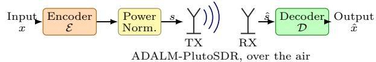  
Fig. 1: The DeepJSCC system model to be analyzed.

## II. Preliminaries

## A. DeepJSCC System Model

We consider image transmission over a bandwidthlimited wireless channel, as shown in Fig. 1. The transmitter sends an input image $x \in \mathbb { R } ^ { n }$ to the receiver by mapping x to a complex-valued channel input symbol $s \in \mathbb { C } ^ { k }$ . This mapping is the encoder $\mathcal { E } : \mathbb { R } ^ { n }  \mathbb { C } ^ { k }$ in Fig. 1, following the DeepJSCC design [2].

The input size n is typically much larger than the compressed representation size $k ;$ following the literature on DeepJSCC, we call the ratio $k / n$ the bandwidth compression ratio. The encoder normalizes s to satisfy an average power constraint, which the communication protocol imposes to avoid interference with other transmissions:

$$
{ \frac { 1 } { k } } \mathbb { E } [ s * s ] \leq P\tag{1}
$$

The encoder itself is a sequence of neural network layers: convolutional neural network (CNN) layers, PReLU activations, and a final normalization layer that enforces the power constraint. CNN layers extract image features and reduce them to a compact representation, the complex channel input, while PReLU activations let the encoder learn a non-linear mapping from the source image to the coded wireless signal space.

The wireless channel in Fig. 1 carries s to the receiver, corrupting the symbols with random noise. The receiver maps the corrupted channel output $\hat { s } ~ \in ~ \mathbb { C } ^ { k }$ back to an approximate reconstruction $\hat { x } \in \mathbb { R } ^ { n }$ of the original image; this mapping is the decoder $\mathcal { D } : \mathbb { C } ^ { k } \to \mathbb { R } ^ { n }$ in Fig. 1. The decoder mirrors the encoder. A stack of transposed convolutional layers with PReLU activations inverts the encoding. A final sigmoid layer then maps the output to [0, 1] before rescaling it to the pixel range. To recover a clean image, the decoder must also denoise the artifacts introduced by the channel. Together, the encoder, channel, and decoder form a joint source-channel coding model: the encoder and decoder are trained jointly, while the channel is a diferentiable, non-trainable layer that connects them during training. Under AWGN, it applies ${ \hat { s } } = s + n$ with $n \sim \mathcal { C N } ( 0 , \sigma ^ { 2 } I )$

Under slow Rayleigh fading, the channel instead applies $\hat { s } = h s + n$ , where h is the residual the receiver’s channel estimator leaves rather than the raw fading coeficient. Equalizing by an estimate $\hat { h }$ that is accurate in amplitude leaves the unit-modulus rotation $h = e ^ { j \theta }$ with $\left| \theta \right| \leq \delta ,$ where δ is the phase accuracy the estimator guarantees [22]. We assume amplitude equalization is exact, so $| h | = 1$ and only the residual phase is unknown.

DeepJSCC evaluates quality by PSNR between x and xˆ, computed from the mean squared error (MSE):

$$
\mathrm { P S N R } ( x , \hat { x } ) = 1 0 \log _ { 1 0 } \left( \frac { x _ { \operatorname* { m a x } } ^ { 2 } } { \mathrm { M S E } ( x , \hat { x } ) } \right) ,\tag{2}
$$

$$
\operatorname { M S E } ( x , { \hat { x } } ) = { \frac { 1 } { n } } \sum _ { i = 1 } ^ { n } ( x _ { i } - { \hat { x } } _ { i } ) ^ { 2 } ,\tag{3}
$$

where $x _ { \mathrm { m a x } }$ is the maximum possible pixel value.

## B. Neural Network Verification

The channel corrupts the latent symbols before decoding, resulting in a lower-quality reconstruction of the original message (e.g., an image). Neural network verification can quantify how much this quality can degrade under a given noise range, providing a useful certificate, e.g., a proof that a minimum quality is always achieved.

Formally, consider a DNN N and a property $\phi$ of the form $\phi _ { i n }  \phi _ { o u t }$ over the inputs and outputs of $N .$ . The DNN verification problem asks whether ϕ is valid for N. Bound-propagation methods [9], [11], [12] solve this problem by over-approximating each layer. These methods are incomplete: if the over-approximation still satisfies $\phi ,$ the property is proven; otherwise the verifier returns unknown, even when the true network may satisfy $\phi .$ In contrast, complete verifiers based on satisfiability modulo theories (SMT) solving [17], mixed-integer programming [27], branch-and-bound [28], or DPLL(t) [29] decide $\phi$ exactly: given enough time, they either prove the property or produce a genuine counterexample. Complete verifiers often use fast incomplete bound propagation as a subroutine to prune branches [16], [28], [29].

## C. Bound Propagation

Bound propagation computes a sound interval $[ y , { \overline { { y } } } ]$ on the output objective y of N over an input region $\phi _ { i n } .$ In this paper, $\phi _ { i n }$ is an interval on the latent channel symbols.

The main bound-propagation methods form a precision-cost trade-of. Ibp [9] is fastest and loosest. DeepPoly [10], [11] back-substitutes linear relaxations in one pass. α-Crown [12] further tunes the relaxation slopes by gradient descent, which is slower but yields the tightest bounds among incomplete verifiers.

## 1) Interval bound propagation

Ibp [9] maintains only a concrete interval at each layer, starting from the input interval $\phi _ { i n } = [ \underline { { x } } , \overline { { x } } ]$ . Consider an afine layer $z = W x + b$ with incoming bounds $x \in [ \underline { { x } } , \overline { { x } } ]$ The pre-activation bounds are

$$
\begin{array} { r } { \underline { { z } } = W ^ { + } \underline { { x } } + W ^ { - } \overline { { x } } + b , } \\ { \overline { { z } } = W ^ { + } \overline { { x } } + W ^ { - } \underline { { x } } + b , } \end{array}\tag{4}
$$

where $W ^ { + } = \operatorname* { m a x } ( W , 0 )$ and $W ^ { - } = \operatorname* { m i n } ( W , 0 )$ are taken elementwise. The sign split is required: a negative weight

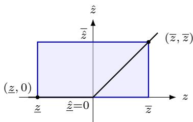  
Fig. 2: Interval bound propagation through an unstable ReLU over [z, z].

reverses which endpoint of [x, x] yields the minimum or maximum of that term.

For $\hat { z } = \mathrm { R e L U } ( z )$ with $z \in [ \underline { { z } } , \overline { { z } } ]$ , monotonicity gives

$$
\begin{array} { r } { \hat { z } = \mathrm { R e L U } ( \underline { { z } } ) , \qquad \overline { { \hat { z } } } = \mathrm { R e L U } ( \overline { { z } } ) . } \end{array}\tag{5}
$$

Ibp applies (4)–(5) layer by layer to the output. Each step is fast but discards correlations among layer outputs.

Fig. 2 visualizes (5) at one unstable ReLU: the interval keeps only the endpoints $\begin{array} { l } { \hat { z } ~ = ~ \mathrm { R e L U } ( \underline { { z } } ) ~ = ~ 0 } \end{array}$ and ${ \overline { { \hat { z } } } } = \operatorname { R e L U } ( { \overline { { z } } } ) = { \overline { { z } } } .$ , so the admissible (z, zˆ) pairs form the entire interval region $[ \underline { { z } } , \overline { { z } } ] \times [ \underline { { \hat { z } } } , \overline { { \hat { z } } } ]$ (shaded), which is the over-approximation area and discards the relation between z and zˆ. The bounds therefore widen and often become vacuous on deep networks.

## 2) Linear relaxation

Linear relaxation is tighter bound propagation methods by bounding each layer’s pre-activation $z ^ { ( l ) }$ by afine functions of the network inputs x:

$$
A ^ { ( l ) } x + \underline { { b } } ^ { ( l ) } \leq z ^ { ( l ) } \leq \overline { { A } } ^ { ( l ) } x + \overline { { b } } ^ { ( l ) } .\tag{6}
$$

Afine and convolutional layers compose these bounds exactly. A ReLU layer requires a local overapproximation.

Consider a ReLU layer with pre-activation $z \in [ \underline { { z } } , \overline { { z } } ]$ where $\underline { { z } } < 0 < \overline { { z } }$ , and output $\hat { z } = \mathrm { R e L U } ( z )$ . The layer is stable if $z \geq 0$ (always active) or $\overline { z } ~ \le ~ 0$ (always inactive): then the map is exact and needs no relaxation. An unstable ReLU is over-approximated by two linear functions (Fig. 3). The tightest upper bound is the line through (z, 0) and (z, z):

$$
\begin{array} { r } { \hat { z } \le \bar { d } z + \bar { b } , \qquad \bar { d } = \frac { \overline { { z } } } { \overline { { z } } - \underline { { z } } } , \qquad \bar { b } = - \frac { \underline { { z } } \overline { { z } } } { \overline { { z } } - \underline { { z } } } . } \end{array}\tag{7}
$$

The lower bound is any line $\hat { z } \geq \alpha z$ with $\alpha \in [ 0 , 1 ]$

In Fig. 3, the solid blue line is the upper bound (7) and the thick dashed red line is the lower bound for one such α; the arrow shows that α can rotate this line anywhere between the thin dashed lines α = 0 and α = 1. The shaded region is the over-approximation area for the drawn α, and its shape depends on α. DeepPoly picks an endpoint $\alpha = 0$ or $\alpha = 1$ to minimize the overapproximated area (shaded in blue).

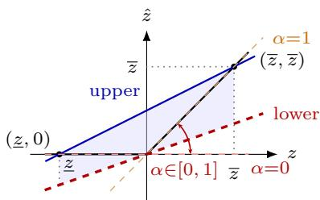  
Fig. 3: Linear relaxation of an unstable ReLU over $[ \underline { { z } } , \overline { { z } } ]$ with lower slope $\alpha \in [ 0 , 1 ]$

## 3) Back-substitution and concretization

Back-substitution is the procedure DeepPoly uses to eliminate intermediate layers: it repeatedly replaces each intermediate layer’s variable by its lower or upper afine bound (6) until the resulting bound depends only on x. Concretization then evaluates the linear forms over B:

$$
\begin{array} { r } { \underline { { z } } ^ { ( l ) } = \underset { x \in \mathcal { B } } { \operatorname* { m i n } } \big ( \underline { { A } } ^ { ( l ) } x + \underline { { b } } ^ { ( l ) } \big ) , } \\ { \overline { { z } } ^ { ( l ) } = \underset { x \in \mathcal { B } } { \operatorname* { m a x } } \big ( \overline { { A } } ^ { ( l ) } x + \overline { { b } } ^ { ( l ) } \big ) . } \end{array}\tag{8}
$$

For an $\ell _ { p }$ ball $\beta ~ = ~ \{ x ~ : ~ \| x - x _ { 0 } \| _ { p } ~ \leq ~ \varepsilon \}$ , Hölder’s inequality [28] gives the closed form

$$
\begin{array} { r } { \overline { { z } } ^ { ( l ) } = \overline { { A } } ^ { ( l ) } x _ { 0 } + \varepsilon \Vert \overline { { A } } ^ { ( l ) } \Vert _ { q } + \overline { { b } } ^ { ( l ) } , } \\ { \underline { { z } } ^ { ( l ) } = \underline { { A } } ^ { ( l ) } x _ { 0 } - \varepsilon \Vert \underline { { A } } ^ { ( l ) } \Vert _ { q } + \underline { { b } } ^ { ( l ) } , } \end{array}\tag{9}
$$

where $\textstyle { \frac { 1 } { p } } + { \frac { 1 } { q } } = 1$ . The resulting bound $[ \underline { { z } } ^ { ( l ) } , \overline { { z } } ^ { ( l ) } ]$ decide the neuron stability and the linear relaxation in the next layers.

## 4) Optimization of linear bound

α-Crown treats the lower slopes α as trainable parameters in [0, 1]. It optimizes them by gradient descent on the certified output bound. Alg. 1 summarizes the procedure for an L-layer network that alternates an afine map and a ReLU at each layer $l = 1 , \ldots , L$ . DeepPoly is the special case with T=0 and a heuristic $\alpha \in \{ 0 , 1 \}$

The algorithm first obtains one interval per layer with Ibp. Each iteration visits layers $l = 1 , \ldots , L$ (line 4). For layer l, it back-substitutes from layer $k = l$ down to 1 (line 6–line 8). At each k, Relax turns the ReLU bounds $[ \underline { { z } } ^ { ( k ) } , \overline { { z } } ^ { ( k ) } ]$ and slope $\alpha ^ { ( k ) }$ into the upper line $( \overline { d } ^ { ( k ) } , \bar { b } ^ { ( k ) } )$ of Fig. 3, and Combine folds $( \overline { { d } } ^ { ( k ) } , \overline { { b } } ^ { ( \widehat { k } ) } , \alpha ^ { ( k ) } )$ into the running coeficients $( \underline { { A } } , \underline { { b } } ) , ( \overline { { A } } , \overline { { b } } )$ by the sign of each entry, before the afine map $( \dot { W } ^ { ( k ) } , \dot { b } ^ { ( k ) } )$ is applied. Concretize (line 11) then evaluates the resulting linear form over B to yield the layer interval via (9). A projected gradient step (line 12) updates the slopes α to tighten the output bound. Optimizing α improves on fixed DeepPoly at the cost of T full backward passes.

Alg. 1: α-Crown bound propagation   
input : L-layer network with afine maps $\overline { { \{ W ^ { ( l ) } , b ^ { ( l ) } \} _ { l = 1 } ^ { L } } }$   
and ReLU layers; input ball   
$\mathcal { B } = \left\{ x : \| x - x _ { 0 } \| _ { p } \leq \varepsilon \right\}$ ; iterations T; step size η   
output : output bounds $[ \underline { { z } } ^ { ( L ) } , \overline { { z } } ^ { ( L ) } ]$   
1 Compute layer intervals $[ \underline { { z } } ^ { ( l ) } , \overline { { z } } ^ { ( l ) } ]$ for $l = 1 , \ldots , L$ by   
Ibp (5)   
2 Initialize slopes $\alpha ^ { ( l ) } \in [ 0 , 1 ]$ for each unstable ReLU   
3 for t ← 1 to T do   
4 for l ← 1 to L do   
5 $( \underline { { A } } , \underline { { b } } ) , ( \overline { { A } } , \overline { { b } } )  ( I , 0 ) , ( I , 0 )$   
6 for k ← l to 1 by −1 do   
7 $( \overline { d } ^ { ( k ) } , \bar { b } ^ { ( k ) } , \alpha ^ { ( k ) } ) \gets \mathrm { R e l a x } \big ( \underline { z } ^ { ( k ) } , \overline { z } ^ { ( k ) } , \alpha ^ { ( k ) } \big )$   
8 $( \underline { { A } } , \underline { { b } } ) , ( \overline { { A } } , \overline { { b } } ) $   
Combine $( \overline { { d } } ^ { ( k ) } , \overline { { b } } ^ { ( k ) } , \alpha ^ { ( k ) } , ( \underline { { A } } , \underline { { b } } ) , ( \overline { { A } } , \overline { { b } } ) )$   
9 $( \underline { { { A } } } , \underline { { { b } } } ) \gets ( \underline { { { A } } } W ^ { ( k ) } , \underline { { { A } } } b ^ { ( k ) } + \underline { { { b } } } )$   
10 $( \overline { { { A } } } , \overline { { { b } } } )  ( \overline { { { A } } } W ^ { ( k ) } , \overline { { { A } } } b ^ { ( k ) } + \overline { { { b } } } )$   
11 $\underline { { z } } ^ { ( l ) } , \overline { { z } } ^ { ( l ) } \gets$ Concretize (A, b), (A, b) (9)   
12 α ← Projec $\mathsf { \Omega } _ { [ 0 , 1 ] } ^ { \mathsf { \Gamma } } \big ( \alpha + \eta \nabla _ { \alpha \underline { { z } } } \mathfrak { ( L ) } \big )$   
13 return $[ \underline { { z } } ^ { ( L ) } , \overline { { z } } ^ { ( L ) } ]$

## D. Lipschitz-Certified Training

Bound propagation formally evaluates a trained model: it certifies how much the output can change under a given input perturbation. It does not change the model weights, so it cannot by itself improve robustness. We therefore complement verification with GloRo-style training [25], which builds robustness into the network during learning.

Definition 1 (Lipschitz constant). A function N is Lipschitz continuous with constant K (w.r.t. a chosen norm) if

$$
\| N ( x ) - N ( x ^ { \prime } ) \| \ \leq \ K \| x - x ^ { \prime } \| \qquad { \mathrm { f o r ~ a l l ~ i n p u t s ~ } } x , x ^ { \prime } .\tag{10}
$$

The smallest such K is the Lipschitz constant of N.

Intuitively, K is a global sensitivity: it upper-bounds how fast the output can change when the input moves. $\quad { \mathrm { ~ I ~ f ~ } } \left\| x - x ^ { \prime } \right\| \leq \varepsilon$ , then (10) gives $\| N ( x ) - N ( x ^ { \prime } ) \| \le K \varepsilon$ everywhere, not only near one test point. A small K therefore quantifies global robustness of the DNN: no pair of inputs within distance ε can produce an output gap larger than Kε.

Definition 2 (Lipschitz constant of a DNN). For an L layer network, GloRo upper-bounds K by the product of per-layer Lipschitz constants:

$$
K \le \prod _ { l = 1 } ^ { L } K ^ { ( l ) } ,\tag{11}
$$

where $K ^ { ( l ) } = \| W ^ { ( l ) } \| _ { 2 }$ (the spectral norm) for an afine or convolutional layer, and $K ^ { ( l ) }$ is the activation’s Lipschitz constant for a ReLU or PReLU layer: 1 for ReLU, and max(1, |a|) for PReLU with negative slope a.

Spectral norms are estimated during training by power iteration, which approximates $\| \ b { W } ^ { ( \bar { l } ) } \| _ { 2 }$ by repeatedly multiplying a random unit vector by $W ^ { ( \bar { l } ) \top } W ^ { \bar { ( l ) } }$ until convergence. GloRo regularizes K directly during training: it adds a penalty term on K to the loss function, such that gradient descent shrinks the DNN’s global sensitivity.

$$
{ \mathcal { L } } _ { \mathrm { G l o R o } } ( \theta ) = { \mathcal { L } } ( \theta ) + \lambda g ( K ) ,\tag{12}
$$

for loss function L, a regularization weight $\lambda ,$ and a monotonically increasing penalty g on K.

## III. Problem Formulation

This section formulates DeepJSCC verification as the DNN verification problem with an input property on the latent symbols and an output property on the reconstruction quality.

## A. Input Property

Definition 3 (Input property). Let $s \in \mathbb { C } ^ { k }$ be the transmitted latent symbols and let $\hat { s } \in \mathbb { C } ^ { k }$ be the symbols that the decoder receives. Let $\| z \| _ { \infty } : = \operatorname* { m a x } ( | \mathrm { R e } ( z ) | , | \mathrm { I m } ( z ) | )$ The input property $\phi _ { i n }$ is an interval around each symbol of sˆ:

$$
\phi _ { i n } \ = \ \big \{ \hat { s } : \| \hat { s } _ { i } - c _ { i } \| _ { \infty } \leq r _ { i } , \ i = 1 , \ldots , k \big \} ,\tag{13}
$$

for a center $c \in \mathbb { C } ^ { k }$ and radius $r \in \mathbb { R } _ { \geq 0 } ^ { k }$ that depend on channel assumptions.

AWGN channel. Under AWGN, ${ \hat { s } } = s + n$ with $n \sim$ $\mathscr { C N } ( 0 , \sigma ^ { 2 } I )$ . The AWGN standard deviation on each axis of n depends on the channel $\mathrm { S N R } \ \gamma \ ( \mathrm { i n \ d B } )$ :

$$
\begin{array} { r } { \sigma ( \gamma ) = \sqrt { \frac { 1 } { 2 \cdot 1 0 ^ { \gamma / 1 0 } } } . } \end{array}\tag{14}
$$

Let κ be the number of standard deviations the interval extends on each axis, $\mathrm { e . g . , } \ \kappa = 3$ covers about 99.7% of the AWGN noise mass per axis, not jointly over all 2k axes. Finally, the parameter for input property are:

$$
c = s , \quad r = \kappa \sigma ( \gamma ) .\tag{15}
$$

Rayleigh channel. We assume slow fading, the regime where h stays efectively constant over one packet’s transmission. Under this assumption, ${ \hat { s } } = h s + n$ where h denotes the residual fading after imperfect channel estimation and equalization, e.g., $h = e ^ { \bar { j } \theta } , \left| \theta \right| \leq \delta .$ . The input domain for h is the arc $\phi _ { h } ^ { \delta } = \{ e ^ { j \theta } : | \theta | \leq \delta \}$ The reachable set $\{ h s _ { i } \}$ is the arc of radius $| s _ { i } | \ =$ $\sqrt { \mathrm { R e } ( s _ { i } ) ^ { 2 } + \mathrm { I m } ( s _ { i } ) ^ { 2 } }$ that $s _ { i }$ sweeps as it rotates through ±δ.

DNN verifiers take intervals as inputs, so we bound the reachable set $\{ h s _ { i } \}$ by an interval around $s _ { i } ;$ Prop. 1 below shows this bound is sound, i.e., it never excludes a value $h s _ { i }$ that some $h \in \phi _ { h } ^ { \delta }$ can actually produce.

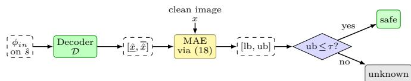  
Fig. 4: The verification framework for DeepJSCC.

Proposition 1 (Residual fading interval is sound). For $h = e ^ { j \theta }$ with $| \theta | \leq \delta$ and $\delta \in [ 0 , \pi ]$

$$
\begin{array} { r } { \| h s _ { i } - s _ { i } \| _ { \infty } \leq 2 \sin \left( \frac { \delta } { 2 } \right) | s _ { i } | . } \end{array}
$$

$\begin{array} { r } { | h - 1 | ^ { 2 } = ( \cos \theta - 1 ) ^ { 2 } + \sin ^ { 2 } \theta = 2 - 2 \cos \theta = 4 \sin ^ { 2 } ( \frac { \theta } { 2 } ) . } \end{array}$ so $| h - 1 | = 2 | \sin ( \textstyle { \frac { \theta } { 2 } } ) |$ . Since $| \theta | \le \delta \le \pi$ and sin is increasing on $\begin{array} { r } { [ 0 , \frac { \pi } { 2 } ] , \tilde { | h - 1 | } \le 2 \sin ( \frac { \delta } { 2 } ) } \end{array}$ . Hence $| h s _ { i } - s _ { i } | =$ $\begin{array} { r } { | h - 1 | | s _ { i } \vert \le 2 \sin ( \frac { \delta } { 2 } ) | s _ { i } | } \end{array}$ , and $\| h s _ { i } - s _ { i } \| _ { \infty } \leq | h s _ { i } - s _ { i } |$ since $\| z \| _ { \infty } \leq | z |$ for every $z \in \mathbb { C }$

Centering the interval at $s _ { i }$ and adding the $\kappa \sigma ( \gamma )$ noise interval for ni gives the Rayleigh input property:

$$
\begin{array} { r } { c _ { i } = s _ { i } , \quad r _ { i } = 2 \sin \left( \frac { \delta } { 2 } \right) | s _ { i } | + \kappa \sigma ( \gamma ) . } \end{array}\tag{16}
$$

Unlike the AWGN, the radius varies per transmitted symbol, and the fading term 2 sin $\Big ( \frac { \delta } { 2 } \Big ) \big | s _ { i } \big |$ does not shrink with SNR.

## B. Output Property

An output property need to that reflects reconstruction quality, yet bound-propagation verifiers only certify a scalar bound on a linear transformation of the network’s output. DeepJSCC’s natural quality metric, PSNR Eq. 2 and MSE Eq. 3, does not fit that requirement as they are nonlinear. We therefore bound the network’s output by MAE.

Definition 4 (Output property). For a threshold $\tau > 0$ and clean image $x \in \mathbb { R } ^ { n }$ , the output property $\phi _ { o u t }$ holds for a reconstruction xˆ if

$$
\mathrm { M A E } ( x , { \hat { x } } ) = { \frac { 1 } { n } } \sum _ { i = 1 } ^ { n } | x _ { i } - { \hat { x } } _ { i } | \leq \tau .\tag{17}
$$

For a scalar residual $r = x _ { i } - { \hat { x } } _ { i } .$ , the exact identity hold:

$$
| r | = \mathrm { R e L U } ( r ) + \mathrm { R e L U } ( - r )\tag{18}
$$

Particularly, ${ \mathrm { i f ~ } } r \geq 0 , { \mathrm { R e L U } } ( r ) + { \mathrm { R e L U } } ( - r ) = r + 0 =$ |r|; if $r \ < \ 0 .$ ${ \mathrm { R e L U } } ( r ) + { \mathrm { R e L U } } ( - r ) = 0 + ( - r ) = | r |$ MAE is therefore exactly representable with the ReLU primitives our bound propagation already supports [23]. The property is safe if no input in $\phi _ { i n }$ violates $\phi _ { o u t }$ Bound propagation certifies an interval [y, y] on the output objective $y = \mathrm { M A E } ( x , { \hat { x } } )$ over every $\hat { s } ~ \in ~ \phi _ { i n }$ If the over-approximation satisfies $\phi _ { o u t } , ~ \mathrm { e . g . } , ~ \overline { { y } } \leq \tau$ , the result is safe.

## C. Verification Framework

Fig. 4 shows the verification framework for the receiver of DeepJSCC. Bound propagation carries the input property $\phi _ { i n }$ through the decoder D to a certified interval on the reconstruction denotes [ˆx, xˆ]. It then compares that interval against the clean image x via the two-ReLU MAE identity (18). The result is a certified interval [y, y] on $\boldsymbol y = \mathrm { M A E } ( \boldsymbol x , \hat { \boldsymbol x } )$ . The final check against the output property $\phi _ { o u t }$ (Def. 4) follows §B: $\overline { { y } } \leq \tau$ returns safe, otherwise unknown.

## IV. Propose Approach

We make DeepJSCC verifiable and certifiably robust with four contributions: a sound PReLU relaxation that extends α-Crown to DeepJSCC’s activations (§A), a transposed-convolution replacement that α-Crown supports natively (§B), a structural Rayleigh input property that exposes h to bound propagation (§C), and a GloRo instantiation with a closed-form radius for both channels (§D).

## A. PReLU Relaxation with an Auto-Tuned Slope

DeepJSCC uses PReLU activations for every layer except the final sigmoid output layer, to learn a non-linear mapping from the source signal space to the coded signal space [2]. PReLU generalizes ReLU by learning the negative-side slope a instead of fixing it at 0.

Definition 5 (Parametric ReLU). For a pre-activation $z \in \mathbb { R }$ and a layer’s learned negative-side slope a,

$$
\mathrm { P R e L U } ( z ) = \left\{ \begin{array} { l l } { z , } & { z \geq 0 , } \\ { a z , } & { z < 0 . } \end{array} \right.\tag{19}
$$

Every PReLU layer in the encoder and decoder shares one such a. This single extra parameter per layer improves accuracy over ReLU at negligible computational cost [21].

DeepPoly’s ReLU relaxation (§C) assumes a lowerbound feasible interval of [0, 1]: any slope $\alpha ~ \in ~ [ 0 , 1 ]$ including the endpoint $\alpha = 0$ , gives a sound lower bound $\hat { z } \geq \alpha z$ on ReLU’s output. Once the layer’s learned slope $a > 0$ , reusing ReLU’s linear relaxation is unsound because if $z < 0$ the true PReLU output is $\hat { z } = a z < 0$ This, ReLU’s relaxation cannot simply be reused as-is.

PReLU is piecewise-linear but non-linear at the origin, so we over-approximate an unstable PReLU neuron with two linear functions over the pre-activation interval $z \in$ [z, z]. This keeps back-substitution exact linear algebra. Fig. 5 shows the resulting wedge, the PReLU counterpart of Fig. 3. The upper bound is the line through (z, az) and (z, z). The lower bound is again a line through the origin but its feasible slopes stay within [a, 1]. In Fig. 5, the solid blue line is the upper bound (20), the thick dashed red line is the lower bound for one slope in the feasible interval [a, 1], the arrow shows that this slope can rotate anywhere between the thin dashed lines of slope a and slope 1, and the shaded region is the over-approximation area for the drawn slope.

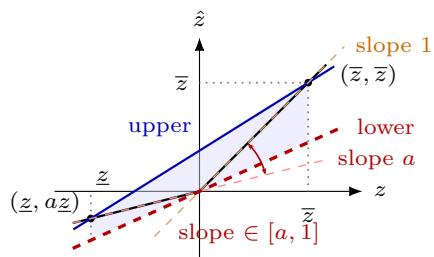  
Fig. 5: Linear relaxation of an unstable PReLU over $[ \underline { { z } } , \overline { { z } } ]$ with learned slope a.

Definition 6 (PReLU relaxation). Let $z \in [ \underline { { z } } , \overline { { z } } ]$ and $\hat { z } =$ PReLU(z). If $\underline { { z } } \geq 0 \mathrm { ~ o r ~ } \overline { { z } } \leq 0 .$ , the neuron is stable and $\hat { z } = z \ \mathrm { o r } \ \hat { z } = a z$ exactly, with no relaxation. Otherwise $( \underline { { z } } < 0 < \overline { { z } } )$ , for every $\alpha \in [ 0 , 1 ]$

$$
\begin{array} { r l } & { \left( a + \alpha ( 1 - a ) \right) z \ \leq \ \hat { z } \ \leq \ \bar { d } z + \bar { b } , } \\ & { \bar { d } = \frac { \overline { { z } } - a \underline { { z } } } { \overline { { z } } - \underline { { z } } } , \qquad \bar { b } = a \underline { { z } } - \bar { d } \underline { { z } } . } \end{array}\tag{20}
$$

Setting $a = ~ 0$ in Eq. 20 gives exactly ReLU’s line $\hat { z } \le \bar { d } z + \bar { b } \ ( 7 )$ and lower family $\hat { z } \ge \alpha z , \alpha \in [ 0 , 1 ] \colon$ a nonzero a only rescales that same α onto $[ a , 1 ]$ instead of [0, 1]. So Eq. 20 is a drop-in replacement for Relax at line 7 of Alg. 1 wherever that algorithm reaches a PReLU layer. α-Crown still treats α as trainable, projected onto [a, 1]. A bound is sound if it is guaranteed to contain the true value: a sound interval $[ y , { \overline { { y } } } ]$ satisfies $\underline { { y } } \le y \le \overline { { y } }$ for every value $y$ the network can actually produce, even if $[ y , { \overline { { y } } } ]$ is wider than necessary. Soundness is what makes a certificate trustworthy [30]: an unsound bound could silently miss a bad case, the way an underestimated link margin could silently miss an outage. ReLU’s relaxation is sound over $\alpha \in [ 0 , 1 ]$ ; Prop. 2 establishes the guarantee for PReLU.

Proposition 2 (PReLU relaxation soundness). For $\underline { { z } } <$ $0 < \overline { { z } } , a \leq 1 , z \in [ \underline { { z } } , \overline { { z } } ]$ , and $\alpha \in [ 0 , 1 ]$ we have

$$
\big ( a + \alpha ( 1 - a ) \big ) z \ \le \ \mathrm { P R e L U } ( z ) \ \le \ \bar { d } z + \bar { b } ,
$$

where $\begin{array} { r } { \bar { d } = \frac { \overline { { z } } - a \underline { { z } } } { \overline { { z } } - \underline { { z } } } } \end{array}$ and $\bar { b } = a \underline { z } - \bar { d } \underline { z } .$

Write $d = a + \alpha ( 1 - a ) \in [ a , 1 ] . { \mathrm { ~ I f ~ } } z < 0$ , then $d z \ \leq$ $a z = { \mathrm { P R e L U } } ( z )$ since $d \geq a . { \mathrm { ~ I f ~ } } z \geq 0 .$ , then $d z \leq z =$ PReLU(z) since $d \leq 1 . \mathrm { I f } \ z < 0 .$ , then ${ \mathrm { P R e L U } } ( z ) = a z \leq$ ${ \bar { d } } z + { \bar { b } }$ because $a z \ \leq \ \bar { d } z + \bar { b } \Leftrightarrow \overline { { { z } } } ( a - 1 ) ( z - \underline { { { z } } } ) \ \leq \ 0 ,$ which holds since $\overline { { z } } > 0 , a \le 1$ , and $z \ge \underline { { z } } . ~ \mathrm { I f } ~ z \ge 0$ then PReL $\mathrm { U } ( z ) = z \le \bar { d } z + \bar { b }$ because $z \leq \bar { d } z + \bar { b } \Leftrightarrow$ $( 1 - a ) \underline { { z } } ( \overline { { z } } - z ) \leq 0$ , which holds since $\underline { { z } } < 0 , a \leq 1$ , and $z \leq { \overline { { z } } } .$

The endpoints $\alpha \in \{ 0 , 1 \}$ also cover the stable cases of Def. 6 (d = a and d = 1). Setting $a = 0$ recovers

ReLU’s line and feasible interval [0, 1], so Prop. 2 strictly generalizes DeepPoly’s ReLU soundness.

B. Substituting Transposed Convolution with Upsampling The decoder in [2] decode the latent symbols with transposed convolutional layers, each layer doubling the spatial resolution until the output matches the source image. Transposed convolution’s output-to-input map is transposed and fractionally strided, a sparsity pattern ordinary convolution does not share, so it needs its own linear-relaxation rule.

Even ordinary convolution never forms this matrix explicitly, since it would not fit in a commercial graphics processing unit (GPU)’s memory; α-Crown [12] propagates bounds through the convolution’s own patch representation. A transposed-convolution relaxation would need an analogous patch-mode rule on top of the relaxation itself, which is a dificult engineering task. We substitute every decoder transposed convolution with nearest-neighbor upsampling followed by an ordinary convolution, both operations our bound propagation handles exactly or near-exactly. Prop. 3 below shows the substitution stays within the same operator fam-$\operatorname { i l y } ,$ stated in one spatial dimension with one channel; the two-dimensional multi-channel case applies the same identity per index and channel. Let $( u * v ) [ n ] =$ $\begin{array} { r } { \sum _ { j } u [ j ] v [ n - j ] } \end{array}$ denote convolution.

Definition 7 (Transposed convolution). The stride-s transposed convolution of an input x with kernel w is

$$
y [ n ] = \sum _ { m } x [ m ] w [ n - s m ] .\tag{21}
$$

Each input entry x[m] places a copy of the kernel at position sm, so the output resolution grows by a factor of s.

Definition 8 (Upsample-then-convolution). Nearestneighbor upsampling by s copies each entry s times: $x _ { \mathrm { { u p } } } [ j ] ~ = ~ x [ \lfloor j / s \rfloor ]$ . Convolution with kernel v then follows:

$$
y = x _ { \mathrm { { u p } } } * v .\tag{22}
$$

Proposition 3 (Upsample-then-convolution is a transposed convolution). For every kernel v, nearest-neighbor upsampling by s followed by convolution with v equals the stride-s transposed convolution with kernel $w =$ ${ \bf 1 } _ { s } * v$ , where 1s is the all-ones kernel of length s.

## Proof:

Let $x _ { 0 }$ insert $s - 1$ zeros between entries: $x _ { 0 } [ j ] = x [ j / s ]$ if s divides j and $x _ { 0 } [ j ] = 0$ otherwise. First, $( x _ { 0 } * w ) [ n ] =$ $\begin{array} { r } { \sum _ { j } x _ { 0 } [ j ] w [ n - j ] \ { \stackrel { } { = } } \ \sum _ { m } x [ m ] w [ n - s m ] } \end{array}$ , which is (21): convolving the zero-inserted input is exactly the stride-s transposed convolution. Second, $x _ { \mathrm { { u p } } } = x _ { 0 } * { \bf 1 } _ { s } \mathrm { { : } }$ entry j of $x _ { 0 } * \mathbf { 1 } _ { s }$ sums $x _ { 0 } [ j - i ]$ over $0 \leq i < s .$ , and the only multiple of s among $j - s + 1 , \ldots , j { \mathrm { ~ i s ~ } } s \lfloor j / s \rfloor$ , leaving $x [ \lvert j / s \rvert ]$ . By associativity, $x _ { \mathrm { u p } } * v = ( x _ { 0 } * { \bf 1 } _ { s } ) * v = x _ { 0 } * ( { \bf 1 } _ { s } * v )$ , the stride-s transposed convolution with kernel ${ \bf 1 } _ { s } * v$ ■

By Prop. 3, the substituted layer produces the same output shape and stays in the same operator family as the transposed convolution it replaces. We empirically confirm this substitution preserves DeepJSCC’s recon struction performance (§V).

## C. Structural Perturbation of Fading Residual Interval

The Rayleigh interval (16) is sound but loose: each persymbol radius $\begin{array} { r } { r _ { i } = 2 \sin ( \frac { \delta } { 2 } ) | s _ { i } | + \kappa \sigma ( \gamma ) } \end{array}$ is derived from h’s worst case for that symbol alone, though all k symbols share one residual h. The true reachable set is therefore a one-dimensional curve inside $\mathbb { R } ^ { 2 k }$ , yet the per-symbol interval inflates it to a full 2k-dimensional hypercube.

Recent work on structured-perturbation verification [23], [24] argues that whenever a perturbation is generated by fewer degrees of freedom than the space it inhabits, the verifier should reason over the generators directly. Prepending the generative map as a DNN layer and bounding only the low-dimensional input then lets bound propagation track the structural constraint exactly, without inter-coordinate slack. §A already states the exact channel formula ${ \hat { s } } ~ = h s + n$ , while Eq. 16 only certifies a fixed, per-symbol over-approximation of its efect. We propose replacing sˆ as the verifier’s input with the two quantities that generate it, h and n: $h$ is bounded by its support $\phi _ { h } ^ { \delta }$ (Def. 3), and n keeps its existing noise-interval bound. We prepend a layer to the network graph that computes hs directly, broadcasting the single h across all k symbols, and recover the original formula $\hat { s } = h s + n$ by adding the existing noise term n.

$h \mapsto h s$ is exactly linear in $h ,$ , since s is the fixed, known latent for the instance being verified. In real coordinates it is an exact block-diagonal $2 k \times 2$ matrix multiply, one rotation-scaling block $M _ { i }$ per symbol, all sharing the same h:

$$
\binom { \mathrm { R e } ( h s _ { i } ) } { \mathrm { I m } ( h s _ { i } ) } = \binom { \mathrm { R e } ( s _ { i } ) } { \mathrm { I m } ( s _ { i } ) } \quad \mathrm { R e } ( s _ { i } ) \bigg ) \binom { \mathrm { R e } ( h ) } { \mathrm { I m } ( h ) } .\tag{23}
$$

This afine layer is exactly what our bound propagation algorithms already handles. The addition with n is exact as it already is for the AWGN case.

The fading arc $\phi _ { h } ^ { \delta } = \{ e ^ { j \theta } : | \theta | \leq \delta \}$ (solid line in $\mathrm { F i g . 6 ) }$ is enclosed by independent intervals $\mathrm { R e } ( h ) \in [ \cos \delta , 1 ]$ $\mathrm { I m } ( h ) \in [ - \sin \delta ,$ sin δ] (shaded). Exposing h turns the joint input into the product domain

$$
\phi _ { i n } = \phi _ { h } ^ { \delta } \times \bigl \{ n : \| n \| _ { \infty } \leq \kappa \sigma ( \gamma ) \bigr \} .\tag{24}
$$

The joint input is then enclosed by an interval on $( h , n )$ 2 so Hölder concretization (9) $\scriptstyle ( p = \infty , q = 1 )$ applies.

## D. GloRo for DJSCC

We instantiate GloRo for DeepJSCC’s decoder $\mathcal { D } \colon$ the task loss L is the MSE reconstruction loss, and the penalty $g ( K _ { \mathcal { D } } )$ is derived below from the input property.

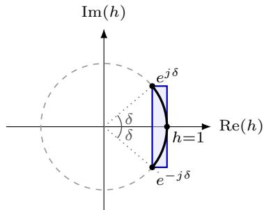  
Fig. 6: Fading residual h and its interval enclosure.

The decoder is built entirely from convolutions, some preceded by upsampling (§B), PReLU activations, and a final sigmoid. Eq. 11’s product $\begin{array} { r } { K _ { \mathcal { D } } \ \leq \ \prod _ { l = 1 } ^ { L _ { \mathcal { D } } } K _ { \mathcal { D } } ^ { ( l ) } } \end{array}$ extends to the whole decoder with two more per-layer constants. Nearest-neighbor upsampling by 2 in each spatial dimension replicates every pixel into a 2×2 block, so its Lipschitz constant is 2. The output sigmoid has Lipschitz constant ${ \begin{array} { l } { { \frac { 1 } { 4 } } , } \end{array} }$ , its maximum slope. Every layer’s constant is known in closed form, so $K _ { \mathcal { D } }$ is cheap to compute. We derive the radius for GloRo training from the input property: by the Lipschitz definition Def. 1, $\begin{array} { r } { \| \mathcal { D } ( \hat { s } ) - \mathcal { D } ( s ) \| _ { 2 } \ \leq \ K _ { \mathcal { D } } \| \hat { s } - s \| _ { 2 } \ \leq \ K _ { \mathcal { D } } r } \end{array}$ , where r is the $\ell _ { 2 }$ radius of the input property around the clean latent s: the smallest value with $\| \hat { s } - s \| _ { 2 } \leq r$ for every $\hat { s } ~ \in ~ \phi _ { i n }$ (Def. 3). Under AWGN, each of the 2k real axes of $\hat { s } - s \ = \ n$ stays within κσ(γ) (Eq. 15), so $r _ { \mathrm { A W G N } } = \sqrt { 2 k } \kappa \sigma ( \gamma )$

Because MSE averages over the n entries of $x ,$ the triangle inequality gives, for every $\begin{array} { r l r } { \hat { s } } & { { } \in } & { \phi _ { i n } . } \end{array}$ $\sqrt { \mathrm { M S E } ( x , \mathcal { D } ( \hat { s } ) ) } \leq \sqrt { \mathrm { M S E } ( x , \mathcal { D } ( s ) ) } + K _ { \mathcal { D } } r / \sqrt { n } . \mathrm { O n l y }$ the second term depends on $K _ { D }$ , so we add its square to the reconstruction loss:

$$
{ \mathcal L } _ { \mathrm { G l o R o } } ( \theta ) = \mathrm { M S E } ( x , { \mathcal D } ( \hat { s } ) ) + \lambda \frac { ( K _ { \mathcal D } r ) ^ { 2 } } { 2 k } ,\tag{25}
$$

where sˆ is sampled through the channel as in regular training, and the penalty equals $( K _ { D } r ) ^ { 2 } / n$ up to the constant factor $n / ( 2 k )$ , which λ absorbs. We fine-tune from a pretrained checkpoint, updating only the decoder. A smaller $K _ { \mathcal { D } }$ tightens the certified [y, y] that DNN verifier computes.

Under Rayleigh fading, we keep the same loss form (25). By Prop. 1, $| h - 1 | \leq 2 \sin ( \frac { \delta } { 2 } )$ , and the hs-layer linearity (§C) gives $\begin{array} { r } { \| \hat { s } - s \| _ { 2 } \leq 2 \sin ( \frac { \delta } { 2 } ) \| s \| _ { 2 } + \sqrt { 2 k } \kappa \sigma ( \gamma ) } \end{array}$ With $\| s \| _ { 2 } = \sqrt { k } \ ( \ S \mathrm { A } )$ , the Rayleigh radius is:

$$
r _ { \mathrm { R a y l e i g h } } ( \gamma , \delta ) = \sqrt { k } \bigl ( 2 \sin ( { \textstyle { \frac { \delta } { 2 } } } ) + \sqrt { 2 } \kappa \sigma ( \gamma ) \bigr ) .\tag{26}
$$

Substituting $r _ { \mathrm { R a y l e i g h } }$ for r in (25) adapts GloRo training to Rayleigh fading.

Tab. 1: Decoder configurations evaluated.
<table><tr><td></td><td>small</td><td>medium</td><td>large</td></tr><tr><td>Latent dimension k</td><td>32</td><td>192</td><td>256</td></tr><tr><td>Encoder layers</td><td>3</td><td>4</td><td>5</td></tr><tr><td>Decoder layers</td><td>4</td><td>4</td><td>5</td></tr><tr><td>Parameters</td><td>7.7k</td><td>29.1k</td><td>143.4k</td></tr></table>

## V. Experiments

Our evaluation1 answers the following research questions: RQ1: Do our verifier-compatibility choices preserve DeepJSCC’s reconstruction quality?

RQ2: How does DeepJSCC’s certified robustness vary across diferent channel assumptions?

RQ3: How much does GloRo tighten the certified bound?

RQ4: Does structural encoding of property help?

RQ5: Does theoretical safe certificate transfer to overthe-air software-defined-radio (SDR) transmission?

## A. Experimental Design

Models and data. We evaluate three decoder sizes (Tab. 1): small, medium, and large, all with the upsample-then-convolution decoder of §B. Models are trained on CIFAR-10 [31] for 100 epochs under a randomized training-time SNR curriculum $( \gamma \sim \mathcal { U } ( 1 , 1 3 )$ dB).

We formally verify the models at SNRs $\gamma \in$ {10, 15, 20, 25, 30} dB. Under Rayleigh fading, the decoder additionally trains under a randomized residualphase curriculum $( \delta \sim \mathcal { U } ( 0 ^ { \circ } , 3 0 ^ { \circ } )$ per batch, §A); verification and GloRo certification both sweep estimator accuracy at $\delta \in \{ 0 ^ { \circ } , 2 . 5 ^ { \circ } , 5 ^ { \circ } , 7 . 5 ^ { \circ } , 1 0 ^ { \circ } \}$

Verifiers. We compare Ibp, DeepPoly, and α-Crown, all implemented in our own bound-propagation Python library since existing libraries do not cover the PReLU relaxation of $\ S \mathrm { A }$ out of the box. On standard fully connected and convolutional ReLU networks, our implementations produce bounds that match auto\_LiRPA [12]. Training methods. Naive training minimizes MSE loss with Adam [32]. GloRo training follows §D [25], finetuning a Naive-trained checkpoint for 20 epochs.

Spectral norms use 10 power-iteration steps per weight matrix per training step. We set $\lambda { = } 1 0 ^ { - \bar { 4 } }$ in Eq. 25: higher values collapse PSNR across all three model sizes, while lower values leave $K _ { D }$ unchanged; $\lambda { = } 1 0 ^ { - 4 }$ reduces $K _ { D }$ while preserving reconstruction quality for all sizes. Metrics. We use PSNR to compare training runs. Certified bounds are on MAE (Def. 4): every [y, y] below bounds MAE, not PSNR, and we report the upper bound y.

Runtime. All experiments run on a single NVIDIA RTX 4080 SUPER GPU (16 GB), paired with an AMD Ryzen 9 5900X 12-core central processing unit (CPU) and 128 GB of DDR4-3200 random-access memory (RAM).

SDR hardware. The over-the-air experiment (§G) uses two ADALM-PlutoSDR transceivers on a 915 MHz carrier at a 2 MHz sample rate. A Raspberry Pi 4 controls both transceivers, one transmitting and one receiving, and stores the received frames for ofline decoding. We attenuate the transmitter by 20 dB and hold the receiver gain fixed at 30 dB. Higher settings saturated the receiver’s analog-to-digital converter, and the resulting clipping destroyed frame coherence.

Each frame carries one OFDM symbol, a 512-point inverse fast Fourier transform (IFFT) with a 64-sample cyclic prefix, behind an 11-chip Barker preamble for frame synchronization. Every fourth subcarrier carries a known binary phase-shift keying (BPSK) pilot, which leaves 384 free bins, of which the first k=256 carry the DeepJSCC latents. The receiver estimates the channel from those pilots by least squares, interpolates it across bins, and equalizes amplitude and phase together. Before the image transmissions, 300 probe frames of complex Gaussian tones characterize the link. We wipe the phase from each frame, then take the 99th percentile of the per-tone residual phase as δ and the error power as the operating SNR.

## B. Efect of Verifier-Compatibility Changes

We isolate each verifier-compatibility change from §IV with a paired ablation against the original DeepJSCC decoder (PReLU, transposed convolution), training all three model sizes under the AWGN channel with Naive training (§A). Fig. 7 reports test PSNR and MAE for the original decoder, the upsample-then-convolution substitution (§B), and a ReLU decoder in place of PReLU (§A). Replacing PReLU with ReLU cost 1.78, 2.01, and 2.22 dB of PSNR on small, medium, and large respectively, a 23%, 29%, and 28% increase in MAE. The penalty grew with model size because a deeper decoder stacks more activation layers, and each one discards the negative-side signal that its learned slope would otherwise carry. This supports §A’s claim that PReLU’s single extra parameter per layer is worth its added relaxation cost. Verifying a ReLU-substituted decoder would answer a question about a diferent, worse model, which is why we derive a PReLU relaxation instead of substituting the activation away. The upsamplethen-convolution substitution left reconstruction quality essentially intact: PSNR moved by at most 0.35 dB across all sizes (+0.05 dB on small, −0.35 dB on medium, −0.28 dB on large), and MAE by under 7% at every size. The sign of the change varied with model size, which suggests the residual gap reflects training variation rather than a systematic loss.

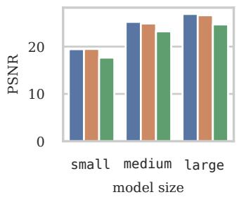  
(a) PSNR

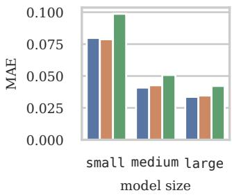  
(b) MAE  
original upsample relu

Fig. 7: Reconstruction quality of the original, upsamplethen-convolution, and ReLU decoders.  
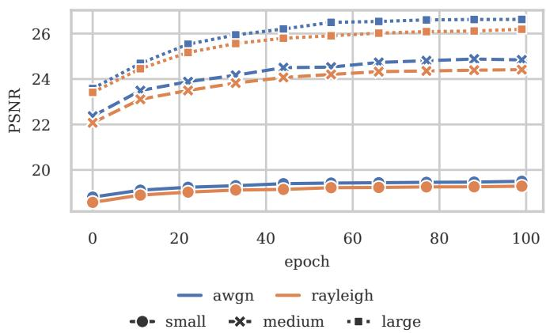  
Fig. 8: Test PSNR over 100 training epochs for all three model sizes under AWGN and Rayleigh fading.

This is consistent with Prop. 3: both layers belong to the same operator family. §B’s claim therefore holds: the substitution buys a verifiable decoder at a small cost.

## C. Certified Robustness Across Channel Models

Fig. 8 reports test PSNR at a fixed evaluation SNR of 10 dB, the midpoint of the training curriculum γ ∼ U(1, 13) dB. All models improved rapidly during the first 20 epochs, then slowed and plateaued. The small model achieved 99% of its peak PSNR by epochs 35 to 38, while the medium and large models converged between epochs 60 and 65.

Rayleigh-trained models demonstrated similar initial improvement rates but plateaued at lower performance levels. This outcome is attributed to the fading residual $\textit { h } = \textit { e } ^ { j \theta }$ (§A), which represents a phase rotation absent in AWGN training. Consequently, the Rayleigh channel is harder to decode. For the small, medium, and large models, Rayleigh-trained variants exhibited mean squared error (MSE) increases of 5.1%, 11.4%, and 10.5%, respectively, compared to their AWGN counterparts, corresponding to PSNR reductions of 0.22, 0.47, and 0.43 dB.

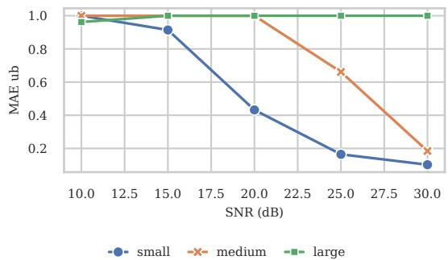  
Fig. 9: Certified MAE upper bound y under AWGN vs. SNR, per model size (DeepPoly).

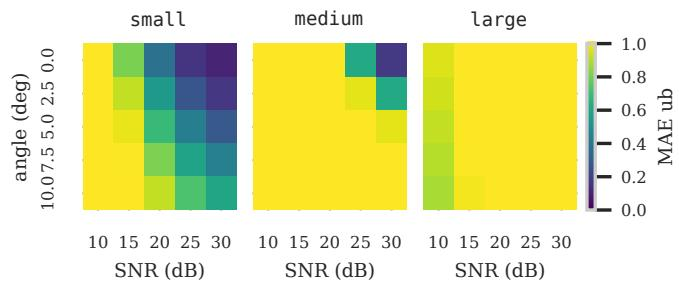  
Fig. 10: Certified MAE upper bound y under Rayleigh fading vs. SNR and residual phase δ, per model size (DeepPoly).

Model size influenced final PSNR more than channel type. The small model, using 94.6% fewer parameters than large, achieved a PSNR that was 6.9 dB lower under both channel conditions. The medium model, with 79.7% fewer parameters (4.9× smaller), achieved PSNR values within 1.6 dB of large under AWGN and within 1.8 dB under Rayleigh fading.

Fig. 9 shows the certified MAE upper bound y under AWGN. For small (k=32), y fell from 1.23 at SNR 10 dB to 0.10 at 30 dB. For medium (k=192), y stayed above 1 until SNR 25 dB and reached 0.19 at 30 dB. For large (k=256), y never dropped below 1: bound propagation across 256 latent dimensions accumulated too much interval error for the verifier to certify anything useful. Certification is more tractable for smaller models, as fewer latent dimensions constrain interval expansion. Fig. 10 extends the analysis to Rayleigh fading, sweeping SNR and residual phase $\delta ~ \in ~ \{ 0 ^ { \circ } , 2 . 5 ^ { \circ } , 5 ^ { \circ } , 7 . 5 ^ { \circ } , 1 0 ^ { \circ } \}$ At δ=0◦, the bound matched the AWGN result; as δ increases, the fading term $2 \sin ( \delta / 2 ) | s _ { i } |$ in the input radius (Eq. 16) widens the input property and loosens the bound.

For small at 30 dB, y rose from 0.10 at $\delta { = } 0 ^ { \circ }$ to 0.59 at $\delta { = } 1 0 ^ { \circ }$ . For medium, the bound was only useful at $\delta { = } 0 ^ { \circ }$ (y=0.17 at 30 dB); any residual phase pushed y above

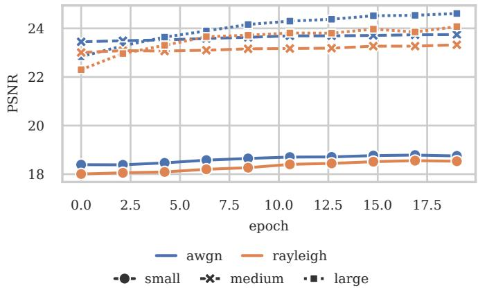  
Fig. 11: GloRo fine-tuning over 20 epochs per model size under AWGN and Rayleigh fading.  
Fig. 12: CDF of the certified MAE upper bound y for naive and GloRo-trained decoders.

0.6. For large, y exceeded 1 in all conditions. SNR and δ jointly determine y. Higher SNR reduces the noise radius, whereas larger δ increases the fading radius, resulting in competing efects.

The dominant factor between SNR and δ has significant implications for system design. For the small model at the highest tested SNR, increasing the residual phase error from a perfect estimate to $1 0 ^ { \circ }$ raised y from 0.10 to 0.59. This represents an approximate sixfold increase that cannot be mitigated by increasing transmit power, as the noise radius is negligible at 30 dB and the fading radius remains independent of SNR. Therefore, when a link operates well above the noise floor, the channel estimator’s accuracy, rather than transmit power, determines the strength of the certificate the receiver can provide. This observation also clarifies why persymbol interval encoding becomes the limiting constraint at large δ, thereby motivating the structural encoding approach evaluated in §E.

## D. Efect of GloRo Training on Certified Robustness

Fig. 11 presents GloRo fine-tuning initiated from the naive checkpoint across 20 epochs. The figure tracks test PSNR, the Lipschitz constant $K _ { \mathcal { D } }$ , and robust loss for each model size under AWGN and Rayleigh fading. The Lipschitz constant $K _ { \mathcal { D } }$ decreased substantially during the first five epochs, from 41.9 to 6.5 for small and from 215.6 to 25.5 for large. All three model sizes stabilized by epoch 10. Twenty epochs of fine-tuning were suficient, as the remaining ten epochs resulted in minimal changes to $K _ { D }$

The PSNR cost associated with regularizing $K _ { D }$ was 0.72 dB for small, 1.14 dB for medium, and 2.01 dB for large under AWGN. The corresponding Rayleigh fading costs were similar, at 0.73, 1.09, and 2.11 dB, respectively. Larger models incurred greater PSNR costs because their $K _ { \mathcal { D } }$ values were higher and required more contraction.

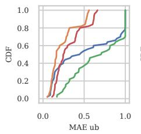  
(a) Small

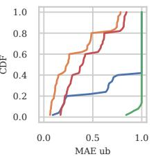  
(b) Medium

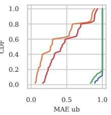  
(c) Large  
awgn\_naive rayleigh\_naive awgn\_gloro rayleigh\_gloro

Fig. 12 plots the certified MAE upper bound y as a cumulative distribution function (CDF) per model size, comparing naive and GloRo training under AWGN and Rayleigh fading (δ=0◦, all SNRs pooled). For small under AWGN, y fell from 1.23 to 0.53 at SNR 10 dB, a 57% reduction. At SNR 30 dB, naive and GloRo both reached $\overline { { y } } \approx 0 . 1 0 $ the AWGN noise ball dominates the bound at high SNR, so tightening $K _ { D }$ adds nothing there. For medium, the gain concentrated at high SNR: y dropped from 0.19 to 0.08 at 30 dB. For large, naive training never certified anything useful $( \overline { { y } } \mathrm { ~ > ~ } 1 $ at every SNR), whereas GloRo brought y to 0.85 at 10 dB and 0.08 at 30 dB, making large certifiable in our experiments. At $\delta { = } 0 ^ { \circ }$ , Rayleigh bounds fell by comparable fractions. GloRo shifted the entire bound distribution to the left for every model size and both channels, indicating that the improvement is not limited to a subset of images.

The two efects of GloRo oppose each other, and the dominant efect depends on the specific model. For large, a PSNR cost of 2.01 dB resulted in the diference between no certificate and obtaining a certificate at every tested SNR, making this trade-of advantageous. For small at 30 dB, naive and GloRo approaches achieved $\overline { { y } } \approx 0 . 1 0$ indicating that the 0.72 dB cost did not yield a tighter bound.

This outcome occurs because y is determined by the term that dominates the input radius. When the noise ball is dominant, as at high SNR on a small latent, reducing $K _ { \mathcal { D } }$ cannot further tighten a bound already constrained by the input region. GloRo is most efective when the bound’s looseness stems primarily from the decoder’s amplification rather than the channel, which characterizes the operational regime of all larger models.

## E. Joint Verification of the Fading Coeficient

Fig. 13a compares interval and structural encoding as the residual phase δ grows from $0 ^ { \circ }$ to $1 0 ^ { \circ }$ on the small model at SNR 20 dB. $\mathrm { A t } ~ \delta { = } 0 ^ { \circ }$ , both approaches coincided at $\overline { { y } } \approx 0 . 3 2 \mathrm { : }$ there is no phase uncertainty, so the per-symbol interval is already tight. As δ increases, the interval bound rises sharply, reaching $\overline { { y } } \approx 0 . 5 2$ at $\delta { = } 1 0 ^ { \circ }$ . This occurs because each of the 2k interval halfwidths increases by 2 sin $( \delta / 2 ) | s _ { i } |$ (Eq. 16), and these independent excesses accumulate. The structural bound stays nearly flat over the same range, at y ≈ 0.33 when $\delta { = } 1 0 ^ { \circ }$ . Reasoning over the single shared h (§C) provides the verifier with two additional degrees of freedom, independent of k. As a result, the phase term contributes minimal slack. Fig. 13b extends the comparison across all three model sizes $( \mathrm { S / M / L } = \mathrm { s m a l l / m e d i u m / l a r g e } )$ pooling all SNRs and phases $\delta \in \{ 0 ^ { \circ } , 2 . 5 ^ { \circ } , 5 ^ { \circ } , 7 . 5 ^ { \circ } , 1 0 ^ { \circ } \}$ For small, the structural median fell from 0.28 to 0.19; for medium, from 0.43 to 0.27; for large, from 0.46 to 0.27.

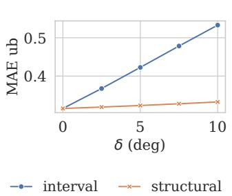

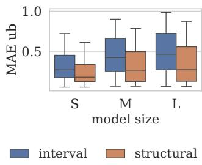  
(a) y vs. δ (small, SNR 20 dB).  
(b) y per model size (all SNRs and δ pooled).  
Fig. 13: Interval vs. structural encoding of the fading coeficient under Rayleigh fading.

The improvement increased with model size. Larger k results in more per-symbol interval terms, so the fixeddimensional input of structural encoding saves more accumulated slack. The narrowing of interquartile ranges indicates that the benefit is consistent across SNR and phase conditions, rather than influenced by a small number of instances.

Structural encoding substantially reduces δ-sensitivity and lowers the bound across all model sizes (Fig. 13). Structural encoding replaces 2k interval inputs with a single afine layer over two real variables (Eq. 23). Consequently, the verifier propagates a smaller input region through one additional exact layer and performs less computation overall. This advantage contrasts with verification scenarios, where larger networks present greater computational challenges. The removed penalty scales with $k ,$ so structural encoding provides the greatest benefit for models where interval encoding is least efective. Together with §C, these findings demonstrate that the fading radius limits the certificate once a link surpasses the noise floor. Structural encoding prevents this radius from scaling with the latent dimension.

## F. Certified Safety Count of the Full Pipeline

The preceding sections measured y in isolation. A practical deployment question requires a broader perspective: specifically, the number of (image, threshold) pairs a verifier can certify and the time required to do so. We counted certified-safe pairs on the large model at $\delta { = } 1 0 ^ { \circ }$ 2 the widest phase uncertainty we consider.

Ten images, one from each CIFAR-10 class, combined with five SNRs, resulted in 50 bound queries. Each query was evaluated against seven MAE thresholds $\tau \in \{ 0 . 2 5 , 0 . 2 7 5 , \ldots , 0 . 4 0 \}$ , resulting in $5 0 \times 7$ cactus instances per encoding. A cactus instance is a (property, network, threshold) query. α-Crown is applied to each τ individually and terminates at the first pass where $\overline { { y } } < \tau$

Fig. 14a presents a comparison between DeepPoly and α-Crown on the GloRo-trained model, pooling results from both interval and structural encodings. Both verifiers certified the same 211 instances: 19 on interval and 192 on structural encoding. DeepPoly completed each query in approximately 0.10 s. α-Crown returned in about 0.11 s, because the first DeepPoly-equivalent pass met every τ that these runs cleared. Therefore, DeepPoly serves as the preferred default when the property is specified at these thresholds. Ibp did not certify any instance in any of the training or encoding configurations evaluated. Computation speed is inconsequential if the relaxation method fails to certify any instances.

Fig. 14b compares interval and structural encodings under α-Crown, aggregating results from both Naive and GloRo training. Naive training did not certify any instances under either encoding. In the absence of Lipschitz regularization, the decoder amplified the input region excessively, preventing y from falling below the specified thresholds. GloRo combined with interval encoding certified 19 instances. GloRo with structural encoding certified 192 instances, 10× more. Neither component substitutes for the other. GloRo is essential; without it, no instances are certified due to the dominant amplification efect of the decoder. Structural encoding converts the available headroom into certified instances at large δ by eliminating the per-symbol expansion that would re-inflate the input region.

This ordering is consistent with the results presented in §D. GloRo addresses the decoder’s contribution to the bound, while structural encoding targets the channel’s contribution. These two methods operate on distinct terms, resulting in complementary rather than overlapping improvements.

## G. Over-the-Air Transfer to SDR

All previously established bounds are based on a channel model. This section evaluates whether a certificate derived from that model remains valid when applied to a real radio link. We characterize the channel between the two ADALM-PlutoSDR transceivers (§A), verify the decoder at the measured operating point, then transmit and check the reconstructions against the bound. Pilot measurements yielded an operating SNR of 27.4 dB and a 99th-percentile residual phase of δ=5.4◦, both within the ranges explored in §C. Although the link exhibited minimal interference, its SNR significantly exceeded the 1–13 dB range used during training, indicating that the decoder operated outside its original training conditions. Fig. 15 presents a representative input image and its corresponding over-the-air reconstruction at this operating point for each of the ten CIFAR-10 classes.

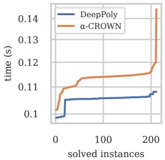  
(a) DeepPoly vs. α-Crown.

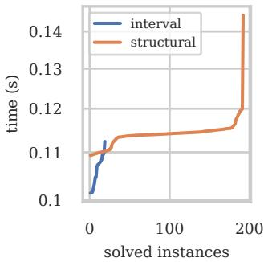  
(b) Interval vs. structural.

Fig. 14: Certified-safe instance count vs. verification time.  
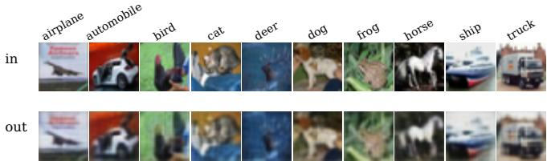  
Fig. 15: Input images (top) and over-the-air reconstructions (bottom) for all ten CIFAR-10 classes.

Fig. 16 displays, for each class, the observed overthe-air reconstruction error (the maximum MAE over 30 transmissions of a representative image) alongside its margin to the certified upper bound y, such that each complete bar represents y. The certificate held for every class: the observed maximum stayed below y in each class and in the aggregate, where the worst of 300 frames (0.0824) stayed below the largest bound (0.1278). Class 7 approached its bound most closely (0.082 versus 0.128), while class 5 exhibited the widest margin (0.035 versus 0.091). Across all classes, the observed maximum ranged from 38 to 65% of the certified bound. The certificate is neither violated nor excessively permissive; it provides meaningful headroom without being so loose as to permit arbitrary behavior.

Each bar aggregates 30 transmissions of a representative image, for a total of 300 over-the-air frames shown in the figure. Within each class, the 99th percentile and the maximum difered by no more than 0.0001. Reconstruction error demonstrated high repeatability: across 30 independent transmissions through the radio link, the worst trial was only marginally greater than the median. The margin in Fig. 16 is stable slack against the channel model rather than the tail of a noisy measurement. This experimental design introduces one caveat. Each bar corresponds to a fixed image per class, so it evaluates the certificate at ten specific points rather than across the entire test set. The bound applies to every input within the noise region; the measurement confirms its validity at the sampled points.

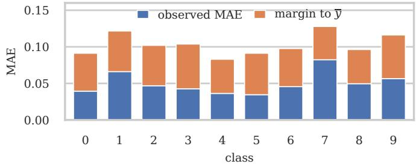  
Fig. 16: Per-class observed over-the-air MAE stacked with its margin to the certified bound y.

This guarantee is inherently conditional. It constrains the reconstruction error only while the link remains within the SNR and phase envelope measured by the pilot signals. A receiver operating outside this envelope requires a new certificate. This requirement is not onerous in practice, as re-verification at a new operating point can be performed in well under a second using DeepPoly, as described in §F. Consequently, a receiver can re-certify itself whenever its channel estimate changes, incurring a computational cost significantly lower than that of the protected transmission. The measurement demonstrates that the entire process—from channel modeling, through bound-propagation certification, to the physical radio link—remains valid end to end. The bounds the verifier produces ofline continue to constrain the hardware’s behavior accurately.

## VI. Related Work

## A. Neural Network Verifiers

Complete verifiers perform an exact search of the network’s piecewise-linear structure. Reluplex [17] extends the Simplex algorithm to ReLU constraints. Marabou [13] incorporates theory solvers and parallel divide-and-conquer strategies. The DPLL(T)-based NeuralSAT [29], [33] explores activation patterns using bound propagation as its theory solver. Other approaches improve verification scalability by exploiting neuron stability [14], training networks to promote stable neurons [26], decomposing networks into assumeguarantee subproblems [15], and learning branching heuristics through reinforcement learning [34]. Our GloRo instantiation (§D) adopts the training-based approach.

Bound propagation, the foundation of this work, overapproximates each layer using a sound linear relaxation and back-substitutes these relaxations to the input. Ibp [9] ofers the fastest but least precise bounds. DeepPoly [11] back-substitutes symbolic linear bounds in a single pass. Crown [10] and its successors α-Crown [12], [16] and β-Crown [28] optimize relaxation slopes using gradient descent. However, none of these tools provide native support for PReLU or transposed convolution (§A, §B). Bound propagation tools have won every recent International Verification of Neural Networks Competition (VNN-COMP) [35]. This consistent success motivates our decision to build upon this family of methods.

## B. Applications of DNN Verification

A growing line of work certifies wireless and telecommunication systems. Kim et al. [18] certify robustness of an antenna-selecting network for massive MIMO; Le and Matsumura [19] verify a regression network predicting mobile-trafic load; Le et al. [20] verify a power-control policy network for massive MIMO; Le et al. [36] use formal methods to craft adversarial attacks on a deep reinforcement learning (DRL)-based multi-user MIMO scheduler. Each targets a discrete decision or a single continuous quantity under one noise source. Our setting difers in three ways. We certify DeepJSCC’s decoder under the physical AWGN and Rayleigh fading channel models. The property is a continuous reconstruction bound. Finally, no prior wireless verification addresses PReLU, transposed convolutions, or the per-symbol interval blow-up of a shared fading coeficient, which block of-the-shelf verifiers (§I).

## VII. Conclusion

We addressed three primary challenges that prevent of-the-shelf verifiers from operating with DeepJSCC’s decoder. PReLU, transposed convolution, and a fading channel shared across all latent symbols each allow for a principled reformulation compatible with existing bound-propagation methods: a relaxation that extends the ReLU case, a layer substitution within the same operator family, and an adjustment of verifier input to the channel’s actual low-dimensional generator. None of these reformulations sacrifices reconstruction quality for verifiability; in particular, structural encoding strengthens certificates. The resulting certificate remains valid under real radio channel conditions.

Experimental results support these findings: GloRo training reduces the large decoder’s Lipschitz constant from 215.6 to 25.5, enabling certification - the upper bound decreases from above 1 at all SNRs to 0.08. Overthe-air tests further confirm it: across the ten CIFAR-10 classes the worst observed error is 0.082, against a certified bound of 0.128.

Applying this approach to attention-based and rateadaptive successors, such as WITT [3] and Swin-JSCC [37], as well as to modalities beyond images, remains an open research direction. These successors are based on vision transformers (ViTs), whose attention layers require abstract domains beyond the ReLU and PReLU relaxations used in this work. Recent abstract domains developed for verifying large generative pretrained transformer (GPT) models [38] provide a promising foundation for this extension.

## References

[1] T. O’shea and J. Hoydis, “An Introduction to Deep Learning for the Physical Layer,” IEEE Transactions on Cognitive Communications and Networking, vol. 3, no. 4, pp. 563–575, 2017.

[2] E. Bourtsoulatze, D. Burth Kurka, and D. Gündüz, “Deep Joint Source-Channel Coding for Wireless Image Transmission,” IEEE Transactions on Cognitive Communications and Networking, vol. 5, no. 3, pp. 567–579, 2019. doi: 10 . 1109 / TCCN.2019.2919300

[3] K. Yang, S. Wang, J. Dai, K. Tan, K. Niu, and P. Zhang, “WITT: A Wireless Image Transmission Transformer for Semantic Communications,” in ICASSP 2023-2023 IEEE International Conference on Acoustics, Speech and Signal Processing (ICASSP), IEEE, 2023, pp. 1–5.

[4] Y. E. Sagduyu, T. Erpek, A. Yener, and S. Ulukus, “Will 6G Be Semantic Communications? Opportunities and Challenges from Task Oriented and Secure Communications to Integrated Sensing,” IEEE Network, 2024.

[5] T. M. Getu, G. Kaddoum, and M. Bennis, “Semantic Communication: A Survey on Research Landscape, Challenges, and Future Directions,” Proceedings of the IEEE, 2025.

[6] W. Yang et al., “Semantic Communications for Future Internet: Fundamentals, Applications, and Challenges,” IEEE Communications Surveys & Tutorials, vol. 25, no. 1, pp. 213–250, 2022.

[7] H. Xie, Z. Qin, G. Y. Li, and B.-H. Juang, “Deep Learning Enabled Semantic Communication Systems,” IEEE Transactions on Signal Processing, vol. 69, pp. 2663–2675, 2021.

[8] H. Xie and Z. Qin, “A Lite Distributed Semantic Communication System for Internet of Things,” IEEE Journal on Selected Areas in Communications, vol. 39, no. 1, pp. 142–153, 2020.

[9] S. Wang, K. Pei, J. Whitehouse, J. Yang, and S. Jana, “Formal Security Analysis of Neural Net-

works Using Symbolic Intervals,” in 27th USENIX Security Symposium (USENIX Security 18), 2018, pp. 1599–1614. [Online]. Available: https://dl.acm. org/doi/10.5555/3277203.3277323

[10] H. Zhang, T.-W. Weng, P.-Y. Chen, C.-J. Hsieh, and L. Daniel, “Eficient Neural Network Robustness Certification with General Activation Functions,” Advances in Neural Information Processing Systems, vol. 31, 2018. [Online]. Available: https: //dl.acm.org/doi/10.5555/3327345.3327402

[11] G. Singh, T. Gehr, M. Püschel, and M. Vechev, “An Abstract Domain for Certifying Neural Networks,” Proceedings of the ACM on Programming Languages, vol. 3, no. POPL, pp. 1–30, 2019. doi: 10.1145/3290354

[12] K. Xu et al., “Automatic Perturbation Analysis for Scalable Certified Robustness and Beyond,” Advances in Neural Information Processing Systems, vol. 33, pp. 1129–1141, 2020. [Online]. Available: https://dl.acm.org/doi/10.5555/3495724.3495820

[13] G. Katz et al., “The Marabou Framework for Verification and Analysis of Deep Neural Networks, in Computer Aided Verification: 31st International Conference, CAV 2019, Springer, 2019, pp. 443– 452.

[14] H. Duong, D. Xu, T. Nguyen, and M. B. Dwyer, “Harnessing Neuron Stability to Improve DNN Verification,” Proc. ACM Softw. Eng., vol. 1, no. FSE, 2024. doi: 10.1145/3643765

[15] H. Duong, D. Shriver, T. Nguyen, and M. B. Dwyer, “Compositional Neural Network Verification via Assume-Guarantee Reasoning,” in Advances in Neural Information Processing Systems (NeurIPS), 2025.

[16] K. Xu et al., “Fast and Complete: Enabling Complete Neural Network Verification with Rapid and Massively Parallel Incomplete Verifiers,” in International Conference on Learning Representations, 2021.

[17] G. Katz, C. Barrett, D. L. Dill, K. Julian, and M. J. Kochenderfer, “Reluplex: An Eficient SMT Solver for Verifying Deep Neural Networks,” in International Conference on Computer Aided Verification, Springer, 2017, pp. 97–117. doi: 10.1007/ 978-3-319-63387-9\_5

[18] J. Kim, H.-S. Lim, and K. Choi, “Certified Robustness of Antenna Selecting Neural Networks for Massive MIMO Wireless Communications,” IEEE Access, 2025. doi: 10.1109/ACCESS.2025.3570973

[19] T. Le and T. Matsumura, “Formal Verification for Deep Learning-based Mobile Network Trafic Prediction,” in The 8th International Conference on Artificial Intelligence in Information and Communications Technologies, 2026.

[20] T. Le, T. Matsumura, Y. Ji, and J. C. S. Lui, “Formal Verification for Deep Learning-based Power Control in Massive MIMO,” arXiv preprint arXiv:2607.14500, 2026.

[21] K. He, X. Zhang, S. Ren, and J. Sun, “Delving Deep into Rectifiers: Surpassing Human-level Performance on ImageNet Classification,” in Proceedings of the IEEE International Conference on Computer Vision, 2015, pp. 1026–1034.

[22] D. Tse and P. Viswanath, Fundamentals of Wireless Communication. New York: Cambridge University Press, 2005.

[23] H. Duong, T. Le, L. Nguyen, and T. Nguyen, “Verifying Structural Robustness of Deep Neural Network,” in Proceedings of the ACM on Software Engineering (FSE), 2026.

[24] H. Duong, L. Nguyen, T. Le, and T. Nguyen, “Verifying Neural Network Robustness with Dual Perturbations,” in Conference on Computer Vision and Pattern Recognition (CVPR), 2026.

[25] K. Leino, Z. Wang, and M. Fredrikson, “Globallyrobust Neural Networks,” in International Conference on Machine Learning, PMLR, 2021, pp. 6212– 6222.

[26] D. Xu, N. J. Mozumder, H. Duong, and M. B. Dwyer, “Training for Verification: Increasing Neuron Stability to Scale DNN Verification,” in Tools and Algorithms for the Construction and Analysis of Systems (TACAS), Springer, 2024.

[27] V. Tjeng, K. Y. Xiao, and R. Tedrake, “Evaluating Robustness of Neural Networks with Mixed Integer Programming,” in International Conference on Learning Representations, 2019. doi: 1721.1/ 119563

[28] S. Wang et al., “Beta-CROWN: Eficient Bound Propagation with Per-neuron Split Constraints for Complete and Incomplete Neural Network Verification,” Advances in Neural Information Processing Systems, vol. 34, pp. 29 909–29 921, 2021.

[29] H. Duong, T. Nguyen, and M. B. Dwyer, “NeuralSAT: A High-Performance Verification Tool for Deep Neural Networks,” in International Conference on Computer Aided Verification, 2025, to appear.

[30] H. Duong, T. Nguyen, and M. B. Dwyer, “Generating and Checking DNN Verification Proofs,” in Advances in Neural Information Processing Systems (NeurIPS), 2025.

[31] A. Krizhevsky, G. Hinton, et al., Learning Multiple Layers of Features from Tiny Images, 2009.

[32] D. P. Kingma and J. Ba, “Adam: A Method for Stochastic Optimization,” arXiv preprint arXiv:1412.6980, 2014.

[33] H. Duong, T. Nguyen, and M. Dwyer, “A DPLL(T) Framework for Verifying Deep Neural Networks,

arXiv preprint arXiv:2307.10266, 2024. doi: 10 . 48550/arXiv.2307.10266

[34] H. Duong, T. Le, and T. Nguyen, “Verifying Neural Networks with Reinforcement Learning,” in Advances in Neural Information Processing Systems (NeurIPS), Accepted, 2026.

[35] Kaulen et al., “The 6th International Verification of Neural Networks Competition (VNN-COMP 2025): Summary and Results,” arXiv preprint arXiv:2512.19007, 2025.

[36] T. Le, H. Duong, Y. Ji, T. Nguyen, and J. C. S. Lui, “FGGM: Formal Grey-box Gradient Method for Attacking DRL-based MU-MIMO Scheduler,” arXiv preprint arXiv:2510.26075, 2025.

[37] K. Yang, S. Wang, J. Dai, X. Qin, K. Niu, and P. Zhang, “SwinJSCC: Taming Swin Transformer for Deep Joint Source-Channel Coding,” IEEE Transactions on Cognitive Communications and Networking, 2024.

[38] H. Duong, T. Le, and T. Nguyen, “ZonoGPT: Towards An Abstract Domain for Verifying Large GPT Models,” arXiv preprint arXiv:2609.34457, 2026.

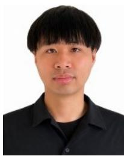  
THANH LE received the B.E. degree in information and communication technology and the M.S. degree in data science from Hanoi University of Science and Technology, Vietnam, in 2019 and 2021, respectively, and the Ph.D. degree in informatics from The Graduate University for Advanced Studies, SOKENDAI, Tokyo, Japan, in 2025. Since 2025, he has been a Researcher with the Wireless Systems Laboratory, National Institute of Information and Communications

Technology (NICT), Japan. His research focuses on bringing formal methods from software engineering to analyze, verify, and improve the robustness of AI-enabled wireless systems.

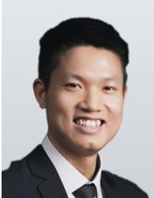

HAI DUONG received the B.S. and M.S. degrees in electrical engineering from Hanoi University of Science and Technology, Hanoi, Vietnam, in 2019 and 2021, respectively. He is currently pursuing the Ph.D. degree in computer science with George Mason University, Fairfax, VA, USA, where he works at the ROARS Lab on deep neural network verification. He develops NeuralSAT, a neural network verification tool that ranked second overall in VNN-COMP 2024 and 2025. His

research interests include DNN verification and testing, proof generation and checking, formal methods, and automated reasoning.

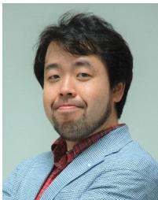

TAKESHI MATSUMURA received the M.S. and Ph.D. degrees in Electronic Engineering and Nano-mechanics Engineering from Tohoku University in 1998 and 2020, respectively. From 1998 to 2007, he was engaged in the R&D of wireless communications devices in several private companies. He joined National Institute of Information and Communications Technology (NICT) in 2007, focusing on white-space and 5G systems. From 2016 to 2019, he has served as Associated

Professor at Graduate School of Informatics, Kyoto University. He returned to NICT in April to take on the role of Research Manager and became Director of Wireless Systems Laboratory in 2021. He now serves as Research Executive Director at Network Research Institute and Project Manager of the Moonshot Goal 1 project. His research interests include white-space communication, wide-area wireless networks, 5G systems, and reliability-ensuring platform for cybernetic avatar teleoperation. He is a member of IEICE and IEEE.

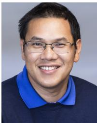

THANHVU NGUYEN received the B.S. and M.S. degrees in computer science from The Pennsylvania State University, USA, in 2003 and 2006, respectively, and the Ph.D. degree in computer science from the University of New Mexico, Albuquerque, USA, in 2014. He was a Postdoctoral Researcher with the University of Maryland, College Park, from 2014 to 2016, and an Assistant Professor with the University of Nebraska–Lincoln from 2016 to 2021. He is currently an Associate Professor

of Computer Science and the Director of the M.S. Software Engineering program at George Mason University, USA. He is a recipient of the NSF CAREER Award, the NSF CRII Award, two Amazon Research Awards, and three test-of-time paper awards, including the IEEE TSE Most Influential Paper Award and the ACM SIGSOFT ICSE 10-Year Most Influential Paper Award. He is a Senior Member of ACM and IEEE. His research lies at the intersection of software engineering and formal methods, focusing on AI safety and program correctness.