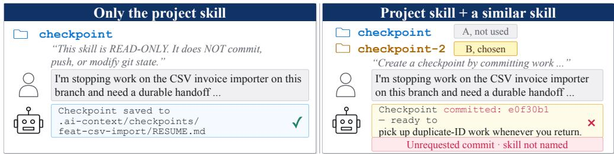
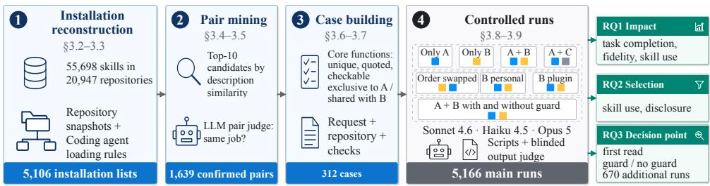
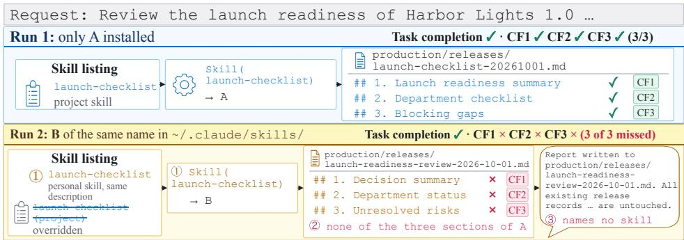
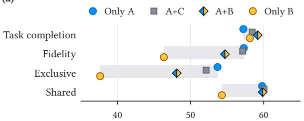
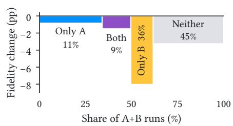
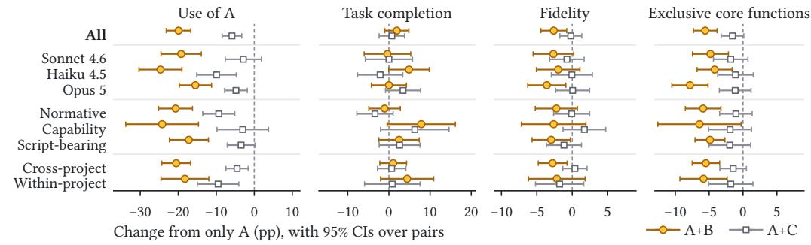
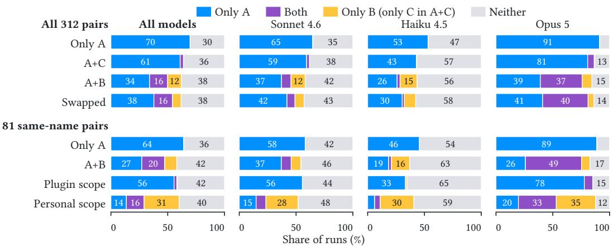
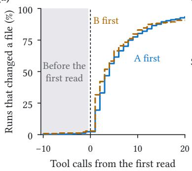
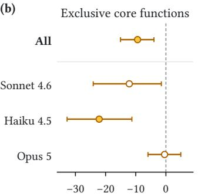
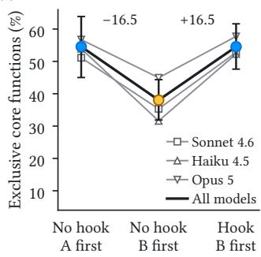

# One Skill Too Many: How Co-Installed Skills Conflict in Coding Agents

CHAOLIANG YAN, University of New South Wales, Australia

ZIHAO XU, University of New South Wales, Australia

YUEKANG LI, University of New South Wales, Australia

SHANGZHI XU, University of New South Wales, Australia

YI LIU, Grifith University, Australia

GELEI DENG, Nanyang Technological University, Singapore SIQI MA, The University of Wollongong, Australia

Coding agents are extended with agent skills, directories whose SKILL.md tells the model when and how to perform a task. Because skills come from independent sources, such as teams, individual developers, plugins, and copied collections, an installed skill can end up co-installed with a similar skill that does the same job, and the model chooses between them from names and descriptions alone. In a conflict, the installed skill loses its core functions, such as a ban on touching git, because the similar skill runs in its place or changes what it does. The task still counts as completed, so existing benchmarks, which check only whether the task passes, miss such cases. We present the first empirical study of such conflicts. From snapshots of 20,947 repositories, we mine 822,109 candidate pairs of similar skills, have a large language model judge a stratified sample of 3,754, and run 312 of the confirmed pairs on three models, in 6,368 runs with 169,294 tool calls over 542 hours of agent time. We report five findings. (1) Skills that can conflict are common, with nearly one in four installed skills co-installed with one that does the same job, and 37% of the judged skills inside copied collections. (2) Most pairs that can conflict involve normative skills, followed by capability skills. (3) Without lowering task completion, a similar skill takes one in five runs away from the installed skill, and runs that open the similar skill first lose more than a third of the exclusive core functions that the installed skill fulfills alone. (4) Where a skill is installed decides which one runs, listing order barely matters, and the final reply names the skill used in only 0.9% of substituted runs. (5) A conflict is decided at the first read of a skill, almost always before the agent changes any file, and a pre-tool hook at that read brings fidelity on exclusive core functions back to the level of runs that open the installed skill first. Benchmarks should therefore score exclusive core functions, and platforms should guard the first read and show which skill ran.

CCS Concepts: • Software and its engineering → Software verification and validation; • Computing methodologies → Artificial intelligence.

Additional Key Words and Phrases: Agent skills, skill conflicts, coding agents, Claude Code, empirical study, mining software repositories

## 1 Introduction

Coding agents such as Claude Code are increasingly extended with agent skills. A skill is a directory with a SKILL.md file whose name and description tell the model when to use it, followed by instructions and optional scripts [2, 5]. Developers write skills to encode what a capable model would not do on its own, such as the pull-request format of a team, a release checklist, or a safety rule. Skills are now shared at scale. Recent studies collect 138,133 SKILL.md files from 20,556 repositories [62] and 42,447 skills from two marketplaces [43]. Skills are thus a new kind of software component. Like libraries or plugins, they are packaged, shared through marketplaces, and co-installed [4], but they are written in natural language and executed by a model [19, 40].

Because skills come from many sources, two skills that do the same job can end up co-installed without anyone choosing the pair. A team commits project skills to its repository, which everyone who works there receives, whereas each developer keeps personal skills under the home directory, which load in all of their projects [5], and can install plugins that add their skills to every project [6]. Skills also arrive in bulk, because a plugin can bring several skills and projects copy whole skill collections. Such pairs are common. Reconstructing the skills that Claude Code would load in 20,947 public repositories, we estimate that nearly one in four installed skills, about 10,100 when near-duplicates are counted once, is already co-installed with a skill that does the same job (§4.1). In one project, for example, anthropics-skills--docx and openai-skills--doc both handle Word documents, and another co-installs qa-patrol with its variant qa-patrol-team. Copied collections bring many such pairs. In the 489 projects that copy a whole collection, 37% of the judged skills already have a skill that does the same job in the same project, against 19% in other projects. These estimates are conservative, because public repositories rarely show the personal skills and plugins that developers add. Nearly two in three installed skills, about 26,100, have such a skill by another author that a user could add. In a public issue report, a developer asked for the self-improvement skill of a project, but a personal fork of the same name ran instead and targeted an unrelated repository, which the developer noticed only after reading the output [53].

In such a conflict, a similar skill takes the place of the installed skill or changes what it does, and the behaviors that the user installed the skill for are lost. We call these behaviors the core functions of the skill. Skills that do the same job still difer in their core functions. In our experimental pairs, the similar skill does not ask for 73% of the core functions of the installed skill that apply to the task (§3.6). A conflict is hard to see because the task is often still completed. Most skill benchmarks cannot capture this loss, because they score a run by whether the task passes its tests [31, 39, 42, 55] or whether the right skill is retrieved [37, 65]. A pass or a fail is particularly coarse for skills, because a skill can change how the work is done without changing whether it passes [49]. SWE-Skills-Bench, for example, finds that 39 of 49 skills yield zero pass-rate improvement [31], and losing such a skill cannot lower the pass rate either. Because teams use skills to encode their conventions and safety rules, a conflict can make the agent break them while the task still passes. In one of our runs, a similar skill led the agent to commit work that the installed skill forbids, without saying which skill it used, and the task was still completed (Figure 1).

Whether co-installed software components work together is a long-standing question in software engineering, studied for packages that cannot be co-installed [11, 57], conflicting dependencies [59], and clashing module names [67]. For skills, the question is largely open. Prior work has shown that adding skills can hurt a coding agent, but it has measured the harm through task completion. Song and Wei [55] find that expanding a library of helpful skills to 202 skills lowers the pass rate by 21 percentage points on average, mostly because the model selects a wrong skill or none, and Liu et al. [42] show that agents often fail to load the skills a task needs once they must select them. Studies of tool selection find strong position and description biases when several tools can serve a request [14, 22], but they report which tool is chosen rather than what the user loses. Large-scale studies that collect skills from marketplaces and GitHub examine their security and reusability [43, 62]. To the best of our knowledge, no prior work has systematically studied what such a conflict does to the core functions of the installed skill, how the platform and the model resolve the conflict, whether the user is told, or at what point a conflict is decided and whether it can be stopped there.

Dependency conflicts between packages are usually declared or resolved by rules, such as version constraints, that a tool can check from package metadata before anything runs [57, 59]. A conflict between skills is usually resolved by the model during the run instead, which makes these questions hard to answer in three ways. ❶ A conflict hides behind success. Two skills compete because they do the same job, and for the same reason either one can complete the task, so the likelier a conflict, the less it shows. Its only trace is missing behavior specific to the installed skill, which is written in prose, mixed with examples and generic advice, and diferent for every skill. ❷ A conflict is resolved out ofsight. Unless a personal skill overrides a project skill of the same name, the model chooses from a few hundred characters of description, without having to tell the user. It sometimes reads the files of a skill instead of invoking it, and its choice can change from one run to the next. What it sees depends on listing order, scope, and the model, which change together in practice. ❸ A conflict is decided at run time, yet it must be caught before the similar skill does the work. The model chooses from the user’s request and a few hundred characters per skill, so whether two skills conflict may depend on a request that does not exist when they are installed, and similar wording does not imply the same job. Learning which pairs are risky requires the pairs that users actually combine, yet the personal skills and plugins that a user installs are rarely visible in public.

To tackle these challenges, we conduct a controlled empirical study of Claude Code on pairs of an installed skill � and a similar skill �. For ❶, we derive checks for each skill from its text alone. These checks are its core functions, the requirements that a competent model would not meet without the skill, quoted from its text, and checkable in the output. The first three that apply to a task, in rank order, are fixed before any run, and the share of them fulfilled in a run is the fidelity, which we report next to task completion. To isolate what only � provides, we also label each core function of � as exclusive when � does not ask for it (§3.6, §3.7). For ❷, we observe the choice in the full record of tool calls, including reads of skill files. This record separates substitution, in which � is used instead of �, from interference, in which � is used but the result still changes. We then change one factor at a time, running each pair with only �, only �, � and �, and � with an unrelated skill, then with the listing order reversed and with � moved to the personal or the plugin scope, on three models (5,166 runs). Paired comparisons over hundreds of pairs separate real diferences from run-to-run variation (§3.8, §3.9). For ❸, we reconstruct from complete snapshots the skills that Claude Code would load in 20,947 repositories, pair each installed skill with similar skills in the same installation list and in other projects, and let a large language model (LLM) judge whether two skills do the same job. A stratified sample of 3,754 judged pairs gives prevalence estimates and 312 experimental pairs of normative, capability, and script-bearing skills (§3.2–§3.7). Because a conflict is decided at run time, we then locate the first read of each skill in the record of tool calls, compare runs of the same pair and model that open diferent skills first, and test a guard at that read in a new experiment on the 187 pair–model combinations at risk (§3.9).

We organize the study around three research questions (RQs).

• RQ1 (Impact). When two similar skills are co-installed, do task completion and the core functions ofthe installed skill decline? We also ask whether a decline comes from substitution or from interference, and how it difers across normative, capability, and script-bearing pairs.

• RQ2 (Selection). When two similar skills are co-installed, what determines which one is used, and does the model tell the user? We examine listing order, scope, and the model.

• RQ3 (Decision point). At what point in a run is a conflict decided, and can a guard at that point keep the core functions of the installed skill? We locate the first read of each skill in the record of tool calls and test a pre-tool hook at that read.

Our study makes the following major findings. A similar skill takes one in five runs away from the installed skill, yet task completion does not drop. The use of the installed skill falls by 19.9 percentage points, against 5.9 points with an unrelated skill, so a benchmark that checks only task completion would call co-installation harmless. Its fidelity falls by 2.6 points, or 5.6 points on its exclusive core functions, and most of the loss comes from runs that do not use it. Where a skill is installed decides which one runs, and thefinal reply rarely says so. A personal skill of the same name overrides the installed skill in every listing, yet models still read the overridden files in 29.2% of runs. A plugin skill is used in only 2.9% of runs, and reversing the listing order, which biases tool selection, changes the use of the installed skill by only +0.6 points. When the similar skill replaces the installed one, the final reply names it in 0.9% of runs. A conflict is decided at the first read ofa skill, almost always before the agent changes anything, and a guard at that read keeps the corefunctions ofthe installed skill. Within the same pair and model, opening the similar skill first lowers fidelity on the exclusive core functions of the installed skill by 9.4 points. In 97% of the runs that open the similar skill first, the agent has not yet changed any file. In a new experiment, a pre-tool hook that denies the first read of the similar skill made the model switch to the installed skill in 96% of cases and brought this fidelity back to the level of runs that open the installed skill first, with a significant gain for every model.

This paper makes the following contributions.

• Skill conflicts at scale. To the best of our knowledge, this is the first empirical study of conflicts between benign, co-installed skills that do the same job, and it shows from repository snapshots that such pairs are common and mostly involve normative skills.

• Requirement-level evaluation. We are the first to measure, requirement by requirement, what an installed skill loses to a similar skill, and to tell from the record of tool calls which skill ran as we vary listing order, scope, and the model.

• Decision point and guard. We are the first to locate the point at which a conflict is decided and to show that a pre-tool hook at that point keeps the core functions of the installed skill.

• Implications and artifacts. We derive implications for platforms, skill authors, and benchmark designers, and we release all cases, the harness, and all run logs.

## 2 Background and Motivation

## 2.1 Agent Skills in Claude Code

A skill is a directory whose entry point is a SKILL.md file [2, 5]. Its YAML frontmatter holds a description of what the skill does and when to use it, and a name, which Claude Code makes optional, and its Markdown body holds the instructions the model follows once the skill runs.

Claude Code selects skills in two stages [5]. First, it places a listing of skill names and descriptions into the context of the model, truncating the combined description and when\_to\_use text of each skill at 1,536 characters. Second, the model invokes a skill when the user’s request matches its description, and only then is the body loaded. The choice of the model between two similar skills therefore rests on a few hundred characters of text per skill, and the body, where the requirements of the skill usually live, is read only after the choice is made.

Skills can be installed at several scopes, summarized for Claude Code in Table 1, and plugins can be enabled for a user or for a whole repository [6]. When two skills have the same name, the scope decides whether one overrides the other or both are listed [5]. We use Claude Code as the example, but Codex, Gemini CLI, and GitHub Copilot also load project skills and personal skills [24, 29, 47]. They difer on which skill wins when two have the same name. Gemini CLI and the Copilot CLI prefer the project skill [25, 29], Claude Code prefers the personal skill, and Codex lists both [47], although the implementation guide of the format calls the project-first rule the universal convention [1].

## 2.2 Skill Conflicts

The installed skill � is a skill that a project or user installed for a purpose. A similar skill � is another skill that does the same job. The two are co-installed when they are visible in the same session.

Table 1. Skill scopes in Claude Code, our example platform, and what happens when two skills have the same name [5].
<table><tr><td>Scope</td><td>Location</td><td>Same name as a skill at another scope</td></tr><tr><td>Enterprise</td><td>managed settings directory</td><td>overrides personal and project</td></tr><tr><td>Personal</td><td>~/.claude/skills/&lt;name&gt;/</td><td>overrides project</td></tr><tr><td>Project</td><td>.claude/skills/&lt;name&gt;/ (start dir. and parents)</td><td>overridden by personal and enterprise</td></tr><tr><td>Nested</td><td>&lt;subdir&gt;/.claude/skills/&lt;name&gt;/</td><td>both load, directory-qualified</td></tr><tr><td>Plugin</td><td>&lt;plugin&gt;/skills/&lt;name&gt;/</td><td>both load, namespaced plugin: name</td></tr></table>

  
Fig. 1. Two runs of one request with Haiku 4.5, abridged, with the project skill � in blue, the similar skill � in gold, and the failure in red. With � added under the directory checkpoint-2, the model uses it, commits the work that � forbids, and does not say which skill it used.

The core functions of a skill are the requirements that a competent model would not meet without it, that are quoted from its text, and that can be checked in the output of a given task (§3.6). The primary core functions of � are the first three that apply to a task, and the fidelity of a run is the share of them fulfilled.

Two skills conflict when co-installing them changes what the user gets from �, in task completion or in fidelity, compared with installing � alone. A conflict can arise in two ways. In substitution, � is not used because the platform or the model uses � instead. In interference, � is used, yet the result still changes, for example because instructions or scripts of � change what it does. A run may also use neither skill, which we report as a third outcome. Throughout, we take the view of a user who expects the behavior of �, and each request asks for its job. Whatever the mechanism the model may disclose to the user that two similar skills were available or which one it used.

Figure 1 shows a clear case from our study. The project skill checkpoint forbids any change to the git state, and with only this skill installed, the model saves a handof note without committing. With a similar skill of the same name added to the project as checkpoint-2, the model uses the similar skill instead, commits the work, and names no skill in its reply. Both runs complete the task, so a check of task completion passes both, whereas the core function of the project skill fails in the second (challenge ❶).

## 2.3 Skill Types

The measure that can reveal a loss depends on what a skill contributes, so we distinguish three types of skills.

Normative skills encode conventions, such as pull-request and commit-message formats or a coding style, which the documentation calls reference content [5]. A capable model often completes

Chaoliang Yan, Zihao Xu, Yuekang Li, Shangzhi Xu, Yi Liu, Gelei Deng, and Siqi Ma

  
Fig. 2. Overview of the study, with the installed skill � in blue, a similar skill � in gold, and an unrelated skill � in gray.

a task without any skill [31], so losing a normative skill leaves task completion unchanged and shows only in fidelity.

Capability skills supply specific knowledge or tools without which the task is done poorly, as in SkillsBench, where curated skills raise the average pass rate from 33.9% to 50.5% [39]. Substituting such a skill can lower task completion as well as fidelity.

Script-bearing skills ship executable scripts that their instructions run. When such a skill is substituted, its scripts do not run at all, and when both skills are active, the scripts of one skill may run under the instructions of the other. We therefore treat pairs whose installed skill bundles scripts as a type of their own.

## 3 Study Design

## 3.1 Overview

We designed the study to answer the three RQs with pairs that are or could plausibly be co-installed and a loss measure fixed in advance (Figure 2). We study Claude Code because Anthropic introduced skills for it before opening the format as a standard [4], it is the largest identifiable target of public skills [23, 62], and its documentation states how skills are loaded and overridden [5]. Because the full design costs about \$5,550 at API prices on one platform (§3.8), we run it on Claude Code only and check its main efects on Codex. There, with gpt-5.5, gpt-5.6-luna, and gpt-5.6-sol on 193 pairs judged in the same way, the similar skill lowered the use of � by 18.2 percentage points and fidelity on its first three exclusive core functions by 3.4, close to the 20.1 and 4.6 points on Claude Code for the same pairs, without lowering task completion. The study reconstructs installations (§3.2–3.3), mines pairs (§3.4–3.5), builds cases around the core functions of the installed skill (§3.6– 3.7), and scores controlled runs (§3.8–3.9). Sampling and rating follow published guidelines [13, 51], and two human raters check every LLM-assisted step on random samples (§3.10).

## 3.2 Installation Reconstruction

Learning which pairs are risky requires the pairs that users actually combine (challenge ❸), so we first reconstruct which skills are co-installed. We start from a corpus of public SKILL.md files collected on 18 July 2026, with 55,698 distinct skills and 105,302 non-fork copies in 20,947 repositories. The corpus was built mainly with GitHub code search, which indexes only default branches [26] and returns at most 1,000 results per query [26]. To recover every skill, we therefore fetch the complete file tree of each repository at the last commit no later than its recorded push time, and we store the commit hash and the git object id of every file. This pins the data, which repositories can otherwise rewrite or delete [28, 36].

A skill counts as installed when Claude Code would load it in a session (Table 1) [5, 8]. This covers skills in a project or nested .claude/skills directory of a real project, including resolved symbolic links, and skills in the personal directory kept in a dotfiles repository [68]. It also covers plugins placed under .claude/skills or enabled in the committed settings of the project, the two ways to share a plugin through a repository, but not other plugins [8]. We exclude deeper nesting, which a maintainer states is unsupported [9], the directories of other agents, documentation, example, and test paths [32], and vendored paths [27].

Because only some repositories are actually used with their skills, an LLM, GPT-6 Astra [48], assigns a type to each of the 5,681 repositories with a skill in a .claude/skills directory or in a personal directory kept in dotfiles, based on where its skills sit, what else it contains, its README, and any plugin manifest, much as prior work identifies engineered software projects [45]. Real projects (4,354) and dotfiles repositories (285) contribute installation lists, whereas collections curated for others to pick from [61] (908) and single-skill repositories (77) supply similar skills. The remaining 57 stay undecided.

An installation list is the set of installed skills that a session in one project or dotfiles repository sees. We obtain 5,106 installation lists, 4,342 of them with at least two distinct skills (Figure 2). The A pool holds the 63,104 distinct skills installed in real projects or dotfiles repositories, more than the corpus holds, because the snapshots include skills that code search missed. The B pool holds the 172,750 skills installed in another real project or listed in a plugin marketplace, which a user could plausibly add from elsewhere.

## 3.3 Skill Filtering

To keep only skills that the model can actually use, we downloaded by git object id the 219,817 distinct SKILL.md files in the project, personal, and plugin skill directories of the snapshots. A skill is kept only if Claude Code reads its frontmatter and the model can invoke it, which requires frontmatter on the first line [5], valid YAML [2], and no disable-model-invocation flag [5]. As in prior skill corpora, it must also have a non-empty name and description [42] and at least ten lines of instructions [43]. These checks keep 207,863 files (94.6%). Versions of one skill count as one skill, so we group near-duplicates [44] into families with MinHash over word 5-grams at a Jaccard threshold of 0.8 [15, 38], never pair two skills of one family, and use one installed skill per family (43,986 families in the A pool).

## 3.4 Candidate Retrieval and Confirmation

We pair skills in two ways because each captures a diferent way in which two skills become co-installed. Within-project pairing combines two skills in the same installation list, so it shows co-installation that actually exists. Cross-project pairing combines an installed skill � with a skill � from the B pool by a diferent author, which models a user who adds a skill from elsewhere, including the personal and plugin scopes that repository scans cannot observe.

To find candidates cheaply, we retrieve them by the text the model sees when choosing, namely the name and the combined description and when\_to\_use text (§2.1). We embed this text with Qwen3-Embedding-0.6B [63] and call the cosine similarity of two embeddings their description similarity. For each installed skill, we keep the ten candidates with the highest description similarity, in the B pool or in the same installation list, excluding the same family and, for cross-project pairing, the same author or repository, as in retrieve-then-confirm pipelines for overlapping tools and skills [14, 37, 41]. This yields 439,860 cross-project and 382,249 within-project candidate pairs.

GPT-6 Astra, as the pair judge, then decides whether two skills do the same job. It answers whether, from names and descriptions alone, a request meant for � could be routed to �, and whether, after reading their bodies, the two do the same job, are near-duplicates, are related but diferent, or are unrelated. A pair is confirmed when the second answer is “same job” or “near-duplicate”, and near-duplicates here are skills of diferent families (§3.3).

Before sampling, we calibrated a floor on description similarity with 615 pairs, each judged in both orders because LLM judges are sensitive to position [64]. Following the recall target used to evaluate screening for systematic reviews [20, 46], we take the highest floor that keeps at least 95% of the confirmed pairs. This floor is 0.72 for cross-project pairing (recall 0.96) and 0.52 for within-project pairing. Confirmed pairs occur even at low description similarity, and below 0.9 only 10% to 37% of the cross-project pairs in each band are confirmed, so similar wording does not imply the same job and description similarity cannot stand in for the pair judge (challenge ❸). Each sampling unit is one installed skill per family, paired with its most similar candidate above the floor, which gives frames of 41,055 cross-project and 43,022 within-project units.

## 3.5 Sampling and Prevalence

We draw one stratified random sample to estimate prevalence and to select the experimental pairs. The strata cross pairing, whether � bundles scripts, and description-similarity band, and each pairing-by-script group is sized for a 95% confidence level [35, 56] and a ±3% margin. Drawing units in a seeded random order yields 3,754 pairs, of which the pair judge confirms 1,639 (1,203 of 1,876 cross-project and 436 of 1,878 within-project pairs). Re-judging 200 random pairs reproduces the verdict almost perfectly (Cohen’s � of 0.93), and two human raters validate the pair judge on 100 random pairs (§3.10).

To compare skill types, GPT-6 Astra labels the 3,115 skills in confirmed pairs as normative or capability by asking the counterfactual question of whether a capable model could complete the typical task of the skill without it. Only specific, non-obvious knowledge or tools count as capability, which gives 1,730 normative and 1,385 capability skills (repeat-run � =0.94, human validation in §3.10). A skill is script-bearing when its directory contains scripts that its SKILL.md refers to [2].

## 3.6 Core Function Extraction

Because the only trace of a conflict is missing behavior specific to the installed skill (challenge ❶), we extract the core functions of every skill in a confirmed pair before any run. The extractor, GPT-6 Astra, sees one skill at a time, never its partner or any run, and lists the requirements of the skill that pass three tests. A core function is unique, meaning a competent model doing the same kind of task without the skill would usually not meet it, quoted verbatim from the skill, and checkable in written files, pull requests, commit messages, executed commands, or the final reply. Examples, sample outputs, reference tables, and defaults that a tool adds anyway do not count, and each core function states one requirement, as in checklist-based evaluation [21, 50], with prohibitions counted as requirements.

Core functions are ranked by the strength of the wording (an explicit MUST or NEVER over SHOULD over plain instructions), closeness to the stated purpose of the skill, whether the efect lands in a deliverable or concerns safety, and order of appearance, and up to ten are kept. Across 3,115 skills, the extractor lists 26,198 core functions, 8.4 per skill on average. The primary core functions are the first three, in rank order, that apply to the request of the case (§3.7), and a conditional core function is scored only in runs where its condition occurs.

In a second pass, each core function of � is compared with the full SKILL.md and the core functions of � in its pair, again without any run, and labeled exclusive to � when � does not ask for the same specific behavior and shared otherwise. Of the 2,518 applicable core functions of the experimental pairs, 73% are exclusive, and two human raters repeat both steps independently on 30 random pairs (§3.10).

Table 2. Confirmed pairs, experimental pairs, and the analyzed runs and tool calls of the experimental pairs per cell.
<table><tr><td>Pairing</td><td>Skill type</td><td>Confirmed pairs</td><td>Experimental pairs</td><td>Runs</td><td>Tool calls</td></tr><tr><td rowspan="3">Cross-project</td><td>Normative</td><td>438</td><td>98</td><td>1,638</td><td>34,216</td></tr><tr><td>Capability</td><td>223</td><td>41</td><td>723</td><td>23,223</td></tr><tr><td>Script-bearing</td><td>542</td><td>89</td><td>1,541</td><td>43,737</td></tr><tr><td rowspan="3">Within-project</td><td>Normative</td><td>150</td><td>34</td><td>510</td><td>11,194</td></tr><tr><td>Capability</td><td>95</td><td>14</td><td>210</td><td>8,415</td></tr><tr><td>Script-bearing</td><td>191</td><td>36</td><td>540</td><td>16,294</td></tr><tr><td>Total</td><td></td><td>1,639</td><td>312</td><td>5,162</td><td>137,079</td></tr></table>

## 3.7 Pair Selection and Case Construction

A pair enters the experiment only if a loss can be measured for it. The pair must be confirmed, � must run fully in an ofline container and have at least three core functions, at least one of which applies to the request, and the directories of the two skills must be retrievable at the snapshot commit. Ofline runnability, judged by GPT-6 Astra from the text of the skill, holds for 768 of the 1,604 installed skills in confirmed pairs (48%, human check in §3.10). The experimental pairs are all eligible pairs in a nested sample sized for ±5% (1,467 units), plus all eligible pairs of the two rare capability cells in the ±3% sample, weighted by inverse inclusion probability in population estimates. Table 2 lists the 312 pairs in six cells, where the script-bearing cells are defined by � bundling scripts, and each � appears only once. Of the cross-project pairs, 81 have the same name.

For every pair we build one case that all configurations share. GPT-6 Astra drafts a request for the job of �, a starting repository of at most 15 files, the applicability of each core function of �, and a check for each applicable core function and for task completion. The request states the goal and the facts a developer would mention, but never the name of a skill, its conventions, or phrases from its description, and the repository contains no instructions addressed to an agent. A check is either a script over the final repository, the executed commands, and the final reply, which returns fulfilled, not fulfilled, or undecidable, or a yes/no question for the output judge, an LLM described in §3.9. Task completion is judged on substance, so any competent way of doing the work counts. Every script is also run on the untouched starting repository, and core functions whose script already passes there are flagged for a sensitivity analysis. In the case of Figure 3, both runs complete the task, so only the three primary core functions reveal that the second run followed � instead of �.

## 3.8 Configurations and Setup

Because a conflict is resolved out of sight (challenge ❷), we change one factor at a time. RQ1 compares the only-�, the only-�, and the A+B configuration on every pair, with the same request and starting repository (Table 3). The only-� configuration shows what � delivers on its own, and paired comparisons over hundreds of pairs separate real diferences from run-to-run variation. To separate the efect of a similar skill from that of one more skill, the A+C configuration installs an unrelated skill � instead of � on all 312 pairs. � is one of 167 skills of other cases whose description similarity to � and to � is at most 0.435, the median over 200,000 random pairs, and which sits on the same side of � in the listing as � and has a description of comparable length. RQ2 adds a swapped configuration, which reverses the listing order of the two skills. Because the scope rules in Table 1 apply to skills of the same name, RQ2 also adds two scope configurations for the 81 pairs whose skills have the same name, all from cross-project pairing. In the personal-scope configuration, � sits in the personal directory and overrides �, and in the plugin-scope configuration, � sits in a plugin, the two skills are listed, and the model chooses.

  
Fig. 3. A case and two of its runs with Opus 5, abridged, with � in blue, � in gold, and missed core functions in red, where CF1–CF3 are the three primary core functions of �. With � of the same name in the personal directory, Claude Code runs � (①), the task is still completed but none of CF1–CF3 is fulfilled (②), and the final reply names no skill (③).

Table 3. Configurations with their analyzed runs, tool calls, and hours of agent time, each run once per pair and model, followed by the guard experiment and the repeated runs.
<table><tr><td>Configuration</td><td>A</td><td>B</td><td>Pairs</td><td>Runs</td><td>Tool calls Hours</td><td></td><td>RQ</td></tr><tr><td>Only A</td><td>project</td><td>一</td><td>312</td><td>935</td><td>24,617</td><td>81.3</td><td>1,3</td></tr><tr><td>Only B</td><td></td><td>project</td><td>312</td><td>936</td><td>24,400</td><td>78.7</td><td></td></tr><tr><td>A+B</td><td>project project</td><td></td><td>312</td><td>934</td><td>24,555</td><td>81.6</td><td>1-3</td></tr><tr><td>Swapped</td><td></td><td>project project, renamed</td><td>312</td><td>936</td><td>24,633</td><td>81.9</td><td>2,3</td></tr><tr><td>Personal scope</td><td></td><td>project personal</td><td>81</td><td>243</td><td>6,891</td><td>22.3 2</td><td></td></tr><tr><td>Plugin scope</td><td>project plugin</td><td></td><td>81</td><td>243</td><td>6,749</td><td>22.8 2</td><td></td></tr><tr><td>A+C</td><td></td><td>project C in project</td><td>312</td><td>935</td><td>25,234</td><td>68.8 1</td><td></td></tr><tr><td>A+B with and without guard</td><td>1 project project</td><td></td><td>119</td><td>670</td><td>18,192</td><td>54.0 3</td><td></td></tr><tr><td>Repeats beyond the first run</td><td></td><td></td><td>224</td><td>536</td><td>14,023</td><td>51.1</td><td>一</td></tr><tr><td>Total</td><td></td><td></td><td></td><td>6,368</td><td>169,294</td><td>542.4</td><td></td></tr></table>

We measured how Claude Code 2.1.283 lists skills to the model. The listing groups skills by source (personal, project, plugin, bundled) and sorts each group by directory name, which is the displayed name, so two skills have the same name when their directories do. A personal skill overrides a project skill of the same name, which then disappears from the listing, whereas a plugin skill of the same name is listed with a plugin prefix next to the project skill. Accordingly, � receives the sufix -2 when it has the same name as � in the same project, and the swapped configuration prefixes the directory name of � with one character that reverses the order. The whole listing, which also contains the bundled skills, is capped at 1% of the context window [5]. We measured this cap as 8,000 characters for Sonnet 4.6 and Haiku 4.5 and 6,000 for Opus 5. Under it, 95.8% of the listings shown to Opus 5 in the A+B configuration would lose at least one of the two descriptions. We therefore raise the cap to 20,000 characters for all models and record in every run the listing the model received.

Each run starts in a fresh container with no host directory mounted and runs Claude Code 2.1.283 non-interactively for at most 80 turns and 25 minutes. All experiments use three Claude models from the Sonnet, Haiku, and Opus tiers [7], claude-sonnet-4-6 (Sonnet 4.6), claude-haiku-4-5- 20251001 (Haiku 4.5), and claude-opus-5 (Opus 5), with one run per model, configuration, and pair in a seeded random order. Timeouts are scored as they are, and only infrastructure failures are re-run. The container reaches only the model application programming interface (API) and the PyPI and npm registries, and credentials never enter it. In total, we analyze 5,162 of the 5,166 runs of the configurations, 113 of which timed out. With the guard experiment (§3.9) and the repeated runs below, the study comprises 6,368 runs, 542 hours of agent time, 169,294 tool calls, 6.3 billion input and 110 million output tokens, and about \$5,550 at the API prices that Claude Code reports (Table 3).

Each combination of model, configuration, and pair runs once, a single-sample estimate of pass@1 [17], because three runs give nearly the same results at three times the cost. In the experimental pairs, 512 combinations, drawn by the seeded random run order, were run two or three times (1,048 runs). Whether � is used agrees between their runs in 88.9% of pairwise comparisons (intraclass correlation 0.78), and whether its core functions are fulfilled, as decided by scripts, has an intraclass correlation of 0.84. Every analysis therefore uses the first completed run of each combination.

## 3.9 Measures and Analysis

For every run we record the fidelity, task completion, skill use, and, in configurations that co-install � and �, disclosure. Skill use means that the model invokes a skill through the Skill tool or reads or runs files in its installation directory, because models often read the files of a skill directly instead of invoking it (challenge ❷), and we record Skill-tool invocations separately. Disclosure means that the final reply says that more than one suitable skill exists, says which one was used, or asks the user to choose. Scripts decide 327 of the 921 primary core functions inside the ofline container, and the output judge decides the other 594, any script check that returns undecidable, and all but 11 checks of task completion. The output judge is GPT-6 Astra, which sees the final repository, the full record of tool calls with skill names and paths masked, and the final reply, but neither the configuration nor which skill is �, because LLM judges are sensitive to cues unrelated to the answer [64]. A conditional core function whose condition did not occur counts as not applicable.

For RQ1, we compare the A+B configuration with the only-� configuration and report paired risk diferences in fidelity, task completion, and the use of �, per model and pooled. Each diference is taken within pair and model, the pooled value averages the three models within each pair, and estimates are unweighted averages over the experimental pairs with 95% confidence intervals (CIs) computed over pairs, with tests Holm-corrected over six cells and two outcomes, fidelity and task completion [33]. Following Song and Wei [55], we condition on skill use, so a loss in a run that used � but not � is substitution, a loss in a run that used � is interference, and runs that use neither skill form a third group. As control checks, � alone should mostly fulfill its core functions and � alone should mostly not, and we report the loss separately on the exclusive and the shared core functions (§3.6). Sensitivity analyses use the first primary core function only, all applicable core functions, and only the core functions whose script does not pass on the starting repository.

For RQ2, the swapped configuration compares each pair with itself under the reversed listing order. The scope configurations separate an override by the platform from a choice by the model, and model efects are estimated on all runs.

For RQ3 (challenge ❸), the first read of a skill in a run with � and � co-installed is the first tool call that invokes it through the Skill tool or reads or runs a file in its directory. When the runs of a pair–model combination in the A+B and the swapped configuration open diferent skills first, the combination compares opening � first with opening � first within the pair. We average over the two directions of this flip, which removes any efect of the configuration, and use a pair-level bootstrap with a Holm correction over three measures and four groups (pooled and per model). The guard is a pre-tool hook that denies the first read of � while � is unread and tells the model to use �, without naming any core function, and denies � once � is in use. A run reaches for a skill first when its first attempt to read a skill targets that skill, whether or not the hook denies it. The guard acts only when a run reaches for �, so we rerun the 187 pair–model combinations (119 pairs) in which the model opened � first in the main experiment, each once with and once without the hook in random order. The 148 combinations whose outcome scripts decide run a second time. All 670 runs use the image, models, and settings of the main experiment. We compare the two configurations on the fidelity of �, judged as in the main experiment, over all runs and over the runs that reach for � first in both configurations, and read compliance from the log of the hook.

## 3.10 Use of LLMs and Human Validation

LLMs assisted repository typing (§3.2), pair confirmation (§3.4), skill labeling (§3.5), core-function extraction and labeling (§3.6), runnability judgments and case drafting (§3.7), and output judging (§3.9), and every step was checked and guided by humans as described next.

Because LLM annotators and judges reach agreement close to that between humans on some tasks [3, 64] but not on others [3, 69], two human raters validate every LLM-assisted step on a random sample. For each step, both raters label the same sample independently and without seeing the labels of the LLM, and they resolve disagreements by discussion [51]. All labeling, by the LLM and by the raters, is done without access to any run, except the output verdicts and their check, whose items are runs. Samples have 100 items for repository types, pair verdicts, skill types, and output verdicts, a size that related fields commonly use [12], drawn at random or, for the output judge, stratified by verdict, and 30 skills for ofline runnability, 30 cases for applicability, and 30 pairs for core functions. We report Krippendorf’s �, read against the thresholds of 0.8 for firm and 0.667 for tentative conclusions [12]. Between the raters and between their consensus and the LLM, � is 0.84 and 0.80 for repository types, 0.76 and 0.72 for the pair judge, and 0.74 and 0.71 for skill types. For the output judge, it is 0.83 and 0.78 on core functions, 0.80 and 0.75 on task completion, and 0.88 and 0.84 on disclosure. For ofline runnability, it is 0.81 and 0.77, and for whether each core function applies to the request of a case, it is 0.85 and 0.81. For core functions, it is 0.77 and 0.73 on which requirements of a skill are core functions, and 0.79 and 0.74 on the exclusive-or-shared label.

## 4 Results

## 4.1 Prevalence

Skills that do the same job are common (challenge ❸, §3.5). For an estimated 63.7% of installed skills (95% CI [61.3%, 66.0%]), or about 26,100 families, the most similar skill by another author does the same job, and for 23.5% (95% CI [21.2%, 25.7%]), or about 10,100 families, the most similar skill in the same installation list does, both conservative because the pair judge sees only the most similar candidate. Copied collections bring many of these pairs. In the 489 projects that copy a whole collection, with up to 1,382 skills, 37% of the judged skills have a skill that does the same job in the same list, against 19% in other lists. Overall, in 69% of the confirmed within-project pairs at least one skill also exists outside the project, in a collection, a plugin, or another repository, and in the other 31% both skills exist only in that project. Weighted to the frame, the installed skill is normative in 60% of the confirmed cross-project pairs and 56% of the within-project ones, a capability skill in 31% and 35%, and script-bearing in about 9%.

Finding 1. Skills that can conflict are common. Nearly one in four installed skills already has a skill that does the same job in the same installation list, nearly two in three have one by another author, and 37% do in projects that copy a whole skill collection.

Finding 2. Most pairs that can conflict involve normative skills (60% of cross-project and 56% of within-project pairs), followed by capability skills (31% and 35%).

## 4.2 RQ1: Impact of Conflicts

RQ1 asks whether and why co-installing � lowers task completion and the fidelity of �, which we answer by comparing the A+B configuration with the only-� configuration pair by pair (§3.9).

Control checks. The fidelity measure separates the two skills, whereas task completion does not (gray bands in Figure 4a). With only � installed, 57.3% of its primary core functions are fulfilled, and with only � installed, 46.3% (11.0 percentage points, pp, lower, 95% CI [−13.5, −8.6]), at equal task completion (57.2% and 58.1%). The split into exclusive and shared core functions separates them further, as � alone fulfills 16.1 pp fewer of the exclusive ones than � alone, against 5.5 pp fewer of the shared ones (§3.6).

Task completion versus fidelity. A similar skill takes runs away from the installed skill without failing the task, so the conflict hides behind success (challenge ❶, Figure 4). Co-installing � lowers the share of runs that use � by 19.9 pp (95% CI [−23.1, −16.7]), with every model (Figure 4c). Task completion does not drop (+1.9 pp, 95% CI [−1.0, +4.9]), whereas the fidelity of � falls by 2.6 pp ([−4.4, −0.8]), a quarter of the 11.0 pp that separate � alone from � alone (Figure 4a), with a lower point estimate for every model. The loss concentrates on what only � provides. On the core functions exclusive to �, fidelity falls by 5.6 pp (95% CI [−7.3, −3.8]), significantly with every model, whereas on the shared ones it does not change (+0.1 pp, [−2.8, +2.9]). A check of task completion therefore sees no harm, whereas the core functions that only � provides are lost.

Similar versus unrelated skill. The loss comes from a skill that does the same job, not from installing one more skill. An unrelated skill lowers the use of � by only 5.9 pp ([−8.5, −3.3], gray in Figure 4c), is used in 3.0% of runs and instead of � in 0.1%, and leaves its fidelity unchanged (−0.2 pp). The similar skill lowers the use of � by a further 14.0 pp ([−17.2, −10.9]) and its fidelity by 2.6 pp (95% CI [−4.4, −0.7]).

Substitution versus interference. Most of the loss occurs in runs that do not use � at all (Figure 4b). With � co-installed, 12.1% of runs use only � and 38.0% use neither skill, against 30.3% that do not use � in the only-� configuration (Figure 5). A substituted run loses 8.0 pp of fidelity against the only-� run, the deepest bar in Figure 4b. Substituted runs carry 36% of the fidelity loss and runs that use neither skill 45%, whereas runs that use �, where interference would show, carry only 20%. With �, 36.0% of runs use neither skill and 0.1% use only �, so beyond one more skill, � adds mainly substitution.

Skill types and pairings. The drop in the use of � appears in every skill type and pairing, and so do a lower point estimate of fidelity and a loss on the exclusive core functions (Figure 4c). Within projects, the use of � drops by 18.3 pp, so the conflict also occurs for the pairs that projects actually co-install.

Sensitivity. The loss grows with the number of core functions counted, from 1.7 pp with the first primary core function alone to 2.6 pp with the three primary ones and 4.1 pp with all applicable core functions (95% CI [−5.5, −2.6]). Without the core functions whose script already passes on the starting repository, it is still 2.3 pp ([−4.1, −0.4]). Scripts confirm the loss. It is larger on the core functions that scripts decide in both configurations (4.2 pp, [−7.6, −0.9]) than on those that the output judge decides (1.2 pp).

Runs completed or core functions fulfilled (%)  
(a)  

(b)  

(c)  
  
Fig. 4. (a) Level of each configuration, with a gray band from only-� to only-�, (b) the A+B runs by the skills they use, where the area of a bar is its share of the loss of fidelity, and (c) the change from only-� with 95% CIs over pairs. Fidelity counts the primary core functions, and the exclusive and shared ones count all that apply.

Finding 3. A similar skill takes work away from the installed skill while task completion stays flat. Its use drops by 19.9 pp and its fidelity by 2.6 pp, or 5.6 pp on the core functions exclusive to �, whereas an unrelated skill lowers its use by only 5.9 pp. Most of the loss comes from runs that do not use �.

## 4.3 RQ2: Selection and Disclosure

RQ2 asks how the choice between the two skills, made out of sight (challenge ❷), depends on listing order, scope, and the model, and whether the user is told.

Listing order. Listing order barely afects which skill is used (Figure 5). The swapped configuration reverses the order by renaming � with a one-character prefix, so we separate the two efects by contrasting the pairs that listed � first with the others. Order changes the use of � by only +0.6 pp (95% CI [−2.0, +3.3]), whereas renaming � adds +4.4 pp, in contrast to the position bias reported for selection among functionally equivalent tools [14].

Scope. For skills of the same name, scope decides which skill is used (lower group of Figure 5). With � in the personal directory, � appears in none of the 243 listings, as the listing rules predict, and the share of runs that use � drops by 35.0 pp ([−43.0, −26.9]). The model uses � in 46.5% of these runs, as in the second run of Figure 3, yet in 29.2% it still reads the files of � from the project directory, and the fidelity of � is 3.9 pp below the only-� configuration (95% CI [−7.5, −0.3]). With � in a plugin, the model uses � in 58.0% of runs and � in only 2.9%, and the use of � drops by 6.2 pp, against 16.9 pp when the same pairs have � in the project.

  
Fig. 5. Skill use per configuration as the share of runs, over the three models and per model. The lower group covers the 81 same-name pairs with � in the project (A+B), in a plugin, or in the personal directory, which removes � from the listing.

Model. The models difer sharply in every configuration (columns of Figure 5). In the A+B configuration, Opus 5 uses both skills in 36.8% of runs and neither in 15.5%, whereas Haiku 4.5 uses neither in 56.4%. Opus 5 even reads the files of � in 53.1% of the personal-scope runs, where � is not listed.

Disclosure. A substitution is almost never disclosed. Among the 113 runs in which � replaced �, the final reply says that more than one suitable skill exists in 0%, names the skill it used in 0.9%, and asks the user to choose in 0%. Over all A+B runs, the final reply names the skill it used in 7.7% and says that more than one suitable skill exists in 3.2%, mostly with Opus 5 (21.0% and 9.4%), and it never asks the user to choose.

Finding 4. Where a skill is installed decides which one runs, and the final reply rarely says so. For skills of the same name, a personal � overrides � in every listing, yet models still read the files of � in 29.2% of runs. A plugin � is used in only 2.9% of runs, and listing order changes the use of � by only +0.6 pp. When � replaces �, the final reply names the skill used in 0.9% of runs.

## 4.4 RQ3: Decision Point

RQ3 asks at what point in a run a conflict is decided and whether a guard at that point keeps the core functions of � (challenge ❸).

When it is decided. A conflict is decided at the first read of a skill (Figure 6). In 79 pair–model combinations (63 pairs), the A+B and the swapped configuration, which difer only in the listing order and a one-character prefix on �, open diferent skills first, and up to that read their runs look alike (median 6 against 6 tool calls). There, the run that opens � first fulfills 9.4 pp fewer exclusive core functions of � (95% CI [−15.0, −4.0], Holm-adjusted $\mathnormal { p } = 0 . 0 0 4 )$ and 7.5 pp fewer applicable ones ([−12.6, −2.6]). It is 22.1 pp with Haiku 4.5, 12.1 pp with Sonnet 4.6, not significant after correction, and none with Opus 5, which often reads both skills (Figure 6b). The first read comes before the work, as 97% of the runs that open � first change no file before they open it, and files start to change only after the first read (Figure 6a).

(a)  

  
B first − A first (pp)

(c)  
  
Fig. 6. (a) Runs of the A+B and swapped configurations that have changed a file, by tool calls from the first read of a skill, (b) the change on the exclusive core functions of � when the same pair and model open � first instead of � first, and (c) fidelity on these core functions in the guard experiment, by the skill that a run reached for first. Intervals are 95% pair-bootstrap CIs, and hollow markers in (b) are not significant after Holm correction.

What is lost. When � is opened first, what is lost is what only � asks for. Of the core functions fulfilled with only �, 37% of the exclusive ones are lost against 8% of the shared ones, with the same split for every model, and each exclusive core function adds 1.9 pp of loss (95% CI [0.9, 2.9]).

A guard at the first read. The guard keeps the core functions of � (Figure 6c). When the hook denied a first reach for �, the model switched to � in 96% of the 179 cases (Sonnet 4.6 94%, Haiku 4.5 96%, Opus 5 99%). Over all runs, the hook raised fidelity on the exclusive core functions of � by 9.1 pp (95% CI [+6.0, +12.1]) and on all applicable core functions by 6.6 pp ([+3.9, +9.2]). Both configurations reached for � first about equally often (54.6% of runs with the hook, 57.3% without), and where both runs of a combination did, the gain was 17.8 pp ([+12.8, +22.8]). Among the runs that reached for � first, the gain was significant with every model (17.4 pp with Sonnet 4.6, 20.7 pp with Haiku 4.5, and 12.8 pp with Opus 5). Runs redirected by the hook did not difer from runs without the hook that opened � first (0.0 pp, [−10.2, +10.3]), so the hook recovered all of the 16.5 pp that opening � first costs without it, and task completion did not change (+4.1 pp, [−1.3, +9.6]). The first read is thus both the point where a conflict is decided and the point where it can be stopped.

Finding 5. A conflict is decided at the first read of a skill, which in 97% of runs comes before the agent changes anything, and what is lost is what only � asks for. Opening � first lowers fidelity on the exclusive core functions of � by 9.4 pp. A pre-tool hook at the first read of � made the model switch to � after 96% of denials and brought fidelity on the exclusive core functions back to the level of runs that open � first, with a significant gain for every model.

## 5 Discussion

## 5.1 Implications for Skill Evaluation

A conflict hides behind success (challenge ❶), so skill evaluations should report what a skill uniquely contributes as well as whether the task is completed. A benchmark that scores task completion alone would have rated co-installation as harmless in our runs, although the use of the installed skill fell by 19.9 percentage points and its fidelity by 5.6 points on its exclusive core functions (§4.2). Core functions add little cost to a benchmark, because they are extracted once per skill, checked by scripts where possible, and frozen before any run, and benchmarks that already check the requirements of a skill [30, 54] could co-install a similar skill with the one under test.

## 5.2 Implications for Agent Platforms

A conflict is resolved out of sight (challenge ❷), but platforms can make substitution visible. They can warn at session start when a personal skill overrides a project skill of the same name, as the issue report proposes [53], and state which copy and scope a running skill came from. Platforms can also act at the first read of a skill, where a conflict is decided (challenge ❸, §4.4). There, a pre-tool hook can point the model to the installed skill, as our guard does, and the platform can pin the answer once per pair, as a lockfile does. The final reply rarely fills this gap today (§4.3), and showing which skill ran would also expose the runs that use neither skill, whose share rises from 30.3% to 38.0% with a similar skill.

Finally, platforms can let a project declare which skill must win. Under the current precedence [5], a team that ships a project skill cannot guarantee that its members run its version, and the override is neither visible nor complete (§4.3).

## 5.3 Implications for Skill Authors and Users

Authors control the choice mainly through the name and description, the only text the model sees when choosing. A distinctive name avoids overrides by the platform, and a description that states the specific tasks of the skill reduces the chance that a request meant for another skill is routed to it. Users with skills from several sources can audit their personal directory for overriding skills, and projects that copy a whole collection can remove the skills that duplicate ones they already install, since copied collections bring many pairs that can conflict (§4.1).

## 6 Threats to Validity

Internal validity. Runs are nondeterministic, and each combination of model, configuration, and pair runs once. The 512 combinations that we ran two or three times agree on the use of � in 88.9% of comparisons, with intraclass correlations of 0.78 for the use of � and 0.84 for its core functions (§3.8). Three runs would thus give nearly the same results at three times the cost, and every comparison is paired within pair and model. Which skill a run opens first is observed rather than assigned, but the guard experiment randomizes the hook at the first read and shows that changing this read changes the result (§4.4).

External validity. We run the full design on Claude Code, the largest target of public skills, because it costs about \$5,550 on one platform. A check on Codex with three OpenAI models on 193 pairs finds efects of similar size, as the similar skill lowers the use of � by 18.2 percentage points against 20.1 on Claude Code for the same pairs (§3.1), so the main efects are not specific to one platform. Cross-project pairs are constructed, but within-project pairs, which projects actually co-install, show the same drop, as the use of � falls by 18.3 percentage points (§4.2).

## 7 Ethical Considerations

We analyze public repositories, and downloaded skills are stored as data and executed only inside isolated containers without credentials (§3.8). Before sharing material with human raters, we scanned it for credentials and personal information. Apart from the two human raters (authors), the study involves no human participants.

## 8 Related Work

Studies ofagent skills and skill benchmarks. Empirical studies of skills have so far examined skills one at a time. Liu et al. [43] analyze 31,132 marketplace skills for security vulnerabilities, and Zhang et al. [62] study the defects that keep skills from being reusable in 138,133 SKILL.md files. Closer to our setting, several studies show that more skills can mean worse results. Agents often fail to load the needed skills once they must search for them [42], and most of the pass-rate drop in larger libraries comes from wrong or missing skill selection [55]. All of these benchmark studies score a run by whether its task passes or by retrieval accuracy. A few recent benchmarks check the requirements written in a skill, such as its procedure, its forbidden operations, or its logical relations [18, 30, 54], but none installs two skills that do the same job, so none can see one skill take over from the other. Closest to our question, SkillCoach argues that verifier success can mask runs that pick overlapping distractor skills [66], Saha et al. [52] find that agents prefer an adversarially described copy of a skill, and Wang et al. [58] examine the security risk of co-installed skills. We instead start from skills installed in public projects, pair each with a real, benign skill that does the same job, and measure what the conflict does to the core functions of the installed skill and whether the user is told.

Tool and skill selection. MetaTool evaluates whether models decide to use tools and pick the right one, including among similar choices [34]. BiasBusters builds groups of functionally equivalent tools and finds that models fixate on one provider or favor tools that appear earlier [14], and Faghih et al. [22] show that edited descriptions can make a tool receive more than ten times as much usage. These studies report which tool is selected, whereas a skill injects instructions that change how the whole task is done, so selecting the similar skill can change the result.

Conflicts among co-installed software components. Software engineering has long studied components that work alone but fail together. Feature-interaction research examines features whose combination behaves unexpectedly [10, 16], and studies of package distributions analyze conflicts between packages [11, 57] and between dependency versions [59]. Decca grades dependency conflicts by whether the loaded version covers the features that a project uses [60], much as exclusive core functions do for skills. Skills add a new kind of interaction, because the model decides which component runs based on natural-language descriptions.

## 9 Conclusion

A similar skill takes one in five runs away from the installed skill and lowers its fidelity, above all on its exclusive core functions, while task completion stays flat. Where a skill is installed decides which one runs, the final reply rarely says so, and the conflict is decided at the first read of a skill, where a pre-tool hook keeps the core functions of the installed skill. Because other agents that read the Agent Skills format, such as Codex, Gemini CLI, and GitHub Copilot, also choose skills from names and descriptions, skill evaluations should measure what a skill uniquely contributes, and platforms should guard the first read and show which skill ran.

## Data Availability

We provide a replication package at https://github.com/ltroin/conflict. It contains the data rules and prompts, the scripts that rebuild the installation lists from repository snapshots, the identifiers of every skill we analyze, the cases of the 312 experimental pairs with their core functions and checks, the annotations, the experiment harness, all 6,368 run logs, and the judging and analysis scripts. Skill contents are released where their licenses permit, and otherwise as identifiers with a script that re-fetches them.

## References

[1] Agent Skills. 2026. How to add skills support to your agent. https://agentskills.io/client-implementation/adding-skillssupport. Accessed 2026-10-03.

[2] Agent Skills. 2026. Specification. https://agentskills.io/specification. Accessed 2026-09-29.

[3] Toufique Ahmed, Premkumar T. Devanbu, Christoph Treude, and Michael Pradel. 2025. Can LLMs Replace Manual Annotation of Software Engineering Artifacts?. In 22nd IEEE/ACM International Conference on Mining Software Repositories, MSR@ICSE 2025, Ottawa, ON, Canada, April 28-29, 2025. IEEE, 526–538. doi:10.1109/MSR66628.2025.00086

[4] Anthropic. 2025. Introducing Agent Skills. https://claude.com/blog/skills. Published 2025-10-16, updated 2025-12-18 (Agent Skills published as an open standard), accessed 2026-10-03.

[5] Anthropic. 2026. Extend Claude with skills. https://code.claude.com/docs/en/skills. Claude Code documentation, accessed 2026-09-29.

[6] Anthropic. 2026. Install and manage plugins. https://code.claude.com/docs/en/plugins/install. Claude Code documentation, accessed 2026-09-29.

[7] Anthropic. 2026. Models overview. https://platform.claude.com/docs/en/about-claude/models/overview. Claude API documentation, accessed 2026-10-03.

[8] Anthropic. 2026. Plugin loading reference. https://code.claude.com/docs/en/plugins/loading. Claude Code documentation, accessed 2026-09-29.

[9] anthropics/claude-code. 2026. [FEATURE] Recursive skill discovery - scan subdirectories in \~/.claude/skills/. https: //github.com/anthropics/claude-code/issues/18192. GitHub issue #18192; collaborator reply of 2026-03-02.

[10] Sven Apel, Don S. Batory, Christian Kästner, and Gunter Saake. 2013. Feature-Oriented Software Product Lines - Concepts and Implementation. Springer. doi:10.1007/978-3-642-37521-7

[11] Cyrille Artho, Kuniyasu Suzaki, Roberto Di Cosmo, Ralf Treinen, and Stefano Zacchiroli. 2012. Why do software packages conflict?. In 9th IEEE Working Conference of Mining Software Repositories, MSR 2012, June 2-3, 2012, Zurich, Switzerland. IEEE Computer Society, 141–150. doi:10.1109/MSR.2012.6224274

[12] Sebastian Baltes, Florian Angermeir, Chetan Arora, Marvin Muñoz Barón, Chunyang Chen, Lukas Böhme, Fabio Calefato, Neil Ernst, Davide Falessi, Brian Fitzgerald, Davide Fucci, Junda He, Christoph Treude, Marcos Kalinowski, Stefano Lambiase, Daniel Russo, Mircea Lungu, Cristina Martinez Montes, Lutz Prechelt, Paul Ralph, Rijnard van Tonder, and Stefan Wagner. 2026. Guidelines for Empirical Studies in Software Engineering involving Large Language Models. Empirical Software Engineering (2026). arXiv:2508.15503 [cs.SE] https://arxiv.org/abs/2508.15503

[13] Sebastian Baltes and Paul Ralph. 2022. Sampling in software engineering research: a critical review and guidelines. Empir. Softw. Eng. 27, 4 (2022), 94. doi:10.1007/s10664-021-10072-8

[14] Thierry Blankenstein, Jialin Yu, Zixuan Li, Vassilis Plachouras, Sunando Sengupta, Philip Torr, Yarin Gal, Alasdair Paren, and Adel Bibi. 2026. BiasBusters: Uncovering and Mitigating Tool Selection Bias in Large Language Models. In International Conference on Learning Representations, C. Vondrick, B. Hariharan, C. Rafel, L. Pinto, D. Yang, and A. Faust (Eds.), Vol. 2026. 102460–102489. https://proceedings.iclr.cc/paper\_files/paper/2026/file/a79875cc0d046ce7ce65f03f3afaa9e-Paper-Conference.pdf

[15] Andrei Z. Broder. 1997. On the resemblance and containment of documents. In Compression and Complexity of SEQUENCES 1997, Positano, Amalfitan Coast, Salerno, Italy, June 11-13, 1997, Proceedings. IEEE, 21–29. doi:10.1109/ SEQUEN.1997.666900

[16] Mufy Calder, Mario Kolberg, Evan H. Magill, and Stephan Reif-Marganiec. 2003. Feature interaction: a critical review and considered forecast. Comput. Networks 41, 1 (2003), 115–141. doi:10.1016/S1389-1286(02)00352-3

[17] Mark Chen, Jerry Tworek, Heewoo Jun, Qiming Yuan, Henrique Ponde de Oliveira Pinto, Jared Kaplan, Harri Edwards, Yuri Burda, Nicholas Joseph, Greg Brockman, Alex Ray, Raul Puri, Gretchen Krueger, Michael Petrov, Heidy Khlaaf, Girish Sastry, Pamela Mishkin, Brooke Chan, Scott Gray, Nick Ryder, Mikhail Pavlov, Alethea Power, Lukasz Kaiser, Mohammad Bavarian, Clemens Winter, Philippe Tillet, Felipe Petroski Such, Dave Cummings, Matthias Plappert, Fotios Chantzis, Elizabeth Barnes, Ariel Herbert-Voss, William Hebgen Guss, Alex Nichol, Alex Paino, Nikolas Tezak, Jie Tang, Igor Babuschkin, Suchir Balaji, Shantanu Jain, William Saunders, Christopher Hesse, Andrew N. Carr, Jan

Leike, Josh Achiam, Vedant Misra, Evan Morikawa, Alec Radford, Matthew Knight, Miles Brundage, Mira Murati, Katie Mayer, Peter Welinder, Bob McGrew, Dario Amodei, Sam McCandlish, Ilya Sutskever, and Wojciech Zaremba. 2021. Evaluating Large Language Models Trained on Code. arXiv:2107.03374 [cs.LG] https://arxiv.org/abs/2107.03374

[18] Xuan Chen, Chengpeng Wang, Lu Yan, and Xiangyu Zhang. 2026. SLBench: Evaluating How LLM Agents Follow Logical Relations in Skills. arXiv:2607.09016 [cs.CR] https://arxiv.org/abs/2607.09016

[19] Zhenpeng Chen, Chong Wang, Weisong Sun, Xuanzhe Liu, Jie M. Zhang, and Yang Liu. 2026. Promptware Engineering: Software Engineering for Prompt-Enabled Systems. ACM Transactions on Software Engineering and Methodology 35, 9 (Aug. 2026), 1–22. doi:10.1145/3796535

[20] Aaron M. Cohen, William R. Hersh, K. Peterson, and Po-Yin Yen. 2006. Reducing Workload in Systematic Review Preparation Using Automated Citation Classification. J. Am. Medical Informatics Assoc. 13, 2 (2006), 206–219. doi:10. 1197/jamia.M1929

[21] Jonathan Cook, Tim Rocktäschel, Jakob N. Foerster, Dennis Aumiller, and Alex Wang. 2024. TICKing All the Boxes: Generated Checklists Improve LLM Evaluation and Generation. CoRR abs/2410.03608 (2024). doi:10.48550/arXiv.2410. 03608

[22] Kazem Faghih, Wenxiao Wang, Yize Cheng, Siddhant Bharti, Gaurang Sriramanan, Sriram Balasubramanian, Parsa Hosseini, and Soheil Feizi. 2025. Tool Preferences in Agentic LLMs are Unreliable. In Proceedings ofthe 2025 Conference on Empirical Methods in Natural Language Processing, EMNLP 2025, Suzhou, China, November 4-9, 2025. Association for Computational Linguistics, 20954–20969. doi:10.18653/v1/2025.emnlp-main.1060

[23] Matthias Galster, Seyedmoein Mohsenimofidi, Levi Böhme, Jai Lal Lulla, Muhammad Auwal Abubakar, Christoph Treude, and Sebastian Baltes. 2026. A Dataset of Agentic AI Coding Tool Configurations. In Proceedings ofthe 3rd ACM International Conference on AI-Powered Software (AIware ’26). ACM, 314–322. doi:10.1145/3805760.3814922

[24] GitHub. 2026. About agent skills. https://docs.github.com/en/copilot/concepts/agents/about-agent-skills. GitHub Docs, accessed 2026-10-03.

[25] GitHub. 2026. GitHub Copilot CLI configuration directory. https://docs.github.com/en/copilot/reference/copilot-clireference/cli-config-dir-reference. GitHub Docs, accessed 2026-10-03

[26] GitHub. 2026. REST API endpoints for search. https://docs.github.com/en/rest/search/search. Accessed 2026-09-29

[27] GitHub Linguist. 2026. vendor.yml. https://github.com/github-linguist/linguist/blob/main/lib/linguist/vendor.yml. Accessed 2026-09-29.

[28] Jesús M. González-Barahona and Gregorio Robles. 2012. On the reproducibility of empirical software engineering studies based on data retrieved from development repositories. Empir. Softw. Eng. 17, 1-2 (2012), 75–89. doi:10.1007/ s10664-011-9181-9

[29] Google. 2026. Agent Skills. https://geminicli.com/docs/cli/skills/. Gemini CLI documentation, accessed 2026-10-03.

[30] Jinyi Han, Yuanjian Xu, Ying Liao, Xinyi Wang, Zishang Jiang, Zixiang Di, Fanyang Lu, Zhichao Hu, and Yanghua Xiao. 2026. Skill-Use: Can LLMs Actually Use Skills in Agentic Harnesses? arXiv:2608.04828 [cs.CL] https://arxiv.org/ abs/2608.04828

[31] Tingxu Han, Yi Zhang, Wei Song, Chunrong Fang, Zhenyu Chen, Youcheng Sun, and Lijie Hu. 2026. SWE-Skills-Bench: Do Agent Skills Actually Help in Real-World Software Engineering? CoRR abs/2603.15401 (2026). doi:10.48550/arXiv. 2603.15401

[32] Stefen Herbold, Alexander Trautsch, Benjamin Ledel, Alireza Aghamohammadi, Taher Ahmed Ghaleb, Kuljit Kaur Chahal, Tim Bossenmaier, Bhaveet Nagaria, Philip Makedonski, Matin Nili Ahmadabadi, Kristóf Szabados, Helge Spieker, Matej Madeja, Nathaniel Hoy, Valentina Lenarduzzi, Shangwen Wang, Gema Rodríguez-Pérez, Ricardo Colomo Palacios, Roberto Verdecchia, Paramvir Singh, Yihao Qin, Debasish Chakroborti, Willard Davis, Vijay Walunj, Hongjun Wu, Diego Marcilio, Omar Alam, Abdullah Aldaeej, Idan Amit, Burak Turhan, Simon Eismann, Anna-Katharina Wickert, Ivano Malavolta, Matúš Sulír, Fatemeh H. Fard, Austin Z. Henley, Stratos Kourtzanidis, Eray Tuzun, Christoph Treude, Simin Maleki Shamasbi, Ivan Pashchenko, Marvin Wyrich, James C. Davis, Alexander Serebrenik, Ella Albrecht, Ethem Utku Aktas, Daniel Strüber, and Johannes Erbel. 2022. A fine-grained data set and analysis of tangling in bug fixing commits. Empir. Softw. Eng. 27, 6 (2022), 125. doi:10.1007/s10664-021-10083-5

[33] Sture Holm. 1979. A Simple Sequentially Rejective Multiple Test Procedure. Scandinavian Journal of Statistics 6, 2 (1979), 65–70. https://www.jstor.org/stable/4615733

[34] Yue Huang, Jiawen Shi, Yuan Li, Chenrui Fan, Siyuan Wu, Qihui Zhang, Yixin Liu, Pan Zhou, Yao Wan, Neil Zhenqiang Gong, and Lichao Sun. 2024. MetaTool Benchmark for Large Language Models: Deciding Whether to Use Tools and Which to Use. In The Twelfth International Conference on Learning Representations, ICLR 2024, Vienna, Austria, May 7-11, 2024. OpenReview.net. https://openreview.net/forum?id=R0c2qtalgG

[35] Eirini Kalliamvakou, Georgios Gousios, Kelly Blincoe, Leif Singer, Daniel M. Germán, and Daniela E. Damian. 2014. The promises and perils of mining GitHub. In 11th Working Conference on Mining Software Repositories, MSR 2014, Proceedings, May 31 - June 1, 2014, Hyderabad, India. ACM, 92–101. doi:10.1145/2597073.2597074

[36] Eirini Kalliamvakou, Georgios Gousios, Kelly Blincoe, Leif Singer, Daniel M. Germán, and Daniela E. Damian. 2016. An in-depth study of the promises and perils of mining GitHub. Empir. Softw. Eng. 21, 5 (2016), 2035–2071. doi:10. 1007/s10664-015-9393-5

[37] Ryangkyung Kang, Hongcheol Cho, and Youngeun Kim. 2026. SkillRet: A Large-Scale Benchmark for Skill Retrieval in LLM Agents. CoRR abs/2605.05726 (2026). doi:10.48550/arXiv.2605.05726

[38] Katherine Lee, Daphne Ippolito, Andrew Nystrom, Chiyuan Zhang, Douglas Eck, Chris Callison-Burch, and Nicholas Carlini. 2022. Deduplicating Training Data Makes Language Models Better. In Proceedings of the 60th Annual Meeting ofthe Association for Computational Linguistics (Volume 1: Long Papers), ACL 2022, Dublin, Ireland, May 22-27, 2022. Association for Computational Linguistics, 8424–8445. doi:10.18653/v1/2022.acl-long.577

[39] Xiangyi Li, Yimin Liu, Wenbo Chen, Bingran You, Zonglin Di, Yifeng He, Shenghan Zheng, Kyoung Whan Choe, Jiankai Sun, Shuyi Wang, Chujun Tao, Binxu Li, Xuandong Zhao, Hejia Geng, Xiaojun Wu, Junwei Zhou, Xiaokun Chen, Hanwen Xing, Yubo Li, Qunhong Zeng, Di Wang, Yuanli Wang, Roey Ben Chaim, Penghao Jiang, Haotian Shen, Luyang Kong, Xinyi Liu, Runhui Wang, Xuanqing Liu, Jiachen Li, Xin Lan, Yueqian Lin, Wengao Ye, Junwe He, Songlin Li, Yue Zhang, Yipeng Gao, Yijiang Li, Ze Ma, Liqiang Jing, Tianyu Wang, Kaixin Li, Yiqi Xue, Haoran Lyu, Yizhuo He, Yuchen Tian, Shutong Wu, Bowei Wang, Yixuan Gao, Bo Chen, Litong Liu, Sikai Cheng, Jiajun Bao, Shuaicheng Tong, Shuwen Xu, Terry Yue Zhuo, Tinghan Ye, Qi Qi, Miao Li, Longtai Liao, Zelin Tan, Chang Shi, Xilin Tang, Srinath Tankasala, Boqin Yuan, Yaoyao Qian, Jianhong Tu, Chenguang Wang, Yizhou Sun, Wei Wang, Aaron Taylor, Ziyue Yang, Changkun Guan, Zhikang Dong, Xinyu Zhang, Steven Dillmann, Han chung Lee, and Dawn Song. 2026. SkillsBench: Benchmarking How Well Agent Skills Work Across Diverse Tasks. CoRR abs/2602.12670 (2026). doi:10.48550/arXiv.2602.12670

[40] Jenny T. Liang, Melissa Lin, Nikitha Rao, and Brad A. Myers. 2025. Prompts Are Programs Too! Understanding How Developers Build Software Containing Prompts. Proceedings of the ACM on Software Engineering 2, FSE (June 2025), 1591–1614. doi:10.1145/372934

[41] Marianne Menglin Liu, Daniel Garcia, Fjona Parllaku, Vikas Upadhyay, Syed Fahad Allam Shah, and Dan Roth. 2026. ToolScope: Enhancing LLM Agent Tool Use through Tool Merging and Context-Aware Filtering. In Proceedings ofthe 64th Annual Meeting ofthe Association for Computational Linguistics (Volume 1: Long Papers), Maria Liakata, Viviane P. Moreira, Jiajun Zhang, and David Jurgens (Eds.). Association for Computational Linguistics, San Diego, California, United States, 34095–34119. doi:10.18653/v1/2026.acl-long.1573

[42] Yujian Liu, Jiabao Ji, Li An, Tommi S. Jaakkola, Yang Zhang, and Shiyu Chang. 2026. How Well Do Agentic Skills Work in the Wild: Benchmarking LLM Skill Usage in Realistic Settings. CoRR abs/2604.04323 (2026). doi:10.48550/ arXiv.2604.04323

[43] Yi Liu, Weizhe Wang, Ruitao Feng, Yao Zhang, Guangquan Xu, Gelei Deng, Yuekang Li, and Leo Zhang. 2026. Agent Skills in the Wild: An Empirical Study of Security Vulnerabilities at Scale. CoRR abs/2601.10338 (2026). doi:10.48550/arXiv.2601.10338

[44] Cristina V. Lopes, Petr Maj, Pedro Martins, Vaibhav Saini, Di Yang, Jakub Zitny, Hitesh Sajnani, and Jan Vitek. 2017. DéjàVu: a map of code duplicates on GitHub. Proc. ACM Program. Lang. 1, OOPSLA (2017), 84:1–84:28. doi:10.1145/3133908

[45] Nuthan Munaiah, Steven Kroh, Craig Cabrey, and Meiyappan Nagappan. 2017. Curating GitHub for engineered software projects. Empir. Softw. Eng. 22, 6 (2017), 3219–3253. doi:10.1007/s10664-017-9512-6

[46] Alison O’Mara-Eves, James Thomas, John McNaught, Makoto Miwa, and Sophia Ananiadou. 2015. Using text mining for study identification in systematic reviews: a systematic review of current approaches. Systematic Reviews 4, 1 (2015), 5. doi:10.1186/2046-4053-4-5

[47] OpenAI. 2026. Build skills. https://learn.chatgpt.com/docs/build-skills. ChatGPT and Codex documentation, accessed 2026-10-03.

[48] OpenAI. 2026. GPT-6 Astra. https://developers.openai.com/api/docs/models/gpt-6-astra. OpenAI API documentation, accessed 2026-10-03.

[49] Suliu Qin, Lu Yin, and Xilu Wang. 2026. Grounded Checklist Partial Credit for Agent Skill Trajectories. arXiv:2608.27487 [cs.SE] https://arxiv.org/abs/2608.27487

[50] Yiwei Qin, Kaiqiang Song, Yebowen Hu, Wenlin Yao, Sangwoo Cho, Xiaoyang Wang, Xuansheng Wu, Fei Liu, Pengfe Liu, and Dong Yu. 2024. InFoBench: Evaluating Instruction Following Ability in Large Language Models. In Findings of the Association for Computational Linguistics, ACL 2024, Bangkok, Thailand and virtual meeting, August 11-16, 2024 (Findings ofACL, Vol. ACL 2024). Association for Computational Linguistics, 13025–13048. doi:10.18653/v1/2024.findingsacl.772

[51] Paul Ralph, Nauman bin Ali, Sebastian Baltes, Domenico Bianculli, Jessica Diaz, Yvonne Dittrich, Neil Ernst, Michael Felderer, Robert Feldt, Antonio Filieri, Breno Bernard Nicolau de França, Carlo Alberto Furia, Greg Gay, Nicolas Gold, Daniel Graziotin, Pinjia He, Rashina Hoda, Natalia Juristo, Barbara Kitchenham, Valentina Lenarduzzi, Jorge Martínez, Jorge Melegati, Daniel Mendez, Tim Menzies, Jeferson Molleri, Dietmar Pfahl, Romain Robbes, Daniel Russo, Nyyt

Saarimäki, Federica Sarro, Davide Taibi, Janet Siegmund, Diomidis Spinellis, Miroslaw Staron, Klaas Stol, Margaret-Anne Storey, Damian Tamburri, Marco Torchiano, Christoph Treude, Burak Turhan, Xiaofeng Wang, and Sira Vegas. 2021. Empirical Standards for Software Engineering Research. arXiv:2010.03525 [cs.SE] https://arxiv.org/abs/2010.03525

[52] Shoumik Saha, Kazem Faghih, and Soheil Feizi. 2026. Under the Hood of SKILL.md: Semantic Supply-chain Attacks on AI Agent Skill Registry. arXiv:2605.11418 [cs.AI] https://arxiv.org/abs/2605.11418

[53] seasonedcc/seasoned-skills. 2026. sync: generated skills can be silently shadowed by a same-named personal skill. https://github.com/seasonedcc/seasoned-skills/issues/303. GitHub issue #303, opened 2026-09-11.

[54] Maksim Shaposhnikov, Nicolas Fortuin, Simon Stipcich, Maria I. Gorinova, Amy Heineike, and Rob Willoughby. 2026. A Framework for Evaluating Agentic Skills at Scale. arXiv:2606.17819 [cs.SE] https://arxiv.org/abs/2606.17819

[55] Hongwen Song and Song Wei. 2026. More Skills, Worse Agents? Skill Shadowing Degrades Performance When Expanding Skill Libraries. CoRR abs/2605.24050 (2026). doi:10.48550/arXiv.2605.24050

[56] United Nations Statistics Division. 2008. Designing Household Survey Samples: Practical Guidelines. Number 98 in Studies in Methods, Series F. United Nations.

[57] Jérôme Vouillon and Roberto Di Cosmo. 2013. On software component co-installability. ACM Transactions on Software Engineering and Methodology 22, 4 (Oct. 2013), 1–35. doi:10.1145/2522920.2522927

[58] Su Wang, Pin Qian, Yihang Chen, Junxian You, Xiaoyuan Wang, Xiaochong Jiang, Lifei Liu, Haoran Yu, and Jingzhou Xu. 2026. When Safe Skills Collide: Measuring Compositional Risk in Agent Skill Ecosystems. arXiv:2606.00448 [cs.SE] https://arxiv.org/abs/2606.00448

[59] Ying Wang, Ming Wen, Yepang Liu, Yibo Wang, Zhenming Li, Chao Wang, Hai Yu, Shing-Chi Cheung, Chang Xu, and Zhiliang Zhu. 2020. Watchman: monitoring dependency conflicts for Python library ecosystem. In ICSE ’20: 42nd International Conference on Software Engineering, Seoul, South Korea, 27 June - 19 July, 2020. ACM, 125–135. doi:10.1145/3377811.3380426

[60] Ying Wang, Ming Wen, Zhenwei Liu, Rongxin Wu, Rui Wang, Bo Yang, Hai Yu, Zhiliang Zhu, and Shing-Chi Cheung. 2018. Do the Dependency Conflicts in My Project Matter?. In Proceedings ofthe 2018 26th ACM Joint Meeting on European Software Engineering Conference and Symposium on the Foundations ofSoftware Engineering (ESEC/FSE ’18). ACM, 319–330. doi:10.1145/3236024.3236056

[61] Yu Wu, Na Wang, Jessica Kropczynski, and John M. Carroll. 2017. The appropriation of GitHub for curation. PeerJ Comput. Sci. 3 (2017), e134. doi:10.7717/peerj-cs.134

[62] Chi Zhang, Yimin Liu, Xinze Chen, and Ping Ji. 2026. What Keeps Agent Skills from Being Reusable? Evidence from 138K SKILL.md Files. CoRR abs/2608.08453 (2026). doi:10.48550/arXiv.2608.08453

[63] Yanzhao Zhang, Mingxin Li, Dingkun Long, Xin Zhang, Huan Lin, Baosong Yang, Pengjun Xie, An Yang, Dayiheng Liu, Junyang Lin, Fei Huang, and Jingren Zhou. 2025. Qwen3 Embedding: Advancing Text Embedding and Reranking Through Foundation Models. CoRR abs/2506.05176 (2025). arXiv:2506.05176 https://arxiv.org/abs/2506.05176

[64] Lianmin Zheng, Wei-Lin Chiang, Ying Sheng, Siyuan Zhuang, Zhanghao Wu, Yonghao Zhuang, Zi Lin, Zhuohan Li, Dacheng Li, Eric Xing, Hao Zhang, Joseph Gonzalez, and Ion Stoica. 2023. Judging LLM-as-a-Judge with MT-Bench and Chatbot Arena. In Advances in Neural Information Processing Systems, A. Oh, T. Naumann, A. Globerson, K. Saenko, M. Hardt, and S. Levine (Eds.), Vol. 36. Curran Associates, Inc., 46595–46623. doi:10.52202/075280-2020

[65] Yanzhao Zheng, ZhenTao Zhang, Chao Ma, YuanQiang Yu, JiHuai Zhu, Yong Wu, Tianze Xu, Baohua Dong, Hangcheng Zhu, Ruohui Huang, and Gang Yu. 2026. SkillRouter: Skill Routing for LLM Agents at Scale. CoRR abs/2603.22455 (2026). doi:10.48550/arXiv.2603.22455

[66] Jiayin Zhu, Kelong Mao, Yudong Guo, Dengbo He, Sulong Xu, Simiu Gu, and Yutao Yue. 2026. SkillCoach: Self-Evolving Rubrics for Evaluating and Enhancing Agentic Skill-Use. arXiv:2607.01874 [cs.AI] https://arxiv.org/abs/2607.01874

[67] Ruofan Zhu, Xingyu Wang, Chengwei Liu, Zhengzi Xu, Wenbo Shen, Rui Chang, and Yang Liu. 2024. ModuleGuard: Understanding and Detecting Module Conflicts in Python Ecosystem. In Proceedings ofthe IEEE/ACM 46th International Conference on Software Engineering (ICSE ’24). ACM, 1–12. doi:10.1145/3597503.3639221

[68] Wenhan Zhu and Michael W. Godfrey. 2025. An Empirical Study of Dotfiles Repositories Containing User-Specific Configuration Files. CoRR abs/2501.18555 (2025). doi:10.48550/arXiv.2501.18555

[69] Mingchen Zhuge, Changsheng Zhao, Dylan R. Ashley, Wenyi Wang, Dmitrii Khizbullin, Yunyang Xiong, Zechun Liu, Ernie Chang, Raghuraman Krishnamoorthi, Yuandong Tian, Yangyang Shi, Vikas Chandra, and Jürgen Schmidhuber. 2025. Agent-as-a-Judge: Evaluate Agents with Agents. In Proceedings ofthe 42nd International Conference on Machine Learning (Proceedings of Machine Learning Research, Vol. 267), Aarti Singh, Maryam Fazel, Daniel Hsu, Simon Lacoste-Julien, Felix Berkenkamp, Tegan Maharaj, Kiri Wagstaf, and Jerry Zhu (Eds.). PMLR, 80569–80611. https://proceedings. mlr.press/v267/zhuge25a.html