# Open-ended Scientific Discovery with Possibilistic Reasoning

Anita Yang1,2 Siu Lun Chau3 Tomoya Wakayama4 Krikamol Muandet5 Masaki Adachi1

1Lattice Lab, Toyota Motor Corporation, Japan

2Department of Computer Science, University of Tokyo, Japan

3EPIC Lab, College of Computing & Data Science, Nanyang Technological University, Singapore

4RIKEN Center for Advanced Intelligence Project, Japan

5Rational Intelligence Lab, CISPA, Helmholtz Center for Information Security, Germany

## Abstract

Autonomous scientific discovery with LLMs requires generating and testing hypotheses adaptively as evidence accumulates while maintaining statistical validity. Existing anytime-valid methods can handle datadependent hypotheses, but open-ended discovery poses a deeper challenge: the best discovered hypothesis may still be the best of a bad lot, with better explanations yet undiscovered, while even background knowledge such as physical laws may require revision in light of new findings. In response, we formalize the problem as Abductive Autonomous Scientific Discovery (AASD) using possibility theory. We introduce abductive utility, a computable measure of discovery progress, and possibility frontier search, the first algorithm for AASD, which maintains anytime validity and achieves ε-optimal abductive utility asymptotically under suitable conditions. Experiments on synthetic and real-world scientific-discovery tasks show strong performance.

## 1 INTRODUCTION

Large language models (LLMs; Achiam et al. 2023) have shown remarkable promise in generating novel scientific hypotheses (Lu et al., 2024; Yamada et al., 2025; Gottweis et al., 2026; Ghareeb et al., 2026). Their success has been particularly striking in mathematics (Alon et al., 2026; OpenAI, 2026a,b), where the discovery loop—from hypothesis generation to verification—can be carried out entirely computationally. Extending this paradigm to the physical sciences is considerably more challenging, as hypotheses are no longer purely deductive but must be tested through experiments that are noisy, finite, and costly. More fundamentally, mathematics is largely deductive (Peirce, 1878), allowing formal systems such as Lean (de Moura et al., 2015) to provide essentially binary verification. Physical science, by contrast, is fundamentally abductive: given empirical observations and competing hypotheses, it seeks the explanation that best accounts for the evidence (Harman, 1965; Lipton, 2017). Unlike deduction, such inference need not be unique: multiple explanations may remain plausible.

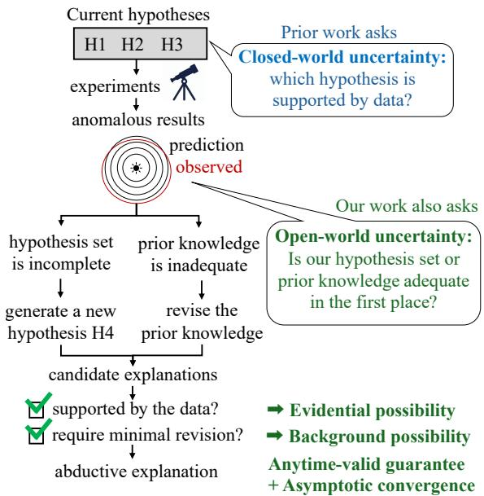  
Figure 1: Our possibilistic reasoning approach enables open-ended scientific discovery with anytime-valid guarantees under closed-/open-world uncertainty.

What, then, makes one plausible hypothesis a better explanation than another? Diferent accounts of abduction emphasise diferent aspects of scientific reasoning, see Hanson (1960) and Lipton (2017). Here, we specifically draw inspiration from the belief-revision account of abduction developed by Boutilier et al. (1995), particularly its preference for explanations that require less change to existing knowledge. Building on this perspective, we adopt and operationalize three desiderata in a strict order of priority. (1) Empirical adequacy: a hypothesis must first receive statistical certification from the observed data before it can be selected. (2) Background knowledge compatibility: among certified hypotheses, we favour those that can be accommodated with the least change to established scientific knowledge. This preference reflects the empirical scrutiny that such knowledge has survived and is closely related to epistemic entrenchment (Dubois et al., 1992, 1991). Finally, (3) Simplicity: among certified hypotheses tied for the highest background compatibility, we prefer simpler hypotheses. Here, we operationalise simplicity by the number of states a hypothesis permits, commonly motivated by Occam’s razor (Rasmussen et al., 2000; Adachi et al., 2022).

These criteria guide selection among the hypotheses currently available, but a further dificulty remains: better explanations may not yet have been proposed. This limitation is also known as the best $o f$ a bad lot in abductive reasoning (van Fraassen, 1989). Moreover, the background knowledge guiding this selection may itself be incomplete or inaccurate. Efective scientific discovery must therefore remain open to both new hypotheses and empirically warranted departures from existing knowledge. To this end, we distinguish closedworld uncertainty, concerning which hypotheses are supported within a given candidate set, from openworld uncertainty, concerning whether that set and the background knowledge used to assess it are themselves adequate (Fig. 1). The challenge is to automate both the assessment of existing hypotheses and the search for alternatives: how can we eficiently generate and test new explanations at scale, and what computable measure can guide the search and quantify progress as new hypotheses and evidence accumulate?

Prior work addresses only parts of this problem. Human-in-the-loop approaches (Lu et al., 2024; Gottweis et al., 2025) can supply abductive judgment, but do not scale. Huang et al. (2025); Sadhuka et al. (2025) use anytime-valid inference (Ramdas et al., 2025) to safely falsify LLM-generated hypotheses under adaptive experimentation without human intervention. However, falsification alone cannot distinguish among multiple plausible explanations, and these methods assume a fixed hypothesis set. Agarwal et al. (2025) instead use Bayesian surprise (Itti et al., 2009) to quantify how strongly observations update an LLM’s beliefs. Yet surprise is scientifically meaningful only after plausible known explanations have been excluded.

Contributions. In response, we first formalize this problem as Abductive Autonomous Scientific Discovery (AASD) using possibility theory (Dubois et al., 1988a). Possibility represents uncertainty by excluding hypotheses inconsistent with evidence. This naturally exposes open-world uncertainty: if all available explanations are excluded, the hypothesis space is incomplete; if viable explanations conflict with background knowledge, that knowledge may require revision. We then define abductive utility, an automatic measure of monotone discovery progress. It combines data-dependent anytime-valid inference (Martin, 2026) as evidential possibility with guaranteed possibility functions (Dubois et al., 2023) as background possibility. This provides a computable discovery metric without human intervention. Finally, we develop possibility frontier search, a principled algorithm for AASD that maintains anytime validity and achieves ε-optimal abductive utility asymptotically under suitable conditions. We further derive an observable stopping certificate for ε-optimality. We demonstrate strong performance on synthetic and realworld scientific-discovery tasks.

## 2 SETUP AND BACKGROUND

## 2.1 Problem Setting: AASD

Ground-truth. In the physical sciences, the ultimate ground truth is nature itself: the underlying environment that generates experimental outcomes. Let $W _ { \theta }$ denote a model of the environment indexed by $\theta \in \Theta$ and let A denote the set of available actions a scientist can take (experiments). Performing an action $A \in { \mathcal { A } }$ on an environment θ produces a noisy measurement M. We denote its conditional observation law by $M \mid A , \theta \sim \mathbb { P } _ { \theta } ( \cdot \mid A )$ . Here, $\mathbb { P } _ { \theta } ( \cdot \mid A )$ is the sampling distribution of the measurement implied by the environment model and the observation-noise mechanism. At each round $t = 1 , 2 , . . . ,$ we choose an action $A _ { t } ,$ observe $M _ { t } .$ , and let $\mathcal { D } _ { t } = ( A _ { \tau } , M _ { \tau } ) _ { \tau = 1 } ^ { t }$ denote the accumulated experimental record. For the theoretical analysis, we assume the model is well specified, so that there exists an unknown $\theta ^ { \star } \in \Theta$ for which the observed measurements are generated according to $\mathbb { P } _ { \theta ^ { \star } } ( \cdot \mid A _ { t } )$

Abductive target. Since the true state $\theta ^ { \star }$ is unknown, our goal is to discover a hypothesis $H \subseteq \Theta$ that (i) contains $\theta ^ { \star }$ , so that it accounts for the underlying phenomenon, and (ii) is compatible with the background knowledge (e.g., physical laws). Let $u ( H ) \in [ 0 , 1 ]$ denote the background-compatibility utility of H, defined formally in $\ S 3 ,$ with larger values indicating less required revision. We define the oracle and operational abductive utilities:

$$
\begin{array} { r l } & { U ^ { \star } : = \underset { H \in \mathcal { H } _ { \infty } : \theta ^ { \star } \in H , \ H \not = \Theta } { \operatorname* { s u p } } u ( H ) , } \\ & { U _ { t } : = \underset { H \in \mathsf { C } _ { t } } { \operatorname* { s u p } } u ( H ) , \quad \operatorname* { s u p } \varnothing : = 0 . } \end{array}\tag{1}
$$

where $\mathcal { H } _ { \infty }$ is the generator-reachable, possibly uncountable, hypothesis class and $\mathsf { C } _ { t }$ is the set of hypotheses certified by round t, defined in §3.1. Thus, $U ^ { \star }$ is the utility of the best reachable true explanation, whereas $U _ { t }$ is the utility of the best currently certified one.

Uncertain variables. Experimental outcomes $M _ { t }$ are random variables modeled by $\mathbb { P } _ { \theta } ( \cdot \mid A )$ , whereas $\theta ^ { \star }$ is fixed but unknown (̸= random)—which is referred to as an uncertain variable (Houssineau, 2018; Hieu et al., 2025)—and we represent uncertainty about $\theta ^ { \star }$ using a possibility function π, as detailed in $\ S 3 .$

Open-ended hypothesis generation. At every $\mathrm { f i - }$ nite round $t ,$ only finitely many hypotheses have been generated and evaluated. Let $\mathcal { H } _ { 0 }$ denote the initial candidates and the set $\mathcal { H } _ { \leq t }$ denote those initial or generated proper hypotheses at round t.

Falsifiability. We assume that the set of available experiments A is suficiently expressive to distinguish between any two distinct parameter values in Θ:

Assumption 1 (Falsifiability). For every $\theta , \vartheta \in \Theta$ such that $\theta \neq \vartheta .$ there is $A \in { \mathcal { A } }$ with $d _ { A } ( \theta , \vartheta ) > 0$ where $d _ { A } ( \theta , \vartheta )$ is a discrepancy between the observation laws $\mathbb { P } _ { \theta } ( \cdot \mid A )$ and $\mathbb { P } _ { \vartheta } ( \cdot \vert A )$ .

For identifiability, Assumption 1 only requires this separation to be positive for at least one action whenever $\theta \neq \vartheta$ . A strictly proper scoring rule (Gneiting, 2011) induces a nonnegative discrepancy of this form. Our finite-sample rate analysis specializes to the logarithmic score, for which $d _ { A }$ is the directed KL divergence. We treat $d _ { A }$ as known from the model family. Falsifiability is a shared assumption in the scientific discovery community (Huang et al., 2025; Agarwal et al., 2025).

## 2.2 Background

Possibility theory. Possibility theory (Zadeh, 1978; Dubois et al., $^ { 1 9 8 8 \mathrm { b } , \mathrm { a } ) }$ provides a representation of uncertainty distinct from probabilistic randomness. Our information about $\theta ^ { \star }$ is represented by a possibility function $\pi : \Theta \to [ 0 , 1 ]$ where larger $\pi ( \theta )$ indicates that the state θ is less strongly excluded by the available information. A p-value is an example $\pi ( \theta ) = p ( \theta )$ smaller values more strongly exclude $\theta ,$ while larger values leave it plausible. For a hypothesis $H \subseteq \Theta$ the induced possibility measure is $\Pi ( H ) = \operatorname* { s u p } _ { \theta \in H } \pi ( \theta )$ and its dual necessity measure is ${ \cal N } ( H ) = 1 - \Pi ( H ^ { c } )$ where $H ^ { c } = \Theta \setminus H$ is the complement. Π(H) quantifies the extent to which H remains non-excluded, whereas $N ( H )$ quantifies the extent to which its complement has been excluded. A possibility value should therefore not be interpreted as a probability that H is true. In particular, $\Pi ( H ) = 1$ means only that H has not been excluded. Under complete ignorance, both $\Pi ( H ) = \Pi ( H ^ { c } ) = 1$ , expressing that neither alternative can be ruled out; by contrast, a probability measure satisfies $\mathbb { P } ( H ) + \mathbb { P } ( H ^ { c } ) = 1$ . Consequently, $\Pi ( H ) = 1$ need not imply $N ( H ) = 1 \colon$ the evidence may simply be insuficient to rule out either H or $H ^ { c }$

Anytime-valid inference. Anytime-valid inference (Ramdas et al., 2023, 2025) provides guarantees robust to optional stopping and adaptive data collection. An e-value is nonnegative and satisfies $\mathbb { E } [ E ] \leq 1$ under the null hypothesis $H _ { \mathrm { n u l l } }$ , so $\operatorname* { P r } ( E \geq 1 / \delta ) \leq$ δ. An e-process extends this property sequentially: $\begin{array} { r } { \mathbb { P } _ { H _ { \mathrm { n u l l } } } \left( \operatorname* { s u p } _ { t } E _ { t } \geq 1 / \delta \right) \leq \delta . } \end{array}$ . Hence, we may stop when $E _ { t }$ crosses $1 / \delta$ without inflating the false-positive rate. Following Martin (2026), we define possibility function from e-process as e-possibility

$$
\pi _ { t } ( \theta ) : = \operatorname* { m i n } _ { 0 \leq s \leq t } \{ 1 , E _ { s } ( \theta ) ^ { - 1 } \} ,\tag{2}
$$

Then $\pi _ { t } ( \theta ) ~ \leq ~ \delta$ iif $\operatorname { a a x } _ { 0 \leq s \leq t } E _ { s } ( \theta ) \ \geq \ 1 / \delta .$ , so the anytime-valid rejection guarantee transfers to $\pi _ { t }$

## 3 POSSIBILISTIC REASONING

We formulate AASD using two components of abductive utility: Evidential possibility determines the certified set $\mathsf { C } _ { t } ,$ , using necessity to exclude surviving counterexamples. Background possibility supplies the score $u ( H )$ used to rank certified claims.

## 3.1 Evidential Possibility

As in Fig. $2 ( \mathrm { a } )$ , the accumulated evidence classifies hypotheses into three types based on observation $\mathcal { D } _ { t }$

Version space. Fix $\delta \in ( 0 , 1 )$ and define

$$
V _ { t } : = \{ \theta \in \Theta : \pi _ { t } ( \theta ) > \delta \} .\tag{3}
$$

The version space (Mitchell, 1979) contains the states not yet excluded by the experimental record. Since $\pi _ { t + 1 } ( \theta ) \leq \pi _ { t } ( \theta )$ , it satisfies $V _ { t + 1 } \subseteq V _ { t }$ . We classify candidates as follows $\left( \mathrm { F i g . ~ 2 ( a ) } \right)$

$$
\begin{array} { r l r } & { \mathsf { F } _ { t } = \{ H \in \mathcal { H } _ { \leq t } : H \cap V _ { t } = \emptyset \} } & { ( 4 ) } \\ & { \mathsf { O } _ { t } = \{ H \in \mathcal { H } _ { \leq t } : H \cap V _ { t } \neq \emptyset , V _ { t } \backslash H \neq \emptyset \} } \\ & { \mathsf { C } _ { t } = \{ H \in \mathcal { H } _ { \leq t } : H \cap V _ { t } \neq \emptyset , V _ { t } \backslash H = \emptyset , H \neq \Theta \} } \end{array}
$$

Connection to e-possibility. Define

$$
\Pi _ { t } ( H ) : = \operatorname* { s u p } _ { \theta \in H } \pi _ { t } ( \theta ) , \qquad N _ { t } ( H ) : = 1 - \Pi _ { t } ( H ^ { c } ) .
$$

We use sup $\mathcal { O } : = 0 .$ . Then $H \cap V _ { t } \neq \emptyset$ if $\Pi _ { t } ( H ) > \delta$ while $V _ { t } \subseteq H$ if $N _ { t } ( H ) \geq 1 - \delta .$

Proposition 1 (Anytime-valid version space). Let $\mathcal { H } _ { \leq t }$ be a set of hypotheses generated by round $t ,$ from the same accumulated record $\mathcal { D } _ { t }$ used to construct $V _ { t }$ For the event $\mathcal { E } _ { \delta } : = \{ \theta ^ { \star } \in V _ { t } , \forall t \geq 0 \}$ , we have

$$
\mathbb { P } _ { \theta ^ { \star } } ( \mathcal { E } _ { \delta } ) \geq 1 - \delta .
$$

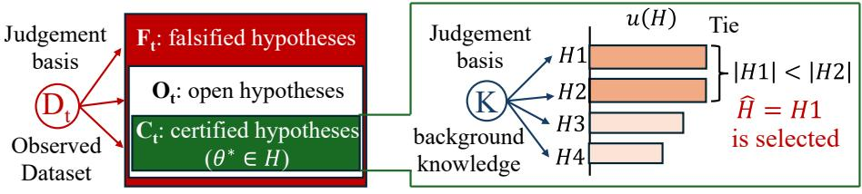  
(a) Classify with evidential possibility  
(b) Rank by background possibility  
Figure 2: Two-stage assessment. (a) Persistent evidential possibility classifies claims as contradicted, open, or certified. (b) Guaranteed background possibility ranks certified claims by their minimum statewise compatibility. Smaller semantic claims are preferred when scores tie.

Moreover, on $\mathcal { E } _ { \delta } .$ , simultaneously $\forall t \geq 0$ and $\forall H \in { \mathcal { H } } _ { \leq t }$ ,

$$
\begin{array} { r l r } & { \theta ^ { \star } \in H \implies H \cap V _ { t } \neq \emptyset , } & { \mathrm { ( N o t ~ c o n t r a d i c t e d ) } } \\ & { V _ { t } \subseteq H \implies \theta ^ { \star } \in H . } & { \mathrm { ( C e r t i f i e d ) } } \end{array}
$$

In particular,

$$
\mathbb { P } _ { \theta ^ { \star } } ( \exists t , \exists H \in \mathsf { C } _ { t } : \theta ^ { \star } \notin H ) \le \delta .
$$

The proof is in Appendix A.2. Every false certification implies $\pi _ { t } ( \theta ^ { \star } ) \leq \delta _ { : }$ , so all such errors are covered by the same statewise failure event. Thus, this holds uniformly over time and generated hypotheses. On ${ \mathcal { E } } _ { \delta } ,$ true candidates are never pruned and certified candidates stay certified. Thus $\mathsf C _ { t } \subseteq \mathsf C _ { t + 1 }$ and $U _ { t + 1 } \geq U _ { t }$

## 3.2 Background Possibility

Fix a background compatibility contour $\pi ^ { K } : \Theta \to [ 0 , 1 ]$ throughout discovery. Unlike evidential possibility, the background possibility is based on the fixed background knowledge $K .$ , which may be elicited from LLMs (Yang et al., 2026) or historical data (see §5). For a nonempty hypothesis, define background-compatibility utility using guaranteed possibility (Dubois et al., 2023, 2001)

$$
u ( H ) : = \operatorname* { i n f } _ { \theta \in H } \pi ^ { K } ( \theta ) .\tag{5}
$$

This established set function difers from ordinary possibility: it measures the minimum compatibility among the represented states permitted by H. The infimum is over every state satisfying the membership predicate of H, including states already excluded by experiments1. The numerical contour and the claim’s semantics remain fixed, so $u ( H )$ does not change over time.

Proposition 2 (Uniform background accommodation). Let $H \neq \emptyset$ be measurable. Among arbitrary normalized measurable revised contours, define

$$
R _ { K } ( H ) : = \operatorname* { i n f } _ { \pi ^ { \prime } } \left\{ \| \pi ^ { \prime } - \pi ^ { K } \| _ { \infty } : \pi ^ { \prime } = 1 \mathrm { o n } H \right\} ,
$$

where the infimum is over normalized measurable contours $\pi ^ { \prime } .$ . Then $\begin{array} { r } { R _ { K } ( H ) = 1 - u ( H ) } \end{array}$ . An optimizer is one on H and unchanged from $\pi ^ { K }$ on $H ^ { c }$

1The infimum is not over $H \cap V _ { t } ;$ this intersection equals $V _ { t }$ for every $H \in \mathsf { C } _ { t } .$ , which assigns them all the same score.

Proof. Every admissible revised contour satisfies

$$
\| \pi ^ { \prime } - \pi ^ { K } \| _ { \infty } \geq \operatorname* { s u p } _ { \theta \in H } ( 1 - \pi ^ { K } ( \theta ) ) = 1 - u ( H ) .
$$

Raising the contour to one on H and leaving it unchanged on $H ^ { c }$ attains this lower bound. □

This is a candidate-wise counterfactual cost of uniformly accommodating the states allowed by H, not a global update of K. Thus, maximizing $u ( H )$ minimizes this revision cost.

## 3.3 Lexicographic preferences and simplicity

When $\mathsf C _ { t } \neq \boldsymbol { \mathcal { D } }$ , we select

$$
\widehat { H } _ { t } \in \underset { H \in \mathsf C _ { t } , \ u ( H ) = U _ { t } } { \arg \operatorname* { m i n } } | H | ,\tag{6}
$$

where $| H |$ is the number of states represented by H. Because $u ( H )$ is antitone under set inclusion, $H _ { 1 } \subseteq H _ { 2 }$ implies $u ( H _ { 1 } ) \geq u ( H _ { 2 } )$ ; cardinality therefore breaks ties by favoring more specific hypotheses with equal utility. Eq. (6) thus induces the lexicographic preference: evidential validity $> _ { \mathrm { l e x } }$ background compatibility $> _ { \mathrm { l e x } }$ simplicity. If ${ \mathsf C } _ { t } = \varnothing$ , we set $\widehat { H } _ { t } = \perp$ . Thus evidence takes precedence, followed by background compatibility and, finally, simplicity as semantic specificity within the chosen finite representation.

## 4 OPEN-ENDED DISCOVERY

We introduce Possibility Frontier Search (Alg. 1), alternating between hypothesis expansion and experiment selection to resolve promising open hypotheses.

## 4.1 Hypothesis Expansion

Used by Alg. 1, Expand in Alg. 2 draws at most B hypotheses and stops early at the first proper certified claim. A proposal that compiles into $H \subseteq \Theta$ is retained when $H \neq \Theta$ and $H \cap V _ { t } \neq \emptyset$ , and is certified when $\alpha \neq$ $V _ { t } \subseteq H$ (recall §3.1). Alg. 2 uses rejection sampling for concreteness; implementation details and the induced conditional proposal law appear in Appendix C.

Algorithm 1 Possibility Frontier Search   
1: $\mathcal { D } _ { 0 }  \emptyset , E _ { 0 } \equiv 1 , \pi _ { 0 } \equiv 1 , \mathcal { H } _ { \leq - 1 }  \mathcal { H } _ { 0 }$   
2: for $t = 0 , \dots , T$ do   
3: $V _ { t } \gets \{ \theta : \pi _ { t } ( \theta ) > \delta \}$   
4: $\mathcal { H } _ { \leq t } \gets$ Expand $K , { \mathcal { D } } _ { t } , V _ { t } , { \mathcal { H } } _ { \leq t - 1 } , B )$   
5: $( \mathsf { C } _ { t } , \mathsf { O } _ { t } , U _ { t } , \overline { { U } } _ { t } , \widehat { H } _ { t } , \mathsf { O } _ { t } ^ { + } ) \gets \mathrm { E q s . ~ } ( 4 , 1 , 9 , 6 , 7 )$   
6: if $\complement _ { t } \neq \emptyset$ and $\overline { { U } } _ { t } - U _ { t } \leq \varepsilon$ and $0 _ { t } ^ { + } = \emptyset$ then   
7: return $( \widehat { H } _ { t } , U _ { t } ,$ , certified ε-optimal)   
8: if $t = T$ then   
9: return $( \widehat { H } _ { t } , U _ { t } ,$ , budget exhausted)   
10: $\rho _ { t + 1 } \gets \mathrm { E q . ~ } ( 8 ) ; A _ { t + 1 } \sim \rho _ { t + 1 } ;$ observe $M _ { t + 1 }$   
11: $\mathcal { D } _ { t + 1 }  \mathcal { D } _ { t } \cup \{ ( A _ { t + 1 } , M _ { t + 1 } ) \}$ ; update $E _ { t + 1 }$   
12: $\pi _ { t + 1 }  \operatorname* { m i n } \{ \pi _ { t } , 1 , E _ { t + 1 } ^ { - 1 } \}$ pointwise

Algorithm 2 Expand: Hypothesis Expansion   
1: $\mathcal { H } _ { \leq t }  \{ H \in \mathcal { H } _ { \leq t - 1 } : H \neq \Theta , \ H \cap V _ { t } \neq \emptyset \}$   
2: for $j = 1 , \ldots , B$ do   
3: $\widetilde { H } _ { t , j } \sim \mathsf { G e n } ( \cdot \mid K , \mathcal { D } _ { t } , V _ { t } , \mathcal { H } _ { \le t - 1 } )$   
4: if $\widetilde { H } _ { t , j } \neq \Theta$ and $\widetilde { H } _ { t , j } \cap V _ { t } \neq$ ∅ then   
5: $\mathcal { H } _ { \leq t }  \mathcal { H } _ { \leq t } \cup \{ \widetilde { H } _ { t , j } \}$   
6: if $V _ { t } \subseteq \widetilde { H } _ { t , j }$ then ▷ Certified   
7: break   
8: return $\mathcal { H } _ { \leq t }$

## 4.2 Possibility Frontier Search

Fig. 3 illustrates the intuition: an open candidate can improve the current best lexicographic preferences. If $\mathsf C _ { t } = \boldsymbol { \mathcal D }$ , set $0 _ { t } ^ { + } = 0 _ { t }$ . Otherwise, define

$$
\mathsf { O } _ { t } ^ { + } = \left\{ H \in \mathsf { O } _ { t } : \begin{array} { l } { u ( H ) > U _ { t } , \mathrm { ~ o r ~ } } \\ { u ( H ) = U _ { t } , \vert H \vert < \vert \widehat { H } _ { t } \vert } \end{array} \right\} .\tag{7}
$$

The frontier pair set is

$$
\mathcal { P } _ { t } = \left\{ \begin{array} { l l } { \bigcup _ { H \in \mathsf { O } _ { t } ^ { + } } ( V _ { t } \cap H ) \times ( V _ { t } \cap H ^ { c } ) , } & { \mathsf { O } _ { t } ^ { + } \neq \emptyset , } \\ { H \in \mathsf { O } _ { t } ^ { + } } & \\ { \{ ( \theta , \vartheta ) \in V _ { t } ^ { 2 } : \theta \neq \vartheta \} , } & { \mathrm { o t h e r w i s e . } } \end{array} \right.
$$

For $\mathcal { P } _ { t } .$ , choose

$$
\rho _ { t + 1 } \in \underset { \rho \in \Delta ( \mathcal { A } ) } { \arg \operatorname* { m a x } } \ \underset { ( \theta , \vartheta ) \in \mathcal { P } _ { t } } { \operatorname* { m i n } } \sum _ { A \in \mathcal { A } } \rho ( A ) d _ { A } ( \theta , \vartheta ) .\tag{8}
$$

If $\mathcal { P } _ { t } = \mathcal { O }$ , use a fixed reference allocation. The inner minimization identifies the least-separated active pair, while the outer maximization selects the experiment distribution that maximizes its expected discrepancy. For finite pair and action sets, this can be implemented by a linear program; see Appendix D.

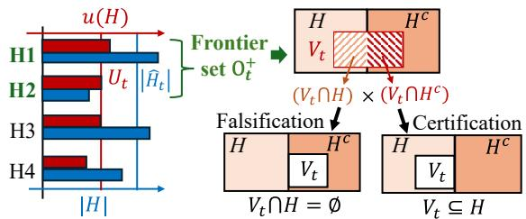  
Figure 3: Possibility frontier search collects open hypotheses that can improve the current best $U _ { t } \ \mathrm { o r } \ | \widehat { H } _ { t } |$ ， then selects experiments to falsify or certify them.

Stopping with ε-optimality. Define

$$
{ \overline { { U } } } _ { t } : = \operatorname* { s u p } _ { \theta \in V _ { t } } \pi ^ { K } ( \theta ) .\tag{9}
$$

On ${ \mathcal { E } } _ { \delta } .$ , whenever $\mathsf { C } _ { t } \neq \emptyset , U _ { t } \leq U ^ { \star } \leq \pi ^ { K } ( \theta ^ { \star } ) \leq \overline { { U } } _ { t }$ For a fixed tolerance $\varepsilon > 0 .$ , we can stop at

$$
\tau _ { \varepsilon } : = \operatorname* { i n f } \left\{ t \geq 0 : \begin{array} { l } { \mathsf { C } _ { t } \neq \emptyset , \ 0 _ { t } ^ { + } = \emptyset , } \\ { \overline { { U } } _ { t } - U _ { t } \leq \varepsilon } \end{array} \right\} ,\tag{10}
$$

with inf $\varnothing : = \infty .$ . The safeguard $0 _ { t } ^ { + } = \varnothing$ prevents stopping while a known open candidate ${ { \mathrm { O } } _ { t } }$ could improve the lexicographic preference. When the stopping condition is reached, the probability of returning a false or ε-suboptimal claim is at most $\delta ;$ finite termination is not guaranteed. (Theorem 2 in Appendix F.4).

## 4.3 Theoretical Analysis

Reachable goal. For $\varepsilon > 0$ , define

$$
\begin{array} { r } { \mathcal { H } _ { \varepsilon } ^ { \star } : = \{ H \in \mathcal { H } _ { \infty } : \theta ^ { \star } \in H , \ u ( H ) \geq U ^ { \star } - \varepsilon \} . } \end{array}\tag{11}
$$

We call ε-recovery as $U _ { t } \geq U ^ { \star } - \varepsilon$ . We additionally establish the presence of a certified target, $\mathsf { C } _ { t } \cap \mathcal { H } _ { \varepsilon } ^ { \star } \ne \emptyset ,$ which does not count an empty archive as a discovery when the target score is zero. Recovery is analyzed for the generator–policy continuation with termination and the external observation cap disabled $T \to \infty$

Generator coverage. Once a near-optimal claim is certifiable, we assume that each budgeted expansion has conditional probability at least $q _ { \varepsilon } > 0$ of producing a certified near-optimal claim, unless one is already certified. Appendix C states this (Assumption 2). This is a standard reachability condition in stochastic search (Solis et al., 1981; Adachi et al., 2026a).

Rate model. For recovery rates, we use the finite-state likelihood-ratio mixture (Eq. (32)) and conditional sub-Gaussian model (Eq. (35)) in Appendix E, which is standard modeling choice for e-processes (Vovk et al., 2021; Grünwald et al., 2024; Howard et al., 2024).

Theorem 1 (ϵ-recovery guarantee). Assume Θ and A are finite and use the full-support likelihood-ratio mixture in Eq. (32). Fix $\varepsilon > 0$ and assume a conditional sub-Gaussian proxy $\sigma _ { \varepsilon } ^ { 2 } > 0$ as in Eq. (35). Suppose Assumptions 1 and 2 hold, and some $H _ { \varepsilon } \in \mathcal { H } _ { \varepsilon } ^ { \star }$ satisfies Eq. (39) with $\Gamma _ { \varepsilon } > 0$ . Set $m _ { \varepsilon } : = | \Theta \setminus H _ { \varepsilon } | , \ b _ { \delta } : =$ log $\frac { 1 } { \delta w _ { \mathrm { m i n } } }$ , where $w _ { \mathrm { m i n } } ~ > ~ 0$ is the smallest mixture weight. For every $t \geq 0$

$$
\begin{array} { r } { \mathbb { P } _ { \theta ^ { \star } } \left( \mathsf { C } _ { t } \cap \mathcal { H } _ { \varepsilon } ^ { \star } = \mathcal { O } \right) \leq \delta + \mathcal { B } _ { t } ( \varepsilon ) , } \end{array}\tag{12}
$$

where for $\tau \geq 1$

$$
\begin{array} { r l r } & { } & { \mathcal { B } _ { t } ( \varepsilon ) : = \underset { 0 \leq \tau \leq t } { \operatorname* { i n f } } \left. \underset { \mathrm { n o t } ~ \mathrm { y e t } ~ \mathrm { c e r t i f a b l e } } { \underbrace { R _ { \tau } ( \varepsilon ) } } + \underset { \mathrm { g e n e r a t i o n ~ e r r o r } } { \underbrace { ( 1 - q _ { \varepsilon } ) ^ { t - \tau + 1 } } } \right. , } \\ & { } & { R _ { \tau } ( \varepsilon ) : = 1 \wedge m _ { \varepsilon } \exp \left. - \frac { \left( \tau \Gamma _ { \varepsilon } - b _ { \delta } \right) _ { + } ^ { 2 } } { 2 \tau \sigma _ { \varepsilon } ^ { 2 } } \right. , ~ R _ { 0 } ( \varepsilon ) : = 1 . } \end{array}
$$

The same bound holds for $\mathbb { P } _ { \theta ^ { \star } } ( U _ { t } < U ^ { \star } - \varepsilon )$

Interpretation. For all large t with $\tau = \lfloor t / 2 \rfloor$ ，

$$
\begin{array} { r } { \mathcal { B } _ { t } ( \varepsilon ) \leq m _ { \varepsilon } e ^ { - \lfloor t / 2 \rfloor \Gamma _ { \epsilon } ^ { 2 } / ( 8 \sigma _ { \epsilon } ^ { 2 } ) } + e ^ { - q _ { \varepsilon } ( t - \lfloor t / 2 \rfloor + 1 ) } \longrightarrow 0 . } \end{array}
$$

Hence, a certified near-optimal hypothesis is eventually obtained and retained almost surely on ${ \mathcal { E } } _ { \delta }$ along the nonterminated continuation (see Appendix F).

## 4.4 Related Work

Autonomous scientific discovery. Prior work explores hypotheses via search and generation (Gottweis et al., 2025; Jansen et al., 2025; Yamada et al., 2025; Ghareeb et al., 2026; Marwitz et al., 2026), ranking them by predefined, human/LLM, or Bayesian-surprise scores (Zhang et al., 2024; Lu et al., 2024; Jansen et al., 2025; Itti et al., 2009; Agarwal et al., 2025). These methods do not formulate discovery as abduction.

Statistical hypothesis evaluation. Prior work evaluates hypotheses with p-values (Lin et al., 2025; Movva et al., 2025; Bright-Thonney et al., 2025), embeds tests in generation (Gupta et al., 2026; Zhao et al., 2026), regret-based (Ziomek et al., 2024, 2025; Xu et al., 2024a), or divergence-based (Fujisawa et al., 2025, 2026) but within predefined models. Sequential e-value is applied to LLM-based discovery (Huang et al., 2025; Xu et al., 2024b) likewise do not address openended adaptive generation. e-possibility (Martin, 2026) covers data-dependent claims and ours is the first to integrate it with growing hypotheses, fixed background preference, and frontier-based experimental design.

Online hypothesis testing. Our design follows Chernof-style active testing (Chernof, 1959; Naghshvar et al., 2013; Garivier et al., 2016; Mukherjee et al., 2022), but gives maximin optimality on a datadependent possibility frontier rather than asymptotic fixed-family optimality (Appendix D.2).

## 5 SYNTHETIC EXPERIMENT

We first evaluate our framework in a controlled synthetic setting where the ground-truth state $\theta ^ { \star }$ is known. This allows us to test the two central challenges of openended discovery in isolation: the initial hypothesis set is incomplete, so discovering $\theta ^ { \star }$ requires hypothesis expansion, while the background knowledge is informative but misspecified, so successful abduction must balance empirical validity against departure from prior knowledge. The construction mirrors the finite-state setting of our theoretical analysis; full experimental details are provided in Appendix H.1.

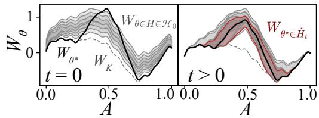  
Figure 4: Synthetic discovery setup: The environment $W _ { \theta ^ { \star } }$ difers from the background model $W _ { K }$ (dashed). ${ \mathrm { A t ~ } } t = 0 ~ ( { \mathrm { l e f t } } )$ ), none of the initial hypotheses $H \in \mathcal { H } _ { 0 }$ contains $\theta ^ { \star }$ . For $t > 0 \ \mathrm { ( r i g h t ) }$ , the hypothesis space is expanded to discover a hypothesis containing $\theta ^ { \star }$

## 5.1 Environmental Setup

Ground-truth. Consider an environment $W _ { \theta } { : }$

$$
W _ { \theta } ( { \cal A } ) = W _ { K } ( { \cal A } ) + \frac { a } { 2 } \left( 1 + \cos \frac { \pi ( { \cal A } - { \cal A } _ { 0 } ) } { w } \right) \mathbb { 1 } _ { \{ | { \cal A } - { \cal A } _ { 0 } | \leq w \} } ,
$$

where $\theta = ( a , w )$ and the ground-truth parameter is $\theta ^ { \star } = ( 1 . 0 0 , 0 . 2 8 )$ The action space $\mathcal { A }$ consists of 73 equispaced locations. At round $t ,$ selecting $A _ { t } \in { \mathcal { A } }$ produces $M _ { t } = W _ { \theta ^ { \star } } ( A _ { t } ) + \epsilon _ { t }$ , where $\epsilon _ { t } \sim \mathcal { N } ( 0 , \sigma _ { E } ^ { 2 } )$ The learner does not observe $\theta ^ { \star }$ and must identify a hypothesis containing it from sequential experiments.

Hypothesis generation. We discretize Θ into 1,540 parameter states and construct 44 reachable hypotheses ${ \mathcal { H } } _ { \infty } ,$ of which three contain $\theta ^ { \star }$ . The initial set $\mathcal { H } _ { 0 }$ is deliberately misspecified: no $H \in \mathcal { H } _ { 0 }$ contains $\theta ^ { \star }$ . Consequently, a closed-world algorithm within $\mathcal { H } _ { 0 }$ cannot recover the ground truth. Our method expands the candidate set according to Alg. 2, with a proposal budget of $B = 4$ per round, and seeks an abductively preferred certified hypothesis containing $\theta ^ { \star }$

Evidential possibility. From the accumulated observations $\mathcal { D } _ { t } = \{ ( A _ { \tau } , M _ { \tau } ) \} _ { \tau = 1 } ^ { t }$ , we construct a Gaussianmixture likelihood-ratio e-process $E _ { t } ( \theta )$ (Howard et al., 2021). This induces the evidential possibility in Eq. (2) and the persistent version space $V _ { t } ^ { \delta }$ in Eq. (3). We use $\delta = 0 . 1$ to classify hypotheses as in §3.1.

Background possibility. Background knowledge K is obtained from historical observations $\begin{array} { r l } { \mathcal { D } _ { K } } & { { } = } \end{array}$ $\{ ( A _ { i } ^ { K } , M _ { i } ^ { K } ) \} _ { i = 1 } ^ { N }$ and represented by the Gaussian process (GP: Rasmussen 2004) $W ^ { K } \mid \bar { \mathcal { D } } _ { K } \sim \mathcal { G P } ( W _ { K } , \bar { C } _ { K } )$ Crucially, this background model is informative but misspecified: $W _ { K } \neq W _ { \theta ^ { \star } } \ ( \mathrm { { F i g . } \ 4 ) }$ . This mimics, for example, a setting in which historical measurements remain useful but the current environment has shifted. Using Gaussian possibility (Ristic et al., 2020; Denoeux, 2014), we construct the background possibility $\pi ^ { K }$ and compute the utility $u ( H )$ in Eq. (5).

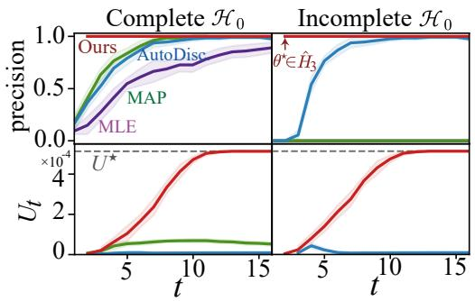  
Figure 5: Precision (upper) and abductive utility (lower) under complete (left) incomplete $\mathcal { H } _ { \mathrm { 0 } }$ . Ours returns a certified hypothesis at t = 2 or 3 with empirical precision 1.0, and its abductive utility subsequently improves and converges to $U ^ { \star }$ . Shaded regions denote 95% confidence intervals.

Experimental design. We instantiate $d _ { A } ( \theta , \vartheta )$ using the KL divergence between the Gaussian observations. At each round, the next experiment is selected using the possibility-frontier maximin design in Eq. (8), and the complete procedure follows Alg. 1.

## 5.2 Experiments

Baselines. We compare Possibility Frontier Search against MLE, MAP, and AutoDiscovery (Agarwal et al., 2025). MLE and MAP select hypotheses using, respectively, Gaussian likelihood and posterior probability under the background GP prior. Both are restricted to the initial hypothesis set $\mathcal { H } _ { 0 }$ , and thus represent closed-world inference when $\mathcal { H } _ { \mathrm { 0 } }$ is incomplete. AutoDiscovery, in contrast, adaptively expands the hypothesis space using Monte Carlo tree search (Silver et al., 2016) and selects hypotheses according to Bayesian surprise. Because these baselines do not prescribe an adaptive experimental-design policy over ${ \mathcal { A } } ,$ we use uniform random sampling, $A _ { t } \sim \mathcal { U } ( A )$ , for their experiments. Our method instead selects experiments using the possibility-frontier design in Eq. (8).

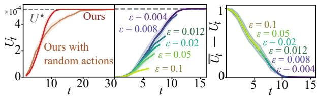  
Figure 6: Ablation study: (a) experimental design and (b) stopping condition for $U _ { t }$ and (c) ${ \overline { { U } } } _ { t } - U _ { t }$ . Ours reaches $U ^ { \star }$ faster than random actions, and larger tolerance ε stops earlier following the gap.

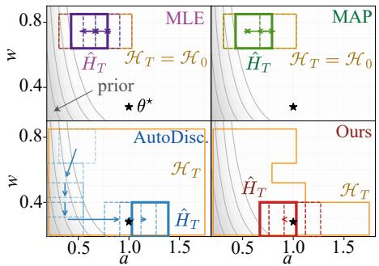  
Figure 7: MLE and MAP remain confined to the initial set $\mathcal { H } _ { 0 }$ . AutoDiscovery expands the search toward hypotheses that are most surprising relative to the prior, whereas our method rapidly identifies a certified hypothesis $H \in \mathsf { C } _ { t }$ requiring minimal revision of the background knowledge. Orange box denotes $\mathcal { H } _ { \leq T }$

Evaluation. We evaluate (i) precision, indicating whether a returned hypothesis contains or not ${ \theta } ^ { \star } \in \widehat { H } _ { t }$ and (ii) the abductive utility $U _ { t }$ in Eq. (1). Results are averaged over eight random seeds; hence the reported precision may take intermediate values across runs.

Efect of incomplete $\mathcal { H } _ { \mathrm { 0 } }$ . We compare initial archives containing at least one true claim, $\exists H \in { \mathcal { H } } _ { 0 } : \theta ^ { \star } \in H$ with archives containing no true claim in Fig. 5. Under complete $\mathcal { H } _ { 0 } .$ , all methods eventually reach $\theta ^ { \star } \in \widehat { H } _ { t } .$ while ours does so already at $t = 2$ . In contrast, under incomplete $\mathcal { H } _ { 0 } .$ , only AutoDiscovery and ours can reach a true hypothesis, as vanilla MLE and MAP do not handle an expanding hypothesis space. On abductive utility $U _ { t } ,$ , ours converges to $U ^ { \star }$ while others cannot, illustrating empirical recovery behavior. Fig. 7 illustrates the corresponding search trajectories. AutoDiscovery can find a true hypothesis, but its surprise objective favors hypotheses far from the prior, preventing convergence to $U ^ { \star }$

Ablation study. Fig. 6(a) compares frontier allocation $\left( \mathrm { E q . ~ } \left( 8 \right) \right)$ with random actions, $A _ { t } \ \sim \ \mathrm { U n i f } ( \mathcal { A } )$ The frontier policy finds $U ^ { \star }$ sooner, demonstrating the benefit of adaptive experimental design. Panels (b)(c) illustrate how larger tolerances relax the observable gap threshold and trigger earlier stopping in these runs.

## 6 REAL-WORLD DATASET

Next, we apply our framework to natural-language hypothesis discovery on real-world datasets. These realdata experiments are exploratory case studies using approximate statistical tests and LLM-based generation, for which exact anytime validity and recovery guarantees are not established. Full experimental details are provided in Appendix H.2.

## 6.1 Environmental Setup

Datasets as environments. Following Discovery-Bench (Majumder et al., 2025), two real-world datasets Incarceration/SES are used as empirical environments.

Research question and gold hypothesis. Unlike §5, the environmental state is unknown. DiscoveryBench instead provides a research question to the learner and a held-out gold hypothesis for evaluation, $\mathrm { e . g . }$ , “How did the wealth levels of individuals with a history of incarceration compare to those never incarcerated in 1996?” The gold hypothesis states that previously incarcerated individuals have lower wealth than those never incarcerated. Each dataset starts with five natural-language hypotheses, each paired with its logical complement.

Parameterization. We represent the experimentally accessible environment by population quantities $\theta = ( \theta _ { 1 } , \ldots , \theta _ { J } ) \in \Theta$ . An action $A \in { \mathcal { A } }$ is a measurement query returning a noisy measurement of $\theta _ { j _ { A } }$ . For example, let $\theta _ { j } = \mu _ { \mathrm { i n c } } - \mu _ { \mathrm { n e v e r } }$ , the diference in mean wealth between individuals with and without an incarceration history. Then $H = \{ \theta : \theta _ { j } < 0 \}$ , and the query returns $M = \widehat { \mu } _ { \mathrm { i n c } } - \widehat { \mu } _ { \mathrm { n e v e r } }$ on unseen data. Because A is fixed before discovery, J and $\Theta _ { \mathrm { g r i d } }$ remain fixed.

Experimental budget. We randomly partition each dataset into 16 disjoint folds. At each round, we select up to two measurement queries and fix their statistical tests before observing the next unseen fold, on which the queries are then evaluated. This yields at most 32 test executions over 16 rounds, enabling sequential evidence accumulation while limiting overfitting.

Evidential possibility. Following POPPER (Huang et al., 2025), each measurement query has a statistical test fixed before its data fold is observed. Its p-value is converted to an e-value. Because up to two tests may share a fold, we average their statewise contributions within each fold and multiply these averages sequentially across folds. The resulting e-process defines the evidential possibility and necessity in Eq. (2).

Background possibility. We elicit background possibility from an LLM for each estimand, following Yang et al. (2026, Algorithm 2). The fixed jointstate possibility contour is then defined by $\pi ^ { K } ( \theta ) =$ $\mathrm { m i n } _ { j = 1 , \dots , J } \pi _ { j } ^ { K } ( \theta _ { j } )$ . Because $u ( H )$ minimizes over allowed states, unspecified estimands can lower the score.

Experimental design. At each round, POPPER generates candidate measurement queries for hypotheses in $\mathcal { H } _ { \leq t } ,$ excluding unsupported or duplicate queries. For each query A, let $j _ { A }$ denote its target estimand. We model its measurement as $\mathcal { N } ( \theta _ { j _ { A } } , \sigma _ { A } ^ { 2 } )$ , where $\sigma _ { A }$ is the anticipated standard error, and apply the maximin design in Eq. (8) to select among the candidates.

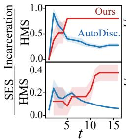

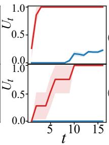

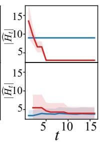  
Figure 8: Natural-language discovery results. Left: HMS. Middle: abductive utility. Right: cardinality $| \widehat { H } _ { t } |$ . Shaded regions indicate ± standard error.

## 6.2 Experiments

We use GPT-5 (Singh et al., 2025) for natural-language hypothesis generation and LLM-based evaluation.

Baselines. We compare against AutoDiscovery (Agarwal et al., 2025) under the same datasets, initial conditions, and experimental budget. We omit MLE and MAP because they operate over a prespecified statistical model class and do not directly provide open-ended natural-language hypothesis evaluation in this setting.

Metrics. We evaluate hypothesis selection using three metrics: (i) Hypothesis Matching Score (HMS) (Bragg et al., 2026), which measures agreement between the selected and gold hypotheses by an LLM; (ii) abductive utility $U _ { t }$ in $\operatorname { E q } .$ . (1); and (iii) cardinality $| \widehat { H } _ { t } |$ in Eq. (6). For AutoDiscovery, we retrospectively evaluate $U _ { t }$ using the same accumulated evidence.

Results. Fig. 8 shows that our method eventually achieves higher HMS and $U _ { t } .$ , and lower $| \hat { H } _ { t } |$ on both datasets. Notably, $U _ { t }$ and $| \hat { H } _ { t } |$ closely track HMS, suggesting that our utility can monitor discovery progress without a gold hypothesis. This makes it promising for real-world scientific discovery, where no ground-truth hypothesis is available.

## 7 CONCLUSION AND LIMITATION

We introduced AASD as a new problem setting, abductive utility as a discovery metric, and possibility frontier search as its solving algorithm. Our notion of open-endedness concerns expansion of candidate hypotheses within a fixed environmental model, action space, and background contour, rather than online expansion of Θ or revision of K. Moreover, abductive selection depends on the quality and calibration of the background possibility model, so misspecification may bias which admissible hypotheses are preferred.

## Acknowledgments

This work was supported by JST, ARiSE, Japan Grant Number JPMJAR2628. TW was partially supported by JSPS KAKENHI (26K21188) and RIKEN Incentive Research Project.

## References

Josh Achiam, Steven Adler, Sandhini Agarwal, Lama Ahmad, Ilge Akkaya, Florencia Leoni Aleman, Diogo Almeida, Janko Altenschmidt, Sam Altman, Shyamal Anadkat, et al. GPT-4 technical report. arXiv preprint arXiv:2303.08774, 2023.

Masaki Adachi, Satoshi Hayakawa, Martin Jørgensen, Harald Oberhauser, and Michael A. Osborne. Fast Bayesian inference with batch Bayesian quadrature via kernel recombination. In Advances in Neural Information Processing Systems, 2022.

Masaki Adachi, Yuta Suzuki, and Juliusz Ziomek. Open-ended task discovery via Bayesian optimization. arXiv preprint arXiv:2605.07572, 2026a.

Masaki Adachi, Anita Yang, Yakun Wang, and Song Liu. Regret analysis of guided difusion for black-box optimization over structured inputs. arXiv preprint arXiv:2605.10385, 2026b.

Dhruv Agarwal, Bodhisattwa Prasad Majumder, Reece Adamson, Megha Chakravorty, Satvika Reddy Gavireddy, Aditya Parashar, Harshit Surana, Bhavana Dalvi Mishra, Andrew McCallum, Ashish Sabharwal, and Peter Clark. AutoDiscovery: Openended Scientific Discovery via Bayesian Surprise. In Advances in Neural Information Processing Systems, 2025.

Noga Alon, Thomas F Bloom, W Timothy Gowers, Daniel Litt, Will Sawin, Arul Shankar, Jacob Tsimerman, Victor Wang, and Melanie Matchett Wood. Remarks on the disproof of the unit distance conjecture. arXiv preprint arXiv:2605.20695, 2026.

Craig Boutilier and Veronica Beche. Abduction as belief revision. Artificial Intelligence, 77(1):43–94, 1995.

Jonathan Bragg, Mike D’Arcy, Nishant Balepur, Dan Bareket, Bhavana Dalvi Mishra, Sergey Feldman, Dany Haddad, Jena Hwang, Peter Jansen, Varsha Kishore, et al. Astabench: Rigorous benchmarking of ai agents with a scientific research suite. In International Conference on Learning Representations, 2026.

Samuel Bright-Thonney, Christina Reissel, Gaia Grosso, Nathaniel S. Woodward, Katya Govorkova, Andrzej Novak, Sang Eon Park, Eric A. Moreno, and Philip Harris. AutosciDACT: Automated scientific

discovery through contrastive embedding and hypothesis testing. In Advances in Neural Information Processing Systems, 2025.

Herman Chernof. Sequential design of experiments. The Annals ofMathematical Statistics, 30(3):755–770, 1959.

Leonardo de Moura, Soonho Kong, Jeremy Avigad, Floris van Doorn, and Jakob von Raumer. The Lean Theorem Prover (System Description). In Amy P. Felty and Aart Middeldorp, editors, Automated Deduction - CADE-25. Springer International Publishing, 2015.

Thierry Denoeux. Likelihood-based belief function: justification and some extensions to low-quality data. International Journal of Approximate Reasoning, 55 (7):1535–1547, 2014.

Didier Dubois and Henri Prade. Possibility Theory: An Approach to Computerized Processing of Uncertainty. Plenum Press, New York, 1988a.

Didier Dubois and Henri Prade. Epistemic entrenchment and possibilistic logic. Artificial Intelligence, 50(2):223–239, 1991.

Didier Dubois and Henri Prade. Possibilistic abduction. In International Conference on Information Processing and Management of Uncertainty in Knowledge-Based Systems, pages 1–12. Springer, 1992.

Didier Dubois and Henri Prade. Possibility theory. In Granular, Fuzzy, and Soft Computing, pages 859–876. Springer, 2023.

Didier Dubois, Henri Prade, Henri Farreny del Bosque, Roger Martin Clouaire, and Claudette Testemale. Applications à la représentation des connaissances en informatique. Théorie des possibilités: Méthode et Programmes, 2, 1988b.

Didier Dubois, Henri Prade, and Philippe Smets. “not impossible” vs.“guaranteed possible” in fusion and revision. In European Conference on Symbolic and Quantitative Approaches to Reasoning and Uncertainty, pages 522–531. Springer, 2001.

Olive Jean Dunn. Multiple comparisons among means. Journal of the American Statistical Association, 56 (293):52–64, 1961.

Masahiro Fujisawa, Masaki Adachi, and Michael A Osborne. Scalable valuation of human feedback through provably robust model alignment. In Advances in Neural Information Processing Systems, 2025.

Masahiro Fujisawa, Masaki Adachi, and Takuo Matsubara. Generalised Robust Bayes for Joint Inference of Model and Contamination. arXiv preprint arXiv:2607.25665, 2026.

Aurélien Garivier and Emilie Kaufmann. Optimal best arm identification with fixed confidence. In Conference on Learning Theory, pages 998–1027. PMLR, 2016.

Ali Essam Ghareeb, Benjamin Chang, Ludovico Mitchener, Angela Yiu, Caralyn J Szostkiewicz, Dmytro Shved, Gavin J Gyimesi, Jon M Laurent, Samantha M Wright, Muhammed T Razzak, et al. A multi-agent system for automating scientific discovery. Nature, pages 1–3, 2026.

Tilmann Gneiting. Making and evaluating point forecasts. Journal of the American Statistical Association, 106(494):746–762, 2011.

Juraj Gottweis, Wei-Hung Weng, Alexander Daryin, Tao Tu, Anil Palepu, Petar Sirkovic, Artiom Myaskovsky, Felix Weissenberger, Keran Rong, Ryutaro Tanno, et al. Towards an ai co-scientist. arXiv preprint arXiv:2502.18864, 2025.

Juraj Gottweis, Wei-Hung Weng, Alexander Daryin, Tao Tu, Petar Sirkovic, Artiom Myaskovsky, Grzegorz Glowaty, Felix Weissenberger, Alessio Orlandi, Dan Popovici, et al. Accelerating scientific discovery with co-scientist. Nature, pages 1–3, 2026.

Peter Grünwald, Rianne de Heide, and Wouter Koolen. Safe testing. Journal of the Royal Statistical Society Series B: Statistical Methodology, 86(5):1091–1128, 2024.

Jishu Sen Gupta, Harini SI, Somesh Kumar Singh, Syed Mohamad Tawseeq, Yaman Kumar Singla, David Doermann, Rajiv Ratn Shah, and Balaji Krishnamurthy. Accelerating Social Science Research via Agentic Hypothesization and Experimentation. arXiv preprint arXiv:2602.07983, 2026.

Norwood Russell Hanson. Is there a logic of scientific discovery? Australasian Journal of Philosophy, 38 (2):91–106, 1960. doi: 10.1080/00048406085200111.

Gilbert H Harman. The inference to the best explanation. The philosophical review, 74(1):88–95, 1965.

Nong Minh Hieu, Jeremie Houssineau, Neil K Chada, and Emmanuel Delande. Decoupling epistemic and aleatoric uncertainties with possibility theory. In AISTATS, pages 2899–2907, 2025.

Jeremie Houssineau. Parameter estimation with a class of outer probability measures. arXiv preprint arXiv:1801.00569, 2018.

Steven R Howard, Aaditya Ramdas, Jon McAulife, and Jasjeet Sekhon. Time-uniform, nonparametric, nonasymptotic confidence sequences. The Annals of Statistics, 49(2):1055–1080, 2021.

Steven R Howard, Aaditya Ramdas, Jon McAulife, and Jasjeet Sekhon. Time-uniform chernof bounds via

nonnegative supermartingales. Probability Surveys, 17:257–317, 2024. doi: 10.1214/18-PS321.

Kexin Huang, Ying Jin, Ryan Li, Michael Y. Li, Emmanuel Candes, and Jure Leskovec. Automated Hypothesis Validation with Agentic Sequential Falsifications. In International Conference on Machine Learning, 2025.

Laurent Itti and Pierre Baldi. Bayesian surprise attracts human attention. Vision research, 49(10):1295–1306, 2009.

Peter Jansen, Oyvind Tafjord, Marissa Radensky, Pao Siangliulue, Tom Hope, Bhavana Dalvi Mishra, Bodhisattwa Prasad Majumder, Daniel S Weld, and Peter Clark. CodeScientist: End-to-end semi-automated scientific discovery with code-based experimentation. In Wanxiang Che, Joyce Nabende, Ekaterina Shutova, and Mohammad Taher Pilehvar, editors, Findings of the Association for Computational Linguistics: ACL 2025, 2025.

Robert Lange, Yuki Imajuku, and Edoardo Cetin. Shinkaevolve: Towards open-ended and sampleeficient program evolution. In International Conference on Learning Representations, volume 2026, pages 74026–74078, 2026.

Tung-Wei Lin, Runing Yang, Zain ul Abdeen, Alberto Sangiovanni-Vincentelli, Haibo Huang, and Ming Jin. LLMs tackle meta-analysis: Automating scientific hypothesis generation with statistical rigor. In International Workshop on AI for Transportation, pages 38–58. Springer, 2025.

Peter Lipton. Inference to the best explanation. A Companion to the Philosophy of Science, pages 184– 193, 2017.

Chris Lu, Cong Lu, Robert Tjarko Lange, Jakob Foerster, Jef Clune, and David Ha. The ai scientist: Towards fully automated open-ended scientific discovery. arXiv preprint arXiv:2408.06292, 2024.

Bodhisattwa Prasad Majumder, Harshit Surana, Dhruv Agarwal, Bhavana Dalvi Mishra, Abhijeetsingh Meena, Aryan Prakhar, Tirth Vora, Tushar Khot, Ashish Sabharwal, and Peter Clark. Discoverybench: Towards data-driven discovery with large language models. In International Conference on Learning Representations, volume 2025, pages 4556– 4579, 2025.

Ryan Martin. Regularized e-processes: Anytime valid inference with knowledge-based eficiency gains. Bernoulli, 32(3):1947–1974, 2026.

Thomas Marwitz, Alexander Colsmann, Ben Breitung, Christoph Brabec, Christoph Kirchlechner, Eva Blasco, Gabriel Cadilha Marques, Horst Hahn, Michael Hirtz, Pavel A Levkin, et al. Predicting

new research directions in materials science using large language models and concept graphs. Nature Machine Intelligence, pages 1–10, 2026.

Tom Michael Mitchell. Version spaces: an approach to concept learning. Stanford University, 1979.

Rajiv Movva, Kenny Peng, Nikhil Garg, Jon Kleinberg, and Emma Pierson. Sparse Autoencoders for Hypothesis Generation. In International Conference on Machine Learning, 2025.

Subhojyoti Mukherjee, Ardhendu S Tripathy, and Robert Nowak. Chernof sampling for active testing and extension to active regression. In International Conference on Artificial Intelligence and Statistics, pages 7384–7432. PMLR, 2022.

Mohammad Naghshvar and Tara Javidi. Active sequential hypothesis testing. The Annals of Statistics, 41 (6):2703–2738, 2013.

Alexander Novikov, Ngân V˜u, Marvin Eisenberger, Emilien Dupont, Po-Sen Huang, Adam Zsolt Wagner, Sergey Shirobokov, Borislav Kozlovskii, Francisco JR Ruiz, Abbas Mehrabian, et al. Alphaevolve: A coding agent for scientific and algorithmic discovery. arXiv preprint arXiv:2506.13131, 2025.

OpenAI. On the Navier–Stokes Millennium Prize Problem, 2026a. URL https://openai.com/index/ navier-stokes-solution/.

OpenAI. Ten advances in mathematics and theoretical computer science, 2026b. URL https://openai. com/index/ten-advances-in-mathematics/.

Charles S. Peirce. Deduction, Induction, and Hypothesis. Popular Science Monthly, 13:470–482, 1878.

Aaditya Ramdas and Ruodu Wang. Hypothesis testing with e-values. Foundations and Trends in Statistics, 1(1–2):1–390, 2025. doi: 10.1561/3600000002.

Aaditya Ramdas, Peter Grünwald, Vladimir Vovk, and Glenn Shafer. Game-theoretic statistics and safe anytime-valid inference. Statistical Science, 38(4): 576–601, 2023.

Carl Edward Rasmussen. Gaussian processes in machine learning. In Olivier Bousquet, Ulrike von Luxburg, and Gunnar Rätsch, editors, Advanced Lectures on Machine Learning, volume 3176 of Lecture Notes in Computer Science, pages 63–71. Springer, 2004. doi: 10.1007/978-3-540-28650-9\_4.

Carl Edward Rasmussen and Zoubin Ghahramani. Occam’s razor. In Advances in Neural Information Processing Systems, volume 13, pages 294–300, 2000.

Branko Ristic, Jeremie Houssineau, and Sanjeev Arulampalam. Target tracking in the framework of possibility theory: The possibilistic Bernoulli filter. Information Fusion, 62:81–88, 2020.

Shuvom Sadhuka, Drew Prinster, Clara Fannjiang, Gabriele Scalia, Bonnie Berger, Aviv Regev, and Hanchen Wang. E-valuator: Reliable agent verifiers with sequential hypothesis testing. arXiv preprint arXiv:2512.03109, 2025.

David Silver, Aja Huang, Chris J Maddison, Arthur Guez, Laurent Sifre, George Van Den Driessche, Julian Schrittwieser, Ioannis Antonoglou, Veda Panneershelvam, Marc Lanctot, et al. Mastering the game of go with deep neural networks and tree search. Nature, 529(7587):484–489, 2016.

Aaditya Singh, Adam Fry, Adam Perelman, Adam Tart, Adi Ganesh, Ahmed El-Kishky, Aidan McLaughlin, Aiden Low, AJ Ostrow, Akhila Ananthram, et al. OpenAI GPT-5 System Card. arXiv preprint arXiv:2601.03267, 2025.

Francisco J Solis and Roger J-B Wets. Minimization by random search techniques. Mathematics of operations research, 6(1):19–30, 1981.

Bas C. van Fraassen. Laws and Symmetry. Oxford University Press, Oxford, 1989. ISBN 9780198248606. doi: 10.1093/0198248601.001.0001.

Vladimir Vovk and Ruodu Wang. E-values: Calibration, combination and applications. The Annals of Statistics, 49(3):1736–1754, 2021.

Wenjie Xu, Masaki Adachi, Colin N. Jones, and Michael A. Osborne. Principled Bayesian Optimization in Collaboration with Human Experts. In Advances in Neural Information Processing Systems, volume 37, 2024a.

Ziyu Xu and Aaditya Ramdas. Online multiple testing with e-values. In International Conference on Artificial Intelligence and Statistics, pages 3997–4005. PMLR, 2024b.

Yutaro Yamada, Robert Tjarko Lange, Cong Lu, Shengran Hu, Chris Lu, Jakob Foerster, Jef Clune, and David Ha. The ai scientist-v2: Workshop-level automated scientific discovery via agentic tree search. arXiv preprint arXiv:2504.08066, 2025.

Anita Yang, Krikamol Muandet, Michele Caprio, Siu Lun Chau, and Masaki Adachi. Verbalizing LLM’s higher-order uncertainty via imprecise probabilities. In Proceedings of the 42nd Conference on Uncertainty in Artificial Intelligence, 2026.

Lotfi Asker Zadeh. Fuzzy sets as a basis for a theory of possibility. Fuzzy sets and systems, 1(1):3–28, 1978.

Jenny Zhang, Joel Lehman, Kenneth Stanley, and Jef Clune. Omni: Open-endedness via models of human notions of interestingness. In International Conference on Learning Representations, volume 2024, pages 6074–6120, 2024.

Bingchen Zhao, Sara Beery, and Oisin Mac Aodha. Autonomous scientific discovery via iterative metareflection. arXiv preprint arXiv:2607.01131, 2026.

Juliusz Ziomek, Masaki Adachi, and Michael A. Osborne. Bayesian Optimisation with Unknown Hyperparameters: Regret Bounds Logarithmically Closer to Optimal. In Advances in Neural Information Processing Systems, 2024.

Juliusz Ziomek, Masaki Adachi, and Michael A Osborne. Time-varying Gaussian Process Bandits with Unknown Prior. In Proceedings of The 28th International Conference on Artificial Intelligence and Statistics, 2025.

# Supplements

## A HYPOTHESIS REPRESENTATION AND ADAPTIVE VALIDITY

## A.1 Hypotheses as subsets of the state space

A claim is identified with the states under which its experimentally testable implications hold:

$$
H : = \{ \theta \in \Theta : W _ { \theta } { \mathrm { ~ s a t i s f i e s ~ t h e ~ c l a i m ' s ~ t e s t a b l e ~ i m p l i c a t i o n s } } \} .\tag{13}
$$

Semantically identical claims have the same membership predicate and are deduplicated. A natural-language claim must be compiled into this predicate before certification. A certificate covers that predicate, not additional causal or mechanistic wording absent from the statistical representation; see Appendix G.

## A.2 Adaptive-hypothesis validity

Use the persistent contour $\pi _ { t }$ from Eq. (2). For every θ and every $\gamma \in ( 0 , 1 )$

$$
\mathbb { P } _ { \theta } ( \exists t : \pi _ { t } ( \theta ) \le \gamma ) = \mathbb { P } _ { \theta } ( \exists t : E _ { t } ( \theta ) \ge 1 / \gamma ) \le \gamma .\tag{14}
$$

All events and optimizations are assumed measurable. The statement holds under the actual adaptive data collection protocol used to construct the statewise evidence.

Corollary 1 (Generic adaptive-hypothesis validity). Let the candidate archives be data dependent. For local thresholds $0 < \alpha \leq \beta < 1$ , define

$$
\begin{array} { r } { \mathsf C _ { t } ( \alpha , \beta ) : = \{ H \in \mathcal H _ { \leq t } : \Pi _ { t } ( H ) > \alpha , \ N _ { t } ( H ) \geq 1 - \beta \} . } \end{array}\tag{15}
$$

Then

$$
\begin{array} { r } { \mathbb { P } _ { \theta ^ { \star } } \bigl ( \exists t , H \in \mathcal { H } _ { \leq t } : \theta ^ { \star } \in H , \Pi _ { t } ( H ) \leq \alpha \bigr ) \leq \alpha , } \end{array}\tag{16}
$$

$$
\begin{array} { r } { \mathbb { P } _ { \theta ^ { \star } } ( \exists t , H \in \mathcal { H } _ { \leq t } : \theta ^ { \star } \notin H , N _ { t } ( H ) \geq 1 - \beta ) \leq \beta . } \end{array}\tag{17}
$$

In particular, with probability at least $1 - \beta ,$ every member of every $\mathsf C _ { t } ( \alpha , \beta )$ is true.

Proof. If $\theta ^ { \star } \in H$ and $\Pi _ { t } ( H ) \leq \alpha$ , then $\pi _ { t } ( \theta ^ { \star } ) \leq \alpha$ . If $\theta ^ { \star } \notin H$ and $N _ { t } ( H ) \geq 1 - \beta _ { \mathrm { t } }$ , then

$$
\pi _ { t } ( \theta ^ { \star } ) \leq \Pi _ { t } ( H ^ { c } ) = 1 - N _ { t } ( H ) \leq \beta .
$$

Each error reduces to its respective statewise event in Eq. (14). No union bound over claims is used. □

Equal-threshold version space. With the main-text threshold $\delta ,$

$$
\mathcal { E } _ { \delta } = \{ \theta ^ { \star } \in V _ { t } \mathrm { ~ f o r ~ e v e r y ~ } t \geq 0 \} , \qquad \mathbb { P } _ { \theta ^ { \star } } ( \mathcal { E } _ { \delta } ) \geq 1 - \delta .\tag{18}
$$

In particular,

$$
\mathbb { P } _ { \theta ^ { \star } } ( \exists t : V _ { t } = \mathcal { O } ) \leq \delta .
$$

The identities

$$
\Pi _ { t } ( H ) > \delta \iff H \cap V _ { t } \neq \emptyset , \qquad N _ { t } ( H ) \geq 1 - \delta \iff V _ { t } \subseteq H
$$

follow from the definitions of supremum and of $V _ { t }$ . Together with Eq. (18), they prove Proposition 1. On ${ \mathcal { E } } _ { \delta }$ , a true retained claim cannot be pruned and a certified claim remains certified at later rounds. Therefore $\mathsf C _ { t } \subseteq \mathsf C _ { t + 1 }$ and $U _ { t }$ is nondecreasing on that event. These assertions apply to the procedure’s continuation when its stopping condition is disabled.

## B GUARANTEED BACKGROUND POSSIBILITY AND REFINEMENT

Uniform accommodation. The proof of Proposition 2 appears in the main text. Its distance is between statewise contours. The optimization allows arbitrary normalized measurable revised contours and imposes no necessity condition on the complement of the selected claim. It therefore measures uniform accommodation, rather than the former binary-assessment adoption cost. The background contour used by discovery itself stays fixed.

Proposition 3 (Preference against strict weakening). For nonempty $H _ { 1 } \subseteq H _ { 2 } , u ( H _ { 1 } ) \geq u ( H _ { 2 } )$ . If Θ is finite and ${ \cal H } _ { 1 } \subsetneq { \cal H } _ { 2 }$ , then

$$
( u ( H _ { 1 } ) , - \vert H _ { 1 } \vert ) > _ { \mathrm { l e x } } ( u ( H _ { 2 } ) , - \vert H _ { 2 } \vert ) .
$$

Consequently, the reporting rule cannot select a certified hypothesis when an available certified strict refinement exists.

Proof. The infimum over a subset is at least the infimum over the containing set. If the inequality in utility is strict, the first coordinate decides selection. Otherwise the utilities tie and finite strict inclusion gives $| H _ { 1 } | < | H _ { 2 } |$ so the second coordinate decides selection. □

This is an archive-relative preference, not a guarantee that every useful refinement has already been generated or certified. It requires neither an antichain nor disjoint candidates. It does not claim that cardinality is a complete measure of scientific value.

## C CONDITIONAL HYPOTHESIS GENERATION

Let $\mathcal { T } _ { t }$ denote the history after the observations through round t but immediately before expansion. Let $\mathcal { T } _ { t } ^ { + }$ include that round’s expansion and scoring decisions, before choosing experiment t + 1. Thus ${ \mathcal { T } } _ { t } \subseteq { \mathcal { T } } _ { t } ^ { + } \subseteq { \mathcal { T } } _ { t + 1 }$ Let $Q _ { t } ( \cdot \mid T _ { t } )$ denote the raw proposal kernel.

Define the set of all certifiable proper claims in the generator’s language, not just those already in the archive:

$$
\mathcal { R } _ { t } ^ { \mathrm { c e r t } } : = \{ H : \emptyset \neq V _ { t } \subseteq H , \ H \neq \Theta \} , \qquad p _ { t } ^ { \mathrm { c e r t } } : = Q _ { t } ( \mathcal { R } _ { t } ^ { \mathrm { c e r t } } \ | \ \mathcal { Z } _ { t } ) .\tag{19}
$$

For $p _ { t } ^ { \mathrm { c e r t } } > 0$ , the distribution of the first certified draw from a fixed within-round kernel is

$$
Q _ { t } ^ { \mathrm { c e r t } } ( D \mid \mathcal { T } _ { t } ) : = \frac { Q _ { t } ( D \cap \mathcal { R } _ { t } ^ { \mathrm { c e r t } } \mid \mathcal { T } _ { t } ) } { p _ { t } ^ { \mathrm { c e r t } } } .\tag{20}
$$

Here $D$ is a measurable collection of claims, not a data record.

Proposition 4 (Rejection-conditioned expansion). Suppose $\widetilde { H } _ { t , 1 } , \widetilde { H } _ { t , 2 } , . . .$ . are conditionally i.i.d. from $Q _ { t } ( \cdot \mid T _ { t } )$ 2 and set $J _ { t } : = \operatorname* { i n f } \{ j \geq 1 : \widetilde H _ { t , j } \in \mathcal { R } _ { t } ^ { \mathrm { c e r t } } \}$ . If $p _ { t } ^ { \mathrm { c e r t } } > 0$ , then $J _ { t } < \infty$ almost surely and $\widetilde { H } _ { t , J _ { t } }$ has law $Q _ { t } ^ { \mathrm { c e r t } }$ . Moreover,

$$
\mathbb { P } ( J _ { t } > b \mid \mathcal { Z } _ { t } ) = ( 1 - p _ { t } ^ { \mathrm { c e r t } } ) ^ { b } , \qquad \mathbb { E } [ J _ { t } \mid \mathcal { Z } _ { t } ] = ( p _ { t } ^ { \mathrm { c e r t } } ) ^ { - 1 } .\tag{21}
$$

Proof. Conditionally on the fixed history, the acceptance indicators are i.i.d. Bernoulli variables. The waiting time is geometric, and the accepted draw has the kernel conditioned on acceptance. □

The operational algorithm caps the attempts at $B _ { t }$ . Uncertified proper proposals meeting H $\cap V _ { t } \neq \emptyset$ are retained as open claims. On ${ \mathcal { E } } _ { \delta }$ , no true candidate is discarded as contradicted.

## C.1 Formal generator coverage

For a fixed accuracy ε, define the readiness event

$$
W _ { t , \varepsilon } : = \{ { \mathcal { R } } _ { t } ^ { \mathrm { c e r t } } \cap { \mathcal { H } } _ { \varepsilon } ^ { \star } \neq \emptyset \} .\tag{22}
$$

Let ${ \mathsf { C } } _ { t } ^ { - }$ be the previous archive reclassified with $V _ { t }$ before expansion, and let $Z _ { t , \varepsilon } = 1$ if the actual budgeted expansion produces a certified member of $\mathcal { H } _ { \varepsilon } ^ { \star }$

Assumption 2 (Efective budgeted generator coverage). For the fixed ε, there is $q _ { \varepsilon } \in ( 0 , 1 ]$ such that

$$
\mathbb { P } ( Z _ { t , \varepsilon } = 1 \mid { \mathcal { T } } _ { t } ) \geq q _ { \varepsilon }
$$

almost surely on $W _ { t , \varepsilon } \cap \{ \mathsf { C } _ { t } ^ { - } \cap \mathcal { H } _ { \varepsilon } ^ { \star } = \varnothing \}$ , for every expansion round of the continuation.

This condition need not hold for an unrestricted free-form generator. It is an explicit assumption on the implemented expansion step.

For conditionally i.i.d. proposals stopped at the first certified draw, let

$$
q _ { t , \varepsilon } ^ { \mathrm { c o n d } } : = \frac { Q _ { t } ( \mathcal { R } _ { t } ^ { \mathrm { c e r t } } \cap \mathcal { H } _ { \varepsilon } ^ { \star } \mid \mathcal { T } _ { t } ) } { p _ { t } ^ { \mathrm { c e r t } } } \quad \mathrm { w h e n } \ p _ { t } ^ { \mathrm { c e r t } } > 0 .
$$

Then

$$
\begin{array} { r } { \mathbb { P } ( Z _ { t , \varepsilon } = 1 \mid \mathcal { T } _ { t } ) = \left[ 1 - ( 1 - p _ { t } ^ { \mathrm { c e r t } } ) ^ { B _ { t } } \right] q _ { t , \varepsilon } ^ { \mathrm { c o n d } } . } \end{array}
$$

If $p _ { t } ^ { \mathrm { c e r t } } = 0$ , the hit probability is zero. The assumption lower-bounds the entire expression, not just its second factor. Every raw attempt, including invalid proposals, duplicates, and any enumeration calls, counts toward $B _ { t } .$ Deterministic enumeration or changing the kernel within the round requires analysis of that actual procedure; the i.i.d. equality must not be applied to it automatically.

## C.2 Implementation

Algorithm 2 uses rejection sampling for concreteness. It returns the retained archive after at most B attempts, whether or not a new certified claim was found. Language-model proposal mechanisms may be used within the registered semantic interface. Such implementation can be implemented by rejection sampling (Novikov et al., 2025; Lange et al., 2026; Adachi et al., 2026b). Their implementation does not by itself establish Assumption 2.

## D POSSIBILITY FRONTIER SEARCH AS A FRACTIONAL DESIGN

Suppose $\mathcal { A } = \{ A _ { 1 } , \ldots , A _ { m } \}$ and the pair set is $\mathcal { P } = \{ ( \theta _ { i } , \vartheta _ { i } ) \} _ { i = 1 } ^ { n }$ . Set $D _ { i j } = d _ { A _ { j } } ( \theta _ { i } , \vartheta _ { i } )$ . The maximin problem

$$
\operatorname* { m a x } _ { \rho \in \Delta ( \mathcal { A } ) } \operatorname* { m i n } _ { i } \sum _ { j } \rho ( A _ { j } ) D _ { i j }
$$

is equivalent to the LP in Eq. (30). Its output is a probability vector $\rho ^ { \star } = ( \rho _ { 1 } ^ { \star } , \ldots , \rho _ { m } ^ { \star } )$ and an attained separation value Γ⋆. If $A \sim \rho ^ { \star }$ , then for every constrained pair

$$
\mathbb { E } [ d _ { A } ( \theta _ { i } , \vartheta _ { i } ) ] = \sum _ { j } \rho _ { j } ^ { \star } D _ { i j } \geq \Gamma ^ { \star } .
$$

This is why random sampling implements the fractional design. A deterministic alternative is to track cumulative desired allocations: with $\begin{array} { r } { N _ { t } ( A ) = \sum _ { s = 1 } ^ { t } \mathbf { 1 } \{ A _ { s } = A \} } \end{array}$ and $\begin{array} { r } { W _ { t + 1 } ( A ) = \sum _ { s = 0 } ^ { t } \rho _ { s + 1 } ( A ) } \end{array}$ , select

$$
A _ { t + 1 } \in \underset { A \in \mathcal { A } } { \arg \operatorname* { m a x } } \{ W _ { t + 1 } ( A ) - N _ { t } ( A ) \} .\tag{23}
$$

The randomized implementation gives the cleanest one-step expectation identity; deterministic tracking gives approximately the same cumulative allocation.

## D.1 Separation delivered by the selected pair set

Define the global all-pairs value

$$
\Gamma _ { \mathrm { a l l } } : = \operatorname* { m a x } _ { \rho \in \Delta ( A ) } \operatorname* { m i n } _ { \theta \neq \vartheta } \sum _ { A } \rho ( A ) d _ { A } ( \theta , \vartheta ) .\tag{24}
$$

Lemma 1 (Uniform positive all-pairs separation). If Θ and A are finite, $| \Theta | \ge 2 , | { \cal A } | \ge 1$ , and Assumption 1 holds, then $\Gamma _ { \mathrm { a l l } } > 0$

Proof. Under the uniform allocation $\rho _ { \mathrm { u n i f } } ( A ) = 1 / | \mathcal { A } |$ , every distinct pair has strictly positive average discrepancy because at least one action has positive discrepancy and all terms are nonnegative. There are finitely many pairs, so the minimum of these positive averages is positive. The optimal all-pairs LP value is at least this uniform-design value. □

For the pair set $\mathcal { P } _ { t }$ actually selected by Eq. (8), let

$$
\Gamma _ { t } ^ { \star } : = \operatorname* { m i n } _ { ( \theta , \vartheta ) \in \mathcal { P } _ { t } } \sum _ { A \in \mathcal { A } } \rho _ { t + 1 } ( A ) d _ { A } ( \theta , \vartheta ) .\tag{25}
$$

Whenever $\mathcal { P } _ { t } \neq \emptyset$ , LP optimality gives

$$
\sum _ { A \in \mathcal { A } } \rho _ { t + 1 } ( A ) d _ { A } ( \theta , \vartheta ) \geq \Gamma _ { t } ^ { \star } , \qquad ( \theta , \vartheta ) \in \mathcal { P } _ { t } .\tag{26}
$$

If the possibility frontier is empty and $| V _ { t } | > 1$ , then $\mathcal { P } _ { t } = \{ ( \theta , \vartheta ) \in V _ { t } ^ { 2 } : \theta \neq \vartheta \}$ , so $\Gamma _ { t } ^ { \star } \geq \Gamma _ { \mathrm { a l l } } > 0$ . When the frontier is nonempty, Eq. (26) controls only pairs included in the frontier. In particular, without a separate exploration mixture, periodic all-pairs step, or non-starvation condition, falsifiability alone does not imply positive information for a pair excluded from $\mathcal { P } _ { t }$

Proposition 5 (Frontier-design optimality). Fix a round t and condition on the history immediately before choosing $A _ { t + 1 }$ , so that the finite pair set $\mathcal { P } _ { t } \neq \emptyset$ is fixed. Define

$$
\Gamma _ { t } ( \rho ) : = \operatorname* { m i n } _ { ( \theta , \vartheta ) \in \mathcal { P } _ { t } } \sum _ { A \in \mathcal { A } } \rho ( A ) d _ { A } ( \theta , \vartheta ) , \qquad \rho \in \Delta ( \mathcal { A } ) .\tag{27}
$$

If $\rho _ { t + 1 }$ solves Eq. (8), then

$$
\Gamma _ { t } ( \widetilde { \rho } ) \leq \Gamma _ { t } ( \rho _ { t + 1 } ) = : \Gamma _ { t } ^ { \star } \qquad \mathrm { f o r ~ e v e r y ~ } \widetilde { \rho } \in \Delta ( { \cal A } ) .\tag{28}
$$

Equivalently, among all randomized one-step experimental designs, $\rho _ { t + 1 }$ maximizes the worst-pair expected discrepancy over the currently selected frontier pairs:

$$
\operatorname* { m i n } _ { ( \theta , \vartheta ) \in \mathcal { P } _ { t } } \mathbb { E } _ { A \sim \widetilde { \rho } } [ d _ { A } ( \theta , \vartheta ) ] \leq \operatorname* { m i n } _ { ( \theta , \vartheta ) \in \mathcal { P } _ { t } } \mathbb { E } _ { A \sim \rho _ { t + 1 } } [ d _ { A } ( \theta , \vartheta ) ] .\tag{29}
$$

Proof. Conditional on the history, Eq. (8) is exactly the optimization problem max $\cdot _ { \rho \in \Delta ( \mathcal { A } ) } \Gamma _ { t } ( \rho )$ . Therefore any optimizer $\rho _ { t + 1 }$ satisfies $\Gamma _ { t } ( \widetilde { \rho } ) \leq \Gamma _ { t } ( \rho _ { t + 1 } )$ for every feasible ${ \widetilde { \rho } } .$ The expectation form follows from $\begin{array} { r l } { \mathbb { E } _ { A \sim \rho } [ d _ { A } ( \theta , \vartheta ) ] { \ : = \ : } } & { { } } \end{array}$ $\textstyle \sum _ { A } \rho ( A ) d _ { A } ( \theta , \vartheta )$ □

## D.2 Scope of the maximin optimality statement

Relation to classical active testing. For a fixed finite hypothesis family, Chernof’s sequential design allocates experiments through a max–min Kullback–Leibler information criterion and is asymptotically optimal under its stated regularity conditions (Chernof, 1959). Related active-testing analyses establish lower bounds in terms of the largest achievable worst-alternative information rate and construct policies attaining those bounds asymptotically (Naghshvar et al., 2013). In fixed-confidence best-arm identification, Track-and-Stop likewise derives an oracle max–min allocation from a tight sample-complexity lower bound and tracks that allocation, yielding asymptotic optimality as the confidence level tends to one (Garivier et al., 2016). Nonasymptotic bounds for Chernof-style active testing have also been developed by Mukherjee et al. (2022).

Possibility Frontier Search shares the central experimental-design structure of these methods: Eq. (8) maximizes the minimum information proxy over a set of currently relevant alternatives. Here those alternatives are not a fixed hypothesis family, but the data-dependent possibility frontier $\mathcal { P } _ { t }$ . Proposition 5 therefore gives an exact finite-round statement: the selected allocation is maximin optimal for the current frontier criterion. If $d _ { A }$ is the directed KL divergence, $\Gamma _ { t } ^ { \star }$ is the largest worst-pair one-step KL rate obtainable by a randomized design over A.

The allocation is maximin-optimal for the current pair set. Recovery of the complete procedure additionally depends on hypothesis generation and information acquired across rounds, as captured by Theorem 1.

## D.3 Implementation.

For a finite pair set $\mathcal { P } _ { t } = \{ ( \theta _ { i } , \vartheta _ { i } ) \} _ { i = 1 } ^ { n }$ and action set $\mathcal { A } = \{ A _ { j } \} _ { j = 1 } ^ { m }$ , write $D _ { i j } : = d _ { A _ { j } } ( \theta _ { i } , \vartheta _ { i } )$ . Prob. (8) can be solved by Linear Programming (LP).

$$
\begin{array} { r l } { \displaystyle \operatorname* { m a x } _ { \rho _ { 1 } , \cdots , \rho _ { m } , \Gamma } \Gamma } & { } \\ { \mathrm { s . t . } } & { \displaystyle \sum _ { j = 1 } ^ { m } D _ { i j } \rho _ { j } \geq \Gamma , \quad \displaystyle \sum _ { j = 1 } ^ { m } \rho _ { j } = 1 , \quad \rho _ { j } \geq 0 . } \end{array}\tag{30}
$$

The solver outputs the numerical allocation $\rho ^ { \star } = ( \rho _ { 1 } ^ { \star } , \ldots , \rho _ { m } ^ { \star } )$ and its attained worst-pair separation $\Gamma ^ { \star }$ . Then we draw next action $A _ { t + 1 }$ from the categorical distribution with probabilities $\rho _ { t + 1 } ( A _ { 1 } ) , \ldots , \rho _ { t + 1 } ( A _ { m } )$ . (Line 10 in Alg. 1).

## E LIKELIHOOD-RATIO EVIDENCE AND EXPERIMENTAL READINESS

## E.1 Full-support likelihood-ratio mixture

Assume finite $\Theta$ and A, with predictive densities $p _ { \theta } ( \cdot \mid A )$ under a common dominating measure. After the post-expansion history $\mathcal { T } _ { t - 1 } ^ { + }$ , action $A _ { t }$ is sampled from $\rho _ { t }$ and the conditional observation law is $p _ { \theta } ( \cdot \mid A _ { t } )$ under state θ. For each tested state $\vartheta ,$ fix weights $w _ { \vartheta } \in \Delta ( \Theta )$ such that

$$
w _ { \mathrm { m i n } } : = \operatorname* { m i n } _ { \theta , \vartheta } w _ { \vartheta } ( \theta ) > 0 .\tag{31}
$$

Define

$$
E _ { t } ( \vartheta ) : = \sum _ { \theta \in \Theta } w _ { \vartheta } ( \theta ) \prod _ { s = 1 } ^ { t } \frac { p _ { \theta } ( M _ { s } \mid A _ { s } ) } { p _ { \vartheta } ( M _ { s } \mid A _ { s } ) } .\tag{32}
$$

Ratios are evaluated where the tested density is positive; behavior on null sets under that tested law can be fixed by an extended-value convention.

Proposition 6 (Validity under adaptive experiments). Under $\mathbb { P } _ { \vartheta } , E _ { t } ( \vartheta )$ is a nonnegative supermartingale and hence valid statewise evidence. If every alternative law is absolutely continuous with respect to the tested law for every action, it is a martingale.

Proof. Conditionally on the history and selected action,

$$
\mathbb { E } _ { \vartheta } \left[ \frac { p _ { \theta } ( M _ { t } \mid A _ { t } ) } { p _ { \vartheta } ( M _ { t } \mid A _ { t } ) } \Big \vert \mathcal { Z } _ { t - 1 } ^ { + } , A _ { t } \right] = \int _ { \{ p _ { \vartheta } > 0 \} } p _ { \theta } ( m \mid A _ { t } ) d m \leq 1 .
$$

Equality holds under the stated absolute-continuity condition. Multiplication gives a nonnegative supermartingale for each alternative; a fixed convex combination has the same property. Conditioning again over the adaptive action does not change the inequality. □

For a false state $\vartheta ,$ define

$$
L _ { t } ( \theta ^ { \star } , \vartheta ) : = \sum _ { s = 1 } ^ { t } \log \frac { p _ { \theta ^ { \star } } ( M _ { s } \mid A _ { s } ) } { p _ { \vartheta } ( M _ { s } \mid A _ { s } ) } .\tag{33}
$$

The true-state term gives $E _ { t } ( \vartheta ) \geq w _ { \vartheta } ( \theta ^ { \star } ) e ^ { L _ { t } ( \theta ^ { \star } , \vartheta ) }$ . Since $\vartheta \in V _ { t }$ implies $E _ { t } ( \vartheta ) < 1 / \delta$

$$
\vartheta \in V _ { t } \implies L _ { t } ( \theta ^ { \star } , \vartheta ) < b _ { \delta } , \qquad b _ { \delta } : = \log \frac { 1 } { w _ { \mathrm { m i n } } \delta } .\tag{34}
$$

## E.2 Sub-Gaussian likelihood-ratio rate model

For the exponential rate, assume finite directed KL divergences and a uniform conditional sub-Gaussian proxy for log-likelihood-ratio increments centered by their conditional means given $\mathcal { T } _ { s - 1 } ^ { + }$ . Specifically, writing $X _ { s } ( \vartheta )$ for the increment of $L _ { s } ( \theta ^ { \star } , \vartheta )$ and $\mu _ { s } ( \vartheta ) = \mathbb { E } _ { \theta ^ { \star } } [ X _ { s } ( \vartheta ) \mid { \mathcal { T } } _ { s - 1 } ^ { + } ]$ , assume a finite $\sigma ^ { 2 } > 0$ such that

$$
\mathbb { E } _ { \theta ^ { \star } } \left[ e ^ { a \left( X _ { s } \left( \vartheta \right) - \mu _ { s } \left( \vartheta \right) \right) } \mid \mathcal { Z } _ { s - 1 } ^ { + } \right] \le e ^ { a ^ { 2 } \sigma ^ { 2 } / 2 } , \qquad a \in \mathbb { R } .\tag{35}
$$

Take $d _ { A }$ to be directed KL divergence or a nonnegative lower bound. Then

$$
\mu _ { s } ( \vartheta ) = \sum _ { A } \rho _ { s } ( A ) D _ { \mathrm { K L } } ( \mathbb { P } _ { \theta ^ { \star } } ^ { A } \Vert \mathbb { P } _ { \vartheta } ^ { A } ) \geq \sum _ { A } \rho _ { s } ( A ) d _ { A } ( \theta ^ { \star } , \vartheta ) .
$$

Finite action randomization is included in the conditional proxy. A uniform per-action proxy together with bounded per-action KL means on the finite spaces gives such a proxy.

For the equal-variance Gaussian observation model $M = f _ { \boldsymbol \theta } ( \boldsymbol { A } ) + \xi , \xi \sim \mathcal { N } ( 0 , \sigma _ { E } ^ { 2 } )$ ，

$$
\log \frac { p _ { \theta } ( M \mid A ) } { p _ { \vartheta } ( M \mid A ) } = \frac { ( f _ { \theta } ( A ) - f _ { \vartheta } ( A ) ) ^ { 2 } } { 2 \sigma _ { E } ^ { 2 } } + \frac { f _ { \theta } ( A ) - f _ { \vartheta } ( A ) } { \sigma _ { E } ^ { 2 } } \xi .\tag{36}
$$

The per-action centered part is Gaussian and the finite model admits a uniform proxy, including randomization over actions.

## E.3 Readiness under the actual frontier policy

Define

$$
I _ { t } ^ { \rho } ( \vartheta ) : = \sum _ { s = 0 } ^ { t - 1 } \sum _ { A } \rho _ { s + 1 } ( A ) d _ { A } ( \theta ^ { \star } , \vartheta ) .\tag{37}
$$

For $\Gamma _ { s } ^ { \star }$ in Appendix D, with value zero when $\mathcal { P } _ { s } = \mathcal { O }$ , the selected-pair guarantee implies

$$
I _ { t } ^ { \rho } ( \vartheta ) \geq \sum _ { s = 0 } ^ { t - 1 } \mathbf { 1 } \{ ( \theta ^ { \star } , \vartheta ) \in \mathcal { P } _ { s } \} \Gamma _ { s } ^ { \star } .\tag{38}
$$

It provides no guaranteed contribution from a round in which the relevant ordered pair is omitted.

Fix $\varepsilon > 0$ and a target $H _ { \varepsilon } \in \mathcal { H } _ { \varepsilon } ^ { \star }$ . The non-starvation condition is that a constant $\Gamma _ { \varepsilon } > 0$ satisfies, almost surely on ${ \mathcal { E } } _ { \delta }$ , for every $t \geq 1$ and each $\vartheta \in ( \Theta \setminus H _ { \varepsilon } ) \cap V _ { t }$

$$
I _ { t } ^ { \rho } ( \vartheta ) \geq t \Gamma _ { \varepsilon } .\tag{39}
$$

A suficient condition is the corresponding linear lower bound in Eq. (38) at every required time. Positive asymptotic pair frequency alone gives an eventual bound and does not establish this all-time inequality without a separately quantified initial period. Falsifiability alone does not imply the condition for the frontier-only policy.

For this fixed target, write $\Gamma = \Gamma _ { \varepsilon } , \sigma = \sigma _ { \varepsilon } > 0$ for a valid uniform proxy, and $m = m _ { \varepsilon } : = | \Theta \setminus H _ { \varepsilon } |$ . On $\mathcal { E } _ { \delta } \cap \{ \vartheta \in V _ { t } \}$ , the cumulative conditional mean is at least $t \Gamma _ { 2 }$ , while $L _ { t } < b _ { \delta }$ . Therefore the centered sum is less than $b _ { \delta } - t \Gamma$ . Iterating Eq. (35) and using its lower-tail bound gives

$$
\mathbb { P } _ { \theta ^ { \star } } \left( \mathcal { E } _ { \delta } \cap \left\{ \vartheta \in V _ { t } \right\} \right) \leq \exp \left\{ - \frac { ( t \Gamma - b _ { \delta } ) _ { + } ^ { 2 } } { 2 t \sigma ^ { 2 } } \right\} .\tag{40}
$$

This uses event inclusion, not a concentration assertion conditional on ${ \mathcal { E } } _ { \delta }$ . A union bound over the m states outside the target now gives

$$
\mathbb { P } _ { \theta ^ { \star } } ( { \mathcal { E } } _ { \delta } \cap \{ V _ { t } \notin H _ { \varepsilon } \} ) \leq R _ { t } ( \varepsilon ) ,\tag{41}
$$

where $R _ { 0 } ( \varepsilon ) = 1$ and

$$
R _ { t } ( \varepsilon ) = 1 \wedge m \exp \Biggl \{ - \frac { ( t \Gamma - b _ { \delta } ) _ { + } ^ { 2 } } { 2 t \sigma ^ { 2 } } \Biggr \} , \quad t \geq 1 .\tag{42}
$$

The quantity m counts states outside a chosen target, not the number of near-optimal hypotheses.

## F GENERATOR-RELATIVE RECOVERY

## F.1 Reachable class and target

Analyze the generator and policy with the stopping check and finite observation cap disabled; its per-round proposal budgets remain specified. The stopped implementation agrees with this continuation until termination. For a discrete semantic representation, define

$$
\mathcal { H } _ { \infty } : = \mathcal { H } _ { 0 } \cup \big \{ H : \mathbb { P } _ { \theta ^ { \star } } ^ { \mathsf { G e n } , \rho } ( \exists t \geq 0 , 1 \leq j \leq B _ { t } : \mathrm { a t t e m p t ~ } j \mathrm { ~ i s ~ r e a c h e d ~ a n d ~ } \tilde { H } _ { t , j } = H ) > 0 \big \} .\tag{43}
$$

Only valid nonempty proper claims enter this class. In a finite or countable representation, all realized claims belong to this class almost surely. For a more general representation, specify a measurable comparison class containing all proposals almost surely; positive point mass is not an appropriate reachability definition for an atomless generator. All optimizations and events must be measurable. The finite-state recovery analysis uses Eq. (43).

Fix ε and recall $\mathcal { H } _ { \varepsilon } ^ { \star }$ and $W _ { t , \varepsilon }$ from Eqs. (11), (22). On ${ \mathcal { E } } _ { \delta }$ , readiness persists because the version space shrinks while retaining $\theta ^ { \star }$ . It occurs whenever $V _ { t } \subseteq H _ { \varepsilon }$ , so

$$
\mathbb { P } _ { \theta ^ { \star } } ( \mathcal { E } _ { \delta } \cap W _ { t , \varepsilon } ^ { c } ) \leq R _ { t } ( \varepsilon ) .\tag{44}
$$

## F.2 Proof of Theorem 1

Fix $0 \leq s \leq t$ and write $q = q _ { \varepsilon }$ . Define the post-expansion and pre-expansion failure events

$$
N _ { r } : = \{ \mathsf C _ { r } \cap \mathcal { H } _ { \varepsilon } ^ { \star } = \varnothing \} , \qquad N _ { r } ^ { - } : = \{ \mathsf C _ { r } ^ { - } \cap \mathcal { H } _ { \varepsilon } ^ { \star } = \varnothing \} ,
$$

and the finite-history coverage event

$$
\mathcal { E } _ { \delta , r } : = \{ \theta ^ { \star } \in V _ { j } \mathrm { ~ f o r ~ } 0 \leq j \leq r \} \in \mathcal { T } _ { r } .
$$

For $r \geq s ,$ let

$$
B _ { r } : = \mathscr { E } _ { \delta , r } \cap W _ { s , \varepsilon } \cap \bigcap _ { j = s } ^ { r } N _ { j } .
$$

For the base step, the pre-expansion event $D _ { s } : = \mathcal { E } _ { \delta , s } \cap W _ { s , \varepsilon } \cap N _ { s } ^ { - }$ satisfies ${ \cal B } _ { s } \subseteq { \cal D } _ { s } \cap \{ Z _ { s , \varepsilon } = 0 \}$ . Indeed, a previously certified true target cannot disappear during expansion. Assumption 2 therefore gives $\mathbb { P } ( B _ { s } ) \le 1 - q$

For $r > s ,$ define

$$
D _ { r } : = B _ { r - 1 } \cap \mathcal { E } _ { \delta , r } \cap N _ { r } ^ { - } .
$$

It is $\mathcal { T } _ { r }$ -measurable and implies $W _ { r , \varepsilon } \colon$ a target certifiable at s is still certifiable after shrinking the nonempty version space. Since $B _ { r } \subseteq D _ { r } \cap \{ Z _ { r , \varepsilon } = 0 \}$ ,

$$
\begin{array} { r } { \mathbb { P } ( B _ { r } ) \leq ( 1 - q ) \mathbb { P } ( D _ { r } ) \leq ( 1 - q ) \mathbb { P } ( B _ { r - 1 } ) . } \end{array}
$$

Iteration yields $\mathbb { P } ( B _ { t } ) \le ( 1 - q ) ^ { t - s + 1 }$ . On ${ \mathcal { E } } _ { \delta } .$ , a certified target is retained forever; hence $\mathcal { E } _ { \delta } \cap W _ { s , \varepsilon } \cap N _ { t } \subseteq B _ { t }$ and

$$
\begin{array} { r } { \mathbb { P } _ { \theta ^ { \star } } ( \mathcal { E } _ { \delta } \cap W _ { s , \varepsilon } \cap N _ { t } ) \le ( 1 - q _ { \varepsilon } ) ^ { t - s + 1 } . } \end{array}\tag{45}
$$

This is a joint-event bound. The proposal kernel is never conditioned on the future-dependent event ${ \mathcal { E } } _ { \delta }$

Combining this bound with Eq. (44) gives

$$
\mathbb { P } _ { \theta ^ { \star } } ( \mathcal { E } _ { \delta } \cap N _ { t } ) \le \operatorname* { i n f } _ { 0 \le s \le t } \{ R _ { s } ( \varepsilon ) + ( 1 - q _ { \varepsilon } ) ^ { t - s + 1 } \} = \mathcal B _ { t } ( \varepsilon ) .\tag{46}
$$

Adding $\mathbb { P } ( \mathcal { E } _ { \delta } ^ { c } ) \leq \delta$ proves the actual-target statement in the theorem. The event $\left\{ U _ { t } < U ^ { \star } - \varepsilon \right\}$ is contained in $N _ { t } ,$ proving the scalar statement as well.

## F.3 Asymptotic consequence

For $s = \lfloor t / 2 \rfloor$ and suficiently large $t ,$

$$
R _ { s } ( \varepsilon ) \leq m _ { \varepsilon } e ^ { - s \Gamma _ { \varepsilon } ^ { 2 } / ( 8 \sigma _ { \varepsilon } ^ { 2 } ) } , \qquad ( 1 - q _ { \varepsilon } ) ^ { t - s + 1 } \leq e ^ { - q _ { \varepsilon } ( t - s + 1 ) } .
$$

Thus $B _ { t } ( \varepsilon )  0$ . On $\mathcal { E } _ { \delta } .$ , a certified target never disappears, so $\mathcal { E } _ { \delta } \cap N _ { t }$ is a decreasing sequence of events. By Eq. (46), its intersection has probability zero. Hence a target is eventually obtained and retained almost surely on ${ \mathcal { E } } _ { \delta }$ , and

$$
\mathbb { P } _ { \theta ^ { \star } } \left( \mathcal { E } _ { \delta } \cap \left\{ \exists t _ { 0 } < \infty : \forall t \geq t _ { 0 } , C _ { t } \cap \mathcal { H } _ { \varepsilon } ^ { \star } \neq \emptyset \right\} \right) \geq 1 - \delta .\tag{47}
$$

The conclusion is pointwise in ε. It is not inferred from an unconditional limiting failure probability of δ alone, and it does not imply continued refinement after the actual procedure has stopped.

## F.4 Observable stopping guarantee

The stopping certificate uses the fixed contour and an observable upper bound, rather than unknown generation or information-rate constants.

Theorem 2 (Certified primary optimality at stopping). Assume simultaneous version-space coverage, a fixed background contour, a finite current archive contained almost surely in the comparison class, and measurable set evaluations, scores, and the final tie-break. The comparison class is defined with termination disabled as above. Then, on ${ \mathcal { E } } _ { \delta }$ , simultaneously for every round with $\complement _ { t } \neq \emptyset$

$$
\begin{array} { r } { \theta ^ { \star } \in \widehat H _ { t } , \qquad 0 \leq U ^ { \star } - U _ { t } \leq \overline { { U } } _ { t } - U _ { t } . } \end{array}
$$

The guarded stopping time in Eq. (10) satisfies

$$
\begin{array} { r l } & { \mathbb { P } _ { \theta ^ { \star } } \left( \tau _ { \varepsilon } < \infty , \ \middle [ \theta ^ { \star } \notin \widehat { H } _ { \tau _ { \varepsilon } } \ \mathrm { o r } \ } \\ & { \qquad u ( \widehat { H } _ { \tau _ { \varepsilon } } ) < U ^ { \star } - \varepsilon ] \right) \leq \delta . } \end{array}\tag{48}
$$

No generator-coverage or non-starvation constant is required for this stopping guarantee.

Proof. Work on ${ \mathcal { E } } _ { \delta } .$ . Every certified claim contains $\theta ^ { \star }$ and belongs to the comparison class; hence $U _ { t } \leq U ^ { \star }$ and the selected claim is true. Every true comparison claim satisfies $u ( H ) \leq \pi ^ { K } ( { \theta } ^ { \star } )$ . Since $\theta ^ { \star } \in V _ { t }$

$$
U _ { t } \leq U ^ { \star } \leq \pi ^ { K } ( \theta ^ { \star } ) \leq \operatorname* { s u p } _ { \theta \in V _ { t } } \pi ^ { K } ( \theta ) = \overline { { U } } _ { t } .
$$

All stopping checks are measurable with respect to $\mathcal { T } _ { t } ^ { + }$ , so the first-passage rule is a stopping time for the post-expansion filtration. At termination on ${ \mathcal { E } } _ { \delta }$

$$
\begin{array} { r } { U ^ { \star } - u ( \widehat { H } _ { \tau _ { \varepsilon } } ) = U ^ { \star } - U _ { \tau _ { \varepsilon } } \leq \overline { { U } } _ { \tau _ { \varepsilon } } - U _ { \tau _ { \varepsilon } } \leq \varepsilon . } \end{array}
$$

Thus the failure event is contained in $\mathcal { E } _ { \delta } ^ { c }$ . The additional guard $0 _ { t } ^ { + } = \emptyset$ only restricts when the report occurs and does not change this inclusion. □

The bound is joint in termination and failure; it is not a conditional error bound given termination. It certifies primary utility, not globally minimal cardinality or optimal experimental cost. Termination need not occur: on ${ \mathcal { E } } _ { \delta } .$ $\bar { U } _ { t } - \bar { U _ { t } } \geq \pi ^ { \dot { K } } ( \theta ^ { \star } ) - \bar { U } ^ { \star }$ , which can stay positive for a restricted language. A previously ungenerated refinement may also exist after the current active set is empty.

Numerical implementation must use exact extrema or conservative bounds: an upper bound on the version-space supremum and a lower bound on the selected certified claim’s utility. If their diference is at most $\varepsilon ,$ the same event-inclusion proof applies. Sampling a subset of states does not in general give bounds in these required directions.

## F.5 Stopping and sample complexity with known constants

If the recovery constants are known valid values, define

$$
T _ { \varepsilon , \zeta } : = \operatorname* { i n f } \{ t : B _ { t } ( \varepsilon ) \leq \zeta \} ,\tag{49}
$$

and the first reporting time after that horizon,

$$
\tau _ { \varepsilon , \zeta } : = \operatorname* { i n f } \{ t \geq T _ { \varepsilon , \zeta } : \mathsf { C } _ { t } \neq \emptyset \} .\tag{50}
$$

On $\mathcal { E } _ { \delta } .$ , a certified target at the deterministic horizon persists. Using Eq. (46) therefore gives

$$
\mathbb { P } _ { \theta ^ { \star } } \Big ( \tau _ { \varepsilon , \zeta } < \infty , [ \theta ^ { \star } \notin \widehat { H } _ { \tau _ { \varepsilon , \zeta } } \mathrm { ~ o r ~ } u ( \widehat { H } _ { \tau _ { \varepsilon , \zeta } } ) < U ^ { \star } - \varepsilon ] \Big ) \leq \delta + \zeta .\tag{51}
$$

This $\mathrm { e x }$ ante horizon is distinct from the observable stopping certificate; it need not be computable for a free-form generator.

Corollary 2 (Explicit experimental sample complexity). Under Theorem 1, fix $\varepsilon > 0$ and $\zeta \in ( 0 , 1 )$ . In this corollary, abbreviate $q = q _ { \varepsilon } , \Gamma = \Gamma _ { \varepsilon } , \sigma = \sigma _ { \varepsilon }$ , and $m = m _ { \varepsilon } \ge 1$ . Define

$$
n _ { E } : = \left\lceil \operatorname* { m a x } \left\{ 1 , \frac { 2 b _ { \delta } } { \Gamma } , \frac { 8 \sigma ^ { 2 } } { \Gamma ^ { 2 } } \log \frac { 2 m } { \zeta } \right\} \right\rceil ,\tag{52}
$$

$$
n _ { G } : = \left\{ \left\lceil \frac { \log ( 2 / \zeta ) } { - \log ( 1 - q ) } \right\rceil , \quad q < 1 , \right.\tag{53}
$$

$$
\overline { { T } } _ { \varepsilon , \zeta } : = n _ { E } + n _ { G } - 1 .\tag{54}
$$

Then

$$
\begin{array} { r } { \mathbb { P } _ { \theta ^ { \star } } ( \mathsf { C } _ { \overline { { T } } _ { \varepsilon , \zeta } } \cap \mathcal { H } _ { \varepsilon } ^ { \star } = \varnothing ) \le \delta + \zeta , } \end{array}\tag{55}
$$

and $T _ { \varepsilon , \zeta } \leq \overline { { T } } _ { \varepsilon , \zeta }$ . Moreover,

$$
\overline { { T } } _ { \varepsilon , \zeta } = O \left( 1 + \frac { b _ { \delta } } { \Gamma } + \frac { \sigma ^ { 2 } } { \Gamma ^ { 2 } } \log \frac { 2 m } { \zeta } + \frac { 1 } { q } \log \frac { 2 } { \zeta } \right) .\tag{56}
$$

Proof. By construction, $n _ { E } \Gamma \geq 2 b _ { \delta }$ , whence

$$
\frac { ( n _ { E } \Gamma - b _ { \delta } ) ^ { 2 } } { 2 n _ { E } \sigma ^ { 2 } } \geq \frac { n _ { E } \Gamma ^ { 2 } } { 8 \sigma ^ { 2 } } \geq \log \frac { 2 m } { \zeta } .
$$

Therefore $R _ { n _ { E } } ( \varepsilon ) \leq \zeta / 2$ . Also $( 1 - q ) ^ { n _ { G } } \leq \zeta / 2$ , including $q = 1$ because $n _ { G } = 1$ . The split at $n _ { E }$ yields

$$
\begin{array} { r } { B _ { \overline { { T } } _ { \varepsilon , \zeta } } ( \varepsilon ) \leq R _ { n _ { E } } ( \varepsilon ) + ( 1 - q ) ^ { n _ { G } } \leq \zeta . } \end{array}
$$

Apply the recovery theorem and the definition of the deterministic horizon. The order bound follows by bounding a maximum by a sum, controlling the ceilings by an additive constant, and using $- \log ( 1 - q ) \geq q$ for $q < 1$ □

## G IMPLEMENTATION NOTES

## G.1 Natural-language hypotheses and reusable tests

A generated sentence must compile into a measurable claim within a registered experimental interface. Statistical validity comes from the statewise evidence, not from the calibration of the language model or background assessor. For example, a post-hoc claim “conductivity decreases with temperature” can be represented by $H = \{ \beta < 0 \}$ The retained statewise evidence then evaluates the complement through $\Pi _ { t } ( H ^ { c } ) = \operatorname* { s u p } _ { \beta \geq 0 } \pi _ { t } ( \beta )$

Composite interpretation of qualitative states. Let P denote the distributions supported by the registered interface. For registered population quantities, let $g : \mathfrak { P }  \mathcal { Z } \subseteq \{ - , 0 , + \} ^ { J }$ record their signs. The qualitative state z represents the composite cell $\mathfrak { P } _ { z } : = \{ P \in \mathfrak { P } : g ( P ) = z \}$ , not just one numerical representative. A compiled claim asserts $g ( P ) \in H$ for some $H \subseteq { \mathcal { Z } }$ . The abstract state space in this implementation is the qualitative label space; the numerical efect sizes remain continuous within its cells.

For experiment $s ,$ let $\mathcal { I } _ { s }$ include the post-expansion history, selected action, and frozen test specification, before the fresh data are opened. Let $\mathfrak { N } _ { s }$ be its null class. A suficient condition is conditional super-uniformity: for every supported $P ,$

$$
\begin{array} { r } { \mathbb { P } _ { P } ( p _ { s } \le x \mid \mathcal { T } _ { s } ) \le x , \qquad 0 \le x \le 1 , } \end{array}
$$

almost surely on $\{ P \in \mathfrak { N } _ { s } \}$ . For fixed $0 < \kappa < 1$ , use

$$
e _ { s } ( z ) = \left\{ \begin{array} { l l } { \kappa p _ { s } ^ { \kappa - 1 } , } & { \mathfrak { P } _ { z } \subseteq \mathfrak { N } _ { s } , } \\ { 1 , } & { \mathrm { o t h e r w i s e } , } \end{array} \right. \qquad E _ { t } ( z ) = \prod _ { s = 1 } ^ { t } e _ { s } ( z ) .
$$

The entire composite cell must imply the frozen null. Testing only a representative’s numerical value is insuficient. Proposition 7 (Validity of the compiled interface). Under the stated conditional null validity, $E _ { t } ( z )$ is a nonnegative supermartingale under every $P \in \mathfrak { P } _ { z }$ . The resulting persistent version space contains $g ( P )$ simultaneously over time with probability at least $1 - \delta$ . Adaptively generated claims containing that nonempty version space inherit simultaneous certification validity.

Proof. Fix $\boldsymbol { P } \in \mathfrak { P } _ { z }$ . When the cell implies the selected null, conditional super-uniformity and the decreasing p-to-e calibrator (Vovk et al., 2021) give

$$
\mathbb { E } _ { P } [ \kappa p _ { s } ^ { \kappa - 1 } \mid { \mathcal { T } } _ { s } ] \leq \int _ { 0 } ^ { 1 } \kappa x ^ { \kappa - 1 } d x = 1 .
$$

Otherwise, the multiplier is one. Multiplication and iterated conditional expectation prove the supermartingale property. The statewise inequality and version-space containment give the certification statement. □

Fresh folds address reuse and adaptive specification; they do not prove conditional calibration of the selected test. If only an asymptotic test is implemented, the empirical procedure must be labeled approximate. Validity of the composite interface also does not establish the finite-state likelihood-ratio information rate: opposite-sign distribution classes may contain arbitrarily small efects.

Fixed background contour. Guaranteed possibility requires one shared background contour over the registered qualitative states, or an equivalent representation supporting the same minima. Independent assessments of H and $H ^ { c }$ do not determine $\bar { \operatorname { i n f } } _ { z \in H } \pi ^ { K } ( \bar { z } )$ . The construction, normalization, representation, and exact or bounded minimization procedure must be documented separately from evidential validity. The qualitative objective concerns registered sign configurations; it is not automatically a worst-case guarantee over all quantitative efect sizes inside a sign cell.

## G.2 Nonunique explanations

For finite represented states, the implementation returns one claim by Eq. (6), followed by a fixed final ordering. Semantic paraphrases share one representation and cardinality. The recovery theorem concerns $U _ { t } ;$ it does not claim global recovery of the smallest utility maximizer. The HMS of the single returned claim must not be replaced by an average over a diferent argmax set.

## G.3 Computational cost

Let $S = | V _ { t } | , M = | \mathcal { H } _ { \leq t } |$ , and $L = | { \mathcal { A } } |$ . Classifying the retained archive costs $O ( S M )$ membership queries. The frontier has at most $O ( S ^ { 2 } M )$ raw ordered pairs before deduplication, and at most $S ( S - 1 )$ distinct pairs. The $\mathrm { L P }$ has $L + 1$ variables and one inequality per distinct constrained pair. These costs assume that claim scores and memberships are available; constructing the background contour and computing global extrema can be additiona costs.

Conditional i.i.d. rejection sampling needs $1 / p _ { t } ^ { \mathrm { c e r t } }$ attempts on average without a cap, whereas Algorithm 2 uses at most $B _ { t }$ attempts. A raw-proposal log, including rejected and duplicate proposals, is required for that accounting. An experiment is not added to the evidence record twice merely because a generated claim is re-evaluated or paraphrased.

## H ADDITIONAL EXPERIMENTAL DETAILS AND RESULTS

This section provides additional experimental setups, implementation details, and supplementary results.

## H.1 Synthetic experiment

Configuration. We define the background environment as

$$
W _ { K } ( A ) = 0 . 5 5 \sin ( 2 \pi A ) + 0 . 1 8 \cos ( 4 \pi A ) .
$$

The background dataset $\mathcal { D } _ { K }$ consists of observations at 100 uniformly sampled locations $A \in [ 0 , 1 ]$ , with Gaussian observation noise $\sigma _ { K } = 0 . 0 8$ . We model the background knowledge using a zero-mean Gaussian process with RBF kernel

$$
k ( A , A ^ { \prime } ) = \exp \left( - { \frac { ( A - A ^ { \prime } ) ^ { 2 } } { 2 \ell ^ { 2 } } } \right) ,
$$

where $\ell = 0 . 0 4$ . The background dataset and GP hyperparameters are fixed across simulations.

The parameter space is

$$
\Theta = [ 0 . 1 9 , 1 . 8 1 ] \times [ 0 . 1 9 , 1 . 0 0 ] ,
$$

discretized with step size 0.03, giving 1,540 states. We construct the reachable hypothesis class $\mathcal { H } _ { \infty }$ from 44 overlapping rectangular hypotheses

$$
H _ { r s } = \left( I _ { r } ^ { a } \times I _ { s } ^ { w } \right) \cap \Theta .
$$

The amplitude intervals are

$$
I _ { r } ^ { a } = [ c _ { r } - 0 . 1 8 , c _ { r } + 0 . 1 8 ] , \qquad c _ { r } \in \{ 0 . 3 7 , 0 . 4 9 , 0 . 6 1 , 0 . 7 3 , 0 . 8 5 , 0 . 9 4 , 1 . 0 9 , 1 . 2 1 , 1 . 3 3 , 1 . 4 5 , 1 . 5 7 \} ,
$$

and the width intervals are

$$
I _ { s } ^ { w } \in \{ [ 0 . 1 9 , 0 . 4 0 ] , [ 0 . 3 1 , 0 . 5 2 ] , [ 0 . 4 3 , 0 . 6 4 ] , [ 0 . 6 4 , 0 . 8 5 ] \} .
$$

The ground-truth parameter is $\theta ^ { \star } = ( 1 . 0 0 , 0 . 2 8 )$ , and we define the set of true reachable hypotheses as

$$
\mathcal { H } ^ { \star } = \{ H \in \mathcal { H } _ { \infty } : \theta ^ { \star } \in H \} .
$$

In this construction, $| \mathcal { H } ^ { \star } | = 3 .$

For the incomplete-initialization setting, $\mathcal { H } _ { \mathrm { 0 } }$ consists of the four hypotheses nearest to a starting point $( a _ { 0 } , w _ { 0 } )$ under normalized Euclidean distance between hypothesis centers. We use starting points from the Cartesian product

$$
a _ { 0 } \in \{ 0 . 3 5 , 0 . 4 5 , 0 . 5 5 , 0 . 6 5 \} , \qquad w _ { 0 } \in \{ 0 . 6 4 , 0 . 7 0 , 0 . 7 6 , 0 . 8 2 \} ,
$$

yielding 16 initial candidate sets, each satisfying $\mathcal { H } _ { 0 } \cap \mathcal { H } ^ { \star } = \emptyset$

Evidence and Knowledge Models. At round $t ,$ selecting an action $A _ { t } \in { \mathcal { A } }$ produces

$$
M _ { t } = W _ { \theta ^ { \star } } ( A _ { t } ) + \varepsilon _ { t } , \qquad \varepsilon _ { t } \sim \mathcal { N } ( 0 , \sigma _ { E } ^ { 2 } ) ,
$$

with $\sigma _ { E } = 0 . 0 2$ and an experimental budget of $T = 1 6$ rounds; for ablation, we increase this to $T = 3 0$ . The action space $\mathcal { A }$ consists of 73 evenly spaced locations on [0, 1]. We select experiments using the possibility-frontier maximin design in Eq. (8), with the Gaussian KL discrepancy

$$
d _ { A } ( \theta , \vartheta ) = \frac { \left( W _ { \theta } ( A ) - W _ { \vartheta } ( A ) \right) ^ { 2 } } { 2 \sigma _ { E } ^ { 2 } } .
$$

If the possibility frontier is empty, the design maximizes the minimum separation over all distinct surviving state pairs in $V _ { t } . \mathrm { ~ H ~ } | V _ { t } | \leq 1$ , we instead use the uniform distribution over ${ \mathcal { A } } .$

Under the Gaussian observation model, the likelihood after t experiments is

$$
L _ { t } ( \theta ) = \prod _ { i = 1 } ^ { t } \mathcal { N } \big ( M _ { i } ; W _ { \theta } ( A _ { i } ) , \sigma _ { E } ^ { 2 } \big ) .
$$

Following the method-of-mixtures construction for sequential likelihood ratios (Howard et al., 2021), for each $\theta = ( a , w )$ we use fixed Gaussian mixture weights over alternative states $\vartheta = ( a ^ { \prime } , w ^ { \prime } )$

$$
q _ { \theta } ( \vartheta ) \propto \exp \left[ - \frac { 1 } { 2 } \left( \frac { ( a ^ { \prime } - a ) ^ { 2 } } { \tau _ { a } ^ { 2 } } + \frac { ( w ^ { \prime } - w ) ^ { 2 } } { \tau _ { w } ^ { 2 } } \right) \right] ,
$$

where $\tau _ { a } = 0 . 1 0$ and $\tau _ { w } = 0 . 0 6$ . Since Θ is finite in the experiment, q is normalized over the full discretized state space and the resulting e-process is

$$
E _ { t } ( \theta ) = \sum _ { \vartheta \in \Theta } q _ { \theta } ( \vartheta ) \frac { L _ { t } ( \vartheta ) } { L _ { t } ( \theta ) } .
$$

The persistent evidential possibility contour is obtained using Eq. 2. We use $\delta = 0 . 1$ and classify hypotheses using the version space and certification criteria in $\operatorname { E q } .$ 4.

For background knowledge, each candidate environment is evaluated at 31 evenly spaced locations, yielding the vector $Z _ { \theta }$ . The conditioned GP induces

$$
Z \mid { \mathcal { D } } _ { K } \sim { \mathcal { N } } ( \mu _ { K } , \Sigma _ { K } ) .
$$

Motivated by Gaussian possibility constructions and likelihood normalization (Ristic et al., 2020; Denoeux, 2014), we define

$$
s _ { K } ( \theta ) = \exp \left[ - \frac { 1 } { 2 } ( Z _ { \theta } - \mu _ { K } ) ^ { \top } \widetilde { \Sigma } _ { K } ^ { - 1 } ( Z _ { \theta } - \mu _ { K } ) \right] ,
$$

where

$$
\widetilde { \Sigma } _ { K } = \kappa ( \Sigma _ { K } + 1 0 ^ { - 6 } I ) , \qquad \kappa = 3 0 0 .
$$

The fixed background possibility contour is obtained by supremum normalization,

$$
\pi ^ { K } ( \theta ) = { \frac { s _ { K } ( \theta ) } { \operatorname* { m a x } _ { \vartheta \in \Theta } s _ { K } ( \vartheta ) } } .
$$

Each nonempty hypothesis is scored by the background compatibility utility, which is a minimum on the finite discretized state space. Among certified hypotheses, we select a maximizer of $u ( H )$

Hypothesis Expansion. Starting from ${ \mathcal { H } } _ { 0 } ,$ , we expand the hypothesis set by proposing up to $B _ { t } = 4$ previously unexplored hypotheses per round, ordered by decreasing posterior mass. This prioritizes hypotheses that are most plausible given both the accumulated experimental evidence and the background knowledge model. Expansion stops early once a proposed hypothesis is certified; otherwise, proposals continue until the round budget is exhausted.

Baseline Implementation. MLE selects the hypothesis with the highest profile likelihood, while MAP selects the hypothesis with the largest posterior mass. Both methods remain restricted to the initial candidate set $\mathcal { H } _ { 0 }$

For MAP and AutoDiscovery, we construct a discrete Bayesian prior from the same background knowledge score,

$$
p _ { K } ( \theta ) = \frac { s _ { K } ( \theta ) } { \sum _ { \vartheta \in \Theta } s _ { K } ( \vartheta ) } ,
$$

and update it after observing $\mathcal { D } _ { t }$ according to

$$
p _ { t } ( \theta \mid \mathcal D _ { t } ) = \frac { p _ { K } ( \theta ) L _ { t } ( \theta ) } { \sum _ { \vartheta \in \Theta } p _ { K } ( \vartheta ) L _ { t } ( \vartheta ) } .
$$

The corresponding prior and posterior mass of a hypothesis H are

$$
q _ { K } ( H ) = \sum _ { \theta \in H } p _ { K } ( \theta ) , \qquad q _ { t } ( H ) = \sum _ { \theta \in H } p _ { t } ( \theta \mid \mathcal { D } _ { t } ) .
$$

AutoDiscovery scores hypotheses using Bayesian surprise,

$$
S _ { t } ( H ) = D _ { \mathrm { K L } } ( \operatorname { B e r n } ( q _ { t } ( H ) ) \parallel \operatorname { B e r n } ( q _ { K } ( H ) ) ) .
$$

To expand the hypothesis space, AutoDiscovery maintains a persistent Monte Carlo tree search (MCTS) across rounds. Tree traversal uses an upper-confidence-tree criterion based on Bayesian surprise, with progressive widening controlling the number of explored children. New children are sampled from previously unexplored hypotheses, with the proposal distribution favoring hypotheses near the current branch in normalized parameter space. At each round, MCTS performs four such expansions, after which AutoDiscovery returns the discovered hypothesis with the largest Bayesian surprise.

MLE, MAP, and AutoDiscovery are evaluated on the same uniformly sampled experimental observations, while our method selects experiments adaptively using the possibility-frontier design.

Evaluation. Hypothesis identification is evaluated by precision with respect to the true reachable hypotheses H⋆. For all methods, precision is determined by whether the selected hypothesis $\hat { H } _ { t }$ belongs to $\mathcal { H } ^ { \star }$ . Rounds in which a method returns no hypothesis are excluded from the precision average.

Abductive quality is evaluated using the utility $u ( H )$ defined in Eq. (5). For our method, we report $U _ { t } =$ $\operatorname* { s u p } _ { H \in { \mathcal { C } } _ { t } } u ( H )$ with $U _ { t } = 0$ when $\mathcal { C } _ { t } = \emptyset$ . For MLE, MAP, and AutoDiscovery, the utility of the selected hypothesis is reported only when that hypothesis satisfies the same evidence-certification criterion; otherwise it is set to zero.

Results are averaged over eight random seeds and 16 initial candidate sets. Uncertainty is computed from seed-level averages.

Additional Results We additionally report the certification rate $\Pr ( \mathcal { C } _ { t } \neq \varnothing )$ and false-certification rate $\operatorname* { P r } ( \mathcal { C } _ { t } \ \nsubseteq \mathcal { H } ^ { \star } )$ in Fig. 9 for both incomplete and complete initialization settings. Our method abstains when no hypothesis is certified and achieves zero empirical false certifications across the evaluated runs, while the certification rate increases as evidence accumulates.

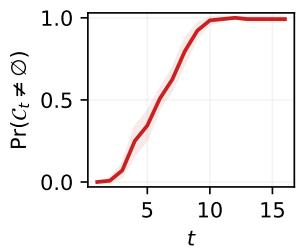

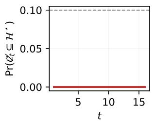  
(a) Initial initial hypothesis set.

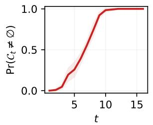

  
(b) Complete initial hypothesis set.  
Figure 9: As evidence accumulates, hypotheses are certified only when suficiently supported, with the falsecertification rate remaining below the target level $\delta = 0 . 1$ . Shaded regions show 95% confidence intervals

## H.2 Real-World Dataset Experiment

Initial hypotheses. Each run begins from an initial candidate set $\mathcal { H } _ { 0 } = \{ H _ { 0 } , H _ { 0 } ^ { c } \}$ consisting of one predefined natural-language hypothesis and its logical complement. Neither hypothesis reveals the benchmark gold hypothesis. For each dataset, we evaluate five diferent initial hypothesis pairs that vary the relationship, population, or explanatory variable under consideration. All methods use the same initial pair for a given run.

Experimental state space and interface. The state $\theta \in \Theta$ specifies a possible model of the world through the observation laws $\{ P _ { \theta } ( \cdot \mid A ) : A \in { \mathcal { A } } \}$ , while an action $A \in { \mathcal { A } }$ specifies a measurement that can distinguish between such states.

For DiscoveryBench, we represent the experimentally accessible part of θ by the population quantities measurable through the interface. Let $j = 1 , \dots , J$ index these quantities, or estimands, and write

$$
\theta = ( \theta _ { 1 } , \ldots , \theta _ { J } ) ,
$$

where $\theta _ { j }$ denotes the value of estimand $j$ under state $\theta .$ For example, an estimand may be a diference in population means or a population regression coeficient. The corresponding unknown true state is

$$
\theta ^ { \star } = ( \theta _ { 1 } ^ { \star } , \ldots , \theta _ { J } ^ { \star } ) .
$$

Each action A measures one estimand; let $j _ { A }$ denote its index. Under state $\theta ,$ the population quantity targeted by A is therefore $\theta _ { j _ { A } }$ . Diferent actions may target the same estimand, for example through fresh-fold replications or diferent supported statistical procedures. States that agree on all estimands accessible through A are observationally indistinguishable under this interface and need not be represented separately.

For possibility-frontier computation, we use a finite working representation in which each estimand takes one of three qualitative states: negative, zero, or positive. We assign these states the numerical representatives

$$
\theta _ { j } \in \big \{ - s _ { j } ^ { \mathrm { r e f } } , 0 , s _ { j } ^ { \mathrm { r e f } } \big \} ,
$$

where $s _ { j } ^ { \mathrm { r e f } }$ is a prespecified scale for estimand $j ,$ chosen as a typical standard error for that estimand family. The nonzero values thus provide standardized representatives of negative and positive departures from zero.

The resulting working state space is

$$
\Theta _ { \mathrm { g r i d } } = \prod _ { j = 1 } ^ { J } \{ - s _ { j } ^ { \mathrm { r e f } } , 0 , s _ { j } ^ { \mathrm { r e f } } \} .
$$

This discretization is used only for frontier computation and does not assume that the underlying population quantities are discrete.

Each generated hypothesis is mapped to a sign condition on its corresponding estimand. For example, consider the hypothesis that completing a bachelor’s degree is positively associated with later socioeconomic status. Let $\theta _ { j }$ denote the corresponding population regression coeficient. The hypothesis is represented as

$$
H = \{ \theta : \theta _ { j } > 0 \} , \qquad H ^ { c } = \{ \theta : \theta _ { j } \leq 0 \} .
$$

An associated action estimates this coeficient on a fresh data fold using the prespecified regression procedure and tests the corresponding directional null. In the working grid, H contains states with $\theta _ { j } = s _ { j } ^ { \mathrm { r e f } }$ , whereas $H ^ { c }$ contains those with $\theta _ { j } \in \{ - s _ { j } ^ { \mathrm { r e f } } , 0 \}$ . The remaining coordinates encode the signs of the other estimands registered in the fixed experimental interface A.

Statistical procedures. We adapt POPPER (Huang et al., 2025) to instantiate candidate actions for generated hypotheses and their complements. POPPER constructs each action as a falsification test whose null hypothesis is implied by the hypothesis being tested, so that rejection provides evidence against that hypothesis.

At each round, POPPER proposes a finite set of candidate actions from the predefined action space $\mathcal { A }$ for the hypotheses generated so far and their complements. Each action specifies its estimand, population or subgroup, variables and controls, null and alternative hypotheses, and statistical test before its assigned data fold is observed. We retain only proposals whose full specification is supported by the prespecified experimental interface; unsupported or duplicate proposals are discarded before any new data fold is observed. For example, in NLS SES, supported actions test directional associations between bachelor’s degree completion and socioeconomic status, family size, academic ability, or class rank. We use one-sided OLS coeficient tests with HC3 robust standard errors, including predefined subgroup analyses.

Data splitting and experimental budget. For each dataset, we randomly partition the observations into 16 disjoint folds using the run’s random seed. At round t, we select up to two distinct actions from $\boldsymbol { \mathcal { A } } _ { t } .$ . Their complete statistical specifications are fixed before the corresponding fold is observed, and the selected actions are then executed on that same previously unseen fold. Thus, each run uses at most 16 data folds and permits at most 32 test executions.

We retain the specifications and results of all executed actions in a shared evidence record within each run. Previously executed actions cannot be introduced again merely by changing their wording. A registered action may, however, be replicated on a later fresh fold without modifying its estimand, population, null and alternative hypotheses, or statistical procedure. We permit at most two such replications of each registered action.

Evidence construction. For each selected action A, POPPER executes its prespecified statistical test on the round’s previously unseen data fold and returns the p-value for its fixed null hypothesis. Following POPPER (Huang et al., 2025), we convert each p-value to an e-value using

$$
e ( p ) = \kappa p ^ { \kappa - 1 } , \qquad \kappa = 0 . 5 .
$$

The resulting evidence is stored together with the action’s estimand $j _ { A } ,$ , null hypothesis, and statistical specification.

Recall that action A measures estimand $j _ { A }$ , whose value under state θ is $\theta _ { j _ { A } }$ . We therefore map the null hypothesis of each action to the states in $\Theta _ { \mathrm { g r i d } }$ for which the corresponding condition on $\theta _ { j _ { A } }$ holds. Let $A _ { t , k }$ denote the kth action executed on fold $t ,$ let $e _ { t , k }$ denote its e-value, and let $\Theta _ { 0 , t , k }$ denote the set of states satisfying its prespecified null hypothesis. Its statewise contribution is

$$
e _ { t , k } ( \theta ) = e _ { t , k } { \bf 1 } \{ \theta \in \Theta _ { 0 , t , k } \} + { \bf 1 } \{ \theta \notin \Theta _ { 0 , t , k } \} .
$$

At each round, up to two distinct actions may be executed on the same data fold. These actions may target diferent estimands, but because their test statistics are computed from the same observations they need not be independent. We therefore average their statewise contributions within the fold,

$$
\bar { e } _ { t } ( \theta ) = \frac { 1 } { K _ { t } } \sum _ { k = 1 } ^ { K _ { t } } { e _ { t , k } ( \theta ) , } \qquad K _ { t } \le 2 .
$$

All selected actions and their statistical specifications are fixed before fold t is observed. Evidence is then accumulated across successive disjoint folds as

$$
E _ { t } ( \theta ) = \prod _ { s = 1 } ^ { t } { \bar { e } } _ { s } ( \theta ) .
$$

Possibility frontier. Using the current version space $V _ { t } ,$ we construct the frontier pair set $\mathcal { P } _ { t }$ as in Sec. 4.2. The pairs in $\mathcal { P } _ { t }$ represent distinctions between surviving states that separate open hypotheses in $\mathcal { O } _ { t } ^ { + }$ and could therefore improve on the current certified utility $U _ { t }$ . If $\mathcal { O } _ { t } ^ { + } = \mathcal { O }$ , we instead consider all distinct pairs of states in $V _ { t }$

Experiment selection. At each round, POPPER instantiates candidate actions from the supported experimental interface A for hypotheses generated so far and their complements, including eligible replications of previously registered actions. We apply the maximin design of Eq. (8) to the resulting validated actions.

Recall that each action A measures estimand $j _ { A }$ . For experimental design only, we use the working observation model

$$
{ \widehat { \theta } } _ { A } \mid \theta \approx { \mathcal { N } } ( \theta _ { j _ { A } } , \sigma _ { A } ^ { 2 } ) ~ ,
$$

where $\sigma _ { A }$ is the anticipated standard error of action A. If estimand $j _ { A }$ has been measured on an earlier fold, we use its previously observed standard error; otherwise, we use a prespecified reference standard error for the corresponding estimand family, such as 0.08 for binary prevalence estimands. Thus, $\sigma _ { A }$ is always determined before the current fold is observed.

For two candidate states $\theta$ and $\vartheta ,$ we measure the ability of action A to distinguish them by the KL divergence between their Gaussian working observation models,

$$
d _ { A } ( \theta , \vartheta ) = \frac { { ( \theta _ { j _ { A } } - \vartheta _ { j _ { A } } ) } ^ { 2 } } { 2 \sigma _ { A } ^ { 2 } } .
$$

Hence, an action is more informative when the two states make more widely separated predictions for the estimand it measures, relative to its anticipated estimation noise. If $\theta _ { j _ { A } } = \vartheta _ { j _ { A } }$ , then $d _ { A } ( \theta , \vartheta ) = 0$

Restricting the maximin design in the main text to the currently available actions, we compute

$$
\rho _ { t + 1 } \in \arg \operatorname* { m a x } _ { \rho \in \Delta ( \mathcal { A } _ { t } ) } \operatorname* { m i n } _ { ( \theta , \vartheta ) \in \mathcal { P } _ { t } } \sum _ { A \in \mathcal { A } _ { t } } \rho ( A ) d _ { A } ( \theta , \vartheta ) .
$$

This allocation maximizes the expected separation of the least distinguishable frontier pair. We then select up to two distinct actions according to $\rho _ { t + 1 }$ , fix their statistical specifications, and execute them on the next previously unseen data fold.

Adaptive hypothesis generation. At each expansion step, an LLM proposes a new falsifiable hypothesis and its logical complement using the research question, previously generated hypotheses, and all completed experiments. Proposals are restricted to claims supported by the experimental interface and are validated before any new data fold is observed.

For each accepted hypothesis, previously collected evidence whose prespecified statistical claim applies to that hypothesis is reused, allowing newly generated hypotheses to be evaluated against the full accumulated evidence record. Falsified hypotheses are discarded, while nonfalsified hypotheses are retained for further experimentation. Generated hypotheses that become certified enter $\mathcal { C } _ { t }$ and are eligible for selection according to the abductive utility u(H).

Background knowledge and abductive selection. We use an LLM to elicit background possibility values (Yang et al., 2026) for the negative, zero, and positive states of each estimand, using background scientific knowledge without exposing the current run’s experimental results. For each estimand, the three values are normalized by their maximum. For a joint state $\theta = ( \theta _ { 1 } , \ldots , \theta _ { J } )$ , we then define

$$
\pi ^ { K } ( \theta ) = \operatorname* { m i n } _ { j = 1 , \ldots , J } \pi _ { j } ^ { K } ( \theta _ { j } ) ,
$$

yielding a fixed background possibility contour over the finite working state space.

For each hypothesis H, we compute its background utility using Eq. 5. Among the certified hypotheses $H \in { \mathcal { C } } _ { t }$ we select those maximizing u(H), breaking utility ties in favor of smaller cardinality as in Eq. 6.

Hypothesis Matching Score (HMS). We evaluate agreement with the DiscoveryBench gold hypothesis using the Hypothesis Matching Score (HMS) (Majumder et al., 2025), using the version adopted in AstaBench (Bragg et al., 2026). HMS measures the alignment between a predicted and gold hypothesis along three dimensions: their context, associated variables, and the relationship among those variables. Each dimension is scored by an LLM judge, and the final HMS is the product of the three alignment scores:

$$
\mathrm { H M S } ( \hat { H } , H ^ { \star } ) = s _ { \mathrm { c t x } } s _ { \mathrm { v a r } } s _ { \mathrm { r e l } } .
$$

The score is on a [0, 1] scale, with higher values indicating closer agreement with the gold hypothesis. The gold hypothesis is used only for this post-hoc evaluation and is not exposed during hypothesis generation, experiment selection, or hypothesis selection.

## H.3 Validity under Adaptive Hypothesis Selection

This experiment evaluates the evidential criteria defining the certified set $\mathcal { C } _ { t }$ in Eq. (15), which requires $\underline { { \Pi } } _ { t } ^ { E } ( H ) > \delta$ and $\underline { { N } } _ { t } ^ { E } ( H ) \geq 1 - \delta$ . Specifically, it examines anytime validity and statistical power under post-hoc hypothesis selection, as well as the role of necessity in distinguishing compatibility from suficient evidential support.

Setup. Sequential observations are generated as $M _ { t } \sim \mathcal { N } ( \theta ^ { \star } , 1 )$ for $t = 1 , \ldots , 1 0 0$ , with the fixed candidate family

$$
\mathcal { H } = \left\{ \{ \theta > c \} , \left\{ \theta < c \right\} : c \in \left\{ - 1 , - 0 . 9 , \ldots , 1 \right\} \right\} .
$$

At each round, all 42 candidates are evaluated using the same accumulated observations, allowing post-hoc hypothesis selection. The fixed family facilitates comparison with Bonferroni correction, although the simultaneous validity guarantee of our method also accommodates adaptively generated hypotheses. The certification threshold is set to $\delta = 0 . 0 5$

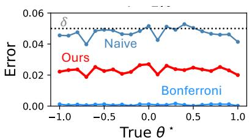  
(a) Error

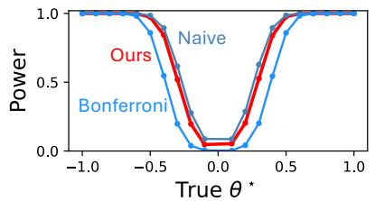  
(b) Power

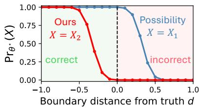  
(c) Necessity ablation  
Figure 10: Validity under post-hoc hypothesis selection. The certification criteria control both error types while retaining competitive power. The necessity requirement distinguishes compatibility from suficient evidential support.

The Gaussian normal-mixture e-process (Howard et al., 2021) is given by

$$
E _ { t } ( \theta ) = \frac { 1 } { \sqrt { 1 + t \tau ^ { 2 } } } \exp \left\{ \frac { \tau ^ { 2 } \left( \sum _ { s = 1 } ^ { t } ( M _ { s } - \theta ) \right) ^ { 2 } } { 2 ( 1 + t \tau ^ { 2 } ) } \right\} ,
$$

which mixes likelihood ratios over alternatives $\theta + \xi ,$ where $\xi \sim \mathcal { N } ( 0 , \tau ^ { 2 } )$ . The resulting e-possibility and necessity measures are computed according to Eq. (2), with their persistent versions used for certification.

Baselines. Two baselines are considered, both employing hypothesis-specific one-sided Gaussian mixture e-processes. Let $\begin{array} { r } { S _ { t } ( c ) = \sum _ { s = 1 } ^ { t } ( M _ { s } - c ) } \end{array}$ . The corresponding processes are

$$
E _ { t } ^ { \pm } ( c ) = \frac { 2 } { \sqrt { 1 + t \tau ^ { 2 } } } \exp \left\{ \frac { \tau ^ { 2 } S _ { t } ( c ) ^ { 2 } } { 2 ( 1 + t \tau ^ { 2 } ) } \right\} \Phi \left( \frac { \pm \tau S _ { t } ( c ) } { \sqrt { 1 + t \tau ^ { 2 } } } \right) ,
$$

where $E _ { t } ^ { + } ( c )$ tests $\theta \leq c$ and $E _ { t } ^ { - } ( c )$ tests $\theta \geq c .$

Both baselines select the candidate with the largest corresponding e-value. Naive reuse retains the selected candidate when its e-value exceeds $1 / \delta$ , without accounting for post-hoc selection. Bonferroni (Dunn, 1961) instead applies the threshold $| \mathcal { H } | / \delta = 4 2 / \delta$ , ensuring family-wise error control over the fixed candidate family. No additional temporal correction is needed because the individual e-processes are anytime-valid.

Metrics. Following Corollary 1, two family-wise error probabilities are evaluated: false rejection of a true hypothesis and false necessity assignment to a false hypothesis, respectively:

$$
\begin{array} { r l } & { \operatorname* { P r } \left( \exists t \leq T , H \in \mathcal { H } : \theta ^ { \star } \in H , \underline { { \Pi } } _ { t } ^ { E } ( H ) \leq \delta \right) , } \\ & { \operatorname* { P r } \left( \exists t \leq T , H \in \mathcal { H } : \theta ^ { \star } \notin H , \underline { { N } } _ { t } ^ { E } ( H ) \geq 1 - \delta \right) . } \end{array}
$$

For the baselines, the corresponding family-wise probability of supporting any false candidate is reported.

Statistical power is measured for the directional target $H ^ { \star } = \{ \theta > 0 \}$ when $\theta ^ { \star } > 0$ and $H ^ { \star } = \{ \theta < 0 \}$ when $\theta ^ { \star } < 0 ,$ , as the probability of retaining the target by $T = 1 0 0$ . Power is undefined at $\theta ^ { \star } = 0$

To isolate the contribution of necessity, the following events are compared at $T = 1 0 0 \colon$

$$
X _ { 1 } = \{ \underline { { { \Pi } } } _ { T } ^ { E } ( H ) > \delta \} , \qquad X _ { 2 } = \{ \underline { { { \Pi } } } _ { T } ^ { E } ( H ) > \delta , \underline { { { N } } } _ { T } ^ { E } ( H ) \geq 1 - \delta \} .
$$

Their probabilities are plotted against the oriented boundary distance $d = c - \theta ^ { \star }$ for $H = \{ \theta > c \}$ and $d = \theta ^ { \star } - c$ for $H = \{ \theta < c \}$ , where $d < 0$ indicates that the hypothesis contains the true parameter.

Results. As shown in ${ \mathrm { F i g } } .$ . 10a, the certification criteria keep both error types below the nominal level $\delta = 0 . 0 5$ Naive reuse slightly exceeds the nominal level for some states, whereas Bonferroni is substantially more conservative. The certification criteria achieve power comparable to naive reuse (Fig. 10b) while outperforming Bonferroni for moderate efect sizes (Fig. 10b).

The necessity ablation (Fig. 10c) shows that compatibility can persist near the true boundary, whereas necessity requires suficient evidence against the complement. Smaller values of δ impose a stricter necessity requirement, shifting the transition toward more negative boundary distances. The primary experiment uses $\tau = 1 . 0$ . Fig. 11 shows ablation with $\tau \in \{ 0 . 5 , 2 . 0 \}$ examine sensitivity to the Gaussian mixture scale.

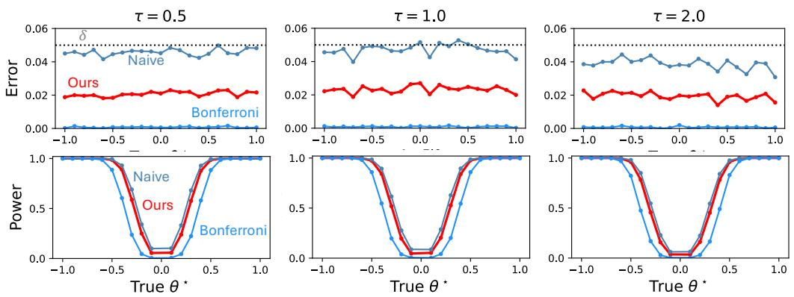  
Figure 11: Empirical error (top) and power (bottom) under post-hoc hypothesis selection for diferent mixture scales τ. Our method maintains error control at $\delta = 0 . 0 5$ with power comparable to naive reuse across varying τ .