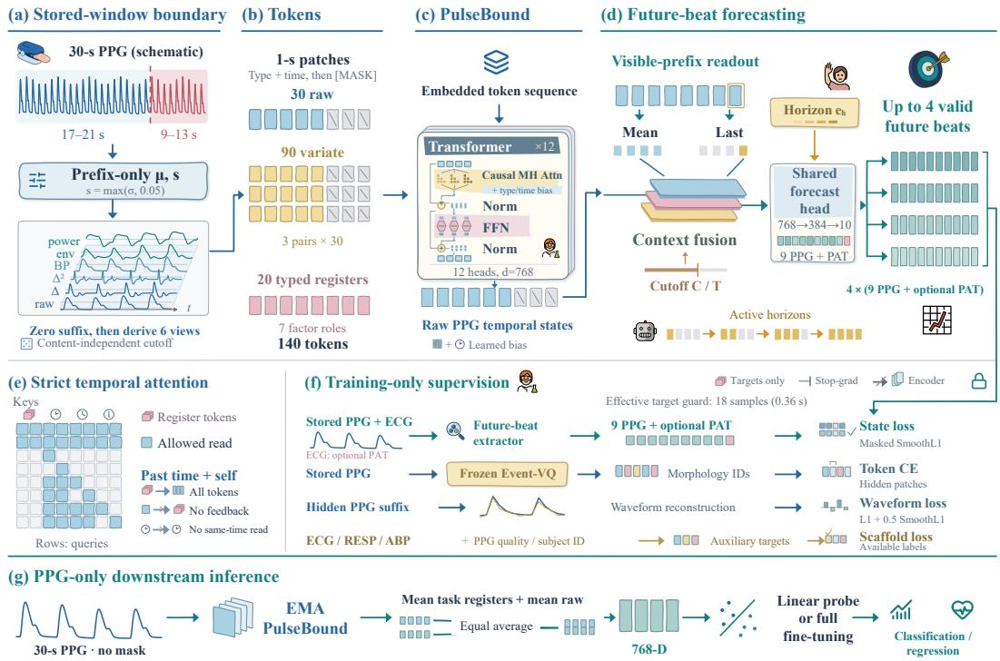

# PULSEBOUND: FUTURE-BEAT STATE FORECASTING UNDER AN EXPLICIT INFORMATION BOUNDARY

Chenyang Xu1,3, Donglin Xie2, Xi Xiang3, Xiaoyu Li1, Yufan Lu3, Jiqiun Gao3, Yi Zhao3, Xin-Yi Li1, Guangpu Zhu1, Zijian Wang Xiwen Yang1,4, Dezhen Wang5, Lin Chen6, Shenda Hong2, Leilei Li1

1OPPO Health Lab, Guangdong OPPO Mobile Telecommunications Corp., Ltd.

2Peking University

3Xidian University

4University of the Chinese Academy of Sciences

5Tongji University

6Beijing Technology and Business University

Correspondence to: Shenda Hong (hongshenda@pku.edu.cn) and Leilei Li (liyelei1@oppo.com).

## ABSTRACT

Predictive representation learning from photoplethysmography (PPG) has a subtle failure mode: causal attention does not guarantee one-sided information access when normalization, nonlocal transforms, or companion views can depend on withheld samples. We introduce PulseBound, a PPG representation learner that couples physiologically structured future-beat prediction with an explicit stored-window information boundary. A content-independent cutoff separates a visible prefix from the prediction target; prefix-only normalization, suffix replacement before derivedview construction, and aligned masking make every encoder input a function of the visible prefix and cutoff alone. This yields stored-suffix invariance: for fixed model state, randomness, prefix, and cutoff, changing the stored suffix cannot change the forecast context. Within this contract, a shared horizon-conditioned head predicts nine deterministic rhythm and morphology descriptors for up to four extractor-valid future beats, with elementwise validity masks and optional ECG-derived pulsearrival-time supervision confined to training.On groups held out from PulseBound backbone pretraining within MIMIC and VitalDB, PulseBound reduces nine-state transformed-space MAE relative to last-visible-beat persistence by 28.06% and 22.22%, respectively, and improves MAE, MAE-Skill, and Spearman correlation in all 40 source–cutoff–horizon cells. In a separate seven-model comparison across 13 downstream tasks, PulseBound attains the best mean on nine frozen linear-probe tasks and seven full-fine-tuning tasks. Stored-suffix interventions produce zero recorded change in forecast contexts or predictions, with zero suffix-input gradient at audited precision under the declared stored-window interface. Together, these results frame predictive physiological representation learning around three separately testable choices: what information is accessible, what future structure is supervised, and how the learned representation transfers.

## 1 INTRODUCTION

Photoplethysmography (PPG) is an inexpensive optical measurement of blood-volume dynamics that is ubiquitous in bedside monitors, pulse oximeters, and wearables (Allen, 2007). Its availability makes PPG attractive for reusable representation learning across heart and respiratory rate estimation, blood-pressure modeling, stress and activity recognition, and signal-quality assessment. Yet PPG is also highly redundant: adjacent pulse cycles share strong waveform structure, while motion, contact, illumination, and device effects can dominate local variation. Consequently, accurate reconstruction of missing samples need not imply that a representation captures how physiologically meaningful properties evolve.

Recent PPG foundation models address this challenge with complementary supervision. PaPaGei introduces participant- and morphology-aware objectives (Pillai et al., 2025); Pulse-PPG emphasizes heterogeneous field recordings (Saha et al., 2025); AnyPPG uses synchronized ECG for cross-modal guidance (Nie et al., 2026); and GPT-PPG and SIGMA-PPG develop autoregressive and statistically guided generative objectives (Chen et al., 2025; Guo et al., 2026). These approaches motivate two orthogonal design questions: what should a representation predict, and exactly what observations may it use to make that prediction?

The second question is easy to under-specify. Masking future tokens or using causal attention does not prevent hidden samples from influencing visible inputs through full-window normalization, zerophase or global transforms, or an unmasked companion view. Likewise, selecting a cutoff from future beat detections can leak target-dependent timing. For forecasting, the relevant object is therefore not the attention mask alone, but the complete computation that constructs the forecast context from admissible observations.

We introduce PulseBound, which makes this conditioning set explicit. From a stored, preprocessed 30-s PPG window, we sample a patch-aligned cutoff independently of waveform content, metadata, beat detections, and target values. Normalization uses visible-prefix statistics; hidden samples are removed before nonlocal derived views are formed; and aligned hidden tokens are masked across streams. The resulting encoder inputs depend only on the stored prefix and cutoff. This yields stored-suffix invariance: with model state, randomness, prefix, and cutoff fixed, replacing the stored suffix cannot change the forecast context. The guarantee begins at the stored-window interface; it is intentionally narrower than end-to-end streaming causality, which would also require boundary-preserving upstream preprocessing.

Within this boundary, PulseBound predicts interpretable future-beat states rather than requiring sample-wise waveform reproduction. A shared horizon-conditioned head forecasts nine deterministic PPG-derived descriptors spanning inter-beat timing, amplitude, pulse morphology, baseline, and multiscale energy for up to four extractor-valid future beats. Component-wise validity masks exclude inadmissible targets. When synchronized ECG is available, pulse arrival time (PAT) provides an additional training-only supervision signal, while ECG never enters the encoder or deployment path. The resulting targets are inspectable signal-derived proxies rather than clinical ground truth.

Our contributions are threefold:

• An explicit, auditable information boundary. We formalize cutoff-relative stored-suffix invariance and give a construction based on content-independent cutoff sampling, prefix-only normalization, suffix replacement before derived transforms, and aligned masking. The guarantee concerns model-side access from the stored preprocessed window onward and is distinct from attention causality or raw-signal streaming equivalence.

• Validity-aware prediction of interpretable future beats. Under this contract, a shared multi-horizon predictor estimates nine deterministic PPG-derived rhythm and morphology descriptors and optional training-only ECG-derived PAT for up to four future beats, while component-wise masks prevent invalid measurements from being treated as zeros.

• Separate tests of conditional forecasting and transferable representation quality. We evaluate future-state prediction against train-median and last-visible-beat references on identical paired support, audit the declared information boundary by intervention and input gradients, and independently compare the complete pretrained system across 13 downstream tasks. Checkpoint-compatible frontends are retained for released baselines, so downstream comparisons are interpreted at the system level rather than as causal attribution to a single pretraining objective.

## 2 RELATED WORK

PPG representation learning and predictive self-supervision. PPG representation learning has explored participant structure, pulse morphology, acquisition diversity, and predictive or generative supervision. PaPaGei uses participant- and morphology-aware objectives (Pillai et al., 2025); Pulse-PPG emphasizes heterogeneous field recordings (Saha et al., 2025); DNA-PPG aligns morphology-aware neighborhoods with continuous physiological semantics (Yang et al., 2026); and large-scale pulseoximetry pretraining further demonstrates transferable physiological structure in optical waveforms (Kohn et al., 2026). Predictive and generative approaches include GPT-PPG, SIGMA-PPG, TS2TC, and RhythmJEPA (Chen et al., 2025; Guo et al., 2026; Zhang et al., 2024; Nguyen et al., 2026), alongside broader masked, contrastive, and predictive representation learning (He et al., 2022; van den Oord et al., 2018; Eldele et al., 2021; Yue et al., 2022). A recent ECG/PPG review organizes physiological SSL along related reconstruction, contrastive, predictive, and cross-modal axes (Ding & Wu, 2024). Our focus is complementary to the pretext objective itself: PulseBound asks not only what should be predicted, but also which stored observations may influence the prediction context.

Blood-pressure transfer, subject specificity, and signal quality. Prior work also exposes representation properties directly relevant to our evaluation. UPR-BP studies unsupervised PPG representation learning for noninvasive blood-pressure estimation (Ma et al., 2024a), while STP develops self-supervised transfer for PPG-based BP prediction (Ma et al., 2024b). These works establish BP-relevant self-supervised transfer; we therefore do not claim that BP information is unique to PulseBound, and avoid numerical rankings across unmatched BP-specific protocols. Separately, Ghorbani et al. report substantial inter-subject structure in self-supervised PPG representations (Ghorbani et al., 2023), while work on quasiperiodic time series highlights a related tension between record-specific structure and within-record temporal variation (Atienza et al., 2024). This is pertinent to our subject-contrastive objective and closed-set identification task: subject-typed registers are architectural roles, not evidence of subject-invariant physiology. Signal quality is likewise a distinct representation problem. Shao et al. study self-supervised, device-agnostic PPG quality assessment (Shao et al., 2025); our quality scaffold and Stanford evaluation instead measure quality-sensitive transfer within a multi-task representation and do not establish device invariance. More generally, deterministic PPG targets remain dependent on beat detection and signal quality (Charlton et al., 2022).

Cross-modal physiological supervision. Paired biosignals can enrich representation learning without increasing deployment-time sensing requirements. AnyPPG uses ECG-guided PPG representation learning (Nie et al., 2026), and ECG-guided heart-age modeling similarly transfers cross-modal supervision to PPG-only inference (Xie et al., 2026). xMAE exploits ECG–PPG structure for masked cross-modal reconstruction (Zhou et al., 2026); CardioPPG combines cross-modal representation learning with ECG synthesis (Ding et al., 2026); and CardioFM jointly models ECG and PPG with multimodal attention (Hassanuzzaman et al., 2026). In PulseBound, ECG is restricted to training-time supervision: neither ECG waveforms nor ECG-derived labels enter the encoder or forecast context, and deployment remains PPG-only.

Positioning of PulseBound. Morphology-aware supervision, BP-oriented transfer, subject-sensitive representations, quality modeling, predictive pretraining, and cross-modal scaffolds are therefore all present in prior work. The distinction of PulseBound is their coupling to an explicit one-sided information-access contract. Content-independent cutoff sampling, prefix-only normalization, suffix replacement before nonlocal derived transforms, and aligned masking make every encoder input a function of the stored prefix. Once this boundary is established, attention, registers, auxiliary objectives, and future-beat targets determine what is learned within the admissible information set rather than which information is available. The fixed descriptor targets make the supervision inspectable, while the boundary makes its conditioning path auditable. Our downstream benchmark consequently characterizes system-level transfer with checkpoint-compatible frontends rather than attributing gains causally to any single objective.

## 3 METHOD

PulseBound separates the conditioning path from the supervision path. The encoder receives only prefix-dependent inputs, while a training-only extractor may inspect the stored waveform and optional synchronized ECG to construct prediction targets. Future-state prediction is optimized jointly with masked-token, waveform, and auxiliary objectives on the shared backbone, but none of those target signals enters the forecast context (Figure 1).

## 3.1 FORECASTING TASK AND INFORMATION-BOUNDARY CONTRACT

Let $\pmb { x } _ { b } ~ \in ~ \mathbb { R } ^ { L }$ be a stored, preprocessed 30-s PPG window sampled at $f _ { s } ~ = ~ 5 0$ Hz, with $L = 1 5 0 0$ . Patches of $P = 5 0$ samples yield $T = 3 0$ temporal positions. Given mask-ratio

  
Figure 1: PulseBound separates prefix-conditioned encoding from training-only supervision while preserving PPG-only inference.

bounds $( r _ { \mathrm { m i n } } , r _ { \mathrm { m a x } } ) = ( 0 . 3 0 , 0 . 4 5 )$ and minimum context/future lengths $( T _ { \mathrm { c t x } } ^ { \mathrm { m i n } } , T _ { \mathrm { f u t } } ^ { \mathrm { m i n } } ) = ( 1 2 , 8 )$ the admissible hidden-patch counts satisfy

$$
H _ { \operatorname* { m i n } } = \operatorname* { m a x } \bigl ( T _ { \mathrm { f u t } } ^ { \operatorname* { m i n } } , \lceil r _ { \operatorname* { m i n } } T \rceil \bigr ) , \quad H _ { \operatorname* { m a x } } = \operatorname* { m i n } \bigl ( T - T _ { \mathrm { c t x } } ^ { \operatorname* { m i n } } , \lfloor r _ { \operatorname* { m a x } } T \rfloor \bigr ) .\tag{1}
$$

We sample $H _ { b } \sim$ Uniform $\{ H _ { \operatorname* { m i n } } , \dots , H _ { \operatorname* { m a x } } \}$ independently of waveforms, metadata, beat detections, and target scores, set $C _ { b } = T - H _ { b } .$ and define

$$
M _ { b , t } = \mathbf { 1 } [ t \geq C _ { b } ] , \qquad t \in \{ 0 , \dots , T - 1 \} .\tag{2}
$$

Here $H _ { b }$ counts hidden patches, whereas h indexes future beats. The configuration gives $( H _ { \operatorname* { m i n } } , H _ { \operatorname* { m a x } } ) = ( 9 , 1 3 )$ and cutoff time $C _ { b } P / f _ { s } \in \{ 1 7 , \dots , 2 1 \}$ s. Unlike a boundary chosen using future beat detections, this sampling rule cannot encode target-dependent event timing.

The task is to predict up to four extractor-valid future beats from the prefix. With model parameters and persistent state fixed, let ξ denote waveform-independent model randomness and define

$$
\mathcal { T } _ { b } ^ { \xi } = \sigma ( \boldsymbol { x } _ { b , < C _ { b } P } , C _ { b } , \xi ) .\tag{3}
$$

A forecast context obeys the contract when it is measurable with respect to $\mathcal { T } _ { b } ^ { \xi } .$ . Labels and validity masks may depend on the stored suffix, but cannot enter the encoder or forecast context. This is a forward-access constraint beginning at the stored-window interface, not a guarantee about upstream raw-signal preprocessing or statistical independence between past and future physiology.

## 3.2 BOUNDARY-PRESERVING SIGNAL AND TOKEN CONSTRUCTION

For $N _ { b } = C _ { b } P$ visible samples, normalization uses prefix population statistics,

$$
\mu _ { b } = \frac { 1 } { N _ { b } } \sum _ { i < N _ { b } } x _ { b , i } , \qquad s _ { b } = \operatorname* { m a x } \left( \sqrt { \frac { 1 } { N _ { b } } \sum _ { i < N _ { b } } ( x _ { b , i } - \mu _ { b } ) ^ { 2 } } , \tau \right) , \quad \tau = 0 . 0 5 .\tag{4}
$$

The scale floor is fixed using the MIMIC–VitalDB training split and stabilizes low-variance prefixes without consulting the current suffix. We standardize the full array with $\left( \mu _ { b } , s _ { b } \right)$ , then construct two token streams.

For the raw stream, each patch is independently projected to d = 768 dimensions, and every hidden token is overwritten by a learned mask token. Patch-local projection prevents hidden samples from affecting visible raw tokens. For the derived streams, hidden standardized samples are first replaced by zero. Only then do we compute six views: normalized raw PPG, first and second finite differences, a 0.5–8 Hz zero-phase FFT band-pass signal, a Hilbert amplitude envelope, and a smoothed log bandpower envelope. Subsequent view-wise z-scoring therefore remains suffix-independent. Ordered by physiological type, the views are paired and embedded into three aligned variate tokens per position, with type and sinusoidal time embeddings; hidden variate tokens are also replaced by mask tokens. Together with 20 learned registers, this yields $3 0 + 3 \times 3 0 + 2 0 = 1 4 0$ tokens.

These views are prefix-global: an earlier visible feature may depend on later samples within the same prefix. They preserve the cutoff-relative information boundary without implying sample-wise streaming causality.

## 3.3 TEMPORAL CONNECTIVITY AND GLOBAL READOUTS

The d = 768, 12-layer backbone uses 20 typed registers. Temporal queries may read only earlier temporal tokens and themselves, while registers aggregate the masked sequence without feeding information back into temporal states. Learned type-pair and relative-time biases operate only within this routing; their exact parameterization is given in Appendix C. This connectivity controls representation mixing after prefix-dependent inputs have been constructed and is therefore separate from the information-boundary guarantee.

Proposition 1 (stored-window suffix invariance). Fix model parameters, persistent state, and randomness $\xi .$ For any two stored windows sharing the same prefix and cutoff, with suffixes for which the forward computation is well defined,

$$
\begin{array} { r } { \pmb { c } _ { \theta } ( [ \pmb { x } _ { < C P } ; \pmb { x } ^ { s } ] , C ; \xi ) = \pmb { c } _ { \theta } ( [ \pmb { x } _ { < C P } ; \tilde { \pmb { x } } ^ { s } ] , C ; \xi ) . } \end{array}\tag{5}
$$

Proof. Let $U _ { \boldsymbol { \theta } , C } ( \pmb { x } )$ collect all encoder inputs, including tokens, registers, embeddings, and masks. Prefix-only normalization, patch-local raw projection followed by masking, and suffix replacement before derived transforms ensure $U _ { \theta , C } ( { \pmb x } ) \overset { - } { = } \dot { G } _ { \theta } ( { \pmb x } _ { < C P } , C )$ , independent of the stored suffix. The forecast context can therefore be written as $\pmb { c } _ { \theta } ( \pmb { x } , C ; \xi ) = F _ { \theta } ( U _ { \theta , C } ( \pmb { x } ) , C ; \xi )$ . Equal prefixes thus yield identical contexts, although their targets may differ, proving Equation 5. The guarantee follows from input construction rather than temporal routing. It applies from the stored, preprocessed-window interface onward and does not cover upstream preprocessing.

## 3.4 DETERMINISTIC FUTURE-BEAT SUPERVISION

A training-only deterministic extractor identifies up to four future beats from the stored waveform using prefix-based normalization, a 0.5–8 Hz filtered PPG, refractory peak detection, and an effective 18-sample (0.36-s) future-peak guard. For each accepted beat,

$$
\begin{array} { r } { \pmb { y } _ { b , h } = \mathcal { T } \big ( \mathrm { I B I } , \boldsymbol { A } , \boldsymbol { R } , \boldsymbol { W } _ { 1 / 2 } , \boldsymbol { S } , \boldsymbol { B } , \boldsymbol { Q } , E _ { \mathrm { f a s t } } , E _ { \mathrm { m i d } } , \mathrm { P A T } \big ) \in \mathbb { R } ^ { 1 0 } , } \end{array}\tag{6}
$$

where the first nine components are PPG-derived descriptors of timing, amplitude, morphology, baseline, and multiscale energy, and PAT is optional. Horizons index accepted events rather than fixed elapsed times. An elementwise validity mask excludes inadmissible measurements without treating them as zeros; PAT validity affects only the PAT component. Neither synchronized ECG nor extracted targets enter the encoder or forecast head. Appendix B gives the exact transforms, detection rules, and validity conditions.

## 3.5 HORIZON-CONDITIONED FORECAST AND CURRICULUM

Let $\pmb { h } _ { b } ^ { \mathrm { l a s t } }$ be the raw PPG state at $C _ { b } - 1$ , and $\bar { \pmb { h } } _ { b }$ the mean over raw states with $t < C _ { b }$ . A shared predictor computes

$$
\begin{array} { r } { \pmb { c } _ { b } = f _ { c } ( [ \pmb { h } _ { b } ^ { \mathrm { l a s t } } ; \bar { \pmb { h } } _ { b } ] ) + f _ { u } ( C _ { b } / T ) , } \end{array}\tag{7}
$$

$$
\begin{array} { r } { \hat { y } _ { b , h } = f _ { p } ( \pmb { c } _ { b } + \pmb { c } _ { h } ) , \qquad h \in \{ 1 , 2 , 3 , 4 \} , } \end{array}\tag{8}
$$

where $e _ { h }$ selects the future event and $C _ { b } / T$ specifies the known context length. The fusion $f _ { c }$ is LayerNorm–Linear–SiLU–Dropout from 2d to d; $f _ { u }$ maps the cutoff fraction to $d ;$ and $f _ { p }$ is a LayerNorm MLP with widths $d \stackrel { - } { \to } d / 2 \stackrel { } { \to } 1 0$ . Dropout is 0.1. All horizons share $f _ { p } .$

During training, a four-phase curriculum progressively activates horizons $H _ { 1 } { - } H _ { 4 }$ , while a masked smooth- $. L _ { 1 }$ objective averages over valid active state elements. Input sampling, cutoff policy, and target definitions remain fixed throughout the curriculum. The exact schedule and reduction are given in Appendix C.1.

## 3.6 JOINT OPTIMIZATION AND PPG-ONLY INFERENCE

Future-state prediction is optimized jointly with masked Event-VQ token prediction, hiddenwaveform reconstruction, available ECG/respiration/blood-pressure/quality scaffold losses, subject contrastive supervision, and the ponder regularizer. Exact objective definitions and weights are given in Appendix C.1; tokenizer and scaffold details appear in Appendix C, and optimization settings in Appendix E. No teacher network is used, and all 12 backbone layers execute during both training and inference.

Downstream inference encodes a complete 30-s PPG window without masking, a tokenizer, or auxiliary modalities. The exported representation is

$$
\begin{array} { r } { z = \frac { 1 } { 2 } \left( \mathrm { m e a n } ( \mathrm { t a s k r e g i s t e r s } ) + \mathrm { m e a n } ( \mathrm { P P G ~ t e m p o r a l ~ t o k e n s } ) \right) . } \end{array}\tag{9}
$$

This 768-dimensional full-window transfer readout combines global and temporal features and is distinct from the visible-prefix context used for forecasting.

## 4 EXPERIMENTS

We evaluate downstream transfer and future-beat forecasting under the stored-prefix contract. Complete-system and downstream-ablation results aggregate three pretraining seeds, while the main component-wise forecasting ablation uses seed 0; separate three-seed forecasting controls are reported on available-case support. Additional horizon, cutoff, ECG-conditional, and boundary analyses characterize robustness and scope.

## 4.1 EVALUATION PROTOCOL

Pretraining and model selection. We pretrain the PulseBound backbone for 80 epochs on the MIMIC-III Waveform Database Matched Subset (Moody et al., 2020) and VitalDB (Lee et al., 2022), using 90/5/5 patient-group splits, an 80:20 per-epoch source mixture, and seeds {0, 1, 2}. Downstream transfer uses zero-based epoch 29, selected by validation-only linear probing without test access, whereas future-state evaluation and the stored-suffix audit use terminal epoch 79 without test-based selection. The frozen Event-VQ tokenizer predates the MIMIC split and was trained on the full processed MIMIC corpus; thus MIMIC group-disjoint claims apply specifically to backbone pretraining. The information-access guarantee begins at the stored, preprocessed-window interface. Full training, tokenizer, checkpoint-selection, and preprocessing details appear in Appendices C, D, and E.

Downstream and intrinsic evaluation. We evaluate transfer on 13 tasks spanning BIDMC (Pimentel et al., 2017), PPG-BP (Liang et al., 2018), WESAD (Schmidt et al., 2018), DaLiA (Reiss et al., 2019), Real-World PPG (Siam et al., 2019), and Stanford (Torres-Soto & Ashley, 2020). Frozen linear probing is the primary transfer setting, while full fine-tuning is reported as a secondary end-to-end adaptation test. All methods use matched evaluation examples, labels, outer splits, and task metrics, while retaining checkpoint-compatible frontends. Intrinsic forecasting is evaluated separately on group-disjoint held-out partitions using identical paired support for PulseBound and reference predictors. Exact task definitions, metrics, split construction, seed aggregation, and uncertainty conventions are given in Appendix D.

Table 1: Cross-model downstream performance across 13 PPG tasks under frozen linear probing. Regression tasks (MAE ↓)
<table><tr><td></td><td colspan="3">BIDMC</td><td colspan="3">PPG-BP</td><td></td></tr><tr><td>Method</td><td>HR</td><td>RR</td><td> $\mathrm { S p O _ { 2 } }$ </td><td>SBP</td><td>DBP</td><td>HR</td><td> $\operatorname { A v g } .$ </td></tr><tr><td>PaPaGei-S</td><td> $5 . 6 8 8 { \pm } 0 . 1 0 3$ </td><td> $2 . 1 8 2 { \scriptstyle \pm 0 . 0 0 2 }$ </td><td> $2 . 4 8 3 { \scriptstyle \pm 0 . 0 1 1 }$ </td><td> $1 6 . 4 2 5 { \pm } 0 . 0 1 9$ </td><td> $8 . 7 4 4 { \pm } 0 . 0 5 5$ </td><td>8.615±0.041</td><td>7.356</td></tr><tr><td>PaPaGei-P</td><td> $6 . 5 8 2 { \scriptstyle \pm 0 . 0 4 9 }$ </td><td> $2 . 2 7 4 { \scriptstyle \pm 0 . 0 4 4 }$ </td><td> $\mathbf { 2 . 4 1 1 { \pm } 0 . 0 1 5 }$ </td><td> $1 6 . 4 9 7 { \scriptstyle \pm 0 . 0 8 0 }$ </td><td> $8 . 8 1 2 { \scriptstyle \pm 0 . 0 8 7 }$ </td><td>8.533±0.062</td><td>7.518</td></tr><tr><td>PaPaGei-S-SVRI</td><td> $7 . 0 7 2 { \scriptstyle \pm 0 . 0 2 8 }$ </td><td> $\mathbf { 2 . 1 4 5 { \scriptstyle \pm 0 . 0 0 9 } }$ </td><td> $2 . 4 7 5 { \scriptstyle \pm 0 . 0 1 6 }$ </td><td> $1 6 . 4 7 1 { \scriptstyle \pm 0 . 0 4 3 }$ </td><td> $8 . 7 5 2 { \scriptstyle \pm 0 . 0 1 3 }$ </td><td>8.581±0.018</td><td>7.583</td></tr><tr><td>AnyPPG</td><td> $4 . 9 0 6 { \scriptstyle \pm 0 . 5 7 7 }$ </td><td> $2 . 4 9 2 { \scriptstyle \pm 0 . 0 9 2 }$ </td><td> $2 . 9 7 6 { \scriptstyle \pm 0 . 4 0 1 }$ </td><td> $1 6 . 8 5 2 { \scriptstyle \pm 0 . 1 1 3 }$ </td><td> $9 . 0 3 8 { \pm } 0 . 0 4 5$ </td><td> $7 . 6 8 3 { \pm } 0 . 2 1 4$ </td><td>7.324</td></tr><tr><td>Pulse-PPG</td><td> $4 . 0 6 1 { \scriptstyle \pm 0 . 1 9 4 }$ </td><td> $2 . 8 9 0 { \scriptstyle \pm 0 . 1 6 6 }$ </td><td> $3 . 2 7 8 { \scriptstyle \pm 0 . 2 4 0 }$ </td><td> $1 9 . 8 1 2 { \scriptstyle \pm 0 . 3 0 2 }$ </td><td> $1 1 . 5 5 7 { \pm } 0 . 5 3 6$ </td><td> $1 0 . 8 7 1 { \scriptstyle \pm 0 . 1 3 8 }$ </td><td>8.745</td></tr><tr><td>SIGMA-PPG</td><td> $3 . 7 3 0 { \scriptstyle \pm 0 . 0 6 4 }$ </td><td> $2 . 2 4 7 { \pm } 0 . 0 5 0$ </td><td> $2 . 5 3 1 { \pm } 0 . 0 0 8$ </td><td> $1 6 . 4 5 0 { \scriptstyle \pm 0 . 1 8 6 }$ </td><td> $8 . 8 1 3 { \pm } 0 . 1 1 2$ </td><td> $7 . 1 2 3 { \pm } 0 . 0 8 8$ </td><td>6.816</td></tr><tr><td>PulseBound</td><td> $\mathbf { 1 . 9 7 4 \pm 0 . 5 5 9 }$ </td><td> $2 . 2 6 3 { \scriptstyle \pm 0 . 0 4 2 }$ </td><td> $2 . 5 2 1 { \pm } 0 . 0 5 0$ </td><td> $\mathbf { 1 4 . 9 1 3 { \scriptstyle \pm 0 . 2 9 5 } }$ </td><td> $\mathbf { 8 . 5 5 4 \pm 0 . 0 3 6 }$ </td><td> $\mathbf { 5 . 2 8 8 { \pm 0 . 9 6 5 } }$ </td><td>5.919</td></tr></table>

<table><tr><td></td><td>PPG-BP</td><td colspan="3">WESAD</td><td>DaLiA</td><td> $\mathrm { R e a l - W o r l d }$ </td><td>Stanford</td><td></td></tr><tr><td>Method</td><td>HTN AUC</td><td>Stress AUC</td><td>Affect F1</td><td>Emotion AUC</td><td>Act. F1</td><td>ID F1</td><td>Qual. mAUC</td><td>Avg.</td></tr><tr><td>PaPaGei-S</td><td> $0 . 4 9 5 { \scriptstyle \pm 0 . 0 0 9 }$ </td><td>0.834±0.001</td><td>0.270±0.011</td><td> $\mathbf { 0 . 5 2 5 { \scriptstyle \pm 0 . 0 2 1 } }$ </td><td> $0 . 1 1 6 { \pm } 0 . 0 1 0$ </td><td> $0 . 0 4 7 { \scriptstyle \pm 0 . 0 0 2 }$ </td><td>0.874±0.001</td><td>0.452</td></tr><tr><td>PaPaGei-P</td><td> $0 . 4 7 9 { \pm } 0 . 0 2 8$ </td><td> $0 . 8 7 4 { \scriptstyle \pm 0 . 0 0 4 }$ </td><td> $0 . 3 8 4 { \pm } 0 . 0 0 8$ </td><td> $0 . 5 2 2 { \scriptstyle \pm 0 . 0 6 3 }$ </td><td> $0 . 2 4 0 { \scriptstyle \pm 0 . 0 0 5 }$ </td><td> $0 . 4 7 1 { \scriptstyle \pm 0 . 0 0 8 }$ </td><td> $0 . 8 2 2 { \scriptstyle \pm 0 . 0 0 2 }$ </td><td>0.542</td></tr><tr><td>PaPaGei-S-SVRI</td><td> $0 . 5 2 1 { \scriptstyle \pm 0 . 0 3 0 }$ </td><td></td><td> $0 . 3 6 5 { \scriptstyle \pm 0 . 0 0 9 }$ </td><td> $0 . 4 8 6 { \pm } 0 . 0 2 0$ </td><td> $0 . 1 2 1 { \scriptstyle \pm 0 . 0 0 2 }$ </td><td> $0 . 1 3 8 { \pm } 0 . 0 0 2$ </td><td> $0 . 8 5 2 { \scriptstyle \pm 0 . 0 0 3 }$ </td><td>0.470</td></tr><tr><td> $\mathrm { A n y P P G }$ </td><td> $0 . 5 1 6 { \pm } 0 . 0 3 2$ </td><td> $0 . 8 0 8 { \scriptstyle \pm 0 . 0 0 4 }$ </td><td> $0 . 4 8 8 { \pm } 0 . 0 1 1$ </td><td> $0 . 4 1 7 { \scriptstyle \pm 0 . 0 3 7 }$ </td><td> $0 . 2 4 9 { \scriptstyle \pm 0 . 0 0 5 }$ </td><td> $0 . 6 3 1 { \scriptstyle \pm 0 . 0 0 8 }$ </td><td> $0 . 9 1 1 { \scriptstyle \pm 0 . 0 0 3 }$ </td><td>0.590</td></tr><tr><td>Pulse-PPG</td><td> $0 . 5 1 7 { \scriptstyle \pm 0 . 0 0 9 }$ </td><td> $0 . 9 1 8 { \pm } 0 . 0 0 3$   $0 . 8 2 1 { \scriptstyle \pm 0 . 0 0 2 }$ </td><td> $0 . 4 0 9 { \scriptstyle \pm 0 . 0 0 3 }$ </td><td> $0 . 4 9 5 { \scriptstyle \pm 0 . 0 3 4 }$ </td><td> $0 . 2 1 4 { \scriptstyle \pm 0 . 0 0 4 }$ </td><td> $\mathbf { 0 . 7 5 5 { \pm 0 . 0 0 5 } }$ </td><td>0.900±0.001</td><td>0.587</td></tr><tr><td>SIGMA-PPG</td><td> $0 . 4 7 5 { \scriptstyle \pm 0 . 0 1 8 }$ </td><td> $0 . 8 3 9 { \scriptstyle \pm 0 . 0 0 5 }$ </td><td> $0 . 4 4 3 { \pm } 0 . 0 0 2$ </td><td> $0 . 4 8 3 { \scriptstyle \pm 0 . 0 6 5 }$ </td><td> $0 . 1 8 9 { \pm } 0 . 0 0 5$ </td><td> $0 . 3 0 9 { \scriptstyle \pm 0 . 0 0 7 }$ </td><td>0.886±0.004</td><td>0.518</td></tr><tr><td>PulseBound</td><td> $\mathbf { 0 . 6 1 7 \pm 0 . 0 2 4 }$ </td><td> $\mathbf { 0 . 9 5 3 } \pm \mathbf { 0 . 0 0 7 }$ </td><td> $\mathbf { 0 . 5 6 3 \pm 0 . 0 2 5 }$ </td><td> $0 . 4 9 6 { \pm } 0 . 0 7 3$ </td><td> $\mathbf { 0 . 2 9 0 { \overset { . } { \bot } } 0 . 0 0 8 }$ </td><td> $0 . 6 9 8 { \scriptstyle \pm 0 . 0 0 7 }$ </td><td> $\mathbf { 0 . 9 3 4 } \pm \mathbf { 0 . 0 0 5 }$ </td><td>0.650</td></tr></table>

Aggregation. For PulseBound, mean±sample SD is across the three pretraining seeds after averaging downstream seeds within each pretraining seed; released baselines use downstream seeds 42/43/44 directly. BIDMC is shown task-by-task but excluded from the no-overlap aggregate when pretraining overlap cannot be ruled out. The final column is the arithmetic mean of the task means in the panel. Because it combines heterogeneous tasks and, for regression, different physical units, it is reported only as a descriptive summary and carries no cross-task uncertaint estimate.

## 4.2 DOWNSTREAM TRANSFER AND ABLATION ANALYSIS

Cross-model comparison. Frozen linear probing is our primary transfer test. Table 1 compares PulseBound with three PaPaGei variants (P, S, and S-SVRI), AnyPPG, Pulse-PPG, and SIGMA-PPG; full fine-tuning is reported separately in Appendix Table 14. PulseBound attains the best mean on 9/13 LP tasks, spanning all four PPG-BP tasks, WESAD stress and affect, DaLiA activity, Stanford quality, and the BIDMC HR task. The pattern is not uniform: other systems lead BIDMC $\mathrm { R R / S p O _ { 2 } } ,$ WESAD emotion, and Real-World identification. Under full fine-tuning, PulseBound attains the best mean on 7/13 tasks. BIDMC is retained task-by-task but excluded from overlap-sensitive summaries because pretraining overlap cannot be ruled out. These results compare complete pretrained systems; they do not isolate the causal contribution of any single objective.

State-supervision ablation. We use two diagnostic controls to separate target alignment from generic predictor capacity. Forecasting ablations use pretraining seed 0 at zero-based epoch 79. The no-state control removes future-state supervision from pretraining and fits a capacity-matched MLP to the frozen representation; the shuffled-target control retains the forecasting head but destroys alignment between examples and future-state targets.

Table 2: Core seed-0 state-supervision ablation at zero-based epoch 79. Forecast Skill equally aggregates nine PPG states, five cutoffs, four horizons, and two sources relative to the training-median reference. Complete ablations and three-seed available-case controls appear in Appendix Tables 12 and 13.
<table><tr><td>Condition</td><td>Future-state macro Skill ↑</td></tr><tr><td>Full PulseBound</td><td>0.3926</td></tr><tr><td>No-state control</td><td>0.3527</td></tr><tr><td>Shuffled-target control</td><td>0.0032</td></tr></table>

At this fixed seed-0 evaluation, full PulseBound exceeds the capacity-matched no-state predictor by 0.0399 Skill, while the shuffled-target direct predictor is near the training-median reference (0.0032 Skill). These controls support the importance of aligned state supervision for the evaluated forecasting head, but they do not imply that the no-state representation contains no recoverable future information. The complete multi-seed downstream ablation, including PAT, curriculum, view, and source controls, is reported in Appendix D.3; a separate three-seed forecasting-control analysis i reported in Appendix Table 13.

## 4.3 FUTURE-BEAT STATE FORECASTING

Test support. We evaluate MIMIC’s 1,000,765 locked-test windows from 314 groups and VitalDB’s 58,189 windows from 294 groups. Both sources participate in backbone pretraining; these tests measure group-disjoint generalization with respect to the PulseBound backbone splits, not unseensource generalization. The frozen Event-VQ tokenizer was trained on the full processed MIMIC corpus, as documented in Appendix C. All five cutoffs $t _ { C } = C P / f _ { s } \in \{ 1 7 , 1 8 , 1 9 , 2 0 , 2 1 \}$ s are evaluated. Horizons $H _ { 1 } { - } H _ { 4 }$ index the first four extractor-valid future beats after the 18-sample (0.36-s) guard, rather than fixed elapsed times. The primary outcome covers the nine PPG-derived states in Equation 6; ECG-conditional PAT is separate. Invalid elements are masked, not scored as zeros. Each source–cutoff–horizon–state cell requires at least 100 valid windows from 20 groups, with target, persistence, and model predictions restricted to identical paired support.

Metrics and references. We use two references: a training-set median specific to source, cutoff, horizon, and state, and last-visible-beat persistence. Seed-0 objective and source comparisons are reported separately in Table 12. Let $m _ { s , C , h , k } ^ { \mathrm { t r a i n } }$ be the median fitted using source s’s training split, and $\mathcal { S } _ { s , C , h , k }$ the shared test support. We define

$$
\mathrm { M A E - S k i l l } _ { s , C , h , k } = 1 - \frac { \mathrm { M A E } _ { S _ { s , C , h , k } } ( \hat { y } , y ) } { \mathrm { M A E } _ { S _ { s , C , h , k } } ( m _ { s , C , h , k } ^ { \mathrm { t r a i n } } , y ) } .\tag{10}
$$

The reference value is training-fitted; both errors are evaluated on the same test support with identical weights. MAE uses patient-macro aggregation within each state. Skill is computed state-wise before averaging the nine states equally; it is not reconstructed from a ratio of macro-averaged MAEs. Spearman’s $\rho$ pools valid windows within each state and then averages correlations equally across states. Cutoffs, and horizons where indicated, are averaged within each checkpoint before seed aggregation. Coverage describes extractor-defined support under the pairing rules, not agreement with independent physiological annotations.

Table 3: Future-beat forecasting on identical paired support. MAE and MAE-Skill use patientmacro aggregation within each of nine PPG-derived states, followed by equal state weighting; ρ averages state-wise micro Spearman correlations. Values average five cutoffs within each checkpoint. PulseBound reports mean±sample SD over three seeds; reference predictors are deterministic. Train median Skill is zero and its within-cell correlation is undefined. Coverage describes paired support, not target correctness.
<table><tr><td></td><td></td><td></td><td colspan="3">Persistence</td><td colspan="3">PulseBound</td><td></td></tr><tr><td>Source</td><td></td><td>Horizon Train-median MAE</td><td>MAE↓</td><td>Skill ↑</td><td>ρ↑</td><td>MAE↓</td><td>Skill ↑</td><td>ρ↑</td><td>Coverage (%)</td></tr><tr><td></td><td> $H _ { 1 }$ </td><td>0.16536</td><td>0.14040</td><td>0.1180</td><td>0.5083</td><td> $\mathbf { 0 . 0 9 8 1 4 \pm 0 . 0 0 0 1 7 }$ </td><td> $\mathbf { 0 . 3 8 9 9 \pm 0 . 0 0 1 1 }$ </td><td> $\mathbf { 0 . 7 1 2 7 \pm 0 . 0 0 0 8 }$ </td><td>99.64</td></tr><tr><td>MIMIC</td><td> $H _ { 2 }$ </td><td>0.16534</td><td>0.14514</td><td>0.0879</td><td>0.4814</td><td> $\mathbf { 0 . 1 0 4 5 8 \pm 0 . 0 0 0 0 6 }$ </td><td> $\mathbf { 0 . 3 4 8 0 \pm 0 . 0 0 0 4 }$ </td><td> $\mathbf { 0 . 6 6 9 3 \pm 0 . 0 0 0 5 }$ </td><td>99.67</td></tr><tr><td></td><td> $H _ { 3 }$ </td><td>0.16480</td><td>0.14585</td><td>0.0807</td><td>0.4818</td><td> $\mathbf { 0 . 1 0 6 0 4 \ : \pm { 0 . 0 0 0 0 6 } }$ </td><td> $\mathbf { 0 . 3 3 6 5 \pm 0 . 0 0 0 4 }$ </td><td> $\mathbf { 0 . 6 5 9 6 \pm 0 . 0 0 0 2 }$ </td><td>99.67</td></tr><tr><td></td><td>H4</td><td>0.16470</td><td>0.14698</td><td>0.0731</td><td>0.4751</td><td> $\mathbf { 0 . 1 0 7 3 1 \pm 0 . 0 0 0 0 6 }$ </td><td> $\mathbf { 0 . 3 2 7 7 \pm 0 . 0 0 0 4 }$ </td><td> $\mathbf { 0 . 6 4 9 6 \ : \pm 0 . 0 0 0 2 }$ </td><td>99.66</td></tr><tr><td></td><td> $H _ { 1 }$ </td><td>0.14890</td><td>0.10428</td><td>0.2830</td><td>0.6469</td><td> $\mathbf { 0 . 0 7 8 6 9 \pm 0 . 0 0 0 1 5 }$ </td><td> $\mathbf { 0 . 4 6 6 3 \pm 0 . 0 0 1 0 }$ </td><td> $\mathbf { 0 . 7 7 7 7 7 } \pm \mathbf { 0 . 0 0 0 6 }$ </td><td>99.23</td></tr><tr><td>VitalDB</td><td> $H _ { 2 }$ </td><td>0.15000</td><td>0.10763</td><td>0.2620</td><td>0.6300</td><td> $\mathbf { 0 . 0 8 3 4 1 \pm 0 . 0 0 0 1 2 }$ </td><td> $\mathbf { 0 . 4 3 4 1 \pm 0 . 0 0 0 9 }$ </td><td> $\mathbf { 0 . 7 5 1 9 \pm 0 . 0 0 0 7 }$ </td><td>99.24</td></tr><tr><td></td><td> $H _ { 3 }$ </td><td>0.15013</td><td>0.10755</td><td></td><td>0.2631 0.6298</td><td> $\mathbf { 0 . 0 8 4 7 9 \pm 0 . 0 0 0 0 4 }$ </td><td> $\mathbf { 0 . 4 2 4 2 \pm 0 . 0 0 0 3 }$ </td><td> $\mathbf { 0 . 7 4 3 2 \pm 0 . 0 0 0 3 }$ </td><td>99.16</td></tr><tr><td></td><td> $H _ { 4 }$ </td><td>0.15013</td><td>0.10811</td><td>0.2595</td><td>0.6266</td><td> $\mathbf { 0 . 0 8 5 6 6 \pm 0 . 0 0 0 0 5 }$ </td><td> $\mathbf { 0 . 4 1 7 7 \pm 0 . 0 0 0 4 }$ </td><td> $\mathbf { 0 . 7 3 8 1 \pm 0 . 0 0 0 2 }$ </td><td>99.09</td></tr></table>

Forecasting accuracy. Table 3 summarizes the nine-state results. Across 20 cutoff–horizon cells per source, PulseBound reduces transformed-space MAE from 0.144591 to $0 . 1 0 4 0 1 5 \pm 0 . 0 0 0 0 7 5$ on MIMIC and from 0.106891 to $0 . 0 8 3 1 3 7 \pm \bar { 0 . 0 0 0 0 6 3 }$ on VitalDB, corresponding to 28.06% and 22.22% reductions relative to persistence. MAE-Skill increases from 0.0899 to $0 . 3 5 0 5 \pm 0 . 0 0 0 5$ and from 0.2669 to $0 . 4 3 5 6 \pm 0 . 0 0 0 4$ , respectively; $\rho$ increases from 0.4866 to $0 . 6 7 2 8 \pm 0 . 0 0 0 4$ and from 0.6333 to $0 . 7 5 2 7 \pm 0 . 0 0 0 3$ . The nine-state aggregate favors PulseBound in MAE, Skill, and $\rho$ in all 40 source–cutoff–horizon cells. This agreement characterizes consistency across the evaluated conditions, not 40 independent replications.

Three-seed forecasting controls. The compact ablation in Table 2 fixes pretraining seed 0, so we separately test control stability across pretraining seeds {0, 1, 2} at epoch 79. On availablecase support, the no-state ridge and capacity-matched MLP controls attain equal-source Skills of $0 . 2 8 4 4 \overset { \cdot } { \pm } 0 . 0 1 1 5$ and $0 . 3 4 8 8 \overset { \cdot } { \pm } 0 . 0 0 2 7$ , respectively, while the shuffled-target direct predictor attains $0 . 0 0 3 8 \pm 0 . 0 0 0 6$ (Appendix Table 13). Thus, the no-state representation retains recoverable futurestate information after fitting a predictor, whereas target shuffling yields a direct predictor that is near zero only after source averaging. Because these controls use available-case support rather than the persistence-paired support of Table 3, we do not compare their absolute Skill values directly with the primary PulseBound result.

Secondary forecasting diagnostics. Additional horizon, cutoff, and ECG-conditional PAT analyses are reported in Appendix F. Absolute $H _ { 4 }$ MAE remains below persistence on both sources, although relative $H _ { 1 } { - } H _ { 4 }$ degradation is larger for PulseBound; performance is better than persistence at each of the five fixed cutoffs. PAT is treated as a conditional diagnostic because its persistence reference uses an observed ECG-derived quantity and its physical-unit results are source dependent.

Information-access and target-quality checks. Across 10,000 audited windows from each source, five stored-suffix interventions produced zero recorded deviation in visible states, registers, forecast context, or predictions; the maximum absolute suffix-input gradient was also zero. These checks support the declared boundary at the stored-window interface, not upstream preprocessing. Appendix F gives the full intervention/gradient audit and the separate 20,000-window automated target-quality assessment; extractor coverage is not treated as label correctness.

## 5 DISCUSSION AND LIMITATIONS

PulseBound makes the conditioning set auditable at the stored, preprocessed-window interface. That scope is deliberate: the guarantee does not cover upstream filtering or resampling and therefore does not imply raw-signal streaming equivalence. The intervention and gradient audits test the implemented boundary directly, whereas forecasting accuracy tests a different question—whether the admissible prefix contains useful information about future beat states.

The forecasting controls sharpen the role of state supervision. At seed 0, aligned supervision improves Skill over a capacity-matched no-state predictor, while shuffled targets yield a near-median direct predictor. Across three pretraining seeds, however, ridge and MLP probes fitted to the no-state representation still achieve positive available-case Skill. We therefore interpret future-state supervision as an explicit alignment objective for forecastable physiological descriptors, not as evidence that other pretraining objectives cannot encode future-predictive information. Downstream transfer is likewise task dependent and uses a different checkpoint and readout from intrinsic forecasting.

The deterministic targets remain measurement-dependent signal proxies rather than clinical ground truth. Validity masks and high extractor coverage do not eliminate systematic beat-detection or morphology-extraction error, and the automated ECG-reference audit is not a clinical annotation study. Forecasting evaluation holds out groups within MIMIC and VitalDB rather than entire sources, and the frozen Event-VQ tokenizer predates the MIMIC patient split. Finally, PPG-only inference reduces sensing requirements but not model cost: the backbone remains large for resourceconstrained deployment. Extended limitations, forecasting and target-quality audits, and additional transfer/efficiency analyses appear in Appendices A, F, and G.

## 6 CONCLUSION

We introduced PulseBound, a PPG representation learner that couples interpretable future-beat forecasting with an explicit stored-prefix information boundary. By separating what the model may observe from what it is trained to predict, PulseBound makes predictive pretraining auditable by construction while retaining PPG-only inference. Across five cutoffs and four future-beat horizons, PulseBound reduces nine-state transformed-space MAE relative to persistence by 28.06% on MIMIC and 22.22% on VitalDB, with consistent aggregate gains in MAE, Skill, and rank correlation; in a separate seven-model comparison, it attains the best mean on 9/13 frozen linear-probe tasks and 7/13 full-fine-tuning tasks. Boundary interventions and input-gradient audits support the declared storedwindow contract, while three-seed controls show that explicit state supervision aligns representations with forecastable physiology rather than uniquely creating predictive information. More broadly, PulseBound frames predictive physiological representation learning around three separately testable questions: what information is accessible, whatfuture structure is supervised, and how the learned representation transfers.

## AI USE STATEMENT

Generative AI tools were used to organize code-and-log evidence, draft and edit prose and LaTeX, check internal consistency, and provide feedback on the presentation of mathematical arguments, experimental reporting, and interpretation. They were not used to generate experimental measurements, replace model training, invent citations, or determine statistical significance. Mathematical claims, proofs, numerical results, citations, and experimental conclusions were independently checked by the authors, who take responsibility for the final content.

## REPRODUCIBILITY STATEMENT

Appendices C, D, E, and F document the model specification, objective weights, preprocessing interfaces, seed hierarchy, checkpoint selection, and evaluation/aggregation procedures. Cross-model transfer uses the validation-selected zero-based epoch-29 EMA checkpoint; future-state evaluation and stored-suffix audits use the terminal epoch-79 EMA checkpoint from the same three pretraining runs. Test labels are not used for checkpoint selection, hyperparameter tuning, or ablation choice. The stored-window information boundary is evaluated by suffix-intervention and input-gradient audits, while target-quality checks use an automatically detected ECG reference and are not clinical ground-truth annotation.

The frozen Event-VQ tokenizer predates the MIMIC patient split, so MIMIC patient-disjoint claims refer specifically to PulseBound backbone pretraining (Appendix C.2). MIMIC preprocessing is documented by an executable entry point and corpus fingerprints. For VitalDB, we recovered the multimodal converter, schema, preprocessing configuration, processing log, and corpus-level manifest used to construct the reported shards. Appendix E.2 documents track selection, shared-grid windowing, the stored schema, full-corpus modality/scaffold availability, and an explicit independent audit protocol. Raw-record reconstruction exactly reproduced three sampled stored windows, but thi check shares the VitalDB SDK temporal grid and does not constitute an exhaustive native-timestamp or acquisition-device synchronization audit.

## REFERENCES

John Allen. Photoplethysmography and its application in clinical physiological measurement. Physiological Measurement, 28(3):R1–R39, 2007. doi: 10.1088/0967-3334/28/3/R01.

Adrian Atienza, Jakob Bardram, and Sadasivan Puthusserypady. Contrastive learning is not optimal for quasiperiodic time series. In Proceedings ofthe Thirty-Third International Joint Conference on Artificial Intelligence, pp. 3661–3668, 2024. doi: 10.24963/ijcai.2024/405.

Peter H. Charlton, Kevin Kotzen, Elisa Mejía-Mejía, Philip J. Aston, Karthik Budidha, Jonathan Mant, Callum Pettit, Joachim A. Behar, and Panicos A. Kyriacou. Detecting beats in the photoplethysmogram: benchmarking open-source algorithms. Physiological Measurement, 43(8): 085007, 2022. doi: 10.1088/1361-6579/ac826d.

Zhaoliang Chen, Cheng Ding, Saurabh Kataria, Runze Yan, Minxiao Wang, Randall Lee, and Xiao Hu. GPT-PPG: A GPT-based foundation model for photoplethysmography signals. Physiological Measurement, 46(5):055004, 2025. doi: 10.1088/1361-6579/add988.

Cheng Ding and Chenwei Wu. Self-supervised learning for biomedical signal processing: A systematic review on ecg and ppg signals. medRxiv, pp. 2024–09, 2024.

Zhengyao Ding, Yujian Hu, Ziyu Li, Yiheng Mao, Haitao Li, Dongchen Zhou, et al. AI modeling photoplethysmography to electrocardiography useful for predicting cardiovascular disease. npj Digital Medicine, 9:61, 2026. doi: 10.1038/s41746-025-02228-3.

Emadeldeen Eldele, Mohamed Ragab, Zhenghua Chen, Min Wu, Chee Keong Kwoh, Xiaoli Li, and Cuntai Guan. Time-series representation learning via temporal and contextual contrasting. In Proceedings of the Thirtieth International Joint Conference on Artificial Intelligence, pp. 2352– 2359, 2021. doi: 10.24963/ijcai.2021/324.

Ramin Ghorbani, Marcel J. T. Reinders, and David M. J. Tax. Self-supervised ppg representation learning shows high inter-subject variability. In Proceedings ofthe 8th International Conference on Machine Learning Technologies, pp. 127–132. ACM, 2023. doi: 10.1145/3589883.3589902.

Zongheng Guo, Tao Chen, Yang Jiao, Yi Pan, Xiao Hu, and Manuela Ferrario. SIGMA-PPG: Statistical-prior informed generative masking architecture for PPG foundation model. arXiv preprint arXiv:2601.21031, 2026. URL https://arxiv.org/abs/2601.21031.

Md Hassanuzzaman, Tilendra Choudhary, Alasdair Gent, Mihai V. Podgoreanu, Suresh Mitu Agarwal, Vijay Krishnamoorthy, Sivasubramanium Bhavani, Philip Yang, Annette Esper, and Rishikesan Kamaleswaran. CardioFM: A multimodal foundation model for joint ECG and PPG representation learning. Research Square preprint, 2026.

Kaiming He, Xinlei Chen, Saining Xie, Yanghao Li, Piotr Dollár, and Ross Girshick. Masked autoencoders are scalable vision learners. In Proceedings of the IEEE/CVF Conference on Computer Vision and Pattern Recognition, pp. 16000–16009, 2022. doi: 10.1109/CVPR52688. 2022.01553.

Sarah Kohn, Guy Lutsker, Alon Diament, Smadar Shilo, Adam Gabet, Gil Sasson, Gili Wolf, Adva Wolf, Anastasia Godneva, Adina Weinberger, Hagai Rossman, and Eran Segal. A foundation model of wearable pulse oximetry reveals physiological signatures of health and cardiometabolic risk. medRxiv, 2026. doi: 10.64898/2026.07.01.26356992.

Hyung-Chul Lee, Yoonsang Park, Soo Bin Yoon, Seong Mi Yang, Dongnyeok Park, and Chul-Woo Jung. VitalDB, a high-fidelity multi-parameter vital signs database in surgical patients. Scientific Data, 9(1):279, 2022. doi: 10.1038/s41597-022-01411-5.

Yongbo Liang, Zhencheng Chen, Guiyong Liu, and Mohamed Elgendi. A new, short-recorded photoplethysmogram dataset for blood pressure monitoring in china. Scientific Data, 5(1):180020, 2018. doi: 10.1038/sdata.2018.20.

Chenbin Ma, Peng Zhang, Fan Song, Zeyu Liu, Youdan Feng, Yufang He, and Guanglei Zhang. Uprbp: Unsupervised photoplethysmography representation learning for noninvasive blood pressure estimation. IEEE Transactions on Artificial Intelligence, 5(9):4696–4707, 2024a. doi: 10.1109/ TAI.2024.3396126.

Chenbin Ma, Peng Zhang, Haonan Zhang, Zeyu Liu, Fan Song, Yufang He, and Guanglei Zhang. Stp: Self-supervised transfer learning based on transformer for noninvasive blood pressure estimation using photoplethysmography. Expert Systems with Applications, 249:123809, 2024b. doi: 10. 1016/j.eswa.2024.123809.

Benjamin Moody, George Moody, Mauricio Villarroel, Gari D. Clifford, and Ikaro Silva. MIMIC-III waveform database matched subset (version 1.0), 2020. URL https://physionet.org/ content/mimic3wdb-matched/1.0/.

Ba-Thinh Nguyen, Huu-Dung Nguyen, Thi-Duyen Ngo, and Thanh-Ha Le. Rhythm-structured predictive learning for remote photoplethysmography. arXiv preprint arXiv:2606.31736, 2026. URL https://arxiv.org/abs/2606.31736.

Guangkun Nie, Xiaocheng Fang, Gongzheng Tang, Yujie Xiao, Jun Li, Bo Liu, Hongyan Li, and Shenda Hong. Anyppg: An ecg-guided ppg foundation model trained on over 100,000 hours of recordings for holistic health profiling. In Proceedings ofthe 32nd ACM SIGKDD Conference on Knowledge Discovery and Data Mining V. 2, pp. 11717–11727, 2026.

Arvind Pillai, Dimitris Spathis, Fahim Kawsar, and Mohammad Malekzadeh. Papagei: Open foundation models for optical physiological signals. In International Conference on Learning Representations, volume 2025, pp. 48230–48261, 2025.

Marco A. F. Pimentel, Alistair E. W. Johnson, Peter H. Charlton, Drew Birrenkott, Peter J. Watkinson, Lionel Tarassenko, and David A. Clifton. Toward a robust estimation of respiratory rate from pulse oximeters. IEEE Transactions on Biomedical Engineering, 64(8):1914–1923, 2017. doi: 10.1109/TBME.2016.2613124.

Attila Reiss, Ina Indlekofer, Philip Schmidt, and Kristof Van Laerhoven. Deep PPG: Large-scale heart rate estimation with convolutional neural networks. Sensors, 19(14):3079, 2019. doi: 10.3390/s19143079.

Mithun Saha, Maxwell A Xu, Wanting Mao, Sameer Neupane, James M Rehg, and Santosh Kumar. Pulse-ppg: An open-source field-trained ppg foundation model for wearable applications across lab and field settings. Proceedings ofthe ACM on Interactive, Mobile, Wearable and Ubiquitous Technologies, 9(3):1–35, 2025.

Philip Schmidt, Attila Reiss, Robert Duerichen, Claus Marberger, and Kristof Van Laerhoven. Introducing WESAD, a multimodal dataset for wearable stress and affect detection. In Proceedings ofthe 20th ACM International Conference on Multimodal Interaction, pp. 400–408, 2018. doi: 10.1145/3242969.3242985.

Wei Shao, Ruoyu Zhang, Zequan Liang, Ehsan Kourkchi, Setareh Rafatirad, and Houman Homayoun. Self-supervised and topological signal-quality assessment for any ppg device. In 2025 IEEE 21st International Conference on Body Sensor Networks (BSN), pp. 1–4. IEEE, 2025. doi: 10.1109/ BSN66969.2025.11337749.

Ali Siam, Fathi Abd El-Samie, Atef Abu Elazm, Nirmeen El-Bahnasawy, and Ghada Elbanby. Real-world PPG dataset, 2019. URL https://data.mendeley.com/datasets/ yynb8t9x3d/1.

Jessica Torres-Soto and Euan A. Ashley. Multi-task deep learning for cardiac rhythm detection in wearable devices. npj Digital Medicine, 3(1):116, 2020. doi: 10.1038/s41746-020-00320-4.

Aaron van den Oord, Yazhe Li, and Oriol Vinyals. Representation learning with contrastive predictive coding. arXiv preprint arXiv:1807.03748, 2018. URL https://arxiv.org/abs/1807. 03748.

Donglin Xie, Xueying Gui, Yutian Zhu, Feng Xu, Guangkun Nie, Chenyang Xu, Jun Li, Shuailong Tang, Xiaoyu Li, Qi Xie, Yelei Li, and Shenda Hong. Smartwatch photoplethysmography-derived heart age via ECG-guided cross-modal pretraining as a digital biomarker of vascular aging. arXiv preprint arXiv:2608.01620, 2026. URL https://arxiv.org/abs/2608.01620.

Yizhang Yang, Jinshi Cui, Wenlong Wu, Chunlong Tu, Yang Zhang, Junshi Lu, Li Wang, and Guosong Gao. DNA-PPG: A foundation model for photoplethysmography via dual neighborhood alignment. In Proceedings of the Thirty-Fifth International Joint Conference on Artificial Intelligence, pp. 6984–6992, 2026. doi: 10.24963/ijcai.2026/777.

Zhihan Yue, Yujing Wang, Juanyong Duan, Tianmeng Yang, Congrui Huang, Yunhai Tong, and Bixiong Xu. TS2Vec: Towards universal representation of time series. In Proceedings of the AAAI Conference on Artificial Intelligence, volume 36, pp. 8980–8987, 2022. doi: 10.1609/aaai.v36i8. 20881.

Zexing Zhang, Huimin Lu, Songzhe Ma, Jianzhong Peng, Chenglin Lin, Niya Li, and Bingwang Dong. A general framework for generative self-supervised learning in non-invasive estimation of physiological parameters using photoplethysmography. Biomedical Signal Processing and Control, 98:106788, 2024. doi: 10.1016/j.bspc.2024.106788.

Hao Zhou, Simon A. Lee, Cyrus Tanade, Keum San Chun, Juhyeon Lee, Migyeong Gwak, Megha Thukral, Justin Sung, Eugene Hwang, Mehrab Bin Morshed, Li Zhu, Viswam Nathan, Md Mahbubur Rahman, Subramaniam Venkatraman, and Sharanya Arcot Desai. Physiology-aware masked cross-modal reconstruction for biosignal representation learning. In Forty-third International Conference on Machine Learning, 2026. URL https://openreview.net/forum?id= NxbSbkLNMc.

## A EXTENDED DISCUSSION AND LIMITATIONS

Information access versus architectural connectivity. PulseBound separates what a physiological predictor may observe from how it processes those observations. Proposition 1 derives stored-suffix invariance from prefix-only input construction; bidirectional attention over the same inputs would preserve that property. Architectural connectivity therefore governs representation mixing within an already established boundary. The completed stored-suffix intervention and gradient audits produced zero recorded suffix-induced deviations and zero suffix-input gradient under the audited stored-window interface, providing empirical support for this implementation-level contract. This is still a forward-access guarantee, not statistical independence between past and future. Its starting point matters: offline filtering, resampling, and full-window normalization can transmit raw-suffix information into stored prefixes, while prefix-global views do not imply streaming equivalence. A raw-signal guarantee requires boundary-preserving preprocessing and raw-to-context interventions.

Prediction and transfer are distinct outcomes. The seed-0 contrasts in Table 12 show that forecasting and transfer need not favor the same configuration. Full PulseBound improves forecasting Skill over the capacity-matched no-state predictor at that checkpoint, whereas downstream differences are mixed across tasks and interventions. The separate three-seed controls in Table 13 further show that no-state representations retain recoverable future-state information when a ridge or MLP predictor is fitted after pretraining. We therefore interpret explicit state supervision as an alignment objective for the evaluated future descriptors rather than as a claim that other objectives cannot encode predictive information. Transfer uses an earlier checkpoint and a different readout from forecasting, so intrinsic Skill is a complementary diagnostic rather than a sufficient explanation of downstream utility.

Inspectable targets remain measurement-dependent. Deterministic descriptors expose supervision semantics without making extracted labels ground truth. Validity masking excludes inadmissible targets but does not correct systematic detection errors; coverage is not target accuracy. Horizons index accepted beats rather than fixed durations. Although absolute error remains below persistence through four beats, relative $H _ { 1 } { - } H _ { 4 }$ degradation is faster (Table 23). PAT further illustrates the distinction between proxy and physical metrics: on MIMIC, lower transformed MAE coexists with worse millisecond MAE and rank correlation (Table 25). Predictive skill must therefore be interpreted alongside target quality, event timing, and physical-unit error rather than as direct evidence of clinical accuracy.

Generalization and deployment scope. The main forecasting tests hold out groups within two pretraining sources, not entire sources; BIDMC also remains overlap-sensitive in transfer comparisons. PPG-only inference concerns sensing requirements, not computational efficiency: the downstream backbone contains 97.0M parameters (Table 5) and executes all 12 layers without early termination. Compression and streaming transforms are deployment directions, while device and demographic shifts, calibration, energy use, and prospective clinical validation require separate assessment.

## B EXACT FUTURE-STATE TARGETS

Table 4 transcribes the deterministic target implementation. The target extractor first replaces nonfinite PPG samples by zero, computes visible-prefix statistics, normalizes and clips to [−8, 8], applies a 0.5–8 Hz FFT band-pass, and detects refractory local maxima. The configured cutoff guard is 0.30 s, while onset extraction uses a 0.35-s lookback. At 50 Hz these round to 15 and 18 samples, respectively, so candidate selection uses their maximum: an effective 18-sample (0.36-s) future-peak guard. It also reserves a 0.55-s post-peak window. An onset is the minimum filtered value in the preceding 0.35 s. Invalid elements are zero-filled and excluded from Equation 13.

The ECG trace is centered, standardized, converted to magnitude, and subjected to refractory R-peak detection. For each PPG onset, the most recent R-peak between 0.65 and 0.05 s earlier defines PAT. The data loader supplies a per-window ecg\_available flag, preventing zero-filled placeholder ECG from becoming a target. PPG-derived target validity is independent of PAT validity.

Table 4: Exact state transforms. $\mathrm { c l i p } ( z , a , b )$ truncates z to $[ a , b ] ; o , p$ are onset and peak values; U, D are pulse areas after and before the peak.
<table><tr><td>Code name</td><td>Target transform</td><td>Element validity</td></tr><tr><td>log_ibi</td><td> $\mathrm { c l i p } ( \log ( \mathrm { c l i p } ( \mathrm { I B I } , . 3 0 , 2 . 0 ) / . 8 0 ) , - 1 . 2 5 , 1 )$ </td><td> $\mathrm { p r e v i o u s p e a k } ; \mathrm { I B I } \in [ . 3 0 , 2 . 0 ] \mathrm { ~ s ~ }$ </td></tr><tr><td>log_amplitude</td><td> $\mathrm { c l i p } ( \log ( 1 + ( p - o ) _ { + } ) , 0 , 2 . 5 )$ </td><td>amplitude &gt; .05</td></tr><tr><td>log_rise_time</td><td> $\mathrm { c l i p } ( \log ( \mathrm { c l i p } ( R , . 0 3 , . 7 0 ) / . 2 0 ) , - 1 . 7 5 , 1 . 2 5 )$ </td><td> $R \in ( . 0 2 , . 7 0 ) ~ \mathrm { s }$ </td></tr><tr><td>log_half_width</td><td> $\mathrm { c l i p } ( \mathrm { l o g } ( \mathrm { c l i p } ( W , . 0 3 , . 9 0 ) / . 3 0 ) , - 1 . 7 5 , 1 . 2 5 )$ </td><td> $W \in ( . 0 2 , . 9 0 ) \mathrm { ~ s ~ }$ </td></tr><tr><td>log_area</td><td> $\mathrm { c l i p } ( \log ( 1 + S ) , 0 , 2 . 5 )$ </td><td>valid beat</td></tr><tr><td>baseline</td><td>tanh(o/3)</td><td>valid beat</td></tr><tr><td>asymmetry</td><td> $\mathrm { c l i p } ( ( \stackrel { \cdot } { U } - { D } ) / ( U + { D } + 1 0 ^ { - 5 } ) , - 1 , 1 )$ </td><td>valid beat</td></tr><tr><td>haar_fast</td><td>clip  $\log ( ( E _ { d 1 } + 1 0 ^ { - 6 } ) / E _ { \mathrm { t o t } } ) , - 6 , 2 ) / 3$ </td><td>valid beat</td></tr><tr><td>haar_mid</td><td> $\mathrm { c l i p } ( \log ( ( E _ { d 2 } + 1 0 ^ { - 6 } ) / E _ { \mathrm { t o t } } ) , - 6 , 2 ) / 3$ </td><td>valid beat paired</td></tr><tr><td>log_pat</td><td> $\mathrm { c l i p } ( \log ( \mathrm { c l i p } ( \mathrm { P A T } , . 0 5 , . 6 5 ) / . 2 5 ) , - 1 . 7 5 , 1 . 2 5 )$ </td><td> $\mathrm { E C G } ; \mathrm { P A T } \in \left[ . 0 5 , . 6 5 \right] \mathrm { s }$ </td></tr></table>

## C ARCHITECTURE AND OBJECTIVE DETAILS

Physiological graph bias. Each backbone token is a node with a type index $\kappa _ { i }$ and a time index $t _ { i } .$ Registers have $t _ { i } < 0$ and one of seven factor types (cardiac, respiratory, vascular, noise, subject, domain, or task). PPG patches use type ppg\_raw with $t _ { i } \in \{ 0 , \ldots , T - \mathrm { { 1 } } \}$ ; the six pseudo-variate streams use types ppg\_raw, ppg\_d1, ppg\_d2, ppg\_bandpass, envelope, and spectrum at the same patch times. There is no sparse physiological adjacency matrix. Instead, each attention head has a learned dense type-pair bias $B ^ { \mathrm { p h y s i o } } \in \mathbb { R } ^ { 3 9 \times 3 9 \times 1 2 }$ and a learned T5-style relative-time bias over 32 buckets with maximum distance 256; both are initialized with truncated $\mathcal { N } ( 0 , 0 . 0 2 ^ { 2 } )$ The optional heartbeat-event bias is disabled. For attention head h,

$$
\mathrm { A t t n } _ { h } = \mathrm { s o f t m a x } \Big ( Q _ { h } K _ { h } ^ { \top } / \sqrt { d _ { h } } + B _ { \kappa _ { i } , \kappa _ { j } , h } ^ { \mathrm { p h y s i o } } + { \bf 1 } [ t _ { i } \geq 0 , t _ { j } \geq 0 ] B _ { \mathrm { b u c k e t } ( t _ { j } - t _ { i } ) , h } ^ { \mathrm { t i m e } } + M _ { i j } \Big ) V _ { h } ,\tag{11}
$$

where $M _ { i j } = - \infty$ for disallowed pairs and 0 otherwise. Register queries may read every key; a temporal query may read only earlier temporal keys and itself, excluding register keys and other same-time tokens. Thus the causal mask, not the learned bias table, defines permitted connections. The type table is dense; PHYSIO\_ORDER only determines variate-token ordering. The no-graph-bias ablation removes these additive bias terms while leaving the causal mask unchanged.

Table 5: Parameter counts for the reported model configuration.
<table><tr><td>Component</td><td>Parameters</td></tr><tr><td>Downstream-compatible backbone</td><td>97,000,488</td></tr><tr><td>Future-state head</td><td>1,488,778</td></tr><tr><td>Trainable PulseBound model</td><td>98,489,266</td></tr><tr><td>Frozen Event-VQ tokenizer</td><td>3,233,864</td></tr><tr><td>Complete pretraining object</td><td>101,723,130</td></tr></table>

## C.1 FORECAST CURRICULUM AND EXACT JOINT OBJECTIVE

For normalized training progress $q \in [ 0 , 1 ]$ , the four-phase curriculum activates

$$
K ( q ) = \operatorname* { m i n } ( 4 , 1 + \lfloor 4 q \rfloor ) .\tag{12}
$$

Only the supervised horizons change; input sampling, cutoff policy, and target definitions remain fixed. Writing $\widetilde { V } _ { b , h , k } = V _ { b , h , k } \mathbf { 1 } [ h \leq K ( q ) ]$ , the state loss is

$$
\mathcal { L } _ { \mathrm { s t a t e } } = \frac { \sum _ { b , h , k } \widetilde { V } _ { b , h , k } \ell _ { \beta } ( \hat { y } _ { b , h , k } - y _ { b , h , k } ) } { \sum _ { b , h , k } \widetilde { V } _ { b , h , k } } , \qquad \beta = 0 . 5 ,\tag{13}
$$

where $\ell _ { \beta } ( e ) = e ^ { 2 } / ( 2 \beta )$ for $| e | < \beta$ and $| e | - \beta / 2$ otherwise. Valid active elements receive equal weight.

Table 6: Active objective terms and implementation weights. “Available only” means the loss is omitted when its required target is absent.
<table><tr><td>Term</td><td>Weight Scope</td></tr><tr><td>Discrete PPG token CE</td><td>1.0 masked patches only</td></tr><tr><td>Waveform  $L _ { 1 } + 0 . 5 \mathrm { S m o o t h L 1 } _ { \beta = 1 }$ </td><td>0.5 hidden patches only</td></tr><tr><td>ECG scaffold</td><td>0.4 available only</td></tr><tr><td>Respiration scaffold</td><td>0.3 available only</td></tr><tr><td>Blood-pressure scaffold</td><td>0.5 available only</td></tr><tr><td>Quality scaffold</td><td>0.3 available only</td></tr><tr><td>Future state smooth L1</td><td>1.0 valid active elements</td></tr><tr><td>Subject supervised contrastive</td><td>0.2 when IDs/pairs exist</td></tr><tr><td>Ponder regularizer</td><td>1.0 expected relative exit-depth penalty; no layer skipping</td></tr><tr><td>Fourier forecast / order</td><td>0/0 disabled</td></tr></table>

For waveform residual $e _ { b , t , p } = \hat { x } _ { b , t , p } - x _ { b , t , p }$ and batch size B,

$$
\mathcal { L } _ { \mathrm { w a v e } } = \frac { 1 } { B } \sum _ { b = 1 } ^ { B } \frac { 1 } { H _ { b } P } \sum _ { t = C _ { b } } ^ { T - 1 } \sum _ { p = 0 } ^ { P - 1 } \left( | e _ { b , t , p } | + 0 . 5 \ell _ { 1 } ( e _ { b , t , p } ) \right) ,\tag{14}
$$

where $\ell _ { 1 }$ is smooth- $L _ { 1 }$ with $\beta = 1$ . The complete objective is

$$
\begin{array} { r l } & { \mathcal { L } = \mathcal { L } _ { \mathrm { t o k e n } } + 0 . 5 \mathcal { L } _ { \mathrm { w a v e } } + \mathcal { L } _ { \mathrm { s t a t e } } + 0 . 4 \mathcal { L } _ { \mathrm { E C G } } + 0 . 3 \mathcal { L } _ { \mathrm { r e s p } } + 0 . 5 \mathcal { L } _ { \mathrm { B P } } } \\ & { \qquad + 0 . 3 \mathcal { L } _ { \mathrm { q u a l i t y } } + 0 . 2 \mathcal { L } _ { \mathrm { s u b j } } + \mathcal { L } _ { \mathrm { p o n d e r } } . } \end{array}\tag{15}
$$

$\mathcal { L } _ { \mathrm { t o k e n } }$ is frozen Event-VQ morphology-token cross-entropy on hidden patches. Fourier and orderprediction branches are disabled, no teacher network is used, and all 12 layers execute in training and inference.

Ponder regularizer. A per-layer halt head $h _ { \ell }$ maps the mean-pooled hidden state after layer $\ell = 1 , \ldots , \bar { L } \left( L = 1 2 \right)$ to a logit. Let $\lambda _ { \ell } = \sigma ( h _ { \ell } )$ for $\ell < L$ and assign all residual mass to the last layer:

$$
p _ { 1 } = \lambda _ { 1 } , \qquad p _ { \ell } = \lambda _ { \ell } \prod _ { k = 1 } ^ { \ell - 1 } ( 1 - \lambda _ { k } ) \ ( \ell < L ) , \qquad p _ { L } = 1 - \sum _ { \ell < L } p _ { \ell } .\tag{16}
$$

The regularizer is the mean expected relative exit depth,

$$
\mathcal { L } _ { \mathrm { p o n d e r } } = \eta \mathbb { E } \left[ \frac { 1 } { L } \sum _ { \ell = 1 } ^ { L } \ell p _ { \ell } \right] , \qquad \eta = 1 0 ^ { - 2 } .\tag{17}
$$

It enters Equation 15 with outer coefficient 1. The last halt head is frozen because $p _ { L }$ does not depend on $h _ { L }$ . Training and reported inference always execute all 12 layers; the halt heads never gate the residual stream and are not used for early exit.

Training-only auxiliary scaffold losses. Table 7 defines the retained auxiliary objectives. Regression targets use missing value NaN, classification targets use −1, and invalid targets contribute no loss. During training, ECG, respiration, and blood-pressure target groups are dropped independently with probability 0.1; quality supervision is never dropped. No ECG waveform-reconstruction loss is used, and PAT is not part of these scaffold losses.

## C.2 FROZEN EVENT-VQ TOKENIZER

$\mathcal { L } _ { \mathrm { t o k e n } }$ is masked 4096-way cross-entropy on morphology IDs from a frozen event-aware VQ tokenizer (Event-VQ). Event-VQ is trained in a separate first stage and then frozen: gradients are disabled, evaluation mode is used, and EMA codebook updates are locked. Only the morphology stream is a pretraining target for full PulseBound; event, quality, and rhythm streams supervise tokenizer training only. Event-VQ is this work’s tokenizer rather than a reused SIGMA checkpoint. It extends fixed-patch VQ tokenization with a six-view convolutional stem, a four-layer local Transformer, and four normalized EMA codebooks.

Table 7: Training-only auxiliary scaffold losses. Readouts are mean-pooled typed registers. SL1 denotes smooth- $. L _ { 1 }$ loss with $\beta = 1$ . Invalid targets contribute no loss.
<table><tr><td>Loss (weight)</td><td>Target</td><td>Readout</td><td>Loss function</td><td>Availability</td></tr><tr><td> $\mathcal { L } _ { \mathrm { E C G } } \left( 0 . 4 \right)$ </td><td>Window HR (bpm), RMSSD (ms), and four-class rhythm (sinus/brady/tachy/irregular) from ECG R-peaks; HR/RMSSD fall back to PPG peaks if ECG is</td><td>cardiac-register mean</td><td> $\mathrm { S L 1 ( \widehat { H R } ) } + \mathrm { S L 1 ( \widehat { R M S S D } ) } -$  CE(rhythm)</td><td>ECG for rhythm; HR/RMSSD if ECG or at least three PPG peaks</td></tr><tr><td> $\mathcal { L } _ { \mathrm { r e s p } } \left( 0 . 3 \right)$ </td><td>Respiratory rate (breaths/min) and eight-bin Hilbert phase at the mean window end from 0.1–0.5 Hz respiration; rate falls back to PPG modulation</td><td>respiratory-register</td><td> $\widehat { \mathrm { S L 1 } } ( \widehat { \mathrm { R R } } ) + \mathrm { C E } ( \widehat { \phi } )$ </td><td>Respiration for phase; rate if respiration or PPG fall- back</td></tr><tr><td> ${ \mathcal { L } } _ { \mathrm { B P } } \left( 0 . 5 \right)$ </td><td>Arterial SBP, DBP, and MAP (mmHg) from ABP peak/trough medians, with MAP =  $\mathrm { D B P } + ( \mathrm { S B P } - \mathrm { D B P } ) / 3$ </td><td>MLP to three scalars MAP</td><td>vascular-register mean, sum of SL1 over SBP, DBP, and ABP present and targets in</td><td>[20, 300] mmHg</td></tr><tr><td> $\mathcal { L } _ { \mathrm { q u a l i t y } } \left( 0 . 3 \right)$ </td><td>Scalar SQI from PPG spectral energy in 0.5–8 Hz and four-class sigmoid SQI head artifact label (clean/low- perfusion/clipping/motion)</td><td>noise-register mean;</td><td> $\widehat { \mathrm { S L 1 } } ( \widehat { \mathrm { S Q I } } ) + \mathrm { C E } ( \widehat { a } )$ </td><td>Always; PPG-only and never dropped</td></tr><tr><td> $\mathcal { L } _ { \mathrm { s u b j } } ( 0 . 2 )$ </td><td>H5 subject_id; same-ID windows in a batch are positives</td><td>subject-register mean, supervised contrastive,  $L _ { 2 } \cdot$  -normalized</td><td>temperature 0.1; zero if no positive pair</td><td>valid subject ID and at least one same-ID positive in the batch</td></tr></table>

The frozen checkpoint is the online tokenizer state from epoch 49 of a 50-epoch run on the full processed MIMIC corpus (SHA-256 0e63bc8da43e00a7033155017f688cc806a11e6fb 3d2cc4b3393bf6ba8b87641). This tokenizer stage predates the later patient-level 90/5/5 split and therefore includes PPG from the 628 MIMIC groups subsequently assigned to source validation and test partitions. It does not use VitalDB or any standalone downstream evaluation dataset. The full PulseBound backbone is still trained only on the 90/5/5 training partitions. Consequently, MIMIC “group-disjoint” statements in this paper refer to the backbone pretraining split, not to the frozen tokenizer stage.

Table 8: Provenance of the frozen Event-VQ tokenizer used by ${ \mathcal { L } } _ { \mathrm { t o k e n } } .$
<table><tr><td>Item</td><td>Frozen setting</td></tr><tr><td>Role in  $\mathcal { L } _ { \mathrm { t o k e n } }$ </td><td>Morphology-ID targets; CE on masked patches; weight 1.0</td></tr><tr><td>Architecture</td><td>six PPG views → convolutional stem → Transformer (4 layers, 8 heads,  $D = 2 0 0 )$ </td></tr><tr><td>Codebooks (EMA VQ, dimension 64)</td><td>morphology 4096; event 512; quality 128; rhythm 512</td></tr><tr><td>Parameters</td><td>3,233,864, including frozen codebooks</td></tr><tr><td>Tokenizer-stage data</td><td>MIMIC-III matched; 359 shards; 50 Hz; 30 s windows; patch size 50</td></tr><tr><td>Same 90/5/5 train split?</td><td>No; trained on the full processed MIMIC corpus</td></tr><tr><td>VitalDB / standalone downstream data?</td><td>No</td></tr><tr><td>Checkpoint</td><td>epoch 49/50; online tokenizer weights</td></tr><tr><td>Freezing during PulseBound pretraining</td><td>gradients off; evaluation mode; codebook EMA locked</td></tr></table>

The subject contrastive objective can be zero when a batch contains no repeated subject. The loader does not implement subject-balanced sampling. This is a limitation of the retained objective, not evidence that the corresponding register necessarily encodes identity.

## D EVALUATION PROTOCOL AND DOWNSTREAM ANALYSES

This section records the canonical configuration of the three full PulseBound pretraining runs.   
Ablations retain this configuration except for the intervention explicitly stated for each condition.

## D.1 CANONICAL FULL-MODEL PROTOCOL

Table 9 defines the three recorded full-model pretraining runs. Test labels are never used for checkpoint selection, hyperparameter tuning, early stopping, or ablation choice.

Table 9: Canonical training protocol for the three full PulseBound runs.
<table><tr><td>Category</td><td>Setting</td><td>Category</td><td>Setting</td></tr><tr><td>Backbone</td><td>width 768; 12 layers; 12 heads; drop-path 0.1</td><td>Attention</td><td>causal; 20 typed registers; graph bias on</td></tr><tr><td>Input</td><td>30 s at 50 Hz; 1500 samples</td><td>Patch size</td><td>50 samples (1 s)</td></tr><tr><td>Pretraining sources</td><td>MIMIC-III matched + VitalDB</td><td>Source mixture</td><td>80:20 each epoch</td></tr><tr><td>Patient split</td><td>group-disjoint 90/5/5</td><td>Pretraining seeds</td><td>{0, 1, 2}</td></tr><tr><td>Windows / epoch</td><td>5,160,960</td><td>Source counts / epoch</td><td>4,128,768 MIMIC + 1,032,192 VitalDB</td></tr><tr><td>Mask</td><td>content-independent suffix; ratio 0.30–0.45</td><td>Context / suffix minima</td><td>12 / 8 patches</td></tr><tr><td>Waveform objective</td><td>hidden-only  $\boldsymbol { L } _ { 1 } + 0 . 5 \mathrm { S m o o t h L 1 } _ { \beta = 1 } ;$  weight 0.5</td><td>Normalization</td><td>visible-prefix z-score; scale floor 0.05</td></tr><tr><td>State objective</td><td>four future beats; weight 1.0</td><td>Guard / curriculum</td><td>configured 0.30 s; effective 18 samples (0.36 s); four equal-duration phases progressively</td></tr><tr><td>Optimizer</td><td>fused AdamW; β = (0.9, 0.95); WD 0.05 LR schedule</td><td></td><td>activating  $H _ { 1 } { - } H _ { 4 }$  peak  $6 \times 1 0 ^ { - 4 } ;$  floor  $1 0 ^ { - 5 } \colon$  10-epoch linear warmup from 0, then cosine</td></tr><tr><td>Training</td><td>80 epochs; grad clip 1.0; BF16</td><td>Hardware</td><td>2 nodes × 8 A100</td></tr><tr><td>Per-GPU batch</td><td>128</td><td>Gradient accumulation</td><td>2</td></tr><tr><td>Global batch</td><td>4096</td><td>EMA</td><td>0.9998; tokenizer excluded</td></tr><tr><td>Downstream split seed</td><td>42</td><td>Run length</td><td>201,600 forward/backward micro-steps (100,800 optimizer updates)</td></tr><tr><td>Disabled branches</td><td>Fourier and order prediction; no teacher network</td><td>Boundary scope</td><td>stored preprocessed window onward</td></tr></table>

Table 10: Patient-level pretraining split inventory for the final runs.
<table><tr><td>Source</td><td>Split</td><td>Patients</td><td>Windows</td></tr><tr><td rowspan="3">MIMIC-III matched</td><td>Train</td><td>5,654</td><td>16,090,545</td></tr><tr><td>Validation</td><td>314</td><td>843,424</td></tr><tr><td>Test</td><td>314</td><td>1,000,765</td></tr><tr><td rowspan="3">VitalDB</td><td>Train</td><td>5,292</td><td>1,032,196</td></tr><tr><td>Validation</td><td>294</td><td>58,962</td></tr><tr><td>Test</td><td>294</td><td>58,189</td></tr></table>

All complete-system primary analyses use the same three 80-epoch PulseBound pretraining runs. Downstream LP/FT uses split seed 42 and downstream seeds {42, 43, 44} with the zero-based epoch-29 EMA checkpoint selected by a validation-only LP composite on eight development tasks. Future-state evaluation and the stored-suffix boundary audit use the terminal zero-based epoch-79 EMA checkpoint from those same runs, without test-based selection. The MIMIC-only source control matches total sampled windows, optimizer updates, checkpoint index, model capacity, learning-rate schedule, and seed set. The cutoff is sampled independently of waveform, ECG, metadata, detected beats, and target values.

## D.2 DOWNSTREAM TASKS AND SPLITS

Table 11 defines the 13 downstream tasks, primary metrics, and outer evaluation splits. All compared methods use identical evaluation examples, labels, splits, and task metrics. Baseline-specific preprocessing is retained only when required for checkpoint compatibility.

Real-World PPG is interpreted only as closed-set identification because subject identity is the class label; a subject-held-out split would change the class space. Baseline-specific frontends may retain the sampling rate, normalization, and input length required by the released checkpoint, but may not alter the evaluated sample set, labels, outer split, or primary metric. The primary clean cross-model aggregate excludes BIDMC HR/ $\mathrm { \Omega { 3 R / S p O _ { 2 } } }$ when a baseline cannot rule out pretraining overlap; all task-level values remain reported.

Table 11: Final downstream evaluation protocol. All methods share the same examples, labels, outer splits, and primary metric. LP is primary and FT is secondary.
<table><tr><td>Dataset</td><td>Task</td><td>Primary metric</td><td>Outer evaluation</td></tr><tr><td rowspan="3">BIDMC</td><td>Heart rate</td><td>MAE↓</td><td>subject-level folds</td></tr><tr><td>Respiratory rate</td><td>MAE↓</td><td>subject-level folds</td></tr><tr><td>SpO2</td><td>MAE↓</td><td>subject-level folds</td></tr><tr><td rowspan="4">PPG-BP</td><td>Systolic BP</td><td>MAE↓</td><td>subject-level folds</td></tr><tr><td>Diastolic BP</td><td>MAE↓</td><td>subject-level folds</td></tr><tr><td>Average heart rate</td><td>MAE↓</td><td>subject-level folds</td></tr><tr><td>Hypertension</td><td>AUROC ↑</td><td>subject-level folds</td></tr><tr><td rowspan="3">WESAD</td><td>Stress</td><td>AUROC ↑</td><td>LOSO</td></tr><tr><td>Affect</td><td>F1↑</td><td>LOSO</td></tr><tr><td>Emotion</td><td>AUROC ↑</td><td>LOSO</td></tr><tr><td>DaLiA</td><td>Activity</td><td>F1↑</td><td>LOSO</td></tr><tr><td>Real-World PPG</td><td>Subject identification</td><td>F1 ↑</td><td>fixed sample-stratified split</td></tr><tr><td>Stanford</td><td>Signal quality</td><td>macro-AUROC ↑</td><td>documented approximation</td></tr></table>

## D.3 COMPLETE FORECASTING AND DOWNSTREAM ABLATION ANALYSIS

Ablation protocol. Table 12 distinguishes two evaluation scopes. Downstream linear probing (LP) uses pretraining seeds {0, 1, 2} and zero-based checkpoint epoch 29. For each pretraining seed, we first average the results over downstream seeds {42, 43, 44}; we then report the mean and sample standard deviation across the three pretraining-seed averages. The table presents seven conditions and five representative LP tasks. Its forecasting column remains restricted to pretraining seed 0 at zero-based epoch 79 and therefore does not estimate variation across pretraining seeds. A separate three-seed forecasting-control analysis is reported below on available-case support; it is not numerically merged with the paired-support seed-0 column.

The no-state control removes state supervision; its forecasting evaluation fits a capacity-matched MLP to the frozen representation. The shuffled-target control shuffles future-state targets across examples and evaluates its trained forecasting head directly. The no-PAT variant removes PAT supervision, the no-curriculum variant activates all four horizons from the first update, the matched raw-view control replaces physiological views with token- and parameter-matched raw views, and the MIMIC-only control removes VitalDB under the matched-compute protocol. These interventions evaluate forecasting and transfer separately: the two evaluations use different checkpoint epochs, and the no-state forecasting control uses a separately fitted predictor.

State alignment and transfer. At pretraining seed 0, full PulseBound achieves macro Skill 0.3926, compared with 0.3527 for the capacity-matched no-state MLP control and 0.0032 for the shuffledtarget control. The full PulseBound versus no-state difference is 0.0399 Skill units. However, capacity matching does not make this a shared-probe comparison of representation quality, and the near-median result of the shuffled-target predictor does not establish that its backbone contains no future-state information.

The three-pretraining-seed LP results provide a broader assessment of transfer and qualify the earlier fixed-seed pattern. Compared with the no-state control, full PulseBound has lower mean BIDMC HR MAE (1.974 versus 2.259), lower SBP MAE (14.913 versus 15.022), and higher quality macro-AUROC (0.934 versus 0.931), but lower activity macro-F1 (0.290 versus 0.298). Stress AUROC is nearly identical: the difference in unrounded means is approximately 0.00034, and both round to 0.953. Compared with shuffled-target pretraining, full PulseBound has better means on HR, stress, and quality, whereas the shuffled-target control has lower SBP MAE and slightly higher activity macro-F1. Thus, the forecasting advantage of aligned state supervision does not translate into uniformly better downstream performance. These descriptive differences are not claims of statistical significance.

Auxiliary targets, views, and sources. Removing PAT yields seed-0 Skill 0.3940 versus 0.3926 for the full model, providing no positive aggregate forecasting evidence for PAT supervision in this comparison. Other ECG supervision remains active, so this intervention is not a PPG-only-pretraining control. Its downstream effects are mixed: removing PAT improves mean SBP MAE and activity macro-F1, but worsens HR MAE, stress AUROC, and quality macro-AUROC.

Table 12: Ablations with seed-0 forecasting and three-pretraining-seed downstream evaluation. Forecast Skill uses patient-macro MAE relative to the training-median reference, followed by equal weighting over nine PPG-derived states, five cutoffs, four horizons, and two sources. LP entries report mean ± sample standard deviation across pretraining seeds {0, 1, 2}, after averaging downstream seeds $\{ 4 2 , 4 3 , 4 4 \}$ within each pretraining seed. LP uses epoch 29 and forecasting uses epoch 79, both zero-based. The no-state forecasting result uses a capacity-matched MLP. Bold identifies the best unrounded mean among the displayed conditions, not statistical significance; rounded values can therefore appear tied.
<table><tr><td>Condition</td><td>Future-state macro Skill↑ (seed 0)</td><td>BIDMC HR MAE↓</td><td>PPG-BP SBP MAE↓</td><td>WESAD Stress AUROC↑</td><td>DaLiA Activity  $\mathrm { m a c r o - F 1 \uparrow }$ </td><td>Stanford Quality macro-AUROC↑</td></tr><tr><td>Full PulseBound</td><td>0.3926</td><td> $\mathbf { 1 . 9 7 4 \pm 0 . 5 5 9 }$ </td><td> $1 4 . 9 1 3 \pm 0 . 2 9 5$ </td><td> $\mathbf { 0 . 9 5 3 \pm 0 . 0 0 7 }$ </td><td> $0 . 2 9 0 \pm 0 . 0 0 8$ </td><td> $\mathbf { 0 . 9 3 4 \pm 0 . 0 0 5 }$ </td></tr><tr><td>No-state control</td><td>0.3527</td><td> $2 . 2 5 9 \pm 0 . 4 3 0$ </td><td> $1 5 . 0 2 2 \pm 0 . 4 9 8$ </td><td> $0 . 9 5 3 \pm 0 . 0 0 3$ </td><td> $0 . 2 9 8 \pm 0 . 0 2 2$ </td><td> $0 . 9 3 1 \pm 0 . 0 0 7$ </td></tr><tr><td>Shuffled-target control</td><td>0.0032</td><td> $2 . 8 6 6 \pm 0 . 3 4 1$ </td><td> $1 4 . 7 3 6 \pm 0 . 1 5 6$ </td><td> $0 . 9 4 7 \pm 0 . 0 1 5$ </td><td> $0 . 2 9 3 \pm 0 . 0 1 0$ </td><td> $0 . 9 2 5 \pm 0 . 0 0 4$ </td></tr><tr><td>No-PAT variant</td><td>0.3940</td><td> $2 . 8 9 9 \pm 0 . 1 8 3$ </td><td> $1 4 . 6 5 2 \pm 0 . 1 6 3$ </td><td> $0 . 9 4 2 \pm 0 . 0 0 6$ </td><td> $0 . 3 0 5 \pm 0 . 0 0 9$ </td><td> $0 . 9 3 2 \pm 0 . 0 0 5$ </td></tr><tr><td>No-curriculum variant</td><td>0.3909</td><td> $2 . 2 1 4 \pm 0 . 4 1 9$ </td><td> $1 5 . 1 2 2 \pm 0 . 6 8 0$ </td><td> $0 . 9 5 3 \pm 0 . 0 0 3$ </td><td> ${ \bf 0 . 3 1 3 \pm 0 . 0 0 8 }$ </td><td> $0 . 9 3 2 \pm 0 . 0 0 7$ </td></tr><tr><td>Matched raw-view control</td><td>0.3911</td><td> $3 . 0 5 3 \pm 0 . 1 1 5$ </td><td> $1 5 . 0 2 5 \pm 0 . 2 7 4$ </td><td> $0 . 9 4 8 \pm 0 . 0 0 3$ </td><td> $0 . 3 1 3 \pm 0 . 0 1 1$ </td><td> $0 . 9 2 7 \pm 0 . 0 0 6$ </td></tr><tr><td>MIMIC-only control</td><td>0.3711</td><td> $2 . 4 0 1 \pm 0 . 3 5 5$ </td><td> $\mathbf { 1 4 . 6 3 0 \pm 0 . 1 5 4 }$ </td><td> $0 . 9 3 7 \pm 0 . 0 1 6$ </td><td> $0 . 3 0 0 \pm 0 . 0 0 6$ </td><td> $0 . 9 3 3 \pm 0 . 0 0 2$ </td></tr></table>

Scope. LP standard deviations describe variation across three pretraining-seed averages, not nine independent pretraining runs or confidence intervals. The forecasting column remains a single-pretraining-seed comparison. BIDMC is retained as an overlap-sensitive task, not cleantransfer evidence. No clean-set aggregate ranking is inferred from this five-task subset.

Removing the curriculum or replacing physiological views produces numerically close seed-0 Skills of 0.3909 and 0.3911, respectively. Across three pretraining seeds, both alternatives improve activity macro-F1 relative to the full model. The no-curriculum variant has the highest unrounded activity mean, although both alternatives round to 0.313. Full PulseBound has better mean HR, SBP, and quality results than either alternative; its stress advantage over the no-curriculum variant is negligible at the reported precision. These results support task-dependent effects rather than a universal benefit from the curriculum or physiological views.

Under the matched-compute source comparison, full PulseBound exceeds the MIMIC-only control by 0.0215 seed-0 aggregate Skill. Its three-pretraining-seed mean stress AUROC is higher by approximately 0.0162, and its HR MAE is lower (1.974 versus 2.401). Conversely, MIMIC-only pretraining yields lower SBP MAE (14.630 versus 14.913) and higher activity macro-F1 (0.300 versus 0.290); the quality difference is small (0.933 versus 0.934). The source-averaged forecasting contrast does not identify which evaluation source accounts for the gain.

Overall, the multi-seed transfer evaluation strengthens the characterization of variability while retaining a mixed component-level picture. The results distinguish conditional descriptor forecasting from downstream transfer, rather than demonstrating uniform gains from every design choice. They do not isolate future-state versus visible-state supervision or establish the necessity of the attention pattern.

Three-seed forecasting controls. We additionally evaluate three forecasting controls using pretraining seeds {0, 1, 2} and zero-based checkpoint epoch 79: a ridge predictor and a capacity-matched MLP fitted to the frozen no-state representation, and the forecasting head trained with shuffled future-state targets. For each seed, we average available-case nine-state patient-macro MAE-Skill equally over five cutoffs and four horizons. The equal-source aggregate gives MIMIC and VitalDB equal weight within each seed; entries report means and sample standard deviations across the three pretraining seeds. These controls use a different support definition from the persistence-paired main forecasting comparison and are therefore reported separately.

The positive Skill of both no-state probes shows that future-state information is recoverable from a representation learned without the explicit state objective. The capacity-matched MLP outperforms the ridge probe, indicating that predictor capacity matters for this diagnostic. The shuffled-target direct predictor is near zero only after source averaging: it remains positive on MIMIC and negative on VitalDB. These results characterize the evaluated predictors; they neither establish an information limit of the underlying representations nor replace an independently trained causal forecasting baseline.

Table 13: Three-seed forecasting controls at zero-based epoch 79. Values are available-case nine-state macro MAE-Skill relative to the training-median reference. Within each seed, scores average five cutoffs and four horizons; the aggregate weights MIMIC and VitalDB equally. Entries report mean ± sample SD across pretraining seeds {0, 1, 2}. This support differs from the persistence-paired main forecasting comparison.
<table><tr><td>Control</td><td>MIMIC</td><td>VitalDB</td><td>Equal-source aggregate</td></tr><tr><td>N  ${ \mathrm { p - s t a t e } } + { \mathrm { r i d g e } }$ </td><td> $0 . 2 5 9 2 \pm 0 . 0 0 9 1$ </td><td> $0 . 3 0 9 5 \pm 0 . 0 1 4 0$ </td><td> $0 . 2 8 4 4 \pm 0 . 0 1 1 5$ </td></tr><tr><td>No-state + capacity-matched MLP</td><td> $0 . 3 0 7 3 \pm 0 . 0 0 4 9$ </td><td> $0 . 3 9 0 4 \pm 0 . 0 0 1 2$ </td><td> $0 . 3 4 8 8 \pm 0 . 0 0 2 7$ </td></tr><tr><td>Shuffled-target direct predictor</td><td> $0 . 0 7 0 9 \pm 0 . 0 0 0 4$ </td><td> $- 0 . 0 6 3 2 \pm 0 . 0 0 1 1$ </td><td> $0 . 0 0 3 8 \pm 0 . 0 0 0 6$ </td></tr></table>

## D.4 STATISTICAL AGGREGATION

Aggregation follows the source of stochastic variation in each experiment family. For completesystem comparisons, downstream seeds are first averaged within each PulseBound pretraining seed, after which we report the mean and sample standard deviation across pretraining seeds. Released baselines provide variation over their available downstream runs. Seed-0 ablations and label-efficiency experiments instead fix the pretrained checkpoint and summarize downstream seeds only; these repetitions are therefore not treated as independent pretraining replications.

With three independent pretraining seeds, we use variability estimates descriptively and do not interpret sample standard deviations as confidence intervals. Folds, windows, crops, and test-time views are likewise not treated as independent training replicates.

## D.5 CROSS-MODEL DOWNSTREAM AGGREGATE

The cross-model aggregate is complete for seven models. PulseBound uses the validation-only selected epoch-29 EMA checkpoint. For PulseBound, each pretraining seed first averages downstream seeds 42/43/44; the reported sample SD is then computed across pretraining seeds. Released baselines use the three downstream seeds directly.

Across the 26 non-random-initialization LP/FT task–protocol cells, PulseBound attains the best mean in 16; across the 20 non-BIDMC cells its mean rank is 1.45. These counts summarize task-level outcomes and are not treated as independent replications.

## FULL FINE-TUNING RESULTS

The primary paper reports frozen linear probing; Table 14 gives the secondary full fine-tuning comparison on the same 13 tasks.

## D.6 SELECTED QUANTITATIVE SUMMARY

Reporting convention. A dash denotes a quantity for which no pooled cross-source aggregate is reported. Forecasting statistics use support shared by PulseBound and persistence; they therefore need not equal available-case statistics reported elsewhere. Downstream comparisons and ablation results are reported separately.

Table 14: Cross-model downstream performance across the same 13 PPG tasks under full fine-tuning. The average columns are descriptive arithmetic means of task means and are shown without cross-task uncertainty.  
Regression tasks (MAE ↓)
<table><tr><td></td><td colspan="3">BIDMC</td><td colspan="3">PPG-BP</td><td></td></tr><tr><td>Method</td><td>HR</td><td>RR</td><td> $\mathrm { { S p O } _ { 2 } }$ </td><td>SBP</td><td>DBP</td><td>HR</td><td> $\operatorname { A v g } .$ </td></tr><tr><td>PaPaGei-S</td><td> $1 . 7 9 6 { \pm } 0 . 1 3 7$ </td><td> $2 . 3 9 1 { \scriptstyle \pm 0 . 0 7 2 }$ </td><td> $3 . 1 3 8 { \pm } 0 . 1 0 8$ </td><td> $1 6 . 7 5 2 { \scriptstyle \pm 0 . 1 4 9 }$ </td><td> $8 . 9 0 3 { \scriptstyle \pm 0 . 0 2 6 }$ </td><td> $8 . 8 0 4 { \scriptstyle \pm 0 . 0 7 5 }$ </td><td>6.964</td></tr><tr><td>PaPaGei-P</td><td> $2 . 0 8 0 { \scriptstyle \pm 0 . 0 3 9 }$ </td><td> $2 . 3 3 1 { \pm } 0 . 0 7 1$ </td><td> $2 . 8 8 3 { \scriptstyle \pm 0 . 0 6 1 }$ </td><td> $1 6 . 4 1 2 { \scriptstyle \pm 0 . 1 7 3 }$ </td><td> $8 . 9 0 6 { \pm } 0 . 1 2 3$ </td><td> $8 . 4 3 2 { \pm } 0 . 0 8 8$ </td><td>6.841</td></tr><tr><td>PaPaGei-S-SVRI</td><td> $2 . 2 2 7 { \pm } 0 . 1 8 8$ </td><td> $2 . 3 2 6 { \pm } 0 . 0 7 3$ </td><td> $2 . 8 8 3 { \scriptstyle \pm 0 . 1 8 0 }$ </td><td> $1 6 . 8 4 1 { \scriptstyle \pm 0 . 2 2 0 }$ </td><td> $8 . 9 6 4 { \pm } 0 . 0 7 3$ </td><td> $8 . 7 5 9 { \pm } 0 . 0 8 1$ </td><td>7.000</td></tr><tr><td>AnyPPG</td><td> $1 . 9 3 2 { \scriptstyle \pm 0 . 2 0 4 }$ </td><td> $2 . 2 7 4 { \pm } 0 . 1 1 6$ </td><td> $2 . 7 3 4 { \pm } 0 . 1 2 8$ </td><td> $\mathbf { 1 5 . 3 6 2 { \scriptstyle \pm 0 . 7 7 0 } }$ </td><td> $8 . 9 7 7 { \scriptstyle \pm 0 . 2 6 5 }$ </td><td> $5 . 3 0 8 { \scriptstyle \pm 0 . 3 4 7 }$ </td><td>6.098</td></tr><tr><td>Pulse-PPG</td><td> $2 . 2 7 0 { \scriptstyle \pm 0 . 1 2 1 }$ </td><td> $2 . 9 5 6 { \pm } 0 . 1 0 9$ </td><td> $3 . 3 3 9 { \pm } 0 . 2 1 9$ </td><td> $1 7 . 6 1 2 { \scriptstyle \pm 0 . 4 3 5 }$ </td><td> $9 . 6 2 8 { \scriptstyle \pm 0 . 4 8 0 }$ </td><td> $7 . 9 9 7 { \scriptstyle \pm 0 . 9 2 5 }$ </td><td>7.300</td></tr><tr><td>SIGMA-PPG</td><td> $\mathbf { 1 . 7 5 8 { \pm 0 . 1 1 6 } }$ </td><td> $2 . 5 1 0 { \scriptstyle \pm 0 . 0 4 1 }$ </td><td> $3 . 0 1 3 { \pm } 0 . 2 3 9$ </td><td> $1 5 . 9 8 4 { \pm } 0 . 4 1 4$ </td><td> $8 . 8 8 2 { \pm } 0 . 0 3 6$ </td><td> $4 . 5 3 1 { \scriptstyle \pm 0 . 1 8 7 }$ </td><td>6.113</td></tr><tr><td>PulseBound</td><td> $2 . 0 2 5 { \pm } 0 . 0 9 3$ </td><td> $\mathbf { 2 . 2 7 3 { \pm 0 . 0 2 8 } }$ </td><td> $\pm . 5 0 0 { \pm } 0 . 0 6 9$ </td><td> $1 5 . 6 7 7 { \scriptstyle \pm 0 . 4 1 4 }$ </td><td> $\mathbf { 8 . 7 9 7 { \pm 0 . 0 5 0 } }$ </td><td> $\mathbf { 4 . 3 7 6 { \pm } 0 . 1 2 9 }$ </td><td>5.941</td></tr></table>

<table><tr><td></td><td>PPG-BP</td><td colspan="3">Classiication ana recognition tasks ([) WESAD</td><td>DaLiA</td><td>Real-World</td><td>Stanford</td><td></td></tr><tr><td>Method</td><td>HTN AUC</td><td>Stress</td><td>Affect</td><td>Emotion</td><td>Act.</td><td>ID</td><td>Qual.</td><td> $\operatorname { A v g } .$ </td></tr><tr><td>PaPaGei-S</td><td> $0 . 4 9 2 { \scriptstyle \pm 0 . 0 1 4 }$ </td><td>AUC 0.947±0.002</td><td>F1</td><td>AUC</td><td>F1</td><td>F1  $0 . 8 6 2 { \scriptstyle \pm 0 . 0 1 4 }$ </td><td>mAUC</td><td></td></tr><tr><td>PaPaGei-P</td><td> $0 . 5 2 5 { \pm } 0 . 0 2 8$ </td><td> $\mathbf { 0 . 9 6 6 } \pm \mathbf { 0 . 0 0 1 }$ </td><td>0.529±0.010 0.552±0.012</td><td> $0 . 5 1 9 { \pm } 0 . 0 0 9$  0.546±0.011</td><td>0.293±0.004 0.312±0.003</td><td> $0 . 8 6 8 { \pm } 0 . 0 1 8$ </td><td>0.874±0.007 0.893±0.003</td><td>0.645 0.666</td></tr><tr><td>PaPaGei-S-SVRI</td><td> $0 . 4 9 7 { \scriptstyle \pm 0 . 0 3 5 }$ </td><td> $0 . 9 5 2 { \scriptstyle \pm 0 . 0 0 3 }$ </td><td>0.554±0.003</td><td> $0 . 5 7 1 { \scriptstyle \pm 0 . 0 3 1 }$ </td><td>0.312±0.008</td><td> $0 . 7 9 6 { \scriptstyle \pm 0 . 0 2 6 }$ </td><td>0.892±0.003</td><td>0.653</td></tr><tr><td>AnyPPG</td><td> $\mathbf { 0 . 6 9 3 \bot 0 . 0 0 7 }$ </td><td></td><td>0.523±0.011</td><td> $0 . 5 5 1 { \scriptstyle \pm 0 . 0 2 4 }$ </td><td>0.315±0.004</td><td></td><td></td><td>0.694</td></tr><tr><td>Pulse-PPG</td><td> $0 . 5 3 7 { \scriptstyle \pm 0 . 0 2 1 }$ </td><td> $0 . 9 6 5 { \scriptstyle \pm 0 . 0 0 1 }$   $0 . 9 4 3 { \pm } 0 . 0 0 5$ </td><td>0.544±0.007</td><td> $0 . 5 8 6 { \pm } 0 . 0 2 7$ </td><td>0.351±0.001</td><td> $0 . 8 7 5 { \scriptstyle \pm 0 . 0 1 4 }$   $\mathbf { 0 . 9 5 9 } \pm \mathbf { 0 . 0 1 1 }$ </td><td> $0 . 9 3 4 { \scriptstyle \pm 0 . 0 0 1 }$  0.951±0.003</td><td>0.696</td></tr><tr><td>SIGMA-PPG</td><td> $0 . 5 3 5 { \scriptstyle \pm 0 . 0 2 6 }$ </td><td> $0 . 9 4 9 { \scriptstyle \pm 0 . 0 0 5 }$ </td><td> $0 . 5 6 5 { \pm } 0 . 0 1 3$ </td><td> $0 . 5 3 6 { \pm } 0 . 0 2 5$ </td><td> $0 . 3 2 5 { \scriptstyle \pm 0 . 0 0 5 }$ </td><td> $0 . 8 1 0 { \scriptstyle \pm 0 . 0 2 5 }$ </td><td>0.947±0.005</td><td>0.667</td></tr><tr><td>PulseBound</td><td>0.610±0.021</td><td>0.960±0.003</td><td> $\mathbf { 0 . 5 9 3 { \scriptstyle \pm 0 . 0 0 7 } }$ </td><td> $\mathbf { 0 . 5 9 2 { \scriptstyle \pm 0 . 0 1 7 } }$ </td><td>0.344±0.002</td><td> $0 . 8 8 8 { \pm } 0 . 0 0 9$ </td><td>0.954±0.001</td><td>0.706</td></tr></table>

Table 15: SIGMA-PPG-style descriptive averages for the seven-model downstream comparison. Regression averages are raw arithmetic means of the six MAE task means (↓); classification/recognition averages are arithmetic means of the seven task-specific bounded metrics (↑). Because these averages combine heterogeneous tasks (and, for regression, different physical units), they are descriptive summaries rather than scale-normalized effect estimates; no cross-task uncertainty is attached. Bold marks the best average in each column.
<table><tr><td>Method</td><td>LP Regression Avg.↓</td><td>LP Class./Recog. Avg.↑</td><td>FT Regression Avg.↓</td><td>FT Class./Recog. Avg.↑</td></tr><tr><td>PaPaGei-S</td><td>7.356</td><td>0.452</td><td>6.964</td><td>0.645</td></tr><tr><td>PaPaGei-P</td><td>7.518</td><td>0.542</td><td>6.841</td><td>0.666</td></tr><tr><td>PaPaGei-S-SVRI</td><td>7.583</td><td>0.470</td><td>7.000</td><td>0.653</td></tr><tr><td>AnyPPG</td><td>7.324</td><td>0.590</td><td>6.098</td><td>0.694</td></tr><tr><td>Pulse-PPG</td><td>8.745</td><td>0.587</td><td>7.300</td><td>0.696</td></tr><tr><td>SIGMA-PPG</td><td>6.816</td><td>0.518</td><td>6.113</td><td>0.667</td></tr><tr><td>PulseBound</td><td>5.919</td><td>0.650</td><td>5.941</td><td>0.706</td></tr></table>

Table 16: Validation-only checkpoint selection over 16 EMA candidates. Composite is the prespecified eight-task LP rank composite. Bold marks the selected checkpoint.
<table><tr><td>Epoch</td><td>Composite</td><td>Epoch</td><td>Composite</td></tr><tr><td>4</td><td>0.2167</td><td>44</td><td>0.3583</td></tr><tr><td>9</td><td>0.5833</td><td>49</td><td>0.3833</td></tr><tr><td>14</td><td>0.5500</td><td>54</td><td>0.4083</td></tr><tr><td>19</td><td>0.5167</td><td>59</td><td>0.3667</td></tr><tr><td>24</td><td>0.6167</td><td>64</td><td>0.4333</td></tr><tr><td>29</td><td>0.7333</td><td>69</td><td>0.5333</td></tr><tr><td>34</td><td>0.6500</td><td>74</td><td>0.5750</td></tr><tr><td>39</td><td>0.5250</td><td>79</td><td>0.5500</td></tr></table>

Table 17: Selected quantitative summary. Forecasting values are means over three pretraining seeds; reported standard deviations are sample standard deviations across seed-level aggregates. MIMIC and VitalDB receive equal weight in the forecasting aggregate. Automatic target audits measure agreement with an ECG-based reference and do not provide clinical ground-truth annotation. Efficiency entries report architecture-only encoder inference measurements under the common benchmark in Appendix G.
<table><tr><td>Evidence</td><td>Quantity</td><td>MIMIC</td><td>VitalDB</td><td>Aggregate / final</td></tr><tr><td rowspan="4">ary</td><td>Stored-window bound- max |∆context||∞</td><td>0.0</td><td>0.0</td><td>0.0</td></tr><tr><td>max∥∆prediction∥∞</td><td>0.0</td><td>0.0</td><td>0.0</td></tr><tr><td>max suffix-input gradient</td><td>0.0</td><td>0.0</td><td>0.0</td></tr><tr><td>nine-state macro MAE-Skill</td><td>0.3505 ± 0.0005</td><td>0.4356 ± 0.0004</td><td>0.3930 ± 0.0004</td></tr><tr><td rowspan="3"></td><td>conditional PAT MAE-Skill</td><td>0.0545 ± 0.0002</td><td>0.1171 ± 0.0005</td><td>0.0858 ± 0.0003</td></tr><tr><td>horizon-4 minus horizon-1 Skill</td><td>-0.0622</td><td>-0.0487</td><td>-0.0554</td></tr><tr><td>paired PPG-state coverage (%)</td><td>99.66</td><td>99.18</td><td>99.42</td></tr><tr><td></td><td>paired PAT coverage (%)</td><td>94.85</td><td>89.03</td><td>91.94</td></tr><tr><td>Automatic</td><td>target- sampled windows</td><td>10,000</td><td>10,000</td><td>20,000</td></tr><tr><td rowspan="5">quality assessment</td><td></td><td></td><td></td><td>13,785</td></tr><tr><td>ECG-available windows Matched PPG–ECG interval MAE (ms)</td><td>3,785 82.65</td><td>10,000 73.48</td><td></td></tr><tr><td>ECG-reference beat sensitivity (%)</td><td>55.52</td><td>50.71</td><td></td></tr><tr><td>ECG-reference beat PPV (%)</td><td>73.50</td><td>81.27</td><td></td></tr><tr><td></td><td></td><td></td><td></td></tr><tr><td rowspan="6">Downstream transfer</td><td>task-protocol cells with best mean LP regression descriptive mean</td><td></td><td></td><td>16/26</td></tr><tr><td>LP class./recognition descriptive mean</td><td></td><td></td><td>5.919</td></tr><tr><td>FT regression descriptive mean</td><td></td><td></td><td>0.650</td></tr><tr><td>FT class./recognition descriptive mean</td><td></td><td></td><td>5.941</td></tr><tr><td>wins/losses vs. SIGMA-PPG</td><td></td><td></td><td>0.706</td></tr><tr><td>non-BIDMC LP/FT mean rank</td><td></td><td></td><td>24/2 1.45</td></tr><tr><td rowspan="5">Efficiency</td><td>Full PulseBound encoder inference throughput,</td><td></td><td></td><td>1549.59</td></tr><tr><td>B64 (windows/s) Full PulseBound peak allocated inference memory,</td><td></td><td></td><td>1.286</td></tr><tr><td>B64 (GB) Full PulseBound mean batch-1 encoder latency</td><td></td><td></td><td>14.370</td></tr><tr><td>(ms) Full PulseBound mean batch-64 encoder latency</td><td></td><td></td><td></td></tr><tr><td>(ms)</td><td></td><td></td><td>41.301</td></tr></table>

Forecasting. Skill and coverage use the intersection of valid targets, persistence, and model predictions. Source-specific Skill averages nine PPG states, five cutoffs, and four horizons; PAT is reported separately. PAT coverage is conditional on ECG availability. The horizon difference uses paired support separately at each horizon, rather than a fixed intersection across all horizons. Coverage indicates availability, not targe correctness.

Transfer and ablations. Task-level ranks and descriptive means summarize the seven-model comparison. The non-BIDMC mean rank averages 20 task–protocol cells across seven models. Regression descriptive means combine different units and are not scale-normalized measures of overall performance. Classification/recognition means likewise combine distinct metrics. Mean task-level standard deviations are not reported as uncertainty for these aggregates. Pooled paired effects remain unreported because no common cross-task effect scale has been specified.

Target quality and efficiency. The automatic audit is complete and uses an ECG-derived reference rather than clinical ground truth. Inference measurements use an A100-SXM4-80GB, BF16 eager execution, 100 warm-up iterations, and 1,000 measured iterations, without loading pretrained weights. Memory denotes peak allocated inference memory in decimal GB, not training memory. The efficiency rows above are architecture-only encoder measurements and are not used as training-cost estimates.

## E DATA AND TRAINING REPRODUCIBILITY

## E.1 MIMIC PREPROCESSING AND CORPUS FINGERPRINTS

MIMIC preprocessing is defined by an executable entry point 1 The pipeline resamples to 50 Hz, forms 30-s windows and 1-s patches, and stores aligned ECG, respiration, and arterial-pressurederived metadata when available. Site-specific data roots are intentionally omitted. The loader discovers shards non-recursively and fails closed on unsupported recursive filename patterns.

Table 18: Pretraining data inventory and SHA-256 fingerprints recorded by the PulseBound manifest path.  
Source Shards Windows Fingerprint  
MIMIC 359 17,934,734 99e907e4270c90852c54343c392a752dc96f63580e44a8fb165b842adade3c91  
VitalDB 114 1,149,347 837adc8937e0282f303ac83da4e3bc9b297fa459e5f4e6be733dbe4ff045bc22

The final runs draw 5,160,960 windows per epoch: 4,128,768 from MIMIC and 1,032,192 from VitalDB, preserving the 80:20 source mixture within the fixed patient-level training partitions in Table 10.

## E.2 VITALDB MULTIMODAL CONVERSION, PROVENANCE, AND AUDIT

Recovered conversion path and corpus provenance. The multimodal VitalDB corpus used for the reported runs was produced by a dedicated historical conversion path, not by the PPG-only VitaldbProcessor in the initial source bundle. We recovered the converter, HDF5 schema, preprocessing entry point, processing log, and corpus-level conversion manifest. The recovered manifest records 6,388 discovered case records, of which 6,153 completed conversion and 235 failed, producing 114 HDF5 shards and 1,149,347 stored 30-s windows. These case counts refer to conversion records and are not interpreted as numbers of independent patients without an additional subject-mapping audit.

Table 19 summarizes the recorded conversion contract. The source grid is sampled at 125 Hz, while stored waveforms contain 1,500 samples per 30-s window at 50 Hz. The stored window\_start\_sample field is an index on the 125-Hz source grid, not on the 50-Hz stored waveform. The recovered converter has SHA-256 e9a00df30edccfe561aaf2a81edd55eaa 2c301d525b0498de617dce172ad58f1. We report this hash for provenance of the recovered implementation; it does not, by itself, establish that every historical shard was generated from a byte-identical source snapshot.

Track selection and common temporal grid. For each case, the converter selects PPG, ECG, respiratory-related, and arterial-pressure tracks using ordered candidates followed by case-insensitive suffix matching. The default candidates are SNUADC/PLETH and Solar8000/PLETH for PPG; SNUADC/ECG\_II, SNUADC/ECG\_I, and SNUADC/ECG\_III for ECG; SNUADC/RESP and SNUADC/CO2 for respiratory-related waveforms; and SNUADC/ART, SNUADC/ABP, and Solar8000/ART for arterial pressure. Because suffix matching is allowed, the selected device track need not belong to this default list; for example, the three raw-record reconstruction cases described below selected Primus/CO2 as the respiratory-related waveform.

All selected tracks for a case are passed jointly to the VitalDB SDK and sampled onto one 125- Hz output grid. Candidate windows are non-overlapping 3,750-sample intervals, and the same start:stop indices are applied to every selected modality. When more than 200 candidate intervals are available, at most 200 are selected deterministically across the case duration using integer-spaced indices with duplicate indices removed. A PPG-invalid interval is discarded; an invalid optional modality instead remains a PPG window with the corresponding availability flag unset.

This construction establishes that the conversion code uses a shared SDK grid and identical window indices across modalities. It does not establish zero acquisition-device offset, absence of clock drift, or independent correctness of native timestamp decoding. In particular, ECG and PPG peaks are not forcibly aligned: their temporal separation can contain genuine physiological propagation delay and is part of the definition of pulse-arrival-time supervision.

Table 19: Recorded contract of the multimodal VitalDB conversion used to construct the reported corpus. Case counts describe conversion records, not independently verified patient identities.
<table><tr><td>Item</td><td>Recorded value</td></tr><tr><td>Discovered case records</td><td>6,388</td></tr><tr><td>Completed case records</td><td>6,153</td></tr><tr><td>Failed case records</td><td>235</td></tr><tr><td>Output shards</td><td>114</td></tr><tr><td>Stored windows</td><td>1,149,347</td></tr><tr><td>Source-grid sampling rate</td><td>125 Hz</td></tr><tr><td>Stored-waveform sampling rate</td><td>50 Hz</td></tr><tr><td>Window duration</td><td>30 s</td></tr><tr><td>Source-grid samples / window</td><td>3,750</td></tr><tr><td>Stored samples / window</td><td>1,500</td></tr><tr><td>Patch duration</td><td>1 s / 50 samples</td></tr><tr><td>Maximum candidate windows / case</td><td>200</td></tr><tr><td></td><td></td></tr><tr><td>Maximum configured missing fraction Schema version</td><td>0.20 1</td></tr></table>

Window processing and stored schema. A modality is considered processable when at least 80% of the original window samples are finite, at least two finite samples are present, and the interpolated waveform is not effectively constant. Missing samples within an accepted window are filled by linear interpolation over sample indices. PPG is filtered with a second-order 0.5–8 Hz Butterworth bandpass using forward–backward filtering, resampled to 50 Hz when needed, and min–max normalized to [−1, 1] within the window. Valid ECG is independently resampled to the same stored length and normalized; when ECG is unavailable, a zero placeholder is stored together with has\_ecg=False. These are offline storage transformations and do not imply causal preprocessing of the original continuous signal.

Scalar scaffold targets are extracted from the cleaned 125-Hz windows, rather than recomputed from the normalized 50-Hz stored waveforms. The stored schema contains signals, ecg\_wave, metrics, event\_labels, patch\_sqi, feat\_amp, feat\_skew, feat\_avg, has\_ecg, has\_resp, has\_abp, subject\_id, case\_id, source\_id, window\_start\_sample, and dataset\_id. The metric vector is ordered as HR, RMSSD, rhythm, respiratory rate, respiratory phase, SBP, DBP, MAP, PAT, SQI, and artifact label.

Modality availability and scaffold provenance. We scanned all 114 stored shards. Table 20 reports availability over all 1,149,347 windows. Regression targets are counted as valid when finite; categorical targets additionally require a nonnegative stored class value. Modality presence and scaffold validity are deliberately reported separately: a present waveform can fail target extraction, while selected targets can use a PPG-derived fallback.

When valid ECG is available, HR, RMSSD, and rhythm are extracted from ECG. If ECG is unavail able, HR and RMSSD may instead be estimated from PPG peaks, whereas rhythm is not generated by that fallback. Similarly, respiratory rate may be estimated from PPG when no respiratory-related waveform is available, whereas respiratory phase requires the respiratory-related waveform. SBP, DBP, and MAP require valid arterial pressure. Consequently, a finite scaffold target is not uniformly evidence of independent cross-modal supervision.

The stored scalar PAT count in Table 20 is not the coverage of the future-beat PAT target used by the state forecasting objective. Future-beat PAT is recomputed by the future-state extractor and additionally depends on future-beat validity, finite ECG, and ecg\_available. We therefore report these two quantities separately.

Raw-record reconstruction check. As a direct raw-to-stored consistency check, we reconstructed the first stored window from the first, middle, and last sorted shards, corresponding to source cases 1,

Table 20: Stored modality and scaffold availability over all 1,149,347 multimodal VitalDB windows. Modality presence and target validity are separate because extraction can fail and selected targets admit PPG fallbacks. Percentages use all stored windows as the denominator.
<table><tr><td>Category</td><td>Stored field / target</td><td>Valid windows</td><td>Coverage (%)</td></tr><tr><td>Modality flag</td><td>has_ecg</td><td>1,148,820</td><td>99.95</td></tr><tr><td>Modality flag</td><td>has_resp</td><td>1,036,879</td><td>90.21</td></tr><tr><td>Modality flag</td><td>has_abp</td><td>651,138</td><td>56.65</td></tr><tr><td>Scaffold target</td><td>HR</td><td>1,141,818</td><td>99.34</td></tr><tr><td>Scaffold target</td><td>RMSSD</td><td>1,141,818</td><td>99.34</td></tr><tr><td>Scaffold target</td><td>Rhythm</td><td>1,141,291</td><td>99.30</td></tr><tr><td>Scaffold target</td><td>Respiratory rate</td><td>1,148,046</td><td>99.89</td></tr><tr><td>Scaffold target</td><td>Respiratory phase</td><td>1,036,879</td><td>90.21</td></tr><tr><td>Scaffold target</td><td>SBP</td><td>568,604</td><td>49.47</td></tr><tr><td>Scaffold target</td><td>DBP</td><td>568,604</td><td>49.47</td></tr><tr><td>Scaffold target</td><td>MAP</td><td>568,604</td><td>49.47</td></tr><tr><td>Stored scalar metric</td><td>PAT</td><td>746,388</td><td>64.94</td></tr><tr><td>Scaffold target</td><td>SQI</td><td>1,149,347</td><td>100.00</td></tr><tr><td>Scaffold target</td><td>Artifact label</td><td>1,149,347</td><td>100.00</td></tr></table>

3202, and 6336. For all three examples, the stored PPG and ECG waveforms, all 11 scalar metrics, patch-level SQI, event labels, and auxiliary feature arrays were reproduced with zero maximum abso lute difference over finite elements. Finite-value masks and has\_ecg/has\_resp/has\_abp flags also matched. A separately written implementation of the window-level PPG and ECG processing steps reproduced the same stored PPG and ECG arrays.

The scope of this check is intentionally limited. All three audited windows begin at source-grid index zero; they therefore do not test nonzero temporal offsets or the full diversity of track selections and missing-modality patterns. The independently written waveform processing still uses the same VitalDB SDK temporal grid and the same basic SciPy operators, and the scalar metric extractors were not independently reimplemented. We therefore interpret this result as a raw-window reconstruction and partial processing cross-check, rather than an exhaustive corpus reconstruction or an independent validation of acquisition-device synchronization.

Manifest granularity and audit status. The recovered corpus-level manifest records the conversion configuration, case-level completion/failure counts, and global output inventory. Each stored HDF5 row additionally carries source/case identifiers, the source-grid start index, and modality flags. These artifacts support row-level traceability to a source case and window, but they are not yet a standalone exported one-row-per-window manifest containing the final selected raw track name and scaffold provenance for every row. We therefore distinguish the checks already completed—the full 114-shard storage scan and the three-window raw reconstruction—from the independent audit protocol specified below.

Independent audit protocol. We specify the following protocol for a converter-independent audit. First, export a record/window manifest mapping every stored row to its source case, selected raw tracks, 125-Hz source-grid start index, output shard/row, modality flags, and scaffold provenance, and verify a one-to-one manifest–HDF5 correspondence, including duplicate, missing, and failed cases. Second, draw a prespecified deterministic stratified sample spanning nonzero source offsets, early/late case segments, alternative device tracks, missing modalities, interpolated intervals, and signal-quality strata.

For each sampled window, reconstruct the selected raw tracks and the native-time-to-125-Hz mapping without calling the converter’s window-processing helpers. Apply the documented window indices and compare arrays, finite-value masks, modality flags, and scaffold provenance against the stored row under predeclared tolerances. Native timestamp semantics and device offsets must be checked directly rather than inferred by forcing ECG–PPG peak alignment. Finally, verify that every finite scaffold target is compatible with either its required modality or a documented PPG fallback, retain all failures without post hoc exclusion, and record hashes of the converter, auditor, manifests, and audited raw records.

The evidence completed for this submission establishes full-corpus stored availability and exact reconstruction for three sampled source-grid-start windows. It does not establish full-corpus raw reconstruction, independently decoded native timestamps for every device pair, or byte-identical provenance for every historical shard.

## E.3 FINAL TRAINING AND SOFTWARE CONFIGURATION

The canonical optimizer, batch, EMA, hardware, and run-length settings are listed in Table 9. Optimization uses fused AdamW with $\beta = ( 0 . 9 , 0 . 9 5 )$ and weight decay 0.05, a 10-epoch linear warmup from zero to $6 \times 1 0 ^ { - 4 }$ followed by cosine decay to $1 0 ^ { - 5 }$ , gradient clipping at 1.0, BF16, and EMA decay 0.9998 with the tokenizer excluded. Each 80-epoch run uses 2 nodes × 8 A100 GPUs, per-GPU batch 128, gradient accumulation 2, and global batch 4096; seeds are {0, 1, 2}.

The software environment uses PyTorch 2.6.0+cu118 with CUDA runtime 11.8 and an NVIDIA driver reporting CUDA 12.2 compatibility, together with timm==0.9.16, einops, h5py, wfdb, tensorboardX, and rotary\_embedding\_torch. Performance mode is intentionally nonde terministic. Process seeds initialize as s + rank and update each epoch to s + e · world + rank while patient splits remain fixed.

Historical pretraining cost. For the full-model seed-0 run, recorded epoch bodies total 58,638.7 seconds (16.289 hours) across 16 GPUs, corresponding to 260.616 GPU-hours; recorded mean training throughput is 7,041.03 windows/s. These measurements exclude dataloader initialization and checkpoint I/O and describe one pretraining run, not the total study cost. Historical peak training memory is unavailable, so inference-memory measurements are not used as a proxy.

## E.4 NUMERICAL-STABILITY CHECKS

Table 21: Numerical-stability check for prefix normalization and the robust hidden-waveform objective. Each source contributes 40,960 window–cutoff cases. These values describe objective stability rather than trained-model accuracy.
<table><tr><td>Statistic</td><td>MIMIC</td><td>VitalDB</td></tr><tr><td>Scale-floor activation (%)</td><td>0.164</td><td>0.601</td></tr><tr><td>Maximum normalized suffix MSE</td><td>68.84</td><td>91.40</td></tr><tr><td>Maximum robust waveform loss</td><td>9.99</td><td>10.77</td></tr></table>

## F FORECASTING DIAGNOSTICS AND BOUNDARY AUDITS

## F.1 STATE-WISE FORECASTING TABLE

Table 22 expands the main intrinsic result by state and horizon. Values are averaged over the five legal cutoffs. PAT is reported conditionally because it requires synchronized ECG and a valid R-peak.

## F.2 HORIZON, CUTOFF, AND ECG-CONDITIONAL PAT DIAGNOSTICS

Horizon dependence. Table 23 holds support fixed across all four horizons. PulseBound retains lower absolute $H _ { 4 }$ MAE on both sources, but its relative $H _ { 1 } { - } H _ { 4 }$ increase exceeds persistence: 9.37% versus 4.63% on MIMIC and 8.94% versus 3.95% on VitalDB. Its Skill falls from $\phantom { - } 0 . 3 9 1 1 \pm 0 . 0 0 1 1$ to 0.3291 ± 0.0004 and from 0.4672 ± 0.0009 to 0.4207 ± 0.0004, respectively. Thus, lower forecast error through four accepted beats does not imply slower degradation with event horizon.

Cutoff sensitivity. Table 24 reports all five fixed context lengths without selecting a preferred cutoff. PulseBound outperforms persistence throughout this range. Because moving the cutoff also changes target events and potentially valid support, these comparisons assess sensitivity across forecasting conditions rather than isolate the causal effect of additional context.

Table 22: State-wise intrinsic forecasting for the final PulseBound model. MAE-Skill is computed from patient-group-macro MAE relative to the training-median predictor on the same valid support. For each horizon, values are averaged equally over five fixed cutoffs and three pretraining seeds. Spearman correlations are computed over valid elements within each evaluation cell; correlations and coverage are then averaged over cutoffs, seeds, and all four horizons. PAT is evaluated conditionally on ECG availability and valid target extraction; its coverage denominator includes only ECG-available windows. Coverage measures target availability, not extraction correctness.  
Forecast skill by source and horizon
<table><tr><td></td><td colspan="4">MIMIC skill ↑</td><td colspan="4">VitalDB skill ↑</td></tr><tr><td>State</td><td>H1</td><td>H2</td><td>H3</td><td>H4</td><td>H1</td><td>H2</td><td>H3</td><td>H4</td></tr><tr><td>log IBI</td><td>0.5694</td><td>0.5443</td><td>0.5396</td><td>0.5354</td><td>0.6635</td><td>0.6505</td><td>0.6439</td><td>0.6392</td></tr><tr><td>log amplitude</td><td>0.3188</td><td>0.2552</td><td>0.2207</td><td>0.1911</td><td>0.4335</td><td>0.3659</td><td>0.3421</td><td>0.3213</td></tr><tr><td>log rise time</td><td>0.4203</td><td>0.3956</td><td>0.3896</td><td>0.3852</td><td>0.3089</td><td>0.2952</td><td>0.2921</td><td>0.2903</td></tr><tr><td>log half-height width</td><td>0.4555</td><td>0.4322</td><td>0.4277</td><td>0.4262</td><td>0.5267</td><td>0.5054</td><td>0.5005</td><td>0.4991</td></tr><tr><td>log pulse area</td><td>0.2924</td><td>0.2219</td><td>0.2020</td><td>0.1858</td><td>0.4165</td><td>0.3507</td><td>0.3303</td><td>0.3163</td></tr><tr><td>Onset baseline</td><td>0.3209</td><td>0.2411</td><td>0.2206</td><td>0.2018</td><td>0.4058</td><td>0.3437</td><td>0.3230</td><td>0.3099</td></tr><tr><td>Rise/fall asymmetry</td><td>0.1878</td><td>0.1523</td><td>0.1506</td><td>0.1490</td><td>0.2996</td><td>0.2838</td><td>0.2813</td><td>0.2800</td></tr><tr><td>Fast Haar energy</td><td>0.4848</td><td>0.4574</td><td>0.4515</td><td>0.4507</td><td>0.6004</td><td>0.5815</td><td>0.5761</td><td>0.5743</td></tr><tr><td>Mid-band Haar energy</td><td>0.4577</td><td>0.4293</td><td>0.4251</td><td>0.4242</td><td>0.5401</td><td>0.5189</td><td>0.5144</td><td>0.5139</td></tr><tr><td>log PAT (conditional)</td><td>0.0585</td><td>0.0560</td><td>0.0562</td><td>0.0538</td><td>0.1159</td><td>0.1146</td><td>0.1141</td><td>0.1136</td></tr></table>

<table><tr><td></td><td colspan="2">Spearman ρ ↑</td><td colspan="2">Coverage (%)</td></tr><tr><td>State</td><td>MIMIC</td><td>VitalDB</td><td>MIMIC</td><td>VitalDB</td></tr><tr><td>log IBI</td><td>0.8081</td><td>0.8731</td><td>99.52</td><td>98.99</td></tr><tr><td>log amplitude</td><td>0.5538</td><td>0.6625</td><td>99.80</td><td>99.39</td></tr><tr><td>log rise time</td><td>0.7133</td><td>0.6411</td><td>99.80</td><td>99.39</td></tr><tr><td>log half-height width</td><td>0.7672</td><td>0.8132</td><td>99.80</td><td>99.39</td></tr><tr><td>log pulse area</td><td>0.5789</td><td>0.7070</td><td>99.80</td><td>99.39</td></tr><tr><td>Onset baseline</td><td>0.6005</td><td>0.7025</td><td>99.80</td><td>99.39</td></tr><tr><td>Rise/fall asymmetry</td><td>0.5150</td><td>0.6619</td><td>99.80</td><td>99.39</td></tr><tr><td>Fast Haar energy</td><td>0.7646</td><td>0.8701</td><td>99.80</td><td>99.39</td></tr><tr><td>Mid-band Haar energy</td><td>0.7505</td><td>0.8331</td><td>99.80</td><td>99.39</td></tr><tr><td>log PAT (conditional)</td><td>0.3367</td><td>0.4600</td><td>97.42</td><td>93.56</td></tr></table>

Table 23: Horizon degradation on support shared by all four horizons and both methods, averaged over five cutoffs. Positive $\Delta _ { 4 - 1 }$ indicates increasing error. PulseBound reports mean±sample SD over three seeds. This stricter support differs from Table 3.
<table><tr><td>Source</td><td>Method</td><td>H1MAE</td><td> $H _ { 4 } \ \mathrm { M A E }$ </td><td> $\Delta _ { 4 - 1 }$ </td><td>Relative ∆ (%)</td><td>Slope/beat</td></tr><tr><td>MIMIC</td><td>Persistence</td><td>0.13956</td><td>0.14602</td><td>0.00646</td><td>4.63</td><td>0.00201</td></tr><tr><td>MIMIC</td><td>PulseBound</td><td> $0 . 0 9 7 5 5 \pm 0 . 0 0 0 1 6$ </td><td> $0 . 1 0 6 6 9 \pm 0 . 0 0 0 0 6$ </td><td> $0 . 0 0 9 1 3 \pm 0 . 0 0 0 1 7$ </td><td> $9 . 3 7 \pm 0 . 1 8$ </td><td> $0 . 0 0 2 8 9 \pm 0 . 0 0 0 0 5$ </td></tr><tr><td>VitalDB</td><td>Persistence</td><td>0.10249</td><td>0.10654</td><td>0.00405</td><td> $3 . 9 5$ </td><td>0.00123</td></tr><tr><td>VitalDB</td><td>PulseBound</td><td> $0 . 0 7 7 5 8 \pm 0 . 0 0 0 1 4$ </td><td> $0 . 0 8 4 5 2 \pm 0 . 0 0 0 0 4$ </td><td>0.00694 ± 0.00018</td><td> $8 . 9 4 \pm 0 . 2 4$ </td><td>0.00224 ± 0.00006</td></tr></table>

Table 24: Cutoff sensitivity across all five fixed context lengths. Values average four horizons with support paired between methods within each cutoff–horizon cell. PulseBound reports mean±sample SD over three seeds.
<table><tr><td></td><td></td><td colspan="2">MAE↓</td><td colspan="2">MAE Skill ↑</td><td colspan="2"> $\rho \uparrow$ </td></tr><tr><td>Source</td><td> $t _ { C } \mathrm { ~ ( s ) }$ </td><td>Persistence</td><td>PulseBound</td><td>Persistence</td><td>PulseBound</td><td>Persistence</td><td>PulseBound</td></tr><tr><td rowspan="5">MIMIC</td><td>17</td><td>0.14487</td><td> $0 . 1 0 4 3 9 \pm 0 . 0 0 0 1 0$ </td><td>0.0895</td><td> $0 . 3 4 9 1 \pm 0 . 0 0 0 7$ </td><td>0.4860</td><td> $0 . 6 7 1 3 \pm 0 . 0 0 0 4$ </td></tr><tr><td>18</td><td>0.14450</td><td> $0 . 1 0 4 1 5 \pm 0 . 0 0 0 0 6$ </td><td>0.0908</td><td> $0 . 3 5 0 0 \pm 0 . 0 0 0 4$ </td><td>0.4862</td><td> $0 . 6 7 2 4 \pm 0 . 0 0 0 4$ </td></tr><tr><td>19</td><td>0.14432</td><td> $0 . 1 0 4 0 6 \pm 0 . 0 0 0 0 8$ </td><td>0.0929</td><td> $0 . 3 5 0 9 \pm 0 . 0 0 0 5$ </td><td>0.4865</td><td> $0 . 6 7 2 9 \pm 0 . 0 0 0 4$ </td></tr><tr><td>20</td><td>0.14452</td><td> $0 . 1 0 3 8 3 \pm 0 . 0 0 0 0 7$ </td><td>0.0900</td><td> $0 . 3 5 1 4 \pm 0 . 0 0 0 4$ </td><td>0.4871</td><td> $0 . 6 7 3 7 \pm 0 . 0 0 0 4$ </td></tr><tr><td>21</td><td>0.14474</td><td> $0 . 1 0 3 6 5 \pm 0 . 0 0 0 0 8$ </td><td>0.0864</td><td> $0 . 3 5 1 2 \pm 0 . 0 0 0 5$ </td><td>0.4873</td><td> $0 . 6 7 3 8 \pm 0 . 0 0 0 5$ </td></tr><tr><td rowspan="5">VitalDB</td><td>17</td><td>0.10724</td><td> $0 . 0 8 3 5 4 \pm 0 . 0 0 0 0 7$ </td><td>0.2660</td><td> $0 . 4 3 3 9 \pm 0 . 0 0 0 5$ </td><td>0.6315</td><td> $0 . 7 5 1 2 \pm 0 . 0 0 0 4$ </td></tr><tr><td>18</td><td>0.10693</td><td> $0 . 0 8 3 2 1 \pm 0 . 0 0 0 0 6$ </td><td>0.2666</td><td> $0 . 4 3 4 8 \pm 0 . 0 0 0 4$ </td><td>0.6326</td><td> $0 . 7 5 2 2 \pm 0 . 0 0 0 4$ </td></tr><tr><td>19</td><td>0.10682</td><td> $0 . 0 8 3 0 7 \pm 0 . 0 0 0 0 5$ </td><td>0.2667</td><td> $0 . 4 3 5 8 \pm 0 . 0 0 0 3$ </td><td>0.6339</td><td> $) . 7 5 2 9 \pm 0 . 0 0 0 2$ </td></tr><tr><td>20</td><td>0.10675</td><td> $0 . 0 8 2 8 9 \pm 0 . 0 0 0 0 6$ </td><td>0.2676</td><td> $0 . 4 3 7 1 \pm 0 . 0 0 0 5$ </td><td>0.6340</td><td> $) . 7 5 3 8 \pm 0 . 0 0 0 5$ </td></tr><tr><td>21</td><td>0.10672</td><td> $0 . 0 8 2 9 8 \pm 0 . 0 0 0 0 8$ </td><td>0.2677</td><td> $0 . 4 3 6 1 \pm 0 . 0 0 0 6$ </td><td>0.6345</td><td> $0 . 7 5 3 5 \pm 0 . 0 0 0 4$ </td></tr></table>

ECG-conditional PAT. PAT labels require synchronized ECG and are excluded from the primary nine-state outcome. PulseBound still receives PPG alone. PAT persistence conditions on an observed ECG-derived quantity, so Table 25 is a conditional diagnostic rather than an input-matched PPG-only comparison.

Table 25: ECG-conditional PAT diagnostic on paired support, averaged over five cutoffs and four horizons. Skill uses transformed-space MAE; physical MAE uses the inverse transform in milliseconds. PAT persistence conditions on an observed ECG-derived quantity. PulseBound receives PPG alone and reports mean±sample SD over three seeds.
<table><tr><td>Source</td><td>Method</td><td>Transformed MAE ↓</td><td>Physical MAE (ms) ↓</td><td>Skill ↑</td><td>ρ↑</td><td>Coverage (%)</td></tr><tr><td rowspan="3">MIMIC</td><td>Train median</td><td>0.37767</td><td>116.03</td><td>0.0000</td><td></td><td>94.85</td></tr><tr><td>Persistence</td><td>0.40614</td><td>107.88</td><td>-0.0754</td><td>0.4013</td><td>94.85</td></tr><tr><td>PulseBound</td><td> $\mathbf { 0 . 3 5 7 0 8 \pm 0 . 0 0 0 0 8 }$ </td><td>109.14 ± 0.05</td><td> $\mathbf { 0 . 0 5 4 5 \pm 0 . 0 0 0 2 }$ </td><td> $0 . 3 3 7 9 \pm 0 . 0 0 6 1$ </td><td>94.85</td></tr><tr><td rowspan="3">VitalDB</td><td>Train median</td><td>0.42801</td><td>130.59</td><td>0.0000</td><td></td><td>89.03</td></tr><tr><td>Persistence</td><td>0.55986</td><td>153.75</td><td>-0.3080</td><td>0.2749</td><td>89.03</td></tr><tr><td>PulseBound</td><td> $\mathbf { 0 . 3 7 7 9 0 \pm 0 . 0 0 0 2 2 }$ </td><td> $\mathbf { 1 1 5 . 7 7 \pm 0 . 0 6 }$ </td><td> $\mathbf { 0 . 1 1 7 1 \pm 0 . 0 0 0 5 }$ </td><td> $\mathbf { 0 . 4 6 6 4 \pm 0 . 0 0 0 4 }$ </td><td>89.03</td></tr></table>

PAT MAE and Skill improve in transformed space in all 40 source–cutoff–horizon cells, whereas correlation improves in only 20. On MIMIC, lower transformed error coexists with higher physical MAE (109.14 versus 107.88 ms) and lower ρ (0.3379 versus 0.4013). On VitalDB, all four metrics improve. Lower PAT coverage reflects the additional synchronized-ECG and matching requirements. These source- and metric-dependent results do not establish uniform improvement in physical timing accuracy or clinical utility.

## F.3 STORED-SUFFIX INTERVENTION AUDIT

We evaluate the information boundary at the stored-window interface using 10,000 distinct windows from each of the MIMIC and VitalDB patient-level test splits, selected by group-balanced sampling. The same sampled windows are evaluated using checkpoint seeds {0, 1, 2} at zero-based epoch 79 and cutoffs {17, 18, 19, 20, 21} s. Distinct sampled windows are not assumed to be statistically independent.

For each audited prefix, we replace the stored suffix with (i) a donor suffix from a different patient in the same source and quality bin, (ii) its time reversal, (iii) a deterministic perturbation matched to its mean and standard deviation, (iv) zeros, or (v) an extreme finite waveform. Donor quality bins are determined from the mean finite patch-level signal-quality score over the first 17 patches. The prefix, cutoff, model parameters, and forward-pass randomness are held fixed. Evaluation uses deterministic FP32 execution with TF32 disabled.

The audit checks five output groups: visible PPG states, visible variate states, typed registers, forecast context, and the $4 \times 1 0$ future-state predictions. Its 750 invariance summary rows correspond to two sources, three checkpoint seeds, five cutoffs, five interventions, and five output groups. Each row summarizes 10,000 windows. The gradient audit contains 30 summary rows, corresponding to two sources, three checkpoint seeds, and five cutoffs. No audited window failed the corresponding acceptance checks.

For the gradient audit, let $\mathbf { c } ( x )$ denote the forecast context and $\widehat { \mathbf { S } } ( x )$ the future-state prediction matrix for a stored input window x. We differentiate the fixed scalar

$$
q ( x ) = \lVert \mathbf { c } ( x ) \rVert _ { 2 } ^ { 2 } + \lVert \widehat { \mathbf { S } } ( x ) \rVert _ { F } ^ { 2 } .
$$

Writing its input gradient as prefix and suffix components $g _ { \mathrm { p r e } }$ and $g _ { \mathrm { s u f } } .$ , respectively, the reported ratio is

$$
R ( x ) = \frac { \| g _ { \mathrm { p r e } } \| _ { 2 } } { \operatorname* { m a x } ( \| g _ { \mathrm { s u f } } \| _ { \infty } , 1 0 ^ { - 3 0 } ) } .
$$

The gradient acceptance criteria require $\lVert g _ { \mathrm { s u f } } \rVert _ { \infty } \leq 1 0 ^ { - 1 2 } , \lVert g _ { \mathrm { p r e } } \rVert _ { 2 } > 1 0 ^ { - 8 }$ , and $R ( x ) \geq 1 0 ^ { 4 }$ . The invariance tolerance is the larger of $1 0 ^ { - 6 }$ and ten times the repeated-forward numerical deviation. The recorded repeated-forward deviation and all intervention deviations are zero.

All five interventions leave the audited visible states, typed registers, forecast context, and predictions unchanged at recorded precision. The nonzero prefix gradient establishes local input sensitivity of the audited scalar at the tested inputs, excluding an input-insensitive explanation for these observations. The large finite ratio follows from the $1 0 ^ { - 3 0 }$ denominator floor when the suffix gradient is zero; it is a numerical diagnostic, not a physiological effect size. These finite-sample intervention and scalar-gradient checks support the implemented stored-window boundary, but do not constitute an exhaustive test of all suffix perturbations or a full-Jacobian proof of invariance.

Table 26: Completed stored-suffix intervention and gradient audit. Deviations are maximum absolute elementwise differences over the audited windows, checkpoint seeds, and cutoffs. The visible-state column takes the maximum over both visible PPG and visible variate states. These results apply to the stored-window interface; they do not establish invariance of upstream raw-signal preprocessing.
<table><tr><td>Suffix intervention</td><td>Max visible-state deviation</td><td>Max register deviation</td><td>Max context deviation</td><td>Max prediction deviation</td></tr><tr><td>Same-source quality-bin-matched donor</td><td>0</td><td>0</td><td>0</td><td>0</td></tr><tr><td>Time reversal</td><td>0</td><td>0</td><td>0</td><td>0</td></tr><tr><td>Moment-matched deterministic perturbation</td><td>0</td><td>0</td><td>0</td><td>0</td></tr><tr><td>Zeros</td><td>0</td><td>0</td><td>0</td><td>0</td></tr><tr><td>Extreme finite waveform</td><td>0</td><td>0</td><td>0</td><td>0</td></tr><tr><td colspan="4">Gradient / acceptance quantity</td></tr><tr><td></td><td></td><td></td><td>Observed result</td></tr><tr><td>Maximum absolute suffix-input gradient</td><td></td><td></td><td>0</td></tr><tr><td>Minimum prefix-gradient  $L _ { 2 }$  norm</td><td></td><td></td><td>34.95332718</td></tr><tr><td>Minimum stabilized prefix-to-suffix ratio</td><td></td><td></td><td>3.49533265  $\times ~ 1 0 ^ { 3 1 }$ </td></tr><tr><td>Invariance failure rows / summary rows</td><td></td><td></td><td>0 /750</td></tr><tr><td>Gradient failure rows / summary rows</td><td></td><td></td><td>0/ 30</td></tr></table>

## F.4 TARGET-QUALITY AUDIT

The future states are deterministic physiological proxy targets rather than clinical gold standards. We completed an automated audit of 20,000 stored windows, comprising 10,000 windows from MIMIC and 10,000 from VitalDB. Synchronized ECG was available for 3,785 MIMIC windows and all 10,000 VitalDB windows. The audit examines cross-signal beat agreement, interval consistency, reference heart-rate error, and target availability across signal-quality strata. These measurements assess the extraction pipeline; they are not forecasting-performance metrics.

Automated cross-signal agreement. Automatically detected ECG peaks are matched one-to-one to PPG peaks using a positive PPG lag. The implemented matching interval is 2–32 samples at 50 Hz (40–640 ms), obtained by rounding the nominal 50–650 ms bounds. Sensitivity is the number of matched pairs divided by the number of detected ECG peaks; positive predictive value (PPV) uses the number of detected PPG peaks as its denominator. Both quantities pool peak counts over ECGavailable windows. Because matching uses peaks from the entire stored window, these measurements are not restricted to the four future target beats.

For interval agreement, the audit compares PPG and ECG intervals between successive matched pairs, computes the mean absolute difference within each eligible window, and then averages over windows. These intervals can span missed detections and should not be interpreted as exclusively adjacent-beat intervals. The resulting interval MAEs are 82.65 ms on MIMIC and 73.48 ms on VitalDB. PPG-derived heart rate has MAE 4.57 and 5.27 bpm, respectively, against the available stored reference. The reference ECG peaks are automatically detected rather than manually annotated, so disagreement can arise from either detector, cross-signal alignment, or the matching rule.

Quality-stratified target availability. We stratify windows into source-specific quartiles of the mean finite patch-level signal-quality score. Each quartile contains 2,500 windows per source; Q1 and Q4 denote the lowest and highest score quartiles, respectively. PPG-state availability averages the validity indicators equally over nine states, five fixed cutoffs, and four horizons. PAT availability is averaged over cutoffs and horizons using only ECG-available windows as the denominator.

As shown in Table 28, mean PPG-state availability increases from 98.60% to 99.98% between Q1 and Q4 on MIMIC and from 97.17% to 100.00% on VitalDB. The latter value is rounded and does not imply that every target is valid. Conditional PAT availability is lower, particularly in VitalDB Q1 (87.03%). These are audit-sample availability rates, not the paired-support coverage rates used for model-versus-persistence comparisons.

Table 27: Automated target-quality assessment. Cross-signal sensitivity and PPV concern wholewindow peak matching, not future-beat prediction. Interval MAE is averaged over eligible windows, whereas sensitivity and PPV use pooled peak counts. No pooled cross-source error or detection score is reported.
<table><tr><td>Quantity</td><td>MIMIC</td><td>VitalDB</td><td>Aggregate</td></tr><tr><td>Audited windows</td><td>10,000</td><td>10,000</td><td>20,000</td></tr><tr><td>ECG-available windows</td><td>3,785</td><td>10,000</td><td>13,785</td></tr><tr><td>Matched PPG–ECG interval MAE (ms)</td><td>82.65</td><td>73.48</td><td></td></tr><tr><td>PPG-derived HR vs. stored reference MAE (bpm)</td><td>4.57</td><td>5.27</td><td></td></tr><tr><td>ECG-reference peak sensitivity (%)</td><td>55.52</td><td>50.71</td><td></td></tr><tr><td>ECG-reference peak PPV (%)</td><td>73.50</td><td>81.27</td><td></td></tr><tr><td>Mean PPG-state target availability (%)</td><td>99.61</td><td>99.28</td><td></td></tr><tr><td>Mean conditional PAT availability (%)</td><td>97.10</td><td>93.17</td><td></td></tr></table>

Table 28: Signal-quality-stratified target availability in the automated audit. Each source-specific quartile contains 2,500 windows. PPG values average nine states, five cutoffs, and four horizons. PAT denominators include only ECG-available windows. Availability reflects acceptance by the deterministic extractor and does not establish annotation correctness.
<table><tr><td rowspan="2">Quality stratum</td><td colspan="2">PPG-state availability (%)</td><td colspan="2">Conditional PAT availability (%)</td></tr><tr><td>MIMIC</td><td>VitalDB</td><td>MIMIC</td><td>VitalDB</td></tr><tr><td>Q1: lowest score</td><td>98.60</td><td>97.17</td><td>95.03</td><td>87.03</td></tr><tr><td>Q2</td><td>99.94</td><td>99.95</td><td>97.87</td><td>93.62</td></tr><tr><td>Q3</td><td>99.92</td><td>99.99</td><td>97.61</td><td>95.17</td></tr><tr><td>Q4: highest score</td><td>99.98</td><td>100.00</td><td>97.95</td><td>96.84</td></tr></table>

Interpretation and remaining validation. High target availability coexists with substantially lower cross-signal peak sensitivity and PPV. Consequently, extractor acceptance cannot be treated as evidence that all accepted peaks, onsets, or morphological descriptors are correct. The automated audit provides interval-consistency and availability evidence, but does not independently validate every target dimension or establish clinical accuracy.

## G ADDITIONAL TRANSFER AND EFFICIENCY ANALYSES

## G.1 LABEL EFFICIENCY

Label efficiency is evaluated on BIDMC HR/RR, PPG-BP SBP, WESAD stress, DaLiA activity, and Stanford quality at nominal 1/5/10/25/100% training-label budgets. The evaluation covers six methods, five label budgets, six tasks, and downstream seeds 42/43/44. Full PulseBound and the nostate control use pretraining seed 0; entries report the mean and sample SD across downstream seeds 42/43/44. Pretrained encoders are frozen, whereas the randomly initialized backbone is trainable. Full-label results are reused from the reference runs rather than mixed with the main-table threepretraining-seed PulseBound aggregate. Group-level allocation and minimum-sample constraints can make the realized budget differ from the nominal percentage, and the observed non-monotonic learning curves are retained without smoothing. BIDMC remains an overlap-sensitive benchmark. GPT-PPG is omitted because it is not part of this label-efficiency comparison.

Observed label-efficiency pattern. Transfer gains are task dependent. At 25% nominal labels, full PulseBound attains BIDMC HR MAE 2.4444 and WESAD stress AUROC 0.9541, compared with 4.3286 and 0.9403 for the no-state control. Conversely, the no-state control attains lower PPG-BP SBP MAE (15.8941 versus 16.6867) and higher Stanford quality macro-AUROC (0.9210 versus

Table 29: Label efficiency for BIDMC heart rate (MAE ↓). Values are mean±sample SD across downstream seeds 42/43/44 at each nominal label budget.
<table><tr><td>Method</td><td>1%</td><td>5%</td><td>10%</td><td>25%</td><td>100%</td></tr><tr><td>PulseBound (full)</td><td>12.3519±1.5664</td><td>10.2062±0.4755</td><td>5.7168±0.5292</td><td>2.4444±0.4727</td><td>1.5859±0.0225</td></tr><tr><td>No-state control</td><td>12.6512±1.5451</td><td>11.7393±0.7005</td><td>7.9118±0.8629</td><td>4.3286±1.1927</td><td>2.2502±0.0245</td></tr><tr><td>Random initialization (trainable backbone)</td><td>12.2000±1.3641</td><td>9.1159±0.6738</td><td>6.6818±0.9687</td><td>2.8426±0.2868</td><td>1.5845±0.1008</td></tr><tr><td>AnyPPG</td><td>12.5275±1.7645</td><td>10.0037±0.1933</td><td>7.3707±0.8775</td><td>6.1154±0.8784</td><td>4.9059±0.5766</td></tr><tr><td>PaPaGei-P</td><td>12.6023±1.4188</td><td>12.3943±1.1062</td><td>8.9256±0.9239</td><td>5.7055±0.2516</td><td>6.5821±0.0486</td></tr><tr><td>SIGMA-PPG</td><td>12.6334±1.5372</td><td>11.5854±0.5203</td><td>8.1748±0.9362</td><td>5.1786±0.4960</td><td>3.7298±0.0637</td></tr></table>

Table 30: Label efficiency for BIDMC respiratory rate (MAE ↓). Values are mean±sample SD across downstream seeds 42/43/44 at each nominal label budget.
<table><tr><td>Method</td><td>1%</td><td>5%</td><td>10%</td><td>25%</td><td>100%</td></tr><tr><td>PulseBound (full)</td><td>2.5806±0.6604</td><td>2.5698±0.2768</td><td>2.3252±0.0643</td><td>2.2037±0.0234</td><td>2.2619±0.0292</td></tr><tr><td>No-state control</td><td>2.5918±0.6778</td><td>2.4475±0.2325</td><td>2.2970±0.0317</td><td>2.1479±0.0650</td><td>2.1233±0.0150</td></tr><tr><td>Random initialization (trainable backbone)</td><td>2.5366±0.5333</td><td>2.3326±0.0666</td><td>2.3853±0.1891</td><td>2.2610±0.0693</td><td>2.3229±0.1214</td></tr><tr><td>AnyPPG</td><td>2.6320±0.7266</td><td>2.4053±0.2367</td><td>2.3581±0.1179</td><td>2.2936±0.1168</td><td>2.4915±0.0917</td></tr><tr><td>PaPaGei-P</td><td>2.5987±0.6578</td><td>2.5207±0.0801</td><td>2.4585±0.0931</td><td>2.3387±0.0525</td><td>2.2741±0.0442</td></tr><tr><td>SIGMA-PPG</td><td>2.5911±0.6500</td><td>2.3817±0.0672</td><td>2.3840±0.0859</td><td>2.2685±0.0830</td><td>2.2468±0.0500</td></tr></table>

Table 31: Label efficiency for PPG-BP systolic blood pressure (MAE ↓). Values are mean±sample SD across downstream seeds 42/43/44 at each nominal label budget.
<table><tr><td>Method</td><td>1%</td><td>5%</td><td>10%</td><td>25%</td><td>100%</td></tr><tr><td>PulseBound (full)</td><td>18.9945±1.9037</td><td>16.5287±0.2352</td><td>16.4773±0.2954</td><td>16.6867±0.1477</td><td>15.0048±0.1281</td></tr><tr><td>No-state control</td><td>19.1810±1.8943</td><td>16.0520±0.1716</td><td>16.0590±0.2788</td><td>15.8941±0.1310</td><td>14.9920±0.1775</td></tr><tr><td>Random initialization (trainable backbone)</td><td>17.5925±0.2417</td><td>17.1259±0.1618</td><td>17.2089±0.5684</td><td>17.1493±0.1221</td><td>16.1204±0.4084</td></tr><tr><td>AnyPPG</td><td>19.2395±1.6249</td><td>17.0720±0.4896</td><td>16.8202±0.0086</td><td>16.7418±0.2213</td><td>16.8517±0.1128</td></tr><tr><td>PaPaGei-P</td><td>18.9927±1.8266</td><td>16.4422±0.1416</td><td>16.5689±0.3572</td><td>16.8079±0.3217</td><td>16.4966±0.0805</td></tr><tr><td>SIGMA-PPG</td><td>17.9882±1.3742</td><td>17.0255±0.1840</td><td>16.9884±0.1183</td><td>17.2274±0.2308</td><td>16.4501±0.1864</td></tr></table>

Table 32: Label efficiency for WESAD stress (AUROC ↑). Values are mean±sample SD across downstream seeds 42/43/44 at each nominal label budget.
<table><tr><td>Method</td><td>1%</td><td>5%</td><td>10%</td><td>25%</td><td>100%</td></tr><tr><td>PulseBound (full)</td><td>0.9331±0.0071</td><td>0.9331±0.0071</td><td>0.9501±0.0043</td><td>0.9541±0.0021</td><td>0.9604±0.0007</td></tr><tr><td>No-state control</td><td>0.9121±0.0084</td><td>0.9121±0.0084</td><td>0.9327±0.0119</td><td>0.9403±0.0100</td><td>0.9493±0.0002</td></tr><tr><td>Random initialization (trainable backbone)</td><td>0.7973±0.0232</td><td>0.7973±0.0232</td><td>0.8364±0.0157</td><td>0.8445±0.0041</td><td>0.9298±0.0035</td></tr><tr><td>AnyPPG</td><td>0.7754±0.0704</td><td>0.7754±0.0704</td><td>0.9096±0.0298</td><td>0.9400±0.0035</td><td>0.9175±0.0033</td></tr><tr><td>PaPaGei-P</td><td>0.8800±0.0188</td><td>0.8800±0.0188</td><td>0.9115±0.0164</td><td>0.9154±0.0101</td><td>0.8737±0.0041</td></tr><tr><td>SIGMA-PPG</td><td>0.7095±0.0138</td><td>0.7095±0.0138</td><td>0.7575±0.0171</td><td>0.7769±0.0128</td><td>0.8391±0.0051</td></tr></table>

Table 33: Label efficiency for DaLiA activity (macro-F1 ↑). Values are mean±sample SD across downstream seeds 42/43/44 at each nominal label budget.
<table><tr><td>Method</td><td>1%</td><td>5%</td><td>10%</td><td>25%</td><td>100%</td></tr><tr><td>PulseBound (full)</td><td>0.1706±0.0146</td><td>0.1706±0.0146</td><td>0.2148±0.0172</td><td>0.2265±0.0261</td><td>0.2946±0.0031</td></tr><tr><td>No-state control</td><td>0.1664±0.0185</td><td>0.1664±0.0185</td><td>0.1964±0.0130</td><td>0.2122±0.0109</td><td>0.2945±0.0013</td></tr><tr><td>Random initialization (trainable backbone)</td><td>0.1684±0.0139</td><td>0.1684±0.0139</td><td>0.2159±0.0068</td><td>0.2357±0.0178</td><td>0.2911±0.0068</td></tr><tr><td>AnyPPG</td><td>0.0876±0.0145</td><td>0.0876±0.0145</td><td>0.1123±0.0103</td><td>0.1222±0.0182</td><td>0.2489±0.0046</td></tr><tr><td>PaPaGei-P</td><td>0.1411±0.0079</td><td>0.1411±0.0079</td><td>0.1908±0.0016</td><td>0.1998±0.0060</td><td>0.2402±0.0047</td></tr><tr><td>SIGMA-PPG</td><td>0.1274±0.0175</td><td>0.1274±0.0175</td><td>0.1557±0.0172</td><td>0.1600±0.0142</td><td>0.1894±0.0052</td></tr></table>

Table 34: Label efficiency for Stanford signal quality (macro-AUROC ↑). Values are mean±sample SD across downstream seeds 42/43/44 at each nominal label budget.
<table><tr><td>Method</td><td>1%</td><td>5%</td><td>10%</td><td>25%</td><td>100%</td></tr><tr><td>PulseBound (full)</td><td>0.8862±0.0039</td><td>0.8865±0.0037</td><td>0.8924±0.0063</td><td>0.9075±0.0051</td><td>0.9285±0.0011</td></tr><tr><td>No-state control</td><td>0.9012±0.0092</td><td>0.9010±0.0095</td><td>0.9097±0.0030</td><td>0.9210±0.0038</td><td>0.9374±0.0015</td></tr><tr><td>Random initialization (trainable backbone)</td><td>0.8769±0.0095</td><td>0.8762±0.0087</td><td>0.8844±0.0031</td><td>0.8914±0.0006</td><td>0.9043±0.0092</td></tr><tr><td>AnyPPG</td><td>0.8749±0.0127</td><td>0.8749±0.0126</td><td>0.8822±0.0110</td><td>0.8942±0.0165</td><td>0.9114±0.0025</td></tr><tr><td>PaPaGei-P</td><td>0.8437±0.0078</td><td>0.8436±0.0078</td><td>0.8530±0.0077</td><td>0.8597±0.0053</td><td>0.8223±0.0024</td></tr><tr><td>SIGMA-PPG</td><td>0.8405±0.0188</td><td>0.8401±0.0186</td><td>0.8506±0.0157</td><td>0.8672±0.0161</td><td>0.8862±0.0036</td></tr></table>

0.9075). The randomly initialized, trainable backbone exceeds the frozen PulseBound encoder on DaLiA activity at 10% and 25% labels. Non-monotonic curves are retained as observed, and the downstream-seed sample SDs are not interpreted as pretraining-seed uncertainty.

## G.2 EXPLORATORY STRUCTURAL ABLATIONS

The no-register variant removes all learned registers, and the no-graph-bias variant removes the physiological graph bias. Table 35 reports a 5%-data single-seed development screen. These values are comparable only within this screen and are not included in the confirmatory comparisons.

Table 35: Development-only structural screen (5% data, single seed). These values are comparable only within this screen and do not enter the confirmatory full-vs-MIMIC-only analysis. Bold marks the best value among the three shown conditions for each task.
<table><tr><td>Condition</td><td>HR MAE↓</td><td>RR MAE↓</td><td>SBP MAE↓</td><td>Stress AUC↑</td><td>DaLiA score↑</td><td>Stanford AUC↑</td></tr><tr><td>Full PulseBound</td><td>2.929</td><td>2.115</td><td>14.318</td><td>0.950</td><td>0.302</td><td>0.926</td></tr><tr><td>Without learned registers</td><td>1.107</td><td>2.137</td><td>15.517</td><td>0.950</td><td>0.282</td><td>0.931</td></tr><tr><td>Without physiological graph bias</td><td>2.703</td><td>2.056</td><td>14.650</td><td>0.958</td><td>0.314</td><td>0.928</td></tr></table>

## G.3 COMPUTE-MATCHED SOURCE CONTRIBUTION

The contribution of VitalDB is assessed only through full PulseBound versus the MIMIC-only control under matched total sampled windows, optimizer updates, checkpoint index, model capacity, learningrate schedule, tokenizer, pretraining seeds, and downstream hyperparameters. The corresponding forecasting and transfer contrasts are reported in Table 12; unmatched development runs are not used as evidence for a VitalDB effect.

## G.4 EFFICIENCY

We measure encoder inference efficiency under a common NVIDIA A100-SXM4-80GB environment using PyTorch 2.6.0, CUDA 11.8, and BF16 eager execution. Each measurement uses 100 warm-up iterations followed by 1,000 measured iterations. Inputs contain 1,500 samples per window, and the frozen representation dimension is 768 for all conditions. Table 36 reports total parameters, batch-64 inference throughput, peak allocated GPU memory, and mean encoder latency at batch sizes 1 and 64.

These are architecture-only measurements without pretrained weights, rather than end-to-end training benchmarks. Consequently, the no-register and no-graph-bias measurements characterize architectureonly computational variants and do not imply confirmatory pretraining or downstream evaluation for those variants. Total parameter counts and memory are reported directly in Table 36; all memory values use decimal GB.

Removing registers yields the highest measured batch-64 throughput and the lowest batch-64 latency among the evaluated architectures. However, batch-1 latency does not follow the same ordering. The small differences among several conditions are descriptive: repeated-run uncertainty was not measured, so these values do not establish statistically reliable speed differences. Likewise, lower inference cost alone does not establish a favorable accuracy–efficiency trade-off for the no-register or no-graph-bias variants.

Table 36: Encoder inference efficiency on an A100-SXM4-80GB. Throughput and peak allocated memory are measured at batch size 64. B1 and B64 denote mean latency per batch at batch sizes 1 and 64, respectively. Measurements use BF16 eager execution, 100 warm-up iterations, and 1,000 measured iterations. Parameter counts include all parameters in the instantiated model; the timed operation is encoder inference.
<table><tr><td>Condition</td><td>Params (M)</td><td>B64 inference windows/s</td><td>B64 peak allocated memory (GB)</td><td>B1 latency (ms)</td><td>B64 latency (ms)</td></tr><tr><td>Full PulseBound</td><td>98.489</td><td>1549.59</td><td>1.286</td><td>14.370</td><td>41.301</td></tr><tr><td>No-state</td><td>98.489</td><td>1557.13</td><td>1.286</td><td>14.385</td><td>41.101</td></tr><tr><td>Token-matched raw-view</td><td>98.489</td><td>1586.05</td><td>1.286</td><td>13.842</td><td>40.352</td></tr><tr><td>No registers</td><td>98.463</td><td>1835.01</td><td>1.286</td><td>14.098</td><td>34.877</td></tr><tr><td>No graph bias</td><td>98.471</td><td>1603.16</td><td>1.286</td><td>13.739</td><td>39.921</td></tr></table>