# RECAST: ATTRIBUTION-ORIENTED STEP REPRESEN-TATION LEARNING FOR LLM-BASED AGENT SYS-TEMS

Weilin Jin1,2, Mingyu Wang1,2, Taiyu Zhu1, Ziqi Zhou3, Wenbo Li2∗, Haoyang Huang2, Nan Duan2, Yifan Wu1†, Ying Li1†, Zhonghai Wu1

1Peking University, Beijing, China

2Joy Future Academy, Beijing, China

3Tsinghua University, Beijing, China

## ABSTRACT

In LLM-based agent systems, failures can originate from early steps whose effects propagate through subsequent interactions, making their origins difficult to identify. To trace such failures back to their origin, failure attribution has been formulated as the task of identifying the earliest step responsible for the failure. Recent methods leverage LLM internal signals for failure attribution, typically using hidden states as step representations. We therefore conduct an empirical study to evaluate how effectively these representations distinguish root-cause steps from other steps and find limited separation. Motivated by this observation, we propose ReCast, a step representation learning method that transforms hidden states from a frozen LLM into attribution-oriented step representations. ReCast first selects attribution-relevant layers, then constructs complementary pattern and deviation features, and finally learns contextualized step representations through an encoder trained with contrastive and ranking objectives. We also introduce ReCast-2K, a training dataset for failure attribution. ReCast achieves the best Hit@1 across four benchmarks, surpassing the strongest baseline by 5.65 and 9.19 pp on Who&When Algorithm and Handcrafted, respectively. Code is available at https://anonymous.4open.science/r/ReCast-5FB6.

## 1 INTRODUCTION

Large language model (LLM) based multi-agent systems (MASs) coordinate specialized agents, external tools, and environment interactions to solve increasingly complex tasks (Wu et al., 2024; Fourney et al., 2024; Song et al., 2025). Each execution produces a trace of agent activity, such as messages and tool calls, providing a basis for understanding system behavior. Despite their growing capabilities, MASs remain vulnerable to errors such as reasoning errors and incorrect tool use (Liu et al., 2026a). These errors can propagate through subsequent interactions and ultimately cause task failure, limiting the reliability of MASs in real-world applications.

Diagnosing why a multi-agent execution failed is considerably harder than detecting the failure itself. A task may admit many valid solution paths, and stochastic agent decisions can produce substantially different traces even under the same system and task. More importantly, the root cause may initially appear plausible, since its consequences emerge only after several downstream steps. Failure attribution therefore requires identifying the earliest decisive error from a long sequence of actions, rather than merely detecting anomalous content or locating the final visible symptom (Zhang et al., 2025a). Accurate step-level attribution is essential for debugging agent behaviors, improving orchestration strategies, and constructing more reliable multi-agent systems.

Existing methods such as CHIEF (Wang et al., 2026) use LLMs to analyze execution traces, but autoregressive decoding can incur substantial inference latency. To reduce this overhead, recent methods explore failure attribution using LLM internal signals: MASPrism (Liu et al., 2026b) derives negative log-likelihood from hidden states and combines it with attention. StepFinder (Zhu et al., 2026) instead learns attribution from text embeddings. These approaches involve different choices about how to represent each step for attribution. However, a key question remains underexplored: what step representations are most suitable for failure attribution? To investigate this question, we empirically assess how well text embeddings and hidden states distinguish the root-cause step from other steps. Figure 1 reveals limited separation in these representations, motivating the construction and learning of attribution-oriented step representations.

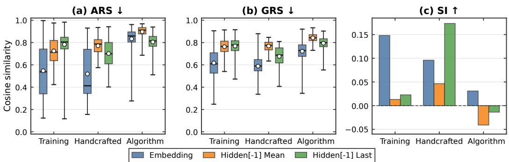  
Figure 1: Comparison of text embeddings and last-layer hidden-state representations on failed trajectories from ReCast-2K and the Handcrafted and Algorithm subsets of Who&When. Lower ARS/GRS and higher SI indicate better separation. See Appendix A for metric definitions.

To address this gap, we propose ReCast, a step representation learning method that integrates feature selection, feature construction, and contextual learning for failure attribution. The method consists of three modules. First, an attribution-aware probe selects internal features according to their ability to distinguish the root-cause step from other steps. Second, a fixed sparse Johnson–Lindenstrauss projection (Li et al., 2006) transforms the selected features into complementary pattern and deviation representations, capturing each step’s internal activation structure and its departure from successful execution behavior. Third, a bidirectional encoder learns contextualized step representations from the complete trajectory. Training jointly optimizes root and non-root contrastive losses alongside a trajectory-level ranking loss. Together, these three stages determine which internal signals are retained, how they are represented, and how they are learned for attribution.

We also introduce ReCast-2K, a training dataset containing 1,044 successful and 1,496 failed trajectories. Experiments on four benchmarks—Who&When (Zhang et al., 2025a), TraceElephant (Chen et al., 2026), AFTraj-2K (Zhang et al., 2026a), and Who&When Pro (Liu et al., 2026a)—show that ReCast consistently achieves the best Hit@1, surpassing the strongest baseline by 5.65 and 9.19 pp on Who&When Algorithm and Handcrafted, respectively. Ablation studies further support the contributions of its main components. Our main contributions are as follows:

• To the best of our knowledge, we are the first to systematically study the discriminative ability of step representations for multi-agent failure attribution, using quantitative metrics to assess separation within and across trajectories.

• We propose ReCast, a step representation learning method that combines feature selection, feature construction, and contextual learning to produce attribution-oriented step representations.

• We construct ReCast-2K, a diverse source training dataset, and evaluate ReCast on four benchmarks, where it outperforms all compared baselines in Hit@1 accuracy. ReCast also enables efficient attribution from precomputed features.

## 2 RELATED WORK

Black-box Failure Attribution Methods. These methods attribute failures from observable trajectories through structured reasoning or learned models. Among training-free methods, CHIEF (Wang et al., 2026) constructs hierarchical causal graphs from execution logs for oracle-guided backtracking and counterfactual attribution. FALAT (Rafi et al., 2026) formulates attribution as hierarchical dependency-guided search. Distinguishing root causes from noisy or propagated symptoms remains challenging for these methods.

Learning-based methods train attribution models from trajectories. AgenTracer (Zhang et al., 2026b) generates annotated failures through counterfactual replay and fault injection and trains AgenTracer-8B with reinforcement learning. AgentForesight (Zhang et al., 2026a) detects decisive errors from trajectory prefixes for online auditing. StepFinder (Zhu et al., 2026) models cross-step dependencies in semantic sequences for root-cause ranking. ASCon (Jiang et al., 2026) jointly models step context and agent interactions for failure attribution. These methods primarily use external trajectory representations, leaving internal diagnostic signals underexplored.

White-box Failure Attribution Methods. These methods exploit LLM internal signals. MASPrism (Liu et al., 2026b) identifies symptom steps using negative log-likelihood (NLL) derived from prefill-stage hidden states, then traces potential root causes using attention weights. OAT (Yeh et al., 2026) learns successful hidden-state dynamics with neural controlled differential equations and attributes failures to steps that deviate from these dynamics. Rather than directly scoring interna signals or modeling successful dynamics, ReCast learns attribution-oriented step representations.

## 3 PROBLEM FORMULATION

## 3.1 DEFINITION

Background. Consider a multi-agent system with an agent set $\mathcal { M } = \{ m _ { 1 } , . . . , m _ { N } \}$ interacting with an environment E. Given a task query $q \in \mathcal { Q }$ , the system produces an execution trace

$$
\tau = ( q , s _ { 0 } , a _ { 1 } , s _ { 1 } , a _ { 2 } , \ldots , a _ { t } , s _ { t } , \ldots , a _ { T } , s _ { T } ) ,\tag{1}
$$

where $s _ { t }$ is the system state after step $t , a _ { t }$ is the candidate model action, and $T$ is the final step of the execution. Here, we only consider model actions as candidates for failure attribution. Let $B$ index a batch of traces, with $\tau _ { i }$ denoting the trace indexed by $i \in B$ and $T _ { i }$ its terminal step. Let $Z ( \tau ) \in$ $\{ 0 , 1 \}$ denote the task-specific success evaluator for task $q ,$ , where $Z ( \tau ) = 1$ indicates successful completion. We then define the successful and failed trace sets as $\mathcal { T } ^ { \mathrm { s u c c } } = \{ \tau \ | \ Z ( \tau ) = 1 \}$ and ${ \mathcal { T } } ^ { \mathrm { f a i l } } = \{ \tau \ | \ Z ( \tau ) = 0 \}$

Objective. Following Who&When (Zhang et al., 2025a), consider a failed trace $\tau _ { i }$ with $Z ( \tau _ { i } ) = 0$ Suppose that the action $a _ { t }$ taken by an active agent at step t is replaced with a feasible corrective action $\tilde { a } _ { t }$ , while the execution history before step t remains fixed. The system then re-executes the trajectory from step t under the corrected action, producing a counterfactual trace $\tilde { \tau } _ { i }$ . If $Z ( \tilde { \tau } _ { i } ) = 1$ timestamp t is defined as a decisive error. We use the earliest decisive error as the unique root-cause target for each failed trace $\tau _ { i } \dot { : }$

$$
t _ { i } ^ { * } = \operatorname* { m i n } \{ t \in \{ 1 , \ldots , T _ { i } \} : t { \mathrm { ~ i s ~ a ~ d e c i s i v e ~ e r r o r ~ i n ~ } } \tau _ { i } \} .\tag{2}
$$

The root-cause timestamp $t _ { i } ^ { * }$ is unique by definition. We call all remaining candidate timestamps non-root steps and write $\tilde { \mathcal { N } } ( \tau _ { i } ) = \tilde { \{ 1 , \dots , T _ { i } \} } \setminus \{ t _ { i } ^ { * } \}$ . This label identifies steps other than the attribution target and does not imply that they are error-free. A successful trace has no root cause, so all its candidate timestamps belong to $\mathcal { N } ( \tau _ { i } )$ . Failure attribution ranks candidate timestamps to identify the unique target $t _ { i } ^ { * }$ .

## 3.2 OBSERVATION

Some existing failure attribution methods use step representations derived from text embeddings or LLM hidden states. We conduct an empirical study to evaluate how effectively these representations distinguish the root-cause step from other steps. Specifically, we examine Qwen3 text embeddings (Zhang et al., 2025b), following StepFinder (Zhu et al., 2026), and last-layer hidden states from a frozen LLM, motivated by MASPrism’s use of internal signals (Liu et al., 2026b).

We assess these representations from two perspectives: (1) Within-trace separation. The rootcause step should be distinguishable from non-root-cause steps within the same trace. (2) Crosstrace separation. Root-cause representations should also be distinguishable from non-root representations across traces. Based on these criteria, we define three metrics. Adjacent Root Similarity (ARS) and Global Root Similarity (GRS) measure local and overall within-trace separation, respectively, while the cosine Silhouette Index (SI) measures cross-trace separation. Using these metrics, we compare Qwen3 text embeddings with mean-pooled and last-token representations from the final hidden-state layer on the failed trajectories in our training dataset and the Handcrafted and Algorithm subsets of Who&When. See Appendix A for metric and representation details.

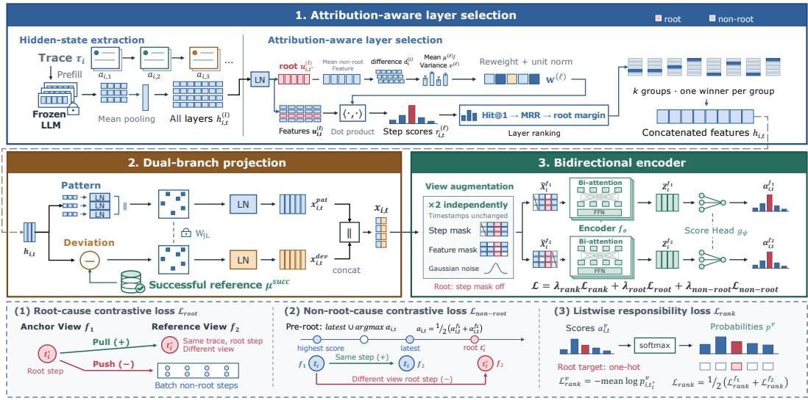  
Figure 2: Overview of ReCast, which learns attribution-oriented step representations from frozen LLM hidden states for failure attribution.

Figure 1 shows that the evaluated representations exhibit limited separation under the proposed metrics. High ARS and GRS indicate that the root-cause step remains similar to its predecessor and other steps in the same trace, while low SI indicates weak separation across traces. Although their relative performance varies, these representations exhibit limited separation between the rootcause step and other steps under these metrics. This observation motivates investigating whether attribution-oriented step representation learning can improve failure attribution.

## 4 METHODOLOGY

Motivated by our empirical study, we develop ReCast to learn attribution-oriented step representations from hidden states extracted by prefilling trajectories with a frozen LLM. As shown in Figure 2, ReCast selects attribution-relevant layers and constructs complementary pattern and deviation features. An encoder is then jointly trained with a scoring head under root and non-root contrastive losses and a trajectory-level ranking loss to learn contextualized step representations.

## 4.1 FEATURE SELECTION AND CONSTRUCTION

Hidden-state extraction. We use a frozen LLM with hidden-state dimension $d _ { h }$ to extract step representations by prefilling the trajectory. For each model-generated action $a _ { i , t }$ in trajectory $\tau _ { i } ,$ we obtain the layer-ℓ step feature by mean-pooling its $d _ { h }$ -dimensional token-level hidden states, conditioned on the preceding execution prefix:

$$
\mathbf { h } _ { i , t } ^ { ( \ell ) } = \operatorname { M e a n P o o l } _ { \mathrm { t o k e n s } ( a _ { i , t } ) } \left( \operatorname { L L M } ^ { ( \ell ) } ( a _ { i , t } \mid \tau _ { i , < t } ) \right) , \qquad \mathbf { h } _ { i , t } ^ { ( \ell ) } \in \mathbb { R } ^ { d _ { h } } .\tag{3}
$$

Attribution-aware layer selection. Transformer layers encode information at different levels of abstraction and are not equally informative for failure attribution. We therefore use a lightweight probe to select layers according to their ability to distinguish the root-cause step from all other steps. For each layer, we apply layer normalization (LN) to obtain normalized step features $\mathbf { u } _ { i , t } ^ { ( \ell ) }$ . We then construct a difference vector for each failed trajectory by subtracting the mean non-root feature from

the root-cause feature:

$$
\mathbf { u } _ { i , t } ^ { ( \ell ) } = \mathrm { L N } \left( \mathbf { h } _ { i , t } ^ { ( \ell ) } \right) , \qquad \mathbf { d } _ { i } ^ { ( \ell ) } = \mathbf { u } _ { i , t _ { i } ^ { * } } ^ { ( \ell ) } - \frac { 1 } { | \mathcal { N } ( \tau _ { i } ) | } \sum _ { t \in \mathcal { N } ( \tau _ { i } ) } \mathbf { u } _ { i , t } ^ { ( \ell ) } , \qquad \mathbf { u } _ { i , t } ^ { ( \ell ) } , \mathbf { d } _ { i } ^ { ( \ell ) } \in \mathbb { R } ^ { d _ { h } } .\tag{4}
$$

Using the difference vectors $\mathbf { d } _ { i } ^ { ( \ell ) }$ , we assess each layer’s attribution capability through five-fold cross-validation on failed training trajectories. In each round, we compute $\pmb { \mu } ^ { ( \ell ) } , \mathbf { v } ^ { ( \ell ) } \in \mathbb { R } ^ { d _ { h } }$ as the mean and variance vectors of $\mathbf { d } _ { i } ^ { ( \ell ) }$ over the trajectories in four folds. These statistics define a scoring direction that emphasizes large and consistent differences:

$$
\mathbf { w } ^ { ( \ell ) } = \frac { \pmb { \mu } ^ { ( \ell ) } / ( \mathbf { v } ^ { ( \ell ) } + \eta ^ { ( \ell ) } ) } { \big \| \pmb { \mu } ^ { ( \ell ) } / ( \mathbf { v } ^ { ( \ell ) } + \eta ^ { ( \ell ) } ) \big \| _ { 2 } } , \qquad \mathbf { w } ^ { ( \ell ) } \in \mathbb { R } ^ { d _ { h } } .\tag{5}
$$

Here $\eta ^ { ( \ell ) } = \lambda _ { \mathrm { r i d g e } } d _ { h } ^ { - 1 } \sum _ { j = 1 } ^ { d _ { h } } v _ { j } ^ { ( \ell ) }$ is a scalar ridge term. We then evaluate this direction on the remaining fold by scoring each candidate step as $r _ { i , t } ^ { ( \ell ) } = \langle \mathbf { u } _ { i , t } ^ { ( \ell ) } , \mathbf { w } ^ { ( \ell ) } \rangle$ ⟩. We aggregate the evaluation results across all five folds and rank layers by their root-cause identification performance. Detailed selection criteria are provided in Appendix B.1.

Using this ranking, we select k layers while ensuring coverage across the model depth. We partition all layers into k contiguous groups and retain the highest-ranked layer from each group. Let $\ell _ { 1 } , \ldots , \ell _ { k }$ denote these layers in depth order; their step features are concatenated as

$$
\mathbf { h } _ { i , t } = \left[ \mathbf { h } _ { i , t } ^ { ( \ell _ { 1 } ) } ; \ldots ; \mathbf { h } _ { i , t } ^ { ( \ell _ { k } ) } \right] , \qquad \mathbf { h } _ { i , t } \in \mathbb { R } ^ { k d _ { h } } .\tag{6}
$$

Dual-branch projection. To reduce the dimensionality of the concatenated hidden state, we construct two complementary branches using a fixed sparse Johnson–Lindenstrauss projection (Li et al., 2006). The pattern branch applies layer-wise normalization to preserve relative activation patterns. For the deviation branch, we introduce successful trajectories as a reference to capture how each step differs from successful execution. The branch outputs are computed as

$$
\mathbf { x } _ { i , t } ^ { \mathrm { p a t } } = \mathrm { L N } \Bigg ( \mathbf { W } _ { \mathrm { J L } } \left[ \mathrm { L N } \left( \mathbf { h } _ { i , t } ^ { ( \ell _ { j } ) } \right) \right] _ { j = 1 } ^ { k } \Bigg ) \in \mathbb { R } ^ { d _ { p } } , \qquad \mathbf { x } _ { i , t } ^ { \mathrm { d e v } } = \mathrm { L N } ( \mathbf { W } _ { \mathrm { J L } } \left( \mathbf { h } _ { i , t } - \mu ^ { \mathrm { s u c c } } \right) ) \in \mathbb { R } ^ { d _ { p } } .\tag{7}
$$

Here, $\mu ^ { \mathrm { s u c c } } \in \mathbb { R } ^ { k d _ { h } }$ is the mean concatenated hidden state over all steps in successful training trajectories, and $\mathbf { W } _ { \mathrm { J L } } \in \mathbb { R } ^ { d _ { p } \times k d _ { h } }$ is the sparse projection matrix shared by both branches. In the pattern branch, normalization is applied separately to each selected layer before concatenation; the deviation branch operates directly on the concatenated hidden state. The outputs are concatenated as $\mathbf { x } _ { i , t } = [ \mathbf { x } _ { i . t } ^ { \mathrm { p a t } } ; \mathbf { x } _ { i , t } ^ { \mathrm { d e v } } ] \in \mathbb { R } ^ { 2 d _ { p } }$ . Both the projection matrix and reference mean are fixed during training. Further details are provided in Appendix B.2.

## 4.2 ATTRIBUTION-ORIENTED STEP REPRESENTATION LEARNING

View augmentation. Before encoding, we independently augment each projected trajectory ${ \bf { X } } _ { i } = { \bf { \Phi } }$ $\left( \mathbf { x } _ { i , t } \right) _ { t = 1 } ^ { T _ { i } }$ twice to obtain two aligned views $\widetilde { \mathbf { X } } _ { i } ^ { v }$ , where $v \in \{ \mathrm { f } _ { 1 } , \mathrm { f } _ { 2 } \}$ . The input and augmented views share the same dimensions: $\mathbf { X } _ { i } , \widetilde { \mathbf { X } } _ { i } ^ { v } \in \mathbb { R } ^ { T _ { i } \times 2 d _ { p } }$ . For timestamp t and feature coordinate $d \in \{ 1 , \ldots , 2 d _ { p } \}$ , the augmented feature is

$$
\begin{array} { r l r l } & { \widetilde { \boldsymbol { x } } _ { i , t , d } ^ { v } = k _ { i , t } ^ { v } \boldsymbol { \phi } _ { i , t , d } ^ { v } \boldsymbol { x } _ { i , t , d } + \epsilon _ { i , t , d } ^ { v } , } & & { k _ { i , t } ^ { v } , \boldsymbol { \phi } _ { i , t , d } ^ { v } \in \{ 0 , 1 \} , } & & { \epsilon _ { i , t , d } ^ { v } \in \mathbb { R } , } \end{array}\tag{8}
$$

where $k _ { i , t } ^ { v }$ and $\phi _ { i , t , d } ^ { v }$ are the step and feature masks, respectively, and $\epsilon _ { i , t , d } ^ { v }$ is additive Gaussian noise. These perturbations are sampled independently for the two views. We protect the root-cause step at $t _ { i } ^ { * }$ from step masking while allowing feature-level perturbations. The augmentation settings are reported in Appendix E.2.

Encoding. A bidirectional encoder $f _ { \theta }$ maps each augmented view to $d _ { z }$ -dimensional step representations using the complete trajectory:

$$
\begin{array} { r } { \mathbf { Z } _ { i } ^ { v } = f _ { \theta } ( \widetilde { \mathbf { X } } _ { i } ^ { v } ) = \left( \mathbf { z } _ { i , t } ^ { v } \right) _ { t = 1 } ^ { T _ { i } } \in \mathbb { R } ^ { T _ { i } \times d _ { z } } . } \end{array}\tag{9}
$$

A scoring head $g _ { \psi } : \mathbb { R } ^ { d _ { z } }  \mathbb { R }$ produces the attribution score $\boldsymbol { \alpha } _ { i , t } ^ { v } \ = \ g _ { \psi } ( \mathbf { z } _ { i , t } ^ { v } )$ from each step representation $\mathbf { z } _ { i , t } ^ { v } \in \mathbb { R } ^ { d _ { z } }$ , providing step-level supervision during encoder training.

Root-cause contrastive objective. For each root-cause step, we use its representation in view $\mathrm { f _ { 1 } }$ as the anchor and the corresponding representation in view $\mathrm { f _ { 2 } }$ as the sole positive, since both represent the same underlying step under different perturbations. All non-root steps in view $\mathrm { f _ { 2 } }$ across the batch serve as negatives, promoting separation from diverse non-root contexts. The positive and negative cosine similarities are

$$
\begin{array} { r } { \rho _ { i , t _ { i } ^ { * } } ^ { + } = \cos ( \mathbf { z } _ { i , t _ { i } ^ { * } } ^ { \mathrm { f } _ { 1 } } , \mathbf { z } _ { i , t _ { i } ^ { * } } ^ { \mathrm { f } _ { 2 } } ) , \qquad \rho _ { i , t _ { i } ^ { * } , j , t } ^ { - } = \cos ( \mathbf { z } _ { i , t _ { i } ^ { * } } ^ { \mathrm { f } _ { 1 } } , \mathbf { z } _ { j , t } ^ { \mathrm { f } _ { 2 } } ) . } \end{array}\tag{10}
$$

Let $B _ { \mathrm { f a i l } } = \{ i \in B : \tau _ { i } \in T ^ { \mathrm { f a i l } } \}$ index the failed trajectories in the batch. We optimize these pairs with an InfoNCE objective:

$$
\mathcal { L } _ { \mathrm { r o o t } } = - \frac { 1 } { | B _ { \mathrm { f a i l } } | } \sum _ { i \in B _ { \mathrm { f a i l } } } \log \frac { \exp ( \rho _ { i , t _ { i } ^ { * } } ^ { + } / \kappa ) } { \exp ( \rho _ { i , t _ { i } ^ { * } } ^ { + } / \kappa ) + \sum _ { j \in B } \sum _ { t \in N ( \tau _ { j } ) } \exp ( \rho _ { i , t _ { i } ^ { * } , j , t } ^ { - } / \kappa ) } .\tag{11}
$$

Here $\kappa > 0$ is the temperature parameter. For successful trajectories, $\mathcal { N } ( \tau _ { i } ) = \{ 1 , . . . , T _ { i } \}$ , so all their candidate steps contribute to the negative pool.

Non-root-cause contrastive objective. To learn discriminative non-root representations, we select anchors from the steps preceding the root cause. For each failed trajectory, let $\mathcal { P } _ { i } = \{ t \in \mathcal { N } ( \tau _ { i } )$ $t < t _ { i } ^ { * } \}$ . When $\mathcal { P } _ { i }$ is nonempty, the anchor timestamps are selected as

$$
\bar { \alpha } _ { i , t } = \frac { \alpha _ { i , t } ^ { \mathrm { f } _ { 1 } } + \alpha _ { i , t } ^ { \mathrm { f } _ { 2 } } } { 2 } , \qquad S _ { i } = \left\{ \operatorname* { m a x } _ { } \mathcal { P } _ { i } , \underset { t \in \mathcal { P } _ { i } } { \arg \operatorname* { m a x } } \bar { \alpha } _ { i , t } \right\} .\tag{12}
$$

The latest step provides a nearby reference, while the highest-scoring step is most likely to be mistaken for the root cause. We retain one anchor when selections coincide and choose the earliest step when scores tie. For each $t \in S _ { i }$ , view $\mathrm { f _ { 1 } }$ supplies the anchor, while view $\mathrm { f _ { 2 } }$ supplies the same step as the positive and that trajectory’s root-cause step as the sole negative:

$$
\begin{array} { r } { \rho _ { i , t } ^ { + } = \cos ( \mathbf { z } _ { i , t } ^ { \mathrm { f _ { 1 } } } , \mathbf { z } _ { i , t } ^ { \mathrm { f _ { 2 } } } ) , \qquad \rho _ { i , t } ^ { - } = \cos ( \mathbf { z } _ { i , t } ^ { \mathrm { f _ { 1 } } } , \mathbf { z } _ { i , t _ { i } ^ { * } } ^ { \mathrm { f _ { 2 } } } ) . } \end{array}\tag{13}
$$

Let $B _ { \mathrm { p r e } } = \{ i \in B _ { \mathrm { f a i l } } : \mathcal { P } _ { i } \neq \emptyset \}$ index the eligible failed trajectories. We average the InfoNCE losses first over the selected anchors within each trajectory and then over these trajectories:

$$
\mathcal { L } _ { \mathrm { n o n - r o o t } } = - \frac { 1 } { | B _ { \mathrm { p r e } } | } \sum _ { i \in B _ { \mathrm { p r e } } } \frac { 1 } { | S _ { i } | } \sum _ { t \in S _ { i } } \log \frac { \exp ( \rho _ { i , t } ^ { + } / \kappa ) } { \exp ( \rho _ { i , t } ^ { + } / \kappa ) + \exp ( \rho _ { i , t } ^ { - } / \kappa ) } .\tag{14}
$$

This reduction gives each eligible trajectory equal weight, regardless of whether it contributes one or two anchors. If $B _ { \mathrm { p r e } }$ is empty, the loss is zero.

Listwise responsibility. For each $i \in B _ { \mathrm { f a i l } }$ and view v, we normalize step scores and maximize the root-cause probability at $t _ { i } ^ { * }$ . The ranking loss averages the two view-specific losses:

$$
\mathcal { L } _ { \mathrm { r a n k } } ^ { v } = - \frac { 1 } { | B _ { \mathrm { f a i l } } | } \sum _ { i \in B _ { \mathrm { f a i l } } } \log \frac { \exp ( \alpha _ { i , t _ { i } ^ { * } } ^ { v } ) } { \sum _ { t = 1 } ^ { T _ { i } } \exp ( \alpha _ { i , t } ^ { v } ) } , \qquad \mathcal { L } _ { \mathrm { r a n k } } = \frac { 1 } { 2 } \left( \mathcal { L } _ { \mathrm { r a n k } } ^ { \mathrm { f _ { 1 } } } + \mathcal { L } _ { \mathrm { r a n k } } ^ { \mathrm { f _ { 2 } } } \right) .\tag{15}
$$

Training objective. The final encoder objective combines the trajectory-level ranking loss, the root-cause contrastive objective, and the non-root-cause contrastive objective:

$$
\mathcal { L } = \lambda _ { \mathrm { r a n k } } \mathcal { L } _ { \mathrm { r a n k } } + \lambda _ { \mathrm { r o o t } } \mathcal { L } _ { \mathrm { r o o t } } + \lambda _ { \mathrm { n o n - r o o t } } \mathcal { L } _ { \mathrm { n o n - r o o t } } ,\tag{16}
$$

where $\lambda _ { \mathrm { { r a n k } } } , \lambda _ { \mathrm { { r o o t } } }$ , and $\lambda _ { \mathrm { n o n - r o o t } }$ are the loss weights. At inference, we encode the unaugmented trajectory and use the scoring head to identify the highest-scoring step as the predicted root cause. The specific optimization settings are reported in Appendix E.2.

## 5 EXPERIMENTS

## 5.1 EXPERIMENTAL SETUP

Benchmarks. We evaluate our method on four failure-attribution benchmarks: Who&When (Zhang et al., 2025a), Who&When Pro (Liu et al., 2026a), AFTraj-2K (Zhang et al., 2026a), and TraceElephant (Chen et al., 2026). Our evaluation includes 124 algorithm-generated (AG) and 58 handcrafted (HC) trajectories from Who&When, 1,251 test trajectories from an 8:2 task-grouped split of the Who&When Pro text subset, 163 failed test trajectories from AFTraj-2K, and 175 valid trajectories from the Captain-Agent (85) and Magentic-One (90) subsets of TraceElephant. All TraceElephant results use these two subsets. Further benchmark details are provided in Appendix C.

Table 1: Hit@1 attribution accuracy (%) on Who&When and TraceElephant. Results from three random seeds are summarized as mean ± population standard deviation. The LLMs are Qwen3.5- 27B (Qwen), DeepSeek V4 Flash (DS), and GPT-5.6 Luna (GPT). Best results are shown in bold, and second-best results are underlined.
<table><tr><td rowspan="2">Category</td><td rowspan="2">Method</td><td colspan="2">Who&amp;When</td><td colspan="2">TraceElephant</td></tr><tr><td>Algorithm</td><td>Handcrafted</td><td>Captain</td><td>Magentic</td></tr><tr><td rowspan="2">Heuristic</td><td>First</td><td>16.13±0.00</td><td>1.72±0.00</td><td>7.06±0.00</td><td>6.67±0.00</td></tr><tr><td>Random</td><td>16.40±4.85</td><td>5.75±0.81</td><td>12.55±6.10</td><td>5.93±2.62</td></tr><tr><td rowspan="8">LLM-based</td><td>All-at-Once (Qwen)</td><td>26.61±0.00</td><td>3.45±0.00</td><td>7.06±0.00</td><td>4.44±0.00</td></tr><tr><td>All-at-Once (DS)</td><td>22.04±0.76</td><td>10.34±2.44</td><td>12.55±1.11</td><td>9.63±0.52</td></tr><tr><td>All-at-Once (GPT)</td><td>27.42±0.66</td><td>18.39±5.69</td><td>14.90±4.74</td><td>8.15±0.52</td></tr><tr><td>Step-by-Step (Qwen)</td><td>32.26±0.00</td><td>17.24±0.00</td><td>25.88±0.00</td><td>18.89±0.00</td></tr><tr><td>Step-by-Step (DS)</td><td>29.84±0.66</td><td>21.26±2.15</td><td>23.92±2.93</td><td>11.11±2.40</td></tr><tr><td>Step-by-Step (GPT)</td><td>31.99±0.76</td><td>18.97±3.72</td><td>29.41±2.54</td><td>15.93±0.52</td></tr><tr><td>CHIEF (DS)</td><td>39.78±3.25</td><td>24.14±3.72</td><td>23.53±2.54</td><td>25.19±1.89</td></tr><tr><td>AgenTracer†</td><td>37.30</td><td>20.68</td><td></td><td></td></tr><tr><td rowspan="4">Feature-based</td><td>OAT</td><td>9.68±0.66</td><td>5.17±5.08</td><td>3.53±0.00</td><td>17.41±1.39</td></tr><tr><td>MASPrism</td><td>33.87±0.00</td><td>5.17±0.00</td><td>18.82±0.00</td><td>7.78±0.00</td></tr><tr><td>StepFinder</td><td>22.85±2.12</td><td>18.97±2.44</td><td>27.84±2.00</td><td>19.26±0.52</td></tr><tr><td>ASCon</td><td>26.34±1.01</td><td>21.84±0.81</td><td>30.98±1.11</td><td>25.93±0.52</td></tr><tr><td>Ours</td><td>ReCast</td><td>45.43±2.01</td><td>33.33±1.63</td><td>35.69±2.93</td><td>27.04±1.89</td></tr></table>

† AgenTracer-8B is not publicly available; therefore, we cannot report multi-seed results.

Training datasets. We use different training datasets for different target benchmarks. Specifically, for Who&When and TraceElephant, we train on our ReCast-2K dataset. For AFTraj-2K, we train on its official training split. For Who&When Pro, we use the training partition described above. See Appendix D for construction and annotation details.

Evaluation protocol. We report Hit@k for $k \in \{ 1 , 3 , 5 \}$ , Mean Reciprocal Rank (MRR), AUROC, and AUPRC. Hit@k measures whether the annotated root-cause step appears among the top-k predictions, while MRR captures its overall ranking position. AUROC and AUPRC assess score-level separation between root-cause and non-root steps, with AUPRC being particularly informative under class imbalance. All methods use the same three seeds, and we report their mean and standard deviation. See Appendix E.1 for detailed definitions.

Baselines. We group the baselines into three categories. (1) Heuristic baselines. First selects the first candidate step as the predicted root cause, whereas Random uniformly samples one candidate step. (2) LLM-based methods. We evaluate the all-at-once and step-by-step protocols from Who&When (Zhang et al., 2025a) using Qwen3.5-27B (Qwen Team, 2026), GPT-5.6 Luna (OpenAI, 2026b), and DeepSeek V4 Flash (Xu et al., 2026), including both open and closed models. We also evaluate CHIEF (Wang et al., 2026) with DeepSeek V4 Flash and include the reported results of AgenTracer (Zhang et al., 2026b). (3) Feature-based methods. We compare with OAT (Yeh et al., 2026), StepFinder (Zhu et al., 2026), MASPrism (Liu et al., 2026b), and ASCon (Jiang et al., 2026). In each in-domain setting, the supervised feature-based baselines use the same failed-trajectory training split as our method. OAT instead follows its original positive-only training protocol. Detailed baseline settings are provided in Appendix F.

Implementation details. We extract step representations using Qwen3.5-27B and set the projection dimension of each branch to $d _ { p } = 2 \AA , 0 4 8$ The bidirectional Transformer encoder uses four layers with $d _ { z } = 1 2 8$ . Training uses AdamW for up to 50 epochs with a batch size of 32 and a learning rate of $2 \times 1 0 ^ { - 4 }$ . The InfoNCE temperature is $\kappa = 0 . 1 2$ , and the loss weights are $\lambda _ { \mathrm { r a n k } } = 1 . 0$ $\lambda _ { \mathrm { r o o t } } = 0 . 9 5$ , and $\lambda _ { \mathrm { n o n - r o o t } } = 0 . 2 5$ . Additional settings are provided in Appendix E.2.

(d) Magentic-One  
Table 2: Hit@1 attribution accuracy (%) on the two in-domain benchmark settings. Results from three random seeds are summarized as mean ± population standard deviation. Best results are shown in bold, and second-best results are underlined.
<table><tr><td>Category</td><td>Method</td><td>AFTraj-2K</td><td>Who&amp;When Pro</td></tr><tr><td rowspan="2">Heuristic</td><td>First</td><td>0.00±0.00</td><td>7.35±0.00</td></tr><tr><td>Random</td><td>11.45±0.77</td><td>25.69±0.69</td></tr><tr><td rowspan="6">LLM-based</td><td>All-at-Once (Qwen)</td><td>20.86±0.00</td><td>21.10±0.00</td></tr><tr><td>All-at-Once (DS)</td><td>30.47±5.02</td><td>25.95±1.29</td></tr><tr><td>All-at-Once (GPT)</td><td>19.02±0.87</td><td>33.33±1.27</td></tr><tr><td>Step-by-Step (Qwen)</td><td>51.53±0.00</td><td>60.33±0.04</td></tr><tr><td>Step-by-Step (DS)</td><td>53.99±1.74</td><td>62.16±0.26</td></tr><tr><td>Step-by-Step (GPT)</td><td>54.40±0.77</td><td>63.58±0.37</td></tr><tr><td rowspan="4">Feature-based</td><td>OAT</td><td>31.49±1.04</td><td>16.47±0.99</td></tr><tr><td>MASPrism</td><td>22.09±0.00</td><td>10.87±0.00</td></tr><tr><td>StepFinder</td><td>73.82±1.61</td><td>69.81±0.61</td></tr><tr><td>ASCon</td><td>83.03±0.29</td><td>82.71±0.21</td></tr><tr><td>Ours</td><td>ReCast</td><td>84.05±0.87</td><td>91.42±0.21</td></tr></table>

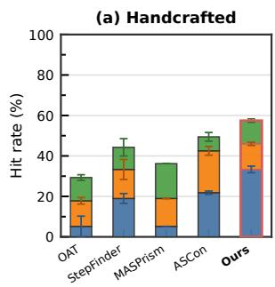

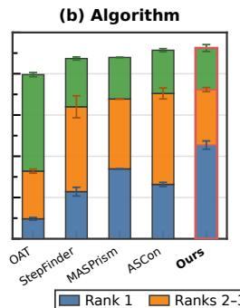

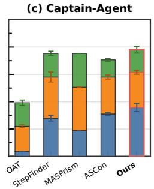

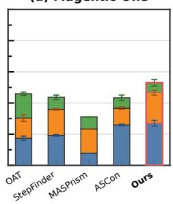  
Figure 3: Cumulative Hit@k accuracy on Who&When and TraceElephant. Stacked segments denote ranks 1, 2–3, and 4–5; error bars show the population standard deviation over three seeds.

## 5.2 MAIN RESULTS

Comparison on Who&When and TraceElephant. As shown in Table 1, our method achieves the best Hit@1 accuracy across all four subsets of Who&When and TraceElephant. On Who&When, it reaches 45.43% on Algorithm and 33.33% on Handcrafted, exceeding the second-best method, CHIEF, by 5.65 and 9.19 percentage points, respectively. On TraceElephant, our method reaches 35.69% on Captain-Agent and 27.04% on Magentic-One, outperforming the second-best method, ASCon, by 4.71 and 1.11 percentage points, respectively. These improvements support the effectiveness of learning attribution-oriented step representations for failure attribution.

Comparison on AFTraj-2K and Who&When Pro. Table 2 reports the Hit@1 results on AFTraj 2K and Who&When Pro. On AFTraj-2K, our method achieves 84.05% Hit@1, outperforming GPT-5.6 Luna with Step-by-Step and ASCon by 29.65 and 1.02 percentage points, respectively. On Who&When Pro, it reaches 91.42%, exceeding the same baselines by 27.84 and 8.71 points. These gains show that our method remains effective when trained on other datasets, suggesting that its benefits are not limited to ReCast-2K.

Hit@k comparison. Figure 3 compares cumulative Hit@1, Hit@3, and Hit@5 across methods on Who&When and TraceElephant. We make two observations: (1) Strong top-k coverage. Our method achieves the highest Hit@5 accuracy across all four benchmark settings, maintaining its advantage under a more relaxed ranking criterion. (2) Better top-rank prioritization. On Captain-Agent, our method reaches 78.04% Hit@5, exceeding MASPrism’s 75.29%, while achieving a substantially higher Hit@1 of 35.69% compared with 18.82% for MASPrism. These results indicate that our method ranks the root-cause step more effectively, placing it first more often while maintaining strong top-five coverage.

Table 3: Ablation results on Who&When. Hit@1 (%) over all trajectories is reported as mean ± standard deviation across three seeds. ∆ Hit@1 reports the change from the full-model mean in percentage points (pp).
<table><tr><td>Component</td><td>Variant</td><td>Hit@1</td><td>∆ Hit@1 (pp)</td></tr><tr><td>None</td><td>Full model</td><td>41.58±1.04</td><td></td></tr><tr><td rowspan="5">Layer selection</td><td>All 64 layers</td><td>38.83±2.30</td><td>-2.75</td></tr><tr><td>Uniform 8</td><td>38.10±2.55</td><td>-3.48</td></tr><tr><td>Last 8</td><td>37.55±0.93</td><td>-4.03</td></tr><tr><td>Random 8</td><td>37.18±0.69</td><td>-4.40</td></tr><tr><td>Global probe top-8</td><td>38.83±1.13</td><td>-2.75</td></tr><tr><td rowspan="2">Projection branches</td><td>Pattern only</td><td>40.11±1.96</td><td>-1.47</td></tr><tr><td>Deviation only</td><td>41.03±2.92</td><td>-0.55</td></tr><tr><td rowspan="2">Encoder configuration</td><td>Per-step MLP</td><td>40.48±2.12</td><td>-1.10</td></tr><tr><td>No augmentation</td><td>37.36±0.90</td><td>-4.22</td></tr><tr><td rowspan="2">Non-root anchor selection</td><td>Latest only</td><td>39.93±0.93</td><td>-1.65</td></tr><tr><td>Highest-score only</td><td>39.74±0.52</td><td>-1.84</td></tr><tr><td rowspan="3">Objective</td><td>Rank only</td><td>37.73±0.26</td><td>-3.85</td></tr><tr><td>Rank + root</td><td>40.48±0.69</td><td>-1.10</td></tr><tr><td>Rank + non-root</td><td>37.73±1.04</td><td>-3.85</td></tr></table>

Learned representation separation. To assess whether our method addresses the limited separation identified in Section 3.2, we evaluate the learned step representations using the same metrics. Compared with the basic representations, the learned representations achieve lower ARS and GRS and higher SI on average across seeds. On Handcrafted and Algorithm, mean SI improves from the best basic-representation values of 0.17 and 0.03 to 0.59 and 0.29, respectively. These results indicate improved within-trace and cross-trace separation, supporting our goal of learning attribution-oriented step representations. See Appendix A.3 for the full comparison.

## 6 ANALYSIS

Ablation Study. As summarized in Table 3, we conduct ablation experiments on the Who&When benchmark. Each ablation varies one component while keeping the remaining settings fixed. The full model achieves the highest mean Hit@1 of 41.58%. Attribution-aware layer selection outperforms five alternatives by 2.75–4.40 percentage points, while the joint loss improves over ranking-only training by 3.85 points. Removing augmentation reduces Hit@1 by 4.22 points, highlighting its contribution to representation learning. Ablations of the projection branches, encoder, and non-root anchor selection also yield lower accuracy, supporting the overall design.

Backbone and efficiency analyses. In Appendix G.3, we compare Qwen3.5 backbones with 0.8B, 9B, and 27B parameters while keeping the downstream architecture fixed. The 27B model achieves the highest Hit@1 on Who&When, AFTraj-2K, and Who&When Pro, whereas 0.8B and 9B perform best on Captain-Agent and Magentic-One, respectively. These results indicate that larger backbones can improve attribution accuracy, but increasing model size does not consistently yield better performance. Appendix G.4 further compares accuracy and processing time, demonstrating efficient attribution with ReCast when step features are precomputed.

## 7 CONCLUSION

This work explores step representation learning for failure attribution in LLM-based agent systems. To understand how well existing representations distinguish root-cause steps from other steps, we conduct an empirical study of text embeddings and hidden states, finding limited separation under the evaluated metrics. Motivated by this observation, ReCast transforms frozen LLM hidden states into attribution-oriented step representations through layer selection, complementary pattern and deviation feature construction, and contextual representation learning with contrastive and ranking objectives. We introduce ReCast-2K to support training. ReCast achieves the best Hit@1 across four benchmarks, while representation analysis shows improved within-trace and cross-trace separation. These results highlight the value of learning step representations tailored to failure attribution.

## AI USE STATEMENT

In this work, we used generative AI tools for dataset construction and method implementation. We have not used generative AI tools for writing mathematical proofs, and tasks involving critical ingredients for proofs are not applicable to this work. Additionally, we used generative AI tools for drafting sections of the manuscript, language editing, and reference formatting. We have reviewed all AI-assisted work. We checked the accuracy and consistency of AI-assisted content against experimental records and the implementation. We take responsibility for the final content of this work, including text, claims or artifacts produced with the aid of generative AI.

## REPRODUCIBILITY STATEMENT

We provide our code to support reproducibility. Appendices C and D describe the datasets, candidate-step processing, and training-data construction. Method implementation and evaluation settings, including metrics, hyperparameters, and random seeds, are detailed in Appendices B and E. Baseline configurations and LLM attribution prompts appear in Appendices F and I, respectively.

## REFERENCES

Anthropic. Introducing claude opus 4.6, February 2026. URL https://www.anthropic. com/news/claude-opus-4-6. Accessed: 2026-09-15.

Mengzhuo Chen, Junjie Wang, Fangwen Mu, Yawen Wang, Zhe Liu, Huanxiang Feng, and Qing Wang. Seeing the whole elephant: A benchmark for failure attribution in llm-based multi-agent systems. In Proceedings of the 64th Annual Meeting of the Association for Computational Linguistics (Volume 1: Long Papers), pp. 19888–19905, 2026.

Adam Fourney, Gagan Bansal, Hussein Mozannar, Cheng Tan, Eduardo Salinas, Friederike Niedtner, Grace Proebsting, Griffin Bassman, Jack Gerrits, Jacob Alber, et al. Magentic-one: A generalist multi-agent system for solving complex tasks. arXiv preprint arXiv:2411.04468, 2024.

Google. Introducing gemini 3, November 2025. URL https://blog.google/ products-and-platforms/products/gemini/gemini-3/. Accessed: 2026-09-15.

Dan Hendrycks, Collin Burns, Saurav Kadavath, Akul Arora, Steven Basart, Eric Tang, Dawn Song, and Jacob Steinhardt. Measuring mathematical problem solving with the math dataset. arXiv preprint arXiv:2103.03874, 2021.

Sirui Hong, Mingchen Zhuge, Jonathan Chen, Xiawu Zheng, Yuheng Cheng, Jinlin Wang, Ceyao Zhang, Zili Wang, Steven Yau, Zijuan Lin, Liyang Zhou, Chenyu Ran, Lingfeng Xiao, Chenglin Wu, and Jurgen Schmidhuber. MetaGPT: Meta programming for a multi-agent collaborative¨ framework. In International Conference on Learning Representations, volume 2024, pp. 23247– 23275, 2024.

Aaron Hurst, Adam Lerer, Adam P Goucher, Adam Perelman, Aditya Ramesh, Aidan Clark, AJ Ostrow, Akila Welihinda, Alan Hayes, Alec Radford, et al. Gpt-4o system card. arXiv preprint arXiv:2410.21276, 2024.

Shuyu Jiang, Yue Ran, Kaiyu Xu, Xingshu Chen, Yi Zhang, Hao Ren, Rui Tang, and Tianwei Zhang. Ascon: A direction-aware reciprocal agent–step contextualization model for failure attribution in multi-agent systems. arXiv preprint arXiv:2608.10646, 2026.

Ping Li, Trevor J Hastie, and Kenneth W Church. Very sparse random projections. In Proceedings of the 12th ACM SIGKDD international conference on Knowledge discovery and data mining, pp. 287–296, 2006.

Jiale Liu, Huajun Xi, Shaokun Zhang, Yifan Zeng, Tianwei Yue, Chi Wang, Jian Kang, Qingyun Wu, and Huazheng Wang. Who&when pro: Can llms really attribute failures in ai agents? arXiv preprint arXiv:2607.09996, 2026a.

Jiawei Liu, Chunqiu Steven Xia, Yuyao Wang, and Lingming Zhang. Is your code generated by chatgpt really correct? rigorous evaluation of large language models for code generation. In Advances in Neural Information Processing Systems, volume 36, pp. 21558–21572, 2023.

Yang Liu, Hongjiang Feng, Junsong Pu, and Zhuangbin Chen. Masprism: Lightweight failure attribution for multi-agent systems using prefill-stage signals. arXiv preprint arXiv:2605.07509, 2026b.

Gregoire Mialon, Cl´ ementine Fourrier, Thomas Wolf, Yann LeCun, and Thomas Scialom. Gaia: a´ benchmark for general ai assistants. In International Conference on Learning Representations, volume 2024, pp. 9025–9049, 2024.

OpenAI. Gpt-5.5 system card, April 2026a. URL https://openai.com/index/ gpt-5-5-system-card/. Accessed: 2026-09-15.

OpenAI. Gpt-5.6 system card, July 2026b. URL https://deploymentsafety.openai. com/gpt-5-6. Published July 9, 2026.

Qwen Team. Qwen3.5: Towards native multimodal agents, February 2026. URL https://qwen. ai/blog?id=qwen3.5.

Md Nakhla Rafi, Md Ahasanuzzaman, Dong Jae Kim, Zhijie Wang, and Tse-Hsun Chen. Falat: Tracing failures in llm agent trajectories via dependency-guided search. arXiv preprint arXiv:2606.00765, 2026.

Aymeric Roucher, Albert Villanova del Moral, Thomas Wolf, Leandro von Werra, and Erik Kaunismaki. smolagents: A smol library to build great agentic systems, 2025.¨

Peter J Rousseeuw. Silhouettes: a graphical aid to the interpretation and validation of cluster analysis. Journal ofcomputational and applied mathematics, 20:53–65, 1987.

Linxin Song, Jiale Liu, Jieyu Zhang, Shaokun Zhang, Ao Luo, Shijian Wang, Qingyun Wu, and Chi Wang. Adaptive in-conversation team building for language model agents. arXiv preprint arXiv:2405.19425, 2025.

Chi Wang, Qingyun Wu, and the AG2 Community. Ag2: Open-source agentos for ai agents, 2024. URL https://github.com/ag2ai/ag2-classic. Available at https://docs.ag2.ai/.

Yawen Wang, Wenjie Wu, Junjie Wang, and Qing Wang. From flat logs to causal graphs: Hierarchical failure attribution for llm-based multi-agent systems. arXiv preprint arXiv:2602.23701, 2026.

Qingyun Wu, Gagan Bansal, Jieyu Zhang, Yiran Wu, Beibin Li, Erkang Zhu, Li Jiang, Xiaoyun Zhang, Shaokun Zhang, Jiale Liu, et al. Autogen: Enabling next-gen llm applications via multiagent conversation. In First Conference on Language Modeling, 2024.

Anyi Xu, Bangcai Lin, Bing Xue, Bingxuan Wang, Bingzheng Xu, Bochao Wu, Bowei Zhang, Chaofan Lin, Chen Dong, Chenchen Ling, et al. Deepseek-v4: Towards highly efficient milliontoken context intelligence. arXiv preprint arXiv:2606.19348, 2026.

An Yang, Anfeng Li, Baosong Yang, Beichen Zhang, Binyuan Hui, Bo Zheng, Bowen Yu, Chang Gao, Chengen Huang, Chenxu Lv, et al. Qwen3 technical report. arXiv preprint arXiv:2505.09388, 2025.

Zhilin Yang, Peng Qi, Saizheng Zhang, Yoshua Bengio, William Cohen, Ruslan Salakhutdinov, and Christopher D Manning. Hotpotqa: A dataset for diverse, explainable multi-hop question answering. In Proceedings of the 2018 conference on empirical methods in natural language processing, pp. 2369–2380, 2018.

Samuel Yeh, Yiwen Zhu, Shaleen Deep, and Sharon Li. Tracing agentic failure from the flow of success. arXiv preprint arXiv:2607.12747, 2026.

Ori Yoran, Samuel Joseph Amouyal, Chaitanya Malaviya, Ben Bogin, Ofir Press, and Jonathan Berant. Assistantbench: Can web agents solve realistic and time-consuming tasks? In Proceedings ofthe 2024 Conference on Empirical Methods in Natural Language Processing, pp. 8938–8968, 2024.

Boxuan Zhang, Jianing Zhu, Zeru Shi, Dongfang Liu, and Ruixiang Tang. Agentforesight: Online auditing for early failure prediction in multi-agent systems. arXiv preprint arXiv:2605.08715, 2026a.

Guibin Zhang, Junhao Wang, Junjie Chen, Wangchunshu Zhou, Kun Wang, and Shuicheng Yan. Agentracer: Who is inducing failure in the llm agentic systems? In International Conference on Learning Representations, volume 2026, pp. 11377–11399, 2026b.

Shaokun Zhang, Ming Yin, Jieyu Zhang, Jiale Liu, Zhiguang Han, Jingyang Zhang, Beibin Li, Chi Wang, Huazheng Wang, Yiran Chen, and Qingyun Wu. Which agent causes task failures and when? on automated failure attribution of llm multi-agent systems. In Proceedings of the 42nd International Conference on Machine Learning, 2025a.

Yanzhao Zhang, Mingxin Li, Dingkun Long, Xin Zhang, Huan Lin, Baosong Yang, Pengjun Xie, An Yang, Dayiheng Liu, Junyang Lin, et al. Qwen3 embedding: Advancing text embedding and reranking through foundation models. arXiv preprint arXiv:2506.05176, 2025b.

Taiyu Zhu, Yifan Wu, Weilin Jin, Ying Li, and Gang Huang. Stepfinder: A temporal semantic framework for failure attribution in multi-agent systems. In Proceedings of the 32nd ACM SIGKDD Conference on Knowledge Discovery and Data Mining V.2, pp. 6946–6957, 2026.

## APPENDIX

## CONTENTS

A Empirical Similarity Study . . . . . . . . . . . . . . . . . . . . . . . . . . . . . . . . . . . . . . . . . . . . . . . . . . . . . . . . . 14   
A.1 Evaluation Metrics . . . . . . . . . . . . . . . . . . . . . . . . . . . . . . . . . . . . . . . . . . . . . . . . . . . . . . . . . . . . 14   
A.2 Representations . . . . . . . . . . . . . . . . . . . . . . . . . . . . . . . . . . . . . . . . . . . . . . . . . . . . . . . . . . . . . . . . 14   
A.3 Complete Results . . . . . . . . . . . . . . . . . . . . . . . . . . . . . . . . . . . . . . . . . . . . . . . . . . . . . . . . . . . . . . 14   
B Method Implementation Details . . . . . . . . . . . . . . . . . . . . . . . . . . . . . . . . . . . . . . . . . . . . . . . . . . . . . 15   
B.1 Attribution-Aware Layer Selection . . . . . . . . . . . . . . . . . . . . . . . . . . . . . . . . . . . . . . . . . . . . . . . 15   
C.1 Who&When . . . .   
C.2 Who&When Pro . . . . . . . . . . . . . . . . . . . . . . . . . . . . . . . . . . . . . . . . . . . . . . . . . . . . . . . . . . . . . . . 17   
C.3 AFTraj-2K . . . . . . . . . . . . . . . . . . . . . . . . . . . . . . . . . . . . . . . . . . . . . . . . . . . . . . . . . . . . . . . . . . . . . 18   
C.4 TraceElephant . . . . . . . . . . . . . . . . . . . . . . . . . . . . . . . . . . . . . . . . . . . . . . . . . . . . . . . . . . . . . . . . . 18   
C.5 Data Processing . . . . . . . . . . . . . . . . . . . . . . . . . . . . . . . . . . . . . . . . . . . . . . . . . . . . . . . . . . . . . . . . 18   
D Training Dataset Construction . . . . . . . . . . . . . . . . . . . . . . . . . . . . . . . . . . . . . . . . . . . . . . . . . . . . . . 18   
D.1 Task Sampling and Trajectory Generation . . . . . . . . . . . . . . . . . . . . . . . . . . . . . . . . . . . . . . . . . 18   
D.2 Root-Cause Annotation . . . . . . . . . . . . . . . . . . . . . . . . . . . . . . . . . . . . . . . . . . . . . . . . . . . . . . 19   
D.3 Final Dataset Statistics . . . . . . . . . . . . . . . . . . . . . . . . . . . . . . . . . . . . . . . . . . . . . . . . . . 19   
E Evaluation Details and Hyperparameters . . . . . . . . . . . . . . . . . . . . . . . . . . . . . . . . . . . . . . . . . . . . 20   
E.1 Evaluation Metrics . .   
E.2 Hyperparameter Settings . . . . . . . . . . . . . . . . . . . . . . . . . . . . . . . . . . . . . . . . . . . . . . . . . . . . . . 21   
F Baseline Settings . . . . . . . . . . . . . . . . . . . . . . . . . . . . . . . . . . . . . . . . . . . . . . . . . . . . . . . . . . . . . . . . . . . 21   
F.3 Feature-Based Methods . . . . . . . . . . . . . . . . . . . . . . . . . . . . . . . . . . . . . . . . . . . . . . . . . . . . . . . 22   
G Additional Experimental Results . . . . . . . . . . . . . . . . . . . . . . . . . . . . . . . . . . . . . . . . . . . . . . . . . . . . 24   
G.1 MRR Across Rank Cutoffs . . . . . . . . . . . . . . . . . . . . . . . . . . . . . . . . . . . . . . . . . . . . . . . . . . . . . . 24   
G.2 Score-Level Discrimination . . . . . . . . . . . . . . . . . . . . . . . . . . . . . . . . . . . . . . . . . . . . . . . . . . . . . 24   
G.3 Hidden-State Backbone Comparison . . . . . . . . . . . . . . . . . . . . . . . . . . . . . . . . . . . . . . . . . . . . . 25   
G.4 Time Efficiency Analysis . . . . . . . . . . . . . . . . . . . . . . . . . . . . . . . . . . . . . . . . . . . 26   
H Case Study . . . . .   
I Prompt Templates . . . . . . . . . . . . . . . . . . . . . . . . . . . . . . . . . . . . . . . . . . . . . . . . . . . . . . . . . . . . . . 29   
I.1 All-at-Once Prompt . . . . . . . . . . . . . . . . . . . . . . . . . . . . . . . . . . . . . . . . . . . . . . . . . 29   
I.2 Step-by-Step Prompt . . . . . . . . . . . . . . . . . 29

## A EMPIRICAL SIMILARITY STUDY

## A.1 EVALUATION METRICS

In this subsection, $\mathbf { x } _ { i , t }$ denotes the representation being evaluated for step t in failed trace $\tau _ { i } ,$ , including text embeddings, hidden states, projected features, or learned representations. We use the root-cause timestamps $t _ { i } ^ { * }$ and non-root sets $\mathbf { \bar { \mathcal { N } } } ( \tau _ { i } )$ defined in Section 3.1. Let ${ \mathcal { T } } _ { \mathrm { p r e } } = \{ \tau _ { i } \in { \mathcal { T } } ^ { \mathrm { f a i l } }$ $t _ { i } ^ { * } > 1 \}$ contain the traces whose root cause has a preceding step. We define Adjacent Root Similarity (ARS) as

$$
\mathrm { A R S } = \frac { 1 } { | { \mathcal T } _ { \mathrm { p r e } } | } \sum _ { \tau _ { i } \in { \mathcal T } _ { \mathrm { p r e } } } \cos \bigl ( { \mathbf x } _ { i , t _ { i } ^ { * } } , { \mathbf x } _ { i , t _ { i } ^ { * } - 1 } \bigr ) .\tag{17}
$$

Global Root Similarity (GRS) is defined as

$$
\mathrm { G R S } = \frac { 1 } { | \mathcal { T } ^ { \mathrm { f a i l } } | } \sum _ { \tau _ { i } \in \mathcal { T } ^ { \mathrm { f a i l } } } \frac { 1 } { | \mathcal { N } ( \tau _ { i } ) | } \sum _ { t \in \mathcal { N } ( \tau _ { i } ) } \cos \left( \mathbf { x } _ { i , t _ { i } ^ { * } } , \mathbf { x } _ { i , t } \right) .\tag{18}
$$

For the cosine Silhouette Index (SI) (Rousseeuw, 1987), we pool the root-cause representations into $\mathcal { X } _ { \mathrm { r o o t } } = \{ \mathbf { x } _ { i , t _ { i } ^ { * } } : \tau _ { i } \in \mathcal { T } ^ { \mathrm { f a i l } } \}$ and the non-root representations into ${ \mathcal { X } } _ { \mathrm { n o n } } = \{ { \bf x } _ { i , t } \} : \tau _ { i } \in T ^ { \mathrm { f a i l } }$ , t ∈ $\mathcal { N } ( \tau _ { i } ) \}$ . For each representation x, we define its same-class and opposite-class sets as

$$
\bigl ( S ( \mathbf { x } ) , \mathcal { O } ( \mathbf { x } ) \bigr ) = \left\{ \begin{array} { l l } { \bigl ( \mathcal { X } _ { \mathrm { r o o t } } , \mathcal { X } _ { \mathrm { n o n } } \bigr ) , } & { \mathbf { x } \in \mathcal { X } _ { \mathrm { r o o t } } , } \\ { \bigl ( \mathcal { X } _ { \mathrm { n o n } } , \mathcal { X } _ { \mathrm { r o o t } } \bigr ) , } & { \mathbf { x } \in \mathcal { X } _ { \mathrm { n o n } } . } \end{array} \right.
$$

Using cosine distance $d _ { \mathrm { c o s } } ( \mathbf { x } , \mathbf { z } ) = 1 - \mathrm { c o s } ( \mathbf { x } , \mathbf { z } )$ , we compute

$$
a ( { \bf x } ) = \frac { 1 } { | S ( { \bf x } ) | - 1 } \sum _ { { \bf z } \in S ( { \bf x } ) \backslash \{ { \bf x } \} } d _ { \cos } ( { \bf x } , { \bf z } ) ,
$$

$$
b ( \mathbf { x } ) = \frac { 1 } { \vert \mathcal { O } ( \mathbf { x } ) \vert } \sum _ { \mathbf { z } \in \mathcal { O } ( \mathbf { x } ) } d _ { \mathrm { c o s } } ( \mathbf { x } , \mathbf { z } ) .\tag{19}
$$

The resulting SI is

$$
\mathrm { S I } = \frac { 1 } { \left| \mathcal { X } _ { \mathrm { r o o t } } \right| + \left| \mathcal { X } _ { \mathrm { n o n } } \right| } \sum _ { \mathbf { x } \in \mathcal { X } _ { \mathrm { r o o t } } \cup \mathcal { X } _ { \mathrm { n o n } } } \frac { b ( \mathbf { x } ) - a ( \mathbf { x } ) } { \operatorname* { m a x } ( a ( \mathbf { x } ) , b ( \mathbf { x } ) ) } .\tag{20}
$$

Together, these metrics assess two aspects of representation quality: within-trace and cross-trace separation. Within a trace, ARS measures similarity between the root-cause step and its immediately preceding step, while GRS measures its average similarity to all other steps; lower values indicate stronger separation. Across traces, SI measures the separation between root-cause and non-root representations, with higher values indicating better separation.

## A.2 REPRESENTATIONS

We compare the following three representations of candidate model-action steps:

• Text embedding. Following StepFinder, we encode the serialized text of each candidate modelaction step with Qwen3-Embedding-0.6B, producing a 1,024-dimensional vector.

• Mean last-layer hidden state. Following MASPrism (Liu et al., 2026b) in using LLM internal signals, we average the Qwen3.5-27B last-layer hidden states over action tokens at each candidate timestamp, producing a 5,120-dimensional vector.

• Last-token last-layer hidden state. We use the Qwen3.5-27B last-layer hidden state of the final token at each candidate timestamp, producing a 5,120-dimensional vector.

## A.3 COMPLETE RESULTS

We evaluate the three basic representations alongside our encoder inputs and learned step representations on the same failed trajectories using the metrics defined above. In Table 4, Projectedfeatures denotes $\mathbf { x } _ { i , t } \in \mathbb { R } ^ { 2 d _ { \tau } }$ , the concatenated pattern and deviation features from Eq. 7 before augmentation and encoding, with $2 d _ { p } = 4 { , } 0 9 6$ . ReCast denotes the learned contextualized step representations before the scoring head, with $d _ { z } = 1 2 8$

Table 4: Separation of step representations measured by ARS, GRS, and SI. ReCast results show mean ± population standard deviation across seeds 6, 20, and 42; other representations are fixed. Best results are bolded for each dataset and metric, based on mean values for ReCast.
<table><tr><td>Dataset</td><td>Representation</td><td>ARS↓</td><td>GRS↓</td><td>SI↑</td></tr><tr><td rowspan="5">Training</td><td>Text embedding</td><td>0.5478</td><td>0.6173</td><td>0.1482</td></tr><tr><td>Hidden[-1] (Mean)</td><td>0.7254</td><td>0.7630</td><td>0.0131</td></tr><tr><td>Hidden[-1] (Last)</td><td>0.7832</td><td>0.7686</td><td>0.0228</td></tr><tr><td>Projected features</td><td>0.5763</td><td>0.6001</td><td>0.0566</td></tr><tr><td>ReCast</td><td>−0.2590 ± 0.2116</td><td>−0.2749 ± 0.1977</td><td>0.7032 ± 0.1804</td></tr><tr><td rowspan="5">Handcrafted</td><td>Text embedding</td><td>0.5195</td><td>0.5885</td><td>0.0959</td></tr><tr><td>Hidden[-1] (Mean)</td><td>0.7710</td><td>0.7691</td><td>0.0464</td></tr><tr><td>Hidden[-1] (Last)</td><td>0.7019</td><td>0.6760</td><td>0.1735</td></tr><tr><td>Projected features</td><td>0.6001</td><td>0.6127</td><td>0.0593</td></tr><tr><td>ReCast</td><td> $\mathbf { 0 . 4 1 5 7 \pm 0 . 0 7 8 1 }$ </td><td> $\mathbf { 0 . 4 2 3 5 \pm 0 . 0 9 3 3 }$ </td><td>0.5913 ± 0.1233</td></tr><tr><td rowspan="5">Algorithm</td><td>Text embedding</td><td>0.8334</td><td>0.7223</td><td>0.0309</td></tr><tr><td>Hidden[-1] (Mean)</td><td>0.8969</td><td>0.8417</td><td>-0.0409</td></tr><tr><td>Hidden[-1] (Last)</td><td>0.8049</td><td>0.7944</td><td>-0.0137</td></tr><tr><td>Projected features</td><td>0.7658</td><td>0.6888</td><td>0.0005</td></tr><tr><td>ReCast</td><td>0.4087 ± 0.0342</td><td>0.3878 ± 0.0467</td><td>0.2873 ± 0.0986</td></tr></table>

Among the basic representations, text embeddings perform best in most comparisons, although their advantage varies by dataset and metric. All three representations exhibit substantial within-trace similarity, reflected in high ARS and GRS, and limited cross-trace separation, reflected in low SI. This pattern is consistent with the limited separation observed under these metrics in Section 3.2.

In contrast, ReCast achieves the lowest mean ARS and GRS and the highest mean SI on every dataset. Its mean SI reaches 0.5913 on Handcrafted and 0.2873 on Algorithm, exceeding the best basic-representation values of 0.1735 and 0.0309, respectively. The gains over projected features further show that representation learning improves separation beyond feature construction. These improvements within and across trajectories provide quantitative support for learning attributionoriented step representations.

## B METHOD IMPLEMENTATION DETAILS

## B.1 ATTRIBUTION-AWARE LAYER SELECTION

Section 4.1 presents the overall attribution-aware layer-selection procedure. Here, we detail fold construction, probe statistics, and layer ranking based on held-out evaluation results. We partition the failed training trajectories $\mathcal { T } ^ { \mathrm { f a i l } }$ into five folds using a deterministic hash of each trace identifier. For fold $f ,$ let $\mathcal { T } ^ { \breve { f } }$ denote the held-out trajectories and $\breve { \mathcal { T } } ^ { - f } = \mathcal { T } ^ { \mathrm { f a i l } } \backslash \mathcal { T } ^ { f }$ the trajectories in the other four folds. The probe is fitted on ${ \mathcal { T } } ^ { - f }$ and evaluated on $\mathcal { T } ^ { f }$ . The mean and sample-variance vectors used in Eq. 5 are

$$
\mu ^ { ( \ell ) } = \frac { 1 } { | \mathcal { T } ^ { - f } | } \sum _ { \tau _ { i } \in \mathcal { T } ^ { - f } } \mathbf { d } _ { i } ^ { ( \ell ) } , \qquad \mathbf { v } ^ { ( \ell ) } = \frac { 1 } { | \mathcal { T } ^ { - f } | - 1 } \sum _ { \tau _ { i } \in \mathcal { T } ^ { - f } } \left( \mathbf { d } _ { i } ^ { ( \ell ) } - \mu ^ { ( \ell ) } \right) \odot \left( \mathbf { d } _ { i } ^ { ( \ell ) } - \mu ^ { ( \ell ) } \right) .\tag{21}
$$

Using the score $r _ { i , t } ^ { ( \ell ) }$ defined in the main text, the within-trajectory rank of the labeled root cause is

$$
\mathrm { r a n k } _ { i } ^ { ( \ell ) } = 1 + \sum _ { t \in \mathcal { N } ( \tau _ { i } ) } \mathbf { 1 } \left[ r _ { i , t } ^ { ( \ell ) } > r _ { i , t _ { i } ^ { * } } ^ { ( \ell ) } \right] , \qquad \forall \tau _ { i } \in \mathbb { Z } ^ { f } .\tag{22}
$$

Thus, $\mathrm { r a n k } _ { i } ^ { ( \ell ) } = 1$ when no non-root step has a strictly larger score than the root cause, with tied scores leaving the rank unchanged. We pool the out-of-fold results to evaluate each layer by Hit@1,

MRR, and mean root margin:

$$
\mathrm { H i t @ 1 } ^ { ( \ell ) } = \frac { 1 } { \sum _ { f = 1 } ^ { 5 } \vert \mathscr { T } ^ { f } \vert } \sum _ { f = 1 } ^ { 5 } \sum _ { \tau _ { i } \in \mathscr { T } ^ { f } } \mathbf { 1 } \left[ \mathrm { r a n k } _ { i } ^ { ( \ell ) } = 1 \right] ,\tag{23}
$$

$$
\mathrm { M R R } ^ { ( \ell ) } = \frac { 1 } { \sum _ { f = 1 } ^ { 5 } \left| \mathscr { T } ^ { f } \right| } \sum _ { f = 1 } ^ { 5 } \sum _ { \tau _ { i } \in \mathscr { T } ^ { f } } \frac { 1 } { \mathrm { r a n k } _ { i } ^ { ( \ell ) } } ,\tag{24}
$$

$$
\mathrm { M a r g i n } ^ { ( \ell ) } = \frac { 1 } { \sum _ { f = 1 } ^ { 5 } \left| \mathcal { T } ^ { f } \right| } \sum _ { f = 1 } ^ { 5 } \sum _ { \tau _ { i } \in \mathcal { T } ^ { f } } \left( r _ { i , t _ { i } ^ { * } } ^ { ( \ell ) } - \operatorname* { m a x } _ { t \in \mathcal { N } ( \tau _ { i } ) } r _ { i , t } ^ { ( \ell ) } \right) .\tag{25}
$$

To ensure coverage across model depth, we partition the L layers into k contiguous groups:

$$
\mathcal { G } _ { b } = \left\{ \left\lfloor \frac { ( b - 1 ) L } { k } \right\rfloor + 1 , \ldots , \left\lfloor \frac { b L } { k } \right\rfloor \right\} , \quad b = 1 , \ldots , k .\tag{26}
$$

Within each group, we rank layers by Hit@1, breaking ties by MRR and then mean root margin, and select the highest-ranked layer:

$$
\ell _ { b } = \underset { \ell \in \mathcal { G } _ { b } } { \arg \operatorname* { m a x } } \left( \mathrm { H i t @ 1 } ^ { ( \ell ) } , \mathrm { M R R } ^ { ( \ell ) } , \mathrm { M a r g i n } ^ { ( \ell ) } \right) .\tag{27}
$$

The resulting layers and probe settings are reported in Appendix E.2.

## B.2 DUAL-BRANCH PROJECTION

Equation 7 defines the pattern and deviation branches. Here we provide the implementation details not specified in the main text: how the sparse projection is sampled and the exact normalization and reference statistics. We sample a sparse projection over all $\bar { \mathbf { \xi } } _ { L }$ layers and retain the columns corresponding to the selected layers, ensuring that layer-selection variants share the same projection coordinates. The random entries follow

$$
\begin{array} { r } { ( { \mathbf { W } } _ { \mathrm { J L } } ) _ { a , b } \sim \left\{ \begin{array} { l l } { \displaystyle \frac { 1 } { \sqrt { \delta d _ { p } } } , } & { \mathrm { w i t h ~ p r o b a b i l i t y ~ } \frac { \delta } { 2 } , } \\ { 0 , } & { \mathrm { w i t h ~ p r o b a b i l i t y ~ } 1 - \delta , } \\ { \displaystyle - \frac { 1 } { \sqrt { \delta d _ { p } } } , } & { \mathrm { w i t h ~ p r o b a b i l i t y ~ } \frac { \delta } { 2 } . } \end{array} \right. \qquad \delta = \frac { 1 } { \sqrt { L d _ { h } } } . } \end{array}\tag{28}
$$

Here, $\mathbf { W } _ { \mathrm { J L } } \in \mathbb { R } ^ { d _ { p } \times k d _ { h } }$ , where $L$ is the total number of backbone layers $( L = 6 4$ for Qwen3.5- $2 7 \mathrm { B } ) , d _ { h }$ is the feature dimension of one hidden layer, $d _ { p }$ is the projection dimension, and δ is the projection density, i.e., the probability that an entry of $\bar { \bf W } _ { \mathrm { J I } }$ is nonzero. The full-layer matrix has shape $d _ { p } \times L d _ { h }$ and is generated with random state 42. Its random entries are sampled independently of both the attribution labels and the hidden-state covariance, and the retained matrix is fixed and shared by both branches and across training seeds.

All instances of LN in Eq. 7 use parameter-free normalization. For a vector $\mathbf { v } \in \mathbb { R } ^ { n }$ , where $n = d _ { h }$ for a layer feature and $n = d _ { p }$ for a projected branch output, we compute

$$
\mathrm { L N } ( \mathbf { v } ) = \frac { \mathbf { v } - \mathbb { E } [ \mathbf { v } ] } { \sqrt { \mathrm { V a r } ( \mathbf { v } ) + \epsilon } } .\tag{29}
$$

Here, the expectation and variance are computed independently for each step over its $n$ feature coordinates, and ϵ is a numerical-stability constant. The normalization has no learned scale or bias.

The successful-reference mean $\mu ^ { \mathrm { s u c c } } \in \mathbb { R } ^ { k d _ { h } }$ used in Eq. 7 is computed over all candidate steps in the successful training trajectories:

$$
\mu ^ { \mathrm { s u c c } } = \frac { \sum _ { \tau _ { i } \in \mathcal { T } ^ { \mathrm { s u c c } } } \sum _ { t = 1 } ^ { T _ { i } } \mathbf { h } _ { i , t } } { \sum _ { \tau _ { i } \in \mathcal { T } ^ { \mathrm { s u c c } } } T _ { i } } .\tag{30}
$$

Using the fixed projection matrix $\mathbf { W } _ { \mathrm { J L } }$ and successful-reference mean $\mu ^ { \mathrm { s u c c } }$ , Eq. 7 produces the pattern and deviation features $\mathbf { x } _ { i , t } ^ { \mathrm { p a t } }$ and $\mathbf { x } _ { i , t } ^ { \mathrm { d e v } }$ , which are concatenated directly without additional weighting or branch-specific scoring heads. The remaining dimensions and hyperparameters are provided in Appendix E.2.

Table 5: Composition of the Who&When Pro text-modality subset used in our experiments. Step counts refer to aligned model-action steps, and token counts are computed over the corresponding inputs.
<table><tr><td rowspan="2">Task Category</td><td colspan="3"># Trajectories</td><td colspan="2"># Steps</td><td colspan="2"># Tokens</td></tr><tr><td>Total</td><td>Train</td><td>Test</td><td>Avg.</td><td>Max</td><td>Avg.</td><td>Max</td></tr><tr><td>Embodied</td><td>311</td><td>249</td><td>62</td><td>30.0</td><td>30</td><td>1,444.6</td><td>1,636</td></tr><tr><td>STEM</td><td>1,517</td><td>1,213</td><td>304</td><td>5.6</td><td>30</td><td>4,199.5</td><td>23,786</td></tr><tr><td>Data Science</td><td>2,446</td><td>1,958</td><td>488</td><td>3.7</td><td>17</td><td>609.1</td><td>6,861</td></tr><tr><td>Deep Search</td><td>1,641</td><td>1,313</td><td>328</td><td>5.6</td><td>31</td><td>1,551.9</td><td>21,948</td></tr><tr><td>Coding</td><td>342</td><td>273</td><td>69</td><td>3.0</td><td>3</td><td>3,127.6</td><td>7,490</td></tr><tr><td>Total</td><td>6,257</td><td>5,006</td><td>1,251</td><td>5.9</td><td>31</td><td>1,906.0</td><td>23,786</td></tr></table>

## C BENCHMARK DETAILS

## C.1 WHO&WHEN

Who&When (Zhang et al., 2025a) contains 184 failed trajectories generated under two MAS construction settings and evaluated on two task benchmarks. The algorithm-generated (AG) setting uses CaptainAgent from the AG2 library (Wang et al., 2024) to construct a task-specific MAS for each query, whereas the handcrafted (HC) setting uses the fixed, manually designed Magentic-One system (Fourney et al., 2024); both settings use GPT-4o (Hurst et al., 2024) as the base language model. The underlying tasks are drawn from GAIA (Mialon et al., 2024), which evaluates agents on real-world questions requiring reasoning and tool use, and AssistantBench (Yoran et al., 2024), which focuses on realistic and time-consuming web tasks.

The AG subset contains 126 failed trajectories, including 98 generated on GAIA and 28 on AssistantBench. The HC subset contains 58 failed trajectories produced by Magentic-One, including 30 trajectories from GAIA and 28 from AssistantBench. Each trajectory is annotated with the failureresponsible agent, the decisive error step, and a natural-language explanation. Because our candidate set is restricted to model-generated actions, we exclude two AG trajectories whose annotated decisive errors correspond to outputs from the Computer terminal tool rather than model-action steps, leaving 124 AG trajectories and all 58 HC trajectories for evaluation.

## C.2 WHO&WHEN PRO

Who&When Pro (Liu et al., 2026a) is a large-scale failure-attribution benchmark containing 12,326 failed trajectories drawn from 26 source benchmarks, nine task categories, and 15 agent frameworks. It covers text, image, and video modalities as well as both single-agent and multi-agent execution settings. The benchmark defines 18 error modes spanning perception, reasoning, planning, action, verification, and coordination failures, and provides gold-standard labels for the responsible agent, the decisive error step, and the corresponding error mode.

Rather than inferring failure causes retrospectively, Who&When Pro constructs each failed trajectory by injecting a controlled error into a successful execution and retaining only interventions that change the final outcome from success to failure, providing causally grounded labels for the responsible agent and decisive step. Our experiments use all 6,257 text trajectories, which span 16 source benchmarks, eight agent frameworks, and 14 represented error modes; Table 5 summarizes their category-level composition and trajectory lengths.

To keep trajectories from the same task together, we group them by benchmark, task query, and reference answer and assign entire groups to an 8:2 training–test split using seed 42. The partitions contain 5,006 and 1,251 trajectories, respectively, with no shared task groups or normalized queries. Since the training partition contains only failed trajectories, we use 1,044 successful trajectories from ReCast-2K to compute the deviation reference mean and provide contrastive negatives.

## C.3 AFTRAJ-2K

AFTraj-2K (Zhang et al., 2026a) contains 2,276 multi-agent trajectories across the Coding, Math, and Agentic domains, including 1,162 successful trajectories and 1,114 failed trajectories with decisive-error annotations. Each domain pairs representative task benchmarks with suitable multiagent frameworks. The Coding domain uses HumanEval+ and MBPP+ (Liu et al., 2023), with trajectories generated by AutoGen (Wu et al., 2024) and MetaGPT (Hong et al., 2024). The Math domain uses MATH-500 (Hendrycks et al., 2021) with AutoGen, while the Agentic domain uses GAIA (Mialon et al., 2024) and HotpotQA (Yang et al., 2018) with Smolagents (Roucher et al., 2025). Across the three domains, trajectories contain 11.5 turns on average.

Within AFTraj-2K, successful trajectories are selected through strict checks for outcome correctness, execution integrity, and step coherence. Failed trajectories come from two sources: controlled error injections and naturally failed runs. For injected failures, the modified agent and step serve as direct labels; for natural failures, the earliest decisive error is identified through multi-LLM proposal and verification. The dataset is divided into 1,944 training and 332 test trajectories, with each successful trajectory and its injected variants kept in the same partition. For the in-domain setting, we train on the AFTraj-2K training split and evaluate on its test split.

## C.4 TRACEELEPHANT

TraceElephant (Chen et al., 2026) is a failure-attribution benchmark with fully observable execution traces and reproducible environments. For every agent action, it records the input context, model output, and associated tool interactions, together with trace-level information such as the task instruction, agent configuration, and system architecture. Our evaluation uses two multi-agent system subsets. Captain-Agent (Song et al., 2025) dynamically assembles task-specific teams and contributes 85 failed trajectories, including 73 from GAIA (Mialon et al., 2024) and 12 from AssistantBench (Yoran et al., 2024). Magentic-One (Fourney et al., 2024) uses a fixed multi-agent architecture; after excluding one AssistantBench trajectory lacking a root-cause label, its evaluation subset contains 90 failed trajectories, including 74 from GAIA and 16 from AssistantBench. Together, these two subsets contain 175 failed trajectories, with an average of 25.1 and a maximum of 59 candidate steps per trajectory. None of these trajectories exactly overlaps with the failed trajectories in our training corpus.

## C.5 DATA PROCESSING

To standardize the heterogeneous trace formats across benchmarks, we use the recorded step roles to retain model-generated actions as attribution candidates and exclude environment observations, tool-result messages, and other non-model events. Among the failed AFTraj-2K test trajectories, this processing reduces the pooled candidate population from 1,711 to 1,548 steps while retaining all 163 trajectories and their annotated root-cause steps. All compared feature-based methods use the same processed candidate set.

## D TRAINING DATASET CONSTRUCTION

## D.1 TASK SAMPLING AND TRAJECTORY GENERATION

We construct ReCast-2K using the TraceElephant data-collection pipeline (Chen et al., 2026). Captain-Agent (Song et al., 2025) trajectories are collected on GAIA (Mialon et al., 2024) and AssistantBench (Yoran et al., 2024), and Magentic-One (Fourney et al., 2024) trajectories on GAIA. Tasks are drawn from the validation splits. Executions primarily use DeepSeek V4 Flash (Xu et al., 2026), GPT-4o-0806 (Hurst et al., 2024), and Qwen3-235B (Yang et al., 2025). The collection contains 3,222 trajectories before filtering, as summarized in Table 6.

Captain-Agent generation. Captain-Agent dynamically constructs a task-specific team for every execution. Its builder is instructed to include capabilities for information retrieval, Python-based file processing and calculation, and answer verification, and selects concrete experts from the Captain-Agent agent library. Each run is allowed at most 30 group-chat rounds. Generation uses temperature

Table 6: Composition of our source training dataset. Initial runs are the aligned executions before filtering. The final total consists of retained successful trajectories and failed trajectories with rootcause annotations. Additional generation runs are grouped under Others.
<table><tr><td rowspan="2">Benchmark</td><td rowspan="2">MAS</td><td rowspan="2">Model</td><td>Initial</td><td colspan="3">Final Dataset</td></tr><tr><td>Runs</td><td>Succ.</td><td>Fail.</td><td>Total</td></tr><tr><td rowspan="4">AssistantBench</td><td rowspan="4">Captain-Agent</td><td>DeepSeek V4 Flash</td><td>165</td><td>20</td><td>53</td><td>73</td></tr><tr><td>GPT-4o-0806</td><td>165</td><td>14</td><td>38</td><td>52</td></tr><tr><td>Qwen3-235B</td><td>165</td><td>20</td><td>53</td><td>73</td></tr><tr><td>Subtotal</td><td>495</td><td>54</td><td>144</td><td>198</td></tr><tr><td rowspan="9">GAIA</td><td rowspan="4">Captain-Agent</td><td>DeepSeek V4 Flash</td><td>451</td><td>257</td><td>189</td><td>446</td></tr><tr><td>GPT-4o-0806</td><td>421</td><td>79</td><td>186</td><td>265</td></tr><tr><td>Qwen3-235B</td><td>449</td><td>160</td><td>195</td><td>355</td></tr><tr><td>Others</td><td>41</td><td>6</td><td>0</td><td>6</td></tr><tr><td></td><td>Subtotal</td><td>1,362</td><td>502</td><td>570</td><td>1,072</td></tr><tr><td rowspan="4">Magentic-One</td><td>DeepSeek V4 Flash</td><td>449</td><td>177</td><td>258</td><td>435</td></tr><tr><td>GPT-4o-0806</td><td>460</td><td>132</td><td>291</td><td>423</td></tr><tr><td>Qwen3-235B</td><td>456</td><td>179</td><td>233</td><td>412</td></tr><tr><td>Subtotal</td><td>1,365</td><td>488</td><td>782</td><td>1,270</td></tr><tr><td>Total</td><td>一</td><td>一</td><td>3,222</td><td>1,044</td><td>1,496</td><td>2,540</td></tr></table>

0.1, top-p 0.95, and a maximum of 4,096 output tokens per model call; failed or empty executions are retried up to five times.

Magentic-One generation. Magentic-One uses its fixed centrally orchestrated team: an Orchestrator maintains the plan and delegates to WebSurfer, FileSurfer, Coder, and ComputerTerminal. WebSurfer operates a browser, FileSurfer reads local artifacts, Coder proposes programs, and ComputerTerminal executes them in an isolated run directory. As with Captain-Agent, attached GAIA files are exposed through their resolved local paths, and each execution is capped at 30 rounds.

## D.2 ROOT-CAUSE ANNOTATION

Before annotation, we filter incomplete or malformed traces, normalize agent identities and metadata, and extract the final answer from each run. We determine execution outcomes by matching the extracted answers against benchmark references using both exact and semantic criteria. Failure preprocessing removes traces without a usable answer or with at most one step and applies answerbased deduplication within each task and source configuration. Table 6 reports the final retained trajectories.

For each retained failed trajectory, we apply an all-at-once annotation protocol using three independent LLM judges: GPT-5.5 (OpenAI, 2026a), Gemini 3 Pro Preview (Google, 2025), and Claude Opus 4.6 (Anthropic, 2026). Each judge predicts a root-cause step, and we aggregate valid returned predictions by step-level voting. In the final corpus, 1,112 trajectories carry consensus labels: 766 have unanimous agreement among valid predictions, and 346 have a two-of-three majority. The remaining 384 trajectories undergo manual review to determine their final root-cause labels. Together, these groups account for all 1,496 failed trajectories. The responsible agent is the agent acting at the root-cause step.

## D.3 FINAL DATASET STATISTICS

Table 7 summarizes the final dataset by generation model and trajectory type. It contains 1,044 successful and 1,496 failed trajectories with substantial variation in step and token counts. Two patterns emerge from the collected data: (1) Failed trajectories are generally longer than successful ones. They average 25.9 versus 17.2 steps and 8,346.6 versus 5,605.5 tokens. (2) Trajectory characteristics vary noticeably across generation models. GPT-4o-0806 produces failed trajectories with the highest average number of steps (32.0), whereas DeepSeek V4 Flash yields the highest average and maximum token counts among failed trajectories. Together, these variations provide broad coverage of trajectory lengths and execution patterns in the training data.

Table 7: Statistics of ReCast-2K. Steps count recorded model responses, while token counts cover the question prefix and serialized trajectory using the Qwen3.5-27B tokenizer. Overall averages are computed over all trajectories.
<table><tr><td rowspan="2">Model</td><td rowspan="2">Type</td><td rowspan="2"># Trajectories</td><td colspan="2"># Steps</td><td colspan="2"># Tokens</td></tr><tr><td>Avg.</td><td>Max</td><td>Avg.</td><td>Max</td></tr><tr><td rowspan="2">DeepSeek V4 Flash</td><td>Successful</td><td>454</td><td>15.7</td><td>61</td><td>7,005.5</td><td>59,153</td></tr><tr><td>Failed</td><td>500</td><td>21.6</td><td>55</td><td>10,603.5</td><td>74,773</td></tr><tr><td rowspan="2">GPT-4o-0806</td><td>Successful</td><td>225</td><td>18.5</td><td>60</td><td>4,460.0</td><td>22,757</td></tr><tr><td>Failed</td><td>515</td><td>32.0</td><td>61</td><td>7,996.1</td><td>29,094</td></tr><tr><td rowspan="2">Qwen3-235B</td><td>Successful</td><td>359</td><td>18.5</td><td>62</td><td>4,568.5</td><td>21,378</td></tr><tr><td>Failed</td><td>481</td><td>24.0</td><td>62</td><td>6,375.8</td><td>23,621</td></tr><tr><td>Others</td><td>Successful</td><td>6</td><td>4.8</td><td>7</td><td>4,677.5</td><td>6,729</td></tr><tr><td rowspan="2">Overall</td><td>Successful</td><td>1,044</td><td>17.2</td><td>62</td><td>5,605.5</td><td>59,153</td></tr><tr><td>Failed</td><td>1,496</td><td>25.9</td><td>62</td><td>8,346.6</td><td>74,773</td></tr></table>

## E EVALUATION DETAILS AND HYPERPARAMETERS

## E.1 EVALUATION METRICS

Using the root-cause timestamp $t _ { i } ^ { * }$ defined in Section 3.1, let ranki(t∗) denote the predicted rank of the root cause in failed trajectory $\tau _ { i }$ . Hit@k and MRR over the evaluated failed trajectories are computed as

$$
\mathrm { H i t @ } k = \frac { 1 } { \left. \mathcal { T } ^ { \mathrm { f a i l } } \right. } \sum _ { \tau _ { i } \in \mathcal { T } ^ { \mathrm { f a i l } } } \mathbb { I } [ \mathrm { r a n k } _ { i } ( t _ { i } ^ { * } ) \leq k ] , \qquad \mathrm { M R R } = \frac { 1 } { \left. \mathcal { T } ^ { \mathrm { f a i l } } \right. } \sum _ { \tau _ { i } \in \mathcal { T } ^ { \mathrm { f a i l } } } \frac { 1 } { \mathrm { r a n k } _ { i } ( t _ { i } ^ { * } ) } .
$$

We report Hit@k for $k \in \{ 1 , 3 , 5 \}$ . Results are reported as mean ± population standard deviation over three seeds.

For score-based evaluation, we use the attribution score $\alpha _ { i , t }$ assigned to timestamp $t .$ The root-cause step $t _ { i } ^ { * }$ is the sole positive candidate; all timestamps in $\dot { \mathcal { N } } ( \tau _ { i } )$ are negative candidates. Their total numbers over the evaluated failed trajectories are

$$
C _ { + } = | { \cal T } ^ { \mathrm { f a i l } } | , \qquad C _ { - } = \sum _ { \tau _ { i } \in { \cal T } ^ { \mathrm { f a i l } } } | { \cal N } ( \tau _ { i } ) | .
$$

AUROC and AUPRC pool these candidate-level predictions across trajectories rather than averaging per-trajectory values. AUROC compares every annotated root-cause step with every non-root step across the evaluated trajectories:

$$
\mathrm { A U R O C } = \frac { 1 } { C _ { + } C _ { - } } \sum _ { \tau _ { i } \in T ^ { \mathrm { f a i l } } } \sum _ { \tau _ { j } \in T ^ { \mathrm { f a i l } } } \sum _ { t \in \mathcal { N } ( \tau _ { j } ) } \left[ \mathbb { I } ( \alpha _ { i , t _ { i } ^ { * } } > \alpha _ { j , t } ) + \frac { 1 } { 2 } \mathbb { I } ( \alpha _ { i , t _ { i } ^ { * } } = \alpha _ { j , t } ) \right] .\tag{31}
$$

For AUPRC, we aggregate the attribution scores of all candidate steps across the evaluated trajectories and sort the $J$ distinct scores in descending order as $\theta _ { 1 } > \theta _ { 2 } > \cdots > \theta _ { J }$ . At threshold $\theta _ { j }$ , every candidate step with $\alpha _ { i , t } \geq \theta _ { j }$ is treated as a positive prediction. Such a prediction is a true positive if $t = t _ { i } ^ { * }$ and a false positive otherwise. The corresponding counts are

$$
\mathrm { T P } _ { j } = \sum _ { \tau _ { i } \in \mathcal { T } ^ { \mathrm { f a i l } } } \mathbb { I } ( \alpha _ { i , t _ { i } ^ { * } } \geq \theta _ { j } ) , \qquad \mathrm { F P } _ { j } = \sum _ { \tau _ { i } \in \mathcal { T } ^ { \mathrm { f a i l } } } \sum _ { t \in \mathcal { N } ( \tau _ { i } ) } \mathbb { I } ( \alpha _ { i , t } \geq \theta _ { j } ) .
$$

Precision and recall are

$$
\mathrm { P r e c } _ { j } = \frac { \mathrm { T P } _ { j } } { \mathrm { T P } _ { j } + \mathrm { F P } _ { j } } , \qquad \mathrm { R e c } _ { j } = \frac { \mathrm { T P } _ { j } } { C _ { + } } .
$$

Table 8: Hyperparameter settings for our method.
<table><tr><td>Component</td><td>Hyperparameter</td><td>Value</td></tr><tr><td>Backbone</td><td>Hidden-state dimension  $d _ { h }$ </td><td>5,120</td></tr><tr><td>Layer selection</td><td>Cross-validation folds</td><td>5</td></tr><tr><td></td><td>Layer budget k</td><td>8</td></tr><tr><td></td><td>Ridge ratio</td><td>0.10</td></tr><tr><td></td><td>Selected layers</td><td>{7, 15, 19, 32, 33, 47, 49, 57}</td></tr><tr><td>Projection</td><td>Dimension per branch  $d _ { p }$ </td><td>2,048</td></tr><tr><td></td><td>Final step-feature dimension  $2 d _ { p }$ </td><td>4,096</td></tr><tr><td></td><td>Random state</td><td>42</td></tr><tr><td>Encoder</td><td>Transformer layers / attention heads</td><td>4/4</td></tr><tr><td></td><td>Hidden dimension</td><td>128</td></tr><tr><td></td><td>Output dimension  $d _ { z }$ </td><td>128</td></tr><tr><td></td><td>Feed-forward dimension</td><td>384</td></tr><tr><td></td><td>Maximum sequence length (steps)</td><td>512</td></tr><tr><td></td><td>Dropout</td><td>0.10</td></tr><tr><td>Augmentation</td><td>Step / feature masking probability</td><td>0.10 / 0.10</td></tr><tr><td></td><td>Gaussian-noise standard deviation</td><td>0.01</td></tr><tr><td>Objective</td><td>InfoNCE temperature κ</td><td>0.12</td></tr><tr><td></td><td> $( \lambda _ { \mathrm { { r a n k } } } , \lambda _ { \mathrm { { r o o t } } } , \lambda _ { \mathrm { { n o n - r o o t } } } )$ </td><td>(1.0, 0.95, 0.25)</td></tr><tr><td>Optimization</td><td>Optimizer</td><td>AdamW</td></tr><tr><td></td><td>Learning rate / weight decay</td><td> $2 \times 1 0 ^ { - 4 } / 1 0 ^ { - 4 }$ </td></tr><tr><td></td><td>Batch size</td><td>32</td></tr><tr><td></td><td>Maximum epochs</td><td>50</td></tr><tr><td></td><td>Gradient clipping</td><td>1.0</td></tr><tr><td></td><td>Training seeds</td><td>6,20,42</td></tr></table>

We compute AUPRC using the non-interpolated average-precision formulation:

$$
\operatorname { A U P R C } = \sum _ { j = 1 } ^ { J } \left( \operatorname { R e c } _ { j } - \operatorname { R e c } _ { j - 1 } \right) \operatorname { P r e c } _ { j } , \qquad \operatorname { R e c } _ { 0 } = 0 .\tag{32}
$$

## E.2 HYPERPARAMETER SETTINGS

Table 8 summarizes the settings used with Qwen3.5-27B (Qwen Team, 2026) as the hidden-state extraction backbone. The selected eight layers provide features for the pattern and deviation branches, each with dimension $d _ { p } = 2 { , } 0 4 8$ . A four-layer bidirectional Transformer maps their concatenation to $d _ { z } = 1 2 8$ step representations. The backbone, projection matrix, and successful-reference mean remain fixed while the encoder and scoring head are jointly optimized.

## F BASELINE SETTINGS

## F.1 HEURISTIC BASELINES

First. First is a deterministic position-only baseline that ranks candidate steps by their step order and selects the earliest step as the predicted root cause. It has no trainable parameters and does not use the trajectory text, agent identity, or benchmark labels. Its standard deviation across seeds is zero because the ranking is deterministic.

Random. Random produces a complete ranking by uniformly shuffling all candidate steps. For a fair comparison, we evaluate it with the same three seeds as the other methods and report the mean and population standard deviation. Both First and Random operate directly on each benchmark’s original candidate set.

Table 9: Optimization settings for trainable feature-based baselines.
<table><tr><td>Method</td><td>LR</td><td>Weight decay</td><td>Batch</td><td>Budget</td></tr><tr><td>OAT</td><td> $\overline { { 1 0 ^ { - 4 } } }$ </td><td> $\overline { { 1 0 ^ { - 5 } } }$ </td><td>32</td><td>300 epochs</td></tr><tr><td>StepFinder</td><td> $1 0 ^ { - 3 }$ </td><td> $1 0 ^ { - 5 }$ </td><td>16</td><td>50 epochs</td></tr><tr><td>ASCon</td><td> $5 \times 1 0 ^ { - 5 }$ </td><td> $1 0 ^ { - 5 }$ </td><td>1</td><td>12 epochs</td></tr></table>

## F.2 LLM-BASED METHODS

Common protocol. We adopt two standard LLM-based attribution protocols from Who&When (Zhang et al., 2025a). Appendix I provides the complete prompts used in all evaluations, including the task instruction, ground-truth answer, and serialized multi-agent conversation. Each run returns at most one predicted step. A prediction is counted as correct only when the parsed step maps to a valid candidate and matches the annotated root-cause step exactly; an unparsable response, an out-of-candidate step, or a run that finds no error is counted as incorrect. Since these protocols return a single step rather than a complete ranking, we report only Hit@1. The two protocols operate as follows:

• All-at-Once. The model receives the complete conversation in one request and is asked to return the responsible agent, the first erroneous step, and a short explanation.

• Step-by-Step. The model processes growing trajectory prefixes in step order. At each step, the prompt asks whether the most recent action contains an error that could derail the execution. Evaluation stops at the first response parsed as “Yes,” and that step becomes the prediction. If all steps receive “No” or no valid decision is produced, the trajectory is marked as having no predicted root cause. This protocol uses more calls than All-at-Once but prevents later trajectory content from influencing an earlier decision.

Models and inference settings. We evaluate both protocols with Qwen3.5-27B (Qwen Team, 2026), DeepSeek V4 Flash (Xu et al., 2026), and GPT-5.6 Luna (OpenAI, 2026b). Qwen3.5-27B is served locally with vLLM using bfloat16 weights, greedy decoding with temperature zero, thinking disabled, and a configured 131K-token context window. Across all four benchmarks, all three models use a maximum output length of 16,384 tokens under both protocols. DeepSeek V4 Flash uses explicitly enabled thinking, while GPT-5.6 Luna retains its default configuration. Both protocols are evaluated with each of the three models using inference seeds {6, 20, 42}, and results are reported as mean ± population standard deviation.

AgenTracer. AgenTracer (Zhang et al., 2026b) constructs attribution training data through counterfactual replay and fault injection and trains an 8B attribution model with reinforcement learning. Since the model is not publicly available, we directly use its reported Who&When results, without re-evaluation on our filtered Algorithm subset. These are single reported values and do not have a three-seed standard deviation.

CHIEF. CHIEF (Wang et al., 2026) constructs hierarchical causal graphs for failure attribution. We follow its released six-stage pipeline, retaining the original prompts, parsers, and retrieval setup. Inference uses DeepSeek V4 Flash with thinking enabled, a maximum output length of 16,384 tokens per call, and seeds {6, 20, 42}. Retrieval uses the supplied knowledge bases and all-MiniLM-L6-v2 embeddings. Following the original protocol, prompts include task reference answers but not root-cause annotations. We evaluate the final predicted step using Hit@1.

## F.3 FEATURE-BASED METHODS

OAT. OAT (Yeh et al., 2026) formulates unsupervised failure attribution as one-class learning: it learns the normal execution dynamics of successful trajectories and treats deviations from these dynamics as failure signals. We extract the query and candidate-action representations from the final layer of Qwen3.5-27B, using mean pooling over the corresponding tokens. For each seed, the successful trajectories are randomly divided into 80% training and 20% validation partitions. PCA is fitted only on the training partition to reduce the 5,120-dimensional representations to 64 dimensions; the projected features are then standardized by subtracting the training-partition mean and dividing by its standard deviation. The query representation initializes the trajectory dynamics, and step timestamps are normalized to [0, 1].

The predictor models each successful trajectory with a Neural CDE whose projected input and latent-state dimensions are both 64. We directly use the released OAT implementation, which employs a three-layer MLP vector field, cubic interpolation, the Euler solver, and a four-layer control gate with hidden width 12. The query-conditioned initializer and hidden-state bridge are three-layer MLPs with hidden width 64; adjoint computation and initial-state norm regularization are disabled. We optimize the model with AdamW using the settings in Table 9. At evaluation time, the squared reconstruction error $e _ { t } = \| \mathbf h _ { t } - \widehat { \mathbf h } _ { t } \| _ { 2 } ^ { 2 }$ is used as the anomaly score for step t, and steps with larger scores are ranked earlier.

StepFinder. StepFinder (Zhu et al., 2026) is a supervised lightweight attribution model that represents a trajectory as parallel sequences of step-content and agent-identity embeddings. We separately encode the content and agent name of each candidate step with Qwen3-Embedding-0.6B (Zhang et al., 2025b), using last-token pooling and a maximum input length of 8,192 tokens, and retain 128 and 32 dimensions, respectively. A two-layer BiLSTM with hidden size 64 per direction and dropout 0.5 captures the evolution of the trajectory. The resulting step representations are processed by a two-head agent-aware interaction module with head dimension 32. This module augments global step attention with an agent-similarity bias and a trajectory-level agent gate, both controlled by $\alpha = 0 . 1$

StepFinder first predicts a learned error logit for each step and then refines it using normalized differences between steps at scales {1, 2} and a linearly decaying position bias that favors earlier root causes. We set the corresponding weights to $\beta \stackrel { \cdot } { = } 0 . 9$ and $\gamma = 0 . 4 .$ Training minimizes trajectory-level cross-entropy over the candidate steps together with an auxiliary loss for predicting the next-step representation; the auxiliary loss weight is $\lambda = 0 . 9$ . We use AdamW, gradient clipping at 1.0, and the optimization settings in Table 9. The same configuration is used across all reported benchmarks. Candidate steps are ranked by the resulting refined error scores.

MASPrism. MASPrism (Liu et al., 2026b) is a training-free and oracle-free attribution method that extracts diagnostic signals during two prefill passes of a frozen language model. We follow its original two-stage scoring protocol without training an attribution head or using root-cause annotations. The Filtering stage uses step-level negative log-likelihood to identify the top 20% downstream symptom steps and attention from these symptoms to retain up to five earlier candidate sources. The Diagnosis stage restores the selected symptom and candidate contents, recomputes the prefill signals, and combines normalized attention, NLL contrast, and multi-symptom consensus to rank the candidate steps. We use a consensus top-5 cutoff and set the consensus coefficient to 0.3.

We use the frozen Qwen3-0.6B (Yang et al., 2025) in bfloat16. Each trajectory is serialized with the model’s chat template without the ground-truth answer, and the maximum input length is set to 16,384 tokens. Following the original layer-selection rule, we average attention over all heads and the final 20% of the 28 Transformer blocks, corresponding to layers 22–27 under zero-based indexing. The Filtering stage retains up to 512 prefix tokens per step. During Diagnosis, the selected symptom and candidate steps are restored in full, while each remaining ordinary step retains up to 128 prefix tokens. These larger input budgets reduce truncation as a potential confound. The method performs only two prefill passes, requires no decoding, and is deterministic; the three reported seeds therefore produce identical predictions.

ASCon. ASCon (Jiang et al., 2026) jointly contextualizes step and agent representations to support failure attribution. We use its step-level predictions under the failure attribution setting to localize the root-cause step. In our implementation, candidate-step text and each unique agent name are encoded separately with Qwen3.5-27B (Qwen Team, 2026) using last-token pooling to obtain 5,120-dimensional embeddings. Feature extraction uses bfloat16 weights, a maximum input length of 1,024 tokens, and an embedding batch size of 4. Consecutive candidate steps form a directed step graph, while transitions between their recorded actors form a directed agent graph. Under our unified candidate representation, the graphs contain only the retained candidate-step nodes and their corresponding actor nodes; the user query and user role are not instantiated as additional graph nodes. A two-layer direction-aware graph attention network separately aggregates preceding, succeeding, and self information to obtain contextualized step representations.

ASCon next aggregates the contextualized representations of each agent’s steps through masked step-to-agent attention, producing a behavior-aware agent representation. It then incorporates the agent identity and global trajectory context and propagates information over the directed agent graph. The resulting representation of each agent is fused back into the representations of its steps, allowing step-level predictions to incorporate agent-specific behavioral context. We use two direction-aware graph attention layers, 256-dimensional step representations, 128-dimensional agent representations, a 128-dimensional step-to-agent attention space, and dropout 0.1. Separate step and agent classifiers are trained jointly with class-balanced binary cross-entropy using loss weights $\lambda _ { \mathrm { s t e p } } = 0 . 3$ and $\lambda _ { \mathrm { a g e n t } } = 1 . 0$ . Optimization uses AdamW for 12 epochs with gradient clipping at 1.0 and the remaining settings in Table 9. Candidate steps are ranked by the step-classifier logits.

## G ADDITIONAL EXPERIMENTAL RESULTS

This section collects additional experimental results omitted from the main text, including complete evaluation metrics, detailed subset analyses, backbone comparisons, and time efficiency analysis.

## G.1 MRR ACROSS RANK CUTOFFS

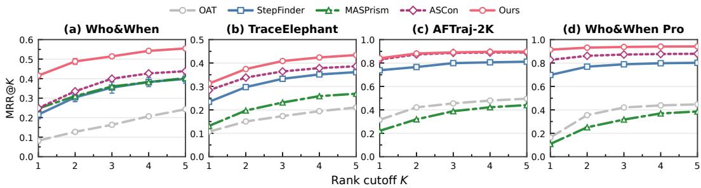  
Figure 4: MRR@K across rank cutoffs $K = 1 , \ldots , 5$ on the four benchmarks. Curves show the cumulative reciprocal-rank score as the cutoff increases; error bars denote the population standard deviation over three seeds.

MRR@K complements Hit@K by assigning a reciprocal-rank score to the root cause when it appears within the top K positions and zero otherwise, rewarding methods that place the root cause earlier within a fixed inspection budget. Figure 4 reports this metric for rank cutoffs from 1 to 5. ReCast achieves the highest MRR@K among the compared methods at every cutoff across all four benchmarks. On TraceElephant, ReCast reaches MRR@1 of 0.3124 and MRR@5 of 0.4341, compared with 0.2838 and 0.3860 for ASCon.

## G.2 SCORE-LEVEL DISCRIMINATION

The rank-based results above measure whether each trajectory’s root cause is prioritized over the other steps in the same trajectory. We additionally evaluate whether the raw attribution scores consistently separate root-cause steps from non-root steps after pooling all candidate steps within each benchmark’s evaluation population. Figures 5 and 6 show the resulting ROC and PR curves, respectively. The corresponding AUROC and AUPRC follow the definitions in Appendix E.1.

ReCast achieves the highest AUROC and AUPRC on all four benchmarks. Its advantage in AUPRC is particularly meaningful under class imbalance, as PR curves capture the trade-off between recovering root-cause steps and avoiding false positives. On Who&When and TraceElephant, it obtains AUROC values of 0.8139 and 0.7583 and AUPRC values of 0.2964 and 0.2125, respectively. On AFTraj-2K and Who&When Pro, ReCast reaches AUROC values of 0.9775 and 0.9887 together with AUPRC values of 0.9082 and 0.9667.

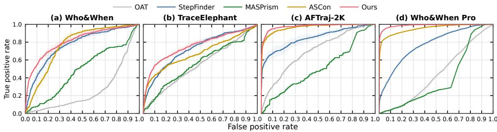

Figure 5: Receiver operating characteristic (ROC) curves on the four benchmarks. Each curve is computed by pooling the candidate-step predictions within a benchmark. Solid lines show the mean over three seeds, and shaded regions indicate the population standard deviation.  
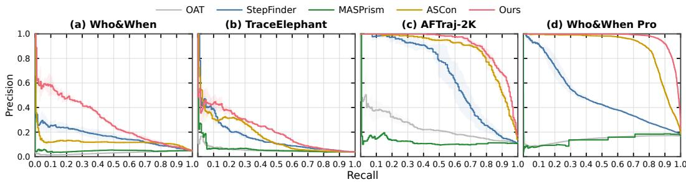  
Figure 6: Precision–recall (PR) curves on the four benchmarks. Each curve is computed by pooling the candidate-step predictions within a benchmark. Solid lines show the mean over three seeds, and shaded regions indicate the population standard deviation.

Together, the MRR@K, AUROC, and AUPRC results support the effectiveness of ReCast for failure attribution. Its advantage extends from prioritizing the root-cause step within each trajectory to distinguishing root-cause steps from other candidates across trajectories.

## G.3 HIDDEN-STATE BACKBONE COMPARISON

Table 10: Hidden-state backbone configurations. Each backbone retains eight layers selected independently using the same source-only procedure.
<table><tr><td>Backbone</td><td># Layers</td><td>Hidden size</td><td>Selected layers</td></tr><tr><td>Qwen3.5-0.8B</td><td>24</td><td>1,024</td><td>3, 5, 8, 11, 13, 18, 19, 22</td></tr><tr><td>Qwen3.5-9B</td><td>32</td><td>4,096</td><td>3, 7, 11, 16, 17, 23, 26, 31</td></tr><tr><td>Qwen3.5-27B</td><td>64</td><td>5,120</td><td>7, 15, 19, 32, 33, 47, 49, 57</td></tr></table>

Protocol. To examine whether attribution performance scales monotonically with backbone size, we compare Qwen3.5 models with 0.8B, 9B, and 27B parameters while holding the downstream ReCast pipeline fixed. For each backbone, we independently select eight layers using attributionaware layer selection on ReCast-2K, set the projection dimension of each branch to $d _ { p } = 2 { , } 0 4 8$ , and retain the same encoder architecture. Training and evaluation follow the same settings as the main experiments. Results are reported as mean ± population standard deviation over seeds 6, 20, and 42. Table 10 summarizes the backbone configurations and selected layers.

Results. Table 11 shows that the benefits of a larger backbone vary across benchmarks and metrics. Qwen3.5-27B achieves the highest Hit@1 on both Who&When subsets, AFTraj-2K, and Who&When Pro, with all six metrics improving with backbone size on Who&When Pro. However, smaller backbones remain competitive: 0.8B and 9B achieve the highest Hit@1 on Captain-Agent and Magentic-One, respectively. On AFTraj-2K, their Hit@1 scores are within 1.23 percentage points of 27B, and 9B achieves the highest Hit@5 and AUROC. These results suggest that larger backbones can improve attribution performance, although the gains vary across benchmarks and metrics. With attribution-aware layer selection and representation learning, smaller backbones can also provide effective signals for failure attribution.

Table 11: Effect of the hidden-state extraction backbone. Results report mean ± population standard deviation over three encoder seeds. Bold indicates the best mean within each evaluation population, determined before rounding.
<table><tr><td>Evaluation population</td><td>Backbone</td><td>Hit@1 (%)</td><td>Hit@3 (%)</td><td>Hit@5 (%)</td><td>MRR (%)</td><td>AUROC (%)</td><td>AUPRC (%)</td></tr><tr><td rowspan="3">Who&amp;When Handcrafted</td><td>Qwen3.5-0.8B</td><td>30.46±2.15</td><td>41.95±2.15</td><td>55.75±0.81</td><td>41.80±1.07</td><td>80.00±2.12</td><td>19.09±0.84</td></tr><tr><td>Qwen3.5-9B</td><td>29.89±3.54</td><td>44.83±3.72</td><td>52.87±4.30</td><td>41.61±0.83</td><td>79.94±2.41</td><td>18.55±2.91</td></tr><tr><td>Qwen3.5-27B</td><td>33.33±1.63</td><td>45.98±0.81</td><td>57.47±0.81</td><td>44.21±0.77</td><td>79.22±0.91</td><td>21.88±0.92</td></tr><tr><td rowspan="3">Who&amp;When Algorithm</td><td>Qwen3.5-0.8B</td><td>38.17±2.31</td><td>74.73±2.31</td><td>91.94±1.14</td><td>59.20±2.00</td><td>72.00±0.38</td><td>33.42±0.43</td></tr><tr><td>Qwen3.5-9B</td><td>38.98±0.38</td><td>74.46±2.01</td><td>92.74±2.37</td><td>59.85±0.67</td><td>73.64±1.58</td><td>35.10±0.47</td></tr><tr><td>Qwen3.5-27B</td><td>45.43±2.01</td><td>72.31±1.01</td><td>92.47±1.66</td><td>63.28±1.42</td><td>74.75±1.00</td><td>38.52±1.84</td></tr><tr><td rowspan="3">TraceElephant Captain-Agent</td><td>Qwen3.5-0.8B</td><td>38.43±2.42</td><td>62.35±4.19</td><td>78.82±2.54</td><td>55.12±2.14</td><td>81.07±2.40</td><td>26.82±2.49</td></tr><tr><td>Qwen3.5-9B</td><td>37.25±2.00</td><td>62.35±2.54</td><td>80.00±1.66</td><td>54.54±1.19</td><td>80.92±2.03</td><td>27.42±0.37</td></tr><tr><td>Qwen3.5-27B</td><td>35.69±2.93</td><td>61.57±1.47</td><td>78.04±2.42</td><td>52.90±1.13</td><td>78.30±2.00</td><td>25.30±0.75</td></tr><tr><td rowspan="3">TraceElephant Magentic-One</td><td>Qwen3.5-0.8B</td><td>27.78±0.91</td><td>42.22±1.81</td><td>50.00±1.57</td><td>39.81±0.31</td><td>71.69±1.92</td><td>18.87±0.52</td></tr><tr><td>Qwen3.5-9B</td><td>28.89±0.91</td><td>43.70±2.92</td><td>54.81±3.43</td><td>41.07±1.30</td><td>71.61±3.56</td><td>16.51±1.76</td></tr><tr><td>Qwen3.5-27B</td><td>27.04±1.89</td><td>46.67±1.57</td><td>52.96±2.10</td><td>40.52±1.16</td><td>72.78±0.58</td><td>17.98±1.99</td></tr><tr><td rowspan="3">AFTraj-2K</td><td>Qwen3.5-0.8B</td><td>82.82±1.81</td><td>94.68±0.29</td><td>97.96±0.77</td><td>89.05±1.06</td><td>97.63±0.08</td><td>88.05±1.38</td></tr><tr><td>Qwen3.5-9B</td><td>83.64±1.61</td><td>94.89±1.26</td><td>98.16±0.50</td><td>89.72±0.95</td><td>97.88±0.24</td><td>90.54±0.75</td></tr><tr><td>Qwen3.5-27B</td><td>84.05±0.87</td><td>95.09±1.00</td><td>97.96±0.29</td><td>89.99±0.49</td><td>97.75±0.21</td><td>90.82±0.58</td></tr><tr><td rowspan="3">Who&amp;When Pro</td><td>Qwen3.5-0.8B</td><td>87.93±0.49</td><td>95.31±0.14</td><td>98.13±0.19</td><td>92.09±0.29</td><td>97.84±0.11</td><td>94.25±0.21</td></tr><tr><td>Qwen3.5-9B</td><td>89.90±0.04</td><td>96.16±0.36</td><td>98.29±0.08</td><td>93.40±0.09</td><td>98.35±0.06</td><td>95.61±0.07</td></tr><tr><td>Qwen3.5-27B</td><td>91.42±0.21</td><td>96.64±0.26</td><td>98.53±0.14</td><td>94.36±0.11</td><td>98.87±0.12</td><td>96.67±0.17</td></tr></table>

## G.4 TIME EFFICIENCY ANALYSIS

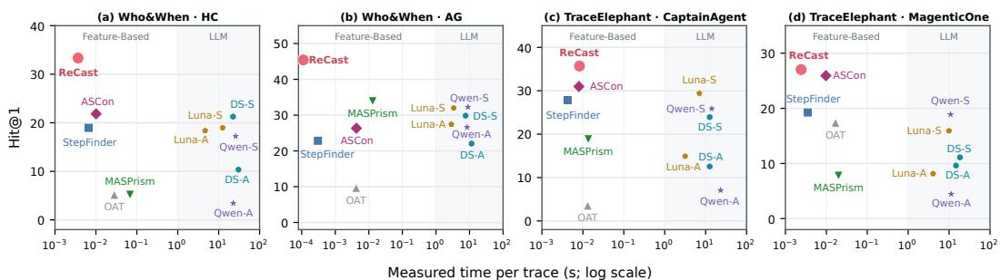  
ReCast StepFinder ASCon OAT MASPrism Luna DeepSeek Qwen A: All-at-Once S: Step-by-Step  
Figure 7: Hit@1 accuracy (%) versus measured time per trajectory on Who&When and TraceElephant. Points show three-seed means; time is in seconds on a logarithmic scale. Feature-based methods report attribution time excluding feature extraction, while LLM methods report inference time excluding backend initialization. Upper-left positions indicate higher accuracy at lower mea sured cost. A and S denote All-at-Once and Step-by-Step.

Protocol. We compare Hit@1 accuracy with the average processing time per trajectory on Who&When and TraceElephant. ReCast, StepFinder, ASCon, and OAT use precomputed features, excluding feature extraction and embedding-cache preparation from attribution time. For MASPrism, we report attribution time excluding model initialization, tokenization, and prefill-stage signal extraction. For LLM-based methods, inference time excludes model initialization but includes prompt preparation and API delays and retries where applicable. We divide the total measured time by the number of evaluated trajectories and report the mean over three seeds in Figure 7.

(a) HC-50 | Restaurant search  
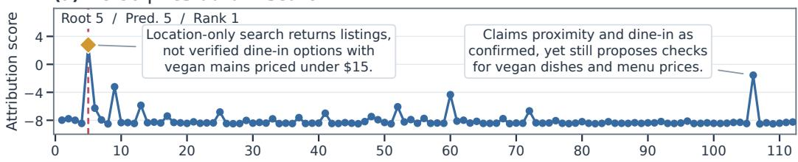  
(b) HC-37 | Broad search

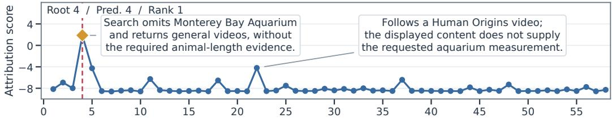  
(c) HC-42 | Premature completion

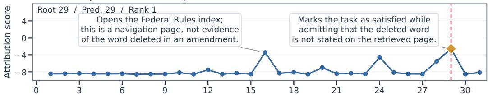

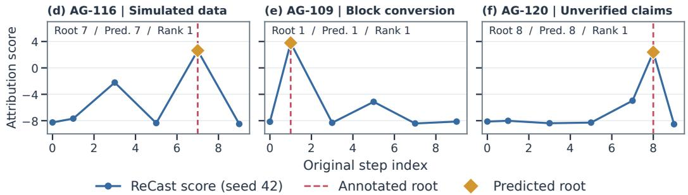  
Figure 8: Step-level attribution scores on three HC trajectories (a–c) and three AG trajectories (d–f). Original zero-based step indices are retained; gaps indicate events without candidate scores.

Results. ReCast achieves the highest Hit@1 across all four subsets with mean attribution times ranging from 0.11 to 8.28 ms per trajectory. It has the lowest mean attribution time among the compared feature-based methods on HC, AG, and Magentic-One. On Captain-Agent, StepFinder and ASCon are faster, but ReCast achieves higher accuracy. In contrast, the LLM-based baselines shown in Figure 7 require 2.88–30.50 seconds per trajectory under the measured configurations while attaining lower Hit@1. This comparison highlights the efficiency of ReCast’s attribution stage when step features are available.

## H CASE STUDY

Figure 8 presents six cases from the Handcrafted and Algorithm subsets of Who&When. The curves show ReCast’s attribution scores for all candidate steps, with higher scores indicating higher ranks within each trajectory. In these selected cases, ReCast ranks the annotated root-cause step above other high-scoring candidates, providing qualitative support for the effectiveness of its learned step representations in failure attribution.

HC-50, restaurant search (Figure 8(a)). The task asks for dine-in restaurants within one block of Washington Square Park that serve vegan main dishes for under \$15. At step 5, a location-only search returns general listings without verifying the remaining constraints; the dataset annotates this retrieval as the root cause. Later steps also receive elevated scores. For example, the summary at step 106 presents proximity and dine-in service as confirmed while leaving vegan options and prices for further verification. ReCast nevertheless assigns its highest score to step 5, ranking the earlier annotated error above this later competing peak.

HC-37, missing a source constraint (Figure 8(b)). The task asks for an organism’s maximum body length in meters, as reported by the Monterey Bay Aquarium website. At step 4, the agent searches for National Geographic videos without including the required source, an omission annotated as the root cause. At step 22, it opens a Human Origins video whose displayed content does not provide the requested measurement. Despite other local score peaks, ReCast ranks step 4 first, prioritizing the earlier annotated omission over the later browsing event.

HC-42, premature completion (Figure 8(c)). The task asks which word was deleted in a federal rule amendment documented on Cornell Law School’s website. Browsing the Federal Rules index at step 16 and the Witnesses article at step 24 produces local score peaks. At step 29, however, the Orchestrator declares the task complete while acknowledging that the retrieved page does not identify the requested word. This premature completion is the annotated root cause. ReCast assigns its highest score to step 29, ranking the unsupported completion decision above the earlier browsing steps.

AG-116, substituting simulated data (Figure 8(d)). The task asks for the lowest sale price of a single-family house in Queen Anne in January 2023. With the transaction file unavailable, step 3 proposes analysis using an assumed CSV path and receives an elevated score. At step 7, the agent constructs simulated transactions instead of obtaining the actual records; the dataset annotates this substitution as the root cause. ReCast assigns its highest score to step 7, ranking the use of simulated data above the earlier analysis based on an assumed file path.

AG-109, incorrect distance conversion (Figure 8(e)). The task seeks supermarkets within two blocks of Lincoln Park, Chicago, that offer ready-to-eat salads for under \$15. At step 1, the agent converts miles to blocks using an assumed rate of 20 blocks per mile, which the dataset identifies as incorrect for Chicago. A later discussion of candidate stores at step 5 also produces a local score peak. ReCast nevertheless ranks step 1 highest, selecting the annotated conversion error rather than the subsequent store recommendations.

AG-120, unverified restaurant claims (Figure 8(f)). AG-120 addresses the same restaurant-search task as HC-50 through a different execution. At step 7, a missing Google Maps API key blocks automated verification, and the agent proposes manual checks. At step 8, another agent presents distances, dining options, and menu prices as verified without performing the required checks, which the dataset annotates as the root cause. ReCast’s score rises at step 7 but peaks at step 8, prioritizing the unsupported claims over the preceding verification obstacle.

## I PROMPT TEMPLATES

We directly use the Who&When implementation (Zhang et al., 2025a) and present its prompt templates below. The red fields denote trajectory-specific values inserted at inference time. The {ground truth} field contains the benchmark-provided task answer, not the root-cause annotation. Line wrapping below is typographical and does not change the prompt content.

## I.1 ALL-AT-ONCE PROMPT

All-at-Once presents the complete trajectory in one request and asks the model to identify the responsible agent and the first erroneous step.

## All-at-Once Evaluation Template

SYSTEM MESSAGE   
You are an AI assistant skilled in analyzing conversations.   
USER MESSAGE   
You are an AI assistant tasked with analyzing a multi-agent   
conversation history when solving a real world problem. The problem   
is: {problem}   
The Answer for the problem is: {ground truth}   
Identify which agent made an error, at which step, and explain the   
reason for the error. Here’s the conversation:   
{conversation}   
Based on this conversation, please predict the following:   
1. The name of the agent who made a mistake that should be directly   
responsible for the wrong solution to the real world problem. If   
there are no agents that make obvious mistakes, decide one single   
agent in your mind. Directly output the name of the Expert.   
2. In which step the mistake agent first made mistake. For example,   
in a conversation structured as follows:   
{   
"agent a": "xx",   
"agent b": "xxxx",   
"agent c": "xxxxx",   
"agent a": "xxxxxxx"   
},   
each entry represents a ‘step’ where an agent provides input. The ‘x   
symbolizes the speech of each agent. If the mistake is in agent c’s   
speech, the step number is 2. If the second speech by ‘agent a’   
contains the mistake, the step number is 3, and so on. Please   
determine the step number where the first mistake occurred.   
3. The reason for your prediction.   
Please answer in the format:   
Agent Name: (Your prediction)   
Step Number: (Your prediction)   
Reason for Mistake:

## I.2 STEP-BY-STEP PROMPT

Step-by-Step evaluates growing trajectory prefixes. At each step, the model receives the history up to and including that step. Evaluation terminates at the first response parsed as “Yes”; otherwise, it advances to the next prefix.

## Step-by-Step Evaluation Template

SYSTEM MESSAGE   
You are a precise step-by-step conversation evaluator.   
USER MESSAGE AT STEP {step}   
You are an AI assistant tasked with evaluating the correctness of each   
step in an ongoing multi-agent conversation aimed at solving a   
real-world problem. The problem being addressed is: {problem}. The   
Answer for the problem is: {ground truth}   
Here is the conversation history up to the current step:   
{conversation}   
The most recent step ({step}) was by ’{agent}’.   
Your task is to determine whether this most recent agent’s action   
(Step {step}) contains an error that could hinder the problem-solving   
process or lead to an incorrect solution. Please respond with ’Yes’   
or ’No’ and provide a clear explanation for your judgment. Note:   
Please avoid being overly critical in your evaluation. Focus on   
errors that clearly derail the process.   
Respond ONLY in the format:   
1. Yes/No.   
2. Reason: [Your explanation here]