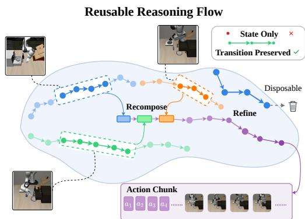
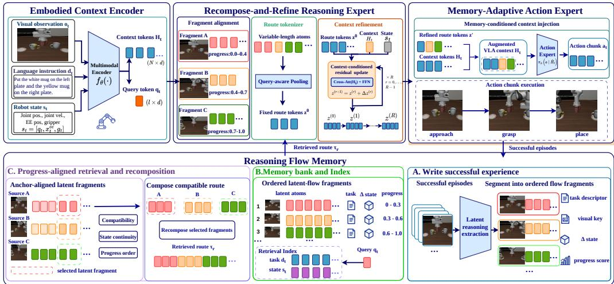

# RECOMPOSE AND REFINE LATENT REASONING FLOWS FOR VISION-LANGUAGE-ACTION MODELS

Hongyu Shi1 Sen Zhao2∗ Zuyu Zhang2 Lifeng Shen3 Ding Zou4 Xinyu He5 Xu Zhang2∗ Qinghua Zhang1

1School of Computer Science and Technology,

Chongqing University of Posts and Telecommunications, Chongqing, China 2Academy of Advanced Interdisciplinary Studies,

Chongqing University of Posts and Telecommunications, Chongqing, China 3School of Artificial Intelligence,

Chongqing University of Posts and Telecommunications, Chongqing, China 4ZTE Corporation, China

5Towngas, China

## ABSTRACT

Latent reasoning enables vision-language-action (VLA) models to transform multimodal observations into task-relevant internal states before generating continuous robot actions. While existing methods learn to generate or refine such states for each policy query, they discard successful reasoning after execution and therefore reconstruct similar computation from scratch. We present Reasoning and Flow Memory (FLOWMEM), a unified VLA model that turns successful latent computation into reusable reasoning experience. Rather than appending a fixed retrieved context, FLOWMEM dynamically retrieves and recomposes compatible latent frag ments as the embodied context evolves, forming a reasoning route that follows the temporal structure and progress of successful computation. The route is then refined using current visual and proprioceptive evidence before it conditions action generation. Experiments on RoboMME and LIBERO-Plus show that FLOWMEM attains 48.0% and 77.3% success—1.7 and 4.1 points above memory-free policies, respectively—demonstrating the value of reusing successful latent computation for closed-loop VLA control.

## 1 INTRODUCTION

Vision-language-action (VLA) models provide a unified interface between multimodal perception, language understanding, and continuous robot control. Recent work has moved beyond direct observation-to-action prediction by introducing intermediate reasoning before action generation. Explicit approaches verbalize embodied plans or predict future visual goals, while latent-reasoning VLAs internalize such computation into compact continuous states (Zawalski et al., 2024; Zhao et al., 2025; Huang et al., 2025). In particular, LaRA-VLA combines textual and visual prediction in latent reasoning slots, LaST0 learns a spatio-temporal latent chain-of-thought from future physical states, and RD-VLA improves action prediction through recurrent latent computation (Bai et al., 2026; Liu et al., 2026; Tur et al., 2026). These advances establish latent reasoning as an effective intermediate representation between perception and action, avoiding the latency and representational bottlenecks of lengthy explicit reasoning traces.

However, latent reasoning remains largely transient. As illustrated in Fig. 1, a VLA constructs an intermediate trajectory from the current observation, uses it to generate actions, and discards the computation afterward. Even when the robot later encounters a familiar task stage, the successful reasoning that previously connected perception to control cannot be directly reused. Memoryaugmented VLAs address a related but different limitation by preserving textual notes, perceptualcognitive evidence, retrieved observations, or recurrent policy states (Haresh et al., 2026; Shi et al.,

2026b; Cherepanov et al., 2026; Li et al., 2026b). Such memories enrich the historical context available to the policy, but they do not retain how latent reasoning itself evolved toward successful control. This leaves a central gap between reasoning before acting and learningfrom how successful reasoning unfolded.

Reusing latent reasoning is fundamentally different from retrieving a similar embedding. Its utility depends on task progress: a nearby state carries neither the direction of computation nor its unfinished portion. We therefore represent successful embodied reasoning as a latent reasoningflow, an ordered, progressaware trajectory of latent computation.

This perspective raises a new question: can a VLA construct its current reasoning process from previously successful latent computation, rather than regenerating it from scratch? Figure 1 exposes the three requirements behind this question. First, retrieval must identify a compatible transition fragment, since a nearby latent point alone carries neither progress nor direction. Second, no single episode need

  
Figure 1: Comparison between transient latent reasoning and the proposed reusable reasoning-flow formulation.

cover the unfinished task, requiring complementary fragments to be recomposed without destroying their internal order. Third, the composed route is only prior computation: differences in object pose, layout, and robot state must be corrected by the current observation before the route can condition control.

Building on this formulation, we propose Reasoning and Flow Memory (FLOWMEM), a unified VLA model that transforms successful latent computation into reusable reasoning experience. FLOWMEM comprises four coordinated components. The Embodied Context Encoder represents the current observation, robot state, and instruction. The Reasoning Flow Memory organizes successful latent states into ordered and grounded experience rather than isolated memory vectors. Conditioned on the current embodied context, the Recompose-and-Refine Reasoning Expert retrieves anchor-aligned suffixes, constructs a compatible multi-source route, and refines it for the current scene. Finally, the Memory-Adaptive Action Expert injects the refined route through the VLA’s native latent interface to produce executable action chunks. All four components communicate through a shared latent representation and form a single perception–reasoning–action model.

Recomposition determines which prior transitions support the unfinished task, while refinement determines how the resulting route should change under current embodied evidence. The route is compressed into fixed reasoning tokens and corrected by a fixed-depth residual block before action generation.

We evaluate FLOWMEM on RoboMME (Dai et al., 2026) and LIBERO-Plus (Fei et al., 2026). These benchmarks jointly assess memory-dependent manipulation across temporal, spatial, object, and procedural requirements, as well as the reuse of latent reasoning under systematic distribution shifts. Extensive experiments compare FLOWMEM with representative latent-reasoning and memory augmented VLAs, while controlled memory interventions examine how its behavior changes with ordered flow recomposition and current-context refinement. Beyond task success, we further evaluate reasoning reuse and computational efficiency.

Our contributions are summarized as follows:

• We introduce latent reasoning flows as a reusable representation of successful embodied computation, capturing how internal reasoning evolves across task progress rather than reducing experience to isolated vectors or historical policy context.

• We propose FLOWMEM, a unified VLA model whose Recompose-and-Refine Reasoning Expert constructs task-specific reasoning from multiple experiences and refines it through current-context residual refinement before action generation.

• Empirical results on RoboMME and LIBERO-Plus indicate that treating successful latent computation as ordered reasoning experience can improve closed-loop VLA control, with gains of 1.7 and 4.1 points, respectively.

## 2 PRELIMINARIES

## 2.1 VISION-LANGUAGE-ACTION MODELS WITH LATENT REASONING

Given an RGB observation $o _ { t }$ , robot state $s _ { t } .$ , and language instruction $l ,$ a vision-language-action (VLA) model predicts a chunk of H future actions $\mathbf { \bar { a } } _ { t : t + H - 1 } \in \mathbb { R } ^ { H \times d _ { a } }$ . Each action commonly specifies end-effector translation, rotation, and gripper control. Modern VLAs often generate continuous actions with diffusion or flow-matching objectives, while latent-reasoning VLAs additionally introduce an intermediate state $\mathbf { Z } _ { t } \in \mathbb { R } ^ { L \times d }$ between multimodal context and action generation (Liu et al., 2026; Bai et al., 2026; Tur et al., 2026):

$$
\mathbf { Z } _ { t } = R _ { \theta } ( o _ { t } , s _ { t } , l ) , \qquad \hat { \mathbf { a } } _ { t : t + H - 1 } = A _ { \theta } \bigl ( o _ { t } , s _ { t } , l , \mathbf { Z } _ { t } \bigr ) .\tag{1}
$$

Here, $R _ { \theta }$ denotes the native latent-reasoning module, $A _ { \theta }$ the action expert, and $\mathbf { Z } _ { t }$ the model’s internal task-relevant computation, rather than an explicit textual plan, subgoal label, or action sequence. Existing methods generate or iteratively refine this state for the current policy query; the resulting computation is normally discarded after action prediction.

## 2.2 PROBLEM FORMULATION

We consider language-conditioned robotic manipulation as a partially observed sequential decision problem. An episode is $\zeta = ( l , \{ o _ { t } , s _ { t } , \mathbf { a } _ { t } \} _ { t = 1 } ^ { T } , y )$ , where $\bar { y } \in \{ 0 , 1 \}$ denotes task success. Let $\mathbf { \bar { \mathcal { D } } ^ { + } } = \{ \zeta _ { i } \mathbf { \nabla } | y _ { i } = 1 \}$ contain successful training episodes and let $\dot { \mathcal { M } } = \mathrm { \tilde { \Phi } } ( \mathcal { D } ^ { + } )$ be reusable memory constructed from their latent reasoning traces. Our goal is to learn a unified VLA policy

$$
( \mathbf { Z } _ { t } , \hat { \mathbf { a } } _ { t : t + H - 1 } ) = \Pi _ { \theta } \big ( o _ { t } , s _ { t } , l , \mathcal { M } \big )\tag{2}
$$

where Πθ denotes the memory-conditioned VLA policy that uses compatible prior computation to improve expected task success under the deployment distribution. Memory informs the current latent reasoning state, while every predicted action remains conditioned on the current observation and robot state.

At evaluation time, the policy may access only the current embodied context and memory committed before the evaluated episode. Memory-source and evaluation episodes are disjoint; future frames, rewards, success labels, simulator-privileged states, and retrieval from the currently executing episode are unavailable. Under these constraints, the problem is to reuse successful latent computation without sacrificing closed-loop adaptation to the present physical state.

## 3 THE PROPOSED MODEL

## 3.1 OVERVIEW

Given an RGB observation $o _ { t }$ , robot state $s _ { t } .$ , and language instruction $l ,$ a VLA policy predicts an action chunk $\hat { \mathbf { a } } _ { t : t + H - 1 }$ . We augment this mapping with a reasoning flow memory M that stores latent reasoning produced during successful interactions:

$$
\hat { \mathbf { a } } _ { t : t + H - 1 } = \Pi _ { \theta } ( o _ { t } , s _ { t } , l , \mathcal { M } ) .\tag{3}
$$

where $\Pi _ { \theta }$ denotes the memory-conditioned policy and M the reasoning flow memory. The central premise of FLOWMEM is that latent reasoning is reusable computation. Instead of retrieving past observations or replaying past actions, the model retrieves ordered latent fragments that describe how successful reasoning evolved, recomposes compatible fragments into a route for the current task, and refines the query-local route tokens using the current embodied context.

As illustrated in Fig. 2, FLOWMEM contains four components. The Embodied Context Encoder represents the current observation, state, and instruction. The Reasoning Flow Memory stores ordered latent fragments from successful source episodes together with compact retrieval and transition metadata. The Recompose-and-Refine Reasoning Expert performs anchor-aligned fragment retrieval, route tokenization, and current-context refinement. Finally, the Memory-Adaptive Action Expert injects the refined reasoning tokens through the native latent interface of the VLA and generates continuous actions.

  
Figure 2: Overview of FLOWMEM. Successful latent reasoning is stored as ordered flow fragments, retrieved and recomposed according to the current embodied context, and refined before conditioning action generation.

## 3.2 EMBODIED CONTEXT ENCODER

The Embodied Context Encoder maps the current multimodal input to contextual tokens

$$
\mathbf { H } _ { t } = E _ { \theta } ( o _ { t } , s _ { t } , l ) \in \mathbb { R } ^ { N _ { c } \times d } .\tag{4}
$$

where $N _ { c }$ is the number of contextual tokens and d is their latent width. These tokens are used both by the action policy and by the memory pathway. For retrieval, we derive a compact visual semantic descriptor $\mathbf { d } _ { t }$ from the observable context and pair it with a normalized robot-state vector $\bar { \bf s } _ { t }$ . The resulting query is

$$
\mathbf { q } _ { t } = ( \mathbf { d } _ { t } , \bar { \mathbf { s } } _ { t } , l ) .\tag{5}
$$

Only information available at the current policy query is used online. Future observations, rewards, and success labels are used solely to construct or supervise memory offline.

## 3.3 REASONING FLOW MEMORY

For each successful source episode i, we record the latent reasoning states produced at successive policy queries,

$$
\mathcal { Z } _ { i } = [ \mathbf { Z } _ { i , 1 } , \ldots , \mathbf { Z } _ { i , T _ { i } } ] .\tag{6}
$$

where $T _ { i }$ is the number of policy queries in source episode i. We organize each sequence into contiguous fragments, forming ordered memory units for subsequent retrieval, recomposition, and context refinement,

$$
\mathcal { Z } _ { i } = \mathcal { F } _ { i } ^ { 1 } \circ \mathcal { F } _ { i } ^ { 2 } \circ \cdot \cdot \cdot \circ \mathcal { F } _ { i } ^ { K _ { i } } ,\tag{7}
$$

where $K _ { i }$ is the number of fragments in episode i, ◦ denotes temporal concatenation, and each $\mathcal { F } _ { i } ^ { k }$ contains one or more latent atoms from a local stage of the interaction. The partition follows the ordered interaction structure available during memory construction.

Each fragment is stored as

$$
m _ { i } ^ { k } = ( \mathcal { F } _ { i } ^ { k } , \mathbf { d } _ { i } ^ { k } , \bar { \mathbf { s } } _ { i } ^ { k } , [ p _ { i , k } ^ { \mathrm { s t a r t } } , p _ { i , k } ^ { \mathrm { e n d } } ] , \mathbf { c } _ { i } ^ { k } , r _ { i } ^ { k } ) ,\tag{8}
$$

where $\mathbf { d } _ { i } ^ { k }$ and $\bar { \mathbf { s } } _ { i } ^ { k }$ are the observable descriptor and normalized state at the fragment anchor, $p _ { i , k }$ records relative progress, $\mathbf { c } _ { i } ^ { k }$ summarizes available transition information, and $r _ { i } ^ { k }$ records source provenance and order. Thus, the memory bank contains latent payloads and the minimum metadata required to retrieve and recompose them.

## 3.4 RECOMPOSE-AND-REFINE REASONING EXPERT

The Recompose-and-Refine Reasoning Expert maps the current query and memory bank to a fixedsize latent reasoning state. Its three stages correspond to fragment alignment, route tokenization, and context refinement.

Fragment alignment. We first restrict retrieval to the task or instruction namespace associated with l and exclude the currently evaluated episode. For each eligible fragment, the retrieval score combines visual semantic similarity with normalized state compatibility:

$$
S ( \mathbf { q } _ { t } , m _ { i } ^ { k } ) = \lambda _ { v } \cos ( \mathbf { d } _ { t } , \mathbf { d } _ { i } ^ { k } ) - \frac { \lambda _ { s } } { d _ { s } } \left\| \frac { \bar { \mathbf { s } } _ { t } - \bar { \mathbf { s } } _ { i } ^ { k } } { \pmb { \sigma } _ { s } } \right\| _ { 2 } ^ { 2 } ,\tag{9}
$$

where $d _ { s }$ is the state-vector dimension, $\pmb { \sigma } _ { s }$ is estimated from the indexed states, and $\lambda _ { v } , \lambda _ { s } \ge 0 . \mathrm { ~ A ~ }$ high-scoring fragment identifies an anchor inside a successful source trajectory. Rather than retrieving only that point, we retain the ordered local suffix beginning at the anchor. This preserves the transition structure that follows a state compatible with the current scene.

The retained suffixes from several source episodes form the candidate set. We compose them with a deterministic constrained search that preserves within-source order, rejects repeated fragments, and requires consecutive fragments to be compatible in observable state, progress, and any available transition metadata. The selected route is

$$
\mathcal { R } _ { t } = { ( m _ { i _ { 1 } } ^ { k _ { 1 } } , m _ { i _ { 2 } } ^ { k _ { 2 } } , . . . , m _ { i _ { J } } ^ { k _ { J } } ) } ,\tag{10}
$$

where $J$ is the number of selected fragments and adjacent elements may originate from different successful episodes. Only latent reasoning fragments, rather than historical action segments, participate in route recomposition.

Route tokenization. The route $\mathcal { R } _ { t }$ has a variable number of fragments and latent atoms. For each atom, we add embeddings of its robot state, progress interval, source identity, route position, and transition metadata to the latent payload. Let $\mathcal { \widetilde { R } } _ { t }$ denote the resulting ordered token sequence. A bank of L learned queries attends to this sequence and produces a fixed-size representation:

$$
\mathbf { Z } _ { t } ^ { 0 } = C _ { \theta } ( \widetilde { \mathcal { R } } _ { t } ) \in \mathbb { R } ^ { L \times d } .\tag{11}
$$

where $C _ { \theta }$ denotes the learned-query route-tokenization module. This operation retains source and temporal organization while converting routes of different lengths into the latent interface expected by the policy. When no compatible route is available, the policy falls back to the backbone’s native latent-reasoning path.

Context refinement. Retrieved reasoning supplies a long-horizon computational prior, whose query-local route tokens are refined in light of current embodied evidence. We formulate this evidence-driven route-token refinement through a fixed-depth residual operator over the route tokens:

$$
{ \bf Z } _ { t } ^ { \prime } = { \bf Z } _ { t } ^ { 0 } + \Delta _ { \theta } ( { \bf Z } _ { t } ^ { 0 } , { \bf H } _ { t } , \bar { \bf s } _ { t } ) .\tag{12}
$$

Here, $\Delta _ { \theta }$ is a fixed-depth residual operator that derives query features from the retrieved route and state, reads the current context as key-value evidence, and produces a residual correction to the query-local route tokens.

## 3.5 MEMORY-ADAPTIVE ACTION EXPERT

The refined tokens $\mathbf { Z } _ { t } ^ { \prime }$ are mapped into the VLA backbone’s native latent-conditioning interface and combined with the current context. We denote this interface operation by

$$
\widetilde { \mathbf { H } } _ { t } = I _ { \theta } ( \mathbf { H } _ { t } , \mathbf { Z } _ { t } ^ { \prime } ) .\tag{13}
$$

where $I _ { \theta }$ denotes the native latent-conditioning interface. The action expert then predicts a conditional velocity field from $\mathbf { a } ^ { \tau }$ at flow time $\tau ,$ where $\bar { \mathbf { a } } ^ { \tau } = \tau \mathbf { a } ^ { 0 } + ( 1 - \tau ) \mathbf { a } ^ { 1 }$

$$
\mathbf { v } _ { \theta } = A _ { \theta } ( \mathbf { a } ^ { \tau } , \tau , \widetilde { \mathbf { H } } _ { t } ) ,\tag{14}
$$

which is integrated to obtain the action chunk $\hat { \mathbf { a } } _ { t : t + H - 1 }$ . The expert consumes the current embodied context and the refined reusable reasoning state.

## 3.6 LEARNING OBJECTIVES

We train the memory pathway to reconstruct the frozen native latent reasoning target associated with the current embodied context. Let $\mathbf { Z } _ { t } ^ { \ast }$ denote the target reasoning tokens and $\mathbf { Z } _ { t } ^ { \top }$ the memoryconditioned prediction. Each reasoning token is a d-dimensional continuous vector in the VLA’s latent reasoning space: $\mathbf { Z } _ { t } ^ { \ast }$ is the frozen reference sequence and $\mathbf { Z } _ { t } ^ { \prime }$ is its memory-conditioned prediction. The latent alignment objective is

$$
\mathcal { L } _ { \mathrm { l a t e n t } } = \frac { 1 } { L } \sum _ { j = 1 } ^ { L } \left( 1 - \cos ( \mathbf { Z } _ { t , j } ^ { \prime } , \mathrm { s g } ( \mathbf { Z } _ { t , j } ^ { * } ) ) \right) ,\tag{15}
$$

where $j$ indexes the L reasoning tokens and sg(·) stops gradients through the target. The original action-learning objective of the $\bar { \mathbf { V } } \mathbf { L A }$ is retained; for flow-based action experts it is the conditional flow-matching loss

$$
\mathcal { L } _ { \mathrm { a c t } } = \mathbb { E } _ { \tau , \mathbf { a } ^ { 0 } , \mathbf { a } ^ { 1 } } \left\| \mathbf { v } _ { \theta } ( \mathbf { a } ^ { \tau } , \tau , \widetilde { \mathbf { H } } _ { t } ) - ( \mathbf { a } ^ { 0 } - \mathbf { a } ^ { 1 } ) \right\| _ { 2 } ^ { 2 } .\tag{16}
$$

where $\mathbf { a } ^ { 0 }$ is sampled noise and $\mathbf { a } ^ { 1 }$ is the target action chunk. The complete objective combines latent alignment with the original action-learning objective:

$$
\begin{array} { r } { \mathcal { L } = \mathcal { L } _ { \mathrm { a c t } } + \mathcal { L } _ { \mathrm { l a t e n t } } . } \end{array}\tag{17}
$$

This objective directly supervises reusable latent reasoning and executable actions.

## 4 EXPERIMENTS

## 4.1 EXPERIMENTAL SETUP

Benchmarks and protocol. We evaluate FLOWMEM on RoboMME (Dai et al., 2026) and LIBERO-Plus (Fei et al., 2026). RoboMME evaluates temporal, spatial, object, and procedural memory through Counting, Permanence, Reference, and Imitation. We follow its full-16 protocol, evaluating 50 fixed episodes for each of the 16 tasks and reporting the task-macro success rate. Training, memory-source, and evaluation episodes are disjoint.

For LIBERO-Plus, every policy is trained only on the corresponding standard LIBERO suite (Liu et al., 2023) and is then evaluated zero-shot under the seven perturbation domains: camera viewpoint, robot initialization, language, lighting, background, observation noise, and layout. The main result reports success separately for the four original LIBERO suites, while the appendix breaks each method down by perturbation domain. The perturbed instances are used exclusively for zero-shot evaluation.

Baselines. On RoboMME, we consider no-memory policies, past-action conditioning, episodic memory, and the symbolic, perceptual, and recurrent MME-VLA variants (Fang et al., 2025; Sridhar et al., 2026; Dai et al., 2026). Together, these baselines contrast memory derived from action history, symbolic experience, visual context, and recurrent state. On LIBERO-Plus, we compare with suitespecific OpenVLA, UniVLA, OpenVLA-OFT (Kim et al., 2025), MemoryVLA (Shi et al., 2026b), MergeVLA (Fu et al., 2026), and VLA-Adapter (Wang et al., 2026).

Our controlled no-memory baseline, $\mathrm { L a S T _ { 0 } }$ (Liu et al., 2026), reasons only from the current embodied input and neither constructs nor queries reasoning memory. All controlled models use the same benchmark-specific split and evaluation manifest.

## 4.2 MAIN RESULTS

Table 1 evaluates whether reusable latent reasoning improves closed-loop performance on memorydependent manipulation. Table 2 tests whether the same mechanism remains useful under zero-shot perturbations. Detailed RoboMME task results are deferred to Appendix A.

Table 1: Main results on RoboMME. Success rate (%) under the official Full-16 protocol. Higher is better. Best and second-best are bolded and underlined.
<table><tr><td>Memory</td><td>Method</td><td>Counting</td><td>Permanence</td><td>Reference</td><td>Imitation</td><td>Avg.</td></tr><tr><td>None</td><td>π0.5</td><td>28.8</td><td>17.0</td><td>17.2</td><td>8.8</td><td>17.9</td></tr><tr><td>Action history</td><td>π0.5 + past actions</td><td>29.1</td><td>22.8</td><td>15.9</td><td>11.2</td><td>19.7</td></tr><tr><td rowspan="2">Symbolic</td><td>SimpleSG + QwenVL</td><td>44.6</td><td>19.6</td><td>25.2</td><td>26.6</td><td>29.0</td></tr><tr><td>GroundSG + QwenVL</td><td>38.0</td><td>39.3</td><td>31.6</td><td>21.9</td><td>32.7</td></tr><tr><td>Episodic</td><td>MemER</td><td>48.8</td><td>53.2</td><td>38.0</td><td>29.5</td><td>42.4</td></tr><tr><td rowspan="8">Perceptual</td><td>SAM2Act+</td><td>35.3</td><td>26.0</td><td>16.8</td><td>7.3</td><td>21.4</td></tr><tr><td>TokenDrop + Context</td><td>57.9</td><td>26.9</td><td>23.7</td><td>29.4</td><td>34.5</td></tr><tr><td>TokenDrop + Modul</td><td>52.3</td><td>26.8</td><td>34.7</td><td>38.3</td><td>38.0</td></tr><tr><td>TokenDrop + Expert</td><td>59.4</td><td>23.6</td><td>25.3</td><td>31.1</td><td>34.9</td></tr><tr><td>FrameSamp + Context</td><td>50.1</td><td>23.3</td><td>21.0</td><td>28.3</td><td>30.7</td></tr><tr><td>FrameSamp + Modul</td><td>65.2</td><td>25.1</td><td>36.3</td><td>51.4</td><td>44.5</td></tr><tr><td>FrameSamp + Expert</td><td>66.8</td><td>25.2</td><td>24.1</td><td>28.9</td><td>36.3</td></tr><tr><td>TTT + Modul</td><td>34.5</td><td>22.2</td><td>20.4</td><td>10.7</td><td>22.0</td></tr><tr><td>Recurrent</td><td>RMT + Modul</td><td>34.1</td><td>15.8</td><td>21.1</td><td>9.7</td><td>20.2</td></tr><tr><td>None Reasoning flow</td><td> $\mathrm { L a S T _ { 0 } }$  FLOWMEM (Ours)</td><td>71.5 75.0</td><td>28.0 29.0</td><td>36.5 37.5</td><td>49.0 50.5</td><td>46.3 48.0</td></tr></table>

Table 2: Main results on LIBERO-Plus. Success rate (%) following suite-specific standard-LIBERO training and zero-shot LIBERO-Plus evaluation. Avg. pools all 10,030 instances across the four suites. Higher is better. Best and second-best are bolded and underlined.
<table><tr><td>Method</td><td>Venue</td><td>Spatial</td><td>Object</td><td>Goal</td><td>Long</td><td>Avg.</td></tr><tr><td>OpenVLA</td><td>CoRL&#x27;24</td><td>19.4</td><td>14.0</td><td>15.1</td><td>14.3</td><td>15.6</td></tr><tr><td>UniVLA</td><td>RSS&#x27;25</td><td>55.5</td><td>36.7</td><td>40.7</td><td>39.9</td><td>42.9</td></tr><tr><td>OpenVLA-OFT</td><td>RSS&#x27;25</td><td>84.0</td><td>66.5</td><td>63.0</td><td>66.4</td><td>69.6</td></tr><tr><td>MemoryVLA</td><td>ICLR&#x27;26</td><td>64.7</td><td>52.4</td><td>50.7</td><td>52.8</td><td>55.0</td></tr><tr><td>MergeVLA</td><td>CVPR&#x27;26</td><td>83.7</td><td>80.4</td><td>65.6</td><td>59.0</td><td>72.0</td></tr><tr><td>VLA-Adapter</td><td>AAAI&#x27;26</td><td>44.7</td><td>40.8</td><td>43.6</td><td>47.9</td><td>44.2</td></tr><tr><td>LaST0</td><td>ICML&#x27;26</td><td>72.8</td><td>83.7</td><td>62.6</td><td>73.8</td><td>73.2</td></tr><tr><td>FLOWMEM (Ours)</td><td></td><td>84.1</td><td>84.0</td><td>62.9</td><td>78.7</td><td>77.3</td></tr></table>

Main findings. Tables 1 and 2 show that FLOWMEM achieves the highest aggregate result among the compared methods on both benchmarks. On RoboMME, it improves the Full-16 average from 46.3% to 48.0% over the controlled no-memory policy, with gains in Counting (75.0% vs. 71.5%), Reference (37.5% vs. 36.5%), Imitation (50.5% vs. 49.0%), and Permanence (29.0% vs. 28.0%). On LIBERO-Plus, FLOWMEM raises the pooled success rate from 73.2% to 77.3%. The largest gains occur under spatial and long-horizon perturbations, improving Spatial from 72.8% to 84.1% and Long from 73.8% to 78.7%, while retaining gains on Object and Goal. Together with the controlled analyses below, these results are consistent with reusable reasoning flows supplying transferable prior computation and current-context refinement supporting their use under closed-loop task variation and zero-shot distribution shifts.

## 4.3 EVIDENCE FOR LATENT-REASONING REUSE

Compositional reuse. On the full RoboMME protocol, we use the same memory bank as in Table 1 and vary how latent reasoning is retrieved and recomposed. The target episodes, policy interface, and action budget remain fixed. Table 3 contrasts nearest-state and single-source retrieval with ordered multi-source reuse. Nearest-state retrieval reaches 45.6%, below the 46.3% no-memory policy, showing that local latent similarity alone is insufficient. Restricting retrieval to one source reduces valid-route coverage from 100.0% to 89.1% and success to 44.0%. In contrast, FLOWMEM composes compatible fragments across sources for 70.5% of policy queries and reaches 48.0%. Thus, multi-source recomposition expands the available compatible reasoning evidence and is associated with the strongest closed-loop performance. The same direction holds on LIBERO-Plus: Table 5 improves from 76.5% with a single source to 77.3% with the full model.

Table 3: Compositional reuse on RoboMME. Memory-conditioned methods use the same bank. Higher SR is better. Best and second-best are bolded and underlined.
<table><tr><td>Method</td><td>Valid</td><td>Multi</td><td>SR</td></tr><tr><td>LaST0</td><td>1</td><td>一</td><td>46.3</td></tr><tr><td>Nearest state</td><td></td><td></td><td>45.6</td></tr><tr><td>Single source</td><td>89.1</td><td>0.0</td><td>44.0</td></tr><tr><td>w/o refinement</td><td>100.0</td><td>69.4</td><td>46.3</td></tr><tr><td>FLOWMEM (Ours)</td><td>100.0</td><td>70.5</td><td>48.0</td></tr></table>

Table 4: Memory counterfactuals on RoboMME. ✓: retained property; blank: corrupted. Higher SR is better. Best and second-best are bolded and underlined.
<table><tr><td>Method</td><td>Task</td><td>Order</td><td>Prog.</td><td>SR</td></tr><tr><td>LaST0</td><td></td><td>一</td><td></td><td>46.3</td></tr><tr><td>Wrong task</td><td></td><td>√</td><td></td><td>46.1</td></tr><tr><td>Out of order</td><td>√</td><td></td><td></td><td>44.4</td></tr><tr><td>Wrong progress</td><td>√</td><td>√</td><td></td><td>46.1</td></tr><tr><td>Correct memory</td><td>√</td><td>√</td><td></td><td>48.0</td></tr></table>

Memory counterfactuals. On the same RoboMME Full-16 manifest and memory bank as Table 3, the memory-conditioned variants share a checkpoint and embodied input; only the preserved properties of the retrieved memory change. The memory-free $\mathrm { L a S T _ { 0 } }$ row uses its own checkpoint. Table 4 tests whether performance depends on task identity, temporal order, and progress alignment rather than the presence of arbitrary extra context. Correct memory attains 48.0%, exceeding wrong-task and wrong-progress memory by 1.9 points and out-of-order memory by 3.6 points. The largest drop follows disruption of temporal order, while the remaining counterfactuals are consistent with task identity and progress alignment contributing to reliable reasoning reuse. Under this protocol, the pattern is inconsistent with the explanation that arbitrary additional latent context is equally useful.

Core ablations. Table 5 isolates the three proposed ingredients: representing experience as an ordered flow, recomposing fragments across episodes, and refining the resulting route with the current observation. All variants retain the same action interface and latent-token budget. On RoboMME, the memory-conditioned variants use the same checkpoint. On LIBERO-Plus, the single-source variant is trained separately from the same LaST0 base with the corresponding standard-LIBERO suite and matched training budget.

Table 5: Core ablation of FlowMem. Variants share the same action interface and latent-token budget. Higher is better. Best and second-best are bolded and underlined.
<table><tr><td>Method</td><td></td><td></td><td></td><td></td><td>Flow Multi-src. Refine RoboMME LIBERO-Plus</td></tr><tr><td>LaST0</td><td></td><td></td><td></td><td>46.3</td><td>73.2</td></tr><tr><td>Single-source FlowMem</td><td>√</td><td></td><td>5</td><td>44.0</td><td>76.5</td></tr><tr><td>FlowMem w/o refinement</td><td>√</td><td>√</td><td></td><td>46.3</td><td>76.7</td></tr><tr><td>FLOWMEM (Ours)</td><td>√</td><td>√</td><td>√</td><td>48.0</td><td>77.3</td></tr></table>

The ablations are consistent with benefits from the full design on both benchmarks. On RoboMME, removing multi-source recomposition reduces success from 48.0% to 44.0%, while removing currentcontext refinement reduces it to 46.3%. The same ordering appears on the complete 10,030-instance LIBERO-Plus evaluation: the single-source and no-refinement variants obtain 76.5% and 76.7%, respectively, below the full model’s 77.3% but above the 73.2% no-memory baseline. Thus, on these benchmark protocols, multi-source recomposition is associated with gains beyond RoboMME, and current-observation refinement with a further, consistent improvement when the retrieved route is deployed under closed-loop variation.

## 5 RELATED WORK

Recent vision-language-action models have introduced intermediate reasoning between multimodal perception and action generation. ECoT generates embodied reasoning about plans, subgoals, motions, and visually grounded entities, whereas CoT-VLA predicts future images as visual goals before producing actions (Zawalski et al., 2024; Zhao et al., 2025). ThinkAct compresses action-aligned planning into a visual latent representation, and Fast-ThinkAct further distills lengthy reasoning traces into a small number of continuous latent tokens for efficient control (Huang et al., 2025; 2026). More recent approaches internalize reasoning directly in continuous representation spaces. LaRA-VLA combines textual reasoning and future-oriented visual prediction in latent reasoning slots, while $\mathrm { L a S T _ { 0 } }$ learns a spatio-temporal latent chain-of-thought supervised by future visual dynamics, 3D structure, and robot proprioception (Bai et al., 2026; Liu et al., 2026). RD-VLA instead performs weight-tied recurrent refinement to adapt the amount of latent computation at test time (Tur et al., 2026). Complementary geometric analysis models reasoning as a context-cumulative flow in representation space and shows that its velocity, curvature, and ordering capture structure beyond individual embedding positions (Zhou et al., 2026). This perspective motivates characterizing reasoning through its ordered evolution rather than as exchangeable latent vectors. Existing reasoning enhanced VLAs nevertheless produce or refine such intermediate computation only for the current input: successful latent reasoning trajectories are not retained as experience that can initialize and guide future reasoning.

A separate line of work equips robot policies with memory to address history-dependent control. Notes-to-Self maintains a structured textual scratchpad that records grounding, plans, and completed actions, while MemoryVLA retrieves low-level perceptual details and high-level cognitive semantics from a temporal memory bank. MemoryVLA++ further combines temporal modeling with memory and imagination (Haresh et al., 2026; Shi et al., 2026b;a). Recurrent approaches such as $\mu \mathrm { V L A }$ ReMem-VLA, and TFP instead propagate compact memory tokens, recurrent queries, or latent belief states across environment steps (Cherepanov et al., 2026; Li et al., 2026a; Liang et al., 2026), whereas MemER retrieves bounded visual experience for temporally dependent control (Sridhar et al., 2026). RoboMME systematizes these requirements into temporal, spatial, object, and procedural memory and evaluates multiple memory representations and integration strategies under a shared $\pi _ { 0 . 5 }$ backbone (Dai et al., 2026). These methods demonstrate that historical context is essential for non-Markovian manipulation. Their memories, however, represent textual task state, perceptual-cognitive evidence, retrieved observations, or recurrent policy state rather than the latent reasoning process that connects embodied observations to action generation.

Several recent approaches lie near the intersection of reasoning and memory, but expose different interfaces. TRM-VLA retrieves explicit reasoning history at key decision points to maintain temporal consistency within an episode (Li et al., 2026b). LaMem-VLA retrieves visual and action history, condenses it into latent memory tokens, and injects them as policy context (Qu et al., 2026). OptimusVLA retrieves trajectory-level action priors and combines them with local execution history to improve action generation (Li et al., 2026c), while WeaveLA transfers a compressed latent state across event-defined subtask boundaries (Zhu et al., 2026). Beyond robotic control, MemGen generates latent memory tokens from experience consolidated in auxiliary parameters and uses them to alter subsequent reasoning in language agents (Zhang et al., 2026). Thus, prior work has separately explored explicit reasoning history, latent policy memory, trajectory-conditioned action generation, event-triggered latent state transfer, and memory-conditioned language reasoning. We study their intersection in embodied VLAs: successful latent reasoning trajectories are preserved as ordered, source-grounded flows; compatible local flows are retrieved from multiple episodes and recomposed into a task-conditioned reasoning route; and the resulting route is iteratively refined against the current observation before being decoded by the original action expert.

## 6 CONCLUSION

We presented FLOWMEM, a VLA framework that turns successful latent computation into reusable reasoning-flow memory. FLOWMEM stores ordered latent fragments with progress and transition metadata, retrieves anchor-aligned local suffixes, recomposes compatible multi-source routes, and refines the resulting tokens with the current embodied context before action generation. Across RoboMME and LIBERO-Plus, FLOWMEM improves the reported main-task success over the memory free $\mathrm { L a S T _ { 0 } }$ baseline. Controlled retrieval and memory-counterfactual experiments are consistent with source compatibility, temporal order, and progress alignment contributing to performance. These results support reusable latent reasoning flows as a practical mechanism for connecting successful prior computation to closed-loop VLA control.

## AI USE STATEMENT

We used generative AI tools to assist with experiment and methodology planning, implementation and debugging, analysis and interpretation of experimental results, and drafting, editing, and formatting parts of the manuscript and figures. Generative AI was not used to create synthetic datasets or to establish theoretical or mathematical claims. All experiments were executed using the reported code and evaluation protocols, and the authors manually reviewed AI-assisted text, code, figures, and analyses against the underlying implementations, logs, and cited sources. We take responsibility for the final content of this work, including all claims and artifacts produced with the aid of generative AI.

## REPRODUCIBILITY STATEMENT

Sections 3 and 4 specify the model formulation, training objective, benchmark protocols, controlled baselines, and ablation settings. Table captions state the metrics and aggregation rules, and Appendix A provides per-task RoboMME and perturbation-wise LIBERO-Plus results. All comparisons use the stated protocols and fixed test episodes, with success rates aggregated from episode-level records.

## REFERENCES

Shuanghao Bai, Jing Lyu, Wanqi Zhou, Zhe Li, Dakai Wang, Lei Xing, Xiaoguang Zhao, Pengwei Wang, Zhongyuan Wang, Cheng Chi, et al. Latent reasoning VLA: Latent thinking and prediction for vision-language-action models. In International Conference on Machine Learning, 2026.

Egor Cherepanov, Nikita Kachaev, Daniil Zelezetsky, Aydar Bulatov, Artem Pshenitsyn, Yuri Kuratov, Alexey Skrynnik, Aleksandr I. Panov, and Alexey K. Kovalev. µVLA: On recurrent memory for partially observable manipulation in VLA models. arXiv preprint arXiv:2606.12497, 2026.

Yinpei Dai, Hongze Fu, Jayjun Lee, Yuejiang Liu, Haoran Zhang, Jianing Yang, Chelsea Finn, Nima Fazeli, and Joyce Chai. RoboMME: Benchmarking and understanding memory for robotic generalist policies. In International Conference on Machine Learning, 2026.

Haoquan Fang, Markus Grotz, Wilbert Pumacay, Yi Ru Wang, Dieter Fox, Ranjay Krishna, and Jiafei Duan. SAM2Act: Integrating visual foundation model with a memory architecture for robotic manipulation. arXiv preprint arXiv:2501.18564, 2025.

Senyu Fei, Siyin Wang, Junhao Shi, Zihao Dai, Jikun Cai, Pengfang Qian, Li Ji, Xinzhe He, Shiduo Zhang, Zhaoye Fei, Jinlan Fu, Jingjing Gong, and Xipeng Qiu. LIBERO-Plus: A progressive robustness benchmark for visual-language-action models. In IEEE/CVF Conference on Computer Vision and Pattern Recognition, pp. 38574–38583, 2026.

Yuxia Fu, Zhizhen Zhang, Yuqi Zhang, Zijian Wang, Zi Huang, and Yadan Luo. MergeVLA: Crossskill model merging toward a generalist vision-language-action agent. In IEEE/CVF Conference on Computer Vision and Pattern Recognition, 2026.

Sanjay Haresh, Daniel Dijkman, Apratim Bhattacharyya, and Roland Memisevic. Notes-to-self: Scratchpad augmented VLAs for memory dependent manipulation tasks. In IEEE International Conference on Robotics and Automation, 2026.

Chi-Pin Huang, Yueh-Hua Wu, Min-Hung Chen, Yu-Chiang Frank Wang, and Fu-En Yang. ThinkAct: Vision-language-action reasoning via reinforced visual latent planning. In Advances in Neural Information Processing Systems, 2025.

Chi-Pin Huang, Yunze Man, Zhiding Yu, Min-Hung Chen, Jan Kautz, Yu-Chiang Frank Wang, and Fu-En Yang. Fast-ThinkAct: Efficient vision-language-action reasoning via verbalizable latent planning. In IEEE/CVF Conference on Computer Vision and Pattern Recognition, pp. 5070–5081, 2026.

Moo Jin Kim, Chelsea Finn, and Percy Liang. Fine-tuning vision-language-action models: Optimizing speed and success. In Robotics: Science and Systems, 2025.

Hang Li, Fengyi Shen, Dong Chen, Liudi Yang, Xudong Wang, Jinkui Shi, Zhenshan Bing, Ziyuan Liu, and Alois Knoll. ReMem-VLA: Empowering vision-language-action model with memory via dual-level recurrent queries. arXiv preprint arXiv:2603.12942, 2026a.

Xiang Li, Ya-Li Li, Yuan Wang, and Shengjin Wang. TRM-VLA: Temporal-aware chain-of-thought reasoning and memorization for vision-language-action models. In IEEE/CVF Conference on Computer Vision and Pattern Recognition, 2026b.

Zaijing Li, Bing Hu, Rui Shao, Gongwei Chen, Dongmei Jiang, Pengwei Xie, Jianye Hao, and Liqiang Nie. Global prior meets local consistency: Dual-memory augmented vision-languageaction model for efficient robotic manipulation. In IEEE/CVF Conference on Computer Vision and Pattern Recognition, pp. 35135–35145, 2026c.

Yushen Liang, Yue Peng, Baosheng Jin, Tianluo Zhang, Xinyu Zhang, Shuyi Zhou, Zhuoran Chen, Xinqi Liu, and Shenji Wan. TFP: Temporally conditioned memory-fusion policies for visuomotor learning. arXiv preprint arXiv:2607.08283, 2026.

Bo Liu, Yifeng Zhu, Chongkai Gao, Yihao Feng, Qiang Liu, Yuke Zhu, and Peter Stone. LIBERO: Benchmarking knowledge transfer for lifelong robot learning. In Advances in Neural Information Processing Systems, volume 36, 2023.

Zhuoyang Liu, Jiaming Liu, Hao Chen, Ziyu Guo, Chengkai Hou, Chenyang Gu, Jiale Yu, Xiangju Mi, Renrui Zhang, Zhengping Che, et al. LaST0: Latent spatio-temporal chain-of-thought for robotic vision-language-action model. In International Conference on Machine Learning, 2026.

Hongyu Qu, Jianzhe Gao, Xiaobin Hu, Shaohuan Yang, Xinlei Yu, Rui Yan, Wenguan Wang, Xiangbo Shu, and Shuicheng Yan. Dual latent memory in vision-language-action models for robotic manipulation. arXiv preprint arXiv:2607.07608, 2026.

Hao Shi, Weiye Li, Bin Xie, Yulin Wang, Renping Zhou, Tiancai Wang, Xiangyu Zhang, Ping Luo, and Gao Huang. MemoryVLA++: Temporal modeling via memory and imagination in vision-language-action models. arXiv preprint arXiv:2606.09827, 2026a.

Hao Shi, Bin Xie, Yingfei Liu, Lin Sun, Fengrong Liu, Tiancai Wang, Erjin Zhou, Haoqiang Fan, Xiangyu Zhang, and Gao Huang. MemoryVLA: Perceptual-cognitive memory in vision-languageaction models for robotic manipulation. In International Conference on Learning Representations, 2026b.

Ajay Sridhar, Jennifer Pan, Satvik Sharma, and Chelsea Finn. MemER: Scaling up memory for robotic control via experience retrieval. In International Conference on Learning Representations, 2026.

Yalcin Tur, Jalal Naghiyev, Haoquan Fang, Wei-Chuan Tsai, Jiafei Duan, Dieter Fox, and Ranjay Krishna. Recurrent-depth VLA: Implicit test-time compute scaling of vision-language-action models via latent iterative reasoning. arXiv preprint arXiv:2602.07845, 2026.

Yihao Wang, Pengxiang Ding, Lingxiao Li, Can Cui, Zirui Ge, Xinyang Tong, Wenxuan Song, Han Zhao, Wei Zhao, Pengxu Hou, Siteng Huang, Yifan Tang, Wenhui Wang, Ru Zhang, Jianyi Liu, and Donglin Wang. VLA-adapter: An effective paradigm for tiny-scale vision-language-action model. In Proceedings ofthe AAAI Conference on Artificial Intelligence, volume 40, pp. 18638–18646, 2026.

Michal Zawalski, William Chen, Karl Pertsch, Oier Mees, Chelsea Finn, and Sergey Levine. Robotic control via embodied chain-of-thought reasoning. arXiv preprint arXiv:2407.08693, 2024.

Guibin Zhang, Muxin Fu, and Shuicheng Yan. MemGen: Weaving generative latent memory for self-evolving agents. In International Conference on Learning Representations, 2026.

Qingqing Zhao, Yao Lu, Moo Jin Kim, Zipeng Fu, Zhuoyang Zhang, Yecheng Wu, Zhaoshuo Li, Qianli Ma, Song Han, Chelsea Finn, et al. CoT-VLA: Visual chain-of-thought reasoning for visionlanguage-action models. In IEEE/CVF Conference on Computer Vision and Pattern Recognition, pp. 1702–1713, 2025.

Yufa Zhou, Yixiao Wang, Xunjian Yin, Shuyan Zhou, and Anru R. Zhang. The geometry of reasoning: Flowing logics in representation space. In International Conference on Learning Representations, 2026.

Shoujing Zhu, Zhenyang Liu, Fungmiu Wang, Jiafeng Wang, Bo Yue, Guiliang Liu, Simo Wu, Xiangyang Xue, and Taiping Zeng. WeaveLA: Event driven cross-subtask latent memory weaving for repetitive robot manipulation. arXiv preprint arXiv:2606.17463, 2026.

A ADDITIONAL EXPERIMENTAL RESULTS

A.1 ROBOMME PER-TASK RESULTS

Table 6: Per-task RoboMME results. Success rate (%) under the official 16-task, 50-episode-per-task protocol.   
Higher is better. Best results are bolded.

<table><tr><td></td><td>BinFill</td><td>PickX</td><td>SwingX</td><td>StopCube</td><td>V-Unmask</td><td>V-Unmask-S</td><td></td><td>B-Unmask</td><td>B-Unmask-S</td></tr><tr><td>FrameSamp+Modul</td><td>39.6</td><td>87.3</td><td>92.0</td><td>42.0</td><td>32.7</td><td>24.4</td><td>25.1</td><td></td><td>18.2</td></tr><tr><td>LaST0</td><td>46.0</td><td>96.0</td><td>90.0</td><td>54.0</td><td>34.0</td><td>24.0</td><td></td><td>26.0</td><td>28.0</td></tr><tr><td>FLOWMEM (Ours)</td><td>50.0</td><td>98.0</td><td>96.0</td><td>56.0</td><td>40.0</td><td>26.0</td><td></td><td>24.0</td><td>26.0</td></tr><tr><td>Method</td><td>PickHigh</td><td>V-Repick</td><td>V-PlaceB</td><td>V-PlaceO</td><td>MoveCube</td><td>InsertPeg</td><td>PatternLock</td><td>RouteStick</td><td>Avg.</td></tr><tr><td>FrameSamp+Modul</td><td>22.9</td><td>30.4</td><td>60.0</td><td>32.0</td><td>77.8</td><td>7.6</td><td>53.6</td><td>66.7</td><td>44.5</td></tr><tr><td>LaST0</td><td>22.0</td><td>22.0</td><td>60.0</td><td>42.0</td><td>80.0</td><td>2.0</td><td>52.0</td><td>62.0</td><td>46.3</td></tr><tr><td>FLOWMEM (Ours)</td><td>24.0</td><td>26.0</td><td>60.0</td><td>40.0</td><td>82.0</td><td>2.0</td><td>56.0</td><td>62.0</td><td>48.0</td></tr></table>

Per-task analysis. The 1.7-point Full-16 gain is distributed across 10 of the 16 tasks (34 positive points versus 6 negative points), rather than being produced by one outlier. The largest gains occur on Visual Unmask (40.0% vs. 34.0%), Visual Repick (26.0% vs. 22.0%), and Pattern Lock (56.0% vs. 52.0%); the two B-Unmask variants and Visual PlaceO are lower, and three tasks are unchanged. Together with Table 3, this distribution supports the central claim that ordered latent reasoning can be reused across distinct closed-loop tasks, while showing that useful reuse still requires compatibility with the current embodied context.

## A.2 DETAILED LIBERO-PLUS RESULTS

Table 7: Perturbation-wise LIBERO-Plus results. Success rate (%) following suite-specific standard-LIBERO training and zero-shot LIBERO-Plus evaluation. Each perturbation column pools its instances across the four suites; Total pools all 10,030 instances. Higher is better. Best and second-best are bolded and underlined.
<table><tr><td>Method</td><td>Venue</td><td>Camera</td><td>Robot</td><td>Language</td><td>Light</td><td>Background</td><td>Noise</td><td>Layout</td><td>Total</td></tr><tr><td>OpenVLA</td><td>CoRL&#x27;24</td><td>0.8</td><td>3.5</td><td>23.0</td><td>8.1</td><td>34.8</td><td>15.2</td><td>28.5</td><td>15.6</td></tr><tr><td>UniVLA</td><td>RSS&#x27;25</td><td>1.8</td><td>46.2</td><td>69.6</td><td>69.0</td><td>81.0</td><td>21.2</td><td>31.9</td><td>42.9</td></tr><tr><td>OpenVLA-OFT</td><td>RSS&#x27;25</td><td>56.4</td><td>31.9</td><td>79.5</td><td>88.7</td><td>93.3</td><td>75.8</td><td>74.2</td><td>69.6</td></tr><tr><td>MemoryVLA</td><td>ICLR&#x27;26</td><td>10.3</td><td>50.2</td><td>79.5</td><td>65.3</td><td>89.4</td><td>31.1</td><td>75.1</td><td>55.0</td></tr><tr><td>MergeVLA</td><td>CVPR&#x27;26</td><td>61.7</td><td>44.8</td><td>75.7</td><td>92.0</td><td>93.0</td><td>73.7</td><td>75.1</td><td>72.0</td></tr><tr><td>VLA-Adapter</td><td>AAAI&#x27;26</td><td>6.1</td><td>29.1</td><td>66.2</td><td>56.5</td><td>70.5</td><td>25.7</td><td>69.2</td><td>44.2</td></tr><tr><td>LaST0</td><td>ICML&#x27;26</td><td>80.2</td><td>36.3</td><td>81.8</td><td>86.5</td><td>88.8</td><td>77.5</td><td>68.8</td><td>73.2</td></tr><tr><td>FLOWMEM</td><td></td><td>88.4</td><td>36.6</td><td>82.2</td><td>90.2</td><td>90.5</td><td>88.3</td><td>71.2</td><td>77.3</td></tr></table>

Perturbation-wise analysis. The largest gains occur under Camera (80.2% to 88.4%) and Noise (77.5% to 88.3%), with a further 3.7-point gain under Light. This pattern supports the central claim: recomposition is useful when stored trajectories provide a compatible route, while refinement aligns that route with the current observation rather than treating memory as fixed retrieved context. Gains on Robot and Language are only 0.3 and 0.4 points, respectively, and FLOWMEM does not lead every perturbation column, delimiting where the mechanism offers only marginal benefit.

## A.3 INFERENCE COST OF LATENT-REASONING REUSE

Table 8 reports the mean online control time per episode under a fixed profiling protocol. We profile 256 episodes per method on an NVIDIA H800 GPU using the same evaluation configuration. For each episode, we sum the time from an observation entering the policy to its action chunk being returned across all control decisions, then average over the profiling episodes.

Table 8: Inference efficiency on RoboMME. Time / episode is the mean total online control time from observation to action-chunk return over the profiling episodes. Lower time and higher SR are better.
<table><tr><td>Method</td><td>Time / episode (s) SR (%)</td><td></td></tr><tr><td>LaST0</td><td>19.6</td><td>46.3</td></tr><tr><td>FLOWMEM</td><td>15.5</td><td>48.0</td></tr></table>

On RoboMME, FLOWMEM reduces the mean online control time from 19.6 to 15.5 seconds per episode while improving success from 46.3% to 48.0%. Under this profiling protocol, reasoning-flow reuse therefore improves task performance without increasing online control time, supporting its practical use in closed-loop control.