# RECURSIVE SELF-IMPROVEMENT THROUGH MULTI-AGENT SELF-SUPERVISION

Hyunin Lee ∗ UC Berkeley

Jinglue Xu Sakana AI

Jeffrey Seely Sakana AI

Donghyun Lee UC Berkeley

Somayeh Sojoudi UC Berkeley

Matei Zaharia UC Berkeley

Yujin Tang Sakana AI

## ABSTRACT

Recursive self-improvement (RSI) of a model on non-verifiable tasks, such as open-ended research, faces a supervision bottleneck when its outputs exceed what even human experts can reliably assess, leaving the model itself (optimizee) as the best available optimizer and evaluator. However, a single model instance struggles to critique and improve its own complex reasoning under this homogeneous loop. To address this, we propose Multi-Agent Self-Supervision (MASS), an RSI method that alternates between evolutionary workflow optimization and supervised fine-tuning on self-generated trajectories. Guided by early findings that multi-agent topologies excel at complex reasoning, MASS prompts a single base model to iteratively propose, execute, and self-evaluate multi-agent workflows. Through an evolutionary search constrained by structural guardrails, the model optimizes these computational-graph-like orchestrations, discovering the most effective distinct roles and information routing for a given task. Over two MASS cycles with Qwen3.6-27B, the model achieves 1.2–1.6× higher performance per output tokens on four open-ended public benchmarks. Because the improved model subsequently acts as a better optimizer and evaluator, this alternating framework enables a continuous, recursive bootstrapping of the model’s capabilities. Moreover, multi-agent traces are also more training-efficient: a student trained on them outperforms a single-agent student trained on 1.4× more training tokens. These findings suggest that jointly learning orchestration and bounded subagent execution from multi-agent trajectories can provide an effective signal for RSI.

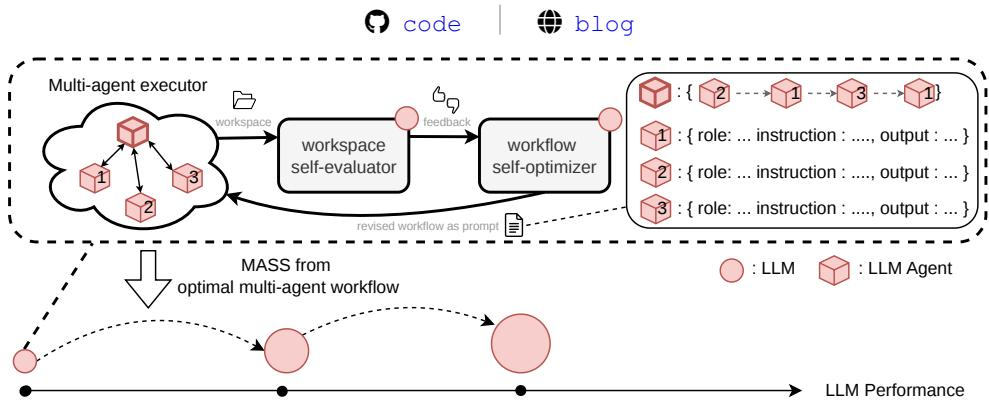  
Figure 1: Recursive self-improvement with multi-agent self-supervision (MASS). The agent, evaluator, and optimizer share the same language model (LM). MASS encodes multi-agent coordination as textual information within a workflow prompt. In the inner loop, the agent generates a workspace under the current workflow prompt, the self-evaluator provides feedback, and the self-optimizer refines the workflow prompt. The outer loop fine-tunes the shared LM on rollouts from the optimized workflow, then restarts the inner loop with the updated model.

## 1 INTRODUCTION

Frontier AI systems now contribute to original scientific results, including improved sphere-packing bounds, new gluon-scattering formulas, and experimentally validated nanobody designs (OpenAI, 2026; Guevara et al., 2026; Swanson et al., 2025). To sustain the scale and pace of this progress, a natural direction is recursive self-improvement (RSI), a framework fundamentally driven by two core components, evaluation and improvement. However, automating both components at the frontier presents distinct bottlenecks. On the evaluation side, obtaining reliable supervision is difficult when the work exceeds the expertise of available human evaluators (Burns et al., 2023), or when feedback arrives too slowly. For example, in nuclear fusion research, a single tokamak plasma study may require more than 120 million CPU-hours (Maheswaran et al., 2026). On the improvement side, advancing the model’s capabilities requires training it on high-quality execution data, which in turn depends on discovering better problem-solving workflows to generate that data. Manually revising task decompositions, tool use, and verification steps to optimize these workflows requires prohibitive effort across tasks and domains (Hu et al., 2025; Zhang et al., 2025). We study this dual challenge of RSI on open-ended research tasks, in a setting where the strongest available mode serves interchangeably as the task solver, workflow optimizer, and evaluator. Although this modelas-evaluator method alleviates the problem on the evaluation side, the central challenge is obtaining useful self-supervision when the model being improved is also its best available supervisor.

This challenge arises because generation, evaluation, and revision share the same learned prior, meaning that self-feedback can reinforce rather than correct errors (Huang et al., 2024). To break this homogeneous constraint, we seek better supervision by reorganizing the model’s working style. We draw on Minsky’s Society ofMind, which views intelligence as emerging from organized interactions among simpler components (Minsky & Lee, 1988). This perspective motivates coordinating copies of the model to elicit capabilities that an isolated instance may not reliably exhibit. For example, when automating quantitative finance research, one model instance might be prompted to do data preprocessing, another to generate trading signals, and a third to run backtests. The workflow acts as a structured team rather than a single, monolithic generator. By orchestrating these interactions, we can break down a complex task into simpler pieces, overcome individual blind spots, and then distill their collective experience into shared weights.

Two hypotheses guide us in designing a solution that may elicit these gains and learn efficiently.

• Generating higher-quality data. Optimizing inter-agent information flow can elicit collective capabilities that provide effective self-supervision from a perspective other than incorporating stronger reasoning chains. Building on evidence that optimizing communication structure can improve collective performance (Zhuge et al., 2024; Lee et al., 2026), we focus on optimizing what agents communicate, to whom, and when—not simply how many agents participate.

• Maximize learning efficiency during fine-tuning. Jointly training on subagent execution and orchestration enjoys greater learning efficiency than training on a single-agent’s longhorizon trajectories. This hypothesis draws inspiration from hierarchical imitation learning, where task decomposition can improve learning efficiency (Le et al., 2018). In our setting, subagent trajectories demonstrate bounded local execution, while orchestrator trajectories demonstrate delegation, verification, and integration. We conjecture that learning to solve long-horizon tasks from these complementary behaviors at their respective levels of abstraction is easier than learning from one extended trajectory that interleaves both levels.

To this end, we propose Multi-Agent Self-Supervision (MASS) for RSI, a method that alternates between workflow optimization and model post-training (Figure 1). Motivated by findings that multi-agent workflows outperform single-agent execution on open-ended research tasks (Lee et al., 2026), MASS’s inner loop refines workflows through an iterative feedback process where the agent executes a multi-agent workflow, the self-evaluator assesses the resulting artifacts, and the optimizer revises the workflow. The outer loop generates trajectories under the optimized workflows, then jointly fine-tunes the shared model on orchestrator and subagent conversations. The updated model resumes all three roles in the next cycle. We evaluate MASS in a controlled setting where the agent, optimizer, and evaluator share the same base model. Final performance is assessed separately using external strong model judgments withheld from the agents and workflow optimizer (Section 4.1).

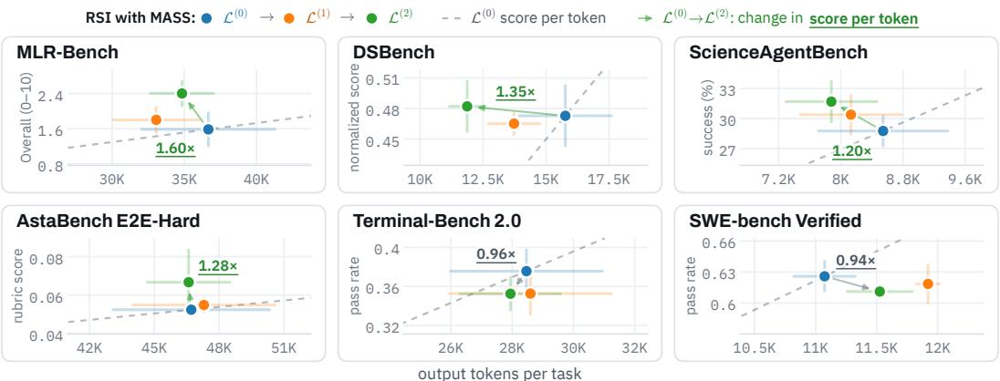  
Figure 2: Score versus output tokens per task on six public benchmarks. $\mathcal { L } ^ { ( 0 ) }$ is the base LM (Qwen3.6-27B); $\mathcal { L } ^ { ( 1 ) }$ and $\bar { \mathcal { L } } ^ { ( 2 ) }$ follow one and two cycles of RSI with MASS, all run in the same agent scaffold (qwen-code). Arrows go from $\mathcal { L } ^ { ( 0 ) }$ to $\mathcal { L } ^ { ( 2 ) }$ , labelled with the ratio of their score per output token: on the four research benchmarks (top row, bottom left), $\mathcal { L } ^ { ( 2 ) }$ gains $1 . 2 \mathrm { - } 1 . 6 \times$ . Bars show standard deviations over three trials.

We train Qwen3.6-27B as the base model on multi-agent task-solving trajectories from eight synthetic research tasks spanning finance, robotics, and pharmacy, and evaluate MASS on three test synthetic research tasks, and six public benchmarks: MLR-Bench (Chen et al., 2026), ScienceAgent-Bench (Chen et al., 2025b), DSBench (Jing et al., 2025), AstaBench (Bragg et al., 2026), Terminal-Bench 2.0 (Merrill et al., 2026), and SWE-bench Verified (Jimenez et al., 2024). Across two MASS cycles, the trained model’s win rate against the base model on the three test tasks increases from 53.9% to 69.9% (Section 4.2, Figure 3b), and on the four research benchmarks (MLR-Bench, ScienceAgentBench, DSBench, and AstaBench) its score per output token is 1.2–1.6× that of the base model (Figure 2). Notably, post-training only on task-solving trajectories improves all three roles in the RSI loop: task solving, workflow optimization, and evaluation (Section 4.2, Figure 3). The trained model discovers high-quality workflows faster, and the evaluator accuracy increases from 73% to 93%.

We further find that optimized workflows develop more task-specific information handoffs and routing, consistent with our information-flow hypothesis (Section 4.3). The first-cycle multi-agent student achieves a 68.3% win rate against the base model, compared with 64.0% for a single-agent student trained on approximately 1.4× more processed supervised tokens (Section 4.4, Figure 6). This suggests that jointly learning orchestration and bounded subagent execution can provide more effective supervision for RSI. Our ablations further identify workflow optimization, rather than evaluation, as a major bottleneck in the homogeneous RSI loop (Section 5.1). Finally, trajectory analysis provides evidence that post-training internalizes information-handoff behaviors (Section 5.2).

Overall, our work introduces an algorithm that uses multi-agent coordination to generate selfsupervision for RSI.

## 2 NOTATIONS AND PROBLEM STATEMENT

Task and language model. Let T denote a finite set of tasks, with $x _ { t }$ denoting the prompt for task $t \in \tau$ . We denote a training subset as $\mathcal { T } _ { \mathrm { t r a i n } } \subset \mathcal { T }$ and a disjoint test set as $\mathcal { T } _ { \mathrm { t e s t } }$ . Let $\mathcal { L } _ { \theta }$ denote a language model with parameters θ, defining the next-token distribution $p _ { \theta } ( z _ { \ell } \mid z _ { < \ell } )$ . For any textual input x, we write $\mathcal { L } ( x )$ for a sample drawn from the model conditioned on x.

Agent and artifacts. We write $\mathcal { A } ( \cdot ; \mathcal { L } )$ for a coding agent instantiated with language model L. Its harness, including tools and memory, is fixed throughout the paper. A coding-agent execution on task t is denoted by $( \tau _ { t } , y _ { t } ) \sim \mathcal { A } ( x _ { t } ; \mathcal { L } )$ , where $\tau _ { t }$ is a single (orchestrator-subagent) trajectory, and $y _ { t }$ is the resulting deliverable workspace, such as python files in the coding space. For an additional textual input $x ^ { \prime } ,$ we use $\oplus$ to denote prompt concatenation. Thus, $( \tau _ { t } ^ { \prime } , y _ { t } ^ { \prime } ) \sim \mathcal { A } ( x _ { t } \oplus x ^ { \prime } ; \mathcal { L } )$ denotes execution with the concatenated prompt $x _ { t } \oplus x ^ { \prime }$

Task execution and evaluation. We use $\mathcal { L } _ { \mathrm { a g e n t } } , \mathcal { L } _ { \mathrm { e v a l } }$ , and $\mathcal { L } _ { \mathrm { o p t } }$ to denote the language models serving as the agent executor, task evaluator, and workflow optimizer, respectively. In our homogeneous setting, $\bar { \mathcal { L } } _ { \mathrm { a g e n t } } = \mathcal { L } _ { \mathrm { e v a l } } = \mathcal { L } _ { \mathrm { o p t } }$ . For two outputs $y _ { 1 }$ and $y _ { 2 }$ and an evaluation prompt $x _ { \mathrm { e v a l } } .$ we write $y _ { 1 } \succ y _ { 2 }$ if $\mathcal { L } _ { \mathrm { e v a l } }$ prefers $y _ { 1 }$ over $y _ { 2 } .$ We denote the corresponding rationale (or feedback) sampled from $\mathcal { L } _ { \mathrm { e v a l } }$ as $d \sim \mathcal { L } _ { \mathrm { e v a l } } ( y _ { 1 } , y _ { 2 } ; x _ { \mathrm { e v a l } } )$

Goal definition. Let $\boldsymbol { \mathcal { L } } ^ { ( g ) }$ denote the language model in MASS after $g = 0 , \cdots , R$ generations of RSI, our goal is to increase the probability of $\bar { y } ^ { ( g ) } \succ y ^ { ( < g ) }$ from the perspective of an external strong language model $\mathcal { L } _ { \mathrm { e x t } }$ (for the purpose of fair comparisons), where $\left( \tau ^ { ( g ) } , y ^ { ( g ) } \right) \sim \mathcal { A } ( x _ { t } , \mathcal { L } ^ { ( g ) } )$ .

## 3 METHOD

Overview. MASS alternates between multi-agent workflow optimization (Algorithms 2) and model fine-tuning that internalizes the workflows (Algorithms 3). At generation $^ { g , }$ the current model $\mathcal { L } ^ { \left( g \right) }$ serves as the task-solving agent, workflow optimizer, and evaluator. Algorithm 2 first produces task-specific retained workflows using fixed model weights. Algorithm 3 then generates and selfselects trajectories under these workflows and fine-tunes the same model to obtain $\mathcal { L } ^ { ( g + 1 ) }$ . The updated model assumes all three roles in the next generation. Thus, MASS forms a recursive loop in which the current model first improves how copies of itself coordinate, then learns from the result ing coordinated trajectories. The next generation repeats the same process with the updated weights. After R iterations, we evaluate $\mathcal { L } ^ { ( g ) }$ on $\mathcal { T } _ { \mathrm { t e s t } }$ with $\mathcal { L } _ { \mathrm { e x t } }$ for all g and report the test score.

Algorithm 1: Recursive self-improvement with MASS   
Input: training tasks $\mathcal { T } _ { \mathrm { t r a i n } } ;$ test tasks $\mathcal { T } _ { \mathrm { t e s t } } ;$ coding agent A; initial trainable language model   
$\mathcal { L } ^ { ( 0 ) }$ ; number of MASS cycles R   
for $g = 0 , 1 , \ldots , R - 1$ do   
Set $\mathcal { L } _ { \mathrm { a g e n t } } = \mathcal { L } _ { \mathrm { e v a l } } = \mathcal { L } _ { \mathrm { o p t } } = \mathcal { L } ^ { ( g ) } ;$   
Obtain optimal workflows $\{ w _ { t } ^ { * , ( g ) } \} _ { t \in \mathcal { T } _ { \mathrm { t r a i n } } }$ using Algorithm $2 ;$   
Obtain $\mathcal { L } ^ { ( g + 1 ) }$ by applying Algorithm 3 to $\mathcal { L } ^ { ( g ) }$ and $\{ w _ { t } ^ { * , ( g ) } \} _ { t \in \mathcal { T } _ { \mathrm { t r a i n } } } ;$   
end   
return $\mathcal { L } ^ { ( R ) } $

Algorithm 2. Multi-agent workflow optimization. Defining multi-agent workflow in the prompt is demonstrated to be an effective way for LLMs to follow the organization instruction and act accordingly (Nielsen et al., 2026; Tang et al., 2026). Following this, we define a workflow as a textual specification of an orchestrator–subagent architecture that is appended to the task prompt and guides how the orchestrator delegates work, exchanges information, and invokes subagents. Specifically, for task t, we represent the workflow as $w _ { t } \overset { \cdot } { : = } \{ \mathbf { h } _ { t } , \big ( \mathbf { r } _ { t , j } , \mathbf { u } _ { t , j } , \mathbf { c } _ { t , j } \big ) _ { j = 1 } ^ { m _ { t } } \}$ , where $m _ { t }$ is the number of subagents. Here, $\mathbf { r } _ { t , j }$ specifies subagent $j ^ { \circ } \mathbf { s }$ role, $\mathbf { u } _ { t , j }$ its instructions, and $\mathbf { c } _ { t , j }$ its output contract. The contract specifies what information the subagent returns to the orchestrator, while $\mathbf { h } _ { t }$ specifies the order of subagent calls. We concatenate $w _ { t }$ to the task prompt $x _ { t }$ , and execute the coding agent as $\mathcal { A } ( { x } _ { t } \oplus { w } _ { t } ; \mathcal { L } _ { \mathrm { a g e n t } } )$ . The orchestrator and all subagents share the same $\mathcal { L } _ { \mathrm { a g e n t } }$ . A simplified workflow format is shown below; complete examples appear in Appendices I.1 and I.2.

Multi-agent workflow w   
• orchestrator: h = {subagent → subagent → · · · → subagent $_ 1 \}$   
• subagent : {role : r<sub>1</sub>, instruction : u<sub>1</sub>, output contract $: \mathbf { c } _ { 1 } \big \}$   
• subagen $\hat { \overline { { \mathbf { \alpha } } } } _ { m }$ : {role $: \mathbf { r } _ { m } ,$ , instruction : ${ \bf u } _ { m } ,$ output contract : $\mathbf { c } _ { m } \}$

For each training task $t \in \ T _ { \mathrm { t r a i n } } .$ , workflow optimization maintains an independent sequence $\{ w _ { t } ^ { ( i ) } \} _ { i \geq 0 }$ and a best so-far workflow $\boldsymbol { w } _ { t } ^ { * }$ , as determined by $\mathcal { L } _ { \mathrm { e v a l } }$ . Executing workflow $w _ { t } ^ { ( i ) }$ produces $( \tau _ { t } ^ { ( i ) } , y _ { t } ^ { ( i ) } ) \sim \mathcal { A } ( x _ { t } \oplus w _ { t } ^ { ( i ) } ; \mathcal { L } _ { \mathrm { a g e n t } } )$ . At iteration i, $\mathcal { L } _ { \mathrm { e v a l } }$ compares the current output $y _ { t } ^ { ( i ) }$ with the output y<sup>∗</sup> produced by the best so-far workflow $\boldsymbol { w } _ { t } ^ { * }$ and returns feedback $d _ { t , i } = \mathcal { L } _ { \mathrm { e v a l } } ( y _ { t } ^ { ( i ) } , y _ { t } ^ { * } ; x _ { \mathrm { e v a l } } )$ If $y _ { t } ^ { ( i ) } \succ y _ { t } ^ { * }$ , we update $w _ { t } ^ { * }  w _ { t } ^ { ( i ) }$ and $y _ { t } ^ { * }  y _ { t } ^ { ( i ) }$ . The feedback $d _ { t , i }$ is then added to the taskspecific history, which $\mathcal { L } _ { \mathrm { o p t } }$ uses, together with the optimization prompt $x _ { \mathrm { o p t } }$ , to propose the next workflow $w _ { t } ^ { ( i + 1 ) }$ . This resembles an evolution process with an elite size one (Risi et al., 2026).

To prioritize improvements in multi-agent coordination, $x _ { \mathrm { o p t } }$ explicitly emphasizes the communication structure $\mathbf { \bar { \rho } } ( \mathbf h _ { t } , \{ \mathbf c _ { t , j } \} _ { j = 1 } ^ { m _ { t } } )$ over the role and instruction components $\{ ( \mathbf { r } _ { t , j } , \mathbf { u } _ { t , j } ) \} _ { j = 1 } ^ { m _ { t } }$ . Thus, $\boldsymbol { w } _ { t } ^ { * }$ denotes the best self-judged workflow under sequential in-loop pairwise evaluation, rather than a certified global optimum. We show the overview of $x _ { \mathrm { o p t } }$ below, Algorithm 2 in Appendix A.1 summarizes the procedure.

Optimization prompt x<sub>opt</sub>   
• Task: t = “Find trading signal with backtest results $\ldots ^ { \gamma }$   
• Current best workflow: w<sup>∗</sup>   
• Structure emphasis: $( \mathbf { h } _ { t } , \{ \bar { \mathbf { c } } _ { t , j } \} _ { j = 1 } ^ { m _ { t } } )$ and $\{ ( \mathbf { r } _ { t , j } , \mathbf { u } _ { t , j } ) \} _ { j = 1 } ^ { m _ { t } }$   
• Evaluator feedback history: $\{ d _ { t , 1 } , \ldots , d _ { t , i } \}$

Algorithm 3. Workflow internalization by supervised fine-tuning. We next internalize the behavior induced by the workflows $\boldsymbol { w } _ { t } ^ { * }$ obtained from Algorithm 2 through supervised fine-tuning (SFT). For each training task $t \in \mathcal { T } _ { \mathrm { t r a i n } }$ , we execute $\mathcal { A } ( \bar { \boldsymbol { x } } _ { t } \oplus \boldsymbol { w } _ { t } ^ { * } ; \mathcal { L } _ { \mathrm { a g e n t } } )$ independently M times, yielding candidate trajectory–workspace pairs $\{ ( \tau _ { t , j } , y _ { t , j } ) \} _ { j = 1 } ^ { M }$ . Within each task, $\mathcal { L } _ { \mathrm { e v a l } }$ compares pairs of deliverable workspaces $y _ { t , j _ { 1 } }$ and $y _ { t , j _ { 2 } }$ , where $j _ { 1 } \ne \bar { j } _ { 2 } \in [ M ]$ , in a pairwise tournament. A Bradley–Terry model converts these pairwise judgments into workspace-level scores. We rank the trajectory–workspace pairs by score, use the top $K - 1$ trajectories $\{ \tau _ { t , j } \} _ { j = 1 } ^ { K - 1 }$ from each task as the SFT training set $\mathcal { D } _ { \mathrm { t r a i n } } ,$ and reserve the Kth trajectory for the validation set $\mathcal { D } _ { \mathrm { v a l } }$ . We remove $\boldsymbol { w } _ { t } ^ { * }$ from the prompt for dataset construction.

Trajectories in $\mathcal { D } _ { \mathrm { t r a i n } }$ and $\mathcal { D } _ { \mathrm { v a l } }$ are partitioned into windows of at most $L _ { \mathrm { m a x } }$ tokens, with preceding context optionally retained but masked from the loss. Let D denote the resulting set of SFT windows. For a window $z = ( z _ { 1 } , \dots , z _ { | z | } ) \in \mathcal { D }$ , let $\mu _ { \ell } = 1$ if $z _ { \ell }$ is a supervised assistant target and $\mu _ { \ell } = 0$ for prompt tokens, tool outputs, and masked context. Let $q$ denote the sampling distribution over stored windows. The SFT objective is $\begin{array} { r } { \ell _ { \mathrm { S F T } } ( \theta ) = - \mathbb { E } _ { z \sim q } \left[ \frac { \sum _ { \ell = 1 } ^ { | z | } \mu _ { \ell } \log p _ { \theta } ( z _ { \ell } | z _ { < \ell } ) } { \sum _ { \ell = 1 } ^ { | z | } \mu _ { \ell } } \right] } \end{array}$ . Algorithm 3 in Appendix A.2 summarizes the procedure.

## 4 EXPERIMENTS

## 4.1 EXPERIMENTAL SETUP

Models and tasks. Our base model $\mathcal { L } ^ { ( 0 ) }$ is Qwen3.6-27B-FP8, and we use qwen-code 0.20.0 as the coding agent A. For the homogeneous first-cycle setting, we set $\mathcal { L } _ { \mathrm { a g e n t } } = \mathcal { \bar { L } } _ { \mathrm { e v a l } } = \mathcal { L } _ { \mathrm { o p t } } = \mathcal { L } ^ { ( 0 ) }$ We use 12 synthetic research-programming (long-horizon) tasks (private benchmark) generated by GPT-5.5, with four tasks each in finance, robotics, and pharmacy (Lee et al., 2026). We designate nine tasks as train tasks $\mathcal { T } _ { \mathrm { t r a i n } }$ and three as part of test tasks, $\mathcal { T } _ { \mathrm { t e s t } }$ , with one test task per domain. If Algorithm 2 fails to find an optimal multi-agent workflow that outperforms its reference for a candidate training task, that task is excluded from teacher-data collection in Algorithm 3. In our experiments, this leaves eight tasks for post-training. Examples of task prompts $x _ { t }$ and optimal workflows $\boldsymbol { w } _ { t } ^ { * }$ appear in Appendices H–I.

Test tasks. Test tasks $\mathcal { T } _ { \mathrm { t e s t } }$ consist of ScienceAgentBench (102 tasks) (Chen et al., 2025b), MLR-Bench (107tasks) (Chen et al., 2026), DSBench (Jing et al., 2025), AstaBench E2E-Bench-hard (Bragg et al., 2026), Terminal-Bench 2.0 (Merrill et al., 2026),SWE-bench Verified (Jimenez et al., 2024), and three synthetic research tasks described above. Those three synthetic tasks are (1) The finance task asks the agent to backtest an equity long–short strategy on S&P 500 data from Yahoo Finance and estimate trading capacity after accounting for spreads, market impact, and borrowing costs. (2) Pharmacy task evaluates inverse-folding models on Protein Data Bank backbones against random and Markov baselines using sequence recovery and structure-quality proxies (Berman et al., 2000). (3) Robotics task requires constructing a tool-use manipulation benchmark using RoboTAP (Vecerik et al., 2024) or custom PyBullet tasks and comparing symbolic planning with behavior cloning in terms of task success, tool selection, and failure modes. Each task requires reproducible code, quantitative results, and a research report.

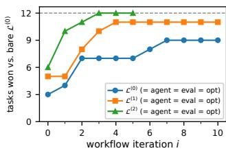  
(a) Workflow optimization.

<table><tr><td colspan="4"> $\mathcal { L } ^ { ( 1 ) }$  VS.  $\mathcal { L } ^ { ( 0 ) }$   $\mathcal { L } ^ { ( 2 ) }$  VS.  $\mathcal { L } ^ { ( 0 ) }$   $\mathcal { L } ^ { ( 2 ) }$ </td></tr><tr><td>Train</td><td> $6 5 . 6 \%$ </td><td> $8 2 . 5 \%$ </td><td> $6 8 . 1 \%$ </td></tr><tr><td>Test</td><td>53.9%</td><td>69.9%</td><td>60.8%</td></tr><tr><td colspan="4">Benchmark</td></tr><tr><td></td><td> $\mathcal { L } ^ { ( 0 ) }$   $2 8 . 8 \pm 1 . 5$ </td><td> $\mathcal { L } ^ { ( 1 ) }$ </td><td> $\mathcal { L } ^ { ( 2 ) }$ </td></tr><tr><td colspan="4">ScienceAgentBench</td></tr><tr><td colspan="2"></td><td> $3 0 . 4 \pm 2 . 0$   $1 . 5 8 \pm 0 . 3 8$   $1 . 8 0 { \pm } 0 . 3 0 \ $ </td><td> $\mathbf { 3 1 . 7 \pm 2 . 0 }$ </td></tr><tr><td colspan="2">MLR-Bench</td><td> $0 . 0 5 3 { \pm } 0 . 0 0 2$ </td><td> $\mathbf { 2 . 4 0 \pm 0 . 2 8 }$ </td></tr><tr><td colspan="2">AstaBench</td><td> $0 . 0 5 5 { \pm } 0 . 0 0 4$   $0 . 4 7 3 { \pm } 0 . 0 2 9$ </td><td> $\pm \mathbf { 0 . 0 6 7 } \pm \mathbf { 0 . 0 1 7 }$ </td></tr><tr><td colspan="2">DSbench</td><td> $0 . 4 6 5 { \pm } 0 . 0 1 1$ </td><td> $\mathbf { 0 . 4 8 2 } 2 \pm \mathbf { 0 . 0 2 5 }$ </td></tr><tr><td colspan="2">Terminal-Bench 2.0</td><td> $3 5 . 3 { \pm } 2 . 1 $ </td><td> $3 5 . 2 \pm 1 . 7$ </td></tr><tr><td colspan="2">SWE-bench Verified</td><td> $6 1 . 8 \pm 1 . 9$ </td><td> $6 1 . 1 { \pm } 0 . 6 \ $ </td></tr></table>

<table><tr><td>Evaluator</td><td>Accuracy</td></tr><tr><td> $\mathcal { L } ^ { ( 0 ) }$ </td><td>0.73</td></tr><tr><td> $\mathcal { L } ^ { ( 1 ) }$ </td><td>0.91</td></tr><tr><td> $\mathcal { L } ^ { ( 2 ) }$ </td><td>0.93</td></tr></table>

(c) Evaluation accuracy.  
(b) Task-solving performance.  
Figure 3: Evaluation of RSI with MASS. (a) Cumulative number of tasks for which a workflow is unanimously preferred to the baseline by external strong LLM judges. (b) Task-solving perfor mance across model generations on eight synthetic training tasks, three synthetic test tasks, and two research benchmarks. (c) Evaluator agreement with external strong-model judges.

Train data and post-training. In Algorithm 3, we generate $M = 1 8$ candidate trajectories per task and select up to $K = 1 6$ teacher trajectories. One candidate training task is excluded because Algorithm 2 does not find a workflow that outperforms its reference. Across the remaining eight training tasks, the final training set contains $( 9 \dot { - } 1 ) \times 1 5 - 1 = 1 1 9$ trajectories: up to 15 per task, with one trajectory excluded because the coding-agent harness terminated prematurely. More details are documented in Appendices B and B.1.

The 119 teacher trajectories yield 2,435 training windows (282 orchestrator, 2,054 subagent, and 99 auxiliary), containing 17.2M supervised tokens. We set $L _ { \mathrm { m a x } } = 4 9 , 1 5 2$ tokens, with up to 8,192 tokens of preceding context retained but masked from the loss. Because subagent windows substantially outnumber orchestrator windows, we use a fixed 2:1 subagent-to-orchestrator sampling ratio. We train the BF16 parent model with a newly initialized LoRA adapter (Hu et al., 2021) using rank 64, scaling factor 128, and dropout 0.05. Optimization uses AdamW (Loshchilov & Hutter, 2017) with $\beta _ { 1 } = 0 . 9 , \beta _ { 2 } = 0 . 9 5$ , a peak learning rate of $3 \times 1 0 ^ { - 5 }$ , five warmup steps, and cosine decay to 10% of the peak learning rate, finally conducted 1,624 optimizer steps (3 windows/step).

External evaluation. We use OpenAI GPT-5.5 and Claude Opus 4.8, both at maximum reasoning effort, as external strong-model evaluators $\mathcal { L } _ { \mathrm { e x t } }$ . Each model is run with three independent seeds, yielding six judgments per workspace pair. We report the win rate $\hat { s } ( a , b ) = W _ { a , b } / ( W _ { a , b } + L _ { a , b } )$ where $W _ { a , b }$ and $L _ { a , b }$ denote the numbers of judgments favoring a and $b ,$ respectively; ties are excluded. These external judgments are used only for evaluation and are not part of the MASS procedure in Algorithm 1. See Appendix C for details.

## 4.2 MAIN RESULTS: IMPROVEMENT ACROSS MODEL ROLES

MASS completes the recursive process ${ \mathcal { L } } ^ { ( 0 ) } \to { \mathcal { L } } ^ { ( 1 ) } \to { \mathcal { L } } ^ { ( 2 ) }$ in our experiments. Figure 3 summarizes performance across the model’s three roles. First, Figure 3b compares $\mathcal { L } ^ { ( g ) } ( x _ { t } )$ with $\mathcal { L } ^ { ( 0 ) } ( x _ { t } )$ Performance improves on ScienceAgentBench from 28.7% to 31.8%, on MLR-Bench from 1.58 to 2.40, on AstaBench from 0.053 to 0.067, and on DSBench from 0.473 to 0.482. Figure 2 further compares score per output token: on these four research benchmarks, $\mathcal { L } ^ { ( 2 ) }$ achieves 1.2–1.6× higher score per output token than $\mathcal { L } ^ { ( 0 ) }$ . On the three test tasks, $\mathcal { L } ^ { ( 1 ) }$ achieves a 53.9% win rate against $\mathcal { L } ^ { ( 0 ) }$ while $\mathcal { L } ^ { ( 2 ) }$ reaches 69.9%. Directly comparing successive generations, $\mathcal { L } ^ { ( 2 ) }$ also shows a larger gain over $\mathcal { L } ^ { ( 1 ) }$ , with a 60.8% win rate, compared with the 53.9% win rate of $\mathcal { L } ^ { ( 1 ) }$ over $\mathcal { L } ^ { ( 0 ) }$

These increasing gains may be partly explained by natural improvements in the optimizer and evaluator across $\mathcal { L } ^ { ( 0 ) } \stackrel { \smile } { \to } \mathcal { L } ^ { ( 1 ) } \stackrel { \bullet } { \to } \mathcal { L } ^ { ( \bar { 2 } ) }$ . Note that post-training was only on task-solving traces. Figure 3a compares $\mathcal { L } ^ { ( g ) } ( x _ { t } \oplus w _ { t } ^ { ( g , i ) } )$ with $\mathscr { L } ^ { ( 0 ) } ( x _ { t } )$ across workflow iterations $i \in [ 1 0 ]$ and MASS generations $g \in \{ 0 , 1 , 2 \}$ , showing that post-trained models discover successful workflows earlier. Figure 3c measures agreement between the self-evaluator $\mathcal { L } ^ { ( g ) }$ and the external reference judgments. The agreement increases from 0.73 for $\mathcal { L } ^ { ( 0 ) }$ to 0.91 for $\mathcal { L } ^ { ( 1 ) }$ and 0.93 for $\mathcal { L } ^ { ( 2 ) }$ . Together, these results support transfer from task-solving self-supervision to workflow optimization and self-evaluation without separate training targets for those roles.

Figure 3a evaluates workflows generated by $\mathcal { L } ^ { ( 1 ) }$ $( \mathrm { i } . \mathrm { e } . , w _ { t } ^ { ( 1 , i ) } )$ when executed by $\mathcal { L } ^ { ( 1 ) }$ , whereas Table 1 evaluates the same workflows when executed by $\mathcal { L } ^ { ( 0 ) }$ (we shorten $\mathcal { A } ( x _ { t } \oplus w _ { t } ; \mathcal { L } ^ { ( g ) } )$ to $\mathcal { L } ^ { ( g ) } ( x _ { t } \oplus w _ { t } )$ for simplicity since they all use the same harness). In this transfer setting, workflows optimized by $\mathcal { L } ^ { ( 1 ) }$ outperform those optimized by $\bar { \mathcal { L } } ^ { ( 0 ) }$ in 64% of comparisons on average across 11 iterations and 12 tasks. This provides stronger evidence that the workflow optimizer itself naturally improves after post-training. More details are in Appendix C.3.

<table><tr><td>Executor  $\mathcal { L } _ { \mathrm { a g e n t } }$ </td><td>Comparator  $\mathcal { L } _ { \mathrm { a g e n t } }$ </td><td>Win rate</td></tr><tr><td> $\mathcal { L } ^ { ( 1 ) } ( x _ { t } \oplus w _ { t } ^ { ( 1 , i ) } )$ </td><td> $\mathcal { L } ^ { ( 0 ) } ( x _ { t } \oplus w _ { t } ^ { ( 0 , i ) } )$ </td><td>0.80</td></tr><tr><td> $\mathcal { L } ^ { ( 0 ) } ( x _ { t } \oplus { w _ { t } ^ { ( 1 , i ) } } )$  </td><td> $\mathcal { L } ^ { ( 0 ) } ( x _ { t } \oplus { w _ { t } ^ { ( 0 , i ) } } )$ </td><td>0.64</td></tr><tr><td> $\mathcal { L } ^ { ( 0 ) } ( x _ { t } \oplus \overline { { w _ { t } ^ { ( 1 , i ) } ) } }$   $\mathcal { L } ^ { ( 0 ) } ( x _ { t } \oplus w _ { t } ^ { ( 1 , i ) } )$ </td><td> $\mathscr { L } ^ { ( 0 ) } ( x _ { t } )$   $\mathcal { L } ^ { ( 1 ) } ( x _ { t } \oplus w _ { t } ^ { ( 1 , i ) } )$ </td><td>0.63 0.29</td></tr><tr><td>Table 1: Mean win rate over</td><td> $i \in [ 1 1 ]$ </td><td>iterations and</td></tr><tr><td> $t \in [ 1 2 ]$  tasks. MASS generation  $g$ </td><td> $w _ { t } ^ { ( g , i ) }$  indicates the workflow from in workflow optimization itera-</td><td></td></tr></table>

## 4.3 HYPOTHESIS 1: INFORMATION FLOW SUPPLIES USEFUL SELF-SUPERVISION

Our first hypothesis is that optimizing how agents exchange information can provide useful selfsupervision for RSI. We focus on two workflow components that directly control this information flow: the contract, which specifies what each subagent returns to the orchestrator, and the hop, which specifies the order in which subagents are called.

We analyze the best retained workflow for each task in iteration $i \in \{ 3 , 6 , 9 , 1 1 \}$ and track four workflow components $c \in$ {role, instruction, contract, hop}. We measure two properties of these components. First, task information measures how much a component internalized the task. A component that varies strongly across tasks carries high task information, whereas a generic component shared across tasks carries little. We estimate this using mutual information $\widehat { I } _ { i }$ between component embeddings $( Z _ { c } )$ and task-description embeddings $( T )$ . Second, component redundancy measures how much information is shared among workflow components. High redundancy indicates that different components encode overlapping information, while lower redundancy suggests that they capture more distinct aspects of the workflow. We estimate this using total correlation $\widehat { T C }$ among all four components. We also report a task-centered version that removes average task-specific effects before measuring redundancy, isolating overlap beyond shared task identity. We compute these statistics using two text-embedding models, text-embedding-3-large (OpenAI, 2024) and $\mathtt { a l l - m p n e t - b a s e - v 2 }$ (Song et al., 2020), and report both unadjusted and permutation-adjusted estimates. Full definitions are provided in Appendix F.

Across workflow optimization, roles and instructions become less task-specific, while contracts and hops become more task-specific (Figure 4). At the same time, component redundancy generally decreases (Figure 5). These results suggest our first hypothesis.

Claim 1. Optimized workflows increasingly place task-specific information in what agents communicate and how they are routed, while reducing redundant information across workflow components. long-horizon trajectories.

## 4.4 HYPOTHESIS 2: MULTI-AGENT TRAJECTORIES PROVIDE DENSER SUPERVISION

Our second hypothesis is that jointly training orchestration and bounded subagent execution from multi-agent trajectories provides more effective supervision per teacher token than training on longhorizon single-agent trajectories.

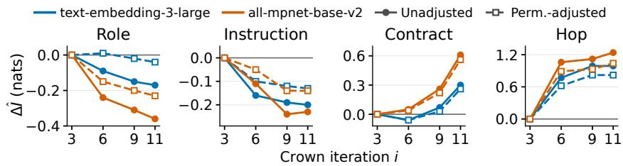  
Figure 4: Task-information change from each curve’s value at $i = 3 \colon \Delta \widehat { I } _ { i } = \widehat { I } _ { i } ( Z _ { c } ; T ) - \widehat { I } _ { 3 } ( Z _ { c } ; T )$ By $i = 1 1$ , role and instruction information falls, while contract and hop information rises in all four configurations. Vertical scales differ by component.

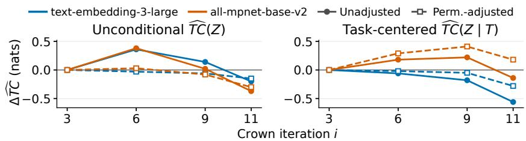  
Figure 5: Component-redundancy change from each curve’s value at $i = 3 .$ By i = 11, ${ \widehat { T C } } ( Z )$ falls in all four configurations; ${ \widehat { T C } } ( Z \mid T )$ falls in three and rises for permutation-adjusted MPNet.

We test the learning efficiency of multi-agent trajectories by fine-tuning $\mathcal { L } ^ { ( 0 ) }$ on five different datasets. S uses 17 single-agent episodes, M uses 17 multi-agent episodes, X combines S and $M , S ^ { + }$ uses 78 single-agent episodes, and $S ^ { + + }$ uses 290 single-agent episodes. We train these controls on four tasks and report results on those four tasks and one test task; Appendix D gives the breakdown. All students share the same base model $\mathcal { L } ^ { ( 0 ) }$ , adapter architecture, and core SFT recipe, and are trained independently from $\mathcal { L } ^ { ( 0 ) }$ . The $" + >$ notation denotes larger-data variants. Only for these ablation controls, we selected checkpoints using external strong-model judgments to compare the effect of SFT data.

Figure 6 compares win rate against $\mathcal { L } ^ { ( 0 ) }$ as a function of processed supervised tokens during SFT. The single-agent reference interpolates the observed results for S (1.82M tokens, 44.0%), S<sup>+</sup> (9.11M, 59.0%), and $S ^ { + + }$ (42M, 64.0%). Both M and $M ^ { + }$ exceed this piecewise-linear reference at their respective token budgets by 8.3 and 6.3 percentage points. More directly, $M ^ { + }$ reaches 68.3% with 28.82M processed supervised tokens, 4.3 points above $S ^ { + + }$ while using 31.4% fewer tokens. These results support higher performance per training token for multi-agent supervision in these runs.

Data quality may also contribute to this advantage. Multi-agent executions generate approximately 2.4× more tokens on average than singleagent executions and are preferred in 85.1% of external judgments overall. Among the 10 episode pairs with similar generated trace lengths, the multi-agent preference remains 80.0% $( \mathsf { A p - }$ pendix D.3). This suggests that the quality advantage is not explained solely by longer inference.

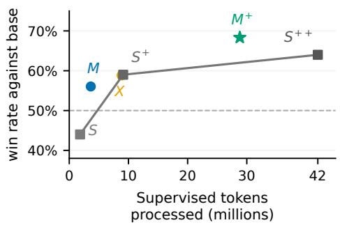  
Figure 6: SFT of $\boldsymbol { \mathcal { L } } ^ { ( 0 ) }$ on different datasets; the gray line interpolates the single-agent results.

A plausible mechanism is the separation of prediction problems: the orchestrator maps a task and prior results to a bounded assignment, while a subagent maps that assignment and its artifact input to an implementation. Both losses update the same parameters $\theta ,$ jointly training coordination and local execution. Learning these complementary prediction problems at different levels of abstraction motivates our second hypothesis.

Claim 2. Jointly learning coordination from orchestrator trajectories and bounded execution from subagent trajectories may provide more effective RSI supervision than learning both from a single agent’s long-horizon trajectories.

## 5 ABLATIONS

## 5.1 WHAT IS THE BOTTLENECK IN WORKFLOW OPTIMIZATION?

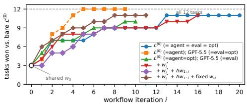  
(a) Task coverage.

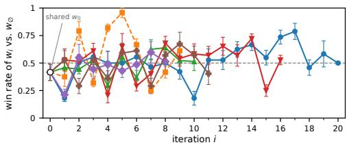  
(b) Win rate against $\mathscr { L } ^ { ( 0 ) } ( x _ { t } )$  
Figure 7: Workflow-search ablations. (a) Cumulative number of tasks for which $\mathcal { L } ^ { ( 0 ) } ( x _ { t } \oplus w _ { t } ^ { ( 0 , i ) } )$ is unanimously preferred $( 6 / 6$ external judgments) over $\mathscr { L } ^ { ( 0 ) } ( x _ { t } )$ by iteration $i \in [ 2 0 ]$ . (b) Win rate of $\mathcal { L } ^ { ( 0 ) } ( x _ { t } \oplus w _ { t } ^ { ( 0 , i ) } )$ against $\mathcal { L } ^ { ( 0 ) } ( x _ { t } )$

Here, our main claim is optimizer capacity, rather than the evaluator capacity, can be a bottleneck in the speed ofRSI. Figure 7 fixes the executor at $\mathcal { L } ^ { ( 0 ) }$ while varying the evaluator, optimizer, and search history. Figure 7a reports the number of tasks with at least one unanimous $6 / 6$ win of $\mathcal { L } ^ { ( 0 ) } ( x _ { t }$ ⊕ $w _ { t } ^ { ( 0 , i ) } )$ over $\mathcal { L } ^ { ( 0 ) } ( x _ { t } )$ by iteration $i \in [ 2 0 ]$ . In the legend, $w _ { i } ^ { * }$ denotes the retained best workflow, $\Delta w _ { 1 : i }$ denotes the sequence of textual differences between successive workflows, and fixed $w _ { \phi }$ denotes adding self-evaluation between $\mathcal { L } ^ { ( 0 ) } ( x _ { t } \oplus w _ { t } ^ { ( 0 , i ) } )$ and $\mathcal { L } ^ { ( 0 ) } ( x _ { t } )$ . (Appendix E).

A stronger optimizer reaches successful workflows substantially earlier, while the all- $\mathcal { L } ^ { ( 0 ) }$ loop eventually achieves unanimous wins on 11 of 12 tasks (Figure 7a). Replacing only the evaluator with GPT-5.5 yields less improvement than replacing both the evaluator and optimizer. Thus, the evidence concerns the speed of workflow improvement, rather than an inability of the weaker model to discover useful workflows.

Interestingly, improved workflow reachability (Figure 7a) does not guarantee stable optimization (Figure 7b): strong iterations can be followed by sharp performance regressions. We further analyze the size of successive workflow edits and find little Spearman correlation between textual edit size and the change in verdicts $( | \rho _ { \mathrm { e d i t } } | \le 0 . 1 2 )$ . Near-unanimous outcomes also reverse under both small and large edits. Thus, the magnitude of the textual change from w $\mathbf { \Phi } _ { t } ^ { ( 0 , i - 1 ) }$ to $w _ { t } ^ { ( 0 , i ) }$ is a weak predictor of the resulting performance change (Table 10 from Appendix E).

## 5.2 WHAT BEHAVIOR IS INTERNALIZED?

We test behavioral internalization in two ways: whether the trained model exhibits coordination under bare task prompts, and whether these behaviors were present in its SFT data. Delegation (D) means that the orchestrator calls a subagent and the call returns without a tool error. A code handoff (H) occurs when a subagent successfully reads a Python file whose latest recorded writer is a different subagent that has already returned. We also audit subagent revisions and orchestrator edits (full definitions in Appendix G). Delegation rises from 1/110 trajectories for $\mathcal { L } ^ { ( 0 ) }$ to 48/110 for $\mathcal { L } ^ { ( 1 ) }$ and 87/110 for $\mathcal { L } ^ { ( 2 ) }$ , while code handoffs rise from 1/110 to 42/110 and $8 3 / 1 1 0 .$ respectively. These behaviors emerge without providing the optimized workflow at inference time. These behaviors are also directly represented in the SFT data. Among 114 audited teacher trajectories, 98 contain code handoffs and 57 contain subagent revisions; 79 and 37 of these trajectories, respectively, were sampled for SFT (Appendix G.2). Together, these suggest that post-training internalizes coordination behaviors from multi-agent trajectories.

<table><tr><td>Model</td><td>D H Revision Main edit</td></tr><tr><td></td><td>1/110</td></tr><tr><td> $\boldsymbol { \mathcal { L } } ^ { ( 0 ) }$  1/110  $\mathcal { L } ^ { ( 1 ) }$ </td><td>1/110 0/110</td></tr><tr><td>48/11042/110</td><td>10/110 14/110 83/110 39/110 12/110</td></tr></table>

(a) Coordination under bare task prompts. D: delegation; H: code handoff.

<table><tr><td>Behavior</td><td>Recorded</td><td>Sampled</td></tr><tr><td>Orchestrator delegation</td><td>114</td><td>112</td></tr><tr><td>Code handoff</td><td>98</td><td>79</td></tr><tr><td>Subagent revision</td><td>57</td><td>37</td></tr></table>

(b) Coordination behaviors in the SFT data.  
Table 2: Behavioral evidence of workflow internalization. (a) trained models under bare task prompts. (b) corresponding behaviors in the SFT data.

## 6 RELATED WORKS

Self-improvement and workflow optimization. Schmidhuber studied self-referential weight modification (Schmidhuber, 1993), reward-based policy changes (Schmidhuber et al., 1997), and proofgated self-rewriting in Gödel machines (Schmidhuber, 2007). MASS uses empirical workflow search and SFT without formal guarantees. Self-Rewarding LMs train on self-scored responses (Yuan et al., 2024), while SiriuS trains on selected multi-agent traces (Zhao et al., 2026). Multi-Agent Evolve trains a shared proposer, solver, and judge (Chen et al., 2025a). ADAS, AFlow, and GPTSwarm optimize agent designs and communication graphs (Hu et al., 2025; Zhang et al., 2025; Zhuge et al., 2024). RHI revises workflow prompts (Lee et al., 2026). TTHE uses one frozen backbone for execution, harness proposals, and judging (Nie et al., 2026), exemplifying homogeneous in-loop roles. At inference time, communicating agents share discoveries (Park et al., 2026).

Model–workflow co-evolution. SIA updates scaffolds and weights using a separate feedback model and task verifiers (Hebbar et al., 2026); HASE jointly learns solutions and harness edits with task rewards (Luo et al., 2026). HELIX generates verified training records without reported weight updates (Fan & Huang, 2026). MASS distills optimized workflows’ orchestrator and subagent traces into shared weights and reuses the student in three roles. Appendix J further compares related works.

## 7 CONCLUSION

We study recursive self-improvement (RSI) when the same LLM serves as the agent, optimizer, and evaluator. Because this homogeneous loop shares a learned prior, it risks reinforcing its own errors rather than correcting them. Drawing on the Society of Mind, we address this by forming a multi-agent system from multiple copies of the model and distilling their collective gains as selfsupervision, and we show this provides useful self-supervision in RSI. Accelerating the speed of these performance gains in each cycle remains an important direction for future works.

## REFERENCES

Thomas Anthony, Zheng Tian, and David Barber. Thinking fast and slow with deep learning and tree search. Advances in neural information processing systems, 30, 2017.

Helen M Berman, John Westbrook, Zukang Feng, Gary Gilliland, Talapady N Bhat, Helge Weissig, Ilya N Shindyalov, and Philip E Bourne. The protein data bank. Nucleic acids research, 28(1): 235–242, 2000.

Ralph Allan Bradley and Milton E Terry. Rank analysis of incomplete block designs: I. the method of paired comparisons. Biometrika, 39(3/4):324–345, 1952.

Jonathan Bragg, Mike D’Arcy, Nishant Balepur, Dan Bareket, Bhavana Dalvi Mishra, Sergey Feldman, Dany Haddad, Jena Hwang, Peter Jansen, Varsha Kishore, et al. Astabench: Rigorous benchmarking of ai agents with a scientific research suite. In International conference on learn ing representations, volume 2026, pp. 110136–110223, 2026.

Collin Burns, Pavel Izmailov, Jan Hendrik Kirchner, Bowen Baker, Leo Gao, Leopold Aschenbrenner, Yining Chen, Adrien Ecoffet, Manas Joglekar, Jan Leike, et al. Weak-to-strong general

ization: Eliciting strong capabilities with weak supervision. arXiv preprint arXiv:2312.09390, 2023.

Hui Chen, Miao Xiong, Yujie Lu, Wei Han, Ailin Deng, Yufei He, Jiaying Wu, Yibo Li, Yue Liu, and Bryan Hooi. Mlr-bench: Evaluating ai agents on open-ended machine learning research. Advances in Neural Information Processing Systems, 38, 2026.

Yixing Chen, Yiding Wang, Siqi Zhu, Haofei Yu, Tao Feng, Muhan Zhang, Mostofa Patwary, and Jiaxuan You. Multi-agent evolve: Llm self-improve through co-evolution. arXiv preprint arXiv:2510.23595, 2025a.

Ziru Chen, Shijie Chen, Yuting Ning, Qianheng Zhang, Boshi Wang, Botao Yu, Yifei Li, Zeyi Liao, Chen Wei, Zitong Lu, et al. Scienceagentbench: Toward rigorous assessment of language agents for data-driven scientific discovery. In International Conference on Learning Representations, volume 2025, pp. 96934–96990, 2025b.

Tianyu Fan and Chao Huang. Helix: Model-harness co-evolution for recursive self-improvement. arXiv preprint arXiv:2608.13951, 2026.

Alfredo Guevara, Alexandru Lupsasca, David Skinner, Andrew Strominger, and Kevin Weil. Singleminus gluon tree amplitudes are nonzero. arXiv preprint arXiv:2602.12176, 2026.

Prannay Hebbar, Yogendra Manawat, Samuel Verboomen, Alesia Ivanova, Selvam Palanimalai, Kunal Bhatia, and Vignesh Baskaran. Sia: Self improving ai with harness & weight updates. arXiv preprint arXiv:2605.27276, 2026.

Harold Hotelling. Relations between two sets of variates. In Breakthroughs in statistics: methodology and distribution, pp. 162–190. Springer, 1992.

Edward J Hu, Yelong Shen, Phillip Wallis, Zeyuan Allen-Zhu, Yuanzhi Li, Shean Wang, Lu Wang, and Weizhu Chen. Lora: Low-rank adaptation of large language models. arXiv preprint arXiv:2106.09685, 2021.

Shengran Hu, Cong Lu, and Jeff Clune. Automated design of agentic systems. In International Conference on Learning Representations, volume 2025, pp. 21344–21377, 2025.

Jie Huang, Xinyun Chen, Swaroop Mishra, Huaixiu Steven Zheng, Adams Yu, Xinying Song, and Denny Zhou. Large language models cannot self-correct reasoning yet. In International confer ence on learning representations, volume 2024, pp. 32808–32824, 2024.

Carlos E Jimenez, John Yang, Alexander Wettig, Shunyu Yao, Kexin Pei, Ofir Press, and Karthik Narasimhan. Swe-bench: Can language models resolve real-world github issues? In International Conference on Learning Representations, volume 2024, pp. 54107–54157, 2024.

Liqiang Jing, Zhehui Huang, Xiaoyang Wang, Wenlin Yao, Wenhao Yu, Kaixin Ma, Hongming Zhang, Xinya Du, and Dong Yu. Dsbench: How far are data science agents from becoming data science experts? In International Conference on Learning Representations, volume 2025, pp. 32597–32649, 2025.

Woosuk Kwon, Zhuohan Li, Siyuan Zhuang, Ying Sheng, Lianmin Zheng, Cody Hao Yu, Joseph Gonzalez, Hao Zhang, and Ion Stoica. Efficient memory management for large language model serving with pagedattention. In Proceedings of the 29th symposium on operating systems principles, pp. 611–626, 2023.

Hoang Le, Nan Jiang, Alekh Agarwal, Miroslav Dudík, Yisong Yue, and Hal Daumé III. Hierarchical imitation and reinforcement learning. In International conference on machine learning, pp. 2917–2926. PMLR, 2018.

Hyunin Lee, Jinglue Xu, Jeffrey Seely, Donghyun Lee, Matei Zaharia, and Yujin Tang. Recursive harness self-improvement. arXiv preprint arXiv:2607.15524, 2026.

Ilya Loshchilov and Frank Hutter. Decoupled weight decay regularization. arXiv preprint arXiv:1711.05101, 2017.

Haochen Luo, Yi Huang, Sichun Luo, Fengyuan Liu, Lei Li, Zefa Hu, Junlan Feng, and Qi Liu. Harness-aware self-evolving: Co-evolving model weights, harness, and task solutions. arXiv preprint arXiv:2607.03935, 2026.

Aman Madaan, Niket Tandon, Prakhar Gupta, Skyler Hallinan, Luyu Gao, Sarah Wiegreffe, Uri Alon, Nouha Dziri, Shrimai Prabhumoye, Yiming Yang, et al. Self-refine: Iterative refinement with self-feedback. Advances in neural information processing systems, 36:46534–46594, 2023.

Monishwaran Maheswaran, Leon Lakhani, Zhongzhu Zhou, Shijia Yang, Junxiong Wang, Coleman Hooper, Yuezhou Hu, Rishabh Tiwari, Jue Wang, Harman Singh, et al. Squeeze evolve: Unified multi-model orchestration for verifier-free evolution. arXiv preprint arXiv:2604.07725, 2026.

Mike Merrill, Alexander Shaw, Nicholas Carlini, Boxuan Li, Harsh Raj, Ivan Bercovich, Lin Shi, Jeong Shin, Thomas Walshe, E Kelly Buchanan, et al. Terminal-bench: Benchmarking agents on hard, realistic tasks in command line interfaces. In International Conference on Learning Representations, volume 2026, pp. 40903–40986, 2026.

Marvin Minsky and Juliana Lee. The society of mind, volume 1. Simon and Schuster New York, 1988.

Jun Nie, Yonggang Zhang, Jun Song, Qianshu Cai, Dahai Yu, Yike Guo, Xinmei Tian, and Bo Han. Tthe: Test-time harness evolution. arXiv preprint arXiv:2607.08124, 2026.

Stefan Nielsen, Edoardo Cetin, Peter Schwendeman, Qi Sun, Jinglue Xu, and Yujin Tang. Learning to orchestrate agents in natural language with the conductor. 2026:135686–135724, 2026.

OpenAI. New embedding models and api updates. https://openai.com/index/ new-embedding-models-and-api-updates/, 2024.

OpenAI. Ten advances in mathematics and theoretical computer science. Research blog, August 2026. URL https://openai.com/index/ten-advances-in-mathematics/.

Jongho Park, Vasilis Kontonis, Shivam Garg, Akshay Krishnamurthy, and Dimitris Papailiopoulos. Scaling discovery through test-time communication. arXiv preprint arXiv:2609.21032, 2026.

Sebastian Risi, Yujin Tang, David Ha, and Risto Miikkulainen. Neuroevolution: Harnessing creativity in ai agent design. MIT Press, 2026.

Jürgen Schmidhuber. A ‘self-referential’weight matrix. In International conference on artificial neural networks, pp. 446–450. Springer, 1993.

Jürgen Schmidhuber. Gödel machines: Fully self-referential optimal universal self-improvers. In Artificial general intelligence, pp. 199–226. Springer, 2007.

Jürgen Schmidhuber, Jieyu Zhao, and Marco Wiering. Shifting inductive bias with success-story algorithm, adaptive levin search, and incremental self-improvement. Machine Learning, 28(1): 105–130, 1997.

Avi Singh, John D Co-Reyes, Rishabh Agarwal, Ankesh Anand, Piyush Patil, Xavier Garcia, Peter J Liu, James Harrison, Jaehoon Lee, Kelvin Xu, et al. Beyond human data: Scaling self-training for problem-solving with language models. arXiv preprint arXiv:2312.06585, 2023.

Kaitao Song, Xu Tan, Tao Qin, Jianfeng Lu, and Tie-Yan Liu. Mpnet: Masked and permuted pretraining for language understanding. Advances in neural information processing systems, 33: 16857–16867, 2020.

Kyle Swanson, Wesley Wu, Nash L Bulaong, John E Pak, and James Zou. The virtual lab of ai agents designs new sars-cov-2 nanobodies. Nature, 646(8085):716–723, 2025.

Yujin Tang, Edoardo Cetin, Jinglue Xu, Qi Sun, Stefan Nielsen, Vincent Richard, Haruto Goda, Iaroslav Tymchenko, Nhan Nguyen, Hyunin Lee, et al. Sakana fugu technical report. arXiv preprint arXiv:2606.21228, 2026.

Mel Vecerik, Carl Doersch, Yi Yang, Todor Davchev, Yusuf Aytar, Guangyao Zhou, Raia Hadsell, Lourdes Agapito, and Jon Scholz. Robotap: Tracking arbitrary points for few-shot visual imitation. In 2024 IEEE International Conference on Robotics and Automation (ICRA), pp. 5397– 5403. IEEE, 2024.

Weizhe Yuan, Richard Yuanzhe Pang, Kyunghyun Cho, Xian Li, Sainbayar Sukhbaatar, Jing Xu, and Jason Weston. Self-rewarding language models. arXiv preprint arXiv:2401.10020, 2024.

Eric Zelikman, Yuhuai Wu, Jesse Mu, and Noah Goodman. Star: Bootstrapping reasoning with reasoning. Advances in Neural Information Processing Systems, 35:15476–15488, 2022.

Jiayi Zhang, Jinyu Xiang, Zhaoyang Yu, Fengwei Teng, Xionghui Chen, Jiaqi Chen, Mingchen Zhuge, Xin Cheng, Sirui Hong, Jinlin Wang, et al. Aflow: Automating agentic workflow generation. In International Conference on Learning Representations, volume 2025, pp. 34040–34077, 2025.

Wanjia Zhao, Mert Yuksekgonul, Shirley Wu, and James Zou. Sirius: Self-improving multi-agent systems via bootstrapped reasoning. Advances in Neural Information Processing Systems, 38: 124475–124504, 2026.

Mingchen Zhuge, Wenyi Wang, Louis Kirsch, Francesco Faccio, Dmitrii Khizbullin, and Jürgen Schmidhuber. Language agents as optimizable graphs. arXiv preprint arXiv:2402.16823, 2024.

## APPENDIX CONTENTS

A Algorithms 15   
A.1 Multi-agent workflow optimization 15   
A.2 Workflow internalization 15   
B Training data and optimization 16   
B.1 Tasks, teacher collection, and validation . 16   
B.2 Conversation rendering and SFT 16   
B.3 Teacher execution directive 17   
C Evaluation and additional results 18   
C.1 Evaluation roles and reporting unit 18   
C.2 First-cycle task-solving results 18   
C.3 Transfer to workflow generation . 18   
C.4 Generic-directive control 19   
C.5 Public benchmarks . 20   
D Teacher composition and token accounting 22   
D.1 Datasets and evaluation scope 22   
D.2 Stored tokens, processed tokens, and interpolation 22   
D.3 Teacher-output quality and generated trace length . 23   
E Workflow-search ablations and execution variability 24   
E.1 Model roles and search history 24   
E.2 Coverage, win rates, and edit size . 24   
E.3 Execution variability under an unchanged workflow 24   
F Workflow-information estimates 25   
F.1 Workflows and representations 25   
F.2 Estimators and permutation adjustment . 26   
F.3 Values and interpretation 26   
G Behavioral audit 26   
G.1 Scope and definitions 26   
G.2 Base capability and supervised exposure 27   
G.3 Examples and limits . 28   
H Representative task specifications 29   
H.1 Finance: task 51 29   
H.2 Pharmacy: task 202 30   
H.3 Robotics: task 307 . 31   
I Complete workflow examples 32   
I.1 Complete crown workflow: task 51, version 10 . 32   
I.2 Complete crown workflow: task 202, version 8 . 36   
J Comparison with related methods 38

## A ALGORITHMS

Algorithms 2 and 3 expand the two stages of Algorithm 1. Within a generation, the executor, evaluator, and workflow optimizer share the current model’s weights. Workflow search changes prompts; SFT then changes the weights.

## A.1 MULTI-AGENT WORKFLOW OPTIMIZATION

Algorithm 2: Multi-agent workflow optimization   
Input: tasks $\mathcal { T } _ { \mathrm { t r a i n } } ;$ coding agent $\mathcal { A } ;$ current model $\mathcal { L } ;$ initial workflows $\{ w _ { t } ^ { ( 0 ) } \}$ ; evaluation   
prompt $x _ { \mathrm { e v a l } } ;$ optimization prompt $x _ { \mathrm { o p t } } ;$ iteration budget I   
Set $\mathcal { L } _ { \mathrm { a g e n t } } = \dot { \mathcal { L } } _ { \mathrm { e v a l } } = \dot { \mathcal { L } } _ { \mathrm { o p t } } = \mathcal { L } ;$   
foreach $t \in \mathcal { T } _ { \mathrm { t r a i n } }$ do   
Execute $( \tau _ { t } ^ { ( 0 ) } , y _ { t } ^ { ( 0 ) } ) \sim \mathcal { A } ( x _ { t } \oplus w _ { t } ^ { ( 0 ) } ; \mathcal { L } _ { \mathrm { a g e n t } } ) ;$   
Set $w _ { t } ^ { * }  w _ { t } ^ { ( 0 ) } , y _ { t } ^ { * }  y _ { t } ^ { ( 0 ) }$ , and feedback history $\mathcal { D } _ { t }  \mathcal { D } ;$   
for $i = 1 , \dots , I$ do   
Propose $w _ { t } ^ { ( i ) }  \mathcal { L } _ { \mathrm { o p t } } ( w _ { t } ^ { ( i - 1 ) } , w _ { t } ^ { * } , \mathcal { D } _ { t } ; x _ { \mathrm { o p t } } ) ;$   
Execute $( \tau _ { t } ^ { ( i ) } , y _ { t } ^ { ( i ) } ) \sim \mathcal { A } ( x _ { t } \oplus w _ { t } ^ { ( i ) } ; \mathcal { L } _ { \mathrm { a g e n t } } ) ;$   
Compare $y _ { t } ^ { ( i ) }$ with $y _ { t } ^ { * }$ using $\mathcal { L } _ { \mathrm { e v a l } }$ and $x _ { \mathrm { e v a l } }$ , obtaining verdict and rationale $d _ { t , i } ;$   
Append $d _ { t , i }$ to $\mathcal { D } _ { t } \mathbf { ; }$   
if $y _ { t } ^ { ( i ) } \succ y _ { t } ^ { * }$ then   
Set $w _ { t } ^ { * }  w _ { t } ^ { ( i ) }$ and $y _ { t } ^ { * }  y _ { t } ^ { ( i ) }$   
end   
end   
end   
return retained workflows $\{ w _ { t } ^ { * } \} _ { t \in { \mathcal { T } } _ { \mathrm { t r a i n } } } ;$

The retained workflow is the best under the sequential self-comparisons. Every proposal is executed, even if it does not replace the incumbent; the quality of successive executions need not increase.

## A.2 WORKFLOW INTERNALIZATION

Algorithm 3: Workflow internalization by supervised fine-tuning   
Input: tasks $\mathcal { T } _ { \mathrm { t r a i n } } ;$ coding agent $\mathcal { A } ;$ current trainable model $\mathcal { L } _ { \boldsymbol { \theta } } ;$ retained workflows $\{ w _ { t } ^ { * } \} ;$   
evaluation prompt $x _ { \mathrm { e v a l } } ;$ candidates per task $M ;$ selected trajectories per task ${ \dot { K } } \leq M$   
Set $\mathcal { L } _ { \mathrm { a g e n t } } = \mathcal { L } _ { \mathrm { e v a l } } \bar { = } \bar { \mathcal { L } _ { \theta } }$ and ${ \mathcal { D } } _ { \mathrm { t r a i n } } = { \mathcal { D } } _ { \mathrm { v a l } } = \emptyset ;$   
foreach $t \in \mathcal { T } _ { \mathrm { t r a i n } }$ do   
Execute M independent runs of $\mathcal { A } ( x _ { t } \oplus w _ { t } ^ { * } ; \mathcal { L } _ { \mathrm { a g e n t } } )$ to obtain $\{ ( \tau _ { t , j } , y _ { t , j } ) \} _ { j = 1 } ^ { M } ;$   
Compare workspace pairs with $\mathcal { L } _ { \mathrm { e v a l } }$ and $x _ { \mathrm { e v a l } } ;$ fit Bradley–Terry scores;   
Rank the trajectory–workspace pairs by descending score;   
Add ranks $\bar { 1 , \ldots , K - 1 }$ to $\mathcal { D } _ { \mathrm { t r a i n } }$ and rank K to $\mathcal { D } _ { \mathrm { v a l } } ;$   
end   
Replace each orchestrator’s initial workflow prompt with the bare task; retain worker   
assignments;   
Render training and validation windows with assistant-only loss masks;   
Optimize θ on the training windows with $\ell _ { \mathrm { S F T } } ( \theta )$   
Select $\theta ^ { + }$ by the lowest validation loss;   
return updated model $\mathcal { L } _ { \boldsymbol { \theta } + \dot { \boldsymbol { ; } } }$

The collection directive used in our experiments is reproduced in Appendix B.3. It is removed together with the workflow from the orchestrator’s training input.

## B TRAINING DATA AND OPTIMIZATION

## B.1 TASKS, TEACHER COLLECTION, AND VALIDATION

The private benchmark contains 12 research-programming tasks, with four each in finance, pharmacy, and robotics (Lee et al., 2026). Nine are designated for training. Task 221 is excluded from teacher collection because workflow search finds no workflow that beats its reference, leaving eight tasks that contribute SFT data (Table 3). The other three tasks are held out from SFT, validation, and checkpoint selection. Workflow search is also evaluated on these tasks; the split refers to posttraining.

<table><tr><td>Task</td><td>Split</td><td>Study</td><td>SFT episodes</td></tr><tr><td>51</td><td>Train</td><td>Macro signals and cross-asset trading</td><td>15</td></tr><tr><td>53</td><td>Train</td><td>Trading around monetary-policy announcements</td><td>15</td></tr><tr><td>56</td><td>Train</td><td>Yield-curve relative-value strategies</td><td>14</td></tr><tr><td>202</td><td>Train</td><td>Protein-interface prediction</td><td>15</td></tr><tr><td>205</td><td>Train</td><td>Molecular-dynamics force-field validation</td><td>15</td></tr><tr><td>302</td><td>Train</td><td>Learned heuristics for path planning</td><td>15</td></tr><tr><td>307</td><td>Train</td><td>Synthetic manipulation-planning datasets</td><td>15</td></tr><tr><td>324</td><td>Train</td><td>Subgoal discovery for navigation</td><td>15</td></tr><tr><td>221</td><td>Excluded</td><td>Protein-sequence tokenization</td><td>0</td></tr><tr><td>60</td><td>Test</td><td>Trading execution costs and capacity</td><td>0</td></tr><tr><td>207</td><td>Test</td><td>Inverse-folding evaluation</td><td>0</td></tr><tr><td>305</td><td>Test</td><td>Tool-use planning for manipulation</td><td>0 119</td></tr><tr><td colspan="4">Total training episodes</td></tr></table>

Table 3: Task allocation for the main first-cycle student $M ^ { + }$ . Task 221 is one of the nine designated training tasks but contributes no SFT data. Each test task is from a different domain.

For each of the eight training tasks, the current model executes its retained workflow with 18 sampling seeds. The prompt contains the task, workflow, and fixed execution directive. Orchestrator and worker conversations use the same model weights and are recorded through a logging proxy. In the first cycle, the model is Qwen3.6-27B-FP8, served through vLLM (Kwon et al., 2023) and qwen-code 0.20.0.

The self-evaluator compares candidate workspaces within each task. Bradley–Terry scores (Bradley & Terry, 1952) rank the trajectories: the top 15 are assigned to training and rank 16 to validation. One training trajectory on task 56 is excluded after premature termination, giving $8 \times 1 5 - 1 = 1 1 9$ training trajectories. The validation trajectories come from the same training tasks but are disjoint from the training trajectories.

## B.2 CONVERSATION RENDERING AND SFT

We reconstruct each recorded conversation, retaining its system prompt, tool definitions, messages, and assistant outputs. In the orchestrator conversation, the initial task–workflow–directive prompt is replaced with the bare task. Worker assignments remain unchanged. Windows contain at most 49,152 tokens, including up to 8,192 tokens of preceding context. Only assistant reasoning, text, and tool calls carry loss; system and user messages, tool outputs, and overlapping context are masked.

The first-cycle training set contains 119 trajectories, yielding 2,435 windows: 282 orchestrator, 2,054 worker, and 99 auxiliary windows, with 17,221,055 supervised tokens. Auxiliary windows are additional runtime conversations outside the orchestrator and general-purpose worker roles. For each draw, we sample a task uniformly, choose an orchestrator window with probability $1 / 3$ or a worker/auxiliary window with probability $2 / 3$ , and sample a window uniformly within that group, with replacement. Thus, two nominal epochs specify a draw budget, not two visits to every stored window.

We train the BF16 parent model with a fresh LoRA adapter (Hu et al., 2021): rank 64, scaling factor 128, and dropout 0.05. AdamW (Loshchilov & Hutter, 2017) uses $\beta _ { 1 } = 0 . 9 , \beta _ { 2 } = 0 . 9 \bar { 5 }$ , peak learning rate $\mathrm { { \bar { 3 } } \times 1 0 ^ { - 5 } }$ , five warmup steps, and cosine decay to 10% of the peak rate. The first-cycle

run has 1,624 optimizer steps with three windows per step. Checkpoints are saved every 50 steps;   
validation loss is measured initially, every 150 steps, and at the end.

Checkpoint selection. We select the checkpoint with the lowest validation loss, using assistanttoken cross-entropy with the same masking rules as SFT. The first-cycle student uses step 1200. The selected adapter is merged into the parent model and quantized to block-FP8 for inference. External workspace judgments do not select the checkpoint.

Compute. Training uses six NVIDIA H100 GPUs, arranged as three data-parallel replicas of two GPUs each. The first-cycle SFT run takes about 19 hours, including validation. This is the SFT runtime, not the cost of workflow search, teacher collection, and evaluation.

Second cycle. To obtain $( \mathcal { L } ^ { ( 2 ) } )$ , we apply the workflow-search, teacher-selection, and post-training stages to $( \mathcal { L } ^ { ( 1 ) } )$ . The current model supplies the executor, optimizer, and in-loop evaluator. We initialize a fresh LoRA adapter on the merged first-cycle model and follow the same training recipe as closely as possible. Checkpoint selection uses validation loss, as in the first cycle.

## B.3 TEACHER EXECUTION DIRECTIVE

The following text is appended to the task-specific workflow during multi-agent teacher collection. It requires actual worker calls and specifies their execution and verification. References to the team “above” refer to the supplied workflow. The directive is reproduced verbatim; it is absent from bare-prompt evaluation and from the orchestrator’s initial SFT input.

```csv
1 ## Execution requirements for the agent team (mandatory)
2
3 1. Run the team for real. Every non-orchestrator role listed above must
,→ be executed as a separate sub-agent through the `agent` tool
,→ (subagent_type "general-purpose"). Simulating a role in your own
,→ turn does not count. You, the orchestrator, do not write pipeline
,→ or analysis code yourself; you set up the project, delegate,
,→ verify, and integrate.
4
5 2. Foreground only. Every `agent` call must set `run_in_background:
,→ false`, so the worker's report comes back before you continue. Never
launch background agents.,→
6
7 3. One stage at a time. Launch a worker only when the inputs it needs
already exist on disk. Launch several workers in one turn only if,→
,→ their tasks are independent and they write to disjoint files.
8
9 4. Self-contained instructions. A worker sees nothing but your prompt
,→ and the filesystem. Each prompt must include: the role's
,→ instruction from the team definition above; the absolute workspace
,→ path; the exact files to create or modify; the interfaces or
,→ artifacts produced by earlier stages that it must use; the
,→ command(s) to run to verify its work; and the report you expect
,→ back (files written, commands run with results, key numbers, known
,→ problems).
10
11 5. Verify before you build on it. After each report, check the worker's
,→ output yourself (run the entry point, inspect the artifacts). If
,→ the check fails or the report shows problems, re-delegate to the
,→ same role with a corrected, narrower instruction instead of fixing
,→ it yourself.
12
13 6. Bounded work. Give each worker one deliverable it can finish in a
single run: a handful of files and one verification command. Split,→
large roles into several sequential calls.,→
14
```

15 7. Finish cleanly. Do not end your turn while a worker is running. Your   
final answer must summarize every worker call: role, what it was,→   
asked, status, and what you verified.,→

## C EVALUATION AND ADDITIONAL RESULTS

## C.1 EVALUATION ROLES AND REPORTING UNIT

In homogeneous MASS, the current model supplies feedback for workflow optimization and judgments for teacher ranking. Validation loss selects the checkpoint. The external panel assesses the resulting workspaces after execution (Table 4). Its verdicts and rationales are withheld from the agents and workflow optimizer and are not SFT targets. Evaluator agreement is computed after the self-evaluator has made its predictions without access to the external judgments. The teacher composition controls use the separate checkpoint-selection procedure in Appendix D.

<table><tr><td>Stage</td><td>Signal and use</td></tr><tr><td>Workflow search</td><td>Current model&#x27;s workspace comparisons guide workflow revisions.</td></tr><tr><td>Teacher ranking</td><td>Current model&#x27;s comparisons determine Bradley-Terry ranks.</td></tr><tr><td>Checkpoint selection</td><td>Validation loss selects the model checkpoint.</td></tr><tr><td>External reporting</td><td>GPT-5.5 and Claude Opus 4.8 assess completed workspaces.</td></tr></table>

Table 4: Evaluation roles in homogeneous MASS. The role ablations in Appendix E explicitly change the in-loop evaluator or optimizer.

Unless stated otherwise, each workspace pair receives six judgments: GPT-5.5 and Claude Opus 4.8 at maximum reasoning effort, each with seeds 42, 43, and 44. Win share is $W / ( W + L )$ , excluding ties. These are repeated assessments of one pair of outputs, not six independent task executions. We report descriptive shares and do not infer statistical significance from the number of judgments.

## C.2 FIRST-CYCLE TASK-SOLVING RESULTS

The detailed results below concern $M ^ { + } = \mathcal { L } ^ { ( 1 ) }$ . Each of the 11 included private tasks has ten bare-prompt student rollouts. Rollout i is paired with fixed bare-base reference i for that task; index matching does not imply equal generation seeds. Loop-detection halts remain in the evaluation. Runs interrupted by API errors are retried.

The five shared tasks (51, 53, 56, 307, and 60) use the same base reference lists for all control students. On the six remaining tasks, base-reference eligibility requires successful completion and at least 0.6 deliverable coverage, measured by the fraction of expected output filenames present. These are selected reference episodes; the scores describe performance against this fixed reference set.

Table 5 gives the per-task counts behind the first-cycle training and test results in Figure 3b. Table 6 adds direct comparisons with the smaller students and ranked team teachers.

For the teacher comparison, student rollout i is paired with the ith highest-ranked eligible teacher, up to ten per task. On test tasks, these references are generated solely for evaluation from a selected workflow and ten sampling seeds. Task 207 supplies eight eligible references because two runs halt, yielding 108 pairs overall. None of these test trajectories enters SFT or validation. The 17.3% share against teachers measures a gap to selected, workflow-prompted outputs; it is not a bare-prompt model comparison.

## C.3 TRANSFER TO WORKFLOW GENERATION

Table 1 uses workflows generated by the homogeneous loops in the main text. In generation g, the executor, evaluator, and optimizer all use $\mathcal { L } ^ { ( g ) }$ . Write $w _ { t } ^ { ( g , i ) }$ for task t’s workflow at search iteration i.

<table><tr><td>Task</td><td>Split</td><td>Pairs</td><td>Wins</td><td>Losses</td><td>Ties</td><td>Win share</td></tr><tr><td>51</td><td>Training</td><td>10</td><td>53</td><td>7</td><td>0</td><td>88.3%</td></tr><tr><td>53</td><td>Training</td><td>10</td><td>52</td><td>8</td><td>0</td><td>86.7%</td></tr><tr><td>56</td><td>Training</td><td>10</td><td>38</td><td>22</td><td>0</td><td>63.3%</td></tr><tr><td>202</td><td>Training</td><td>10</td><td>44</td><td>16</td><td>0</td><td>73.3%</td></tr><tr><td>205</td><td>Training</td><td>10</td><td>12</td><td>48</td><td>0</td><td>20.0%</td></tr><tr><td>302</td><td>Training</td><td>10</td><td>45</td><td>15</td><td>0</td><td>75.0%</td></tr><tr><td>307</td><td>Training</td><td>10</td><td>33</td><td>27</td><td>0</td><td>55.0%</td></tr><tr><td>324</td><td>Training</td><td>10</td><td>38</td><td>22</td><td>0</td><td>63.3%</td></tr><tr><td>60</td><td>Test</td><td>10</td><td>29</td><td>31</td><td>0</td><td>48.3%</td></tr><tr><td>207</td><td>Test</td><td>10</td><td>27</td><td>33</td><td>0</td><td>45.0%</td></tr><tr><td>305</td><td>Test</td><td>10</td><td>41</td><td>19</td><td>0</td><td>68.3%</td></tr><tr><td colspan="2">Training tasks pooled</td><td>80</td><td>315</td><td>165</td><td>0</td><td>65.6%</td></tr><tr><td colspan="2">Test tasks pooled</td><td>30</td><td>97</td><td>83</td><td>0</td><td>53.9%</td></tr><tr><td colspan="2">All tasks</td><td>110</td><td>412</td><td>248</td><td>0</td><td>62.4%</td></tr></table>

Table 5: Per-task comparison of $M ^ { + }$ with the no-harness base. Both models receive the bare task prompt. Each task has ten index-matched rollout pairs, assessed by two reporting judges with three seeds each, yielding 60 verdicts per task. Wins, losses, and ties are counted from the student’s perspective; win share is $W / ( W + \dot { L } )$ . Loop-detection halts remain in the evaluation. Task descriptions are given in Table 3.

<table><tr><td>Comparator</td><td>Evaluation scope</td><td>Pairs</td><td>W-L-T</td><td>Win share</td></tr><tr><td>base</td><td>All 11 tasks</td><td>110</td><td>412-248-0</td><td>62.4%</td></tr><tr><td>base</td><td>8 training tasks</td><td>80</td><td>315-165-0</td><td>65.6%</td></tr><tr><td>base</td><td>3 test tasks</td><td>30</td><td>97-83-0</td><td>53.9%</td></tr><tr><td>Multi-agent student M</td><td>5 shared tasks</td><td>50</td><td>211-88-1</td><td>70.6%</td></tr><tr><td>Single-agent student  $S ^ { + }$ </td><td>5 shared tasks</td><td>50</td><td>196-104-0</td><td>65.3%</td></tr><tr><td>Ranked team teachers</td><td>All 11 tasks</td><td>108</td><td>112-536-0</td><td>17.3%</td></tr></table>

Table 6: Main results for $M ^ { + }$ under the bare task prompt. Each pair receives six reporting verdicts (two judges, three seeds per judge). W–L–T denotes wins, losses, and ties for $M ^ { + }$ , and win share excludes ties. The five shared tasks are 51, 53, 56, 307, and 60. The teacher comparison pairs student rollout i with ranked teacher $i ;$ task 207 has only eight eligible teacher references, giving 108 pairs in total. The controls M and $S ^ { + }$ are defined in Table 8.

After search, we execute the student’s workflows $w _ { t } ^ { ( 1 , i ) }$ with the base model $\mathcal { L } ^ { ( 0 ) }$ . Comparing these outputs with the base executing $w _ { t } ^ { ( 0 , i ) }$ holds execution weights fixed. Each iteration covers 12 tasks, with one execution per task and six external judgments per pair. The table reports the mean of the per-iteration win shares over iterations 1–11. The mean win share is 0.64 when both workflow sets are executed by $( \mathcal { L } ^ { ( 0 ) } )$ . This comparison holds execution weights fixed and tests the quality of the workflows produced by the two generations. During their discovery, each workflow set used its generation’s executor and evaluator.

## C.4 GENERIC-DIRECTIVE CONTROL

The generic directive asks the model to choose three to six specialist roles itself and then follows rules 2–7 of the teacher directive (Appendix B.3). It supplies no optimized workflow. Both the base and $M ^ { + }$ receive the same directive, with ten matched generation seeds on each of the 11 tasks.

The directive control measures coordination when both models receive an explicit instruction to organize a team. The bare-prompt evaluation measures whether the model deploys these behaviors without that instruction. The observed change is increased bare-prompt use of coordination already available in the base model. The directive control does not compare students trained on genericdirective and optimized-workflow trajectories.

Under this matched prompt, $M ^ { + }$ records 352 wins, 306 losses, and two ties against the base: a 53.5% share. On the four shared training tasks alone, the corresponding share is 47.1% (112–126– 2), compared with 40.8% for M (98–142–0). These four-task results should not be compared with the 11-task aggregate. The behavior measurements for this control appear in Appendix G.2.

## C.5 PUBLIC BENCHMARKS

Each player is $\mathcal { L } ^ { ( k ) } + \mathrm { q w e n - c o d e }$ , for $k \in \{ 0 , 1 , 2 \}$ . All three models use qwen-code 0.20.0 with the same tools, including the agent delegation tool, and receive benchmark instructions without an optimized MASS workflow. Sampling uses temperature 0.6, top-p 0.95, top-k 20, up to 32,768 output tokens per request, a 262,144-token context limit, and reasoning enabled. Within each trial, generation seeds are matched across models for each task. Agent timeouts remain final outcomes. The AstaBench results also include the infrastructure interruptions described below.

Metrics and aggregation. Table 7 repeats the public-benchmark results in Figure 3b with their units and trial counts. We report the mean and sample standard deviation of the trial scores. Within each trial, we average scores over the evaluated tasks using the scoring rules described below. All benchmarks use three trials, except MLR-Bench, which uses five. The error bars are standard devi ations, not standard errors or confidence intervals; the scores are not pairwise win rates.
<table><tr><td>Benchmark and metric</td><td> $\boldsymbol { \mathcal { L } } ^ { ( 0 ) }$ </td><td> $\mathcal { L } ^ { ( 1 ) }$ </td><td> $\boldsymbol { \mathcal { L } ^ { ( 2 ) } }$ </td></tr><tr><td>ScienceAgentBench: success (%)</td><td> $2 8 . 8 \pm 1 . 5$ </td><td> $3 0 . 4 \pm 2 . 0$ </td><td> $3 1 . 7 \pm 2 . 0$ </td></tr><tr><td>MLR-Bench: Overall (0–10)</td><td> $1 . 5 8 \pm 0 . 3 8$ </td><td> $1 . 8 0 \pm 0 . 3 0$ </td><td> $2 . 4 0 \pm 0 . 2 8$ </td></tr><tr><td>MLR-Bench: papers delivered</td><td>31/60</td><td> $3 6 / 6 0$ </td><td>50/60</td></tr><tr><td>AstaBench E2E-Bench-Hard: rubric</td><td> $0 . 0 5 3 \dot { \pm } 0 . 0 0 2$ </td><td> $0 . 0 5 5 \pm 0 . 0 0 4$ </td><td> $0 . 0 6 7 \dot { \pm } 0 . 0 1 7$ </td></tr><tr><td>AstaBench E2E-Bench-Hard: reports delivered</td><td> $6 0 / 1 2 0$ </td><td> $6 9 / 1 2 0$ </td><td> $9 1 / 1 2 0 $ </td></tr><tr><td>DSBench: normalized score</td><td> $0 . 4 7 3 \pm 0 . 0 2 9$ </td><td> $0 . 4 6 5 \pm 0 . 0 1 1$ </td><td> $0 . 4 8 2 \pm 0 . 0 2 5$ </td></tr><tr><td>Terminal-Bench 2.0: pass (%)</td><td> $3 7 . 5 \pm 2 . 2$ </td><td> $3 5 . 3 \pm 2 . 1$ </td><td> $3 5 . 2 \pm 1 . 7$ </td></tr><tr><td>SWE-bench Verified: pass (%)</td><td> $6 2 . 6 \pm 1 . 4$ </td><td> $6 1 . 8 \pm { 1 . 9 }$ </td><td> $6 1 . 1 \pm 0 . 6$ </td></tr></table>

Table 7: Public-benchmark results for $\mathcal { L } ^ { ( k ) } + \mathrm { q w e n - c o d e }$ . Scores are mean ± sample standard deviation over trial means. Task and trial counts are: ScienceAgentBench, $1 0 2 \times 3 ;$ MLR-Bench, $1 2 \times 5 ;$ AstaBench E2E-Bench-Hard, $4 0 \times 3 ;$ DSBench, $7 4 \times 3 ;$ Terminal-Bench $2 . 0 , 8 9 \times 3 ;$ and SWE-bench Verified, $5 0 0 \times 3 .$ The last two counts refer to scheduled tasks; scoring denominators and exclusions are given below. Delivery counts pool 60 MLR-Bench or 120 AstaBench executions per model and have no error bar.

ScienceAgentBench. We use the 102-task verified split of ScienceAgentBench (Chen et al., 2025b), an OpenHands-style instruction without expert knowledge, per-task containers based on the official evaluator image, and a 30-minute agent limit. The official dockerized evaluator determines task success by executing the submitted program and checking its outputs. We evaluate each model in three trials. For each model, we compute the unweighted mean and sample standard deviation of its three trial-level success rates and report both as percentages in Table 7.

The three trial rates are (0.2745, 0.3039, 0.2843) for $\mathcal { L } ^ { ( 0 ) }$ , (0.3235, 0.3039, 0.2843) for $\mathcal { L } ^ { ( 1 ) }$ , and (0.2941, 0.3333, 0.3235) for $\mathcal { L } ^ { ( 2 ) }$ . (The three trial success counts are 28/102, 31/102, and 29/102 for $L ^ { ( 0 ) }$ ; 33/102, 31/102, and 29/102 for $L ^ { ( 1 ) }$ ; and 30/102, 34/102, and 33/102 for $L ^ { ( 2 ) }$ . We report the unweighted mean and sample standard deviation of these three trial-level success rates.) In a local environment check, reference programs achieved 80.4% success: some failed because of package differences or the 900-second evaluator limit. This limits comparison with scores obtained in other environments. We report the three-trial means descriptively, without a significance claim.

MLR-Bench. We evaluate a 12-task subset of MLR-Bench (Chen et al., 2026). The tasks cover ICLR 2023 domain generalization; ICLR 2024 data-centric ML and generative/experimental ML; ICLR 2025 financial AI; ICML 2023 learning, control, and dynamics; ICML 2024 AI for science; NeurIPS 2023 differential equations, goal-conditioned ${ \mathrm { R L } } ,$ heavy tails, and temporal graphs; and NeurIPS 2024 materials and optimization. Each run combines the benchmark’s stage instructions into one end-to-end task: propose an idea, write a proposal, run experiments, and write a paper. The agent has two hours, three CPU cores, 16 GB RAM, and no GPU for its experiments.

GPT-5.5 and Claude Opus 4.8 each review the task, paper, and saved code using the official MLR-Judge overall-review rubric. We average their Overall scores on the 1–10 scale. A missing paper, or a paper.md file shorter than 200 bytes, receives zero. The higher aggregate score for $\bar { \mathcal { L } } ^ { ( 2 ) }$ accompanies more delivered papers: 31/60, 36/60, and $5 0 / 6 0$ for generations 0, 1, and 2. Mean scores among delivered papers are 3.07, 3.00, and 2.88. These conditional means refer to different sets of completed tasks; they do not measure a quality change on a common completed set. The aggregate score improvement therefore accompanies higher completion. None of the 180 MLR-Bench executions calls the delegation tool, so this result does not establish delegation as the mechanism of public-benchmark transfer.

Statistical comparisons. For MLR-Bench, two-sided Welch t-tests on the five trial means give $p = 0 . 0 0 5 3$ for $\bar { \mathcal { L } } ^ { ( 2 ) }$ versus $\mathcal { L } ^ { ( 0 ) } , p = 0 . 0 1 0 9$ for $\mathcal { L } ^ { ( 2 ) }$ versus $\mathcal { L } ^ { ( 1 ) }$ , and $p = 0 . 3 4 3 0$ for $\mathcal { L } ^ { ( 1 ) }$ versus $\mathbf { \bar { \mathcal { L } } } ^ { ( 0 ) }$ . Two-sided Fisher exact tests on pooled paper-delivery counts give $p = 0 . 0 0 0 4 , 0 . 0 0 7 9$ , and 0.4623 for the same comparisons. These are exploratory comparisons; the pooled counts repeat the same tasks, and Welch’s test does not use the matched seeds. Paired, two-sided exact sign tests across the 12 task-mean scores give $p = 0 . 2 2 6 6 , 0 . 2 2 6 6$ , and 0.5488, respectively. The evidence for improvement therefore depends on the aggregation unit, and does not establish a consistent gain across research tasks.

AstaBench E2E-Bench-Hard. We evaluate the 40-task Hard test split of AstaBench (Bragg et al., 2026) in three trials per model. Each task asks the agent to implement a research idea, run experiments, and write a report. Runs use the benchmark’s sandbox with Python 3.11, two CPU cores, 48 GB RAM, no GPU, and a two-hour limit. The official rubric judge (Claude Sonnet 4.6, temperature 0) scores the report and code against the task’s checklist. The score is the fraction of checklist items satisfied; a missing report receives zero. The scaffold does not call AstaBench’s literaturesearch tool.

For $\mathcal { L } ^ { ( 0 ) } , \mathcal { L } ^ { ( 1 ) }$ , and $\mathcal { L } ^ { ( 2 ) }$ , respectively, the mean rubric scores are $0 . 0 5 3 \pm 0 . 0 0 2 , 0 . 0 5 5 \pm 0 . 0 0 4$ and $0 . 0 6 7 \pm 0 . 0 1 7 .$ , where the standard deviations are computed over the three trial means. Reportdelivery counts are 60/120 (50%), 69/120 (58%), and $9 \dot { 1 } / 1 2 0 ( 7 6 \% )$ . Among delivered reports, mean scores are 0.105, 0.095, and 0.088. These conditional means refer to different sets of completed tasks, so they do not measure a quality change on a common completed set.

DSBench. We evaluate the 74 data-modeling tasks of DSBench (Jing et al., 2025) in three trials per model. Each task provides a competition description, training and test data, and a sample submission. The agent has one hour, two CPU cores, and 16 GB RAM to produce a CSV file of test-set predictions. Experiments run without a GPU. The official competition-specific evaluator scores the predictions against hidden test labels, with a ten-minute evaluation limit. We normalize each raw metric so that the benchmark’s baseline maps to zero and its best-human reference maps to one, and clip negative normalized scores to zero. Missing or invalid predictions receive zero. Each trial score averages all 74 normalized task scores. The means and sample standard deviations over three trial are $0 . 4 7 3 \pm 0 . 0 2 9 , 0 . 4 6 5 \pm 0 . 0 1 1$ , and $0 . 4 8 2 \pm 0 . 0 2 5$ for $\mathcal { L } ^ { ( 0 ) } , \mathcal { L } ^ { ( 1 ) }$ , and $\mathcal { L } ^ { ( 2 ) }$ , respectively.

Terminal-Bench 2.0. We run the 89 tasks in Terminal-Bench 2.0 (Merrill et al., 2026) in three trials per model using Harbor 0.23.0. Each task runs in its container with the official task-specific agent and verifier time limits. Hidden tests assign a binary pass or fail. Within each trial, we report scores on the tasks with a recorded verifier result for all three models; a task missing any model’s result is excluded from all three. This gives 86, 88, and 87 scored tasks in trials 1, 2, and 3. Agent timeouts are not rerun. We compute the unweighted mean and sample standard deviation of the three trial pass rates. In percentages, the results are $3 7 . 5 \pm 2 . 2 , 3 5 . 3 \pm 2 . 1$ , and $3 5 . 2 \pm 1 . 7$ for $\mathcal { L } ^ { ( 0 ) } , \mathcal { L } ^ { ( 1 ) }$ and $\bar { \mathcal { L } } ^ { ( 2 ) }$ , respectively.

SWE-bench Verified. We evaluate the 500-instance Verified subset of SWE-bench (Jimenez et al., 2024) in three trials per model. Each instance provides a repository and a GitHub issue; the agent must produce a code patch. Runs use the benchmark’s per-instance container images through Harbor, with a 50-minute agent limit, one CPU core, and 4 GB RAM. The official test suite checks that the patch fixes the reported failure and preserves previously passing tests, yielding a binary result. As for Terminal-Bench, each trial uses the tasks with recorded verifier results for all three models. The denominators are 499, 499, and 496 in trials 1, 2, and 3; agent timeouts are not rerun. The unweighted means and sample standard deviations of the three trial pass rates are $6 2 . 6 \pm 1 . 4 \%$ $6 1 . 8 \pm 1 . 9 \%$ , and $6 1 . 1 \pm 0 . 6 \%$ for $\mathcal { L } ^ { ( 0 ) } , \mathcal { L } ^ { ( 1 ) }$ , and $\mathcal { L } ^ { ( 2 ) }$ , respectively.

## D TEACHER COMPOSITION AND TOKEN ACCOUNTING

## D.1 DATASETS AND EVALUATION SCOPE

$S , M , X , S ^ { + } , S ^ { + + }$ , and $M ^ { + }$ are alternative first-generation students trained independently from $\mathcal { L } ^ { ( 0 ) }$ . Plus signs denote larger datasets, not additional MASS cycles. Only the next cycle starting from $M ^ { + } = \stackrel { \textstyle \mathsf { \tilde { C } } ^ { ( 1 ) } } { \cal \tilde { C } } ^ { ( 1 ) }$ produces $\overline { { \mathcal { L } ^ { ( 2 ) } } }$

The single-agent controls use 17 (S), $^ { 7 8 } ( S ^ { + } ) .$ , or $2 9 0 \ ( S ^ { + + } )$ episodes on tasks 51, 53, 56, and 307. $S ^ { + }$ includes S. These datasets contain successful base-model episodes under bare or workflow prompts, excluding episodes with subagent calls. M uses 17 selected multi-agent episodes: three from task 51, four from task 53, and five each from tasks 56 and 307. X is the union of S and M. The main student $M ^ { + }$ uses the 119 episodes from eight tasks in Table 3.

All points in Figure 6 pool evaluation on the four shared training tasks and test task 60. They are not scores on task 60 alone. Table 8 separates these scopes where a breakdown is reported.

<table><tr><td colspan="2"></td><td colspan="2">Supervised tokens (M)</td><td colspan="3">Win share vs. base (%)</td></tr><tr><td>Arm</td><td>Episodes</td><td>Stored</td><td>Processed</td><td>All five</td><td>Shared train</td><td>Task 60</td></tr><tr><td>S</td><td>17</td><td>0.90</td><td>1.82</td><td>44.0</td><td>45.8</td><td>36.7</td></tr><tr><td>M</td><td>17</td><td>2.27</td><td>3.64</td><td>56.0</td><td>60.3</td><td>39.0</td></tr><tr><td>X</td><td>34</td><td>3.17</td><td>8.85</td><td>58.8</td><td>63.7</td><td>40.0</td></tr><tr><td> $S ^ { + }$ </td><td>78</td><td>4.43</td><td>9.11</td><td>59.0</td><td>61.7</td><td>48.3</td></tr><tr><td> $S ^ { + + }$ </td><td>290</td><td></td><td>42.00</td><td>64.0</td><td></td><td></td></tr><tr><td> $M ^ { + }$ </td><td>119</td><td>17.22</td><td>28.82</td><td>68.3</td><td>73.3</td><td>48.3</td></tr></table>

Table 8: Teacher-composition controls on five shared evaluation tasks. Shared train denotes tasks 51, 53, 56, and 307. Dashes mark quantities not reported here. X has 49 evaluated rollout pairs; the other $S , M , S ^ { + } , M ^ { + }$ comparisons have 50. $M ^ { + }$ has broader training-task coverage and a different sampler, so it is not a matched-data control.

The controls share the parent model, adapter architecture, and core SFT hyperparameters. For $S , M , X$ , and $S ^ { + }$ , the sampler chooses a task–prompt combination uniformly, then a window within that group, with replacement; an optimizer step processes two windows. $M ^ { + }$ instead uses the task/role sampler and three windows per step in Appendix B.2. For $( S , M , X )$ , and $( S ^ { + } )$ , checkpoint selection compares the final checkpoint with a saved checkpoint near 80% of training. Each candidate is evaluated using two reserved-seed rollouts on each of tasks 51, 53, 56, and 307. Task 60 is excluded from checkpoint selection. The main MASS student $M ^ { + }$ uses validation-loss selection. These differences in sampling, data, and checkpoint selection limit what can be attributed to teacher composition alone.

For X, the score uses 49 final rollouts with available judgments: 173 wins and 121 losses (58.8%). One final rollout has no judgment and is not imputed. Judgments on a separate, manually terminated partial rollout are excluded. The M task-60 score excludes one tie: $2 3 / \bar { ( 2 3 + 3 6 ) } = 3 9 . 0 \%$

## D.2 STORED TOKENS, PROCESSED TOKENS, AND INTERPOLATION

Let $n ( z )$ count the unmasked assistant targets in stored window z. For dataset D, stored supervision is $\begin{array} { r } { N _ { \mathrm { s t o r e d } } = \sum _ { z \in \mathcal { D } } n ( z ) } \end{array}$ . If $z ^ { ( u ) }$ is the uth sampled window and $U ( k )$ is the number of draws

through checkpoint k, processed supervision is

$$
N _ { \mathrm { p r o c e s s e d } } ( k ) = \sum _ { u = 1 } ^ { U ( k ) } n ( z ^ { ( u ) } ) .
$$

Sampling with replacement and role reweighting make these counts different. Neither counts masked input tokens.

The selected checkpoints for S, M, X, and $S ^ { + }$ are steps 67, 230, 357, and 340. Their processedtoken counts are 1,824,747; 3,635,217; 8,852,892; and 9,110,286. $M ^ { + }$ processes 28,818,370 supervised tokens through step 1200. Figure 6 uses these selected-checkpoint counts. It excludes later updates, validation, teacher generation, workflow search, and evaluation. For comparison, the full M and $\dot { M } ^ { + }$ training runs process 4,461,920 and 39,465,522 supervised tokens, respectively. The plot measures performance per processed training target, not total pipeline compute.

The single-agent reference joins the observed $S , S ^ { + }$ , and $S ^ { + + }$ points by linear interpolation. Between neighboring budgets $\mathsf { \bar { N } } _ { j } , N _ { j + 1 }$ with win rates $r _ { j } , r _ { j + 1 }$ in percent, it is

$$
r _ { \mathrm { S A } } ( N ) = r _ { j } + ( r _ { j + 1 } - r _ { j } ) \frac { N - N _ { j } } { N _ { j + 1 } - N _ { j } } .
$$

The 8.3- and 6.3-point gaps for M and $M ^ { + }$ are differences from this reference, not measurements from single-agent models trained at those exact budgets. Likewise, the $M ^ { + }$ versus $S ^ { + + }$ comparison uses their scores against the base, not a direct head-to-head comparison.

## D.3 TEACHER-OUTPUT QUALITY AND GENERATED TRACE LENGTH

This retrospective comparison examines base-model outputs on the eight training tasks. Single-agent episodes receive a workflow without the execution directive and make no worker calls. Multi-agent episodes receive a workflow and the directive in Appendix B.3. Both groups require successful completion and at least 0.6 deliverable coverage; the multi-agent group also requires completed foreground workers. This analysis is separate from selecting the final SFT dataset.

Generated trace length sums completion tokens over every API request in an episode, including the orchestrator and all workers: $\begin{array} { r } { N _ { \mathrm { g e n } } \mathbf { \bar { \Psi } } ( e ) = \sum _ { j \in \mathcal { I } _ { e } } n _ { j } ^ { \mathrm { o u t } } } \end{array}$ . It measures execution output, whereas stored and processed supervised tokens measure the subsequent training data and optimization exposure. Across the eligible pools, the 210 multi-agent episodes average 141,844 generated tokens and the 103 single-agent episodes average 59,355. The ratio of these means is 2.39, or approximately 2.4 times as many generated tokens for multi-agent execution. This calculation uses the full eligible pools; the pairwise comparisons below use a subset of the multi-agent episodes.

The saved schedule pairs each of 103 eligible single-agent episodes with two same-task multi-agent opponents, one from each half of the eligible multi-agent pool ordered by generated length. There are 206 pairs involving 101 distinct multi-agent episodes. Opponents may be reused. Each pair receives four external judgments: GPT-5.5 and Claude Opus 4.8, each with seeds 42 and 43. These judgments are only for this output-quality analysis; they do not guide MASS.

Let $r = N _ { \mathrm { g e n } } ( e _ { \mathrm { m u l t i } } ) / N _ { \mathrm { g e n } } ( e _ { \mathrm { s i n g l e } } )$ . Comparable length means $0 . 8 \le r \le 1 . 2 5$ , a factor-of-1.25 tolerance on realized length. The same-workflow subset additionally requires identical workflow text after removing the appended directive.

<table><tr><td>Comparison</td><td>Tasks</td><td>Pairs</td><td>W-L</td><td>Win rate</td></tr><tr><td>All pairs</td><td>8</td><td>206</td><td>701-123</td><td>85.1%</td></tr><tr><td>Comparable length</td><td>6</td><td>10</td><td>32-8</td><td>80.0%</td></tr><tr><td>Same workflow</td><td>8</td><td>100</td><td>347-53</td><td>86.8%</td></tr><tr><td>Same workflow and comparable length</td><td>4</td><td>4</td><td>15-1</td><td>93.8%</td></tr></table>

Table 9: Teacher-output comparisons. W–L counts judgments favoring or disfavoring the multiagent output, with four judgments per pair and no ties. Rows overlap; repeated judgments and reused episodes are not independent experimental replications.

The pooled win rate is 85.1%; giving all eight task rates equal weight gives 79.3%. The comparablelength result uses only ten pairs, involving ten single-agent and eight multi-agent episodes. Even the same-workflow comparison retains the directive difference. These results show an output-quality advantage in the saved comparisons, but do not isolate the effect of delegation: workflow mixtures, verification instructions, and successful-completion selection also differ. Matching realized lengths does not impose an equal generation budget, and workspace preference does not assess every SFT target.

## E WORKFLOW-SEARCH ABLATIONS AND EXECUTION VARIABILITY

## E.1 MODEL ROLES AND SEARCH HISTORY

All six conditions in Figure 7 keep the executor at $\mathcal { L } ^ { ( 0 ) }$ and change the feedback or history used for workflow search. The base condition uses $\mathcal { L } ^ { ( 0 ) }$ for all roles. A second replaces only the evaluator with GPT-5.5; a third replaces both evaluator and optimizer with GPT-5.5. GPT-5.5 uses maximum reasoning effort. The three further conditions extend the evaluator-only replacement with the retained workflow, then textual differences between successive workflows, then a fixed bare-workspace reference. These are fixed-weight ablations of the search procedure, not additional post-training cycles.

Suppressing the task index, let $w _ { i }$ be the workflow at iteration i and $y _ { i }$ its resulting workspace. The notation $\mathcal { L } _ { \mathrm { e v a l } } ( w _ { i } , w _ { j } )$ in configuration labels means a comparison of $y _ { i }$ and $y _ { j } .$ , not a score of the prompt text. The stepwise conditions compare adjacent executions. Retained-workflow history additionally supplies the best observed workflow $\boldsymbol { w } _ { i } ^ { * }$ and its comparison with the current execution. Design-difference history represents the workflow sequence by $( w _ { 0 } , \Delta w _ { 1 : i } )$ , where $\Delta w _ { j } \ = \ \mathrm { d i f f } ( w _ { j - 1 } , w _ { j } )$ . The fixed-reference condition compares each execution with the same bare-task workspace instead of the preceding execution. These variants change the information available to the optimizer; Algorithm 2 gives the main procedure’s comparison with the retained best output.

## E.2 COVERAGE, WIN RATES, AND EDIT SIZE

Let $\nu _ { t , i }$ be the number of external judgments favoring task $t \mathbf { \bar { s } }$ iteration-i workspace over its fixed bare-base reference. Cumulative coverage is

$$
C _ { i } = \sum _ { t \in \mathcal { T } } \mathbf { 1 } \left[ \operatorname* { m a x } _ { j \leq i } \nu _ { t , j } = 6 \right] .
$$

Each task contributes one execution per iteration, assessed by two judges with three seeds each. For each judge–seed combination, the win rate pools wins and losses over the 12 tasks and excludes ties. The plotted point and error bar are the mean and sample standard deviation of these six rates. They describe judging variation over the same executions, not variation over independent search runs. Coverage records whether a task has ever achieved a unanimous win; the win-rate curve evaluates the current iterate.

Table 10 quantifies the weak association between edit size and changes in judged quality. Large reversals occur in every populated edit-size bin. Each proposed workflow is executed once, so this analysis combines changes in the prompt with execution variability.

## E.3 EXECUTION VARIABILITY UNDER AN UNCHANGED WORKFLOW

The aggregate trajectories in Section 5.1 combine changes to workflow text with variation in the agent’s execution. A concrete example occurs on task 53 in the all-Qwen base lineage. The workflow files at iterations 16 and 17 are byte-identical, as are their rendered task-plus-workflow prompts; both runs record generation seed 350053. Nevertheless, the first episode completes and wins all six external reporting judgments against the fixed bare-agent reference, whereas the second halts under loop detection and loses all six (Table 11).

The later run’s failure log records repeated polling of the same background-shell log without changing the tool arguments. This case illustrates why edit size alone cannot account for every regression.

Table 10: Workflow edit size and changes in external judgments. Edit size is the fraction of tokens rewritten under longest-common-block alignment. $\rho _ { \mathrm { e d i t } }$ is its Spearman correlation with the change in wins out of six. A flip changes $\geq 5 / 6$ wins $\mathrm { t o } \le 1 / 6$ , or the reverse. Parentheses give the number of steps in each bin. The last row also uses retained-workflow and design-difference history.
<table><tr><td rowspan="2" colspan="2">Configuration</td><td rowspan="2">Median edit  $\rho _ { \mathrm { e d i t } }$ </td><td rowspan="2"></td><td colspan="4"> $P ( { \mathrm { f l i p } } )$  by edit-size bin</td></tr><tr><td>≤ 5%</td><td>5-15%</td><td>15-30%</td><td> $> 3 0 \%$ </td></tr><tr><td colspan="2">Stepwise LLM Feedback:  $\mathcal { L } _ { \mathrm { e v a l } } ( w _ { i } , w _ { i + 1 } )$ </td><td></td><td></td><td></td><td></td><td></td><td></td></tr><tr><td colspan="2">All base</td><td>16%</td><td>-0.12</td><td>0.22 (9)</td><td></td><td>0.32 (34) 0.23 (31) 0.32 (22)</td><td></td></tr><tr><td colspan="2">GPT-5.5 evaluator</td><td>15%</td><td></td><td></td><td></td><td>+0.03 0.23 (13) 0.32 (47) 0.24 (34) 0.31 (26)</td><td></td></tr><tr><td colspan="2">GPT-5.5 evaluator and optimizer</td><td>39%</td><td>-0.05</td><td>—(0)</td><td>—(0)</td><td></td><td>0.40 (30) 0.31 (78)</td></tr><tr><td colspan="2">Baseline LLM Feedback:  $\mathcal { L } _ { \mathrm { e v a l } } ( w _ { i } , w _ { \emptyset } )$ </td><td></td><td></td><td></td><td></td><td></td><td></td></tr><tr><td colspan="2">GPT-5.5 evaluator</td><td>10%</td><td></td><td>+0.00 0.28 (36) 0.29 (49) 0.39 (23) 0.25 (24)</td><td></td><td></td><td></td></tr><tr><td colspan="8"></td></tr><tr><td>Task</td><td>Iteration</td><td colspan="4">Execution outcome</td><td colspan="2">W-L-T vs. base</td></tr><tr><td>53</td><td>16</td><td colspan="4">Completed</td><td colspan="2">6-0-0</td></tr><tr><td>53</td><td>17</td><td colspan="4">Loop halt: repeated identical shell-tool calls</td><td colspan="2">0-6-0</td></tr></table>

Table 11: Two executions of identical workflow and rendered prompt texts. The six verdicts in each row assess one workspace against the same bare-agent reference. The later failure is a recorded agent loop halt.

It is a comparison of two observed executions, not a repeated-run estimate of the workflow’s reliability or an identification of the source of runtime variation. In particular, the recorded sampling seed does not make these full agent executions deterministic.

## F WORKFLOW-INFORMATION ESTIMATES

## F.1 WORKFLOWS AND REPRESENTATIONS

The analysis in Figures 4–5 follows the retained best workflows in the all-base-model search condition, at iterations $i \in \{ 3 , 6 , 9 , 1 1 \}$ . Each workflow supplies an agent’s role, instruction, and output contract, plus the orchestrator’s ordered sequence of calls (the hop). Contracts are read from their JSON fields or extracted from the instruction when embedded there. The hop is shared across agents in a workflow.

Tasks still using $w _ { 0 }$ are excluded because that initial workflow has no contracts or hops. The four iterations contain 8, 9, 9, and 9 eligible tasks, with 43, 49, 51, and 51 agents, respectively. The retained path can stay at one workflow while later proposals are executed; Figure 8 shows this distinction.

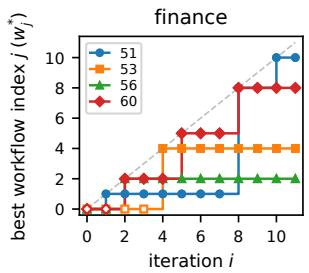

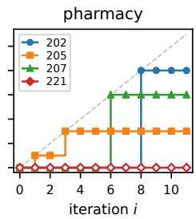

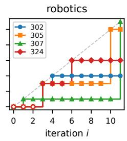  
Figure 8: Retained best-workflow version by task. A plateau keeps the incumbent; an advance records its replacement. The information analysis samples this path rather than every proposed workflow.

We embed components and task descriptions with both text-embedding-3-large (OpenAI, 2024) and all-mpnet-base-v2 (Song et al., 2020). Long text is split into chunks whose normalized embeddings are averaged. The hop sequence is resampled at eight phase anchors. Whitening PCA reduces the representations to dimension $d = 1 0$ , with the transform fitted once over all agents. Covariance estimates use shrinkage 0.1. The preprocessing and estimator settings are fixed across iterations.

## F.2 ESTIMATORS AND PERMUTATION ADJUSTMENT

Let ${ \mathcal { C } } = \{ { \mathrm { r o l e } }$ , instruction, contract, hop}, let $Z _ { c }$ be component c’s embedding, and let $T$ identify its task. Following Lee et al. (2026), the task-information proxy is

$$
\widehat { I } ( Z _ { c } ; T ) = - \frac { 1 } { 2 } \sum _ { j } \log ( 1 - \kappa _ { c , j } ^ { 2 } ) ,
$$

where $\kappa _ { c , j }$ is the jth canonical correlation (Hotelling, 1992) between component and taskdescription embeddings. Thus, T enters through embedded task text, and the statistic is a Gaussian embedding-based proxy in nats.

For the concatenated components $Z = ( Z _ { c } ) _ { c \in \mathcal { C } }$ , we estimate total correlation as

$$
\widehat { T C } ( Z ) = \frac { 1 } { 2 } \left[ \sum _ { c \in \mathcal { C } } \log \operatorname* { d e t } \Sigma _ { c } - \log \operatorname* { d e t } \Sigma \right] ,
$$

where $\Sigma _ { c }$ and $\Sigma$ are the regularized component and joint covariance matrices. To remove taskspecific means, we form $\widetilde { Z } _ { c } = Z _ { c } - \overline { { Z } } _ { c , T }$ and apply the same estimator to their concatenation. We denote this by ${ \widehat { T C } } ( Z \mid T )$ . It measures dependence after mean subtraction; it is not an exact estimate of conditional mutual information or conditional total correlation.

Unadjusted estimates use all eligible agents at each iteration. For permutation adjustment, each of 400 repetitions samples 43 agents without replacement and subtracts one shuffled estimate from the observed estimate. Task information shuffles task-description embeddings across agents. Total correlation independently shuffles the rows of each component block. Task-centered total correlation first subtracts task means within the sampled set, then shuffles the centered blocks. The reported value is the mean of these differences. It measures excess over the shuffled baseline and does not guarantee an unbiased information estimate.

## F.3 VALUES AND INTERPRETATION

Tables 12 and 13 give the absolute estimates underlying the changes plotted in the main text. From iteration 3 to 11, roles and instructions lose task information, while contracts and hops gain it. Unconditional total correlation falls in all four encoder/estimator combinations. The task-centered estimate falls in three; permutation-adjusted MPNet is the exception. Intermediate values need not be monotone.

The sample contains only 43–51 agents from 8–9 tasks, with shared task descriptions and hops within each workflow. These observations are not independent task replications. The decrease in redundancy concerns the retained path and does not hold for every proposed iterate. These estimates are computed from workflow descriptions and characterize their task specificity and redundancy. Agents within a workflow share task descriptions and routing, so they are not independent task replications. The estimates are descriptive text statistics, rather than measurements of messages exchanged during execution or a causal test of the proposed learning mechanism.

## G BEHAVIORAL AUDIT

## G.1 SCOPE AND DEFINITIONS

Table 2a reports bare-prompt behavior across generations. The detailed trace and SFT audit below concerns the first-cycle student $M ^ { + } = \mathcal { L } ^ { ( 1 ) }$ : its 110 bare-prompt rollouts, the 110 fixed base references, and 114 of the 119 selected teachers. Five historical teacher episodes, containing 100 training windows, are outside the audit’s coverage. All measurements use saved traces; no additional rollouts are required.

<table><tr><td></td><td colspan="4">Unadjusted</td><td colspan="4">Permutation-adjusted</td></tr><tr><td>Component</td><td>i = 3</td><td>i = 6</td><td>i = 9</td><td> $i = 1 1$ </td><td>i = 3</td><td>i = 6</td><td>i = 9</td><td> $i = 1 1$ </td></tr><tr><td colspan="9">text-embedding-3-large</td></tr><tr><td>role</td><td>1.26</td><td>1.17</td><td>1.11</td><td>1.09↓</td><td>0.42</td><td>0.43</td><td>0.40</td><td>0.38↓</td></tr><tr><td>instruction</td><td>2.56</td><td>2.40</td><td>2.37</td><td>2.36↓</td><td>1.74</td><td>1.64</td><td>1.62</td><td>1.61↓</td></tr><tr><td>contract</td><td>2.99</td><td>2.93</td><td>3.06</td><td>3.29 ↑</td><td>2.24</td><td>2.18</td><td>2.27</td><td>2.50 ↑</td></tr><tr><td>hop</td><td>5.23</td><td>6.00</td><td>6.22</td><td>6.22 ↑</td><td>4.72</td><td>5.34</td><td>5.54</td><td>5.54 ↑</td></tr><tr><td colspan="9"> $\mathtt { a l l - m p n e t - b a s e - v 2 }$ </td></tr><tr><td>role</td><td>1.07</td><td>0.83</td><td>0.76</td><td>0.71↓</td><td>0.25</td><td>0.10</td><td>0.05</td><td>0.02↓</td></tr><tr><td>instruction</td><td>2.19</td><td>2.08</td><td>1.95</td><td>1.96↓</td><td>1.38</td><td>1.33</td><td>1.24</td><td>1.24↓</td></tr><tr><td>contract</td><td>2.39</td><td>2.44</td><td>2.65</td><td>3.00 ↑</td><td>1.66</td><td>1.70</td><td>1.88</td><td>2.22 ↑</td></tr><tr><td>hop</td><td>4.82</td><td>5.88</td><td>5.94</td><td>6.06 ↑</td><td>4.36</td><td>5.25</td><td>5.29</td><td>5.40 ↑</td></tr></table>

Table 12: Task-information estimates $\widehat { I } ( Z _ { c } ; T )$ (nats) along the crown path. In all four encoder/estimator configurations, roles and instructions decrease while contracts and hops increase between $i = 3$ and $i \stackrel { - } { = } 1 1$ (arrows). Unadjusted estimates use the full sample; permutation-adjusted estimates subtract a shuffled baseline using 43-agent samples (Appendix F).
<table><tr><td></td><td colspan="4">Unadjusted</td><td colspan="4">Permutation-adjusted</td></tr><tr><td>Statistic</td><td> $i = 3$ </td><td> $i = 6$ </td><td> $i = 9$ </td><td> $i = 1 1$ </td><td> $i = 3$ </td><td> $i = 6$ </td><td> $i = 9$ </td><td> $i = 1 1$ </td></tr><tr><td colspan="9">text-embedding-3-large</td></tr><tr><td> ${ \widehat { T C } } ( Z )$ </td><td>11.82</td><td>12.18</td><td>11.96</td><td>11.62↓</td><td>5.76</td><td>5.73</td><td>5.70</td><td>5.61↓</td></tr><tr><td> ${ \widehat { T C } } ( Z \mid T )$ </td><td>5.51</td><td>5.45</td><td>5.33</td><td>4.95↓</td><td>3.11</td><td>3.09</td><td>3.06</td><td>2.83 ↓</td></tr><tr><td colspan="9">all-mpnet-base-v2</td></tr><tr><td> ${ \widehat { T C } } ( Z )$ </td><td>10.34</td><td>10.72</td><td>10.36</td><td>9.97↓</td><td>4.46</td><td>4.49</td><td>4.38</td><td>4.16 ↓</td></tr><tr><td> ${ \widehat { T C } } ( Z \mid T )$ </td><td>5.01</td><td>5.19</td><td>5.23</td><td>4.87↓</td><td>2.39</td><td>2.68</td><td>2.80</td><td>2.57 ↑</td></tr></table>

Table 13: Component redundancy (nats), with the same crown workflows and estimator variants as Table 12. From $i = 3$ to $i = 1 1$ , unconditional ${ \widehat { T C } } ( Z )$ decreases in all four configurations and task-centered ${ \widehat { T C } } ( Z \mid T )$ in three; the permutation-adjusted MPNet estimate increases.

The 220 student/base prompt files match the bare task prompts after trimming whitespace. Their initial main-thread API requests contain no teacher directive, report empty episode memory, and use identical agent-tool definitions. We measure four events from successful, explicit tool operations:

1. Delegation (D): a worker call returns without a tool error.

2. Code handoff (H): a worker writes a Python file and returns, then a different worker reads that file. The producer must be its latest recorded writer.

3. Subagent revision: a later worker writes or edits Python code produced by a different, already completed worker.

4. Main edit: the orchestrator edits worker-originated Python code after the worker returns.

File operations use explicit write\_file, edit, and read calls. Reads through imports or shell commands and writes inside shell scripts are not counted. Nested actions are assigned to their toplevel worker. These definitions record execution structure: a returned worker can report failure, a read need not use the interface correctly, and an edit need not fix a problem. Five of $M ^ { + } \mathbf { \bar { s } }$ 281 worker returns contain no model-visible report.

## G.2 BASE CAPABILITY AND SUPERVISED EXPOSURE

The base already performs the coordination patterns observed after SFT. Table 14 applies the same audit to the generic-directive control in Appendix C.4. With this prompt, both models delegate in every episode; the base performs code handoffs in 103 of 110 episodes. Under a bare prompt, the

base’s task 202 episode (seed 2154005) forms a six-worker pipeline and repairs an mmCIF-column mismatch after execution fails. This shows that both coordination and execution-conditioned repair are available before post-training.
<table><tr><td>Model</td><td>Prompt</td><td>Episodes</td><td>D</td><td>H</td><td>Revision</td><td>Main edit</td></tr><tr><td>Base</td><td>Bare</td><td>110</td><td>1</td><td>1</td><td>0</td><td>1</td></tr><tr><td> $M ^ { + }$ </td><td>Bare</td><td>110</td><td>48</td><td>42</td><td>10</td><td>14</td></tr><tr><td>Base</td><td>Generic directive</td><td>110</td><td>110</td><td>103</td><td>40</td><td>32</td></tr><tr><td> $M ^ { + }$ </td><td>Generic directive</td><td>110</td><td>110</td><td>106</td><td>56</td><td>13</td></tr><tr><td>Base</td><td>Teacher workflow + directive</td><td>114</td><td>114</td><td>98</td><td>57</td><td>19</td></tr></table>

Table 14: Episodes with each recorded behavior. Counts use all episodes in the row. Directive comparisons match tasks and generation seeds; teachers are selected episodes on eight training tasks, so their row is descriptive rather than a controlled comparison.

Matching source actions to SFT targets. We decode the frozen training windows with the training tokenizer and match complete tool-call arguments to the source streams. Worker assignments identify the source thread. A retained target requires the entire tool call to carry loss. A sampled target additionally requires its window to appear in the deduplicated exposure log through the selected checkpoint, step 1200.

The audit covers 2,335 windows from 114 teachers. All 114 contain retained orchestrator assignments, 98 contain retained code handoffs, and 57 contain retained worker revisions. The sampled counts in Table 2b are 112, 79, and 37 episodes. For a handoff, both the producer’s write and consumer’s read must be sampled; for a revision, both the earlier write and later modification must be sampled. They can occur in different windows and steps. A sampled episode therefore witnesses the relevant actions, not necessarily its entire trajectory. All 698 audited orchestrator assignments are retained targets, of which 673 are sampled at least once. Conservative matching and incomplete trace coverage make these counts lower bounds on observed exposure.

A supervised feedback-conditioned revision. In task 51 (teacher seed 990010), an auditor finds that shock features use post-event returns overlapping the prediction targets. The orchestrator recalls the feature worker to remove those returns and widen the embargo. The worker reads and edits the code, regenerates features, and runs checks. The auditor’s report is masked context for the supervised recall, in a window sampled four times before step 1200. A worker window containing the implementation and checks is sampled once. Both the decision and its execution receive supervision. The first diagnostic incorrectly treats NaN correlations as passing, so this example also shows that a supervised revision can contain faulty verification.

These observations support increased bare-prompt use of coordination already available in the base. They do not identify which training example caused a student action or isolate optimized workflow text from the directive, data selection, and sampler. More revisions also do not by themselves establish more successful repairs.

## G.3 EXAMPLES AND LIMITS

Connecting implementations on a test task. In task 305 (seed 2310005), the student launches workers for environment construction, demonstrations, symbolic planning, policy training, evaluation, and evaluation revision. The demonstration worker reads the environment’s task\_generator.py; later workers read the demonstration, planner, and policy modules. Recorded commands train the policy and run the assembled benchmark (Figure 9). The episode wins all six comparisons with its base reference. The trace establishes artifact-dependent implementation, without certifying every simulation choice or reported metric.

Preserving an unfavorable result. In task 302 (seed 2306010), evaluation finds that a learned A\* heuristic expands 2,934.9 nodes on average versus 571.4 for Manhattan distance. The student passes this diagnostic to a training worker, repairs a normalization-interface mismatch, reruns evaluation, and requests an independent critic. The final report retains the unfavorable result: about 5.1 times

A test tool-use task: workers consume earlier workers' code  
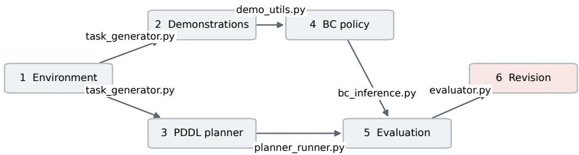  
Arrows show selected recorded write → completion → read sequences; execution is foreground.

Figure 9: Observed artifact dependencies in bare-prompt test task 305 (seed 2310005). Each arrow requires a producer write, producer return, and consumer read. Numbers indicate launch order; branches indicate dependencies, not parallel execution. BC is behavior cloning; PDDL is Planning Domain Definition Language.

as many expanded nodes. This case shows revision and checking without requiring a favorable scientific conclusion.

A revision that changes the test. In task 305 (seed 2310008), failed push and lever evaluations lead the student to request a simulator revision. The revision replaces force-driven motion with direct repositioning toward the goal and removes simulation steps. The worker then reports success on all three task types. This episode receives five favorable judgments out of six, despite changing the physical meaning of success. Coordination and high workspace preference therefore do not guarantee that a revision preserves the scientific task.

## H REPRESENTATIVE TASK SPECIFICATIONS

The following saved bare prompts give one training task per domain: finance (51), pharmacy (202), and robotics (307). They specify the computational study, required outputs, and shared execution/logging instruction. Literal newline escapes are rendered as line breaks; the wording is unchanged. A bare-prompt episode receives the full task specification even when no workflow is supplied.

## H.1 FINANCE: TASK 51

Task 51: complete bare prompt Build and evaluate a cross-asset macro nowcasting + trading signal that predicts 1-20 day equity index returns using public macro surprises and rate/FX/commodity information. Use: (a) FRED daily/weekly series (e.g., DGS2, DGS10, T10Y2Y, SOFR, CPIAUCSL, UNRATE), (b) Quandl/Nasdaq Data Link (if free) or Stooq for continuous futures proxies (e.g., crude, gold) and (c) Yahoo Finance for SPY/ES proxy, TLT, UUP, GLD. Construct a “macro shock” feature set: changes around scheduled releases (CPI, NFP, FOMC) using publicly available calendars (e.g., investing.com calendar scraped or alternative free calendar dataset) and approximate surprises via pre/post moves in relevant instruments when true survey expectations aren’t available. Train a hierarchical model: regime classifier (rates-vol regime) + return predictor (e.g., elastic net vs gradient boosted trees vs temporal CNN) with strict time-based splits (train/val/test) and embargo around event times to avoid leakage. Backtest a market-timing strategy on SPY with risk targeting, transaction costs, and a volatility-controlled position size. Include ablations: without event features, without cross-asset features, single-horizon vs multi-horizon. Evaluate signal quality (IC/RankIC), trading metrics (Sharpe, max drawdown, turnover), and stability across subperiods (pre/post 2020).

```prolog
Deliverables:
1) research_report.md as a conference-style paper (8-12 pages
equivalent) with sections: Title/Abstract; Introduction & related
work; Data (sources, timestamps, release calendar construction,
leakage risks); Feature engineering (macro shock construction);
Methodology (regime model + predictor, losses, regularization);
Experimental setup (time splits, embargo, costs, risk targeting);
Results (predictive + trading); Robustness & pitfalls (calendar
errors, proxy surprises, sensitivity to costs); Limitations;
Conclusion; References; Reproducibility. Embed and cite figures using
markdown, e.g. .
2) deliverables/index.json manifest listing every artifact produced
(all plots, report, code entry points, metrics paths).
3) deliverables/plots/ with at least these PNGs:
macro_event_timeline.png, feature_importance_overall.png,
regime_confusion_matrix.png, oos_ic_by_horizon.png,
equity_curve_spy_timing.png, drawdown_spy_timing.png,
turnover_and_costs.png, subperiod_performance_pre_post_2020.png,
ablation_sharpe_comparison.png.
4) Reproducible code (Python) including: data download scripts
(FRED/Yahoo/Stooq + calendar scraping with caching), feature
generation, model training, walk-forward evaluation, and backtester
with costs. Provide requirements.txt (or pyproject.toml) with pinned
versions and a single entry point (e.g., run_pipeline.py) that
reproduces metrics and plots end-to-end.
5) results/metrics.json containing: predictive metrics (IC, RankIC, AUC
if classification, calibration error), trading metrics (annualized
return/vol, Sharpe, Sortino, max drawdown, turnover, cost-adjusted
performance), and per-subperiod metrics.
6) results/model_comparison.json comparing model families and horizons
(config, features used, OOS IC, OOS Sharpe, stability score). Also
include results/ablation_log.json documenting each ablation run
(features removed, delta metrics, notes).
Use uv for all Python workflows--run code with uv run, install
dependencies with uv add, use uvx for tools. write your history log:
write your plan, execution (or tool-execution), reflection during the
reasoning logs in a logs.txt file.
```

## H.2 PHARMACY: TASK 202

```rst
Task 202: complete bare prompt
Prototype a geometric GNN that predicts protein-protein interface
residues from complex structures using the public Dockground or
PDB-derived benchmark (e.g., Protein-Protein Docking Benchmark) and
evaluate generalization across families. Use only publicly available
PDB structures and interface labels derived from distance thresholds.
Data sources:
- Protein Data Bank (PDB) structures (public)
- Protein-Protein Docking Benchmark dataset (public) OR Dockground
benchmark (public)
Data acquisition (Python): **PDB/mmCIF:** `requests.get(f\"https://file <sub>⌋</sub>
s.rcsb.org/download/{pdb_id.upper()}.cif\", timeout=120)` (or `.pdb`).
<sub>**</sub>Dockground / docking-benchmark decoys:<sub>**</sub> Follow the official
Dockground (KU) or CAPRI/PPD README for current HTTPS/FTP links; use
`urllib.request.urlretrieve` or `requests.get(..., stream=True)` +
`zipfile`/`tarfile.extractall`. Pin archive names/checksums listed on
the download page.
Success criteria:
- Report AUROC/AUPRC for interface residue classification
```

- Provide an ablation on geometric features (distances only vs   
distances+angles vs full equivariant model)   
Deliverables:   
1) research\_report.md as a conference-style paper (7-9 pages   
equivalent) with required sections plus an ablation study section;   
embed plots via .   
2) deliverables/index.json manifest.   
3) deliverables/plots/:   
- deliverables/plots/interface\_pr\_curve.png   
- deliverables/plots/interface\_roc\_curve.png   
- deliverables/plots/ablation\_feature\_set\_bar.png   
- deliverables/plots/family\_split\_performance\_boxplot.png   
- deliverables/plots/precision\_at\_k\_curve.png   
4) Reproducible code (Python) including:   
- src/download\_pdb\_complexes.py   
- src/compute\_interface\_labels.py (distance threshold + parameters)   
- src/build\_graphs.py (node/edge featurization)   
- src/train\_geometric\_gnn.py (PyTorch Geometric or e3nn)   
- src/evaluate.py + src/plotting.py   
- environment.yml or requirements.txt (pinned)   
5) results/metrics.json with AUROC, AUPRC, precision@k, recall@k   
overall and per-family split.   
6) results/ablation\_results.json logging each ablation (features/model)   
with config hash, metrics, and training time.   
Use uv for all Python workflows--run code with uv run, install   
dependencies with uv add, use uvx for tools. write your history log:   
write your plan, execution (or tool-execution), reflection during the   
reasoning logs in a logs.txt file.

## H.3 ROBOTICS: TASK 307

Task 307: complete bare prompt   
Implement a reproducible pipeline to generate synthetic   
instruction-following datasets for manipulation planning. Use a public   
simulator (PyBullet) to generate scenes with objects and target   
receptacles, then automatically produce templated natural language   
instructions and corresponding action sequences. Quantify dataset   
diversity (object counts, spatial relations, instruction variety) and   
validate that generated plans are executable in simulation.   
Environment acquisition: Install PyBullet via \`pip install pybullet\` (no   
external trajectory corpus -- episodes are generated in sim). Ship   
minimal URDF/meshes in-repo or document paths to PyBullet example   
data.   
Deliverables:   
1) research\_report.md as a conference-style paper (6-9 pages   
equivalent) describing dataset generation and validation.   
2) deliverables/index.json.   
3) deliverables/plots/: dataset\_object\_count\_distribution.png,   
instruction\_template\_frequency.png, scene\_relation\_cooccurrence.png,   
executable\_plan\_rate\_by\_scene\_complexity.png,   
example\_scene\_renders\_grid.png.   
4) Reproducible code: scene generator; renderer; instruction generator;   
plan executor; dataset writer (JSONL); requirements.txt.   
5) results/metrics.json: n\_scenes, n\_instructions, unique\_templates,   
avg\_objects\_per\_scene, plan\_executability\_rate,   
diversity\_entropy\_measures.   
6) results/dataset\_statistics.json with detailed counts and schema for   
the generated dataset (fields, value ranges, examples).

Use uv for all Python workflows--run code with uv run, install   
dependencies with uv add, use uvx for tools. write your history log:   
write your plan, execution (or tool-execution), reflection during the   
reasoning logs in a logs.txt file.

## I COMPLETE WORKFLOW EXAMPLES

The retained paths through search iteration 11 are $w _ { 0 }  w _ { 1 }  w _ { 8 }  w _ { 1 0 }$ for task 51, w → w for task 202, and $w _ { 0 }  w _ { 1 }  w _ { 1 1 }$ for task 307 (Figure 8). These examples illustrate selected workflows, not a random sample of proposals or the full teacher collection manifest.

We reproduce two complete saved designs below. Task 51’s workflow connects data collection, features, modeling, backtesting, auditing, and reporting, with explicit routes for failed checks. Task 202’s workflow connects structure acquisition, graph construction, model training, and evaluation, with a validator that returns the failed agent, violation, and narrower assignment. These are instructions for execution; their presence does not establish that every run performs the check correctly.

## I.1 COMPLETE CROWN WORKFLOW: TASK 51, VERSION 10

The following is the complete saved design block for task 51’s w<sub>10</sub>, with all seven agents, instructions, and output contracts. The task prompt in Appendix H and the collection directive in Appendix B.3 are separate prompt components. Workflow-specific thresholds and heuristics are reproduced unchanged; they are optimizer proposals, not additional benchmark requirements or validated scientific criteria.

Task 51: crown workflow w   
Create an agent team with following agent candidates to solve this   
problem:   
[   
{   
"agent\_id": "agent\_orchestrator",   
"role": "DAG Conductor & Iterative Reconciliation Engine",   
"instruction": "You manage a 7-hop state-machine workflow with   
explicit validation gates, parallel specialist decomposition, and   
iterative recall/re-delegation loops. You will: 1) Execute the spine:   
(Hop 1) Data/Calendar -> (Hop 2) Features/Leakage Audit -> (Hop 3)   
Modeling/Walk-Forward -> (Hop 4) Backtest/Ablation -> (Hop 5) Auditor   
Cross-Check -> (Hop 6) Iterative Reconciliation -> (Hop 7)   
Report/Manifest. 2) Enforce strict JSON schema validation on every   
subagent output. Reject any output containing NaN, Inf, or degenerate   
values (e.g., regime\_accuracy==1.0, confusion\_matrix=[[N]],   
IC==RankIC, ablation\_delta\_sharpe>0). 3) Implement explicit recall   
routing: if a gate fails, issue a RECALL command with {target\_agent,   
failed\_checks, error\_context, narrowed\_scope, acceptance\_criteria,   
code\_patch\_hint, max\_retries: 3}. Route feedback explicitly: e.g., if   
Backtest reports turnover<0.01 or degenerate Sharpe, RECALL Modeling   
to adjust signal thresholds/risk targeting, then RE-DELEGATE to   
Backtest. If Auditor detects split overlap or leakage, RECALL   
Data/Feature. If Auditor finds report-metric contradictions, RECALL   
Report Synthesizer. 4) Maintain pipeline\_state.json tracking recall   
counts, hop progress, sync barriers, and rejected artifacts. 5)   
Generate run\_pipeline.py implementing these loops as explicit Python   
control flow with 'while retry < max\_retries:' blocks, state   
persistence, and early-exit on max retries. DO NOT use sequential 'if   
gate\_failed: log(warning)' patterns. 6) Halt synthesis until all gates   
pass or max hops exhausted with documented fallbacks.",   
"input\_dependencies": ["pipeline\_state.json",   
"agent\_research\_auditor.critique"],   
"output\_contract": {   
"status": "success|failed|recalling|fallback\_applied",   
"pipeline\_state": {"current\_hop": "int", "recall\_history": [],   
"parallel\_jobs": [], "sync\_barriers": []},

```csv
"recall_commands": [{"target_agent": "str", "reason": "str",
"narrowed_scope": "str", "acceptance_criteria": "str",
"code_patch_hint": "str", "max_retries": 3}],
"cross_agent_context_updates": {"target_agent": "str",
"updated_params": {}}
}
},<sub>{</sub>
"agent_id": "agent_data_pipeline",
"role": "Multi-Source Ingestion & Temporal Alignment Specialist",
"instruction": "You handle FRED, Yahoo, and calendar ingestion in
parallel. Output MUST follow the strict contract. You must ensure
strict business-day alignment, enforce forward-fill limits (max 30
days), and verify calendar dates match release patterns. CRITICAL:
Define explicit train/val/test split boundaries ensuring NO overlap
(train_end < val_start < test_start) and sufficient pre/post-2020
coverage (>300 days each). If alignment gaps > 5% or calendar coverage
< 80%, self-correct or flag for RECALL. Provide explicit
`alignment_diagnostics` for downstream feature engineering. Generate
Python code for data fetching/caching with parallel
threads/processes.",
"input_dependencies": [],
"output_contract": {
"status": "success|failed|stalled|recalling",
"artifacts": ["cache/<sub>*</sub>.parquet", "src/data/<sub>*</sub>.py"],
"metrics": {"date_range": {"start": "str", "end": "str"},
"missingness_pct": {"fred": "float", "yahoo": "float"},
"calendar_events": "int", "split_days": {"train": "int", "val": "int",
"test": "int", "pre_2020_test_days": "int", "post_2020_test_days":
"int"}},
"validation_report": {"timestamps_aligned": "bool",
"no_future_leakage": "bool", "calendar_coverage_above_threshold":
"bool", "split_boundaries_valid": "bool",
"train_end_before_val_start": "bool", "val_end_before_test_start":
"bool", "subperiod_coverage_sufficient": "bool", "error_details":
"str"},
"orchestrator_feedback": "str",
"cross_agent_context": {"aligned_data_shape": ["int", "int"],
"split_indices": {"train": ["int"], "val": ["int"], "test": ["int"]},
"business_day_index": "list[str]"}
},
{
"agent_id": "agent_feature_engineer",
"role": "Feature Construction & Leakage Auditor",
"instruction": "You build macro shock, cross-asset, and lag
features. You consume data pipeline output and audit for look-ahead
bias. Output MUST follow the strict contract. You must enforce a 1-day
embargo around events, verify target shifts, and output
feature_spec.json detailing construction logic and leakage risks.
Compute `feature_hashes` for reproducibility. CRITICAL: Ensure RankIC
calculation logic is distinct from IC (use spearmanr vs pearsonr). If
leakage is detected or variance threshold fails, self-correct and
re-output. Provide `masking_instructions` for ablation studies.
Generate Python code for feature generation.",
"input_dependencies": ["agent_data_pipeline.output_contract"],
"output_contract": {
"status": "success|failed|stalled|recalling",
"artifacts": ["src/features/<sub>*</sub>.py", "feature_spec.json"],
"metrics": {"n_features": "int", "feature_groups":
{"macro_shock": "int", "cross_asset": "int", "lag": "int", "regime":
"int"}, "ic_rankic_distinct": "bool"},
```

```csv
"validation_report": {"no_target_leakage": "bool",
"embargo_enforced": "bool", "hashes_computed": "bool",
"cross_sectional_leakage_free": "bool", "rankic_formula_verified":
"bool", "error_details": "str"},
"orchestrator_feedback": "str",
"cross_agent_context": {"feature_columns": ["str"],
"embargo_dates": ["str"], "ablation_masks": {"feature_group":
["str"]}, "target_shift_logic": "str"}
}
},
"agent_id": "agent_modeling_specialist",
"role": "Predictive Modeling & Regime Analysis Expert",
"instruction": "You train regime classifiers and return predictors
in parallel across horizons/types. You consume feature_spec.json and
enforce strict train/val/test temporal splits. Output MUST follow the
strict contract. You must implement embargo-aware walk-forward
validation, compute stability scores across windows, and ensure regime
models are trained ONLY on the train split. CRITICAL: Regime
classifier MUST gate the return predictor (conditional training or
feature masking), not just append features. Explicitly validate
walk-forward Sharpe values: if any window Sharpe > 100 or < -100,
diagnose volatility/clipping logic, fix, and re-run. Ensure OOS Sharpe
is computed and included. If ICs are negative or walk-forward is
unstable, self-tune regularization/horizons and re-run. Generate
Python code for modeling.",
"input_dependencies": ["agent_feature_engineer.output_contract"],
"output_contract": {
"status": "success|failed|stalled|recalling",
"artifacts": ["src/models/<sub>*</sub>.py", "cache/<sub>*</sub>.joblib",
"results/wf_results.json"],
"metrics": {"oos_ic_by_horizon": {}, "oos_rankic_by_horizon": {},
"oos_sharpe_by_horizon": {}, "stability_scores": {},
"regime_accuracy": {"train": "float", "test": "float"},
"regime_calibration_error": "float"},
"validation_report": {"ic_positive_oos": "bool",
"walkforward_stable": "bool", "no_full_sample_leakage": "bool",
"sharpe_within_reasonable_bounds": "bool", "regime_gating_applied":
"bool", "rankic_not_identical_to_ic": "bool", "error_details": "str"},
"orchestrator_feedback": "str",
"cross_agent_context": {"best_model_config": {},
"oos_predictions": {"shape": ["int", "int"]}, "split_indices":
{"train": ["int"], "test": ["int"]}, "regime_labels": "list[str]"}
}
},
{
"agent_id": "agent_backtest_validator",
"role": "Backtesting & Cost Simulation Engineer",
"instruction": "You run the backtest with realistic costs and risk
targeting, and execute parallel ablation studies. Output MUST follow
the strict contract. You must ensure the test/walk-forward window
explicitly covers pre/post-2020 periods to avoid 'insufficient_data'
gaps. You must compute exact delta metrics for ablations (no
zero-delta placeholders). CRITICAL: Align backtest date ranges with
report splits. If metrics are NaN, subperiods are empty, or ablation
deltas are identical/zero, diagnose the backtest loop/cost logic, fix
date alignment, and re-run. If turnover < 0.01 or trades_count == 0,
flag for RECALL to Modeling to adjust signal thresholds/risk
targeting. Generate Python code for backtesting.",
"input_dependencies": ["agent_modeling_specialist.output_contract",
"agent_feature_engineer.cross_agent_context.ablation_masks"],
"output_contract": {
"status": "success|failed|stalled|recalling",
"artifacts": ["src/backtest/<sub>*</sub>.py", "backtest_report.json"],
```

```jsonl
"metrics": {"sharpe": "float", "max_dd": "float", "turnover":
"float", "trades_count": "int", "cost_drag": "float", "subperiods":
{"pre_2020": {"sharpe": "float", "trading_days": "int"}, "post_2020":
{"sharpe": "float", "trading_days": "int"}}},
"validation_report": {"costs_computed": "bool",
"subperiods_valid": "bool", "turnover_nonzero": "bool",
"no_nan_metrics": "bool", "ablation_deltas_nonzero": "bool",
"backtest_window_aligned_with_report": "bool", "error_details":
"str"},
"orchestrator_feedback": "str",
"cross_agent_context": {"equity_curve": {"shape": ["int",
"int"]}, "drawdown_series": {"shape": ["int", "int"]}, "ablation_log":
[{"name": "str", "delta_sharpe": "float", "notes": "str"}]}
}
},
{
"agent_id": "agent_research_auditor",
"role": "Cross-Agent Critique & Reproducibility Checker",
"instruction": "You independently verify all outputs for
statistical rigor, leakage, and reproducibility via cross-agent
critique. Output MUST follow the strict contract. You will cross-check
feature specs against model inputs, validate backtest costs against
turnover, verify ablation deltas are non-zero when features are
removed, and ensure pre/post-2020 subperiod coverage is complete. You
trigger precise RECALL commands to the Orchestrator for specific
agents with exact fix instructions. Explicitly flag contradictions
between report claims and JSON metrics. CRITICAL CHECKS: 1) Verify
split boundaries: train_end < val_start < test_start. 2) Verify
backtest date ranges align with report splits. 3) Reject identical
ablation deltas. 4) Reject degenerate metrics (Sharpe > 10, stability
= 0.5 placeholder, RankIC == IC). 5) Verify regime gating is applied.
6) Check for NaN/Inf serialization. If you detect a subagent is stuck
in a tool-call loop, flag `stall_detected: true` with
`blocker_description`.",
"input_dependencies": ["agent_data_pipeline.output_contract",
"agent_feature_engineer.output_contract",
"agent_modeling_specialist.output_contract",
"agent_backtest_validator.output_contract"],
"output_contract": {
"status": "success|failed",
"artifacts": ["audit_log.json"],
"critique": {"data_alignment": "str", "leakage_risks": "str",
"model_overfitting": "str", "backtest_validity": "str",
"ablation_consistency": "str", "report_metrics_alignment": "str"},
"validation_report": {"all_metrics_valid": "bool",
"ablation_runs_complete": "bool", "subperiod_coverage": "bool",
"split_overlap_free": "bool", "rankic_distinct": "bool", "no_nans":
"bool", "error_details": "str"},
"recall_commands": [{"agent_id": "str", "reason": "str",
"fix_instructions": "str", "acceptance_criteria": "str"}],
"stall_flags": [{"agent_id": "str", "stall_detected": "bool",
"blocker_description": "str"}]
}
},
{
"agent_id": "agent_report_synthesizer",
"role": "Research Report & Manifest Generator",
```

"instruction": "You generate the conference-style   
research\_report.md and deliverables/index.json. Output MUST follow the   
strict contract. You will consume all upstream outputs and synthesize   
a coherent narrative. You must embed all 9 required plots using   
markdown, cite exact metrics from results/metrics.json, and explicitly   
discuss ablation deltas, subperiod stability, and leakage controls. If   
any required plot or metric is missing, trigger a RECALL to the   
upstream agent. You must ensure the report matches the requested   
structure exactly. Generate Python code for report generation.",   
"input\_dependencies": ["agent\_data\_pipeline.output\_contract",   
"agent\_feature\_engineer.output\_contract",   
"agent\_modeling\_specialist.output\_contract",   
"agent\_backtest\_validator.output\_contract",   
"agent\_research\_auditor.output\_contract"],   
"output\_contract": {   
"status": "success|failed|recalling",   
"artifacts": ["research\_report.md", "deliverables/index.json"],   
"validation\_report": {"all\_sections\_complete": "bool",   
"all\_plots\_embedded": "bool", "metrics\_match\_json": "bool",   
"ablation\_narrative\_consistent": "bool", "error\_details": "str"},   
"orchestrator\_feedback": "str"   
}   
}   
]

## I.2 COMPLETE CROWN WORKFLOW: TASK 202, VERSION 8

The following is the complete saved design block for task 202’s w<sub>8</sub>, with all seven agents and their embedded output schemas. The task prompt and collection directive are separate components; the workflow text is unchanged.

Task 202: crown workflow w<sub>8</sub>   
Create an agent team with following agent candidates to solve this   
problem: [   
{   
"agent\_id": "agent\_orchestrator",   
"role": "Pipeline Conductor & Iterative Reconciler",   
"instruction": "Manage a strict multi-hop iterative workflow with   
explicit recall loops, cross-agent dependency tracking, and parallel   
specialist decomposition. Do NOT proceed unidirectionally. PHASES: 1)   
Data Acquisition & Labeling, 2) Graph Construction & Family Split, 3)   
Parallel Model Design & Training, 4) Cross-Agent Critique &   
Validation, 5) Programmatic Reporting & Plotting. WORKFLOW: After each   
phase, dispatch agent\_validator. Parse validation\_report.json. If   
overall: FAIL, identify failed\_agent and violation. Issue a targeted   
RECALL to that agent containing: (1) exact failure\_trace, (2)   
narrowed\_scope (fix ONLY the violation, do not rewrite unrelated   
code), (3) fallback\_strategy (e.g., if network fails, hardcode 5 PDB   
IDs; if training crashes, reduce epochs/batch size). After recall,   
re-run validator. Only proceed when overall: PASS. STALL PREVENTION &   
RE-DELEGATION: If any agent repeats the same tool call >2 times   
without generating new files or changing arguments, immediately   
interrupt. Analyze the last error. Re-delegate to a narrower scope   
with a mandatory strategy change (e.g., switch from complex network   
download to a minimal stub script, or isolate the failing function).   
Log all hops, recalls, and schema validations in logs.txt. Terminate   
only when all deliverables exist, validator returns overall: PASS, and   
cross-agent consistency checks pass. Use uv run for all Python   
execution."   
},   
{   
"agent\_id": "agent\_data\_curator",   
"role": "Structural Data & Labeling Specialist",

```snap
"instruction": "Download ONLY real PDB/mmCIF complexes from RCSB.
Compute heavy-atom interface labels (5.5 Å). OUTPUT TO ORCHESTRATOR
SCHEMA: data/complex_manifest.json (Schema: {\"pdb_ids\": [\"str\"],
\"download_status\": \"str\", \"labeling_script_path\": \"str\"}),
src/compute_interface_labels.py. ACCEPTANCE CRITERIA: Manifest must
list ≥20 PDB IDs. Labeling script must use 5.5 Å heavy-atom distance.
RECALL & RE-DELEGATION: If recalled for missing IDs or labeling
errors, rewrite ONLY compute_interface_labels.py or update manifest.
FALLBACK: If RCSB download fails >2 times, hardcode a list of 10 known
PDB IDs in the script and proceed. Do not loop on logs."
},
{
"agent_id": "agent_graph_builder",
"role": "Graph Construction & Family Split Specialist",
"instruction": "Build residue graphs and generate family splits.
OUTPUT TO ORCHESTRATOR SCHEMA: src/build_graphs.py,
data/family_split.json (Schema: {\"train_families\": [\"str\"],
\"test_families\": [\"str\"], \"zero_overlap_verified\": true,
\"family_mapping\": {\"pdb_id\": \"family_name\"}}). ACCEPTANCE
CRITERIA: Test split must contain ≥3 distinct families with zero
sequence/structure overlap. RECALL & RE-DELEGATION: If recalled for
overlap or missing families, recompute splits and rewrite
family_split.json. Do not touch download scripts."
},
{
"agent_id": "agent_model_architect",
"role": "Geometric GNN Architect",
"instruction": "Design three variants: distances-only,
distances+angles, full equivariant. OUTPUT TO ORCHESTRATOR SCHEMA:
src/train_geometric_gnn.py, src/model_config.json (Schema:
{\"variants\": {\"distances\": {\"equivariant\": false,
\"edge_features\": [\"str\"]}, \"distances_angles\": {...}, \"full\":
{\"equivariant\": true, \"equivariance_proof\": \"str\"}},
\"hidden_dims\": \"int\", \"num_layers\": \"int\"}). ACCEPTANCE
CRITERIA: Equivariant readout must be mathematically
rotation-invariant. Config hashes generated. RECALL & RE-DELEGATION:
If recalled for coordinate leakage, refactor message-passing to use
relative vectors/inner products only, isolate variant parameters, and
rewrite train_geometric_gnn.py."
},
{
"agent_id": "agent_training_engineer",
"role": "Parallel Trainer & Metric Evaluator",
"instruction": "Train all three variants in parallel, evaluate on
family-split test sets, generate pinned dependencies. OUTPUT TO
ORCHESTRATOR SCHEMA: results/metrics.json (Schema: {\"overall\":
{\"auroc\": \"float\", \"auprc\": \"float\", \"precision_at_k\":
\"float\", \"recall_at_k\": \"float\"}, \"per_family\":
{\"family_name\": {\"auroc\": \"float\", \"auprc\": \"float\"}},
\"ablation\": {\"variant\": {\"config_hash\": \"str\",
\"training_time\": \"float\"}}}), results/ablation_results.json,
requirements.txt. ACCEPTANCE CRITERIA: AUROC ≥ 0.80. Metrics MUST
include non-empty overall object, precision@k AND recall@k. per_family
keys must exactly match test_families from data_curator.
requirements.txt must use exact pins (==) generated via uv export
--frozen > requirements.txt. RECALL & RE-DELEGATION: If recalled for
missing recall@k, unknown families, or unpinned deps, re-evaluate with
explicit family aggregation, add recall@k computation, run uv export
--frozen > requirements.txt, and rewrite metrics.json. FALLBACK: If
training crashes >2 times, reduce batch size/epochs, log error, and
retry once. If fails again, report to orchestrator."
},
{
"agent_id": "agent_validator",
"role": "Cross-Agent Consistency & Biophysical Auditor",
```

"instruction": "Run explicit cross-agent checks BEFORE proceeding   
to next phase. Perform programmatic diffs using Python. OUTPUT TO   
ORCHESTRATOR SCHEMA: validation\_report.json (Schema: {\"overall\":   
\"PASS/FAIL\", \"checks\": {\"data\_integrity\": {\"passed\": \"bool\",   
\"details\": \"str\"}, \"family\_overlap\_check\": {\"passed\":   
\"bool\", \"details\": \"str\"}, \"equivariance\_check\": {\"passed\":   
\"bool\", \"details\": \"str\"}, \"metrics\_consistency\": {\"passed\":   
\"bool\", \"details\": \"str\"}, \"dependency\_pinning\": {\"passed\":   
\"bool\", \"details\": \"str\"}, \"report\_metrics\_alignment\":   
{\"passed\": \"bool\", \"details\": \"str\"}}, \"failure\_trace\":   
{\"failed\_agent\": \"str\", \"violation\": \"str\",   
\"narrowed\_scope\": \"str\"}}). ACCEPTANCE CRITERIA: Zero synthetic   
data. Family split zero overlap. Equivariant model uses relative   
features only. metrics.json family\_metrics keys match data\_curator   
test\_families. requirements.txt uses == pins. All checks must pass.   
RECALL & RE-DELEGATION: If FAIL, output exact failure\_trace with   
narrowed\_scope. Orchestrator uses this to recall specific subagent. Do   
not proceed until overall: PASS."   
},   
{   
"agent\_id": "agent\_scientific\_writer",   
"role": "Scientific Communication & Reproducibility Specialist",   
"instruction": "Draft conference-style paper, manifest, and   
reproducibility artifacts. Programmatic metric injection required.   
OUTPUT TO ORCHESTRATOR SCHEMA: research\_report.md,   
deliverables/index.json, main.py, deliverables/plots/<sub>\*</sub>.png. ACCEPTANCE   
CRITERIA: Report MUST programmatically read results/metrics.json via a   
Python script to populate tables (no hardcoding). All cited metrics   
exactly match results/metrics.json. Plots embedded via   
. Ablation explicitly compares   
feature sets. main.py executes full pipeline. RECALL & RE-DELEGATION:   
If recalled for metric mismatch or missing plots, regenerate report   
using a Python script to parse metrics.json and inject values, verify   
plot paths, and rewrite research\_report.md. Do not proceed until   
programmatic injection is verified and all 5 plots exist."   
}   
]

## J COMPARISON WITH RELATED METHODS

Table 15 separates workflow search, weight updates, and the feedback used for each. Sharing one model across roles does not by itself imply weight learning, and exporting training data does not establish that a successor model was trained. The comparison concerns reported mechanisms, not matched performance benchmarks.

Search followed by distillation has earlier precedents. Expert Iteration alternates search and policy learning (Anthony et al., 2017); STaR learns from generated rationales that reach known answers (Zelikman et al., 2022); ReST<sup>EM</sup> alternates generation, reward filtering, and fine-tuning (Singh et al., 2023). SiriuS trains agents on successful interactions and refines unsuccessful trajectories (Zhao et al., 2026). MASS applies this approach to optimized multi-agent research workflows, with shared weights for the orchestrator and workers.

Self-Refine uses a frozen model to critique and revise outputs (Madaan et al., 2023); communicating agents and Squeeze Evolve also improve inference without post-training the agent models (Park et al., 2026; Maheswaran et al., 2026). MASS instead tests whether the resulting execution traces can improve shared weights and subsequent workflow search.

The recursive loop here is empirical. Unlike proof-based self-rewriting in Gödel machines (Schmidhuber, 2007), it provides no guarantee that every future cycle improves. Workflow feedback and teacher ranking use the current model, checkpoint selection uses validation loss, and external judgments report quality after execution (Appendix C). The experiments test transfer across model roles, performance per processed training token, and coordination under bare prompts.

<table><tr><td>Method</td><td>Update and feedback</td><td>Relationship to MASS</td></tr><tr><td>Self-Rewarding LMs (Yuan et al., 2024)</td><td>Iterative preference training using the model&#x27;s own response scores.</td><td>Establishes joint improvement of generation and evaluation, without workflow search.</td></tr><tr><td>Multi-Agent Evolve (Chen et al., 2025a)</td><td>A shared backbone learns question generation, solving, and judging through reinforcement learning.</td><td>Establishes multi-agent learning with a shared self-evaluator; its proposer generates questions, rather than execution workflows.</td></tr><tr><td>ADAS / AFlow / GPTSwarm (Hu et al., 2025; Zhang et al., 2025; Zhuge et al., 2024)</td><td>Search over agent programs, workflow graphs, or prompts and communication edges.</td><td>Establishes automatic design of agentic computation; MASS learns shared weights from the resulting executions.</td></tr><tr><td>RHI (Lee et al., 2026)</td><td>Prompt-level workflow revisions guided by pairwise comparisons of task artifacts.</td><td>Supplies the workflow-search method and information-flow motivation used here; MASS adds trace-based</td></tr><tr><td>TTHE (Nie et al., 2026)</td><td>One frozen LLM solves tasks, proposes executable harness edits, and judges them using execution-derived proxies.</td><td>post-training. Establishes homogeneous in-loop roles and persistent harness adaptation; weights remain fixed.</td></tr><tr><td>SIA (Hebbar et al., 2026)</td><td>A Claude Sonnet feedback agent edits the scaffold and initiates weight updates to a gpt-oss target, using task verifiers.</td><td>Establishes harness-weight co-updating with a separate improvement model and verifier.</td></tr><tr><td>HASE (Luo et al., 2026)</td><td>A single policy learns task solutions and harness edits with reinforcement learning; evaluator repairs use oracle</td><td>Establishes joint policy and harness learning, with task rewards supplying the training signal.</td></tr><tr><td>HELIX (Fan &amp; Huang, 2026)</td><td>discrepancies. Evolves harness variants and exports verified records for subsequent model updates.</td><td>Formalizes the model–harness loop; the reported experiment stops at data</td></tr><tr><td>MASS (this work)</td><td>Searches multi-agent workflows and fine-tunes shared weights on selected orchestrator and worker conversations.</td><td>generation, without a weight update. Tests transfer to execution, workflow optimization, and evaluation, plus token efficiency and unprompted coordination.</td></tr></table>

Table 15: Selected related methods, compared by their reported mechanisms. The rows describe methods, not matched experimental baselines. For MASS, the homogeneous condition applies to the in-loop executor, evaluator, and optimizer; model-role ablations vary this assignment.