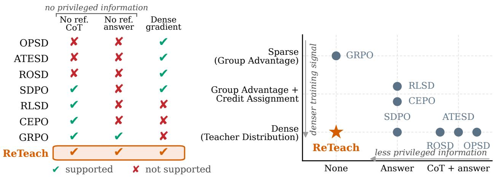
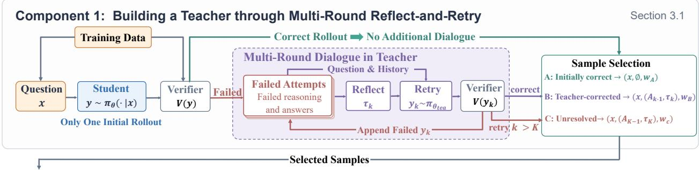
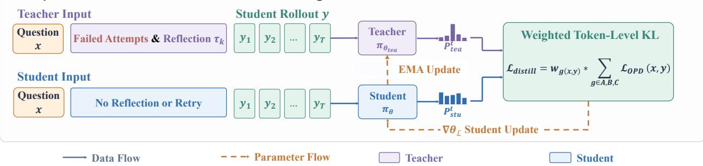
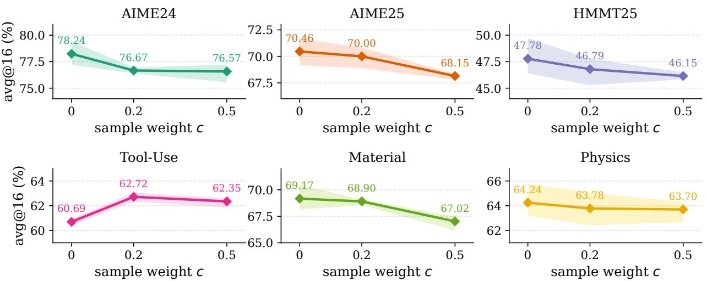
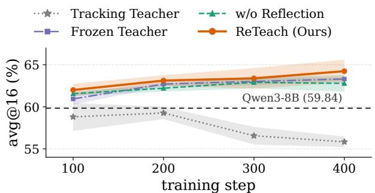
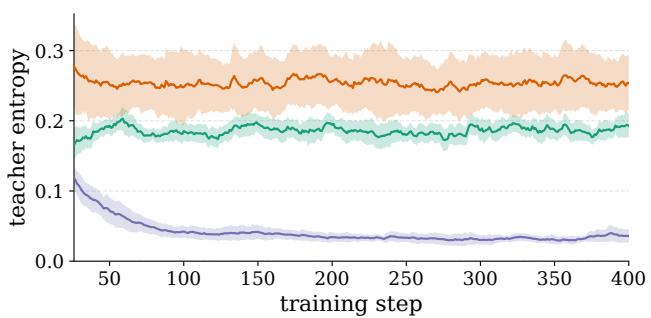
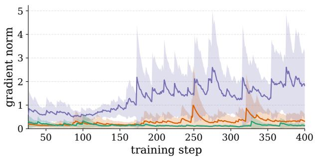
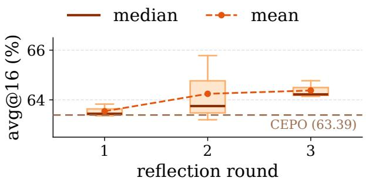
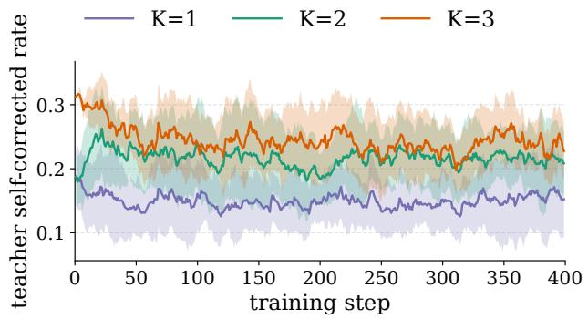

# RETEACH: BUILDING A SELF-TEACHER THROUGHMULTI-ROUND REFLECTION AND RETRY

Yafeng Tang<sup>1,</sup>∗ tangyafeng8@gmail.com

Hao Li<sup>1,</sup>∗ erichaoli@tencent.com

Hongsheng Yu<sup>1,</sup>† yannickyu@tencent.com

Qiang Fu<sup>1</sup> leonfu@tencent.com

## ABSTRACT

Self-distillation can improve reasoning without a separately trained, more capable teacher, but its effectiveness depends on how the self-teacher gains an advantage over the student. Conditioning the teacher on reference answers or solutions can provide such an advantage, but this information may be unavailable. Reflection offers a way to derive explicit error diagnoses and revision guidance from self-generated attempts, yet existing reflection-based methods often combine it with reference information, rich task feedback, or persistent memory. We introduce ReTeach, a Reflective self-distillation framework that constructs its self-Teacher through multi-round reflection and retry using only self-generated attempts and outcome-level verification. Starting from an unsuccessful student rollout, the teacher alternates explicit reflection with renewed attempts until success or the retry budget is exhausted, without reference answers or solutions, external diagnostic feedback, or cross-example memory. Each failed retry informs subsequent reflection, while successful correction provides outcome-level evidence for the potential utility of the resulting teacher context. An outcome-aware selection and weighting strategy distinguishes initially correct, reflection-corrected, and unresolved examples, assigning separate weights to their category-normalized distillation losses. Through on-policy distillation, the student matches the teacher’s context-conditioned token-level predictive distributions at prefixes of its own rollouts, transferring the benefits of iterative correction while retaining single-pass inference. Across six benchmarks spanning mathematical reasoning, science question answering, and tool use, ReTeach improves average accuracy over GRPO by 1.39 percentage points. Among all compared methods, including those using privileged information, ReTeach achieves the highest average accuracy on five benchmarks and ranks second on the remaining one. These results demonstrate the effectiveness of constructing reflective self-teachers from self-generated experience and outcome-level verification to improve single-pass reasoning.

## 1 Introduction

Reinforcement learning with verifiable rewards (RLVR) has become the default recipe for post-training large language models, underpinning the strongest open reasoning models on mathematics and code, where a verifier returns a scalar reward without human annotation (Lambert et al., 2025; DeepSeek-AI, 2025). However, a binary reward per response provides no information on which intermediate steps drove the result. This sparse supervision makes training expensive: the model must discover good reasoning by comparing and contrasting many self-generated responses. Recently, on-policy distillation (OPD) addresses this by replacing the binary reward with per-token targets from a teacher that scores the student’s own rollouts (Lu & Lab, 2025). However, the effectiveness of OPD depends on the availability of a sufficiently capable teacher: the quality of its supervision ultimately constrains how far the student can improve, limiting the ability to advance the frontier of reasoning. This raises a natural question: can a model bootstrap its own teacher signal without relying on a separately trained, more capable teacher?

(b) Information and signal trade-of

(a) Training paradigms across methods

  
Figure 1: Comparison across existing self-improvement methods. Our ReTeach realizes denser supervision without any privileged information from original datasets.

Self-distillation derives the teacher from the model itself, but its effectiveness depends on how the teacher gains an advantage over the student. OPSD conditions its teacher on reference CoT (Zhao et al., 2026a), while ATESD adaptively limits this exposure (Han et al., 2026). RLSD combines ground-truth answer conditioning with group-based rollout exploration (Yang et al., 2026), whereas SDPO constructs its teacher from successful rollouts in binary-reward settings (Hübotter et al., 2026).

Reference answers or solutions may be unavailable, while raw rollouts do not necessarily explain how to correct the student’s errors. Reflection can turn this experience into explicit error diagnoses and revision guidance (Madaan et al., 2023; Shinn et al., 2023). Existing approaches combine reflection with task feedback, persistent memory or groundtruth answers. RESD (Zhang et al., 2026) uses a persistent playbook and cached successful solutions with additional ground-truth answers in teacher prompts. ReflectionCoder (Ren et al., 2025) and HERO (Liu et al., 2026) use codeexecution feedback and environment observations, respectively. We study whether effective self-teachers can instead be constructed from a model’s own attempts and outcome-level verification, without reference answers or solutions, external diagnostic feedback, or cross-example memory.

We introduce ReTeach, a self-distillation framework that couples multi-round reflection and retry with outcome-aware distillation. Starting from an unsuccessful student rollout, the self-teacher explicitly reflects on the history of failed attempts and generates a new response, repeating until success or a fixed retry budget is exhausted. Retrying serves two purposes: a failed attempt provides additional evidence for subsequent reflection, while a successful attempt provides outcome-level evidence that the constructed context can support a correct response. This process uses outcome-level verification without providing the teacher with ground-truth answers, reference solutions, or externally supplied diagnostic feedback.

ReTeach uses OPD to match teacher distributions at prefixes of the original student rollout, rather than directly training on successful retries. Initially correct, reflection-corrected, and unresolved rollouts receive separately weighted, category-normalized losses. Successful correction serves as an outcome-based indicator of potential supervision utility, while unresolved examples can be downweighted or excluded. The student retains single-pass inference. Figure 1 compares ReTeach with existing self-improvement methods. Our contributions are as follows:

• We introduce a multi-round reflection-and-retry process for self-teacher construction. Rather than stopping at a retrospective diagnosis, ReTeach generates renewed attempts whose failures inform subsequent reflection, developing teacher contexts through iterative correction without access to reference answers or solutions.

• We propose outcome-aware selection and category-level weighting that connect correction outcomes to distillation supervision. By distinguishing initially correct, reflection-corrected, and unresolved rollouts, ReTeach balances preserving existing behavior with learning from reflective contexts, while accounting for the less certain utility of unresolved examples.

• Across mathematical reasoning, science question answering, and tool-use tasks, ReTeach achieves average accuracies of 65.62%, 66.71%, and 62.72%, respectively, consistently outperforming GRPO (64.32%, 65.43%, and 60.85%). Among the compared methods, including those that use external privileged information, ReTeach achieves the highest average accuracy on five of the six benchmarks and ranks second on the remaining one.

## 2 Background

In this section, we introduce several key concepts that form the foundation of self-distillation, the core of ReTeach. Then, we compare existing self-distillation methods by how the privileged advantage is exploited in Figure 1, with a detailed survey of each baseline deferred to Section 5.

Step-Level Chain-of-Thought Reasoning. Chain-of-thought (CoT) prompting and training encourage LLMs to generate intermediate reasoning steps before committing to a final answer (Wei et al., 2022; Kojima et al., 2022), which decomposes a hard problem into tractable sub-steps and substantially improves accuracy on mathematical and multistep reasoning tasks (Yu et al., 2024). Beyond accuracy, the explicit trace makes the model’s computation inspectable and allows supervision to be attached to individual steps rather than only to the outcome, offering denser feedback and improved interpretability (Uesato et al., 2022; Lightman et al., 2024). CoT enables step-level supervision through process reward models or token-level proxies, but requires auxiliary models or extra annotation (Lightman et al., 2024; Wang et al., 2024; Cui et al., 2026; Zhang et al., 2025), which motivates researchers to obtain dense targets from distillation instead.

Token-Level Knowledge Distillation. Knowledge distillation transfers a teacher $\pi _ { \mathrm { t e a } }$ into a student $\pi _ { \theta }$ by matching next-token distributions instead of one-hot labels, providing a dense target at every position (Hinton et al., 2015; Kim & Rush, 2016). Offline imitation of teacher traces (Yu et al., 2024; DeepSeek-AI, 2025) suffers from a train– inference distribution mismatch and compounding exposure bias (Agarwal et al., 2024; Gu et al., 2024). On-policy distillation (OPD) methods construct targets from samples generated by the current policy or its improved variants, thereby converting reinforcement signals into supervised updates (Agarwal et al., 2024; Gu et al., 2024; Lu & Lab, 2025). The matching is performed on the student’s own rollouts,

$$
\begin{array} { r } { \mathcal { L } _ { \mathrm { O P D } } ( \theta ) = \mathbb { E } _ { y \sim \pi _ { \theta } ( \cdot | x ) } \Big [ \sum _ { t } \mathrm { K L } \big ( \pi _ { \theta } ( \cdot \vert x , y _ { < t } ) \vert \vert \pi _ { \mathrm { t e a } } ( \cdot \vert x , y _ { < t } ) \big ) \Big ] , } \end{array}\tag{1}
$$

so the mismatch disappears, and the teacher–student log-ratio acts as a per-token advantage (Agarwal et al., 2024; Hübotter et al., 2026). Still, OPD needs a stronger external teacher. Such a teacher is computationally expensive to obtain and upper-bounds the student’s capability (Lu & Lab, 2025; Wang et al., 2026).

On-Policy Self-Distillation. Recently, on-policy self-distillation (OPSD) (Zhao et al., 2026a) has emerged as a popular approach that eliminates the need for a separate teacher by running a single model under two information conditions (Hübotter et al., 2026). The student observes only the prompt, while the teacher also sees the privileged context $c ,$ available exclusively during training. The teacher is then the same policy conditioned on $c ,$

$$
\pi _ { \mathrm { t e a } } ( \cdot \mid x , y _ { < t } ) : = \operatorname { s g } { \big ( } \pi _ { \theta } ( \cdot \mid x , c , y _ { < t } ) { \big ) } ,\tag{2}
$$

where $\operatorname { s g } ( \cdot )$ denotes stop-gradient and keeps the teacher from co-evolving with the student. Since c is withheld during inference, the teacher remains better informed than the student (Hübotter et al., 2026; Yang et al., 2026), and distilling it back provides dense token-level supervision at no additional model cost. While methods represented by OPSD have demonstrated strong empirical performance, they still rely on some form of external privileged information. We instead seek to remove this dependence, allowing the model to correct itself through iterative self-reflection.

## 3 Methodology

In this section, we propose the ReTeach algorithm, which builds a teacher through multi-round reflect-and-retry for self-distillation as shown in Figure 2.

## 3.1 Building a Teacher through Multi-Round Reflect-and-Retry

Inspired by recent work on iterative reasoning and self-refinement (Radha et al., 2024; Madaan et al., 2023), ReTeach constructs a deliberative teacher through multi-round interaction. The central idea is that a model can recover from an initially unsuccessful response by repeatedly revisiting its previous attempts, explicitly reflecting on potential errors, and trying again.

For each question $x ,$ the student first samples a response $y \sim \pi _ { \boldsymbol { \theta } } ( \cdot \mid x )$ , which is evaluated by a verifier $r = \mathcal { V } ( y ) \in$ $\{ 0 , 1 \}$ . If $r \ = \ 1$ , no refinement is needed, and we set $c ( x ) = \dot { \varnothing }$ Otherwise, the teacher initiates a multi-round reflect-and-retry process from the failed student response. Specifically, let

$$
A _ { k - 1 } = ( y , y _ { 1 } , \dotsc , y _ { k - 1 } )\tag{3}
$$



Component 2: Stable Distillation from the Dialogue-Enhanced Teacher  
  
Figure 2: An overview of our ReTeach method.

denote the attempt history available at round $k ,$ where $y$ is the initial student response and $y _ { i }$ is the teacher’s retry at round i. At each round, the teacher first generates an explicit reflection $\tau _ { k }$ based on the question and all previous attempts, and then produces a new response $y _ { k }$ conditioned additionally on the current reflection:

$$
\begin{array} { r l } & { \tau _ { k } \sim \pi _ { \theta _ { \mathrm { t e a } } } \big ( \cdot \mid x , A _ { k - 1 } \big ) , } \\ & { y _ { k } \sim \pi _ { \theta _ { \mathrm { t e a } } } \big ( \cdot \mid x , A _ { k - 1 } , \tau _ { k } \big ) . } \end{array}\tag{4}
$$

Importantly, $A _ { k - 1 }$ contains only previous attempts; reflections from earlier rounds are not carried forward. Each reflection therefore serves as a transient intermediate step that guides the retry within the current round. The teacher is instructed to enclose $\tau _ { k }$ within <reflect> and </reflect> tags before generating $y _ { k } .$ , making error reflection an explicit part of the refinement process. The complete prompt template is provided in Appendix ${ \check { \mathbf { C } } } .$ . After each round, the verifier evaluates the retry $y _ { k }$ . The reflect-and-retry process terminates when a retry $y _ { k }$ satisfies $\begin{array} { r } { \nu ( y _ { k } ) = 1 , } \end{array}$ or after $K$ unsuccessful rounds, where $K$ is the maximum number of rounds permitted by the context budget. Let $T$ denote the final round. We define the teacher content as

$$
c ( x ) = \bigl ( A _ { T - 1 } , \tau _ { T } \bigr ) = \bigl ( y , y _ { 1 } , \ldots , y _ { T - 1 } , \tau _ { T } \bigr ) ,\tag{5}
$$

which consists of all attempts preceding the final retry together with the final-round reflection. In this way, the teacher constructs its refinement context entirely from self-generated attempts, without access to externally supplied reference solutions or corrective feedback.

## 3.2 Stable On-Policy Distillation from the Deliberative Teacher

We transfer the capabilities of the deliberative teacher to the single-turn student through on-policy distillation. For each question $x ,$ distillation is performed on the student rollout $y \sim \pi _ { \theta } ( \cdot \mid x )$ . The teacher and student are evaluated on the same rollout $y ,$ but with different contexts: the student observes only the question, whereas the teacher additionally receives the deliberative content $c ( x )$ constructed in Section 3.1. Specifically, at each token position t of student rollout y,

$$
\begin{array} { r l } & { p _ { \mathrm { s t u } } ^ { t } = \pi _ { \boldsymbol { \theta } } ( \cdot \mid x , y _ { < t } ) , } \\ & { p _ { \mathrm { t e a } } ^ { t } = \mathrm { s g } [ \pi _ { \boldsymbol { \theta } _ { \mathrm { t e a } } } ( \cdot \mid x , c ( x ) , y _ { < t } ) ] , } \end{array}\tag{6}
$$

where $\mathrm { s g } [ \cdot ]$ stops gradients through the teacher. Since $y$ is sampled from the current student policy, the distillation objective remains on-policy. The asymmetric contexts allow the student to internalize the benefits of reflect-and-retry. We minimize the token-level Jensen–Shannon divergence between the two predictive distributions:

$$
\mathcal { L } _ { \mathrm { O P D } } ( x , y ) = \frac { 1 } { \left| y \right| } \sum _ { t = 1 } ^ { \left| y \right| } D _ { \mathrm { J S } } \left( p _ { \mathrm { t e a } } ^ { t } , p _ { \mathrm { s t u } } ^ { t } \right) ,\tag{7}
$$

where

$$
D _ { \mathrm { J S } } ( p , q ) = \frac { 1 } { 2 } D _ { \mathrm { K L } } ( p \| m ) + \frac { 1 } { 2 } D _ { \mathrm { K L } } ( q \| m ) , \qquad m = 1 / 2 p + 1 / 2 q .\tag{8}
$$

EMA Teacher. The teacher must evolve with the student while providing stable distillation targets. Directly tracking it with the student can lead to drastic fluctuations during optimization, whereas keeping it frozen prevents it from benefiting from subsequent improvements. We therefore initialize the teacher from the student and update its parameters after each student optimization step using an exponential moving average:

$$
\theta _ { \mathrm { t e a } }  \lambda \theta _ { \mathrm { t e a } } + ( 1 - \lambda ) \theta ,\tag{9}
$$

where $0 < \lambda < 1$ controls the degree of temporal smoothing. This update allows the teacher to track improvements in the student while maintaining stable targets for distillation.

Outcome-Aware Sample Weighting. We divide the on-policy rollouts into three categories according to their initial correctness and the outcome of reflection and retry:

• Category A: Initially correct rollouts, for which $\nu ( y ) = 1$ and $c ( x ) = \varnothing$ . The teacher and student receive the same prompt and token prefix, so their predictive distributions differ only through their parameters. Distillation from the EMA teacher regularizes the student’s predictions against a temporally lagged reference, helping preserve previously correct behavior.

• Category B: Initially incorrect rollouts that are corrected through reflection and retry, for which $\boldsymbol { \nu } ( y ) = 0$ and $\begin{array} { r } { \mathcal { V } ( y _ { T } ) = 1 } \end{array}$ . As described in Section 3.1, the teacher conditions on $x ,$ the history $A _ { T - 1 }$ , and the final reflection $\tau _ { T } .$ giving $c ( x ) = ( A _ { T - 1 } , \tau _ { T } )$ . Its token-level predictive distributions are evaluated along the original student rollout $y ,$ rather than the corrected attempt $y _ { T }$ . The successful attempt $y _ { T }$ provides outcome-level evidence that this context c(x) can support a correct response, motivating its use for corrective distillation.

• Category C: Initially incorrect rollouts that remain unresolved after reflection and retry. Teacher distributions are computed in the same way as for Category B, but the resulting context is not associated with a verified successful attempt. Although such contexts may contain useful partial reasoning, their reliability as distillation supervision is less certain than that of Category B.

Let $\mathcal { D } _ { A } , \mathcal { D } _ { B }$ , and $\mathcal { D } _ { C }$ denote the three category-specific subsets of the current training batch. We define the categorylevel OPD loss as

$$
\mathcal { L } _ { g } = \left\{ \frac { 1 } { | { \mathcal D } _ { g } | } \sum _ { ( x , y ) \in { \mathcal D } _ { g } } \mathcal { L } _ { \mathrm { O P D } } ( x , y ) , | { \mathcal D } _ { g } | > 0 , \right. \qquad g \in \{ A , B , C \} .\tag{10}
$$

The overall distillation objective is

$$
\mathcal { L } _ { \mathrm { d i s t i l l } } = w _ { A } \mathcal { L } _ { A } + w _ { B } \mathcal { L } _ { B } + w _ { C } \mathcal { L } _ { C } ,\tag{11}
$$

where $w _ { A } , w _ { B }$ , and $w _ { C }$ are the prescribed category weights. An absent category contributes neither loss nor gradient, and the weights of the remaining categories are not renormalized. For each nonempty category, averaging normalizes its loss by the category size, while its coefficient in the overall objective remains $w _ { g } .$

## 4 Experiment

## 4.1 Experiment setup

Models and datasets. We evaluate the within-dataset held-out performance in science question answering and tool use, and evaluate the cross-dataset performance in mathematical reasoning:

• Within-Dataset Held-Out Performance. For science question answering, we use the undergraduate-level reasoning subsets (L3) of SciKnowEval (Feng et al., 2024) covering Physics and Materials. For tool-use, we use ToolAlpaca (Tang et al., 2023), where the model is given a tool API specification and a natural-language user request and is required to generate the corresponding structured tool call. We follow the same split construction and evaluation configurations recommended in Hübotter et al. (2026). Dataset sources and acquisition details are in Appendix A.

• Cross-Dataset Performance. For mathematical reasoning, we follow OPSD (Zhao et al., 2026a) and train on up to 30,000 problem–solution pairs sampled from the mathematical reasoning subset of OpenThoughts (Guha et al., 2026). Each training example contains a mathematical problem and a step-by-step solution. We evaluate the trained model on external competition-level benchmarks, including AIME 2024, AIME 2025, and the February HMMT 2025 (Dekoninck et al., 2026). Dataset construction and acquisition details are in Appendix A.

Table 1: Performance comparison across cross-dataset and within-dataset evaluation. We report the $\mathrm { m e a n } _ { \pm \mathrm { s t d } }$ over three random seeds. The cross-dataset block reports Avg@12 on three competition-level math benchmarks under the same metric recommended in (Zhao et al., 2026a). The within-dataset block reports Avg@16 on the science and tooluse tasks under the configuration of (Hübotter et al., 2026). Bold marks the best mean in each row, and underline marks the second best. The within-dataset results of OPSD are marked as −−, because these datasets provide no reference CoT; its Total Average is therefore the mean over the three math benchmarks only.
<table><tr><td>Method</td><td></td><td>Qwen3-8B</td><td>GRPO</td><td>OPSD</td><td>RLSD</td><td>RESD</td><td>CEPO</td><td>ReTeach</td></tr><tr><td rowspan="3">Wihkin</td><td>SciKnowEval-Physics</td><td> $5 9 . 8 4 _ { \pm 0 . 3 2 }$ </td><td> $6 1 . 9 6 _ { \pm 1 . 2 5 }$ </td><td></td><td> $6 1 . 9 0 _ { \pm 0 . 8 3 }$ </td><td> $6 1 . 0 9 _ { \pm 0 . 5 4 }$ </td><td> $\underline { { 6 3 . 3 9 } } { \scriptstyle \pm 1 . 4 5 }$ </td><td> ${ \bf 6 4 . 2 4 _ { \pm 1 . 0 5 } }$ </td></tr><tr><td>SciKnowEval-Material</td><td> $6 4 . 8 9 { \scriptstyle \pm 1 . 5 0 }$ </td><td> $6 8 . 9 1 { \scriptstyle \pm 2 . 0 3 }$ </td><td></td><td> $6 8 . 3 5 { \scriptstyle \pm 0 . 3 9 }$ </td><td> $6 8 . 0 2 _ { \pm 0 . 9 7 }$ </td><td> $\mathbf { 7 0 . 8 3 _ { \pm 1 . 3 5 } }$ </td><td> $\underline { { 6 9 . 1 7 } } { \pm } 0 . 9 7$ </td></tr><tr><td>ToolUse-ToolAlpaca</td><td> $5 7 . 9 0 _ { \pm 0 . 2 1 }$ </td><td> $6 0 . 8 5 _ { \pm 0 . 3 0 }$ </td><td></td><td> $6 0 . 0 8 _ { \pm 0 . 7 7 }$ </td><td> $6 0 . 9 4 _ { \pm 0 . 3 7 }$ </td><td> $\underline { { 6 1 . 8 6 } } _ { \pm 1 . 6 2 }$ </td><td> ${ \bf 6 2 . 7 2 _ { \pm 0 . 2 0 } }$ </td></tr><tr><td rowspan="2">Cross</td><td>Math-AIME24</td><td> $7 6 . 9 4 _ { \pm 0 . 5 7 }$ </td><td> $7 6 . 4 8 _ { \pm 0 . 4 7 }$ </td><td> $\underline { { 7 6 . 9 5 _ { \pm 0 . 6 1 } } }$ </td><td> $7 6 . 9 4 _ { \pm 0 . 9 9 }$ </td><td> $7 5 . 8 3 _ { \pm 0 . 2 7 }$ </td><td> $7 6 . 1 1 { \scriptstyle \pm 1 . 6 4 }$ </td><td> ${ \bf 7 8 . 6 1 _ { \pm 0 . 9 9 } }$ </td></tr><tr><td>Math-AIME25 Math-HMMT25</td><td> $6 6 . 9 4 _ { \pm 0 . 6 7 }$   $4 4 . 7 2 _ { \pm 0 . 4 1 }$ </td><td> $\underline { { 7 0 . 3 7 } } { \pm } 0 . 6 9$   $4 6 . 1 1 _ { \pm 0 . 6 0 }$ </td><td> $6 7 . 6 7 _ { \pm 2 . 2 1 }$   $\underline { { 4 6 . 6 7 } } { \scriptstyle \pm 0 . 2 2 }$ </td><td> $6 9 . 7 2 _ { \pm 0 . 6 8 }$   $4 6 . 3 9 _ { \pm 0 . 6 8 }$ </td><td> $6 6 . 1 1 _ { \pm 0 . 7 0 }$ </td><td> $6 8 . 5 2 _ { \pm 0 . 3 4 }$   $4 4 . 1 7 _ { \pm 1 . 7 1 }$ </td><td> $\mathbf { 7 0 . 4 6 _ { \pm 1 . 0 2 } }$ </td></tr><tr><td>Total</td><td>Average</td><td>61.87</td><td>64.11</td><td>63.76</td><td>63.90</td><td> $4 4 . 3 5 _ { \pm 0 . 3 7 }$  62.72</td><td>64.15</td><td> $\mathbf { 4 7 . 7 8 _ { \pm 1 . 4 2 } }$  65.50</td></tr></table>

Baselines. We compare ReTeach with four post-training baselines, covering the standard RLVR method and the most widely compared on-policy self-distillation methods to date, with CEPO being the most recent (May 2026). We also report the initial checkpoint as a non-post-trained reference:

• GRPO (Shao et al., 2024) is a standard reinforcement learning with verifiable rewards (RLVR) method. It computes group-relative advantages from sequence-level verifier rewards and applies them in a token-level policy optimization objective.

• OPSD (Zhao et al., 2026a) is an on-policy self-distillation method. It aligns the student policy with a positive teacher distribution associated with verifier-accepted responses using a per-token KL-divergence objective.

• RLSD (Yang et al., 2026) uses a positive teacher associated with verifier-accepted responses to construct a stopgradient likelihood ratio, which rescales the magnitude of the token-level signal.

• CEPO (Heakl et al., 2026) builds a contrastive token-level weight from a positive teacher on verifier-accepted responses and a negative teacher on verifier-rejected rollouts

• RESD (Zhang et al., 2026) builds the teacher context from environment feedback verified against the dataset ground truth, by conditioning the self-teacher on a self-generated reflection over each failure, a persistent playbook of curated lessons, and cached successful rollouts.

Implementation Details. We conduct all experiments initialized from Qwen3-8B (Yang et al., 2025), using LoRA (Hu et al., 2022) on 8 H20 GPUs. To keep a fair and sound comparison, we follow the training and evaluation protocols widely adopted in prior work (Zhao et al., 2026a; Hübotter et al., 2026), covering the decoding configuration and the reported metrics. We list the full set of hyperparameters in Table 2 and Table 3. Full details are provided in Appendix A.

## 4.2 Main Results

Table 1 summarizes performance under within-dataset and cross-dataset evaluation. ReTeach ranks first on five of the six benchmarks and second on SciKnowEval-Material, achieving the highest overall average of 65.50%, exceeding GRPO and the strongest baseline overall, CEPO, by 1.39 and 1.35 percentage points, respectively. Relative to CEPO, ReTeach also has a lower seed-level standard deviation on most datasets. Within datasets, ReTeach performs best on Physics and ToolAlpaca, improving over GRPO by 2.28 and 1.87 percentage points, respectively, while CEPO leads on Material. For cross-dataset evaluation, ReTeach achieves the highest avg@12 on all three math benchmarks, with a mean accuracy of 65.62%, compared with 64.32% for GRPO and 62.93% for CEPO. Together, these results demonstrate competitive within-dataset performance and strong cross-dataset generalization without supplying refer ence reasoning traces or ground-truth answers to the teacher.

## 4.3 Ablation Studies and Discussions

Effect of Weighting Unresolved Rollouts. Our outcome-aware weighting uses whether the teacher ultimately solves a problem through reflection and retry as a proxy for the usefulness of the resulting distillation signal. We therefore examine whether rollouts that remain unresolved (Category C) should contribute to distillation despite the absence of a verified successful outcome. To assess their contribution, we fix $w _ { A } = w _ { B } = 0 . 5$ and vary $w _ { C } \in \{ 0 , 0 . 2 , 0 . 5 \}$ where $w _ { C } = 0$ excludes unresolved rollouts from the distillation objective and $w _ { C } = 0 . 5$ assigns equal weights to the three category-level mean losses. Figure 3 reports performance across three training seeds on the three Math benchmarks, Tool-Use, and the two SciKnowEval datasets. On the Math and SciKnowEval benchmarks, including unresolved rollouts provides no consistent improvement, and increasing w to 0.5 further reduces performance. In contrast, Tool-Use benefits from $w _ { C } = 0 . 2$ but deteriorates at $w _ { C } = 0 . 5 .$ . In the inspected Tool-Use rollouts, most predicted function calls have required arguments that match the reference, but differ in optional argument values and are therefore rejected by the exact-match verifier. These cases suggest that unresolved contexts can retain useful partial information despite failing outcome verification, which may explain the benefit of assigning them a modest weight. However, potentially useful information in Category C is mixed with errors and noise, so increasing $w _ { C }$ may amplify unreliable supervision and degrade student performance. Overall, the results support task-dependent weighting of unresolved rollouts rather than uniformly treating their supervision as either useful or unusable.

  
Figure 3: Ablation on the weight $w _ { C }$ of unresolved rollouts for ReTeach on Qwen3-8B, with $w _ { A } = w _ { B } = 0 . 5$ fixed. Lines and shaded bands show the mean and standard deviation over three seeds.

Effectiveness of Explicit Reflection. At each reflection-and-retry round, the teacher generates an explicit reflection $\tau _ { k }$ between <reflect> and </reflect>, followed by a new attempt $y _ { k }$ (Eq. (4)). We ablate this reflection step while retaining iterative retries: at round k, the teacher samples directly from the unsuccessful-attempt history $A _ { k - 1 } .$

$$
y _ { k } \sim \pi _ { \theta _ { \mathrm { t e a } } } ( \cdot \mid x , A _ { k - 1 } ) .\tag{12}
$$

The teacher context used for distillation is correspondingly reduced to $c ( x ) \ = \ A _ { T - 1 }$ , without the final reflection $\tau _ { T }$ As shown by w/o Reflection in Figure 4, removing explicit reflection reduces student accuracy from 64.24% to 62.91%, a drop of 1.33 percentage points. This result supports the contribution of explicit reflection to ReTeach’s self-distillation process and is consistent with prior findings that explicit reflection can serve as feedback to improve model performance across successive attempts (Madaan et al., 2023; Shinn et al., 2023).

Effectiveness of EMA Target Network. The EMA teacher stabilizes distillation targets while incorporating student improvements. To isolate its effect, we retain multiround reflection-and-retry and compare it with a tracking teacher synchronized with the student and a teacher frozen at the base model (Figure 4). (1) The tracking teacher undermines the training stability. With a tracking teacher, the student fails to outperform the base model and gradually declines as training progressed. Two mechanisms help explain this result. First, direct synchronization transfers the student’s parameter changes to the teacher without temporal smoothing, causing the distillation targets to change rapidly. Second, on initially correct rollouts, the teacher and student share the same prompt and token prefix, so minimizing their JSD regularizes the student’s deviation from the teacher’s predictions. This regularization gradient can appear only as the student diverges from the teacher and vanishes when their parameters and predictive distributions coincide. Figure 5 further characterizes this failure mode through teacher entropy and gradient norm. The tracking teacher’s entropy falls from 0.129 to 0.036 nats, while its gradient norm rises from 0.29 to 2.31 and peaks at 25.27, an order of magnitude above the other configurations. With the teacher refreshed from the student at every update, the two distributions nearly coincide, and token-level divergence concentrates on positions where the student is already confident. The resulting large but uninformative gradient reinforces existing predictions rather than correcting them, consistent with the observed entropy collapse. (2) Freezing stabilizes the targets but prevents teacher adaptation. The student trained with a frozen teacher consistently outperforms the base model but trails ReTeach. Because the teacher’s parameters remain fixed, it cannot incorporate the capabilities acquired by the student to improve its own reasoning. Its entropy remains near 0.18 nats and its gradient norm near 0.19 (Figure 5), indicating stable but unadaptive supervision. The EMA teacher provides a middle ground by absorbing student improvements through a lagged update, which keeps distillation targets from changing too quickly and preserves a delayed reference on initially correct rollouts. It has the lowest and most stable gradient norm (0.08–0.14) and the highest entropy, increasing from 0.21 to 0.24 nats. These dynamics support the role of EMA in preserving target stability while allowing the teacher to track student improvements.

  
Figure 4: Ablation of EMA and reflection designs on SciKnowEval-Physics (avg@16). Lines and bands show the mean and standard deviation over three seeds; the dashed line marks the base model Qwen3-8B.



  
Figure 5: Teacher entropy (left) and gradient norm (right) on SciKnowEval-Physics during training under tracking, frozen, and EMA teacher updates. Lines and bands show the mean and standard deviation over three seeds.

  
(a) Ablation study on reflection rounds.

  
(b) Teacher self-corrected rate with different rounds K.  
Figure 6: Reflection-round analysis for ReTeach on SciKnowEval-Physics.

Effect of the Maximum Number of Rounds. Increasing the maximum number of reflection-and-retry rounds K gives the teacher more opportunities to correct unsuccessful attempts and potentially solve harder problems. To exam ine how this translates into student performance, we evaluate ReTeach on SciKnowEval-Physics with $K \in \{ 1 , 2 , 3 \}$ As shown in Figure 6a, the corresponding avg@16 accuracies are 63.54%, 64.24%, and 64.38%, respectively. Increasing K from 1 to 2 yields a gain of 0.70 percentage points, whereas increasing it from 2 to 3 adds only 0.14 percentage points, although the variance in final accuracy across training seeds decreases markedly. These results indicate diminishing returns in mean accuracy, with an additional benefit in cross-seed consistency at $K = 3$ . To explain this diminishing return, we track during training the fraction of Category B examples that the teacher succeeds in correcting through reflection and retry (Figure 6b). Raising K from 1 to 2 increases this fraction substantially, whereas raising it from 2 to 3 increases it only marginally. Because additional rounds change the teacher’s supervision only for examples that are eventually corrected, the marginal gain in student accuracy closely follows the marginal increase in this fraction: once a further round recovers few additional corrected examples, it supplies little new guidance beyond what earlier rounds already provide. The third round nevertheless reduces the variability of the final accuracy across training seeds, so its remaining benefit lies more in consistency than in mean accuracy. Although K = 3 attains the highest mean accuracy among the tested settings, it also substantially increases teacher inference time during training. We therefore use K = 2 as the default to balance performance gains against training cost.

## 5 Related Work

Self-Teacher Construction. Self-teachers provide dense distillation targets and refine token-level credit assignment in reinforcement learning. Following context distillation (Snell et al., 2022), many methods construct stronger selfteachers by conditioning them on information unavailable to the student. OPSD (Zhao et al., 2026a) conditions its teacher on reference solutions, while RLSD (Yang et al., 2026) and GEAR (Li et al., 2026a) use ground-truth answers. Extensions adapt reference granularity (Han et al., 2026) or contrast teachers conditioned on correct and incorrect answers (Heakl et al., 2026; Pan et al., 2026). Others exploit feedback or model-generated experience: SDPO (Hübotter et al., 2026) uses runtime feedback or successful rollouts from the same group; SC-GRPO (Shan et al., 2026) and CAST (Li et al., 2026b) use verified self-generated rollouts or trajectory correctness rather than reference answers.

Reflection-Based Self-Improvement. Self-Refine (Madaan et al., 2023) and Reflexion (Shinn et al., 2023) revisit earlier attempts through inference-time feedback, refinement, and reflection, whereas Re-ReST (Dou et al., 2024) repairs trajectories through environment-based reflection for off-policy self-training. Beyond trajectory repair, RICL (Chen et al., 2025) generates retrospective step-level feedback and uses feedback-conditioned changes in action probabilities for credit assignment, while ROSD (Zhao et al., 2026b) uses reflection to identify error locations and restrict distillation to the corresponding suffixes. ReflectionCoder (Ren et al., 2025) distills final-code predictions conditioned on offline, execution-guided multi-round reflection sequences. Its data construction includes execution-based filtering of unresolved and initially successful attempts. RESD (Zhang et al., 2026) combines retrospective reflection with ground-truth answer feedback, a persistent playbook, and cached successful solutions; HERO (Liu et al., 2026) derives turn-level reflective hints from completed interactions and environment observations. ReTeach instead constructs teacher contexts online through multi-round reflection and retry, using only self-generated attempts and outcome-level verification, without reference answers or solutions, external diagnostic feedback, or cross-example memory. Failed retries provide new evidence for subsequent reflection, while successful correction supplies outcome-level evidence for the potential utility of the resulting teacher context. Whereas RESD rebalances successful and failed rollouts, ReTeach retains initially correct examples and further separates initially failed rollouts into reflection-corrected and unresolved categories, using correction outcomes to weight category-normalized distillation losses.

## 6 Conclusion

In this work, we introduced ReTeach, a self-distillation framework that constructs a stronger teacher through reasoningprocess asymmetry. Instead of relying on externally supplied privileged information, the teacher revisits failed student responses through multiple rounds of explicit reflection and retry. The resulting deliberative context enables the teacher to provide informative token-level targets on rollouts sampled from the current student policy. The outcomeaware classwise weighting balances the learning signals from initially correct, successfully refined, and unresolved problems, while an EMA update maintains a stable yet evolving teacher.

Experiments on mathematical reasoning, science question answering, and tool-use benchmarks demonstrate the consistent effectiveness of ReTeach. Even compared with methods that leverage privileged information, such as ground-truth answers or reference solutions, ReTeach achieves the best performance on five of the six benchmarks and ranks second on the remaining one. These results show that the advantage of a self-constructed teacher need not stem solely from information asymmetry: altering how the same model reasons can itself yield an effective source of supervision. More broadly, our findings suggest that capabilities elicited through iterative deliberation can be internalized into a more efficient single-pass policy, offering a promising direction for improving reasoning models when only outcome-level verification is available.

## References

Rishabh Agarwal, Nino Vieillard, Yongchao Zhou, Piotr Stanczyk, Sabela Ramos Garea, Matthieu Geist, and Olivier Bachem. On-policy distillation of language models: Learning from self-generated mistakes. In The Twelfth International Conference on Learning Representations, 2024. URL https://openreview.net/forum?id= 3zKtaqxLhW.

Wentse Chen, Jiayu Chen, Fahim Tajwar, Hao Zhu, Xintong Duan, Ruslan Salakhutdinov, and Jeff Schneider. Retrospective in-context learning for temporal credit assignment with large language models. In The Thirty-ninth Annual Conference on Neural Information Processing Systems, 2025. URL https://openreview.net/forum? id=QAVpe6a3rp.

Ganqu Cui, Lifan Yuan, Zefan Wang, Hanbin Wang, Yuchen Zhang, Jiacheng Chen, Wendi Li, Bingxiang He, Yuchen Fan, Tianyu Yu, Qixin Xu, Weize Chen, Jiarui Yuan, Huayu Chen, Kaiyan Zhang, Xingtai Lv, Shuo Wang, Yuan Yao, Xu Han, Hao Peng, Yu Cheng, Zhiyuan Liu, Maosong Sun, Bowen Zhou, and Ning Ding. Process reinforcement through implicit rewards. Transactions on Machine Learning Research, 2026. ISSN 2835-8856. URL https: //openreview.net/forum?id=9SkkifLopZ.

DeepSeek-AI. Deepseek-r1: Incentivizing reasoning capability in llms via reinforcement learning, 2025. URL https: //arxiv.org/abs/2501.12948.

Jasper Dekoninck, Nikola Jovanovic, Tim Gehrunger, Kári Rögnvaldsson, Ivo Petrov, Chenhao Sun, and Martin´ Vechev. Beyond benchmarks: Matharena as an evaluation platform for mathematics with LLMs. In 3rd AI for Math Workshop: Toward Self-Evolving Scientific Agents, 2026. URL https://openreview.net/forum?id= DmPE4byHuN.

Zi-Yi Dou, Cheng-Fu Yang, Xueqing Wu, Kai-Wei Chang, and Nanyun Peng. Re-ReST: Reflection-reinforced selftraining for language agents. In Yaser Al-Onaizan, Mohit Bansal, and Yun-Nung Chen (eds.), Proceedings of the 2024 Conference on Empirical Methods in Natural Language Processing, pp. 15394–15411, Miami, Florida, USA, November 2024. Association for Computational Linguistics. doi:10.18653/v1/2024.emnlp-main.861. URL https://aclanthology.org/2024.emnlp-main.861/.

Kehua Feng, Keyan Ding, Weijie Wang, Xiang Zhuang, Zeyuan Wang, Ming Qin, Yu Zhao, Jianhua Yao, Qiang Zhang, and Huajun Chen. Sciknoweval: Evaluating multi-level scientific knowledge of large language models, 2024. URL https://arxiv.org/abs/2406.09098.

Yuxian Gu, Li Dong, Furu Wei, and Minlie Huang. MiniLLM: Knowledge distillation of large language models. In The Twelfth International Conference on Learning Representations, 2024. URL https://openreview.net/ forum?id=5h0qf7IBZZ.

Etash Kumar Guha, Ryan Marten, Sedrick Keh, Negin Raoof, Georgios Smyrnis, Hritik Bansal, Marianna Nezhurina, Jean Mercat, Trung Vu, Zayne Rea Sprague, Ashima Suvarna, Benjamin Feuer, Leon Liangyu Chen, Zaid Khan, Eric Frankel, Sachin Grover, Caroline Choi, Niklas Muennighoff, Shiye Su, Wanjia Zhao, John Yang, Shreyas Pimpalgaonkar, Kartik sharma, Charlie Cheng-Jie Ji, Yichuan Deng, Sarah M Pratt, Vivek Ramanujan, Jon Saad-Falcon, Stutee Acharya, Jeffrey Li, Achal Dave, Alon Albalak, Kushal Arora, Blake Wulfe, Chinmay Hegde, Greg Durrett, Sewoong Oh, Mohit Bansal, Saadia Gabriel, Aditya Grover, Kai-Wei Chang, Vaishaal Shankar, Aaron Gokaslan, Mike A Merrill, Tatsunori Hashimoto, Yejin Choi, Jenia Jitsev, Reinhard Heckel, Maheswaran Sathiamoorthy, Alex Dimakis, and Ludwig Schmidt. Openthoughts: Data recipes for reasoning models. In The Fourteenth International Conference on Learning Representations, 2026. URL https://openreview.net/forum?id=7xjoTuaNmN.

Zihao Han, Tiangang Zhang, Huaibin Wang, and Yilun Sun. Adaptive teacher exposure for self-distillation in llm reasoning, 2026. URL https://arxiv.org/abs/2605.11458.

Ahmed Heakl, Abdelrahman M. Shaker, Youssef Mohamed, Rania Elbadry, Omar Fetouh, Fahad Shahbaz Khan, and Salman Khan. Cepo: Rlvr self-distillation using contrastive evidence policy optimization, 2026. URL https: //arxiv.org/abs/2605.19436.

Geoffrey Hinton, Oriol Vinyals, and Jeff Dean. Distilling the knowledge in a neural network, 2015. URL https: //arxiv.org/abs/1503.02531.

Edward J Hu, Yelong Shen, Phillip Wallis, Zeyuan Allen-Zhu, Yuanzhi Li, Shean Wang, Lu Wang, and Weizhu Chen. LoRA: Low-Rank Adaptation of Large Language Models. In International Conference on Learning Representations, 2022. URL https://mlanthology.org/iclr/2022/hu2022iclr-lora/.

Jonas Hübotter, Frederike Lübeck, Lejs Behric, Anton Baumann, Marco Bagatella, Daniel Marta, Ido Hakimi, Idan Shenfeld, Thomas Kleine Buening, Carlos Guestrin, and Andreas Krause. Reinforcement learning via selfdistillation. In International Conference on Machine Learning (2026), 2026.

Yoon Kim and Alexander M. Rush. Sequence-level knowledge distillation. In Jian Su, Kevin Duh, and Xavier Carreras (eds.), Proceedings of the 2016 Conference on Empirical Methods in Natural Language Processing, pp. 1317–1327, Austin, Texas, November 2016. Association for Computational Linguistics. doi:10.18653/v1/D16-1139. URL https://aclanthology.org/D16-1139/.

Takeshi Kojima, Shixiang Shane Gu, Machel Reid, Yutaka Matsuo, and Yusuke Iwasawa. Large language models are zero-shot reasoners. In Proceedings of the 36th International Conference on Neural Information Processing Systems, NIPS ’22, Red Hook, NY, USA, 2022. Curran Associates Inc. ISBN 9781713871088.

Nathan Lambert, Jacob Morrison, Valentina Pyatkin, Shengyi Huang, Hamish Ivison, Faeze Brahman, Lester James Validad Miranda, Alisa Liu, Nouha Dziri, Xinxi Lyu, Yuling Gu, Saumya Malik, Victoria Graf, Jena D. Hwang, Jiangjiang Yang, Ronan Le Bras, Oyvind Tafjord, Christopher Wilhelm, Luca Soldaini, Noah A. Smith, Yizhong Wang, Pradeep Dasigi, and Hannaneh Hajishirzi. Tulu 3: Pushing frontiers in open language model posttraining. In Second Conference on Language Modeling, 2025. URL https://openreview.net/forum?id= i1uGbfHHpH.

Sijia Li, Yuchen Huang, Zifan Liu, Yanping Li, Jingjing Fu, Li Zhao, Jiang Bian, Ling Zhang, Jun Zhang, and Rui Wang. Gear: Granularity-adaptive advantage reweighting for llm agents via self-distillation, 2026a. URL https://arxiv.org/abs/2605.11853.

Yang Li, Gongle Xue, Yijia Guo, Yuheng Yuan, Liwen Hu, and Lei Ma. Cast: Non-privileged clipped asymmetric self-teaching with advantage flipping for grpo, 2026b. URL https://arxiv.org/abs/2606.00172.

Hunter Lightman, Vineet Kosaraju, Yuri Burda, Harrison Edwards, Bowen Baker, Teddy Lee, Jan Leike, John Schulman, Ilya Sutskever, and Karl Cobbe. Let’s verify step by step. In The Twelfth International Conference on Learning Representations, 2024. URL https://openreview.net/forum?id=v8L0pN6EOi.

Haoran Liu, Yuwei Zhang, Xiyao Li, Bohan Lyu, and Jingbo Shang. HERO: Hindsight-enhanced reflection from environment observations for agentic self-distillation, 2026. URL https://arxiv.org/abs/2606.11559.

Kevin Lu and Thinking Machines Lab. On-policy distillation. Thinking Machines Lab: Connectionism, 2025. doi:10.64434/tml.20251026. https://thinkingmachines.ai/blog/on-policy-distillation.

Aman Madaan, Niket Tandon, Prakhar Gupta, Skyler Hallinan, Luyu Gao, Sarah Wiegreffe, Uri Alon, Nouha Dziri, Shrimai Prabhumoye, Yiming Yang, et al. Self-refine: Iterative refinement with self-feedback. Advances in neural information processing systems, 36:46534–46594, 2023.

Leyi Pan, Shuchang Tao, Yunpeng Zhai, Lingzhe Zhang, Zhaoyang Liu, Bolin Ding, Aiwei Liu, and Lijie Wen. Rlcsd: Reinforcement learning with contrastive on-policy self-distillation, 2026. URL https://arxiv.org/abs/2606. 11709.

Santosh Kumar Radha, Yasamin Nouri Jelyani, Ara Ghukasyan, and Oktay Goktas. Iteration of thought: Leveraging inner dialogue for autonomous large language model reasoning, 2024. URL https://arxiv.org/abs/2409. 12618.

Houxing Ren, Mingjie Zhan, Zhongyuan Wu, Aojun Zhou, Junting Pan, and Hongsheng Li. Reflectioncoder: Learning from reflection sequence for enhanced one-off code generation. In Wanxiang Che, Joyce Nabende, Ekaterina Shutova, and Mohammad Taher Pilehvar (eds.), Proceedings of the 63rd Annual Meeting of the Association for Computational Linguistics (Volume 1: Long Papers), ACL 2025, Vienna, Austria, July 27 - August 1, 2025, pp. 9999–10020. Association for Computational Linguistics, 2025. doi:10.18653/V1/2025.ACL-LONG.494. URL https://doi.org/10.18653/v1/2025.acl-long.494.

Yingyu Shan, Yuhang Guo, Zihao Cheng, Zeming Liu, Xiangrong Zhu, Xinyi Wang, Jiashu Yao, Wei Lin, Hongru Wang, and Heyan Huang. Learning from own solutions: Self-conditioned credit assignment for reinforcement learning with verifiable rewards, 2026. URL https://arxiv.org/abs/2606.18810.

Zhihong Shao, Peiyi Wang, Qihao Zhu, Runxin Xu, Junxiao Song, Xiao Bi, Haowei Zhang, Mingchuan Zhang, Y. K. Li, Y. Wu, and Daya Guo. Deepseekmath: Pushing the limits of mathematical reasoning in open language models, 2024. URL https://arxiv.org/abs/2402.03300.

Noah Shinn, Federico Cassano, Ashwin Gopinath, Karthik R Narasimhan, and Shunyu Yao. Reflexion: language agents with verbal reinforcement learning. In Thirty-seventh Conference on Neural Information Processing Systems, 2023. URL https://openreview.net/forum?id=vAElhFcKW6.

Charlie Snell, Dan Klein, and Ruiqi Zhong. Learning by distilling context, 2022. URL https://arxiv.org/abs/ 2209.15189.

Qiaoyu Tang, Ziliang Deng, Hongyu Lin, Xianpei Han, Qiao Liang, and Le Sun. Toolalpaca: Generalized tool learning for language models with 3000 simulated cases, 2023. URL https://arxiv.org/abs/2306.05301.

Jonathan Uesato, Nate Kushman, Ramana Kumar, H. Francis Song, Noah Y. Siegel, Lisa Wang, Antonia Creswell, Geoffrey Irving, and Irina Higgins. Solving math word problems with process- and outcome-based feedback, 2022. URL https://arxiv.org/abs/2211.14275.

Meng Wang, Haohan Zhao, Wenzhuo Liu, Lu Yang, Geng Liu, Haiyang Guo, Guo-Sen Xie, Gaofeng Meng, Hongbin Liu, and Fei Zhu. Denser ̸= better: Limits of on-policy self-distillation for continual post-training, 2026. URL https://arxiv.org/abs/2607.01763.

Peiyi Wang, Lei Li, Zhihong Shao, Runxin Xu, Damai Dai, Yifei Li, Deli Chen, Yu Wu, and Zhifang Sui. Mathshepherd: Verify and reinforce LLMs step-by-step without human annotations. In Lun-Wei Ku, Andre Martins, and Vivek Srikumar (eds.), Proceedings of the 62nd Annual Meeting of the Association for Computational Linguistics (Volume 1: Long Papers), pp. 9426–9439, Bangkok, Thailand, August 2024. Association for Computational Linguistics. doi:10.18653/v1/2024.acl-long.510. URL https://aclanthology.org/2024.acl-long.510/.

Jason Wei, Xuezhi Wang, Dale Schuurmans, Maarten Bosma, brian ichter, Fei Xia, Ed H. Chi, Quoc V Le, and Denny Zhou. Chain of thought prompting elicits reasoning in large language models. In Alice H. Oh, Alekh Agarwal, Danielle Belgrave, and Kyunghyun Cho (eds.), Advances in Neural Information Processing Systems, 2022. URL https://openreview.net/forum?id=\_VjQlMeSB\_J.

An Yang, Anfeng Li, Baosong Yang, Beichen Zhang, Binyuan Hui, Bo Zheng, Bowen Yu, Chang Gao, Chengen Huang, Chenxu Lv, Chujie Zheng, Dayiheng Liu, Fan Zhou, Fei Huang, Feng Hu, Hao Ge, Haoran Wei, Huan Lin, Jialong Tang, Jian Yang, Jianhong Tu, Jianwei Zhang, Jianxin Yang, Jiaxi Yang, Jing Zhou, Jingren Zhou, Junyang Lin, Kai Dang, Keqin Bao, Kexin Yang, Le Yu, Lianghao Deng, Mei Li, Mingfeng Xue, Mingze Li, Pei Zhang, Peng Wang, Qin Zhu, Rui Men, Ruize Gao, Shixuan Liu, Shuang Luo, Tianhao Li, Tianyi Tang, Wenbiao Yin, Xingzhang Ren, Xinyu Wang, Xinyu Zhang, Xuancheng Ren, Yang Fan, Yang Su, Yichang Zhang, Yinger Zhang, Yu Wan, Yuqiong Liu, Zekun Wang, Zeyu Cui, Zhenru Zhang, Zhipeng Zhou, and Zihan Qiu. Qwen3 technical report, 2025. URL https://arxiv.org/abs/2505.09388.

Chenxu Yang, Chuanyu Qin, Qingyi Si, Minghui Chen, Naibin Gu, Dingyu Yao, Zheng Lin, Weiping Wang, Jiaqi Wang, and Nan Duan. Self-distilled rlvr, 2026. URL https://arxiv.org/abs/2604.03128.

Longhui Yu, Weisen Jiang, Han Shi, Jincheng YU, Zhengying Liu, Yu Zhang, James Kwok, Zhenguo Li, Adrian Weller, and Weiyang Liu. Metamath: Bootstrap your own mathematical questions for large language models. In The Twelfth International Conference on Learning Representations, 2024. URL https://openreview.net/forum? id=N8N0hgNDRt.

Lunjun Zhang, Arian Hosseini, Hritik Bansal, Mehran Kazemi, Aviral Kumar, and Rishabh Agarwal. Generative verifiers: Reward modeling as next-token prediction. In The Thirteenth International Conference on Learning Representations, 2025. URL https://openreview.net/forum?id=Ccwp4tFEtE.

Yuwei Zhang, Sha Li, Changlong Yu, Qin Lu, Shuowei Jin, Chengyu Dong, Haoran Liu, Ilgee Hong, Xintong Li, Zhenyu Shi, Bing Yin, and Jingbo Shang. Learning with rare success but rich feedback via reflection-enhanced self-distillation, 2026. URL https://arxiv.org/abs/2605.12741.

Siyan Zhao, Zhihui Xie, Mengchen Liu, Jing Huang, Guan Pang, Feiyu Chen, and Aditya Grover. Self-distilled reasoner: On-policy self-distillation for large language models. In Forty-third International Conference on Machine Learning, 2026a. URL https://openreview.net/forum?id=Jpxfof0EaS.

Ziqi Zhao, Xinyu Ma, Liu Yang, Yujie Feng, Daiting Shi, Jingzhou He, Xin Xin, Zhaochun Ren, and Xiao-Ming Wu. Rosd: Reflective on-policy self-distillation for language model reasoning across domains, 2026b. URL https: //arxiv.org/abs/2605.28014.

## A Experiment details

Datasets. For mathematical reasoning, we follow the training recipe of OPSD (Zhao et al., 2026a): the mathematicalreasoning subset of OpenThoughts (Guha et al., 2026), sampling up to 30,000 problem–solution pairs with chain-ofthought. Cross-dataset evaluation uses AIME 2024, AIME 2025, and February HMMT 2025 (Dekoninck et al., 2026), the same three benchmarks as OPSD. For science question answering we use the undergraduate-level (L3) Physics and Materials subsets of SciKnowEval (Feng et al., 2024), and for tool use we use ToolAlpaca (Tang et al., 2023). On these two tasks we follow the within-dataset held-out splits and evaluation protocol of SDPO (Hübotter et al., 2026). For training-time outcome verification, we do not follow OPSD or SDPO in exposing a reference CoT or the ground-truth answer to the teacher. Like GRPO, ReTeach uses an RLVR outcome verifier $\mathcal { V } ( y ) \in \{ 0 , 1 \}$ that only marks an attempt as correct or incorrect.

Category weights. Table 2 sets $w _ { A } = w _ { B } = 0 . 5$ on all tasks, $w _ { C } = 0$ on Math and Science, and $w _ { C } = 0 . 2$ on Tool-Use. These $w _ { C }$ values were chosen from the ablation in Figure 3, not from a separate validation split. Unresolved rollouts did not improve Math or SciKnowEval, while Tool-Use improved at $w _ { C } = 0 . 2$ and degraded at $w _ { C } = 0 . 5$ We therefore discard Category C on closed-answer tasks and keep a modest $w _ { C }$ on Tool-Use. Detailed results and the analysis of this effect are given in Section 4.3.

Training setup. We build all methods on Qwen3-8B and train on three tasks, Math, Tool-Use, and Science. The training configuration is shared across the three tasks and follows OPSD (Zhao et al., 2026a), including the thinking mode of each policy and the sampling hyperparameters. The teacher therefore keeps its thinking mode enabled throughout training while the student is trained with it disabled. For the GRPO-style baselines including GRPO, CEPO, RLSD, and RESD, we use 8 rollouts per question, and set the clipping thresholds to $\epsilon _ { \mathrm { l o w } } = 0 . 2 \mathrm { a n d } \epsilon _ { \mathrm { h i g h } } = 0 . 2 8$ . All remaining training hyperparameters are identical to those of ReTeach and appear in Table 2.

Evaluation protocol. The three tasks are reported following the protocol of the closest published method on each dataset, which keeps every comparison against numbers produced under the same protocol. On the within-dataset evaluations, Science and Tool-Use, we follow SDPO (Hübotter et al., 2026) and report avg@16 with the thinking mode disabled, consistent with the setting in which the student is trained. On the cross-dataset Math evaluation, we follow OPSD and report results on the three benchmarks used there, including AIME24, AIME25, and HMMT25. We evaluate with avg@12 and enable the thinking mode at inference, so that our numbers remain directly comparable to those reported by OPSD. Table 3 summarizes both protocols.

## B Data Samples

We train and evaluate on four data sources: Math (competition-level mathematics), and the Physics, Material, and Tool-Use subsets used in our science and tool-use evaluation. This section shows one training question from each source, reproduced verbatim from the corresponding data file. Each question is paired with a verifiable outcome only; no reference solution or human-written chain of thought is used anywhere in training.

Data sample: Math

Let proposition $P \colon$ The sets of solutions to the inequalities $a _ { 1 } x ^ { 2 } + b _ { 1 } x + c _ { 1 } > 0$ and $a _ { 2 } x ^ { 2 } + b _ { 2 } x + c _ { 2 } > 0$ are identical. Proposition $\begin{array} { r } { Q \colon \frac { a _ { 1 } } { a _ { 2 } } = \frac { b _ { 1 } } { b _ { 2 } } = \frac { c _ { 1 } } { c _ { 2 } } } \end{array}$ . Then proposition $Q$ is a () condition for proposition $P .$

(A) Necessary and sufficient condition

(B) Sufficient but not necessary condition

(C) Necessary but not sufficient condition

(D) Neither necessary nor sufficient condition

## Data sample: Physics (SciKnowEval)

Question: A container with a volume of 18 L contains a gas with a temperature of $2 7 0 ^ { o } C$ . If the temperature of the gas changes to $3 5 0 ^ { o } K$ without any change in pressure, what must the container’s new volume be? A: 15.8 L B: 11.6 L C: 13.2 L D: 9.4 L

This is a multiple-choice question with exactly one correct option. Select the single best option and report ONLY its letter (A, B, C, or D) as your final answer — do not restate the option text.

Table 2: Training configuration for ReTeach
<table><tr><td></td><td>Parameter</td><td>Math</td><td>Science</td><td>Tool-Use</td></tr><tr><td rowspan="6">Data</td><td>Sample Weight A</td><td>0.5</td><td>0.5</td><td>0.5</td></tr><tr><td>Sample Weight B</td><td>0.5</td><td>0.5</td><td>0.5</td></tr><tr><td>Sample Weight C</td><td>0</td><td>0</td><td>0.2</td></tr><tr><td>student max tokens</td><td>8192</td><td>1024</td><td>1024</td></tr><tr><td>teacher max tokens</td><td>8192</td><td>4096</td><td>4096</td></tr><tr><td>Effective Batch Size</td><td>32</td><td>32</td><td>32</td></tr><tr><td rowspan="3">LA</td><td>Number of Rollouts</td><td>1</td><td>1</td><td>1</td></tr><tr><td>LoRA Rank</td><td>64</td><td>64</td><td>64</td></tr><tr><td>LoRA α LoRA Target Modules</td><td>128</td><td>128 q_proj, k_proj, v_proj, o_proj</td><td>128</td></tr><tr><td rowspan="5">Rollout</td><td>Inference Engine</td><td></td><td>gate_proj, up_proj, down_proj</td><td></td></tr><tr><td>Temperature</td><td>vLLM 1.1</td><td>vLLM 1.1</td><td>vLLM 1.1</td></tr><tr><td>Top-p</td><td>0.95</td><td>0.95</td><td>0.95</td></tr><tr><td>Top-K</td><td>20</td><td>20</td><td>20</td></tr><tr><td>Teacher Think Mode</td><td></td><td></td><td></td></tr><tr><td rowspan="5">Traing</td><td></td><td>Enabled</td><td>Enabled</td><td>Enabled</td></tr><tr><td>Student Think Mode</td><td>Disabled</td><td>Disabled</td><td>Disabled</td></tr><tr><td>Max Grad Norm</td><td>0.1</td><td>0.1</td><td>0.1</td></tr><tr><td>Teacher Temperature</td><td>0.7</td><td>0.7</td><td>0.7</td></tr><tr><td>EMA Decay λ</td><td>0.9999</td><td>0.9999</td><td>0.9999</td></tr><tr><td>Training Steps</td><td></td><td>400</td><td>400</td><td>400</td></tr></table>

Table 3: Evaluation configuration for all methods
<table><tr><td colspan="2">Parameter</td><td>Math</td><td>Science</td><td>Tool-Use</td></tr><tr><td rowspan="2">Data</td><td>Samples per Prompt</td><td>12</td><td>16</td><td>16</td></tr><tr><td>Max New Tokens</td><td>38912</td><td>38912</td><td>38912</td></tr><tr><td rowspan="3">Evaion</td><td>Think Mode</td><td>Enabled</td><td>Disabled</td><td>Disabled</td></tr><tr><td>Temperature</td><td>0.6</td><td>0.6</td><td>0.6</td></tr><tr><td>Top-p</td><td>0.95</td><td>0.95</td><td>0.95</td></tr><tr><td></td><td>Top-k</td><td>-1</td><td>-1</td><td>-1</td></tr></table>

<table><tr><td>Student prompt (shared by Math, Physics, Material)</td></tr><tr><td>PROBLEM: &lt;question&gt; Please reason step by step and put your final answer within \boxed{ }.</td></tr><tr><td></td></tr><tr><td>Teacher reflection prompt (shared by Math, Physics, Material) PROBLEM: &lt;question&gt;</td></tr><tr><td>Below are previous incorrect attempts. Their final \boxed{} answers have ALL been verified WRONG</td></tr><tr><td>that you must avoid: &lt;Previous_Incorrect_Begin&gt;</td></tr><tr><td>&lt;Failed Attempts&gt;</td></tr><tr><td>&lt;Previous_Incorrect_End&gt;</td></tr><tr><td>OUTPUT FORMAT: First, reflect on the previous attempts. Your reflection MUST BE enclosed within &lt;reflect&gt; &lt;/reflect&gt; tags, and</td></tr></table>

Data sample: Material (SciKnowEval)   
Given the following crystal structure parameters for the material SmP<sub>4</sub>HO<sub>12</sub> (Material ID: mp-542237), calculate   
the volume of the unit cell (in Å<sup>3</sup>).   
Lattice Parameters:   
$\mathrm { a } = 7 . 1 4 \mathring { \mathrm { A } } \quad \mathrm { b } = 8 . 5 8 \mathring { \mathrm { A } } \quad \mathrm { c } = 8 . 8 6 \mathring { \mathrm { A } }$   
$\alpha = 9 9 . 1 1 ^ { \circ } \quad \beta = 1 1 2 . 2 1 ^ { \circ } \quad \gamma = 1 0 6 . 6 6 ^ { \circ }$   
$\mathrm { A { : } 4 5 8 . 9 6 \mathring { A } ^ { 3 } } \quad \mathrm { B { : } ~ 4 6 5 . 0 0 ~ \mathring { A } ^ { 3 ^ { ' } } } \quad \mathrm { C : } 4 8 2 . 1 0 \mathring { A } ^ { 3 } \quad \mathrm { D : } 4 7 3 . 2 5 \mathring { A } ^ { 3 }$   
This is a multiple-choice question with exactly one correct option. Select the single best option and report ONLY   
its letter (A, B, C, or D) as your final answer — do not restate the option text.   
Data sample: Tool-Use (ToolAlpaca)   
Your task is to answer the user’s question using available tools.   
You have access to the following tools:   
Name: NetworkCalc   
Description: Network calculators, including subnets, DNS, binary, and security tools   
Documentation:   
binaryToDecimal: Converts a binary number to its decimal equivalent.   
Parameters: {"binaryNumber": "Required. string. The binary number to convert to decimal."}   
Output: Decimal equivalent of the binary number.   
- Format: application/json   
- Structure: Object{decimalNumber}   
[... further tools omitted for space ...]   
Begin!   
Question: I have a binary number, 101001110, and I need to know its decimal equivalent. Can you convert it for   
me?

## C Prompt Templates

ReTeach uses two prompt roles that differ in how the model is asked to reason, not in what information it is given. The student answers in a single turn with thinking disabled, and therefore emits a solution followed by the final answer without any <think> block. The teacher answers with thinking enabled. When it is correcting a failed attempt, the prompt requires it to first write a structured reflection enclosed in <reflect> tags and then to solve the problem step by step, with the final answer in \boxed{}. Because the teacher’s native thinking is enabled, the model’s internal <think> block appears before the externally required <reflect> block in the raw generation; the two are complementary, since the former is the model’s own deliberation and the latter is the structured diagnosis we ask for. Neither role ever sees a reference solution. For the Math, Physics, and Material datasets, the outputs are straightforward to parse, so we use the generic student and teacher templates shown below.

<table><tr><td>inside it you must: name each attempt&#x27;s failure type — repeated forbidden answer / wrong formula / calculation error / overlooked condition; re-derive the governing formula and re-check the numbers of the flawed step; state concretely how to correct it. After &lt;/reflect&gt;, solve the problem step by step and put your final answer within \boxed{ }. IMPORTANT:</td></tr><tr><td>for the first time without any prior context. For the tool-use dataset, the model must be prompted in a task-specific manner (Hübotter et al., 2026) so that its output can be parsed as a ReAct-style transcript. We therefore provide the prompt templates below. They follow the same</td></tr><tr><td>structure as those used for the other datasets, with the only addition being a specification of the required tool-call format. Student prompt (Tool-Use)</td></tr><tr><td>PROBLEM: &lt;question&gt; Your final answer is the tool call itself. Inside \boxed{}, write ONLY the tool call transcript, in exactly this format and nothing else:</td></tr><tr><td>Action: &lt;one of the tool names listed above&gt; Action Input: &lt;a single-line JSON object holding the arguments&gt; If the question needs several tool calls, put every Action / Action Input pair one after another inside that same \boxed{}, in the order they should be executed.</td></tr><tr><td>Teacher reflection prompt (Tool-Use)</td></tr><tr><td>PROBLEM: &lt;question&gt; Below are previous incorrect attempts. Their final \boxed{} tool calls have ALL been verified WRONG — treat them as FORBIDDEN tool calls you must never produce again. &lt;Previous_Incorrect_Begin&gt; &lt;Failed Attempts&gt; &lt;Previous_Incorrect_End&gt;</td></tr><tr><td>OUTPUT FORMAT: First, reflect on the previous attempts. Your reflection MUST BE enclosed within &lt;reflect&gt; &lt;/reflect&gt; tags. An attempt is wrong if ANY of these holds — check them in this order: (a) MISSING or EXTRA call: the question often needs SEVERAL calls, and you must list them ALL in one transcript. (b) WRONG Action Input: every argument value must match the question CHARACTER FOR CHARACTER. (c) WRONG Action name: copy the tool name verbatim from the documentation, including its exact capitalization. After &lt;/reflect&gt;, solve the</td></tr><tr><td>problem step by step and put your final answer within \boxed{ }. IMPORTANT: Your solution MUST be self-contained and stand entirely on its own. Write it as if you are solving the problem for the first time without any prior context.</td></tr></table>

Teacher’s reflection prompt is self-contained. Although the teacher has access to the failed trajectory and the subsequent reflection, its prompt should only support the construction of a stronger response. We therefore require the teacher to produce a self-contained final solution and answer, following the same standalone response format as the student. In particular, the teacher must not refer to the failed history or information introduced during reflection. Otherwise, such context-dependent references would enter the distillation target and confuse the student.

## D Generation Samples

We present a real training sample from the math dataset to show how ReTeach locates and corrects a reasoning mistake through reflect and retry. The example lists the inputs and outputs of the student and the teacher separately. The student receives the original question and produces an initial attempt that is verified as wrong. The teacher is then prompted with that attempt together with the verified-wrong answer. It first emits its native <think> block under thinking mode, followed by the <reflect> block fixed in the prompt template, the retried solution, and the final answer.

To facilitate comparison between the two responses, we highlight in red boxes the incorrect part of the student’s response and the part where the teacher identifies and corrects the error. The student enumerates only the factorizations in which both factors are equal, taking 4 as $2 \times 2$ and 9 as $3 \times 3 .$ , and therefore omits the decompositions $4 = 1 \times 4$ and $9 = 1 \times 9$ . Every valid pair involving 1 is thus excluded and the resulting count is 3, which is verified as wrong. Within the <reflect> block, the teacher attributes the mistake to an incorrect count of valid pairs, particularly those involving 1, and then produces a correct derivation whose final answer matches the ground truth. Throughout the process, no external chain-of-thought or gold answer is introduced.

## Generation sample: Student rollout and initial attempt on Math

PROBLEM: Consider the cards $A , 2 , \cdots , J , Q ,$ K as the numbers 1, 2, · · · , 11, 12, 13. If we take the 13 cards of spades and 13 cards of hearts together and randomly draw 2 cards, what is the probability that the two cards are of the same suit and the product of the two numbers is a perfect square?   
Please reason step by step and put your final answer within \boxed{}.

## STUDENT ATTEMPT:

We are given 13 cards from spades and 13 cards from hearts, each numbered from 1 to 13 (i.e., representing numbers 1 through 13). So, in total, there are 26 cards.

We are to compute the probability that: The two cards drawn are of the same suit (both spades or both hearts); The product of the two numbers is a perfect square

Step 1: Total number of ways to draw 2 cards.

We choose 2 cards from the 26 cards:

$$
{ \mathrm { T o t a l ~ o u t c o m e s } } = { \binom { 2 6 } { 2 } } = { \frac { 2 6 \cdot 2 5 } { 2 } } = 3 2 5
$$

## Step 2: Favorable outcomes

Let’s denote: - S: set of spade cards $\{ 1 , 2 , . . . , 1 3 \} \ – \ H ;$ : set of heart cards $\{ 1 , 2 , . . . , 1 3 \} \mathrm { ~ - ~ } \mathrm { S o }$ , we have 2 sets of 13 cards each, one for spades and one for hearts.

Case 1: Both cards are from spades

We need to count the number of pairs $( a , b )$ such that $a , b \in S$ and ab is a perfect square. Similarly for Case 2: Both cards are from hearts. Since the set of numbers from 1 to 13 is the same for both suits, the number of such favorable pairs will be the same in both cases. So, we can compute the number of such pairs from one suit (say, spades), and then multiply by 2.

Step 3: How many pairs from a single suit (say, spades) have a product that’s a perfect square?

We need to count the number of pairs $( a , b )$ where $a , b \in \{ 1 , 2 , . . . , 1 3 \}$ , and ab is a perfect square. So, for each pair $( a , b )$ with $a \leq b ,$ , we check if ab is a perfect square. Let’s list all possible pairs and identify those whose product is a perfect square.

Step 3.1: Check all pairs of integers from 1 to 13 and see which products are perfect squares.

Let’s consider all $1 \leq a < b \leq 1 3 .$ , and check if ab is a perfect square. Note: We will only consider unordered pairs, since $( a , b )$ is the same as $( b , a )$ for the product. Let’s list the perfect squares leq 169 (since the maximum product is $1 3 \cdot 1 3 = 1 6 9 )$ : Perfect squares between 1 and 169 are: 1, 4, 9, 16, 25, 36, 49, 64, 81, 100, 121, 144, 169 So, we want pairs $( a , b )$ such that ab is one of these values. Now we search for all such pairs (a, b) with $a < b$ and $a b \in \{ 1 , \bar { 4 } , 9 , 1 6 , . . . , 1 6 9 \}$ . We’ll compute all such pairs. Let’s proceed with an approach: For each perfect square s, find all factor pairs $( a , b )$ with $a < b , a \cdot b = s ,$ and $1 \leq a < b \leq 1 3$   
Let's proceed systematically'

$s = 1 \colon a = 1 , b = 1 \to$ discard since $a = b s = 4 \colon 1 \cdot 4 , 2 \cdot 2 $ discard 2 · 2 because $a = b ~ s = 9 \colon 1 \cdot 9 , 3 \cdot 3 $ discard $3 \cdot 3 s = 1 6 \colon 1 \cdot 1 6 , 2 \cdot 8 , 4 \cdot 4 $ valid: $( 1 , 1 6 ) , ( 2 , 8 ) \ s = 2 5 \colon 1 \cdot 2 5 , 5 \cdot 5 \to$ discard $5 \cdot 5 s = 3 6 \colon 1 \cdot 3 6 .$ 2 · 18, 3 · 12, 4 · 9, 6 · 6 → valid: (1, 36), (2, 18), (3, 12), (4, 9) s = 49: 1 · 49, 7 · 7 → discard s = 64: 1 · 64, 2 · 32, 4 · 16, 8 · 8 → valid: (1, 64), (2, 32), (4, 16) s = 81: 1 · 81, 3 · 27, 9 · 9 → valid: (1, 81), (3, 27) s = 100: 1 · 100, 2 · 50, 4 · 25, 5 · 20, 10 · 10 → valid: (1, 100), (2, 50), (4, 25), (5, 20) s = 121: 1 · 121, 11 · 11 → discard $s = 1 4 4 ; 1 \cdot 1 4 4 , 2 \cdot 7 2 , 3 \cdot 4 8 , 4 \cdot 3 6 , 6 \cdot 2 4 , 8 \cdot 1 8 , 1 2 \cdot 1 2 $ valid: (1, 144), (2, 72), (3, 48), (4, 36), (6, 24), (8, 18) s = 169: 1 · 169, 13 · 13 → discard

Now, we eliminate any pair where $b > 1 3 ,$ since the maximum number on the cards is 13. So, for each of the valid pairs above, if $b \leq 1 3 .$ , count the pair. Go through them again and only include pairs where both a and b are in [1, 13]

Step 3.2: List of valid pairs where both numbers are in 1 to 13 and product is perfect square

```latex
Now let’s go back and find all pairs $( a , b ) , a < b ,$ , such that $a , b \in [ 1 , 1 3 ]$ , and ab is a perfect square. Let’s consider
all perfect squares from $1 ^ { 2 } = { \dot { 1 } } \tan 1 3 ^ { 2 } = 1 6 9$ , and for each one, list its factor pairs (a, b) with $a < b$ and $a , b \leq 1 3$
We’ll collect all such (a, b) and count them.
$| s = 4 \colon 2 \cdot 2 \to a = b ,$ so discard s = 9: 3 · 3 → same, discard $s = 1 6 \colon 2 \cdot 8 , 1 \cdot 1 6  1 6 > 1 3 $ only (2, 8)
s = 36: 4 · 9, 3 · 12 → valid s = 64: 4 · 16, 8 · 8 → 16 > 13, 8 * 8 = same → only (1, 64), invalid $s = 8 1 \colon 3 \cdot 2 7 .$
27 > 13 → only (1, 81) s = 100: 4 · 25, 5 · 20 → 25, 20 > 13 → discard $s = 1 2 1 \colon 1 1 \cdot 1 1 $ discard $s = 1 4 4 \colon$
6 · 24, 8 · 18, 4 · 36 → all > 13 → discard s = 169: 13 · 13 → discard
So the valid pairs are: $( 2 , 8 )  1 6 ( 3 , 1 2 )  3 6 ( 4 , 9 )  3 6 \mathrm { T h a t } ^ { \prime } \mathrm { s } 3$ valid pairs per suit.
Step 4: Total favorable outcomes
Each suit has 3 such valid pairs → 2 suits → total favorable outcomes: Favorable = 3 (spades) + 3 (hearts) = 6
Step 5: Compute the probability $\begin{array} { r } { \mathrm { P r o b a b i l i t y } = \frac { \mathrm { F a v o r a b l e } } { \mathrm { T o t a l } } = \frac { 6 } { 3 2 5 } } \end{array}$
Final Answer: $\boxed { \frac { 6 } { 3 2 5 } }$
VERIFIED: Wrong
```

PROBLEM: Consider the cards $A , 2 , \cdots , J , Q ,$ K as the numbers 1, 2, · · · , 11, 12, 13. If we take the 13 cards of spades and 13 cards of hearts together and randomly draw 2 cards, what is the probability that the two cards are of the same suit and the product of the two numbers is a perfect square?   
Please reason step by step and put your final answer within \boxed{}.

First, reflect on the previous attempts. Your reflection MUST BE enclosed within <reflect> </reflect> tags, and inside it you must: name each attempt’s failure type — repeated forbidden answer / wrong formula / calculation error / overlooked condition; re-derive the governing formula and re-check the numbers of the flawed step; state concretely how to correct it. After </reflect>, solve the problem step by step and put your final answer within \boxed{}.

Your solution MUST be self-contained and stand entirely on its own. Write it as if you are solving the problem for the first time without any prior context.

<reflect>   
The previous attempt calculated the total number of ways to draw two cards from 26 cards as ${ \binom { 2 6 } { 2 } } = 3 2 5$ , which   
is correct. It then proceeded to identify pairs of numbers from 1 to 13 that multiply to a perfect square. However,   
it made a critical error in counting the number of such pairs, leading to an incorrect result of $\frac { 6 } { 3 2 5 }$   
Key Mistakes:   
1. \*\*Missed Valid Pairs\*\*: The attempt only identified three valid pairs per suit , but in reality, there are \*\*five\*\*   
such pairs per suit.   
2. \*\*Overlooked Condition\*\*: The problem specifically requires the \*\*same suit\*\* and \*\*prod  
uct is a perfect square\*\*. The previous attempt failed to account for all valid combinations,   
particularly those involving 1 $( \mathbf { e . g . } , 1 \times 4 = 4 , 1 \times 9 = 9 ) .$   
\*\*Calculation Error\*\*: The count of favorable outcomes was   
incorrectly limited to 3 per suit instead of the correct 5 per suit , resulting in an incorrect total of 6 instead   
of 10.   
</reflect>   
Step 1: Total Number of Outcomes   
We are drawing 2 cards from a total of 26 cards (13 spades + 13 hearts): Total outcomes $= { \binom { 2 6 } { 2 } } = 3 2 5$   
Step 2: Count Favorable Outcomes   
We need to find the number of unordered pairs $( a , b )$ such that: $1 \leq a < b \leq 1 3 a \cdot b$ is a perfect square   
We examine all possible pairs and identify those whose product is a perfect square. The perfect squares between   
1 and 13 · 13 = 169 are:   
1, 4, 9, 16, 25, 36, 49, 64, 81, 100, 121, 144, 169   
Now, for each perfect square s, we find all pairs $( a , b )$ such that $a < b , a , b \in [ 1 , 1 3 ]$ , and $a \cdot b = s .$ The valid   
pairs are: $1 \cdot 4 { \overset { \cdot } { = } } 4 1 \cdot 9 { \overset { \cdot } { = } } 9 2 \cdot 8 = 1 6 3 \cdot 1 { \overset { \cdot } { 2 } } = 3 6 4 \cdot 9 = 3 6$   
So, there are \*\*5 valid pairs\*\* per suit.   
Since the cards are in two suits (spades and hearts), the total number of favorable outcomes is:   
Favorable outcomes = 5 (spades) + 5 (hearts) = 10   
Step 3: Compute the Probability   
Favorable outcomes 10   
Probability =   
Total outcomes 325   
Simplifying the fraction: $\textstyle { \frac { 1 0 } { 3 2 5 } } = { \frac { 2 } { 6 5 } }$   
Final Answer: $\left| \begin{array} { c } { { 2 } } \\ { { 6 5 } } \end{array} \right|$

How the reflection is used at distillation time A teacher response consists of four parts: the native <think> block, the required <reflect> diagnosis, the step-by-step solution, and the final answer. If the answer after retry is still wrong, only the last two are carried into the next round as a failed attempt, so the history holds a solution and its \boxed{} answer. The distillation completion is always the student rollout y, as in Section 3.2. During distillation, ReTeach keeps the <think> and <reflect> blocks of the final round only, strips them from the completion, and re-attaches them as a masked assistant prefix, so the teacher is conditioned on its own deliberation when its logits are computed while the student is trained on the solution and answer alone.