# REWIRING SEMANTICS, DYNAMICS, AND CONTROL: A SIMPLE YET EFFECTIVE ACTION-CENTRIC TRI-STREAM TRANSFORMER

Shuang Luo1, Yilun Kong1, Yunpeng Qing2, Yihang Jiao2, Zhi Hou2, Shunyu Liu1, Xiaogang Wang2, Dacheng Tao1

1 Nanyang Technological University, 2 ACE Robotics

## ABSTRACT

Vision-Language-Action (VLA) models have emerged as a prominent framework for complex robotic manipulation, building on the strong semantic understanding of pretrained Vision–Language Models (VLMs). However, such VLM backbones offer insufficient physical dynamics priors, which limits the generalization capabilities of robot policies. Recent efforts therefore integrate video-generation World Models (WMs) into robot policies through various strategies, using predictive dynamics to facilitate action generation. Despite these advances, harnessing semantic understanding and dynamics prediction as complementary guidance for action generation remains challenging. In this paper, we introduce ACT3, a simple yet effective Action-Centric Tri-Stream Transformer that fuses semantic and dynamics information into control actions while preserving the distinct roles of context streams. Specifically, ACT3 enables the dedicated action expert to access VLM and WM representations through layerwise attention, with each backbone attending only within its own stream. This straightforward interaction design maintains independent forward propagation in the context streams while allowing both backbones to be updated through control supervision. Experiments on both simulated and real-world robotic manipulation benchmarks show that the proposed ACT3 yields results superior to its counterparts.

## 1 INTRODUCTION

Vision-Language-Action (VLA) models have become an established paradigm for end-to-end robotic manipulation, as exemplified by the powerful π-series models (Physical Intelligence et al., 2025b), which generate executable actions directly from visual observations and language instructions (Brohan et al., 2023; Kim et al., 2024; Black et al., 2024). Their capabilities build on pretrained Vision-Language Models (VLMs), drawing on the broad semantic understanding acquired from large-scale multimodal data (Beyer et al., 2024; Bai et al., 2025). The VLM-centric architecture uses an action expert to generate actions conditioned on semantic representations from the VLM backbone (Black et al., 2024; Physical Intelligence et al., 2025b; Ma et al., 2026b). However, vision-language pretraining primarily emphasizes semantic understanding, providing limited physical dynamics priors for anticipating how the environment will evolve during interaction (Chow et al., 2025; Wang et al., 2026a). This limitation can hinder policy generalization in robotic manipulation, as effective robotic manipulation requires both understanding task semantics and accounting for the physical consequences of actions (Hu et al., 2024; Wu et al., 2024; Shen et al., 2026).

To equip robot policies with richer physical dynamics priors, recent works have explored pretrained video-generation World Models (WMs) as policy backbones, giving rise to World Action Models (WAMs) (Cheang et al., 2024; Kim et al., 2026; Ye et al., 2026). The WM-centric architecture uses a video-generation backbone to support both future-frame prediction and action generation, allowing control to benefit from dynamics priors learned from large-scale video data (Shen et al., 2026; Ma et al., 2026b). However, directly replacing the VLM backbone with a WM may strengthen dynamics prediction at the expense of semantic understanding. While this substitution can improve the prediction of local state transitions, it does not necessarily preserve the task-level semantic reasoning needed to coordinate actions toward global task objectives in robotic manipulation.

<table><tr><td>Method</td><td>Pretrained Backbones</td><td>Layerwise Attention</td><td>Independent Contexts</td><td>JointS - D Tuning</td></tr><tr><td>(a) F1</td><td>S</td><td></td><td>x</td><td></td></tr><tr><td>(a) InternVLA-A1</td><td>S</td><td></td><td>x</td><td></td></tr><tr><td>(a) BagelVLA</td><td>S +</td><td></td><td>x</td><td></td></tr><tr><td>(a) UAM</td><td>S + D</td><td></td><td>x</td><td></td></tr><tr><td>(b) Motus*</td><td>S + D</td><td></td><td>x</td><td>× (VLM Frozen)</td></tr><tr><td>(b) DUST*</td><td>S</td><td></td><td>x</td><td>× (VLM Frozen)</td></tr><tr><td>(b) STARRY*</td><td>S + D</td><td></td><td>x</td><td>V</td></tr><tr><td>(c) TriVLA</td><td>S + D</td><td>x</td><td>V</td><td>× (Both Frozen)</td></tr><tr><td>(d) ACT³ (Ours)</td><td>S + D</td><td></td><td>V</td><td>L</td></tr></table>

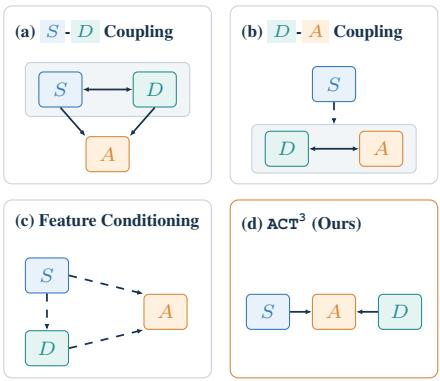  
Figure 1: Architectural comparison of different multi-stream methods. S , A , and D denote the semantic, action, and dynamics streams, respectively. “−→” denotes direct cross-stream attention, whereas “99K” denotes conditioning on upstream features. Grey boxes containing “←→” indicate cross-stream dependencies among the grouped streams, while the exact attention direction varies across methods. Pretrained backbones indicate which context streams are initialized from pretrained foundation models. Layerwise attention indicates direct cross-stream interaction at multiple trans former layers, rather than using upstream features only as conditioning inputs. Independent contexts indicates that neither context stream $( i . e . , \textit { S } \mathrm { o r } \textit { D } )$ reads from other streams during forward computation. Joint S-D tuning indicates that both context streams are updated during downstream policy training. ∗Motus adds a semantic expert to joint D-A attention; DUST conditions D-A denoising on frozen VLM features, while STARRY uses a trainable semantic expert.

Recent methods further combine semantic understanding and dynamics prediction within a shared backbone (Zhang et al., 2025; Zhao et al., 2025; Cen et al., 2025; Wang et al., 2026b; Chen et al., 2026) or specialized multi-stream architectures (Lv et al., 2025; Liu et al., 2025; Won et al., 2026; Bi et al., 2026; Cai et al., 2026; Hu et al., 2026; Tian et al., 2026; Zhang et al., 2026a). As summarized in Fig. 1, these multi-stream designs differ in how semantic and dynamics information reaches the action expert. However, these designs often introduce cross-stream dependencies beyond the action pathway, coupling semantic and dynamics representations before or alongside action generation. Such additional coupling is not necessarily beneficial for control, motivating a simpler alternative that integrates both sources of information directly through the action expert.

In this paper, we introduce $\mathbb { A } \mathbb { C } \mathbb { T } ^ { 3 }$ , a simple yet effective Action-Centric Tri-Stream Transformer. The proposed ACT3 adopts a Mixture-of-Transformers (MoT) architecture, in which the VLM provides semantic understanding context for global task objectives, the WM provides predictive dynamics context for local state transitions, and the action expert serves as their sole integration point for control via action-centric cross-stream attention. Technically, each context backbone attends only within its own stream, while action queries access both context streams through layerwise attention. This allows each backbone to build on its pretrained modeling capabilities without incorporating representations from the other context stream, with the aim of reducing potential interference in duced by cross-stream conditioning. The action expert, in turn, learns how to weight and combine semantic and dynamics information as its action representation evolves. We jointly optimize dynamics prediction and action generation, with action supervision also updating both context backbones through these attention connections. This simple organization makes both the context representa tions and their integration learnable under the control objective, bringing global task semantics and local state dynamics together through action generation.

To sum up, our main contribution is therefore a dedicated Action-Centric Tri-Stream Transformer. At its core, $\mathbb { A } \mathbb { C } \mathbb { T } ^ { 3 }$ learns to integrate semantic understanding and predictive dynamics as complementary guidance for action generation through layerwise action queries, preserving independent context computation while enabling joint optimization for control. Notably, the proposed $\mathbb { A } \mathbb { C } \mathbb { T } ^ { 3 }$ allows us to directly reuse the strong pretrained $\pi _ { 0 . 5 }$ model and augment it with a pretrained Cosmos world model, providing a simple yet effective way to further improve the $\pi _ { 0 . 5 }$ baseline. Experiments on various simulated and real-world robot manipulation benchmarks demonstrate the effectiveness of ACT3, with controlled ablations supporting the benefits of action-centric interaction.

## 2 RELATED WORKS

Vision-Language-Action (VLA) models extend pretrained VLMs to robotic control, leveraging broad semantic knowledge from large-scale multimodal pretraining to generate executable actions (Brohan et al., 2023; Kim et al., 2024). Representative models from the $\pi$ series exemplify this VLM-centric paradigm (Black et al., 2024; Physical Intelligence et al., 2025b;a; 2026). Recent advances have focused on open-world generalization (Kim et al., 2024; Physical Intelligence et al., 2025b; Li et al., 2025b), improving generative action modeling (Black et al., 2024; Chen et al., 2026; Hou et al., 2025), and incorporating reasoning and memory mechanisms for complex manipulation (Zhao et al., 2025; Zhong et al., 2026; Shi et al., 2026). Nevertheless, VLM-centric policies inherit limited physical dynamics priors from vision-language pretraining (Chow et al., 2025; Hu et al., 2024; Wu et al., 2024).

World Action Models (WAMs) pursue a complementary direction by replacing the VLM-centric policy backbone with video-generation WMs, enabling control to exploit predictive dynamics learned from large-scale video data (Cheang et al., 2024; Kim et al., 2026; Ye et al., 2026). However, stronger dynamics modeling does not necessarily preserve the task-level semantic reasoning required for goal-directed manipulation, motivating policies that retain both semantic and dynamics information (Yang et al., 2026; Ma et al., 2026a). Existing approaches broadly adopt either a shared backbone that jointly models understanding, prediction, and action (Zhang et al., 2025; Zhao et al., 2025; Cen et al., 2025; Wang et al., 2026b; Chen et al., 2026), or specialized multi-stream architectures that maintain separate semantic, dynamics, and action pathways (Lv et al., 2025; Liu et al., 2025; Won et al., 2026; Bi et al., 2026; Cai et al., 2026; Hu et al., 2026; Tian et al., 2026; Zhang et al., 2026a). Our work belongs to the latter family, focusing specifically on how information should flow among specialized semantic, dynamics, and action streams.

As summarized in Fig. 1, existing multi-stream methods mainly follow three interaction patterns: semantic-dynamics coupling allows the semantic and dynamics representations to interact before action generation (F1 (Lv et al., 2025), InternVLA-A1 (Cai et al., 2026), BagelVLA (Hu et al., 2026), UAM (Zhang et al., 2026a)); dynamics-action coupling tightly integrates predictive dynamics with action generation under semantic guidance (Motus (Bi et al., 2026), DUST (Won et al., 2026), STARRY (Tian et al., 2026)); and feature conditioning provides separate context representations as inputs to the action module (TriVLA (Liu et al., 2025)). In contrast, $\mathbb { A } \mathbb { C } \mathbb { T } ^ { 3 }$ makes the action stream the sole integration interface: semantic and dynamics backbones remain independent during forward computation, while action queries access both through layerwise attention, allowing both backbones to be jointly optimized under action supervision.

## 3 METHOD

In this section, we present $\mathbb { A } \mathbb { C } \mathbb { T } ^ { 3 }$ , an action-centric tri-stream transformer for combining semantic understanding and predictive dynamics in robot control. The architecture consists of semantic, dynamics, and action streams, with the action stream serving as the interface between the two context pathways. We first introduce the problem formulation and overall architecture (Section 3.1), then describe the layerwise action-centric interaction (Section 3.2). Finally, we present the joint training objective and inference procedure (Section 3.3).

## 3.1 OVERVIEW

Problem Formulation. We learn an embodied policy $\pi _ { \Theta }$ with trainable parameters Θ from a robot demonstration dataset D. At control step t, the policy receives M camera observations $\mathcal { O } _ { t } = \{ I _ { t } ^ { m } \} _ { m = 1 } ^ { M }$ , where $I _ { t } ^ { m }$ denotes the image from camera m, together with a task language instruction ℓ. Proprioceptive state can optionally be included as an additional conditioning input; we omit this optional input from the notation for simplicity. The policy models a conditional distribution over short-horizon robot motions and predicts an H-step action chunk $\hat { A } _ { t } \sim \pi _ { \Theta } ( \cdot \mid \mathcal { O } _ { t } , \ell )$ . We denote the corresponding ground-truth action chunk by $\boldsymbol A _ { t } \stackrel { \cdot } { = } [ a _ { t } , \ldots , a _ { t + H - 1 } ] \in \dot { \mathbb R } ^ { H \times B }$ , where B denotes the action dimension used by the policy model. During execution, the robot executes a prefix of the predicted action chunk and replans using the updated visual observations.

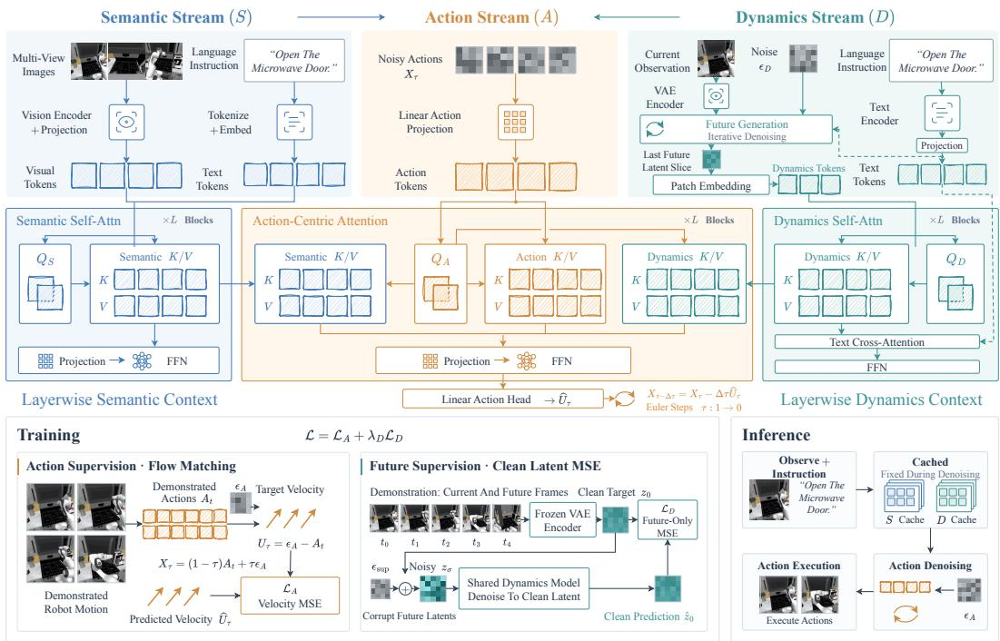  
Figure 2: Overview of the proposed $\mathbb { A } \mathbb { C } \mathbb { T } ^ { 3 }$ . The architecture comprises three specialized transformer streams for semantic understanding, action generation, and dynamics prediction. The semantic and dynamics streams maintain independent forward computation, while the action expert attends to semantic, action, and dynamics representations at every action transformer block, making the action stream the sole integration point for control.

Model Architecture. As shown in Fig. $2 , \mathrm { \ A C T } ^ { 3 }$ adopts a Mixture-of-Transformers (MoT) architecture that combines semantic understanding and predictive dynamics for control through three transformer streams. The semantic stream encodes the current multi-view observations and instruction to provide semantic context for global task objectives, while the dynamics stream provides context for anticipated local state transitions. The action stream generates continuous action chunk through flow matching. At every action transformer block, action queries attend to both semantic and dynamics tokens, while neither context stream reads representations from the other streams. This makes the action stream the sole integration point for control, combining both contexts at mul tiple depths while maintaining independent forward computation in the two context streams. Let ψ, θ, and ϕ denote the trainable parameters of the semantic, action, and dynamics streams, respectively, with $\Theta = ( \psi , \theta , \phi )$ . All three streams are jointly optimized for control, as detailed in Section 3.3. This organization provides a simple way to extend a pretrained MoT-based VLA by initializing the semantic stream from its VLM backbone and the action stream from its action expert, while initializing the dynamics stream from a pretrained WM.

## 3.2 ACTION-CENTRIC TRI-STREAM TRANSFORMER

Semantic and Dynamics Context Construction. Given the current observation and instruction, the semantic stream encodes the multi-view images ${ \mathcal { O } } _ { t }$ into visual tokens through a vision encoder, and tokenizes and embeds the instruction ℓ into text tokens. These tokens are processed by the pretrained VLM transformer to provide layerwise semantic context for the action stream. In parallel, the dynamics stream predicts future latents conditioned on the base-camera image $I _ { t } ^ { b } .$ , where $b \in \{ 1 , \ldots , M \}$ , and the same instruction ℓ. A VAE encodes the observation, and a separate text encoder produces text tokens. Starting from noise $\epsilon _ { D }$ with independent standard Gaussian entries, the dynamics model samples future latents through iterative denoising conditioned on these inputs, keeping the observed latent region fixed. We take the last temporal slice of the sampled future latents as a denoised predicted latent input and apply the dynamics patch embedding to obtain dynamics tokens. This latent slice represents a temporally compressed future segment. The future latents used to construct the dynamics tokens are generated using the same sampling procedure during training and inference, with $\epsilon _ { D }$ drawn independently of the demonstrated future observations. Demonstrated futures are used only for auxiliary prediction supervision.

Action-Centric Attention. We interleave the three streams over L transformer layers so that the action expert can access semantic and dynamics context as its action tokens are updated. Only action queries read keys and values from other streams. At layer $k = 0 , \ldots , L - 1$ , each stream computes queries $\mathbf { Q } _ { i } ^ { k }$ , keys ${ \bf K } _ { i } ^ { k }$ , and values $\mathbf { V } _ { i } ^ { k }$ using its own normalization and projection layers, where $i \in \{ S , A , \mathbf { \bar { \Gamma } } D \}$ indexes the semantic, action, and dynamics streams, respectively. We concatenate the queries along the token dimension as $\mathbf { Q } ^ { k } = [ \mathbf { Q } _ { S } ^ { k } ; \mathbf { \bar { Q } } _ { A } ^ { k } ; \mathbf { Q } _ { D } ^ { k } ]$ , and construct $\mathbf { K } ^ { k }$ and $\mathbf { V } ^ { k }$ analogously. For each attention head with dimension $d ,$ the attention output $\mathbf { O } ^ { k }$ is

$$
\mathbf { O } ^ { k } = \mathrm { s o f t m a x } \left( \frac { \mathbf { Q } ^ { k } ( \mathbf { K } ^ { k } ) ^ { \top } } { \sqrt { d } } + \mathcal { M } \right) \mathbf { V } ^ { k } , \qquad \mathcal { M } = \left[ \begin{array} { c c c } { 0 } & { - \infty } & { - \infty } \\ { 0 } & { 0 } & { 0 } \\ { - \infty } & { - \infty } & { 0 } \end{array} \right] .\tag{1}
$$

The additive block attention mask M specifies stream-level visibility, with query rows and key columns ordered as $( S , A , D )$ . Each entry applies to the corresponding token block: 0 allows attention and −∞ masks it. Action queries therefore attend jointly to semantic, action, and dynamics keys and values under a single softmax; self-attention in each context stream is restricted to that stream. Each stream retains its own output projection and feed-forward module; the dynamics stream additionally cross-attends to its text tokens. This asymmetric design makes the action expert the sole integration point for semantic and dynamics information and preserves independent forward computation in both context streams.

## 3.3 TRAINING AND INFERENCE

Action Supervision. We train the policy to generate action chunks conditioned on semantic and dynamics context using continuous-action flow matching. For standard Gaussian action noise $\epsilon _ { A }$ with the same shape as $A _ { t }$ and flow time $\tau \sim p$ over $( 0 , 1 ]$ , we construct $X _ { \tau } = ( 1 - \tau ) A _ { t } + \tau \epsilon _ { A }$ with target velocity $U _ { \tau } = \epsilon _ { A } - A _ { t }$ . Here $p$ denotes the training-time distribution over flow times. Let $\mathcal { C } _ { i , t } = \{ ( \mathbf { K } _ { i } ^ { k } , \mathbf { V } _ { i } ^ { k } ) \} _ { k = 0 } ^ { L - 1 }$ collect the layerwise context for $i \in \{ S , D \}$ . The action expert $f _ { \theta }$ linearly projects $X _ { \tau }$ into action tokens and uses $\tau$ to condition its transformer blocks. A linear output head predicts the action velocity $\widehat { U } _ { \tau }$ . We minimize the action loss $\mathcal { L } _ { A }$

$$
\mathcal { L } _ { A } = \mathbb { E } _ { \mathcal { D } , \tau , \epsilon _ { A } , \epsilon _ { D } } \left[ \frac { \| \widehat { U } _ { \tau } - U _ { \tau } \| _ { F } ^ { 2 } } { H B } \right] , \qquad \widehat { U } _ { \tau } = f _ { \theta } ( X _ { \tau } , \tau ; \mathcal { C } _ { S , t } , \mathcal { C } _ { D , t } ) .\tag{2}
$$

Here $\| \cdot \| _ { F }$ denotes the Frobenius norm, and the expectation is over demonstration samples from D and the sampled flow times and noises.

Joint Optimization. We supplement action supervision with an auxiliary dynamics-prediction loss. The same VAE encodes demonstration clips containing current and future frames into clean latents $z _ { \mathrm { 0 } }$ . We corrupt their future region at a sampled noise level $\sigma$ using standard Gaussian noise $\boldsymbol { \epsilon } _ { \mathrm { s u p } }$ to obtain noisy latents $z _ { \sigma }$ . Conditioned on the current observation and instruction, the auxiliary branch reconstructs clean latents $\hat { z } _ { 0 }$ from $z _ { \sigma }$ . Future generation, dynamics context extraction, and auxiliary prediction share the dynamics-transformer parameters $\phi ,$ , but the auxiliary branch provides no input to the action expert. Its loss $\mathcal { L } _ { D }$ is the mean squared error between $\hat { z } _ { 0 }$ and $z _ { \mathrm { 0 } }$ over future latent entries only. We jointly optimize all three streams under the objective $\mathcal { L } \mathrm { : }$

$$
\begin{array} { r } { \mathcal { L } = \mathcal { L } _ { A } + \lambda _ { D } \mathcal { L } _ { D } , } \end{array}\tag{3}
$$

where $\lambda _ { D } \geq 0$ weights dynamics-prediction loss. Action gradients update both context backbones through the keys and values read by the action stream. The auxiliary loss additionally updates the dynamics stream. Thus, both context backbones and the action expert are optimized for control.

Inference with Cached Contexts. At each policy query, we generate future latents from the current observation and instruction and compute the layerwise contexts $\mathcal { C } _ { S , t }$ and $\mathcal { C } _ { D , t }$ once. These contexts remain fixed during action generation because they do not depend on the noisy actions $X _ { \tau }$ or their flow time τ. Starting from a standard Gaussian chunk $X _ { 1 }$ , we integrate the predicted action velocity from $\tau = 1 \mathrm { t o } \tau = 0$ using Euler steps of size $\Delta \tau > 0$ to obtain $\hat { A } _ { t } = X _ { 0 }$ . Only the action stream is recomputed during integration; both context caches are refreshed for the next policy query using updated observations. Appendix C.4 provides the detailed sampling, prediction-supervision, and action-integration equations.

## 4 EXPERIMENTS

We organize our experiments around three questions: (1) Does the complete policy improve task execution and robustness? We evaluate simulated and real-world manipulation, including transfer under distribution shifts. (2) How should actions access semantic and dynamics context? We study cross-stream interaction and layerwise context access. (3) What do generated context and predictive supervision contribute? We ablate generated context and dynamics-prediction supervision. These questions are addressed in Sections 4.2 and 4.6, Section 4.3, and Section 4.4, respectively.

## 4.1 EXPERIMENTAL SETUP

Benchmarks and Data. We train one policy on the 24 kitchen tasks of RoboCasa (Nasiriany et al., 2024) and another jointly on the 40 tasks of LIBERO-Spatial, Object, Goal, and Long (Liu et al., 2023). Both use a nominal budget of 50 demonstrations per task. Following the preprocessing of OpenVLA (Kim et al., 2024) for LIBERO and the successful human-demonstration subset used by Cosmos Policy (Kim et al., 2026) for RoboCasa, the converted datasets contain 1,693 and 1,199 episodes, respectively. We further evaluate the LIBERO-trained policies on LIBERO-Plus (Fei et al., 2025) without additional fine-tuning, using the same 10,030 perturbed instances for both policies. Dataset and evaluation details appear in Appendix B.1, B.4, and E.

Models and Comparisons. $\mathbb { A } \mathbb { C } \mathbb { T } ^ { 3 }$ initializes its semantic and action streams from $\pi _ { 0 . 5 }$ (Physical Intelligence et al., 2025b) and its dynamics stream from the Cosmos-Predict2.5-2B post-trained video checkpoint (Ali et al., 2025). Model initialization, update scopes, and gradient-flow details are provided in Appendix B.2. The default model predicts four consecutive future images and uses generated future representations as action context during both training and deployment. Demonstrated future observations provide auxiliary supervision, rather than inputs to the deployed policy.

Our primary baseline is $\pi _ { 0 . 5 }$ trained and evaluated in the same PyTorch pipeline, following the official implementation (Physical Intelligence et al., 2025b). For LIBERO, the comparisons include $\pi _ { 0 }$ (Black et al., 2024), OpenVLA-OFT (Kim et al., 2025), DUST (Won et al., 2026), HAM-LET (Koo et al., 2026), ForeAct (Zhang et al., 2026b), Fast-WAM (Yuan et al., 2026), LingBot-VA (Li et al., 2026), and Cosmos Policy (Kim et al., 2026). For RoboCasa, the comparisons include UVA (Li et al., 2025a), DUST (Won et al., 2026), UWM (Zhu et al., 2025), $\pi _ { 0 }$ (Black et al., 2024), GR00T-N1.5 (Bjorck et al., 2025), FLARE (Zheng et al., 2025), HAMLET (Koo et al., 2026), and Cosmos Policy (Kim et al., 2026). Checkpoint selection and the shared evaluation protocol are documented in Appendix B.3 and B.4.

## 4.2 TASK EXECUTION AND ROBUSTNESS

RoboCasa. $\mathbb { A } \mathbb { C } \mathbb { T } ^ { 3 }$ achieves 71.2% success on the 24 kitchen tasks, compared with 59.4% for the in-house $\pi _ { 0 . 5 }$ baseline (Table 2). With the same downstream demonstrations and available camera views, augmenting the VLA with the dynamics stream and its training objective improves kitchen manipulation performance. This establishes the benefit of the complete policy; the following ablations examine how its streams and objectives contribute.

LIBERO. $\mathbb { A } \mathbb { C } \mathbb { T } ^ { 3 }$ improves all four LIBERO suites, reaching a 98.6% average success rate from a strong 96.9% baseline (Table 1). The improvement spans spatial, object, and goal variation as well as long-horizon tasks. In particular, the Long result shows that repeatedly refreshing short-range dynamics context is compatible with improved execution over longer task sequences.

Transfer under Distribution Shifts. On LIBERO-Plus, $\mathbb { A } \mathbb { C } \mathbb { T } ^ { 3 }$ achieves an average success rate of 82.4%, compared with 68.4% for the in-house $\pi _ { 0 . 5 }$ baseline, when both LIBERO-trained policies are evaluated on the same 10,030 instances without additional fine-tuning (Figure 3). The improvement spans all four task suites, with the largest gains on Object and Long, corresponding to increases of 16.4 and 15.8 percentage points, respectively. By integrating task semantics with predicted local state changes at each action layer, $\mathbb { A } \mathbb { C } \mathbb { T } ^ { 3 }$ may better handle object variation and limit error accumulation over longer task sequences. While both policies already perform strongly on standard LIBERO, the larger performance gap on LIBERO-Plus highlights robustness differences that are less visible under the original evaluation conditions. Appendix E reports category and difficulty breakdowns for the shared evaluation instances.

Table 1: LIBERO results. Success rates (%) across the Spatial, Object, Goal, and Long task suites. The last two rows use our PyTorch pipeline; other scores are taken from prior work under the original evaluation settings.  
Table 2: RoboCasa results. Success rates (%) on 24 kitchen tasks. The last two rows use our pipeline; other scores are from prior work.
<table><tr><td>Method</td><td>Spatial</td><td>Object</td><td>Goal</td><td>Long</td><td>Average</td></tr><tr><td>π0</td><td>96.8</td><td>98.8</td><td>95.8</td><td>85.2</td><td>94.2</td></tr><tr><td>OpenVLA-OFT</td><td>97.6</td><td>98.4</td><td>97.9</td><td>94.5</td><td>97.1</td></tr><tr><td>DUST</td><td>96.2</td><td>99.8</td><td>96.0</td><td>92.6</td><td>96.2</td></tr><tr><td>HAMLET ForeAct</td><td>99.0</td><td>100.0</td><td>99.2</td><td>92.2</td><td>97.6</td></tr><tr><td>Fast-WAM</td><td>97.3 98.2</td><td>99.8</td><td>97.3</td><td>95.4</td><td>97.5</td></tr><tr><td>LingBot-VA</td><td>98.5</td><td>100.0 99.6</td><td>97.0 97.2</td><td>95.2 98.5</td><td>97.6 98.5</td></tr><tr><td>Cosmos Policy</td><td>98.1</td><td>100.0</td><td>98.2</td><td>97.6</td><td>98.5</td></tr><tr><td>π0.5 (PyTorch)</td><td>98.0</td><td>98.4</td><td>97.5</td><td></td><td></td></tr><tr><td></td><td></td><td></td><td></td><td>93.5</td><td>96.9</td></tr><tr><td>ACT³ (Ours)</td><td>99.5</td><td>99.0</td><td>98.5</td><td>97.4</td><td>98.6</td></tr></table>

<table><tr><td>Method</td><td># Demos per Task Average</td></tr><tr><td>UVA</td><td>50 50.0</td></tr><tr><td>DUST</td><td>300 58.5</td></tr><tr><td>UWM</td><td>1,000 60.8</td></tr><tr><td>π0</td><td>300 62.5</td></tr><tr><td>GR00T-N1.5</td><td>300 64.1</td></tr><tr><td>FLARE</td><td>300 66.4</td></tr><tr><td>HAMLET</td><td>300 66.4</td></tr><tr><td>Cosmos Policy</td><td>50 67.1</td></tr><tr><td>π0.5 (PyTorch)</td><td>50 59.4</td></tr><tr><td> $\mathbf { a c r ^ { 3 } } \left( \mathbf { \dot { O } u r s } \right)$ </td><td>50 71.2</td></tr></table>

## 4.3 ACTION-CENTRIC INTERACTION

Where Should the Streams Interact? Table 3 compares cross-stream attention topologies within our architecture. All variants allow action queries to read both semantic and dynamics information, so the comparison concerns how context is constructed. ACT3 achieves the highest success rate. Adding semantic-to-dynamics attention allows dynamics queries to read semantic tokens. Further allowing dynamics queries to read action tokens enables bidirectional attention between the dynamics and action streams. Allowing all three streams to attend to one another yields the lowest success rate. The observed ordering is consistent with a benefit from avoiding additional

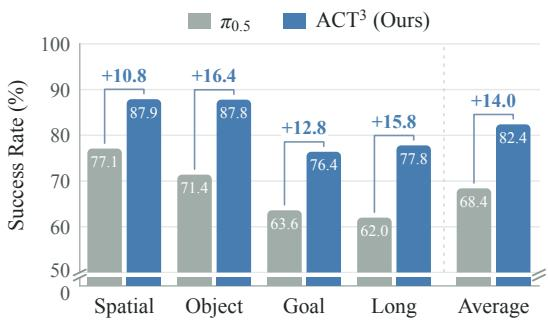  
Figure 3: LIBERO-Plus success rates (%) on 10,030 evaluation instances under direct transfer from LIBERO without additional fine-tuning. Both models use PyTorch implementations.

cross-stream dependencies during context construction. In particular, independently constructed semantics and dynamics can instead be weighted and combined by action queries as the action representation evolves. Despite this forward independence, both context backbones remain trainable through action supervision. Appendix C.1 specifies the attention masks and inference dependencies; Appendix C.2 reports freezing and prediction-only Cosmos controls.

Which Context Layers Should Action Queries Read? We next examine the layerwise interleaving used by ACT3. Each action layer reads semantic and dynamics keys and values (K/V) from the corresponding VLM and WM layers. Figure 4(a) compares this design with three controls that reuse the final-layer K/V from the VLM, the WM, or both at every action layer. When final-layer reuse is applied to only one stream, the other retains its original layerwise mapping. All variants reuse the existing K/V projections and differ only in

Table 3: Attention-topology ablation on Robo-Casa. Entries list the streams read by each query stream. The last row is $\mathbb { A } \mathbb { C } \mathbb { T } ^ { 3 }$
<table><tr><td>S</td><td>reads</td><td>A reads</td><td>D reads</td><td>SR (%)</td></tr><tr><td>S</td><td></td><td>S A D</td><td>S D</td><td>64.6</td></tr><tr><td>S</td><td></td><td>A D</td><td>S A D</td><td>64.0</td></tr><tr><td>SA D</td><td>S</td><td>A D</td><td>S A D</td><td>59.1</td></tr><tr><td>S</td><td></td><td>SA D</td><td>D</td><td>71.2</td></tr></table>

which context layers action queries read. Figure 4(a) shows that $\mathbb { A } \mathbb { C } \mathbb { T } ^ { 3 }$ achieves 71.2% success with layerwise access to both streams, compared with 65.8%, 63.5%, and 64.6% when final-layer K/V reuse is applied to the VLM only, the WM only, or both streams, respectively. A plausible explanation is that final-layer representations may not expose all the fine-grained motion cues useful for control. Repeated final-layer attention reweights the same context, whereas layerwise interleaving provides direct access to intermediate semantic and dynamics features. These features may help combine local control details with task-level guidance during action refinement.

## 4.4 GENERATED CONTEXT AND DYNAMICS SUPERVISION

The dynamics stream contributes both context for action generation and an auxiliary prediction objective. Figure 4(b) separates these roles by varying current-frame versus generatedfuture context, with and without the dynamics-prediction loss. All variants use the same architecture and update Cosmos through action supervision. In the current-frame setting, prediction supervision uses a separate branch with shared dynamics parameters, so action queries still receive only current-frame dynamics context. Generated-future context increases success from 61.3%

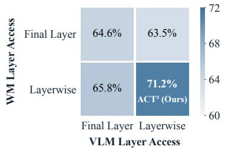

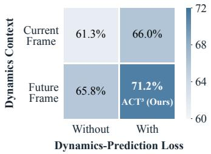  
Figure 4: Effects of context-layer access and dynamics prediction on RoboCasa. (a) Left: Context-layer access in the VLM and WM streams. “Layerwise” uses the original layer correspondence; “Final Layer” reuses the last layer’s K/V at every action layer. (b) Right: Separating future-context generation from dynamics-prediction supervision. Rows specify current-frame or generated-future dynamics context; columns indicate whether the prediction loss is applied. Each cell reports success rate (%); the bottom-right cell in each panel corresponds to ACT3.

to 65.8% without prediction supervision and from 66.0% to 71.2% with it. This gain may arise because action queries can read anticipated local state changes directly, reducing the need to infer them from current-frame features alone. Prediction supervision also benefits current-frame control, despite no generated future reaching the action stream. This suggests that learning demonstrated transitions helps shape control-relevant representations in the shared dynamics backbone, beyond its role in training future generation. Appendix C.3 details the computation paths and factorial contrasts; Appendix D.1 reports supplementary target-timing experiments.

## 4.5 ANALYSIS OF ACTION-CENTRIC ATTENTION

We examine how action queries allocate attention across the independently computed VLM context, WM context, and tokens of the action chunk during interaction. We collect 300 rollouts of ACT3 across six RoboCasa tasks and compare attention before and after five simulatordefined events. For each event, we first compute a within-rollout change and then average across rollouts within each task, giving contributing tasks equal weight. Figure 5 reports these changes in percentage points; positive values indicate increased attention after the

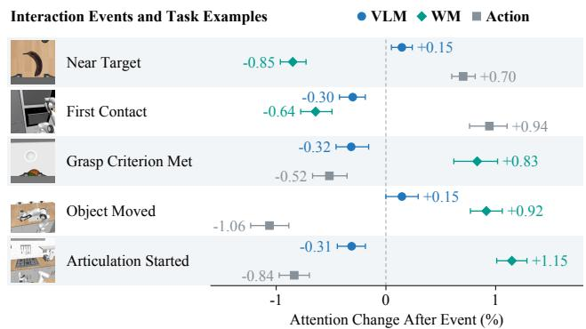  
Figure 5: Event-dependent allocation of action-query attention. Points and adjacent numbers are task-equal mean postminus-pre changes. Error bars show 95% bootstrap intervals.

event. Appendix D.3 provides the measurement protocol. Near-target and first-contact events are associated with increased attention to action tokens and decreased attention to WM context. One possible interpretation is that approach and initial contact place greater emphasis on local adjustments within the ongoing action chunk. Around the grasp criterion, object motion, and articulation onset, WM attention instead increases while action-token attention decreases. These events involve sustained bilateral contact or changes in object state, making the increased WM readout consistent with a greater need to account for interaction dynamics. VLM attention changes more modestly, possibly because the task goals and object roles remain largely unchanged across these short event windows, sustaining a need for visual-language grounding.

## 4.6 REAL-WORLD EXPERIMENTS

Task Setup. We evaluate three real-world robotic manipulation tasks on the AgileX CobotMagic bimanual platform with one external and two wrist-mounted RGB cameras. The tasks are Bowl Stacking, Block Collection, and Flower Arrangement, covering stable placement, repeated object transfer, and ordered multi-stage execution, respectively. Flower Arrangement requires pouring water into a vase before inserting the flowers. We train a separate policy for each task and method using 100, 100, and 80 demonstrations, respectively. Appendix F provides training details, evaluation protocols, and success criteria.

Task Completion. We evaluate each method for 30 trials per task, with initial object configurations independently randomized across trials and methods for all three tasks. Table 4 reports full-task success counts and rates. On the Bowl Stacking task, $\mathbb { A } \mathbb { C } \mathbb { T } ^ { 3 }$ achieves a 90.0% success rate, compared with 86.7% for $\pi _ { 0 . 5 }$ On the Block Collection task, $\mathbb { A } \mathbb { C } \mathbb { T } ^ { 3 }$ achieves $8 3 . 3 \% ,$ compared with 73.3% for $\pi _ { 0 . 5 }$ . The largest observed gain occurs on the Flower Arrangement task, where $\mathbb { A } \mathbb { C } \mathbb { T } ^ { 3 }$ achieves a 63.3% success rate compared with 46.7% for $\pi _ { 0 . }$ .5.

Table 4: Average success rates (%) in real-world manipulation tasks. Entries are successful trials / total trials (success rate). Success criteria are defined in Appendix F.3.
<table><tr><td>Task</td><td> $\pi _ { 0 . 5 }$ </td><td>ACT³ (Ours)</td></tr><tr><td>Bowl Stacking</td><td>26/30 (86.7%)</td><td>27/30 (90.0%)</td></tr><tr><td>Block Collection</td><td>22/30 (73.3%)</td><td>25/30 (83.3%)</td></tr><tr><td>Flower Arrangement</td><td>14/30 (46.7%)</td><td>19/30 (63.3%)</td></tr></table>

Execution Analysis. Figure 6 compares selected execution sequences on the hard Block Collection and Flower Arrangement tasks. In collection, π0.5 repeatedly attempts to grasp an arch-shaped block without attaining a suitable gripper orientation. In contrast, our $\mathbb { A } \mathbb { C } \mathbb { T } ^ { 3 }$ aligns its gripper with the target blocks and successfully grasps several arch-shaped blocks in succession. In the pouringand-flower sequence, π0.5 brings the final flower toward the vase, but the stem passes alongside the rim instead of entering the opening. $\mathbb { A } \mathbb { C } \mathbb { T } ^ { 3 }$ aligns the final

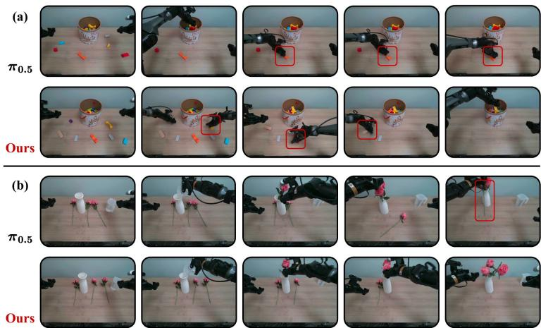  
Figure 6: Qualitative comparison of real-world executions: (a) Block Collection and (b) Flower Arrangement. Each panel shows $\pi _ { 0 . 5 }$ (top) and $\mathbb { A } \mathbb { C } \mathbb { T } ^ { 3 }$ (bottom), with keyframes ordered from left to right. Red boxes highlight grasping and insertion details.

stem with the opening and successfully inserts it. These cases illustrate how $\mathbb { A } \mathbb { C } \mathbb { T } ^ { 3 }$ sustains task progress by achieving the precise alignment required for grasping and insertion.

## 5 CONCLUSION

In this paper, we introduced $\mathbb { A } \mathbb { C } \mathbb { T } ^ { 3 }$ , an Action-Centric Tri-Stream Transformer that combines semantic understanding and predictive dynamics for robot control. The action expert serves as the sole integration point through layerwise attention, while the semantic and dynamics streams maintain independent forward computation. Joint optimization of action generation and dynamics prediction allows both context representations and their integration to adapt to the control objective. Experi ments on simulated and real-world manipulation tasks demonstrate the effectiveness of this design. The experimental findings suggest that global task semantics and local predictive dynamics can be effectively combined through action generation without directly coupling the two context streams. Our current evaluation is limited to robotic manipulation; future work will explore extending this action-centric design to other embodied tasks, such as navigation.

## AI USE STATEMENT

Generative AI tools were used to assist with polishing the manuscript and with code implementation. All AI-assisted text and code were reviewed and verified by the authors. The authors take full responsibility for the final content of this work.

## REPRODUCIBILITY STATEMENT

We provide detailed formulations and experimental specifications to facilitate reproducibility. Our implementation builds on the OpenPI codebase. Section 3 and Appendix C.4 describe the architecture, training objectives, and inference procedure of ACT3. Appendix B documents the datasets, model initialization, training configurations, and evaluation protocols, while Appendix F provides the corresponding real-world experimental details.

## REFERENCES

Arslan Ali, Junjie Bai, Maciej Bala, Yogesh Balaji, Aaron Blakeman, Tiffany Cai, Jiaxin Cao, Tianshi Cao, Elizabeth Cha, Yu-Wei Chao, et al. World simulation with video foundation models for physical ai. arXiv preprint arXiv:2511.00062, 2025.

Shuai Bai, Yuxuan Cai, Ruizhe Chen, Keqin Chen, Xionghui Chen, Zesen Cheng, Lianghao Deng, Wei Ding, Chang Gao, Chunjiang Ge, et al. Qwen3-vl technical report. arXiv preprint arXiv:2511.21631, 2025.

Lucas Beyer, Andreas Steiner, Andre Susano Pinto, Alexander Kolesnikov, Xiao Wang, Daniel Salz,´ Maxim Neumann, Ibrahim Alabdulmohsin, Michael Tschannen, Emanuele Bugliarello, et al. Paligemma: A versatile 3b vlm for transfer. arXiv preprint arXiv:2407.07726, 2024.

Hongzhe Bi, Hengkai Tan, Shenghao Xie, Zeyuan Wang, Shuhe Huang, Haitian Liu, Ruowen Zhao, Yao Feng, Chendong Xiang, Yinze Rong, et al. Motus: A unified latent action world model. In IEEE/CVF Computer Vision and Pattern Recognition Conference, 2026.

Johan Bjorck, Fernando Castaneda, Nikita Cherniadev, Xingye Da, Runyu Ding, Linxi Fan,˜ Yu Fang, Dieter Fox, Fengyuan Hu, Spencer Huang, et al. Gr00t n1: An open foundation model for generalist humanoid robots. arXiv preprint arXiv:2503.14734, 2025.

Kevin Black, Noah Brown, Danny Driess, Adnan Esmail, Michael Equi, Chelsea Finn, Niccolo Fusai, Lachy Groom, Karol Hausman, Brian Ichter, et al. π0: A vision–language–action flow model for general robot control. arXiv preprint arXiv:2410.24164, 2024.

Anthony Brohan, Noah Brown, Justice Carbajal, Yevgen Chebotar, Xi Chen, Krzysztof Choromanski, Tianli Ding, Danny Driess, Avinava Dubey, Chelsea Finn, et al. Rt-2: Vision-language-action models transfer web knowledge to robotic control. arXiv preprint arXiv:2307.15818, 2023.

Junhao Cai, Zetao Cai, Jiafei Cao, Yilun Chen, Zeyu He, Lei Jiang, Hang Li, Hengjie Li, Yang Li, Yufei Liu, et al. Internvla-a1: Unifying understanding, generation and action for robotic manipulation. arXiv preprint arXiv:2601.02456, 2026.

Jun Cen, Chaohui Yu, Hangjie Yuan, Yuming Jiang, Siteng Huang, Jiayan Guo, Xin Li, Yibing Song, Hao Luo, Fan Wang, et al. Worldvla: Towards autoregressive action world model. arXiv preprint arXiv:2506.21539, 2025.

Chi-Lam Cheang, Guangzeng Chen, Ya Jing, Tao Kong, Hang Li, Yifeng Li, Yuxiao Liu, Hongtao Wu, Jiafeng Xu, Yichu Yang, et al. Gr-2: A generative video-language-action model with webscale knowledge for robot manipulation. arXiv preprint arXiv:2410.06158, 2024.

Jiayi Chen, Wenxuan Song, Pengxiang Ding, Ziyang Zhou, Han Zhao, Barrett Tang, Donglin Wang, and Haoang Li. Unified diffusion vla: Vision-language-action model via joint discrete denosing diffusion process. In International Conference on Learning Representations, 2026.

Wei Chow, Jiageng Mao, Boyi Li, Daniel Seita, Vitor Campagnolo Guizilini, and Yue Wang. Physbench: Benchmarking and enhancing vision-language models for physical world understanding. In International Conference on Learning Representations, 2025.

Senyu Fei, Siyin Wang, Junhao Shi, Zihao Dai, Jikun Cai, Pengfang Qian, Li Ji, Xinzhe He, Shiduo Zhang, Zhaoye Fei, et al. Libero-plus: In-depth robustness analysis of vision-language-action models. arXiv preprint arXiv:2510.13626, 2025.

Zhi Hou, Tianyi Zhang, Yuwen Xiong, Haonan Duan, Hengjun Pu, Ronglei Tong, Chengyang Zhao, Xizhou Zhu, Yu Qiao, Jifeng Dai, et al. Dita: Scaling diffusion transformer for generalist visionlanguage-action policy. In International Conference on Computer Vision, 2025.

Yucheng Hu, Yanjiang Guo, Pengchao Wang, Xiaoyu Chen, Yen-Jen Wang, Jianke Zhang, Koushil Sreenath, Chaochao Lu, and Jianyu Chen. Video prediction policy: A generalist robot policy with predictive visual representations. arXiv preprint arXiv:2412.14803, 2024.

Yucheng Hu, Jianke Zhang, Yuanfei Luo, Yanjiang Guo, Xiaoyu Chen, Xinshu Sun, Kun Feng, Qingzhou Lu, Sheng Chen, Yangang Zhang, et al. Bagelvla: Enhancing long-horizon manipulation via interleaved vision-language-action generation. arXiv preprint arXiv:2602.09849, 2026.

Moo Jin Kim, Karl Pertsch, Siddharth Karamcheti, Ted Xiao, Ashwin Balakrishna, Suraj Nair, Rafael Rafailov, Ethan Foster, Grace Lam, Pannag Sanketi, et al. Openvla: An open-source vision-language-action model. arXiv preprint arXiv:2406.09246, 2024.

Moo Jin Kim, Chelsea Finn, and Percy Liang. Fine-tuning vision-language-action models: Optimizing speed and success. arXiv preprint arXiv:2502.19645, 2025.

Moo Jin Kim, Yihuai Gao, Tsung-Yi Lin, Yen-Chen Lin, Yunhao Ge, Grace Lam, Percy Liang, Shuran Song, Ming-Yu Liu, Chelsea Finn, et al. Cosmos policy: Fine-tuning video models for visuomotor control and planning. In International Conference on Learning Representations, 2026.

Myungkyu Koo, Daewon Choi, Taeyoung Kim, Kyungmin Lee, Changyeon Kim, Younggyo Seo, and Jinwoo Shin. Hamlet: Switch your vision-language-action model into a history-aware policy. In International Conference on Learning Representations, 2026.

Lin Li, Qihang Zhang, Yiming Luo, Shuai Yang, Ruilin Wang, Fei Han, Mingrui Yu, Zelin Gao, Nan Xue, Xing Zhu, et al. Causal world modeling for robot control. In Robotics: Science and Systems, 2026.

Shuang Li, Yihuai Gao, Dorsa Sadigh, and Shuran Song. Unified video action model. arXiv preprint arXiv:2503.00200, 2025a.

Yi Li, Yuquan Deng, Jesse Zhang, Joel Jang, Marius Memmel, Caelan Garrett, Fabio Ramos, Dieter Fox, Anqi Li, Abhishek Gupta, et al. Hamster: Hierarchical action models for open-world robot manipulation. In International Conference on Learning Representations, volume 2025, 2025b.

Bo Liu, Yifeng Zhu, Chongkai Gao, Yihao Feng, Qiang Liu, Yuke Zhu, and Peter Stone. Libero: Benchmarking knowledge transfer for lifelong robot learning. In Annual Conference on Neural Information Processing Systems, 2023.

Zhenyang Liu, Yongchong Gu, Sixiao Zheng, Yanwei Fu, Xiangyang Xue, and Yu-Gang Jiang. Trivla: A triple-system-based unified vision-language-action model with episodic world modeling for general robot control. arXiv preprint arXiv:2507.01424, 2025.

Qi Lv, Weijie Kong, Hao Li, Jia Zeng, Zherui Qiu, Delin Qu, Haoming Song, Qizhi Chen, Xiang Deng, and Jiangmiao Pang. F1: A vision-language-action model bridging understanding and generation to actions. arXiv preprint arXiv:2509.06951, 2025.

Haoxiang Ma, Junhao Cai, Xiaoxu Xu, Hao Li, Yuyin Yang, Yang Tian, Jiafei Cao, Hongrui Zhu, Zherui Qiu, Yuqiang Yang, et al. Internvla-a1.5: Unifying understanding, latent foresight, and action for compositional generalization. arXiv preprint arXiv:2607.04988, 2026a.

Yueen Ma, Zixing Song, Yuzheng Zhuang, Jianye Hao, and Irwin King. A survey on vision– language–action models for embodied ai. IEEE Transactions on Neural Networks and Learning Systems, 37(7):3031–3051, 2026b.

Soroush Nasiriany, Abhiram Maddukuri, Lance Zhang, Adeet Parikh, Aaron Lo, Abhishek Joshi, Ajay Mandlekar, and Yuke Zhu. Robocasa: Large-scale simulation of everyday tasks for generalist robots. arXiv preprint arXiv:2406.02523, 2024.

Physical Intelligence, Ali Amin, Raichelle Aniceto, Ashwin Balakrishna, Kevin Black, Ken Conley, Grace Connors, James Darpinian, Karan Dhabalia, Jared DiCarlo, et al. $\pi _ { 0 . 6 } ^ { * } \colon$ a vla that learns from experience. arXiv preprint arXiv:2511.14759, 2025a.

Physical Intelligence, Kevin Black, Noah Brown, James Darpinian, Karan Dhabalia, Danny Driess, Adnan Esmail, Michael Equi, Chelsea Finn, Niccolo Fusai, et al. $\pi _ { 0 . 5 } { : }$ A vision–language–action model with open-world generalization. arXiv preprint arXiv:2504.16054, 2025b.

Physical Intelligence, Bo Ai, Ali Amin, Raichelle Aniceto, Ashwin Balakrishna, Greg Balke, Kevin Black, George Bokinsky, Shihao Cao, Thomas Charbonnier, et al. π0.7: a steerable generalist robotic foundation model with emergent capabilities. arXiv preprint arXiv:2604.15483, 2026.

Qiuhong Shen, Shihua Zhang, Yue Liao, Qi Li, Zhenxiong Tan, Shizun Wang, Shuicheng Yan, and Xinchao Wang. World action models: A survey. arXiv preprint arXiv:2606.20781, 2026.

Hao Shi, Bin Xie, Yingfei Liu, Lin Sun, Fengrong Liu, Tiancai Wang, Erjin Zhou, Haoqiang Fan, Xiangyu Zhang, and Gao Huang. Memoryvla: Perceptual-cognitive memory in vision-languageaction models for robotic manipulation. In International Conference on Learning Representations, 2026.

Yuxuan Tian, Yurun Jin, Bin Yu, Yukun Shi, Hao Wu, Chi Harold Liu, Kai Chen, and Cong Huang. Starry: Spatial-temporal action-centric world modeling for robotic manipulation. arXiv preprint arXiv:2604.26848, 2026.

Siyin Wang, Junhao Shi, Zhaoyang Fu, Xinzhe He, Feihong Liu, Chenchen Yang, Yikang Zhou, Zhaoye Fei, Jingjing Gong, Jinlan Fu, et al. World action models: The next frontier in embodied ai. arXiv preprint arXiv:2605.12090, 2026a.

Yuqi Wang, Xinghang Li, Wenxuan Wang, Junbo Zhang, Yingyan Li, Yuntao Chen, Xinlong Wang, and Zhaoxiang Zhang. Unified vision-language-action model. In International Conference on Learning Representations, 2026b.

John Won, Kyungmin Lee, Huiwon Jang, Dongyoung Kim, and Jinwoo Shin. Dual-stream diffusion for world-model augmented vision-language-action model. In International Conference on Machine Learning, 2026.

Hongtao Wu, Ya Jing, Chilam Cheang, Guangzeng Chen, Jiafeng Xu, Xinghang Li, Minghuan Liu, Hang Li, and Tao Kong. Unleashing large-scale video generative pre-training for visual robot manipulation. In International Conference on Learning Representations, 2024.

Yi Yang, Zhihong Liu, Siqi Kou, Yiyang Chen, Yanzhe Hu, Jianbo Zhou, Boyuan Zhao, Zhijie Wei, Xiao Xia, Xueqi Li, et al. World-language-action model for unified world modeling, language reasoning, and action synthesis. arXiv preprint arXiv:2606.05979, 2026.

Seonghyeon Ye, Yunhao Ge, Kaiyuan Zheng, Shenyuan Gao, Sihyun Yu, George Kurian, Suneel Indupuru, You Liang Tan, Chuning Zhu, Jiannan Xiang, et al. World action models are zero-shot policies. arXiv preprint arXiv:2602.15922, 2026.

Tianyuan Yuan, Zibin Dong, Yicheng Liu, and Hang Zhao. Fast-wam: Do world action models need test-time future imagination? arXiv preprint arXiv:2603.16666, 2026.

Jianke Zhang, Yanjiang Guo, Yucheng Hu, Xiaoyu Chen, Xiang Zhu, and Jianyu Chen. Upvla: A unified understanding and prediction model for embodied agent. arXiv preprint arXiv:2501.18867, 2025.

Jianke Zhang, Yuanfei Luo, Yucheng Hu, Xiaoyu Chen, Yanjiang Guo, Ziyang Liu, Hongbin Xu, Tian Lan, and Jianyu Chen. Uam: A dual-stream perspective on forgetting in vla training. arXiv preprint arXiv:2605.15735, 2026a.

Zhuoyang Zhang, Shang Yang, Qinghao Hu, Luke J Huang, James Hou, Yufei Sun, Yao Lu, and Song Han. Foreact: Steering your vla with efficient visual foresight planning. In IEEE/CVF Computer Vision and Pattern Recognition Conference, 2026b.

Qingqing Zhao, Yao Lu, Moo Jin Kim, Zipeng Fu, Zhuoyang Zhang, Yecheng Wu, Zhaoshuo Li, Qianli Ma, Song Han, Chelsea Finn, et al. Cot-vla: Visual chain-of-thought reasoning for visionlanguage-action models. In IEEE/CVF Computer Vision and Pattern Recognition Conference, 2025.

Ruijie Zheng, Jing Wang, Scott Reed, Johan Bjorck, Yu Fang, Fengyuan Hu, Joel Jang, Kaushil Kundalia, Zongyu Lin, Loic Magne, et al. Flare: Robot learning with implicit world modeling. arXiv preprint arXiv:2505.15659, 2025.

Linqing Zhong, Yi Liu, Yifei Wei, Ziyu Xiong, Si Liu, and Guanghui Ren. Acot-vla: Action chain-of-thought for vision-language-action models. In IEEE/CVF Computer Vision and Pattern Recognition Conference, 2026.

Chuning Zhu, Raymond Yu, Siyuan Feng, Benjamin Burchfiel, Paarth Shah, and Abhishek Gupta. Unified world models: Coupling video and action diffusion for pretraining on large robotic datasets. arXiv preprint arXiv:2504.02792, 2025.

## Appendix

A Additional Discussion of Multi-Stream Architectures 15   
B Experimental Protocol and Reproducibility 15   
B.1 Datasets and Preprocessing . 15   
B.2 Model Initialization and Gradient Paths 16   
B.3 Optimization and Checkpoint Selection 17   
B.4 Evaluation and Statistical Reporting 17   
C Architecture and Context-Control Details 18   
C.1 Attention-Topology Ablations 18   
C.2 Joint Adaptation of the Context Streams 19   
C.3 Current and Generated Context 20   
C.4 Sampling, Supervision, and Action Integration . 20   
D Supplementary Training Studies 21   
D.1 Temporal Sampling of Future Targets 21   
D.2 Exploratory Privileged Self-Distillation 22   
D.3 Details of Action-Centric Attention Analysis . 22   
E LIBERO-Plus Evaluation and Detailed Results 23   
F Real-World Experiment Details 24   
F.1 Setup and Training 24   
F.2 Evaluation Protocol 24   
F.3 Tasks and Metrics 24

## A ADDITIONAL DISCUSSION OF MULTI-STREAM ARCHITECTURES

We provide a more detailed discussion of the multi-stream architectures summarized in Fig. 1, focusing on how their designs differ from $\mathbb { A } \mathbb { C } \mathbb { T } ^ { 3 }$

Semantic–Dynamics Coupling methods construct dynamics representations on top of semantic representations before they are consumed by the action pathway. F1 (Lv et al., 2025) organizes understanding $( i . e .$ , semantic), generation $( i . e .$ , dynamics), and action experts through progressive attention: the generation expert predicts visual foresight conditioned on the understanding stream, while the action expert subsequently accesses both semantic and dynamics representations. InternVLA-A1 (Cai et al., 2026) follows a similar understanding–generation–action hierarchy, using a cumulative attention mask such that the generation expert predicts future visual latents from the semantic prefix and the action expert attends to both streams. BagelVLA (Hu et al., 2026) further factorizes decision making into textual subtask prediction, visual keyframe generation, and action generation, with the predicted semantic plan guiding visual foresight before both are used for control. These methods therefore share an explicit semantic-to-dynamics dependency: dynamics representations are constructed after reading semantic information. In contrast, $\mathbb { A } \mathbb { C } \mathbb { T } ^ { 3 }$ does not impose an $\mathbf { S } {  } \mathbf { D }$ hierarchy. Its pretrained VLM and WM construct semantic and dynamics contexts independently, and their representations meet only through the action stream. Thus, the action expert becomes the first point at which semantic and dynamics information is integrated.

Dynamics–Action Coupling methods directly connect predictive dynamics with the evolving action representation. Motus (Bi et al., 2026) combines semantic, video-generation, and action experts through joint attention and jointly models future video and actions, making the dynamics representa tion part of the same generative process as control. DUST (Won et al., 2026) similarly models future visual states and actions with two diffusion streams whose representations interact during denoising, while semantic features from a frozen VLM provide upstream conditioning. STARRY (Tian et al., 2026) uses a pretrained spatial-temporal world model together with semantic and action experts, and jointly denoises future spatial-temporal latents and actions through multimodal joint attention; its geometry-aware mechanism further modulates action-to-video interaction. Although these de signs differ substantially in implementation, they couple dynamics and action representations during joint generation. $\mathbb { A } \mathbb { C } \mathbb { T } ^ { 3 }$ instead adopts asymmetric information flow: only action queries read both semantic and dynamics contexts. The two context hierarchies therefore remain action-independent during forward computation and can be cached throughout action denoising. Importantly, this independence does not imply freezing: action gradients still update both pretrained context backbones, while the WM additionally receives dynamics-prediction supervision.

Feature Conditioning. Feature-conditioning methods keep semantic and dynamics pathways separate and provide their outputs as upstream context for the action policy. TriVLA (Liu et al., 2025) follows this design with a pretrained VLM for semantic grounding and a video-diffusion model for dynamics representations. Multi-level video features are aggregated into dynamics tokens, which, together with VLM features, condition a downstream diffusion-transformer policy through cross attention. This design avoids direct S–D coupling and is therefore closest to $\bar { \mathrm { A C T } } ^ { 3 }$ in terms of independent context construction. The key distinction lies in how these contexts are exposed to actions and adapted for control. TriVLA first extracts and aggregates semantic and dynamics features and subsequently uses them as conditioning inputs, with both context modules frozen during downstream policy learning. In $\mathbb { A } \mathbb { C } \mathbb { T } ^ { 3 }$ , by contrast, each action layer directly accesses the corresponding VLM and WM keys and values, allowing the evolving action representation to draw on different depths of both pretrained representation hierarchies. Moreover, both context backbones remain trainable through action supervision.

## B EXPERIMENTAL PROTOCOL AND REPRODUCIBILITY

## B.1 DATASETS AND PREPROCESSING

LIBERO. Following Kim et al. (2024), we use LIBERO demonstration data with unsuccessful episodes and no-op transitions removed. We convert the training splits of LIBERO-Spatial, Object, Goal, and Long into a single LeRobot dataset and train one policy jointly on all 40 tasks. The conversion preserves the episodes and frames in the preprocessed training splits without applying an additional success filter. The resulting dataset contains 1,693 episodes and 273,465 stored frames, with 432 episodes in Spatial, 454 in Object, 428 in Goal, and 379 in Long. The nominal budget of 50 demonstrations per task refers to the original dataset before filtering.

RoboCasa. Following Kim et al. (2026), we use the successful subset of the human demonstration data for the 24 RoboCasa kitchen manipulation tasks in the nominal 50-demonstration-per-task setting. We convert this subset into a single LeRobot dataset containing 1,199 episodes and 316,995 stored frames. The dataset includes 237 distinct instruction strings associated with the 24 environment tasks. Both action learning and dynamics-prediction supervision use exclusively this set of successful demonstration trajectories.

Camera observations. The LIBERO semantic stream receives an external view and a wrist view. On RoboCasa it receives the left and right external views and the wrist view. The dynamics stream uses only the designated base view: the external camera on LIBERO and the left external camera on RoboCasa. Images are resized with aspect-ratio-preserving padding to $2 2 4 \times 2 2 4$ and mapped to [−1, 1]. During training, non-wrist images in the semantic branch undergo a random crop with approximately 95% of the original side length, resizing, and rotation within $\pm 5 ^ { \circ } ;$ all views receive brightness, contrast, and saturation factors in [0.7, 1.3], [0.6, 1.4], and [0.5, 1.5], respectively. Augmentation parameters are sampled per camera and shared within a batch. The current-and-future clip supplied to the auxiliary dynamics-supervision branch is resized but receives no random augmenta tion. Consequently, the two branches do not share an augmented current image during training.

Actions and proprioception. Both datasets provide seven task-action channels for end-effector translation, rotation, and gripper control. We use the stored action convention without applying an additional delta-action transform. The normalization maps each channel’s training quantiles $q _ { 0 . 0 1 }$ and $q _ { 0 . 9 9 }$ to approximately −1 and 1, without clipping outliers. Action targets are zero-padded to $B = 3 2$ channels; the flow-matching loss averages over all 32 channels and all action steps, without a padding-channel loss mask. Execution retains only the seven task channels. The data interface carries an eight-dimensional state on LIBERO and a nine-dimensional state on RoboCasa. Proprioceptive input is disabled in the main experiments: these states are not supplied to either policy.

Temporal construction and boundaries. For an example starting at stored frame t, the action target is $[ a _ { t } , \ldots , a _ { t + 9 } ]$ and the supervision clip contains images at $\left[ t , t + 1 , t + 2 , t + 3 , t + 4 \right]$ These are consecutive dataset indices. The conversions assign metadata rates of 10 Hz for LIBERO and 20 Hz for RoboCasa; the corresponding four-step spans on the converted clock are 0.4 s and 0.2 s. They do not establish physical elapsed time after frame filtering or the deployed control frequency. LeRobot clamps out-of-range indices to the episode boundary. The policy adapter supplies an all-valid future frame mask rather than forwarding the dataset’s padding flags; repeated terminal frames therefore remain in the prediction loss. This boundary handling is shared by the selected context variants. Alternative offset sets are specified in Appendix D.1.

## B.2 MODEL INITIALIZATION AND GRADIENT PATHS

Checkpoints and update scope. We initialize the semantic and action streams from the pretrained $\pi _ { 0 . 5 }$ base model (Physical Intelligence et al., 2025b) and the dynamics stream from the post-trained Cosmos-Predict2.5-2B video generation checkpoint (Ali et al., 2025). We jointly optimize the PaliGemma backbone, including its vision encoder, the action expert, the Cosmos transformer, and their trainable projections. The video VAE and text encoder remain frozen. To match the $\pi _ { 0 . 5 }$ attention interface, we reshape the Cosmos Q/K/V tensors by merging adjacent heads before computing attention in the interleaved context-extraction blocks.

Video latents and action context. The frozen video VAE compresses a five-image $2 2 4 \times 2 2 4$ clip into two 16-channel $2 8 \times 2 8$ latent-time slices, corresponding to the observed frame and the future segment. Latent normalization follows the pretrained Cosmos model. For current-frame conditioning, we encode the current image followed by four zero-filled frames and keep the observed latent slice fixed. Starting from fresh Gaussian noise in the future region, we generate the future latent using two sampling steps conditioned on the current frame and instruction, without classifierfree guidance. The final future slice summarizes the temporally encoded future segment and is embedded into 196 tokens using (1, 2, 2) patches. We process this slice as a clean latent input to the dynamics stream, whose layerwise representations provide context for action generation.

Table 5: Selected main training configurations. Settings retained from the main-study recipe.
<table><tr><td>Setting</td><td>LIBERO</td><td>RoboCasa</td></tr><tr><td>Final optimizer updates</td><td>30,000</td><td>20,000</td></tr><tr><td>Global batch size</td><td>256</td><td>256</td></tr><tr><td>Warm-up updates</td><td>10,000</td><td>10,000</td></tr><tr><td>Learning rate after warm-up</td><td> $5 \times 1 0 ^ { - 5 }$ </td><td> $5 \times 1 0 ^ { - 5 }$ </td></tr><tr><td>AdamW  $( \beta _ { 1 } , \beta _ { 2 } )$ </td><td> $( 0 . 9 , 0 . 9 5 )$ </td><td> $( 0 . 9 , 0 . 9 5 )$ </td></tr><tr><td>AdamW € / weight decay</td><td> $\mathrm { i } 0 ^ { - 8 } / 1 0 ^ { - 1 0 }$ </td><td> $\mathrm { i } 0 ^ { - 8 } / 1 0 ^ { - 1 0 }$ </td></tr><tr><td>Gradient norm limit</td><td>1.0</td><td>1.0</td></tr><tr><td>Data-loader workers</td><td>8</td><td>8</td></tr><tr><td>EMA in PyTorch trainer</td><td>None</td><td>None</td></tr><tr><td>Action horizon H</td><td>10</td><td>10</td></tr><tr><td>Proprioceptive input</td><td>Disabled</td><td>Disabled</td></tr><tr><td>Future images / video sampling steps</td><td>4/2</td><td>4/2</td></tr><tr><td>Action-flow integration steps</td><td>10</td><td>10</td></tr><tr><td>Dynamics-loss weight  $\lambda _ { D }$ </td><td>1.0</td><td>1.0</td></tr></table>

Supervision and gradient flow. In the default model, the supervised video branch corrupts future latents using $\sigma \sim \mathcal { U } ( 0 . 0 0 1 , 0 . 9 9 9 )$ and reconstructs clean latents from the predicted velocity. The observed slice is fixed, with conditioning timestep 0.1. The auxiliary loss is a float32 mean squared error over future latent entries only. Its default weight is $\lambda _ { D } = 1$ . The action branch constructs its future context using only the current image and instruction, independently of the supervised branch. Its two-step sampler runs with autograd enabled during training, with no detach between sampling and context extraction. Thus, action-loss gradients reach the shared Cosmos parameters through both sampling and subsequent feature extraction, as well as the semantic context stream. In this default formulation, the demonstrated future is used only by the supervised video branch. Appendix D.2 describes the training-only privileged teacher exception. Inference runs without gradients and does not access future observations.

## B.3 OPTIMIZATION AND CHECKPOINT SELECTION

Table 5 summarizes the training recipe. We optimize all trainable parameters with AdamW using a shared learning rate of $5 \times 1 0 ^ { - 5 }$ after linear warm-up, a global batch size of 256, and no exponential moving average of model weights. For action flow matching, we sample $\tau = 0 . 0 0 1 + 0 . 9 9 9 u$ where u ∼ Beta(1.5, 1), and draw action noise from a standard Gaussian distribution. We train our method on eight NVIDIA H100 GPUs using Accelerate with DeepSpeed ZeRO-2 and BF16 mixed precision; 10,000 optimizer updates take approximately 23 hours on this hardware.

The main RoboCasa study uses checkpoints after 20,000 updates, while all LIBERO runs are trained for 30,000 updates. The same LIBERO-trained checkpoints are evaluated on LIBERO-Plus without additional fine-tuning. Main-study checkpoints are saved every 10,000 updates, and we evaluate the checkpoints at these prespecified endpoints. The reported frozen-VLM and shifted-future ablations on RoboCasa also use 20,000-update checkpoints. Both policies start from the same pretrained VLA and use a matched action-training protocol.

## B.4 EVALUATION AND STATISTICAL REPORTING

Evaluation protocol. All in-house comparisons use matched evaluation conditions within each benchmark. We report mean success rates (%) over evaluation rollouts, with each group score computed over the rollouts in that group. The LIBERO and RoboCasa main experiments and ablations use three evaluation seeds. For LIBERO, each seed includes 50 trials for each of 40 tasks (6,000 trials in total). For RoboCasa, each seed includes ten trials in each of five scenes for each of 24 tasks (3,600 trials in total). On LIBERO-Plus, both policies are evaluated on the same 10,030 perturbed instances.

LIBERO implementation. The evaluator uses the benchmark’s task-specific initial-state list in index order. The maximum action steps are 220, 280, 300, and 520 for Spatial, Object, Goal, and Long, respectively. Camera images are rotated by 180◦ and resized/padded to the policy resolution.

Table 6: The 24 RoboCasa task identifiers used by the evaluator and maximum action steps, excluding settling steps.
<table><tr><td>Task</td><td>Steps</td><td>Task</td><td>Steps</td></tr><tr><td>PnPCounterToCab</td><td>500</td><td>PnPCabToCounter</td><td>500</td></tr><tr><td>PnPCounterToSink</td><td>700</td><td>PnPSinkToCounter</td><td>500</td></tr><tr><td>PnPCounterToMicrowave</td><td>600</td><td>PnPMicrowaveToCounter</td><td>500</td></tr><tr><td>PnPCounterToStove</td><td>500</td><td>PnPStoveToCounter</td><td>500</td></tr><tr><td>OpenSingleDoor</td><td>500</td><td>CloseSingleDoor</td><td>500</td></tr><tr><td>OpenDoubleDoor</td><td>1,000</td><td>CloseDoubleDoor</td><td>700</td></tr><tr><td>OpenDrawer</td><td>500</td><td>CloseDrawer</td><td>500</td></tr><tr><td>TurnOnStove</td><td>500</td><td>TurnOffStove</td><td>500</td></tr><tr><td>TurnOnSinkFaucet</td><td>500</td><td>TurnOffSinkFaucet</td><td>500</td></tr><tr><td>TurnSinkSpout</td><td>500</td><td>CoffeeSetupMug</td><td>600</td></tr><tr><td>CoffeeServeMug</td><td>600</td><td>CoffeePressButton</td><td>300</td></tr><tr><td>TurnOnMicrowave</td><td>500</td><td>TurnOffMicrowave</td><td>500</td></tr></table>

RoboCasa implementation. We evaluate on object split B using five layout–style pairs, (1, 1), (2, 2), (4, 4), (6, 9), and (7, 10), following the Cosmos Policy (Kim et al., 2026) evaluation setup. The trial allocation ensures equal coverage of these five scenes. The evaluator uses the PandaMobile environment with three camera views, $2 2 4 \times 2 2 4$ rendering, no camera randomization, and vertical image flipping. The seven predicted manipulator-action channels are extended with the fixed basecontrol vector $[ 0 , 0 , 0 , 0 , - \bar { 1 } ]$ before being passed to the environment. Table 6 lists the maximum episode length for each task.

Inference Latency. We measure model-query latency on a single NVIDIA H100 80GB GPU. Each policy retains its native attention and precision settings; action and sampling configurations follow Table 5. Mean latency on LIBERO/RoboCasa is 423/418 ms for $\mathbb { A } \mathbb { C } \mathbb { T } ^ { 3 }$ , compared with 161/160 ms for $\pi _ { 0 . 5 }$ . Timing includes future generation and context extraction but excludes input/output transforms and data transfers. For reference, Cosmos Policy (Kim et al., 2026) reports 610 ms per action chunk with five denoising steps on a single H100 GPU, reduced to 160 ms with one step. These published timings provide context rather than a controlled comparison.

## C ARCHITECTURE AND CONTEXT-CONTROL DETAILS

## C.1 ATTENTION-TOPOLOGY ABLATIONS

Block-level visibility. Rows index query streams and columns index key streams, both ordered as (S, A, D). An entry of 0 permits attention and −∞ blocks it. The four topologies in Table 3 use

$$
\mathcal { M } _ { \mathrm { A C T } } = \left( \begin{array} { c c c } { 0 } & { - \infty } & { - \infty } \\ { 0 } & { 0 } & { 0 } \\ { - \infty } & { - \infty } & { 0 } \end{array} \right) , \qquad \mathcal { M } _ { \mathrm { S D } } = \left( \begin{array} { c c c } { 0 } & { - \infty } & { - \infty } \\ { 0 } & { 0 } & { 0 } \\ { 0 } & { - \infty } & { 0 } \end{array} \right) ,\tag{4}
$$

$$
\mathcal { M } _ { \mathrm { S D + A D } } = \left( \begin{array} { c c c } { 0 } & { - \infty } & { - \infty } \\ { 0 } & { 0 } & { 0 } \\ { 0 } & { 0 } & { 0 } \end{array} \right) , \qquad \mathcal { M } _ { \mathrm { f u l l } } = \left( \begin{array} { c c c } { 0 } & { 0 } & { 0 } \\ { 0 } & { 0 } & { 0 } \\ { 0 } & { 0 } & { 0 } \end{array} \right) .\tag{5}
$$

Here, $\mathcal { M } _ { \mathrm { A C T } } = \mathcal { M }$ in Eq. 1 corresponds to $\mathbb { A } \mathbb { C } \mathbb { T } ^ { 3 }$ . Relative to this topology, $\mathcal { M } _ { \mathrm { S D } }$ allows dynamics queries to read semantic tokens, and $\mathcal { M } _ { \mathrm { S D + A D } }$ further enables bidirectional attention between the dynamics and action streams. Under $\mathcal { M } _ { \mathrm { f u l l } }$ , all three streams attend to one another. These masks apply to the last 18 Cosmos blocks interleaved with the semantic and action layers; the first ten blocks retain independent computation.

Training and inference. All variants jointly train the three transformer streams, with the video VAE and Cosmos text encoder frozen. Action-loss gradients reach both context backbones. The two-step Cosmos sampler and separate dynamics-prediction supervision branch remain unchanged. The topology changes apply only to context extraction and do not introduce joint denoising of future latents and actions. At inference, one future latent is sampled per policy query and held fixed throughout action-flow integration. Under $\mathcal { M } _ { \mathrm { A C T } }$ and $\mathcal { M } _ { \mathrm { S D } }$ , context features are independent of action tokens, so their layerwise keys and values are computed once per query and reused. Under $\mathcal { M } _ { \mathrm { S D + A D } }$ , dynamics features depend on action tokens; $\mathcal { M } _ { \mathrm { f u l l } }$ introduces this dependence into semantic features as well. Both feedback-enabled variants repeat joint feature computation at each action-flow step while reusing the sampled future latent.

Table 7: Success rates (%) of context-backbone adaptation variants on RoboCasa. “Action” and “future” denote the action loss and dynamics-prediction loss, respectively.
<table><tr><td>Variant</td><td></td><td>VLM updates Cosmos Update Source Average</td><td></td></tr><tr><td>Frozen VLM</td><td>No</td><td>Action + Future</td><td>32.7</td></tr><tr><td>Frozen Cosmos</td><td>Yes</td><td>None</td><td>62.3</td></tr><tr><td>Prediction-only Cosmos</td><td>Yes</td><td>Future Only</td><td>67.1</td></tr><tr><td>ACT³ (Ours)</td><td>Yes</td><td>Action + Future</td><td>71.2</td></tr></table>

## C.2 JOINT ADAPTATION OF THE CONTEXT STREAMS

Control definition. In the forward pass, the default model blocks cross-stream feedback into the two context backbones, while allowing action-loss gradients through the keys and values read by action queries during training. The controls below retain this forward topology while restricting parameter updates or their gradient sources.

Frozen VLM. We freeze the entire PaliGemma backbone, including its vision encoder, multimodal projector, and language model. The action expert, its action and time projections, and the Cosmos transformer remain trainable. As shown in Table 7, this variant achieves 32.7% success. Freezing the VLM prevents its semantic representations from co-adapting during training, leaving the action expert to combine an unchanged semantic feature hierarchy with an evolving dynamics stream. Allowing the VLM to update instead lets action supervision reshape these features as their integration with dynamics context is learned. The low success suggests that effective integration benefits from adapting the semantic context together with the action-side readout. Independent forward computation therefore separates context construction without requiring the semantic representations to remain fixed.

Frozen Cosmos. We freeze the entire Cosmos expert at its pretrained initialization, while keeping the VLM and action expert trainable. Generated future context and the action-centric attention topology are retained, while dynamics-prediction supervision is disabled. As shown in Table 7, this variant achieves 62.3% success, compared with 71.2% for the jointly adapted model. Its improvement over the $\pi _ { 0 . 5 }$ baseline (Table 2) suggests that the pretrained dynamics stream provides useful context even when kept fixed. However, freezing Cosmos prevents both future generation and the intermediate representations read by actions from adapting to the robot task. The other streams must therefore learn to use an unchanged dynamics feature hierarchy. Joint training instead allows predictive supervision to shape the modeling of demonstrated transitions and action supervision to adjust how this information supports control. The observed ordering is consistent with benefiting from both pretrained dynamics context and its task-specific adaptation.

Prediction-only Cosmos. To isolate the contribution of action-driven Cosmos adaptation, we keep Cosmos trainable but update it only through the dynamics-prediction loss. We stop action-loss gradients through the Cosmos keys and values read by the action expert, while retaining generated-future context and the same forward attention topology. The VLM and action expert remain trainable, while the VAE and text encoder remain frozen. As shown in Table 7, this variant achieves 67.1% success. The improvement over frozen Cosmos suggests that adaptation to demonstrated transitions benefits control even without action-driven updates. The further gain from joint adaptation supports the benefit of action supervision beyond dynamics-prediction supervision alone: action-loss gradients allow both future generation and the intermediate representations read by action queries to adapt directly to the control objective.

## C.3 CURRENT AND GENERATED CONTEXT

Context construction. The four configurations in Figure 4(b) use the same Cosmos backbone and action-context interface. Current-frame variants select the observed latent slice, whereas generatedfuture variants select the last temporal slice of the sampled future latents. In both cases, a single clean latent slice is embedded into 196 context tokens through the same interface. The comparison therefore changes the source of dynamics context without changing the context-token budget available to the action expert.

Supervision and gradient paths. With current-frame context, the variant without dynamicsprediction supervision skips both the auxiliary prediction branch and future sampling. Adding prediction supervision introduces a separate branch with shared dynamics parameters, while action queries still receive only current-frame dynamics context. Neither current-frame variant performs future sampling at deployment. With generated-future context, the variant without prediction supervision retains differentiable future generation and action-loss updates to Cosmos, but omits the auxiliary prediction branch. The full $\bar { \mathrm { A C T } } ^ { 3 }$ model retains both differentiable future generation and dynamics-prediction supervision. Cosmos remains trainable through action supervision in all four configurations; removing the dynamics-prediction loss does not freeze the dynamics backbone.

Factorial contrasts. Let $s _ { c , \ell }$ denote success rate in percent, where $c \in \{ \mathrm { c u r , g e n } \}$ specifies currentframe or generated-future dynamics context, and $\ell \in \{ 0 , 1 \}$ indicates whether dynamics-prediction supervision is used. Both generated-future context and prediction supervision improve success when the other factor is held fixed (Figure 4(b)). The interaction contrast measures how the gain from generated-future context changes with prediction supervision:

$$
\begin{array} { r l } & { \Delta _ { \mathrm { i n t } } = ( s _ { \mathrm { g e n , 1 } } - s _ { \mathrm { c u r , 1 } } ) - ( s _ { \mathrm { g e n , 0 } } - s _ { \mathrm { c u r , 0 } } ) } \\ & { \qquad = ( 7 1 . 2 - 6 6 . 0 ) - ( 6 5 . 8 - 6 1 . 3 ) = 0 . 7 . } \end{array}\tag{6}
$$

The point estimates suggest approximately additive benefits. Generated-future context exposes anticipated local state changes to action queries, while dynamics-prediction supervision may improve control-relevant representations even with current-frame context.

## C.4 SAMPLING, SUPERVISION, AND ACTION INTEGRATION

Future-context sampling. Let $E _ { \mathrm { v a e } }$ denote the frozen video VAE encoder, including its pretrained latent normalization. We encode the base-camera image followed by N zero-filled frames as

$$
\begin{array} { r } { z _ { t } ^ { \mathrm { c o n d } } = E _ { \mathrm { v a e } } ( [ I _ { t } ^ { b } , 0 , \ldots , 0 ] ) . } \end{array}\tag{7}
$$

A binary mask $\mathsf { M } _ { \mathrm { o b s } }$ , with the same shape as $z _ { t } ^ { \mathrm { c o n d } }$ , selects entries assigned to the observed frame according to the VAE’s temporal encoding; $1 \mathrm { ~ - ~ } \mathsf { M } _ { \mathrm { o b s } }$ selects the unobserved future region. For standard Gaussian noise $\epsilon _ { D }$ of the same shape, the sampler runs for $S _ { D }$ steps:

$$
\begin{array} { r l } & { \quad \widetilde { z } _ { t } ^ { ( 0 ) } = \mathsf { M } _ { \mathrm { o b s } } \odot z _ { t } ^ { \mathrm { c o n d } } + \left( 1 - \mathsf { M } _ { \mathrm { o b s } } \right) \odot \epsilon _ { D } , } \\ & { \widetilde { z } _ { t } ^ { ( s + 1 ) } = \mathrm { S t e p } _ { \phi } \left( \widetilde { z } _ { t } ^ { ( s ) } ; z _ { t } ^ { \mathrm { c o n d } } , \ell , \mathsf { M } _ { \mathrm { o b s } } , s \right) , \quad s = 0 , \hdots , S _ { D } - 1 . } \end{array}\tag{8}
$$

Here ⊙ denotes elementwise multiplication and $\mathrm { S t e p } _ { \phi }$ denotes one sampling update of the dynamics model, including its noise schedule and restoration of the observed region to $z _ { t } ^ { \mathrm { c o n d } }$ . The instruction is supplied through the dynamics model’s text encoder. The default uses $N = 4$ and $S _ { D } = 2 ,$ , without classifier-free guidance. With this clip length, the VAE produces one observed and one future latenttime slice; the latter represents the temporally encoded future segment rather than a single future image. After sampling, we treat the future slice of $\widetilde { z } _ { t } ^ { ( S _ { D } ) }$ as a clean latent input and apply the dynamics patch embedding to obtain dynamics tokens. A subsequent transformer pass extracts the layerwise dynamics context $\mathcal { C } _ { D , : }$ read by actions. Sampling uses fresh noise independent of the demonstration targets. The temporal offsets and episode-boundary handling follow Appendix B.1; alternative target offsets are examined in Appendix D.1.

Auxiliary dynamics supervision. The target clip is $Y _ { t } = [ I _ { t } ^ { b } , I _ { t + 1 } ^ { b } , \ldots , I _ { t + N } ^ { b } ]$ , with clean latent $z _ { 0 } = E _ { \mathrm { v a e } } ( Y _ { t } )$ . We draw independent standard Gaussian noise $\boldsymbol { \epsilon } _ { \mathrm { s u p } }$ of the same shape and a video noise level $\sigma \sim \mathcal { U } ( \sigma _ { \operatorname* { m i n } } , \sigma _ { \operatorname* { m a x } } )$ , where U is the uniform distribution and $0 < \sigma _ { \mathrm { m i n } } < \sigma _ { \mathrm { m a x } } \leq 1$

Using the notation of Section 3.3 at a fixed control step t, the intermediate corrupted target and conditioned input are

$$
\begin{array} { r l } & { \bar { z } _ { \sigma } = ( 1 - \sigma ) z _ { 0 } + \sigma \epsilon _ { \mathrm { s u p } } , } \\ & { z _ { \sigma } = \mathsf { M } _ { \mathrm { o b s } } \odot z _ { t } ^ { \mathrm { c o n d } } + ( 1 - \mathsf { M } _ { \mathrm { o b s } } ) \odot \bar { z } _ { \sigma } . } \end{array}\tag{9}
$$

The noise-level field assigns a fixed conditioning level $\sigma _ { \mathrm { c o n d } }$ to observed entries and σ to future entries:

$$
{ \pmb \sigma } = { \sf M } _ { \mathrm { o b s } } \sigma _ { \mathrm { c o n d } } + ( 1 - { \sf M } _ { \mathrm { o b s } } ) \sigma .\tag{10}
$$

The dynamics transformer $g _ { \phi }$ predicts latent velocity from the conditioned latent, noise-level field, instruction embedding, and mask. Its clean-latent estimate is

$$
\hat { z } _ { 0 } = \mathsf { M } _ { \mathrm { o b s } } \odot z _ { t } ^ { \mathrm { c o n d } } + ( 1 - \mathsf { M } _ { \mathrm { o b s } } ) \odot \left[ \bar { z } _ { \sigma } - \sigma g _ { \phi } ( z _ { \sigma } , \sigma , \ell , \mathsf { M } _ { \mathrm { o b s } } ) \right] .\tag{11}
$$

As in sampling, the instruction argument denotes its text-encoder embedding. We supervise only future entries:

$$
\mathcal { L } _ { D } = \mathbb { E } _ { \mathcal { D } , \sigma , \epsilon _ { \mathrm { s u p } } } \left[ \frac { \lVert \left( 1 - \mathbf { M } _ { \mathrm { o b s } } \right) \odot \left( \hat { z } _ { 0 } - z _ { 0 } \right) \rVert _ { F } ^ { 2 } } { \sum _ { j } ( 1 - ( \mathbf { M } _ { \mathrm { o b s } } ) _ { j } ) } \right] ,\tag{12}
$$

where $j$ indexes latent entries and the denominator counts future entries. Future sampling, context extraction, and auxiliary dynamics prediction share the dynamics-stream parameters $\phi$ but use separate forward passes. Only sampling and context extraction provide dynamics inputs to the action expert; demonstrated-future latents are used only by the auxiliary branch in the default policy. During training, action-loss gradients reach $\phi$ through both sampling and context extraction, with no detach between them, while $\mathcal { L } _ { D }$ updates only the dynamics stream. The semantic and action streams are updated by the action loss; the video VAE and dynamics text encoder remain frozen. Inference retains future sampling and context extraction but omits the demonstrated-future supervision branch.

Action-flow integration. For a fixed policy query, let $S _ { A }$ be the number of Euler steps, $\Delta \tau = 1 / S _ { A }$ the step size, and $\tau _ { j } = 1 - j \Delta \tau { \mathrm { f o r } } j = 0 , \ldots , S _ { A }$ the integration times. Starting from a standard Gaussian $X _ { 1 } \in \mathbb { R } ^ { H \times B }$ , we reuse the cached contexts and update

$$
X _ { \tau _ { j + 1 } } = X _ { \tau _ { j } } - \Delta \tau f _ { \theta } \left( X _ { \tau _ { j } } , \tau _ { j } ; \mathcal { C } _ { S , t } , \mathcal { C } _ { D , t } \right) , \quad j = 0 , \dots , S _ { A } - 1 .\tag{13}
$$

The final state $\hat { A } _ { t } = X _ { 0 }$ is the predicted action chunk. The default uses $H = 1 0 , B = 3 2$ , and $S _ { A } = 1 0$ . Context caches remain fixed throughout these steps and are refreshed for the next policy query.

## D SUPPLEMENTARY TRAINING STUDIES

## D.1 TEMPORAL SAMPLING OF FUTURE TARGETS

Let $\mathcal { D } _ { f } = \{ d _ { 1 } , d _ { 2 } , d _ { 3 } , d _ { 4 } \}$ denote offsets in stored dataset indices relative to observation t. The supervised clip is

$$
Y _ { t } ( \mathcal { D } _ { f } ) = [ I _ { t } ^ { b } , I _ { t + d _ { 1 } } ^ { b } , I _ { t + d _ { 2 } } ^ { b } , I _ { t + d _ { 3 } } ^ { b } , I _ { t + d _ { 4 } } ^ { b } ] .\tag{14}
$$

We compare three temporal selections: consecutive near-future targets {1, 2, 3, 4}, consecutive later targets {7, 8, 9, 10}, and approximately uniform targets $\{ 2 , 5 , 7 , 1 0 \}$ spread across a longer future window. All settings contain four future images, while the action target remains $[ a _ { t } , \ldots , a _ { t + 9 } ]$ and the execution prefix remains five actions. This comparison varies temporal coverage while keeping the number of predicted images fixed.

The selected images occupy the same four future slots of a five-image clip. The VAE latent layout, two-step future sampler, and single-slice action-context interface are retained. The actual dataset offsets are not supplied as additional positional inputs to the dynamics model, so target timing is specified through the training data. Offsets refer to stored dataset indices; their relation to physical time and episode-boundary clamping are described in Appendix B.1. Longer offsets can produce more repeated terminal frames near episode ends.

Table 8 shows that consecutive near-future targets achieve the highest success rate, while both later consecutive and approximately uniform targets yield lower performance. A plausible explanation is the relevance of nearby transitions to receding-horizon control: the policy executes only a short prefix of each action chunk before refreshing its observations and dynamics context. Near-future supervision concentrates the fixed four-frame budget on scene changes surrounding this next control segment. Later consecutive targets shift that budget toward more distant states, while approximately uniform targets spread it across a longer interval with less local temporal detail. The lower success of the uniform selection further suggests that wider coverage does not compensate for losing densely sampled local transitions. Together, these results suggest that the temporal relevance and local detail of dynamics context matter more than simply extending its coverage in this setting.

Table 8: RoboCasa success rates for different temporal selections of future targets.
<table><tr><td>Target selection</td><td>Future offsets</td><td>SR (%)</td></tr><tr><td>Later consecutive</td><td>{7, 8, 9, 10}</td><td>65.4</td></tr><tr><td>Approximately uniform</td><td>{2, 5, 7, 10}</td><td>62.5</td></tr><tr><td> $\mathbf { a c r ^ { 3 } } \left( \mathrm { O u r s } \right)$ </td><td>{1, 2, 3, 4}</td><td>71.2</td></tr></table>

Table 9: RoboCasa success rate (%) with and without privileged self-distillation.
<table><tr><td>Training variant</td><td>SR (%)</td></tr><tr><td>Privileged KD,  $\lambda _ { \mathrm { K D } } = 0 . 1$  Privileged KD,  $\lambda _ { \mathrm { K D } } = 0 . 5$ </td><td>65.0</td></tr><tr><td> $\mathbf { a c r ^ { 3 } } \left( \mathrm { O u r s } \right)$ </td><td>63.3 71.2</td></tr></table>

## D.2 EXPLORATORY PRIVILEGED SELF-DISTILLATION

Our standard training objective uses demonstrated future frames to supervise dynamics prediction. We investigate whether these same observations can also provide additional guidance at the action level, making fuller use of the future information available during training. To this end, a privileged teacher branch predicts actions from demonstrated-future latents encoded by the frozen video VAE, while the student uses generated future context. The two branches share parameters and differ only in their future context.

We retain the original action and dynamics-prediction objectives and introduce teacher action supervision and a distillation loss:

$$
\begin{array} { r l } & { \mathcal { L } _ { \mathrm { K D } } = \mathbb { E } \left[ \frac { \| \widehat { U } _ { \tau } ^ { s } - \mathrm { s g } ( \widehat { U } _ { \tau } ^ { t } ) \| _ { F } ^ { 2 } } { H B } \right] , } \\ & { \mathcal { L } _ { \mathrm { p r i v } } = \mathcal { L } _ { A } ^ { s } + 0 . 2 5 \mathcal { L } _ { A } ^ { t } + \lambda _ { D } \mathcal { L } _ { D } + \lambda _ { \mathrm { K D } } r ( n ) \mathcal { L } _ { \mathrm { K D } } . } \end{array}\tag{15}
$$

Here, $\widehat { U } _ { \tau } ^ { s }$ and $\widehat { U } _ { \tau } ^ { t }$ are the student and teacher action-flow predictions, and sg denotes stop-gradient. The losses $\mathcal { L } _ { A } ^ { s }$ and $\mathcal { L } _ { A } ^ { t }$ apply the same action-flow supervision to the respective branches. The teacher action loss remains differentiable and updates the shared parameters. We test $\lambda _ { \mathrm { K D } } ~ \in$ {0.1, 0.5}. For optimizer-update index $n ,$ the schedule $r ( n )$ is zero before 5K updates, increases linearly to one at 10K updates, and remains one thereafter. Only the generated-future student path is used at deployment.

Table 9 shows that neither privileged self-distillation variant improves on the $\mathbb { A } \mathbb { C } \mathbb { T } ^ { 3 }$ reference, with a lower success rate at $\lambda _ { \mathrm { K D } } = 0 . 5$ than at 0.1. One possible explanation is that the shared-parameter teacher provides limited complementary guidance, since the original action objective already adapts the dynamics stream through generated future context. Moreover, the teacher observes the realized demonstrated future, whereas the student relies on a future sampled from the current observation and instruction. Matching their predictions may therefore introduce competing supervision when these contexts support different actions.

## D.3 DETAILS OF ACTION-CENTRIC ATTENTION ANALYSIS

Tasks and rollouts. We select six RoboCasa tasks covering object transfer and articulated-object manipulation. The object-transfer tasks are PnPCounterToSink, PnPSinkToCounter, and PnPCounterToCab; the articulated-object tasks are OpenSingleDoor, OpenDrawer, and TurnOnStove. Using the 20K RoboCasa checkpoint of $\mathbb { A } \mathbb { C } \mathbb { T } ^ { 3 }$ , we collect ten rollouts for each of five layout–style pairs per task. The resulting set contains 300 rollouts and 21,307 policy queries, including 210 successful and 90 unsuccessful rollouts. Both outcomes are included in the analysis.

Table 10: LIBERO-Plus success rate (%) by perturbation category.
<table><tr><td>Perturbation category</td><td>Instances</td><td> $\pi _ { 0 . 5 }$ </td><td> $\mathbf { a c r ^ { 3 } } \left( \mathrm { O u r s } \right)$ </td></tr><tr><td>Background textures</td><td>1,076</td><td>87.6</td><td>91.3</td></tr><tr><td>Camera viewpoints</td><td>1,599</td><td>47.1</td><td>58.5</td></tr><tr><td>Language instructions</td><td>1,537</td><td>72.0</td><td>86.9</td></tr><tr><td>Lighting conditions</td><td>1,142</td><td>93.7</td><td>94.8</td></tr><tr><td>Object layouts</td><td>1,525</td><td>82.8</td><td>87.5</td></tr><tr><td>Robot initial states</td><td>1,550</td><td>52.8</td><td>81.5</td></tr><tr><td>Sensor noise</td><td>1,601</td><td>56.5</td><td>83.0</td></tr><tr><td>Overall</td><td>10,030</td><td>68.4</td><td>82.4</td></tr></table>

Interaction events. Events are defined from simulator state independently of attention. Near-target denotes the first end-effector distance of at most 0.10 m from the object root or the resolved handle/knob centers. First contact is detected using the gripper–target contact predicate. The grasp criterion requires bilateral finger contact in two consecutive control states. Object motion denotes the first object displacement of at least 0.03 m and is evaluated for the three object-transfer tasks. Articulation onset denotes the first normalized joint-progress change of at least 0.05 for a door or drawer, or a target-knob angle change of at least 0.05 rad for the stove. Attention measurement and aggregation. We measure attention at the final action-flow model evaluation $( \tau \simeq 0 . 1 )$ , averaging over 18 layers, eight heads, and action positions 0–4. For each action query, attention probabilities are summed over the visible keys belonging to VLM context, action tokens, and WM context, yielding $m _ { S } + m _ { A } + m _ { D } = 1$ VLM mass combines all three image streams and valid text-prefix tokens. Policy queries are aligned within ±25 control steps of each event using five-step bins. For each rollout with observations on both sides of an event, we compute the change from its mean attention mass in the bins centered at −10 and −5 to its mean in the bins centered at +5 and +10. We average these paired changes within each task and then weight contributing tasks equally. The 95% confidence intervals are computed using 1,000 bootstrap resamples of whole rollouts within each task.

## E LIBERO-PLUS EVALUATION AND DETAILED RESULTS

Perturbation categories. Table 10 reports results across the seven perturbation categories. $\mathbb { A } \mathbb { C } \mathbb { T } ^ { 3 }$ improves over the baseline in every category, with the largest gains for robot initial states and sensor noise. These results indicate improved tolerance to both altered starting configurations and degraded observations, extending the benefit beyond changes in scene appearance. Language-instruction perturbations also show a clear improvement, demonstrating that the gain is not confined to visual changes. Background textures, lighting conditions, and object layouts show smaller improvements, with the baseline already performing well in these categories. Performance also improves under camera viewpoint changes, although this remains the lowest-scoring category for both policies, suggesting that changes in observation geometry remain more demanding than texture or illumination changes in this evaluation.

Difficulty levels. Table 11 groups instances by their benchmark-provided difficulty annotations. $\mathbb { A } \mathbb { C } \mathbb { T } ^ { 3 }$ outperforms the baseline at every annotated level. Although success rates decrease with difficulty for both policies, the advantage of $\mathbb { A } \mathbb { C } \mathbb { T } ^ { 3 }$ persists through the most difficult group. This pattern indicates that the robustness gains extend across the evaluated difficulty range, rather than being confined to easier instances.

Table 11: LIBERO-Plus success rate (%) by difficulty level.
<table><tr><td>Difficulty level</td><td>Instances</td><td> $\pi _ { 0 . 5 }$ </td><td> $\mathbf { a c r ^ { 3 } } \left( \mathrm { O u r s } \right)$ </td></tr><tr><td>1</td><td>1,644</td><td>83.2</td><td>94.6</td></tr><tr><td>2</td><td>2,202</td><td>77.8</td><td>92.7</td></tr><tr><td>3</td><td>2,094</td><td>72.7</td><td>87.2</td></tr><tr><td>4</td><td>1,886</td><td>63.6</td><td>78.0</td></tr><tr><td>5</td><td>2,083</td><td>45.4</td><td>59.9</td></tr><tr><td>Unannotated</td><td>121</td><td>92.6</td><td>96.7</td></tr><tr><td>Overall</td><td>10,030</td><td>68.4</td><td>82.4</td></tr></table>

## F REAL-WORLD EXPERIMENT DETAILS

## F.1 SETUP AND TRAINING

The AgileX CobotMagic platform has six joints and one gripper per arm. One top-down and two wrist-mounted RGB cameras record $6 4 0 \times 4 8 0$ images at 30 Hz. We train a separate policy for each task and method using the demonstration budgets in Section 4.6. Training uses 40,000 optimizer updates, a global batch size of 64, and an action horizon of $H = 5 0$ . The learning rate increases linearly to $\mathrm { \overline { { 2 . 5 } } } \times 1 0 ^ { - 5 }$ over 1,000 warm-up updates, then follows a cosine decay to $2 . { \bar { 5 } } \times 1 0 ^ { - 6 }$ . Other optimizer settings follow Table 5.

## F.2 EVALUATION PROTOCOL

We evaluate $\pi _ { 0 . 5 }$ and $\mathbb { A } \mathbb { C } \mathbb { T } ^ { 3 }$ for 30 trials per task. For all three tasks, initial object configurations are independently randomized across trials and methods. Each trial is scored using the task-specific success criteria in Appendix F.3. Table 4 reports the number of successful trials and the corresponding success rate, computed as the fraction of successful trials out of 30 and expressed as a percentage.

## F.3 TASKS AND METRICS

Bowl Stacking. All designated bowls must form the target stack after gripper release and remain stable throughout the final observation interval. The initial base bowl, when present, is excluded from the required placements and the partial-completion count.

Block Collection. All designated blocks must be fully inside the target bucket after release and remain there throughout the final observation interval. Partial completion counts the blocks retained in the bucket at termination, not the number of transfer attempts.

Flower Arrangement. The required order is to finish pouring before inserting flowers. The cumulative milestones are (1) verified water transfer into the vase and completed pouring, (2) at least one flower stem entering the vase after pouring, and (3) all target flowers inserted, released, and stable, with the vase upright. Insertion before pouring is an ordering violation and receives no credit for later milestones. Full-task success requires reaching the third milestone.

Figure 7 illustrates the three real-world tasks through paired initial and final observations.

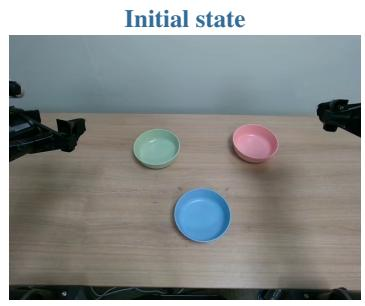  
(a) Bowl Stacking

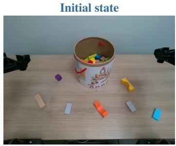  
(b) Block Collection

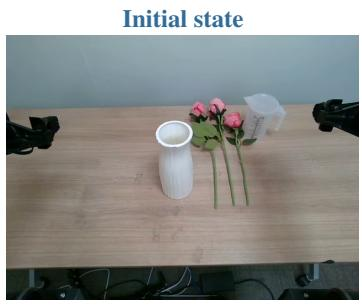  
(c) Flower Arrangement

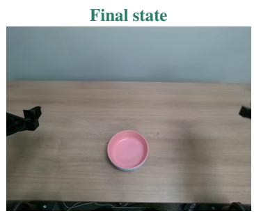  
Goal. Stack all designated bowls into a single stable stack that remains in place after gripper release.

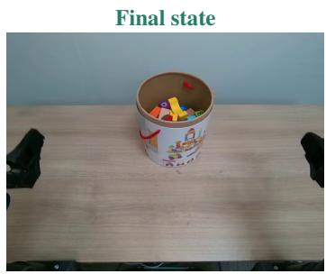  
Goal. Transfer all designated blocks from the tabletop into the bucket, leaving them fully inside after release.

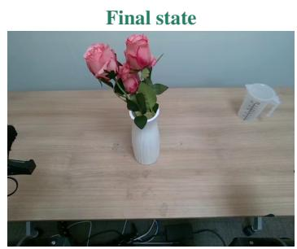  
Goal. Pour water into the vase, then insert and release all designated flowers, leaving the vase upright.

Figure 7: Real-world task illustrations. Each column shows the initial state (top) and final state (bottom) from the same recorded episode. The final states show stacked bowls, collected blocks, and flowers retained in an upright vase, respectively. The intermediate water-transfer stage of Flower Arrangement is not visible in these endpoint images.