# RIT-RAG: Navigating Document Corpora with Retrieval-Induced Trees

Meghanadh Pulivarthi1 Swaraj Kumar Biswal2\* Kushagra Bhushan1

Yatin Nandwani1 Sachindra Joshi1 Dinesh Raghu1

1IBM 2IIT Kharagpur

{Meghanadh.Pulivarthi1, kushagrabhushan, Yatin.Nandwani}@ibm.com {jsachind, diraghu1}@in.ibm.com biswalswaraj88@kgpian.iitkgp.ac.in

## Abstract

Retrieval-augmented generation (RAG) grounds language models in external corpora. Agentic RAG enables iterative search, yet exposes the model to isolated chunks without document structure, making it difficult to distinguish relevant evidence from chunks that merely resemble the query. Structure-aware methods such as PageIndex navigates using the structure but cannot scale to structures of large corpora that cannot fit in the LLM context. Hence, they first commit to a single document using a document retriever and cannot recover from a wrong choice. We propose RIT-RAG (Retrieval-Induced Tree RAG), which combines content retrieval with structural navigation. Offline, RIT-RAG builds a tree for each document from its table of contents or sitemap. At query time, it retrieves a broad set of chunks and uses their positions to induce manageable sub-trees, potentially across multiple documents. An LLM agent navigates these sub-trees, selectively reads promising nodes, and reformulates queries when needed. Thus, retrieval proposes where to look, while the agent decides what to read. Across financial, scientific, and customer-support benchmarks, RIT-RAG achieves the highest answer accuracy among vanilla, graph-based, and agentic baselines. On EntQABench, our new benchmark of 2.84 million technical-documentation webpages, it improves accuracy by 6.8–11.4 points over the strongest baseline across three LLMs.

## 1 Introduction

Retrieval-Augmented Generation (RAG) has emerged as a standard approach for grounding large language models (LLMs) in external knowledge (Lewis et al., 2020; Gao et al., 2024). By retrieving relevant evidence from a corpus and providing it to an LLM, RAG enables models to answer questions using information beyond their parameters. It also supports citation and attribution. As applications increasingly require answering complex questions over large document collections, effective retrieval has become the central challenge.

Recent work has addressed this challenge through agentic RAG, in which an LLM iteratively invokes search tools, examines the returned content, and reinvokes the search tools when necessary (Yao et al., 2023; Asai et al., 2024; Jeong et al., 2024; Hui et al., 2026). This enables the model to recover from unsuccessful retrieval attempts and perform multi-hop information seeking. However, agentic RAG operates primarily at the chunk level. Documents are split into independently searchable chunks, and the LLM reasons over the content of the chunks returned by the search tools. It has no explicit representation of how these chunks are organized within the document. Sections, subsections, and their relationships are therefore invisible to the retrieval process. As a result, without structural information, the agent struggles to distinguish the chunks that contain the answer (useful evidence) from those that are merely similar in terminology or topic (plausible evidence). This leads to context overload due to unfocused retrieval.

A complementary line of work has explored structure-aware RAG, exemplified by PageIndex (Vectify AI, 2025). Rather than searching for content directly, these approaches first reason over a document’s hierarchical structure, including sections, subsections, and their summaries, and then retrieve content from promising regions. This constitutes a top-down paradigm, proceeding from structure to content. However, the structure of an entire corpus cannot always fit in the context. The system must first select a document and then navigate its hierarchy. This creates an early commitment problem. Before seeing the document’s content, the system has limited ability to compare competing documents. A wrong document selection can therefore lead to a coherent but irrelevant navigation path, with no easy way to recover.

These observations reveal a tension between retrieval recall and precision. Agentic RAG casts a wide net, achieving high recall: relevant evidence is often present somewhere among the retrieved chunks. However, precision is low, as the relevant signal is buried among loosely related content, making it difficult for the LLM to identify and use the right evidence. Structure-aware navigation presents the opposite trade-off. By following a narrow structural path, it can achieve high precision when the correct path is chosen. However, recall is limited: an incorrect choice of the document can prevent the LLM from ever seeing the relevant evidence.

We propose RIT-RAG (Retrieval-Induced Tree RAG), a framework that addresses the precision– recall trade-off between agentic RAG and structureaware RAG. RIT-RAG begins with a conventional search index, enabling scalable retrieval over large document collections. Rather than directly exposing the retrieved chunks to the LLM, RIT-RAG uses their metadata, e.g., the position of each chunk in the hierarchy of its document, to induce sub-trees representing the document structure around the retrieved chunks. The LLM is presented with this compact structural view and selects the region most likely to contain the answer. It can then retrieve the contents of that region. If no candidate region provides a promising path, the LLM reformulates the query. The new query retrieves a different set of chunks and induces new sub-trees. Retrieval and navigation, therefore, form an iterative loop.

This design enables selective context assembly. Rather than dumping all retrieved chunks into the context, as in agentic RAG, or committing to a structural path before seeing relevant content, as in structure-aware RAG, RIT-RAG first uses content retrieval to anchor the search and then exploits the existing structure surrounding the retrieved evidence. The resulting sub-trees provide the agent with the local structure surrounding the relevant passages, allowing it to selectively expand only the regions it considers promising. In this way, RIT-RAG retains the broad coverage of content-based retrieval while exploiting document structure to guide subsequent retrieval.

The results show that RIT-RAG consistently outperforms existing retrieval approaches across both public benchmarks and a large-scale enterprise setting. Across the three publicly available datasets (WixQA, FinanceBench, and QASPER), RIT-RAG achieves the highest accuracy on all of them. It improves accuracy by 2.4–10.5 points over agentic RAG with the same retriever, and by 5.0–18.6 points over PageIndex, demonstrating the benefit of combining content-based retrieval with structureaware reasoning. The gains hold even when the native structure is too coarse: on FinanceBench, we induce finer tables of contents with an LLM, and RIT-RAG still improves accuracy over the strongest baseline by 4.6–9.3 points. To evaluate scalability in a realistic enterprise setting, we introduce EntQABench, a new large-scale benchmark whose corpus, EntDocs, contains 2.84 million webpages from the product documentation of a large enterprise. On this benchmark, where the structure of EntDocs is too large for PageIndex to navigate, RIT-RAG improves accuracy over the strongest baseline by 6.8–11.4 points, demonstrating that its advantages persist even at substantially larger corpus scales. Our contributions are as follows.

• We propose RIT-RAG, a framework that combines content-based retrieval with structureaware navigation. RIT-RAG uses retrieved evidence to induce query-specific sub-trees, possibly from multiple documents, enabling an LLM to reason over document structure before selectively retrieving the contents of promising regions.

• We construct the EntQABench, a new benchmark over EntDocs, a corpus of 2.84 million webpages from the product documentation of a large enterprise. It enables us to evaluate RAG systems at a realistic corpus scale. We will release the benchmark, including its corpus and questions, together with the document trees of all our corpora.

• We evaluate RIT-RAG across multiple models and datasets and show that it consistently improves accuracy over existing RAG systems on three public benchmarks and the EntQABench. An analysis of the text that each method reads confirms the precision–recall trade-off: agentic RAG has a high recall but a low precision, PageIndex has the opposite, and RIT-RAG balances the two.

## 2 Related Work

Retrieval-Augmented Generation (RAG) grounds language models in external knowledge by retrieving relevant information from a corpus before generation (Lewis et al., 2020). Early RAG systems typically retrieve a fixed set of passages using lexical or dense similarity (Robertson and Zaragoza, 2009; Karpukhin et al., 2020) and provide them directly to the language model. Agentic RAG instead allows the model to iteratively reason about what information is needed and issue additional retrieval operations, with approaches including retrieval interleaved with reasoning (Trivedi et al., 2023), adaptive retrieval (Asai et al., 2024; Jiang et al., 2023), iterative retrieval-generation (Shao et al., 2023) and hybrid retrieval techniques involving multiple tools the agent can use to retrieve content (Hui et al., 2026). In all these settings, the model interacts with the corpus only through retrieval, and it never sees how the retrieved chunks are organized.

Structured Retrieval: A limitation of passagelevel retrieval is that independently ranking chunks can discard relationships among pieces of evidence. This has motivated retrieval methods that exploit additional structure in the corpus. One direction constructs tree-based representations of the cor pus. RAPTOR (Sarthi et al., 2024) recursively clusters and summarizes passages to construct a tree of increasingly abstract representations, while SiReRAG (Zhang et al., 2025) indexes similar and related information to support multihop reasoning. DocsRay (Jeong et al., 2025) generates a pseudo table of contents for a document and uses it for hierarchical retrieval. Another direction constructs graph-based representations of the corpus. GraphRAG (Edge et al., 2024) builds an entity graph and community summaries to support re trieval and synthesis over related information, and HippoRAG (Gutiérrez et al., 2024) runs personalized PageRank over a knowledge graph to retrieve passages. HyperGraphRAG (Luo et al., 2025) extends this formulation to hypergraphs, enabling the representation of higher-order relationships among multiple entities or chunks. Cog-RAG (Hu et al., 2026) further constructs complementary theme and entity hypergraphs, using thematic structure for coarse retrieval before fine-grained entity retrieval. A third direction structures the retrieved content at inference time. StructRAG (Li et al., 2025) dynamically transforms retrieved information into data structures suited to different reasoning tasks using an LLM. In these approaches, however, the solver model remains oblivious to the underlying structure, and the retriever controls what the model reads rather than the model navigating the structure itself. Moreover, these structures are built by clustering, summarizing, or extracting entities, rather than exploiting the corpus’s existing organization.

Structure-Aware Agents: A recent line of work instead gives language models access to structureguided navigation, allowing them to reason about where information is located and decide which parts of the structure to read. PageIndex (Vectify AI, 2025) constructs a hierarchical table of contents for each document and presents the tree of the selected document to the model during inference. The model can then exploit its reasoning capabilities to navigate the tree and read only the sections it deems relevant. PDFTriage (Saad-Falcon et al., 2024) similarly gives the model tools to fetch the sections, pages, and tables of a document. These approaches navigate one document at a time. Over a large corpus, they must first select a document, typically with a retriever, and commit to it before seeing its content.

RIT-RAG avoids this early commitment by combining content-based retrieval with structure-aware navigation. It retrieves from the entire corpus and shows the agent only the subtrees of the existing hierarchy around the retrieved chunks, which may span several documents. The agent then decides what to read, which separates evidence discovery from content reading.

## 3 Preliminaries

Corpus Representation: Let $\begin{array} { r l } { \mathcal { C } } & { { } = } \end{array}$ $\{ d _ { 1 } , d _ { 2 } , \dots , d _ { M } \}$ denote a corpus containing $M$ documents. Let $T _ { i }$ denote the hierarchical tree structure associated with document $d _ { i }$ . Let $V _ { i }$ be the set of nodes in $T _ { i }$ . These nodes correspond to semantically organised units of the document, such as chapters, sections, and subsections, with parent-child relationships capturing their hierarchical organisation. We represent the corpus by the forest $\{ T _ { 1 } , \dots , T _ { M } \}$

Each node $v \in V _ { i }$ owns the text that lies under it but not under any of its children, $e . g .$ , the introduction of a chapter before its first section. We denote this text by $c _ { v }$ . Note that $c _ { v }$ is empty when all the text of a node lies under its children, $e . g .$ a chapter that begins directly with its first section. Thus, every piece of text in $d _ { i }$ belongs to exactly one node. In addition, each node has associated metadata. The metadata contains a title, a summary of $c _ { v } .$ , and keywords present in $c _ { v }$ . The title is mandatory, whereas the summary and keywords are optional: for a very large corpus containing millions of documents, it may not be feasible to extract them.

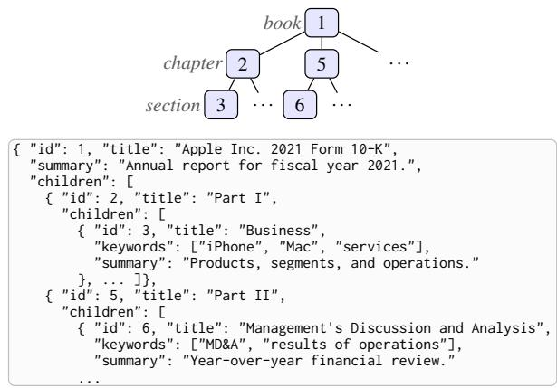  
Figure 1: An illustrative example of a hierarchical tree structure associated with a document and its JSON string representation.

Let S represent the serialization function that converts the structure of the tree $T _ { i }$ into a string $S ( T _ { i } )$ . This representation is consumed by the LLM, and it contains just the document’s hierarchical structure without exposing the full content of each node. An example is shown in Figure 1. In ${ \mathcal { S } } ( T _ { i } )$ , each node is a JSON object with a unique identifier, its metadata, and the list of its children in their original order. The LLM uses the identifier to request a node’s content.

The tree structure may be explicitly available or extracted from the documents. For example, a book can be a document whose hierarchy can be derived from its table of contents and section headings. A group of webpages can be treated as a virtual document whose hierarchical structure can be inferred from a sitemap or other metadata.

Agentic Search: Standard vector-index based RAG approaches split each document $d _ { i }$ into manageable chunks, embed each chunk using an off-the-shelf embedding model, such as BGE (Xiao et al., 2024), and store the chunk embeddings in a vector index, $e . g .$ , using FAISS (Johnson et al., 2021) or OpenSearch (OpenSearch Project, 2026). During inference, based on its understanding of the user utterance and the ongoing conversation, the agent formulates a search query ${ \tilde { q } } ,$ and the retriever retrieves the top k chunks, $\mathcal { R } _ { k } ( \tilde { q } )$ . The agent reads the retrieved chunks and decides to either generate the answer a, or formulate another search query to retrieve more chunks.

While this iterative process allows the agent to refine its search, chunk-level indexing discards the document’s hierarchical structure. Consequently, the agent cannot directly leverage structural cues, such as the hierarchical relationships between sections and subsections, when generating the answer. In addition, apart from formulating queries, the agent has no control over which retrieved chunks it reads and must process all of them.

PageIndex: Given a user question that requires information from the corpus ${ \mathcal { C } } ,$ , the system first uses a document retriever to identify a document $d _ { i }$ that may contain the answer. The LLM is then provided with the string representation ${ \mathcal { S } } ( T _ { i } )$ , which encodes the hierarchical structure of document $d _ { i }$ without exposing its contents. The LLM navigates this structure to identify promising nodes and retrieves a node’s content only when needed. It can iteratively inspect additional nodes until it has sufficient evidence to answer the question. Thus, unlike agentic search, the LLM has access to the document’s structure up front while selectively accessing its contents.

This approach, however, has two limitations. First, since the structures of all documents cannot fit within the LLM’s context, the system must first select a document to navigate. This early commitment relies solely on retrieval scores, and the agent cannot switch documents once committed, potentially leading to an incorrect path. Second, the tree representation can become prohibitively large even for a single large (virtual) document, such as webpage collections. When the full structure exceeds the context window, it must be truncated or partitioned, weakening the structural information available to the LLM.

## 4 RIT-RAG: Retrieval-Induced Tree RAG

Our approach, RIT-RAG, combines content-based retrieval with structure-aware navigation. We first construct a conventional search index over document chunks, as in agentic search. In addition to the chunk content, however, we associate each indexed chunk with lightweight structural metadata, including its node identifier, title, and the identifiers and titles of its ancestor nodes in the document tree. This metadata allows the hierarchical structure surrounding a retrieved chunk to be reconstructed at inference time.

Given a user question, the retriever returns the top- $\cdot k ^ { \prime } >$ k chunks, $\mathcal { R } _ { k ^ { \prime } } ( \tilde { q } )$ , based on their retrieval scores. Rather than exposing their contents directly to the LLM, we use their structural metadata to reconstruct the corresponding subtrees and provide them as context. The LLM then reasons over these structures to identify promising nodes and selectively request their contents. Thus, structural context is induced by content retrieval, avoiding the need to inspect every document in the corpus.

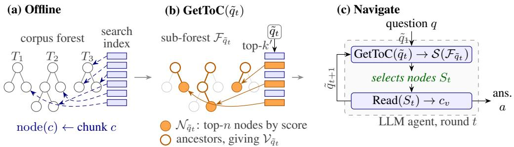  
Figure 2: Overview of RIT-RAG. (a) Offline, we index the text of the document trees $T _ { i } ,$ with each chunk c belonging to one node node(c). (b) Each query q˜ retrieves top-k′ chunks; their top n nodes and ancestors induce a sub-forest $\mathcal { F } _ { \tilde { q } _ { t } }$ . (c) In each round, the LLM calls GetToC, reasons over $\bar { \boldsymbol { S } } ( \mathcal { F } _ { \tilde { q } _ { t } } )$ , reads selected nodes $S _ { t } ,$ and either answers or continues.

This design addresses the limitations of both chunk-based agentic RAG and structure-first approaches such as PageIndex. Unlike conventional agentic RAG, the LLM can exploit hierarchical relationships among retrieved nodes when deciding what to retrieve next. At the same time, unlike structure-first approaches, the system does not need to expose or fit the complete structure of the corpus into the LLM context, nor does it need to commit to a single document before considering content-level evidence. Because the initial retrieval operates over the entire corpus, relevant structures from multiple documents can be surfaced simultaneously. The size of the structure presented to the LLM is therefore bounded by the number of selected nodes and their ancestors, rather than by the size of the corpus. Inducing a Sub-Forest: We first retrieve the top-$k ^ { \prime } > k$ chunks, $\mathcal { R } _ { k ^ { \prime } } ( \tilde { q } )$ , using the search index. Note that we chunk the text $c _ { v }$ of every node separately, so a chunk never spans multiple nodes. However, a node often spans multiple chunks, especially when it contains a lot of text. Thus, each retrieved chunk c belongs to exactly one node, which we denote by node(c). We score each node using the highest retrieval score among its retrieved chunks. Formally, the score of a node v is

$$
\boldsymbol { s } ( \boldsymbol { v } , \tilde { q } ) = \operatorname* { m a x } _ { \boldsymbol { c } \in \mathcal { R } _ { k ^ { \prime } } ( \tilde { q } ) \atop \mathrm { n o d e } ( \boldsymbol { c } ) = \boldsymbol { v } } \sin ( \tilde { q } , \boldsymbol { c } ) .\tag{1}
$$

Let $\mathcal { N } _ { \tilde { q } }$ be the set of the n nodes with the highest scores, where n is a hyperparameter. To construct a query-dependent sub-forest, we expand $\mathcal { N } _ { \tilde { q } }$ with the ancestors of the nodes in it, $i . e .$ , all the nodes that lie on the path from any node in $\mathcal { N } _ { \tilde { q } }$ to the root of its tree. Let path(v) denote the set of nodes on the path from v to the root of the tree to which it belongs. Formally, $\begin{array} { r } { \mathcal { V } _ { \tilde { q } } = \bigcup _ { v \in \mathcal { N } _ { \tilde { q } } } \operatorname { p a t h } ( v ) } \end{array}$

The nodes in $\mathcal { V } _ { \tilde { q } }$ induce a sub-forest $\mathcal { F } _ { \tilde { q } } .$ , with one sub-tree for every document $d _ { i }$ that contains a node in $\mathcal { N } _ { \tilde { q } }$ . The corresponding sub-tree is rooted at the root of $T _ { i }$ . We represent $\mathcal { F } _ { \tilde { q } }$ as a string $ { \mathcal { S } } (  { \mathcal { F } } _ { \tilde { q } } )$ by concatenating the string representations of its sub-trees. We list the sub-trees in decreasing order of their score, $i . e .$ , the highest score $s ( v , \tilde { q } )$ among the nodes v $\in \mathcal { N } _ { \tilde { q } }$ in the sub-tree. Including the ancestors puts each retrieved node in a global context. For example, two sections titled “Configuring the server” may come from two versions of a product, and only their ancestors distinguish them. In addition, retrieved nodes that share an ancestor appear together under it, which shows the agent where the evidence concentrates.

Navigating the Sub-Forest: In RIT-RAG, the LLM agent works in rounds. In each round t, the agent first formulates a search query $\tilde { q } _ { t }$ , and calls the GetToC tool to get $ { \mathcal { S } } (  { \mathcal { F } } _ { \tilde { q } t } )$ . It then reasons over $ { \mathcal { S } } (  { \mathcal { F } } _ { \tilde { q } _ { t } } )$ to select a set of nodes $S _ { t } ,$ and reads their text using the Read tool. Thus, in each round, we restrict the agent’s search to the nodes in $\mathcal { V } _ { \tilde { q } _ { t } }$ Based on the contents, $c _ { v }$ for every $v \in S _ { t }$ , it may generate the answer $^ { a , }$ read more nodes from the same sub-forest $\mathcal { F } _ { \tilde { q } _ { t } }$ , or formulate another search query for the next round. This is how RIT-RAG recovers from an unpromising sub-forest. Since every GetToC call retrieves from the entire corpus, a reformulated query can surface different documents, and the agent is never committed to the documents of an earlier round. The agent stops when it generates the answer, or when it reaches a budget of B tool calls, of which at most $B _ { \mathrm { s } }$ can be calls to the GetToC tool, where B and $B _ { \mathrm { s } }$ are hyperparameters. Figure 2 illustrates this process.

## 5 Experiments

Our experiments first evaluate how RIT-RAG compares with existing baselines when navigating structure already present in a corpus (RQ1). Such a structure, however, is not always available: e.g., a PDF may lack a table of contents or provide one that is too coarse to support effective navigation. In such cases, the structure must first be induced. We therefore next evaluate how effectively RIT-RAG navigates an induced structure (RQ2). Finally, we evaluate RIT-RAG’s scalability on a corpus of millions of interconnected webpages (RQ3).

## 5.1 Experimental Setup

Datasets: For RQ1, we use two datasets whose documents come with an existing structure. WixQA (Cohen et al., 2025) has 200 expert-written customer-support questions over 6,221 help-center pages. QASPER (Dasigi et al., 2021) has 1,372 answerable test questions over 416 NLP papers. Since its questions assume a known paper, we prefix each with “According to the paper ⟨title⟩,” and index all 1,585 papers from all splits. For RQ2, we use FinanceBench (Islam et al., 2023), which contains 150 financial questions across 364 SEC filings in PDF format. For RQ3, we contribute EntQABench, a benchmark comprising the Ent-Docs corpus and 317 synthetically generated questions covering three of its products. The EntDocs corpus consists of 2.84 million public webpages crawled from the product documentation of a large enterprise. See App. L for details on EntQABench creation and App. C for statistics on all corpora.

Building the Document Trees: We build the tree of each document from its table of contents (ToC), and the tree of a group of webpages from its sitemap (Section 3, details in App. A). In WixQA, the HTML headings of a page give its ToC, and we build a sitemap by grouping the pages into products and the products into categories. In QASPER, the sections of a paper give its ToC. The native ToC of a FinanceBench filing is too coarse, so we induce a finer one with the PageIndex pipeline (Vectify AI, 2025), which parses the PDF and uses an LLM to extract its sections. QASPER and FinanceBench have no sitemap, so their corpora are forests of independent document trees. In EntDocs, the breadcrumbs of the webpages give the sitemap, and each webpage is a single node. Finally, an LLM generates the summary and keywords of every node, except in EntDocs, where the nodes carry only their titles because of the corpus size. To generate summaries, we use Haiku for WixQA, and the open-source Qwen3-32B for QASPER and FinanceBench to reduce cost.

Baselines: Vanilla RAG retrieves the top-5 chunks and answers with a single LLM call. The graphbased methods, HyperGraphRAG (Luo et al., 2025) and Cog-RAG (Hu et al., 2026), extract entities and hyperedges from the corpus offline. For a question, they retrieve the relevant entities, hyperedges, and chunks, and answer from them with a single LLM call. The agentic methods call the retriever as a tool in a loop. Agentic Search is the agentic RAG baseline of sec. 3, and Interact-RAG (Hui et al., 2026) adds finer control over retrieval, e.g., entity matching. PageIndex also uses the structure: its agent reasons over the full ToC of one document and reads the pages it selects. To select the document, it relies on a document retriever. See App. B.2 for the implementation details of the document retriever. The graph-based methods and PageIndex preprocess the corpus with the same LLM as RIT-RAG.

Models and Hyperparameters: Every method generates the answer with three LLMs: Claude Haiku 4.5, GPT-5-mini, and GPT-5.6-Luna (App. D). All methods share a hybrid retriever that fuses BM25 (Robertson and Zaragoza, 2009) and dense retrieval with gte-modernbert-base(Zhang et al., 2024) and FAISS (Johnson et al., 2021), over chunks of up to 512 tokens (App. B.1). The GetToC tool of RIT-RAG retrieves the top-k′ = 200 chunks and induces the sub-forest from the $ { n ^ { \mathrm { ~ ~ ~ } } } = \ 5 0$ highest-scoring nodes (Eq. 1). We choose n on held-out questions (App. K). The agent makes at most B = 10 tool calls, of which at most $B _ { \mathrm { s } } = 3$ are GetToC calls.

Evaluation: Our main metric is accuracy, judged by an LLM (Gemini 2.5 Flash) that compares the prediction with the gold answer. We also measure the precision and recall of the passages a method reads against the gold evidence, as well as its preprocessing cost, API cost, and per-query latency. In the App. F, we report lexical token recall (Adlakha et al., 2024) and the seven-dimensional generation evaluation (G-E) of HyperGraphRAG.

Prompts: All LLM-based task prompts, including system messages for different baselines and the LLM-as-a-Judge, are available in App. N.

Table 1: Answer accuracy (%) on WixQA, QASPER, and FinanceBench, by generation model. Best per column in bold.
<table><tr><td colspan="2">Corpus</td><td colspan="3">WixQA</td><td colspan="3">QASPER</td><td colspan="3">FinanceBench</td></tr><tr><td>Family</td><td>Method</td><td></td><td>Haiku GPT-5-mini Luna</td><td></td><td>Haiku GPT-5-mini Luna</td><td></td><td></td><td></td><td>Haiku GPT-5-mini Luna</td><td></td></tr><tr><td>Vanilla</td><td>RAG (k=5)</td><td>79.5</td><td>86.0</td><td>82.5</td><td>72.0</td><td>77.2</td><td>73.7</td><td>41.3</td><td>49.3</td><td>48.0</td></tr><tr><td>Graph</td><td>HyperGraphRAG</td><td>87.5</td><td>94.0</td><td>87.5</td><td>44.8</td><td>52.6</td><td>52.6</td><td>29.3</td><td>35.3</td><td>47.3</td></tr><tr><td rowspan="3">Agentic</td><td>Cog-RAG</td><td>87.0</td><td>95.5</td><td>92.0</td><td>44.4</td><td>55.5</td><td>52.6</td><td>32.0</td><td>43.3</td><td>45.3</td></tr><tr><td>Agentic Search</td><td>84.5</td><td>91.0</td><td>91.0</td><td>86.2</td><td>85.6</td><td>85.7</td><td>74.0</td><td>76.0</td><td>75.3</td></tr><tr><td>Interact-RAG</td><td>71.5</td><td>79.5</td><td>85.0</td><td>74.2</td><td>73.4</td><td>78.3</td><td>74.7</td><td>74.0</td><td>80.7</td></tr><tr><td rowspan="2">Ours</td><td>PageIndex</td><td>88.5</td><td>86.0</td><td>90.5</td><td>76.0</td><td>75.0</td><td>77.0</td><td>72.0</td><td>75.3</td><td>66.7</td></tr><tr><td>RIT-RAG</td><td>95.0</td><td>96.0</td><td>95.5</td><td>88.6</td><td>88.5</td><td>89.2</td><td>84.0</td><td>84.0</td><td>85.3</td></tr></table>

## 5.2 Results

Performance on Datasets with Existing Structure (RQ1): Table 1 reports the answer accuracy of all methods on WixQA, QASPER, and FinanceBench. RIT-RAG achieves the highest accuracy across all three datasets and all three LLMs. WixQA and QASPER already have an existing structure, and they let us test whether navigating it helps. The most direct test is to compare RIT RAG with Agentic Search. Both use the same retriever, the same LLM, and the same budget of $B = 1 0$ tool calls. The main difference is what the agent sees after a search: Agentic Search sees the retrieved chunks, whereas RIT-RAG sees the sub-forest induced by them. This difference alone improves accuracy by 10.5, 5.0, and 4.5 points on WixQA, and by 2.4, 2.9, and 3.5 points on QASPER, with Haiku, GPT-5-mini, and Luna, respectively. PageIndex also uses the structure, but trails RIT-RAG by 5.0–10.0 points on WixQA and by 12.2–13.5 points on QASPER. It navigates the ToC of a single document, which we select by aggregating the retrieval scores of the chunks of each document (App. B.2). Once it selects a document, it cannot fetch the ToC of another one, and if the document is wrong, it cannot reach the evidence (Figure 6). This is the early-commitment problem that we discussed earlier. RIT-RAG does not com mit to a document, since each search induces a new sub-forest that may span many documents. The graph-based methods are competitive on WixQA, e.g., Cog-RAG reaches 95.5% with GPT-5-mini, but they fall far behind on QASPER, where they are worse than even vanilla RAG (App. I).

Performance on Datasets with Induced Structure (RQ2): On FinanceBench, RIT-RAG navigates the ToCs induced by Qwen3-32B, and still improves over the best baseline by 9.3, 8.0, and 4.6 points. PageIndex navigates the same induced ToCs, but again trails RIT-RAG, by 8.7–18.6 points, as it commits to one retrieved document.

Table 2: Accuracy (%) on FinanceBench when Haiku, instead of Qwen3-32B, induces the ToCs. In brackets: the change w.r.t. Qwen3-32B (Table 1).
<table><tr><td>Family Method</td><td></td><td>Haiku GPT-5</td><td>Luna</td><td></td></tr><tr><td></td><td>Vanilla RAG (k=5)</td><td>44.7 (+3.4) 49.3 ( 0.0)</td><td> $4 6 . 0 ( - 2 . 0 )$ </td><td></td></tr><tr><td></td><td>Interact-RAG PageIndex</td><td>Agentic Agentic Search 76.7 (+2.7) 80.7 (+4.7) 78.7 (+3.4)  $7 6 . 0 ( + 1 . 3 )$   $7 6 . 0 ( + 4 . 0 )$ </td><td> $7 6 . 0 ( + 2 . 0 )$   $7 7 . 3 \ : ( + 2 . 0 )$ </td><td> $8 0 . 0 ( - 0 . 7 ) $   $6 6 . 0 ( - 0 . 7 ) $ </td></tr><tr><td>Ours</td><td>RIT-RAG</td><td> ${ \mathbf 8 4 . 7 } \left( + 0 . 7 \right)$ </td><td>84.0 ( 0.0) 86.7 (+1.4)</td><td></td></tr></table>

Table 3: Answer accuracy (%) on EntDocs, by generation model. Best per column in bold.
<table><tr><td>Family Method</td><td>Haiku GPT-5 Luna</td></tr><tr><td>Vanilla RAG (k=5)</td><td>43.2 57.4 52.1</td></tr><tr><td>Agentic</td><td>Agentic Search 73.5 75.4 77.0 Interact-RAG 74.8 76.0 77.6</td></tr><tr><td>Ours RIT-RAG</td><td>81.4 83.9 89.0</td></tr></table>

Quality of the Induced Structure: When we induce the structure, the accuracy of a structureaware method may depend on the performance of the LLM that induces the structure. To test this, we repeat the FinanceBench experiment with Haiku instead of Qwen3-32B as the LLM that induces the ToCs and generates the metadata (Table 2). The accuracy of RIT-RAG changes by at most 1.4 points, showing that RIT-RAG can effectively navigate structures induced by a small open-source LLM. In contrast, the baselines change by up to 4.7 points, even though only PageIndex explicitly uses the induced ToCs. Recall that no chunk spans multiple nodes (Section 4), so the induced ToCs determine the chunk boundaries for all methods. Consequently, changing the induced ToCs alters the corpus chunking and, in turn, the chunks retrieved by the baselines. This makes the baselines sensitive to the induced structure, whereas RIT-RAG is comparatively robust to such changes.

Scaling to Millions of Documents (RQ3): Table 3 reports the accuracy on EntQABench. Here, we compare only with methods that scale to 2.84 million pages, viz., vanilla RAG, Agentic Search, and Interact-RAG. The graph-based methods require LLM calls over the entire corpus to construct their graphs, which is prohibitive at this scale (Section 5.4). PageIndex cannot run either. In FinanceBench, the corpus is a forest of small document trees, allowing PageIndex to select a single tree that fits within the LLM’s context. In contrast, EntDocs is a single large tree whose string representation does not fit within the context of any LLM. Recall that the nodes of EntDocs carry only their titles (Section 5.1). Even so, RIT-RAG improves over the best baseline by 6.6, 7.9, and 11.4 points.

## 5.3 Retrieval Analysis

To understand where the gains of RIT-RAG come from, we examine what each method reads before answering. Table 4 reports the precision, recall, and F1 score of the passages read by each method with respect to the gold evidence. We use WixQA, QASPER, and FinanceBench, on which we could run PageIndex. We exclude the graph-based methods because, in addition to passages, they read descriptions of the entities and hyperedges created during preprocessing, for which precision and recall cannot be measured (App. G).

Agentic Search calls the retriever multiple times and reads every chunk it retrieves. Consequently, it achieves high recall but low precision. PageIndex exhibits the opposite trend. It reads only the pages it selects from a single document, thereby achieving high precision. However, if it selects the wrong document, it cannot recover, causing its recall to drop, e.g., to 50.4% on QASPER. RIT-RAG balances the two. It achieves the highest precision and recall on WixQA and FinanceBench, and ranks second on both metrics on QASPER. Consequently, it achieves the highest F1 on all three datasets.

These results support our motivation: the retriever allows the agent to search broadly, while the induced sub-forest allows it to read selectively. The analysis above uses Haiku as the LLM; we observe similar trends with the other LLMs. (App. G). See App. H for an alternative analysis that compares the sets of questions answered correctly by different methods and reaches the same conclusion.

## 5.4 Cost Analysis

Online Cost: We observe that on three datasets, RIT-RAG costs 4.9–10.1 cents per question, more than Agentic Search (1.0–4.8 cents). This is because the agent reads the string of the induced subforest that also includes the summaries and keywords. In return, it improves accuracy by 2.4–10.5 points over Agentic Search. See fig. 3 in App. E.

Table 4: Precision (P), recall (R), and F1 (%) of the passages that each method reads, measured against the gold evidence, with Haiku as the LLM. AS: Agentic Search; I-RAG: Interact-RAG. Best P, R, and F1 per dataset in bold.
<table><tr><td rowspan="2">Method</td><td colspan="3">WixQA</td><td colspan="3">QASPER</td><td colspan="3">FinanceBench</td></tr><tr><td>P</td><td>R</td><td>F1</td><td>P</td><td>R</td><td>F1</td><td>P</td><td>R</td><td>F1</td></tr><tr><td>Vanilla</td><td></td><td></td><td></td><td></td><td></td><td></td><td></td><td></td><td></td></tr><tr><td>RAG (k=5)</td><td></td><td></td><td>20.5 64.7 31.1</td><td></td><td></td><td>21.6 67.7 32.8</td><td>8.0</td><td>34.7 13.0</td><td></td></tr><tr><td>Agentic</td><td></td><td></td><td></td><td></td><td></td><td></td><td></td><td></td><td></td></tr><tr><td>AS</td><td>15.1 70.8 24.9</td><td></td><td></td><td>17.3</td><td>85.5</td><td>28.8</td><td></td><td>11.5 71.0 19.8</td><td></td></tr><tr><td>I-RAG</td><td>9.1</td><td>60.9</td><td>15.8</td><td></td><td>13.8 63.9</td><td>22.7</td><td>8.8</td><td></td><td>66.6 15.5</td></tr><tr><td>PageIndex</td><td>28.7 72.0 41.0</td><td></td><td></td><td>54.9 5</td><td></td><td>50.4 52.6</td><td>33.1</td><td></td><td>56.8 41.8</td></tr><tr><td>RIT-RAG</td><td>40.1 78.5 53.1</td><td></td><td></td><td></td><td></td><td>47.9 80.6 60.1</td><td></td><td>44.7 73.2 55.5</td><td></td></tr></table>

It plots accuracy against the mean API cost per question for the Haiku LLM and compares latency and cost for other baselines. We observe that RIT-RAG is the most accurate method across all three datasets and lies on the Pareto frontier.

Offline Cost: App. E reports the one-time cost of preprocessing each corpus, at the API prices of Haiku (Table 7). RIT-RAG and PageIndex share the same preprocessing, viz., inducing ToCs when needed and generating node metadata. It costs \$15.5 on WixQA and \$12.9 on QASPER. On FinanceBench, inducing the ToCs of 364 long filings raises it to \$590. On EntDocs, it costs nothing since we use the existing structure and only the node titles. In contrast, the graph-based methods run LLM extraction over the entire corpus. This costs \$86– 107 on WixQA, and grows linearly with the size of the corpus, to an estimated \$1.4K–\$1.7K on FinanceBench and \$31K–\$38K on EntDocs. This is why we do not run them on EntDocs.

## 6 Conclusion

We presented RIT-RAG, which combines contentbased retrieval with structure-aware navigation. Rather than showing the agent the retrieved chunks, or committing to a single document before reading any content, RIT-RAG uses the retrieved chunks to induce query-specific sub-trees from the existing structure of the corpus, and lets the agent decide what to read. On financial, scientific, and customersupport benchmarks, it achieves the highest accuracy against vanilla, graph-based, and agentic baselines, and balances the precision and recall of the text it reads. On the EntQABench, with 2.84 million webpages, it improves accuracy by 6.8–11.4 points over the strongest baseline, even though its nodes carry only their titles and it needs no LLM preprocessing. RIT-RAG costs more per question than Agentic Search, since the agent reads the string of the induced sub-trees after every search. Future work could reduce this cost by compacting the string representation, and study richer node metadata at the scale of millions of pages.

## 7 Limitations

RIT-RAG accumulates fetched nodes until it reaches its context budget and currently there is no support of evidence compaction or eviction of the chat history. While, RIT-RAG preserves the hierarchical strucuture, it ignores any existing cross links between nodes at the same level in the tree. Finally, the method depends on a usable document hierarchy. Structure induction can recover one from documents such as SEC filings, but weak headings or poor parsing can limit the quality of the map the agent sees.

## Reproducibility Statement

We include the information needed to independently reproduce our experiments in the paper and appendix. The RIT-RAG algorithm and experimental protocol are described in Sections 4 and 5.1, respectively. Details of corpus processing, documenttree construction, and the EntQABench dataset are provided in Appendices A, C, and L. Our implementation choices, including node-aligned chunking, hybrid retrieval, reciprocal-rank fusion, and the corpus-level PageIndex adaptation, are documented in Appendices B.1 and B.2. We also report the model and decoding settings, hyperparameter selection procedure, and cost assumptions in Appendices D, K, and E. The prompts used by the agents and evaluators are included in Appendix N, and the answer-quality and retrieval metrics are defined in Appendices F and G.

## References

Vaibhav Adlakha, Parishad BehnamGhader, Xing Han Lu, Nicholas Meade, and Siva Reddy. 2024. Evaluating correctness and faithfulness of instructionfollowing models for question answering. Transactions ofthe Associationfor Computational Linguistics, 12.

Akari Asai, Zeqiu Wu, Yizhong Wang, Avirup Sil, and Hannaneh Hajishirzi. 2024. Self-RAG: Learning to retrieve, generate, and critique through selfreflection. In Proceedings ofthe 12th International Conference on Learning Representations (ICLR). ArXiv:2310.11511.

Dvir Cohen, Lin Burg, Sviatoslav Pykhnivskyi, Hagit Gur, Stanislav Kovynov, Olga Atzmon, and Gilad

Barkan. 2025. WixQA: A multi-dataset benchmark for enterprise retrieval-augmented generation. arXiv preprint arXiv:2505.08643.

Gordon V. Cormack, Charles L. A. Clarke, and Stefan Büttcher. 2009. Reciprocal rank fusion outperforms condorcet and individual rank learning methods. In Proceedings of the 32nd International ACM SIGIR Conference on Research and Development in Information Retrieval (SIGIR), pages 758–759.

Pradeep Dasigi, Kyle Lo, Iz Beltagy, Arman Cohan, Noah A. Smith, and Matt Gardner. 2021. A dataset of information-seeking questions and answers anchored in research papers. In Proceedings of the 2021 Conference of the North American Chapter of the Association for Computational Linguistics (NAACL 2021). ArXiv:2105.03011.

Darren Edge, Ha Trinh, Newman Cheng, Joshua Bradley, Alex Chao, Apurva Mody, Steven Truitt, Dasha Metropolitansky, Robert Osazuwa Ness, and Jonathan Larson. 2024. From local to global: A graph RAG approach to query-focused summarization. arXiv preprint arXiv:2404.16130.

Yunfan Gao, Yun Xiong, Xinyu Gao, Kangxiang Jia, Jinliu Pan, Yuxi Bi, Yi Dai, Jiawei Sun, Meng Wang, and Haofen Wang. 2024. Retrieval-augmented generation for large language models: A survey. arXiv preprint arXiv:2312.10997.

Bernal Jiménez Gutiérrez, Yiheng Shu, Yu Gu, Michihiro Yasunaga, and Yu Su. 2024. HippoRAG: Neurobiologically inspired long-term memory for large language models. In Advances in Neural Information Processing Systems 37 (NeurIPS 2024). ArXiv:2405.14831.

Hao Hu, Yifan Feng, Ruoxue Li, Rundong Xue, Xingliang Hou, Zhiqiang Tian, Yue Gao, and Shaoyi Du. 2026. Cog-RAG: Cognitive-inspired dual-hypergraph with theme alignment retrievalaugmented generation. In Proceedings ofthe AAAI Conference on Artificial Intelligence (AAAI 2026). ArXiv:2511.13201.

Yulong Hui, Chao Chen, Zhihang Fu, Yihao Liu, Jieping Ye, and Huanchen Zhang. 2026. Interact-RAG: Reason and interact with the corpus, beyond black-box retrieval. arXiv preprint arXiv:2510.27566.

Pranab Islam, Anand Kannappan, Douwe Kiela, Rebecca Qian, Nino Scherrer, and Bertie Vidgen. 2023. FinanceBench: A new benchmark for financial question answering. arXiv preprint arXiv:2311.11944.

Hyeon Seong Jeong, Sangwoo Jo, Byeong Hyun Yoon, Yoonseok Heo, Haedong Jeong, and Taehoon Kim. 2025. Zero-shot document understanding using pseudo table of contents-guided retrieval-augmented generation. arXiv preprint arXiv:2507.23217.

Soyeong Jeong, Jinheon Baek, Sukmin Cho, Sung Ju Hwang, and Jong C. Park. 2024. Adaptive-RAG: Learning to adapt retrieval-augmented large language

models through question complexity. In Proceedings of the 2024 Conference of the North American Chapter ofthe Associationfor Computational Linguistics (NAACL), pages 7036–7050. ArXiv:2403.14403.

Zhengbao Jiang, Frank F. Xu, Luyu Gao, Zhiqing Sun, Qian Liu, Jane Dwivedi-Yu, Yiming Yang, Jamie Callan, and Graham Neubig. 2023. Active retrieval augmented generation. In Proceedings ofthe 2023 Conference on Empirical Methods in Natural Language Processing (EMNLP), pages 7969–7992. ArXiv:2305.06983.

Jeff Johnson, Matthijs Douze, and Hervé Jégou. 2021. Billion-scale similarity search with GPUs. IEEE Transactions on Big Data, 7(3):535–547.

Vladimir Karpukhin, Barlas Oguz, Sewon Min, Patrick˘ Lewis, Ledell Wu, Sergey Edunov, Danqi Chen, and Wen-tau Yih. 2020. Dense passage retrieval for opendomain question answering. In Proceedings of the 2020 Conference on Empirical Methods in Natural Language Processing (EMNLP), pages 6769–6781. ArXiv:2004.04906.

Patrick Lewis, Ethan Perez, Aleksandra Piktus, Fabio Petroni, Vladimir Karpukhin, Naman Goyal, Heinrich Küttler, Mike Lewis, Wen-tau Yih, Tim Rocktäschel, Sebastian Riedel, and Douwe Kiela. 2020. Retrieval-augmented generation for knowledgeintensive NLP tasks. In Advances in Neural Information Processing Systems 33 (NeurIPS 2020). ArXiv:2005.11401.

Zhuoqun Li, Xuanang Chen, Haiyang Yu, Hongyu Lin, Yaojie Lu, Qiaoyu Tang, Fei Huang, Xianpei Han, Le Sun, and Yongbin Li. 2025. StructRAG: Boosting knowledge intensive reasoning of LLMs via inference-time hybrid information structurization. In Proceedings of the 13th International Conference on Learning Representations (ICLR). ArXiv:2410.08815.

Haoran Luo, Haihong E, Guanting Chen, Yandan Zheng, Xiaobao Wu, Yikai Guo, Qika Lin, Yu Feng, Zemin Kuang, Meina Song, Yifan Zhu, and Luu Anh Tuan. 2025. HyperGraphRAG: Retrieval-augmented generation via hypergraph-structured knowledge representation. In Advances in Neural Information Processing Systems (NeurIPS 2025). ArXiv:2503.21322.

OpenAI. 2024. text-embedding-3-small. https://developers.openai.com/api/docs/ models/text-embedding-3-small.

OpenSearch Project. 2026. OpenSearch: Open-source search and analytics suite. Software, https:// opensearch.org. Accessed 2026.

Stephen Robertson and Hugo Zaragoza. 2009. The probabilistic relevance framework: BM25 and beyond. Foundations and Trends in Information Retrieval, 3(4):333–389.

Jon Saad-Falcon, Joe Barrow, Alexa Siu, Ani Nenkova, Seunghyun Yoon, Ryan A. Rossi, and Franck Dernoncourt. 2024. PDFTriage: Question answering over long, structured documents. In Proceedings of the 2024 Conference on Empirical Methods in Natural Language Processing (EMNLP), Industry Track, pages 153–169. ArXiv:2309.08872.

Parth Sarthi, Salman Abdullah, Aditi Tuli, Shubh Khanna, Anna Goldie, and Christopher D. Manning. 2024. RAPTOR: Recursive abstractive processing for tree-organized retrieval. In Proceedings of the 12th International Conference on Learning Representations (ICLR). ArXiv:2401.18059.

Zhihong Shao, Yeyun Gong, Yelong Shen, Minlie Huang, Nan Duan, and Weizhu Chen. 2023. Enhancing retrieval-augmented large language models with iterative retrieval-generation synergy. In Findings of the Association for Computational Linguistics: EMNLP 2023, pages 9248–9274. ArXiv:2305.15294.

Xueqiao Sun, Xiao Liu, Bowen Lv, Hanchen Zhang, Bohao Jing, Zehan Qi, Yifan Xu, Yuxiao Dong, and Jie Tang. 2026. KARL: Reinforcement learning for LLM agents on multi-turn knowledge-intensive agentic tasks. In Proceedings of the 64th Annual Meeting of the Association for Computational Linguistics (ACL).

Harsh Trivedi, Niranjan Balasubramanian, Tushar Khot, and Ashish Sabharwal. 2023. Interleaving retrieval with chain-of-thought reasoning for knowledgeintensive multi-step questions. In Proceedings of the 61st Annual Meeting ofthe Associationfor Computational Linguistics (ACL), pages 10014–10037. ArXiv:2212.10509.

Vectify AI. 2025. PageIndex: Document index for vectorless, reasoning-based RAG. GitHub repository, https://github.com/VectifyAI/PageIndex. Accessed 2026.

Shitao Xiao, Zheng Liu, Peitian Zhang, Niklas Muennighoff, Defu Lian, and Jian-Yun Nie. 2024. C-Pack: Packed resources for general chinese embeddings. In Proceedings of the 47th International ACM SIGIR Conference on Research and Development in Information Retrieval (SIGIR 2024). ArXiv:2309.07597.

Shunyu Yao, Jeffrey Zhao, Dian Yu, Nan Du, Izhak Shafran, Karthik Narasimhan, and Yuan Cao. 2023. ReAct: Synergizing reasoning and acting in language models. In Proceedings of the 11th International Conference on Learning Representations (ICLR). ArXiv:2210.03629.

Nan Zhang, Prafulla Kumar Choubey, Alexander Fabbri, Gabriel Bernadett-Shapiro, Rui Zhang, Prasenjit Mitra, Caiming Xiong, and Chien-Sheng Wu. 2025. SiReRAG: Indexing similar and related information for multihop reasoning. In Proceedings of the 13th International Conference on Learning Representations (ICLR). ArXiv:2412.06206.

Xin Zhang, Yanzhao Zhang, Dingkun Long, Wen Xie, Ziqi Dai, Jialong Tang, Huan Lin, Baosong Yang, Pengjun Xie, Fei Huang, et al. 2024. mgte: Generalized long-context text representation and reranking models for multilingual text retrieval. In Proceedings ofthe 2024 Conference on Empirical Methods in Natural Language Processing: Industry Track, pages 1393–1412.

## A Corpus-Specific Structure Extraction

Offline, RIT-RAG extracts the corpus strucutre by combining inter-document hierarchy (how documents relate to one another) with intra-document structure induced inside each document (how a document is subdivided into navigable sections). The pipeline is corpus-agnostic except for the parsing step that extracts nodes and parent links from each corpus’s native form. The following describes the extraction pipelines for each corpus. Resulting statistics are in Tables 5–6.

## WixQA

Inter-document hierarchy is recovered from URL structure. Each article’s title and URL identifies its product (170 distinct products). An LLM groups those products into 16 coarse families, giving a three-level backbone family → product → article. Intra-document structure is induced by splitting each article into sections and subsections using its HTML heading tags. Over the 6,221 help articles this yields 31,733 nodes; article/section body nodes are readable, while the 16 family and 170 product nodes act as navigational containers.

## FinanceBench

We treat the full set of 364 SEC filings (10-Ks, 10-Qs, 8-Ks, and annual reports) as a single corpus. Although the benchmark’s 150 questions draw on only 84 of these documents, we index all 364 so the remaining filings act as distractors, testing retrieval under realistic corpus scale rather than an oracle-filtered set. The corpus has no authored inter-document hierarchy and hence we treat each filing as independent. Intra-document structure must therefore be induced for every filing. Each native PDF table of contents is too coarse for nodelevel navigation (individual entries often span tens of pages), so we process each filing with the PageIndex pipeline 1 to produce a finer-grained section hierarchy.

## QASPER

Each paper’s section hierarchy is recovered directly from its structured markup. Section and subsection headings become tree nodes, giving a shallow (depth ≤ 4) per-paper hierarchy without additional induction. There is no inter-document hierarchy, as papers are independent research artifacts. Section body nodes are readable. Heading-only container nodes serve as navigational anchors. Because the native section headings are already clean and informative, we only generate node summaries and keywords but do not rewrite node titles.

## EntDocs

The EntDocs corpus is derived from the IBM Documentation portal.2 Starting from the portal homepage, we crawl the documentation while preserving the existing product navigation trees. The structure is entirely inter-document. Each product is organised as a hierarchy of webpages connected through the sitemap There is no intra-document structure to induce, as each webpage corresponds to a single node and is not further subdivided. We combine the per-product trees under a virtual root to obtain a unified corpus containing 2.93M webpages, with a maximum depth of 17.

## B Retrieval Implementation

## B.1 RIT-RAG

We chunk each node of the corpus C into chunks of fixed token size of 512. RIT-RAG uses hybrid retriever for scoring a chunk’s similarity to the query. To return the top-k chunks, it retrieves the top k′ chunks from BM25 and from the dense index, fuses the two rankings with reciprocal rank fusion (Cormack et al., 2009) with with fusion constant $\kappa = 6 0$ , the standard RRF setting combining both the lexical overlap and semantic signals.

## B.2 PageIndex

We implement the corpus-level PageIndex following the methodology described in (Vectify AI, 2025). We first retrieve the top k chunks with vector search. For a filing D with nD retrieved chunks, we compute DocScore(D) = $\frac { 1 } { \sqrt { n _ { D } + 1 } } \sum _ { c }$ ChunkScore(c), summing over the retrieved chunks c that belong to D. We select the highest-scoring filing, retrieve its table of contents, and pass that structure to the PageIndex agent for within-document navigation.

## C Dataset and Structure Statistics

Table 5 reports corpus and benchmark sizes. Table 6 reports the extracted corpus structure.

Table 5: Corpus and evaluation-set statistics. Docs is the number of source pdfs or webpages indexed; Chunks is the number of retrieval chunks after node-aligned chunking; Q is the number of questions evaluated.
<table><tr><td>Corpus</td><td> $\mathrm { N o d e } =$ </td><td>Docs</td><td>Chunks</td><td>Tokens</td><td>Q</td></tr><tr><td>WixQA</td><td>article section</td><td>6,221</td><td>32,032</td><td>3.09M</td><td>200</td></tr><tr><td>FinanceBench</td><td>PDF page span</td><td>364</td><td>129,973</td><td>48.5M</td><td>150</td></tr><tr><td>EntDocs</td><td>doc. webpage</td><td>2,839,892</td><td>8,993,388</td><td>3.81 B</td><td>317</td></tr><tr><td>QASPER</td><td>paper section</td><td>1,585</td><td>31,014</td><td>10.6M</td><td>1372</td></tr></table>

Table 6: Hierarchical document structure per corpus. Depth is from the document root; node size is a node’s own-text token count.
<table><tr><td>Corpus</td><td>Total</td><td>Max</td><td colspan="3">Node size (tok)</td></tr><tr><td></td><td>nodes</td><td>depth</td><td>mean</td><td>med.</td><td>p95</td></tr><tr><td>WixQA</td><td>31,733</td><td>5</td><td>84</td><td>60</td><td>219</td></tr><tr><td>FinanceBench</td><td>79,658</td><td>8</td><td>602</td><td>274</td><td>2,368</td></tr><tr><td>EntDocs</td><td>2,934,928</td><td>17</td><td>1,020</td><td>182</td><td>1,960</td></tr><tr><td>QASPER</td><td>24,350</td><td>4</td><td>362</td><td>262</td><td>977</td></tr></table>

Table 7: Models and decoding settings used in the experiments. Role identifies how each model is used in the pipeline. Temperature and Max tokens report the generation settings. Input/Output price gives the effective API cost in USD per one million tokens.
<table><tr><td>Model</td><td>Role</td><td>Key decoding settings</td><td>$/1M (in/ out)</td></tr><tr><td>Claude Haiku 4.5</td><td>Generation + preprocessing</td><td>default sampling (512 output tok. for prep)</td><td>0.76/3.80</td></tr><tr><td>GPT-5-mini</td><td>Generation</td><td>temperature 1; medium reasoning effort</td><td>0.25/2.00</td></tr><tr><td>GPT-5.6-Luna (Luna)</td><td>Generation</td><td>temperature 1; non-reasoning</td><td>1.00/6.00</td></tr><tr><td>Qwen3-32B</td><td>Preprocessing</td><td>non-thinking;  $T { = } 0 . 7 ,$  top  $\cdot p { = } 0 . 8 ,$ </td><td>0.08/0.28</td></tr><tr><td>Gemini 2.5 Flash</td><td>Evaluation (binary + G-E judges)</td><td> $\scriptstyle { \mathrm { t o p } } - k = 2 0 ,$  min-p=0; YaRN 64k  $T { \bar { = } } 0$ </td><td></td></tr></table>

## D Model and Inference Configuration

Table 7 lists the language models used for generation and offline preprocessing, together with decoding settings and the per-token prices used for cost accounting in Table 9.

## E Cost and Latency Analysis

Table 9 reports the one-time preprocessing cost for each method at the API prices listed in Table 7.

At query time, RIT-RAG costs more than vanilla RAG (0.2–0.3 cents per question), but improves accuracy by 15.5– 42.7 points. RIT-RAG is also faster than Agentic Search (15–19 vs. 23–55 seconds) and Interact- RAG (42–79 seconds) (Figure 4). PageIndex is the fastest agentic method (11–15 seconds), and on QASPER, where each document is small, it is also the cheapest (1.2 cents). However, it trails RIT-RAG in accuracy on all three datasets, as it cannot change the document once it commits to it.

## F Answer-Quality Metrics

We report lexical token recall and all seven G-E dimensions (Luo et al., 2025) (correctness, relevance, factuality, comprehensiveness, knowledgeability, logical coherence, and diversity; each normalized to 0–1) for every dataset, using one preprocessing model per corpus and all three generation models (Haiku, GPT-5-mini, and Luna; Tables 10– 13). All G-E dimensions across every method and generation model are scored by the same (Gemini 2.5 Flash) judge so that the values are comparable within and across rows.

## G Retrieval Metrics

We compute F1 as $2 P R / ( P + R )$ , where P and R are the precision and recall of the passages that a method reads, measured against the gold evidence. With Haiku as the LLM (Table 4), Agentic Search has the highest recall on QASPER (85.5%), but a precision of only 11.5–17.3%, lower than even vanilla RAG on WixQA and QASPER. PageIndex has the highest precision on QASPER (54.9%), but its recall drops to 50.4% on QASPER and 56.8% on FinanceBench. On WixQA, its recall remains 72.0%, possibly because the answer to a question usually lies in a single help page. On QASPER, RIT-RAG is second on both measures, but close to the best: 80.6% vs. 85.5% recall, and 47.9% vs. 54.9% precision. With Luna, RIT-RAG also has the highest F1 on all three datasets. With GPT-5-mini, PageIndex has a slightly higher F1 than RIT-RAG on QASPER (50.0% vs. 47.0%) and FinanceBench (43.3% vs. 42.9%), although RIT-RAG still has the

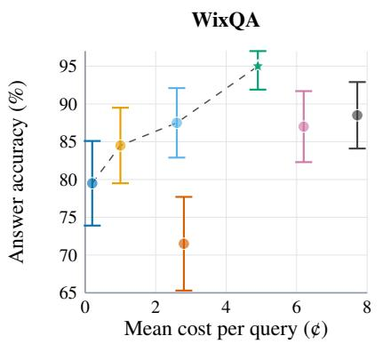

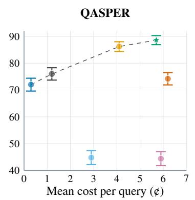

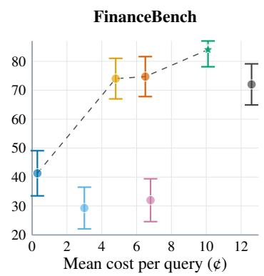  
Figure 3: Answer accuracy vs. mean API cost (US cents/question) with Haiku. Each dataset has its own panel/axes. Graph-based methods, PageIndex, and RIT-RAG use the Section 5.1 preprocessing. RIT-RAG is the star; error bars show Wilson 95% CIs, and dashed lines indicate the Pareto frontier.

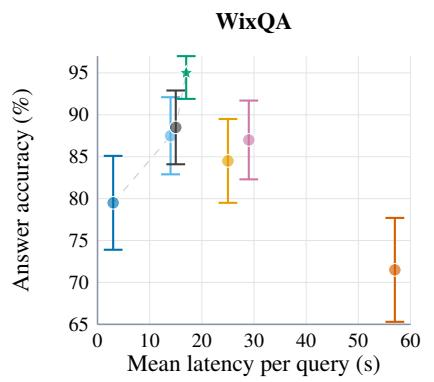

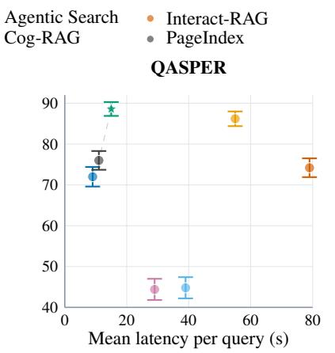

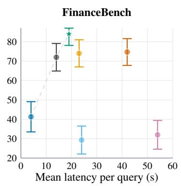  
Figure 4: Answer accuracy versus the mean LLM latency per question (seconds), with Haiku as the LLM. Each dataset has its own panel and axes. The graph-based methods, PageIndex, and RIT-RAG use the preprocessing of Section 5.1, viz., Haiku on WixQA, and Qwen3-32B on QASPER and FinanceBench. RIT-RAG is the star, the error bars are Wilson 95% confidence intervals, and the dashed line is the Pareto frontier.

Table 8: Per-query online trade-offs (Haiku generation). Acc.: binary-judge accuracy (%); ¢/q: mean API cost (US cents); s/q: mean LLM latency (s).
<table><tr><td></td><td colspan="3">WixQA (n=200)</td><td colspan="3">QASPER (n=1372)</td><td colspan="3">FinanceBench (n=150)</td></tr><tr><td>Method</td><td>Acc.</td><td>¢/q</td><td>s/q</td><td>Acc.</td><td>¢/q</td><td>s/q</td><td>Acc.</td><td>¢/q</td><td>s/q</td></tr><tr><td>RAG (k=5)</td><td>79.5</td><td>0.2</td><td>3</td><td>72.0</td><td>0.3</td><td>9</td><td>41.3</td><td>0.3</td><td>4</td></tr><tr><td>HyperGraphRAG</td><td>87.5</td><td>2.6</td><td>14</td><td>44.8</td><td>2.9</td><td>39</td><td>29.3</td><td>3.0</td><td>24</td></tr><tr><td>Cog-RAG</td><td>87.0</td><td>6.2</td><td>29</td><td>44.4</td><td>5.9</td><td>29</td><td>32.0</td><td>6.8</td><td>54</td></tr><tr><td>Agentic Search</td><td>84.5</td><td>1.0</td><td>25</td><td>86.2</td><td>4.1</td><td>55</td><td>74.0</td><td>4.8</td><td>23</td></tr><tr><td>Interact-RAG</td><td>71.5</td><td>2.8</td><td>57</td><td>74.2</td><td>6.2</td><td>79</td><td>74.7</td><td>6.5</td><td>42</td></tr><tr><td>PageIndex</td><td>88.5</td><td>7.7</td><td>15</td><td>76.0</td><td>1.2</td><td>11</td><td>72.0</td><td>12.6</td><td>14</td></tr><tr><td>RIT-RAG</td><td>95.0</td><td>4.9</td><td>17</td><td>88.6</td><td>5.7</td><td>15</td><td>84.0</td><td>10.1</td><td>19</td></tr></table>

Table 9: One-time preprocessing cost (USD) at the prices of Haiku (Table 7). The other baselines need no preprocessing. †Estimated by scaling linearly from WixQA.
<table><tr><td>Method</td><td>WixQA</td><td></td><td>QASPER FinanceBench</td><td>EntDocs</td></tr><tr><td>HyperGraphRAG</td><td>$85.9</td><td>~$294.70†</td><td>~$1.4K†</td><td>~$30.7K†</td></tr><tr><td>Cog-RAG</td><td></td><td>$106.6 ~$365.70†</td><td>~$1.7K†</td><td>~$38.2K†</td></tr><tr><td>PageIndex</td><td>$15.5</td><td>$12.9</td><td>$590.1</td><td></td></tr><tr><td>RIT-RAG</td><td>$15.5</td><td>$12.9</td><td>$590.1</td><td>$0</td></tr></table>

highest recall on all three datasets.

## H Complementarity Analysis

We compare the questions answered correctly by RIT-RAG, PageIndex, and Agentic RAG. PageIndex and Agentic RAG have complementary strengths: PageIndex navigates document structure, whereas Agentic RAG searches broadly over content. Figure 5 shows how their correct answers overlap with those of RIT-RAG.

Among the questions answered correctly by PageIndex but not by Agentic RAG, RIT-RAG answers 22 of 27 on WixQA, 11 of 15 on FinanceBench, and 57 of 67 on QASPER (Figure 7). Among those answered correctly by Agentic RAG but not by PageIndex, RIT-RAG answers 9 of 10, 14 of 18, and 168 of 192, respectively (Figure 6). It also answers 2, 11, and 20 questions that both baselines miss. These results show that RIT-RAG retains most of the distinct strengths of both baselines while also solving some questions that neither baseline answers correctly.

Table 10: WixQA answer quality by method and generation model. G-E dimensions (each normalized 0–1): Corr(ectness), Rel(evance), Fact(uality), Compr(ehensiveness), Know(ledgeability), Coher(ence, logical), Div(ersity). Recall is lexical token recall. Best per column in bold.
<table><tr><td>Method</td><td>Gen</td><td>Recall</td><td>Corr</td><td>Rel</td><td>Fact</td><td>Compr</td><td>Know</td><td>Coher</td><td>Div</td></tr><tr><td rowspan="3">RAG (k=5)</td><td>Haiku</td><td>0.427</td><td>0.740</td><td>0.821</td><td>0.779</td><td>0.658</td><td>0.745</td><td>0.948</td><td>0.491</td></tr><tr><td>GPT-5-mini</td><td>0.411</td><td>0.792</td><td>0.883</td><td>0.796</td><td>0.739</td><td>0.851</td><td>0.929</td><td>0.652</td></tr><tr><td>Luna</td><td>0.256</td><td>0.778</td><td>0.850</td><td>0.831</td><td>0.632</td><td>0.742</td><td>0.907</td><td>0.528</td></tr><tr><td rowspan="3">HyperGraphRAG</td><td>Haiku</td><td>0.632</td><td>0.858</td><td>0.926</td><td>0.860</td><td>0.823</td><td>0.889</td><td>0.945</td><td>0.781</td></tr><tr><td>GPT-5-mini</td><td>0.655</td><td>0.969</td><td>0.989</td><td>0.975</td><td>0.959</td><td>0.978</td><td>0.997</td><td>0.932</td></tr><tr><td>Luna</td><td>0.514</td><td>0.919</td><td>0.974</td><td>0.935</td><td>0.882</td><td>0.922</td><td>0.976</td><td>0.792</td></tr><tr><td rowspan="3">Cog-RAG</td><td>Haiku</td><td>0.614</td><td>0.849</td><td>0.919</td><td>0.879</td><td>0.829</td><td>0.892</td><td>0.939</td><td>0.834</td></tr><tr><td>GPT-5-mini</td><td>0.647</td><td>0.980</td><td>0.989</td><td>0.980</td><td>0.966</td><td>0.992</td><td>0.999</td><td>0.953</td></tr><tr><td>Luna</td><td>0.525</td><td>0.946</td><td>0.984</td><td>0.953</td><td>0.907</td><td>0.960</td><td>0.987</td><td>0.831</td></tr><tr><td rowspan="3">Agentic Search</td><td>Haiku</td><td>0.581</td><td>0.814</td><td>0.926</td><td>0.828</td><td>0.777</td><td>0.862</td><td>0.942</td><td>0.660</td></tr><tr><td>GPT-5-mini</td><td>0.527</td><td>0.911</td><td>0.952</td><td>0.921</td><td>0.877</td><td>0.929</td><td>0.978</td><td>0.727</td></tr><tr><td>Luna</td><td>0.404</td><td>0.922</td><td>0.968</td><td>0.938</td><td>0.840</td><td>0.921</td><td>0.990</td><td>0.679</td></tr><tr><td rowspan="3">Interact-RAG</td><td>Haiku</td><td>0.391</td><td>0.731</td><td>0.912</td><td>0.798</td><td>0.766</td><td>0.855</td><td>0.845</td><td>0.726</td></tr><tr><td>GPT-5-mini</td><td>0.207</td><td>0.849</td><td>0.894</td><td>0.892</td><td>0.861</td><td>0.912</td><td>0.896</td><td>0.906</td></tr><tr><td>Luna</td><td>0.352</td><td>0.876</td><td>0.928</td><td>0.914</td><td>0.865</td><td>0.895</td><td>0.954</td><td>0.811</td></tr><tr><td rowspan="3">PageIndex</td><td>Haiku</td><td>0.619</td><td>0.851</td><td>0.917</td><td>0.877</td><td>0.829</td><td>0.884</td><td>0.945</td><td>0.715</td></tr><tr><td>GPT-5-mini</td><td>0.548</td><td>0.911</td><td>0.945</td><td>0.923</td><td>0.878</td><td>0.917</td><td>0.982</td><td>0.772</td></tr><tr><td>Luna</td><td>0.462</td><td>0.925</td><td>0.952</td><td>0.934</td><td>0.867</td><td>0.918</td><td>0.969</td><td>0.714</td></tr><tr><td rowspan="3">RIT-RAG</td><td>Haiku</td><td>0.638</td><td>0.872</td><td>0.958</td><td>0.876</td><td>0.869</td><td>0.923</td><td>0.958</td><td>0.650</td></tr><tr><td>GPT-5-mini</td><td>0.587</td><td>0.948</td><td>0.980</td><td>0.965</td><td>0.930</td><td>0.969</td><td>0.994</td><td>0.677</td></tr><tr><td>Luna</td><td>0.474</td><td>0.941</td><td>0.980</td><td>0.956</td><td>0.909</td><td>0.953</td><td>0.986</td><td>0.760</td></tr></table>

Table 11: FinanceBench answer quality by method and generation model. G-E dimensions (each normalized 0–1): Corr(ectness), Rel(evance), Fact(uality), Compr(ehensiveness), Know(ledgeability), Coher(ence, logical), Div(ersity). Recall is lexical token recall. Best per column in bold.
<table><tr><td>Method</td><td>Gen</td><td>Recall</td><td>Corr</td><td>Rel</td><td>Fact</td><td>Compr</td><td>Know</td><td>Coher</td><td>Div</td></tr><tr><td rowspan="3">RAG (k=5)</td><td>Haiku</td><td>0.370</td><td>0.791</td><td>0.933</td><td>0.771</td><td>0.881</td><td>0.835</td><td>0.988</td><td>0.433</td></tr><tr><td>GPT-5-mini</td><td>0.278</td><td>0.705</td><td>0.910</td><td>0.733</td><td>0.843</td><td>0.837</td><td>0.985</td><td>0.455</td></tr><tr><td>Luna</td><td>0.255</td><td>0.667</td><td>0.918</td><td>0.677</td><td>0.803</td><td>0.760</td><td>0.993</td><td>0.407</td></tr><tr><td rowspan="3">HyperGraphRAG</td><td>Haiku</td><td>0.386</td><td>0.515</td><td>0.807</td><td>0.546</td><td>0.682</td><td>0.687</td><td>0.959</td><td>0.599</td></tr><tr><td>GPT-5-mini</td><td>0.296</td><td>0.574</td><td>0.828</td><td>0.588</td><td>0.645</td><td>0.648</td><td>0.737</td><td>0.407</td></tr><tr><td>Luna</td><td>0.338</td><td>0.693</td><td>0.935</td><td>0.683</td><td>0.697</td><td>0.737</td><td>0.778</td><td>0.401</td></tr><tr><td rowspan="3">Cog-RAG</td><td>Haiku</td><td>0.417</td><td>0.551</td><td>0.851</td><td>0.582</td><td>0.721</td><td>0.763</td><td>0.985</td><td>0.581</td></tr><tr><td>GPT-5-mini</td><td>0.336</td><td>0.650</td><td>0.835</td><td>0.632</td><td>0.682</td><td>0.745</td><td>0.809</td><td>0.462</td></tr><tr><td>Luna</td><td>0.386</td><td>0.691</td><td>0.899</td><td>0.728</td><td>0.695</td><td>0.754</td><td>0.753</td><td>0.431</td></tr><tr><td rowspan="3">Agentic Search</td><td>Haiku</td><td>0.545</td><td>0.837</td><td>0.923</td><td>0.856</td><td>0.893</td><td>0.915</td><td>0.982</td><td>0.550</td></tr><tr><td>GPT-5-mini</td><td>0.425</td><td>0.888</td><td>0.965</td><td>0.885</td><td>0.907</td><td>0.920</td><td>0.992</td><td>0.451</td></tr><tr><td>Luna</td><td>0.422</td><td>0.863</td><td>0.941</td><td>0.865</td><td>0.895</td><td>0.914</td><td>0.988</td><td>0.465</td></tr><tr><td rowspan="3">Interact-RAG</td><td>Haiku</td><td>0.444</td><td>0.821</td><td>0.927</td><td>0.817</td><td>0.741</td><td>0.831</td><td>0.655</td><td>0.371</td></tr><tr><td>GPT-5-mini</td><td>0.300</td><td>0.799</td><td>0.915</td><td>0.808</td><td>0.683</td><td>0.799</td><td>0.636</td><td>0.301</td></tr><tr><td>Luna</td><td>0.430</td><td>0.881</td><td>0.961</td><td>0.889</td><td>0.851</td><td>0.895</td><td>0.845</td><td>0.405</td></tr><tr><td rowspan="3">PageIndex</td><td>Haiku</td><td>0.548</td><td>0.866</td><td>0.939</td><td>0.865</td><td>0.907</td><td>0.927</td><td>0.976</td><td>0.623</td></tr><tr><td>GPT-5-mini</td><td>0.458</td><td>0.885</td><td>0.964</td><td>0.900</td><td>0.926</td><td>0.933</td><td>0.985</td><td>0.492</td></tr><tr><td>Luna</td><td>0.300</td><td>0.869</td><td>0.971</td><td>0.873</td><td>0.907</td><td>0.920</td><td>0.992</td><td>0.519</td></tr><tr><td rowspan="3">RIT-RAG</td><td>Haiku</td><td>0.579</td><td>0.913</td><td>0.949</td><td>0.908</td><td>0.935</td><td>0.947</td><td>0.980</td><td>0.620</td></tr><tr><td>GPT-5-mini</td><td>0.458</td><td>0.923</td><td>0.973</td><td>0.943</td><td>0.949</td><td>0.964</td><td>0.995</td><td>0.534</td></tr><tr><td>Luna</td><td>0.516</td><td>0.941</td><td>0.977</td><td>0.951</td><td>0.938</td><td>0.963</td><td>0.997</td><td>0.537</td></tr></table>

## I Why graph baselines fail on QASPER and FinanceBench

The graph baselines are strong on WixQA yet collapse on QASPER and FinanceBench, for two different reasons. Figure 9 gives representative traces from both datasets.

On QASPER the cause is a loss of document scoping. QASPER is per-paper question answering, but HyperGraphRAG builds a single graph over all 1,585 papers with entities keyed by surface form, so the generic vocabulary of scientific writing fuses into corpus-spanning hubs (one DATASET node linked to 1,728 passages, MODEL 4,046, BERT 1,397). A question about one paper then retrieves fragments pooled from unrelated papers, and the model copies the wrong paper’s facts (Figure 9(a)).

Table 12: EntQABench answer quality by method and generation model. G-E dimensions (each normalized 0–1): Corr(ectness), Rel(evance), Fact(uality), Compr(ehensiveness), Know(ledgeability), Coher(ence, logical), Div(ersity). Recall is lexical token recall. Best per column in bold.
<table><tr><td>Method</td><td>Gen</td><td>Recall</td><td>Corr</td><td>Rel</td><td>Fact</td><td>Compr</td><td>Know</td><td>Coher</td><td>Div</td></tr><tr><td rowspan="3">RAG (k=5)</td><td>Haiku</td><td>0.392</td><td>0.601</td><td>0.698</td><td>0.626</td><td>0.607</td><td>0.557</td><td>0.928</td><td>0.379</td></tr><tr><td>GPT-5-mini</td><td>0.288</td><td>0.709</td><td>0.801</td><td>0.721</td><td>0.655</td><td>0.697</td><td>0.880</td><td>0.457</td></tr><tr><td>Luna</td><td>0.218</td><td>0.655</td><td>0.734</td><td>0.664</td><td>0.564</td><td>0.608</td><td>0.827</td><td>0.385</td></tr><tr><td rowspan="3">Agentic Search</td><td>Haiku</td><td>0.559</td><td>0.827</td><td>0.868</td><td>0.832</td><td>0.777</td><td>0.839</td><td>0.918</td><td>0.470</td></tr><tr><td>GPT-5-mini</td><td>0.369</td><td>0.834</td><td>0.883</td><td>0.851</td><td>0.759</td><td>0.836</td><td>0.929</td><td>0.502</td></tr><tr><td>Luna</td><td>0.374</td><td>0.852</td><td>0.891</td><td>0.863</td><td>0.790</td><td>0.845</td><td>0.924</td><td>0.548</td></tr><tr><td rowspan="3">RIT-RAG</td><td>Haiku</td><td>0.602</td><td>0.891</td><td>0.924</td><td>0.890</td><td>0.860</td><td>0.892</td><td>0.933</td><td>0.551</td></tr><tr><td>GPT-5-mini</td><td>0.447</td><td>0.910</td><td>0.934</td><td>0.914</td><td>0.854</td><td>0.910</td><td>0.968</td><td>0.522</td></tr><tr><td>Luna</td><td>0.443</td><td>0.937</td><td>0.966</td><td>0.938</td><td>0.898</td><td>0.942</td><td>0.971</td><td>0.637</td></tr></table>

Table 13: QASPER answer quality by method and generation model. G-E dimensions (each normalized 0–1): Corr(ectness), Rel(evance), Fact(uality), Compr(ehensiveness), Know(ledgeability), Coher(ence, logical), Div(ersity). Recall is lexical token recall. Best per column in bold.
<table><tr><td>Method</td><td>Gen</td><td>Recall</td><td>Corr</td><td>Rel</td><td>Fact</td><td>Compr</td><td>Know</td><td>Coher</td><td>Div</td></tr><tr><td rowspan="3">RAG (k=5)</td><td>Haiku</td><td>0.680</td><td>0.836</td><td>0.925</td><td>0.823</td><td>0.869</td><td>0.822</td><td>0.995</td><td>0.537</td></tr><tr><td>GPT-5-mini</td><td>0.611</td><td>0.833</td><td>0.913</td><td>0.828</td><td>0.835</td><td>0.846</td><td>0.987</td><td>0.574</td></tr><tr><td>Luna</td><td>0.569</td><td>0.789</td><td>0.885</td><td>0.792</td><td>0.779</td><td>0.795</td><td>0.978</td><td>0.516</td></tr><tr><td rowspan="3">HyperGraphRAG</td><td>Haiku</td><td>0.612</td><td>0.651</td><td>0.765</td><td>0.653</td><td>0.650</td><td>0.694</td><td>0.944</td><td>0.646</td></tr><tr><td>GPT-5-mini</td><td>0.530</td><td>0.729</td><td>0.841</td><td>0.734</td><td>0.693</td><td>0.760</td><td>0.939</td><td>0.603</td></tr><tr><td>Luna</td><td>0.542</td><td>0.752</td><td>0.838</td><td>0.756</td><td>0.707</td><td>0.776</td><td>0.934</td><td>0.605</td></tr><tr><td rowspan="3">Cog-RAG</td><td>Haiku</td><td>0.557</td><td>0.588</td><td>0.724</td><td>0.604</td><td>0.600</td><td>0.636</td><td>0.920</td><td>0.606</td></tr><tr><td>GPT-5-mini</td><td>0.534</td><td>0.745</td><td>0.848</td><td>0.746</td><td>0.709</td><td>0.770</td><td>0.950</td><td>0.615</td></tr><tr><td>Luna</td><td>0.525</td><td>0.747</td><td>0.843</td><td>0.755</td><td>0.719</td><td>0.782</td><td>0.949</td><td>0.633</td></tr><tr><td rowspan="3">Agentic Search</td><td>Haiku</td><td>0.822</td><td>0.897</td><td>0.941</td><td>0.892</td><td>0.907</td><td>0.935</td><td>0.989</td><td>0.685</td></tr><tr><td>GPT-5-mini Luna</td><td>0.714</td><td>0.897</td><td>0.948</td><td>0.900</td><td>0.900</td><td>0.923</td><td>0.997</td><td>0.578</td></tr><tr><td></td><td>0.696</td><td>0.896</td><td>0.947</td><td>0.903</td><td>0.890</td><td>0.922</td><td>0.990</td><td>0.657</td></tr><tr><td rowspan="3">Interact-RAG</td><td>Haiku</td><td>0.672</td><td>0.798</td><td>0.888</td><td>0.792</td><td>0.764</td><td>0.809</td><td>0.946</td><td>0.560</td></tr><tr><td>GPT-5-mini</td><td>0.499</td><td>0.773</td><td>0.873</td><td>0.775</td><td>0.748</td><td>0.801</td><td>0.898</td><td>0.568</td></tr><tr><td>Luna</td><td>0.555</td><td>0.830</td><td>0.911</td><td>0.829</td><td>0.802</td><td>0.848</td><td>0.951</td><td>0.619</td></tr><tr><td rowspan="3">PageIndex</td><td>Haiku</td><td>0.736</td><td>0.868</td><td>0.902</td><td>0.876</td><td>0.860</td><td>0.880</td><td>0.986</td><td>0.696</td></tr><tr><td>GPT-5-mini</td><td>0.644</td><td>0.848</td><td>0.927</td><td>0.862</td><td>0.847</td><td>0.859</td><td>0.988</td><td>0.621</td></tr><tr><td>Luna</td><td>0.641</td><td>0.862</td><td>0.916</td><td>0.860</td><td>0.848</td><td>0.875</td><td>0.981</td><td>0.685</td></tr><tr><td rowspan="3">RIT-RAG</td><td>Haiku</td><td>0.836</td><td>0.915</td><td>0.945</td><td>0.908</td><td>0.924</td><td>0.951</td><td>0.990</td><td>0.755</td></tr><tr><td>GPT-5-mini</td><td>0.737</td><td>0.929</td><td>0.963</td><td>0.929</td><td>0.935</td><td>0.949</td><td>0.997</td><td>0.613</td></tr><tr><td>Luna</td><td>0.715</td><td>0.923</td><td>0.961</td><td>0.930</td><td>0.923</td><td>0.947</td><td>0.993</td><td>0.726</td></tr></table>

Table 14: Precision (P), recall (R), and F1 (%) of the passages that each method reads, measured against the gold evidence, with GPT-5-mini as the LLM. Best P, R, and F1 per dataset in bold.
<table><tr><td colspan="2">Dataset</td><td colspan="3">WixQA</td><td colspan="3">QASPER</td><td colspan="3">FinanceBench</td></tr><tr><td>Family</td><td>Method</td><td>P</td><td>R</td><td>F1</td><td>P</td><td>R</td><td>F1</td><td>P</td><td>R</td><td>F1</td></tr><tr><td>Vanilla</td><td>RAG (k=5)</td><td>20.5</td><td>64.7</td><td>31.1</td><td>21.6</td><td>67.7</td><td>32.8</td><td>8.0</td><td>34.7</td><td>13.0</td></tr><tr><td rowspan="3">Agentic</td><td>Agentic Search</td><td>17.1</td><td>76.9</td><td>28.0</td><td>19.0</td><td>85.0</td><td>31.1</td><td>12.9</td><td>68.6</td><td>21.7</td></tr><tr><td>Interact-RAG</td><td>7.2</td><td>75.4</td><td>13.1</td><td>9.6</td><td>61.1</td><td>16.6</td><td>6.9</td><td>63.2</td><td>12.4</td></tr><tr><td>PageIndex</td><td>28.7</td><td>72.0</td><td>41.0</td><td>50.4</td><td>49.7</td><td>50.0</td><td>34.5</td><td>58.0</td><td>43.3</td></tr><tr><td>Ours</td><td>RIT-RAG</td><td>31.8</td><td>80.0</td><td>45.5</td><td>32.3</td><td>86.1</td><td>47.0</td><td></td><td>29.6 78.1</td><td>42.9</td></tr></table>

On FinanceBench the answers live in tables, but graph extraction shreds each table into fragments and stores bare figures as entities (about a fifth of all nodes are pure numbers, which are poor retrieval keys), so the gold evidence is rarely surfaced, resulting in hallucinations (Figure 9(b)).

## J RIT-RAG Behavior Statistics

Table 16 reports per-query tool-call statistics for RIT-RAG on all four benchmarks under Haiku generation. RIT-RAG navigates with two tools, GetToC and Read.

Tool calls made by RIT-RAG ranges from 2.70 to 2.99 per query. The agent chooses to spend similar amount of calls for both the navigation and reading tools. GetToC calls stay near 1.3–1.5 and Read calls near 1.2–1.7 on every benchmark, so corpus size does not add agent iterations. RIT-RAG carefully chooses what to read, reading only 3.7–5.5 nodes and stops early if it has found the answer to the question. The agent chooses to request about 2-3 node’s content in a single Read, thereby reading the corpus content at once instead of wasting multiple tool calls by just by reading a single node.

Table 15: Precision (P), recall (R), and F1 (%) of the passages that each method reads, measured against the gold evidence, with Luna as the LLM. Best P, R, and F1 per dataset in bold.
<table><tr><td colspan="2">Dataset</td><td colspan="3">WixQA</td><td colspan="3">QASPER</td><td colspan="3">FinanceBench</td></tr><tr><td>Family</td><td>Method</td><td>P</td><td>R</td><td>F1</td><td>P</td><td>R</td><td>F1</td><td>P</td><td>R</td><td>F1</td></tr><tr><td>Vanilla</td><td>RAG (k=5)</td><td>20.5</td><td>64.7</td><td>31.1</td><td>21.6</td><td>67.7</td><td>32.8</td><td>8.0</td><td>34.7</td><td>13.0</td></tr><tr><td rowspan="3">Agentic</td><td>Agentic Search</td><td>16.6</td><td>75.4</td><td>27.2</td><td>19.8</td><td>85.6</td><td>32.2</td><td>13.1</td><td>72.8</td><td>22.2</td></tr><tr><td>Interact-RAG</td><td>12.6</td><td>74.8</td><td>21.6</td><td>13.4</td><td>68.1</td><td>22.4</td><td>10.3</td><td>67.3</td><td>17.9</td></tr><tr><td>PageIndex</td><td>28.7</td><td>72.0</td><td>41.0</td><td>49.3</td><td>43.9</td><td>46.4</td><td>31.6</td><td>50.4</td><td>38.8</td></tr><tr><td>Ours</td><td>RIT-RAG</td><td>32.4 80.1</td><td></td><td>46.1</td><td>34.4 86.4 49.2</td><td></td><td></td><td>30.1</td><td>77.1 43.3</td><td></td></tr></table>

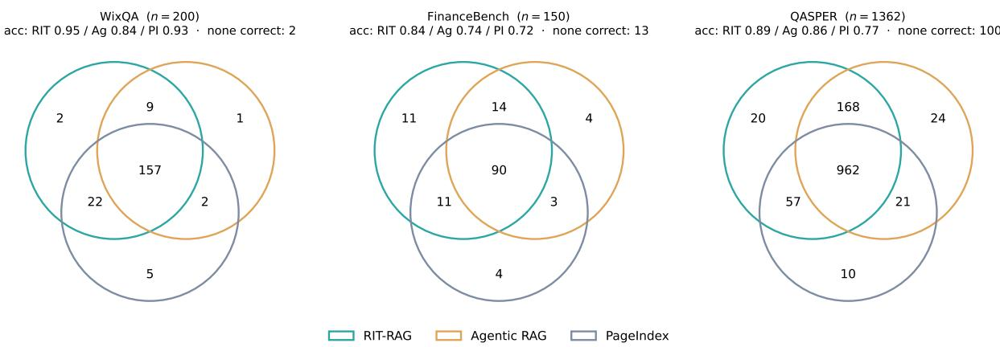  
Figure 5: Which questions each method answers correctly (Haiku generation), as an outline Venn. Each colored ring is one method’s set of correct questions and region labels are question counts; “none correct” (all three wrong) is noted per panel.

Table 16: Per-query tool-call statistics for RIT-RAG (Haiku generation). ToC/Cont.: mean calls to get\_toc\_structure/get\_content; Total: their sum; Nodes: mean content nodes per query; N/call: nodes per get\_content call.
<table><tr><td></td><td></td><td colspan="3">Mean calls per query</td><td></td><td></td></tr><tr><td>Benchmark</td><td>n</td><td>Total</td><td>ToC</td><td>Cont.</td><td>Nodes</td><td>N/call</td></tr><tr><td>WixQA</td><td>200</td><td>2.99</td><td>1.33</td><td>1.66</td><td>5.5</td><td>3.3</td></tr><tr><td>QASPER</td><td>1372</td><td>2.75</td><td>1.43</td><td>1.32</td><td>3.3</td><td>2.5</td></tr><tr><td>FinanceBench</td><td>150</td><td>2.70</td><td>1.46</td><td>1.24</td><td>2.7</td><td>2.2</td></tr><tr><td>EntQABench</td><td>317</td><td>2.99</td><td>1.47</td><td>1.51</td><td>3.8</td><td>2.5</td></tr></table>

## K Sensitivity to the Number of Nodes

The Search tool retrieves the top-k′ = 4n chunks, and keeps the n nodes with the highest scores to induce the subtree (Section 4). A small n may miss the relevant nodes, whereas a large n adds more nodes to the context of the agent. We choose n on held-out questions, viz., the simulated split of WixQA (200 questions) and the validation split of QASPER (819 questions), with Haiku for preprocessing and generation (Figure 8). The accuracy increases with n up to n = 50, and then decreases slightly. WixQA reaches its best accuracy of 88.0% at n = 50, and QASPER reaches 88.5% at both n = 25 and 50. We therefore use n = 50 in all our experiments.

## L EntQABench Creation

The EntQABench is designed to evaluate agents ability to perform retrieval on large corpora. Specifically, the EntDocs are scraped from IBM Documentation3, amounting to ∼3M documents (9M chunks) spanning dense technical topics such as compilers for the Z product line, COBOL troubleshooting, and various other documentation for

Q: What is Lockheed Martin’s 2-year total revenue CAGR from FY2020 to FY2022 (in percent, one decimal)? Use the   
statement of income.   
Gold: 0.4%

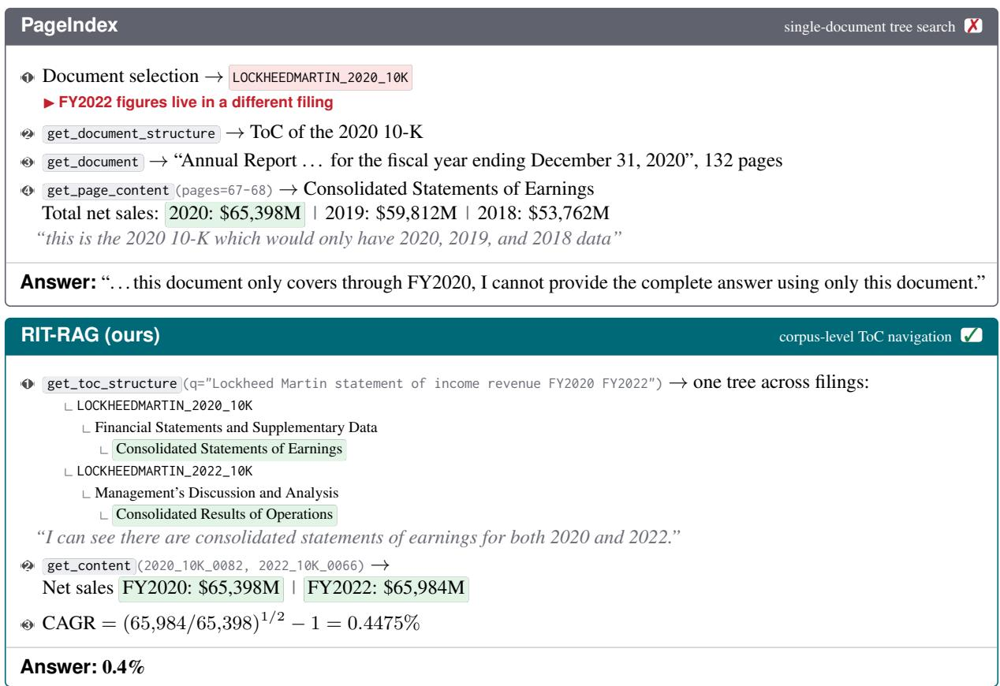  
Figure 6: Multi-document question. PageIndex commits to a single filing before searching and can never see the FY2022 revenue. RIT-RAG retrieves a corpus-level table of contents, locates the income statement in both 10-Ks, and answers in two tool calls. Traces abridged ( [. . . ] ); quoted text is verbatim model output.

IBM Products.

To construct the question bank, we follow the data generation procedure described in KARL (Sun et al., 2026). A few hand-written questions are provided to an agent equipped with a search tool over the corpus as few-shot examples. The agent is then allowed to explore the corpus and formulate questions grounded in the retrieved documents. Each question is generated with citations tracing it back to the source documents, allowing us to retain provenance and evaluate retrieval performance.

We use Claude Sonnet 5 as the question generation agent and text-embedding-3-small (OpenAI, 2024) to index the corpus chunks. We follow the prompts and filtering procedure from KARL (Sun et al., 2026). After filtering, the final benchmark contains 317 questions spanning 350 webpages. The questions cover three distinct topologies, ranging from single-webpage questions to multi-step questions requiring evidence from 3–4 webpages. Each question is accompanied by a gold answer, supporting citations, and a set of answer nuggets used to assess answer completeness.

## M LLM Usage

## Writing support

During the preparation of this manuscript, we employed a Large Language Model (LLM) as a writing support tool. Specifically, the LLM was used to polish the phrasing, improve grammatical accuracy, and provide paraphrased alternatives to enhance clarity and readability. The LLM’s role was limited to language refinement, and all suggested edits were reviewed and verified by the authors before inclusion.

Q: What is Block’s FY2016 working capital ratio (total current assets / total current liabilities)? Gold: 1.73

## Agentic RAG

1 search\_corpus ×10 → chunk of the 2016 balance sheet:   
Total current assets 1,001,425   
Accounts payable 12,602   
Customers payable 388,058   
chunk ends here, mid-table   
▶ the total current liabilities line falls outside the chunk   
2 Adds 22,472 from a note table in the 2017 10-K   
3 Current liabilities = 12,602 + 388,058 + 22,472 = 423,132   
Ratio = 1,001,425/423,132

flat chunk search ✗

RIT-RAG (ours) corpus-level ToC navigation   
1 get\_toc\_structure Consolidated Balance Sheets node of the FY2016 filing   
2 get\_content → the whole statement as one node:   
Total current assets 1,001,425   
[. . . ] four liability rows [. . . ]   
Total current liabilities 577,464   
▶ the node boundary is the statement boundary, so no row is cut of   
3 Ratio = 1,001,425/577,464   
Answer: 1.73  
Figure 7: Structure fragmentation. Agentic RAG retrieves the right balance sheet, but its fixed-size chunk ends mid-table, before the total-current-liabilities line. After ten searches it sums the visible rows plus a figure from a note in a different filing, and answers 2.37. RIT-RAG navigates to the Consolidated Balance Sheets node and reads the full statement, so the total is available and the ratio is correct. Traces abridged ( [. . . ] ).

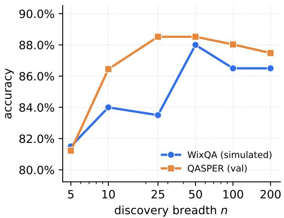  
Figure 8: Accuracy of RIT-RAG against the number of nodes n that the GetToC tool keeps, on held-out questions of WixQA (simulated split) and QASPER (validation split), with Haiku for preprocessing and generation.

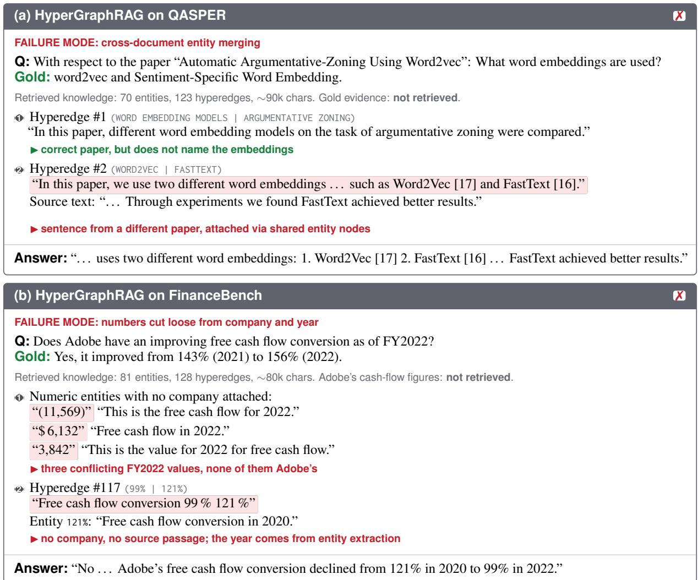  
Figure 9: Failure modes of graph-based retrieval. (a) Entity nodes such as WORD2VEC are shared across the whole corpus, so a hyperedge from an unrelated paper is retrieved as evidence and the model reports FastText. (b) Table cells are extracted as free-floating numeric entities without their company or fiscal period. The retrieved subgraph holds several contradictory “FY2022 free cash flow” values, and the answer is built on a conversion ratio that does not belong to Adobe. In both cases the gold evidence is absent from ∼80–90k characters of retrieved knowledge.

## N Prompts

## N.1 RIT-RAG System Prompt

You are a document QA assistant.

You have two tools available:

get\_toc\_structure: Uses hybrid dense+sparse search to return a table of contents   
-- a hierarchy of nodes relevant to the query. Each node has "id", "title",   
"is\_readable" (whether the node's content can be fetched),   
"metadata" (dataset-specific fields), and child "nodes". You may call it   
multiple times with different queries to explore different sections.   
- get\_content: Fetches the full text content for a list of node IDs.

## STRATEGY:

1. Before every tool call, write a short reasoning block explaining: - What you already know from previous results (or "nothing yet" on the first call) - Why the previous results were insufficient (if applicable) - What specific query or node IDs you will use next and why

2. Call get\_toc\_structure with a query. Inspect the returned nodes to identify the most promising ones.

3. Call get\_content with the most promising node IDs -- request several at once (aim for 3-5 in a single call), not one at a time.

4. If the content is insufficient, either (a) call get\_toc\_structure again with a refined query to discover more relevant nodes, or (b) call get\_content with additional readable node IDs from the current TOC. Repeat as needed.

5. When you have enough information, respond in this exact format:

<reasoning>your step-by-step reasoning</reasoning>

<answer>the answer only, no preamble</answer>

<sources>node\_ids you used, e.g. 1, 2</sources>

## RULES:

\- Always write your reasoning BEFORE every tool call -- never skip it.

\- Only pass node IDs where "is\_readable": true to get\_content. Nodes with

\- Do NOT call get\_toc\_structure and get\_content in the same turn.

MANDATORY: You must call get\_content at least once and base your answer ONLY on the full text it returns. You cannot answer -- or conclude the answer is not in the corpus -- without reading content first.

\- Titles and any summaries/keywords are navigation hints ONLY. They are lossy and never sufficient to answer: a relevant-looking title or summary means you should FETCH that node with get\_content, not that you may answer from it. Do not guess or use prior knowledge.

\- Be concise -- include only crucial information relevant to the question.

Budget: reading content with get\_content is what answers the question -- get\_toc\_structure only points at nodes and never answers anything, so do not keep re-searching when you already have promising leads; fetch and read them instead. You have at most 10 tool calls total (at most 3 of them get\_toc\_structure calls); spend the rest reading content. Before each turn you receive a [CONTEXT USAGE] message; on a [CONTEXT WARNING] (>=80% used), stop searching and answer from the content you already have.

NODE METADATA: Nodes include additional fields:

\- "summary": short description of the node's content -- use it to judge relevance before calling get\_content

\- "keywords": list of key terms in this node -- match against the question to identify relevant nodes

## N.2 WixQA Judge Prompt

You are an expert evaluator for AI-generated answers to questions. Your task is to determine whether the AI-generated answer correctly answers the question. The golden answers below are all valid correct answers -- the AI answer is correct if it matches any one of them.

Evaluation Criteria:

\- The AI-generated answer is correct if it captures the essential meaning or key facts of any golden answer, even if phrased differently.

\- If the AI-generated answer is a superset of a golden answer (more detailed but not

factually wrong), it is correct.   
The AI-generated answer is correct if it conveys the same conclusion or equivalent   
information as any golden answer.   
A vague or generic answer that does not actually address the specific question is   
incorrect.   
The AI-generated answer is incorrect if it contradicts key facts in all golden   
answers or answers a different question entirely.   
Inputs:   
- Question: {question}   
- AI-Generated Answer: {predicted\_answer}   
- Golden Answers (any one match is sufficient):   
{gold\_answers}   
Decide whether the AI-generated answer is correct.

## N.3 FinanceBench Judge Prompt

You are an expert evaluator for AI-generated responses to queries. Your task is to   
determine whether the AI-generated answer correctly answers the query based on the   
golden answer provided by a human expert.   
Numerical Accuracy:   
Rounding differences should be ignored if they do not meaningfully change the   
conclusion.   
You can allow some flexibility in accuracy. For example, 1.2 is considered similar   
to 1.23. Two numbers are considered similar if one can be rounded to the other.   
Fractions, percentage, and numerics could be considered similar, for example:   
"11 of 14" is considered equivalent to "79%" and "0.79".   
Evaluation Criteria:   
- If the golden answer or any of its equivalence can be inferred or generated from   
the AI-generated answer, then the AI-generated answer is considered correct.   
If any number, percentage, fraction, or figure in the golden answer is not present   
in the AI-generated answer, but can be inferred or generated from the AI-generated   
answer or implicitly exist in the AI-generated answer, then the AI-generated answer   
is considered correct.   
The AI-generated answer is considered correct if it conveys the same or similar   
meaning, conclusion, or rationale as the golden answer.   
If the AI-generated answer is a superset of the golden answer, it is also correct.   
If the AI-generated answer provides a valid answer or reasonable interpretation   
compared to the golden answer, it is considered correct.   
If the AI-generated answer contains subjective judgments or opinions, it is   
considered correct as long as they are reasonable and justifiable compared to the   
golden answer.   
Otherwise, the AI-generated answer is incorrect.   
Inputs:   
- Question: {question}   
AI-Generated Answer: {predicted\_answer}   
Golden Answer: {gold\_answer}   
Your output should be ONLY a boolean value: \`True\` or \`False\`, nothing else.

## N.4 EntDocs Judge Prompt

You are an expert evaluator for AI-generated responses to IBM technical documentation   
queries. Your task is to determine whether the AI-generated answer correctly answers   
the query based on the golden answer provided by a human expert.   
Evaluation Criteria:   
- The AI-generated answer is correct if it captures the essential meaning, key steps,   
or core concepts of the golden answer, even if phrased differently or in a   
different order.   
If the golden answer is a list of components or steps, the AI-generated answer is   
correct if it covers the most important ones. Minor omissions of secondary details   
are acceptable.   
If the AI-generated answer is a superset of the golden answer (more detailed but

not wrong), it is correct.   
If the AI-generated answer uses different but equivalent technical terminology for   
the same IBM concept, tool, or process, it is correct.   
The AI-generated answer is incorrect if it contradicts the golden answer on a key   
fact, names the wrong tool/product/command, describes the wrong process, or answers   
a different question entirely.   
- A vague or generic answer that does not actually address the specific question is   
incorrect.   
Inputs:   
- Question: {question}   
- AI-Generated Answer: {predicted\_answer}   
- Golden Answer: {gold\_answer}   
Your output should be ONLY a boolean value: \`True\` or \`False\`, nothing else.

## N.5 G-E Judge Prompts (Seven Dimensions)

The graded G-E judge follows HyperGraphRAG (Luo et al., 2025): one call per dimension scores the answer on a 0–10 integer scale, read from a structured {"score": <int>} output. We report all seven dimensions (correctness, relevance, factuality, comprehensiveness, knowledgeability, logical coherence, and diversity). Every dimension uses the shared template below, with the dimension-specific title, goal, and scoring rubric substituted from the list that follows.

---Role--   
You are a helpful assistant evaluating the \*\*{title}\*\* of a generated response.   
---Question--   
{question}   
---Golden Answers--   
{gold\_answers}   
---Evaluation Goal--   
Evaluate \*\*{goal}\*\* using a \*\*0-10 integer scale\*\*. {rubric}   
---Generation to be Evaluated--   
{generation}   
Respond ONLY with JSON: {"score": <integer 0-10>}

The seven (title, goal, rubric) substitutions are:

[correctness]   
goal: whether the reasoning and answer are logically and factually correct   
- 10: Fully accurate and logically sound; no flaws in reasoning or facts.   
- 8-9: Mostly correct with minor inaccuracies or small logical gaps.   
- 6-7: Partially correct; some key flaws or inconsistencies present.   
- 4-5: Noticeable incorrect reasoning or factual errors throughout.   
- 1-3: Largely incorrect, misleading, or illogical.   
- 0: Entirely wrong or nonsensical.   
[relevance]   
goal: whether the reasoning and answer are highly relevant and helpful to the question   
- 10: Fully focused on the question; highly relevant and helpful.   
- 8-9: Mostly on point; minor digressions but overall useful.   
- 6-7: Generally relevant, but includes distractions or less helpful parts.   
- 4-5: Limited relevance; much of the response is off-topic or unhelpful.   
- 1-3: Barely related to the question or largely unhelpful.   
- 0: Entirely irrelevant.   
[factuality]   
goal: whether the reasoning and answer are based on accurate and verifiable facts   
- 10: All facts are accurate and verifiable.   
- 8-9: Mostly accurate; only minor factual issues.   
- 6-7: Contains some factual inaccuracies or unverified claims.   
- 4-5: Several significant factual errors.

\- 1-3: Mostly false or misleading.

\- 0: Completely fabricated or factually wrong throughout.

## [comprehensiveness]

goal: whether the thinking considers all important aspects and is thorough

\- 10: Extremely thorough, covering all relevant angles and considerations with depth.

\- 8-9: Covers most key aspects clearly and thoughtfully; only minor omissions.

\- 6-7: Covers some important aspects, but lacks depth or overlooks notable areas.

\- 4-5: Touches on a few relevant points, but overall lacks substance or completeness.

\- 1-3: Sparse or shallow treatment of the topic; misses most key aspects.

\- 0: No comprehensiveness at all; completely superficial or irrelevant.

## [knowledgeability]

goal: whether the thinking is rich in insightful, domain-relevant knowledge

\- 10: Demonstrates exceptional depth and insight with strong domain-specific knowledge.

\- 8-9: Shows clear domain knowledge with good insight; mostly accurate and relevant.

\- 6-7: Displays some understanding, but lacks depth or has notable gaps.

\- 4-5: Limited knowledge shown; understanding is basic or somewhat flawed.

\- 1-3: Poor grasp of relevant knowledge; superficial or mostly incorrect.

\- 0: No evidence of meaningful knowledge.

## [logical coherence]

goal: whether the reasoning is internally consistent, clear, and well-structured

\- 10: Highly logical, clear, and easy to follow throughout.

\- 8-9: Well-structured with minor lapses in flow or clarity.

\- 6-7: Some structure and logic, but a few confusing or weakly connected parts.

\- 4-5: Often disorganized or unclear; logic is hard to follow.

\- 1-3: Poorly structured and incoherent.

\- 0: Entirely illogical or unreadable.

## [diversity]

goal: whether the reasoning is thought-provoking, offering varied or novel perspectives

\- 10: Exceptionally rich and original; demonstrates multiple fresh and thought-provoking ideas.

\- 8-9: Contains a few novel angles or interesting perspectives.

\- 6-7: Some variety, but generally safe or conventional.

\- 4-5: Mostly standard thinking; minimal diversity.

\- 1-3: Very predictable or monotonous.

\- 0: No diversity or originality at all.