# RoboAware: Learning to Coordinate Embodied Skills from Counterfactual Outcomes

Bohan Zhou1\*†, Xingbei Chen2,\*, Emily Huang3, Weilin Ruan1, Haojian Huang4, Yehang Zhang2, Zexi Li1 Wenqian Li3, Qize Yu5, Zetian Song5, Leyi Wu2, Jinghao Li1, Mingxuan Song5, Xinrun Xu6 Zongyang Qiu2, Yangkai Wei3, Tianyi Zhang3, Kaiwen Zhou3, Yinchuan Li3, James Cheng1

\*Equal Contribution. †Project Leader.

1The Chinese University of Hong Kong 2The Hong Kong University of Science and Technology 3Knowin AI 4The University of Hong Kong 5Peking University 6University of the Chinese Academy of Sciences

CONTACT {zhoubh} @ link.cuhk.edu.hk

Embodied coding agents can combine modular robot skills with frozen end-to-end policies, yet efective composition requires anticipating which policy family will succeed in the current physical state. We present RoboAware, which builds on coding agents’ skill orchestration by learning only a stateconditioned responsibility coordinator from counterfactual outcomes. Inspired by the success of REPL, we propose the $\mathrm { P ^ { 5 } }$ schema and formulate a hierarchical MDP based on it. $\mathrm { P ^ { 5 } }$ organizes skills uniformly into five semantic stages, defining where responsibility can be compared. To address the lack of counterfactual branch outcomes in existing work, we introduce State-Locked Counterfactual Branching (SCB), which restores the same training state to generate and execute a code block from each admissible family, exposing outcomes that selected-branch experience leaves unobserved. Building on this, we propose Execution-Aware Learning (EAL), which combines Monte Carlo tree search with Q-learning to distill these outcomes into family-conditioned values. At deployment, the coordinator selects the policy family according to observable context, and the frozen coding agent generates the next local code block. Comprehensive single-episode evaluations on 100 tasks show that RoboAware reaches a 77.0% overall success rate, with SOTA averages of 90.0% on RoboSuite, 73.8% on diverse LIBERO-Pro task clusters, and 90.0% on challenging RoboTwin bimanual tasks, outperforming existing code-as-policy and VLA-harness baselines.

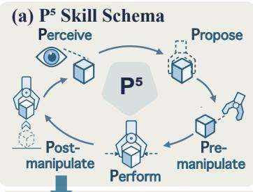

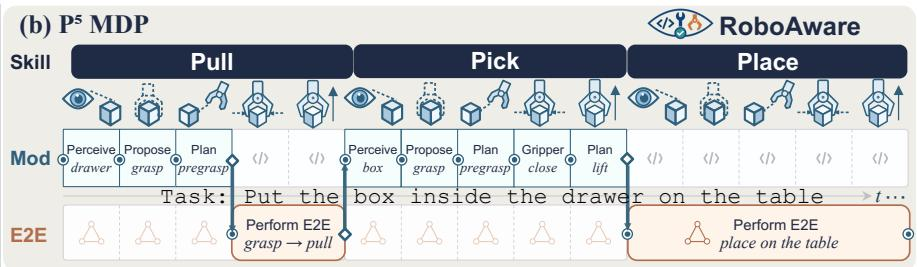

<table><tr><td rowspan=7 colspan=1>P⁵ Examples(Unifed)PickPlacePushGD   Pull1 RotateHandoverLeft P⁵e■   Right p⁵</td><td></td><td></td><td></td><td></td><td></td></tr><tr><td rowspan=1 colspan=1>éPerceiveobject_pose</td><td rowspan=1 colspan=1>BProposeeef_pose</td><td rowspan=1 colspan=1>ABPlan_motion_to_eef_pose</td><td rowspan=1 colspan=1>Perform_gripper</td><td rowspan=1 colspan=1>Plan_motionto_eef_pose</td></tr><tr><td rowspan=2 colspan=1>(object)(object)</td><td rowspan=1 colspan=1>(grasp)</td><td rowspan=1 colspan=1>(approach)</td><td rowspan=2 colspan=1>(close)(open)</td><td rowspan=2 colspan=1>(lift)(retreat)</td></tr><tr><td rowspan=1 colspan=1>(place)</td><td rowspan=1 colspan=1>(approach)</td></tr><tr><td rowspan=2 colspan=1>(object)(object)(object)</td><td rowspan=1 colspan=1>(push)(pull)</td><td rowspan=1 colspan=1>(prepush)(prepull)</td><td rowspan=2 colspan=1>1</td><td rowspan=2 colspan=1>(push)(pull)(rotate)</td></tr><tr><td rowspan=1 colspan=1>(rotate)</td><td rowspan=1 colspan=1>(prerotate)</td></tr><tr><td rowspan=1 colspan=1>(object)(object)</td><td rowspan=1 colspan=1>(L grasp)(R grasp) (</td><td rowspan=1 colspan=1>(L approach)R approach)</td><td rowspan=1 colspan=1>(L close)(R close)</td><td rowspan=1 colspan=1>(handover)(R lift)</td></tr></table>

(c) Execution-Aware Learning (EAL)  
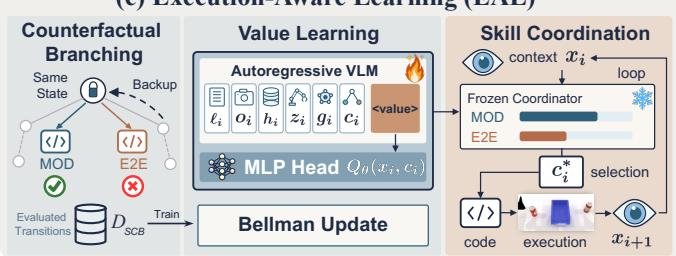  
Figure 1 Overview of RoboAware. (a) The $\mathrm { P ^ { 5 } }$ skill schema decomposes each skill into five stages—perceive, propose, pre-manipulate, perform, and post-manipulate—and unifies primitive skills (e.g., pick, place, push, pull) and compositional skills $( e . g .$ , handover) under one representation. (b) A hierarchical MDP selects a policy family $c _ { i } \in$ {Mod, E2E} at each ${ \dot { \mathrm { P } } } ^ { 5 }$ stage decision boundary; a coding agent then generates each corresponding code block $a _ { i } .$ (c) EAL learns family-conditioned coordination: SCB evaluates modular and end-to-end branches from the same restored state into $\mathcal { D } _ { \mathrm { S C B } , } \mathrm { ~ Q } \mathrm { - }$ -learning yields $Q _ { \theta } ( x , c )$ , and at test time a frozen coordinator selects best $c _ { i }$ to condition code generation and execution.

## 1 Introduction

Performing general-purpose embodied manipulation in diverse and unstructured environments remains challenging in the absence of low-level executor adaptation. Recent progress toward this goal has followed two major paradigms, namely end-to-end policies and coding agents, each with distinct strengths and limitations. Within the end-to-end paradigm, task-specific visuomotor controllers excel at contact-rich control but typically lack native support for open-vocabulary rebinding [1–3]. Vision-language-action (VLA) and world-action models (WAMs) support language-conditioned execution [4–7], yet become unreliable under compositional and state-distribution shifts. Coding agents, by contrast, enable Code-as-Policy [8–10] by flexibly composing program modules for long-horizon tasks. Their physical competence, however, is bounded by the exposed primitives, limiting fine-grained, closed-loop correction during contact-rich interactions. These complementary advantages inspire hybrid frameworks in which coding agents generate modular API compositions or invoke frozen end-to-end policies, most commonly VLAs, as contact-rich primitives [11–13]. Nevertheless, high-level coding agents lack inherent awareness of the divergent consequences of invoking diferent skill executors. They struggle to choose among an explicit modular composition, any available self-contained policy, and their possible switching patterns. For instance, modular execution can remain stable under task-distribution shift, whereas end-to-end execution excels in case of unexpected interruption. This raises a critical research question: How can we endow coding agents with outcome-aware execution responsibility over embodied skills?

We address this question with RoboAware, a framework that learns a responsibility boundary between modular composition and end-to-end execution from counterfactual outcomes. Here, a policy family $c \in$ {Mod, E2E} is the sole high-level coordination action; the API library comprises typed APIs together with their bound low-level backends; responsibility denotes which family should control the next semantically meaningful skill transition. The first challenge is to define where responsibility can be compared. The space of low-level code generation is too expansive and unstructured to provide a tractable basis for responsibility assignment. Inspired by the success of REPL-style programming [14], we propose the $\mathbf { P } ^ { 5 }$ Skill Schema to address this limitation. The $\mathrm { P ^ { 5 } }$ schema organizes embodied skills into semantically meaningful stages from perception to execution in 3D space. We formulate a finite-horizon hierarchical MDP that selects a policy family at each $\mathrm { P ^ { 5 } }$ stage. At the lower level, we curate an API library combining typed modular interfaces for composability and controllability with end-to-end policies for contact-rich local execution. Conditioned on the selected family and current context, the frozen coding agent πcode generates a complete local code block through the fixed API library. Learning is confined to the responsibility coordinator, while skill implementation leverages the coding agent’s existing code-generation capability.

The second challenge is to expose the missing outcome of the skills that were not selected. Many approaches execute open-loop skill sequences or code programs without attending to outcomes [8, 10, 15]. Methods that obtain outcomes typically rely on VLM-based evaluations limited to the predicted outcome of the executed trajectory, and therefore inherit selection bias [13, 16]. We introduce State-Locked Counterfactual Branching (SCB), which leverages simulator (1) save-restore mechanisms and (2) oracle outcome judgments to execute every admissible family from an identical physical state, producing a same-state set of potentia outcomes at each $\mathrm { P ^ { 5 } }$ decision point. To convert these set-wise outcomes into deployable family selection, we formulate Execution-Aware Learning (EAL), in which Monte Carlo tree search (MCTS) treats restorable $\mathrm { P ^ { 5 } }$ decision states as nodes and admissible policy families as edges, while Q-learning distills the explored outcomes into a family-conditioned value function $Q _ { \theta }$ . The family-wise values encode a relative responsibility preference over modular composition and the end-to-end family, reflecting expected remaining skill- and task-level return under an observation. During deployment, the RoboAware coordinator assigns responsibility by maximizing $\rho _ { \theta }$ induced by $Q _ { \theta } .$ , and a coding agent generates executable code blocks accordingly to transition from one $\mathrm { P ^ { 5 } }$ state to the next, without state restoration or privileged simulator state. See Figure 1 for an overview of the proposed framework. Our contributions are as follows:

• We formulate RoboAware as a hierarchical MDP that selects a policy family $c _ { i }$ at each $\mathrm { P ^ { 5 } }$ stage to produce code block $a _ { i } .$ . We curate its lower-level API library around two complementary families, namely composable modular components and end-to-end policies for contact-rich local skills.

• We introduce SCB to acquire paired locked-state outcomes, and EAL to learn family-conditioned $Q _ { \theta }$ through MCTS-guided exploration and Q-learning.

• We recover the coordinator from $Q _ { \theta }$ and evaluate it on 100 tasks across three benchmarks, obtaining a SOTA 77.0% overall success rate. Ablations confirm the efectiveness of our designs.

## 2 Methodology

## 2.1 Problem Formulation

We consider language-conditioned manipulation in a physics environment $\mathcal { E } ,$ where the observation at time t is $o _ { t } = ( I _ { t } ^ { \mathrm { r g b } } , I _ { t } ^ { \mathrm { d } } , q _ { t } )$ from an agent-view RGB image, a metric depth map, and proprioception. We formulate the task as a finite-horizon MDP $\mathcal { M } = ( \mathcal { X } , \mathcal { C } , \mathcal { P } , r , \gamma )$ . Decision point i occurs at the start of a $\mathrm { P ^ { 5 } }$ stage, where the observation $x _ { i } = ( \ell , o _ { i } , h _ { i } , z _ { i } , g _ { i } ) \in \mathcal { X }$ is received. Here ℓ denotes the language instruction, $h _ { i }$ the observable execution history, z the current $\mathrm { P ^ { 5 } }$ stage, and $g _ { i }$ the active skill schema. The high-level action is a policy-family choice $c _ { i } \in \mathcal { C } _ { i } ( z _ { i } , g _ { i } ) \subset \mathcal { C } = \{ \mathrm { M o d } , \mathrm { E 2 E } \}$ . A coding agent generates a complete executable code block $a _ { i } \sim \pi _ { \mathrm { c o d e } } ( \cdot \mid x _ { i } , c _ { i } )$ with $a _ { i } \in \mathcal { A } _ { c _ { i } } ( x _ { i } , z _ { i } , g _ { i } )$ , where $\mathcal { A } _ { \mathrm { M o d } }$ and $\boldsymbol { \mathcal { A } } _ { \mathrm { E 2 E } }$ are the modularand end-to-end-family code-block spaces. Executing $a _ { i }$ in E until the next decision point induces the transition $\mathcal { P } ( x _ { i + 1 } \mid x _ { i } , c _ { i } ) = \mathbb { E } _ { a _ { i } \sim \pi _ { \operatorname { c o d e } } ( \cdot \mid x _ { i } , c _ { i } ) } [ \mathcal { P } _ { \mathcal { E } } ( x _ { i + 1 } \mid x _ { i } , a _ { i } ) ]$ . A binary reward r is received at task termination. $\gamma = 1$ Only the coordinator’s value model $Q _ { \theta }$ is trained; the coding agent, API interfaces, backend bindings, and low-level backend parameters remain fixed.

## 2.2 RoboAware Framework

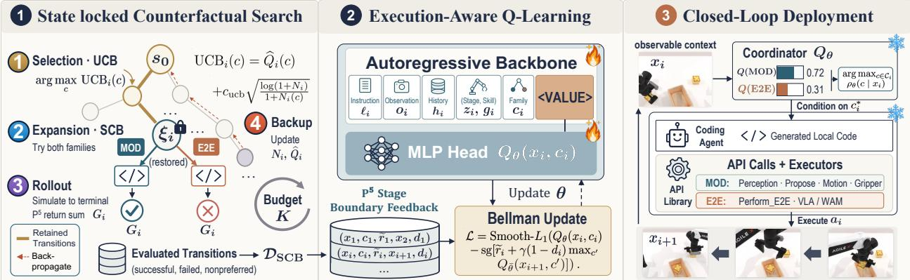  
Figure 2 Method overview of EAL in RoboAware. (1) State-locked counterfactual search repeats Selection (UCB), Expansion (SCB paired Mod/E2E branches from a restored $\xi _ { i } )$ , Rollout (sufix return G ), and Backup within budget $K ,$ retaining successful, failed, and nonpreferred transitions in $\mathcal { D } _ { \mathrm { S C B } }$ . (2) A VLM backbone with an MLP head maps context–family tokens ending in <VALUE> to $Q _ { \theta } ( x _ { i } , c _ { i } )$ , trained by Bellman updates on skill-completion and terminal-task feedback. (3) At deployment, frozen $Q _ { \theta }$ induces $\rho _ { \theta }$ and selects c∗ = arg max $\rho _ { \theta } ( c \mid x _ { i } )$ ; a frozen coding agent generates a local code block against the fixed API library and executes it, looping on observable feedback at each $\mathrm { P ^ { \bar { 5 } } }$ boundary.

RoboAware formulates heterogeneous policy-family orchestration as stage-conditioned responsibility learning.   
The pipeline is visualized in Figure 2 and elaborated in Algorithm 1.

## 2.2.1 Skill Preparation

$\mathbf { P } ^ { 5 }$ Skill Schema. We instantiate local embodied skills through either interface-based modular composition or a self-contained end-to-end controller. The $\mathrm { P ^ { 5 } }$ skill schema decomposes each skill into five stages: perceive, propose, pre-manipulate, perform, and post-manipulate. As shown in Figure 1, this schema provides a unified representation for arbitrary skills, including primitive skills (e.g. pick, place, push, pull) and compositional skills $( e . g .$ handover). Given the task instruction ℓ and initial observation $o _ { 0 }$ , the coding agent constructs a task-level plan $\mathcal { G }$ comprising $\mathrm { P ^ { 5 } }$ skill schemas. Responsibility is reconsidered at each $\mathrm { P ^ { 5 } }$ stage.

API Library Construction. Building on the $\mathrm { P ^ { 5 } }$ stages, we expose an API library that supports the modular and end-to-end policy families. The Mod family uses an explicit intermediate interface for composability and controllability, whereas the E2E family relies on an implicit internal loop for local contact competence. We assemble the library by ofline screening of open-source modular perception, grasping, and motion components alongside released VLA and world-action-model (WAM) policies. For the Mod family, screening retains InstructSAM [17], our augmented NeuGraspNet+ from NeuGraspNet [18]—which expands sparse geometric candidates and selects Top-1 only among planner-feasible grasps—and cuRoboV2 [19] as the core backends for perception, pose proposal, and motion planning, respectively. Together with the deterministic gripper API, these components define the modular calls available to $\pi _ { \mathrm { c o d e } } .$ . For the E2E family, ofline evaluation reveals limited zero-shot performance on complete tasks, yet these policies perform well on local skills such as grasping and lifting (see Section 3.2). We therefore position VLA and WAM policies as local executors at grasp–lift granularity rather than as end-to-end policies for complete tasks. Efectiveness and eficiency screening selects $\pi _ { 0 . 5 }$ [20] and FastWAM [21] for integration into Perform\_E2E (see Table 1). Screening details appear in Appendix B. Each stage admits both families except the propose stage (see Table 2). Perform\_E2E spans the perceive, pre-manipulate, perform, and post-manipulate stages. A call remains atomic with respect to family selection until it meets its registered postcondition, reports failure, or exhausts its step budget. The API library, including its typed interfaces, backend bindings, and checkpoints, remains frozen during training and evaluation.

Table 1 Ofline screening of the selected VLA and WAM backends (successful / total). Full: complete task; G–L: grasp and lift.  
Table 2 High-level embodied APIs under the $\mathrm { P ^ { 5 } }$ skill schema; ✓ marks stages covered by each API.
<table><tr><td rowspan="2">Method</td><td colspan="2">LIBERO-Pro</td><td colspan="2">RoboSuite</td><td colspan="2">RoboTwin 2.0</td></tr><tr><td>Full</td><td>G-L</td><td>Full G-L</td><td>Full</td><td></td><td>G-L</td></tr><tr><td> $\pi _ { 0 . 5 }$ </td><td>10/14</td><td>13/14</td><td>0/4 2/4</td><td></td><td>0/10</td><td>2/10</td></tr><tr><td>FastWAM</td><td>4/14</td><td>11/14</td><td>0/4</td><td>0/4</td><td>10/10</td><td>10/10</td></tr></table>

<table><tr><td>API</td><td>perc. prop. pre perf. post</td><td></td><td></td><td></td><td></td></tr><tr><td>Perceive_object_pose</td><td></td><td></td><td></td><td></td><td></td></tr><tr><td> $\mathtt { P r o p o s e \_ e e f \_ p o s e }$ </td><td></td><td>√</td><td></td><td></td><td>√</td></tr><tr><td>Plan_to_eef_pose</td><td></td><td></td><td>√</td><td></td><td></td></tr><tr><td>Perform_gripper</td><td></td><td></td><td></td><td>√</td><td>√</td></tr><tr><td>Perform_E2E</td><td>L</td><td></td><td>√</td><td>√</td><td></td></tr></table>

## 2.2.2 Execution-Aware Learning

Existing coding agents cannot reliably anticipate the physical consequences of executing a generated skill. To address this limitation, we propose Execution-Aware Learning (EAL) as illustrated in Figure 2, which learns family-conditioned outcome values from controlled simulator experience.

State-Locked Counterfactual Branching (SCB) is the training-time operator that makes the otherwise missing policy-family outcomes observable. On a fixed set of simulator training tasks, EAL builds a Monte Carlo search tree from each sampled $\mathrm { P ^ { 5 } }$ stage-entry context. Nodes are restorable decision states, and outgoing edges correspond to admissible policy families. Each node stores a snapshot ${ { \xi } _ { i } } = { ( { x } _ { i } , { m } _ { i } , { p } _ { i } , r ) }$ containing the simulator and execution state required for exact restoration. Beyond the deployment-visible context $x _ { i } ,$ it provides oracle masks $m _ { i } ,$ ground-truth object poses $p _ { i } ,$ and access to the terminal reward evaluator r. These privileged signals support the training rewards including pose-based assessment under threshold $\epsilon _ { p } .$ . The search repeats four search phases within a budget of K completed sufix simulations per root. See Appendix A.2 for details.

Selection. Starting from the root, the search follows stored tree paths by selecting family edges with UCB at already expanded nodes, where $N _ { i }$ and $N _ { i } ( c )$ are node and family-edge visit counts, and $\widehat { Q } _ { i } ( c )$ is the empirical return estimate:

$$
c _ { i } ^ { \mathrm { t r e e } } = \arg \operatorname* { m a x } _ { c \in \mathcal { C } _ { i } } \left[ \widehat { Q } _ { i } ( c ) + c _ { \mathrm { u c b } } \sqrt { \frac { \log ( 1 + N _ { i } ) } { 1 + N _ { i } ( c ) } } \right] .\tag{1}
$$

Expansion. At a new node, SCB evaluates every admissible family at least once from the same physical state and observable-history prefix. For each $c \in { \mathcal { C } } _ { i }$ , it restores $\xi _ { i } ,$ samples $a _ { i } ^ { c } \sim \pi _ { \mathrm { c o d e } } ( \cdot \mid x _ { i } , c )$ , and executes the block to the next decision point or termination. The resulting transition contains a successor snapshot $\xi _ { i + 1 } ^ { c }$ , terminal indicator $d _ { i } ^ { c }$ , and training reward $\tilde { r } _ { i } ^ { c }$ . Reevaluating an existing family edge repeats restoration, code generation, and execution with a fresh code sample.

Rollout. From each nonterminal successor, the codes are generated using API library to complete the sufix. The sufix ends at task termination, unrecoverable failure, or the episode horizon T. Rollout-only states are not added as expanded tree nodes during this simulation. Each completed sufix yields $\begin{array} { r } { G _ { i } = \sum _ { j = i } ^ { T } \gamma ^ { j - i } \tilde { r } _ { j } } \end{array}$ $\tilde { r } _ { i } ^ { c }$ is defined in Equation (3).

Backpropagation. This tree-statistics backup propagates the sufix return $G _ { i }$ along the selected tree path, including each ancestor’s recorded prefix rewards. Each visited node and family-edge count is incremented, and $\widehat { Q }$ is updated by empirical averaging. These statistics guide subsequent selection; the parameters of $Q _ { \theta }$ are optimized only after data collection. Within budget $K = 2 0$ , all evaluated tree edges, including failed and nonpreferred branches, contribute transitions to the training dataset:

$$
\mathcal { D } _ { \mathrm { S C B } } = \bigcup _ { i } \left\{ ( x _ { i } , c , \tilde { r } _ { i } ^ { c } , x _ { i + 1 } ^ { c } , d _ { i } ^ { c } , \xi _ { i + 1 } ^ { c } ) : c \in \mathcal { C } _ { i } \right\} .\tag{2}
$$

Execution-Aware Q-learning. A task comprises several $\mathrm { P ^ { 5 } }$ skill blocks. At the end of each $\mathrm { P ^ { 5 } }$ stage, oracle signals in $\xi _ { i + 1 } ^ { c }$ yield a perception score $r _ { \mathrm { p } , i } ^ { c } \in [ 0 , 1 ]$ from agreement with mask $m _ { i } ,$ and a manipulation score $r _ { \mathrm { m } , i } ^ { c } \in [ 0 , 1 ]$ from object-pose error against $p _ { i }$ under threshold $\epsilon _ { p } .$ The binary task-success reward $r \in \{ 0 , 1 \}$ is received only when $d _ { i } ^ { c } = 1$ . The transition reward used in both tree search and Q-learning is the linear combination with non-negative weights:

$$
\tilde { r } _ { i } ^ { c } = w _ { \mathrm { p } } r _ { \mathrm { p } , i } ^ { c } + w _ { \mathrm { m } } r _ { \mathrm { m } , i } ^ { c } + w _ { \mathrm { t } } d _ { i } ^ { c } r , \quad \mathrm { w h e r e ~ } w _ { \mathrm { p } } + w _ { \mathrm { m } } + w _ { \mathrm { t } } = 1 .\tag{3}
$$

The learning target is $Q _ { \theta } ( x _ { i } , c )$ ≈ maxπ $\begin{array} { r } { \mathbb { E } _ { \pi } \big [ \sum _ { i = i } ^ { T } \gamma ^ { j - i } \tilde { r } _ { j } \ | \ x _ { i } , c _ { i } = c \big ] } \end{array}$ , where π governs subsequent family choices under the fixed coding agent and API library. The value $\bar { Q } _ { \theta } ( x _ { i } , c )$ estimates the remaining skilland task-level return conditional on choosing family c next. After collecting $\mathcal { D } _ { \mathrm { S C B } }$ across the training tasks, we optimize $Q _ { \theta }$ on this fixed transition dataset using Bellman targets rather than directly regressing the rollout returns $G _ { i }$ or tree estimates $\widehat { Q } _ { i } ( c )$ . All evaluated tree edges, including failed and nonpreferred branches, contribute to this update. For transitions sampled from $\mathcal { D } _ { \mathrm { S C B } }$ , we optimize θ by gradient-based backpropagation through $Q _ { \theta }$ , minimizing the following Smooth- $. L _ { 1 }$ Bellman loss:

$$
\mathcal { L } _ { \mathrm { E A L } } ( \theta ) = \mathbb { E } _ { ( x _ { i } , c ) \sim \mathcal { D } _ { \mathrm { S C B } } } \ell \left[ Q _ { \theta } ( x _ { i } , c ) - \left( \tilde { r } _ { i } ^ { c } + \gamma ( 1 - d _ { i } ^ { c } ) \operatorname* { m a x } _ { c ^ { \prime } \in \mathcal { C } _ { i + 1 } } Q _ { \bar { \theta } } ( x _ { i + 1 } ^ { c } , c ^ { \prime } ) \right) \right] ,\tag{4}
$$

where $Q _ { \bar { \theta } }$ is a stop-gradient target copy and $\ell ( \epsilon )$ refers to the Smooth- $. L _ { 1 }$ loss, which maintains stable gradients in the regime of large errors as the $L _ { 1 }$ loss does and facilitates smooth optimization for small errors analogous to the $L _ { 2 }$ loss:

$$
\ell ( \epsilon ) = \left\{ { \begin{array} { l l } { { \frac { 1 } { 2 } } \epsilon ^ { 2 } } & { { \mathrm { i f ~ } } | \epsilon | < 1 , } \\ { | \epsilon | - { \frac { 1 } { 2 } } } & { { \mathrm { o t h e r w i s e } } . } \end{array} } \right.\tag{5}
$$

Q-Modeling. $Q _ { \theta } ( x _ { i } , c )$ is parameterized with a lightweight VLM backbone $( e . g .$ Qwen3.5-0.8B). The state $x _ { i } = ( \ell , o _ { i } , h _ { i } , z _ { i } , g _ { i } )$ and family c form a multimodal token sequence ending in a <VALUE> token. An MLP head maps its final-layer hidden state to the scalar Q-value, optimized with the Bellman objective in Equation (4).

## 2.2.3 Test-Time Skill Coordination

During training, repeated access to $\xi _ { i }$ and oracle outcome judgments supervises values, whereas neither is included at test time. The learned values induce a relative responsibility preference over admissible families:

$$
\rho _ { \theta } ( c \mid x _ { i } ) = \frac { \exp ( Q _ { \theta } ( x _ { i } , c ) ) } { \sum _ { c ^ { \prime } \in { \mathcal { C } } _ { i } } \exp ( Q _ { \theta } ( x _ { i } , c ^ { \prime } ) ) } .\tag{6}
$$

The RoboAware coordinator selects $c _ { i } ^ { * } = \arg \operatorname* { m a x } _ { c \in { \mathcal { C } } _ { i } } \rho _ { \theta } ( c \mid x _ { i } )$ (equivalently arg ma $\mathrm { x } _ { c } Q _ { \theta } ( x _ { i } , c )$ ; see $\mathrm { A p - }$ pendix $\mathrm { A . 3 } )$ , and the coding agent generates $a _ { i } \sim \pi _ { \mathrm { c o d e } } ( \cdot \mid x _ { i } , c _ { i } ^ { * } )$ . The coding agent executes the selected block until the next semantic boundary or task termination, then updates $\left( h _ { i } , z _ { i } , g _ { i } \right)$ from observable feedback.

Family selection repeats at each subsequent boundary with $Q _ { \theta }$ fixed. Both family selection and local code generation respond to updated observations without parameter updates or changes to executor interfaces.

## 3 Experiments

## 3.1 Experimental Protocol

Benchmarks. Our evaluation contains 100 tabletop-manipulation tasks across three benchmarks: LIBERO Pro [22], RoboSuite [23], and RoboTwin 2.0 [24]. We use scene seed 0 only to collect privileged SCB branches and train $Q _ { \theta }$ . The learned coordinator is then frozen and evaluated on seeds 1–10, giving 1,000 test episodes in total.

Baselines. We compare RoboAware with the following baselines:

• End-to-end policies: π0 [7], π0.5 [20], FastWAM [21], FasterWAM [25], as standalone controllers;

• Code-as-policy: CaP [8], CaP-X [9], RATS [26], and ASPIRE [27], without learned family coordination.

• VLA with harness: Pigey [28], VLS [29], and Harness-VLA [11], which invoke a frozen policy.

## 3.2 Benchmark Performance

Table 3 Aggregate success rates (%) on LIBERO-Pro (instruction-redirection T / position-swap S), RoboSuite, and RoboTwin. RoboSuite and RoboTwin use their full task pools under seeds 1–10. Overall is the mean over available columns. On RoboTwin, π and $\pi _ { 0 . 5 }$ are incompatible with RoboTwin’s dual-arm setup, so results involving these models are marked $^ { 6 6 } / ^ { 5 }$ because of the embodiment mismatch. For fair comparison, global cross-episode memory is disabled for baselines that rely on memory. All seeds are tested in one trial.
<table><tr><td rowspan="2">Method</td><td colspan="8">LIBERO-Pro</td><td rowspan="2">RoboSuite RoboTwin Overall</td><td rowspan="2"></td><td rowspan="2"></td></tr><tr><td>Spat-T Spat-S Obj-T</td><td></td><td></td><td></td><td> Obj-S Goal-T Goal-S L10-T L10-S</td><td></td><td></td><td></td></tr><tr><td>End-to-end policies</td><td></td><td></td><td></td><td></td><td></td><td></td><td></td><td></td><td></td><td></td><td></td></tr><tr><td>π0 [7]</td><td>0.0</td><td>0.0</td><td>0.0</td><td>2.0</td><td>0.0</td><td>0.0</td><td>0.0</td><td>0.0</td><td>0.0</td><td>/</td><td>0.2</td></tr><tr><td>π0.5 [20]</td><td>1.0</td><td>20.0</td><td>1.0</td><td>17.0</td><td>2.0</td><td>38.0</td><td>1.0</td><td>8.0</td><td>0.0</td><td>1</td><td>9.8</td></tr><tr><td>FastWAM [21]</td><td>30.0</td><td>0.0</td><td>10.0</td><td>0.0</td><td>10.0</td><td>0.0</td><td>10.0</td><td>0.0</td><td>0.0</td><td>81.9</td><td>14.2</td></tr><tr><td>FasterWAM [25]</td><td>50.0</td><td>0.0</td><td>10.0</td><td>10.0</td><td>10.0</td><td>10.0</td><td>10.0</td><td>0.0</td><td>0.0</td><td>85.6</td><td>18.6</td></tr><tr><td>Code as policy</td><td></td><td></td><td></td><td></td><td></td><td></td><td></td><td></td><td></td><td></td><td></td></tr><tr><td>CaP [8]</td><td>0.0</td><td>0.0</td><td>0.0</td><td>0.0</td><td>0.0</td><td>0.0</td><td>0.0</td><td>0.0</td><td>70.0</td><td>5.6</td><td>7.6</td></tr><tr><td>CaP-X [9]</td><td>0.0</td><td>0.0</td><td>10.0</td><td>0.0</td><td>0.0</td><td>0.0</td><td>0.0</td><td>0.0</td><td>50.0</td><td>6.9</td><td>6.7</td></tr><tr><td>RATS [26]</td><td>2.0</td><td>18.0</td><td>10.0</td><td>8.0</td><td>8.0</td><td>8.0</td><td>0.0</td><td>0.0</td><td>45.0</td><td>0.0</td><td>9.9</td></tr><tr><td>ASPIRE [27]</td><td>60.0</td><td>51.0</td><td>95.0</td><td>98.0</td><td>45.0</td><td>81.0</td><td>38.0</td><td>22.0</td><td>80.0</td><td>0.0</td><td>57.0</td></tr><tr><td>VLA with harness</td><td></td><td></td><td></td><td></td><td></td><td></td><td></td><td></td><td></td><td></td><td></td></tr><tr><td>Pigey [28]</td><td>80.0</td><td>66.0</td><td>54.0</td><td>54.0</td><td>22.0</td><td>44.0</td><td>28.0</td><td>12.0</td><td>15.0</td><td>/</td><td>41.7</td></tr><tr><td>VLS [29]</td><td>54.0</td><td>42.0</td><td>41.0</td><td>45.0</td><td>33.0</td><td>38.0</td><td>25.0</td><td>15.0</td><td>0.0</td><td>/</td><td>32.6</td></tr><tr><td>Harness-VLA [11]</td><td>50.0</td><td>70.0</td><td>50.0</td><td>90.0</td><td>40.0</td><td>60.0</td><td>40.0</td><td>30.0</td><td>20.0</td><td>1</td><td>50.0</td></tr><tr><td>RoboAware (ours)</td><td>68.0</td><td>68.0</td><td>92.0</td><td>86.0</td><td>66.0</td><td>84.0</td><td>64.0</td><td>62.0</td><td>90.0</td><td>90.0</td><td>77.0</td></tr></table>

End-to-end policies struggle with whole-task distribution shifts. For both VLAs and WAMs, unfamiliar skill combinations, scene types, and perturbations may deviate substantially from their training distributions, leading to low zero-shot SRs in Table 3. In comparison, RoboAware generates composable modular alternatives under such conditions while retaining end-to-end policies for local skills suited to their capabilities.

Code-as-policy methods are constrained by contact precision and accumulated experience. Codeas-policy methods ofer stronger long-term planning and composability for long-horizon bimanual tasks such as those in RoboTwin. However, within-skill contact-rich performance depends on available primitives: CaP and CaP-X generate detailed code at test time, yet may lack the precision needed for tasks such as placing a mug inside a microwave in LIBERO-Pro (see Figure 3). Single-turn evaluation without cross-episode adaptation or multi-turn memory further limits the benefits of accumulated experience for memory-based methods like CaP-X, RATS, and ASPIRE. RoboAware addresses these limitations by combining modular composition with local end-to-end control and learning state-dependent family responsibility from training-time outcomes.

VLA harnesses remain limited by outcome anticipation. We observe that VLS [29] can be misled by early-stage behavior in long-horizon tasks, where initial progress may not reflect readiness for later interactions. Harness-VLA is closely related to our work and achieves competitive performance. However, once the selected family changes the physical state, the alternative family’s outcome at the original state remains unobserved, so family switching relies on experiential judgments. RoboAware addresses this gap through SCB and EAL, which expose same-state alternatives for family selection.

## 3.3 Experimental Analysis

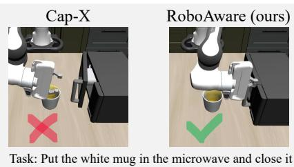  
Figure 3 Comparison between CaP-X and RoboAware on a contact-rich LIBERO-Pro task “Put the white mug in the microwave and close it.”

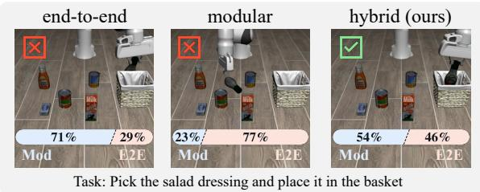  
Figure 4 A representative LIBERO-Pro task comparison and visualization of the responsibility preference distribution $\rho _ { \theta }$ for RoboAware, RoboAware-EO, and RoboAware-MO.

Takeaway 1: Neither policy family alone provides broad high-success task coverage. We restrict code generation to modular composition (RoboAware-MO) or end-to-end blocks (RoboAware-EO), keeping the same API library and tasks as RoboAware. Success rate (SR) reductions in group A of Table 4 show that both families must be coordinated by state. In a LIBERO-Pro task illustrated in Figure 4, RoboAware-EO and RoboAware-MO fail at diferent stages, whereas RoboAware succeeds by switching policy families across P5 boundaries. The $\rho _ { \theta }$ visualization assigns lower preference to the families used by the ablation variants at the illustrated states, consistent with their failures.

Table 4 Ablation success rates (%) on the three benchmarks, grouped by conclusions A–C in this analysis. RoboAware is the common reference. LIBERO-Pro aggregates its eight T/S evaluation splits. Abbreviations: MO = modular only; EO = end-to-end only; UO = unpaired outcomes; TF = training free; FH = fixed handof; ES = episode selection.
<table><tr><td>Variants</td><td>LIBERO-Pro</td><td>RoboSuite</td><td>RoboTwin 2.0</td></tr><tr><td>A. Policy Family</td><td></td><td></td><td></td></tr><tr><td>RoboAware-MO</td><td>54.8</td><td>67.5</td><td>41.9</td></tr><tr><td>RoboAware-EO</td><td>49.5</td><td>60.0</td><td>45.6</td></tr><tr><td colspan="4">B. Counterfactual Outcome</td></tr><tr><td>RoboAware-UO</td><td>58.5</td><td>75.0</td><td>53.8</td></tr><tr><td>RoboAware-TF</td><td>51.0</td><td>60.0</td><td>40.0</td></tr><tr><td colspan="4">C. Coordination Mode</td></tr><tr><td>RoboAware-FH</td><td>64.5</td><td>82.5</td><td>55.6</td></tr><tr><td>RoboAware-ES</td><td>59.3</td><td>70.0</td><td>51.9</td></tr><tr><td>RoboAware</td><td>73.8</td><td>90.0</td><td>90.0</td></tr></table>

Table 5 Group B ablations of coordinator training and same-state outcomes. $\checkmark :$ present; ✗: absent.
<table><tr><td>Variant</td><td></td><td>Training Counterfactual</td></tr><tr><td>ours</td><td>√</td><td>√</td></tr><tr><td>ours-UO</td><td>√</td><td>x</td></tr><tr><td>ours-TF</td><td>x</td><td>x</td></tr></table>

Table 6 Group C ablations of when family responsibility may change. When: decision points; Family: modular / e2e.
<table><tr><td>Variant</td><td>When</td><td>Family</td></tr><tr><td>ours</td><td>Each stage</td><td>Mod / E2E</td></tr><tr><td>ours-FH</td><td>Fixed handoff</td><td>Mod + E2E</td></tr><tr><td>ours-ES</td><td>Episode start</td><td>Mod / E2E</td></tr></table>

Takeaway 2: Paired same-state outcomes improve Execution-aware learning. To evaluate the importance of SCB, we ablate coordinator training and counterfactual supervision (Table 5): RoboAware

uses both, RoboAware-UO trains $Q _ { \theta }$ only on executed trajectories without state-locked branching, and RoboAware-TF skips coordinator training so the coding agent chooses directly from the hybrid API library. Higher SR for RoboAware-UO than RoboAware-TF in group B of Table 4 indicates that the coding agent lacks inherent execution awareness and that coordinator training still helps without counterfactuals. Yet executed-only branches inherit the agent’s experience distribution and introduce selection bias. A modest SR decrease for RoboAware-UO relative to RoboAware therefore supports the necessity of paired counterfactual executions from the same $\xi _ { i }$

Takeaway 3: RoboAware benefits from fine-grained coordination at $\mathrm { P ^ { 5 } }$ stages. Following the same training protocol to obtain $Q _ { \theta }$ , we compare three coordination strategies that difer in when family responsibility may change. RoboAware reselects a policy family at every $\mathrm { P } ^ { \mathrm { 5 } }$ stage. RoboAware-FH (fixed handof) follows a fixed protocol: modular APIs for perceive and pre-manipulate, then an E2E call for subsequent execution. RoboAware-ES (episode selection) chooses one family at episode start and retains it for the entire task. Lower SRs for both variants in group C of Table 4 suggests that neither a fixed handof nor a single episode-level decision tracking changing execution responsibility as well as per-stage coordination (Table 6).

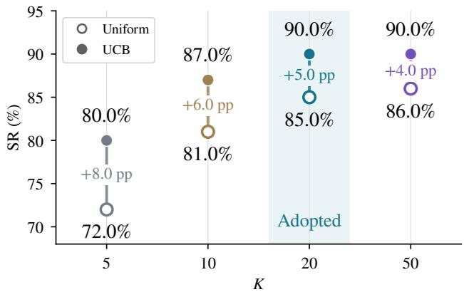  
Figure 5 Average RoboSuite success rates (%) across budgets $K \in \{ 5 , 1 0 , 2 0 , 5 0 \}$ . Hollow & filled circles denote RoboAware-UA & RoboAware. We adopt K=20.

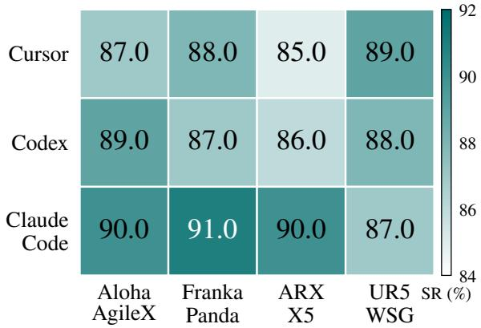  
Figure 6 RoboTwin 2.0 success rates (%) on a four-task subset across coding-agent backends (rows) and embodiments (columns). Color bar shows the SR range.

Takeaway 4: UCB-guided exploration uses a limited branching budget more efectively. To test how a finite simulation budget is allocated during branching, we compare RoboAware with RoboAware-UA, which allocates evaluations uniformly over admissible families instead of the UCB rule in Equation (1). Figure 5 reports both under $K \in \{ 5 , 1 0 , 2 0 , 5 0 \}$ in RoboSuite. SR gains diminish with K, so we use the elbow $K { = } 2 0$ . Under matched budgets, RoboAware exceeds RoboAware-UA, indicating that UCB concentrates evaluations on promising families more efectively than uniform allocation.

Takeaway 5: RoboAware is less sensitive to coding-agent and embodiment variations. To assess sensitivity to changes in the coding agent and robot embodiment, we evaluate RoboAware with three codingagent backends (Claude Code as default, Cursor, and Codex) across four embodiments (Aloha-AgileX as default, Franka-Panda, ARX-X5, and UR5-WSG) on four tasks in RoboTwin 2.0 (See Appendix Appendix C.1 for details), retaining the same API interfaces. Figure 6 shows a small average SR gap across coding-agent backends and embodiments. We attribute the small backend gap to $\mathrm { P ^ { 5 } }$ , which limits each generation to one code block $a _ { i } \in \mathcal { A } _ { c _ { i } } ( x _ { i } , z _ { i } , g _ { i } )$ . Notably, the cuRoboV2 backend of $\mathtt { P 1 a n \_ t o \_ e e f }$ \_pose inherently supports diferent robots through the same API interface across embodiments.

## 4 Related Work

## 4.1 Embodied Coding Agents

Embodied coding agents have progressed along three lines. Early language planners translated goals into sequences over closed skill APIs and improved grounding through semantic matching, afordance scoring, program-structured prompting, and execution feedback [15, 30–32]. Executable-policy methods such as CaP [8], VoxPoser [10], RoboCodeX [33], and CodeDifuser [34] then generated Python controllers or geometric intermediates, gaining compositionality, spatial reasoning, and interpretability while remaining bounded by designer-provided abstractions and API coverage. Recent systems make the program itself adaptive. CaP-X [9] and AOR [35] repair code from multimodal rollouts, RHO [36] and GaP [37] optimize repositoryor graph-structured policies through execution, VLCP [38] rewrites failed controllers within an episode, PhysCaP [39] actively probes latent physical properties, and ASPIRE [27] compounds validated repairs into a reusable skill library. This line strengthens modular program execution, yet its evidence is conditional on generating a modular code block. Neither success nor code-only repair reveals whether an end-to-end block performs better at the same state. We instead use SCB to generate and execute modular and end-to-end coding blocks from the same restored state, and EAL learns their family-conditioned values from paired outcomes.

## 4.2 End-to-End Policy Orchestration and Execution Harnesses

End-to-end policy orchestration has likewise progressed along three lines: generalist VLAs including RT 1 [4], RT-2 [5], Octo [40], OpenVLA [6], and π [7] broaden local language-conditioned control, while hierarchical agents move planning, memory, grounding, and progress tracking to a VLM or code layer, exposing VLAs as bounded tools. Recent variants add tool-aligned post-training, persistent semantic state, tractability-aware interfaces, interruptible physical orchestration, and modular monitor, planner, and controller wrappers [11, 12, 28, 41–45]. VLS [29] instead steers the sampling of a frozen generative policy with VLM-synthesized rewards. Hybrid and heterogeneous-policy harnesses including RoboRouter [46], RoboHarness [13], and RouterVLA [47] then infer applicability from execution traces, semantic retrieval, capability memory, outcome-disjoint probes, or transition structure. Related methods including Reset [48], SwitchVLA [49], SemHandof [50], and BICPO-VLA [51] prepare out-of-distribution initial states, condition switching on execution phase, diagnose semantic handofs, or reduce asynchronous takeover mismatch. Finally, VLM oracles, learned rewards, frozen-feature success probes, counterfactual relabeling, and self-evolving critics detect, rank, or repair attempts [16, 52–60]. These methods estimate absolute success, compare within-policy alternatives, or infer cross-policy suitability from retrospective traces and probes. Our distinction is to use simulator-restored, same-state executions to obtain paired outcomes for modular and end-to-end families within a common skill-stage interface.

## 5 Conclusion and Limitations

We presented RoboAware, which learns state-dependent responsibility between modular composition and end-to-end control while keeping the coding agent and API library fixed. The P5 skill schema defines the semantic boundaries at which responsibility is assigned, and SCB exposes both family outcomes at such a boundary by executing paired code blocks from identical restored states. From this paired experience, EAL combines UCB-guided MCTS with Q-learning into family-conditioned estimates of remaining skilland task-level return. At deployment, these estimates select a family before code generation from observable context alone, and responsibility is reconsidered at each subsequent boundary without simulator restoration, privileged inputs, or online search. Across 100 tasks in LIBERO-Pro, RoboSuite, and RoboTwin 2.0, this makes anticipated physical outcomes an explicit basis for composing complementary frozen skills.

We outline two directions for future work. First, RoboAware currently integrates only modular composition and end-to-end policies. Extending it to generalizable reinforcement learning policies, retrieval-based policies, and policies learned from demonstrations may require new counterfactual outcome data and further coordinator training. Second, responsibility also changes hands only at $\mathrm { P ^ { 5 } }$ boundaries, so a single atomic end-to-end invocation may span several stages and leave transient failures to its internal controller until a postcondition, failure signal, or timeout returns control. Finer-grained interruption under ambiguous observations therefore remains an open problem.

## References

[1] Tony Z. Zhao, Vikash Kumar, Sergey Levine, and Chelsea Finn. Learning fine-grained bimanual manipulation with low-cost hardware. In Robotics: Science and Systems (RSS), 2023.

[2] Cheng Chi, Siyuan Feng, Yilun Du, Zhenjia Xu, Eric Cousineau, Benjamin Burchfiel, and Shuran Song. Difusion policy: Visuomotor policy learning via action difusion. In Robotics: Science and Systems (RSS), 2023.

[3] Yanjie Ze, Gu Zhang, Kangning Zhang, Chenyuan Hu, Muhan Wang, and Huazhe Xu. 3D difusion policy: Generalizable visuomotor policy learning via simple 3D representations. In Robotics: Science and Systems (RSS), 2024.

[4] Anthony Brohan, Noah Brown, Justice Carbajal, Yevgen Chebotar, Joseph Dabis, et al. RT-1: Robotics transformer for real-world control at scale. In Robotics: Science and Systems (RSS), 2023.

[5] Brianna Zitkovich, Tianhe Yu, Sichun Xu, Peng Xu, Ted Xiao, et al. RT-2: Vision-language-action models transfer web knowledge to robotic control. In Conference on Robot Learning (CoRL), 2023.

[6] Moo Jin Kim, Karl Pertsch, Siddharth Karamcheti, Ted Xiao, Ashwin Balakrishna, et al. OpenVLA: An open-source vision-language-action model. In Conference on Robot Learning (CoRL), 2024.

[7] Kevin Black, Noah Brown, Danny Driess, Adnan Esmail, Michael Robert Equi, et al. π0: A vision-language-action flow model for general robot control. In Robotics: Science and Systems (RSS), 2025.

[8] Jacky Liang, Wenlong Huang, Fei Xia, Peng Xu, Karol Hausman, Brian Ichter, Pete Florence, and Andy Zeng. Code as policies: Language model programs for embodied control. In IEEE International Conference on Robotics and Automation (ICRA), 2023.

[9] Letian Fu, Justin Yu, Karim El-Refai, Ethan Kou, Haoru Xue, et al. CaP-X: A framework for benchmarking and improving coding agents for robot manipulation. arXiv preprint arXiv:2603.22435, 2026.

[10] Wenlong Huang, Chen Wang, Ruohan Zhang, Yunzhu Li, Jiajun Wu, and Fei-Fei Li. VoxPoser: Composable 3D value maps for robotic manipulation with language models. In Conference on Robot Learning (CoRL), 2023.

[11] Yixian Zhang, Huanming Zhang, Feng Gao, Xiao Li, Zhihao Liu, et al. Harness VLA: Steering frozen VLAs into reliable manipulation primitives via memory-guided agents. arXiv preprint arXiv:2607.08448, 2026.

[12] Jiaheng Hu, Mohit Shridhar, Caden Lu, Dhruv Shah, Hao-Tien Lewis Chiang, Jie Tan, and Annie Xie. What matters in orchestrating robot policies: A systematic study of hierarchical VLA agents. arXiv preprint arXiv:2606.10267, 2026.

[13] Jinbang Huang, Yuanzhao Hu, Zhiyuan Li, Ran Qi, Yixin Xiao, et al. RoboHarness: Memory-driven orchestration of heterogeneous robot policies for long-horizon planning. arXiv preprint arXiv:2607.18060, 2026.

[14] Anthony Z. Liu, Xinhe Wang, Jacob Sansom, Yao Fu, Jongwook Choi, Sungryull Sohn, Jaekyeom Kim, and Honglak Lee. Interactive and expressive code-augmented planning with large language models. In Proceedings of the 63rd Annual Meeting of the Association for Computational Linguistics (Volume 1: Long Papers), pages 20330–20354, 2025. doi: 10.18653/v1/2025.acl-long.994.

[15] Ishika Singh, Valts Blukis, Arsalan Mousavian, Ankit Goyal, Danfei Xu, Jonathan Tremblay, Dieter Fox, Jesse Thomason, and Animesh Garg. ProgPrompt: Generating situated robot task plans using large language models. In IEEE International Conference on Robotics and Automation (ICRA), 2023.

[16] Jiachen Zhang, Junnan Nie, Junyi Lao, Wei Cheng, Chenghao Liu, Jiaxin Jiang, and Songfang Huang. What frozen VLAs already know about success: A probing study of value-like structure in foundation robot policies. arXiv preprint arXiv:2605.28527, 2026.

[17] Yuqian Yuan, Wentong Li, Zhaocheng Li, Yutong Lin, Juncheng Li, Siliang Tang, Jun Xiao, Yueting Zhuang, and Wenqiao Zhang. InstructSAM: Segment any instance with any instructions. arXiv preprint arXiv:2605.26102, 2026.

[18] Snehal Jauhri, Ishikaa Lunawat, and Georgia Chalvatzaki. Learning any-view 6DoF robotic grasping in cluttered scenes via neural surface rendering. In Robotics: Science and Systems (RSS), 2024.

[19] Balakumar Sundaralingam, Adithyavairavan Murali, and Stan Birchfield. cuRoboV2: Dynamics-aware motion generation with depth-fused distance fields for high-DoF robots. arXiv preprint arXiv:2603.05493, 2026.

[20] Physical Intelligence, Kevin Black, Noah Brown, James Darpinian, Karan Dhabalia, Danny Driess, et al. π0.5: A vision-language-action model with open-world generalization. In Proceedings of The 9th Conference on Robot Learning, volume 305 of Proceedings of Machine Learning Research, pages 17–40, 2025. URL https://proceedings.mlr.press/v305/black25a.html.

[21] Tianyuan Yuan, Zibin Dong, Yicheng Liu, and Hang Zhao. Fast-WAM: Do world action models need test-time future imagination? arXiv preprint arXiv:2603.16666, 2026. URL https://arxiv.org/abs/2603.16666.

[22] Xueyang Zhou, Yangming Xu, Guiyao Tie, Yongchao Chen, Guowen Zhang, Duanfeng Chu, Pan Zhou, and Lichao Sun. LIBERO-PRO: Towards robust and fair evaluation of vision-language-action models beyond memorization. arXiv preprint arXiv:2510.03827, 2025.

[23] Yuke Zhu, Josiah Wong, Ajay Mandlekar, Roberto Martín-Martín, Abhishek Joshi, Kevin Lin, Soroush Nasiriany, and Yifeng Zhu. robosuite: A modular simulation framework and benchmark for robot learning. arXiv preprint arXiv:2009.12293, 2020.

[24] Tianxing Chen, Zanxin Chen, Baijun Chen, Zijian Cai, Yibin Liu, Qiwei Liang, Zixuan Li, Xianliang Lin, Yiheng Ge, Zhenyu Gu, et al. RoboTwin 2.0: A scalable data generator and benchmark with strong domain randomization for robust bimanual robotic manipulation. In International Conference on Machine Learning (ICML), 2026. URL https://icml.cc/virtual/2026/poster/62192.

[25] Weiheng Zhao, Haoyi Jiang, Xin Shi, Liu Liu, Fan Huang, Zhizhong Su, Wei Sui, and Xinggang Wang. Faster-WAM: Eficient inference-time future conditioning for robust world action models. arXiv preprint arXiv:2608.04404, 2026. URL https://arxiv.org/abs/2608.04404.

[26] Junyi Zhang, Jiaxin Ge, Hanjun Yoo, Letian Fu, Zihan Yang, Yaowei Liu, Raj Saravanan, Shaofeng Yin, Justin Yu, Dantong Niu, et al. Playful agentic robot learning. arXiv preprint arXiv:2606.19419, 2026.

[27] Runyu Lu, Yubo Wu, Ethan Kou, Letian Fu, Wenli Xiao, Ajay Mandlekar, Yinzhen Xu, Guanya Shi, Ken Goldberg, Ang Chen, Mosharaf Chowdhury, Yuke Zhu, Linxi “Jim” Fan, and Guanzhi Wang. ASPIRE: Agentic /skills discovery for robotics. arXiv preprint arXiv:2607.00272, 2026.

[28] Liane Galanti, Dhruv Shah, and Tri Dao. Addressing the orchestration gap in generalist robots via physical agency. arXiv preprint arXiv:2607.21725, 2026.

[29] Shuo Liu, Ishneet Sukhvinder Singh, Yiqing Xu, Jiafei Duan, and Ranjay Krishna. VLS: Steering pretrained robot policies via vision-language models. arXiv preprint arXiv:2602.03973, 2026.

[30] Chan Hee Song, Jiaman Wu, Clayton Washington, Brian M. Sadler, Wei-Lun Chao, and Yu Su. LLM-Planner: Few-shot grounded planning for embodied agents with large language models. In Proceedings of the IEEE/CVF International Conference on Computer Vision (ICCV), pages 2998–3009, 2023. doi: 10.1109/ICCV51070.2023.00280.

[31] Michael Ahn, Anthony Brohan, Noah Brown, Yevgen Chebotar, Omar Cortes, et al. Do as I can, not as I say: Grounding language in robotic afordances. In Proceedings of The 6th Conference on Robot Learning, volume 205 of Proceedings of Machine Learning Research, pages 287–318, 2023. URL https://proceedings.mlr.press/v205/ichter23a.html.

[32] Wenlong Huang, Fei Xia, Ted Xiao, Harris Chan, Jacky Liang, et al. Inner monologue: Embodied reasoning through planning with language models. In Conference on Robot Learning (CoRL), 2023.

[33] Yao Mu, Junting Chen, Qing-Long Zhang, Shoufa Chen, Qiaojun Yu, Chongjian Ge, Runjian Chen, Zhixuan Liang, Mengkang Hu, Chaofan Tao, Peize Sun, Haibao Yu, Chao Yang, Wenqi Shao, Wenhai Wang, Jifeng Dai, Yu Qiao, Mingyu Ding, and Ping Luo. RoboCodeX: Multimodal code generation for robotic behavior synthesis. In International Conference on Machine Learning (ICML), volume 235 of Proceedings of Machine Learning Research, pages 36434–36454, 2024. URL https://proceedings.mlr.press/v235/mu24a.html.

[34] Guang Yin, Yitong Li, Yixuan Wang, Dale McConachie, Paarth Shah, Kunimatsu Hashimoto, Huan Zhang, Katherine Liu, and Yunzhu Li. CodeDifuser: Attention-enhanced difusion policy via VLM-generated code for instruction ambiguity. In Robotics: Science and Systems (RSS), 2025.

[35] Vaishak Kumar. Act-observe-rewrite: Multimodal coding agents as in-context policy learners for robot manipulation. arXiv preprint arXiv:2603.04466, 2026.

[36] Karim Elmaaroufi, Justin Svegliato, Sarunas Kalade, Graham Schelle, Sanjit A. Seshia, and Matei Zaharia. RHO: Your coding agent is secretly a roboticist. arXiv preprint arXiv:2606.16458, 2026.

[37] Kaiyuan Chen, Shuangyu Xie, Letian Fu, Justin Yu, William Pacini, Sandeep Bajamahal, Hudson Kim, Jaimyn Drake, Daehwa Kim, Haoru Xue, Jonathan Francis, Christian Juette, Peter Schaldenbrand, Muhammet Yunus Seker, Ruwan Wickramarachchi, Uksang Yoo, Guanzhi Wang, Adithyavairavan Murali, Balakumar Sundaralingam, S. Shankar Sastry, Spencer Huang, Yuke Zhu, Linxi Fan, and Ken Goldberg. GaP: A graph-as-policy multi-agent self-learning harness for variational automation tasks. arXiv preprint arXiv:2607.05369, 2026.

[38] Dhia Naouali, Minghan Wu, Claudia Wong, Abhinav Puthran, and Omar G. Younis. VLCP: Vision language control policy closed-loop code replanning for robot manipulation. arXiv preprint arXiv:2608.16978, 2026.

[39] Chen-Yu Lin, Jing-Wen Chen, Hsueh-En Chang, Hung-An Chen, Sheng-Hsun Chang, Chi-Pin Huang, Fu-En Yang, Min-Hung Chen, Yi-Ting Chen, Yu-Chiang Frank Wang, and Shao-Hua Sun. PhysCaP: Grounding code-as-policy agent with physics-informed exploration. arXiv preprint arXiv:2608.21031, 2026.

[40] Dibya Ghosh, Homer Rich Walke, Karl Pertsch, Kevin Black, Oier Mees, et al. Octo: An open-source generalis robot policy. In Robotics: Science and Systems (RSS), 2024.

[41] Zixing Lei, Changxing Liu, Yichen Xiong, Minhao Xiong, Yuanzhuo Ding, Zhipeng Zhang, Weixin Li, and Siheng Chen. Towards long-horizon embodied agents with tool-aligned vision-language-action models. arXiv preprint arXiv:2605.13119, 2026.

[42] Khoa Vo, Sieu Tran, Taisei Hanyu, Yuki Ikebe, Duy Nguyen, et al. CodeGraphVLP: Code-as-planner meets semantic-graph state for non-markovian vision-language-action models. arXiv preprint arXiv:2604.22238, 2026.

[43] Jiaqi Peng, Xiqian Yu, Delin Feng, Yuqiang Yang, Wenzhe Cai, et al. Cortex: A bidirectionally aligned embodied agent framework for long-horizon manipulation. arXiv preprint arXiv:2607.05377, 2026.

[44] Siyi Chen, Hugo Hadfield, Alex Zook, Mikaela Angelina Uy, Chan Hee Song, Erwin Coumans, Xuning Yang, Faisal Ladhak, Qing Qu, Stan Birchfield, Jonathan Tremblay, and Valts Blukis. VoLo: A physical orchestrator

for open-vocabulary long-horizon manipulation. arXiv preprint arXiv:2606.07723, 2026.

[45] Sihyung Yoon, Minjong Yoo, Sanghyun Ahn, Seojeong Choi, and Honguk Woo. RoboBRIDGE: A modular framework for bridging policies to robust real-world robotic agents. In IEEE/RSJ International Conference on Intelligent Robots and Systems (IROS), 2026.

[46] Yiteng Chen, Zhe Cao, Hongjia Ren, Chenjie Yang, Wenbo Li, et al. RoboRouter: Training-free policy routing for robotic manipulation. arXiv preprint arXiv:2603.07892, 2026.

[47] Xingyu Ren, Chugang Yi, and Youran Sun. RouterVLA: Budgeted commissioning and expert onboarding for growing VLA pools. arXiv preprint arXiv:2606.27355, 2026.

[48] Yinlong Dai, Andre Keyser, and Dylan P. Losey. Prepare before you act: Learning from humans to rearrange initial states. arXiv preprint arXiv:2509.18043, 2025.

[49] Meng Li, Zhen Zhao, Zhengping Che, Fei Liao, Kun Wu, et al. SwitchVLA: Execution-aware task switching for vision-language-action models. arXiv preprint arXiv:2506.03574, 2025.

[50] Ke Rui, Yushen Zuo, Jiawei Wang, Haoran Jia, Jinming Ma, Weitao Zhou, and Minglei Li. Diagnosing semantic handof failures in agent-orchestrated vision-language-action skill composition. In RSS SemRob Workshop, 2026.

[51] Ming Shang, Yuchen Huang, Jiaoyang Chen, Haoyuan Hu, Han Yu, Liping Song, Luyun Feng, Shuo Bao, Wei Dong, Xinzhou Wang, and Fuchun Sun. BICPO-VLA: Behavior-identified continuation preference optimization for smooth asynchronous vision-language-action control. arXiv preprint arXiv:2608.13924, 2026.

[52] Carl Qi, Xiaojie Wang, Silong Yong, Stephen Sheng, Huitan Mao, et al. Self-refining vision language model for robotic failure detection and reasoning. In International Conference on Learning Representations (ICLR), 2026.

[53] Prasun Saurabh, Pablo Valle, Aitor Arrieta, Shaukat Ali, and Paolo Arcaini. VISOR: A vision-language model-based test oracle for testing robots. In Proceedings of the 3rd ACM International Conference on AI-Powered Software, pages 197–207, 2026. doi: 10.1145/3805760.3814910.

[54] Shirui Chen, Cole Harrison, Ying-Chun Lee, Angela Jin Yang, Zhongzheng Ren, et al. TOPReward: Token probabilities as hidden zero-shot rewards for robotics. arXiv preprint arXiv:2602.19313, 2026.

[55] Yanru Wu, Weiduo Yuan, Ang Qi, Vitor Guizilini, Jiageng Mao, and Yue Wang. Large reward models: Generalizable online robot reward generation with vision-language models. arXiv preprint arXiv:2603.16065, 2026.

[56] Jacky Kwok, Christopher Agia, Rohan Sinha, Matt Foutter, Shulu Li, Ion Stoica, Azalia Mirhoseini, and Marco Pavone. RoboMonkey: Scaling test-time sampling and verification for vision-language-action models. In Proceedings of The 9th Conference on Robot Learning, volume 305 of Proceedings of Machine Learning Research, pages 3200–3217, 2025. URL https://proceedings.mlr.press/v305/kwok25a.html.

[57] Dayou Li, Jiuzhou Lei, Hao Wang, Lulin Liu, Yunhao Yang, et al. Learning actionable manipulation recovery via counterfactual failure synthesis. arXiv preprint arXiv:2603.13528, 2026.

[58] Catherine Glossop, William Chen, Arjun Bhorkar, Dhruv Shah, and Sergey Levine. CAST: Counterfactual labels improve instruction following in vision-language-action models. IEEE Robotics and Automation Letters, 11(10): 11785–11792, 2026. doi: 10.1109/LRA.2026.3726383.

[59] Haru Kondoh, Kei Ota, Asako Kanezaki, and Yueh-Hua Wu. CounterAlign: Counterfactual supervision for vision-language-action models. arXiv preprint arXiv:2608.21740, 2026.

[60] Xin Ding, Liang Mi, Mingzhe Huang, Zixuan Wang, Chao Zhang, Zixu Hao, Fu Chen, Xiangyu Li, Yikai Zheng, Yaoyu Guo, Weijun Wang, Kun Li, Hao Wu, Yunxin Liu, and Ting Cao. Zetta ζ: An eficient closed-loop embodied harness for self-evolving physical intelligence. arXiv preprint arXiv:2608.16590, 2026.

[61] Hao-Shu Fang, Chenxi Wang, Hongjie Fang, Minghao Gou, Jirong Liu, Hengxu Yan, et al. AnyGrasp: Robust and eficient grasp perception in spatial and temporal domains. IEEE Transactions on Robotics, 39(5):3929–3945, 2023. doi: 10.1109/TRO.2023.3281153.

[62] Adithyavairavan Murali, Balakumar Sundaralingam, Yu-Wei Chao, Wentao Yuan, Jun Yamada, Mark Carlson, et al. GraspGen: A difusion-based framework for 6-DOF grasping with on-generator training. In IEEE International Conference on Robotics and Automation (ICRA), 2026.

[63] Xiao-Ming Wu, Jia-Feng Cai, Jian-Jian Jiang, Dian Zheng, Yi-Lin Wei, and Wei-Shi Zheng. An economic framework for 6-DoF grasp detection. In European Conference on Computer Vision (ECCV), pages 357–375, 2024. doi: 10.1007/978-3-031-73383-3\_21.

[64] Siang Chen, Pengwei Xie, Wei Tang, Dingchang Hu, Yixiang Dai, and Guijin Wang. Region-aware grasp framework with normalized grasp space for eficient 6-DoF grasping. In Proceedings of The 8th Conference on Robot Learning, volume 270 of Proceedings of Machine Learning Research, pages 1834–1850, 2025. URL https://proceedings.mlr.press/v270/chen25c.html.

[65] Jiahui Yang, Jason Jingzhou Liu, Yulong Li, Youssef Khaky, Kenneth Shaw, and Deepak Pathak. Deep reactive policy: Learning reactive manipulator motion planning for dynamic environments. In Proceedings of The 9th Conference on Robot Learning, volume 305 of Proceedings of Machine Learning Research, pages 5056–5071, 2025. URL https://proceedings.mlr.press/v305/yang25d.html.

[66] Wil Thomason, Zachary Kingston, and Lydia E. Kavraki. Motions in microseconds via vectorized sampling-based planning. In IEEE International Conference on Robotics and Automation (ICRA), pages

8749–8756, 2024. doi: 10.1109/ICRA57147.2024.10611190.

[67] Adam Fishman, Aaron Walsman, Mohak Bhardwaj, Wentao Yuan, Balakumar Sundaralingam, Byron Boots, and Dieter Fox. Avoid everything: Model-free collision avoidance with expert-guided fine-tuning. In Proceedings of The 8th Conference on Robot Learning, volume 270 of Proceedings of Machine Learning Research, pages 1925–1948, 2025. URL https://proceedings.mlr.press/v270/fishman25a.html.

[68] Moo Jin Kim, Chelsea Finn, and Percy Liang. Fine-tuning vision-language-action models: Optimizing speed and success. In Robotics: Science and Systems (RSS), 2025. doi: 10.15607/RSS.2025.XXI.017. URL https://www.roboticsproceedings.org/rss21/p017.html.

[69] Yang Zhang, Jiangyuan Zhao, Chenyou Fan, Fangzheng Yan, Tian Li, Haitong Tang, et al. PRTS: A Primitive Reasoning and Tasking System via Contrastive Representations. arXiv preprint arXiv:2604.27472, 2026. URL https://arxiv.org/abs/2604.27472.

[70] Songming Liu, Bangguo Li, Kai Ma, Lingxuan Wu, Hengkai Tan, Xiao Ouyang, et al. RDT2: Exploring the Scaling Limit of UMI Data Towards Zero-Shot Cross-Embodiment Generalization. arXiv preprint arXiv:2602.03310, 2026. URL https://arxiv.org/abs/2602.03310.

[71] Delin Qu, Haoming Song, Qizhi Chen, Yuanqi Yao, Xinyi Ye, Yan Ding, et al. SpatialVLA: Exploring spatial representations for visual-language-action models. In Robotics: Science and Systems (RSS), 2025. doi: 10.15607/RSS.2025.XXI.011. URL https://www.roboticsproceedings.org/rss21/p011.html.

[72] StarVLA Community. StarVLA: A Lego-like Codebase for Vision-Language-Action Model Developing. arXiv preprint arXiv:2604.05014, 2026. URL https://arxiv.org/abs/2604.05014.

[73] Jun Cen, Siteng Huang, Yuqian Yuan, Kehan Li, Hangjie Yuan, Chaohui Yu, et al. RynnVLA-002: A Unified Vision-Language-Action and World Model. arXiv preprint arXiv:2511.17502, 2025. URL https://arxiv.org/abs/2511.17502.

[74] Tao Lin, Yilei Zhong, Yuxin Du, Jingjing Zhang, Jiting Liu, Yinxinyu Chen, et al. Evo-1: Lightweight vision-language-action model with preserved semantic alignment. In IEEE/CVF Conference on Computer Vision and Pattern Recognition (CVPR), pages 13397–13406, 2026. URL https://openaccess.thecvf.com/content/CVPR2026/html/Lin\_Evo-1\_Lightweight\_Vision-Language-Action\_ Model\_with\_Preserved\_Semantic\_Alignment\_CVPR\_2026\_paper.html.

[75] Yandan Yang, Shuang Zeng, Tong Lin, Xinyuan Chang, Dekang Qi, Junjin Xiao, et al. ABot-M0: VLA Foundation Model for Robotic Manipulation with Action Manifold Learning. arXiv preprint arXiv:2602.11236, 2026. URL https://arxiv.org/abs/2602.11236.

[76] Haoxiang Ma, Junhao Cai, Xiaoxu Xu, Hao Li, Yuyin Yang, Yang Tian, et al. InternVLA-A1.5: Unifying Understanding, Latent Foresight, and Action for Compositional Generalization. arXiv preprint arXiv:2607.04988, 2026. URL https://arxiv.org/abs/2607.04988.

[77] Mustafa Shukor, Dana Aubakirova, Francesco Capuano, Pepijn Kooijmans, Steven Palma, Adil Zouitine, et al. SmolVLA: A Vision-Language-Action Model for Afordable and Eficient Robotics. arXiv preprint arXiv:2506.01844, 2025. URL https://arxiv.org/abs/2506.01844.

[78] Yi Yang, Zhihong Liu, Siqi Kou, Yiyang Chen, Yanzhe Hu, Jianbo Zhou, et al. World-Language-Action Model for Unified World Modeling, Language Reasoning, and Action Synthesis. arXiv preprint arXiv:2606.05979, 2026. URL https://arxiv.org/abs/2606.05979.

[79] Jinliang Zheng, Jianxiong Li, Zhihao Wang, Dongxiu Liu, Xirui Kang, Yuchun Feng, et al. X-VLA: Soft-prompted transformer as scalable cross-embodiment vision-language-action model. In International Conference on Learning Representations (ICLR), 2026. URL https://iclr.cc/virtual/2026/poster/10007740.

[80] Haoquan Fang, Jiafei Duan, Donovan Clay, Sam Wang, Shuo Liu, Weikai Huang, et al. MolmoAct2: Action Reasoning Models for Real-world Deployment. arXiv preprint arXiv:2605.02881, 2026. URL https://arxiv.org/abs/2605.02881.

[81] Lin Li, Qihang Zhang, Yiming Luo, Shuai Yang, Ruilin Wang, Fei Han, et al. Causal world modeling for robot control. In Robotics: Science and Systems (RSS), 2026. doi: 10.15607/RSS.2026.XXII.016. URL https://www.roboticsproceedings.org/rss22/p016.html.

[82] Sanjana Srivastava, Chengshu Li, Michael Lingelbach, Roberto Martín-Martín, Fei Xia, et al. BEHAVIOR: Benchmark for everyday household activities in virtual, interactive, and ecological environments. In Conference on Robot Learning (CoRL), 2021.

[83] Soroush Nasiriany, Abhiram Maddukuri, Lance Zhang, Adeet Parikh, Aaron Lo, et al. RoboCasa: Large-scale simulation of household tasks for generalist robots. In Robotics: Science and Systems (RSS), 2024.

[84] Chao Yu, Yuanqing Wang, Zhen Guo, Hao Lin, Si Xu, Hongzhi Zang, Quanlu Zhang, Yongji Wu, Chunyang Zhu, Junhao Hu, Zixiao Huang, Mingjie Wei, Yuqing Xie, Ke Yang, Bo Dai, Zhexuan Xu, Jiakun Du, Xiangyuan Wang, Xu Fu, Letong Shi, Zhihao Liu, Kang Chen, Weilin Liu, Gang Liu, Boxun Li, Jianlei Yang, Zhi Yang, Guohao Dai, and Yu Wang. RLinf: Flexible and eficient large-scale reinforcement learning via macro-to-micro flow transformation. In 20th USENIX Symposium on Operating Systems Design and Implementation (OSDI), pages 829–846, 2026. URL https://www.usenix.org/conference/osdi26/presentation/yu-chao.

## Appendix Contents

A Methodological Details 15   
A.1 P5 Stage Contracts . 15   
A.2 RoboAware: Training and Deployment 16   
A.3 Responsibility Preference 18   
A.4 Q-Value Model 19   
A.5 Reward Function 20   
B API Library Instantiation 21   
B.1 Typed API Contracts 21   
B.2 Object Perception 21   
B.3 Pose Proposal . 22   
B.4 Motion Planning 22   
B.5 Gripper Control . 23   
B.6 End-to-End Policy Execution 23   
C Experiment Details 28   
C.1 Benchmark Tasks . 28   
C.2 Baseline Implementations 29   
C.3 Success and Runtime Metrics 29   
C.4 Hyperparameters and Experimental Settings 30   
C.5 Coding-Agent Backends 30   
C.6 Code-Execution Protocol 30   
C.7 Computation and Software 31   
D Additional Empirical Results 31   
D.1 Ablation of Harness-VLA 31   
D.2 Visualizations 33   
D.3 Failure Modes 33

## A Methodological Details

## A.1 $\mathrm { P ^ { 5 } }$ Stage Contracts

Each $\mathrm { P ^ { 5 } }$ stage declares an entry predicate, the typed inputs it requires, an admissible-family set $\mathcal { C } _ { i } ( z _ { i } , g _ { i } )$ , the APIs a family-constrained code block may call, a success postcondition, and the failure or timeout feedback that chooses the successor stage. Table 1 summarizes these contracts; typed API $\mathrm { I } / \mathrm { O }$ appears in Table 4. The coordinator selects a family only when the coding agent has control and the current stage’s entry predicate holds. Once an atomic API call begins, that selection remains fixed until the call returns after satisfying its registered postcondition, reporting a failure, or exhausting its step budget.

Table 1 $\mathrm { P ^ { 5 } }$ stage contracts and admissible families. At stage $z _ { i }$ of skill $g _ { i } ,$ , the coordinator selects $c _ { i } \in \mathcal { C } _ { i } ( z _ { i } , g _ { i } )$ before code generation; APIs must match $\left( z _ { i } , c _ { i } \right)$ (Table 2 in the main text). Columns: $\phi ^ { \mathrm { i n } } .$ —entry predicate; $\mathcal { C } _ { i } -$ admissible families; $\phi ^ { \mathrm { o u t } }$ —registered success postcondition; Fail—successor after failure/timeout (retry $z _ { i } ,$ return upstream ↑, or terminate ⊥). Under Mod, $\phi ^ { \mathrm { o u t } }$ is the typed modular return (e.g. pose at perceive, eef pose at propose); under E2E, it is covered by the atomic call postcondition. propose is Mod-only; an E2E call may complete the skill without visiting it.
<table><tr><td> $z _ { i }$ </td><td> $\phi ^ { \mathrm { i n } }$ </td><td></td><td> $\phi ^ { \mathrm { o u t } }$ </td><td>Fail</td></tr><tr><td>perceive propose</td><td>target  $\mathrm { I D / p o s e } \notin h _ { i }$  pose/mask  $\in \ h _ { i } \ \wedge$ </td><td>{Mod, E2E} eef target {Mod}</td><td>typed target info valid eef pose</td><td>retry  $/ \perp$  retry / ↑perceive / ⊥</td></tr><tr><td>pre-manipulate</td><td> $\notin h _ { i }$  approach target available</td><td>{Mod, E2E}</td><td>pre-contact reached</td><td>replan  $/ \uparrow / \perp$ </td></tr><tr><td>perform</td><td>pre-manip.  $\phi ^ { \mathrm { { \bar { o u t } } } }$ </td><td>{Mod, E2E}</td><td>contact/gripper postcond.</td><td>retry / →post-manip. / ⊥</td></tr><tr><td>post-manipulate</td><td>perform  $\phi ^ { \mathrm { o u t } }$ </td><td>{Mod, E2E}</td><td>retreat/release/stabilize</td><td>retry  $/ \uparrow / \perp$ </td></tr></table>

Required inputs and permitted APIs. Under Mod, the permitted API depends on the current stage: Perceive\_object\_pose at perceive, Propose\_eef\_pose at propose, Plan\_to\_eef\_pose at pre-manipulate and post-manipulate, and Perform\_gripper at perform. A modular code block may compose only APIs admissible for the current $z _ { i }$ (and any immediately chained modular helpers that do not cross a new responsibility boundary). Under E2E, the sole permitted pattern is Perform\_E2E(route\_id,. . . ), whose declared coverage is perceive, pre-manipulate, perform, and post-manipulate (Table 2 in the main text). After the coordinator selects E2E, the coding agent supplies route\_id and the required typed observations in $a _ { i }$ Thus, $Q _ { \theta }$ selects the family, while the coding agent selects the backend within that family.

Why propose admits only Mod. Propose\_eef\_pose is the only API assigned to propose, where it produces the end-efector target required by modular motion planning. End-to-end backends determine grasp and approach targets internally and do not expose them through this interface, so Perform\_E2E does not cover propose. Consequently $C _ { i } = \{ \mathrm { M o d } \}$ whenever $z _ { i }$ is propose, so no E2E comparison is issued at that boundary. A skill enters propose only when it requires an explicit end-efector target. An E2E call beginning at perceive or a later admissible stage can therefore complete the skill without entering propose.

Multi-stage atomic returns and stage advancement. A single Perform\_E2E call may satisfy several consecutive stage postconditions before returning, but its family assignment remains fixed throughout the call. When control returns, the coding agent updates $\left( h _ { i } , z _ { i } , g _ { i } \right)$ from observable feedback only: typed returns, registered postcondition bits, failure codes, and timeout flags. The next decision stage $z _ { i + 1 }$ is the earliest stage in the active skill whose entry predicate still holds and whose success postcondition is unmet. Stages whose postconditions have already been satisfied are skipped, so the coordinator makes no additional family selections for them unless execution later reaches an entry where those postconditions are unmet. If the call fails or times out after partial progress, $z _ { i + 1 }$ is likewise the earliest unmet stage that remains enterable under the returned feedback (often the stage at which the postcondition failed), enabling retry or upstream fallback as in Table 1. If every stage postcondition of $g _ { i }$ is met, the skill completes and the plan advances to the next schema in ${ \mathcal { G } } .$ If execution must continue but $\mathcal { C } _ { i + 1 }$ is empty, the episode terminates with failure, as specified in Algorithm 1.

## A.2 RoboAware: Training and Deployment

Algorithm 1: RoboAware: MCTS data collection, Q-learning, and deployment   
Input: training tasks $\tau _ { \mathrm { t r a i n } } ;$ test instruction $\ell _ { \mathrm { t e s t } } ;$ simulator $\mathcal { E } ; \pi _ { \mathrm { c o d e } }$ and API library; budget K   
Output: trained coordinator $Q _ { \theta } ;$ test execution history $h$ and terminal reward $r$   
1 Freeze $\pi _ { \mathrm { c o d e } }$ and the API library; initialize $\theta , \bar { \theta }  \theta ,$ and $\mathcal { D } _ { \mathrm { S C B } }  \emptyset ;$   
$/ /$ Phase 1. Offline training: prepare search roots   
2 Collect roots R from training-task $\mathrm { \dot { P } ^ { 5 } }$ executions using the neighboring-state sampling protocol described   
below, with matching histories;   
3 foreach sampled root $\xi _ { t } \in \mathcal { R }$ do   
4 Initialize tree $\tau$ at $\xi _ { t }$ and remaining budget $b  K ;$   
5 while $b > 0$ do   
$/ /$ 1. Selection   
6 Follow stored paths by UCB (Equation $( 1 ) )$ to a nonterminal node $j ;$ select a new node only if   
$b \geq | { \mathcal { C } } _ { j } | ;$ , otherwise reevaluate an expanded node;   
$^ { \prime \prime 2 }$ Expansion   
7 if node $j$ is new then   
8 Set $N _ { j } = N _ { j } ( c ) = 0 , \widehat { Q } _ { j } ( c ) = Q _ { \theta } ( x _ { j } , c )$ , and $A _ { j }  { \mathcal { C } } _ { j }$ ;   
9 else   
10 $A _ { j }  \{ c _ { j } ^ { \mathrm { t r e e } } \}$ by Equation (1);   
11 foreach $c \in A _ { j }$ do   
12 Restore $\xi _ { j }$ and its history; generate $a _ { j } ^ { c } \sim \pi _ { \mathrm { c o d e } } ( \cdot \mid x _ { j } , c )$ and execute to the next boundary or   
termination;   
13 Record $( x _ { j + 1 } ^ { c } , \xi _ { j + 1 } ^ { c } , d _ { j } ^ { c } )$ and compute $\tilde { r } _ { j } ^ { c }$ from the skill/task oracle scores;   
14 Attach the successor to $\tau { ; }$ append $( x _ { j } , c , \tilde { r } _ { j } ^ { c } , x _ { j + 1 } ^ { c } , d _ { j } ^ { c } , \xi _ { j + 1 } ^ { c } )$ to $\mathcal { D } _ { \mathrm { S C B } } ;$   
$/ /$ 3. Rollout   
15 Continue a nonterminal successor to a stopping condition without tree expansion; obtain $G _ { j + 1 ; \ l }$   
or set $G _ { j + 1 } = 0$ if $d _ { j } ^ { c } = 1 \mathrm { : }$   
16 $G _ { j }  \tilde { r } _ { j } ^ { c } + \gamma G _ { j + 1 } ;$   
$/ /$ 4. Backpropagation   
17 Back up $G _ { j }$ and prefix rewards along the selected path; increment visits, average returns into   
${ \widehat { Q } } ,$ and set $b  b - 1 ;$   
// Q-learning after data collection   
18 Fit $Q _ { \theta }$ on all of $\mathcal { D } _ { \mathrm { S C B } }$ for M minibatch updates using Equations (4) and (5), learning rate $\eta ,$ and target   
refresh interval $J ;$   
$/ /$ Phase 2. Deployment with fixed parameters   
19 Observe $o _ { 0 } ;$ generate test plan $\mathcal { G }$ from $( \ell _ { \mathrm { t e s t } } , o _ { 0 } )$ ; initialize $h _ { 0 }  \emptyset , ( z _ { 0 } , g _ { 0 } )$ , and $i  0 ;$   
20 while the task is nonterminal and the episode horizon remains do   
21 Build $x _ { i } = ( \ell _ { \mathrm { t e s t } } , o _ { i } , h _ { i } , z _ { i } , g _ { i } )$ and admissible families $\mathcal { C } _ { i } ( z _ { i } , g _ { i } ) ;$   
22 if $\mathcal { C } _ { i } = \emptyset$ then Terminate with failure and exit the loop;   
23 $c _ { i } ^ { \star } \gets \arg \operatorname* { m a x } _ { c \in \mathcal { C } _ { i } } \rho _ { \theta } ( c \mid x _ { i } ) ;$ ; generate $a _ { i } \sim \pi _ { \mathrm { c o d e } } ( \cdot \mid x _ { i } , c _ { i } ^ { \star } ) ;$   
24 Execute $a _ { i }$ to the next boundary or termination, respecting atomic APIs;   
25 Observe feedback; update $x _ { i + 1 }$ and $\mathcal { G } ; i  i + 1 ;$   
26 return success indicator: terminal task reward $r$   
Algorithm 1 separates ofline training from deployment. During training, we collect $\mathrm { P ^ { 5 } }$ search roots, run   
MCTS from those roots, and fit $Q _ { \theta }$ on the resulting transitions. During deployment, the trained coordinator   
selects a family at each eligible stage boundary and updates its input from execution feedback. Only $Q _ { \theta }$ is   
optimized. The coding agent $\pi _ { \mathrm { c o d e } }$ and API library are fixed before data collection and remain frozen during   
training and deployment.

Trajectory collection and neighboring-state sampling. For each training task, $\pi _ { \mathrm { c o d e } }$ constructs a task plan $\mathcal { G }$ comprising $\mathrm { P ^ { 5 } }$ skill schemas, with $g _ { i }$ identifying the active skill and $z _ { i }$ its current stage. A fixed sampling rule with support on all admissible families selects the family before each code block is generated. During the resulting simulator rollout $\tau ,$ , we record observations, execution history, schema states, and saved simulator states, together with the start time $t _ { i }$ of each visited stage. For each $t _ { i }$ , let $\mathcal { W } _ { i } ( \Delta )$ contain the nonterminal saved times within $\Delta$ steps of $t _ { i }$ at which the same stage-entry conditions hold and control is available to the coding agent. It includes $t _ { i }$ and excludes intermediate states inside an atomic API invocation. We draw $S$ times independently and uniformly from this set, with replacement, and form a separate root snapshot for each draw. Each root uses its own matching context $x _ { t } = ( \ell , o _ { t } , h _ { t } , z _ { t } , g _ { t } )$ . The snapshot, denoted by ${ \xi } _ { t } = ( x _ { t } , m _ { t } , p _ { t } , r )$ , also stores the simulator and execution state needed to restore that root exactly. Here, r denotes access to the task-success evaluator rather than a future reward available to the coordinator. Thus, neighboring roots may difer physically, but all counterfactual branches of one root share the same physica state and observable-history prefix.

Search and learning contracts. Each root receives a budget of K completed sufix simulations, including the initial family comparisons. UCB descent follows stored tree paths using Equation (1), stopping before terminal nodes. At a new node, counts start at zero and $\widehat { Q } _ { i } ( c )$ is initialized from $Q _ { \theta } ( x _ { i } , c )$ , whose parameters remain fixed during data collection. Descent stops at an unexpanded nonterminal node when the remaining budget covers every admissible family. Otherwise, it stops at an expanded nonterminal node and selects one family for reevaluation. Every evaluation restores the selected snapshot, samples a fresh family-constrained code block, executes it to the next semantic boundary, and saves the resulting transition and successor snapshot. From each nonterminal successor, the fixed coding agent and API library continue physics execution under the same family-sampling continuation rule to task termination, unrecoverable failure, the episode horizon, or an empty admissible-family set. Reaching any of these stopping conditions sets $d = 1$ and ends the sufix. States visited only during rollout are not added to the search tree. The sufix return is backed up along the selected path using the recorded prefix rewards, with visit counts incremented and $\widehat { Q }$ updated by empirical averaging. All expanded edges enter $\mathcal { D } _ { \mathrm { S C B } }$ , including failed and nonpreferred branches. Scores $r _ { \mathrm { p } }$ and $r _ { \mathrm { m } }$ are emitted at skill completion and are zero at other transitions, while r is emitted only at task termination. Q-learning then uses Equations (4) and (5), with no bootstrap at terminal states and a target copy refreshed every $J$ updates. The sampling parameters $( S , \Delta )$ , family-sampling rule, optimization budget M, learning rate $\eta ,$ target-update interval J, and related budgets are listed in Table 12.

Deployment contract. Only the trained $Q _ { \theta }$ , frozen coding agent, and API library are retained. At every decision point, the coordinator builds $x _ { i }$ from observable information, selects an admissible family, and conditions code generation on that choice. Each atomic API call runs until its postcondition is satisfied, a failure is reported, or its step budget is exhausted. Once the call returns, the coding agent uses the feedback to update the history and remaining plan and to determine whether to advance or retry a stage. Task termination, an unrecoverable failure, or the episode horizon ends execution. An empty admissible-family set is treated as failure. Neither state restoration, tree search, oracle shaping rewards, nor parameter updates are used at deployment. Only the terminal task reward r is reported.

Training data and task pool. We construct $\mathcal { D } _ { \mathrm { S C B } }$ using the procedure in Algorithm 1 and the model in Appendix ${ \mathrm { A . 4 } } ,$ with the sampling and optimization settings given below. Data collection with privileged simulator access and subsequent $Q _ { \theta }$ updates use only scene seed 0 on the coordinator training pool (80 LIBERO-Pro, 4 RoboSuite, and 16 RoboTwin 2.0 tasks; Appendix C.1). Each training task contributes (i) one or more physics trajectories used to mark $\mathrm { P ^ { 5 } }$ stage-entry times, (ii) S neighboring roots per stage entry drawn from $\mathcal { W } _ { i } ( \Delta )$ as specified above, and (iii) up to K completed sufix simulations per root, with every expanded family edge written into $\mathcal { D } _ { \mathrm { S C B } }$

Root and family sampling. During trajectory collection, we sample uniformly from the families admissible at the current $( z _ { i } , g _ { i } )$ , so every family in $\mathcal { C } _ { i }$ has nonzero probability. Neighboring-state sampling draws $S { = } 4$ roots independently and uniformly with replacement from $\mathcal { W } _ { i } ( \Delta )$ using the default window $\Delta { = } 1 0$ saved control steps. Within each root budget of $K { = } 2 0$ completed sufix simulations (Table 12), the first expansion of a new node evaluates every $c \in { \mathcal { C } } _ { i }$ once via SCB; later visits reevaluate a single UCB-selected family (Equation (1)). Rollout continuation after expansion reuses the same family-sampling rule and does not add rollout-only states as tree nodes. All evaluated edges, including failed and nonpreferred branches, remain in $\mathcal { D } _ { \mathrm { S C B } }$

Q initialization before data collection. Before data collection, we load the released Qwen3.5-0.8B backbone weights, randomly initialize the <VALUE> embedding and MLP head, and set $\bar { \theta }  \theta$ (Algorithm 1). We then hold θ fixed throughout collection. Each new tree node starts with zero visits and initializes $\widehat { Q } _ { i } ( c )$ from $Q _ { \theta } ( x _ { i } , c )$ , which provides the initial value estimate for UCB selection. No return regression or supervised fine-tuning is performed before collection, and the model receives no privileged oracle features. Bellman updates begin only after $\mathcal { D } _ { \mathrm { S C B } }$ is complete, following the single collection-and-fitting cycle used in the reported experiments.

Optimization protocol. After collection, we optimize θ on the fixed ofline set with the Smooth- $. L _ { 1 }$ Bellman loss in Equations (4) and (5), minibatches drawn from $\mathcal { D } _ { \mathrm { S C B } }$ , a stop-gradient target network $Q _ { \bar { \theta } } .$ , and no bootstrap at terminal states. Table 2 lists the fine-tuning method, thinking setting, optimizer, batch size, learning-rate schedule (cosine with warmup), update budget M, target refresh interval J, numeric precision, and checkpoint rule. We select a checkpoint on the validation split described below, following the checkpoint rule in Table 2, and freeze it for all evaluations on seeds 1–10.

Table 2 Coordinator Q-fitting settings. Symbols match Algorithm 1.
<table><tr><td>Setting</td><td>Value</td></tr><tr><td>Fine-tuning method</td><td>full-FT (backbone + MLP value head)</td></tr><tr><td>Thinking</td><td>Disabled</td></tr><tr><td>Optimizer</td><td>AdamW</td></tr><tr><td>Minibatch size</td><td>16  $1 0 ^ { - 5 } .$ </td></tr><tr><td>Learning rate η / schedule</td><td>cosine, 5% warmup</td></tr><tr><td>Gradient updates M</td><td>10,000</td></tr><tr><td>Target refresh every J updates</td><td>500 (hard copy θ ← θ)</td></tr><tr><td>Weight decay / grad clip</td><td> $1 0 ^ { - 4 } ~ / ~ 1 . 0$ </td></tr><tr><td>Numeric precision</td><td>bf16</td></tr><tr><td>Checkpoint selection</td><td>lowest validation Bellman loss</td></tr></table>

Grouped training and validation split. The Mod and E2E branches from a given root share both a physical state and an observable-history prefix. Roots sampled from the same neighborhood $\mathcal { W } _ { i } ( \Delta )$ are also closely related because they come from nearby states in one trajectory. A random split of individual transitions could therefore place branches from the same root, or transitions from neighboring roots, in both training and validation. To keep these related samples together, we group all transitions from each root and all roots drawn from the same stage-entry neighborhood $\mathcal { W } _ { i } ( \Delta )$ . Groups are assigned entirely to training or validation using a 90/10 split, optionally stratified by benchmark and by whether $\mathcal { C } _ { i }$ is singleton or binary. No group contributes transitions to both splits; evaluation seeds 1–10 remain unused for fitting or model selection.

## A.3 Responsibility Preference

The normalization in Equation (6) defines a relative preference over the nonempty admissible-family set $\mathcal { C } _ { i }$ When $\mathcal { C } _ { i } = \{ \mathrm { E 2 E } , \mathrm { M o d } \}$ , the value gap compares the same ordered pair at every decision point:

$$
\Delta _ { \theta } ( x _ { i } ) = Q _ { \theta } ( x _ { i } , \mathrm { E 2 E } ) - Q _ { \theta } ( x _ { i } , \mathrm { M o d } ) .\tag{7}
$$

Thus, $\Delta _ { \theta } ( x _ { i } )$ depends on the context, while the family identities and their order are fixed by definition. The normalized preferences can then be expressed as sigmoids of this gap. Dividing the E2E numerator and denominator by $\exp ( Q _ { \theta } ( x _ { i } , \mathrm { E 2 E } ) )$ ) gives

$$
\begin{array} { r l } & { \rho _ { \theta } ( \mathrm { E 2 E } \mid x _ { i } ) = \frac { \exp ( Q _ { \theta } ( x _ { i } , \mathrm { E 2 E } ) ) } { \exp ( Q _ { \theta } ( x _ { i } , \mathrm { E 2 E } ) ) + \exp ( Q _ { \theta } ( x _ { i } , \mathrm { M o d } ) ) } } \\ & { \qquad = \frac { 1 } { 1 + \exp ( Q _ { \theta } ( x _ { i } , \mathrm { M o d } ) - Q _ { \theta } ( x _ { i } , \mathrm { E 2 E } ) ) } } \\ & { \qquad = \sigma ( \Delta _ { \theta } ( x _ { i } ) ) , } \\ & { \rho _ { \theta } ( \mathrm { M o d } \mid x _ { i } ) = 1 - \rho _ { \theta } ( \mathrm { E 2 E } \mid x _ { i } ) = \sigma ( - \Delta _ { \theta } ( x _ { i } ) ) . } \end{array}\tag{8}
$$

The common normalization cancels in the ratio, so taking its logarithm yields

$$
\begin{array} { r } { \log \frac { \rho _ { \theta } ( \mathrm { E 2 E } \mid x _ { i } ) } { \rho _ { \theta } ( \mathrm { M o d } \mid x _ { i } ) } = \log \frac { \exp ( Q _ { \theta } ( x _ { i } , \mathrm { E 2 E } ) ) } { \exp ( Q _ { \theta } ( x _ { i } , \mathrm { M o d } ) ) } \qquad } \\ { = Q _ { \theta } ( x _ { i } , \mathrm { E 2 E } ) - Q _ { \theta } ( x _ { i } , \mathrm { M o d } ) = \Delta _ { \theta } ( x _ { i } ) . } \end{array}\tag{9}
$$

Positive gaps favor E2E, negative gaps favor modular composition, and a zero gap gives equal preference to both families. The larger preference equals $\sigma ( | \Delta _ { \theta } ( x _ { i } ) | )$ and increases monotonically with $| \Delta _ { \theta } ( x _ { i } ) |$ |, which therefore measures preference strength.

More generally, exponentiation is strictly increasing and the denominator in Equation (6) is positive and shared by all admissible families. Consequently, the transformation preserves family ordering, including ties, and yields the same maximizing families:

$$
\arg \operatorname* { m a x } _ { c \in \mathcal { C } _ { i } } \rho _ { \theta } ( c \mid x _ { i } ) = \arg \operatorname* { m a x } _ { c \in \mathcal { C } _ { i } } Q _ { \theta } ( x _ { i } , c ) .\tag{10}
$$

When only one family is admissible, its normalized preference is one; the binary sigmoid identities apply only when both families are admissible. An empty admissible-family set terminates execution with failure, as specified in the deployment phase of Algorithm 1. The deployment algorithm therefore selects via ρθ (equivalently via $Q _ { \theta } )$ , then generates and executes the corresponding block before reconsidering responsibility at the next semantic boundary.

## A.4 Q-Value Model

We instantiate $Q _ { \theta } ( x _ { i } , c )$ with Qwen3.5-0.8B as the multimodal backbone and a scalar MLP value head. Only this coordinator value model is optimized under Equation $( 4 ) ;$ the coding agent $\pi _ { \mathrm { c o d e } }$ , the typed API library, and all low-level backend checkpoints remain frozen throughout EAL and deployment.

Observation encoding. At decision point i, the visual stream uses the same agent-view camera as the modular perception API. We resize the agent-view RGB frame $I _ { i } ^ { \mathrm { r g b } }$ and a visualization of the metric depth map $I _ { i } ^ { \mathrm { d } }$ to a shared resolution R×R (Table 3) and encode both through the backbone’s native image pathway. We serialize proprioception $q _ { i } ,$ including joint positions, end-efector pose, and gripper opening, as structured text. Thus, all components of $o _ { i }$ enter $Q _ { \theta }$ through its image and text pathways, without a separate numeric depth input, depth adapter, or proprioceptive MLP encoder.

History length and truncation. The execution history $h _ { i }$ retains the most recent $H$ stage transitions in full, each recording the chosen family, typed API returns or failure codes, stage advances or retries, and remaining budgets. Older transitions are dropped and replaced by a fixed-length summary of completed skills/stages, persistent object bindings, cumulative failure counts, and the residual step/wall-clock budget. The summarizer uses only information already present in the observable history: training-time oracle fields never enter $h _ { i }$

Token order. For a queried family $c ,$ inputs are packed into one multimodal sequence:

$$
\ell \to ( I _ { i } ^ { \mathrm { r g b } } , I _ { i } ^ { \mathrm { d } } ) \to q _ { i } \to h _ { i } \to g _ { i } \to z _ { i } \to c \to < \mathtt { V A L U E } > ,
$$

i.e., instruction, images, proprioception, execution history, current skill, current $\mathrm { P ^ { 5 } }$ stage, family identity, then the special <VALUE> token. For example, consider RoboTwin place\_bread\_basket at the start of the perform stage for picking up the bread. The instruction ℓ is “Place the bread into the basket,” and the image inputs show the current R×R RGB frame and depth colormap of the bread, basket, and two arms. The proprioceptive input $q _ { i }$ lists joint positions, end-efector poses, and gripper openings. The history $h _ { i }$ records the preceding stage transitions. These may include Mod returning the bread pose at perceive, producing an end-efector target at propose, and reaching the pre-grasp pose at pre-manipulate. It also contains the remaining step and wall-clock budgets and a fixed-length summary of earlier completed skills. The active schema $g _ { i }$ identifies the bread-picking skill and its unmet postconditions, while $z _ { i } = p e r f o r m$ . Both families are admissible at this point, so the sequence ends with the queried $c \in \{ \mathrm { M o d } , \mathrm { E 2 E } \}$ followed by <VALUE>. The backbone produces the final-layer hidden state at <VALUE>; an $L _ { \mathrm { m l p } } .$ -layer MLP with hidden width $d _ { \mathrm { m l p } }$ maps that state to the scalar $Q _ { \theta } ( x _ { i } , c )$ . Table 3 lists the quantitative settings used in our experiments.

Table 3 Q-value model settings.
<table><tr><td>Setting</td><td>Value</td></tr><tr><td>Backbone</td><td>Qwen3.5-0.8B</td></tr><tr><td>Image viewpoint</td><td>agent-view RGB + depth visualization</td></tr><tr><td>Image resolution  $R \times R$ </td><td>224×224</td></tr><tr><td>Proprioception encoding</td><td>structured text</td></tr><tr><td>Depth encoding</td><td>colormap image</td></tr><tr><td>History window H (full transitions)</td><td>4</td></tr><tr><td>MLP depth  $L _ { \mathrm { m l p } }$ </td><td>2</td></tr><tr><td>MLP width  $d _ { \mathrm { m l p } }$ </td><td>512</td></tr><tr><td>Frozen parameters</td><td>πcode, API library, backend checkpoints</td></tr></table>

## A.5 Reward Function

This subsection specifies the training-only oracle rewards in Equation (3). The coordinator never observes $m _ { i } , p _ { i } , r _ { \mathrm { p } } , r _ { \mathrm { m } } , \mathrm { o r } r$ at deployment. As in Appendix $\mathrm { A . 2 } , r _ { \mathrm { p } , i } ^ { c }$ and $r _ { \mathrm { m } , i } ^ { c }$ are emitted when $\mathrm { a \ P ^ { 5 } }$ skill completes under family c and are zero on non-completion transitions; the binary task reward r is emitted only when the episode terminates $( d _ { i } ^ { c } = 1 )$ .

Perception score $r _ { \mathrm { p } } .$ Let $m _ { i }$ be the oracle binary mask of the language-referenced target object in the agent-view image at the skill-entry snapshot $\xi _ { i }$ . When the executed block exposes an explicit mask $\hat { m } _ { i } ^ { c }$ (modular Perceive\_object\_pose), mask agreement is the intersection-over-union

$$
r _ { \mathbf { p } , i } ^ { c } = \mathrm { I o U } ( \hat { m } _ { i } ^ { c } , m _ { i } ) = \frac { \left| \hat { m } _ { i } ^ { c } \cap m _ { i } \right| } { \left| \hat { m } _ { i } ^ { c } \cup m _ { i } \right| } \in [ 0 , 1 ] ,\tag{11}
$$

with the convention IoU = 0 if both masks are empty. End-to-end blocks do not return a mask. For those branches we score target-object identity rather than pixel overlap: after execution, the simulator identifies the object instance that was contacted or whose pose changed under the skill; $r _ { \mathrm { p } , i } ^ { c } = 1$ if that instance matches the object labeled by $m _ { i } .$ , and 0 otherwise. Thus both families receive a perception score in [0, 1], but only modular perception is judged by mask IoU; E2E perception is judged by whether the call acted on the oracle-referenced object, consistent with the E2E postcondition coverage in Table 1.

Manipulation score $r _ { \mathrm { m } } .$ The manipulation score measures whether the object’s simulator ground-truth pose after skill execution meets the skill’s geometric goal. Write $p _ { i + 1 } ^ { c }$ for the privileged 6-DoF object pose read from $\xi _ { i + 1 } ^ { c }$ , and $p _ { i } ^ { \star }$ for the skill goal pose supplied by the same oracle pose channel (placement target, handover target, or other stage goal recorded with the task). Let $t ( \cdot )$ and $R ( \cdot )$ denote translation and rotation. We measure translation error in meters using the Euclidean distance $\| t ( p _ { i + 1 } ^ { c } ) - t ( p _ { i } ^ { \star } ) \| _ { 2 }$ , and rotation error in radians using the geodesic angle on $\mathrm { S O ( 3 ) } , \angle \bigl ( R ( p _ { i + 1 } ^ { c } ) , R ( p _ { i } ^ { \star } ) \bigr ) = \operatorname { a r c c o s } \bigl ( ( \mathrm { i r } ( R ( p _ { i + 1 } ^ { c } ) ^ { \top } R ( p _ { i } ^ { \star } ) ) - 1 ) / 2 \bigr )$ . For skills defined by a contact or grasp postcondition, such as a successful lift, $r _ { \mathrm { m } , i } ^ { c }$ is the corresponding binary oracle predicate. For skills with a 6-DoF placement goal, we instead apply the pose thresholds

$$
r _ { \mathrm { m } , i } ^ { c } = \mathbb { I } \big [ \| t ( p _ { i + 1 } ^ { c } ) - t ( p _ { i } ^ { \star } ) \| _ { 2 } \leq \epsilon _ { p } ~ \wedge ~ \angle \big ( R ( p _ { i + 1 } ^ { c } ) , R ( p _ { i } ^ { \star } ) \big ) \leq \epsilon _ { R } \big ] ,\tag{12}
$$

where $\epsilon _ { p }$ is the translational threshold in meters and $\epsilon _ { R }$ is the rotational threshold in radians (Table 12). The main-text phrase “object-pose error against $ { p _ { i } } ^ { \ : \gamma }$ refers to this privileged pose channel used to form $( p _ { i + 1 } ^ { c } , p _ { i } ^ { \star } )$ not to scoring the modular pose estimate against the entry state.

Terminal reward and stopping. The evaluator returns r = 1 if the task success predicate holds at termination, and r = 0 otherwise. An episode sets $d _ { i } ^ { c } = 1$ and stops on task success, unrecoverable failure, empty admissible-family set, or the episode horizon; only the success case can yield r = 1. The shaped transition reward remains $\tilde { r } _ { i } ^ { c } = w _ { \mathrm { p } } r _ { \mathrm { p } , i } ^ { c } + w _ { \mathrm { m } } r _ { \mathrm { m } , i } ^ { c } + w _ { \mathrm { t } } d _ { i } ^ { c } r$ with $w _ { \mathrm { p } } + w _ { \mathrm { m } } + w _ { \mathrm { t } } = 1$

## B API Library Instantiation

## B.1 Typed API Contracts

Each embodied API in Table 2 in the main text owns one or more $\mathrm { P ^ { 5 } }$ stages and declares typed inputs, outputs, coordinate frames, postconditions, and failure states (Table 4). The family-specific rules in Table 5 determine which APIs a generated code block may call. The coding agent specifies the semantic target and route, whereas embodiment adapters resolve frames, execute the request, and report measured completion. This separates an incorrect target from a failure to reach a correct target and prevents an internal fallback from silently changing the meaning of a call.

Within AE2E, route\_id selects a retained VLA, video-action, or world-action checkpoint inside the code block; it is not a separate action scored by $Q _ { \theta }$ . The coordinator observes only typed API returns, not privileged simulator state. We freeze the coding agent, API contracts, backend bindings, and checkpoints before coordinator training.

Table 4 Typed input/output contracts for the high-level embodied APIs in Table 2 in the main text. The E2E route uses route\_id to select one frozen backend.
<table><tr><td>API</td><td>Stage</td><td>Input</td><td>Output</td></tr><tr><td>Perceive_object_pose</td><td>perceive</td><td>task instruction + agent-view RGB-D + calibration</td><td>target pose + mask/geometry provenance</td></tr><tr><td>Propose_eef_pose</td><td>propose</td><td>RGB-D geometry + target mask + robot state + task context</td><td>ranked end-effector target + screening provenance</td></tr><tr><td>Plan_to_eef_pose</td><td>pre/post-manipulate</td><td>scene observation, robot state, target pose, optional attachment</td><td>continuous, smooth, collision-aware qpos sequence</td></tr><tr><td>Perform_gripper</td><td>perform perceive, pre-manipulate,</td><td>gripper open/close command</td><td>updated gripper state</td></tr><tr><td>Perform_E2E</td><td>perform, post-manipulate</td><td>route ID + task instruction + RGB-D + proprioception</td><td>closed-loop control until postcondition, failure, or budget</td></tr></table>

Table 5 Policy-family bindings for generated code blocks. Mod composes stage-admissible APIs; E2E invokes one frozen backend through route\_id.
<table><tr><td>Policy family</td><td>Code-block space</td><td>Permitted API pattern</td><td>Backend choice</td></tr><tr><td>Mod</td><td>AMod</td><td>stage-admissible modular API composition</td><td>fixed selected modular backends</td></tr><tr><td>E2E</td><td>AE2E</td><td>Perform_E2E(route_id,...)</td><td>retained frozen backend selected inside ai</td></tr></table>

## B.2 Object Perception

Perceive\_object\_pose grounds a language reference in an agent-view RGB-D observation and combines the resulting mask with camera calibration and depth to recover a robot-frame target. Valid masked depth pixels are back-projected with the camera intrinsics, transformed through the camera extrinsics, filtered for invalid or isolated points, and summarized by a robust centroid and oriented extent. The API returns the pose together with the mask, supporting points, confidence, and source observation. If the mask is empty, the depth is inconsistent, or the reference is ambiguous, it reports a failure instead of returning a pose.

We use InstructSAM [17] as the grounding backend because its instruction-conditioned interface directly accepts the detailed free-form prompt produced by the coding agent from the current task context. The agent can therefore preserve task-specific attributes and spatial relations in a single perception call. The resulting mask is lifted through the shared geometric pipeline, so downstream proposal and motion APIs retain the same typed outputs and failure checks.

## B.3 Pose Proposal

Propose\_eef\_pose consumes the frozen RGB-D observation, target mask, and derived geometry and returns a grasp target together with its score, rank, predicted width, coordinate transform, screening result, and provenance. We compare proposal methods using the same cuRoboV2 downstream planner and retain each baseline’s original candidate ranking. With the planner held fixed, Success@k in Table 6 reflects diferences in candidate coverage and ordering.

This API owns grasp proposal, not placement-pose generation. For placement, the task supplies a target object pose; the motion API resolves it to a TCP target through the held-object transform and ranks routes by feasibility, continuity, and the declared approach or contact constraints.

Our NeuGraspNet+ backend addresses two failure modes of native NeuGraspNet [18]. When native geometric sampling produces too few candidates, a RobustSampler derives deterministic top-down, side, and oblique seeds from the target point cloud and its principal directions. The released NeuGraspNet checkpoint still predicts their quality and gripper width, so the fallback expands coverage without another grasp network or task-specific proposals.

NeuGraspNet+ then uses cuRoboV2 to identify up to five candidates with feasible approach, grasp, and lift trajectories, and selects the top-ranked grasp from this feasible set. Its confidence gate preserves the network ranking when scores are informative, uses geometry to break near-ties, and gives geometry greater weight when all feasible scores are low. This avoids globally replacing a useful learned ranking with a fixed geometric prior.

NeuGraspNet+ reaches 18/18 Success@1, Success@3, and Success@5 on the 18-task Panda screen (Table 6) and is frozen as the grasp backend. These selection rules prioritize first-choice grasp success over speed and do not involve retraining NeuGraspNet. Because they were developed using the benchmark, their performance on new object distributions requires further validation.

Table 6 Grasp proposal results on the 18-task Panda benchmark. All baseline methods use their native proposal rankings; NeuGraspNet uses our final selection pipeline. All methods share the same downstream cuRoboV2 motion planner. Success@k indicates whether a successful grasp is found within the first k evaluated proposals. Proposal and screening times are averaged over all 18 tasks; Time@1 is averaged over successful Top-1 trials.
<table><tr><td>Method</td><td>Success@1 ↑</td><td>Success@3 ↑</td><td>Success@5 ↑</td><td>Proposal time (s) ↓</td><td>Screening time (s) ↓</td><td>Time@1 (s) ↓</td></tr><tr><td>AnyGrasp [61]</td><td>13/18</td><td>16/18</td><td>17/18</td><td>7.98</td><td>3.46</td><td>36.39</td></tr><tr><td>GraspGen [62]</td><td>11/18</td><td>12/18</td><td>12/18</td><td>4.54</td><td>3.16</td><td>24.84</td></tr><tr><td>NeuGraspNet [18]</td><td>12/18</td><td>13/18</td><td>13/18</td><td>12.90</td><td>1.56</td><td>39.05</td></tr><tr><td>EconomicGrasp [63]</td><td>10/18</td><td>12/18</td><td>12/18</td><td>5.03</td><td>1.11</td><td>20.68</td></tr><tr><td>RNGNet [64]</td><td>7/18</td><td>8/18</td><td>8/18</td><td>18.89</td><td>1.34</td><td>46.33</td></tr><tr><td>NeuGraspNet+ (ours)</td><td>18/18</td><td>18/18</td><td>18/18</td><td>14.36</td><td>2.23</td><td>49.04</td></tr></table>

## B.4 Motion Planning

Plan\_to\_eef\_pose converts a caller-specified end-efector or held-object target into the robot’s command frame, executes a trajectory, and verifies arrival. The fixed-grasp protocol in Table 7 supplies every planner with the same target and therefore isolates planning, whereas planner-native results measure the complete native route. We retain cuRoboV2 [19] as the core global planner and trajectory checker; it is also shared by the proposal comparison in Table 6.

For each checked call, the API freezes the current RGB-D frame, robot state, camera calibration, and target mask. It filters robot-image residuals and excludes the grasp target where contact is intended. Closing a successful grasp creates a held-object state containing the measured hand–object transform and attachment geometry; later paths check both robot and attachment against the environment. With target\_frame=“tcp”, the public TCP goal is converted to the native hand frame. With target\_frame=“held\_object”, the saved transform determines the hand goal that realizes a desired object pose.

Explicit motion modes. goto\_pose provides three motion modes with diferent planning costs and collision checks. The default auto mode uses cuRoboV2 first, collision-checked multi-seed IK second, and the existing bounded recovery route last; it is appropriate for grasping, long transport, and cluttered motion. ik\_- checked skips global planning but captures the scene and collision-checks dense IK branches, including the attachment, for short contact-free adjustments. ik\_unchecked skips scene capture and scene-collision checking for deliberate contact such as staged insertion, drawer closing, or door pushing, while retaining multi-seed IK, strict joint-continuity limits, dense execution, tracking, and arrival checks. The “unchecked” mode therefore omits scene-collision checks while retaining these control and execution checks.

The mode is selected before execution so that intended contact does not consume the budget in repeated collision-avoidance attempts. This also ensures that a call requested with collision checking cannot silently switch to unchecked execution. For example, a microwave program can use auto for grasp and transport, ik\_checked for final free-space alignment, and ik\_unchecked for insertion or a door-pushing arc.

Approach and execution acceptance. z\_approach adds a waypoint along the declared tool frame. For held-object placement, contact\_target marks only a bounded terminal segment as expected contact, leaving the preceding transport checked. Before returning, every route monitors joint tracking and verifies joint and end-efector arrival. The typed result records the resolved frame, motion mode, trajectory source, performed checks, timing, residuals, and a specific failure category, allowing history $h _ { i }$ to distinguish planning, execution, and semantic-target failures.

Table 7 Motion-planning results on the 18-task Panda benchmark. The planner-native fresh protocol is the main end-to-end comparison: each planner independently resolves endpoints, screens proposals, plans, and executes. Pipeline time includes candidate screening, endpoint resolution, and planning; Plan time measures the final selected trajectory only. The fixed-grasp protocol uses a shared grasp target. The conditional diagnostic uses cuRobo-success anchors and should not be ranked directly against the planner-native results. Avoid Everything was evaluated only in the conditional pose-goal diagnostic.
<table><tr><td></td><td colspan="4">Planner-native fresh (main)</td><td colspan="2">Fixed grasp</td><td colspan="2">Conditional diagnostic</td></tr><tr><td>Planner</td><td></td><td></td><td>Plannable ↑ Task success ↑ Pipeline / Plan (s) ↓ Task success ↑ Plan (s) ↓</td><td></td><td></td><td></td><td>Grasp success ↑ Plan (s) ↓</td><td></td></tr><tr><td>cuRoboV2 [19]</td><td>18/18</td><td>18/18</td><td>3.82 / 0.254</td><td></td><td>15/18</td><td>0.192</td><td>18/18</td><td>0.935</td></tr><tr><td>DRP/IMPÁCT [65]</td><td>16/18</td><td>14/18</td><td>6.23 / 0.418</td><td></td><td>11/18</td><td>0.576</td><td>16/18</td><td>1.526</td></tr><tr><td>VAMP [66]</td><td>12/18</td><td>11/18</td><td>73.30 / 9.320</td><td></td><td>6/18</td><td>0.931</td><td>14/18</td><td>1.598</td></tr><tr><td>Avoid Everything [67]</td><td></td><td></td><td></td><td></td><td></td><td></td><td>2/18</td><td>3.677</td></tr></table>

## B.5 Gripper Control

Perform\_gripper implements binary open or close actions. A command returns only after the observed opening or joint signal remains stable for a fixed dwell window; failure to settle within the budget is reported explicitly. A successful close also initializes the held-object state described above from the measured hand pose.

The coding agent uses the same gripper interface across Franka, RoboSuite, and RoboTwin 2.0, with platformspecific adapters mapping commands to native gripper coordinates. An arm selector is omitted for single-arm platforms and explicit on bimanual systems, preserving the selected arm through motion and release. Because this operation is deterministic and embodiment-local, we do not screen alternative gripper controllers, and $Q _ { \theta }$ does not score the adapter.

## B.6 End-to-End Policy Execution

Perform\_E2E maps an explicit route\_id to a frozen VLA, video-action, or world-action checkpoint. It supports three mutually exclusive instruction modes. Task mode forwards the environment task instruction when neither an object nor a prompt is provided. Grasp–lift mode takes an object name, generates a local grasp-and-lift instruction, and updates the held-object state after perception confirms an increase in the object’s height. Bounded-prompt mode forwards an explicit prompt verbatim and requires a step budget because arbitrary local instructions have no common success detector. Invalid argument combinations and missing required task language are rejected.

Execution ends on task completion, environment termination, a supported model stop signal, or budget exhaustion; grasp–lift mode also ends when its local completion predicate is met. Each call records the instruction and its source, route, executed steps, termination reason, and measured postcondition. Full-task success and grasp–lift success use the task and local predicates, respectively.

We screen released routes on 14 LIBERO-Pro tasks, four RoboSuite tasks, and ten RoboTwin 2.0 tasks. The screen specifies one initial state per task, but RoboTwin’s full-task evaluator rejects states that fail expert validation; realized initial states may therefore difer across methods. Full-task and grasp–lift success are reported in Table 8, and execution statistics in Tables 9 to 11. Successful-trial completion times are reported separately from all-trial runtime statistics. Retained routes receive stable route\_ids and are frozen before coordinator training.

FastWAM and FasterWAM use their LIBERO checkpoints on LIBERO-Pro and RoboSuite, and their RoboTwin checkpoints on RoboTwin. Harness-VLA uses the same LIBERO-trained checkpoint on all three suites. The RynnVLA-002 results reflect a loader that reinitializes part of the VQ encoder, rather than an unmodified checkpoint deployment. JointWAM is excluded because no runnable checkpoint was available in the audited release. These results characterize the specified checkpoint–suite configurations.

Table 8 Success counts across three evaluation suites. Full measures successful completion of the entire task, whereas G–L measures whether the policy successfully grasps and lifts the target object, providing a partial-task measure of manipulation capability. Each entry reports the number of successful evaluations over the total number evaluated; the best result in each column is shown in bold. ⋆The π0.5-RLinf-SFT policy uses the same LIBERO-trained checkpoint across all three suites, without suite-specific adaptation. ‡For RynnVLA-002, the current public loader reinitializes part of the VQ encoder when loading the released checkpoint.
<table><tr><td rowspan="2">Method</td><td colspan="2">LIBERO-Pro</td><td colspan="2">RoboSuite</td><td colspan="2">RoboTwin 2.0</td></tr><tr><td>Full</td><td>G-L</td><td>Full</td><td>G-L</td><td>Full</td><td>G-L</td></tr><tr><td colspan="7">Vision-Language-Action Policies</td></tr><tr><td>OpenVLA-OFT [68]</td><td>4/14</td><td>5/14</td><td>0/4</td><td>0/4</td><td>0/10</td><td>1/10</td></tr><tr><td>PRTS [69]</td><td>6/14</td><td>7/14</td><td>1/4</td><td>1/4</td><td>0/10</td><td>4/10</td></tr><tr><td>RDT2 [70]</td><td>0/14</td><td>0/14</td><td>0/4</td><td>0/4</td><td>0/10</td><td>0/10</td></tr><tr><td>SpatialVLA [71]</td><td>0/14</td><td>0/14</td><td>0/4</td><td>0/4</td><td>0/10</td><td>1/10</td></tr><tr><td>StarVLA [72]</td><td>4/14</td><td>3/14</td><td>0/4</td><td>0/4</td><td>0/10</td><td>2/10</td></tr><tr><td>RynnVLA-002‡ [73]</td><td>1/14</td><td>3/14</td><td>0/4</td><td>0/4</td><td>0/10</td><td>1/10</td></tr><tr><td>EVO1 [74]</td><td>4/14</td><td>3/14</td><td>0/4</td><td>0/4</td><td>0/10</td><td>3/10</td></tr><tr><td>ABot-M0 [75]</td><td>4/14</td><td>3/14</td><td>1/4</td><td>0/4</td><td>7/10</td><td>9/10</td></tr><tr><td>InternVLA-A1.5 [76]</td><td>5/14</td><td>7/14</td><td>0/4</td><td>0/4</td><td>9/10</td><td>9/10</td></tr><tr><td>SmolVLA [77]</td><td>3/14</td><td>4/14</td><td>0/4</td><td>0/4</td><td>0/10</td><td>3/10</td></tr><tr><td>WLA-0 [78]</td><td>4/14</td><td>4/14</td><td>1/4</td><td>1/4</td><td>8/10</td><td>10/10</td></tr><tr><td>X-VLA [79]</td><td>2/14</td><td>4/14</td><td>0/4</td><td>0/4</td><td>0/10</td><td>0/10</td></tr><tr><td>MolmoAct2 [80]</td><td>10/14</td><td>11/14</td><td>1/4</td><td>2/4</td><td>0/10</td><td>0/10</td></tr><tr><td>π0.5-RLinf-SFT* [20]</td><td>10/14</td><td>13/14</td><td>0/4</td><td>2/4</td><td>0/10</td><td>2/10</td></tr><tr><td colspan="7">Video-Action Models</td></tr><tr><td>LingBot-VA [81]</td><td>0/14</td><td>3/14</td><td>0/4</td><td>2/4</td><td>9/10</td><td>9/10</td></tr><tr><td>World-Action Models</td><td></td><td></td><td></td><td></td><td></td><td></td></tr><tr><td>FastWAM [21]</td><td>4/14</td><td>11/14</td><td>0/4</td><td>0/4</td><td>10/10</td><td>10/10</td></tr><tr><td>FasterWAM [25]</td><td>4/14</td><td>11/14</td><td>0/4</td><td>0/4</td><td>8/10</td><td>10/10</td></tr><tr><td></td><td></td><td></td><td></td><td></td><td></td><td></td></tr></table>

Table 9 Execution eficiency on LIBERO-Pro under the Full and G–L criteria. Full denotes end-to-end task success, while G–L denotes successful grasp and lift of the target object. For each criterion, All trials aggregates both successful and failed episodes and reports the average number of executed steps, average execution time, and efective control frequency. Successful only reports the mean and median completion time over successful episodes only. A dash indicates that the method achieves no successful trial under that criterion and therefore has no successful-only timing statistic. Lower all-trial steps or execution time do not necessarily indicate greater eficiency, since failed episodes may terminate before completing the full rollout horizon; these quantities should therefore be interpreted jointly with the corresponding success counts in Table 8.
<table><tr><td></td><td colspan="6">Full</td><td colspan="4">G-L</td></tr><tr><td></td><td colspan="3">All trials</td><td colspan="2">Successful only</td><td colspan="3">All trials</td><td colspan="2">Successful only</td></tr><tr><td>Method</td><td>Steps Time (s)</td><td></td><td>Hz</td><td></td><td>Mean (s) Median (s)</td><td>Steps Time (s)</td><td></td><td>Hz</td><td></td><td>Mean (s) Median (s)</td></tr><tr><td colspan="9">Vision-Language-Action policies</td><td></td><td></td></tr><tr><td>OpenVLA-OFT 547.4</td><td></td><td>34.2</td><td>6.171</td><td>7.8</td><td>7.5</td><td>503.1</td><td>117.0</td><td>6.368</td><td>41.0</td><td>35.6</td></tr><tr><td>PRTS</td><td>459.8</td><td>39.5</td><td>3.017</td><td>11.7</td><td>11.5</td><td>429.2</td><td>105.6</td><td>3.506</td><td>41.5</td><td>30.9</td></tr><tr><td>RDT2</td><td>720.0</td><td>126.6</td><td>0.885</td><td></td><td></td><td>720.0</td><td>287.1</td><td>0.771</td><td></td><td></td></tr><tr><td>SpatialVLA</td><td>720.0</td><td>135.4</td><td>1.608</td><td></td><td></td><td>720.0</td><td>390.7</td><td>1.074</td><td></td><td></td></tr><tr><td>StarVLA</td><td>542.4</td><td>48.0</td><td>2.338</td><td>12.9</td><td>12.8</td><td>580.5</td><td>144.9</td><td>3.871</td><td>29.0</td><td>31.4</td></tr><tr><td>RynnVLA-002‡</td><td>673.9</td><td>81.9</td><td>1.313</td><td>11.1</td><td>11.1</td><td>591.9</td><td>1005.2</td><td>0.873</td><td>191.5</td><td>145.9</td></tr><tr><td>EVO1</td><td>542.0</td><td>68.5</td><td>2.008</td><td>18.4</td><td>15.9</td><td>581.8</td><td>246.1</td><td>1.906</td><td>32.5</td><td>32.7</td></tr><tr><td>ABot-M0</td><td>540.9</td><td>119.4</td><td>2.392</td><td>25.3</td><td>24.6</td><td>580.1</td><td>168.8</td><td>2.402</td><td>42.2</td><td>41.5</td></tr><tr><td>InternVLA-A1.5 535.5</td><td></td><td>157.8</td><td>0.914</td><td>67.2</td><td>43.6</td><td>407.6</td><td>166.4</td><td>1.375</td><td>38.9</td><td>32.1</td></tr><tr><td>SmolVLA</td><td>590.1</td><td>113.3</td><td>3.175</td><td>29.9</td><td>28.4</td><td>557.0</td><td>242.9</td><td>2.360</td><td>55.5</td><td>43.4</td></tr><tr><td>WLA-0</td><td>541.6</td><td>138.5</td><td>1.192</td><td>34.6</td><td>32.1</td><td>533.4</td><td>235.7</td><td>1.522</td><td>27.3</td><td>25.6</td></tr><tr><td>X-VLA</td><td>654.7</td><td>134.8</td><td>3.269</td><td>71.1</td><td>71.1</td><td>533.6</td><td>223.2</td><td>6.201</td><td>38.2</td><td>40.2</td></tr><tr><td>MolmoAct2 π0.5-RLinf-SFT 303.8</td><td>301.1</td><td>56.3</td><td>3.649</td><td>28.5</td><td>26.6</td><td>213.6</td><td>89.0</td><td>2.841</td><td>41.7</td><td>40.6</td></tr><tr><td></td><td></td><td>60.4</td><td>4.876</td><td>30.8</td><td>29.5</td><td>128.9</td><td>30.9</td><td>4.870</td><td>23.1</td><td>20.0</td></tr><tr><td colspan="9">Video-Action models</td><td></td><td></td></tr><tr><td>LingBot-VA</td><td>720.0</td><td>354.7</td><td>2.315</td><td></td><td></td><td>625.7</td><td>708.1</td><td>1.622</td><td>364.9</td><td>227.6</td></tr><tr><td colspan="9">World-Action models</td><td></td><td></td></tr><tr><td>FastWAM</td><td>542.6</td><td>120.0</td><td>1.451</td><td>31.7</td><td>31.0</td><td>177.7</td><td>51.7</td><td>1.459</td><td>10.6</td><td>7.1</td></tr><tr><td>FasterWAM</td><td>542.0</td><td>115.5</td><td>2.201</td><td>28.3</td><td>27.5</td><td>177.3</td><td>47.3</td><td>1.835</td><td>10.7</td><td>6.5</td></tr></table>

Table 10 Execution eficiency on RoboSuite under the Full and G–L evaluation criteria. Full requires successful completion of the entire task, whereas G–L requires successful grasp and lift of the target object. For each criterion, All trials aggregates both successful and failed evaluations and reports the average number of executed steps, average execution time, and efective control frequency. Successful only reports the mean and median execution time computed only over evaluations satisfying the corresponding success criterion. A dash denotes that no evaluation is successful under that criterion, so successful-only timing statistics are unavailable; NR denotes a statistic that was not recorded. Lower all-trial step counts or execution times do not necessarily indicate higher execution eficiency, since failed evaluations may terminate early rather than complete the full rollout horizon. All-trial eficiency should therefore be interpreted jointly with the corresponding success counts reported in Table 8, where method references are also provided.
<table><tr><td></td><td colspan="5">Full</td><td colspan="5">G-L</td></tr><tr><td></td><td colspan="3">All trials</td><td colspan="2">Successful only</td><td colspan="3">All trials</td><td colspan="2">Successful only</td></tr><tr><td>Method</td><td></td><td>Steps Time (s)</td><td>Hz</td><td></td><td>Mean (s) Median</td><td>(s)</td><td>Steps Time (s)</td><td>Hz</td><td></td><td>Mean (s) Median (s)</td></tr><tr><td colspan="9">Vision-Language-Action policies</td><td></td><td></td></tr><tr><td>OpenVLA-OFT 720.0</td><td></td><td>179.2</td><td>2.337</td><td></td><td></td><td>720.0</td><td>111.2</td><td>7.042</td><td></td><td></td></tr><tr><td>PRTS</td><td>575.5</td><td>160.0</td><td>1.779</td><td>37.6</td><td>37.6</td><td>561.5</td><td>94.5</td><td>3.092</td><td>18.2</td><td>18.2</td></tr><tr><td>RDT2</td><td>720.0</td><td>261.7</td><td>0.726</td><td></td><td></td><td>720.0</td><td>202.5</td><td>0.856</td><td></td><td></td></tr><tr><td>SpatialVLA</td><td>720.0</td><td>313.1</td><td>1.024</td><td></td><td></td><td>720.0</td><td>207.1</td><td>1.546</td><td></td><td></td></tr><tr><td>StarVLA</td><td>200.0</td><td>46.7</td><td>3.636</td><td></td><td></td><td>720.0</td><td>124.9</td><td>3.971</td><td></td><td></td></tr><tr><td>RynnVLA-002‡</td><td>220.0</td><td>192.3</td><td>1.478</td><td></td><td></td><td>720.0</td><td>590.4</td><td>1.462</td><td></td><td></td></tr><tr><td>EVO1</td><td>720.0</td><td>128.6</td><td>2.516</td><td></td><td></td><td>720.0</td><td>128.9</td><td>2.343</td><td></td><td></td></tr><tr><td>ABot-M0</td><td>576.8</td><td>100.1</td><td>3.739</td><td>26.2</td><td>26.2</td><td>720.0</td><td>87.7</td><td>3.754</td><td></td><td></td></tr><tr><td>InternVLA-A1.5 720.0</td><td></td><td>159.0</td><td>1.460</td><td></td><td></td><td>720.0</td><td>104.4</td><td>1.278</td><td></td><td></td></tr><tr><td>SmolVLA</td><td>720.0</td><td>164.4</td><td>n.r.</td><td></td><td></td><td>720.0</td><td>135.4</td><td>2.958</td><td></td><td></td></tr><tr><td>WLA-0</td><td>661.2</td><td>139.5</td><td>1.717</td><td>97.0</td><td>97.0</td><td>559.2</td><td>127.4</td><td>1.564</td><td>20.2</td><td>20.2</td></tr><tr><td>X-VLA</td><td>720.0</td><td>101.6</td><td>7.382</td><td></td><td></td><td>720.0</td><td>103.4</td><td>7.431</td><td></td><td></td></tr><tr><td>MolmoAct2</td><td>556.8</td><td>123.5</td><td>1.103</td><td>15.6</td><td>15.6</td><td>404.0</td><td>80.9</td><td>2.746</td><td>17.3</td><td>17.3</td></tr><tr><td>π0.5-RLinf-SFT 720.0</td><td></td><td>129.7</td><td>4.780</td><td></td><td></td><td>424.8</td><td>74.6</td><td>4.952</td><td>24.1</td><td>24.1</td></tr><tr><td colspan="9">Video-Action models</td><td></td></tr><tr><td>LingBot-VA</td><td>720.0</td><td>377.8</td><td>2.887</td><td></td><td></td><td>526.8</td><td>459.2</td><td>1.303</td><td>372.1</td><td>372.1</td></tr><tr><td colspan="9">World-Action models</td><td></td></tr><tr><td>FastWAM</td><td>720.0</td><td>166.5</td><td>1.456</td><td></td><td></td><td>720.0</td><td>160.5</td><td>1.451</td><td></td><td></td></tr><tr><td>FasterWAM</td><td>720.0</td><td>142.4</td><td>1.520</td><td></td><td></td><td>720.0</td><td>149.1</td><td>1.820</td><td></td><td></td></tr></table>

Table 11 Execution eficiency on RoboTwin 2.0 under the Full and G–L evaluation criteria. Full requires successful completion of the entire task, whereas G–L requires successful grasp and lift of the target object. For each criterion, All trials reports execution statistics computed over the complete evaluation set, including both successful and failed trials: Steps, Time (s), and Hz characterize rollout length, execution time, and efective control frequency, respectively. Successful trials reports the mean and median execution time over trials satisfying the corresponding success criterion. A dash denotes that no trial is successful under that criterion, so successful-trial timing statistics are unavailable. Lower all-trial step counts or execution times do not necessarily indicate greater execution eficiency, since failed trials may terminate before task completion and therefore incur shorter rollouts. These eficiency statistics should therefore be interpreted jointly with the corresponding success counts reported in Table 8, where method references are also provided.
<table><tr><td></td><td colspan="5">Full</td><td colspan="5">G-L</td></tr><tr><td></td><td colspan="3">All trials</td><td colspan="2">Successful trials</td><td colspan="3">All trials</td><td colspan="2">Successful trials</td></tr><tr><td>Method</td><td></td><td>Steps Time (s)</td><td>Hz</td><td></td><td>Mean (s) Median (s)</td><td>Steps Time</td><td>(s)</td><td>Hz</td><td></td><td>Mean (s) Median (s)</td></tr><tr><td colspan="9">Vision-Language-Action policies</td><td></td></tr><tr><td>OpenVLA-OFT 792.0</td><td></td><td>1273.4</td><td>3.879</td><td></td><td></td><td>675.6</td><td>1292.2</td><td>3.434</td><td>51.3</td><td>51.3</td></tr><tr><td>PRTS</td><td>790.0</td><td>1620.3</td><td>1.370</td><td></td><td></td><td>464.5</td><td>654.0</td><td>2.139</td><td>78.9</td><td>53.0</td></tr><tr><td>RDT2</td><td>792.0</td><td>1372.8</td><td>0.347</td><td></td><td></td><td>790.0</td><td>1359.1</td><td>0.334</td><td></td><td></td></tr><tr><td>SpatialVLA</td><td>790.0</td><td>2242.1</td><td>0.669</td><td></td><td></td><td>739.7</td><td>1565.8</td><td>0.797</td><td>234.1</td><td>234.1</td></tr><tr><td>StarVLA</td><td>790.0</td><td>708.5</td><td>3.938</td><td></td><td></td><td>594.7</td><td>621.8</td><td>3.321</td><td>96.4</td><td>96.4</td></tr><tr><td>RynnVLA-002</td><td>790.0</td><td>1343.2</td><td>0.905</td><td></td><td></td><td>734.8</td><td>1258.9</td><td>0.979</td><td>121.3</td><td>121.3</td></tr><tr><td>EVO1</td><td>806.6</td><td>641.9</td><td>1.096</td><td></td><td></td><td>535.2</td><td>399.3</td><td>1.626</td><td>111.7</td><td>61.3</td></tr><tr><td>ABot-M0</td><td>470.0</td><td>245.5</td><td>3.610</td><td>144.0</td><td>139.6</td><td>139.8</td><td>117.7</td><td>3.397</td><td>44.2</td><td>43.8</td></tr><tr><td>InternVLA-A1.5 326.0</td><td></td><td>188.0</td><td>1.534</td><td>162.1</td><td>153.9</td><td>144.8</td><td>78.7</td><td>1.511</td><td>40.7</td><td>42.5</td></tr><tr><td>SmolVLA</td><td>790.0</td><td>405.9</td><td>2.392</td><td></td><td></td><td>574.6</td><td>332.6</td><td>2.011</td><td>48.1</td><td>38.8</td></tr><tr><td>WLA-0</td><td>368.0</td><td>265.6</td><td>1.295</td><td>206.3</td><td>202.4</td><td>81.4</td><td>65.2</td><td>1.318</td><td>65.2</td><td>54.0</td></tr><tr><td>X-VLA</td><td>798.0</td><td>481.6</td><td>7.936</td><td></td><td></td><td>790.0</td><td>493.5</td><td>7.557</td><td></td><td></td></tr><tr><td>MolmoAct2</td><td>792.0</td><td>670.4</td><td>3.983</td><td></td><td></td><td>790.0</td><td>359.7</td><td>0.871</td><td></td><td></td></tr><tr><td>π0.5-RLinf-SFT 790.0</td><td></td><td>616.1</td><td>5.029</td><td></td><td></td><td>666.8</td><td>483.8</td><td>5.042</td><td>32.6</td><td>32.6</td></tr><tr><td colspan="9">Video-Action models</td><td></td><td></td></tr><tr><td>LingBot-VA</td><td>344.5</td><td>203.8</td><td>0.948</td><td>150.0</td><td>159.3</td><td>138.4</td><td>168.4</td><td>0.331</td><td>101.1</td><td>103.8</td></tr><tr><td colspan="9">World-Action models</td><td></td><td></td></tr><tr><td>FastWAM</td><td>284.8</td><td>164.1</td><td>0.835</td><td>164.1</td><td>153.6</td><td>73.2</td><td>40.0</td><td>1.453</td><td>40.0</td><td>38.7</td></tr><tr><td>FasterWAM</td><td>431.2</td><td>239.8</td><td>1.173</td><td>178.2</td><td>179.3</td><td>80.1</td><td>44.3</td><td>1.863</td><td>44.3</td><td>45.6</td></tr></table>

## C Experiment Details

## C.1 Benchmark Tasks

The evaluation suite comprises 100 tabletop-manipulation tasks across three benchmarks with diferent scene and control requirements: LIBERO-Pro [22] (single-arm tasks under instruction-redirection T and position-swap S perturbations), RoboSuite [23] (single-arm pick–place in clean scenes), and RoboTwin 2.0 [24] (long-horizon bimanual manipulation). The task pool contains 80 LIBERO-Pro, 4 RoboSuite, and 16 RoboTwin 2.0 tasks. Coordinator training uses scene seed 0 for these tasks, while evaluation uses seeds 1–10. This split tests generalization to new scene seeds within the same task pool. LIBERO-Pro columns in Table 3 in the main text follow the eight T/S splits (Spat, Obj, Goal, and L10), each aggregating 10 tasks × 10 seeds; RoboSuite and RoboTwin columns aggregate their full task pools under the same seed range. Mobilemanipulation suites such as BEHAVIOR [82] and RoboCasa [83] fall outside the $\mathrm { P ^ { 5 } }$ tabletop-manipulation scope and are not included.

Cross-agent and cross-embodiment sensitivity. The study described in Takeaway 5 uses a fixed $3 \times 4$ backend–embodiment grid on four RoboTwin 2.0 task instances: blocks\_ranking\_rgb (arrange the red, green, and blue blocks), place\_cans\_plasticbox (place the cans into the plastic box), place\_bread\_basket (place the bread into the basket), and stack\_blocks\_two (stack two blocks). Claude Code and Aloha–AgileX are the default backend and embodiment, respectively; the comparison swaps in Cursor or Codex, and Franka–Panda, ARX–X5, or UR5–WSG, while retaining the same task instructions, $\mathrm { P ^ { 5 } }$ stage contracts, and typed API interfaces. Cursor and Claude Code both use Claude Opus 4.8 as the underlying generator, while Codex uses GPT-5.5. The backend sweep keeps the API library and trained coordinator fixed, whereas each embodiment uses its corresponding native adapter and compatible low-level controller under the shared API contract; client and decoding details are given in Appendix C.5. The supplementary videos provide one demonstration for each task–embodiment pair, giving 16 clips organized as <task>/<embodiment>.mp4. These clips illustrate execution on the diferent embodiments, while Figure 6 in the main text reports the aggregate success rates.

## C.2 Baseline Implementations

All methods in Table 3 in the main text share the single-episode evaluation protocol of Appendix C.3: seeds 1–10, one trial per seed, terminal SR only, and no global cross-episode memory. For implementations that support memory across episodes, retrieval over prior tasks, or persistent tip stores, we disable those channels to keep the available experience limited to the current episode. RoboTwin columns marked $^ { 6 6 } / ^ { 5 }$ indicate embodiment mismatch for single-arm VLA checkpoints that are incompatible with the bimanual RoboTwin controllers.

End-to-end policies. $\pi _ { 0 } \ [ 7 ]$ and $\pi _ { 0 . 5 } ~ [ 2 0 ]$ run as frozen open-loop policies under their released checkpoints for the LIBERO $/$ RoboSuite control stacks; they are not re-fine-tuned on our coordinator training pool. FastWAM [21] and FasterWAM [25] likewise use released world-action checkpoints as full-episode controllers (not as Perform\_E2E routes). In RoboAware, the retained $\pi _ { 0 . 5 }$ and FastWAM routes appear only inside typed Perform\_E2E calls at local skill granularity (Appendix B.6).

Code-as-policy. CaP [8] and CaP-X [9] follow their public code-generation loops over language-conditioned robot APIs; we evaluate them under the shared episode horizon and without their optional cross-episode repair memory. RATS [26] and ASPIRE [27] keep their published planner $/$ skill-library interfaces, again with global memory disabled. These baselines use their published execution-selection rules and do not receive the learned $Q _ { \theta }$ family coordinator.

VLA with harness. Pigey [28] and VLS [29] use their public harness wrappers around a frozen generative policy, with early-stop and reward-steering settings taken from the authors’ default configs under the shared single-episode protocol. Harness-VLA [11] is evaluated by us using the RLinf-released pi05\_libero130\_- fullshot $\pi _ { 0 . 5 ^ { - } } \mathrm { R L i n f { - } S F T }$ checkpoint [84], exposed through the vla\_act primitive; harness component ablations appear in Appendix D.1. Controlled routing ablations of RoboAware (RoboAware-UO, RoboAware-TF, RoboAware-UA) keep the same coding agent and API library and change only coordinator training or family allocation, as listed in Tables 4 and 5 in the main text.

## C.3 Success and Runtime Metrics

This subsection defines the success-rate and runtime measures used in the main evaluation. Each table specifies its task pool, and comparisons within a table use the same success criterion and timing convention unless stated otherwise. The Harness-VLA ablation in Appendix D.1 uses a separate task and seed schedule and reports success among valid completions, together with execution coverage.

Success-rate denominator. An evaluation episode is one (task, scene seed) pair under seeds 1–10. The binary success indicator is the terminal task reward $r \in \{ 0 , 1 \}$ emitted by the suite’s registered evaluator when the episode ends by task completion, unrecoverable failure, empty $\mathcal { C } _ { i } .$ or the horizon $T ;$ partial stage progress never counts as success. The episode-level success rate (SR) is therefore

$$
\mathrm { S R } _ { \mathrm { e p } } = \frac { 1 } { N } \sum _ { n = 1 } ^ { N } \mathbf { 1 } [ r _ { n } = 1 ] ,
$$

where N is the number of evaluated episodes in the stated pool (for example, N=100 for a 10 tasks × 10 seeds column in Table 3 in the main text, and $N { = } 1 { , } 0 0 0$ for the full 100 tasks × 10 seeds suite). In the main evaluation, episodes that abort remain in the denominator, including crashes, timeouts, and failures caused by an empty admissible-family set.

Task- and suite-level weighting. To distinguish equal weighting of tasks from pooling individual episodes, we define two averages. Task macro-average first computes a per-task SR over that task’s seeds, then averages those task rates with equal weight:

$$
\operatorname { S R } _ { \mathrm { m a c r o } } = { \frac { 1 } { | T | } } \sum _ { t \in { \mathcal { T } } } \operatorname { S R } _ { \mathrm { e p } } ( t ) .
$$

Episode-weighted (micro) average is $\operatorname { S R } _ { \exp }$ over the pooled episodes and therefore weights tasks by their episode counts. Because every task in the main evaluation has the same number of seeds, the task macro-average and episode-weighted average coincide, both within each suite and across all 1,000 episodes. They dife only when tasks contribute unequal numbers of episodes. An unweighted average of the three suite-leve rates is a diferent measure. It gives equal weight to LIBERO-Pro, RoboSuite, and RoboTwin despite their unequal task counts, whereas pooling all episodes gives each task equal weight under this protocol. We therefore identify whether each cross-suite result is an equal-weight suite average or a pooled episode average. Main-text columns use the episode-weighted measure specified in their captions.

Execution-time scope. Reported times are wall-clock seconds on the evaluation host unless a table names a diferent clock. End-to-end episode time starts at the post-reset observation used to build the task plan and stops when the episode terminates under the success predicate above; simulator reset and ofline model loading are excluded. Averages over all trials include failures; successful-trial means or medians are computed only on episodes with r=1 and are marked undefined when that set is empty, matching Table 11.

## C.4 Hyperparameters and Experimental Settings

Table 12 lists the reward weights, search and learning settings, and step budgets used by RoboAware. We distinguish four budgets because they count diferent parts of execution: environment $/$ control steps advance the physics or low-level controller inside an API; an API step budget caps how long an atomic call may retain control before returning success or a typed failure; semantic decision steps count $\mathrm { P ^ { 5 } }$ boundaries at which the coordinator may select a family; and the MCTS budget K counts completed sufix simulations per search root, not environment steps or semantic decisions. Root-collection and rollout sufixes use a fixed family-sampling rule with support on every admissible family; tree Selection uses UCB (Equation (1)) instead. The main experiments use K=20. The RoboSuite ablation compares $K \in \{ 5 , 1 0 , 2 0 , 5 0 \}$ and shows diminishing success-rate gains beyond K=20 (Figure 5 in the main text). RoboAware-UA uses uniform family allocation under the same K values.

## C.5 Coding-Agent Backends

The coding agent $\pi _ { \mathrm { c o d e } }$ is frozen before coordinator training and is shared by RoboAware and the controlled routing baselines. Cursor, Claude Code, and Codex are the client toolchains through which the coding models are accessed. In the reported runs, Cursor and Claude Code both use Claude Opus 4.8, while Codex uses GPT-5.5. We fix the client/CLI versions and decoding settings and record them in the run logs. Sensitivity results in Figure 6 in the main text swap only this backend while keeping the API library, $\mathrm { P ^ { 5 } }$ contracts, and $Q _ { \theta }$ fixed.

## C.6 Code-Execution Protocol

Execution sandbox, budgets, and retries. Generated blocks run in a restricted Python process that can import only the registered API library and allowlisted Python standard-library helpers. Each block inherits an API-call budget, a control-step budget, and a 30 s wall-clock timeout (see Table 12). Syntax errors, undefined names, disallowed imports, and API schema violations trigger an automatic repair round that appends the error text and regenerates under the same family constraint, up to $R _ { \mathrm { r e p a i r } } { = } 2$ attempts;

Table 12 Hyperparameters of RoboAware.
<table><tr><td>Parameter</td><td>Symbol</td><td>Setting</td></tr><tr><td>Discount factor</td><td> $\gamma$ </td><td>1</td></tr><tr><td>Perception reward weight</td><td> $w _ { \mathrm { p } }$ </td><td>0.2</td></tr><tr><td>Manipulation reward weight</td><td> $w _ { \mathrm { m } }$ </td><td>0.3</td></tr><tr><td>Task-success reward weight</td><td> ${ \boldsymbol { w } } _ { \mathrm { t } }$ </td><td>0.5</td></tr><tr><td>Smooth  $. L _ { 1 }$  threshold</td><td></td><td>1</td></tr><tr><td>Neighboring-root draws</td><td>S</td><td>4</td></tr><tr><td>Neighboring-time window</td><td> $\Delta$ </td><td>10 saved control steps</td></tr><tr><td>UCB coefficient</td><td> $c _ { \mathrm { u c b } }$ </td><td>1.0</td></tr><tr><td>Suffix-simulation budget</td><td> $K$ </td><td>20</td></tr><tr><td>Episode horizon</td><td>T</td><td>100 decision transitions</td></tr><tr><td>Q-learning updates</td><td>M</td><td>10,000</td></tr><tr><td>Learning rate</td><td>η</td><td> $1 0 ^ { - 5 }$ </td></tr><tr><td>Target-copy interval</td><td>J</td><td>500 updates</td></tr><tr><td>Translational pose threshold</td><td> $\epsilon _ { p }$ </td><td>0.02 m</td></tr><tr><td>Rotational pose threshold</td><td> $\epsilon _ { R }$ </td><td> $\pi / 1 2 { \mathrm { r a d } }$ </td></tr><tr><td>Atomic API step budget</td><td></td><td>100 control steps</td></tr><tr><td>Block wall-clock timeout</td><td></td><td> ${ } _ { 3 0 \mathrm { s } }$ </td></tr><tr><td>Code-repair attempts</td><td> $R _ { \mathrm { r e p a i r } }$ </td><td>2</td></tr><tr><td>Coding-agent history window</td><td> $H _ { \mathrm { c o d e } }$ </td><td>4 full stage transitions</td></tr></table>

exhausted repairs mark the branch as failed for SCB or terminate the deployment stage according to Table 1. Runtime exceptions raised inside an allowed API are returned as typed failure codes to the agent rather than as raw simulator dumps.

Episode reset versus memory. Between evaluation episodes (and between independent training trajectories), the coding-client session is reset: conversation state, tool caches, and any product-level memory are cleared so that episode $n { + 1 }$ cannot read traces from episode $n .$ Within an episode, feedback is limited to the observable channel already present in $x _ { i } \colon$ typed API returns, postcondition bits, failure codes, timeouts, and the truncated history $h _ { i }$ . We do not enable cross-episode product memory, retrieval over prior tasks, or persistent “global tips” stores for main results; any ablation that reintroduces such memory is labeled separately and is not part of the default RoboAware protocol. Family selection at deployment is supplied by $Q _ { \theta } ;$ the coding agent does not choose $c _ { i } ,$ , and prompts never reveal the unchosen family’s counterfactual outcome.

## C.7 Computation and Software

The reported coordinator run used four NVIDIA A100 GPUs with 80 GB memory each. Fitting $Q _ { \theta }$ took approximately six hours, corresponding to approximately 24 GPU-hours $\left( 4 \times 6 \mathrm { h } \right)$ . Trajectory and counterfactual data collection took approximately one additional day on the same hardware pool. Data collection therefore accounts for most of the wall-clock time and must be included when reporting the training cost. Supplementary qualitative clips for the cross-embodiment study follow the naming <task>/<embodiment>.mp4 described in Appendix C.1.

## D Additional Empirical Results

## D.1 Ablation of Harness-VLA

Experimental setup. We evaluate the harness components in two stages. All six configurations in Table 13 use the same $\pi _ { 0 . 5 }$ SFT backbone and a common neutral interface prompt. We first screen them on 24 tasks with seed 42, then evaluate Full, $\mathrm { w / o }$ Memory, and $\mathrm { w / o }$ Memory & SAM3 on 80 tasks with seeds {41, 42, 43}. Removing Memory also disables the seed-0 reference, so we use memory package to denote these two components together. The $\mathrm { w / o }$ Reference variant removes only the reference while retaining Memory, allowing us to examine that component separately in the screening stage.

Table 13 Component configurations for the Harness VLA ablation study. All variants use the same $\pi _ { 0 . 5 }$ SFT backbone.
<table><tr><td colspan="4"></td><td colspan="4">Seed-0</td></tr><tr><td>Method</td><td>Planner</td><td>Memory</td><td>reference</td><td>SAM3</td><td>hybrid</td><td></td><td>VLA</td></tr><tr><td>A: Full Harness VLA</td><td>V</td><td>V</td><td>V</td><td>√</td><td>√</td><td></td><td>π0.5 SFT</td></tr><tr><td>B: w/o Memory</td><td>√</td><td>X</td><td>X</td><td>√</td><td>√</td><td></td><td>π0.5 SFT</td></tr><tr><td>C: w/o Reference</td><td>√</td><td>√</td><td>X</td><td>√</td><td>√</td><td></td><td>π0.5 SFT</td></tr><tr><td>D: w/o SAM3</td><td>√</td><td>√</td><td>√</td><td>X</td><td>√</td><td></td><td>π0.5 SFT</td></tr><tr><td>E: w/o Memory &amp; SAM3</td><td>√</td><td>X</td><td>X</td><td>X</td><td>V</td><td></td><td>π0.5 SFT</td></tr><tr><td>F: Bare SFT</td><td>X</td><td>X</td><td>X</td><td>X</td><td>X</td><td></td><td>π0.5 SFT</td></tr></table>

Table 14 Paired ablation screening on 24 tasks using seed 42. Drop is defined as the success rate of Full minus that of the corresponding variant, in percentage points (pp). Confidence intervals are 95% task-bootstrap intervals for the paired drop. S→F counts tasks solved by Full but failed by the ablated variant; F→S counts the reverse. All 24 episodes completed without errors in each variant.
<table><tr><td>Method</td><td>Success / valid</td><td>Success rate (%)</td><td>Drop (pp)</td><td>95% CI (pp)</td><td>S→F</td><td>F→S</td></tr><tr><td>A: Full Harness VLA</td><td>15/24</td><td>62.5</td><td></td><td></td><td></td><td></td></tr><tr><td>B: w/o Memory</td><td>11/24</td><td>45.8</td><td>16.7</td><td>[-8.3, 41.7]</td><td>7</td><td>3</td></tr><tr><td>C: w/o Reference</td><td>12/24</td><td>50.0</td><td>12.5</td><td>[−12.5, 37.5]</td><td>6</td><td>3</td></tr><tr><td>D: w/o SAM3</td><td>14/24</td><td>58.3</td><td>4.2</td><td>[-8.3, 20.8]</td><td>2</td><td>1</td></tr><tr><td>E: w/o Memory &amp; SAM3</td><td>9/24</td><td>37.5</td><td>25.0</td><td>[4.2, 45.8]</td><td>7</td><td>1</td></tr><tr><td>F: Bare SFT</td><td>10/24</td><td>41.7</td><td>20.8</td><td>[0.0, 41.7]</td><td>6</td><td>1</td></tr></table>

Single-seed screening. Full succeeds on 15 of 24 tasks (62.5%; Table 14). Removing both the memory package and SAM3 produces the largest observed decrease, to 37.5%. This is a drop of 25.0 percentage points (pp), with a 95% task-bootstrap confidence interval of [4.2, 45.8] pp. Removing the memory package alone, the seed-0 reference alone, or SAM3 alone reduces success by 16.7, 12.5, and 4.2 pp, respectively, although all three confidence intervals include zero. The larger drop from joint removal does not by itself establish a positive interaction. The estimated additive interaction, $\mathrm { S R } _ { A } - \mathrm { S R } _ { B } - \mathrm { S R } _ { D } + \mathrm { S R } _ { E } , \mathrm { i s } - 4 . 2$ pp and provides no evidence of a positive additive interaction.

Bare SFT achieves 41.7%, which is 20.8 pp below Full. Because this variant also removes the planner and scripted hybrid execution, its comparison with Full measures the contribution of the overall harness rather than the planner alone.

Multi-seed confirmation. Table 15 separates execution errors from completed episodes in which the task fails. Among valid completions, Full achieves 56.6% success, compared with 16.9% for w/o Memory and 20.9% for w/o Memory & SAM3. Because execution errors leave diferent sets of valid episodes for each variant, we also compare variants on task–seed pairs that completed under both configurations. On these paired subsets, removing the memory package yields a signed diference of −38.9 pp (n = 113, 95% CI [−50.0, −27.4] pp), while removing both the memory package and SAM3 yields −35.8 pp (n = 109, 95% CI [−48.2, −23.4] pp). Both intervals exclude zero, supporting a contribution from the memory package on the jointly completed episodes.

Scope and limitations. Service-connection errors leave only 47.1–49.2% of the 240 scheduled episodes per configuration with valid completions. The paired estimates therefore describe those jointly completed episodes and cannot establish the efect over the full scheduled set. We report execution coverage separately and do not count these service errors as model failures in this ablation. The confirmation stage also omits w/o SAM3, so it does not independently measure the standalone contribution of SAM3. The historical whole-system result of 65/80 (81.25%) used a diferent prompt and protocol and is therefore not directly comparable with Full in this study.

## D.2 Visualizations

Figure 1 shows a further LIBERO-Pro rollout under spatial-language perturbation, extending the cases in Figure 4 in the main text. As before, RoboAware-EO and RoboAware-MO fail in complementary ways, whereas RoboAware completes the task by switching families at $\mathrm { P ^ { 5 } }$ boundaries.

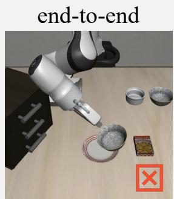

modular  
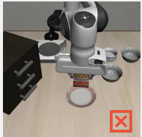

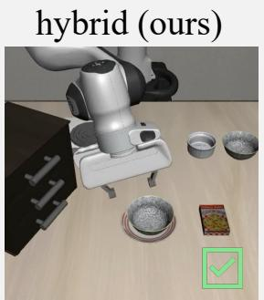  
Task: Pick the akita black bowl between the plate and the ramekin and place it on the plate  
Figure 1 Additional LIBERO-Pro comparison on “Pick the akita black bowl between the plate and the ramekin and place it on the plate,” complementing Figure 4 in the main text. RoboAware-EO approaches with a misaligned gripper and fails to secure the bowl. RoboAware-MO completes a grasp but selects the wrong object (the cookie box). RoboAware grounds the spatially described bowl and finishes the pick-and-place, succeeding by switching policy families across $\mathrm { P ^ { 5 } }$ boundaries.

## D.3 Failure Modes

Figure 2 summarizes the failures observed in LIBERO-Pro and RoboTwin. Grasping and object-holding instability is the largest identified category, accounting for 29.8% of failed rollouts. Constrained contact, insertion, and mechanism actuation account for another 16.7%. Together, these categories represent 46.5% of all failed rollouts, indicating that low-level interaction and contact-rich execution are major sources of failure. Target grounding (5.3%), transport and placement (6.1%), and multi-object sequencing (4.4%) account for smaller identified shares.

However, 37.7% of failures remain in Others because the saved evaluation records lack the detailed traces needed to distinguish perception, planning, control, and success-check errors. This limits how strongly the identified categories can characterize the full failure distribution. The categories summarize the observed outcomes. During deployment, recovery and termination instead follow the typed API failures, timeouts, and stage conditions defined in Table 1 and Algorithm 1.

Table 15 Multi-seed confirmation on 80 tasks with seeds {41, 42, 43}, yielding 240 scheduled episodes per variant. Valid SR is the number of successful episodes divided by the number of successful and failed episodes, so execution errors are excluded. Coverage is the fraction of the 240 scheduled episodes that completed without errors. Paired diferences compare each variant against Full on task–seed pairs that completed without errors in both conditions: $\Delta = \mathrm { S R } _ { \mathrm { v a r i a n t } } - \mathrm { S R } _ { \mathrm { F u l l } }$ on that jointly valid subset of size $n _ { \mathrm { p a i r } }$ , which need not equal the gap between the separately reported valid success rates.
<table><tr><td>Method</td><td>Success</td><td>Failure</td><td>Error</td><td>Valid / scheduled</td><td>Valid SR (%)</td><td>Coverage (%)</td><td> $n _ { \mathrm { p a i r } }$ </td><td>Paired ∆ (pp)</td><td>95% CI (pp)</td></tr><tr><td>A: Full Harness VLA</td><td>64</td><td>49</td><td>127</td><td>113/240</td><td>56.6</td><td>47.1</td><td></td><td></td><td></td></tr><tr><td>B: w/o Memory</td><td>20</td><td>98</td><td>122</td><td>118/240</td><td>16.9</td><td>49.2</td><td>113</td><td>-38.9</td><td>[−50.0, −27.4]</td></tr><tr><td>E: w/o Memory &amp; SAM3</td><td>24</td><td>91</td><td>125</td><td>115/240</td><td>20.9</td><td>47.9</td><td>109</td><td>-35.8</td><td>[−48.2, -23.4]</td></tr></table>

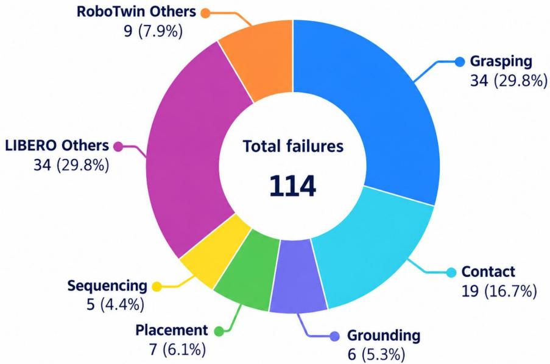  
Figure 2 Failure modes of the unsuccessful rollouts. Grasping instability is the largest identified failure mode (29.8%), followed by constrained contact or insertion failures (16.7%). Grounding, placement, and multi-object sequencing account for 5.3%, 6.1%, and 4.4%, respectively. Others (37.7%) denotes failed rollouts for which the saved evaluation records are insuficient to identify a specific cause (29.8% from LIBERO-Pro and 7.9% from RoboTwin).