# RoboRSI: Stable, Efficient, and Reusable Robot Self-Evolution in Complex Real-World Environments

Zimo Wen<sup>∗</sup>, Yijin Chen<sup>∗</sup>, Yuxuan Cao<sup>∗</sup>, Wendi Chen, Yanwen Zou, Wenye Yu, Fuhang Kuang, Han Xue, Jun Lv, Chuan Wen<sup>†</sup>, Cewu Lu<sup>†</sup>

## Abstract

A generalist robot in complex real-world environments should not only perform diverse tasks but also improve through experience, turning what it learns during execution into capabilities that later tasks can reuse. Robot agents that act through code can already repair programs from execution feedback, yet it remains a central challenge to organize this experience around the task structure that gives it meaning, so that each repair is attributed to the responsible capability, supported by execution evidence, and validated before it is reused. We introduce RoboRSI, a robot self-improvement system built on Top-Down Skill Refinement (TSR). TSR decomposes tasks into compound, atomic, and base skills with scoped responsibilities and explicit input–output contracts, attributes each execution outcome to the responsible branch, and confines revision to that branch. Building upon this structure, a Manager, Planner, Engineer, and Reviewer coordinate planning, execution, diagnosis, and the validated release of new skills, while people steer the process through objectives and corrections; stable skill sequences are further consolidated into reusable compound skills. On a mobile manipulator, RoboRSI develops multi-object household cleanup over 104 rounds. In simulation, it achieves the highest success rate on LIBERO, LIBERO-PRO, LIBERO-Plus, and RoboTwin, exceeding the strongest baseline by 2.7 to 11.0 percentage points.

Project page: https://lab.noematrix.ai/blog/2-roborsi-research-preview/ Code: https://github.com/nssmd/RoboRSI

Keywords: Robot self-improvement, code as policy, multi-agent systems, skill learning, mobile manipulation

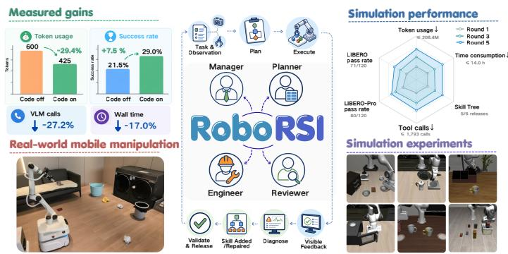  
Figure 1 | RoboRSI at a glance. The multi-agent self-improvement loop (center), real-world mobile manipulation and compound-skill gains (left), and simulation results (right).

## Contents

1 Introduction 4   
2 Related Work 5   
3 Method 6   
3.1 Overall Framework . 6   
3.2 Top-Down Skill Refinement 7   
3.3 Multi-Agent System 9   
4 Experiment 9   
4.1 Physical Robot Case Study 9   
4.2 Evaluation Design . 10   
4.3 Main Simulation Results 12   
4.3.1 LIBERO Results by Suite . 14   
4.3.2 One-Day Self-Iteration 14   
4.4 Case Study 14   
4.5 Ablation Study 15   
4.5.1 Role Separation 15   
4.5.2 Top-Down Skill Refinement . 15   
4.5.3 Code Consolidation 17   
4.5.4 Backbone Model 18   
4.5.5 Learning Policies from Execution Data 18   
5 Conclusions and Future Work 19   
A TSR Formulation and Analysis 24   
B Physical Evaluation Setting & Protocol 25   
C Supplementary Experiments 26   
C.1 Failure Classification 27   
C.2 Exploratory Development 27   
C.3 Learned Policies from Execution Data 27   
D Case Studies: Skill Code and Failure-Driven Revision 27   
D.1 Execution Repair: Removing a Premature Target Rejection 27   
D.2 Generated Compound Skill: Validation, Publication, and Invocation 28   
D.3 Before/After Code: Review-Driven Terminal Checks 30   
D.4 Physical Skill Revisions in Rounds 25 and 33 31   
D.5 Corrections That Required Human Knowledge 32

## 1. Introduction

The vision of generalist robotics is to develop robots that perform a broad range of tasks reliably in complex real-world environments, where objects, layouts, and instructions keep changing, while improving through experience. This shifts the goal of robot agents from episode-level task completion toward sustained capability accumulation: failed grasps, stale object locations, and recovery situations are valuable only if the robot can identify the capability involved, refine it using execution evidence, and make the resulting behavior available to later tasks.

A promising route lets foundation models act through code. Code as Policies (Liang et al., 2023) composes perception and control primitives into executable robot programs, and CaP-X (Fu et al., 2026) studies how abstraction, grounding, and interaction shape such programs. Subsequent work closes the loop with execution feedback: ETA/OpenETA (Chen et al., 2026b) interleaves planning and tool execution with fresh observations, ASPIRE (Lu et al., 2026) adds repaired programs to a growing skill library, and ENPIRE (Xiao et al., 2026) carries this loop into physical experimentation. Execution feedback thus shifts from a signal for correcting a single attempt to a resource for building capabilities that persist across tasks.

Execution experience, however, becomes a reusable capability only when it is organized around the task structure that gives it meaning. A repair must remain connected to the objective that motivated it, belong to the capability responsible for the observed behavior, and be validated before it is reused. Without such structure, repeated attempts fill the context with complete trajectories, local fixes drift from the overall objective, and people are drawn back into resetting environments, reading logs, and deciding where each fix belongs.

Our observation is that this structure must serve both the people directing the robot and the agents implementing its behavior, which calls for two complementary abstractions. Humanfriendly steering lets people express objectives, domain knowledge, constraints, and safety judgments at the level of the service they need. Agent-friendly structure gives agents task-relevant context, explicit interfaces, and bounded responsibilities for execution and revision.

Based on this observation, we introduce RoboRSI, a multi-agent system for robot selfimprovement organized by Top-Down Skill Refinement (TSR). TSR decomposes each task into compound, atomic, and base skills with scoped responsibilities and explicit input–output contracts, attributes each execution outcome to the responsible branch, and confines the revision to that branch: an inadequate decomposition revises the task structure, an unreliable composition the corresponding compound skill, and a failed operation the responsible atomic or base skill. A Manager, Planner, Engineer, and Reviewer carry out planning, execution, diagnosis, and validated release, and stable skill sequences are consolidated into compound skills that later executions select and monitor instead of reconstructing every tool decision.

We evaluate RoboRSI on a mobile manipulator that performs multi-object household cleanup across a scene change while its skills are developed over 104 rounds, and in simulation against robot-agent baselines on LIBERO, LIBERO-PRO, and RoboTwin, with frozen capability transfer to LIBERO-Plus. RoboRSI achieves the highest success rate on all four benchmarks, exceeding the strongest baseline by 5.3 points on LIBERO, 11.0 on LIBERO-PRO, 5.7 on LIBERO-Plus, and 2.7 on RoboTwin.

Our contributions are threefold:

• Complementary abstractions for robot self-improvement: we identify that execution experience becomes reusable only when it is tied to the task structure that gives it meaning, and that this structure must serve both human-friendly steering and agent-friendly

structure.

• RoboRSI Framework: a system that realizes these abstractions through Top-Down Skill Refinement, which verifies each atomic task’s postcondition before completion and revises each failure at its earliest failing node, and a multi-agent execution–refinement loop that validates and releases skills across tasks.

• Real-world and simulated evaluation: skill development on a mobile manipulator over 104 rounds, the highest success on four simulation benchmarks, and ablations of role separation, skill refinement, and compound skills.

## 2. Related Work

Code as Policy. Code as Policies (Liang et al., 2023) showed that language models can write robot programs that compose perception and control APIs, turning high-level instructions into executable behavior. Follow-up work examines what these programs should be built from: CaP-X (Fu et al., 2026) studies the abstraction level of primitives, perceptual grounding, and interaction, and GRACE (Sun et al., 2025) encodes affordances and geometry as executable concepts. ASPIRE (Lu et al., 2026) goes further by repairing failed programs and keeping the repaired skills in a growing library. Once programs are kept and reused, however, a repair to one skill can affect every task that calls it, and deciding where a repair belongs becomes as important as writing it. RoboRSI addresses this through TSR, which gives each capability an interface and a declared responsibility, so that a repair is made at the responsible branch and composes with the skills around it.

Recursive Self-Improvement (RSI). RSI studies how an agent’s experience improves its later behavior. Language agents first did so through verbal feedback: Reflexion stores reflections on failed attempts, and Self-Refine iteratively critiques and revises its own outputs (Madaan et al., 2023; Shinn et al., 2023). Voyager moved from text to executable skills, accumulating a code library through open-ended interaction (Wang et al., 2024). Multimodal agents extend this idea with skills acquired from external resources, execution feedback, and reusable procedures, as in RESOURCE2SKILL, EvoSkill-GUI, and OmniHarness (Chen et al., 2026a; Fan et al., 2026; Xu et al., 2026). Robot-specific work detects and explains failures during execution: ProgPrompt adds assertions to generated programs (Singh et al., 2023), REFLECT summarizes robot experience to explain and correct failures (Liu et al., 2023b), DoReMi and Code-as-Monitor monitor languageor code-specified constraints to trigger recovery (Guo et al., 2024; Zhou et al., 2025), and AHA trains a vision-language model to detect and reason about manipulation failures (Duan et al., 2025). These methods detect a failure within an episode; RoboRSI additionally decides which skill should change and validates the change before later tasks reuse it. In embodied settings, EmbodiSkill diagnoses errors at the level of individual skills (Ju et al., 2026), and ENPIRE couples physical evaluation with coding-agent refinement of policies (Xiao et al., 2026). Physical execution adds a difficulty that software environments largely avoid: a failure may originate several steps before it is observed, and a change to a shared skill affects tasks that were not part of the failed run. RoboRSI therefore attributes each failure to its earliest failing node, validates revisions against the recent history of the affected tasks, and reuses capabilities through explicit skill interfaces.

Large Language Models for Robot. Large language models first entered robotics as planners. Early work grounded generated plans in admissible actions (Huang et al., 2022a), and Inner Monologue fed environment feedback back into planning (Huang et al., 2022b). Advances in multimodal understanding (Alayrac et al., 2022; Gemini Team et al., 2024; Liu et al., 2023a), embodied grounding (Driess et al., 2023), and interleaved reasoning and acting (Yao et al., 2023) then allowed models to reason directly over observations, and VoxPoser (Huang et al., 2023) and ReKep (Huang et al., 2024) used generated code to compose 3D value maps and relational keypoint constraints for motion planning. A parallel line trains robot foundation models end to end. Vision–language–action models such as RT-2, OpenVLA, � , and � learn visuomotor control from large robot datasets (Black et al., 2025; Brohan et al., 2023; Kim et al., 2024; Physical Intelligence et al., 2025); world-action models such as Zero-WAM add predictive visual dynamics (Zhou et al., 2026); and Gemini Robotics and Gemini Robotics-ER 1.5 combine control with embodied reasoning (Gemini Robotics Team et al., 2025). As general-purpose models have become more capable, recent systems use them directly for robot decisions and actions. Maestro orchestrates perception and control modules (Shi et al., 2025), ETA/OpenETA closes the loop between planning, execution, and feedback (Chen et al., 2026b), GPT-Policy performs in-context control (Cheng et al., 2026), two RoboHarness systems adapt through memory (Huang et al., 2026; Li et al., 2026), and UniDomain and UniPlan connect symbolic planning with visual grounding (Ye et al., 2025, 2026). RoboRSI complements these directions at the system level: TSR and multi-agent execution maintain reusable skills, and the trajectories collected during execution can train policies that return as tools in the same hierarchy.

## 3. Method

Consider a coding agent connected directly to robot tools and asked to improve a household cleanup task in a complex real-world home over many runs. The context fills with records of earlier runs; a failure observed late in a sequence is patched where it appears, for example by adding retries to the release step, although it originated in perception or navigation; and because the objective is implicit in the latest prompt, successive edits optimize for the latest scene. People are then drawn back into reading logs and deciding where each fix belongs. RoboRSI removes this burden by making both the intent of the people and the work of the agents explicit.

## 3.1. Overall Framework

RoboRSI turns repeated robot execution into a growing library of reusable skills, organized around the two abstractions of Section 1. Human-friendly steering is the channel through which people enter objectives, constraints, domain knowledge, and corrections at the level of the task; each correction is kept as maintained guidance on the responsible skill. Agent-friendly structure is the task–skill hierarchy in which the agents work: every task and skill has an interface, a declared responsibility, and a record of recent executions, so each agent receives only the part of the hierarchy that its current step concerns.

Skill hierarchy. The hierarchy contains four kinds of nodes (Figures 2 and 3). A task family, such as household cleanup, groups tasks that share goals and constraints. Each task is decomposed into atomic tasks, scoped goals with an observable outcome such as placing an object in a container, each achieved by an atomic skill with a postcondition. Atomic skills call base skills, the perception and control primitives exposed as tools. A stable sequence of skills is consolidated into a compound skill, a parameterized code policy invoked as a single unit. Every skill declares its inputs, outputs, and responsibility, and a skill may be shared by several branches.

Figure 2 follows one development round: the agents decompose a stated goal and plan over released skills, execute them down to base skills, locate the earliest failing node from visible

evidence and the tool trace, and validate and release the resulting updates for the next round.   
People steer at the first stage and whenever a correction is needed.

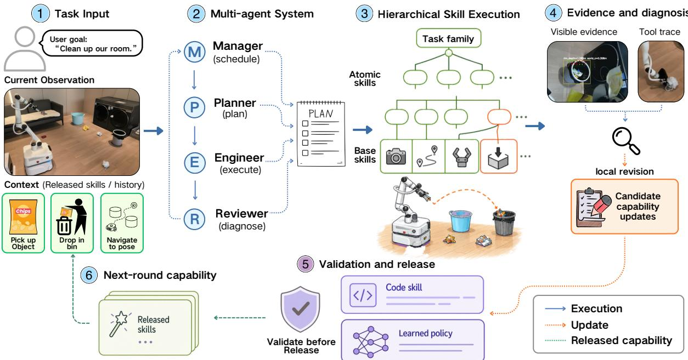  
Figure 2 | RoboRSI framework. Given a task, the Manager organizes its skill hierarchy, the Planner composes an execution plan, and the Engineer runs the required skills. The Reviewer diagnoses failures from observations and tool traces, returning them for TSR-guided revision. Tested updates enter the next iteration, and stable branches become parameterized skills for subsequent tasks.

## 3.2. Top-Down Skill Refinement

Coding agents can solve local programming problems yet lose the task objective across repeated edits, misinterpret physical conditions, or tailor a fix too closely to one failed scene. TSR therefore organizes implementation and revision around the skill hierarchy of Section 3.1: the task family and its atomic tasks preserve the global objective, while atomic, compound, and base skills provide bounded places for implementation, experience, and revision (Figure 3a); Figure 3b follows two revisions on the physical robot.

Design principles. Three principles connect local revision to reliable execution and reuse. Responsibility and interface trust: each skill reports its outcome through an explicit interface, so callers rely on its postconditions instead of duplicating its checks, and diagnosis follows the call path to the responsible component instead of spreading fixes across callers. Parameterization and history-guided revision: object classes, conditions, target relations, and execution order become parameters, scene geometry comes from current observations, and each change is checked against recent successful uses of the skill. Persistent human knowledge: a human correction becomes a runtime check, a test, or maintained guidance on the responsible skill, so people can concentrate on goals and exploration direction.

Refinement step. We write the released hierarchy at round � as a graph $G _ { t } = \left( V _ { t } , E _ { t } \right)$ whose nodes are tasks and skills and whose edges are possible calls; each node � carries an implemen-

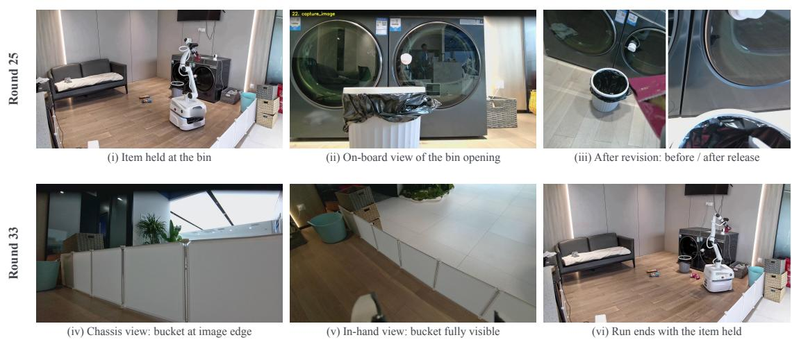

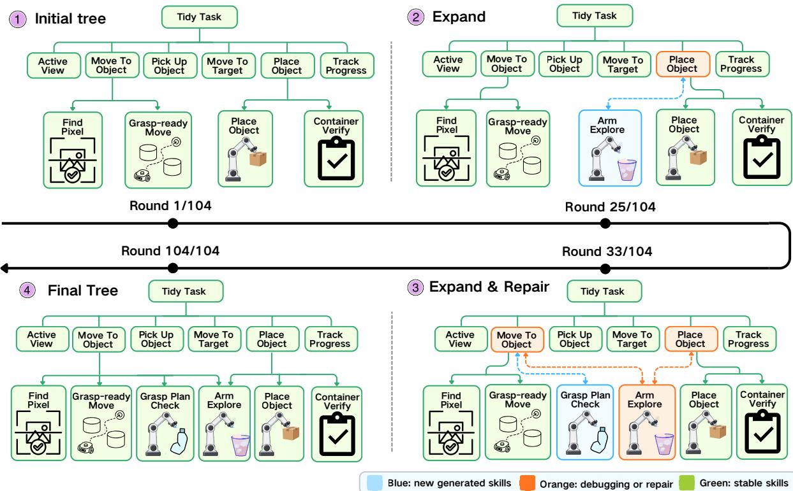  
(a) Task–skill structures during physical task development  
(b) Two TSR revisions on the physical robot

Figure 3 | TSR during physical cleanup. (a) Four representative task–skill structures show the progression from an initial task proposal to a developed skill library; colored blocks mark the skill operations at each snapshot. (b) Round 25 (top): the robot holds a wrapper at the correct bin without releasing it (i), although the arm has reached its observation pose (ii); the motion call reported a tolerance miss and the fallback exhausted its budget. TSR traces the failure to this observation motion and revises only the Place Object branch, which rechecks the reached pose and executes the complete code-produced release sequence; the next placement succeeds (iii). Round 33 (bottom): the destination bucket appears only at the image edge in the chassis view (iv) but completely in the in-hand view of the same sweep (v); the consumer rejected the producer’s destination, and the run ended with the second item held (vi). The revision leaves identity to the producer and prefers complete views. Both revisions passed offline replay of the L .4

four most recent runs and the existing regression tests (Appendix D.4).

tation or guidance $c _ { \nu }$ and a declared postcondition $\phi _ { \nu }$ . Executing a task produces a record $\tau _ { t }$ of observations and tool calls. We list the nodes executed on the task’s branch as $\pi _ { t } = ( \nu _ { 1 } , \ldots \ldots , \nu _ { m } ) $ in the order in which they return, so that each callee precedes its caller; a retried node appears once per attempt. The Reviewer evaluates the postconditions along this path and returns the earliest failing node

$$
v _ { t } ^ { \star } = \nu _ { k ^ { \star } } , \qquad k ^ { \star } = \operatorname* { m i n } \{ k : \phi _ { \nu _ { k } } ( \tau _ { t } ) = 0 \} .\tag{1}
$$

The revision scope $S _ { t } \subseteq V _ { t }$ is the sub-hierarchy owned by $\nu _ { t } ^ { \star }$ , and $\partial S _ { t }$ denotes its interfaces to the rest of $G _ { t }$ . A revision round is then

$$
\Delta _ { t } = \mathcal { R } \big ( G _ { t } | _ { S _ { t } } , \partial S _ { t } , \tau _ { t } \big ) , \qquad G _ { t + 1 } = G _ { t } \oplus \mathcal { V } ( \Delta _ { t } ; \mathcal { H } _ { t } ) .\tag{2}
$$

Here R is the Reviewer’s patch proposal, which may change only nodes in $S _ { t } ;$ if the interface itself must change, the scope is first expanded to include its callers. $\mathcal { H } _ { t }$ collects recent failed and successful executions of every task whose call graph reaches $S _ { t }$ . The validation operator $_ \mathrm { ~ \textit ~ { ~ N ~ } ~ }$ returns $\Delta _ { t }$ if it passes review, functional tests, and replay on $\mathcal { H } _ { t }$ without regression, and the empty patch otherwise; ⊕ applies the accepted patch. $\operatorname { E q . }$ (1) places each repair at the origin of the failure rather than where it is observed, the restriction to $S _ { t }$ bounds its effect to the tasks that reach $S _ { t } ,$ and validation on $\mathcal { H } _ { t }$ preserves behavior that already works (Appendix A).

From stable branches to reusable capabilities. Stable branches become compound skills, shifting online reasoning from individual tool choices to skill selection and monitoring; execution trajectories can also train neural policies exposed as skills in the same hierarchy (Section 4.5.5).

## 3.3. Multi-Agent System

Four agents carry out each round within this structure. The Manager decomposes the goal into atomic tasks, identifies the base skills each one needs, maintains skill versions, reviews each proposed revision, may request or author changes to it, and decides whether it is admitted, which branch it may change, and whether it is released. The Planner receives one atomic task, the current observation, and the interfaces of the skills below ${ \mathrm { i t } } ,$ and returns an executable plan. The Engineer executes the plan through the tool interface and implements missing skills. The Reviewer judges from the observations and tool trace whether an atomic task reached its expected outcome and, for a failure, identifies where execution first diverged, and writes a revision patch for the responsible branch that it submits to the Manager. Each agent works from the part of the hierarchy that its step concerns, so its context stays short and every change can be traced to a diagnosis.

## 4. Experiment

We report physical deployment and simulation results, then compare individual episodes and summarize the ablations.

## 4.1. Physical Robot Case Study

Setting. We study household floor cleanup with a WheelSingleArm M1 mobile manipulator. The robot searches for objects, approaches and grasps them, and transports them to designated receptacles. The case study covers 104 physical development runs with 24 hours of cumulative operation. Before each run, the scene is restored to a common base layout, while the objects and receptacles are partially randomized; the navigation map remains fixed. Platform details and the reset procedure are given in Appendix B.

Iterative cleanup. Figure 4 follows ten selected runs from the 104-run development period. In the earliest selected run, the robot placed no objects. Later runs progressed to placing several objects, and some completed their assigned cleanup tasks and returned to the dock. The change was not steady: a later run recorded only one placement after complete runs had already appeared. We counted an object only when on-site personnel observed it enter its designated receptacle. The figure displays at most four placements per run, although the task manifests varied in size.

The skill-tree snapshots in Figure 3a provide a complementary view of this development process. The hierarchy introduces Arm Explore under Place Object to obtain a view of the target receptacle. Later revisions add Grasp Plan Check under Move To Object and make Arm Explore available to both the approach and placement branches. These changes target two recurring requirements of the cleanup procedure: checking a candidate grasp before motion and grounding placement in an observation of the destination. The snapshots document how the corresponding capabilities were organized and reused; the selected executions do not isolate the effect of an individual revision.

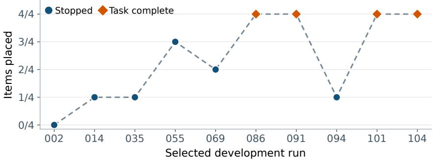  
Figure 4 | Placement progress in selected physical cleanup runs. Each point shows the number of objects placed among the first four items considered in that run; placements were confirmed  
on site. Marker colors indicate the audited task outcome. Points are equally spaced in selected-run order, while tick labels give the development run numbers. Dashed segments connect selected observations only. The four-item denominator is a common display reference: task manifests and object configurations vary across runs.

Physical execution. The two-scene demonstration provides an extended execution example. The robot placed all five designated objects in the first scene and all four in the second, with each placement confirmed on site. Between scenes, an operator rearranged the objects and receptacles; the skill code, prompts, and policy configuration were not modified. The cleanup executions required no manual correction or restart. Following the scene change, the robot repeated the search, approach, grasp, transport, and placement sequence. Figure 5 illustrates stages of this recorded execution.

## 4.2. Evaluation Design

Choice of baselines. RoboRSI accumulates skills serially: each episode runs with the current library, and revisions that pass validation are released to the episodes that follow. To our knowledge, no existing robot-agent system accumulates skills in this serial form. ASPIRE (Lu et al., 2026), the closest self-improving code agent, learns every task in parallel with a dedicated agent that runs a population-based search over candidate programs, admits the resulting skills after the search, and evaluates one generated program per task; ENPIRE (Xiao et al., 2026)

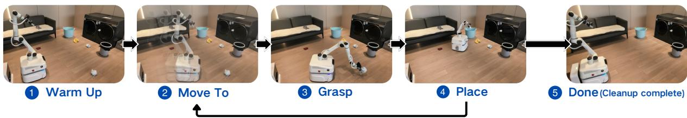  
Figure 5 | Two-scene physical mobile cleanup. Selected frames show preparation, approach, grasping, placement, and the recorded final scene. The return arrow indicates repeated object handling. Objects and receptacles were rearranged between scenes, while the agent configuration remained unchanged.

refines learned policies and their training code through physical experimentation. Both rely on development loops that differ from a single serial stream, so they cannot be run under the same protocol. We therefore compare with the strongest agents that act through code or tools, CaP-X, Maestro, and OpenETA, with the same backbone.

Self-improvement as the evaluated capability. All methods are evaluated under the same conditions: the same backbone, tool interface, per-episode interaction budget, task panels, and simulator verdict. The baselines execute with a fixed set of tools and skills and do not revise or add skills across episodes; RoboRSI differs only in that it can use the outcome of an episode to revise its skills for later episodes. Improving on the tasks at hand is the capability that RoboRSI contributes, so the comparison on LIBERO, LIBERO-PRO, and RoboTwin measures what selfimprovement adds over strong fixed agents. LIBERO-Plus complements this by evaluating the library with self-improvement disabled on perturbed instances.

Verification before completion. Checking the postcondition of every atomic task against fresh observations before the agent proceeds is part of RoboRSI’s design (Section 3.2 and Appendix A), not an external addition. The lower share of premature completions in Figure 6a is one measured effect of this design.

Evidence for the components. Section 4.5 isolates the components of the system: role separation (36 versus 9 of 50 RoboTwin tasks), TSR against flat revision on the same failure, compound skills over 600 matched episode pairs (+7.5 points, McNemar � < 10<sup>−4</sup>), the backbone model, and policies learned from execution data.

Scale of the evaluation. The main comparison comprises 5,974 evaluation episodes: 150 per method on LIBERO and 600 on LIBERO-PRO, each with five initial states per task, 840 perturbation instances per method on LIBERO-Plus, and 150 episodes per baseline and 154 for RoboRSI on RoboTwin. The ablations add 2,770 episodes, and the physical study covers 104 development rounds. In total, RoboRSI is evaluated on 230 tasks across four benchmarks with 1,744 episodes. For reference, the main LIBERO evaluation of OpenETA uses 40 tasks with ten seeds each (400 episodes), and its self-evolution studies use at most ten tasks (Chen et al., 2026b); ASPIRE evaluates 69 tasks on LIBERO-PRO, Robosuite, and BEHAVIOR-1K (Lu et al., 2026); the memory-augmented harness of Li et al. (2026) is evaluated on 25 tasks, and Huang et al. (2026) on LIBERO, LIBERO-Plus, and five long-horizon tasks.

Implementation details. The postcondition of each skill, the release gate, the construction of the replay history, and the consolidation of compound skills are specified in the descriptor of each skill and summarized in Appendix A.

## 4.3. Main Simulation Results

Evaluation settings. Self-improvement is part of the evaluated capability: on LIBERO, LIBERO-PRO, and RoboTwin, RoboRSI starts from its initial skill library and improves online on the evaluation tasks, summarizing failures and revising skills as evaluation proceeds, whereas the baselines have no self-improvement mechanism (Section 4.2). LIBERO-Plus instead tests transfer: the library obtained on LIBERO is held fixed and receives no updates on the perturbed instances. All methods use GPT-5.6-SOL. Maestro, the most costly baseline, is evaluated on LIBERO and LIBERO-PRO only.

Table 1 | Simulation results. Success is successful/valid episodes (rate); coverage is solved/total tasks (rate), counting each task once after its first success. LIBERO uses 30 tasks×5

episodes, LIBERO-PRO uses 120 tasks×5 episodes, LIBERO-Plus uses 840 perturbation instances of 30 tasks, and RoboTwin uses 50 tasks×3 episodes for the baselines; for RoboRSI we report the first 154 episodes of its online run on the same 50 tasks. RoboRSI improves online on

<table><tr><td>Benchmark</td><td>Method</td><td>Success</td><td>Coverage</td></tr><tr><td>LIBERO</td><td>CaP-X</td><td>36/150 (24.0%)</td><td>16/30 (53.3%)</td></tr><tr><td></td><td>Maestro</td><td>62/150 (41.3%)</td><td>23/30 (76.7%)</td></tr><tr><td></td><td>OpenETA</td><td>76/150 (50.7%)</td><td>23/30 (76.7%)</td></tr><tr><td></td><td>RoboRSI</td><td>84/150 (56.0%)</td><td>24/30 (80.0%)</td></tr><tr><td>LIBERO-PRO</td><td>CaP-X</td><td>111/600 (18.5%)</td><td>46/120 (38.3%)</td></tr><tr><td></td><td>Maestro</td><td>198/600 (33.0%)</td><td>77/120 (64.2%)</td></tr><tr><td></td><td>OpenETA</td><td>231/600 (38.5%)</td><td>80/120 (66.7%)</td></tr><tr><td></td><td>RoboRSI</td><td>297/600 (49.5%)</td><td>102/120 (85.0%)</td></tr><tr><td>LIBERO-Plus</td><td>CaP-X</td><td>130/840 (15.5%)</td><td>21/30 (70.0%)</td></tr><tr><td></td><td>OpenETA</td><td>306/840 (36.4%)</td><td>27/30 (90.0%)</td></tr><tr><td></td><td>RoboRSI</td><td>354/840 (42.1%)</td><td>28/30 (93.3%)</td></tr><tr><td>RoboTwin</td><td>CaP-X</td><td>3/150 (2.0%)</td><td>3/50 (6.0%)</td></tr><tr><td></td><td>OpenETA</td><td>32/150 (21.3%)</td><td>17/50 (34.0%)</td></tr><tr><td></td><td>RoboRSI</td><td>37/154 (24.0%)</td><td>26/50 (52.0%)</td></tr></table>

Task execution and coverage. RoboRSI achieves the highest success and coverage on every benchmark (Table 1). The largest advantage is on LIBERO-PRO, where it exceeds OpenETA by 11.0 points in success and 18.3 points in coverage, so the gain extends to a larger set of solved tasks. On LIBERO, it exceeds OpenETA by 14.0 points on Spatial and 8.0 points on Object (Section 4.3.1).

Where the LIBERO-PRO gains come from. RoboRSI is best in every suite and under every perturbation (Table 2). The margins are largest on the Object suite (+16.5) and under object perturbations (+15.3), which require re-identifying the target in the current scene.

Table 2 | LIBERO-PRO by task suite and perturbation type. Success rate (%); each suite contains 200 episodes and each perturbation type 150 episodes per method. Bold: best in the column; gray: RoboRSI’s gain over the strongest baseline in percentage points.
<table><tr><td rowspan="2">Method</td><td colspan="3">Task suite</td><td colspan="4">Perturbation type</td><td rowspan="2">All</td></tr><tr><td>Spatial</td><td>Object</td><td>Goal</td><td>Language</td><td>Object</td><td>Position</td><td>Task</td></tr><tr><td>CaP-X</td><td>24.5</td><td>13.5</td><td>17.5</td><td>21.3</td><td>16.7</td><td>17.3</td><td>18.7</td><td>18.5</td></tr><tr><td>Maestro</td><td>39.5</td><td>38.0</td><td>21.5</td><td>34.7</td><td>30.0</td><td>32.0</td><td>35.3</td><td>33.0</td></tr><tr><td>OpenETA</td><td>50.0</td><td>36.5</td><td>29.0</td><td>42.7</td><td>33.3</td><td>36.0</td><td>42.0</td><td>38.5</td></tr><tr><td>RoboRSI</td><td>57.0(+7.0)</td><td>54.5(+16.5)</td><td>37.0(+8.0)</td><td>52.0(+9.3)</td><td>48.7(+15.3)</td><td>45.3(+9.3)</td><td>52.0(+10.0)</td><td>49.5(+11.0)</td></tr></table>

Transfer under perturbations. On LIBERO-Plus, the frozen source library exceeds OpenETA by 5.7 points and solves at least one perturbed instance of 28 of the 30 tasks. The gains are largest under background (+13), language (+12), robot initial state (+9), noise (+8), and lighting (+7) perturbations (Figure 6b reports all seven types).

Why the baselines fail. About two thirds of the failures of OpenETA and Maestro on LIBERO-PRO (66% and 64%) and of OpenETA on LIBERO-Plus (66%) are premature completions: the agent declares the task done after a tool reports a release, while the simulator judges it unfinished (Figure 6a). For RoboRSI, premature completion accounts for 10% and 14% of failures. The methods differ in how they decide that a task is complete: the baselines accept a successful tool return, whereas every RoboRSI atomic task has a postcondition checked against fresh observations before the agent proceeds (Eq. (1)). The failure composition reflects this completion rule, and RoboRSI’s remaining failures mostly end with the budget exhausted during recovery rather than a false claim of success. On episodes with an execution failure, it still completes 67.0% on LIBERO-PRO and 63.2% on LIBERO-Plus, against 55.0% and 51.6% for OpenETA (Figure 6c).

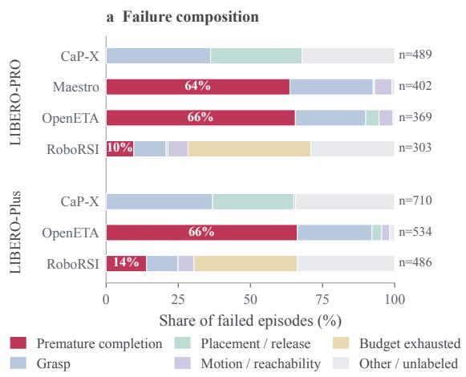

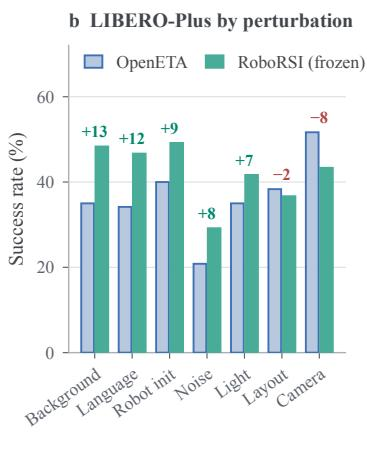

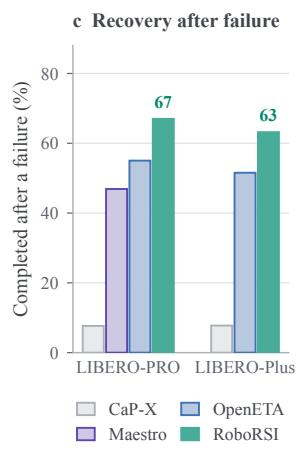  
Figure 6 | Failure analysis. (a) Composition of failed episodes on LIBERO-PRO and LIBERO-Plus; � is the number of failed episodes, and the premature-completion share is labeled. (b) Success on LIBERO-Plus by perturbation type, 120 instances each; numbers give RoboRSI’s difference from OpenETA in percentage points. (c) Share of episodes that still succeed after an execution failure, over the 209 LIBERO-PRO and 258 LIBERO-Plus (task, seed) pairs in which every method has a complete trace and at least one execution failure (Appendix C.1).

## 4.3.1. LIBERO Results by Suite

Table 3 splits the LIBERO results of Table 1 by suite; each suite has 10 tasks and 50 episodes per method.

Table 3 | LIBERO by suite. Successful/valid episodes per suite.
<table><tr><td>Method</td><td>Spatial</td><td>Object</td><td>Goal</td><td>All</td></tr><tr><td>CaP-X</td><td>12/50</td><td>15/50</td><td>9/50</td><td>36/150</td></tr><tr><td>Maestro</td><td>22/50</td><td>24/50</td><td>16/50</td><td>62/150</td></tr><tr><td>OpenETA</td><td>23/50</td><td>29/50</td><td>24/50</td><td>76/150</td></tr><tr><td>RoboRSI</td><td>30/50</td><td>33/50</td><td>21/50</td><td>84/150</td></tr></table>

## 4.3.2. One-Day Self-Iteration

To examine self-iteration without human steering, we let RoboRSI iterate on its own for one day on a 120-task LIBERO catalog and on the 120 LIBERO-PRO tasks. In each round, the current library runs on the tasks not yet solved, and revisions that pass validation are released for the next round. Figure 7 reports the cumulative number of tasks solved at least once. Within five rounds, coverage grows from 32 to 71 of 120 LIBERO tasks and from 43 to 80 of 120 LIBERO-PRO tasks; the five LIBERO rounds take 7.0 hours of active execution. These counts accumulate across released library versions and are separate from the evaluation in Table 1.

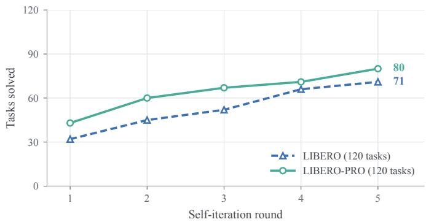  
Figure 7 | One-day self-iteration. Cumulative number of tasks solved at least once after each self-iteration round; each task is counted at its first recorded success.

## 4.4. Case Study

We examine the three episodes of Figure 9, in which RoboRSI succeeds while the baselines fail from the same initial state, and then follow a revised skill as it is reused on tasks it was not developed on (Figure 8).

Terminal checks under a lighting perturbation. On LIBERO-Plus, the task is to place a creamcheese package in a basket. OpenETA’s combined pick-and-place tool returned that the object had been released at the destination, and the agent declared success at once. CaP-X’s placement also reported a release while its containment check remained unverified. Both episodes failed. RoboRSI, with its frozen source library, received a placement result stating that the gripper had not opened. Rather than ending, it checked whether it still held the package, re-observed the basket from the head and top views, placed the package again, and succeeded.

Dual-arm state after a failed placement. On RoboTwin, both cans must be picked up with separate arms and placed into a plastic box. CaP-X repeatedly tried to reach the box with the left arm across the midline, which was infeasible. OpenETA stopped after the gripper reported a release, with containment unverified, and the task failed. When RoboRSI’s first left-arm placement failed, it kept both cans in hand, verified both grasps and the clearance between the loaded arms, and then released the cans one side at a time.

Recovery in a multi-step task. On LIBERO-PRO, the robot must open the top drawer and put a bowl inside. CaP-X invoked the pulling skill on the drawer rather than its handle and was rejected; OpenETA repeatedly failed to approach the handle and then failed to grasp the bowl. RoboRSI also had a pull and a placement rejected, but continued to observe and act until the task succeeded.

In all three episodes, the baselines fail by trusting a tool’s return value, whereas RoboRSI’s skills expose failed outcomes and its agents verify postconditions before proceeding, the mechanism behind the failure composition in Figure 6a.

Reusing a revised skill across tasks. Revisions made during development are released as shared skills and reach tasks they were never developed on. The base skill grasp\_object was revised on a single development task: the Manager’s patch makes every retry verify the target’s identity from a fresh observation and forbids replaying a grasp point that has already failed, and the revision passed its gate before release. After release, 42 successful episodes on other tasks invoke the revised skill. Figure 8 shows three of them, from the Goal, Object, and Spatial suites, each of which had failed in the earlier frozen evaluation. Because the skill is shared through the hierarchy, a repair made in one task becomes available to every branch that calls it.

## 4.5. Ablation Study

We study role separation, hierarchical refinement, code consolidation, and backbone choice separately, and additionally examine policy learning from execution data. The backbone study uses LIBERO-PRO and RoboTwin task panels with three evaluation episodes per task, 360 and 150 episodes per backbone.

## 4.5.1. Role Separation

We compare development on the 50 RoboTwin tasks with a single agent and with separate roles (Table 4). In the single-agent condition, one Engineer plans, executes, and judges its own attempts. In the multi-agent condition, a Planner composes the plan, the Engineer executes it, and a Reviewer diagnoses each outcome from observations and tool traces. The single agent solves 9 of the 50 tasks, whereas the multi-agent system solves 36. Separating diagnosis from execution gives every failure an independent review before the next attempt, instead of leaving the executing agent to judge its own result.

## 4.5.2. Top-Down Skill Refinement

TSR determines where the system improves. We therefore compare TSR with flat revision on how well each turns an observed failure into a validated, released improvement, rather than on task success. Both conditions start from the same code and memory and receive the same public traces of a failed libero\_pick\_place execution on libero\_goal/8. They may modify

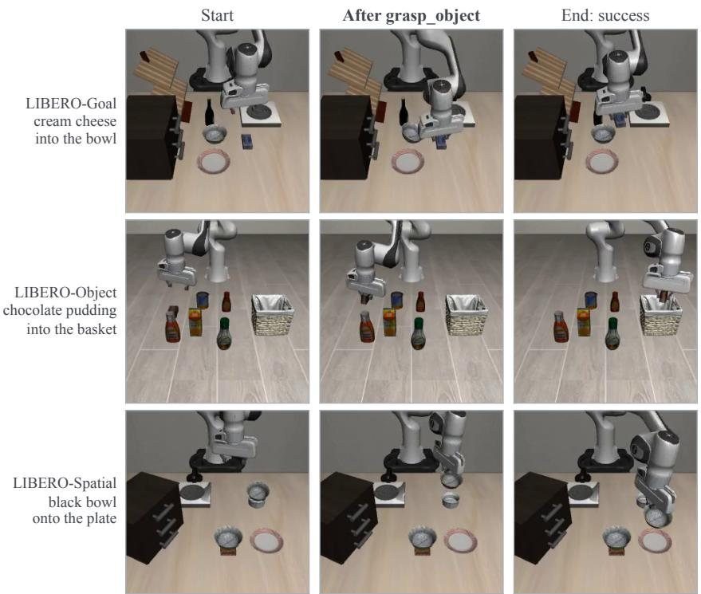

Figure 8 | Reuse of a revised skill on new tasks. The revised grasp\_object, developed on a single task, is invoked on three tasks outside its development set, each of which had failed in the earlier frozen evaluation. Columns show the first recorded frame, the state after the grasp\_object call, and the final successful state.  
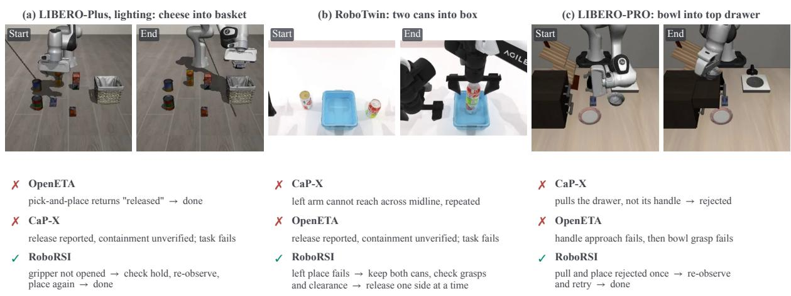  
Figure 9 | Simulation cases with the same initial state across methods. Images show the first and last recorded frames of the RoboRSI episode; text summarizes the decisive tool calls of each method.

Table 4 | Single-agent and multi-agent development on RoboTwin. Tasks solved at least once over the full online run, out of 50; the multi-agent condition is the RoboTwin run of Table 1, whose first 154 episodes are reported there.
<table><tr><td>Condition</td><td>Roles</td><td>Tasks solved</td></tr><tr><td>Single agent</td><td>Engineer</td><td>9/50 (18.0%)</td></tr><tr><td>Multi-agent</td><td>Planner, Engineer, Reviewer</td><td>36/50 (72.0%)</td></tr></table>

Atomic and Base skills, and use the same Planner, Engineer, Reviewer, and Manager review. A candidate is released only if the Base functional checks pass and the complete Atomic task succeeds on both development seeds. Under TSR, the Reviewer first builds a responsibility tree from the Atomic failure and selects the layers to revise; under flat revision, it proposes a revision directly from the failure.

TSR attributed the failure to two nodes: the Atomic plan treated a do-not-regrasp flag set at pickup as permanent after a verified release, and the Base hold check used the fixed pickup patch as an invariant during transport. Its candidate changes only these nodes, succeeds on both seeds, and is released (Table 5). The flat candidate also rewrites the placement policy and succeeds on one seed; on the other, the agent declares success with the object off the target. A further flat candidate, restricted to the Atomic plan after Manager review, again succeeds on one seed, so no flat candidate is released.

Table 5 | TSR and flat revision on the same failed task. Files and lines count changes relative to the common starting code; Atomic success is over the two development seeds.
<table><tr><td>Condition</td><td>Files</td><td>Changed lines</td><td>Atomic success</td><td>Released</td></tr><tr><td>TSR</td><td>3</td><td>50</td><td>2/2</td><td>yes</td></tr><tr><td>Flat, candidate 1</td><td>4</td><td>104</td><td>1/2</td><td>no</td></tr><tr><td>Flat, candidate 2</td><td>1</td><td>63</td><td>1/2</td><td>no</td></tr></table>

## 4.5.3. Code Consolidation

We compare execution with compound skills available to the agent (Code on) and withheld (Code off) on a separate panel of 120 tasks selected from LIBERO-Plus, distinct from the task sets in Table 1, so its absolute success rates are not comparable with the main results. The base tools, the GPT-5.6-SOL backbone, the 120 tasks, and the five seeds are the same in both conditions, so every Code-on episode has a matched Code-off counterpart. Figure 10 reports success over these 600 matched pairs and normalized median costs on a separate 118-task sample.

Code consolidation raises success from 21.5% (129/600) to 29.0% (174/600), a paired gain of 7.5 percentage points (95% CI [3.7, 11.5]; McNemar $p < 1 0 ^ { - 4 } )$ , and increases the number of tasks solved at least once from 58 to 71 of 120. The gain is spread across many episodes: 86 matched pairs succeed only with Code on, against 41 that succeed only with Code off. Median token consumption, model calls, and wall time decrease by 29.4%, 27.2%, and 17.0%, respectively.

The success gain follows from how errors arise in long tool sequences. Without code, the agent reconstructs the sequence in every episode, and each step is another opportunity to choose the wrong tool, pass an inconsistent argument, or skip a check between steps; over sequences of many steps, these errors accumulate. A compound skill fixes the validated order of calls and the checks between them, so the agent decides only which skill to invoke and with which parameters. The physical Round 25 failure in Section 3.2 shows the same effect: a model-written release sequence dropped steps that the code-produced sequence contained. The cost reductions have the same source, since one skill call replaces several model decisions. Wall time falls less than tokens and model calls because the motion executed in the simulator is unchanged; only the reasoning between motions is removed. The agent still responds to execution feedback and returns to step-by-step reasoning when a compound skill reports a failure.

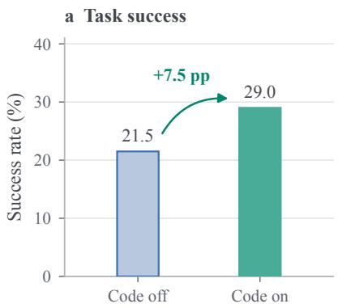

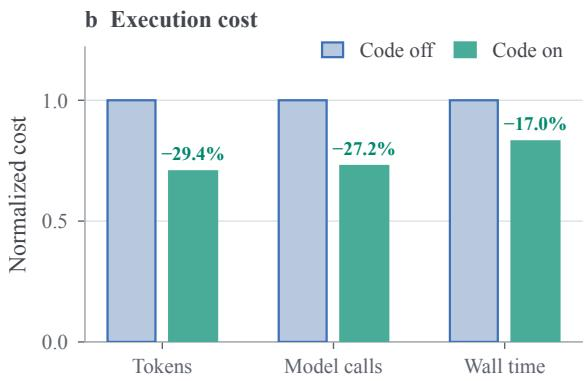  
Figure 10 | Effect of code consolidation. (a) Task success over 600 matched episodes per condition. (b) Median token, model-call, and time cost on the 118-task efficiency sample, normalized to Code off.

## 4.5.4. Backbone Model

We compare GPT-5.6-SOL, GPT-5.5, and GPT-5.4 across the reasoning roles with the same initial skills, task distribution, and interaction budget (Table 6). GPT-5.5 reaches the highest LIBERO-PRO success, 48.6%, and leads on the Object and Goal suites, while GPT-5.6-SOL is best on RoboTwin. The number of model calls hardly differs, with medians of 115 to 124 per LIBERO-PRO episode, so the stronger backbone does not win by reasoning longer. The difference lies in how often an episode runs out of budget: GPT-5.4 exhausts it in 101 episodes and GPT-5.5 in 80, so the stronger backbone reaches a verified outcome within the budget more often. Because the ranking changes between benchmarks while the task structure and skill library stay the same, the choice of backbone interacts with the benchmark rather than favoring one model throughout.

Table 6 | Backbone comparison. The study uses a separate panel of 120 LIBERO-PRO tasks×3 seeds run independently of Table 1, so only the relative differences between backbones are compared. LIBERO-PRO success over 360 episodes per backbone, overall and by task suite; RoboTwin successes over 150 episodes. Model calls are medians per LIBERO-PRO episode; budget exhausted counts LIBERO-PRO episodes that ended at the interaction limit. Bold: best in the column.
<table><tr><td rowspan="2">Backbone</td><td colspan="4">LIBERO-PRO success (%)</td><td rowspan="2">RoboTwin success</td><td colspan="2">LIBERO-PRO episodes</td></tr><tr><td>All</td><td>Spatial</td><td>Object</td><td>Goal</td><td>Model calls</td><td>Budget exhausted</td></tr><tr><td>GPT-5.6-SOL</td><td>38.3</td><td>38.3</td><td>48.3</td><td>28.3</td><td>24/150</td><td>115</td><td>79</td></tr><tr><td>GPT-5.5</td><td>48.6</td><td>53.3</td><td>55.0</td><td>37.5</td><td>19/150</td><td>122</td><td>80</td></tr><tr><td>GPT-5.4</td><td>40.3</td><td>55.8</td><td>39.2</td><td>25.8</td><td>21/150</td><td>124</td><td>101</td></tr></table>

## 4.5.5. Learning Policies from Execution Data

Successful RoboRSI executions provide demonstrations for training compact visuomotor policies, which can then be exposed as skills in the hierarchy. We train ACT policies (Zhao et al., 2023) on 10 successful click\_bell and 7 successful click\_alarmclock executions and compare two action representations with the same data, architecture, and 10,000 training steps. With absolute joint targets, neither task is solved in any evaluated layout. Expressing the joint targets relative to the arm configuration at the start of each action chunk raises success to 4/10 on the bell training layouts, and on the alarm clock to 6/7 on training layouts and 2/3 on collection layouts that did not supply training data (Figure 11). With so few demonstrations, an absolute target requires the policy to regress the full arm configuration at every step, and small regression errors move the end effector away from the small contact region that these pressing tasks require. A chunk-relative target encodes only how the arm moves from its current configuration, which the demonstrations constrain far more tightly: on the training observations, the joint-command error falls by 57%, from 0.0086 to 0.0037 rad. Appendix C.3 gives the training details.

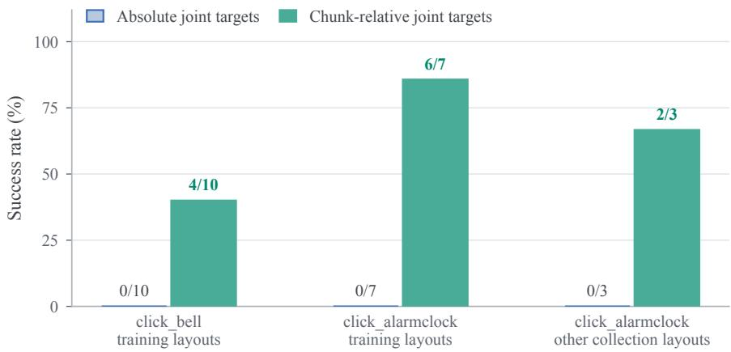  
Figure 11 | ACT policies trained on RoboRSI executions. Success with absolute and chunk-relative joint targets under the same demonstrations, architecture, and training budget.

## 5. Conclusions and Future Work

RoboRSI combines Top-Down Skill Refinement and multi-agent coordination to organize execution, diagnosis, local revision, and reusable capability, toward stable, efficient, and reusable robot self-evolution in complex real-world environments. Future work will transfer simulationacquired experience to physical robots and share skills across robots and platforms.

## References

J.-B. Alayrac, J. Donahue, P. Luc, A. Miech, I. Barr, Y. Hasson, K. Lenc, A. Mensch, K. Millican, M. Reynolds, R. Ring, E. Rutherford, S. Cabi, T. Han, Z. Gong, S. Samangooei, M. Monteiro, J. Menick, S. Borgeaud, A. Brock, A. Nematzadeh, S. Sharifzadeh, M. Binkowski, R. Barreira, O. Vinyals, A. Zisserman, and K. Simonyan. Flamingo: a visual language model for fewshot learning. In Advances in Neural Information Processing Systems (NeurIPS), 2022. URL https://arxiv.org/abs/2204.14198.

K. Black, N. Brown, D. Driess, et al. �<sub>0</sub>: A vision-language-action flow model for general robot control. In Robotics: Science and Systems (RSS), 2025. URL https://arxiv.org/abs/24 10.24164.

A. Brohan, N. Brown, J. Carbajal, et al. RT-2: Vision-language-action models transfer web knowledge to robotic control. In Conference on Robot Learning (CoRL), 2023. URL https: //arxiv.org/abs/2307.15818.

B. Chen, B. Zhang, F. Tang, Z. Lu, Y. Du, T. Chen, W. Lu, J. Xiao, Y. Zhuang, and Y. Shen. Reflect, revise, reuse: Training-free skill evolution for GUI agents. arXiv preprint arXiv:2609.17653, 2026a. URL https://arxiv.org/abs/2609.17653.

Y. Chen, Z. Huai, S. Li, Y. Wang, H. Zhang, Y. Zhang, H. Chen, J. Gong, Y.-G. Jiang, and X. Qiu. ETA: A new agentic paradigm for embodied tasks. arXiv preprint arXiv:2608.03924, 2026b. URL https://arxiv.org/abs/2608.03924.

D. Cheng, T. Yi, Y. Fang, X. Zhang, F. Feng, Y. Li, G. Zhuang, R. Wang, S. Yang, W. Song, W. Xue, M. Wu, J. Gui, J. Wang, and T. Wu. In-context robot learning with VLM agents. arXiv preprint arXiv:2609.19138, 2026. URL https://arxiv.org/abs/2609.19138.

D. Driess, F. Xia, M. S. M. Sajjadi, C. Lynch, A. Chowdhery, B. Ichter, A. Wahid, J. Tompson, Q. Vuong, T. Yu, W. Huang, Y. Chebotar, P. Sermanet, D. Duckworth, S. Levine, V. Vanhoucke, K. Hausman, M. Toussaint, K. Greff, A. Zeng, I. Mordatch, and P. Florence. PaLM-E: An embodied multimodal language model. In International Conference on Machine Learning (ICML), 2023. URL https://arxiv.org/abs/2303.03378.

J. Duan, W. Pumacay, N. Kumar, Y. R. Wang, S. Tian, W. Yuan, R. Krishna, D. Fox, A. Mandlekar, and Y. Guo. AHA: A vision-language-model for detecting and reasoning over failures in robotic manipulation. In International Conference on Learning Representations (ICLR), 2025. URL https://arxiv.org/abs/2410.00371.

Y. Fan, Z. Di, Z. Wen, Y. Yang, M. Cheng, Q. Dai, B. Liu, K. Qiu, Y. Dong, J. Li, and C. Luo. RE-SOURCE2SKILL: Distilling executable agent skills from human-created multimodal resources. arXiv preprint arXiv:2606.29538, 2026. URL https://arxiv.org/abs/2606.29538.

L. Fu, J. Yu, K. El-Refai, E. Kou, H. Xue, H. Huang, W. Xiao, G. Wang, D. Niu, F.-F. Li, G. Shi, J. Wu, S. Sastry, Y. Zhu, K. Goldberg, and L. J. Fan. CaP-X: A framework for benchmarking and improving coding agents for robot manipulation. arXiv preprint arXiv:2603.22435, 2026. URL https://arxiv.org/abs/2603.22435.

Gemini Robotics Team et al. Gemini robotics 1.5: Pushing the frontier of generalist robots with advanced embodied reasoning, thinking, and motion transfer. arXiv preprint arXiv:2510.03342, 2025. URL https://arxiv.org/abs/2510.03342.

Gemini Team et al. Gemini 1.5: Unlocking multimodal understanding across millions of tokens of context. arXiv preprint arXiv:2403.05530, 2024. URL https://arxiv.org/abs/2403.0 5530.

Y. Guo, Y.-J. Wang, L. Zha, and J. Chen. DoReMi: Grounding language model by detecting and recovering from plan-execution misalignment. In IEEE/RSJ International Conference on Intelligent Robots and Systems (IROS), 2024. URL https://arxiv.org/abs/2307.00329.

J. Huang, Y. Hu, Z. Li, R. Qi, Y. Xiao, Z. Zhang, M. Coates, T. Cao, and Y. Zhang. RoboHarness: Memory-driven orchestration of heterogeneous robot policies for long-horizon planning. arXiv preprint arXiv:2607.18060, 2026. URL https://arxiv.org/abs/2607.18060.

W. Huang, P. Abbeel, D. Pathak, and I. Mordatch. Language models as zero-shot planners: Extracting actionable knowledge for embodied agents. In International Conference on Machine Learning (ICML), 2022a. URL https://arxiv.org/abs/2201.07207.

W. Huang, F. Xia, T. Xiao, et al. Inner monologue: Embodied reasoning through planning with language models. In Conference on Robot Learning, 2022b. URL https://arxiv.org/ab s/2207.05608.

W. Huang, C. Wang, R. Zhang, Y. Li, J. Wu, and F.-F. Li. VoxPoser: Composable 3D value maps for robotic manipulation with language models. In Conference on Robot Learning (CoRL), 2023. URL https://arxiv.org/abs/2307.05973.

W. Huang, C. Wang, Y. Li, R. Zhang, and F.-F. Li. ReKep: Spatio-temporal reasoning of relational keypoint constraints for robotic manipulation. In Conference on Robot Learning (CoRL), 2024. URL https://arxiv.org/abs/2409.01652.

R. Ju, X. Wang, X. Ding, Y. Yang, H. Wu, S. Jiang, Q. Zhang, H. Wen, X. Li, W. Wang, K. Li, Y. Liu, H. Dai, W. Wang, and T. Cao. EmbodiSkill: Skill-aware reflection for self-evolving embodied agents. arXiv preprint arXiv:2605.10332, 2026. URL https://arxiv.org/abs/2605.103 32.

M. J. Kim, K. Pertsch, S. Karamcheti, et al. OpenVLA: An open-source vision-language-action model. In Conference on Robot Learning (CoRL), 2024. URL https://arxiv.org/abs/24 06.09246.

Z. Li, Z. Li, K. Zhou, and J. Gu. RoboHarness: A memory-augmented policy harness for vision-language-action model robustness via in-context adaptation. In IEEE/RSJ International Conference on Intelligent Robots and Systems (IROS), 2026. URL https://arxiv.org/ab s/2603.24060.

J. Liang, W. Huang, F. Xia, P. Xu, K. Hausman, B. Ichter, P. Florence, and A. Zeng. Code as policies: Language model programs for embodied control. In IEEE International Conference on Robotics and Automation (ICRA), 2023. URL https://arxiv.org/abs/2209.07753.

H. Liu, C. Li, Q. Wu, and Y. J. Lee. Visual instruction tuning. In Advances in Neural Information Processing Systems (NeurIPS), 2023a. URL https://arxiv.org/abs/2304.08485.

Z. Liu, A. Bahety, and S. Song. REFLECT: Summarizing robot experiences for failure explanation and correction. In Conference on Robot Learning (CoRL), 2023b. URL https://arxiv.or g/abs/2306.15724.

R. Lu, Y. Wu, E. Kou, L. Fu, W. Xiao, A. Mandlekar, Y. Xu, G. Shi, K. Goldberg, A. Chen, M. Chowdhury, Y. Zhu, L. J. Fan, and G. Wang. ASPIRE: Agentic /skills discovery for robotics. arXiv preprint arXiv:2607.00272, 2026. URL https://arxiv.org/abs/2607.00272.

A. Madaan, N. Tandon, P. Gupta, et al. Self-refine: Iterative refinement with self-feedback. In Advances in Neural Information Processing Systems, 2023. URL https://arxiv.org/ab s/2303.17651.

Physical Intelligence, K. Black, N. Brown, J. Darpinian, K. Dhabalia, D. Driess, A. Esmail, M. Equi, C. Finn, N. Fusai, M. Y. Galliker, D. Ghosh, L. Groom, K. Hausman, B. Ichter, S. Jakubczak, T. Jones, L. Ke, D. LeBlanc, S. Levine, A. Li-Bell, M. Mothukuri, S. Nair, K. Pertsch, A. Z. Ren, L. X. Shi, L. Smith, J. T. Springenberg, K. Stachowicz, J. Tanner, Q. Vuong, H. Walke, A. Walling, H. Wang, L. Yu, and U. Zhilinsky. � : a vision-language-action model with open-world generalization. In Conference on Robot Learning (CoRL), 2025. URL https: //arxiv.org/abs/2504.16054.

J. Shi, R. Yang, K. Chao, S. B. Wan, Y. Shao, J. Lei, J. Qian, L. Le, P. Chaudhari, K. Daniilidis, C. Wen, and D. Jayaraman. Maestro: Orchestrating robotics modules with vision-language models for zero-shot generalist robots. arXiv preprint arXiv:2511.00917, 2025. URL https: //arxiv.org/abs/2511.00917.

N. Shinn, F. Cassano, A. Gopinath, K. Narasimhan, and S. Yao. Reflexion: Language agents with verbal reinforcement learning. In Advances in Neural Information Processing Systems, 2023. URL https://arxiv.org/abs/2303.11366.

I. Singh, V. Blukis, A. Mousavian, A. Goyal, D. Xu, J. Tremblay, D. Fox, J. Thomason, and A. Garg. ProgPrompt: Generating situated robot task plans using large language models. In IEEE International Conference on Robotics and Automation (ICRA), 2023. URL https: //arxiv.org/abs/2209.11302.

M. Sun, J. Wei, Q. He, D. Wang, C. Lu, and J. Sun. Executable analytic concepts as the missing link between VLM insight and precise manipulation. arXiv preprint arXiv:2510.07975, 2025. URL https://arxiv.org/abs/2510.07975.

G. Wang, Y. Xie, Y. Jiang, A. Mandlekar, C. Xiao, Y. Zhu, L. Fan, and A. Anandkumar. Voyager: An open-ended embodied agent with large language models. Transactions on Machine Learning Research, 2024. URL https://arxiv.org/abs/2305.16291.

W. Xiao, J. Xie, T. Zhang, H. Lin, L. Fu, H. Xue, J. Lu, Y. Yang, C. Dai, Z. Wang, J. Wu, G. Wang, S. S. Sastry, K. Goldberg, L. Fan, Y. Zhu, and G. Shi. ENPIRE: Agentic robot policy selfimprovement in the real world. In Conference on Robot Learning (CoRL), 2026. URL https: //arxiv.org/abs/2606.19980.

X. Xu, J. Liu, Z. Qiao, J. Lu, X. Zhang, Y. Gu, F. Ning, and Y. Shi. OmniHarness: Harnessing generalizable visual generation via symbolic policy learning. arXiv preprint arXiv:2609.16057, 2026. URL https://arxiv.org/abs/2609.16057.

S. Yao, J. Zhao, D. Yu, N. Du, I. Shafran, K. Narasimhan, and Y. Cao. ReAct: Synergizing reasoning and acting in language models. In International Conference on Learning Representations, 2023. URL https://arxiv.org/abs/2210.03629.

H. Ye, Y. Xiao, C. Lu, and P. Cai. UniDomain: Pretraining a unified PDDL domain from realworld demonstrations for generalizable robot task planning. arXiv preprint arXiv:2507.21545, 2025. URL https://arxiv.org/abs/2507.21545.

H. Ye, Y. Xiao, C. Lu, and P. Cai. UniPlan: Vision-language task planning for mobile manipulation with unified PDDL formulation. arXiv preprint arXiv:2602.08537, 2026. URL https://arxi v.org/abs/2602.08537.

T. Z. Zhao, V. Kumar, S. Levine, and C. Finn. Learning fine-grained bimanual manipulation with low-cost hardware. In Robotics: Science and Systems (RSS), 2023. URL https://arxi v.org/abs/2304.13705.

E. Zhou, Q. Su, C. Chi, Z. Zhang, Z. Wang, T. Huang, L. Sheng, and H. Wang. Code-as-Monitor: Constraint-aware visual programming for reactive and proactive robotic failure detection. In IEEE/CVF Conference on Computer Vision and Pattern Recognition (CVPR), 2025. URL https://arxiv.org/abs/2412.04455.

J. Zhou, Q. Zhang, G. Xu, C. Fan, Y. Zhao, R. Wang, Y. Luo, S. Yang, X. Zhu, Y. Shen, J. Liang, and Y. Xu. Zero-WAM: In-context world-action modeling from human videos for open-ended task generalization. arXiv preprint arXiv:2608.26103, 2026. URL https://arxiv.org/ab s/2608.26103.

## A. TSR Formulation and Analysis

Task–skill graph and scoped patches. At iteration �, the released hierarchy is represented by $G _ { t } = \left( V _ { t } , E _ { t } , \left\{ c _ { \nu } \right\} _ { \nu \in V _ { t } } \right)$ , where $V _ { t }$ contains task and skill nodes, $E _ { t }$ contains possible call edges, and $c _ { \nu }$ is a node’s implementation or guidance. The execution record $\tau _ { t }$ includes the goal, observations, and tool trace. Diagnosis identifies the affected scope $S _ { t } \subseteq V _ { t } ; G _ { t } | _ { S _ { t } }$ contains its nodes and internal calls, while $\partial S _ { t }$ contains the interfaces connecting it to the unchanged hierarchy.

The revision procedure R proposes a graph and code patch $\Delta _ { t }$ with supp $( \Delta _ { t } ) \ \subseteq S _ { t }$ . The support identifies existing nodes whose implementation, guidance, or outgoing calls change. New helper nodes may be attached within that scope. The operator ⊕ applies both code edits and branch expansion. If diagnosis implicates a caller or interface outside $S _ { t } ,$ , the scope expands before the next proposal.

History and validation. The case collection in Eq. 2 is $\mathcal { H } _ { t } = \mathcal { D } _ { t } ^ { - } \cup \mathcal { D } _ { t } ^ { + } ( S _ { t } )$ , comprising recent failures that motivate the edit and selected successful cases from affected callers. Review and functional tests determine whether $_ \textmd { ‰}$ returns the proposed patch or an empty patch. Applying an empty patch leaves the released graph unchanged; accepted revisions become available to subsequent execution. Shared skills require checking the relevant caller paths even when only one implementation changes. The next iteration uses feedback from the currently released version.

Dependency-local effects. Equation 2 separates the scope of an edit from the scope of its possible effects. Let $r _ { q }$ be the entry node for task $q$ and let $\mathrm { R e a c h } _ { G _ { t } } ( r _ { q } )$ include that node and all nodes reachable through possible calls. The affected task set is $\mathcal { A } _ { t } = \{ q : \mathrm { R e a c h } _ { G _ { t } } ( r _ { q } ) \cap S _ { t } \neq \emptyset \}$ This uses possible dependencies, not only calls observed in one rollout: a shared base skill may affect several tasks under different observations.

Consider a fixed task distribution $p ( q )$ , and let $J _ { q } ( G )$ be the expected failure rate for task $q$ under graph �. Assume the graph captures all behavioral dependencies, the patch leaves interfaces and implementations outside its scope unchanged, and evaluation uses the same reset and exogenous-randomness distributions. In particular, edits must not alter untracked shared state, global prompts, or tool configurations. Under these conditions, tasks outside $\mathcal { A } _ { t }$ cannot encounter a changed implementation. Their execution distributions are unchanged, so their contributions cancel in the aggregate difference:

$$
\begin{array} { r l } & { \displaystyle \boldsymbol { J } \big ( G _ { t + 1 } \big ) - \boldsymbol { J } \big ( G _ { t } \big ) = \sum _ { q \in \mathcal { R } _ { t } } p ( q ) \left[ J _ { q } \big ( G _ { t + 1 } \big ) - J _ { q } \big ( G _ { t } \big ) \right] , } \\ & { \displaystyle | \boldsymbol { J } \big ( G _ { t + 1 } \big ) - \boldsymbol { J } \big ( G _ { t } \big ) | \leq \sum _ { q \in \mathcal { R } _ { t } } p ( q ) , \qquad \boldsymbol { J } \big ( G \big ) = \sum _ { q } p ( q ) J _ { q } ( G ) . } \end{array}\tag{3}
$$

The bound follows because each failure rate lies in [0, 1]. Its magnitude scales with the probability mass of affected tasks and covers both improvements and regressions. A task-specific branch can have a small affected set, whereas a widely shared base skill can have a large one. This motivates selecting regression cases by dependency coverage rather than by the number of edited functions. If a revision changes shared state or an interface, its dependency scope must be expanded before this analysis applies. Development cases guide revision, while held-out tasks measure generalization.

Token accounting. Construction cost includes skill generation, diagnosis, review, and validation. Execution cost includes all model calls within the executing agent, including model-backed perception, monitoring, and fallback; separately measured planning and review are excluded from this execution subtotal. Unmetered calls are reported separately. Comparisons require matched task distributions and must include failed executions, since a shorter failed attempt can consume fewer tokens without improving efficiency. Task success, runtime, and the frequency of fallback to online reasoning provide context for interpreting any reduction in execution tokens.

Execution and outcome interfaces. Agents communicate through plans, structured skill inputs and outputs, and execution records. Physical deployment uses human guidance and safety supervision; simulation can automate resets and outcome checks. Planner, Engineer, and Reviewer receive observations and tool feedback, while hidden simulator state and successcondition internals remain outside their context. The simulator scores the task separately after execution.

Operational details. Each skill has a descriptor that declares its arguments, typed return fields, applicability conditions, and a validation harness (simulator task, seeds, arguments, and any setup skill). The return fields report whether the intended effect was verified; for example, a placement skill returns whether the target was reached, the gripper opened, and the release was verified, and it does not open the gripper unless its reach and hold checks pass. An atomic task counts as complete only when its postcondition holds on fresh observations taken after the last action. A candidate revision is staged in an isolated copy of the library and reviewed by the Manager. If it changes a base skill, the harness of that skill runs in the simulator; the complete atomic task is then re-run on its development seeds. Release requires simulator success on at least two declared seeds, restoration of the unmodified source after the trial, and Manager approval with no outstanding changes; a candidate that fails cannot be resubmitted unchanged. In simulation, H<sub>�</sub> consists of these harness and development runs; on the robot, it consists of the four most recent eligible runs, replayed offline (Appendix D.4). A compound skill is proposed once a task has at least three successful executions whose tool sequences share at least 60% of their longest common subsequence and a common skeleton of at least three steps. The generated skill replays the skeleton and recomputes every argument from perception at run time, never storing coordinates from an episode, and it passes the same review and validation as any other revision.

## B. Physical Evaluation Setting & Protocol

Platform and observation interface. The physical experiments use two robot platforms. The mobile cleanup case study uses a WheelSingleArm M1 comprising an Athena Pro Max mobile base, a RealMan arm, and a Zhiyuan gripper. An in-hand camera and a chassis-mounted camera provide RGB-D observations. The agent can access arm-joint and end-effector states, gripper state, chassis pose, and navigation and docking status. Camera-to-arm calibration was performed before the experiments. All mobile development runs used the same prebuilt navigation map.

The dual-arm setup comprises two AgileX PiPER robotic arms with standard 100-mm PiPER grippers. An Intel RealSense D435i facing the workspace and an Intel RealSense D405 mounted on each wrist provide RGB-D observations. All three camera streams are available to the agent, together with joint states, end-effector poses, and gripper states for both arms. Camera-to-arm calibration was performed before the experiments.

Mobile task distribution and development protocol. The mobile cleanup development record spans 104 runs. Each run starts from a common docking pose. Before execution, on-site personnel restore the scene to a common base layout while varying the number, identities, positions, and orientations of the objects, as well as the positions of their destination receptacles. The task manifest specifies the objects and destinations for that run and remains fixed during its execution. The robot is expected to place the specified objects in their designated receptacles and return to the docking pose.

RoboRSI may revise its skills between runs, while the skill version remains fixed within each run. Revisions are made when needed rather than after every run. Candidate revisions are checked against retained, reviewed execution records before use in subsequent runs; earlier tasks are not physically repeated for this check. Thus, the 104 runs trace development of an evolving system across varying task manifests, rather than repeated trials of a frozen policy on an identical task.

Outcome annotation and figure construction. A placement is counted when on-site personnel observe the object enter its designated receptacle. For every run selected for Figure 4, each counted placement was confirmed in this way. The figure shows ten runs selected retrospectively to represent early partial execution, multi-object placement, setbacks during development, and later completed tasks. Selection was made after inspection of the development record, not according to a prespecified sampling rule.

The plotted value is the number of confirmed placements among the first four items handled in a run. Four items provide a common display scale; a run with fewer than four items in its manifest is not treated as a four-item trial. Marker appearance indicates the audited task outcome. Because object sets and reset configurations vary across runs, the plotted values describe placement progress during development rather than success rates on a fixed task.

Mobile execution records. The recorded demonstration comprises two cleanup scenes with five and four target objects, respectively (Figure 5). On-site personnel confirmed that every object was placed in its designated receptacle. Between scenes, an operator rearranged the objects and receptacles; the skill code, prompts, and policy configuration remained unchanged. Neither cleanup execution required manual takeover or correction.

A separate physical evaluation attempt illustrates a placement failure: the robot grasped a bath pouf but released it outside the target bucket. The execution trace exposed a mismatch between the release check and the required final state, directing a subsequent revision of the placement geometry. The revision was checked using retained observations, but was not evaluated in a matched post-repair physical trial. This failure case is reported separately from the two-scene demonstration and the 104-run development trace.

## C. Supplementary Experiments

This appendix reports the failure classification, exploratory development, and small-scale policy learning.

## C.1. Failure Classification

Each failed episode receives one category from deterministic rules over its public tool results and the simulator’s terminal outcome. Explicit fields such as an empty grasp, a dropped object, a rejected release, or an unreachable target determine grasp, placement/release, and motion/reachability failures; for complete traces, the last explicit failure step is used. An episode in which the agent declares success while the simulator reports failure is a premature completion, and an episode that ends at the interaction limit is budget exhausted. Episodes whose traces support none of these rules are unlabeled. Categories are counted separately for each evaluation panel; the analysis covers 5,008 failed episodes. Completion after a failure (Figure 6c) is computed on the (task, seed) pairs for which every method has a complete trace and encounters at least one execution failure, 209 on LIBERO-PRO and 258 on LIBERO-Plus; it is the fraction of these episodes that still end in simulator success.

## C.2. Exploratory Development

Early LIBERO-Plus runs also allowed capability updates on the target benchmark. Their configurations allowed repeated attempts and target-side updates, whereas the main LIBERO-Plus transfer panel keeps source capabilities fixed.

## C.3. Learned Policies from Execution Data

Demonstrations are successful RoboRSI executions on fixed collection layouts: ten for click\_bell, yielding 2,161 training samples, and seven for click\_alarmclock. Both action representations use the same ACT architecture, with a ResNet-18 visual backbone trained from scratch, a transformer width of 256, action chunks of 100 steps of which 25 are executed per inference, a KL weight of 1, and 10,000 training steps. The absolute version predicts joint position commands directly. The chunk-relative version predicts joint positions relative to the arm configuration at the start of each chunk, with gripper and velocity outputs unchanged. Final checkpoints run through a standalone inference server without online agent assistance, with a budget of 2,000 control ticks per episode. Evaluation covers the ten training layouts of click\_bell and the ten collection layouts of click\_alarmclock, seven of which supplied training demonstrations.

## D. Case Studies: Skill Code and Failure-Driven Revision

We examine an execution failure and a local skill revision on the same development task and initial states. Separate cases then document skill publication and review-driven code revision.

## D.1. Execution Repair: Removing a Premature Target Rejection

This case follows an earlier revision of guarded\_compact\_feature\_tap on click\_bell. Both candidates were reviewed by GPT-5.6-SOL Manager calls and evaluated on the same three declared initial states, invocation arguments, and independent simulator-success criterion. Each version ran once per initial state. The original candidate succeeded in one of the three trials (1/3); the revised candidate succeeded in all three (3/3), with no crashes. It met the predeclared requirement of at least two successes and was then published. These six runs form the development comparison below.

Failure and responsible node. In the first failed trial, the original skill observed a bell bounding box [249, 185, 306, 240] in a 320×240 image. Its lower edge exceeded the hard-coded threshold of 237, so the target-association check rejected the object before issuing a tap. The task consequently failed. The responsible code lay in the skill’s association checks following get\_object\_bbox; the bell-pressing goal and tool interface did not need to change. The original size and boundary checks were:

if width < 8 or height < 8 or width > 100 or height > 100:   
return fail("object association is not within fixed compactness bounds")   
if x0 < 2 or y0 < 2 or x1 > 317 or y1 > 237:   
return fail("object association touches the fixed head-camera border guard")

Local revision and observed execution. After receiving the failed runs’ public tool traces, the Manager generated a revision that allows bounded lower-edge truncation for a compact object. The revised checks below retain size limits and reject extensive truncation; feature-in-box, depth, and arm-state checks remain elsewhere in the skill, and the revision also adds motion-endpoint checks.

```lua
if width < 8 or height < 8 or width > 100 or height > 100:
return fail("object association is outside fixed compactness bounds")
if x0 < 2 or y0 < 2 or x1 > 318 or y1 > 240:
return fail("object association violates fixed image guards")
if y1 == 240 and height > 70:
return fail("lower-edge truncation is too extensive")
```

In the revised run from the same initial state, the observed box was [249, 185, 306, 239] and the localized feature was (257, 195). The skill accepted the target, called move\_to\_pixel with action=tap, and received the hover–close–press–retreat execution report. The independent simulator verdict was success. Figure 12 shows the corresponding observations. Replaying the old code on this same recorded post-revision observation still rejects the box because 239 > 237; the revised code replays all 22 recorded public calls, including the tap. The replay uses stored tool outputs to compare the two implementations on the same observation.

Evaluation setting. A supervisor supplied the complete tool arguments, outputs, and failed trace to the Manager and organized the two validation runs. The Manager revised the code, followed by a separate review. The patch updated the boundary checks and recovery logic; in the second trial, both versions attempted a tap. The native tools, dispatch, and harness code were unchanged. Runs used different GPUs and slightly different initial images, including a one-pixel difference in the box boundary of the first trial. Process limits were 300 and 900 seconds, with actual durations of approximately 231 and 297 seconds.

## D.2. Generated Compound Skill: Validation, Publication, and Invocation

A later, distinct exact\_waypoint\_feature\_tap skill provides a concrete example of executable capability accumulation. A GPT-5.6-SOL Manager call generated the revised code, and a separate Manager call reviewed it. The descriptor exposes four inputs: arm, object description, functional feature description, and camera. The implementation obtains a fresh image, localizes the object and its functional point, recovers depth, checks motion endpoints, executes a tap, and checks retreat and the terminal state. Its structured outputs describe execution, recovery, and failure reasons. The simulator evaluates task completion.

The following source excerpt shows the fixed execution sequence after perception. Here xyz is the currently observed feature position, u,v its image coordinates, and screen\_tcp checks the candidate endpoint. Input validation, perception, and subsequent terminal checks are omitted from this excerpt. The code preserves the procedure, while object association and action targets are recomputed on each call.

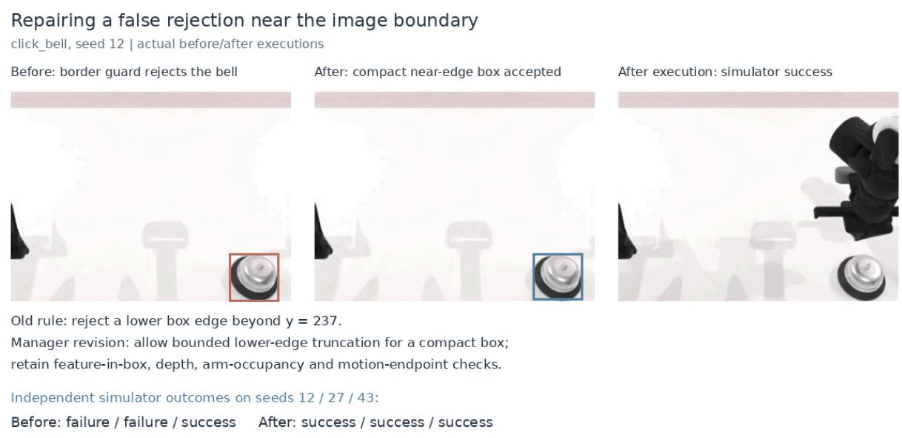  
Figure 12 | A local skill revision enables execution in the bell-pressing case. Left: the original target-association check rejects the near-boundary box before action. Middle: the revised check accepts the compact target. Right: the post-execution observation from the successful revised run. Boxes mark the detected targets; the simulator supplies the task outcomes.

```python
top_down = [0.5, -0.5, 0.5, 0.5]
approach_tcp = [xyz[0], xyz[1], xyz[2] + 0.10] + top_down
press_tcp = [xyz[0], xyz[1], xyz[2] - 0.005] + top_down
if screen_tcp(approach_tcp) is None:
return fail("exact tap approach/retreat endpoint is unsafe or unknown")
if screen_tcp(press_tcp) is None:
return fail("exact tap press endpoint is unsafe or unknown")
tap_result, _ = _dispatch_tool(
state,
"move_to_pixel",
{
"arm": arm,
"u": u,
"v": v,
"action": "tap",
"height_above_m": 0.0,
"camera": "head_camera",
},
)
tapped = tap_result.get("ok") is True
```

Validation and publication. The predeclared development check required independent simulator success on at least two of three click\_bell trials. Two of the three trials succeeded, and no run crashed. The 2/3 result passed that check, after which the reviewed implementation was published as a versioned skill. This later skill uses its own three-trial development panel.

Figure 13 shows the observations from a successful development trial.  
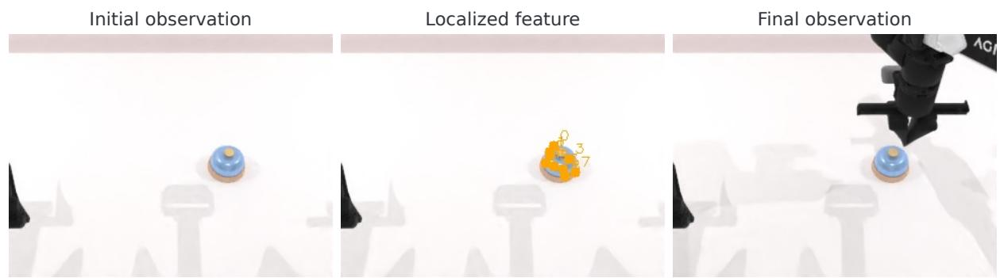  
Figure 13 | Observations from the published tap skill in a successful click\_bell development trial: the initial view, feature localization, and post-execution view. The outcome is scored by the simulator; images are 320×240 pixels.

## D.3. Before/After Code: Review-Driven Terminal Checks

The earlier candidate was rejected during Manager review. Its recovery expression shortcircuited: when a movement or pose check failed, the later occupancy and clearance queries could be skipped. Elsewhere, clearance could be queried with empty-arm assumptions after occupancy was not confirmed. The old recovery condition was:

recovered = (   
recovery\_move.get("ok") is True   
and recovery\_measure.get("ok") is True   
and recovery\_measure.get("pose\_matches") is True   
and both\_empty()   
and current\_clear()   
)

The model-generated revision evaluates terminal occupancy after each recovery attempt, then checks clearance only if both arms are confirmed empty. It uses these recorded checks when deciding whether recovery was established. The helper and revised condition are shown below; intervening motion calls are omitted.

```python
def terminal_empty_clear():
empty = both_empty()
if not empty:
return False, False
return True, empty_current_clear()
recovery_empty, recovery_clear = terminal_empty_clear()
recovered = (
recovery_move.get("ok") is True
and recovery_measure.get("ok") is True
and recovery_measure.get("pose_matches") is True
and recovery_empty
and recovery_clear
)
```

A separate Manager review accepted this version, which passed the 2/3 simulator development check before publication. The previous candidate stopped at code review and had no simulator runs. The full patch also changes diagnostics and removes an optional visualdifference check. An operator separately maintained the camera, low-level interfaces, and supervisor. The code excerpts show the terminal-check revision.

## D.4. Physical Skill Revisions in Rounds 25 and 33

Both records come from the household cleanup task on the mobile manipulator (Section 4.1) and are shown in Figure 3b. Each revision was admitted with its trigger run, the four most recent eligible runs as a replay buffer, and the changed files; live iteration was paused until validation finished.

Round 25: placement observation and release. Execution. The robot held a food wrapper in front of the correct bag-lined trash bin, which remained visually distinct from a nearby light-blue bucket. The compiled observation move reported a 0.052 m and 17.1<sup>◦</sup> tolerance miss, although the current joint and end-effector state and the third-person video showed the arm at the requested pose. The unrestricted fallback repeated opening estimation from the same view, invoked Arm Explore with an invalid self-inspection target, and exhausted 28 merged tool calls. A workspace probe had already stored a complete three-step release sequence in runtime memory, but the model passed an incomplete copy to place\_object. Both calls failed closed before motion; the gripper never opened, and the robot returned to its docked home pose with the item still held. Diagnosis. The earliest failing node was completion of the placement observation motion. Its false negative expanded into duplicated geometry estimation and an incomplete release plan. Revision. (i) A failed observation move receives one readonly pose recheck, and a physically reached pose continues without replaying the placement chain. (ii) An unreached pose returns a non-releasable checkpoint to the Planner, with Engineer fallback disabled. (iii) Probing and release above a container require opening geometry from the current observation rather than semantic rim identity alone. (iv) place\_object replaces an incomplete model-written sequence with the complete sequence held in runtime destination memory. Validation. Five new regression tests, 172 placement tests, 863 manager tests, and 97 real-robot interface tests passed. The next run required a fresh human reset of the scene.

Round 33: destination identity and navigation handoff. Execution. A single sweep over five headings recorded all eight expected scene entities. The first item was released and its detachment confirmed, but the run ended after about 25 minutes with the second item still held. Two owners failed. The inventory producer chose an isolated but edge-cropped view of the destination bucket although the same sweep contained a complete view, and the consumer then treated the blue color ratio as a mandatory check and rejected the producer-certified destination. Earlier, a navigation to the item had been attempted but not completed and produced no postnavigation image; this state was routed to Engineer fallback, which repeated status, power, and camera queries and exhausted the merged budget before a single compiled retry succeeded. Revision. Inventory selection prefers complete, non-edge observations; query color becomes advisory during materialization because the producer owns semantic identity, while currentframe navigation and manipulation checks remain in force; and incomplete navigation without a post-navigation image returns a typed checkpoint to the Planner instead of entering fallback. The revision adds no new object or destination branch, no episode coordinates, no historical pose gate, and no change to global color thresholds. Validation. An offline replay of the trigger run selected the complete bucket view, materialized the destination, and routed the incomplete navigation to the Planner. The replay buffer contained four consecutive blocked runs with different terminal failures: a true destination rejected by a score veto, a defensive post-release check, exhausted placement regions, and the color veto above. Twenty-eight focused tests, 866 manager tests, and 97 real-robot interface tests passed. Resets before and after the run were planned; no unplanned human prompt occurred during execution.

(c) Round 37: wrapper lands beside the bin

## D.5. Corrections That Required Human Knowledge

Four of the 53 classified revision triggers in the physical development (Section 4.1) required knowledge that the system could not obtain from its own records (Figure 14). In Round 23, a released item landed outside the intended container. The operator specified that a confirmed misplacement contaminates the scene and must be reset by a person, rather than being treated as a new source object for the robot to recover. In Round 31, the grasp approach had to respect a default linear speed of 0.02 m/s that the validated motion sequence did not yet consume; the operator supplied and confirmed this safety limit. In Round 37, a wrapper fell beside the bin after release, and the operator judged the placement a failure that required a scene reset, not a success or a step for automatic recovery. In Round 99, the robot still held an item when the task stopped, and the item was later lost while the robot waited at its dock. The operator specified that holding protection must inherit the reviewed grip width and force and, when the hold is lost, freeze motion and request confirmation instead of moving or releasing. Each correction is kept as a reusable contract, checkpoint, or test on the responsible skill, so the same prompt is not needed again.

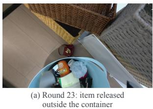

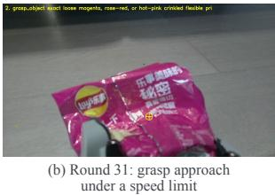

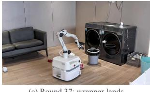

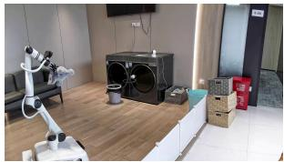  
(d) Round 99: item still held after termination  
Figure 14 | Physical corrections that required human knowledge. (a) Resetting the scene after a confirmed misplacement; (b) a safe grasp speed specified by the operator; (c) a wrapper released outside the bin; (d) holding protection after termination.