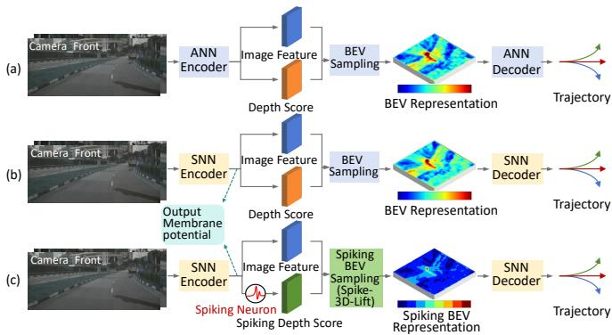
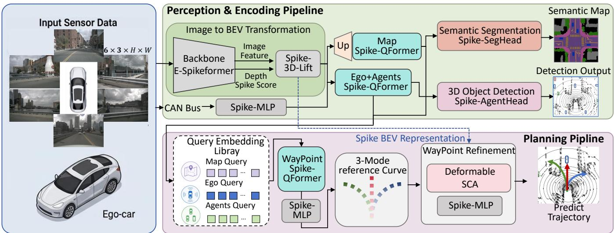
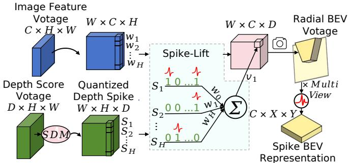
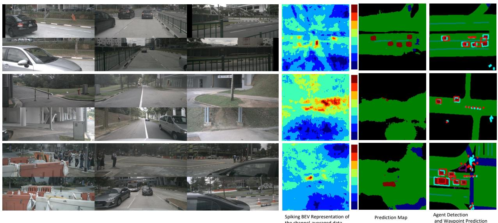
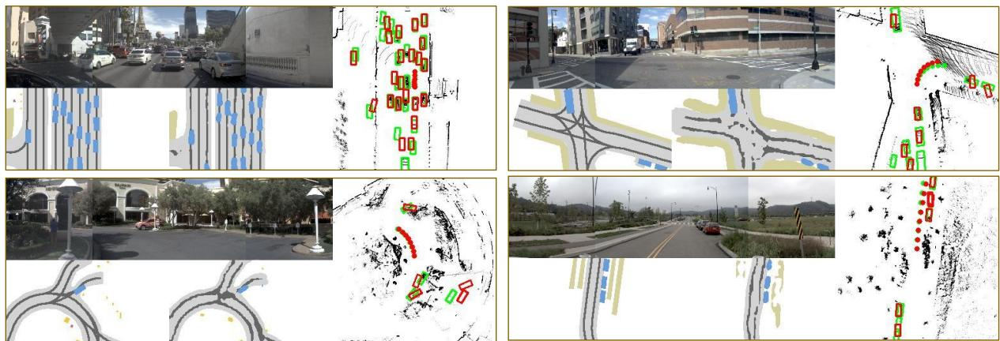

# SDPAD: A Fully Spike-Driven Pipeline for End-to-End Autonomous Driving

Chengjun Zhang1,2 Yuhao Zhang1,2 Jie Yang1,2,3 Mohamad Sawan1,2,3

1Zhejiang Key Laboratory of 3D Micro/Nano Fabrication and Characterization,

Westlake Institute for Optoelectronics, Fuyang, Hangzhou, China

2Integrated-On-Chips Brain-Computer Interfaces Zhejiang Engineering Research Center,

Hangzhou, Zhejiang, China

3CenBRAIN Neurotech, School of Engineering, Westlake University,

Hangzhou, Zhejiang, China

Corresponding authors: Jie Yang and Mohamad Sawan

yangjie@westlake.edu.cn; sawan@westlake.edu.cn

October 9, 2026

## Abstract

End-to-end autonomous driving demands trajectory planners that are both highly accurate and cheap enough for edge deployment. State-of-the-art artificial neural network (ANN) planners meet the accuracy requirement at the cost of heavy dense computation, while spiking neural networks (SNNs)—though promising orders-of-magnitude energy savings through sparse, event-driven arithmetic—still lag far behind in planning accuracy. We present SDPAD, a fully spike-driven end-to-end planning pipeline that closes this gap. SDPAD converts a pre-trained ANN perception stack into integer-spike form via quantized ANN2SNN conversion, lifts multi-view images into the bird’s-eyeview (BEV) space with a spike-driven-max (SDM) depth distribution (Spike-3D-Lift), and plans through the Spike-QFormer, a spiking query transformer in which ego, agent, and map queries distilled from the BEV scene are fused by learnable waypoint queries via cross-attention, followed by deformable spike-cross-attention refinement. Every operation is gated by integer spikes and inference is a single feed-forward pass without temporal simulation loops. On the nuScenes open-loop benchmark, SDPAD achieves an average L error of 0.40 m and a collision rate of 0.12%, on par with strong ANN planners while consuming 69.9 mJ— less than 2% of recent ANN baselines. In closed-loop evaluation on the NAVSIM navtest split, SDPAD reaches 86.3 PDMS, surpassing the previous SNN planner SAD by 4.3 points and matching mainstream ANN planners at a fraction of their energy. To our knowledge, SDPAD is the first fully spike-driven planner evaluated in end-to-end autonomous driving, demonstrating that SNNs can rival dense ANNs in complex driving tasks.

## 1 Introduction

The evolution of end-to-end autonomous driving has seen a paradigm shift from modular pipelines to unified neural architectures capable of directly mapping raw sensor data to control signals Chen et al. [2024a]. While these dense artificial neural network (ANN) models, as shown in Fig. 1a—ranging from vectorized scene planners such as ST-P3, UniAD and VAD Hu et al. [2022, 2023], Jiang et al. [2023] to recent world-model and difusion-based planners Li et al. [2025], Yang et al. [2025b], Zheng et al. [2025], Liao et al. [2025], Zhang et al. [2026b]—exhibit impressive closed-loop and open-loop performance, they are constrained by a fundamental performance–eficiency dilemma. The stringent latency and power envelopes of embedded vehicular hardware make the deployment of heavy transformer-based or dense convolutional backbones highly challenging, even when adopting lightweight variants.

Spiking neural networks (SNNs) present a theoretically ideal solution for embedded agents Martínez et al. [2024], Yang et al. [2025a]. By mimicking biological neurons, SNNs execute event-driven, sparse computing through discrete spikes, achieving high energy eficiency on neuromorphic hardware by leveraging spatial and temporal sparsity Zhu et al. [2024] (Fig. 1b). However, despite their success in low-dimensional control and basic perception, SNNs still lack a planning-grade architecture for autonomous driving. We identify three concrete bottlenecks. First, mainstream SNN-based driving models rely on iterative time-steps simulations, where sequential state updates introduce substantial latency overhead and hinder real-time deployment. Second, energy-eficient 2Dto-3D feature lifting, a prerequisite for BEV perception, depends on dense, floating-point softmax depth distributions that are ill-suited to spike-driven hardware. Third, existing spiking planners cannot model the multimodal interactions among the ego vehicle, surrounding agents, and map context, because their decoders lack a querybased mechanism to selectively aggregate heterogeneous scene information.

  
Figure 1: The comparison of diferent end-to-end paradigms. (a) Dense ANN pipelines compute in floating point throughout. (b) Existing SNN planners still rely on continuous membrane potentials or softmax depth scores for BEV lifting. (c) SDPAD is fully spike-driven end to end: the proposed Spike-3D-Lift turn BEV sampling into spike BEV representation.

To address these bottlenecks, we introduce SDPAD, as shown in Fig. 1c, a fully spike-driven pipeline for end-toend autonomous driving. SDPAD leverages fully integervalued, rate-coded spike computations within a single feed-forward pass, completely dispensing with temporal unrolling. Concretely, a pre-trained ANN perception stack is converted into integer-spike form through quantized ANN2SNN conversion, and multi-view images are lifted into the BEV space by the proposed Spike-3D-Lift, which replaces the softmax depth distribution with a spikedriven-max so that frustum construction degenerates into spike-gated accumulation. On top of the Spiking BEV representation, the proposed Spike-QFormer distills three complementary query groups, an ego query, agent queries, and map queries, through spiking decoder layers, and lets learnable waypoint queries fuse them via a single-layer spiking cross-attention, producing command-conditioned trajectory candidates that are further refined by a deformable spike-cross-attention module anchored to the predicted trajectory itself. Auxiliary BEV segmentation and agent-state supervision regularize the scene representation during training. The core contributions of this work are three-fold:

1. We propose SDPAD, to our knowledge the first fully spike-driven end-to-end planner evaluated in closed loop on NAVSIM. Built on integer-spike computation with single-pass inference, it avoids the latency of temporal simulation loops entirely.

2. We propose Spike-3D-Lift, which replaces the floatingpoint softmax depth distribution with a spike-drivenmax, turning 2D-to-3D BEV lifting into hardwarefriendly spike-gated accumulation while preserving geometric fidelity.

3. We propose the Spike-QFormer, a unified spiking query transformer that distills ego, agent, and map context into dedicated query groups and fuses them into waypoint predictions via spiking cross-attention, together with a deformable spike-cross-attention module for trajectory refinement.

Extensive experiments on nuScenes and NAVSIM show that SDPAD substantially narrows the gap between SNN and ANN planners, achieving planning accuracy comparable to mainstream ANN baselines at a small fraction of their energy consumption.

## 2 Related Work

## 2.1 End-to-End Autonomous Driving

Recent end-to-end models integrate perception, prediction, and planning into a diferentiable framework. Methods like UniAD and VAD Hu et al. [2023], Jiang et al. [2023] utilize vectorized representations and bird’s-eye-view (BEV) spaces to explicitly model scene geometry and agent interactions. Subsequent works further improve planning quality through probabilistic anchor vocabularies Chen et al. [2024b], sparse scene representations Sun et al. [2025], truncated difusion sampling Liao et al. [2025], and latent world models Li et al. [2025], Zheng et al. [2025], Zhang et al. [2026b]. While these models represent the state of the art in Planning Decision Metric Score (PDMS) on simulators like NAVSIM Dauner et al. [2024], their reliance on heavy dense decoder stacks results in immense multiply–accumulate (MAC) counts, creating a bottleneck for real-time edge deployment. SDPAD matches state-of-the-art planning performance while systematically replacing dense computation with spike-driven operations throughout the entire pipeline.

## 2.2 Spiking Neural Networks

SNNs have achieved competitive accuracy in image classification and object detection through both ANN-to-SNN conversion Ding et al. [2021] and direct surrogate-gradient training Zhang et al. [2022, 2026a], and recent spike-driven transformers demonstrate that attention architectures can also operate entirely on spike events at scale Huang et al. [2024], Qiu et al. [2025], Yao et al. [2025]. SNNs are also applied for navigation planning of wheeled robots Tang et al. [2020], Zhang et al. [2024]. Meanwhile, SNNs have also been extensively applied to perceptual tasks in autonomous driving, including object detection Vicente-Sola et al. [2025], Zhang et al. [2026a] and semantic segmentation Lei et al. [2025]. In autonomous driving planning, however, SNNs have predominantly been confined to openloop, single-modality perception tasks, with SAD Zhu et al. [2024] serving as a notable benchmark for end-to-end spiking planning on nuScenes. Other specialized endeavors have explored SNNs for spatial path finding Espino et al. [2024] or hybrid designs Fan et al. [2025] leveraging SNNs solely for low-power temporal feature. Nevertheless, current frameworks rarely rely entirely on pure SNN architectures across all processing stages. Therefore, our model aims to develop a fully spike-driven architecture specifically tailored for motion planning in autonomous driving.

## 2.3 Query-Based Scene Understanding for Planning

Query-based decoders, such as Q-Former Li et al. [2023] and deformable attention Zhu et al. [2021], are pivotal in modern vectorized planners Jiang et al. [2023], Sun et al. [2025] for distilling sparse structural queries from dense perception maps. However, their dependence on floating-point Softmax operators fundamentally limits their deployability on neuromorphic hardware. To mitigate this hardware constraint, recent advances in Spiking Transformers—such as Spikformer Zhou et al. [2022] and Spike-driven Transformer Yao et al. [2023]—have successfully eliminated Softmax operations by reformulating self-attention into fully spike-driven, addition-only interactions. Despite these breakthroughs, existing Spiking Transformer architectures are predominantly tailored for standard backbone feature extraction and lack specialized decoders capable of handling multi-task, query-based representation learning. To bridge this gap, we propose Spike-QFormer, which extends the query-based bottleneck paradigm to the spiking domain for end-to-end autonomous driving.

## 3 Method

## 3.1 Overall Architecture

The overall architecture of our proposed SDPAD is depicted in Fig. 2. Firstly, multi-view images $( 6 \times 3 \times H \times W )$ are processed by the E-Spikeformer Yao et al. [2025] backbone to yield image features and spiking depth scores, which are subsequently lifted to the BEV space via Spike-3D-Lift, forming the Spiking BEV representation. Then, this representation is fed into Spike-SegHead and Spike-AgentHead for semantic segmentation and 3D object detection, respectively. Concurrently, map, ego, and agent queries from the embedding library are integrated through Spike-QFormer modules to get waypoint query. Finally, the planning stage refines waypoints based on a 3-mode reference curve and Deformable Spike-Cross-Attention (SCA), and employs a Spike-MLP to output the final predicted trajectory for the ego vehicle.

## 3.2 Preliminary

Spiking Neuron Dynamics. We employ the iterative Leaky Integrateand-Fire (I-LIF) model neuron with a soft-reset mechanism Guo et al. [2024]. At time step $t ,$ its discrete-time state transitions are formulated as:

$$
U [ t ] = H [ t - 1 ] + X [ t ] ,\tag{1}
$$

$$
S [ t ] = \theta ( U [ t ] - V _ { \mathrm { t h } } ) ,\tag{2}
$$

$$
H [ t ] = U [ t ] - V _ { \mathrm { t h } } \cdot S [ t ] ,\tag{3}
$$

where $U [ t ] , H [ t ]$ , and $X [ t ]$ denote the pre-fire, post-reset membrane potentials, and spatial input, respectively. $V _ { \mathrm { t h } }$ is the firing threshold, $S [ t ] \in \{ 0 , 1 \}$ is the output spike, and $\theta ( \cdot )$ is the Heaviside step function.

Integer ANN2SNN Conversion. In rate-coded ANN-to-SNN conversion over a temporal window $T ,$ the layer-l SNN firing rate maps to the ANN activation via $\begin{array} { r } { \boldsymbol { a } _ { l } ^ { \check { T } } = \frac { 1 } { T } \sum _ { t = 1 } ^ { T } S _ { l } [ t ] } \end{array}$ . To minimize the conversion gap, the source integer ANN is optimized using a quantized-clip activation:

$$
a _ { l } ^ { T } = h ( U ^ { l } ) = \frac { 1 } { T } \left\lfloor \mathrm { c l i p } ( U ^ { l } , 0 , T ) \right\rceil ,\tag{4}
$$

where ⌊·⌉ denotes the rounding operation and $U ^ { l }$ is the pre-activation potential. Upon conversion, the total accumulated SNN membrane potential over $T$ steps is given by $\begin{array} { r } { U ^ { l } = H ^ { l } [ 0 ] + ( \frac { 1 } { T } W ^ { l } ) \dot { \sum } _ { d = 1 } ^ { T } S ^ { l - 1 } [ t ] } \end{array}$ , where $W ^ { l }$ is the weight matrix. Consequently, the sequential dynamics in Eq. (2) can be parallelized over the temporal window as:

$$
\left\{ S ^ { l } [ t ] = \theta ( U ^ { l } - V _ { \mathrm { t h } } \cdot t ) \right\} _ { t = 1 } ^ { T } .\tag{5}
$$

This integer-driven framework efectively minimizes the mapping error and mitigates residual potential variance.

## 3.3 Spike-Driven-Max for Spike-3D-Lift

To achieve energy-eficient 2D-to-3D feature lifting (e.g., in LSS architectures Philion and Fidler [2020]) while preserving accurate spatial layout, we propose the Spike-Driven-Max (SDM) mechanism, as shown in Fig. 3. Unlike traditional methods that rely on dense, floating-point Softmax depth distributions, SDM quantizes the continuous depth estimation into discrete, integer-valued spike intensities, enabling hardware-friendly spike-driven matrix multiplication.

Specifically, given the continuous depth input $D ,$ we first restrict its range and apply a rounding operation to generate discrete spike states $\hat { D }$ :

$$
\hat { D } = \lfloor \mathrm { c l i p } ( D , D _ { \mathrm { m i n } } , D _ { \mathrm { m a x } } ) \rceil ,\tag{6}
$$

To capture the non-linear significance of deeper ranges, we employ an exponential mapping to yield the raw spike activation $M = \hat { D } \cdot 2 ^ { \hat { D } - D _ { \mathrm { m a x } } }$ . To bridge the quantization gap flexibly, we introduce a learnable normalization factor $N = D _ { \operatorname* { m a x } }$ +softplus(α), where α is a trainable parameter initialized dynamically. The final normalized sparse spike output $S _ { D }$ is formulated as:

Figure 2: Overall architecture of the proposed Pipline. Multi-view images are encoded into a Spiking BEV representation via E-Spikeformer and Spike-3D-Lift, which simultaneously supports semantic segmentation and 3D object detection. The planning stage then refines waypoints with a 3-mode reference curve and Deformable SCA, and finally outputs the ego-vehicle trajectory.  
  
Figure 3: The illustration of the Spike-3D-Lift for Spike-BEV generation process. Image features are weighted by the accumulated spiking depth scores to form 3D frustum features (membrane potentials), followed by camera-based interpolation and spiking neural conversion to Spiking BEV Representation.

$$
S _ { D } = \frac { \operatorname* { m a x } ( M , \epsilon ) } { N } ,\tag{7}
$$

where ϵ is a small constant to prevent division by zero. Since the rounding operation in Eq. 6 is non-diferentiable, we adopt the Straight-Through Estimator (STE) in the backward pass, approximating the gradient as $\begin{array} { r } { \frac { \partial \hat { D } } { \partial D } \approx 1 } \end{array}$ within the active range $[ D _ { \mathrm { m i n } } , D _ { \mathrm { m a x } } ]$

Finally, the 3D frustum membrane potential $V _ { \mathcal { F } }$ is constructed via matrix multiplication between the discrete spiking depth score $S _ { D }$ and the continuous visual context features I:

$$
V _ { \mathcal { F } } = \mathcal { P } ( S _ { D } ) \otimes \mathcal { P } ( I ) ,\tag{8}
$$

where $\mathcal { P } ( \cdot )$ represents the tensor permutation adjusting axes for batch matrix alignment. Because $S _ { D }$ represents scaled discrete spike states rather than dense floatingpoint probabilities, Eq. 9 degenerates into a spike-driven linear accumulation in neuromorphic hardware, drastically reducing computational FLOPs while preserving representation capacity. We then draw inspiration from the Radial-Cartesian BEV Sampling technique Zhang et al. [2025]. In our approach, we first pre-define the coordinates of the Cartesian Spiking BEV features $S _ { \mathrm { b e v } } \in \mathbb { R } ^ { C \times X \times Y }$ 2 and subsequently project them onto the current membrane potential $\bar { V _ { \mathcal { F } } } \in \mathbb { R } ^ { C \times D \times W }$ . After this projection, spike firing is triggered in the neurons. The operation can be formally expressed as:

$$
S _ { \mathrm { b e v } } ( x , y ) = S \mathcal { N } ( V _ { \mathcal { F } } | _ { \mathrm { P r o j } ( x , y ) } ^ { \mathrm { B i l i n e a r } } ) ,\tag{9}
$$

where $\mathrm { P r o j } ( x , y )$ denotes the coordinates of the projected point (x, y) on $V _ { \mathcal { F } }$ , bilinear sampling is utilized to retrieve the corresponding membrane potential, $\mathcal { S N } ( \cdot )$ denotes spiking neuron layer with I-LIF neuron.

## 3.4 Spike-QFormer for Waypoint Decoding

Inspired by the Q-Former architecture Li et al. [2023], which employs learnable queries to extract task-relevant information from frozen visual features via cross-attention, we propose the Spike-QFormer, a fully spike-driven querying transformer that aggregates heterogeneous driving context into waypoint predictions. As illustrated in Fig. 2, the Spike-QFormer is built upon a single shared primitive—spiking attention—which is instantiated into two query decoders that progressively distill the BEV scene representation into three complementary query groups (ego, agent, and map), followed by a waypoint query decoder that fuses them for trajectory generation.

Spiking attention primitive. All query decoders in the Spike-QFormer share a unified spiking attention operator. Given a learnable embedding as input query $X _ { q }$ and a key–value sequence $X _ { k v }$ , spike projections are obtained as $\tilde { Q } { = } S \mathcal { N } ( \bar { W _ { q } } S \mathcal { N } ( X _ { q } ) ) , \tilde { K } { = } S \bar { \mathcal { N } } ( \bar { W _ { k } } S \mathcal { N } ( X _ { k v } ) )$

and $\tilde { V } { = } S \mathcal { N } ( W _ { v } S \mathcal { N } ( X _ { k v } ) )$ , where the inputs are quantized into integer spike trains by $\mathcal { S N } ( \cdot )$ both before and after each linear projection. The attention output is then computed without softmax normalization:

$$
\mathcal { S } \mathcal { A } ( X _ { q } , X _ { k v } ) = \mathcal { S } \mathcal { N } ( \tilde { Q } \tilde { K } ^ { \top } \tilde { V } \cdot 2 v _ { s c a l e } ) { W _ { o } } ,\tag{10}
$$

where $v _ { s c a l e }$ is the scaling constant. Since $\tilde { Q } , \tilde { K }$ and $\tilde { V }$ are all integer-valued spike tensors, both matrix multiplications degenerate into spike-gated accumulations, and the softmax, whose exponentiation and division are costly on neuromorphic hardware, is entirely removed. A spikedriven MLP follows the attention in each decoder layer, and residual connections are preserved.

Multi-source query construction. We construct three complementary query groups from the heterogeneous driving context. All groups are learnable embeddings that extract information from the BEV representation through spiking decoder layers, each consisting of spiking self-attention, spiking cross-attention and a spike-driven MLP. The ego query $\mathbf { Q } _ { \mathrm { e g o } } \in \mathbb { R } ^ { 1 \times D }$ and the agent queries $\mathbf { Q } _ { \mathrm { a g e n t } } \in \mathbb { R } ^ { N _ { a } \times D } \ \left( N _ { a } { = } 3 0 \right)$ summarize the ego vehicle’s kinematic state and the instance-level motion of surrounding participants, respectively. To inject the ego status, the CAN-bus signals and the one-hot navigation command are encoded into a status token $\mathbf { v } _ { s t a t u s } = W _ { s } [ \mathbf { c } _ { \mathrm { c a n } } ; \mathbf { c } _ { \mathrm { c m d } } ]$ , which is appended to the downsampled 10×10 BEV grid $\mathbf { F } _ { \mathrm { b e v } } ^ { a } \in \mathbb { R } ^ { \mathrm { 1 } \hat { 0 } 0 \times D }$

$$
[ \mathbf { Q } _ { \mathrm { e g o } } ; \mathbf { Q } _ { \mathrm { a g e n t } } ] = \mathrm { D } _ { s n } ^ { 3 } \Big ( \mathbf { E } _ { \mathrm { t a } } , [ \mathrm { H t } ( \mathbf { F } _ { \mathrm { b e v } } ^ { a } ) ; \mathbf { v } _ { s t a t u s } ] + \mathbf { E } _ { \mathrm { k v } } \Big ) ,\tag{11}
$$

where $\mathrm { { f t } } ( \cdot )$ denotes the flattening operation, $\mathbf { E } _ { \mathrm { t a } }$ and ${ \bf { E } } _ { \mathrm { { k v } } }$ are learned query and key embeddings and $\mathrm { D } _ { s n } ^ { 3 }$ stacks three spiking decoder layers. The agent queries are additionally supervised by an auxiliary agent-state prediction head, encouraging explicit instance-level representations. Meanwhile, the map queries $\mathbf { Q } _ { \mathrm { m a p } } \in \mathbb { R } ^ { N _ { b } \times D } \left( N _ { b } { = } 1 6 \right)$ distill navigation-relevant semantics, road geometry, lane topology and drivable area, from the full-resolution BEV features, which are fused with the agent-view BEV features through a spike-driven projection:

$$
\mathbf { Q } _ { \mathrm { m a p } } = \mathrm { D } _ { s n } ^ { 3 } \big ( \mathbf { E } _ { \mathrm { m a p } } , \mathrm { f i t } ( \hat { \mathbf { F } } _ { \mathrm { b e v } } ) \big ) ,\tag{12}
$$

where $\hat { \mathbf { F } } _ { \mathrm { b e v } }$ is the fused BEV feature map.

Waypoint querying via cross-attention. The waypoint decoder treats learnable waypoint tokens as information-seeking queries attending to the fused multisource context. We maintain waypoint embeddings $\mathbf { E } _ { \mathrm { w p } } , \mathbf { E } _ { \mathrm { p o s } } \in \mathbb { R } ^ { K \times L \times 2 D }$ , where K=3 denotes the navigation commands $( l e f t ,$ straight, right) and L is the prediction length. The three query groups are concatenated into a unified context $\mathbf { Q } _ { \mathrm { f u s e d } } = [ \mathbf { Q } _ { \mathrm { e g o } } ; \mathbf { Q } _ { \mathrm { a g e n t } } ; \mathbf { Q } _ { \mathrm { m a p } } ] ,$ and a single-layer spiking cross-attention generates the waypoint representations:

$$
\begin{array} { r } { \bar { \bf W } = \mathcal { S } \mathcal { A } \big ( { \bf E } _ { \mathrm { w p } } + { \bf E } _ { \mathrm { p o s } } , \mathbf { Q } _ { \mathrm { f u s e d } } \big ) . } \end{array}\tag{13}
$$

Finally, a Spike-MLP decodes each waypoint token into per-step displacements, which are cumulatively summed

to construct K candidate trajectories. The trajectory corresponding to the active navigation command is then selected as the final planning output.

## 3.5 Deformable Spike-Cross-Attention

To ground the waypoint tokens in fine-grained spatial evidence, we refine them with a Deformable Spike-Cross-Attention (Deformable SCA) module, which couples the adaptive spatial sampling of deformable attention Zhu et al. [2021] with an all-spike computation paradigm. Unlike conventional deformable attention that relies on continuous softmax weights, Deformable SCA replaces every floating-point attention computation with spikedriven operations.

Given waypoint tokens $\mathbf { q } \in \mathbb { R } ^ { N _ { q } \times D }$ , BEV membrane potential $\mathbf { v } \in \mathbb { R } ^ { N _ { v } \times D }$ and reference points $\mathbf { p } \in [ 0 , 1 ] ^ { N _ { q } }$ ×2 given by the initial trajectory, both inputs are first quantized by the spiking neuron layer $\mathcal { S N } ( \cdot )$ , and the sampling ofsets, attention weights and value projection are predicted from the spiking features:

$$
\Delta \mathbf { p } = W _ { p } \tilde { \mathbf { q } } , \quad \mathbf { A } = \mathcal { S } \mathcal { N } \big ( W _ { a } \tilde { \mathbf { q } } \big ) , \quad \mathbf { V } = W _ { v } \tilde { \mathbf { v } } ,\tag{14}
$$

where $\widetilde { \mathbf { q } } { = } \boldsymbol { S } \boldsymbol { \mathcal { N } } ( \mathbf { q } )$ and $\widetilde { \mathbf { v } } { = } { S } \mathcal { N } ( \mathbf { v } )$ . The sampling locations are obtained by combining the reference points with the predicted ofsets, normalized by the spatial shape $( X _ { l } , Y _ { l } )$ of each feature level: $\hat { \mathbf p } _ { h l k } = \mathbf p + \Delta \mathbf p _ { h l k } \oslash ( X _ { l } , Y _ { l } )$ . Deformable SCA then aggregates the sampled features with the spiking attention weights through bilinear sampling:

DeformSCA(q, v, p) =

$$
\begin{array} { r } { \mathcal { S N } \bigg ( \sum _ { h = 1 } ^ { H } \sum _ { l = 1 } ^ { L } \sum _ { k = 1 } ^ { P } \mathbf { A } _ { h l k } \odot \mathbf { V } _ { h } | _ { \hat { \mathbf { p } } _ { h l k } } ^ { \mathrm { b i l i n e a r } } \bigg ) W _ { o } + \mathbf { q } , } \end{array}\tag{15}
$$

where h indexes H attention heads, k indexes P sampling points, and a residual connection with the input tokens is preserved.

## 3.6 Loss

The overall training objective combines four task-specific losses.

BEV segmentation loss. A cross-entropy loss over the 200×200 BEV grid for semantic map supervision:

$$
\mathcal { L } _ { \mathrm { s e g } } = - \sum _ { c } y _ { c } \log ( \hat { y } _ { c } ) ,\tag{16}
$$

where c indexes the semantic classes.

Agent detection loss. A binary cross-entropy loss on the existence logits of the $N _ { a } { = } 3 0$ agent slots plus an $L _ { 1 }$ regression loss on their states:

$$
\mathcal { L } _ { \mathrm { a g e n t } } = \lambda _ { \mathrm { c l s } } \mathcal { L } _ { \mathrm { B C E } } ( \hat { p } , p ^ { * } ) + \lambda _ { \mathrm { b o x } } \mathcal { L } _ { L 1 } ( \hat { \mathbf { s } } , \mathbf { s } ^ { * } ) ,\tag{17}
$$

with $\lambda _ { \mathrm { c l s } } { = } 0 . 8 5$ and $\lambda _ { \mathrm { b o x } } { = } 0 . 1$

Planning loss. A command-conditioned $L _ { 1 }$ loss over valid future horizons, applied to both the initial trajectories $( \mathcal { L } _ { \mathrm { p l a n } } ^ { \mathrm { i n i t } } )$ and the refined ones $( \mathcal { L } _ { \mathrm { p l a n } } ^ { \mathrm { r e f } } )$

$$
\mathcal { L } _ { \mathrm { p l a n } } = \frac { 1 } { Z } \sum _ { t } w _ { t } ^ { \mathrm { c m d } } \cdot m _ { t } \cdot \big | \hat { \tau } _ { t } - \tau _ { t } ^ { * } \big | _ { 1 } ,\tag{18}
$$

where $w _ { t } ^ { \mathrm { c m d } }$ is the command-guided mode weight, $m _ { t }$ masks invalid timesteps, and $Z$ is the number of valid steps.

Depth loss. A binary cross-entropy loss ${ \mathcal { L } } _ { \mathrm { d e p t h } }$ supervising the depth distribution in Spike-3D-Lift. The total loss is

$$
\mathcal { L } = \lambda _ { \mathrm { s e g } } \mathcal { L } _ { \mathrm { s e g } } + \mathcal { L } _ { \mathrm { a g e n t } } + \lambda _ { \mathrm { p l a n } } \big ( \mathcal { L } _ { \mathrm { p l a n } } ^ { \mathrm { i n i t } } + \mathcal { L } _ { \mathrm { p l a n } } ^ { \mathrm { r e f } } \big ) + \lambda _ { \mathrm { d e p t h } } \mathcal { L } _ { \mathrm { d e p t h } } ,
$$

with $\lambda _ { \mathrm { s e g } } { = } 1 . 1 , \lambda _ { \mathrm { p l a n } } { = } 1 0 . 0$ and $\lambda _ { \mathrm { d e p t h } } { = } 0 . 1$

(19)

## 4 Experiments

## 4.1 Benchmarks

Open-Loop Metrics on nuScenes. Developed to capture diverse real-world driving environments, the nuScenes benchmark Caesar et al. [2020] provides 1,000 driving scenes for open-loop testing. We evaluate the predicted future trajectories, sampled at 2 Hz for a duration of 3 seconds, by calculating the $L _ { 2 }$ displacement error and Collision Rate (CR), remaining consistent with existing methodologies Hu et al. [2023], Jiang et al. [2023].

Closed-Loop Assessment in NAVSIM. Based on the extensive OpenScene dataset Contributors [2023] (> 100, 000 keyframes across 1, 192 train and 136 test scenarios), the NavSim simulator Dauner et al. [2024] serves as our closed-loop validation environment. To align with the oficial baseline, an LQR controller is applied to interpolate the 4-second, 2 Hz predicted trajectories. Ultimately, the framework evaluates driving behavior via the Planning Decision Metric Score (PDMS), which integrates five essential driving criteria: No at-fault Collision (NC), Drivable Area Compliance (DAC), Timeto-Collision (TTC), Comfort (Comf.), and Ego Progress (EP).

## 4.2 Implementation Details

nuScenes. We adopt the large model of E-SpikeFormer Yao et al. [2025] (19M parameters) as the feature extractor for our model. Multi-view images downsampled to 256 × 704 are used as input. We adopt Radial-Cartesian-Sampling Zhang et al. [2025] as the the BEV feature projection method, where membrane potentials are projected into BEV features based on spike proportion before computing spike firing. For navigation commands, we followed the work Hu et al. [2023], comprising three types: left, right, and straight. In the decoder, we generate three planning trajectories (each with 6 points over 3 seconds) and select the one corresponding to the navigation command. The model is trained on 2 NVIDIA A800 GPUs with a total batch size of 20 for 30 epochs. We use the AdamW optimizer with an initial learning rate of $6 \times 1 0 ^ { - 4 }$ decayed using a step schedule. We also verify the efect of auxiliary tasks on the final waypoint prediction. We further conduct ablation studies on the nuScenes benchmark to evaluate the efectiveness of the proposed components and the impact of spiking neural networks on performance.

NAVSIM. For experiments conducted on NAVSIM benchmark, we use two E-SpikeFormer backbone networks equipped with spiking attention to process the concatenated images and LiDAR BEV maps, similar to Tansfuser Chitta et al. [2022]. Based on the fusion of LiDAR and image information in the backbone with spiking attention, this architecture can directly use the final LiDAR features as BEV features for Spike-Qformer. Waypoints are predicted as an 8-waypoint trajectory over 4 seconds. The model is also trained on 2 NVIDIA A800 GPUs for 100 epochs with a learning rate of $6 \times 1 0 ^ { - 4 }$

## 4.3 Main Results

nuScenes. We conducted comprehensive comparisons between SDPAD and existing autonomous driving methods on the nuScenes benchmark as shown in Tab. 1. It can be found that SDPAD achieves highly competitive planning accuracy compared to state-of-the-art ANN methods. Specifically, our method delivers comparable performance to heavy ANN baselines such as SparseDrive Sun et al. [2025] and DifusionDrive Liao et al. [2025], while inherently benefiting from the ultra-low energy consumption and temporal sparsity of SNNs. Crucially, when compared with recent SNN-based driving models, SDPAD demonstrates a significant advantage over SAD Zhu et al. [2024], achieving superior trajectory prediction accuracy. On nuScenes, the use of auxiliary tasks does not lead to a significant improvement in waypoint prediction, with the 3-second L2 error difering by merely 0.01. This indicates that our fully spike-driven framework retains robust spatiotemporal feature extraction capabilities, successfully bridging the performance gap between neuromorphic architectures and dense ANN models without relying on power-hungry computations.

NAVSIM. We also evaluated the closed-loop planning accuracy of SDPAD on the NAVSIM benchmark, and the experimental results are presented in Tab. 2. To conduct a fair comparison, we evaluated our model against both ANN-based and SNN-based planners. Notably, SDPAD achieves 86.3% PDMS, exhibiting planning accuracy that is highly comparable to mainstream ANN methods like Hydra-MDP Li et al. [2024] and World4Drive Zheng et al. [2025], yet operating at a fraction of their computational footprint. Furthermore, our proposed method outperforms existing spiking models such as SAD by a notable margin of 4.3 PDMS points, proving the eficacy of our architectural design in handling complex closed-loop scenarios. On NAVSIM, our method with auxiliary tasks contributes a 1% improvement to the final PDMS. The complete SD-PAD leverages the integer-spike representation of spiking neurons to represent the dynamic information of the driving scene, demonstrating that a fully spike-driven pipeline can maintain exceptional safety and planning precision in realistic navigation tasks.

Table 1: Comparison on nuScenes dataset with open-loop metrics. metric calculated in the same way as VAD
<table><tr><td rowspan="2">Method</td><td rowspan="2">SNN</td><td rowspan="2">Img. Backbone</td><td rowspan="2">Auxiliary Task</td><td colspan="4">L2 (m) ↓</td><td colspan="4">Collision Rate (%)</td><td rowspan="2">Energy (mJ) ↓</td></tr><tr><td>1s</td><td>2s</td><td>3s</td><td>Avg.|</td><td>1s</td><td>2s</td><td>3s</td><td>Avg.|</td></tr><tr><td>ST-P3 Hu et al. [2022]</td><td>X</td><td>EffNet-b4</td><td>Det&amp; Map</td><td>1.33</td><td>2.11</td><td>2.90</td><td>2.11</td><td>0.23</td><td>0.62</td><td>1.27</td><td>0.71</td><td>3520.40</td></tr><tr><td>UniAD Hu et al. [2023]</td><td>X</td><td>ResNet-101</td><td>Det&amp;Track&amp;Map&amp;Motion&amp;Occ</td><td>0.45</td><td>0.70</td><td>1.04</td><td>0.73</td><td>0.62</td><td>0.58</td><td>0.63</td><td>0.61</td><td></td></tr><tr><td>VAD Jiang et al. [2023]</td><td>X</td><td>ResNet-50</td><td>Det&amp;Map&amp;Motion</td><td>0.41</td><td>0.70</td><td>1.05</td><td>0.72</td><td>0.07</td><td>0.17</td><td>0.41</td><td>0.22</td><td></td></tr><tr><td>SparseDrive Sun et al. [2025]</td><td>X</td><td>ResNet-50</td><td>Det&amp;Track&amp;Map&amp;Motion</td><td>0.29</td><td>0.58</td><td>0.96</td><td>0.61</td><td>0.01</td><td>0.05</td><td>0.18</td><td>0.08</td><td></td></tr><tr><td>DiffusionDrive Liao et al. [2025]</td><td>X</td><td>ResNet-50</td><td>Det&amp;Track&amp;Map&amp;Motion</td><td>0.27</td><td>0.54</td><td>0.90</td><td>0.57</td><td>0.03</td><td>0.05</td><td>0.16</td><td>0.08</td><td></td></tr><tr><td>ResWorld Zhang et al. [2026b]</td><td>X</td><td>ResNet-50</td><td>None</td><td>0.14</td><td>0.27</td><td>0.49</td><td>0.30</td><td>0.01</td><td>0.03</td><td>0.14</td><td>0.06</td><td>4103.74</td></tr><tr><td>SAD Zhu et al. [2024]</td><td>√</td><td>STM</td><td>Det&amp;Map</td><td>1.53</td><td>2.35</td><td>3.21</td><td>2.36</td><td>0.62</td><td>1.26</td><td>2.38</td><td>1.41</td><td>46.92</td></tr><tr><td>SDPAD(ours)</td><td>√</td><td>E-SpikeFormer</td><td>None Det&amp; Map</td><td>0.20 0.19</td><td>0.37 0.36</td><td>0.65 0.64</td><td>0.41 0.40</td><td>0.02 0.02</td><td>0.09 0.09</td><td>0.27 0.26</td><td>0.13 0.12</td><td>65.88 69.93</td></tr></table>

Table 2: Comparison of state-of-the-art methods on the NAVSIM navtest split.
<table><tr><td colspan="3">Method</td><td>SNN</td><td>Img. Backbone</td><td colspan="2">Auxiliary Task</td><td></td><td>NAC ↑ DAC ↑ TTC ↑ Comf. ↑ EP↑ PDMS ↑</td><td></td><td></td><td></td><td></td><td>Energy (mJ) ↓</td></tr><tr><td colspan="3">Transfuser Chitta et al. [2022] UniAD Hu et al. [2023]</td><td colspan="3">ResNet-34 ResNet-34</td><td colspan="2">Det&amp;Map 97.7 97.8</td><td>92.8</td><td>92.8</td><td>100 100</td><td>79.2 78.8</td><td>84.0 83.4</td><td>114.46</td></tr><tr><td colspan="3">VADv2 Chen et al. [2024b]</td><td colspan="3"></td><td colspan="2">Det&amp;Map</td><td>91.9 97.2</td><td>92.9</td><td></td><td></td><td></td><td></td></tr><tr><td colspan="3"></td><td colspan="3">ResNet-34</td><td colspan="2">Det&amp;Map</td><td>89.1</td><td>91.6</td><td>100</td><td>76.0</td><td>80.9</td><td></td></tr><tr><td colspan="3">Hydra-MDP-W-EP Li et al. [2024]</td><td colspan="3">ResNet-34</td><td colspan="2">Det&amp;Map</td><td>96.0</td><td>94.6</td><td>100</td><td>78.7</td><td>86.5</td><td></td></tr><tr><td colspan="3">LAW Li et al. [2025]</td><td colspan="2">ResNet-34 ResNet-34</td><td colspan="2">None</td><td>98.3 96.4</td><td>95.4</td><td>88.7</td><td>99.9</td><td>81.7</td><td>84.6</td><td></td></tr><tr><td colspan="3">World4Drive Zheng et al. [2025] DiffusionDrive Liao et al. [2025]</td><td colspan="2">ResNet-34</td><td colspan="2">None</td><td>97.4</td><td>94.3</td><td>92.8</td><td>100</td><td>79.9</td><td>85.1</td><td></td></tr><tr><td colspan="3">ResWorld Zhang et al. [2026b]</td><td colspan="2">ResNet-34</td><td colspan="2">Det&amp;Map Det&amp;Map</td><td>98.2 98.9</td><td>96.2 96.5</td><td>94.7 95.6</td><td>100 100</td><td>82.2 83.1</td><td>88.1 89.0</td><td>153.22</td></tr><tr><td colspan="3">SAD Zhu et al. [2024]</td><td colspan="2">STM</td><td colspan="2">Det&amp;Map</td><td>96.3</td><td>92.2</td><td>91.0</td><td>98.9</td><td>77.7</td><td>82.0</td><td>20.92</td></tr><tr><td colspan="3">SDPAD(ours)</td><td>√</td><td colspan="2">E-SpikeFormer</td><td colspan="2">None Det&amp;Map</td><td>97.8 93.9 97.7 95.1</td><td>93.6 93.8</td><td>99.9 100</td><td>79.9 80.7</td><td>85.3</td><td>32.34 34.38</td></tr><tr><td colspan="10"></td><td colspan="3"></td><td>86.3</td><td></td></tr><tr><td>ID</td><td>Ego</td><td>Agent</td><td colspan="3">Map</td><td colspan="2">Param.</td><td colspan="2">L2 (m) ↓</td><td></td><td>Collision Rate (%)↓</td><td></td><td>Energy</td><td></td></tr><tr><td></td><td>Query</td><td>Query</td><td colspan="3">Query</td><td colspan="2">(M)↓</td><td>2s</td><td>3s</td><td>1s</td><td>2s</td><td>3s</td><td>(mJ) ↓</td></tr><tr><td>1</td><td>x</td><td>x</td><td colspan="3">√ √</td><td colspan="2">34.91 0.28</td><td>0.57</td><td>0.98</td><td>0.04</td><td>0.19 0.44</td><td></td><td>69.27</td></tr><tr><td>2</td><td>√</td><td>x</td><td colspan="3"></td><td colspan="2">38.11 0.27</td><td>0.56 0.97</td><td>0.02</td><td>0.16</td><td>0.51</td><td>68.71</td><td></td></tr><tr><td>3</td><td>x</td><td>√</td><td colspan="3"></td><td colspan="2">38.38 0.20 35.21</td><td>0.39 0.70</td><td>0.02</td><td>0.12</td><td>0.35</td><td>69.58</td><td></td></tr><tr><td>4</td><td>√</td><td>√</td><td colspan="3"></td><td colspan="2">0.21</td><td>0.38 0.67</td><td>0.02</td><td>0.11</td><td>0.34</td><td></td><td>70.02</td></tr><tr><td>5</td><td>√</td><td>√ √</td><td colspan="3"></td><td colspan="2">38.39 0.20</td><td>0.38 0.66</td><td>0.02</td><td>0.12</td><td>0.30</td><td></td><td>69.64</td></tr><tr><td>6</td><td>√</td><td></td><td colspan="3"></td><td colspan="2">38.70 0.19</td><td>0.36 0.64</td><td>0.02</td><td>0.09</td><td>0.26</td><td></td><td>69.93</td></tr></table>

Table 3: Ablation for design choices.
<table><tr><td>quant- steps</td><td>1s</td><td>L2 (m) ↓ 2s</td><td>3s</td><td>Collision Rate (%)↓ 1s</td><td>2s</td><td>3s</td><td>Energy (mJ) ↓</td></tr><tr><td>2</td><td>2.32</td><td>3.81</td><td>5.32</td><td>2.05</td><td>4.94</td><td>6.12</td><td>79.08</td></tr><tr><td>3</td><td>0.22</td><td>0.40</td><td>0.66</td><td>0.02</td><td>0.09</td><td>0.31</td><td>84.74</td></tr><tr><td>4</td><td>0.20</td><td>0.38</td><td>0.66</td><td>0.02</td><td>0.11</td><td>0.26</td><td>76.64</td></tr><tr><td>8</td><td>0.19</td><td>0.36</td><td>0.64</td><td>0.02</td><td>0.09</td><td>0.26</td><td>69.93</td></tr></table>

Table 4: Ablation study of SNN quantization steps.
<table><tr><td>Depth Att.</td><td>MFLOPs (Att.)</td><td>mIoU (%) ↑</td><td>mAP:0.5 (%) ↑</td><td>1s</td><td>L2 (m) ↓ 2s</td><td>3s</td><td>Collision Rate (%)↓</td><td></td><td>3s</td></tr><tr><td>Softmax</td><td>45.96</td><td>38.79</td><td>15.30</td><td>0.19</td><td>0.37</td><td>0.65</td><td>1s 0.02</td><td>2s 0.09</td><td>0.26</td></tr><tr><td>SpareMax</td><td>10.25</td><td>29.06</td><td>10.37</td><td>0.20</td><td>0.37</td><td>0.66</td><td>0.04</td><td>0.11</td><td>0.32</td></tr><tr><td>I-LIF</td><td>23.06</td><td>17.48</td><td>2.23</td><td>0.21</td><td>0.39</td><td>0.68</td><td>0.04</td><td>0.12</td><td>0.39</td></tr><tr><td>SDM</td><td>35.13</td><td>36.60</td><td>13.94</td><td>0.19</td><td>0.36</td><td>0.64</td><td>0.02</td><td>0.09</td><td>0.26</td></tr></table>

Table 5: Ablation study of depth attention for BEV.

## 4.4 Ablation Studies

Efect of designs in spiking decoder. Tab. 3 shows the contribution of each component in our proposed decoder. ID-1 (only Map Query) serves as the baseline, achieving an L2 of 0.98 m and a collision rate of 0.44%. Adding the Ego Query (ID-2) or the Agent Query (ID-3) individually reduces the L2 to 0.97 m and 0.70 m respectively, demonstrating the importance of ego and agent information. When both ego and agent query are included without the Map Query (ID-4), the L2 further drops to 0.67 m. The full combination of Ego, Agent and Map Query (ID-5) yields an L2 of 0.66 m and a collision rate of 0.30%. Finally, incorporating Deformable-SCA in ID-6 achieves the best performance: 0.64 m L2 and 0.26% collision rate, with only a modest increase in parameters (39M vs. 35M of baseline). This validates that rich query interactions and attention mechanisms are crucial for high-quality planning.

Eficiency of quantization steps in SNN. Since our integer-spike representation encodes the firing count of T conversion steps in a single value, varying $T _ { m a x }$ is equivalent to varying the efective time window of the converted SNN, without actually unrolling it at inference. Tab. 4 studies the efect of the number of quantization steps in our spiking neural network. Increasing the quantization steps from 2 to 8 consistently improves the planning quality: L2 decreases from 5.32 m to 0.64 m, and the collision rate drops from 6.12% to 0.26%. However, higher quantization steps do not increase energy: the energy cost even decreases slightly from 84.73 mJ (quant-steps 3) to 69.93 mJ (quant-steps 8), because coarser quantization produces denser spike firing. Notably, even with only 2 quantization steps, our model already achieves reasonable results, and additional steps provide further gains in complex scenarios.

Depth attention for BEV construction. To validate the eficacy of our SDM within the Spike-3D-Lift mechanism, we conduct comparative experiments against Softmax, SparseMax Martins and Astudillo [2016], and I-LIF variants, with the results summarized in Tab. 5. Compared to the conventional Softmax attention, our SDM module reduces computational overhead by 23.6% (from 45.96 to 35.13 MFLOPs) while maintaining competitive perception performance (36.60% mIoU and 13.94% mAP:0.5). Crucially, SDM achieves superior or on-par motion planning accuracy across all prediction horizons (1s–3s), yielding an L2 error of 0.64m and a low collision rate of 0.26% at 3s. While SparseMax and I-LIF lower computational complexity further, they sufer from severe degradation in perception fidelity—most notably I-LIF’s drop to 17.48% mIoU—which adversely propagates to planning safety. These results demonstrate that SDM strikes an optimal trade-of between energy/computational eficiency and end-to-end task performance.

## 5 Conclusion

In this work, we have presented SDPAD, a fully spikedriven pipeline for end-to-end autonomous driving, by incorporating integer ANN2SNN conversion, a spike-drivenmax mechanism for BEV lifting, and the Spike-QFormer planning decoder with deformable spike-cross-attention refinement. SDPAD performs the entire perception-toplanning computation on integer spike representations in a single feed-forward pass, without any temporal simulation loops. Comprehensive experiments on nuScenes and NAVSIM validate the superiority of SDPAD in planning quality, energy eficiency, and closed-loop safety, demonstrating that spiking architectures can rival dense ANN planners in complex driving tasks at a small fraction of their energy cost. We believe SDPAD provides a blueprint for future ultra-eficient edge AI vehicles, and leave direct surrogate-gradient training and on-chip neuromorphic deployment as future work.

## References

Holger Caesar, Varun Bankiti, Alex H Lang, Sourabh Vora, Venice Erin Liong, Qiang Xu, Anush Krishnan, Yu Pan, Giancarlo Baldan, and Oscar Beijbom. nuscenes: A multimodal dataset for autonomous driving. In Proceedings of the IEEE/CVF conference on computer vision and pattern recognition, pages 11621–11631, 2020.

Li Chen, Penghao Wu, Kashyap Chitta, Bernhard Jaeger, Andreas Geiger, and Hongyang Li. End-to-end autonomous driving: Challenges and frontiers. IEEE Transactions on Pattern Analysis and Machine Intelligence, 46(12):10164–10183, 2024a.

Shaoyu Chen, Bo Jiang, Hao Gao, Bencheng Liao, Qing Xu, Qian Zhang, Chang Huang, Wenyu Liu, and Xinggang Wang. Vadv2: End-to-end vectorized autonomous driving via probabilistic planning. arXiv preprint arXiv:2402.13243, 2024b.

Kashyap Chitta, Aditya Prakash, Bernhard Jaeger, Zehao Yu, Katrin Renz, and Andreas Geiger. Transfuser: Imitation with transformer-based sensor fusion for autonomous driving. IEEE transactions on pattern analysis and machine intelligence, 45(11):12878–12895, 2022.

OpenScene Contributors. Openscene: The largest upto-date 3d occupancy prediction benchmark in autonomous driving. In Proceedings of the Conference on Computer Vision and Pattern Recognition, Vancouver, Canada, pages 18–22, 2023.

Daniel Dauner, Marcel Hallgarten, Tianyu Li, Xinshuo Weng, Zhiyu Huang, Zetong Yang, Hongyang Li, Igor Gilitschenski, Boris Ivanovic, Marco Pavone, et al. Navsim: Data-driven non-reactive autonomous vehicle simulation and benchmarking. Advances in Neural Information Processing Systems, 37:28706–28719, 2024.

Jianhao Ding, Zhaofei Yu, Yonghong Tian, and Tiejun Huang. Optimal ann-snn conversion for fast and accurate inference in deep spiking neural networks. arXiv preprint arXiv:2105.11654, 2021. URL https: //arxiv.org/abs/2105.11654.

Harrison Espino, Robert Bain, and Jefrey L Krichmar. A rapid adapting and continual learning spiking neural network path planning algorithm for mobile robots. IEEE Robotics and Automation Letters, 9(11):9542– 9549, 2024.

Yuqi Fan, Zhiyong Cui, Zhenning Li, Yilong Ren, and Haiyang Yu. Sah-drive: A scenario-aware hybrid planner for closed-loop vehicle trajectory generation. arXiv preprint arXiv:2505.24390, 2025.

Yufei Guo, Yuanpei Chen, Xiaode Liu, Weihang Peng, Yuhan Zhang, Xuhui Huang, and Zhe Ma. Ternary spike: Learning ternary spikes for spiking neural networks. In Proceedings of the AAAI conference on artificial intelligence, volume 38, pages 12244–12252, 2024.

Shengchao Hu, Li Chen, Penghao Wu, Hongyang Li, Junchi Yan, and Dacheng Tao. St-p3: End-to-end visionbased autonomous driving via spatial-temporal feature learning. In European Conference on Computer Vision, pages 533–549. Springer, 2022.

Yihan Hu, Jiazhi Yang, Li Chen, Keyu Li, Chonghao Sima, Xizhou Zhu, Siqi Chai, Senyao Du, Tianwei Lin, Wenhai Wang, et al. Planning-oriented autonomous driving. In Proceedings of the IEEE/CVF conference on computer vision and pattern recognition, pages 17853– 17862, 2023.

Zihan Huang, Xinyu Shi, Zecheng Hao, Tong Bu, Jianhao Ding, Zhaofei Yu, and Tiejun Huang. Towards high-performance spiking transformers from ann to snn conversion. In Proceedings of the 32nd ACM international conference on multimedia, pages 10688–10697, 2024.

Bo Jiang, Shaoyu Chen, Qing Xu, Bencheng Liao, Jiajie Chen, Helong Zhou, Qian Zhang, Wenyu Liu, Chang Huang, and Xinggang Wang. Vad: Vectorized scene representation for eficient autonomous driving. In Proceedings of the IEEE/CVF International Conference on Computer Vision, pages 8340–8350, 2023.

Zhenxin Lei, Man Yao, Jiakui Hu, Xinhao Luo, Yanye Lu, Bo Xu, and Guoqi Li. Spike2former: Eficient spiking transformer for high-performance image segmentation. In Proceedings of the AAAI Conference on Artificial Intelligence, volume 39, pages 1364–1372, 2025.

Junnan Li, Dongxu Li, Silvio Savarese, and Steven Hoi. BLIP-2: bootstrapping language-image pre-training with frozen image encoders and large language models. In ICML, 2023.

Yingyan Li, Lue Fan, Jiawei He, Yuqi Wang, Yuntao Chen, Zhaoxiang Zhang, and Tieniu Tan. Enhancing end-toend autonomous driving with latent world model. In International Conference on Learning Representations, volume 2025, pages 42942–42959, 2025.

Zhenxin Li, Kailin Li, Shihao Wang, Shiyi Lan, Zhiding Yu, Yishen Ji, Zhiqi Li, Ziyue Zhu, Jan Kautz, Zuxuan Wu, et al. Hydra-mdp: End-to-end multimodal planning with multi-target hydra-distillation. arXiv preprint arXiv:2406.06978, 2024.

Bencheng Liao, Shaoyu Chen, Haoran Yin, Bo Jiang, Cheng Wang, Sixu Yan, Xinbang Zhang, Xiangyu Li, Ying Zhang, Qian Zhang, et al. Difusiondrive: Truncated difusion model for end-to-end autonomous driving. In Proceedings of the Computer Vision and Pattern Recognition Conference, pages 12037–12047, 2025.

Fernando S Martínez, Jordi Casas-Roma, Laia Subirats, and Raúl Parada. Spiking neural networks for autonomous driving: A review. Engineering Applications of Artificial Intelligence, 138:109415, 2024.

Andre Martins and Ramon Astudillo. From softmax to sparsemax: A sparse model of attention and multi-label classification. In International conference on machine learning, pages 1614–1623. PMLR, 2016.

Jonah Philion and Sanja Fidler. Lift, splat, shoot: Encoding images from arbitrary camera rigs by implicitly unprojecting to 3d. In European conference on computer vision, pages 194–210. Springer, 2020.

Xuerui Qiu, Jieyuan Zhang, Wenjie Wei, Honglin Cao, Junsheng Guo, Rui-Jie Zhu, Yimeng Shan, Yang Yang, Malu Zhang, and Haizhou Li. Quantized spike-driven transformer. In The Thirteenth International Conference on Learning Representations, 2025. URL https: //openreview.net/forum?id=5J9B7Sb8rO.

Wenchao Sun, Xuewu Lin, Yining Shi, Chuang Zhang, Haoran Wu, and Sifa Zheng. Sparsedrive: End-to-end autonomous driving via sparse scene representation. In 2025 IEEE International Conference on Robotics and Automation (ICRA), pages 8795–8801. IEEE, 2025.

Guangzhi Tang, Neelesh Kumar, and Konstantinos P. Michmizos. Reinforcement co-learning of deep and spiking neural networks for energy-eficient mapless navigation with neuromorphic hardware. 2020.

Alex Vicente-Sola, Davide L Manna, Paul Kirkland, Gaetano Di Caterina, and Trevor J Bihl. Spiking neural networks for event-based action recognition: A new task to understand their advantage. Neurocomputing, 611: 128657, 2025.

Bo Yang, Shibo Zhou, Chaohui Lin, Qingao Chai, Rui Yan, De Ma, Gang Pan, and Huajin Tang. Hsrl: A hierarchical control system based on spiking deep reinforcement learning for robot navigation. In 2025 IEEE International Conference on Robotics and Automation (ICRA), pages 13384–13390. IEEE, 2025a.

Yu Yang, Jianbiao Mei, Yukai Ma, Siliang Du, Wenqing Chen, Yijie Qian, Yuxiang Feng, and Yong Liu. Driving in the occupancy world: Vision-centric 4d occupancy forecasting and planning via world models for autonomous driving. In Proceedings of the AAAI Conference on Artificial Intelligence, volume 39, pages 9327– 9335, 2025b.

Man Yao, Jiakui Hu, Zhaokun Zhou, Li Yuan, Yonghong Tian, Bo Xu, and Guoqi Li. Spike-driven transformer. Advances in neural information processing systems, 36: 64043–64058, 2023.

Man Yao, Xuerui Qiu, Tianxiang Hu, Jiakui Hu, Yuhong Chou, Keyu Tian, Jianxing Liao, Luziwei Leng, Bo Xu,

and Guoqi Li. Scaling spike-driven transformer with efficient spike firing approximation training. IEEE Transactions on Pattern Analysis and Machine Intelligence, 47(4):2973–2990, 2025.

Chengjun Zhang, Ka Wa Yip, Bo Yang, Zhiyong Zhang, Mengwen Yuan, Rui Yan, and Huajin Tang. Casrl: Collision avoidance with spiking reinforcement learning among dynamic, decision-making agents. 2024 IEEE/RSJ International Conference on Intelligent Robots and Systems (IROS), pages 8031–8038, 2024.

Chengjun Zhang, Yuhao Zhang, Jisong Yu, Jie Yang, and Mohamad Sawan. Event-fused hybrid ann-snn architecture for low-latency object detection in automotive vision. IEEE Robotics and Automation Letters, 11, 2026a.

Duzhen Zhang, Shuncheng Jia, and Qingyu Wang. Recent advances and new frontiers in spiking neural networks. arXiv preprint arXiv:2204.07050, 2022. URL https: //arxiv.org/abs/2204.07050.

Jinqing Zhang, Yanan Zhang, Yunlong Qi, Zehua Fu, Qingjie Liu, and Yunhong Wang. Geobev: Learning geometric bev representation for multi-view 3d object detection. In Proceedings of the AAAI Conference on Artificial Intelligence, volume 39, pages 9960–9968, 2025.

Jinqing Zhang, Zehua Fu, Zelin Xu, Wenying Dai, Qingjie Liu, and Yunhong Wang. Resworld: Temporal residual world model for end-to-end autonomous driving. arXiv preprint arXiv:2602.10884, 2026b.

Yupeng Zheng, Pengxuan Yang, Zebin Xing, Qichao Zhang, Yuhang Zheng, Yinfeng Gao, Pengfei Li, Teng Zhang, Zhongpu Xia, Peng Jia, et al. World4drive: Endto-end autonomous driving via intention-aware physical latent world model. In Proceedings of the IEEE/CVF International Conference on Computer Vision, pages 28632–28642, 2025.

Zhaokun Zhou, Yuesheng Zhu, Chao He, Yaowei Wang, Shuicheng Yan, Yonghong Tian, and Li Yuan. Spikformer: When spiking neural network meets transformer. arXiv preprint arXiv:2209.15425, 2022.

Rui-Jie Zhu, Ziqing Wang, Leilani Gilpin, and Jason K Eshraghian. Autonomous driving with spiking neural networks. Advances in Neural Information Processing Systems, 37:136782–136804, 2024.

Xizhou Zhu, Weijie Su, Lewei Lu, Bin Li, Xiaogang Wang, and Jifeng Dai. Deformable DETR: Deformable transformers for end-to-end object detection. In International Conference on Learning Representations (ICLR), 2021.

## Supplementary Material

This supplementary material provides implementation details, detailed model architecture specifications, additional experiments for 3D object detection and qualitative visualizations that could not be included in the main paper due to space limitations.

## A Implementation Details

## A.1 ANN pre-training and conversion.

We first train the dense ANN counterpart of the perception stack (spike neurons replaced by ReLU, attention by standard multi-head attention) on nuScenes. The pretrained weights are then converted by replacing every activation with the integer-spike operator SN (·) (I-LIF with $V _ { \mathrm { m a x } } { = } 8$ , Eq. (4) of the main paper) while keeping all linear layers unchanged.

## A.2 Dataset and Input Settings

nuScenes. Six surround-view images are downsampled from 900×1600 to 256×704. During training we apply random scaling in [−0.2, 0.2] and horizontal flipping. The BEV grid covers $[ - 1 5 \mathrm { m } , 1 5 \mathrm { m } ] \times [ - 3 0 \mathrm { m } , 3 0 \mathrm { m } ]$ with $0 . 1 5 \mathrm { { m } \times 0 . 3 }$ m resolution (100×100 cells); the depth range is [1 m, 35 m] discretized with 0.5 m intervals (68 bins). Depth supervision comes from LiDAR point clouds projected onto the image planes. The planner predicts T=6 waypoints over 3 s at 2 Hz, conditioned on three navigation commands (left, straight, right) obtained from the CAN bus.

NAVSIM. We follow the oficial NAVSIM protocol: the input is the concatenation of the front and frontleft/right camera images (and the rasterized BEV map for the map-enhanced variant), and the planner predicts 8 waypoints over 4 s. The model is trained for 100 epochs on 2 NVIDIA A800 GPUs with a learning rate of $6 \times 1 0 ^ { - 4 }$

## A.3 Energy Measurement Methodology

We follow the standard SNN energy model based on 45 nm hardware characterization:

$$
E = E _ { \mathrm { M A C } } \cdot N _ { \mathrm { M A C } } + E _ { \mathrm { A C } } \cdot N _ { \mathrm { A C } } ,\tag{20}
$$

with $E _ { \mathrm { M A C } } { = } 4 . 6 \mathrm { p J }$ and $E _ { \mathrm { A C } } { = } 0 . 9$ pJ per 32-bit operation. Before counting, all BatchNorm layers are folded into their preceding convolutions. For each linear/convolutional layer, the input tensor is examined on the fly: if it is an integer-valued spike tensor, the operation count is scaled by the measured spike firing rate and counted as accumulate (AC) operations; otherwise it is counted as MAC operations. Firing rates are measured per layer over the full validation set and averaged. Energy figures reported in the main paper (Tables 1 and 2) correspond to processing a single frame (nuScenes) or a single simulation step (NAVSIM). ANN baselines are measured with the identical pipeline, where all operations are MACs.

## B Model Architecture Details

The detailed architecture and parameter specifications of our model are summarized in Tab B.6.

<table><tr><td>Module</td><td>Specification</td></tr><tr><td>Image backbone</td><td>Spike-driven transformer (large), 19.0M embed dims [64, 128, 256, 360], stride-16 output</td></tr><tr><td>Spike-3D-Lift</td><td>Radial–Cartesian sampling Zhang et al. [2025] SDM depth neuron,  $V _ { \mathrm { m a x } } { = } 8 ,$  BEV channels 80</td></tr><tr><td>BEV encoder</td><td>channels [128, 256, 360, 256, 256], output 256 agent-view features  $1 0 \times 1 0$ </td></tr><tr><td>Query library</td><td>1 ego + 30 agent + 16 map queries, D=256</td></tr><tr><td>Ego/Agent decoder</td><td>3 spiking layers over 10×10 BEV + status</td></tr><tr><td>Map decoder</td><td>3 spiking layers over fused BEV</td></tr><tr><td>Waypoint queries</td><td>K×T = 3×6 tokens, dim 2D=512</td></tr><tr><td>Waypoint decoder</td><td>1 spiking cross-attention layer, 8 heads</td></tr><tr><td>Deformable SCA Spike neuron</td><td>8 heads, 8 sampling points, single BEV level I-LIF,  $V _ { \mathrm { m i n } } { = } 0 , \ V _ { \mathrm { m a x } } { = } 8$ </td></tr></table>

Table B.6: Per-stage architecture specification of SDPAD.

## B.1 Spike-Driven-Max (SDM) Initialization

The learnable normalization factor of SDM is $N = D _ { \mathrm { m a x } } +$ softplus(α) with α initialized to −5, so that $N \approx D _ { \mathrm { m a x } }$ at the beginning of training and the normalization can adapt during fine-tuning.

## B.2 Deformable SCA Initialization

Following Zhu et al. [2021], the sampling-ofset weights are initialized to zero and the biases are arranged as concentric rings: head h is assigned angle $\theta _ { h } = 2 \pi h / H$ , and sampling point k scales the radius linearly with k+1. This provides a structured prior that covers diverse spatial neighborhoods around each reference point before taskspecific deformations are learned. The reference point of each waypoint token is given by the corresponding coordinate of the initial (unrefined) trajectory, so spatial sampling is anchored to the model’s own geometric prediction.

## C Additional Experimental Results

Furthermore, to evaluate the representation capacity of our Spiking BEV features, we conduct experiments on 3D object detection. Specifically, we attach a spike-driven CenterNet head to the BEV features extracted by SDPAD, following the training protocol of GeoBEV. The detection results are summarized in Tab C.7. While the quantized model exhibits a performance gap compared with stateof-the-art ANN-based baselines, it outperforms existing methods such as PETRv2. These results demonstrate that the Spiking BEV features extracted via our SDM efectively encode rich spatial and semantic representations in the Bird’s-Eye-View space.

## D Qualitative Results

In this section, we provide extended qualitative evaluations on representative scenarios from both the nuScenes and NAVSIM benchmarks (Fig D.4 and Fig D.5). The visual comparisons cover intermediate Spiking BEV feature representations, multi-task perception outputs (segmentation and detection), and predicted trajectory quality against the ground truth, demonstrating faithful scene encoding and stable planning."

<table><tr><td>Method</td><td>Backbone</td><td>Image Size</td><td>Frames</td><td>mAP↑</td><td>NDS↑</td><td>mATE↓</td><td>mASE↓</td><td>mAOE↓</td><td>mAVE↓</td><td>mAAE</td></tr><tr><td>BEVDet (arXiv. 2021)</td><td>ResNet50</td><td>256×704</td><td>1</td><td>0.298</td><td>0.379</td><td>0.725</td><td>0.279</td><td>0.589</td><td>0.860</td><td>0.245</td></tr><tr><td>PETRv2 (ICCV. 2023)</td><td>ResNet50</td><td>256×704</td><td>2</td><td>0.349</td><td>0.456</td><td>0.700</td><td>0.275</td><td>0.580</td><td>0.437</td><td>0.187</td></tr><tr><td>BEVDepth (AAAI. 2023)</td><td>ResNet50</td><td>256×704</td><td>2</td><td>0.351</td><td>0.475</td><td>0.639</td><td>0.267</td><td>0.479</td><td>0.428</td><td>0.198</td></tr><tr><td>BEVStereo (AAAI. 2023)</td><td>ResNet50</td><td>256×704</td><td>2</td><td>0.372</td><td>0.500</td><td>0.598</td><td>0.270</td><td>0.438</td><td>0.367</td><td>0.190</td></tr><tr><td>SA-BEV (ICCV. 2023)</td><td>ResNet50</td><td>256×704</td><td>2</td><td>0.387</td><td>0.512</td><td>0.613</td><td>0.266</td><td>0.352</td><td>0.382</td><td>0.199</td></tr><tr><td>BEFormerv2 (CVPR. 2023)</td><td>ResNet50</td><td></td><td>1</td><td>0.423</td><td>0.529</td><td>0.618</td><td>0.273</td><td>0.413</td><td>0.333</td><td>0.188</td></tr><tr><td>SOLOFusion (ICLR. 2023)</td><td>ResNet50</td><td>256×704</td><td>17</td><td>0.427</td><td>0.534</td><td>0.567</td><td>0.274</td><td>0.511</td><td>0.252</td><td>0.181</td></tr><tr><td>StreamPETR (ICCV. 2023)</td><td>ResNet50</td><td>256×704</td><td>8</td><td>0.450</td><td>0.550</td><td>0.613</td><td>0.267</td><td>0.413</td><td>0.265</td><td>0.196</td></tr><tr><td>BEVNext (CVPR. 2024)</td><td>ResNet50</td><td>256×704</td><td>8</td><td>0.456</td><td>0.560</td><td>0.530</td><td>0.264</td><td>0.424</td><td>0.252</td><td>0.206</td></tr><tr><td>RayDN (CVPR. 2024)</td><td>ResNet50</td><td>256×704</td><td>8</td><td>0.469</td><td>0.563</td><td>0.579</td><td>0.264</td><td>0.433</td><td>0.256</td><td>0.187</td></tr><tr><td>GeoBEV (AAAI. 2025)</td><td>ResNet50</td><td>256×704</td><td>2</td><td>0.415</td><td>0.535</td><td>0.533</td><td>0.265</td><td>0.419</td><td>0.298</td><td>0.214</td></tr><tr><td>SDPAD+SpikeCenterNetHead</td><td>E-Spikeformer</td><td>256×704</td><td>2</td><td>0.352</td><td>0.473</td><td>0.615</td><td>0.276</td><td>0.483</td><td>0.437</td><td>0.218</td></tr></table>

Table C.7: Comparison with previous state-of-the-art multi-view 3D detectors on the nuScenes val set.

  
Figure D.4: Predicted trajectories of SDPAD versus ground truth in diverse nuScenes scenarios, together with the BEV segmentation and agent detection outputs. We also show the intermediate Spiking BEV features.

  
g driven algorithm predicts waypoints accurately under complexFigure D.5: Predicted trajectories of SDPAD versus ground truth in diverse NAVSIM.