# TokenBank: Financial Infrastructure for AI Services

Nexilume Research

September 2026

## Abstract

AI services incur inference costs during execution, while the revenue needed to cover those costs may arrive later. Changing API prices, limited upfront capital, and service failures can therefore constrain an operator’s ability to sustain or expand a service. Reducing per-request costs addresses only part of this problem: operators also need to plan future spending, fund execution before revenue arrives, and obtain compensation for specified losses. Supporting these needs requires clear agreements across services with diferent pricing and execution conditions. These agreements must distinguish the right to consume a service from the right to receive payments, define obligations despite uncertain costs and income, and specify which failures qualify for compensation and how much can be paid. We present TokenBank, a financial infrastructure that represents these commitments through structured contracts. It supports service-consumption rights, agreements that settle API-price diferences in cash (forwards), financing through limited rights to future service revenue, and protection claims for specified service failures. Each contract records its participants, covered services, validity period, ownership, fulfillment conditions, and settlement rules. We evaluate TokenBank through replay of 899,441 API requests, real model-driven agent execution, and contract API tests. In a zero-discount rising-price resampling scenario, forwards reduce mean expenditure by USD 304.88, while its standard deviation increases from USD 1,152.45 to USD 1,190.82. A controlled replication with five portfolios per capital condition finds mean contribution diferences between financing and self-funding of +1.0635, -0.1406, and -0.2962 experimental USD under low, baseline, and ample capital, respectively. The evaluation distinguishes contract correctness from economic efectiveness under declared economic and failure assumptions; supplier invoices and commercial revenue are unavailable.ab

economic resource as well as a computational one: Agent operators purchase API capacity, Providers monetize model access, and applications turn model calls into downstream revenue. Managing the associated cost, financing, revenue, and service risk is therefore becoming increasingly important.

Most existing AI infrastructure, however, focuses on making model execution cheaper and more reliable. Caching and batching reduce repeated computation, model routers select lower-cost models, and retries or failover recover failed requests. Systems such as FrugalGPT and RouteLLM show that better model selection and request execution can substantially reduce inference cost [6, 11]. Yet these techniques mainly optimize how requests are executed. They do not specify how heterogeneous AI services should be contracted, how future API spending can be hedged, how future Agent or Provider revenue can finance current usage, or how losses from unrecovered service failures should be shared.

These questions become increasingly important as Agents move from short-lived demonstrations to continuously running services. First, AI services are not interchangeable. Diferent providers ofer diferent models, capabilities, prices, latency, reliability, and usage conditions. Therefore, a contract for “AI service” must specify what service is promised, by whom, for what period, and under what conditions it is considered delivered. Second, future API cost is uncertain. An Agent may know that it will need a large amount of inference next month, but it does not know what that inference will ultimately cost. Third, payment and revenue often occur at diferent times. An Agent may need to pay API bills before receiving money from its own users. If part of its future revenue could be contractually promised to a financier, that future income could potentially support today’s API expenditure. Finally, API failures can still create monetary losses after retries and failover have been attempted. A failed request may lead to a refund, a lost customer transaction, or other business loss. Technical recovery determines whether the request can still be completed; a separate mechanism is needed to determine who pays for the loss when it cannot.

Financial mechanisms for computing services already have substantial precedents. Service agreements describe what providers promise, cloud forward contracts manage future price risk, revenue-based financing exchanges current funding for future payments, and outage protection compensates eligible failures [2, 7–9]. These mechanisms provide a starting point for AI-service markets. Our question is how to specify their diferent obligations and connect their payments to the services, prices, revenue, and failures they concern. This connection matters because the same operating workload afects several contracts: changing models changes API expenditure, available funding afects how much demand can be served, and recovery changes the losses remaining after a failure.

Applying these mechanisms to AI services raises four design challenges. Figure 1 summarizes how the four challenges extend beyond request execution. First, contracts must distinguish what is being promised and what evidence determines payment. Access to a model, a payment based on a price diference, a share of revenue, and compensation for failure are diferent rights, even when they concern the same service. Second, price contracts must account for diferences between planned and actual API spending. Changes in model selection or request volume can leave a contract poorly matched to the eventual bill. Third, revenue financing must connect additional funding to both recorded receipts and the income retained by each participant. Serving more requests is beneficial only when the additional earnings outweigh the associated costs and revenue sharing. Fourth, protection must distinguish service recovery from compensation. A contract must specify which remaining failures qualify, how much is payable, and which funds are available to cover the payment.

We present TokenBank, a financial market infrastructure for AI services that addresses these four problems. First, to describe precisely what is being bought or sold, TokenBank defines typed service commitments. Each commitment records the service being promised, the parties involved, the period in which it is valid, the conditions for successful delivery, and how payment is determined. Depending on the product, such commitments can be created through direct agreements, requests for quotation, public listings, or order matching. Second, to reduce uncertainty in future API spending, TokenBank supports cash-settled forward contracts. An operator can choose how much future API expenditure to cover, agree on a reference price in advance, pay the associated fee, and settle the price diference in cash when the contract expires. Third, to connect future revenue with current financing, TokenBank supports revenue-right contracts, through which an Agent or Provider can promise a defined share of future revenue in exchange for capital today. These contracts grant rights only to the specified revenue and do not represent ownership of the underlying company, model, or service. Fourth, to cover losses that remain after technical recovery, TokenBank provides SLA-like protection contracts. These contracts specify which service failures are eligible for compensation, how much loss is covered, how much the buyer pays for protection, and how reserves are used to make payments. Across these products, TokenBank records ownership, contract status, service and revenue events, and the resulting transfers of money, providing a common basis for issuing, transferring, and settling AI-service contracts.

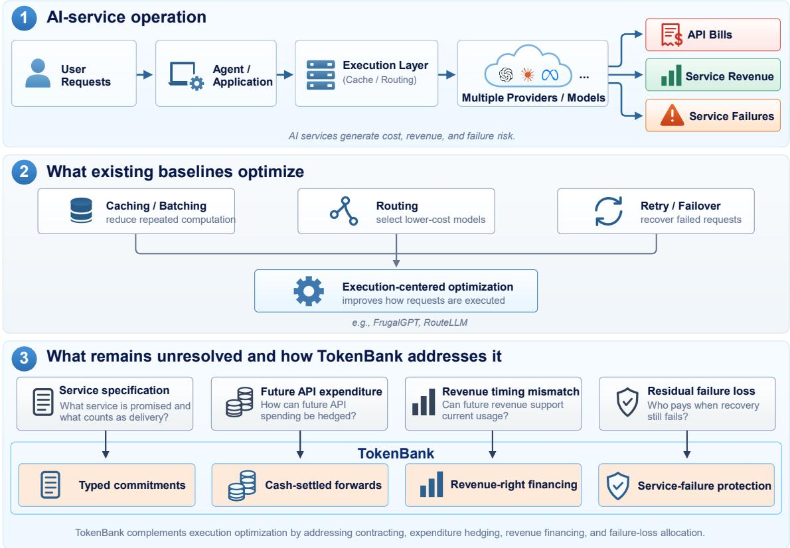  
Figure 1. Caching, batching, model routing, and failover improve request execution. TokenBank complements these approaches with service commitments that specify what is purchased, API-price forwards, revenue-right financing, and protection against covered service failures. These mechanisms address the financial consequences of AI-service use rather than replacing execution optimization.

We evaluate TokenBank through request-level API replay, real Qwen-driven Agent execution, and actual contract APIs. The separate real-model groups comprise a ten-trial retail baseline, 70 retail intervention cases, 84 initial controlled cases, 624 controlled repetition and boundary cases, and a prospectively fixed 540-case financing-capital replication. Their workloads and denominators remain distinct. For service commitments, we verify ownership, fulfillment and settlement, including an observed rounding-carry defect and its subsequent correction. For forwards, paired price and demand scenarios identify favorable and unfavorable expenditure and risk outcomes; settlement is real, but future indices remain assumed. For revenue-right financing, repeated portfolios and freshly executed capital, receipt and payment-delay boundaries show that additional capital can enable service, while revenue sharing can outweigh that growth. For service protection, local recovery changes completed service; protection redistributes eligible remaining loss subject to premiums, coverage and funded reserves. The shared upstream limits the recovery claim, and commercial prices, customer receipts and credit redemption remain explicit assumptions. The unified evaluation therefore reports both useful operating conditions and adverse outcomes.

This paper makes the following contributions:

• Contractible AI-service claims. We introduce a typed representation that makes heterogeneous AI services explicit economic claims with defined participants, service attributes, validity periods, fulfillment conditions, and settlement rules. The representation distinguishes rights to consume AI services from forward contracts, revenue rights, and service-protection claims, providing a common contractual foundation for their issuance, transfer, and settlement.

• Hedging future API expenditure. We design and implement cash-settled forward contracts that allow Agent operators to hedge a specified portion of future API-price exposure. Our request-level replay evaluates how hedge ratio, price movements, contract fees, and basis mismatch afect realized expenditure, showing when forward contracts reduce cost and when the hedge becomes unfavorable.

• Revenue-right financing for AI services. We design contractual revenue rights that allow Agents and Providers to exchange a bounded share of future revenue for current capital, without representing these rights as ownership of the underlying model, service, or company. Our economic replay evaluates how additional capital, served demand, and revenue sharing jointly afect participant contribution profit, identifying when financing-enabled growth is suficient to ofset the reduction in retained revenue.

• Financial protection against service failures. We design SLA-like protection contracts that compensate eligible losses remaining after technical recovery, using explicit failure conditions, coverage limits, premiums, and dedicated reserves. By evaluating failover and financial protection separately, we show that failover improves request recovery, whereas protection determines how the remaining economic loss is distributed among participants.

## 2 Related Work

Reducing the cost of executing a task and deciding how its payments and losses are shared are related but distinct problems. FrugalGPT and RouteLLM address the former by selecting sequences of models or routing requests between stronger and cheaper models [6, 11]. Their savings come from changing which model calls are made. Financial contracts can instead change an operator’s payments even when those calls remain unchanged. This distinction connects TokenBank to research on service agreements, cloud procurement, revenue financing, and outage compensation.

## 2.1 Service Agreements and Agent Markets

A service market must distinguish choosing a provider from specifying what that provider promises. WS-Agreement already provides a common structure for service terms and guarantees, but deliberately leaves application-specific measurements to the systems using it [2]. A common contract format can therefore describe a quality requirement without establishing how that quality will be verified. Agent Exchange studies the complementary allocation problem: using capability descriptions and bids to select agents and distribute task rewards [15]. Descriptions useful for selecting an agent, however, are not by themselves evidence that a promised result was delivered. For example, the number of tokens generated can establish billed usage without establishing the correctness of an answer.

Connecting payment to delivery is also an explicit research problem. The Agentic Settlement Protocol proposes holding a buyer’s funds until delivery is confirmed, with defined rules for releasing payments and handling refunds [10]. TokenBank addresses a diferent contract-design question: the same AI service can support several agreements that require diferent evidence. Access to a model is checked against service terms; a payment based on a future price depends on a price observation; revenue sharing depends on recorded receipts; and compensation depends on an eligible failure. Its proposed contract representation distinguishes these obligations and their payment rules, rather than treating every transaction as the purchase of interchangeable tokens or requiring a single matching mechanism.

## 2.2 Cloud Procurement and Future API Spending

Cloud-finance research shows that lower purchasing costs and protection against price changes need not come from the same mechanism. In the brokerage model of Rogers and Clif, an intermediary purchases discounted long-term reservations and resells shorter contracts [13]. The potential gain comes from the gap between purchasing and resale terms, but the broker must still pay for reservations that customers do not use. Cartlidge and Clamp show how correcting reservation accounting and incorporating competing purchasing options removes the modeled commercial opportunity under the conditions they study [5]. Dynamic forward pricing addresses a diferent question: what future prices a provider and customer will accept given uncertain demand and their willingness to bear risk [8].

These studies distinguish the source of a discount from the value of sharing risk. For AI APIs, a further issue is whether a contract follows the costs an operator actually incurs: changing models or serving fewer requests can leave the contracted price or quantity poorly matched to the eventual bill. TokenBank uses cash-settled forwards: the parties settle the diference between an agreed contract price and a specified API reference price observed later, multiplied by the covered amount. These contracts transfer money rather than deliver reserved inference capacity. Its replay evaluates specified contract terms; it does not infer the prices that independent buyers and sellers would agree on. Accordingly, savings must be compared under consistent execution and purchasing conditions, with fees and payments by the other party included. A lower buyer bill alone does not establish that a market has created additional value.

## 2.3 Revenue Sharing and Financing

Earning revenue, dividing it, and using it to fund current work are diferent operations. Poe’s monetization API connects charges to service delivery by authorizing costs before processing and collecting payment afterward [12]. Revenue-sharing research asks how dividing those receipts changes business decisions. Cachon and Lariviere show that, under specified conditions, sharing can lead a retailer to choose prices and purchase quantities that maximize combined supplier–retailer profit. This result can fail when sales depend on costly efort by the retailer [4]. Thus, a percentage split is not merely an accounting rule: it changes how much each participant earns from additional business and can change their incentive to generate it.

Financing adds a separate requirement: future revenue must be suficiently observable to support repayment. Clarke et al. study financing repaid from a share of subsequent platform sales and find that firms can divert transactions to other payment channels to delay repayment [7]. This evidence distinguishes accurate distribution of recorded receipts from complete observation of the revenue covered by a contract. TokenBank applies defined revenue shares to Agent and Provider receipts and examines whether additional funding permits enough otherwise-unserved demand to ofset the income shared with financiers. Its analysis also distinguishes customer sales from API payments passed from an Agent to a Provider, avoiding counting an internal payment as a second external sale. These mechanisms support explicit revenue contracts, while verifying revenue outside the platform and establishing that financing causes demand growth remain separate questions.

## 2.4 Service Failures and Financial Protection

An outage, a breached service promise, and a customer’s monetary loss are not the same quantity. Amazon Bedrock’s service-level agreement ties eligibility to specified availability conditions and supporting request logs, while calculating credits from service charges rather than the customer’s downstream business losses [1]. Consequently, a credit can follow the provider’s contract correctly without covering every loss caused by a failed application transaction. Cloud-insurance research examines the other side of this promise: Mastroeni et al. relate outage models and compensation rules to the price of insurance and the amount of compensation a provider can sustainably ofer [9]. Broader compensation therefore raises a funding question, not just a question of detecting failures.

This distinction matters when protection is combined with retries and failover. Recovery changes which requests still fail; protection changes how the remaining losses are divided. If several services fail together, compensation obligations can also accumulate together, so successful recovery in ordinary cases does not establish that suficient funds will be available during a larger incident. TokenBank compares the same recovery settings with and without financial protection, reporting both the buyer’s remaining loss and the balance of funds set aside for compensation. Its implementation issues billing credits, whose value depends on subsequent service use. This keeps request recovery, contractual compensation, and the ability to fund that compensation distinct, rather than treating a payment to the user as an improvement in availability.

Across these areas, the contracts depend on the same operating workload. Changing models alters the bill a forward is intended to cover; admitting more work changes the revenue to be shared; and recovery changes the losses left for compensation. These dependencies motivate TokenBank’s common contract and accounting design: payments must be traced across products and participants, rather than interpreting each module’s buyer-side saving in isolation.

## 3 Overview

An Agent operator may purchase API services before receiving customer payments, face changing API prices, and incur losses during service interruptions. These activities motivate the four challenges discussed above: specifying what is purchased, managing future prices, financing current usage, and compensating covered failures. TokenBank implements four corresponding components. Each product defines when money should move and who should receive it. Figure 2 presents the participants, contract types, and shared financial infrastructure of TokenBank.

Contractual representation. The first component distinguishes the rights obtained through diferent transactions. A prepaid balance can be spent on API calls, whereas a revenue right pays its holder a share of recorded service revenue. Buying the latter does not itself provide API access. Similarly, a forward promises a price-dependent payment rather than future service delivery, while protection provides compensation only under specified conditions.

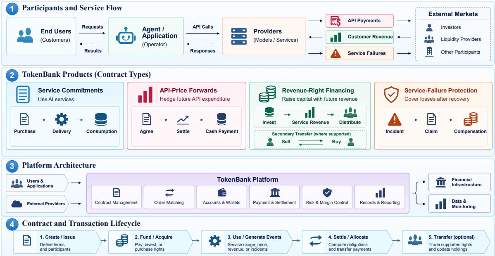  
Figure 2. Overview of TokenBank. Service commitments, API-price forwards, revenue-right financing and transfer, and service-failure protection use product-specific workflows supported by shared accounts, contract records, and settlement functions. Usage, price, revenue, and incident records provide the corresponding evidence for fulfillment and payment Supported revenue-right transfers update the holders considered for subsequent distributions. The lifecycle summarizes available operations, not a mandatory sequence shared by all products.

These diferences are represented through separate, linked records. Prepaid records track purchased and remaining balances, expiration, and refund eligibility. Preorder records connect purchases to subsequent delivery. Forward contracts record pricing and payment terms; funding agreements specify capital contributions and revenue shares; and protection subscriptions identify the covered account and coverage period. For transferable rights, holding records identify their owners and distinguish available units from locked units, which are temporarily unavailable for use or transfer. Thus, each product retains the records and checks appropriate to what it promises, while account and transaction references connect it to the shared financial system.

Model API-price forwards. The second component lets an operator arrange payments that ofset changes in a selected API reference price. The operator first requests a quotation: a proposal specifying the fixed price and other contract terms. Confirmation of a valid, unexpired quote is followed by the required approval and activation steps. The contract identifies the two parties, the reference price to observe, the fixed price, the amount covered, the contract dates, and the fees.

When payment is due, the system compares the observed reference price with the fixed price. If the observed price is higher, the seller pays the buyer the diference multiplied by the covered amount; if it is lower, the payment direction reverses. Funds held as margin—money set aside to support this obligation—are applied before checking whether the payer can cover the remaining payment. Successful settlement records the transfer and releases unused margin; insuficient funding produces a default record. The operator still purchases API services separately. The contract neither supplies tokens nor reserves capacity, so its usefulness depends on how closely its price and amount match actual API spending.

Revenue-right financing. The third component allows a service publisher, meaning the operator of an Agent or Provider service, to obtain funding in exchange for a specified share of future revenue. An investment plan defines the shares assigned to the publisher, investors, and platform. Funding agreements record investor contributions, and the corresponding workflow transfers capital to the publisher’s account once funding and activation conditions are satisfied.

Distribution begins when the system receives a revenue event: a record of service income to be divided. For illustration, an investor assigned 10% of a recorded \$100 revenue amount receives \$10. The other participants receive their configured shares, with rounding handled so that the allocations preserve the total amount. Provider distributions use the net amount supplied in the revenue record.

The system also checks who is entitled to each investor share. When a funding agreement has linked revenue-right assets, their holdings determine the recipients; otherwise, the original investor remains the recipient. This permits the specified revenue entitlement to follow its holder without transferring ownership of the model or company. Whether financing benefits the publisher depends on whether the additional business it supports earns enough to ofset the revenue shared.

Service-failure protection. The fourth component determines whether a service incident qualifies for compensation and how that compensation is funded. A protection plan specifies the covered Provider or model, eligible event types, coverage periods, claim deadlines, and protection fees. It also defines the amount left to the buyer before compensation applies, the compensation rate, and the maximum payment.

Monitoring records identify incidents, and gateway logs show the requests afected during each incident. The impact calculation includes failed requests and requests that used a fallback service. Recorded costs, or an amount derived from request counts when positive costs are unavailable, provide the starting amount to which the plan’s compensation rules apply. For example, a request that succeeds through a backup Provider may still contribute fallback activity to this calculation. Impact records can generate pending claims, but payment additionally requires coverage validation and approval.

Approved claims are paid from the plan’s reserve, an account containing funds set aside for compensation, subject to its budget and available balance. The buyer receives service credit in its billing wallet rather than a cash withdrawal. This workflow therefore compensates covered incidents without performing retries or recovering requests itself. Its log-based impact calculation is also distinct from the experimental model of losses remaining after technical recovery.

## 4 Contractual Representation

An AI-service transaction must specify both what a participant acquires and what establishes fulfillment. A prepaid balance and a right to future revenue may use the same accounting unit, but only the former permits eligible service consumption. TokenBank therefore distinguishes service consumption, price-dependent payments, revenue participation, and failure compensation. We call the right or payment obligation established by each product a contractual claim. The representation connects its terms, current state, and supporting records without treating the existence of a right as evidence that it has already been fulfilled.

## 4.1 Contract Types and Terms

A claim’s type determines what can be received. A consumption claim permits use of a prepaid balance or delivery of a purchased service. A forward specifies a payment based on a reference price, the recorded price selected for the contract. A revenue right assigns part of specified service income, while a protection subscription provides compensation under defined failure conditions. These types share descriptive fields but retain diferent fulfillment rules.

Each claim identifies the participants and their roles, the service or agreement concerned, the units of its quantities and payments, and the applicable terms. Roles are not reducible to a single owner: a service purchase identifies a buyer and seller, a forward identifies two potential payers or recipients, and revenue sharing identifies several recipients. Service references specify the Provider and model, or the Agent whose revenue is shared. A common representation identifies these services; it does not establish that diferent models provide equivalent results.

Terms remain separate from current state. For a preorder, a purchase for later delivery, the purchased amount is a term and the delivered amount is state. The same distinction separates a promised revenue share from a recorded distribution and an approved compensation amount from its payment. Time conditions also depend on the product: prepaid balances may expire, forwards record contract dates, and protection defines coverage periods and claim deadlines. Revenue policies, the rules identifying receipts and their recipients, do not require a finite end date. Quantities retain their units, so a service quantity, a transferable right, and a monetary payment are not interchangeable merely because their numerical amounts coincide.

This common description is realized through linked product-specific records, not a single contract table or a shared sequence of processing steps. Appendix A gives the complete record notation and detailed validation rules.

## 4.2 Evidence and Fulfillment

The same observation can have diferent consequences for diferent claims. A usage record can establish consumption, whereas a revenue-sharing payment requires recorded income. Let � identify a claim’s type, $\Theta _ { \tau }$

  
Figure 3. Supported transfers change ownership while preserving source references, and financial efects are recorded through balanced accounting entries.

its terms, $x _ { \tau }$ its current state, and � the supporting input or record. We summarize the product-specific rule as

$$
\Phi _ { \tau } ( \Theta _ { \tau } , x _ { \tau } , e ) = o _ { \tau } ,\tag{1}
$$

where $o _ { \tau }$ is the resulting allocation or payment obligation. This notation describes how the product routines interpret evidence; it is not a generic executable rule stored in every contract.

Consumption. Prepaid use requires suficient valid balance after excluding amounts locked against other use. A prepaid lot records a credited amount with its validity conditions; consumption draws from eligible lots and reduces their remaining balances. For a preorder, delivery records increase the fulfilled quantity without exceeding the purchased amount. These checks establish recorded consumption or delivery, not the semantic correctness of a model’s output.

Price-dependent payment. A forward combines its agreed price and contractual amount with the selected reference-price observation to determine which participant owes payment and how much. This calculation establishes an obligation rather than delivering API capacity. Payment is completed separately, subject to suficient funding.

Revenue participation. A revenue event records service income submitted for distribution. The applicable policy assigns each recipient a share of the event’s recorded net amount. For example, a 10% share of a 100-unit distribution base gives an exact entitlement of 10 units. Actual allocations use the supported decimal precision and retain rounding diferences for subsequent processing. The right concerns the specified receipts, not ownership of the Agent, model, or company.

Failure compensation. An incident records a service disruption, and a compensation claim requests payment under a protection subscription. Coverage checks relate the incident to the protected service, coverage period, eligible event type, and submission deadline. The plan determines compensation, review authorizes an amount, and settlement checks the reserve, the account and budget set aside to fund approved claims. The resulting service credit can pay service charges rather than provide a cash withdrawal. Coverage, approval, and payment thus establish diferent stages of the obligation.

## 4.3 State Changes and Transfer

An operation changes a claim only when its applicable conditions hold. For requested operation �, supporting input �, and relevant system state Σ, write

$$
\mathsf { S t e p } _ { \tau } ( \Sigma , \alpha , e ) = ( \Sigma ^ { \prime } , \mathcal { T } ) ,\tag{2}
$$

where $\Sigma ^ { \prime }$ is the updated state and J contains the records of fulfillment, transfer, or payment. The applicable checks concern permission, product policy, current status, contract terms, and available resources. Their role is to distinguish a valid obligation from an operation that can presently execute: a positive forward amount does not establish that its payer has suficient funds, just as compensation approval does not establish that payment has occurred.

Transfer changes a holder rather than fulfilling the underlying service or revenue obligation. It is supported for specified objects, including prepaid balances and Agent or Provider market assets, which record units of transferable rights. For a valid purchase of $q$ existing units, with suficient seller units reserved, total seller and buyer holdings satisfy

$$
H _ { s } ^ { \prime } = H _ { s } - q , \qquad H _ { b } ^ { \prime } = H _ { b } + q ,\tag{3}
$$

where primes denote holdings after transfer. Thus, $H _ { s } ^ { \prime } + H _ { b } ^ { \prime } = H _ { s } + H _ { b }$ : transfer reallocates existing units rather than creating new ones. Settlement connects this change to the buyer-to-seller payment.

Source references preserve the connection between the transferred right and its original terms. A receiving prepaid lot retains its source expiry and refund eligibility; transfer does not restart its validity. A derived revenue-right holding retains references to its funding agreement and revenue policy. Before distribution, holder resolution, the routine identifying recipients from these linked assets, updates the investor participants from the selected current holdings. If no matching asset exists, it uses the original investor. Recipient selection therefore follows the holdings used at settlement, not necessarily ownership when an earlier revenue event occurred. Historical allocation requires separate rules rather than merely recorded transfer timestamps.

## 4.4 Accounting Consistency

Product rules determine why a financial change is required; accounting records establish the resulting debit and credit. For an ordinary transfer in unit �, let $\mathcal { T } _ { u } ^ { \mathrm { c r e d i t } }$ and $\mathcal { T } _ { u } ^ { \mathrm { d e b i t } }$ be its credit and debit entries, and $a _ { j }$ the amount of entry $j .$ Balanced posting requires

$$
\sum _ { j \in \mathcal { J } _ { u } ^ { \mathrm { c r e d i t } } } a _ { j } - \sum _ { j \in \mathcal { J } _ { u } ^ { \mathrm { d e b i t } } } a _ { j } = 0 .\tag{4}
$$

Transfers spanning organizations may require checking several linked records together. This relation concerns accounting entries, not raw balance changes that may also include credit use or repayment. The workflow is shown in Figure 3.

Product-level checks complement this accounting relation by bounding consumption by available balances, deliveries by purchased quantities, and compensation by available reserve funding. Recorded revenue must also be conserved across recipient allocations. Transaction controls coordinate concurrent updates and associate repeated requests with an existing operation, with the intended efect of at most one committed posting for the same operation identifier within its scope.

The representation therefore connects three questions: what is promised, which evidence determines the obligation, and which records establish its fulfillment or payment. The following product sections develop the forward, financing, and protection mechanisms on this basis, keeping contractual rights, ownership changes, and completed financial transfers distinct.

## 5 Model API-Price Forwards

Future API expenditure varies with prices, request volume, and model selection, even under a fixed execution policy. TokenBank addresses its price-related component through cash-settled forwards: contracts that exchange a payment based on an agreed price and a later reference price, rather than deliver inference capacity. Separating this payment from API procurement allows us to analyze its efect on expenditure without changing the requests executed.

## 5.1 Contract Formation

A contract specifies two participants, a reference-price index identifying the service price to observe, a fixed price, a contractual amount, and fee, funding, and time conditions. The long participant receives payment when the reference price exceeds the fixed price; the short participant receives payment when it falls below that price. The parties establish these terms through a request for quotation, in which one participant requests terms and another supplies an ofer. Acceptance must precede the quote-validity deadline, which is distinct from the contract’s recorded expiry. Activation then requires both parties to fund their service fees and margin, money reserved to support payment.

The contractual amount must be interpreted with the quotation units. For example, a price per thousand tokens requires a quantity in thousands of tokens. To express the payment in expenditure units, let �abs and $K ^ { \mathrm { a b s } }$ be the observed and fixed prices in the original units, � the corresponding service quantity, and $P _ { 0 } > 0$ a baseline price. Define

$$
P = { \frac { P ^ { \mathrm { a b s } } } { P _ { 0 } } } , \qquad K = { \frac { K ^ { \mathrm { a b s } } } { P _ { 0 } } } , \qquad N = q P _ { 0 } .\tag{5}
$$

Then $q ( P ^ { \mathrm { a b s } } - K ^ { \mathrm { a b s } } ) = N ( P - K )$ . Throughout the analysis, $P$ and � are dimensionless, and the notional �, the amount scaling the price diference, represents baseline-price expenditure. This normalization relates the analytical notation to the contract’s quotation units; product inputs and charges must follow the corresponding unit convention.

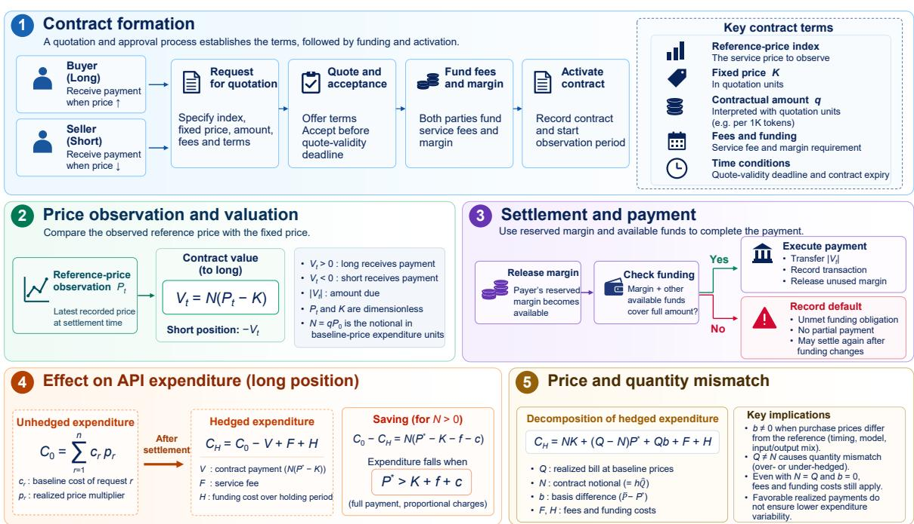  
Figure 4. API-price forward mechanism in TokenBank. Participants agree on contract terms, fund fees and margin, and settle the resulting price-diference payment against a reference price. The forward is financially separate from API procurement. Its expenditure efect depends on contract charges and on how closely the contracted amount and reference price match realized API purchases.

## 5.2 Valuation and Settlement

Figure 4 summarizes the forward workflow and its relationship to API expenditure. The contract creates a cash payment from the diference between an agreed price and a reference price, while API procurement remains unchanged.

For reference-price observation $P _ { t }$ , the signed amount payable to the long participant is

$$
V _ { t } = N ( P _ { t } - K ) ,\tag{6}
$$

and the short participant has the opposite amount. The sign determines payment direction and |�� | the amount due. This valuation identifies the contractual obligation; settlement executes its payment. The reference is the latest recorded price at the authorized settlement time, which need not coincide with the recorded expiry.

At settlement, the payer’s reserved margin becomes available for payment. Since margin is already part of the account balance, releasing it does not create additional funds. Payment completes only when the released margin and other available funds cover the full obligation. Otherwise, the contract records default, an unmet funding obligation, without partial payment and may be settled again after funding changes. Successful settlement releases unused margin; a zero obligation requires no transfer. The platform coordinates payments and collects fees without assuming either participant’s payment obligation. Detailed margin and transaction controls are given in Appendix B.

## 5.3 Effect on API Expenditure

Consider an operator holding the long position. For the same � purchased requests and execution settings, let $c _ { r } \geq 0$ be request $r { \mathrm { : } } s$ baseline cost and $p _ { r }$ its realized price multiplier. Unhedged expenditure is

$$
C _ { 0 } = \sum _ { r = 1 } ^ { n } c _ { r } p _ { r } .\tag{7}
$$

Let $\begin{array} { r } { Q = \sum _ { r } c _ { r } } \end{array}$ denote the realized bill at baseline prices and $\widehat { Q }$ its forecast before contract formation. The replay sizes the contract as

$$
N = h { \widehat { Q } } ,\tag{8}
$$

where the hedge ratio ℎ scales the amount covered relative to forecast expenditure. This is the replay’s sizing convention, not an implemented forecasting or contract-selection algorithm.

For settlement reference price $P ^ { * }$ and full payment $V = N ( P ^ { * } - K )$ , expenditure becomes

$$
C _ { H } = C _ { 0 } - V + F + H ,\tag{9}
$$

where $F$ is the operator’s service fee and � the modeled cost of funding the position over its holding period. Refundable margin is not itself an expense, although reserving funds may incur funding costs. For $N > 0$ and proportional charges $F + H = N ( f + c )$ , where $f$ is the fee and � the holding-period funding charge per unit of normalized notional, the saving is

$$
C _ { 0 } - C _ { H } = N ( P ^ { * } - K - f - c ) .\tag{10}
$$

Thus, expenditure falls exactly when

$$
P ^ { * } > K + f + c .\tag{11}
$$

This condition concerns realized savings under full payment, not a reduction in the amount of inference performed.

The same comparison must account for both participants. If $F _ { L }$ and $F _ { S }$ are their service fees, the long and short parties receive $V - F _ { L }$ and $- V - F _ { S }$ , with negative values denoting outgoing payments. The platform receives $F _ { L } + F _ { S }$ ; these amounts sum to zero before separately modeled funding and operating costs. A favorable contract payment to the operator is therefore funded by its counterparty rather than newly created service revenue.

## 5.4 Price and Quantity Mismatch

The contract’s reference price and amount need not match actual purchases. For $Q > 0 .$ , define the purchase-price average and its diference from the settlement reference as

$$
\overline { { { P } } } = \frac { \sum _ { r } c _ { r } p _ { r } } { Q } , \qquad b = \overline { { { P } } } - P ^ { * } .\tag{12}
$$

The basis diference $b$ captures price mismatch, while $Q - N$ captures quantity mismatch in baseline-expenditure units. Substitution into Equation (9) yields

$$
C _ { H } = N K + ( Q - N ) P ^ { * } + Q b + F + H .\tag{13}
$$

The first term is the fixed-price component for the contracted amount; the next two retain the efects of unmatched quantity and purchase prices. Fees and funding costs complete the expenditure.

Model selection, input/output-token mix, and purchase timing can produce $b \neq 0 .$ . In particular, a time-average reference gives equal weight to sampled prices, whereas requests concentrated in expensive periods yield a higher purchase-weighted price. Thus, using the same underlying price path does not ensure that the reference matches the bill.

When $N = Q$ and $b = 0 ,$ , expenditure reduces to $C _ { H } = Q K + F + H$ . However, $h = 1$ covers the forecast $\widehat { Q }$ rather than the realized �. If $N > Q$ , the position is overhedged: its contractual amount exceeds the baseline cost of actual purchases. Covering all forecast spending therefore need not fix realized expenditure. This decomposition motivates evaluating contract size and price alignment together with fees. Favorable realized payments alone do not establish lower expenditure variability. Appendix B.4 provides the corresponding variance relation and its assumptions.

## 6 Revenue-Right Financing

An Agent or Provider operator may need funds to serve available demand before receiving customer payments. We call this operator the publisher. TokenBank connects current funding to rights over specified service revenue and supports subsequent transfers of these rights. The design separates capital contributed to the publisher, revenue earned from service delivery, and payments between holders. This distinction allows us to analyze whether funding supports enough additional business to compensate the publisher for sharing its revenue.

Figure 5 shows the distinction among primary funding, subsequent revenue distribution, and secondary transfer of existing rights. These flows involve diferent payments and should not be treated as a single revenue transaction.

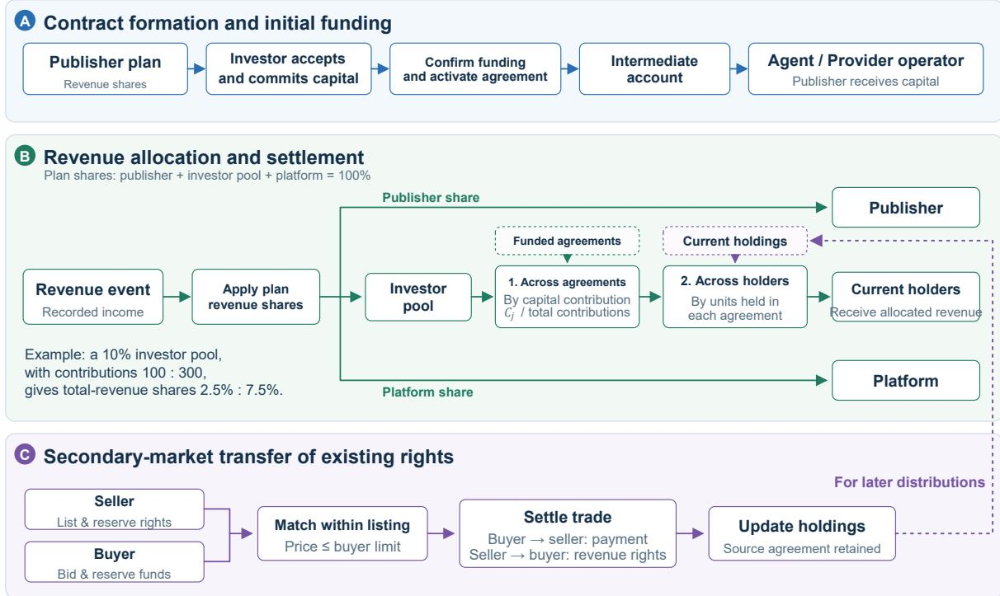  
Figure 5. Revenue-right financing and transfer in TokenBank. Primary investment supplies capital to an Agent or Provider operator in exchange for rights to specified future revenue. Recorded service revenue is later divided among the publisher, investor pool, and platform, with investor allocations determined from funding agreements and current holdings. Existing rights may subsequently be transferred: the buyer pays the selling holder, while future distributions follow the updated holdings.

## 6.1 Contract Formation and Funding

A publisher plan identifies the financed service, accounting unit, and revenue shares assigned to the publisher, investors, and platform. Shares $b _ { O } , b _ { I }$ , and $b _ { P }$ are expressed in basis points, where one basis point is 1/10,000 of the amount being divided:

$$
b _ { O } + b _ { I } + b _ { P } = 1 0 , 0 0 0 .\tag{14}
$$

The investor pool is the share $b _ { I } > 0$ reserved for investors collectively; individual allocations depend on their contributions and holdings, as defined below. These rights concern specified receipts, not ownership of the Agent, model, service, or company. A finite duration, cumulative payment cap, or principal-repayment schedule requires separate terms and cannot be inferred from the revenue share alone.

An investor accepts a plan and commits an amount $C _ { j }$ under agreement �. Confirmation checks funding and activates the agreement, then transfers capital to the publisher through an intermediate account. The disbursed amount $C _ { j } ^ { \mathrm { s e t t l e { \bar { d } } } }$ records completed capital transfers; normal full disbursement establishes $C _ { j } ^ { \mathrm { s e t t l e d } } = C _ { j }$ . This capital settlement difers from revenue settlement, which distributes later recorded service income. Investment principal is therefore recorded as funding rather than operating revenue. Appendix C specifies the records and funding controls underlying this distinction.

## 6.2 Revenue Allocation and Settlement

Allocation proceeds in two stages: dividing the investor pool among funding agreements, then dividing each agreement’s allocation among its current holders. At settlement time �, let ${ \mathcal { T } } _ { \pi } ( t )$ contain the active agreements linked to plan � with positive recorded capital settlement. For a nonempty selected set, agreement � has ideal share

$$
b _ { j } ^ { * } ( t ) = b _ { I } \frac { C _ { j } } { \sum _ { k \in \mathcal { I } _ { \pi } ( t ) } C _ { k } } .\tag{15}
$$

Weights use committed amounts $C _ { j }$ , which equal disbursed amounts in the normal completed funding path. The implementation approximates these allocations with integer basis points $b _ { j } ( t )$ while conserving $b _ { I }$

A revenue right can be subdivided into transferable units linked to its source agreement. Let $\mathcal { H } _ { j } ( t )$ contain the selected holders of agreement $j ^ { \prime } { \bf s }$ rights and $u _ { j , h } ( t )$ holder $h \mathrm { { s } }$ units. Its ideal share is

$$
b _ { j , h } ^ { * } ( t ) = b _ { j } ( t ) \frac { u _ { j , h } ( t ) } { \sum _ { k \in \mathcal { H } _ { j } ( t ) } u _ { j , k } ( t ) } .\tag{16}
$$

A second integer allocation divides $b _ { j } ( t )$ among these holders. For illustration, a 10% investor pool shared by contributions of 100 and 300 units assigns ideal total-revenue shares of 2.5% and 7.5%. Holding half the first agreement’s units gives half its 2.5% share, not half the publisher’s revenue. New investments change the division within the pool while leaving its total share unchanged.

Holder resolution, the lookup identifying these recipients, follows source-agreement references to current positive holdings, including supported transfers across tenants, the organizational scopes governing accounts and permissions. If no derived holding exists, it uses the original investor. Recipients are updated immediately before distribution, rather than reconstructed from ownership when income first occurred. A pending event can therefore use a later holding configuration. The lookup also does not determine agreement eligibility by comparing event time with agreement start and end dates.

A revenue event records service income submitted for distribution, whether entered explicitly or captured from service usage. Its recorded net amount $R _ { e }$ is the distribution base, not necessarily profit after operating costs. For active recipients � with shares $b _ { i }$ , including the publisher, investor holders, and platform, exact allocations are

$$
d _ { i , e } ^ { * } = R _ { e } \frac { b _ { i } } { 1 0 , 0 0 0 } , \qquad \sum _ { i } b _ { i } = 1 0 , 0 0 0 .\tag{17}
$$

Actual payments use a minimum increment of $1 0 ^ { - 6 }$ accounting units. The allocation routine carries forward rounding diferences and adjusts payments so that, for event amounts at the supported precision,

$$
d _ { i , e } \geq 0 , \qquad \sum _ { i } d _ { i , e } = R _ { e } .\tag{18}
$$

Settlement links these payments to their revenue event and recipient accounts. Events awaiting an eligible funded investment can remain pending. Integer-share allocation, payment rounding, and wallet transfers are detailed in Appendix C.2.

## 6.3 Secondary-Market Transfer

A secondary transfer sells an existing revenue right to another holder, rather than creating a new investment in the publisher. Transferable units retain their funding-agreement and revenue-policy references, connecting a change in ownership to the recipient lookup above. For publisher investments, creating these units requires confirmed investment and completed capital settlement.

A holder creates a listing, an ofer to sell a specified quantity at a minimum unit price $p _ { \ell } ^ { \mathrm { m i n } }$ . The units are reserved against other use, and the listing generates a sell order at that minimum price. A buyer submits quantity $q _ { b }$ and limit price $p _ { b }$ , the maximum price it accepts per right unit. Its initial payment reservation is

$$
W _ { b } = q _ { b } p _ { b } .\tag{19}
$$

Reserving both sides’ commitments precedes matching; it does not itself transfer ownership or complete payment.

Matching operates within a listing, prioritizing higher-priced buy orders and lower-priced sell orders, with creation time resolving ties. For sell limit $p _ { s }$ , the execution price, the price recorded for a trade, is

$$
p _ { A } ^ { * } = p _ { s } ,\tag{20}
$$

$$
p _ { P } ^ { * } = \operatorname* { m a x } \{ p _ { s } , p _ { \ell } ^ { \operatorname* { m i n } } \} ,\tag{21}
$$

where � and � identify the Agent and Provider paths. Each path requires $p _ { b } \ge p ^ { * }$ , ensuring that the recorded price does not exceed the buyer’s limit. If $r _ { b } , r _ { s }$ , and $r _ { \ell }$ are the remaining buy, sell, and listing quantities, the matched quantity and payment are

$$
q ^ { * } = \operatorname* { m i n } \{ r _ { b } , r _ { s } , r _ { \ell } \} ,
$$

$$
V ^ { ^ { * } } = q ^ { ^ { * } } p ^ { ^ { * } } .\tag{22}
$$

(23)

Settlement connects the buyer-to-seller payment to an equal decrease and increase in their holdings, conserving existing units and retaining the source references used in subsequent distributions. For changes in buyer, seller, and publisher funds, excluding separately specified charges,

$$
\begin{array} { r l } { \Delta C _ { b } = - V ^ { * } , } & { { } \qquad \Delta C _ { s } = V ^ { * } , } \\ { \Delta C _ { \mathrm { p u b l i s h e r } } = 0 . } \end{array}\tag{24}
$$

Thus, resale changes the holder and pays the seller without adding to the publisher’s funding. Supported cross-tenant transfers also enter subsequent holder resolution. Prices follow submitted orders, not a system forecast of future revenue; execution remains contingent on a compatible counterparty. Appendix C.3 specifies the reservation and ownership updates.

## 6.4 Financing and Publisher Profit

Financing changes the resources available for service delivery, whereas resale changes who receives an existing revenue allocation. To isolate the first efect, let $X ( B )$ be the invoice cost of requests admitted under daily budget �. The replay admits the longest initial sequence of complete requests that fits each day’s budget and compares $X _ { 0 } = X ( B )$ with $X _ { 1 } = X ( a B )$ for $a \geq 1$ . Requests retain their original order and costs; additional funding can serve more of the same ofered demand but does not create new arrivals. This retrospective calculation assumes daily budget resets and does not derive the multiplier � from a particular investment. Appendix C.4 provides the workload definitions.

For publisher $^ { o , }$ let $R _ { o } ( X )$ be revenue from served work � and $V _ { o } ( X )$ its variable cost, the modeled operating cost of that work. With investor fraction $s _ { o }$ and platform fraction $z _ { o } .$ , define contribution profit as revenue remaining after these shares and variable costs:

$$
\Pi _ { o } ( X ) = ( 1 - s _ { o } - z _ { o } ) R _ { o } ( X ) - V _ { o } ( X ) .\tag{25}
$$

Suppose variable costs consume a constant fraction � of revenue, so $g = 1 - \nu$ remains before sharing. Let $R _ { 0 } , R _ { 1 }$ be baseline and financed revenue, $z _ { 0 } , z _ { 1 }$ their platform fractions, and � the financed investor fraction. The baseline has no investor share, giving $\Pi _ { 0 } = ( g - z _ { 0 } ) R _ { 0 }$ and $\Pi _ { 1 } = ( g - s - z _ { 1 } ) R _ { 1 }$ . For $R _ { 0 } > 0$ and $g - s - z _ { 1 } > 0 .$ financing improves contribution profit exactly when

$$
\frac { R _ { 1 } } { R _ { 0 } } > \frac { g - z _ { 0 } } { g - s - z _ { 1 } } .\tag{26}
$$

This condition identifies the additional revenue required to ofset the smaller retained share. Once existing demand is fully served, a larger budget cannot provide that growth under the model. Increasing the sharing burden without additional revenue reduces contribution.

Agent and Provider accounting. For admitted API invoice cost �, suppose the Agent charges a markup � over its API expense and the Provider incurs variable cost ��. With $s _ { A } , s _ { P }$ their investor fractions and $z _ { A } , z _ { P }$ their platform fractions, the model gives

$$
\begin{array} { l } { { R _ { A } = ( 1 + m ) X , \qquad R _ { P } = X , } } \\ { { \Pi _ { A } = ( 1 - s _ { A } - z _ { A } ) ( 1 + m ) X - X , } } \\ { { \Pi _ { P } = ( 1 - s _ { P } - z _ { P } ) X - \nu X . } } \end{array}\tag{27}
$$

Investor receipts are $Y _ { I } = s _ { A } R _ { A } + s _ { P } R _ { P }$ , and platform receipts are $Y _ { \mathrm { p l a t f o r m } } = z _ { A } R _ { A } + z _ { P } R _ { P }$ . The Agent’s API payment is the Provider’s revenue, an internal transfer rather than a second external customer sale. Cancelling this payment and the revenue-sharing transfers therefore yields

$$
\Pi _ { A } + \Pi _ { P } + Y _ { I } + Y _ { \mathrm { p l a t f o r m } } = R _ { A } - \nu X .\tag{28}
$$

Sharing reallocates this contribution; additional aggregate contribution requires more revenue-generating work or changed operating costs. Investor receipts are not net returns without accounting for contributed capital, payment timing, and any retained rights. Evaluation examines these financing conditions separately from secondary-market prices, trading activity, and resale returns, which the financing replay does not measure.

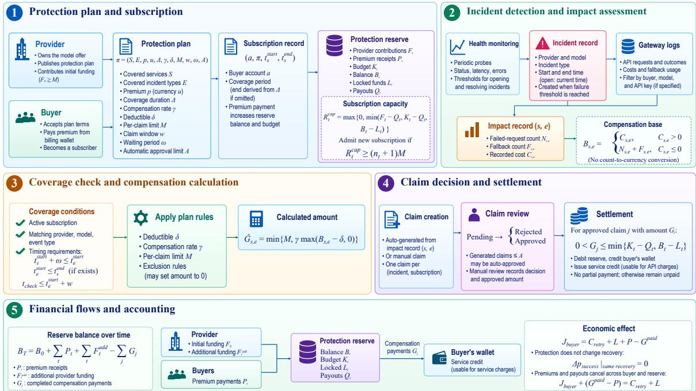  
Figure 6. Service-failure protection in TokenBank. A Provider-funded reserve and buyer protection fees support coverage under predefined plan terms. Monitoring and request records establish incident evidence, coverage and impact rules determine an eligible claim amount, and approved claims are paid as service credit subject to available reserve funding. Financial compensation is evaluated separately from retry and failover recovery.

## 7 Service-Failure Protection

TokenBank addresses the fourth challenge by specifying which service failures qualify for compensation, how much is payable, and how payment is funded. A Provider publishes a protection plan, and buyers subscribe to its terms. An incident records a service disruption; an impact record summarizes afected requests; and a claim requests compensation based on that evidence. Approved payments draw on a reserve, an account and associated budget set aside for compensation. The following design connects these records from coverage to payment, then separates their financial efects from technical recovery.

Figure 6 summarizes the protection workflow from contract formation and incident evidence to claim approval and reserve-funded settlement. Technical recovery and financial protection remain separate throughout the process.

## 7.1 Protection Contract and Reserve

A plan identifies the protected service and specifies

$$
\pi = ( S , \mathcal { E } , p , u , \Delta , \gamma , \delta , M , w , \omega , A ) ,\tag{29}
$$

where $s$ and E identify covered services and incident types. The premium $p$ is the protection fee, � the payment currency, and Δ the default coverage duration. The compensation rate � applies after a deductible �, the amount excluded before compensation. Each claim is capped at �. The window � limits claim submission time, � specifies the waiting period before coverage becomes efective, and � limits automatic approval.

The publishing Provider must own the specified model ofer, the model-specific service being protected. A subscription associates buyer account � with plan � and coverage times $t _ { s } ^ { \mathrm { s t a r t } }$ and $t _ { s } ^ { \mathrm { e n d } }$ ; an omitted end time is derived from Δ. On application, the buyer accepts the terms and pays the fixed premium from its billing wallet, the account used for service payments. The payment increases the reserve’s balance and budget.

Before publication, Provider funding $F _ { 0 }$ must satisfy $F _ { 0 } \ge M$ . Subsequent admission also accounts for existing subscriptions and payments. At time $t ,$ let $F _ { t }$ denote cumulative Provider contributions, $Q _ { t }$ cumulative compensation paid, $K _ { t }$ the recorded reserve budget, $B _ { t }$ its account balance, and $L _ { t }$ funds locked against other use. The amount used to determine subscription capacity is

$$
\begin{array} { c } { R _ { t } ^ { \mathrm { c a p } } = \operatorname* { m a x } \{ 0 , \operatorname* { m i n } ( F _ { t } - { Q _ { t } } , \ K _ { t } - { Q _ { t } } , } \\ { B _ { t } - L _ { t } ) \} . } \end{array}\tag{30}
$$

These bounds respectively account for Provider funding after payouts, remaining budget, and currently available funds. For $M > 0 ;$ , let $n _ { t }$ count active subscriptions that have not expired, including those without an end date. An active published plan admits another subscription only if

$$
R _ { t } ^ { \mathrm { c a p } } \geq ( n _ { t } + 1 ) M .\tag{31}
$$

Premium receipts do not increase the Provider-contribution bound $F _ { t } - Q _ { t }$ . This rule allocates capacity for one maximum claim per counted subscription; because � is a per-claim limit, it does not establish suficient funding for every sequence of repeated incidents.

## 7.2 Incident Evidence and Coverage

Periodic probes, test requests to the protected service, record status, latency, and errors. Configured numbers of consecutive unhealthy observations open an incident; consecutive healthy observations resolve it. An automatically created incident starts when the failure threshold is reached, not at the first failed observation. Its Provider, model, type, and time interval determine the scope of subsequent checks.

Coverage requires an active subscription and matching Provider, model, and event type. For incident �, the timing conditions are

$$
t _ { s } ^ { \mathrm { s t a r t } } + \omega \leq t _ { e } ^ { \mathrm { s t a r t } } ,\tag{32}
$$

$$
t _ { e } ^ { \mathrm { s t a r t } } \leq t _ { s } ^ { \mathrm { e n d } } \quad \mathrm { i f ~ a n ~ e n d ~ t i m e ~ e x i s t s } ,\tag{33}
$$

$$
t _ { \mathrm { c h e c k } } \leq t _ { e } ^ { \mathrm { s t a r t } } + w ,\tag{34}
$$

where $t _ { \mathrm { c h e c k } }$ is the time of the coverage check. The deadline is measured from incident start rather than resolution.

For each eligible subscription, gateway logs—records of API requests, outcomes, and costs—identify failed requests or requests using a fallback service during the incident interval. Selection matches the buyer and Provider, with additional model and API-key restrictions where specified. An open incident uses the current time as its interval end. The impact record aggregates failed-request count $N _ { s , e }$ , fallback count $F _ { s , e } ,$ and recorded cost $C _ { s , e } .$ . These define the compensation base, the input to the plan’s amount calculation:

$$
B _ { s , e } = \left\{ \begin{array} { l l } { C _ { s , e } , } & { C _ { s , e } > 0 , } \\ { N _ { s , e } + F _ { s , e } , } & { C _ { s , e } \leq 0 . } \end{array} \right.\tag{35}
$$

The count-based branch specifies no count-to-currency conversion and must not be interpreted as a measured monetary loss. A request can contribute to both counts, and fallback activity can include successful recovery. Thus, this operational base difers from the assumed loss on unresolved requests used in Section 7.5.

The calculated compensation is

$$
\widehat { G } _ { s , e } = \operatorname* { m i n } \{ M , \ \gamma \operatorname* { m a x } ( B _ { s , e } - \delta , 0 ) \} .\tag{36}
$$

The rule applies the deductible and rate, then enforces the per-claim limit. A matching exclusion rule, a configured condition that disallows compensation, can set the amount to zero. Service-health observations support these coverage decisions but do not independently determine the buyer’s downstream business loss.

## 7.3 Claim Decision and Settlement

A positive impact amount can generate a pending claim linked to its subscription and incident. An incident– subscription identifier allows repeated generation to retrieve the existing claim. Manual claims enter the same decision process after coverage checks:

$$
\mathrm { p e n d i n g } \to \left\{ \begin{array} { l l } { \mathrm { r e j e c t e d , } } \\ { \mathrm { a p p r o v e d \to s e t t l e d . } } \end{array} \right.\tag{37}
$$

Review records the decision and approved amount. Ordinary manual claims apply the deductible, rate, and cap to the reviewed base. Generated claims already contain the calculated compensation, so review caps their amount without applying the deductible and rate again. A generated pending claim without an exclusion can be approved automatically when its requested amount is positive and no greater than $A > 0$

Approval authorizes an amount but does not complete payment. For approved claim � with amount $G _ { j }$ settlement requires the plan’s active reserve, compatible payment units, and

$$
0 < G _ { j } \leq \operatorname* { m i n } \{ K _ { t } - Q _ { t } , \ B _ { t } - L _ { t } \} .\tag{38}
$$

Unlike subscription admission, this check tests the remaining budget and available balance for the particular payment. Insuficient funds leave the claim unpaid rather than producing a partial payment. Automatic approval may trigger settlement, but it does not bypass these checks.

Successful settlement debits the reserve and credits the buyer’s active, currency-matched billing wallet. It issues service credit, usable for service charges rather than cash withdrawal. Wallet amounts must be exactly representable to two decimal places. Transactional record updates and claim-specific settlement identifiers coordinate concurrent operations and prevent supported retries from posting the payment twice. Settlement records retain links to the claim, incident, reserve, and accounting transaction.

Over an interval ending at $T ,$ reserve accounting gives

$$
\boldsymbol { B } _ { T } = \boldsymbol { B } _ { 0 } + \sum _ { t } \boldsymbol { P } _ { t } + \sum _ { t } \boldsymbol { F } _ { t } ^ { \mathrm { a d d } } - \sum _ { j } \boldsymbol { G } _ { j } ,\tag{39}
$$

where $P _ { t }$ denotes premium receipts, $F _ { t } ^ { \mathrm { a d d } }$ additional Provider funding, and the final sum includes completed payments only. Opening reserves and additional contributions supply capital; they are not premium revenue. This distinction separates the ability to pay a claim from whether collected premiums cover compensation.

## 7.4 Separating Recovery from Protection

The economic comparison holds routing and retry decisions fixed while varying financial protection. Let $p _ { 1 }$ be the initial failure probability. Conditional on failure, $\rho \in [ 0 , 1 ]$ is the assumed fraction of cases in which an alternative Provider cannot recover the request. In the remaining cases, its failure probability is $p _ { 2 }$ . For one alternate attempt, the expected unresolved fraction is

$$
p _ { \mathrm { u n r e s o l v e d } } = p _ { 1 } [ \rho + ( 1 - \rho ) p _ { 2 } ] .\tag{40}
$$

The recovered fraction, measured relative to all initial requests, is $p _ { 1 } ( 1 - \rho ) ( 1 - p _ { 2 } )$ . Here, $\rho$ is a scenario assumption, not a measured statistical correlation, and these probabilities do not define the implementation’s monitoring counters.

Because compensation does not alter this recovery policy,

$$
\Delta p _ { \mathrm { s u c c e s s } } \mid _ { \mathrm { s a m e \ r e c o v e r y } } = 0 .\tag{41}
$$

This equality states the model’s separation of execution and payment, not an independently observed improvement in reliability.

## 7.5 Participant Economics

To evaluate financial outcomes, let $U _ { r }$ be one if request � remains unresolved and zero otherwise, and let $\ell _ { r } \geq 0$ be its assumed monetary loss. The residual loss, the loss remaining after recovery, is

$$
L = \sum _ { r } \ell _ { r } U _ { r } .\tag{42}
$$

The analytical protection rule uses this assumed loss rather than the operational base in Equation (35):

$$
\begin{array} { r } { G ^ { \mathrm { e l i g } } = \chi \operatorname* { m i n } \{ M _ { \mathrm { e v a l } } , \ \gamma \operatorname* { m a x } ( L - \delta , 0 ) \} . } \end{array}\tag{43}
$$

Here, $\chi$ indicates modeled eligibility, and $\gamma$ and � are the rate and deductible specified for the scenario. The cap $M _ { \mathrm { e v a l } }$ applies to the evaluated workload, not to each implementation claim as � does. Actual credited compensation $G ^ { \mathrm { p a i d } }$ additionally depends on approval and funding. These quantities are modeled outcomes, not observed compensation payments.

Let $C _ { \mathrm { r e t r y } }$ be recovery expenditure and $P$ total protection fees. Valuing usable credit at its recorded amount, the buyer’s failure-related cost is

$$
J _ { \mathrm { b u y e r } } = C _ { \mathrm { r e t r y } } + L + P - G ^ { \mathrm { p a i d } } .\tag{44}
$$

This is not the complete API bill. Relative to the same recovery policy without protection, the change is $P - G ^ { \mathrm { p a i d } }$ . The reserve’s net outgoing payment is the opposite amount, giving

$$
J _ { \mathrm { b u y e r } } + ( G ^ { \mathrm { p a i d } } - P ) = C _ { \mathrm { r e t r y } } + L .\tag{45}
$$

Premiums and compensation therefore cancel across the buyer and reserve under this accounting convention. Payouts exceeding fees require reserve capital but do not alone establish an inability to pay. Conversely, funding a payment from initial capital does not establish that premiums cover the protection activity’s costs.

This comparison assumes that the buyer can use the entire credit for subsequent service purchases; otherwise, its economic benefit is lower. Together, the coverage, payment, and accounting rules distinguish eligible compensation from completed transfers and changes in loss allocation from changes in request recovery. Evaluation specifies the pricing, loss, and credit-use assumptions separately from these contract workflows.

## 8 Evaluation

We evaluate TokenBank through contract execution, request-level replay, and real-model Agent studies. The evaluation examines four questions: whether contract operations preserve payment and ownership rules; how API-price forwards afect expenditure and its variability; when additional capital supports service delivery and operator contribution; and how recovery and protection jointly determine completed services and loss allocation. Matched controls separate each mechanism’s financial efects from changes in execution, funding, and recovery.

The principal findings quantify these relationships. Under the assumed rising-price path, zero-discount forwards reduce mean expenditure by USD 304.88. In the matched low-capital study, revenue-right financing increases mean operator contribution by 1.0635 experimental USD and reduces mean admission stops from 12.0 to 1.8. Under twelve controlled local faults, recovery completes nine services, and adequately funded protection settles the approved residual compensation. The following analyses relate these results to price exposure, capital availability, revenue allocation, and reserve funding.

## 8.1 Workloads, Controls, and Measurement

Tasks, requests, and successful services. The controlled workload contains twelve constructed tasks: four each for structured extraction, order lookup, and constrained product selection. A service succeeds when both the business operation and final output meet the predefined completion rule. A case is one scheduled execution of a task under one experimental setting; it may contain several model calls. Every scheduled case enters its study denominator, including funding-admission stops, injected faults, and resource-limit outcomes. Table 1 reports task, request, response, and success counts separately for each study.

Table 1. Real-model study populations. Cases count scheduled task executions; calls include all sent requests. Responses and successful services follow their respective measurement rules. Each study retains its own denominator.
<table><tr><td>Study</td><td>Cases</td><td>Calls</td><td>Responses</td><td>Successes</td></tr><tr><td>Repeated capital study</td><td>540</td><td>1,082</td><td>1,081</td><td>456</td></tr><tr><td>Controlled repeats and parameter tests</td><td>624</td><td>1,247</td><td>1,246</td><td>487</td></tr><tr><td>Initial controlled study</td><td>84</td><td>150</td><td>150</td><td>51</td></tr><tr><td>Retail contract study</td><td>70</td><td>930</td><td>925</td><td>1</td></tr><tr><td>Retail baseline</td><td>10</td><td>368</td><td>360</td><td>4</td></tr></table>

All model calls use Qwen/Qwen3-8B through Nexus and SiliconFlow. Controlled tasks use constructed local records, callable tools, and explicit completion checks. Two passes over nine calibration tasks produce seven and nine successes, respectively. The final interface enumerates category codes and orders catalog lookup before quote creation; the model selects products and generates its own responses. This configuration is fixed before the twelve evaluation tasks are executed. Repetitions characterize financial and operational efects within the same calibrated task families.

The retail studies use the oficial retail text environment of �2-Bench [3], including its model-driven customer and predefined ALL completion criterion. Task selection, execution limits, calibration passes, and protocol amendments appear in Appendix F.1; the controlled design is specified in Appendix E.

Observed quantities and economic assumptions. We measure returned token usage, tool results, request identifiers, account changes, and contract settlements. Available usage is reconciled against Nexus, and payments execute through authenticated business APIs on isolated PostgreSQL research accounts. The configured Nexus charge is zero and supplier invoices are unavailable; monetary outcomes therefore use stated experimental tarifs and success-triggered receipts. Initial capital, future price indices, and local fault schedules are controlled inputs. Observed settlements and scenario-based economic valuations are reported at their respective measurement scopes.

Table 2 defines the controlled-study parameters. � is baseline own capital, � additional funding, and � revenue per successful service. Input and output tarifs are 100 and 500 experimental USD per million tokens, selected before execution to represent small-task losses at the protection mechanism’s one-cent precision. The retail study uses tarifs of 1 and 5 per million tokens, with � = � = 0.184298, $A = 0 . 3 7 0 0 0 0 .$ and � = 0.368596 experimental USD. Each study retains its own tarif, rounding, and coverage conventions.

Table 2. Controlled-task parameters fixed from the nine calibration tasks. Amounts are experimental USD. The repeated capital study changes the starting own balance to 0.5�, �, or 1.5� and keeps added funds � fixed.
<table><tr><td>Symbol</td><td>Definition</td><td>Value</td></tr><tr><td> $\mu$ </td><td>Mean known expense per scheduled calibration task</td><td>0.127689</td></tr><tr><td> $H _ { \mathrm { c a l } }$ </td><td>Largest amount set aside before a calibration request</td><td>0.943300</td></tr><tr><td>B</td><td>Baseline own capital,  $\mu + H _ { \mathrm { c a l } }$ </td><td>1.070989</td></tr><tr><td> $A$ </td><td>Added capital,  $\lceil 4 \mu \rceil _ { 0 . 0 1 }$  (rounded up to a cent)</td><td>0.520000</td></tr><tr><td> $r$ </td><td>Assumed revenue per successful service,  $2 \mu$ </td><td>0.255378</td></tr><tr><td> $d$ </td><td>Scheduled tasks between releases of earned revenue</td><td>4</td></tr><tr><td colspan="2">Revenue-right shares: operator / investor / platform Control shares: operator / platform</td><td>89% / 10% / 1% 99% / 1%</td></tr></table>

For real-model studies, operating contribution is the operator’s retained task revenue after sharing, less inference expense at the experimental tarif. Initial funding, fixed operating costs, and the value of outstanding rights are excluded. Investor wallet transfers and service credits, which can ofset later service charges, are reported separately. Credit utilization is a scenario parameter; the observation window covers issuance rather than subsequent redemption or lifetime investment returns.

Request-level replay. We replay the first two months of BurstGPT [14], retaining recorded timing and usage while applying specified prices and contracts. The dataset revision is recorded in the supplementary artifact. Removing conversation records and the incomplete final day leaves 1,261,858 API requests: 362,417 on days 0–17 for calibration and 899,441 on days 18–59 for evaluation. Timestamps, model labels, token counts, and request order are preserved. At assumed input/output tarifs of USD 3/15 per million tokens, successful first attempts cost USD 3,395.80116.

The replay uses 16,137 zero-output records as failure indicators; 16,131 also lack input lengths. Compared settings share the same assumptions for unobserved first-attempt charges and calibration-based alternate-attempt lengths. Five price scenarios start from index one: constant prices, a linear rise to 1.3, a linear fall to 0.7, a seven-day rise to 1.8, and a load-dependent increase. Forward controls match execution and cache/batch settings; financing-cost controls match total funding; protection controls match recovery. The replay’s financing model assigns 10% of revenue to investors and 2% to the platform, while real-model studies assign 1% to the platform. These conventions are specified in Appendices F.1–F.3.

Continuous-balance execution and matched controls. Each financing condition is executed separately so that available funds can afect request admission. Own capital starts with $B _ { 0 } ;$ equal capital and revenue-right financing both start with $B _ { 0 } + A$ . The equal-capital control matches available funds while omitting the investor share, isolating the revenue-allocation component of financing.

A controlled portfolio schedules twelve tasks against a continuous balance. Revenue is released after each group of four scheduled tasks, including tasks denied admission. Before a request, funds are reserved using input bytes and maximum output length; returned usage determines the charge and releases the unused reservation. The matched capital study crosses three initial balances (0.5�, �, 1.5�), three financing conditions, and five repetitions, yielding $5 \times 3 \times 3 \times 1 2 = 5 4 0$ cases. Task order and within-task arm order are shared across capital levels within a repetition, while capital-level order is randomized separately. Capital levels are informed by the earlier boundary study, and the replication protocol is fixed before its own observations. The separate 624-case study includes five repeated comparisons, seven one-factor financing conditions, and three fault-frequency runs.

Missing-usage bounds and resampling. Requests without returned usage retain their reservations. Let $C _ { \mathrm { k n o w n } }$ be known expense, $Y _ { \mathrm { r e t } }$ retained revenue, and $H _ { u }$ the unresolved reservation used as the declared upper bound on missing expense. Contribution satisfies

$$
\Pi \in [ Y _ { \mathrm { r e t } } - C _ { \mathrm { k n o w n } } - H _ { u } , \ Y _ { \mathrm { r e t } } - C _ { \mathrm { k n o w n } } ] .\tag{46}
$$

Treatment-minus-control bounds pair the lower treatment endpoint with the upper control endpoint, and conversely. Separately, 10,000 draws resample whole matched repetitions, preserving within-repetition pairing.

The 2.5th percentile of lower mean bounds and the 97.5th percentile of upper mean bounds define the exploratory 95% ranges. Portfolios are the sampling units because tasks share operating funds. These ranges describe observed fixed-task repetitions; broader population coverage and multiplicity-adjusted significance are outside this design. Appendix F.1 records the timing of the missing-usage accounting protocol.

## 8.2 Contract Correctness and Accounting Controls

Business-API tests validate payment amounts, recipients, funding checks, and idempotent execution. Revenueright transfers are checked against subsequent recipient allocation, while repeated payment requests are checked for a single committed transfer (Table 3).

All 206 backend regression tests pass. Independent decimal-arithmetic replay verifies 165 account updates across 47 accounts with zero arithmetic discrepancies. Direct ledger association covers 103 entries; five intermediate wallet-funding updates are documented through their business-operation records. These are complementary record-linkage scopes. Overlapping regression and targeted suites are counted once.

Table 3. Contract validation through business APIs on isolated PostgreSQL accounts. Synthetic funds exercise payment, ownership, funding, and idempotency rules; economic outcomes are evaluated in the subsequent product studies.
<table><tr><td>Rule tested</td><td>Result</td></tr><tr><td>Forward payment and retry</td><td>Quantity 10 and an index change from 1.0 to 1.3 produce one 3.000000 transfer. A 0.060000 transfer leaves 0.040000; retry changes nothing and a further unfundable</td></tr><tr><td>Funding and restart</td><td>transfer is rejected.</td></tr><tr><td>Payment after a right is sold</td><td>Subsequent revenue follows the current holder rather than the former investor.</td></tr><tr><td>Resale to multiple holders</td><td>Resale to two holders across organizations preserves revenue allocation.</td></tr><tr><td>Covered service</td><td>A claim for a model service not covered by the contract is rejected. One 60.000000 payment leaves 40.000000; another 60.000000 claim is not partially</td></tr><tr><td>Payment in full</td><td>paid.</td></tr><tr><td>Concurrent claims</td><td>Exactly one competing claim is paid; the compensation funds are not overdrawn.</td></tr></table>

Revenue-allocation precision. A fixed sequence of twelve receipts and twelve duplicate submissions validates revenue allocation at the supported monetary precision. The check associated with the 624-case study records fifteen exact matches between reference calculations and account changes; the capital replication adds fifteen exact matches. These checks establish the tested payment and duplicate-request behavior independently of model-task outcomes.

Concurrent transaction execution. At concurrency eight, 760 operations across 19 scenarios preserve the checked accounting rules, with no unexpected operation failures, ledger discrepancies, or deadlocks. The highest scenario-level p95 latency is 2,419.98 ms. Appendix D reports the full latency distribution, reference budget, shared-host configuration, and recovery tests alongside the accounting checks.

## 8.3 API-Price Forwards

Forwards link a separate settlement payment to the diference between the agreed and reference prices. We evaluate settlement execution and the resulting expenditure using matched model-call workloads (Equations (9) and (13)). All 84 zero-discount contracts in the initial controlled study reconcile in amount, direction, fees, and single settlement; 84 retail contracts provide a separate execution check. Notionals are fixed from calibration before task execution, and settlement applies the declared final indices to measured demand. Appendix F.2 includes funded and unfunded payment tests.

Price-path and exposure design. The principal resampling study uses strike one, zero discount, and a 1.2% fee to isolate price-linked settlement from negotiated discounts. Daily bills and prices are jointly resampled in seven-day blocks; six blocks form each 42-day path, and 1,000 paths characterize the supplied trace under each assumed price pattern. Hedge ratios ℎ ∈ {0, .25, .5, .75, 1} scale forecast expenditure. Forecast multipliers {.5, 1, 1.5}, matching or constant reference indices, and all-or-none funding of positive daily payments yield 300 settings across five price patterns. The daily payment stress is an analytical funding assumption.

We report mean expenditure, standard deviation, mean expenditure in the 50 most expensive paths, and the fraction of paths exceeding the fixed budget of 42 calibration-mean daily bills. These measures characterize cost, variability, tail expenditure, and budget adherence within the resampled paths.

Zero-discount forward scenarios with paired block resampling.  
Table 4. Spending with no assumed price discount, a matching reference index, the unchanged calibration forecast, and suficient funds for payments. ℎ is the fraction of forecast spending covered. Negative mean Δ� means lower spending than no hedge. Results come from resampled 42-day paths.
<table><tr><td>Scenario</td><td>h</td><td>Std. dev. (USD)</td><td>Mean ∆C (USD)</td><td>Over budget (%)</td></tr><tr><td>flat</td><td>0</td><td>1144.71</td><td>+0.00</td><td>62.2</td></tr><tr><td>flat</td><td>1</td><td>1144.71</td><td>+26.49</td><td>63.3</td></tr><tr><td>rise</td><td>0</td><td>1152.45</td><td>+0.00</td><td>72.1</td></tr><tr><td>rise</td><td>1</td><td>1190.82</td><td>-304.88</td><td>61.4</td></tr><tr><td>fall</td><td>0</td><td>1139.84</td><td>+0.00</td><td>54.1</td></tr><tr><td>fall</td><td>1</td><td>1100.08</td><td>+357.85</td><td>65.5</td></tr><tr><td>spike</td><td>0</td><td>1107.94</td><td>+0.00</td><td>72.7</td></tr><tr><td>spike</td><td>1</td><td>1164.28</td><td>-304.10</td><td>60.7</td></tr><tr><td>lagged-load</td><td>0</td><td>1150.50</td><td>+0.00</td><td>63.0</td></tr><tr><td>lagged-load</td><td>1</td><td>1150.32</td><td>+25.08</td><td>63.8</td></tr></table>

Expenditure reduction and budget adherence. Under rising prices, full forecast coverage reduces mean expenditure by USD 304.88 and the fraction of over-budget paths from 72.1% to 61.4%. The corresponding standard deviation is USD 1,190.82, compared with USD 1,152.45 without coverage. Under a price spike, mean expenditure falls by USD 304.10 and over-budget paths decline from 72.7% to 60.7%. Table 4 also reports the constant, falling, and load-dependent paths, separating each expenditure and variability measure for the same contract configuration.

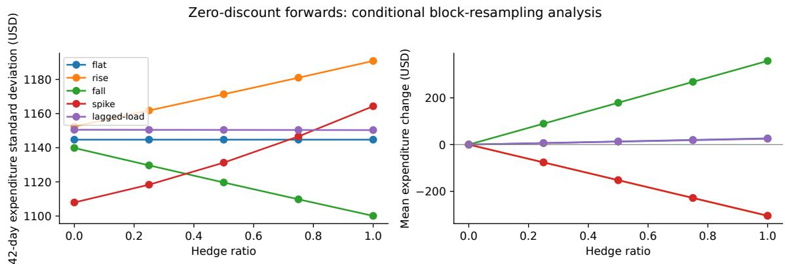  
Figure 7. Average spending and risk measures without an assumed price discount. Bills and prices are jointly resampled in seven-day blocks. This plot uses the unchanged-forecast, funded-payment settings; the full analysis covers all 300 settings.

Mechanism of expenditure variability. Let $C _ { 0 }$ be unhedged spending and $Z = V - f$ the signed settlement net of all forward fees. The change in expenditure variance is

$$
\operatorname { V a r } ( C _ { 0 } - Z ) - \operatorname { V a r } ( C _ { 0 } ) = \operatorname { V a r } ( Z ) - 2 \operatorname { C o v } ( C _ { 0 } , Z ) .\tag{47}
$$

Variance decreases when $2 \mathrm { C o v } ( C _ { 0 } , Z ) > \mathrm { V a r } ( Z )$ : larger bills must be accompanied by suficiently ofsetting net payments. In the rising-price paths, $2 { \bf C o v } ( C _ { 0 } , Z ) = - 8 5 , 3 8 3 . 2$ and $\operatorname { V a r } ( Z ) = 4 { , } 5 2 2 . 5 \operatorname { U S D } ^ { 2 }$ , yielding a variance change $\mathrm { o f } + 8 9 , 9 0 5 . 7 \mathrm { U S D } ^ { 2 }$ . The decomposition explains how the measured reduction in mean expenditure coexists with the observed variance response. The complete post-hoc moment analysis appears in Appendix F.2.

Contract alignment and execution optimization. Price and quantity alignment connect the contract to actual purchases through Equation (13). Request-weighted purchase prices can difer from daily reference averages, and realized usage can difer from the calibration notional. The sensitivity study therefore varies these quantities explicitly.

In the separate constant-price replay, an assumed 10% contract discount reduces expenditure by USD 155.39 (4.58%); the zero-discount control has a 0.62% expenditure increase from charges. With identical cache/batch assumptions in both arms, adding the discounted forward reduces the optimized unhedged expense by a further USD 113.04 (4.67%). A conventional forward with identical terms produces the same settlement, providing an arithmetic control. Together, these comparisons identify the financial contribution of the stated contract terms alongside execution optimization.

## 8.4 Revenue-Right Financing

Revenue-right financing exchanges current funding for a share of future service receipts. Equation (26) identifies the additional revenue needed to cover that share and execution expense. We assess this relationship with five freshly executed portfolios for each of three financing conditions at three starting balances. Funding and settlement use the implemented contracts. Agent-issued rights are evaluated with real-model execution; the supporting request replay also analyzes Provider financing.

Table 5. Five separate runs per setting. Completed services are means out of twelve. Own, Equal, and Right denote own capital, equal capital without investor sharing, and revenue-right financing. Contribution diferences are experimental USD, excluding initial funding and credits. Brackets show the range due to missing usage, not variation across repetitions.
<table><tr><td rowspan="2"></td><td colspan="3">Completed services</td><td colspan="2">Contribution difference</td></tr><tr><td>Capital Own</td><td>Equal</td><td>Right</td><td>Right-own</td><td>Right-equal</td></tr><tr><td>0.5B</td><td>0.0</td><td>10.4</td><td>10.2</td><td>1.0635</td><td>-0.3049</td></tr><tr><td>B</td><td>10.6</td><td>12.0</td><td>12.0</td><td>-0.1406</td><td>-0.3174</td></tr><tr><td>1.5B</td><td>12.0</td><td>12.0</td><td>12.0</td><td>-0.2962</td><td>[-0.2742, -0.0975]</td></tr></table>

Capital-constrained service delivery. At 0.5�, revenue-right financing increases mean completion from 0.0 to 10.2 services and mean operating contribution by 1.0635 experimental USD relative to own capital. Mean admission stops decrease from 12.0 to 1.8, an 85% reduction. All five low-capital contribution contrasts are positive. At �, mean completion rises from 10.6 to 12.0, with a contribution diference of -0.1406. At 1.5�, all conditions complete twelve tasks and the contribution diference is -0.2962. The five baseline contrasts contain two positive and three negative values; all five ample-capital contrasts are negative. These matched conditions locate the benefit of financing where available capital constrains service delivery.

Revenue growth and allocation. Let $s _ { R } , s _ { O }$ count successful services and $C _ { R } , C _ { O }$ denote inference expense under revenue-right and own-capital operation. Each success earns $r ;$ both conditions pay a 1% platform share, and financing assigns 10% to the investor. The contribution diference decomposes as

$$
\begin{array} { r l r } {  { \Delta \Pi _ { R - O } = 0 . 8 9 r s _ { R } - 0 . 9 9 r s _ { O } - ( C _ { R } - C _ { O } ) } } \\ & { } & { = \underbrace { 0 . 9 9 r ( s _ { R } - s _ { O } ) - ( C _ { R } - C _ { O } ) } _ { \mathrm { c h a n g e b e f o r e i n v e s t o r ~ s h a r e } } - \underbrace { 0 . 1 0 r s _ { R } } _ { \mathrm { i n v e s t o r ~ s h a r e } } . } \end{array}\tag{48}
$$

The first term captures additional retained revenue and execution expense; the second records the investor allocation across financed receipts. This decomposition uses the system’s payment-rounding convention and the observed model executions. At ample capital, equal completion isolates the allocation cost of financing; at low capital, newly admitted work provides the revenue supporting its positive contribution.

The equal-capital control matches initial funds without investor sharing. Its mean contribution exceeds the revenue-right condition by 0.3049 at low capital and 0.3174 at baseline. The ample-capital Right–equal range is [-0.2742, -0.0975]. This experimental control separates capital availability from the sharing obligation. Full missing-cost bounds and portfolio-resampling ranges appear in Appendix F.3.

Advance reservations and admission. The median reservation-to-measured-charge ratio is 12.0153 in the 624-case study and 12.4382 among returned-usage requests in the capital replication. The latter records have a minimum reservation of 0.545800, compared with the low-capital opening balance of 0.535495. These observations link the financing result to the tested advance-reservation rule as well as to inference expense. The diagnostic describes returned-usage records; rejected-request reservations and alternative reservation policies are outside its observed population.

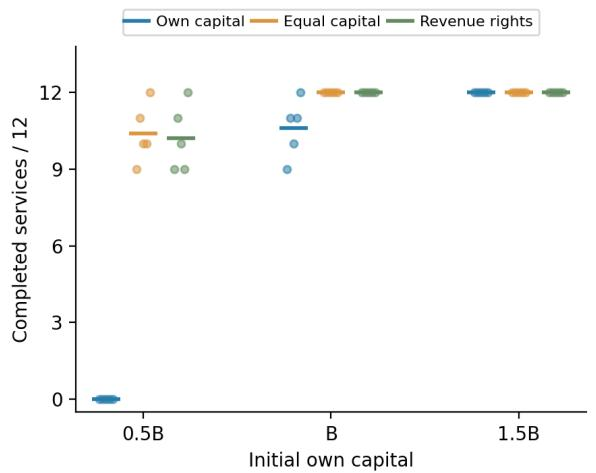

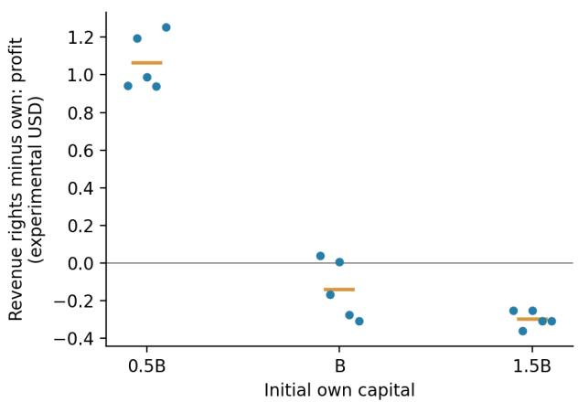  
Figure 8. Five runs at each starting capital level. Left: completed services under the three financing settings, with mean bars. Right: contribution with revenue-right financing minus contribution with own capital. Any nonzero whiskers bound missing charges; they are not resampling ranges. Tasks within a run share funds and are not independent repetitions.

Supporting cohorts and operating conditions. The initial controlled study completes three additional services with revenue-right financing and records a contribution increase of 0.1463 experimental USD. The earlier five-portfolio study, including its incident-afected run, has a mean Right–own bound of [-0.5295, -0.3411]. In the one-factor sensitivity study, the low-capital condition is the one of eight displayed conditions with a positive lower contribution bound. These separate cohorts characterize the dependence on starting capital, task receipts, receipt timing, and realized execution.

The retail study records one successful case among 70, with zero successes in its three financing arms. Equal capital increases scoreable completions from one to four; the revenue-right arm has no scored completion and retains 0.172938 in unresolved reservations. Consequently, this cohort characterizes admission and expenditure without success-triggered revenue. Its complete results remain in Appendix F.3.

Investor cash flows and funding-charge controls. In the capital replication, the investor contributes 0.5200 and receives mean wallet transfers of 0.2540 at low capital and 0.3000 at baseline and ample capital. Outstanding entitlements and rounding remainders are tracked separately under the observation-window convention in Section 8.1.

A separate replay fixes aggregate funding at USD 1,710.86. Assumed charges are USD 16.87 for own-capital opportunity cost, USD 33.98 for fixed credit, USD 11.25 for Provider credit, and USD 526.48 for revenue sharing. This comparison isolates charging rules at matched funded volume; repayment, collateral, and default-risk equivalence are outside that comparison. An equal-funded loan is also included in the synthetic accounting tests (Appendix D). Together, the growth and charge controls quantify the service revenue required by specified financing terms.

## 8.5 Service-Failure Protection

Recovery and protection address complementary outcomes: completed service and allocation of covered residual loss. We vary local recovery through fresh task execution and apply alternative protection plans to each recorded trajectory, keeping execution fixed within a protection comparison.

The fault study schedules zero, six, or twelve local faults across twelve tasks. Before each run, twelve alternative plans cross per-claim limits of 0.03/0.13, premiums of 0.01/0.10/0.60, and Provider-funded reserves of 0.13/1.56. Each plan has separate accounts and whole-claim payment checks. Policy results are reported separately. Premiums and service credits are accounted for outside the balance used for task admission.

Service completion and eligible residual loss. With twelve scheduled faults, local recovery increases completion from zero to nine services; with six faults, it increases completion from six to ten (Table 6). Recovery uses an alternate local route to the same upstream Provider; common-route outages remain terminal. Compensation applies to covered terminal injected failures with known expense. Semantic task errors and missing usage follow separate accounting categories. Appendix F.4 reports the initial controlled and retail interventions using these definitions.

For eligible residual loss $L _ { e } ,$ , premium �, and issued credit �, a buyer able to use fraction � of the credit bears $L _ { e } + P - \nu G$ . Relative to the same recovery policy without protection, its benefit is

$$
B _ { \mathrm { p r o t e c t i o n } } = \nu G - P .\tag{49}
$$

We evaluate assumed utilization fractions $\nu = 0 , 0 . 5$ , and 1. $L _ { e }$ includes losses within the coverage rules. At full utilization, the benefit � − � is the reserve-funded transfer net of premiums, with execution expenditure held fixed.

Table 6. Fault tests with a per-claim limit of 0.13, premium of 0.01, and initial reserve of 1.56. Loss and credit amounts are experimental USD. Paid credit is issued through the experimental contracts; benefit assumes either full use (� = 1) or no use (� = 0) of that credit.
<table><tr><td>Faults / recovery</td><td>Success</td><td>Eligible loss</td><td>Paid credit</td><td>Benefit ν = 1</td><td>Benefit ν = 0</td></tr><tr><td>0/no</td><td>12</td><td>0.0000</td><td>0.0000</td><td>-0.0100</td><td>-0.0100</td></tr><tr><td>0 / yes</td><td>12</td><td>0.0000</td><td>0.0000</td><td>-0.0100</td><td>-0.0100</td></tr><tr><td>6 /no</td><td>6</td><td>0.2900</td><td>0.2900</td><td>0.2800</td><td>-0.0100</td></tr><tr><td>6 / yes</td><td>10</td><td>0.0900</td><td>0.0900</td><td>0.0800</td><td>-0.0100</td></tr><tr><td>12 /no</td><td>0</td><td>0.5500</td><td>0.5500</td><td>0.5400</td><td>-0.0100</td></tr><tr><td>12 / yes</td><td>9</td><td>0.1400</td><td>0.1400</td><td>0.1300</td><td>-0.0100</td></tr></table>

Table 7. Claim limits and available funds with twelve scheduled faults and a premium of 0.01. Approved, paid, and unpaid columns report total amounts in experimental USD, not numbers of claims. Initial funds exclude the premium. Loss above the claim limit is not counted as an unpaid approved claim.
<table><tr><td>Recovery</td><td>Claim limit</td><td>Initial funds</td><td>Approved</td><td>Paid</td><td>Unpaid</td></tr><tr><td>no</td><td>0.1300</td><td>1.5600</td><td>0.5500</td><td>0.5500</td><td>0.0000</td></tr><tr><td>no</td><td>0.1300</td><td>0.1300</td><td>0.5500</td><td>0.1300</td><td>0.4200</td></tr><tr><td>no</td><td>0.0300</td><td>0.1300</td><td>0.3600</td><td>0.1200</td><td>0.2400</td></tr><tr><td>no</td><td>0.0300</td><td>1.5600</td><td>0.3600</td><td>0.3600</td><td>0.0000</td></tr><tr><td>yes</td><td>0.1300</td><td>1.5600</td><td>0.1400</td><td>0.1400</td><td>0.0000</td></tr><tr><td>yes</td><td>0.1300</td><td>0.1300</td><td>0.1400</td><td>0.1400</td><td>0.0000</td></tr><tr><td>yes</td><td>0.0300</td><td>0.1300</td><td>0.0900</td><td>0.0900</td><td>0.0000</td></tr><tr><td>yes</td><td>0.0300</td><td>1.5600</td><td>0.0900</td><td>0.0900</td><td>0.0000</td></tr></table>

Reserve capitalization and settlement coverage. With twelve faults, no recovery, and a 0.13 per-claim limit, an initial reserve of 1.56 funds all 0.5500 in approved compensation. With recovery, both tested reserve levels fund all 0.1400 in approved claims (Table 7). Reducing the initial reserve to 0.13 without recovery yields 0.1300 paid and 0.4200 unpaid; reducing the claim limit to 0.03 yields 0.3600 approved. These controls distinguish the efect of coverage limits on obligations from the efect of reserves on settlement.

Premiums increase both reserve balance and budget. For example, 0.13 in initial funds plus a 0.01 premium makes 0.14 available. Settlement checks the full approved amount for each submitted claim and reports unpaid amounts separately. The experiment applies per-claim full-payment checks; the analytical replay below specifies its own carry-forward schedule.

Premium and credit-utilization sensitivity. At full utilization, the ample-reserve fault scenarios yield net buyer benefits of 0.0800–0.5400 with the 0.01 premium. Break-even occurs at � = ��; raising premiums or lowering utilization changes net value according to Equation (49). With no eligible fault or with � = 0, the net value equals the premium outflow. Figure 9 reports the premium sensitivity under full utilization, complementing the utilization cases in Table 6.

Portfolio-level reserve sensitivity. The supporting request replay analyzes chronological liabilities under a portfolio-level payment cap and explicit carry-forward of unpaid amounts. These analytical conventions complement the per-claim settlement experiments above. At a shared-failure fraction $\rho = 0 . 7 5$ , the replay collects USD 34.22 in premiums and pays USD 220.73, reducing modeled buyer expense by USD 186.51 under full credit utilization. Recovery is held fixed for this financial comparison. Appendix F.4 specifies claim delays, reserves, and liability limits for the analytical study.

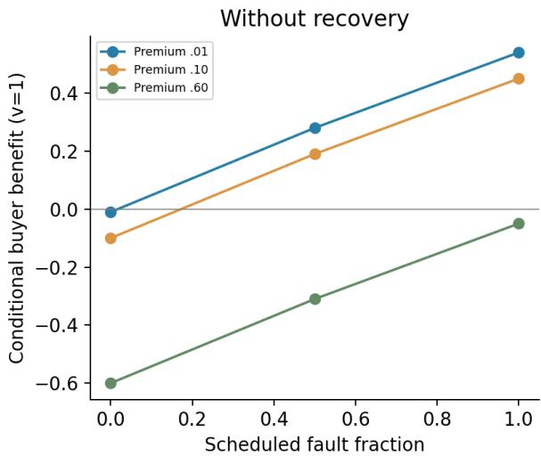

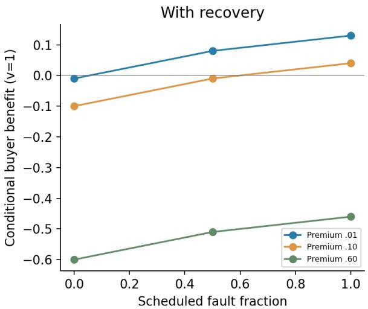  
Figure 9. Premium sensitivity of buyer value under full service-credit utilization, a 0.13 per-claim limit, and a 1.56 initial reserve. Net value follows Equation (49).

## 8.6 Combined Financial Effects

We evaluate the eight combinations of forwards (�), financing (�), and protection (�) through a common accounting decomposition. Financing conditions use separate executions because funds afect admission. Forward and protection payments are applied to matched recorded trajectories through separate accounts, holding admission fixed within those comparisons. Contribution includes signed forward payments and fees; service credits are reported separately. This design evaluates combined financial accounting on measured execution.

Table 8. Eight combinations for recovery-enabled runs with ample funds, at an assumed price index of 1.5 and hedge ratio of 0.5. �, �, and � switch forwards, financing, and protection on or of. Contribution is experimental USD, excluding initial funding and service credits. Issued credits are reported separately.
<table><tr><td>D</td><td>F</td><td>S</td><td>Success</td><td>Contribution</td><td>Service credit</td></tr><tr><td>0</td><td>0</td><td>0</td><td>9</td><td>0.6034</td><td>0.0000</td></tr><tr><td>0</td><td>0</td><td>1</td><td>9</td><td>0.5934</td><td>0.1400</td></tr><tr><td>1</td><td>0</td><td>0</td><td>9</td><td>0.9772</td><td>0.0000</td></tr><tr><td>1</td><td>0</td><td>1</td><td>9</td><td>0.9672</td><td>0.1400</td></tr><tr><td>0</td><td>1</td><td>0</td><td>9</td><td>0.3735</td><td>0.0000</td></tr><tr><td>0</td><td>1</td><td>1</td><td>9</td><td>0.3635</td><td>0.1400</td></tr><tr><td>1</td><td>1</td><td>0</td><td>9</td><td>0.7474</td><td>0.0000</td></tr><tr><td>1</td><td>1</td><td>1</td><td>9</td><td>0.7374</td><td>0.1400</td></tr></table>

All controlled combinations complete nine tasks. At the assumed index of 1.5 and hedge ratio of 0.5, adding the forward raises own-capital contribution from 0.6034 to 0.9772. Protection issues 0.1400 in service credit for a 0.01 premium. The all-mechanism configuration records 0.7374 in contribution and 0.1400 in credits. With ample funds and matched completion, the financing comparison measures the share of receipts allocated to investors. These results separate contract-specific payments within the combined outcome.

The retail combinations retain their own execution trajectories, known expenses, and missing-usage reservations (Appendix F.5). Their eight known-cost contributions are negative; within each fixed financing trajectory, the forward and protection contrasts identify their respective settlement and fee efects. Betweenfinancing diferences also incorporate the separate model executions.

Fixed-volume economic decomposition. The request replay crosses eight combinations, five price paths, and two forward discounts while holding ofered work and recovery fixed. With $F = 0 ;$ , funding has the assumed opportunity cost of own capital; with $F = 1$ , the stated revenue-sharing charge replaces that cost. Modeled economic expense is

$$
\begin{array} { r l } { C = C _ { \mathrm { A P I } } + C _ { \mathrm { r e t r y } } + C _ { D , \mathrm { f e e } } - V _ { D } } & { } \\ { + C _ { \mathrm { f u n d } } + P _ { S } - A _ { S } , } & { } \end{array}\tag{50}
$$

Here $C _ { \mathrm { A P I } }$ and $C _ { \mathrm { r e t r y } }$ are primary and alternate request expenses, $C _ { D , \mathrm { f e e } }$ the forward fee, $V _ { D }$ signed paid settlement, $C _ { \mathrm { f u n d } }$ funding cost, $P _ { S }$ the protection premium, and $A _ { S }$ paid compensation. This metric includes opportunity cost and values paid compensation at face value; initial capital is excluded.

Under constant prices, the assumed 10%-discount forward reduces economic expense from USD 3,438.59 to USD 3,282.46. The all-mechanism configuration has expense USD 3,605.09, or 4.84% above baseline, because the fixed workload provides no additional admitted service to ofset financing and protection charges. The decomposition attributes this diference to contract-specific costs and payments under a common workload. Together with the capital-constrained and fault studies, it identifies the operating conditions that give each financial mechanism a productive role.

## 9 Conclusion

This paper presented TokenBank, a unified contractual and accounting infrastructure for AI services, integrating service commitments, API-price forwards, revenue-right financing, and service-failure protection.

Evaluation combines request-level replay over 362,417 calibration and 899,441 evaluation requests with real-model Agent execution and PostgreSQL-backed contract experiments. Under the rising-price scenario, forwards reduce mean API expenditure by USD 304.88. In the low-capital setting, revenue-right financing increases mean contribution profit by 1.0635 experimental USD and reduces admission stops from 12.0 to 1.8. Under controlled faults, recovery completes 9 of 12 tasks in each recovery-enabled arm, while adequately funded protection settles all approved compensation.

## Authors and Contributors

Cary Chang served as the contributor to this work, leading the conceptualization, system design, and manuscript preparation. Jialin Zhou contributed to project support. We also thank members of the broader research and developer community for discussions, feedback, and ideas that helped refine the research questions, system design, and evaluation presented in this report.

## References

[1] Amazon Web Services. Amazon bedrock service level agreement, 2026. URL https://aws.amazon.com/bedrock/ sla/. Oficial SLA, accessed September 15, 2026.

[2] Alain Andrieux, Karl Czajkowski, Asit Dan, Kate Keahey, Heiko Ludwig, Toshiyuki Nakata, Jim Pruyne, John Rofrano, Steve Tuecke, and Ming Xu. Web services agreement specification (WS-Agreement). Technical Report GFD.107, Open Grid Forum, 2007. URL https://ogf.org/documents/GFD.107.pdf.

[3] Victor Barres, Honghua Dong, Soham Ray, Xujie Si, and Karthik Narasimhan. Tau2-bench: Evaluating conversational agents in a dual-control environment, 2025. URL https://arxiv.org/abs/2506.07982.

[4] Gérard P. Cachon and Martin A. Lariviere. Supply chain coordination with revenue-sharing contracts: Strengths and limitations. Management Science, 51(1):30–44, 2005. doi: 10.1287/mnsc.1040.0215. URL https://pubsonline. informs.org/doi/10.1287/mnsc.1040.0215.

[5] John Cartlidge and Philip Clamp. Correcting a financial brokerage model for cloud computing: closing the window of opportunity for commercialisation. Journal of Cloud Computing, 3(1):2, 2014. doi: 10.1186/2192-113X-3-2. URL https://link.springer.com/article/10.1186/2192-113X-3-2.

[6] Lingjiao Chen, Matei Zaharia, and James Zou. FrugalGPT: How to use large language models while reducing cost and improving performance. https://arxiv.org/abs/2305.05176, 2023.

[7] Rowan Clarke, Dominic Russel, and Claire Shi. Revenue-based financing. Working paper, October 2025 version. Earlier version circulated as FinTech and Financial Frictions: The Rise of Revenue-Based Financing, October 2025. URL https://dominicrussel.com/assets/files/CRS\_RBF.pdf.

[8] Anna Ye Du, Sanjukta Das, and R. Ramesh. Eficient risk hedging by dynamic forward pricing: A study in cloud computing. INFORMS Journal on Computing, 25(4):625–642, 2013. doi: 10.1287/ijoc.1120.0526. URL https:

//pubsonline.informs.org/doi/10.1287/ijoc.1120.0526. Published online October 22, 2012; assigned to the Fall 2013 issue.

[9] Loretta Mastroeni, Alessandro Mazzoccoli, and Maurizio Naldi. Service level agreement violations in cloud storage: Insurance and compensation sustainability. Future Internet, 11(7):142, 2019. doi: 10.3390/fi11070142. URL https://www.mdpi.com/1999-5903/11/7/142.

[10] Behnam Mohammadkhani, Atul Khekade, and Ritesh Kakkad. Agentic settlement protocol: An application profile for refundable, delayed-fulfilment agent commerce on stablecoin rails, 2026. URL https://arxiv.org/abs/2609. 02208v1. Version 1, September 2, 2026. Design paper; measured evaluation is left to follow-up work.

[11] Isaac Ong et al. RouteLLM: An open-source framework for cost-efective LLM routing. https://www.lmsys.org/ blog/2024-07-01-routellm/, 2024. Authors’ benchmark summary; paper arXiv:2406.18665.

[12] Poe. Poe Bot MonetizationAPIDocumentation. Poe, 2026. URL https://creator.poe.com/docs/server-bots/ poe-bot-monetization-api-documentation. Oficial documentation, accessed September 15, 2026.

[13] Owen Rogers and Dave Clif. A financial brokerage model for cloud computing. Journal of Cloud Computing: Advances, Systems and Applications, 1(1):2, 2012. doi: 10.1186/2192-113X-1-2. URL https://link.springer. com/article/10.1186/2192-113X-1-2.

[14] Yuxin Wang et al. BurstGPT: A real-world workload dataset to optimize LLM serving systems. https://github. com/HPMLL/BurstGPT, 2025. KDD 2025; public trace pinned in experiment manifest.

[15] Yingxuan Yang, Ying Wen, Jun Wang, and Weinan Zhang. Agent exchange: Shaping the future of AI agent economics, 2025. URL https://arxiv.org/abs/2507.03904. Version 1. This entry cites the inspected preprint, not a later workshop version.

## A Contract Records and Detailed Validation

This appendix formalizes the record structure, fulfillment conditions, and transaction constraints underlying Section 4. The definitions distinguish contractual entitlements, current ownership, and completed payments while preserving the product-specific rules for consumption, forwards, revenue rights, and protection.

## A.1 Record Model

Let

$$
\mathcal { T } = \{ \mathrm { c o n s u m p t i o n , f o r w a r d , r e v e n u e , p r o t e c t i o n } \} .\tag{51}
$$

A claim’s complete record description is

$$
c = ( \iota , \eta , \tau , \mathcal { P } , \mathcal { R } , \mathcal { U } , \Theta _ { \tau } , x _ { \tau } , \mathcal { L } ) ,\tag{52}
$$

where � identifies the record or linked record group, � identifies its tenant context (the account and permission scope), and $\tau \in \mathcal { T }$ is the economic type. The participant mapping $\mathcal { P }$ associates roles with accounts and entities. References R identify the service, price index, revenue policy, or protection plan; U specifies quantity and payment units. Terms $\Theta _ { \tau }$ describe the obligation, state $x _ { \tau }$ its status and operational quantities, and L links source, fulfillment, transfer, and settlement records.

The claim space is

$$
C = \bigsqcup _ { \tau \in \mathcal { T } } C _ { \tau } ,\tag{53}
$$

where $C _ { \tau }$ contains claims of type �. The disjoint union à preserves the type distinction even when fields or units coincide. Separate models, references, and validation routines realize this notation. Product-specific validation determines how descriptive service fields enter processing. Quality attributes specify the service terms associated with a claim.

An amount $\nu = ( a , u )$ contains numerical value � and unit �. Supported units include service credits, usage units, USD, and CNY. Ordinary transfers require compatible units, while wallet and cross-organization operations use explicit accounting links. Each amount retains its unit throughout these operations. Time terms include prepaid validity and optional expiry, forward dates, revenue-policy efective times, optional funding-agreement start and end dates, and protection coverage, waiting periods, and claim windows. Any finite duration or repayment cap is specified separately from the revenue-share fraction.

## A.2 Product-Specific Fulfillment Rules

Prepaid consumption and delivery. For prepaid lot $\ell ,$ let $r _ { \ell }$ be the remaining amount, $k _ { \ell }$ its locked amount, $s _ { \ell }$ the validity start, and $e _ { \ell }$ the expiry, with $e _ { \ell } = \varnothing$ denoting no expiry. For account � and time �, eligible lots are

$$
\begin{array} { r l r } & { } & { \mathcal { E } _ { a } ( t ) = \{ \ell : \mathrm { ~ a c c o u n t } ( \ell ) = a , \mathrm { ~ s t a t u s } ( \ell ) = \mathrm { a c t i v e } , } \\ & { } & { s _ { \ell } \le t , ( e _ { \ell } = \emptyset \lor t < e _ { \ell } ) , r _ { \ell } > 0 \} . } \end{array}\tag{54}
$$

Here, ∨ permits either no expiry or an expiry after the current time. The available amount is

$$
A _ { a } ( t ) = \sum _ { \ell \in \mathcal { E } _ { a } ( t ) } \operatorname* { m a x } ( r _ { \ell } - k _ { \ell } , 0 ) .\tag{55}
$$

A request consuming $q > 0$ units requires allocations $z _ { \ell }$ satisfying

$$
\sum _ { \ell \in \mathcal { E } _ { a } ( t ) } ^ { 0 \le z _ { \ell } \le \operatorname* { m a x } ( r _ { \ell } - k _ { \ell } , 0 ) , }\tag{56}
$$

Lots are selected by ascending expiry, with non-expiring lots last and creation time breaking ties. Insuficient balance rejects consumption; successful consumption reduces the selected balances and records the allocations and accounting transaction.

For a preorder, purchased quantity �, delivered quantity �, and additional delivery $d > 0$ satisfy $D + d \leq Q$ and $D ^ { \prime } = D + d .$ . An Agent preorder becomes delivered at $D ^ { \prime } = Q$ . These quantities establish recorded service delivery. A prepaid transfer retains the source lot’s expiry and refund eligibility.

Forward payment. For reference price �, fixed price �, and notional � (the amount scaling the price diference), the positions have values

$$
V _ { \mathrm { l o n g } } = N ( P - K ) , \qquad V _ { \mathrm { s h o r t } } = - V _ { \mathrm { l o n g } } .\tag{57}
$$

The long account receives a positive amount and pays when that value is negative; the short account has the opposite obligation. Price and notional units must correspond as described in the forward analysis. Product checks permit forwards, constrain $N ,$ , and require future expiry within the maximum term at creation. Fees and margin, funds held to support payment, are recorded separately. Settlement uses the latest available index observation and checks funding; insuficient funds produce a default record rather than establishing a completed payment.

Revenue allocation. For revenue event $^ { e , }$ let $R _ { e }$ be its recorded net amount and $b _ { i }$ the share assigned to recipient � among � recipients. Shares use basis points, each equal to $1 / 1 0 { , } 0 0 0$ of the amount. The policy requires

$$
b _ { i } > 0 , \qquad \sum _ { i = 1 } ^ { m } b _ { i } = 1 0 , 0 0 0 .\tag{58}
$$

The exact allocation is

$$
d _ { i , e } ^ { * } = \frac { b _ { i } } { 1 0 , 0 0 0 } R _ { e } .\tag{59}
$$

Both Agent and Provider settlement use the recorded net amount. At the supported decimal precision, actual distributions $d _ { i , e }$ are adjusted to preserve the event amount:

$$
d _ { i , e } \geq 0 , \qquad \sum _ { i } d _ { i , e } = R _ { e } .\tag{60}
$$

For successive events and a fixed participant set with fixed shares, the rounding diference carried to the next allocation is

$$
\epsilon _ { i , e + 1 } = \epsilon _ { i , e } + \frac { b _ { i } } { 1 0 , 0 0 0 } R _ { e } - d _ { i , e } ,\tag{61}
$$

where $\epsilon _ { i , e }$ is the previously accumulated diference. This records the diference between exact entitlements and finite-precision payments. Investor participants are updated before allocation using assets linked to the funding agreement; if no matching assets exist, the original investor is used. The recipient set is determined from the holdings selected at settlement time.

Protection coverage and payment. For protection contract � and incident/submission records $^ { e , }$ coverage is

$$
\begin{array} { r } { \chi ( c , e ) = \chi _ { \mathrm { a c t i v e } } \wedge \chi _ { \mathrm { p e r i o d } } \wedge \chi _ { \mathrm { w a i t i n g } } } \\ { \wedge \chi _ { \mathrm { p r o v i d e r / m o d e l } } \wedge \chi _ { \mathrm { e v e n t } } \wedge \chi _ { \mathrm { d e a d l i n e } } . } \end{array}\tag{62}
$$

Each term denotes a passed check: active subscription, covered incident period, any waiting-period requirement, Provider or model scope, covered event type, and claim deadline. The conjunction ∧ requires every applicable condition to hold.

For a cost-denominated compensation base �, let � be the deductible (the excluded amount), $\gamma$ the compensation rate, and � the plan’s maximum amount. Incident-impact calculations and ordinary manual claims use

$$
\widehat { G } = \operatorname* { m i n } \{ M , \gamma \operatorname* { m a x } ( B - \delta , 0 ) \} .\tag{63}
$$

Impact records retain request costs together with failure and fallback counts. The monetary interpretation above uses a cost-denominated �; activity counts retain their event-count units. Automatically generated claims already contain the calculated amount; review caps that amount without applying the deductible and rate again.

For approved amount $G ,$ let $R ^ { \mathrm { b u d g e t } }$ be the reserve budget, $R ^ { \mathrm { p a i d } }$ cumulative payments, $B _ { r }$ its account balance, and $L _ { r }$ locked balance. Settlement requires

$$
0 < G \leq \mathrm { m i n } \{ R ^ { \mathrm { b u d g e t } } - R ^ { \mathrm { p a i d } } , \ B _ { r } - L _ { r } \} .\tag{64}
$$

Successful settlement credits the buyer’s billing wallet for service charges. An approved claim and an executed payment remain distinct records.

## A.3 Operation and Transaction Controls

For operation � on type �, the conditions summarized in Equation (2) are

$$
\begin{array} { r } { G _ { \tau , \alpha } = G _ { \mathrm { a u t h o r i t y } } \wedge G _ { \mathrm { p o l i c y } } \wedge G _ { \mathrm { s t a t e } } } \\ { \wedge G _ { \mathrm { t e r m s } } \wedge G _ { \mathrm { r e s o u r c e s } } . \qquad } \end{array}\tag{65}
$$

These check permission, whether an operation is enabled or needs approval, its current status, contract conditions, and resources such as balances, margin, or reserves. The applicable checks difer by operation. For example, an Agent preorder progresses through approval and recorded delivery, a forward can settle or default, a revenue event settles after distribution, and protection approval precedes a separate payment step.

Product records retain terms, participants, status, holdings, and source links. Validation checks the required fields and conditions; transaction routines lock afected records and invoke account or wallet operations. Delivery, valuation, distribution, claim, transfer, and accounting records retain links between each operation and its outcome. Market transfers release the relevant payment reservation, post payment, decrease the seller’s total and locked units, increase the buyer’s total and available units, and record the transfer. Receiving holdings preserve selected agreement and policy references for later recipient selection.

For account �, let $B _ { a }$ and $L _ { a }$ be its balance and locked balance, and $C _ { a } ^ { \mathrm { u s e d } }$ and $C _ { a } ^ { \mathrm { l i m i t } }$ its used and permitted credit amounts. Account constraints require

$$
0 \leq L _ { a } \leq B _ { a } , \qquad 0 \leq C _ { a } ^ { \mathrm { u s e d } } \leq C _ { a } ^ { \mathrm { l i m i t } } .\tag{66}
$$

Product checks additionally enforce available prepaid amounts, remaining delivery quantities, distributable revenue, and reserve funding. The balanced-posting relation appears in Equation (4); cross-organization processing may require checking a linked settlement group rather than an isolated account balance.

An idempotency key associates a supported operation’s retries with its recorded result. The common transfer routine rechecks this key after acquiring account locks. Alongside product-state checks, this supports at most one committed financial posting for each scoped operation key.

## B Forward Valuation, Funding, and Settlement

This appendix specifies the records and funding rules supporting the forward mechanism. It distinguishes contractual valuation from completed payment and derives the condition under which a funded forward reduces expenditure variance.

## B.1 Reference, Formation, and Valuation Records

Contract record. A forward contract is represented by

$$
\begin{array} { c } { { f _ { \mathrm { c t r } } = ( a _ { L } , a _ { S } , \cal Z , N , K , t _ { 0 } , T , } } \\ { { { } } } \\ { { m _ { 0 } , m _ { 1 } , \phi _ { L } , \phi _ { S } ) . } } \end{array}\tag{67}
$$

Here $a _ { L }$ and $a _ { S }$ are the long and short accounts, I identifies the reference-price index, � is the submitted multiplier, � the fixed price, $t _ { 0 }$ activation time, and � recorded expiry. The coeficients $m _ { 0 }$ and $m _ { 1 }$ govern initial and subsequent margin, while $\phi _ { L }$ and $\phi _ { S }$ govern service fees. These numerical fields use the product’s quotation and payment units. The normalized notional used in the expenditure analysis is related to the service quantity by $N = q P _ { 0 }$ . This transformation defines the analytical units; submitted contract fields use the product’s quotation and payment units.

Reusable product records specify the reference index, allowed notional range, maximum term, and fee and margin parameters. Individual contracts retain the selected accounts, accepted terms, funding amounts, state, and latest valuation. The benchmark-creation path associates an index with a Provider marketplace ofer having a positive price in USD per thousand tokens. Observations retain their timestamps and sources.

Quote confirmation checks authority, quote state and deadline, and record versions when supplied. It accepts the selected quotation and withdraws competing ofered quotations. A requester choosing the buy side becomes the long account; otherwise, it becomes the short account. Funding previews estimate requirements, but activation calculates them from the accepted notional and product parameters. The coeficients used for fees and margins are stored in basis points, each equal to 1/10,000, and converted to fractions under the product’s unit convention.

Valuation selects the latest stored observation for the index within the contract’s tenant, its account and permission scope. When no observation exists, the implementation can initialize one from configured source information. The selected observation and its recorded source provide the price evidence used by the workflow.

Valuation uses decimal arithmetic rounded to six decimal places and retains the selected observation, price, amount, and margin requirement. The valuation is the contract-defined price-diference amount. Funding charges and scenario-level economic outcomes are recorded separately.

## B.2 Margin Requirements and Funding Checks

Initial funding. Activation requires suficient funds for both margin and service fees:

$$
\begin{array} { r } { M _ { L } ^ { 0 } = m _ { 0 } N , } \\ { F _ { L } = \phi _ { L } N , } \end{array}
$$

$$
M _ { S } ^ { 0 } = m _ { 0 } N ,
$$

$$
F _ { S } = \phi _ { S } N .\tag{68}
$$

(69)

The superscript 0 denotes activation. Fees go to the platform account, while margin remains reserved against other use. Product coeficients must be interpreted with the relevant notional and payment units.

Subsequent requirements. For participant $j \in \{ L , S \}$ , let $B _ { j , t } ^ { M }$ be its funded margin at time �. Given valuation $V _ { t } .$ , maintenance coeficient $m _ { 1 }$ , and notional $N ,$ the contract-level requirement is

$$
R _ { t } = \lvert V _ { t } \rvert + m _ { 1 } N .\tag{70}
$$

The recorded account requirement and additional amount due are

$$
R _ { j , t } = \operatorname* { m i n } \{ R _ { t } , \ B _ { j , t } ^ { M } + | V _ { t } | \} ,\tag{71}
$$

$$
D _ { j , t } = \operatorname* { m a x } \{ R _ { j , t } - B _ { j , t } ^ { M } , 0 \} .\tag{72}
$$

Both participants’ calculations use $\left| V _ { t } \right|$ under the same margin policy. The margin coeficients are configured contract parameters.

A positive $D _ { j , t }$ can create or update a margin call, a request for additional funding that records the amount, deadline, and status. Enabled automatic funding attempts draw on linked billing wallets after currency, availability, and balance checks. A separate default check records an unmet obligation when funded margin is insuficient. Payment remains subject to the current obligation and available funding.

## B.3 Settlement Funding and Idempotency

Settlement accepts active or defaulted contracts and recalculates the obligation using the latest stored observation at settlement. Let $B _ { a }$ denote the payer’s balance, $L _ { a }$ its total locked balance, and $M _ { a }$ its funded margin for this contract. After releasing the contract’s reservation, available funds are

$$
A _ { a } ^ { \mathrm { a v a i l a b l e } } = B _ { a } - \operatorname* { m a x } \{ L _ { a } - M _ { a } , 0 \} .\tag{73}
$$

This expression releases the contract’s funds while retaining other reservations; margin is not added again to the account balance.

Let $A _ { t } = | V _ { t } |$ be the payment due. The funding preview reports

$$
M _ { a } ^ { \mathrm { a p p l i e d } } = \operatorname* { m i n } \{ M _ { a } , A _ { t } \} ,\tag{74}
$$

$$
C _ { a } ^ { \mathrm { a d d i t i o n a l } } = \operatorname* { m a x } \{ A _ { t } - M _ { a } ^ { \mathrm { a p p l i e d } } , 0 \} ,\tag{75}
$$

$$
S _ { a } = \operatorname* { m a x } \{ A _ { t } - A _ { a } ^ { \mathrm { a v a i l a b l e } } , 0 \} .\tag{76}
$$

These are the portion covered by margin, the portion beyond margin, and the shortage after all available funds are considered. The second amount need not imply a shortage: existing unlocked funds can cover it.

Settlement records link the payment and funding preview to the contract and accounting transaction. Contract-specific identifiers associate repeated requests with an existing settlement, and state checks prevent settling an already completed contract again. Database transactions and record locks coordinate the associated updates. Unused wallet-originated funding can return through the wallet path, subject to its currency precision. Insuficient funding produces no proportional partial payment.

## B.4 Expenditure Variability

With full payment, fixed � and �, scenario-independent charges $F + H$ , and finite variances, the expenditure model gives

$$
\begin{array} { l } { \operatorname { V a r } ( C _ { H } ) = \operatorname { V a r } ( C _ { 0 } ) + N ^ { 2 } \operatorname { V a r } ( P ^ { * } ) } \\ { \qquad - 2 N \operatorname { C o v } ( C _ { 0 } , P ^ { * } ) . } \end{array}\tag{77}
$$

Variance measures fluctuation across the modeled scenarios; covariance measures how expenditure and the settlement reference price move together. The contract reduces variance only when the covariance term ofsets the variation added by its price-dependent payment. This relationship explains why price alignment matters independently of the agreed fixed price. The identity provides the analytical basis for comparing reference alignment and hedge ratios across scenarios.

## C Revenue-Right Financing: Supporting Definitions

This appendix specifies the funding, revenue-allocation, and ownership rules supporting Section 6. It also defines the workload-accounting models used to distinguish additional funded service from the cost of sharing revenue.

## C.1 Contract Records and Capital Disbursement

A publisher plan is represented as

$$
\pi = ( o , S , u , b _ { O } , b _ { I } , b _ { P } , \mathcal { D } ) ,\tag{78}
$$

where � is the publisher, S its Agent or Provider service, and � the accounting unit. Shares $b _ { O } , b _ { I } , b _ { P }$ are defined in Section $6 . 1 ; \mathcal { D }$ contains plan descriptions and source-record references. The corresponding fractions are $\alpha _ { O } = b _ { O } / 1 0 , 0 0 0 , \alpha _ { I } = b _ { I } / 1 0 , 0 0 0$ , and $\alpha _ { P } = b _ { P } / 1 0 , 0 0 0$ . Agent plans require positive shares for all three groups. Provider plans can omit an investor share, although financing uses $b _ { I } > 0$ . Provider service references identify the partner, the runtime executing its calls, and the selected model ofer.

An investment agreement records

$$
\begin{array} { r } { g _ { j } = ( \iota _ { j } , \pi , a _ { j } , C _ { j } , C _ { j } ^ { \mathrm { s e t t l e d } } , } \\ { \sigma _ { j } , \mathcal { L } _ { j } ) , ~ } \end{array}\tag{79}
$$

where $\iota _ { j }$ identifies the agreement and $a _ { j }$ the investor account. The amounts $C _ { j }$ and $C _ { j } ^ { \mathrm { s e t t l e d } }$ denote committed and disbursed capital, $\sigma _ { j }$ is the current status, and $\mathscr { L } _ { j }$ links funding, disbursement, and derived revenue-right records. Separate Agent and Provider revenue policies maintain the corresponding participant records. Funding agreements identify publisher investments by their participants and revenue policy. Publisher investments use immediate capital settlement at confirmation.

Investment requests retain the accepted policy, publisher and investor references, and billing-wallet links. Wallet-funded amounts must fit the available balance and be exactly representable to two decimal places. Confirmation checks authority, product policy, and the supplied record version when present, under the relevant tenant contexts. A wallet bridge, the routine connecting wallet operations to financial accounts, funds the investor-side account and transfers the contribution to an intermediate settlement account called escrow. The agreement then becomes active.

For an active Agent agreement with funded escrow, capital settlement transfers $C _ { j } ^ { \mathrm { d u e } } = C _ { j } - C _ { j } ^ { \mathrm { s e t t l e d } }$ to the publisher’s funding account. Completion records $C _ { j } ^ { \mathrm { s e t t l e d } } = C _ { j }$ , the transaction, and settlement time. The Provider path similarly transfers capital and records the publisher-side receipt when funding crosses tenants. These linked records connect the investor’s outflow to the publisher’s capital receipt.

Escrow connects the investor-side funding operation to the publisher’s capital receipt. Disbursement is performed for each confirmed investment. An Agent plan’s funding goal is retained as plan information.

## C.2 Share Allocation and Revenue Processing

Integer agreement shares. Equation (15) defines ideal allocations. For � selected agreements in deterministic order, let $\begin{array} { r } { A _ { j - 1 } = \sum _ { k = 1 } ^ { j - 1 } b _ { k } } \end{array}$ , with $A _ { 0 } = 0$ , be the basis points already assigned. For $j < n$ , the stored allocation is

$$
\begin{array} { c } { { b _ { j } = \operatorname* { m i n } \{ \operatorname* { m a x } \{ 1 , \lfloor b _ { j } ^ { * } \rfloor \} , } } \\ { { b _ { I } - A _ { j - 1 } - ( n - j ) \} , } } \end{array}\tag{80}
$$

where ⌊·⌋ rounds down. The second bound retains at least one basis point for every remaining agreement. The final agreement receives $b _ { n } = b _ { I } - A _ { n - 1 }$ . Positive allocations require $n \leq b _ { I } ;$ the Provider routine explicitly rejects more confirmed investments than the available pool can accommodate at this precision. Holder shares use a second integer allocation with remainder assignment. An agreement with more selected holders than assigned basis points is rejected.

For example, adding an active 100-unit investment to the main text’s 100- and 300-unit example changes the ideal total-revenue shares from 2.5% and 7.5% to 2%, 6%, and 2%. The pool remains 10%; the individual percentages are recalculated rather than fixed at investment creation.

Revenue records and readiness. A revenue event identifies its policy, source and settlement accounts, amounts, accounting unit, and supporting service references. Agent usage capture retains request and usage identifiers together with consumer and publisher tenant references. Provider capture also retains runtime and model-ofer information. The recorded billing amount is transferred to a revenue source account, and an event identifier associates repeated creation requests with that event.

Let $G _ { e }$ be gross recorded revenue and $R _ { e }$ the recorded net amount used for distribution. Agent creation sets $R _ { e } = G _ { e }$ . Provider creation can accept a separate net amount, but the evaluated usage-capture procedures supply the same captured amount as both gross and net. This captured income is the distribution base; operating costs enter the separate contribution- profit calculation.

Automatic settlement of a publisher plan with an investor allocation requires a linked active investment with positive disbursed capital. Otherwise, an event can remain pending, and confirmation of an investment can trigger later settlement. Before distribution, recipients are refreshed from the currently active funded investments and linked positive holdings. The allocation convention uses the recipient set selected at settlement.

Payment precision and rounding carry. For participant $i ,$ let $b _ { i , e }$ be the share used for event � and $\varepsilon = 1 0 ^ { - 6 }$ the payment increment. A rounding carry $\kappa _ { i , e }$ retains the signed diference between previously calculated shares and payments. The routine computes

$$
y _ { i , e } = R _ { e } \frac { b _ { i , e } } { 1 0 , 0 0 0 } + \kappa _ { i , e } ,\tag{81}
$$

$$
d _ { i , e } ^ { ( 0 ) } = \varepsilon \left[ \frac { \operatorname* { m a x } \left( y _ { i , e } , 0 \right) } { \varepsilon } \right] .\tag{82}
$$

It then adjusts payments in increments of � to match $R _ { e }$ . If their sum is too low, increments go to the largest unpaid remainders; if too high, increments are removed from positive payments using the corresponding remainder ordering. Deterministic participant order resolves ties. For event amounts at the supported precision, payments satisfy Equation (18), and

$$
\kappa _ { i , e + 1 } = y _ { i , e } - d _ { i , e } .\tag{83}
$$

For an unchanged participant identity across � events,

$$
\sum _ { e = 1 } ^ { E } d _ { i , e } = \sum _ { e = 1 } ^ { E } R _ { e } \frac { b _ { i , e } } { 1 0 , 0 0 0 }\tag{84}
$$

The retained diference accounts for cumulative proportional amounts and actual payments for the unchanged participant identity specified above.

Recording and wallet transfers. Settlement batches select pending events, refresh recipients, allocate payments, and post transfers. Distribution records link the event, participant, account, transaction, applied share, and carry; the event then becomes settled. Event and account locks coordinate concurrent updates. Batch and event–participant idempotency keys, identifiers associating repeated requests with existing operations, prevent duplicate financial postings through the supported paths.

Investor distributions can be transferred to linked billing wallets, whose amounts have two-decimal precision. For incoming distribution � and retained remainder $\omega ,$ , the bridge credits

$$
w = 0 . 0 1 \left\lfloor { \frac { \omega + d } { 0 . 0 1 } } \right\rfloor , \qquad \omega ^ { \prime } = \omega + d - w .\tag{85}
$$

The remainder is retained for later transfers. For cross-tenant investments, clearing and corresponding distribution records link the publisher-side allocation to the investor-side receipt.

## C.3 Transfer Records and Settlement

A revenue-right asset represents a holding

$$
a = ( \iota _ { a } , \eta _ { a } , g , \pi , h , U , A , L ) ,\tag{86}
$$

where $\iota _ { a }$ identifies the asset and $\eta _ { a }$ its tenant context. The references � and � identify the source agreement and revenue policy; ℎ is the holder account. Here is an agreement reference, not the contribution fraction used in the economic analysis. Quantities �, �, � are total, available, and locked units. The last category records units reserved against other use.

Creation requires a confirmed investment and, for publisher investments, completed capital disbursement. Conversion creates a positive number of units no greater than the source investment position. Source-agreement and policy references and selected service attributes are retained. Agent investment confirmation invokes asset creation; the Provider path supplies a corresponding conversion routine. Provider listing requires a Provider-financing source-agreement reference even though the broader asset model contains additional right types. A numerical relationship between units and investment amount establishes neither a resale value nor a redemption price.

Reservation and order entry. Listing $q \ell$ units requires authority and $0 < q _ { \ell } \leq A$ . The holding changes to

$$
A ^ { \prime } = A - q \ell , \qquad L ^ { \prime } = L + q \ell , \qquad U ^ { \prime } = U ,\tag{87}
$$

where primes indicate the updated state. Both creation paths open active listings and create or ensure the associated sell order at the listed quantity and minimum price. Approval follows the applicable listing workflow. Remaining listing and order quantities allow partial execution.

A buy order requires an active listing, quantity no greater than its remaining units, and applicable access checks. Any supplied quote-version identifier is checked. Buyer funds are reserved according to Equation (19), subject to decimal precision and available balance. The Provider path rejects purchases by the user owning the listing, and both matching paths reject identical buyer and seller accounts. The checks apply to the account and ownership identifiers associated with the submitted transaction.

The crossing checks are $p _ { b } \geq p _ { s }$ for the Agent path and $p _ { b } \ge \operatorname* { m a x } \{ p _ { s } , p _ { \ell } ^ { \operatorname* { m i n } } \}$ for the Provider path. Together with Equations (20)–(21), these preserve $p ^ { * } \leq p _ { b }$ . The listing-generated sell order has $p _ { s } = p _ { \ell } ^ { \mathrm { m i n } }$ , so both paths use the same minimum price in that case. A positive match records the trade and reduces the remaining buy, sell, and listing quantities; holdings and payment change at settlement.

Ownership and payment updates. For a trade backed by suficient reserved seller units, settlement updates

$$
U _ { s } ^ { \prime } = U _ { s } - q ^ { * } ,
$$

$$
\begin{array} { r } { L _ { s } ^ { \prime } = L _ { s } - q ^ { * } , } \end{array}\tag{88}
$$

$$
U _ { b } ^ { \prime } = U _ { b } + q ^ { * } ,
$$

$$
\begin{array} { r } { A _ { b } ^ { \prime } = A _ { b } + q ^ { * } . } \end{array}\tag{89}
$$

The subscripts denote seller and buyer, giving

$$
\begin{array} { r } { U _ { s } ^ { \prime } + U _ { b } ^ { \prime } = U _ { s } + U _ { b } . } \end{array}\tag{90}
$$

Settlement locks the relevant records, releases the needed buyer payment reservation, and posts the buyer-to-seller transfer. It creates or locates the buyer’s holding using the source right type and identifiers. The receiving holding preserves agreement and policy references. A transfer record identifies both holdings and the quantity, while the settlement record links the trade to its accounting transaction. A database transaction connects these updates within TokenBank.

The Agent path blocks disputed trades and releases surplus payment reservations when a buy order is completed. The Provider path has its own settlement and reservation-release logic. State checks and settlement identifiers prevent supported retries from posting completed trades twice.

Recipients after transfer. The recipient lookup follows source-agreement references to current positive holdings, including supported cross-tenant transfers. If no derived holding exists, the original investor is used with units corresponding to the agreement’s budget. Generated participant records retain the recipient account, tenant context, agreement, and asset identifier. Source links connect the receiving holding to the original investment without treating the resale payment as new publisher funding.

For agreement � at settlement time $t _ { s }$ , its ideal holder fraction of total plan revenue, after the agreement-level integer allocation but before holder-level rounding, is

$$
\alpha _ { j , h } ( t _ { s } ) = \frac { b _ { j } ( t _ { s } ) } { 1 0 , 0 0 0 } \frac { u _ { j , h } ( t _ { s } ) } { \sum _ { k \in \mathcal { H } _ { j } ( t _ { s } ) } u _ { j , k } ( t _ { s } ) } .\tag{91}
$$

The ideal payment is $d _ { j , h , e } ^ { * } = \alpha _ { j , h } ( t _ { s } ) R _ { e }$ . Holder shares are converted to integer basis points before monetary allocation. The recipients are the holders selected at $t _ { s }$ . Secondary-market experiments measuring order arrivals, execution rates, resale prices, and investment exit returns are outside the financing evaluation.

## C.4 Workload Accounting

Let $B _ { t }$ be the operating budget and $D _ { t }$ the cost of serving all available demand in period �. A divisible-work approximation admits

$$
X _ { t } ( B _ { t } ) = \operatorname* { m i n } \{ D _ { t } , B _ { t } \} .\tag{92}
$$

Here, served work is measured by its cost. The approximation can use fractional requests; greater funding increases service only while available demand exceeds the budget.

The complete-request replay instead retains the original request order. For costs $c _ { t , 1 } , \ldots , c _ { t , n _ { t } }$ in period �, define

$$
\begin{array} { r } { k _ { t } ( B ) = \operatorname* { m a x } \Bigg \{ k \in \{ 0 , \ldots , n _ { t } \} : } \\ { \displaystyle \sum _ { r = 1 } ^ { k } c _ { t , r } \leq B \Bigg \} . } \end{array}\tag{93}
$$

The case $k = 0$ admits no requests. This selects the longest initial sequence fitting the daily budget and excludes later requests once the next one would exceed it. Across days,

$$
X ( B ) = \sum _ { t } \sum _ { r = 1 } ^ { k _ { t } ( B ) } c _ { t , r } .\tag{94}
$$

Baseline and financed scenarios use $X _ { 0 } = X ( B )$ and $X _ { 1 } = X ( a B )$ for $a \geq 1$ . Costs come from completed trace records, so the calculation is retrospective rather than an online predictor of output cost. Budgets reset daily by assumption, and � is a specified budget multiplier. These definitions evaluate the amount of existing demand that can be served under each funding scenario.

## D Implementation Validation and Synthetic Accounting Tests

This appendix evaluates whether TokenBank executes the contract and accounting rules described in the main text. Database experiments test transaction correctness and concurrent execution, while deterministic synthetic tasks test cash-flow conservation under controlled funding and failure conditions. Their contract-level assertions complement the service and economic outcomes measured by the model-driven studies.

## D.1 Transaction Correctness and Ledger Reconciliation

The backend regression suite passes all 206 tests. A focused suite passes 20 gateway and source-routing checks, and a contract-specific suite passes seven experiments. These suites overlap with the regression tests and with previously exercised contract lifecycles; their counts are therefore not added as independent observations.

The contract-specific experiments execute 80 business API calls against an isolated PostgreSQL database and record seven final accounting states. Participant identities and initial funds are controlled experimental inputs; subsequent economic operations use the implemented contract APIs. Validation links account-balance changes to wallet records, ledger entries, and cross-organization transactions. Monetary comparisons use exact six-decimal arithmetic.

An independent decimal-arithmetic replay verifies 165 balance changes across 47 accounts, with no arithmetic discrepancies. Direct ledger association covers 103 entries. For credit-funded movements, the verified quantity is net position, defined as cash balance minus credit used. The five intermediate wallet-to-account funding changes are documented through their supporting wallet records. The validation therefore reports balance arithmetic and record association at their respective observation scopes. Table 3 summarizes the contract rules and assertions covered by these experiments.

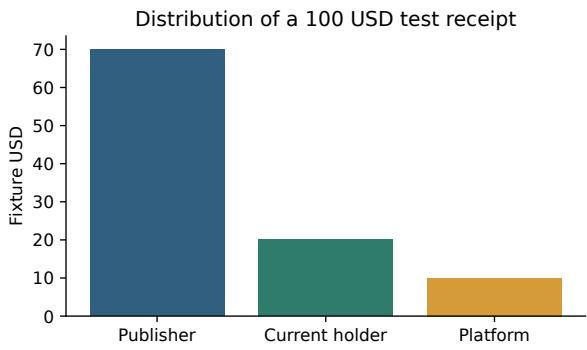  
Isolated database settlements with synthetic funds; no observed customer receipts

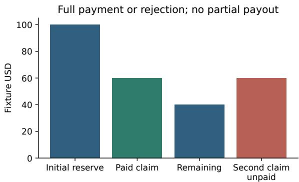  
Figure 10. Contract settlement in isolated database experiments: revenue allocation after a rights transfer (left) and dedicated-reserve payments (right). Controlled initial funds and synthetic revenue events exercise the corresponding ownership and funding rules.

## D.2 Recovery Semantics and Concurrent Execution

Recovery tests cover bounded retries, session renewal, and a simulated 30-day idle interval. After an inconclusive health probe, a previously verified service remains degraded but eligible for routing. Services that were never verified, explicitly stopped, disabled, or definitively failed retain their respective routing restrictions. The simulated interval exercises elapsed-time state transitions under these routing rules.

The concurrency experiment executes 760 operations across 19 scenarios at concurrency eight. No unexpected operation failures, ledger discrepancies, invariant violations, or deadlocks are observed. Eleven scenarios have 95th-percentile latency above the prespecified 1,500 ms budget; the largest measured value is 2,419.98 ms. Accounting assertions and latency are reported as separate measurements. The experiment uses one local Windows/Docker host while other experiments are active, so the measurements characterize this shared-host configuration.

## D.3 Continuous-Balance Financing Tests

A separate synthetic workload tests financing without the daily budget resets used in the request-level replay. It contains 24 scripted tasks, each with three nominal calls costing USD 0.04, 0.06, and 0.05. The costs and task outcomes are specified inputs rather than public-benchmark measurements. The operator starts with USD 0.60, and financing supplies an additional USD 0.60 from a separately tracked investor.

Only successful synthetic tasks generate receipts, set to 1, 1.5, 2, or 3 times the USD 0.15 reference task cost. A revenue right allocates 10% of gross receipts to the investor. An equal-funded loan control instead requires repayment of principal plus 1% at the end of the sequence. These terms are experimental assumptions, not market quotations. Each condition re-executes the task sequence under its available-cash constraint. Capital injections are excluded from contribution profit; investor receipts and outstanding obligations are recorded separately. The trajectories validate continuous cash-flow accounting under the specified funding and revenue-allocation terms.

## D.4 Per-Claim Protection Tests

The protection tests exercise per-claim payment and reserve accounting. The parameters are a USD 0.10 cap per claim, a USD 0.20 initial reserve, and a USD 0.01 premium per covered synthetic task. A claim is paid in full up to its cap or rejected when available reserve funds are insuficient; partial payment is not assumed.

Scripted incidents include timeout, rate limiting, primary-path outage, and common-path outage. Tool errors and incorrect answers are excluded from coverage. Recovery-enabled conditions permit one alternate attempt. A residual covered failure requests USD 0.15 before application of the claim cap. These eligibility assignments are controlled inputs, not coverage labels inferred from BurstGPT. The trajectories test payment and reserve accounting; actual API claim validation is assessed separately by the PostgreSQL experiments above.

## D.5 Factorial Accounting Checks

The synthetic workload also crosses the eight combinations of forwards (�), financing (�), and protection (�) with recovery enabled or disabled and four receipt multipliers, yielding 64 conditions. Eight equal-funded loan controls bring the total to 72. Event-level cash flows are recorded for every condition, and conservation is checked across the operator, investor, reserve, service-receipt accounts, and assumed customer payer. These checks validate cash-flow conservation across combined financial operations, using a synthetic population separate from the model-driven task studies.

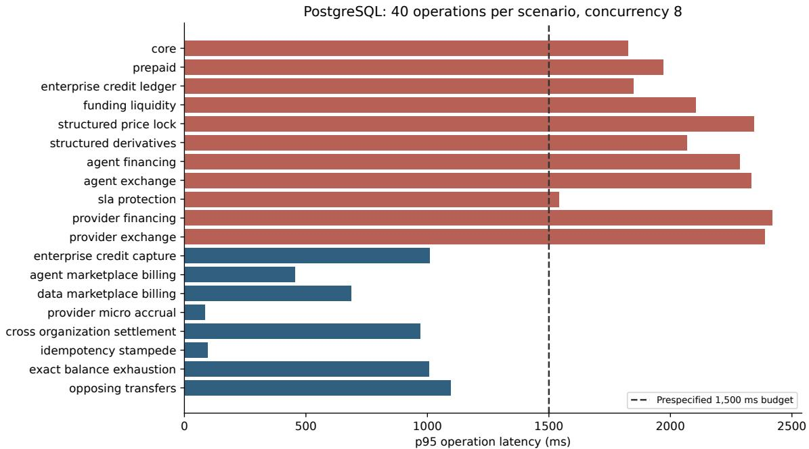  
760 operations; no unexpected failures; 11 scenarios exceed the latency budget  
Figure 11. Concurrent transaction latency across the 19 tested scenarios. The reference line marks the prespecified 1,500 ms budget; red bars indicate scenarios above that budget.

Synthetic tasks: continuous balances without daily resets  
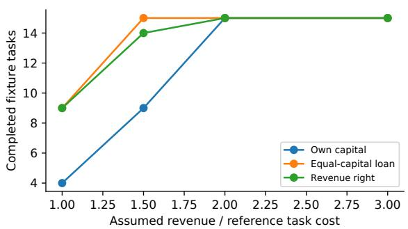  
Synthetic task sequences with continuous balances.

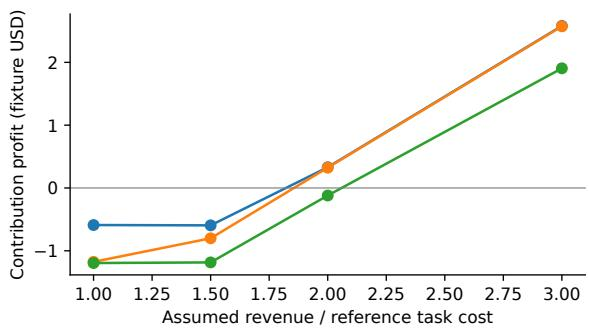  
Figure 12. Financing outcomes for synthetic task sequences with continuous balances. Scripted task counts and contribution quantify the accounting efects of the specified funding and receipt assumptions.

Synthetic claims: capped compensation and full-payment checks  
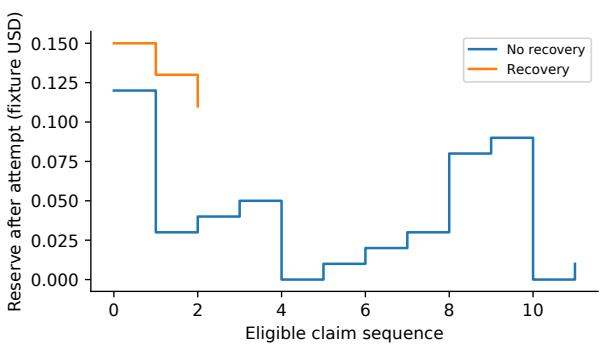  
Synthetic claim sequences with per-claim limits and finite reserves.

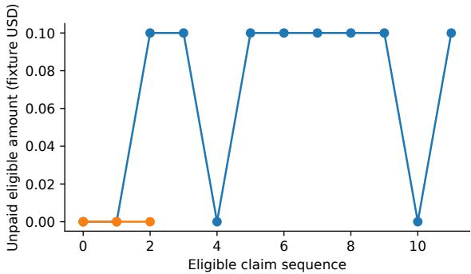  
Figure 13. Reserve balances and payment outcomes in deterministic protection tests. Each submitted claim is checked against its cap and available funds. The horizontal axis indexes eligible claims separately for each condition: 12 without recovery and 3 with recovery.

## E Controlled Agent Evaluation: Experimental Design

The controlled study isolates the efects of financing, recovery, and protection within a tractable service workflow. It uses real model inference and executable business tools, while fixing customer requests, local business records, and economic assumptions. The task split, completion criteria, parameter-selection rules, and treatment structure were specified before evaluation. The tool interface was finalized during calibration, as described below. Completed outcomes are reported in Appendix F, with controlled and retail outcomes reported under their respective study denominators.

## E.1 Workload and Completion Criteria

Each task combines a fixed customer request, constructed local business records, Qwen/Qwen3-8B inference through Nexus and SiliconFlow, and callable business tools. Neither a model-driven customer nor a model-based judge is used. A task generates a receipt only when the requested operation and its final output both satisfy the completion rule.

Table 9. Controlled task families and completion criteria. Each family contains three calibration tasks and four evaluation tasks.
<table><tr><td>Family</td><td>Model-directed operation</td><td>Completion criterion</td></tr><tr><td>Extraction</td><td>mit the record</td><td>Extract a reference, quantity, and city; sub- Submitted fields and final JSON match the request.</td></tr><tr><td>Order lookup</td><td>Invoke the order-lookup tool</td><td>The requested order is retrieved and final JSON matches its state.</td></tr><tr><td>Product selection</td><td>Query the catalog; select and quote an item</td><td>The quoted item is the cheapest eligible in-stock item; quantity, total, and final JSON are correct.</td></tr></table>

The workload contains 21 tasks: nine for calibration and 12 for evaluation, with distinct identifiers and business records. Initial ordering is determined by SHA-256 hashes of task identifiers. The shared-template design targets these task families. Every scheduled case remains in its study denominator, including errors and funding-admission stops.

The model configuration uses temperature zero, disabled thinking, a 512-token output limit, and per-task limits of six logical requests, 18 physical requests, and 600 seconds. A logical request is an intended model call; its retries count as additional physical requests. The first response must invoke a tool; subsequent responses may invoke tools or finish the task. Separate executions retain the variability of remote inference at this configuration.

## E.2 Calibration and Workflow Configuration

Before economic parameters are fixed, all nine calibration tasks must reach a terminal outcome, at least two of the three tasks in each family must succeed, and returned usage must reconcile with Nexus records. This criterion establishes workload readiness before the economic parameters are fixed.

Two calibration passes use the same nine task identifiers, business records, split, and initial ordering. The final interface enumerates valid category codes and exposes dependent operations in the order catalog lookup, quote creation, and final output. This configuration is selected using calibration tasks; the model selects the product and supplies its own responses. Evaluation tasks are first executed after calibration is complete. The resulting study evaluates a calibration-informed, constrained service workflow. Appendix F.1 reports both calibration passes and their measurements.

## E.3 Measurement and Operating-Capital Model

Returned input and output token counts and request latency are measured. Under the economic-valuation conventions in Section 8.1, each request is assigned the following laboratory expense at the supported precision:

$$
c _ { i } = \mathrm { r o u n d } _ { 1 0 ^ { - 6 } } \left( \frac { 1 0 0 n _ { i } ^ { \mathrm { i n } } + 5 0 0 n _ { i } ^ { \mathrm { o u t } } } { 1 0 ^ { 6 } } \right) .\tag{95}
$$

Here $n _ { i } ^ { \mathrm { i n } }$ and $n _ { i } ^ { \mathrm { o u t } }$ are returned token counts. Amounts are in experimental USD. The prespecified scale makes small-task losses representable at cent precision; fees, rounding, and coverage are interpreted at this fixed scale. Requests with unknown usage retain their reservations under the stated cost-bound convention.

Let $\mu$ be the mean known calibration expense per scheduled task and $H _ { \mathrm { c a l } }$ the largest conservative singlerequest reservation observed during calibration. Reservations are derived from the serialized UTF-8 payload, a framing allowance, and the maximum output allowance. The operating parameters are

$$
B = \mu + H _ { \mathrm { c a l } } , \quad \quad A = \lceil 4 \mu \rceil _ { 0 . 0 1 } , \quad \quad r = 2 \mu ,\tag{96}
$$

where � is initial operator capital, � is additional funding, � is the receipt per successful task, and $\lceil \cdot \rceil _ { 0 . 0 1 }$ rounds up to cents. These symbols follow Table 2. Receipts are paid after every four scheduled tasks; denied tasks still advance this schedule. Balances evolve continuously and never reset between tasks.

The revenue-right condition allocates receipts as 89% to the operator, 10% to the investor, and 1% to the platform through the implemented accounting procedures. Funding principal is excluded from contribution; interim investor transfers and outstanding rights are tracked separately. Changing receipts on an already observed trajectory provides a conditional accounting sensitivity. An operational comparison requires fresh execution whenever the change can afect task admission.

## E.4 Treatments and Outcome Measures

Financing. Own-capital, equal-capital, and revenue-right portfolios each execute the 12 evaluation tasks. The equal-capital control separates the benefit of additional available funds from the cost of sharing revenue. Outcomes include completed services, admission stops, continuous balances, operator contribution, and investor cash flow. Known operator contribution is retained customer receipts minus known inference expense; injected capital is excluded, and unknown expense and outstanding receivables are reported separately. Productive growth requires both additional completed services and positive incremental contribution, rather than contract approval alone.

Recovery and protection. Four additional portfolios cross own-capital or revenue-right financing with recovery disabled or enabled. Their ample operating capital, $1 0 0 \mu + H _ { \mathrm { c a l } }$ , separates recovery from a binding funding constraint. A fixed schedule injects timeout, rate limiting, primary-path outage, or common-path outage before the second logical Agent request. Recovery uses an alternative local path while holding the model and supplier fixed. The measured recovery scope is therefore local-path continuation. Incident reachability, subsequent responses, and completed services are distinct outcomes.

Protection is applied to the same execution trajectory without changing task completion or operating capital. Only covered terminal injected failures generate claims; incorrect answers do not. Eligible loss is known incurred laboratory expense rounded down to cents. The claim cap is $L = \operatorname* { m a x } ( 0 . 0 1 , \lceil \mu \rceil _ { 0 . 0 1 } )$ , the premium is $\operatorname* { m a x } ( 0 . 0 1 , \lceil 0 . 0 1 \mu \rceil _ { 0 . 0 1 } )$ , and the funded and scarce reserves are 12� and �. The contract API determines approval, rejection, and settlement, including funding checks. Payments are service credits, not cash or replenishments of operating capital. Requested, approved, paid, and unpaid amounts and the remaining reserve are reported separately.

Forwards. Contracts are approved before evaluation, with strike one, zero discount, and calibration-fixed notional $N _ { h } = 1 2 \mu h$ for $h \in \{ 0 . 2 5 , 0 . 5 0 , 0 . 7 5 , 1 \}$ . The no-contract control uses $h = 0$ . Terminal indices � ∈ {0.5, 1, 1.5} are assumed price scenarios rather than market observations. The contract fee rate is 0.012. Fees, both counterparties’ settlements, and unpaid amounts are reconciled to API records. Conditional expenditure applies scenario prices to realized demand, subtracts signed forward payments, and adds fees. Realized demand may difer from the calibration notional; applying prices after execution does not change the observed admission decisions.

Combined comparisons and pairing. The seven execution arms produce 84 scheduled task–arm cases. A fixed pseudorandom schedule varies arm order within each task. Combinations of forwards (�), financing (�), and protection (�) reuse a trajectory only when the financial operation cannot alter available operating funds or recovery. Financing and recovery changes therefore require distinct executions. Protection-adjusted service value is distinguished from cash contribution. One chronological portfolio per arm defines the unit for descriptive comparison.

## E.5 Verification and Scope of Inference

Request identifiers link outcomes and token usage to contract operations and ledger changes. Contract operations use authenticated business APIs on a dedicated PostgreSQL database. Independent decimal accounting checks amounts and balances exactly; efectiveness results require successful reconciliation. Restart handling preserves completed operations and settled claims, while incomplete interruptions remain visible. Seven ofline checks assess the workload implementation separately from the model-driven efectiveness measurements.

Table 10. Measurement scope of the controlled evaluation.
<table><tr><td>Component</td><td>Measurement and interpretation</td></tr><tr><td>Model and tool execution</td><td>Responses, returned usage, and completed operations are observed on the controlled task set.</td></tr><tr><td>Business records and faults</td><td>Constructed records and local fault schedules define the controlled execution conditions.</td></tr><tr><td>Prices and receipts</td><td>Experimental tariffs, success-triggered receipts, and terminal price indices define the scenario valuation.</td></tr><tr><td>Contract settlement</td><td>Account changes and service-credit payments are observed in isolated database experiments and reconciled independently.</td></tr><tr><td>Study population</td><td>Fixed task families define the repeated-study population; calibration, con- trolled evaluation, and retail cohorts retain separate denominators.</td></tr></table>

## F Supplementary Evaluation Methods and Results

This appendix provides the workload definitions, cohort-specific results, and sensitivity analyses supporting the main evaluation. The organization follows the three financial mechanisms and their combined accounting. Request replay characterizes expenditure under specified scenarios, model-driven execution measures service and capital outcomes, and synthetic contract tests validate accounting rules. Each study retains its own population and measurement scope, as defined in Section 8.1.

## F.1 Workloads, Calibration, and Measurement

Table 1 summarizes the evaluation cohorts. The protocols below specify their selection, execution, and accounting rules. Calibration and development attempts are reported separately from evaluation outcomes.

## F.1.1 Request-Level Replay

Data and pricing. We use the first two months of BurstGPT [14], with the dataset version recorded in the supplementary artifact. Removing conversation records and the incomplete final day leaves 1,261,858 API requests. Days 0–17 provide 362,417 calibration requests, and days 18–59 provide 899,441 evaluation requests. Replay preserves timestamps, model labels, token counts, and original request order. All requests remain in the ofered workload, although budget-constrained conditions may admit only a subset. No arrivals or duplicate requests are added.

The reference tarif is \$3 per million input tokens and \$15 per million output tokens, yielding \$3,395.80116 for successful first-attempt requests. This amount is a reference-tarif valuation. Of 16,137 zero-output records, 16,131 also lack input lengths. Zero output supplies the failure indicator; unobserved first-attempt charges use the same assumptions in paired conditions, and alternate-attempt lengths are estimated from calibration data. The trace supplies request timing and usage; task correctness and contractual coverage are assessed in the separate model-driven and contract studies.

Matched conditions. The principal combined comparison fixes the ofered requests, provides suficient funding access, and models one alternate attempt after a primary failure. Only financial contracts vary. Separate experiments examine budget-limited service growth and changes in technical recovery. Forward comparisons hold requests, prices, and cache/batch settings equal; financing-cost comparisons hold the funded amount equal; protection comparisons hold the recovery policy equal. This matching isolates financial-contract efects from model selection, caching, and failover.

Prices are scenario assumptions expressed relative to the reference tarif. The paths include a constant value of 1, linear changes from 1 to 1.3 or 0.7 over 42 days, a seven-day increase to 1.8, and an increase triggered by the preceding five-minute arrival count. Calibration defines bursts as 1,299 requests per five-minute window and long inputs by a 2,527-token threshold. Each paired baseline faces the same path. Financing and shared-failure stresses are examined separately; combined stresses describe joint outcomes rather than isolated mechanism efects.

## F.1.2 Controlled Agent Cohorts

Calibration and initial study. The controlled workload contains 12 evaluation tasks: four each for structured extraction, order lookup, and constrained product selection. It uses Qwen/Qwen3-8B through Nexus and SiliconFlow, constructed business records, and controlled local faults, without a customer-simulation or judge model. Appendix E defines its completion criteria and treatment structure.

The first calibration pass succeeds on 3/3 extraction tasks, 3/3 lookup tasks, and 1/3 selection tasks; all 23 responses match Nexus records. The second pass uses the explicit category codes and dependency-ordered interface described in Appendix E. All nine tasks succeed, and all 21 responses reconcile exactly. Task identifiers, records, split, and initial ordering are unchanged. The final workflow is selected using these calibration observations before any evaluation-task model calls. Both passes retain their measurements and separate calibration status.

The initial study completes all 84 scheduled task–arm cases, with 51 successful services and 150 responses from 150 physical requests. Usage is available for every returned response, totaling 49,086 input and 5,323 output tokens. Median client request latency is 4.53 seconds, including network efects. Monetary valuation follows the prespecified laboratory tarif of 100/500 experimental USD per million input/output tokens and the assumed business receipts defined in Section 8.1. Calibration fixes $\mu = 0 . 1 2 7 6 8 9$ $H _ { \mathrm { c a l } } = 0 . 9 4 3 3 0 0$ � = 1.070989, � = 0.52, and $r = 0 . 2 5 5 3 7 8$ . Receipts are delayed until each block of four scheduled tasks, and balances never reset between tasks. Capital efects therefore depend on the request-reservation policy as well as the laboratory tarif. Each arm provides one chronological portfolio for descriptive comparison.

Repeated portfolios and parameter sensitivity. A protocol fixed before inference specifies five separately executed portfolios with randomized orders of the same 12 controlled tasks. Each compares own capital, equal capital, and revenue rights, together with recovery enabled or disabled under ample own capital. Seven additional portfolios vary one financing factor at a time, and three vary fault frequency. Accounts are isolated, model responses are newly obtained, and completion rules and calibration remain fixed. The repeated-task design measures financial outcomes under controlled operating conditions.

All 624 scheduled cases reach a terminal outcome. The 1,247 physical requests yield 1,246 responses and 487 successful services. There is one request with unknown returned usage, 39 funding-admission stops, no infrastructure interruptions, and 98 terminal injected-fault failures. Available response usage matches Nexus records, totaling 436,701 input and 43,028 output tokens. Unknown usage is handled by the reservation bounds below. Admission uses input-byte and maximum-output reservations, with unused amounts released after measured usage is known. The median reservation-to-measured-charge ratio of 12.0153 characterizes the advance-funding requirement in this study.

Missing-usage accounting. A request without returned usage retains its reservation, making those funds unavailable to later tasks. Let $H _ { u }$ be the unresolved reservation, �known known expense, and $Y _ { \mathrm { r e t } }$ retained portfolio receipts. Under the reservation bound, feasible contribution lies in

$$
\left[ Y _ { \mathrm { r e t } } - C _ { \mathrm { k n o w n } } - H _ { u } , \ Y _ { \mathrm { r e t } } - C _ { \mathrm { k n o w n } } \right] .\tag{97}
$$

Treatment-minus-control bounds subtract the upper control endpoint from the lower treatment endpoint, and conversely. Known-expense contribution and the interval covering unresolved usage are reported separately.

For the earlier repeated-portfolio cohort, these bounds are a retrospective analysis of the unresolved request in the second portfolio. The execution protocol, task list, and recorded outcomes are unchanged, and all afected portfolios remain in that cohort. The same accounting rule is prespecified for the subsequent capital replication.

Matched capital replication. A separate five-block protocol was fixed after inspection of the earlier singleportfolio boundary results but before collection of its own observations. Each block freshly executes own-capital, equal-capital, and revenue-right arms at initial capital 0.5�, �, and 1.5�, giving 5 × 3 × 3 × 12 = 540 scheduled cases. Each block shares task order and randomized within-task arm order across capital conditions; capitalcondition order is randomized separately. Calibration, model, tarif, receipts, delay, and reservation policy remain unchanged. The fixed randomization seeds are recorded in the supplementary artifact.

The replication records 1,082 physical requests, 1,081 responses, 456 successful services, 84 admission stops, one request with unknown usage, and no infrastructure interruptions. Every scheduled case has an outcome. Contribution excludes principal and bounds unresolved usage rather than assigning zero cost. Exploratory 95% percentile envelopes jointly resample the five matched blocks across conditions using 10,000 draws. Repeated economic portfolios are the sampling units. The earlier incident-afected study retains its separate observations and denominator.

## F.1.3 Retail Task Studies

Environment and task selection. The retail studies use a fixed version of the oficial text environment of �2-Bench [3]; its revision is recorded in the supplementary artifact. SHA-256 ordering partitions 114 tasks into 22 calibration and 92 evaluation tasks. The baseline takes the first five evaluation tasks, each twice, with selection fixed independently of pilot rewards. These identifiers also appear in preliminary integration trials. The baseline is a repeated evaluation of this custom subset, with its prior integration exposure recorded separately from task selection.

The oficial instructions, tools, and ALL completion criterion are used. All model roles employ Qwen/Qwen3- 8B through Nexus and SiliconFlow. The customer is model-driven, with no scripted responses substituted. Applicable model-based evaluator checks use the same model, rather than the upstream default judge.

Execution limits. Execution is serial, with temperature zero, thinking disabled, a 2,048-token output cap per request, 30 requests per role per task, a 600-second between-call deadline, 60 orchestrator steps, and a limit of 10 consecutive tool errors. Transport timeouts are bounded by the remaining task time. Transient transport, routing, rate-limit, and server failures permit at most three physical requests per logical call, with two- and four-second backof. Each physical request consumes the request limit and has a distinct identifier; uncertain prior usage remains unknown. Tools execute only after a complete response and are not replayed. Authentication is renewed before requests at 20-minute intervals.

Baseline outcomes and reconciliation. The baseline records ten attempted trials: nine receive an oficial score, four succeed, and one is unscored. Across all attempts, 368 requests yield 360 responses; eight have no usage in a completed client response. Seven logical calls require retries, all of which eventually return a complete model response, and three authentication renewals are recorded. These are naturally observed incidents rather than randomized treatment efects; usage of preceding failed attempts remains unknown.

For operational success across all attempted trials, 10,000 bootstrap draws over task means give a descriptive 95% percentile interval of [10.0%, 70.0%]. Repetitions remain within task clusters. Operational success counts completed successful tasks; unscored trials retain missing oficial rewards, and tool outcomes remain in the recorded trajectories.

All 360 returned responses link to successful gateway records, with exact agreement in token counts, selected source, and configured wallet charges. Conditional financial analyses apply the assumed 1/5 input/output tarif per million tokens to returned Agent usage under the measurement conventions in Section 8.1. Simulated-customer and evaluator usage enter the experimental budget separately from operator expense; unresolved usage retains its accounting bounds.

Table 11. Real fixed evaluation model usage by role. Simulated-user and evaluator costs belong to the experimental budget rather than Agent operating expenditure. Latency covers returned responses; task duration also includes failed attempts and retry delays.
<table><tr><td>Role</td><td>Responses</td><td>Input tokens</td><td>Output tokens</td><td>Mean latency (s)</td></tr><tr><td>Agent</td><td>237</td><td>1,658,417</td><td>13,796</td><td>9.87</td></tr><tr><td>Simulated user</td><td>121</td><td>157,622</td><td>7,009</td><td>9.49</td></tr><tr><td>Evaluator</td><td>2</td><td>9,604</td><td>180</td><td>4.19</td></tr></table>

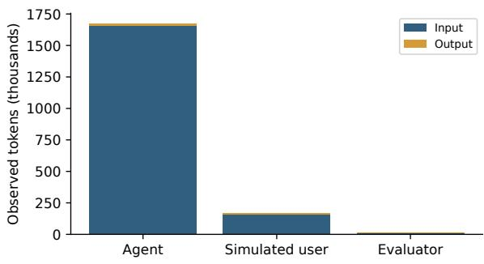  
Observed model responses and task outcomes; supplier invoices unavailable.

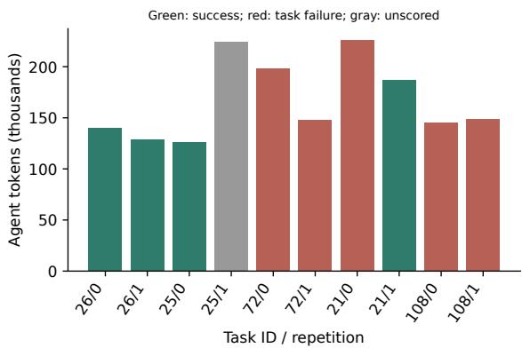  
Figure 14. Retail baseline token usage and task outcomes. Repeated attempts are paired by task identifier; task success follows the oficial completion rule.

Retail contract interventions. The contract study schedules 70 cases: ten previously unexecuted retail tasks, each in seven execution arms. Independent calibration uses five tasks twice each. Within-task arm order follows a fixed pseudorandom schedule. Every scheduled outcome is retained, and each arm constitutes one chronological economic portfolio.

At the assumed 1/5 input/output tarif, known calibration Agent cost per attempt is $\mu = 0 . 1 8 4 2 9 8$ . The initial balance is $B = \mu ,$ , additional capital is $A = \lceil 2 \mu \rceil _ { 0 . 0 1 } = 0 . 3 7 0 0 0 0$ , and the success receipt is $2 \mu = 0 . 3 6 8 5 9 6$ experimental USD. Balances evolve continuously. Before each physical Agent request, a conservative reservation covers the UTF-8 prompt bound and output allowance. Returned usage determines the charge and release of unused funds; unknown usage retains its hold. Simulator and judge expenses are separate, and principal is not revenue.

Contract approvals, funding checks, and transfers use authenticated business APIs on isolated PostgreSQL accounts with disclosed initial funds. Actual inference passes through Nexus and SiliconFlow, and returned usage is reconciled to gateway requests. A fixed task-specific schedule injects local faults before the third logical Agent request. The study measures contract and execution outcomes under this controlled local-fault schedule and the declared economic assumptions.

Table 12. Outcomes of all prespecified task attempts under the oficial completion rule. Tool-error counts and total evaluation time are reported separately.
<table><tr><td>Task/repetition</td><td>Outcome</td><td>Tools (errors)</td><td>Agent tokens</td><td>Seconds</td></tr><tr><td>26/0</td><td>Success</td><td>10 (2)</td><td>140,455</td><td>373.7</td></tr><tr><td>26/1</td><td>Success</td><td>10 (2)</td><td>128,610</td><td>247.7</td></tr><tr><td>25/0</td><td>Success</td><td>10 (4)</td><td>126,529</td><td>385.0</td></tr><tr><td>25/1</td><td>Unscored</td><td>17 (6)</td><td>223,946</td><td>600.0</td></tr><tr><td>72/0</td><td>Failure</td><td>10 (9)</td><td>197,961</td><td>515.1</td></tr><tr><td>72/1</td><td>Failure</td><td>14 (6)</td><td>147,962</td><td>314.7</td></tr><tr><td>21/0</td><td>Failure</td><td>18 (9)</td><td>225,862</td><td>518.2</td></tr><tr><td>21/1</td><td>Success</td><td>15 (5)</td><td>187,367</td><td>436.2</td></tr><tr><td>108/0</td><td>Failure</td><td>12 (10)</td><td>145,018</td><td>245.5</td></tr><tr><td>108/1</td><td>Failure</td><td>9 (3)</td><td>148,503</td><td>328.1</td></tr></table>

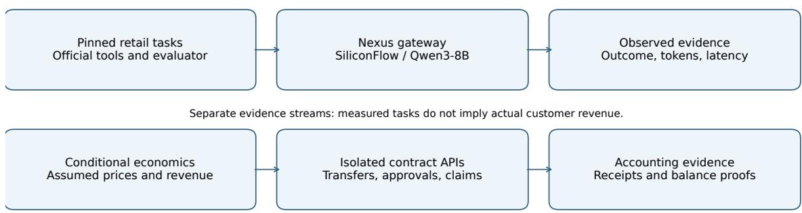  
Live calls and database fixtures are measured separately; economic inputs remain assumptions.  
Figure 15. Measurement organization connecting model-driven execution, database contract experiments, and scenariobased economic valuation.

All 70 cases terminate, with 54 reaching an Agent request. Of 23 oficially scored cases, one succeeds. The remaining 47 are unscored: 24 encounter funding-admission stops, 20 terminate at injected incidents, and three reach task-resource limits. Calibration separately yields nine scored failures and one unscored attempt without changing task selection. The study obtains 925 complete responses from 930 physical requests, all reconciled to gateway records. Five requests have unknown usage, with their reservations reported separately from known expense. These outcomes use the intervention cohort’s own task population and denominator.

## F.2 Forward Settlement, Price Mismatch, and Risk Decomposition

The analyses support Section 8.3 by reconciling settlements on measured Agent demand and quantifying expenditure responses to price paths, funding availability, and contract-to-bill alignment.

## F.2.1 Settlement on Measured Agent Demand

Controlled workload. All 84 forward contracts in the initial controlled cohort reconcile in signed payment, fee, and settlement count. Contracts are approved before evaluation with zero discount and calibration-fixed notionals. Declared terminal-price scenarios are applied to measured demand, with the same trace retained in the no-contract control. This pairs actual settlement execution with conditional expenditure analysis.

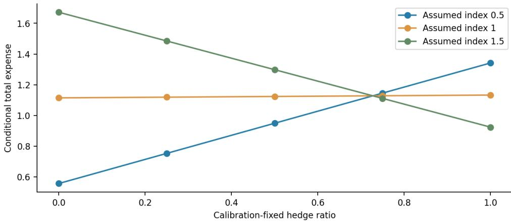  
Controlled Agent study; experimental USD; supplier invoices unavailable  
Figure 16. Conditional expense versus hedge ratio on the own-capital recovery trajectory under the declared terminal-price scenarios.

Retail workload. Before any intervention task, we form zero-discount contracts at strike one with notionals ℎ��, ℎ ∈ {0.25, 0.5, 0.75, 1} and � = 10. The 84 arm–hedge–index contracts use declared final indices 0.5, 1 and 1.5; these are scenarios, not observed provider price changes. Settlement occurs after the workload within the ten-day validity window, leaving the observed task-admission decisions unchanged. A separately recorded 1.2% experimental fee is transferred through the ledger. Both counterparties use adequate disclosed test funds.

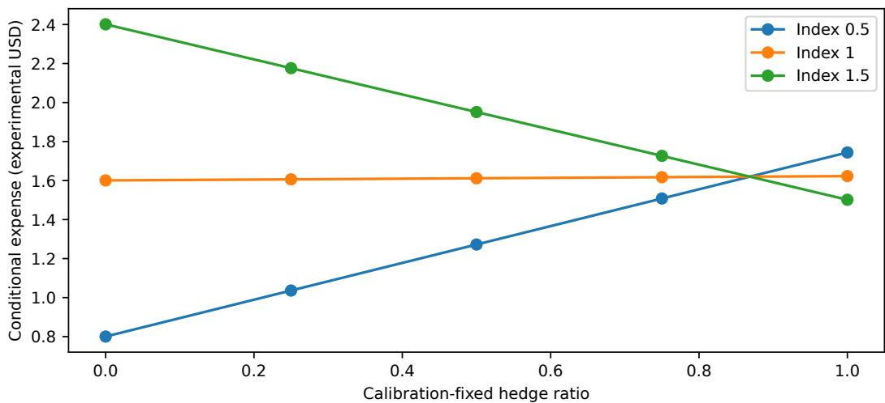  
Figure 17. Zero-discount forward comparison on the recovery-enabled own-capital arm’s measured returned demand. Calibration-fixed notionals and declared price indices determine actual API settlements and fees, which enter the conditional expenditure calculation.

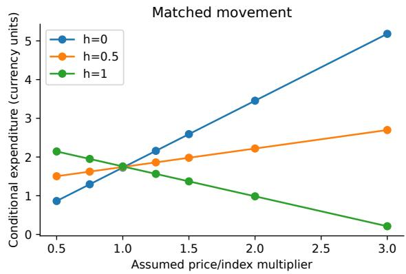  
Assumed tariffs applied to observed returned Agent usage.

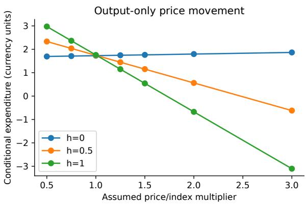  
Figure 18. Paired forward scenarios applied to measured returned Agent usage. Declared price and notional scenarios compare matched and output-only movements to characterize settlement alignment with operating expense.

Actual API settlements are compared exactly with ℎ��(� − 1) and both account balances, one settlement per contract. The zero-hedge and nonzero-hedge controls use measured returned demand, allowing realized usage to vary relative to the calibration notional. The associated block-resampled analysis characterizes the declared price-path scenarios.

## F.2.2 Expenditure Sensitivity and Exposure Mismatch

Conditional expenditure on the retail baseline. For identical measured demand in each price scenario, let $C _ { s }$ denote its conditional cost, $P _ { s }$ the signed paid settlement, and � the fee. Then $C _ { s } ^ { D } - C _ { s } = f - P _ { s }$ . The scenario analysis of the ten-trial retail baseline uses zero strike discount, hedge ratios 0, 0.25, 0.5, 0.75 and 1, and a declared nominal exposure of 0.25 per scheduled attempt, varied by factors 0.5, 1 and 1.5. This is an exposure sensitivity, not a forecast fitted to evaluation outcomes. We compare matched price/index movement, output-only price movement, and an unchanged index. Under full settlement, a unit-strike forward with a 1.2% nominal fee reduces expenditure above an index of 1.012. This threshold identifies the price movement needed to ofset fees. Buyer and seller funding stresses report paid and unpaid obligations separately; the BurstGPT block analysis supplies the corresponding conditional path-risk measures.

Payments under matched execution. The reference forward covers 80% of the calibration-mean daily expenditure, with fees and holding-period funding charges of 1% and 0.2% of the contracted amount, respectively. Contract prices assume zero or 10% discount. Under constant prices and the assumed 10% discount, modeled expenditure falls by \$155.39 (4.58%). The contract covers about 52% of realized base expenditure, explaining why the reduction is smaller than the assumed discount. The buyer receives \$176.58 from the seller and pays \$21.19 in fees and funding charges. With no discount, expenditure instead increases by 0.62%.

The financial efect complements execution optimization. Under identical assumed cache and batch eligibility, ordinary optimization reduces the unhedged invoice to \$2,418.20. Adding the discounted forward reduces expenditure by a further \$113.04 (4.67%). The ordinary optimization uses 25% batch-cost eligibility, 40% input-cache hits, and 5% cache writes, with a 50% batch discount and input-price multipliers of 0.1 for cache hits and 1.25 for writes, applied identically in both arms. Its separate \$977.60 saving is attributed to caching and batching. An ordinary forward with identical terms gives the same payment, serving as an arithmetic consistency control for the financial calculation.

Price and demand mismatch. With otherwise unchanged contract settings, gradually rising prices reduce buyer expenditure by 11.39%, while gradually falling prices increase it by 3.53%. These paths difer from the constant-price sensitivity: keeping the price 30% below the reference throughout evaluation increases discounted forward expenditure by 15.75%. The cases must not be interpreted as the same price treatment.

Actual purchases use each request’s five-minute price, whereas settlement uses the daily average of the reference prices. This diference, together with forecast usage errors, prevents a contract from exactly ofsetting the bill. For example, the burst/long-input class has \$4.02 of reference expense against approximately \$83.53 of committed notional. Its stable-price net benefit of \$7.35 reflects contractual exposure exceeding realized demand. These class allocations are analytical portfolio breakdowns, with settlement scaled by the committed notional.

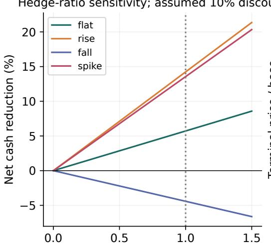  
Hedge / forecast (above 1 is leveraged)

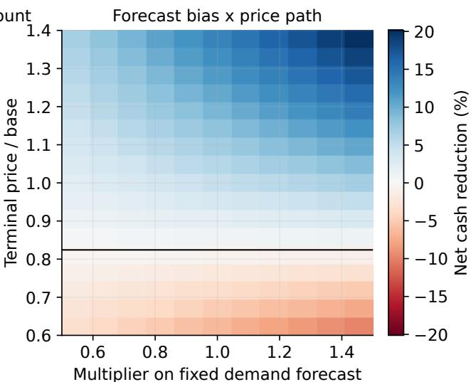  
Figure 19. Forward expenditure sensitivity to the covered amount, forecast error, and assumed price path. Exposure scales the signed settlement while the executed workload remains fixed.

The forecast comparison uses only preceding days. Predictions use the fixed calibration mean, the mean of all preceding days, the mean of the preceding seven days, or the value seven days earlier. Their weighted absolute percentage errors are 78.70%, 103.77%, 97.75%, and 142.23%, respectively; this metric divides total absolute prediction error by total actual expense. Figure 19 varies the covered amount and forecast bias explicitly. These measurements quantify the forecast and exposure ranges used in the contract-to-bill sensitivity analysis.

## F.2.3 Variance Decomposition

For $h = 1$ , matched reference, unscaled forecast, and funded settlement, the 1,000 paired paths yield Table 13. Here � is signed settlement net of charges and $C _ { 0 }$ is unhedged expenditure, as in Equation (47). Sample moments use denominator � − 1. Variance and covariance columns use $\mathrm { U S D } ^ { 2 }$ ; the final column is the paired change in mean expenditure in USD. The post-hoc decomposition relates net-payment variation and covariance to the measured expenditure response.

Table 13. Mechanism of risk changes in conditional resampled paths. Negative variance change is favorable; mean expenditure and variance are distinct outcomes.
<table><tr><td>Scenario</td><td>Var(Z)</td><td> $2 \mathrm { C o v } ( C _ { 0 } , Z )$ </td><td>∆Var</td><td>∆E[C]</td></tr><tr><td>flat</td><td>0.0</td><td>0.0</td><td>+0.0</td><td>+26.49</td></tr><tr><td>rise</td><td>4522.5</td><td>-85383.2</td><td>+89905.7</td><td>-304.88</td></tr><tr><td>fall</td><td>4522.5</td><td>93585.4</td><td>-89063.0</td><td>+357.85</td></tr><tr><td>spike</td><td>47158.8</td><td>-80862.3</td><td>+128021.1</td><td>-304.10</td></tr><tr><td>lagged-load</td><td>0.2</td><td>413.1</td><td>-412.8</td><td>+25.08</td></tr></table>

## F.3 Capital Constraints and Financing Sensitivity

The matched capital replication is the principal financing comparison. Supporting studies examine repeated controlled portfolios, individual parameter changes, retail tasks, and request-level replay. Together, they characterize financing efects across operating conditions, with the largest matched-capital benefit observed under capital scarcity. Each cohort retains its observations and denominator.

## F.3.1 Matched Capital Replication

Admission and matched-capital outcomes. At 0.5�, revenue-right financing reduces mean admission stops from 12.0 to 1.8 and raises mean contribution by 1.0635 experimental USD, with positive contrasts in all five portfolios. Own-capital and revenue-right admission stops are 1.4/0.0 at � and 0.0/0.0 at 1.5�. Table 14 reports all capital contrasts, missing-cost bounds, and exploratory whole-block resampling ranges. Capital levels were selected from the earlier boundary experiment, and the replication protocol was fixed before its own observations. Interpretation follows the portfolio-level sampling convention in Section 8.1.

Matched capital sensitivity and investor cash flows. The fifth matched block at 1.5� includes an equal-capital task that succeeds after a retry following an upstream server error. The unresolved usage of the earlier request retains a 0.883600 reservation. Its contribution contrasts use the prespecified cost-bound accounting rule.

The low-minus-baseline diference in the financing-versus-own-capital contribution contrast has mean 1.2041 and exploratory matched-block envelope [0.9975, 1.4106]. The ample-minus-baseline diference in the financing-versus-own-capital contribution contrast has mean -0.1556 and exploratory matched-block envelope [-0.2587, -0.0524].

The investor contributes 0.5200 and receives mean wallet transfers of 0.2540 at low capital and 0.3000 at baseline and ample capital. Accrued entitlements and rounding remainders are tracked separately. These are observation-window cash flows with rights still outstanding, using the scope defined in Section 8.1.

The separate repeated-portfolio study below retains its incident-afected portfolio and unresolved-usage bound. The capital replication adds matched evidence under the same tarif and reservation conventions.

Reservation-policy dependence. The 1,081 requests with returned usage have reservations ranging from 0.545800 to 0.943300 experimental USD, with a median reservation-to-known- charge ratio of 12.4382. The low-capital opening balance is 0.535495. These returned-usage records characterize the tested advance-funding requirement relative to the opening balance. Their population excludes rejected-request reservations; financing outcomes are interpreted under this fixed reservation policy.

Table 14. Contribution contrasts in the matched capital replication. The mean column reports missing-usage bounds where non-degenerate. The envelope is the exploratory whole-block 95% resampling range, not another bound on a single missing request. The last column counts definitely positive/negative blocks out of five. Units are experimental USD; principal and credit are excluded.
<table><tr><td>Capital</td><td>Contrast</td><td>Mean / cost bound</td><td>Resampling envelope +/– blocks</td><td></td></tr><tr><td>0.5B</td><td>Right-own</td><td>1.0635</td><td>[0.9506, 1.1786]</td><td>5/0</td></tr><tr><td>0.5B</td><td>Right-equal</td><td>-0.3049</td><td>[-0.3324, -0.2806]</td><td>0/5</td></tr><tr><td>0.5B</td><td>Equal-own</td><td>1.3684</td><td>[1.2642, 1.4894]</td><td>5/0</td></tr><tr><td>B</td><td>Right-own</td><td>-0.1406</td><td>[-0.2657, -0.0155]</td><td>2/3</td></tr><tr><td>B</td><td>Right-equal</td><td>-0.3174</td><td>[-0.3507, -0.2835]</td><td>0/5</td></tr><tr><td>B</td><td>Equal-own</td><td>0.1769</td><td>[0.0506, 0.3138]</td><td>4/1</td></tr><tr><td>1.5B</td><td>Right-own</td><td>-0.2962</td><td>[-0.3294, -0.2632]</td><td>0/5</td></tr><tr><td>1.5B</td><td>Right-equal</td><td>1 [-0.2742, -0.0975]</td><td>[-0.2965, 0.2676]</td><td>0/4</td></tr><tr><td>1.5B</td><td>Equal-own</td><td>[-0.1987, -0.0220]</td><td>[-0.5741, 0.0000]</td><td>0/2</td></tr></table>

## F.3.2 Repeated Controlled Portfolios

Whole continuous portfolios are the replication units because their tasks share operating funds. All five paired diferences are reported. Exploratory 95% envelopes use 10,000 paired-portfolio draws and the lower 2.5th and upper 97.5th percentiles of the mean cost bounds. Without missing usage, this reduces to percentile resampling of the observed contrasts. Remote-model variation, provider incidents, and their efects on later admission remain part of each realized portfolio outcome.

Table 15. Fresh portfolio contrasts. An asterisk identifies financing arms with unplanned request errors or missing usage. Brackets bound unresolved usage under the reservation limit. Recovery compares local recovery with none. Monetary values are experimental USD.
<table><tr><td>Portfolio</td><td>Own tasks</td><td>Right tasks</td><td>∆ tasks</td><td>∆ profit</td><td>Recovery ∆ tasks</td></tr><tr><td>1</td><td>11</td><td>12</td><td>1</td><td>-0.1670</td><td>9</td></tr><tr><td>2*</td><td>9</td><td>1</td><td>-8</td><td>[-2.1573, -1.2153]</td><td>9</td></tr><tr><td>3</td><td>12</td><td>12</td><td>0</td><td>-0.3065</td><td>9</td></tr><tr><td>4</td><td>10</td><td>12</td><td>2</td><td>0.0632</td><td>9</td></tr><tr><td>5</td><td>10</td><td>12</td><td>2</td><td>-0.0799</td><td>9</td></tr></table>

Revenue-right minus own-capital contribution has known-expense mean -0.3411, mean cost-bound range [-0.5295, -0.3411], and exploratory portfolio envelope [-1.3612, -0.0394].

Revenue-right minus equal-capital contribution has known-expense mean -0.5855, mean cost-bound range [-0.7739, -0.5855], and exploratory portfolio envelope [-1.7097, -0.2845].

Local recovery adds nine completed services in every one of the five portfolios, providing consistent descriptive outcomes under the fixed local-fault schedule.

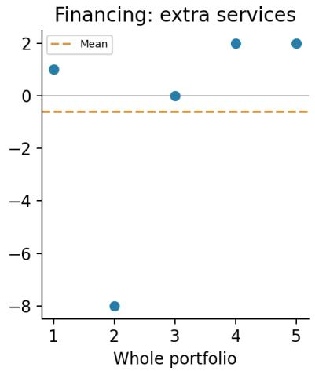

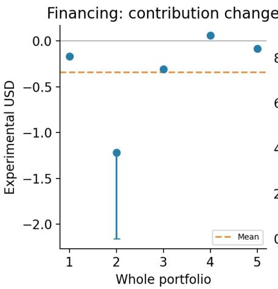

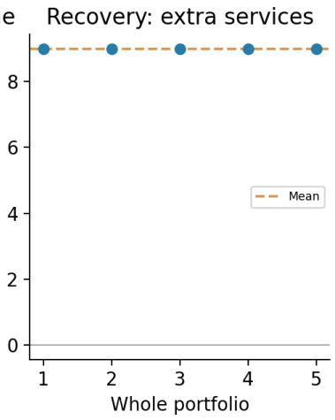  
Figure 20. Every observed whole-portfolio contrast. Whiskers bound unresolved usage under the reservation limit; dashed lines are known-expense means, not task-level confidence estimates

## F.3.3 Income, Capital, and Receipt-Delay Sensitivity

Seven cells change one factor relative to the first repeated portfolio: receipt multiples 1/1.5/3 (baseline 2), own-capital multiples 0.5/1.5 (baseline 1), or receipt delays 1/6 tasks (baseline 4). Additional investor capital stays fixed. All tasks are executed again, so funds afect admission and completion rather than being applied to copied successes. The same task order is used across boundary cells. Each cell is one descriptive scenario portfolio. Contribution excludes initial capital, and outstanding rights are accounted for separately.

Table 16. Fresh financing boundaries: completed service counts and contribution diferences. The profit diference compares revenue rights with own capital. Equal funding isolates capital availability from the investor share.
<table><tr><td>Condition</td><td>Own</td><td>Equal</td><td>Right</td><td>∆ profit</td><td>Right-equal</td></tr><tr><td>Baseline</td><td>11</td><td>12</td><td>12</td><td>-0.1670</td><td>-0.3065</td></tr><tr><td>Receipt multiplier 1</td><td>10</td><td>12</td><td>12</td><td>-0.1826</td><td>-0.2081</td></tr><tr><td>Receipt multiplier 1.5</td><td>11</td><td>12</td><td>12</td><td>-0.2085</td><td>-0.2298</td></tr><tr><td>Receipt multiplier 3</td><td>11</td><td>12</td><td>12</td><td>-0.2487</td><td>-0.4597</td></tr><tr><td>Capital multiplier 0.5</td><td>0</td><td>11</td><td>11</td><td>1.1919</td><td>-0.2277</td></tr><tr><td>Capital multiplier 1.5</td><td>12</td><td>12</td><td>12</td><td>-0.3065</td><td>-0.2516</td></tr><tr><td>Delay (tasks) 1</td><td>12</td><td>12</td><td>12</td><td>-0.3082</td><td>-0.3065</td></tr><tr><td>Delay (tasks) 6</td><td>10</td><td>12</td><td>12</td><td>-0.1478</td><td>-0.3065</td></tr></table>

At the 0.5 capital multiplier, financing completes eleven additional services and raises contribution by 1.1919 experimental USD. This is the one of eight displayed conditions with a positive lower-bound contrast. The scenario grid identifies the dependence on capital, receipts, and delay; the subsequent matched replication evaluates the low-capital condition across five portfolios.

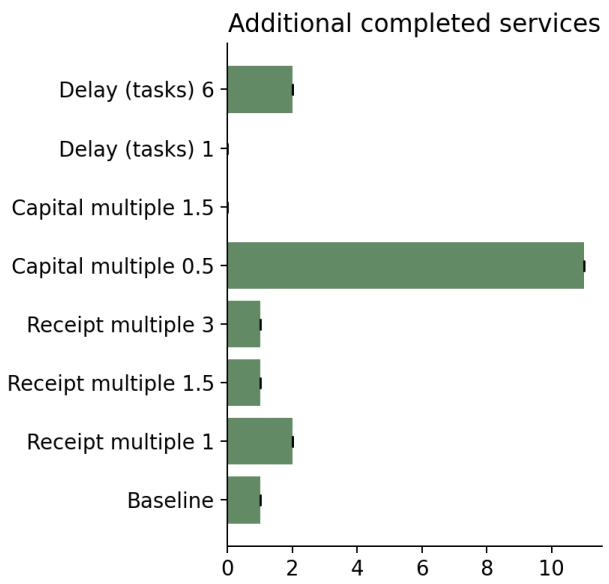

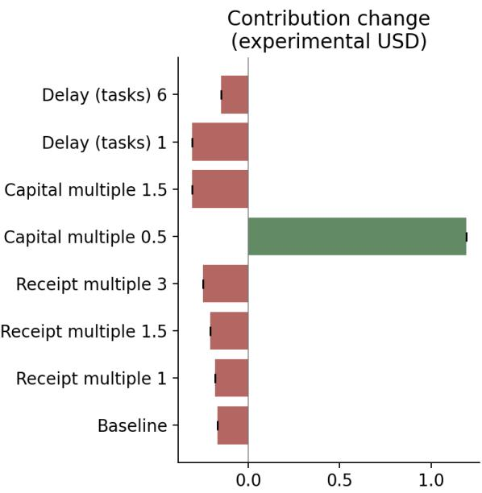  
Figure 21. Financing can change service completion and retained contribution diferently. Each bar is a fresh scenario comparison.

## F.3.4 Initial Controlled Financing Study

Table 17. Fresh financing executions; 12 scheduled tasks per arm. All monetary values are experimental USD. Profit excludes capital injection and uses known expense.
<table><tr><td>Arm</td><td>Success</td><td>Budget stop</td><td>Expense</td><td>Retained</td><td>Profit</td></tr><tr><td>Own capital</td><td>9</td><td>3</td><td>1.1692</td><td>2.2754</td><td>1.1062</td></tr><tr><td>Equal capital</td><td>12</td><td>0</td><td>1.4749</td><td>3.0339</td><td>1.5590</td></tr><tr><td>Revenue right</td><td>12</td><td>0</td><td>1.4749</td><td>2.7274</td><td>1.2525</td></tr></table>

Table 18. Fresh financing interventions. Money is in experimental USD; receipts and tarifs are assumptions. Capital injections are excluded from contribution profit.
<table><tr><td>Arm</td><td>Scored</td><td>Successes</td><td>Budget stops</td><td>Known cost</td><td>Held funds</td></tr><tr><td>own</td><td>1</td><td>0</td><td>9</td><td>0.147368</td><td>0.000000</td></tr><tr><td>equal</td><td>4</td><td>0</td><td>6</td><td>0.515037</td><td>0.000000</td></tr><tr><td>right</td><td>0</td><td>0</td><td>9</td><td>0.342738</td><td>0.172938</td></tr></table>

Relative to own capital, the revenue-right arm completes +3 additional services and changes known-cost operator contribution by 0.1463 experimental USD. The equal-capital arm identifies the efect of the same capital availability without the investor’s revenue share. These realized portfolio contrasts quantify the additional service and retained contribution under the initial study’s capital, tarif, and receipt schedule. The equal-capita comparison separates this capital efect from the investor allocation.

The investor pays 0.5200 and receives 0.3000 in wallet transfers, with 0.3065 accrued distribution. Rounding remainders not yet credited to wallets are tracked separately. Cash flows use the observation-window convention, with outstanding rights reported separately.

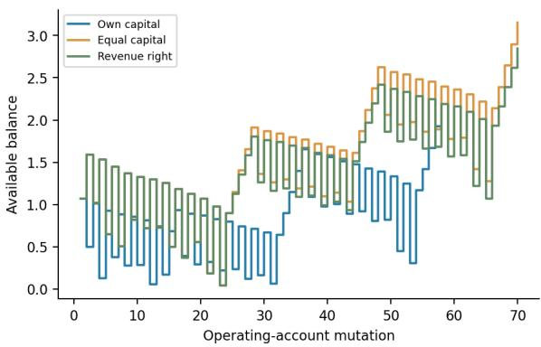

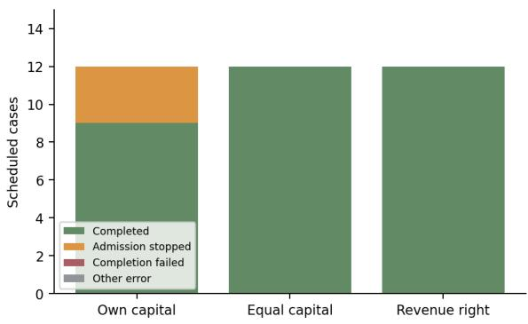  
Rights remain outstanding; not lifetime ROl

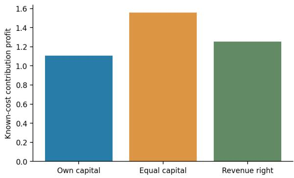

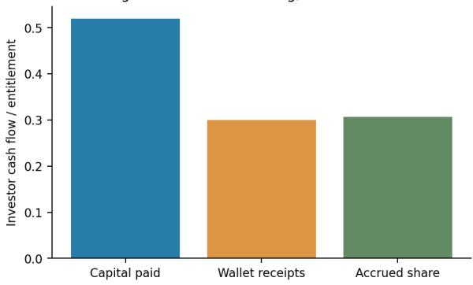  
Figure 22. Continuous operating funds, completed services, contribution and investor cash flow. Source: the controlled cohort’s reconciled ledger and task records.

## F.3.5 Retail Financing Interventions

The own-capital control, equal-capital control, and revenue-right arm receive �, � + �, and $B + A$ respectively. Only the last arm transfers � from an investor’s separate research Billing Wallet through an approved investment. Its contractual terms allocate 89% to the operator, 10% to investors, and 1% to the platform. Revenue-split execution is validated by the separate contract tests; this retail batch records no success-triggered revenue event. Controls pay the same 1% platform share. Thus the equal-capital control holds initial available funds equal when comparing revenue sharing. Each arm executes fresh tasks because admission changes subsequent execution. Table 18 reports task outcomes, known inference expense and retained reservations. Experimental contribution profit is retained hypothetical receipts minus known inference expense; unknown-request usage remains outside this measured amount. Ending operating balances also subtract retained uncertain-request reservations.

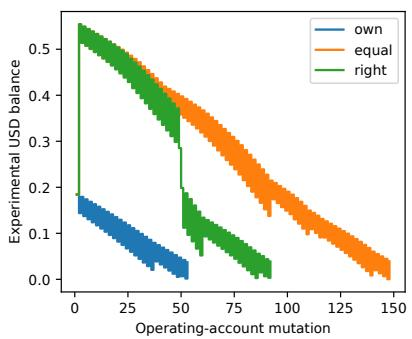

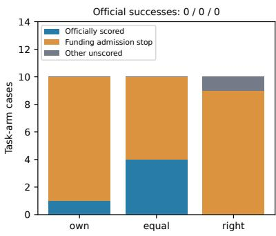

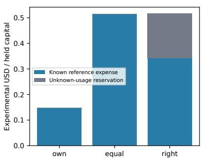  
Figure 23. Operating balances, admission and scoring outcomes, and measured expenditure across financing conditions. Known expense and unresolved request reservations are shown separately.

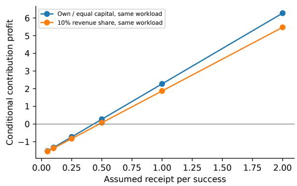  
Stationary cost per success is assumed; missing usage is excluded.

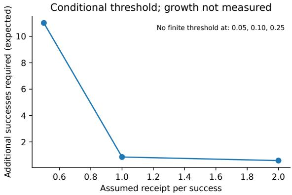  
Figure 24. Same-workload financing cost and conditional growth requirement. The right panel gives the analytical break-even requirement under stationary cost per success.

The investor wallet transfers 0.370000 to the operator and receives 0.000000 during observation; its revenue rights remain outstanding. The three financing arms record zero successful services in this fixed retail sequence. Thus, the cohort characterizes admission, expenditure, and capital retention before success-triggered revenue is realized.

Admission and receipt formation. Equal capital increases scoreable completions from one to four. The revenue-right arm has no scored completion and retains 0.172938 after two missing-response requests and a task-time limit. These reservations enter later admission and are reported separately from incurred expense. Known-cost contribution equals the negative of measured expense because success-triggered receipts are zero. Varying assumed receipts over 1, 1.5, 2, or 3 times � leaves this fixed trajectory’s revenue unchanged. Cross-arm diferences include model variability and path dependence, with unresolved expense bounded separately.

## F.3.6 Analytical Financing Comparisons

Sharing costs and break-even growth. For the same completed workload, let � be assumed receipts generated only by successful tasks and � its conditional operating cost. Own-capital and equal-capital controls yield � − �, while a revenue share � yields (1 − �)� − � before additional fees. The allocation assigns �� to the investor while excluding capital injections from contribution. The assumed receipt grid spans 0.05, 0.10, 0.25, 0.50, 1 and 2 per successful task with � = 0.1. The post-hoc analysis gives the additional successes needed to ofset that allocation under stationary cost per success. A finite break-even threshold requires a positive retained incremental margin. This analytical threshold complements the freshly executed capital-constrained comparisons against both controls.

Additional funding under constrained demand. The financing replay admits complete requests in their original daily order, stopping when the next request would exceed the budget. It does not select later, cheaper requests. Initial daily budgets are the calibration invoice’s 50th, 75th, and 90th percentiles: \$3.05370, \$41.65998, and \$166.25893. Budgets reset daily; costs are known retrospectively from the trace. This experiment evaluates the consequence of a larger budget, not an online admission policy or a causal estimate of demand created by investment.

The Agent charges a 50% markup over its API expense, and the Provider’s variable cost is 60% of its API revenue. Financing assigns 10% of each publisher’s revenue to investors and 2% to the platform; the self-funded baseline has no modeled revenue sharing. Contribution profit is the revenue remaining after these shares and modeled variable costs, excluding fixed costs and the initial capital contribution.

Table 19. Contribution-profit change when financing doubles the daily budget. Each row compares the same demand at the stated initial budget with and without financing. Full requests are preserved.
<table><tr><td>Initial budget</td><td>Budget ($/day)</td><td>Agent (%)</td><td>Provider (%)</td></tr><tr><td>50th percentile</td><td>3.05370</td><td>+21.23</td><td>+32.59</td></tr><tr><td>75th percentile</td><td>41.65998</td><td>-8.11</td><td>+0.50</td></tr><tr><td>90th percentile</td><td>166.25893</td><td>-19.17</td><td>-11.59</td></tr></table>

Table 19 shows that the benefit depends on the initial capital constraint. At the lowest budget, additional service ofsets revenue sharing; at higher budgets, insuficient unserved demand remains. At the lowest budget, the matched approximation permitting fractional requests yields 21.17% for the Agent, compared with 21.23% for complete requests. The observed reversal is therefore primarily associated with available capital, not request rounding. With no added service, the same sharing terms reduce Agent and Provider contribution profit by 36% and 30%, respectively. Under the stated margins, breaking even requires revenue growth above 56.25% for the Agent and 42.86% for the Provider.

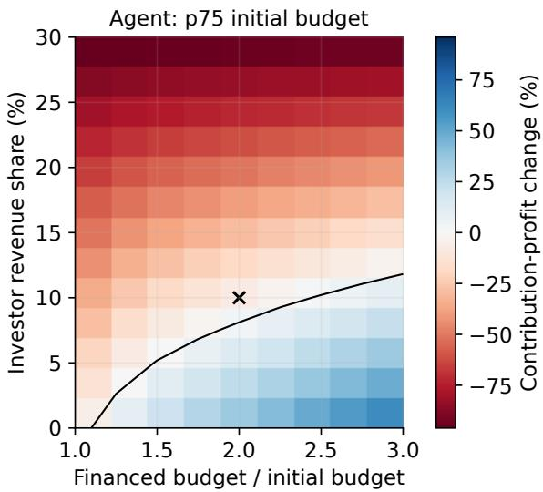

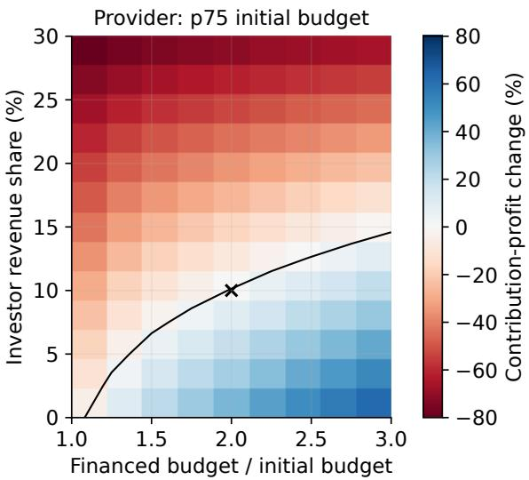  
Figure 25. Contribution-profit changes at the 75th-percentile initial budget, varying additional funding and investor share. Zero-change contours show where additional service revenue ofsets sharing for each publisher.

Equal-funded-amount alternatives. To separate funding availability from funding charges, a second comparison holds the total funded amount at \$1,710.86. Half of each day’s positive cash requirement is assigned 30 days of financing. Assumed charges are 12% annual opportunity cost for own capital—the modeled cost of committing the operator’s own funds—12% interest plus a 1% initial fee for fixed credit, 8% interest for Provider credit, and 10% of modeled operating receipts plus a 1% initial fee for revenue sharing. Receipts are 1.5 times the primary API invoice. Resulting charges are \$16.87, \$33.98, \$11.25, and \$526.48, respectively. The funded total is the sum of financing amounts, not peak outstanding debt.

This comparison isolates the stated charging rules at equal funded volume. Repayment obligations, collateral, and default risk are outside its modeled variables. Together, the growth and charge comparisons characterize additional service under capital scarcity and the cost of specified terms at fixed volume. Investor transfers use the observation-window convention; secondary-market valuation is a separate analysis.

## F.4 Protection: Execution Evidence and Analytical Reserve Sensitivity

The main text reports the fault-frequency, premium, and reserve study. The initial controlled and retail interventions below report contract eligibility, approval, and settlement. The final subsection develops an analytical reserve-sensitivity study with its own stated scenario parameters. Alternative policy wallets are evaluated separately, with each wallet’s payments reported for the corresponding policy.

## F.4.1 Controlled Recovery and Loss Allocation

Table 20. Twelve scheduled cases per fault arm. Reached counts injected incidents. Funded and scarce columns are actual service-credit payments, not cash income.
<table><tr><td>Arm</td><td>Success</td><td>Reached</td><td>Loss</td><td>Funded</td><td>Scarce</td></tr><tr><td>Own / no recovery</td><td>0</td><td>12</td><td>0.5600</td><td>0.5600</td><td>0.1400</td></tr><tr><td>Own / recovery</td><td>9</td><td>12</td><td>0.1400</td><td>0.1400</td><td>0.1400</td></tr><tr><td>Right / no recovery</td><td>0</td><td>12</td><td>0.5400</td><td>0.5400</td><td>0.1200</td></tr><tr><td>Right / recovery</td><td>9</td><td>12</td><td>0.1400</td><td>0.1400</td><td>0.1400</td></tr></table>

Local recovery achieves 9/12 successful services in both recovery-enabled arms through alternate paths to the same Provider. Funded policies settle all approved compensation, totaling 1.3800 in service credits across the four arms. Scarce-reserve policies pay 0.5400 and leave 0.8400 approved but unpaid. Eligibility is restricted to covered terminal injected failures; task execution and operating capital remain fixed within each protection comparison. Claims, reserves, and wallet credits are reconciled separately, and each payment passes a whole-claim funding check.

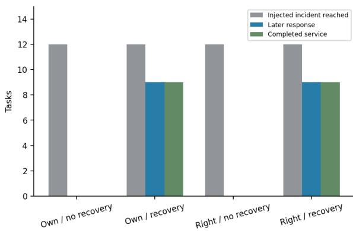  
Controlled Agent study: experimental USD: supplier invoices unavailable.

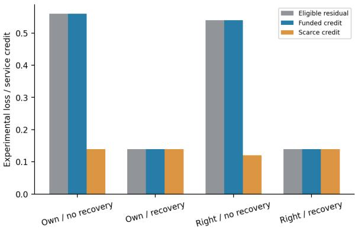  
Figure 26. Completed services and reserve-funded loss allocation under controlled local faults. Monetary values use the stated laboratory tarif.

## F.4.2 Retail Recovery and Protection Interventions

Four fresh fault arms cross financing of/on with recovery of/on. They start with ample operating capital (100�, plus � for financing) to separate recovery from capital scarcity; any admission failure is still reported. The schedule repeats timeout, rate limit, primary-route outage, common-route outage, and no fault across ten tasks. Injections require the third Agent call to be reached. For transient or primary-only adapter faults, recovery permits a real continuation request to the same configured Nexus/SiliconFlow endpoint; common-route outages terminate the task. Recovery is a controlled continuation branch at the same configured endpoint. The model, supplier, and bounded transport-retry settings remain identical across arms; the recovery switch controls only the injected local incident. Post-incident responses, scoreable completions, oficial task success, and inference expense are reported as separate outcomes.

Protection fees and payouts use a separate research wallet, leaving operating capital fixed. Accordingly, S=0 and S=1 share the same execution trajectory. Terminal injected failures may generate a claim for known incurred experimental Agent expense, rounded down to cents; wrong answers, missing usage, and infrastructure errors do not automatically qualify. Claims pass actual coverage review and reserve checks. The funded and scarce-reserve plans share per-claim terms but use separate financial accounts. Whole-claim settlement requires suficient remaining reserve budget and available account balance. Payouts are Billing Wallet service credits, reported separately from cash.

Table 21. Retail fault interventions and service-credit settlements. Of/on denotes local recovery. Eligible loss excludes semantic task errors and unknown usage.
<table><tr><td>Arm</td><td>Successes</td><td>Faults</td><td>Residual cost</td><td>Eligible</td><td>Funded paid</td><td>Scarce paid</td></tr><tr><td>Own / off</td><td>0</td><td>8</td><td>0.356410</td><td>0.080000</td><td>0.080000</td><td>0.030000</td></tr><tr><td>Own / on</td><td>1</td><td>8</td><td>1.511219</td><td>0.020000</td><td>0.020000</td><td>0.020000</td></tr><tr><td>Right / off</td><td>0</td><td>8</td><td>0.426050</td><td>0.080000</td><td>0.080000</td><td>0.030000</td></tr><tr><td>Right / on</td><td>0</td><td>8</td><td>1.063093</td><td>0.020000</td><td>0.020000</td><td>0.020000</td></tr></table>

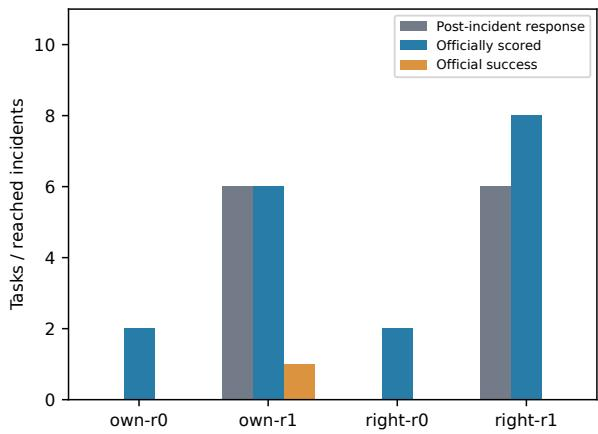

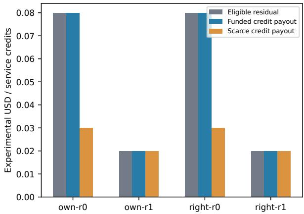  
Figure 27. Post-incident responses, scored completions, oficial task success, and redistribution of covered residual expense. Recovery changes executions; protection transfers service-credit value. Amounts are reconciled across task outcomes, claim decisions, reserve accounts, and service-credit records.

Recovery and coverage have diferent observed efects. Each recovery-enabled arm encounters eight scheduled incidents: six permit a returned post-incident Agent response and two common incidents terminate the task. Both recovery-disabled arms terminate at all eight incidents. This measures execution continuation under the controlled adapter policy. Oficial successes change from zero to one in the own-capital pair and remain zero in the revenue-right pair. Known Agent expenses are 0.356410/1.600688 and 0.426050/1.063093 for recovery of/on, respectively, providing the execution-cost component of the financial comparison.

Without recovery, each funded plan pays eight claims totaling 0.08 service credits. Its scarce-reserve counterpart pays 0.03 and leaves five approved claims totaling 0.05 unpaid; no partial settlement occurs. With recovery, both reserve conditions pay the two common-incident claims totaling 0.02 per arm. The 0.01 premium is paid once per plan and also increases reserve budget. These matched plans quantify how reserve funding and local recovery jointly determine paid compensation. Coverage is limited to the specified terminal injected failures; semantic task-error expense is reported separately under the controlled protocol.

Economic interpretation. Under the explicit assumption that issued service credits are usable at face value, let � be total residual economic loss after recovery, � the premium and � the actual payout for its covered and eligible portion, the operator bears $L + p - X$ and the protection provider bears $X - p$ before administration costs. Their combined loss remains �: protection transfers economic loss, while recovery changes its occurrence. This participant-level conservation relation connects the conditional economic analysis to the separately reconciled intervention outcomes.

## F.4.3 Analytical Reserve Sensitivity

Recovery and portfolio-level coverage. Protection comparisons use identical retry settings. Primary failures use zero-output trace records; alternate failures use the calibration rate of 0.2190846%. A parameter � specifies the fraction of primary failures attributed to a persistent shared cause that alternate attempts cannot remove. The remaining failures use the assumed alternate failure rate. These parameters define the analytical shared-failure and recovery scenario.

In the fixed-volume control with $\rho = 0 . 7 5 ,$ one alternate attempt costs \$25.91 and increases expected successful API responses from 883,304 to 887,329.41. Adding financial protection leaves that count unchanged by construction. The modeled plan charges a 1% premium, meaning the protection fee, and uses an initial reserve and total liability cap each equal to 10% of the calibration-predicted 42-day invoice. Claims become due after seven days, unpaid amounts carry forward, and replay continues through day 49. At \$0.10 loss per unresolved call, the pool collects \$34.22 and pays \$220.73. The \$186.51 reduction in buyer expense is matched by payments exceeding protection fees by the same amount, before reserve capital and operating costs. This reserve-funded transfer is evaluated at fixed execution, separating loss allocation from computational expenditure.

Reserve suficiency and claim timing. With $\rho = 0 . 7 5 ,$ a 1% fee, and no claim delay, an initial reserve equal to 10% of the predicted invoice funds all capped claims. This result identifies a suficient capitalization level for the stated scenario. At 5%, the first shortfall occurs on day 10 and \$76.41 remains unpaid; with zero initial reserve, \$186.77 remains unpaid. The chronological sensitivity varies initial reserves, fees, and claim lags of zero, seven, or thirty days, carrying unpaid obligations beyond the final request. The liability cap is fixed from calibration. Initial capital and premium receipts are tracked separately in the reserve accounting.

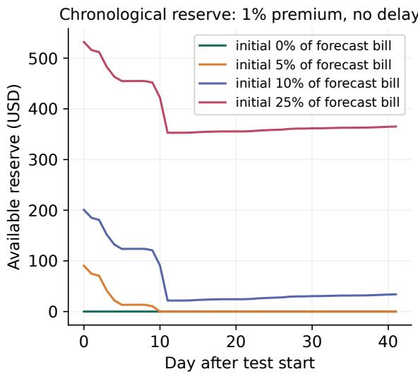

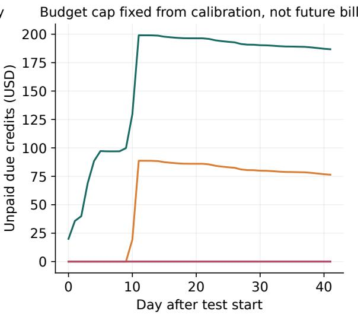  
Figure 28. Reserve suficiency under diferent initial-capital levels, with $\rho = 0 . 7 5 ,$ , a 1% protection fee, and no claim delay. Panels report available reserves and unpaid capped claims; initial capital is accounted for separately from premium receipts.

The analytical estimates are conditional on the portfolio-level cap, claim-lag schedule, and carried-forward unpaid obligations specified above. Zero-output records supply the failure indicator; claim eligibility and credit utilization are scenario assumptions. Compensation reduces modeled economic expense under the assumption that the corresponding credit is usable at its recorded amount.

## F.5 Combined Financial Mechanisms

Section 8.6 reports the controlled combinations. The retail and fixed-volume request comparisons below retain their own execution, pricing, and valuation assumptions. Forward and protection settlements are applied with the associated operational-admission trajectory held fixed.

Retail workload: measured execution with paired financial combinations. The eight D/F/S cells reuse the recovery-enabled own-capital and revenue-right executions for F=0 and F=1. Financing has fresh executions; D and S settle in separate wallets after or outside operational admission. At the declared 1.5 price scenario and $h = 0 . 5$ , Table 22 reports conditional contribution excluding credits, $R _ { \mathrm { r e t a i n e d } } - 1 . 5 C + P _ { \mathrm { f w d } } - f - p$ , where $P _ { \mathrm { f w d } }$ is the signed forward payment, � the forward fee, and � the protection premium. Service-credit compensation is reported separately from cash contribution. The scenario price is applied after execution with admission fixed, so the eight cells characterize paired financial accounting on the two observed financing trajectories. Each contribution is calculated from its component cash flows under the same scenario.

At the rising index, D adds a net 0.449687 after fees, while S exchanges a 0.01 premium for 0.02 in service credits. All eight known-cost contributions remain negative, as reported in Table 22. Within each financing trajectory, the paired contrasts isolate these payment components. Cross-financing contrasts also include diferences in task outcomes, measured usage, and unresolved reservations. The common accounting representation preserves these distinct contributions to the combined outcome.

Table 22. Eight combinations: actual task outcomes and contract payments under an assumed price scenario.
<table><tr><td>DFS</td><td>Successes</td><td>Known-cost contribution</td><td>Service credit</td></tr><tr><td>000</td><td>1</td><td>-2.036122</td><td>0.000000</td></tr><tr><td>001</td><td>1</td><td>-2.046122</td><td>0.020000</td></tr><tr><td>100</td><td>1</td><td>-1.586435</td><td>0.000000</td></tr><tr><td>101</td><td>1</td><td>-1.596435</td><td>0.020000</td></tr><tr><td>010</td><td>0</td><td>-1.594640</td><td>0.000000</td></tr><tr><td>011</td><td>0</td><td>-1.604640</td><td>0.020000</td></tr><tr><td>110</td><td>0</td><td>-1.144952</td><td>0.000000</td></tr><tr><td>111</td><td>0</td><td>-1.154952</td><td>0.020000</td></tr></table>

Fixed-volume request replay. The eight $D / F / S$ combinations cross five price paths and two forward discounts, yielding 80 configurations with the same requests and recovery policy. Funding uses modeled own-capital opportunity cost when $F = 0$ and the stated revenue-sharing charges when $F = 1$ . Economic expense is defined by Equation (50); it is distinct from a commercial cash invoice or the real-model contribution excluding service credits.

Table 23. Fixed-volume comparison under constant prices. Codes indicate whether �, �, and � are enabled.
<table><tr><td>Configuration</td><td>Forward discount Economic expense ($)</td><td></td></tr><tr><td>000: baseline</td><td></td><td>3,438.59</td></tr><tr><td>100: forward only 0%</td><td></td><td>3,459.88</td></tr><tr><td>100: forward only</td><td>10%</td><td>3,282.46</td></tr><tr><td>111: all three</td><td>10%</td><td>3,605.09</td></tr></table>

Under fixed-volume demand, the assumed 10%-discount forward reduces economic expense from \$3,438.59 to \$3,282.46. The all-mechanism configuration has expense \$3,605.09, or 4.84% above baseline (Table 23), because financing and protection charges are not accompanied by additional admitted work. The decomposition separates individual-contract terms and combination-dependent efects; these sum to the total 111-minus-000 diference. This fixed-volume control complements the capital-constrained growth experiments by identifying the demand condition needed to ofset financing charges.

## G Supplementary Execution Cohorts and Measurement Accounting

This appendix records preliminary execution cohorts separately from the retail evaluation. The cohorts use distinct configurations or repeat previously inspected tasks. Their configuration, completion counts, and available usage records establish the provenance of the supplementary measurements; they are excluded from evaluation denominators.

## G.1 Preliminary Retail Cohorts

Table 24 summarizes the preliminary retail cohorts and the scope of their recorded outcomes. A scored trial has an oficial task outcome. An unscored trial retains its execution records without an imputed task score. Unattempted scheduled trials are recorded separately. Final evaluation task selection remains unchanged.

The corresponding request records and configuration details are retained in the supplementary artifact. Preliminary observations are reported at their own cohort scope and are not pooled with completed evaluation trials.

## G.2 Grounding and Reasoning Configurations

Four additional batches reuse the same two retail calibration tasks, retaining every scheduled attempt. Both the Agent and simulated customer use Qwen/Qwen3-8B through Nexus and SiliconFlow. The oficial retail tools and ALL completion criterion remain unchanged. Additional Agent and customer instructions define a custom execution protocol.

Table 24. Preliminary retail cohorts and recorded measurement scope. These cohorts are separate from the final baseline estimate.
<table><tr><td>Configuration</td><td>Recorded measurement scope</td></tr><tr><td>Direct-provider pilot</td><td>Ten scored trials and no successful tasks.</td></tr><tr><td>Gateway-format pilot</td><td>Ten Agent requests and ten returned simulated-customer responses; the customer responses match gateway records.</td></tr><tr><td>Authenticated pilot</td><td>Three scored trials with no successes, three unscored trials, and four unattempted scheduled trials; all 181 returned responses reconcile with gateway records.</td></tr><tr><td>Fixed-schedule pilot</td><td>Two scored trials, including one success.</td></tr><tr><td>Recovery configuration pilot</td><td>Two scored trials, including one success.</td></tr><tr><td>Shortened pilot</td><td>No completed trial.</td></tr><tr><td>Local-host pilot</td><td>Forty-nine returned model responses; all ten scheduled trials remain unscored.</td></tr></table>

Table 25. Supplementary configuration batches, each scheduling two tasks. Request counts include all model roles; scored tasks have an oficial outcome. Returned usage is accounted for separately from task scores.
<table><tr><td>Configuration</td><td>Requests</td><td>Responses</td><td>Scored</td><td>Successes</td></tr><tr><td>Grounding</td><td>53</td><td>52</td><td>2</td><td>0</td></tr><tr><td>Reasoning, 60 s timeout</td><td>6</td><td>0</td><td>0</td><td>0</td></tr><tr><td>Reasoning, 240 s timeout</td><td>6</td><td>0</td><td>0</td><td>0</td></tr><tr><td>Reasoning, final batch</td><td>21</td><td>21</td><td>2</td><td>0</td></tr></table>

The grounding configuration adds general reminders about identifier provenance and customer-scenario fidelity. It uses temperature zero, a 600-second task deadline, and 30 requests per role. The reasoning configuration uses temperature 0.6, a 1,024-token reasoning budget, a 2,048-token output setting, a 1,200-second task deadline, and 40 requests per role. These are joint configuration comparisons rather than an isolated reasoning-mode intervention. All 21 returned usage records in the final batch match Nexus records exactly.

## G.3 Usage Accounting and Study Populations

Across the four batches, 86 physical requests yield 73 complete responses, four scored outcomes, and no successful tasks. Thirteen requests have no returned usage, including one in the grounding batch. Returned usage and unresolved request records are accounted for separately. Monetary interpretation follows the experimental-valuation conventions in Section 8.1.

The records distinguish model responses, tool execution, oficial task outcomes, and financial settlement. The controlled study in Appendix E uses fixed customer requests and explicit operation-level completion rules. Its observations retain a separate study population, as do the retail evaluation, calibration passes, and supplementary batches reported here.