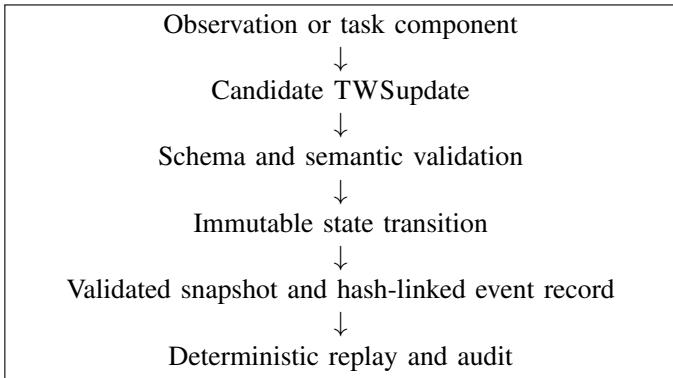
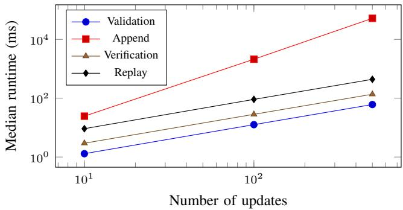

# Traceable World State: A Provenance-Aware State Representation and Deterministic Replay Framework for Robotic Systems

Zoe Li

Independent Researcher

Seattle, WA, USA

zoeli4@siggraph.org

Abstract—Robotic systems operating over extended tasks must maintain a world state assembled from observations that arrive at different times, carry different confidence levels, and may later be revised. Conventional scene representations commonly emphasize the latest estimated state, making it difficult to determine where a fact came from, reproduce an earlier decision context, or detect corruption in a recorded execution.

This paper presents Traceable World State (TWS), a middleware-neutral semantic representation and reference runtime for provenance-aware robot world state. A TWSsnapshot represents entities, relations, observations, confidence, and revision metadata. Validated update operations transform snapshots without mutating their inputs. Ordered updates can be replayed deterministically, while a canonical SHA-256 hash chain makes stored event logs tamper-evident.

We evaluate the prototype through schema and semantic conformance tests, complete manipulation-state lifecycles, deterministic replay, and targeted fault injection. The current implementation passes 38 tests on Python 3.10, 3.12, and 3.14. The evaluation detects corrupted updates, broken hash links, sequence discontinuities, world mismatches, revision discontinuities, and malformed records. The results support TWSas a compact foundation for reproducible robotic state-management experiments, while leaving middleware integration, multi-writer coordination, and trusted external checkpoints to future work. Across a deterministic sample of ten public BEHAVIOR-1K task definitions, TWSimported 153 entities and 146 relations, and all generated snapshots passed runtime and commandline validation. On 103 public NVIDIA Unitree G1 simulated trajectories containing 78,369 source frames, TWSachieved exact terminal-state replay in 103/103 episodes and detected all 412 injected record corruptions with 1.72% storage overhead over Plain JSONL.

Index Terms—robotic systems, semantic state, provenance, middleware-neutral frameworks, deterministic replay, event logs, reproducibility

## I. INTRODUCTION

A robot rarely receives a complete and perfectly consistent description of its environment. Instead, its world state is assembled incrementally from cameras, force sensors, learned perception models, task interfaces, and prior state. Observations may be delayed, uncertain, contradicted, or reinterpreted. These conditions are particularly important in long-horizon manipulation, where a failure may occur many state transitions after the observation that caused it.

Many robot systems expose a convenient current-state interface, but the latest state alone is insufficient for answering questions such as: Which observation supported this relation? What confidence was assigned when a planner selected an action? Which update changed an object identity? Can the state used in a failed run be reproduced? Was a stored execution log modified after collection?

Existing knowledge-processing systems provide rich semantic reasoning [1], [2], while semantic mapping and scene-graph research structures spatial and object-level knowledge [5], [6]. Robot middleware provides communication and execution infrastructure [11]. These capabilities are valuable, but they do not by themselves define a compact, middleware-independent contract for traceable state transitions and verifiable replay.

We introduce Traceable World State (TWS), a semantic data model and reference runtime designed around explicit provenance, immutable updates, revision continuity, and deterministic replay. TWSis not a planner, perception system, or control framework. It is a boundary between these components: producers publish evidence-backed updates, and consumers receive validated snapshots with an auditable history.

The scope is a middleware-neutral state-management framework and reference runtime. Humanoid tasks provide application cases rather than a hardware requirement. The evaluation tests representation, transition semantics, replay integrity, and computational overhead; it does not establish perception accuracy or closed-loop task performance.

The contribution is the state-update contract that connects evidence references, semantic invariants, revision continuity, and replay. JSON Schema validation and SHA-256 hashing are established components used to implement that contract, rather than new algorithms introduced here.

The contributions of this work are:

• A versioned semantic representation for entities, relations, observations, confidence, provenance, and world revisions.

• A deterministic update engine with explicit invariants for identity, references, operation payloads, and revision continuity.

• A tamper-evident JSON Lines event-log format based on canonical serialization and a SHA-256 hash chain.

• A reproducible conformance and fault-injection evaluation covering complete state lifecycles and invalid-log conditions.

The implementation intentionally avoids dependencies on ROS, a specific simulator, or robot hardware. This permits its use as a portable experiment artifact and as a future interoperability layer for humanoid systems.

## II. RELATED WORK

## A. Robot Knowledge and Semantic World Models

KnowRob introduced knowledge processing for autonomous robots [1] and was later extended to combine symbolic and data-driven reasoning [2]. RoboSherlock organizes perception as an explainable knowledge-enabled process [3], while OpenEASE supports the analysis and reuse of robot experience data [4]. These systems demonstrate the value of structured robot knowledge.

Semantic mapping associates geometric environments with meaningful objects and concepts [5]. Scene graphs extend this organization by representing objects, spaces, and their relations [6]. TWSadopts entities and relations as basic representational elements, but focuses on the runtime contract through which state changes are validated, attributed to evidence, persisted, and replayed.

## B. Provenance and Reproducibility

The W3C PROV data model formalizes relationships among entities, activities, and agents [7]. TWSuses a narrower robotics-oriented provenance mechanism: state items contain source references to timestamped observations. This deliberate restriction keeps runtime documents small while retaining the evidence path needed to inspect state assertions.

Reproducibility in robotics requires more than retaining sensor data. The ordering and interpretation of state changes also matter. Distributed-system work has long established the importance of event ordering [8]. TWStherefore records an explicit base revision for each update and rejects discontinuous sequences.

## C. Integrity of Recorded State

Hash-linked structures can expose modification of ordered records [9]. TWSapplies this principle to robot world-state updates. Unlike a digital signature, the current hash chain does not establish authorship and cannot prevent complete log replacement. Its purpose is narrower: to make changes within a retained execution record detectable when a trusted final hash or checkpoint is available.

## III. DESIGN REQUIREMENTS

The design follows six requirements derived from longhorizon robot experiments.

1) Explicit uncertainty: confidence must be represented numerically instead of hidden in component-specific state.

2) Traceable evidence: entities and relations may reference the observations that support them.

3) Temporal clarity: observation time and update time must remain explicit.

TABLE I  
CORE ELEMENTS OF A TWSSNAPSHOT.
<table><tr><td>Element</td><td>Purpose</td></tr><tr><td>World ID</td><td>Separates independent state histories.</td></tr><tr><td>Revision</td><td>Orders validated snapshots and rejects stale updates.</td></tr><tr><td>Entity</td><td>Represents a physical, virtual, or conceptual object.</td></tr><tr><td>Relation</td><td>Represents a typed directed edge between two entities.</td></tr><tr><td>Observation</td><td>Records timestamped evidence from a sensor or source.</td></tr><tr><td>Source</td><td>Connects an entity or relation to supporting evidence.</td></tr><tr><td>Confidence</td><td>Encodes uncertainty in the closed interval [0, 1].</td></tr></table>

4) Reference integrity: relations must not point to missing entities, and source references must not point to missing observations.

5) Deterministic transition semantics: the same valid snapshot and ordered updates must produce the same final snapshot.

6) Middleware independence: the core representation must be usable without requiring a particular robot communication framework.

The principal non-goals of version 0.1 are motion planning, task planning, sensor synchronization, geometric estimation, access control, and multi-writer coordination.

## IV. TRACEABLE WORLD STATE MODEL

## A. Snapshots

A snapshot is a complete validated state at one revision. Its envelope contains a schema version, world identifier, current revision, previous revision, observation time, entities, relations, and observations. Table I summarizes the major elements.

Identifiers are stable strings within a world. Entity, relation, and observation identifiers must each be unique. A relation contains subject and object identifiers that must resolve to existing entities. A source reference containing an observation identifier must resolve to an observation in the same snapshot.

The representation distinguishes absence from uncertainty. A missing optional property means that the property has not been asserted. Confidence describes the strength of an assertion and does not turn a missing value into a known value.

## B. Updates

A TWSupdate contains a schema version, update identifier, world identifier, base revision, operation, observation time, confidence, provenance, and exactly one operation-specific payload. Version 0.1 supports four operations:

• upsert\_entity,

• remove\_entity,

• upsert\_relation, and

• remove\_relation.

  
Fig. 1. Reference TWSruntime data flow.

An upsert replaces an existing item with the same identifier or appends a new item. Removal requires the target to exist. An entity cannot be removed while a relation still references it. A relation cannot be created unless both endpoint entities exist.

Given snapshot $S _ { r }$ at revision r and update $u ,$ the transition function is

$$
S _ { r + 1 } = F ( S _ { r } , u ) ,\tag{1}
$$

subject to

$$
u . { \mathrm { w o r l d \_ i d } } = S _ { r } . { \mathrm { w o r l d \_ i d } }\tag{2}
$$

and

$$
u . { \mathrm { b a s e \_ r e v i s i o n } } = r .\tag{3}
$$

The resulting snapshot records r as its previous revision and $r + 1$ as its new revision.

## C. Structural and Semantic Validation

Documents are structurally checked against JSON Schema Draft 2020-12 [10]. Structural validation covers required fields, data types, enumerations, formats, value ranges, and operation-specific payload shapes.

Semantic validation covers invariants that cross document locations: identifier uniqueness, relation endpoint resolution, and observation source resolution. The runtime validates the input snapshot, update, and resulting snapshot. Invalid transitions do not return a partially updated state.

## V. RUNTIME ARCHITECTURE

Figure 1 shows the reference data flow. A perception or task component emits a candidate update. The validator checks its structure, after which the update engine checks the world, revision, operation, and reference invariants. The resulting snapshot is validated again. Accepted updates may then be stored as hash-linked event records and replayed later.

The implementation deep-copies the input snapshot before applying an operation. This provides a simple immutability guarantee at the API boundary: a failed or successful update does not alter the caller’s input object.

Replay begins from a validated initial snapshot and applies updates in stored order. Validation is repeated during replay. Consequently, a log that is internally continuous but begins from the wrong world or revision is rejected when combined with the initial snapshot.

## VI. TAMPER-EVIDENT EVENT LOG

## A. Record Format

Each event-log line is a UTF-8 JSON object containing

• record format version,

• zero-based sequence number,

• previous record hash or null,

• one validated TWSupdate, and

• the current record hash.

Let $R _ { i }$ denote record i. Its digest is

$$
h _ { i } = \mathrm { S H A 2 5 6 } \left( C ( v _ { i } , i , h _ { i - 1 } , u _ { i } ) \right) ,\tag{4}
$$

where C is canonical JSON serialization, $v _ { i }$ is the record version, and $u _ { i }$ is the nested update. The stored hash is encoded as the prefix sha256: followed by 64 lowercase hexadecimal characters.

Canonical serialization sorts object keys lexicographically, removes insignificant whitespace, preserves Unicode, encodes text as UTF-8, and rejects non-finite numbers. The current record’s hash field is excluded from its own hash input.

## B. Append and Verification

Before appending, a writer validates the complete existing chain and the incoming update. It then calculates the next sequence number and previous-hash link, serializes one record, flushes the file, and calls the operating system synchronization operation. A rejected append leaves the prior log unchanged.

A reader verifies every record before returning any updates. It stops at the first invalid line and reports the one-based line number and cause. Verification checks JSON syntax, record schema, nested update schema, record sequence, hash linkage, calculated hash, world continuity, and base-revision continuity.

## C. Security Boundary

The log is tamper-evident rather than tamper-proof. If an attacker can replace the full log and all external checkpoints, the attacker can calculate a new internally consistent chain. A trusted final digest, digital signature, remote timestamp, or independently retained checkpoint is required to detect complete replacement.

The version 0.1 prototype also assumes a single writer. File locking, distributed consensus, authorization, encryption, and crash recovery from an interrupted final write are outside its present scope.

TABLE II  
VERIFIED LIFECYCLE AND TRANSITION PROPERTIES.
<table><tr><td>Property</td><td>Result</td></tr><tr><td>Valid four-operation lifecycle</td><td>Pass</td></tr><tr><td>Deterministic ordered replay</td><td>Pass</td></tr><tr><td>Input snapshot remains unchanged</td><td>Pass</td></tr><tr><td>Stale update rejection</td><td>Pass</td></tr><tr><td>Missing relation endpoint rejection</td><td>Pass</td></tr><tr><td>Referenced entity removal rejection</td><td>Pass</td></tr><tr><td>Schema-valid output snapshot</td><td>Pass</td></tr><tr><td>Python 3.10, 3.12, and 3.14</td><td>Pass</td></tr></table>

## VII. EVALUATION

## A. Research Questions

The evaluation addresses four questions:

• RQ1: Does the implementation accept valid state lifecycles and reject invalid state transitions?

• RQ2: Does replay reproduce the expected final state without mutating the initial snapshot?

• RQ3: Does event-log verification detect targeted corruption and continuity faults?

• RQ4: What validation, append, and replay overhead is introduced as the number of updates increases?

## B. Experimental Setup

The reference runtime is implemented in Python and uses the jsonschema package for Draft 2020-12 validation. Continuous integration evaluates Python 3.10, 3.12, and 3.14 on Linux. The artifact contains one initial world snapshot and four ordered updates: entity insertion, relation insertion, relation removal, and entity removal.

The lifecycle represents a minimal manipulation-state sequence. An object enters the tracked world, participates in a relation required by a task, and is removed only after the relation has been removed. Although deliberately small, this sequence exercises all four version 0.1 operations and the reference-integrity rule that prevents removal of a referenced entity.

## C. Conformance and Lifecycle Results

The current suite contains 38 tests. All tests pass under each of the three Python versions in continuous integration. The tests cover schema validation, semantic references, update preconditions, immutability, ordered replay, event-log storage, command-line behavior, packaging of schemas, and integrity checks.

For the complete four-update lifecycle, replay advances the snapshot from revision 0 to revision 4 and records revision 3 as the immediate predecessor. The original revision-0 snapshot remains unchanged.

## D. Fault-Injection Results

Fault injection modifies one property at a time in an otherwise valid log. Table III reports the currently implemented

TABLE III  
TARGETED EVENT-LOG FAULT INJECTION.
<table><tr><td>Injected fault</td><td>Detection result</td></tr><tr><td>Modified nested update</td><td>Detected</td></tr><tr><td>Modified previous-hash value</td><td>Detected</td></tr><tr><td>Modified sequence number</td><td>Detected</td></tr><tr><td>World identifier mismatch</td><td>Detected</td></tr><tr><td>Base-revision discontinuity</td><td>Detected</td></tr><tr><td>Malformed JSON record</td><td>Detected</td></tr><tr><td>Non-object JSON record</td><td>Detected</td></tr><tr><td>Legacy unwrapped update record</td><td>Detected</td></tr><tr><td>Missing event-log file</td><td>Detected</td></tr></table>

TABLE IV

RUNTIME RESULTS IN MILLISECONDS, REPORTED AS MEDIAN (IQR) OVER FIVE REPETITIONS.
<table><tr><td>Updates</td><td>Validation</td><td>Append</td><td>Verification</td><td>Replay</td></tr><tr><td>10</td><td>1.297 (0.029)</td><td>24.478 (1.207)</td><td>2.944 (0.067)</td><td>9.197 (0.115)</td></tr><tr><td>100</td><td>12.588 (0.169)</td><td>2111.450 (9.887)</td><td>28.260 (0.124)</td><td>91.053 (2.254)</td></tr><tr><td>500</td><td>60.883 (0.573)</td><td>51941.915 (97.959)</td><td>136.578 (1.748)</td><td>438.086 (4.539)</td></tr></table>

cases. Every injected fault is rejected before updates are returned for replay.

These results establish conformance for the tested cases, but they do not prove resistance to arbitrary corruption or malicious input.

## E. Runtime Overhead

We measured validation, append, complete-log verification, and in-memory replay using event logs containing 10, 100, and 500 updates. Each condition was executed five times after a warm-up run. Time was measured using a monotonic highresolution clock. We report the median and interquartile range (IQR).

The experiment used CPython 3.14.4 on 64-bit Linux 7.0.0- 28 with an Intel Core Ultra 9 275HX processor and 24 logical CPUs. The benchmark was single-process and did not control unrelated operating-system activity.

Validation, complete-log verification, and replay scaled approximately linearly over the evaluated range. At 500 updates, validation required 60.883 ms, complete verification required 136.578 ms, and replay required 438.086 ms. Their respective median costs were approximately 0.122, 0.273, and 0.876 ms per update.

Event-log size was 6,426 bytes for 10 updates, 63,154 bytes for 100 updates, and 316,954 bytes for 500 updates, corresponding to approximately 634 bytes per stored record at the largest condition.

Append time increased superlinearly, reaching 51.942 s for 500 updates. The version 0.1 writer verifies the complete existing chain before every append. Consequently, constructing a log through repeated single-record appends performs cumulative work that is approximately quadratic in the number of records. This conservative behavior prioritizes integrity and leaves the previous log unchanged after a rejected append, but it is not suitable for high-rate state streams. A persistent verified writer, checkpointed verification, or batched append interface is required before deployment at task-runtime event rates.

  
Fig. 2. Median runtime as the number of updates increases. Both axes use logarithmic scales. Repeated single-record append exhibits cumulative quadratic behavior.

## VIII. APPLICATION TO HUMANOID ROBOT TASKS

## A. Public Benchmark-Derived Case Study

To test interoperability with an independently developed task representation, we used the public BEHAVIOR-1K BDDL version 3.6.0 definition of the storing\_food activity [12]. BEHAVIOR-1K provides human-centered, longhorizon household activities as object sets, initial predicates, and logical goal conditions. We used the semantic task definition directly and did not run the OmniGibson physics simulator.

The initial condition places eight food objects—two oatmeal boxes, two bags of chips, two bottles of olive oil, and two jars of sugar—on a countertop. The goal requires every food object to be inside a cabinet. We mapped BDDL objects to TWSentities, binary predicates to TWSrelations, and the task definition to a dataset observation. Every imported item records source\_type=dataset, the BDDL activity, package version, and a SHA-256 digest of the source task definition.

The conversion produced 13 entities and 12 initial relations. For each of the eight food objects, the semantic execution removes its ontop relation and adds an inside relation to a concrete cabinet instance, producing 16 ordered updates. The updates were written as 16 hash-linked event records and replayed from revision 0 to revision 16. All eight required goal predicates were satisfied after replay, and an independent invocation of the TWScommand-line validator accepted the complete event log. Table V summarizes the result.

This case study evaluates semantic translation, provenance retention, sequence integrity, and deterministic replay. It does not evaluate physical feasibility, perception accuracy, motion planning, or humanoid control.

A humanoid manipulation system can use TWSbetween perception and task-level decision making. For example, a vision component may create an entity representing a container and attach an observation reference and confidence score. A pose-estimation component may later replace the entity with a refined estimate. A task component may assert a relation such as an object being inside the container. Each accepted transition receives a revision, permitting a planner decision to record the exact state revision it consumed.

TABLE V  
BEHAVIOR-1K STORING-FOOD CASE STUDY.
<table><tr><td>Measure</td><td>Result</td></tr><tr><td>BDDL version</td><td>3.6.0</td></tr><tr><td>Initial entities</td><td>13</td></tr><tr><td>Initial relations</td><td>12</td></tr><tr><td>Food objects</td><td>8</td></tr><tr><td>Hash-linked event records</td><td>16</td></tr><tr><td>Final revision</td><td>16</td></tr><tr><td>Goal predicates satisfied</td><td>8/8</td></tr><tr><td>Independent CLI verification</td><td>Pass</td></tr></table>

After a task failure, the event log can reconstruct the state at every decision boundary. Provenance references identify which observations supported an incorrect entity or relation, while the hash chain can reveal whether the retained state history was subsequently modified.

This integration does not require TWSto transport images, point clouds, or actuator data. Large sensor artifacts can remain in specialized stores, with observations retaining identifiers and metadata required to locate them. Adapters may translate between TWSdocuments and ROS 2 messages without changing the core model.

## B. Cross-Task Import Evaluation

We further evaluated whether the TWSrepresentation could import semantic state from multiple independently authored BEHAVIOR-1K activities. The BDDL 3.6.0 installation contained 1,016 problem0.bddl task definitions. All 1,016 contained at least one grounded binary predicate in the initialstate section and therefore met our stated import eligibility criterion.

To avoid manually selecting favorable examples, we ranked eligible task paths by their SHA-256 digest and selected the first ten. The sample covered food preparation, household cleaning, storage, assembly, garment care, and labeling activities. For each task, BDDL objects referenced by grounded binary initial predicates were mapped to TWSentities, while those predicates were mapped to TWSrelations. Each snapshot retained the BDDL version, activity name, source path, and SHA-256 digest of its source definition.

All ten sampled snapshots passed runtime validation and a subsequent invocation of the TWScommand-line validator. In aggregate, the conversion produced 153 entities and 146 relations. Entity counts ranged from 5 to 46 per task, with a median of 11.5, while relation counts ranged from 4 to 45, with a median of 11. Table VI summarizes the experiment.

This experiment evaluates cross-task representational compatibility rather than complete BDDL semantics. It imports grounded binary initial-state predicates but does not execute quantified goals, simulate physical interaction, or measure task success on a robot.

TABLE VI  
CROSS-TASK BEHAVIOR-1K IMPORT EVALUATION.
<table><tr><td>Measure</td><td>Result</td></tr><tr><td>Available problem0 tasks</td><td>1,016</td></tr><tr><td>Eligible task definitions</td><td>1,016</td></tr><tr><td>Deterministic sample size</td><td>10</td></tr><tr><td>Runtime validation</td><td>10/10</td></tr><tr><td>CLI validation</td><td>10/10</td></tr><tr><td>Total imported entities</td><td>153</td></tr><tr><td>Total imported relations</td><td>146</td></tr><tr><td>Entities per task (min/median/max) Relations per task (min/median/max)</td><td>5/11.5/46 4/11/45</td></tr></table>

## C. Public NVIDIA Humanoid Trajectories

We evaluated TWSusing the public NVIDIA PhysicalAI-Robotics-GR00T-X-Embodiment-Sim dataset [13], associated with the GR00T program [14]. We pinned repository revision ea7ac0b68f87da62f1e726771bba0fe74300802f and used the unitree\_g1.LMPnPAppleToPlateDC subset. The downloaded revision contained 103 episode-level Parquet files and 78,369 frames of simulated Unitree G1 state and action data at 50 Hz.

All source frames were parsed and checked for finite numeric values, consistent vector dimensions, monotonically increasing timestamps, and monotonically increasing frame indices. All 103 episodes passed these checks. For bounded event-log evaluation, 50 uniformly spaced frames, including the first and final frames, were recorded per episode. Each source Parquet file was linked to a TWSobservation by repository revision and SHA-256 digest. The experiment produced 5,150 update records.

We compared TWSwith a serialization-only Plain JSONL baseline containing the same update payloads. The baseline checked JSON parseability but provided no schema, sequence, provenance, or integrity validation. Replaying TWSreconstructed the complete mapped terminal row exactly for all 103 episodes; Plain JSONL also retained the terminal payload in all clean trials.

For each episode, we independently modified one record, deleted one middle record, exchanged two adjacent records, and duplicated one record. TWSdetected all 103 trials of each corruption type, for 412/412 detections overall. The parseonly Plain JSONL baseline accepted all corrupted logs and therefore detected 0/412. This comparison isolates the checks absent from a serialization-only baseline; it does not establish superiority over integrity-protected logging systems. These tests evaluate committed middle-record corruption; they do not establish detection of suffix truncation without an externally trusted chain head or expected record count.

Across the 103 episode logs, Plain JSONL occupied 65.10 MB and TWSoccupied 66.22 MB, corresponding to 1.72% storage overhead. Median (IQR) time per 50-update episode was 6.284 (0.148) ms for Plain JSONL writing, 894.165 (5.660) ms for TWSappend, 26.893 (0.247) ms for complete TWSverification, and 55.731 (0.709) ms for TWSreplay. Plain JSONL terminal retrieval required 4.741 (0.234) ms. The append cost reflects the reference implementation’s repeated whole-chain validation and is an optimization target rather than a constant-time streaming result. Table VII summarizes the experiment.

TABLE VII  
NVIDIA UNITREE G1 TRAJECTORY EVALUATION.
<table><tr><td>Measure</td><td>Result</td></tr><tr><td>Episodes processed Source frames checked</td><td>103/103 78,369</td></tr><tr><td>TWSupdates recorded</td><td>5,150</td></tr><tr><td>Finite and consistent episodes</td><td>103/103</td></tr><tr><td>Terminal-state matches</td><td>103/103</td></tr><tr><td>TWScorruption detection</td><td>412/412</td></tr><tr><td>Plain JSONL corruption detection</td><td>0/412</td></tr><tr><td>Plain JSONL storage</td><td></td></tr><tr><td></td><td>65.10 MB</td></tr><tr><td>TWSstorage</td><td>66.22 MB</td></tr><tr><td>TWSstorage overhead</td><td>1.72%</td></tr><tr><td>Median TWSappend per episode</td><td>894.165 ms</td></tr><tr><td>Median TWSverification</td><td>26.893 ms</td></tr><tr><td>Median TWSreplay</td><td>55.731 ms</td></tr></table>

## D. Artifact Availability

The core runtime is maintained at https: //github.com/xli431/tws. The inspected revision cedcbdc9ba8d732f777466b41c7621d797836800 contains the implementation, schemas, examples, and conformance tests. At preparation of this preprint the repository is private. The inspected revision does not contain the runtime benchmark harness or the BEHAVIOR-1K and NVIDIA experiment scripts and raw results; consequently, it is not yet a complete reproduction artifact for the reported evaluations.

## IX. LIMITATIONS

The current evaluation uses a controlled reference lifecycle, semantic task definitions, and simulated humanoid trajectories rather than a physical humanoid deployment. It therefore validates state and log behavior, not perception accuracy, control performance, or task success. The representation also does not yet define coordinate-frame transforms, conflict-resolution policies, ontology alignment, or probabilistic fusion.

A SHA-256 chain alone cannot authenticate the writer or protect against complete history replacement. Version 0.1 requires an external trusted digest for that threat model. Finally, the storage implementation assumes a single writer and does not yet specify recovery from an interrupted final record.

These limitations define concrete next steps: integration with a humanoid manipulation pipeline, task-scale performance evaluation, trusted checkpoints or signatures, explicit coordinate-frame semantics, and safe concurrent storage.

## X. CONCLUSION

This paper presented TWS, a provenance-aware representation and reference runtime for traceable robot world state. TWScombines versioned snapshots, explicit evidence references, confidence, validated immutable updates, deterministic replay, and a tamper-evident event log. The prototype passes 38 conformance tests across three Python versions and detects the evaluated transition and log-integrity faults.

The design is intentionally independent of robot middleware and hardware. This makes it suitable as a compact experiment contract for humanoid perception and manipulation systems, where reconstructing what the robot believed, why it believed it, and how that state changed is essential for debugging and reproducible evaluation.

## REFERENCES

[1] M. Tenorth and M. Beetz, “KnowRob—Knowledge processing for autonomous personal robots,” in Proc. IEEE/RSJ Int. Conf. Intelligent Robots and Systems, 2009, pp. 4261–4266.

[2] M. Beetz, D. Beßler, A. Haidu, M. Pomarlan, A. K. Bozcuoglu, and˘ G. Bartels, “KnowRob 2.0—A 2nd generation knowledge processing framework for cognition-enabled robotic agents,” in Proc. IEEE Int. Conf. Robotics and Automation, 2018, pp. 512–519.

[3] M. Beetz, F. Bálint-Benczédi, N. Blodow, D. Nyga, T. Wiedemeyer, and Z.-C. Márton, “RoboSherlock: Unstructured information processing for robot perception,” in Proc. IEEE Int. Conf. Robotics and Automation, 2015, pp. 1549–1556.

[4] M. Beetz, M. Tenorth, and J. Winkler, “Open-EASE—A knowledge processing service for robots and robotics/ AI researchers,” in Proc. IEEE Int. Conf. Robotics and Automation, 2015, pp. 1983–1989.

[5] A. Nüchter and J. Hertzberg, “Towards semantic maps for mobile robots,” Robotics and Autonomous Systems, vol. 56, no. 11, pp. 915–926, 2008.

[6] I. Armeni, Z.-Y. He, J. Gwak, A. Zamir, M. Fischer, J. Malik, and S. Savarese, “3D scene graph: A structure for unified semantics, 3D space, and camera,” in Proc. IEEE/CVF Int. Conf. Computer Vision, 2019, pp. 5664–5673.

[7] L. Moreau and P. Missier, Eds., “PROV-DM: The PROV data model,” World Wide Web Consortium, Recommendation, 2013.

[8] L. Lamport, “Time, clocks, and the ordering of events in a distributed system,” Communications ofthe ACM, vol. 21, no. 7, pp. 558–565, 1978.

[9] R. C. Merkle, “A digital signature based on a conventional encryption function,” in Advances in Cryptology—CRYPTO ’87, 1988, pp. 369–378.

[10] A. Wright, H. Andrews, B. Hutton, and G. Dennis, “JSON Schema: A media type for describing JSON documents,” Internet Engineering Task Force, Draft 2020-12, 2022.

[11] S. Macenski, T. Foote, B. Gerkey, C. Lalancette, and W. Woodall, “Robot Operating System 2: Design, architecture, and uses in the wild,” Science Robotics, vol. 7, no. 66, 2022.

[12] C. Li et al., “BEHAVIOR-1K: A human-centered, embodied AI benchmark with 1,000 everyday activities and realistic simulation,” arXiv preprint arXiv:2403.09227, 2024.

[13] NVIDIA, “PhysicalAI-Robotics-GR00T-X-Embodiment-Sim,” Hugging Face dataset, 2026. [Online]. Available: https://huggingface.co/datasets/ nvidia/PhysicalAI-Robotics-GR00T-X-Embodiment-Sim

[14] NVIDIA et al., “GR00T N1: An open foundation model for generalist humanoid robots,” arXiv preprint arXiv:2503.14734, 2025.