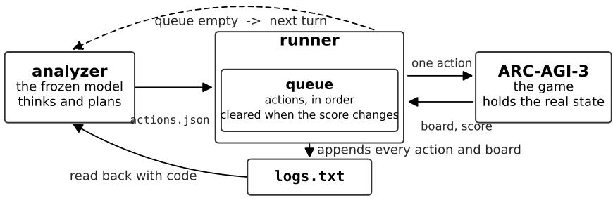
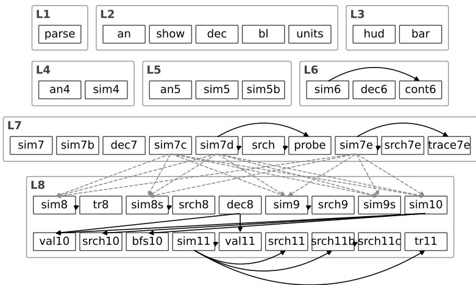
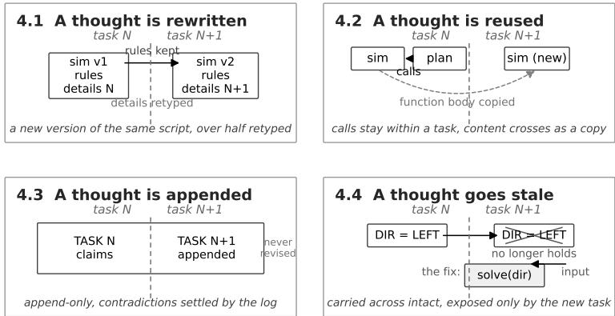

# Tracing the Thoughts of a Coding Agent Playing ARC-AGI-3: Lessons for Continual Learning

Chen Wu   
AWS   
wuc@amazon.com

Josh Passenger AWS jospas@amazon.com

Yin Song AWS yinsong@amazon.com

## Abstract

We study how a coding agent learns across a sequence of abstract reasoning tasks. The agent runs on a frozen foundation model inside a fixed harness and acts by writing and running Python and shell scripts. The agent retains no state across turns other than its written artifacts, so every thought it forms, carries, corrects or abandons leaves a trace, where a thought is any belief, rule or plan committed to a file. We let the agent play ARC-AGI-3, a set of interactive reasoning games that provide no instructions. Each game is a sequence of levels, and a strategy that clears one level can fail on the next, so every new level is in effect a new task. The agent records what it learns about each game as Python scripts and text notes, while the harness keeps a complete log of every action and observation. Our contribution is a measurement protocol that traces each thought through these files, from the task where it forms to the task where it is corrected or abandoned, applied to seven evaluation runs with three backbones from two model families. We find that scripts written for one task are almost never called again in a later task (33 of 630 references cross a task boundary), because most scripts embed the state of the current level and become invalid when the level changes. Instead, the agent rewrites its knowledge into new scripts, retyping most of each version while keeping the general rules and dropping the level-specific details, and abandons 74% of the scripts it wrote before a boundary. The notes, which only the model reads, are never revised. The agent appends to them without removing earlier claims, and the contradictions that accumulate are settled against the log. Because the log preserves everything, the agent can discard scripts freely and reconstruct their content when needed, so it forgets selectively, not catastrophically. The most costly error is a hard-coded value carried into a task where it no longer holds. The fix the agent found was to turn the constant into a parameter that must be supplied afresh for each new task. The above findings were obtained from the files the agent wrote, without access to the model, and constitute a white-box analysis of how a coding agent continually learns.

## 1 Introduction

Continual learning is usually framed as updating a parametric model over a sequence of tasks without catastrophic forgetting of earlier competence, and the difficulty is attributed to a tension between stability and plasticity [Parisi et al., 2019, De Lange et al., 2021, Wang et al., 2023b]. An agent built on a frozen foundation model, on the other hand, tackles the same continual learning problem without weight updates: it must decide where knowledge is kept and what happens to that knowledge when the task changes.

To study that question, we develop a coding agent whose knowledge resides entirely in a directory, building on the programmatic-memory design of PRO-LONG [Fox et al., 2026]. The harness appends every interaction to logs.txt and provides the agent only the path to that file. Any fact about the environment must therefore be established by a script the agent writes. The memory of the agent consists of these scripts and its notes, and both are directly readable.

We evaluate the agent on ARC-AGI-3 [ARC Prize Foundation, 2026b], the interactive benchmark designed to test general intelligence as the efficiency of acquiring skills on novel tasks [Chollet, 2019]. The rules of every game must be discovered by playing it. Each game is a sequence of levels that share one interface yet differ enough that a solution to one can fail outright on the next (Section 3.1). A level boundary is therefore a task boundary inside a single episode, and it arrives unannounced. At each one the agent must decide what to carry, what to rebuild and what to abandon.

Our contribution is a measurement protocol. Every script is assigned to the task that was open when it was written, which yields 4,786 scripts across 689 boundaries (Section 3.4). The protocol needs no access to the model that produced the memory, so it applies to any agent that writes its knowledge to a file system. It makes retention and transfer directly countable where both were previously inferable only from task performance.

Applying the protocol to seven deliberately varied runs across three backbones from two model families, which clear between 34 and 183 of the 183 available levels, we report two findings. The first is an empirical characterization of cross-task update (Sections 4.1–4.3). Transfer occurs by re-derivation rather than by reference: an agent carries the rule it has learned and discards the script that established it. The moment it writes the rule out again is the moment it separates what the environment always does from what belonged to the task it has just left. All backbones respond to a boundary by partitioning memory rather than by reconciling it and differ only in the partition key.

The second finding is negative transfer from stale memory, and its repair (Section 4.4). A false belief is eventually corrected by the interaction record, so the most costly failure is a belief that is true of one task and false of the next, which we find in three runs of one game. The one repair that works changes how the belief is stored: the value fixed inside a script becomes an argument the script must be given, an operation the scripts allow and the notes lack.

## 2 Related Work

Surveys of continual learning group methods by the mechanism that protects earlier tasks while a new one is learned: regularization of parameters, replay of stored data, and parameter isolation [Parisi et al., 2019, De Lange et al., 2021]. The field asks how much a learner retains, how much it can still acquire, and whether earlier learning helps later [Wang et al., 2023b]. Task-free formulations drop the assumption that boundaries are announced [Aljundi et al., 2019a]. Regularization methods protect the parameters that earlier tasks depend on [Aljundi et al., 2018], and replay methods make the question of what to keep explicit, fixing a budget and selecting into it by the gradients a sample constrains [Aljundi et al., 2019b]. Our setting inherits the question but removes the budget, because a file system imposes none, so what to discard is decided free of the pressure of a full buffer.

Studies of continual learning in agents differ in what changes during learning. In-context learning changes nothing persistently and is bounded by the context window. Even so, CL-Bench [Asawa et al., 2026] finds that keeping the full context outperforms several purpose-built memory systems, a baseline any memory architecture must beat. Memory systems change an external record [Park et al., 2023, Packer et al., 2023], eliminating parametric forgetting but replacing it with a retrieval bottleneck and with consolidation error. Skill libraries change a set of reusable procedures [Wang et al., 2023a, Tang et al., 2026], on the premise that the collection only grows, the premise our boundary counts contradict. Harness and loop engineering change the scaffold around a fixed model [Seong et al., 2026, Wei et al., 2026, Xu et al., 2026, Agrawal et al., 2026]. These approaches require a predefined space of admissible edits and a corpus of prior trajectories, and neither exists on first contact with a single unseen environment. Test-time training changes weights transiently [Sun et al., 2024], and memory written as code is its non-parametric counterpart: the state is a directory of scripts and the update rule is the agent writing code.

Common to these families is that the representation in which knowledge is held is chosen in advance rather than by the agent, and that retention and transfer are estimated from task performance rather than read from the stored knowledge itself [De Lange et al., 2021, Wang et al., 2023b]. Interpretability research answers opacity inside the model with instruments: circuit tracing recovers a graph of the internal computation at substantial cost per prompt [Ameisen et al., 2025, Lindsey et al., 2025]. In this work, by contrast, the agent holds its state in files, which provide a complete trace of what it keeps, revises and discards across tasks.

## 3 Approach

## 3.1 ARC-AGI-3 and the level as a task

ARC-AGI-3 [ARC Prize Foundation, 2026b] gives an agent a 64 × 64 grid of colored cells and seven actions named ACTION1 to ACTION7 together with RESET, and nothing else. There are no instructions, no statement of the objective, no account of what any action does and no key to the colors. The only feedback is a score that increases when a level is cleared. The agent can learn a mechanic only by acting and observing how the grid changes.

The public demo dataset has 25 such games. A game is a sequence of levels, and clearing one loads the next inside the same episode. The grid size, the action names and the scoring are constant across a boundary. The layout, the objects present and the winning condition change, often enough to invalidate the rules the agent learned on the previous level. Our first agent cleared level 1 (L1) of wa30 on a theory of “pushable boxes” and then failed L2 by exploiting the same theory. ARC Prize gives the same warning [ARC Prize Foundation, 2026a]: without a check on why a level was won, a model carries its misconception forward.

We therefore treat each level as a task. A boundary arrives unannounced, with no signal beyond the score, and at each one the agent must decide which of the things it has learned is a law of the game and which was only a fact about the level it has left. Everything measured in Section 4 happens at one of these transitions.

## 3.2 Memory as prose

Our first agent, a predecessor of the runs in Table 1, kept its memory as prose in the manner of Park et al. [2023] and Packer et al. [2023], summarizing the interaction history and retrieving fragments of it into the prompt. That design has two weaknesses. First, summarizing discards information. Second, a rule written in prose cannot be executed, so it cannot be checked against the recorded history. Both weaknesses showed in the run. The agent compressed 2,416 memory entries into 106 through as many consolidation passes. Having inferred a movement budget from an on-screen bar, it filed that budget under a section titled CONFIRMED MECHANICS and treated it as ground truth thereafter. Had the rule been a transition function, the recorded episode could have been replayed against it. The runs studied here retain one prose component, the notes. Sections 4.3 and 4.4 show that the same pattern, correction by addition rather than by deletion, persists in them.

## 3.3 Memory as executable code

The runs studied here keep the remainder of their memory as executable code, the scripts, whose outcomes at a task boundary are reported in Sections 4.1 and 4.2. A rule written as a script can be run against the recorded history, and a mismatch tells the agent that its model needs revision. The memory then accumulates as a set of artifacts (parsers, state reconstructions and simulators) that persist in a directory and can be read from outside, which is the trace this paper follows. Figure 1 shows the loop that writes this memory. Because the analyzer receives the path to the log rather than the board itself, establishing the current or any past state requires writing and running a script. Over an episode logs.txt reaches tens of megabytes, 24.9 MB at the largest, while the prompt stays a fixed size. The analyzer therefore keeps its model of the game in its memory, the files it writes.

A turn is one call to the analyzer. The model is called once, works, and emits a plan of up to the action cap, after which the runner executes the plan and calls the analyzer again. Each turn runs the analyzer as a Strands agent [Strands Agents, 2026], a ReAct loop [Yao et al., 2023] of roughly ten tool calls that searches the log, writes a parser, runs it, inspects the output, revises and emits the plan.

  
Figure 1: The loop, taken unmodified from PRO-LONG [Fox et al., 2026], with runs differing only in backbone, prompt and operating mode (Table 1). The analyzer, the only component that makes a decision, reads logs.txt and writes its intended actions to actions.json. The runner issues one action at a time, appends each action and the returned board to logs.txt, and invokes the analyzer again once its queue empties, discarding any queued plan when the score changes.

Table 1: The seven runs. They differ in backbone, prompt, action cap and operating mode, and are not repetitions of one experiment, so we do not rank them, attribute no difference to a single factor, and report counts without confidence intervals. The spread lets us ask which behaviors hold across conditions. RHAE is Relative Human Action Efficiency as defined by ARC Prize [ARC Prize Foundation, 2026a], which rewards clearing a level in fewer actions than the upper-median first-time human. For reference, PRO-LONG [Fox et al., 2026] reports 97.4% best@2 RHAE with Fable 5 under a 2,000-action limit, a figure not comparable to R4, which differs in backbone, action cap, run selection and scoring mode. Boundaries counts the within-game level transitions observed, the unit of Section 4. Scripts excludes the log-reading library supplied to the Qwen runs.
<table><tr><td>Run</td><td>Backbone and condition</td><td>RHAE</td><td>Levels</td><td>Boundaries</td><td>Scripts</td><td>Notes</td></tr><tr><td colspan="7">Anthropic backbones</td></tr><tr><td>R1</td><td>Opus 4.7, action cap 20</td><td>46.82%</td><td>116</td><td>107</td><td>898</td><td>225 kB</td></tr><tr><td>R2</td><td>Opus 5, online mode</td><td>98.33%</td><td>181</td><td>158</td><td>675</td><td>1,375 kB</td></tr><tr><td>R3</td><td>Opus 5, competition mode</td><td>96.87%</td><td>179</td><td>156</td><td>680</td><td>1,313 kB</td></tr><tr><td>R4</td><td>Opus 5, prompt priors removed</td><td>99.95%</td><td>183</td><td>158</td><td>734</td><td>1,357 kB</td></tr><tr><td colspan="7">Local Qwen3.8-27B-FP8 on 8 H100s, offline, action cap 50</td></tr><tr><td>R5</td><td>prompt variant exp7</td><td>8.39%</td><td>42</td><td>42</td><td>1,274</td><td>719kB</td></tr><tr><td>R6</td><td>prompt variant v24</td><td>6.78%</td><td>36</td><td>34</td><td>477</td><td>761 kB</td></tr><tr><td>R7</td><td>prompt variant v45</td><td>6.84%</td><td>34</td><td>34</td><td>169</td><td>288 kB</td></tr></table>

Six tools run inside a sandbox with no network and writes confined to the workspace of that game, so the agent can neither consult outside information nor see the files of another game. The system prompt describes only the interface, naming the actions without saying what they do and asserting no structure, not even that a controlled entity or an objective exists. One prompt serves all 25 games.

Only the actions sent to the game are counted, while reasoning, tool calls and retries are not [ARC Prize Foundation, 2026a]. Every action spent probing a mechanic therefore costs score, and every script run against the log is free, so the agent is rewarded for running its scripts on logs.txt, the record of every action already taken, rather than probing again. The setting is also close to task-free [Aljundi et al., 2019a], since the agent is told nothing about task identity and receives no reward during the episode, so it alone decides when to change its model.

## 3.4 Measurement at a task boundary

A task is one level of one game, and a boundary is the transition between two consecutive levels, the instant at which one is cleared and the next loads into the same episode. Run ${ \tt R } 4 ^ { 1 }$ contains 183 tasks and 158 boundaries, and across the seven runs we observe 689, every one within a single game.

Table 2: The four outcomes for a script at a task boundary, how each is counted from the files, and where each is reported. The first two are the forms of transfer, the third is revision, the fourth is disposal. The outcomes apply to scripts. The notes are written for the model rather than for the scripts, and a correction is appended to them rather than applied, so their only outcome is to grow (Section 4.3).
<table><tr><td>Outcome</td><td>Counted as</td><td>What it means</td><td>Reported in</td></tr><tr><td>reused by reference</td><td>a script written after the bound- ary imports or execs it</td><td>the script is still imported in the next task</td><td>Section 4.2</td></tr><tr><td>reused by copying</td><td>a different script written after the boundary contains one of its functions with an identical body</td><td>a function of the script is carried into the next task, the script is not</td><td>Section 4.2</td></tr><tr><td>rewritten</td><td>a new version of the script is writ- ten after the boundary</td><td>the script is replaced by a new version in the next task</td><td>Section 4.1</td></tr><tr><td>abandoned</td><td>none of the above, no later script rewrites, imports or copies it</td><td>the script is not carried into the next task</td><td>Section 4.2</td></tr></table>

The memory of the agent is the set of files it writes: its scripts, the Python files it wrote and executed, and its notes, one or more plain-text files of beliefs per game. The harness-written record logs.txt is not part of the memory, because the agent only reads it, an exclusion that matters in Section 4.3.

Boundaries are recovered from the run log, which timestamps every level completion, and each script is assigned to the task open at its write time. The console logs of the Qwen runs were not retained, so their boundaries come from the level number stored with every action in the interaction record. Three Qwen games write no such record and are excluded, so 94% of Qwen scripts and all Anthropic scripts are assigned.

A script written before a boundary has one of four outcomes after it, defined in Table 2 and each decided from the file contents alone. It is reused by reference, reused by copying, rewritten or abandoned. Copying moves a part into another script, rewriting replaces the script itself. In continual learning terms, reuse is forward transfer of artifacts, rewriting and abandonment are the plastic half of the stability–plasticity trade-off. However, backward transfer is undefined because no cleared level is revisited, so the forgetting we count is disposal of an artifact rather than loss of competence. Reuse by reference counts both import and exec calls. Besides importing an earlier file, the agent often runs the leading part of one with exec, using the idiom exec(open(’cur9.py’).read().split("sel=")[0]).

## 4 Results

The memory of the agent is a set of files, for each game a folder of Python scripts and its notes. A revision changes one file. The prose memory of our first agent was a single document, rewritten whole at every summary. Sections 4.1 and 4.2 report the four script outcomes of Table 2 at the 689 boundaries, rewriting in the first and reuse by reference, reuse by copying and abandonment in the second. Section 4.3 turns from the scripts to the notes, which have a single outcome. Section 4.4 follows one belief through both kinds of memory, a value true in one task and false in the next, and finds that only the scripts offer a repair. Figure 3 summarizes the four subsections.

## 4.1 Rewritten scripts

Rewriting is frequent and its unit is a single script. In R4, 230 of the 734 scripts are a new version of an earlier one, 101 scripts reach two or more versions and one reaches twelve. The three Opus 5 runs write each new version as a separate script and never call the file-editing tool. Across the seven runs, 2,319 scripts were written before a boundary, and 523 of them were rewritten after it. In R4 the figures are 565 and 117.

New versions are largely retyped rather than extended. When a script is rewritten, the new version drops 56% of the functions of the old one in R4, 62% and 61% in R2 and R3, 38% in R1, and 73%, 74% and 52% in R5, R6 and R7.

  
Figure 2: The reuse graph for one game, sk48 in run R4. Each box is a script, each gray outline groups the scripts of one level, written left to right. A solid arrow is reuse by reference, a dashed arrow reuse by copying (Section 3.4). All 19 solid arrows stay inside one level. All 15 dashed arrows cross between levels. Reuse also starts late: levels 1 to 6 hold 13 scripts and one arrow, levels 7 and 8 hold 31 scripts and the other 18.

What survives a rewrite is the part that does not depend on the level. The game su15 splits cleanly. The L6 simulator keeps five functions of the L5 simulator unaltered and replaces four, the disc the player moves, the pieces on the board, the chasing units and the winning condition. The five kept functions encode the rules of the game, the four replaced ones the layout of L5. Writing a new version is the moment the agent must separate the rules of the game from the contents of a level.

## 4.2 Scripts reused by reference, reused by copying, or abandoned

Reuse by reference stays inside a level and almost never crosses one. Across the seven runs a script imports or execs another 630 times. In 597 of these cases both scripts belong to the same level, so the reuse is within a task and is not a boundary outcome. In the remaining 33 the imported script belongs to an earlier level.

A referenced script is not a library, because it runs code the moment it is imported. Of the 273 referenced scripts, 263 do this and 229 embed five or more numbers in that code, such as the dimensions of the current level. The L5 simulator in the R4 game sp80 opens with ROWS=19 and COLS=19, fixing the board size as it loads. All four scripts that import it were written during L5. L6 has a different board, so on L6 the script is invalid on import, before any of its functions is called.

Reuse by copying is the more common route across a boundary. A function body recurs across two or more scripts 562 times, and 72 of those pairs span a level change against the 33 spanned by reference. Figure 2 shows both routes.

Only the three Opus 5 runs (R2–R4) reuse any script across a level change. R1 and the three Qwen runs (R5–R7) reuse none, neither by reference nor by copying. R1 does copy 137 bodies within levels, more than any other run, so it reuses scripts but never across a level. What the Opus 5 runs move into a later level is a copied function rather than a retained artifact. These runs accumulate versions rather than the growing library of reusable procedures that skill-library designs assume [Wang et al., 2023a, Tang et al., 2026].

Abandonment is the remainder and the most common outcome. Of the 2,319 scripts written before a boundary, 1,726, or 74%, are neither rewritten nor reused after it. Per run, the abandoned share is 60% in R3, 73% in R2, 74% in R4 and 88% in R1, and 84% in R5, 93% in R6 and 100% in R7. In R1, R5 and R6, which reuse nothing across a level, every script that is not abandoned was rewritten. R7 passed few levels, so only 17 of its 169 scripts were written in a level the agent later passed, and none of the 17 was rewritten.

Table 3: How the notes of each run accommodate a task change. Notes totals every file matching notes\*.md, which matters for R1 because it writes 101 of them. Under a level heading is the share of notes text beneath an explicit level heading. Level-namedfiles counts scripts whose filename names a level. Index is the key under which the notes of each run are organized, and the three backbones use three different ones.
<table><tr><td>Run</td><td>Index</td><td>Notes (kB)</td><td>Level headings</td><td>Action or turn headings</td><td>Under a level heading</td><td>Level-named files</td></tr><tr><td>R1</td><td>one file per level</td><td>225</td><td>89</td><td>57</td><td>59%</td><td>227</td></tr><tr><td>R2</td><td>level sections, one file</td><td>1,375</td><td>552</td><td>806</td><td>93%</td><td>47</td></tr><tr><td>R3</td><td>level sections, one file</td><td>1,313</td><td>414</td><td>754</td><td>93%</td><td>68</td></tr><tr><td>R4</td><td>level sections, one file</td><td>1,357</td><td>397</td><td>824</td><td>98%</td><td>104</td></tr><tr><td>R5</td><td>its own turn</td><td>719</td><td>88</td><td>292</td><td>55%</td><td>184</td></tr><tr><td>R6</td><td>its own turn</td><td>761</td><td>87</td><td>379</td><td>48%</td><td>44</td></tr><tr><td>R7</td><td>its own turn</td><td>288</td><td>59</td><td>183</td><td>57%</td><td>28</td></tr></table>

## 4.3 Updates to the notes

The notes have a single outcome, growth. The two parts of the memory have different readers. Scripts are written to compute facts from the record, and 1,979 of the 4,907 open logs.txt. The notes are written for the model and have no other reader. A claim in the notes is therefore not checked by execution directly, and a correction is appended rather than applied, so it takes effect only when the model re-reads the file.

The notes therefore need an index, and the seven runs adopt three, listed in the Index column of Table 3. The Opus 5 runs keep a single file per game and index it by level, placing 93 to 98% of the text under a level heading. Opus 4.7 indexes by file, writing one notes file per level (notes\_lvl2.md through notes\_lvl8.md in ar25) and naming a level in 227 of its 898 script filenames. The Qwen runs index by their own turn. In R5, 73% of headings name a turn and 13% a level, against 12% and 27% in R4.

A corrected claim is never removed. In the R4 game wa30 the notes first describe a two-cell model of the player. A later section titled KEY MECHANIC CORRECTION declares it wrong and replaces it with a one-cell model. Eighty actions later a section titled MAJOR REVISION restores the two-cell model. The first model was right and the correction wrong, yet both remain in the file 65 lines apart, and neither is marked as withdrawn. In sb26, R2 and R3 each add a section titled CORRECTION and leave the false sentence standing above it. The agent works around a contradiction rather than settling it, which is workable because logs.txt lies outside the memory and decides between the claims the memory cannot reconcile. The notes are a dated record of past beliefs rather than a statement of current ones, which is what makes them traceable. Every thought the agent held about a game, including the ones it later abandoned, is still there in the order it was formed.

## 4.4 Negative transfer from stale memory

The failure that recurs in both model families is negative transfer from stale memory, a belief that is true in one task and false in the next. The log of the first task cannot expose it, because it is true there. Both kinds of memory carry it into the next task, each rewrite by retyping the constant into the new version (Section 4.1) and the notes by restating it (Section 4.3).

The clearest case is the game m0r0, whose horizontal control is mirrored. The action that brings the two markers together in L4 is reversed in L5 and reversed again at the next boundary. All three Opus 5 runs carry the L4 direction into L5. They differ in the repair, which in every run is made in the scripts. Two runs changed the form of the belief, replacing the fixed value with a parameter (def solve(polarity, ...) in one and S3 = int(sys.argv[1]) in the other), so the direction must be supplied at run time. R4 kept the value in a dictionary and edited it. It carried the wrong value into L5, corrected it there, carried the correction into L6 where it was wrong again, and restored the original. The parameter is the repair that works. At L6, R2 and R3 tried both values and settled the direction within a few actions, whereas R4 carried its L5 value across and failed again. The notes of all three runs restate the direction as a fact under each level heading, and at L5 record the reversal as

  
Figure 3: The four subsections of Section 4, one task change seen four ways. A thought is rewritten into the next version with its rules kept and its details retyped (Section 4.1), reused by reference within the task and by copying across it (Section 4.2), appended to notes that only grow (Section 4.3), or carried across stale until the new task exposes it (Section 4.4). Solid arrows are actions on live scripts and the dashed arrow is content copied into a different script, as in Figure 2.

a correction, but none of them records the direction as a quantity to be re-established at every level.   
That representation exists only in the scripts, as the parameter.

The same failure appears in the Qwen runs, and in R6 the repair runs backwards. In the game tu93 the L2 simulator takes the step size as an argument, def move(r, c, mv, n=2, ...). The L3 rewrite replaces the function with a table of fixed offsets, DIRS={’ACTION1’:(-2,0), ’ACTION2’:(2,0), ...}, so the value that L2 had left open is closed again. The pattern holds across R6, whose scripts hold almost one hard-coded number per line of code. The cases in both families share one structure. A value that changes from level to level is written into the script as a constant, and the repair, where one was made, turns that constant into a parameter.

## 5 Conclusion

We traced how a coding agent learns across the abstract reasoning tasks of ARC-AGI-3 by reading the scripts and notes it writes and the log the harness keeps, and the same outcomes appeared, in different proportions, in all three backbones. The agent reuses scripts within a task, and across tasks it rewrites a few, copies a function from fewer, and abandons most, keeping the general rules and dropping the level-specific details. The notes only grow, and the log settles what they cannot. In the taxonomy of continual learning this is the isolation strategy [De Lange et al., 2021], adopted without instruction. The agent discards only beliefs, never evidence, so a wrong disposal costs a re-derivation rather than a competence, and forgetting is selective rather than catastrophic. The most costly error is a hard-coded value carried into a task where it no longer holds, and the fix the agent found, turning the constant into a parameter, is as visible in the trace as the error. Learning in this agent takes place in its memory, proceeds by selecting what to keep and what to discard, and every step of it leaves thoughts that can be traced, making the continual learning of a coding agent transparent from the first task to the last.

## References

Lakshya A. Agrawal, Shangyin Tan, Dilara Soylu, Noah Ziems, Rishi Khare, Krista Opsahl-Ong, Arnav Singhvi, and Herumb Shandilya. GEPA: Reflective prompt evolution can outperform reinforcement learning. arXiv preprint arXiv:2507.19457, 2026.

Rahaf Aljundi, Francesca Babiloni, Mohamed Elhoseiny, Marcus Rohrbach, and Tinne Tuytelaars. Memory aware synapses: Learning what (not) to forget. arXiv preprint arXiv:1711.09601, 2018.

Rahaf Aljundi, Klaas Kelchtermans, and Tinne Tuytelaars. Task-free continual learning. arXiv preprint arXiv:1812.03596, 2019a.

Rahaf Aljundi, Min Lin, Baptiste Goujaud, and Yoshua Bengio. Gradient based sample selection for online continual learning. arXiv preprint arXiv:1903.08671, 2019b.

Emmanuel Ameisen, Jack Lindsey, Adam Pearce, Wes Gurnee, Nicholas L. Turner, Brian Chen, Craig Citro, et al. Circuit tracing: Revealing computational graphs in language models. Transformer Circuits Thread, 2025. URL https://transformer-circuits.pub/2025/ attribution-graphs/methods.html.

ARC Prize Foundation. ARC-AGI-3 scoring methodology: Relative human action efficiency, 2026a. https://docs.arcprize.org/methodology.

ARC Prize Foundation. ARC-AGI-3: An interactive reasoning benchmark, 2026b. https:// arcprize.org/arc-agi/3.

Parth Asawa, Christopher M. Glaze, Gabriel Orlanski, Ramya Ramakrishnan, Benji Xu, Asim Biswal, Vincent Sunn Chen, and Frederic Sala. Continual learning bench: Evaluating frontier AI systems in real-world stateful environments. arXiv preprint arXiv:2606.05661, 2026.

François Chollet. On the measure of intelligence. arXiv preprint arXiv:1911.01547, 2019.

Matthias De Lange, Rahaf Aljundi, Marc Masana, Sarah Parisot, Xu Jia, Aleš Leonardis, Gregory Slabaugh, and Tinne Tuytelaars. A continual learning survey: Defying forgetting in classification tasks. arXiv preprint arXiv:1909.08383, 2021.

Alexis Fox, Junlin Wang, Paul Rosu, and Bhuwan Dhingra. PRO-LONG: Programmatic memory enables long-horizon reasoning. arXiv preprint arXiv:2607.20064, 2026.

Jack Lindsey, Wes Gurnee, Emmanuel Ameisen, Brian Chen, Adam Pearce, Nicholas L. Turner, Craig Citro, et al. On the biology of a large language model. Transformer Circuits Thread, 2025. URL https://transformer-circuits.pub/2025/attribution-graphs/biology.html.

Charles Packer, Sarah Wooders, Kevin Lin, Vivian Fang, Shishir G. Patil, Ion Stoica, and Joseph E. Gonzalez. MemGPT: Towards LLMs as operating systems. arXiv preprint arXiv:2310.08560, 2023.

German I. Parisi, Ronald Kemker, Jose L. Part, Christopher Kanan, and Stefan Wermter. Continual lifelong learning with neural networks: A review. arXiv preprint arXiv:1802.07569, 2019.

Joon Sung Park, Joseph C. O’Brien, Carrie J. Cai, Meredith Ringel Morris, Percy Liang, and Michael S. Bernstein. Generative agents: Interactive simulacra of human behavior. arXiv preprint arXiv:2304.03442, 2023.

Haebin Seong, Li Yin, Haoran Zhang, and Zhan Shi. The last harness you’ll ever build. arXiv preprint arXiv:2604.21003, 2026.

Strands Agents. Strands agents SDK, 2026. https://github.com/strands-agents/ sdk-python.

Yu Sun, Xinhao Li, Karan Dalal, and Jiarui Xu. Learning to (learn at test time): RNNs with expressive hidden states. arXiv preprint arXiv:2407.04620, 2024.

Liyan Tang, Cyrus Rashtchian, Chun-Sung Ferng, and Andrew Tomkins. WikiSkill: Compiling agent experience into persistent knowledge for skill evolution. arXiv preprint arXiv:2608.27454, 2026.

Guanzhi Wang, Yuqi Xie, Yunfan Jiang, Ajay Mandlekar, Chaowei Xiao, Yuke Zhu, Linxi Fan, and Anima Anandkumar. Voyager: An open-ended embodied agent with large language models. arXiv preprint arXiv:2305.16291, 2023a.

Liyuan Wang, Xingxing Zhang, Hang Su, and Jun Zhu. A comprehensive survey of continual learning: Theory, method and application. arXiv preprint arXiv:2302.00487, 2023b.

Tianxin Wei, Zhan Shi, Minhua Lin, Bing He, Zewen Liu, Yisi Sang, Yuanchen Bei, and Xuying Ning. Evo-Harness: Context-to-harness skill compilation for self-evolving agents. arXiv preprint arXiv:2608.15071, 2026.

Tianshi Xu, Huifeng Wen, and Meng Li. Adapting the interface, not the model: Runtime harness adaptation for deterministic LLM agents. arXiv preprint arXiv:2605.22166, 2026.

Shunyu Yao, Jeffrey Zhao, Dian Yu, Nan Du, Izhak Shafran, Karthik Narasimhan, and Yuan Cao. ReAct: Synergizing reasoning and acting in language models. arXiv preprint arXiv:2210.03629, 2023.