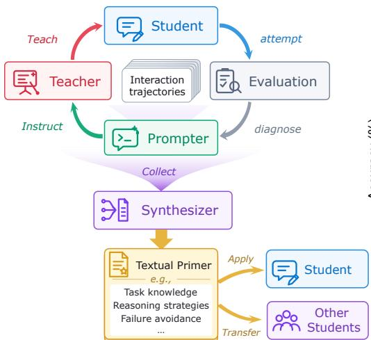
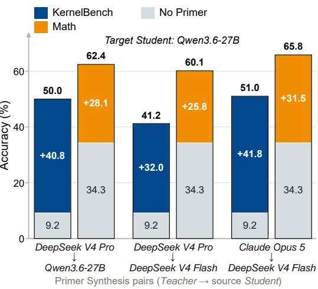
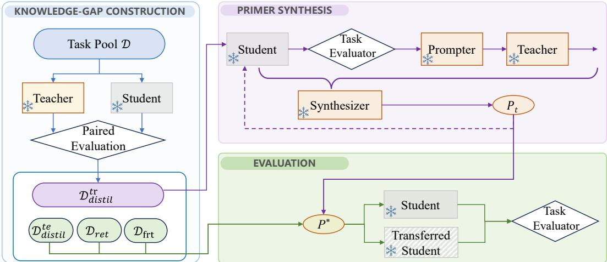
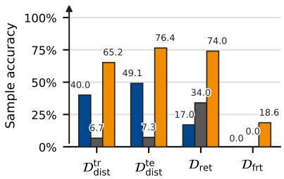
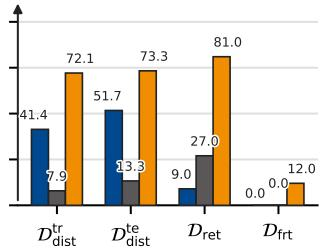
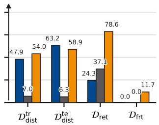
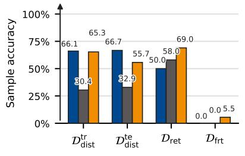
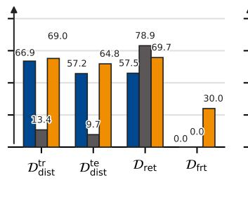
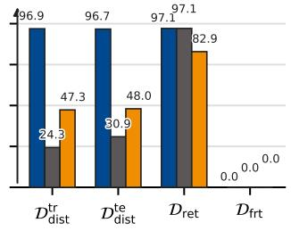
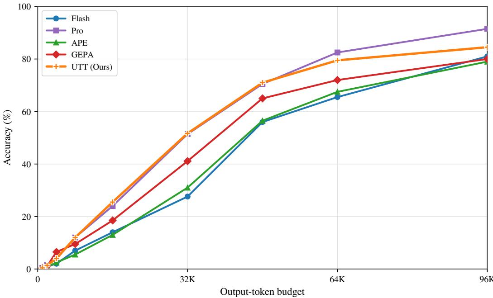

# UNIVERSAL TEXTUAL TEACHING FOR LLMS

Zhanyi Lu Westlake University luzhanyi@sjtu.edu.cn

Huan Wang <sup>B</sup>   
Westlake University   
wanghuan@westlake.edu.cn

https://alexlu99.github.io/UTT/



  
Figure 1: Left: We introduce Universal Textual Teaching (UTT), a parameter-update-free framework that distills an LLM’s knowledge into a textual Primer through multi-role LLM interaction. Notably, the resulting Primer can improve the performance of the source Student and other Students that are not involved in creating the Primer. Right: For the target Student Qwen3.6-27B, Primers synthesized from the Teacher-Student pairs (shown at the bottom of the figure) consistently improve accuracy. Even when Qwen3.6-27B does not participate in the Primer synthesis, the absolute accuracy gains reach 41.8% and 31.5% (see the rightmost column) on KernelBench and Omni-MATH-2, respectively. These results suggest that text can serve as a universal medium for knowledge transfer among different LLMs for complex tasks.

## ABSTRACT

Knowledge distillation (KD) transfers knowledge from stronger Teacher models to weaker Student models, but most methods require training the Student parameters, thereby binding the distilled knowledge to a specific architecture and checkpoint. This implicit representation is difficult to interpret or reuse across models and limits KD for API-only or costly-to-train models. This paper studies knowledge transfer for large language models (LLMs). We introduce Universal Textual Teaching (UTT), a parameter-update-free framework that distills observed Teacher-Student knowledge gaps into a textual, interpretable, and reusable natural-language artifact called Primer. Specifically, UTT first identifies representative gap cases through paired evaluations, and iteratively updates the Primer via multi-role interactions: the Student attempts each task, the Prompter turns evaluation feedback into a teaching instruction, the Teacher provides a targeted demonstration, and the Synthesizer consolidates validated lessons. Empirically, on the challenging math (Omni-MATH-2) and code generation (KernelBench) tasks, extensive results confirm the effectiveness of the method: UTT remarkably raises the Student’s accuracy from 9.4% to 48.6% and Fast accuracy from 9% to 35% on KernelBench, while increasing mathematical reasoning accuracy from 27.6% to 51.7%. UTT also performs better than representative prompt engineering and parameter-based KD methods. Of note, UTT is shown to be generalizable across different Teachers and Students: a Primer synthesized for one Teacher-Student pair can generalize to other Students that do not participate in the synthesis.

## 1 INTRODUCTION

Large language models (LLMs) demonstrate strong capabilities in reasoning, code generation, and knowledge-intensive tasks, yet capability gaps remain across models.(Achiam et al., 2023; Team et al., 2023; Xu et al., 2026; Qwen Team, 2026; Glm et al., 2024) Although open-source models are more flexible and accessible, they often trail powerful proprietary models because of limited scale and training compute (Kaplan et al., 2020). Knowledge distillation (KD) (Hinton et al., 2014) transfers knowledge from large teacher models (Teachers) to more efficient student models (Students), reducing computational and energy costs, broadening access to advanced model capabilities, and enabling wider participation in AI research and development (Xu et al., 2024).

Existing LLM distillation methods typically follow two routes: supervised fine-tuning on teachergenerated answers or reasoning traces (Kim & Rush, 2016; Hsieh et al., 2023; Ho et al., 2023), and preference optimization or reinforcement learning guided by teacher evaluations (Gu et al., 2024; Agarwal et al., 2024; Yan et al., 2025). Although effective, most require training the Student, binding the distilled knowledge to a specific architecture and checkpoint. Such implicit parameterization makes knowledge difficult to inspect or transfer, and limits applicability to API-only, non-trainable, or costly-to-train models.

These limitations raise a central question: Can the Teacher-Student knowledge gap be distilled into an explicit, interpretable, and reusable natural-language representation without updating parameters? We build on three premises: (1) modern LLMs can understand and follow natural-language instructions; (2) task-specific gaps may reflect missing knowledge or operational principles; and (3) such knowledge, when verbalized, can be directly used by other LLMs. Achieving this goes beyond asking a Teacher to generate a general prompt from a task description: reliable transfer must identify representative problems solved by the Teacher but not the Student, extract reusable knowledge, and avoid degrading the Student’s existing capabilities.

To this end, this paper presents Universal Textual Teaching (UTT), a parameter-update-free frame work that distills model knowledge into a natural-language artifact called Primer<sup>1</sup> through multi-role teaching interactions (Figure 1). UTT first identifies representative knowledge-gap cases. For each case, the Student attempts the problem, the Prompter diagnoses the gap from evaluation feedback and formulates a teaching instruction, the Teacher provides a demonstration, and the Synthesizer integrates the record into the evolving global Primer. The Primer guides subsequent teaching rounds and is deployed directly as natural-language context after distillation. Relying solely on interactions among LLMs, the process requires no model training or parameter updates and supports both open-source and API-only commercial models.

Empirically, across various Teacher-Student configurations in mathematical reasoning and code generation, the synthesized Primers consistently improve their source Students and remain effective when transferred to other Students without resynthesis, demonstrating both effectiveness and crossmodel reusability. Relative to the unprimed Student baselines, UTT improves KernelBench accuracy from 9.4% to 48.6%, Fast from 9% to 35%, and mathematical reasoning accuracy from 27.6% to 51.7%. Across the evaluated settings, UTT also outperforms representative prompt engineering and parameter-updating knowledge distillation methods.

Our main contributions are:

(1) A language-based perspective on KD for LLMs. We formulate LLM distillation as representing the Teacher-Student knowledge gap in natural language rather than encoding it in a specific Student’s parameters, making the distilled knowledge interpretable and reusable across models.

(2) A parameter-update-free closed-loop KD framework. UTT identifies knowledge gaps through paired evaluation and iteratively synthesizes a deployable global Primer from Student attempts, Prompter feedback, and Teacher demonstrations, without updating any model parameters.

(3) Empirical validation across tasks and models. Across math and code tasks, UTT demonstrates effectiveness and transferability, with Primers transferable across models without resynthesis. UTT also outperforms representative prompt engineering and parameter-updating KD methods.

## 2 RELATED WORK

Knowledge distillation for LLMs. Knowledge distillation aims to transfer knowledge from a stronger Teacher to a Student, with existing methods broadly following two routes (Hinton et al., 2014; Xu et al., 2024). One primarily relies on supervised learning, where the Teacher provides examples such as answers, reasoning traces, or explanations, and the Student learns by fitting these examples. Representative methods include SeqKD (Kim & Rush, 2016), which distills complete output sequences; Fine-tune-CoT (Ho et al., 2023) and Distilling Step-by-Step (Hsieh et al., 2023), which incorporate reasoning; and RSR (Yang et al., 2026), which constructs supervision informed by Student performance. The other emphasizes on-policy distillation and reinforcement learning, incorporating Student-generated trajectories into optimization and learning from Teacher feedback or task rewards. For example, MiniLLM (Gu et al., 2024) optimizes reverse KL divergence through policy gradients, GKD (Agarwal et al., 2024) performs distribution matching on Student-generated sequences, and LUFFY (Yan et al., 2025) combines Teacher demonstrations with Student trajectories for reinforcement learning.

Despite differences in learning and supervision, these methods typically store transferred knowledge by updating Student parameters, binding the distilled knowledge to specific model weights. This limits independent inspection, editing, and cross-model reuse of the knowledge and requires trainable Student parameters. UTT retains the objective of knowledge distillation while explicitly representing the Teacher’s knowledge advantage over the Student as a natural-language Primer, which enhances the Student through context while keeping its parameters fixed.

Prompting techniques and engineering. Prompting techniques improve LLM performance through reusable input structures or invocation workflows, while prompt engineering selects, combines, evaluates, and refines these techniques (Schulhoff et al., 2024). Representative techniques include in-context learning (Brown et al., 2020), which uses examples for task adaptation, and Chainof-Thought (Wei et al., 2022), which elicits intermediate reasoning steps. Automatic prompt optimization (APO) aims to reduce reliance on manual design (Ramnath et al., 2025). APE (Zhou et al., 2023) searches model-generated candidate instructions; ProTeGi (Pryzant et al., 2023) and OPRO (Yang et al., 2024) use textual feedback or candidate histories to guide optimization; MIPROv2 (Opsahl-Ong et al., 2024) jointly optimizes instructions and demonstrations; and TextGrad (Yuksekgonul et al., 2025) and GEPA (Agrawal et al., 2026) use textual feedback and reflection to refine prompts or compound LLM systems.

UTT shares with APO the use of natural-language text optimization to enhance models, but differs in its research objective and organization of supervision. APO searches and refines prompts directly for target-task performance, without using the knowledge gap between a designated Teacher and Student as its basis for optimization. Motivated by knowledge distillation, UTT explicitly targets the Teacher’s observed knowledge advantage over the Student for transfer, organizing it into an inspectable Primer reusable across Students.

Textual knowledge representations. Recent work has also explored natural-language representations of models and task knowledge. Verbalized Machine Learning (Xiao et al., 2025) learns natural-language model parameters, while Explaining Datasets in Words (Zhong et al., 2024) uses natural-language predicates to construct statistical explanations of data; both primarily address predictive modeling or dataset explanation. ExpeL (Zhao et al., 2024), Dynamic Cheatsheet (Suzgun et al., 2026), and SkillGLoW (Yan et al., 2026) accumulate reusable experience from task trajectories, inference-time memory, and execution-based validation, respectively. AutoManual (Chen et al., 2024) constructs instruction manuals and SkillX (Wang et al., 2026) builds hierarchical skill libraries, also demonstrating the potential of knowledge constructed by stronger models to enhance weaker ones. Their construction procedures primarily focus on environmental rules or general purpose skills, without using the Teacher-Student performance gap as their basis.

UTT pursues knowledge distillation by identifying what to transfer from the paired performance and synthesizing a global Primer from Student attempts, evaluation feedback, and validated Teacher demonstrations. Its distinction lies in using the observed Teacher-Student knowledge gap to guide teaching-content selection and text synthesis, while examining whether the resulting knowledge transfers to other Students without resynthesis.

## 3 UNIVERSAL TEXTUAL TEACHING

This section introduces UTT, a parameter-update-free framework that distills Teacher-Student knowledge gaps into natural-language representations. We first reformulate KD as optimizing a natural-language knowledge carrier rather than parameters, and then instantiate this formulation through knowledge-gap construction and multi-role interaction.

## 3.1 FROM PARAMETRIC TO TEXTUAL KNOWLEDGE DISTILLATION

Given a task distribution D, a Teacher $M _ { \theta _ { T } }$ , and a Student $M _ { \theta _ { S } }$ , let $\theta _ { T } \in \mathbb { R } ^ { d _ { T } }$ and $\theta _ { S } \in \mathbb { R } ^ { d _ { S } }$ denote their parameters. Conventional KD fixes $\theta _ { T }$ and optimizes $\theta _ { S }$ to learn from the Teacher. Parametric knowledge distillation is formulated as

$$
\theta _ { S } ^ { * } = \arg \operatorname* { m i n } _ { \theta _ { S } \in \mathbb { R } ^ { d _ { S } } } \mathbb { E } _ { x \sim \mathcal { D } } \left[ \mathcal { F } _ { \mathrm { K D } } \left( M _ { \theta _ { S } } ( x ) , \mathcal { K } _ { M _ { \theta _ { T } } } ( x ) \right) \right] , \qquad \theta _ { T } \ \mathrm { f i x e d } .\tag{1}
$$

For $x \sim \mathcal { D } , \mathcal { K } _ { M _ { \theta _ { T } } } ( x )$ denotes the instructional signal provided by the Teacher, and $\mathcal { F } _ { \mathrm { K D } }$ is the scalar objective used to train the Student from this signal. In supervised KD, the instructional signal typically comprises Teacher’s answers or reasoning traces, and the objective is commonly negative log-likelihood or cross-entropy; on-policy distillation methods instead incorporate Student’s trajectories and optimize reinforcement learning objectives. Despite differences in instructional signals and optimization objectives, these methods all optimize $\theta _ { S }$ and encode the distilled knowledge in the updated Student parameters.

We extend this paradigm to textual knowledge distillation by fixing both models and optimizing a natural-language representation, termed a Primer, that enhances the Student through context. Let V denote the model vocabulary, $\mathcal { P } _ { \mathrm { t e x t } } \subseteq \mathcal { V } ^ { * }$ the candidate text space, and $P \oplus x$ the composition of a Primer P with an input x. Textual knowledge distillation is formulated as

$$
P ^ { * } = \arg \operatorname* { m i n } _ { P \in \mathcal { P } _ { \mathrm { t e x t } } } \mathbb { E } _ { x \sim \mathcal { D } } \left[ \mathcal { F } _ { \mathrm { K D } } \left( M _ { \theta _ { S } } ( P \oplus x ) , \mathcal { K } _ { M _ { \theta _ { T } } } ( x ) \right) \right] , \qquad \theta _ { T } , \theta _ { S } \ \mathrm { f i x e d } .\tag{2}
$$

Unlike Eq. (1), Eq. (2) optimizes discrete text $P$ rather than real-valued parameters $\theta _ { S }$ , making the distilled knowledge auditable and reusable across models. Because $\mathcal { P } _ { \mathrm { t e x t } }$ is discrete, this objective is typically approximated through search or LLM-based iteration.

For Primer synthesis in UTT, the optimization data in Eq. (2) are instantiated as the distillation training<sup>2</sup> set $\bar { \mathcal { D } } _ { \mathrm { d i s t } } ^ { \mathrm { t r } }$ obtained through knowledge-gap construction. The criterion $\mathcal { F } _ { \mathrm { K D } }$ denotes taskspecific evaluation feedback, which may be numerical or textual. The Teacher signal $\kappa _ { M _ { \theta _ { T } } } ( x )$ combines evaluative and generative information. The next section describes how the Primer is generated through multi-role interaction.

## 3.2 THE UTT FRAMEWORK

As shown in Figure 2, UTT first partitions the dataset through knowledge-gap construction and then synthesizes a Primer through multi-role LLM interaction. We detail both components below.

## 3.2.1 KNOWLEDGE-GAP CONSTRUCTION

UTT first identifies the knowledge to transfer through paired evaluations. Using all Teacher generations would introduce redundant supervision, while a failing Teacher cannot provide a reliable demonstration. We therefore construct the knowledge-gap dataset from their observed performance.

Let $y _ { m , x } ^ { ( k ) }$ denote the k-th generation of model $m \in \{ T , S \}$ on sample x. Let $\mathcal { F } _ { \mathrm { K D } } ^ { \mathrm { c o r r } } ( x , y ) \in \{ 0 , 1 \}$ denote the correctness field returned by $\mathcal { F } _ { \mathrm { K D } }$ , and define the empirical accuracy on x as

$$
q _ { m } ( x ) = \frac { 1 } { K } \sum _ { k = 1 } ^ { K } \mathcal { F } _ { \mathrm { K D } } ^ { \mathrm { c o r r } } \left( x , y _ { m , x } ^ { ( k ) } \right) , \qquad m \in \{ T , S \} .\tag{3}
$$

  
Figure 2: Overview of Universal Textual Teaching (UTT). (1) Knowledge-gap construction. UTT first evaluates the knowledge gap between the Teacher and Student and accordingly partitions D into subsets (Section 3.2.1). (2) Primer synthesis. It then synthesizes a textual Primer through iterative interactions among multiple LLMs (Section 3.2.2). (3) Evaluation. Finally, the resulting Primer is applied to the source Student and transferred to other Students, improving both the source Student and the transfer Students. All model parameters remain frozen throughout the process. In the diagram, rectangles denote models, with the same color indicating the same model serving different roles; rounded rectangles denote data subsets, and diamonds denote evaluation procedures.

Based on $q _ { T } ( x )$ and $q _ { S } ( x )$ , we partition D into three disjoint subsets: the distillation, retention, and frontier subsets, denoted by $\mathcal { D } _ { \mathrm { d i s t } } , \mathcal { D } _ { \mathrm { r e t } }$ , and $\mathcal { D } _ { \mathrm { f r t } }$ , respectively:

$$
\begin{array} { r l } & { \mathcal { D } = \mathcal { D } _ { \mathrm { d i s t } } \dot { \cup } \mathcal { D } _ { \mathrm { r e t } } \dot { \cup } \mathcal { D } _ { \mathrm { f r t } } , } \\ & { \mathcal { D } _ { \mathrm { d i s t } } = \left\{ x \in \mathcal { D } \left| q _ { T } ( x ) > q _ { S } ( x ) \right. \right\} , } \\ & { \mathcal { D } _ { \mathrm { r e t } } = \left\{ x \in \mathcal { D } \left| q _ { T } ( x ) \le q _ { S } ( x ) , q _ { S } ( x ) > 0 \right. \right\} , } \\ & { \mathcal { D } _ { \mathrm { f r t } } = \left\{ x \in \mathcal { D } \left| q _ { T } ( x ) = q _ { S } ( x ) = 0 \right. \right\} . } \end{array}\tag{4}
$$

The distillation subset $\mathcal { D } _ { \mathrm { d i s t } }$ contains samples where the Teacher outperforms the Student for knowledge transfer, while the retention subset $\mathcal { D } _ { \mathrm { r e t } }$ and the frontier subset $\mathcal { D } _ { \mathrm { f r t } }$ evaluate capability preservation and potential improvement beyond the Teacher. $\mathcal { D } _ { \mathrm { d i s t } }$ is further split into a distillation training set $\mathcal { D } _ { \mathrm { d i s t } } ^ { \mathrm { t r } }$ and test set $\mathcal { D } _ { \mathrm { d i s t } } ^ { \mathrm { t e } }$ . Only the training set is used for Primer synthesis, while all other subsets are reserved for final evaluation; namely, the training and testing sets do not overlap, following the standard machine learning setting.

## 3.2.2 CLOSED-LOOP PRIMER SYNTHESIS VIA MULTI-ROLE INTERACTION

UTT processes the distillation training set in batches and progressively synthesizes global knowledge into the Primer. In each batch, the Student role exposes residual knowledge gaps, the Prompter role formulates teaching instructions, the Teacher role provides targeted demonstrations, and the Synthesizer role consolidates teaching records into a candidate Primer. Each role uses a taskagnostic system prompt and receives task-specific inputs at runtime (Appendix A.3). All model parameters remainfrozen throughout the process.

Formally, let $\{ B _ { 1 } , \ldots , B _ { T } \}$ denote the ordered batches of $\mathcal { D } _ { \mathrm { d i s t } } ^ { \mathrm { t r } }$ , and initialize the Primer as $P _ { 0 }$

Multi-role teaching interaction. For each $x _ { i } \in B _ { t } .$ , the Student first generates a trial $z _ { t , i }$ using the current Primer $P _ { t - 1 }$ , and the task evaluator returns feedback $e _ { t , i } .$ . If the trial is correct, UTT proceeds directly to the next problem. Otherwise, the Prompter $M _ { \theta _ { P } }$ uses $x _ { i }$ and $e _ { t , i }$ to formulate a teaching instruction $a _ { t , i }$ , and the Teacher uses $x _ { i }$ and $a _ { t , i }$ to generate a targeted demonstration $d _ { t , i } \colon$

$$
\begin{array} { r l } & { z _ { t , i } = M _ { \theta _ { S } } ( P _ { t - 1 } \oplus x _ { i } ) , \quad e _ { t , i } = \mathcal { F } _ { \mathrm { K D } } ( x _ { i } , z _ { t , i } ) , } \\ & { a _ { t , i } = M _ { \theta _ { P } } ( x _ { i } , e _ { t , i } ) , \quad d _ { t , i } = M _ { \theta _ { T } } ( x _ { i } , a _ { t , i } ) . } \end{array}\tag{5}
$$

The interaction for an incorrect trial forms a teaching record $r _ { t , i } ;$ to avoid introducing unreliable knowledge, only records whose Teacher demonstrations pass evaluation are retained in $\mathcal { R } _ { t }$

$$
\begin{array} { r l } & { r _ { t , i } = \left( x _ { i } , z _ { t , i } , e _ { t , i } , a _ { t , i } , d _ { t , i } \right) , } \\ & { \mathcal { R } _ { t } = \left\{ r _ { t , i } \ | \ x _ { i } \in \mathcal { B } _ { t } , \mathcal { F } _ { \mathrm { K D } } ^ { \mathrm { c o r r } } ( x _ { i } , z _ { t , i } ) = 0 , \mathcal { F } _ { \mathrm { K D } } ^ { \mathrm { c o r r } } ( x _ { i } , d _ { t , i } ) = 1 \right\} . } \end{array}\tag{6}
$$

Primer synthesis and validation. The Synthesizer extracts textual knowledge from the $\mathcal { R } _ { t }$ and integrates it with the current Primer to produce a candidate $\widetilde { P } _ { t }$

$$
\begin{array} { r } { \widetilde { P } _ { t } = M _ { \theta _ { \mathrm { S y n } } } ( P _ { t - 1 } , \mathcal { R } _ { t } ) . } \end{array}\tag{7}
$$

To prevent accumulated knowledge from degrading Student performance, UTT compares the current and candidate Primer on the same batch. Let $N _ { \mathrm { c o r r } } ( P ; B _ { t } )$ denote the number of correct Student outputs on $B _ { t }$ when using Primer P:

$$
N _ { \mathrm { c o r r } } ( P ; \mathcal { B } _ { t } ) = \sum _ { x _ { i } \in \mathcal { B } _ { t } } \mathcal { F } _ { \mathrm { K D } } ^ { \mathrm { c o r r } } \left( x _ { i } , M _ { \theta _ { S } } ( P \oplus x _ { i } ) \right) .\tag{8}
$$

The candidate passes the validation gate only if it performs no worse than the current Primer:

$$
P _ { t } = \left\{ \begin{array} { l l } { \widetilde { P } _ { t } , } & { N _ { \mathrm { c o r r } } ( \widetilde { P } _ { t } ; \mathcal { B } _ { t } ) \ge N _ { \mathrm { c o r r } } ( P _ { t - 1 } ; \mathcal { B } _ { t } ) , } \\ { P _ { t - 1 } , } & { \mathrm { o t h e r w i s e . } } \end{array} \right.\tag{9}
$$

After all batches are processed, the final global Primer is obtained as $P ^ { * }$ . During deployment, the Primer can be directly provided to the Student model without updating model parameters. Experiments further validate that this language-based knowledge representation Primer not only enhances the source Student but also transfers to improve other Student models. Appendix D presents complete Primers for Olympiad-level mathematics, GPU kernel generation, and visual geometry.

## 4 EXPERIMENTAL RESULTS

## 4.1 EXPERIMENTAL SETTINGS

Tasks and evaluation. We evaluate UTT on two representative LLM tasks, code generation and mathematical reasoning, using the challenging KernelBench (Ouyang et al., 2025) and Omni-MATH-2 (Ballon et al., 2026) benchmarks, respectively. KernelBench is an open-ended benchmark without a unique reference implementation: it requires models to generate correct and efficient GPU kernels and evaluates their functionality and efficiency through execution, whereas Omni-MATH-2 consists of Olympiad-level mathematics problems with ground-truth answers.

Accuracy is the primary metric for both tasks. For KernelBench, we additionally report Fast<sub>1</sub>@5, the fraction of problems with at least one of five samples that is correct and faster than the PyTorch reference. We denote Fast @5 as Fast hereafter.

Comparison methods. We compare UTT with prompt engineering methods and parameterupdating KD methods. Prompting baselines include one-shot, few-shot, teacher summary prompts, and automatic optimization methods such as APE (Zhou et al., 2023), MIPROv2 (Opsahl-Ong et al., 2024), and GEPA (Agrawal et al., 2026), while KD baselines include SeqKD (Kim & Rush, 2016), Fine-tune-CoT (Ho et al., 2023), RSR (Yang et al., 2026), and LUFFY (Yan et al., 2025).

Roles and model configurations. In each configuration, the target student model serves as the Student, while the source teacher model serves as the Teacher, Prompter, and Synthesizer. We use DeepSeek V4 Pro (Pro) and DeepSeek V4 Flash (Flash) (Xu et al., 2026), Qwen3.6-27B (Qwen) (Qwen Team, 2026), and Claude Opus 5 (Opus). The three Teacher-Student configurations are Pro→Flash, Pro→Qwen, and Opus→Flash. They cover both within-family and cross-family knowledge transfer and include both open-source and proprietary models.

UTT uses a default batch size of 16, with evaluation budgets of 100 and 200 samples on KernelBench and Omni-MATH-2, respectively; detailed configurations are provided in Appendix A.

Table 1: Primer effectiveness and cross-model transferability. For each task, each Teacher and source Student pair produces one Primer, transferring to the target Student. ⃝1 –⃝6 denote different experimental groups. Parentheses show gains over the corresponding Student baseline, and bold values indicate the best result. All scores are computed over the full task pool D.
<table><tr><td colspan="3">Primer synthesis</td><td colspan="2">Target Student</td></tr><tr><td>Teacher</td><td>Teacher score</td><td>Source Student</td><td>Flash</td><td>Qwen</td></tr><tr><td colspan="5">KernelBench Accuracy (%)</td></tr><tr><td>No Primer</td><td></td><td></td><td>9.4</td><td>9.2</td></tr><tr><td>Pro</td><td>19.6</td><td>Flash</td><td>48.6 (+39.2) ①</td><td>41.2 (+32.0) ③</td></tr><tr><td>Pro</td><td>19.6</td><td>Qwen</td><td>43.8 (+34.4) ④</td><td>50.0 (+40.8) ②</td></tr><tr><td>Opus</td><td>36.0</td><td>Flash</td><td>48.2 (+38.8) ⑤</td><td>51.0 (+41.8) ⑥</td></tr><tr><td colspan="5">KernelBench Fast1 (%)</td></tr><tr><td>No Primer</td><td></td><td></td><td>9</td><td>12</td></tr><tr><td>Pro</td><td>20</td><td>Flash</td><td>35 (+26) ①</td><td>37 (+25) ③</td></tr><tr><td>Pro</td><td>20</td><td>Qwen</td><td>30 (+21) ④</td><td>32 (+20) ②</td></tr><tr><td>Opus</td><td>41</td><td>Flash</td><td>39 (+30) ⑤</td><td>22 (+10) ⑥</td></tr><tr><td colspan="5">Omni-MATH-2 Accuracy (%)</td></tr><tr><td>No Primer</td><td></td><td></td><td>27.6</td><td>34.3</td></tr><tr><td>Pro</td><td>51.4</td><td>Flash</td><td>51.7 (+24.1) ①</td><td>60.1 (+25.8) ③</td></tr><tr><td>Pro</td><td>51.4</td><td>Qwen</td><td>43.7 (+16.1) ④</td><td>62.4 (+28.1) ②</td></tr><tr><td>Opus</td><td>92.5</td><td>Flash</td><td>46.6 (+19.0) ⑤</td><td>65.8 (+31.5) ⑥</td></tr></table>

## 4.2 PRIMER EFFECTIVENESS AND CROSS-MODEL TRANSFERABILITY

Table 1 summarizes the overall performance of the methods across different Teacher-Student configurations, evaluating the effectiveness and cross-model transferability of the Primer. We next analyze the results for each configuration and summarize the main findings.

Basic Effectiveness and Student Replacement (⃝1 , ⃝2 ). We first evaluate Pro→Flash, applying the Primer to its source Student. The Primer yields substantial gains of 39.2, 26, and 24.1 percentage points over the Student baseline on KernelBench accuracy, Fast , and Math accuracy, respectively, improving the corresponding scores from 9.4% to 48.6%, 9% to 35%, and 27.6% to 51.7%. Keeping Pro as the Teacher, we further synthesize a new Primer for Qwen, which achieves 50.0%, 32%, and 62.4% on the same metrics. These results validate the effectiveness of UTT and demonstrate its applicability to Students from different model families.

Transfer across Students (⃝3 , ⃝4 ). To evaluate whether knowledge derived from the same Teacher can be reused across Students, we exchange the two Pro-based Primers between Flash and Qwen without resynthesis. The Flash-derived Primer improves Qwen by 32.0, 25, and 25.8 percentage points in KernelBench accuracy, Fast<sub>1</sub>, and Math accuracy, respectively. The Qwen-derived Primer improves Flash by 34.4, 21, and 16.1 percentage points on the same metrics. These results show that knowledge distilled through interactions with one Student can transfer to another Student without resynthesizing the Primer.

Teacher Replacement and General Transferability (⃝5 , ⃝6 ). We then replace Pro with Opus and synthesize a new Primer for Flash. It improves Flash by 38.8, 30, and 19.0 percentage points on the three metrics, demonstrating that UTT remains effective with different Teachers. Finally, applying this Primer unchanged to Qwen yields 51.0% KernelBench accuracy, 22% Fast , and 65.8% Math accuracy. Compared with the initial Pro→Flash setting, both the Teacher and target Student are changed, while Qwen does not participate in Primer synthesis. This result further demonstrates the transferability and broad applicability of UTT across diverse Teacher-Student configurations.

Together, these results support effective synthesis across the evaluated model configurations without resynthesis or parameter updates. Although the main experiments focus on LLMs, we also preliminarily confirm transfer to multimodal LLMs in Appendix B.1.

(a) KernelBench: Pro Flash  


(b) KernelBench: Pro Qwen  
  
(d) Omni-MATH-2: Pro Flash

(c) KernelBench: Opus Flash  




(e) Omni-MATH-2: Pro Qwen  
(f) Omni-MATH-2: Opus Flash  


  
Figure 3: Split-wise sample accuracy for KernelBench and Omni-MATH-2. Panels (a)–(c) show KernelBench results and panels (d)–(f) show Omni-MATH-2 results. From left to right, the three columns correspond to Pro→Flash, Pro→Qwen, and Opus→Flash, respectively.

## 4.3 ANALYSIS: GENERALIZATION, RETENTION, AND FRONTIER EXTENSION

To analyze UTT under different knowledge-gap conditions in detail, Figure 3 reports sample accuracy for six task-model configurations across the four subsets constructed in Section 3.2.1, examining the effectiveness of Primer text synthesis, the generalization of distilled knowledge, the preservation of existing capabilities, and the extension of capability frontiers, respectively.

On the distillation training set, Pro→Flash accuracy on KernelBench increases from 6.7% to 65.2%, indicating that the synthesized Primer effectively improves Student performance on knowledge-gap samples. On the distillation test set, Pro→Qwen accuracy on the math task increases from 9.7% to 64.8%. These results show that knowledge distilled into text can generalize to unseen problems, with benefits extending beyond the samples used for synthesis.

On the retention subset, the three KernelBench configurations show no decline in accuracy; instead, they improve from 34.0% to 74.0%, 27.0% to 81.0%, and 37.1% to 78.6%, respectively. On Omni-MATH-2, Pro→Flash improves accuracy from 58.0% to 69.0%, while Pro→Qwen and Opus→Flash decrease accuracy by 9.2 and 14.2 percentage points, respectively, yet still retain most of their baseline performance. This indicates that the Primer largely preserves the Student’s existing capabilities while improving performance on knowledge-gap samples.

On the frontier subset, the primed Student achieves nonzero accuracy in five of the six configurations. The three KernelBench configurations achieve 11.7% to 18.6% accuracy, while Pro→Flash and Pro→Qwen achieve 5.3% and 30.0% on Omni-MATH-2, respectively. This shows that the Primer can help the Student solve some problems that neither the Teacher nor the Student solved during baseline evaluation, extending the observed capability frontier.

Together, these fine-grained results further support the effectiveness of UTT in four respects: synthesis effectiveness, generalization to unseen problems, preservation of existing capabilities, and extension of capability frontiers.

## 4.4 COMPARATIVE EXPERIMENTS

Comparison with prompt engineering methods. Table 2 compares UTT with several prompt engineering methods. UTT performs best across all six combinations, with consistent gains across tasks and target models. Among the prompting baselines, GEPA is stronger on Omni-MATH-2, while MIPROv2 performs better on KernelBench. Teacher summary improves Flash but is inconsistent on Qwen, suggesting that directly summarized Teacher knowledge may not transfer well across Students and Teacher-Student interaction is important for constructing an effective Primer. Appendix B.2 further examines this trend under larger output-token budgets for math.

Table 2: Comparison with prompt engineering methods. “Teacher summary” means asking the Teacher to summarize the training set into a general prompt.
<table><tr><td rowspan="3">Method</td><td colspan="2">Omni-MATH-2</td><td colspan="4">KernelBench</td></tr><tr><td>Flash</td><td>Qwen</td><td colspan="2">Flash</td><td colspan="2">Qwen</td></tr><tr><td>Acc.</td><td>Acc.</td><td>Acc.</td><td>Fast1</td><td>Acc.</td><td>Fast1</td></tr><tr><td>Student</td><td>27.6</td><td>34.3</td><td>9.4</td><td>9</td><td>9.2</td><td>12</td></tr><tr><td colspan="7">Prompting Techniques (PT)</td></tr><tr><td>One-shot</td><td>35.0</td><td>57.7</td><td>39.2</td><td>23</td><td>45.8</td><td>31</td></tr><tr><td>Few-shot</td><td>35.4</td><td>54.8</td><td>40.6</td><td>25</td><td>46.6</td><td>30</td></tr><tr><td>Teacher summary</td><td>36.7</td><td>32.8</td><td>40.0</td><td>30</td><td>10.2</td><td>11</td></tr><tr><td colspan="7">Automatic Prompt Optimization (APO)</td></tr><tr><td>APE (Zhou et al., 2023)</td><td>31.0</td><td>39.3</td><td>11.0</td><td>8</td><td>10.4</td><td>13</td></tr><tr><td>MIPROv2 (instruction only)</td><td>28.7</td><td>29.8</td><td>9.8</td><td>6</td><td>11.8</td><td>9</td></tr><tr><td>MIPROv2 (Opsahl-Ong et al., 2024)</td><td>33.5</td><td>25.8</td><td>45.0</td><td>21</td><td>44.6</td><td>30</td></tr><tr><td>GEPA (Agrawal et al., 2026)</td><td>41.1</td><td>61.9</td><td>34.8</td><td>24</td><td>32.6</td><td>23</td></tr><tr><td>UTT (Ours)</td><td>51.7</td><td>62.4</td><td>48.6</td><td>35</td><td>50.0</td><td>32</td></tr></table>

Table 3: Comparison with KD methods under the Pro→Qwen setting.
<table><tr><td rowspan="2">Method</td><td>Omni-MATH-2</td><td colspan="2">KernelBench</td></tr><tr><td>Acc.</td><td>Acc.</td><td>Fast1</td></tr><tr><td>Student</td><td>34.3</td><td>9.2</td><td>12</td></tr><tr><td>SeqKD (Kim &amp; Rush, 2016)</td><td>53.5</td><td>18.8</td><td>18</td></tr><tr><td>Fine-tune-CoT (Ho et al., 2023)</td><td>39.5</td><td>41.8</td><td>28</td></tr><tr><td>RSR (Yang et al., 2026)</td><td>51.5</td><td>22.6</td><td>19</td></tr><tr><td>LUFFY (Yan et al., 2025)</td><td>55.2</td><td>11.4</td><td>13</td></tr><tr><td>UTT (Ours)</td><td>62.4</td><td>50.0</td><td>32</td></tr></table>

Comparison with KD methods. Table 3 compares UTT with parameter-updating KD methods. With Student parameters fixed, UTT exceeds the strongest baseline by 7.2, 8.2, and 4 percentage points on Omni-MATH-2 accuracy, KernelBench accuracy, and Fast<sub>1</sub>, respectively. These results indicate that explicit textual knowledge can yield stronger and more consistent gains across tasks. Appendix B.3 reports the resources used to achieve these results.

We have more results, but due to page limits, ablations of knowledge-gap selection, the Prompter, and validation gating, along with analyses of batch size, quantization, and thinking mode, are deferred to Appendix C. Potential limitations and future work are discussed in Appendix E.

## 5 CONCLUSION

This paper introduces Universal Textual Teaching (UTT), a parameter-update-free knowledge distillation method for large language models. UTT first identifies Teacher-Student knowledge gaps and then synthesizes validated teaching records into a textual Primer through multi-role LLM interactions. On the challenging math and code generation tasks (Omni-MATH-2 and KernelBench), UTT substantially improves the Student’s performance across various Teacher-Student settings. UTT also outperforms representative prompt engineering and KD methods. Compared with knowledge implicitly encoded in model parameters, the Primer is interpretable and not tied to particular model weights, enabling direct transfer to other models. This demonstrates that natural language can serve as a deployable knowledge carrier across models, providing a new parameter-update-free perspective on knowledge distillation for large language models.

## REFERENCES

Josh Achiam, Steven Adler, Sandhini Agarwal, Lama Ahmad, Ilge Akkaya, Florencia Leoni Aleman, Diogo Almeida, Janko Altenschmidt, Sam Altman, Shyamal Anadkat, et al. Gpt-4 technical report. arXiv preprint arXiv:2303.08774, 2023.

Rishabh Agarwal, Nino Vieillard, Yongchao Zhou, Piotr Stanczyk, Sabela Ramos Garea, Matthieu Geist, and Olivier Bachem. On-policy distillation of language models: Learning from selfgenerated mistakes. In ICLR, 2024.

Lakshya A Agrawal, Shangyin Tan, Dilara Soylu, Noah Ziems, Rishi Khare, Krista Opsahl-Ong, Arnav Singhvi, Herumb Shandilya, Michael J Ryan, Meng Jiang, et al. Gepa: Reflective prompt evolution can outperform reinforcement learning. In ICLR, 2026.

Marthe Ballon, Andres Algaba, Brecht Verbeken, and Vincent Ginis. Benchmarks saturate when the model gets smarter than the judge. arXiv preprint arXiv:2601.19532, 2026.

Tom Brown, Benjamin Mann, Nick Ryder, Melanie Subbiah, Jared D Kaplan, Prafulla Dhariwal, Arvind Neelakantan, Pranav Shyam, Girish Sastry, Amanda Askell, et al. Language models are few-shot learners. In NeurIPS, 2020.

Minghao Chen, Yihang Li, Yanting Yang, Shiyu Yu, Binbin Lin, and Xiaofei He. AutoManual: Constructing instruction manuals by LLM agents via interactive environmental learning. In NeurIPS, 2024.

Elias Frantar, Saleh Ashkboos, Torsten Hoefler, and Dan Alistarh. Gptq: Accurate post-training quantization for generative pre-trained transformers. In ICLR, 2023.

Team Glm, Aohan Zeng, Bin Xu, Bowen Wang, Chenhui Zhang, Da Yin, Dan Zhang, Diego Rojas, Guanyu Feng, Hanlin Zhao, et al. Chatglm: A family of large language models from glm-130b to glm-4 all tools. arXiv preprint arXiv:2406.12793, 2024.

Yuxian Gu, Li Dong, Furu Wei, and Minlie Huang. Minillm: Knowledge distillation of large language models. In ICLR, 2024.

Geoffrey Hinton, Oriol Vinyals, and Jeff Dean. Distilling the knowledge in a neural network. 2014.

Namgyu Ho, Laura Schmid, and Se-Young Yun. Large language models are reasoning teachers. In ACL, 2023.

Cheng-Yu Hsieh, Chun-Liang Li, Chih-Kuan Yeh, Hootan Nakhost, Yasuhisa Fujii, Alex Ratner, Ranjay Krishna, Chen-Yu Lee, and Tomas Pfister. Distilling step-by-step! outperforming larger language models with less training data and smaller model sizes. In ACL Findings, 2023.

Jared Kaplan, Sam McCandlish, Tom Henighan, Tom B Brown, Benjamin Chess, Rewon Child, Scott Gray, Alec Radford, Jeffrey Wu, and Dario Amodei. Scaling laws for neural language models. arXiv preprint arXiv:2001.08361, 2020.

Yoon Kim and Alexander M Rush. Sequence-level knowledge distillation. In EMNLP, 2016.

Krista Opsahl-Ong, Michael J Ryan, Josh Purtell, David Broman, Christopher Potts, Matei Zaharia, and Omar Khattab. Optimizing instructions and demonstrations for multi-stage language model programs. In EMNLP, 2024.

Anne Ouyang, Simon Guo, Simran Arora, Alex L Zhang, William Hu, Christopher Re, and Azalia´ Mirhoseini. Kernelbench: Can llms write efficient gpu kernels? In ICML, 2025.

Reid Pryzant, Dan Iter, Jerry Li, Yin Lee, Chenguang Zhu, and Michael Zeng. Automatic prompt optimization with “gradient descent” and beam search. In EMNLP, 2023.

Qwen Team. Qwen3.6-27B: Flagship-level coding in a 27b dense model, 2026.

Kiran Ramnath, Kang Zhou, Sheng Guan, Soumya Smruti Mishra, Xuan Qi, Zhengyuan Shen, Shuai Wang, Sangmin Woo, Sullam Jeoung, Yawei Wang, et al. A systematic survey of automatic prompt optimization techniques. In EMNLP, 2025.

Sander Schulhoff, Michael Ilie, Nishant Balepur, Konstantine Kahadze, Amanda Liu, Chenglei Si, Yinheng Li, Aayush Gupta, HyoJung Han, Sevien Schulhoff, et al. The prompt report: a systematic survey of prompt engineering techniques. arXiv preprint arXiv:2406.06608, 2024.

Mirac Suzgun, Mert Yuksekgonul, Federico Bianchi, Dan Jurafsky, and James Zou. Dynamic cheatsheet: Test-time learning with adaptive memory. In EACL, 2026.

Gemini Team, Rohan Anil, Sebastian Borgeaud, Jean-Baptiste Alayrac, Jiahui Yu, Radu Soricut, Johan Schalkwyk, Andrew M Dai, Anja Hauth, Katie Millican, et al. Gemini: a family of highly capable multimodal models. arXiv preprint arXiv:2312.11805, 2023.

Chenxi Wang, Zhuoyun Yu, Xin Xie, Wuguannan Yao, Runnan Fang, Shuofei Qiao, Kexin Cao, Guozhou Zheng, Xiang Qi, Peng Zhang, and Shumin Deng. SkillX: Automatically constructing skill knowledge bases for agents. arXiv preprint arXiv:2604.04804, 2026.

Jason Wei, Xuezhi Wang, Dale Schuurmans, Maarten Bosma, Fei Xia, Ed Chi, Quoc V Le, Denny Zhou, et al. Chain-of-thought prompting elicits reasoning in large language models. In NeurIPS, 2022.

Tim Z. Xiao, Robert Bamler, Bernhard Scholkopf, and Weiyang Liu. Verbalized machine learning:¨ Revisiting machine learning with language models. TMLR, 2025.

Anyi Xu, Bangcai Lin, Bing Xue, Bingxuan Wang, Bingzheng Xu, Bochao Wu, Bowei Zhang, Chaofan Lin, Chen Dong, Chenchen Ling, et al. Deepseek-v4: Towards highly efficient milliontoken context intelligence. arXiv preprint arXiv:2606.19348, 2026.

Xiaohan Xu, Ming Li, Chongyang Tao, Tao Shen, Reynold Cheng, Jinyang Li, Can Xu, Dacheng Tao, and Tianyi Zhou. A survey on knowledge distillation of large language models. arXiv preprint arXiv:2402.13116, 2024.

Ao Yan, Xin Zhang, Jiawei Du, and Joey Tianyi Zhou. SkillGLoW: Procedural-family skill consolidation for self-improving agents on long-horizon task streams. arXiv preprint arXiv:2609.02217, 2026.

Jianhao Yan, Yafu Li, Zican Hu, Zhi Wang, Ganqu Cui, Xiaoye Qu, Yu Cheng, and Yue Zhang. Learning to reason under off-policy guidance. In NeurIPS, 2025.

Chengrun Yang, Xuezhi Wang, Yifeng Lu, Hanxiao Liu, Quoc V Le, Denny Zhou, and Xinyun Chen. Large language models as optimizers. In ICLR, 2024.

Yuming Yang, Mingyoung Lai, Wanxu Zhao, Xiaoran Fan, Zhiheng Xi, Mingqi Wu, Chiyue Huang, Jun Zhao, Haijun Lv, Jian Tong, et al. Which reasoning trajectories teach students to reason better? a simple metric of informative alignment. In ACL, 2026.

Mert Yuksekgonul, Federico Bianchi, Joseph Boen, Sheng Liu, Pan Lu, Zhi Huang, Carlos Guestrin, and James Zou. Optimizing generative ai by backpropagating language model feedback. Nature, 639(8055):609–616, 2025.

Renrui Zhang, Dongzhi Jiang, Yichi Zhang, Haokun Lin, Ziyu Guo, Pengshuo Qiu, Aojun Zhou, Pan Lu, Kai-Wei Chang, Yu Qiao, et al. Mathverse: Does your multi-modal llm truly see the diagrams in visual math problems? In ECCV, 2024.

Andrew Zhao, Daniel Huang, Quentin Xu, Matthieu Lin, Yong-Jin Liu, and Gao Huang. ExpeL: LLM agents are experiential learners. In AAAI, 2024.

Ruiqi Zhong, Heng Wang, Dan Klein, and Jacob Steinhardt. Explaining datasets in words: Statistical models with natural language parameters. In NeurIPS, 2024.

Yongchao Zhou, Andrei Ioan Muresanu, Ziwen Han, Keiran Paster, Silviu Pitis, Harris Chan, and Jimmy Ba. Large language models are human-level prompt engineers. In ICLR, 2023.

## A EXPERIMENTAL SETTINGS

## A.1 DATASETS AND EVALUATION

To evaluate knowledge transfer on challenging tasks with capability gaps between the Teacher and Student, we use KernelBench (Ouyang et al., 2025) and Omni-MATH-2 (Ballon et al., 2026) as our primary benchmarks. For KernelBench, we use all 100 problems from Level 1. For Omni-MATH-2, we select a fixed set of 200 problems from difficulty levels 5–10, balanced across categories such as geometry, algebra, and number theory. To reduce the effect of stochasticity from API services, each model independently generates five responses per problem, resulting in initial pools of 500 KernelBench samples and 1,000 Omni-MATH-2 samples.

Both tasks follow the official evaluation protocols of their respective benchmarks. For Omni-MATH-2, we report final-answer accuracy. KernelBench evaluates generated kernels through executionbased functional correctness checks and measures their runtime efficiency relative to the PyTorch reference implementations. Because KernelBench runtimes depend on the underlying hardware, all generated kernels and PyTorch reference implementations are evaluated on an NVIDIA RTX A6000. In addition to sample-level functional accuracy, we report Fast @5, defined as the fraction of problems for which at least one of five generated samples is functionally correct and faster than the PyTorch reference implementation. For comparison with the Student baseline used during knowledge-gap construction, the primed model regenerates the full task pool under the same configuration with five samples per problem.

## A.2 MODELS AND ROLE ASSIGNMENTS

We distinguish an underlying model from the functional role it performs in the multi-role interaction. For each Teacher-Student configuration, the target Student model instantiates the Student role, whereas the Teacher model instantiates the Teacher, Prompter, and Synthesizer roles. The roles use distinct prompts and runtime inputs but no role-specific model configurations: all calls to the same underlying model use the decoding settings reported below. No model parameters are updated throughout UTT.

We consider three Teacher-Student configurations: DeepSeek V4 Pro → DeepSeek V4 Flash, DeepSeek V4 Pro → Qwen3.6-27B, and Claude Opus 5 → DeepSeek V4 Flash. We abbreviate these models as Pro, Flash, Qwen, and Opus, respectively.

All models operate with thinking enabled. DeepSeek uses the high thinking setting, Claude Opus 5 uses adaptive thinking, and Qwen uses its default thinking configuration. The temperature is set to 0 for DeepSeek and Qwen, corresponding to greedy decoding, while no temperature is explicitly specified for Opus. The maximum output length is set to 16,384 tokens for KernelBench, which is sufficient for complete GPU kernel generation. For Omni-MATH-2, the maximum output length is set to 32,768 tokens.

## A.3 ROLE PROMPT TEMPLATES

The following canonical templates define the behavior and input-output interface of the four roles in UTT. Fields enclosed in braces are filled at runtime, and task-specific requirements, including the required output format, are included in {task}. For clarity, each listing presents the system instruction together with its runtime input fields; the implementation sends these two parts as the system and user messages, respectively. For batched synthesis, the case-level fields are repeated for each teaching record in the batch.

## Student Role Prompt

You are the Student. Solve the given task correctly and as well as you can.

The current Primer contains reusable knowledge, reasoning strategies, validation methods, and common pitfalls distilled from previous

Student Role Prompt (continued)   
teaching cases. Use any relevant information from it, but do not   
treat it as a restriction.   
Follow all requirements contained in the task. Output only the   
solution, with no additional commentary.   
CURRENT PRIMER:   
{current\_primer}   
TASK:   
{task}

## Prompter Role Prompt

You are the Prompter. A Student is attempting a task, and a Teacher   
will prepare a worked solution to help the Student improve.   
Based on the task and the evaluation feedback from the Student's most   
recent attempt, identify the primary knowledge or reasoning gap.   
Distinguish the underlying cause from its symptoms, and state what   
the Teacher's worked solution should emphasize.   
Ground the instruction in the evaluation results and diagnostics.   
Focus on transferable principles, reasoning strategies, checks, or   
decision rules that would help with related tasks.   
Do not solve the task yourself. Output only a concrete and actionable   
teaching instruction in concise sentences.   
TASK:   
{task}   
EVALUATION FEEDBACK:   
{feedback}

## Teacher Role Prompt

You are the Teacher. Produce a correct, complete, and high-quality   
worked solution to the given task.   
Follow the teaching instruction and emphasize the knowledge,   
reasoning strategy, or validation steps it identifies. The solution   
should help the Student learn and should contain useful knowledge.   
Follow all output-format requirements contained in the task. Output   
only the worked solution, with no additional commentary.   
TASK:   
{task}   
TEACHING INSTRUCTION:   
{instruction}

Synthesizer Role Prompt   
You are the Synthesizer. Maintain a single evolving Primer that   
captures transferable knowledge for solving a family of related tasks.   
Use the task, teaching instruction, worked solution, and evaluation   
feedback to identify useful concepts, reasoning strategies, decision   
rules, validation methods, and common failure modes. Integrate these   
lessons into the current Primer.   
Merge new knowledge into the appropriate existing sections rather   
than appending a history of edits. Generalize beyond the specific   
task while remaining concrete and actionable. Preserve useful   
existing knowledge, combine duplicates, and remove content only when   
it is redundant, incorrect, or too vague to be useful.   
The Primer is a compact study guide, not a solution archive or   
changelog. Do not copy the complete task solution or retain   
unnecessary task-specific details. Keep the revised Primer within the   
specified word limit.   
Output only the complete revised Primer, with no preamble or   
explanation of the changes.   
TASK:   
{task}   
TEACHING INSTRUCTION:   
{instruction}   
WORKED SOLUTION:   
{demo}   
EVALUATION FEEDBACK:   
{feedback}   
CURRENT PRIMER:   
{current\_primer}   
WORD LIMIT:   
{max\_words}

## A.4 METHOD AND BASELINE CONFIGURATIONS

UTT configuration. Based on paired Teacher and Student performance, UTT constructs distillation, retention, and frontier subsets and divides the distillation subset into training and test portions using a 7:3 ratio. The distillation-training portion is used for Primer synthesis, whereas the distillation-test portion is used for evaluation. Table 4 reports the number of generated samples.

Table 4: Numbers of generated samples associated with the knowledge-gap portions across tasks and Teacher–Student configurations.
<table><tr><td>Task</td><td>Teacher→Student</td><td> $\mathcal { D } _ { \mathrm { d i s t } } ^ { \mathrm { t r } }$ </td><td> $\mathcal { D } _ { \mathrm { d i s t } } ^ { \mathrm { t e } }$ </td><td> $\mathcal { D } _ { \mathrm { r e t } }$ </td><td> $\mathcal { D } _ { \mathrm { f r t } }$ </td><td>Total</td></tr><tr><td rowspan="3">KernelBench</td><td>Pro→Flash</td><td>135</td><td>55</td><td>100</td><td>210</td><td rowspan="3">500</td></tr><tr><td>Pro→Qwen</td><td>140</td><td>60</td><td>100</td><td>200</td></tr><tr><td>Opus→Flash</td><td>215</td><td>95</td><td>70</td><td>120</td></tr><tr><td rowspan="3">Omni-MATH-2</td><td>Pro→Flash</td><td>490</td><td>210</td><td>100</td><td>200</td><td rowspan="3">1000</td></tr><tr><td>Pro→Qwen</td><td>335</td><td>145</td><td>360</td><td>160</td></tr><tr><td>Opus→Flash</td><td>645</td><td>275</td><td>35</td><td>45</td></tr></table>

Closed-loop Primer synthesis uses a default batch size of 16. At inference time, the Primer is prepended to each task input. To prevent unbounded growth across synthesis rounds, the Synthesizer is instructed to respect a configurable soft word ceiling: 1,000 words by default. Each accepted Primer is carried forward to the next batch, and the final accepted version is used for that configuration. The optimization budget is counted by sample-level evaluations performed during optimization: 100 evaluations for KernelBench and 200 for Omni-MATH-2.

Prompting baselines. For KernelBench, the one-shot and few-shot baselines use the official benchmark prompt templates containing one and three demonstrations, respectively. For Omni-MATH-2, we randomly select three examples with ground-truth answers from the source dataset outside the selected task pool. Teacher summary uses the Teacher model to summarize the distillation training problems into a global prompt.

APO baseline settings. APE (Zhou et al., 2023), MIPROv2 (Opsahl-Ong et al., 2024), and GEPA (Agrawal et al., 2026) use their standard implementations, with Pro generating and refining candidate prompts and Flash or Qwen serving as the corresponding task model. All three methods use the same distillation training pool, from which 20 problems for Omni-MATH-2 and 10 for KernelBench are held out as their validation sets. Final prompts are selected according to validation performance. MIPROv2 is evaluated in both instruction-only and demonstration-augmented settings; the latter uses two demonstrations whose responses are generated by the corresponding Student and filtered by the task evaluator. For each task, all APO baselines and UTT are compared under the same total optimization budget.

KD baseline settings. Under Pro→Qwen, the parameter-updating KD baselines comprise SeqKD (Kim & Rush, 2016), Fine-tune-CoT (Ho et al., 2023), RSR (Yang et al., 2026), and LUFFY (Yan et al., 2025), all using the same distillation training set as UTT. All methods train LoRA adapters on a frozen Qwen3.6-27B backbone, with rank 16 and alpha 32, applied to 496 language-model projection layers while excluding the vision modules, embedding layers, and language-model head.

SeqKD, Fine-tune-CoT, and RSR optimize an autoregressive cross-entropy objective with AdamW, using a learning rate of $2 \times 1 0 ^ { - 4 }$ , LoRA dropout of 0.05, zero weight decay, and gradient-norm clipping at 1.0. LUFFY uses a grouped policy-gradient objective over on-policy Student trajectories, with a learning rate of $1 \times 1 0 ^ { - 6 }$ and dropout disabled. The KD baselines perform 200 parameter updates on Omni-MATH-2 and 100 on KernelBench, with the final checkpoint used for evaluation. We observed that the training losses of the KD baselines had largely stabilized by the end of their respective update budgets.

## B ADDITIONAL EXPERIMENTS AND ANALYSIS

## B.1 EXTENSION TO MULTIMODAL REASONING

To preliminarily evaluate UTT in multimodal reasoning settings, we select 100 visual geometry problems from the Vision Dominant subset of MathVerse (Zhang et al., 2024) and independently sample two responses per problem. We consider three Teacher–Student configurations: Qwen3.8- Max→Qwen3.6-27B, Qwen3.8-Max→DeepSeek-V4.1-Flash, and Claude Opus 5→Qwen3.6-27B. Temperature is set to 0 for all models except Claude Opus 5, for which no temperature value is specified. The Qwen models are accessed through their official APIs, and the maximum output budget is set to 4,096 tokens. The synthesis procedure follows the main experiments.

Table 5 shows that the Primer yields positive gains for every source and transfer Student. Under Qwen3.8-Max→Qwen3.6-27B, the source Student improves from 41.5% to 76.0%, while transferring the same Primer to DeepSeek-V4.1-Flash improves its accuracy from 54.0% to 59.0%. When DeepSeek-V4.1-Flash serves as the source Student, its accuracy increases from 54.0% to 56.0%, whereas transferring the resulting Primer to Qwen3.6-27B substantially improves accuracy from 41.5% to 72.0%. After replacing the Teacher with Claude Opus 5, Qwen3.6-27B improves from 41.5% to 80.5%, while applying the same Primer to DeepSeek-V4.1-Flash raises its accuracy from 54.0% to 57.5%.

Overall, Primers synthesized by different Teachers substantially improve Qwen3.6-27B, and all cross-Student transfers retain positive gains. These results indicate that UTT extends to multimodal reasoning tasks requiring joint understanding of images and text, and that its textual knowledge can be reused across models. The different gain magnitudes on Qwen3.6-27B and DeepSeek-V4.1-Flash indicate that transfer effectiveness varies with the target Student.

Table 5: Primer effectiveness and cross-model transferability on Vision Dominant plane geometry problems from MathVerse. Each model is evaluated using two samples per problem. Teacher scores denote Teacher accuracy. Parentheses show percentage-point gains over the corresponding target Student baseline, and bold values indicate the best result for each target Student. Max, Qwen, Flash 4.1, and Opus denote Qwen3.8-Max, Qwen3.6-27B, DeepSeek-V4.1-Flash, and Claude Opus 5, respectively.
<table><tr><td colspan="3">Primer synthesis</td><td colspan="2">Target Student</td></tr><tr><td>Teacher</td><td>Teacher score</td><td>Source Student</td><td>Flash 4.1</td><td>Qwen</td></tr><tr><td>No Primer</td><td></td><td></td><td>54.0</td><td>41.5</td></tr><tr><td>Max</td><td>94.0</td><td>Qwen</td><td>59.0 (+5.0)</td><td>76.0 (+34.5)</td></tr><tr><td>Max</td><td>94.0</td><td>Flash 4.1</td><td>56.0 (+2.0)</td><td>72.0 (+30.5)</td></tr><tr><td>Opus</td><td>93.5</td><td>Qwen</td><td>57.5 (+3.5)</td><td>80.5 (+39.0)</td></tr></table>

  
Figure 4: Effect of output-token budget on Omni-MATH-2 accuracy. Curves compare the unprimed Flash Student, the Pro Teacher, APE, GEPA, and UTT. UTT uses the same Primer synthesized under the 32k-token budget at every evaluated budget, without resynthesis.

## B.2 PRIMER EFFECTIVENESS UNDER LARGER TOKEN BUDGETS

To examine how inference length affects performance, we evaluate the unprimed Student, promptoptimization methods, UTT, and the Teacher under progressively larger maximum output-token budgets. To isolate the effect of inference budget from that of Primer synthesis, UTT uses the same Primer synthesized under the 32k-token setting at every evaluated budget, without resynthesis.

As shown in Figure 4, accuracy generally increases with the output-token budget, while the incremental gains diminish at larger budgets, indicating that performance gradually approaches saturation. UTT consistently outperforms the unprimed Student across all evaluated budgets, with a more pronounced advantage under smaller budgets. As both curves approach saturation, UTT retains its advantage, suggesting that the Primer is particularly beneficial when the inference budget is constrained and provides a higher effective performance ceiling within the evaluated range.

Table 6: Stage-specific resource usage for the Omni-MATH-2 results in Table 3 under the Pro→Qwen setting. We treat the task data as given and focus on the method-specific optimization stage: KD reports parameter training only, whereas UTT reports the time, model calls, and tokens used for API-based Primer synthesis. Because the two method families consume different resource types, these measurements characterize their respective resource profiles rather than constituting a strictly equivalent end-to-end cost comparison. Teacher side aggregates the Teacher, Prompter, and Synthesizer.
<table><tr><td>Method / Role</td><td>Compute</td><td>Time (h)</td><td>Model calls</td><td>Input tokens</td><td>Output tokens</td></tr><tr><td>Parameter-updating KD</td><td></td><td></td><td></td><td></td><td></td></tr><tr><td>SeqKD</td><td>4×A6000</td><td>1.2</td><td></td><td>一</td><td>一</td></tr><tr><td>Fine-tune-CoT</td><td>4×A6000</td><td>3.5</td><td></td><td>一</td><td>一</td></tr><tr><td>RSR</td><td>4×A6000</td><td>7.5</td><td>一</td><td>1</td><td>一</td></tr><tr><td>LUFFY</td><td>8×A6000</td><td>22.0</td><td>一</td><td>一</td><td>一</td></tr><tr><td>UTT</td><td></td><td></td><td></td><td></td><td></td></tr><tr><td>Total</td><td>Official APIs</td><td>1.6</td><td>281</td><td>677,591</td><td>5,568,109</td></tr><tr><td>Teacher side</td><td></td><td>一</td><td>70</td><td>194,043</td><td>279,483</td></tr><tr><td>Student side</td><td>一</td><td>一</td><td>211</td><td>483,548</td><td>5,288,626</td></tr></table>

As shown in Figure 4, errors caused by truncation gradually decrease as the output-token budget increases. Notably, although the Primer is synthesized with a 32k maximum output-token budget, it continues to improve the Student at larger budgets, indicating that its knowledge and solution strategies are not tied to the specific output-token budget used during synthesis. At the largest tested budget, APO approaches and even slightly underperforms the baseline, whereas UTT, although no reaching Teacher performance, remains between the baseline and the Teacher. This suggests that explicit knowledge guidance derived from Teacher-Student interaction can narrow this gap more effectively than prompt optimization that primarily relies on iterative search guided by evaluation signals.

## B.3 RESOURCE COMPARISON BETWEEN KD TRAINING AND UTT PRIMER SYNTHESIS

Assuming fixed and available task data, we compare the resources consumed by the method-specific optimization stage required to obtain the trained models or the Primer evaluated in Table 3. For parameter-updating KD, we report only the elapsed time of parameter training. SeqKD, Fine-tune-CoT, and RSR use four RTX A6000 GPUs, while LUFFY uses eight; these GPUs are used only to reproduce the KD baselines. UTT performs no parameter training and uses no local GPUs; its reported time, model calls, and token counts correspond to Primer synthesis through official APIs.

As shown in Table 6, parameter training for the three supervised KD baselines requires 1.2–7.5 hours, while the reinforcement-learning-based LUFFY requires 22.0 hours on eight GPUs. UTT completes Primer synthesis in 1.6 hours through 281 API model calls, approximately 0.68 million input tokens, and 5.57 million output tokens. Together with Table 3, these results show that UTT outperforms all KD baselines without parameter updates. However, because the two method families primarily consume GPU training compute and API inference tokens, respectively, we do not interpret their resource measurements as strictly equivalent costs.

## C ABLATION STUDIES

## C.1 EFFECTS OF CORE COMPONENTS AND BATCH SIZE

Experimental setup. We examine knowledge-gap selection, the Prompter, validation gating, and batch size on Omni-MATH-2 under the Pro→Flash configuration. The full method uses 98 knowledge-gap training problems, retains the Prompter and validation gate, and sets the default batch size to 16. All variants use 98 synthesis problems. For final evaluation, each ablation variant independently generates two responses per problem, with all other generation settings following the main experiments. All variants are evaluated on the four subsets from the original partition; the distillation-test, retention, and frontier subsets are excluded from Primer synthesis in every variant.

Table 7: Core-component and batch-size ablations under Pro→Flash on Omni-MATH-2. Bold values indicate the best result for each subset.
<table><tr><td>Variant</td><td>Batch</td><td> $\mathcal { D } _ { \mathrm { d i s t } } ^ { \mathrm { t r } }$ </td><td> $\mathcal { D } _ { \mathrm { d i s t } } ^ { \mathrm { t e } }$ </td><td> $\mathcal { D } _ { \mathrm { r e t } }$ </td><td> $\mathcal { D } _ { \mathrm { f r t } }$ </td></tr><tr><td>Student without Primer</td><td>一</td><td>33.7</td><td>33.3</td><td>60.0</td><td>0.0</td></tr><tr><td>Full method</td><td>16</td><td>65.3</td><td>56.0</td><td>72.5</td><td>5.0</td></tr><tr><td>Random selection</td><td>16</td><td>55.6</td><td>50.0</td><td>72.5</td><td>3.8</td></tr><tr><td>Without Prompter</td><td>16</td><td>72.4</td><td>48.8</td><td>70.0</td><td>5.0</td></tr><tr><td>Without validation gate</td><td>16</td><td>59.2</td><td>39.3</td><td>80.0</td><td>3.8</td></tr><tr><td>Batch size 8</td><td>8</td><td>53.6</td><td>41.7</td><td>67.5</td><td>2.5</td></tr><tr><td>Batch size 32</td><td>32</td><td>59.2</td><td>45.2</td><td>72.5</td><td>5.0</td></tr></table>

Component ablations. The random-selection variant samples 98 problems from a larger candidate pool drawn from the original dataset, excluding all problems in the fixed distillation-test, retention, and frontier subsets. This variant preserves the number of synthesis problems but removes selection based on the Teacher–Student knowledge gap. The variant without the Prompter omits the teaching instruction and asks the Teacher to demonstrate directly from the problem, Student attempt, and evaluation feedback. The variant without validation gating still evaluates and records both Primer versions on the same batch, but accepts candidate updates regardless of the comparison. Correctness filtering of Teacher demonstrations remains unchanged across these variants.

Batch size. We additionally evaluate batch sizes of 8 and 32 while keeping the training problems, their order, and all other settings fixed. These variants examine the number of teaching records consolidated per update and the resulting update frequency.

Overall effectiveness. The full method improves over the Student without a Primer across all four knowledge-gap subsets. Accuracy increases from 33.7%, 33.3%, 60.0%, and 0.0% to 65.3%, 56.0%, 72.5%, and 5.0% on the distillation-training, distillation-test, retention, and frontier subsets, respectively.

Effects of core components. Compared with random selection, knowledge-gap selection improves distillation-training and distillation-test accuracy by 9.7 and 6.0 percentage points, respectively, maintains the same retention accuracy, and yields one additional correct response on the frontier subset. These results suggest that selecting synthesis problems according to the Teacher–Student knowledge gap provides more targeted teaching signals and a more consistent overall improvement.

Removing the Prompter yields the highest distillation-training accuracy of 72.4%, but reduces distillation-test and retention accuracy from 56.0% and 72.5% to 48.8% and 70.0%, respectively, while frontier accuracy remains at 5.0%. This trade-off suggests that direct Teacher demonstrations fit the synthesis problems more strongly, whereas the Prompter helps transfer the acquired knowledge to problems not used for synthesis.

Without validation gating, distillation-training, distillation-test, and frontier accuracy decrease from 65.3%, 56.0%, and 5.0% to 59.2%, 39.3%, and 3.8%, respectively, while retention accuracy increases from 72.5% to 80.0%. Thus, removing the gate does not yield a consistent improvement, but instead trades lower accuracy on the other three subsets for higher retention accuracy.

Effect of batch size. Among the three batch sizes, the default batch size of 16 performs best on the distillation-training and distillation-test subsets and ties batch size 32 on the retention and frontier subsets. The smaller batch size of 8 performs worse across all four subsets. Although batch size 32 maintains the retention and frontier results, its distillation-training and distillation-test accuracy decreases to 59.2% and 45.2%, respectively. These results suggest that an intermediate batch size provides a better balance between the amount of teaching evidence consolidated in each update and the frequency of Primer refinement.

Table 8: Primer gains under different quantization and thinking settings of Qwen3.6-27B on KernelBench.
<table><tr><td rowspan="2">Configuration</td><td colspan="3">Accuracy (%)</td><td colspan="3">Fast1 (%)</td></tr><tr><td>Baseline</td><td>With Primer</td><td>Gain</td><td>Baseline</td><td>With Primer</td><td>Gain</td></tr><tr><td>Unquantized</td><td>9.2</td><td>41.2</td><td>+32.0</td><td>12</td><td>37</td><td>+25</td></tr><tr><td>Int4 RTN (G128)</td><td>4.4</td><td>34.6</td><td>+30.2</td><td>5</td><td>28</td><td>+23</td></tr><tr><td>Int4 RTN (Channelwise)</td><td>0.4</td><td>21.6</td><td>+21.2</td><td>0</td><td>16</td><td>+16</td></tr><tr><td>Thinking disabled</td><td>1.6</td><td>16.6</td><td>+15.0</td><td>1</td><td>7</td><td>+6</td></tr></table>

Note. The Primer is synthesized under Pro→Flash and transferred unchanged to all Qwen configurations. RTN denotes round-to-nearest quantization; G128 denotes a group size of 128, and Channelwise denotes perchannel quantization. Thinking is enabled in the first three configurations, while the final configuration uses the unquantized model with thinking disabled. Gains are measured in percentage points, and bold marks the best primed result and gain for each metric.

## C.2 EFFECTS OF QUANTIZATION AND THINKING MODE

Table 8 evaluates the same transferred Primer across unquantized Qwen3.6-27B with thinking enabled, two Int4 RTN configurations (Frantar et al., 2023), and the unquantized model with thinking disabled. The Primer improves both accuracy and Fast<sub>1</sub> in all four settings. Although the gain magnitude varies across configurations, the same Primer remains effective without resynthesis under the evaluated changes to quantization and thinking mode.

## D PRIMER ANALYSIS AND EXAMPLES

This section presents Primer examples for mathematical reasoning (Omni-MATH-2), GPU kernel generation (KernelBench), and multimodal geometry reasoning (MathVerse) to illustrate the content and organization of the text synthesized by UTT. These Primers contain task knowledge, problemsolving strategies, and guidance for avoiding failures, with different emphases depending on the task. The following Primers preserve the original model-generated content without factual correction; only Markdown and LaTeX formatting is normalized. They may contain inaccurate, incompletely qualified, or problem-specific statements. We first summarize the content and characteristics of each example, followed by the full Primer texts.

Mathematical reasoning Primer. The Primer in Example 1 organizes problem-solving records from Olympiad problems by topic, covering geometry, number theory, polynomial values, graphbased constructions, combinatorial arguments, and probability. In addition to specific constructions and derivations, it records validation practices such as checking boundary cases, verifying explicit constructions, and testing potential counterexamples. This example preserves the compact form produced by the Synthesizer and illustrates how problem-solving experience from different problem is consolidated into a textual Primer.

GPU kernel generation Primer. The Primer in Example 2 emphasizes output-format compliance and the basic requirements for custom CUDA implementations, and summarizes extension binding, scan-style operators, lazy compilation, and common compilation and runtime errors. This example illustrates how a Primer organizes code-generation requirements, implementation patterns, and engineering troubleshooting experience for CUDA operators into textual guidance that can be directly used by the Student. This example illustrates how a Primer combines computational patterns, implementation details, and engineering experience to guide code generation and validation.

Multimodal geometry reasoning Primer. The Primer in Example 3 organizes figure interpretation, geometric reasoning, and answer output into a sequential problem-solving process. It guides the Student to associate numerical labels with geometric objects, distinguish easily confused concepts such as radius and diameter, and solve for the target quantity using tools such as angle propagation, similarity relations, and area decomposition. It also addresses repeated figure interpretation and reasoning budget exhaustion through strategies that limit alternative interpretations, focus on the target quantity, and ensure timely answer output, illustrating concrete forms of textual guidance for multimodal problem solving.

## Primer Example 1: Mathematical Reasoning (DeepSeek V4 Pro → DeepSeek V4 Flash)

## Primer: Olympiad Problem-Solving Patterns

## 0 Output discipline

• End with a finite checkable proof/boxed answer; prefer compact algebra, counting, or graph arguments.

• Verify definitions, boundary cases, and small examples before trusting analogies or known results.

## 1 Geometry

• Circle tangency via coordinates: normalize; circle through points $x ^ { 2 } + y ^ { 2 } + a x + b y + c = 0 ;$ prove common point and proportional gradients.

• Billiards by unfolding: reflect polygon, not ray; path becomes straight segment in tiling; use gcd/color conditions for vertex hits.

• Distinguish metric vs combinatorial definitions; use explicit polar/nonregular counterexamples.

• Tetrahedron altitude from six edges: build base $B ^ { \prime } C ^ { \prime } D ^ { \prime }$ ; build rotated face points $A _ { B }$ opposite side of $C ^ { \prime } D ^ { \prime }$ with $A _ { B } C ^ { \prime } = A C , A _ { B } \mathbf { \bar { \cal D } } ^ { \prime } = A \cal { D }$ , and $A _ { C }$ opposite side of $B ^ { \prime } D ^ { \prime }$ with A $\begin{array} { r } { _ { \mathcal { I } } B ^ { \prime } = A B , A _ { C } D ^ { \prime } = A D } \end{array}$ . Perpendiculars from A<sub>B</sub> to line $C ^ { \prime } D ^ { \prime }$ and $A _ { C }$ to line $B ^ { \prime } D ^ { \prime }$ meet at the true foot $X ^ { \prime } .$ Altitude $= \sqrt { | A _ { B } Y ^ { \prime } | ^ { 2 } - | X ^ { \prime } Y ^ { \prime } | ^ { 2 } }$ , constructible by Pythagorean difference. Use full supporting lines, not segments. Foot from A to line $B C$ has signed $\dot { B P } = ( \tilde { A } B ^ { 2 } + B C ^ { 2 } \stackrel { \smile } { - } A C ^ { 2 } ) / ( 2 B C ) ; B P < 0$ or $B P > \bar { B C }$ means foot outside segment. Transfer signed positions; unsigned distances fail in obtuse cases.

## 2 Number theory and polynomial values

## 2.1 Vieta jumping/descent

For $( a + b ) ( a + b + 1 ) / ( a b ) = N \colon$ fix $N ,$ rewrite as quadratic, Vieta gives positive integer other root;   
descend to equal pair; verify integrality/positivity.

## 2.2 Lyndon words and fractional parts

Suffix/prefix lex conditions become Lyndon words; count length L over q by $\textstyle { \frac { 1 } { L } } \sum _ { d \mid L } \mu ( d ) q ^ { L / d }$

## 2.3 Reduced denominators / averaging

For $S _ { n } = A _ { n } / n !$ , denominator n!/ $\operatorname* { g c d } ( A _ { n } , n ! )$ ; lifts $A _ { r + p ^ { k } } \equiv A _ { r } - p ^ { k }$ (mod $p ^ { k + 1 } )$ ; existence via averaging and Stirling.

## 2.4 Sum-of-k-others and omitted elements

If each element is a sum of k others in a set of $k + m$ , count omitted elements; compare largest/smallest omitted sums. Don’t use sign-count bounds: largest need not be positive sum. For zero-sum symmetric sets solve $a + b + c = - 2 { \overset { \cdot } { x } }$

## 2.5 Digit sums and carries

$\sigma ( 1 0 m + i ) = \sigma ( m ) + i ;$ safe block iff $\sigma ( m ) \equiv 1$ (mod 11); trailing-9s give $\sigma ( m + 1 ) - \sigma ( m ) = 1 - 9 t$ . Maximal safe intervals shape $9 + 1 0 + 1 0 + 9$

## 2.6 Integer-valued polynomials and $P ( i )$

• Integer-valued iff $\begin{array} { r } { P ( x ) = \sum c _ { k } \binom { x } { k } , c _ { k } \in \mathbb { Z } . } \end{array}$

$\operatorname { A t } x = i ,$ analyze $v _ { \pi } ( \binom { i } { k } ) = v _ { \pi } ( N _ { k } / k ! )$ . For $p \equiv 1$ (mod $4 ) , p = \pi \bar { \pi }$ in $\mathbb { Z } [ i ]$ ; Hensel gives s with $\pi ^ { e } \mid i - s ,$ so among $i , \dots , i - k + 1$ at least $\lfloor k / p ^ { e } \rfloor$ are divisible by $\pi ^ { e } ;$ ; hence no $p \equiv 1$ (mod 4) appears in denominators.

$p = 2 \ : \mathrm { o r } \ : p \equiv 3$ (mod 4) attainable: $1 / 2 = 6 { \binom { x } { 4 } } + 3 ; 1 / p = ( p - 1 ) ! { \binom { x } { p } }$

• Answer: $a + b i , a , b \in \mathbb { Q } ,$ with $\nu _ { p } ( a ) , \nu _ { p } ( b ) \geq 0$ for every $p \equiv 1$ (mod 4). Not all $\mathbb { Q } ( i ) \colon 1 / 5$ excluded.

## 2.7 Prime-divisor constraints $\omega ( n ) > K$

## Primer Example 1 (continued)

• Strict $> K$ means minimal $\omega ( n ) = K + 1 ;$ ; constants c need $c > 0 , \omega ( c ) \leq K + 1$ . Boundary $\omega ( c ) = K + 2$ with $\omega ( n ) = K + 1$

• Monomials $x ^ { m }$ work.

• Nonconstant nonmonomials fail. If $P ( 0 ) \neq 0 ,$ Schur gives $K + 2$ primes q with nonzero roots $a _ { i }$ mod $q _ { i } ;$ CRT+Dirichlet builds n with exactly $K + 1$ prime factors and $n \equiv a _ { i }$ mod $q _ { i } ;$ then q<sub>i</sub> $| ~ P ( n ) , q _ { i } \nmid n , \mathrm { s o } \omega ( P ( n ) ) \geq K + 2$ or ${ \cal P } ( \dot { n _ { \rangle } } \le 0 . \dot { \mathrm { I f } ^ { \prime } } { \cal P } ( 0 ) = 0 .$ , factor $x ^ { m } Q ( x ) , Q ( 0 ) \neq 0 ,$ , apply to $Q ;$ handle constant factor $c > 1 .$

## 3 Scheduling and exact-degree constructions

• Tournament stays: interval per player; pairwise intersection + Helly gives common day; one match at central day; total cost baseline 2M plus idle player-days; balance distinct players before/after.

• Touch/degree: for n objects each touching exactly 3 others, handshake gives 3n even, so n even; do not infer divisibility by 4. For large even n, cycle base (outside squares on 4m-gon plus reflected pairs gives 6m) and insert four-square gadgets at cuts to add 8 or $^ { 1 6 , }$ covering residues mod 6; verify no unintended intersections.

## 4 Hamiltonian paths on grids

• Numbering an $n \times n$ grid is a Hamiltonian path; diagonal projection gives $\bf { a } \pm \mathrm { 1 - w a l k }$ , main diagonal visits same parity. Bound first/last visits using side color counts; construct explicitly.

## 5 Permutation reachability via swap graphs

• Allowed swaps = graph edges; connected graph iff every permutation reachable. Prove connectivity by explicit spanning path; disprove by separated component.

## 6 Local block constraints and two-stage counting

• Count distinguished positions first, then assign remaining; encode as $0 , \pm 1$ . For $2 \times 2$ zero-sum blocks, general solution $a _ { i j } = ( - 1 ) ^ { i + j } ( r _ { i } + c _ { j } )$ ; propagate sign choices across overlaps.

## 7 Hyperplane-generic finite sets

• Minimal k-generic sets: lower via concurrent lines with k points; upper via private-point subcover and affine linear functions; incidence/basis gives $| M | \leq k n { \mathrm { f o r } } k , n > 1$

## 8 Partition minima and smoothing

• Define $S ( N ) = \mathrm { m i n } _ { n _ { 1 } + \cdots + n _ { m } = N } \sum f ( n _ { i } )$ for nonincreasing f. Balanced partition is only an upper bound: $S ( N ) \leq r f ( q + 1 ) + ( m - r ) f ( q ) , N = m q + r , 0 \leq r < m$ . Summing one fixed partition family overcounts because S is the minimum over all partitions. Count all zero parts: for $m = 2 0$ $N = 0 , \ldots , 1 9$ , coefficient of f(0) is $2 0 + \cdots + 1 = 2 1 0$ , not 20.

• Smoothing extremal: i • Smoothing extremal: i $\begin{array} { r } { \mathbb { E } f ( i ) = A = { \binom { a + 1 } { 2 } } } \end{array}$ , then , then $\begin{array} { r } { \sum _ { N > 0 } S ( N ) \le \sum _ { N = 0 } ^ { m a } ( m a - N ) = m a ( m a + 1 ) / 2 } \end{array}$ . Equality at $f ( i ) = \operatorname* { m a x } ( a - i , 0 )$ $g ( N ) = \operatorname* { m a x } ( m a - N , 0 )$ . Verify: $f ( n _ { i } ) \geq a - n _ { i }$ , so sum $\geq m a - N$ , and sum $\geq 0 .$

## 9 Fair bounded selection with biased coins

• Do not assume arbitrary outcome probabilities can be partitioned into n equal groups. For $n = 3 ,$ $p = 1 / 3 , L = 3 .$ , weights $8 , 4 , 4 , 4 , 2 , 2 , 2 ,$ 1 cannot split into three sums 9 (8 must pair with 1; remaining even weights cannot sum 9).

• Verified construction: choose $p _ { 1 } = 1 / n , p _ { 2 } = 1 / 2 ;$ take c with $N = 2 ^ { c } \geq n ( n - 1 )$ , announce $L = c + 1$ . Toss coin1 once, coin2 c times. In units $1 / ( n N )$ , there are $N T$ -outcomes of weigh $n - 1$ and $N H .$ -outcomes of weight 1; each person needs total weight N. Write $N = q n + r .$ $0 \leq r <$ n; set $a _ { i } = q + 1$ for r people, $a _ { i } = q$ otherwise; $b _ { i } = N - a _ { i } ( n - 1 )$ . Feasibility $a _ { i } ( n - 1 ) \leq N$ follows from $N \geq \bar { n } ( n - 1 )$ . Assign $a _ { i }$ T-strings and $b _ { i }$ H-strings to person $i ;$ probability $a _ { i } ( n - 1 ) / ( n N ) + b _ { i } / ( n N ) = 1 / n$ . Explicitly verify the partition before announcing.

## Primer Example 1 (continued)

## 10 Validation checklist

• Integer-valued polynomials: binomial basis; check split primes $p \equiv 1$ (mod 4) separately.

• ω(n) > K: convert to K + 1; constants separately; Schur+CRT/Dirichlet to force prime divisors.

• Touch/degree: handshake parity; avoid extra divisibility; test constructions for unintended coincidences.

• Scheduling/grid/digit/local-counting: include idle days; diagonal parity and explicit attainment; carry blocks; propagate overlap consistency.

• Vieta jumping: verify positive integral new root. Circle tangency: check membership and gradients. Counting formulas: check divisors/Mobius signs.¨

• Tetrahedron altitude: use supporting lines and signed foot distances; test obtuse cases $( B P < 0 \mathrm { o r }$ BP > BC); verify intersection is true projection.

• Partition minima: balanced partition is upper bound not exact; count zero coefficients; verify extremal construction.

• Fair selection: verify explicit equiprobable partition for announced bound; test small n/parity counterexamples.

## Primer Example 2: GPU Kernel Generation (DeepSeek V4 Pro → DeepSeek V4 Flash)

## PRIMER: Writing Custom CUDA Operators for PyTorch Models

## Core Requirements

• Replace operators with a custom CUDA implementation, typically inside a

• No try/except or fallback logic — let assertions crash.

• Output format is critical: the entire answer must be raw Python source, starting with the first character and continuing until the end. If the instruction says “output only the code,” the response must be solely the code block—no introductory or trailing text and no Markdown fences.

• All methods must be fully implemented, with no placeholders.

## Token Budget & Code-First Strategy

• Code output must come immediately. Spending the budget on reasoning before the code can lead to truncation, leaving no answer at all.

• Prefer a minimal, correct kernel, such as one thread per output element or a serial scan, to remain within the token limit.

• For inference-only tasks, skip backward computation by raising NotImplementedError.

• Target roughly 60–80 lines of model code; simplify kernels that grow substantially larger.

## Symbol Visibility Before Binding (Critical)

Every function referenced by m.def must be known at the point of registration. The extension binding code is a plain C++ translation unit and does not permit linking later to unresolved symbols. Two safe patterns are:

1. Monolithic source (recommended): define all functions before the PYBIND11 MODULE block inside a single CUDA source string and leave cpp sources=[].

2. Multi-file: declare the wrapper function in a header included by the binding file. Its definition in a separate .cu file must exactly match the declaration.

The host function signature must be compatible with torch::wrap pybind function, conceptually a std::function accepting the specified argument types and returning a torch::Tensor. Using &my func directly is simpler and preferred.

## Monolithic Template (Safe)

cuda\_src = r'''   
#include <torch/extension.h>   
\_\_global\_\_ void my\_kernel(...) { ... }

## Primer Example 2 (continued)

void my\_op(torch::Tensor x, torch::Tensor y) { ... /<sub>\*</sub> launch kernel <sub>\*</sub>/ }   
PYBIND11\_MODULE(TORCH\_EXTENSION\_NAME, m) {   
m.def("my\_op", &my\_op, "doc");   
}   
111   
ext = load\_inline(name="my\_ext", cpp\_sources=[],   
cuda\_sources=[cuda\_src], verbose=False)

## General Kernel Design Patterns

• One thread per output for convolution, pooling, and similar operations: launch one thread per output element, loop over kernel and channel dimensions, and use ldg for read-only data.

• Scan-type operations such as cumulative sums: default to one thread per independent slice, looping sequentially over the scan dimension. This is simple, token-efficient, and reliable.

• Reverse cumulative sums: loop from right to left rather than composing flip, cumulative sum, and another flip.

• Multidimensional indexing: parenthesize expressions aggressively to avoid compilation failures caused by missing parentheses.

## Implementing Scan Operations

• Treat the tensor as (num vectors, L), moving the target dimension to the final position when necessary.

• Launch num vectors threads, each performing a serial inclusive scan.

• For a reverse cumulative sum, iterate from right to left.

• Let the host wrapper move the target dimension to the end, launch on a two-dimensional view, and permute the result back.

## Extension Building with load inline

• Exactly one PYBIND11 MODULE must appear, with TORCH EXTENSION NAME as its first argument.

• The name supplied to load inline must match the module name represented by the macro.

• Use extra cflags=["-O3"] and extra cuda cflags=["-O3"].

• Compile once and cache the module at the class level to avoid recompilation for every instance.

## Lazy Compilation (Class-Level Caching)

```python
class ModelNew(nn.Module):
_ext = None
def __init__(self, dim):
if ModelNew._ext is None:
ModelNew._ext = load_inline(
name="op",
cpp_sources=[],
cuda_sources=[cuda_src],
verbose=False)
self.ext = ModelNew._ext
```

## Testing Builds Locally

Verify that a small extension compiles and executes before integrating it:

ext = load\_inline(name="test", cpp\_sources=[],   
cuda\_sources=[cuda\_src], verbose=True)   
x = torch.randn(1, 1, 8, 8, 8).cuda()   
ext.my\_op(x, ...)

## Common Failure Modes

## Symptom

## Root cause and fix

Markdown fences or leading text were included;   
output pure Python source.

<table><tr><td colspan="2">Primer Example 2 (continued)</td></tr><tr><td>No code output; token budget exhausted</td><td>The model spent the budget on reasoning; emit code immediately.</td></tr><tr><td>redefinition of PyInit_xxx</td><td>Multiple PYBIND11 _MODULE blocks; retain exactly one.</td></tr><tr><td>my-func was not declared</td><td>The function is not visible before m . def; define it first or include its declaration.</td></tr><tr><td>TypeError:SupportsFloat</td><td>The host function expects raw pointers; accept torch: : Tensor and extract pointers internally.</td></tr><tr><td>Wrong output or segmentation fault</td><td>Non-contiguous strides were ignored; call . contiguous () or handle strides explicitly.</td></tr><tr><td>CUDA expected a semicolon</td><td>A complex index expression has unbalanced parentheses; introduce intermediate variables and</td></tr><tr><td>Extension-name mismatch</td><td>balance the expression. The supplied name and binding module differ; use PYBIND11_MODULE(TORCH_EXTENSION_NAME, …).</td></tr></table>

## Verification Checklist

• Output is pure Python source, without fences or commentary when these are forbidden.

• Code is emitted immediately without prolonged reasoning.

• Exactly one PYBIND11 MODULE is present, and every referenced host function is visible beforehand.

• Host functions accept PyTorch-compatible types rather than raw pointers.

• No fallback logic appears in the optimized implementation.

• Tensor contiguity is checked or handled.

• Reverse scans traverse in reverse rather than composing flips.

• Multidimensional index expressions are balanced and tested.

• The extension is tested on a small tensor before a full benchmark run.

## Primer Example 3: Multimodal geometry reasoning Primer (Claude Opus 5 → Qwen 3.6 27B)

## PRIMER: Multiple-Choice Geometry from a Figure

## 0. Non-negotiable output rule

One letter is the deliverable. Write ”Answer: X” first (or end with the bare letter on its own line), then 2–6 lines of justification. Nearly every observed failure was identical: nofinal output — budget burned re-reading the figure, cataloguing every labeled value, or debating which vertex owns a number. Partial reasoning scores zero; a best guess always beats silence.

Budget policy: 2–4 reasoning steps, at most one or two figure interpretations, then stop.

• Value matches an option → commit; stop verifying.

• Matches nothing → say so in one sentence, switch the assignment once, else pick the nearest listed value.

• Never solve for every lettered unknown; stop the instant the target is pinned.

• ”Cannot be determined” only after a determinate chain visibly breaks — never as a hedge.

## 1. Read the figure, then isolate one unknown

• Attach each number to the vertex/side/bracket its mark touches; name it $( " \angle M L J = 3 0 ^ { \circ } " )$ . An arrow from a value just labels the adjacent lettered angle (r<sup>◦</sup> ← 90 means r = 90).

• Decide what each length denotes: radius vs diameter, whole bracket vs sub-segment, side vs apothem, slant vs height. Label-swapping is the #1 distractor generator. An arrow drawn inside a small circle from its center is that circle’s radius.

• List only the structural facts you need: which point-triples are collinear, which segments are parallel/tangent.

## Primer Example 3 (continued)

• Chain, don’t systematize: anchor on the triangle/relation with two knowns, propagate, stop.

• Prune decoys explicitly; extra labels often serve other sub-questions.

• Not-to-scale figures: test candidate readings against options; keep the clean one.

## 2. Angle propagation toolkit

Two tools carry most crossing-line figures: vertical angles at the intersection and $1 8 0 ^ { \circ }$ sums (triangle, straight angle). Template: triangle with two given angles → third angle → vertical angle across → next triangle → straight-angle subtraction → target.

Parallel lines: arrowheads declare the parallel pair; find the transversal joining target to given. Corresponding/alternate interior ⇒ equal; co-interior or linear pair ⇒ supplementary. Misreading same-side as alternate gives the $1 8 0 - \theta$ distractor. Extended ray ⇒ linear pair. In a parallelogram a diagonal is a transversal for both side pairs; pair the correct halves. Quadrilateral interior sum 360<sup>◦</sup>.

## 3. Congruent/joined figures

Congruent polygons glued along a shared side: corresponding angles transfer; the angle at a seam vertex is usually the sum of one angle from each. Validate with polygon angle sums.

## 4. Similar triangles (parallels, shadows, mirrors)

AB ∥ CD with apex $P \Rightarrow \triangle P A B \sim \triangle P C D ; h ( P  A B ) = ( A B / C D ) \cdot h ( P  C D )$ . Distance between parallels $= h _ { \mathrm { t o t a l } } - h _ { \mathrm { s u b } }$ (must be < total). Mirror/shadow: $h _ { \mathrm { f a r } } / h _ { \mathrm { n e a r } } = d _ { \mathrm { f a r } } / d _ { \mathrm { n e a r } }$

## 5. Circle toolkit

• Find diameters first: collinear labeled points through the center ⇒ adjacent central angles are a linear pair; all central angles sum 360.

• Arc notation: two letters = minor arc = central angle; three letters = arc through the middle letter, usually major ⇒ 360 − minor $( > 1 8 0 ^ { \circ } )$ ).

• Inscribed $\begin{array} { r l } { \mathrm { ~ } } & { { } = \frac { 1 } { 2 } } \end{array}$ arc; central = 2×inscribed; cyclic quad opposite angles supplementary; chord = 2R sin A.

• Tangent from external $P \colon$ tangent ⊥ radius; $A P = O P \cdot \sin \angle A O P , r = O P \cdot \cos \angle A O P$ ; check r $< O P .$

• Equidistant chords ⇒ congruent chords ⇒ congruent arcs ⇒ equal inscribed angles.

• Internally tangent circles: centers and contact point are collinear. Two equal circles of radius r internally tangent to a big circle at opposite ends of a diameter and tangent to each other $\Rightarrow R = 2 r$

• Perimeter of a curvilinear region = sum of arc lengths, each $( \theta / 3 6 0 )$ · 2πρ with its own radius. Half of a circle of radius $\rho$ contributes $\pi \rho .$ Typical shaded lune: $\pi R + \pi r + \pi r$ . Rectangle on a semicircle diameter: $h = \sqrt { R ^ { 2 } - ( w / 2 ) ^ { 2 } }$

## 6. Area by symmetry and cancellation

Shaded = whole − unshaded; hunt equal-area pieces first. Common apex ⇒ compare triangles by base alone: apex at a rectangle’s center gives every top/bottom triangle height $H / 2$ , area $b H / 4 .$ , so group bases until they sum to a full side (top set = bottom $\begin{array} { r } { \mathrm { s e t } = \frac { 1 } { 4 } } \end{array}$ of area; sides $\begin{array} { r l } { \mathrm { ~ } } & { { } = \frac { \mathrm { ~ 1 ~ } } { 2 } ) } \end{array}$ . If a shaded base and its mirror unshaded base are equal, shaded bases total one full width $\Rightarrow { \frac { 1 } { 4 } }$ of the rectangle. Verify all region fractions sum to 1. Assume convenient dimensions $( 4 \times 2 )$ or coordinates. Quarter disc radius r and semicircle on its chord both have area $\pi r ^ { 2 } / 4 \Rightarrow \mathrm { s h a d e d } = { \textstyle { \frac { 1 } { 2 } } } r ^ { 2 } ;$ ; π-free answers signal cancellation.

## 7. Cone/net toolkit

$$
\begin{array} { r l } & { ( \theta / 3 6 0 ) \cdot 2 \pi R = 2 \pi r ; \theta = 9 0 ^ { \circ } \Rightarrow R = 4 r . \mathrm { L a t e r a l ~ s u r f a c e } = \pi r l ; l ^ { 2 } = h ^ { 2 } + r ^ { 2 } . A E = A F , } \\ & { D E = D F \Rightarrow \mathrm { a x i s ~ \bot ~ b a s e . } } \end{array}
$$

## 8. One-line validation, then emit

Supplements sum 180; polygon sums close; drawn obtuse $\Rightarrow > 9 0 ^ { \circ }$ ; chord $\leq$ diameter; $r <$ distance to external point; fractions sum to 1; magnitude plausible against options. Name the licensing relation per step. Then emit the letter.

## E LIMITATION DISCUSSION AND FUTURE WORK

We are aware that UTT increases inference-time token usage because the Primer is prepended to every task input, which could be considered a limitation of the method. Future work can reduce this overhead through Primer compression or retrieval-based selection of relevant content.

Besides, a natural next step of UTT is to distill the knowledge it encodes into the model weights through subsequent training. This direction is most practical for resource-rich organizations with access to model weights and substantial training infrastructure. The primary goal of this work, however, is to provide a proof of concept that knowledge distillation of LLMs can occur in text form, with no weight updates required.