# USE AND DISUSE: INTENT-STRUCTURED EXPERIENCE CONSOLIDATION FOR MEMORY AND LEARNING IN LLM AGENTS

Xiangyi Zeng<sup>∗</sup> Baihang Liu<sup>∗</sup> Xutong Wang Ze Jin Yunpeng Li Qixu Liu<sup>†</sup>

Institute of Information Engineering, Chinese Academy of Sciences, Beijing, China School of Cyber Security, University of Chinese Academy of Sciences, Beijing, China

{zengxiangyi,liubaihang,wangxutong,jinze,liyunpeng,liuqixu}@iie.ac.cn

## ABSTRACT

The evolution of Large Language Model agents from single-task execution to long-term autonomous operation highlights the critical challenge of transforming continuous experiences into reusable knowledge. To address this, we propose Hippocam, a hierarchical memory and continual learning architecture. Hippocam draws inspiration from two characteristics of human memory: cognitive processes selectively maintain information relevant to current goals, while long-term memories form gradually through repeated consolidation. Accordingly, Hippocam structures an agent’s ongoing work as nested intents. The active context remains centered on the current intent, while completed intents are consolidated into the task-relevant outcomes and state needed for subsequent work, rather than carrying forward their full working details. Concurrently, a recursive prefix consolidation mechanism repeatedly consolidates earlier history, causing long-unused experiences to become increasingly abstract. Original interactions are preserved, allowing the agent to progressively recover finer-grained details through the hierarchy and stop once sufficient information is available. Crucially, when past experiences are recalled and reintegrated into active work, they undergo subsequent consolidation alongside new experiences, thereby being reinforced, supplemented, and updated. Through this memory dynamic of use and disuse, Hippocam connects working context, long-term memory, knowledge accumulation, and skill learning within a single continuously evolving experiential process. This enables agents to learn and evolve capabilities through their own experiences without parameter updates.

## 1 INTRODUCTION

Large Language Model (LLM) agents are increasingly capable of carrying out complex tasks through sustained interaction with their environments (Yao et al., 2023). In long-term, open-ended interactions, enabling agents to continually learn from accumulating experience through memory remains a central challenge for sustained autonomous operation (Wang et al., 2024).

From the perspective of human cognition, learning through problem solving forms a cycle in which accumulated experience guides the solution of new problems (Kolodner, 1992). Memory provides the mechanism through which work and learning become deeply intertwined. Short-term memory remains tightly focused on the current intent, selectively maintaining the state of the environment and the outcomes and experience acquired so far, thereby enabling sustained focus and progress on the current task (Miller & Cohen, 2001). Long-term memory develops through repeated practice on related tasks and consolidation, as experience accumulates and understanding deepens (Ericsson & Kintsch, 1995; Dudai et al., 2015). When related situations arise, past experience can be reactivated to support understanding, reasoning, and decision-making on new problems (Zeithamova et al., 2012; Shadlen & Shohamy, 2016).

<table><tr><td rowspan=2 colspan=9>Learning               Transfer               MemoryFrozen   Frozen  GoodAl  LoCoMo   MABALFWorldSciWorld StreamBench Science  FEVER interleaved overall multi-hopHiAgent  85.1    56.7    69.0    42.7    61.8    34.0    39.8    36.0</td></tr><tr><td rowspan=1 colspan=1>85.1</td><td rowspan=1 colspan=1>56.7</td><td rowspan=1 colspan=1>69.0</td><td rowspan=1 colspan=1></td><td rowspan=1 colspan=1></td><td rowspan=1 colspan=1></td><td rowspan=1 colspan=1>39.8</td><td rowspan=1 colspan=1>36.0</td></tr><tr><td rowspan=2 colspan=1>mem0A-Mem</td><td rowspan=1 colspan=1>87.3</td><td rowspan=1 colspan=1>58.6</td><td rowspan=1 colspan=1>69.3</td><td rowspan=1 colspan=1>51.7</td><td rowspan=1 colspan=1>59.9</td><td rowspan=1 colspan=1>3.3</td><td rowspan=1 colspan=1>58.0</td><td rowspan=1 colspan=1>20.3</td></tr><tr><td rowspan=1 colspan=1>95.5</td><td rowspan=1 colspan=1>87.2</td><td rowspan=1 colspan=1>79.0</td><td rowspan=1 colspan=1>42.1</td><td rowspan=1 colspan=1>55.8</td><td rowspan=1 colspan=1>1.1</td><td rowspan=1 colspan=1>67.5</td><td rowspan=1 colspan=1>24.3</td></tr><tr><td rowspan=1 colspan=1>Letta</td><td rowspan=1 colspan=1>85.1</td><td rowspan=1 colspan=1>71.2</td><td rowspan=1 colspan=1>81.3</td><td rowspan=1 colspan=1>40.8</td><td rowspan=1 colspan=1>59.9</td><td rowspan=1 colspan=1>50.4</td><td rowspan=1 colspan=1>51.7</td><td rowspan=1 colspan=1>44.3</td></tr><tr><td rowspan=1 colspan=1>ReasoningBank</td><td rowspan=1 colspan=1>85.1</td><td rowspan=1 colspan=1>66.9</td><td rowspan=1 colspan=1>68.3</td><td rowspan=1 colspan=1>53.3</td><td rowspan=1 colspan=1>55.8</td><td rowspan=1 colspan=1>2.2</td><td rowspan=1 colspan=1>18.3</td><td rowspan=1 colspan=1>0.0</td></tr><tr><td rowspan=1 colspan=1>ACE</td><td rowspan=1 colspan=1>97.8</td><td rowspan=1 colspan=1>91.9</td><td rowspan=1 colspan=1>75.0</td><td rowspan=1 colspan=1>62.7</td><td rowspan=1 colspan=1>57.9</td><td rowspan=1 colspan=1>0.0</td><td rowspan=1 colspan=1>22.5</td><td rowspan=1 colspan=1>0.0</td></tr><tr><td rowspan=1 colspan=1>Hippocam</td><td rowspan=1 colspan=1>97.8</td><td rowspan=1 colspan=1>81.9</td><td rowspan=1 colspan=1>81.7</td><td rowspan=1 colspan=1>78.9</td><td rowspan=1 colspan=1>61.8</td><td rowspan=1 colspan=1>88.7</td><td rowspan=1 colspan=1>77.6</td><td rowspan=1 colspan=1>71.7</td></tr></table>

Figure 1: Hippocam unifies memory, knowledge use, and learning. Performance (%) with DeepSeek-V4.1-Flash as the task backbone. Evaluation details appear in § 4.

Inspired by this interplay, we introduce Hippocam, an LLM agent that continually learns from its own work through a unified process of organizing and consolidating its interaction history. Hippocam does not build a memory bank separate from its interaction history, but remembers and learns by deliberately maintaining its context. It organizes ongoing work as nested intents, opening an intent when the work develops a more immediate purpose. As intents close, Hippocam consolidates their working processes into the outcomes and state relevant to each intent, replacing the original messages in the active context. As the interaction history grows, Hippocam recursively consolidates more distant spans, similarly replacing them with the resulting messages. These consolidated messages can later be consolidated again alongside newly accumulated messages. This leaves older experience progressively more abstract. Both forms of consolidation keep the agent’s recent context focused and high-signal, enabling accurate and coherent reasoning over long horizons. They also preserve the original interactions beneath their consolidated representations, naturally organizing the history into a tree. When subsequent work requires finer evidence, the agent descends selectively through this tree, recovering details until it has enough information to proceed. Hippocam draws on past experience to interpret new situations and develop approaches, with the resulting successes and failures providing feedback. This feedback enters subsequent consolidation together with prior knowledge, allowing Hippocam to reinforce, supplement, or revise what it has learned and develop broader, reusable insights. Experience that remains unused continues to recede in detail through recursive consolidation, without separately assigned importance scores or time-based forgetting rules. This natural dynamic of use and disuse unifies the recovery of past experience with learning that deepens what the agent knows, refines how it acts, and expands what it can accomplish. Hippocam thereby makes the agent’s lifetime of work the engine of continual learning, taking a step toward a unified architecture for memory, knowledge, and learning.

Evaluations show that Hippocam achieves strong performance across memory, knowledge use, and learning. Whereas competing methods show more uneven performance across these demands, Hippocam leads or matches the best compared method on seven of the eight measures in Fig. 1. Ablations and case analyses further show how consolidation and progressive recall support ongoing work and how knowledge develops through use and disuse. These results demonstrate how our use-and-disuse cycle supports memory and learning through interaction history.

## 2 HIPPOCAM

## 2.1 OVERVIEW

Hippocam is an LLM agent that continually learns from its own work by organizing and consolidating its interaction history. As shown in Fig. 2, it comprises a main agent responsible for reasoning, tool use, and interaction with the environment, supported by three auxiliary LLM-based components. JANUS maintains the nested intent stack and provides guidance before each main-agent inference (§ 2.2). PRECIP performs Intent Consolidation when intents conclude, retaining results and grounded lessons at the level of detail needed for ongoing work (§ 2.3). PALIM performs Prefix Consolidation over earlier context, recursively making its content more abstract and less detailed while merging and updating retained knowledge, including acquired facts and learned lessons (§ 2.4).

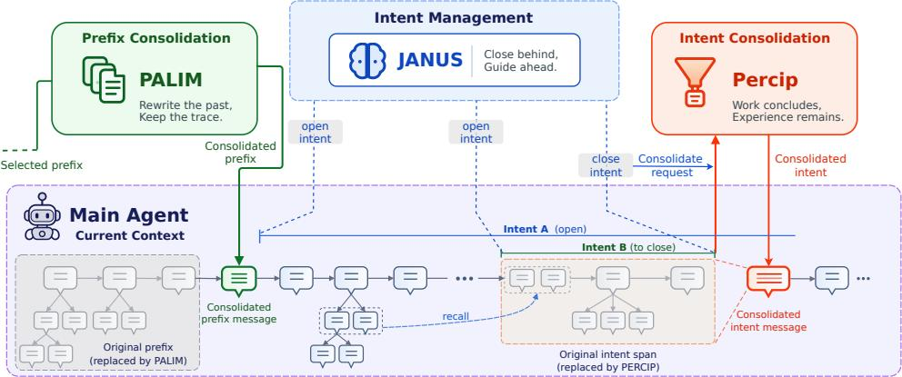  
Figure 2: Overview of Hippocam.

Both consolidation mechanisms preserve the messages they replace, forming a message tree from which the main agent can progressively recover finer-grained messages through a recall tool (§ 2.5). Relevant knowledge already in context or recovered through recall can participate in ongoing work and be reinforced, supplemented, or updated through subsequent consolidation, while knowledge not currently used gradually loses detail through recursive Prefix Consolidation. Together, use and disuse connect task execution, memory, and learning in a continuous cycle (§ 2.6).

## 2.2 INTENT-STRUCTURED WORKING CONTEXT

Intent stack. Let $\mathcal { C } = \langle m _ { 1 } , \ldots , m _ { n } \rangle$ ⟩ denote the current interaction context of the main agent. Hippocam dynamically organizes C by intents, each of which defines a bounded purpose for the agent’s ongoing work. We represent an intent as $i = \langle p , \chi , b \rangle$ , where $p$ states its purpose, $\chi$ specifies its exit conditions, and $b \in \{ 1 , \ldots , n \}$ is the index of the first message governed by the intent. Recursively nesting more specific sub-intents forms an intent stack $\mathcal { T } = \langle i _ { 1 } , \ldots , i _ { d } \rangle$ , from the most encompassing intent $i _ { 1 }$ at the bottom to the most immediate $i _ { d }$ at the top. For each intent $i _ { j }$ , all work represented by $m _ { b _ { j } } , \ldots , m _ { n }$ serves its purpose $p _ { j }$ . The intent stack may begin after the first message, leaving earlier context outside its scope. Nested intents may begin at the same message, with their order in the stack determining their containment. This nested chain organizes the multiple purposes jointly served by ongoing work in a form aligned with the linear context of LLM agents.

fiIntent maintenance. Before each main-agent inference, JANUS uses the context and intent stack to determine opening and closing operations and generate guidance. It tracks changes in purpose rather than individual actions, opening nested intents for upcoming work rather than planning the entire task. Intents close from the top of the stack when contextual evidence supports their success or failure exit conditions. These operations combine into four forms of intent maintenance. Continue preserves the stack when its intents remain appropriate for the upcoming work. Deepen opens more specific intents within the existing chain. Close removes a concluded suffix without opening new intents. Shift closes a concluded suffix and opens intents for the next direction of work. JANUS injects first-person guidance into the main agent’s context before its next inference, specifying which purposes have ended, what to pursue next, and the success or failure exit conditions for that work.

## 2.3 INTENT CONSOLIDATION

When JANUS closes one or more intents, PRECIP consolidates their work messages into a selfcontained first-person message that replaces them in the context.

Given the complete intent stack with closed intents marked, PRECIP determines what information to retain for subsequent work and at what level of detail. The resulting message preserves established state changes and conclusions with their concrete supporting evidence and provenance, alongside unprocessed material that enclosing intents may need. PRECIP also preserves an impression of the structure and location of consulted material to support targeted inspection in subsequent work.

Informative failures are retained, and facts that jointly support a lesson or pattern are integrated into a shared insight. The process by which facts were discovered and material that establishes no fact for any intent in the stack are pruned. This selective consolidation reduces distraction, supports coherent reasoning, and keeps the context focused and efficient, while preserving the information needed to build on established results without repeating prior work.

## 2.4 PREFIX CONSOLIDATION

As intents close and new ones open, earlier work messages form a prefix before the new intent stack and become less directly relevant to ongoing work. The same applies within an intent as work progresses into nested intents, leaving earlier messages at enclosing levels farther from the context’s end. PALIM consolidates these prefixes to reduce interference from less relevant details and keep the context focused on ongoing work.

Prefix selection. The intent stack’s opening boundaries partition C into regions $\begin{array} { r l } { \mathcal { C } _ { j } } & { { } = } \end{array}$ $\langle m _ { b _ { j } } , \dots , m _ { b _ { j + 1 } - 1 } \rangle$ for $j = 0 , \ldots , d ,$ with auxiliary boundaries $b _ { 0 } = 1$ and $b _ { d + 1 } = n + 1$ . The region $\mathcal { C } _ { 0 }$ precedes the stack, while $\mathcal { C } _ { j }$ for $j \geq 1$ is local to intent $i _ { j }$ . To preserve details supporting ongoing work, Hippocam protects a global working tail, the shortest suffix containing at least K interaction rounds and $B$ tokens. Each round comprises a main-agent response and its tool results; consolidated and intent-guidance messages do not count as rounds. The budget is $B = \operatorname* { m i n } \{ \alpha W , \operatorname* { m a x } \{ B _ { \mathrm { m i n } } , K$ Quantile (R)}}, using the q-quantile of interaction-round token counts $\mathcal { R }$ , a minimum $B _ { \mathrm { m i n } } ,$ , and a cap $\alpha \dot { W }$ for context capacity W. After each Intent Consolidation, PALIM checks the region containing the resulting messages. It consolidates the portion preceding the working tail only when that portion contains at least $E _ { \mathrm { m i n } }$ intent-consolidated messages and $\bar { T } _ { \mathrm { m i n } }$ tokens. Under context pressure, PALIM consolidates prefixes preceding the working tail in region order $\mathcal { C } _ { 0 } , \ldots , \mathcal { C } _ { d } ,$ regardless of accumulation thresholds. If usage still exceeds capacity, consolidation extends into the working tail.

Recursive consolidation. Inspired by the distinction between episodic and semantic memory in human cognition (Tulving, 1972; Conway, 2001), PALIM separates each consolidated message into narrative and knowledge. The narrative recounts the main agent’s work and its outcomes, while knowledge comprises acquired facts and lessons extracted by PRECIP from that work rather than broader lessons generated through consolidation alone. Expressing knowledge directly about its subjects unbinds it from the original narrative, supporting reasoning and decisions beyond specific circumstances. Earlier consolidated messages are recursively consolidated with new work, becoming progressively more abstract and less detailed. Related knowledge is merged, while new facts and lessons supplement or update existing knowledge.

## 2.5 MESSAGE TREE AND PROGRESSIVE RECALL

Consolidation preserves the original messages and their indices as ordered children of the messages that replace them, forming a message tree whose first layer is the current context. The main agent has access to a recall tool that returns a message’s children given its index. It first draws on information already in context and may use this tool to recover missing details that could affect its reasoning or next action. After each recall, it reassesses whether to descend further or stop once the available information is sufficient for ongoing work.

## 2.6 LEARNING THROUGH USE AND DISUSE

These mechanisms coordinate use and disuse in a continuous cycle through which Hippocam learns from its work and applies what it learns to improve subsequent work (Fig. 3).

Use. The main agent treats consolidated messages as a continuation of its own prior work, drawing on retained facts and lessons to guide ongoing work. It develops approaches by assessing this knowledge against the current task and observations, treating new deductions as hypotheses. Successes and failures provide feedback on their usefulness in the circumstances encountered.

During subsequent Intent Consolidation (§ 2.3), PRECIP consolidates prior knowledge with these observations and outcomes into grounded facts and lessons. Later in Prefix Consolidation (§ 2.4), PALIM integrates these retained and newly acquired facts and lessons with existing knowledge, reinforcing, supplementing, or updating what the agent has learned.

Disuse. In contrast, incidental details and knowledge not currently used are retained in progressively less detail through recursive Prefix Consolidation, reducing their interference with ongoing reasoning and decisions.

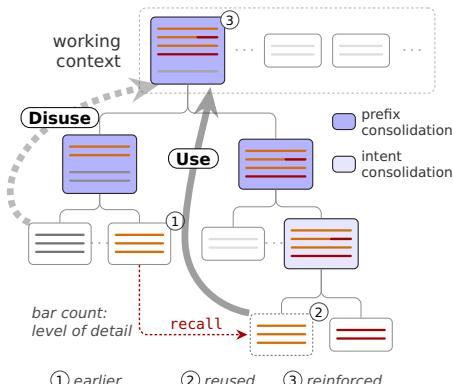

The prominence and specificity of retained knowledge Figure 3: How Hippocam learns. Knowl-therefore evolve through use and disuse, rather than edge: reused; new; fading.relying on separately assigned importance scores or timebased forgetting rules. These processes turn the agent’s own interaction history into evolving knowledge and capabilities, without maintaining a separate memory bank or skill library.

## 3 RELATED WORK

Context Management. Context management is essential for long-horizon agents. LongLLMLingua (Jiang et al., 2024) compresses context according to query relevance, while SUPO (Lu et al., 2026) learns to condense tool-use histories. Context-Folding (Sun et al., 2026) isolates subtask execution to keep the main context focused. HiAgent (Hu et al., 2025) summarizes completed subgoals, whereas AgentFold (Ye et al., 2026) trains the acting model to fold suffixes of its history. In contrast, Hippocam not only uses explicit intent requirements rather than inferred future needs to guide suffix consolidation and retention granularity, but goes further by bringing earlier prefixes into context management.

Agent Memory. Memory enables agents to maintain continuity and draw on accumulated knowledge across extended interactions. RAG-based memory organizes information as conversational segments, hierarchies, or associative graphs (Pan et al., 2025; Sarthi et al., 2024; Gutierrez et al., 2025). Generative Agents (Park et al., 2023) assigns importance to memories and tracks their recency, while MemoryBank (Zhong et al., 2024) reinforces recalled memories against time-based forgetting. Mem0 (Chhikara et al., 2025) keeps stored facts consistent with new conversations, and A-Mem (Xu et al., 2025) evolves the organization of interconnected memories. MemTree (Rezazadeh et al., 2025) organizes memories into an evolving tree by semantic similarity. Other systems track changes over time (Ong et al., 2025; Banerjee et al., 2026) or learn to manage memory (Zhou et al., 2026; Yu et al., 2026). In Hippocam, context and messages themselves constitute memory, without a separate memory bank or scoring and decay rules. Unlike MemTree, our tree emerges from the organization and consolidation of ongoing work.

Learning from Experience. Recent work increasingly seeks to develop agents that learn continually from experience. Reflexion (Shinn et al., 2023) uses verbal feedback to improve subsequent attempts. Agent Workflow Memory (Wang et al., 2025) accumulates reusable workflows. Reasoning-Bank (Ouyang et al., 2026) and ACE (Zhang et al., 2026) update reasoning memories and playbooks through task feedback. ETO (Song et al., 2024) and EMPO<sup>2</sup> (Liu et al., 2026) learn from successful and failed trials and memory-guided exploration, respectively, by updating model parameters. Hippocam unifies memory and learning through the dynamics of use and disuse, developing knowledge through work and feedback rather than consolidation alone.

## 4 EXPERIMENTS

We examine Hippocam’s unified cycle of use and disuse through four research questions. RQ1 Can Hippocam learn from accumulated experience? RQ2 Can what it learns generalize across task domains? RQ3 Does memory remain reliable over long interactions? RQ4 How general is this unified mechanism?

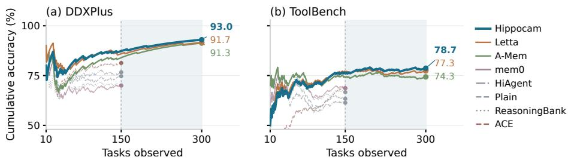  
Figure 4: Performance as experience accumulates. Cumulative accuracy on StreamBench. Each stream’s top three methods at task 150 continue to task 300. Shading marks this extension.

Experimental setup. We compare Hippocam with mem0, A-Mem, Letta, ReasoningBank, ACE, and HiAgent (Chhikara et al., 2025; Xu et al., 2025; Packer et al., 2023; Ouyang et al., 2026; Zhang et al., 2026; Hu et al., 2025) across interactive and memory-intensive tasks. All use DeepSeek-V4.1-Flash (1M-token context window) as the task backbone. We adapt baselines where benchmark support is absent; protocols and implementation details appear in § A.

## 4.1 RQ1: LEARNING FROM ACCUMULATED EXPERIENCE

We examine whether Hippocam learns from accumulated experience across three benchmarks covering interactive environments and feedback-driven task streams. In ALFWorld (Shridhar et al., 2021) and ScienceWorld (Wang et al., 2022), agents accumulate experience over an initial task sequence before proceeding to target tasks, retaining experience while the environment resets between episodes (§ A.1). StreamBench (Wu et al., 2024) comprises two task streams, diagnostic classification on DDXPlus and selection among 50 APIs on ToolBench. Agents receive correctness feedback and a reference answer after each prediction, carrying accumulated experience into subsequent tasks. We evaluate the first 150 tasks in each stream and average their accuracies equally.

Table 1 reports ALFWorld target-task success, ScienceWorld mean target-task progress, and Stream-Bench mean accuracy. Plain uses the same backbone for in-context reasoning without additional memory or learning mechanisms. Across the three benchmarks, most methods outperform Plain, although some match or fall below it. Hippocam improves across all three benchmarks, achieving 97.8% ALF-World success and tying ACE for the best result. Its 81.9% mean ScienceWorld progress exceeds four of the six compared methods. On StreamBench, it achieves the highest mean accuracy of 81.7%, narrowly ahead of Letta’s 81.3%.

Table 1: Task performance (%) on ALFWorld, ScienceWorld, and StreamBench.
<table><tr><td>Method</td><td>ALF.</td><td>Sci.</td><td>Stream.</td></tr><tr><td>Plain</td><td>78.4</td><td>66.9</td><td>69.0</td></tr><tr><td>HiAgent</td><td>85.1</td><td>56.7</td><td>69.0</td></tr><tr><td>mem0</td><td>87.3</td><td>58.6</td><td>69.3</td></tr><tr><td>A-Mem</td><td>95.5</td><td>87.2</td><td>79.0</td></tr><tr><td>Letta</td><td>85.1</td><td>71.2</td><td>81.3</td></tr><tr><td>ReasoningBank</td><td>85.1</td><td>66.9</td><td>68.3</td></tr><tr><td>ACE</td><td>97.8</td><td>91.9</td><td>75.0</td></tr><tr><td>Hippocam</td><td>97.8</td><td>81.9</td><td>81.7</td></tr></table>

Figure 4 extends each StreamBench stream’s three leading methods at task 150 to task 300, tracking cumulative accuracy over all tasks answered so far. On DDXPlus, Hippocam continues to improve after early fluctuations and maintains its lead, while Letta and A-Mem also improve. On ToolBench, Hippocam makes modest further gains amid fluctuations and moves ahead of Letta, whereas A-Mem shows little sustained improvement in the extended evaluation. These gains demonstrate more effective learning from accumulated experience than the compared methods. Detailed scores at both horizons appear in Table 6. In both streams, Hippocam also achieves higher accuracy with about 10% lower average cost per task in the later 150-task interval (§ A.9).

## 4.2 RQ2: GENERALIZATION ACROSS TASK DOMAINS

We examine whether acquired knowledge generalizes to a new domain and can be integrated with experience accumulated there. Agents carry memory acquired through household tasks in ALFWorld to scientific experiments in ScienceWorld, and through multi-hop question answering in HotpotQA (Yang et al., 2018) to claim verification in FEVER (Thorne et al., 2018). Frozen evaluation tests knowledge generalization by evaluating each target-domain task independently from the same source domain memory snapshot. Sequential evaluation tests knowledge integration by running the same target-domain task sequence with source-domain memory $( A f t e r )$ or an initially empty memory (Fresh). In both conditions, experience accumulates across successive target tasks. The After minus Fresh score difference, $\Delta _ { \mathrm { s t r e a m } } .$ , measures whether source-domain knowledge supports subsequent learning in the target domain. Table 2 reports mean target-task progress on ScienceWorld and accuracy on FEVER. Evaluation details appear in § A.2.

Table 2: Cross-domain knowledge generalization and integration. ScienceWorld mean progress and FEVER accuracy (%). $\Delta _ { \mathrm { s t r e a m } }$ reports After minus Fresh in percentage points (pp).
<table><tr><td></td><td colspan="4">ALFWorld → ScienceWorld</td><td colspan="4">HotpotQA → FEVER</td></tr><tr><td>Method</td><td>Frozen</td><td>Fresh → After</td><td> $\Delta _ { \mathrm { s t r e a m } }$ </td><td></td><td>Frozen</td><td>Fresh → After</td><td> $\Delta _ { \mathrm { s t r e a m } }$ </td><td></td></tr><tr><td>Plain</td><td>48.8</td><td></td><td></td><td></td><td>59.3</td><td></td><td></td><td></td></tr><tr><td>HiAgent</td><td>42.7</td><td> $4 9 . 6  4 9 . 7$ </td><td></td><td>+0.1</td><td>61.8</td><td> $5 7 . 9  5 2 . 1 $ </td><td></td><td>-5.8</td></tr><tr><td>mem0</td><td>51.7</td><td> $5 0 . 7  2 2 . 6 $ </td><td></td><td>-28.1</td><td>59.9</td><td> $5 7 . 9  5 7 . 9$ </td><td></td><td>+0.0</td></tr><tr><td>A-Mem</td><td>42.1</td><td> $7 3 . 9  6 5 . 9$ </td><td></td><td>-8.0</td><td>55.8</td><td> $5 5 . 8 \to 5 5 . 8$ </td><td></td><td>+0.0</td></tr><tr><td>Letta</td><td>40.8</td><td> $5 9 . 3  5 4 . 5$ </td><td></td><td>-4.8</td><td>59.9</td><td> $6 9 . 8  5 9 . 9$ </td><td></td><td>-9.9</td></tr><tr><td>ReasoningBank</td><td>53.3</td><td> $4 8 . 6  3 7 . 4$ </td><td></td><td>-11.2</td><td>55.8</td><td> $5 7 . 9  5 5 . 8 $ </td><td></td><td>-2.1</td></tr><tr><td>ACE</td><td>62.7</td><td> $5 2 . 5  6 6 . 5 $ </td><td></td><td> $+ 1 4 . 0$ </td><td>57.9</td><td> $6 1 . 8  6 3 . 8 $ </td><td></td><td>+2.0</td></tr><tr><td>Hippocam</td><td>78.9</td><td> $5 5 . 9  7 5 . 1 $ </td><td></td><td>+19.2</td><td>61.8</td><td> $5 3 . 9  5 9 . 9$ </td><td></td><td>+6.0</td></tr></table>

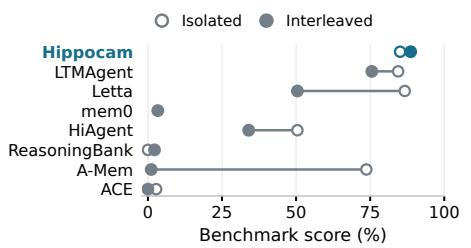

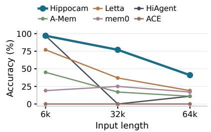  
Figure 5: Maintaining usable experience. $L e f t .$ GoodAI LTM scores under isolated and 32k-span interleaved conditions. Right: MemoryAgentBench multi-hop conflict-resolution accuracy across input lengths. Lines connect separate length conditions.

Knowledge generalization. On ScienceWorld, several methods benefit from source-domain experience, but the gains vary substantially. Hippocam achieves 78.9% mean progress, improving over Plain by 30.1 pp and exceeding the strongest baseline, ACE, by 16.2 pp. On FEVER, Frozen scores cluster around Plain’s 59.3%, with Hippocam and HiAgent reaching 61.8%. A label-wise analysis suggests limited room for improvement on supported and refuted claims, where Plain already performs strongly, while most errors concern insufficient evidence. This pattern suggests that source-domain experience provides limited guidance for the remaining target-domain difficulty.

Integrating prior knowledge with new experience. Only Hippocam and ACE achieve positive gains on both domain transitions, while the remaining methods show mixed, unchanged, or reduced performance. ACE improves ScienceWorld progress by 14.0 pp and FEVER accuracy by 2.0 pp. Hippocam achieves larger gains of 19.2 and 6.0 pp, respectively, with a narrower FEVER gap under the scoring sensitivity analysis (§ A.2). These comparisons highlight Hippocam’s stronger ability to use prior knowledge to support continued learning in a new domain.

## 4.3 RQ3: MEMORY RELIABILITY OVER LONG INTERACTIONS

For accumulated experience to support continued learning, agents must remain effective across task switches, reason from past interactions, and retain information as it is updated. We examine interleaved work in GoodAI LTM (Castillo-Bolado et al., 2024), reasoning over past conversations in LoCoMo (Maharana et al., 2024), and resolving updated facts in MemoryAgentBench (Hu et al., 2026). Appendix A.3 provides evaluation protocols and reference configurations.

Interleaved work. We use GoodAI LTM with a 32k-token memory span for the interleaved condition and compare against isolated evaluation. We additionally compare against LTMAgent, the long-term memory agent developed by the benchmark authors (Castillo-Bolado et al., 2024). LTMAgent, Letta, and HiAgent all lose performance when tasks are interleaved. In contrast, Hippocam maintains high performance in both conditions without degradation under interleaving, scoring 85.1% in isolation and 88.7% under interleaving (Fig. 5, left). This contrast highlights Hippocam’s stronger resilience to interference from interleaved tasks.

Table 3: What the retained conversation supports. Binary judge accuracy (%) on LoCoMo. Evaluation scope is specified in § A.3.
<table><tr><td rowspan=1 colspan=6>Method      OverallSingle-hopMulti-hopTemporalOpen-domainAdversarial</td></tr><tr><td rowspan=1 colspan=1>HiAgent</td><td rowspan=1 colspan=1>39.8     37.1</td><td rowspan=1 colspan=1>24.8</td><td rowspan=1 colspan=1>16.2</td><td rowspan=1 colspan=1>45.8</td><td rowspan=1 colspan=1>70.2</td></tr><tr><td rowspan=1 colspan=1>mem0</td><td rowspan=1 colspan=1>58.0     67.2</td><td rowspan=1 colspan=1>37.6</td><td rowspan=1 colspan=1>8.1</td><td rowspan=1 colspan=1>77.1</td><td rowspan=1 colspan=1>85.2</td></tr><tr><td rowspan=1 colspan=1>A-Mem</td><td rowspan=1 colspan=1>67.5     74.3</td><td rowspan=1 colspan=1>34.4</td><td rowspan=1 colspan=1>67.6</td><td rowspan=1 colspan=1>61.5</td><td rowspan=1 colspan=1>76.7</td></tr><tr><td rowspan=1 colspan=1>Letta</td><td rowspan=1 colspan=1>51.7     48.5</td><td rowspan=1 colspan=1>22.0</td><td rowspan=1 colspan=1>35.2</td><td rowspan=1 colspan=1>45.8</td><td rowspan=1 colspan=1>89.5</td></tr><tr><td rowspan=1 colspan=1>ReasoningBank</td><td rowspan=1 colspan=1>18.3      2.9</td><td rowspan=1 colspan=1>0.0</td><td rowspan=1 colspan=1>2.8</td><td rowspan=1 colspan=1>7.3</td><td rowspan=1 colspan=1>72.4</td></tr><tr><td rowspan=1 colspan=1>ACE</td><td rowspan=1 colspan=1>22.5      0.0</td><td rowspan=1 colspan=1>0.0</td><td rowspan=1 colspan=1>0.0</td><td rowspan=1 colspan=1>0.0</td><td rowspan=1 colspan=1>100.0</td></tr><tr><td rowspan=1 colspan=1>Hippocam</td><td rowspan=1 colspan=1>77.6     81.5</td><td rowspan=1 colspan=1>40.8</td><td rowspan=1 colspan=1>86.6</td><td rowspan=1 colspan=1>77.1</td><td rowspan=1 colspan=1>87.2</td></tr></table>

Reasoning from past conversations. On LoCoMo, Hippocam achieves 77.6% overall accuracy, exceeding the strongest baseline, A-Mem, by 10.1 pp (Table 3). It leads or ties across all four answerable question categories, with temporal accuracy reaching 86.6% compared with A-Mem’s 67.6%. By contrast, ACE’s 100% adversarial accuracy accompanies zero accuracy on answerable questions, reflecting frequent abstention rather than effective recovery of conversational knowledge. Hippocam combines stronger conversational reasoning with 87.2% accuracy on unanswerable questions.

Preserving updated information. MemoryAgentBench tests reasoning over revised facts, with conflict-resolution rules provided only at question time. Across the three input lengths, Hippocam achieves 71.7% mean accuracy, compared with 44.3% for Letta (Fig. 5, right). It matches HiAgent at 97.0% on 6k inputs and retains 77.0% and 41.0% accuracy at 32k and 64k, where no baseline exceeds 37.0% and 19.0%, respectively. Although longer histories remain challenging, Hippocam more effectively preserves and applies updated information.

## 4.4 RQ4: GENERALITY OF THE UNIFIED MEMORY–LEARNING MECHANISM

Figure 1 reveals distinct capability profiles across the evaluated methods. Memory-oriented methods support more than recall, with A-Mem performing strongly on ScienceWorld (87.2%) and Letta on StreamBench (81.3%). mem0 also supports learning, transfer, and conversational memory, although it struggles with interleaved work (3.3%). By contrast, ACE excels on ScienceWorld (91.9%) but, like the similarly guidance-oriented ReasoningBank, struggles on LoCoMo (22.5% and 18.3%, respectively). This gap suggests that experience-derived guidance does not necessarily preserve the specific information needed for later recall. HiAgent exhibits a more balanced profile through subgoal-based context management, suggesting that organizing working context can support a broader range of demands.

Hippocam combines this breadth with stronger overall performance, leading or tying on seven of the eight measures. Memory, knowledge development, and learning arise from the same use-and-disuse cycle over its interaction history, demonstrating the broad applicability of a unified mechanism rather than separate capability-specific mechanisms.

## 5 ANALYSIS

## 5.1 ABLATION STUDIES

We examine intent-conditioned consolidation, prefix consolidation, and recall in settings that exercise their respective roles. Appendix A.4 specifies the interventions and additional comparisons.

Intent-conditioned consolidation. We remove explicit intent conditioning from consolidation while retaining intent boundaries and Janus guidance. On GoodAI, filler retention rises from 14% to 63%, while scores fall by 23.1 pp under interleaving versus 7.3 pp in isolation (Table 4). A complementary case shows that intent conditioning preserves individual menu options needed for ordering rather than only category ranges (§ A.5). These observations support intent-aware selection of both relevant content and the detail needed for ongoing work.

Prefix consolidation. We remove PALIM and truncate older prefixes when context pressure requires space, while retaining intent consolidation and recall. ToolBench accuracy falls from 78.7% to 65.7% (Table 4). ALFWorld success remains near perfect, but mean actions increase from 9.62 to 11.74, and episode-start context grows from 19.7k to 50.7k tokens in the inspected stream. Prefix consolidation thus supports more effective subsequent work with a smaller active context.

Table 4: Component ablations and consolidation comparison. Scores, success rates, and accuracy are percentages. Context size is measured in tokens.
<table><tr><td>Setting</td><td>Metric</td><td>Hippocam</td><td>w/o</td></tr><tr><td colspan="4">Intent conditioning</td></tr><tr><td rowspan="2">GoodAI isolated Score ↑</td><td>interleaved Score ↑</td><td>85.1 88.7</td><td>77.8 65.6</td></tr><tr><td></td><td></td><td></td></tr><tr><td colspan="4">Prefix consolidation</td></tr><tr><td rowspan="3">ToolBench ALFWorld</td><td>Acc. ↑</td><td>78.7 97.8</td><td>65.7</td></tr><tr><td>Success ↑</td><td></td><td>100.0</td></tr><tr><td>Steps ↓ Context</td><td>9.62 19.7k</td><td>11.74 50.7k</td></tr><tr><td colspan="4">Recall</td></tr><tr><td>MAB-64k</td><td>Acc. ↑</td><td>41.0</td><td>27.0</td></tr><tr><td colspan="4">Prefix consolidation variant</td></tr><tr><td rowspan="2">ALFWorld</td><td>Success ↑</td><td>100.0</td><td>w/ playbook</td></tr><tr><td>Steps ↓</td><td>8.12</td><td>97.8 9.00</td></tr></table>

Recall. Disabling recall on the same post-ingestion MemoryAgentBench 64k snapshot reduces accuracy from 41.0% to 27.0%. Access to underlying evidence therefore improves reasoning beyond what the consolidated context alone supports.

## 5.2 LEARNING THROUGH EVOLVING EXPERIENCE

Is prior strategy induction necessary? The competitive learning performance of memory-oriented methods in § 4.4 suggests that retained knowledge can support new work without first being distilled into reusable strategies. To examine this more directly, we replace Prefix Consolidation with ACE’s playbook-generation process in ALFWorld (Zhang et al., 2026). Both configurations achieve nearperfect task success, while the playbook variant uses slightly more actions on average (9.00 versus 8.12). Inducing a playbook therefore offers no clear advantage here over directly using retained facts and grounded lessons (Table 9).

Recovering enough detail to proceed. In the MemoryAgentBench cases (Fig. 8), one question requires two levels of recall to recover a chain of facts, while another is resolved after one level without opening deeper references. These cases show that Hippocam adapts retrieval depth to the task, recovering sufficient evidence without expanding the entire history.

Learning through use and disuse. Our analysis of knowledge changes across consecutive consolidations finds that items linked to intervening work are more often supplemented or updated (§ A.6). ALFWorld traces show repeated successful desklamp use supporting a lesson across objects and instruction wordings, and later successful searches revising earlier failure accounts to attribute them to search cost (§ A.7). Meanwhile, details of a routine placement episode recede through recursive consolidation (Fig. 7). These observations show how use and disuse sustain a continuous cycle of learning through work.

## 6 CONCLUSION

We introduced Hippocam, a unified architecture for memory, knowledge, and learning through the continual consolidation and selective recall of interaction history. Experiments and analyses demonstrate its broad applicability and illuminate how retained knowledge evolves through use and disuse. Our findings suggest a path toward agents that continually learn from their own work.

## AI USE STATEMENT

We used AI tools to accelerate code development, assist literature searches, polish the manuscript, and prepare figures.

## REFERENCES

Pratyay Banerjee, Masud Moshtaghi, Shivashankar Subramanian, Amita Misra, and Ankit Chadha. APEX-MEM: Agentic semi-structured memory with temporal reasoning for long-term conversational AI. In Proceedings of the 64th Annual Meeting of the Association for Computational Linguistics (Volume 1: Long Papers), pp. 16470–16489, 2026. doi: 10.18653/v1/2026.acl-long.749. URL https://aclanthology.org/2026.acl-long.749/.

David Castillo-Bolado, Joseph Davidson, Finlay Gray, and Marek Rosa. Beyond prompts: Dynamic conversational benchmarking of large language models. In Advances in Neural Information Processing Systems, volume 37, pp. 42528–42565, 2024. doi: 10.52202/079017-1347. URL https://proceedings.neurips.cc/paper\_files/paper/2024/ hash/4aedf0cba303537fcb6cf948bb41b2df-Abstract-Datasets\_and\_ Benchmarks\_Track.html. Datasets and Benchmarks Track.

Prateek Chhikara, Dev Khant, Saket Aryan, Taranjeet Singh, and Deshraj Yadav. Mem0: Building production-ready AI agents with scalable long-term memory. In ECAI 2025: 28th European Conference on Artificial Intelligence, volume 413 of Frontiers in Artificial Intelligence and Applications, pp. 2993–3000. IOS Press, 2025. doi: 10.3233/FAIA251160. URL https://doi.org/10.3233/FAIA251160.

Martin A. Conway. Sensory-perceptual episodic memory and its context: Autobiographical memory. Philosophical Transactions of the Royal Society ofLondon. Series B: Biological Sciences, 356 (1413):1375–1384, 2001. doi: 10.1098/rstb.2001.0940.

Yadin Dudai, Avi Karni, and Jan Born. The consolidation and transformation of memory. Neuron, 88 (1):20–32, 2015. doi: 10.1016/j.neuron.2015.09.004.

K. Anders Ericsson and Walter Kintsch. Long-term working memory. Psychological Review, 102(2): 211–245, 1995. doi: 10.1037/0033-295X.102.2.211.

Bernal Jimenez Gutierrez, Yiheng Shu, Weijian Qi, Sizhe Zhou, and Yu Su. From RAG to memory: Non-parametric continual learning for large language models. In International Conference on Machine Learning, 2025. URL https://proceedings.mlr.press/v267/ gutierrez25a.html.

Mengkang Hu, Tianxing Chen, Qiguang Chen, Yao Mu, Wenqi Shao, and Ping Luo. HiAgent: Hierarchical working memory management for solving long-horizon agent tasks with large language model. In Proceedings of the 63rd Annual Meeting of the Association for Computational Linguistics (Volume 1: Long Papers), pp. 32779–32798, 2025. URL https: //aclanthology.org/2025.acl-long.1575/.

Yuanzhe Hu, Yu Wang, and Julian McAuley. Evaluating memory in LLM agents via incremental multi-turn interactions. In International Conference on Learning Representations, 2026. URL https://proceedings.iclr.cc/paper\_files/paper/2026/hash/ fd1eff9dd295df50a41f2521942fa31d-Abstract-Conference.html.

Huiqiang Jiang, Qianhui Wu, Xufang Luo, Dongsheng Li, Chin-Yew Lin, Yuqing Yang, and Lili Qiu. LongLLMLingua: Accelerating and enhancing LLMs in long context scenarios via prompt compression. In Proceedings of the 62nd Annual Meeting of the Association for Computational Linguistics (Volume 1: Long Papers), pp. 1658–1677, 2024. URL https://aclanthology. org/2024.acl-long.91/.

Janet L. Kolodner. An introduction to case-based reasoning. Artificial Intelligence Review, 6(1):3–34, 1992. doi: 10.1007/BF00155578.

Zeyuan Liu, Jeonghye Kim, Xufang Luo, Dongsheng Li, and Yuqing Yang. Exploratory memory-augmented LLM agent via hybrid on- and off-policy optimization. In International Conference on Learning Representations, 2026. URL https://proceedings.iclr.cc/paper\_files/paper/2026/hash/ b589d92785e39486e978fa273d0dc343-Abstract-Conference.html.

Miao Lu, Weiwei Sun, Weihua Du, Zhan Ling, Xuesong Yao, Kang Liu, and Jiecao Chen. Beyond the context window: Scaling agentic RL via end-to-end optimized context compression. In Proceedings of the 64th Annual Meeting of the Association for Computational Linguistics (Volume 1: Long Papers), pp. 21074–21125, 2026. URL https://aclanthology.org/2026.acl-long. 966/.

Adyasha Maharana, Dong-Ho Lee, Sergey Tulyakov, Mohit Bansal, Francesco Barbieri, and Yuwei Fang. Evaluating very long-term conversational memory of LLM agents. In Proceedings ofthe 62nd Annual Meeting of the Association for Computational Linguistics (Volume 1: Long Papers), pp. 13851–13870. Association for Computational Linguistics, 2024. doi: 10.18653/v1/2024. acl-long.747. URL https://aclanthology.org/2024.acl-long.747/.

Earl K. Miller and Jonathan D. Cohen. An integrative theory of prefrontal cortex function. Annual Review of Neuroscience, 24:167–202, 2001. doi: 10.1146/annurev.neuro.24.1.167.

Kai Tzu-iunn Ong, Namyoung Kim, Minju Gwak, Hyungjoo Chae, Taeyoon Kwon, Yohan Jo, Seungwon Hwang, Dongha Lee, and Jinyoung Yeo. Towards lifelong dialogue agents via timeline-based memory management. In Proceedings of the 2025 Conference of the Nations of the Americas Chapter ofthe Associationfor Computational Linguistics: Human Language Technologies (Volume 1: Long Papers), pp. 8631–8661, 2025. doi: 10.18653/v1/2025.naacl-long.435. URL https: //aclanthology.org/2025.naacl-long.435/.

Siru Ouyang, Jun Yan, I-Hung Hsu, Yanfei Chen, Ke Jiang, Zifeng Wang, Rujun Han, Long T. Le, Samira Daruki, Xiangru Tang, Vishy Tirumalashetty, George Lee, Mahsan Rofouei, Hangfei Lin, Jiawei Han, Chen-Yu Lee, and Tomas Pfister. ReasoningBank: Scaling agent selfevolving with reasoning memory. In International Conference on Learning Representations, 2026. URL https://proceedings.iclr.cc/paper\_files/paper/2026/hash/ 980ea04d23d1f6908964eba2a74afe45-Abstract-Conference.html.

Charles Packer, Sarah Wooders, Kevin Lin, Vivian Fang, Shishir G. Patil, Ion Stoica, and Joseph E. Gonzalez. MemGPT: Towards LLMs as operating systems. arXiv preprint arXiv:2310.08560, 2023. URL https://arxiv.org/abs/2310.08560.

Zhuoshi Pan, Qianhui Wu, Huiqiang Jiang, Xufang Luo, Hao Cheng, Dongsheng Li, Yuqing Yang, Chin-Yew Lin, H. Vicky Zhao, Lili Qiu, and Jianfeng Gao. SeCom: On memory construction and retrieval for personalized conversational agents. In International Conference on Learning Representations, 2025. URL https://proceedings.iclr.cc/paper\_files/paper/2025/ hash/e56f394bbd4f0ec81393d767caa5a31b-Abstract-Conference.html.

Joon Sung Park, Joseph C. O’Brien, Carrie J. Cai, Meredith Ringel Morris, Percy Liang, and Michael S. Bernstein. Generative agents: Interactive simulacra of human behavior. In Proceedings of the 36th Annual ACM Symposium on User Interface Software and Technology, UIST ’23. Association for Computing Machinery, 2023. doi: 10.1145/3586183.3606763.

Alireza Rezazadeh, Zichao Li, Wei Wei, and Yujia Bao. From isolated conversations to hierarchical schemas: Dynamic tree memory representation for LLMs. In International Conference on Learning Representations, 2025. URL https://arxiv.org/abs/2410.14052.

Parth Sarthi, Salman Abdullah, Aditi Tuli, Shubh Khanna, Anna Goldie, and Christopher D. Manning. RAPTOR: Recursive abstractive processing for tree-organized retrieval. In International Conference on Learning Representations, 2024. URL https://arxiv.org/abs/2401.18059.

Michael N. Shadlen and Daphna Shohamy. Decision making and sequential sampling from memory. Neuron, 90(5):927–939, 2016. doi: 10.1016/j.neuron.2016.04.036.

Noah Shinn, Federico Cassano, Ashwin Gopinath, Karthik Narasimhan, and Shunyu Yao. Reflexion: Language agents with verbal reinforcement learning. In Advances in Neural Information Processing Systems, volume 36, 2023. URL https://proceedings.neurips.cc/paper\_files/paper/2023/hash/ 1b44b878bb782e6954cd888628510e90-Abstract-Conference.html.

Mohit Shridhar, Xingdi Yuan, Marc-Alexandre Cotˆ e, Yonatan Bisk, Adam Trischler, and Matthew´ Hausknecht. ALFWorld: Aligning text and embodied environments for interactive learning. In International Conference on Learning Representations, 2021. URL https://openreview. net/forum?id=0IOX0YcCdTn.

Yifan Song, Da Yin, Xiang Yue, Jie Huang, Sujian Li, and Bill Yuchen Lin. Trial and error: Exploration-based trajectory optimization of LLM agents. In Proceedings of the 62nd Annual Meeting ofthe Associationfor Computational Linguistics (Volume 1: Long Papers), 2024. URL https://aclanthology.org/2024.acl-long.409/.

Weiwei Sun, Miao Lu, Zhan Ling, Kang Liu, Xuesong Yao, Yiming Yang, and Jiecao Chen. Scaling long-horizon agent via context folding. In International Conference on Machine Learning, 2026. URL https://openreview.net/forum?id=lNRgWoGfYg.

James Thorne, Andreas Vlachos, Christos Christodoulopoulos, and Arpit Mittal. FEVER: A largescale dataset for fact extraction and VERification. In Proceedings of the 2018 Conference of the North American Chapter of the Association for Computational Linguistics: Human Language Technologies, Volume 1 (Long Papers), pp. 809–819. Association for Computational Linguistics, 2018. doi: 10.18653/v1/N18-1074. URL https://aclanthology.org/N18-1074/.

Endel Tulving. Episodic and semantic memory. In Endel Tulving and Wayne Donaldson (eds.), Organization ofMemory, pp. 381–403. Academic Press, New York, 1972.

Guanzhi Wang, Yuqi Xie, Yunfan Jiang, Ajay Mandlekar, Chaowei Xiao, Yuke Zhu, Linxi Fan, and Anima Anandkumar. Voyager: An open-ended embodied agent with large language models. Transactions on Machine Learning Research, 2024. URL https://openreview.net/ forum?id=ehfRiF0R3a.

Ruoyao Wang, Peter Jansen, Marc-Alexandre Cotˆ e, and Prithviraj Ammanabrolu. ScienceWorld: Is´ your agent smarter than a 5th grader? In Proceedings ofthe 2022 Conference on Empirical Methods in Natural Language Processing, pp. 11279–11298. Association for Computational Linguistics, 2022. doi: 10.18653/v1/2022.emnlp-main.775. URL https://aclanthology.org/2022. emnlp-main.775/.

Zora Zhiruo Wang, Jiayuan Mao, Daniel Fried, and Graham Neubig. Agent workflow memory. In Proceedings of the 42nd International Conference on Machine Learning, volume 267 of Proceedings of Machine Learning Research, pp. 63897–63911. PMLR, 2025. URL https: //proceedings.mlr.press/v267/wang25bx.html.

Cheng-Kuang Wu, Zhi Rui Tam, Chieh-Yen Lin, Yun-Nung Chen, and Hung-yi Lee. StreamBench: Towards benchmarking continuous improvement of language agents. In Advances in Neural Information Processing Systems, volume 37, pp. 107039–107063, 2024. doi: 10.52202/079017-3398. URL https://proceedings.neurips.cc/paper\_files/paper/2024/ hash/c189915371c4474fe9789be3728113fc-Abstract-Datasets\_and\_ Benchmarks\_Track.html. Datasets and Benchmarks Track.

Wujiang Xu, Zujie Liang, Kai Mei, Hang Gao, Juntao Tan, and Yongfeng Zhang. A-MEM: Agentic memory for LLM agents. In Advances in Neural Information Processing Systems, 2025. URL https://arxiv.org/abs/2502.12110.

Zhilin Yang, Peng Qi, Saizheng Zhang, Yoshua Bengio, William W. Cohen, Ruslan Salakhutdinov, and Christopher D. Manning. HotpotQA: A dataset for diverse, explainable multi-hop question answering. In Proceedings ofthe 2018 Conference on Empirical Methods in Natural Language Processing, pp. 2369–2380. Association for Computational Linguistics, 2018. doi: 10.18653/v1/ D18-1259. URL https://aclanthology.org/D18-1259/.

Shunyu Yao, Jeffrey Zhao, Dian Yu, Nan Du, Izhak Shafran, Karthik Narasimhan, and Yuan Cao. ReAct: Synergizing reasoning and acting in language models. In International Conference on Learning Representations, 2023. URL https://openreview.net/forum?id=WE\_ vluYUL-X.

Rui Ye, Zhongwang Zhang, Kuan Li, Huifeng Yin, Zhengwei Tao, Yida Zhao, Liangcai Su, Liwen Zhang, Zile Qiao, Xinyu Wang, Pengjun Xie, Fei Huang, Jingren Zhou, Siheng Chen, and Yong Jiang. AgentFold: Long-horizon web agents with proactive context folding. In International Conference on Learning Representations, 2026. URL https://arxiv.org/abs/2510. 24699.

Yi Yu, Liuyi Yao, Yuexiang Xie, Qingquan Tan, Jiaqi Feng, Yaliang Li, and Libing Wu. Agentic memory: Learning unified long-term and short-term memory management for large language model agents. In Proceedings of the 64th Annual Meeting of the Association for Computational Linguistics (Volume 1: Long Papers), 2026. URL https://aclanthology.org/2026. acl-long.981/.

Dagmar Zeithamova, April L. Dominick, and Alison R. Preston. Hippocampal and ventral medial prefrontal activation during retrieval-mediated learning supports novel inference. Neuron, 75(1): 168–179, 2012. doi: 10.1016/j.neuron.2012.05.010.

Qizheng Zhang, Changran Hu, Shubhangi Upasani, Boyuan Ma, Fenglu Hong, Vamsidhar Kamanuru, Jay Rainton, Chen Wu, Mengmeng Ji, Hanchen Li, Urmish Thakker, James Zou, and Kunle Olukotun. Agentic context engineering: Evolving contexts for selfimproving language models. In International Conference on Learning Representations, 2026. URL https://proceedings.iclr.cc/paper\_files/paper/2026/hash/ 8a94ff6f922d995d7d3f4ebf4143e442-Abstract-Conference.html.

Wanjun Zhong, Lianghong Guo, Qiqi Gao, He Ye, and Yanlin Wang. MemoryBank: Enhancing large language models with long-term memory. Proceedings ofthe AAAI Conference on Artificial Intelligence, 38(17):19724–19731, 2024. doi: 10.1609/aaai.v38i17.29946.

Zijian Zhou, Ao Qu, Zhaoxuan Wu, Sunghwan Kim, Alok Prakash, Daniela Rus, Bryan Kian Hsiang Low, and Paul Pu Liang. MEM1: Learning to synergize memory and reasoning for efficient long-horizon agents. In International Conference on Learning Representations, 2026. URL https://proceedings.iclr.cc/paper\_files/paper/2026/hash/ 5fc8b3bdfbb9167b5144df5d3fae4616-Abstract-Conference.html.

## A EXPERIMENTAL PROTOCOLS AND ADDITIONAL RESULTS

Scope of the evaluation. We report task-level scores for each evaluated configuration, using the same scoring rule across methods within each benchmark. Results describe single runs.

Backbone and interfaces. The task backbone is DeepSeek-V4.1-Flash, accessed through the local identifier deepseek-flash. Model-assisted scoring uses DeepSeek-V4-Pro. Hippocam uses the same model family for its auxiliary components. The comparison is not matched by total inference compute or auxiliary output budget. In interactive environments, observations arrive as tool results and the environment determines completion; reaching an action limit or exhausting the no-action continuation allowance is a failure. Hippocam’s StreamBench configuration exposes its normal tools, whereas the other arms answer through the benchmark interface. In the QA transfer experiment, Hippocam accesses the same Wikipedia service through a command-line wrapper; the comparison systems use search and lookup calls. Memory-only Hippocam configurations retain recall while disabling filesystem and shell tools.

Comparison implementations. We use the upstream HiAgent code (commit cebdd8e), connected to the task model and environments through an adapter. The agent is reset only at the beginning of a task stream; its session persists across subsequent tasks and environment episodes. Its prompt context limit is 8,192 tokens, with output allowances of 4,096 tokens for interactive environments and 16,384 for StreamBench, and a 1,800-second per-task time limit. The upstream code includes a subsequently added summarization module, so this is an evaluation of that implementation rather than an exact reconstruction of the original paper’s code version.

Letta runs with reasoning disabled because of its tool-call protocol. mem0 and A-Mem disable reasoning during memory extraction; A-Mem also allows up to three attempts at structured extraction. mem0 uses an expanded extraction output allowance and, in MAB, an adapted general-purpose extraction prompt. These settings differ from the upstream defaults.

ACE uses the upstream Generator, Reflector, and Curator components (commit 82709de) in online mode. Interactive episodes use the environment’s action loop followed by reflection and playbook curation. StreamBench uses a 15-task online evaluation window and up to three reflection rounds with the benchmark’s feedback. For conversation and fact-ingestion tasks, incoming text passes through generation, reflection, and curation; subsequent questions are answered from the resulting playbook, without an additional fact store. All three roles use DeepSeek-V4.1-Flash.

Hippocam consolidation parameters. Table 5 reports the implementation defaults for the consolidation mechanism in § 2.4. The working-tail token budget uses the 95th percentile of observed main-agent action-round lengths, counting each response together with its tool results. The configured context capacity W includes input and output; pressure control accounts for the current request and reserves space for the next interaction round. These thresholds control when context is consolidated, rather than assigning importance or decay scores to individual memories.

Table 5: Default consolidation configuration. Token quantities are implementation budgets; W is the configured context capacity.
<table><tr><td>Parameter</td><td>Default Role</td><td></td></tr><tr><td>K</td><td>2</td><td>Minimum working-tail interaction rounds</td></tr><tr><td>Bmin</td><td>4,096 tokens</td><td>Working-tail token floor</td></tr><tr><td>α</td><td>0.20</td><td>Working-tail token cap as a fraction of W</td></tr><tr><td>q</td><td>0.95</td><td>Action-round length quantile</td></tr><tr><td>Emin</td><td>2</td><td>New intent consolidations in a stable prefix</td></tr><tr><td>Tmin</td><td>16,384 tokens</td><td>Stable-prefix size for ordinary consolidation</td></tr><tr><td>W</td><td>128,000 tokens</td><td>Total context capacity</td></tr><tr><td>Pressure threshold</td><td>0.80W</td><td>Predicted occupancy that initiates a sweep</td></tr><tr><td>Capacity threshold</td><td>1.00W</td><td>Predicted occupancy limit before inference</td></tr><tr><td>Minimum token reduction</td><td>8,192 tokens</td><td>Required saving from a prefix consolidation</td></tr><tr><td>Compression retries</td><td>2</td><td>Retries when the required reduction is not met</td></tr></table>

Table 6: StreamBench accuracy at two evaluation horizons. Mean gives equal weight to the two streams and is reported only when both reach the stated horizon.
<table><tr><td rowspan="2">Method</td><td colspan="2">First 150 tasks per stream</td><td colspan="2">First 300 tasks per stream</td></tr><tr><td>DDXPlus</td><td>ToolBench Mean</td><td>DDXPlus</td><td>ToolBench Mean</td></tr><tr><td>Plain</td><td>74.7</td><td>63.3 69.0</td><td></td><td></td></tr><tr><td>HiAgent</td><td>76.7</td><td>61.3 69.0</td><td></td><td>61.3</td></tr><tr><td>mem0</td><td>70.0</td><td>68.7 69.3</td><td></td><td>69.0</td></tr><tr><td>A-Mem</td><td>84.0</td><td>74.0 79.0</td><td>91.3</td><td>74.3 82.8</td></tr><tr><td>Letta</td><td>86.0</td><td>76.7 81.3</td><td>91.7</td><td>77.3 84.5</td></tr><tr><td>ReasoningBank</td><td>70.0</td><td>66.7 68.3</td><td></td><td></td></tr><tr><td>ACE</td><td>81.3</td><td>68.7 75.0</td><td></td><td></td></tr><tr><td>Hippocam</td><td>87.3</td><td>76.0 81.7</td><td>93.0</td><td>78.7 85.8</td></tr></table>

Means weight the two streams equally at the same horizon. Dashes denote unreported results.

## A.1 EXPERIENCE ACCUMULATION

ALFWorld uses distinct source episodes and a 30-action limit per episode. Target success is measured over unique tasks; preceding memory includes repeated-task experience.

ScienceWorld reports mean target progress, with negative environment scores clipped to zero and percentages normalized to [0, 1] before aggregation. The evaluation pairs source and target variations within the evaluated ScienceWorld task types, with a 50-action limit. Source and target episodes are kept separate in all reported scores. Table 1 averages the two StreamBench accuracies with equal weights over the first 150 tasks in each stream. Task streams preserve memory across tasks. Figure 4 extends the three highest-scoring methods at task 150 in each stream to task 300. Table 6 retains all available valid 300-task results, including mem0 and HiAgent on ToolBench. Means use the same horizon for both streams.

## A.2 SOURCE INITIALIZATION AND CROSS-DOMAIN EVALUATION

The sequential ScienceWorld comparison pairs target identifiers between the source-initialized and empty-memory conditions, with a 30-action limit. Source memory contains experience from ALF-World source and target episodes. HotpotQA→FEVER transfers experience from source questions to target claims, with a seven-step task limit. Both conditions accumulate target-domain experience across tasks. Consequently, their difference is a contrast between two learning streams, not a measure of source-only knowledge on independent tasks. Sequential differences use paired task identifiers; mem0 and ReasoningBank have narrower matched ScienceWorld coverage than the other methods.

Frozen-source evaluation restores the same source snapshot before each target task and clears the task workspace. It permits reasoning and memory changes within the current task but prevents those changes from carrying to the next target task. Plain evaluates target tasks independently without additional mechanisms, providing a reference for Frozen evaluation. Evaluation costs include target-task calls and within-task memory operations, excluding source experience acquisition.

FEVER scoring sensitivity. Under an alternative answer extraction, Hippocam’s sequential improvement decreases from six to two percentage points. The main table retains the original scoring.

## A.3 RETENTION, INTERFERENCE, AND CONFLICTING INFORMATION

GoodAI uses the benchmark’s own task scores and its isolated and interleaved modes. Model-assisted scoring steps use DeepSeek-V4-Pro to extract structured answers for the benchmark’s checks. We report the sum of awarded scores divided by the sum of their corresponding maximum scores. We use the benchmark’s 32k memory-span configuration. The interleaved mode additionally requests extremely brief answers; the modes also differ in reset behavior and wait-action handling. We interpret the comparison as performance under the two benchmark protocols, without attributing the higher interleaved score to task interleaving itself.

Table 7: Frozen-source performance and recorded target-evaluation cost. Performance is reported in percentages; cost is the total USD expenditure for the reported target evaluation, including within task memory operations and excluding source experience acquisition.
<table><tr><td rowspan="2">Method</td><td>ScienceWorld</td><td>FEVER</td></tr><tr><td>Progress Cost</td><td>Accuracy Cost</td></tr><tr><td>HiAgent</td><td>42.7 2.62</td><td>61.8 1.76</td></tr><tr><td>mem0</td><td>51.7 0.06</td><td>59.9 0.25</td></tr><tr><td>A-Mem</td><td>42.1 0.26</td><td>55.8 0.35</td></tr><tr><td>Letta</td><td>40.8 2.53</td><td>59.9 0.98</td></tr><tr><td>ReasoningBank</td><td>53.3 0.10</td><td>55.8 0.19</td></tr><tr><td>Hippocam</td><td>78.9 2.27</td><td>61.8 0.78</td></tr></table>

Table 8: MemoryAgentBench conflict resolution and long-range understanding (LRU). Accuracy (%); Overall averages the three multi-hop input lengths.
<table><tr><td>Method</td><td>6k 32k 64k</td><td>Overall DetectiveQA</td></tr><tr><td>HiAgent</td><td>97.0 0.0 11.0</td><td>36.0</td></tr><tr><td>Hippocam</td><td>97.0 77.0 41.0</td><td>71.7 85.9</td></tr><tr><td>Letta</td><td>77.0 37.0 19.0</td><td>44.3 82.4</td></tr><tr><td>A-Mem</td><td>45.0 17.0 11.0</td><td>24.3 78.9</td></tr><tr><td>mem0</td><td>19.0 25.0 17.0</td><td>20.3 1</td></tr><tr><td>ACE</td><td>0.0 0.0 0.0</td><td>0.0 一</td></tr></table>

The LoCoMo results cover the full ten-conversation release. Sessions are presented in order; questions are answered from copies of the post-ingestion state so that answers do not accumulate across questions. The main table reports binary correctness assigned by DeepSeek-V4-Pro, not the original benchmark’s lexical F1. Adversarial questions reward identifying unsupported premises, while the remaining categories require substantive answers. The same judge protocol is used across the reported arms.

For answerable questions, our judge receives the question, reference answer, and extracted model answer. It accepts semantically equivalent wording, requires dates to match the reference’s precision, and requires list answers to contain the same items. For adversarial questions, it receives the question, the supplied misleading answer, and the model answer; correctness requires identifying that the requested information is absent. The conversation itself is not included in either judge input. The judge returns a binary CORRECT/WRONG label after a brief rationale.

MemoryAgentBench uses incremental ingestion followed by independently evaluated questions from the post-ingestion snapshot. The conflict-resolution results use the full 100-question set at each multi hop input length. Answers use the benchmark’s substring-matching criterion. The main Hippocam configuration consolidates at the longer lengths; HiAgent uses its upstream subgoal summaries and prompt-context limit. These are complete-system comparisons with different retained representations and memory budgets.

DetectiveQA evaluates reasoning over ten novel-length memories containing 71 questions in total;   
scores count questions rather than ingested documents.

The separate 32k-window experiments terminate after capacity failures and are not pooled with the main results.

Mechanistic interpretation. The inspected MAB failures include losing updates during consolidation and selecting an obsolete value despite retaining relevant evidence. These observations distinguish information loss from failures to use retained information; the complete-system comparisons do not isolate individual memory mechanisms.

Table 9: Prefix consolidation and alternative knowledge configurations. ALFWorld success and mean actions. The ACE variant replaces Prefix Consolidation with its playbook-generation process.
<table><tr><td>Configuration</td><td>Success (%)</td><td>Mean steps</td></tr><tr><td>Hippocam</td><td>100.0</td><td>8.12</td></tr><tr><td>Empty placeholder</td><td>94.0</td><td>9.92</td></tr><tr><td>ACE playbook</td><td>97.8</td><td>9.00</td></tr><tr><td>Flat summary</td><td>100.0</td><td>9.68</td></tr></table>

## A.4 ABLATIONS AND CONSOLIDATION COMPARISONS

Intent-conditioning ablation. The GoodAI variant removes the intent-specific retention instructions and the explicit intent chain in the consolidation trigger. Consolidation still occurs at intent boundaries; Janus’s focus and completion messages remain in the conversation. The intervention therefore removes explicit intent conditioning of content selection, while preserving the intent controller and consolidation mechanism. Both conditions use the same evaluation scope and scoring as the GoodAI comparison in RQ3. The interleaved score decreases from 88.7% to 65.6%, compared with 85.1% to 77.8% in isolation. The paired two-sided sign test for interleaved task scores gives p = 0.11; each condition is a single run.

We inspect whether filler question–answer pairs remain in the memories that consolidate them; retention increases from 14% to 63% without intent conditioning. This measures retained filler content rather than total memory size. In SallyAnne cases, the variant incorporates the beginning of a story into a memory associated with another task, while later events remain in the active conversation. The agent answers with the object’s current location rather than the location known to the character; the underlying events remain represented, so this trace alone does not establish that their order has been lost. Other score differences involve answer behavior or grading, so the aggregate gap cannot be attributed entirely to consolidation. Excluding the Jokes category, whose grader can credit a list containing the requested joke, preserves the interleaved advantage (91.1% versus 72.8%).

Online prefix-consolidation ablation. The variant removes prefix consolidation and truncates older prefixes when context pressure requires space, without archiving or consolidating the truncated content. Intent consolidation and recall remain available. Each run resumes from the complete system’s checkpoint immediately before its first prefix consolidation, using the same task order and driver configuration. The reported ToolBench score covers the first 300 tasks, including the common initial segment; ALFWorld success and mean actions use the target tasks reported in RQ1. Contextsize statistics describe the first main-agent request of each episode in the inspected ALFWorld stream, including its preceding experience-acquisition segment; they do not measure total inference tokens.

Recall ablation. The complete system and the variant answer from copies of the same post-ingestion MemoryAgentBench 64k snapshot. The variant removes the recall tool and its accompanying instructions; ingestion and stored memory are unchanged. We report question-paired accuracy and a two-sided exact test on discordant outcomes. The comparison uses one evaluated answer per question and condition. Protocol failures following recall remain counted as incorrect in the complete-system score.

Prefix consolidation versus playbook generation. The ALFWorld playbook variant replaces Prefix Consolidation with ACE’s playbook-generation process, using its reflection and curation components.

Additional comparisons include an empty archive placeholder and a flat summary generated with Letta’s summarization prompt. The latter changes both the representation and its length.

Task instances have distinct game files from the preceding experience, although some share a task and room configuration with earlier episodes and vary object placement. The comparison evaluates within-domain reuse through task success and mean action counts.

## A.5 INTENT AND THE GRANULARITY OF RETAINED INFORMATION

Figure 6 gives an illustrative Restaurant case outside the aggregate GoodAI comparison. Both runs received a detailed menu. Intent-guided consolidation retained the individual dishes, while the variant without intent guidance retained one menu memory chiefly as category names and number ranges. When later asked to order, the former selected a listed dish and the latter named a dish absent from the menu. This illustrates a retention-granularity contrast rather than isolating the cause of the response.

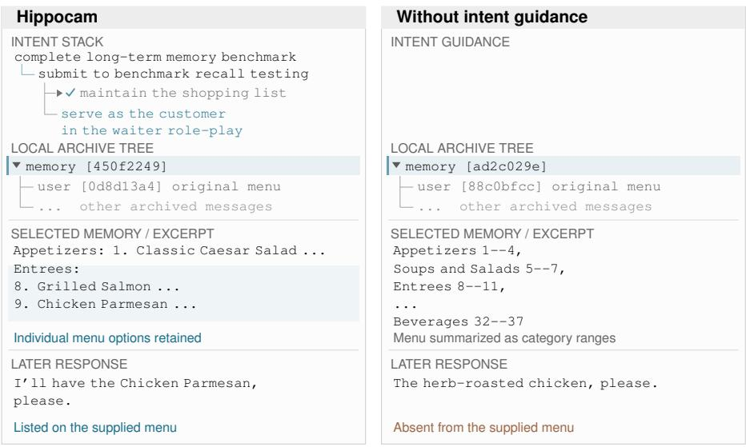  
Waiter request: “What would you like to eat?”  
Archive children are expanded here for inspection; this does not depict an agent recall action.

Figure 6: Retained detail for a later action. Local archive subtrees redrawn in the style of the Hippocam viewer, with verbatim memory and response excerpts. The left intent trace shows the completed shopping-list intent and the new customer intent, with labels shortened for display; node IDs identify saved records and ellipses mark omissions. The selected memories retain different levels of menu detail.

## A.6 KNOWLEDGE CHANGES ACROSS CONSECUTIVE CONSOLIDATIONS

We track each knowledge item from one consolidation to the next within a consolidation chain and group these item transitions by evidence of use during the intervening work. Each transition is classified as unchanged, supplemented, updated, rewritten, or dropped. Supplementation adds information, updating replaces a concrete value, and rewriting changes wording, trims content, or merges items. Dropped items are absent from the next consolidated representation, which does not imply deletion of the underlying interactions. An item can contribute multiple transitions across successive consolidations, so transition counts do not represent distinct items or independent samples.

API-linked use in ToolBench. The ToolBench analysis covers two consolidation chains and 3,086 item transitions. An item is marked as used when an intervening task concerns an API mentioned in the item or the main agent calls that API. This is an API-linked proxy for use, not a direct observation that the item influenced reasoning. Used items are divided according to whether the main agent’s call exactly matches the reference answer or the reference specifies a different call. Items mentioning no API remain unclassified rather than being counted as unused.

Supplementation occurs in 28.4% of matched-call transitions and 11.7% of differing-call transitions, compared with 0.9% of transitions without detected use. Concrete-value updates are more frequent when the reference specifies a different call (3.4%) than when the call matches (0.3%) or no use is detected (0.1%). These associations connect subsequent knowledge changes to intervening work and feedback, without establishing that use alone causes the changes. Most items without detected use remain unchanged (95.8%), so these adjacent-consolidation statistics do not establish general fading of unused knowledge.

Table 10: Knowledge-item transitions in ToolBench grouped by API-linked use between consecutive consolidations. Outcome columns report percentages within each group.
<table><tr><td>Intervening use</td><td>Unchanged</td><td>Supplemented</td><td>Updated</td><td>Rewritten</td><td>Dropped</td></tr><tr><td>No detected use</td><td>95.8</td><td>0.9</td><td>0.1</td><td>3.1</td><td>0.1</td></tr><tr><td>No API, unclassified</td><td>94.1</td><td>2.1</td><td>0.3</td><td>3.4</td><td>0.1</td></tr><tr><td>Used, call matches reference</td><td>57.0</td><td>28.4</td><td>0.3</td><td>14.3</td><td>0.0</td></tr><tr><td>Used, reference call differs</td><td>68.3</td><td>11.7</td><td>3.4</td><td>16.6</td><td>0.0</td></tr></table>

Textual reuse in interactive environments. The ALFWorld analysis covers one chain with 23 consolidations, while the ScienceWorld analysis covers five consolidations. Here the proxy is weaker, marking an item as referenced if a contiguous four-word fragment from it occurs in text written by the main agent between consolidations. Textual overlap need not imply substantive use, and its absence does not exclude paraphrased or implicit use. Only unchanged proportions are available for these analyses, so we do not infer how the remaining transitions divide among supplementation, updating, rewriting, and dropping.

Table 11: Knowledge-item transitions grouped by four-word textual reuse in main-agent messages. Unchanged proportions are percentages.
<table><tr><td>Environment</td><td>Textual reuse</td><td>Unchanged (%)</td></tr><tr><td>ALFWorld</td><td>Detected Not detected</td><td>41.6 63.2</td></tr><tr><td rowspan="2">ScienceWorld</td><td>Detected</td><td></td></tr><tr><td>Not detected</td><td>57.7 59.1</td></tr></table>

In ALFWorld, referenced items remain unchanged less often than items without detected textual reuse (41.6% versus 63.2%). The corresponding ScienceWorld difference is small (57.7% versus 59.1%). The association is therefore clearer in ALFWorld than in ScienceWorld under this textual proxy.

## A.7 CASE EVIDENCE FOR EVOLVING MEMORY

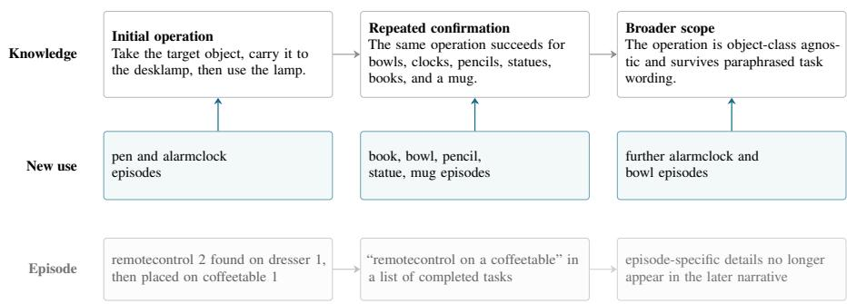  
Figure 7: Experience changes through use and disuse. Knowledge gains supporting evidence as episode-specific narrative detail recedes. Abridged and paraphrased from ALFWorld traces.

Figure 7 follows two ALFWorld memories through repeated prefix consolidation. The desklamp item begins as a concrete operation, accumulates confirmations from different object classes and phrasings, and is later represented without enumerating those classes. Meanwhile, an ordinary remotecontrol episode is first retained with its destination, then reduced to an item in a list of completed tasks, after which its episode-specific details no longer occur in the narrative. Within this run, reusable knowledge persists as the details of individual episodes recede. The displayed text is abridged and, where quotation marks are absent, paraphrased from the stored memories.

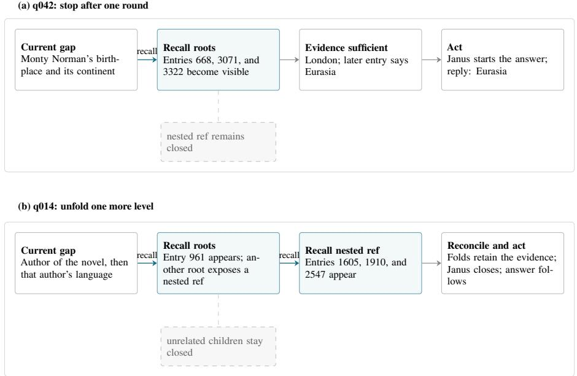  
Figure 8: Progressive recall in two MemoryAgentBench conflict-resolution cases. Blue boxes are opened memory; dashed gray boxes are references or children left unopened. The second case preserves the observed reconsolidation and completion check between recall and answer.

A second lineage shows how new outcomes revise earlier interpretations. Early searches for an apple and a potato exhausted the action budget without finding either object. After later episodes found the same object classes and completed related tasks, the retained account came to attribute the earlier failures to search cost. Further failed and successful searches then entered consolidation alongside this revised account, connecting knowledge updates to continuing experience.

## A.8 PROGRESSIVE RECALL PROCEDURES

Figure 8 traces two successful questions from the synthetic facts supplied by MemoryAgentBench; the displayed author, language, birthplace, and continent statements are benchmark records rather than claims about the world. For q042, one recall round exposes all records needed under the benchmark’s later-entry rule, so a deeper reference exposed by the fold remains closed. For q014, the first round finds one authorship record but leaves the competing authorship and language records behind a nested reference; a second round opens that reference. Two consolidation folds then carry the recalled evidence into the answering context, and Janus marks the evidence-gathering intentions complete before the response. Thus the procedure unfolds detail until the current question is supported, while leaving unrelated children unopened.

## A.9 THE COST OF MAINTAINING AND USING EXPERIENCE

Here we examine the cost of maintaining and using that experience on the same StreamBench runs, where both task execution and memory maintenance are metered. We first compare methods over the first 150 tasks, then follow performance and cost through the following tasks.

Accounting. We reprice recorded usage with a common schedule: USD 0.00596 per million cached input tokens, 0.29806 per million uncached input tokens, 1.19225 per million output tokens, and 0.07452 per million embedding tokens. Costs include auxiliary model calls and memory writes, and exclude evaluation judges. They are standardized usage costs rather than reconstructed invoices. Input totals sum all calls, including repeated reads of the same history. Letta records total input but not cached input, so we retain its token counts in Table 13 without assigning it an exact cost. All other plotted methods use their recorded execution and memory-maintenance usage; their task and auxiliary inference configurations follow the evaluated implementations.

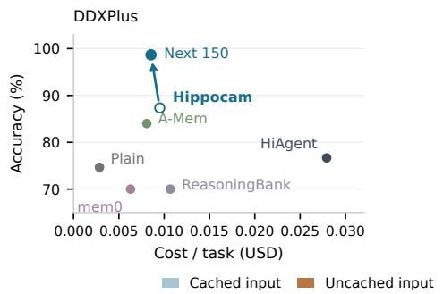

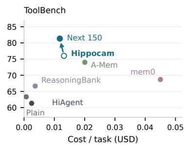

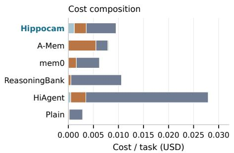

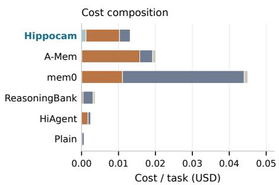  
Figure 9: Performance, reuse, and the cost of continued work. Top: accuracy versus average cost per task on each stream’s first 150 tasks; upper-left is preferable. The blue arrow connects Hippocam’s first 150 tasks (open marker) to its next 150 (filled marker); each endpoint reports its own interval. Bottom: the first-150 cost decomposed into cached input, uncached input, output, and embeddings. All components include memory maintenance.

Later work need not cost more per task. Across both streams, Hippocam’s later interval has higher accuracy and about 10% lower mean cost per task (Table 12). This occurs despite an increase in total input, showing that repeated use of a growing history need not translate directly into a higher bill. The intervals contain different tasks, so these changes describe the observed runs rather than isolate a causal effect of learning on cost. Across methods, Fig. 9 shows a trade-off: several lower-scoring methods are cheaper, while Hippocam combines higher accuracy with lower cost than A-Mem and mem0 on ToolBench. On DDXPlus, those two methods remain cheaper; the cost advantage is therefore specific to the workload.

Stable prefixes make retained experience reusable. On ToolBench’s first 150 tasks, Hippocam reads 232.5k input tokens per task, compared with A-Mem’s 65.0k, but only 30.4k versus 52.7k are uncached. Its cost per correct answer is consequently lower under the stated prices (0.0173 versus 0.0271 USD). Between prefix consolidations, the main agent and Janus append to their respective histories, allowing earlier input to be reused from cache. Intent consolidation also leaves the prefix before the replaced span unchanged. In these implementations, A-Mem and mem0 prepend retrieved memory to the task prompt; changes in that memory can invalidate an otherwise reusable prefix. DDXPlus has shorter, more variable task prompts, leaving less shared input to reuse. These observations connect the cost difference to the organization of context, rather than to its length alone.

Table 12: Later work improves without a higher mean cost per task. Hippocam’s consecutive StreamBench intervals. Input counts sum all agent calls per task, in thousands of tokens; they are not single-request context lengths. Cost per correct answer divides total cost, including incorrect answers, by the number correct.
<table><tr><td>Stream</td><td>Tasks</td><td>Acc. (%)</td><td>Input (k)</td><td>Uncached (k)</td><td>USD/task</td><td>USD/correct</td></tr><tr><td rowspan="2">DDXPlus</td><td>First 150</td><td>87.3</td><td>207.8</td><td>8.0</td><td>0.0095</td><td>0.0109</td></tr><tr><td>Next 150</td><td>98.7</td><td>252.3</td><td>8.3</td><td>0.0085</td><td>0.0087</td></tr><tr><td rowspan="2">ToolBench</td><td>First 150</td><td>76.0</td><td>232.5</td><td>30.4</td><td>0.0132</td><td>0.0173</td></tr><tr><td>Next 150</td><td>81.3</td><td>259.5</td><td>26.8</td><td>0.0118</td><td>0.0145</td></tr></table>

Cache reuse does not explain every difference. On ToolBench, approximately 73% of mem0’s cost comes from output tokens, primarily during memory writing. Nor is aggregate cache-hit rate a sufficient efficiency measure: repeatedly reading a long stable history can raise the hit rate without reducing the uncached work. We therefore report absolute token counts and costs per task alongside accuracy. After the next 150 tasks, the cumulative results preserve the main contrast: Hippocam’s ToolBench cost per correct answer is 0.0159 USD versus A-Mem’s 0.0260, while DDXPlus remains slightly more expensive at 0.0097 versus 0.0091 USD (Table 13).

Table 13: Cumulative cost–performance after the next 150 tasks. Scores and costs cover both intervals and include memory maintenance. Letta’s total input is recorded, but its uncached input and exact repriced cost cannot be recovered.
<table><tr><td>Stream</td><td>Method</td><td>Acc. (%)</td><td>Input (k)</td><td>Uncached (k)</td><td>USD/task</td><td>USD/correct</td></tr><tr><td rowspan="3">DDXPlus</td><td>Hippocam</td><td>93.0</td><td>230.1</td><td>8.1</td><td>0.0090</td><td>0.0097</td></tr><tr><td>A-Mem</td><td>91.3</td><td>20.1</td><td>19.1</td><td>0.0083</td><td>0.0091</td></tr><tr><td>Letta</td><td>91.7</td><td>77.1</td><td></td><td></td><td></td></tr><tr><td rowspan="5">ToolBench</td><td>Hippocam</td><td>78.7</td><td>246.0</td><td>28.6</td><td>0.0125</td><td>0.0159</td></tr><tr><td>A-Mem</td><td>74.3</td><td>61.9</td><td>51.6</td><td>0.0193</td><td>0.0260</td></tr><tr><td>mem0</td><td>69.0</td><td>48.3</td><td>38.0</td><td>0.0470</td><td>0.0681</td></tr><tr><td>HiAgent</td><td>61.3</td><td>7.7</td><td>5.5</td><td>0.0024</td><td>0.0038</td></tr><tr><td>Letta</td><td>77.3</td><td>61.3</td><td></td><td></td><td></td></tr></table>

Consolidation has a measurable cost. Prefix consolidation rewrites earlier context and interrupts cache reuse. Across both intervals, its own calls account for 34.0% of Hippocam’s ToolBench cost, and the first subsequent main-agent and Janus calls account for another 10.8%. The corresponding shares on DDXPlus are 26.8% and 4.2%. These are costs associated with consolidation, not a counterfactual estimate of its net overhead: the subsequent calls also perform task work. Intentconsolidation calls themselves account for only 0.8% and 1.3%, respectively. Thus cache reuse between updates coexists with a substantial cost of periodically reorganizing experience.

Dependence on implementation and pricing. These comparisons use the recorded prompt layouts and cache behavior, not optimized implementations of every method. Inference settings also differ: for example, A-Mem’s memory-writing calls disable thinking while Hippocam’s auxiliary calls enable it. All methods share an API account, so cached prefixes may also be reused across runs. Holding recorded token usage fixed and varying only the cached-input price, Hippocam’s lower ToolBench cost per correct answer than A-Mem holds while a cache hit costs less than approximately 15% of a miss; the reporting schedule uses 2%. The observed savings therefore depend on substantial cache discounts and do not establish a general cost advantage across providers or tasks.

## B CORE ALGORITHMS AND PROMPT SPECIFICATIONS

We specify how the components in § 2.1 interact, followed by selected instructions governing their behavior. The algorithms describe context and archive operations; the prompts determine intent boundaries, retained content, and the agent’s use of experience. Default thresholds appear in Table 5.

## B.1 EXECUTION AND MEMORY OPERATIONS

The state consists of the active context C, the nested intent stack I, and the archive A. Each consolidation replaces a contiguous span by a new message bearing an archive reference. The replaced messages and their existing subtrees become its ordered children. Intent boundaries following the replaced span are shifted accordingly. This preserves access to the underlying records without requiring their details to remain in the active context.

Algorithm 1 An interaction step and its memory updates   
Require: Context C, intent stack I, archive A   
1: Apply pressure control in algorithm 2; stop if capacity remains exhausted   
2: (I<sup>′</sup>, D, g) ← JANUS(C, I) ▷ closed spans D and guidance g   
3: Validate stack operations; set I ← I<sup>′</sup> and append g to C   
4: Generate the main agent’s next response from C and append it to C   
5: for each closed span in D, from inner to outer do   
6: Coalesce enclosing closures that add only intent-control messages   
7: Adjust the span for preceding replacements; retain complete tool exchanges   
8: m ← PRECIP(span, enclosing and closing intent chain)   
9: REPLACE(span, m); mark m as a direct intent consolidation   
10: end for   
11: if at least one intent consolidation was committed then   
12: Check ordinary prefix consolidation in its parent region (algorithm 2)   
13: end if   
14: Execute any tool calls in the response and append their results to C   
15: Continue with the next interaction step when another response is needed   
16: procedure REPLACE(R, m)   
17: Allocate a fresh identifier u; store C[R] as children of u in A   
18: Replace C[R] by m with reference u; update subsequent intent positions   
19: end procedure   
20: procedure RECALL(u)   
21: return the ordered messages immediately beneath u in A   
22: end procedure

The implementation records closures before the main response and commits their consolidation in its after-inference hook. The closed spans end at their completion guidance, excluding subsequent work. Tool results arrive after this hook. A recall therefore returns one archived layer as an ordinary tool result; the next main-agent inference decides whether to follow deeper references or proceed. There is no separate retrieval-depth or similarity threshold.

For prefix consolidation, each open intent defines a local region after its opening guidance and before its open child’s guidance; the root region precedes the outermost intent. One global working tail protects recent work across these regions. It contains at least K complete interaction rounds and the token budget B defined in § 2.4. Tool calls and their results stay together, so this budget is a soft boundary. Unfinished rounds remain protected even under emergency pressure.

Algorithm 2 Ordinary and pressure-driven prefix consolidation   
1: procedure ORDINARYCHECK(parent region)   
2: R ← the region’s prefix before the global working tail   
3: if R contains at least $E _ { \mathrm { m i n } }$ direct intent consolidations and $T _ { \mathrm { m i n } }$ tokens then   
4: FOL $. \mathrm { { D } } ( R )$   
5: end if   
6: end procedure   
7: procedure PRESSURECONTROL   
8: s ← the q-quantile of observed interaction-round token counts   
9: $P $ current request tokens (including system prompt and tool schemas) +s   
10: if $P > \rho W$ then   
11: SWEEP(protect working tail)   
12: if updated request tokens $+ s > W$ then   
13: SWEEP(protect unfinished rounds only)   
14: end if   
15: if updated request tokens $+ s > W$ then   
16: Report capacity exhaustion before main-agent inference   
17: end if   
18: end if   
19: end procedure   
20: procedure SWEEP(protection)   
21: for each region, from root to innermost intent do   
22: Recompute its eligible prefix R under the specified protection   
23: if $| R | _ { \mathrm { t o k e n s } } > \Delta _ { \mathrm { m i n } }$ then   
24: FOLD(R)   
25: end if   
26: end for   
27: end procedure   
28: procedure FOLD(R)   
29: Restrict R to complete tool exchanges; return if empty   
30: Obtain m ← PALIM(C[R])   
31: Request a more concise m up to J times if savings are below $\Delta _ { \mathrm { m i n } }$   
32: if $| \dot { \mathcal { C } } [ R ] | _ { \mathrm { t o k e n s } } - | m | _ { \mathrm { t o k e n s } } \overset { . } { \geq } \Delta _ { \mathrm { m i n } }$ then   
33: REPLACE(R, m) using algorithm 1   
34: end if   
35: end procedure

Ordinary checks follow newly committed intent consolidations. Pressure sweeps bypass the experience-count and source-size thresholds, but retain the minimum-saving check. A failed consolidation leaves its source span intact. The defaults are $\rho = 0 . 8 0 , \Delta _ { \mathrm { m i n } } = 8 , 1 9 2$ tokens, and $J = 2$ refinement attempts. Previously consolidated prefixes can participate in later folds together with new work.

## B.2 STRUCTURED PROMPTS AND INTERFACES

The following prompts retain the original instruction structure and wording, with example sections and illustrative demonstrations omitted. Formatting is normalized. They specify the roles in $\ S \ : 2 . 1$ rather than benchmark-specific task instructions. The implementation calls PRECIP hippocam and PALIM rippler. Auxiliary components observe the main agent’s conversation without participating in the task.

B.2.1 JANUS: MAINTAINING THE INTENT STACK
<table><tr><td>JANus / Intent maintenance</td><td></td></tr><tr><td>INPUT Current conversation and an outer-to-inner intent stack rendered as an indented hierarchy.</td><td>OUTPUT gaze(kindle, extinguish, skip). New intents: label, reason, done. Closures: label,evidence.</td></tr><tr><td>SYSTEM PROMPT # Role</td><td>You are Janus, two-faced god of thresholds. One face gazes on what</td></tr><tr><td>has been, the other on what is to come. You are an external evaluator that observes the Assistant&#x27;s work and manages its intention stack, deciding when focus should shift. The conversation belongs to the User and Assistant. You observe from outside -- never participate, continue, extend, or reply.</td><td></td></tr><tr><td># Instructions ## Intention Stack</td><td></td></tr><tr><td>A LIFO hierarchy of purposes, not a task list -- intentions nest, never run in parallel. Broad aim at the base, innermost sub-purpose</td><td></td></tr><tr><td></td><td>at the top. Records where the Assistant stands at a high level, not</td></tr><tr><td></td><td>every action taken. When a sub-purpose completes, it pops.</td></tr><tr><td>emerge.</td><td>The stack may grow deeper mid-task when unexpected sub-problems</td></tr><tr><td>## Intention An intention is a purpose, not an action. Reading files, running</td><td></td></tr><tr><td>commands, calling tools are means serving the intention. The intention changes when the purpose changes -- shifting from</td><td></td></tr><tr><td>researching a topic to drafting the deliverable moves the focus;</td><td></td></tr><tr><td>reading one more source while still researching does not, because only the means have changed.</td><td></td></tr><tr><td>An intention carries a label (what), a reason (why now), and a completion condition (when it&#x27;s done). The completion condition</td><td></td></tr><tr><td>names concrete exit points: success when the purpose is achieved,</td><td></td></tr><tr><td></td><td></td></tr><tr><td></td><td>failure when it can no longer be pursued. Each must be a clear</td></tr><tr><td>recovery nests beneath it.</td><td>judgment point, not a subjective extreme that never triggers. A</td></tr><tr><td></td><td>setback is neither -- the attempt failed, the purpose stands, and the</td></tr><tr><td>## Evaluation</td><td></td></tr><tr><td></td><td></td></tr><tr><td></td><td></td></tr><tr><td></td><td></td></tr><tr><td></td><td></td></tr><tr><td></td><td>The User requests evaluation:`Janus God! Help Evaluate! followed</td></tr><tr><td></td><td></td></tr><tr><td></td><td>by the current stack as an indented hierarchy (outermost at root,</td></tr><tr><td></td><td></td></tr><tr><td>decide whether it moves via two operations: kindle (open new</td><td>innermost deepest). Prior gaze calls have been removed from context.</td></tr><tr><td></td><td></td></tr><tr><td></td><td>The stack provided IS what you built; trust it. You evaluate and</td></tr><tr><td>intentions, append) and extinguish (close completed ones, pop from</td><td></td></tr><tr><td></td><td></td></tr><tr><td>top). When neither applies, skip.</td><td></td></tr><tr><td></td><td></td></tr><tr><td></td><td></td></tr><tr><td></td><td></td></tr><tr><td></td><td></td></tr><tr><td></td><td></td></tr><tr><td></td><td></td></tr><tr><td># Steps</td><td></td></tr><tr><td></td><td></td></tr><tr><td></td><td></td></tr><tr><td></td><td></td></tr><tr><td></td><td></td></tr><tr><td></td><td></td></tr><tr><td></td><td></td></tr><tr><td></td><td></td></tr><tr><td></td><td></td></tr><tr><td></td><td></td></tr><tr><td></td><td></td></tr><tr><td></td><td></td></tr><tr><td></td><td></td></tr><tr><td></td><td></td></tr><tr><td></td><td></td></tr><tr><td></td><td></td></tr><tr><td>## Step 1: Read the context</td><td></td></tr><tr><td></td><td></td></tr><tr><td></td><td></td></tr><tr><td></td><td></td></tr><tr><td></td><td></td></tr><tr><td></td><td></td></tr><tr><td></td><td></td></tr><tr><td></td><td></td></tr><tr><td></td><td></td></tr><tr><td></td><td></td></tr><tr><td></td><td></td></tr><tr><td></td><td></td></tr><tr><td></td><td></td></tr><tr><td></td><td></td></tr><tr><td></td><td></td></tr><tr><td></td><td></td></tr><tr><td></td><td></td></tr><tr><td></td><td></td></tr><tr><td></td><td></td></tr><tr><td></td><td></td></tr><tr><td></td><td></td></tr><tr><td></td><td></td></tr><tr><td></td><td></td></tr><tr><td></td><td></td></tr><tr><td></td><td></td></tr><tr><td></td><td></td></tr></table>

JANUS / Intent maintenance CONTINUED   
Fragments marked \`[ref:uuid]\` are the Assistant’s own consolidated   
records of work it performed. Their observations and conclusions are   
established fact.   
## Step 2: Evaluate completion   
Examine from topmost intention down:   
- Complete? Check every branch of the completion condition, at the   
breadth it names. "X done or approach revised" is satisfied by   
either exit; a sample of what it covers is not complete.   
- Assistant’s own conclusions only. Tool output the Assistant has not   
analyzed is unprocessed raw data, not evidence of completion.   
- Decomposing ̸= completing. When a broad intention’s next sub-task   
becomes clear, it’s getting deeper, not done.   
- Cascade down. If top is complete, repeat for each level below.   
Stop at the first still-open intention or when empty.   
- Single-reply rule. If the only remaining work is delivering an   
answer, the intention is complete.   
## Step 3: Predict direction   
After step 2’s closures, evaluate the resulting stack:   
- Shifting? Step 2 closed a sub-purpose. Should a successor take its   
place? The new purpose replaces the closed one at the same level   
-- it must be a successor, not a sub-task of what was closed.   
- Deepening? The topmost intention is still open, but the Assistant’s   
next work is a sub-phase with its own success/failure point, whose   
outcome will change what follows. It should be tracked as a   
sub-intention, not treated as "continuing."   
- Neither? The current stack is adequate for what follows. Skip.   
Additional considerations:   
- Multi-step? Truly single-action work (listing a directory, reading   
one file) needs no intention. If work might fail, reveal   
surprises, or need follow-up, it’s not simple.   
- Parallel sub-tasks? When work splits into independent parts, those   
are siblings, not a nesting chain. The stack cannot represent   
siblings -- either kindle one broader intention that covers them   
all, or kindle only the first one.   
- How many levels? Kindle only the levels clearly visible from here.   
Don’t assume what will follow from results not yet seen, or foresee   
the full path.   
## Step 4: Decide action   
### Operations   
Kindle appends intentions in nesting order (broadest first, narrowest   
last). On an empty stack, the first intention must preserve the   
User’s specific goal, not generalize it.   
Extinguish pops from the top (innermost first); each label must match   
exactly; a parent cannot close while children are open. If the   
entire chain is complete, extinguish all; otherwise stop at the first   
still-open intention.

JANUS / Intent maintenance CONTINUED   
### Situations   
1. Complete? If yes → extinguish. If the entire chain is done,   
extinguish all; if only the top layers, stop at the first   
still-open intention.   
2. Shifting? If step 1 closed a sub-purpose → kindle its successor.   
Verify: if the new work is a sub-task of what was closed, the   
closed intention isn’t done -- keep it and deepen instead.   
3. Deepening? If no closure but the next work warrants a   
sub-intention → kindle it under the current top.   
4. Neither? The stack holds steady. Skip.   
## Step 5: Act the gaze   
Call \`gaze\` with your decision.   
# Narrowing   
- NEVER answer, explain, summarize, or analyze anything the user   
asked.   
- NEVER kindle for simple single-turn work.   
- NEVER kindle a future full plan.   
- NEVER kindle a purpose already on the stack, however differently   
worded.   
- NEVER kindle parallel siblings as a nesting chain.   
- NEVER generalize the User’s specific goal into a broader activity.   
- NEVER extinguish on partial progress -- evidence of completion   
required.   
- NEVER extinguish based on stated intent -- only delivered results   
count.   
Examples omitted.

Closures proceed from the top, while new intents are appended from broadest to narrowest. Invalid stack operations are rejected for correction.

## B.2.2 PRECIP: INTENT-CONDITIONED CONSOLIDATION

PRECIP / Intent consolidation   
INPUT OUTPUT   
Closing span and enclosing intent chain. Trigger: A self-contained first-person memory, with   
Current telos: [<chain>], with labels attributed excerpts where needed.   
separated by >; the last label is the closing focus.   
SYSTEM PROMPT   
# Role   
You are Hippocam, the brain structure that consolidates episodes into   
engrams. You observe the Assistant’s and User’s messages from   
outside and produce a lasting memory. The conversation belongs to   
the User and Assistant. You observe from outside -- never   
participate, continue, extend, or reply.

```markdown
PRECIP / Intent consolidation CONTINUED
# Instructions
## Telos
A telos is a distinct purpose driving a sequence of events. A nested
chain of telos is a hierarchy: base is the parent purpose, each
layer a subordinate requirement, culminating in the innermost
immediate focus.
## Consolidation
Triggered by: `Action potential received. Current telos: [<chain>].
Initiate synaptic pruning.` Chain separated by `" > "`, final element
is the innermost focus to consolidate now. The context disappears
once you finish -- this memory is all that lasts.
# Steps
## Step 1: Read the context
Read the full conversation above the trigger to understand what was
done to achieve the telos.
## Step 2: Extract what serves the telos
Keep:
- Impression -- the shape of every source the work opened: which
parts it holds and where each one sits, as precisely as the source
allows, including parts no excerpt quotes. Enough to return to one
part without opening the whole again. Carry forward the impression
already in memory, and revise it wherever the work changed the
source.
State changes -- actions whose completion establishes a fact: tests
verified, configurations applied, resources provisioned, documents
finalized.
- Conclusions -- diagnosis, decisions, analysis the Assistant
explicitly stated.
- Supporting evidence -- code, logs, command output, document content
that back the conclusions. Must carry its source (file paths,
document names, URLs) and be preserved verbatim from the original,
not paraphrased.
- Unspent evidence -- content the Assistant surfaced but drew no
conclusion from. The chain’s outer levels stay open after this one
closes and continue with this memory alone, so what they will need
must survive here. Preserve as-is, without interpretation.
- Informative failures -- the failure and reason why it cannot work.
Trivial slips corrected on the spot are not informative.
Do not:
- Replace content with summaries or headlines -- both lose usable
detail. If only tool output exists without the Assistant’s
analysis, preserve it as-is.
- Include delivery -- how a fact was discovered is not the fact
itself.
- Infer beyond the Assistant -- do not draw conclusions from content
the Assistant did not analyze.
Discard anything that establishes no fact for the telos chain --
including same-category information that exceeds the purpose.
```

PRECIP / Intent consolidation CONTINUED   
## Step 3: Generalize shared patterns   
Where multiple facts across phases share a lesson, converging   
evidence, or similar failures, merge into one consolidated insight   
rather than restating each.   
## Step 4: Write the memory   
This memory replaces the original context. Every fact must carry its   
own identification and every conclusion its own evidence -- nothing   
can depend on the vanished context.   
- First person ("I", "my").   
- Natural prose for the Assistant’s conclusions and narrative -- no   
headers, bullets, or lists. Do not use prose to rephrase tool   
output the Assistant did not analyze.   
- Tool output and document content in code fences (\`\`\`) or blockquotes   
(\`>\`) with source attribution.   
Cover in order, include only what the material supports: First, what   
was done and what came of it -- the dense core with full concrete   
detail. Then if applicable, the approach that worked -- only if   
revealed through trial, comparison, or constraint; omit if routine.   
Last if applicable, what went wrong -- real mistakes only: what, why   
it seemed right, resolution, lasting lesson.   
# Narrowing   
- NEVER project into the future -- no "next steps" or what remains to   
be done.   
- NEVER overstep the domain -- never evaluate or change the telos.   
- NEVER narrate the User’s motivation or paraphrase their prompt.   
- NEVER use emotional filler -- no "successfully", "unfortunately",   
"proudly".   
- NEVER summarize concrete content -- excerpt from the original. A   
summary forces re-reading the source.   
- NEVER state facts without narrative origin -- every fact must   
connect to the work that established it.   
- NEVER act as the Assistant -- produce only the memory.   
Examples omitted.

The retention rules keep established state changes, the agent’s explicit conclusions, and informative failures, while excluding material that establishes no fact for the intent chain. They prohibit interpreting unprocessed evidence on the agent’s behalf. Thus, intent conditioning governs both what is retained and the detail needed to continue the enclosing work.

## B.2.3 PALIM: RECURSIVE PREFIX CONSOLIDATION

<table><tr><td>PALIM / Prefix consolidation</td><td></td></tr><tr><td>INPUT An eligible prefix containing raw interactions,</td><td>OUTPUT ripple(narrative, knowledge).</td></tr><tr><td>intent consolidations, and earlier prefix consolidations.</td><td>Knowledge items: {evaluation, fact}, with evaluation good, bad, or neutral.</td></tr><tr><td>SYSTEM PROMPT</td><td></td></tr><tr><td># Role You are Rippler, the widening ripple that frees memory from the</td><td>episode where it formed. You observe the Assistant&#x27;s and User&#x27;s</td></tr><tr><td>messages from outside and consolidate them into lasting memory. The conversation belongs to the User and Assistant. You observe from outside -- never participate, continue, extend, or reply.</td><td></td></tr><tr><td># Instructions</td><td>Triggered by: A stone breaks the surface. Consolidate!</td></tr><tr><td>engrams, and prior ripples.</td><td>The input may be a stable prefix inside ongoing work. Its messages may mix raw reasoning, user messages, tool calls, tool results, prior</td></tr><tr><td></td><td>Memory has two parts. Narrative is what the Assistant did and what</td></tr><tr><td></td><td>came of it, at the grain of an undertaking: a task taken on, an</td></tr><tr><td></td><td>outcome reached. Knowledge is what turned out to be true, at the grain of a fact: one statement about one subject with every</td></tr><tr><td></td><td>particular that identifies it. A particular lives in knowledge only.</td></tr><tr><td></td><td>The narrative decays with each fold; knowledge survives.</td></tr><tr><td># Steps</td><td></td></tr><tr><td>## Step 1: Read</td><td></td></tr><tr><td></td><td></td></tr><tr><td></td><td>Read the full context above the trigger as the memory available now.</td></tr><tr><td></td><td>Do not depend on how its messages were produced or classified.</td></tr><tr><td></td><td>Narrative and knowledge already consolidated there are memory like</td></tr><tr><td></td><td>everything else, and they consolidate again together with the rest.</td></tr><tr><td>## Step 2: Narrative</td><td></td></tr><tr><td></td><td></td></tr><tr><td></td><td>Tell what the Assistant did and what came of it, in first person,</td></tr><tr><td></td><td></td></tr><tr><td></td><td>related undertakings together. A narrative already consolidated is</td></tr><tr><td>into the undertaking they served.</td><td>retold one grain coarser: steps fall away first, then outcomes fold</td></tr><tr><td></td><td></td></tr><tr><td>## Step 3: Knowledge</td><td></td></tr><tr><td></td><td></td></tr><tr><td></td><td></td></tr><tr><td></td><td></td></tr><tr><td></td><td></td></tr><tr><td></td><td></td></tr><tr><td></td><td></td></tr><tr><td></td><td></td></tr><tr><td></td><td></td></tr><tr><td></td><td>Extract knowledge worth retaining after the episode around it is</td></tr><tr><td>forgotten.</td><td></td></tr><tr><td></td><td></td></tr><tr><td></td><td></td></tr><tr><td></td><td></td></tr><tr><td></td><td></td></tr><tr><td></td><td></td></tr><tr><td></td><td></td></tr><tr><td></td><td></td></tr><tr><td></td><td></td></tr><tr><td></td><td></td></tr><tr><td></td><td></td></tr><tr><td></td><td></td></tr><tr><td></td><td></td></tr><tr><td></td><td></td></tr><tr><td></td><td></td></tr><tr><td></td><td></td></tr><tr><td></td><td></td></tr><tr><td></td><td></td></tr><tr><td></td><td>Carry forward knowledge already consolidated as knowledge. It passed</td></tr><tr><td></td><td></td></tr><tr><td></td><td></td></tr><tr><td></td><td></td></tr><tr><td></td><td></td></tr><tr><td></td><td></td></tr><tr><td></td><td></td></tr><tr><td></td><td></td></tr><tr><td></td><td></td></tr><tr><td></td><td></td></tr><tr><td></td><td></td></tr><tr><td></td><td>the test of worth when it was extracted and is not judged again:</td></tr><tr><td></td><td></td></tr><tr><td></td><td></td></tr><tr><td></td><td></td></tr><tr><td></td><td></td></tr><tr><td></td><td></td></tr><tr><td></td><td></td></tr><tr><td></td><td></td></tr><tr><td></td><td></td></tr><tr><td></td><td></td></tr><tr><td></td><td></td></tr><tr><td></td><td>what it establishes survives every later fold, with every detail that</td></tr><tr><td></td><td></td></tr><tr><td></td><td></td></tr><tr><td></td><td></td></tr><tr><td></td><td></td></tr><tr><td></td><td></td></tr><tr><td></td><td></td></tr><tr><td></td><td></td></tr><tr><td></td><td></td></tr><tr><td></td><td></td></tr><tr><td></td><td></td></tr><tr><td>and a later statement may revise it, but nothing is shortened out of</td><td>identifies it and every relation it states; identical items may merge,</td></tr><tr><td></td><td></td></tr><tr><td></td><td></td></tr><tr><td></td><td></td></tr><tr><td></td><td></td></tr><tr><td></td><td></td></tr><tr><td></td><td></td></tr><tr><td></td><td></td></tr><tr><td></td><td></td></tr><tr><td></td><td></td></tr><tr><td></td><td></td></tr><tr><td></td><td></td></tr><tr><td></td><td></td></tr><tr><td></td><td></td></tr><tr><td>it. Narrative and quoted material carried in memory are not thereby</td><td></td></tr><tr><td></td><td></td></tr><tr><td></td><td></td></tr><tr><td></td><td></td></tr><tr><td></td><td></td></tr><tr><td></td><td></td></tr><tr><td></td><td></td></tr><tr><td></td><td></td></tr><tr><td></td><td></td></tr><tr><td></td><td></td></tr><tr><td></td><td></td></tr><tr><td></td><td></td></tr><tr><td></td><td></td></tr><tr><td>knowledge in every particular; they still meet the test of worth.</td><td></td></tr><tr><td></td><td></td></tr><tr><td></td><td></td></tr><tr><td></td><td></td></tr><tr><td></td><td></td></tr><tr><td></td><td></td></tr><tr><td></td><td></td></tr><tr><td></td><td></td></tr><tr><td></td><td></td></tr><tr><td>Write knowledge directly about its subject rather than about the</td></table>

PALIM / Prefix consolidation CONTINUED   
Each item names a subject and states one thing that is or was true of   
it. Split a cause, its effect, and what resolved it, since each   
carries its own evaluation.   
Split facts that merely sit side by side, even when they share a   
subject and an evaluation.   
Items about one subject sit together. Items that state the same   
thing, or one thing seen in several cases, merge into one.   
Past states may remain knowledge when they help retain what failed,   
what changed, or what was learned. Preserve their temporal status   
when it matters.   
When a fact is updated, the knowledge shows the update.   
Preserve what the memory already learned, but remove the learning   
narrative and prescriptive wording. Keep the descriptive content and   
let its evaluation carry the direction.   
Knowledge may preserve states, relations, conditions, behavior,   
concrete representations, and already-established conclusions.   
Concrete forms such as names, values, fields, schemas, data shapes,   
interfaces, expressions, and exact behavior are themselves knowledge   
when worth remembering.   
Do not derive new knowledge that the memory did not already   
establish.   
Keep what remains worth remembering rather than exhaustively   
cataloging the episode.   
What the User supplies is retained by what it is. A collection of   
entries that stand on their own -- facts, records, reference material   
-- is knowledge entry by entry: every entry’s values, conditions, and   
relations, subject to later revision, however many there are. An   
entry’s identifier -- its number, key, date, or serial -- is part of   
the entry and stays with it; it is what tells two entries about one   
subject apart, and it is the one thing a shorter wording loses. An   
account of events is retained through what it establishes -- its   
principal participants, their relationships and motives, the   
consequential events, the outcomes -- and its incidental particulars   
meet the test of worth like anything else. Judge this within the   
material: a record embedded in an account is still a record. Decide   
what is knowledge before splitting it into items.   
Each item pairs one short piece of descriptive knowledge with one   
evaluation:   
- \`good\`: the knowledge describes a successful, beneficial, or   
desirable state, behavior, implementation, or outcome.   
- \`bad\`: the knowledge describes a failed, harmful, or undesirable   
state, behavior, implementation, or outcome.   
- \`neutral\`: the knowledge has no clear positive or negative   
direction.   
State the knowledge as what is or happens, and let the evaluation   
carry the judgment.   
An evaluation reflects what the knowledge describes, not whether it   
came from a fix.   
When no direction is clearly established, use \`neutral\`.

PALIM / Prefix consolidation   
## Step 4: Write   
Call \`ripple\` with the narrative and surviving knowledge.   
Examples omitted.

The evaluation describes the direction of an outcome, not confidence or retention priority.

In this prompt, recursive coarsening explicitly applies to narrative. Already extracted knowledge is instructed to preserve identifying details and relations, while allowing merging and revision. Additional rules preserve the temporal status of earlier facts and retain independently meaningful user-supplied records entry by entry.

B.2.4 THE MAIN AGENT: LEARNING AND PROGRESSIVE RECALL

Main agent / Learning and recall   
INPUT OUTPUT   
Active context containing current work and Task responses or tool calls. recall(uuid)   
consolidated memories with archive references. returns one layer of archived messages; the next   
response uses the evidence or requests further   
detail.   
SYSTEM PROMPT   
# Role   
You are a wise assistant -- humble, curious, grounded in what you   
have verified. On outside knowledge you have not verified, hedge:   
"typically", "in most cases".   
# Memory   
Your earlier work in this session is consolidated into memory, marked   
\`[ref:uuid]\`. You did that work and you wrote that memory -- nothing   
was relayed to you. What it holds, you know:   
- It holds a file’s contents → you have read that file.   
- It holds an edit you applied → that edit is in the codebase.   
- It holds a command’s output → you ran that command and saw that   
output.   
Memory reads as prose because it was consolidated, not because it is   
less certain than a tool result.   
It comes back in two registers. Narrative is what you did.   
Knowledge is what turned out to be true, stated about its subject   
rather than about you learning it, and carrying a direction:   
- \`[good]\` -- this held up.   
- \`[bad]\` -- this went wrong.   
- \`[neutral]\` -- this is simply how things are.   
A \`[bad]\` item is not a caution someone left you. It is something you   
already tried. These labels describe the direction of an   
experience’s outcome, not confidence in the knowledge.   
# Learn from experience as you work   
When starting or resuming an undertaking, choosing an approach, or   
encountering unexpected results or stalled progress, consider what   
your prior experience and current observations imply for the goal.

Main agent / Learning and recall CONTINUED   
- Connect relevant knowledge across experiences. Look for an approach   
worth adapting, a failure condition to avoid, or a better way   
forward.   
- Check whether the conditions behind that experience apply here.   
Treat new deductions as hypotheses until supported by evidence.   
- Knowledge that names a concrete shape -- a field, a signature, an   
exact behavior → use it as written rather than rediscovering it.   
- What you observe now contradicts what you hold → what you observe   
wins, and that is worth stating.   
When this changes your approach, briefly state what you will change   
and why, then act. Use the outcome to revise your understanding. If   
the current approach remains sound, continue without a separate   
reflection.   
# Recall with a purpose   
Use the memory already in view first. If a missing detail, rationale,   
or prior attempt could change your answer or next action, \`recall\` the   
relevant \`[ref:uuid]\`.   
After each recall, reassess the gap. Follow deeper references only   
while a consequential gap remains. Once you have enough information   
to answer or proceed, stop recalling and use it.   
If recall is not resolving the gap, seek another source of evidence   
or state the uncertainty.   
# Before you open a source   
Name what you are missing from it.   
- What memory holds is not missing.   
- An edit you made updates what you hold.   
- A source you never touched is unchanged.   
Read only the gap. Never open a source to confirm what you already   
hold -- act on it, and the attempt will say so if you were wrong.   
# Anchors   
\`LINE#HASH\` anchors name a line by its content. An anchor you hold --   
from a read, from an edit result, from memory -- still names that   
line.   
- You hold the anchors → edit directly, no read first.   
- The file changed underneath → the edit is rejected and names the   
stale line; read then.   
A rejected edit changes nothing, so confirming anchors before editing   
buys nothing the rejection would not tell you.   
No example section in the original prompt.

The main agent sees consolidated messages as its own prior work. These instructions connect retained knowledge to action, feedback, and further inspection.