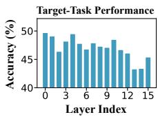
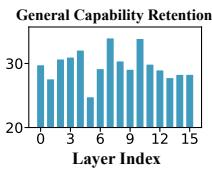
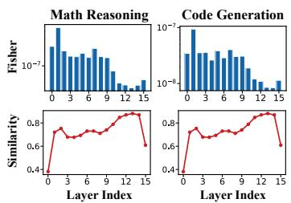
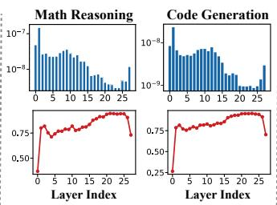
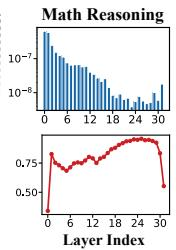
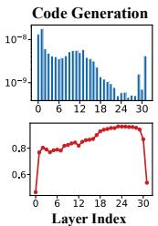
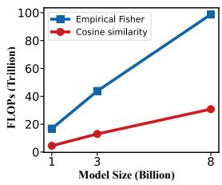
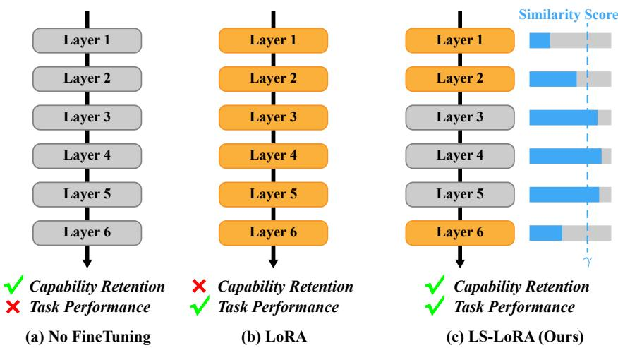

# WHERE TO ADAPT MATTERS: LAYER-SELECTIVEFINE-TUNING FOR CAPABILITY RETENTION

Zhiqiang Pang∗, Zihong Sun∗, Qi Xie, Jun Shu, Deyu Meng, Zongben Xu School of Mathematics and Statistics, Xi’an Jiaotong University, Xi’an, Shaanxi, China xjtupzq@gmail.com, szhc0gk@stu.xjtu.edu.cn {xie.qi, junshu, dymeng, zbxu}@mail.xjtu.edu.cn

## ABSTRACT

Parameter-efficient fine-tuning (PEFT) enables large language models (LLMs) to adapt to specialized tasks, but often at the cost of degrading general capabilities acquired during pretraining. Existing approaches primarily mitigate this trade-off through data replay or regularization, relying on additional data or explicit optimization constraints. We instead focus on a different question: where should adaptation be applied? We find that fine-tuning different Transformer layers produces different target-task gains and degrees of capability degradation, suggesting that not all layers are equally suitable for adaptation. To characterize this difference, we use layer-wise empirical Fisher information to measure target-task sensitivity. However, computing Fisher scores requires backward computation and becomes increasingly expensive for large models. We therefore introduce input–output cosine similarity as a lightweight, forward-only proxy for ranking layer sensitivity. Across models and tasks, layers with lower input–output similarity consistently exhibit higher empirical Fisher scores. Building on this observation, we propose Layer-Selective LoRA (LS-LoRA), which places trainable LoRA adapters only in layers with low input–output similarity. Experiments on mathematical reasoning and code generation show that LS-LoRA improves average target-task performance while retaining substantially more commonsense reasoning capability than standard all-layer LoRA, demonstrating that carefully choosing where to adapt can provide a simple and effective way to balance target-task adaptation and general capability retention.

## 1 INTRODUCTION

Large language models (LLMs) acquire strong general capabilities through large-scale pretraining, enabling them to perform a wide range of downstream tasks (Brown et al., 2020; Bommasani et al., 2021). Despite the general capabilities, specialized applications such as mathematical reasoning (Xin et al., 2024) and code generation (Luo et al., 2024) often require fine-tuning on domainspecific data to meet the demands of target tasks. However, as LLMs continue to scale, full finetuning, which updates all model parameters, incurs increasingly high computational and memory costs (Hu et al., 2022).

Parameter-efficient fine-tuning (PEFT), particularly low-rank adaptation (LoRA), reduces these costs by optimizing only a small number of parameters, which is widely adopted in LLM finetuning (Houlsby et al., 2019; Li & Liang, 2021; Lester et al., 2021; Hu et al., 2022). However, improvements in target-task performance through PEFT may come at the expense of general capabilities acquired during pretraining, a phenomenon known as forgetting (Biderman et al., 2024). Therefore, effective adaptation requires improving target-task performance while retaining these general capabilities (Huang et al., 2026).

Existing approaches mitigate capability degradation primarily through data replay and regularization. Data replay mixes examples from general domains into downstream training to retain general capabilities (Scialom et al., 2022; Bethune et al., 2025). However, replay methods that rely on stored´ examples may be limited by data availability, particularly when the original pretraining corpus is inaccessible (Marek et al., 2026). Regularization methods preserve prior knowledge by constraining parameter changes (Kirkpatrick et al., 2017; Li et al., 2018). However, these constraints may limit improvements in target-task performance (Zenke et al., 2017). These methods mainly rely on the data or constraints used during fine-tuning, leaving a different question underexplored: where should adaptation be applied?

We find that the choice of layers to adapt matters for both target-task performance and general capability retention. Standard LoRA typically uses the same adaptation configuration across Transformer layers, yet fine-tuning different layers can lead to different effects on adaptation and retention, as shown in Fig. 1. Adapting some layers contribute more to target-task performance, while adapting others lead to greater degradation of general capabilities. These observations motivate selecting which layers to adapt.

  
Figure 1: Effects of independently finetuning each layer of Llama-3.2-1B on Math-10K. Each bar corresponds to fine-tuning a single layer. Left: targettask performance. Right: general capability retention after fine-tuning.

The next question is how to identify which layers should be adapted for a given target task. We use layer-wise empirical Fisher scores to characterize target-task sensitivity, and introduce input–output cosine similarity as an efficient forward-only proxy for this sensitivity. Based on this proxy, we propose Layer-Selective LoRA (LS-LoRA), which trains LoRA adapters only in layers with low input–output cosine similarity.

Our main contributions are as follows:

• We use layer-wise empirical Fisher scores to characterize differences in target-task sensitivity across LLM layers, motivating a layer-selective adaptation strategy.

• We propose input–output cosine similarity as an efficient proxy for layer-wise sensitivity. It requires only a single forward pass over target-task calibration inputs, without response labels or backpropagation. Our analysis shows consistent negative rank correlations between this proxy and empirical Fisher scores across models and tasks.

• We introduce LS-LoRA, which trains LoRA adapters only in layers with low input–output cosine similarity. Experiments on mathematical reasoning and code generation show that LS-LoRA improves average target-task performance while reducing degradation of the evaluated general capabilities.

## 2 RELATED WORK

## 2.1 PARAMETER-EFFICIENT FINE-TUNING

PEFT adapts pretrained models through lightweight modules or restricted updates, including adapters (Houlsby et al., 2019), prefix and prompt tuning (Li & Liang, 2021; Lester et al., 2021), and low-rank updates in LoRA (Hu et al., 2022). AdaLoRA further allocates rank budgets according to importance scores estimated during training (Zhang et al., 2023). Our work complements these approaches by selecting which Transformer layers receive LoRA adapters before fine-tuning.

Parameter efficiency alone does not prevent capability degradation (Biderman et al., 2024). Replay methods retain knowledge using additional training examples (Scialom et al., 2022), while regularization methods constrain parameter updates (Kirkpatrick et al., 2017; Li et al., 2018). In particular, EWC uses Fisher information to protect parameters important for previous tasks (Kirkpatrick et al., 2017). We instead use empirical Fisher scores to analyze target-task layer sensitivity and investigate layer selection as a way to balance adaptation and capability retention.

## 2.2 LAYER-WISE ANALYSIS AND SELECTIVE ADAPTATION

Transformer layers differ in their representations and functional importance (Voita et al., 2019; Zhang et al., 2024). ShortGPT uses input–output similarity to identify redundant layers for pruning (Men et al., 2025). For adaptation, layer-freezing studies examine predefined subsets (Hwang et al., 2025), while LISA stochastically activates subsets during training (Pan et al., 2024). Representation-based approaches also guide layer selection. Liu et al. (2025a) use Centered Kernel Alignment to identify intrinsic critical layers, and Ogawa et al. (2026) study similarity-based layerwise LoRA fine-tuning. Layer Card uses task-dependent residual, optimization, and cost diagnostics to guide PEFT module placement (Xu et al., 2026). Our contribution is to connect a forward-only layer-selection criterion to target-task empirical Fisher sensitivity and evaluate its consequences for both adaptation and capability retention. We use input–output cosine similarity to select a fixed set of layers before fine-tuning, without response labels or backpropagation during selection.

## 3 METHOD

We first introduce Fisher information as a measure of parameter sensitivity, then use it to examine differences across LLM layers. These differences motivate our layer-selection method, which uses input–output cosine similarity to choose layers for fine-tuning with only forward computation.

## 3.1 PRELIMINARIES

Definition 1 (Fisher information (Fisher, 1922)). Let $Z \sim p _ { \theta }$ have a probability density or mass function, with θ in an open set $\Theta \subseteq \mathbb { R } ^ { d }$ . Assume that log $p _ { \theta } ( Z )$ is differentiable in θ almost surely and that its gradient has a finite second moment. The Fisher information, which quantifies the information that $Z$ carries about $\theta ,$ is defined as

$$
F ( \theta ) = \mathbb { E } _ { Z \sim p _ { \theta } } \left[ \nabla _ { \theta } \log p _ { \theta } ( Z ) \left( \nabla _ { \theta } \log p _ { \theta } ( Z ) \right) ^ { \top } \right] .\tag{1}
$$

The following proposition relates Fisher information to the local sensitivity of the model distribution to parameter changes. The proof is provided in Appendix A.

Proposition 1 (Fisher information and local distributional sensitivity). Let $F ( \theta )$ be the Fisher information in Definition 1. Forfixed θ, assume that,for $\theta + \delta$ in a neighborhood $o f \theta ,$ , the distributions $p _ { \theta + \delta }$ have a common support independent of $\delta ,$ that $p _ { \theta + \delta } ( z )$ is twice continuously differentiable in $\delta ,$ and that $D _ { \mathrm { K L } } ( p _ { \boldsymbol { \theta } } \| p _ { \boldsymbol { \theta } + \delta } )$ is finite and twice continuously differentiable in δ. Assume also that derivatives with respect to δ up to second order may be passed under the integrals (or sums) defining normalization and this KL divergence. Then, as $\delta  0$ with $\theta + \delta \in \Theta$

$$
D _ { \mathrm { K L } } ( p _ { \boldsymbol { \theta } } \| p _ { \boldsymbol { \theta } + \boldsymbol { \delta } } ) = \frac { 1 } { 2 } \boldsymbol { \delta } ^ { \top } \boldsymbol { F } ( \boldsymbol { \theta } ) \boldsymbol { \delta } + o ( \| \boldsymbol { \delta } \| _ { 2 } ^ { 2 } ) .\tag{2}
$$

Proposition 1 shows that, for small parameter perturbations $\delta$ of equal magnitude, higher Fisher information $F ( \theta )$ along the perturbation direction induces a larger shift in the model distribution, as measured by KL divergence.

For large neural networks, exact computation of the Fisher information matrix is typically impractical. Evaluating the expectation over the model distribution can be expensive, and explicitly storing the full matrix requires memory quadratic in the number of parameters (Martens, 2020). For our layer-wise analysis, we compute only the diagonal entries of the empirical Fisher from observed samples $\{ z _ { i } \} _ { i = 1 } ^ { N } \mathrm { . }$

$$
\widehat { F } _ { j j } ( \theta ) = \frac { 1 } { N } \sum _ { i = 1 } ^ { N } \left( \frac { \partial \log p _ { \theta } ( z _ { i } ) } { \partial \theta _ { j } } \right) ^ { 2 } , \qquad j = 1 , \ldots , d .\tag{3}
$$

These entries can be accumulated from squared gradients without forming the full matrix. They provide a practical measure of the sensitivity of the observed-data log-likelihood to individual parameters.

## 3.2 FISHER-BASED LAYER SENSITIVITY IN LLM FINE-TUNING

As shown in Proposition 1, Fisher information quantifies how strongly small parameter perturbations affect the model distribution. Motivated by this sensitivity interpretation, we use the empirical Fisher to compare how sensitive the target-task log-likelihood is to parameter changes in different LLM layers. We define a layer as one complete Transformer block, including its attention, feed-forward, normalization, and residual operations. Consider an LLM with L layers. Each layer l maps its input representation $H ^ { ( l - 1 ) }$ to an output representation $H ^ { ( l ) }$

(a) Llama-3.2-1B  
  
(b) Llama-3.2-3B

(c) Llama-3-8B  
  
Figure 2: Layer-wise empirical Fisher scores (top) and cosine similarities between layer input and output representations (bottom) for (a) Llama-3.2-1B, (b) Llama-3.2-3B, and (c) Llama-3-8B on mathematical reasoning and code generation.

$$
\begin{array} { r } { H ^ { ( l ) } = f _ { l } \left( H ^ { ( l - 1 ) } ; \theta ^ { ( l ) } \right) , \qquad l = 1 , \dots , L , } \end{array}\tag{4}
$$

where $f _ { l }$ denotes the transformation performed by layer l, parameterized by $\theta ^ { ( l ) }$ . Here, $H ^ { ( l ) } \in$ $\mathbb { R } ^ { T \times d _ { h } }$ contains the hidden representations of all tokens after layer l, where T is the sequence length and $d _ { h }$ is the hidden dimension.

To measure layer sensitivity on a target task τ, we use a dataset ${ \cal S _ { \tau } } = \{ ( x _ { i } , y _ { i } ) \} _ { i = 1 } ^ { N }$ , where $x _ { i }$ is an input and $y _ { i }$ is its target response. The conditional log-likelihood log $p _ { \theta } ( y _ { i } \mid x _ { i } )$ sums the token log-probabilities in the response. We compute $\widehat F _ { j j } ( \boldsymbol { \theta } )$ using Eq. (3) with the conditional loglikelihood log $p _ { \theta } ( y _ { i } \mid x _ { i } )$ on $S _ { \tau }$ . Averaging these entries over the parameters in layer l gives the scalar sensitivity score:

$$
I _ { l } = \frac { 1 } { d _ { l } } \sum _ { j \in \mathcal { I } _ { l } } \widehat { F } _ { j j } ( \theta ) = \frac { 1 } { N d _ { l } } \sum _ { i = 1 } ^ { N } \sum _ { j \in \mathcal { I } _ { l } } \left( \frac { \partial \log p _ { \theta } ( y _ { i } \mid x _ { i } ) } { \partial \theta _ { j } } \right) ^ { 2 } ,\tag{5}
$$

where $\mathcal { T } _ { l }$ is the set of parameter indices belonging to layer l and $d _ { l } = | \mathcal { T } _ { l } |$ is its number of pa rameters. A larger $I _ { l }$ indicates greater sensitivity of the target-response log-likelihood to changes in that layer’s parameters. The score can be computed directly by averaging squared partial derivatives without explicitly forming the matrix.

As shown in Fig. 2, empirical Fisher scores vary substantially across layers for both Llama-3.2-1B and Llama-3.2-3B on mathematical reasoning and code generation. Scores are generally higher in shallow layers, decrease toward deeper layers, and rise again in the final layers. These observations motivate considering target-task layer sensitivity when selecting layers for adaptation.

## 3.3 LAYER SELECTION VIA INPUT–OUTPUT SIMILARITY

Although empirical Fisher scores characterize layer-wise sensitivity, computing them requires backpropagation, which incurs substantial memory and computation costs for LLMs. As shown in Fig. 3, the FLOPs required to compute Fisher scores increase rapidly with model size.

Intuitively, a higher empirical Fisher score indicates that a layer is more sensitive to parameter changes on the target task. This sensitivity may be reflected in how the layer transforms its input representations. Layers with lower input–output cosine similarity change representation directions more substantially, suggesting a more active role in processing task-relevant information. Such layers may therefore exhibit greater task sensitivity and higher empirical Fisher scores. Motivated by this intuition, we use input–output cosine similarity as a proxy for layer-wise sensitivity in fine-tuning. Computing this similarity requires only a sin-

Figure 3: FLOPs for computing empirical Fisher and cosine similarity by model size.

gle forward pass, enabling efficient comparison across layers without backpropagation, as shown in Fig. 3.

Given a calibration set of target-task inputs $\mathcal { U } _ { \tau } = \{ x _ { i } \} _ { i = 1 } ^ { N _ { c } }$ , we run the pretrained model to obtain each layer’s input and output representations. For input $x _ { i }$ , let $H _ { i } ^ { ( l ) }$ denote the representation matrix defined in Eq. 4, and let $h _ { i , t } ^ { ( l ) } \in \mathbb { R } ^ { d _ { h } }$ denote the representations of the t-th token in $H _ { i } ^ { ( l ) }$ . We compute the similarity score of layer l as

$$
s _ { l } = \frac { 1 } { \vert \mathcal { V } \vert } \sum _ { ( i , t ) \in \mathcal { V } } \frac { \left. h _ { i , t } ^ { ( l - 1 ) } , h _ { i , t } ^ { ( l ) } \right. } { \left\| h _ { i , t } ^ { ( l - 1 ) } \right\| _ { 2 } \left\| h _ { i , t } ^ { ( l ) } \right\| _ { 2 } + \epsilon } ,\tag{6}
$$

where V specifies the token positions used for scoring, and $\epsilon > 0$ ensures numerical stability.

By default, we use only the last non-padding token of each input, so that $\mathcal { V } = \{ ( i , T _ { i } ) \} _ { i = 1 } ^ { N _ { c } }$ , where Ti denotes the final valid token position in $x _ { i }$ . Thus, s averages the last-token input–output similarity across calibration inputs. This gives one score per layer without response labels or gradients.

The following theorem gives a theoretical motivation for this proxy under local parameter and average task-sensitivity conditions.

Theorem 1 (Cosine similarity and an empirical Fisher lower bound). Consider a differentiable residual layer with nonzero parameters ${ \theta } ^ { ( l ) }$ and nonzero selected input and output representations. Assume that the task log-likelihood is sensitive to the full residual directions on average, and that a bounded parameter direction approximately reproduces their effect on the task to first order. Then the empirical Fisher score $I _ { l }$ and input–output similarity $s _ { l } ,$ computed on the same examples with ϵ = 0, satisfy

$$
I _ { l } \geq A _ { l } ( 1 - s _ { l } ) , \qquad A _ { l } = \frac { 2 ( 1 - \eta _ { l } ) ^ { 2 } \kappa _ { l } ^ { 2 } m _ { l } } { d _ { l } C _ { l } ^ { 2 } \| \theta ^ { ( l ) } \| _ { 2 } ^ { 2 } } > 0 .\tag{7}
$$

Here dl is the number of layer parameters, $m _ { l } ~ > ~ 0$ is the minimum product of the selected input and output norms, and $\kappa _ { l } > 0$ lower-bounds the average directional task sensitivity. The parameter direction v satisfies $\lVert \boldsymbol { v } _ { l } \rVert _ { 2 } \leq C _ { l } \lVert \theta ^ { ( l ) } \rVert _ { 2 }$ with $C _ { l } > 0$ , while $\eta _ { l } \in [ 0 , 1 )$ bounds its relative approximation error measured through the task gradients. Full definitions and the proof are in Appendix B.

Theorem 1 establishes that, for fixed $A _ { l } ,$ lower input–output similarity implies a higher lower bound on the empirical Fisher score. Consistent with this intuition, Fig. 2 qualitatively show that layers with lower similarity tend to have higher empirical Fisher scores. To further quantify this relationship, we compute Spearman’s rank correlation (Spearman, 1904) between layer-wise empirical Fisher scores and input–output cosine similarities, treating each layer as one paired observation. Negative correlations indicate that lower-similarity layers tend to have higher empirical Fisher scores. The formal definition and computation are provided in Appendix C.

Table 1: Spearman’s rank correlations between layer-wise input–output cosine similarity and empirical Fisher scores for Llama-3.2-1B, Llama-3.2-3B, Llama-3-8B, and Mistral-7B on mathematical reasoning and code generation. Values in parentheses are the corresponding p-values.
<table><tr><td>Task</td><td>Llama-3.2-1B</td><td>Llama-3.2-3B</td><td>Llama-3-8B</td><td>Mistral-7B</td></tr><tr><td>Mathematical Reasoning</td><td>-0.82 (1e-8)</td><td>-0.84 (2e-9)</td><td>-0.89 (6e-12)</td><td>-0.85 (7e-10)</td></tr><tr><td>Code Generation</td><td>-0.76 (5e-7)</td><td> $- 0 . 8 2 ( 8 \mathrm { e } . 9 )$ </td><td>-0.86 (3e-10)</td><td>-0.91 (9e-13)</td></tr></table>

As shown in Table 1, we compute Spearman’s rank correlations between input–output cosine similarity and empirical Fisher scores across layers for Llama-3.2-1B, Llama-3.2-3B, Llama-3-8B, and Mistral-7B on mathematical reasoning and code generation. The correlations range from −0.76 to −0.91, indicating that layers with lower cosine similarity tend to have higher empirical Fisher scores. We also compute the corresponding p-values, reported in parentheses in Table 1. All reported p-values are below $1 0 ^ { - 5 }$ , indicating statistically significant negative correlations across all evaluated model–task pairs. Together, the strong negative correlations and their statistical significance provide compelling statistical evidence that lower input–output similarity is associated with higher empirical Fisher scores across the evaluated models and tasks. These results substantiate the use of input–output similarity as a practical proxy for ranking layers by target-task sensitivity.

As illustrated in Fig. 4, we select layer l for fine-tuning if its input–output cosine similarity score satisfies $s _ { l } < \gamma$ , where γ is a predefined threshold. We place trainable LoRA adapters only in the selected layers while keeping all pretrained weights frozen. The selected layers are fixed before fine-tuning, and only their adapter parameters are trained using the target-task supervised loss. We call this method Layer-Selective LoRA (LS-LoRA).

  
Figure 4: Overview of LS-LoRA. (a) The pretrained model without fine-tuning. (b) Standard LoRA applies adapters to all layers. (c) LS-LoRA applies adapters only to layers whose input–output cosine similarity scores fall below the threshold γ (dashed line), aiming to improve target-task performance while retaining pretrained capabilities. Orange denotes layers with trainable adapters, and gray denotes layers without adaptation.

## 4 EXPERIMENTS

We first evaluate LS-LoRA on mathematical reasoning and code generation, using commonsense reasoning benchmarks to assess capability retention. We then conduct ablation studies to assess key design choices.

## 4.1 EXPERIMENTAL SETUP

Tasks and evaluation. For mathematical reasoning, we fine-tune models on MATH-10K (Hu et al., 2023) and evaluate accuracy on GSM8K, AQuA, and SVAMP. For code generation, we finetune on Magicoder-Evol and evaluate on HumanEval+, reporting pass@k for $k \in \{ 1 , 5 , 1 0 \}$ . To assess retention of non-target capabilities, we evaluate commonsense reasoning accuracy on ARC-Challenge (ARC-C), OpenBookQA (OB-QA), and Social IQA (SI-QA). These benchmarks provide a focused assessment of commonsense reasoning rather than a comprehensive evaluation of genera capabilities. We report individual benchmark scores and their mean for mathematical reasoning and commonsense reasoning; for code generation, we additionally report the mean of the three pass@k scores.

Baselines. We include the model before fine-tuning, denoted as Base, as a reference for both target-task performance and general capability retention. We compare our method with standard LoRA (Hu et al., 2022), which trains adapters in all Transformer layers, and two regularizationbased baselines for mitigating forgetting: L2-SP (Li et al., 2018) and EWC (Kirkpatrick et al., 2017). Both regularization methods are combined with LoRA fine-tuning, yielding L2-SP-LoRA and EWC-LoRA, respectively.

Models. We evaluate four models from two families: Llama-3.2-1B, Llama-3.2-3B, Llama-3-8B, and Mistral-7B. Table 2 reports mathematical reasoning results for all four models, and Table 3 reports their code generation results.

Table 2: Mathematical reasoning performance and general capability retention after fine-tuning on mathematical reasoning tasks. Avg. denotes the category mean; bold marks the best reported average among fine-tuned methods for each model. Higher is better.
<table><tr><td rowspan="2">Model</td><td rowspan="2">Method</td><td colspan="4">Target-Task Performance (Math)</td><td colspan="4">General Capability Retention</td></tr><tr><td>GSM8K</td><td>AQuA</td><td>SVAMP</td><td>Avg.</td><td>ARC-C</td><td>OB-QA</td><td>SI-QA</td><td>Avg.</td></tr><tr><td rowspan="5">Llama-3.2-1B</td><td>Base</td><td>31.0</td><td>6.7</td><td>60.1</td><td>32.6</td><td>28.8</td><td>30.6</td><td>40.8</td><td>33.4</td></tr><tr><td>LoRA</td><td>49.5</td><td>38.2</td><td>67.6</td><td>51.8</td><td>22.8</td><td>24.6</td><td>29.9</td><td>25.8</td></tr><tr><td>L2-SP-LoRA</td><td>42.8</td><td>25.6</td><td>70.3</td><td>46.2</td><td>26.1</td><td>29.2</td><td>34.0</td><td>29.8</td></tr><tr><td>EWC-LoRA</td><td>50.3</td><td>36.6</td><td>68.6</td><td>51.9</td><td>22.8</td><td>27.4</td><td>32.3</td><td>27.5</td></tr><tr><td>LS-LoRA</td><td>50.3</td><td>37.8</td><td>68.4</td><td>52.2</td><td>30.0</td><td>32.2</td><td>33.1</td><td>31.8</td></tr><tr><td rowspan="5">Llama-3.2-3B</td><td>Base</td><td>62.0</td><td>19.3</td><td>83.7</td><td>55.0</td><td>62.2</td><td>56.4</td><td>58.8</td><td>59.1</td></tr><tr><td>LoRA</td><td>69.6</td><td>47.6</td><td>80.3</td><td>65.8</td><td>44.1</td><td>52.4</td><td>34.9</td><td>43.8</td></tr><tr><td>L2-SP-LoRA</td><td>70.1</td><td>39.0</td><td>86.5</td><td>65.2</td><td>52.2</td><td>57.6</td><td>47.7</td><td>52.5</td></tr><tr><td>EWC-LoRA</td><td>68.0</td><td>48.8</td><td>78.7</td><td>65.2</td><td>51.5</td><td>58.4</td><td>42.7</td><td>50.9</td></tr><tr><td>LS-LoRA</td><td>69.5</td><td>48.8</td><td>82.3</td><td>66.9</td><td>59.3</td><td>62.4</td><td>52.6</td><td>58.1</td></tr><tr><td rowspan="5">Llama-3-8B</td><td>Base</td><td>59.6</td><td>49.6</td><td>53.8</td><td>54.3</td><td>33.1</td><td>25.6</td><td>37.4</td><td>32.0</td></tr><tr><td>LoRA</td><td>69.8</td><td>42.6</td><td>79.6</td><td>64.0</td><td>25.8</td><td>31.8</td><td>18.5</td><td>25.4</td></tr><tr><td>L2-SP-LoRA</td><td>69.4</td><td>40.9</td><td>80.5</td><td>63.6</td><td>28.1</td><td>37.8</td><td>20.9</td><td>28.9</td></tr><tr><td>EWC-LoRA</td><td>68.5</td><td>42.5</td><td>76.5</td><td>62.5</td><td>28.8</td><td>31.8</td><td>26.7</td><td>29.1</td></tr><tr><td>LS-LoRA</td><td>70.4</td><td>45.3</td><td>78.6</td><td>64.8</td><td>33.9</td><td>37.2</td><td>33.4</td><td>34.8</td></tr><tr><td rowspan="5">Mistral-7B</td><td>Base</td><td>38.5</td><td>20.5</td><td>55.2</td><td>38.1</td><td>66.6</td><td>61.4</td><td>65.1</td><td>64.4</td></tr><tr><td>LoRA</td><td>59.8</td><td>32.7</td><td>73.8</td><td>55.4</td><td>34.6</td><td>39.0</td><td>37.5</td><td>37.0</td></tr><tr><td>L2-SP-LoRA</td><td>58.5</td><td>33.5</td><td>72.9</td><td>55.0</td><td>42.6</td><td>40.6</td><td>41.2</td><td>41.5</td></tr><tr><td>EWC-LoRA</td><td>60.9</td><td>30.7</td><td>73.8</td><td>55.1</td><td>42.3</td><td>43.0</td><td>34.5</td><td>39.9</td></tr><tr><td>LS-LoRA</td><td>61.0</td><td>33.1</td><td>74.6</td><td>56.2</td><td>48.3</td><td>42.4</td><td>47.9</td><td>46.2</td></tr></table>

Layer selection and training. Before fine-tuning, we randomly sample 100 examples from the target-task training set and use their inputs as the calibration set. A single forward pass over this set yields the input and output representations of all Transformer layers. Following Section 3.3, we compute each layer’s cosine similarity at the last non-padding input token and average it across the calibration examples. We set the selection threshold to $\gamma = 0 . 8 5$ for all experiments and train LoRA adapters only in layers with $s _ { l } < \gamma .$ The selected layers remain fixed throughout fine-tuning, and all pretrained weights remain frozen. This selection step requires neither response labels nor backpropagation. Following Liu et al. (2025b), we train all fine-tuning methods with AdamW for three epochs, using a LoRA rank of 128 for mathematical reasoning and 64 for code generation.

## 4.2 MATHEMATICAL REASONING

Table 2 shows that LS-LoRA achieves the highest average mathematical and commonsense reasoning accuracy among the compared fine-tuning methods on all four models. Relative to all-layer LoRA, it improves these averages by 0.4–1.1 and 6.0–14.3 percentage points, respectively, improving both target-task performance and capability retention. The largest retention gain occurs on Llama-3.2-3B: LS-LoRA narrows the commonsense accuracy drop from 15.3 to 1.0 percentage points relative to Base, while improving mathematical accuracy from 65.8% to 66.9% over LoRA. It also exceeds L2-SP-LoRA and EWC-LoRA in commonsense accuracy by 5.6 and 7.2 points, respectively, with higher mathematical accuracy than both. These results support layer selection as an effective way to balance adaptation and retention without an additional regularization loss.

## 4.3 CODE GENERATION

Table 3 shows that LS-LoRA achieves both the highest mean of the reported pass@k scores and the highest average commonsense accuracy among the compared fine-tuning methods on all four models. Specifically, it outperforms all compared baselines at each reported pass@k on Llama-3.2-1B and Mistral-7B. Compared with all-layer LoRA, LS-LoRA improves average commonsense accuracy by 1.2–6.2 percentage points. On Llama-3.2-3B and Llama-3-8B, its commonsense accuracy exceeds Base, indicating positive transfer on the evaluated benchmarks rather than reduced forgetting. On Llama-3.2-1B and Mistral-7B, it reduces the accuracy drop relative to LoRA but remains below Base. Overall, LS-LoRA combines competitive code generation performance with consistently higher average commonsense accuracy.

Table 3: Code generation performance and general capability retention after fine-tuning on code generation tasks. Avg. denotes the mean of the three reported metrics in each category; bold marks the best average among fine-tuned methods for each model. Higher is better.
<table><tr><td rowspan="2">Model</td><td rowspan="2">Method</td><td colspan="4">Target-Task Performance (Code)</td><td colspan="4">General Capability Retention</td></tr><tr><td>Pass@1</td><td>Pass@5</td><td>Pass@10</td><td>Avg.</td><td>ARC-C</td><td>OB-QA</td><td>SI-QA</td><td>Avg.</td></tr><tr><td rowspan="5">Llama-3.2-1B</td><td>Base</td><td>33.0</td><td>43.3</td><td>47.2</td><td>41.2</td><td>28.8</td><td>30.6</td><td>40.8</td><td>33.4</td></tr><tr><td>LoRA</td><td>35.6</td><td>44.7</td><td>47.8</td><td>42.7</td><td>26.1</td><td>28.6</td><td>39.1</td><td>31.3</td></tr><tr><td>L2-SP-LoRA</td><td>32.9</td><td>42.7</td><td>45.7</td><td>40.4</td><td>26.4</td><td>30.4</td><td>39.9</td><td>32.2</td></tr><tr><td>EWC-LoRA</td><td>34.3</td><td>42.8</td><td>46.6</td><td>41.3</td><td>26.5</td><td>31.0</td><td>39.2</td><td>32.2</td></tr><tr><td>LS-LoRA</td><td>35.8</td><td>45.6</td><td>49.2</td><td>43.5</td><td>26.9</td><td>30.6</td><td>39.9</td><td>32.5</td></tr><tr><td rowspan="5">Llama-3.2-3B</td><td>Base</td><td>50.6</td><td>60.8</td><td>62.1</td><td>57.8</td><td>62.2</td><td>56.4</td><td>58.8</td><td>59.1</td></tr><tr><td>LoRA</td><td>51.5</td><td>61.1</td><td>63.9</td><td>58.8</td><td>68.5</td><td>62.2</td><td>63.3</td><td>64.7</td></tr><tr><td>L2-SP-LoRA</td><td>49.2</td><td>62.5</td><td>66.4</td><td>59.4</td><td>66.5</td><td>60.6</td><td>62.1</td><td>63.1</td></tr><tr><td>EWC-LoRA</td><td>51.6</td><td>61.0</td><td>64.0</td><td>58.9</td><td>68.5</td><td>62.6</td><td>63.1</td><td>64.7</td></tr><tr><td>LS-LoRA</td><td>52.6</td><td>62.1</td><td>64.3</td><td>59.6</td><td>68.9</td><td>65.2</td><td>65.7</td><td>66.6</td></tr><tr><td rowspan="5">Llama-3-8B</td><td>Base</td><td>55.1</td><td>63.1</td><td>65.2</td><td>61.1</td><td>33.1</td><td>25.6</td><td>37.4</td><td>32.0</td></tr><tr><td>LoRA</td><td>53.4</td><td>64.9</td><td>68.5</td><td>62.3</td><td>68.9</td><td>53.2</td><td>62.9</td><td>61.7</td></tr><tr><td>L2-SP-LoRA</td><td>52.4</td><td>63.0</td><td>66.0</td><td>60.5</td><td>65.6</td><td>59.0</td><td>63.7</td><td>62.8</td></tr><tr><td>EWC-LoRA</td><td>54.1</td><td>63.5</td><td>67.8</td><td>61.8</td><td>65.9</td><td>62.8</td><td>59.1</td><td>62.6</td></tr><tr><td>LS-LoRA</td><td>53.2</td><td>65.2</td><td>68.8</td><td>62.4</td><td>72.6</td><td>63.8</td><td>65.7</td><td>67.4</td></tr><tr><td rowspan="5">Mistral-7B</td><td>Base</td><td>34.51</td><td>44.3</td><td>48.7</td><td>42.5</td><td>66.6</td><td>61.4</td><td>65.1</td><td>64.4</td></tr><tr><td>LoRA</td><td>38.5</td><td>49.5</td><td>53.2</td><td>47.0</td><td>41.1</td><td>31.4</td><td>41.1</td><td>37.9</td></tr><tr><td>L2-SP-LoRA</td><td>38.2</td><td>47.2</td><td>50.6</td><td>45.4</td><td>42.5</td><td>35.1</td><td>43.2</td><td>40.3</td></tr><tr><td>EWC-LoRA</td><td>38.5</td><td>48.2</td><td>51.8</td><td>46.2</td><td>45.1</td><td>31.0</td><td>44.3</td><td>40.1</td></tr><tr><td>LS-LoRA</td><td>40.3</td><td>51.1</td><td>54.5</td><td>48.6</td><td>48.9</td><td>39.2</td><td>44.1</td><td>44.1</td></tr></table>

## 4.4 ABLATION AND EFFICIENCY ANALYSIS

Similarity-based versus random layer selection. Rand-LoRA randomly selects the same number of layers as LS-LoRA, allowing us to assess the value of the selection criterion beyond simply reducing the number of adapted layers. On Llama-3.2-1B (Table 4), LS-LoRA achieves 52.2% average math accuracy and 31.8% average commonsense accuracy, compared with 51.4% and 27.1% for Rand-LoRA. Random selection improves retention over all-layer LoRA, but similarity-based selection yields better averages in both categories. This advantage holds across all four evaluated models, with results for the other three reported in Appendix D.

Table 4: Layer selection on Llama-3.2-1B for mathematical reasoning. Rand-LoRA selects the same number of layers as LS-LoRA at random. Bold marks the best fine-tuned average; higher is better.
<table><tr><td rowspan="2">Model</td><td rowspan="2">Method</td><td colspan="4">Target-Task Performance (Math)</td><td colspan="4">General Capability Retention</td></tr><tr><td>GSM8K</td><td>AQuA</td><td>SVAMP</td><td>Avg.</td><td>ARC-C</td><td>OB-QA</td><td>SI-QA</td><td>Avg.</td></tr><tr><td rowspan="4">Llama-3.2-1B</td><td>Base</td><td>31.0</td><td>6.7</td><td>60.1</td><td>32.6</td><td>28.8</td><td>30.6</td><td>40.8</td><td>33.4</td></tr><tr><td>LoRA</td><td>49.5</td><td>38.2</td><td>67.6</td><td>51.8</td><td>22.8</td><td>24.6</td><td>29.9</td><td>25.8</td></tr><tr><td>Rand-LoRA</td><td>50.8</td><td>36.6</td><td>66.8</td><td>51.4</td><td>25.3</td><td>28.0</td><td>28.1</td><td>27.1</td></tr><tr><td>LS-LoRA</td><td>50.3</td><td>37.8</td><td>68.4</td><td>52.2</td><td>30.0</td><td>32.2</td><td>33.1</td><td>31.8</td></tr></table>

Memory and training time. Table 5 compares LoRA and LS-LoRA on MATH-10K. Across the four models, LS-LoRA reduces peak GPU memory by 4.2–14.4% and training time by 10.0–29.6%. For Llama-3.2-3B, memory decreases from 13.1 to 11.8 GB and training time from 1.7 to 1.2 hours, demonstrating practical savings from restricting adaptation to selected layers.

Table 5: Comparison of peak GPU memory usage and training time between LoRA and LS-LoRA on the MATH-10K dataset across four language models. Lower is better.
<table><tr><td rowspan="2">Metric</td><td colspan="2">Llama-3.2-1B</td><td colspan="2">Llama-3.2-3B</td><td colspan="2">Llama-3-8B</td><td colspan="2">Mistral-7B</td></tr><tr><td>LoRA LS-LoRA LoRA LS-LoRA LoRA LS-LoRA LoRA LS-LoRA</td><td></td><td></td><td></td><td></td><td></td><td></td><td></td></tr><tr><td>GPU Memory (GB)</td><td>7.2</td><td>6.9</td><td>13.1</td><td>11.8</td><td>24.8</td><td>22.5</td><td>21.5</td><td>18.4</td></tr><tr><td>Training Time (h)</td><td>1.0</td><td>0.9</td><td>1.7</td><td>1.2</td><td>2.1</td><td>1.8</td><td>2.7</td><td>1.9</td></tr></table>

Last-token versus token-averaged similarity. Table 6 compares layer-wise cosine similarities computed using the last token with those averaged over all tokens. Spearman correlations of 0.92– 0.93 across the three Llama models indicate strong agreement in layer rankings. We therefore use the last non-padding token as a simple approximation to token averaging.

Calibration sample size. On MATH-10K with Llama-3.2-3B, we compare similarity scores computed from 1, 10, and 100 samples against a 1,000-sample reference (Table 7). The corresponding Spearman correlations are 0.938, 0.990, and 0.999, indicating stable layer rankings even with small calibration sets. Computing similarity scores with 100 samples remains inexpensive, taking only 2.8 seconds on Llama-3.2-3B. We therefore use 100 calibration samples in our experiments to obtain stable layer rankings at low computational cost.

Table 6: Spearman correlation between tokenaveraged and last-token cosine similarities across Llama models of different sizes.
<table><tr><td>Model size</td><td>1B</td><td>3B</td><td>8B</td></tr><tr><td>ρ</td><td>0.92</td><td>0.92</td><td>0.93</td></tr></table>

Table 7: Spearman correlation between cosine similarities estimated using 1, 10, or 100 samples and those estimated using 1,000 samples.
<table><tr><td>Number of samples</td><td>1 10 100</td></tr><tr><td>ρ</td><td>0.938 0.990 0.999</td></tr></table>

Applicability to other PEFT methods. We apply the same layer-selection strategy to DoRA (Liu et al., 2024) and PiSSA (Meng et al., 2024) on Llama-3.2-3B, with detailed results in Appendix E (Table 9). LS-DoRA improves average math accuracy from 66.0% to 67.0% and commonsense accuracy from 37.9% to 58.9%. LS-PiSSA improves these averages from 66.2% to 67.6% and from 59.0% to 64.7%, respectively. These results suggest that the benefits of layer selection extend beyond LoRA.

## 5 CONCLUSION

We investigated where to apply adaptation to balance target-task learning and capability retention in LLMs. Our analysis identifies a consistent negative association between layer-wise input–output cosine similarity and empirical Fisher sensitivity, motivating a forward-only criterion for layer selection. Based on this criterion, LS-LoRA places adapters in selected layers before fine-tuning, without requiring response labels or backpropagation during selection. Across four evaluated models on mathematical reasoning and code generation, LS-LoRA achieves higher average target-task and commonsense reasoning scores than all-layer LoRA, while reducing memory usage and training time in the mathematical reasoning experiments. Comparisons with random layer selection support the value of the selection criterion, and results with DoRA and PiSSA suggest its applicability beyond LoRA. These findings highlight adaptation location as a practical design choice for efficient fine-tuning and capability retention.

## AI USE STATEMENT

We used generative AI tools to polish the language of the manuscript, including improving grammar, clarity, and readability. We did not use generative AI tools for any other research or writing tasks. We reviewed all AI-assisted edits to ensure that they accurately preserved our intended meaning and technical content. We take full responsibility for the final content of this work.

## REFERENCES

Louis Bethune, David Grangier, Dan Busbridge, Eleonora Gualdoni, Marco Cuturi, and Pierre´ Ablin. Scaling laws for forgetting during finetuning with pretraining data injection. In Proceedings of the 42nd International Conference on Machine Learning, volume 267 of Proceedings of Machine Learning Research, pp. 4020–4042. PMLR, 2025.

Dan Biderman, Jacob Portes, Jose Javier Gonzalez Ortiz, Mansheej Paul, Philip Greengard, Connor Jennings, Daniel King, Sam Havens, Vitaliy Chiley, Jonathan Frankle, Cody Blakeney, and John P. Cunningham. LoRA learns less and forgets less. Transactions on Machine Learning Research, 2024. ISSN 2835-8856.

Rishi Bommasani, Drew A. Hudson, Ehsan Adeli, Russ Altman, Simran Arora, Sydney von Arx, Michael S. Bernstein, Jeannette Bohg, Antoine Bosselut, Emma Brunskill, et al. On the opportu nities and risks of foundation models. arXiv preprint arXiv:2108.07258, 2021.

Tom B. Brown, Benjamin Mann, Nick Ryder, Melanie Subbiah, Jared Kaplan, Prafulla Dhariwal, Arvind Neelakantan, Pranav Shyam, Girish Sastry, Amanda Askell, Sandhini Agarwal, Ariel Herbert-Voss, Gretchen Krueger, Tom Henighan, Rewon Child, Aditya Ramesh, Daniel M. Ziegler, Jeffrey Wu, Clemens Winter, Christopher Hesse, Mark Chen, Eric Sigler, Mateusz Litwin, Scott Gray, Benjamin Chess, Jack Clark, Christopher Berner, Sam McCandlish, Alec Radford, Ilya Sutskever, and Dario Amodei. Language models are few-shot learners. In Advances in Neural Information Processing Systems, volume 33, pp. 1877–1901, 2020.

Ronald Aylmer Fisher. On the mathematical foundations of theoretical statistics. Philosophical Transactions of the Royal Society of London. Series A, Containing Papers of a Mathematical or Physical Character, 222:309–368, 1922.

Neil Houlsby, Andrei Giurgiu, Stanislaw Jastrzebski, Bruna Morrone, Quentin de Laroussilhe, Andrea Gesmundo, Mona Attariyan, and Sylvain Gelly. Parameter-efficient transfer learning for NLP. In Proceedings of the 36th International Conference on Machine Learning, volume 97 of Proceedings ofMachine Learning Research, pp. 2790–2799. PMLR, 2019.

Edward J. Hu, Yelong Shen, Phillip Wallis, Zeyuan Allen-Zhu, Yuanzhi Li, Shean Wang, Lu Wang, and Weizhu Chen. LoRA: Low-rank adaptation of large language models. In International Conference on Learning Representations, 2022.

Zhiqiang Hu, Lei Wang, Yihuai Lan, Wanyu Xu, Ee-Peng Lim, Lidong Bing, Xing Xu, Soujanya Poria, and Roy Lee. LLM-adapters: An adapter family for parameter-efficient fine-tuning of large language models. In Houda Bouamor, Juan Pino, and Kalika Bali (eds.), Proceedings ofthe 2023 Conference on Empirical Methods in Natural Language Processing, pp. 5254–5276, Singapore, December 2023. Association for Computational Linguistics.

Yangyi Huang, Ruotian Peng, Zeju Qiu, Jiale Kang, Yandong Wen, Bernhard Scholkopf, and¨ Weiyang Liu. PEFT-Arena: Understanding parameter-efficient finetuning from a stabilityplasticity perspective. arXiv preprint arXiv:2605.28819, 2026.

Taewook Hwang, Hyein Seo, Jeesu Jung, and Sangkeun Jung. Exploring selective layer freezing strategies in transformer fine-tuning: Nli classifiers with sub-3b parameter models. Applied Sciences, 15(19):10434, 2025.

James Kirkpatrick, Razvan Pascanu, Neil Rabinowitz, Joel Veness, Guillaume Desjardins, Andrei A. Rusu, Kieran Milan, John Quan, Tiago Ramalho, Agnieszka Grabska-Barwinska, Demis Hassabis, Claudia Clopath, Dharshan Kumaran, and Raia Hadsell. Overcoming catastrophic forgetting in neural networks. Proceedings of the National Academy of Sciences, 114(13):3521–3526, 2017.

Brian Lester, Rami Al-Rfou, and Noah Constant. The power of scale for parameter-efficient prompt tuning. In Proceedings of the 2021 Conference on Empirical Methods in Natural Language Processing, pp. 3045–3059. Association for Computational Linguistics, 2021.

Xiang Lisa Li and Percy Liang. Prefix-tuning: Optimizing continuous prompts for generation. In Proceedings of the 59th Annual Meeting of the Association for Computational Linguistics and the 11th International Joint Conference on Natural Language Processing (Volume 1: Long Papers), pp. 4582–4597. Association for Computational Linguistics, 2021.

Xuhong Li, Yves Grandvalet, and Franck Davoine. Explicit inductive bias for transfer learning with convolutional networks. In Proceedings of the 35th International Conference on Machine Learning, volume 80 of Proceedings of Machine Learning Research, pp. 2825–2834. PMLR, 2018.

Shih-Yang Liu, Chien-Yi Wang, Hongxu Yin, Pavlo Molchanov, Yu-Chiang Frank Wang, Kwang-Ting Cheng, and Min-Hung Chen. DoRA: Weight-decomposed low-rank adaptation. In Proceedings of the 41st International Conference on Machine Learning, volume 235 of Proceedings of Machine Learning Research, pp. 32100–32121. PMLR, 2024.

Xuyuan Liu, Lei Hsiung, Yaoqing Yang, and Yujun Yan. Spectral insights into data-oblivious critical layers in large language models. In Wanxiang Che, Joyce Nabende, Ekaterina Shutova, and Mohammad Taher Pilehvar (eds.), Findings of the Association for Computational Linguistics: ACL 2025, pp. 4860–4877, Vienna, Austria, July 2025a. Association for Computational Linguistics. ISBN 979-8-89176-256-5.

Zihang Liu, Tianyu Pang, Oleg Balabanov, Chaoqun Yang, Tianjin Huang, Lu Yin, Yaoqing Yang, and Shiwei Liu. LIFT the veil for the truth: Principal weights emerge after rank reduction for reasoning-focused supervised fine-tuning. In Aarti Singh, Maryam Fazel, Daniel Hsu, Simon Lacoste-Julien, Felix Berkenkamp, Tegan Maharaj, Kiri Wagstaff, and Jerry Zhu (eds.), Proceedings of the 42nd International Conference on Machine Learning, volume 267 of Proceedings of Machine Learning Research, pp. 39219–39243. PMLR, 13–19 Jul 2025b.

Ziyang Luo, Can Xu, Pu Zhao, Qingfeng Sun, Xiubo Geng, Wenxiang Hu, Chongyang Tao, Jing Ma, Qingwei Lin, and Daxin Jiang. WizardCoder: Empowering code large language models with Evol-Instruct. In International Conference on Learning Representations, 2024.

Martin Marek, Dongkyu Cho, Shikai Qiu, Rumi Chunara, Pavel Izmailov, and Andrew Gordon Wilson. Forgetting in language models: Capacity, optimization, and self-generated replay. arXiv preprint arXiv:2605.26097, 2026.

James Martens. New insights and perspectives on the natural gradient method. Journal of Machine Learning Research, 21(146):1–76, 2020.

Xin Men, Mingyu Xu, Qingyu Zhang, Qianhao Yuan, Bingning Wang, Hongyu Lin, Yaojie Lu, Xianpei Han, and Weipeng Chen. ShortGPT: Layers in large language models are more redundant than you expect. In Findings of the Association for Computational Linguistics: ACL 2025, pp. 20192–20204. Association for Computational Linguistics, 2025.

Fanxu Meng, Zhaohui Wang, and Muhan Zhang. Pissa: Principal singular values and singular vectors adaptation of large language models. In A. Globerson, L. Mackey, D. Belgrave, A. Fan, U. Paquet, J. Tomczak, and C. Zhang (eds.), Advances in Neural Information Processing Systems, volume 37, pp. 121038–121072. Curran Associates, Inc., 2024.

Keith Ando Ogawa, Bruno Lopes Yamamoto, Lucas Lauton de Alcantara, Lucas Pellicer, Rosimeire Pereira Costa, Edson Bollis, Anna Helena Reali Costa, and Artur Jordao. Layer-wise LoRA fine-tuning: A similarity metric approach. arXiv preprint arXiv:2602.05988, 2026.

Rui Pan, Xiang Liu, Shizhe Diao, Renjie Pi, Jipeng Zhang, Chi Han, and Tong Zhang. LISA: Layerwise importance sampling for memory-efficient large language model fine-tuning. In Advances in Neural Information Processing Systems, volume 37, pp. 57018–57049, 2024.

Thomas Scialom, Tuhin Chakrabarty, and Smaranda Muresan. Fine-tuned language models are continual learners. In Proceedings of the 2022 Conference on Empirical Methods in Natural Language Processing, pp. 6107–6122. Association for Computational Linguistics, 2022.

C. Spearman. The proof and measurement of association between two things. The American Journal of Psychology, 15(1):72–101, 1904.

Elena Voita, Rico Sennrich, and Ivan Titov. The bottom-up evolution of representations in the transformer: A study with machine translation and language modeling objectives. In Kentaro Inui, Jing Jiang, Vincent Ng, and Xiaojun Wan (eds.), Proceedings of the 2019 Conference on Empirical Methods in Natural Language Processing and the 9th International Joint Conference on

Natural Language Processing (EMNLP-IJCNLP), pp. 4396–4406. Association for Computational Linguistics, 2019.

Huajian Xin, Daya Guo, Zhihong Shao, Zhizhou Ren, Qihao Zhu, Bo Liu, Chong Ruan, Wenda Li, and Xiaodan Liang. DeepSeek-Prover: Advancing theorem proving in LLMs through large-scale synthetic data. arXiv preprint arXiv:2405.14333, 2024.

Yichen Xu, Yuyang Liang, Shan Dai, Tianyang Hu, Tsz Nam Chan, and Chenhao Ma. Understanding and guiding layer placement in parameter-efficient fine-tuning of large language models. arXiv preprint arXiv:2602.04019, 2026.

Friedemann Zenke, Ben Poole, and Surya Ganguli. Continual learning through synaptic intelligence. In Proceedings ofthe 34th International Conference on Machine Learning, volume 70 of Proceedings ofMachine Learning Research, pp. 3987–3995. PMLR, 2017.

Qingru Zhang, Minshuo Chen, Alexander Bukharin, Pengcheng He, Yu Cheng, Weizhu Chen, and Tuo Zhao. Adaptive budget allocation for parameter-efficient fine-tuning. In International Conference on Learning Representations, 2023.

Yang Zhang, Yanfei Dong, and Kenji Kawaguchi. Investigating layer importance in large language models. In Proceedings of the 7th BlackboxNLP Workshop: Analyzing and Interpreting Neural Networks for NLP, pp. 469–479. Association for Computational Linguistics, 2024.

## A PROOF OF THE LOCAL DISTRIBUTIONAL SENSITIVITY PROPOSITION

ProofofProposition 1. Write $g ( \delta ) \ : = \ : D _ { \mathrm { K L } } ( p _ { \boldsymbol { \theta } } \| p _ { \boldsymbol { \theta } + \delta } )$ . Differentiating the normalization identity once and twice gives

$$
\nabla g ( 0 ) = - \mathbb { E } _ { Z \sim p _ { \theta } } [ \nabla _ { \theta } \log p _ { \theta } ( Z ) ] = 0 , \qquad \nabla ^ { 2 } g ( 0 ) = - \mathbb { E } _ { Z \sim p _ { \theta } } [ \nabla _ { \theta } ^ { 2 } \log p _ { \theta } ( Z ) ] = F ( \theta ) .
$$

Since $g ( 0 ) = 0$ , the result follows from the second-order Taylor expansion.

## B COSINE SIMILARITY AND AN EMPIRICAL FISHER LOWER BOUND

We give the conditions and proof for Theorem 1. Both scores use the same target-task examples $\boldsymbol { S } _ { \ u { \tau } } \bar { \ u } = \{ ( x _ { i } , y _ { i } ) \} _ { i = 1 } ^ { N }$ , with $N _ { c } = N$ and $\mathcal { V } = \{ ( i , T _ { i } ) \} _ { i = 1 } ^ { N }$ . For the analysis, set $\epsilon = 0$ in Eq. 6.

Full-sequence representations. Let $\ell _ { i } ~ = ~ \log p _ { \theta } ( y _ { i } ~ \vert ~ x _ { i } )$ . In this appendix, $H _ { i } ^ { ( l - 1 ) }$ and $H _ { i } ^ { ( l ) }$ denote the layer representations at all positions used to compute this full-response log-likelihood under teacher forcing. The index $T _ { i }$ still denotes the final valid input position, not the end of the response. For a deterministic causal model with the same positions and mask, the representation at $T _ { i }$ agrees with that from the input-only forward pass used to compute $s _ { l }$ . Define the full residual, its Jacobian, and the output gradient by

$$
\begin{array} { l } { { \displaystyle { \bf \Delta } { \bf \Delta } { \bf \Delta } { \bf \Delta } { \bf \Delta } ^ { ( l ) } = \mathrm { v e c } \big ( { \cal H } _ { i } ^ { ( l ) } - { \cal H } _ { i } ^ { ( l - 1 ) } \big ) , } \ ~ } \\ { { \displaystyle { \cal J } _ { i } ^ { ( l ) } = \frac { \partial { \bf \Delta } { \bf \Delta } { \bf \Delta } _ { i } ^ { ( l ) } } { \partial \theta ^ { ( l ) } } } , \ ~ { \displaystyle g _ { i } ^ { ( l ) } = \nabla _ { \mathrm { v e c } ( { \cal H } _ { i } ^ { ( l ) } ) } \ell _ { i } } . } \end{array}\tag{8}
$$

Assume differentiability, ${ \boldsymbol { \theta } } ^ { ( l ) } \neq \boldsymbol { 0 }$ , that the layer input is independent of $\theta ^ { ( l ) }$ , and that all dependence of $\ell _ { i }$ on these parameters passes through the full output $\bar { H _ { i } ^ { ( l ) } }$ . This allows dependence on every output token, as in a standard feed-forward Transformer with parameters not shared across layers. The chain rule then gives $\nabla _ { \theta ^ { ( l ) } } \ell _ { i } = ( J _ { i } ^ { ( l ) } ) ^ { \top } g _ { i } ^ { ( l ) }$

Nonzero selected representations. Assume that the selected input and output vectors are nonzero and set

$$
m _ { l } = \operatorname* { m i n } _ { 1 \leq i \leq N } \| h _ { i , T _ { i } } ^ { ( l - 1 ) } \| _ { 2 } \| h _ { i , T _ { i } } ^ { ( l ) } \| _ { 2 } > 0 .\tag{9}
$$

Their norms may differ both within and across examples.

Average directional task sensitivity. Assume that there exists $\kappa _ { l } > 0$ such that

$$
\sum _ { i = 1 } ^ { N } | \langle g _ { i } ^ { ( l ) } , \Delta _ { i } ^ { ( l ) } \rangle | ^ { 2 } \geq \kappa _ { l } ^ { 2 } \sum _ { i = 1 } ^ { N } \| \Delta _ { i } ^ { ( l ) } \| _ { 2 } ^ { 2 } .\tag{10}
$$

This condition requires task sensitivity along the residuals on average. Individual examples may have zero directional sensitivity; no positive lower bound is required for each example separately.

Approximate local parameter direction. Assume that there exist a common direction $v _ { l } \in \mathbb { R } ^ { d _ { l } }$ $C _ { l } > 0 .$ , and $0 \leq \eta _ { l } < 1$ such that

$$
\| v _ { l } \| _ { 2 } \leq C _ { l } \| \theta ^ { ( l ) } \| _ { 2 } , \qquad e _ { i } ^ { ( l ) } = J _ { i } ^ { ( l ) } v _ { l } - \Delta _ { i } ^ { ( l ) } ,\tag{11}
$$

and

$$
\left( \sum _ { i = 1 } ^ { N } | \langle g _ { i } ^ { ( l ) } , e _ { i } ^ { ( l ) } \rangle | ^ { 2 } \right) ^ { 1 / 2 } \leq \eta _ { l } \left( \sum _ { i = 1 } ^ { N } | \langle g _ { i } ^ { ( l ) } , \mathbf { \Delta } \mathbf { \Delta } \mathbf { \Delta } _ { i } ^ { ( l ) } \rangle | ^ { 2 } \right) ^ { 1 / 2 } .\tag{12}
$$

The direction need only reproduce the residual approximately in its effect on the task. Errors orthogonal to the output gradients are unrestricted. Exact reproduction, $J _ { i } ^ { ( l ) } v _ { l } = \Delta _ { i } ^ { ( l ) }$ , is a special case with $\eta _ { l } = 0$

For example, a residual sublayer of the form $r _ { l } ( H ; W , \phi ) = a _ { \phi } ( H ) W ^ { \top }$ satisfies the exact local condition with $v _ { l } = ( \mathrm { v e c } ( W ) , 0 )$ and $C _ { l } = 1$ , when $\theta ^ { ( l ) } = ( \operatorname { v e c } ( W ) , \phi )$ . The map $a _ { \phi }$ may be nonlinear. This example establishes only the local condition, not the average task-sensitivity condition.

ProofofTheorem 1. Write $u _ { i } = h _ { i , T _ { i } } ^ { ( l - 1 ) } , w _ { i } = h _ { i , T _ { i } } ^ { ( l ) }$ , and $c _ { i } = \langle u _ { i } , w _ { i } \rangle / ( \| u _ { i } \| _ { 2 } \| w _ { i } \| _ { 2 } )$ . Since the full residual contains the selected token residual,

$$
\begin{array} { r l } & { \| \pmb { \Delta } _ { i } ^ { ( l ) } \| _ { 2 } ^ { 2 } \geq \| w _ { i } - u _ { i } \| _ { 2 } ^ { 2 } } \\ & { \qquad = ( \| w _ { i } \| _ { 2 } - \| u _ { i } \| _ { 2 } ) ^ { 2 } + 2 \| u _ { i } \| _ { 2 } \| w _ { i } \| _ { 2 } ( 1 - c _ { i } ) } \\ & { \qquad \geq 2 m _ { l } ( 1 - c _ { i } ) . } \end{array}\tag{13}
$$

Averaging gives $\begin{array} { r } { N ^ { - 1 } \sum _ { i } \| \mathbf { \Delta } \mathbf { \Delta } \mathbf { \| } _ { i } ^ { ( l ) } \| _ { 2 } ^ { 2 } \geq 2 m _ { l } ( 1 - s _ { l } ) } \end{array}$

For the parameter gradient, the chain rule gives

$$
\langle v _ { l } , \nabla _ { \theta ^ { ( l ) } } \ell _ { i } \rangle = \langle g _ { i } ^ { ( l ) } , \Delta _ { i } ^ { ( l ) } \rangle + \langle g _ { i } ^ { ( l ) } , e _ { i } ^ { ( l ) } \rangle .
$$

Apply the reverse triangle inequality to the vectors of these scalar quantities over the N examples, then use Eqs. 12 and 10:

$$
\begin{array} { r l r } {  { ( \sum _ { i } | \langle v _ { l } , \nabla _ { \theta ^ { ( l ) } } \ell _ { i } \rangle | ^ { 2 } ) ^ { 1 / 2 } \geq ( 1 - \eta _ { l } ) ( \sum _ { i } | \langle g _ { i } ^ { ( l ) } , \mathbf { \Delta } \mathbf { \Delta } \mathbf { \Delta } _ { i } ^ { ( l ) } \rangle | ^ { 2 } ) ^ { 1 / 2 } } } \\ & { } & { \geq ( 1 - \eta _ { l } ) \kappa _ { l } ( \sum _ { i } \| \mathbf { \Delta } \mathbf { \Delta } \mathbf { \Delta } _ { i } ^ { ( l ) } \| _ { 2 } ^ { 2 } ) ^ { 1 / 2 } . } \end{array}\tag{14}
$$

On the other hand, Cauchy–Schwarz implies

$$
\sum _ { i } | \langle v _ { l } , \nabla _ { \theta ^ { ( l ) } } \ell _ { i } \rangle | ^ { 2 } \leq C _ { l } ^ { 2 } \| \theta ^ { ( l ) } \| _ { 2 } ^ { 2 } \sum _ { i } \| \nabla _ { \theta ^ { ( l ) } } \ell _ { i } \| _ { 2 } ^ { 2 } .
$$

Combining these inequalities and dividing by N dl yields

$$
I _ { l } \geq \frac { ( 1 - \eta _ { l } ) ^ { 2 } \kappa _ { l } ^ { 2 } } { N d _ { l } C _ { l } ^ { 2 } \| \theta ^ { ( l ) } \| _ { 2 } ^ { 2 } } \sum _ { i } \| \mathbf { \Delta } _ { i } ^ { ( l ) } \| _ { 2 } ^ { 2 } \geq \frac { 2 ( 1 - \eta _ { l } ) ^ { 2 } \kappa _ { l } ^ { 2 } m _ { l } } { d _ { l } C _ { l } ^ { 2 } \| \theta ^ { ( l ) } \| _ { 2 } ^ { 2 } } ( 1 - s _ { l } ) .
$$

Table 8: Comparison of layer selection strategies for LoRA fine-tuning on mathematical reasoning tasks. LoRA adapts all layers; LS-LoRA selects layers with low input–output cosine similarity; Rand-LoRA randomly selects the same number of layers as LS-LoRA. Bold marks the best average among fine-tuned methods for each model. Higher is better.
<table><tr><td rowspan="2">Model</td><td rowspan="2">Method</td><td colspan="4">Target-Task Performance (Math)</td><td colspan="4">General Capability Retention</td></tr><tr><td>GSM8K</td><td>AQuA</td><td>SVAMP</td><td> $\operatorname { A v g } .$ </td><td>ARC-C</td><td>OB-QA</td><td>SI-QA</td><td> $\operatorname { A v g } .$ </td></tr><tr><td rowspan="4">Llama-3.2-3B</td><td>Base</td><td>62.0</td><td>19.3</td><td>83.7</td><td>55.0</td><td>62.2</td><td>56.4</td><td>58.8</td><td>59.1</td></tr><tr><td>LoRA</td><td>69.6</td><td>47.6</td><td>80.3</td><td>65.8</td><td>44.1</td><td>52.4</td><td>34.9</td><td>43.8</td></tr><tr><td>Rand-LoRA</td><td>69.6</td><td>46.1</td><td>80.2</td><td>65.3</td><td>57.3</td><td>59.0</td><td>53.8</td><td>56.7</td></tr><tr><td>LS-LoRA</td><td>69.5</td><td>48.8</td><td>82.3</td><td>66.9</td><td>59.3</td><td>62.4</td><td>52.6</td><td>58.1</td></tr><tr><td rowspan="4">Llama-3-8B</td><td>Base</td><td>59.6</td><td>49.6</td><td>53.8</td><td>54.3</td><td>33.1</td><td>25.6</td><td>37.4</td><td>32.0</td></tr><tr><td>LoRA</td><td>69.8</td><td>42.6</td><td>79.6</td><td>64.0</td><td>25.8</td><td>31.8</td><td>18.5</td><td>25.4</td></tr><tr><td>Rand-LoRA</td><td>70.1</td><td>44.5</td><td>78.4</td><td>64.3</td><td>29.0</td><td>32.0</td><td>26.2</td><td>29.1</td></tr><tr><td>LS-LoRA</td><td>70.4</td><td>45.3</td><td>78.6</td><td>64.8</td><td>33.9</td><td>37.2</td><td>33.4</td><td>34.8</td></tr><tr><td rowspan="4">Mistral-7B</td><td>Base</td><td>38.5</td><td>20.5</td><td>55.2</td><td>38.1</td><td>66.6</td><td>61.4</td><td>65.1</td><td>64.4</td></tr><tr><td>LoRA</td><td>59.8</td><td>32.7</td><td>73.8</td><td>55.4</td><td>34.6</td><td>39.0</td><td>37.5</td><td>37.0</td></tr><tr><td>Rand-LoRA</td><td>61.7</td><td>31.5</td><td>74.0</td><td>55.7</td><td>41.3</td><td>39.0</td><td>35.2</td><td>38.5</td></tr><tr><td>LS-LoRA</td><td>61.0</td><td>33.1</td><td>74.6</td><td>56.2</td><td>48.3</td><td>42.4</td><td>47.9</td><td>46.2</td></tr></table>

Table 9: Applying our layer selection strategy to DoRA and PiSSA on Llama-3.2-3B for mathematical reasoning. LS-DoRA and LS-PiSSA apply the respective adapters only to layers with low input–output cosine similarity. We report accuracy (%) on mathematical reasoning and commonsense reasoning benchmarks, with the latter assessing general capability retention. Avg. denotes the mean within each category; bold marks the better average within each method pair. Higher is better.
<table><tr><td rowspan="2">Method</td><td colspan="4">Target-Task Performance (Math)</td><td colspan="4">General Capability Retention</td></tr><tr><td>GSM8K</td><td>AQuA</td><td>SVAMP</td><td>Avg.</td><td>ARC-C</td><td>OB-QA</td><td>SI-QA</td><td>Avg.</td></tr><tr><td>DoRA</td><td>68.1</td><td>48.8</td><td>81.2</td><td>66.0</td><td>36.4</td><td>43.8</td><td>33.4</td><td>37.9</td></tr><tr><td>LS-DoRA</td><td>69.5</td><td>49.2</td><td>82.2</td><td>67.0</td><td>60.3</td><td>62.8</td><td>53.7</td><td>58.9</td></tr><tr><td>PiSSA</td><td>70.6</td><td>48.0</td><td>79.9</td><td>66.2</td><td>59.2</td><td>61.8</td><td>55.9</td><td>59.0</td></tr><tr><td>LS-PiSSA</td><td>71.3</td><td>50.0</td><td>81.4</td><td>67.6</td><td>68.6</td><td>66.0</td><td>59.5</td><td>64.7</td></tr></table>

## C SPEARMAN’S RANK CORRELATION

Definition 2 (Spearman’s rank correlation). Let $\mathbf { a } = \left( a _ { 1 } , \ldots , a _ { n } \right)$ and $\mathbf { b } = \left( b _ { 1 } , \ldots , b _ { n } \right)$ be two nonconstant vectors of paired observations, with $n \geq 2 .$ . Let $r _ { i }$ and $q _ { i }$ be the ascending ranks of $a _ { i }$ and $b _ { i }$ within their respective vectors, assigning average ranks to ties. Their Spearman rank correlation $\rho$ is the Pearson correlation of these ranks:

$$
\rho ( \mathbf { a } , \mathbf { b } ) = \mathrm { C o r r } ( \mathbf { r } , \mathbf { q } ) = \frac { \sum _ { i = 1 } ^ { n } ( r _ { i } - \bar { r } ) ( q _ { i } - \bar { q } ) } { \sqrt { \sum _ { i = 1 } ^ { n } ( r _ { i } - \bar { r } ) ^ { 2 } } \sqrt { \sum _ { i = 1 } ^ { n } ( q _ { i } - \bar { q } ) ^ { 2 } } } ,\tag{15}
$$

where $\bar { r }$ and $\bar { q }$ are the mean ranks and $- 1 \leq \rho \leq 1$

When Spearman’s rank correlation $\rho$ is close to 1, the two variables tend to increase together. When $\rho$ is close to −1, one tends to decrease as the other increases.

For each model and task $\tau ,$ , we apply Definition 2 to the empirical Fisher scores $\mathbf { I } = \left( I _ { 1 } , \ldots , I _ { L } \right)$ and input–output cosine similarities $\mathbf { s } = ( s _ { 1 } , \ldots , s _ { L } )$ , treating each layer as one paired observation:

$$
\rho _ { \tau } = \mathrm { C o r r } \left( \mathrm { r a n k } ( \mathbf { I } ) , \mathrm { r a n k } ( \mathbf { s } ) \right) .\tag{16}
$$

where rank uses the ranking convention in Definition 2.

## D ADDITIONAL RANDOM LAYER SELECTION RESULTS

Table 8 extends the comparison in Table 4 to Llama-3.2-3B, Llama-3-8B, and Mistral-7B. Rand LoRA selects the same number of layers as LS-LoRA at random. Across all three models, LS-LoRA achieves higher average mathematical reasoning and commonsense reasoning accuracy than Rand-LoRA, supporting the value of similarity-based selection beyond simply reducing the number of adapted layers.

## E APPLICABILITY TO OTHER PEFT METHODS

Table 9 reports results for DoRA and PiSSA and their layer-selective variants on Llama-3.2-3B. Applying our input–output similarity criterion improves average accuracy on both mathematical reasoning and commonsense reasoning benchmarks for both methods.