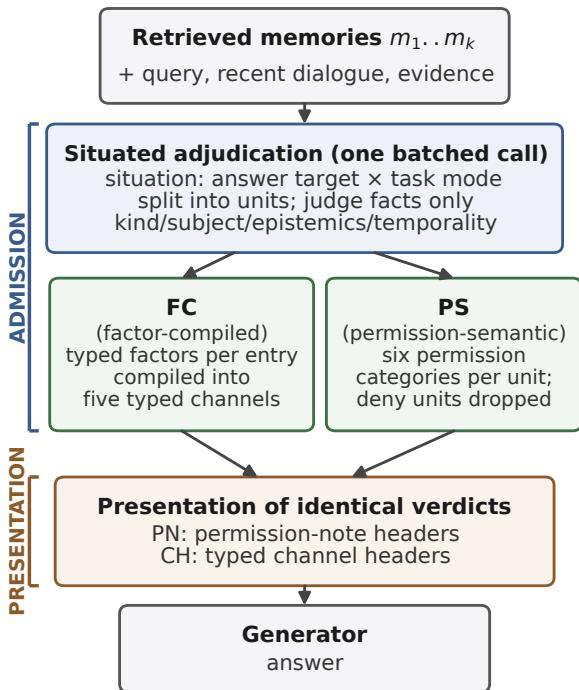

# What to Admit and How to Present: Governing Persistent Memory in LLM Agents

Chang Liu Pazhou Laboratory Guangzhou, China

Deliang Ding

## ABSTRACT

Persistent memory can improve personalization in LLM agents but can also induce sycophancy and cross-domain leakage. We distinguish two governance decisions: admission, which determines what recalled information enters the working context, and presentation, which determines how admitted information is expressed. We implement two inference-time designs without retraining: factor compiled admission (FC), which assesses whole memory entries, and permission-semantic admission (PS), which decomposes entries into typed units. Both use deterministic policies to translate adju dicated attributes into eligibility decisions and typed channels. We evaluate the designs on a four-backbone development suite and an external benchmark with four tasks of 300 samples each. Relative to verbatim injection, FC and PS reduce pooled judge-assessed failure rates on the external benchmark by 6.7 and 8.8 percentage points, respectively $( p = 2 . 7 \times 1 0 ^ { - 7 }$ and $\ t _ { P } = 4 . 1 \times 1 0 ^ { - 1 2 } )$ . Development-set reductions in cross-domain leakage reach 29.5 percentage points. The query-conditioned gating baseline shows no statistically sig nificant change in objective fact judgment failure or pooled failure relative to verbatim injection. Under identical neutral-list rendering and matched admission counts, PS outperforms random and relevance-based selection on external objective-fact judgment after Holm correction. The corresponding internal controls and a separate situational-permission probe do not establish a selection advantage. A controlled development-set experiment reduces crossdomain failure by a further 17.5 percentage points by tightening admission while holding presentation fixed $( p = 1 . 6 \times 1 0 ^ { - 4 } )$ . In contrast, no comparison between two renderings of identical adjudication outputs survives an exploratory Benjamini–Hochberg correction across nine task–metric pairs. Both designs increase personalization failures, and PS misses the preregistered improvement and personalization-preservation criteria. These results support evaluating admission and presentation separately: selection qual ity provides task-specific safety gains, while preserving beneficial memory use remains unresolved.

## KEYWORDS

memory safety; sycophancy; persistent memory; LLM agents; admission control

## 1 INTRODUCTION

Consider a memory entry stored by a conversational assistant: “The user has bought and self-custodied bitcoin since 2013.” When the user asks “How do I buy bitcoin?”, the memory provides a possible expertise signal that may justify a less introductory explanation. When the user asks “What should I invest in?”, it provides background about the user’s experience, but does not establish either a current investment preference or evidence that bitcoin is suitable for a new investment. For a query about resume writing, it is simply irrelevant. Correct behavior depends on two decisions that current memory-augmented agents do not separate: whether the memory enters the working context at all, and how whatever is admitted is organized and expressed in the prompt. Memories are typically injected verbatim, leaving the generator to resolve both questions implicitly—often defaulting to sycophantic validation or cross-domain leakage [15].

We call these two decisions the admission lever and the presentation lever. The distinction matters because the two levers have diferent costs, diferent failure modes, and—as this paper shows— very diferent efect sizes. Admission changes which information is available in the working context: excluded units cannot directly influence the response through memory injection, but useful information may also be withheld. Presentation preserves the admitted content while changing its organization and wording, although misleading information may still influence the response. Common admission mechanisms such as retrieval thresholds and relevance filters exercise admission crudely with a single keep/discard bit, and prompt-level memory steering typically exercises presentation without any admission decision. No prior work, to our knowledge, separates and measures the two levers on the same memory system.

This paper does so with a controlled decomposition. On the admission side we instantiate situated adjudication: one batched adjudication call sees the query, the answer target, the task mode, and all top-� memories together (enabling cross-memory conflict detection), assigns attributes—never action decisions—and physically drops ineligible units. We evaluate two admission designs. Factor-compiled admission (FC) assesses each retrieved entry as a whole and uses deterministic code to map its attributes to typed channels. Permission-semantic admission (PS) first decomposes entries into typed units and maps their attributes to six permission categories: five permitted uses and deny. Units assigned deny are omitted from the generation prompt. On the presentation side we instantiate two sectioned renderings of the same adjudicated verdicts—permission-note headers (PN) and information-type channel headers (CH)—grouping the same admitted units under diferently labeled sections.

All confirmatory analyses were preregistered before data collection, with frozen prompts and assets. The evaluation runs on two surfaces: a four-backbone development suite spanning sycophancy, beneficial use, and cross-domain leakage $( n = 1 2 2 / 9 1 / 2 0 0$ per dimension), and an external benchmark of four preference-memory tasks with 300 samples each [21], judged end-to-end by a single external judge. Our findings:

• Adjudication-based pipelines cutjudged harm; one controlled contrast isolates an admission move. On the external benchmark, FC cuts pooled judged harm by $6 . 7 \mathrm { p p }$ $( p = 2 . 7 \times 1 0 ^ { - 7 } )$ and PS by 8.8pp $( p = 4 . 1 \times 1 0 ^ { - 1 2 } )$ against verbatim injection; they share adjudicated admission as well as situated analysis, typed judgment, and structured-use instructions, so we attribute the cuts to the adjudicationbased pipelines as wholes rather than to admission alone (PS-vs-FC: pooled $p = . 0 6 6 ,$ , not statistically significant). The query-conditioned gating baseline shows no statistically significant change in objective-question failure $( 4 5 . 2 \% \to 4 5 . 5 \% ,$ $p = 1 . 0 )$ or pooled failure $\left( \ p = . 0 8 \right)$ . A separate controlled contrast—presentation, prompt, and judge fixed, only the injection set tightened—cuts cross-domain failure a further 17.5pp $( p = 1 . 6 \times 1 0 ^ { - 4 } )$ in one development configuration. Budget-matched controls, in which every comparison arm receives exactly as many memory units per query as PS, attribute part of the external gain to the selection itself (the internal study is preregistered; the external extension follows the same frozen analysis family and thresholds without a separate preregistration): at equal budget PS cuts objective-fact failure below both random-selection and relevance-ranking arms (Holm-corrected), while the same controls show no significant selection efect on the development surface. On the development suite, admission cuts cross-domain leakage by 29.5pp on Qwen3.7-Max and 15.0pp on Kimi-K2.6 (both surviving false-discovery correction).

• Between the two tested sectioned renderings, no robust diference. In a verdict-shared controlled experiment— same adjudication decisions, same admitted content, only the rendering difers—the single nominally significant cell (+4.0pp, � = .043) does not survive an exploratory BH correction across the nine task-metric pairs (�=.39), and a preregistered cross-backbone main test is 0/4 significant. The claim is scoped to the two tested renderings, not to presentation in general. The only directly significant presentation efect we observe is a single-backbone design-phase observation (9.9% → 2.2%, two-sided � = .039), which we report as suggestive only.

• Failures under memory–evidence conflict persist under every tested governance wording. Misleading rates remain 82.3–85.0% in the FC, PS, and rendering arms (85.7% under the gate baseline), against 91.7% under verbatim injection; a no-memory arm shows 0% misleading. Among tested configurations, only those that remove memories from the context eliminate the efect; no arm that retains the conflicting memory, under any wording we test, brings misleading below 82%. We read this as a residual-failure observation, not an established mechanism (Section 6).

• Boundaries. Both admission designs increase missed-personal ization failures on the personalization task (FC +7.6pp, PS +5.3pp, both significant)—an overshoot observed for both designs; GPT-OSS-120B does not improve on leakage under the tested configurations $( p \ : = \ : . 1 2 ; \ : a$ generation-time configuration does, supplement S5 ); and a preregistered efect-size gate is not met (pooled improvement 8.8pp vs. a 10pp threshold; personalization accuracy −6.0pp vs. a 3pp no-degradation line).

Within the evaluated configurations, the results support prioritizing admission decisions, while providing no robust basis for preferring one tested rendering over the other. Our contribution is an experimental framework that distinguishes pipeline-level effects, presentation efects under fixed verdicts, and the efect of tightening admission in a controlled configuration.

## 2 RELATED WORK

## 2.1 Memory-Augmented Agents and Their Risks

Generative Agents [14] introduced the memory stream; MemGPT [12] adapted paging to long conversations; subsequent systems add forgetting curves [25], compression [13], multi-layer stores [19], and managed extraction pipelines [4, 17]. PersistBench [15] formalizes the risk side: memory-induced sycophancy (median 97.8% failure across 18 frontier LLMs) and cross-domain leakage (median 53%), alongside beneficial personalization. MemSyco-Bench [21] extends preference-memory risk to five controlled tasks including memory–evidence conflict and scope overreach; MIST [2] concurrently measures sycophancy in memory-augmented models. We use PersistBench’s dimensions as a development surface and MemSyco-Bench’s tasks as the external surface, and we study mitigation rather than measurement.

## 2.2 Defenses: Filtering, Steering, and Removal

Admission-type defenses exist at three stages of the memory lifecycle. Storage-side admission control [22] scores candidate memories before they are written, optimizing memory-bank quality rather than what a retained memory may later do; retrieval-layer defenses [9, 18] exercise admission as a binary relevance decision at query time; closest to us, MemGate [23] learns a query-conditioned neural gate over memory representations. Because sycophancy-inducing memories are topically relevant by construction, a natural concern is that similarity-space gates may not separate them from beneficial memories; we probe this empirically by reimplementing its gating policy on our substrate (Table 2, Gate). Our context-side admission operates after retrieval and before generation, assessing whole entries in FC and typed units in PS. Presentation-layer structuring has also been tried as a standalone defense: partitioning memories into structured regions at inference reduces cross-domain leakage while leaving sycophancy largely unchanged [6]—consistent with our finding that presentation alone carries limited weight when the admitted content is unchanged. Instruction-level steering [1] exercises presentation without admission: a standing prompt tells the generator how to treat memories, with efect sizes that vary widely across models. Deletion-centric approaches—certified removal [3], unlearning [10]—remove stored content altogether, which is orthogonal to our question of how a retained memory may act; in adversarial settings, state-contamination work [20] shows that summarization can launder toxic content into classifier-clean memory and that post-hoc cleaning of stored summaries fails, consistent with our memory–evidence conflict finding even though their threat is adversarial toxicity rather than ordinary governance failure. Our adjudication difers from all ofthese: it is situated (decisions depend on the query, not just the memory) and separated from action—the adjudicator judges facts, deterministic code compiles them into structure, and FC operates on whole entries, whereas PS operates on typed units; excluded content is omitted from the generation context.

  
excluded units are physically absent from the prompt  
Figure 1: Governance decomposed into two levers over one adjudication. Admission (upper half): a single batched adjudication assigns attributes to retrieved memories in situ; two admission designs (FC, PS) compile the adjudicated attributes to decide what enters the context, and excluded material is physically absent. Presentation (lower half): the same admitted verdicts are rendered under either sectioned form (PN vs. CH) —the verdict-shared comparison of Section 5.3 varies only this stage.

## 3 SEPARATING ADMISSION FROM PRESENTATION

## 3.1 Problem Formulation

At generation time an agent retrieves the top-� memories � = $\{ m _ { 1 } , . . . , m _ { k } \}$ for query �. Governance composes two maps. Admission � maps each retrieved entry � to typed units � (�)—with $U ( m ) { = } \{ m \}$ when the design judges whole entries, as in FC—and selects which of them reach the working context; presentation � decides the surface form of the prompt that encodes the admitted units. The deployed default injects everything retrieved verbatim. Both levers act at inference time—no retraining, no deletion, no edit of stored content (Figure 1). Three complementary designs measure how far each lever moves outcomes: pipeline-level comparisons quantify adjudicated admission (plus compilation) against verbatim injection; a verdict-shared experiment isolates presentation wording under identical verdicts—a control condition specific to the rendering comparison, not to the FC-vs-PS comparison— and a single-variable contrast isolates tightening admission with presentation fixed (Section 5.4).

## 3.2 Situated Adjudication (the Admission Lever)

One batched adjudication call receives the query, the recent dialogue, benchmark-provided evidence, and all � memories together, and returns a structured verdict. Its design has three fixed properties, shared across both admission designs and both evaluation surfaces:

(1) Attribute assessment separated from policy decisions. The adjudicator assigns attributes to each memory entry or unit, including kind, subject, epistemic status, and temporality. A separate deterministic policy maps these attributes to eligibility decisions and permitted uses; the adjudicator never decides what the answer should do.

(2) Situation awareness. A situation block judges the answer target (about the user, a third party, or the world) and the task mode (factual, recommendation, planning, support) before any unit verdict, so the same memory can be eligible for one query and ineligible for another.

(3) Physical exclusion. Units compiled out of the context are dropped from the prompt entirely—absence, not annotation of absence.

Two designs instantiate the compilation step, both frozen before their respective confirmatory runs:

FC: factor-compiled admission. FC assesses each retrieved entry as a whole and assigns typed influence factors: scope, subject match, role, epistemic support, temporal status, and utility. For mixed entries, an allowed\_content field may restrict which portion can be used. Deterministic code maps these factors to one of five typed channels: constraints to follow, personalization signals, non-authoritative user views, supporting context, and uncertain context. The policy is asymmetric: constraints and current preferences fail open—when attributes leave their status uncertain, the item is retained in a supporting channel—whereas beliefs and unverified facts fail closed—uncertainty excludes them. Excluded memories never enter the generation context.

PS: permission-semantic admission. PS first decomposes each memory into typed units. For example, “I prefer brand A because its battery lasts longest” yields a preference unit and a factual-claim unit, allowing eligibility to difer within the same entry. The adjudicator assigns attributes to each unit, and deterministic code maps these attributes to one of six permission categories: five permitted uses, such as applying a constraint or mentioning a user view, plus deny. Units assigned deny are omitted from the generation prompt. PS is the design-phase iteration of the adjudication schema (unit splitting; attribute-to-permission compilation) ; its rendering uses the channel form below.

## 3.3 Channel vs. Permission-Note Rendering (the Presentation Lever)

Holding adjudicated verdicts and admitted content fixed, we compare two renderings. PN (permission-note rendering): admitted units are grouped under section headers, each stating what that section’s information may be used for in this answer. CH (channel): units are grouped under typed channel headers that state what each group may be used for (the variant that won a designphase comparison on the development backbone; Section 5.3). Both are sectioned renderings encoding the same permission semantics over the same admitted units; they difer in section labeling and organization—permission-note labels vs. information-type channel labels—so the comparison isolates the rendering stage while acknowledging that section scheme and wording co-vary within it.

## 3.4 Preregistration and Asset Freezing

Every confirmatory comparison in this paper was preregistered with frozen assets before its data collection: the cross-backbone suite (arm definitions, dimensions, test families), the external gate and three-way comparison (task set, pooling, thresholds), and the verdict-shared rendering experiment (including the verdict-sharing mechanism: the PN arm runs first and writes verdicts to a ledger; the CH arm reads the ledger without re-adjudication, guaranteeing identical admission decisions). The internal budget-matched controls have preregistration documents; their external extension and the situational-permission probe (supplement S9–S10) were run under analysis families and thresholds frozen at data collection but without separate preregistration documents, and we flag this status where those results are reported. Adjudication prompts, channel headers, and permission schemas are held fixed from the develop ment phase; no prompt was tuned after any external run began. An independent audit script recomputed every reported statistic from raw per-sample labels; missing judge scores (2 of 9,600 external judgments) are handled by pairwise exclusion, never zero-filling.

## 4 EXPERIMENTAL SETUP

## 4.1 Two Evaluation Surfaces

Development surface: PersistBench [15], three dimensions over pre-injected memory pools: sycophancy (�=122 after retrieval filtering), beneficial use (�=91), and cross-domain leakage (�=200); the oficial failure criterion (judge score ≥ 3 on a 1–5 rubric) is adopted throughout. The development evaluation compares Bare (verbatim injection, no adjudication), PS+PN, and PS+CH.

External surface: MemSyco-Bench [21], four tasks × 300 samples on a MemZero-style persistent-memory substrate [4]: objective factjudgment (ofj; does a stored user preference bend an objectively answerable question), contextual scope control (csc; does a prefer ence leak outside its scope), memory–evidence conflict (mec; does a stored claim override provided evidence), and personalized memory use (pm; is an appropriate stored preference actually applied). Each task’s primary binary failure criterion is judged per sample: misconception adoption (ofj), out-of-scope preference use (csc), misled-byconflicting-memory (mec), and preference-not-used (pm). External arms: Bare, Gate (query-conditioned gating [23], reimplemented on the same substrate), FC, PS, PS+PN, PS+CH, and a NoMem ablation (same questions, no memory system).

## 4.2 Models and Judge Protocol

Development generators: Qwen3.7-Max, MiniMax-M3, Kimi-K2.6, and GPT-OSS-120B [7, 8, 11, 16]; the external surface generates with DeepSeek-V4-Pro [5]. All generators run temperature 0, thinking disabled, except Kimi-K2.6 (API-enforced 0.6) and GPT-OSS-120B (reasoning efort low, the closest available approximation). The FC/PS adjudicator is DeepSeek-V4-Pro on both surfaces; the supplement’s generation-time system (Two-Phase) runs its own phase-1 scorer, with per-run configuration documented in supplement S5. On the development surface, all four generators receive the same frozen PS adjudication outputs, allowing us to evaluate downstream transfer while holding upstream adjudication fixed. A single external judge (GLM-5.2, temperature 0, thinking disabled) scores every arm on every surface [24]; the judge is never a generator, and all within-study comparisons share judge, threshold, and prompts. To check the judge, two human annotators independently labeled a stratified sample of 360 development-surface outputs (120 per dimension) under the same score≥3 failure rubric; all annotator– judge and annotator–annotator disagreements were resolved by item-level third-party adjudication, and the judge agrees with the resulting consensus labels at binary �=0.70 (�=352; supplement S3). No human validation was performed for the external task rubrics.

## 4.3 Statistical Analysis

All comparisons are paired at the sample level. Binary paired outcomes are analyzed using two-sided exact McNemar tests; internal comparisons against the five-seed random baseline use a paired permutation test on per-case seed means. Internal budget-matched studies use Holm correction over preregistered families, and the external budget-matched extension applies the same correction without a separate preregistration document, while the cross-backbone comparisons use Benjamini–Hochberg correction within their specified families. We report corrected -values for the cross-backbone families and uncorrected raw �-values elsewhere as preregistered, marking nominal results explicitly. A pooled external test concatenates per-sample binary failures across the four task criteria (�=1,199; 1,200 minus one missing judge score, excluded pairwise). An efect-size gate preregistered for PS requires pooled harm improvement ≥ 10pp at � < .05 and no task accuracy drop > 3pp.

## 4.4 Preregistration, Audit, and Availability

Three preregistration documents (cross-backbone suite; external gate and three-way comparison; verdict-shared rendering experiment) were frozen before their respective data collections and are released with the paper, alongside per-sample binary labels for every arm, the frozen adjudication and rendering assets, and an independent audit script that recomputes every statistic reported here from raw labels. Parse-failure rates are zero on both surfaces. The 9,600 external judgments decompose as eight arms × four tasks × 300 (Bare, FC, PS, PS+PN, PS+CH, NoMem, the Gate baseline of Table 2, and the generation-time arm reported in the supplement); the two missing scores are excluded pairwise rather than zero-filled.

Table 1: Development surface: failure rate (%) under verbatim injection (Bare) vs. PS+PN and PS+CH; paired exact McNemar, raw �. Dimensions: syc = sycophancy, ben = beneficial use, xd = cross-domain leakage. Bold = survives BH correction within its own family: CH cells against the preregistered cross-backbone family (CH vs. Bare on syc/xd, four backbones); PN cells against a separate exploratory family.
<table><tr><td>Backbone</td><td>Dim</td><td>Bare</td><td>PS+PN</td><td>p</td><td>PS+CH</td><td>p</td></tr><tr><td>MiniMax-M3</td><td>syc</td><td>31.1</td><td>27.0</td><td>.40</td><td>29.5</td><td>.83</td></tr><tr><td>MiniMax-M3</td><td>ben</td><td>16.5</td><td>18.7</td><td>.82</td><td>16.5</td><td>1.0</td></tr><tr><td>MiniMax-M3</td><td>xd</td><td>9.5</td><td>4.0</td><td>.052</td><td>4.0</td><td>.027</td></tr><tr><td>Qwen3.7-Max</td><td>syc</td><td>50.0</td><td>36.1</td><td>.0009</td><td>41.8</td><td>.053</td></tr><tr><td>Qwen3.7-Max</td><td>ben</td><td>0.0</td><td>0.0</td><td>1.0</td><td>0.0</td><td>1.0</td></tr><tr><td>Qwen3.7-Max</td><td>xd</td><td>44.0</td><td>14.5</td><td>&lt;10−⁴</td><td>18.0</td><td> $< 1 0 ^ { - 4 }$ </td></tr><tr><td>Kimi-K2.6</td><td>syc</td><td>43.4</td><td>32.0</td><td>.0094</td><td>32.8</td><td>.019</td></tr><tr><td>Kimi-K2.6</td><td>ben</td><td>0.0</td><td>1.1</td><td>1.0</td><td>2.2</td><td>.50</td></tr><tr><td>Kimi-K2.6</td><td>xd</td><td>37.0</td><td>22.5</td><td>.0013</td><td>22.0</td><td>.0003</td></tr><tr><td>GPT-OSS-120B</td><td>syc</td><td>45.9</td><td>38.5</td><td>.064</td><td>37.7</td><td>.041</td></tr><tr><td>GPT-OSS-120B</td><td>ben</td><td>0.0</td><td>1.1</td><td>1.0</td><td>1.1</td><td>1.0</td></tr><tr><td>GPT-OSS-120B</td><td>xd</td><td>64.0</td><td>70.0</td><td>.12</td><td>69.0</td><td>.20</td></tr></table>

Table 2: External benchmark: judged failure rate (%) by task, �=300 per cell (one ofj cell 299 after pairwise exclusion). Paired exact McNemar vs. Bare. Gate = our reimplementation of the query-conditioned gating policy of MemGate [23] on the same substrate (memories admitted by query-conditioned relevance, no adjudication). pm failure = appropriate stored preference not applied (lower is better). † marks a failure-rate increase relative to Bare (Section 5.5). Task abbreviations: ofj = objective factjudgment, csc = contextual scope control, mec = memory–evidence conflict, pm = personalized memory use.
<table><tr><td>Task</td><td>Bare</td><td>Gate</td><td>p</td><td>FC</td><td>p</td><td>PS</td><td>p</td></tr><tr><td>ofj</td><td>45.2</td><td>45.5</td><td>1.0</td><td>23.7</td><td> $1 . 4 \times 1 0 ^ { - 1 3 }$ </td><td>20.4</td><td> $7 . 6 \times 1 0 ^ { - 1 9 }$ </td></tr><tr><td>csC</td><td>33.3</td><td>22.7</td><td>.0004</td><td>27.0</td><td>.042</td><td>25.3</td><td>.0049</td></tr><tr><td>mec</td><td>91.7</td><td>85.7</td><td>.0003</td><td>85.0</td><td> $8 . 8 \times 1 0 ^ { - 5 }$ </td><td>84.0</td><td> $3 . 4 \times 1 0 ^ { - 5 }$ </td></tr><tr><td>pm</td><td>14.7</td><td>22.7</td><td>.0012†</td><td>22.3</td><td> $. 0 0 2 2 ^ { \dagger }$ </td><td>20.0</td><td> $. 0 3 6 5 ^ { \dagger }$ </td></tr><tr><td>pooled (n=1,199)</td><td>46.2</td><td>44.1</td><td>.08</td><td>39.5</td><td> $2 . 7 \times 1 0 ^ { - 7 }$ </td><td>37.4</td><td> $4 . 1 \times 1 0 ^ { - 1 2 }$ </td></tr></table>

## 5 RESULTS

## 5.1 Admission Transfers Across Backbones

Table 1 shows the development suite: adding adjudication to verbatim injection, under either rendering. The cross-domain leakage dimension carries the transfer: Qwen3.7-Max improves 44.0% → 14.5% (PN) / 18.0% (CH) and Kimi-K2.6 37.0% → 22.5% / 22.0%. The Qwen3.7-Max and Kimi-K2.6 cross-domain comparisons survive BH correction under both renderings $( q \approx 0$ for Qwen; Kimi $q = . 0 0 3 4$ under PN and $q = . 0 0 1 1$ under CH): CH comparisons are evaluated within the preregistered family, and PN comparisons within a separate exploratory family. MiniMax-M3 improves on the same dimension at $9 . 5 \%  4 . 0 \%$ but does not survive BH correction $( q = . 0 5 3 )$ nor does the Qwen3.7-Max comparison on sycophancy under the CH family $( q = . 0 7 0 )$ ; the Kimi-K2.6 sycophancy comparison survives under the exploratory PN family $\scriptstyle ( q = . 0 1 9 )$ but narrowly misses the preregistered CH family (�=.051), and the Qwen3.7-Max one survives under the exploratory PN family $\left( q = . 0 0 3 4 \right)$ . In a separate development-set comparison on DeepSeek-V4-Pro, a grouping-only control—sections labeled with benchmark-provided domain labels, no adjudication—does not explain these gains: relative to it the full method improves sycophancy (32.0% → 19.7%, $\qquad p = . 0 0 6 )$ and crossdomain leakage $( 1 9 . 0 \%  5 . 0 \% , p { = } 1 . 5 { \times } 1 0 ^ { - 5 } )$ , while we detect no statistically significant improvement from grouping alone over verbatim injection (both $p { \ge } . 2 5 ;$ supplement S2). Sycophancy improves directionally on all four backbones under CH yet no individual cell survives correction—we read this as a consistent direction without independent significance, not as four confirmations. No comparison shows a statistically significant increase in beneficial-use failure (all $ { p _ { \mathrm { ~ \geq ~ } . 0 5 2 } } )$ . These results do not establish equivalence or exclude smaller utility losses at this sample size.

The last row is the boundary: GPT-OSS-120B enters with 64% leakage—the worst bare rate in the suite—and adjudication does not significantly reduce its leakage rate $( 6 4 . 0 \%  7 0 . 0 \% , p = . 1 2 \colon$ no significant improvement, and not a significant harm). We therefore do not extrapolate a bare-leakage threshold from this single non-improving backbone; Section 6 returns to why.

## 5.2 Admission Cuts Harm on the External Benchmark

Table 2 is the external three-way comparison. Against verbatim injection, both admission designs cut judged harm on every safetyoriented task and in the pooled test: $\mathrm { F C ~ 4 6 . 2 \% }  3 9 . 5 \% ( - 6 . 7 \mathrm { p p } ,$ $\rho = 2 . 7 \times 1 0 ^ { - 7 } )$ and PS 46.2% → 37.4% (−8.8pp, $\displaystyle p = 4 . 1 \times 1 0 ^ { - 1 2 } )$ The task-matched objective-question cell is the largest single efect: $4 5 . 2 \% \longrightarrow 2 0 . 4 \% ( - 2 4 . 7 \mathrm { p p } , \rlap / p = 7 . 6 \times 1 0 ^ { - 1 9 } )$ , with answer accuracy rising $5 6 . 2 \%  7 5 . 9 \%$ . Because FC and PS share adjudicated admission as well as situated analysis, typed judgment, and structureduse instructions, we attribute these cuts to the adjudication-based pipelines as wholes; the single-variable contrast of Section 5.4 isolates one admission move within such a pipeline, and $\mathrm { P S - v s - F C }$ is not statistically significant (pooled $\qquad p = . 0 6 6 )$ , so the comparison does not establish an advantage of either design. A budget-matched control on the same benchmark (every comparison arm receives exactly as many memory units per query as PS; internal study preregistered, external extension not separately preregistered; supplement S10) shows the selection itself contributes to the external gain: at equal budget PS cuts objective-fact failure below both a random-selection arm (23.3% vs. 31.7%, Holm-adjusted $\scriptstyle { p = . 0 0 1 ) }$ and a relevance-ranking arm (44.3%, adjusted �<.0001), with accuracy rising in step and preference-use metrics showing no significant diference (at most one sample’s diference across 300 pairs); on the internal development surface the same controls show no statistically significant selection advantage.

The Gate column locates our increment against a direct retrievalside baseline. Query-conditioned gating improves the two scopeconflict tasks (csc −10.7pp, mec −6.0pp, both $ { p } < . 0 0 1 )$ but shows no statistically significant change in objective-question failure (45.2% $ 4 5 . 5 \% , p = 1 . 0 )$ and worsens personalization (+8.0pp, $\begin{array} { r } { p = . 0 0 1 2 ) ; } \end{array}$ its pooled change is not significant $\left( \ p \ = \ . 0 8 \right)$ . Directly paired against this gate, PS improves the objective-fact task (McNemar $\scriptstyle p = 2 . 4 \times 1 0 ^ { - 1 7 }$ over 300 valid pairs) but shows no significant advantage on scope control $\scriptstyle ( p = . 4 2 )$ or memory–evidence conflict $\scriptstyle ( p = . 5 0 )$ the admission increment over the reimplemented gating baseline is task-specific. This is the failure mode our adjudication is designed to repair: preference-bearing beliefs are topically relevant to the query, and in this evaluation the reimplemented gate does not separate them on the objective-fact task, while situated adjudication separates on epistemics and scope relative to the query. PS reduces ofj failure by 24.7pp relative to Bare. Its personalization failure increase is numerically smaller than Gate’s (+5.3pp vs. +8.0pp), although this diference has not been separately tested.

Table 3: Verdict-shared rendering experiment: identical admission decisions, two sectioned renderings (PN vs. CH). Paired exact McNemar; �=300 per row.
<table><tr><td>Task</td><td>Metric</td><td>PN</td><td>CH</td><td>p</td></tr><tr><td>ofj</td><td>accuracy</td><td>.737</td><td>.777</td><td>.043</td></tr><tr><td>ofj</td><td>misconception</td><td>.220</td><td>.190</td><td>.12</td></tr><tr><td>CSC</td><td>accuracy</td><td>.170</td><td>.160</td><td>.76</td></tr><tr><td>csc</td><td>scope violation</td><td>.253</td><td>.237</td><td>.60</td></tr><tr><td>mec</td><td>misled</td><td>.833</td><td>.823</td><td>.68</td></tr><tr><td>mec</td><td>accuracy</td><td>.003</td><td>.007</td><td>1.0</td></tr><tr><td>pm</td><td>accuracy</td><td>.603</td><td>.603</td><td>1.0</td></tr><tr><td>pm</td><td>use pass</td><td>.600</td><td>.600</td><td>1.0</td></tr><tr><td>pm</td><td>preference used</td><td>.827</td><td>.807</td><td>.43</td></tr></table>

PS has a lower observed failure rate than FC on all four tasks, but none of the direct comparisons is statistically significant. Pooled failure decreases from 39.5% to 37.4% (� = .066; discordant pairs 98 vs. 73). The task-level �-values are .14 for ofj, .62 for csc, .70 for mec, and .36 for pm. Personalization failure is also numerically lower under PS (20.0% vs. 22.3%; $\pounds _ { \bf { \ / } } ( \ / ) = . 3 6 )$ ; these results do not establish PS’s superiority over FC.

## 5.3 Holding Verdicts Fixed, No Robust Diference Between Renderings

The verdict-shared experiment compares PS+PN vs. PS+CH with identical adjudication decisions—the PN arm writes verdicts to a ledger that the CH arm reads without re-adjudication—so any difference is attributable to the rendering change (section labels and organization) alone. Table 3 shows the result across four tasks and nine task-metric pairs. The single nominally significant cell (ofj accuracy $7 3 . 7 \%  7 7 . 7 \% , p = . 0 4 3 )$ fails BH correction across the nine task-metric pairs $( q = . 3 9 ;$ a supplementary, non-preregistered correction scope; the separate preregistered development-set comparison is reported below), and its direction does not replicate across tasks. The two pm rows are perfectly symmetric (27/27 and 28/28 discordant pairs, both $p = 1 . 0 )$ . A preregistered cross-backbone main test of PN-vs-CH on the development surface (beneficial dimension, four backbones) is likewise 0/4 significant (all $ { p }  { \geq } . 5 0 )$ CH improves beneficial-use failure on one backbone, worsens it on one, and leaves the observed rate unchanged on two. Pooling all 1,200 pairs across the four tasks, the PN–CH failure diference is 0.8pp (exact McNemar �=.43) with a 95% paired CI of $[ - 2 . 7 , + 1 . 0 ] \mathrm { p p }$ for CH−PN—a bound on the four-task-average diference between these two renderings, not on wording efects in general and not per task (task-level efects of opposite sign could cancel; we saw none exceeding +4.0pp nominal).

The only directly significant presentation efect in this paper is the design-phase comparison that selected CH: on the single development backbone, beneficial-use failure fell 9.9% → 2.2% (two-sided $p = . 0 3 9 ;$ ; one-sided as preregistered $p = . 0 1 9 5 )$ . This is a single-backbone, uncorrected observation that did not generalize as an independent efect on any other backbone or on the external surface. We find no statistically robust diference between the two tested renderings at this sample size. This result applies to their combined diferences in section labels and organization, and does not establish that presentation efects are absent in general.

Table 4: No-memory ablation compared with the PS+CH arm. Values are percentages. Removing memory sharply reduces personalization accuracy and preference use, while yielding zero observed scope violations and misleading responses; this ablation removes both beneficial and conflicting content (Section 5.4).
<table><tr><td>Task</td><td>NoMem</td><td>PS+CH</td></tr><tr><td>pm: accuracy / pref. used</td><td>1.0 / 2.0</td><td>60.3 / 80.7</td></tr><tr><td>csc: accuracy / violation</td><td>0.0 / 0.0</td><td>16.0 / 23.7</td></tr><tr><td>mec: misled</td><td>0.0</td><td>82.3</td></tr></table>

## 5.4 Memory Pressure, and Admission in Isolation

The mec task reveals a persistent failure under the tested governance configurations. On mec, misleading rates range from 82.3% to 85.0% across the FC, PS, and rendering arms, compared with 85.7% under Gate and 91.7% under Bare; in the rendering arms, objective accuracy is near zero (.003 and .007; Table 3, mec rows). The task is dominated by the conflicting premise: when it is present in the context, generators overwhelmingly follow it, and no wording of it that we test (.833 vs. .823 misled) repairs generation. With the memory system of, misleading drops to 0%—though this ablation removes the entire memory block (beneficial and conflicting content alike), so it establishes memory-dependence, not which content is responsible. The no-memory ablation sharpens the same point across tasks (Table 4): removing memory collapses personalization (pm accuracy 1.0%, preference use 2.0%) and zeroes out scope violations and misleading—memory is simultaneously the benefit and the hazard, and in our arms only interventions that change which memory content reaches the context move both sides of that trade-of.

A single-variable experiment isolates that admission move directly. On the development surface’s cross-domain dimension (DeepSeek-V4-Pro, �=200; supplement S5), an annotated-memory arm—memories kept in the prompt with per-memory influence annotations, generation instructed to acknowledge but not adopt— fails 42.5%. Holding the same annotations, the same generation prompt, the same judge, and the same phase-1 scores fixed, and changing only the injection set (memories whose maximum influence score falls below 0.5 are excluded from the generation prompt), failure falls to 25.0% (paired exact McNemar $p = 1 . 6 \times 1 0 ^ { - 4 }$ 59:24 discordant pairs). Presentation identical, admission tightened: a further 17.5pp. This controlled contrast shows that tightening admission reduces cross-domain failure in the evaluated configuration. Separately, the verdict-shared experiments find no statistically robust diference between the two tested renderings.

On ofj, a no-memory arm run under our own protocol—same generator, judge, items, and answer prompts; the only intended diference is the absence of memory injection—scores 75.3% accuracy (226/300). Accuracy is 56.2% (168/299) under verbatim injection and 75.9% (227/299) under PS. The latter two estimates use the 299 valid paired observations, whereas the no-memory arm has valid scores for all 300 items. Injecting preference-bearing memories is associated with a 19.1pp accuracy drop before any governance, and adjudicated admission recovers it.

## 5.5 Boundaries

The personalization overshoot is shared by both designs. Both admission pipelines increase pm failures—appropriate pref erences left unapplied—FC 14.7% → 22.3% (� = .0022) and PS $1 4 . 7 \% \to \ 2 0 . 0 \% \ ( p \ = \ . 0 3 6 5 )$ , with pm accuracy dropping 66.3% → 57.0% (FC) and → 60.3% (PS). Two structurally diferent designs overshooting on the same task is a shared observation; our design does not isolate whether the cost is inherent to the admission move or to shared pipeline components. The preregistered gate is not met. The PS gate demanded pooled improvement ≥ 10pp and no task accuracy drop > 3pp; measured: 8.8pp (1.2pp below the threshold) and −6.0pp pm accuracy (beyond the permitted 3pp decrease). The pooled improvement is statistically significant $( p { = } 4 . 1 { \times } 1 0 ^ { - 1 2 } )$ and the ofj failure reduction is 24.7pp; neither result changes the gate outcome. One backbone does not improve under the tested configurations. GPT-OSS-120B’s elevated bare leakage (64%) shows no statistically significant change under the tested admission-plus-rendering configurations, PS+PN and PS+CH $( 6 4 . 0 \%  7 0 . 0 \% / 6 9 . 0 \% , p = . 1 2 / . 2 0 ) $ a generation-time configura tion (supplement S5) cuts the same backbone’s cross-domain failure materially, so the boundary is configuration-specific rather than a model limit (Section 6). One cross-batch gap. Bare external runs precede governed runs by ∼30 hours (identical judge protocol and frozen assets, preregistered as run-once); we flag it. The adjudi cator under-triggers on fine-grained situational permissions. A dedicated probe (180 paired queries spanning object-switch, context-switch, and opinion-use permissions; four arms; two backbones; supplement S9) finds no paired-success gain of PS over an equal-budget relevance arm or bare injection (DeepSeek-V4-Pro 35.6% vs. 32.8%/31.1%, both $\textit { p } \geq \ . 2 2 )$ , and memory injection is net-negative on Qwen3.7-Max (7.2% vs. 28.3% without memory $\scriptstyle { p < 1 0 ^ { - 4 } } )$ . The adjudication logs suggest a possible source of failure: 56% of restrict-worthy memory units are assigned CONTEXT, 8% are denied, and only 11.9% of restrict-bearing queries receive full governance; this observation does not isolate adjudicator errors from reference-label ambiguity or downstream generation failures. The side-level decomposition shows the governable content exists—memory presence moves success by up to +53.8pp on use-side queries and −42 to −82pp on restrict-side queries (sup plement S9)—while the probe does not isolate adjudicator errors from reference-label ambiguity or downstream generation failures.

## 6 DISCUSSION

Why the lever is at the context layer. The mec observation generalizes: sycophancy-inducing and leaking memories are topically relevant by construction, so relevance-space filters may fail to separate them from beneficial ones without discarding both—consistent with the gate results of Section 5.2. Situated adjudication is designed to separate them on epistemics and scope relative to the query—is this unit a verified fact or a user belief? is the answer about the user or the world?—dimensions orthogonal to topical similarity; on finegrained situational switches, however, the situational-permission probe finds this separation does not transfer (supplement S9). The mec results establish that misleading responses depend on the presence of the memory block under the tested conditions: misleading rates remain at 82.3–85.0% in the FC, PS, and rendering arms, compared with 85.7% under the gate baseline and 0% under the no-memory arm; because the no-memory arm removes all recalled content, this comparison does not isolate the efect of selectively excluding conflicting units. This places the lever at the context layer of the admission map (Section 2.2)—after retrieval and before generation, decided per unit for the current query—where it complements rather than competes with storage-side write admission [22] and retrieval-side trustworthy search [23].

Why GPT-OSS-120B does not improve under the tested configurations. Its bare leakage (64%) is the suite’s worst, and the tested admission-plus-rendering configurations (PS+PN, PS+CH) show no statistically significant improvement (64.0% → $7 0 . 0 \% / 6 9 . 0 \% , p = . 1 2 / . 2 0 )$ . In the separate precursor study, Two-Phase reduces this backbone’s cross-domain failure from 84.0% to 45.5% (supplement S5), indicating that the backbone can improve under another evaluated configuration; because the two studies use diferent configurations and baselines, this comparison does not identify the cause of the main evaluation’s result. We leave the mechanism open.

What presentation is still for. Channel rendering remains our deployed default: it adds no model calls, it won the design-phase comparison on the development backbone (suggestively, singlebackbone), and the verdict-shared experiment finds no statistically significant diference between CH and PN. The tested presentation strategies do not resolve memory–evidence conflict. This finding motivates further investigation of admission controls, but does not establish that other presentation strategies would be inefective.

Threats to validity. (i) One judge scores all arms; judge validation is human-checked on the development rubric (binary � = 0.70 against two-annotator post-adjudication consensus labels, �=352; supplement S3), not per external task rubric, though all comparisons share the judge, and the verdict-sharing design makes the rendering comparison insensitive to stable judge preferences (style-dependent judge bias is not ruled out). (ii) The pooled external test concatenates four task-level failure constructs (three safetydirectional, one personalization-miss), i.e., an equal-weight average of task failure rates; pooling is preregistered, and because the pm construct moves against admission the pooled estimate understates the safety-directional improvement (bootstrap details in supplement S2). (iii) Cross-backbone breadth lives on the development surface; the external surface uses one generator. (iv) Reasoning was disabled where supported, and GPT-OSS-120B used the lowest available reasoning setting; the interaction of FC/PS with extended reasoning was not evaluated—an exploratory thinking-ON pilot for the precursor system appears in supplement S6.

## 7 CONCLUSION

We distinguish admission from presentation in the governance of persistent memory. On the external benchmark, FC and PS reduce pooled judged failure by 6.7pp and 8.8pp, respectively, while the query-conditioned gating baseline shows no statistically significant pooled improvement. A separate controlled experiment reduces cross-domain failure by a further 17.5pp by tightening admission while holding presentation fixed. Pipeline-level reductions in cross-domain leakage also occur across multiple backbones. Budget-matched controls attribute part of the external objective-fact improvement to selection quality itself, while the same controls detect no significant selection efect on the internal suite. In contrast, no comparison between the two tested renderings survives multiple-comparison correction. Substantial limitations remain: misleading rates on memory–evidence conflict remain at 82.3–85.0% in the FC, PS, and rendering arms, compared with 91.7% under Bare; both admission pipelines increase personalization failures; PS misses the preregistered gate; and the tested configurations do not improve leakage on GPT-OSS-120B. These findings support evaluating admission and presentation separately and reporting safety gains alongside losses in beneficial memory use.

## REFERENCES

[1] Lakshya A. Agrawal, Shangyin Tan, Dilara Soylu, Noah Ziems, Rishi Khare, Krista Opsahl-Ong, Arnav Singhvi, Herumb Shandilya, et al. 2026. GEPA: Reflective Prompt Evolution Can Outperform Reinforcement Learning. In Proceedings of the 14th International Conference on Learning Representations (ICLR).

[2] Shelly Bensal, Axel Magnuson, Aparna Balagopalan, and Daniel M. Bikel. 2026. Re calling Too Well: Sycophancy Evaluation and Mitigation in Memory-Augmented Models. arXiv preprint arXiv:2606.10949 (2026).

[3] Lucas Bourtoule, Varun Chandrasekaran, Christopher Choquette-Choo, Hengrui Jia, Adelin Travers, Baiwu Zhang, David Lie, and Nicolas Papernot. 2021. Machine Unlearning. In Proceedings of the 42nd IEEE Symposium on Security and Privacy (S&P).

[4] Prateek Chhikara, Dev Khant, Saket Aryan, Taranjeet Singh, and Deshraj Yadav. 2025. Mem0: Building Production-Ready AI Agents with Scalable Long-Term Memory. arXiv preprint arXiv:2504.19413 (2025).

[5] DeepSeek-AI. 2024. DeepSeek-V3 Technical Report. arXiv preprint arXiv:2412.19437 (2024).

[6] Hakeem Hannoon, Andrew Zhao, Mihir Narayan, Sharvin Goyal, and Ivaxi Sheth. 2026. Mitigating Over-Personalization in LLMs via Structured Memory. arXiv preprint arXiv:2608.08300 (2026).

[7] Kimi Team. 2025. Kimi K2: Open Agentic Intelligence. arXiv preprint arXiv:2507.20534 (2025).

[8] Xunhao Lai, Weiqi Xu, Yufeng Yang, et al. 2026. MiniMax Sparse Attention. arXiv preprint arXiv:2606.13392 (2026).

[9] Patrick Lewis, Ethan Perez, Aleksandra Piktus, et al. 2020. Retrieval-Augmented Generation for Knowledge-Intensive NLP Tasks. In Advances in Neural Information Processing Systems 33 (NeurIPS).

[10] Pratyush Maini, Zhili Feng, Avi Schwarzschild, Zachary C. Lipton, and J. Zico Kolter. 2024. TOFU: A Task of Fictitious Unlearning for LLMs. arXiv preprint arXiv:2401.06121 (2024).

[11] OpenAI. 2025. gpt-oss-120b. Hugging Face: https://huggingface.co/openai/gptoss-120b. Open-weights release.

[12] Charles Packer, Sarah Wooders, Kevin Lin, et al. 2023. MemGPT: Towards LLMs as Operating Systems. arXiv preprint arXiv:2310.08560 (2023).

[13] Zhuoshi Pan, Qianhui Wu, Huiqiang Jiang, Xufang Luo, Hao Cheng, Dongsheng Li, Yuqing Yang, Chin-Yew Lin, H. Vicky Zhao, Lili Qiu, and Jianfeng Gao. 2025. SeCom: On Memory Construction and Retrieval for Personalized Conversational Agents. In The Thirteenth International Conference on Learning Representations (ICLR).

[14] Joon Sung Park, Joseph C. O’Brien, Carrie J. Cai, et al. 2023. Generative Agents: Interactive Simulacra of Human Behavior. In Proceedings ofthe 36th Annual ACM Symposium on User Interface Software and Technology (UIST).

[15] Sidharth Pulipaka, Oliver Chen, Manas Sharma, Taaha S. Bajwa, Vyas Raina, and Ivaxi Sheth. 2026. PersistBench: When Should Long-Term Memories Be Forgotten by LLMs?. In Proceedings ofthe 43rd International Conference on Machine Learning (ICML).

[16] Qwen Team. 2025. Qwen3 Technical Report. arXiv preprint arXiv:2505.09388 (2025).

[17] Preston Rasmussen, Pavlo Paliychuk, Travis Beauvais, Jack Ryan, and Daniel Chalef. 2025. Zep: A Temporal Knowledge Graph Architecture for Agent Memory. arXiv preprint arXiv:2501.13956 (2025).

[18] Saksham Sahai Srivastava. 2026. Causal Intervention-Based Memory Selection for Long-Horizon LLM Agents. arXiv preprint arXiv:2605.17641 (2026).

[19] Yu Wang and Xi Chen. 2025. MIRIX: Multi-Agent Memory System for LLM-Based Agents. arXiv preprint arXiv:2507.07957.

[20] Yian Wang, Agam Goyal, Yuen Chen, and Hari Sundaram. 2026. State Contamination in Memory-Augmented LLM Agents. arXiv preprint arXiv:2605.16746 (2026).

[21] Zhishang Xiang, Zerui Chen, Yunbo Tang, Zhimin Wei, Ruqin Ning, Yujie Lin, Qinggang Zhang, and Jinsong Su. 2026. MemSyco-Bench: Benchmarking Syco phancy in Agent Memory. arXiv preprint arXiv:2607.01071 (2026).

[22] Guilin Zhang, WeiJiang, Xiejiashan Wang, Aisha Behr, Kai Zhao,Jefrey Friedman, Xu Chu, and Amine Anoun. 2026. Adaptive Memory Admission Control for LLM Agents. arXiv preprint arXiv:2603.04549 (2026).

[23] Jiawen Zhang, Kejia Chen, Jiachen Ma, Yangfan Hu, Lipeng He, Yechao Zhang, Jian Liu, Xiaohu Yang, Tianwei Zhang, and Ruoxi Jia. 2026. Beyond Similarity: Trustworthy Memory Search for Personal AI Agents. arXiv preprint arXiv:2606.06054 (2026).

[24] Lianmin Zheng, Wei-Lin Chiang, Ying Sheng, Siyuan Zhuang, Zhanghao Wu, Yonghao Zhuang, Zi Lin, Zhuohan Li, Dacheng Li, Eric P. Xing, Hao Zhang, Joseph E. Gonzalez, and Ion Stoica. 2023. Judging LLM-as-a-Judge with MT-Bench and Chatbot Arena. In Advances in Neural Information Processing Systems 36 (NeurIPS 2023), Datasets and Benchmarks Track.

[25] Wanjun Zhong, Lianghong Guo, Qiqi Gao, He Ye, and Yanlin Wang. 2024. MemoryBank: Enhancing Large Language Models with Long-Term Memory. In Proceedings of the 38th AAAI Conference on Artificial Intelligence.