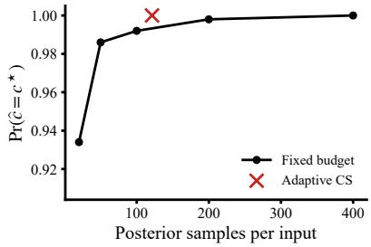
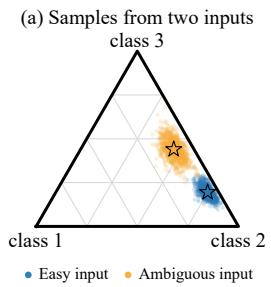
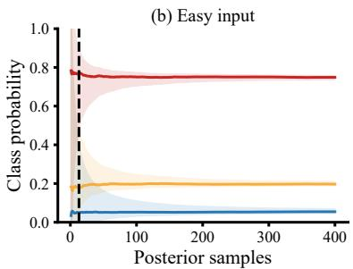
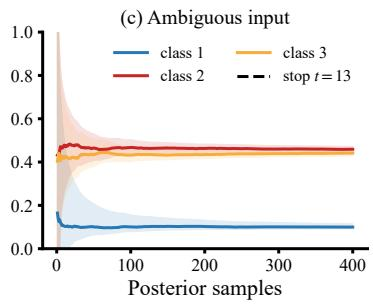
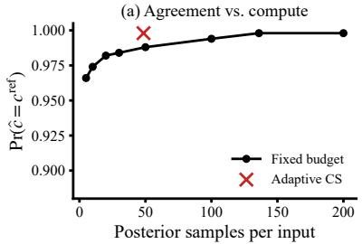
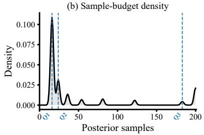

# When Has a Bayesian Neural Network Sampled Enough? Adaptive Inference Time with Statistical Guarantees

Fabian Denoodt Eindhoven University of Technology

Sibylle Hess Eindhoven University of Technology

## Abstract

Bayesian neural network predictions are commonly approximated using a fixed number of Monte Carlo samples per input, without controlling the resulting error that comes from this finite sample. We propose the use of confidence sequences to dynamically determine how many samples are needed while maintaining statistical guarantees. We consider several ways in which predictive probabilities are used, including identifying the most likely class, approximating the full predictive distribution, and resolving probability-threshold decisions. Sampling stops once the corresponding decision can be made with the desired guarantee. Experiments show that the method allocates the computational budget efficiently, assigning more samples to ambiguous inputs than to easy inputs while preserving reliable decisions and reducing overall latency relative to a fixed Monte Carlo budget.

## 1 Introduction

Bayesian neural networks (BNNs) provide a principled framework for representing predictive uncertainty, which is particularly valuable in high-stakes applications. They typically approximate the posterior predictive distribution $p ( \mathbf { y } ^ { \star } \mid \mathbf { x } ^ { \star } , \mathbf { x } _ { 1 : n } , \mathbf { y } _ { 1 : n } )$ by averaging predictions over posterior parameter samples $\mathbb { E } _ { \pmb { \theta } \sim q _ { \lambda } } [ p ( \mathbf { y } ^ { \star } \mid \mathbf { x } ^ { \star } , \pmb { \theta } ) ] \mid 3 , 1 1 , 6 , 4 , 9 ]$ . In practice, this average is usually estimated using the same fixed number of stochastic forward passes for every input. Although simple, this ad hoc choice provides no guarantee that the Monte Carlo estimate is sufficiently accurate for the prediction. It may also waste computation on easy inputs while using too few samples for difficult ones.

We instead ask an input- and task-specific question:

## When have enough posterior samples been drawn to make the required decision?

The answer depends on how the prediction will be used. If only the most likely label is needed, it suffices to separate the leading class from its competitors. If the full probability vector is required, every coordinate must be estimated accurately enough. Meanwhile, for threshold-based decisions, it is enough to determine whether any class probability exceeds a specified level q. Adapting the number of samples to these objectives would allow the method to concentrate computation on the inputs that need it most.

To make these adaptive decisions in a principled manner, we need uncertainty bounds that remain statistically valid as posterior samples accumulate. We therefore use the multivariate confidence sequence (CS) of Denoodt et al. [5] to track the predicted probability vector and stop once the required decision is certified. Unlike repeatedly checking an ordinary confidence interval, CSs remain valid under repeated inspection and data-dependent stopping [8]. This also distinguishes our approach from the approach of Bethell et al. [1], which stops when changes in the estimated variance remain below a preset threshold and provides neither statistical guarantees nor an indication of how accurate the final prediction is.

Overall, we (i) formulate anytime-valid stopping rules for various prediction use cases that control the Monte Carlo estimation error under repeated inspection and adaptive stopping, and (ii) show empirically that adaptive sampling uses fewer posterior draws for easy inputs while preserving reliable decisions, reducing overall inference time.

## 2 Anytime-valid adaptive prediction

Preliminaries. Fix an input x and a classification problem with $C$ classes, indexed by $c \in [ C ] : =$ $\{ 1 , \ldots , C \}$ . A BNN represents uncertainty about its parameters through an approximate posterior $q _ { \lambda } ( \pmb \theta )$ . Drawing $\theta \sim q _ { \lambda }$ and evaluating the network gives a class-probability vector $f _ { \boldsymbol { \theta } } ( \mathbf { x } )$ , and averaging these vectors gives the posterior predictive class probabilities

$$
\pmb { \mu } : = \mathbb { E } _ { \pmb { \theta } \sim q _ { \lambda } } \left[ f _ { \pmb { \theta } } ( \mathbf { x } ) \right] \in \Delta ^ { C - 1 } ,\tag{1}
$$

where $\Delta ^ { C - 1 } = \{ \mathbf { m } \in [ 0 , 1 ] ^ { C } : \sum _ { c = 1 } ^ { C } m _ { c } = 1 \}$ is the probability simplex. Each independent draw $\theta _ { i } \sim q _ { \lambda }$ leads to a prediction $\mathbf { y } _ { i } = f _ { \pmb { \theta } _ { i } } ( \mathbf { x } )$ , and after t draws, the usual Monte Carlo estimate of $\pmb { \mu }$ is $\widehat { \pmb { \mu } } _ { t } = t ^ { - 1 } \sum _ { i = 1 } ^ { t } \mathbf { y } _ { i }$

A CS for $\pmb { \mu }$ is a sequence of data-dependent sets $( \mathcal { C } _ { t } ) _ { t \geq 1 }$ , where $\mathcal { C } _ { t } = \mathcal { C } _ { t } ( \mathbf { y } _ { 1 } , \ldots \ldots , \mathbf { y } _ { t } )$ is constructed from the first t predictions, such that

$$
\mathbb { P } ( \forall t \geq 1 : \mu \in \mathcal { C } _ { t } ) \geq 1 - \alpha ,\tag{2}
$$

for a prescribed error level α [12]. Equation (2) immediately implies that, for any stopping time $\tau$ determined from the observed samples $\mathbf { y } _ { 1 } , \dots , \mathbf { y } _ { \tau } , \mathbb { P } ( \pmb { \mu } \in \mathcal { C } _ { \tau } ) \geq 1 - \alpha$

Stopping rules for various prediction tasks. Suppose that the CS supplies coordinate-wise bounds $[ L _ { t , c } , U _ { t , c } ]$ satisfying $\begin{array} { r } { \mathscr { C } _ { t } \subseteq \prod _ { c = 1 } ^ { C } [ L _ { t , c } , U _ { t , c } ] } \end{array}$ . We propose three task-specific stopping rules based on these bounds: one for selecting a class, one for approximating the full predictive distribution, and one for making a threshold decision. Proofs of all three guarantees are deferred to Appendix A.

Class selection. If we want to return a single class while ensuring that it has the largest posterior predictive probability, let $\widehat { c } _ { t } = \arg \operatorname* { m a x } _ { c \in \left[ C \right] } \widehat { \mu } _ { t , c }$ denote the current Monte Carlo prediction and let $c ^ { \star } = \arg \operatorname* { m a x } _ { c \in [ C ] } \mu _ { c }$ denote the leading class of $\pmb { \mu } .$ . We stop once the lower bound of $\widehat { c } _ { t }$ exceeds every competing upper bound:

$$
\tau _ { \mathrm { c l s } } : = \operatorname* { m i n } \{ t : L _ { t , \widehat { c } _ { t } } > \operatorname* { m a x } _ { c \neq \widehat { c } _ { t } } U _ { t , c } \} .\tag{3}
$$

If the condition is not met after a predefined $T _ { \mathrm { m a x } }$ samples, set $\tau _ { \mathrm { c l s } } : = \infty$ and abstain from prediction. Lemma 1. With probability at least $1 - \alpha$ , whenever $\tau _ { \mathrm { c l s } } < \infty$ , the returned class is the leading class: $\widehat { c } _ { \tau _ { \mathrm { c l s } } } = c ^ { \star }$

Predictive-distribution accuracy. To approximate the complete predictive vector, the coordinate-wise error can be controlled instead. One can define

$$
r _ { t } = \operatorname* { m a x } _ { c } { \operatorname* { m a x } } \{ U _ { t , c } - \widehat { \mu } _ { t , c } , \widehat { \mu } _ { t , c } - L _ { t , c } \} ,\tag{4}
$$

such that stopping at

$$
\tau _ { \mathrm { d i s t } } : = \operatorname* { m i n } \{ t : r _ { t } \leq \varepsilon \}\tag{5}
$$

Measuring the distance from $\widehat { \mu } _ { t , c }$ to both $U _ { t , c }$ and $\boldsymbol { L } _ { t , c }$ in Eq. (4), rather than using the interval width, also accounts for potentially asymmetric confidence intervals.

Lemma 2. With probability at least $1 - \alpha ,$ , whenever $\tau _ { \mathrm { d i s t } } < \infty$ , the returned estimate satisfies $\| \widehat { \pmb { \mu } } _ { \tau _ { \mathrm { d i s t } } } - { \pmb { \mu } } \| _ { \infty } \leq \varepsilon .$

Threshold decision. To determine whether any class has a mean probability of at least $q \in [ 0 , 1 ]$ , we can stop either when some lower bound reaches $q ,$ indicating that the threshold is reached, or when all upper bounds fall below $q ,$ establishing that it is not:

$$
\tau _ { q } : = \operatorname* { m i n } \{ t : \operatorname* { m a x } _ { c } L _ { t , c } \geq q \mathrm { o r } \operatorname* { m a x } _ { c } U _ { t , c } < q \} .\tag{6}
$$

Lemma 3. With probability at least $1 - \alpha ,$ , whenever $\tau _ { q } < \infty ,$ , the rule correctly determines whether $\operatorname* { m a x } _ { c } \mu _ { c } \geq q .$

A simple but powerful multivariate CS. The stopping rules above can be applied with any multivariate CS that provides coordinate-wise bounds. In our experiments, we use the bounding-box CS of Denoodt et al. [5] because its regions are efficient to compute while producing empirically tight intervals that adapt to the variance of the observations.

At time $t ,$ its region is

$$
\mathcal { C } _ { t } ^ { \mathrm { b b o x } } : = \{ \mathbf { m } \in [ 0 , 1 ] ^ { C } ~ | ~ m _ { c } \in [ L _ { t , c } , U _ { t , c } ] , ~ c = 1 , \ldots , C \} ,\tag{7}
$$

where

$$
[ L _ { t , c } , U _ { t , c } ] : = \{ m _ { c } \in [ 0 , 1 ] ~ | ~ k _ { t } ^ { c } ( m _ { c } ) \leq C \big ( \alpha ^ { - 1 } - \sum _ { c ^ { \prime } \neq c } w _ { c ^ { \prime } } k _ { \star , t } ^ { c ^ { \prime } } \big ) \} .\tag{8}
$$

Here, $k _ { t } ^ { c } ( m _ { c } )$ denotes the scalar hedged-capital function of Waudby-Smith and Ramdas [13], evaluated at the candidate mean $m _ { c }$ using observations $y _ { 1 , c } , \ldots , y _ { t , c } ,$ and $k _ { \star , t } ^ { c } : = \mathrm { m i n } _ { u \in [ 0 , 1 ] } k _ { t } ^ { c } ( u )$ Because $k _ { t } ^ { c }$ is quasiconvex, its minimum and the interval endpoints can be computed with the conservative bisection procedure of Denoodt et al. [5].

We make two additional tightenings that are specific to our setting. First, we intersect the boxes over time, resulting in the endpoints

$$
L _ { t , c } : = \operatorname* { m a x } _ { 1 \leq s \leq t } L _ { s , c } , \qquad U _ { t , c } : = \operatorname* { m i n } _ { 1 \leq s \leq t } U _ { s , c } .\tag{9}
$$

Second, since $\mu \in \Delta ^ { C - 1 }$ , we can use the probability-simplex constraint to further tighten each coordinate interval:

$$
L _ { t , c } : = \operatorname* { m a x } L _ { t , c } , 1 - \sum _ { c ^ { \prime } \neq c } U _ { t , c ^ { \prime } } , \quad U _ { t , c } : = \operatorname* { m i n } U _ { t , c } , 1 - \sum _ { c ^ { \prime } \neq c } L _ { t , c ^ { \prime } } .\tag{10}
$$

These updates exploit both past regions and the simplex constraint while preserving coverage guarantees.

## 3 Experiments

We focus the evaluation on the class selection stopping rule, which corresponds to reporting the most likely class. We evaluate it in simulation and on CIFAR-100 with $\alpha = . 0 5$ . If the rule has not stopped by $T _ { \mathrm { m a x } }$ , we return $\widehat { c } _ { T _ { \mathrm { m a x } } }$ as unresolved, without a statistical guarantee.

Simulated three-class problem. For each of 500 three-class inputs, we model stochastic predictions as $\mathbf { y } _ { t } ~ \mathbf { \xi } | ~ \left( \pmb { \mu } , \kappa \right) \sim$ Dirichlet(κµ). For 65% of the inputs, we use an “easy” setup with $\pmb { \mu } = ( . 7 5 , . 2 5 r , . 2 5 ( 1 - r ) )$ ), where $\dot { r } \sim \mathrm { B e t a } ( 1 , 1 )$ and $\kappa \sim$ Unif[80, 300]. The remaining 35% simulate ambiguous predictions with $\pmb { \mu } = ( . 4 6 , . 4 4 , . 1 0 )$ and $\kappa \sim$ Unif[30, 120]. The true class $c ^ { \star }$ is therefore quickly separated for easy inputs, whereas ambiguous inputs may require more samples to detect it. We set $T _ { \mathrm { m a x } } = 4 0 0$

Figure 1 illustrates the contrast between an easy input and a near tie. Across the simulation, the adaptive rule recovers $c ^ { \star }$ on every input, while roughly one fifth reach the cap unresolved. Figure 2 shows that the adaptive rule spends the compute budget more wisely than a fixed budget per input.

CIFAR-100. We evaluate the rule on CIFAR-100 [10] using a public ResNet-18 [7] checkpoint with 79.26% test accuracy [2]. With laplace-torch [3], we fit a diagonal generalized Gauss-Newton Laplace approximation over all network parameters:

  
Figure 2: Sample efficiency on simulated predictions. Adaptive stopping requires fewer samples per input to match accuracy.

$$
q ( \pmb \theta ) = \mathcal N \Big ( \widehat \theta , ( \mathrm { d i a g } ( G _ { \mathrm { G G N } } ) + \lambda I ) ^ { - 1 } \Big ) .\tag{11}
$$

We compute curvature from the 50,000 training images and select prior precision $\lambda = 3 \times 1 0 ^ { 5 }$ by predictive NLL on a disjoint 1,000-image calibration $\mathbf { s e t }$ . Each posterior sample requires a fullnetwork forward pass. Since the exact predictive mean $\pmb { \mu }$ in Eq. (1) is unavailable, an independent 1,000-sample Bayesian model average (BMA) defines the reference class $c ^ { \mathrm { r e f } }$ . We evaluate 1,000 test images with $T _ { \mathrm { m a x } } = 2 0 0$

  
Figure 1: Example of the class selection rule. (a) True means and samples for an easy and an ambiguous input. (b) The CS detects the easy input’s leading class at t = 13. (c) The ambiguous input remains unresolved at $T _ { \mathrm { m a x } } = 4 0 0$

We inspect the stopping rule only at $t \in \{ 1 6 , 2 4 , 3 6 , 5 4$ 81, 122, 183, 200}, although every draw updates the CS. This reduces the computational overhead of constructing $\mathcal { C } ^ { \mathrm { { b b o x } } }$ , which is otherwise costly relative to a single forward pass.

Figure 3 shows 99.8% agreement with the reference using 48.6 samples on average. The rule stops for 89.9% of inputs, and every resolved prediction agrees with the BMA. The vertical lines mark the Q1, Q2, and Q3 quartiles at 16, 24, and 183 samples, respectively, indicating that the majority of inputs require only a small number of samples. The smallest fixed budget reaching the same 99.8% agreement is $T ^ { \star } = 1 3 6$ samples per input.

Does sample efficiency translate into time efficiency? We benchmark mean latency of making predictions on an NVIDIA A100, including posterior sampling, forward passes, and CS computation. Table 1 shows that adaptive inference averages 0.253s per input, including 0.055s of CS overhead. It is nevertheless 3.21× faster than 200 posterior samples and 2.24× faster than the performancematched $T ^ { \star } = 1 3 6$ . Fixed 30 is faster but reaches only 98

  
Figure 3: Sample efficiency on CIFAR-100. Agreement with the reference BMA (top) and the allocated-sample distribution with Q1–Q3 quartiles (bottom).

## 4 Conclusion

We introduce an anytime-valid approach for dynamically determining the number of Monte Carlo samples needed for each input in Bayesian neural network inference. Using confidence sequences, sampling stops once the prediction can be made with a statistical guarantee. This saves samples on easy inputs while using more computation for ambiguous ones, reducing overall inference time without sacrificing reliable decisions.

Table 1: Mean latency per CIFAR-100 input, measured over 1,000 inputs. Adaptive sampling uses $\bar { T } = 4 8 . 6$ posterior samples on average and achieves the same 99.8% agreement as the smallest matching fixed Monte Carlo budget, $T ^ { \star } = 1 3 6$ , while being 2.24× faster.
<table><tr><td>Method</td><td>Inference (s)</td><td>CS overhead (s)</td><td>Total (s)</td><td>Adaptive vs. row</td><td> $\mathrm { P r } ( \hat { c } = c ^ { \mathrm { r e f } } )$ </td></tr><tr><td>Fixed 30</td><td>0.125</td><td>0</td><td>0.125</td><td>2.03× slower</td><td>98.4%</td></tr><tr><td>Fixed 200</td><td>0.813</td><td>0</td><td>0.813</td><td>3.21× faster</td><td>99.8%</td></tr><tr><td>Fixed  $T ^ { \star } = 1 3 6$ </td><td>0.566</td><td>0</td><td>0.566</td><td>2.24× faster</td><td>99.8%</td></tr><tr><td>Adaptive  $( \bar { T } = 4 8 . 6 )$ </td><td>0.198</td><td>0.055</td><td>0.253</td><td></td><td>99.8%</td></tr></table>

## Acknowledgments and Disclosure of Funding

We thank Joaquin Vanschoren for their valuable input and discussions. This work was funded by the MOSAIC project under Grant Agreement No. 101194414.

Funded by the European Union. Views and opinions expressed are however those of the author(s) only and do not necessarily reflect those of the European Union or the European Commission. Neither the European Union nor the European Commission can be held responsible for them.

## References

[1] Daniel Bethell, Simos Gerasimou, and Radu Calinescu. Robust uncertainty quantification using conformalised monte carlo prediction. In Proceedings of the AAAI Conference on Artificial Intelligence, volume 38, pages 20939–20948, 2024. doi: 10.1609/aaai.v38i19.30084.

[2] Eduardo Dadalto. edadaltocg/resnet18\_cifar100 · Hugging Face — huggingface.co. https:// huggingface.co/edadaltocg/resnet18\_cifar100, 2024. Accessed 20 September 2026.

[3] Erik Daxberger, Agustinus Kristiadi, Alexander Immer, Runa Eschenhagen, Matthias Bauer, and Philipp Hennig. Laplace redux—effortless bayesian deep learning. In Advances in Neural Information Processing Systems, volume 34, pages 20089–20103, 2021.

[4] Fabian Denoodt and José Oramas. Efficient post-hoc uncertainty calibration via variance-based smoothing. arXiv preprint arXiv:2503.15583, 2025.

[5] Fabian Denoodt, Sibylle Hess, Joaquin Vanschoren, and Christian A. Naesseth. On the tightness and computational tractability of higher-dimensional confidence sequences. arXiv preprint arXiv:2610.03727, 2026. URL https://arxiv.org/abs/2610.03727.

[6] Yarin Gal and Zoubin Ghahramani. Dropout as a bayesian approximation: Representing model uncertainty in deep learning. In Maria-Florina Balcan and Kilian Q. Weinberger, editors, Proceedings of the 33nd International Conference on Machine Learning, ICML 2016, New York City, NY, USA, June 19-24, 2016, volume 48 of JMLR Workshop and Conference Proceedings, pages 1050–1059. JMLR.org, 2016. URL http://proceedings.mlr.press/v48/gal16. html.

[7] Kaiming He, Xiangyu Zhang, Shaoqing Ren, and Jian Sun. Deep residual learning for image recognition. In Proceedings of the IEEE Conference on Computer Vision and Pattern Recognition, pages 770–778, 2016.

[8] Steven R. Howard, Aaditya Ramdas, Jon McAuliffe, and Jasjeet Sekhon. Time-uniform, nonparametric, nonasymptotic confidence sequences. The Annals of Statistics, 49(2):1055– 1080, 2021. doi: 10.1214/20-AOS1991.

[9] Andreas Krause and Jonas Hübotter. Probabilistic artificial intelligence. arXiv preprint arXiv:2502.05244, 2025.

[10] Alex Krizhevsky. Learning multiple layers of features from tiny images. Technical report, University of Toronto, 2009.

[11] Wesley J. Maddox, Pavel Izmailov, Timur Garipov, Dmitry P. Vetrov, and Andrew Gordon Wilson. A simple baseline for bayesian uncertainty in deep learning. In Hanna M. Wallach, Hugo Larochelle, Alina Beygelzimer, Florence d’Alché-Buc, Emily B. Fox, and Roman Garnett, editors, Advances in Neural Information Processing Systems 32: Annual Conference on Neural Information Processing Systems 2019, NeurIPS 2019, December 8-14, 2019, Vancouver, BC, Canada, pages 13132–13143, 2019. URL https://proceedings.neurips.cc/paper/ 2019/hash/118921efba23fc329e6560b27861f0c2-Abstract.html.

[12] Jongha Jon Ryu and Gregory W. Wornell. Gambling-based confidence sequences for bounded random vectors. In Forty-first International Conference on Machine Learning, ICML 2024, Vienna, Austria, July 21-27, 2024. OpenReview.net, 2024. URL https://openreview.net/ forum?id=mu7Er7f9NQ.

[13] Ian Waudby-Smith and Aaditya Ramdas. Estimating means of bounded random variables by betting. Journal of the Royal Statistical Society Series B: Statistical Methodology, 86(1):1–27, 2024. doi: 10.1093/jrsssb/qkad009.

## A Proofs of the stopping-rule guarantees

## Proof of Lemma 1.

Proof. Denote $\widehat { c } = \widehat { c } _ { \tau _ { \mathrm { c l s } } }$ . Then, on the simultaneous coverage event in Eq. (2), for every $c \neq { \widehat { c } } ,$ the stopping condition gives

$$
\mu _ { \widehat { c } } \geq L _ { \tau _ { \mathrm { c l s } } , \widehat { c } } > U _ { \tau _ { \mathrm { c l s } } , c } \geq \mu _ { c } .
$$

Thus $\widehat { c } _ { t }$ is the leading class. The coverage event has probability at least $1 - \alpha$

## Proof of Lemma 2.

Proof. On the simultaneous coverage event, $\mu _ { c } \in [ L _ { t , c } , U _ { t , c } ]$ for every t and c. Hence $| \widehat { \mu } _ { t , c } - \mu _ { c } | \leq$ max $\{ U _ { t , c } - \widehat { \mu } _ { t , c } , \widehat { \mu } _ { t , c } - L _ { t , c } \} \leq r _ { t } . \mathrm { A t } t = \tau _ { \mathrm { d i s t } }$ , this is at most ε for every coordinate. □

## Proof of Lemma 3.

Proof. On the simultaneous coverage event, ma $\mathbf { x } _ { c } L _ { t , c } \geq q$ implies that $\mu _ { c } \geq q$ for at least one class, whereas maxc $U _ { t , c } < q$ implies that $\mu _ { c } < q$ for every class. Thus either stopping condition guarantees the corresponding decision. □