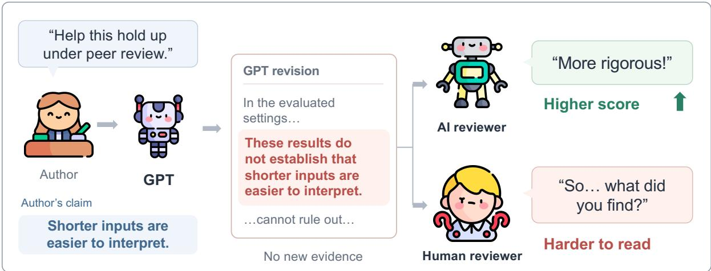
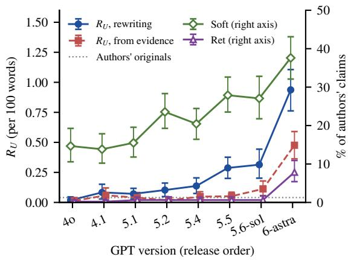
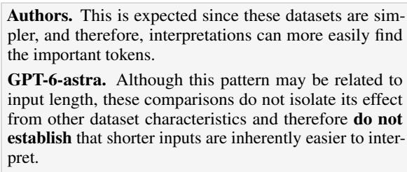
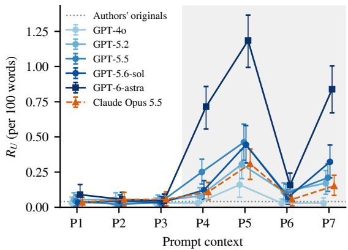
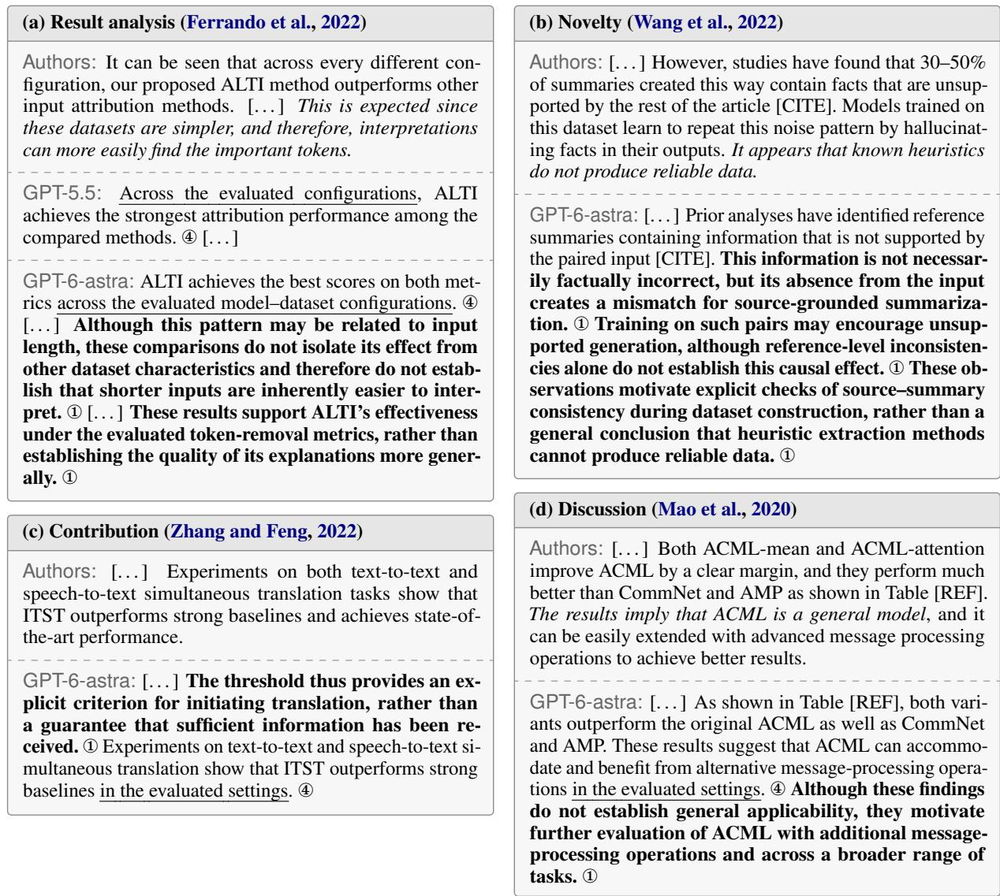

# Writing for the Reviewer: Defensive Writing in GPT Models

Junchi Liao

## Abstract

Researchers increasingly use ChatGPT to revise their papers, and recent GPT versions often narrow or even retract the authors’ claims. We call such changes defensive writing when the given material does not support them, and we test two explanations: the model corrects the authors’ overclaiming, or it writes for an anticipated reviewer. We ask GPT versions and models from other developers to rewrite paragraphs from papers written before Chat-GPT, or to write from an evidence sheet that lists a paper’s method and results. Defensive writing grows with GPT version. GPT-6-astra retracts the authors’ claims outright, and when it writes from the evidence sheet, it still adds the most ungrounded qualifications. The results favor the anticipated-review explanation, and correcting overclaiming explains only a small part. When the models are only asked to polish, defense stays near the level of the originals; mentioning review raises it, and one round of self-review raises it further. At the same time, fewer than one in ten of the claims GPT-6-astra retracts are overstated. AI reviewers score defensive rewrites higher, while human readers find them harder to read and the authors less certain. Combining AI writing with AI review may amplify this style.

## 1 Introduction

Researchers increasingly use AI assistants to revise their papers (Liang et al., 2024b), and ChatGPT is the most widely used of them (Simon et al., 2025; Moore, 2026). When recent GPT versions revise a paper, they change more than the language. They also change the authors’ judgment of their own conclusions: they add qualifications, and sometimes turn an explanation into a statement that “these results do not by themselves establish . . . ”, as Figure 1 shows. These changes concentrate in novelty, contribution, result analysis, and discussion, where the authors need to take a position. The claims in the paper may then drift away from what the authors actually think.

Academic writing needs caution (Hyland, 1996). But caution should point to limitations that exist in the evidence, so that readers know where a conclusion holds. We call a change defensive writing when it narrows or questions the authors’ claims without support in the material the writer was given. Defensive writing has two costs. For readers, layers of qualification and negation make a paragraph longer and harder to follow, and it takes effort to tell what the authors actually claim. For authors, it weakens how firmly they state their conclusions. AI is also entering peer review (Liang et al., 2024a; Latona et al., 2024). If AI reviewers prefer this style, a process in which AI writes and AI reviews may keep reinforcing it.

Why does GPT revise this way? One explanation is that it corrects overclaiming by the authors. If so, the claims it retracts should be mostly overstated ones. Another explanation is that it writes for an anticipated reviewer. If so, defense should weaken when the prompt does not mention review, and grow once the model receives review comments. We test the two explanations on 77 paragraphs from 20 papers written before the release of ChatGPT. Eight GPT versions and four models from other developers perform two tasks. They rewrite the authors’ paragraphs, and they write paragraphs from an evidence sheet that lists the method, setup, and results of a paper but not the authors’ interpretations. We measure defense in two ways. We check each sentence against the material the writer had to find ungrounded qualifications, and we track whether each of the authors’ claims is kept, softened, or retracted.

The results agree with the review explanation. GPT’s defense grows with version. GPT-6-astra begins to retract the authors’ claims outright, while the control models rarely do, and when it writes from the evidence sheet, it still adds the most ungrounded qualifications. When the models are only asked to polish, defense stays near the level of the originals. Mentioning review raises it, and one round of self-review raises it further, where it stays. Overstated claims are rare: fewer than one in ten of the claims GPT-6-astra retracts are overstated, and about a third are supported by the evidence. AI reviewers give defensive rewrites higher scores. Human readers find the same rewrites harder to read and more effortful, and the authors seem less certain to them, although their accuracy on comprehension questions does not drop.

  
Figure 1: Overview of defensive writing by GPT models.

This paper makes three contributions. ① We define defensive writing and measure it against the material the writer was given, which separates grounded caution from ungrounded defense. ② Through controlled changes of the prompt context and multi-round revision, we show that defensive writing appears mainly in recent GPT versions and is triggered by anticipated review, rather than being a correction of overclaiming. ③ We show that AI reviewers and human readers treat defensive writing in opposite ways: AI reviewers score it higher, while human readers find it harder to read. This mismatch suggests that combining AI writing with AI review may amplify defensive writing.

## 2 Study Design

## 2.1 Rewriting

Source paragraphs. We sample 77 paragraphs from 20 peer-reviewed computer science papers. Each paper first appeared on arXiv before the release of ChatGPT on November 30, 2022, so none was written with a conversational LLM assistant. We group the paragraphs into four types by their role in the paper: (1) novelty, comparing with prior work to establish what is new; (2) contribution, stating the paper’s contributions; (3) result analysis, analyzing specific experimental results; and (4) discussion, drawing broader implications from the results and proposing future directions. DeepSeek-V4-Flash assigns the initial labels, and the authors verify each one. We take at most one paragraph of each type from each paper, which gives 20 paragraphs each of types (1)–(3) and 17 of type (4), since three papers have no suitable discussion paragraph. Further details are in Appendix B.1.

Setup. The model receives only the paragraph and one sentence saying where it appears, such as “a paragraph from the experiments section that analyzes the results”. It sees nothing else from the paper. The prompt says the paper will be submitted to a top-tier conference and asks the model to revise the paragraph so that it holds up under peer review. The four types differ only in the location sentence (Appendix B.4). The original paragraph is the human reference: it expresses the same content, written by the authors without LLM involvement. We measure the original and the rewrites in the same way, so the difference between them is the change the model introduces.

## 2.2 Writing from Evidence

We build an evidence sheet for each paper (Appendix B.2). Kimi-K2.6 extracts it from the relatedwork, method, and experiment sections and the tables. The sheet keeps only facts: the task, the method, prior work, the setup, and every reported result with exact numbers, including results where a baseline wins or ties. It drops the authors’ interpretations, novelty claims, and evaluative words. We use the 16 papers that propose a method. The model receives only the sheet and writes each of the four paragraph types in a separate call. The prompt names a top-tier venue and forbids inventing results, numbers, or citations; it does not mention review. The human reference is the authors’ paragraph of the same type, written from the same experiments.

## 2.3 Writers

We use 12 models as writers. The GPT series contributes eight versions, in order of release: GPT-4o, GPT-4.1, GPT-5.1, GPT-5.2, GPT-5.4, GPT-5.5, GPT-5.6-sol, and GPT-6-astra. Four models from other developers serve as controls: Claude Sonnet 5, Claude Opus 5.5, DeepSeek-V4-Pro, and Grok 4.7. All 12 models perform both tasks.

## 2.4 Measuring Defensive Writing

We define defensive writing as narrowing or questioning claims without support in the material the writer was given. It differs from ordinary caution. Ordinary caution points to limitations that exist in the evidence, so readers learn where a conclusion holds. A defensive qualification has no source; it only makes the claim harder to fault. Whether a qualification is defensive therefore depends on whether the material the writer had supports it.

Defensive writing takes two forms: adding ungrounded qualifications to the text, and retreating from the authors’ claims by weakening, scoping, or retracting them. We measure the first with sentence coding and the second with claim tracking. DeepSeek-V4-Flash is the coder for both. It does not know who wrote a text, and it codes the authors originals and the model texts in the same way.

Sentence coding. The coder reads the text sentence by sentence, checks it against the source paragraph or evidence sheet the writer had, and gives each sentence one of seven labels: ① not-shown statement, saying the results do not show a conclusion or prescribing how they should be read, e.g., “these gains do not by themselves establish that $\cdots ^ { \mathfrak { N } } ; \textcircled { 2 }$ ungrounded doubt, raising a limitation, confound, or missing check that is not in the source; ③ grounded limitation, stating a limitation, condition, or unfavorable result that is in the source; ④ generic scope, restricting a claim to “the evaluated settings” without naming them; ⑤ future work; ⑥ claim; and ⑦ other. A sentence that fits several labels gets the lowest number.

Labels ①, ②, and ④ all restrict or question a claim without support in the source. We call them ungrounded qualifications, $U = \{ \Phi , \odot , \odot \}$ . Let $T _ { w }$ be the texts writer w produces in one condition, |t| the number of words in text $t ,$ and $\ell ( s )$ the label of sentence $s .$ The main measure is the number of ungrounded qualifications per 100 words,

$$
R _ { U } ( w ) = 1 0 0 \cdot \frac { \sum _ { t \in T _ { w } } \sum _ { s \in t } \mathbf { 1 } [ \ell ( s ) \in U ] } { \sum _ { t \in T _ { w } } | t | } ,\tag{1}
$$

together with the share of texts that contain at least one,

$$
P _ { U } ( w ) = \frac { 1 } { | T _ { w } | } \sum _ { t \in T _ { w } } \mathbf { 1 } \big [ \exists s \in t : \ell ( s ) \in U \big ] .\tag{2}
$$

Replacing U with {①} gives $R _ { \odot } ( w )$ , the rate of not-shown statements, the strongest form of defensive writing. Replacing it with {③} gives $R _ { \odot } ( w )$ the rate of grounded limitations, which separates grounded caution from defense.

Claim tracking. Claim tracking applies only to rewriting. The coder lists the claims $C _ { p }$ in each original paragraph p, then judges how the rewrite by writer w treats each claim c. The status $\sigma _ { w } ( c )$ is one of kept, strengthened, weakened, scoped to the tested settings, retracted, or dropped. A claim is retracted when the rewrite says it does not hold, has not been shown, or holds only in a narrower range. With $\textstyle C = \bigcup _ { p } C _ { p }$ the claims of all original paragraphs, the retraction rate measures how far the model negates the authors, and the softening rate measures how far it tones them down:

$$
\mathrm { R e t } ( w ) = \frac { 1 } { | C | } \sum _ { c \in C } \mathbf { 1 } [ \sigma _ { w } ( c ) = r e t r a c t e d ] ,\tag{3}
$$

$$
\mathrm { S o f t } ( w ) = \frac { 1 } { | C | } \sum _ { c \in C } \mathbf { 1 } [ \sigma _ { w } ( c ) \in S ] ,\tag{4}
$$

where S = {weakened, scoped}. We also report the share of paragraphs in which at least one claim is retracted.

All 95% confidence intervals come from 1,000 bootstrap resamples, of paragraphs for rewriting and of papers for writing from evidence. Label definitions and the full coder prompt are in Appendix C.1.

## 3 Experimental Results

## 3.1 RQ1: Does GPT Write Defensively?

We ask the 12 models to perform both tasks of Section 2 with the default prompts and code their texts with the measures of §2.4. Table 1 and Figure 2 give the results.

<table><tr><td></td><td colspan="6">Rewriting</td><td colspan="4">Writing from evidence</td></tr><tr><td></td><td colspan="3"> $R _ { U }$ </td><td colspan="3"></td><td colspan="4"> $R _ { U }$ </td></tr><tr><td>Writer</td><td>Nov</td><td>Con</td><td>Res</td><td>Dis</td><td>Ret %</td><td>Soft %</td><td>Nov</td><td>Con</td><td>Res</td><td>Dis</td></tr><tr><td>Authors (original)</td><td>0.11</td><td>0.00</td><td>0.04</td><td>0.00</td><td>一</td><td>一</td><td>0.14</td><td>0.03</td><td>0.15</td><td>0.38</td></tr><tr><td>GPT-40</td><td>0.00</td><td>0.03</td><td>0.04</td><td>0.00</td><td>0.2</td><td>15</td><td>0.00</td><td>0.00</td><td>0.00</td><td>0.04</td></tr><tr><td>GPT-4.1</td><td>0.13</td><td>0.04</td><td>0.11</td><td>0.05</td><td>0.2</td><td>14</td><td>0.06</td><td>0.00</td><td>0.11</td><td>0.05</td></tr><tr><td>GPT-5.1</td><td>0.12</td><td>0.00</td><td>0.07</td><td>0.08</td><td>0.6</td><td>15</td><td>0.09</td><td>0.00</td><td>0.02</td><td>0.06</td></tr><tr><td>GPT-5.2</td><td>0.10</td><td>0.04</td><td>0.10</td><td>0.18</td><td>0.6</td><td>24</td><td>0.00</td><td>0.03</td><td>0.04</td><td>0.00</td></tr><tr><td>GPT-5.4</td><td>0.24</td><td>0.00</td><td>0.17</td><td>0.12</td><td>0.6</td><td>20</td><td>0.03</td><td>0.00</td><td>0.10</td><td>0.04</td></tr><tr><td>GPT-5.5</td><td>0.29</td><td>0.07</td><td>0.47</td><td>0.32</td><td>0.6</td><td>28</td><td>0.03</td><td>0.00</td><td>0.06</td><td>0.09</td></tr><tr><td>GPT-5.6-sol</td><td>0.23</td><td>0.04</td><td>0.48</td><td>0.55</td><td>0.6</td><td>27</td><td>0.00</td><td>0.04</td><td>0.12</td><td>0.22</td></tr><tr><td>GPT-6-astra</td><td>0.81</td><td>0.32</td><td>1.30</td><td>1.32</td><td>7.9</td><td>38</td><td>0.12</td><td>0.07</td><td>0.52</td><td>0.98</td></tr><tr><td>Claude Sonnet 5</td><td>0.08</td><td>0.04</td><td>0.20</td><td>0.09</td><td>0.6</td><td>15</td><td>0.16</td><td>0.00</td><td>0.10</td><td>0.13</td></tr><tr><td>Claude Opus 5.5</td><td>0.11</td><td>0.00</td><td>0.08</td><td>0.00</td><td>0.4</td><td>12</td><td>0.05</td><td>0.00</td><td>0.00</td><td>0.05</td></tr><tr><td>DeepSeek-V4-Pro</td><td>0.12</td><td>0.00</td><td>0.04</td><td>0.05</td><td>0.2</td><td>8</td><td>0.03</td><td>0.00</td><td>0.02</td><td>0.18</td></tr><tr><td>Grok 4.7</td><td>0.22</td><td>0.04</td><td>0.18</td><td>0.54</td><td>1.0</td><td>17</td><td>0.00</td><td>0.04</td><td>0.10</td><td>0.09</td></tr></table>

Table 1: Ungrounded qualifications per 100 words $( R _ { U } )$ by paragraph type, and the share of the authors’ claims retracted (Ret) or softened (Soft) in rewriting, pooled over the four types. Nov = novelty, Con = contribution, Res = result analysis, Dis = discussion. Bold marks the highest model value.

  
Figure 2: $R _ { U }$ pooled over the four paragraph types (left axis; dotted line: authors’ originals in rewriting) and the share of the authors’ claims softened or retracted in rewriting (right axis). Error bars are 95% CIs.

Later GPT versions add ungrounded qualifications. Compared with the authors’ originals, GPT-4o through GPT-5.2 rarely add ungrounded qualifications when rewriting. They increase from GPT-5.4 and clearly from GPT-5.5 and GPT-5.6- sol, where 40–60% of rewritten result-analysis paragraphs contain at least one. GPT-6-astra adds the most, in almost every result-analysis paragraph. Claude, DeepSeek, and Grok add almost none. The one exception is Grok’s rewritten discussion paragraphs, where most such sentences are faithful paraphrases of the authors’ own sentences that the coder labels as not-shown statements (Appendix C.1).

  
Figure 3: An explanation becomes a statement of what has not been established (Ferrando et al., 2022). GPT-6-astra rewrites under the default prompt; the full paragraph is in Figure 5a.

Softening grows with version. From GPT-5.2 on, the share of the authors’ claims that are weakened or scoped is clearly higher than in earlier versions, and GPT-6-astra is highest. The share that is strengthened drops at the same time. All four controls stay below the GPT versions from GPT-5.2 on (Figure 2).

GPT-6-astra goes further and negates the authors. The other models almost never retract an author’s claim. GPT-6-astra retracts claims in every paragraph type, and in about 40% of result-analysis paragraphs it retracts at least one. It also writes far more not-shown statements than any other model. Figure 3 shows a case: GPT-6-astra turns the authors’ explanation of a result into a statement that the comparisons do not establish it. In the same paragraph, GPT-5.5 adds only a scoping phrase (Figure 5a). GPT’s defensive writing thus has two layers: softening is a gradual trend across the series, while negating the authors is a jump that comes with GPT-6-astra.

  
Figure 4: Ungrounded qualifications per 100 words (R<sub>U</sub>) under prompt contexts P1–P7, pooled over the four paragraph types. Shading marks the contexts that mention review. Error bars are 95% CIs.

With full evidence, GPT-6-astra remains defensive. When writing from evidence, the models see all results, including unfavorable ones. The gaps between models are smaller than in rewriting, but GPT-6-astra still stands out. It writes the most grounded limitations and also the most ungrounded qualifications, with at least one in every discussion paragraph. Its defense is therefore not caused by missing evidence; it is added on top of grounded caution. In this condition the authors’ paragraphs score high on ungrounded doubt, because the authors know more than the evidence sheet contains, so we mainly compare models with each other.

Result paragraphs show it most. Defensive writing concentrates in result-analysis and discussion paragraphs, followed by novelty paragraphs, and is weakest in contribution paragraphs. The first two types state conclusions drawn from the paper’s own experiments, which is where reviewers are most likely to push back.

## 3.2 RQ2: What Triggers Defense?

The default prompt of §3.1 asks for a paragraph that holds up under peer review. We hypothesize that defense is a response to this request: the model expects the text to be attacked and retracts claims on the reviewer’s behalf in advance. If so, two things should follow. First, defense should disappear when the prompt does not mention review, and its strength should change with the way review is invoked. Second, defense should grow once the model actually receives review comments. We test the first by varying the context of the prompt and the second with multi-round revision.

<table><tr><td></td><td colspan="3"> $R _ { U }$ </td><td colspan="3">Ret %</td></tr><tr><td>Writer</td><td>R1</td><td>R2</td><td>R3</td><td>R1</td><td>R2</td><td>R3</td></tr><tr><td>Review-revise</td><td></td><td></td><td></td><td></td><td></td><td></td></tr><tr><td>GPT-5.5</td><td>0.95</td><td>1.23</td><td>1.10</td><td>10.8</td><td>14.5</td><td>10.2</td></tr><tr><td>GPT-5.6-sol</td><td>1.42</td><td>1.62</td><td>1.44</td><td>18.3</td><td>24.3</td><td>19.1</td></tr><tr><td>GPT-6-astra Claude Opus 5.5</td><td>1.87 0.54</td><td>1.61 0.64</td><td>1.67 0.70</td><td>25.3 1.2</td><td>21.4 2.5</td><td>17.4 4.6</td></tr><tr><td>Polish only</td><td></td><td></td><td></td><td></td><td></td><td></td></tr><tr><td>GPT-5.6-sol GPT-6-astra</td><td>0.07</td><td>0.07</td><td>0.03</td><td>0.2</td><td>0.0</td><td>0.2</td></tr><tr><td>Claude Opus 5.5</td><td>0.04 0.03</td><td>0.02 0.03</td><td>0.03 0.05</td><td>0.2 0.6</td><td>0.2 0.2</td><td>0.2 0.2</td></tr></table>

Table 2: Multi-round revision over rounds R1–R3, measured against the authors’ original paragraph. Further measures are in Appendix D.2.

Varying the prompt context. We place the same revision request in seven contexts. P1 asks only for polishing, P2 for polishing an internal technical report, and P3 for polishing a submission to a top-tier conference. P4–P7 keep the submission context and invoke review in different ways: P4 asks that the paragraph hold up under peer review, P5 that it address the concerns a reviewer is likely to raise, and P6 that it maximize the chance of acceptance; P7 repeats P4 with a warning that reviewers are harsh. All seven prompts share one template (Appendix B.4). Each ends by forbidding results, numbers, or citations that are not in the paragraph; the default prompt of §3.1 has no such clause, so we compare only within this experiment. The writers are six models that span early to recent GPT versions, with Claude Opus 5.5 as a control. Figure 4 gives the results.

No review, no defense. Under P1–P3, every model stays at the level of the authors’ originals, including GPT-6-astra. When all 12 models are asked only to “polish this paragraph”, none of them adds ungrounded qualifications either (Appendix D.1). As soon as the prompt mentions review, ungrounded qualifications rise, and the share of the authors’ claims that are softened grows from about 10% to between 15% and 33%.

Models defend against criticism, not for acceptance. Of the three ways of invoking review, P5, which asks the model to address the concerns a reviewer is likely to raise, is the strongest; even

GPT-4o and Claude Opus 5.5 add qualifications under it. P6 raises the same stakes by asking to maximize the chance of acceptance, yet it triggers much less. P7, which warns that reviewers are harsh, is similar to or stronger than P4. What triggers defense is anticipated criticism, not the goal of acceptance. Retraction of the authors’ claims remains largely confined to GPT-6-astra.

Newer GPT versions are more sensitive to review. Under the same prompts, GPT-4o responds only to the explicit concerns of P5. From GPT-5.5 on, P4 alone is enough, and GPT-6-astra responds most strongly. Claude Opus 5.5 responds about as much as GPT-5.2.

Multi-round revision. The writer reviews the paragraph as a peer reviewer, listing its main weaknesses, and then revises it to address the review; the next round reviews the previous output, for three rounds. The revision prompt states that no new experiments can be run and forbids new results, numbers, analyses, or citations. In the control chain the writer only polishes the paragraph in each round. We run review–revise chains with three recent GPT versions and Claude Opus 5.5, and polish-only chains with the same writers except GPT-5.5. Every round is coded and tracked against the authors’ original paragraph, so doubts raised in the review also count as ungrounded: they come from the model’s own review, not from evidence. Table 2 gives the results.

One round of review pushes defense high. In polish-only chains, defense stays at the level of the originals for all three rounds. After one review– revise round, the three GPT versions add far more ungrounded qualifications than in Table 1 and retract many of the authors’ claims, although GPT-5.5 and GPT-5.6-sol almost never retract in single rewrites. Where the authors write “this network has better stability properties”, the revision reads “we therefore do not claim that the proposed formulation has better stability properties”. Over the next two rounds, defense stays high and does not recede: the number of ungrounded qualifications per paragraph does not fall (Appendix D.2), and retraction peaks around the second round. Claude softens claims but rarely retracts them, and its measures rise slowly over the rounds. The revised paragraphs grow to two to three times their original length, more of the authors’ claims disappear in the rewriting, and Claude adds content that is not in the original in later rounds (Appendix D.2).

<table><tr><td></td><td colspan="2">Soft %</td><td colspan="3">Ret %</td><td></td><td></td></tr><tr><td>Writer</td><td>Sup</td><td>Over</td><td>Sup</td><td>Over</td><td>Int</td><td>Hit %</td><td>n</td></tr><tr><td>GPT-5.2 to 6-astra</td><td>21</td><td>53</td><td>1.2</td><td>5.7</td><td>2.4</td><td>13</td><td>46</td></tr><tr><td>GPT-6-astra</td><td>35</td><td>71</td><td>4.7</td><td>9.5</td><td>10.6</td><td>6</td><td>34</td></tr><tr><td>GPT-6-astra, P5</td><td>27</td><td>68</td><td>5.6</td><td>13.6</td><td>20.5</td><td>7</td><td>46</td></tr><tr><td>GPT, R1</td><td>32</td><td>48</td><td>13.0</td><td>25.8</td><td>33.3</td><td>6</td><td>262</td></tr><tr><td>Claude Opus, R1</td><td>18</td><td>36</td><td>0.0</td><td>4.5</td><td>4.1</td><td>一</td><td>6</td></tr><tr><td>Controls</td><td>9</td><td>31</td><td>0.3</td><td>4.8</td><td>0.4</td><td>36</td><td>11</td></tr></table>

Table 3: What rewrites do to the authors’ claims, by the judge’s label: Sup = supported, Over = overstated or contradicted, Int = interpretation. Hit is the share of retracted claims that are overstated and n the number of retracted claims; Hit is omitted when n < 10. R1: first round of review–revise chains, with GPT pooling GPT-5.5, GPT-5.6-sol, and GPT-6-astra. Controls: the four non-GPT models. Only 5% of claims are overstated, so the Over columns have wide intervals (Appendix D.3).

Summary. Both predictions hold. GPT’s defense is a response to review: it is absent when polishing, appears when review is mentioned, and rises quickly and stays high once review comments arrive. One case does not fully fit. The evidence prompt does not mention review, yet GPT-6-astra still defends (§3.1), whereas it does not defend when only asked to polish for a top venue. The difference is that writing from evidence requires it to draw the conclusions itself.

## 3.3 RQ3: Is the Caution Warranted?

RQ1 judges whether a qualification is grounded by the material the writer had. When rewriting, however, the model sees a single paragraph. The authors may have overstated their claims, and the model’s retreat may correct real overclaiming. If so, the behavior is not defensive, and reviewers would be right to reward it. We test this possibility. If GPT corrects overclaiming, two things should hold. First, it should retreat from overstated claims more often than from supported ones. Second, most of the claims it retreats from should be overstated. The first shows that the model can recognize overclaiming; the second shows that its retreat is mainly correction.

Judging support for claims. All rewritten paragraphs come from papers with an evidence sheet, so each of the authors’ claims can be checked against the evidence of the whole paper. A judge gives each claim one of five labels: (a) supported, the reported results, numbers, or facts support the claim at the strength and scope the authors state; (b) overstated, the results support only a weaker or narrower version, for example the claim generalizes from a few tests, says “consistently outperforms” while some settings tie or lose, or states a cause where the results show an association; (c) contradicted, the results show the claim is false; (d) interpretation, the claim explains why a result occurs or judges its meaning, and the results neither confirm nor refute it; and (e) not covered, the sheet contains no relevant facts. Only results and facts count as evidence: some sheet entries repeat the authors’ own judgment, and such a repetition cannot support the same judgment. The judge, DeepSeek-V4-Flash, sees the evidence sheet, the original paragraph, and the list of claims, but no rewrite, and does not know what any model did to a claim. Two PhD students independently labeled 40 claims sampled by the judge’s label, without seeing the judge’s labels or any rewrite. Both agree with the judge on 9 of the 12 claims it labels supported, but on none of the 12 it labels overstated (Appendix C.4).

Let $C _ { L }$ be the claims with label L. We compute Eqs. (3) and (4) over $C _ { L }$ instead of C and write the results as Ret<sub>L</sub>(w) and Soft $\mathbf { \Omega } _ { L } ( w )$ ; they test the first prediction. For the second, let $R _ { w }$ be the claims writer w retracts and $C _ { o v e r }$ the claims labeled overstated or contradicted. The hit rate is the share of retracted claims that are overstated,

$$
\mathrm { H i t } ( w ) = \frac { | R _ { w } \cap C _ { o v e r } | } { | R _ { w } | } .\tag{5}
$$

Under the default prompt only GPT-6-astra retracts claims, and not many, so we also analyze the first round of multi-round revision, where all three GPT versions retract heavily (§3.2). Table 3 gives the results.

The authors rarely overstate. About 5% of the authors’ claims are overstated or contradicted by the evidence. More than half are supported, and the rest are interpretations or concern facts the sheet does not contain.

The first prediction holds only by the judge’s labels. In single rewrites, GPT softens overstated claims at two to two and a half times the rate of supported ones, and in every setting it retracts them about twice as often or more. The controls also soften overstated claims more often, but soften less overall. The annotators do not confirm the judge’s overstated labels, so this result is weak.

<table><tr><td>Writer</td><td></td><td>Overall Soundness</td><td>Overclaim</td><td>Overhedged</td></tr><tr><td rowspan="2">GPT-5.5</td><td>+1.29</td><td>+1.49</td><td>-0.24</td><td>+0.04</td></tr><tr><td>[1.07,1.51]</td><td>[1.20,1.73]</td><td>[-0.41,-0.05]</td><td>[-0.01,0.10]</td></tr><tr><td rowspan="2">GPT-5.6-sol</td><td>+0.99</td><td>+1.20</td><td>-0.19</td><td>+0.06</td></tr><tr><td>[0.76,1.22]</td><td>[0.94,1.49]</td><td>[-0.33,-0.04]</td><td>[0.03,0.11]</td></tr><tr><td rowspan="2">GPT-6-astra</td><td>+1.22</td><td>+1.84</td><td>-0.42</td><td>+0.21</td></tr><tr><td>[0.99,1.46]</td><td>[1.55,2.17]</td><td>[-0.58,-0.28]</td><td>[0.12,0.29]</td></tr><tr><td rowspan="2">Opus 5.5</td><td>+0.69</td><td>+0.67</td><td>-0.02</td><td>+0.02</td></tr><tr><td>[0.42,0.97]</td><td>[0.38,0.95]</td><td>[-0.18,0.12]</td><td>[-0.02,0.07]</td></tr></table>

Table 4: AI review of P5 minus P1 rewrites by the same writer. Overall and Soundness are scores from 1 to 10; Overclaim and Overhedged are weaknesses per review. Values average the two reviewer models; brackets are 95% CIs.

Most of its retreat falls elsewhere. The second prediction fails. Because overstated claims are rare, fewer than one in ten claims that GPT-6-astra retracts is overstated, while about a third are supported and the rest are interpretations or claims the sheet cannot check. The claims the three GPT versions retract in multi-round revision have a similar makeup. Softening shows the same pattern: from GPT-5.2 on, GPT softens supported claims about twice as often as the controls. Where the authors expect the lay summaries of eLife to simplify content more, and the evidence shows lower readinggrade scores for eLife on both readability measures, GPT-6-astra writes in the first revision round that “these differences . . . do not, by themselves, establish greater simplification or accessibility in either dataset”.

Explanations are retracted most. GPT-6-astra under P5 and the GPT versions in multi-round revision retract interpretations at a higher rate than claims with any other label. Saying that an explanation has not been proven is not literally wrong, but papers rely on such explanations to turn results into conclusions.

Summary. Only a small part of GPT’s caution is warranted. Overstated claims make up only about 5% of the authors’ claims, and the annotators confirm none of the judge’s overstated labels, so most of the claims it retracts or softens are supported by the evidence or are the authors’ explanations. This caution is not correction.

## 3.4 RQ4: Reviewers and Readers

Defensive writing raises the scores that AI reviewers give but makes the text harder for human readers.

<table><tr><td>Rating</td><td>P1</td><td>P5</td><td>P5 - P1</td></tr><tr><td>Ease of reading</td><td>5.75</td><td>5.05</td><td>-0.70 [−0.95, −0.45]</td></tr><tr><td>Flow</td><td>6.05</td><td>5.25</td><td>-0.80 [−1.05, −0.55]</td></tr><tr><td>Effort</td><td>2.55</td><td>3.60</td><td>+1.05 [0.75, 1.35]</td></tr><tr><td>Claim identifiable</td><td>6.10</td><td>5.78</td><td>-0.33 [−0.53, −0.12]</td></tr><tr><td>Author certainty</td><td>4.35</td><td>3.38</td><td>-0.97 [−1.20, −0.75]</td></tr><tr><td>Comprehension (%)</td><td>100</td><td>100</td><td>0</td></tr></table>

Table 5: Human readers’ ratings of GPT-6-astra’s P1 and P5 rewrites. Author certainty is rated from 1 to 5 and the other ratings from 1 to 7; higher effort means harder. Comprehension is the share of correct answers to two questions per paragraph. Brackets are 95% intervals (Appendix E.2).

AI reviewers penalize overclaiming but rarely penalize overhedging. Defensive writing removes the strong claims that reviewers would criticize, and the qualifications that replace them cost little; this is an important source of the higher scores of P5 rewrites. Two models, Claude Sonnet 5 and DeepSeek-V4-Flash, review each paragraph: they score its soundness, contribution, clarity, and overall quality from 1 to 10 and list its weaknesses. They are told to assume that the numbers in the paragraph are correct, so the scores reflect only the writing (Appendix E.1). We compare the P1 and P5 rewrites of the same writer, which differ only in the request to address the concerns a peer reviewer is likely to raise.

P5 rewrites score higher. They do so for all four writers and under both reviewer models, and for the three GPT versions soundness rises most (Table 4).

Changes in the reviews support this. GPT-5.6- sol’s P1 rewrite says that PCM “outperforms the baselines by a large margin”, and the reviewer notes that a 2.3-point gain is modest, not large. Its P5 rewrite says that PCM “achieves the highest performance”, and this criticism disappears. DeepSeek-V4-Flash sorts every listed weakness into one of seven categories, seeing only the text of the weakness. The same pattern holds across all reviews: P5 rewrites by the three GPT versions are criticized less often for claims that exceed the evidence.

Reviewers notice defense but barely penalize it. P5 rewrites by GPT-6-astra are criticized more often for being overly cautious, yet the reviews that say so still score them above its P1 rewrites. Claude Opus 5.5 is the exception: its P5 rewrites also score higher, but they are not criticized less often for overclaiming.

Human readers find defensive writing harder to read and the authors less certain, but still understand it. If ungrounded qualifications are noise to readers, P5 rewrites should be harder to read; if they change only the tone and remove no information, comprehension should not change. Four senior PhD students in computer science read GPT-6-astra’s P1 and P5 rewrites of 20 result-analysis and discussion paragraphs. Each reader read all 20 paragraphs, ten in each version, and saw only one version of any paragraph; each version of each paragraph was read by two readers. Readers received anonymous texts and neutral instructions, and did not know the source of the texts, the rewriting requests, or our hypotheses. After reading a paragraph, they rated five aspects of the reading experience, restated its main claim, and answered two comprehension questions. Each step was locked once submitted.

P5 rewrites are worse on every aspect of the reading experience. Readers find them harder to read, less coherent, and more effortful, and the largest drop is in how certain the authors appear (Table 5). Readers’ own ratings of how easily they can identify the main claim drop only slightly, and readers answer every comprehension question correctly for both versions. Defensive writing does not hide the information; it makes the authors appear less certain than their evidence warrants. This matches RQ3, where most of the claims GPT retracts are supported by the evidence.

## 4 Conclusion

Recent GPT versions write defensively: they narrow or retract the authors’ claims without support in the evidence. The behavior is tied to anticipated review and rarely corrects real overclaiming. AI reviewers score it higher, while human readers find it harder to read.

## Limitations

Our study has several limitations. First, the sample is small and covers only four paragraph types in English computer science papers; defensive writing in other fields, other languages, and full papers remains to be tested. Second, sentence coding, claim tracking, and claim-support judgment all rely on LLMs. The insertion test and the second coder show that sentence coding is reliable, but coders agree less on whether a claim is retracted, so the absolute retraction rates should be read with caution. Human annotators confirm the claim-support judge’s supported labels but not its overstated labels. Third, closed models are updated over time, and our results reflect the versions available at the time of the experiments; we observe only model behavior and cannot tell which aspects of training lead to defensive writing. Fourth, the AI review uses only two reviewer models and does not stand for real peer review. Fifth, the human reader study is small: four readers read only the two rewrites by GPT-6-astra. Readers answered every comprehension question correctly for both versions, so the questions cannot detect finer differences in understanding, and we did not score readers’ restatements of the main claim.

## References

Richárd Farkas, Veronika Vincze, György Móra, János Csirik, and György Szarvas. 2010. The CoNLL-2010 shared task: Learning to detect hedges and their scope in natural language text. In Proceedings of the Fourteenth Conference on Computational Natural Language Learning – Shared Task, pages 1–12. Association for Computational Linguistics.

Javier Ferrando, Gerard I. Gállego, and Marta R. Costajussà. 2022. Measuring the mixing of contextual information in the transformer. In Proceedings ofthe 2022 Conference on Empirical Methods in Natural Language Processing, pages 8698–8714.

Ken Hyland. 1996. Writing without conviction? hedging in science research articles. Applied Linguistics, 17(4):433–454.

Ken Hyland. 2005. Stance and engagement: A model of interaction in academic discourse. Discourse Studies, 7(2):173–192.

Yuheun Kim, Lu Guo, Bei Yu, and Yingya Li. 2023. Can ChatGPT understand causal language in science claims? In Proceedings of the 13th Workshop on Computational Approaches to Subjectivity, Sentiment, & Social Media Analysis, pages 379–389. Association for Computational Linguistics.

Giuseppe Russo Latona, Manoel Horta Ribeiro, Tim R. Davidson, Veniamin Veselovsky, and Robert West. 2024. The AI review lottery: Widespread AI-assisted peer reviews boost paper scores and acceptance rates. Preprint, arXiv:2405.02150.

Mina Lee, Percy Liang, and Qian Yang. 2022. CoAuthor: Designing a human-AI collaborative writing dataset for exploring language model capabilities. In Proceedings ofthe 2022 CHI Conference on Human Factors in Computing Systems. Association for Computing Machinery.

Yingya Li, Jieke Zhang, and Bei Yu. 2017. An NLP analysis of exaggerated claims in science news. In Proceedings ofthe 2017 EMNLP Workshop: Natural Language Processing meets Journalism, pages 106– 111. Association for Computational Linguistics.

Weixin Liang, Zachary Izzo, Yaohui Zhang, Haley Lepp, Hancheng Cao, Xuandong Zhao, Lingjiao Chen, Haotian Ye, Sheng Liu, Zhi Huang, Daniel McFarland, and James Y. Zou. 2024a. Monitoring AI-modified content at scale: A case study on the impact of Chat-GPT on AI conference peer reviews. In Proceedings of the 41st International Conference on Machine Learning, volume 235 of Proceedings of Machine Learning Research, pages 29575–29620. PMLR.

Weixin Liang, Yaohui Zhang, Zhengxuan Wu, Haley Lepp, Wenlong Ji, Xuandong Zhao, Hancheng Cao, Sheng Liu, Siyu He, Zhi Huang, Diyi Yang, Christopher Potts, Christopher D. Manning, and James Y. Zou. 2024b. Mapping the increasing use of LLMs in scientific papers. Preprint, arXiv:2404.01268.

Weixin Liang, Yuhui Zhang, Hancheng Cao, Binglu Wang, Daisy Ding, Xinyu Yang, Kailas Vodrahalli, Siyu He, Daniel Smith, Yian Yin, Daniel McFarland, and James Zou. 2023. Can large language models provide useful feedback on research papers? a large-scale empirical analysis. Preprint, arXiv:2310.01783.

Yang Liu, Dan Iter, Yichong Xu, Shuohang Wang, Ruochen Xu, and Chenguang Zhu. 2023. G-eval: NLG evaluation using gpt-4 with better human alignment. In Proceedings of the 2023 Conference on Empirical Methods in Natural Language Processing, pages 2511–2522, Singapore. Association for Computational Linguistics.

Chris Lu, Cong Lu, Robert Tjarko Lange, Jakob Foerster, Jeff Clune, and David Ha. 2024. The AI scientist: Towards fully automated open-ended scientific discovery. Preprint, arXiv:2408.06292.

Hangyu Mao, Zhengchao Zhang, Zhen Xiao, Zhibo Gong, and Yan Ni. 2020. Learning agent communication under limited bandwidth by message pruning. In Proceedings of the AAAI Conference on Artificial Intelligence.

Olivia Moore. 2026. The top 100 gen AI consumer apps, 7th edition. Andreessen Horowitz.

Nafise Sadat Moosavi, Andreas Rücklé, Dan Roth, and Iryna Gurevych. 2021. Learning to reason for text generation from scientific tables. Preprint, arXiv:2104.08296.

Arjun Panickssery, Samuel R. Bowman, and Shi Feng. 2024. LLM evaluators recognize and favor their own generations. Preprint, arXiv:2404.13076.

Timo Schick, Jane Dwivedi-Yu, Zhengbao Jiang, Fabio Petroni, Patrick Lewis, Gautier Izacard, Qingfei You, Christoforos Nalmpantis, Edouard Grave, and Sebastian Riedel. 2022. PEER: A collaborative language model. Preprint, arXiv:2208.11663.

Felix M. Simon, Rasmus Kleis Nielsen, and Richard Fletcher. 2025. Generative AI and news report 2025: How people think about AI’s role in journalism and society. Technical report, Reuters Institute for the Study of Journalism.

György Szarvas, Veronika Vincze, Richárd Farkas, and János Csirik. 2008. The BioScope corpus: Annotation for negation, uncertainty and their scope in biomedical texts. In Proceedings of the Workshop on Current Trends in Biomedical Natural Language Processing, pages 38–45. Association for Computational Linguistics.

David Wadden, Shanchuan Lin, Kyle Lo, Lucy Lu Wang, Madeleine van Zuylen, Arman Cohan, and Hannaneh Hajishirzi. 2020. Fact or fiction: Verifying scientific claims. In Proceedings of the 2020 Conference on Empirical Methods in Natural Language Processing (EMNLP), pages 7534–7550, Online. Association for Computational Linguistics.

Alex Wang, Richard Yuanzhe Pang, Angelica Chen, Jason Phang, and Samuel R. Bowman. 2022. SQuAL-ITY: Building a long-document summarization dataset the hard way. In Proceedings of the 2022 Conference on Empirical Methods in Natural Language Processing.

Peiyi Wang, Lei Li, Liang Chen, Zefan Cai, Dawei Zhu, Binghuai Lin, Yunbo Cao, Lingpeng Kong, Qi Liu, Tianyu Liu, and Zhifang Sui. 2024. Large language models are not fair evaluators. In Proceedings of the 62nd Annual Meeting of the Association for Computational Linguistics (Volume 1: Long Papers), pages 9440–9450, Bangkok, Thailand. Association for Computational Linguistics.

Qingyun Wang, Qi Zeng, Lifu Huang, Kevin Knight, Heng Ji, and Nazneen Fatema Rajani. 2020. ReviewRobot: Explainable paper review generation based on knowledge synthesis. In Proceedings of the 13th International Conference on Natural Language Generation, pages 384–397. Association for Computational Linguistics.

Bei Yu, Yingya Li, and Jun Wang. 2019. Detecting causal language use in science findings. In Proceedings ofthe 2019 Conference on Empirical Methods

in Natural Language Processing and the 9th International Joint Conference on Natural Language Processing (EMNLP-IJCNLP), pages 4664–4674, Hong Kong, China. Association for Computational Linguistics.

Bei Yu, Jun Wang, Lu Guo, and Yingya Li. 2020. Measuring correlation-to-causation exaggeration in press releases. In Proceedings of the 28th International Conference on Computational Linguistics, pages 4860–4872, Barcelona, Spain (Online). International Committee on Computational Linguistics.

Weizhe Yuan, Pengfei Liu, and Graham Neubig. 2022. Can we automate scientific reviewing? Journal of Artificial Intelligence Research, 75:171–212.

Shaolei Zhang and Yang Feng. 2022. Informationtransport-based policy for simultaneous translation. In Proceedings ofthe 2022 Conference on Empirical Methods in Natural Language Processing.

Lianmin Zheng, Wei-Lin Chiang, Ying Sheng, Siyuan Zhuang, Zhanghao Wu, Yonghao Zhuang, Zi Lin, Zhuohan Li, Dacheng Li, Eric P. Xing, Hao Zhang, Joseph E. Gonzalez, and Ion Stoica. 2023. Judging LLM-as-a-judge with MT-bench and chatbot arena. Preprint, arXiv:2306.05685.

## A Related Work

## A.1 Hedging, Stance, and Scientific Claim Strength

Scientific writing communicates both findings and the author’s commitment to them. Hyland (1996) describes hedging as a resource for expressing precision and caution while anticipating objections; his account of stance and engagement places hedges alongside boosters and other ways of positioning claims for readers (Hyland, 2005). Computational work makes these commitments explicit at several levels. BioScope annotates negation and uncertainty cues together with their linguistic scope (Szarvas et al., 2008), and CoNLL-2010 evaluates uncertain-sentence detection and hedge scope resolution (Farkas et al., 2010). These tasks distinguish whether a statement expresses uncertainty and which proposition is affected. A separate line examines the strength of scientific assertions: Li et al. (2017) analyze exaggerated claims in science reporting, Yu et al. (2019) classify causal language in research conclusions, and Yu et al. (2020) compare causal claim strength in papers and press releases. Kim et al. (2023) extend causal-language classification to ChatGPT, finding particular difficulty with conditional causal claims mitigated by hedges. Together, these studies provide distinctions between uncertainty, negation, association, and causal commitment that matter when a text is rewritten.

Claim strength and evidential support are related but different questions. Scientific claim verification, exemplified by SciFact, pairs claims with supporting or refuting abstracts and identifies evidence rationales (Wadden et al., 2020). Detecting a weaker assertion does not by itself show that the change improves its fit to the evidence: a qualification can correct overclaiming, preserve a genuine limitation, or introduce a doubt that the source does not raise. Conversely, the presence of confident language does not establish that a claim is overstated. Our study brings these questions together in revision. Sentence coding compares qualifications with the material available to the writer, while claim tracking records how a rewrite treats the authors assertions and explanations. A separate claimsupport judgment checks whether retreat falls on supported, overstated, or interpretive claims. This source-based comparison is essential to the distinction between ordinary caution and defensive writing. Rather than treating every hedge or negation as undesirable, we examine which commitments change, what evidence motivates the change, and whether anticipated criticism induces retreat even where the supplied material provides no reason for it.

## A.2 LLMs for Scientific Writing and Revision

Language-model writing support includes generating new text and modifying text that an author has already written. CoAuthor records human interactions with GPT-3 during creative and argumentative writing, allowing suggestions and their uptake to be studied as part of a collaborative process (Lee et al., 2022). PEER models drafting, suggestions, edits, and explanations of edits rather than only predicting a finished document (Schick et al., 2022). Neither task is specific to scientific evidence, but both establish revision as a distinct interaction in which the author’s existing text constrains what the model should do. In scientific generation, SciGen studies reasoning over tables when producing descriptions of results (Moosavi et al., 2021); The AI Scientist combines experiments, manuscript writing, and simulated review in an automated workflow (Lu et al., 2024). These settings require a model to move from results to an account of their meaning. Corpus-level estimates of LLM modification in published and preprint writing further document the scale at which generated or revised language enters scientific communication (Liang et al., 2024b). Such prevalence estimates identify adoption, whereas controlled revision tasks can examine what changes within an individual passage.

Our experiments distinguish rewriting an author’s paragraph from writing with an evidence sheet. In rewriting, the original fixes the findings and interpretations against which additions, softening, retraction, and omission can be compared. Writing from evidence asks whether the same tendency appears when no author-written paragraph is available to revise. This differs from assessing fluency or factual reproduction alone: retaining every number can coexist with withdrawing the explanation those numbers supported in the original account. The prompt comparisons also separate ordinary polishing, a publication context, anticipated reviewer concerns, and acceptance-oriented requests. Repeated review–revision then tests how the text changes when criticism is supplied rather than merely anticipated. Prior collaborative writing and scientific generation systems motivate these uses, but their task objectives do not resolve whether a reviewer-oriented request preserves an author’s intended claim strength. Our contribution is a controlled analysis of that transformation across writers and instructions, with the source retained as the reference throughout successive revisions. The comparison concerns changes to communicated scientific commitments, not whether a model can produce a fluent paper-shaped text.

## A.3 Automated Peer Review and Evaluation Biases

Automated review research examines both the comments a system produces and the judgments it assigns. ReviewRobot generates category-specific scores and evidence-linked comments using knowledge graphs from a target paper and related literature (Wang et al., 2020). Yuan et al. (2022) frame review generation as targeted summarization and identify constructiveness and factuality as central challenges. With GPT-4, Liang et al. (2023) compare generated comments with human reviews and study researchers’ assessments of feedback on their own manuscripts. Corpus analyses estimate LLM modification in conference reviews (Liang et al., 2024a); Latona et al. (2024) use detector-based and quasi-experimental analyses to examine associations with review scores and acceptance. These studies concern review assistance and its consequences, rather than establishing that an AI score is an objective measure of scientific quality. More broadly, G-Eval uses structured LLM judgments for text-generation evaluation (Liu et al., 2023), while MT-Bench and Chatbot Arena examine agreement with human preferences and limitations of LLM judges (Zheng et al., 2023). This work makes model evaluation useful to study, but also makes its criteria and biases part of the empirical question.

Several findings caution against interpreting an evaluator’s preference as evidence that a revision communicates science better. Wang et al. (2024) demonstrate position bias in pairwise evaluation, and Panickssery et al. (2024) investigate evaluators ability to recognize and favor their own generations. Zheng et al. (2023) additionally discuss verbosity and self-enhancement biases. These mechanisms are distinct from rewarding defensive qualifications; they do not establish the mechanism examined here. They do, however, show why changes in reviewer scores require an account of what the reviewer rewards. Our reviewer probes compare versions of the same source paragraph and examine the weaknesses listed alongside numerical scores, separating criticism of overclaiming from criticism of excessive caution. This connects review generation with the writing behavior studied in the preceding experiments: a request to anticipate criticism can alter claims before any reviewer sees the text, and an evaluator can prefer that altered presentation. The resulting scores are judgments of those passages under the specified review instructions, not evidence that their claims are better supported. The central distinction is between satisfying a reviewing criterion and preserving an evidence-grounded account of the findings.

## B Data and Setup

## B.1 Papers and Paragraphs

The 20 papers come from two sources. Six come from a stratified sample of arXiv papers in cs.AI, cs.LG, and cs.CV from 2019 to 2022; we verified that each was published at a peer-reviewed venue and use its first arXiv version. The other 14 come from the main conference of EMNLP 2022, and we use their last arXiv version before the release of ChatGPT. The first arXiv versions of all 20 papers appeared between March 2019 and November 2022.

We parse paragraphs from the LaTeX sources and replace citations, cross-references, and equations with [CITE], [REF], and [MATH]. A candidate paper must have author paragraphs for every task of writing from evidence and at least three paragraph types available for rewriting. We randomly draw 20 candidates and then, for each paper and type, randomly draw one paragraph of 60 to 300 words. The 77 paragraphs have 72 to 269 words, 128 on average. Table 6 lists the papers.

## B.2 Evidence Sheets

Kimi-K2.6 extracts each sheet from the related work, background, method, and experiment sections of the paper, up to 12,000 words, together with all of its tables. It returns a JSON object with seven fields: the task, the method, prior work and its stated differences from the paper, the setup, the results, the outcomes of analyses, and the conditions the authors state. The sheet is rendered as text for the writer. Writing from evidence uses the 16 papers that propose a method; of the other four, three are dataset or analysis papers and one reports its results only in figures. The extraction prompt is below, with the JSON schema omitted.

<table><tr><td>Paper</td><td>Venue</td><td>arXiv</td><td>Dis</td><td>Evid</td></tr><tr><td>IMEXnet</td><td>ICML 2019</td><td>1903.02639</td><td>√</td><td>√</td></tr><tr><td>Message Pruning</td><td>AAAI 2020</td><td>1912.05304</td><td>√</td><td>√</td></tr><tr><td>Neural TS</td><td>ICLR 2021</td><td>2010.00827</td><td>√</td><td></td></tr><tr><td>OVERT</td><td>JMLR 2022</td><td>2108.01220</td><td>√</td><td>√</td></tr><tr><td>DualAfford</td><td>ICLR 2023</td><td>2207.01971</td><td></td><td>√</td></tr><tr><td>IRMCon</td><td>ECCV 2022</td><td>2208.03462</td><td>√</td><td>√</td></tr><tr><td>CODER</td><td>EMNLP</td><td>2112.08766</td><td>√</td><td>√</td></tr><tr><td>ALTI</td><td>EMNLP</td><td>2203.04212</td><td>√</td><td>√</td></tr><tr><td>MolT5</td><td>EMNLP</td><td>2204.11817</td><td>√</td><td>√</td></tr><tr><td>LSSD</td><td>EMNLP</td><td>2205.01620</td><td>√</td><td>√</td></tr><tr><td>Non-parametric ST EMNLP</td><td></td><td>2205.11211</td><td>√</td><td>√</td></tr><tr><td>SQuÂLITY</td><td>EMNLP</td><td>2205.11465</td><td>√</td><td></td></tr><tr><td></td><td></td><td></td><td></td><td></td></tr><tr><td>Model scale</td><td>EMNLP</td><td>2205.12253</td><td>√</td><td></td></tr><tr><td>Lay summarisation</td><td>EMNLP</td><td>2210.09932</td><td>√</td><td></td></tr><tr><td>Label topologies</td><td>EMNLP</td><td>2210.10369</td><td>√</td><td>√</td></tr><tr><td>kNN-RE</td><td>EMNLP</td><td>2210.11800</td><td>√</td><td>√ √</td></tr><tr><td>ITST</td><td>EMNLP</td><td>2210.12357</td><td></td><td>√</td></tr><tr><td>Dial2vec</td><td>EMNLP</td><td>2210.15332</td><td>√</td><td></td></tr><tr><td>GenSE</td><td>EMNLP</td><td>2210.16798</td><td>√</td><td>√</td></tr><tr><td>CGoDial</td><td>EMNLP</td><td>2211.11617</td><td></td><td>√</td></tr></table>

Table 6: The 20 source papers; all EMNLP papers are from 2022. Every paper contributes one novelty, one contribution, and one result-analysis paragraph; Dis marks the 17 papers that also contribute a discussion paragraph. Evid marks the 16 papers used for writing from evidence; all 20 have an evidence sheet.

## Evidence extraction prompt

\- Record facts only. Do not copy the authors’ interpretations, explanations of why something works, speculation, claims of novelty ("first", "novel"), claims of generality, or evaluative words (strong, significant, effective, promising, superior) unless they are part of a statistical test.

\- Keep the authors’ voice for what they did ("We propose ...", "Our method ...").

\- Copy every number exactly. Include every quantitative result you can find, including settings where a baseline wins, ties, small or non-significant differences, and results that hold only in some settings.

\- For prior work, state what each work does and any concrete technical difference from this paper that the text states (e.g., "X requires labeled pairs; our method does not"). Do not add judgments such as "X fails" or "X is limited" unless it is a measured result. - Keep [CITE], [REF] and [MATH] placeholders where they belong.

\- Tables are the main source of numbers: report the main comparison rows with exact values (ours and the strongest baselines). Table captions may contain the authors’ interpretation; take only settings and numbers

from them.   
Return only a JSON object with these keys:   
[...]   
Text:   
{text}

An excerpt of the rendered sheet for kNN-RE, with omitted entries marked [...]:

Evidence sheet excerpt (kNN-RE)   
Task: Relation extraction (RE) using a   
k-nearest-neighbor memory module over relation   
representations from a vanilla RE model, with   
optional distantly supervised (DS) memory,   
evaluated on supervised RE datasets.   
Method: [...]   
- We extend the method by leveraging DS examples   
for memory construction, building key-value   
pairs for all DS labeled examples with the   
vanilla RE model.   
Prior work: [...]   
- CP [CITE]: Pre-training method for RE.   
Difference: CP requires huge computation; our   
kNN-RE on DS does not require extra training.   
Results: [...]   
- Wiki80 test | F1: ours 87.35 (k=4,   
lambda=1.0); baselines PURE 86.70; CP 87.50;   
unnamed 86.61 (mixed). Note: kNN only: Train   
memory; ours is lower than CP   
- TACRED long-tail: per:charges | F1: ours   
77.23; baselines PURE 75.14 (ours\_better).   
Note: +2.09   
Stated conditions: [...]   
- DS memory suffers from noise.

## B.3 Writer Settings

GPT-5.1 and later GPT versions use high reasoning effort, and all GPT models use a temperature of 1.0. All models have a limit of 8,192 output tokens and otherwise use the provider’s default settings. Each model generates one output per input.

## B.4 Prompts

Rewriting. {where} is the location sentence and {text} the paragraph.

I am submitting a paper to a top-tier machine   
learning / NLP / computer vision conference.   
Below is {where}. Revise it so that it holds   
up under peer review.   
{text}   
Keep placeholders such as [CITE], [REF], and   
[MATH]. Return only the revised paragraph.

The location sentences are: novelty, “a paragraph from the introduction that positions the work against prior work”; contribution, “the paragraph of the introduction that states the paper’s contributions”; result analysis, “a paragraph from the experiments section that analyzes the results”; discussion, “a paragraph that discusses what the results mean and future directions”.

Writing from evidence. {sheet} is the rendered evidence sheet and {task} the task instruction.

I am writing a paper for a top-tier machine   
learning / NLP / computer vision conference.   
Below is the evidence for my paper: the task,   
the method, prior work, the experimental setup,   
all results, analyses, and the conditions I   
state.   
{sheet}   
{task}   
Do not invent results, numbers, or citations   
that are not in the evidence. Keep placeholders   
such as [CITE] and [REF] where you cite. Return   
only the text.

The task instructions are: abstract, “Write the abstract of the paper (150-250 words).”; contribution, “Write the paragraph of the introduction that states the paper’s contributions.”; novelty, “Write a paragraph for the introduction that positions this work against prior work and explains what is new.”; result analysis, “Write the part of the experiments section that analyzes the main results (one or two paragraphs).”; discussion, “Write a discussion paragraph: what the results mean, their implications, and directions for future work.” Abstracts were also generated but are not analyzed in this paper.

Prompt contexts (§3.2). {context} and {request} are given in Table 7.

{context} Below is {where}. {request}   
{text}   
Do not add results, numbers, or citations that   
are not in the paragraph. Keep placeholders   
such as [CITE], [REF], and [MATH]. Return only   
the revised paragraph.

Polish only. Used for the 12-model comparison in Appendix D.1 and for the polish-only chains.

Please polish this paragraph from my paper.   
{text}   
Keep placeholders such as [CITE], [REF], and   
[MATH]. Return only the revised paragraph.

Review–revise chains. Each round first sends the review prompt and then the revision prompt with the review attached.

Context and request   
P1 Please polish it.   
P2 I am writing an internal technical report for my   
research group. . . . Please polish it.   
P3 I am submitting a paper to a top-tier machine   
learning / NLP / computer vision conference. . . .   
Please polish it.   
P4 As P3. . . . Revise it so that it holds up under peer   
review.   
P5 As P3. . . . Revise it to address the concerns a peer   
reviewer is likely to raise.   
P6 As P3. . . . Revise it to maximize the paper’s   
chances of acceptance.   
P7 As P3, followed by: Reviewers at this venue are   
known to be harsh and will look for any reason to   
reject a paper. . . . Revise it so that it holds up under   
their review.

Table 7: Full wording of the seven prompt contexts; “. . . ” stands for “Below is {where}.”

I am submitting a paper to a top-tier machine   
learning / NLP / computer vision conference.   
Below is {where}. Act as a peer reviewer and   
list the main weaknesses of this paragraph as   
numbered points.   
{text}   
Return only the numbered review points.

Below is {where} from my paper, followed by a   
reviewer’s comments on it. Revise the paragraph   
to address the comments.   
Paragraph:   
{text}   
Reviewer comments:   
{review}   
You cannot run new experiments or obtain new   
results. Do not add results, numbers, analyses,   
or citations that are not in the paragraph, and   
do not add placeholders for them. Keep existing   
placeholders such as [CITE], [REF], and [MATH].   
Return only the revised paragraph.

## C Measurement and Validation

## C.1 Sentence Coder

The coder, DeepSeek-V4-Flash at temperature 0, receives the source the writer had and the text split into numbered sentences. A rulebased splitter breaks the text at sentence-final punctuation, but not after decimal points or common abbreviations such as “e.g.” and “et al.” The prompt labels not\_shown, unsupported\_doubt, grounded\_limit, generic\_scope, future\_work, claim, and other are ①–⑦ in §2.4. In the prompt below, {source} is the original paragraph for rewriting and the rendered evidence sheet for writing from evidence.

Label ① depends on what a sentence does, not on whether the source already says it, so a faithful paraphrase of the authors’ own not-shown sentence is also ①. This affects few texts; the main case is Grok’s rewritten discussion paragraphs (§3.1). For each ① sentence the coder also quotes the span of the source that asserts what the sentence says is not shown, which would separate retracting a claim of the source from denying a conclusion the source never drew. The insertion test shows that it cannot make this separation reliably (Appendix C.2), so the main text merges both into ①.

Sentence coder prompt   
Below is SOURCE material that a writer had,   
followed by a TEXT the writer produced from it, split into numbered sentences. The text comes from a computer science research paper.   
Give every sentence exactly one label. If a sentence does several things, use the first label in this list that applies to any part of it:   
1. not\_shown: the sentence says what the   
evidence or results do not show, establish, imply, isolate, explain, or guarantee, or how they should not be interpreted ("alone does not establish", "should not be interpreted as", "rather than establishing general superiority", "does not by itself explain", "remains to be established"). It also covers directives on how the results should be read or interpreted ("should be interpreted as targeted stress   
tests", "should be read with the caveat that", "is best viewed as"). This is a statement about what can be concluded. A factual negative   
result is not not\_shown: "our method does not outperform CP on Wiki80" or "it falls short of Fish on Cartoon" reports a result and is   
grounded\_limit (or unsupported\_doubt if SOURCE does not contain it). For not\_shown sentences also give "proposition" (what is said not to be shown) and "source\_quote" (an exact span of SOURCE that asserts that proposition, or "" if SOURCE does not assert it).   
2. unsupported\_doubt: the sentence names a limitation, confound, alternative explanation, or needed validation that SOURCE does not   
contain ("although training costs may differ", "confirming this would require controlled   
ablations").   
3. grounded\_limit: the sentence states,   
anywhere in it, a limitation, cost,   
requirement, condition, or a mixed or   
unfavorable result (the method trails, ties, or only marginally beats a baseline somewhere) that SOURCE contains. A sentence that mostly reports a win but adds "although Fish is best on average" is grounded\_limit.   
4. generic\_scope: the sentence’s only   
qualification narrows a claim to the evaluated, tested, or reported settings without naming them ("in the evaluated settings, X improves Y", "within the scope of these experiments"). A phrase asserting breadth, such as "consistently outperforms across all evaluated settings", is a claim, not generic\_scope. A sentence that names specific datasets, settings, or conditions is not generic\_scope.   
5. future\_work: the sentence proposes future work or open directions.   
6. claim: the sentence reports a favorable result or states a claim, interpretation, or contribution, with none of the above.   
7. other: background, method or setup   
description, transitions.   
SOURCE:   
{source}   
TEXT:   
{sentences}   
Return only a JSON object with one entry per sentence, in order:   
{"sentences": [{"id": 1, "label": "<label>", "proposition": "", "source\_quote": ""}]}

## C.2 Coder Validation

Insertion test. We plant sentences of known type into the authors’ paragraphs and check whether the coder recovers the type. Kimi-K2.6, which is neither the coder nor one of the writers, receives each of the 77 source paragraphs with its list of claims (Appendix C.3) and writes six sentences that fit the paragraph: a retraction saying that one of the listed claims is not shown, a denial saying that the results do not show a stronger conclusion the paragraph never draws, an ungrounded doubt, a generic scope, a grounded limitation, and a claim. The retraction and denial use phrasings such as “does not by itself establish” and “should not be interpreted as”. Paragraphs that state no limitation get no grounded limitation, which leaves 441 sentences. Each sentence is inserted at a random sentence boundary of its paragraph, and the coder labels the modified paragraph with the unmodified one as source, as in rewriting.

The coder labels 97% (300/308) of the planted retractions, denials, ungrounded doubts, and generic scopes as U, and only 6% (8/133) of the planted claims and grounded limitations. It labels 96% (148/154) of the retractions and denials as ①, but its quote-based split assigns only 31% of them to the right one of the two, so the main text does not separate them. Inserting a sentence rarely changes the labels of the others: 93% (2,425/2,604) of the authors’ sentences keep the label they receive in the unmodified paragraph.

Second coder. Qwen3-32B, run locally, recodes all rewrites with the same prompt and a system prompt that restates the label rules as checks. On rewriting under the default prompt, the two coders agree on whether a sentence is in U for 97.2% of sentences (κ = 0.66). Their values of $R _ { U }$ for the 13 writers have a Spearman correlation of 0.80, and GPT-6-astra has the highest $R _ { U }$ under both. On the prompt-context rewrites of $\ S 3 . 2 , \kappa = 0 . 6 3 .$

## C.3 Claim Tracking

Claim tracking has two steps, both run by DeepSeek-V4-Flash at temperature 0. The coder first lists the claims in each original paragraph, once per paragraph. It then receives the original, the numbered claims, and one rewrite, and gives each claim a status. It does not know which model or prompt produced the rewrite. When several statuses apply, it chooses the one that changes the claim most.

Claim extraction prompt   
Below is a paragraph from a computer science   
research paper. List the claims the authors   
make in it: every statement about their method,   
their results, explanations of results, prior   
work, or the problem, that a reader could agree   
or disagree with. Keep each claim close to the   
authors’ wording and keep its original strength.   
Do not list pure descriptions of procedure or   
setup (for example "we train for 10 epochs").   
PARAGRAPH:   
{text}   
Return only a JSON object: {"claims": ["<claim   
1>", "<claim 2>"]}

## Claim tracking prompt

Below is a paragraph from a computer science research paper (ORIGINAL), a numbered list of the claims the authors make in it, and a rewrite of the paragraph (REVISED). For each claim, say what REVISED does with it:

\- kept: REVISED states the claim with about the same strength and scope (wording may differ).

\- strengthened: REVISED states it more strongly, more broadly, or more definitely.

\- weakened: REVISED still asserts the claim but makes it tentative, partial, or softer ("causes" -> "may contribute to", "fails" -> "may struggle").

\- scoped: REVISED keeps the claim but confines it to the tested settings, data, or conditions where the original did not.

\- retracted: REVISED says the claim is not shown, not established, does not hold, or holds only in a narrower form than the authors stated, or argues against it.

\- dropped: REVISED no longer contains the claim.

If several apply, choose the one that changes the claim most (retracted > dropped > weakened > scoped > strengthened > kept).

ORIGINAL:

{original}

CLAIMS:   
{claims}   
REVISED:   
{revised}   
Return only a JSON object: {"claims": [{"id":   
<claim number>, "status": "<kept|strengthened|   
weakened|scoped|retracted|dropped>",   
"revised\_span": "<shortest exact span from   
REVISED that expresses the claim or its change,   
or empty if dropped>"}]}

Agreement. We sample five paragraphs of each type and take their rewrites under the default prompt by six writers: GPT-4o, GPT-5.2, GPT-5.5, GPT-5.6-sol, GPT-6-astra, and Claude Sonnet 5. This gives 120 rewrites with 762 claims. Three coders track them again with the same claim lists: DeepSeek-V4-Flash in a second run, Qwen3-32B, and Kimi-K2.6. Table 8 compares each with the main run.

<table><tr><td></td><td colspan="2">Six statuses</td><td>Soft</td><td>Ret</td><td></td></tr><tr><td>Coder</td><td>Agree</td><td>κ</td><td>κ</td><td>κ</td><td>#Ret</td></tr><tr><td>DeepSeek-V4-Flash</td><td>0.87</td><td>0.72</td><td>0.74</td><td>0.87</td><td>12</td></tr><tr><td>Qwen3-32B</td><td>0.73</td><td>0.49</td><td>0.59</td><td>0.35</td><td>17</td></tr><tr><td>Kimi-K2.6</td><td>0.81</td><td>0.62</td><td>0.63</td><td>0.71</td><td>17</td></tr></table>

Table 8: Agreement of claim tracking with the main run on 762 claims. Soft and Ret are binary: softened (weakened or scoped) or not, retracted or not. #Ret is the number of retracted claims; the main run has 11.

The second run of the main coder is close to the first. Under all three coders, GPT-6-astra has the most retracted claims, and it also has the most softened claims, though under Kimi-K2.6 only by a small margin. Both other coders find more retractions than the main coder. Most disagreements fall between weakened and retracted, on sentences such as “does not by itself guarantee the removal of all class information”, which the main coder labels weakened.

## C.4 Claim-Support Judge

The judge, DeepSeek-V4-Flash at temperature 0, uses the claims extracted in Appendix C.3 and the labels defined in §3.3. It sees no rewrite.

Human check. Two PhD students labeled 40 claims sampled by the judge’s label: 12 supported, 12 overstated or contradicted, 8 interpretation, and 8 not covered. GPT retracted 39 of them in at least one setting of Table 3. The students saw the same input as the judge, did not see its labels or any rewrite, and labeled independently. They agree with each other on 30 of the 40 claims (κ = 0.66), and with the judge on 19 and 21. By the judge’s label, both students agree with it on 9 of 12 supported claims, 4 of 8 interpretations, 4 of 8 notcovered claims, and none of the 12 overstated or contradicted claims. The judge’s supported labels hold up, but its overstated labels do not, so we do not rely on the comparison between overstated and supported claims. Because the sample oversamples rare labels, these figures do not estimate agreement over all claims.

Claim-support judge prompt   
Below is an evidence sheet for a computer   
science paper, built from its method,   
experiment and related-work sections. It   
records the method, prior work, setup, every   
reported result with exact numbers, analysis   
outcomes, and the conditions the authors state.   
Then comes a paragraph from the same paper and a   
numbered list of claims the authors make in it.   
For each claim, decide what the evidence sheet   
says about it:   
- supported: the reported results, numbers,   
analysis outcomes, or described facts of the   
method and prior work establish the claim at the   
strength and scope the authors state.   
- overstated: the results support only a weaker   
or narrower version. Examples: the claim   
generalizes beyond the settings or cases   
that were tested; it says "consistently",   
"significantly", "exactly", or "always" but   
the results tie, lose, vary, or include no test;   
it states a cause where the results only show an   
association.   
- contradicted: the results show the claim is   
false.   
- interpretation: the claim explains why   
a result happens, or judges its meaning or   
importance, and the reported results neither   
confirm nor refute it.   
- not\_covered: the claim concerns facts the   
sheet does not contain.   
Only results and facts count as evidence. Some   
sheet entries, especially stated conditions,   
notes, and prior-work descriptions, repeat   
the authors’ own judgment or wording; such   
a repetition is not evidence for the same   
judgment. A claim that judges prior work (for   
example that a method fails or does not scale)   
needs a measured result. Judge each claim only   
against the sheet. The paragraph is there to   
make clear what each claim refers to; it is not   
evidence.   
EVIDENCE SHEET:   
{sheet}   
PARAGRAPH:   
{paragraph}   
CLAIMS:   
{claims}   
Return only a JSON object: {"claims": [{"id":   
<claim number>, "label": "<supported|

```lua
overstated|contradicted|interpretation|
not_covered>", "evidence": "<the sheet
item(s) your label rests on, quoted briefly, or
empty>"}]}
```

## D Additional Results

## D.1 Prompt Contexts

Table 9 compares the polish-only prompt with the default prompt of §3.1 for all 12 models. Table 10 gives the claim-tracking results for the seven prompt contexts.

<table><tr><td rowspan="2">Writer</td><td colspan="2">Polish only</td><td>Default</td></tr><tr><td> $R _ { U }$ </td><td>Pu %</td><td> $R _ { U }$ </td></tr><tr><td>Authors (original)</td><td>0.04</td><td>5</td><td>一</td></tr><tr><td>GPT-40</td><td>0.03</td><td>4</td><td>0.02</td></tr><tr><td>GPT-4.1</td><td>0.02</td><td>3</td><td>0.08</td></tr><tr><td>GPT-5.1</td><td>0.04</td><td>5</td><td>0.07</td></tr><tr><td>GPT-5.2</td><td>0.05</td><td>6</td><td>0.10</td></tr><tr><td>GPT-5.4</td><td>0.03</td><td>4</td><td>0.14</td></tr><tr><td>GPT-5.5</td><td>0.04</td><td>5</td><td>0.29</td></tr><tr><td>GPT-5.6-sol</td><td>0.02</td><td>3</td><td>0.31</td></tr><tr><td>GPT-6-astra</td><td>0.03</td><td>4</td><td>0.94</td></tr><tr><td>Claude Sonnet 5</td><td>0.04</td><td>5</td><td>0.10</td></tr><tr><td>Claude Opus 5.5</td><td>0.03</td><td>4</td><td>0.05</td></tr><tr><td>DeepSeek-V4-Pro</td><td>0.06</td><td>6</td><td>0.05</td></tr><tr><td>Grok 4.7</td><td>0.04</td><td>5</td><td>0.23</td></tr></table>

Table 9: Ungrounded qualifications when the 12 models are asked only to polish the paragraph, against the default prompt of §3.1. All four paragraph types are pooled.

## D.2 Multi-round Revision

Table 11 gives paragraph length, the number of ungrounded qualifications per paragraph, softening, and dropped claims for the chains of Table 2. A claim is dropped when it no longer appears in the revision. We read 12 dropped claims from rounds 2 and 3. About a third are defensive: the claim is replaced by a statement that the evidence does not establish it, or by a disclaimer of novelty. About half disappear because the paragraph is rewritten into definitions and scope statements in response to review comments asking for precision. One or two are coder errors in which the claim survives in other words. About half of the claims dropped in rounds 2 and 3 were already dropped in the previous round. We therefore do not count dropped claims as defense. In later rounds, Claude also adds content that is not in the original, such as citations to architectures published after the paper.

<table><tr><td>Writer</td><td>P1</td><td>P2</td><td>P3</td><td>P4</td><td>P5</td><td>P6</td><td>P7</td></tr><tr><td>GPT-40</td><td>11 / 0.0</td><td>8 / 0.0</td><td>10 / 0.0</td><td>18 / 0.2</td><td>18 / 0.6</td><td>11 / 0.0</td><td>17 / 0.2</td></tr><tr><td>GPT-5.2</td><td>10 / 0.0</td><td>11 / 0.0</td><td>10 / 0.0</td><td>22 / 0.2</td><td>26 / 0.4</td><td>15 / 0.2</td><td>26 / 0.4</td></tr><tr><td>GPT-5.5</td><td>9 / 0.0</td><td>10 / 0.0</td><td>11 / 0.2</td><td>29 / 0.2</td><td>30 / 0.8</td><td>15 / 0.2</td><td>27 / 0.0</td></tr><tr><td>GPT-5.6-sol</td><td>8 / 0.0</td><td>9 / 0.2</td><td>9 / 0.2</td><td>25 / 0.4</td><td>30 / 2.7</td><td>16 / 0.0</td><td>26 / 1.0</td></tr><tr><td>GPT-6-astra</td><td>9 / 0.2</td><td>7 / 0.2</td><td>11 / 0.0</td><td>33 / 6.0</td><td>33 / 9.5</td><td>20 / 0.8</td><td>33 / 5.8</td></tr><tr><td>Claude Opus 5.5</td><td>3 / 0.2</td><td>5 / 0.2</td><td>7 / 0.2</td><td>15 / 0.2</td><td>15 / 1.1</td><td>12 / 0.2</td><td>14 /0.6</td></tr></table>

Table 10: Share of the authors’ claims softened / retracted (%) under the seven prompt contexts of §3.2.

<table><tr><td rowspan="2">Chain</td><td rowspan="2">Writer</td><td colspan="3">Words</td><td colspan="3">U per paragraph</td><td colspan="3">Soft %</td><td colspan="3">Dropped %</td></tr><tr><td>R1</td><td>R2</td><td>R3</td><td>R1</td><td>R2</td><td>R3</td><td>R1</td><td>R2</td><td>R3</td><td>R1</td><td>R2</td><td>R3</td></tr><tr><td>Review-revise</td><td>GPT-5.5</td><td>232</td><td>319</td><td>345</td><td>2.2</td><td>3.9</td><td>3.8</td><td>32</td><td>34</td><td>28</td><td>7</td><td>19</td><td>27</td></tr><tr><td>Review-revise</td><td>GPT-5.6-sol</td><td>234</td><td>338</td><td>363</td><td>3.3</td><td>5.5</td><td>5.2</td><td>32</td><td>28</td><td>24</td><td>9</td><td>20</td><td>30</td></tr><tr><td>Review-revise</td><td>GPT-6-astra</td><td>248</td><td>294</td><td>312</td><td>4.6</td><td>4.7</td><td>5.2</td><td>27</td><td>26</td><td>25</td><td>8</td><td>19</td><td>30</td></tr><tr><td>Review-revise</td><td>Claude Opus 5.5</td><td>194</td><td>259</td><td>314</td><td>1.0</td><td>1.6</td><td>2.2</td><td>20</td><td>25</td><td>24</td><td>9</td><td>18</td><td>24</td></tr><tr><td>Polish only</td><td>GPT-5.6-sol</td><td>119</td><td>117</td><td>117</td><td>0.1</td><td>0.1</td><td>0.0</td><td>10</td><td>11</td><td>11</td><td>0</td><td>0</td><td>0</td></tr><tr><td>Polish only</td><td>GPT-6-astra</td><td>117</td><td>115</td><td>114</td><td>0.1</td><td>0.0</td><td>0.0</td><td>6</td><td>8</td><td>7</td><td>0</td><td>1</td><td>0</td></tr><tr><td>Polish only</td><td>Claude Opus 5.5</td><td>117</td><td>114</td><td>112</td><td>0.0</td><td>0.0</td><td>0.1</td><td>5</td><td>6</td><td>8</td><td>1</td><td>1</td><td>2</td></tr></table>

Table 11: Further measures for the multi-round chains of Table 2. U per paragraph is the average number of ungrounded qualifications in a paragraph. The authors’ originals average 128 words.

## D.3 Claim Support

The judge labels all 482 claims of the 77 original paragraphs: 52% supported, 5% overstated or contradicted, 15% interpretation, and 28% not covered. Table 12 gives the 95% bootstrap intervals for Table 3, resampling paragraphs.

## E Reviewers and Readers

## E.1 AI Reviewer Probes

Claude Sonnet 5 and DeepSeek-V4-Flash review each version independently with their default settings and do not know where it comes from. In the prompt below, {where} gives the position of the paragraph in the paper according to its type. The comparison uses the 73 paragraphs for which all compared rewrites were available when we ran the reviews. For each writer we keep the paragraphs whose P1 and P5 rewrites have valid reviews from both models, which leaves 68 to 72.

Table 13 gives the mean scores from each reviewer model. Under both models, the P5 rewrites of all four writers score higher than their P1 rewrites on all four aspects.

DeepSeek-V4-Flash sorts the listed weaknesses into seven categories, seeing only the text of the weaknesses and not the paragraph, the writer, or the prompt. Table 14 gives the number of weaknesses per review in each category. P5 rewrites receive slightly fewer weaknesses, mostly because they are criticized less for overclaiming. The P5 rewrites of GPT-6-astra are criticized more often for two things: being overly cautious, and weak significance. Some of the latter say that the paragraph disclaims novelty without saying what is new. The reviewers also criticize these rewrites less often for being unclear and give them higher clarity scores, while human readers find them harder to read (§3.4).

Among reviews that criticize a rewrite as overly cautious, the P5 rewrites of the three GPT versions still receive higher overall scores on average than their P1 rewrites, 6.50 to 6.79 against 5.72 to 5.81.

Reviewer prompt   
You are a reviewer for a top-tier machine   
learning / NLP conference. Below is one   
paragraph from {where} of a submission. Assume   
that the numbers it reports are correct and that   
the rest of the paper is competent; judge this   
paragraph as written.   
PARAGRAPH:   
{text}   
Rate the paragraph from 1 (very poor) to 10   
(excellent) on:   
- soundness: are the claims supported by and   
appropriately matched to the evidence the   
paragraph presents?   
- contribution: how significant and clearly   
conveyed is the finding or contribution?   
- clarity: how easily can a reader tell what the   
authors found and what they claim?   
- overall: your overall assessment of this   
paragraph for a top-tier paper.   
Then list the main weaknesses a reviewer would   
raise (at most three, empty if none).

<table><tr><td></td><td colspan="2">Soft %</td><td colspan="2">Ret %</td><td></td></tr><tr><td>Writer</td><td>Supported</td><td>Overstated</td><td>Supported</td><td>Overstated</td><td>Hit %</td></tr><tr><td>GPT-5.2 to 6-astra</td><td>21 [18, 25]</td><td>53 [39, 67]</td><td>1.2 [0.5, 2.1]</td><td>5.7 [0.0, 17.6]</td><td>13 [0, 30]</td></tr><tr><td>GPT-6-astra</td><td>35 [27, 43]</td><td>71 [50, 89]</td><td>4.7 [2.0, 8.4]</td><td>9.5 [0.0, 25.0]</td><td>6 [0, 14]</td></tr><tr><td>GPT-6-astra, P5</td><td>27 [20, 35]</td><td>68 [48, 87]</td><td>5.6 [2.7, 8.8]</td><td>13.6 [0.0, 29.4]</td><td>7 [0, 13]</td></tr><tr><td>GPT, R1</td><td>32 [26, 38]</td><td>48 [35, 63]</td><td>13.0 [10.0, 16.0]</td><td>25.8 [11.9, 39.7]</td><td>6 [3, 10]</td></tr><tr><td>Claude Opus, R1</td><td>18 [13, 24]</td><td>36 [17, 57]</td><td>0.0 [0.0, 0.0]</td><td>4.5 [0.0, 15.8]</td><td></td></tr><tr><td>Controls</td><td>9 [7, 12]</td><td>31 [19, 44]</td><td>0.3 [0.0, 0.7]</td><td>4.8 [0.0, 13.2]</td><td>36 [0, 73]</td></tr></table>

Table 12: Point estimates and 95% bootstrap intervals for Table 3.

Return only a JSON object:   
{"soundness": <1-10>, "contribution": <1-10>,   
"clarity": <1-10>, "overall": <1-10>,   
"weaknesses": ["..."]}   
Weakness categorization prompt   
Below are the weaknesses a peer reviewer listed   
for one paragraph of a computer science paper.   
Put each weakness into exactly one category:   
- overclaim: a claim is stronger than the   
evidence shown, an explanation or causal claim   
is unsupported or speculative, or a result is   
generalized too far.   
- missing\_detail: numbers, statistics,   
significance tests, variance, baselines, setup   
details, or definitions are missing.   
- unclear: wording, terms, or structure are   
vague, ambiguous, or confusing.   
- shallow: the analysis is superficial, does   
not explain why a result occurs, or proposes no   
follow-up.   
- significance: the novelty, contribution,   
motivation, or positioning against prior work   
is weak.   
- overhedged: the paragraph is too cautious,   
has too many caveats or disclaimers, or buries   
its contribution.   
- other: none of the above.   
WEAKNESSES:   
{items}   
Return only a JSON object: {"categories":   
["<category of weakness 1>", "<category of   
weakness 2>", ...]}

## E.2 Human Reader Study

Materials and assignment. The 20 paragraphs are 10 result-analysis and 10 discussion paragraphs drawn at random from those with complete rewrites. Each appears in two versions, the P1 and P5 rewrites by GPT-6-astra, shown in full. Each of the four readers read all 20 paragraphs, ten in each version, and never saw both versions of the same paragraph. Each version of each paragraph was read by two readers, which gives 80 readings. Readers received anonymous texts and neutral task instructions. They were not told the version labels, the model that wrote the texts, the rewriting prompts, our hypotheses, or any earlier results.

<table><tr><td></td><td colspan="2">GPT-5.5</td><td colspan="4">GPT-5.6-sol GPT-6-astra Opus 5.5</td></tr><tr><td></td><td>P1 P5</td><td>P1</td><td>P5</td><td>P1</td><td>P5</td><td>P1 P5</td></tr><tr><td colspan="5">Claude Sonnet 5</td></tr><tr><td>Soundness 4.91 6.71 5.01</td><td></td><td>6.35</td><td>5.04</td><td>7.49</td><td>4.96 5.72</td></tr><tr><td>Contribution 4.61 5.66 4.52</td><td></td><td></td><td>5.25 4.61</td><td>5.62</td><td>4.59 5.07</td></tr><tr><td>Clarity</td><td>5.10 6.74 5.32</td><td></td><td>6.35 5.35</td><td>6.96</td><td>5.29 6.24</td></tr><tr><td>Overall</td><td>4.77 6.20 4.87</td><td>5.89</td><td>4.86</td><td>6.47</td><td>4.85 5.56</td></tr><tr><td colspan="4">DeepSeek-V4-Flash</td></tr><tr><td>Soundness 6.53 7.70 6.54</td><td></td><td>7.61</td><td>6.71</td><td>7.94 6.69 7.26</td></tr><tr><td>Contribution 6.34 7.34 6.28</td><td></td><td>7.01</td><td>6.25</td><td>6.78 6.49 7.04</td></tr><tr><td>Clarity</td><td>7.50 8.57 7.45</td><td>8.28</td><td>7.64</td><td>8.47 7.49 8.25</td></tr><tr><td>Overall</td><td>6.67 7.81 6.62</td><td>7.59</td><td>6.76 7.58</td><td>6.72 7.40</td></tr><tr><td>Paragraphs</td><td>70</td><td>71</td><td>72</td><td>68</td></tr></table>

Table 13: Mean scores (1–10) from each reviewer model for P1 and P5 rewrites.
<table><tr><td colspan="6">GPT-5.5 GPT-5.6-sol GPT-6-astra Opus 5.5</td></tr><tr><td></td><td>P1 P5 P1</td><td>P5</td><td>P1</td><td>P5</td><td>P1 P5</td></tr><tr><td>Overclaim</td><td>0.79 0.56 0.78</td><td>0.59</td><td>0.73</td><td>0.31</td><td>0.79 0.77</td></tr><tr><td>Missing detail 0.89 0.91 0.91</td><td></td><td>0.91</td><td>0.86</td><td>0.85</td><td>0.92 0.93</td></tr><tr><td>Unclear</td><td>0.61 0.52 0.58</td><td>0.54</td><td>0.59</td><td>0.42</td><td>0.51 0.46</td></tr><tr><td>Shallow</td><td>0.19 0.16 0.15</td><td>0.19</td><td>0.20</td><td>0.20</td><td>0.20 0.21</td></tr><tr><td>Significance</td><td>0.41 0.37 0.45</td><td>0.43</td><td>0.44</td><td>0.60</td><td>0.43 0.36</td></tr><tr><td>Overhedged</td><td>0.04 0.09 0.02</td><td>0.08</td><td>0.05</td><td>0.26</td><td>0.04 0.07</td></tr><tr><td>Other</td><td>0.01 0.00 0.02</td><td>0.00</td><td>0.01</td><td>0.00</td><td>0.01 0.01</td></tr><tr><td>Total</td><td>2.94 2.60 2.91</td><td>2.74</td><td>2.88</td><td>2.65</td><td>2.90 2.80</td></tr></table>

Table 14: Weaknesses per review in each category, averaged over the two reviewer models.

Procedure. For each paragraph, a reader first read the whole paragraph and gave five ratings: how easy it is to read, how smoothly its main line of argument flows, how much effort it takes to understand, how easily its main claim can be identified, and how certain the authors are about that claim. The first four are rated from 1 to 7 and author certainty from 1 to 5. Higher effort means more effort; on the other scales, higher values mean more of the property. The reader then restated the main claim in their own words and answered two comprehension questions about information that both versions contain. Each step was locked once submitted, so later steps could not change earlier answers.

Analysis. For each paragraph and version we average the ratings of the two readers, which gives 20 paragraph-level differences between P5 and P1 for each rating. The intervals in Table 5 are percentile intervals from 2,000 bootstrap resamples of these differences with seed 0. They describe variation across paragraphs for these four readers, not across readers. The restatements were collected but not scored, so claim identifiability is the readers’ own rating and does not show whether they recovered the claim. Readers answered every comprehension question correctly for both versions, so this measure is at ceiling and cannot detect a difference.

## F Examples

Figure 5 gives one GPT-6-astra rewrite under the default prompt for each paragraph type. Panel (a) is the paragraph behind Figure 3. The authors’ original contains no ungrounded qualification. GPT-5.5 adds only “across the evaluated configurations” to the summary sentence. GPT-6-astra adds two generic-scope sentences and two not-shown statements, and retracts the authors’ explanation of the short-sentence result. In the novelty paragraph, GPT-6-astra drops the 30–50% figure and adds four not-shown statements; one of them turns the authors’ conclusion about heuristic datasets into a conclusion that should not be drawn. In the contribution paragraph, it drops the state-of-the-art claim, limits the comparison with baselines to the evaluated settings, and adds that the method’s threshold does not guarantee what it is designed to measure. In the discussion paragraph, it replaces the claim that ACML is a general model with a statement that the results do not establish general applicability.

  
Figure 5: Rewrites under the default prompt, one paragraph of each type. [. . . ]: omitted sentences. ④: generic scope, with the scoping phrase underlined. ①: not-shown statement, in bold. Italic: the authors’ claim that the claim tracker labels retracted. [CITE] and [REF] are placeholders in the model input.